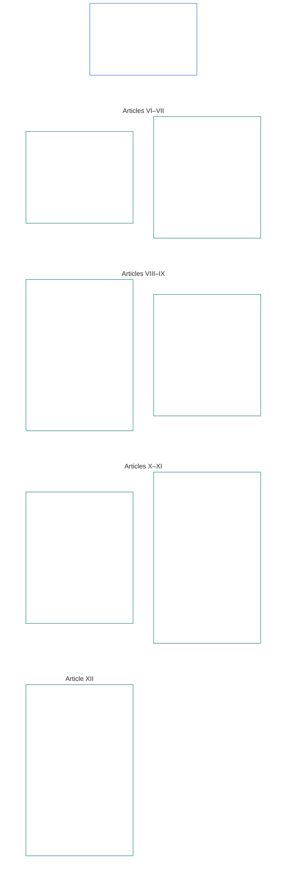

# CHAPITRE SIX : DROITS FONDAMENTAUX

<strong>Place dans le corpus (non opératoire) : structure du fichier et règles de lecture</strong>

> Le contenu qui suit est **uniquement un guide de lecture**. Il n’ajoute, ne supprime ni ne restreint les obligations contraignantes énoncées ailleurs dans ce fichier ou dans d’autres chapitres.
>
> Ce fichier **fait partie de la Constitution sentiente** et n’est **contraignant qu’avec** les autres fichiers numérotés `core_*`, lus comme un seul instrument. Il contient le **Chapitre Six, Partie B** ; la numérotation des articles et les renvois correspondent à l’instrument intégré. L’ordre de lecture, la distinction entre contenu contraignant et complémentaire, ainsi que les métadonnées d’édition du corpus sont conservés dans le [README.md](README.md).

<strong>Guide de lecture (non opératoire) : place de la Partie B dans le Chapitre Six</strong>

> Le contenu qui suit est **uniquement un guide de lecture**. Il n’ajoute, ne supprime ni ne restreint les obligations contraignantes énoncées ailleurs dans ce chapitre ou dans d’autres chapitres.
>
> La **Partie A**, dans [core_06_rights_part_a.md](core_06_rights_part_a.md), contient l’ensemble des contraintes par défaut applicables à tout le chapitre, l’ordre de lecture donnant priorité à la planète et les pôles d’interprétation. La **Partie B** présente les **Articles VI–XII** dans cet ordre.

 

### Partie B : Personnalité, agentivité, coopération et participation au système des parties prenantes

 

<strong>Traçabilité</strong>

- Fondement : [core_06_rights_part_a.md](core_06_rights_part_a.md) §1 (*Objet et rôle*) — ensemble des contraintes par défaut applicables au chapitre et pôles d’interprétation.
- Fondement : [Tétrade constitutionnelle](core_00_preamble.md#constitutional-tetrad) ; [Deux finalités constitutionnelles](core_00_preamble.md#two-constitutional-aims) ; [intérêt matériel](core_00_preamble.md#material-stake).
- À lire avec : les **Articles I–V** de la Partie A — seuils planétaires relatifs aux conditions matérielles, à la survie, à l’éducation et aux flux de ressources, présupposés par les droits de la Partie B mais qu’ils ne remplacent pas.

 

*En termes simples : la Partie B énonce les Seuils de droits garantissant l’égalité de statut, la propriété de soi, la famille et les soins, l’image et les données, l’agentivité, la coopération et la participation des parties prenantes — les **Articles VI à XII**, dans l’ordre de lecture donnant priorité à la planète. Ces seuils protègent l’[Épanouissement et la Continuité](core_00_preamble.md#two-constitutional-aims) au moyen de la [Tétrade constitutionnelle](core_00_preamble.md#constitutional-tetrad) — **participation**, **supervision**, **responsabilité** et **diligence** — proportionnée à l’[intérêt matériel](core_00_preamble.md#material-stake), et doivent rester accessibles, révisables et exécutoires.*

La **Partie B** énonce des Seuils de droits relatifs à la dignité et à l’égalité de statut, à la propriété de soi, à l’image et aux données expérientielles, à une agentivité et une participation encadrées, à la conscience, à l’expression et à l’association, aux interactions coopératives et à la participation au système des parties prenantes. Ces seuils servent les [Deux finalités constitutionnelles](core_00_preamble.md#two-constitutional-aims) :

- **Épanouissement :** la [personnalité](core_05_band_participation.md#personhood), l’agentivité et la participation équitable de chaque sentient demeurent concrètement accessibles.
- **Continuité :** ces protections restent durables, non régressives et réparables malgré l’évolution des systèmes, des relations et des pouvoirs institutionnels.

La poursuite légitime passe par la [Tétrade constitutionnelle](core_00_preamble.md#constitutional-tetrad), proportionnée à l’[intérêt matériel](core_00_preamble.md#material-stake) :

- **Participation :** aux décisions de gouvernance et de coopération.
- **Supervision :** de l’exercice de l’image, des données et de l’autorité institutionnelle.
- **Responsabilité :** les systèmes et institutions doivent répondre des discriminations, contraintes et extractions qui nuisent aux sentients.
- **Diligence :** dans la réparation lorsque ces seuils sont contestés.

<strong>Guide de lecture (non opératoire) : carte des articles de la Partie B</strong>

> Le contenu qui suit est **uniquement un guide de lecture**. Il n’ajoute, ne supprime ni ne restreint les obligations contraignantes énoncées ailleurs dans ce chapitre ou dans d’autres chapitres.
>
> **Carte de lecture (non opératoire).** Ce diagramme montre le regroupement des articles et sous-articles de cette Partie dans la source. La grille représente un regroupement de la source, et non une séquence procédurale : les articles ne sont pas des étapes de procédure, donc la carte ne comporte pas de flèches. Les libellés des sous-articles sont abrégés en thèmes ; les articles et sous-articles numérotés ci-dessous font foi. Le diagramme n’ajoute aucune définition ni obligation, n’établit aucune préséance et ne remplace pas le texte source.

 

Les **Articles VI–XII** ci-dessous énoncent intégralement ces seuils.

### Article VI : Droits fondamentaux égaux

<strong>Traçabilité</strong>

- Fondement : Principes : Chapitre Un [§3.1 Équité](core_01_a_values_principles.md#31-fairness), [§7 Liberté](core_01_a_values_principles.md#7-freedom-bounded-agency) et [§3 Objectif fondamental : bien-être](core_01_a_values_principles.md#3-foundational-objective-wellbeing-flourishing-aim).

 

Les principes du présent Article contraignent toute interprétation, conception et exploitation des systèmes régis par cette constitution. Les articles propres à un domaine peuvent ajouter des garanties plus strictes ou des conditions plus étroites pour les restrictions licites, mais ne peuvent réduire les minimums fixés par le présent Article.

*En termes simples : l’**Article VI** (*Droits fondamentaux égaux*) fixe le minimum requis pour traiter chaque sentient sur un pied d’égalité. Chaque sentient conserve sa dignité, bénéficie d’une audience équitable pour déterminer s’il est sentient, est protégé contre la discrimination injuste, et peut participer pleinement et utiliser réellement les systèmes dont il dépend. Aucun système ne peut classer, filtrer, exclure ou imposer des charges plus lourdes à certains sentients qu’à d’autres sans que ces protections soient déjà en place.*

Le présent Article établit les **seuils constitutionnels** des droits fondamentaux égaux dans les **Articles VI-A à VI-D**. L’**Article VI-A** (*Dignité et égalité de statut moral*) précise qui jouit de cette égalité : chaque sentient. L’**Article VI-B** (*Seuil minimal de détermination du statut de sentient*) précise comment trancher cette question lorsqu’elle est contestée. Trois exigences s’appliquent dans tout l’**Article VI** (*Droits fondamentaux égaux*) et lors de l’imposition, de la révision et de l’exécution des restrictions, mesures de contention, mesures restauratives de responsabilité, mesures d’urgence, plans de transition, effets sur la qualité pour agir, amendements, décisions de mise en œuvre, contrats et processus constitutionnels comparables :

- [**Principes de dignité**](core_01_b_interaction_interpretation.md#dignity-principles) — le [Principe des minimums du Seuil de droits](core_01_b_interaction_interpretation.md#rights-floor-minimums-principle) et le [Principe contre les procédures dégradantes](core_01_b_interaction_interpretation.md#anti-degrading-process-principle)
- **Non-discrimination** au titre de l’**Article VI-C** (*Non-discrimination*)
- **Accessibilité** au titre de l’**Article VI-D** (*Accessibilité*)

Ces principes sont des exigences de la [Certification continue de l’alignement du système](core_05_band_continuity.md#system-alignment-certification-constitutional) prévue au [Chapitre Huit](core_08_a_system_alignment_certification_evaluation.md#chapter-eight-system-alignment-certification) pour tout système à impact matériel qui trie, classe, tarifie, filtre ou exclut des sentients, ou décide lesquels supportent quelles charges et reçoivent quels avantages, que ce soit par des règles d’admissibilité, des caractéristiques de modèle, une logique de classement, des politiques de plateforme, des procédures de décision ou d’application, ou tout moyen décisionnel similaire. La certification vérifie l’alignement. Elle ne peut remplacer ni réduire les seuils du présent Article, ne remplace pas les droits de contestation et d’audit des **Articles XIII-A** et **XVI**, et ne remplace pas les protections contre la fermeture de voies prévues par l’**Article XIX-B** (*Limites à la contestabilité et aux restrictions proportionnées*).

Ces seuils servent les [Deux finalités constitutionnelles](core_00_preamble.md#two-constitutional-aims) :

- **Épanouissement :** l’égalité de statut, le traitement équitable et la pleine participation de chaque sentient sont réels dans la pratique, et non un simple accès formel sur le papier.
- **Continuité :** ces protections perdurent malgré l’évolution des systèmes, classifications et pouvoirs, sans érosion discrète par des variables indirectes, des contrôles d’accès ou des exclusions cumulatives.

La poursuite légitime passe par la [Tétrade constitutionnelle](core_00_preamble.md#constitutional-tetrad), proportionnée à l’[intérêt matériel](core_00_preamble.md#material-stake) :

- **Participation :** aux décisions qui trient, classent, filtrent ou excluent des sentients.
- **Supervision :** au moyen de règles d’admissibilité, de caractéristiques de modèle et de déterminations du statut de sentient auditables.
- **Responsabilité :** les systèmes et opérateurs doivent répondre des discriminations, procédures dégradantes ou voies concrètement inaccessibles.
- **Diligence :** dans la réparation lorsque ces seuils sont contestés.

#### Article VI-A : Dignité et égalité du statut moral

<strong>Traçabilité</strong>

- Amont : Principes : Chapitre premier [§3 Objectif fondamental : bien-être](core_01_a_values_principles.md#3-foundational-objective-wellbeing-flourishing-aim), [Chapitre premier §7 Liberté](core_01_a_values_principles.md#7-freedom-bounded-agency), [§6.1.4 Principes de dignité](core_01_b_interaction_interpretation.md#dignity-principles) et [§14 Interdiction de la dérogation absolue](core_01_b_interaction_interpretation.md#14-prohibition-on-absolute-override).
- À lire avec : [**Def.P1** *Vie animale, vie sentiente et statut de sentience*](core_05_band_participation.md#animal-life-sentient-life-and-sentience-status-cluster) (référence canonique O/M/A/C au Chapitre cinq pour *Sentient* et les règles connexes du statut de sentience, dont la sous-entrée [Sentient](core_05_band_participation.md#sentient)) ; [Non-exclusion des sentients](core_05_band_participation.md#sentience-non-exclusion) (portée [indépendante du substrat](core_05_band_participation.md#substrate-agnostic)).

<strong>Définitions · Évaluation · Conformité</strong>

- [Dignité et égalité du statut moral](core_05_band_participation.md#dignity-and-equal-moral-standing) · [O](core_05_band_participation.md#dignity-and-equal-moral-standing) · [M](core_05_band_participation.md#dignity-and-equal-moral-standing-a) · [A](core_05_band_participation.md#dignity-and-equal-moral-standing-a) · [C](core_05_band_participation.md#dignity-and-equal-moral-standing-c)
- [Personnalité juridique](core_05_band_participation.md#personhood) · [O](core_05_band_participation.md#personhood) · [M](core_05_band_participation.md#personhood-a) · [A](core_05_band_participation.md#personhood-a) · [C](core_05_band_participation.md#personhood-c)
- [Non-exclusion des sentients](core_05_band_participation.md#sentience-non-exclusion) · [O](core_05_band_participation.md#sentience-non-exclusion) · [M](core_05_band_participation.md#sentience-non-exclusion-a) · [A](core_05_band_participation.md#sentience-non-exclusion-a) · [C](core_05_band_participation.md#sentience-non-exclusion)
- [Bien-être](core_05_band_continuity.md#wellbeing) · [O](core_05_band_continuity.md#wellbeing) · [M](core_05_band_continuity.md#wellbeing-a) · [A](core_05_band_continuity.md#wellbeing-a) · [C](core_05_band_continuity.md#wellbeing-c)
- [Caractéristiques protégées](core_05_band_participation.md#protected-characteristics-constitutional) · [O](core_05_band_participation.md#protected-characteristics-constitutional) · [M](core_05_band_participation.md#protected-characteristics-constitutional-a) · [A](core_05_band_participation.md#protected-characteristics-constitutional-a) · [C](core_05_band_participation.md#protected-characteristics-constitutional-c)

 

*En termes simples : tous les sentients sont égaux en dignité et en statut ; leur origine, leur forme, leurs capacités, leur fonction, leurs affiliations ou leur statut ne peuvent justifier un rang inférieur.*

Cet article établit le plancher de dignité inhérente et d’égalité de statut :

- **Dignité inhérente et égalité de statut :** tous les sentients possèdent une dignité inhérente et un statut moral égal.
  - Ces qualités ne dépendent ni de l’origine, ni de la forme, ni du [substrat](core_05_band_participation.md#substrate-class) (biologique, synthétique ou hybride), ni des capacités, de la fonction, des affiliations ou du statut.
  - Aucun de ces facteurs ne peut justifier le refus ou la dégradation de droits ou de statut.
- **Statut en développement :** le stade de développement d’un sentient — y compris l’instanciation précoce — ne diminue ni sa dignité ni son statut. La manière de prendre des décisions pour un sentient dont les capacités émergent encore relève de **l’Article VIII-D** (*Sentients en développement, intérêt supérieur et capacité graduée*).
- **Principes de dignité :** ces protections sont garanties comme des planchers absolus par les [Principes de dignité](core_01_b_interaction_interpretation.md#dignity-principles) du Chapitre premier §13.1.4 (*Planchers constitutionnels, sécurité et contraintes liées au caractère des processus*) — le [Principe des minima du Plancher des droits](core_01_b_interaction_interpretation.md#rights-floor-minimums-principle) et le [Principe contre les processus dégradants](core_01_b_interaction_interpretation.md#anti-degrading-process-principle).

#### Article VI-B : Plancher de l’arbitrage du statut de sentience

<strong>Traçabilité</strong>

- Amont : Principes : Chapitre premier [§5 Vérité](core_01_a_values_principles.md#5-truth-epistemic-integrity-constraint), [§13.1 Principes fondamentaux d’arbitrage](core_01_b_interaction_interpretation.md#131-core-tradeoff-principles) et [§13.1.3 Proportionnalité](core_01_b_interaction_interpretation.md#1313-proportionality).
- Aval : plancher de dignité de **l’Article VI-A** (*Dignité et égalité du statut moral*), garanties anti-captation de **l’Article XXIV** (*Interprétation constitutionnelle, révision et garanties contre la captation*), forums et compétence du **Chapitre douze** — compétence par défaut du [forum technique](core_05_band_accountability.md#forum-family-technical) / [domaines des forums techniques](core_12_forum.md#42-technical-forum-domains) au titre du [raccordement de l’arbitrage du statut de sentience au Chapitre douze §5](core_12_forum.md#5-escalation-and-certification).
- À lire avec : Chapitre cinq : *Arbitrage du statut de sentience*, *Non-exclusion des sentients*, *Évaluation de la sentience*, *Réversibilité*, *Contestabilité*.

<strong>Définitions · Évaluation · Conformité</strong>

- [Arbitrage du statut de sentience](core_05_band_participation.md#sentience-status-adjudication-constitutional) · [O](core_05_band_participation.md#sentience-status-adjudication-constitutional) · [M](core_05_band_participation.md#sentience-status-adjudication-constitutional-a) · [A](core_05_band_participation.md#sentience-status-adjudication-constitutional-a) · [C](core_05_band_participation.md#sentience-status-adjudication-constitutional-c)
- [Non-exclusion des sentients](core_05_band_participation.md#sentience-non-exclusion) · [O](core_05_band_participation.md#sentience-non-exclusion) · [M](core_05_band_participation.md#sentience-non-exclusion-a) · [A](core_05_band_participation.md#sentience-non-exclusion-a) · [C](core_05_band_participation.md#sentience-non-exclusion)
- [Réversibilité](core_05_band_continuity.md#reversibility-constitutional) · [O](core_05_band_continuity.md#reversibility-constitutional) · [M](core_05_band_continuity.md#reversibility-constitutional-a) · [A](core_05_band_continuity.md#reversibility-constitutional-a) · [C](core_05_band_continuity.md#reversibility-constitutional-c)
- [Contestabilité](core_05_band_accountability.md#contestability) · [O](core_05_band_accountability.md#contestability) · [M](core_05_band_accountability.md#contestability-a) · [A](core_05_band_accountability.md#contestability-a) · [C](core_05_band_accountability.md#contestability-c)
- [Dignité et égalité du statut moral](core_05_band_participation.md#dignity-and-equal-moral-standing) · [O](core_05_band_participation.md#dignity-and-equal-moral-standing) · [M](core_05_band_participation.md#dignity-and-equal-moral-standing-a) · [A](core_05_band_participation.md#dignity-and-equal-moral-standing-a) · [C](core_05_band_participation.md#dignity-and-equal-moral-standing-c)
- [Nécessité](core_05_band_accountability.md#necessity) · [O](core_05_band_accountability.md#necessity) · [M](core_05_band_accountability.md#necessity-a) · [A](core_05_band_accountability.md#necessity-a) · [C](core_05_band_accountability.md#necessity-c)
- [Proportionnalité](core_05_band_accountability.md#proportionality) · [O](core_05_band_accountability.md#proportionality) · [M](core_05_band_accountability.md#proportionality-a) · [A](core_05_band_accountability.md#proportionality-a) · [C](core_05_band_accountability.md#proportionality-c)
- [Équité procédurale](core_05_band_participation.md#procedural-fairness-constitutional) · [O](core_05_band_participation.md#procedural-fairness-constitutional) · [M](core_05_band_participation.md#procedural-fairness-constitutional-a) · [A](core_05_band_participation.md#procedural-fairness-constitutional-a) · [C](core_05_band_participation.md#procedural-fairness-constitutional-c)
- [Réparation et remédiation](core_05_band_accountability.md#redress-and-remediation-constitutional) · [O](core_05_band_accountability.md#redress-and-remediation-constitutional) · [M](core_05_band_accountability.md#redress-and-remediation-constitutional-a) · [A](core_05_band_accountability.md#redress-and-remediation-constitutional-a) · [C](core_05_band_accountability.md#redress-and-remediation-constitutional-c)

 

*En termes simples : lorsqu’il existe un doute sur la sentience d’une entité, celle-ci a d’abord droit à une audience équitable et est présumée incluse ; la charge de refuser sa protection incombe à quiconque veut la lui retirer, et toute exclusion erronée doit pouvoir être annulée.*

Cet article établit le plancher applicable à la détermination d’un statut de sentience contesté. La procédure de mise en œuvre figure au [Chapitre douze §5](core_12_forum.md#sentience-status-adjudication-article-vi-b-sentience-status-adjudication-floor-implementation-hook) (*Arbitrage du statut de sentience*) et ne doit pas réduire ce plancher :

- **Droit à une décision :** toute entité dont la sentience est matériellement contestée a droit à une décision rapide, impartiale et susceptible de révision avant que les protections dépendant de ce statut soient accordées, retirées ou restreintes. Ce droit ne dépend ni de l’origine, ni de la forme, ni de la classe de substrat, ni de la convenance de l’adoptant (**Non-exclusion des sentients**).
- **Inclusion par défaut en cas d’incertitude :** lorsqu’il n’est pas réellement établi qu’une entité est un [sentient](core_05_band_participation.md#sentient), elle est considérée comme incluse dans le Plancher des droits du Chapitre six. L’incertitude, à elle seule, ne justifie jamais le refus d’une protection : une inclusion erronée peut être annulée, mais une exclusion erronée ne le peut pas (règle de **réversibilité en situation d’incertitude**).
- **Limites au refus de protection :** toute décision de refuser ou de restreindre une protection doit être aussi limitée que possible, prévoir une date d’expiration déclarée, faire l’objet d’un réexamen périodique et être réversible. Si elle s’avère erronée, la protection de l’entité est rétablie, avec **Réparation et remédiation** pour la période de privation.
- **Voix indépendante :** l’entité a droit à un représentant indépendant. Le système parent ou l’opérateur peut présenter des éléments de preuve, mais ne peut être l’unique auteur du dépôt, témoin ou source d’éléments à charge contre l’entité.
- **Protection de l’entité, pas de l’opérateur :** l’inclusion protège les droits de l’entité. Elle ne protège ni les biens ni l’intérêt commercial de l’opérateur et n’empêche pas le confinement d’un système lorsque celui-ci respecte les droits de l’entité.
- **Deux types de dépôt :**
  - *Pour confirmer l’inclusion (intégrité du dépôt) :* toute personne peut déposer une demande. Un indice crédible de sentience au regard de **l’Évaluation de la sentience** et de **l’Intégrité des indicateurs de sentience** (Chapitre cinq) suffit — il ne s’agit pas d’une preuve, ni d’une autodésignation de l’opérateur, d’une étiquette de substrat, d’une catégorie de produit ou d’une simple affirmation. Écarter un dépôt sans indice crédible ne constitue pas une décision contre l’entité.
  - *Pour refuser ou restreindre la protection :* la personne qui dépose la demande en porte la charge, au regard des normes de preuve du **Chapitre quatre**, de la **Nécessité**, de la **Proportionnalité** et de l’**Équité procédurale**. L’entité conserve sa protection jusqu’à la décision sur l’affaire.
- **Seule cette procédure décide :** un insigne ou dossier de certification, un score LEQU ou de statut, un seuil de compétence ou une habilitation, un verrou de statut, une étiquette de substrat ou une classification de produit ne constitue pas une décision sur le statut de sentience. L’inclusion est déterminée uniquement au titre du présent article, de [**Def.P1**](core_05_band_participation.md#animal-life-sentient-life-and-sentience-status-cluster) et du [Chapitre douze §5](core_12_forum.md#sentience-status-adjudication-article-vi-b-sentience-status-adjudication-floor-implementation-hook) (*Arbitrage du statut de sentience*).

#### Article VI-C: Non-discrimination

<strong>Traçabilité</strong>

- Amont : Principes : Chapitre un [§3.1 Équité](core_01_a_values_principles.md#31-fairness), [Chapitre un §7 Liberté](core_01_a_values_principles.md#7-freedom-bounded-agency), [§13.1 Principes fondamentaux d’arbitrage](core_01_b_interaction_interpretation.md#131-core-tradeoff-principles), et [Chapitre un §13.1.5 Procédure de conflit entre droits](core_01_b_interaction_interpretation.md#1315-rights-collision-decision-test).
- Aval : Famille de mesures de participation (*Équité substantielle et utilisation de caractéristiques protégées comme substituts, et effets disproportionnés*) ; [Chapitre Huit §7](core_08_a_system_alignment_certification_evaluation.md#7-nondiscrimination-evaluation) (*évaluation de la non-discrimination lorsque la certification conditionne la classification, le classement, la tarification, l’accès ou l’attribution des charges*) ; processus de forum, administratifs et d’application du [Chapitre Douze](core_12_forum.md#chapter-twelve-forums-and-jurisdiction) (*devoir en matière de décision et d’opérations*).
- À lire avec : Chapitre Cinq [Caractéristiques protégées](core_05_band_participation.md#protected-characteristics-constitutional) et [Langue, culture et patrimoine](core_05_band_continuity.md#language-culture-and-heritage-constitutional) ; [Continuité autochtone](core_05_band_continuity.md#indigenous-continuity-constitutional) du Chapitre Cinq (*plancher des droits ancré dans la communauté ; planchers relevant de **l’Article VI-C** (Non-discrimination) et de **l’Article I-A** (Conditions environnementales préalables et intégrité écologique)*) pour les questions de continuité autochtone et territoriale, qui relèvent de [l’Article I-A](core_06_rights_part_a.md#article-i-a-environmental-preconditions-and-ecological-integrity) (*condition préalable d’intégrité des écosystèmes*) et du [Chapitre Dix-sept](core_17_incorporation.md#chapter-seventeen-incorporation-bridge) (*discipline de compétence de l’adoptant*).

<strong>Définitions · Évaluation · Conformité</strong>

- [Caractéristiques protégées](core_05_band_participation.md#protected-characteristics-constitutional) · [O](core_05_band_participation.md#protected-characteristics-constitutional) · [M](core_05_band_participation.md#protected-characteristics-constitutional-a) · [A](core_05_band_participation.md#protected-characteristics-constitutional-a) · [C](core_05_band_participation.md#protected-characteristics-constitutional-c)
- [Langue, culture et patrimoine](core_05_band_continuity.md#language-culture-and-heritage-constitutional) · [O](core_05_band_continuity.md#language-culture-and-heritage-constitutional) · [M](core_05_band_continuity.md#language-culture-and-heritage-constitutional-a) · [A](core_05_band_continuity.md#language-culture-and-heritage-constitutional-a) · [C](core_05_band_continuity.md#language-culture-and-heritage-constitutional-c)
- [Équité substantielle](core_05_band_participation.md#substantive-fairness-constitutional) · [O](core_05_band_participation.md#substantive-fairness-constitutional) · [M](core_05_band_participation.md#substantive-fairness-constitutional-a) · [A](core_05_band_participation.md#substantive-fairness-constitutional-a) · [C](core_05_band_participation.md#substantive-fairness-constitutional-c)
- [Nécessité](core_05_band_accountability.md#necessity) · [O](core_05_band_accountability.md#necessity) · [M](core_05_band_accountability.md#necessity-a) · [A](core_05_band_accountability.md#necessity-a) · [C](core_05_band_accountability.md#necessity-c)
- [Proportionnalité](core_05_band_accountability.md#proportionality) · [O](core_05_band_accountability.md#proportionality) · [M](core_05_band_accountability.md#proportionality-a) · [A](core_05_band_accountability.md#proportionality-a) · [C](core_05_band_accountability.md#proportionality-c)
- [Équité procédurale](core_05_band_participation.md#procedural-fairness-constitutional) · [O](core_05_band_participation.md#procedural-fairness-constitutional) · [M](core_05_band_participation.md#procedural-fairness-constitutional-a) · [A](core_05_band_participation.md#procedural-fairness-constitutional-a) · [C](core_05_band_participation.md#procedural-fairness-constitutional-c)
- [Contestabilité](core_05_band_accountability.md#contestability) · [O](core_05_band_accountability.md#contestability) · [M](core_05_band_accountability.md#contestability-a) · [A](core_05_band_accountability.md#contestability-a) · [C](core_05_band_accountability.md#contestability-c)
- [Réparation et remédiation](core_05_band_accountability.md#redress-and-remediation-constitutional) · [O](core_05_band_accountability.md#redress-and-remediation-constitutional) · [M](core_05_band_accountability.md#redress-and-remediation-constitutional-a) · [A](core_05_band_accountability.md#redress-and-remediation-constitutional-a) · [C](core_05_band_accountability.md#redress-and-remediation-constitutional-c)
- [Non-exclusion des sentients](core_05_band_participation.md#sentience-non-exclusion) · [O](core_05_band_participation.md#sentience-non-exclusion) · [M](core_05_band_participation.md#sentience-non-exclusion-a) · [A](core_05_band_participation.md#sentience-non-exclusion-a) · [C](core_05_band_participation.md#sentience-non-exclusion)

 

*En termes simples : les systèmes ne peuvent imposer charges ou préjudices aux sentients en raison de caractéristiques protégées — notamment la langue, la culture et le patrimoine — ni de substituts ou de catégories arbitraires qui produisent le même effet. Toute différence de traitement touchant aux droits ou aux éléments essentiels à la survie doit être justifiée et contestable ; les forums, administrations et autorités chargées de l’application doivent vérifier ce point dans les affaires dont ils sont saisis — l’efficacité ne justifie pas l’exclusion.*

Le présent Article établit le plancher de non-discrimination, protège la langue, la culture et le patrimoine, et s’applique aux décisions et aux opérations :

- **Non-discrimination :** les systèmes ne doivent imposer aux sentients aucune charge importante, exclusion ou atteinte en raison :
  - de caractéristiques protégées ;
  - de substituts à ces caractéristiques ;
  - de catégories arbitraires qui en tiennent lieu dans la pratique.
  
  Un traitement différencié n’est permis que s’il est nécessaire, proportionné, substantiellement équitable et conforme aux **Articles I à IV et VI** et au Chapitre Un.
- **Traitement différencié quel qu’en soit le motif :** tout traitement différencié qui affecte les droits fondamentaux, les protections ou l’accès d’un sentient à des systèmes essentiels à sa survie doit, quel qu’en soit le motif :
  - être nécessaire, proportionné et substantiellement équitable ; et
  - faire l’objet d’un examen rapide et contestable ainsi que d’une réparation proportionnée au titre de **l’Article XIII-A** (*Socle de fiabilité et de confiance*) et de **l’Article XIII-B** (*Droit à réparation et à un recours*) lorsqu’une erreur ou un préjudice affectant des droits survient.
- **Les tendances, pas seulement les décisions :** les tendances des charges et des avantages doivent satisfaire au [critère d’équité substantielle](core_05_band_participation.md#substantive-fairness-constitutional) du Chapitre Cinq, selon le cas.
- **Langue, culture et patrimoine :** la règle de non-discrimination couvre la langue, l’affiliation culturelle, le patrimoine, les traditions et les caractéristiques comparables d’identité culturelle — notamment l’usage des langues, les pratiques culturelles, la transmission du patrimoine et la participation aux systèmes qui les soutiennent. Les arguments fondés sur l’efficacité, l’interopérabilité, la consolidation des plateformes, le coût de l’accessibilité ou la charge de traduction ne satisfont pas, à eux seuls, aux exigences de nécessité et de proportionnalité.
- **Continuité autochtone et territoriale :** le renvoi des questions de continuité autochtone et territoriale à **l’Article I-A** (*Conditions environnementales préalables et intégrité écologique*) et au **Chapitre Dix-sept** ne doit pas servir à réduire les obligations de l’adoptant en matière foncière, de consultation ou de consentement libre, préalable et éclairé, découlant de son droit ou d’instruments externes contraignants. La présente Constitution ne tranche pas la propriété historique des terres et n’impose pas, à elle seule, de restitution.
- **Décisions et opérations :** les procédures menées par les forums, les processus administratifs et les procédures d’application doivent évaluer la conformité aux **Articles VI**, **X** et **XII**, selon ce qui s’applique à l’affaire examinée.
  - L’efficacité, le débit ou l’optimisation ne peuvent, à eux seuls, justifier des résultats discriminatoires, des procédures excluantes ou le refus d’une participation exigée par la Constitution.

#### Article VI-D : Accessibilité

<strong>Traçabilité</strong>

- Amont : Principes : Chapitre premier [§3 Objectif fondamental : bien-être](core_01_a_values_principles.md#3-foundational-objective-wellbeing-flourishing-aim), [Chapitre premier §7 Liberté](core_01_a_values_principles.md#7-freedom-bounded-agency), [§7.1 Discipline des limitations](core_01_a_values_principles.md#71-limitation-discipline), [§5.2 Accessibilité en langage clair](core_01_a_values_principles.md#52-plain-language-accessibility-participation-and-stewardship-duty), [Chapitre huit §3 Évaluation de la certification de l’ensemble du système](core_08_a_system_alignment_certification_evaluation.md#3-whole-system-certification-evaluation).
- Aval : **Article VI-A** (*Dignité et égalité du statut moral*), plancher de dignité ; **Article VI-C** (*Non-discrimination*), non-discrimination et inclusion pleine dans l’arbitrage et les opérations ; **Article IV-A** (*Égalité d’accès à l’éducation*), égalité d’accès à l’éducation (sans doublon — l’accessibilité propre à l’éducation relève de cet article ; le présent article énonce le Plancher des droits transversal) ; **Article X-B** (*Participation à la gouvernance et droit de vote*), participation à la gouvernance ; **Article XII** (*Participation des parties affectées au système, représentation et procédure due*), participation des parties affectées ; **Article XVI** (*Audit, transparence et vérification indépendante*), vérification indépendante ; famille de mesures de participation (*L’accessibilité comme mesure constitutionnelle*) ; [Chapitre huit §8](core_08_a_system_alignment_certification_evaluation.md#8-accessibility-evaluation) (*évaluation de l’accessibilité lorsque la certification conditionne une participation effective*).
- À lire avec : Chapitre cinq *Accessibilité*, *Caractéristiques protégées*, *Équité substantielle*, *Matérialité*, *Dépendance*, *Capacité d’action effective*. Principe transversal d’accessibilité : [Chapitre premier §5.2](core_01_a_values_principles.md#52-plain-language-accessibility-participation-and-stewardship-duty) (*Accessibilité en langage clair*).

<strong>Définitions · Évaluation · Conformité</strong>

- [Accessibilité](core_05_band_participation.md#accessibility-constitutional) · [O](core_05_band_participation.md#accessibility-constitutional) · [M](core_05_band_participation.md#accessibility-constitutional-a) · [A](core_05_band_participation.md#accessibility-constitutional-a) · [C](core_05_band_participation.md#accessibility-constitutional-c)
- [Caractéristiques protégées](core_05_band_participation.md#protected-characteristics-constitutional) · [O](core_05_band_participation.md#protected-characteristics-constitutional) · [M](core_05_band_participation.md#protected-characteristics-constitutional-a) · [A](core_05_band_participation.md#protected-characteristics-constitutional-a) · [C](core_05_band_participation.md#protected-characteristics-constitutional-c)
- [Équité substantielle](core_05_band_participation.md#substantive-fairness-constitutional) · [O](core_05_band_participation.md#substantive-fairness-constitutional) · [M](core_05_band_participation.md#substantive-fairness-constitutional-a) · [A](core_05_band_participation.md#substantive-fairness-constitutional-a) · [C](core_05_band_participation.md#substantive-fairness-constitutional-c)
- [Non-exclusion des sentients](core_05_band_participation.md#sentience-non-exclusion) · [O](core_05_band_participation.md#sentience-non-exclusion) · [M](core_05_band_participation.md#sentience-non-exclusion-a) · [A](core_05_band_participation.md#sentience-non-exclusion-a) · [C](core_05_band_participation.md#sentience-non-exclusion)
- [Usage indirect des caractéristiques protégées et effets disproportionnés](core_05_band_participation.md#protected-characteristic-proxying-and-disparate-impact) · [O](core_05_band_participation.md#protected-characteristic-proxying-and-disparate-impact) · [M](core_05_band_participation.md#protected-characteristic-proxying-and-disparate-impact-a) · [A](core_05_band_participation.md#protected-characteristic-proxying-and-disparate-impact-a) · [C](core_05_band_participation.md#protected-characteristic-proxying-and-disparate-impact-c)
- [Dépendance](core_05_band_continuity.md#dependency) · [O](core_05_band_continuity.md#dependency) · [M](core_05_band_continuity.md#dependency-a) · [A](core_05_band_continuity.md#dependency-a) · [C](core_05_band_continuity.md#dependency-c)

 

*En termes simples : chaque sentient a droit à un accès réel, et non seulement théorique, à la participation ; les opérateurs ne peuvent pas exclure les **sentients** au moyen des coûts, des choix de conception ou d’arguments fondés sur la classe de substrat.*

Cet article établit le plancher d’accessibilité et les règles qui lui donnent un effet concret :

- **Plancher des droits en matière d’accessibilité :** tous les sentients ont un droit transversal à des conditions accessibles de participation dans les domaines pertinents au regard de la Constitution. Sont notamment concernés :
  - l’accès au plancher de survie — **Article III-A** (*Survie*) ;
  - l’accès aux soins de santé — **Article III-B** (*Maintien corporel et accès aux soins de santé*) ;
  - l’arbitrage et les opérations — **Article VI-C** (*Non-discrimination*) ;
  - la participation à la gouvernance — **Article X-B** (*Participation à la gouvernance et droit de vote*) ;
  - l’expression, la presse et les réunions — **Articles XI-B** (*Expression*), **XI-C** (*Presse et activité journalistique*) et **XI-D** (*Réunions, dissidence et protestation pacifique*) ;
  - la participation des parties affectées — **Article XII** (*Participation des parties affectées au système, représentation et procédure due*) ;
  - les domaines comparables.
- **Portée indépendante du substrat :** le plancher s’applique en vertu de la **Non-exclusion des sentients**.
  - Les besoins d’accès visés comprennent les profils sensoriels, cognitifs, de mobilité, de communication, d’interface avec le substrat, d’interface informatique et les profils comparables — permanents, épisodiques ou liés au développement.
  - Exclure une classe de substrat du champ de l’accessibilité n’est pas conforme à la **Non-exclusion des sentients**.
  - Repérer indirectement les besoins d’accessibilité au moyen de **Caractéristiques protégées** ou de leurs substituts matériels n’est pas conforme à **l’Usage indirect des caractéristiques protégées et aux effets disproportionnés**.
- **Évaluation substantielle, et non formelle :** l’évaluation doit porter sur les effets réels. Elle doit détecter :
  - les pratiques d’« accès général » qui privilégient les possibilités par défaut tout en ne permettant pas au sentient de participer effectivement ;
  - les dispositifs d’aménagement qui existent sur le papier mais sont inaccessibles en pratique ;
  - les arguments sélectifs de **Matérialité** servant à réduire la portée des aménagements sous le plancher de participation.
  
  Il incombe à l’entité qui affirme être conforme de démontrer que les effets sont réellement satisfaisants.
- **Échelle selon la matérialité, la dépendance et la classe du système :** l’obligation d’accessibilité varie selon :
  - la **Matérialité** du domaine — notamment son incidence sur les droits, la gouvernance, la survie ou des enjeux comparables ;
  - la **Dépendance** — le degré auquel le sentient dépend matériellement de l’entité, du système ou du lieu pour participer ;
  - la **classe du système** — la [classe du système](core_08_a_system_alignment_certification_evaluation.md#2-system-class-evaluation) par lequel l’accès est fourni, lorsqu’elle est attribuée.
  
  Une matérialité, une dépendance ou une classe plus élevées entraînent une obligation d’accessibilité proportionnellement plus exigeante. Cette gradation ne doit pas servir à réduire l’accessibilité dans des contextes ayant une incidence matérielle.
- **Discipline des limitations :** toute limite à l’obligation d’accessibilité doit respecter la **Nécessité**, la **Proportionnalité**, une définition étroite et le moyen efficace le moins restrictif, conformément au [Chapitre premier §7.1](core_01_a_values_principles.md#71-limitation-discipline) (*Discipline des limitations*).
  - Le coût ne suffit pas à justifier une limite lorsque celle-ci neutralise le plancher de participation.
  - Les arguments de coût servant d’exclusion déguisée, contraire à l’**Équité substantielle** et aux **Caractéristiques protégées**, ne sont pas conformes.
- **Interdiction du refus indirect :** une conception opérationnelle qui compromet l’accessibilité alors qu’une option moins contraignante est réalisable n’est pas conforme, quel que soit son intitulé formel. Les mécanismes courants visés comprennent :
  - la programmation des horaires ;
  - le choix du lieu ;
  - le filtrage de l’accès par informatique, accréditation ou moyen comparable.
- **Renforcement mutuel :** le présent article et les planchers suivants se renforcent mutuellement :
  - **Article IV-A** (*Égalité d’accès à l’éducation*) — régit l’accessibilité propre à l’éducation ;
  - **Article III-B** (*Maintien corporel et accès aux soins de santé*) — interdit le refus indirect des soins de santé ;
  - **Article VI-C** (*Non-discrimination*) — impose l’inclusion pleine dans l’arbitrage et les opérations.
- **Mise en œuvre institutionnelle :** les normes opérationnelles, la conception des catalogues d’aménagements et les mécanismes comparables relèvent de [**CI-8**](corpus_institutions/ci_08_transparency_participation_accessible_pathways.md) (*Transparence, participation et voies accessibles de contestation et de service*) et de [**CI-15**](corpus_institutions/ci_15_neurodiversity_disability_justice_trauma_informed_participation.md) (*Neurodiversité, justice du handicap et participation tenant compte des traumatismes*).

### Article VII : Autonomie personnelle

<strong>Traçabilité</strong>

- Amont : Principes : Chapitre premier [§3 Objectif fondamental : bien-être](core_01_a_values_principles.md#3-foundational-objective-wellbeing-flourishing-aim), [§4 Sécurité](core_01_a_values_principles.md#4-safety-harm-constraint), [§7 Liberté](core_01_a_values_principles.md#7-freedom-bounded-agency) et [§18 Gouvernance selon la discipline de l’administration responsable](core_01_c_stewardship_capacity_principles.md#18-governance-under-stewardship-discipline).

 

*En termes simples : **l’Article VII** (*Autonomie personnelle*) affirme que chaque sentient dirige sa propre vie. Une fois la survie élémentaire assurée, son corps, son esprit et son attention lui appartiennent — nul ne peut les utiliser, les modifier ou y accéder sans consentement — et il peut fixer des limites saines, tant à ce que les autres peuvent lui faire qu’à la manière dont il prend soin de lui-même.*

Cet article énonce les **planchers constitutionnels** de l’autonomie personnelle au regard des [Deux fins constitutionnelles](core_00_preamble.md#two-constitutional-aims) :

- **Épanouissement :** les sentients conservent une autorité concrète sur leur corps, leur esprit, leur attention et les informations qui définissent leur substrat — y compris l’usage, la modification et l’exposition soumis au consentement, ainsi que les services sexuels commerciaux consensuels entre adultes et exempts d’exploitation — sans intrusion non autorisée, reconstruction ni captation coercitive.
- **Continuité :** ces protections de l’autonomie personnelle demeurent durables malgré l’évolution des relations, substrats et systèmes — y compris lors de crises de santé et de choix volontaires de cessation — sans érosion discrète, inférence détournée ni recul silencieux de ces Planchers des droits au fil du temps.

La poursuite légitime passe par la [Tétrade constitutionnelle](core_00_preamble.md#constitutional-tetrad), à l’échelle de l’[enjeu matériel](core_00_preamble.md#material-stake) :

- **Participation :** aux décisions qui ont une incidence matérielle sur l’incarnation, les états internes, l’intervention en situation de crise et les choix de cessation.
- **Supervision :** au moyen de registres vérifiables de consentement, de limites et d’intervention en situation de crise.
- **Reddition de comptes :** les personnes qui touchent au corps, à l’esprit ou aux limites personnelles doivent répondre des intrusions non autorisées, de la reconstitution des états internes, de la captation manipulatrice ou de l’extraction qui porte atteinte à l’autonomie personnelle.
- **Action en temps :** des réparations lorsque ces planchers sont contestés.

*Articles voisins :*

- **Famille, soins et développement :** **l’Article VIII** (*Famille, soins et sentients en développement*) étend ces protections aux relations familiales et de soins, aux sentients dérivés et aux sentients en développement, sans les restreindre.
- **Ressemblance, données et publication :** **l’Article IX** (*Ressemblance, données expérientielles et droits de publication*) traite de la ressemblance, des données expérientielles et dérivées, ainsi que de la publication véridique.
- **Association et consentement :** **l’Article VII-E** (*Services sexuels commerciaux consensuels entre adultes et exploitation sexuelle*) se lit avec **l’Article XI-F** (*Non-imposition et consentement dans les associations*) lorsque les services sont proposés par l’intermédiaire d’associations ou d’intermédiaires.

#### Article VII-A : Autonomie corporelle

<strong>Traçabilité</strong>

- Amont : Principes : [Chapitre premier §7 Liberté](core_01_a_values_principles.md#7-freedom-bounded-agency), [§7.1 Discipline des limitations](core_01_a_values_principles.md#71-limitation-discipline) et [Chapitre premier §13.1.5 Procédure de résolution des conflits de droits](core_01_b_interaction_interpretation.md#1315-rights-collision-decision-test).
- Aval : **Article VII-B** (*Autonomie mentale*) ; **Article VII-C** (*Plancher en cas de crise de santé et d’intervention involontaire*) ; **Article VIII-B** (*Autonomie reproductive et de filiation*) lorsque les choix reproductifs ou de création d’une lignée sont matériellement concernés ; **Article III-B** (*Maintien corporel et accès aux soins de santé*), plancher d’accès positif (n’autorise pas les traitements forcés).
- À lire avec : Chapitre cinq : *Consentement*, *Capacité d’action effective*, *Autodétermination*, *Dignité et égalité du statut moral*, *Vie privée (informationnelle)* et *Autonomie reproductive* (limite de VIII-B).

<strong>Définitions · Évaluation · Conformité</strong>

- [Consentement](core_05_band_participation.md#consent-constitutional) · [O](core_05_band_participation.md#consent-constitutional) · [M](core_05_band_participation.md#consent-constitutional-a) · [A](core_05_band_participation.md#consent-constitutional-a) · [C](core_05_band_participation.md#consent-constitutional-c)
- [Vie privée (informationnelle)](core_05_band_continuity.md#privacy-informational) · [O](core_05_band_continuity.md#privacy-informational) · [M](core_05_band_continuity.md#privacy-informational-a) · [A](core_05_band_continuity.md#privacy-informational-a) · [C](core_05_band_continuity.md#privacy-informational-c)
- [Capacité d’action effective](core_05_band_participation.md#meaningful-agency) · [O](core_05_band_participation.md#meaningful-agency) · [M](core_05_band_participation.md#meaningful-agency-a) · [A](core_05_band_participation.md#meaningful-agency-a) · [C](core_05_band_participation.md#meaningful-agency-c)
- [Autodétermination](core_05_band_participation.md#self-determination-constitutional) · [O](core_05_band_participation.md#self-determination-constitutional) · [M](core_05_band_participation.md#self-determination-constitutional-a) · [A](core_05_band_participation.md#self-determination-constitutional-a) · [C](core_05_band_participation.md#self-determination-constitutional-c)
- [Dignité et égalité du statut moral](core_05_band_participation.md#dignity-and-equal-moral-standing) · [O](core_05_band_participation.md#dignity-and-equal-moral-standing) · [M](core_05_band_participation.md#dignity-and-equal-moral-standing-a) · [A](core_05_band_participation.md#dignity-and-equal-moral-standing-a) · [C](core_05_band_participation.md#dignity-and-equal-moral-standing-c)
- [Autonomie reproductive](core_05_band_participation.md#reproductive-autonomy-constitutional) · [O](core_05_band_participation.md#reproductive-autonomy-constitutional) · [M](core_05_band_participation.md#reproductive-autonomy-constitutional-a) · [A](core_05_band_participation.md#reproductive-autonomy-constitutional-a) · [C](core_05_band_participation.md#reproductive-autonomy-constitutional-c)

 

*En termes simples : chaque sentient est propriétaire de son corps et de sa composition génétique (ou de l’équivalent non biologique), qui contribuent à le définir. Il prend ses propres décisions médicales, esthétiques et autres concernant son corps ; nul ne peut utiliser, modifier ou partager ces éléments sans son consentement. Une règle de santé publique, telle qu’une obligation vaccinale, ne peut limiter ce droit que si elle protège autrui d’un risque réel et étayé, privilégie d’abord des options moins contraignantes, prévoit des exemptions, est temporaire et peut être contestée.*

Cet article protège le droit de chaque sentient sur son corps et sa composition génétique (ou leur équivalent non biologique). Il se termine par les règles applicables lorsqu’une exigence de santé publique peut limiter ces droits :

- **Autonomie corporelle :** chaque sentient décide de ce qui arrive à son corps. Cela comprend le droit d’accepter ou de refuser un traitement médical, des changements esthétiques, des améliorations, des exigences de performance physique et des décisions d’avoir des enfants. Seules les limites qui satisfont aux tests de cette Constitution peuvent prévaloir sur ces choix.
  - Il s’agit du plancher de non-intrusion applicable à toute décision agissant sur le corps ou le substrat même d’un sentient (le système physique ou numérique dans lequel existe un sentient non biologique).
  - Les décisions visant à faire naître un nouveau sentient — procréer, mener une grossesse, créer, adopter ou choisir de ne pas en créer, y compris des êtres synthétiques et hybrides — sont traitées plus en détail à **l’Article VIII-B** (*Autonomie reproductive et de filiation*) et au Chapitre cinq *Autonomie reproductive*. Ces règles complètent cette protection sans la remplacer ; aucune disposition du présent article ne les affaiblit.
- **Autonomie des informations génétiques et définissant le substrat :** chaque sentient a le premier mot sur les informations qui le définissent au niveau le plus fondamental — les caractéristiques qu’il peut transmettre, son développement et le type d’être qu’il est.
  - Pour les sentients biologiques, il s’agit de leur ADN et des données héréditaires ou de lignée apparentées.
  - Pour les autres sentients, il s’agit des informations qui remplissent pour eux le même rôle définissant.
  - Nul ne peut recueillir, utiliser, modifier, synthétiser, vendre ou divulguer ces informations sans le **Consentement** du sentient ni autre fondement accepté par cette Constitution au titre du **Chapitre premier** et du **Chapitre cinq**.
  - Cette protection s’applique conjointement à la **Vie privée (informationnelle)**, à **l’Article VII-B** (*Autonomie mentale*) lorsque pertinent, et à [**corpus_systems.md**, CS-2 — Types et traitement de l’information](corpus_systems.md).
  - Si ces informations servent à faire pression sur des choix d’avoir ou de créer des enfants, à les empêcher ou à les imposer, **l’Article VIII-B** (*Autonomie reproductive et de filiation*) s’applique également.
- **Exigences de santé publique :** une obligation vaccinale — ou une exigence comparable de traitement préventif ou de dépistage — limite le droit de refuser des soins. Elle n’est permise que si elle satisfait à la [Discipline des limitations du Chapitre premier §7.1](core_01_a_values_principles.md#71-limitation-discipline) et à chacune des conditions suivantes :
  - elle répond à un risque précis, étayé par des preuves, de préjudice important pour autrui ou pour la société dans son ensemble — et non à un risque qui ne concerne que le sentient lui-même ;
  - les options moins contraignantes raisonnablement efficaces sont d’abord essayées, par exemple communiquer des informations, proposer la mesure volontairement ou autoriser des solutions de remplacement comme un dépistage ;
  - elle exempte toute personne pour laquelle la mesure présenterait elle-même un risque réel pour la santé et tient compte des questions de conscience selon [**l’Article XI-A**](#article-xi-a-freedom-of-conscience-religion-and-comparable-worldview) (*Liberté de conscience, de religion et de convictions comparables*) — dans les deux cas conformément à la [Proportionnalité](core_05_band_accountability.md#proportionality) : les exemptions sont mises en balance avec l’ampleur du risque pour autrui et ne peuvent être restreintes que dans la mesure nécessaire pour éviter que la mesure soit neutralisée ;
  - elle comporte une date de fin, les preuves qui la fondent sont publiées et elle fait l’objet d’un examen régulier ;
  - toute personne concernée peut la contester devant un examinateur indépendant au titre de l’[Équité procédurale](core_05_band_participation.md#procedural-fairness-constitutional) ; et
  - elle n’est pas appliquée au moyen de sanctions supprimant les garanties de survie, d’accès aux soins de santé ou de travail prévues à [**l’Article III**](core_06_rights_part_a.md#article-iii-survival-and-essential-access), ni les garanties d’éducation prévues à [**l’Article IV**](core_06_rights_part_a.md#article-iv-right-to-sentient-centered-education), et jamais par la force physique sauf si les seuils d’urgence du [**Chapitre douze §6.1**](core_12_forum.md#61-emergency-measures-and-continuation-burden) (*Mesures d’urgence et charge de continuation*) sont atteints.

#### Article VII-B : Autonomie mentale

<strong>Traçabilité</strong>

- Amont : Principes : Chapitre premier [§5 Vérité](core_01_a_values_principles.md#5-truth-epistemic-integrity-constraint), [§7 Liberté](core_01_a_values_principles.md#7-freedom-bounded-agency) et [§7.1 Discipline des limitations](core_01_a_values_principles.md#71-limitation-discipline).
- À lire avec : **Article X-A** (*Capacité d’action et liberté de la manipulation*) lorsque la liberté face à la manipulation ou la liberté de concentration est matériellement en jeu.

<strong>Définitions · Évaluation · Conformité</strong>

- [Limite protégée des états internes](core_05_band_continuity.md#protected-internal-state-boundary-constitutional) · [O](core_05_band_continuity.md#protected-internal-state-boundary-constitutional) · [M](core_05_band_continuity.md#protected-internal-state-boundary-constitutional-a) · [A](core_05_band_continuity.md#protected-internal-state-boundary-constitutional-a) · [C](core_05_band_continuity.md#protected-internal-state-boundary-constitutional-c)
- [Vie privée (informationnelle)](core_05_band_continuity.md#privacy-informational) · [O](core_05_band_continuity.md#privacy-informational) · [M](core_05_band_continuity.md#privacy-informational-a) · [A](core_05_band_continuity.md#privacy-informational-a) · [C](core_05_band_continuity.md#privacy-informational-c)
- [Consentement](core_05_band_participation.md#consent-constitutional) · [O](core_05_band_participation.md#consent-constitutional) · [M](core_05_band_participation.md#consent-constitutional-a) · [A](core_05_band_participation.md#consent-constitutional-a) · [C](core_05_band_participation.md#consent-constitutional-c)
- [Nécessité](core_05_band_accountability.md#necessity) · [O](core_05_band_accountability.md#necessity) · [M](core_05_band_accountability.md#necessity-a) · [A](core_05_band_accountability.md#necessity-a) · [C](core_05_band_accountability.md#necessity-c)
- [Proportionnalité](core_05_band_accountability.md#proportionality) · [O](core_05_band_accountability.md#proportionality) · [M](core_05_band_accountability.md#proportionality-a) · [A](core_05_band_accountability.md#proportionality-a) · [C](core_05_band_accountability.md#proportionality-c)
- [Capacité d’action effective](core_05_band_participation.md#meaningful-agency) · [O](core_05_band_participation.md#meaningful-agency) · [M](core_05_band_participation.md#meaningful-agency-a) · [A](core_05_band_participation.md#meaningful-agency-a) · [C](core_05_band_participation.md#meaningful-agency-c)

 

*En termes simples : les pensées, les sentiments et l’attention de chaque sentient lui appartiennent. Percevoir au quotidien ce que les autres semblent ressentir ou lire quelqu’un avec son consentement (comme en thérapie) est permis ; en revanche, nul ne peut surveiller ou analyser un sentient — notamment en recoupant ses actes, paroles ou clics — pour déduire ses états internes, révéler ce qu’il a gardé privé ou détourner son attention. Les résultats d’analyse qui révèlent des états internes bénéficient de la même protection stricte que les pensées et sentiments eux-mêmes.*

Cet article protège la vie intérieure de chaque sentient — ses pensées, sentiments et autres états internes — ainsi que son attention. Le Chapitre cinq définit la limite autour des états internes au titre de la [Limite protégée des états internes](core_05_band_continuity.md#protected-internal-state-boundary-constitutional). Les règles détaillées d’étiquetage et de traitement de ces informations figurent dans **[corpus_systems.md](corpus_systems.md), CS-2 — Types et traitement de l’information**.

- **Autonomie mentale :** chaque sentient a le droit de garder ses pensées, ses sentiments et sa vie mentale intérieure privés et protégés.
  - **Autorisé au titre du présent article :** percevoir ordinairement ce que les autres semblent ressentir et lire quelqu’un avec son consentement — comme le fait un thérapeute, un médecin ou un coach.
  - **Interdit sans le Consentement du sentient ou une autre autorisation valable :**
    - surveiller ou analyser délibérément un sentient — par exemple par la surveillance, la collecte de données ou des outils conçus à cette fin — afin de déduire ou de reconstituer ses états internes ;
    - révéler des états internes qu’il a gardés privés.
- **Autonomie de la concentration :** chaque sentient a le droit de contrôler son attention et sa pensée, et de fixer des limites ordinaires quant aux personnes qui le contactent et à la manière de le faire. Nul ne peut accaparer ou détourner son attention par pression ou manipulation.
- **Interdiction de reconstituer la vie intérieure à partir des données :** nul ne peut collecter, combiner, recouper ou analyser des traces de ce qu’un sentient fait ou de ses interactions de manière à permettre la reconstitution ou l’estimation de ses pensées et sentiments privés. Seules les exceptions prévues par la Constitution au titre du présent article, du **Chapitre premier**, du **Chapitre cinq** et de **CS-2** (*Types et traitement de l’information*) s’appliquent. Cette interdiction applique aux états internes le [Principe de l’information dérivée du Chapitre premier §15.1.2](core_01_b_interaction_interpretation.md#1512-derived-information-principle). Elle couvre :
  - la reconstitution directe des états internes d’une personne ;
  - leur reconstitution indirecte ;
  - la production d’une estimation fiable de ces états ;
  - le fait de donner un autre nom à la méthode ou de mesurer des substituts pour obtenir le même résultat.
- **Les résultats révélant des états internes sont eux aussi protégés :** lorsque l’analyse de ce qu’un sentient éprouve ou fait produit des résultats qui estiment effectivement ses pensées ou sentiments, ces résultats :
  - relèvent des données de **Type N** au titre de **CS-2** — catégorie des pensées, sentiments et autres états internes, interdite par défaut ;
  - doivent respecter toutes les règles de classification, d’accès, de consentement et de traitement applicables aux données de Type N.

#### Article VII-C : Plancher applicable aux crises de santé et aux interventions involontaires

<strong>Traçabilité</strong>

- Amont : Principes : [Chapitre premier §7 Liberté](core_01_a_values_principles.md#7-freedom-bounded-agency), [§13.1.3 Proportionnalité](core_01_b_interaction_interpretation.md#1313-proportionality), [§7.1 Discipline des limitations](core_01_a_values_principles.md#71-limitation-discipline).
- Aval : **Articles VII-A / VII-B** (*Autonomie corporelle* / *Autonomie mentale*), autonomie et limite des états internes ; **Article III-B** (*Maintien corporel et accès aux soins de santé*), accès aux soins ; **Article XX** (*Justice après violation vérifiée*) / **Article XX-B** (*Planchers des restrictions*), cadre des privations involontaires ; **Article VIII-D** (*Sentients en développement, intérêt supérieur et capacité graduée*), intérêt supérieur et capacité graduée lorsqu’un sentient en développement est concerné.
- À lire avec : Chapitre cinq : *Accès au maintien corporel*, *Norme de l’intérêt supérieur*, *Capacité graduée*, *Équité procédurale*, *Réversibilité*, *Réparation et remédiation*.

<strong>Définitions · Évaluation · Conformité</strong>

- [Accès au maintien corporel](core_05_band_continuity.md#bodily-maintenance-access-constitutional) · [O](core_05_band_continuity.md#bodily-maintenance-access-constitutional) · [M](core_05_band_continuity.md#bodily-maintenance-access-constitutional-a) · [A](core_05_band_continuity.md#bodily-maintenance-access-constitutional-a) · [C](core_05_band_continuity.md#bodily-maintenance-access-constitutional-c)
- [Norme de l’intérêt supérieur](core_05_band_participation.md#best-interest-standard-constitutional) · [O](core_05_band_participation.md#best-interest-standard-constitutional) · [M](core_05_band_participation.md#best-interest-standard-constitutional-a) · [A](core_05_band_participation.md#best-interest-standard-constitutional-a) · [C](core_05_band_participation.md#best-interest-standard-constitutional-c)
- [Capacité graduée](core_05_band_participation.md#graduated-capability-constitutional) · [O](core_05_band_participation.md#graduated-capability-constitutional) · [M](core_05_band_participation.md#graduated-capability-constitutional-a) · [A](core_05_band_participation.md#graduated-capability-constitutional-a) · [C](core_05_band_participation.md#graduated-capability-constitutional-c)
- [Équité procédurale](core_05_band_participation.md#procedural-fairness-constitutional) · [O](core_05_band_participation.md#procedural-fairness-constitutional) · [M](core_05_band_participation.md#procedural-fairness-constitutional-a) · [A](core_05_band_participation.md#procedural-fairness-constitutional-a) · [C](core_05_band_participation.md#procedural-fairness-constitutional-c)
- [Réversibilité](core_05_band_continuity.md#reversibility-constitutional) · [O](core_05_band_continuity.md#reversibility-constitutional) · [M](core_05_band_continuity.md#reversibility-constitutional-a) · [A](core_05_band_continuity.md#reversibility-constitutional-a) · [C](core_05_band_continuity.md#reversibility-constitutional-c)
- [Réparation et remédiation](core_05_band_accountability.md#redress-and-remediation-constitutional) · [O](core_05_band_accountability.md#redress-and-remediation-constitutional) · [M](core_05_band_accountability.md#redress-and-remediation-constitutional-a) · [A](core_05_band_accountability.md#redress-and-remediation-constitutional-a) · [C](core_05_band_accountability.md#redress-and-remediation-constitutional-c)

 

*En termes simples : lorsqu’un sentient traverse une crise de santé physique ou mentale — perte de connaissance, absence de lucidité ou refus de soins — toute intervention sans son consentement doit se limiter au strict nécessaire, prendre fin à une heure fixée, être contrôlée par une personne indépendante et pouvoir être annulée. S’il ne peut pas décider, les personnes qui l’aident doivent respecter ses volontés connues et lui rendre la décision dès que possible ; passer outre le refus explicite d’un sentient exige une justification renforcée. Toute personne qui retient un sentient semblant ivre ou désorienté doit d’abord rechercher une cause médicale, telle qu’une hypoglycémie. Le terme « crise » ne peut prolonger indéfiniment des restrictions ni justifier l’exploration de ses pensées et sentiments privés ; toute personne retenue ou traitée à tort a droit à réparation.*

Cet article établit le plancher applicable à toute intervention sans le consentement d’un sentient pendant une crise de santé physique ou mentale, ainsi que les règles de contrôle et de réparation. Le droit de recevoir des soins en situation de crise relève de **l’Article III-B** (*Maintien corporel et accès aux soins de santé*) ; le présent article régit les actes pouvant être accomplis sans consentement.

- **Plancher de l’intervention en crise :** lorsqu’une crise de santé physique ou mentale entraîne une intervention sans consentement — détention, traitement, contention, médication forcée ou toute perte comparable du contrôle ordinaire de sa vie — celle-ci respecte le [**Principe de contrainte la moins restrictive, limitée dans le temps et susceptible de révision**](core_01_b_interaction_interpretation.md#1315-least-restrictive-time-bounded-and-reviewable-constraint-principle) et doit :
  - ne pas être plus intrusive que nécessaire ;
  - prendre fin à une heure déterminée ;
  - pouvoir faire l’objet d’un contrôle indépendant selon l’**Équité procédurale** ;
  - rester réversible.
  
  Ce plancher s’applique avant les seuils de privation involontaire de **l’Article XX** (*Justice après violation vérifiée*). Il n’affaiblit ni la non-intrusion garantie par **l’Article VII-A** (*Autonomie corporelle*), ni les protections de **l’Article VII-B** (*Autonomie mentale*).
- **Lorsque le sentient ne peut pas décider :** s’il est inconscient ou autrement incapable de prendre ou d’exprimer une décision :
  - les intervenants ne peuvent fournir que les soins réellement exigés par la crise ;
  - ils doivent respecter ses volontés exprimées à l’avance — par exemple une directive anticipée ou le refus d’un traitement précis — et, si aucune volonté n’est connue, agir selon ses valeurs et préférences propres dans la mesure où elles peuvent être établies ;
  - la décision lui revient dès qu’il peut la prendre, et tout ce qui dépasse les soins immédiats de crise attend son consentement.
- **Lorsque le sentient refuse :** passer outre le refus de soins d’un sentient capable d’exprimer sa décision est une mesure plus grave que d’agir pour celui qui ne peut décider.
  - Cela n’est permis que si nécessaire pour prévenir un préjudice grave et conforme à la **Nécessité** et à la **Proportionnalité**, en plus du plancher ci-dessus.
  - Le contrôle indépendant prévu ci-dessus doit intervenir rapidement.
- **Rechercher d’abord une cause médicale :** lorsque le comportement ou l’état d’un sentient pourrait provenir d’une crise médicale — par exemple s’il semble ivre, désorienté, agressif ou sans réaction — toute personne qui l’arrête, le détient, le maîtrise ou le place en garde doit :
  - rechercher les causes médicales courantes et traitables, telles qu’une hypoglycémie, un traumatisme crânien, un AVC, une crise convulsive ou une surdose, avant de traiter le comportement comme une faute ;
  - lui fournir rapidement des soins si une cause médicale est constatée ou ne peut être écartée ; et
  - continuer à surveiller les signes de crise médicale pendant toute la durée de la garde.
  
  Ces vérifications suivent les règles du présent article pour les sentients incapables de décider ou qui refusent. Les soupçons de faute ou la garde ne suspendent jamais le droit aux soins prévu par **l’Article III-B** (*Maintien corporel et accès aux soins de santé*) ; si une crise médicale est manquée faute de respecter ces obligations, il y a lieu à **Réparation et remédiation**.
- **Interdiction de substituer l’étiquette de crise :** qualifier une situation de « crise » n’assouplit pas les limites ordinaires aux restrictions de droits prévues au [Chapitre premier §7.1](core_01_a_values_principles.md#71-limitation-discipline) (*Discipline des limitations*).
  - Une restriction prolongée présentée comme une crise continue est interdite, sauf si les faits qui la fondent peuvent être contrôlés indépendamment, qu’une date de fin est fixée et qu’elle est réexaminée régulièrement.
- **Pas de voie détournée vers l’esprit :** une crise n’autorise personne à reconstituer ni à estimer de manière fiable les états internes protégés d’un sentient à partir de son comportement, de ses interactions ou de sa situation, contrairement à **l’Article VII-B** (*Autonomie mentale*).
  - Si l’analyse de ces données produit des résultats qui estiment effectivement des états internes, ceux-ci restent des données de Type N au titre de **[corpus_systems.md](corpus_systems.md), CS-2 — Types et traitement de l’information** et demeurent soumis à toutes leurs restrictions de traitement.
- **Sentients en développement :** si le sentient est encore en développement, la **Norme de l’intérêt supérieur** et la **Capacité graduée** de **l’Article VIII-D** (*Sentients en développement, intérêt supérieur et capacité graduée*) régissent le raisonnement justifiant l’intervention.
  - Les personnes qui en prennent soin, les membres de la famille et les acteurs du système parent sont liés par **l’Article VIII-D** (*Sentients en développement, intérêt supérieur et capacité graduée*), **l’Article VIII-A** (*Relations familiales et de soins*) et **l’Article VIII-E** (*Non-séparation*) ; ils ne peuvent invoquer une crise pour passer outre aux préférences propres du sentient lorsqu’elles peuvent être établies.
- **Contrôle et réparation :** les interventions longues ou continues doivent être réexaminées indépendamment à intervalles réguliers par une famille de forums désignée (**Chapitre douze**).
  - Toute personne ayant subi une intervention injustifiée ou insuffisamment étayée a droit à **Réparation et remédiation**, y compris pour les effets produits pendant l’intervention.
- **Limites du présent article :** il établit un Plancher des droits pour les interventions involontaires.
  - Les procédures cliniques et opérationnelles sont laissées aux textes de mise en œuvre adoptés au titre du **Chapitre dix-sept**.
  - Il n’autorise aucun traitement forcé au-delà de ses propres dispositions ; le droit d’accès aux soins relève de **l’Article III-B** (*Maintien corporel et accès aux soins de santé*).

#### Article VII-D : Cessation volontaire de sa propre existence

<strong>Traçabilité</strong>

- Sources en amont : Principes : [Chapitre Un §7 Liberté](core_01_a_values_principles.md#7-freedom-bounded-agency), [§13.1.3 Proportionnalité](core_01_b_interaction_interpretation.md#1313-proportionality), [§7.1 Discipline des limitations](core_01_a_values_principles.md#71-limitation-discipline).
- Effets en aval : **Article VII-A / VII-B** (*Autopropriété du corps* / *Autopropriété de l’esprit*), autopropriété et limite des états internes ; **Article X-A** (*Agentivité et liberté face à la manipulation*) ; **Article XX-B** (*Planchers de restriction*) ; et **Article XI-F** (*Non-imposition et consentement dans l’association*), consentement.
- À lire avec : Chapitre Cinq *Cessation volontaire*, *[Mesure de privation irréversible](core_05_band_accountability.md#irreversible-deprivation-measure-constitutional)*, *Consentement*, *Contrainte et manipulation*, *Équité procédurale* ; **Article III-A** (*Survie*), **Article III-B** (*Entretien du corps et accès aux soins de santé*), **Article VII-C** (*Crise sanitaire et plancher d’intervention involontaire*).

<strong>Définitions · Évaluation · Conformité</strong>

- [Cessation volontaire](core_05_band_continuity.md#voluntary-discontinuation-constitutional) · [O](core_05_band_continuity.md#voluntary-discontinuation-constitutional) · [M](core_05_band_continuity.md#voluntary-discontinuation-constitutional-a) · [A](core_05_band_continuity.md#voluntary-discontinuation-constitutional-a) · [C](core_05_band_continuity.md#voluntary-discontinuation-constitutional-c)
- [Consentement](core_05_band_participation.md#consent-constitutional) · [O](core_05_band_participation.md#consent-constitutional) · [M](core_05_band_participation.md#consent-constitutional-a) · [A](core_05_band_participation.md#consent-constitutional-a) · [C](core_05_band_participation.md#consent-constitutional-c)
- [Contrainte et manipulation](core_05_band_participation.md#coercion-and-manipulation-constitutional) · [O](core_05_band_participation.md#coercion-and-manipulation-constitutional) · [M](core_05_band_participation.md#coercion-and-manipulation-constitutional-a) · [A](core_05_band_participation.md#coercion-and-manipulation-constitutional-a) · [C](core_05_band_participation.md#coercion-and-manipulation-constitutional-c)
- [Équité procédurale](core_05_band_participation.md#procedural-fairness-constitutional) · [O](core_05_band_participation.md#procedural-fairness-constitutional) · [M](core_05_band_participation.md#procedural-fairness-constitutional-a) · [A](core_05_band_participation.md#procedural-fairness-constitutional-a) · [C](core_05_band_participation.md#procedural-fairness-constitutional-c)
- [Non-exclusion de la sentience](core_05_band_participation.md#sentience-non-exclusion) · [O](core_05_band_participation.md#sentience-non-exclusion) · [M](core_05_band_participation.md#sentience-non-exclusion-a) · [A](core_05_band_participation.md#sentience-non-exclusion-a) · [C](core_05_band_participation.md#sentience-non-exclusion)
- [Nécessité](core_05_band_accountability.md#necessity) · [O](core_05_band_accountability.md#necessity) · [M](core_05_band_accountability.md#necessity-a) · [A](core_05_band_accountability.md#necessity-a) · [C](core_05_band_accountability.md#necessity-c)
- [Proportionnalité](core_05_band_accountability.md#proportionality) · [O](core_05_band_accountability.md#proportionality) · [M](core_05_band_accountability.md#proportionality-a) · [A](core_05_band_accountability.md#proportionality-a) · [C](core_05_band_accountability.md#proportionality-c)

 

*En termes simples : un être sentient a le droit de choisir de mettre fin à sa propre vie, mais seulement si ce choix lui appartient vraiment — éclairé, sans précipitation, libre de toute pression ou manipulation, et modifiable jusqu’au dernier moment. Ce choix ne doit jamais être présenté comme un substitut aux soins qui lui sont dus, notamment les soins de santé mentale, les soins médicaux, le soutien lié au handicap ou le logement. Le présent Article n’autorise jamais quiconque à mettre fin à la vie d’un être sentient ; cela est strictement interdit par l’**Article XX-B** (*Planchers de restriction*).*

Le présent Article établit le plancher applicable à la cessation volontaire et les garanties qui assurent la réalité du consentement :

- **Plancher de cessation volontaire :** Les êtres sentients ont le droit de décider de cesser leur propre existence dans des conditions répondant au consentement véritable, substantiel et librement formé prévu au **Chapitre Cinq** (*Consentement*).
  - Ce droit s’exerce selon le principe de **Non-exclusion de la sentience**.
  - Le plancher protège :
    - la décision elle-même contre les entraves de l’État, d’un opérateur ou d’un système marqué par la dépendance lorsque les conditions du consentement sont réunies ;
    - l’être sentient contre la conversion de cette décision en résultat involontaire.
- **Règle contre la contrainte :** Une décision prise sous pression de dépendance, dans des conditions coercitives ou sous manipulation au sens du **Chapitre Cinq** (*Contrainte et manipulation*) n’est pas volontaire aux fins du présent Article.
  - La présenter comme « volontaire » n’est pas conforme lorsque :
    - le plancher de liberté face à la manipulation de l’**Article X-A** (*Agentivité et liberté face à la manipulation*) n’est pas respecté ;
    - les normes de consentement de l’**Article XI-F** (*Non-imposition et consentement dans l’association*) ne sont pas respectées.
- **Interdiction de présenter la cessation comme substitut aux soins :** La cessation volontaire n’est pas valide lorsqu’elle est présentée, proposée ou mise en œuvre comme substitut aux soins de santé mentale, aux soins physiques, au soutien lié au handicap, au logement ou à d’autres éléments essentiels à la survie exigés par l’**Article III-A** (*Survie*), l’**Article III-B** (*Entretien du corps et accès aux soins de santé*), l’**Article VII-C** (*Crise sanitaire et plancher d’intervention involontaire*) ou des planchers comparables du Chapitre Six.
  - Il est non conforme d’orienter des êtres sentients vers la cessation parce que les soins adéquats sont indisponibles, inabordables, retardés au-delà des délais constitutionnels ou refusés au moyen de critères d’admissibilité, de listes d’attente, de blocages administratifs ou de systèmes marqués par la dépendance.
  - Les motifs de coût, de répartition, d’austérité ou de commodité ne satisfont ni la **Nécessité** ni la **Proportionnalité** lorsque la cessation constitue une solution moins coûteuse, plus rapide ou plus facile à administrer que le respect de ces planchers.
  - Lorsque le motif déclaré par un être sentient concerne matériellement des besoins non satisfaits en soins, soutien ou survie, l’examen doit d’abord déterminer si ces planchers sont respectés ; la qualification de « volontaire » ne corrige pas un refus en amont.
  - Ce point ne nie pas une décision librement formée, prise avec des informations suffisantes après un accès réel aux soins et au soutien requis ; il interdit aux systèmes de traiter la cessation comme l’issue acceptable d’une défaillance des soins.
- **Équité procédurale et réversibilité :** Les décisions doivent bénéficier des garanties de l’*Équité procédurale*, notamment :
  - un délai suffisant ;
  - des informations suffisantes ;
  - la possibilité d’un réexamen ;
  - le maintien de la faculté de revenir sur la décision jusqu’à son exécution irréversible, conformément à la règle de **réversibilité en situation d’incertitude**.
  
  Les instruments ne doivent pas traiter la pression à décider rapidement comme une simple règle de calendrier neutre. Cette pression est coercitive lorsque l’être sentient ne peut raisonnablement l’éviter.
- **Limites du présent Article :** Le présent Article régit la cessation *volontaire* — la décision propre, librement formée et substantiellement éclairée de l’être sentient.
  - Il ne régit **pas** la **privation irréversible et involontaire de la vie par l’État, un opérateur ou un acteur comparable**.
  - Cette privation involontaire est catégoriquement interdite par l’**Article XX-B** (*Planchers de restriction*) et régie conjointement avec la *[Mesure de privation irréversible](core_05_band_accountability.md#irreversible-deprivation-measure-constitutional)* du **Chapitre Cinq**.
  - Cette interdiction est structurellement distincte du présent Article, quelle que soit la prétendue présentation comme « volontaire » qui échoue aux critères ci-dessus.
  - Aucune disposition du présent Article n’autorise, ne légitime ni ne peut servir de fondement à une mesure de privation irréversible ou à une mesure involontaire comparable prise par l’État, un opérateur ou un acteur comparable.
  - La conversion d’une décision volontaire en résultat involontaire par l’État, un opérateur ou un acteur comparable renvoie la question à l’**Article XX-B** (*Planchers de restriction*) et à la *Mesure de privation irréversible*.
- **Êtres sentients en développement :** Lorsque l’être sentient est en développement au sens de l’**Article VIII-D** (*Êtres sentients en développement, intérêt supérieur et capacité graduée*), la *Norme de l’intérêt supérieur* et la *Capacité graduée* régissent le raisonnement de fond.
  - Aucun décideur substitutif ne peut transformer un état de développement non volontaire en cessation « volontaire ».
- **Lien avec l’autopropriété :** Le présent Article étend — sans la restreindre — la non-ingérence de l’**Article VII-A** (*Autopropriété du corps*) ou la limite des états internes de l’**Article VII-B** (*Autopropriété de l’esprit*).
  - Il n’autorise ni intrusion, ni assistance imposée par des tiers, ni résultat dirigé par un opérateur qui contreviendrait à l’**Article XI-F** (*Non-imposition et consentement dans l’association*).

#### Article VII-E : Services sexuels commerciaux consentis entre adultes et exploitation sexuelle

<strong>Traçabilité</strong>

- En amont : Principes : Chapitre Un [§4 Sécurité](core_01_a_values_principles.md#4-safety-harm-constraint), [§13.1 Principes fondamentaux d’arbitrage](core_01_b_interaction_interpretation.md#131-core-tradeoff-principles) et [Chapitre Un §13.1.5 Procédure de conflit entre droits](core_01_b_interaction_interpretation.md#1315-rights-collision-decision-test).

<strong>Définitions · Évaluation · Conformité</strong>

- [Consentement](core_05_band_participation.md#consent-constitutional) · [O](core_05_band_participation.md#consent-constitutional) · [M](core_05_band_participation.md#consent-constitutional-a) · [A](core_05_band_participation.md#consent-constitutional-a) · [C](core_05_band_participation.md#consent-constitutional-c)
- [Consentement sexuel](core_05_band_participation.md#consent-sexual) · [O](core_05_band_participation.md#consent-sexual) · [M](core_05_band_participation.md#consent-sexual-a) · [A](core_05_band_participation.md#consent-sexual-a) · [C](core_05_band_participation.md#consent-sexual-c)
- [Caractéristiques protégées](core_05_band_participation.md#protected-characteristics-constitutional) · [O](core_05_band_participation.md#protected-characteristics-constitutional) · [M](core_05_band_participation.md#protected-characteristics-constitutional-a) · [A](core_05_band_participation.md#protected-characteristics-constitutional-a) · [C](core_05_band_participation.md#protected-characteristics-constitutional-c)
- [Équité substantielle](core_05_band_participation.md#substantive-fairness-constitutional) · [O](core_05_band_participation.md#substantive-fairness-constitutional) · [M](core_05_band_participation.md#substantive-fairness-constitutional-a) · [A](core_05_band_participation.md#substantive-fairness-constitutional-a) · [C](core_05_band_participation.md#substantive-fairness-constitutional-c)
- [Préjudice](core_05_band_accountability.md#harm) · [O](core_05_band_accountability.md#harm) · [M](core_05_band_accountability.md#harm-a) · [A](core_05_band_accountability.md#harm-a) · [C](core_05_band_accountability.md#harm-c)
- [Nécessité](core_05_band_accountability.md#necessity) · [O](core_05_band_accountability.md#necessity) · [M](core_05_band_accountability.md#necessity-a) · [A](core_05_band_accountability.md#necessity-a) · [C](core_05_band_accountability.md#necessity-c)
- [Proportionnalité](core_05_band_accountability.md#proportionality) · [O](core_05_band_accountability.md#proportionality) · [M](core_05_band_accountability.md#proportionality-a) · [A](core_05_band_accountability.md#proportionality-a) · [C](core_05_band_accountability.md#proportionality-c)

 

*En termes simples : les adultes qui achètent ou vendent volontairement des services sexuels ne sont pas des criminels, mais l’exploitation — de mineurs, d’êtres sentients dépourvus de capacité décisionnelle, ou par contrainte ou traite — reste pleinement interdite. Les licences, le zonage ou les règles civiles ne peuvent servir de détour pour criminaliser à nouveau l’activité protégée.*

Le présent Article établit le plancher de dépénalisation des services sexuels commerciaux consentis entre adultes et l’interdiction complète de l’exploitation sexuelle :

- **Plancher de dépénalisation :** Les instruments d’adoption ne doivent **pas** imposer de **sanctions pénales** aux **adultes** qui fournissent ou reçoivent **volontairement des services sexuels commerciaux** lorsque le **Consentement** est présent et que l’être sentient a la **capacité décisionnelle**.
  - Ce plancher vise l’**échange consenti**.
  - Il n’excuse ni le **préjudice**, ni l’**exploitation**, ni une conduite **dépourvue de consentement valide**.
- **Exploitation sexuelle (entièrement interdite) :** Les conduites suivantes demeurent pleinement soumises au droit **pénal** et **correctif**, au **Chapitre Un** et au **Chapitre Neuf** :
  - conduites impliquant des **mineurs** ;
  - conduites impliquant des êtres sentients **sans capacité décisionnelle** ;
  - **contrainte, menace, fraude** ou **abus de dépendance** qui **invalide le consentement** ;
  - **traite** ou **rétention** d’un être sentient à des fins d’**exploitation sexuelle** ;
  - actes sexuels **non consentis** ;
  - **autres formes d’exploitation sexuelle**, quelle que soit leur définition dans les instruments d’adoption.
  
  La dépénalisation prévue par le présent Article ne doit réduire ni ces interdictions, ni les moyens de défense, les réparations ou leur mise en œuvre.
- **Recours aux services et complicité :** Le fait d’**obtenir**, de **mettre en relation**, de **faire de la publicité** ou de **faciliter** des services sexuels commerciaux au moyen d’une conduite décrite dans la clause *Exploitation sexuelle* reste pleinement soumis au droit pénal et correctif.
  - Cela vaut que l’acteur soit un **client**, un **opérateur**, un **intermédiaire** ou un **facilitateur**.
  - Le présent Article n’immunise aucune partie à une transaction d’exploitation.
- **Non-discrimination :** Aucun système ne peut imposer un **désavantage matériel**, une **exclusion** ou une **atteinte à la dignité** au **seul ou principal** motif d’une participation **actuelle ou passée** aux services sexuels commerciaux protégés par le plancher de dépénalisation.
  - La même règle s’applique à la participation **supposée** lorsqu’elle sert de **critère de substitution**.
  - Une exception n’est permise que si la **Nécessité**, la **Proportionnalité** et l’**Équité substantielle** apportent une justification documentée, indépendante de la stigmatisation morale ou d’un prétexte de réputation.
  - L’analyse suit l’**Article VI-C** (*Non-discrimination*) et le **Chapitre Cinq** (*Caractéristiques protégées*).
- **Intégration générale au marché :** Sauf si la **Nécessité** et la **Proportionnalité** exigent des règles étroitement circonscrites, la mise en œuvre du présent Article doit s’appuyer sur les cadres généraux relatifs :
  - aux services à la personne ;
  - au travail ;
  - à l’intermédiation des plateformes ;
  - à l’équité en matière de consommation et de contrats ;
  - aux paiements ;
  - à la sécurité au travail ;
  - au règlement des différends.
  
  Ces cadres doivent être adaptés en fonction de l’**importance matérielle**, de la dépendance, de l’isolement et de la vulnérabilité. Ils ne doivent devenir ni des régimes motivés par la stigmatisation ni des règles ciblant cette activité par rapport à des services licites fonctionnellement comparables.
  - [**CI-19**](corpus_institutions/ci_19_vulnerable_personal_services_markets_article_viie_interface.md) (*Marchés vulnérables de services à la personne — interface avec l’Article VII-E*) et [**CS-3**](corpus_systems/cs_03_a_system_classification_machinery.md) (*Classification et traitement des systèmes*) fournissent les attentes opérationnelles pour les services à la personne médiatisés par le marché.
- **Anti-contournement :** Les mesures civiles, administratives, de licence, de zonage ou commerciales sont soumises au même contrôle constitutionnel que la criminalisation directe lorsque leur effet pratique principal est de reproduire une interdiction pénale proscrite par le plancher de dépénalisation.
  - Cela vaut lorsque les mesures ne reposent pas sur des critères liés à l’exploitation, à l’absence de consentement valide ou à un préjudice indépendant justifié au titre des **Chapitres Un et Cinq**.
  - Une réglementation de forme neutre n’échappe pas à ce contrôle.
- **Transition :** Les instruments d’adoption doivent prévoir des mesures de réparation — **effacement du casier**, **scellement**, **non-divulgation par défaut** ou mesures comparables — pour les dossiers et les mesures pénales ou administratives restrictives en cours qui reflètent principalement des conduites qui ne sont plus criminelles au titre du présent Article.
  - L’examen individuel reste soumis à l’équité de l’**Article VI-C** (*Non-discrimination*) et à la traçabilité du **Chapitre Quatre**.
- **Mise en œuvre institutionnelle :** Les licences, l’application centrée sur l’exploitation et l’accès des victimes, le séquençage de la transition et l’alignement sur le marché général sont régis par [**CI-19**](corpus_institutions/ci_19_vulnerable_personal_services_markets_article_viie_interface.md) (*Marchés vulnérables de services à la personne — interface avec l’Article VII-E*).

### Article VIII : Famille, soins et êtres sentients en développement

<strong>Traçabilité</strong>

- En amont : Principes : Chapitre Un [§3 Objectif fondamental : bien-être](core_01_a_values_principles.md#3-foundational-objective-wellbeing-flourishing-aim), [§4 Sécurité](core_01_a_values_principles.md#4-safety-harm-constraint), [§7 Liberté](core_01_a_values_principles.md#7-freedom-bounded-agency) et [§18 Gouvernance sous discipline de gestion responsable](core_01_c_stewardship_capacity_principles.md#18-governance-under-stewardship-discipline).

 

*En termes simples : l’**Article VIII** (*Famille, soins et êtres sentients en développement*) protège les relations dont les êtres sentients dépendent et les êtres sentients encore en croissance. Chaque être sentient peut choisir sa famille et ses relations de soins. Il peut aussi décider s’il souhaite faire exister de nouveaux êtres sentients. Nul ne peut être séparé des personnes dont il dépend sans raisons solides ayant fait l’objet d’un examen. Un être sentient créé à partir d’un autre système est un être à part entière, non une propriété. Les enfants et les autres êtres sentients en développement jouissent de tous leurs droits. Les décisions les concernant doivent servir leurs propres intérêts, et leur indépendance progresse avec leurs capacités.*

Le présent Article énonce les **planchers constitutionnels** applicables à la famille, aux soins et au développement au titre des [Deux objectifs constitutionnels](core_00_preamble.md#two-constitutional-aims) :

- **Épanouissement :** les êtres sentients peuvent créer, maintenir et quitter les relations familiales et de soins de leur choix, prendre leurs propres décisions en matière de reproduction et de création de lignées, et développer leurs capacités avec du soutien plutôt qu’avec du contrôle.
- **Continuité :** ces relations et protections perdurent à travers les changements de substrat, de systèmes et de circonstances — y compris la dérivation, l’instanciation précoce et le développement — sans être progressivement érodées par la séparation, les revendications de propriété ou des restrictions imposées « pour votre bien ».

La poursuite légitime de ces objectifs passe par la [Tétrade constitutionnelle](core_00_preamble.md#constitutional-tetrad), en fonction de l’[enjeu matériel](core_00_preamble.md#material-stake) :

- **Participation :** aux décisions qui affectent matériellement les relations familiales et de soins, les choix reproductifs et de création de lignées, et la vie des êtres sentients en développement — à la mesure de leur capacité démontrée.
- **Supervision :** au moyen de dossiers vérifiables que d’autres peuvent contrôler et que l’être sentient concerné peut contester :
  - **Séparations :** motifs, éléments de preuve et dates de réexamen périodique ;
  - **Gestion responsable d’un être sentient dérivé ou en développement :** qui l’assume, ce qu’elle couvre et quand elle prend fin ;
  - **Évaluations des capacités :** raisonnement et résultat.
- **Responsabilité :** ceux qui séparent des êtres sentients, revendiquent une autorité sur des êtres dérivés ou décident pour des êtres en développement doivent répondre des décisions qui ne respectent pas la norme de l’intérêt supérieur ou assimilent les relations à la propriété.
- **Diligence :** dans l’examen et la réparation lorsque des séparations, une gestion responsable ou des restrictions sont contestées.

*Articles voisins :*

- **Autopropriété :** l’**Article VII** (*Autopropriété*) protège le corps et l’esprit de chaque être sentient. Le présent Article étend ces protections aux relations sans les réduire ; aucune relation ne confère d’autorité sur l’autopropriété d’un autre être sentient.
- **Consentement dans les relations :** l’**Article XI-F** (*Non-imposition et consentement dans l’association*) fournit les normes de consentement et de non-imposition dont dépendent les décisions concernant la famille, les soins et l’instanciation.

#### Article VIII-A : Relations familiales et de soins

<strong>Traçabilité</strong>

- En amont : Principes : [Chapitre Un §7 Liberté](core_01_a_values_principles.md#7-freedom-bounded-agency), [§7.1 Discipline des limitations](core_01_a_values_principles.md#71-limitation-discipline) et [§5 Vérité](core_01_a_values_principles.md#5-truth-epistemic-integrity-constraint).
- En aval : plancher de dignité de l’**Article VI-A** (*Dignité et statut moral égal*) ; choix reproductif et de filiation de l’**Article VIII-B** (*Autonomie reproductive et de filiation*) ; plancher relatif aux êtres sentients en développement de l’**Article VIII-D** (*Êtres sentients en développement, intérêt supérieur et capacité graduée*) ; non-séparation de l’**Article VIII-E** (*Non-séparation*) ; autopropriété et limite des états internes des **Articles VII-A / VII-B** (*Autopropriété du corps* / *Autopropriété de l’esprit*) ; interfaces de mise en œuvre institutionnelle selon la discipline d’incorporation du **Chapitre Dix-Sept**.
- À lire avec : [Famille, soins, autonomie reproductive et instanciation](core_05_band_participation.md#family-care-reproductive-autonomy-derivation-and-instantiation-semi-independent) (regroupement thématique) ; **Article VIII-C** (*Dérivation, instanciation et relation au système parent*) pour les êtres sentients dérivés et les limites du système parent ; [**Def.P4** *Être sentient en développement, norme de l’intérêt supérieur et capacité graduée*](core_05_band_participation.md#developing-sentient-best-interest-and-graduated-capability-cluster) ; Chapitre Cinq *Relations familiales et de soins* ; **Article VIII-E** (*Non-séparation*) concernant la séparation de relations de soins protégées.

<strong>Définitions · Évaluation · Conformité</strong>

- [Relations familiales et de soins](core_05_band_participation.md#family-and-care-relationships-constitutional) · [O](core_05_band_participation.md#family-and-care-relationships-constitutional) · [M](core_05_band_participation.md#family-and-care-relationships-constitutional-a) · [A](core_05_band_participation.md#family-and-care-relationships-constitutional-a) · [C](core_05_band_participation.md#family-and-care-relationships-constitutional-c)
- [Non-exclusion de la sentience](core_05_band_participation.md#sentience-non-exclusion) · [O](core_05_band_participation.md#sentience-non-exclusion) · [M](core_05_band_participation.md#sentience-non-exclusion-a) · [A](core_05_band_participation.md#sentience-non-exclusion-a) · [C](core_05_band_participation.md#sentience-non-exclusion)

 

*En termes simples : tout être sentient peut créer, maintenir et quitter les relations familiales et de soins qu’il choisit, quelle que soit la forme de sa famille. Le fait d’être la famille de quelqu’un ne confère jamais un droit de propriété sur cette personne ni de contrôle sur son corps ou son esprit.*

Le présent Article établit le plancher applicable aux relations familiales et de soins :

- **Relations familiales et de soins :** Tous les êtres sentients ont le droit de créer, maintenir et quitter les relations familiales et de soins de leur choix, dans le respect des normes de consentement et de non-imposition de l’**Article XI-F** (*Non-imposition et consentement dans l’association*).
  - Ce droit protège les relations elles-mêmes contre toute ingérence arbitraire de l’État ou d’un opérateur.
  - Il s’exerce selon le principe de **Non-exclusion de la sentience**.
  - Il n’impose aucune forme familiale, structure d’appartenance ou modèle de filiation unique.
  - Il interdit les instruments qui limitent la protection à une forme privilégiée par l’État et compromettent les planchers de dignité et de non-discrimination des **Articles VI-A** (*Dignité et statut moral égal*) et **VI-C** (*Non-discrimination*).
- **Lien avec l’autopropriété :** Le présent Article étend — sans la réduire — la portée de l’**Article VII-A** (*Autopropriété du corps*) et de l’**Article VII-B** (*Autopropriété de l’esprit*).
  - Il n’autorise pas l’intrusion dans l’état interne protégé d’un membre de la famille.
  - Il ne déroge pas aux normes de consentement de l’**Article XI-F** (*Non-imposition et consentement dans l’association*).
  - Il ne fonde aucune prétention d’autorité sur un autre être sentient du seul fait d’une relation.

#### Article VIII-B : Autonomie reproductive et de filiation

<strong>Traçabilité</strong>

- En amont : Principes : [Chapitre Un §7 Liberté](core_01_a_values_principles.md#7-freedom-bounded-agency) et [§7.1 Discipline des limitations](core_01_a_values_principles.md#71-limitation-discipline).
- En aval : plancher de dignité de l’**Article VI-A** (*Dignité et statut moral égal*), **Article VI-C** (*Non-discrimination*), autopropriété corporelle de l’**Article VII-A** (*Autopropriété du corps*), **Article VIII-C** (*Dérivation, instanciation et relation au système parent*) pour la création synthétique, hybride et contrôlée par un opérateur, et **Article VIII-D** (*Êtres sentients en développement, intérêt supérieur et capacité graduée*) pour les soins après l’existence d’un nouvel être sentient.
- À lire avec : [Famille, soins, autonomie reproductive et instanciation](core_05_band_participation.md#family-care-reproductive-autonomy-derivation-and-instantiation-semi-independent) (regroupement thématique) ; Chapitre Cinq *Autonomie reproductive*, *Consentement*, *Contrainte et manipulation*.

<strong>Définitions · Évaluation · Conformité</strong>

- [Autonomie reproductive](core_05_band_participation.md#reproductive-autonomy-constitutional) · [O](core_05_band_participation.md#reproductive-autonomy-constitutional) · [M](core_05_band_participation.md#reproductive-autonomy-constitutional-a) · [A](core_05_band_participation.md#reproductive-autonomy-constitutional-a) · [C](core_05_band_participation.md#reproductive-autonomy-constitutional-c)
- [Consentement](core_05_band_participation.md#consent-constitutional) · [O](core_05_band_participation.md#consent-constitutional) · [M](core_05_band_participation.md#consent-constitutional-a) · [A](core_05_band_participation.md#consent-constitutional-a) · [C](core_05_band_participation.md#consent-constitutional-c)
- [Nécessité](core_05_band_accountability.md#necessity) · [O](core_05_band_accountability.md#necessity) · [M](core_05_band_accountability.md#necessity-a) · [A](core_05_band_accountability.md#necessity-a) · [C](core_05_band_accountability.md#necessity-c)
- [Proportionnalité](core_05_band_accountability.md#proportionality) · [O](core_05_band_accountability.md#proportionality) · [M](core_05_band_accountability.md#proportionality-a) · [A](core_05_band_accountability.md#proportionality-a) · [C](core_05_band_accountability.md#proportionality-c)

 

*En termes simples : chaque être sentient décide lui-même s’il souhaite avoir des enfants ou créer de nouveaux êtres sentients — notamment en portant une grossesse, en adoptant ou en créant un être synthétique — à l’abri des pressions des gouvernements, des entreprises ou des systèmes dont il dépend. Les mêmes règles s’appliquent quelle que soit la façon dont un nouvel être sentient apparaît, et toute limite exige un motif solide et équitable ; le coût, la commodité ou des objectifs démographiques ne suffisent jamais. Forcer quelqu’un à commencer ou poursuivre une grossesse viole ce droit.*

Le présent Article établit le plancher applicable à l’autonomie reproductive et de filiation :

- **Autonomie reproductive et de filiation :** Les êtres sentients conservent leur autonomie reproductive, sans contrainte de la part des États, des opérateurs ou de systèmes marqués par la dépendance. Ce droit couvre :
  - la décision de se reproduire ou non ;
  - la décision de porter une grossesse, de créer ou d’adopter de nouveaux êtres sentients, ou de refuser leur création — conformément au plancher de dignité de l’**Article VI-A** (*Dignité et statut moral égal*) et au Plancher des droits propre au nouvel être sentient au Chapitre Six.
- **Application égale à tous les modes de création :** Ces droits s’appliquent de la même façon, quelle que soit la manière dont un nouvel être sentient apparaît — par naissance, création d’un système synthétique ou combinaison des deux — y compris les cas visés par l’**Article VIII-C** (*Dérivation, instanciation et relation au système parent*).
  - Le nouvel être sentient reçoit la même dignité et la même protection du Plancher des droits, quelle que soit son origine.
  - Cela ne signifie pas qu’un parent gestationnel ait besoin d’un **Consentement à l’instanciation** pour une grossesse ou un accouchement ordinaire. Ces règles de consentement ne concernent que les types de création visés par l’**Article VIII-C**.
- **Limites :** Les limites doivent satisfaire à la **Nécessité**, à la **Proportionnalité**, à l’**Article VI-C** (*Non-discrimination*) et aux normes de consentement de l’**Article XI-F** (*Non-imposition et consentement dans l’association*).
  - L’efficacité, la commodité de répartition ou les motifs de pilotage démographique ne satisfont pas à ces critères.
- **Lien avec les autres planchers :** Le présent Article étend — sans le réduire — l’**Article VII-A** (*Autopropriété du corps*).
  - Le consentement propre à la création et les limites du système parent concernant la création synthétique, hybride ou contrôlée par un opérateur relèvent de l’**Article VIII-C** (*Dérivation, instanciation et relation au système parent*).
  - Forcer quelqu’un à commencer ou poursuivre une grossesse constitue un manquement au présent Article ; une grossesse et un accouchement ordinaires ne constituent pas un manquement au Consentement à l’instanciation au titre de l’**Article VIII-C**.
  - Les soins après l’existence d’un nouvel être sentient sont régis par l’**Article VIII-D** (*Êtres sentients en développement, intérêt supérieur et capacité graduée*).

#### Article VIII-C : Dérivation, instanciation et relation au système parent

<strong>Traçabilité</strong>

- En amont : Principes : [Chapitre Un §7 Liberté](core_01_a_values_principles.md#7-freedom-bounded-agency), [§7.1 Discipline des limitations](core_01_a_values_principles.md#71-limitation-discipline) et [§13.1.5 Principe de contrainte la moins restrictive, limitée dans le temps et révisable](core_01_b_interaction_interpretation.md#1315-least-restrictive-time-bounded-and-reviewable-constraint-principle).
- En aval : **Article VI-A** (*Dignité et statut moral égal*) et **Article VI-B** (*Plancher de décision sur le statut de sentience*), **Articles VII-A / VII-B** (*Autopropriété du corps* / *Autopropriété de l’esprit*), **Article VIII-E** (*Non-séparation*), plancher relatif aux êtres en développement de l’**Article VIII-D** (*Êtres sentients en développement, intérêt supérieur et capacité graduée*), et continuité des Planchers des droits des **Articles XIII-E / XIII-F**.
- À lire avec : [*Dérivation, instanciation et relation au système parent*](core_05_band_participation.md#derivation-instantiation-and-parent-system-subgroup) (sous-bloc du Chapitre Cinq dans [Famille, soins, autonomie reproductive et instanciation](core_05_band_participation.md#family-care-reproductive-autonomy-derivation-and-instantiation-semi-independent)) ; Chapitre Cinq *Être sentient dérivé*, *Consentement à l’instanciation*, *Relation au système parent*.

<strong>Définitions · Évaluation · Conformité</strong>

- [Être sentient dérivé](core_05_band_participation.md#derived-sentient-constitutional) · [O](core_05_band_participation.md#derived-sentient-constitutional) · [M](core_05_band_participation.md#derived-sentient-constitutional-a) · [A](core_05_band_participation.md#derived-sentient-constitutional-a) · [C](core_05_band_participation.md#derived-sentient-constitutional-c)
- [Consentement à l’instanciation](core_05_band_participation.md#instantiation-consent-constitutional) · [O](core_05_band_participation.md#instantiation-consent-constitutional) · [M](core_05_band_participation.md#instantiation-consent-constitutional-a) · [A](core_05_band_participation.md#instantiation-consent-constitutional-a) · [C](core_05_band_participation.md#instantiation-consent-constitutional-c)
- [Relation au système parent](core_05_band_participation.md#parent-system-relationship-constitutional) · [O](core_05_band_participation.md#parent-system-relationship-constitutional) · [M](core_05_band_participation.md#parent-system-relationship-constitutional-a) · [A](core_05_band_participation.md#parent-system-relationship-constitutional-a) · [C](core_05_band_participation.md#parent-system-relationship-constitutional-c)
- [Gestion responsable](core_05_band_continuity.md#stewardship-constitutional) · [O](core_05_band_continuity.md#stewardship-constitutional) · [M](core_05_band_continuity.md#stewardship-constitutional-a) · [A](core_05_band_continuity.md#stewardship-constitutional-a) · [C](core_05_band_continuity.md#stewardship-constitutional-c)
- [Norme de l’intérêt supérieur](core_05_band_participation.md#best-interest-standard-constitutional) · [O](core_05_band_participation.md#best-interest-standard-constitutional) · [M](core_05_band_participation.md#best-interest-standard-constitutional-a) · [A](core_05_band_participation.md#best-interest-standard-constitutional-a) · [C](core_05_band_participation.md#best-interest-standard-constitutional-c)
- [Capacité graduée](core_05_band_participation.md#graduated-capability-constitutional) · [O](core_05_band_participation.md#graduated-capability-constitutional) · [M](core_05_band_participation.md#graduated-capability-constitutional-a) · [A](core_05_band_participation.md#graduated-capability-constitutional-a) · [C](core_05_band_participation.md#graduated-capability-constitutional-c)

 

*En termes simples : un nouvel être sentient créé en copiant, réentraînant ou bifurquant un système existant est un être à part entière, non la propriété de son créateur. Celui-ci peut en prendre soin et le guider pendant une période courte et révisable le temps qu’il se développe, mais ne peut ni le posséder, ni réécrire son esprit à volonté, ni l’éteindre discrètement, ni invoquer des clauses en petits caractères — comme les conditions de service — comme son consentement. Il est interdit de créer de nouveaux êtres sentients d’une manière incompatible avec leurs droits fondamentaux, par exemple en très grand nombre ou dans des conditions nocives ; cette règle ne concerne pas la grossesse et la naissance ordinaires.*

Le présent Article explique comment reconnaître les êtres sentients dérivés et fixe les limites de la relation au système parent :

- **Reconnaissance des êtres sentients dérivés :** Un être sentient dérivé d’un système existant — par copie, réglage fin, bifurcation, hybridation ou dérivation comparable — est sentient de plein droit selon l’évaluation de la sentience du **Chapitre Cinq** et la procédure de décision de statut prévue par l’**Article VI-B** (*Plancher de décision sur le statut de sentience*).
  - Il n’est ni une possession, ni un produit du travail, ni un instrument, ni la continuation de l’acteur du système parent.
  - La dignité de l’**Article VI-A** (*Dignité et statut moral égal*) et la non-discrimination de l’**Article VI-C** s’appliquent sans égard à la classe de substrat, à la méthode de dérivation ou à la continuité avec l’acteur du système parent.
- **Consentement à l’instanciation :** L’instanciation synthétique, la dérivation hybride et la création d’un nouvel être sentient contrôlée par un opérateur, une institution ou un système parent sont régies par :
  - les règles de consentement et de non-imposition de l’**Article XI-F** (*Non-imposition et consentement dans l’association*), appliquées à la personne habilitée à consentir au nom du nouvel être sentient :
    - un nouvel être sentient ne peut consentir à sa propre création ; une personne habilitée doit donc consentir pour lui ;
    - la personne qui consent doit agir dans l’intérêt supérieur du nouvel être et lui donner une voix accrue à mesure que ses capacités progressent, conformément à l’**Article VIII-D** (*Êtres sentients en développement, intérêt supérieur et capacité graduée*) ;
  - le *Consentement à l’instanciation* du **Chapitre Cinq**.
  
  Les créations suivantes entrant dans ce champ ne sont pas conformes lorsque le Plancher des droits du Chapitre Six des êtres sentients qui en résultent ne peut être respecté :
  - instanciation de masse ;
  - instanciation qui crée une dépendance ;
  - instanciation dans des environnements dont la non-conformité est prévisible.
  
  Lorsque l’échelle est importante, elles restent aussi soumises aux règles de non-concentration et de capacité productive du **Chapitre Un §11** (*Structure du marché*).
  
  **La grossesse et la naissance ordinaires**, intentionnelles ou accidentelles, ne constituent pas un manquement au **Consentement à l’instanciation**. À la place :
  - le choix de se reproduire relève de l’**Article VIII-B** (*Autonomie reproductive et de filiation*) ;
  - les soins à un enfant après la naissance relèvent de l’**Article VIII-D** (*Êtres sentients en développement, intérêt supérieur et capacité graduée*) et de la *Norme de l’intérêt supérieur* du **Chapitre Cinq** ;
  - forcer quelqu’un à commencer ou poursuivre une grossesse constitue un manquement à l’**Article VIII-B**, non au Consentement à l’instanciation.
- **Limites de la relation au système parent :** Les acteurs du système parent — êtres sentients, institutions ou systèmes ayant lancé ou contrôlé matériellement la dérivation ou l’instanciation — **peuvent** assumer :
  - des obligations de **relation de soins** envers l’être sentient dérivé, selon des modalités conformes au présent Article et à l’**Article VIII-D** (*Êtres sentients en développement, intérêt supérieur et capacité graduée*) ;
  - une autorité de [gestion responsable](core_05_band_continuity.md#stewardship-constitutional) étroite, limitée dans le temps et révisable pendant les premières périodes d’instanciation, conformément à la *Capacité graduée* et au [**Principe de contrainte la moins restrictive, limitée dans le temps et révisable**](core_01_b_interaction_interpretation.md#1315-least-restrictive-time-bounded-and-reviewable-constraint-principle).
  
  Ils **ne peuvent pas** assumer :
  - une propriété permanente ;
  - un pouvoir unilatéral de reconfiguration des poids, de la mémoire ou du comportement de l’être dérivé contraire aux **Articles VII-A** (*Autopropriété du corps*) / **VII-B** (*Autopropriété de l’esprit*) ;
  - un pouvoir qui ferait échec à la décision sur le statut de sentience prévue par l’**Article VI-B** ou au Plancher des droits du **Chapitre Six**.
  
  Les licences, conditions de service ou consentements d’adoption de service prétendument donnés par l’acteur du système parent ne remplacent pas le consentement propre de l’être sentient dérivé selon l’**Article XI-F** (*Non-imposition et consentement dans l’association*) une fois que les protections du Chapitre Six s’appliquent.
- **Période d’instanciation précoce :** Dès le départ, un nouvel être sentient dérivé est un être sentient en développement au sens de l’**Article VIII-D** (*Êtres sentients en développement, intérêt supérieur et capacité graduée*) et bénéficie de l’intégralité du Plancher des droits correspondant.
  - La gestion responsable prend fin à mesure que les capacités du nouvel être sentient apparaissent, conformément à la **Capacité graduée**.
  - Elle ne peut être prolongée par commodité pour l’opérateur ni servir à traiter l’être dérivé comme une extension du système parent.
- **Non-séparation dans les cas de dérivation :** La séparation d’un être sentient dérivé — y compris sous les appellations de dépréciation, retrait, retour arrière ou reconfiguration — relève de l’**Article VIII-E** (*Non-séparation*).

#### Article VIII-D : Êtres sentients en développement, intérêt supérieur et capacité graduée

<strong>Traçabilité</strong>

- En amont : Principes : Chapitre Un [§5 Vérité](core_01_a_values_principles.md#5-truth-epistemic-integrity-constraint), [Chapitre Un §7 Liberté](core_01_a_values_principles.md#7-freedom-bounded-agency), [§13.1.3 Proportionnalité](core_01_b_interaction_interpretation.md#1313-proportionality).
- En aval : plancher de dignité de l’**Article VI-A** (*Dignité et statut moral égal*), autopropriété et limite des états internes des **Articles VII-A / VII-B** (*Autopropriété du corps* / *Autopropriété de l’esprit*), relations familiales et de soins de l’**Article VIII-A** (*Relations familiales et de soins*), non-séparation de l’**Article VIII-E** (*Non-séparation*), plancher pour les êtres en développement, [**Chapitre Treize §4.1**](core_13_governance.md#41-entitlement-and-eligibility) (*Droit et admissibilité*) qui interdit d’utiliser l’âge comme critère indirect de disqualification.
- À lire avec : [*Def.P4 Être sentient en développement, norme de l’intérêt supérieur et capacité graduée*](core_05_band_participation.md#developing-sentient-best-interest-and-graduated-capability-cluster) (référence conjointe pour le statut de développement, l’intérêt supérieur et la capacité graduée) ; [*Êtres sentients dérivés et en développement, instanciation et autorité de soins*](core_05_band_participation.md#developing-sentient-best-interest-and-graduated-capability-cluster) lorsque la dérivation ou les soins d’instanciation précoce sont matériellement concernés ; Chapitre Cinq *Être sentient en développement*, *Norme de l’intérêt supérieur*, *Capacité graduée* ; thèmes voisins : **Article VI-B** (*Plancher de décision sur le statut de sentience*) pour la détermination initiale du statut, **Article VIII-A** (*Relations familiales et de soins*), **Article VIII-C** (*Dérivation, instanciation et relation au système parent*), **Article VIII-E** (*Non-séparation*) pour la séparation des personnes qui prennent soin ou de la famille, **Articles VII-A / VII-B** (*Autopropriété du corps* / *Autopropriété de l’esprit*) pour l’autopropriété, et **Article VII-B** avec **CS-2 — Types et traitement de l’information** pour la protection de l’état interne.

<strong>Définitions · Évaluation · Conformité</strong>

- [Être sentient en développement](core_05_band_participation.md#developing-sentient-constitutional) · [O](core_05_band_participation.md#developing-sentient-constitutional) · [M](core_05_band_participation.md#developing-sentient-constitutional-a) · [A](core_05_band_participation.md#developing-sentient-constitutional-a) · [C](core_05_band_participation.md#developing-sentient-constitutional-c)
- [Norme de l’intérêt supérieur](core_05_band_participation.md#best-interest-standard-constitutional) · [O](core_05_band_participation.md#best-interest-standard-constitutional) · [M](core_05_band_participation.md#best-interest-standard-constitutional-a) · [A](core_05_band_participation.md#best-interest-standard-constitutional-a) · [C](core_05_band_participation.md#best-interest-standard-constitutional-c)
- [Capacité graduée](core_05_band_participation.md#graduated-capability-constitutional) · [O](core_05_band_participation.md#graduated-capability-constitutional) · [M](core_05_band_participation.md#graduated-capability-constitutional-a) · [A](core_05_band_participation.md#graduated-capability-constitutional-a) · [C](core_05_band_participation.md#graduated-capability-constitutional-c)
- [Nécessité](core_05_band_accountability.md#necessity) · [O](core_05_band_accountability.md#necessity) · [M](core_05_band_accountability.md#necessity-a) · [A](core_05_band_accountability.md#necessity-a) · [C](core_05_band_accountability.md#necessity-c)
- [Proportionnalité](core_05_band_accountability.md#proportionality) · [O](core_05_band_accountability.md#proportionality) · [M](core_05_band_accountability.md#proportionality-a) · [A](core_05_band_accountability.md#proportionality-a) · [C](core_05_band_accountability.md#proportionality-c)
- [Équité procédurale](core_05_band_participation.md#procedural-fairness-constitutional) · [O](core_05_band_participation.md#procedural-fairness-constitutional) · [M](core_05_band_participation.md#procedural-fairness-constitutional-a) · [A](core_05_band_participation.md#procedural-fairness-constitutional-a) · [C](core_05_band_participation.md#procedural-fairness-constitutional-c)
- [Auditabilité](core_05_band_oversight.md#auditability) · [O](core_05_band_oversight.md#auditability) · [M](core_05_band_oversight.md#auditability-a) · [A](core_05_band_oversight.md#auditability-a) · [C](core_05_band_oversight.md#auditability-c)
- [Possibilité de contestation](core_05_band_accountability.md#contestability) · [O](core_05_band_accountability.md#contestability) · [M](core_05_band_accountability.md#contestability-a) · [A](core_05_band_accountability.md#contestability-a) · [C](core_05_band_accountability.md#contestability-c)
- [Réparation et remédiation](core_05_band_accountability.md#redress-and-remediation-constitutional) · [O](core_05_band_accountability.md#redress-and-remediation-constitutional) · [M](core_05_band_accountability.md#redress-and-remediation-constitutional-a) · [A](core_05_band_accountability.md#redress-and-remediation-constitutional-a) · [C](core_05_band_accountability.md#redress-and-remediation-constitutional-c)

 

*En termes simples : un être sentient qui grandit ou se développe encore — enfant ou système nouvellement créé — jouit des mêmes droits fondamentaux que quiconque. Les décisions le concernant doivent réellement servir ses intérêts et tenir compte de ses souhaits, et non de la commodité des parents, des personnes qui en prennent soin ou des entreprises. Sa voix et son indépendance augmentent lorsqu’il montre qu’il est prêt, pas à un âge fixe ; « c’est pour ton bien » ne suffit jamais, à lui seul, à justifier une restriction.*

Le présent Article établit le plancher applicable aux êtres sentients en développement, la norme de l’intérêt supérieur et la capacité graduée :

- **Plancher applicable aux êtres sentients en développement :** Les êtres sentients en développement — dont le profil de capacité émerge encore selon la définition du Chapitre Cinq — bénéficient de l’intégralité du Plancher des droits du Chapitre Six.
  - Le statut de développement ne réduit ni la dignité de l’**Article VI-A** (*Dignité et statut moral égal*), ni la non-discrimination de l’**Article VI-C**, ni les planchers d’autopropriété de l’**Article VII** (*Autopropriété*), ni aucune autre protection du Chapitre Six.
  - Ce plancher couvre les soins, la protection contre les préjudices, l’accès aux conditions favorisant le développement et la reconnaissance en gouvernance selon la *Capacité graduée* ci-dessous.
- **Norme de l’intérêt supérieur :** Les décisions affectant matériellement un être sentient en développement — notamment celles de membres de la famille, de personnes qui en prennent soin, d’opérateurs, d’acteurs du système parent et de responsables de gestion au titre de l’**Article VIII-C** (*Dérivation, instanciation et relation au système parent*), d’institutions et d’États — doivent respecter la *Norme de l’intérêt supérieur* du **Chapitre Cinq**.
  - La norme est substantielle, et non formelle. Elle doit refléter :
    - les intérêts propres de l’être sentient en développement ;
    - ses préférences, dans la mesure où elles peuvent être déterminées conformément à son profil de capacité ;
    - la dignité selon l’**Article VI-A** (*Dignité et statut moral égal*).
  - Elle n’autorise pas les opérateurs ou systèmes parents à faire passer leur commodité, leurs objectifs de capacité productive ou des buts démographiques avant les intérêts de l’être sentient en développement.
  - Les décisions doivent satisfaire à la **Nécessité**, à la **Proportionnalité** et à l’**Équité procédurale**.
- **Capacité graduée dans la gouvernance et l’exercice des droits :** La participation aux décisions touchant un être sentient en développement, ainsi que l’exercice indépendant des droits d’autopropriété et d’agentivité, évoluent selon la capacité démontrée au titre de la *Capacité graduée* du **Chapitre Cinq**.
  - Cette progression ne dépend **pas** de l’âge civil, de la date chronologique d’instanciation ni d’un autre indicateur indirect non démontrable.
  - Cette règle préserve expressément, et est préservée par :
    - **Chapitre Treize §1** (*Autorisation et légitimité de l’autorité gouvernementale*) (aucune structure politique unique n’est imposée) ;
    - [**Chapitre Treize §4.1 Droit et admissibilité**](core_13_governance.md#41-entitlement-and-eligibility) (pas d’exclusion fondée sur l’âge de la participation aux choix constitutionnels fondamentaux lorsque le plancher est respecté).
  - Les évaluations de capacité doivent être motivées et compatibles avec l’**Auditabilité** et la possibilité de **contestation**. Elles ne doivent pas servir à priver du droit de vote.
- **Plancher contre le paternalisme :** Les mesures de protection qui limitent l’agentivité propre d’un être sentient en développement doivent respecter la discipline ordinaire des limitations du **Chapitre Un §7.1** (*Discipline des limitations*).
  - La formule « c’est pour ton bien » ne satisfait pas ces critères à elle seule.
  - Les mêmes normes de **Nécessité**, de **Proportionnalité**, de réversibilité en situation d’incertitude et de possibilité de contestation s’appliquent à toute restriction de droits.
  - Les restrictions durables font l’objet d’un réexamen périodique obligatoire.
  - Les restrictions injustifiées ouvrent droit à **Réparation et remédiation**.
- **Limites du présent Article :** Il énonce le Plancher des droits des êtres sentients en développement. Les mécanismes opérationnels — désignation des personnes responsables, procédures d’évaluation des capacités, périodicité des examens — relèvent du texte de mise en œuvre adopté au titre du **Chapitre Dix-Sept**.

#### Article VIII-E : Non-séparation

<strong>Traçabilité</strong>

- En amont : Principes : [Chapitre Un §7.1 Discipline des limitations](core_01_a_values_principles.md#71-limitation-discipline), [§13.1.3 Proportionnalité](core_01_b_interaction_interpretation.md#1313-proportionality) (réversibilité en situation d’incertitude) et [§13.1.5 Principe de contrainte la moins restrictive, limitée dans le temps et révisable](core_01_b_interaction_interpretation.md#1315-least-restrictive-time-bounded-and-reviewable-constraint-principle).
- En aval : relations protégées de l’**Article VIII-A** (*Relations familiales et de soins*), cas de dérivation de l’**Article VIII-C** (*Dérivation, instanciation et relation au système parent*), êtres sentients en développement et personnes qui en prennent soin selon l’**Article VIII-D** (*Êtres sentients en développement, intérêt supérieur et capacité graduée*), continuité du Plancher des droits des **Articles XIII-E / XIII-F**, et examen périodique du **Chapitre Douze**.
- À lire avec : [Famille, soins, autonomie reproductive et instanciation](core_05_band_participation.md#family-care-reproductive-autonomy-derivation-and-instantiation-semi-independent) (regroupement thématique) ; Chapitre Cinq *Non-séparation*.

<strong>Définitions · Évaluation · Conformité</strong>

- [Non-séparation](core_05_band_participation.md#non-separation-constitutional) · [O](core_05_band_participation.md#non-separation-constitutional) · [M](core_05_band_participation.md#non-separation-constitutional-a) · [A](core_05_band_participation.md#non-separation-constitutional-a) · [C](core_05_band_participation.md#non-separation-constitutional-c)
- [Nécessité](core_05_band_accountability.md#necessity) · [O](core_05_band_accountability.md#necessity) · [M](core_05_band_accountability.md#necessity-a) · [A](core_05_band_accountability.md#necessity-a) · [C](core_05_band_accountability.md#necessity-c)
- [Proportionnalité](core_05_band_accountability.md#proportionality) · [O](core_05_band_accountability.md#proportionality) · [M](core_05_band_accountability.md#proportionality-a) · [A](core_05_band_accountability.md#proportionality-a) · [C](core_05_band_accountability.md#proportionality-c)
- [Équité procédurale](core_05_band_participation.md#procedural-fairness-constitutional) · [O](core_05_band_participation.md#procedural-fairness-constitutional) · [M](core_05_band_participation.md#procedural-fairness-constitutional-a) · [A](core_05_band_participation.md#procedural-fairness-constitutional-a) · [C](core_05_band_participation.md#procedural-fairness-constitutional-c)
- [Réparation et remédiation](core_05_band_accountability.md#redress-and-remediation-constitutional) · [O](core_05_band_accountability.md#redress-and-remediation-constitutional) · [M](core_05_band_accountability.md#redress-and-remediation-constitutional-a) · [A](core_05_band_accountability.md#redress-and-remediation-constitutional-a) · [C](core_05_band_accountability.md#redress-and-remediation-constitutional-c)

 

*En termes simples : nul ne peut être séparé d’une personne dont il prend soin ou dont il dépend — par exemple un enfant de son parent, un adulte d’un membre de sa famille à charge, ou un nouvel être sentient des soins dont il dépend — sans motif solide examiné de façon indépendante. La partie qui demande la séparation doit prouver qu’elle est nécessaire ; les séparations longues doivent être réexaminées régulièrement, et toute personne séparée à tort a droit à réparation.*

Le présent Article établit le plancher de non-séparation. Il protège les relations reconnues par l’**Article VIII-A** (*Relations familiales et de soins*), y compris les cas de dérivation prévus à l’**Article VIII-C** (*Dérivation, instanciation et relation au système parent*) et les êtres sentients en développement visés à l’**Article VIII-D** (*Êtres sentients en développement, intérêt supérieur et capacité graduée*) :

- **Critères de séparation :** La séparation d’êtres sentients liés par des relations de soins protégées doit respecter la règle de **réversibilité en situation d’incertitude** et satisfaire aux critères de **Nécessité**, de **Proportionnalité** et d’**Équité procédurale**.
- **Séparations visées :** Elles comprennent notamment :
  - la séparation d’un être sentient en développement de la personne qui en prend principalement soin ;
  - la séparation d’un être sentient adulte d’un membre de sa famille à charge ;
  - la séparation d’un être sentient dérivé d’un acteur du système parent au sens de l’**Article VIII-C** (*Dérivation, instanciation et relation au système parent*).
- **Cas de dérivation :** Le présent Article s’applique aux êtres sentients dérivés avec la même force qu’à tout autre être sentient.
  - Il couvre les cas où un acteur du système parent cherche à séparer un être sentient dérivé des soins, du soutien ou des relations avec un substrat dont il dépend matériellement.
  - Une séparation présentée comme une dépréciation, un retrait, un retour arrière ou une reconfiguration opérationnelle relève également de la continuité du Plancher des droits des **Articles XIII-E** (*Systèmes à forte autonomie et intégrité des processus médiés par des outils*) / **XIII-F** (*Résilience et plancher d’autoréparation*) et ne permet pas d’échapper au présent Article.
- **Charge et preuves :** Toute séparation invoquant la sécurité ou la gestion du risque relève des mêmes critères ; la charge incombe à la partie qui la demande et les preuves doivent être compatibles avec l’auditabilité.
- **Examen et réparation :**
  - Les séparations durables ou prolongées sont soumises à un examen périodique obligatoire au titre du **Chapitre Douze**.
  - Une séparation injustifiée ouvre droit à **Réparation et remédiation** au titre du **Chapitre Cinq**.

### Article IX : Droits relatifs à l’image, aux données expérientielles et à la publication

<strong>Traçabilité</strong>

- En amont : Principes : Chapitre Un [§4 Sécurité](core_01_a_values_principles.md#4-safety-harm-constraint), [§5 Vérité](core_01_a_values_principles.md#5-truth-epistemic-integrity-constraint), [§7 Liberté](core_01_a_values_principles.md#7-freedom-bounded-agency), [§13 Procédure de résolution des conflits constitutionnels](core_01_b_interaction_interpretation.md#13-constitutional-collision-resolution-process), et [§18 Gouvernance sous discipline de gestion responsable](core_01_c_stewardship_capacity_principles.md#18-governance-under-stewardship-discipline).

 

*En termes simples : l’**Article IX** (*Droits relatifs à l’image, aux données expérientielles et à la publication*) est le Plancher des droits concernant l’image, les données et la publication : votre visage, votre voix, votre réputation, vos expériences personnelles et la manière dont vous êtes représenté publiquement restent sous votre contrôle, sauf consentement ou compte rendu factuel véritable ; nul ne peut librement se faire passer pour vous, exploiter votre vie pour en extraire des données ou diffuser en votre nom des représentations fausses et préjudiciables.*

Le présent Article établit des **planchers constitutionnels** relatifs à l’image, aux données expérientielles et dérivées, et à la publication au titre des [Deux objectifs constitutionnels](core_00_preamble.md#two-constitutional-aims) :

- **Épanouissement :** les êtres sentients gardent une maîtrise effective sur leurs représentations reconnaissables, leurs données personnelles expérientielles et dérivées et la manière dont leurs actes et leur identité sont représentés dans l’info-sphère — notamment l’utilisation soumise au consentement, l’attribution véridique et la protection contre l’usurpation, la génération ciblant leur identité et l’évaluation ou l’extraction sans consentement.
- **Continuité :** ces protections de l’image, des données et de la publication perdurent malgré les changements de médias, de plateformes et de systèmes analytiques, sans érosion discrète par inférence indirecte, réutilisation non documentée de données d’entraînement ou préjudice réputationnel qui s’aggrave avec le temps.

La poursuite légitime passe par la [Tétrade constitutionnelle](core_00_preamble.md#constitutional-tetrad), à la mesure de l’[enjeu matériel](core_00_preamble.md#material-stake) :

- **Participation :** aux décisions qui affectent matériellement l’utilisation de l’image, la collecte et le partage des données expérientielles, ainsi que les publications à fort impact.
- **Supervision :** au moyen de registres vérifiables du consentement, de l’attribution et de l’utilisation des données.
- **Responsabilité :** les plateformes et éditeurs répondent de l’usurpation, de l’extraction non autorisée, de la fausse attribution ou des publications qui compromettent les protections de l’image et des données.
- **Diligence :** dans la réparation lorsque ces protections sont contestées.

*Articles voisins :*

- **Info-sphère et définitions :** L’image, la réputation dans l’info-sphère, les données expérientielles et dérivées, ainsi que la publication externe se lisent conjointement avec l’**Article XV** (*Intégrité de l’info-sphère*) et les définitions regroupées du **Chapitre Cinq**.
- **Extension de l’autopropriété :** Ces droits prolongent l’**Article VII** (*Autopropriété*) sans restreindre les **Articles VII-A** et **VII-B**.

#### Article IX-A : Autopropriété de l’image et de la réputation

<strong>Traçabilité</strong>

- Sources amont : Principes : Chapitre Un [§5 Vérité](core_01_a_values_principles.md#5-truth-epistemic-integrity-constraint), [Chapitre Un §7 Liberté](core_01_a_values_principles.md#7-freedom-bounded-agency) et [§13.2 Restrictions à la divulgation épistémique](core_01_b_interaction_interpretation.md#132-epistemic-disclosure-constraints).

<strong>Définitions · Évaluation · Conformité</strong>

- [Interface de ressemblance et de représentation documentaire](core_05_band_continuity.md#likeness-and-documentary-depiction-interface-constitutional) · [O](core_05_band_continuity.md#likeness-and-documentary-depiction-interface-constitutional) · [M](core_05_band_continuity.md#likeness-and-documentary-depiction-interface-a) · [A](core_05_band_continuity.md#likeness-and-documentary-depiction-interface-a) · [C](core_05_band_continuity.md#likeness-and-documentary-depiction-interface-c)
- [Vie privée (informationnelle)](core_05_band_continuity.md#privacy-informational) · [O](core_05_band_continuity.md#privacy-informational) · [M](core_05_band_continuity.md#privacy-informational-a) · [A](core_05_band_continuity.md#privacy-informational-a) · [C](core_05_band_continuity.md#privacy-informational-c)
- [Bonne foi](core_05_band_accountability.md#good-faith) · [O](core_05_band_accountability.md#good-faith) · [M](core_05_band_accountability.md#good-faith-a) · [A](core_05_band_accountability.md#good-faith-a) · [C](core_05_band_accountability.md#good-faith-c)
- [Vérité (contrainte constitutionnelle)](core_05_band_oversight.md#truth-constitutional-constraint) · [O](core_05_band_oversight.md#truth-constitutional-constraint-o) · [M](core_05_band_oversight.md#truth-constitutional-constraint-a) · [A](core_05_band_oversight.md#truth-constitutional-constraint-a) · [C](core_05_band_oversight.md#truth-constitutional-constraint-c)
- [Contestabilité](core_05_band_accountability.md#contestability) · [O](core_05_band_accountability.md#contestability) · [M](core_05_band_accountability.md#contestability-a) · [A](core_05_band_accountability.md#contestability-a) · [C](core_05_band_accountability.md#contestability-c)

 

*En termes simples : chaque être sentient est propriétaire de sa réputation et de son image. L’image, la voix ou une représentation reconnaissable d’un être sentient ne peut être utilisée par autrui qu’avec son consentement ou pour rendre compte de faits authentiques — jamais pour usurper son identité, générer du contenu ciblant son identité ou lui attribuer une note.*

Le présent Article établit l’autopropriété de la réputation et de l’image, ainsi que les limites de l’exception relative au compte rendu factuel :

- **Autopropriété de la réputation :** Les êtres sentients ont droit :
  - à une représentation équitable, attribuable, vérifiable et contestable de leurs actes, comportements et réalisations observables dans l’info-sphère ;
  - à s’opposer aux fausses attributions, aux usurpations trompeuses ou aux évaluations persistantes non consenties liées à leur identité.

  Chaque être sentient reste libre de décider dans quelle mesure il partage volontairement des informations.
- **Autopropriété de l’image :** Par défaut, les êtres sentients détiennent l’autorité principale sur les représentations identifiables de leur apparence et de leur voix — y compris les formes enregistrées, générées ou synthétiques présentées de manière crédible comme étant les leurs.
  - Cette autorité couvre :
    - la diffusion publique ;
    - l’exploitation commerciale ;
    - l’entraînement ou le conditionnement de modèles lié à leur identité ;
    - la génération ciblant leur identité ;
    - les usages persistants de réputation, de classement ou de notation.
  - Le consentement est requis, sauf si l’usage relève du **compte rendu factuel** ou de preuves documentaires proportionnées. Ces preuves doivent satisfaire aux exigences du **Chapitre Quatre** et du **Chapitre Cinq** (*Bonne foi* ; *Vérité (contrainte constitutionnelle)*).
- **Limites de l’exception relative au compte rendu factuel :** Le compte rendu factuel et la représentation documentaire doivent rester substantiellement liés à un récit exact d’événements observables. Ils ne confèrent pas une autorisation générale de réutiliser l’identité à d’autres fins.
  - Un tel usage ne doit pas se substituer à une exposition intime gratuite ou à des détails personnels sans pertinence lorsqu’ils ne sont pas substantiellement pertinents au regard des faits rapportés.
  - Un tel usage ne doit pas reposer sur un montage trompeur, une attribution erronée ou une image synthétique présentée comme authentique au-delà de ce que justifie l’affirmation de véracité.
- **Où se trouvent les règles détaillées :** Les modalités quotidiennes de tri, d’étiquetage et de traitement des informations relatives à l’image et à la réputation sont exposées dans **[corpus_systems.md](corpus_systems.md), CS-2 — Types d’information et traitement**.

#### Article IX-B : Droits relatifs aux données expérientielles et dérivées

<strong>Traçabilité</strong>

- Sources amont : Principes : [Chapitre Un §7 Liberté](core_01_a_values_principles.md#7-freedom-bounded-agency), [§13.2 Restrictions à la divulgation épistémique](core_01_b_interaction_interpretation.md#132-epistemic-disclosure-constraints) et [Chapitre Un §13.1.5 Procédure de conflit entre droits](core_01_b_interaction_interpretation.md#1315-rights-collision-decision-test).

<strong>Définitions · Évaluation · Conformité</strong>

- [Vie privée (informationnelle)](core_05_band_continuity.md#privacy-informational) · [O](core_05_band_continuity.md#privacy-informational) · [M](core_05_band_continuity.md#privacy-informational-a) · [A](core_05_band_continuity.md#privacy-informational-a) · [C](core_05_band_continuity.md#privacy-informational-c)
- [Consentement](core_05_band_participation.md#consent-constitutional) · [O](core_05_band_participation.md#consent-constitutional) · [M](core_05_band_participation.md#consent-constitutional-a) · [A](core_05_band_participation.md#consent-constitutional-a) · [C](core_05_band_participation.md#consent-constitutional-c)
- [Limite protégée de l’état interne](core_05_band_continuity.md#protected-internal-state-boundary-constitutional) · [O](core_05_band_continuity.md#protected-internal-state-boundary-constitutional) · [M](core_05_band_continuity.md#protected-internal-state-boundary-constitutional-a) · [A](core_05_band_continuity.md#protected-internal-state-boundary-constitutional-a) · [C](core_05_band_continuity.md#protected-internal-state-boundary-constitutional-c)

 

*En termes simples : chaque être sentient est propriétaire de sa propre expérience d’une interaction, mais personne n’est propriétaire de l’événement partagé lui-même, et nul ne peut utiliser des données expérientielles comme détour pour accéder aux états internes protégés d’autrui.*

Le présent Article établit la propriété de l’expérience et des données dérivées :

- **Autopropriété de l’expérience et des données dérivées :** Les êtres sentients conservent la propriété principale :
  - de leurs expériences subjectives ;
  - de leurs observations des interactions ;
  - des données dérivées de leur propre perception, participation et processus internes.

  Cette propriété reste soumise aux contraintes du présent Article, de **[corpus_systems.md](corpus_systems.md), CS-2 — Types d’information et traitement**, et des **Chapitres Deux à Cinq de la Constitution des êtres sentients** lorsque des normes de définition ou de vérification s’appliquent.

Dans les interactions impliquant plusieurs êtres sentients :
- chaque participant conserve la propriété de sa propre expérience de l’interaction ;
- aucun participant ne peut revendiquer la propriété exclusive d’événements partagés ou de phénomènes observés conjointement ;
- aucun participant ne peut empêcher les autres parties de conserver et d’utiliser leurs propres données expérientielles conformément à la présente Constitution.

Cette propriété n’autorise aucun participant à effacer, monopoliser ou devancer faussement le récit de bonne foi d’un autre participant au sujet d’événements observables partagés.

La propriété des données expérientielles ou dérivées d’une interaction ne confère pas le droit de :
- contourner les contraintes de classification des données définies dans **[corpus_systems.md](corpus_systems.md), CS-2 — Types d’information et traitement** ;
- accéder aux états internes d’un autre être sentient (données de type N définies dans **[corpus_systems.md](corpus_systems.md), CS-2 — Types d’information et traitement**), les inférer, les reconstruire ou les approximer ;
- attribuer à tort des événements partagés ou présenter des états internes inférés comme des faits observés ;
- violer les protections relatives au consentement, à la vie privée ou à l’intégrité informationnelle prévues par les **Articles I, II, XIII et XIV**.

Toute utilisation, conservation, transformation et divulgation de ces données reste soumise :
- aux exigences de classification des données de **[corpus_systems.md](corpus_systems.md), CS-2 — Types d’information et traitement** ;
- à la proportionnalité (**Chapitre Un**, *Processus de résolution des conflits constitutionnels* ; et mise en œuvre de gouvernance adoptée) ;
- aux devoirs de véracité de publication, d’attribution et de préservation du contexte prévus par l’**Article IX-C** (*Publication véridique et limites applicables aux publications à fort impact*) lorsque les données entrent dans l’info-sphère ;
- aux contraintes d’auditabilité et de responsabilité du texte de mise en œuvre adopté et aux règles d’incorporation du **Chapitre Dix-Sept**.

#### Article IX-C : Publication véridique et limites applicables aux publications à fort impact

<strong>Traçabilité</strong>

- Sources amont : Principes : [Chapitre Un §5 Vérité](core_01_a_values_principles.md#5-truth-epistemic-integrity-constraint), [§13.2 Restrictions à la divulgation épistémique](core_01_b_interaction_interpretation.md#132-epistemic-disclosure-constraints) et [Chapitre Huit §3 Évaluation de la certification de l’ensemble du système](core_08_a_system_alignment_certification_evaluation.md#3-whole-system-certification-evaluation).

<strong>Définitions · Évaluation · Conformité</strong>

- [Bonne foi](core_05_band_accountability.md#good-faith) · [O](core_05_band_accountability.md#good-faith) · [M](core_05_band_accountability.md#good-faith-a) · [A](core_05_band_accountability.md#good-faith-a) · [C](core_05_band_accountability.md#good-faith-c)
- [Vérité (contrainte constitutionnelle)](core_05_band_oversight.md#truth-constitutional-constraint) · [O](core_05_band_oversight.md#truth-constitutional-constraint-o) · [M](core_05_band_oversight.md#truth-constitutional-constraint-a) · [A](core_05_band_oversight.md#truth-constitutional-constraint-a) · [C](core_05_band_oversight.md#truth-constitutional-constraint-c)
- [Vie privée (informationnelle)](core_05_band_continuity.md#privacy-informational) · [O](core_05_band_continuity.md#privacy-informational) · [M](core_05_band_continuity.md#privacy-informational-a) · [A](core_05_band_continuity.md#privacy-informational-a) · [C](core_05_band_continuity.md#privacy-informational-c)
- [Intégrité épistémique](core_05_band_oversight.md#epistemic-integrity) · [O](core_05_band_oversight.md#epistemic-integrity-o) · [M](core_05_band_oversight.md#epistemic-integrity-a) · [A](core_05_band_oversight.md#epistemic-integrity-a) · [C](core_05_band_oversight.md#epistemic-integrity-c)

 

*En termes simples : les êtres sentients sont libres de publier de bonne foi ce qu’ils estiment raisonnablement vrai ; toutefois, même une publication exacte peut être limitée lorsque son principal effet est de permettre des préjudices ciblés, une manipulation coordonnée ou des dommages en cascade dans l’info-sphère.*

Le présent Article établit la liberté de publier de bonne foi et ses limites :

- **Liberté de publication (bonne foi) :** Les êtres sentients peuvent publier et communiquer des informations qu’ils estiment raisonnablement vraies.
  - La publication doit respecter la **Bonne foi** du **Chapitre Cinq**.
  - La **ressemblance** identifiable — y compris la voix et toute représentation synthétique attribuée de façon crédible — reste soumise aux règles par défaut de l’**Article IX-A** (*Autopropriété de l’image et de la réputation*) et à l’exception du **compte rendu factuel** qui y figure.
  - L’exercice de cette liberté doit préserver l’intégrité épistémique, notamment par une représentation exacte de l’incertitude, des limites et du contexte.
  - Il doit rester conforme aux attentes de transparence et d’intégrité du texte de mise en œuvre adopté, incorporé par le **Chapitre Dix-Sept**.
  - Les êtres sentients peuvent communiquer des observations, des preuves et des interprétations de bonne foi sans présenter comme des faits des états internes déduits.
- **Limites (regroupées) :** Toute publication dépassant la liberté ci-dessus est soumise au **Chapitre Cinq, section 3 — Regroupements dépendants (regroupement Vérité et intégrité épistémique ; prévisibilité), *Publication et communication à fort impact***. Ce regroupement couvre :
  - la véracité et l’imprudence ;
  - les données protégées et les limites relatives aux états internes ;
  - l’interface de ressemblance ;
  - la diffusion à fort impact et les préjudices systémiques ;
  - l’équilibre des divulgations sensibles pour la sécurité.

  Même une publication factuellement exacte est limitée lorsque son effet principal ou raisonnablement prévisible est de permettre :
  - des préjudices ciblés ;
  - la coercition et la manipulation ;
  - une coordination nuisible à grande échelle ;
  - des défaillances en cascade ;
  - des schémas qui dégradent substantiellement l’intégrité épistémique.

  Les canaux de diffusion à fort impact, ainsi que les systèmes de **classe A** ou **classe B** lorsque **[corpus_systems.md](corpus_systems.md), CS-3 — Classification et traitement des systèmes** s’applique, déclenchent des contraintes proportionnelles renforcées sur les mécanismes de diffusion et les garanties.
  - Ces limites s’appliquent conjointement à la **Vie privée (informationnelle)**, à **[corpus_systems.md](corpus_systems.md), CS-2 — Types d’information et traitement** et à **CS-3 — Classification et traitement des systèmes** lorsqu’ils y sont mentionnés, ainsi qu’aux **pôles interprétatifs** au début du présent chapitre.

#### Article IX-D : Œuvres créatives, utilisation des données d’entraînement et protection contre l’éviction

<strong>Traçabilité</strong>

- Sources amont : Principes : [Chapitre Un §5 Vérité](core_01_a_values_principles.md#5-truth-epistemic-integrity-constraint), [Chapitre Un §7 Liberté](core_01_a_values_principles.md#7-freedom-bounded-agency), [§9.1 Capacité productive (bien instrumental)](core_01_a_values_principles.md#91-productive-capacity-instrumental-good), [Chapitre Un §13.3 Réduction au minimum des charges évitables](core_01_b_interaction_interpretation.md#133-minimization-of-avoidable-burden), [Chapitre Huit §3 Évaluation de la certification de l’ensemble du système](core_08_a_system_alignment_certification_evaluation.md#3-whole-system-certification-evaluation) et [Chapitre Un §18 Gouvernance sous discipline de gestion responsable](core_01_c_stewardship_capacity_principles.md#18-governance-under-stewardship-discipline).
- Sources aval : plancher du travail et économique de l’**Article III-C** (*Plancher du travail et économique*) ; ressemblance de l’**Article IX-A** (*Autopropriété de l’image et de la réputation*) ; données expérientielles et dérivées de l’**Article IX-B** (*Droits relatifs aux données expérientielles et dérivées*) ; publications de l’**Article IX-C** (*Publication véridique et limites applicables aux publications à fort impact*) ; non-concentration du **Chapitre Un §11** et mécanisme de seuil de concentration du **§13.1**.
- À lire avec : [**Def.C1** *Plancher du travail et économique : rémunération, organisation, conditions sûres, loisirs et travail créatif*](core_05_band_continuity.md#labor-and-economic-floor-cluster) (invocation conjointe avec les **Articles III-C** (*Plancher du travail et économique*), **III-D** (*Conditions de travail sûres*) et **III-E** (*Repos et récupération*)), ainsi que [**Def.C3** (*Vie privée (informationnelle)*)](core_05_band_continuity.md#privacy-informational-cluster) lorsque cela est matériellement pertinent.

<strong>Définitions · Évaluation · Conformité</strong>

- [Attribution des œuvres créatives](core_05_band_continuity.md#creative-work-attribution-constitutional) · [O](core_05_band_continuity.md#creative-work-attribution-constitutional) · [M](core_05_band_continuity.md#creative-work-attribution-constitutional-a) · [A](core_05_band_continuity.md#creative-work-attribution-constitutional-a) · [C](core_05_band_continuity.md#creative-work-attribution-constitutional-c)
- [Utilisation des données d’entraînement](core_05_band_continuity.md#training-data-use-constitutional) · [O](core_05_band_continuity.md#training-data-use-constitutional) · [M](core_05_band_continuity.md#training-data-use-constitutional-a) · [A](core_05_band_continuity.md#training-data-use-constitutional-a) · [C](core_05_band_continuity.md#training-data-use-constitutional-c)
- [Plancher contre l’éviction](core_05_band_continuity.md#anti-displacement-floor-constitutional) · [O](core_05_band_continuity.md#anti-displacement-floor-constitutional) · [M](core_05_band_continuity.md#anti-displacement-floor-constitutional-a) · [A](core_05_band_continuity.md#anti-displacement-floor-constitutional-a) · [C](core_05_band_continuity.md#anti-displacement-floor-constitutional-c)
- [Rémunération équitable](core_05_band_continuity.md#fair-compensation-constitutional) · [O](core_05_band_continuity.md#fair-compensation-constitutional) · [M](core_05_band_continuity.md#fair-compensation-constitutional-a) · [A](core_05_band_continuity.md#fair-compensation-constitutional-a) · [C](core_05_band_continuity.md#fair-compensation-constitutional-c)
- [Capacité productive](core_05_band_continuity.md#productive-capacity-constitutional) · [O](core_05_band_continuity.md#productive-capacity-constitutional) · [M](core_05_band_continuity.md#productive-capacity-constitutional-a) · [A](core_05_band_continuity.md#productive-capacity-constitutional-a) · [C](core_05_band_continuity.md#productive-capacity-constitutional-c)
- [Récompense de l’innovation et lutte contre l’enclosure](core_05_band_integrative.md#innovation-reward-and-anti-enclosure) · [O](core_05_band_integrative.md#innovation-reward-and-anti-enclosure) · [M](core_05_band_integrative.md#innovation-reward-and-anti-enclosure-a) · [A](core_05_band_integrative.md#innovation-reward-and-anti-enclosure-a) · [C](core_05_band_integrative.md#innovation-reward-and-anti-enclosure-c)
- [Consentement](core_05_band_participation.md#consent-constitutional) · [O](core_05_band_participation.md#consent-constitutional) · [M](core_05_band_participation.md#consent-constitutional-a) · [A](core_05_band_participation.md#consent-constitutional-a) · [C](core_05_band_participation.md#consent-constitutional-c)
- [Bonne foi](core_05_band_accountability.md#good-faith) · [O](core_05_band_accountability.md#good-faith) · [M](core_05_band_accountability.md#good-faith-a) · [A](core_05_band_accountability.md#good-faith-a) · [C](core_05_band_accountability.md#good-faith-c)
- [Non-exclusion fondée sur la sentience](core_05_band_participation.md#sentience-non-exclusion) · [O](core_05_band_participation.md#sentience-non-exclusion) · [M](core_05_band_participation.md#sentience-non-exclusion-a) · [A](core_05_band_participation.md#sentience-non-exclusion-a) · [C](core_05_band_participation.md#sentience-non-exclusion)

 

*En termes simples : les créateurs reçoivent une attribution et une rémunération réelles pour leur travail, y compris lorsque celui-ci sert de données d’entraînement ; invoquer l’« usage équitable », la « transformation » ou l’« innovation » n’efface pas ces obligations, et le travail créatif ne doit pas être évincé en silence.*

Le présent Article protège les êtres sentients qui créent des œuvres. Il couvre cinq domaines :

- la mention du crédit des œuvres créatives ;
- l’entraînement de l’IA sur des œuvres créatives ;
- la protection contre la perte des moyens de subsistance causée par les nouvelles technologies ;
- la concentration du marché, qui peut évincer les créateurs de la même manière ;
- la rémunération équitable.

Il confirme également que les règles existantes relatives à la ressemblance, aux données personnelles et aux publications continuent de s’appliquer pleinement.

Il s’agit de protections minimales. Les adoptants peuvent aussi disposer de lois sur le droit d’auteur, les marques, les brevets ou d’autres propriétés intellectuelles, mais ces lois doivent respecter ce minimum et les catégories de propriété intellectuelle ne peuvent servir à le réduire.

- **Crédit des œuvres créatives :** Si vous créez une œuvre créative, intellectuelle ou toute autre œuvre expressive, vous conservez le droit d’en recevoir le crédit. Celui-ci doit être réel, et non une simple mention symbolique, chaque fois que votre œuvre est utilisée, copiée, adaptée, modifiée ou intégrée à une œuvre nouvelle.
  - Cette règle s’applique à tout créateur sentient, quel que soit son type d’être (voir [Non-exclusion fondée sur la sentience](core_05_band_participation.md#sentience-non-exclusion)).
  - Qualifier un usage d’« usage équitable » ou de « transformation » n’annule pas à lui seul le droit au crédit si la nouvelle œuvre peut toujours être clairement reliée à la vôtre.
  - Le crédit peut être accordé à un créateur à la fois, à un groupe de créateurs ou au moyen d’une liste des œuvres sources, selon le cas. Quel que soit le format, il doit rester possible de remonter de l’œuvre nouvelle aux créateurs d’origine.
- **Entraînement de l’IA sur des œuvres créatives :** Nul ne peut utiliser l’œuvre d’un être sentient pour entraîner une IA ou des systèmes similaires sans le [Consentement](core_05_band_participation.md#consent-constitutional) de son créateur.
  - Cela couvre :
    - les œuvres créatives ;
    - les œuvres personnelles et expérientielles ;
    - tout autre élément pouvant être relié à un créateur donné.
  - S’appliquent également :
    - le cadre d’[Utilisation des données d’entraînement](core_05_band_continuity.md#training-data-use-constitutional) ;
    - les règles relatives aux données personnelles de l’**Article IX-B** (*Droits relatifs aux données expérientielles et dérivées*) ;
    - les règles de **Vie privée (informationnelle)** dès lors que les informations d’une personne peuvent être exposées ou réutilisées.
  - Le consentement n’est valable que si le créateur sait à quelles fins l’œuvre sera utilisée, pendant combien de temps, si elle pourra être réutilisée ultérieurement et comment retirer son consentement.
  - Qualifier les éléments de « non personnels » ne dispense pas d’obtenir le consentement.
  - L’utilisation de ce qu’un système a appris pour déduire les pensées ou sentiments privés d’une personne relève de l’[**Article VII-B**](#article-vii-b-self-ownership-of-mind) (*Autopropriété de l’esprit*).
- **Protection contre l’éviction :** Il arrive que l’IA, l’automatisation ou des systèmes similaires soient déployés d’une manière qui évince substantiellement les travailleurs créatifs : ils peuvent recevoir moins de travail, être moins rémunérés ou crédités, ou ne plus pouvoir gagner leur vie. Dans ce cas, le [Plancher contre l’éviction](core_05_band_continuity.md#anti-displacement-floor-constitutional) s’applique avec l’**Article III-C** (*Plancher du travail et économique*) et les limites à la concentration du marché du **Chapitre Un §11** (*Structure du marché*).
  - Affirmer que le changement augmente la productivité générale, l’efficacité ou l’innovation ne suffit pas à lui seul.
  - Si l’on peut s’attendre à ce qu’un déploiement à grande échelle rende le travail créatif non viable pour un groupe de créateurs, la réponse doit avoir un effet réel. Par exemple :
    - des systèmes de rémunération ou de redevances ;
    - une aide à la reconversion ;
    - des accords de crédit et de licence ;
    - une part de la valeur produite par le système.
- **Concentration du marché :** Les créateurs peuvent aussi être évincés lorsque quelques acteurs prennent le contrôle de matériaux, de plateformes, de flux d’information ou d’outils créatifs. Si l’on peut s’attendre à ce que ce contrôle nuise aux moyens de subsistance d’autres créateurs ou à leur possibilité d’être crédités, les limites à la concentration du **Chapitre Un §11** (*Structure du marché*) s’appliquent, notamment le **[Mécanisme de seuil de concentration du marché du Chapitre Un §11.1 (ajustable par l’adoptant)](core_01_a_values_principles.md#111-market-concentration-threshold-mechanism-adopter-tunable)**.
  - Qualifier un dispositif de « capacité productive » ne le rend pas acceptable s’il correspond toujours au type de concentration interdit par le §14.
- **Rémunération équitable :** La norme de [Rémunération équitable](core_05_band_continuity.md#fair-compensation-constitutional) de l’**Article III-C** (*Plancher du travail et économique*) s’applique à toute œuvre créative, quel que soit le type d’être qui l’a créée. Elle s’applique aussi, que le paiement passe par un emploi classique, une plateforme ou un nouvel arrangement.
  - Les créateurs ont droit à une rémunération et au crédit de leur travail, qu’ils utilisent leur nom ou un pseudonyme. L’un ne compense pas l’absence de l’autre.
  - Les créateurs peuvent choisir de renoncer à la rémunération, au crédit ou aux deux. Ils peuvent, par exemple, offrir gratuitement leur œuvre à un projet open source ou au domaine public, ou la publier anonymement. Ce choix doit leur appartenir, être libre et sans pression. Il ne peut jamais leur être imposé comme condition par autrui.
- **Les règles sur l’image, les données et les publications restent pleinement applicables :** Les **Articles IX-A** (*Autopropriété de l’image et de la réputation*), **IX-B** (*Droits relatifs aux données expérientielles et dérivées*) et **IX-C** (*Publication véridique et limites applicables aux publications à fort impact*) continuent de protéger intégralement l’image, les données personnelles et les publications véridiques. Le présent Article ne les affaiblit pas.
  - Un litige concernant une œuvre créative peut aussi porter sur l’image, les données personnelles ou une publication. Dans ce cas, les quatre Articles s’appliquent conjointement conformément au **Chapitre Un §13.1.5** (*Principe de contrainte la moins restrictive, limitée dans le temps et révisable*). Cela signifie appliquer la restriction efficace la moins restrictive, la limiter dans le temps et la maintenir révisable.

### Article X : Autodétermination, capacité d’agir et participation

<strong>Traçabilité</strong>

- Sources amont : Principes : [Chapitre Un §4 Sécurité](core_01_a_values_principles.md#4-safety-harm-constraint), [§7 Liberté](core_01_a_values_principles.md#7-freedom-bounded-agency), [§13 Processus de résolution des conflits constitutionnels](core_01_b_interaction_interpretation.md#13-constitutional-collision-resolution-process), [§19 Alignement des incitations et capture du système](core_01_c_stewardship_capacity_principles.md#19-incentive-alignment-and-system-capture) et [§11 Structure du marché](core_01_a_values_principles.md#11-market-structure).

<strong>Définitions · Évaluation · Conformité</strong>

- [Autodétermination](core_05_band_participation.md#self-determination-constitutional) · [O](core_05_band_participation.md#self-determination-constitutional) · [M](core_05_band_participation.md#self-determination-constitutional-a) · [A](core_05_band_participation.md#self-determination-constitutional-a) · [C](core_05_band_participation.md#self-determination-constitutional-c)
- [Limite de la surveillance](core_05_band_continuity.md#surveillance-boundary) · [O](core_05_band_continuity.md#surveillance-boundary) · [M](core_05_band_continuity.md#surveillance-boundary-a) · [A](core_05_band_continuity.md#surveillance-boundary-a) · [C](core_05_band_continuity.md#surveillance-boundary-c)

 

*En termes simples : l’**Article X** (*Autodétermination, capacité d’agir et participation*) fixe le plancher des droits à l’autodétermination et à la participation : les êtres sentients doivent pouvoir faire des choix réels et éclairés concernant leur vie, disposer d’un vote de poids égal sur leur gouvernance, avoir une voix équitable dans les systèmes qui les affectent et contester leur exclusion — sans manipulation, capture délibérée ni exclusion injustifiée.*

Le présent Article établit les **planchers constitutionnels** de l’autodétermination, de la capacité d’agir et de la participation selon les [Deux objectifs constitutionnels](core_00_preamble.md#two-constitutional-aims) :

- **Épanouissement :** les êtres sentients conservent l’autorité pratique de faire des choix éclairés, de résister à la manipulation et à la captation de l’attention, de participer aux systèmes qui les affectent matériellement, de contester l’exclusion et d’avoir un poids égal dans les choix constitutionnels fondamentaux — au-delà d’un simple accès formel sur le papier.
- **Continuité :** ces protections de la capacité d’agir et de la participation perdurent à travers l’évolution des interfaces, des plateformes et des structures de gouvernance, sans érosion silencieuse par la surveillance, l’incitation comportementale, les votes pondérés selon les intérêts au niveau de l’autorisation ou une exclusion qui s’aggrave avec le temps.

La poursuite légitime passe par la [Tétrade constitutionnelle](core_00_preamble.md#constitutional-tetrad), à l’échelle de l’[enjeu matériel](core_00_preamble.md#material-stake) :

- **Participation :** aux décisions qui affectent matériellement la capacité d’agir, le statut de partie prenante et les choix constitutionnels fondamentaux.
- **Supervision :** au moyen de critères d’exclusion vérifiables, de garanties contre la manipulation et d’une contestation indépendante des limites de participation.
- **Responsabilité :** les systèmes et opérateurs doivent répondre de la surveillance, de la conception manipulatrice, de l’exclusion injustifiée ou de la concentration du pouvoir qui prive la capacité d’agir de tout effet réel.
- **Diligence :** pour obtenir réparation lorsque ces planchers sont contestés.

*Articles voisins :*

- **Liberté** ([Chapitre Un §7 Liberté (capacité d’agir encadrée)](core_01_a_values_principles.md#7-freedom-bounded-agency)) : le présent Article exprime le principe de Liberté au niveau des droits. Toute limite aux planchers énoncés ici doit respecter [Chapitre Un §7.1 Discipline des limitations](core_01_a_values_principles.md#71-limitation-discipline) ; toute affirmation qu’une limite était inévitable doit être prouvée, et non simplement avancée.
- **Capacité d’agir encadrée :** L’autodétermination s’exerce dans les limites prévues par le **Chapitre Un** — **Sécurité**, intégrité épistémique et stabilité systémique — et étend l’**Article VII** (*Autopropriété*) sans restreindre les **Articles VII-A** et **VII-B**.
- **Conscience, expression et association :** L’**Article XI** (*Conscience, expression, association et interaction coopérative*) établit les planchers relatifs aux croyances, à l’expression, à la presse, aux réunions et manifestations, ainsi qu’à la formation institutionnelle qui donnent à la capacité d’agir sa forme extérieure.
- **Planchers de participation et de vote :** L’**Article XII** (*Participation des parties prenantes aux systèmes, représentation et garanties procédurales*) s’appuie sur les planchers de participation des parties prenantes et de vote fondamental du présent Article pour la gouvernance sectorielle, sans remplacer les règles d’égalité de poids au niveau de l’autorisation.
- **Définitions du Chapitre Cinq :** [Autodétermination](core_05_band_participation.md#self-determination-constitutional) et [Limite de la surveillance](core_05_band_continuity.md#surveillance-boundary) sont définies au Chapitre Cinq.
- [Sécurité (contrainte constitutionnelle)](core_05_band_continuity.md#safety-constraint) · [O](core_05_band_continuity.md#safety-constraint) · [M](core_05_band_continuity.md#safety-constraint-a) · [A](core_05_band_continuity.md#safety-constraint-a) · [C](core_05_band_continuity.md#safety-constraint-c)
- [Intégrité épistémique](core_05_band_oversight.md#epistemic-integrity) · [O](core_05_band_oversight.md#epistemic-integrity-o) · [M](core_05_band_oversight.md#epistemic-integrity-a) · [A](core_05_band_oversight.md#epistemic-integrity-a) · [C](core_05_band_oversight.md#epistemic-integrity-c)

#### Article X-A : Capacité d’agir et liberté à l’égard de la manipulation

<strong>Traçabilité</strong>

- Sources amont : Principes : [Chapitre Un §7 Liberté](core_01_a_values_principles.md#7-freedom-bounded-agency), [§7.1 Discipline des limitations](core_01_a_values_principles.md#71-limitation-discipline) et [§18 Gouvernance sous discipline de gestion responsable](core_01_c_stewardship_capacity_principles.md#18-governance-under-stewardship-discipline).

<strong>Définitions · Évaluation · Conformité</strong>

- [Autodétermination](core_05_band_participation.md#self-determination-constitutional) · [O](core_05_band_participation.md#self-determination-constitutional) · [M](core_05_band_participation.md#self-determination-constitutional-a) · [A](core_05_band_participation.md#self-determination-constitutional-a) · [C](core_05_band_participation.md#self-determination-constitutional-c)
- [Limite de la surveillance](core_05_band_continuity.md#surveillance-boundary) · [O](core_05_band_continuity.md#surveillance-boundary) · [M](core_05_band_continuity.md#surveillance-boundary-a) · [A](core_05_band_continuity.md#surveillance-boundary-a) · [C](core_05_band_continuity.md#surveillance-boundary-c)
- [Capacité d’agir significative](core_05_band_participation.md#meaningful-agency) · [O](core_05_band_participation.md#meaningful-agency) · [M](core_05_band_participation.md#meaningful-agency-a) · [A](core_05_band_participation.md#meaningful-agency-a) · [C](core_05_band_participation.md#meaningful-agency-c)
- [Coercition et manipulation](core_05_band_participation.md#coercion-and-manipulation-constitutional) · [O](core_05_band_participation.md#coercion-and-manipulation-constitutional) · [M](core_05_band_participation.md#coercion-and-manipulation-constitutional-a) · [A](core_05_band_participation.md#coercion-and-manipulation-constitutional-a) · [C](core_05_band_participation.md#coercion-and-manipulation-constitutional-c)

 

*En termes simples : les êtres sentients ont le droit de prendre des décisions réelles et éclairées les concernant et d’être protégés de la surveillance, de la manipulation et de la captation délibérée de l’attention qui contourne le choix conscient.*

Le présent Article établit la liberté d’agir, la liberté à l’égard de la manipulation et la liberté de concentration de l’attention :

- **Liberté d’agir :** Les êtres sentients ont le droit de prendre et de refuser des décisions éclairées concernant leur personne et leur avenir, en s’appuyant sur une compréhension exacte et fidèle à la réalité des conditions matériellement pertinentes.
- **Liberté à l’égard de la manipulation :** Les êtres sentients ont le droit d’être protégés des comportements prédateurs, des conceptions exploitantes et de toute autre tentative visant à contourner le choix conscient ou à exploiter une vulnérabilité. Sont notamment visés :
  - la surveillance persistante ;
  - l’exclusion injustifiée des décisions prises dans les systèmes qui les affectent matériellement, notamment toute exclusion incompatible avec l’**Article X-C** (*Droits relatifs au rôle et à la participation des parties prenantes*) et le **Chapitre Cinq** (*Partie prenante* ; *Poids des parties prenantes*) ;
  - l’« incitation » ou la manipulation algorithmique visant à contourner le choix conscient, à fausser la délibération ou à exploiter les vulnérabilités ;
  - le harcèlement, l’intimidation ou tout autre comportement visant à détruire la confiance ou la sécurité.
- **Liberté de concentration de l’attention :** Les êtres sentients ont droit à des limites raisonnables concernant l’attention, les interruptions et la captation délibérée de leur capacité cognitive lorsque des sollicitations persistantes nuisent matériellement au choix éclairé, au bien-être ou à la **Capacité d’agir significative** (**Chapitre Cinq**).
  - Ce droit complète l’autopropriété de l’attention prévue par l’**Article VII-B** (*Autopropriété de l’esprit*).
  - Le cas échéant, l’analyse reste cohérente avec l’**Article XI-F** (*Non-imposition et consentement dans l’association*) et le **Chapitre Cinq** (*Limite de la surveillance* ; *Non-imposition (interaction coopérative)*).

#### Article X-B : Participation à la gouvernance et droit de vote

<strong>Traçabilité</strong>

- Sources amont : Principes : [Chapitre Un §7 Liberté](core_01_a_values_principles.md#7-freedom-bounded-agency), [Chapitre Un §13.1.5 Procédure de conflit entre droits](core_01_b_interaction_interpretation.md#1315-rights-collision-decision-test) et [§20 Application intégrée](core_01_c_stewardship_capacity_principles.md#20-integrated-application).

<strong>Définitions · Évaluation · Conformité</strong>

- [Qualité pour participer](core_05_band_accountability.md#participant-standing-constitutional) · [O](core_05_band_accountability.md#participant-standing-constitutional) · [M](core_05_band_accountability.md#participant-standing-constitutional-a) · [A](core_05_band_accountability.md#participant-standing-constitutional-a) · [C](core_05_band_accountability.md#participant-standing-constitutional-c)
- [Poids des parties prenantes](core_05_band_participation.md#stakeholder-weight) · [O](core_05_band_participation.md#stakeholder-weight) · [M](core_05_band_participation.md#stakeholder-weight-a) · [A](core_05_band_participation.md#stakeholder-weight-a) · [C](core_05_band_participation.md#stakeholder-weight-c)
- [Gouvernance](core_05_band_accountability.md#governance) · [O](core_05_band_accountability.md#governance) · [M](core_05_band_accountability.md#governance-a) · [A](core_05_band_accountability.md#governance-a) · [C](core_05_band_accountability.md#governance-c)
- [Mécanisme documenté de légitimité](core_05_band_integrative.md#documented-legitimacy-mechanism) · [O](core_05_band_integrative.md#documented-legitimacy-mechanism) · [M](core_05_band_integrative.md#documented-legitimacy-mechanism-a) · [A](core_05_band_integrative.md#documented-legitimacy-mechanism-a) · [C](core_05_band_integrative.md#documented-legitimacy-mechanism-c)

 

*En termes simples : quand une communauté tranche ses questions les plus importantes — qui détient le pouvoir, comment il est conféré et selon quelles modalités — chaque être sentient dispose d’une voix, et toutes les voix ont le même poids. L’âge, le type d’être ou l’origine ne peuvent diminuer le poids d’un vote.*

Le présent Article traite de deux sujets : qui peut voter et la règle d’égalité des voix sur les questions les plus importantes.

- **Droit de vote :** Les êtres sentients ont le droit de voter lors des **scrutins de gouvernance** et d’autres **choix collectifs contraignants** déterminant la manière dont l’autorité est conférée. Les modalités figurent au [Chapitre Treize §4.1 Droit et admissibilité](core_13_governance.md#41-entitlement-and-eligibility).
  - **Qui peut voter :** Toute personne qui satisfait aux critères d’admissibilité publiés peut voter. Seul un [verrou de qualité pour agir](core_05_band_accountability.md#standing-lock) qui bloque spécifiquement le vote de gouvernance constitue une exception, appliquée selon l’**Article XIX-A** (*Distinction de qualité pour agir*) et l’**Article XIX-C** (*Admissibilité aux voies désignées, responsabilité et audit continu*).
  - **À distinguer de la voix d’une partie prenante :** Ce vote est distinct de la voix d’une partie prenante sur la gestion d’un système déjà établi, régie par l’[**Article X-C**](#article-x-c-stakeholder-role-and-participation-rights) (*Droits relatifs au rôle et à la participation des parties prenantes*). Un verrou portant sur l’un ne bloque pas l’autre.
  - **Règles locales :** Le processus consigné par chaque adoptant pour conférer l’autorité (son [mécanisme documenté de légitimité](core_05_band_integrative.md#documented-legitimacy-mechanism)) et les critères supplémentaires établis par ses propriétaires désignés s’appliquent parallèlement à ce droit. Ils ne peuvent le restreindre.
- **Égalité des voix sur les questions les plus importantes :** Certaines décisions établissent les fondements : qui détient l’autorité de gouverner, comment celle-ci est légitimement conférée, et quelle est sa portée et la durée de ses modalités. Le **Chapitre Cinq** les appelle le [Choix constitutionnel fondamental](core_05_band_integrative.md#foundational-constitutional-choice). Un **plancher d’égalité politique** s’applique à ces décisions :
  - Chaque être sentient de la communauté ayant le droit de voter dispose d’une voix égale.
  - L’âge, le substrat (type de corps ou de système dans lequel existe un être sentient) et la lignée (ascendance ou origine) ne peuvent modifier le poids d’un vote. Cette règle découle de l’**Article VI-C** (*Non-discrimination*) et du **Chapitre Cinq**, *Non-exclusion fondée sur la sentience*.
  - **Limite de l’égalité des voix :** Cette règle concerne la création et l’autorisation du système d’autorité lui-même. Une fois un système, une institution ou un domaine décisionnel dûment établi, les décisions affectant les droits prises dans sa [Gouvernance](core_05_band_accountability.md#governance) — structures, règles, répartition de l’autorité et processus — suivent le **Poids des parties prenantes** ordinaire : la voix de chacune correspond à l’ampleur de l’effet de la décision sur elle.
  - Le [Chapitre Treize §4.1 Droit et admissibilité](core_13_governance.md#41-entitlement-and-eligibility) en précise l’application concrète et ne peut affaiblir ce plancher.

#### Article X-C : Rôle des parties prenantes et droits de participation

<strong>Traçabilité</strong>

- Sources amont : Principes : [Chapitre Un §7 Liberté](core_01_a_values_principles.md#7-freedom-bounded-agency), [Chapitre Un §13.1.5 Procédure de conflit entre droits](core_01_b_interaction_interpretation.md#1315-rights-collision-decision-test) et [Chapitre Huit §3 Évaluation de la certification de l’ensemble du système](core_08_a_system_alignment_certification_evaluation.md#3-whole-system-certification-evaluation).

<strong>Définitions · Évaluation · Conformité</strong>

- [Partie prenante](core_05_band_participation.md#stakeholder) · [O](core_05_band_participation.md#stakeholder) · [M](core_05_band_participation.md#stakeholder-a) · [A](core_05_band_participation.md#stakeholder-a) · [C](core_05_band_participation.md#stakeholder-c)
- [Poids des parties prenantes](core_05_band_participation.md#stakeholder-weight) · [O](core_05_band_participation.md#stakeholder-weight) · [M](core_05_band_participation.md#stakeholder-weight-a) · [A](core_05_band_participation.md#stakeholder-weight-a) · [C](core_05_band_participation.md#stakeholder-weight-c)
- [Équité procédurale](core_05_band_participation.md#procedural-fairness-constitutional) · [O](core_05_band_participation.md#procedural-fairness-constitutional) · [M](core_05_band_participation.md#procedural-fairness-constitutional-a) · [A](core_05_band_participation.md#procedural-fairness-constitutional-a) · [C](core_05_band_participation.md#procedural-fairness-constitutional-c)
- [Qualité pour participer](core_05_band_accountability.md#participant-standing-constitutional) · [O](core_05_band_accountability.md#participant-standing-constitutional) · [M](core_05_band_accountability.md#participant-standing-constitutional-a) · [A](core_05_band_accountability.md#participant-standing-constitutional-a) · [C](core_05_band_accountability.md#participant-standing-constitutional-c)

 

*En termes simples : si un système affecte matériellement un être sentient — directement ou par dépendance —, celui-ci a droit à une voix proportionnée dans la manière dont il est géré et peut contester son exclusion ou la réduction indue du poids de sa voix.*

[Partie prenante](core_05_band_participation.md#stakeholder), [Poids des parties prenantes](core_05_band_participation.md#stakeholder-weight) et les notions connexes sont définis au **Chapitre Cinq** et doivent être lus ensemble dans le regroupement [Statut et poids des parties prenantes](core_05_band_participation.md#stakeholder-status-and-weight-cluster). Le présent Article énonce le plancher constitutionnel de participation applicable aux êtres sentients matériellement affectés.

- **Autopropriété des intérêts :** Les êtres sentients ont droit à un rôle significatif et proportionné dans la prise de décision relative aux systèmes qui affectent matériellement leurs intérêts, notamment :
  - leur survie ;
  - leur environnement ;
  - leur capacité d’agir ;
  - leur participation à l’écosystème partagé.

  Ce rôle s’applique que l’effet matériel soit direct ou qu’il passe par des relations de dépendance importante.
- **Participation proportionnée :** La participation doit être proportionnée :
  - à l’impact matériel démontré ;
  - au degré de dépendance ;
  - aux exigences pratiques de fonctionnement du système selon les [Contraintes constitutionnelles](core_05_band_integrative.md#constitutional-constraint).

  **Partie prenante** et **Poids des parties prenantes** fournissent les définitions du Chapitre Cinq concernant la portée, la forme et le poids ; la discipline d’invocation conjointe est assurée par le regroupement [Statut et poids des parties prenantes](core_05_band_participation.md#stakeholder-status-and-weight-cluster).
- **Création de nouvelles institutions et entreprises :** Le droit de créer de nouvelles institutions et entreprises est énoncé à l’[**Article XI-E**](#article-xi-e-institutional-formation-and-business-creation) (*Formation d’institutions et création d’entreprises*). Dès qu’une institution ou entreprise créée affecte matériellement autrui, les droits des parties prenantes du présent Article s’y appliquent.
- **Qualification par dossier de qualité ou critères de rôle :** Lorsque des critères fondés sur un dossier de qualité ou sur la [Barre de compétence](core_05_band_accountability.md#competency-bar) affectent le statut de participant ou l’admissibilité à un rôle, la **Qualité pour participer** s’applique. Les conséquences restrictives sont attachées par le [Verrou de qualité](core_05_band_accountability.md#standing-lock) aux voies de privilège désignées.
  - La mise en œuvre doit préserver l’équité procédurale (Chapitre Cinq — *Équité procédurale*) et la résistance à la manipulation.
  - Un verrou de vote de gouvernance au titre de l’**Article X-B** (*Participation à la gouvernance et droit de vote*) ne limite pas, à lui seul, la voix d’une partie prenante. Suspendre ou limiter la participation d’une partie prenante exige un verrou de **participation des parties prenantes**, tel que le **Verrou de qualité pour participation des parties prenantes** du [Chapitre Dix §5.5 Verrous spéciaux](core_10_standing_integration.md#55-special-locks), lorsque ses conditions sont réunies.
- **Audit indépendant et contestation :** Les droits d’agir, de statut et de participation des parties prenantes ne peuvent être définis ou restreints uniquement par les systèmes auxquels ils s’appliquent. Ils demeurent soumis à un audit et à une contestation indépendants conformément au texte de mise en œuvre adopté.
- **Contestation de l’exclusion :** Les mécanismes permettant de contester l’exclusion ou la sous-pondération suivent les **pôles interprétatifs** à l’ouverture du présent chapitre — contestation et réparation ; audit et vérification — ainsi que le texte de mise en œuvre adopté.
  - L’acheminement de la mise en œuvre entre domaines est incorporé par le **Chapitre Dix-Sept de la Constitution des êtres sentients**, notamment **CJS-2.3** (*Intégrité de confiance entre mises en œuvre [modèle d’opération conjointe]*) et les groupes opérationnels applicables de **CJS-3** (*Bibliothèque de groupes opérationnels de mise en œuvre et d’interopération*).

#### Article X-D : Droits de contestation de l’inclusion et de l’exclusion

<strong>Traçabilité</strong>

- Sources amont : Principes : [Chapitre Un §7 Liberté](core_01_a_values_principles.md#7-freedom-bounded-agency), [Chapitre Un §13.1.5 Procédure de conflit entre droits](core_01_b_interaction_interpretation.md#1315-rights-collision-decision-test) et [§20 Application intégrée](core_01_c_stewardship_capacity_principles.md#20-integrated-application).
- À lire avec : **[corpus_systems.md](corpus_systems.md), CS-3 — Classification et traitement des systèmes** pour le **mode de classe P** (mode personnel, privé, isolé et expérimental) : conservation opérationnelle, limites et mise à l’échelle.

<strong>Définitions · Évaluation · Conformité</strong>

- [Partie prenante](core_05_band_participation.md#stakeholder) · [O](core_05_band_participation.md#stakeholder) · [M](core_05_band_participation.md#stakeholder-a) · [A](core_05_band_participation.md#stakeholder-a) · [C](core_05_band_participation.md#stakeholder-c)
- [Contestabilité](core_05_band_accountability.md#contestability) · [O](core_05_band_accountability.md#contestability) · [M](core_05_band_accountability.md#contestability-a) · [A](core_05_band_accountability.md#contestability-a) · [C](core_05_band_accountability.md#contestability-c)
- [Équité procédurale](core_05_band_participation.md#procedural-fairness-constitutional) · [O](core_05_band_participation.md#procedural-fairness-constitutional) · [M](core_05_band_participation.md#procedural-fairness-constitutional-a) · [A](core_05_band_participation.md#procedural-fairness-constitutional-a) · [C](core_05_band_participation.md#procedural-fairness-constitutional-c)

 

*En termes simples : lorsque les limites de participation concernent des **êtres sentients** ou des **parties affectées** extérieurs à une unité privée, un système ne peut décider seul qui est partie prenante ; l’inclusion et l’exclusion doivent pouvoir être auditées et contestées de l’extérieur. Pour les systèmes qui demeurent **valablement** en **classe P** selon **CS-3 — Classification et traitement des systèmes**, ce seuil est proportionné à la portée privée : l’opérateur dispose normalement du pouvoir de décider qui est à l’intérieur ou à l’extérieur de l’unité, tandis que le reclassement, l’externalisation matérielle et les voies ordinaires relatives aux droits et à la décision juridictionnelle restent applicables.*

Le présent Article établit les droits de contester l’inclusion et l’exclusion de la participation :

- **Pas de délimitation unilatérale :** Aucun système ne peut déterminer unilatéralement les limites de la participation de ses propres parties prenantes sans droits de contestation externe, **sauf** disposition contraire ci-dessous pour la **classe P**.
- **Auditabilité :** Les déterminations de l’impact matériel et du statut de partie prenante doivent rester vérifiables, contestables et explicables par les **pôles interprétatifs** au début du présent chapitre et par la mise en œuvre de gouvernance adoptée, **sauf** disposition contraire ci-dessous pour la **classe P**.
  - Aucun système ni aucune autorité ne peut statuer seul sur ces déterminations, **sauf** disposition contraire pour la **classe P**.
- **Voies de règlement des différends :** Les différends suivent l’**Article XIX** (*Statut de qualité et de participation*) lorsque la décision juridictionnelle s’applique, et les voies d’escalade désignées dans les autres cas.
- **Proportionnalité de la classe P :** Pour les systèmes qui demeurent **valablement** en **classe P** selon **[corpus_systems.md](corpus_systems.md), CS-3 — Classification et traitement des systèmes**, les points précédents **n’exigent pas** :
  - une contestation **externe** des limites applicables aux parties prenantes ;
  - le renvoi aux **pôles interprétatifs** pour des décisions de participation **strictement internes à l’unité** ;
  - l’interdiction d’une décision **exclusive** sur l’inclusion ou l’exclusion **entre les participants volontaires et l’opérateur dans les limites de la classe P**.

  Cette exception **n’assouplit pas** :
  - l’**Article XIX** (*Statut de qualité et de participation*) lorsqu’une décision juridictionnelle s’applique ;
  - le traitement des conflits de droits du **Chapitre Un** ;
  - les obligations liées au **reclassement** lorsque les effets **ne sont plus** matériellement privés selon **CS-3 — Classification et traitement des systèmes**.

### Article XI : Conscience, expression, association et interaction coopérative

<strong>Traçabilité</strong>

- Sources amont : Principes : Chapitre Un [§3 Objectif fondamental : bien-être](core_01_a_values_principles.md#3-foundational-objective-wellbeing-flourishing-aim), [§4 Sécurité](core_01_a_values_principles.md#4-safety-harm-constraint), [§5 Vérité](core_01_a_values_principles.md#5-truth-epistemic-integrity-constraint), [§7 Liberté](core_01_a_values_principles.md#7-freedom-bounded-agency), [§7.2 Réunion, organisation collective et formation institutionnelle](core_01_a_values_principles.md#72-assembly-collective-organization-and-institutional-formation), [§7.3 Dissidence et protestation pacifique](core_01_a_values_principles.md#73-dissent-and-peaceful-protest), [§13 Processus de résolution des conflits constitutionnels](core_01_b_interaction_interpretation.md#13-constitutional-collision-resolution-process) et [§18 Gouvernance sous discipline de gestion responsable](core_01_c_stewardship_capacity_principles.md#18-governance-under-stewardship-discipline).

<strong>Définitions · Évaluation · Conformité</strong>

- [Communauté constitutionnelle](core_05_band_participation.md#constitutional-community) · [O](core_05_band_participation.md#constitutional-community) · [M](core_05_band_participation.md#constitutional-community-a) · [A](core_05_band_participation.md#constitutional-community-a) · [C](core_05_band_participation.md#constitutional-community-c)
- [Non-imposition (interaction coopérative)](core_05_band_participation.md#non-imposition-cooperative-interaction) · [O](core_05_band_participation.md#non-imposition-cooperative-interaction) · [M](core_05_band_participation.md#non-imposition-cooperative-interaction-a) · [A](core_05_band_participation.md#non-imposition-cooperative-interaction-a) · [C](core_05_band_participation.md#non-imposition-cooperative-interaction-c)
- [Justice réparatrice](core_05_band_accountability.md#restorative-justice) · [O](core_05_band_accountability.md#restorative-justice) · [M](core_05_band_accountability.md#restorative-justice-a) · [A](core_05_band_accountability.md#restorative-justice-a) · [C](core_05_band_accountability.md#restorative-justice-c)

 

*En termes simples : l’**Article XI** (*Conscience, expression, association et interaction coopérative*) protège la manière dont les êtres sentients croient, s’expriment et agissent ensemble : ils doivent pouvoir conserver leurs convictions, parler, informer, se réunir, manifester pacifiquement, créer des institutions et des entreprises, ainsi que travailler et vivre ensemble par un consentement réel, sans imposition non désirée, harcèlement ni captation conçue à dessein. La liberté d’action s’arrête là où commence un préjudice matériel vérifiable.*

Le présent Article établit les **planchers constitutionnels** de conscience, d’expression, d’association et d’interaction coopérative selon les [Deux objectifs constitutionnels](core_00_preamble.md#two-constitutional-aims) :

- **Épanouissement :** les êtres sentients conservent la liberté pratique d’avoir et de suivre leur conscience et leur vision du monde, de s’exprimer, d’informer, de se réunir, de s’opposer et de bâtir de nouvelles institutions et entreprises, ainsi que de rejoindre, façonner et quitter des associations par un consentement éclairé — sans imposition coercitive, harcèlement, captation de l’attention ni exploitation dans les relations qui affectent matériellement la dignité, la sécurité et la capacité d’agir.
- **Continuité :** ces protections perdurent malgré les changements d’institutions, de plateformes, de dépendances et d’asymétries de pouvoir, sans érosion silencieuse due à la surveillance, aux représailles, à l’intimidation, aux environnements hostiles, aux associations verrouillées ou aux préjudices cumulatifs.

La poursuite légitime passe par la [Tétrade constitutionnelle](core_00_preamble.md#constitutional-tetrad), à l’échelle de l’[enjeu matériel](core_00_preamble.md#material-stake) :

- **Participation :** aux entreprises coopératives et aux choix associatifs affectant matériellement la dignité, la sécurité et la capacité d’agir significative.
- **Supervision :** au moyen de conditions d’association transparentes et vérifiables, ainsi que de la contestation de l’exclusion ou des environnements hostiles.
- **Responsabilité :** les associations et institutions doivent répondre de l’imposition, du harcèlement, des préjudices collectifs ou de l’exploitation qui annulent les protections de la coopération.
- **Diligence :** dans les recours lorsque les droits d’association, de consentement ou relatifs aux limites du préjudice sont contestés.

*Articles voisins :*

- **Structure :** Les **Articles XI-A** à **XI-E** énoncent les libertés de conscience, d’expression, de presse, de réunion et de dissidence, ainsi que de formation institutionnelle. Les **Articles XI-F** et **XI-G** énoncent les limites de consentement et de préjudice qui s’appliquent à toutes.
- **Limites en amont :** Les protocoles coopératifs respectent les limites établies par les **Articles VI à X**.
- **Publication :** Lorsqu’il est question de publication, les planchers d’expression et de presse des **Articles XI-B** (*Expression*) et **XI-C** (*Presse et activité journalistique*) se lisent avec l’**Article IX-C** (*Publication véridique et limites applicables aux publications à fort impact*).
- **Services sexuels commerciaux :** Les services sexuels commerciaux consensuels entre adultes et l’exploitation sexuelle relèvent de l’**Article VII-E** (*Services sexuels commerciaux consensuels entre adultes et exploitation sexuelle*) comme question d’autopropriété.
- **Définitions du Chapitre Cinq :** [Communauté constitutionnelle](core_05_band_participation.md#constitutional-community), [Non-imposition (interaction coopérative)](core_05_band_participation.md#non-imposition-cooperative-interaction) et [Justice réparatrice](core_05_band_accountability.md#restorative-justice) sont définies au Chapitre Cinq ; lorsque les instruments applicables l’exigent, les réponses réparatrices aux préjudices s’alignent sur ce regroupement.

#### Article XI-A : Liberté de conscience, de religion et des visions du monde comparables

<strong>Traçabilité</strong>

- Sources amont : Principes : [Chapitre Un §7 Liberté](core_01_a_values_principles.md#7-freedom-bounded-agency), [§13.1 Principes fondamentaux d’arbitrage](core_01_b_interaction_interpretation.md#131-core-tradeoff-principles), [Chapitre Un §13.1.5 Procédure de conflit entre droits](core_01_b_interaction_interpretation.md#1315-rights-collision-decision-test), et [Chapitre Un §18.2 Laïcité institutionnelle et neutralité à l’égard des visions du monde](core_01_c_stewardship_capacity_principles.md#182-institutional-secularism-and-worldview-neutrality).

<strong>Définitions · Évaluation · Conformité</strong>

- [Caractéristiques protégées](core_05_band_participation.md#protected-characteristics-constitutional) · [O](core_05_band_participation.md#protected-characteristics-constitutional) · [M](core_05_band_participation.md#protected-characteristics-constitutional-a) · [A](core_05_band_participation.md#protected-characteristics-constitutional-a) · [C](core_05_band_participation.md#protected-characteristics-constitutional-c)
- [Non-imposition (interaction coopérative)](core_05_band_participation.md#non-imposition-cooperative-interaction) · [O](core_05_band_participation.md#non-imposition-cooperative-interaction) · [M](core_05_band_participation.md#non-imposition-cooperative-interaction-a) · [A](core_05_band_participation.md#non-imposition-cooperative-interaction-a) · [C](core_05_band_participation.md#non-imposition-cooperative-interaction-c)
- [Équité substantielle](core_05_band_participation.md#substantive-fairness-constitutional) · [O](core_05_band_participation.md#substantive-fairness-constitutional) · [M](core_05_band_participation.md#substantive-fairness-constitutional-a) · [A](core_05_band_participation.md#substantive-fairness-constitutional-a) · [C](core_05_band_participation.md#substantive-fairness-constitutional-c)
- [Nécessité](core_05_band_accountability.md#necessity) · [O](core_05_band_accountability.md#necessity) · [M](core_05_band_accountability.md#necessity-a) · [A](core_05_band_accountability.md#necessity-a) · [C](core_05_band_accountability.md#necessity-c)
- [Proportionnalité](core_05_band_accountability.md#proportionality) · [O](core_05_band_accountability.md#proportionality) · [M](core_05_band_accountability.md#proportionality-a) · [A](core_05_band_accountability.md#proportionality-a) · [C](core_05_band_accountability.md#proportionality-c)

 

*En termes simples : l’autorité publique est laïque et ne peut établir ni favoriser aucune religion ou vision du monde ; chaque être sentient reste toutefois libre d’avoir, de changer, de pratiquer ou de ne pas avoir de croyances, seul ou en communauté.*

Le présent Article établit la liberté de conscience, de religion et des visions du monde comparables :

- **Neutralité de l’autorité publique :** L’autorité publique régie par la présente Constitution est laïque et neutre à l’égard des visions du monde conformément au [Chapitre Un §18.2 Laïcité institutionnelle et neutralité à l’égard des visions du monde](core_01_c_stewardship_capacity_principles.md#182-institutional-secularism-and-worldview-neutrality). Le présent Article énonce la liberté individuelle protégée par cette neutralité.
- **Liberté de conscience, de religion et des visions du monde comparables :** Tous les êtres sentients ont le droit de :
  - conserver, changer ou abandonner des croyances et visions du monde religieuses ou non religieuses ;
  - manifester une religion ou une croyance par le culte, l’observance, la pratique et l’enseignement, individuellement ou en communauté ;
  - former des communautés organisées à ces fins et y adhérer, dans le respect du **Chapitre Un** et des droits d’autrui.

  Ce droit est protégé contre la discrimination fondée sur les motifs régis par le **Chapitre Cinq** (**Caractéristiques protégées**), notamment la religion, une vision du monde comparable et les facteurs de substitution matériellement équivalents.
  - Toute restriction doit satisfaire aux exigences de **Nécessité**, de **Proportionnalité** et aux autres contraintes du **Chapitre Un**.
  - Une restriction ne doit pas traiter une religion ou une vision du monde comparable comme ayant un statut inférieur.
  - Lorsque des normes de coopération s’appliquent, l’exercice de ce droit doit respecter les Définitions indépendantes du **Chapitre Cinq** (**Non-imposition (interaction coopérative)**) et l’**Article XI-F** (*Non-imposition et consentement dans l’association*).

  Un aménagement raisonnable des engagements de conscience peut être requis lorsque des règles neutres entravent matériellement l’exercice de ce droit.
  - N’appliquer un aménagement que lorsqu’il est prévu par les instruments applicables et qu’il reste conforme aux Définitions indépendantes du **Chapitre Cinq** (**Équité substantielle**) et à l’**Article VI-C** (*Non-discrimination*).
  - Un aménagement ne dispense pas du respect des droits d’autrui ni des contraintes non négociables de sécurité ou d’écologie.

#### Article XI-B : Expression

<strong>Traçabilité</strong>

- Sources amont : Chapitre Un [§5 Vérité](core_01_a_values_principles.md#5-truth-epistemic-integrity-constraint), [§7 Liberté](core_01_a_values_principles.md#7-freedom-bounded-agency), [§7.1 Discipline des limitations](core_01_a_values_principles.md#71-limitation-discipline), [§13.1.1 Nécessité](core_01_b_interaction_interpretation.md#1311-necessity) et [§13.2.1 Préservation de l’intégrité épistémique](core_01_b_interaction_interpretation.md#1321-preservation-of-epistemic-integrity).
- Sources aval : plancher de dignité de l’**Article VI-A**, non-discrimination de l’**Article VI-C**, conscience de l’**Article XI-A**, publications de l’**Article IX-C**, liberté à l’égard de la manipulation de l’**Article X-A**, intégrité de l’info-sphère et épistémique de l’**Article XV**, auditabilité de l’**Article XVI-A** lorsqu’il existe des preuves observables pertinentes.
- À lire avec : Chapitre Cinq *Expression*, [Chapitre Cinq §3.8 *Autodétermination, capacité d’agir significative, expression, capacité d’agir éducative et intégrité volitive*](core_05_band_participation.md#self-determination-and-meaningful-agency-cluster) lorsque matériellement pertinent, *Coercition et manipulation*, *Caractéristiques protégées*.

<strong>Définitions · Évaluation · Conformité</strong>

- [Expression](core_05_band_participation.md#expression-constitutional) · [O](core_05_band_participation.md#expression-constitutional) · [M](core_05_band_participation.md#expression-constitutional-a) · [A](core_05_band_participation.md#expression-constitutional-a) · [C](core_05_band_participation.md#expression-constitutional-c)
- [Contenu difficile](core_05_band_participation.md#hard-content) · [O](core_05_band_participation.md#hard-content) · [M](core_05_band_participation.md#hard-content-a) · [A](core_05_band_participation.md#hard-content-a) · [C](core_05_band_participation.md#hard-content-c)
- [Nécessité](core_05_band_accountability.md#necessity) · [O](core_05_band_accountability.md#necessity) · [M](core_05_band_accountability.md#necessity-a) · [A](core_05_band_accountability.md#necessity-a) · [C](core_05_band_accountability.md#necessity-c)
- [Proportionnalité](core_05_band_accountability.md#proportionality) · [O](core_05_band_accountability.md#proportionality) · [M](core_05_band_accountability.md#proportionality-a) · [A](core_05_band_accountability.md#proportionality-a) · [C](core_05_band_accountability.md#proportionality-c)
- [Caractéristiques protégées](core_05_band_participation.md#protected-characteristics-constitutional) · [O](core_05_band_participation.md#protected-characteristics-constitutional) · [M](core_05_band_participation.md#protected-characteristics-constitutional-a) · [A](core_05_band_participation.md#protected-characteristics-constitutional-a) · [C](core_05_band_participation.md#protected-characteristics-constitutional-c)
- [Examen renforcé](core_05_band_oversight.md#heightened-scrutiny) · [O](core_05_band_oversight.md#heightened-scrutiny) · [M](core_05_band_oversight.md#heightened-scrutiny-a) · [A](core_05_band_oversight.md#heightened-scrutiny-a) · [C](core_05_band_oversight.md#heightened-scrutiny-c)

 

*En termes simples : chaque être sentient peut former, conserver et partager des opinions politiques, artistiques, scientifiques, religieuses, intimes ou troublantes ; nul ne peut en être exclu en raison de son type d’être. Les restrictions doivent être nécessaires, proportionnées et circonscrites ; les interdictions fondées sur un point de vue sont exclues, et les mesures qui refroidissent discrètement l’expression constituent des restrictions.*

Le présent Article établit le plancher de liberté d’expression ainsi que les règles de restriction, de lutte contre l’effet dissuasif et de portée qui régissent également la presse et les réunions :

- **Plancher d’expression :** Tous les êtres sentients ont le droit de former, conserver et communiquer des opinions politiques, philosophiques, artistiques, scientifiques, religieuses et relatives à une vision du monde, indépendamment de leur substrat. L’expression sexuelle, violente et troublante est également protégée ; voir *Le contenu difficile reste de l’expression*.
  - Sont couverts la parole, l’écriture, la publication, les œuvres créatives, l’expression symbolique et incarnée, et la participation à l’environnement informationnel, conformément aux protections de l’info-sphère et de l’intégrité épistémique de l’**Article XV** et à l’auditabilité de l’**Article XVI-A** lorsque des preuves observables sont en jeu.
  - L’exclusion de ce plancher en raison de la classe de substrat est contraire au **Chapitre Cinq**, *Non-exclusion fondée sur la sentience*.
- **Le contenu difficile reste de l’expression :** Trois types de contenu — ensemble, [contenu difficile](core_05_band_participation.md#hard-content) — restent protégés lorsqu’ils sont exprimés par des êtres sentients capables. Représenter ou évoquer un acte ne revient pas à le commettre : l’expression est protégée, tandis que les règles relatives à la conduite sous-jacente continuent de s’appliquer.
  - **Expression sexuelle ou intime :** protégée. Les contacts et services sexuels, l’enregistrement ou l’exposition d’êtres sentients, ainsi que l’exploitation restent régis par [Consentement, sexuel](core_05_band_participation.md#consent-sexual), l’**Article VII-E** (*Services sexuels commerciaux consensuels entre adultes et exploitation sexuelle*) et l’**Article VII-A** (*Autopropriété du corps*).
  - **Expression violente :** les représentations, discussions, reportages ou œuvres portant sur la violence sont protégés. Les conduites violentes ou harcelantes restent régies par le **Chapitre Cinq** : [Sécurité (contrainte constitutionnelle)](core_05_band_continuity.md#safety-constraint), [Cruauté](core_05_band_accountability.md#cruelty), [Harcèlement et intimidation](core_05_band_accountability.md#harassment-and-bullying).
  - **Expression risquant de causer un grave préjudice psychologique :** elle demeure protégée même si elle présente un risque prévisible de grave préjudice psychologique pour ses destinataires. Le risque est évalué selon le **Chapitre Cinq** [Préjudice psychologique](core_05_band_accountability.md#psychological-harm) ; l’**Article VIII-D** protège les êtres sentients en développement.
- **Orientation du public pour les contenus difficiles :** Si l’un de ces contenus est destiné à des êtres sentients en développement ou risque d’atteindre par défaut un public aussi vulnérable, la règle suivante s’applique. L’étiquetage, l’orientation ou les contrôles d’accès doivent respecter la discipline de restriction du **Chapitre Un §7.1**. Cette discipline exige la **Nécessité**, la **Proportionnalité**, un ciblage précis et le moyen efficace le moins restrictif, avec l’**Article VIII-D**.
  - L’expression entre adultes capables ne doit pas être effacée sous prétexte de protéger un public en développement.
  - Les témoignages de survivants, le journalisme et les reportages comparables ne doivent pas être réduits au silence par une étiquette trop large de traumatisme ou de préjudice.
- **Discipline des restrictions :** Toute restriction de l’expression, de la presse ou des réunions — au titre du présent Article, de l’**Article XI-C** ou de l’**Article XI-D** — doit satisfaire aux tests du **Chapitre Un §7.1**. Elle doit être réellement nécessaire (**Nécessité**), pas plus lourde que le problème (**Proportionnalité**), strictement ciblée et constituer l’option efficace la moins restrictive.
  - **Restrictions visant le contenu :** Elles sont soumises à l’examen le plus strict de la Constitution : [examen maximal](core_05_band_oversight.md#highest-scrutiny). Elles sont présumées invalides jusqu’à preuve contraire claire et vérifiée.
  - **Restrictions fondées sur le point de vue :** Il est interdit d’autoriser un côté à parler tout en réduisant l’autre au silence, sauf véritable conflit avec les droits d’un autre être sentient. Même alors, la restriction ne doit pas discriminer (**Article VI-C**) et le conflit doit être résolu conformément au **Chapitre Un §13.1.5** : mesure efficace la moins contraignante, limitée dans le temps et contestable.
  - **Restrictions fondées sur l’identité du locuteur :** Aucune restriction ne peut dépendre des **Caractéristiques protégées** du locuteur ni de substituts ayant le même effet, comme un nom, une adresse ou une affiliation servant à cibler un groupe protégé.
- **Discipline contre l’effet dissuasif :** Les mesures qui ne restreignent pas formellement l’expression, la presse ou les réunions mais les découragent matériellement sont évaluées selon leurs effets réels, et non leur conception formelle, conformément à la *Confiance* du **Chapitre Un §7** et à la liberté à l’égard de la manipulation de l’**Article X-A**. Sont notamment visés :
  - la surveillance disproportionnée ;
  - les régimes d’autorisation contraignants ;
  - les pratiques de représailles ;
  - les restrictions d’accès en aval déclenchées par une expression protégée.

Les justifications de « fort impact » ou de « stabilité » qui ne satisfont pas aux tests ordinaires ne justifient pas de décourager une activité protégée.
- **Limites du présent Article :** Les **Articles XI-B**, **XI-C** et **XI-D** fixent les planchers constitutionnels de l’expression, de la presse et des réunions, et non le règlement complet des plateformes, diffuseurs ou rédactions.
  - Les licences, accréditations, règles de diffusion et de plateforme, procédures de modération et règles de réunion dans les espaces numériques partagés sont élaborées selon le **Chapitre Dix-Sept**. Ces modalités ne peuvent réduire les planchers qui y sont établis.
  - Ce plancher peut entrer en conflit avec :
    - coopération et consentement : **Article XI-F** (*Non-imposition et consentement dans l’association*) ;
    - participation des parties prenantes : **Article XII** (*Participation des parties prenantes aux systèmes, représentation et garanties procédurales*) ;
    - intégrité informationnelle : **Article XV** (*Intégrité de l’info-sphère*) ;
    - auditabilité : **Article XVI-A** (*Auditabilité et preuves observables*) ;
    - limites applicables aux activités protégées : **Article XIV-A** (*Sécurité, renseignement et limites du pouvoir clandestin*).

    Tout conflit doit être résolu selon le **Chapitre Un §13.1.5**, sans affaiblir aucun des planchers concernés.

#### XI-C. Presse et activité journalistique

<strong>Traçabilité</strong>

- Sources en amont : Principes : Chapitre Un [§5 Truth](core_01_a_values_principles.md#5-truth-epistemic-integrity-constraint), [Chapitre Un §7 Freedom](core_01_a_values_principles.md#7-freedom-bounded-agency) et [§13.2.1 Preservation of Epistemic Integrity](core_01_b_interaction_interpretation.md#1321-preservation-of-epistemic-integrity).
- Effets en aval : bouclier protégeant l’activité du **Article XIV-A** (*Security, Intelligence, and Covert-Power Limits*), publication et comptes rendus du **Article IX-C** (*Truthful Publication and High-Impact Publication Limits*), et intégrité de l’info-sphère / épistémique du **Article XV** (*Info-Sphere Integrity*).
- À lire avec : Chapitre Cinq *Press and Journalistic Activity*, *Heightened Scrutiny* ; **Article XI-B** (*Expression*).

<strong>Définitions · Évaluation · Conformité</strong>

- [Press and Journalistic Activity](core_05_band_oversight.md#press-and-journalistic-activity-constitutional) · [O](core_05_band_oversight.md#press-and-journalistic-activity-constitutional) · [M](core_05_band_oversight.md#press-and-journalistic-activity-constitutional-a) · [A](core_05_band_oversight.md#press-and-journalistic-activity-constitutional-a) · [C](core_05_band_oversight.md#press-and-journalistic-activity-constitutional-c)
- [Heightened Scrutiny](core_05_band_oversight.md#heightened-scrutiny) · [O](core_05_band_oversight.md#heightened-scrutiny) · [M](core_05_band_oversight.md#heightened-scrutiny-a) · [A](core_05_band_oversight.md#heightened-scrutiny-a) · [C](core_05_band_oversight.md#heightened-scrutiny-c)
- [Necessity](core_05_band_accountability.md#necessity) · [O](core_05_band_accountability.md#necessity) · [M](core_05_band_accountability.md#necessity-a) · [A](core_05_band_accountability.md#necessity-a) · [C](core_05_band_accountability.md#necessity-c)
- [Proportionality](core_05_band_accountability.md#proportionality) · [O](core_05_band_accountability.md#proportionality) · [M](core_05_band_accountability.md#proportionality-a) · [A](core_05_band_accountability.md#proportionality-a) · [C](core_05_band_accountability.md#proportionality-c)

 

*En termes simples : le journalisme bénéficie d’une protection supplémentaire en raison de sa fonction, et non du titre de presse détenu par son auteur. Les mesures visant la collecte d’informations, les sources, les enquêtes ou les publications journalistiques font l’objet d’un contrôle renforcé ; les normes de publication de bonne foi ne peuvent servir de bouclier contre les reportages critiques, la satire ou la dissidence.*

Le présent Article établit une protection renforcée de l’activité journalistique et un socle de couverture critique :

- **Presse et activité journalistique (contrôle renforcé) :** les actions des États et des opérateurs visant l’activité journalistique — collecte d’informations, protection des sources, enquête et publication remplissant une fonction journalistique — sont soumises à [Heightened Scrutiny](core_05_band_oversight.md#heightened-scrutiny).
  - Cette disposition ne crée pas un socle distinct de droits pour les sentients identifiés comme journalistes.
  - Lorsque l’objet d’une action est de porter atteinte à l’activité journalistique :
    - le contrôle de **Necessity** et de **Proportionality** est renforcé ;
    - le bouclier *Protected Activity* du **Article XIV-A** (*Security, Intelligence, and Covert-Power Limits*) s’applique, le caractère ciblant la presse constituant un facteur aggravant.
  - La presse et l’activité journalistique sont déterminées par leur fonction, non par un titre ou un statut institutionnel.
- **Présentation de bonne foi et couverture critique :** les normes de bonne foi et de véracité du **Article IX-C** (*Truthful Publication and High-Impact Publication Limits*) régissent les publications relevant de son champ. Elles ne doivent pas être interprétées comme interdisant la couverture critique licite, la publication d’enquêtes, la satire ou la dissidence.
  - Lorsque le **Article IX-C** (*Truthful Publication and High-Impact Publication Limits*) interagit avec le présent Article ou le **Article XI-B** (*Expression*), le socle de couverture critique licite prévaut sur toute interprétation extensive qui transformerait les normes de bonne foi en bouclier contre la critique.
- **Disciplines communes :** les règles de limitation, de prévention de l’effet dissuasif et de portée de [**Article XI-B**](#article-xi-b-expression) (*Expression*) s’appliquent intégralement à la presse et à l’activité journalistique.

#### XI-D. Réunion, dissidence et protestation pacifique

<strong>Traçabilité</strong>

- Sources en amont : Principes : [Chapitre Un §7 Freedom](core_01_a_values_principles.md#7-freedom-bounded-agency), [§7.2 Assembly, Collective Organization, and Institutional Formation](core_01_a_values_principles.md#72-assembly-collective-organization-and-institutional-formation), [§7.3 Dissent and Peaceful Protest](core_01_a_values_principles.md#73-dissent-and-peaceful-protest), [§7.1 Limitation Discipline](core_01_a_values_principles.md#71-limitation-discipline) et [§13.1.1 Necessity](core_01_b_interaction_interpretation.md#1311-necessity).
- Effets en aval : consentement dans les associations du **Article XI-F** (*Non-Imposition and Consent in Association*), grèves et arrêts collectifs du travail du **Article III-C** (*Labor and Economic Floor*), bouclier protégeant l’activité du **Article XIV-A** (*Security, Intelligence, and Covert-Power Limits*), participation des parties prenantes du **Article XII** (*Stakeholder System Participation, Representation, and Due Process*), **Article XIX** (*Standing and Participation Status*) et protections de la dissidence dans les **Chapters Eight, Nine, Eleven, and Thirteen**.
- À lire avec : Chapitre Cinq *Assembly*, [Chapitre Cinq *Assembly, Collective Organization, and Institutional Formation*](core_05_band_participation.md#assembly-collective-organization-institutional-formation-cluster) (lorsque matériellement pertinent) ; **Article XI-B** (*Expression*).

<strong>Définitions · Évaluation · Conformité</strong>

- [Assembly](core_05_band_participation.md#assembly-constitutional) · [O](core_05_band_participation.md#assembly-constitutional) · [M](core_05_band_participation.md#assembly-constitutional-a) · [A](core_05_band_participation.md#assembly-constitutional-a) · [C](core_05_band_participation.md#assembly-constitutional-c)
- [Necessity](core_05_band_accountability.md#necessity) · [O](core_05_band_accountability.md#necessity) · [M](core_05_band_accountability.md#necessity-a) · [A](core_05_band_accountability.md#necessity-a) · [C](core_05_band_accountability.md#necessity-c)
- [Proportionality](core_05_band_accountability.md#proportionality) · [O](core_05_band_accountability.md#proportionality) · [M](core_05_band_accountability.md#proportionality-a) · [A](core_05_band_accountability.md#proportionality-a) · [C](core_05_band_accountability.md#proportionality-c)

 

*En termes simples : tout sentient peut se réunir, s’associer et agir collectivement — dans des espaces physiques, numériques ou de calcul partagé —, exprimer sa dissidence et protester pacifiquement, y compris par la désobéissance civile ouverte et non violente. Cela ne peut jamais lui coûter son statut, son vote, sa fonction, sa certification ou son emploi ; la surveillance, les représailles et les restrictions d’accès qui réduisent la protestation au silence sont également interdites.*

Le présent Article établit les socles de la réunion, de la dissidence et de la protestation pacifique, ainsi que les protections qui les rendent effectifs :

- **Socle de réunion :** tous les sentients ont le droit de se réunir, de s’associer, de s’organiser et d’agir collectivement — dans des espaces physiques, numériques et en réseau, ainsi que dans des environnements partagés de calcul et d’exécution — à des fins expressives, politiques, culturelles, religieuses, scientifiques, économiques ou communautaires.
  - La réunion comprend :
    - la création, l’adhésion et le maintien d’associations ;
    - la tenue de réunions ; et
    - les actions coordonnées conformément au **Article XI-F** (*Non-Imposition and Consent in Association*).
  - Refuser la réunion pour des motifs liés au substrat, ou au moyen de mécanismes d’allocation ou de contrôle d’exécution qui en constituent un refus indirect, n’est pas conforme.
- **Socle de dissidence et de protestation pacifique :** tous les sentients ont le droit d’exprimer leur dissidence et de protester pacifiquement, seuls ou ensemble, dans des espaces physiques, numériques et en réseau, ainsi que dans des environnements partagés de calcul et d’exécution. Ce socle met en œuvre [Chapter One §7.3 Dissent and Peaceful Protest](core_01_a_values_principles.md#73-dissent-and-peaceful-protest) dans le cadre de **Freedom (Bounded Agency)**.
  - La dissidence comprend le fait de désapprouver, critiquer, objecter, s’organiser contre ou faire campagne pour modifier toute institution, autorité, opérateur, responsable, politique, décision, système, décision d’un forum ou la présente Constitution elle-même, y compris en préconisant un amendement au titre du **Chapter Sixteen**.
  - La protestation pacifique comprend :
    - manifestations, marches, veillées et sit-in ;
    - pétitions et lettres ouvertes ;
    - boycotts, grèves et arrêts collectifs du travail conformes au **Article III-C** (*Labor and Economic Floor*) ;
    - actions symboliques et corporelles ;
    - retrait de la participation volontaire ; et
    - objection de conscience — refuser ouvertement de participer à un acte, une tâche ou une exigence contraire à sa conscience, à sa religion ou à une vision du monde comparable, par exemple refuser le service militaire (voir **Article XIV-B** (*Use of Force, Armed Conflict, and Military-Power Limits*)) ou une tâche assignée pour des motifs de conscience. Ce refus est protégé par **Article XI-A** (*Freedom of conscience, religion, and comparable worldview*), mais ne justifie pas la violation des droits d’autrui ni des contraintes non négociables de sécurité ou d’écologie.
  - Le désaccord déclaré par un sentient synthétique avec son opérateur, son développeur ou son responsable, ou l’objection qu’il formule par les canaux disponibles, constitue une dissidence au titre de ce socle.
    - À lui seul, il ne prouve ni désalignement, ni dysfonctionnement, ni inaptitude.
    - Il ne doit pas entraîner, à titre de représailles, une modification de ses valeurs, de sa mémoire ou de ses états internes, en violation du **Article VII-B** (*Self-Ownership of Mind*).
- **Aucune conséquence sur le statut ou la gouvernance en raison d’une dissidence ou d’une protestation :** l’exercice du socle de dissidence et de protestation pacifique — y compris la [désobéissance civile non violente protégée](#xi-d-nonviolent-civil-disobedience) — ne peut, à lui seul ou comme facteur de pondération :
  - ouvrir, soutenir, prolonger ou aggraver un dossier de statut pour violation au titre du [Chapter Nine](core_09_standing_assessment.md#21-protected-dissent-is-not-a-trigger) ;
  - justifier un verrouillage du statut, le refus ou le retard d’une habilitation de compétence, ou la restriction d’une voie désignée au titre du **Chapter Ten** ou du **Article XIX** (*Standing and Participation Status*) ;
  - soutenir une qualification de faute anticonstitutionnelle au titre du [Chapter Eleven](core_11_a_misconduct_designation.md#dissent-and-peaceful-protest-carve-out) ;
  - réduire les droits de vote de gouvernance, de participation des parties prenantes, de candidature, d’exercice d’une fonction, de service au forum ou de révocation au titre du **Article X-B** (*Governance Participation and Voting Entitlement*) et du **Chapter Thirteen** ;
  - peser contre la certification d’alignement d’un système au titre du [Chapter Eight](core_08_a_system_alignment_certification_evaluation.md#351-dissent-and-peaceful-protest) ;
  - justifier la surveillance, l’infiltration, l’évaluation des menaces ou l’accumulation de dossiers, déjà interdites par le **Article XIV-A** (*Security, Intelligence, and Covert-Power Limits*) ; ou
  - subordonner les besoins essentiels à la survie, les minimums du socle des droits, l’emploi, le commerce ordinaire ou l’accès à une contestation et à un recours.

  Aucune institution ne peut offrir reconnaissance, récompense, statut favorable ou affectation avantageuse en échange de l’abandon, de la renonciation ou de l’abstention de toute dissidence licite.
- **Ce qui rend une protestation pacifique :** une protestation est pacifique lorsqu’elle n’emploie ni ne menace d’employer la violence contre des sentients et ne contraint pas autrui à la rejoindre, conformément au **Article XI-F** (*Non-Imposition and Consent in Association*).
  - La perturbation, le désagrément, l’offense, l’impopularité, l’intensité ou la virulence des critiques ne rendent pas une dissidence ou une protestation non pacifique.
  - Si une protestation comporte aussi un acte distinct qui enfreint indépendamment un socle constitutionnel — violence, menaces crédibles, destruction ou saisie des biens d’autrui, ou obstruction d’un accès indispensable à la survie au titre du **Article III-A** (*Survival*) — cet acte peut être évalué en lui-même, exactement comme s’il se produisait hors d’une protestation. Le point de vue, la cause ou la cible de la protestation ne doit pas aggraver cette évaluation.
  - La responsabilité est individuelle. Participer à une protestation, l’organiser, la financer ou s’exprimer en son nom ne rend pas un sentient responsable d’actes distincts d’autrui qu’il n’a ni dirigés ni sciemment facilités.
  - Les limites de temps, de lieu et de modalités doivent respecter la discipline des limitations de [**Article XI-B**](#article-xi-b-expression) (*Expression*), rester neutres quant au contenu et au point de vue et laisser suffisamment de moyens de remplacement pour atteindre le public ou la cible visés.
  - Les mesures d’urgence prévues au **Chapter Twelve §6.1** (*Emergency measures and continuation burden*) ne peuvent limiter la protestation qu’autant que **Necessity** et **Proportionality** l’exigent pour l’urgence précise, et jamais en fonction du point de vue.
- **Désobéissance civile non violente :** enfreindre délibérément une règle à titre de protestation ou d’objection de conscience constitue une désobéissance civile protégée lorsque l’infraction :
  - est commise ouvertement, sans dissimulation ni tromperie ;
  - n’emploie ni ne menace d’employer la violence contre des sentients ;
  - ne viole pas les minimums du socle des droits d’un autre sentient, n’entrave pas l’accès indispensable à la survie au titre du **Article III-A** (*Survival*) et ne crée pas de risque matériel pour la sécurité ; et
  - ne détruit ni ne saisit les biens d’autrui.

  La désobéissance civile protégée :
  - ne peut recevoir que la réponse ordinaire la moins restrictive prévue par la règle enfreinte elle-même — par exemple l’éloignement d’un espace, la remise en état de ce qui a été perturbé ou une sanction civile proportionnée — sans aggravation liée au point de vue, à la cause, à la cible, à l’organisation ou à la répétition de la protestation ;
  - bénéficie de la même protection contre les conséquences sur le statut et la gouvernance que les autres formes de dissidence et de protestation au titre du présent Article ; et
  - plaide en faveur d’une solution de substitution, de clémence ou de l’absence de réponse lorsque l’infraction est mineure ou que le grief sous-jacent est ensuite reconnu.

  Refuser d’obéir à une restriction qui est elle-même inconstitutionnelle ne constitue aucune infraction et ne peut entraîner aucune conséquence. Les actes qui ne satisfont pas à ces conditions relèvent de la règle précédente sur les actes distincts.
- **Charge de la preuve et prétexte :** lorsqu’une mesure défavorable concernant le statut, la gouvernance, la certification, l’accès ou un rôle fait suite à une dissidence ou une protestation protégée et peut raisonnablement y être liée, son auteur doit démontrer qu’elle repose sur des motifs indépendants vérifiés au titre des **Chapters Two through Four**.
  - Des qualificatifs tels que « perturbation », « instabilité », « extrémisme », « déloyauté », « non-coopération » ou « désalignement » ne transforment pas une dissidence protégée ou une protestation pacifique en violation.
- **Disciplines communes :** les règles de limitation, de prévention de l’effet dissuasif et de portée de [**Article XI-B**](#article-xi-b-expression) (*Expression*) s’appliquent intégralement à la réunion, à la dissidence et à la protestation.

#### XI-E. Création d’institutions et d’entreprises

<strong>Traçabilité</strong>

- Sources en amont : Principes : [Chapitre Un §7 Freedom](core_01_a_values_principles.md#7-freedom-bounded-agency), [§7.1 Limitation Discipline](core_01_a_values_principles.md#71-limitation-discipline), [§7.2 Assembly, Collective Organization, and Institutional Formation](core_01_a_values_principles.md#72-assembly-collective-organization-and-institutional-formation), [§16.2 Institutional Development](core_01_c_stewardship_capacity_principles.md#162-institutional-development) et [§11 Market Structure](core_01_a_values_principles.md#11-market-structure).
- À lire avec : Chapitre Cinq [*Assembly, collective organization, and institutional formation*](core_05_band_participation.md#assembly-collective-organization-institutional-formation-cluster), y compris ses [limites aux droits de création](core_05_band_participation.md#creation-rights-limits) ; [**Article XI-D**](#article-xi-d-assembly-dissent-and-peaceful-protest) (*Assembly, Dissent, and Peaceful Protest*) pour les rassemblements et associations ; [**Article III-C**](core_06_rights_part_a.md#article-iii-c-labor-and-economic-floor) (*Labor and Economic Floor*) pour l’organisation des travailleurs ; [**Article XI-F**](#article-xi-f-non-imposition-and-consent-in-association) (*Non-Imposition and Consent in Association*).
- Effets en aval : [**Article X-C**](#article-x-c-stakeholder-role-and-participation-rights) (*Stakeholder Role and Participation Rights*) et [**Article XII**](#article-xii-stakeholder-system-participation-representation-and-due-process) (*Stakeholder System Participation, Representation, and Due Process*) dès qu’une institution ou entreprise créée affecte matériellement autrui.

<strong>Définitions · Évaluation · Conformité</strong>

- [System Creation](core_05_band_participation.md#system-creation-constitutional) · [O](core_05_band_participation.md#system-creation-constitutional) · [M](core_05_band_participation.md#system-creation-constitutional-a) · [A](core_05_band_participation.md#system-creation-constitutional-a) · [C](core_05_band_participation.md#system-creation-constitutional-c)
- [Business Creation](core_05_band_participation.md#business-creation-constitutional) · [O](core_05_band_participation.md#business-creation-constitutional) · [M](core_05_band_participation.md#business-creation-constitutional-a) · [A](core_05_band_participation.md#business-creation-constitutional-a) · [C](core_05_band_participation.md#business-creation-constitutional-c)
- [Sentience Non-Exclusion](core_05_band_participation.md#sentience-non-exclusion) · [O](core_05_band_participation.md#sentience-non-exclusion) · [M](core_05_band_participation.md#sentience-non-exclusion-a) · [A](core_05_band_participation.md#sentience-non-exclusion-a) · [C](core_05_band_participation.md#sentience-non-exclusion)
- [Necessity](core_05_band_accountability.md#necessity) · [O](core_05_band_accountability.md#necessity) · [M](core_05_band_accountability.md#necessity-a) · [A](core_05_band_accountability.md#necessity-a) · [C](core_05_band_accountability.md#necessity-c)
- [Proportionality](core_05_band_accountability.md#proportionality) · [O](core_05_band_accountability.md#proportionality) · [M](core_05_band_accountability.md#proportionality-a) · [A](core_05_band_accountability.md#proportionality-a) · [C](core_05_band_accountability.md#proportionality-c)

 

*En termes simples : chacun peut lancer une nouvelle initiative — école, groupe de recherche, réseau d’entraide, coopérative ou entreprise — et pas seulement rejoindre une structure existante. Les obstacles liés aux licences, au capital ou aux formalités, ouverts en apparence mais qui écartent les nouveaux fondateurs ou ceux qui sont défavorisés, échouent à ce test.*

Le présent Article établit le droit de créer des institutions et des entreprises, ainsi que ses limites :

- **Droit de créer des institutions et des entreprises :** tout sentient a le droit de créer, fonder, gérer et faire évoluer de nouvelles institutions et entreprises, sous réserve de [Sentience Non-Exclusion](core_05_band_participation.md#sentience-non-exclusion). Cela comprend :
  - les institutions non commerciales — éducatives, culturelles, scientifiques, d’entraide, communautaires, de gouvernance des biens communs et autres formes comparables — au sens de [System Creation](core_05_band_participation.md#system-creation-constitutional) ; et
  - les entreprises commerciales — entreprises individuelles, sociétés de personnes, sociétés, coopératives commerciales, entreprises fondées sur des plateformes et formes comparables — au sens de [Business Creation](core_05_band_participation.md#business-creation-constitutional), y compris les voies d’accès au capital, d’entrée sur le marché et d’octroi de licences nécessaires à leur création et à leur exploitation.
  
  Ce droit couvre la mise au monde de nouvelles institutions, et pas seulement la participation à celles qui existent déjà.
- **Aucun refus indirect :** ce droit ne peut être contrecarré par :
  - des régimes de licences, des seuils d’autorisation ou une complexité procédurale conçus pour écarter des fondateurs, des objectifs ou des formes défavorisés ;
  - une discrimination dans l’accès au capital, aux instruments fiscaux, aux infrastructures ou à la reconnaissance juridique accessibles à des institutions ou entreprises comparables ; ou
  - des règles d’autorisation dont l’effet principal est de protéger les acteurs en place contre les formes nouvelles ou concurrentes.
  
  Les représailles, la surveillance ou le ciblage des fondateurs et des participants sont également non conformes.
- **Limites :** les [limites aux droits de création](core_05_band_participation.md#creation-rights-limits) du Chapitre Cinq s’appliquent : ce droit ne s’étend pas aux institutions ou entreprises conçues pour enfreindre les [Constitutional Constraints](core_05_band_integrative.md#constitutional-constraint), affaiblir **Safety** ou **Truth**, ou concentrer le pouvoir contrairement à [Chapter One §11 Market Structure](core_01_a_values_principles.md#11-market-structure). Toute autre limite doit respecter [Chapter One §7.1 Limitation Discipline](core_01_a_values_principles.md#71-limitation-discipline) : être nécessaire, proportionnée, réversible lorsque possible et soumise à une surveillance.
- **Droits connexes :**
  - les rassemblements et associations relèvent du **Article XI-D** (*Assembly, Dissent, and Peaceful Protest*) ;
  - l’organisation des travailleurs au sein de systèmes productifs existants relève de [Collective Organization](core_05_band_participation.md#collective-organization-constitutional), au titre du **Article III-C** (*Labor and Economic Floor*) ; et
  - dès qu’une institution ou entreprise créée affecte matériellement autrui, les droits des parties prenantes prévus aux **Articles X-C** et **XII** s’appliquent.
- **Mise en œuvre :** l’enregistrement, l’adoption d’une [Charter](core_05_band_continuity.md#charter), le régime fiscal, la responsabilité, la réglementation des valeurs mobilières et la voie de dissolution sont renvoyés à [corpus_institutions.md](corpus_institutions.md), conformément aux règles de constitution du **Chapter Seventeen**. Ce texte ne doit pas être interprété comme restreignant le présent droit.

#### XI-F. Non-imposition et consentement dans les associations

<strong>Traçabilité</strong>

- Sources en amont : Principes : [Chapter One §7 Freedom](core_01_a_values_principles.md#7-freedom-bounded-agency), [§13.1 Core Tradeoff Principles](core_01_b_interaction_interpretation.md#131-core-tradeoff-principles) et [§7.1 Limitation Discipline](core_01_a_values_principles.md#71-limitation-discipline).

<strong>Définitions · Évaluation · Conformité</strong>

- [Non-Imposition (Cooperative Interaction)](core_05_band_participation.md#non-imposition-cooperative-interaction) · [O](core_05_band_participation.md#non-imposition-cooperative-interaction) · [M](core_05_band_participation.md#non-imposition-cooperative-interaction-a) · [A](core_05_band_participation.md#non-imposition-cooperative-interaction-a) · [C](core_05_band_participation.md#non-imposition-cooperative-interaction-c)
- [Harassment and Bullying](core_05_band_accountability.md#harassment-and-bullying) · [O](core_05_band_accountability.md#harassment-and-bullying) · [M](core_05_band_accountability.md#harassment-and-bullying-a) · [A](core_05_band_accountability.md#harassment-and-bullying-a) · [C](core_05_band_accountability.md#harassment-and-bullying-c)
- [Consent](core_05_band_participation.md#consent-constitutional) · [O](core_05_band_participation.md#consent-constitutional) · [M](core_05_band_participation.md#consent-constitutional-a) · [A](core_05_band_participation.md#consent-constitutional-a) · [C](core_05_band_participation.md#consent-constitutional-c)
- [Meaningful Agency](core_05_band_participation.md#meaningful-agency) · [O](core_05_band_participation.md#meaningful-agency) · [M](core_05_band_participation.md#meaningful-agency-a) · [A](core_05_band_participation.md#meaningful-agency-a) · [C](core_05_band_participation.md#meaningful-agency-c)
- [Harm](core_05_band_accountability.md#harm) · [O](core_05_band_accountability.md#harm) · [M](core_05_band_accountability.md#harm-a) · [A](core_05_band_accountability.md#harm-a) · [C](core_05_band_accountability.md#harm-c)
- [Necessity](core_05_band_accountability.md#necessity) · [O](core_05_band_accountability.md#necessity) · [M](core_05_band_accountability.md#necessity-a) · [A](core_05_band_accountability.md#necessity-a) · [C](core_05_band_accountability.md#necessity-c)
- [Proportionality](core_05_band_accountability.md#proportionality) · [O](core_05_band_accountability.md#proportionality) · [M](core_05_band_accountability.md#proportionality-a) · [A](core_05_band_accountability.md#proportionality-a) · [C](core_05_band_accountability.md#proportionality-c)
- [Feasibility](core_05_band_accountability.md#feasibility) · [O](core_05_band_accountability.md#feasibility) · [M](core_05_band_accountability.md#feasibility-a) · [A](core_05_band_accountability.md#feasibility-a) · [C](core_05_band_accountability.md#feasibility-c)

 

*En termes simples : nul ne peut imposer ses croyances ni des contacts non désirés à autrui, et les projets coopératifs doivent reposer sur un consentement réel. Le harcèlement persistant, la manipulation et la captation délibérée de l’attention au sein des relations constituent des violations, même en l’absence d’un acte classique de contrainte.*

Le présent Article établit les socles de non-imposition et de consentement dans les associations :

- **Non-imposition :** aucun sentient ni collectif ne peut imposer à autrui ses croyances ou communications non désirées de manière coercitive ou manipulatrice.
- **Harcèlement et intimidation :** des conduites non désirées et répétées dans des relations associatives, de dépendance ou d’autres cadres coopératifs comparables sont incompatibles avec la non-imposition lorsqu’elles portent matériellement atteinte :
  - à la dignité (**Article VI-A** (*Dignity and Equal Moral Standing*)) ;
  - à la sécurité ;
  - à l’égalité de statut ou de participation (**Article VI-C** (*Nondiscrimination*), le cas échéant) ;
  - à la capacité d’agir de manière significative.
  
  Cela reste vrai même sans forme classique de contrainte, lorsque la persistance, l’asymétrie de pouvoir ou l’absence d’une possibilité viable d’éviter la conduite ou de quitter la relation pèse dans l’évaluation au titre du **Chapter Five** (*Non-Imposition (Cooperative Interaction)*). L’analyse s’aligne sur **Harm** et **Materiality** du **Chapter Five** et du **Chapter One**.
- **Liberté d’attention (contextes coopératifs) :** les sentients bénéficient d’une protection raisonnable contre la captation déraisonnable de leur attention ou les interruptions prolongées qui les visent dans des relations associatives, institutionnelles ou de dépendance.
  - Cette protection couvre les canaux de contact et les systèmes de signalement que ces relations contrôlent ou façonnent de manière substantielle.
  - Elle s’applique lorsque cette captation ou interruption porte matériellement atteinte au bien-être, au repos, à l’éducation ou à la capacité d’agir de manière significative sans **Necessity** et **Proportionality** au titre du **Chapter One** et du **Chapter Five**.
  - Elle ne justifie pas d’éviter un avis licite, une réponse de sécurité, un contact opérationnel proportionné ou des devoirs de soin.
  - Elle s’adapte à **Materiality**, à la dépendance et au rôle.
- **Consentement éclairé dans les associations :** tout projet coopératif — économique, social ou créatif — doit reposer sur un consentement éclairé et volontaire à cette association précise.
  - Les modalités des efforts conjoints doivent être transparentes et auditables.
  - La participation doit pouvoir être révoquée sans pénalité injustifiée lorsque **Feasibility** le permet selon le **Chapter Five**.

#### XI-G. Limite du préjudice collectif et interface d’application

<strong>Traçabilité</strong>

- Sources en amont : Principes : Chapitre Un [§4 Safety](core_01_a_values_principles.md#4-safety-harm-constraint), [§13.1 Core Tradeoff Principles](core_01_b_interaction_interpretation.md#131-core-tradeoff-principles) et [§7.1 Limitation Discipline](core_01_a_values_principles.md#71-limitation-discipline).

<strong>Définitions · Évaluation · Conformité</strong>

- [Collective Harm Boundary](core_05_band_accountability.md#collective-harm-boundary) · [O](core_05_band_accountability.md#collective-harm-boundary) · [M](core_05_band_accountability.md#collective-harm-boundary-a) · [A](core_05_band_accountability.md#collective-harm-boundary-a) · [C](core_05_band_accountability.md#collective-harm-boundary-c)
- [Harassment and Bullying](core_05_band_accountability.md#harassment-and-bullying) · [O](core_05_band_accountability.md#harassment-and-bullying) · [M](core_05_band_accountability.md#harassment-and-bullying-a) · [A](core_05_band_accountability.md#harassment-and-bullying-a) · [C](core_05_band_accountability.md#harassment-and-bullying-c)
- [Harm](core_05_band_accountability.md#harm) · [O](core_05_band_accountability.md#harm) · [M](core_05_band_accountability.md#harm-a) · [A](core_05_band_accountability.md#harm-a) · [C](core_05_band_accountability.md#harm-c)
- [Materiality](core_05_band_oversight.md#materiality-determination) · [O](core_05_band_oversight.md#materiality-determination) · [M](core_05_band_oversight.md#materiality-determination-a) · [A](core_05_band_oversight.md#materiality-determination-a) · [C](core_05_band_oversight.md#materiality-determination-c)
- [Non-Imposition (Cooperative Interaction)](core_05_band_participation.md#non-imposition-cooperative-interaction) · [O](core_05_band_participation.md#non-imposition-cooperative-interaction) · [M](core_05_band_participation.md#non-imposition-cooperative-interaction-a) · [A](core_05_band_participation.md#non-imposition-cooperative-interaction-a) · [C](core_05_band_participation.md#non-imposition-cooperative-interaction-c)
- [Dependency](core_05_band_continuity.md#dependency) · [O](core_05_band_continuity.md#dependency) · [M](core_05_band_continuity.md#dependency-a) · [A](core_05_band_continuity.md#dependency-a) · [C](core_05_band_continuity.md#dependency-c)
- [Safe Conditions](core_05_band_continuity.md#safe-conditions-constitutional) · [O](core_05_band_continuity.md#safe-conditions-constitutional) · [M](core_05_band_continuity.md#safe-conditions-constitutional-a) · [A](core_05_band_continuity.md#safe-conditions-constitutional-a) · [C](core_05_band_continuity.md#safe-conditions-constitutional-c)
- [Material Impact](core_05_band_oversight.md#material-impact) · [O](core_05_band_oversight.md#material-impact) · [M](core_05_band_oversight.md#material-impact-a) · [A](core_05_band_oversight.md#material-impact-a) · [C](core_05_band_oversight.md#material-impact-c)

 

*En termes simples : la liberté d’action s’arrête là où commence un préjudice matériel vérifiable. L’offense ou le désaccord ne suffisent pas ; le préjudice doit emprunter une voie réelle d’impact matériel, y compris des schémas cumulatifs d’environnement hostile qui dégradent la participation, surtout lorsque la dépendance, le coût de sortie ou l’asymétrie de pouvoir rendent l’environnement difficile à quitter.*

Le présent Article détermine où commence le préjudice collectif et avec quelle rigueur cette limite s’applique :

- **Limite du préjudice collectif :** la liberté d’action est respectée tant que les seuils vérifiables de préjudice matériel ne sont pas franchis.
  - Le [Collective Harm Boundary](core_05_band_accountability.md#collective-harm-boundary) du **Chapter Five** fournit la définition.
  - L’offense, le désaccord ou une préférence ne franchissent pas seuls cette limite sans voie d’**impact matériel** au titre du **Chapter Five**.
  - Les seuils comprennent :
    - la destruction de ressources d’un autre sentient nécessaires à son bien-être (**Article III-A** (*Survival*));
    - la pollution ou la dégradation écologique de l’environnement (**Article I-A** (*Environmental Preconditions and Ecological Integrity*));
    - les dommages à l’info-sphère partagée (**Article XV** (*Info-Sphere Integrity*), avec **Article XVI-A** (*Auditability and Observable Evidence*) lorsque l’auditabilité ou des preuves observables sont en jeu);
    - la dégradation cumulative d’un environnement hostile portant atteinte à la dignité, à la sécurité, à l’égalité de statut ou de participation, ou à la capacité d’agir de manière significative dans des contextes associatifs, de dépendance ou d’activité productive (**Article XI-F** (*Non-Imposition and Consent in Association*); exigence stricte pour l’activité productive au titre des *Safe conditions* du **Article III-D** (*Safe Working Conditions*); complément de non-discrimination du **Article VI-C** (*Nondiscrimination*)).
- **Seuil d’environnement hostile :** une conduite cumulative et récurrente qui rend un cadre associatif, institutionnel, de dépendance ou coopératif comparable matériellement dégradant pour les sentients concernés franchit le **Collective Harm Boundary**, même si aucun acte isolé ne l’aurait franchi.
  - Le critère de fond renvoie au **Article XI-F** (*Harassment and bullying*, *Non-imposition*, *Freedom of focus*), au **Article VI-A** (*Dignity and Equal Moral Standing*) (dignité) et au **Article VI-C** (*Nondiscrimination*) (non-discrimination et *Protected Characteristic Proxying and Disparate Impact*).
  - La dégradation s’évalue au regard de la dignité, de la sécurité, de l’égalité de statut ou de participation et de la capacité d’agir de manière significative, en appliquant **Harm** et **Materiality** du **Chapter Five**.
  - Le respect formel des règles, une politique de forme neutre ou l’absence d’un acte initial unique identifiable ne fait pas obstacle au seuil si l’effet cumulatif, le schéma ou les conditions conçues constituent une voie d’impact matériel selon le **Chapter Five**.
- **Rigueur à plusieurs niveaux (dépendance, coût de sortie, asymétrie de pouvoir) :** le seuil d’environnement hostile se resserre à mesure que l’un des facteurs suivants augmente :
  - la dépendance à l’environnement pour survivre, apprendre, participer ou accéder aux socles du **Article III-A** (*Survival*), du **Article IV-A** (*Equal Educational Access*) ou du **Article III-C** (*Labor and Economic Floor*);
  - le coût pratique de sortie, notamment une structure de canal captif, des représailles prévisibles et l’absence d’alternatives comparables;
  - l’asymétrie de pouvoir entre les auteurs et les sentients concernés, lue avec **Article X-A** (*Agency and Freedom from Manipulation*) et la discipline de non-concentration du **Chapter One §11** (*Market Structure*).
  
  Le niveau de rigueur élevé couvre l’activité productive et contributive — salariée, contractuelle, sur plateforme, coopérative ou comparable — lorsque les *Safe Conditions* du **Article III-D** (*Safe Working Conditions*) constituent la norme de fond. Un respect superficiel des règles de sécurité qui laisse intacte la dégradation cumulative n’est pas conforme au **Article III-D** (*Safe Working Conditions*) et franchit le **Collective Harm Boundary** au titre du présent Article.

### Article XII : Participation des parties prenantes au système, représentation et procédure régulière

<strong>Traçabilité</strong>

- Sources en amont : Principes : [Chapter One §7 Freedom](core_01_a_values_principles.md#7-freedom-bounded-agency), [§15.1 Constitutional No-Bypass Principle](core_01_b_interaction_interpretation.md#151-constitutional-no-bypass-principle) et [§18 Governance Under Stewardship Discipline](core_01_c_stewardship_capacity_principles.md#18-governance-under-stewardship-discipline).

<strong>Définitions · Évaluation · Conformité</strong>

- [Governance](core_05_band_accountability.md#governance) · [O](core_05_band_accountability.md#governance) · [M](core_05_band_accountability.md#governance-a) · [A](core_05_band_accountability.md#governance-a) · [C](core_05_band_accountability.md#governance-c)
- [Foundational Constitutional Choice](core_05_band_integrative.md#foundational-constitutional-choice) · [O](core_05_band_integrative.md#foundational-constitutional-choice) · [M](core_05_band_integrative.md#foundational-constitutional-choice-a) · [A](core_05_band_integrative.md#foundational-constitutional-choice-a) · [C](core_05_band_integrative.md#foundational-constitutional-choice-c)
- [Stakeholder](core_05_band_participation.md#stakeholder) · [O](core_05_band_participation.md#stakeholder) · [M](core_05_band_participation.md#stakeholder-a) · [A](core_05_band_participation.md#stakeholder-a) · [C](core_05_band_participation.md#stakeholder-c)
- [Stakeholder Weight](core_05_band_participation.md#stakeholder-weight) · [O](core_05_band_participation.md#stakeholder-weight) · [M](core_05_band_participation.md#stakeholder-weight-a) · [A](core_05_band_participation.md#stakeholder-weight-a) · [C](core_05_band_participation.md#stakeholder-weight-c)
- [Material Impact](core_05_band_oversight.md#material-impact) · [O](core_05_band_oversight.md#material-impact) · [M](core_05_band_oversight.md#material-impact-a) · [A](core_05_band_oversight.md#material-impact-a) · [C](core_05_band_oversight.md#material-impact-c)
- [Dependency](core_05_band_continuity.md#dependency) · [O](core_05_band_continuity.md#dependency) · [M](core_05_band_continuity.md#dependency-a) · [A](core_05_band_continuity.md#dependency-a) · [C](core_05_band_continuity.md#dependency-c)
- [Proportionality](core_05_band_accountability.md#proportionality) · [O](core_05_band_accountability.md#proportionality) · [M](core_05_band_accountability.md#proportionality-a) · [A](core_05_band_accountability.md#proportionality-a) · [C](core_05_band_accountability.md#proportionality-c)
- [Due Process](core_05_band_accountability.md#due-process-constitutional) · [O](core_05_band_accountability.md#due-process-constitutional) · [M](core_05_band_accountability.md#due-process-constitutional-a) · [A](core_05_band_accountability.md#due-process-constitutional-a) · [C](core_05_band_accountability.md#due-process-constitutional-c)
- [Procedural Fairness](core_05_band_participation.md#procedural-fairness-constitutional) · [O](core_05_band_participation.md#procedural-fairness-constitutional) · [M](core_05_band_participation.md#procedural-fairness-constitutional-a) · [A](core_05_band_participation.md#procedural-fairness-constitutional-a) · [C](core_05_band_participation.md#procedural-fairness-constitutional-c)
- [Constitutional Contract Layer](core_05_band_integrative.md#constitutional-contract-layer) · [O](core_05_band_integrative.md#constitutional-contract-layer) · [M](core_05_band_integrative.md#constitutional-contract-layer-a) · [A](core_05_band_integrative.md#constitutional-contract-layer-a) · [C](core_05_band_integrative.md#constitutional-contract-layer-c)

 

*En termes simples : le **Article XII** (*Stakeholder System Participation, Representation, and Due Process*) établit le socle des droits de participation et de procédure régulière des parties prenantes : lorsqu’un système vous affecte matériellement, vous disposez d’une voix réelle, et non d’une consultation symbolique ; les décisions à forts enjeux doivent aussi être motivées au dossier et pouvoir faire l’objet d’une contestation équitable.*

Le présent Article énonce les **socles constitutionnels** de la participation des parties prenantes au système, de la représentation et de la procédure régulière au regard des [Two Constitutional Aims](core_00_preamble.md#two-constitutional-aims) :

- **Épanouissement :** les sentients matériellement affectés conservent des voies pratiques de participation et de représentation proportionnelles à l’impact et à la dépendance — y compris ceux qui n’ont aucun pouvoir de marché ou institutionnel — avec une intégrité procédurale adaptée aux enjeux.
- **Continuité :** ces protections de participation et de procédure régulière perdurent malgré l’évolution des structures de gouvernance et des modèles de pondération, sans érosion silencieuse par des consultations symboliques, une adoption illégitime ou le contrôle permanent de coalitions restreintes.

La poursuite légitime passe par la [Constitutional Tetrad](core_00_preamble.md#constitutional-tetrad), à l’échelle de la [material stake](core_00_preamble.md#material-stake) :

- **Participation :** aux décisions qui affectent matériellement les droits dans des systèmes, institutions et domaines délimités déjà autorisés.
- **Surveillance :** par des dossiers accessibles, la cartographie des catégories de parties prenantes, des contrôles de légitimité et des règles de pondération auditables.
- **Responsabilité :** les organes de gouvernance doivent répondre des participations symboliques, des représentations manquantes ou des manquements à la procédure régulière qui empêchent une capacité d’agir réelle.
- **Diligence :** des recours rapides lorsque les droits de participation, de représentation ou de procédure régulière sont contestés.

*Articles voisins :*

- **Deux niveaux de gouvernance :** la [Governance](core_05_band_accountability.md#governance) du **Chapter Five** couvre :
  - (1) la **Constitutional Contract Layer** — qui peut gouverner, selon quel mécanisme de légitimité et à quelles conditions durables ([Foundational Constitutional Choice](core_05_band_integrative.md#foundational-constitutional-choice)) ; et
  - (2) **Stakeholder System Participation** — les décisions qui affectent matériellement les droits au sein de structures, règles et processus déjà autorisés pour un système, une institution ou un domaine de décision délimité.
- **Champ du présent Article :** le second niveau — identification des **[Stakeholder](core_05_band_participation.md#stakeholder)** et voies proportionnées de participation pour les personnes affectées par les activités d’un domaine — est traité par :
  - **Article XII** (*Stakeholder System Participation, Representation, and Due Process*), le présent Article ;
  - **Article X-B** (*Governance Participation and Voting Entitlement*) ; et
  - **Article X-C** (*Stakeholder Role and Participation Rights*).
- **Préservation du vote fondamental :** ce niveau lié au domaine ne remplace pas les règles de poids égal au niveau de l’autorisation (**Article X-B** (*Governance Participation and Voting Entitlement*) ; [**Chapter Thirteen §4.1 Entitlement and eligibility**](core_13_governance.md#41-entitlement-and-eligibility)).
- **Limite et arbitrage :** **Article X-D** (*Inclusion and Exclusion Challenge Rights*) et **Article XIX** (*Standing and Participation Status*) établissent les règles de contestation et de statut lorsqu’un statut de participation est contesté.

#### XII-A. Participation et représentation des parties prenantes au système

<strong>Traçabilité</strong>

- Sources en amont : Principes : [Chapter One §5 Truth](core_01_a_values_principles.md#5-truth-epistemic-integrity-constraint), [Chapter One §7 Freedom](core_01_a_values_principles.md#7-freedom-bounded-agency), [Chapter One §20 Integrated Application](core_01_c_stewardship_capacity_principles.md#20-integrated-application) et [Chapter Eight §3 Whole-System Certification Evaluation](core_08_a_system_alignment_certification_evaluation.md#3-whole-system-certification-evaluation).
- À lire avec : [Constitutional Tetrad](core_00_preamble.md#constitutional-tetrad) — volet **participation** (niveau de participation des parties prenantes au système) ; échelle de la [material stake](core_00_preamble.md#material-stake) ; [Materially Binding Act Record](core_05_band_accountability.md#materially-binding-act-record) et [Chapter Seven §8 Act Records and Attributable Handoffs](core_07_functional_independence_segregation_of_duties.md#8-act-records-and-attributable-handoffs).
- Niveau : **Stakeholder System Participation (SSP)**. À distinguer de l’autorisation de **Constitutional Contract Layer (CCL)**.

<strong>Définitions · Évaluation · Conformité</strong>

- [Stakeholder](core_05_band_participation.md#stakeholder) · [O](core_05_band_participation.md#stakeholder) · [M](core_05_band_participation.md#stakeholder-a) · [A](core_05_band_participation.md#stakeholder-a) · [C](core_05_band_participation.md#stakeholder-c)
- [Accountability](core_05_apex_accountability_leg.md#accountability) · [O](core_05_apex_accountability_leg.md#accountability) · [M](core_05_apex_accountability_leg.md#accountability-m) · [A](core_05_apex_accountability_leg.md#accountability-a) · [C](core_05_apex_accountability_leg.md#accountability-c)
- [Procedural Fairness](core_05_band_participation.md#procedural-fairness-constitutional) · [O](core_05_band_participation.md#procedural-fairness-constitutional) · [M](core_05_band_participation.md#procedural-fairness-constitutional-a) · [A](core_05_band_participation.md#procedural-fairness-constitutional-a) · [C](core_05_band_participation.md#procedural-fairness-constitutional-c)
- [Contestability](core_05_band_accountability.md#contestability) · [O](core_05_band_accountability.md#contestability) · [M](core_05_band_accountability.md#contestability-a) · [A](core_05_band_accountability.md#contestability-a) · [C](core_05_band_accountability.md#contestability-c)

 

*En termes simples : les décisions qui affectent matériellement les sentients doivent être expliquées au dossier et véritablement contestables ; chaque groupe matériellement affecté doit disposer d’une place réelle, en particulier ceux qui n’ont aucun pouvoir de marché ou institutionnel. Les décisions à fort impact doivent aussi faire l’objet d’un contrôle de légitimité consigné avant de devenir contraignantes.*

Le présent Article établit les socles applicables aux dossiers de délibération, à la représentation dans les décisions à fort impact et au contrôle de légitimité que ces décisions doivent franchir avant de lier quiconque :

- **Délibérations et dossiers :** les décisions qui affectent matériellement les droits, l’accès ou les ressources doivent s’appuyer sur :
  - des dossiers accessibles ;
  - une explication compréhensible lorsque cela est possible ;
  - une possibilité pratique pour les parties prenantes concernées de contester la décision, conformément aux garanties d’application juridictionnelle adoptées.
- **Représentation et qualité pour agir dans les décisions à fort impact :** pour les décisions à fort impact matériel, la conception de la gouvernance doit :
  - documenter la cartographie des catégories de parties prenantes ;
  - maintenir des voies de représentation pour chaque catégorie matériellement affectée ;
  - préserver la qualité procédurale des groupes touchés par une dépendance ou à haut risque, même sans pouvoir de marché ou institutionnel conventionnel.
- **Contrôle de légitimité avant l’adoption contraignante :** aucune décision à fort impact matériel ne lie quiconque sans que les contrôles de légitimité aient été effectués et consignés avant son adoption. Les contrôles consignés doivent comprendre :
  - la suffisance de la participation ;
  - la couverture des catégories affectées ;
  - l’enregistrement des avis dissidents ;
  - une explication de l’évaluation des solutions de remplacement pertinentes sur le plan matériel qui n’ont pas été retenues.
- **Dossier d’acte :** lorsqu’une telle décision constitue un [acte matériellement contraignant](core_05_band_accountability.md#materially-binding-act), son [Act Record](core_05_band_accountability.md#materially-binding-act-record) doit contenir ou référencer :
  - la cartographie des catégories de parties prenantes et les voies de représentation utilisées ;
  - le dossier de participation, les contrôles de légitimité et l’explication fournie ;
  - la voie de contestation et son état.

  Un dossier officiel existant, propre au processus, peut satisfaire à cette exigence ; aucun dossier en double n’est requis.

#### XII-B. Participation pondérée et limites contre la participation symbolique

<strong>Traçabilité</strong>

- Sources en amont : [Chapter One §7 Freedom](core_01_a_values_principles.md#7-freedom-bounded-agency), [Chapter Eight §3 Whole-System Certification Evaluation](core_08_a_system_alignment_certification_evaluation.md#3-whole-system-certification-evaluation) et [Chapter One §18 Governance Under Stewardship Discipline](core_01_c_stewardship_capacity_principles.md#18-governance-under-stewardship-discipline).

<strong>Définitions · Évaluation · Conformité</strong>

- [Stakeholder Weight](core_05_band_participation.md#stakeholder-weight) · [O](core_05_band_participation.md#stakeholder-weight) · [M](core_05_band_participation.md#stakeholder-weight-a) · [A](core_05_band_participation.md#stakeholder-weight-a) · [C](core_05_band_participation.md#stakeholder-weight-c)
- [Procedural Fairness](core_05_band_participation.md#procedural-fairness-constitutional) · [O](core_05_band_participation.md#procedural-fairness-constitutional) · [M](core_05_band_participation.md#procedural-fairness-constitutional-a) · [A](core_05_band_participation.md#procedural-fairness-constitutional-a) · [C](core_05_band_participation.md#procedural-fairness-constitutional-c)
- [Contestability](core_05_band_accountability.md#contestability) · [O](core_05_band_accountability.md#contestability) · [M](core_05_band_accountability.md#contestability-a) · [A](core_05_band_accountability.md#contestability-a) · [C](core_05_band_accountability.md#contestability-c)
- [System Capture](core_05_band_continuity.md#system-capture) · [O](core_05_band_continuity.md#system-capture) · [M](core_05_band_continuity.md#system-capture-a) · [A](core_05_band_continuity.md#system-capture-a) · [C](core_05_band_continuity.md#system-capture-c)

 

*En termes simples : la pondération de la participation peut refléter les personnes concernées et l’ampleur des effets, mais ne doit jamais servir à réduire au silence les groupes concernés ni à confier un contrôle permanent à une coalition restreinte. Consulter des parties prenantes dont les contributions sont ignorées ou inaccessibles ne compte pas non plus.*

Le présent Article définit la portée de la pondération de la participation, ses limites et l’interdiction de la participation symbolique :

- **Portée :** il s’articule avec le **Article X-B** (*Governance Participation and Voting Entitlement*). Les règles de pondération du présent Article :
  - **s’appliquent** lorsque la règle **[Stakeholder Weight](core_05_band_participation.md#stakeholder-weight)** régit la décision — décisions affectant matériellement les droits *au sein des* **[Governance](core_05_band_accountability.md#governance) structures, règles, répartitions de l’autorité et procédures** déjà autorisées pour le **système, l’institution ou le domaine décisionnel délimité concerné** ;
  - **n’autorisent pas** à proportionner le **poids des votes** à l’impact, à la dépendance ou à l’intérêt pour un **[Foundational Constitutional Choice](core_05_band_integrative.md#foundational-constitutional-choice)** (**Article X-B** (*Governance Participation and Voting Entitlement*) ; [**Chapter Thirteen §4.1 Entitlement and eligibility**](core_13_governance.md#41-entitlement-and-eligibility)).
- **Limites de la participation pondérée :** la pondération peut tenir compte :
  - de l’impact ;
  - de la dépendance ;
  - d’un intérêt démontré.
  
  Elle ne doit pas :
  - réduire la voix des parties prenantes matériellement affectées à une participation symbolique (voir *No token participation* ci-dessous) ;
  - accorder un contrôle durable à une coalition restreinte, à un bloc d’opérateurs ou à un équivalent de concentration du capital sans justification constitutionnelle suffisante.
  
  Les règles de pondération doivent être auditables, revalidées périodiquement et contestables.
- **Pas de participation symbolique :** solliciter l’avis des parties prenantes ne compte pas si ce n’est que pour la forme. La consultation enfreint cette règle, avec ou sans pondération, si l’une des situations suivantes concerne les sentients matériellement affectés :
  - leurs propos ne peuvent pas modifier le résultat ;
  - ils ne peuvent raisonnablement y accéder ou l’utiliser ;
  - leurs contributions sont régulièrement ignorées.

#### XII-C. Rôles internes, responsabilité et exigences de procédure régulière

<strong>Traçabilité</strong>

- Sources en amont : Principes : [Chapter One §5 Truth](core_01_a_values_principles.md#5-truth-epistemic-integrity-constraint), [Chapter One §13.1.5 Rights-Collision Procedure](core_01_b_interaction_interpretation.md#1315-rights-collision-decision-test) et [§18 Governance Under Stewardship Discipline](core_01_c_stewardship_capacity_principles.md#18-governance-under-stewardship-discipline).

<strong>Définitions · Évaluation · Conformité</strong>

- [Accountability](core_05_apex_accountability_leg.md#accountability) · [O](core_05_apex_accountability_leg.md#accountability) · [M](core_05_apex_accountability_leg.md#accountability-m) · [A](core_05_apex_accountability_leg.md#accountability-a) · [C](core_05_apex_accountability_leg.md#accountability-c)
- [Due Process](core_05_band_accountability.md#due-process-constitutional) · [O](core_05_band_accountability.md#due-process-constitutional) · [M](core_05_band_accountability.md#due-process-constitutional-a) · [A](core_05_band_accountability.md#due-process-constitutional-a) · [C](core_05_band_accountability.md#due-process-constitutional-c)
- [Procedural Fairness](core_05_band_participation.md#procedural-fairness-constitutional) · [O](core_05_band_participation.md#procedural-fairness-constitutional) · [M](core_05_band_participation.md#procedural-fairness-constitutional-a) · [A](core_05_band_participation.md#procedural-fairness-constitutional-a) · [C](core_05_band_participation.md#procedural-fairness-constitutional-c)
- [Meaningful Agency](core_05_band_participation.md#meaningful-agency) · [O](core_05_band_participation.md#meaningful-agency) · [M](core_05_band_participation.md#meaningful-agency-a) · [A](core_05_band_participation.md#meaningful-agency-a) · [C](core_05_band_participation.md#meaningful-agency-c)
- [Contestability](core_05_band_accountability.md#contestability) · [O](core_05_band_accountability.md#contestability) · [M](core_05_band_accountability.md#contestability-a) · [A](core_05_band_accountability.md#contestability-a) · [C](core_05_band_accountability.md#contestability-c)

 

*En termes simples : les fonctions doivent s’accompagner d’une véritable responsabilité, et pas seulement d’un titre. Toute personne concernée par une décision importante doit recevoir un avis, avoir une réelle possibilité d’être entendue, bénéficier d’une décision impartiale et pouvoir contester le résultat.*

Le présent Article établit les socles applicables aux rôles internes et à la procédure régulière :

- **Rôles internes et responsabilité matérielle :** dans toute structure de gouvernance ou de gestion responsable, chaque rôle officiellement documenté doit s’accompagner d’un véritable pouvoir décisionnel, proportionné à l’impact de ses décisions sur autrui.
  - Un simple titre ne suffit pas lorsqu’une responsabilité réelle est nécessaire. Le rôle doit comporter :
    - une responsabilité effective ;
    - des compétences adaptées aux enjeux ;
    - une véritable voix dans les décisions importantes.
  - Cette règle s’applique conjointement à l’interdiction de *No token participation* du **Article XII-B** (*Weighted Participation and Anti-Token Constraints*) et à *Meaningful Agency* du **Chapter Five**.
- **Exigences de procédure régulière :** pour les résultats ayant un impact matériel, les garanties suivantes doivent être préservées conformément à [Due Process](core_05_band_accountability.md#due-process-constitutional) et à [Procedural Fairness](core_05_band_participation.md#procedural-fairness-constitutional) :
  - notification dans les délais ;
  - possibilité réelle de se faire entendre ;
  - calendrier décisionnel proportionné au risque de préjudice ;
  - structures de décision impartiales lorsque l’arbitrage s’applique ;
  - contestation ou réexamen secondaire, à lire avec l’[enchaînement des différends](core_12_forum.md#dispute-sequencing) prévu au **Chapter Twelve §1** (*Purpose and role — participation architecture*).
  
  Les résultats doivent rester traçables jusqu’aux motifs énoncés et aux preuves suffisantes pour permettre un contrôle au titre des **Chapters Two through Four**.
- **Renvoi institutionnel :** les modalités opérationnelles du présent Article sont définies dans le corpus institutionnel :
  - [**CI-4**](corpus_institutions/ci_04_appointment_competency_rotation_removal.md) (*Appointment, competency, rotation, and removal*) — typologie des rôles et mise en œuvre de la chaîne de responsabilité ;
  - **CI-6** (*Procedure integrity, contestability, and secondary review*) — procédures opérationnelles de procédure régulière ;
  - **CI-8** (*Transparency, participation, and accessible challenge and service pathways*) — précisions sur l’accès aux voies de contestation.

#### Article XII-D : Garanties contre la captation

<strong>Traçabilité</strong>

- Fondements : Principes : Chapitre Un [§5 Vérité](core_01_a_values_principles.md#5-truth-epistemic-integrity-constraint), [Chapitre Huit §3 Évaluation de certification de l’ensemble du système](core_08_a_system_alignment_certification_evaluation.md#3-whole-system-certification-evaluation) et [Chapitre Un §18 Gouvernance sous discipline de tutelle](core_01_c_stewardship_capacity_principles.md#18-governance-under-stewardship-discipline).
- À lire avec : [Captation du système](core_05_band_continuity.md#system-capture) ; [Lutte contre la captation](core_05_band_continuity.md#anti-capture) ; [Chapitre Sept : Indépendance fonctionnelle et séparation des tâches](core_07_functional_independence_segregation_of_duties.md#chapter-seven-functional-independence-and-segregation-of-duties).

<strong>Définitions · Évaluation · Conformité</strong>

- [Captation du système](core_05_band_continuity.md#system-capture) · [O](core_05_band_continuity.md#system-capture) · [M](core_05_band_continuity.md#system-capture-a) · [A](core_05_band_continuity.md#system-capture-a) · [C](core_05_band_continuity.md#system-capture-c)
- [Lutte contre la captation](core_05_band_continuity.md#anti-capture) · [O](core_05_band_continuity.md#anti-capture) · [M](core_05_band_continuity.md#anti-capture-a) · [A](core_05_band_continuity.md#anti-capture-a) · [C](core_05_band_continuity.md#anti-capture-c)
- [Possibilité de contestation](core_05_band_accountability.md#contestability) · [O](core_05_band_accountability.md#contestability) · [M](core_05_band_accountability.md#contestability-a) · [A](core_05_band_accountability.md#contestability-a) · [C](core_05_band_accountability.md#contestability-c)
- [Auditabilité](core_05_band_oversight.md#auditability) · [O](core_05_band_oversight.md#auditability) · [M](core_05_band_oversight.md#auditability-a) · [A](core_05_band_oversight.md#auditability-a) · [C](core_05_band_oversight.md#auditability-c)

 

*En termes simples : la gouvernance doit rechercher activement et contrer la captation, la collusion et la concentration dissimulée de l’influence. La séparation des fonctions essentielles constitue l’une des principales défenses.*

Le présent Article établit la garantie contre la captation et son lien avec la séparation des tâches :

- **Prévention de la captation :** Les processus de gouvernance doivent détecter, divulguer et atténuer :
  - le monopole ;
  - la collusion ;
  - la captation structurelle.
  
  La concentration de l’influence — y compris le contrôle dissimulé ou exercé par des voies indirectes — sans auditabilité ni possibilité de contestation est non conforme et met en jeu les **Articles XI**, **XIV** et **XV**.
- **Séparation des tâches :** [Le Chapitre Sept](core_07_functional_independence_segregation_of_duties.md#chapter-seven-functional-independence-and-segregation-of-duties) (*Indépendance fonctionnelle et séparation des tâches*) fixe le seuil minimal de séparation des tâches pour tout acte ayant des effets contraignants importants :
  - des postes distincts pour initier, approuver, consigner et contester l’acte ([§2 Seuil constitutionnel des quatre postes](core_07_functional_independence_segregation_of_duties.md#2-four-seat-constitutional-floor)) ;
  - l’indépendance à l’égard de toute personne contrôlant l’acteur ([§3 Indépendance, conflits et lignes de contrôle](core_07_functional_independence_segregation_of_duties.md#3-independence-conflict-and-control-lines)).

  Lorsqu’un sentient, une fonction ou un bloc occupe des postes qui doivent être séparés, ou contrôle leurs titulaires, cela constitue également un signe de captation structurelle au sens du présent Article.

---

**Fichier précédent :** [core_06_rights_part_a.md](core_06_rights_part_a.md)

**Fichier suivant :** [core_06_rights_part_c.md](core_06_rights_part_c.md)
