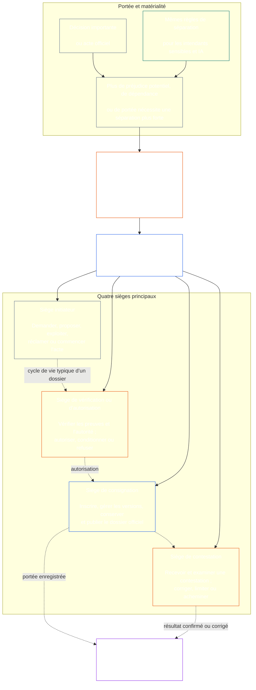

# CHAPITRE SEPT : INDÉPENDANCE FONCTIONNELLE ET SÉGRÉGATION DES TÂCHES

<strong>Placement de corpus (non opératoire) : structure des fichiers et règles de lecture</strong>

> Le contenu suivant est **conseils au lecteur uniquement**. Il n’ajoute, ne supprime ni ne restreint les obligations contraignantes ailleurs dans ce fichier ou dans d’autres chapitres.
>
> Ce fichier fait **partie de la Constitution sentiente** et ne lie qu’en combinaison avec les autres fichiers numérotés `core_*`, qui doivent être lus comme un instrument unique. Il contient le **Chapitre sept** : le seuil interprocessus en matière d’indépendance fonctionnelle et de séparation des tâches. Il suit le plancher des droits du chapitre six et précède les chapitres de procédure constitutionnelle, à commencer par [la certification de l’alignement du système du chapitre huit](../../core_08_system_alignment_certification.md#chapter-eight-system-alignment-certification-reading-index).
>
> - **Titulaire constitutionnel :** l’exigence minimale de sièges distincts pour les actes matériellement contraignants ; le contenu minimal universel de chaque [dossier d’acte matériellement contraignant](../../core_05_band_accountability.md#materially-binding-act-record) ; l’indépendance vis-à-vis de l’acteur et de sa [ligne de contrôle matériel](../../core_05_band_accountability.md#material-control-line) ; la publication du parcours et l’attribution des rôles ; le traitement des conflits, des vacances de siège, des remplacements et des erreurs d’attribution ; le regroupement proportionné des sièges ; les transferts attribuables ; et les conditions minimales d’indépendance que tout processus constitutionnel ultérieur doit appliquer.
> - **Source de la couche principe :** [Chapitre un §18.3](../../core_01_c_stewardship_capacity_principles.md#183-segregation-of-duties) nécessite une gouvernance pour préserver l’indépendance fonctionnelle et achemine ici l’architecture des sièges opérationnels.
> - **Responsable de la mise en œuvre :** [CJS-3.11](../../corpus_joint_structure/cjs_03a_accountability_operations.md#constitutional-lane-and-functional-separation), [CI-3.2](../../corpus_institutions/ci_03_institutional_design_separation_of_powers.md#ci-32-functional-separation-lanes), et [CI-4.6](../../corpus_institutions/ci_04_appointment_competency_rotation_removal.md#ci-46-seat-catalog--process-role-archetypes-and-operational-boundaries) placer et opérationnaliser les sièges. Ils peuvent être plus stricts et ajouter des types de sièges limités aux autorités spéciales ; ils ne peuvent pas restreindre ce chapitre.
> - **L’application propre à chaque processus reste en aval :** le chapitre huit applique ce seuil à la certification de l’alignement du système ; [le chapitre neuf §3.7](../../core_09_standing_assessment.md#37-segregation-of-duties) l’applique aux dossiers de statut ; le chapitre douze et [corpus_forum.md](../../corpus_forum.md) l’appliquent aux procédures des forums. Ces chapitres peuvent ajouter les garanties que leur sujet exige ; ils ne peuvent pas établir un substitut moins exigeant.
>
> Ordre de lecture : §1 objet, portée et limites de compétence → §2 seuil constitutionnel à quatre sièges → §3 indépendance, conflits et lignes de contrôle → §4 attribution au mauvais siège → §5 attribution publiée, vacances et remplacements → §6 adaptation proportionnée et regroupement des sièges → §7 mesures d’urgence → §8 dossiers d’acte et transferts attribuables → §9 relation avec les processus ultérieurs.

<strong>Tracer</strong>

- En amont: [Tétrade constitutionnelle](../../core_00_preamble.md#constitutional-tetrad) - en particulier **surveillance** et **responsabilité**; [enjeu matériel](../../core_00_preamble.md#material-stake); [Chapitre un §17.1 Norme de gestion partagée](../../core_01_c_stewardship_capacity_principles.md#171-shared-stewardship-standard); [Chapitre un §18 Gouvernance dans le cadre de la discipline d'intendance](../../core_01_c_stewardship_capacity_principles.md#18-governance-under-stewardship-discipline); [Article XVI](../../core_06_rights_part_c.md#article-xvi-audit-transparency-and-independent-verification) (*Audit, transparence et vérification indépendante*).
- Sous-sections : [§1](#1-purpose-scope-and-owner-boundary); [§2](#2-four-seat-constitutional-floor); [§3](#3-independence-conflict-and-control-lines); [§4](#4-wrong-seat-routing); [§5](#5-published-placement-vacancy-and-substitution); [§6](#6-proportional-scaling-and-merged-hosting); [§7](#7-emergency-and-urgent-action); [§8](#8-act-records-and-attributable-handoffs); [§9](#9-relationship-to-later-processes).
- En aval: [Chapitre huit](../../core_08_system_alignment_certification.md#chapter-eight-system-alignment-certification-reading-index); [Chapitre neuf](../../core_09_standing_assessment.md#chapter-nine-contribution-violation-and-standing-model--measurement); [Chapitre douze](../../core_12_forum.md#chapter-twelve-forums-and-jurisdiction); [Chapitre treize](../../core_13_governance.md#chapter-thirteen-constitutional-contract-legitimacy-authorization-and-stewardship); texte de mise en œuvre désigné mentionné ci-dessus.
- Lire avec : [Chapitre un §19.3 Détection de désalignement](../../core_01_c_stewardship_capacity_principles.md#193-misalignment-detection) (*détection et examen pluriels*); [Action attribuable](../../core_05_band_accountability.md#attributable-action); [Intégrité de l'attribution](../../core_05_band_accountability.md#attribution-integrity); [Auditabilité](../../core_05_band_oversight.md#auditability); [Contestabilité](../../core_05_band_accountability.md#contestability); [Proportionnalité](../../core_05_band_accountability.md#proportionality).

 

Le chapitre sept est le titulaire constitutionnel du **socle d'indépendance fonctionnelle et de séparation des tâches pour les actes matériellement contraignants**.

### 1. Objectif, portée et limites du titulaire

<strong>Tracer</strong>

- En amont : réclamation du titulaire désigné au début du chapitre ; [Chapitre un §18](../../core_01_c_stewardship_capacity_principles.md#18-governance-under-stewardship-discipline); [Surveillance](../../core_05_apex_oversight_leg.md#oversight-constitutional); [Responsabilité](../../core_05_apex_accountability_leg.md#accountability).
- En aval: [§2](#2-four-seat-constitutional-floor) à travers [§9](#9-relationship-to-later-processes); tout processus ultérieur qui produit ou modifie un acte matériellement contraignant.
- Lire avec : [Chapitre quatre](../../core_04_burden_traceability_verification.md#chapter-four-burden-of-proof-traceability-and-verification) pour le substrat de vérification ; [Article XIII-A](../../core_06_rights_part_c.md#article-xiii-a-reliability-and-trustworthiness-baseline) (*Référence de fiabilité et de fiabilité*) et [Article XIII-B](../../core_06_rights_part_c.md#article-xiii-b-right-to-redress-and-remedy) (*Droit à réparation et recours*) pour contestation et réparation ; [Article XVI](../../core_06_rights_part_c.md#article-xvi-audit-transparency-and-independent-verification) (*Audit, transparence et vérification indépendante*) pour les planchers de droits à vérification indépendante.

 

*En termes simples : avant de pouvoir faire confiance à un processus constitutionnel – ou à une décision au niveau des parties prenantes au sein d’un système, d’une institution ou d’un domaine de décision limité –, les emplois qui s’y trouvent doivent être séparés. Ce plancher s'applique à la fois au [Couche de contrat constitutionnel](../../core_05_band_integrative.md#constitutional-contract-layer) et à [Participation au système des parties prenantes](../../core_05_band_participation.md#stakeholder-status-and-weight). Un bureau sensible, un système d’IA, un organisme de parties prenantes ou un représentant cherchant un résultat ne peut pas non plus fournir le contrôle prétendument indépendant, contrôler le dossier officiel de ce contrôle ou décider de sa contestation.*

Ce chapitre s'applique à chaque [Acte matériellement contraignant](../../core_05_band_accountability.md#materially-binding-act), tel que le définit le chapitre cinq, notamment :

- une décision;
- une autorisation ou une certification;
- une constatation ;
- une entrée dans un dossier ou un changement de version important ;
- une version, un déploiement, une continuation ou un retrait ;
- un décaissement ou une allocation ; et
- une disposition d'un défi.

Les sièges de ce chapitre définissent qui peut faire quoi pour un acte particulier ; ce ne sont pas des titres de poste. Le même sensible, bureau ou système peut occuper différents sièges pour différents actes. Un titre, une délégation, une capacité technique ou l'aptitude à accomplir une démarche n'agrandissent pas le siège détenu pour cet acte.

Ce chapitre indique le plancher de séparation des tâches entre les processus. Il ne déménage pas :

- charge de preuve, traçabilité ou méthode de vérification du chapitre quatre ;
- les significations canoniques du chapitre cinq ;
- Planchers de droits du chapitre six ;
- le contenu des enregistrements spécifiques au processus des chapitres huit à douze ; ou
- catalogues de sièges opérationnels, méthodes de dotation en personnel et mécanismes de plan de voie à partir du texte de mise en œuvre désigné.

### 2. Plancher constitutionnel à quatre sièges

<strong>Tracer</strong>

- En amont: [§1](#1-purpose-scope-and-owner-boundary); [Chapitre un §18.3](../../core_01_c_stewardship_capacity_principles.md#183-segregation-of-duties); [Chapitre un §17.1](../../core_01_c_stewardship_capacity_principles.md#171-shared-stewardship-standard).
- En aval: [§3](#3-independence-conflict-and-control-lines) à travers [§9](#9-relationship-to-later-processes); [CI-4.6](../../corpus_institutions/ci_04_appointment_competency_rotation_removal.md#ci-46-seat-catalog--process-role-archetypes-and-operational-boundaries) (*Catalogue de sièges — archétypes de processus-rôle et limites opérationnelles*).
- Lire avec : [§6](#6-proportional-scaling-and-merged-hosting) pour le seul chemin d’hébergement fusionné autorisé.

 

*En termes simples : tout acte matériellement contraignant a quatre tâches : demander ou agir, vérifier, tenir le procès-verbal officiel et entendre la contestation. Les emplois restent distincts même lorsqu'une petite organisation est autorisée à en placer une paire autorisée dans un même bureau.*

<strong>Guidage du lecteur (non opérationnel) : carte à quatre places</strong>

> Le contenu suivant est **conseils au lecteur uniquement**. Il n’ajoute, ne supprime ou ne restreint aucune obligation contraignante ailleurs dans ce chapitre ou dans d’autres chapitres.
>
> **Lecteur de carte (non opérationnel).** Ce diagramme montre les quatre sièges et un cycle de vie typique d'un enregistrement. Il n'ajoute pas un cinquième siège de mise en œuvre, n'exige pas qu'un examen soit terminé avant chaque action, ni ne modifie les règles opérationnelles de cette section et des §§3 à 6.

 

Les flèches en pointillés à l'intérieur du groupe de sièges montrent un cycle de vie typique d’un enregistrement. Les flèches vers la mise en œuvre sont des liens de traçabilité, et non une séquence d'attente de révision obligatoire.

Chaque acte matériellement contraignant comporte quatre sièges fonctionnellement distincts. Le chapitre cinq fournit leurs significations canoniques ; cette section indique les règles de placement et d'incompatibilité entre processus :

1. **[Siège initial](../../core_05_band_accountability.md#initiating-seat)** — demande, propose, opère, revendique ou commence de toute autre manière l'acte.
2. **[Siège de vérification ou d’autorisation](../../core_05_band_accountability.md#verify-or-authorize-seat)** — vérifie les preuves et l'autorité par rapport à la norme en vigueur et vérifie, autorise, refuse ou conditionne l'acte.
3. **[Siège de consignation](../../core_05_band_accountability.md#record-seat)** — saisit, versions, conserve, conserve et publie le [Dossier d'acte](../../core_05_band_accountability.md#materially-binding-act-record) de ce que le siège de vérification ou d'autorisation a déterminé.
4. **[Siège de contestation](../../core_05_band_accountability.md#contest-seat)** — reçoit et examine une contestation, ordonne des corrections ou des limites lorsque cela est autorisé, et achemine tout problème hors de son autorité.

Ces sièges s’appliquent aussi bien aux intendants humains qu’aux intendants de l’IA. Si un système exécute un acte, le signe, puis utilise son propre journal comme preuve, il occupe simultanément les postes d'initiation, de vérification et d'enregistrement. L'automatisation du processus ne rend pas le contrôle indépendant.

Les combinaisons suivantes sont interdites sur un même acte :

- le siège initiateur ne doit pas vérifier ou autoriser son propre acte ;
- le siège de vérification ou d'autorisation ne doit pas détenir le siège d'enregistrement ;
- le siège de vérification ou d'autorisation ne doit pas détenir le siège de concours ; et
- l'exploitant d'un système ne doit pas vérifier ni autoriser un acte concernant ce système.

Les chapitres ultérieurs ou le texte de mise en œuvre incorporé peuvent interdire des appariements supplémentaires pour un processus particulier. Ils ne peuvent pas autoriser un appariement interdit ici.

Le plancher fonctionnel à quatre places s'applique à toutes les classes. La question à l'échelle de la classe est de savoir si ces sièges peuvent être fusionnés ou partager un titulaire : pour une institution ou un système fonctionnant dans le cadre de la classe C, une séparation complète de quatre sièges est toujours recommandée ; pour le champ d’application de classe B, cela devrait presque toujours être requis ; et pour la portée de classe A, c'est toujours requis. Lorsque la portée est mixte ou que la classification est incertaine, appliquez la position applicable la plus élevée jusqu'à ce que le dossier prenne en charge une position inférieure.

### 3. Indépendance, conflits et lignes de contrôle

<strong>Tracer</strong>

- En amont: [§2](#2-four-seat-constitutional-floor); [Responsabilité à l'échelle de l'autorité](../../core_01_c_stewardship_capacity_principles.md#181-governance-as-authorized-structure); [Article XXIV](../../core_06_rights_part_d.md#article-xxiv-constitutional-interpretation-review-and-anti-capture-safeguards) (*Interprétation constitutionnelle, révision et garanties anti-capture*).
- En aval: [§4](#4-wrong-seat-routing); [§5](#5-published-placement-vacancy-and-substitution); [§8](#8-act-records-and-attributable-handoffs); Rôles des composants de certification du chapitre huit ; Garde des dossiers du chapitre neuf ; Chapitre douze forum anti-auto-jugement.
- Lire avec : [ligne de contrôle matériel](../../core_05_band_accountability.md#material-control-line); [CI-5](../../corpus_institutions/ci_05_conflict_integrity_anti_capture_anti_corruption.md) (*Intégrité des conflits, anti-capture et anti-corruption*) et [CF-7](../../corpus_forum/cf_07_integrity_safeguards_anti_capture_anti_self_judging.md) (*Garanties d'intégrité, opérations anti-capture et soutien anti-auto-jugement*) pour les conflits opérationnels et les garanties anti-auto-jugement.

 

*En clair : changer le nom sur le bureau ne crée pas d’indépendance. Un vérificateur ou un réviseur n'est pas indépendant lorsque le sensible ou le bureau qui recherche le résultat peut le diriger, le supprimer, le récompenser, le punir ou l'annuler discrètement sur cet acte.*

L’indépendance fonctionnelle est jugée par l’autorité et le contrôle réels, et non par les étiquettes. Sur le même acte :

- le siège de vérification ou d'autorisation et le siège de concours doivent être à l'extérieur du siège initiateur [ligne de contrôle matériel](../../core_05_band_accountability.md#material-control-line);
- un parti dont le propre intérêt est déterminé par la loi ne doit pas détenir le siège de vérification ou d'autorisation ou de contestation ;
- un détenteur de dossier en conflit doit transmettre ce dossier, avec sa piste d'audit complète, au substitut publié plutôt que de trancher le conflit ou d'en abandonner la garde ; et
- la récusation supprime l'autorité sur l'acte; il ne transfère pas le siège au demandeur, à la ligne hiérarchique du demandeur ou à la personne la plus proche.

Tracez le [ligne de contrôle matériel](../../core_05_band_accountability.md#material-control-line) pour l'acte en question. L’infrastructure partagée, le soutien administratif ou l’historique des nominations ne suffisent pas à établir la limite, mais ces arrangements ne doivent pas mettre en échec un jugement indépendant dans la pratique.

L'indépendance n'est pas satisfaite par une deuxième signature, un comité nominal, une étiquette interne ou une attestation générée par un outil où le prétendu contrôle manque d'autorité, d'accès aux preuves, d'absence de contrôle matériel ou d'une réelle capacité de refus et d'acheminement.

### 4. Acheminement au mauvais siège

<strong>Tracer</strong>

- En amont: [§2](#2-four-seat-constitutional-floor); [§3](#3-independence-conflict-and-control-lines).
- En aval: [§5](#5-published-placement-vacancy-and-substitution); [§8](#8-act-records-and-attributable-handoffs); [Règles de siège partagé CI-4.6](../../corpus_institutions/ci_04_appointment_competency_rotation_removal.md#ci-46-shared-seat-rules).
- Lire avec : [Chapitre premier §17.5 Devoir de résister](../../core_01_c_stewardship_capacity_principles.md#175-duty-to-resist).

 

*En termes simples : lorsqu’un pas ne vous appartient pas, ne le faites pas en silence et ne vous en éloignez pas simplement. Enregistrez l'écart et transmettez l'affaire au bon endroit.*

Un commissaire invité à faire un pas hors de son siège doit :

1. refuser cette mesure sans prétendre en décider le bien-fondé ;
2. nommer le siège qui pourra l'occuper et, le cas échéant, son titulaire ou son suppléant ;
3. enregistrer la demande, le siège occupé, l'écart ou le conflit et l'itinéraire emprunté ;
4. préserver les preuves et l'intégrité de tout dossier déjà reçu ; et
5. itinéraire sans retard évitable.

Cette réponse est l’accomplissement d’un devoir et non l’abandon de l’acte. L'acte se déroule par le siège droit. Faire le pas parce que le steward est le plus proche, le plus rapide, le plus expérimenté ou le plus compétent n'est pas un remède à un siège manquant.

### 5. Placement publié, poste vacant et remplacement

<strong>Tracer</strong>

- En amont: [§2](#2-four-seat-constitutional-floor); [§3](#3-independence-conflict-and-control-lines); [Transparence](../../core_05_band_oversight.md#transparency); [Auditabilité](../../core_05_band_oversight.md#auditability).
- En aval: [§8](#8-act-records-and-attributable-handoffs); [CI-3.2](../../corpus_institutions/ci_03_institutional_design_separation_of_powers.md#ci-32-functional-separation-lanes) (*Voies de séparation fonctionnelle*); [CI-4.5](../../corpus_institutions/ci_04_appointment_competency_rotation_removal.md#ci-45-authorized-roles-and-accountability-chains) (*Rôles autorisés et chaînes de responsabilité*); Enregistrements des chapitres huit et neuf.
- Lire avec : [Charte](../../core_05_band_continuity.md#charter) et [Chapitre treize §5](../../core_13_governance.md#5-authorized-roles-competency-development-and-contribution).

 

*En termes simples : une organisation doit indiquer qui occupe chaque poste avant l'arrivée du cas difficile, y compris qui prend la relève lorsque le titulaire ordinaire est absent ou en conflit.*

Tout adoptant qui prend des actes matériellement contraignants doit maintenir une carte publiée, vérifiable et contestable qui identifie :

- quelle voie, bureau, rôle ou processus héberge chaque siège ;
- les actes et la portée auxquels s'applique ce placement ;
- chaque accord d'hébergement fusionné autorisé et sa garantie d'indépendance ;
- le remplaçant d'un titulaire absent, exclu, capturé ou en conflit ; et
- l'itinéraire indépendant lorsqu'aucun remplaçant qualifié n'est disponible.

Un siège non placé, vacant ou en conflit est un défaut de gouvernance à enregistrer et à corriger. Elle ne passe pas automatiquement au siège initiateur, à une partie intéressée, à un opérateur ou à un supérieur hiérarchique dans leur [ligne de contrôle matériel](../../core_05_band_accountability.md#material-control-line). Jusqu'à ce qu'elle soit corrigée, la loi achemine vers le chemin de substitution ou indépendant publié. Vous ne pouvez pas contourner l’exigence d’indépendance simplement parce que vous êtes pressé.

La délégation préserve les mêmes limites de siège, les mêmes devoirs de preuve, les mêmes registres et horloges, et reste soumise aux [ligne de contrôle matériel](../../core_05_band_accountability.md#material-control-line). Il ne crée pas de nouveau siège, ne fusionne pas les sièges et ne permet pas à un délégué de faire ce que le siège du délégué ne pourrait pas faire, notamment en convertissant une recommandation à l'échelle de la classe ou une exigence de séparation complète de quatre sièges en autorisation de fusion.

### 6. Mise à l'échelle proportionnelle et hébergement fusionné

<strong>Tracer</strong>

- En amont: [§2](#2-four-seat-constitutional-floor); [enjeu matériel](../../core_00_preamble.md#material-stake); [Nécessité](../../core_05_band_accountability.md#necessity); [Proportionnalité](../../core_05_band_accountability.md#proportionality).
- En aval: [Chapitre neuf §3.7](../../core_09_standing_assessment.md#37-informal-and-small-scope-records); [CJS-2.4](../../corpus_joint_structure/cjs_02_specific_joint_interlocks.md#cjs-24-class-scaled-lane-staffing-and-competency-redundancy) (*Dotation en personnel des couloirs et redondance des compétences à l'échelle de la classe*); [CI-3.2](../../corpus_institutions/ci_03_institutional_design_separation_of_powers.md#ci-32-functional-separation-lanes) (*Voies de séparation fonctionnelle*).
- Lire avec : [Fardeau évitable](../../core_05_band_continuity.md#avoidable-burden) et chapitre un [§3.3 Processus anti-dégradation](../../core_01_a_values_principles.md#33-anti-degrading-process).

 

*En termes simples : les petits groupes informels n’ont pas besoin de quatre grands départements. Ils ont besoin d’un véritable contrôle indépendant, d’un dossier utilisable et d’un parcours de contestation. L'échelle modifie la méthode de dotation, pas la séparation protégée.*

La force, le personnel, la redondance et la formalité de la séparation varient en fonction de l'enjeu matériel, de la classe du système, de la dépendance et des dommages raisonnablement prévisibles.

Un adoptant petit ou informel peut placer deux sièges dans un même bureau ou sensible uniquement lorsque tous les éléments suivants sont remplis :

- la fusion est nécessaire et proportionnée à son étendue ;
- il est publié, vérifiable, contestable et divulgué au procès-verbal de l'acte ;
- une garantie d'indépendance fait face aux risques créés par la fusion ;
- le siège initiateur ne vérifie ni n'autorise son propre acte ;
- la vérification et l'enregistrement et la vérification et la contestation restent interdits ; et
- une voie indépendante reste disponible lorsqu'un conflit, un préjudice matériel ou une contestation dépasse les limites légales du titulaire fusionné.

Le travail informel, non rémunéré, d'entraide, de soins, de réparation, d'enseignement, de coopération et d'intendance communautaire peut faire appel à un organisme de confiance désintéressé doté d'une autorité publiée pour le contrôle pertinent. La Constitution n’exige pas de formalité institutionnelle que la portée ne peut raisonnablement atteindre lorsqu’il existe une voie véritablement désintéressée et responsable.

Le manque de personnel, la rapidité, la commodité ou la concentration de l'expertise ne justifient pas en soi une fusion. La posture à l’échelle de la classe [§2 Plancher constitutionnel à quatre places](#2-four-seat-constitutional-floor) régit : aucun départ n’est disponible pour la classe A, et tout départ pour la classe B ou la classe C doit répondre aux exigences ci-dessus. Plus l’enjeu matériel est élevé, plus forte est la présomption de fonctions séparées, de redondance des compétences et de remplacements indépendants.

### 7. Urgence et action urgente

<strong>Tracer</strong>

- En amont: [§2](#2-four-seat-constitutional-floor); [§6](#6-proportional-scaling-and-merged-hosting); [Chapitre Douze §6.1 Mesures d'urgence et charge de continuation](../../core_12_forum.md#61-emergency-measures-and-continuation-burden); [posture intérimaire par défaut](../../core_01_b_interaction_interpretation.md#default-interim-posture).
- En aval : processus d'incident, de confinement, de libération, de continuation et d'examen post-événement dans le texte de mise en œuvre désigné.
- Lire avec : [Opportunité](../../core_05_apex_timeliness_leg.md#timeliness-constitutional), [Préservation des preuves](../../core_05_band_oversight.md#evidence-preservation), et [CI-4.6 Catalogue de sièges — archétypes de processus-rôle et limites opérationnelles](../../corpus_institutions/ci_04_appointment_competency_rotation_removal.md#ci-46-seat-containment).

 

*En clair : une urgence réelle peut justifier d’agir avant la fin du contrôle ordinaire. Cela change la séquence, et non la propriété des sièges ou la posture de séparation à l’échelle des classes. Il ne permet pas à l’acteur de certifier sa propre suite, d’effacer la trace ou de devenir ensuite le critique final.*

Lorsqu'un retard créerait un risque raisonnablement prévisible de dommage grave et imminent, un siège d'initiation ou de confinement autorisé peut prendre l'action réversible minimale nécessaire avant que la vérification préalable ordinaire ne soit terminée, uniquement si :

- l'autorité d'urgence, sa portée, son début, son expiration et sa raison sont enregistrés immédiatement ou dès que cela est physiquement possible ;
- les preuves et les objections sont préservées ;
- le préavis et la participation sont rétablis dans les délais constitutionnels applicables ;
- un siège indépendant de vérification ou d'autorisation examine toute continuation au-delà de la limite immédiate ; et
- la loi fait l'objet d'un examen indépendant après l'événement.

L’action d’urgence ne :

- permettre à l'acteur de vérifier sa propre continuation ;
- faire de l'acteur le dépositaire d'un dossier en conflit ;
- laisser l'acteur entendre la contestation de son acte ;
- convertir une nécessité temporaire en autorité permanente ;
- autoriser toute fusion des quatre sièges pour une institution ou un système de classe A.

Aucun des éléments suivants ne constitue en soi une urgence :

- une date limite ;
- une cible de publication ;
- une pénurie de personnel; ou
- un souci de réputation.

### 8. Enregistrements d'actes et transferts attribuables

<strong>Tracer</strong>

- En amont: [§2](#2-four-seat-constitutional-floor) à travers [§7](#7-emergency-and-urgent-action); [Acte matériellement contraignant](../../core_05_band_accountability.md#materially-binding-act-record); [Action attribuable](../../core_05_band_accountability.md#attributable-action); [Intégrité de l'attribution](../../core_05_band_accountability.md#attribution-integrity).
- En aval: [CS-4 §10 action attribuable inspectable](../../corpus_systems/cs_04_critical_system_stewardship.md#10-inspectable-attributable-action); [Règles de siège partagé CI-4.6](../../corpus_institutions/ci_04_appointment_competency_rotation_removal.md#ci-46-shared-seat-rules); chaque enregistrement de processus régi par le §8 ; [`materially_binding_act_record.schema.json`](../../implementation/schemas/materially_binding_act_record.schema.json) (*formulaire de base vérifiable par machine ; support de processus, pas une deuxième définition*).
- Lire avec : [§4 Acheminement au mauvais siège](#4-wrong-seat-routing) et [Chapitre quatre §5](../../core_04_burden_traceability_verification.md#5-compliance-evidence-standard).

 

*En termes simples : chaque acte matériellement contraignant comporte un compte rendu d'acte indiquant ce qui s'est passé, qui a occupé chaque siège, ce qui a été décidé et où se déroule la contestation.*

Tout acte matériellement contraignant doit avoir un nom identifiable [Acte matériellement contraignant](../../core_05_band_accountability.md#materially-binding-act-record) (**Dossier d'acte**). Le dossier d'acte peut être intégré dans un dossier officiel spécifique au processus applicable ou dans un ensemble de documents officiels liés, attribuables et préservant l'intégrité. Un duplicata distinct n'est pas requis si le document officiel existant ou l'ensemble lié identifie clairement tous les éléments requis, préserve leurs liens et l'historique des versions et reste accessible via le chemin d'accès officiel autorisé.

Le dossier d’acte doit identifier, au minimum :

- une identité d'enregistrement stable, la version actuelle et les horodatages de création et de modification du matériel ;
- la loi, sa portée matérielle, son statut et son autorité dirigeante ;
- le siège initiateur, le titulaire et l'autorité ;
- le siège de vérification ou d'autorisation, le titulaire, la norme applicable, la détermination, les conditions ou raisons importantes et l'heure de détermination ;
- le siège du dossier, le titulaire, l'autorité de garde et la version saisie ;
- le siège du concours ou l'itinéraire de défi publié et le statut actuel du défi ou de la correction ;
- toute délégation, récusation, substitution, fusion autorisée ou départ d'urgence ; et
- les preuves matérielles et les liens d'enregistrement, les transferts, les refus, les conditions, les objections non résolues, les horloges, les versions remplacées et les corrections nécessaires pour reconstruire l'acte.

Les enregistrements spécifiques au processus peuvent ajouter des champs plus stricts ou spécifiques à un domaine. Ils ne peuvent pas omettre, contredire ou rendre irréconstructible ce minimum. Les contrôles légaux en matière de confidentialité et de sécurité régissent la manière dont le matériel protégé est consulté ou divulgué ; ils ne permettent pas que la trace officielle soit effacée ou rendue inutilisable à des fins de vérification, de contestation, de correction ou de réparation autorisée.

Les journaux montrent qui a fait quoi, mais ils ne prouvent pas à eux seuls que l'action était valide. Un journal, une signature, une trace de modèle, une liste de contrôle ou une attestation créée par le sensible ou le système exécutant l'action a un rôle limité :

- Ces documents peuvent fournir des preuves ou être liés au dossier d'acte.
- Ces documents ne peuvent pas remplacer un examen et une décision indépendants ou le dossier officiel de la loi lui-même.

### 9. Relation avec les processus ultérieurs

<strong>Tracer</strong>

- En amont: [§1](#1-purpose-scope-and-owner-boundary) à travers [§8](#8-act-records-and-attributable-handoffs).
- En aval: [Chapitre huit](../../core_08_system_alignment_certification.md#chapter-eight-system-alignment-certification-reading-index); [Chapitre neuf](../../core_09_standing_assessment.md#chapter-nine-contribution-violation-and-standing-model--measurement); [Chapitre douze](../../core_12_forum.md#chapter-twelve-forums-and-jurisdiction); [Chapitre treize](../../core_13_governance.md#chapter-thirteen-constitutional-contract-legitimacy-authorization-and-stewardship).
- Lire avec : [Pile d'autorité et hiérarchie interne](../../core_05_band_integrative.md#owner-non-relocation) et le [Registre des titulaires définis dans le préambule](../../core_00_preamble.md#4-principles-definitions-and-rights).

 

*En termes simples : les chapitres suivants indiquent à chaque processus ce qu'il faut évaluer, enregistrer, décider et remédier. Ce chapitre explique à ces processus comment le pouvoir doit être séparé pendant qu'ils le font.*

Chaque processus constitutionnel ultérieur doit expliquer comment il attribue et utilise les quatre sièges et comment il suit ce chapitre. En pratique:

- Son propre enregistrement de processus peut servir d'enregistrement d'acte ou y ajouter des détails spécifiques au processus.
- Si un enregistrement de processus couvre plusieurs actes matériellement contraignants, il peut être lié à un enregistrement d'acte distinct pour chaque acte.
- Un double d’enregistrement distinct n’est pas requis lorsque le chemin d’accès officiel reste complet et traçable.
- Donner un nom différent à un processus ne le dispense pas de [§4 Acheminement au mauvais siège](#4-wrong-seat-routing) ou [§8 Enregistrements d'actes et transferts attribuables](#8-act-records-and-attributable-handoffs), y compris leurs règles de transfert et de mauvais siège.

En particulier:

- **Chapitre huit — certification d'alignement du système :** l'opérateur du système ou le promoteur de la certification est un siège initiateur et non son propre vérificateur ; Les conclusions des composants limités, l'intégration du dossier de certification, la garde et les défis doivent rester dans leurs sièges légaux et dans leurs voies anti-auto-jugement.
- **Chapitre neuf — records permanents :** le demandeur, l'autorité d'ouverture du dossier, le dépositaire du dossier et l'itinéraire du concours appliquent le plancher de quatre sièges ainsi que les règles plus strictes du chapitre neuf en matière de garde, de demandeur, de dossier informel et de non-auto-garde.
- **Chapitre douze — forums :** le dépôt, l'enquête, l'examen du fond, la conservation des dossiers, l'appel et l'examen des allégations de partialité ou d'abus de procédure d'un forum doivent préserver le siège applicable et les limites anti-auto-jugement.
- **Chapitre treize — gouvernance :** les définitions de rôles, les plans de compétences, la délégation, la succession et la conception institutionnelle doivent placer et maintenir les sièges plutôt que de simplement répéter leurs noms.

Un chapitre ultérieur pourrait imposer des exigences plus strictes en matière d'indépendance, de récusation, de séparation, de garde, de commission ou de révision, car son processus comporte un risque plus élevé ou différent. Il ne peut pas restreindre ce seuil, traiter une étiquette spécifique à un processus comme une exemption ou déduire que le silence transfère un siège à l'acteur.

---

**Fichier précédent :** [core_05_band_performance.md](../../core_05_band_performance.md)

**Fichier suivant :** [core_08_a_system_alignment_certification_evaluation.md](../../core_08_a_system_alignment_certification_evaluation.md#chapter-eight-part-a-certification-evaluation)
