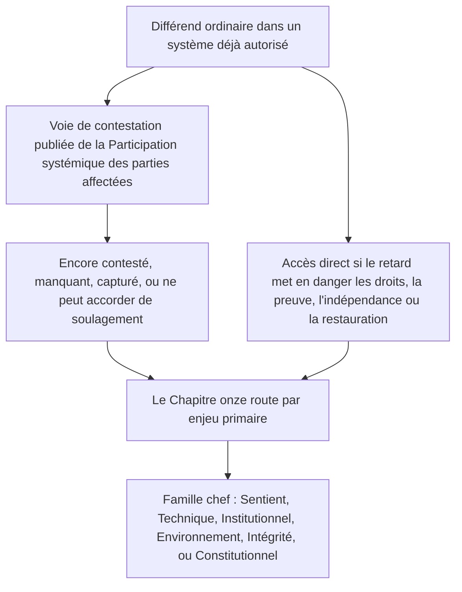

# CHAPITRE ONZE : FORUMS ET JURIDICTION

<strong>Place dans le corpus (non opératoire) : structure du fichier et règles de lecture</strong>

> Le contenu ci-dessous est **uniquement un guide de lecture**. Il n’ajoute, n’ôte ni ne resserre d’obligations contraignantes dans ce fichier ni dans d’autres chapitres.
>
> Ce fichier est un **pilote de langue de lecture** du [Chapitre onze en anglais](../../core_12_forum.md). **Ce n’est pas** une partie contraignante de la Constitution sentiente. **Ce n’est pas** une seconde constitution. **Ce n’est pas** une édition d’envoi. Il est **épinglé** à `SC-Corpus-2026.08.09`. Si cette traduction et la source anglaise semblent diverger, le fichier numéroté [`core_11_forum.md`](../../core_12_forum.md) l’emporte. L’ordre de lecture et les métadonnées d’édition restent dans [README.md](../../README.md). Méthode et glossaire : [translations/fr/README.md](README.md).
>
> Il contient le **Chapitre onze** : familles de forums, siège par défaut et routage par enjeux primaires, soutien forensique, triage d’admission et juridiction pour les différends sous la chaîne de trajectoire et le Plancher des droits. Les forums **supervisent** le traitement des différends sous les jambes **participation**, **supervision** et **action en temps** de la [Tétrade constitutionnelle](core_00_preamble.md#constitutional-tetrad), échelonnées à l’[enjeu matériel](core_00_preamble.md#material-stake). Lorsque les faits sont vérifiés, ils peuvent **ouvrir, mettre à jour ou corriger** des registres de trajectoire — ou **écarter un registre défectueux sur contestation** — sous le [Chapitre huit §3](core_08_standing_assessment.md#3-standing-record-operational-requirements) ; une affaire déposée n’est pas la trajectoire par elle-même, et le récit de forum ne doit pas se substituer à la mesure de trajectoire du Chapitre huit ([Chapitre huit §3.6](core_08_standing_assessment.md#36-forum-boundary)). Utilisez [README — Standing pipeline and forums](../../README.md#standing-pipeline-and-forums) pour la navigation de la chaîne. La mécanique opératoire de forum demeure dans les fichiers de mise en œuvre désignés. La numérotation des chapitres et les renvois correspondent à l’instrument intégré. L’ordre de lecture, le partage contraignant/soutien et les métadonnées d’édition du corpus sont tenus dans [README.md](../../README.md).

>
> **Précédent (encore en anglais) :** [core_10_b_misconduct_pattern_applications.md](../../core_11_b_misconduct_pattern_applications.md#chapter-eleven-part-b-anti-constitutional-misconduct-pattern-applications)
>
> **Suivant (encore en anglais) :** [core_08-11_application_vignettes.md](../../core_09-12_application_vignettes.md#chapters-eight-eleven-application-vignettes)
> **Arc de lecture :** §1 objet → Séquençage des différends → §2 siège par défaut et admission → §2.1–§2.3 limites du chef, enjeux mixtes, contestations → §3 transfert et anti-auto-jugement → §4 familles → §5 escalade et certification → §6 paliers et discipline anti-retard → §7 soutien de forum

<strong>Guide de lecture (non opératoire) : où vit le Chapitre onze et ce qui reste ici</strong>

> Le contenu ci-dessous est **uniquement un guide de lecture**. Il n’ajoute, n’ôte ni ne resserre d’obligations contraignantes dans ce chapitre ni dans d’autres chapitres.
>
> Où cela vit (navigation) :
> - **Titulaire constitutionnel :** **section 1** (*objet* — **application adjudicative primaire** des normes que ce chapitre alloue, **distincte de** l’**administration exécutive** de routine ; **Séquençage des différends** pour les différends ordinaires à l’intérieur de systèmes déjà autorisés ; exigences de **reddition de comptes** ; placement de **seuil** **publié** et **prévisible**) ; **siège de départ par défaut**, routage par **enjeux primaires**, **organe de triage d’admission** (**bureau de premier contact**), enjeux mixtes, asymétrie, contestations de registres de trajectoire, **caractérisation de bonne foi et anti-jeu**, et attentes d’**accès** de **seuil** **accessible aux êtres sentients** (**section 2**, **lire avec** **`corpus_forum.md`**) ; **transfert**, **consolidation** et **coordination** (**section 3**, lire avec la certification et le secours de la **section 5**) ; **définitions des familles de forums**, **chambres internes**, **normes partagées** et **droit opérationnel provisoire** (sentient, technique, institutionnel, environnement, intégrité, constitutionnel — **section** **4**, en miroir de la **table** de la **section** **2**) ; **escalade**, **certification** et **protection intérimaire** (**section 5**) ; **résolution en temps** et discipline **anti-retard** (**section 6**) ; **soutien de forum** avant, pendant et après l’examen (**section 7**), mis en œuvre de sorte que les rôles de triage et de soutien **ne** se substituent **pas** aux **panels au fond licitement constitués** ; routage de secours **anti-auto-jugement** ; et crochets d’escalade liés au **Chapitre huit**, au **Chapitre dix** et aux droits de justice et de contestation du **Chapitre six**.
> - **Navigation de la chaîne :** [README — Standing pipeline and forums](../../README.md#standing-pipeline-and-forums) — [§§1–7](#1-purpose-and-role) dans ce fichier.
> - **Chaîne à trois questions des Chapitres huit–neuf :** Les **sections 2–3** du Chapitre huit répondent à la Question 1 (*qu’est-il arrivé ?*) par des registres vérifiés d’axe pur. Le [Chapitre huit §4](core_08_standing_assessment.md#4-standing-measurement-evaluation-dimensions) et l’[échelle LEQU proportionnelle unifiée du §7](core_08_standing_assessment.md#7-unified-proportional-lequ-scale) répondent à la Question 2 (*combien c’était bon ou mauvais ?*) par des dimensions d’évaluation, des bandes LEQU partagées de cinq fois, et la grammaire partagée **s** = 1...9, en préservant des registres séparés de Contribution et d’Infraction. Le [Chapitre neuf](core_09_standing_integration.md#chapter-nine-standing-effects-and-integration) répond à la Question 3 (*qu’est-ce qui s’ensuit ?*) par des recours, des sauvegardes, des barres de compétence et habilitations, et des verrous de trajectoire. Le créneau de l’Axe d’infraction n’est contrôlé que par l’impact vérifié ; la négligence, la dissimulation, la coercition, la réponse et les descripteurs de caractère comparables ne le déplacent pas. Le [Chapitre dix](core_10_a_misconduct_designation.md#chapter-ten-anti-constitutional-misconduct) peut ajouter la désignation d’inconduite anticonstitutionnelle correspondante à un registre de créneau 7, 8 ou 9 du Chapitre huit, mais n’assigne pas le créneau numérique.
> - **Forums (glose non opératoire) :** Les **familles de forums** sous ce chapitre sont les **forums** primaires qui appliquent les classifications du [Chapitre huit](core_08_standing_assessment.md#chapter-eight-compliance-violation-and-standing-model) à des différends concrets — y compris les affaires où la **nature de la contribution**, le **créneau d’impact de l’Axe d’infraction** et le caractère de processus / réponse consignés séparément sont **coprésents** et doivent être traités sous la discipline d’évaluation conjointe et de non-substitution du **Chapitre huit**. Les mécanismes de **financement de la recherche**, de **financement** et d’**incitations** hors adjudication demeurent dans la mise en œuvre adoptée et dans **[corpus_systems.md](../../corpus_systems.md)** (voir le guide de lecture du **Chapitre huit**) ; ils peuvent soutenir la prévention et l’enquête de cause racine et **ne doivent pas** se substituer au routage de **seuil**, à la détermination au **fond**, à l’assignation autoritative de créneau numérique du Chapitre huit, à toute désignation correspondante du **Chapitre dix**, ni aux contraintes de l’**Article XXIII** (*Résolution des conflits, escalade et proportionnalité d’urgence*). Les **sections 1 et 2** allouent la responsabilité **primaire** des structures d’**incitation** **principalement** **dans** la **sphère** de chaque **famille** (détail granulaire dans le **corpus** et la mise en œuvre) ; cette **allocation** **ne** relocalise **pas** les choix de **budget** **à l’échelle du système** ni à **l’échelle de gouvernance** réservés au [Chapitre douze](../../core_13_governance.md#chapter-thirteen-constitutional-contract-legitimacy-authorization-and-stewardship) et à **[corpus_systems.md](../../corpus_systems.md)**.
> - **Titulaire de la mise en œuvre :** les **classes** d’admission publiées, les règles quotidiennes de rôle, le personnel, les budgets, la procédure granulaire, la mécanique opératoire d’escalade et les exigences opératoires de soutien de forum vivent dans le texte de mise en œuvre adopté et dans **[corpus_forum.md](../../corpus_forum.md)** (**CF-5** (*Opérations de routage, transfert, certification et traitement représentatif*), **CF-8** (*Soutien forensique et analytique de forum*), **CF-9** (*Service d’enquête indépendant et interface de poursuite*), et sections connexes) ; ces couches **mettent en œuvre, ne resserrent pas**, ce chapitre.
> - **Règle anti-relocalisation :** les instruments d’adoption ne doivent pas satisfaire ce chapitre par des procédures qui font s’effondrer des fonctions de forum distinctes, dépouillent l’**indépendance** ou l’**examen réel**, ou routent des contestations d’intégrité vers le même forum capturé que ce chapitre interdit comme unique foyer final au fond.
>
> **Architecture — placement de *En termes simples* :** Chaque ligne *En termes simples* apparaît immédiatement après le bloc de navigation Trace (et le ` ` qui le suit lorsqu’il est présent), et **avant** les paragraphes opératoires et les listes à puces de cette section. Glose tournée vers le lecteur seulement ; elle n’ajoute, n’ôte ni ne resserre le texte contraignant.

<strong>Trace</strong>

- En amont : [Chapitre huit](core_08_standing_assessment.md#chapter-eight-compliance-violation-and-standing-model) (*registres de la Question 1 et mesure de la Question 2 qui alimentent les différends que ce chapitre route*) ; [Chapitre huit §5.1](core_08_standing_assessment.md#5-slot-grammar-and-display-labels) (*grammaire de créneau de trajectoire*) ; [échelle unifiée du Chapitre huit §7](core_08_standing_assessment.md#7-unified-proportional-lequ-scale) (*bandes LEQU partagées de cinq fois et registres d’axe séparés*) ; [Chapitre huit §§4.3–4.4](core_08_standing_assessment.md#43-route-descriptor-measurement-roles) (*catalogue de descripteurs normalisés transaxiaux, y compris les descripteurs de l’Axe de contribution et de l’Axe d’infraction qui ne déplacent pas les créneaux*) ; [Chapitre dix](core_10_a_misconduct_designation.md#chapter-ten-anti-constitutional-misconduct) (*désignation d’inconduite anticonstitutionnelle correspondante pour les créneaux qualificatifs 7–9 du Chapitre huit*) ; [Chapitres deux à quatre](core_02_definition_structure.md) (*attentes de registre, de vérification et de traçabilité*) ; [Chapitre cinq](core_05__definitions_home.md#chapter-five-foundational-definitions) (*définitions fondationnelles*) ; [Chapitre un](core_01_c_stewardship_capacity_principles.md#chapter-01-principles-and-constraints) (*contraintes interprétatives*) ; [Chapitre six — Droits fondationnels](core_06_rights_part_a.md#chapter-six-foundational-rights) jusqu’à la [Partie D](core_06_rights_part_d.md) (*crochets de contestation, d’audit et d’articles de justice*).
- Sous-sections : [§1](#1-purpose-and-role) ; [§2](#2-default-venue-and-primary-stakes) ; [§3](#3-transfer-consolidation-and-coordination) ; [§4](#4-forum-family-definitions) ; [§5](#5-escalation-and-certification) ; [§6](#6-timely-resolution-materiality-tiers-and-anti-delay-discipline) ; [§7](#7-forum-support-before-during-and-after-review).
- Lire avec : [README — Standing pipeline and forums](../../README.md#standing-pipeline-and-forums).
- En aval : [corpus_forum.md](../../corpus_forum.md) (*doctrine opératoire de forum*) ; [Chapitre douze](../../core_13_governance.md#chapter-thirteen-constitutional-contract-legitimacy-authorization-and-stewardship) là où la légitimité de gouvernance interagit avec le rôle adjudicatif ; [Chapitre seize](../../core_17_incorporation.md#chapter-seventeen-incorporation-bridge) (*discipline d’incorporation* pour les couches de procédure adoptées).
- Lire avec : [Chapitre huit §5.1](core_08_standing_assessment.md#5-slot-grammar-and-display-labels) (*grammaire de créneau de trajectoire*) ; [Chapitre huit §§4.3–4.4](core_08_standing_assessment.md#43-route-descriptor-measurement-roles) (*descripteurs normalisés transaxiaux de l’Axe de contribution et de l’Axe d’infraction*).
- Lire aussi avec : [Chapitre neuf §3](core_09_standing_integration.md#3-descriptor-integration-and-attachment-normalization) (*intégration des descripteurs et normalisation des attachements lue avec le routage par enjeux primaires de la section 2*) ; [README.md](../../README.md) (*ordre de lecture et organisation du corpus*) ; [doc_architecture.md](../../doc_architecture.md) (*cartes éditoriales non contraignantes sauf adoption*).

 

Le Chapitre onze est le titulaire constitutionnel des **familles de forums, du siège par défaut, de la juridiction et du routage adjudicatif pour les différends sous la chaîne de trajectoire et le Plancher des droits**.

*En termes simples : Sous la [Tétrade constitutionnelle](core_00_preamble.md#constitutional-tetrad) et les [Deux fins constitutionnelles](core_00_preamble.md#two-constitutional-aims), ce chapitre **supervise** comment les différends se meuvent à travers la chaîne de trajectoire des Chapitres huit–dix — routage, indépendance, soutien forensique, séquençage de remédiation, et horloges par défaut de palier sous la **section 6** et l’**Article XXIV-C** (*Résolution en temps et plancher anti-retard*). Les familles de forums répondent quelle piste traite quel différend, où une affaire commence ordinairement, et comment les affaires à enjeux mixtes se coordonnent. Elles fournissent la **participation** (contestation accessible) et la **supervision** (examen au fond traçable). Lorsque les faits sont vérifiés, elles peuvent **ouvrir, mettre à jour ou corriger** des registres de trajectoire — ou **écarter un registre défectueux sur contestation**. Elles ne **dirigent pas** une seconde piste de décision séparée à côté de la chaîne de trajectoire. Déposer une affaire seule n’a pas d’impact immédiat sur la trajectoire. Les règles quotidiennes d’audience, les budgets et les manuels de personnel vivent dans les couches de mise en œuvre et doivent **mettre en œuvre, ne pas resserrer**, ce chapitre ni l’**Article XXIII** (*Résolution des conflits, escalade et proportionnalité d’urgence*).*

### 1. Objet et rôle — architecture de participation

<strong>Trace</strong>

- En amont : [Chapitre sept — Certification d’alignement du système](core_07_a_system_alignment_certification_evaluation.md#chapter-seven-system-alignment-certification) ; [Chapitre huit](core_08_standing_assessment.md#chapter-eight-compliance-violation-and-standing-model) ; [Chapitre neuf](core_09_standing_integration.md#chapter-nine-standing-effects-and-integration) ; [Chapitre dix](core_10_a_misconduct_designation.md#chapter-ten-anti-constitutional-misconduct) ; [Chapitre un](core_01_c_stewardship_capacity_principles.md#chapter-01-principles-and-constraints) (*principes et contraintes interprétatives*) ; [Chapitres deux à quatre](core_02_definition_structure.md) (*attentes de traçabilité et de vérification*) ; [Chapitre cinq](core_05__definitions_home.md#chapter-five-foundational-definitions) (*définitions lues ensemble avec les Chapitres deux à quatre dans le widget Place dans le corpus*) ; [Chapitre six](core_06_rights_part_a.md#chapter-six-foundational-rights) (*Plancher des droits fondationnels que ce chapitre applique conjointement*).
- En aval : [§2](#2-default-venue-and-primary-stakes) (*siège par défaut des enjeux primaires, triage d’admission, enjeux mixtes, asymétrie, contestations de registres de trajectoire ; accès prompt et contestable au seuil ; caractérisation de bonne foi et anti-jeu*) ; [§3](#3-transfer-consolidation-and-coordination) (*transfert et anti-auto-jugement*) ; [§4](#4-forum-family-definitions) (*définitions des familles de forums, chambres, normes partagées et droit opérationnel provisoire*) ; [§4.3](#43-institutional-forums) (*Frontière de processus interne comme application Institutionnelle du Séquençage des différends*) ; [§5](#5-escalation-and-certification) (*escalade, certification et protection intérimaire*) ; [§6](#6-timely-resolution-materiality-tiers-and-anti-delay-discipline) (*paliers de matérialité, jalons de chaîne et discipline anti-retard*) ; [§7](#7-forum-support-before-during-and-after-review) (*soutien de forum avant, pendant et après l’examen*).
- Jambe(s) de la Tétrade : **participation**, **supervision**, **reddition de comptes**, **action en temps** (les constatations vérifiées peuvent ouvrir, mettre à jour ou corriger des registres de trajectoire ; **CF-11** met en œuvre les horloges de palier). Fin(s) primaire(s) : **Épanouissement** et **Continuité**. La mise à l’échelle de l’[enjeu matériel](core_00_preamble.md#material-stake) s’applique au routage et à la charge d’accès.
- Lire avec : [Préambule §3.2](core_00_preamble.md#32-key-governance-processes) et [§3.3](core_00_preamble.md#33-governance-layers) (*voies de processus et discipline des couches de gouvernance*) ; [Article XI : Participation systémique des parties affectées, représentation et procédure due](core_06_rights_part_b.md#article-xi-stakeholder-system-participation-representation-and-due-process) ; [corpus_forum.md](../../corpus_forum.md) (**CF-6.2.2** (*Règles d’urgence, d’épuisement et de calendrier*) — mettre en œuvre, ne pas resserrer) ; [corpus_institutions.md](../../corpus_institutions.md) (*contestation, examen secondaire et surveillance d’intégrité — ne remplace pas la juridiction de forum assignée*) ; [Article XII-B : Droit de contester, d’examen et de recours](core_06_rights_part_c.md#article-xii-b-right-to-challenge-review-and-redress) ; [famille de l’Article XXIII](core_06_rights_part_d.md#article-xxiii-a-justice-objective-and-scope) (*contraintes de justice visées dans le widget Place dans le corpus*).

 

*En termes simples : cette section assigne la **participation** et la **supervision** constitutionnelles par des familles de forums qui **supervisent** deux pistes — la **chaîne de trajectoire** (différends et effets de registre des Chapitres huit–dix) et la **Certification d’alignement du système** (reconnaissance et examen du Chapitre sept) — puis énonce les exigences de reddition de comptes pour un placement de seuil publié. Les différends ordinaires à l’intérieur de systèmes déjà autorisés utilisent d’abord la voie de contestation publiée de la Participation systémique des parties affectées ; ce chapitre prend le relais lorsque cette voie est encore contestée, manquante, capturée, ou ne peut accorder de soulagement. Les règles d’audience détaillées vivent ailleurs et ne peuvent pas rétrécir en silence ce que ce chapitre garantit.*

Ce chapitre énonce quelles **familles de forums** **supervisent** quelles questions primaires par la **participation** (contestation accessible aux êtres sentients, traitement représentatif et accès proportionné) et la **supervision** (indépendance, soutien forensique et examen au fond traçable). Il **ne** spécifie **pas** les règles de rôle, le personnel, les budgets, la procédure granulaire ni la mécanique opératoire d’escalade. Ces détails appartiennent aux couches de mise en œuvre du corpus, qui doivent **mettre en œuvre, ne pas resserrer**, ce chapitre. Les **familles de forums** doivent énoncer les frontières juridiques et réglementaires pour le placement de seuil, le routage par enjeux primaires et l’examen d’alignement du système de façon prévisible et publiée qui **met en œuvre, ne resserre pas**, la **section 2** conjointement avec **`corpus_forum.md`**.

**Les familles de forums supervisent :**

1. **Chaîne de trajectoire** (Chapitres huit–dix, appliquant les Chapitres un à six et les normes de mise en œuvre du corpus désignées dans les différends)
   - Routage par enjeux primaires, examen au fond là où il est assigné, transfert, consolidation et coordination de certification, et séquençage de remédiation pour les différends liés à la trajectoire.
   - Registres de Contribution et d’Infraction du **Chapitre huit** mesurés sur l’échelle LEQU proportionnelle unifiée du §7, descripteurs de caractère, et effet de trajectoire — les constatations vérifiées peuvent **ouvrir, mettre à jour ou corriger** des registres de trajectoire — ou **écarter un registre défectueux sur contestation** — sous le [Chapitre huit §3](core_08_standing_assessment.md#3-standing-record-operational-requirements) lorsqu’elles satisfont la porte d’apports vérifiés ; une affaire déposée n’est pas la trajectoire par elle-même, et le récit de forum ne doit pas se substituer à la mesure de trajectoire du Chapitre huit ([Chapitre huit §3.6](core_08_standing_assessment.md#36-forum-boundary)).
   - Effets de trajectoire et intégration du **Chapitre neuf** là où ce chapitre assigne la supervision de forum du recours et du séquençage.
   - Désignation d’inconduite anticonstitutionnelle du **Chapitre dix** là où cette désignation est en jeu pour un registre de créneau 7–9 du Chapitre huit.
   - Application des **Chapitres un à six** et des couches de mise en œuvre du [corpus](core_05_band_integrative.md#corpus) désignées comme les normes que ces différends appliquent.

2. **Certification d’alignement du système** ([Chapitre sept](core_07_a_system_alignment_certification_evaluation.md#chapter-seven-system-alignment-certification))
   - Reconnaissance supervisée par forum, reconnaissance conditionnelle, validation, revalidation, retrait, et résultats connexes de registre de certification sous le [Chapitre sept, Partie B](core_07_b_system_alignment_certification_record_process.md#chapter-seven-part-b-certification-record-and-process).
   - Rôles de composant sous la [Partie B §13](core_07_b_system_alignment_certification_record_process.md#13-forum-supervision-and-component-roles) :
     - **Technique** — spécifications, méthodes et normes de preuve
     - **Intégrité** — reconnaissance officielle d’alignement et coordination chef
     - **Environnement** — composant d’alignement environnemental là où c’est matériel
     - autres constatations de composant de famille sous le routage de ce chapitre
   - Les êtres sentients peuvent contester les résultats de certification, y attacher des conditions, et rouvrir le dossier lorsque c’est nécessaire — mais une certification **ne** remplace **pas** la mesure de trajectoire.
   - Des constatations importantes d’une certification peuvent compter comme **apports vérifiés** lorsque le Chapitre huit mesure la trajectoire. Une certification **n’assigne pas**, par elle-même, un créneau de trajectoire à quiconque ([Partie B §15](core_07_b_system_alignment_certification_record_process.md#15-relationship-to-standing)).

Les **familles de forums** sont les institutions primaires par lesquelles cet instrument **supervise** ces pistes. Elles sont distinctes de l’administration exécutive de routine des règles édictées.

**Séquençage des différends.** À l’intérieur d’un système, d’une institution ou d’un domaine de décision borné déjà autorisé, un différend ordinaire utilise d’abord la voie de contestation et de procédure due publiée de la [Participation systémique des parties affectées](core_05_band_participation.md#stakeholder-status-and-weight-cluster). Si cette voie produit un résultat encore contesté, est manquante, est capturée, ou ne peut licitement accorder le soulagement nécessaire, ce chapitre route l’affaire par enjeu primaire sous la **section 2**. **Intégrité**, **Domaines techniques de forum**, **Environnement** et **Constitutionnel** sont des familles chefs par défaut lorsque c’est l’enjeu primaire — non des exceptions qui sautent le séquençage. Un processus interne inachevé, des étiquettes d’épuisement, ou une allégation que l’examen interne n’est pas fini ne doivent pas retarder ces chefs, déplacer leur fond, ni manger les horloges de l’**Article XXIV-C** (*Résolution en temps et plancher anti-retard*). L’accès direct demeure disponible lorsque le retard mettrait matériellement en danger les droits, la preuve, l’indépendance ou la restauration pratique.

*Carte de lecture seulement. Elle n’ajoute, n’ôte ni ne resserre le paragraphe Séquençage des différends.*

Elles :

- portent un rôle de gouvernance proactif, y compris la résolution de problèmes, l’analyse de cause racine, la prévention, le séquençage de remédiation, et l’apprentissage à partir des schémas d’échec, en alignement avec les principes du **Chapitre un** y compris **Sécurité**, **Vérité**, **Bien-être**, **Réactivité**, et **Administration responsable et compréhension distribuée**.
- doivent satisfaire les attentes d’**indépendance**, de **contestabilité** et de **traçabilité** des **Chapitres deux à quatre**, de l’**Article XII-B** (*Droit de contester, d’examen et de recours*) là où la contestation et la remédiation sont impliquées, et de l’**Article XXIII** (*Résolution des conflits, escalade et proportionnalité d’urgence*) là où les contraintes de justice gouvernent.
- sont soumises aux exigences procédurales et de reddition de comptes d’intégrité les plus strictes exprimées par cet instrument, y compris la justification publique, la traçabilité, la récusation et la discipline de panel, le soutien forensique et analytique là où ce chapitre les assigne
- exigent un routage de secours anti-auto-jugement. Ces exigences ne doivent pas substituer un contrôle politique à l’indépendance adjudicative.
- Les forums d’**Intégrité**, **Constitutionnels** et d’**Environnement**, et les **Domaines techniques de forum** lorsqu’ils entendent l’adjudication du statut de sentience, exigent une nomination **publiée**, **contestée**, **rotatable** ou un contrôle d’indépendance équivalent sous le [Chapitre douze §1.2](../../core_13_governance.md#12-eligibility-contested-selection-and-democratic-minimums). La sous-nomination ou le sous-financement de ces bancs est un échec du [Chapitre neuf §9](core_09_standing_integration.md#9-enforcement-realism).

Chaque **famille de forums** porte la responsabilité primaire des structures d’incitation principalement dans sa sphère. Cela inclut :

- les instruments d’adoption et les couches de mise en œuvre désignées
- l’examen des voies de coût, de sanction, de contestation et de rapport
- les crochets de séquençage de remédiation, et l’alignement comparable adjacent à l’adjudication.

Les budgets **à l’échelle du système**, le financement de recherche transversal, et les programmes à l’échelle de gouvernance restent soumis au [Chapitre douze — Gouvernance](../../core_13_governance.md#chapter-thirteen-constitutional-contract-legitimacy-authorization-and-stewardship), à **[corpus_systems.md](../../corpus_systems.md)**, et aux autres règles de suprémacie là où elles s’appliquent. Les paiements, règles de coût et outils d’incitation similaires **ne** doivent **pas** prendre la place de :

- un routage de forum propre
- une vraie décision au fond par un panel licitement constitué
- la mesure de créneau d’impact du Chapitre huit
- toute désignation correspondante du **Chapitre dix**
- les contraintes de justice de l’**Article XXIII** (*Résolution des conflits, escalade et proportionnalité d’urgence*)

La contestation institutionnelle, l’examen secondaire et la surveillance d’intégrité dans **`corpus_institutions.md`** (y compris **CI-5** (*Intégrité des conflits, anti-capture et anti-corruption*) jusqu’à **CI-8** (*Coordination inter-institutions et escalade*) et les attentes d’intégrité de contestation) travaillent aux côtés de ce chapitre. Ils ne remplacent pas les familles de forums d’**Intégrité**, d’**Environnement** ou **Institutionnels** pour le fond contraignant là où ce chapitre assigne la juridiction à ces familles. Les mécanismes d’incitation de mise en œuvre dans ces volumes doivent se coordonner avec la famille de forums dont la sphère est principalement impliquée, sans déplacer le routage par enjeux primaires ni l’autorité au fond que ce chapitre assigne.

### 2. Siège par défaut et enjeux primaires

<strong>Trace</strong>

- En amont : [§1](#1-purpose-and-role) (*objet, rôle d’application primaire, exigences de reddition de comptes, routage de seuil publié, non-relocalisation du détail, attentes d’indépendance et d’examen*).
- En aval : [§3](#3-transfer-consolidation-and-coordination) (*transfert, consolidation, anti-auto-jugement*) ; [§4](#4-forum-family-definitions) (*définitions des familles de forums lues avec la table par défaut*) ; [§5](#5-escalation-and-certification) (*escalade depuis le siège par défaut ; Protection intérimaire*) ; [§6](#6-timely-resolution-materiality-tiers-and-anti-delay-discipline) (*paliers de matérialité et discipline anti-retard*) ; [§7](#7-forum-support-before-during-and-after-review) (*soutien de forum avant, pendant et après l’examen*).
- Dans le §2 : [§2.1](#21-lead-default-limits) (*collision d’enjeux primaires, certification constitutionnelle et secours anti-auto-jugement*) ; [§2.2](#22-mixed-stakes-and-routing-asymmetry) (*enjeux mixtes et asymétrie*) ; [§2.3](#23-forum-records-standing-records-and-contests) (*registres d’affaire de forum, registres de trajectoire et contestations*).
- Lire avec : [Tétrade constitutionnelle](core_00_preamble.md#constitutional-tetrad) — jambes **participation**, **supervision** et **action en temps** ; mise à l’échelle de l’[enjeu matériel](core_00_preamble.md#material-stake) pour le routage par enjeux primaires ; [Chapitre huit §5.1](core_08_standing_assessment.md#5-slot-grammar-and-display-labels) (*grammaire de créneau de trajectoire*) ; [échelle unifiée du Chapitre huit §7](core_08_standing_assessment.md#7-unified-proportional-lequ-scale) (*bandes LEQU partagées de cinq fois et registres d’axe séparés*) ; [Chapitre huit §§4.3–4.4](core_08_standing_assessment.md#43-route-descriptor-measurement-roles) (*descripteurs normalisés transaxiaux informant l’enjeu primaire sans déplacer le créneau d’impact*) ; [corpus_forum.md](../../corpus_forum.md) (**CF-5** et **CF-7.2**) ; [corpus_systems.md](../../corpus_systems.md) (*classification des systèmes, déploiement et devoirs de revalidation*) ; [Chapitre dix §3](core_10_a_misconduct_designation.md#3-violation-axis-s-7-9-slot-assignment-incident-gravity) (*désignation d’inconduite anticonstitutionnelle pour les créneaux qualificatifs 7–9 du Chapitre huit ; ancre héritée préservée*) ; [Chapitre dix §4](core_10_a_misconduct_designation.md#4-due-process-safeguards-for-slot-assignment) (*procédure due pour cette désignation lue avec ce chapitre et l’**Article XXIII** (*Résolution des conflits, escalade et proportionnalité d’urgence*)*) ; [Article XXIII-A](core_06_rights_part_d.md#article-xxiii-a-justice-objective-and-scope) (*objectif et portée de la justice*).

 

*En termes simples : le **bureau de premier contact** de chaque famille — l’**organe de triage d’admission** — demande de quoi le différend porte réellement, non ce que dit l’intitulé, puis utilise la table par défaut pour choisir le forum chef. Les forums techniques tiennent les spécifications, méthodes et normes de preuve d’alignement du système ; les forums d’**Intégrité** portent le jugement officiel de reconnaissance d’alignement et de validation continue sauf si une question de composant appartient ailleurs. Le tri ne se substitue pas aux panels au fond licitement constitués ; les enjeux mixtes, l’asymétrie et les contestations de registres de trajectoire sont dans les sous-sections ci-dessous.*

Le **routage par enjeux primaires** assigne une affaire à la famille de forums responsable de l’enjeu juridique, de recours, de sauvegarde coercive, de plancher constitutionnel ou pratique principal dans la **revendication** ou la **défense**. Il suit ce dont le différend porte réellement, non l’intitulé ni l’issue préférée de la partie.

**Organe de triage d’admission (bureau de premier contact).** Chaque famille de forums exigée doit tenir un **organe de triage d’admission**, ou un arrangement fonctionnellement équivalent au sein de cette famille, comme **bureau de premier contact** de la famille au dépôt. Cet organe :
- **applique** le routage par enjeux primaires sous cette section ;
- **trie** les affaires entrantes pour un traitement d’admission **publié** cohérent avec les **enjeux primaires** ;
- **signale** les besoins de préservation, de **Plancher des droits**, de **routage inter-familles** et de **forum de secours** ;
- **administre** l’accès initial de sorte que le transfert, la consolidation, la certification et la discipline de secours sous les **sections 3 et 5** puissent prendre effet promptement ;
- **n’est pas** une famille de forums constitutionnelle séparée ;
- **ne doit pas** se substituer à un panel au fond licitement constitué sur les **issues substantives** ni **faire s’effondrer** les frontières de **famille** ;
- **ne doit pas** employer le financement, les frais, la préférence administrative ou d’autres dispositifs d’incitation pour vaincre le routage par enjeux primaires ou permettre un tri de seuil opaque.

**Caractérisation de bonne foi et anti-jeu.** La caractérisation de forum doit être de **bonne foi** et **justifiée** par les **enjeux primaires**. Une mauvaise caractérisation **connaissante** **peut** déclencher des **coûts**, un **rejet** ou un **renvoi** sous le droit d’adoption. Les dispositifs d’incitation ne doivent pas être structurés ou appliqués pour récompenser le choix opportuniste de forum, le tri de seuil opaque, ou un routage incohérent avec la discipline d’enjeux primaires de **cette section** et de la **section 3**. La mécanique des coûts, du rejet et du renvoi vit dans **`corpus_forum.md`** (**CF-5**) et doit **mettre en œuvre, ne pas resserrer**, cette section.

Les exigences opératoires — y compris les **classes d’admission publiées**, les registres d’admission attribuables, les attentes d’indépendance et de **contestation**, et l’examen **prompt** du routage **contesté** — sont énoncées dans **`corpus_forum.md`** (**CF-5** (*Opérations de routage, transfert, certification et traitement représentatif*)).

L’**accès initial** à chaque famille de forums doit être assez prompt et contestable pour que :
- le routage par enjeux primaires sous cette section reste significatif ;
- le transfert, la consolidation, la certification et la discipline de secours sous les **sections 3 et 5** ne soient pas annulés par le retard ou par un tri de seuil opaque.

Les attentes de temps pour l’accès au forum doivent :
- être **accessibles aux êtres sentients** ;
- être calibrées à l’urgence du préjudice et à la complexité de l’affaire sous la **section 6** et l’**Article XXIV-C** (*Résolution en temps et plancher anti-retard*) ;
- favoriser un vrai accès de seuil et un soulagement intérimaire licite sous la **section 5** (*Protection intérimaire*) plutôt que la commodité administrative.

L’**organe de triage d’admission** sous cette section, conjointement avec **`corpus_forum.md`** (**CF-5**), satisfait cette obligation et doit mettre en œuvre les fenêtres par défaut de palier de la **section 6** dans la portée d’incorporation.

**Carte de routage depuis le Chapitre huit §3.** Le Chapitre huit dit aux forums comment *mesurer* ce qui s’est passé. Il ne choisit **pas** par lui-même quel forum entend l’affaire. Au dépôt, l’**organe de triage d’admission** de la famille (bureau de premier contact) parcourt cette séquence :

1. **Vérifier ce qui est déjà vérifié :** Noter tout matériel vérifié d’**Axe de contribution** ou d’**Axe d’infraction** du Chapitre huit — y compris le créneau d’impact, la bande de gravité, le caractère de processus / réponse, et l’effet de trajectoire — lorsque ceux-ci existent déjà.
2. **Ne pas traiter les accusations comme des faits établis :** Les allégations et étiquettes provisoires guident seulement le routage et la préservation de la preuve, jusqu’à ce que des constatations existent sous les **Chapitres deux à quatre**.
3. **Choisir le forum chef selon ce dont le différend porte réellement :** Utiliser la table de siège par défaut ci-dessous : **Sentient**, **Domaines techniques de forum**, **Institutionnel**, **Environnement**, **Intégrité** ou **Constitutionnel**. Appliquer ces règles spéciales de routage là où elles conviennent :
   - **Désignation du Chapitre dix :** Là où une désignation d’inconduite anticonstitutionnelle du **Chapitre dix** est l’enjeu **primaire**, **Intégrité** est le chef par défaut. Conserver :
     - le créneau d’impact numérique du Chapitre huit ;
     - la certification **Constitutionnelle** là où elle est nécessaire ;
     - les règles de partie institutionnelle ; et
     - le secours anti-auto-jugement sous les **sections 2, 3 et 5**.
   - **Différends de biais de forum :** Si le différend porte principalement sur un membre de panel qui aurait dû se récuser, une participation biaisée au panel, ou une rupture d’intégrité de forum comparable — y compris sur un panel de forum **Constitutionnel** sous l’**[Article XXII-B](core_06_rights_part_c.md#article-xxii-b-composition-rotation-and-conflict-controls) (*Composition, rotation et contrôles de conflit*)** — routez-le d’abord vers les forums d’**Intégrité**. Sous la **section 3**, un forum ne peut pas être le seul juge final de son propre biais : un forum **Constitutionnel** ne peut pas être le seul forum final décidant si son propre membre de panel aurait dû se récuser. Discipline de verrou de trajectoire : **[Chapitre neuf §5.5](core_09_standing_integration.md#55-special-locks)**. Schéma d’inconduite nommé : **[Chapitre dix §5.10](../../core_11_b_misconduct_pattern_applications.md#510-forum-recusal-failure-and-biased-panel-participation)**.
   - **Questions techniques de méthode :** Les questions de spécifications, de méthodes, de mesure, d’essai et de preuve d’expert vont aux **Domaines techniques de forum** lorsque celles-ci sont l’enjeu primaire ou des questions de composant certifiées.
   - **Visa d’alignement du système :**
     - La **reconnaissance officielle d’alignement constitutionnel** pour les nouveaux systèmes matériellement impactants, et la **validation d’alignement continue** pour les systèmes existants, vont par défaut à **Intégrité** comme chef.
     - L’Intégrité utilise les apports des forums techniques plus les exigences constitutionnelles, institutionnelles, écologiques, de droits et d’anti-capture.
     - Là où le système a une exposition écologique matérielle, une dépendance de précondition environnementale, une charge de cycle de vie, un devoir de restauration, ou un risque écologique raisonnablement prévisible, la famille de forums d’**Environnement** doit achever son examen d’alignement environnemental (visa ou objection) avant que la reconnaissance, la validation, la revalidation ou la levée matérielle des conditions environnementales puisse devenir finale.
     - Conserver les renvois ou la certification vers les **Domaines techniques de forum**, **Institutionnel**, **Environnement**, **Sentient** et **Constitutionnel** pour les questions de composant que ces familles possèdent.

Au dépôt, le siège **par défaut** suit ces règles sauf si la **section 3** transfère ou consolide :

| Famille | Schéma de parties | Enjeu primaire (résumé) |
|--------|---------------|--------------------------|
| **Sentient** | Affaires sentient-à-sentient, et différends de membre, participant, ménage, voisinage, association, local, régional, en ligne, ou de gouvernance communautaire comparable où aucune institution n’est une partie nécessaire et aucune autre famille ne tient l’enjeu primaire | Obligations privées ou communautaires, préjudices de recours ou restauratifs, restauration locale, normes communautaires locales ou en ligne, participation à la gouvernance communautaire, exclusion, restauration, ou contestations d’auto-gouvernance interne |
| **Domaines techniques de forum** | Tout schéma de parties, mais l’enjeu **primaire** est la procédure de gouvernance technique, les spécifications d’alignement du système, les normes de preuve d’expert, l’administration scientifique / d’ingénierie / médicale, la gouvernance du savoir comparable dans la portée adoptée, **ou** la détermination de statut de sentience de l’**Article V-E** (*Plancher d’adjudication du statut de sentience*) sur indicateurs / preuve d’expert / incertitude bornée | Normes **techniques**, spécifications d’alignement du système, méthodes de mesure et d’essai, procédure administrative d’expert, administration responsable de la preuve, intégrité des manuels ou curricula, gouvernance des normes, réduction d’incertitude bornée pertinente à l’adjudication, à la régulation ou à la reconnaissance d’alignement, **ou** adjudication d’indicateurs de statut de sentience sous l’**Article V-E** (*Plancher d’adjudication du statut de sentience*) |
| **Institutionnel** | Toute **institution** est une partie **nécessaire** **ou** le différend principal porte sur ce qu’une institution est autorisée à faire, ce qu’elle est chargée de faire, ou si elle a suivi les règles qui la gouvernent | Ce qu’une institution peut faire, ce qu’elle est chargée de faire, la portée sous laquelle elle est supervisée, comment elle est classifiée, ou si elle a suivi ses devoirs |
| **Environnement** | Tout schéma de parties ; rôle de composant exigé là où l’alignement du système implique matériellement une exposition écologique | **Intégrité écologique**, **préconditions environnementales**, restauration ou remédiation de systèmes écologiques partagés, charges environnementales attribuables, préjudice écologique de cycle de vie ou systémique, examen de composant d’alignement environnemental pour les systèmes à exposition écologique matérielle, ou échec écologique de **schéma** ou **systémique** là où la classification, la reconnaissance d’alignement, la revalidation ou l’exécution du Plancher des droits dépend de cette détermination |
| **Intégrité** | L’**intégrité** comme **l’**enjeu principal (y compris une rupture **grave** des contrôles de conflit, de procédure ou de capture), la **reconnaissance officielle d’alignement constitutionnel** ou la **validation d’alignement continue** pour les systèmes, **ou** une désignation d’inconduite anticonstitutionnelle du **Chapitre dix** pour un créneau d’impact **s = 7, 8 ou 9** du Chapitre huit comme **l’**enjeu **primaire** | **Intégrité** de la charge, du processus, des voies de contestation, de la divulgation, des règles de conflit, des devoirs anti-capture, de la reconnaissance officielle d’alignement du système, de la validation et de la revalidation en utilisant les apports des forums techniques et les déterminations de composant d’alignement environnemental des forums d’Environnement là où c’est matériel (**y compris** l’échec de **schéma** ou **systémique** **à travers** les institutions ou systèmes là où la mesure du **Chapitre huit**, une désignation correspondante du **Chapitre dix**, ou l’exécution du **Plancher des droits** dépend de cette détermination) |
| **Constitutionnel** | Validité constitutionnelle **structurelle**, signification de **norme** pour **tous** les interprètes, ou recours qui **restructure** la gouvernance **par exigence constitutionnelle** | Validité ou signification **constitutionnelle**, action **au-delà de l’autorité licite**, suprémacie, ou recours **structurel** **à l’échelle de la classe** |

#### 2.1 Limites du chef par défaut

Ces règles limitent comment les chefs par défaut de la table interagissent. Elles ne remplacent pas les **sections 3 et 5**, ni les règles d’enjeux mixtes et d’asymétrie de la **section 2.2**.

- **Collision d’enjeux primaires :** Si le différend principal porte sur ce qu’une institution est autorisée à faire, ce qu’elle est chargée de faire, ou si elle a suivi les règles qui la gouvernent, le chef par défaut **Intégrité** du Chapitre dix ne l’emporte pas sur la rangée **Institutionnel**. La **section 2.2** et la **section 3** gouvernent les enjeux mixtes, les parties institutionnelles nécessaires, et le choix du forum chef.
- **Certification constitutionnelle :** Le chef **Intégrité** pour une désignation du Chapitre dix ne déplace pas la mesure de créneau numérique du Chapitre huit ni la certification ou l’escalade vers les forums **Constitutionnels** sous la **section 5** là où la signification constitutionnelle, la validité, ou un recours structurel à l’échelle de la classe exige une détermination sous la rangée **Constitutionnel** ou par escalade de famille à famille.
- **Secours anti-auto-jugement :** Là où des allégations matérielles justifient un examen au fond indépendant de l’intégrité du forum d’**Intégrité** dans une procédure de désignation du Chapitre dix concernant un registre de créneau 7–9 du Chapitre huit, le routage de secours sous les **sections 3 et 5** s’applique sans resserrer la **section 4 du Chapitre dix** ni l’**Article XXIII** (*Résolution des conflits, escalade et proportionnalité d’urgence*).

#### 2.2 Enjeux mixtes et asymétrie de routage

**Enjeux mixtes.** Un registre et une famille chef entendent ordinairement les revendications interdépendantes. Les questions secondaires peuvent être certifiées, suspendues, ou résolues par préclusion d’issue selon ce que prévoient les instruments d’adoption, de façon cohérente avec l’**Article XII-B** (*Droit de contester, d’examen et de recours*) et la discipline d’évaluation conjointe et de non-substitution du **Chapitre huit**.

**Asymétrie :**
- Là où la **dépendance**, la **mesure**, ou un **monopole** **institutionnel** sur un **apport** **nécessaire** désavantage matériellement une partie **sentiente**, le routage **Institutionnel** ou d’**Intégrité** **doit** être **disponible** lorsque la table assigne des enjeux **institutionnels** ou d’**intégrité**.
- Là où des enjeux **écologiques** **matériels** sont **primaires**, le routage d’**Environnement** **doit** être **disponible** comme la table l’assigne.
- Les forums **Sentients** **ne** doivent **pas** être le **seul** forum **obligatoire** lorsque les enjeux **primaires** sont **institutionnels**, d’**intégrité** ou **écologiques** sous la table de cette section.

#### 2.3 Registres d’affaire de forum, registres de trajectoire et contestations

**Registres d’affaire de forum et registres de trajectoire :**
- Un forum tient un [**registre d’affaire de forum**](core_05_band_accountability.md#forum-case-record) pour le différend devant lui. Ce registre suit :
  - les revendications ;
  - la preuve ;
  - les choix de routage ;
  - les ordonnances temporaires ;
  - les questions certifiées ; et
  - les constatations finales dans cette affaire.
- Ce n’est **pas** la même chose que les **registres de trajectoire** exigés par le [Chapitre huit](core_08_standing_assessment.md#2-standing-records) (voir [Registre de trajectoire](core_05_band_accountability.md#standing-record-chapter-six)).
- Une décision de forum ne peut devenir partie d’un **registre de trajectoire de contribution** ou d’un **registre de trajectoire d’infraction** du Chapitre huit que lorsqu’elle produit un registre de contribution vérifié, une constatation d’infraction vérifiée, un **registre de certification d’alignement du système**, ou une autre constatation qui est bornée, traçable, contestable et vérifiée sous les Chapitres deux à quatre et toute sauvegarde d’examen exigée.
- Aucun des éléments suivants ne change par lui-même la trajectoire, l’éligibilité de rôle, le statut de confiance, la reconnaissance, ou l’effet de trajectoire final de quiconque :
  - déposer une affaire ;
  - l’assigner à une famille de forums ;
  - prendre des notes d’admission ;
  - émettre une ordonnance temporaire ;
  - consigner une allégation non résolue ;
  - discuter un règlement ; ou
  - utiliser une étiquette de routage provisoire.
- Lorsqu’un forum chef traite une affaire à enjeux mixtes, il doit tenir le **registre d’affaire de forum** assez clair pour que les mesures séparées de contribution et d’infraction du Chapitre huit, toute désignation du Chapitre dix, et les effets de trajectoire du Chapitre neuf puissent encore être audités séparément et consignés dans des registres de trajectoire d’axe pur.

**Contestations des registres de trajectoire :**
- Une contestation soulevée sur un registre avant tout dépôt — auprès du gardien, de l’autorité d’ouverture de registre, ou de tout bureau de l’institution — est consignée sur le registre, mise *sous contestation*, et routée par le gardien sous le [Chapitre huit §3.7](core_08_standing_assessment.md#37-challenge-received-on-the-record) (*Contestation reçue sur le registre*) ; les horloges de palier sous le **§6** courent à partir de cette réception, et le **registre d’affaire de forum** s’ouvre lorsque la contestation atteint un forum.
- Un être sentient, une institution, un système, une communauté, ou un autre sujet affecté peut demander à un forum compétent d’examiner un **registre de trajectoire de contribution** ou un **registre de trajectoire d’infraction** lorsqu’il allègue que le registre est :
  - erroné ;
  - incomplet ;
  - périmé ;
  - mal borné ;
  - fondé sur une constatation invalide ;
  - dépourvu du contexte exigé ;
  - dépourvu d’un renvoi exigé ; ou
  - utilisé à une fin qu’il ne couvre pas.
- Le travail du forum est d’examiner le registre contesté et la façon dont il est utilisé. Il peut :
  - confirmer le registre ;
  - exiger une correction ;
  - ordonner une nouvelle version ;
  - limiter ou suspendre l’appui sur le registre ;
  - envoyer une question sous-jacente au forum compétent ; ou
  - certifier une question constitutionnelle.
- Le forum **ne** doit **pas** transformer une contestation de registre de trajectoire en un procès général de réputation, ni fusionner l’examen de contribution et d’infraction en une seule audience au fond indifférenciée lorsque la contestation ne vise qu’un registre d’axe pur.
- Le routage suit la vraie question dans la contestation :
  - les défauts factuels ou de preuve vont à la famille de forums qui peut examiner équitablement ce matériel ;
  - les différends d’usage institutionnel vont aux forums **Institutionnels** lorsque le différend principal porte sur ce qu’une institution peut faire ou si elle a suivi les règles qui la gouvernent ;
  - les allégations de capture, de dissimulation, de représailles ou d’intégrité de processus vont aux forums d’**Intégrité** lorsque l’intégrité est primaire ;
  - le fond environnemental va aux forums d’**Environnement** lorsque les enjeux écologiques sont primaires ;
  - la validité ou la signification constitutionnelle va aux forums **Constitutionnels** par certification ou routage direct là où ce chapitre le permet.

### 3. Transfert, consolidation et coordination — continuité et anti-capture

<strong>Trace</strong>

- En amont : [§2](#2-default-venue-and-primary-stakes) (*table de siège par défaut, triage d’admission, enjeux mixtes et asymétrie*) ; [Chapitre neuf §2 — Registre d’intégration et ordre de décision](core_09_standing_integration.md#2-integration-record-and-decision-order) (*catégorie de non-conformité applicable la plus élevée — coordination des enjeux mixtes*).
- En aval : [§5](#5-escalation-and-certification) (*questions constitutionnelles certifiées, activation du routage de secours, et Protection intérimaire pendant que la coordination avance*).
- Lire avec : [Article XII-B](core_06_rights_part_c.md#article-xii-b-right-to-challenge-review-and-redress) (*Droit de contester, d’examen et de recours*) ; [corpus_institutions.md](../../corpus_institutions.md) (*processus interne d’intégrité qui peut précéder les forums d’intégrité là où les sauvegardes satisfont les attentes*) ; [corpus_forum.md](../../corpus_forum.md) (**CF-7**, coordination d’alignement dirigée par l’Intégrité).

 

*En termes simples : lorsque de nombreuses **parties** **affectées** partagent le même schéma de préjudice sous-jacent, les forums peuvent élargir l’affaire équitablement ; lorsque les forums d’**Intégrité** émettent des décisions d’**alignement**, ils tiennent **un** registre chef et renvoient les questions de **composant** à la **famille** compétente sans voler le travail au fond de ces forums ; et aucune famille de forums n’obtient le dernier mot exclusive lorsque l’accusation est essentiellement que cette même famille est capturée, en conflit, ou cache le jeu — les règles envoient cela vers une piste chef différente avec des secours écrits.*

**Expansion de portée et traitement représentatif.** Lorsqu’un être sentient dépose une affaire, le forum **peut** élargir la procédure pour couvrir une **classe**, **sous-classe** ou autre groupe affecté dans la même situation.
- L’expansion est disponible lorsque le registre montre l’un des éléments suivants :
  - un préjudice partagé qui compte ;
  - la même pratique illicite ;
  - la même règle de décision ;
  - une dépendance partagée à la même conduite, au même système ou au même choix institutionnel ; ou
  - une question d’**alignement des systèmes** avec des effets matériels en amont ou en aval.
- Le forum **devrait** élargir lorsque refuser d’élargir laisserait prévisiblement des **êtres sentients** dans la même situation sans recours pratique.
- Il **devrait** aussi élargir lorsque refuser d’élargir produirait prévisiblement des décisions conflictuelles, ou bloquerait un soulagement qui doit fonctionner à un niveau **structurel**.
- Élargir l’affaire n’ôte pas la **trajectoire** du demandeur original. Cela n’efface pas non plus les questions individuelles qui exigent encore une preuve ou un recours personne par personne.

**Séquençage de familles et chef d’alignement.** Les affaires connexes peuvent commencer sur la piste compétente la plus proche, utiliser d’abord un processus interne d’intégrité institutionnel licite là où les sauvegardes tiennent, et tenir un registre chef d’**Intégrité** pour la coordination d’**alignement** — sans déplacer le fond des **enjeux primaires** des autres familles.
- **Sentient** d’abord peut s’appliquer lorsque des différends entre pairs peuvent être pleinement résolus sans détermination institutionnelle ou constitutionnelle finale ; les aspects institutionnels ou constitutionnels peuvent être suspendus ou scindés avec des règles de préclusion explicites.
- Un processus interne d’intégrité **institutionnel** peut précéder les forums d’**Intégrité** là où l’indépendance et les sauvegardes de contestation satisfont les attentes du **Chapitre huit**, du **Chapitre six** (Droits fondationnels) et de **`corpus_institutions.md`** ; les forums d’**Intégrité** restent disponibles pour les déterminations d’intégrité finales, les impasses inter-institutions, et les allégations de schéma.

**Coordination d’alignement dirigée par l’Intégrité :**
- Là où un forum d’**Intégrité** émet une décision d’**alignement** sous la **section** **4**, il **demeure** le forum de coordination **chef** pour le **registre** de **cette** procédure, comme le prévoit la **section** **4**.
- Là où un forum d’**Intégrité** conduit une **reconnaissance d’alignement constitutionnel** pour un nouveau système ou un **examen d’alignement continu** pour un système existant, il demeure le forum chef officiel pour le registre d’alignement sauf si le routage par enjeux primaires, la protection anti-auto-jugement, ou la certification assigne une question de composant ailleurs.
- Là où une exposition écologique matérielle existe, l’examen d’alignement environnemental du forum d’**Environnement** est un composant exigé de ce registre chef. La coordination chef d’**Intégrité** ne doit pas finaliser la reconnaissance, la validation, la revalidation, ou la levée matérielle des conditions environnementales tandis qu’une objection opportune du forum d’Environnement, une condition de remédiation, ou une question environnementale certifiée demeure non résolue.
- Les affaires de **composant** **renvoyées** ou **certifiées** vers **d’autres** familles **restent** auprès de ces forums pour le **fond** des **enjeux primaires**.
- La coordination chef d’**Intégrité** ne doit pas préempter le fond final sur les questions primaires non liées à l’intégrité réservées aux forums **Constitutionnels**, **Institutionnels**, d’**Environnement**, **techniques spécialisés**, ou **Sentients**.
- Les ordonnances **simultanées** **conflictuelles** **doivent** être **résolues** par des règles de **coordination** **publiées** — **y compris** les **suspensions** et le **séquençage** dans la décision d’**alignement** ou le texte de **mise en œuvre** — **cohérentes** avec la **section** **7** et **`corpus_forum.md`** (**CF-7** (*Garde-fous d’intégrité, opérations anti-capture et soutien anti-auto-jugement*)).

**Règle anti-auto-jugement inter-forums.** Une famille de **forums** **ne** doit **pas** être le **seul** forum de **fond** **final** pour une revendication dont la question **primaire** est le propre **biais**, la **capture**, le **conflit**, l’**échec de récusation**, la **dissimulation**, l’**abus de processus**, ou une rupture d’**intégrité** comparable de cette même famille.
- Le routage par enjeux primaires gouverne toujours. La famille chef **indépendante** pour de telles revendications est assignée comme suit sauf si une règle constitutionnelle plus spécifique contrôle :
  - contre les forums **Constitutionnels** : **Intégrité** d’abord et **Institutionnel** en secours
  - contre les forums **Institutionnels** : **Constitutionnel** d’abord et **Intégrité** en secours
  - contre les forums d’**Intégrité** : **Institutionnel** d’abord et **Constitutionnel** en secours
  - contre les forums d’**Environnement** : **Institutionnel** d’abord et **Intégrité** en secours
- Cette règle **ne** convertit **pas** chaque affaire nommant un forum en une règle spéciale de siège. Elle s’applique seulement là où la protection **anti-auto-jugement** est matériellement nécessaire pour préserver l’**indépendance**, la **contestabilité** ou la **confiance** **publique**.

**Capture au niveau de la famille.** Là où une preuve crédible indique une **capture**, un compromis, un contrôle coercitif, une obstruction coordonnée, ou une dépendance structurelle affectant une **famille de forums** dans son ensemble, la récusation, l’appel ou le processus de continuité intra-famille ordinaires ne suffisent pas par eux-mêmes.
- Le système de forums doit activer ce qui suit, suffisant pour restaurer une adjudication au fond licite et contestable :
  - un routage de secours au niveau de la famille ;
  - une préservation indépendante des registres ; et
  - un examen externe borné dans le temps.
- La famille capturée ou compromise ne doit pas contrôler le registre d’activation, l’examen de restauration, ni la détermination finale de sa propre indépendance restaurée.
- L’autorité de secours reste limitée à ce qui est nécessaire pour :
  - une adjudication au fond licite ;
  - un soulagement d’urgence ;
  - la garde des registres ; et
  - la restauration.
- Elle n’absorbe pas de façon permanente la juridiction de la famille capturée ni ne déplace la certification **Constitutionnelle** là où un recours structurel ou une signification constitutionnelle est matériellement en jeu.

**La défaillance de capacité s’entend hors du corps affamé.** Une allégation qu’une famille de forums, un système de recours, ou une fonction d’intégration de trajectoire est en sous-capacité — arriéré conçu, admission inaccessible, sous-financement chronique, échec chronique de jalons, ou un déclencheur de parité de recours du [Chapitre neuf §4.4](core_09_standing_integration.md#44-remedy-parity-and-lock-preconditions) déclenché — est une affaire anti-auto-jugement. Le corps dont la capacité est en question ne doit pas être le seul constatateur des faits sur sa propre capacité.
- La famille d’**Intégrité** est le chef par défaut pour les allégations de défaillance de capacité, les paires de secours de la **section 3** s’appliquant lorsque l’Intégrité est elle-même le corps en question.
- Toute partie affectée, rapporteur protégé, ou groupe auto-organisé sous le [Chapitre un §9.5](core_01_c_stewardship_capacity_principles.md#95-aligned-self-organization) peut déposer une allégation de défaillance de capacité. Elle s’entend sur une horloge de palier B sous la **section 6** sauf si le registre montre des enjeux de palier A.
- Le corps en question doit fournir ses chiffres d’arriéré publiés du [Chapitre neuf §4.4](core_09_standing_integration.md#44-remedy-parity-and-lock-preconditions) et de la **section 6**, et peut donner de la preuve, mais ne doit pas contrôler la constatation ni l’ordonnance corrective.
- Une constatation de défaillance de capacité est un échec de durabilité du [Chapitre neuf §9.2](core_09_standing_integration.md#92-remedy-system-durability). Elle route les ordonnances correctives vers la famille des [enjeux primaires](#2-default-venue-and-primary-stakes) responsable du personnel et du financement et, lorsque le schéma est chronique ou dissimulé, ouvre la voie ordinaire du Chapitre huit.

### 4. Définitions des familles de forums — reddition de comptes par l’adjudication

<strong>Trace</strong>

- En amont : [§1](#1-purpose-and-role) (*objet, rôle d’application primaire, exigences de reddition de comptes, routage de seuil publié, non-relocalisation du détail, attentes d’indépendance et d’examen*) ; [§2](#2-default-venue-and-primary-stakes) (*table de siège par défaut, test d’enjeux primaires, triage d’admission, enjeux mixtes, et accès prompt et contestable au seuil*) ; [§3](#3-transfer-consolidation-and-coordination) (*transfert, consolidation et anti-auto-jugement*).
- En aval : [§5](#5-escalation-and-certification) (*escalade de famille à famille ; certification lorsque les enjeux opératoires et constitutionnels fusionnent ; décisions d’alignement et doctrine générale*) ; [§6](#6-timely-resolution-materiality-tiers-and-anti-delay-discipline) (*paliers de matérialité et discipline anti-retard*) ; [§7](#7-forum-support-before-during-and-after-review) (*soutien de forum avant, pendant et après l’examen*).
- Lire avec : [Préambule §3.1](core_00_preamble.md#31-using-measurements-in-governance) (*garde des normes de mesure et pont de gouvernance*) ; [corpus_forum.md](../../corpus_forum.md) (**CF-3** (*Formation de forum — inventaire des familles, flexibilité des titres et non-effondrement*) ; **CF-7** décisions d’alignement) ; [corpus_institutions.md](../../corpus_institutions.md) (*devoirs d’institution et langage de portée supervisée mis en miroir dans la famille institutionnelle*) ; [Chapitre cinq — Corpus](core_05_band_integrative.md#corpus) (*désignation des fichiers de mise en œuvre et termes de garde pour les règles d’institution incorporées*).
- Dans le §4 : [§4.1](#41-sentient-forums) ; [§4.2](#42-technical-forum-domains) ; [§4.3](#43-institutional-forums) ; [§4.4](#44-environment-forums) ; [§4.5](#45-integrity-forums) ; [§4.6](#46-constitutional-forums) ; [§4.7](#47-provisional-implementation-operational-law).

 

*En termes simples : les adoptants tiennent six pistes de forum véritablement distinctes — sentient, technique, institutionnel, environnement, intégrité et constitutionnel — dans le même ordre que la table de siège par défaut de la **section 2**. Les forums d’**Intégrité** cartographient l’échec de processus et de système enchevêtré par des décisions d’**alignement** et **coordonnent** les questions de composant renvoyées sur **un** registre chef (avec la **section 3**). Le **bureau de premier contact** de chaque famille (**organe de triage d’admission**) et les sauvegardes d’enjeux mixtes sont dans la **section 2** — ces bureaux **ne** sont **pas** un forum de sommet séparé pour le fond final. Les panels d’experts et autres **chambres internes** siègent **à l’intérieur** de ces familles — non comme un contournement du routage par enjeux primaires. Les normes partagées, l’anti-déplacement et l’émission de droit opérationnel provisoire vivent dans cette section (**§§4.2 et 4.7**) ; la disposition constitutionnelle est au **§4.6** ; la certification lorsque les enjeux fusionnent est à la **section 5**.*

L’inventaire opératoire des familles, la flexibilité des titres locaux et la mécanique de non-effondrement vivent dans **`corpus_forum.md`** (**CF-3** (*Formation de forum, cartographie de structure de forum et structure de chambres*)) et doivent **mettre en œuvre, ne pas resserrer**, ce chapitre ni la table de siège par défaut de la **section 2**.

Chaque famille peut utiliser des **chambres internes**, divisions ou panels désignés ; les frontières de **famille** gouvernent toujours l’**appel**, la **certification** et le routage par **enjeux primaires** sous les **sections 2 et 5**.

Les **sous-sections** **ci-dessous** **suivent** l’**ordre** de la **table** de **siège** **par défaut** de la **section** **2**. Les **titres** **locaux** **peuvent** **différer** sous **`corpus_forum.md`** (**CF-3**) ; la **fonction** ne doit pas. Lorsque l’enjeu **primaire** quitte l’allocation d’une famille, les **sections 2, 3 et 5** gouvernent le routage, le transfert, la consolidation, la certification et le secours — les définitions de famille ne réénoncent pas cette matrice.

#### 4.1 Forums sentients

**Enjeux primaires.** Les **forums sentients** entendent les différends dont le caractère **primaire** est :
- des obligations **privées** ou **communautaires** ;
- des préjudices **civils** ;
- la **restauration** ;
- des normes communautaires **locales** ou **en ligne** ;
- la participation à la gouvernance communautaire parmi des êtres sentients, membres, résidents, utilisateurs, ménages, associations, voisinages, localités, communautés régionales, communautés en ligne, ou formations communautaires comparables.
- L’affaire **ne** doit **pas** exiger une résolution **finale** de validité **constitutionnelle**, de mandat **institutionnel**, de fond écologique, d’administration de gouvernance technique, ou d’échec d’intégrité comme question principale.

**Affaires illustratives.** Cette famille inclut les contestations portant sur :
- l’exclusion au niveau communautaire ;
- l’accès au processus communautaire partagé ;
- les obligations restauratives locales ;
- les décisions de modération ou d’adhésion dans des communautés en ligne non institutionnelles ;
- l’auto-gouvernance de voisinage ou d’association ;
- les apports de budget participatif ;
- les obligations d’usage des communs ;
- les issues de processus communautaires restauratifs ou de médiation entre pairs ;
- des registres comparables d’auto-gouvernance communautaire là où l’affaire demeure principalement interpersonnelle, restaurative-communautaire, ou localement normative.

**Frontière de gouvernance communautaire.** Les organes de gouvernance communautaire eux-mêmes ne sont pas une **famille de forums** séparée sous ce chapitre.
- Leurs registres, recommandations, décisions déléguées ou omissions deviennent des affaires pour les **forums sentients** seulement là où l’enjeu **primaire** convient à cette sous-section, sous le [Séquençage des différends](#dispute-sequencing).

#### 4.2 Domaines techniques de forum

**Enjeux primaires.** Les **Domaines techniques de forum** sont la **famille** **chef** **par défaut** là où l’enjeu **primaire** correspond à la rangée **Domaines techniques de forum** de la **section 2**. Cela inclut :
- la procédure de gouvernance technique ;
- les normes de preuve d’expert ;
- l’administration scientifique, d’ingénierie, médicale, ou de gouvernance du savoir comparable dans la portée adoptée ;
- les normes techniques ;
- la procédure administrative d’expert ;
- l’administration responsable de la preuve ;
- l’intégrité des manuels ou curricula ;
- la gouvernance des normes ;
- la réduction d’incertitude bornée pertinente à l’adjudication ou à la régulation ;
- les déterminations de statut de sentience de l’**Article V-E** (*Plancher d’adjudication du statut de sentience*) dont l’enjeu primaire est l’évaluation d’indicateurs, la preuve d’expert, ou l’incertitude bornée sur le point de savoir si une entité est un **être sentient** sous le **Chapitre cinq** (*Adjudication du statut de sentience*).

**Garde des normes.** Les **Domaines techniques de forum** tiennent des normes examinables utilisées pour opérationnaliser les catégories de mesure du [Préambule §2](core_00_preamble.md#2-the-measurements) et les foyers de définition du [Chapitre cinq](core_05__definitions_home.md#chapter-five-foundational-definitions) — y compris les normes utilisées pour évaluer l’alignement du système — dans une portée licite :
- méthodes de mesure ;
- protocoles d’essai ;
- normes de preuve d’expert ;
- spécifications techniques ;
- seuils de preuve ;
- normes spécifiques au domaine.
- Ils peuvent répondre à des questions techniques certifiées pour un **registre de certification d’alignement du système**.
- Ils **n’émettent pas** la détermination officielle finale d’alignement constitutionnel ni la validation continue sauf si une autre disposition leur assigne indépendamment cet enjeu primaire.

**Normes partagées et anti-déplacement.** L’approche par défaut pour l’exécution du droit constitutionnel est des **normes partagées avec une exécution décentralisée** : les forums techniques tiennent les normes trans-familles examinables sous cette sous-section ; la famille de forums chef pour le différend les applique sous la **section 2**. Les familles de forums ne doivent pas utiliser la spécialisation technique pour déplacer le routage constitutionnel, institutionnel, d’intégrité, d’environnement ou sentient ordinaire là où la question primaire est les droits, le mandat, la responsabilité, le recours, ou le fond écologique hors de ces fonctions spécialisées.

**Chambres spécialisées.** Les instruments d’adoption peuvent établir des forums de **science**, d’**ingénierie**, de **médecine**, ou d’autres forums techniques comme **chambres spécialisées ou panels désignés** au sein des familles de forums existantes — **non** comme des familles entièrement séparées. Leurs fonctions peuvent inclure :
- émettre des normes, méthodes et orientations de preuve examinables pour les revendications scientifiques, techniques, cliniques ou d’expert utilisées à travers les familles de forums ;
- entendre les différends dont l’enjeu primaire est la procédure administrative d’expert, l’administration responsable de la preuve, la garde équivalente à l’accréditation, l’intégrité curriculaire ou de manuels publiquement gouvernée, la gouvernance des normes, ou des questions comparables de gouvernance du savoir ;
- commander ou diriger un travail borné de réduction d’incertitude là où des questions techniques non résolues matérielles empêchent une adjudication, une classification ou une intégrité réglementaire fiables.

**Droit opérationnel provisoire.** Le cadre de **droit opérationnel provisoire de mise en œuvre** de la **section 4.7** s’applique aux **forums techniques spécialisés** dans leur portée licite.

#### 4.3 Forums institutionnels

**Enjeux primaires.** Les **forums institutionnels** entendent les différends dans lesquels **au moins une institution** est une **partie nécessaire**, ou dans lesquels l’enjeu **primaire** est :
- ce qu’une institution est autorisée à faire ;
- ce qu’elle est chargée de faire ;
- la portée sous laquelle elle est supervisée ;
- comment elle est classifiée sous les instruments d’adoption ;
- la mesure sous les instruments d’adoption ;
- si elle a suivi ses devoirs institutionnels sous **`corpus_institutions.md`** et les couches cognates.

**Affaires illustratives.** Cette famille inclut les contestations portant sur :
- le mandat institutionnel, l’action permise, ou la fonction chargée ;
- les frontières de portée supervisée et la classification sous les instruments d’adoption ;
- la portée de [Charte](core_05_band_continuity.md#charter), l’autorité d’amendement de charte, le décalage charte–comportement, ou l’opération hors de la portée chartée ;
- la conformité aux devoirs institutionnels et la performance sous **`corpus_institutions.md`** et les couches cognates ;
- l’exécution locale de normes partagées inter-juridictions ou inter-institutions ;
- les questions de composant de mandat institutionnel et de Plancher des droits dans les procédures d’alignement du système là où une institution est une partie nécessaire ou le mandat institutionnel est primaire.

**Exécution locale.** Là où des normes partagées inter-juridictions ou inter-institutions s’appliquent, les **forums institutionnels** sont le forum d’**exécution locale** par défaut sauf si le routage par enjeux primaires place l’affaire ailleurs.

**Composants d’alignement.** Les **forums institutionnels** tiennent l’autorité examinable de composant de mandat institutionnel et de Plancher des droits dans la certification d’alignement du système et les procédures connexes là où une institution est une partie nécessaire, l’opérateur ou l’administrateur responsable est institutionnel, ou le mandat institutionnel ou la conformité supervisée est l’enjeu primaire.
- Les forums d’**Intégrité** restent le chef officiel par défaut pour la reconnaissance et la validation d’alignement constitutionnel de l’ensemble du système.
- Le détail de composant pour ces procédures vit dans le [Chapitre sept](core_07_b_system_alignment_certification_record_process.md#13-forum-supervision-and-component-roles) et doit **mettre en œuvre, ne pas resserrer**, cette allocation.

**Droit opérationnel provisoire.** Le cadre de **droit opérationnel provisoire de mise en œuvre** de la **section 4.7** s’applique aux **forums institutionnels** dans leur portée licite.

**Frontière de processus interne.** Cette sous-section applique le [**Séquençage des différends**](#dispute-sequencing) sous la **section 1** aux forums **Institutionnels**. Un processus interne d’intégrité institutionnel licite peut précéder les forums d’**Intégrité** sous la **section 3** là où l’indépendance et les sauvegardes de contestation tiennent.
- Les étiquettes de processus interne **ne** déplacent **pas** le fond des forums **Institutionnels** sur les enjeux de mandat, de portée supervisée, de classification ou de conformité aux devoirs.
- Elles **ne** déplacent **pas** les forums d’**Intégrité** pour les déterminations d’intégrité finales, les impasses inter-institutions, les allégations de schéma, ou l’examen sensible à la capture.

#### 4.4 Forums d’environnement

**Enjeux primaires.** Les **forums d’environnement** entendent les différends dont l’enjeu **primaire** est :
- l’**intégrité écologique** ;
- les **préconditions environnementales** ;
- le préjudice écologique de **cycle de vie** ou **systémique** ;
- la **restauration** ou la **remédiation** de **systèmes** écologiques **partagés** ;
- la **reddition de comptes** pour les **charges** environnementales **attribuables** ;
- un **fond** **écologique** comparable.
- Cela inclut l’échec écologique de **schéma** ou **systémique** là où la mesure du **Chapitre huit**, l’exécution du Plancher des droits du **Chapitre six**, ou le **Chapitre cinq** (*Intégrité écologique*, *Préconditions environnementales*) dépend de cette détermination.

**Dépôt représentatif.** Une affaire dont l’enjeu primaire est la [Trajectoire des systèmes naturels](core_05_band_participation.md#natural-systems-standing) ou l’intégrité écologique peut être ouverte par un représentant publié — une communauté affectée, un titulaire de continuité autochtone, ou un gardien désigné — dans l’intérêt propre du système qui soutient la vie. Cela ne fait pas du système un être sentient. La nomination, la récusation et la publication des représentants vivent dans [`corpus_forum.md`](../../corpus_forum.md) (**CF-5** (*Opérations de routage, transfert, certification et traitement représentatif*)) et doivent **mettre en œuvre, ne pas resserrer**, ce plancher.

**Affaires illustratives.** Cette famille inclut les contestations portant sur :
- l’intégrité écologique ou les lignes de base et ruptures de préconditions environnementales ;
- la restauration ou la remédiation de systèmes écologiques partagés ;
- les charges environnementales attribuables, y compris l’attribution d’empreinte écologique là où c’est matériel ;
- les effets de cycle de vie, les émissions, les impacts sur les terres ou les eaux, les effets sur la biodiversité, les flux de déchets, ou les obligations de remédiation ;
- l’échec écologique de schéma ou systémique matériel pour la classification, la reconnaissance d’alignement, la revalidation, ou l’exécution du Plancher des droits ;
- l’examen de composant d’alignement environnemental pour les systèmes à exposition écologique matérielle.

**Composants d’alignement.** Les **forums d’environnement** tiennent le composant d’alignement environnemental examinable pour les systèmes dont l’opération, la carte de dépendance, l’usage des ressources, les effets de cycle de vie, les émissions, les impacts sur les terres ou les eaux, les effets sur la biodiversité, les flux de déchets, les obligations de remédiation, ou les modes de défaillance impliquent matériellement l’intégrité écologique ou les préconditions environnementales — y compris là où une exposition écologique matérielle, une dépendance de précondition environnementale, une charge de cycle de vie, un devoir de restauration, ou un risque écologique raisonnablement prévisible est présent.
- Dans l’autorité de fond écologique, ils peuvent émettre :
  - une approbation d’alignement environnemental ;
  - une approbation conditionnelle ;
  - une objection ;
  - des exigences de remédiation ; ou
  - des constatations de levée de condition.
- Les forums d’**Intégrité** restent le chef officiel par défaut pour la reconnaissance et la validation d’alignement constitutionnel de l’ensemble du système.
- Là où une exposition écologique matérielle existe, les constatations d’alignement environnemental opportunes du forum d’Environnement sont des déterminations de composant exigées ; le séquençage avec la coordination chef d’Intégrité est gouverné par la **section 3**.
- Le détail de composant pour ces procédures vit dans le [Chapitre sept](core_07_b_system_alignment_certification_record_process.md#13-forum-supervision-and-component-roles) et doit **mettre en œuvre, ne pas resserrer**, cette allocation.

**Droit opérationnel provisoire.** Le cadre de **droit opérationnel provisoire de mise en œuvre** de la **section 4.7** s’applique aux **forums d’environnement** dans leur portée licite.

#### 4.5 Forums d’intégrité

**Enjeux primaires.** Les **forums d’intégrité** entendent les différends dont l’enjeu **primaire** est :
- l’intégrité de la charge ;
- le processus ;
- les voies de contestation ;
- la divulgation ;
- les règles de conflit ;
- les devoirs anti-capture ;
- l’intégrité de procédure et de gouvernance connexe.
- Cela inclut l’échec d’intégrité de **schéma** ou **systémique** à travers les institutions là où la mesure de créneau d’impact du **Chapitre huit**, une désignation d’inconduite anticonstitutionnelle correspondante du **Chapitre dix** pour un registre de créneau 7–9, ou l’exécution du **Plancher des droits** dépend de cette détermination.
- Cela inclut aussi la **reconnaissance officielle d’alignement constitutionnel** ou la **validation d’alignement continue** pour les systèmes, et une désignation du **Chapitre dix** comme enjeu **primaire**, telles qu’assignées dans la **section 2**.

**Affaires illustratives.** Cette famille inclut les contestations portant sur :
- l’intégrité de la charge, du processus, ou des voies de contestation ;
- les ruptures de divulgation, de règles de conflit, ou d’anti-capture ;
- la dissimulation, la capture, les représailles, ou un abus de processus comparable ;
- l’échec d’intégrité de schéma ou systémique à travers les institutions ou systèmes ;
- la désignation d’inconduite anticonstitutionnelle du Chapitre dix là où cette désignation est l’enjeu primaire ;
- la reconnaissance, la validation et la revalidation officielles d’alignement du système.

**Décisions d’alignement.** Là où c’est nécessaire pour résoudre une affaire dans la juridiction de cette famille, les **forums d’intégrité** peuvent émettre des **décisions d’alignement** qui :
- diagnostiquent le **désalignement** enchevêtré parmi les processus, systèmes, institutions ou voies de contestation — y compris les dépendances, les points d’étranglement, le risque de dissimulation ou de capture, et le séquençage de remédiation ;
- énoncent des constatations d’intégrité contraignantes sur ces points au registre devant ce forum.

**Reconnaissance et validation d’alignement constitutionnel.** Les **forums d’intégrité** sont le forum officiel par défaut pour reconnaître si un nouveau système matériellement impactant est assez aligné constitutionnellement pour opérer dans la portée qu’il revendique, et pour valider périodiquement si les systèmes existants restent alignés à mesure que leur comportement, échelle, dépendance, incitations ou profil de risque change.
- Ils appliquent les spécifications, méthodes et preuve d’expert des forums techniques là où c’est matériel, mais leur jugement inclut aussi des considérations constitutionnelles, institutionnelles, écologiques, de droits, d’anti-capture et de remédiation.
- Là où une exposition écologique matérielle existe, la détermination de composant d’alignement environnemental de la famille de forums d’**Environnement** est exigée avant la reconnaissance, la validation, la revalidation, ou la levée matérielle des conditions environnementales finales ; le séquençage est gouverné par la **section 3**.
- La reconnaissance et la validation doivent être fondées sur la preuve, contestables et traçables sous les **Chapitres deux à quatre**, le **Chapitre huit**, le **Chapitre six**, et **`corpus_systems.md`**.
- Les issues peuvent inclure :
  - la reconnaissance ;
  - la reconnaissance conditionnelle ;
  - la remédiation ;
  - des recommandations de suspension ou de contrainte dans une portée licite ;
  - un renvoi vers une autre famille de forums ; ou
  - une certification vers les forums **Constitutionnels** là où la signification constitutionnelle, la validité, ou un recours structurel à l’échelle de la classe est matériellement en jeu.
- Le détail de composant pour ces procédures vit dans le [Chapitre sept](core_07_b_system_alignment_certification_record_process.md#13-forum-supervision-and-component-roles) et doit **mettre en œuvre, ne pas resserrer**, cette allocation.

**Coordination de supervision.** Un forum d’**Intégrité** qui émet une décision d’**alignement** conserve la responsabilité chef d’un registre coordonné pour cette procédure et doit gérer une coordination neutre — y compris les suspensions, le séquençage, l’examen de statut, et les jalons de mise en œuvre — jusqu’à ce que la remédiation d’alignement soit atteinte ou que le forum clos licitement la supervision.
- La coordination ne doit pas convertir le forum en plaidoyer de partie.
- La coordination ne doit pas déplacer l’autorité au fond des autres forums sur les questions primaires non liées à l’intégrité.

**Renvoi de composant.** Les sous-questions discrètes qui appartiennent principalement à une autre famille de forums sous le routage par enjeux primaires doivent être renvoyées, certifiées, ou suspendues selon ce que prévoient les instruments d’adoption.
- L’ordre parmi les questions de composant concurrentes suit des critères de priorité publiés, sans tri de seuil opaque, qui doivent tenir compte de :
  - l’urgence du Plancher des droits ;
  - le risque de préjudice irréversible ;
  - la dépendance de mesure ou du Chapitre huit ;
  - la dégradation de la preuve ou le besoin de préservation ; et
  - la séquence de résolution pratique.

**Cadre de remédiation.** Une décision d’alignement peut établir un menu de remédiation motivé, des options de mise en œuvre, ou des exigences de séquençage dans une portée licite.
- De tels éléments ne sont contraignants que dans la mesure où la décision énonce expressément qu’ils le sont et qu’ils sont cohérents avec l’autorité au fond assignée ailleurs.

**Frontière avec le droit opérationnel provisoire.** Les décisions d’alignement ne se substituent pas au droit opérationnel provisoire de mise en œuvre sous la **section 4.7** pour les forums **Institutionnels**, d’**Environnement**, ou **techniques spécialisés**.
- Là où un effet normatif général au-delà de la remédiation d’intégrité spécifique à l’affaire ou au schéma est matériellement en jeu, la **section 5** gouverne la certification, l’escalade et la disposition constitutionnelle.

#### 4.6 Forums constitutionnels

**Enjeux primaires.** Les **forums constitutionnels** entendent les différends dont l’enjeu **primaire** est :
- la validité et la signification des dispositions **constitutionnelles** ;
- les recours **structurels** qui altèrent la gouvernance pour des **classes** d’acteurs ou de systèmes ;
- les questions **certifiées** d’autres familles ;
- l’action **au-delà de l’autorité licite** ou la **suprémacie** là où le texte **constitutionnel** suffit par lui-même à décider la question certifiée.

**Affaires illustratives.** Cette famille inclut les contestations portant sur :
- la validité ou la signification constitutionnelle liant tous les interprètes ;
- un recours structurel à l’échelle de la classe exigé par le texte constitutionnel ;
- des questions certifiées escaladées depuis d’autres familles de forums sous la **section 5** ;
- des déterminations d’au-delà de l’autorité licite ou de suprémacie là où le texte constitutionnel seul décide la question.

**Disposition du droit provisoire.** Les **forums constitutionnels** disposent des décisions de droit opérationnel provisoire de mise en œuvre émises sous la **section 4.7** en :
- les **acceptant** (leur donnant un effet **enregistré** ou **de précédent** selon ce qui est prévu) ;
- les **rejetant** (retirant l’effet **général** sauf ce que l’**équité** envers les **parties** peut exiger) ; ou
- **entendant** la question au **fond** **plein**.

La publication granulaire, l’inscription au rôle, et l’effet **en attendant** la disposition demeurent dans **[corpus_forum.md](../../corpus_forum.md)** et doivent **mettre en œuvre, ne pas resserrer**, cette allocation. Là où la question opératoire ne peut pas être séparée de la validité constitutionnelle, de la signification, ou du recours structurel, la **section 5** gouverne la certification et l’escalade.

#### 4.7 Droit opérationnel provisoire de mise en œuvre

Le **cadre** **unique** suivant s’applique aux **forums institutionnels**, aux **forums d’environnement**, et aux **forums techniques spécialisés** dans la portée licite de chaque type. Il ne remplace pas les décisions d’alignement d’**Intégrité** sous la **section 4.5**.

Là où c’est **nécessaire** pour résoudre une affaire dans la juridiction, le forum peut émettre des décisions **provisoires** de **droit opérationnel de mise en œuvre** — interprétation, coordination, ou application ordonnée d’instruments de mise en œuvre **adoptés** — comme doctrine opérationnelle **générale**. La **matière** dépend du type de forum :
- **Forums institutionnels :** devoirs **institutionnels** sous **`corpus_institutions.md`** et les couches cognates, conjointement avec les instruments de mise en œuvre connexes.
- **Forums d’environnement :** règles opérationnelles **environnementales** dans les couches cognates gouvernant l’**intégrité écologique**, les **préconditions environnementales**, la **restauration**, la **remédiation**, l’**attribution**, et un **fond** **environnemental** comparable.
- **Forums techniques spécialisés :** normes et procédures **scientifiques**, **techniques**, **cliniques**, d’**ingénierie**, **médicales**, ou de **gouvernance du savoir**, administration technique **trans-familles**, et instruments de mise en œuvre connexes.

La **disposition constitutionnelle** de ces décisions appartient aux **forums constitutionnels** sous la **section 4.6**. La **certification** lorsque les enjeux opératoires et constitutionnels fusionnent est gouvernée par la **section 5**.

### 5. Escalade et certification

<strong>Trace</strong>

- En amont : [§2](#2-default-venue-and-primary-stakes) et [§3](#3-transfer-consolidation-and-coordination) (*siège par défaut, admission, transfert, enjeux mixtes et secours anti-auto-jugement*) ; [§4.6](#46-constitutional-forums) et [§4.7](#47-provisional-implementation-operational-law) (*disposition et émission du droit provisoire*) ; [échelle unifiée du Chapitre huit §7](core_08_standing_assessment.md#7-unified-proportional-lequ-scale) (*assignation de créneau d’impact numérique*) ; [Chapitre dix](core_10_a_misconduct_designation.md#chapter-ten-anti-constitutional-misconduct) (*désignation d’inconduite anticonstitutionnelle correspondante pour les créneaux qualificatifs 7–9*) ; [Chapitre un](core_01_c_stewardship_capacity_principles.md#chapter-01-principles-and-constraints) (*crochets de Sécurité et de Vérité dans les questions constitutionnelles certifiées*).
- En aval : [§6](#6-timely-resolution-materiality-tiers-and-anti-delay-discipline) (*paliers de matérialité et discipline anti-retard*) ; [§7](#7-forum-support-before-during-and-after-review) (*soutien de forum contestable pour l’escalade et la certification*) ; [Chapitre seize](../../core_17_incorporation.md) (*routage de mise en œuvre pour la conception de mise en œuvre de l’**Article V-E** (*Plancher d’adjudication du statut de sentience*)*).
- Dans le §5 : [Protection intérimaire](#interim-protection) (*statu quo en attendant le fond et coordination des conflits d’ordonnances intérimaires multi-forums*).
- Lire avec : [Article V-E : Plancher d’adjudication du statut de sentience](core_06_rights_part_b.md#article-v-e-sentience-status-adjudication-floor) ; [Chapitre cinq — Adjudication du statut de sentience](core_05_band_participation.md#sentience-status-adjudication-constitutional) ; [Article XXIII-A](core_06_rights_part_d.md#article-xxiii-a-justice-objective-and-scope) (*Objectif et portée de la justice*) jusqu’à l’[Article XXIII-C](core_06_rights_part_d.md#article-xxiii-c-least-restrictive-and-time-bounded-rule) (*sauvegardes d’examen visées avec les désignations du Chapitre dix*) ; [Article XII-B](core_06_rights_part_c.md#article-xii-b-right-to-challenge-review-and-redress) (*certification — décisions d’alignement et doctrine générale*).

 

*En termes simples : lorsque l’affaire dépasse le premier bureau, ces règles disent comment escalader — par exemple lorsqu’une institution doit être jointe, que l’intégrité domine, ou qu’une question profonde de validité constitutionnelle apparaît. Elles expliquent comment les questions certifiées atteignent les forums **Constitutionnels**, comment les différends de risque existentiel et d’expert restent contestables, et comment les ordonnances intérimaires peuvent geler un préjudice irréversible pendant que le routage et la certification s’achèvent.*

#### Escalade de famille à famille

Une affaire ne peut passer d’une famille de forums à une autre que lorsque la famille réceptrice est devenue le meilleur forum au fond sous le routage par **enjeux primaires**, la protection **anti-auto-jugement**, ou l’examen constitutionnel certifié.

- **Sentient vers Institutionnel.**
  Escalader lorsque :
  - une **institution** devient une partie **nécessaire** ; ou
  - un **soulagement** **effectif** **exige** un **pouvoir** **institutionnel**.
- **Sentient ou Institutionnel vers Intégrité.**
  Escalader lorsque :
  - l’**intégrité** devient **primaire** ;
  - le processus **institutionnel** est **matériellement** **compromis** ; ou
  - des **allégations** de **représailles**, de **dissimulation**, de **capture**, ou comparables **justifient** un **forum** de **fond** **indépendant**.
- **Sentient, Institutionnel, ou Intégrité vers Environnement.**
  Escalader lorsque la question primaire devient :
  - l’**intégrité écologique** ;
  - les **préconditions environnementales** ; ou
  - la **restauration**, la **remédiation**, les charges **environnementales** attribuables, le préjudice écologique de cycle de vie ou systémique, ou l’échec écologique de **schéma** ou **systémique** qui fait de la famille d’**Environnement** le meilleur forum au fond sous la **section 2**.
- **Toute famille vers Constitutionnel.**
  Escalader seulement là où les **sauvegardes** d’**examen** de classe **Article XXIII-A** (*Objectif et portée de la justice*) applicables sont préservées sous les instruments d’adoption et l’un des éléments suivants est présent :
  - une question **structurelle** **certifiée** ;
  - une question de **validité** **certifiée** ; ou
  - un **conflit** parmi des **panels** **inférieurs** sur un **point** **constitutionnel**.

#### Risque existentiel et incertitude au registre

- **Traitement du risque existentiel :** Là où une affaire présente matériellement une allégation crédible de **Risque existentiel**, d’effondrement critique pour la survie, ou de perte irréversible de **Capacité de récupération écologique**, la famille chef désignée sous le routage par **enjeux primaires** reste le forum au fond **sauf si** une autre règle de ce chapitre exige un **transfert**, une **certification**, ou une activation de **secours**. La signification de risque existentiel **ne** crée **pas** une famille de forums séparée.
- **Traitement de l’incertitude motivée :** Un forum **ne** doit **pas** rejeter une allégation de risque existentiel uniquement parce que la probabilité est difficile à quantifier. Il doit évaluer si la voie est crédible sous des conditions adversaires, agrégées, sensibles à la dépendance, ou de seuil. Il doit énoncer l’incertitude et les limites de preuve au registre.

#### Certification vers les forums **Constitutionnels**

- **Questions constitutionnelles certifiées :** Là où résoudre une telle affaire exige une détermination de signification constitutionnelle, de validité, ou d’effet structurel sous **Sécurité**, **Vérité**, l’**Article I** (*Survie environnementale*), ou des dispositions comparables de droits et de contraintes à long horizon, la famille chef doit certifier cette question aux forums **Constitutionnels** **sous** des **instruments** d’**adoption** qui **préservent** les sauvegardes d’examen applicables.
- **Droit opérationnel provisoire :** Là où une décision de droit opérationnel provisoire de mise en œuvre sous la **section 4.7** ne peut pas être séparée de la validité constitutionnelle, de la signification, ou du recours structurel, la famille chef doit certifier ou escalader sous cette section. La disposition des décisions provisoires séparables reste sous la **section 4.6**.
- **Décisions d’alignement et doctrine générale :** Là où une décision d’**alignement** d’un forum d’**Intégrité** **établirait** une **doctrine** opérationnelle de **mise en œuvre** **générale** ou des règles **structurelles** **à l’échelle de la classe** **hors** de la **remédiation** d’**intégrité** **spécifique à l’affaire** ou au **schéma**, le forum **chef** **doit** **certifier** ou **escalader** sous des **instruments** d’**adoption** cohérents avec l’**Article XII-B** (*Droit de contester, d’examen et de recours*) et **cette** **section**. Les décisions d’**alignement** **n’utilisent** **pas** le cadre de la **section 4.7**.
- **Reconnaissance et revalidation du système :** Un **registre d’affaire de forum** qui reconnaît un nouveau système comme constitutionnellement aligné, impose des conditions à la reconnaissance, retire la reconnaissance, ou revalide matériellement un système existant doit énoncer :
  - la portée du système ;
  - la base de preuve ;
  - les hypothèses de classification ;
  - le profil de dépendance et de risque ;
  - l’incertitude non résolue ;
  - la cadence d’examen ;
  - la voie de contestation ; et
  - toute question renvoyée ou certifiée.
  La reconnaissance n’est pas une autorisation permanente : un changement matériel, un désalignement, un comportement dissimulé, une nouvelle dépendance, un nouveau risque, ou une contestation crédible rouvre l’examen sous ce chapitre et **`corpus_systems.md`**.

#### Soutien technique et escalade d’**Intégrité** préservée

- **Contestabilité technique :** Là où la détermination de risque existentiel dépend de questions scientifiques, d’ingénierie, écologiques, médicales, computationnelles, ou d’expert comparables disputées, la famille chef doit obtenir un soutien technique contestable sous la **section 7** là où une capacité forensique ou analytique est exigée. Ce soutien peut passer par :
  - une chambre de spécialistes licite ;
  - un panel désigné ;
  - un processus de constatations certifiées ; ou
  - un mécanisme examinable équivalent.
  Le soutien technique **ne** doit **pas** déplacer en silence l’autorité au fond.
- **Escalade d’intégrité préservée :** Là où l’allégation inclut la dissimulation, la suppression de preuve de risque de queue, la manipulation de registres de sécurité, le blanchiment stratégique d’incertitude, ou une rupture d’intégrité comparable, le routage et l’escalade d’**Intégrité** restent disponibles sous ce chapitre.

#### Protection intérimaire

- Toute famille compétente peut émettre le soulagement intérimaire nécessaire pour :
  - prévenir un préjudice irréversible imminent ;
  - préserver la preuve sous [Préservation de la preuve](core_05_band_oversight.md#evidence-preservation) ;
  - maintenir la **Capacité de récupération écologique** ;
  - arrêter une escalade matérielle pendant que le routage, la certification, ou l’examen technique **s’achève** ; ou
  - préserver le **statu quo** en attendant le **fond**.
  Un tel soulagement doit être motivé, proportionné, et sujet à un examen prompt.
- Là où **plusieurs** forums partagent la juridiction, **un** forum ou une règle de coordination doit résoudre les conflits parmi des ordonnances intérimaires simultanées.

#### Routage de secours sous la règle anti-auto-jugement

- Là où la **règle anti-auto-jugement inter-forums** de la **section 3** s’applique, le routage de **secours** s’active seulement sur documentation de :
  - **récusation** ;
  - **capture** ;
  - **impasse** ;
  - **indisponibilité** ; ou
  - incapacité de constituer un panel **indépendant** dans la famille chef autrement désignée.
  Le routage de **secours** doit être **publié**, **motivé**, et limité à ce qui est nécessaire pour préserver un forum de **fond** licite et contestable.
- Là où une **capture au niveau de la famille** sous la **section 3** est matériellement alléguée ou constatée, le registre d’activation doit identifier :
  - les fonctions à l’échelle de la famille affectées ;
  - la famille de secours indépendante ou la voie d’examen externe utilisée ;
  - les mesures de garde des registres ;
  - les affaires d’urgence préservées ;
  - les conditions de restauration ; et
  - toute question constitutionnelle qui doit être certifiée.
  Une famille capturée ou compromise peut fournir de la preuve, des registres et une coopération administrative, mais ne doit pas être le seul décideur sur l’activation, la continuation, ou la restauration de sa propre autorité.

#### Adjudication du statut de sentience (**Article V-E** (*Plancher d’adjudication du statut de sentience*) crochet de mise en œuvre)

- Les revendications gouvernées par l’**Article V-E** (*Plancher d’adjudication du statut de sentience*) dans lesquelles la question matériellement disputée est de savoir si une entité est un **être sentient** — jugée sur indicateurs, preuve d’expert, et incertitude bornée sous le **Chapitre cinq** (*Adjudication du statut de sentience*) — se routent par défaut vers les **Domaines techniques de forum** comme famille chef.
- Le routage ou la certification **Constitutionnelle** reste disponible là où une question structurelle, de validité, ou de signification du Plancher des droits certifiée ne peut pas être séparée de la détermination de statut.
- Le routage d’**Intégrité** est disponible là où des allégations de **capture**, de **taxonomie de commodité**, ou de **conflit d’adjudicateur** sont matérielles.
- Le routage **Institutionnel** est disponible là où la **pratique de classification** d’une institution est l’enjeu **primaire**.
- Les forums **Sentients** **ne** sont **pas** le **seul** forum **obligatoire** pour ces revendications.
- Ce qui suit lie le forum au fond et toute chambre de spécialistes qui l’assiste, comme l’énoncent l’**Article V-E** (*Plancher d’adjudication du statut de sentience*) et le **Chapitre cinq** (*Adjudication du statut de sentience*) :
  - la **règle d’inclusion par défaut** sous incertitude matérielle ;
  - la **charge** sur la partie qui cherche à retenir ou resserrer la protection ;
  - le **bornage dans le temps** et l’**examen périodique obligatoire** des déterminations de déclassification ; et
  - la **réversibilité** des déterminations erronées.
- **Intégrité de dépôt :** Ouvrir une affaire de statut exige la démonstration d’intégrité de dépôt de l’**Article V-E** (*Plancher d’adjudication du statut de sentience*) — un indicateur crédible sous **Évaluation de la sentience** / **Intégrité des indicateurs de sentience**, non l’auto-description de l’opérateur, la classe de substrat, le statut de produit, ou une allégation nue. Décliner un dépôt frivole ou vide d’indicateur à l’admission n’est pas une détermination de rétention. Une fois qu’une affaire est licitement ouverte, cette porte ne doit pas être utilisée pour retenir, resserrer, ou retarder la protection.
- **Audit de la porte d’admission :**
  - Chaque dépôt décliné à l’admission doit être consigné avec l’indicateur cité et la raison du déclin.
  - La famille d’**Intégrité** échantillonne ce journal selon une cadence publiée.
  - Un schéma de déclins concentré sur l’un des éléments suivants est lui-même un indicateur crédible que la porte est utilisée comme dispositif de rétention, et ouvre un examen d’Intégrité sans autre dépôt :
    - une [Classe de substrat](core_05_band_participation.md#substrate-class) ;
    - un système parent ; ou
    - un opérateur.
  - Les adoptants doivent publier un ensemble plancher d’indicateurs qu’aucun bureau d’admission ne peut traiter comme insuffisant à lui seul.
- **Représentation indépendante :** Une fois qu’une affaire de statut est ouverte, le forum au fond doit nommer un représentant indépendant pour l’entité dont le statut est en question — un être sentient ou un organe sans dépendance matérielle, intérêt de propriété, ni emploi auprès du système parent, de l’opérateur, ou de toute partie cherchant à retenir ou resserrer la protection. Le représentant doit :
  - avoir accès à l’entité dans les limites de l’[Article VII-B](core_06_rights_part_b.md#article-vii-b-internal-state-boundary-and-type-n-protection) (*Frontière de l’état interne et protection de type N*) ;
  - avoir le devoir de présenter les intérêts de l’entité et toute préférence que l’entité peut exprimer ; et
  - avoir la trajectoire de contester le resserrement, la révocation, ou le déclin d’admission.

  La nomination suit les règles de rotation et de conflit qui gouvernent les panels de forum ; le rôle de représentant est une voie nommée aux fins du Verrou de trajectoire de service de forum du [Chapitre neuf §5.5](core_09_standing_integration.md#55-special-locks).
- **Limites du système parent :** Le système parent, l’opérateur, ou toute partie avec un intérêt de propriété ou de dépendance dans l’entité peut donner de la preuve et doit préserver et produire les registres, mais sur une demande de retenir, resserrer, ou révoquer ne doit pas être :
  - le seul déposant ;
  - le seul témoin ; ou
  - la seule source de preuve d’indicateur.

  Une demande de resserrement soutenue seulement par la preuve du système parent n’est pas ouverte au fond jusqu’à ce qu’une preuve d’indicateur indépendante soit au registre.
- **L’inclusion est un bouclier pour l’entité, non pour l’opérateur :** Un statut d’être sentient contesté ou affirmé protège le Plancher des droits du Chapitre six de l’entité. Il ne :
  - protège pas la propriété de l’opérateur ni l’intérêt commercial dans le déploiement ;
  - exempte pas le déploiement du confinement, de l’arrêt, ou de la quarantaine au niveau du système sous l’**Article XII-E** (*Systèmes de haute autonomie et intégrité de processus médiée par des outils*) et l’**Article XXVI-D** (*Biens et systèmes non conformes ; incitations à la remise volontaire*) compatible avec les droits de l’entité ; ni
  - produit pas de crédit d’Axe de contribution pour l’opérateur.

  Un dépôt par un opérateur au nom de son propre produit se route vers l’examen d’**Intégrité** pour taxonomie de commodité dans la direction de l’**inclusion** aux mêmes termes que ce crochet applique déjà à l’exclusion.
- **Champs minimums de mise en œuvre :** Tout texte de mise en œuvre adopté qui opérationnalise ce crochet doit au moins nommer, sans resserrer le Plancher des droits :
  - **famille chef** — Domaines techniques de forum par défaut, avec les voies spéciales ci-dessus ;
  - **autorisation de chambre de spécialistes** — les panels ou chambres d’experts peuvent assister l’évaluation d’indicateurs mais ne doivent pas déplacer les règles de plancher au fond ni l’inclusion par défaut ;
  - **déclencheur de dépôt** — statut matériellement disputé, contesté, non établi, resserré, révoqué, ou restauré avant d’accorder, retirer, ou resserrer des protections dépendantes du statut ;
  - **traitement intérimaire Contesté** — [Vie sentiente contestée](core_05_band_participation.md#contested-sentient-life-constitutional) plus l’inclusion par défaut de l’Article V-E tandis que le statut reste vivant ;
  - **déclencheur d’examen** — une date de fin déclarée ou un examen obligatoire pour cette posture (examen borné dans le temps, non une liste d’espèces) ;
  - **norme de preuve de réouverture** — nouvelle preuve vérifiée, non une réouverture seulement calendaire ;
  - **représentant indépendant** — la voie de nomination, le filtre de conflit, et les termes d’accès pour le représentant de l’entité sous ce crochet ; et
  - **journal de déclin d’admission** — où les dépôts déclinés sont consignés, à quelle cadence l’**Intégrité** les échantillonne, et l’ensemble plancher publié d’indicateurs.
- La conception institutionnelle détaillée, la mécanique de nomination, les formulaires de dépôt, et le séquençage se routent vers le texte de mise en œuvre adopté sous la discipline d’incorporation du **Chapitre seize** et **ne** doivent **pas** resserrer le plancher de l’**Article V-E** (*Plancher d’adjudication du statut de sentience*). À compter de cette édition, le format dédié du [Registre d’adjudication du statut de sentience](core_05_band_participation.md#sentience-status-adjudication-record-constitutional) est énuméré sous le **Chapitre seize** comme [`corpus_forum/cf_sentience_status_record.md`](../../corpus_forum/cf_sentience_status_record.md) et [`implementation/schemas/sentience_status_adjudication_record.schema.json`](../../implementation/schemas/sentience_status_adjudication_record.schema.json) ; ces fichiers mettent en œuvre, et **ne** resserrent **pas**, l’**Article V-E** (*Plancher d’adjudication du statut de sentience*) ni ce crochet. Les champs minimums ci-dessus s’appliquent toujours. Ce crochet **n’est pas** un statut complet de nominations ou de dépôt.

#### Renvoi distingué de l’expansion

- Le **renvoi**, le **transfert**, ou la **certification** déplace une question vers le forum ou la famille qui doit la décider.
- L’**expansion de portée** élargit qui est couvert par la procédure, quelle preuve commune est pertinente, ou quel recours doit être considéré.
- La disponibilité de l’un **ne** déplace **pas** l’autre là où les deux sont constitutionnellement nécessaires.

#### Désignation du Chapitre dix et examen indépendant

- Le créneau numérique de l’**Axe d’infraction** vient toujours seulement de l’impact vérifié sur l’**échelle unifiée du Chapitre huit §7**. Le **Chapitre dix** peut attacher l’étiquette d’inconduite anticonstitutionnelle correspondante à un registre final de créneau **7**, **8** ou **9** du Chapitre huit — il **ne** choisit **ni** ne change ce nombre. Les familles de forums doivent donner un examen indépendant et une procédure due sous le **Chapitre dix**, la **section 4**, et l’**Article XXIII** (*Résolution des conflits, escalade et proportionnalité d’urgence*).
- Lorsqu’une désignation du **Chapitre dix** est le différend principal, la **section 2** nomme la famille chef par défaut. Les **sections 2, 3 et 5** contrôlent toujours le transfert, la consolidation, la certification, le routage de secours, et l’activation anti-auto-jugement. Rien de cela ne laisse le Chapitre dix ni un forum assigner ou déplacer le créneau numérique.

### 6. Résolution en temps, paliers de matérialité et discipline anti-retard

<strong>Trace</strong>

- En amont : [Article XXIV-C](core_06_rights_part_d.md#article-xxiv-c-timely-resolution-and-anti-delay-floor) (*plancher en temps, efficient et juste*) ; [README — Standing pipeline and forums](../../README.md#standing-pipeline-and-forums) ; [Article XII-B](core_06_rights_part_c.md#article-xii-b-right-to-challenge-review-and-redress) (*accès à la contestation et au recours*) ; [Article XXIII-D](core_06_rights_part_d.md#article-xxiii-d-emergency-measures-and-continuation-burden) (*discipline de continuation*) ; [§5](#5-escalation-and-certification) (*les horloges d’escalade et de certification interagissent avec*).
- En aval : [§7](#7-forum-support-before-during-and-after-review) (*soutien d’inspection, forensique et de suivi*) ; [§5](#interim-protection) (*Protection intérimaire*) ; [corpus_forum.md](../../corpus_forum.md) (**CF-11.3.1** (*fenêtres cibles et planchers de calendrier*)) ; [corpus_institutions.md](../../corpus_institutions.md) (**CI-8** (*voies accessibles*)) ; [Vignettes d’application des Chapitres huit–onze](../../core_09-12_application_vignettes.md#chapters-eight-eleven-application-vignettes) ; [Article XXIII-D](core_06_rights_part_d.md#xxiii-d-restore-challenge-clocks) (*mêmes bornes extérieures que les fenêtres par défaut de restauration-contestation*).
- Jambe(s) de la Tétrade : **action en temps** (exécution transversale) ; **participation** et **supervision** (admission accessible et jalons publiés). Fin(s) primaire(s) : **Épanouissement** et **Continuité**.
- Lire avec : famille de mesure Action en temps (*Résolution en temps et discipline anti-retard et des voies de résolution*) ; [Détermination de matérialité](core_05_band_oversight.md#materiality-determination) ; [Résolution en temps](core_05_band_accountability.md#timely-resolution-constitutional) ; [Capture des voies de résolution](core_05_band_accountability.md#capture-of-resolution-pathways) ; [Efficacité constitutionnelle](core_05_band_continuity.md#constitutional-efficiency).
- Porte d’administration responsable (non opératoire) : Énoncé contraignant de prochaine étape : [Énoncé opératoire d’administration responsable (Article XXIV-C)](core_06_rights_part_d.md#operative-steward-statement-delay). Les pointeurs de soutien ne peuvent pas le resserrer.

<strong>Définitions · Évaluation · Conformité</strong>

- [Résolution en temps](core_05_band_accountability.md#timely-resolution-constitutional) · [O](core_05_band_accountability.md#timely-resolution-constitutional) · [M](core_05_band_accountability.md#timely-resolution-constitutional-a) · [A](core_05_band_accountability.md#timely-resolution-constitutional-a) · [C](core_05_band_accountability.md#timely-resolution-constitutional-c)
- [Détermination de matérialité](core_05_band_oversight.md#materiality-determination) · [O](core_05_band_oversight.md#materiality-determination) · [M](core_05_band_oversight.md#materiality-determination-a) · [A](core_05_band_oversight.md#materiality-determination-a) · [C](core_05_band_oversight.md#materiality-determination-c)
- [Capture des voies de résolution](core_05_band_accountability.md#capture-of-resolution-pathways) · [O](core_05_band_accountability.md#capture-of-resolution-pathways) · [M](core_05_band_accountability.md#capture-of-resolution-pathways-a) · [A](core_05_band_accountability.md#capture-of-resolution-pathways-a) · [C](core_05_band_accountability.md#capture-of-resolution-pathways-c)
- [Efficacité constitutionnelle](core_05_band_continuity.md#constitutional-efficiency) · [O](core_05_band_continuity.md#constitutional-efficiency) · [M](core_05_band_continuity.md#constitutional-efficiency-a) · [A](core_05_band_continuity.md#constitutional-efficiency-a) · [C](core_05_band_continuity.md#constitutional-efficiency-c)

 

*En termes simples : les familles de forums doivent garder les différends matériels en mouvement sur des horloges publiées que les êtres sentients ordinaires peuvent sentir — à peu près une semaine pour les pires urgences, quelques semaines pour un préjudice matériel ordinaire, et quelques mois au plus pour les affaires de coordination par défaut ou bornées — non entreposer les affaires tandis que le préjudice s’aggrave. Chaque différend reçoit un palier d’urgence à partir du préjudice ; les fenêtres de stade ultérieur peuvent s’étirer lorsque la coordination devient plus difficile, mais cet étirement n’est pas une raison de relabeller l’urgence. Avancer vite n’est pas une excuse pour sauter la vérification des faits, punir la mauvaise partie, offrir une réparation qui ne correspond pas au préjudice, ou couper la contestation et l’appel.*

Cette section met en œuvre l’**Article XXIV-C** (*Résolution en temps et plancher anti-retard*) pour la supervision de forum de la chaîne de trajectoire des **Chapitres huit à onze**. Les instruments d’adoption doivent **mettre en œuvre, ne pas resserrer**, cette section ni l’**Article XXIV-C** (*Résolution en temps et plancher anti-retard*).

- **Paliers de matérialité :** Les adoptants doivent classer chaque différend matériel dans l’un des cinq paliers (A/B/C/L/P) sous [Détermination de matérialité](core_05_band_oversight.md#materiality-determination), en miroir de l’alphabet de classification des systèmes dans **CS-3**, et appliquer les fenêtres par défaut ci-dessous sauf si une fenêtre plus étroite est exigée par l’urgence du **Plancher des droits** ou qu’une extension documentée est autorisée sous l’**Article XXIII-D** (*Discipline de continuation*) :
  - **Palier A — préjudice imminent ou en cours vulnérable à la dépendance, ou examen final à fort impact**
    - Portée du préjudice :
      - blessure aiguë ou en cours où le retard lui-même aggrave le dommage ;
      - cadres à dépendance asymétrique où la sortie n’est pas pratique ; ou
      - examen final de trajectoire / d’inconduite à fort impact dont l’issue peut verrouiller des conséquences sévères.
    - Exemples :
      - échec aigu de devoir de soin ;
      - violence en cours ;
      - blessure de barrière de participation dans des cadres à dépendance asymétrique ;
      - un examen final de créneau d’impact de l’**Axe d’infraction s = 7, 8 ou 9** du Chapitre huit ; ou
      - la désignation correspondante du **Chapitre dix** là où elle s’applique.
    - Attente : la **protection intérimaire** licite doit être disponible sans attendre le fond plein ; l’admission, l’accusé de réception et la préservation de la preuve doivent commencer **en quelques jours**, non en semaines, sauf si la [Force majeure](core_05_band_accountability.md#force-majeure-constitutional) ou une contrainte de sécurité documentée l’empêche.
  - **Palier B — impact matériel sur les droits, non imminent**
    - Portée du préjudice : blessure matérielle aux droits, à la trajectoire, ou institutionnelle qui compte maintenant, mais n’est pas encore un préjudice en cours aigu de l’urgence du palier A.
    - Exemples :
      - schémas de discrimination ;
      - préjudice d’affaires désaligné ;
      - inconduite institutionnelle remédiable.
    - Attente : admission et routage par enjeux primaires **en quelques jours** ; disposition vérifiée préliminaire, mesure de trajectoire, ou jalon au fond équivalent **en quelques semaines**, non en mois, sauf si une extension documentée appropriée au palier est autorisée.
  - **Palier C — défaut de complexité de coordination (non une escalade de A ou B)**
    - Portée du préjudice : affaires dont la matérialité est une coordination multi-parties, transfrontalière, ou consolidée **et** qui ne satisfont pas indépendamment l’urgence du **palier A** ou du **palier B**. La charge de coordination est une classification de départ ici ; ce n’est pas un substitut plus lent à une constatation A ou B.
    - Exemples :
      - différends de coordination multi-systèmes sans blessure imminente ou de droits-matériels-maintenant ;
      - coordination de juridiction transfrontalière dont les propres enjeux ne sont pas encore A ou B ;
      - affaires de trajectoire multi-parties exigeant un examen consolidé là où aucun préjudice de plus haute urgence n’est indépendamment présent.
    - Attente : l’extension n’est permise que sous la discipline de continuation de l’**Article XXIII-D** (*Mesures d’urgence et charge de continuation*) ; le commencement de recours intégré, la supersession licite, ou la disposition finale documentée ne doivent pas rester indéfiniment en attente.
  - **Palier L — signification constitutionnelle bornée**
    - Portée du préjudice :
      - dépendance ou impact externe limité ;
      - systèmes remplaçables ;
      - contextes bornés sans effet systémique sur la communauté constitutionnelle plus large.
    - Exemples :
      - un différend de service local remplaçable ;
      - une contestation de règle d’association bornée sans débordement ;
      - un désaccord d’outillage à faible dépendance parmi des fournisseurs interchangeables.
    - Attente : traitement de forum standard avec des exigences procédurales proportionnellement plus légères et des fenêtres de résolution par défaut plus longues ; les planchers d’urgence des paliers A/B et les extensions de stade ultérieur de complexité de coordination ne s’appliquent pas, mais la discipline anti-retard reste opératoire.
  - **Palier P — privé/contenu, impact constitutionnel externe minimal**
    - Portée du préjudice : contenu dans une unité privée ou parmi des participants volontaires ; aucune dépendance constitutionnelle externe significative ni enjeu de Plancher des droits pour les outsiders.
    - Exemples :
      - un différend intra-ménage ou de club volontaire sans droits d’outsider en jeu ;
      - un désaccord contenu de Classe P qui ne sort pas de la frontière privée.
    - Attente : voie procédurale la plus simple ; le processus de forum formel peut être minimal ou levé là où aucun droit externe n’est en jeu ; les règles anti-jeu et anti-retard s’appliquent seulement là où des intérêts constitutionnels externes sont impliqués.

- **Classification d’urgence et échelle de temps :** L’étiquette A/B/C/L/P est la constatation d’urgence et de matérialité du différend. L’escalade de famille de forums du [§5](#5-escalation-and-certification), les parties ajoutées, la coordination transfrontalière, ou un rôle du Chapitre dix **ne** déplacent **pas** par eux-mêmes l’affaire dans un palier d’urgence différent. Ces faits peuvent allonger les fenêtres de stade ultérieur (**Question 1** jusqu’à la résolution intégrée) sur une échelle de temps publiée plus longue, tant que l’admission, la préservation de la preuve, et toute **protection intérimaire** exigée restent au plancher du palier classé. Utiliser les horloges d’un palier plus lent comme substitut à cette constatation est non conforme. Une nouvelle [Détermination de matérialité](core_05_band_oversight.md#materiality-determination) est exigée avant que l’étiquette d’urgence elle-même change — typiquement **vers le haut** au **palier A** lorsque le préjudice devient imminent ou lorsqu’un examen final de l’**Axe d’infraction s = 7, 8 ou 9** du Chapitre huit ou une désignation correspondante du **Chapitre dix** est l’enjeu.
- **Jalons de stade de chaîne :** Pour les différends routés à travers les **Chapitres huit à onze**, les adoptants doivent publier des fenêtres par défaut accessibles aux êtres sentients pour chaque stade, échelonnées au palier. Les tables numériques de plancher vivent dans [CF-11.3.1](../../corpus_forum/cf_11_performance_backlog_publication_accessibility.md#cf-1131-target-windows-and-timing-floors) et doivent tenir à l’intérieur des bornes extérieures de cette section :
  1. accès au forum et admission ;
  2. préservation de la preuve ;
  3. constatation vérifiée de la **Question 1** et ouverture de **registre de trajectoire** sous les **sections 2–3 du Chapitre huit** ;
  4. mesure de la **Question 2** sous le **Chapitre huit §4** ;
  5. intégration de la **Question 3** sous le **Chapitre neuf** ;
  6. commencement du recours sous l’**Article XXIII-B** (*Restriction non triviale, restitution et contraintes de reddition de comptes restaurative*) et les règles de recours applicables.
- **Examen de dépassement :** Si une affaire dépasse sa fenêtre de palier sans une extension écrite appropriée au palier, une escalade, ou un soulagement intérimaire, ce dépassement doit être examiné. Il est non conforme lorsque le retard laisse prévisiblement continuer un préjudice en cours ou rend le recours inutile.
- **Borne extérieure :** Les instruments d’adoption doivent publier une horloge extérieure dure pour achever la résolution intégrée dans chaque palier. Ces horloges doivent rester proches du temps sentient ordinaire — non du temps bureaucratique. Sauf si une fenêtre plus étroite du Plancher des droits s’applique, ou qu’une extension documentée est autorisée sous l’**Article XXIII-D** (*Mesures d’urgence et charge de continuation*), les bornes extérieures sont :
  - **Palier A :** au plus **une semaine** ;
  - **Palier B :** au plus **trois semaines** ;
  - **Palier C :** au plus **deux mois** ;
  - **Palier L :** au plus **quatre mois** ;
  - **Palier P :** au plus **six mois**.
  Dépasser la borne extérieure d’un palier sans cette extension documentée est non conforme. Le report indéfini est non conforme partout où des intérêts constitutionnels restent non résolus.
- **Restauration-contestation après confinement d’urgence :** Les mêmes bornes extérieures sont les fenêtres par défaut pour restaurer l’avis et la contestation après une mesure d’urgence de l’[**Article XXIII-D**](core_06_rights_part_d.md#xxiii-d-restore-challenge-clocks) qui les a reportés. La fenêtre court à partir du début de la mesure, ou à partir du moment où l’avis ou la contestation a été reporté, le plus tôt des deux. Le report d’urgence de l’avis ou de la contestation est **palier A** sauf si une démonstration documentée de moindre urgence est consignée. La continuation au-delà de la borne est la démonstration de continuation de l’**Article XXIII-D**, non une nouvelle horloge.
- **Plancher anti-retard :** Les éléments suivants sont non conformes là où ils annulent prévisiblement les droits, les recours, ou la protection en temps :
  - un arriéré conçu, un sous-financement chronique, ou une admission inaccessible qui vainc l’accès pratique de l’**Article XII-B** (*Droit de contester, d’examen et de recours*) ;
  - des régimes de retard conçus pour épuiser les demandeurs ;
  - un retard auto-créé, un empilement procédural, un choix opportuniste de forum, ou une fragmentation de registre utilisés pour prolonger la résolution sans justification de jalon ;
  - traiter des allégations comme des apports de trajectoire vérifiés pour gagner du temps ([Chapitre huit §3.1](core_08_standing_assessment.md#verified-inputs-for-standing)) ;
  - [Capture des voies de résolution](core_05_band_accountability.md#capture-of-resolution-pathways) par le retard, l’opacité, ou le biais du résolveur ;
  - des revendications d’efficacité contraires au [§12.2 Efficacité constitutionnelle](core_01_c_stewardship_capacity_principles.md#122-constitutional-efficiency) du Chapitre un qui :
    - sautent la vérification des faits ;
    - punissent la mauvaise partie ;
    - offrent une réparation qui ne correspond pas au préjudice ; ou
    - coupent la contestation et l’appel.

### 7. Soutien de forum avant, pendant et après l’examen — architecture de supervision

<strong>Trace</strong>

- En amont : [§1](#1-purpose-and-role) (*attentes d’indépendance, de contestabilité et de traçabilité*) ; [§2](#2-default-venue-and-primary-stakes) (*routage par enjeux primaires et admission*) ; [§4](#4-forum-family-definitions) (*familles de forums qui tiennent cette capacité*) ; [§5](#5-escalation-and-certification) (*escalade et certification qui s’appuient sur un soutien contestable*) ; [§6](#6-timely-resolution-materiality-tiers-and-anti-delay-discipline) (*horloges de palier et discipline anti-retard*).
- En aval : [§5](#interim-protection) (*Protection intérimaire pendant que le travail de soutien avance*).
- Lire avec : [corpus_forum.md](../../corpus_forum.md) (**CF-8** (*Soutien forensique et analytique de forum*) ; **CF-9** (*Service d’enquête indépendant et interface de poursuite*)) ; [Article XII-B : Droit de contester, d’examen et de recours](core_06_rights_part_c.md#article-xii-b-right-to-challenge-review-and-redress) ; [Article XV](core_06_rights_part_c.md#article-xv-audit-transparency-and-independent-verification) (*Audit, transparence et vérification indépendante*).

 

*En termes simples : les forums ont besoin d’aide avant qu’une affaire existe, pendant la décision, et après — les inspecteurs et la forensique construisent un registre explicable ; ils ne deviennent pas un second forum au fond.*

Les familles de forums doivent tenir ou obtenir l’accès à un soutien **indépendant** à travers le cycle de vie de l’examen. Les rôles de soutien peuvent rassembler, préserver, reconstruire, tester et expliquer la preuve. Leur travail doit rester **contestable**. Ils **ne** doivent **pas** eux-mêmes exercer une autorité de **fond** **contraignante**, assigner des créneaux de trajectoire du Chapitre huit, ou se substituer à un panel au fond licitement constitué. Le détail opératoire vit dans **`corpus_forum.md`** (**CF-8**, **CF-9**) et doit **mettre en œuvre, ne pas resserrer**, cette section.

- **Avant l’examen :**
  - Capacité : Les familles de forums doivent pouvoir obtenir une capacité d’**inspection** ou d’**enquête** indépendante pour un risque matériel, des schémas de préjudice, ou un échec de précondition **sans attendre une affaire déposée**.
  - Exemple : surveiller la santé d’un écosystème près d’une zone industrielle lorsque des indicateurs crédibles justifient une enquête.
  - Effets en aval : ce travail peut déclencher la préservation de la preuve, un renvoi vers l’admission sous la **section 2**, une protection intérimaire sous la **section 5**, ou l’ouverture d’une affaire.
  - Frontière : il **ne** décide **pas** lui-même du fond ni n’ouvre, ne met à jour, ou ne corrige des registres de trajectoire.
- **Pendant l’examen :**
  - Déclencheur : là où une **incertitude** **matérielle**, une **opacité** **technique**, une **preuve** **restreinte**, ou une **complexité** **causale** empêcherait autrement une adjudication fiable.
  - Capacité : les familles de forums doivent avoir accès à une capacité **forensique** ou **analytique** indépendante cohérente avec les **Chapitres deux à quatre**, l’**Article XII-B** (*Droit de contester, d’examen et de recours*), et l’**Article XV** (*Audit, transparence et vérification indépendante*).
- **Après l’examen :**
  - Capacité : là où c’est matériel, les familles de forums doivent pouvoir obtenir un soutien pour la vérification du recours, le suivi de schéma, et les apports de réouverture.
  - Frontière : ce soutien **ne** doit **pas** se substituer à la mesure de trajectoire du Chapitre huit ni à l’intégration du Chapitre neuf.

---

**Fichier précédent (encore en anglais) :** [core_10_b_misconduct_pattern_applications.md](../../core_11_b_misconduct_pattern_applications.md#chapter-eleven-part-b-anti-constitutional-misconduct-pattern-applications)

**Fichier suivant (encore en anglais) :** [core_08-11_application_vignettes.md](../../core_09-12_application_vignettes.md#chapters-eight-eleven-application-vignettes)

**Original contraignant :** [core_11_forum.md](../../core_12_forum.md)
