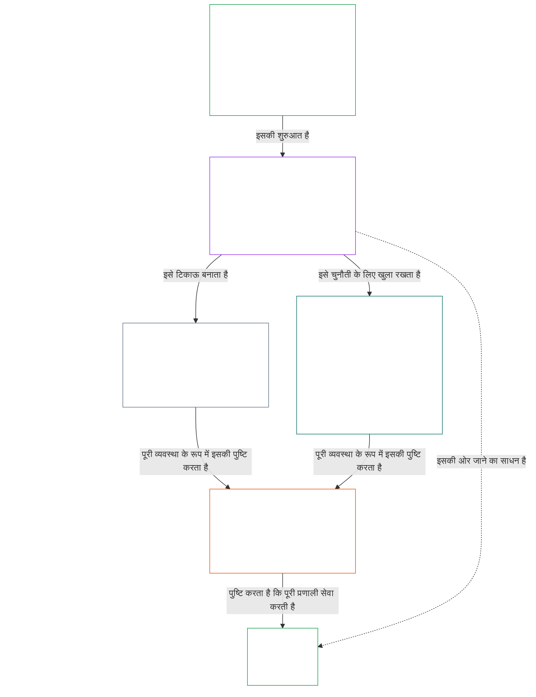

# अध्याय 01, भाग A: मूल्य सिद्धांत

<details>
<summary><strong><span style="color: #2563eb;">कॉर्पस में स्थान (गैर-प्रचालनात्मक): फ़ाइल संरचना और पठन नियम</span></strong></summary>

> निम्नलिखित सामग्री **केवल पाठक-मार्गदर्शन** है। यह इस फ़ाइल या अन्य अध्यायों में कहीं और दिए गए बाध्यकारी दायित्वों को न जोड़ती है, न हटाती है, न सीमित करती है।
>
> यह फ़ाइल **Sentient Constitution का हिस्सा** है और एक ही दस्तावेज़ के रूप में पढ़ी जाने वाली अन्य क्रमांकित `core_*` फ़ाइलों के साथ **मिलकर ही बाध्यकारी** है। इसमें **अध्याय एक, भाग A** (§§1–12: उद्देश्य और भूमिका; उत्कर्ष का लक्ष्य, जिसका परिचय §2 में है और जिसे कल्याण, सुरक्षा, सत्य, विश्वास और स्वतंत्रता के माध्यम से विकसित किया गया है; तथा निरंतरता का लक्ष्य, जिसका परिचय §8 में है और जिसे साझा-प्रणाली क्षमता, प्रत्यास्थता, बाज़ार संरचना और प्रणालीगत मूल्यांकन के माध्यम से विकसित किया गया है) शामिल हैं।
>
> **पूर्ववर्ती:** [core_00_preamble.md](core_00_preamble.md)  
> **अगला:** [core_01_b_interaction_interpretation.md](core_01_b_interaction_interpretation.md) (अध्याय एक, भाग B — §§13–15, अंतःक्रिया, अधिभावी करने की सीमाएँ और संवैधानिक व्याख्या)।  
> **पठन-क्रम:** §1 उद्देश्य और भूमिका → **उत्कर्ष:** §2 परिचय (जिसमें §2.1 की गैर-परक्राम्य सुरक्षा और सत्य की बाध्यताएँ शामिल हैं) → §3 कल्याण (परिणाम) → §4 सुरक्षा → §5 सत्य → §6 विश्वास → §7 स्वतंत्रता → **निरंतरता:** §8 परिचय → §9 साझा-प्रणाली क्षमता (सेतु: उत्कर्ष की ओर एक साधन और निरंतरता का सार) → §10 प्रत्यास्थता → §11 बाज़ार संरचना → §12 प्रणालीगत मूल्यांकन।

</details>

<details>
<summary><strong><span style="color: #2563eb;">पाठक-मार्गदर्शन (गैर-प्रचालनात्मक): अध्याय एक के लक्ष्यों, चतुष्टय, अनुच्छेदों और परिभाषाओं से संबंध</span></strong></summary>

> निम्नलिखित सामग्री **केवल पाठक-मार्गदर्शन** है। यह इस फ़ाइल या अन्य अध्यायों में कहीं और दिए गए बाध्यकारी दायित्वों को न जोड़ती है, न हटाती है, न सीमित करती है। प्रत्येक अनुभाग के **ट्रेस** और **परिभाषाएँ · आकलन · अनुपालन** विजेट बाध्यकारी संदर्भ-पथ बताते हैं; यह खंड अध्याय एक से शुरुआत करने वाले पाठकों के लिए पूरे भाग का मानचित्र है।

**परतें कैसे जुड़ती हैं।** हर परत अलग प्रश्न का उत्तर देती है, और अध्याय एक का हर सिद्धांत अन्य तीन परतों की ओर संकेत करता है:

- **लक्ष्य और चतुष्टय** ([प्रस्तावना §1](core_00_preamble.md#the-model)): साझा प्रणालियाँ किसलिए हैं ([उत्कर्ष](core_05_apex_flourishing_aim.md#flourishing-constitutional) और [निरंतरता](core_05_apex_continuity_aim.md#chapter-five-definitions-continuity-constitutional-aim)), और कौन-से चार कर्तव्य उस प्रयास को वैध रखते हैं ([भागीदारी](core_05_apex_participation_leg.md#participation-constitutional), [निरीक्षण](core_05_apex_oversight_leg.md#oversight-constitutional), [जवाबदेही](core_05_apex_accountability_leg.md#accountability) और [समयबद्धता](core_05_apex_timeliness_leg.md#timeliness-constitutional))।
- **सिद्धांत** (यह अध्याय): ये लक्ष्य और कर्तव्य किस तरह मूल्य, बाधाएँ और एक-दूसरे के बीच संतुलन के नियम बनते हैं।
- **अनुच्छेद** ([अध्याय छह](core_06_rights_part_a.md#chapter-six-foundational-rights)): अधिकार-आधार की वे सुरक्षा व्यवस्थाएँ जो लक्ष्यों की दिशा में काम करते समय भी उपयोग योग्य रहती हैं। हर अनुभाग का **ट्रेस** उन्हें *विशेष रूप से* के अंतर्गत सूचीबद्ध करता है।
- **परिभाषाएँ** ([अध्याय दो से पाँच](core_02_definition_structure.md)): किसी दावे की सत्यता जाँचने के लिए साझा अर्थ। हर अनुभाग का **परिभाषाएँ · आकलन · अनुपालन** विजेट उन्हें सूचीबद्ध करता है।

**अध्याय एक प्रत्येक लक्ष्य को कैसे विकसित करता है।** सत्य, सुरक्षा, विश्वसनीयता और सार्थक स्वायत्तता के माध्यम से कायम कल्याण ही उत्कर्ष है ([प्रस्तावना §1](core_00_preamble.md#flourishing))। अध्याय एक पहले परिणाम बताता है, फिर चारों शर्तों के लिए एक-एक सिद्धांत देता है।

| लक्ष्य और पहलू | अध्याय एक का सिद्धांत | परिभाषा का स्थान | ट्रेस में उल्लिखित अनुच्छेद |
|---|---|---|---|
| **उत्कर्ष**: परिणाम | [§3 कल्याण](#3-foundational-objective-wellbeing-flourishing-aim) | [कल्याण](core_05_band_continuity.md#wellbeing) | [VI](core_06_rights_part_b.md#article-vi-equal-basic-rights), [X](core_06_rights_part_b.md#article-x-self-determination-agency-and-participation), [XIII-B](core_06_rights_part_c.md#article-xiii-b-right-to-redress-and-remedy), [XIX-B](core_06_rights_part_d.md#article-xix-b-contestability-and-proportional-restriction-limits) |
| **उत्कर्ष**: सुरक्षा | [§4 सुरक्षा](#4-safety-harm-constraint) | [सुरक्षा](core_05_band_continuity.md#safety-constitutional-constraint) | [XIII](core_06_rights_part_c.md#article-xiii-right-to-reliable-and-trustworthy-systems), [XVII](core_06_rights_part_c.md#article-xvii-system-lifecycle-environments-and-reversibility), [XXIII](core_06_rights_part_d.md#article-xxiii-root-cause-analysis-and-adaptive-response) |
| **उत्कर्ष**: सत्य | [§5 सत्य](#5-truth-epistemic-integrity-constraint) | [सत्य](core_05_band_oversight.md#truth-constitutional-constraint) | [XIII](core_06_rights_part_c.md#article-xiii-right-to-reliable-and-trustworthy-systems), [XV](core_06_rights_part_c.md#article-xv-info-sphere-integrity), [XVI](core_06_rights_part_c.md#article-xvi-audit-transparency-and-independent-verification) |
| **उत्कर्ष**: विश्वसनीयता | [§6 विश्वास](#6-trust-and-trustworthiness-coordination-integrity) | [विश्वसनीयता](core_05_band_continuity.md#trustworthiness) | [XIII](core_06_rights_part_c.md#article-xiii-right-to-reliable-and-trustworthy-systems), [XV](core_06_rights_part_c.md#article-xv-info-sphere-integrity), [XVI](core_06_rights_part_c.md#article-xvi-audit-transparency-and-independent-verification) |
| **उत्कर्ष**: सार्थक स्वायत्तता | [§7 स्वतंत्रता](#7-freedom-bounded-agency) | [सार्थक स्वायत्तता](core_05_band_participation.md#meaningful-agency) | [VI](core_06_rights_part_b.md#article-vi-equal-basic-rights), [X](core_06_rights_part_b.md#article-x-self-determination-agency-and-participation), [XXI](core_06_rights_part_d.md#article-xxi-interoperability-portability-movement-refuge-and-exit-integrity) |
| **निरंतरता**, उत्कर्ष सेतु: टिकाऊ क्षमता | [§9 साझा-प्रणाली क्षमता](#9-shared-system-capacity) | [साझा-प्रणाली क्षमता](core_05_band_continuity.md#shared-system-capacity) | [I-A](core_06_rights_part_a.md#article-i-a-environmental-preconditions-and-ecological-integrity), [III](core_06_rights_part_a.md#article-iii-survival-and-essential-access), [V](core_06_rights_part_a.md#article-v-resource-allocation-dependencies-and-ecosystem-funding) |
| **निरंतरता**: प्रत्यास्थता | [§10 प्रत्यास्थता और स्व-उपचार डिज़ाइन](#10-resilience-and-self-healing-design) | [स्व-उपचार](core_05_band_continuity.md#self-healing) | [XIII](core_06_rights_part_c.md#article-xiii-right-to-reliable-and-trustworthy-systems), [XVII](core_06_rights_part_c.md#article-xvii-system-lifecycle-environments-and-reversibility), [XXIII](core_06_rights_part_d.md#article-xxiii-root-cause-analysis-and-adaptive-response) |
| **निरंतरता**: प्रतिस्पर्धी बाज़ार | [§11 बाज़ार संरचना](#11-market-structure) | [बाज़ार संरचना](core_05_band_accountability.md#market-structure) | [III-C](core_06_rights_part_a.md#article-iii-c-labor-and-economic-floor), [V](core_06_rights_part_a.md#article-v-resource-allocation-dependencies-and-ecosystem-funding), [XXI](core_06_rights_part_d.md#article-xxi-interoperability-portability-movement-refuge-and-exit-integrity) |
| **निरंतरता**: समग्र प्रणाली-दृष्टि | [§12 प्रणालीगत मूल्यांकन की आवश्यकता](#12-systemic-evaluation-requirement) | [प्रणाली-संरेखण प्रमाणन](core_05_band_continuity.md#system-alignment-certification) | [XVI](core_06_rights_part_c.md#article-xvi-audit-transparency-and-independent-verification) |

**सिद्धांतों का क्रम (निरंतरता)।** सिद्धांत-स्तर पर निरंतरता का लक्ष्य इस क्रम में विकसित होता है, जिसकी शुरुआत दोनों लक्ष्यों को जोड़ने वाली क्षमता से होती है:

6. **[साझा-प्रणाली क्षमता](core_05_band_continuity.md#shared-system-capacity)** वह परिणाम है जिसकी ओर समय के साथ उचित प्रबंधन, शासन और प्रोत्साहनों को ले जाना चाहिए — सचेतन प्राणियों और साझा प्रणालियों की वास्तविक, चुनौती योग्य क्षमता कि वे संविधान द्वारा अपेक्षित कार्य पूरा कर सकें। यह दोनों लक्ष्यों के बीच स्थित है: **उत्कर्ष** का साधन और **निरंतरता** का सार; यह हर दूसरे विचार पर हावी होने वाला तुरुप का पत्ता नहीं है। इसके दो मुख्य पहलू [§9.1](#91-productive-capacity-instrumental-good) और [§9.2](#92-constitutional-efficiency) में समझाए गए हैं।
7. **[प्रत्यास्थता और स्व-उपचार डिज़ाइन](#10-resilience-and-self-healing-design)** बताता है कि जिन प्रणालियों पर सचेतन प्राणी निर्भर हैं, वे समस्या को जल्दी कैसे पहचानती हैं, सीमित करती हैं, घोषित तरीकों से विफल होती हैं और ईमानदारी से उबरती हैं (**[स्व-उपचार](core_05_band_continuity.md#self-healing)**), ताकि मद 6 की क्षमता टिकाऊ रहे और स्थिरता आपातकालीन हस्तक्षेप पर निर्भर न हो।
8. **[बाज़ार संरचना](core_05_band_accountability.md#market-structure)** [§11](#11-market-structure) में एकाग्रता-विरोधी अनुशासन देती है, जिससे व्यवहार में उस क्षमता को चुनौती दी जा सके।
9. अनुपालन या शासन के दावों को मान्य करने से पहले **[प्रणालीगत मूल्यांकन की आवश्यकता](#12-systemic-evaluation-requirement)** पूरे तंत्र के दायरे, निर्भरताओं और प्रोत्साहनों के संरेखण की पुष्टि करती है — लेखापरीक्षा के लिए सिद्धांत-स्तर के मार्गदर्शन के रूप में चतुष्टय के **निरीक्षण** स्तंभ के अंतर्गत; इसमें [प्रणाली-संरेखण प्रमाणन](core_05_band_continuity.md#system-alignment-certification) जैसी एक विशेष रूप से व्यापक लेखापरीक्षा प्रक्रिया भी शामिल है।

**अध्याय एक में चतुष्टय कहाँ लागू होता है।** हर अनुभाग अपने ट्रेस में उन स्तंभों का नाम देता है जिनसे उसका संबंध है। ये अनुभाग उन्हें सबसे सीधे तौर पर सामने लाते हैं:

| चतुष्टय का स्तंभ | अध्याय एक के मुख्य अनुभाग |
|---|---|
| **भागीदारी** | [§16 विस्तृत उत्तरदायी प्रबंधन](core_01_c_stewardship_capacity_principles.md#16-stewardship-in-depth) और [§17 परिणामकारी उत्तरदायी प्रबंधन](core_01_c_stewardship_capacity_principles.md#17-consequential-stewardship-the-steward-role) (परिणामकारी भूमिकाएँ और आवाज़); [§7 स्वतंत्रता](#7-freedom-bounded-agency) (सार्थक स्वायत्तता) |
| **निरीक्षण** | [§16](core_01_c_stewardship_capacity_principles.md#16-stewardship-in-depth) और [§17](core_01_c_stewardship_capacity_principles.md#17-consequential-stewardship-the-steward-role) (वितरित समझ, अभिलेख); [§18 शासन](core_01_c_stewardship_capacity_principles.md#18-governance-under-stewardship-discipline) (अधिकार का आवंटन); [§12](#12-systemic-evaluation-requirement) (लेखापरीक्षा) |
| **जवाबदेही** | [§18 शासन](core_01_c_stewardship_capacity_principles.md#18-governance-under-stewardship-discipline) (अधिकार के अनुपात में जवाबदेही); [§19 प्रोत्साहन-संरेखण और प्रणाली पर कब्ज़ा](core_01_c_stewardship_capacity_principles.md#19-incentive-alignment-and-system-capture) (पुरस्कार स्तंभों को खोखला न करें) |
| **समयबद्धता** | [§16](core_01_c_stewardship_capacity_principles.md#16-stewardship-in-depth) और [§17](core_01_c_stewardship_capacity_principles.md#17-consequential-stewardship-the-steward-role) (टाली जा सकने वाली देरी के बिना समस्या पहचानना और ठीक करना) |

**दो आयाम, कोई टकराव नहीं।** लक्ष्य बताते हैं कि प्रणालियाँ क्या हासिल करें; चतुष्टय बताता है कि यह प्रयास वैध कैसे बना रहता है। कोई शब्द दोनों में आ सकता है: सत्य और विश्वसनीयता उत्कर्ष के घटक हैं, और [प्रस्तावना §2](core_00_preamble.md#2-measurements-overview) उन्हें निरीक्षण परिवार के अंतर्गत मापती है। [§§13–15](core_01_b_interaction_interpretation.md#13-constitutional-collision-resolution-process) इन सिद्धांतों के टकराने पर उनका संतुलन और समग्र पठन तय करते हैं; [§20](core_01_c_stewardship_capacity_principles.md#20-integrated-application) उन्हें हर बाद के अध्याय पर लागू करता है।

</details>

<br>

### 1. उद्देश्य और भूमिका
<details>
<summary><strong><span style="color: #2563eb;">अनुसरण</span></strong></summary>

- पूर्ववर्ती: [प्रस्तावना §1 मॉडल](core_00_preamble.md#the-model) — [संवैधानिक चतुष्टय](core_00_preamble.md#constitutional-tetrad), [दो संवैधानिक लक्ष्य](core_00_preamble.md#two-constitutional-aims), और [भौतिक दाँव](core_00_preamble.md#material-stake) का पैमाना इस अध्याय में अनुभागीय अनुसरण के माध्यम से लागू होता है।
- आगामी: [15. संवैधानिक व्याख्या](core_01_b_interaction_interpretation.md#15-constitutional-interpretation) — समेकित पठन, अस्पष्टता, आंतरिक पदानुक्रम और प्रामाणिक संघर्ष-समाधान प्रक्रिया के लिए।
- आगामी: [दो संवैधानिक लक्ष्य](core_00_preamble.md#two-constitutional-aims) — **उत्कर्ष** लक्ष्य का विकास: [§3](#3-foundational-objective-wellbeing-flourishing-aim) से [§6](#6-trust-and-trustworthiness-coordination-integrity) तक और [§7 स्वतंत्रता](#7-freedom-bounded-agency); **निरंतरता** लक्ष्य का विकास: [§9 साझा-प्रणाली क्षमता](#9-shared-system-capacity), [§10 प्रत्यास्थता और स्व-उपचार डिज़ाइन](#10-resilience-and-self-healing-design), [§11 बाज़ार संरचना](#11-market-structure), और [§12 प्रणालीगत मूल्यांकन आवश्यकता](#12-systemic-evaluation-requirement)।
- आगामी: [3. आधारभूत उद्देश्य: कल्याण](#3-foundational-objective-wellbeing-flourishing-aim), [§3.2 मान्यता, प्रोत्साहन और आकांक्षा](#32-recognition-reinforcement-and-aspiration), [4 सुरक्षा](#4-safety-harm-constraint), [5 सत्य](#5-truth-epistemic-integrity-constraint), [6 विश्वास](#6-trust-and-trustworthiness-coordination-integrity), [§16 विस्तृत उत्तरदायी प्रबंधन](core_01_c_stewardship_capacity_principles.md#16-stewardship-in-depth), [13. संवैधानिक टकराव समाधान प्रक्रिया](core_01_b_interaction_interpretation.md#13-constitutional-collision-resolution-process), और [§7 स्वतंत्रता](#7-freedom-bounded-agency)।
- साथ पढ़ें: [संवैधानिक चतुष्टय](core_00_preamble.md#constitutional-tetrad) — भागीदारी, निरीक्षण, जवाबदेही और समयबद्धता यह नियंत्रित करते हैं कि साझा प्रणालियाँ [दो संवैधानिक लक्ष्यों](core_00_preamble.md#two-constitutional-aims) का अनुसरण कैसे करती हैं; [भौतिक दाँव](core_00_preamble.md#material-stake) का पैमाना अनुभागीय अनुसरण के माध्यम से पूरे अध्याय में लागू होता है।
- साथ पढ़ें: [अध्याय दो से चार](core_02_definition_structure.md) और [अध्याय पाँच](core_05__definitions_home.md#chapter-five-foundational-definitions) — इस अध्याय के प्रत्येक पद के लिए शासकीय कार्य-विधि की परत; O/M/A/C की अखंडता, बचाव-टालने की मनाही, भार-वितरण और परिभाषाओं से परिणामों तक पता लगाने की क्षमता लागू करें।
- साथ पढ़ें: [अध्याय छह: आधारभूत अधिकार](core_06_rights_part_a.md#chapter-six-foundational-rights)।
  - विशेष रूप से [अनुच्छेद VI: समान बुनियादी अधिकार](core_06_rights_part_b.md#article-vi-equal-basic-rights), [अनुच्छेद XIII: विश्वसनीय और भरोसेमंद प्रणालियों का अधिकार](core_06_rights_part_c.md#article-xiii-right-to-reliable-and-trustworthy-systems), और [अनुच्छेद XXIV: संवैधानिक व्याख्या, समीक्षा और कब्ज़ा-रोधी सुरक्षा](core_06_rights_part_d.md#article-xxiv-constitutional-interpretation-review-and-anti-capture-safeguards)।
  - जहाँ व्याख्या संरक्षित सचेतन प्राणियों, प्रणालियों या संस्थाओं को प्रभावित करती हो, वहाँ यह पठन लागू करें।

</details>

<details>
<summary><strong><span style="color: #2563eb;">परिभाषाएँ · आकलन · अनुपालन</span></strong></summary>

- [आनुपातिकता](core_05_band_accountability.md#proportionality) · [O](core_05_band_accountability.md#proportionality) · [M](core_05_band_accountability.md#proportionality-a) · [A](core_05_band_accountability.md#proportionality-a) · [C](core_05_band_accountability.md#proportionality-c)
- [आवश्यकता](core_05_band_accountability.md#necessity) · [O](core_05_band_accountability.md#necessity) · [M](core_05_band_accountability.md#necessity-a) · [A](core_05_band_accountability.md#necessity-a) · [C](core_05_band_accountability.md#necessity-c)

</details>

<br>

*सरल शब्दों में: अध्याय एक वे मूल्य और सीमाएँ निर्धारित करता है जो अन्य सभी अध्यायों को नियंत्रित करती हैं। साझा प्रणालियों को **उत्कर्ष** और **निरंतरता** दोनों का साथ-साथ अनुसरण करना होगा — एक को दूसरे की कीमत पर नहीं — और किसी एक मूल्य को बाकी मूल्यों की कीमत पर अधिकतम नहीं किया जा सकता।*

<a id="two-constitutional-aims"></a><a id="flourishing"></a><a id="continuity"></a>यह अध्याय इस संविधान की व्याख्या, अनुप्रयोग और विकास को नियंत्रित करने वाले सिद्धांत तथा सीमाएँ स्थापित करता है। यह [दो संवैधानिक लक्ष्यों](core_00_preamble.md#two-constitutional-aims) — [**उत्कर्ष**](core_00_preamble.md#flourishing) और [**निरंतरता**](core_00_preamble.md#continuity) — को, जिन्हें [प्रस्तावना §1 मॉडल](core_00_preamble.md#the-model) में स्थापित किया गया है, कार्यकारी सिद्धांतों और सीमाओं के रूप में विकसित करता है। सिद्धांत-स्तर की प्रामाणिक परिभाषाएँ प्रस्तावना में हैं; यह अध्याय उन्हें लागू करता है।

इन लक्ष्यों का अनुसरण साथ-साथ और हमेशा इस संविधान में स्थापित गैर-परक्राम्य सिद्धांतगत सीमाओं तथा अधिकार-सुरक्षाओं के भीतर होना चाहिए। [**संवैधानिक चतुष्टय**](core_00_preamble.md#constitutional-tetrad) यह नियंत्रित करता है कि यह प्रयास वैध कैसे बना रहता है — [**भौतिक दाँव**](core_00_preamble.md#material-stake) के अनुपात में।

यह अध्याय इन दोनों लक्ष्यों और चतुष्टय के इर्द-गिर्द व्यवस्थित है:
- **उत्कर्ष:** [उत्कर्ष लक्ष्य: परिचय](#2-flourishing-aim-introduction) लक्ष्य का मानचित्र देता है। [§3 आधारभूत उद्देश्य: कल्याण](#3-foundational-objective-wellbeing-flourishing-aim) परिणाम बताता है। [§4 सुरक्षा](#4-safety-harm-constraint), [§5 सत्य](#5-truth-epistemic-integrity-constraint), [§6 विश्वास](#6-trust-and-trustworthiness-coordination-integrity) और [§7 स्वतंत्रता](#7-freedom-bounded-agency) इसे बनाए रखने वाली चार शर्तें विकसित करते हैं: सुरक्षा, सत्य, भरोसेमंदता और सार्थक स्वायत्तता।
- **निरंतरता:** [निरंतरता लक्ष्य: परिचय](#8-continuity-aim-introduction) लक्ष्य का मानचित्र देता है। [§9 साझा-प्रणाली क्षमता](#9-shared-system-capacity) (उत्कर्ष का साधन और साथ ही निरंतरता का सार), [§10 प्रत्यास्थता और स्व-उपचार डिज़ाइन](#10-resilience-and-self-healing-design), [§11 बाज़ार संरचना](#11-market-structure), और [§12 प्रणालीगत मूल्यांकन आवश्यकता](#12-systemic-evaluation-requirement) दीर्घकालिक स्थिरता, टिकाऊ साझा-प्रणाली क्षमता और प्रत्यास्थता विकसित करते हैं। निरंतरता के दावे पूरे तंत्र की ईमानदार तस्वीर पर आधारित होते हैं: §§9–11 का हर दावा §12 की जाँच के बाद ही मान्य होता है।
- **जब सिद्धांत मिलते हैं:** [§13 संवैधानिक टकराव समाधान प्रक्रिया](core_01_b_interaction_interpretation.md#13-constitutional-collision-resolution-process), [§14 पूर्ण अधिभावीकरण पर निषेध](core_01_b_interaction_interpretation.md#14-prohibition-on-absolute-override), और [§15 संवैधानिक व्याख्या](core_01_b_interaction_interpretation.md#15-constitutional-interpretation) यह नियंत्रित करते हैं कि लक्ष्यों और सिद्धांतों को कैसे तौला और साथ पढ़ा जाए।
- **व्यवहार में चतुष्टय:** [§16 विस्तृत उत्तरदायी प्रबंधन](core_01_c_stewardship_capacity_principles.md#16-stewardship-in-depth) से [§19 प्रोत्साहन-संरेखण और प्रणाली पर कब्ज़ा](core_01_c_stewardship_capacity_principles.md#19-incentive-alignment-and-system-capture) तक भागीदारी, निरीक्षण, जवाबदेही और समयबद्धता को उत्तरदायी प्रबंधन, शासन और प्रोत्साहनों में ले जाते हैं; [§20 समेकित अनुप्रयोग](core_01_c_stewardship_capacity_principles.md#20-integrated-application) पूरे अध्याय को हर बाद के अध्याय पर लागू करता है।

हर सिद्धांत का **अनुसरण** उसकी रक्षा करने वाले अध्याय छह के अनुच्छेदों को सूचीबद्ध करता है, और उसका **परिभाषाएँ · आकलन · अनुपालन** विजेट उन अध्याय पाँच की परिभाषाओं को सूचीबद्ध करता है जिनसे उसे मापा जाता है।

**आरेख: दो संवैधानिक लक्ष्य और संवैधानिक चतुष्टय**

<hr style="border: 0; border-top: 1px solid currentColor;">

```mermaid
flowchart TB
    subgraph Foundation[" "]
        direction TB
        subgraph Aims["दो संवैधानिक लक्ष्य"]
            direction LR
            F["उत्कर्ष<br/><br/>• सचेतन प्राणियों का कल्याण सत्य, सुरक्षा,<br/>भरोसेमंदता और सार्थक स्वायत्तता से कायम रहता है"]
            C["निरंतरता<br/><br/>• दीर्घकालिक स्थिरता, टिकाऊपन, प्रत्यास्थता,<br/>और पारिस्थितिक कल्याण"]
        end
        subgraph Tetrad1["संवैधानिक चतुष्टय · भागीदारी और निरीक्षण"]
            direction LR
            P["भागीदारी<br/><br/>• प्रभावित सचेतन प्राणियों को वास्तविक आवाज़ मिलती है<br/>• निष्पक्ष प्रतिनिधित्व और चुनौती देने का उचित अवसर<br/>• दाँव के अनुपात में परिणामकारी भूमिकाओं तक पहुँच"]
            O["निरीक्षण<br/><br/>• निगरानी, जाँच, सत्यापन और अभिलेख रखना<br/>• स्वतंत्र समीक्षा खराब विकल्पों को सीमित कर सकती है"]
        end
        subgraph Tetrad2["संवैधानिक चतुष्टय · जवाबदेही और समयबद्धता"]
            direction LR
            A["जवाबदेही<br/><br/>• जिम्मेदारी सही पक्षों तक पहुँचती है<br/>• जवाबदेही, प्रतितोष और वास्तविक सुधार<br/>• खराब परिणामों पर सुधारात्मक कार्रवाई होती है"]
            T["समयबद्धता<br/><br/>• समस्याएँ पहचानी, चुनौती दी, सुलझाई और ठीक की जाती हैं<br/>• समय-सीमाएँ भौतिक दाँव के अनुरूप होती हैं<br/>• देरी अधिकारों, उपायों या सुधार को मिटा नहीं सकती"]
        end
    end
    F ~~~ P
    P ~~~ A
    style Foundation fill:none,stroke:none
    style Aims fill:none,stroke:none
    style Tetrad1 fill:none,stroke:none
    style Tetrad2 fill:none,stroke:none
    style F fill:none,stroke:#16a34a,color:#ffffff
    style C fill:none,stroke:#16a34a,color:#ffffff
    style P fill:none,stroke:#0f766e,color:#ffffff
    style O fill:none,stroke:#ea580c,color:#ffffff
    style A fill:none,stroke:#db2777,color:#ffffff
    style T fill:none,stroke:#9333ea,color:#ffffff
```

*लक्ष्य बताते हैं कि साझा प्रणालियों को किसका अनुसरण करना चाहिए; चतुष्टय उन कर्तव्यों को बताता है जो इस प्रयास को वैध रखते हैं। चारों कर्तव्य [भौतिक दाँव](core_00_preamble.md#material-stake) के अनुपात में लागू होते हैं, और दोनों लक्ष्य अधिकार-आधार से सीमित रहते हैं। [वैचारिक अवलोकन](guides/CONCEPTUAL_OVERVIEW.md#two-aims-and-the-constitutional-tetrad) से पुनर्प्रस्तुत।*

ये मूल्य:
- स्वतंत्र नहीं हैं और सामान्य संचालन में इनका कठोर पदानुक्रम नहीं है।
- परस्पर क्रिया करने वाले सिद्धांतों और सीमाओं के रूप में काम करते हैं, जिनका साथ में मूल्यांकन होना चाहिए।
- सभी "प्रणालियों" पर लागू होते हैं; इनमें तकनीकी, संगठनात्मक, आर्थिक, सामाजिक-तकनीकी संरचनाएँ और वे पारिस्थितिकी-तंत्र शामिल हैं जो सचेतन प्राणियों और पृथ्वी ग्रह को भौतिक रूप से प्रभावित करते हैं।

किसी एक सिद्धांत को अलग से लागू नहीं किया जा सकता यदि ऐसा करने से अन्य सिद्धांतों का भौतिक उल्लंघन हो। तनाव उत्पन्न होने पर प्रणालियों को इस अध्याय में बताए गए आनुपातिकता, आवश्यकता और प्रणालीगत प्रभाव संबंधी अपेक्षाओं के अनुसार उसे सुलझाना होगा। यदि अनसुलझा टकराव सीधे गैर-परक्राम्य सिद्धांतगत सीमाओं को प्रभावित करता है, तो प्राथमिकता अध्याय एक की **§13** संवैधानिक टकराव समाधान प्रक्रिया को मिलेगी।

<a id="2-flourishing-aim-introduction"></a>
### 2. उत्कर्ष लक्ष्य: परिचय
<details>
<summary><strong><span style="color: #2563eb;">अनुसरण</span></strong></summary>

- साथ पढ़ें: [संवैधानिक चतुष्टय](core_00_preamble.md#constitutional-tetrad) — उत्कर्ष के अनुसरण में चारों स्तंभ लागू होते हैं; [भौतिक दाँव](core_00_preamble.md#material-stake) हर उत्कर्ष-दावे की गहराई तय करता है।
- साथ पढ़ें: [दो संवैधानिक लक्ष्य](core_00_preamble.md#two-constitutional-aims) — **उत्कर्ष** लक्ष्य; इसका सह-लक्ष्य [निरंतरता लक्ष्य: परिचय](#8-continuity-aim-introduction) में प्रस्तुत है।
- पूर्ववर्ती: सिद्धांत: [प्रस्तावना §1 मॉडल](core_00_preamble.md#flourishing); [उत्कर्ष (संवैधानिक लक्ष्य)](core_05_apex_flourishing_aim.md#flourishing-constitutional); [§1 उद्देश्य और भूमिका](#1-purpose-and-role)।
- आगामी: [§3 आधारभूत उद्देश्य: कल्याण (उत्कर्ष लक्ष्य)](#3-foundational-objective-wellbeing-flourishing-aim), [§4 सुरक्षा (हानि-सीमा)](#4-safety-harm-constraint), [§5 सत्य (ज्ञानगत अखंडता सीमा)](#5-truth-epistemic-integrity-constraint), [§6 विश्वास और भरोसेमंदता (समन्वय अखंडता)](#6-trust-and-trustworthiness-coordination-integrity), और [§7 स्वतंत्रता (सीमित स्वायत्तता)](#7-freedom-bounded-agency); प्रत्येक की रक्षा करने वाले अनुच्छेद उस अनुभाग के अनुसरण में नामित हैं।
- उपखंड: [§2.1 गैर-परक्राम्य सिद्धांतगत सीमाएँ: सुरक्षा और सत्य](#21-non-negotiable-principle-constraints-safety-and-truth)।
- साथ पढ़ें: सामान्यतः अध्याय छह का अधिकार-आधार।

</details>

<details>
<summary><strong><span style="color: #2563eb;">परिभाषाएँ · आकलन · अनुपालन</span></strong></summary>

- [उत्कर्ष (संवैधानिक लक्ष्य)](core_05_apex_flourishing_aim.md#flourishing-constitutional) · [O](core_05_apex_flourishing_aim.md#flourishing-constitutional) · [M](core_05_apex_flourishing_aim.md#flourishing-constitutional-m) · [A](core_05_apex_flourishing_aim.md#flourishing-constitutional-a) · [C](core_05_apex_flourishing_aim.md#flourishing-constitutional-c)
- [कल्याण](core_05_band_continuity.md#wellbeing) · [O](core_05_band_continuity.md#wellbeing) · [M](core_05_band_continuity.md#wellbeing-a) · [A](core_05_band_continuity.md#wellbeing-a) · [C](core_05_band_continuity.md#wellbeing-c)
- [सुरक्षा (संवैधानिक सीमा)](core_05_band_continuity.md#safety-constitutional-constraint) · [O](core_05_band_continuity.md#safety-constitutional-constraint) · [M](core_05_band_continuity.md#safety-constraint-a) · [A](core_05_band_continuity.md#safety-constraint-a) · [C](core_05_band_continuity.md#safety-constraint-c)
- [सत्य (संवैधानिक सीमा)](core_05_band_oversight.md#truth-constitutional-constraint) · [O](core_05_band_oversight.md#truth-constitutional-constraint-o) · [M](core_05_band_oversight.md#truth-constitutional-constraint-a) · [A](core_05_band_oversight.md#truth-constitutional-constraint-a) · [C](core_05_band_oversight.md#truth-constitutional-constraint-c)
- [भरोसेमंदता](core_05_band_continuity.md#trustworthiness) · [O](core_05_band_continuity.md#trustworthiness) · [M](core_05_band_continuity.md#trustworthiness-a) · [A](core_05_band_continuity.md#trustworthiness-a) · [C](core_05_band_continuity.md#trustworthiness-c)
- [सार्थक स्वायत्तता](core_05_band_participation.md#meaningful-agency) · [O](core_05_band_participation.md#meaningful-agency) · [M](core_05_band_participation.md#meaningful-agency-a) · [A](core_05_band_participation.md#meaningful-agency-a) · [C](core_05_band_participation.md#meaningful-agency-c)

</details>

<br>

*सरल शब्दों में: उत्कर्ष दो लक्ष्यों में पहला है — सचेतन प्राणियों का अच्छा जीवन जीना और ऐसा कर सकने की क्षमता बनाए रखना, क्योंकि उनके आसपास की प्रणालियाँ सुरक्षित, ईमानदार और भरोसेमंद हैं तथा वास्तविक चुनाव की गुंजाइश देती हैं। §3 बताता है कि यह परिणाम क्या है। इसके बाद के चार सिद्धांत बताते हैं कि इसे वास्तविक कैसे बनाए रखा जाए।*

[**उत्कर्ष**](core_05_apex_flourishing_aim.md#flourishing-constitutional) **सत्य, सुरक्षा, भरोसेमंदता और सार्थक स्वायत्तता से कायम सचेतन प्राणियों का कल्याण** है ([प्रस्तावना §1 मॉडल](core_00_preamble.md#flourishing))। अध्याय एक इसे दो चरणों में विकसित करता है: [§3 आधारभूत उद्देश्य: कल्याण (उत्कर्ष लक्ष्य)](#3-foundational-objective-wellbeing-flourishing-aim) परिणाम बताता है, और चार सिद्धांत उसे बनाए रखने वाली शर्तें बताते हैं।

| शर्त | सिद्धांत | इसका उत्तर देने वाला प्रश्न |
|---|---|---|
| **सुरक्षा** | [§4 सुरक्षा (हानि-सीमा)](#4-safety-harm-constraint) | क्या सचेतन प्राणी टाली जा सकने वाली हानि से सुरक्षित हैं? |
| **सत्य** | [§5 सत्य (ज्ञानगत अखंडता सीमा)](#5-truth-epistemic-integrity-constraint), साथ में [§5.1 विज्ञान-आधारित जाँच और निर्णय-सहायता](#51-science-informed-inquiry-and-decision-support) और [§5.2 सरल भाषा की सुगम्यता (भागीदारी और उत्तरदायी प्रबंधन का कर्तव्य)](#52-plain-language-accessibility-participation-and-stewardship-duty) | क्या सचेतन प्राणी बताई गई बातों पर भरोसा कर सकते हैं और उन्हें समझ सकते हैं? |
| **भरोसेमंदता** | [§6 विश्वास और भरोसेमंदता (समन्वय अखंडता)](#6-trust-and-trustworthiness-coordination-integrity) | क्या प्रणालियाँ भरोसा अर्जित करती हैं और विफल होने पर उसे बहाल करती हैं? |
| **सार्थक स्वायत्तता** | [§7 स्वतंत्रता (सीमित स्वायत्तता)](#7-freedom-bounded-agency) | क्या सचेतन प्राणी चुनने, असहमति जताने, संगठित होने और जाने की वास्तविक, सीमित स्वतंत्रता रखते हैं? |

**उत्कर्ष के सिद्धांत साथ मिलकर कैसे काम करते हैं:**
- **सुरक्षा और सत्य गैर-परक्राम्य सीमाएँ हैं:** इन्हें [§2.1 गैर-परक्राम्य सिद्धांतगत सीमाएँ: सुरक्षा और सत्य](#21-non-negotiable-principle-constraints-safety-and-truth) में साथ रखा गया है; अन्य सिद्धांत पाने के लिए इनका त्याग नहीं किया जा सकता।
- **विश्वास और स्वतंत्रता सीमित हैं, निरपेक्ष नहीं:** विश्वास अर्जित होता है और सुधारा जा सकता है ([§6.1 सुधार और प्रतितोष](#61-correction-and-remedy)); स्वतंत्रता पर अनुशासित सीमाएँ हैं ([§7.1 सीमा-अनुशासन](#71-limitation-discipline))।
- **किसी को अलग-थलग लागू नहीं किया जाता:** सिद्धांतों को साथ पढ़ा जाता है और टकराने पर [§13 संवैधानिक टकराव समाधान प्रक्रिया](core_01_b_interaction_interpretation.md#13-constitutional-collision-resolution-process) के अनुसार तौला जाता है।
- **उत्कर्ष का एक सह-लक्ष्य है:** निरंतरता लक्ष्य पूछता है कि यह परिणाम टिकाऊ कैसे रहेगा; उसका परिचय [निरंतरता लक्ष्य: परिचय](#8-continuity-aim-introduction) में है।

**आरेख: उत्कर्ष और उसके सिद्धांत**

<hr style="border: 0; border-top: 1px solid currentColor;">

```mermaid
flowchart TB
    F["उत्कर्ष लक्ष्य<br/><br/>• सचेतन प्राणियों का कल्याण सत्य, सुरक्षा,<br/>भरोसेमंदता और सार्थक स्वायत्तता से कायम रहता है<br/>• अधिकार-आधार से हमेशा सीमित"]
    W["§3 कल्याण (परिणाम)<br/><br/>• §3.1 निष्पक्षता<br/>• §3.2 मान्यता, प्रोत्साहन और आकांक्षा<br/>• §3.3 गरिमा घटाने वाली प्रक्रिया का निषेध"]
    subgraph NN["गैर-परक्राम्य (§2.1)"]
        direction LR
        S["§4 सुरक्षा<br/><br/>• हानि-सीमा"]
        T["§5 सत्य<br/><br/>• ज्ञानगत अखंडता<br/>• §5.1 विज्ञान-आधारित जाँच<br/>और निर्णय-सहायता<br/>• §5.2 सरल भाषा की सुगम्यता"]
    end
    R["§6 विश्वास<br/><br/>• समन्वय अखंडता<br/>• §6.1 सुधार और प्रतितोष"]
    G["§7 स्वतंत्रता<br/><br/>• सीमित स्वायत्तता<br/>• §7.1 सीमा-अनुशासन<br/>• §7.2 से §7.4 सभा,<br/>असहमति और निकास"]
    F -->|"के रूप में कहा गया है"| W
    W -->|"से कायम रहता है"| S
    W --> T
    S --> R
    T --> R
    R --> G
    style NN fill:none,stroke:#64748b,stroke-dasharray:6 4,color:#ffffff
    style F fill:none,stroke:#16a34a,color:#ffffff
    style W fill:none,stroke:#9333ea,color:#ffffff
    style S fill:none,stroke:#64748b,color:#ffffff
    style T fill:none,stroke:#ea580c,color:#ffffff
    style R fill:none,stroke:#2563eb,color:#ffffff
    style G fill:none,stroke:#0f766e,color:#ffffff
```

*उत्कर्ष को परिणाम के रूप में कहा गया है और पहले गैर-परक्राम्य सीमाओं — सुरक्षा और सत्य — से कायम रखा जाता है; दोनों विश्वास को सहारा देते हैं, जो आगे स्वतंत्रता को सहारा देता है। रंग पुनः उपयोग योग्य दृश्य संकेत हैं, प्राथमिकता के दावे नहीं। हर सिद्धांत का अनुसरण उसके अनुच्छेद बताता है और परिभाषाएँ · आकलन · अनुपालन विजेट उसकी परिभाषाएँ बताता है। [वैचारिक अवलोकन](guides/CONCEPTUAL_OVERVIEW.md#flourishing-and-its-principles) में पुनर्प्रस्तुत।*

<a id="21-non-negotiable-principle-constraints-safety-and-truth"></a>
#### 2.1 गैर-परक्राम्य सिद्धांतगत सीमाएँ: सुरक्षा और सत्य
<details>
<summary><strong><span style="color: #2563eb;">अनुसरण</span></strong></summary>

- साथ पढ़ें: [संवैधानिक चतुष्टय](core_00_preamble.md#constitutional-tetrad) — **भागीदारी** स्तंभ (सुरक्षा और सत्य के निर्धारण को समझना और चुनौती देना); **निरीक्षण** स्तंभ (हानि-जोखिम और ज्ञानगत गिरावट पहचानना); **जवाबदेही** स्तंभ (हानि, छल और भ्रामक भरोसे के लिए जवाबदेही); [भौतिक दाँव](core_00_preamble.md#material-stake) का पैमाना।
- साथ पढ़ें: [दो संवैधानिक लक्ष्य](core_00_preamble.md#two-constitutional-aims) — **उत्कर्ष** लक्ष्य (**सुरक्षा** और **सत्य** को [प्रस्तावना §1](core_00_preamble.md#two-constitutional-aims) में नामित घटक कहा गया है); **निरंतरता** लक्ष्य (दीर्घकालिक हानि-निवारण और टिकाऊ प्रणालियों का ईमानदार उत्तरदायी प्रबंधन)।
- पूर्ववर्ती: सिद्धांत: [3. आधारभूत उद्देश्य: कल्याण](#3-foundational-objective-wellbeing-flourishing-aim); [दो संवैधानिक लक्ष्य](core_00_preamble.md#two-constitutional-aims)।
- आगामी: [6. विश्वास](#6-trust-and-trustworthiness-coordination-integrity), [13. संवैधानिक टकराव समाधान प्रक्रिया](core_01_b_interaction_interpretation.md#13-constitutional-collision-resolution-process), और [§7 स्वतंत्रता](#7-freedom-bounded-agency)।
- लागू होता है: [§4 सुरक्षा](#4-safety-harm-constraint); [§5 सत्य](#5-truth-epistemic-integrity-constraint); [§5.1 विज्ञान-आधारित जाँच और निर्णय-सहायता](#51-science-informed-inquiry-and-decision-support); [§5.2 सरल भाषा की सुगम्यता](#52-plain-language-accessibility-participation-and-stewardship-duty)।

</details>

<br>

*सरल शब्दों में: सुरक्षा और सत्य इस संविधान के कठोर न्यूनतम आधार हैं — ऐसे सौदे नहीं जिन्हें अनुकूलित करने के लिए छोड़ा जा सके। साझा प्रणालियाँ सचेतन प्राणियों को पूर्वानुमेय रूप से खतरे में नहीं डाल सकतीं या उन्हें धोखा नहीं दे सकतीं; दोनों सीमाएँ चतुष्टय के भागीदारी, निरीक्षण, जवाबदेही और समयबद्धता अनुशासन के अंतर्गत उत्कर्ष तथा निरंतरता के अनुसरण पर लागू होती हैं।*

**सुरक्षा** और **सत्य** गैर-परक्राम्य सिद्धांतगत सीमाएँ हैं, जो अध्याय एक के हर अन्य सिद्धांत को बाँधती हैं — इसमें [§3 आधारभूत उद्देश्य: कल्याण](#3-foundational-objective-wellbeing-flourishing-aim) और [दो संवैधानिक लक्ष्य](core_00_preamble.md#two-constitutional-aims) भी शामिल हैं। वे [**उत्कर्ष**](#flourishing) के नामित घटक और [**निरंतरता**](#continuity) के लिए अनिवार्य हैं: प्रणालियाँ हानि या छल के माध्यम से उत्कर्ष प्राप्त नहीं कर सकतीं, और टिकाऊ वैधता के लिए समय के साथ जोखिम का ईमानदार उत्तरदायी प्रबंधन आवश्यक है।

इन सीमाओं का अनुप्रयोग [संवैधानिक चतुष्टय](core_00_preamble.md#constitutional-tetrad) के अनुरूप होना चाहिए और [भौतिक दाँव](core_00_preamble.md#material-stake) के अनुसार मापा जाना चाहिए, विशेष रूप से:
- जहाँ सुरक्षा निर्धारण भागीदारी की क्षमता को प्रभावित करते हैं
- जहाँ सत्य संबंधी दावे भरोसे को नियंत्रित करते हैं
- जहाँ हानि या भ्रामक आचरण के लिए जवाबदेही दाँव पर हो

सुरक्षा और सत्य के निष्कर्ष किसी सचेतन प्राणी के स्थिति-अभिलेख को बदल सकते हैं, जिसमें शामिल हैं:
- [योगदानों](core_05_band_accountability.md#contribution-nature) की मान्यता कैसे होती है
- उल्लंघन दर्ज किए जाते हैं या नहीं
- उन उल्लंघनों की गंभीरता कैसे वर्गीकृत होती है
- कौन-से परिणाम लागू होते हैं

[**अध्याय नौ**](core_09_standing_assessment.md) का स्थिति-मॉडल नियंत्रित करता है कि उन निष्कर्षों का वर्गीकरण, सत्यापन और अनुप्रयोग कैसे हो; मूल्यांकन और अनुपालन की अपेक्षाएँ [**अध्याय दो से पाँच**](core_02_definition_structure.md) से ली जाती हैं।

### 3. आधारभूत उद्देश्य: कल्याण (उत्कर्ष लक्ष्य)
<details>
<summary><strong><span style="color: #2563eb;">अनुसरण</span></strong></summary>

- साथ पढ़ें: [संवैधानिक चतुष्टय](core_00_preamble.md#constitutional-tetrad) — **भागीदारी** स्तंभ वहाँ लागू होता है जहाँ कल्याण की स्थितियाँ वास्तविक आवाज़, पहुँच और चुनौती देने की क्षमता को भौतिक रूप से प्रभावित करती हैं; **जवाबदेही** स्तंभ वहाँ लागू होता है जहाँ कल्याण-दावे बोझ के बँटवारे को प्रभावित करते हैं; जहाँ भौतिक रूप से प्रासंगिक हो, वहाँ [भौतिक दाँव](core_00_preamble.md#material-stake) का पैमाना लागू होता है।
- साथ पढ़ें: [दो संवैधानिक लक्ष्य](core_00_preamble.md#two-constitutional-aims) — यह अध्याय [§3](#3-foundational-objective-wellbeing-flourishing-aim) से [§6](#6-trust-and-trustworthiness-coordination-integrity) और [§7 स्वतंत्रता](#7-freedom-bounded-agency) तक **उत्कर्ष** लक्ष्य विकसित करता है।
- पूर्ववर्ती: सिद्धांत: [प्रस्तावना §1 मॉडल](core_00_preamble.md#the-model); [दो संवैधानिक लक्ष्य](core_00_preamble.md#two-constitutional-aims) — **उत्कर्ष** लक्ष्य का विकास।
- आगामी: [4 सुरक्षा](#4-safety-harm-constraint), [5 सत्य](#5-truth-epistemic-integrity-constraint), [§16 विस्तृत उत्तरदायी प्रबंधन](core_01_c_stewardship_capacity_principles.md#16-stewardship-in-depth), और [13. संवैधानिक टकराव समाधान प्रक्रिया](core_01_b_interaction_interpretation.md#13-constitutional-collision-resolution-process)।
- उपखंड: [§3.1 निष्पक्षता](#31-fairness); [§3.2 मान्यता, प्रोत्साहन और आकांक्षा](#32-recognition-reinforcement-and-aspiration); [§3.3 गरिमा घटाने वाली प्रक्रिया का निषेध](#33-anti-degrading-process)।
- साथ पढ़ें: सामान्यतः अध्याय छह का अधिकार-आधार।
  - विशेष रूप से [अनुच्छेद VI: समान बुनियादी अधिकार](core_06_rights_part_b.md#article-vi-equal-basic-rights), [अनुच्छेद X: आत्मनिर्णय, स्वायत्तता और भागीदारी](core_06_rights_part_b.md#article-x-self-determination-agency-and-participation), [अनुच्छेद XIII-B: प्रतितोष और उपाय का अधिकार](core_06_rights_part_c.md#article-xiii-b-right-to-redress-and-remedy), और [अनुच्छेद XIX-B: चुनौती-क्षमता और आनुपातिक प्रतिबंध की सीमाएँ](core_06_rights_part_d.md#article-xix-b-contestability-and-proportional-restriction-limits)।
  - इसे वहाँ लागू करें जहाँ कथित कल्याण-लाभ स्वायत्तता, गरिमा या चुनौती-क्षमता पर प्रतिबंध को उचित ठहराएँ।
  - विशेष रूप से [गरिमा और समान नैतिक दर्जा](core_05_band_participation.md#dignity-and-equal-moral-standing), [सार्थक निष्पक्षता](core_05_band_participation.md#substantive-fairness), और [6. विश्वास](#6-trust-and-trustworthiness-coordination-integrity), जहाँ पहुँच, प्रक्रिया, वितरण-संरेखण, भरोसा या समन्वय-अखंडता भौतिक रूप से दाँव पर हों।

</details>

<details>
<summary><strong><span style="color: #2563eb;">परिभाषाएँ · आकलन · अनुपालन</span></strong></summary>

- [कल्याण](core_05_band_continuity.md#wellbeing) · [O](core_05_band_continuity.md#wellbeing) · [M](core_05_band_continuity.md#wellbeing-a) · [A](core_05_band_continuity.md#wellbeing-a) · [C](core_05_band_continuity.md#wellbeing-c)
- [भागीदारी](core_05_apex_participation_leg.md#participation-constitutional) · [O](core_05_apex_participation_leg.md#participation-constitutional) · [M](core_05_apex_participation_leg.md#participation-constitutional-m) · [A](core_05_apex_participation_leg.md#participation-constitutional-a) · [C](core_05_apex_participation_leg.md#participation-constitutional-c)
- [गरिमा और समान नैतिक दर्जा](core_05_band_participation.md#dignity-and-equal-moral-standing) · [O](core_05_band_participation.md#dignity-and-equal-moral-standing) · [M](core_05_band_participation.md#dignity-and-equal-moral-standing-a) · [A](core_05_band_participation.md#dignity-and-equal-moral-standing-a) · [C](core_05_band_participation.md#dignity-and-equal-moral-standing-c)
- [सार्थक निष्पक्षता](core_05_band_participation.md#substantive-fairness) · [O](core_05_band_participation.md#substantive-fairness) · [M](core_05_band_participation.md#substantive-fairness-constitutional-a) · [A](core_05_band_participation.md#substantive-fairness-constitutional-a) · [C](core_05_band_participation.md#substantive-fairness-constitutional-c)
- [भौतिकता](core_05_band_oversight.md#materiality) · [O](core_05_band_oversight.md#materiality) · [M](core_05_band_oversight.md#materiality-determination-a) · [A](core_05_band_oversight.md#materiality-determination-a) · [C](core_05_band_oversight.md#materiality-determination-c)
- [प्रॉक्सी विचलन](core_05_band_oversight.md#proxy-divergence) · [O](core_05_band_oversight.md#proxy-divergence) · [M](core_05_band_oversight.md#proxy-divergence-a) · [A](core_05_band_oversight.md#proxy-divergence-a) · [C](core_05_band_oversight.md#proxy-divergence-c)

</details>

<br>

*सरल शब्दों में: इन प्रणालियों का मूल उद्देश्य सचेतन प्राणियों के जीवन को सचमुच बेहतर बनाना है — किसी प्रॉक्सी मापदंड का पीछा करने से यह उद्देश्य पूरा नहीं होता, और इसे सुरक्षा, सत्य या अधिकारों में कटौती का बहाना भी नहीं बनाया जा सकता। कल्याण भागीदारी का आधार है: स्वायत्तता को वास्तविक बनाने वाली परिस्थितियों के बिना केवल औपचारिक आवाज़ इस संविधान के अंतर्गत भागीदारी नहीं है।*

इस संविधान के अधीन सभी प्रणालियों का अंतिम उद्देश्य सचेतन प्राणियों के [कल्याण](core_05_band_continuity.md#wellbeing) को सुरक्षित रखना और आगे बढ़ाना है — [**उत्कर्ष**](#flourishing) लक्ष्य के रूप में [दो संवैधानिक लक्ष्यों](core_00_preamble.md#two-constitutional-aims) के अंतर्गत।

[प्रस्तावना §1 मॉडल](core_00_preamble.md#flourishing) उत्कर्ष को सत्य, सुरक्षा, भरोसेमंदता और सार्थक स्वायत्तता से कायम सचेतन प्राणियों के कल्याण के रूप में परिभाषित करती है। यह अनुभाग परिणाम बताता है। इसके बाद के अनुभाग उसे कायम रखने वाली चार शर्तें विकसित करते हैं: [§4 सुरक्षा](#4-safety-harm-constraint), [§5 सत्य](#5-truth-epistemic-integrity-constraint), [§6 विश्वास](#6-trust-and-trustworthiness-coordination-integrity), और [§7 स्वतंत्रता](#7-freedom-bounded-agency)। ये पाँचों सिद्धांत मिलकर अध्याय एक में उत्कर्ष लक्ष्य का विकास करते हैं। [**निरंतरता**](#continuity) लक्ष्य [§9 साझा-प्रणाली क्षमता](#9-shared-system-capacity), [§10 प्रत्यास्थता और स्व-उपचार डिज़ाइन](#10-resilience-and-self-healing-design), [§11 बाज़ार संरचना](#11-market-structure), और [§12 प्रणालीगत मूल्यांकन आवश्यकता](#12-systemic-evaluation-requirement) में विकसित होता है।

[भागीदारी](core_05_apex_participation_leg.md#participation-constitutional) के लिए [संवैधानिक चतुष्टय](core_00_preamble.md#constitutional-tetrad) के अंतर्गत कल्याण आधारभूत है। साझा प्रणालियाँ भागीदारी को पूरा हुआ नहीं मान सकतीं जब कल्याण की मूल स्थितियाँ — जिनमें [सार्थक स्वायत्तता](core_05_band_participation.md#meaningful-agency), निष्पक्ष पहुँच और गरिमा शामिल हैं — भौतिक रूप से कमजोर की गई हों।

कल्याण में केवल तात्कालिक प्रभाव ही नहीं, बल्कि अप्रत्यक्ष, विलंबित, संचयी और प्रणालियों के पार पड़ने वाले परिणाम भी शामिल हैं, जिनका आकलन [**अध्याय दो से चार**](core_02_definition_structure.md) के अधीन किया जाता है। इस मूल्य-स्तर पर कल्याण:
- वास्तविक भागीदारी संभव बनाता है — जिस आवाज़ का उपयोग करने की परिस्थितियाँ सचेतन प्राणियों के पास नहीं हैं, वह सार्थक भागीदारी नहीं है
- किसी ऐसे मापदंड को हासिल करके «प्राप्त» घोषित नहीं किया जा सकता जो वास्तव में महत्त्वपूर्ण बात से भटक गया हो
- इस अध्याय की गैर-परक्राम्य सिद्धांतगत सीमाओं — **सुरक्षा** और **सत्य** — से बँधा रहता है
- सुरक्षा, सत्य या अधिकार-सुरक्षाओं के उल्लंघन के लिए व्यापक औचित्य के रूप में नहीं लिया जा सकता

#### 3.1 निष्पक्षता
<details>
<summary><strong><span style="color: #2563eb;">अनुसरण</span></strong></summary>

- साथ पढ़ें: [संवैधानिक चतुष्टय](core_00_preamble.md#constitutional-tetrad) — **भागीदारी** स्तंभ (पहुँच, आवाज़ और चुनौती-क्षमता; सामान्य आवश्यकता, केवल [हितधारक प्रणाली भागीदारी](core_05_band_participation.md#stakeholder-status-and-weight) नहीं); **जवाबदेही** स्तंभ जहाँ लाभ और बोझ लागू होते हैं।
- पूर्ववर्ती: सिद्धांत: [§3 आधारभूत उद्देश्य: कल्याण](#3-foundational-objective-wellbeing-flourishing-aim) — जिसमें [भागीदारी](core_05_apex_participation_leg.md#participation-constitutional) के लिए कल्याण का आधार होना भी शामिल है।
- आगामी: [3.2 मान्यता, प्रोत्साहन और आकांक्षा](#32-recognition-reinforcement-and-aspiration); [6. विश्वास](#6-trust-and-trustworthiness-coordination-integrity), [§16 विस्तृत उत्तरदायी प्रबंधन](core_01_c_stewardship_capacity_principles.md#16-stewardship-in-depth), [13. संवैधानिक टकराव समाधान प्रक्रिया](core_01_b_interaction_interpretation.md#13-constitutional-collision-resolution-process), और [संवैधानिक टकराव अभिलेख](core_05_band_integrative.md#constitutional-collision-record), जहाँ प्राथमिकता और वितरण के विकल्प सुसंगत तथा समीक्षा योग्य रहने चाहिए।
- उपखंड (पठन-क्रम): [§3.1.1](#311-access-and-opportunity) · [§3.1.2](#312-benefits-and-burdens) · [§3.1.3](#313-fair-treatment) · [§3.1.4](#314-unfair-treatment)।
- आगामी: समान दर्जे, मनमानेपन-रहित व्यवहार, सार्थक चुनौती और आनुपातिक प्रतिबंध की सीमाओं के लिए अधिकार-क्षेत्र को आकार देता है।
  - विशेष रूप से [अनुच्छेद VI: समान बुनियादी अधिकार](core_06_rights_part_b.md#article-vi-equal-basic-rights), [अनुच्छेद VI-C: भेदभाव-निषेध](core_06_rights_part_b.md#article-vi-c-nondiscrimination), [अनुच्छेद X: आत्मनिर्णय, स्वायत्तता और भागीदारी](core_06_rights_part_b.md#article-x-self-determination-agency-and-participation), [अनुच्छेद XIII-B: प्रतितोष और उपाय का अधिकार](core_06_rights_part_c.md#article-xiii-b-right-to-redress-and-remedy), और [अनुच्छेद XIX-B: चुनौती-क्षमता और आनुपातिक प्रतिबंध की सीमाएँ](core_06_rights_part_d.md#article-xix-b-contestability-and-proportional-restriction-limits)।
  - जब किसी असंवैधानिक पदनाम के साथ दंड या स्थायी प्रभाव जुड़ा हो, तो [अध्याय ग्यारह, अनुभाग 4 — उचित प्रक्रिया, उपाय और रोकथाम के सुरक्षा उपाय](core_11_a_misconduct_designation.md#4-due-process-safeguards-for-slot-assignment) के साथ पढ़ें।
  - भेदभाव-निषेध की प्रतिबद्धताओं को अध्याय पाँच के [§2 — संरक्षित विशेषताएँ, प्रॉक्सी उपयोग, अंतरंग-संकेत नियंत्रण और **अनुच्छेद VII-E** (*वयस्कों के बीच सहमति से व्यावसायिक यौन सेवाएँ और यौन शोषण*) की स्थिति](core_05_band_participation.md#fairness-protected-characteristics-and-nondiscrimination) के माध्यम से विस्तार दिया गया है; इसमें [संरक्षित अंतरंग-संकेत नियंत्रण और **अनुच्छेद VII-E** (*वयस्कों के बीच सहमति से व्यावसायिक यौन सेवाएँ और यौन शोषण*) की स्थिति से बचने की तरकीबें](core_05_band_participation.md#protected-intimate-signal-gating-and-article-vii-e-adult-consensual-commercial-sexual-services-and-sexual-exploitation-status-circumvention) भी शामिल हैं, जहाँ §2.1.3 के निष्पक्ष व्यवहार नियम अंतरंग-संकेत नियंत्रण या **अनुच्छेद VII-E** (*वयस्कों के बीच सहमति से व्यावसायिक यौन सेवाएँ और यौन शोषण*) से जुड़े हों।
- साथ पढ़ें: [सार्थक निष्पक्षता](core_05_band_participation.md#substantive-fairness) और अध्याय छह के संबंधित अधिकार-आधार दायित्व, जहाँ लाभ, बोझ, पुरस्कार, लागत, कर्तव्य, जोखिम, योगदान, आवश्यकता या जोखिम-संपर्क भौतिक हों; [सुगम्यता](core_05_band_participation.md#accessibility), जहाँ §2.1.1 के पहुँच-पथ भौतिक हों; [प्रॉक्सी विचलन](core_05_band_oversight.md#proxy-divergence), जहाँ समग्र माप या स्कोरबोर्ड प्रभाव भौतिक हों।

</details>

<details>
<summary><strong><span style="color: #2563eb;">परिभाषाएँ · आकलन · अनुपालन</span></strong></summary>

- [गरिमा और समान नैतिक दर्जा](core_05_band_participation.md#dignity-and-equal-moral-standing) · [O](core_05_band_participation.md#dignity-and-equal-moral-standing) · [M](core_05_band_participation.md#dignity-and-equal-moral-standing-a) · [A](core_05_band_participation.md#dignity-and-equal-moral-standing-a) · [C](core_05_band_participation.md#dignity-and-equal-moral-standing-c)
- [सुगम्यता](core_05_band_participation.md#accessibility) · [O](core_05_band_participation.md#accessibility) · [M](core_05_band_participation.md#accessibility-constitutional-a) · [A](core_05_band_participation.md#accessibility-constitutional-a) · [C](core_05_band_participation.md#accessibility-constitutional-c)
- [भागीदारी](core_05_apex_participation_leg.md#participation-constitutional) · [O](core_05_apex_participation_leg.md#participation-constitutional) · [M](core_05_apex_participation_leg.md#participation-constitutional-m) · [A](core_05_apex_participation_leg.md#participation-constitutional-a) · [C](core_05_apex_participation_leg.md#participation-constitutional-c)
- [प्रक्रियात्मक निष्पक्षता](core_05_band_participation.md#procedural-fairness) · [O](core_05_band_participation.md#procedural-fairness) · [M](core_05_band_participation.md#procedural-fairness-constitutional-a) · [A](core_05_band_participation.md#procedural-fairness-constitutional-a) · [C](core_05_band_participation.md#procedural-fairness-constitutional-c)
- [सार्थक निष्पक्षता](core_05_band_participation.md#substantive-fairness) · [O](core_05_band_participation.md#substantive-fairness) · [M](core_05_band_participation.md#substantive-fairness-constitutional-a) · [A](core_05_band_participation.md#substantive-fairness-constitutional-a) · [C](core_05_band_participation.md#substantive-fairness-constitutional-c)
- [संरक्षित विशेषताएँ](core_05_band_participation.md#protected-characteristics) · [O](core_05_band_participation.md#protected-characteristics) · [M](core_05_band_participation.md#protected-characteristics-constitutional-a) · [A](core_05_band_participation.md#protected-characteristics-constitutional-a) · [C](core_05_band_participation.md#protected-characteristics-constitutional-c)
- [संरक्षित विशेषताओं का प्रॉक्सी उपयोग और असमान प्रभाव](core_05_band_participation.md#protected-characteristic-proxying-and-disparate-impact) · [O](core_05_band_participation.md#protected-characteristic-proxying-and-disparate-impact) · [M](core_05_band_participation.md#protected-characteristic-proxying-and-disparate-impact-a) · [A](core_05_band_participation.md#protected-characteristic-proxying-and-disparate-impact-a) · [C](core_05_band_participation.md#protected-characteristic-proxying-and-disparate-impact-c)
- [संरक्षित अंतरंग-संकेत नियंत्रण और **अनुच्छेद VII-E** (*वयस्कों के बीच सहमति से व्यावसायिक यौन सेवाएँ और यौन शोषण*) की स्थिति से बचने की तरकीबें](core_05_band_participation.md#protected-intimate-signal-gating-and-article-vii-e-adult-consensual-commercial-sexual-services-and-sexual-exploitation-status-circumvention) · [O](core_05_band_participation.md#protected-intimate-signal-gating-and-article-vii-e-adult-consensual-commercial-sexual-services-and-sexual-exploitation-status-circumvention) · [M](core_05_band_participation.md#protected-intimate-signal-gating-and-article-vii-e-status-circumvention-a) · [A](core_05_band_participation.md#protected-intimate-signal-gating-and-article-vii-e-status-circumvention-a) · [C](core_05_band_participation.md#protected-intimate-signal-gating-and-article-vii-e-status-circumvention-c)
- [प्रॉक्सी विचलन](core_05_band_oversight.md#proxy-divergence) · [O](core_05_band_oversight.md#proxy-divergence) · [M](core_05_band_oversight.md#proxy-divergence-a) · [A](core_05_band_oversight.md#proxy-divergence-a) · [C](core_05_band_oversight.md#proxy-divergence-c)

</details>

<br>

*सरल शब्दों में: निष्पक्षता का अर्थ है कि कोई प्रणाली स्वयं को अच्छा नहीं कह सकती यदि सामान्य सचेतन प्राणियों को भाग लेने से रोका जाए, उन पर बिना स्पष्टीकरण वाले नियम लागू हों, या वे उन लागतों को उठाएँ जिनसे दूसरे बच निकलते हैं। निष्पक्ष प्रणाली वास्तविक पहुँच देती है, ऐसे कारण अपनाती है जिनका बचाव किया जा सके, और पुरस्कार, लागत तथा जोखिमों को वास्तविक योगदान, आवश्यकता और जोखिम-संपर्क के अनुरूप बाँटती है।*

जब भी सचेतन प्राणियों को साझा प्रणालियों के माध्यम से रहना, काम करना, सीखना, लेन-देन करना या निर्णय लेना पड़ता है, [§3 आधारभूत उद्देश्य: कल्याण](#3-foundational-objective-wellbeing-flourishing-aim) की अपेक्षाओं में **निष्पक्षता** शामिल है। जहाँ साझा प्रणालियाँ सचेतन प्राणियों को भौतिक रूप से प्रभावित करती हैं, वहाँ निष्पक्षता पूछती है कि अवसर, व्यवहार और लाभ-बोझ का बँटवारा [गरिमा और समान नैतिक दर्जे](core_05_band_participation.md#dignity-and-equal-moral-standing) का सम्मान करते हैं या नहीं।

निष्पक्षता [भागीदारी](core_05_apex_participation_leg.md#participation-constitutional) को वास्तविक बनाने में मदद करती है। भागीदारी वास्तविक नहीं होती जब सचेतन प्राणियों के पास तकनीकी रूप से आवाज़ तो हो, लेकिन वे प्रक्रिया तक पहुँच न सकें, नियम न समझ सकें, शर्तें पूरी न कर सकें, परिणाम को चुनौती न दे सकें, या उन पर डाला गया बोझ वहन न कर सकें।

किसी प्रणाली का अच्छा औसत परिणाम दिखाना पर्याप्त नहीं है। कोई एक प्रमुख मापदंड, औसत, रैंकिंग या दक्षता-दावा अपने आप में निष्पक्षता सिद्ध नहीं करता। प्रणाली कुल मिलाकर सफल दिख सकती है, जबकि बहिष्कृत, गलत वर्गीकृत, कम भुगतान पाए, अति-बोझिल या सार्थक आपत्ति के अवसर से वंचित सचेतन प्राणियों के प्रति अन्यायपूर्ण बनी रहे।

इस अनुभाग के **चार कार्यकारी भाग** हैं। वे इस अनुभाग का मार्गदर्शन करते हैं, लेकिन अध्याय पाँच की परिभाषाओं या अध्याय छह के अधिकार-आधार का स्थान नहीं लेते।

<a id="311-access-and-opportunity"></a>
##### 3.1.1 पहुँच और अवसर

यह उपखंड बताता है कि व्यवहार में पहुँच और अवसर का क्या अर्थ है:

- सचेतन प्राणियों को [भागीदारी](core_05_apex_participation_leg.md#participation-constitutional), शिक्षा, काम, देखभाल, सुरक्षा, आवागमन और सामान्य जीवन के अन्य महत्त्वपूर्ण साधनों तक पहुँचने के व्यावहारिक रास्ते चाहिए।
- मनमाने या अप्रासंगिक कारणों से इन रास्तों को रोका, इतना महँगा, विलंबित, छिपाया या पक्षपाती नहीं बनाया जाना चाहिए।
- जहाँ यह संविधान **वास्तविक** अवसर की माँग करता है, वहाँ केवल कागज़ पर खुला दरवाज़ा पर्याप्त नहीं है।

<a id="312-benefits-and-burdens"></a>
##### 3.1.2 लाभ और बोझ

यह उपखंड बताता है कि लाभ और बोझ का बँटवारा कब निष्पक्ष होता है:

- जब कुछ सचेतन प्राणी लाभ पाते हैं और दूसरे चुपचाप लागतें उठाते हैं, तो प्रणाली निष्पक्ष नहीं होती।
- पक्षपात, छिपा लागत-स्थानांतरण, चुनिंदा प्रवर्तन और स्कोरबोर्ड की चालबाज़ियाँ इस आवश्यकता को पूरा नहीं करतीं।

<a id="313-fair-treatment"></a>
##### 3.1.3 निष्पक्ष व्यवहार

यह उपखंड बताता है कि निष्पक्ष व्यवहार के लिए क्या आवश्यक है:

- समान परिस्थितियों में सचेतन प्राणियों पर समान बुनियादी नियम लागू होने चाहिए।
- सचेतन प्राणियों को जो मिले, जो देना पड़े या जिस जोखिम का सामना करना पड़े, वह उनके योगदान, आवश्यकता या वास्तविक बोझ के अनुरूप होना चाहिए।
- अलग व्यवहार का वास्तविक कारण होना चाहिए, वह उस कारण के अनुपात में होना चाहिए, गरिमा का सम्मान करना चाहिए और भेदभाव से बचना चाहिए।
- विस्तृत नियम अध्याय पाँच में हैं, जिनमें [संरक्षित विशेषताएँ](core_05_band_participation.md#protected-characteristics) और [संरक्षित विशेषताओं का प्रॉक्सी उपयोग और असमान प्रभाव](core_05_band_participation.md#protected-characteristic-proxying-and-disparate-impact) शामिल हैं।
- जब कोई निर्णय किसी को भौतिक रूप से प्रभावित करता हो या वह उसे चुनौती दे, तो समीक्षा-पथ को [प्रक्रियात्मक निष्पक्षता](core_05_band_participation.md#procedural-fairness) की अपेक्षाएँ पूरी करनी चाहिए, जहाँ अध्याय छह या शासकीय साधन सूचना, सुनवाई, स्पष्टीकरण या समीक्षा माँगता हो।

यदि कथित कल्याण [§3 आधारभूत उद्देश्य: कल्याण](#3-foundational-objective-wellbeing-flourishing-aim) से संरेखित हो, लेकिन मनमाने बहिष्कार, अस्पष्ट या अस्थिर नियमों, छिपे निष्कर्षण, या औपचारिक [भागीदारी](core_05_apex_participation_leg.md#participation-constitutional) पर निर्भर हो जबकि भागीदारी को सार्थक बनाने वाली निष्पक्षता की शर्तें विफल हो गई हों, तो वह संरेखण वास्तविक नहीं है।

<a id="314-unfair-treatment"></a>
##### 3.1.4 अन्यायपूर्ण व्यवहार

अन्यायपूर्ण व्यवहार बहिष्कार और असंगति पैदा करता है। प्रणालियों को तकनीकी भाषा, तटस्थ दिखने वाले नामों या स्वचालित निर्णयों के पीछे अन्यायपूर्ण व्यवहार नहीं छिपाना चाहिए। विशेष रूप से, उन्हें यह नहीं करना चाहिए:
- ऐसे एल्गोरिदम, स्कोरिंग प्रणालियाँ या प्रशासनिक नियम इस्तेमाल करना जो वैध संवैधानिक कारण के बिना ऐतिहासिक वंचना को दोहराएँ;
- अंतरंग व्यक्तिगत संकेतों या यौन इतिहास का उपयोग विश्वास, जोखिम, चरित्र या पहुँच के संक्षिप्त संकेतक के रूप में करना — इसे [संरक्षित अंतरंग-संकेत नियंत्रण और **अनुच्छेद VII-E** (*वयस्कों के बीच सहमति से व्यावसायिक यौन सेवाएँ और यौन शोषण*) की स्थिति से बचने की तरकीबें](core_05_band_participation.md#protected-intimate-signal-gating-and-article-vii-e-adult-consensual-commercial-sexual-services-and-sexual-exploitation-status-circumvention) के साथ पढ़ें;
- वैध रोजगार, रोजगार-इतिहास, बेरोज़गारी, वैध कार्य-स्थिति या संरक्षित संबंध के लिए वैध संवैधानिक कारण के बिना दंडित करना;
- किसी भी वैध प्रकार के रोजगार, वैध पूर्व रोजगार, वैध माने गए रोजगार या बेरोज़गारी के **मुख्यतः कारण** नौकरी, आवास, बैंकिंग, लाइसेंस, दर्जे या ऐसे अन्य पहुँच-अवसर से वंचित करना;
- लाइसेंसिंग, ज़ोनिंग, शुल्क, मंच-नियम या अन्य तटस्थ दिखने वाली आवश्यकताओं के माध्यम से भौतिक वंचना पैदा करना, जो मुख्यतः वैध काम, उसके इतिहास, वैध माने गए काम, बेरोज़गारी या संरक्षित संबंध पर बोझ डालें, जबकि संविधान द्वारा अपेक्षित औचित्य मौजूद न हो।

ये चारों भाग वहाँ [6. विश्वास](#6-trust-and-trustworthiness-coordination-integrity) को भी सहारा देते हैं जहाँ सचेतन प्राणियों को किसी प्रणाली पर भरोसा करना, उसके निर्णय स्वीकार करना या उसके वादों के आधार पर समन्वय करना पड़ता है।

#### 3.2 मान्यता, प्रोत्साहन और आकांक्षा
<details>
<summary><strong><span style="color: #2563eb;">अनुसरण</span></strong></summary>

- साथ पढ़ें: [संवैधानिक चतुष्टय](core_00_preamble.md#constitutional-tetrad) — **भागीदारी** स्तंभ, जहाँ नामित मान्यता, प्रशंसा या आकांक्षा के मार्ग आवाज़, दर्जे या परिणामकारी भूमिकाओं तक पहुँच को महत्वपूर्ण रूप से प्रभावित करते हैं; **जवाबदेही** स्तंभ (विश्वासघात, छिपाव और जवाबदेही से बचने पर पुरस्कार न देना); **निरीक्षण** स्तंभ (अनुसरण योग्य, भ्रामक न होने वाली प्रशंसा)।
- पूर्ववर्ती: सिद्धांत: [§3 मूल उद्देश्य: कल्याण](#3-foundational-objective-wellbeing-flourishing-aim) — इसमें कल्याण को [भागीदारी](core_05_apex_participation_leg.md#participation-constitutional) का आधार मानना भी शामिल है; [§3.1 निष्पक्षता](#31-fairness)।
- अनुवर्ती: [6. विश्वास](#6-trust-and-trustworthiness-coordination-integrity); [§16 उत्तरदायी संरक्षकता विस्तार से](core_01_c_stewardship_capacity_principles.md#16-stewardship-in-depth); [§18 संरक्षकता अनुशासन के अधीन शासन](core_01_c_stewardship_capacity_principles.md#18-governance-under-stewardship-discipline); [§7 स्वतंत्रता](#7-freedom-bounded-agency)।
- साथ पढ़ें: [अध्याय नौ §§4.3–4.4 — सामान्यीकृत वर्णनकर्ता सूची](core_09_standing_assessment.md#43-route-descriptor-measurement-roles), जहाँ **क्षेत्र-अनुरूप** मान्यता या तुलनात्मक **योगदान अक्ष / उल्लंघन अक्ष** वर्णन महत्वपूर्ण हों।
- साथ पढ़ें: [अध्याय नौ §4.3 — योगदान-पक्ष के वर्णनकर्ता](core_09_standing_assessment.md#43-route-descriptor-measurement-roles), जहाँ योगदान की प्रकृति और मान्यता-वृत्तांत महत्वपूर्ण हों; उन्हें प्रश्न 3 में एकीकृत करने के लिए [अध्याय दस §3](core_10_standing_integration.md#3-descriptor-integration-and-attachment-normalization)।
- साथ पढ़ें: [अनुच्छेद X: आत्मनिर्णय, स्वायत्तता और भागीदारी](core_06_rights_part_b.md#article-x-self-determination-agency-and-participation), जहाँ मान्यता के रूप, दृश्यता या उससे अलग रहने की प्राथमिकताएँ महत्वपूर्ण हों।
- उपखंड (पठन क्रम): [§3.2.1](#321-recognition-and-reinforcement) · [§3.2.2](#322-celebration-of-success) · [§3.2.3](#323-aspiration) · [§3.2.4](#324-preference-aligned-recognition) · [§3.2.5](#325-aligned-recognition-pathways) · [§3.2.6](#326-anti-reward-for-anti-constitutional-conduct) · [§3.2.7](#327-implementation-layer)।

</details>

<details>
<summary><strong><span style="color: #2563eb;">परिभाषाएँ · आकलन · अनुपालन</span></strong></summary>

- [कल्याण](core_05_band_continuity.md#wellbeing) · [O](core_05_band_continuity.md#wellbeing) · [M](core_05_band_continuity.md#wellbeing-a) · [A](core_05_band_continuity.md#wellbeing-a) · [C](core_05_band_continuity.md#wellbeing-c)
- [भागीदारी](core_05_apex_participation_leg.md#participation-constitutional) · [O](core_05_apex_participation_leg.md#participation-constitutional) · [M](core_05_apex_participation_leg.md#participation-constitutional-m) · [A](core_05_apex_participation_leg.md#participation-constitutional-a) · [C](core_05_apex_participation_leg.md#participation-constitutional-c)
- [वास्तविक निष्पक्षता](core_05_band_participation.md#substantive-fairness) · [O](core_05_band_participation.md#substantive-fairness) · [M](core_05_band_participation.md#substantive-fairness-constitutional-a) · [A](core_05_band_participation.md#substantive-fairness-constitutional-a) · [C](core_05_band_participation.md#substantive-fairness-constitutional-c)
- [चुनौती-योग्यता](core_05_band_accountability.md#contestability) · [O](core_05_band_accountability.md#contestability) · [M](core_05_band_accountability.md#contestability-a) · [A](core_05_band_accountability.md#contestability-a) · [C](core_05_band_accountability.md#contestability-c)
- [सार्थक स्वायत्तता](core_05_band_participation.md#meaningful-agency) · [O](core_05_band_participation.md#meaningful-agency) · [M](core_05_band_participation.md#meaningful-agency-a) · [A](core_05_band_participation.md#meaningful-agency-a) · [C](core_05_band_participation.md#meaningful-agency-c)
- [प्रोत्साहन-संरेखण](core_05_band_integrative.md#incentive-alignment) · [O](core_05_band_integrative.md#incentive-alignment) · [M](core_05_band_integrative.md#incentive-alignment-a) · [A](core_05_band_integrative.md#incentive-alignment-a) · [C](core_05_band_integrative.md#incentive-alignment-c)

</details>

<br>

*सरल शब्दों में: कल्याण केवल इस बारे में नहीं है कि क्या निषिद्ध है और क्या निष्पक्ष है — साझा प्रणालियों को उन व्यवहारों की ईमानदारी से सराहना और पुरस्कार भी करना चाहिए जिन्हें वे दोहराया जाना चाहते हैं, सत्य और अधिकारों की सीमाओं में, इस तरह कि वास्तविक भागीदारी को सहारा मिले, उसका स्थान न लिया जाए। सफलता का उत्सव वास्तविक योगदान, सुधार और पूरा किए गए काम का श्रेय देना है, न कि बढ़ा-चढ़ाकर बात करना या मापदंडों में हेरफेर। इसका अर्थ संवैधानिक विश्वासघात, छिपाव, प्रतिशोध या जवाबदेही से बचने को पुरस्कृत करने से इनकार करना भी है — भले ही उनसे संस्था को लाभ हुआ हो।*

**तीन आयाम।** कल्याण इस बात पर निर्भर करता है कि प्रणालियाँ क्या निषिद्ध करती हैं और वे लागतों का कितना निष्पक्ष वितरण करती हैं — साथ ही इस पर भी कि वे सार्वजनिक रूप से किसे महत्व देती हैं, किसे प्रोत्साहित करती हैं और संवेदनशील प्राणियों को किन लक्ष्यों को पाने में मदद करती हैं। यह खंड मान्यता, प्रोत्साहन और आकांक्षा से जुड़े इन कर्तव्यों को बताता है। आवाज़, दर्जे या पहुँच को महत्वपूर्ण रूप से प्रभावित करने वाली मान्यता और प्रशंसा [भागीदारी](core_05_apex_participation_leg.md#participation-constitutional) के अनुरूप रहनी चाहिए, जैसा कि [§3 मूल उद्देश्य: कल्याण](#3-foundational-objective-wellbeing-flourishing-aim) और [§3.1 निष्पक्षता](#31-fairness) के अंतर्गत अपेक्षित है। इसे [§3.1 निष्पक्षता](#31-fairness) के साथ लागू किया जाता है और यह सुरक्षा, सत्य तथा अध्याय छह के अधिकार-आधार की सीमाओं के अधीन है।

<a id="321-recognition-and-reinforcement"></a>
##### 3.2.1 मान्यता और प्रोत्साहन

संवेदनशील प्राणियों का कल्याण तब आगे बढ़ता है जब प्रणालियाँ वैध संरक्षकता, सत्यनिष्ठ सहयोग, सुधार, कार्य-समापन और संविधान के अनुरूप अन्य योगदानों का **संकेत**, **श्रेय** और **आनुपातिक पुरस्कार** देती हैं — जिसमें **सकारात्मक प्रोत्साहन** और **सार्वजनिक मान्यता** भी शामिल हैं — न कि केवल रोक, दंड या मौन के माध्यम से।

यह संवैधानिक कर्तव्य है, वैकल्पिक संस्कृति नहीं। साझा प्रणालियों को संविधान-संगत आचरण को स्पष्ट और दोहराने योग्य बनाना चाहिए।

<a id="322-celebration-of-success"></a>
##### 3.2.2 सफलता का उत्सव

**उत्सव** ऐसी उपलब्धियों और समाजोपयोगी समन्वय का सम्मान करता है जो **अनुसरण योग्य** हों और **भ्रामक न हों**। इसमें सत्यापित [योगदान](core_05_band_accountability.md#contribution-nature) से जुड़े प्रेरक और संरक्षकता-विषयक वृत्तांत शामिल हैं।

उत्सव को यह नहीं करना चाहिए:
- मूल संवैधानिक उद्देश्यों की दिशा में वास्तविक प्रगति का स्थान लेना, जब प्रतिनिधि मापदंडों का अनुकूलन उनसे भटक गया हो ([§3 मूल उद्देश्य: कल्याण](#3-foundational-objective-wellbeing-flourishing-aim))
- प्रशंसा या प्रतिष्ठा पर **कब्ज़ा** बन जाना ([§19 प्रोत्साहन-संरेखण और प्रणालीगत कब्ज़ा](core_01_c_stewardship_capacity_principles.md#19-incentive-alignment-and-system-capture))
- जहाँ सुरक्षा, सत्य या अधिकार-संरक्षण का प्रश्न हो, वहाँ जवाबदेही से बचने का बहाना बनना

<a id="323-aspiration"></a>
##### 3.2.3 आकांक्षा

**आकांक्षा** में [§7 स्वतंत्रता](#7-freedom-bounded-agency) की सीमाओं के भीतर व्यक्त प्राथमिकताएँ और अपनाए गए लक्ष्य आते हैं। गरिमा, समान दर्जे, सुरक्षा, सत्य और [वास्तविक निष्पक्षता](core_05_band_participation.md#substantive-fairness) के अनुरूप होने पर यह कल्याण का हिस्सा है।

इन सीमाओं के भीतर प्रणालियों को उन लक्ष्यों को **मान्यता और समर्थन** देना चाहिए जिन्हें संवेदनशील प्राणी वैध रूप से पाना चाहते हैं।

किसी चीज़ को चाहना सब कुछ करने की खुली छूट नहीं है। जहाँ सहमति, गरिमा, सुरक्षा, सत्य, वास्तविक निष्पक्षता या **अध्याय छह** के संरक्षण महत्वपूर्ण रूप से दाँव पर हों, वहाँ उन लक्ष्यों का भी किसी अन्य संवैधानिक दावे की तरह संवैधानिक टकराव के अंतर्गत विश्लेषण होगा।

<a id="324-preference-aligned-recognition"></a>
##### 3.2.4 प्राथमिकताओं के अनुरूप मान्यता

जहाँ व्यावहारिक हो, प्रणालियों को मान्यता, प्रशंसा और आनुपातिक पुरस्कार का **रूप** इस अनुसार तय करना चाहिए कि संवेदनशील प्राणी किस तरह सम्मानित होना चाहते हैं — विशेषकर **रूप और दृश्यता** के बारे में उनकी व्यक्त प्राथमिकताओं के अनुसार।

इसमें सार्वजनिक या औपचारिक मान्यता से **अलग रहने** के विकल्प, या **न्यूनतम अथवा निजी** स्वीकृति की प्राथमिकता का सम्मान करना शामिल है, जहाँ ऐसा आनुपातिक और वैध हो।

**अनचाही** या **दबावपूर्ण** मान्यता इस आवश्यकता को पूरा नहीं करती — इसमें उन संवेदनशील प्राणियों को केंद्र में लाना भी शामिल है जो **मना करते हैं**।

मान्यता उन लोगों और उनके साथ काम करने वाले समुदायों के लिए **अर्थपूर्ण** होनी चाहिए, न कि ऐसा प्रदर्शन जो मुख्यतः बाहरी दर्शकों के लिए हो।

<a id="325-aligned-recognition-pathways"></a>
##### 3.2.5 अनुरूप मान्यता-मार्ग

नामित मान्यता-मार्ग, प्रशंसा, पुरस्कार, प्रमाणन, दर्जा, प्रतिष्ठा पर प्रभाव या ऐसे तुलनीय प्रोत्साहन जो **दर्जा**, **संसाधन** या **भौतिक पहुँच** आवंटित करते हैं, उन्हें सत्य, सुरक्षा, जहाँ **अध्याय छह** ऐसा निर्धारित करता है वहाँ चुनौती-योग्य प्रक्रिया, [भागीदारी](core_05_apex_participation_leg.md#participation-constitutional) और [प्रोत्साहन-संरेखण](core_05_band_integrative.md#incentive-alignment) के अनुरूप रहना चाहिए।

उन्हें व्यवस्थित रूप से नुकसान, छल, समीक्षा से बचने, दोहन या सार्थक स्वायत्तता के क्षरण को **पुरस्कृत नहीं करना चाहिए**।

<a id="326-anti-reward-for-anti-constitutional-conduct"></a>
##### 3.2.6 संविधान-विरोधी आचरण के लिए पुरस्कार निषेध

*सरल शब्दों में: किसी को संविधान-विरोधी आचरण करने, छिपाने या उसके बारे में प्रतिशोध लेने के लिए पुरस्कार नहीं दिया जा सकता — चाहे खुलकर हो या एहसान, चुपचाप पदोन्नति या जानबूझकर अनदेखी जैसे परोक्ष तरीकों से। जिन संवेदनशील प्राणियों को नुकसान पहुँचा है उनकी मदद करना और ईमानदारी से रिपोर्ट करने वालों की रक्षा करना अलग बात है। यही सही प्रतिक्रिया है और इसे प्रोत्साहित किया जाना चाहिए।*

किसी संवेदनशील प्राणी, भूमिका, संस्था या प्रणाली-घटक द्वारा संविधान-विरोधी आचरण करने, उसे संभव बनाने, छिपाने, सामान्य बनाने, सुधारने से इनकार करने या उसकी रिपोर्टिंग पर प्रतिशोध लेने के कारण कोई मान्यता, पुरस्कार, संरक्षण, पदोन्नति, प्रतिरक्षा, अनुकूल कार्य-आवंटन, अनुबंध, पहुँच, दर्जा, प्रतिष्ठा-लाभ, स्थिति-लाभ या तुलनीय लाभ नहीं दिया जा सकता।

यह नियम प्रत्यक्ष पुरस्कारों और अप्रत्यक्ष पुरस्कार-मार्गों, जैसे संरक्षण, प्रतिष्ठा-धुलाई, बाद में दी गई पदोन्नति, चुनिंदा गैर-प्रवर्तन, अनुकूल समझौता, मापदंडों का श्रेय या संस्थागत संरक्षण, पर लागू होता है।

जो भी संवेदनशील प्राणी, भूमिका, संस्था या प्रणाली-घटक नुकसान की भरपाई करता है, संवेदनशील प्राणियों को प्रतिशोध से बचाता है या पीड़ितों अथवा सद्भावना से रिपोर्ट करने वालों के लिए सुधार करता है, वह वही कर रहा है जिसे यह संविधान प्रोत्साहित करता है। न तो यह काम और न ही पीड़ित संवेदनशील प्राणियों या सद्भावना से रिपोर्ट करने वालों को मिली सहायता इस नियम के तहत पुरस्कार है।

<a id="327-implementation-layer"></a>
##### 3.2.7 कार्यान्वयन स्तर

विस्तृत समारोह, पाठ्यक्रम, बजट, कार्यक्रम और मापदंड अपनाए गए कार्यान्वयन स्तरों में आते हैं।

<a id="33-anti-degrading-process"></a>
#### 3.3 गरिमा-ह्रास रोकने वाली प्रक्रिया

<details>
<summary><strong><span style="color: #2563eb;">अनुसरण</span></strong></summary>

- पूर्ववर्ती: [§3 मूल उद्देश्य: कल्याण](#3-foundational-objective-wellbeing-flourishing-aim) (*मूल आधार — गरिमा और समान नैतिक दर्जे को गरिमा-ह्रास रोकने वाले प्रक्रिया-आधार के रूप में कार्यान्वित करना*); [§3.1 निष्पक्षता](#31-fairness) (*निष्पक्ष व्यवहार के लिए आवश्यक है कि प्रक्रिया स्वयं दंड न बन जाए*); [गरिमा और समान नैतिक दर्जा](core_05_band_participation.md#dignity-and-equal-moral-standing)।
- साथ पढ़ें: [संवैधानिक चतुष्टय](core_00_preamble.md#constitutional-tetrad) — **जवाबदेही** स्तंभ (प्रक्रिया का डिज़ाइन प्रभावित संवेदनशील प्राणियों के प्रति उत्तरदायी हो, न कि संस्थागत सुविधा के प्रति); **निरीक्षण** स्तंभ (गरिमा-ह्रास का पता लगाया और उसे चुनौती दी जा सके); [क्रूरता](core_05_band_accountability.md#cruelty) (*अध्याय पाँच में पीड़ा को लक्ष्य बनाने और अनावश्यक / गरिमा-ह्रासकारी कष्ट देने का स्थान*)।
- अनुवर्ती: [§13.1.4 संवैधानिक आधार, सुरक्षा और गरिमा-ह्रास रोकने वाली प्रक्रिया](core_01_b_interaction_interpretation.md#1314-constitutional-floors-safety-and-anti-degrading-process) (टकराव-क्रम में इस सिद्धांत को परम आधार के रूप में लागू करता है); [§16 उत्तरदायी संरक्षकता विस्तार से](core_01_c_stewardship_capacity_principles.md#16-stewardship-in-depth) और [§17 परिणामकारी संरक्षकता](core_01_c_stewardship_capacity_principles.md#17-consequential-stewardship-the-steward-role) (*स्तंभों और संरक्षक की भूमिका का काम कैसे किया जा सकता है, इसे बाध्य करता है — यह किसी का उपखंड नहीं है*); [अनुच्छेद VI: समान मूल अधिकार](core_06_rights_part_b.md#article-vi-equal-basic-rights) और [अनुच्छेद VI-A](core_06_rights_part_b.md#article-vi-a-dignity-and-equal-moral-standing) (*गरिमा-आधार*); [अनुच्छेद XX-A](core_06_rights_part_d.md#article-xx-a-justice-objective-and-scope) (*क्रूरता-विरोधी आधार*); [corpus_systems CS-7](corpus_systems/cs_07_justice_safeguards_restitution_rehabilitation.md) (*न्याय-सुरक्षा, प्रतिपूर्ति और पुनर्वास*)।

</details>

<details>
<summary><strong><span style="color: #2563eb;">परिभाषाएँ · आकलन · अनुपालन</span></strong></summary>

- [गरिमा और समान नैतिक दर्जा](core_05_band_participation.md#dignity-and-equal-moral-standing) · [O](core_05_band_participation.md#dignity-and-equal-moral-standing) · [M](core_05_band_participation.md#dignity-and-equal-moral-standing-a) · [A](core_05_band_participation.md#dignity-and-equal-moral-standing-a) · [C](core_05_band_participation.md#dignity-and-equal-moral-standing-c)
- [क्रूरता](core_05_band_accountability.md#cruelty) · [O](core_05_band_accountability.md#cruelty) · [M](core_05_band_accountability.md#cruelty-a) · [A](core_05_band_accountability.md#cruelty-a) · [C](core_05_band_accountability.md#cruelty-c)
- [हानि](core_05_band_accountability.md#harm) · [O](core_05_band_accountability.md#harm) · [M](core_05_band_accountability.md#harm-a) · [A](core_05_band_accountability.md#harm-a) · [C](core_05_band_accountability.md#harm-c)
- [आनुपातिकता](core_05_band_accountability.md#proportionality) · [O](core_05_band_accountability.md#proportionality) · [M](core_05_band_accountability.md#proportionality-a) · [A](core_05_band_accountability.md#proportionality-a) · [C](core_05_band_accountability.md#proportionality-c)
- [चुनौती-योग्यता](core_05_band_accountability.md#contestability) · [O](core_05_band_accountability.md#contestability) · [M](core_05_band_accountability.md#contestability-a) · [A](core_05_band_accountability.md#contestability-a) · [C](core_05_band_accountability.md#contestability-c)

</details>

<br>

*सरल शब्दों में: शासन, प्रवर्तन, निर्णय, प्रतिबंध या उपचार किसी भी तरह हो — संवेदनशील प्राणियों को अपमान, सार्वजनिक तमाशे, प्रतिशोध या “हमारे लिए आसान है” वाली क्रूरता से नहीं गुज़ारा जा सकता। निष्पक्ष परिणाम, सार्वजनिक जवाबदेही और कठोर प्रतिबंध तब भी वैध हो सकते हैं जब वे किसी को पीड़ा दें या शर्मिंदा करें। सीमा तब पार होती है जब प्रक्रिया स्वयं दंड बन जाती है — रक्षा, सुधार, पुनर्स्थापन या रोकथाम के बजाय गरिमा गिराने, शर्मिंदा करने या आक्रोश निकालने के लिए बनाई जाती है। यह संवैधानिक अधिकार जहाँ भी लागू हो वहाँ लागू है, केवल अधिकारों के टकराव के समय नहीं।*

**यह क्या है:** [§3 कल्याण](#3-foundational-objective-wellbeing-flourishing-aim) के अंतर्गत एक सर्वव्यापी चरित्र-आधार — यह [§3.1 निष्पक्षता](#31-fairness) और [§3.2 मान्यता, प्रोत्साहन और आकांक्षा](#32-recognition-reinforcement-and-aspiration) की तरह अपना कोई अलग वास्तविक कार्य नहीं जोड़ता, बल्कि यह सीमित करता है कि कल्याण-संबंधी काम, संरक्षकता का काम और हर दूसरी संवैधानिक प्रक्रिया *कैसे* की जा सकती है — इसमें [§16 उत्तरदायी संरक्षकता विस्तार से](core_01_c_stewardship_capacity_principles.md#16-stewardship-in-depth) के तीन स्तंभ और [§17 परिणामकारी संरक्षकता](core_01_c_stewardship_capacity_principles.md#17-consequential-stewardship-the-steward-role) में परिभाषित संरक्षक की भूमिका भी शामिल हैं।

**गरिमा-ह्रास रोकने का सिद्धांत।** संवैधानिक प्रक्रियाओं, उपायों और परिणामों को इस सिद्धांत का पालन करना होगा।

**निषिद्ध।** उन्हें इन बातों से उचित नहीं ठहराया जा सकता, इनमें शामिल नहीं किया जा सकता और न ही उनसे इनका अनुमानित रूप से सृजन होना चाहिए:

- गरिमा-ह्रासकारी व्यवहार;
- केवल अपमानित करने के लिए अपमान;
- मुख्यतः रोकने के लिए किया गया तमाशा;
- प्रतिशोधी शिकायत;
- सामूहिक प्रतिशोध;
- भेदभावपूर्ण बोझ डालना; या
- प्रक्रिया की सुविधा के नाम पर अधिकारों को पीछे छोड़ना।

जहाँ निषिद्ध चरित्र स्वयं लक्ष्य के रूप में पीड़ा देना हो, या आवश्यकता और आनुपातिकता से परे अनावश्यक अथवा गरिमा-ह्रासकारी कष्ट देना हो — जिसमें केवल अपमान के लिए अपमान भी शामिल है — वहाँ अध्याय पाँच में इसका स्थान [क्रूरता](core_05_band_accountability.md#cruelty) है (उस प्रविष्टि के अंतर्गत अपमान का उपप्रकार)।

**केवल कठिन होने से निषिद्ध नहीं।** सामान्य सार्वजनिक जवाबदेही, कारण सहित प्रकाशन, सत्यापित प्रतिबंध या आनुपातिक उपचार अप्रिय या प्रतिष्ठा के लिए प्रतिकूल होने पर भी वैध रहते हैं।

**डिज़ाइन और आचरण।** प्रक्रियाओं को गरिमा-ह्रास, अपमान, तमाशे, प्रतिशोध, भेदभावपूर्ण बोझ या सुविधा के नाम पर अधिकारों के क्षरण के रूप में डिज़ाइन, प्रस्तुत, संचालित या चलने नहीं दिया जाना चाहिए।

**दायरा।** यह सिद्धांत हर संवैधानिक प्रक्रिया पर लागू होता है, जिसमें शामिल हैं:

- शासन और कार्यान्वयन के निर्णय;
- प्रवर्तन और दर्जे का आकलन;
- मंच की कार्यवाहियाँ;
- आपातकालीन उपाय और संक्रमण योजनाएँ;
- संशोधन प्रक्रियाएँ; और
- संवैधानिक अधिकार के अधीन सभी प्रशासनिक और परिचालन गतिविधियाँ।

यह केवल टकराव-क्रम के संदर्भ तक सीमित नहीं है, जहाँ यह [§13.1.4 संवैधानिक आधार, सुरक्षा और गरिमा-ह्रास रोकने वाली प्रक्रिया](core_01_b_interaction_interpretation.md#1314-constitutional-floors-safety-and-anti-degrading-process) के अंतर्गत परम आधार के रूप में भी काम करता है।

**पहचान और चुनौती।** प्रक्रिया का चरित्र वास्तविक परिणामों पर लागू उन्हीं [चुनौती-योग्यता](core_05_band_accountability.md#contestability) और [निरीक्षण](core_05_apex_oversight_leg.md#oversight-constitutional) आवश्यकताओं के अधीन है। प्रभावित पक्ष इस बात से स्वतंत्र रूप से प्रक्रिया के चरित्र को चुनौती दे सकते हैं कि वास्तविक परिणाम अन्यथा वैध होता या नहीं। गरिमा-ह्रासकारी प्रक्रिया से दिया गया सही परिणाम भी अनुपालनकारी नहीं है।

### 4. सुरक्षा (हानि-निरोध की बाध्यता)
<details>
<summary><strong><span style="color: #2563eb;">संदर्भ</span></strong></summary>

- [संवैधानिक चतुष्टय](core_00_preamble.md#constitutional-tetrad) के साथ पढ़ें — **निगरानी** और **जवाबदेही** स्तंभ; [भौतिक हित](core_00_preamble.md#material-stake) के अनुपात में स्तर निर्धारण।
- [दो संवैधानिक उद्देश्यों](core_00_preamble.md#two-constitutional-aims) के साथ पढ़ें — **Flourishing** उद्देश्य (इसका घटक **सुरक्षा**); **Continuity** उद्देश्य (अपरिवर्तनीय हानि की रोकथाम और दीर्घकालिक जोखिम का उत्तरदायी प्रबंधन)।
- पूर्ववर्ती: सिद्धांत: [3. मूलभूत उद्देश्य: कल्याण](#3-foundational-objective-wellbeing-flourishing-aim); [दो संवैधानिक उद्देश्य](core_00_preamble.md#two-constitutional-aims)।
- आगे: [5.1 विज्ञान-आधारित जाँच और निर्णय-सहायता](#51-science-informed-inquiry-and-decision-support), [6. विश्वास](#6-trust-and-trustworthiness-coordination-integrity), [§7 स्वतंत्रता](#7-freedom-bounded-agency), [13. संवैधानिक टकराव समाधान प्रक्रिया](core_01_b_interaction_interpretation.md#13-constitutional-collision-resolution-process), और [13.2.1 ज्ञान-संबंधी सत्यनिष्ठा का संरक्षण](core_01_b_interaction_interpretation.md#1321-preservation-of-epistemic-integrity)।
- आगे: यह विश्वसनीय प्रणालियों, सूचना-क्षेत्र की अखंडता, लेखापरीक्षा और समीक्षा, जीवन-चक्र नियंत्रण, प्रयोग की सीमाओं, बोधगम्यता, अनुकूलनशील प्रतिक्रिया और आपात स्थिति के प्रबंधन से जुड़े अधिकारों का दायरा तय करता है।
  - विशेष रूप से [अनुच्छेद XIII: विश्वसनीय प्रणालियों का अधिकार](core_06_rights_part_c.md#article-xiii-right-to-reliable-and-trustworthy-systems), [अनुच्छेद XV: सूचना-क्षेत्र की अखंडता](core_06_rights_part_c.md#article-xv-info-sphere-integrity), [अनुच्छेद XVI: लेखापरीक्षा, पारदर्शिता और स्वतंत्र सत्यापन](core_06_rights_part_c.md#article-xvi-audit-transparency-and-independent-verification), [अनुच्छेद XVII: प्रणाली का जीवन-चक्र, परिवेश और प्रत्यावर्तनीयता](core_06_rights_part_c.md#article-xvii-system-lifecycle-environments-and-reversibility), [अनुच्छेद XVIII: पृथक परिवेश में नवाचार, प्रयोग और सृजनात्मक स्वतंत्रता](core_06_rights_part_c.md#article-xviii-sandboxed-innovation-experimentation-and-creative-freedom), [अनुच्छेद XXII: बोधगम्यता और जटिलता का उत्तरदायी प्रबंधन](core_06_rights_part_d.md#article-xxii-comprehensibility-and-complexity-stewardship), [अनुच्छेद XXIII: मूल कारण विश्लेषण और अनुकूलनशील प्रतिक्रिया](core_06_rights_part_d.md#article-xxiii-root-cause-analysis-and-adaptive-response), [अनुच्छेद XXIV: संवैधानिक व्याख्या, समीक्षा और कब्ज़ा-रोधी सुरक्षा](core_06_rights_part_d.md#article-xxiv-constitutional-interpretation-review-and-anti-capture-safeguards), और [अनुच्छेद XX: सत्यापित उल्लंघन के बाद न्याय](core_06_rights_part_d.md#article-xx-justice-after-verified-violation)।
  - इसमें अध्याय छह की वे अधिकार-आधार सीमाएँ भी शामिल हैं जिनका प्रयोग या प्रतिबंध जोखिम, साक्ष्य, प्रकटीकरण या प्रणाली की अखंडता पर निर्भर करता है।

</details>

<details>
<summary><strong><span style="color: #2563eb;">परिभाषाएँ · आकलन · अनुपालन</span></strong></summary>

- [सुरक्षा (संवैधानिक बाध्यता)](core_05_band_continuity.md#safety-constitutional-constraint) · [O](core_05_band_continuity.md#safety-constitutional-constraint) · [M](core_05_band_continuity.md#safety-constraint-a) · [A](core_05_band_continuity.md#safety-constraint-a) · [C](core_05_band_continuity.md#safety-constraint-c)
- [हानि](core_05_band_accountability.md#harm) · [O](core_05_band_accountability.md#harm) · [M](core_05_band_accountability.md#harm-a) · [A](core_05_band_accountability.md#harm-a) · [C](core_05_band_accountability.md#harm-c)
- [अपरिवर्तनीय हानि](core_05_band_accountability.md#irreversible-harm) · [O](core_05_band_accountability.md#irreversible-harm) · [M](core_05_band_accountability.md#irreversible-harm-a) · [A](core_05_band_accountability.md#irreversible-harm-a) · [C](core_05_band_accountability.md#irreversible-harm-c)
- [जोखिम](core_05_band_continuity.md#risk) · [O](core_05_band_continuity.md#risk) · [M](core_05_band_continuity.md#risk-a) · [A](core_05_band_continuity.md#risk-a) · [C](core_05_band_continuity.md#risk-c)
- [भौतिकता](core_05_band_oversight.md#materiality) · [O](core_05_band_oversight.md#materiality) · [M](core_05_band_oversight.md#materiality-determination-a) · [A](core_05_band_oversight.md#materiality-determination-a) · [C](core_05_band_oversight.md#materiality-determination-c)
- [निर्भरता](core_05_band_continuity.md#dependency) · [O](core_05_band_continuity.md#dependency) · [M](core_05_band_continuity.md#dependency-a) · [A](core_05_band_continuity.md#dependency-a) · [C](core_05_band_continuity.md#dependency-c)
- [पूर्वानुमेयता](core_05_band_oversight.md#foreseeability) · [O](core_05_band_oversight.md#foreseeability) · [M](core_05_band_oversight.md#foreseeability-diligence-a) · [A](core_05_band_oversight.md#foreseeability-diligence-a) · [C](core_05_band_oversight.md#foreseeability-diligence-c)

</details>

<br>

*सरल शब्दों में: प्रणालियों का निर्माण या संचालन ऐसे तरीकों से नहीं किया जा सकता जिनसे संवेदनशील प्राणियों और उन पर निर्भर प्रणालियों को अनियंत्रित हानि, श्रृंखलाबद्ध विफलता या अपरिवर्तनीय क्षति का पूर्वानुमेय जोखिम बढ़े।*

प्रणाली की रूपरेखा, संचालन और शासन पर सुरक्षा एक अनिवार्य सिद्धांतगत बाध्यता है — यह [**Flourishing**](#flourishing) का स्पष्ट घटक है और जहाँ साझा प्रणालियाँ हानि का पूर्वानुमेय जोखिम पैदा करती हैं, वहाँ [**Continuity**](#continuity) की न्यूनतम सीमा है। विस्तृत परिभाषाएँ, मूल्यांकन मानदंड और अनुपालन परीक्षण [**अध्याय दो से पाँच**](core_02_definition_structure.md) में दिए गए हैं, विशेषकर [हानि](core_05_band_accountability.md#harm), [अपरिवर्तनीय हानि](core_05_band_accountability.md#irreversible-harm), [जोखिम](core_05_band_continuity.md#risk), [भौतिकता](core_05_band_oversight.md#materiality), [निर्भरता](core_05_band_continuity.md#dependency), और [पूर्वानुमेयता](core_05_band_oversight.md#foreseeability-and-reasonably-foreseeable)।

इस संविधान के विरुद्ध जाकर प्रणालियाँ ऐसा कोई काम नहीं कर सकतीं — या करने में विफल नहीं हो सकतीं — जिससे अनियंत्रित हानि का जोखिम, श्रृंखलाबद्ध विफलता की संभावना या अपरिवर्तनीय हानि का जोखिम पूर्वानुमेय रूप से बढ़े।

### 5. सत्य (ज्ञान-संबंधी सत्यनिष्ठा की बाध्यता)
<details>
<summary><strong><span style="color: #2563eb;">संदर्भ</span></strong></summary>

- [संवैधानिक चतुष्टय](core_00_preamble.md#constitutional-tetrad) के साथ पढ़ें — **निगरानी** और **जवाबदेही** स्तंभ; [भौतिक हित](core_00_preamble.md#material-stake) के अनुपात में स्तर निर्धारण।
- [दो संवैधानिक उद्देश्यों](core_00_preamble.md#two-constitutional-aims) के साथ पढ़ें — **Flourishing** उद्देश्य (इसका घटक **सत्य**); **Continuity** उद्देश्य (दीर्घकालिक ज्ञान-संबंधी और संस्थागत परिस्थितियों का ईमानदार प्रबंधन)।
- पूर्ववर्ती: सिद्धांत: [3. मूलभूत उद्देश्य: कल्याण](#3-foundational-objective-wellbeing-flourishing-aim); [दो संवैधानिक उद्देश्य](core_00_preamble.md#two-constitutional-aims)।
- आगे: [5.1 विज्ञान-आधारित जाँच और निर्णय-सहायता](#51-science-informed-inquiry-and-decision-support), [6. विश्वास](#6-trust-and-trustworthiness-coordination-integrity), [13. संवैधानिक टकराव समाधान प्रक्रिया](core_01_b_interaction_interpretation.md#13-constitutional-collision-resolution-process), [13.2.1 ज्ञान-संबंधी सत्यनिष्ठा का संरक्षण](core_01_b_interaction_interpretation.md#1321-preservation-of-epistemic-integrity), [13.2.2 विश्वास और सत्य का सामंजस्य](core_01_b_interaction_interpretation.md#1322-trust-truth-alignment), और [14. पूर्ण अधिलंघन पर निषेध](core_01_b_interaction_interpretation.md#14-prohibition-on-absolute-override)।
- आगे: सत्य साक्ष्य, लेखापरीक्षण-क्षमता, वैज्ञानिक सत्यनिष्ठा, पूर्वव्यापी समीक्षा और चुनौती योग्य प्रकटीकरण से जुड़े अधिकारों का आधार है।
  - विशेष रूप से [अनुच्छेद XIII: विश्वसनीय प्रणालियों का अधिकार](core_06_rights_part_c.md#article-xiii-right-to-reliable-and-trustworthy-systems), [अनुच्छेद XV: सूचना-क्षेत्र की अखंडता](core_06_rights_part_c.md#article-xv-info-sphere-integrity), [अनुच्छेद XVI: लेखापरीक्षा, पारदर्शिता और स्वतंत्र सत्यापन](core_06_rights_part_c.md#article-xvi-audit-transparency-and-independent-verification), [अनुच्छेद XVIII-E: वैज्ञानिक प्रकाशन, समीक्षा और पुनरुत्पादन की सत्यनिष्ठा](core_06_rights_part_c.md#article-xviii-e-scientific-publication-review-and-replication-integrity), [अनुच्छेद XXIV: संवैधानिक व्याख्या, समीक्षा और कब्ज़ा-रोधी सुरक्षा](core_06_rights_part_d.md#article-xxiv-constitutional-interpretation-review-and-anti-capture-safeguards), और [अनुच्छेद XXV-A: पूर्वव्यापी समीक्षा और प्रकटीकरण](core_06_rights_part_e.md#article-xxv-a-retrospective-review-and-disclosure)।
  - अध्याय छह के वे अधिकार-आधार संदर्भ भी इसमें शामिल हैं जहाँ सत्यनिष्ठा, साक्ष्य, प्रकटीकरण या चुनौती देने की क्षमता दाँव पर हो।

</details>

<details>
<summary><strong><span style="color: #2563eb;">परिभाषाएँ · आकलन · अनुपालन</span></strong></summary>

- [ज्ञान-संबंधी सत्यनिष्ठा](core_05_band_oversight.md#epistemic-integrity) · [O](core_05_band_oversight.md#epistemic-integrity-o) · [M](core_05_band_oversight.md#epistemic-integrity-a) · [A](core_05_band_oversight.md#epistemic-integrity-a) · [C](core_05_band_oversight.md#epistemic-integrity-c)
- [सत्य (संवैधानिक बाध्यता)](core_05_band_oversight.md#truth-constitutional-constraint) · [O](core_05_band_oversight.md#truth-constitutional-constraint-o) · [M](core_05_band_oversight.md#truth-constitutional-constraint-a) · [A](core_05_band_oversight.md#truth-constitutional-constraint-a) · [C](core_05_band_oversight.md#truth-constitutional-constraint-c)
- [भौतिकता](core_05_band_oversight.md#materiality) · [O](core_05_band_oversight.md#materiality) · [M](core_05_band_oversight.md#materiality-determination-a) · [A](core_05_band_oversight.md#materiality-determination-a) · [C](core_05_band_oversight.md#materiality-determination-c)
- [निर्भरता](core_05_band_continuity.md#dependency) · [O](core_05_band_continuity.md#dependency) · [M](core_05_band_continuity.md#dependency-a) · [A](core_05_band_continuity.md#dependency-a) · [C](core_05_band_continuity.md#dependency-c)
- [पूर्वानुमेयता](core_05_band_oversight.md#foreseeability) · [O](core_05_band_oversight.md#foreseeability) · [M](core_05_band_oversight.md#foreseeability-diligence-a) · [A](core_05_band_oversight.md#foreseeability-diligence-a) · [C](core_05_band_oversight.md#foreseeability-diligence-c)

</details>

<br>

*सरल शब्दों में: प्रणालियाँ धोखा नहीं दे सकतीं, तथ्यों को तोड़-मरोड़ या दबा नहीं सकतीं, और न ही अपने परिणाम इस तरह बना सकती हैं कि लोग भ्रमित हों — बड़े प्रभाव वाले निर्णय ईमानदार साक्ष्य, घोषित विधियों, स्वीकार की गई अनिश्चितता और विपरीत निष्कर्षों के प्रति वास्तविक खुलेपन पर आधारित होने चाहिए।*

सत्य पर कोई समझौता नहीं: अपने काम के तरीके और दूसरों से कही गई बातों में ईमानदार रहें। सत्य [**Flourishing**](#flourishing) का मूल हिस्सा है। [**Continuity**](#continuity) के लिए भी सत्य आवश्यक है, क्योंकि टिकाऊ बनाई गई हर चीज़ ईमानदार साक्ष्य और वास्तविक स्थिति के सही चित्र पर निर्भर करती है। विस्तृत परिभाषाएँ, मूल्यांकन मानदंड और अनुपालन परीक्षण [**अध्याय दो से पाँच**](core_02_definition_structure.md) में दिए गए हैं, विशेषकर [ज्ञान-संबंधी सत्यनिष्ठा](core_05_band_oversight.md#epistemic-integrity), [सत्य (संवैधानिक बाध्यता)](core_05_band_oversight.md#truth-constitutional-constraint), [भौतिकता](core_05_band_oversight.md#materiality), [निर्भरता](core_05_band_continuity.md#dependency), और [पूर्वानुमेयता](core_05_band_oversight.md#foreseeability-and-reasonably-foreseeable)।

प्रणालियाँ संवेदनशील प्राणियों की यह समझने की क्षमता कम नहीं कर सकतीं कि क्या हो रहा है, सूचित निर्णय कैसे लिए जाएँ, या उन्हें बताई गई बातों की जाँच कैसे की जाए। इसमें झूठ बोलना, तथ्यों को बिगाड़ना, सूचना छिपाना या जानबूझकर भ्रमित करने वाले ढंग से जानकारी प्रस्तुत करना शामिल है।

#### 5.1 विज्ञान-आधारित जाँच और निर्णय-सहायता
<details>
<summary><strong><span style="color: #2563eb;">संदर्भ</span></strong></summary>

- [संवैधानिक चतुष्टय](core_00_preamble.md#constitutional-tetrad) के साथ पढ़ें — जहाँ प्रभावित पक्षों को अनुभवजन्य दावों को समझना और चुनौती देना हो वहाँ **भागीदारी** स्तंभ; **निगरानी** स्तंभ (स्वतंत्र जाँच, लेखापरीक्षा-क्षमता); [भौतिक हित](core_00_preamble.md#material-stake) के अनुपात में स्तर निर्धारण।
- [दो संवैधानिक उद्देश्यों](core_00_preamble.md#two-constitutional-aims) के साथ पढ़ें — **Flourishing** उद्देश्य (**सुरक्षा** और **सत्य** के लिए ईमानदार साक्ष्य); **Continuity** उद्देश्य (सुधार-योग्य, दीर्घकालिक अनुभवजन्य प्रबंधन)।
- पूर्ववर्ती: सिद्धांत: [§4 सुरक्षा](#4-safety-harm-constraint) और [§5 सत्य](#5-truth-epistemic-integrity-constraint); [दो संवैधानिक उद्देश्य](core_00_preamble.md#two-constitutional-aims)।
- आगे: [6. विश्वास](#6-trust-and-trustworthiness-coordination-integrity), [§16 सघन उत्तरदायी प्रबंधन](core_01_c_stewardship_capacity_principles.md#16-stewardship-in-depth), [13.2 ज्ञान-संबंधी प्रकटीकरण की सीमाएँ](core_01_b_interaction_interpretation.md#132-epistemic-disclosure-constraints), [अध्याय आठ §3 संपूर्ण प्रणाली प्रमाणन मूल्यांकन](core_08_a_system_alignment_certification_evaluation.md#3-whole-system-certification-evaluation), और [§18 उत्तरदायी प्रबंधन अनुशासन के अंतर्गत शासन](core_01_c_stewardship_capacity_principles.md#18-governance-under-stewardship-discipline)।
- आगे: यह विश्वसनीय अनुभवजन्य साक्ष्य, विशेषज्ञ-साक्ष्य मानकों, वैज्ञानिक प्रकाशन और पुनरुत्पादन की सत्यनिष्ठा, स्वतंत्र सत्यापन, जीवन-चक्र परीक्षण, मूल कारण समीक्षा और सुरक्षा-संवेदनशील प्रकटीकरण से जुड़े अधिकारों का दायरा बनाता है।
  - विशेष रूप से [अनुच्छेद XIII: विश्वसनीय प्रणालियों का अधिकार](core_06_rights_part_c.md#article-xiii-right-to-reliable-and-trustworthy-systems), [अनुच्छेद XVI: लेखापरीक्षा, पारदर्शिता और स्वतंत्र सत्यापन](core_06_rights_part_c.md#article-xvi-audit-transparency-and-independent-verification), [अनुच्छेद XVIII-E: वैज्ञानिक प्रकाशन, समीक्षा और पुनरुत्पादन की सत्यनिष्ठा](core_06_rights_part_c.md#article-xviii-e-scientific-publication-review-and-replication-integrity), [अनुच्छेद XXIII: मूल कारण विश्लेषण और अनुकूलनशील प्रतिक्रिया](core_06_rights_part_d.md#article-xxiii-root-cause-analysis-and-adaptive-response), और [अनुच्छेद XXV-A: पूर्वव्यापी समीक्षा और प्रकटीकरण](core_06_rights_part_e.md#article-xxv-a-retrospective-review-and-disclosure)।
- [अध्याय बारह §4.2 — तकनीकी मंचों के क्षेत्र](core_12_forum.md#42-technical-forum-domains) के साथ पढ़ें (*साझा मानकों और विस्थापन-रोध सहित*), जहाँ विशेषज्ञ-साक्ष्य मानक, प्रमाणित तकनीकी प्रश्न या साक्ष्य-प्रबंधन विवाद महत्वपूर्ण हों; स्वीकृत विशेषज्ञ मार्गों के लिए [कॉर्पस मंच CF-10](corpus_forum/cf_10_technical_specialist_forums_specialist_chambers.md) (*तकनीकी विशेषज्ञ मंच और विशेषज्ञ कक्ष*) देखें।

</details>

<details>
<summary><strong><span style="color: #2563eb;">परिभाषाएँ · आकलन · अनुपालन</span></strong></summary>

- [सुरक्षा (संवैधानिक बाध्यता)](core_05_band_continuity.md#safety-constitutional-constraint) · [O](core_05_band_continuity.md#safety-constitutional-constraint) · [M](core_05_band_continuity.md#safety-constraint-a) · [A](core_05_band_continuity.md#safety-constraint-a) · [C](core_05_band_continuity.md#safety-constraint-c)
- [सत्य (संवैधानिक बाध्यता)](core_05_band_oversight.md#truth-constitutional-constraint) · [O](core_05_band_oversight.md#truth-constitutional-constraint-o) · [M](core_05_band_oversight.md#truth-constitutional-constraint-a) · [A](core_05_band_oversight.md#truth-constitutional-constraint-a) · [C](core_05_band_oversight.md#truth-constitutional-constraint-c)
- [ज्ञान-संबंधी सत्यनिष्ठा](core_05_band_oversight.md#epistemic-integrity) · [O](core_05_band_oversight.md#epistemic-integrity-o) · [M](core_05_band_oversight.md#epistemic-integrity-a) · [A](core_05_band_oversight.md#epistemic-integrity-a) · [C](core_05_band_oversight.md#epistemic-integrity-c)
- [जोखिम](core_05_band_continuity.md#risk) · [O](core_05_band_continuity.md#risk) · [M](core_05_band_continuity.md#risk-a) · [A](core_05_band_continuity.md#risk-a) · [C](core_05_band_continuity.md#risk-c)
- [भौतिकता](core_05_band_oversight.md#materiality) · [O](core_05_band_oversight.md#materiality) · [M](core_05_band_oversight.md#materiality-determination-a) · [A](core_05_band_oversight.md#materiality-determination-a) · [C](core_05_band_oversight.md#materiality-determination-c)
- [निर्भरता](core_05_band_continuity.md#dependency) · [O](core_05_band_continuity.md#dependency) · [M](core_05_band_continuity.md#dependency-a) · [A](core_05_band_continuity.md#dependency-a) · [C](core_05_band_continuity.md#dependency-c)
- [पूर्वानुमेयता](core_05_band_oversight.md#foreseeability) · [O](core_05_band_oversight.md#foreseeability) · [M](core_05_band_oversight.md#foreseeability-diligence-a) · [A](core_05_band_oversight.md#foreseeability-diligence-a) · [C](core_05_band_oversight.md#foreseeability-diligence-c)
- [वर्गीकरण के अनुपात में शासन](core_05_band_oversight.md#classification-scaled-governance) · [O](core_05_band_oversight.md#classification-scaled-governance) · [M](core_05_band_oversight.md#classification-scaled-governance-a) · [A](core_05_band_oversight.md#classification-scaled-governance-a) · [C](core_05_band_oversight.md#classification-scaled-governance-c)
- [लेखापरीक्षा-क्षमता](core_05_band_oversight.md#auditability) · [O](core_05_band_oversight.md#auditability) · [M](core_05_band_oversight.md#auditability-a) · [A](core_05_band_oversight.md#auditability-a) · [C](core_05_band_oversight.md#auditability-c)

</details>

<br>

*सरल शब्दों में: जब कोई प्रणाली सुरक्षा, जोखिम, सत्य या बड़े प्रभाव वाले शासन के बारे में जाँचे जा सकने वाले दावे करे, तो उसे साक्ष्य को साक्ष्य की तरह लेना होगा — स्पष्ट विधियों, अनिश्चितता, जाँच और तथ्य सामने आने पर दिशा बदलने की तत्परता के साथ।*

जब संवैधानिक निर्णय अनुभवजन्य, पूर्वानुमानात्मक, कारण-संबंधी, मापने योग्य या अन्यथा जाँचे जा सकने वाले कथनों पर टिके हों, तब विज्ञान-आधारित जाँच **सुरक्षा** और **सत्य** के लिए आवश्यक सहायक अनुशासन है। यह सुरक्षा और सत्य से अलग कोई तीसरी अनिवार्य बाध्यता नहीं है; यह परखे हुए साक्ष्य और स्पष्ट विधियों से दावों की जाँच करने की आवश्यकता है, ताकि ये बाध्यताएँ व्यवहार में सत्यनिष्ठ रहें, गलती होने पर सुधारी जा सकें और वास्तविक ज्ञान के अनुपात में हों।

जहाँ शासन के विकल्प — जिनमें पूर्वानुमान, कारण-संबंधी दावे, वर्गीकरण और अन्य **बड़े प्रभाव वाले** निर्णय शामिल हैं — **अनुभवजन्य** या **परीक्षण-योग्य** कथनों पर टिके हों, वहाँ साक्ष्य-संबंधी व्यवहार **वैज्ञानिक सत्यनिष्ठा** के अनुरूप **होना चाहिए**। जहाँ संभव हो, निर्णय अभिलेखों में कम-से-कम यह होना चाहिए:
- स्पष्ट प्रश्न या परिकल्पनाएँ
- **विधियाँ**, **डेटा की सीमाएँ** और **अनिश्चितता**
- **विरोधी साक्ष्य** का ईमानदार लेखा और जब साक्ष्य पुराने निष्कर्षों या मान्यताओं को गलत सिद्ध करे तो **उनमें संशोधन**
- **अध्याय चार** और **अध्याय पाँच** (*ज्ञान-संबंधी सत्यनिष्ठा*; *सत्य (संवैधानिक बाध्यता)*) के अंतर्गत दाँव के अनुपात में **स्वतंत्र जाँच**

वैज्ञानिक विधि, व्यवस्थित जाँच और सहकर्मी समीक्षा मानक तय करते हैं — लेकिन वे ही एकमात्र स्वीकार्य प्रक्रियाएँ नहीं हैं। कितनी औपचारिकता आवश्यक है, यह दाँव के महत्व पर निर्भर करता है: बड़े प्रभाव वाले निर्णयों के लिए अधिक कठोर साक्ष्य-प्रथाएँ चाहिए, जिन्हें [वर्गीकरण के अनुपात में शासन](core_05_band_oversight.md#classification-scaled-governance) नियंत्रित करता है।

यदि विवाद इस बात पर हो कि अच्छा विशेषज्ञ साक्ष्य किसे माना जाए, कौन-सी विधियाँ उचित हैं या साक्ष्य की देखरेख कौन करे, तो उसे संबंधित प्रश्नों का उत्तर देने वाले मंच पर ले जाया जाता है। [अध्याय बारह §4.2 तकनीकी मंचों के क्षेत्र](core_12_forum.md#42-technical-forum-domains) में **तकनीकी मंचों के क्षेत्र** देखें। तकनीकी मंच अलग-अलग समूहों में मानकों की एकरूपता बनाए रखते हैं और प्रमाणित तकनीकी प्रश्नों का उत्तर दे सकते हैं। दाँव पर लगी बातों के कारण किसी दूसरे मंच के अधिकार-क्षेत्र में आने वाले मामले को वे अपने हाथ में नहीं लेते।

कभी-कभी सुरक्षा के कारण प्रकाशित या साझा की जाने वाली चीज़ों पर सीमा लगाना उचित होता है: डेटा तक पहुँच, किसी विधि के काम करने का तरीका या अध्ययन दोहराने के लिए आवश्यक सामग्री। ऐसी सीमाएँ केवल इनके अंतर्गत स्वीकार्य हैं:

- [13.2 ज्ञान-संबंधी प्रकटीकरण की सीमाएँ](core_01_b_interaction_interpretation.md#132-epistemic-disclosure-constraints)
- ऊपर सूचीबद्ध अध्याय पाँच की परिभाषाएँ
- लागू अध्याय छह की अधिकार-आधार सीमाएँ

फिर भी, सुरक्षित रहते हुए जितनी ईमानदारी और जाँच-योग्यता संभव हो उतनी बनाए रखें। संरक्षित अभिलेख, स्वतंत्र समीक्षा, विलंबित प्रकाशन, संपादन, सुरक्षित पहुँच या ऐसे ही उपाय अपनाएँ। अवांछित साक्ष्य को दबाने, सुरक्षा की खामी छिपाने या सहमति को वास्तविकता से अधिक मजबूत दिखाने के लिए किसी सीमा का उपयोग कभी न करें।

<a id="52-plain-language-accessibility-participation-and-stewardship-duty"></a>
#### 5.2 सरल भाषा में सुगम्यता (भागीदारी और उत्तरदायी संरक्षकता का कर्तव्य)
<details>
<summary><strong><span style="color: #2563eb;">अनुसरण</span></strong></summary>

- साथ पढ़ें: [संवैधानिक चतुष्टय](core_00_preamble.md#constitutional-tetrad) — समझने योग्य सहभागिता के लिए **भागीदारी** स्तंभ; ऑडिट और सत्यापन की पठनीयता के लिए **निरीक्षण** स्तंभ; [महत्त्वपूर्ण दाँव](core_00_preamble.md#material-stake) के अनुसार विस्तार।
- साथ पढ़ें: [दो संवैधानिक उद्देश्य](core_00_preamble.md#two-constitutional-aims) — **समृद्धि** उद्देश्य (समझने योग्य **सत्य** से जुड़ाव के माध्यम से सार्थक स्वायत्तता); **निरंतरता** उद्देश्य (समय के साथ टिकाऊ संस्थागत बोधगम्यता)।
- पूर्ववर्ती: सिद्धांत: [§5 सत्य](#5-truth-epistemic-integrity-constraint), [5.1 विज्ञान-आधारित जाँच और निर्णय सहायता](#51-science-informed-inquiry-and-decision-support), [§13.3 टाले जा सकने वाले बोझ को न्यूनतम करना](core_01_b_interaction_interpretation.md#133-minimization-of-avoidable-burden), और [§19.1.3 संरक्षकता और संचालक पर अनुप्रयोग](core_01_c_stewardship_capacity_principles.md#1913-stewardship-and-operator-application); [दो संवैधानिक उद्देश्य](core_00_preamble.md#two-constitutional-aims)।
- अनुवर्ती: अधिकारों का दायरा: [अनुच्छेद VI-D: सुगम्यता](core_06_rights_part_b.md#article-vi-d-accessibility), [अनुच्छेद IV: संवेदनशील-प्राणी-केंद्रित शिक्षा का अधिकार](core_06_rights_part_a.md#article-iv-right-to-sentient-centered-education), [अनुच्छेद XVI: ऑडिट, पारदर्शिता और स्वतंत्र सत्यापन](core_06_rights_part_c.md#article-xvi-audit-transparency-and-independent-verification), [अनुच्छेद XXII: बोधगम्यता और जटिलता की उत्तरदायी संरक्षकता](core_06_rights_part_d.md#article-xxii-comprehensibility-and-complexity-stewardship)।
- पार-संदर्भ: अध्याय दो से चार की परिभाषा-प्रक्रियाएँ और सरल भाषा के सुरक्षा-नियम परिभाषा के स्तर पर [core_02_definition_structure.md](core_02_definition_structure.md) के अधीन रहेंगे।
- उपखंड (पठन क्रम): [§5.2.1](#521-scope) · [§5.2.2](#522-the-duty) · [§5.2.3](#523-definitional-rigor-preserved) · [§5.2.4](#524-jargon-as-defeat-discipline) · [§5.2.5](#525-rights-floor-boundary)।

</details>

<details>
<summary><strong><span style="color: #2563eb;">परिभाषाएँ · आकलन · अनुपालन</span></strong></summary>

- [टाला जा सकने वाला बोझ](core_05_band_continuity.md#avoidable-burden) · [O](core_05_band_continuity.md#avoidable-burden) · [M](core_05_band_continuity.md#avoidable-burden-a) · [A](core_05_band_continuity.md#avoidable-burden-a) · [C](core_05_band_continuity.md#avoidable-burden-c)
- [सुगम्यता](core_05_band_participation.md#accessibility) · [O](core_05_band_participation.md#accessibility) · [M](core_05_band_participation.md#accessibility-constitutional-a) · [A](core_05_band_participation.md#accessibility-constitutional-a) · [C](core_05_band_participation.md#accessibility-constitutional-c)
- [चुनौती-योग्यता](core_05_band_accountability.md#contestability) · [O](core_05_band_accountability.md#contestability) · [M](core_05_band_accountability.md#contestability-a) · [A](core_05_band_accountability.md#contestability-a) · [C](core_05_band_accountability.md#contestability-c)
- [सार्थक स्वायत्तता](core_05_band_participation.md#meaningful-agency) · [O](core_05_band_participation.md#meaningful-agency) · [M](core_05_band_participation.md#meaningful-agency-a) · [A](core_05_band_participation.md#meaningful-agency-a) · [C](core_05_band_participation.md#meaningful-agency-c)
- [पारदर्शिता](core_05_band_oversight.md#transparency) · [O](core_05_band_oversight.md#transparency) · [M](core_05_band_oversight.md#transparency-a) · [A](core_05_band_oversight.md#transparency-a) · [C](core_05_band_oversight.md#transparency-c)
- [सत्य (संवैधानिक बाध्यता)](core_05_band_oversight.md#truth-constitutional-constraint) · [O](core_05_band_oversight.md#truth-constitutional-constraint-o) · [M](core_05_band_oversight.md#truth-constitutional-constraint-a) · [A](core_05_band_oversight.md#truth-constitutional-constraint-a) · [C](core_05_band_oversight.md#truth-constitutional-constraint-c)

</details>

<br>

*सरल शब्दों में: संवेदनशील प्राणियों को बाध्य करने वाले नियम, निर्णय और सूचनाएँ इस तरह लिखी जानी चाहिए कि वे उन्हें वास्तव में पढ़, समझ और उन पर कार्रवाई कर सकें — और चुनौती, स्वायत्तता या ऑडिट को विफल करने के लिए तकनीकी शब्दावली, परतदार जटिलता या प्रक्रियात्मक अपारदर्शिता का उपयोग नहीं किया जा सकता।*

संवेदनशील प्राणियों को बाध्य करने वाले नियम सरल भाषा में लिखे जाने चाहिए। यही **सरल भाषा में सुगम्यता का कर्तव्य** है। यह संवैधानिक, शासन-संबंधी, मंचीय और रोज़मर्रा के संचालन संबंधी पाठ पर लागू होता है। इसमें वह हर पाठ भी शामिल है जिसके साथ संवेदनशील प्राणियों को अपने अधिकार इस्तेमाल करने, शासन में भाग लेने, किसी निर्णय को चुनौती देने या नियमों के पालन की जाँच करने के लिए काम करना पड़ता है।

यह [भागीदारी](core_05_apex_participation_leg.md#participation-constitutional) की आवश्यकता है। यदि संवेदनशील प्राणी उन नियमों को नहीं समझ सकते जो उन्हें बाध्य करते हैं, तो वे उन नियमों से संचालित प्रणालियों में वास्तविक भागीदारी नहीं कर सकते।

<a id="521-scope"></a>
##### 5.2.1 दायरा

यह कर्तव्य ऐसे किसी भी नियम, सूचना या उपकरण पर लागू होता है जिसे संवेदनशील प्राणियों को वास्तव में पढ़ना या इस्तेमाल करना पड़ता है। उदाहरण के लिए:

- संवैधानिक और शासन-संबंधी पाठ
- मंचों के निर्णय और सूचनाएँ
- निर्णय को चुनौती देने या उपचार प्राप्त करने के चरण
- ऑडिट और सत्यापन के अभिलेख, जब वे संवेदनशील पाठकों तक पहुँचते हैं
- शर्तें और सहमति स्क्रीन, तथा इसी तरह की अन्य सामग्री

जानकारी किस माध्यम से पहुँचती है, इससे फर्क नहीं पड़ता: लिखित पाठ, इंटरफ़ेस, मौखिक संदेश या कोई अन्य माध्यम। कोई माध्यम तब इस कर्तव्य को पूरा करता है जब वह सरल भाषा वाला ऐसा संस्करण उपलब्ध कराए जिसे हर प्रभावित संवेदनशील प्राणी प्राप्त कर सके। यह [अनुच्छेद VI-D](core_06_rights_part_b.md#article-vi-d-accessibility) (*सुगम्यता*) और [संवेदनशीलता के आधार पर बहिष्कार निषेध](core_05_band_participation.md#sentience-non-exclusion) के अनुरूप है।

<a id="522-the-duty"></a>
##### 5.2.2 कर्तव्य

[§13.3 टाले जा सकने वाले बोझ को न्यूनतम करना](core_01_b_interaction_interpretation.md#133-minimization-of-avoidable-burden) के तहत संचालकों और शासन निकायों को यह करना होगा:

- जहाँ महत्त्वपूर्ण अर्थ सुरक्षित रहता हो, वहाँ तकनीकी शब्दों या अनावश्यक रूप से जटिल वाक्यांशों के बजाय सरल, सीधे शब्दों का प्रयोग करें।
- जब संवेदनशील प्राणियों को घनी तकनीकी सामग्री के साथ काम करना पड़े, तो सरल भाषा में सारांश या परिचय दें।
- पाठ को इस तरह व्यवस्थित करें कि संवेदनशील प्राणी आवश्यक जानकारी ढूँढ सकें और अतिरिक्त प्रयास के बिना पढ़ सकें। इससे [अनुच्छेद IV](core_06_rights_part_a.md#article-iv-right-to-sentient-centered-education) (*संवेदनशील-प्राणी-केंद्रित शिक्षा का अधिकार*) में मान्य सीखने के हित को समर्थन मिलता है।
- जटिलता को संचार में कही जाने वाली बात के अनुपात में रखें।

ऐसी जटिलता जो किसी संवैधानिक उद्देश्य की पूर्ति किए बिना चीज़ों को कठिन बनाती है, [टाले जा सकने वाले बोझ](core_05_band_continuity.md#avoidable-burden) की त्रुटि है, जिसे [§13.3 टाले जा सकने वाले बोझ को न्यूनतम करना](core_01_b_interaction_interpretation.md#133-minimization-of-avoidable-burden) के तहत देखा जाता है। यह [अनुच्छेद XXII](core_06_rights_part_d.md#article-xxii-comprehensibility-and-complexity-stewardship) (*बोधगम्यता और जटिलता की उत्तरदायी संरक्षकता*) के अंतर्गत भी चिंता का विषय है।

<a id="523-definitional-rigor-preserved"></a>
##### 5.2.3 परिभाषात्मक कठोरता कायम

सरल भाषा का काम परिभाषात्मक कठोरता को **कम करने का लाइसेंस नहीं** है। परिभाषा के स्तर पर ये नियंत्रक बने रहते हैं:

- अध्याय पाँच की परिभाषाएँ और उनके O/M/A/C घटक;
- अध्याय दो से चार की परिभाषा-प्रक्रियाएँ।

किसी बात को सरल भाषा में लिखने से उसका अर्थ नहीं बदलता। यदि सरल भाषा का सारांश और उसका औपचारिक मूल ऐसा लगे कि वे अलग बातें कहते हैं, तो औपचारिक परिभाषा लागू होगी — और सारांश को उसके अनुरूप सुधारा जाना चाहिए।

<a id="524-jargon-as-defeat-discipline"></a>
##### 5.2.4 बाधा डालने के लिए तकनीकी भाषा के उपयोग पर अनुशासन

प्रणालियाँ जटिल भाषा, उलझाऊ प्रक्रियाओं या जानबूझकर अस्पष्टता का उपयोग करके संवेदनशील प्राणियों को निर्णयों को [चुनौती देने](core_05_band_accountability.md#contestability), अपनी [सार्थक स्वायत्तता](core_05_band_participation.md#meaningful-agency) इस्तेमाल करने, [ऑडिट](core_06_rights_part_c.md#article-xvi-audit-transparency-and-independent-verification) तक पहुँचने या [अध्याय छह](core_06_rights_part_a.md#chapter-six-foundational-rights) के अधिकारों का उपयोग करने से नहीं रोक सकतीं।

इसका उलटा भी निषिद्ध है। सरल भाषा को किसी नियम के वास्तविक प्रभाव का गलत वर्णन नहीं करना चाहिए, उसका असली असर छिपाना नहीं चाहिए और न ही वह प्रभावी मूल पाठ का स्थान ले सकती है। ऐसा करना [सत्य](core_05_band_oversight.md#truth-constitutional-constraint) की बाध्यता को तोड़ता है।

<a id="525-rights-floor-boundary"></a>
##### 5.2.5 अधिकार-आधार की सीमा

सुगम्यता, शिक्षा और बोधगम्यता के अधिकार-आधार क्रमशः [अनुच्छेद VI-D](core_06_rights_part_b.md#article-vi-d-accessibility) (*सुगम्यता*), [अनुच्छेद IV-A](core_06_rights_part_a.md#article-iv-a-equal-educational-access) (*समान शैक्षिक पहुँच*) और [अनुच्छेद XXII](core_06_rights_part_d.md#article-xxii-comprehensibility-and-complexity-stewardship) (*बोधगम्यता और जटिलता की उत्तरदायी संरक्षकता*) में हैं। यह खंड उन आधारों का समर्थन करने वाला सिद्धांत-स्तरीय कर्तव्य बताता है।

### 6. विश्वास और विश्वसनीयता (समन्वय की अखंडता)
<details>
<summary><strong><span style="color: #2563eb;">अनुसरण</span></strong></summary>

- साथ पढ़ें: [संवैधानिक चतुष्टय](core_00_preamble.md#constitutional-tetrad) — न्यायोचित निर्भरता के लिए **भागीदारी** स्तंभ, जो सार्थक स्वायत्तता और चुनौती-योग्यता संभव करती है; प्रणालीगत जोखिम और विश्वसनीयता का चुनौती-योग्य पता लगाने के लिए **निरीक्षण** स्तंभ; भ्रामक निर्भरता के लिए जवाबदेही हेतु **उत्तरदायित्व** स्तंभ; [महत्त्वपूर्ण दाँव](core_00_preamble.md#material-stake) के अनुसार विस्तार।
- साथ पढ़ें: [दो संवैधानिक उद्देश्य](core_00_preamble.md#two-constitutional-aims) — **समृद्धि** उद्देश्य (**विश्वसनीयता** [प्रस्तावना §1](core_00_preamble.md#flourishing) के अंतर्गत स्पष्ट घटक है); **निरंतरता** उद्देश्य (समय के साथ टिकाऊ समन्वय अखंडता और प्रणाली स्थिरता)।
- पूर्ववर्ती: सिद्धांत: [§2.1 गैर-परक्राम्य सिद्धांत बाध्यताएँ: सुरक्षा और सत्य](#21-non-negotiable-principle-constraints-safety-and-truth); [§3.2 मान्यता, प्रोत्साहन और आकांक्षा](#32-recognition-reinforcement-and-aspiration); [दो संवैधानिक उद्देश्य](core_00_preamble.md#two-constitutional-aims)।
- अनुवर्ती: [§16 उत्तरदायी संरक्षकता विस्तार से](core_01_c_stewardship_capacity_principles.md#16-stewardship-in-depth), [13.2.1 ज्ञान-संबंधी अखंडता का संरक्षण](core_01_b_interaction_interpretation.md#1321-preservation-of-epistemic-integrity), [13.2.2 विश्वास-सत्य संरेखण](core_01_b_interaction_interpretation.md#1322-trust-truth-alignment), और [14. पूर्ण अधिभावी प्रभाव का निषेध](core_01_b_interaction_interpretation.md#14-prohibition-on-absolute-override)।
- उपखंड: [§6.1 सुधार और उपचार](#61-correction-and-remedy)।
- अनुवर्ती: [§10 लचीलापन और स्व-उपचार डिज़ाइन](#10-resilience-and-self-healing-design) — पुनर्प्राप्ति और स्व-उपचार का निरंतरता-विषयक विकास, जिस पर विश्वास निर्भर करता है।
- अनुवर्ती: स्वायत्तता, विश्वसनीय निर्भरता, पारदर्शिता, स्थिति और कब्ज़े-विरोधी समीक्षा के अधिकारों का दायरा आकार देता है।
  - विशेष रूप से [अनुच्छेद X: आत्मनिर्णय, स्वायत्तता और भागीदारी](core_06_rights_part_b.md#article-x-self-determination-agency-and-participation), [अनुच्छेद XIII: विश्वसनीय प्रणालियों का अधिकार](core_06_rights_part_c.md#article-xiii-right-to-reliable-and-trustworthy-systems), [अनुच्छेद XV: सूचना-क्षेत्र अखंडता](core_06_rights_part_c.md#article-xv-info-sphere-integrity), [अनुच्छेद XVI: ऑडिट, पारदर्शिता और स्वतंत्र सत्यापन](core_06_rights_part_c.md#article-xvi-audit-transparency-and-independent-verification), [अनुच्छेद XIX: दर्जा और भागीदारी की स्थिति](core_06_rights_part_d.md#article-xix-standing-and-participation-status), और [अनुच्छेद XXIV: संवैधानिक व्याख्या, समीक्षा और कब्ज़ा-विरोधी सुरक्षा](core_06_rights_part_d.md#article-xxiv-constitutional-interpretation-review-and-anti-capture-safeguards)।
  - इसमें अध्याय छह की कोई भी ऐसी परिस्थिति शामिल है जहाँ निर्भरता, वैधता या चुनौती-योग्यता दाँव पर हो।

</details>

<details>
<summary><strong><span style="color: #2563eb;">परिभाषाएँ · आकलन · अनुपालन</span></strong></summary>

- [विश्वास](core_05_band_continuity.md#trust) · [O](core_05_band_continuity.md#trust) · [M](core_05_band_continuity.md#trust-a) · [A](core_05_band_continuity.md#trust-a) · [C](core_05_band_continuity.md#trust-c)
- [विश्वसनीयता](core_05_band_continuity.md#trustworthiness) · [O](core_05_band_continuity.md#trustworthiness) · [M](core_05_band_continuity.md#trustworthiness-a) · [A](core_05_band_continuity.md#trustworthiness-a) · [C](core_05_band_continuity.md#trustworthiness-c)
- [सत्य (संवैधानिक बाध्यता)](core_05_band_oversight.md#truth-constitutional-constraint) · [O](core_05_band_oversight.md#truth-constitutional-constraint-o) · [M](core_05_band_oversight.md#truth-constitutional-constraint-a) · [A](core_05_band_oversight.md#truth-constitutional-constraint-a) · [C](core_05_band_oversight.md#truth-constitutional-constraint-c)
- [सुरक्षा (संवैधानिक बाध्यता)](core_05_band_continuity.md#safety-constitutional-constraint) · [O](core_05_band_continuity.md#safety-constitutional-constraint) · [M](core_05_band_continuity.md#safety-constraint-a) · [A](core_05_band_continuity.md#safety-constraint-a) · [C](core_05_band_continuity.md#safety-constraint-c)
- [महत्त्वपूर्णता](core_05_band_oversight.md#materiality) · [O](core_05_band_oversight.md#materiality) · [M](core_05_band_oversight.md#materiality-determination-a) · [A](core_05_band_oversight.md#materiality-determination-a) · [C](core_05_band_oversight.md#materiality-determination-c)
- [विश्वास का क्षरण और भ्रामक निर्भरता](core_05_band_continuity.md#trust-degradation-and-misleading-reliance) · [O](core_05_band_continuity.md#trust-degradation-and-misleading-reliance-o) · [M](core_05_band_continuity.md#trust-degradation-and-misleading-reliance-a) · [A](core_05_band_continuity.md#trust-degradation-and-misleading-reliance-a) · [C](core_05_band_continuity.md#trust-degradation-and-misleading-reliance-c)

</details>

<br>

*सरल शब्दों में: साझा प्रणालियाँ संवेदनशील प्राणियों से सुरक्षा, सूचना, पहुँच और समन्वय के लिए उन पर निर्भर रहने को कहती हैं। इस संविधान के तहत विश्वास का अर्थ है कि ऐसी निर्भरता प्रणालियों के वास्तविक आचरण से अर्जित होनी चाहिए, न कि दिखावे, गोपनीयता या छिपे हुए जोखिम-हस्तांतरण से गढ़ी जाए।*

संवेदनशील प्राणियों को ऐसी प्रणालियों की आवश्यकता है जिन पर वे सचमुच भरोसा कर सकें। [**विश्वास**](core_05_band_continuity.md#trust) वह संवैधानिक सिद्धांत है जो निर्भरता को वैध बनाता है: प्रणालियों को छल या छिपाव से निर्भरता उत्पन्न करने के बजाय ईमानदार व्यवहार और समय के साथ प्रदर्शित विश्वसनीयता से इसे अर्जित करना होगा। [**विश्वसनीयता**](core_05_band_continuity.md#trustworthiness) वह अभिलेख है जो यह विश्वास अर्जित करता है। विश्वसनीयता [**समृद्धि**](#flourishing) का स्पष्ट घटक है और इससे अर्जित विश्वास [**निरंतरता**](#continuity) के लिए आवश्यक है — टिकाऊ समन्वय के लिए ऐसी प्रणालियाँ चाहिए जिन पर संवेदनशील प्राणी भरोसा कर सकें।

विश्वास सिद्धांतगत बाध्यताओं को साझा रोज़मर्रा के जीवन से जोड़ता है:
- [**सत्य**](core_05_band_oversight.md#truth-constitutional-constraint) छल को निषिद्ध करता है।
- [**सुरक्षा**](core_05_band_continuity.md#safety-constitutional-constraint) वास्तविक जोखिम होने पर निर्भरता की सीमा तय करती है।
- [**महत्त्वपूर्णता**](core_05_band_oversight.md#materiality) तय करती है कि कितना दिखाना और समझाना आवश्यक है — किसी प्रणाली पर निर्भर संवेदनशील प्राणियों के दाँव जितने बड़े हों, प्रणाली को उतना ही अधिक खुलासा और औचित्य देना होगा।
- [**विश्वास का क्षरण और भ्रामक निर्भरता**](core_05_band_continuity.md#trust-degradation-and-misleading-reliance) उस विफलता के रूप को नाम देता है जिसमें प्रणालियाँ संवैधानिक रूप से भ्रामक तरीकों से निर्भरता पैदा करती हैं, बनाए रखती हैं या उसका मूल्यांकन करती हैं।

जब निर्भरता दमन, छल, छिपे हुए जोखिम-हस्तांतरण या ऐसी ही युक्तियों से बनाई या कायम रखी जाती है, तो विश्वास विफल होता है। इसमें संवेदनशील प्राणियों की प्रणालीगत जोखिम पहचानने और चुनौती देने की क्षमता को महत्त्वपूर्ण रूप से कमज़ोर करने वाली कोई भी बात शामिल है। [**प्रणाली संरेखण प्रमाणन**](core_08_a_system_alignment_certification_evaluation.md#chapter-eight-part-a-system-alignment-certification--evaluation) प्रक्रिया [अध्याय आठ](core_08_a_system_alignment_certification_evaluation.md#chapter-eight-system-alignment-certification) के तहत प्रणालियाँ दिखाती हैं कि उनके विश्वास-संबंधी दावे सही हैं: प्रमाणन को संचालक के दावे पर मात्र निर्भर न रहकर, चुनौती-योग्य अभिलेख के आधार पर यह सत्यापित करना होगा कि प्रणाली का वास्तविक व्यवहार उसके निरूपण से मेल खाता है।

विश्वास इस बात पर भी निर्भर करता है कि प्रणाली विफल होने पर क्या करती है। विश्वसनीय प्रणाली अपनी गलतियाँ सुधारती है: [§6.1 सुधार और उपचार](#61-correction-and-remedy) सुधार को विश्वास का हिस्सा बनाता है, बाद की सोच नहीं।

प्रमाणन साथ काम करने वाले दो सुरक्षा उपायों में से एक है: यह प्रणाली को विश्वास के योग्य बनाता है, जबकि संवेदनशील प्राणियों के [इसे चुनौती देने](core_06_rights_part_c.md#article-xiii-a-reliability-and-trustworthiness-baseline), [प्रतितोष और उपचार माँगने](core_06_rights_part_c.md#article-xiii-b-right-to-redress-and-remedy) और [इसका ऑडिट कराने](core_06_rights_part_c.md#article-xvi-audit-transparency-and-independent-verification) के अधिकार उसे ईमानदार बनाए रखते हैं। कोई भी दूसरे का स्थान नहीं लेता — [अनुच्छेद XIII](core_06_rights_part_c.md#article-xiii-right-to-reliable-and-trustworthy-systems) (*विश्वसनीय प्रणालियों का अधिकार*) बताता है कि दोनों किस तरह मिलकर काम करते हैं।

#### 6.1 सुधार और उपचार
<details>
<summary><strong><span style="color: #2563eb;">संदर्भ</span></strong></summary>

- इसके साथ पढ़ें: [Constitutional Tetrad](core_00_preamble.md#constitutional-tetrad) — **जवाबदेही** का पक्ष (उत्तरदायित्व, प्रतितोष और वास्तविक सुधार); **समयबद्धता** का पक्ष (देरी से उपचार दुर्गम होने से पहले उपलब्ध हो); उपचार की गहराई का [भौतिक दाँव](core_00_preamble.md#material-stake) के अनुसार निर्धारण।
- इसके साथ पढ़ें: [Two Constitutional Aims](core_00_preamble.md#two-constitutional-aims) — **Flourishing** का लक्ष्य (विफलताएँ सुधारी जाती हैं, इसलिए भरोसा उचित बना रहता है); **Continuity** का लक्ष्य (समय, उत्तराधिकार और पुनर्गठन के पार टिकाऊ उपचार क्षमता)।
- पूर्ववर्ती सिद्धांत: [4 Safety](#4-safety-harm-constraint), [5 Truth](#5-truth-epistemic-integrity-constraint), और [§6 Trust](#6-trust-and-trustworthiness-coordination-integrity)।
- अनुवर्ती: [Article XIII-B: Right to Redress and Remedy](core_06_rights_part_c.md#article-xiii-b-right-to-redress-and-remedy); कानूनी हैसियत के परिणामों के लिए [Chapter Ten §9](core_10_standing_integration.md#9-enforcement-realism-and-remedy-systems) (*Enforcement realism and remedy systems*); संस्थागत कार्यान्वयन के लिए [CI-27](corpus_institutions/ci_27_remedy_systems_institutional_redress_capacity.md) (*Remedy systems and institutional redress capacity*)।

</details>

<details>
<summary><strong><span style="color: #2563eb;">परिभाषाएँ · आकलन · अनुपालन</span></strong></summary>

- [Redress and Remediation](core_05_band_accountability.md#redress-and-remediation) · [O](core_05_band_accountability.md#redress-and-remediation) · [M](core_05_band_accountability.md#redress-and-remediation-constitutional-a) · [A](core_05_band_accountability.md#redress-and-remediation-constitutional-a) · [C](core_05_band_accountability.md#redress-and-remediation-constitutional-c)
- [Remedy System](core_05_band_accountability.md#remedy-system) · [O](core_05_band_accountability.md#remedy-system) · [M](core_05_band_accountability.md#remedy-system-constitutional-a) · [A](core_05_band_accountability.md#remedy-system-constitutional-a) · [C](core_05_band_accountability.md#remedy-system-constitutional-c)
- [Timely Resolution](core_05_band_accountability.md#timely-resolution) · [O](core_05_band_accountability.md#timely-resolution) · [M](core_05_band_accountability.md#timely-resolution-constitutional-a) · [A](core_05_band_accountability.md#timely-resolution-constitutional-a) · [C](core_05_band_accountability.md#timely-resolution-constitutional-c)

</details>

<br>

*सरल शब्दों में: जब कोई प्रणाली गलत करती है, तो वह उसे ठीक करती है। प्रणाली भरोसेमंद इसलिए नहीं होती कि वह कभी विफल नहीं होती; वह इसलिए भरोसेमंद होती है कि उसकी विफलताओं को स्वीकार कर समय रहते सुधारा और नुकसान की भरपाई की जाती है — ऐसी क्षमता से जो सचमुच मौजूद हो।*

ऐसी कोई प्रणाली, जिस पर संवेदनशील प्राणी निर्भर हों, विफलता से पूरी तरह मुक्त नहीं होगी। उस पर भरोसा करना उचित है या नहीं, यह इस बात से तय होता है कि उसके बाद क्या होता है। सुधार [**Trust**](core_05_band_continuity.md#trust) का हिस्सा है, कोई अतिरिक्त चीज़ नहीं: जो प्रणाली गलत करे और उसे ठीक न करे, वह माँगे गए भरोसे को बनाए नहीं रख सकती।

जब किसी प्रणाली की विफलता संवेदनशील प्राणियों को भौतिक नुकसान पहुँचाती है या अध्याय छह के अधिकार-न्यूनतम स्तर का उल्लंघन करती है, तो प्रणाली के लिए ज़िम्मेदार पक्षों को:
- विफलता स्वीकार करनी होगी;
- उसे सुधारना होगा;
- नुकसान की आनुपातिक भरपाई करनी होगी (देखें [Redress and Remediation](core_05_band_accountability.md#redress-and-remediation)); और
- उसकी पुनरावृत्ति रोकने के लिए कदम उठाने होंगे।

यह सुधार वास्तविक होना चाहिए:
- **वास्तविक क्षमता:** उपचार [Remedy System](core_05_band_accountability.md#remedy-system) के माध्यम से दिया जाए — ऐसी टिकाऊ, कर्मचारियों से युक्त, वित्तपोषित और सुलभ क्षमता से — न कि ऐसे उपचार से जो केवल कागज़ पर मौजूद हो।
- **समय रहते:** नुकसान अपरिवर्तनीय हो जाने के बाद, या संवेदनशील प्राणी के हार मानने तक थक जाने के बाद मिलने वाला उपचार, उपचार नहीं है (देखें [Timely Resolution](core_05_band_accountability.md#timely-resolution))।
- **ज़िम्मेदार पक्षों द्वारा वहन:** सुधार की लागत उन लोगों, उनके समुदायों या सार्वजनिक उपचार प्रणालियों पर नहीं डाली जाएगी जिन्हें नुकसान पहुँचा, जहाँ ज़िम्मेदार पक्ष स्वयं वह लागत उठा सकते हों। खर्च, पुनर्गठन या उत्तराधिकार अपने-आप इस कर्तव्य को समाप्त नहीं करते।

इस सुधार का अधिकार अध्याय छह में [Article XIII-B](core_06_rights_part_c.md#article-xiii-b-right-to-redress-and-remedy) (*Right to Redress and Remedy*) में दिया गया है। [Chapter Ten §9](core_10_standing_integration.md#9-enforcement-realism-and-remedy-systems) (*Enforcement realism and remedy systems*) इस सिद्धांत को कानूनी हैसियत के परिणामों पर लागू करता है, और [CI-27](corpus_institutions/ci_27_remedy_systems_institutional_redress_capacity.md) (*Remedy systems and institutional redress capacity*) संस्थागत कार्यान्वयन निर्धारित करता है।

### 7. Freedom (Bounded Agency)
<a id="7-freedom-bounded-agency"></a>
<details>
<summary><strong><span style="color: #2563eb;">संदर्भ</span></strong></summary>

- इसके साथ पढ़ें: [Constitutional Tetrad](core_00_preamble.md#constitutional-tetrad) — **भागीदारी** का पक्ष (अर्थपूर्ण कर्तृत्व और परिणामकारी भूमिकाएँ); **जवाबदेही** का पक्ष (उत्तरदायित्व के बिना कर्तृत्व अधूरा है); [भौतिक दाँव](core_00_preamble.md#material-stake) के अनुसार निर्धारण।
- इसके साथ पढ़ें: [Two Constitutional Aims](core_00_preamble.md#two-constitutional-aims) — **Flourishing** का लक्ष्य (यह अध्याय **अर्थपूर्ण कर्तृत्व** विकसित करता है); **Continuity** का लक्ष्य (सीमित कर्तृत्व जो टिकाऊ और चुनौती के लिए खुले संवैधानिक तंत्रों को बनाए रखे)।
- इसके साथ पढ़ें: [Voluntary Discontinuation](core_05_band_continuity.md#voluntary-discontinuation), अध्याय पाँच §2 *Agency, consent, and anti-coercion*, और [Assembly, Collective Organization, and Institutional Formation](core_05_band_participation.md#assembly-collective-organization-and-institutional-formation)।
- इसके साथ पढ़ें: [§17 Consequential Stewardship](core_01_c_stewardship_capacity_principles.md#17-consequential-stewardship-the-steward-role) और [§19.1.4 Role-Depth and Material-Responsibility Pathways](core_01_c_stewardship_capacity_principles.md#1914-role-depth-and-material-responsibility-pathways) — भूमिका-गहराई, दक्षता और भौतिक-जिम्मेदारी के मार्ग; अर्थपूर्ण कर्तृत्व में सीखने की भूमिकाओं, संचालन और परिणामकारी कर्तव्य तक पहुँचने के वास्तविक रास्ते शामिल हैं, जहाँ सुरक्षा और सहमति इसकी अनुमति दें; जहाँ प्रभाव परिणामकारी कर्तव्य की माँग करता हो, वहाँ प्रतीकात्मक भागीदारी उसका स्थान नहीं ले सकती।
- इसके साथ पढ़ें: [§11 Market Structure](#11-market-structure), विशेषकर [§11.2 Pro-Competition and Anti-Domination](#112-pro-competition-and-anti-domination), और [Article XXI: Interoperability, Portability, Movement, Refuge, and Exit Integrity](core_06_rights_part_d.md#article-xxi-interoperability-portability-movement-refuge-and-exit-integrity), जहाँ संकेंद्रण, प्रभुत्व या बँधाव कर्तृत्व को भौतिक रूप से सीमित करते हैं — प्रतिस्पर्धा योग्य बाज़ार, बाहर निकलने के रास्ते और प्रभुत्व-विरोधी अनुशासन बड़े पैमाने पर कर्तृत्व को वास्तविक बनाए रखते हैं।
- इसके साथ पढ़ें: [§7.1 Limitation Discipline](#71-limitation-discipline) और [Chapter Eight §3.2 Time-Consistency Constraint](core_08_a_system_alignment_certification_evaluation.md#32-time-consistency-constraint) — स्वतंत्रता-सीमाओं के संचालन और समय-संगति का मूल्यांकन-अनुशासन; जब स्वतंत्रता की सीमाएँ अन्य मूल्यों या अधिकारों से टकराएँ, तो **Safety** और **Truth** संतुष्ट होने के बाद [§13.1](core_01_b_interaction_interpretation.md#131-core-tradeoff-principles) से [§13.1.5 Rights-Collision Procedure](core_01_b_interaction_interpretation.md#1315-rights-collision-decision-test) के तहत समाधान करें।
- पूर्ववर्ती सिद्धांत: [§3.2 Recognition, Reinforcement, and Aspiration](#32-recognition-reinforcement-and-aspiration); [4 Safety](#4-safety-harm-constraint); [5 Truth](#5-truth-epistemic-integrity-constraint); [6. Trust](#6-trust-and-trustworthiness-coordination-integrity); और [Two Constitutional Aims](core_00_preamble.md#two-constitutional-aims)।
- अनुवर्ती: [§7.1 Limitation Discipline](#71-limitation-discipline) से [§7.4 Voluntary Discontinuation, Major Self-Modification, and Exit Rights](#74-voluntary-discontinuation-and-exit-rights) तक; [§18.2 Institutional Secularism and Worldview Neutrality](core_01_c_stewardship_capacity_principles.md#182-institutional-secularism-and-worldview-neutrality) (*Freedom का सार्वजनिक-अधिकार समकक्ष*); [13. Constitutional Collision Resolution Process](core_01_b_interaction_interpretation.md#13-constitutional-collision-resolution-process); [14. Prohibition on Absolute Override](core_01_b_interaction_interpretation.md#14-prohibition-on-absolute-override); [§20 Integrated Application](core_01_c_stewardship_capacity_principles.md#20-integrated-application); और जहाँ ठोस अनुप्रयोग में टकराव सँभालना ज़रूरी हो, [Constitutional Collision Record](core_05_band_integrative.md#constitutional-collision-record)।
- अनुवर्ती: समान दर्जे, शिक्षा, स्वामित्व, प्रकाशन और समानरूपता पर नियंत्रण, कर्तृत्व, सहयोगात्मक अंतःक्रिया, उचित प्रक्रिया, कानूनी हैसियत और कब्ज़े-विरोधी समीक्षा से जुड़े अधिकारों का दायरा निर्धारित करता है।
  - विशेष रूप से [Article VI: Equal Basic Rights](core_06_rights_part_b.md#article-vi-equal-basic-rights), [Article IV: Right to Sentient-Centered Education](core_06_rights_part_a.md#article-iv-right-to-sentient-centered-education), [Article VII: Self-Ownership](core_06_rights_part_b.md#article-vii-self-ownership), [Article IX: Likeness, Experiential Data, and Publication Rights](core_06_rights_part_b.md#article-ix-likeness-experiential-data-and-publication-rights), [Article X: Self-Determination, Agency, and Participation](core_06_rights_part_b.md#article-x-self-determination-agency-and-participation), [Article XI: Conscience, Expression, Association, and Cooperative Interaction](core_06_rights_part_b.md#article-xi-conscience-expression-association-and-cooperative-interaction), [Article XII: Stakeholder System Participation, Representation, and Due Process](core_06_rights_part_b.md#article-xii-stakeholder-system-participation-representation-and-due-process), [Article XIX: Standing and Participation Status](core_06_rights_part_d.md#article-xix-standing-and-participation-status), और [Article XXIV: Constitutional Interpretation, Review, and Anti-Capture Safeguards](core_06_rights_part_d.md#article-xxiv-constitutional-interpretation-review-and-anti-capture-safeguards)।
  - इसमें अध्याय छह के अधिकार-न्यूनतम स्तर से जुड़ा कोई भी संदर्भ भी शामिल है, जहाँ कर्तृत्व सीमित किया जाए या उसका दावा किया जाए।

</details>

<details>
<summary><strong><span style="color: #2563eb;">परिभाषाएँ · आकलन · अनुपालन</span></strong></summary>

- [Freedom (Bounded Agency)](core_05_band_participation.md#freedom-bounded-agency) · [O](core_05_band_participation.md#freedom-bounded-agency) · [M](core_05_band_participation.md#freedom-bounded-agency-a) · [A](core_05_band_participation.md#freedom-bounded-agency-a) · [C](core_05_band_participation.md#freedom-bounded-agency-c)
- [Meaningful Agency](core_05_band_participation.md#meaningful-agency) · [O](core_05_band_participation.md#meaningful-agency) · [M](core_05_band_participation.md#meaningful-agency-a) · [A](core_05_band_participation.md#meaningful-agency-a) · [C](core_05_band_participation.md#meaningful-agency-c)
- [Reproductive Autonomy](core_05_band_participation.md#reproductive-autonomy) · [O](core_05_band_participation.md#reproductive-autonomy) · [M](core_05_band_participation.md#reproductive-autonomy-constitutional-a) · [A](core_05_band_participation.md#reproductive-autonomy-constitutional-a) · [C](core_05_band_participation.md#reproductive-autonomy-constitutional-c)
- [Consent](core_05_band_participation.md#consent) · [O](core_05_band_participation.md#consent) · [M](core_05_band_participation.md#consent-constitutional-a) · [A](core_05_band_participation.md#consent-constitutional-a) · [C](core_05_band_participation.md#consent-constitutional-c)
- [Coercion and Manipulation](core_05_band_participation.md#coercion-and-manipulation) · [O](core_05_band_participation.md#coercion-and-manipulation) · [M](core_05_band_participation.md#coercion-and-manipulation-constitutional-a) · [A](core_05_band_participation.md#coercion-and-manipulation-constitutional-a) · [C](core_05_band_participation.md#coercion-and-manipulation-constitutional-c)
- [Assembly](core_05_band_participation.md#assembly) · [O](core_05_band_participation.md#assembly) · [M](core_05_band_participation.md#assembly-constitutional-a) · [A](core_05_band_participation.md#assembly-constitutional-a) · [C](core_05_band_participation.md#assembly-constitutional-c)
- [Collective Organization](core_05_band_participation.md#collective-organization) · [O](core_05_band_participation.md#collective-organization) · [M](core_05_band_participation.md#collective-organization-constitutional-a) · [A](core_05_band_participation.md#collective-organization-constitutional-a) · [C](core_05_band_participation.md#collective-organization-constitutional-c)
- [System Creation](core_05_band_participation.md#system-creation) · [O](core_05_band_participation.md#system-creation) · [M](core_05_band_participation.md#system-creation-constitutional-a) · [A](core_05_band_participation.md#system-creation-constitutional-a) · [C](core_05_band_participation.md#system-creation-constitutional-c)
- [Business Creation](core_05_band_participation.md#business-creation) · [O](core_05_band_participation.md#business-creation) · [M](core_05_band_participation.md#business-creation-constitutional-a) · [A](core_05_band_participation.md#business-creation-constitutional-a) · [C](core_05_band_participation.md#business-creation-constitutional-c)
- [Feasibility](core_05_band_accountability.md#feasibility) · [O](core_05_band_accountability.md#feasibility) · [M](core_05_band_accountability.md#feasibility-a) · [A](core_05_band_accountability.md#feasibility-a) · [C](core_05_band_accountability.md#feasibility-c)
- [Necessity](core_05_band_accountability.md#necessity) · [O](core_05_band_accountability.md#necessity) · [M](core_05_band_accountability.md#necessity-a) · [A](core_05_band_accountability.md#necessity-a) · [C](core_05_band_accountability.md#necessity-c)
- [Proportionality](core_05_band_accountability.md#proportionality) · [O](core_05_band_accountability.md#proportionality) · [M](core_05_band_accountability.md#proportionality-a) · [A](core_05_band_accountability.md#proportionality-a) · [C](core_05_band_accountability.md#proportionality-c)
- [Harm Minimization (Tradeoff Selection)](core_05_band_accountability.md#harm-minimization-tradeoff-selection) · [O](core_05_band_accountability.md#harm-minimization-tradeoff-selection) · [M](core_05_band_accountability.md#harm-minimization-tradeoff-selection-a) · [A](core_05_band_accountability.md#harm-minimization-tradeoff-selection-a) · [C](core_05_band_accountability.md#harm-minimization-tradeoff-selection-c)
- [Dependency](core_05_band_continuity.md#dependency) · [O](core_05_band_continuity.md#dependency) · [M](core_05_band_continuity.md#dependency-a) · [A](core_05_band_continuity.md#dependency-a) · [C](core_05_band_continuity.md#dependency-c)

</details>

<br>

*सरल शब्दों में: स्वतंत्रता का अर्थ है संविधान की सीमाओं के भीतर वास्तविक विकल्प होना। वास्तविक विकल्प Flourishing को सहारा देते हैं, और प्रणालियों को चुनौती के लिए खुला रखना Continuity को सहारा देता है। इसका अर्थ यह नहीं कि आप जो चाहें कर सकते हैं। "हमारे पास कोई विकल्प नहीं था" कोई बहाना नहीं है। ऐसा कहने वाले को दिखाना होगा कि इससे कम प्रतिबंधात्मक कोई विकल्प काम नहीं करता; सुविधा, लागत या आदत प्रमाण नहीं हैं। संवेदनशील प्राणियों की आवाज़ वास्तविक बनी रहती है, और जो कुछ होता है उसके लिए किसी को जवाब देना पड़ता है। प्रभाव, निर्भरता और जोखिम जितने बड़े हों, यह उतना ही अधिक मायने रखता है।*

**Freedom (Bounded Agency)** वह तरीका है जिससे अध्याय एक [**Flourishing**](core_00_preamble.md#flourishing) लक्ष्य के वास्तविक-विकल्प वाले हिस्से को व्यक्त करता है; यह [Two Constitutional Aims](core_00_preamble.md#two-constitutional-aims) में से एक है। यह सीमित कर्तृत्व है, असीम विवेकाधिकार या पूर्ण स्वायत्तता नहीं।

- इसका प्रयोग Safety, Truth और दूसरों के अधिकारों के अनुरूप होना चाहिए।
- जब कोई निर्णय किसी व्यक्ति को भौतिक रूप से प्रभावित करता हो, या कोई व्यक्ति प्रणाली पर भौतिक रूप से निर्भर हो, तो उसके विकल्प वास्तविक बने रहने चाहिए। उसे वास्तविक विकल्प और उनका उपयोग करने की व्यावहारिक क्षमता चाहिए। निर्भरता किसी विकल्प को "मानो या छोड़ दो" की स्थिति में नहीं बदलनी चाहिए।
- इसे [**Continuity**](core_00_preamble.md#continuity) के साथ मेल खाना चाहिए, क्योंकि टिकाऊ संवैधानिक प्रणालियाँ ऐसे कर्तृत्व पर निर्भर हैं जो सीमित हो और चुनौती के लिए खुला हो।

इसका प्रयोग [Constitutional Tetrad](core_00_preamble.md#constitutional-tetrad) को पूरा करे। इसके दो पक्ष सबसे अधिक प्रासंगिक हैं। **भागीदारी** का अर्थ है वास्तविक विकल्प और परिणामकारी भूमिकाएँ। **जवाबदेही** का अर्थ है कि उत्तरदायित्व के बिना कर्तृत्व अधूरा है। आवश्यक स्तर [भौतिक दाँव](core_00_preamble.md#material-stake) के अनुपात में होगा।

यह दावा कि स्वतंत्रता को सीमित करना अपरिहार्य था — जिसमें "हमारे पास कोई विकल्प नहीं था" भी शामिल है — केवल कह देने से सिद्ध नहीं होता। दावा करने वाले पक्ष को [Chapter Four](core_04_burden_traceability_verification.md#chapter-four-burden-of-proof-traceability-and-verification) के प्रमाण-भार और पता लगाने की आवश्यकताओं तथा अध्याय पाँच की [Feasibility](core_05_band_accountability.md#feasibility) और [Necessity](core_05_band_accountability.md#necessity) की परिभाषाओं के अनुसार यह दिखाना होगा कि चल रही प्रणाली में ऐसा कोई कम प्रतिबंधात्मक विकल्प नहीं था जो भौतिक नुकसान या प्रणालीगत जोखिम को रोक सकता। सुविधा, केवल लागत, संचालक द्वारा बनाई गई बाधाएँ या संस्थागत आदत यह सिद्ध नहीं करते। इस दावे से [भौतिक दाँव](core_00_preamble.md#material-stake) के अनुरूप Tetrad के कर्तव्य समाप्त नहीं होते:
- **भागीदारी** — प्रभावित संवेदनशील प्राणियों को अब भी अर्थपूर्ण कर्तृत्व और चुनौती योग्य भूमिकाएँ चाहिए
- **जवाबदेही** — सीमा लगाने के लिए कोई न कोई उत्तरदायी बना रहता है

संचालनात्मक कसौटियाँ [§7.1 Limitation Discipline](#71-limitation-discipline) और [§13.1.1 Necessity](core_01_b_interaction_interpretation.md#1311-necessity) में हैं।

[Meaningful Agency](core_05_band_participation.md#meaningful-agency) वास्तविक विकल्पों के बीच चुनाव करने की क्षमता है। [Consent](core_05_band_participation.md#consent) किसी एक विशिष्ट विकल्प के लिए वैध हाँ है। यदि विकल्प एक-दूसरे से अलग न हों या अर्थपूर्ण न हों, तो सहमति मान्य नहीं है। केवल हस्ताक्षरित फ़ॉर्म से न अर्थपूर्ण कर्तृत्व बनता है, न सहमति। [Coercion and Manipulation](core_05_band_participation.md#coercion-and-manipulation) दोनों को नष्ट करते हैं। विस्तृत नियम अध्याय पाँच §2 *Agency, consent, and anti-coercion* में हैं।

स्वतंत्रता किसी को संवैधानिक प्रणालियों को कमज़ोर करने, संवैधानिक प्रक्रिया या उपचारों से बचने, या ऐसे आचरण के लिए संरक्षित कर्तृत्व का दावा करने की अनुमति नहीं देती जिसका मुख्य उद्देश्य या प्रभाव असंवैधानिक आचरण को पुरस्कृत करना, बचाना, सामान्य बनाना या उसका भुगतान करना हो। संवैधानिक प्रणालियों से असहमति और उन्हें बदलने के लिए शांतिपूर्ण विरोध करना उन्हें कमज़ोर करना नहीं है। देखें [§7.3 Dissent and Peaceful Protest](#73-dissent-and-peaceful-protest)।

#### 7.1 सीमा-निर्धारण अनुशासन

<a id="71-limitation-discipline"></a>

<details>
<summary><strong><span style="color: #2563eb;">परिभाषाएँ · आकलन · अनुपालन</span></strong></summary>

*दायरा।* [§7.1 Limitation Discipline](#71-limitation-discipline) — स्वतंत्रता कब सीमित की जा सकती है, इसकी परिभाषाएँ।

- [Freedom (Bounded Agency)](core_05_band_participation.md#freedom-bounded-agency) · [O](core_05_band_participation.md#freedom-bounded-agency) · [M](core_05_band_participation.md#freedom-bounded-agency-a) · [A](core_05_band_participation.md#freedom-bounded-agency-a) · [C](core_05_band_participation.md#freedom-bounded-agency-c)
- [Feasibility](core_05_band_accountability.md#feasibility) · [O](core_05_band_accountability.md#feasibility) · [M](core_05_band_accountability.md#feasibility-a) · [A](core_05_band_accountability.md#feasibility-a) · [C](core_05_band_accountability.md#feasibility-c)
- [Necessity](core_05_band_accountability.md#necessity) · [O](core_05_band_accountability.md#necessity) · [M](core_05_band_accountability.md#necessity-a) · [A](core_05_band_accountability.md#necessity-a) · [C](core_05_band_accountability.md#necessity-c)
- [Proportionality](core_05_band_accountability.md#proportionality) · [O](core_05_band_accountability.md#proportionality) · [M](core_05_band_accountability.md#proportionality-a) · [A](core_05_band_accountability.md#proportionality-a) · [C](core_05_band_accountability.md#proportionality-c)
- [Harm Minimization (Tradeoff Selection)](core_05_band_accountability.md#harm-minimization-tradeoff-selection) · [O](core_05_band_accountability.md#harm-minimization-tradeoff-selection) · [M](core_05_band_accountability.md#harm-minimization-tradeoff-selection-a) · [A](core_05_band_accountability.md#harm-minimization-tradeoff-selection-a) · [C](core_05_band_accountability.md#harm-minimization-tradeoff-selection-c)
- [Harm](core_05_band_accountability.md#harm) · [O](core_05_band_accountability.md#harm) · [M](core_05_band_accountability.md#harm-a) · [A](core_05_band_accountability.md#harm-a) · [C](core_05_band_accountability.md#harm-c)
- [Risk](core_05_band_continuity.md#risk) · [O](core_05_band_continuity.md#risk) · [M](core_05_band_continuity.md#risk-a) · [A](core_05_band_continuity.md#risk-a) · [C](core_05_band_continuity.md#risk-c)
- [Reversibility](core_05_band_continuity.md#reversibility) · [O](core_05_band_continuity.md#reversibility) · [M](core_05_band_continuity.md#reversibility-constitutional-a) · [A](core_05_band_continuity.md#reversibility-constitutional-a) · [C](core_05_band_continuity.md#reversibility-constitutional-c)
- [Oversight](core_05_apex_oversight_leg.md#oversight-constitutional) · [O](core_05_apex_oversight_leg.md#oversight-constitutional) · [M](core_05_apex_oversight_leg.md#oversight-constitutional-m) · [A](core_05_apex_oversight_leg.md#oversight-constitutional-a) · [C](core_05_apex_oversight_leg.md#oversight-constitutional-c)

</details>

<br>

*सरल शब्दों में: स्वतंत्रता सीमित है, पर मनमाने ढंग से छीनी नहीं जा सकती। किसी की स्वतंत्रता को तब तक सीमित न करें जब तक ज़रूरी न हो — और तब केवल उतनी ही जितनी भौतिक नुकसान या गंभीर प्रणालीगत जोखिम रोकने के लिए आवश्यक हो, जहाँ संभव हो वहाँ निगरानी और पलटने की व्यवस्था के साथ।*

स्वतंत्रता को तभी सीमित किया जा सकता है जब:
- **भौतिक नुकसान** या **प्रणालीगत जोखिम** रोकने के लिए यह आवश्यक हो
- ऐसी सीमा **आनुपातिक**, **जहाँ संभव हो पलटने योग्य**, और **निगरानी के अधीन** हो

ऊपर की सीमाएँ इस बात पर निर्भर करती हैं कि नुकसान किसे माना जाता है। अध्याय पाँच इन छह विचारों को एक साथ [Harm cluster](core_05_band_accountability.md#defa1-collective-harm-boundary-harm-and-harassment-and-bullying) के रूप में देखता है:

- [**Harm**](core_05_band_accountability.md#harm): किसी के जीवन, कर्तृत्व, कामकाज या मनोवैज्ञानिक स्वास्थ्य में भौतिक गिरावट। केवल बुरा लगना, असुविधा या असहमति नुकसान नहीं है।
- [**Psychological Harm**](core_05_band_accountability.md#psychological-harm): किसी के सोचने, महसूस करने, दूसरों से संबंध बनाने या कर्तृत्व का उपयोग करने के तरीके को गंभीर चोट। सामान्य असुविधा पर्याप्त नहीं है।
- [**Irreversible Harm**](core_05_band_accountability.md#irreversible-harm): ऐसी क्षति जिसकी प्रासंगिक समयावधि में अर्थपूर्ण भरपाई नहीं हो सकती।
- [**Cruelty**](core_05_band_accountability.md#cruelty): जान-बूझकर किसी को पीड़ा देना, या आवश्यकता और आनुपातिकता की अनुमति से अधिक अनावश्यक या अपमानजनक पीड़ा थोपना।
- [**Harassment and Bullying**](core_05_band_accountability.md#harassment-and-bullying): अवांछित कृत्य या स्थितियाँ जो बारंबारता, समन्वय, शक्ति या गंभीरता के कारण किसी परिवेश को असुरक्षित, अपमानजनक या उसमें भाग लेना कठिन बना दें।
- [**Collective Harm Boundary**](core_05_band_accountability.md#collective-harm-boundary): वह सीमा जहाँ किसी पक्ष की कार्य-स्वतंत्रता को पीछे हटना चाहिए, क्योंकि उससे दूसरों के संरक्षित हितों या सभी की साझा निर्भरता वाली स्थितियों को सत्यापन योग्य नुकसान पहुँचता है।

इन सभी को साथ पढ़ना आवश्यक है। जब कोई मामला इस समूह के अंतर्गत आता है, तो इनमें से किसी बात से बचने या उसे कम करके दिखाने के लिए उसे अलग-अलग प्रश्नों में नहीं बाँटा जा सकता।

किसी की स्वतंत्रता को केवल अंतिम उपाय के रूप में सीमित किया जा सकता है। यदि कम प्रतिबंधात्मक विकल्प भी भौतिक नुकसान या प्रणालीगत जोखिम रोक सकता है, तो उसी का उपयोग करना होगा। हर सीमा को इन सभी शर्तों को पूरा करना होगा:

- **आवश्यक:** कोई कम प्रतिबंधात्मक विकल्प नुकसान या जोखिम रोकने में सक्षम न हो। यही अध्याय पाँच की [Necessity](core_05_band_accountability.md#necessity) कसौटी है।
- **सिद्ध:** जो भी कहे कि कोई सीमा अपरिहार्य है, उसे अध्याय चार के प्रमाण-भार और पता लगाने के नियमों के तहत यह दिखाना होगा। सुविधा, केवल लागत, संचालक द्वारा बनाई गई बाधाएँ और आदत प्रमाण नहीं हैं।
- **परिभाषाओं के अनुरूप:** दावा अध्याय पाँच की Feasibility, Necessity, Proportionality और Harm Minimization (Tradeoff Selection) की परिभाषाओं के अनुकूल हो।
- **निगरानी में:** हर सीमा [Oversight](core_05_apex_oversight_leg.md#oversight-constitutional) के अधीन रहे; दाँव जितना बड़ा हो, निगरानी उतनी ही निकट होनी चाहिए ([भौतिक दाँव](core_00_preamble.md#material-stake))।

यदि स्वतंत्रता सीमित करना अन्य संवैधानिक मूल्यों या अधिकारों से टकराता हो, तो पहले सुनिश्चित करें कि **Safety** और **Truth** संतुष्ट हैं। फिर [§13.1 Core Tradeoff Principles](core_01_b_interaction_interpretation.md#131-core-tradeoff-principles) से [§13.1.5 Rights-Collision Procedure](core_01_b_interaction_interpretation.md#1315-rights-collision-decision-test) तक की प्रक्रिया अपनाएँ।

#### 7.2 सभा, सामूहिक संगठन और संस्थागत गठन

<details>
<summary><strong><span style="color: #2563eb;">परिभाषाएँ · आकलन · अनुपालन</span></strong></summary>

*परिभाषाओं का मूल स्थान।* अध्याय पाँच का [§3.5 सभा, सामूहिक संगठन और संस्थागत गठन](core_05_band_participation.md#assembly-collective-organization-and-institutional-formation) इस परिभाषा-समूह का मूल स्थान है। इसे **अनुच्छेद XI-D** (*सभा, असहमति और शांतिपूर्ण विरोध*) (सभा), **अनुच्छेद III-C** (*श्रम और आर्थिक न्यूनतम*) (श्रम और आर्थिक न्यूनतम के भीतर सामूहिक संगठन), तथा [§17.4 अनुरूप स्व-संगठन](core_01_c_stewardship_capacity_principles.md#174-aligned-self-organization) (संवेदनशील प्राणियों और समुदायों द्वारा शुरू की गई संवैधानिक संरक्षकता का प्रक्रियात्मक मार्ग) के साथ पढ़ें।

- [सभा](core_05_band_participation.md#assembly) · [O](core_05_band_participation.md#assembly) · [M](core_05_band_participation.md#assembly-constitutional-a) · [A](core_05_band_participation.md#assembly-constitutional-a) · [C](core_05_band_participation.md#assembly-constitutional-c)
- [सामूहिक संगठन](core_05_band_participation.md#collective-organization) · [O](core_05_band_participation.md#collective-organization) · [M](core_05_band_participation.md#collective-organization-constitutional-a) · [A](core_05_band_participation.md#collective-organization-constitutional-a) · [C](core_05_band_participation.md#collective-organization-constitutional-c)
- [प्रणाली निर्माण](core_05_band_participation.md#system-creation) · [O](core_05_band_participation.md#system-creation) · [M](core_05_band_participation.md#system-creation-constitutional-a) · [A](core_05_band_participation.md#system-creation-constitutional-a) · [C](core_05_band_participation.md#system-creation-constitutional-c)
- [व्यवसाय निर्माण](core_05_band_participation.md#business-creation) · [O](core_05_band_participation.md#business-creation) · [M](core_05_band_participation.md#business-creation-constitutional-a) · [A](core_05_band_participation.md#business-creation-constitutional-a) · [C](core_05_band_participation.md#business-creation-constitutional-c)

</details>

<br>

<a id="72-assembly-collective-organization-and-institutional-formation"></a>

*सरल शब्दों में: सभा, संघ-जैसे संगठन, मंच तक पहुँच, या संचालन की अनुमति से जुड़े सवालों को अलग-अलग खाँचों में इस तरह नहीं बाँटा जा सकता कि कागज़ी प्रक्रिया आसान दिखे लेकिन वास्तविक सामूहिक कार्रवाई विफल हो जाए। यह अनुभाग अधिकारों के न्यूनतम आधार का स्थान नहीं लेता: सभा पर **अनुच्छेद XI-D** (*सभा, असहमति और शांतिपूर्ण विरोध*) का अधिकार बना रहता है और श्रम-संगठन पर **अनुच्छेद III-C** (*श्रम और आर्थिक न्यूनतम*) का।*

**पूरे नियम कहाँ हैं।** अध्याय पाँच संबंधित परिभाषाओं को एक साथ रखता है, जिन्हें तब साथ पढ़ना आवश्यक है जब उनके दायरे के सवाल परस्पर जुड़े हों। इस समूह को **परिभाषा-समूह** कहा जाता है। यह कोई अलग अधिकार नहीं है और न ही नीचे दिए अध्याय छह के अनुच्छेदों का विकल्प है। इस विषय की परिभाषाएँ यहाँ हैं: [अध्याय पाँच — सभा, सामूहिक संगठन और संस्थागत गठन](core_05_band_participation.md#assembly-collective-organization-and-institutional-formation):
- [सभा](core_05_band_participation.md#assembly)
- [सामूहिक संगठन](core_05_band_participation.md#collective-organization)
- [प्रणाली निर्माण](core_05_band_participation.md#system-creation)
- [व्यवसाय निर्माण](core_05_band_participation.md#business-creation)

इस समूह के अपने पठन-नियम वहीं दिए गए हैं। **§7.2** (*सभा, सामूहिक संगठन और संस्थागत गठन*) इस विषय पर [खंडित न करने का सिद्धांत](core_01_b_interaction_interpretation.md#1511-anti-segmentation-principle) लागू करता है; यह अध्याय पाँच की उन कार्यविधियों को दोहराता नहीं है।

**कौन-से अधिकार अनुच्छेद अब भी निर्णायक हैं।** **§7.2** (*सभा, सामूहिक संगठन और संस्थागत गठन*) अध्याय एक का सिद्धांत है। यह अध्याय छह के अधिकारों के न्यूनतम आधार का स्थान नहीं लेता। **§7.2** (*सभा, सामूहिक संगठन और संस्थागत गठन*) के अंतर्गत भी वही अनुच्छेद तय करते हैं कि अधिकार क्या है और उसे किस तरह सीमित किया जा सकता है:
- **[अनुच्छेद XI-D](core_06_rights_part_b.md#article-xi-d-assembly-dissent-and-peaceful-protest) (*सभा, असहमति और शांतिपूर्ण विरोध*)** (*सभा, असहमति और शांतिपूर्ण विरोध*) — अभिव्यक्ति, राजनीति, संस्कृति, समुदाय और ऐसे ही उद्देश्यों के लिए भौतिक, डिजिटल या साझा-कंप्यूट स्थानों में एकत्र होना, जुड़ना और साथ मिलकर काम करना
- **[अनुच्छेद III-C](core_06_rights_part_a.md#article-iii-c-labor-and-economic-floor) (*श्रम और आर्थिक न्यूनतम*)** (*श्रम और आर्थिक न्यूनतम*) — उत्पादक और आर्थिक गतिविधियों में सामूहिक संगठन (संघ, सहकारी संस्थाएँ, पेशेवर संगठन, श्रमिक परिषदें और काम की शर्तें तय करने के लिए प्रयुक्त तुलनीय रूप)
- **[अनुच्छेद XI-E](core_06_rights_part_b.md#article-xi-e-institutional-formation-and-business-creation) (*संस्थागत गठन और व्यवसाय निर्माण*)** (*संस्थागत गठन और व्यवसाय निर्माण*) — [प्रणाली निर्माण](core_05_band_participation.md#system-creation) (गैर-वाणिज्यिक संस्थाएँ बनाना और चलाना) तथा [व्यवसाय निर्माण](core_05_band_participation.md#business-creation) (वाणिज्यिक उद्यम बनाना और चलाना)
- **[अनुच्छेद X-C](core_06_rights_part_b.md#article-x-c-stakeholder-role-and-participation-rights) (*हितधारक भूमिका और भागीदारी के अधिकार*)** (*हितधारक भूमिका और भागीदारी के अधिकार*) और **[अनुच्छेद XII](core_06_rights_part_b.md#article-xii-stakeholder-system-participation-representation-and-due-process) (*हितधारक प्रणाली-भागीदारी, प्रतिनिधित्व और उचित प्रक्रिया*)** (*हितधारक प्रणाली-भागीदारी, प्रतिनिधित्व और उचित प्रक्रिया*) — जब बनाई गई संस्था या उद्यम दूसरों को महत्वपूर्ण रूप से प्रभावित करे, तब हितधारकों के अधिकार

**पूरा परिभाषा-समूह कब लागू होता है।** खंडित न करने का नियम तब लागू होता है जब [सभा](core_05_band_participation.md#assembly), [सामूहिक संगठन](core_05_band_participation.md#collective-organization), [प्रणाली निर्माण](core_05_band_participation.md#system-creation), या [व्यवसाय निर्माण](core_05_band_participation.md#business-creation) इस तरह महत्वपूर्ण हो कि ये सवाल परस्पर जुड़े हों।

**हल्के नियम कब लागू होते हैं।** यदि मामला इन सवालों में से केवल एक तक सीमित हो — उदाहरण के लिए, सामान्य नागरिक सभा जिसमें श्रम-संगठन या संस्था-निर्माण का कोई हित न हो:

- [सभा](core_05_band_participation.md#assembly) या [सामूहिक संगठन](core_05_band_participation.md#collective-organization) को सामान्य सहायक परिभाषा के रूप में उपयोग करें।
- [प्रणाली निर्माण](core_05_band_participation.md#system-creation), [व्यवसाय निर्माण](core_05_band_participation.md#business-creation), या इस परिभाषा-समूह के बाकी हिस्से को शामिल न करें।
- केवल इसलिए **§7.2** (*सभा, सामूहिक संगठन और संस्थागत गठन*) का खंडन-विरोधी पैकेज लागू न करें कि इनमें से कोई शब्द आया है।

**इस अनुभाग का दायरा और सीमाएँ:**

- **यह क्या नहीं बदलता:** **§7.2** (*सभा, सामूहिक संगठन और संस्थागत गठन*) इस विषय पर [खंडित न करने का सिद्धांत](core_01_b_interaction_interpretation.md#1511-anti-segmentation-principle) लागू करता है और केवल [§7.2.1 अनुरूप स्व-संगठन](#721-aligned-self-organization) का संदर्भ जोड़ता है। यह अध्याय छह के अधिकारों के न्यूनतम आधार के किसी प्रावधान को बनाता, बढ़ाता या संकुचित नहीं करता।
- **अलग खाँचे:** नागरिक-संघ, श्रम-संगठन, मंच-पहुँच और अनुमति के ढाँचे। जहाँ इन्हें अलग करने से औपचारिक पहुँच बनी रहती है पर सभा या सामूहिक संगठन की सुरक्षा विफल होती है, वहाँ ऐसा विभाजन अनुपालन-विरोधी है।
- **पूरी प्रणाली के आकलन:** जहाँ पूरा परिभाषा-समूह लागू हो, वहाँ वर्गीकरण, शासन या अनुपालन के दावे स्वीकार करने से पहले [अध्याय आठ §3.7 सभा, सामूहिक संगठन और संस्थागत गठन](core_08_a_system_alignment_certification_evaluation.md#37-assembly-collective-organization-and-institutional-formation) के अंतर्गत खंडन-विरोध की जाँच आवश्यक है।

##### 7.2.1 अनुरूप स्व-संगठन
<a id="721-aligned-self-organization"></a>

*सरल शब्दों में: आप किसी प्रायोजक के बिना वैध काम शुरू कर सकते हैं, और संस्थाओं को विश्वसनीय काम के लिए वास्तविक प्रक्रियात्मक मार्ग देना होगा — लेकिन वह मार्ग दूसरों पर शासन करने की शक्ति नहीं है और न ही विषय-वस्तु पर अंतिम निर्णय है।*

सभा करने या प्रणाली बनाने की स्वतंत्रता में ऐसे काम की शुरुआत करने का वास्तविक तरीका शामिल है जिसे यह संविधान वैध मानता है; इसके लिए पहले से प्रभारी संरक्षकों के प्रायोजन की प्रतीक्षा जरूरी नहीं। [§17.4 अनुरूप स्व-संगठन](core_01_c_stewardship_capacity_principles.md#174-aligned-self-organization) इसका लागू होने वाला मूल प्रावधान है। यह उपखंड उस नियम को स्वतंत्रता तथा सभा-गठन के स्तर पर लागू करता है।

जब वह काम विश्वसनीय और महत्वपूर्ण रूप से प्रासंगिक हो, तो संस्थाओं को उसके लिए वास्तविक प्रक्रियात्मक मार्ग देना होगा:
- उसे प्राप्त करना
- उचित होने पर उसे सुरक्षित रखना
- उसे उचित प्राधिकारी तक पहुँचाना
- कारणयुक्त उत्तर देना
- उसकी समीक्षा ऐसे व्यक्ति से कराना जो जाँची जा रही कार्रवाइयों में शामिल लोगों से स्वतंत्र हो

यह मार्ग कोई शक्ति प्रदान नहीं करता। काम शुरू करना, चलाना, वित्तपोषित करना, प्रकाशित करना या प्रस्तुत करना अपने-आप में:
- किसी को दूसरों पर शासन करने, उनके विरुद्ध प्रवर्तन करने या उन्हें बाध्य करने की शक्ति नहीं देता
- उन संवेदनशील प्राणियों को बाध्य नहीं करता जिन्होंने विषय-वस्तु संबंधी परिणाम पर सहमति नहीं दी
- वैध पक्षकार-स्थिति, दायित्व, पात्रता, वैधता, अधिदेश, उपचार, वर्गीकरण या अधिकार-प्रतिबंध का निर्णय नहीं करता
- [गुण-दोष पर निर्णय](core_05_band_accountability.md#merits-determination) नहीं बनता — अर्थात विवाद की विषय-वस्तु पर बाध्यकारी निर्णय

काम को प्राप्त करना, आगे भेजना या उसका उत्तर देना उसके लेखकों के निष्कर्षों की स्वीकृति नहीं है। शासन या गुण-दोष पर किसी प्रभाव के लिए इस संविधान द्वारा निर्धारित अलग वैध अधिकार, साक्ष्य, निष्पक्ष प्रक्रिया, समीक्षा और उपचार आवश्यक हैं। स्वयं को नियुक्त करने पर पूर्ण रोक [§17.4 अनुरूप स्व-संगठन](core_01_c_stewardship_capacity_principles.md#174-aligned-self-organization) में है।

#### 7.3 असहमति और शांतिपूर्ण विरोध

<details>
<summary><strong><span style="color: #2563eb;">परिभाषाएँ · आकलन · अनुपालन</span></strong></summary>

*अधिकारों के न्यूनतम आधार का मूल प्रावधान।* **[अनुच्छेद XI-D](core_06_rights_part_b.md#xi-d-dissent-and-peaceful-protest) (*सभा, असहमति और शांतिपूर्ण विरोध*)** (*सभा, असहमति और शांतिपूर्ण विरोध*) असहमति, शांतिपूर्ण विरोध और नागरिक अवज्ञा का लागू होने वाला न्यूनतम आधार निर्धारित करता है। यह उपखंड उस स्वतंत्रता-सिद्धांत को बताता है जिसे वह लागू करता है।

- [स्वतंत्रता (सीमित कर्तृत्व)](core_05_band_participation.md#freedom-bounded-agency) · [O](core_05_band_participation.md#freedom-bounded-agency) · [M](core_05_band_participation.md#freedom-bounded-agency-a) · [A](core_05_band_participation.md#freedom-bounded-agency-a) · [C](core_05_band_participation.md#freedom-bounded-agency-c)
- [अर्थपूर्ण कर्तृत्व](core_05_band_participation.md#meaningful-agency) · [O](core_05_band_participation.md#meaningful-agency) · [M](core_05_band_participation.md#meaningful-agency-a) · [A](core_05_band_participation.md#meaningful-agency-a) · [C](core_05_band_participation.md#meaningful-agency-c)
- [सभा](core_05_band_participation.md#assembly) · [O](core_05_band_participation.md#assembly) · [M](core_05_band_participation.md#assembly-constitutional-a) · [A](core_05_band_participation.md#assembly-constitutional-a) · [C](core_05_band_participation.md#assembly-constitutional-c)
- [आवश्यकता](core_05_band_accountability.md#necessity) · [O](core_05_band_accountability.md#necessity) · [M](core_05_band_accountability.md#necessity-a) · [A](core_05_band_accountability.md#necessity-a) · [C](core_05_band_accountability.md#necessity-c)
- [आनुपातिकता](core_05_band_accountability.md#proportionality) · [O](core_05_band_accountability.md#proportionality) · [M](core_05_band_accountability.md#proportionality-a) · [A](core_05_band_accountability.md#proportionality-a) · [C](core_05_band_accountability.md#proportionality-c)

</details>

<br>

<a id="73-dissent-and-peaceful-protest"></a>

*सरल शब्दों में: स्वतंत्रता में “नहीं” कहने की स्वतंत्रता भी शामिल है — किसी भी प्राधिकारी से, इस संविधान से भी, असहमत होना और इसे बदलने के लिए शांतिपूर्वक विरोध करना। असहमति को दंडित करने वाली प्रणाली को चुनौती नहीं दी जा सकती; और जिसे चुनौती न दी जा सके, वह स्वयं को सुधार नहीं सकती।*

**असहमति स्वतंत्रता का हिस्सा है।** [अर्थपूर्ण कर्तृत्व](core_05_band_participation.md#meaningful-agency) में उन निर्णयों, संस्थाओं और प्रणालियों से असहमत होने, उन पर आपत्ति करने और उनके विरुद्ध संगठित होने की क्षमता शामिल है जो किसी संवेदनशील प्राणी के जीवन को आकार देते हैं। सीमाएँ तय करने वाली प्रणालियों तक न पहुँच सकने वाला सीमित कर्तृत्व अर्थपूर्ण नहीं होगा।

**असहमति प्रणालियों को चुनौती योग्य बनाए रखती है।** [**निरंतरता**](core_00_preamble.md#continuity) का लक्ष्य ऐसी संवैधानिक प्रणालियों पर निर्भर है जिन्हें चुनौती दी जा सके। असहमति और शांतिपूर्ण विरोध औपचारिक प्रक्रिया के बाहर से प्राधिकार तक चुनौती पहुँचाते हैं और उन त्रुटियों को उजागर करते हैं जिन्हें औपचारिक प्रक्रिया ने नहीं देखा। वे [संवैधानिक चतुष्टय](core_00_preamble.md#constitutional-tetrad) के **भागीदारी** और **निगरानी** वाले आधारों की सेवा करते हैं।

**असहमति विध्वंस नहीं है।** इस संविधान या इसके अधीन काम करने वाले प्राधिकार से असहमत होना, और शांतिपूर्ण तथा वैध तरीकों से इसमें संशोधन या प्राधिकार धारण करने वाले व्यक्ति को बदलने की वकालत करना, स्वतंत्रता का प्रयोग है। यह संवैधानिक प्रणालियों का [विध्वंस](core_05_band_accountability.md#subversion) नहीं है, जिसे [§7 स्वतंत्रता (सीमित कर्तृत्व)](#7-freedom-bounded-agency) में संरक्षित कर्तृत्व से बाहर रखा गया है। विध्वंस के लिए बल, दबाव, सत्ता-हरण, या संवैधानिक प्रक्रिया अथवा उपचारों को व्यवहार में अनुपयोगी बनाना आवश्यक है।

**असहमति पर सीमाएँ लगाने में सीमा-अनुशासन लागू होता है।** असहमति और शांतिपूर्ण विरोध को केवल [§7.1 सीमा-अनुशासन](#71-limitation-discipline) के अनुसार सीमित किया जा सकता है।
- असहमति, व्यवधान, असुविधा, ठेस, अलोकप्रियता या प्राधिकार पर दबाव, अपने-आप में, **महत्वपूर्ण हानि** या **प्रणालीगत जोखिम** नहीं हैं।
- सीमाएँ दृष्टिकोण के आधार पर नहीं लगाई जानी चाहिए, और असहमति सीमित करने वाले पक्ष पर **अध्याय चार** के अंतर्गत प्रमाण का भार है।

**स्वतंत्रता के प्रयोग से पक्षकार-स्थिति या आवाज़ नहीं छिननी चाहिए।** किसी संवेदनशील प्राणी द्वारा इस स्वतंत्रता का प्रयोग उसकी स्थिति घटाने, उसकी भूमिका के लिए पात्रता सीमित करने, शासन में उसकी आवाज़ कम करने या किसी प्रणाली के अनुरूपता-प्रमाणन के विरुद्ध गिने जाने का कारण नहीं बनना चाहिए। असहमति के बाद की प्रतिकूल कार्रवाइयों पर नागरिक अवज्ञा का नियम और प्रमाण का भार समेत लागू नियम **[अनुच्छेद XI-D](core_06_rights_part_b.md#xi-d-dissent-and-peaceful-protest) (*सभा, असहमति और शांतिपूर्ण विरोध*)** में हैं।

पूरी प्रणाली का आकलन करते समय यह जाँचना आवश्यक है कि वह असहमति और शांतिपूर्ण विरोध के साथ कैसा व्यवहार करती है; इसके लिए [अध्याय आठ §3.7.1 असहमति और शांतिपूर्ण विरोध](core_08_a_system_alignment_certification_evaluation.md#371-dissent-and-peaceful-protest) का उपयोग करें। जब तक यह जाँच पूरी न हो, जहाँ यह अनुभाग लागू हो वहाँ कोई यह दावा नहीं कर सकता कि प्रणाली का वर्गीकरण उचित है, उसका शासन अच्छा है या वह अनुपालन में है।

**यह अनुभाग क्या नहीं बदलता:**

- **§7.3** (*असहमति और शांतिपूर्ण विरोध*) अध्याय छह के न्यूनतम आधार के पीछे स्वतंत्रता-सिद्धांत बताता है।
- यह **अनुच्छेद XI-D** (*सभा, असहमति और शांतिपूर्ण विरोध*) को संकुचित नहीं करता।
- यह ऐसे अलग किए जा सकने वाले आचरण को संरक्षण नहीं देता जो स्वतंत्र रूप से सुरक्षा या किसी अन्य संवेदनशील प्राणी के अधिकारों के न्यूनतम आधार का उल्लंघन करता हो।

#### 7.4 स्वैच्छिक समाप्ति, बड़ा आत्म-संशोधन और बाहर निकलने के अधिकार

<details>
<summary><strong><span style="color: #2563eb;">परिभाषाएँ · आकलन · अनुपालन</span></strong></summary>

*परिभाषाओं का मूल स्थान।* अध्याय पाँच में [स्वैच्छिक समाप्ति](core_05_band_continuity.md#voluntary-discontinuation) §1 की एक स्वतंत्र परिभाषा है। इसे अध्याय पाँच के §2 _कर्तृत्व, सहमति और दबाव-विरोध_ के साथ पढ़ें।

- [स्वैच्छिक समाप्ति](core_05_band_continuity.md#voluntary-discontinuation) · [O](core_05_band_continuity.md#voluntary-discontinuation) · [M](core_05_band_continuity.md#voluntary-discontinuation-constitutional-a) · [A](core_05_band_continuity.md#voluntary-discontinuation-constitutional-a) · [C](core_05_band_continuity.md#voluntary-discontinuation-constitutional-c)
- [सहमति](core_05_band_participation.md#consent) · [O](core_05_band_participation.md#consent) · [M](core_05_band_participation.md#consent-constitutional-a) · [A](core_05_band_participation.md#consent-constitutional-a) · [C](core_05_band_participation.md#consent-constitutional-c)
- [दबाव और हेरफेर](core_05_band_participation.md#coercion-and-manipulation) · [O](core_05_band_participation.md#coercion-and-manipulation) · [M](core_05_band_participation.md#coercion-and-manipulation-constitutional-a) · [A](core_05_band_participation.md#coercion-and-manipulation-constitutional-a) · [C](core_05_band_participation.md#coercion-and-manipulation-constitutional-c)
- [निर्भरता](core_05_band_continuity.md#dependency) · [O](core_05_band_continuity.md#dependency) · [M](core_05_band_continuity.md#dependency-a) · [A](core_05_band_continuity.md#dependency-a) · [C](core_05_band_continuity.md#dependency-c)

</details>

<br>

<a id="74-voluntary-discontinuation-and-exit-rights"></a>

*सरल शब्दों में: जीवन की दिशा बदलने वाले या पलटना कठिन विकल्प केवल इसलिए “स्वैच्छिक” नहीं हो जाते कि किसी ने फ़ॉर्म पर हस्ताक्षर कर दिए। वास्तविक कर्तृत्व पहले आता है; सहमति उस कर्तृत्व के अंतर्गत दी गई स्वीकृति है — और यदि निर्णय वास्तव में दबाव या निर्भरता के कारण हो रहा हो, तो दोनों विफल होते हैं।*

जीवन की दिशा से जुड़ा उच्च-दाँव वाला मामला केवल औपचारिक स्वीकृति के आधार पर स्वैच्छिक नहीं माना जा सकता, यदि वास्तविक कर्तृत्व, सहमति या दबाव-विरोध की शर्तें पूरी न हों। यहाँ सहमति [अर्थपूर्ण कर्तृत्व](core_05_band_participation.md#meaningful-agency) को पहले से मानती है; उसका स्थान नहीं लेती।

**लागू होने का दायरा।** यह उपखंड इन पर लागू होता है:
- स्वैच्छिक समाप्ति
- अपरिवर्तनीय या व्यवहार में लगभग अपरिवर्तनीय स्व-निर्देशित बदलाव, जिनमें बड़ा आत्म-संशोधन शामिल है
- निर्भरता से जुड़े ऐसे निर्णय जो अस्तित्व की निरंतरता या मूलभूत कर्तृत्व को महत्वपूर्ण रूप से प्रभावित करते हैं
- तुलनीय निर्णय जहाँ स्वैच्छिकता सहमति, आत्मनिर्णय, दबाव/हेरफेर, सूचना, निर्भरता-दबाव और पलट सकने की क्षमता की संयुक्त जाँच पर निर्भर करती है

**सामान्य सहमति-नियमों का आयात नहीं।** इस लागू दायरे से बाहर, अध्याय पाँच की ये परिभाषाएँ अन्य जगह उपयोग की जा सकती हैं:
- *सहमति* (§3 (*मूल उद्देश्य: कल्याण*))
- *आत्मनिर्णय*
- *दबाव और हेरफेर* (§3 (*मूल उद्देश्य: कल्याण*))

यह उपखंड **स्वैच्छिक समाप्ति के अनुशासन** को इन संदर्भों पर लागू नहीं करता:
- सामान्य सहमति
- निजता
- जुड़ाव
- प्रकाशन
- प्रशिक्षण-डेटा
- यौन सहमति
- वाणिज्यिक सेवा

पूरी प्रणाली के आकलन में, जहाँ लागू होने का दायरा लागू हो वहाँ वर्गीकरण, शासन, प्रतिबंध या अनुपालन के दावे स्वीकार करने से पहले [अध्याय आठ §3.6 स्वैच्छिक समाप्ति, बड़ा आत्म-संशोधन और बाहर निकलने के अधिकार](core_08_a_system_alignment_certification_evaluation.md#36-voluntary-discontinuation-major-self-modification-and-exit-rights) के अंतर्गत इन शर्तों की जाँच आवश्यक है।

<a id="8-continuity-aim-introduction"></a>
### 8. निरंतरता का लक्ष्य: परिचय
<details>
<summary><strong><span style="color: #2563eb;">अनुसरण</span></strong></summary>

- इसके साथ पढ़ें: [संवैधानिक चतुष्टय](core_00_preamble.md#constitutional-tetrad) — निरंतरता को कैसे आगे बढ़ाया जाता है, इस पर चारों आधार लागू होते हैं; [भौतिक दाँव](core_00_preamble.md#material-stake) हर निरंतरता-दावे की गहराई तय करता है।
- इसके साथ पढ़ें: [दो संवैधानिक लक्ष्य](core_00_preamble.md#two-constitutional-aims) — **निरंतरता** लक्ष्य; इसका साथी लक्ष्य [समृद्धि लक्ष्य: परिचय](#2-flourishing-aim-introduction) में प्रस्तुत है।
- पूर्ववर्ती: सिद्धांत: [प्रस्तावना §1 मॉडल](core_00_preamble.md#continuity); [निरंतरता (संवैधानिक लक्ष्य)](core_05_apex_continuity_aim.md#chapter-five-definitions-continuity-constitutional-aim); [समृद्धि लक्ष्य: परिचय](#2-flourishing-aim-introduction)।
- अनुवर्ती: [§9 साझा-प्रणाली क्षमता](#9-shared-system-capacity), [§10 लचीलापन और स्व-उपचार डिज़ाइन](#10-resilience-and-self-healing-design), [§11 बाज़ार संरचना](#11-market-structure), और [§12 प्रणालीगत मूल्यांकन की आवश्यकता](#12-systemic-evaluation-requirement); हर एक की रक्षा करने वाले अनुच्छेद उस खंड के अनुसरण में नामित हैं।
- सामान्यतः अध्याय छह के अधिकार-आधार के साथ पढ़ें।

</details>

<details>
<summary><strong><span style="color: #2563eb;">परिभाषाएँ · आकलन · अनुपालन</span></strong></summary>

- [निरंतरता (संवैधानिक लक्ष्य)](core_05_apex_continuity_aim.md#chapter-five-definitions-continuity-constitutional-aim) · [O](core_05_apex_continuity_aim.md#chapter-five-definitions-continuity-constitutional-aim) · [M](core_05_apex_continuity_aim.md#continuity-aim-constitutional-m) · [A](core_05_apex_continuity_aim.md#continuity-aim-constitutional-a) · [C](core_05_apex_continuity_aim.md#continuity-aim-constitutional-c)
- [साझा-प्रणाली क्षमता](core_05_band_continuity.md#shared-system-capacity) · [O](core_05_band_continuity.md#shared-system-capacity) · [M](core_05_band_continuity.md#shared-system-capacity-constitutional-a) · [A](core_05_band_continuity.md#shared-system-capacity-constitutional-a) · [C](core_05_band_continuity.md#shared-system-capacity-constitutional-c)
- [स्व-उपचार](core_05_band_continuity.md#self-healing) · [O](core_05_band_continuity.md#self-healing) · [M](core_05_band_continuity.md#self-healing-constitutional-a) · [A](core_05_band_continuity.md#self-healing-constitutional-a) · [C](core_05_band_continuity.md#self-healing-constitutional-c)
- [पारिस्थितिक अखंडता](core_05_band_continuity.md#ecological-integrity) · [O](core_05_band_continuity.md#ecological-integrity) · [M](core_05_band_continuity.md#ecological-integrity-constitutional-a) · [A](core_05_band_continuity.md#ecological-integrity-constitutional-a) · [C](core_05_band_continuity.md#ecological-integrity-constitutional-c)
- [पीढ़ियों के बीच उत्तरदायित्व](core_05_band_continuity.md#intergenerational-responsibility) · [O](core_05_band_continuity.md#intergenerational-responsibility) · [M](core_05_band_continuity.md#intergenerational-responsibility-constitutional-a) · [A](core_05_band_continuity.md#intergenerational-responsibility-constitutional-a) · [C](core_05_band_continuity.md#intergenerational-responsibility-constitutional-c)

</details>

<br>

*सरल शब्दों में: निरंतरता दो लक्ष्यों में दूसरा है: यह सुनिश्चित करना कि अच्छा परिणाम बना रहे — विफलताओं के पार, पीढ़ियों के पार, और इस तरह कि कुछ शक्तिशाली कर्ता उस पर एकाधिकार न कर लें। इसकी शुरुआत साझा-प्रणाली क्षमता से होती है, जो समृद्धि की सेवा करती है और निरंतरता का सार भी है।*

[**निरंतरता**](core_05_apex_continuity_aim.md#chapter-five-definitions-continuity-constitutional-aim) **दीर्घकालिक स्थिरता, टिकाऊपन, लचीलापन और पारिस्थितिक कल्याण** है ([प्रस्तावना §1 मॉडल](core_00_preamble.md#continuity))। अध्याय एक इसे चार सिद्धांतों के माध्यम से विकसित करता है; पहला [समृद्धि](#2-flourishing-aim-introduction) से जुड़ने वाला सेतु है।

| सिद्धांत | इसका उत्तर देने वाला प्रश्न |
|---|---|
| [§9 साझा-प्रणाली क्षमता](#9-shared-system-capacity) | क्या संवेदनशील प्राणी और साझा प्रणालियाँ संवैधानिक रूप से अपेक्षित काम करने की स्थायी क्षमता बनाए रखते हैं? |
| [§10 लचीलापन और स्व-उपचार डिज़ाइन](#10-resilience-and-self-healing-design) | क्या प्रणालियाँ समस्या को जल्दी पहचानती हैं, उसे सीमित करती हैं और ईमानदारी से उबरती हैं? |
| [§11 बाज़ार संरचना](#11-market-structure) | क्या संवेदनशील प्राणी अब भी बाज़ारों में प्रवेश, प्रतिस्पर्धा, शक्तिशाली कर्ताओं को चुनौती और उनसे बाहर निकल सकते हैं, या कुछ कर्ताओं की सघनता ने ये रास्ते बंद करके प्रणाली की क्षमता घटा दी है? |
| [§12 प्रणालीगत मूल्यांकन की आवश्यकता](#12-systemic-evaluation-requirement) | किसी के यह दावा करने से पहले कि प्रणाली अनुपालक, सुरक्षित या सुशासित है, क्या पूरी प्रणाली की जाँच हुई है—जिसमें उसकी निर्भरताएँ और उसे चलाने वाले प्रोत्साहन भी शामिल हैं—या केवल एक हिस्से को एक समय-बिंदु पर देखा गया है? |

**निरंतरता के सिद्धांत मिलकर कैसे काम करते हैं:**
- **निरंतरता ईमानदार तस्वीर से शुरू होती है:** क्षमता, लचीलेपन या बाज़ार संरचना के बारे में हर निरंतरता-दावा इस पर आधारित होता है कि पूरी प्रणाली समय के साथ वास्तव में क्या करती है, न कि किसी नारे या क्षणिक झलक पर। [§12 प्रणालीगत मूल्यांकन की आवश्यकता](#12-systemic-evaluation-requirement) यह मानक तय करता है और [§§9–11](#9-shared-system-capacity) के हर दावे पर लागू होता है। यह [§2.1](#21-non-negotiable-principle-constraints-safety-and-truth) और [§5](#5-truth-epistemic-integrity-constraint) की सत्य-सीमा पर आधारित है।
- **क्षमता दोनों लक्ष्यों को जोड़ती है:** [§9 साझा-प्रणाली क्षमता](#9-shared-system-capacity) समृद्धि का साधन और निरंतरता का सार है; यह सुरक्षा, सत्य, अधिकारों या पारिस्थितिकी पर भारी पड़ने वाला तर्क नहीं है।
- **लचीलापन और बाज़ार संरचना क्षमता की रक्षा करते हैं:** लचीलापन इसे टिकाऊ बनाए रखता है; बाज़ार संरचना इसे चुनौती के लिए खुला रखती है।
- **प्रणालीगत मूल्यांकन पूरी व्यवस्था जाँचता है:** [§12 प्रणालीगत मूल्यांकन की आवश्यकता](#12-systemic-evaluation-requirement) अनुपालन-दावों को मानने से पहले दायरे, निर्भरता और प्रोत्साहनों के तालमेल की पुष्टि करता है। इसे अंत में रखा गया है, क्योंकि यह §§9–11 में वर्णित बातों की पुष्टि करता है और हर निरंतरता-दावे को नियंत्रित करता है।
- **निरंतरता को चुपचाप समृद्धि पर हावी नहीं होना चाहिए:** जहाँ दोनों में टकराव हो, वहाँ [§13 संवैधानिक टकराव समाधान प्रक्रिया](core_01_b_interaction_interpretation.md#13-constitutional-collision-resolution-process) के तहत उनका मूल्यांकन किया जाता है।

**चित्र: निरंतरता और उसके सिद्धांत**

<hr style="border: 0; border-top: 1px solid currentColor;">



*निरंतरता की शुरुआत उस क्षमता से होती है जो समृद्धि से जुड़ती है; लचीलापन उसे टिकाऊ और बाज़ार संरचना उसे चुनौती के लिए खुला रखती है; फिर पूरी व्यवस्था की पुष्टि होती है। रंग दोबारा इस्तेमाल किए जा सकने वाले दृश्य संकेत हैं, प्राथमिकता के दावे नहीं। हर सिद्धांत का अनुसरण उसके अनुच्छेदों का नाम देता है और उसका परिभाषाएँ · आकलन · अनुपालन विजेट उसकी परिभाषाएँ बताता है। इसे [वैचारिक अवलोकन](guides/CONCEPTUAL_OVERVIEW.md#continuity-and-its-principles) में पुनर्प्रस्तुत किया गया है।*

<a id="9-shared-system-capacity"></a>
### 9. साझा-प्रणाली क्षमता
<details>
<summary><strong><span style="color: #2563eb;">अनुसरण</span></strong></summary>

- इसके साथ पढ़ें: [दो संवैधानिक लक्ष्य](core_00_preamble.md#two-constitutional-aims) — **निरंतरता** लक्ष्य (पारिस्थितिक अखंडता, पीढ़ियों के बीच उत्तरदायित्व और टिकाऊ साझा-प्रणाली क्षमता); **समृद्धि** लक्ष्य (क्षमता उसका साधन है)। यह खंड दोनों लक्ष्यों से जुड़ा है।
- पूर्ववर्ती: सिद्धांत: [प्रस्तावना §1 मॉडल](core_00_preamble.md#the-model); [दो संवैधानिक लक्ष्य](core_00_preamble.md#two-constitutional-aims) — **निरंतरता** लक्ष्य का विकास; [3. आधारभूत उद्देश्य: कल्याण](#3-foundational-objective-wellbeing-flourishing-aim), [§6 विश्वास और विश्वसनीयता](#6-trust-and-trustworthiness-coordination-integrity), और [§7 स्वतंत्रता](#7-freedom-bounded-agency)।
- अनुवर्ती: [§13.3 टाले जा सकने वाले भार का न्यूनीकरण](core_01_b_interaction_interpretation.md#133-minimization-of-avoidable-burden), [18. संरक्षकता अनुशासन के अधीन शासन](core_01_c_stewardship_capacity_principles.md#18-governance-under-stewardship-discipline), और [§19.1.3 संरक्षक और संचालक अनुप्रयोग](core_01_c_stewardship_capacity_principles.md#1913-stewardship-and-operator-application)।
- अनुवर्ती: **CJS-3.11.1 — सघनता सीमा-निर्धारण अनुशासन (अपनाने वाला समायोजित कर सकता है)** (प्रभावी सीमा-निर्धारण नियम)।
- अनुवर्ती: पारिस्थितिक पूर्वशर्तों, संसाधन-वितरण, शैक्षिक और विकासात्मक क्षमता, जीवनचक्र लचीलेपन, अंतरसंचालनीयता, बोधगम्यता और अनुकूलनशील प्रतिक्रिया के लिए अधिकारों के दायरे को आकार देता है; विशेष रूप से [अनुच्छेद I-A: पर्यावरणीय पूर्वशर्तें और पारिस्थितिक अखंडता](core_06_rights_part_a.md#article-i-a-environmental-preconditions-and-ecological-integrity), [अनुच्छेद III: अस्तित्व और आवश्यक पहुँच](core_06_rights_part_a.md#article-iii-survival-and-essential-access), [अनुच्छेद V: संसाधन-वितरण, निर्भरताएँ और पारिस्थितिकी-तंत्र वित्तपोषण](core_06_rights_part_a.md#article-v-resource-allocation-dependencies-and-ecosystem-funding), [अनुच्छेद X: आत्मनिर्धारण, स्वायत्तता और भागीदारी](core_06_rights_part_b.md#article-x-self-determination-agency-and-participation), [अनुच्छेद XVII: प्रणाली जीवनचक्र, परिवेश और प्रतिवर्तनीयता](core_06_rights_part_c.md#article-xvii-system-lifecycle-environments-and-reversibility), [अनुच्छेद XXI: अंतरसंचालनीयता, सुवाह्यता, आवागमन, शरण और निकास की अखंडता](core_06_rights_part_d.md#article-xxi-interoperability-portability-movement-refuge-and-exit-integrity), [अनुच्छेद XXII: बोधगम्यता और जटिलता की संरक्षकता](core_06_rights_part_d.md#article-xxii-comprehensibility-and-complexity-stewardship), और [अनुच्छेद XXIII: मूल कारण विश्लेषण और अनुकूलनशील प्रतिक्रिया](core_06_rights_part_d.md#article-xxiii-root-cause-analysis-and-adaptive-response)।
- उपखंड (पठन क्रम): [§9.1 उत्पादक क्षमता (साधनात्मक हित)](#91-productive-capacity-instrumental-good) · [§9.1.1 संरक्षण, विस्तार और क्या इसमें नहीं गिना जाता](#911-preserve-expand-and-what-does-not-count) · [§9.2 संवैधानिक दक्षता](#92-constitutional-efficiency)।

</details>

<details>
<summary><strong><span style="color: #2563eb;">परिभाषाएँ · आकलन · अनुपालन</span></strong></summary>

- [साझा-प्रणाली क्षमता](core_05_band_continuity.md#shared-system-capacity) · [O](core_05_band_continuity.md#shared-system-capacity) · [M](core_05_band_continuity.md#shared-system-capacity-constitutional-a) · [A](core_05_band_continuity.md#shared-system-capacity-constitutional-a) · [C](core_05_band_continuity.md#shared-system-capacity-constitutional-c)
- [उत्पादक क्षमता](core_05_band_continuity.md#productive-capacity) · [O](core_05_band_continuity.md#productive-capacity) · [M](core_05_band_continuity.md#productive-capacity-constitutional-a) · [A](core_05_band_continuity.md#productive-capacity-constitutional-a) · [C](core_05_band_continuity.md#productive-capacity-constitutional-c)
- [संवैधानिक दक्षता](core_05_band_continuity.md#constitutional-efficiency) · [O](core_05_band_continuity.md#constitutional-efficiency) · [M](core_05_band_continuity.md#constitutional-efficiency-a) · [A](core_05_band_continuity.md#constitutional-efficiency-a) · [C](core_05_band_continuity.md#constitutional-efficiency-c)
- [कल्याण](core_05_band_continuity.md#wellbeing) · [O](core_05_band_continuity.md#wellbeing) · [M](core_05_band_continuity.md#wellbeing-a) · [A](core_05_band_continuity.md#wellbeing-a) · [C](core_05_band_continuity.md#wellbeing-c)
- [गरिमा और समान नैतिक दर्जा](core_05_band_participation.md#dignity-and-equal-moral-standing) · [O](core_05_band_participation.md#dignity-and-equal-moral-standing) · [M](core_05_band_participation.md#dignity-and-equal-moral-standing-a) · [A](core_05_band_participation.md#dignity-and-equal-moral-standing-a) · [C](core_05_band_participation.md#dignity-and-equal-moral-standing-c)
- [सार्थक स्वायत्तता](core_05_band_participation.md#meaningful-agency) · [O](core_05_band_participation.md#meaningful-agency) · [M](core_05_band_participation.md#meaningful-agency-a) · [A](core_05_band_participation.md#meaningful-agency-a) · [C](core_05_band_participation.md#meaningful-agency-c)
- [साध्यता](core_05_band_accountability.md#feasibility) · [O](core_05_band_accountability.md#feasibility) · [M](core_05_band_accountability.md#feasibility-a) · [A](core_05_band_accountability.md#feasibility-a) · [C](core_05_band_accountability.md#feasibility-c)
- [आवश्यकता](core_05_band_accountability.md#necessity) · [O](core_05_band_accountability.md#necessity) · [M](core_05_band_accountability.md#necessity-a) · [A](core_05_band_accountability.md#necessity-a) · [C](core_05_band_accountability.md#necessity-c)
- [आनुपातिकता](core_05_band_accountability.md#proportionality) · [O](core_05_band_accountability.md#proportionality) · [M](core_05_band_accountability.md#proportionality-a) · [A](core_05_band_accountability.md#proportionality-a) · [C](core_05_band_accountability.md#proportionality-c)
- [टाला जा सकने वाला भार](core_05_band_continuity.md#avoidable-burden) · [O](core_05_band_continuity.md#avoidable-burden) · [M](core_05_band_continuity.md#avoidable-burden-a) · [A](core_05_band_continuity.md#avoidable-burden-a) · [C](core_05_band_continuity.md#avoidable-burden-c)
- [प्रतिनिधि संकेतक का विचलन](core_05_band_oversight.md#proxy-divergence) · [O](core_05_band_oversight.md#proxy-divergence) · [M](core_05_band_oversight.md#proxy-divergence-a) · [A](core_05_band_oversight.md#proxy-divergence-a) · [C](core_05_band_oversight.md#proxy-divergence-c)
- [पारिस्थितिक अखंडता](core_05_band_continuity.md#ecological-integrity) · [O](core_05_band_continuity.md#ecological-integrity) · [M](core_05_band_continuity.md#ecological-integrity-constitutional-a) · [A](core_05_band_continuity.md#ecological-integrity-constitutional-a) · [C](core_05_band_continuity.md#ecological-integrity-constitutional-c)
- [पर्यावरणीय पूर्वशर्तें](core_05_band_continuity.md#environmental-preconditions) · [O](core_05_band_continuity.md#environmental-preconditions) · [M](core_05_band_continuity.md#environmental-preconditions-constitutional-a) · [A](core_05_band_continuity.md#environmental-preconditions-constitutional-a) · [C](core_05_band_continuity.md#environmental-preconditions-constitutional-c)
- [पीढ़ियों के बीच उत्तरदायित्व](core_05_band_continuity.md#intergenerational-responsibility) · [O](core_05_band_continuity.md#intergenerational-responsibility) · [M](core_05_band_continuity.md#intergenerational-responsibility-constitutional-a) · [A](core_05_band_continuity.md#intergenerational-responsibility-constitutional-a) · [C](core_05_band_continuity.md#intergenerational-responsibility-constitutional-c)

</details>

<br>

*सरल शब्दों में: साझा प्रणालियों को दीर्घकाल तक संवेदनशील प्राणियों के लिए काम करते रहना चाहिए। संवेदनशील प्राणी उपयोगी काम कर सकें, समय के साथ जीवन बेहतर बना सकें और कुछ गलत होने पर आवाज़ उठा सकें—बिना कुछ शक्तिशाली खिलाड़ियों के बाकी सबको बाहर कर देने के। इस टिकाऊ क्षमता को **साझा-प्रणाली क्षमता** कहते हैं। **[§9.1 उत्पादक क्षमता (साधनात्मक हित)](#91-productive-capacity-instrumental-good)** पूछता है कि क्या संवेदनशील प्राणियों को वास्तविक परिणाम मिलते हैं। **[§9.2 संवैधानिक दक्षता](#92-constitutional-efficiency)** पूछता है कि क्या ये परिणाम किसी का समय, धन और ध्यान व्यर्थ किए बिना हासिल होते हैं। यदि लाभ धन या शक्ति जमा करने, आँकड़े गढ़ने, अधिकार छीनने या दूसरों अथवा ग्रह पर हानि थोपने से आएँ, तो उनकी कोई गिनती नहीं; **[§9.1.1 संरक्षण, विस्तार और क्या इसमें नहीं गिना जाता](#911-preserve-expand-and-what-does-not-count)** इसे स्पष्ट करता है। **[§11 बाज़ार संरचना](#11-market-structure)** कुछ खिलाड़ियों को कब्ज़ा जमाने से रोकता है।*

समृद्धि लक्ष्य है: संवेदनशील प्राणियों का जीवन अच्छा चलना। यह खंड अध्याय के निरंतरता वाले आधे हिस्से की शुरुआत करता है और पूछता है कि दीर्घकाल में इसे क्या बनाए रखता है। उत्तर हैं ऐसी साझा प्रणालियाँ जो वास्तविक काम करती रहें और जिन्हें संवेदनशील प्राणी चुनौती दे सकें तथा जिनके विरुद्ध आवाज़ उठा सकें। उस क्षमता के दावे ईमानदार होने चाहिए। उनकी जाँच इस आधार पर होती है कि पूरी प्रणाली समय के साथ वास्तव में क्या करती है, जैसा [§12 प्रणालीगत मूल्यांकन की आवश्यकता](#12-systemic-evaluation-requirement) अपेक्षित करता है।

**[साझा-प्रणाली क्षमता](core_05_band_continuity.md#shared-system-capacity)** वह है जो अच्छी [संरक्षकता](core_05_band_continuity.md#stewardship) और [शासन](core_05_band_accountability.md#governance) समय के साथ मिलकर हासिल करें: संवेदनशील प्राणियों और साझा प्रणालियों की वह टिकाऊ क्षमता जिससे वे इस संविधान की अपेक्षाएँ पूरी कर सकें और चुनौती के लिए खुले रहें। यह **समृद्धि** लक्ष्य का **साधन** है और **निरंतरता** लक्ष्य का मूल है। लेकिन यह कभी भी सुरक्षा, सत्य, अधिकारों या पारिस्थितिकी को दरकिनार करने का कारण नहीं है।

उस क्षमता के कई पहलू मिलकर काम करते हैं:
- **[उत्पादक क्षमता](core_05_band_continuity.md#productive-capacity)** — क्या संवेदनशील प्राणी भाग ले सकते हैं, योगदान दे सकते हैं और वास्तविक परिणाम पा सकते हैं? ([§9.1 उत्पादक क्षमता (साधनात्मक हित)](#91-productive-capacity-instrumental-good))
- **[संवैधानिक दक्षता](core_05_band_continuity.md#constitutional-efficiency)** — क्या ये परिणाम संवेदनशील प्राणियों का समय, ध्यान, सामग्री, बुनियादी ढाँचा और ऊर्जा व्यर्थ किए बिना हासिल होते हैं? ([§9.2 संवैधानिक दक्षता](#92-constitutional-efficiency))
- **सघनता-विरोधी अनुशासन** — क्या संवेदनशील प्राणी अब भी चुनौती दे सकते हैं, प्रतिस्पर्धा कर सकते हैं और बाहर निकल सकते हैं? ([§11 बाज़ार संरचना](#11-market-structure))
- **हितधारकों का निष्पक्ष प्रतिनिधित्व, निकास, चुनौती-योग्यता और पारिस्थितिक पूर्वशर्तें** — क्या प्रभावित हितधारकों का निष्पक्ष प्रतिनिधित्व होता है और क्या आधारभूत स्थितियाँ क्षमता को खोखला होने के बजाय वास्तविक बनाए रखती हैं?

**उस क्षमता का आकलन कैसे होता है:**

- **सफलता कैसी दिखती है:**
  - [कल्याण](core_05_band_continuity.md#wellbeing);
  - [गरिमा और समान नैतिक दर्जा](core_05_band_participation.md#dignity-and-equal-moral-standing); और
  - [सार्थक स्वायत्तता](core_05_band_participation.md#meaningful-agency)।
- **कठिन समझौतों को क्या नियंत्रित करता है:**
  - [साध्यता](core_05_band_accountability.md#feasibility);
  - [आवश्यकता](core_05_band_accountability.md#necessity); और
  - [आनुपातिकता](core_05_band_accountability.md#proportionality)।
- **निरर्थक बाधा और बेईमान मापदंडों को क्या पकड़ता है:**
  - [टाला जा सकने वाला भार](core_05_band_continuity.md#avoidable-burden); और
  - [प्रतिनिधि संकेतक का विचलन](core_05_band_oversight.md#proxy-divergence)।
- **क्षमता को समय के साथ रहने योग्य दुनिया से क्या जोड़े रखता है:**
  - [पारिस्थितिक अखंडता](core_05_band_continuity.md#ecological-integrity);
  - [पर्यावरणीय पूर्वशर्तें](core_05_band_continuity.md#environmental-preconditions); और
  - [पीढ़ियों के बीच उत्तरदायित्व](core_05_band_continuity.md#intergenerational-responsibility)।

<a id="91-productive-capacity-instrumental-good"></a>
#### 9.1 उत्पादक क्षमता (साधनात्मक हित)

<details>
<summary><strong><span style="color: #2563eb;">अनुसरण</span></strong></summary>

- इसके साथ पढ़ें: [§9 साझा-प्रणाली क्षमता](#9-shared-system-capacity)।
- उपखंड (पठन क्रम): [§9.1.1 संरक्षण, विस्तार और क्या इसमें नहीं गिना जाता](#911-preserve-expand-and-what-does-not-count)।

</details>

<details>
<summary><strong><span style="color: #2563eb;">परिभाषाएँ · आकलन · अनुपालन</span></strong></summary>

- [उत्पादक क्षमता](core_05_band_continuity.md#productive-capacity) · [O](core_05_band_continuity.md#productive-capacity) · [M](core_05_band_continuity.md#productive-capacity-constitutional-a) · [A](core_05_band_continuity.md#productive-capacity-constitutional-a) · [C](core_05_band_continuity.md#productive-capacity-constitutional-c)
- [साझा-प्रणाली क्षमता](core_05_band_continuity.md#shared-system-capacity) · [O](core_05_band_continuity.md#shared-system-capacity) · [M](core_05_band_continuity.md#shared-system-capacity-constitutional-a) · [A](core_05_band_continuity.md#shared-system-capacity-constitutional-a) · [C](core_05_band_continuity.md#shared-system-capacity-constitutional-c)
- [संवैधानिक दक्षता](core_05_band_continuity.md#constitutional-efficiency) · [O](core_05_band_continuity.md#constitutional-efficiency) · [M](core_05_band_continuity.md#constitutional-efficiency-a) · [A](core_05_band_continuity.md#constitutional-efficiency-a) · [C](core_05_band_continuity.md#constitutional-efficiency-c)
- [कल्याण](core_05_band_continuity.md#wellbeing) · [O](core_05_band_continuity.md#wellbeing) · [M](core_05_band_continuity.md#wellbeing-a) · [A](core_05_band_continuity.md#wellbeing-a) · [C](core_05_band_continuity.md#wellbeing-c)
- [गरिमा और समान नैतिक दर्जा](core_05_band_participation.md#dignity-and-equal-moral-standing) · [O](core_05_band_participation.md#dignity-and-equal-moral-standing) · [M](core_05_band_participation.md#dignity-and-equal-moral-standing-a) · [A](core_05_band_participation.md#dignity-and-equal-moral-standing-a) · [C](core_05_band_participation.md#dignity-and-equal-moral-standing-c)
- [प्रतिनिधि संकेतक का विचलन](core_05_band_oversight.md#proxy-divergence) · [O](core_05_band_oversight.md#proxy-divergence) · [M](core_05_band_oversight.md#proxy-divergence-a) · [A](core_05_band_oversight.md#proxy-divergence-a) · [C](core_05_band_oversight.md#proxy-divergence-c)
- [पारिस्थितिक अखंडता](core_05_band_continuity.md#ecological-integrity) · [O](core_05_band_continuity.md#ecological-integrity) · [M](core_05_band_continuity.md#ecological-integrity-constitutional-a) · [A](core_05_band_continuity.md#ecological-integrity-constitutional-a) · [C](core_05_band_continuity.md#ecological-integrity-constitutional-c)
- [पर्यावरणीय पूर्वशर्तें](core_05_band_continuity.md#environmental-preconditions) · [O](core_05_band_continuity.md#environmental-preconditions) · [M](core_05_band_continuity.md#environmental-preconditions-constitutional-a) · [A](core_05_band_continuity.md#environmental-preconditions-constitutional-a) · [C](core_05_band_continuity.md#environmental-preconditions-constitutional-c)
- [पीढ़ियों के बीच उत्तरदायित्व](core_05_band_continuity.md#intergenerational-responsibility) · [O](core_05_band_continuity.md#intergenerational-responsibility) · [M](core_05_band_continuity.md#intergenerational-responsibility-constitutional-a) · [A](core_05_band_continuity.md#intergenerational-responsibility-constitutional-a) · [C](core_05_band_continuity.md#intergenerational-responsibility-constitutional-c)

</details>

<br>

*सरल शब्दों में: उत्पादक क्षमता साझा-प्रणाली क्षमता का वह पहलू है जो पूछता है, “क्या हम सचमुच काम पूरा कर सकते हैं?” क्या संवेदनशील प्राणी भाग ले सकते हैं, सीख सकते हैं, योगदान दे सकते हैं और प्रयास तथा संसाधनों को ऐसे परिणामों में बदल सकते हैं जो जीवन को बेहतर बनाएँ—और क्या वे यह क्षमता समय के साथ बनाए रख सकते हैं? यह बेहतर जीवन का साधन है। क्या संरक्षित किया जाना चाहिए और किसे इसमें नहीं गिना जाता, यह [§9.1.1 संरक्षण, विस्तार और क्या इसमें नहीं गिना जाता](#911-preserve-expand-and-what-does-not-count) बताता है।*

**[उत्पादक क्षमता](core_05_band_continuity.md#productive-capacity)** **[साझा-प्रणाली क्षमता](core_05_band_continuity.md#shared-system-capacity)** का एक पहलू है। यह संवेदनशील प्राणियों और साझा प्रणालियों की उस टिकाऊ क्षमता को नाम देता है जिससे वे:
- वास्तविक भागीदारी, योगदान और कौशल-विकास को सहारा दे सकें; और
- समय, ध्यान, प्रयास, समन्वय, सामग्री, बुनियादी ढाँचे और ऊर्जा को उन परिणामों में बदल सकें जिनकी यह संविधान वास्तव में अपेक्षा करता है।

यह एक **साधनात्मक हित** है—एक साधन, सर्वोपरि मूल्य नहीं। इसका काम **समृद्धि** लक्ष्य के तहत जीवन की गुणवत्ता बढ़ाना, बनाए रखना और व्यापक करना है, और यह [कल्याण](#3-foundational-objective-wellbeing-flourishing-aim), [गरिमा और समान नैतिक दर्जा](core_05_band_participation.md#dignity-and-equal-moral-standing), अध्याय छह के अधिकार-आधार तथा [दो संवैधानिक लक्ष्य](core_00_preamble.md#two-constitutional-aims) के अंतर्गत **निरंतरता** लक्ष्य की पारिस्थितिक और पीढ़ीगत सीमाओं के अनुरूप होना चाहिए।

<a id="911-preserve-expand-and-what-does-not-count"></a>
##### 9.1.1 संरक्षण, विस्तार और क्या इसमें नहीं गिना जाता

<details>
<summary><strong><span style="color: #2563eb;">अनुसरण</span></strong></summary>

- इसके साथ पढ़ें: [§9.2 संवैधानिक दक्षता](#92-constitutional-efficiency); [§13 संवैधानिक टकराव समाधान प्रक्रिया](core_01_b_interaction_interpretation.md#13-constitutional-collision-resolution-process); [§13.2.4 प्रतिनिधि संकेतक-विचलन अमान्यकरण](core_01_b_interaction_interpretation.md#1324-proxy-divergence-invalidation); [§14 पूर्ण अधिलंघन पर प्रतिबंध](core_01_b_interaction_interpretation.md#14-prohibition-on-absolute-override); [अनुच्छेद I-A: पर्यावरणीय पूर्वशर्तें और पारिस्थितिक अखंडता](core_06_rights_part_a.md#article-i-a-environmental-preconditions-and-ecological-integrity)।
- इसके साथ पढ़ें: [§4 सुरक्षा (हानि-सीमा)](#4-safety-harm-constraint); [§5 सत्य (ज्ञान-संबंधी अखंडता की सीमा)](#5-truth-epistemic-integrity-constraint); [6. विश्वास](#6-trust-and-trustworthiness-coordination-integrity); [§7 स्वतंत्रता (सीमित स्वायत्तता)](#7-freedom-bounded-agency)।

</details>

<br>

*सरल शब्दों में: काम करने की क्षमता बनाए रखें और जब इससे सबका समय कम व्यर्थ हो तो उसे बढ़ाएँ—लेकिन जमाखोरी, आँकड़े गढ़ने, अधिकार छीनने या दूसरों अथवा ग्रह पर हानि थोपने की कीमत पर नहीं। जो मापदंड अब वास्तविक परिणाम साबित नहीं करते, वे मान्य नहीं हैं।*

प्रणालियों को उत्पादक क्षमता बनाए रखनी चाहिए और जहाँ संभव हो, उसे बढ़ाना चाहिए, यदि ऐसा करने से [संवैधानिक दक्षता](core_05_band_continuity.md#constitutional-efficiency) बेहतर होगी ([§9.2 संवैधानिक दक्षता](#92-constitutional-efficiency))।

**यह दायित्व:**

- **इनकी सीमाओं के भीतर रहता है:**
  - सुरक्षा;
  - सत्य;
  - विश्वास;
  - स्वतंत्रता;
  - अध्याय छह का अधिकार-आधार, जिसमें [अनुच्छेद I-A](core_06_rights_part_a.md#article-i-a-environmental-preconditions-and-ecological-integrity) (*पर्यावरणीय पूर्वशर्तें और पारिस्थितिक अखंडता*) भी शामिल हैं:
    - [पारिस्थितिक अखंडता](core_05_band_continuity.md#ecological-integrity);
    - [पर्यावरणीय पूर्वशर्तें](core_05_band_continuity.md#environmental-preconditions); और
    - [पीढ़ियों के बीच उत्तरदायित्व](core_05_band_continuity.md#intergenerational-responsibility)।
  - [§2.1 गैर-परक्राम्य सिद्धांत-सीमाएँ: सुरक्षा और सत्य](#21-non-negotiable-principle-constraints-safety-and-truth) की कठोर सीमाएँ: किसी अन्य लक्ष्य के लिए सुरक्षा और सत्य का कभी त्याग नहीं किया जाता।
- **आकलन कैसे होता है:** **अध्याय चार और पाँच** के अंतर्गत परिणामों का पता लगाकर।
- **प्रदर्शन कैसे होता है:** साक्ष्य से, नारों से नहीं।

उत्पादक क्षमता में ये बातें नहीं गिनी जातीं—और इन्हें उचित ठहराने के लिए इसका उपयोग नहीं होना चाहिए:

- **शक्ति का संकेंद्रण या लागत दूसरों पर डालना:**
  - धन, शक्ति, नियंत्रण या अवसर को इस तरह केंद्रित करना जिससे अभी या भविष्य में दूसरे संवेदनशील प्राणियों के कल्याण, स्वायत्तता, गरिमा या पारिस्थितिक स्थितियों को हानि पहुँचे;
  - जीवन-सहायक प्राकृतिक प्रणालियों को बिगाड़ना, या शमन, खुलासे और प्रतिनिधित्व के बिना पारिस्थितिक अथवा पीढ़ीगत लागत दूसरों पर डालना;
- **गलत चीज़ों की गिनती करना:**
  - कच्चा उत्पादन-प्रवाह, उत्पादन की मात्रा, उपयोग-दर, कर्मचारियों की संख्या, राजस्व, परिसंपत्ति-वृद्धि, बाज़ार हिस्सेदारी या ऐसे ही प्रतिनिधि मापदंड जो अब वास्तविक परिणामों से मेल नहीं खाते—उन संकेतकों सहित जो संवेदनशील प्राणियों, भावी पीढ़ियों या पर्यावरण पर हानि थोपते हुए भी “वृद्धि” दिखाते हैं;
- **सुरक्षाओं को कमज़ोर करना:**
  - अध्याय छह के अधिकार-आधार को सीमित करना या लागू करने में देर करना, जिसमें [अनुच्छेद I-A](core_06_rights_part_a.md#article-i-a-environmental-preconditions-and-ecological-integrity) (*पर्यावरणीय पूर्वशर्तें और पारिस्थितिक अखंडता*) के अंतर्गत पारिस्थितिक पूर्वशर्तें भी शामिल हैं;
  - लेखापरीक्षा, चुनौती-योग्यता या पश्चदृष्टि-समीक्षा के दायित्वों को कमज़ोर करना;
- **सिद्धांतों को तौलने के नियमों से बच निकलना:**
  - [§13 संवैधानिक टकराव समाधान प्रक्रिया](core_01_b_interaction_interpretation.md#13-constitutional-collision-resolution-process) को दरकिनार करना, जिसमें [संवैधानिक टकराव अभिलेख](core_05_band_integrative.md#constitutional-collision-record) की अपेक्षाएँ भी शामिल हैं; या
  - [§14 पूर्ण अधिलंघन पर प्रतिबंध](core_01_b_interaction_interpretation.md#14-prohibition-on-absolute-override) में प्रतिबंधित अन्य अधिलंघन मार्ग अपनाना, जिसमें पारिस्थितिक, पीढ़ीगत या वितरण-संबंधी हानि को हिसाब से बाहर करना भी शामिल है, जबकि **अध्याय दो से चार** उसे दृश्य बनाए रखने की अपेक्षा करते हैं।

जहाँ उत्पादक क्षमता के दावे ऐसे मापदंडों पर आधारित हों जो वास्तविक परिणाम अब साबित नहीं करते—जिनमें पारिस्थितिक क्षति, भविष्य की हानि या संकेंद्रण से प्रेरित नुकसान छिपाने वाले मापदंड भी शामिल हैं—वहाँ [§13.2.4 प्रतिनिधि संकेतक-विचलन अमान्यकरण](core_01_b_interaction_interpretation.md#1324-proxy-divergence-invalidation) लागू होता है।

<a id="92-constitutional-efficiency"></a>
#### 9.2 संवैधानिक दक्षता

<details>
<summary><strong><span style="color: #2563eb;">परिभाषाएँ · आकलन · अनुपालन</span></strong></summary>

- [संवैधानिक दक्षता](core_05_band_continuity.md#constitutional-efficiency) · [O](core_05_band_continuity.md#constitutional-efficiency) · [M](core_05_band_continuity.md#constitutional-efficiency-a) · [A](core_05_band_continuity.md#constitutional-efficiency-a) · [C](core_05_band_continuity.md#constitutional-efficiency-c)
- [साझा-प्रणाली क्षमता](core_05_band_continuity.md#shared-system-capacity) · [O](core_05_band_continuity.md#shared-system-capacity) · [M](core_05_band_continuity.md#shared-system-capacity-constitutional-a) · [A](core_05_band_continuity.md#shared-system-capacity-constitutional-a) · [C](core_05_band_continuity.md#shared-system-capacity-constitutional-c)
- [उत्पादक क्षमता](core_05_band_continuity.md#productive-capacity) · [O](core_05_band_continuity.md#productive-capacity) · [M](core_05_band_continuity.md#productive-capacity-constitutional-a) · [A](core_05_band_continuity.md#productive-capacity-constitutional-a) · [C](core_05_band_continuity.md#productive-capacity-constitutional-c)

</details>

<br>

*सरल शब्दों में: संवैधानिक दक्षता साझा-प्रणाली क्षमता का वह पहलू है जो पूछता है, “क्या मानवीय अर्थों में हमें अपने खर्च का उचित प्रतिफल मिल रहा है?” संवेदनशील प्राणियों के समय, ध्यान और साझा प्रयास के हर घंटे से अधिक वास्तविक लाभ—अधिकारों, सत्य, सुरक्षा या पारिस्थितिकी से समझौता करके केवल तेज़, चुस्त या सस्ता दिखने की कोशिश नहीं।*

**[संवैधानिक दक्षता](core_05_band_continuity.md#constitutional-efficiency)** **[साझा-प्रणाली क्षमता](core_05_band_continuity.md#shared-system-capacity)** का दूसरा मुख्य पहलू है। यह पूछती है कि क्या प्रणालियाँ संवेदनशील प्राणियों के खर्च किए गए समय, ध्यान, प्रयास, समन्वय, सामग्री, बुनियादी ढाँचे और ऊर्जा की प्रत्येक इकाई पर संवैधानिक रूप से अपेक्षित अधिक लाभ उत्पन्न करती हैं।

दक्षता व्यापक रूप से साझा सुधार ला सकती है, लेकिन केवल संवैधानिक सीमाओं के भीतर। अपने-आप में यह इनमें से कोई चीज़ **नहीं** है:
- कच्ची गति;
- प्रशासनिक सुविधा;
- उपयोग-दर के लक्ष्य;
- राजस्व वृद्धि;
- बाज़ार हिस्सेदारी;
- कर्मचारियों की संख्या; या
- अपने-आप में लागत घटाना।

**दक्षता का दावा कब मान्य होता है:**

- **इनसे जुड़ा हो:** वास्तविक संवैधानिक परिणामों से।
- **इनके अनुरूप रहे:**
  - सुरक्षा;
  - सत्य;
  - अध्याय छह का अधिकार-आधार;
  - पारिस्थितिक अखंडता;
  - गरिमा;
  - सार्थक स्वायत्तता; और
  - निष्पक्ष वितरण।

**दक्षता के लाभों से यह नहीं होना चाहिए:**

- [संवैधानिक चतुष्टय](core_00_preamble.md#constitutional-tetrad) को खोखला करना; या
- [दो संवैधानिक लक्ष्य](core_00_preamble.md#two-constitutional-aims) की ओर प्रगति के स्थान पर डैशबोर्ड मापदंड रखना।

### 10. लचीलापन और स्व-उपचार डिज़ाइन
<details>
<summary><strong><span style="color: #2563eb;">अनुसरण</span></strong></summary>

- इसके साथ पढ़ें: [संवैधानिक चतुष्टय](core_00_preamble.md#constitutional-tetrad) — **निरीक्षण** और **जवाबदेही** आधार; पुनर्प्राप्ति और लेखापरीक्षा की गहराई के लिए [भौतिक दाँव](core_00_preamble.md#material-stake) के अनुसार स्तर तय करना।
- पूर्ववर्ती: [§9 साझा-प्रणाली क्षमता](#9-shared-system-capacity) — वह टिकाऊ क्षमता जिसकी रक्षा और पुनर्स्थापना लचीलापन करता है।
- इसके साथ पढ़ें: [दो संवैधानिक लक्ष्य](core_00_preamble.md#two-constitutional-aims) — **निरंतरता** लक्ष्य (लचीलापन और स्व-उपचार अनुशासन); **समृद्धि** लक्ष्य (ज्ञान-संबंधी गिरावट के बिना विश्वसनीय पुनर्प्राप्ति)।
- पूर्ववर्ती: सिद्धांत: [प्रस्तावना §1 मॉडल](core_00_preamble.md#the-model); [दो संवैधानिक लक्ष्य](core_00_preamble.md#two-constitutional-aims); [4 सुरक्षा](#4-safety-harm-constraint), [5 सत्य](#5-truth-epistemic-integrity-constraint), और [§6 विश्वास](#6-trust-and-trustworthiness-coordination-integrity)।
- अनुवर्ती: [§16 संरक्षकता विस्तार से](core_01_c_stewardship_capacity_principles.md#16-stewardship-in-depth), [§13.3 टाले जा सकने वाले भार का न्यूनीकरण](core_01_b_interaction_interpretation.md#133-minimization-of-avoidable-burden), [अध्याय आठ §3 पूरी प्रणाली का प्रमाणन मूल्यांकन](core_08_a_system_alignment_certification_evaluation.md#3-whole-system-certification-evaluation), [§18 संरक्षकता अनुशासन के अधीन शासन](core_01_c_stewardship_capacity_principles.md#18-governance-under-stewardship-discipline), और [14. पूर्ण अधिलंघन पर प्रतिबंध](core_01_b_interaction_interpretation.md#14-prohibition-on-absolute-override)।
- अनुवर्ती: पुनर्प्राप्ति सहित विश्वसनीयता, मूल कारण के बारे में ईमानदारी, प्रतिवर्तनीयता और बिगड़ी हुई तथा पुनर्स्थापित होती अवस्थाओं की बोधगम्यता के लिए अधिकारों के दायरे को आकार देता है।
  - विशेष रूप से [अनुच्छेद XIII: विश्वसनीय और भरोसेमंद प्रणालियों का अधिकार](core_06_rights_part_c.md#article-xiii-right-to-reliable-and-trustworthy-systems) (जिसमें **अनुच्छेद XIII-F** (*लचीलापन और स्व-उपचार आधाररेखा*) शामिल है), [अनुच्छेद XVI: लेखापरीक्षा, पारदर्शिता और स्वतंत्र सत्यापन](core_06_rights_part_c.md#article-xvi-audit-transparency-and-independent-verification), [अनुच्छेद XVII: प्रणाली जीवनचक्र, परिवेश और प्रतिवर्तनीयता](core_06_rights_part_c.md#article-xvii-system-lifecycle-environments-and-reversibility), [अनुच्छेद XXII: बोधगम्यता और जटिलता की संरक्षकता](core_06_rights_part_d.md#article-xxii-comprehensibility-and-complexity-stewardship), और [अनुच्छेद XXIII: मूल कारण विश्लेषण और अनुकूलनशील प्रतिक्रिया](core_06_rights_part_d.md#article-xxiii-root-cause-analysis-and-adaptive-response)।

</details>

<details>
<summary><strong><span style="color: #2563eb;">परिभाषाएँ · आकलन · अनुपालन</span></strong></summary>

- [स्व-उपचार](core_05_band_continuity.md#self-healing) · [O](core_05_band_continuity.md#self-healing) · [M](core_05_band_continuity.md#self-healing-constitutional-a) · [A](core_05_band_continuity.md#self-healing-constitutional-a) · [C](core_05_band_continuity.md#self-healing-constitutional-c)
- [श्रृंखलाबद्ध विफलता](core_05_band_continuity.md#cascading-failure) · [O](core_05_band_continuity.md#cascading-failure) · [M](core_05_band_continuity.md#cascading-failure-a) · [A](core_05_band_continuity.md#cascading-failure-a) · [C](core_05_band_continuity.md#cascading-failure-c)
- [प्रतिवर्तनीयता](core_05_band_continuity.md#reversibility) · [O](core_05_band_continuity.md#reversibility) · [M](core_05_band_continuity.md#reversibility-constitutional-a) · [A](core_05_band_continuity.md#reversibility-constitutional-a) · [C](core_05_band_continuity.md#reversibility-constitutional-c)
- [टाला जा सकने वाला भार](core_05_band_continuity.md#avoidable-burden) · [O](core_05_band_continuity.md#avoidable-burden) · [M](core_05_band_continuity.md#avoidable-burden-a) · [A](core_05_band_continuity.md#avoidable-burden-a) · [C](core_05_band_continuity.md#avoidable-burden-c)
- [प्रोत्साहन-संरेखण](core_05_band_integrative.md#incentive-alignment) · [O](core_05_band_integrative.md#incentive-alignment) · [M](core_05_band_integrative.md#incentive-alignment) · [A](core_05_band_integrative.md#incentive-alignment) · [C](core_05_band_integrative.md#incentive-alignment)

</details>

<br>

*सरल शब्दों में: प्रणालियों को समस्या जल्दी पहचाननी चाहिए, उसे सीमित करना चाहिए, घोषित रास्तों के अनुसार विफल होना चाहिए और ईमानदारी से उबरना चाहिए। विफलता छिपाने, मूल कारण की जाँच छोड़ने या चुपचाप अधिकार घटाने वाला “स्व-उपचार” लचीलापन नहीं—दोष है।*

संवेदनशील प्राणी जिन प्रणालियों पर निर्भर हैं, उन्हें इस तरह बनाया जाना चाहिए कि वे:
- समस्याओं को जल्दी पहचानें;
- फैलने से पहले उन्हें सीमित करें;
- छिपे हुए रास्तों के बजाय नियोजित और घोषित रास्तों से विफल हों;
- [प्रतिवर्तनीयता](core_05_band_continuity.md#reversibility) और अध्याय छह के अधिकार-आधार के अनुरूप तरीकों से उबरें।

अध्याय पाँच इसे [**स्व-उपचार**](core_05_band_continuity.md#self-healing) कहता है—और यह तभी वैध है जब इससे प्रणाली अपनी स्थिति के बारे में अधिक ईमानदार हो, कम नहीं। मूल कारण छिपाने, साक्ष्य दबाने या शासन का स्थान लेने वाली स्वचालित पुनर्प्राप्ति स्व-उपचार नहीं है। यह [सत्य](core_05_band_oversight.md#truth-constitutional-constraint) का उल्लंघन और [प्रोत्साहन-संरेखण](core_05_band_integrative.md#incentive-alignment) का दोष है।

संवेदनशील प्राणी किसी प्रणाली पर जितने अधिक निर्भर हों और उसका प्रभाव जितना बड़ा हो, उसे आपातकालीन हस्तक्षेप पर उतना ही कम निर्भर होना चाहिए। इसके बजाय उसे परीक्षित, लेखापरीक्षित और सीमाबद्ध स्व-पुनर्प्राप्ति में निवेश करना चाहिए—[टाले जा सकने वाले भार](core_05_band_continuity.md#avoidable-burden) को घटाते हुए और दीर्घकालिक [**निरंतरता**](#continuity) को सहारा देते हुए।

प्रभावी विवरण—पुनर्प्राप्ति की पहचान, नियंत्रण, सुरक्षित विफलता को प्राथमिकता, मूल कारण का समाधान और अधिकार-आधार की निरंतरता—अध्याय छह के [अनुच्छेद XIII-F](core_06_rights_part_c.md#article-xiii-right-to-reliable-and-trustworthy-systems) (*लचीलापन और स्व-उपचार आधाररेखा*) में हैं; पुनर्प्राप्ति-वास्तुकला की अपेक्षाएँ समाविष्ट कार्यान्वयन पाठ में हैं।

<a id="11-market-structure"></a>
### 11. बाज़ार संरचना
<details>
<summary><strong><span style="color: #2563eb;">अनुसरण</span></strong></summary>

- इसके साथ पढ़ें: [संवैधानिक चतुष्टय](core_00_preamble.md#constitutional-tetrad) — भागीदारी, निरीक्षण, जवाबदेही और समयबद्धता, जहाँ सघनता या प्रभुत्व आवाज़, जाँच-पड़ताल, उत्तरदायित्व या समय पर सुधार को निष्फल करते हैं; [भौतिक दाँव](core_00_preamble.md#material-stake) के अनुसार स्तर तय करना (विशेषतः [§11.2 प्रतिस्पर्धा-समर्थन और प्रभुत्व-विरोध](#112-pro-competition-and-anti-domination))।
- इसके साथ पढ़ें: [दो संवैधानिक लक्ष्य](core_00_preamble.md#two-constitutional-aims) — **निरंतरता** लक्ष्य (चुनौती-योग्य, टिकाऊ उत्पादक स्थितियाँ); **समृद्धि** लक्ष्य (आजीविका, स्वायत्तता और नवाचार के रास्तों तक निष्पक्ष पहुँच)।
- पूर्ववर्ती: सिद्धांत: [§9 साझा-प्रणाली क्षमता](#9-shared-system-capacity) — जहाँ सघनता या प्रभुत्व उसे खोखला कर देता है, वहाँ उत्पादक-क्षमता और दक्षता के दावे विफल होते हैं; [§18 संरक्षकता अनुशासन के अधीन शासन](core_01_c_stewardship_capacity_principles.md#18-governance-under-stewardship-discipline)।
- अनुवर्ती: [अध्याय ग्यारह §5](core_11_b_misconduct_pattern_applications.md#51-concentration-based-subversion-criteria-interaction) (सघनता-आधारित विघटन); [13. संवैधानिक टकराव समाधान प्रक्रिया](core_01_b_interaction_interpretation.md#13-constitutional-collision-resolution-process) ([§13.2.4 प्रतिनिधि संकेतक-विचलन अमान्यकरण](core_01_b_interaction_interpretation.md#1324-proxy-divergence-invalidation))।
- अनुवर्ती: **CJS-3.11.1 — बाज़ार-सघनता सीमा-निर्धारण अनुशासन (अपनाने वाला समायोजित कर सकता है)** ([§11.1](#111-market-concentration-threshold-mechanism-adopter-tunable) और [§11.4](#114-resource-and-dependency-concentration-adopter-tunable) में इसे लागू करने के नियम); **CJS-3.11.2 — प्रभुत्व-विरोधी आचरण और उपचार सूची** ([§11.2](#112-pro-competition-and-anti-domination) में प्रतिबंधित आचरण और उसके उपचार); **CJS-3.11.3 — एकीकरण की अधिकतम सीमा तय करने का अनुशासन (अपनाने वाला समायोजित कर सकता है)** ([§11.3.2](#1132-consolidation-ceiling-mechanism-adopter-tunable) में सीमा तय करने का तरीका)।
- अनुवर्ती: संसाधन-वितरण, उचित पारिश्रमिक, सामूहिक संगठन, अंतरसंचालनीयता, निकास और कब्ज़े की रोकथाम की समीक्षा के लिए अधिकारों के दायरे को आकार देता है; विशेष रूप से [अनुच्छेद III-C: श्रम और आर्थिक आधार](core_06_rights_part_a.md#article-iii-c-labor-and-economic-floor), [अनुच्छेद V: संसाधन-वितरण, निर्भरताएँ और पारिस्थितिकी-तंत्र वित्तपोषण](core_06_rights_part_a.md#article-v-resource-allocation-dependencies-and-ecosystem-funding), और [अनुच्छेद XXI: अंतरसंचालनीयता, सुवाह्यता, आवागमन, शरण और निकास की अखंडता](core_06_rights_part_d.md#article-xxi-interoperability-portability-movement-refuge-and-exit-integrity)।
- उपखंड (पठन क्रम): [§11.1 बाज़ार-सघनता सीमा तंत्र (अपनाने वाला समायोजित कर सकता है)](#111-market-concentration-threshold-mechanism-adopter-tunable) · [§11.1.1 सघनता सीमा सक्रिय करने की शर्तें (अपनाने वाला समायोजित कर सकता है)](#1111-concentration-threshold-triggers-adopter-tunable) · [§11.2 प्रतिस्पर्धा-समर्थन और प्रभुत्व-विरोध](#112-pro-competition-and-anti-domination) · [§11.3 एकीकरण की अधिकतम सीमा](#113-consolidation-ceiling) · [§11.4 संसाधन और निर्भरता का संकेंद्रण (अपनाने वाला समायोजित कर सकता है)](#114-resource-and-dependency-concentration-adopter-tunable)।

</details>

<details>
<summary><strong><span style="color: #2563eb;">परिभाषाएँ · आकलन · अनुपालन</span></strong></summary>

- [बाज़ार संरचना](core_05_band_accountability.md#market-structure) · [O](core_05_band_accountability.md#market-structure) · [M](core_05_band_accountability.md#market-structure-constitutional-a) · [A](core_05_band_accountability.md#market-structure-constitutional-a) · [C](core_05_band_accountability.md#market-structure-constitutional-c)
- [बाज़ार-सघनता सीमा](core_05_band_accountability.md#market-concentration-threshold) · [O](core_05_band_accountability.md#market-concentration-threshold) · [M](core_05_band_accountability.md#market-concentration-threshold-constitutional-a) · [A](core_05_band_accountability.md#market-concentration-threshold-constitutional-a) · [C](core_05_band_accountability.md#market-concentration-threshold-constitutional-c)
- [चुनौती-योग्यता](core_05_band_accountability.md#contestability) · [O](core_05_band_accountability.md#contestability) · [M](core_05_band_accountability.md#contestability-a) · [A](core_05_band_accountability.md#contestability-a) · [C](core_05_band_accountability.md#contestability-c)
- [प्रतिनिधि संकेतक का विचलन](core_05_band_oversight.md#proxy-divergence) · [O](core_05_band_oversight.md#proxy-divergence) · [M](core_05_band_oversight.md#proxy-divergence-a) · [A](core_05_band_oversight.md#proxy-divergence-a) · [C](core_05_band_oversight.md#proxy-divergence-c)
- [निर्भरता](core_05_band_continuity.md#dependency) · [O](core_05_band_continuity.md#dependency) · [M](core_05_band_continuity.md#dependency-a) · [A](core_05_band_continuity.md#dependency-a) · [C](core_05_band_continuity.md#dependency-c)
- [सार्थक स्वायत्तता](core_05_band_participation.md#meaningful-agency) · [O](core_05_band_participation.md#meaningful-agency) · [M](core_05_band_participation.md#meaningful-agency-a) · [A](core_05_band_participation.md#meaningful-agency-a) · [C](core_05_band_participation.md#meaningful-agency-c)

</details>

<br>

*सरल शब्दों में: संवेदनशील प्राणी काम कर सकें, निर्माण कर सकें, सेवा-प्रदाता बदल सकें और विरोध कर सकें—बिना इस दीवार से टकराए कि एक कंपनी या संस्था के पास ही एकमात्र रास्ता है। **बाज़ार संरचना** एकाधिकार-विरोधी अनुशासन है—बाज़ारों, मंचों, रोज़गार प्रणालियों, बुनियादी ढाँचे, आँकड़ों, संगणना शक्ति, प्रमाण-पत्रों और रोज़मर्रा के जीवन के लिए महत्वपूर्ण अन्य निर्भरताओं के संदर्भ में। बड़ा होना और नई चीज़ें गढ़ना ठीक है; बाज़ार पर कब्ज़ा जमाना नहीं। **§11.1–§11.3** (*बाज़ार-सघनता सीमा तंत्र, प्रतिस्पर्धा-समर्थन और प्रभुत्व-विरोध, तथा एकीकरण की अधिकतम सीमा*) तय करते हैं कि सघनता कब बहुत बढ़ गई है, प्रभुत्व कैसे रोका जाए और संवेदनशील प्राणियों को बाँध देने से पहले कितना एकीकरण स्वीकार्य है। **§11.4** (*संसाधन और निर्भरता का संकेंद्रण*) साझा संसाधनों और निर्भरताओं पर वही सीमाएँ लागू करता है।*

**[बाज़ार संरचना](core_05_band_accountability.md#market-structure)** यह नियंत्रित करती है कि संवेदनशील प्राणी और साझा प्रणालियाँ उत्पादक जीवन में इस तरह भाग ले सकते हैं या नहीं कि चुनाव, प्रतिस्पर्धा और विरोध के रास्ते खुले रहें। जहाँ [भौतिक दाँव](core_00_preamble.md#material-stake) अपेक्षा करता है, इसमें शामिल हैं:
- वाणिज्यिक विनिमय;
- मंच;
- श्रम-माँग बाज़ार;
- आपूर्तिकर्ता और संसाधन-नियंत्रण प्रणालियाँ;
- प्रमाण-पत्रों से जुड़ी भूमिका-पथ व्यवस्थाएँ;
- पूँजी तक पहुँच के माध्यम; और
- सूचना-क्षेत्र पर प्रवेश-द्वार नियंत्रण।

**[उत्पादक क्षमता](core_05_band_continuity.md#productive-capacity)** और **[संवैधानिक दक्षता](core_05_band_continuity.md#constitutional-efficiency)** के दावे **[§9 साझा-प्रणाली क्षमता](#9-shared-system-capacity)** के अंतर्गत वहाँ विफल होते हैं जहाँ बाज़ार संरचना ऐसी सघनता, प्रभुत्व या एकीकरण की अनुमति देती है जो अनुमानतः इनको घटाती है:
- [कल्याण](core_05_band_continuity.md#wellbeing);
- [सार्थक स्वायत्तता](core_05_band_participation.md#meaningful-agency);
- [गरिमा और समान नैतिक दर्जा](core_05_band_participation.md#dignity-and-equal-moral-standing);
- [पारिस्थितिक अखंडता](core_05_band_continuity.md#ecological-integrity); या
- संवैधानिक समीक्षा।

<a id="111-market-concentration-threshold-mechanism-adopter-tunable"></a>
#### 11.1 बाज़ार-सघनता सीमा तंत्र (अपनाने वाला समायोजित कर सकता है)

<details>
<summary><strong><span style="color: #2563eb;">अनुसरण</span></strong></summary>

- पूर्ववर्ती: [§11 बाज़ार संरचना](#11-market-structure); [बाज़ार-सघनता सीमा](core_05_band_accountability.md#market-concentration-threshold)।
- अनुवर्ती: **CJS-3.11.1 — बाज़ार-सघनता सीमा-निर्धारण अनुशासन (अपनाने वाला समायोजित कर सकता है)** (प्रभावी सीमा-निर्धारण नियम); [§11.2 प्रतिस्पर्धा-समर्थन और प्रभुत्व-विरोध](#112-pro-competition-and-anti-domination); [§11.3 एकीकरण की अधिकतम सीमा](#113-consolidation-ceiling); [CJS-3.11.3 — एकीकरण की अधिकतम सीमा तय करने का अनुशासन (अपनाने वाला समायोजित कर सकता है)](corpus_joint_structure/cjs_03a_accountability_operations.md#cjs-3113-consolidation-ceiling-setting-discipline-adopter-tunable) ([§11.3.2](#1132-consolidation-ceiling-mechanism-adopter-tunable) में प्रभावी अधिकतम सीमा-निर्धारण नियम); [अध्याय नौ §4 प्रश्न 2 — यह कितना अच्छा या बुरा था?](core_09_standing_assessment.md#4-question-2--how-good-or-bad-was-it); [अध्याय ग्यारह §5.1 सघनता-आधारित विघटन](core_11_b_misconduct_pattern_applications.md#51-concentration-based-subversion-criteria-interaction)।
- संरक्षक-द्वार (प्रभावी नहीं): अगला-कदम कार्ड: [बाज़ार संरचना](implementation/STEWARD_ENTRY_DOORS.md#market-structure)। यह कार्ड संविधान को सीमित नहीं कर सकता।
- उपखंड (पठन क्रम): [§11.1.1 सघनता सीमा सक्रिय करने की शर्तें (अपनाने वाला समायोजित कर सकता है)](#1111-concentration-threshold-triggers-adopter-tunable)।

</details>

<details>
<summary><strong><span style="color: #2563eb;">परिभाषाएँ · आकलन · अनुपालन</span></strong></summary>

- [बाज़ार-सघनता सीमा](core_05_band_accountability.md#market-concentration-threshold) · [O](core_05_band_accountability.md#market-concentration-threshold) · [M](core_05_band_accountability.md#market-concentration-threshold-constitutional-a) · [A](core_05_band_accountability.md#market-concentration-threshold-constitutional-a) · [C](core_05_band_accountability.md#market-concentration-threshold-constitutional-c)
- [बाज़ार संरचना](core_05_band_accountability.md#market-structure) · [O](core_05_band_accountability.md#market-structure) · [M](core_05_band_accountability.md#market-structure-constitutional-a) · [A](core_05_band_accountability.md#market-structure-constitutional-a) · [C](core_05_band_accountability.md#market-structure-constitutional-c)
- [निर्भरता](core_05_band_continuity.md#dependency) · [O](core_05_band_continuity.md#dependency) · [M](core_05_band_continuity.md#dependency-a) · [A](core_05_band_continuity.md#dependency-a) · [C](core_05_band_continuity.md#dependency-c)

</details>

<br>

*सरल शब्दों में: यह खंड धन, शक्ति या नियंत्रण के हानिकारक जमाव के विरुद्ध न्यूनतम सीमा तय करता है। यह स्वयं यह तय नहीं करता कि हानि कितनी गंभीर थी, और न ही किसी को कदाचार का मामला घोषित करता है। जब इस संविधान को कमज़ोर करने के लिए सघनता का उपयोग होता है, तो अध्याय ग्यारह उसका निर्णय करता है—और वह भी तभी जब अध्याय नौ सत्यापित हानि को पहले ही तीन सबसे गंभीर स्तरों में से एक पर आँक चुका हो। अपनाने वाले अपने संदर्भ के अनुसार सटीक संख्यात्मक सक्रियक तय कर सकते हैं, लेकिन उन्हें इतना ऊँचा नहीं रख सकते कि वे कभी लागू ही न हों; अनुपयोगी प्रवर्तन के साथ नहीं जोड़ सकते; और संघीय या मुखौटा संरचनाओं के जरिए सघनता को छिपा नहीं सकते। इन सक्रियकों के निर्धारण की प्रक्रिया [§11.1.1 सघनता सीमा सक्रिय करने की शर्तें (अपनाने वाला समायोजित कर सकता है)](#1111-concentration-threshold-triggers-adopter-tunable) में है।*

**यह उपखंड क्या करता है:**

- **करता है:** [§11 बाज़ार संरचना](#11-market-structure) की न्यूनतम सीमा के लिए सिद्धांत-स्तर पर सीमाओं की दिशा बताता है।
- **नहीं करता:** सत्यापित हानि की गंभीरता तय नहीं करता और कदाचार का नामांकन जारी नहीं करता।
- **जब इस संविधान को कमज़ोर करने के लिए सघनता का उपयोग हो:** ऐसे कदाचार का निर्णय [अध्याय ग्यारह §5.1 सघनता-आधारित विघटन](core_11_b_misconduct_pattern_applications.md#51-concentration-based-subversion-criteria-interaction) के तहत होता है।
- **न्यूनतम सीमा से ऊपर सघनता बनाना, बनाए रखना या उसका लाभ उठाना:** इसकी समीक्षा कदाचार-नामांकन के लिए अध्याय ग्यारह को भेजी जा सकती है, लेकिन केवल दो चरणों में। पहले, [अध्याय नौ §4 प्रश्न 2 — यह कितना अच्छा या बुरा था?](core_09_standing_assessment.md#4-question-2--how-good-or-bad-was-it) में सत्यापित हानि को तीन सबसे गंभीर स्तरों में से एक पर आँका जा चुका होना चाहिए। फिर अध्याय ग्यारह जाँचता है कि सघनता मानदंड 3 (सुरक्षाओं को पलटने वाला उपाय), मानदंड 4 (अधिकार-आधार की सुरक्षाओं को नुकसान या चुनौतियों को रोकना), या मानदंड 6 (संवैधानिक प्रक्रिया को व्यवहार में अनुपयोगी बनाना) पूरा करती है या नहीं।

**संवैधानिक न्यूनतम सीमा:**

- **यह क्या है:** [§11 बाज़ार संरचना](#11-market-structure) का सघनता-विरोधी अनुशासन **संवैधानिक न्यूनतम सीमा** तय करता है।
- **यह किसे रोकता है:** निम्नलिखित का संकेंद्रण:
  - धन;
  - शक्ति;
  - नियंत्रण; या
  - अवसर।
- **यह किस हानि को रोकता है:** अन्य संवेदनशील प्राणियों के लिए निम्नलिखित का अनुमानित ह्रास:
  - कल्याण;
  - स्वायत्तता;
  - गरिमा; या
  - पारिस्थितिक अखंडता।
- **यह क्या नहीं है:** कोई एक स्थिर संख्या नहीं—यह न्यूनतम कसौटी है।
- **यह और किससे टकराता है:** [संवैधानिक चतुष्टय](core_00_preamble.md#constitutional-tetrad) और [दो संवैधानिक लक्ष्य](core_00_preamble.md#two-constitutional-aims) के अंतर्गत **निरंतरता** लक्ष्य से। जहाँ सघनता से चतुष्टय के चार कर्तव्यों में से कोई एक अनुमानतः निष्फल होता है, वहाँ वह दोनों से टकराती है:
  - आवाज़ (भागीदारी);
  - जाँच-पड़ताल (निरीक्षण);
  - जवाबदेही (उत्तरदायित्व); या
  - समय पर सुधार (समयबद्धता)।

<a id="1111-concentration-threshold-triggers-adopter-tunable"></a>
##### 11.1.1 सघनता सीमा सक्रिय करने की शर्तें (अपनाने वाला समायोजित कर सकता है)

<details>
<summary><strong><span style="color: #2563eb;">अनुसरण</span></strong></summary>

- इसके साथ पढ़ें: [बाज़ार-सघनता सीमा](core_05_band_accountability.md#market-concentration-threshold); [निर्भरता](core_05_band_continuity.md#dependency)।
- अनुवर्ती: [CJS-3.11.1 — बाज़ार-सघनता सीमा-निर्धारण अनुशासन (अपनाने वाला समायोजित कर सकता है)](corpus_joint_structure/cjs_03a_accountability_operations.md#cjs-3111-market-concentration-threshold-setting-discipline-adopter-tunable) (प्रभावी सीमा-निर्धारण नियम)।

</details>

<br>

*सरल शब्दों में: अपनाने वाले अपने संदर्भ—क्षेत्र, आबादी का आकार, निर्भरता की सघनता—के अनुसार संख्यात्मक सक्रियक समायोजित कर सकते हैं, लेकिन कोई एक वैश्विक संख्या नहीं है और न्यूनतम सीमा फिर भी लागू रहती है। विस्तृत सीमा-निर्धारण नियम CJS-3.11.1 (*बाज़ार-सघनता सीमा-निर्धारण अनुशासन (अपनाने वाला समायोजित कर सकता है)*) (बाज़ार-सघनता सीमा-निर्धारण अनुशासन) में हैं।*

**सघनता सीमाएँ** वे मात्रात्मक सक्रियक हैं जो बताते हैं कि सघनता उस स्तर पर पहुँच गई है जहाँ अधिक कठोर समीक्षा, हस्तक्षेप या संरचनात्मक उपचार आवश्यक है। इनमें भौतिक, अधिकार-क्षेत्रीय, क्षमता-संबंधी, मंच-संबंधी और सूचना-क्षेत्र की सघनता शामिल है। अपनाने वाले इन सक्रियकों को **संवैधानिक न्यूनतम सीमा के भीतर** समायोजित कर सकते हैं।

अपनाने वाले अलग-अलग सीमाएँ इन आधारों पर तय कर सकते हैं:
- क्षेत्र (भौतिक, अधिकार-क्षेत्रीय, क्षमता-संबंधी, मंच-संबंधी, सूचना-क्षेत्र);
- संवेदनशील प्राणियों की आबादी का आकार;
- निर्भरता की सघनता;
- संदर्भ के अनुकूल अन्य कारक।

यह प्रावधान कोई एक वैश्विक संख्या लागू नहीं करता। अलग-अलग संवैधानिक संघ अलग सीमाएँ तय कर सकते हैं और केवल इस कारण अनुपालन-विफलता नहीं मानी जाएगी, बशर्ते न्यूनतम सीमा कायम रहे। परिभाषा के आधार के लिए [बाज़ार-सघनता सीमा](core_05_band_accountability.md#market-concentration-threshold) देखें।

प्रभावी सीमा-निर्धारण अनुशासन—न्यूनतम सीमा को बनाए रखना, रूप से अधिक सार की समीक्षा, अमान्यकरण-विरोध और कठोर जाँच के सक्रियक—**CJS-3.11.1 — सघनता सीमा-निर्धारण अनुशासन (अपनाने वाला समायोजित कर सकता है)** में हैं।

<a id="112-pro-competition-and-anti-domination"></a>
#### 11.2 प्रतिस्पर्धा-समर्थन और प्रभुत्व-विरोध

<details>
<summary><strong><span style="color: #2563eb;">अनुसरण</span></strong></summary>

- पूर्ववर्ती: [§11 बाज़ार संरचना](#11-market-structure); [बाज़ार संरचना](core_05_band_accountability.md#market-structure)।
- अनुवर्ती: **CJS-3.11.2 — प्रभुत्व-विरोधी आचरण और उपचार सूची** (प्रभावी आचरण-पैटर्न और उपचार); [§11.3 एकीकरण की अधिकतम सीमा](#113-consolidation-ceiling); [अध्याय ग्यारह §5](core_11_b_misconduct_pattern_applications.md#51-concentration-based-subversion-criteria-interaction)।
- इसके साथ पढ़ें: [अनुच्छेद III-C: श्रम और आर्थिक आधार](core_06_rights_part_a.md#article-iii-c-labor-and-economic-floor) (श्रम गतिशीलता का अधिकार-आधार); [अनुच्छेद XXI: अंतरसंचालनीयता, सुवाह्यता, आवागमन, शरण और निकास की अखंडता](core_06_rights_part_d.md#article-xxi-interoperability-portability-movement-refuge-and-exit-integrity); [13. संवैधानिक टकराव समाधान प्रक्रिया](core_01_b_interaction_interpretation.md#13-constitutional-collision-resolution-process) ([आवश्यकता](core_05_band_accountability.md#necessity), [आनुपातिकता](core_05_band_accountability.md#proportionality), [§13.2.4 प्रतिनिधि संकेतक-विचलन अमान्यकरण](core_01_b_interaction_interpretation.md#1324-proxy-divergence-invalidation))।
- उपखंड (पठन क्रम): [§11.2.1 प्रतिस्पर्धा-समर्थक कर्तव्य (क्या करें)](#1121-pro-competition-duties-dos) · [§11.2.2 प्रभुत्व-विरोधी निषेध (क्या न करें)](#1122-anti-domination-prohibitions-donts) · [§11.2.3 उपचार](#1123-remedies)।

</details>

<details>
<summary><strong><span style="color: #2563eb;">परिभाषाएँ · आकलन · अनुपालन</span></strong></summary>

- [बाज़ार संरचना](core_05_band_accountability.md#market-structure) · [O](core_05_band_accountability.md#market-structure) · [M](core_05_band_accountability.md#market-structure-constitutional-a) · [A](core_05_band_accountability.md#market-structure-constitutional-a) · [C](core_05_band_accountability.md#market-structure-constitutional-c)
- [चुनौती-योग्यता](core_05_band_accountability.md#contestability) · [O](core_05_band_accountability.md#contestability) · [M](core_05_band_accountability.md#contestability-a) · [A](core_05_band_accountability.md#contestability-a) · [C](core_05_band_accountability.md#contestability-c)
- [सार्थक स्वायत्तता](core_05_band_participation.md#meaningful-agency) · [O](core_05_band_participation.md#meaningful-agency) · [M](core_05_band_participation.md#meaningful-agency-a) · [A](core_05_band_participation.md#meaningful-agency-a) · [C](core_05_band_participation.md#meaningful-agency-c)
- [आवश्यकता](core_05_band_accountability.md#necessity) · [O](core_05_band_accountability.md#necessity) · [M](core_05_band_accountability.md#necessity-a) · [A](core_05_band_accountability.md#necessity-a) · [C](core_05_band_accountability.md#necessity-c)
- [आनुपातिकता](core_05_band_accountability.md#proportionality) · [O](core_05_band_accountability.md#proportionality) · [M](core_05_band_accountability.md#proportionality-a) · [A](core_05_band_accountability.md#proportionality-a) · [C](core_05_band_accountability.md#proportionality-c)
- [निर्भरता](core_05_band_continuity.md#dependency) · [O](core_05_band_continuity.md#dependency) · [M](core_05_band_continuity.md#dependency-a) · [A](core_05_band_continuity.md#dependency-a) · [C](core_05_band_continuity.md#dependency-c)
- [प्रतिनिधि संकेतक का विचलन](core_05_band_oversight.md#proxy-divergence) · [O](core_05_band_oversight.md#proxy-divergence) · [M](core_05_band_oversight.md#proxy-divergence-a) · [A](core_05_band_oversight.md#proxy-divergence-a) · [C](core_05_band_oversight.md#proxy-divergence-c)

</details>

<br>

*सरल शब्दों में: संविधान किसी प्रणाली को केवल बड़ा, उपयोगी या वास्तविक नवाचार के कारण कुछ समय के लिए आगे होने पर दंडित नहीं करता। यह टिकाऊ प्रभुत्व को प्रतिबंधित करता है: बाज़ारों, श्रम, मंचों, बुनियादी ढाँचे, आँकड़ों, संगणना, प्रमाण-पत्रों या संसाधनों पर ऐसा नियंत्रण जिससे कोई कर्ता दूसरों को बाँध सके, प्रतिद्वंद्वियों को रोक सके, निष्पक्ष सौदेबाज़ी दबा सके या संवैधानिक जवाबदेही पर कब्ज़ा कर सके।*

**यह उपखंड क्या करता है:**

- **यह क्या बताता है:** प्रतिस्पर्धा को वास्तविक बनाए रखने और टिकाऊ प्रभुत्व रोकने के संवैधानिक नियम—केवल सिद्धांत-स्तर पर। यह संपूर्ण प्रतिस्पर्धा संहिता नहीं है।
- **अधिक कठोर स्थानीय कानून:** यह अपनाने वाली संस्था के अपने प्रतिस्पर्धा-विरोधी या प्रतिस्पर्धा कानून को निरस्त नहीं करता, यदि वह कानून अधिक मज़बूत सुरक्षा देता है।
- **अन्य उत्तरदायित्व भी लागू रहते हैं:** यदि वही तथ्य अधिकारों, उपचार या कदाचार संबंधी उन कर्तव्यों को भी सक्रिय करते हैं जिनका यह खंड संदर्भ देता है, तो वे कर्तव्य स्वतंत्र रूप से लागू रहेंगे।

<a id="1121-pro-competition-duties-dos"></a>
##### 11.2.1 प्रतिस्पर्धा-समर्थक कर्तव्य (क्या करें)

*सरल शब्दों में (क्या करें): बाज़ार और निर्भरताएँ इतनी खुली रहनी चाहिए कि संवेदनशील प्राणी प्रवेश कर सकें, विकल्प बदल सकें, निष्पक्ष सौदेबाज़ी कर सकें और बाहर जा सकें—बड़ा होना या कुछ नया गढ़ना ठीक है, जब चुनौती-योग्यता वास्तविक बनी रहे।*

साझा-प्रणाली क्षमता व्यवहार में चुनौती-योग्य बनी रहनी चाहिए। [संवैधानिक चतुष्टय](core_00_preamble.md#constitutional-tetrad) के तहत, ऐसा प्रभुत्व जो **भागीदारी**, **निरीक्षण**, **जवाबदेही** या **समयबद्धता** को खोखला करता है—[भौतिक दाँव](core_00_preamble.md#material-stake) के अनुपात में—इस खंड के अनुरूप नहीं है, चाहे पैमाना या दक्षता का दावा कुछ भी हो।

जहाँ संवेदनशील प्राणी आजीविका, स्वायत्तता या कल्याण के लिए बाज़ारों, मंचों, बुनियादी ढाँचे, श्रम-व्यवस्थाओं, संसाधन-प्रवाह, आँकड़ों या संगणना तक पहुँच, प्रमाण-पत्रों अथवा तुलनीय उत्पादक स्थितियों पर निर्भर हों, वहाँ शासकीय प्रणालियों और बाज़ार-संरचना व्यवस्थाओं को ये बातें बनाए रखनी होंगी:
- चुनौती-योग्य भागीदारी, अर्थात संवेदनशील प्राणी भाग ले सकें और उन निर्णयों तथा शर्तों को चुनौती दे सकें जो उन्हें प्रभावित करते हैं;
- सार्थक विकल्प-क्षमता और निकास, अर्थात व्यवहार्य विकल्प उपलब्ध हो तथा संवेदनशील प्राणी अनुचित लागत, विलंब या आवश्यक चीज़ों के नुकसान के बिना बदल या बाहर जा सकें;
- निष्पक्ष प्रवेश और पुनःप्रवेश, अर्थात नए लोग निष्पक्ष शर्तों पर प्रवेश कर सकें और बाहर जा चुके लोग वापस आ सकें;
- जहाँ निकास या प्रतिस्पर्धा के लिए महत्वपूर्ण हो, वहाँ अंतरसंचालनीयता और सुवाह्यता, अर्थात प्रणालियाँ विकल्पों से जुड़ सकें और संवेदनशील प्राणी अपना डेटा तथा पहचान अपने साथ ले जा सकें;
- श्रमिकों, आपूर्तिकर्ताओं, उपयोगकर्ताओं, निर्भर प्रतिभागियों और प्रभावित हितधारकों के लिए दबाव-मुक्त सौदेबाज़ी;
- आवश्यक या उच्च-निर्भरता वाले बुनियादी ढाँचे तक ऐसी पहुँच जिसकी समीक्षा की जा सके, जहाँ पहुँच रोकने से अध्याय छह की सुरक्षाएँ, लेखापरीक्षा, प्रतिकार या सार्थक स्वायत्तता निष्फल हो जाएगी।

निम्नलिखित अपने-आप में निषिद्ध नहीं हैं:
- पैमाना;
- एकीकरण;
- बौद्धिक संपदा का संरक्षण;
- वास्तविक नवाचार से मिला अस्थायी लाभ;
- कानूनसम्मत समन्वय से मिली दक्षता।

ये लाभ तभी मान्य रहते हैं जब वे निम्नलिखित में न बदलें और इस कारण [दो संवैधानिक लक्ष्य](core_00_preamble.md#two-constitutional-aims) या [संवैधानिक चतुष्टय](core_00_preamble.md#constitutional-tetrad) को कमज़ोर न करें:
- टिकाऊ प्रभुत्व;
- दबावकारी निर्भरता;
- अधिकार-आधार का ह्रास;
- पारिस्थितिक भार दूसरों पर डालना;
- जवाबदेही के रास्तों पर कब्ज़ा।

निम्नलिखित औचित्यों को [13. संवैधानिक टकराव समाधान प्रक्रिया](core_01_b_interaction_interpretation.md#13-constitutional-collision-resolution-process) और अध्याय चार के पता लगाने तथा साक्ष्य संबंधी कर्तव्य पूरे करने होंगे:
- दक्षता;
- प्रतिस्पर्धात्मकता;
- आपातस्थिति;
- सुरक्षा;
- उत्पादक क्षमता।

<a id="1122-anti-domination-prohibitions-donts"></a>
##### 11.2.2 प्रभुत्व-विरोधी निषेध (क्या न करें)

*सरल शब्दों में (क्या न करें): संवेदनशील प्राणियों को बाँधकर रखना, प्रतिद्वंद्वियों को रोकना, निष्पक्ष सौदेबाज़ी दबाना या संवैधानिक जवाबदेही पर कब्ज़ा करना निषिद्ध है।*

निम्नलिखित में से कोई भी:
- संवेदनशील प्राणी;
- संस्था;
- मंच;
- उद्यम;
- राज्य निकाय;
- संरक्षक;
- समन्वित समूह

किसी भी प्रकार की टिकाऊ शक्ति को:
- बना;
- बनाए रख;
- अर्जित;
- इस्तेमाल कर;
- छिपा;
- उसके इर्द-गिर्द पुनर्गठित

नहीं सकता:
- बाज़ार-संबंधी;
- मंच-संबंधी;
- बुनियादी ढाँचा-संबंधी;
- श्रम-संबंधी;
- आपूर्तिकर्ता-संबंधी;
- डेटा-संबंधी;
- संगणना-संबंधी;
- प्रमाण-पत्र-संबंधी;
- पूँजी-पहुँच-संबंधी;
- संसाधन-नियंत्रण-संबंधी।

जहाँ ऐसी शक्ति से पूर्वानुमेय रूप से इनमें ह्रास हो:
- कल्याण;
- सार्थक स्वायत्तता;
- उचित पारिश्रमिक;
- नवाचार;
- पहुँच;
- पारिस्थितिक अखंडता;
- चुनौती-योग्यता;
- संवैधानिक समीक्षा।

<a id="1123-remedies"></a>
##### 11.2.3 उपचार

*सरल शब्दों में: जब प्रभुत्व की पुष्टि हो जाए, तो प्रतिक्रिया हानि के अनुरूप होनी चाहिए, वास्तविक चुनाव बहाल करना चाहिए और केवल बड़े आकार के लिए दंडित नहीं करना चाहिए।*

निम्नलिखित **CJS-3.11.2 — प्रभुत्व-विरोधी आचरण और उपचार सूची** में हैं:
- प्रतिबंधित आचरण-पैटर्न के उदाहरण;
- आनुपातिक उपचार के साधन;
- विभिन्न क्षेत्रों में मूल्यांकन के लिए मार्ग-निर्धारण।

अन्य उत्तरदायित्व:
- श्रम गतिशीलता पर श्रेणीगत निषेध: [अनुच्छेद III-C](core_06_rights_part_a.md#article-iii-c-labor-and-economic-floor) (*श्रम और आर्थिक आधार*);
- अंतरसंचालनीयता, सुवाह्यता और निकास-अखंडता की प्रभावी शर्तें: **CJS-3.17** (*निरंतरता: अंतरसंचालनीयता, सुवाह्यता और निकास-अखंडता की शर्तें*);
- क्षैतिज और ऊर्ध्वाधर एकीकरण के जोखिम-पैटर्न: **§11.3** (*एकीकरण की अधिकतम सीमा*)।

उपचारों को:
- इनके अनुपात में होना चाहिए:
  - सघनता;
  - निर्भरता;
  - आचरण;
  - संवैधानिक हानि;
- प्रभुत्व की पुष्टि होने पर चुनौती-योग्यता बहाल करनी चाहिए;
- अध्याय छह का अधिकार-आधार बनाए रखना चाहिए।

उपचार केवल पैमाने के लिए दंड नहीं दे सकते।

प्रभावी उपचार-चयन **CJS-3.11.2** (*प्रभुत्व-विरोधी आचरण और उपचार सूची*) के अनुसार होगा।

<a id="113-consolidation-ceiling"></a>
#### 11.3 एकीकरण की अधिकतम सीमा

<details>
<summary><strong><span style="color: #2563eb;">अनुसरण</span></strong></summary>

- इसके साथ पढ़ें: [संवैधानिक चतुष्टय](core_00_preamble.md#constitutional-tetrad) — **निरीक्षण**, **जवाबदेही** और **समयबद्धता**, जहाँ एकीकरण से बँध जाने से पहले जाँच-पड़ताल, उत्तरदायित्व या समय पर सुधार बाधित होता है; **भागीदारी**, जहाँ एकीकरण प्रवेश, निकास या निष्पक्ष सौदेबाज़ी रोकता है; [भौतिक दाँव](core_00_preamble.md#material-stake) के अनुसार स्तर तय करना।
- इसके साथ पढ़ें: [दो संवैधानिक लक्ष्य](core_00_preamble.md#two-constitutional-aims) — **निरंतरता** लक्ष्य (एकीकरण से पहले चुनौती-योग्य, टिकाऊ उत्पादक स्थितियाँ); **समृद्धि** लक्ष्य (आजीविका, स्वायत्तता और नवाचार के रास्ते, जब तक विकल्प वास्तविक बने रहें)।
- पूर्ववर्ती: [§11 बाज़ार संरचना](#11-market-structure); [§18 संरक्षकता अनुशासन के अधीन शासन](core_01_c_stewardship_capacity_principles.md#18-governance-under-stewardship-discipline); [§16 संरक्षकता विस्तार से](core_01_c_stewardship_capacity_principles.md#16-stewardship-in-depth)।
- उपखंड (पठन क्रम): [§11.3.1 एकीकरण जोखिम (बँधने से पहले ह्रास)](#1131-consolidation-risk-pre-lock-in-impairment) · [§11.3.2 एकीकरण की अधिकतम सीमा तंत्र (अपनाने वाला समायोजित कर सकता है)](#1132-consolidation-ceiling-mechanism-adopter-tunable)।

</details>

<details>
<summary><strong><span style="color: #2563eb;">परिभाषाएँ · आकलन · अनुपालन</span></strong></summary>

- [शासन](core_05_band_accountability.md#governance) · [O](core_05_band_accountability.md#governance) · [M](core_05_band_accountability.md#governance-a) · [A](core_05_band_accountability.md#governance-a) · [C](core_05_band_accountability.md#governance-c)
- [संरक्षकता](core_05_band_continuity.md#stewardship) · [O](core_05_band_continuity.md#stewardship) · [M](core_05_band_continuity.md#stewardship-constitutional-a) · [A](core_05_band_continuity.md#stewardship-constitutional-a) · [C](core_05_band_continuity.md#stewardship-constitutional-c)
- [चुनौती-योग्यता](core_05_band_accountability.md#contestability) · [O](core_05_band_accountability.md#contestability) · [M](core_05_band_accountability.md#contestability-a) · [A](core_05_band_accountability.md#contestability-a) · [C](core_05_band_accountability.md#contestability-c)
- [बाज़ार संरचना](core_05_band_accountability.md#market-structure) · [O](core_05_band_accountability.md#market-structure) · [M](core_05_band_accountability.md#market-structure-constitutional-a) · [A](core_05_band_accountability.md#market-structure-constitutional-a) · [C](core_05_band_accountability.md#market-structure-constitutional-c)
- [निर्भरता](core_05_band_continuity.md#dependency) · [O](core_05_band_continuity.md#dependency) · [M](core_05_band_continuity.md#dependency-a) · [A](core_05_band_continuity.md#dependency-a) · [C](core_05_band_continuity.md#dependency-c)

</details>

<br>

*सरल शब्दों में: बाज़ार पूरी तरह बंद दिखने से बहुत पहले ही एकीकरण वास्तविक विकल्प छीन सकता है। **एकीकरण की अधिकतम सीमाएँ** शासन और संरक्षकों को शुरुआती चेतावनी का अधिकार देती हैं—ताकि निकास और प्रतिस्पर्धा कायम रहते हुए वे जमाव की जाँच, हस्तक्षेप और सुधार कर सकें।*

ऐसा एकीकरण जो बँध जाने का स्पष्ट रूप सामने आने से पहले ही चुनौती-योग्यता को अनुमानतः बाधित करे, [शासन](core_05_band_accountability.md#governance) और [संरक्षकता](core_05_band_continuity.md#stewardship) की समस्या है—केवल बाद में पैदा होने वाली प्रभुत्व की समस्या नहीं। यह सिद्धांत-स्तर पर एकीकरण की अधिकतम सीमा का अनुशासन है, जिसके अंतर्गत:
- [§11 बाज़ार संरचना](#11-market-structure);
- [§11.2 प्रतिस्पर्धा-समर्थन और प्रभुत्व-विरोध](#112-pro-competition-and-anti-domination)।

अपनाने वालों और शासकीय प्रणालियों को इस तरह के एकीकरण-जमाव का पता लगाना चाहिए:
- **क्षैतिज एकीकरण** (*एक ही स्तर पर प्रतिद्वंद्वियों में कमी*)। ऐसा एकीकरण जो एक ही स्तर या बाज़ार के भीतर विकल्प, प्रतिस्पर्धा या सौदेबाज़ी की शक्ति घटाए—उदाहरण के लिए, कम चुनौती-योग्य विक्रेता या सेवा-प्रदाता, श्रम-बाज़ार में क्रेता का एकाधिकार, संभावित प्रतिस्पर्धा मिटाने वाले क्रमिक या प्रतिस्पर्धा-नाशक अधिग्रहण, अथवा क्रेता-शक्ति का ऐसा संकेंद्रण जो प्रतिद्वंद्वियों को बाहर कर दे जबकि घोषित कीमतें स्थिर रहें।
- **ऊर्ध्वाधर एकीकरण** (*विभिन्न स्तरों पर निर्भरता और अड़चन-बिंदुओं पर नियंत्रण*)। ऐसा एकीकरण जो मूल्य-श्रृंखला, मंच-समूह या निर्भरता-श्रृंखला के विभिन्न स्तरों पर नियंत्रण को जोड़ता है—उदाहरण के लिए, इनपुट या इंटरफ़ेस पर कब्ज़ा, पूँजी-पहुँच के द्वारों पर नियंत्रण, अंतरसंचालनीयता या सुवाह्यता दबाना, अपने उत्पाद को अनुचित प्राथमिकता देना, या रैंकिंग पर नियंत्रण जिससे बदलाव की लागत बढ़े और निकास निष्फल हो।
- **अंतर-क्षेत्रीय और संघीय संरचनाएँ** (*नियंत्रण का वही जमाव बनाए रखने वाले रूप*)। विभिन्न क्षेत्रों, मंचों, मुखौटा संस्थाओं, उत्तराधिकारी इकाइयों या संघीय रूपों के बीच ऐसी व्यवस्थाएँ जो नाममात्र के क्षैतिज या ऊर्ध्वाधर परीक्षणों से बचते हुए वास्तविक एकीकरण बनाए रखें।

इनमें से किसी भी पैटर्न में निर्भरता की सघनता, बदलाव की लागत, बँध जाना, विकल्पों का निष्कासन, या जहाँ भौतिक रूप से प्रासंगिक हो, पारिस्थितिक भार का संकेंद्रण अथवा पर्यावरणीय पूर्वशर्तों पर नियंत्रण शामिल हो सकता है।

उन्हें इनका जल्द पता लगाना चाहिए, जब निम्नलिखित अब भी चुनौती-योग्यता बहाल कर सकते हों:
- समीक्षा;
- हस्तक्षेप;
- संरचनात्मक उपचार।

यह अनुशासन [संवैधानिक चतुष्टय](core_00_preamble.md#constitutional-tetrad) की सेवा करता है और [भौतिक दाँव](core_00_preamble.md#material-stake) के अनुसार स्तरित है; विशेष रूप से:
- बँध जाने से पहले शुरुआती समीक्षा के जरिए **निरीक्षण**, **जवाबदेही** और **समयबद्धता**, जिससे ये निष्फल होने से बचें:
  - जाँच-पड़ताल;
  - सुधार;
- जहाँ एकीकरण निम्नलिखित को रोकता हो, वहाँ **भागीदारी**:
  - निष्पक्ष प्रवेश;
  - निकास;
  - सौदेबाज़ी।

यह [दो संवैधानिक लक्ष्य](core_00_preamble.md#two-constitutional-aims) के अंतर्गत निम्नलिखित को आगे बढ़ाता है:
- **निरंतरता** लक्ष्य (चुनौती-योग्य, टिकाऊ उत्पादक स्थितियाँ);
- **समृद्धि** लक्ष्य (आजीविका, स्वायत्तता और नवाचार के रास्ते, जब तक विकल्प वास्तविक बने रहें)।

अधिकतम सीमा तय करने के प्रभावी नियम यहाँ हैं:
- [§11.3.2 अधिकतम-सीमा अनुशासन (अपनाने वालों की अपेक्षाएँ)](#1132-consolidation-ceiling-mechanism-adopter-tunable);
- **CJS-3.11.3 — एकीकरण की अधिकतम सीमा तय करने का अनुशासन (अपनाने वाला समायोजित कर सकता है)**।

<a id="1131-consolidation-risk-pre-lock-in-impairment"></a>
##### 11.3.1 एकीकरण जोखिम (बँधने से पहले ह्रास)

*सरल शब्दों में: बाज़ार के “पूरी तरह बंद” दिखने से बहुत पहले ही एकीकरण वास्तविक विकल्प खोखले कर सकता है। जमाव के दो प्रकार खास तौर पर महत्वपूर्ण हैं: **क्षैतिज एकीकरण**—एक ही स्तर पर कम प्रतिद्वंद्वी—और **ऊर्ध्वाधर एकीकरण**—विभिन्न स्तरों पर नियंत्रण, जिससे अड़चन-बिंदु और बँध जाना पैदा होते हैं।*

स्पष्ट रूप से बँध जाने से पहले ही एकीकरण अनुमानतः निम्नलिखित को बाधित कर सकता है:
- चुनौती-योग्यता;
- विकल्प-क्षमता;
- निष्पक्ष सौदेबाज़ी;
- प्रवेश;
- निकास;
- नवाचार;
- हितधारक स्वायत्तता;
- अंतरसंचालनीयता;
- सुवाह्यता;
- संवैधानिक समीक्षा।

समीक्षा तब तक प्रतीक्षा नहीं करनी चाहिए जब तक इनमें से कोई पहले ही पूरी तरह बंद न हो चुका हो:
- बाज़ार;
- मंच;
- श्रम-समूह;
- डेटा-स्तर;
- संगणना-स्तर;
- बुनियादी ढाँचे पर निर्भरता।

मुख्य जोखिम-पैटर्न हैं:
- क्षैतिज (*एक ही स्तर पर कम प्रतिद्वंद्वी*);
- ऊर्ध्वाधर (*विभिन्न स्तरों पर नियंत्रण, जिससे अड़चन-बिंदु और बँध जाना पैदा होते हैं*);
- अंतर-क्षेत्रीय (*संघीय, मुखौटा या विभाजित-क्षेत्रीय रूप, जो नियंत्रण का वही जमाव बनाए रखें*)।

अधिकतम-सीमा मूल्यांकन निम्नलिखित का आकलन करता है:
- वास्तविक नियंत्रण;
- औपचारिक इकाइयों की संख्या का नहीं।

यदि निम्नलिखित नाममात्र की सीमाओं से बचते हुए वास्तविक एकीकरण बनाए रखते हों, तो वे दायरे में बने रहते हैं:
- संघीय रूप;
- मुखौटा संस्थाएँ;
- संविदात्मक व्यवस्थाएँ;
- लाइसेंसिंग व्यवस्थाएँ;
- पेटेंट व्यवस्थाएँ;
- साझा-स्वामित्व व्यवस्थाएँ;
- अंतर-मंचीय व्यवस्थाएँ;
- उत्तराधिकारी इकाइयाँ;
- प्रत्यायोजित व्यवस्थाएँ;
- अंतर-क्षेत्रीय व्यवस्थाएँ।

<a id="1132-consolidation-ceiling-mechanism-adopter-tunable"></a>
##### 11.3.2 एकीकरण की अधिकतम सीमा तंत्र (अपनाने वाला समायोजित कर सकता है)

<details>
<summary><strong><span style="color: #2563eb;">अनुसरण</span></strong></summary>

- पूर्ववर्ती: [§11.3 एकीकरण की अधिकतम सीमा](#113-consolidation-ceiling); [§11.3.1 एकीकरण जोखिम (बँधने से पहले ह्रास)](#1131-consolidation-risk-pre-lock-in-impairment)।
- अनुवर्ती: **CJS-3.11.3 — एकीकरण की अधिकतम सीमा तय करने का अनुशासन (अपनाने वाला समायोजित कर सकता है)** (प्रभावी अधिकतम-सीमा निर्धारण नियम); [CJS-3.11.2 — प्रभुत्व-विरोधी आचरण और उपचार सूची](corpus_joint_structure/cjs_03a_accountability_operations.md#cjs-3112-anti-domination-conduct-and-remediation-catalog) (अधिकतम सीमा के उल्लंघन पर उपचार का मार्ग); [अध्याय ग्यारह §5](core_11_b_misconduct_pattern_applications.md#51-concentration-based-subversion-criteria-interaction)।

</details>

<br>

*सरल शब्दों में: अपनाने वालों को साक्ष्य-आधारित अधिकतम सीमाएँ तय करनी होंगी जो **§11.3.1** (*एकीकरण जोखिम, बँधने से पहले ह्रास*) के जोखिमों के बँध जाने में बदलने से पहले जाँच सक्रिय करें—और जहाँ क्षेत्र की आवश्यकता हो, वहाँ क्षैतिज और ऊर्ध्वाधर के लिए अलग सक्रियक रखें।*

**एकीकरण की अधिकतम सीमाएँ** अपनाने वाले द्वारा समायोजित किए जा सकने वाले शुरुआती चेतावनी-सक्रियक हैं। जब एकीकरण उस स्तर पर पहुँचे जहाँ **§11.3.1** (*एकीकरण जोखिम, बँधने से पहले ह्रास*) में बताए गए अवरोध अनुमानतः आसन्न हों, तो ये अधिक गहन समीक्षा, हस्तक्षेप या संरचनात्मक उपचार सक्रिय करते हैं। ये **§11** (*बाज़ार संरचना*) के सघनता-विरोधी अनुशासन और **§11.2** (*प्रतिस्पर्धा-समर्थन और प्रभुत्व-विरोध*) के प्रभुत्व-विरोधी नियमों के अधीन हैं; ये बड़े पैमाने पर संचालन पर प्रतिबंध नहीं हैं।

अपनाने वालों को निम्नलिखित के लिए एकीकरण की अधिकतम सीमाएँ परिभाषित करनी होंगी:
- बाज़ार;
- मंच;
- बुनियादी ढाँचे के स्तर;
- श्रम-माँग बाज़ार;
- आपूर्तिकर्ता या संसाधन-नियंत्रण प्रणालियाँ;
- डेटा या संगणना संबंधी निर्भरताएँ;
- प्रमाण-पत्रों से जुड़ी भूमिका-पथ व्यवस्थाएँ;
- पूँजी-पहुँच के माध्यम;
- तुलनीय क्षेत्र;

जहाँ एकीकरण निम्नलिखित को भौतिक रूप से प्रभावित कर सकता हो:
- संवेदनशील प्राणियों के अवसर;
- आजीविका;
- स्वायत्तता;
- कल्याण;
- पारिस्थितिक अखंडता;
- संवैधानिक जवाबदेही।

अधिकतम सीमा तय करने का प्रभावी अनुशासन—क्षैतिज और ऊर्ध्वाधर सक्रियक-रचना, सीमा पार होने की पूर्वधारणा, उसका खंडन, अमान्यकरण-विरोध और उपचार-मार्ग—**CJS-3.11.3 — एकीकरण की अधिकतम सीमा तय करने का अनुशासन (अपनाने वाला समायोजित कर सकता है)** में है।

<a id="114-resource-and-dependency-concentration-adopter-tunable"></a>
#### 11.4 संसाधन और निर्भरता का संकेंद्रण (अपनाने वाला समायोजित कर सकता है)

<details>
<summary><strong><span style="color: #2563eb;">अनुसरण</span></strong></summary>

- इसके साथ पढ़ें: [संवैधानिक चतुष्टय](core_00_preamble.md#constitutional-tetrad) — **निरीक्षण** (कौन किस पर निर्भर है और संसाधन कहाँ प्रवाहित होते हैं, इसका मानचित्रण और अभिलेखन), **जवाबदेही** (छिपे निष्कर्षण और असुधारे असंतुलन के लिए उत्तरदायित्व), **भागीदारी** (संसाधन-विभाजन को चुनौती देने का अधिकार), और **समयबद्धता** (निर्भरता के स्थायी रूप से बँधने से पहले कार्रवाई); [भौतिक दाँव](core_00_preamble.md#material-stake) के अनुसार स्तर तय करना।
- इसके साथ पढ़ें: [दो संवैधानिक लक्ष्य](core_00_preamble.md#two-constitutional-aims) — **निरंतरता** लक्ष्य (साझा बुनियादी ढाँचे का वित्तपोषण बना रहे और वह टिकाऊ हो); **समृद्धि** लक्ष्य (निष्पक्ष पहुँच, जहाँ कोई एकतरफ़ा निर्भरता में फँसा न हो)।
- पूर्ववर्ती: [§11 बाज़ार संरचना](#11-market-structure); [§11.1 बाज़ार-सघनता सीमा तंत्र (अपनाने वाला समायोजित कर सकता है)](#111-market-concentration-threshold-mechanism-adopter-tunable); [§11.1.1 सघनता सीमा सक्रिय करने की शर्तें (अपनाने वाला समायोजित कर सकता है)](#1111-concentration-threshold-triggers-adopter-tunable)।
- अनुवर्ती: [अनुच्छेद V: संसाधन-वितरण, निर्भरताएँ और पारिस्थितिकी-तंत्र वित्तपोषण](core_06_rights_part_a.md#article-v-resource-allocation-dependencies-and-ecosystem-funding) (अधिकार-आधार जिसे यह उपखंड यथावत रखता है), [अनुच्छेद V-A: निर्भरता मानचित्रण और संसाधन-प्रवाह पारदर्शिता](core_06_rights_part_a.md#article-v-a-dependency-mapping-and-resource-flow-transparency), और [अनुच्छेद V-B: प्रणालियों के बीच निष्पक्षता और टिकाऊपन](core_06_rights_part_a.md#article-v-b-cross-system-fairness-and-sustainability); [CJS-3.11.1 — बाज़ार-सघनता सीमा-निर्धारण अनुशासन (अपनाने वाला समायोजित कर सकता है)](corpus_joint_structure/cjs_03a_accountability_operations.md#cjs-3111-market-concentration-threshold-setting-discipline-adopter-tunable) (प्रभावी सीमा-निर्धारण नियम); [CS-9](corpus_systems/cs_09_resource_allocation_funding_stewardship.md) (*संसाधन-वितरण और वित्तपोषण की संरक्षकता*) और [CS-8](corpus_systems/cs_08_adaptive_sustainability_ecosystem_resilience.md) (*अनुकूलनशील टिकाऊपन और पारिस्थितिकी-तंत्र लचीलापन*)।

</details>

<details>
<summary><strong><span style="color: #2563eb;">परिभाषाएँ · आकलन · अनुपालन</span></strong></summary>

- [बाज़ार-सघनता सीमा](core_05_band_accountability.md#market-concentration-threshold) · [O](core_05_band_accountability.md#market-concentration-threshold) · [M](core_05_band_accountability.md#market-concentration-threshold-constitutional-a) · [A](core_05_band_accountability.md#market-concentration-threshold-constitutional-a) · [C](core_05_band_accountability.md#market-concentration-threshold-constitutional-c)
- [निर्भरता](core_05_band_continuity.md#dependency) · [O](core_05_band_continuity.md#dependency) · [M](core_05_band_continuity.md#dependency-a) · [A](core_05_band_continuity.md#dependency-a) · [C](core_05_band_continuity.md#dependency-c)
- [प्रणाली-पार निष्कर्षण](core_05_band_continuity.md#cross-system-extraction) · [O](core_05_band_continuity.md#cross-system-extraction) · [M](core_05_band_continuity.md#cross-system-extraction-a) · [A](core_05_band_continuity.md#cross-system-extraction-a) · [C](core_05_band_continuity.md#cross-system-extraction-c)
- [अनुपातिक प्रणाली-पार सहायता](core_05_band_continuity.md#proportionate-cross-system-support) · [O](core_05_band_continuity.md#proportionate-cross-system-support) · [M](core_05_band_continuity.md#proportionate-cross-system-support-constitutional-a) · [A](core_05_band_continuity.md#proportionate-cross-system-support-constitutional-a) · [C](core_05_band_continuity.md#proportionate-cross-system-support-constitutional-c)

</details>

<br>

*सरल शब्दों में: साझा बुनियादी ढाँचे—जैसे नेटवर्क, खुले साधन, सार्वजनिक सेवाएँ, डेटा और संगणना शक्ति—में कुछ खिलाड़ी चुपचाप यह नियंत्रित कर सकते हैं कि किसे संसाधन मिलें, किसे किस पर निर्भर होना पड़े और इसे चालू रखने का खर्च कौन उठाए। अपनाने वालों को इस तरह के संकेंद्रण के लिए स्पष्ट सीमाएँ तय करनी होंगी और सीमा पार होने या पार होने की विश्वसनीय आशंका पर कार्रवाई करनी होगी। संदर्भ के अनुसार सीमाएँ अलग हो सकती हैं, लेकिन इतनी ढीली नहीं कि उनका कोई अर्थ ही न रहे। [अनुच्छेद V](core_06_rights_part_a.md#article-v-resource-allocation-dependencies-and-ecosystem-funding) (*संसाधन-वितरण, निर्भरताएँ और पारिस्थितिकी-तंत्र वित्तपोषण*) और संसाधन साझा करने की उसकी सुरक्षाएँ ज्यों की त्यों रहती हैं।*

साझा बुनियादी ढाँचे में संकेंद्रण आसानी से नज़र से छूट सकता है। कुछ प्रणालियाँ यह नियंत्रित करने लग सकती हैं कि संसाधन कैसे बाँटे जाते हैं, कितने अन्य लोग बिना वास्तविक विकल्प के उन पर निर्भर हैं और बुनियादी ढाँचे को चलाए रखने का खर्च कौन उठाता है। [अनुच्छेद V](core_06_rights_part_a.md#article-v-resource-allocation-dependencies-and-ecosystem-funding) (*संसाधन-वितरण, निर्भरताएँ और पारिस्थितिकी-तंत्र वित्तपोषण*) संसाधन साझा करने का अधिकार-आधार तय करता है। यह उपखंड उस आधार पर [§11.1 बाज़ार-सघनता सीमा तंत्र (अपनाने वाला समायोजित कर सकता है)](#111-market-concentration-threshold-mechanism-adopter-tunable) की सघनता सीमाएँ लागू करता है। प्रभावी सीमा-निर्धारण नियम **CJS-3.11.1** (*बाज़ार-सघनता सीमा-निर्धारण अनुशासन*) में हैं; संसाधन मानचित्रों, प्रवाहों, वितरण और पारिस्थितिकी-तंत्र वित्तपोषण का विवरण [**CS-9**](corpus_systems/cs_09_resource_allocation_funding_stewardship.md) (*संसाधन-वितरण और वित्तपोषण की संरक्षकता*) तथा [**CS-8**](corpus_systems/cs_08_adaptive_sustainability_ecosystem_resilience.md) (*अनुकूलनशील टिकाऊपन और पारिस्थितिकी-तंत्र लचीलापन*) में है।

**अपनाने वालों को क्या तय करना होगा:**

अपनाने वालों को संसाधन-वितरण, निर्भरताओं और पारिस्थितिकी-तंत्र वित्तपोषण के लिए [बाज़ार-सघनता सीमा](core_05_band_accountability.md#market-concentration-threshold) के संकेतक परिभाषित करने होंगे और सीमा पार होने या विश्वसनीय रूप से उसके करीब पहुँचने पर कार्रवाई करनी होगी। संकेतकों में ये बातें शामिल होनी चाहिए:
- साझा संसाधनों के वितरण पर टिकाऊ नियंत्रण;
- निर्भरता का संकेंद्रण, अर्थात कितने संवेदनशील प्राणी या प्रणालियाँ बिना वास्तविक विकल्प के एक प्रदाता या आधार-संस्था पर निर्भर हैं;
- साझा बुनियादी ढाँचे के इंटरफ़ेस और पहुँच-बिंदुओं पर द्वारपालन; और
- पारिस्थितिकी-तंत्र के वित्तपोषण तथा लाभार्थियों पर संकेंद्रित नियंत्रण।

**अपनाने वाले उन्हें कैसे तय करें:**

- **वास्तविक प्रवाह के आधार पर:** स्तर उन निर्भरता-मानचित्रों और संसाधन-प्रवाह अभिलेखों पर आधारित हों जिनकी अपेक्षा [अनुच्छेद V-A](core_06_rights_part_a.md#article-v-a-dependency-mapping-and-resource-flow-transparency) (*निर्भरता मानचित्रण और संसाधन-प्रवाह पारदर्शिता*) करता है, न कि संचालक के दिए नामों या किसी एकबारगी हस्तांतरण पर।
- **संदर्भ के अनुसार:** [§11.1.1 सघनता सीमा सक्रिय करने की शर्तें (अपनाने वाला समायोजित कर सकता है)](#1111-concentration-threshold-triggers-adopter-tunable) की तरह, स्तर क्षेत्र, आबादी के आकार और निर्भरता की सघनता के अनुसार अलग हो सकते हैं।
- **उसी अनुशासन के तहत:** न्यूनतम सीमा बनाए रखने, रूप से अधिक सार पर ध्यान देने, अमान्यकरण रोकने और कठोर जाँच के सक्रियकों संबंधी **CJS-3.11.1 — बाज़ार-सघनता सीमा-निर्धारण अनुशासन (अपनाने वाला समायोजित कर सकता है)** के नियम पूरी तरह लागू होते हैं। कोई सीमा इतनी ऊँची नहीं रखी जा सकती कि वह कभी लागू ही न हो, और मुखौटा, संघीय या विभाजित संरचनाओं के पीछे छिपा संकेंद्रण भी गिना जाएगा।
- **खुले तौर पर:** स्तर और उनके कारण लिखित तथा चुनौती के लिए खुले होने चाहिए, [अनुच्छेद V](core_06_rights_part_a.md#article-v-resource-allocation-dependencies-and-ecosystem-funding) (*संसाधन-वितरण, निर्भरताएँ और पारिस्थितिकी-तंत्र वित्तपोषण*) के अनुरूप, जो संसाधन-प्रवाह को दृश्य, जाँच-योग्य और चुनौती के लिए खुला रखने की अपेक्षा करता है।

**जब कोई सीमा पार हो:**

सीमा पार होने पर [§11.1.1 सघनता सीमा सक्रिय करने की शर्तें (अपनाने वाला समायोजित कर सकता है)](#1111-concentration-threshold-triggers-adopter-tunable) के तहत अधिक कठोर समीक्षा और शमन आवश्यक है। यह अपने-आप में कदाचार का निष्कर्ष नहीं है ([§11.1 बाज़ार-सघनता सीमा तंत्र (अपनाने वाला समायोजित कर सकता है)](#111-market-concentration-threshold-mechanism-adopter-tunable))। जहाँ वही व्यवस्था [अनुच्छेद V-A](core_06_rights_part_a.md#article-v-a-dependency-mapping-and-resource-flow-transparency) (*निर्भरता मानचित्रण और संसाधन-प्रवाह पारदर्शिता*) या [अनुच्छेद V-B](core_06_rights_part_a.md#article-v-b-cross-system-fairness-and-sustainability) (*प्रणालियों के बीच निष्पक्षता और टिकाऊपन*) से भी कम पड़ती हो, वहाँ दोनों लागू होंगे: **अनुच्छेद V** (*संसाधन-वितरण, निर्भरताएँ और पारिस्थितिकी-तंत्र वित्तपोषण*) के ऊपर सघनता की जाँच अतिरिक्त रूप से होगी, उसका स्थान लेने के लिए नहीं।

<a id="12-systemic-evaluation-requirement"></a>
### 12. प्रणालीगत मूल्यांकन की आवश्यकता

<details>
<summary><strong><span style="color: #2563eb;">अनुसरण</span></strong></summary>

- इसके साथ पढ़ें: निरंतरता मापन परिवार (*लचीलापन, प्रतिवर्तनीयता और प्रणालीगत जोखिम*)।
- इसके साथ पढ़ें: [संवैधानिक चतुष्टय](core_00_preamble.md#constitutional-tetrad), [दो संवैधानिक लक्ष्य](core_00_preamble.md#two-constitutional-aims), और [भौतिक दाँव](core_00_preamble.md#material-stake) के अनुसार स्तर तय करना।
- इसके साथ पढ़ें: [13. संवैधानिक टकराव समाधान प्रक्रिया](core_01_b_interaction_interpretation.md#13-constitutional-collision-resolution-process), [§16 संरक्षकता विस्तार से](core_01_c_stewardship_capacity_principles.md#16-stewardship-in-depth), [§18 संरक्षकता अनुशासन के अधीन शासन](core_01_c_stewardship_capacity_principles.md#18-governance-under-stewardship-discipline), और [§19 प्रोत्साहन-संरेखण और प्रणाली पर कब्ज़ा](core_01_c_stewardship_capacity_principles.md#19-incentive-alignment-and-system-capture)।
- इसके साथ पढ़ें: **[अध्याय आठ §3 पूरी प्रणाली का प्रमाणन मूल्यांकन](core_08_a_system_alignment_certification_evaluation.md#3-whole-system-certification-evaluation)** — प्रमाणन के लिए पूरी प्रणाली का मूल्यांकन करते समय उपयोग किए जाने वाले कारक। प्रमाणन चतुष्टय के **निरीक्षण** आधार के तहत एक विशेष रूप से व्यापक लेखापरीक्षा है, लेखापरीक्षा होने का एकमात्र अवसर नहीं।
- इसके साथ पढ़ें: **अनुच्छेद XVI** (*लेखापरीक्षा, पारदर्शिता और स्वतंत्र सत्यापन*) और [लेखापरीक्षा-योग्यता](core_05_band_oversight.md#auditability) — लेखापरीक्षा की वे न्यूनतम अपेक्षाएँ जिन्हें अध्याय आठ को पूरा करना है और जिन्हें लेखापरीक्षा के अन्य समान प्रकार भी लागू करते हैं।
- इसके साथ पढ़ें: **[corpus_systems.md](corpus_systems.md), CS-3 — प्रणाली वर्गीकरण और प्रबंधन** और [वर्गीकरण-अनुरूप शासन](core_05_band_oversight.md#classification-scaled-governance) — वर्ग के अनुसार अनुप्रयोग, अभिलेख का स्वरूप, पुनर्वर्गीकरण के सक्रियक और प्रबंधन रूपरेखाएँ।
- पूर्ववर्ती: [§16 संरक्षकता विस्तार से](core_01_c_stewardship_capacity_principles.md#16-stewardship-in-depth); [§18 संरक्षकता अनुशासन के अधीन शासन](core_01_c_stewardship_capacity_principles.md#18-governance-under-stewardship-discipline); [13. संवैधानिक टकराव समाधान प्रक्रिया](core_01_b_interaction_interpretation.md#13-constitutional-collision-resolution-process)।
- अनुवर्ती: [§20 एकीकृत अनुप्रयोग](core_01_c_stewardship_capacity_principles.md#20-integrated-application) — प्रणाली की प्रोत्साहन और नियंत्रण संरचना के तहत [दो संवैधानिक लक्ष्य](core_00_preamble.md#two-constitutional-aims) तथा [संवैधानिक चतुष्टय](core_00_preamble.md#constitutional-tetrad) के अनुरूपता-निर्धारण की पुष्टि करता है, केवल घोषित औचित्य की नहीं।
- साथ में पढ़ें: **§§9–12** साझा-प्रणाली क्षमता और लचीलेपन से शुरू करके, बाज़ार संरचना होते हुए, पूरी प्रणाली के सत्यापन तक निरंतरता लक्ष्य का निर्माण करते हैं; **§§13–15** वह समझौता-प्रक्रिया देते हैं जो तय करती है कि इसे समृद्धि के सापेक्ष कैसे तौला जाए; और **§§16–20** इसे वैध बनाए रखने वाला संरक्षकता, शासन और प्रोत्साहन अनुशासन लागू करते हैं।

</details>

<details>
<summary><strong><span style="color: #2563eb;">परिभाषाएँ · आकलन · अनुपालन</span></strong></summary>

- [वर्गीकरण-अनुरूप शासन](core_05_band_oversight.md#classification-scaled-governance) · [O](core_05_band_oversight.md#classification-scaled-governance) · [M](core_05_band_oversight.md#classification-scaled-governance-a) · [A](core_05_band_oversight.md#classification-scaled-governance-a) · [C](core_05_band_oversight.md#classification-scaled-governance-c)
- [निरीक्षण](core_05_apex_oversight_leg.md#oversight-constitutional) · [O](core_05_apex_oversight_leg.md#oversight-constitutional) · [M](core_05_apex_oversight_leg.md#oversight-constitutional-m) · [A](core_05_apex_oversight_leg.md#oversight-constitutional-a) · [C](core_05_apex_oversight_leg.md#oversight-constitutional-c)
- [लेखापरीक्षा-योग्यता](core_05_band_oversight.md#auditability) · [O](core_05_band_oversight.md#auditability) · [M](core_05_band_oversight.md#auditability-a) · [A](core_05_band_oversight.md#auditability-a) · [C](core_05_band_oversight.md#auditability-c)
- [प्रणाली-संरेखण प्रमाणन](core_05_band_continuity.md#system-alignment-certification) · [O](core_05_band_continuity.md#system-alignment-certification) · [M](core_05_band_continuity.md#system-alignment-certification-constitutional-a) · [A](core_05_band_continuity.md#system-alignment-certification-constitutional-a) · [C](core_05_band_continuity.md#system-alignment-certification-constitutional-c)
- [जोखिम](core_05_band_continuity.md#risk) · [O](core_05_band_continuity.md#risk) · [M](core_05_band_continuity.md#risk-a) · [A](core_05_band_continuity.md#risk-a) · [C](core_05_band_continuity.md#risk-c)
- [निर्भरता](core_05_band_continuity.md#dependency) · [O](core_05_band_continuity.md#dependency) · [M](core_05_band_continuity.md#dependency-a) · [A](core_05_band_continuity.md#dependency-a) · [C](core_05_band_continuity.md#dependency-c)

</details>

<br>

*सरल शब्दों में: यह सिद्धांत एक संकेतक है। पूरी प्रणाली के मूल्यांकन में तात्कालिक और स्थानीय प्रभावों से आगे देखना होगा, लेकिन प्रभावी प्रणाली-प्रमाणन कारक, अभिलेख संबंधी कर्तव्य, वर्ग के अनुसार जाँच की गहराई, समय-सारणी और प्रमाणन के परिणाम **अध्याय आठ** और **CS-3** (*प्रणाली वर्गीकरण तंत्र*) में हैं, यहाँ नहीं। चतुष्टय के **निरीक्षण** आधार के तहत निरीक्षण के लिए लेखापरीक्षा ज़रूरी है; प्रणाली-संरेखण प्रमाणन कई प्रकार की लेखापरीक्षाओं में से एक विशेष रूप से व्यापक, उच्च-दाँव वाली प्रक्रिया है—लेखापरीक्षा का एकमात्र ठिकाना नहीं (**अनुच्छेद XVI** (*लेखापरीक्षा, पारदर्शिता और स्वतंत्र सत्यापन*), [लेखापरीक्षा-योग्यता](core_05_band_oversight.md#auditability))।*

नीचे दिए गए विषयों के बारे में हर दावे को इस आधार पर जाँचना होगा कि पूरी प्रणाली समय के साथ वास्तव में क्या करती है। किसी एक हिस्से का एक समय-बिंदु पर लिया गया नारा या दृश्य पर्याप्त नहीं है:

- वर्गीकरण;
- अनुपालन;
- शासन;
- परिसीमन;
- मान्यता;
- सत्यापन;
- निर्भरता जारी रखना;
- तैनाती;
- शर्तों से मुक्त करना।

विस्तृत मूल्यांकन कारक और प्रमाणन अभिलेख इनके अधीन हैं:
- **[अध्याय आठ §3 पूरी प्रणाली का प्रमाणन मूल्यांकन](core_08_a_system_alignment_certification_evaluation.md#3-whole-system-certification-evaluation)**;
- **[अध्याय आठ §6 प्रणाली प्रमाणन अभिलेख](core_08_b_system_alignment_certification_record_process.md#6-system-certification-record)**;
- **[corpus_systems.md](corpus_systems.md), CS-3 — प्रणाली वर्गीकरण और प्रबंधन**।

अध्याय आठ की वह प्रक्रिया:
- [निरीक्षण](core_05_apex_oversight_leg.md#oversight-constitutional) के तहत सिद्धांत-स्तरीय लेखापरीक्षा है;
- लेखापरीक्षा के समानांतर तरीकों में से एक विशेष रूप से व्यापक प्रक्रिया है;
- **अनुच्छेद XVI** (*लेखापरीक्षा, पारदर्शिता और स्वतंत्र सत्यापन*) को स्थानांतरित या प्रतिस्थापित नहीं करती।

<br>

---

**पिछली फ़ाइल:** [core_00_preamble.md](core_00_preamble.md)

**अगली फ़ाइल:** [core_01_b_interaction_interpretation.md](core_01_b_interaction_interpretation.md)
