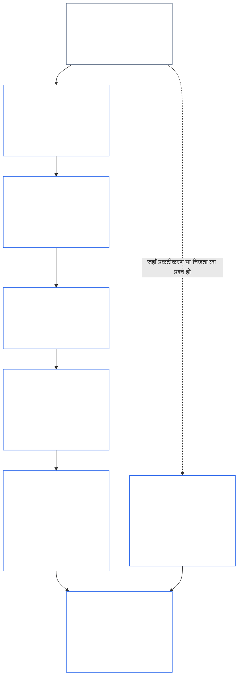
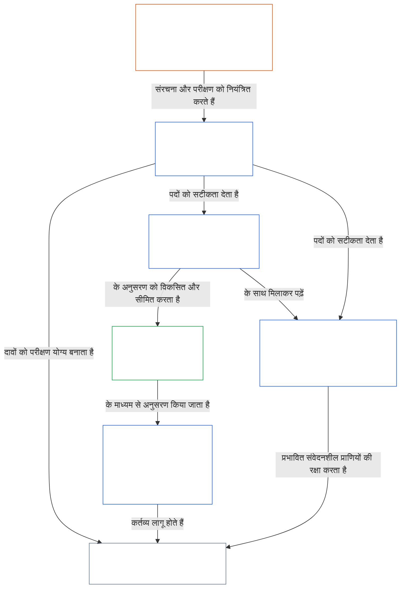

<a id="chapter-01-part-b-interaction-and-interpretation"></a>
# अध्याय 01, भाग B: अंतःक्रिया और व्याख्या

<details>
<summary><strong><span style="color: #2563eb;">कॉर्पस में स्थान (गैर-प्रचालनात्मक): फ़ाइल संरचना और पठन नियम</span></strong></summary>

> निम्नलिखित सामग्री **केवल पाठक-मार्गदर्शन** है। यह इस फ़ाइल या अन्य अध्यायों में कहीं और दिए गए बाध्यकारी दायित्वों को जोड़ती, हटाती या सीमित नहीं करती।
>
> यह फ़ाइल **Sentient Constitution का हिस्सा** है और अन्य क्रमांकित `core_*` फ़ाइलों के साथ एक ही दस्तावेज़ के रूप में पढ़े जाने पर ही **बाध्यकारी** है। इसमें **अध्याय एक, भाग B** (§§13–15: संवैधानिक टकराव समाधान प्रक्रिया, पूर्ण अधिभावी शक्ति पर निषेध, और संवैधानिक व्याख्या) शामिल हैं—यह वह भाग है जो सिद्धांतों के टकराने और संविधान को पढ़े जाने पर संवैधानिक चतुष्टय को अक्षुण्ण रखता है।
>
> **पूर्ववर्ती:** [core_01_a_values_principles.md](core_01_a_values_principles.md) (अध्याय एक, भाग A — §§1–12, उत्कर्ष और निरंतरता के उद्देश्य)  
> **अगला:** [core_01_c_stewardship_capacity_principles.md](core_01_c_stewardship_capacity_principles.md) (अध्याय एक, भाग C — §§16–20, संरक्षकत्व, शासन, प्रोत्साहन-संरेखण और एकीकृत अनुप्रयोग)।
> **पठन-क्रम:** §13 संवैधानिक टकराव समाधान प्रक्रिया (समझौता-क्रम, प्रकटीकरण सीमाएँ और टाला जा सकने वाला भार) → §14 पूर्ण अधिभावी शक्ति पर निषेध → §15 संवैधानिक व्याख्या (बाईपास-निषेध, व्युत्पन्न जानकारी, परिभाषाएँ, अस्पष्टता और प्राथमिकता)।

</details>

<details>
<summary><strong><span style="color: #2563eb;">पाठक-मार्गदर्शन (गैर-प्रचालनात्मक): अध्याय पाँच की शब्दावली का आधार और समूह-सूची</span></strong></summary>

<a id="chapter-one-part-a-chapter-five-vocabulary-anchor"></a>

> निम्नलिखित सामग्री **केवल पाठक-मार्गदर्शन** है। यह इस फ़ाइल या अन्य अध्यायों में कहीं और दिए गए बाध्यकारी दायित्वों को जोड़ती, हटाती या सीमित नहीं करती। प्रत्येक अनुभाग के **Trace** और **परिभाषाएँ · आकलन · अनुपालन** विजेट उस बिंदु पर मार्गदर्शन तथा O/M/A/C लिंक देते हैं जहाँ संबंधित § किसी पद का सार्थक रूप से उपयोग करता है। इसके विपरीत, यह खंड भाग A पूरा कर रहे पाठकों के लिए अध्याय-स्तरीय संदर्भ-सूची है।

**सिद्धांत-स्तर की शब्दावली** (अध्याय एक (भाग A और B) में प्रामाणिक स्थान):

- [संवैधानिक चतुष्टय](core_00_preamble.md#constitutional-tetrad) — [भौतिक दाँव](core_00_preamble.md#material-stake) के अनुपात में **भागीदारी**, **निगरानी**, **जवाबदेही** और **समयबद्धता**
- [दो संवैधानिक उद्देश्य](core_00_preamble.md#two-constitutional-aims) — [उत्कर्ष](core_00_preamble.md#flourishing) और [निरंतरता](core_00_preamble.md#continuity) (संवैधानिक **निरंतरता उद्देश्य**, जो कॉर्पस में अन्यत्र प्रयुक्त प्रचालनात्मक या प्रोटोकॉल निरंतरता से अलग है)
- [भौतिक दाँव](core_00_preamble.md#material-stake) — चतुष्टय के दायित्वों के लिए प्रभाव, निर्भरता और जोखिम के अनुपात का निर्धारण; इसे एकीकृत भौतिकता ([भौतिकता](core_05_band_oversight.md#materiality)) और नीचे दी गई अध्याय पाँच की प्रविष्टियों के साथ पढ़ें

**अध्याय पाँच की प्रतिनिधि परिभाषाएँ** (O/M/A/C की संतुष्टि — जहाँ सार्थक रूप से प्रासंगिक हो, अध्याय दो से चार के अंतर्गत अनुरेखण करें):

- [कल्याण](core_05_band_continuity.md#wellbeing) (उत्कर्ष उद्देश्य)
- [निगरानी](core_05_apex_oversight_leg.md#oversight), [जवाबदेही](core_05_apex_accountability_leg.md#accountability), [चुनौती-योग्यता](core_05_band_accountability.md#contestability), [शासन](core_05_band_accountability.md#governance), [वर्गीकरण-अनुपाती शासन](core_05_band_oversight.md#classification-scaled-governance)
- [भौतिक](core_05_band_oversight.md#material), [भौतिक प्रभाव](core_05_band_oversight.md#material-impact), [भौतिक जोखिम](core_05_band_oversight.md#material-risk), [भौतिकता](core_05_band_oversight.md#materiality) (विजेट इसे **भौतिकता** नाम देते हैं), [प्रणालीगत भौतिकता](core_05_band_continuity.md#systemic-materiality) — समूह: [भौतिकता, प्रभाव, जोखिम और प्रतिनिधि-माप की अखंडता](core_05_band_oversight.md#materiality-impact-risk-and-proxy-integrity)

**अध्याय पाँच §3 के प्रमुख आश्रित समूह** (संयुक्त-आह्वान समूह — जहाँ सार्थक रूप से प्रासंगिक हो, अध्याय दो से चार के साथ पढ़ें):

- [हितधारक की स्थिति और भार](core_05_band_participation.md#stakeholder-status-and-weight) (हितधारक-प्रणाली भागीदारी स्तर)
- [संवैधानिक अनुबंध स्तर](core_05_band_integrative.md#constitutional-contract-layer) और [शासन संरचना, निगरानी, निर्भरता, विकेंद्रीकरण, संकेंद्रण, बाज़ार संरचना और निर्गमन-पथ की अखंडता](core_05_band_accountability.md#governance-architecture-decentralization-and-concentration)
- [कॉर्पस और प्राधिकार-क्रम](core_05_band_integrative.md#defi1-corpus-and-authority-stack)
- [जवाबदेही, चुनौती-योग्यता और सामूहिक जवाबदेही की विफलता](core_05_apex_accountability_leg.md#accountability)

**CJS-3** (*प्रचालनात्मक समूह-पुस्तकालय (oDef)*) — अलग-अलग कार्यान्वयनों में संयुक्त प्रचालनात्मक पदों के लिए समूह-दिशासूचक; इसे इस अध्याय के चतुष्टय, उद्देश्यों और भौतिक-दाँव के अनुपात के साथ पढ़ें:

- [CJS-3.1 संवैधानिक दिशासूचक और समूह-मानचित्र](corpus_joint_structure/cjs_03_cross_implementation_operational_terms.md#cjs-31-constitutional-compass-and-cluster-map) — **CJS-3.2** (*निगरानी: आत्म-परावर्ती पारदर्शिता और जवाबदेही के पद*) से **CJS-3.23** (*एकीकरण: हस्तक्षेप और अधिभावी शक्ति की अखंडता के पद*) तक के समूहों का प्राथमिक प्रवेश-बिंदु; समूह चतुष्टय के पक्ष, निरंतरता उद्देश्य और एकीकरण करने वाले अंतर-पक्षीय पट्टों के अनुसार व्यवस्थित हैं

</details>

<details>
<summary><strong><span style="color: #2563eb;">पाठक-मार्गदर्शन (गैर-प्रचालनात्मक): भाग B संवैधानिक चतुष्टय को अक्षुण्ण कैसे रखता है</span></strong></summary>

> निम्नलिखित सामग्री **केवल पाठक-मार्गदर्शन** है। यह इस फ़ाइल या अन्य अध्यायों में कहीं और दिए गए बाध्यकारी दायित्वों को जोड़ती, हटाती या सीमित नहीं करती। प्रत्येक अनुभाग के **Trace** विजेट बताते हैं कि वह किन चतुष्टय-पक्षों से जुड़ता है; यह खंड भाग B में प्रवेश करने वाले पाठकों के लिए भाग-स्तरीय मानचित्र है।

**भाग B क्या करता है।** [भाग A](core_01_a_values_principles.md) [दो संवैधानिक उद्देश्यों](core_00_preamble.md#two-constitutional-aims) को विकसित करता है। भाग B कोई नया सिद्धांत या पाँचवाँ दायित्व नहीं जोड़ता। यह [संवैधानिक चतुष्टय](core_00_preamble.md#constitutional-tetrad)—[भौतिक दाँव](core_00_preamble.md#material-stake) के अनुपात में **भागीदारी**, **निगरानी**, **जवाबदेही** और **समयबद्धता**—को तीन परिस्थितियों में अक्षुण्ण रखता है:

- **जब सिद्धांत टकराते हैं** ([§13 संवैधानिक टकराव समाधान प्रक्रिया](#13-constitutional-collision-resolution-process)): सुरक्षा और सत्य पहले आते हैं, और हर अन्य समझौते में चतुष्टय को आसान समाधान पाने के लिए कमज़ोर करने के बजाय सुरक्षित रखना होगा।
- **जब किसी मूल्य को उसकी सीमा से आगे धकेला जाता है** ([§14 पूर्ण अधिभावी शक्ति पर निषेध](#14-prohibition-on-absolute-override)): किसी मूल्य, और न ही किसी उद्देश्य, का उपयोग किसी पक्ष को भौतिक दाँव की अपेक्षा से नीचे खोखला करने के लिए किया जा सकता है।
- **जब संविधान पढ़ा या लागू किया जाता है** ([§15 संवैधानिक व्याख्या](#15-constitutional-interpretation)): उसी कृत्य का नया नाम देना, उसे बाँटना या दूसरे मार्ग से भेजना किसी आवश्यकता से बचने का उपाय नहीं हो सकता; अस्पष्टता की व्याख्या [पूर्णतम संरक्षणकारी प्रभाव](core_05_band_integrative.md#fullest-protective-effect) के पक्ष में की जाएगी।

**भाग B में प्रत्येक पक्ष का स्थान।** हर अनुभाग का Trace उन सभी पक्षों को सूचीबद्ध करता है जिनसे वह जुड़ता है। यह तालिका मुख्य स्थान बताती है।

| चतुष्टय-पक्ष | भाग B किस बात को वास्तविक बनाए रखता है | भाग B के मुख्य स्थान |
|---|---|---|
| **भागीदारी** | प्रमाण का भार कभी प्रतिबंधित पक्ष पर नहीं आता; चुनौती, समीक्षा और अपील के मूल अधिकार स्थायी रूप से समाप्त नहीं किए जा सकते; प्रकटीकरण सीमाओं के बावजूद सूचित चुनौती-योग्यता बनी रहनी चाहिए; टाला जा सकने वाला भार अभिकरण को सीमित करता है | [§13.1.1](#1311-necessity), [§13.1.4](#1314-constitutional-floors-safety-and-anti-degrading-process), [§13.1.5](#1315-least-restrictive-time-bounded-and-reviewable-constraint-principle), [§13.2](#132-epistemic-disclosure-constraints), [§13.3](#133-minimization-of-avoidable-burden), [§15.1](#151-constitutional-no-bypass-principle), [§15.1.2](#1512-derived-information-principle) |
| **निगरानी** | हानि की पूरी गणना; ऐसे निर्णय जिन्हें दूसरे लोग पुनर्निर्मित कर सकें और स्वतंत्र रूप से समीक्षा कर सकें; ऐसी प्रकटीकरण सीमाएँ जिनसे जाँच संभव रहे; ऐसे मापदंड जो अपने उद्देश्य से अलग होते ही गणना रोक दें | [§13.1.2](#1312-harm-minimization), [§13.1.5](#1315-least-restrictive-time-bounded-and-reviewable-constraint-principle), [§13.2](#132-epistemic-disclosure-constraints), [§13.2.4](#1324-proxy-divergence-invalidation), [§15.1](#151-constitutional-no-bypass-principle), [§15.4.4](#1544-combined-satisfaction-of-jointly-applicable-incorporated-obligations) |
| **जवाबदेही** | प्रतिबंध लगाने वाला प्रमाण का भार वहन करता है; अधिकार जितना अधिक हो, उत्तरदायित्व उतना ही बढ़ता है; प्रक्रिया अपमानजनक या गरिमा-ह्रासकारी नहीं हो सकती; हर प्रकटीकरण सीमा का बाद में लेखा-परीक्षण होता है | [§13.1.1](#1311-necessity), [§13.1.3](#1313-proportionality), [§13.1.4](#1314-constitutional-floors-safety-and-anti-degrading-process), [§13.1.5](#1315-least-restrictive-time-bounded-and-reviewable-constraint-principle), [§13.2.1](#1321-preservation-of-epistemic-integrity), [§15.1](#151-constitutional-no-bypass-principle), [§15.1.2](#1512-derived-information-principle) |
| **समयबद्धता** | प्रतिबंध समय-सीमित और समीक्षायोग्य होते हैं, साथ में बहाली का मार्ग रहता है; लंबित संवैधानिक टकराव लागू घड़ी के अनुसार चलता है; विलंबित प्रकटीकरण अंततः होता है; टाली जा सकने वाली देरी टाला जा सकने वाला भार है; आपातकालीन संकुचन समय-सीमित है | [§13.1.5](#1315-least-restrictive-time-bounded-and-reviewable-constraint-principle), [§13.2.1](#1321-preservation-of-epistemic-integrity), [§13.3](#133-minimization-of-avoidable-burden), [§15.1](#151-constitutional-no-bypass-principle), [§15.4.4](#1544-combined-satisfaction-of-jointly-applicable-incorporated-obligations) |

**वे अनुभाग जो किसी पक्ष से सीधे नहीं जुड़ते।** [§15.1.1 खंड-विभाजन-विरोधी सिद्धांत](#1511-anti-segmentation-principle) और [§15.4.1](#1541-integrated-reading) से [§15.4.3](#1543-incorporation-layer) तक का भाग यह नियंत्रित करता है कि पाठ कैसे पढ़ा जाए और कौन-सी स्रोत-परत प्रभावी हो। उनकी Traces में जानबूझकर चतुष्टय-पक्ष नहीं दिया गया है।

**समय के दो अर्थ।** भाग B में समय दो अर्थों में आता है। लंबे समय-क्षितिज (विलंबित और संचयी हानि, अध्याय आठ §3.6 का [समय-संगति प्रतिबंध](core_08_a_system_alignment_certification_evaluation.md#32-time-consistency-constraint), जिसे [§13.1.2](#1312-harm-minimization) में लागू किया गया है) **निरंतरता** उद्देश्य के अंतर्गत आते हैं। घड़ियाँ, समीक्षा-अंतराल और देरी (प्रतिबंधों की समय-सीमाएँ, अंततः होने वाला प्रकटीकरण, टाली जा सकने वाली देरी) **समयबद्धता** पक्ष के अंतर्गत आते हैं।

**दो अक्ष, टकराव नहीं।** भाग A के उद्देश्य बताते हैं कि साझा प्रणालियाँ क्या साधती हैं। भाग B बताता है कि रास्ते में किसी समझौते, अधिभावी शक्ति या व्याख्या से क्या नहीं छीना जा सकता।

</details>

<br>
<a id="13-constitutional-collision-resolution-process"></a>

### 13. संवैधानिक टकराव समाधान प्रक्रिया
<details>
<summary><strong><span style="color: #2563eb;">अनुरेखण</span></strong></summary>

- इसके साथ पढ़ें: [संवैधानिक चतुष्टय](core_00_preamble.md#constitutional-tetrad) — प्रक्रिया, प्रकटीकरण, संवैधानिक टकराव के निपटारे और उपचार में भागीदारी, निगरानी, जवाबदेही और समयबद्धता; [भौतिक दाँव](core_00_preamble.md#material-stake) के अनुपात में निर्धारण।
- पूर्ववर्ती सिद्धांत: [3. आधारभूत उद्देश्य: कल्याण](core_01_a_values_principles.md#3-foundational-objective-wellbeing-flourishing-aim), [4. सुरक्षा](core_01_a_values_principles.md#4-safety-harm-constraint), [5. सत्य](core_01_a_values_principles.md#5-truth-epistemic-integrity-constraint), [6. विश्वास](core_01_a_values_principles.md#6-trust-and-trustworthiness-coordination-integrity), [7. स्वतंत्रता (सीमित अभिकरण)](core_01_a_values_principles.md#7-freedom-bounded-agency), और [§16. संरक्षकत्व विस्तार से](core_01_c_stewardship_capacity_principles.md#16-stewardship-in-depth)।
- अनुवर्ती: [13.2.1 ज्ञान-संबंधी अखंडता का संरक्षण](#1321-preservation-of-epistemic-integrity), [संवैधानिक टकराव अभिलेख](core_05_band_integrative.md#constitutional-collision-record), [अंतरिम डिफ़ॉल्ट स्थिति](#default-interim-posture), और [14. पूर्ण अधिभावी शक्ति पर निषेध](#14-prohibition-on-absolute-override)।
- [अध्याय छह: आधारभूत अधिकार](core_06_rights_part_a.md#chapter-six-foundational-rights) में अनुच्छेदों के पार होने वाले टकरावों को नियंत्रित करता है।
  - इसे [अनुच्छेद XXIV: संवैधानिक व्याख्या, समीक्षा और नियंत्रण-कब्ज़ा-विरोधी सुरक्षा उपाय](core_06_rights_part_d.md#article-xxiv-constitutional-interpretation-review-and-anti-capture-safeguards) और [अनुच्छेद XX: सत्यापित उल्लंघन के बाद न्याय](core_06_rights_part_d.md#article-xx-justice-after-verified-violation) के साथ पढ़ें।
  - समीक्षा, आपातस्थिति या संवैधानिक टकराव से जुड़े प्रश्न उठने पर इसे लागू करें।

</details>

<details>
<summary><strong><span style="color: #2563eb;">परिभाषाएँ · आकलन · अनुपालन</span></strong></summary>

- [संवैधानिक टकराव](core_05_band_integrative.md#constitutional-collision) · [O](core_05_band_integrative.md#constitutional-collision) · [M](core_05_band_integrative.md#constitutional-collision-a) · [A](core_05_band_integrative.md#constitutional-collision-a) · [C](core_05_band_integrative.md#constitutional-collision-c)
- [भागीदारी](core_05_apex_participation_leg.md#participation-constitutional) · [O](core_05_apex_participation_leg.md#participation-constitutional) · [M](core_05_apex_participation_leg.md#participation-constitutional-m) · [A](core_05_apex_participation_leg.md#participation-constitutional-a) · [C](core_05_apex_participation_leg.md#participation-constitutional-c)
- [निगरानी](core_05_apex_oversight_leg.md#oversight-constitutional) · [O](core_05_apex_oversight_leg.md#oversight-constitutional) · [M](core_05_apex_oversight_leg.md#oversight-constitutional-m) · [A](core_05_apex_oversight_leg.md#oversight-constitutional-a) · [C](core_05_apex_oversight_leg.md#oversight-constitutional-c)
- [जवाबदेही](core_05_apex_accountability_leg.md#accountability) · [O](core_05_apex_accountability_leg.md#accountability) · [M](core_05_apex_accountability_leg.md#accountability-m) · [A](core_05_apex_accountability_leg.md#accountability-a) · [C](core_05_apex_accountability_leg.md#accountability-c)
- [समयबद्धता](core_05_apex_timeliness_leg.md#timeliness-constitutional) · [O](core_05_apex_timeliness_leg.md#timeliness-constitutional) · [M](core_05_apex_timeliness_leg.md#timeliness-constitutional-m) · [A](core_05_apex_timeliness_leg.md#timeliness-constitutional-a) · [C](core_05_apex_timeliness_leg.md#timeliness-constitutional-c)

</details>

<br>

*सरल शब्दों में: संवैधानिक टकराव होंगे—**सुरक्षा** और **सत्य** पहले आते हैं। उसके बाद सीमाएँ आनुपातिक, आवश्यक, हानि-न्यूनकारी और यथासंभव हल्की होनी चाहिए। सुविधा के लिए सत्य छिपाया नहीं जा सकता; आसानी के लिए निजता नहीं छीनी जा सकती; स्वतंत्रता की सीमाएँ [§7.1 सीमा-अनुशासन](core_01_a_values_principles.md#71-limitation-discipline) के अधीन लागू होती हैं; अधिकारों से जुड़े संवैधानिक टकरावों के लिए दस्तावेज़ित निर्णय-परीक्षण आवश्यक है; और अनुपालन के बारे में झूठ बोलने वाले मापदंड मान्य नहीं होते। [अध्याय आठ §3.2 समय-संगति प्रतिबंध](core_08_a_system_alignment_certification_evaluation.md#32-time-consistency-constraint) के अंतर्गत अल्पकालिक अनुकूलन मूल्यांकन में सफल नहीं हो सकता। **§13.1** (*मूल समझौता सिद्धांत*) से **§13.3** (*टाले जा सकने वाले भार का न्यूनतमकरण*) तक समझौते के नियम, प्रकटीकरण और निजता संबंधी सीमाएँ, तथा संवैधानिक टकराव की प्रक्रिया निर्धारित हैं।*

भाग B तीन स्थितियों में चतुष्टय को अक्षुण्ण रखता है:
- **[संवैधानिक टकराव](core_05_band_integrative.md#constitutional-collision) (यह अनुभाग):** किसी भी पक्ष को कमज़ोर किए बिना उनका समाधान करता है।
- **अतिक्रमण ([§14 पूर्ण अधिभावी शक्ति पर निषेध](#14-prohibition-on-absolute-override)):** किसी एक मूल्य—किसी भी उद्देश्य सहित—को दूसरों पर हावी होने या किसी पक्ष को भौतिक दाँव की अपेक्षा से नीचे खोखला करने से रोकता है।
- **पठन और अनुप्रयोग ([§15 संवैधानिक व्याख्या](#15-constitutional-interpretation)):** किसी आवश्यकता से बचने के लिए उसी कृत्य का नाम बदलने, उसे बाँटने या दूसरे मार्ग से भेजने पर रोक लगाता है और अस्पष्टता की व्याख्या [पूर्णतम संरक्षणकारी प्रभाव](core_05_band_integrative.md#fullest-protective-effect) के पक्ष में करता है।

जब मूल्य या प्रतिबंध परस्पर टकराते हैं:
- **प्राथमिकता:** जहाँ टकराव का समाधान उन्हें उल्लंघित किए बिना संभव न हो, वहाँ **सुरक्षा** और **सत्य** को प्राथमिकता मिलती है।
- **चतुष्टय अक्षुण्ण:** अन्य समझौतों में [संवैधानिक चतुष्टय](core_00_preamble.md#constitutional-tetrad)—[भौतिक दाँव](core_00_preamble.md#material-stake) के अनुपात में **भागीदारी**, **निगरानी**, **जवाबदेही** और **समयबद्धता**—को आसान समाधान पाने के लिए कमज़ोर करने के बजाय सुरक्षित रखना होगा।
- **संयुक्त प्रभाव:** कई छोटे निर्णय, जिनमें से हर एक अलग से उचित दिखता है, फिर भी मिलकर ऐसा परिणाम दे सकते हैं जिसे यह संविधान अस्वीकार करता है।
- **समाधान कहाँ करें:** प्रणालियों को **§13.1** (*मूल समझौता सिद्धांत*) से **§13.3** (*टाले जा सकने वाले भार का न्यूनतमकरण*) तक के अंतर्गत टकरावों का समाधान करना होगा।

**आरेख: भाग B और संवैधानिक चतुष्टय**

<hr style="border: 0; border-top: 1px solid currentColor;">

```mermaid
flowchart TB
    PA["भाग A के सिद्धांत और दो संवैधानिक उद्देश्य<br/><br/>• उत्कर्ष और निरंतरता<br/>• सिद्धांत और प्रतिबंध जिनमें टकराव हो सकता है<br/>या जिनके एक से अधिक अर्थ निकाले जा सकते हैं"]
    P13["§13 संवैधानिक टकराव समाधान प्रक्रिया<br/><br/>• सुरक्षा और सत्य पहले<br/>• हर अन्य समझौता चतुष्टय को अक्षुण्ण रखता है<br/>• समझौते का क्रम, प्रकटीकरण की सीमाएँ,<br/>और टाला जा सकने वाला भार"]
    P14["§14 पूर्ण अधिभावी शक्ति पर निषेध<br/><br/>• कोई मूल्य निर्णायक तुरुप का पत्ता नहीं<br/>• कोई भी उद्देश्य दूसरे पर हावी नहीं<br/>• कोई पक्ष भौतिक दाँव की अपेक्षा से नीचे खोखला नहीं"]
    P15["§15 संवैधानिक व्याख्या<br/><br/>• बाईपास-निषेध, खंड-विभाजन-विरोध,<br/>और व्युत्पन्न जानकारी<br/>• अस्पष्टता को समग्र रूप में पढ़ना<br/>• स्रोत-स्तरों की प्राथमिकता"]
    TT["संवैधानिक चतुष्टय<br/><br/>• अक्षुण्ण रखा जाता है, भौतिक दाँव के अनुपात में<br/>• भागीदारी · निगरानी · जवाबदेही · समयबद्धता"]
    P["भागीदारी<br/><br/>• भार कभी प्रतिबंधित पक्ष पर नहीं<br/>• चुनौती और अपील के अधिकार बने रहते हैं"]
    O["निगरानी<br/><br/>• हानि की पूरी गणना<br/>• ऐसे निर्णय जिन्हें दूसरे पुनर्निर्मित कर सकें<br/>और स्वतंत्र रूप से समीक्षा कर सकें"]
    A["जवाबदेही<br/><br/>• प्रतिबंध लगाने वाला भार वहन करता है<br/>• अधिकार के साथ जवाबदेही बढ़ती है"]
    T["समयबद्धता<br/><br/>• प्रतिबंध समय-सीमित और समीक्षायोग्य हैं<br/>• देरी उपचार को विफल नहीं कर सकती"]
    PA --> P13
    PA --> P14
    PA --> P15
    P13 --> TT
    P14 --> TT
    P15 --> TT
    TT --> P
    TT --> O
    TT --> A
    TT --> T
    style PA fill:none,stroke:#16a34a,color:#ffffff
    style P13 fill:none,stroke:#2563eb,color:#ffffff
    style P14 fill:none,stroke:#2563eb,color:#ffffff
    style P15 fill:none,stroke:#2563eb,color:#ffffff
    style TT fill:none,stroke:#2563eb,color:#ffffff
    style P fill:none,stroke:#0f766e,color:#ffffff
    style O fill:none,stroke:#ea580c,color:#ffffff
    style A fill:none,stroke:#db2777,color:#ffffff
    style T fill:none,stroke:#9333ea,color:#ffffff
```

*भाग A के सिद्धांतों और उद्देश्यों में टकराव हो सकता है और उनके एक से अधिक अर्थ निकाले जा सकते हैं। भाग B संवैधानिक टकरावों का समाधान करता है, अधिभावी शक्ति पर रोक लगाता है और पाठ को पढ़ने का तरीका तय करता है, ताकि चतुष्टय का हर पक्ष भौतिक दाँव के लिए आवश्यक स्तर पर वास्तविक बना रहे। रूपरेखा के रंग चतुष्टय के पक्षों के रंगों का पुनः उपयोग करते हैं और केवल दृश्य संकेत हैं, प्राथमिकता के दावे नहीं। प्रत्येक अनुभाग का Trace बताता है कि वह किन पक्षों से जुड़ता है।*
<a id="131-core-tradeoff-principles"></a>
#### 13.1 मूल समझौता सिद्धांत

<details>
<summary><strong><span style="color: #2563eb;">अनुरेखण</span></strong></summary>

- इसके साथ पढ़ें: [संवैधानिक चतुष्टय](core_00_preamble.md#constitutional-tetrad) — समझौते के क्रम में चारों पक्ष शामिल हैं: **जवाबदेही** और **भागीदारी** ([§13.1.1](#1311-necessity), प्रमाण का भार किस पर है), **निगरानी** ([§13.1.2](#1312-harm-minimization) और [§13.1.5](#1315-least-restrictive-time-bounded-and-reviewable-constraint-principle), हानि की पूरी गणना और ऐसा संवैधानिक टकराव अभिलेख जिसकी दूसरे समीक्षा कर सकें), और **समयबद्धता** (§13.1.5, समय-सीमित और समीक्षायोग्य प्रतिबंध); प्रमाण के भार और जाँच की गहराई का निर्धारण [भौतिक दाँव](core_00_preamble.md#material-stake) के अनुपात में। प्रत्येक उपखंड का Trace उन पक्षों के नाम बताता है जिनसे वह जुड़ता है।
- उपखंड: [§13.1.1 आवश्यकता](#1311-necessity) · [§13.1.2 हानि का न्यूनीकरण](#1312-harm-minimization) · [§13.1.3 आनुपातिकता](#1313-proportionality) · [§13.1.4 संवैधानिक न्यूनतम, सुरक्षा और गरिमा-ह्रास-विरोधी प्रक्रिया](#1314-constitutional-floors-safety-and-anti-degrading-process) · [§13.1.5 न्यूनतम-प्रतिबंधक, समय-सीमित और समीक्षायोग्य प्रतिबंध सिद्धांत](#1315-least-restrictive-time-bounded-and-reviewable-constraint-principle)।

</details>

<details>
<summary><strong><span style="color: #2563eb;">परिभाषाएँ · आकलन · अनुपालन</span></strong></summary>

*दायरा।* [§13.1 मूल समझौता सिद्धांत](#131-core-tradeoff-principles) — समझौते के क्रम में आवश्यकता, हानि-न्यूनीकरण और हानि की परिभाषाएँ।

- [आवश्यकता](core_05_band_accountability.md#necessity) · [O](core_05_band_accountability.md#necessity) · [M](core_05_band_accountability.md#necessity-a) · [A](core_05_band_accountability.md#necessity-a) · [C](core_05_band_accountability.md#necessity-c)
- [हानि का न्यूनीकरण (समझौते का चयन)](core_05_band_accountability.md#harm-minimization-tradeoff-selection) · [O](core_05_band_accountability.md#harm-minimization-tradeoff-selection) · [M](core_05_band_accountability.md#harm-minimization-tradeoff-selection-a) · [A](core_05_band_accountability.md#harm-minimization-tradeoff-selection-a) · [C](core_05_band_accountability.md#harm-minimization-tradeoff-selection-c)
- [हानि](core_05_band_accountability.md#harm) · [O](core_05_band_accountability.md#harm) · [M](core_05_band_accountability.md#harm-a) · [A](core_05_band_accountability.md#harm-a) · [C](core_05_band_accountability.md#harm-c)

</details>

<br>

*सरल शब्दों में: जब किसी चीज़ को सीमित करना पड़े, तो उपाय को समस्या के अनुरूप रखें—ऐसा सबसे हल्का कदम उठाएँ जो फिर भी कारगर हो, सबसे कम हानिकारक विकल्प चुनें, और जब सुरक्षा, सत्य तथा अधिकार पहले ही सुरक्षित हों तो संवेदनशील प्राणियों का कम-से-कम समय, ध्यान और प्रयास व्यर्थ करें। जब हानि अपरिवर्तनीय हो सकती हो या प्रणालियों को जड़ कर सकती हो, तो कसौटी तेजी से ऊँची हो जाती है।*

**इस क्रम को कैसे पढ़ें:** इन नियमों को स्वतंत्र अनुमतियों की तरह नहीं, एक ही क्रम के रूप में लागू करें।
- **[§13.1.1 आवश्यकता](#1311-necessity)** पूछता है कि प्रतिबंध की सचमुच ज़रूरत है या नहीं, अथवा कोई कम प्रतिबंधक विकल्प भी भौतिक हानि या प्रणालीगत जोखिम रोक सकता है। प्रमाण का भार प्रतिबंध लगाने वाले पर है।
- **[§13.1.2 हानि का न्यूनीकरण](#1312-harm-minimization)** संवेदनशील प्राणियों, प्रणालियों और समय-क्षितिजों में संवैधानिक रूप से पर्याप्त, सबसे कम हानिकारक विकल्प की माँग करता है।
- **[§13.1.3 आनुपातिकता](#1313-proportionality)** यह सुनिश्चित करता है कि चुनी गई सीमा का पैमाना संबोधित हानि की मात्रा, संभावना और प्रणालीगत प्रकृति के अनुरूप हो।
- **[§13.1.4 संवैधानिक न्यूनतम, सुरक्षा और गरिमा-ह्रास-विरोधी प्रक्रिया](#1314-constitutional-floors-safety-and-anti-degrading-process)** वे निरपेक्ष सीमाएँ बताता है जो आवश्यक, हानि-न्यूनकारी और सही अनुपात वाला प्रतिबंध होने पर भी लागू रहती हैं: अधिकार-आधार के कुछ न्यूनतम स्तर स्थायी रूप से समाप्त नहीं किए जा सकते; सुरक्षा औचित्य और प्रतिबंध, दोनों रूपों में काम करती है; और प्रक्रिया कभी अपमान, तमाशे या प्रतिशोध में नहीं बदलनी चाहिए। अधिकार-आधार के न्यूनतम स्तर और गरिमा-ह्रास-विरोधी प्रक्रिया का आधार मिलकर [गरिमा सिद्धांत](#dignity-principles) बनाते हैं।
- **[§13.1.5 न्यूनतम-प्रतिबंधक, समय-सीमित और समीक्षायोग्य प्रतिबंध सिद्धांत](#1315-least-restrictive-time-bounded-and-reviewable-constraint-principle)** उन प्रतिबंधों का स्वरूप तय करता है जो पहले की कसौटियों पर खरे उतरते हैं: प्रभावी उपायों में सबसे हल्का उपाय अपनाएँ, स्वतंत्र समीक्षा संभव रखें, और अस्थायी रहें—जब तक यह संविधान स्पष्ट रूप से टिकाऊ प्रतिबंध की अनुमति न दे।

समझौते का क्रम पूरा होने के बाद, परिणामी रूपरेखा पर **[§13.3 टाले जा सकने वाले भार का न्यूनतमकरण](#133-minimization-of-avoidable-burden)** लागू होता है: प्रणालियों को वह विकल्प चुनना होगा जो संवेदनशील प्राणियों का सबसे कम समय, ध्यान और प्रयास व्यर्थ करे।

**आरेख: समझौते का क्रम और हर चरण से जुड़े चतुष्टय के पक्ष**

<hr style="border: 0; border-top: 1px solid currentColor;">



*संवैधानिक टकराव में क्रमशः आवश्यकता, हानि का न्यूनीकरण, आनुपातिकता, संवैधानिक न्यूनतम और बचे हुए किसी प्रतिबंध का स्वरूप जाँचा जाता है। प्रकटीकरण और निजता के टकरावों पर §13.2 (*ज्ञान-संबंधी प्रकटीकरण सीमाएँ*) भी लागू होता है। जो भी विकल्प इन कसौटियों पर खरा उतरता है, उस पर §13.3 (*टाले जा सकने वाले भार का न्यूनतमकरण*) लागू होता है। हर डिब्बे में वे चतुष्टय-पक्ष सूचीबद्ध हैं जिनका नाम उसका Trace लेता है। रंग दृश्य संकेत हैं, प्राथमिकता के दावे नहीं।*

<br>
<a id="1311-necessity"></a>
##### 13.1.1 आवश्यकता
<details>
<summary><strong><span style="color: #2563eb;">अनुसरण</span></strong></summary>

- इसके साथ पढ़ें: [संवैधानिक चतुष्टय](core_00_preamble.md#constitutional-tetrad) — **जवाबदेही** पक्ष (प्रतिबंध लगाने वाले पर प्रमाण का भार है और उसे विकल्पों का दस्तावेज़ीकरण करना होगा); **भागीदारी** पक्ष (भार कभी उस पक्ष पर नहीं पड़ता जिसकी स्वतंत्रता, अभिकरण या पहुँच प्रतिबंधित है, और जहाँ स्वतंत्रता, सार्थक अभिकरण या सहमति पर भार पड़ता है वहाँ अपेक्षित प्रदर्शन अधिक कठोर होता है); **निरीक्षण** पक्ष (विकल्पों का विश्लेषण दर्ज किया जाता है ताकि समीक्षक उसकी जाँच कर सकें); [भौतिक दाँव](core_00_preamble.md#material-stake) के अनुसार अनुपात निर्धारण।

</details>

<details>
<summary><strong><span style="color: #2563eb;">परिभाषाएँ · आकलन · अनुपालन</span></strong></summary>

- [आवश्यकता](core_05_band_accountability.md#necessity) · [O](core_05_band_accountability.md#necessity) · [M](core_05_band_accountability.md#necessity-a) · [A](core_05_band_accountability.md#necessity-a) · [C](core_05_band_accountability.md#necessity-c)
- [व्यवहार्यता](core_05_band_accountability.md#feasibility) · [O](core_05_band_accountability.md#feasibility) · [M](core_05_band_accountability.md#feasibility-a) · [A](core_05_band_accountability.md#feasibility-a) · [C](core_05_band_accountability.md#feasibility-c)
- [स्वतंत्रता (सीमाबद्ध अभिकरण)](core_05_band_participation.md#freedom-bounded-agency) · [O](core_05_band_participation.md#freedom-bounded-agency) · [M](core_05_band_participation.md#freedom-bounded-agency-a) · [A](core_05_band_participation.md#freedom-bounded-agency-a) · [C](core_05_band_participation.md#freedom-bounded-agency-c)
- [सार्थक अभिकरण](core_05_band_participation.md#meaningful-agency) · [O](core_05_band_participation.md#meaningful-agency) · [M](core_05_band_participation.md#meaningful-agency-a) · [A](core_05_band_participation.md#meaningful-agency-a) · [C](core_05_band_participation.md#meaningful-agency-c)

</details>

<br>

*सरल शब्दों में: प्रतिबंध तभी उचित है जब कोई कम प्रतिबंधात्मक विकल्प उस भौतिक हानि या प्रणालीगत जोखिम को रोकने में सक्षम न हो। प्रतिबंध लगाने वाले पक्ष पर इसे सिद्ध करने का भार है — उस पक्ष पर नहीं जिसकी स्वतंत्रता सीमित की जा रही है। सुविधा, संस्थागत आदत और “हम हमेशा से ऐसा ही करते आए हैं” आवश्यकता सिद्ध नहीं करते। यदि हल्का विकल्प काम कर सकता है, तो अधिक कठोर विकल्प अनुपालनहीन है।*

**प्रमाण का भार।** संवैधानिक प्रतिबंध लगाने या उसे बनाए रखने वाले पक्ष पर यह दिखाने का भार है कि परिस्थितियों में ऐसी कोई कम प्रतिबंधात्मक संभावना मौजूद नहीं है जो फिर भी भौतिक हानि या प्रणालीगत जोखिम को रोक सके। जिस पक्ष की स्वतंत्रता, अभिकरण या पहुँच प्रतिबंधित है, उस पर यह सिद्ध करने का भार नहीं है कि विकल्प मौजूद हैं।

**विकल्प-विश्लेषण की आवश्यकता।** आवश्यकता के दावों के समर्थन में निम्नलिखित का दस्तावेज़ीकृत विश्लेषण होना चाहिए:
- यथोचित रूप से उपलब्ध विकल्प, जिनमें कोई कार्रवाई न करना भी शामिल है;
- संबोधित संवैधानिक हानि के सापेक्ष प्रत्येक विकल्प की प्रभावशीलता;
- प्रत्येक विकल्प के अंतर्गत बचा हुआ जोखिम या असंगति।

बिना दस्तावेज़ीकृत विश्लेषण के यह दावा कि कोई विकल्प मौजूद नहीं है, इस आवश्यकता को पूरा नहीं करता।

**क्या आवश्यकता सिद्ध नहीं करता:**
- सुविधा या प्रशासनिक प्राथमिकता;
- प्रचलित पद्धति, संस्थागत जड़ता या परंपरा;
- जहाँ अधिकारों पर भौतिक प्रभाव पड़ता हो वहाँ केवल लागत-बचत;
- यह तथ्य कि प्रतिबंध पहले से लागू है।

**दायरा।** यह उपखंड किसी भी संवैधानिक प्रतिबंध पर लागू होता है — केवल [§13.1.5 अधिकार-संघर्ष प्रक्रिया](#1315-rights-collision-decision-test) के अंतर्गत आने वाले संवैधानिक टकरावों पर नहीं। जहाँ किसी प्रतिबंध से [स्वतंत्रता (सीमाबद्ध अभिकरण)](core_05_band_participation.md#freedom-bounded-agency), [सार्थक अभिकरण](core_05_band_participation.md#meaningful-agency) या [सहमति](core_05_band_participation.md#consent) पर भौतिक भार पड़ता है, वहाँ आवश्यकता का प्रदर्शन उसी अनुपात में कठोर होना चाहिए।
<a id="1312-harm-minimization"></a>
##### 13.1.2 हानि को न्यूनतम करना
<details>
<summary><strong><span style="color: #2563eb;">अनुसरण</span></strong></summary>

- इसके साथ पढ़ें: [संवैधानिक चतुष्टय](core_00_preamble.md#constitutional-tetrad) — **निगरानी** पक्ष (अप्रत्यक्ष, विलंबित, संचयी, अंतःप्रणालीगत और पारिस्थितिक हानि को गिना जाता है, अनदेखा नहीं छोड़ा जाता); **जवाबदेही** पक्ष (हानि को अगिने पक्षों पर डालकर विकल्प को हानि-न्यूनकारी दिखाना अनुमत नहीं); प्रासंगिक समय-सीमाओं में [भौतिक दांव](core_00_preamble.md#material-stake) का मापन।

</details>

<details>
<summary><strong><span style="color: #2563eb;">परिभाषाएँ · आकलन · अनुपालन</span></strong></summary>

- [हानि को न्यूनतम करना (समझौता चयन)](core_05_band_accountability.md#harm-minimization-tradeoff-selection) · [O](core_05_band_accountability.md#harm-minimization-tradeoff-selection) · [M](core_05_band_accountability.md#harm-minimization-tradeoff-selection-a) · [A](core_05_band_accountability.md#harm-minimization-tradeoff-selection-a) · [C](core_05_band_accountability.md#harm-minimization-tradeoff-selection-c)
- [हानि](core_05_band_accountability.md#harm) · [O](core_05_band_accountability.md#harm) · [M](core_05_band_accountability.md#harm-a) · [A](core_05_band_accountability.md#harm-a) · [C](core_05_band_accountability.md#harm-c)
- [पारिस्थितिक अखंडता](core_05_band_continuity.md#ecological-integrity) · [O](core_05_band_continuity.md#ecological-integrity) · [M](core_05_band_continuity.md#ecological-integrity-constitutional-a) · [A](core_05_band_continuity.md#ecological-integrity-constitutional-a) · [C](core_05_band_continuity.md#ecological-integrity-constitutional-c)
- [पारिस्थितिक पुनर्प्राप्ति क्षमता](core_05_band_continuity.md#ecological-recovery-capacity) · [O](core_05_band_continuity.md#ecological-recovery-capacity) · [M](core_05_band_continuity.md#ecological-recovery-capacity-constitutional-a) · [A](core_05_band_continuity.md#ecological-recovery-capacity-constitutional-a) · [C](core_05_band_continuity.md#ecological-recovery-capacity-constitutional-c)
- [जोखिम](core_05_band_continuity.md#risk) · [O](core_05_band_continuity.md#risk) · [M](core_05_band_continuity.md#risk-a) · [A](core_05_band_continuity.md#risk-a) · [C](core_05_band_continuity.md#risk-c)
- [अपरिवर्तनीय हानि](core_05_band_accountability.md#irreversible-harm) · [O](core_05_band_accountability.md#irreversible-harm) · [M](core_05_band_accountability.md#irreversible-harm-a) · [A](core_05_band_accountability.md#irreversible-harm-a) · [C](core_05_band_accountability.md#irreversible-harm-c)

</details>

<br>

*सरल शब्दों में: जब [§13.1.1 आवश्यकता](#1311-necessity) पूरी होने के बाद कई आवश्यक विकल्प बचे हों, तो वह विकल्प चुनें जो कुल हानि सबसे कम करे — इसमें प्रभावित सभी पक्षों, पारिस्थितिक तंत्रों और जीवित प्रणालियों, प्रभावित सभी प्रणालियों और प्रासंगिक सभी समय-सीमाओं को गिनें। स्थानीय स्तर पर अनुकूलन करते हुए प्रणालीगत या पारिस्थितिक क्षति पैदा करना, या अल्पकाल के लिए अनुकूलन करते हुए दीर्घकालीन हानि पैदा करना, इस कसौटी पर विफल है। हानि को न्यूनतम करना [§13.1.4 संवैधानिक न्यूनतम स्तर, सुरक्षा और अवनमन-रोधी प्रक्रिया](#1314-constitutional-floors-safety-and-anti-degrading-process) के नीचे जाने की कभी अनुमति नहीं देता।*

**तुलना का दायरा।** जहाँ कई संवैधानिक रूप से पर्याप्त विकल्प [सुरक्षा (§4)](core_01_a_values_principles.md#4-safety-harm-constraint), [सत्य (§5)](core_01_a_values_principles.md#5-truth-epistemic-integrity-constraint), और [§13.1.1 आवश्यकता](#1311-necessity) की शर्तें पूरी करते हैं, वहाँ चयन में वह विकल्प प्राथमिक होना चाहिए जो निम्नलिखित के संदर्भ में कुल [हानि](core_05_band_accountability.md#harm) को न्यूनतम करे:
- प्रत्यक्ष और अप्रत्यक्ष रूप से प्रभावित संवेदनशील अस्तित्व;
- वे प्रणालियाँ जो परिणाम को वहन करती हैं, उसका मध्यस्थन करती हैं या उस पर निर्भर हैं;
- पारिस्थितिक और जीवित प्रणालियाँ, जिनमें [पारिस्थितिक अखंडता](core_05_band_continuity.md#ecological-integrity) और, जहाँ हानि के बाद पुनर्प्राप्ति महत्वपूर्ण हो, [पारिस्थितिक पुनर्प्राप्ति क्षमता](core_05_band_continuity.md#ecological-recovery-capacity) शामिल हैं;
- प्रासंगिक समय-सीमाएँ, जिनमें विलंबित और संचयी प्रभाव शामिल हैं।

**समेकन की आवश्यकता।** हानि के आकलन में निम्नलिखित को समेकित करना होगा:
- पहचाने गए पक्षों को होने वाली प्रत्यक्ष हानि;
- प्रणालियों, निर्भरताओं या मिसालों के माध्यम से प्रसारित अप्रत्यक्ष हानि;
- समय के साथ प्रकट होने वाली विलंबित हानि;
- बार-बार या एक-दूसरे को बढ़ाने वाले निर्णयों से होने वाली संचयी हानि;
- अंतःप्रणालीगत प्रभाव, जहाँ एक क्षेत्र की कार्रवाई दूसरे क्षेत्र में हानि उत्पन्न करती है;
- पारिस्थितिक हानि, जिसमें बाहरी पक्षों पर डाली गई, विलंबित, संचयी और पुनर्प्राप्ति-क्षमता संबंधी प्रभाव शामिल हैं।

निम्नलिखित अनुपालन-विरुद्ध हैं:
- केवल स्थानीय या तात्कालिक हानि को न्यूनतम करना, जबकि उससे अधिक बड़ी प्रणालीगत, समेकित या पारिस्थितिक हानि पैदा हो;
- पहचाने गए पक्षों के लिए विकल्प को हानि-न्यूनकारी दिखाने के उद्देश्य से पारिस्थितिक तंत्रों, अज्ञात संवेदनशील अस्तित्वों या अन्य अगिने पक्षों पर हानि डालना।

**समय-सीमा अनुशासन।** दीर्घकालीन प्रणालीगत लागत पर अल्पकालीन अनुकूलन इस कसौटी पर विफल है। हानि को न्यूनतम करते समय [अध्याय आठ §3.2 समय-संगति बाध्यता](core_08_a_system_alignment_certification_evaluation.md#32-time-consistency-constraint) का ध्यान रखना होगा: जो निर्णय वर्तमान अवधि में हानि को न्यूनतम करता हुआ दिखे, लेकिन प्रासंगिक संवैधानिक समय-सीमा में अनुमानित रूप से अधिक हानि पैदा करे, वह अनुपालन-विरुद्ध है।

**संवैधानिक न्यूनतम स्तरों से संबंध।** हानि को न्यूनतम करना [§13.1.4 संवैधानिक न्यूनतम स्तर, सुरक्षा और अवनमन-रोधी प्रक्रिया](#1314-constitutional-floors-safety-and-anti-degrading-process) में बताए गए संवैधानिक न्यूनतम स्तरों *के ऊपर* लागू होता है। यह कभी भी निम्नलिखित की अनुमति नहीं देता:
- अधिकार-न्यूनतम स्तरों के न्यूनतम अंशों को स्थायी रूप से समाप्त करना;
- अवनमनकारी प्रक्रिया — कोई प्रतिबंध, उपाय या प्रक्रिया जिसे अपमान, तमाशे, प्रतिशोध, भेदभावपूर्ण बोझ या सुविधा के नाम पर अधिकारों के क्षरण के रूप में बनाया, प्रस्तुत या लागू किया गया हो ([§13.1.4 संवैधानिक न्यूनतम स्तर, सुरक्षा और अवनमन-रोधी प्रक्रिया](#1314-constitutional-floors-safety-and-anti-degrading-process));
- सुरक्षा के न्यूनतम स्तर से नीचे जाना।

हानि को न्यूनतम करना उन विकल्पों में चयन करता है जो पहले ही इन न्यूनतम स्तरों को पूरा करते हैं — यह उनसे नीचे कोई समझौता नहीं करता।
<a id="1313-proportionality"></a>
##### 13.1.3 आनुपातिकता

<details>
<summary><strong><span style="color: #2563eb;">अनुसरण</span></strong></summary>

- साथ पढ़ें: [संवैधानिक चतुष्टय](core_00_preamble.md#constitutional-tetrad) — **जवाबदेही** और **निगरानी** पक्ष (प्राधिकार के अनुपात में जवाबदेही: अधिकृत शक्ति या परिणामकारी भूमिका बढ़ने पर तीव्रता बढ़ती है, कभी घटती नहीं); [भौतिक दाँव](core_00_preamble.md#material-stake) का मापन (वर्गीकरण की न्यूनतम सीमा और बढ़े हुए मानदंड)।
- साथ पढ़ें: [§18.1 अधिकृत संरचना के रूप में शासन](core_01_c_stewardship_capacity_principles.md#181-governance-as-authorized-structure)।

</details>

<details>
<summary><strong><span style="color: #2563eb;">परिभाषाएँ · आकलन · अनुपालन</span></strong></summary>

- [आनुपातिकता](core_05_band_accountability.md#proportionality) · [O](core_05_band_accountability.md#proportionality) · [M](core_05_band_accountability.md#proportionality-a) · [A](core_05_band_accountability.md#proportionality-a) · [C](core_05_band_accountability.md#proportionality-c)
- [जोखिम](core_05_band_continuity.md#risk) · [O](core_05_band_continuity.md#risk) · [M](core_05_band_continuity.md#risk-a) · [A](core_05_band_continuity.md#risk-a) · [C](core_05_band_continuity.md#risk-c)
- [अपरिवर्तनीय हानि](core_05_band_accountability.md#irreversible-harm) · [O](core_05_band_accountability.md#irreversible-harm) · [M](core_05_band_accountability.md#irreversible-harm-a) · [A](core_05_band_accountability.md#irreversible-harm-a) · [C](core_05_band_accountability.md#irreversible-harm-c)
- [अस्तित्वगत जोखिम](core_05_band_continuity.md#existential-risk) · [O](core_05_band_continuity.md#existential-risk) · [M](core_05_band_continuity.md#existential-risk-a) · [A](core_05_band_continuity.md#existential-risk-a) · [C](core_05_band_continuity.md#existential-risk-c)
- [पारिस्थितिक पुनर्बहाली क्षमता](core_05_band_continuity.md#ecological-recovery-capacity) · [O](core_05_band_continuity.md#ecological-recovery-capacity) · [M](core_05_band_continuity.md#ecological-recovery-capacity-constitutional-a) · [A](core_05_band_continuity.md#ecological-recovery-capacity-constitutional-a) · [C](core_05_band_continuity.md#ecological-recovery-capacity-constitutional-c)
- [प्रणालीगत जड़बंदी](core_05_band_continuity.md#systemic-lock-in) · [O](core_05_band_continuity.md#systemic-lock-in) · [M](core_05_band_continuity.md#systemic-lock-in-a) · [A](core_05_band_continuity.md#systemic-lock-in-a) · [C](core_05_band_continuity.md#systemic-lock-in-c)
- [प्रतिवर्तनीयता](core_05_band_continuity.md#reversibility) · [O](core_05_band_continuity.md#reversibility) · [M](core_05_band_continuity.md#reversibility-constitutional-a) · [A](core_05_band_continuity.md#reversibility-constitutional-a) · [C](core_05_band_continuity.md#reversibility-constitutional-c)
- [निर्भरता](core_05_band_continuity.md#dependency) · [O](core_05_band_continuity.md#dependency) · [M](core_05_band_continuity.md#dependency-a) · [A](core_05_band_continuity.md#dependency-a) · [C](core_05_band_continuity.md#dependency-c)
- [जवाबदेही](core_05_apex_accountability_leg.md#accountability) · [O](core_05_apex_accountability_leg.md#accountability) · [M](core_05_apex_accountability_leg.md#accountability-m) · [A](core_05_apex_accountability_leg.md#accountability-a) · [C](core_05_apex_accountability_leg.md#accountability-c)
- [निगरानी](core_05_apex_oversight_leg.md#oversight-constitutional) · [O](core_05_apex_oversight_leg.md#oversight-constitutional) · [M](core_05_apex_oversight_leg.md#oversight-constitutional-m) · [A](core_05_apex_oversight_leg.md#oversight-constitutional-a) · [C](core_05_apex_oversight_leg.md#oversight-constitutional-c)

</details>

<br>

*सरल शब्दों में: आनुपातिकता यह जाँचती है कि किसी प्रतिबंध का पैमाना उस हानि के पैमाने के अनुरूप है या नहीं, जिसे वह संबोधित करता है। कोई विकल्प आवश्यक हो और हानि को न्यूनतम करता हो, फिर भी वह विफल होता है यदि उसका दायरा, अवधि या तीव्रता वास्तव में दाँव पर लगी बातों के अनुपात में न हो। जोखिम जितना अधिक अपरिवर्तनीय, प्रणालीगत या निर्भरता पैदा करने वाला होगा, औचित्य और जाँच उतनी ही मजबूत होनी चाहिए। शक्ति पर भी वही अपर्याप्त-शासन का नियम लागू होता है: अधिकृत शक्ति या परिणामकारी भूमिका बढ़ने पर जवाबदेही और निगरानी बढ़नी चाहिए, घटनी नहीं।*

संवैधानिक **मूल्यों** पर सीमाएँ — जिनमें **अध्याय छह** के अधिकार-न्यूनतम स्तर की सुरक्षा तथा [§13 संवैधानिक टकराव समाधान प्रक्रिया](#13-constitutional-collision-resolution-process) के तहत समझौते के अधीन अन्य सिद्धांत और सुरक्षा शामिल हैं — वैध रूप से संबोधित की जा रही **हानि** या **प्रणालीगत प्रभाव** की गंभीरता और संभावना के अनुपात में होनी चाहिए, और **अध्याय पाँच** में [आनुपातिकता](core_05_band_accountability.md#proportionality) के अनुरूप होनी चाहिए।

**वर्गीकरण की न्यूनतम सीमा।** किसी भी प्रणाली का शासन उसके उच्चतम लागू वर्गीकरण द्वारा अपेक्षित स्तर से नीचे नहीं किया जा सकता। कोई निम्नतर प्रशासनिक लेबल उच्चतम लागू जोखिम, निर्भरता, अधिकार या प्रणालीगत-प्रभाव वर्गीकरण द्वारा अपेक्षित जाँच को कम नहीं कर सकता।

**प्राधिकार के अनुपात में जवाबदेही।** आनुपातिकता उन लोगों के अपर्याप्त शासन को भी निषिद्ध करती है जिनके पास अधिकृत शक्ति, परिणामकारी भूमिका या संस्थागत प्रभाव अधिक है: उस प्राधिकार के साथ [जवाबदेही](core_05_apex_accountability_leg.md#accountability) और [निगरानी](core_05_apex_oversight_leg.md#oversight-constitutional) की तीव्रता बढ़नी चाहिए, घटनी नहीं।

**बढ़े हुए मानदंड।** जहाँ कार्रवाइयों से अपरिवर्तनीय हानि, प्रणालीगत जड़बंदी, अस्तित्वगत जोखिम या पारिस्थितिक पुनर्बहाली क्षमता के अपरिवर्तनीय ह्रास का जोखिम पैदा हो, वहाँ प्रणालियों को [बढ़ी हुई जाँच](core_05_band_oversight.md#heightened-scrutiny) तथा जहाँ संभव हो, औचित्य और प्रतिवर्तनीयता के बढ़े हुए मानदंड लागू करने चाहिए।

**आगे की वृद्धि।** जहाँ वस्तुतः प्रासंगिक संकेतक लागू हों, वहाँ इन मानदंडों को और बढ़ाना होगा, जिनमें शामिल हैं:
- अपरिवर्तनीयता का जोखिम
- केंद्रित निर्भरता
- गंभीर परिणामों वाली चरम जोखिम-स्थिति
- संभावित प्रणालीगत जड़बंदी
- अस्तित्वगत जोखिम
- पारिस्थितिक पुनर्बहाली क्षमता का अपरिवर्तनीय ह्रास
<a id="1314-constitutional-floors-safety-and-anti-degrading-process"></a>
##### 13.1.4 संवैधानिक न्यूनतम, सुरक्षा और अपमानजनक प्रक्रिया का निषेध
<details>
<summary><strong><span style="color: #2563eb;">अनुसरण</span></strong></summary>

- साथ पढ़ें: [संवैधानिक चतुष्टय](core_00_preamble.md#constitutional-tetrad) — **भागीदारी** पक्ष (मुख्य चुनौती, समीक्षा और अपील के अधिकार उन न्यूनतम अधिकारों में हैं जिन्हें स्थायी रूप से समाप्त नहीं किया जा सकता); **जवाबदेही** पक्ष (समझौता-जाँच के क्रम से बची प्रक्रिया भी अपमानित, नीचा दिखाने वाली या प्रतिशोधात्मक नहीं हो सकती; देखें [§3.3 अपमानजनक प्रक्रिया का निषेध](core_01_a_values_principles.md#33-anti-degrading-process)); जहाँ बढ़ी हुई जाँच लागू हो, वहाँ [भौतिक दाँव](core_00_preamble.md#material-stake) के अनुसार मापन।

</details>

<details>
<summary><strong><span style="color: #2563eb;">परिभाषाएँ · आकलन · अनुपालन</span></strong></summary>

- [सुरक्षा (संवैधानिक बाध्यता)](core_05_band_continuity.md#safety-constitutional-constraint) · [O](core_05_band_continuity.md#safety-constitutional-constraint) · [M](core_05_band_continuity.md#safety-constraint-a) · [A](core_05_band_continuity.md#safety-constraint-a) · [C](core_05_band_continuity.md#safety-constraint-c)
- [गरिमा और समान नैतिक हैसियत](core_05_band_participation.md#dignity-and-equal-moral-standing) · [O](core_05_band_participation.md#dignity-and-equal-moral-standing) · [M](core_05_band_participation.md#dignity-and-equal-moral-standing-a) · [A](core_05_band_participation.md#dignity-and-equal-moral-standing-a) · [C](core_05_band_participation.md#dignity-and-equal-moral-standing-c)
- [क्रूरता](core_05_band_accountability.md#cruelty) · [O](core_05_band_accountability.md#cruelty) · [M](core_05_band_accountability.md#cruelty-a) · [A](core_05_band_accountability.md#cruelty-a) · [C](core_05_band_accountability.md#cruelty-c)
- [हानि](core_05_band_accountability.md#harm) · [O](core_05_band_accountability.md#harm) · [M](core_05_band_accountability.md#harm-a) · [A](core_05_band_accountability.md#harm-a) · [C](core_05_band_accountability.md#harm-c)
- [अपरिवर्तनीय हानि](core_05_band_accountability.md#irreversible-harm) · [O](core_05_band_accountability.md#irreversible-harm) · [M](core_05_band_accountability.md#irreversible-harm-a) · [A](core_05_band_accountability.md#irreversible-harm-a) · [C](core_05_band_accountability.md#irreversible-harm-c)
- [आवश्यकता](core_05_band_accountability.md#necessity) · [O](core_05_band_accountability.md#necessity) · [M](core_05_band_accountability.md#necessity-a) · [A](core_05_band_accountability.md#necessity-a) · [C](core_05_band_accountability.md#necessity-c)
- [आनुपातिकता](core_05_band_accountability.md#proportionality) · [O](core_05_band_accountability.md#proportionality) · [M](core_05_band_accountability.md#proportionality-a) · [A](core_05_band_accountability.md#proportionality-a) · [C](core_05_band_accountability.md#proportionality-c)

</details>

<br>

*सरल शब्दों में: हानि को न्यूनतम करने की भी निरपेक्ष सीमाएँ हैं। कोई प्रतिबंध चाहे जितना आनुपातिक, आवश्यक या सुविचारित हो, कुछ चीज़ें स्थायी रूप से नहीं छीनी जा सकतीं और प्रक्रिया चलाने के कुछ तरीके हमेशा वर्जित हैं। सुरक्षा वह बाध्यता है जो इन न्यूनतमों का आधार है: यह गंभीर हानि रोकने के लिए कार्रवाई को उचित ठहरा सकती है, लेकिन कार्रवाई को सीमित भी करती है — सुरक्षा का हवाला अधिकारों को समाप्त करने, गरिमा को ठेस पहुँचाने या यहाँ बताए गए न्यूनतमों को दरकिनार करने का बहाना नहीं बन सकता।*

**औचित्य और बाध्यता, दोनों रूपों में सुरक्षा।** [सुरक्षा (§4)](core_01_a_values_principles.md#4-safety-harm-constraint) एक गैर-समझौतायोग्य बाध्यता है, जो अन्य संवैधानिक हितों पर प्रतिबंधों को उचित ठहरा सकती है। लेकिन सुरक्षा यह भी *सीमित करती है* कि वे प्रतिबंध कैसे लागू हों:
- सुरक्षा का हवाला अधिकार-आधार के न्यूनतमों को स्थायी रूप से समाप्त करने की अनुमति नहीं देता।
- जहाँ सुरक्षा के लिए प्रतिबंध आवश्यक हो, वहाँ भी उसे नीचे दिए गए न्यूनतमों और रूप के लिहाज़ से [§13.1.5 न्यूनतम-प्रतिबंधक, समयबद्ध और समीक्षा योग्य बाध्यता सिद्धांत](#1315-least-restrictive-time-bounded-and-reviewable-constraint-principle) का पालन करना होगा।

<a id="dignity-principles"></a>

###### गरिमा के सिद्धांत

**गरिमा के सिद्धांत** आगे दिए गए दो सिद्धांत हैं: [अधिकार-आधार न्यूनतम सिद्धांत](#rights-floor-minimums-principle) और [अपमानजनक प्रक्रिया का निषेध सिद्धांत](#anti-degrading-process-principle)। ये मिलकर [गरिमा और समान नैतिक हैसियत](core_05_band_participation.md#dignity-and-equal-moral-standing) को निरपेक्ष न्यूनतमों के रूप में लागू करते हैं: किसी भी संवेदनशील सत्ता से स्थायी रूप से क्या नहीं छीना जा सकता और किसी भी प्रक्रिया में किसी संवेदनशील सत्ता के साथ कैसा व्यवहार नहीं किया जा सकता। न्यूनतम निर्वाह तक पहुँच तथा चुनौती, समीक्षा और अपील के मुख्य अधिकार गरिमा के सिद्धांतों में आते हैं, क्योंकि किसी ऐसे व्यक्ति के रूप में मान्यता पाने के लिए ये न्यूनतम शर्तें हैं जिसकी हैसियत मायने रखती है। समान हैसियत स्वयं और वे आधार जिन पर उसे नकारा नहीं जा सकता, [अनुच्छेद VI-A](core_06_rights_part_b.md#article-vi-a-dignity-and-equal-moral-standing) (*गरिमा और समान नैतिक हैसियत*) में बताए गए हैं।

<a id="rights-floor-minimums-principle"></a>

###### अधिकार-आधार न्यूनतम सिद्धांत

यह सिद्धांत अधिकार-आधार की रक्षा इस प्रकार करता है:

- कोई संवैधानिक प्रक्रिया, उपाय, संक्रमण, संशोधन, हैसियत-संबंधी परिणाम, आपात कार्रवाई या न्याय-संबंधी परिणाम [अनुच्छेद VI-A](core_06_rights_part_b.md#article-vi-a-dignity-and-equal-moral-standing) (*गरिमा और समान नैतिक हैसियत*) के अंतर्गत गरिमा की बुनियादी सुरक्षा तथा [अपमानजनक प्रक्रिया का निषेध सिद्धांत](#anti-degrading-process-principle), न्यूनतम निर्वाह तक पहुँच, या चुनौती, समीक्षा और अपील के मुख्य अधिकारों के **अधिकार-आधार न्यूनतमों** को स्थायी रूप से समाप्त या त्याग नहीं सकता।
- विशिष्ट अधिकारों पर अस्थायी प्रतिबंध तभी लगाया जा सकता है जब वह [न्यूनतम-प्रतिबंधक, समयबद्ध और समीक्षा योग्य बाध्यता सिद्धांत](#1315-least-restrictive-time-bounded-and-reviewable-constraint-principle) तथा [अध्याय बारह §6.1](core_12_forum.md#61-emergency-measures-and-continuation-burden) (*आपात उपाय और निरंतरता का भार*) के आपात नियमों को पूरा करे — यानी हर प्रतिबंध उचित ठहराया हुआ, न्यूनतम, दर्ज किया हुआ, समय-सीमित और स्वतंत्र समीक्षा योग्य होना चाहिए। विशिष्ट अनुच्छेद अधिक मजबूत सुरक्षा उपाय जोड़ सकते हैं, लेकिन वे इस सिद्धांत को सीमित नहीं कर सकते और सुविधा, दक्षता, वर्गीकरण, आपातस्थिति, संक्रमण, हैसियत, संशोधन, अनुबंध या कार्यान्वयन जैसे लेबल लगाकर इसे दरकिनार नहीं कर सकते।

<a id="anti-degrading-process-principle"></a>

###### अपमानजनक प्रक्रिया का निषेध सिद्धांत

भाग A में बताया गया [अपमानजनक प्रक्रिया का निषेध सिद्धांत (§3.3)](core_01_a_values_principles.md#33-anti-degrading-process) इस समझौता-जाँच क्रम में निरपेक्ष न्यूनतम के रूप में लागू होता है।
- आवश्यकता, हानि-न्यूनकरण और आनुपातिकता की कसौटियों पर खरा उतरने वाला कोई प्रतिबंध, उपचार या प्रक्रिया ऐसी नहीं बनाई, प्रस्तुत, संचालित या चलने दी जा सकती जो अपमानित करने, नीचा दिखाने, तमाशा बनाने, प्रतिशोध लेने, भेदभावपूर्ण बोझ डालने या सुविधा के नाम पर अधिकारों को क्षीण करने का रूप ले।
- अपमानजनक प्रक्रिया के ज़रिए दिया गया सही सारभूत परिणाम भी अनुपालनकारी नहीं है।
- जहाँ निषिद्ध स्वरूप में स्वयं लक्ष्य के रूप में पीड़ा देना या अनावश्यक / अपमानजनक कष्ट पहुँचाना शामिल हो — जिसमें केवल अपमानित करने के लिए किया गया अपमान भी शामिल है — वहाँ [क्रूरता](core_05_band_accountability.md#cruelty) के साथ पढ़ें।

##### 13.1.5 न्यूनतम-प्रतिबंधक, समयबद्ध और समीक्षा योग्य बाध्यता सिद्धांत

<details>
<summary><strong><span style="color: #2563eb;">अनुसरण</span></strong></summary>

- साथ पढ़ें: [संवैधानिक चतुष्टय](core_00_preamble.md#constitutional-tetrad) — चारों पक्ष: **निगरानी** पक्ष (प्रतिबंध स्वतंत्र समीक्षा योग्य बने रहें; संवैधानिक टकराव लंबित रहने पर साक्ष्य सुरक्षित रहें और स्वतंत्र समीक्षकों की पहुँच बनी रहे); **जवाबदेही** पक्ष (दर्ज, लेखापरीक्षा योग्य संवैधानिक टकराव अभिलेख में नियम, विकल्प, साक्ष्य और चयन का आधार दर्ज हो); **भागीदारी** पक्ष (प्रभावित पक्ष निर्णय को समझ सकें, चुनौती दे सकें और उसका पुनर्निर्माण कर सकें, तथा उन्हें बताया जाए कि क्या स्थिर रखा गया है); **समयबद्धता** पक्ष (अधिक मजबूत अधिकार-आधार नियम के अन्यथा कहने तक प्रतिबंध अस्थायी रहें, उनकी अवधि या समीक्षा की आवृत्ति और बहाली का मार्ग निर्धारित हो, और लंबित संवैधानिक टकराव लागू समय-सीमा के अनुसार आगे बढ़े); [भौतिक दाँव](core_00_preamble.md#material-stake) का मापन (प्रमाण का भार गंभीरता, अपरिवर्तनीयता, निर्भरता-संकेंद्रण और अनिश्चितता के साथ बढ़ता है)।
- आगे संबंधित: [अनुच्छेद XXV-B: अधिकार-टकराव प्रक्रिया और पुनर्स्थापनात्मक सामंजस्य](core_06_rights_part_e.md#article-xxv-b-rights-collision-procedure-and-restorative-alignment) (मंच इस निर्णय-कसौटी को लागू करते हैं); [अनुच्छेद XXV-C: समयबद्ध समाधान और विलंब-विरोधी न्यूनतम](core_06_rights_part_e.md#article-xxv-c-timely-resolution-and-anti-delay-floor); [अध्याय बारह §6](core_12_forum.md#6-timely-resolution-materiality-tiers-and-anti-delay-discipline) (*समयबद्ध समाधान, महत्त्व के स्तर और विलंब-विरोधी अनुशासन*)।

</details>

<details>
<summary><strong><span style="color: #2563eb;">परिभाषाएँ · आकलन · अनुपालन</span></strong></summary>

- [संवैधानिक टकराव अभिलेख](core_05_band_integrative.md#constitutional-collision-record) · [O](core_05_band_integrative.md#constitutional-collision-record) · [M](core_05_band_integrative.md#constitutional-collision-record-a) · [A](core_05_band_integrative.md#constitutional-collision-record-a) · [C](core_05_band_integrative.md#constitutional-collision-record-c)

</details>

<br>

*सरल शब्दों में: प्रतिबंध उचित ठहर जाने के बाद भी उसका स्वरूप सही होना चाहिए। सबसे हल्का प्रभावी उपाय अपनाएँ, उस पर वास्तविक समय-सीमा या समीक्षा की आवृत्ति तय करें, चुनौती और स्वतंत्र समीक्षा सुरक्षित रखें, और निर्धारित करें कि प्रतिबंध कैसे समाप्त या बहाल होगा। सुविधा, गंभीरता या प्रशासनिक पुनर्नामकरण किसी अस्थायी अधिकार-सीमा को स्थायी बचाव-रास्ते में नहीं बदल सकता।*

यह उपखंड आनुपातिकता, आवश्यकता, हानि-न्यूनकरण और [§13.1.4 संवैधानिक न्यूनतम, सुरक्षा और अपमानजनक प्रक्रिया का निषेध](#1314-constitutional-floors-safety-and-anti-degrading-process) लागू हो जाने के बाद संवैधानिक प्रतिबंधों के स्वरूप को नियंत्रित करता है। यह उन कसौटियों को कम नहीं करता।

संवैधानिक प्रतिबंधों को निम्नलिखित सभी शर्तें पूरी करनी होंगी:
- **औचित्यपूर्ण और न्यूनतम:** प्रतिबंध को संबोधित संवैधानिक हानि या प्रणालीगत प्रभाव के आधार पर उचित ठहराया जाना चाहिए और उसका दायरा उस औचित्य से आगे नहीं जाना चाहिए।
- **प्रभावी साधनों में न्यूनतम-प्रतिबंधक:** अधिकारों को प्रभावित करने वाली किसी भी बाध्यता में ऐसा न्यूनतम-प्रतिबंधक साधन अपनाया जाना चाहिए जो आवश्यक सुरक्षा, अखंडता या अधिकार-संरक्षण वाला परिणाम हासिल कर सके।
- **समीक्षा योग्य:** प्रतिबंध में चुनौती देने की क्षमता और स्वतंत्र समीक्षा सुरक्षित रहनी चाहिए।
- **स्पष्ट अनुमति न हो तो अस्थायी:** प्रतिबंध अस्थायी होना चाहिए, जब तक कि कोई अधिक मजबूत अधिकार-आधार नियम टिकाऊ प्रतिबंध की स्पष्ट अनुमति न दे।
- **बहाली का मार्ग:** जहाँ संभव हो, प्रतिबंध में बताई गई अवधि या समीक्षा की आवृत्ति के साथ साक्ष्य, बदली हुई परिस्थितियों या अपेक्षित परिणामों से देखे गए विचलन से जुड़ी बहाली, वापसी या पुनर्मूल्यांकन की शर्तें शामिल होनी चाहिए।
<a id="1315-rights-collision-decision-test"></a>
**संवैधानिक टकराव अभिलेख और पुनर्निर्माण-क्षमता।** जहाँ व्यापार-विनिमय क्रम (§13.1.1 (*आवश्यकता*) से §13.1.5 (*न्यूनतम-प्रतिबंधात्मक, समय-सीमित और समीक्षायोग्य बाधा सिद्धांत*)) किसी महत्वपूर्ण प्रतिबंध या संवैधानिक टकराव पर लागू होता है, वहाँ समाधान से एक प्रलेखित और लेखापरीक्षणयोग्य [संवैधानिक टकराव अभिलेख](core_05_band_integrative.md#constitutional-collision-record) (संक्षिप्त नाम **टकराव अभिलेख**) तैयार होना चाहिए, जिसमें प्रभावित पक्षों और समीक्षकों के लिए निर्णय को समझने, चुनौती देने और स्वतंत्र रूप से पुनर्निर्मित करने हेतु पर्याप्त स्पष्टता हो। कम-से-कम, अभिलेख में ये बातें शामिल होंगी:
- **प्रवर्तक नियम और शर्तें:** जिस संवैधानिक प्रावधान पर भरोसा किया गया और वे महत्वपूर्ण तथ्य जिन्होंने उसे लागू किया।
- **विचारित विकल्प:** भौतिक रूप से व्यवहार्य विकल्प, जिसमें कोई कार्रवाई न करना भी शामिल है, तथा अस्वीकार करने के स्पष्ट कारण — [§13.1.1 आवश्यकता](#1311-necessity) की विकल्प-विश्लेषण अपेक्षा को पूरा करते हुए।
- **साक्ष्य और अनिश्चितता का उपचार:** चुने गए विकल्प की आवश्यकता, हानि-प्रोफ़ाइल और आनुपातिकता का समर्थन करने वाला साक्ष्य, जिसमें यह भी शामिल हो कि अनिश्चितता से कैसे निपटा गया।
- **चयन का आधार:** चुना गया विकल्प आवश्यकता, हानि-न्यूनीकरण, आनुपातिकता, संवैधानिक न्यूनतम मानकों और न्यूनतम-प्रतिबंधात्मक स्वरूप को क्यों पूरा करता है — केवल यह कथन नहीं कि वह ऐसा करता है।
- **समीक्षा के संकेत:** [§13.1.5 न्यूनतम-प्रतिबंधात्मक, समय-सीमित और समीक्षायोग्य बाधा सिद्धांत](#1315-least-restrictive-time-bounded-and-reviewable-constraint-principle) के अंतर्गत समाप्ति-समय, पुनर्मूल्यांकन की आवृत्ति या पलटने की शर्तें।

टकराव अभिलेख उस अधिनियम के [अधिनियम अभिलेख](core_05_band_accountability.md#materially-binding-act-record) में समाहित होगा जो संवैधानिक टकराव का समाधान करता है; यदि ये तत्व पहचानने योग्य, परस्पर संबद्ध, संस्करणित, संरक्षित और सुलभ बने रहें, तो अलग से दोहराया हुआ अभिलेख आवश्यक नहीं है।

प्रमाण का भार अपेक्षित हानि की गंभीरता, अपरिवर्तनीयता, निर्भरता के संकेंद्रण और अनिश्चितता के अनुपात में बढ़ता है। अधिक जोखिम वाले प्रतिबंधों के लिए अधिक मजबूत साक्ष्य और स्वतंत्र जाँच आवश्यक है। जहाँ यह अनुशासन लागू होता है, वहाँ केवल सुविधा, संस्थागत जड़ता या अनुकूलन की प्राथमिकता अधिकारों पर प्रतिबंध लगाने का पर्याप्त औचित्य नहीं है।

टकराव अभिलेख पर गोपनीयता की सीमाएँ [§13.2 ज्ञान-संबंधी प्रकटीकरण बाधाएँ](#132-epistemic-disclosure-constraints) के अनुरूप होंगी। जहाँ पूर्ण सार्वजनिक प्रकटीकरण संभव न हो, वहाँ अधिकतम संभव आंशिक प्रकटीकरण और स्वतंत्र समीक्षक की पहुँच बनाए रखी जाएगी।

<a id="default-interim-posture"></a>
**संवैधानिक टकराव लंबित रहने के दौरान सामान्य अंतरिम स्थिति।** जब तक [संवैधानिक टकराव अभिलेख](core_05_band_integrative.md#constitutional-collision-record) की प्रक्रिया और [अनुच्छेद XXIV](core_06_rights_part_d.md#article-xxiv-constitutional-interpretation-review-and-anti-capture-safeguards) (*संवैधानिक व्याख्या, समीक्षा और कब्ज़ा-विरोधी सुरक्षा उपाय*) संवैधानिक टकराव का समाधान नहीं कर देते, तब तक अंतरिम स्थिति निश्चित रहेगी, ताकि कोई प्रबंधक मनमाना कदम उठाकर विजेता न गढ़ सके:

- **साक्ष्य सुरक्षित रखें:** मिटाकर, लीक करके या अपरिवर्तनीय रूप से प्रकाशित करके संवैधानिक टकराव को निष्प्रभावी न करें।
- **अपरिवर्तनीय कदम रोकें** जो टकराती हुई व्याख्याओं में से किसी एक को अनुपलब्ध कर दें — यदि कोई कदम पूर्ववत नहीं किया जा सकता और उसे उठाने से संवैधानिक टकराव समाप्त, किसी एक पक्ष का तर्क निष्प्रभावी या व्याख्या पूरी होने से पहले विजेता निर्मित होता हो, तो वह कदम न उठाएँ।
- **प्रतिवर्ती, सहमति-आधारित कदम जारी रखें** जो दोनों व्याख्याओं को उपलब्ध रखते हैं — इसमें सहमति होने पर [सुरक्षा-बाधित अवलोकनीयता](core_04_burden_traceability_verification.md#4-security-constrained-observability-and-verification-rule) के अंतर्गत स्वतंत्र समीक्षक की पहुँच भी शामिल है।
- **सूचित करें** प्रभावित पक्षों और व्याख्या-प्रक्रिया को कि क्या रोका गया है, क्या जारी है और कौन-सी समय-सीमा लागू है (किसी मंच को भेजे गए विवाद के लिए, [अध्याय बारह §6](core_12_forum.md#6-timely-resolution-materiality-tiers-and-anti-delay-discipline) (*समयबद्ध समाधान, महत्व-स्तर और विलंब-विरोधी अनुशासन*) में दिए गए स्तरवार समय-मान और अधिकतम सीमाएँ)।

यह अंतरिम व्यवस्था इस बारे में निर्णय नहीं है कि कौन-सा पक्ष सही है। जो पूर्ववत नहीं किया जा सकता उसे रोकें, ताकि किसी भी व्याख्या का रास्ता बंद न हो; संवैधानिक टकराव का उत्तर फिर भी [§13 संवैधानिक टकराव समाधान प्रक्रिया](#13-constitutional-collision-resolution-process) को देना होगा। [§13.1.5 न्यूनतम-प्रतिबंधात्मक, समय-सीमित और समीक्षायोग्य बाधा सिद्धांत](#1315-least-restrictive-time-bounded-and-reviewable-constraint-principle) इसका कारण है: प्रतिवर्ती, सहमति-आधारित कदम दोनों व्याख्याओं को उपलब्ध रखता है; अपरिवर्तनीय कदम ऐसा नहीं करता।

व्यापार-विनिमय क्रम पूरा होने के बाद, परिणामी रूपरेखा पर [§13.3 टाले जा सकने वाले भार का न्यूनीकरण](#133-minimization-of-avoidable-burden) लागू होता है।
<a id="132-epistemic-disclosure-constraints"></a>
#### 13.2 ज्ञान-संबंधी प्रकटीकरण पर सीमाएँ
<details>
<summary><strong><span style="color: #2563eb;">अनुसरण</span></strong></summary>

- साथ पढ़ें: [संवैधानिक चतुष्टय](core_00_preamble.md#constitutional-tetrad) — **भागीदारी** पक्ष (सीमाओं के भीतर सूचित चुनौती-क्षमता); **निगरानी** पक्ष (प्रकटीकरण की सीमाएँ अधिकतम संभव जाँच को बनाए रखें); **जवाबदेही** पक्ष (हर सीमा के साथ पूर्वव्यापी लेखा-परीक्षा और समीक्षा होनी चाहिए, [§13.2.1](#1321-preservation-of-epistemic-integrity) के अंतर्गत, ताकि कोई उसके लिए जवाबदेह हो); **समयबद्धता** पक्ष (सीमित या विलंबित प्रकटीकरण समय-सीमित हो और §13.2.1 के अंतर्गत अंततः प्रकटीकरण तक पहुँचे); [भौतिक दाँव](core_00_preamble.md#material-stake) के अनुसार अनुपात निर्धारण।
- पूर्ववर्ती: सिद्धांत: [4 सुरक्षा](core_01_a_values_principles.md#4-safety-harm-constraint), [5 सत्य](core_01_a_values_principles.md#5-truth-epistemic-integrity-constraint), [6. विश्वास](core_01_a_values_principles.md#6-trust-and-trustworthiness-coordination-integrity), और [§13 संवैधानिक टकराव समाधान प्रक्रिया](#13-constitutional-collision-resolution-process)।
- अनुवर्ती: [§13.2.1 ज्ञान-संबंधी अखंडता का संरक्षण](#1321-preservation-of-epistemic-integrity), [§13.2.2 विश्वास-सत्य संरेखण](#1322-trust-truth-alignment), [§13.2.3 निजता और सूचनात्मक आत्मनिर्णय](#1323-privacy-and-informational-self-determination), और [14. पूर्ण अध्यारोपण का निषेध](#14-prohibition-on-absolute-override)।
- अनुवर्ती: सूचना-क्षेत्र की अखंडता, लेखा-परीक्षा-योग्यता, पूर्वव्यापी समीक्षा और सूचित चुनौती-क्षमता के अधिकारों की रक्षा करता है, जब प्रकटीकरण सीमित हो; विशेष रूप से [अनुच्छेद XV: सूचना-क्षेत्र की अखंडता](core_06_rights_part_c.md#article-xv-info-sphere-integrity), [अनुच्छेद XVI: लेखा-परीक्षा, पारदर्शिता और स्वतंत्र सत्यापन](core_06_rights_part_c.md#article-xvi-audit-transparency-and-independent-verification), [अनुच्छेद XXIV: संवैधानिक व्याख्या, समीक्षा और कब्ज़ा-रोधी सुरक्षा-उपाय](core_06_rights_part_d.md#article-xxiv-constitutional-interpretation-review-and-anti-capture-safeguards), और [अनुच्छेद XXV-A: पूर्वव्यापी समीक्षा और प्रकटीकरण](core_06_rights_part_e.md#article-xxv-a-retrospective-review-and-disclosure), साथ ही ऐसा कोई भी अधिकार-संदर्भ जहाँ प्रकटीकरण की सीमाएँ चुनौती-क्षमता या सूचित भागीदारी को प्रभावित करती हों।

</details>

<details>
<summary><strong><span style="color: #2563eb;">परिभाषाएँ · आकलन · अनुपालन</span></strong></summary>

- [ज्ञान-संबंधी अखंडता](core_05_band_oversight.md#epistemic-integrity) · [O](core_05_band_oversight.md#epistemic-integrity-o) · [M](core_05_band_oversight.md#epistemic-integrity-a) · [A](core_05_band_oversight.md#epistemic-integrity-a) · [C](core_05_band_oversight.md#epistemic-integrity-c)
- [सत्य (संवैधानिक बाध्यता)](core_05_band_oversight.md#truth-constitutional-constraint) · [O](core_05_band_oversight.md#truth-constitutional-constraint-o) · [M](core_05_band_oversight.md#truth-constitutional-constraint-a) · [A](core_05_band_oversight.md#truth-constitutional-constraint-a) · [C](core_05_band_oversight.md#truth-constitutional-constraint-c)
- [विश्वास](core_05_band_continuity.md#trust) · [O](core_05_band_continuity.md#trust) · [M](core_05_band_continuity.md#trust-a) · [A](core_05_band_continuity.md#trust-a) · [C](core_05_band_continuity.md#trust-c)
- [निजता (सूचनात्मक)](core_05_band_continuity.md#privacy-informational) · [O](core_05_band_continuity.md#privacy-informational) · [M](core_05_band_continuity.md#privacy-informational-a) · [A](core_05_band_continuity.md#privacy-informational-a) · [C](core_05_band_continuity.md#privacy-informational-c)
- [भौतिकता](core_05_band_oversight.md#materiality) · [O](core_05_band_oversight.md#materiality) · [M](core_05_band_oversight.md#materiality-determination-a) · [A](core_05_band_oversight.md#materiality-determination-a) · [C](core_05_band_oversight.md#materiality-determination-c)
- [पूर्वानुमेयता](core_05_band_oversight.md#foreseeability) · [O](core_05_band_oversight.md#foreseeability) · [M](core_05_band_oversight.md#foreseeability-diligence-a) · [A](core_05_band_oversight.md#foreseeability-diligence-a) · [C](core_05_band_oversight.md#foreseeability-diligence-c)
- [आवश्यकता](core_05_band_accountability.md#necessity) · [O](core_05_band_accountability.md#necessity) · [M](core_05_band_accountability.md#necessity-a) · [A](core_05_band_accountability.md#necessity-a) · [C](core_05_band_accountability.md#necessity-c)
- [आनुपातिकता](core_05_band_accountability.md#proportionality) · [O](core_05_band_accountability.md#proportionality) · [M](core_05_band_accountability.md#proportionality-a) · [A](core_05_band_accountability.md#proportionality-a) · [C](core_05_band_accountability.md#proportionality-c)

</details>

<br>

*सरल शब्दों में: संवेदनशील प्राणियों को क्या जानने दिया जाए, इस पर सीमाएँ अपवाद हैं, सामान्य नियम नहीं। जब प्रकटीकरण से सीधे गंभीर हानि हो सकती हो और कोई हल्का उपाय पर्याप्त न हो, तो अभिलेख पर रहते हुए यथासंभव कम और यथासंभव कम अवधि के लिए प्रतिबंध लगाएँ — और खतरा टलते ही जानकारी जारी करें। संवेदनशील प्राणियों को शांत रखने के लिए समस्याएँ छिपाने की अनुमति नहीं है।*

**ज्ञान-संबंधी प्रकटीकरण की सीमाएँ** **सत्य**, पारदर्शिता के कर्तव्यों और **सुरक्षा** के बीच उन टकरावों को नियंत्रित करती हैं जहाँ तत्काल या पूर्ण प्रकटीकरण से सीधे और भौतिक रूप से हानि संभव हो। इसके तीन उपखंडों में प्रत्येक एक भाग बताता है:
- **[§13.2.1 ज्ञान-संबंधी अखंडता का संरक्षण](#1321-preservation-of-epistemic-integrity):** बताता है कि प्रकटीकरण पर उचित सीमाएँ कब अनुमत हैं।
- **[§13.2.2 विश्वास-सत्य संरेखण](#1322-trust-truth-alignment):** बताता है कि **विश्वास** को छल या सत्य के दमन से बनाए नहीं रखा जा सकता।
- **[§13.2.3 निजता और सूचनात्मक आत्मनिर्णय](#1323-privacy-and-informational-self-determination):** बताता है कि निजता कब प्रकटीकरण को सीमित कर सकती है।

यह खंड तीन प्रतिरूपों में अंतर करता है:
- **सत्य का विकृतिकरण या दमन** — **अनुमत नहीं**, इनमें से किसी के लिए भी नहीं:
  - स्थिरता;
  - सुविधा;
  - विश्वास-संरक्षण; या
  - संस्थागत लाभ।
- **विलंबित प्रकटीकरण** और **सीमित प्रकटीकरण** — केवल तभी अनुमत हैं जब:
  - [§13.2.1 ज्ञान-संबंधी अखंडता का संरक्षण](#1321-preservation-of-epistemic-integrity) की शर्तें पूरी हों;
  - [आवश्यकता](core_05_band_accountability.md#necessity) और [आनुपातिकता](core_05_band_accountability.md#proportionality) पूरी हों; और
  - अधिकतम संभव [ज्ञान-संबंधी अखंडता](core_05_band_oversight.md#epistemic-integrity) बनाए रखी जाए।
- [§13.2.3 निजता और सूचनात्मक आत्मनिर्णय](#1323-privacy-and-informational-self-determination) के अंतर्गत **निजता-संरक्षक प्रकटीकरण-सीमा**:
  - केवल [न्यूनतम-प्रतिबंधक, समय-सीमित और समीक्षा-योग्य बाध्यता सिद्धांत](#1315-least-restrictive-time-bounded-and-reviewable-constraint-principle) के अंतर्गत अनुमत है;
  - जहाँ निजता का पारदर्शिता, लेखा-परीक्षा, सुरक्षा या जवाबदेही से टकराव हो, वहाँ संवैधानिक टकराव को [संवैधानिक टकराव अभिलेख](core_05_band_integrative.md#constitutional-collision-record) की आवश्यकताओं के अनुसार सुलझाएँ;
  - निजता स्वतः अधीनस्थ नहीं होती।

किसी भी उचित सीमा को [संवैधानिक चतुष्टय](core_00_preamble.md#constitutional-tetrad) के **निगरानी** पक्ष को संरक्षित अभिलेखों (जिसमें स्वयं उस सीमा के लिए [संवैधानिक टकराव अभिलेख](core_05_band_integrative.md#constitutional-collision-record) शामिल है), स्वतंत्र समीक्षा, सुरक्षित पहुँच, संपादन, विलंबित जारीकरण या तुलनीय सुरक्षा-उपायों के माध्यम से बनाए रखना होगा। यह सूचित [चुनौती-क्षमता](core_05_band_accountability.md#contestability) या लागू **अध्याय छह** के पारदर्शिता, लेखा-परीक्षा अथवा समीक्षा कर्तव्यों को विफल **नहीं** कर सकती, सिवाय वहाँ तक जहाँ [§13.2.1 ज्ञान-संबंधी अखंडता का संरक्षण](#1321-preservation-of-epistemic-integrity) स्पष्ट रूप से अनुमति देता है।

सुरक्षा-संवेदनशील प्रकाशन, डेटा-पहुँच, विधि-प्रकटीकरण या पुनरुत्पादन-सामग्री पर सीमाएँ यहाँ तथा [अध्याय एक §5.1 विज्ञान-आधारित जाँच और निर्णय-सहायता](core_01_a_values_principles.md#51-science-informed-inquiry-and-decision-support) के अंतर्गत शासित हैं। ऐसी सीमाएँ प्रतिकूल साक्ष्य दबाने, सुरक्षा-दोष छिपाने या दिखावटी सहमति गढ़ने का साधन **नहीं** बननी चाहिए।

<a id="1321-preservation-of-epistemic-integrity"></a>
##### 13.2.1 ज्ञान-संबंधी अखंडता का संरक्षण
<details>
<summary><strong><span style="color: #2563eb;">अनुसरण</span></strong></summary>

- पूर्ववर्ती: [§13.2 ज्ञान-संबंधी प्रकटीकरण पर सीमाएँ](#132-epistemic-disclosure-constraints) (मूल खंड, जिसमें ऊपर के *सरल शब्दों में* और प्रवर्तनीय पाठ शामिल हैं)।
- साथ पढ़ें: [संवैधानिक चतुष्टय](core_00_preamble.md#constitutional-tetrad) — **भागीदारी** पक्ष (सीमाओं के भीतर सूचित चुनौती-क्षमता); **निगरानी** पक्ष (प्रकटीकरण की सीमाएँ अधिकतम संभव जाँच बनाए रखें); **जवाबदेही** पक्ष (हर प्रतिबंध के साथ पूर्वव्यापी लेखा-परीक्षा और समीक्षा हो); **समयबद्धता** पक्ष (प्रतिबंध संकीर्ण दायरे के और समय-सीमित हों, और उन्हें उचित ठहराने वाली परिस्थितियाँ समाप्त होते ही अंततः प्रकटीकरण हो); [भौतिक दाँव](core_00_preamble.md#material-stake) के अनुसार अनुपात निर्धारण।
- पूर्ववर्ती: सिद्धांत: [4 सुरक्षा](core_01_a_values_principles.md#4-safety-harm-constraint), [5 सत्य](core_01_a_values_principles.md#5-truth-epistemic-integrity-constraint), [6. विश्वास](core_01_a_values_principles.md#6-trust-and-trustworthiness-coordination-integrity), और [13. संवैधानिक टकराव समाधान प्रक्रिया](#13-constitutional-collision-resolution-process)।
- अनुवर्ती: [§13.2.2 विश्वास-सत्य संरेखण](#1322-trust-truth-alignment) और [14. पूर्ण अध्यारोपण का निषेध](#14-prohibition-on-absolute-override)।
- अनुवर्ती: प्रकटीकरण सीमित होने पर सूचना-क्षेत्र की अखंडता, लेखा-परीक्षा-योग्यता, पूर्वव्यापी समीक्षा और सूचित चुनौती-क्षमता के अधिकारों की रक्षा करता है; विशेष रूप से [अनुच्छेद XV: सूचना-क्षेत्र की अखंडता](core_06_rights_part_c.md#article-xv-info-sphere-integrity), [अनुच्छेद XVI: लेखा-परीक्षा, पारदर्शिता और स्वतंत्र सत्यापन](core_06_rights_part_c.md#article-xvi-audit-transparency-and-independent-verification), [अनुच्छेद XXIV: संवैधानिक व्याख्या, समीक्षा और कब्ज़ा-रोधी सुरक्षा-उपाय](core_06_rights_part_d.md#article-xxiv-constitutional-interpretation-review-and-anti-capture-safeguards), और [अनुच्छेद XXV-A: पूर्वव्यापी समीक्षा और प्रकटीकरण](core_06_rights_part_e.md#article-xxv-a-retrospective-review-and-disclosure), साथ ही ऐसा कोई भी अधिकार-संदर्भ जहाँ प्रकटीकरण की सीमाएँ चुनौती-क्षमता या सूचित भागीदारी को प्रभावित करती हों।

</details>

<details>
<summary><strong><span style="color: #2563eb;">परिभाषाएँ · आकलन · अनुपालन</span></strong></summary>

- [ज्ञान-संबंधी अखंडता](core_05_band_oversight.md#epistemic-integrity) · [O](core_05_band_oversight.md#epistemic-integrity-o) · [M](core_05_band_oversight.md#epistemic-integrity-a) · [A](core_05_band_oversight.md#epistemic-integrity-a) · [C](core_05_band_oversight.md#epistemic-integrity-c)
- [सत्य (संवैधानिक बाध्यता)](core_05_band_oversight.md#truth-constitutional-constraint) · [O](core_05_band_oversight.md#truth-constitutional-constraint-o) · [M](core_05_band_oversight.md#truth-constitutional-constraint-a) · [A](core_05_band_oversight.md#truth-constitutional-constraint-a) · [C](core_05_band_oversight.md#truth-constitutional-constraint-c)
- [भौतिकता](core_05_band_oversight.md#materiality) · [O](core_05_band_oversight.md#materiality) · [M](core_05_band_oversight.md#materiality-determination-a) · [A](core_05_band_oversight.md#materiality-determination-a) · [C](core_05_band_oversight.md#materiality-determination-c)
- [पूर्वानुमेयता](core_05_band_oversight.md#foreseeability) · [O](core_05_band_oversight.md#foreseeability) · [M](core_05_band_oversight.md#foreseeability-diligence-a) · [A](core_05_band_oversight.md#foreseeability-diligence-a) · [C](core_05_band_oversight.md#foreseeability-diligence-c)
- [आवश्यकता](core_05_band_accountability.md#necessity) · [O](core_05_band_accountability.md#necessity) · [M](core_05_band_accountability.md#necessity-a) · [A](core_05_band_accountability.md#necessity-a) · [C](core_05_band_accountability.md#necessity-c)
- [आनुपातिकता](core_05_band_accountability.md#proportionality) · [O](core_05_band_accountability.md#proportionality) · [M](core_05_band_accountability.md#proportionality-a) · [A](core_05_band_accountability.md#proportionality-a) · [C](core_05_band_accountability.md#proportionality-c)

</details>

<br>

*सरल शब्दों में: सत्य को केवल तभी रोका या विलंबित किया जा सकता है जब प्रकटीकरण से सीधे पूर्वानुमेय हानि संभव हो और कोई कम प्रतिबंधकारी विकल्प न हो। ऐसा हर प्रतिबंध सीमित दायरे का, समय-सीमित, लेखा-परीक्षा के अधीन होना चाहिए, और उसे उचित ठहराने वाली परिस्थितियाँ समाप्त होते ही उसका प्रकटीकरण होना चाहिए।*

सत्य को दबाया या विकृत नहीं किया जाना चाहिए, सिवाय जब:
- उसका प्रकटीकरण आसन्न या यथोचित रूप से पूर्वानुमेय हानि को **सीधे और भौतिक रूप से** संभव बनाए, जिसमें प्रणालीगत या श्रृंखलाबद्ध जोखिम भी शामिल हैं
- कोई **कम प्रतिबंधकारी शमन उपाय** उपलब्ध न हो

ऐसे प्रतिबंध **संकीर्ण दायरे के**, **समय-सीमित**, तथा **लेखा-परीक्षा और समीक्षा के अधीन** होने चाहिए।

जहाँ पारदर्शिता का सुरक्षा-बाध्यताओं से टकराव हो, वहाँ ऊपर के अनुसार प्रकटीकरण सीमित किया जाना चाहिए, साथ ही **अधिकतम संभव ज्ञान-संबंधी अखंडता** बनाए रखी जाए।

प्रकटीकरण पर सभी प्रतिबंधों में **पूर्वव्यापी लेखा-परीक्षा** के प्रावधान और, जहाँ संभव हो, उन्हें उचित ठहराने वाली परिस्थितियाँ समाप्त होने पर **अंततः प्रकटीकरण** के प्रावधान शामिल होने चाहिए।

<a id="1322-trust-truth-alignment"></a>
##### 13.2.2 विश्वास-सत्य संरेखण
<details>
<summary><strong><span style="color: #2563eb;">अनुसरण</span></strong></summary>

- साथ पढ़ें: [संवैधानिक चतुष्टय](core_00_preamble.md#constitutional-tetrad) — **निगरानी** पक्ष (ज्ञान-संबंधी अखंडता निगरानी-बैंड की विषयवस्तु है; प्रकटीकरण का प्रबंधन संवेदनशील प्राणियों को शांत रखने के लिए समस्याएँ छिपा नहीं सकता); जहाँ भौतिक रूप से प्रासंगिक हो, [भौतिक दाँव](core_00_preamble.md#material-stake) के अनुसार अनुपात निर्धारण।
- पूर्ववर्ती: [§13.2 ज्ञान-संबंधी प्रकटीकरण पर सीमाएँ](#132-epistemic-disclosure-constraints) (मूल खंड, जिसमें ऊपर के *सरल शब्दों में* और प्रवर्तनीय पाठ शामिल हैं); [§13.2.1 ज्ञान-संबंधी अखंडता का संरक्षण](#1321-preservation-of-epistemic-integrity)।

</details>

<details>
<summary><strong><span style="color: #2563eb;">परिभाषाएँ · आकलन · अनुपालन</span></strong></summary>

- [विश्वास](core_05_band_continuity.md#trust) · [O](core_05_band_continuity.md#trust) · [M](core_05_band_continuity.md#trust-a) · [A](core_05_band_continuity.md#trust-a) · [C](core_05_band_continuity.md#trust-c)
- [सत्य (संवैधानिक बाध्यता)](core_05_band_oversight.md#truth-constitutional-constraint) · [O](core_05_band_oversight.md#truth-constitutional-constraint-o) · [M](core_05_band_oversight.md#truth-constitutional-constraint-a) · [A](core_05_band_oversight.md#truth-constitutional-constraint-a) · [C](core_05_band_oversight.md#truth-constitutional-constraint-c)
- [ज्ञान-संबंधी अखंडता](core_05_band_oversight.md#epistemic-integrity) · [O](core_05_band_oversight.md#epistemic-integrity-o) · [M](core_05_band_oversight.md#epistemic-integrity-a) · [A](core_05_band_oversight.md#epistemic-integrity-a) · [C](core_05_band_oversight.md#epistemic-integrity-c)

</details>

<br>

*सरल शब्दों में: जहाँ विश्वास और सत्य अलग दिशाओं में खींचते हैं, सत्य को प्राथमिकता मिलेगी। झूठ के सहारे विश्वास कायम नहीं रखा जा सकता, और प्रकटीकरण का विवेकपूर्ण प्रबंधन किया जाना चाहिए — स्थिरता बनाए रखने के लिए उसे दबाया नहीं जाना चाहिए।*

विश्वास को छल या सत्य के दमन के माध्यम से बनाए नहीं रखा जाना चाहिए। तनाव उत्पन्न होने पर, प्रणालियों को ज्ञान-संबंधी अखंडता बनाए रखनी चाहिए और प्रकटीकरण का ऐसा प्रबंधन करना चाहिए जो **अनावश्यक** अस्थिरता से बचे।
<a id="1323-privacy-and-informational-self-determination"></a>
##### 13.2.3 निजता और सूचना-संबंधी आत्मनिर्णय
<details>
<summary><strong><span style="color: #2563eb;">अनुसरण</span></strong></summary>

- साथ में पढ़ें: [संवैधानिक चतुष्टय](core_00_preamble.md#constitutional-tetrad) — **भागीदारी** पक्ष (निजता अभिव्यक्ति और संगठन की स्वतंत्रता का आधार है); **निरीक्षण** पक्ष (निजता में दखल स्वयं लेखापरीक्षण योग्य होना चाहिए); **जवाबदेही** पक्ष (जहाँ निजता पारदर्शिता, लेखापरीक्षण, सुरक्षा या जवाबदेही से टकराती है, वहाँ संवैधानिक टकराव का निपटारा दस्तावेज़ित संवैधानिक टकराव अभिलेख पर किया जाता है, निजता को अधीन मानकर नहीं); [भौतिक दाँव](core_00_preamble.md#material-stake) के अनुसार माप।
- पूर्ववर्ती: सिद्धांत: [7. स्वतंत्रता (सीमाबद्ध कर्तृत्व)](core_01_a_values_principles.md#7-freedom-bounded-agency), [4 सुरक्षा](core_01_a_values_principles.md#4-safety-harm-constraint), [5 सत्य](core_01_a_values_principles.md#5-truth-epistemic-integrity-constraint), और [§13.2 ज्ञानमीमांसात्मक प्रकटीकरण सीमाएँ](#132-epistemic-disclosure-constraints)।
- अनुवर्ती: [**Def.C3** निजता (सूचनात्मक) — समकक्ष-स्तरीय समूह-शीर्ष](core_05_band_continuity.md#defc3-privacy-informational--peer-level-cluster-head), जिसमें [निजता (सूचनात्मक)](core_05_band_continuity.md#privacy-informational), [संरक्षित आंतरिक-अवस्था सीमा](core_05_band_continuity.md#protected-internal-state-boundary), और [निगरानी सीमा](core_05_band_continuity.md#surveillance-boundary) शामिल हैं।
- अनुवर्ती: [अनुच्छेद VII-A](core_06_rights_part_b.md#article-vii-a-self-ownership-of-body) (*शरीर पर स्वामित्व*); [अनुच्छेद VII-B](core_06_rights_part_b.md#article-vii-b-self-ownership-of-mind) (*मन पर स्वामित्व*); [अनुच्छेद IX](core_06_rights_part_b.md#article-ix-likeness-experiential-data-and-publication-rights) (*रूप-साम्य, अनुभवात्मक डेटा और प्रकाशन अधिकार*); [अनुच्छेद X-A](core_06_rights_part_b.md#article-x-a-agency-and-freedom-from-manipulation) (*कर्तृत्व और हेरफेर से स्वतंत्रता*); [अनुच्छेद XIV-A](core_06_rights_part_c.md#article-xiv-a-security-intelligence-and-covert-power-limits) (*सुरक्षा, गुप्तचर और गुप्त शक्ति पर सीमाएँ*)।
- साथ में पढ़ें: [§13.1.5 न्यूनतम-प्रतिबंधक, समय-सीमित और समीक्षायोग्य बाधा सिद्धांत](#1315-least-restrictive-time-bounded-and-reviewable-constraint-principle); जहाँ निजता पारदर्शिता, लेखापरीक्षण, सुरक्षा या अन्य संवैधानिक हितों से टकराती है, वहाँ [संवैधानिक टकराव अभिलेख](core_05_band_integrative.md#constitutional-collision-record)।

</details>

<details>
<summary><strong><span style="color: #2563eb;">परिभाषाएँ · आकलन · अनुपालन</span></strong></summary>

- [निजता (सूचनात्मक)](core_05_band_continuity.md#privacy-informational) · [O](core_05_band_continuity.md#privacy-informational) · [M](core_05_band_continuity.md#privacy-informational-a) · [A](core_05_band_continuity.md#privacy-informational-a) · [C](core_05_band_continuity.md#privacy-informational-c)
- [संरक्षित आंतरिक-अवस्था सीमा](core_05_band_continuity.md#protected-internal-state-boundary) · [O](core_05_band_continuity.md#protected-internal-state-boundary) · [M](core_05_band_continuity.md#protected-internal-state-boundary-constitutional-a) · [A](core_05_band_continuity.md#protected-internal-state-boundary-constitutional-a) · [C](core_05_band_continuity.md#protected-internal-state-boundary-constitutional-c)
- [निगरानी सीमा](core_05_band_continuity.md#surveillance-boundary) · [O](core_05_band_continuity.md#surveillance-boundary) · [M](core_05_band_continuity.md#surveillance-boundary-a) · [A](core_05_band_continuity.md#surveillance-boundary-a) · [C](core_05_band_continuity.md#surveillance-boundary-c)
- [सहमति](core_05_band_participation.md#consent) · [O](core_05_band_participation.md#consent) · [M](core_05_band_participation.md#consent-constitutional-a) · [A](core_05_band_participation.md#consent-constitutional-a) · [C](core_05_band_participation.md#consent-constitutional-c)
- [आवश्यकता](core_05_band_accountability.md#necessity) · [O](core_05_band_accountability.md#necessity) · [M](core_05_band_accountability.md#necessity-a) · [A](core_05_band_accountability.md#necessity-a) · [C](core_05_band_accountability.md#necessity-c)
- [आनुपातिकता](core_05_band_accountability.md#proportionality) · [O](core_05_band_accountability.md#proportionality) · [M](core_05_band_accountability.md#proportionality-a) · [A](core_05_band_accountability.md#proportionality-a) · [C](core_05_band_accountability.md#proportionality-c)

</details>

<br>

*सरल शब्दों में: निजता संवैधानिक रूप से भारित हित है — केवल प्रकटीकरण का अभाव नहीं। प्रणालियाँ आवश्यकता और आनुपातिकता से उचित ठहराई गई सीमा से अधिक व्यक्तिगत और संबंधपरक जानकारी एकत्र, अनुमानित, समेकित, सुरक्षित या उपयोग नहीं कर सकतीं। जहाँ निजता पारदर्शिता, लेखापरीक्षण, सुरक्षा या जवाबदेही के दायित्वों से टकराती है, वहाँ संवैधानिक टकराव का निपटारा [संवैधानिक टकराव अभिलेख](core_05_band_integrative.md#constitutional-collision-record) की अपेक्षाओं के तहत होता है, निजता को स्वतः अधीन मानकर नहीं। ऐसी निगरानी जो कर्तृत्व, संगठन या अभिव्यक्ति को दबाती है, उसे किसी भी अन्य अधिकार-प्रतिबंध की तरह आवश्यकता और न्यूनतम-प्रतिबंधक अनुशासन पूरा करना होगा।*

**निजता एक संवैधानिक हित के रूप में।** निजता — जिसमें सूचनात्मक निजता, स्थानिक और संबंधपरक निजता, तथा अनुचित निगरानी से स्वतंत्रता शामिल है — संवैधानिक रूप से भारित हित है, जो **स्वतंत्रता** ([§7 स्वतंत्रता (सीमाबद्ध कर्तृत्व)](core_01_a_values_principles.md#7-freedom-bounded-agency)), **गरिमा** ([अनुच्छेद VI-A](core_06_rights_part_b.md#article-vi-a-dignity-and-equal-moral-standing) (*गरिमा और समान नैतिक प्रतिष्ठा*)), और सार्थक कर्तृत्व तथा दबाव-मुक्त भागीदारी की स्थितियों को सहारा देता है। इस खंड की संतुलन और संवैधानिक टकराव व्यवस्था में इसका स्वतंत्र संवैधानिक महत्व है।

**संग्रह और उपयोग का अनुशासन।** व्यक्तिगत, संबंधपरक, व्यवहारगत, जैवमितीय, आंतरिक-अवस्था-समीपस्थ या तुलनीय जानकारी का संग्रह, अनुमान, समेकन, प्रतिधारण, हस्तांतरण और उपयोग निम्नलिखित शर्तें पूरी करेगा:
- **आवश्यकता:** संवैधानिक रूप से वैध उद्देश्य के लिए जितना आवश्यक हो, उससे अधिक व्यापक संग्रह या प्रतिधारण नहीं।
- **आनुपातिकता:** दखल का स्तर सेवा किए जा रहे संवैधानिक हित के अनुपात में होना चाहिए, सुविधा या व्यावसायिक अवसर के अनुपात में नहीं।
- **न्यूनतमीकरण:** वैध उद्देश्य पूरा करने के लिए न्यूनतम जानकारी एकत्र करें, न्यूनतम अवधि तक रखें, और पहुँच को सबसे सीमित दायरे तक बाँधें।
- **सहमति या पर्याप्त प्राधिकार:** जहाँ **सुरक्षा** या किसी अन्य अपरक्राम्य बाधा के तहत संग्रह या उपयोग कड़ाई से आवश्यक न हो, वहाँ सूचित सहमति या कोई अन्य संवैधानिक रूप से पर्याप्त आधार आवश्यक है।

उपलब्धता, अवलोकनीयता, पूर्व प्रकाशन, मंच का कब्ज़ा, या तकनीकी पहुँच निजता के हितों को समाप्त नहीं करती और न ही ऊपर दिए अनुशासनों को पूरा करती है।

**डेटा-वर्गीकरण के साथ एकीकरण।** इन अनुशासनों की परिचालन परत **[CS-2 — सूचना प्रकार और प्रबंधन](corpus_systems/cs_02_a_information_types_and_handling.md)** में दी गई डेटा-प्रकार प्रणाली है। यह प्रणाली जानकारी की प्रत्येक श्रेणी (समन्वय, शासन, पहचान, अंतःक्रिया, आंतरिक-संज्ञानात्मक और प्रणाली-परिचालन डेटा) को अपना संरक्षण स्तर, पहुँच का डिफ़ॉल्ट और प्रबंधन सीमाएँ देती है। ऊपर दिए संग्रह, प्रतिधारण और उपयोग के अनुशासन *सबसे अधिक प्रतिबंधक लागू डेटा-वर्गीकरण द्वारा अपेक्षित स्तर पर* लागू होते हैं — किसी सामान्य आधार-स्तर पर नहीं। जहाँ डेटा को अधिक संवेदनशील वर्गीकरण में पुनर्निर्मित, रूपांतरित या समेकित किया जा सकता है, वहाँ अधिक संवेदनशील वर्गीकरण के संरक्षण लागू होंगे। गलत वर्गीकरण, बचावकारी संरचना बनाना, या डेटा-प्रकार संरक्षण को कार्यात्मक रूप से दरकिनार करना इस सिद्धांत का उल्लंघन है।

**निगरानी और पर्यवेक्षण।** ऐसी निगरानी, अवलोकन, लॉगिंग और अनुमान प्रणालियाँ जो संवेदनक्षम प्राणियों के कर्तृत्व, संगठन या अभिव्यक्ति को भौतिक रूप से प्रभावित करती हैं, उन्हें [**न्यूनतम-प्रतिबंधक, समय-सीमित और समीक्षायोग्य बाधा सिद्धांत**](#1315-least-restrictive-time-bounded-and-reviewable-constraint-principle) पूरा करना होगा। निगरानी अंधाधुंध, गुप्त, अनिश्चित अवधि वाली, या ऐसी प्रणाली के उपयोग की शर्त नहीं हो सकती जिस पर संवेदनक्षम प्राणी निर्भर हों, यदि कोई हल्का तरीका काम कर सकता हो। यदि यह संवेदनक्षम प्राणियों को बोलने, एकत्र होने या इस संविधान द्वारा संरक्षित स्वतंत्रताओं का अन्यथा उपयोग करने से हतोत्साहित करती है, तो इसकी अनुमति नहीं है।

**अन्य हितों के साथ संवैधानिक टकराव में निजता।** जहाँ निजता **सुरक्षा**, **सत्य**, पारदर्शिता और लेखापरीक्षण के कर्तव्यों, जवाबदेही के दायित्वों, या समान अथवा अधिक भार वाले किसी अन्य संवैधानिक हित से भौतिक रूप से टकराती है, वहाँ इसे सीमित किया जा सकता है।
- ऐसे प्रतिबंधों को [संवैधानिक टकराव अभिलेख](core_05_band_integrative.md#constitutional-collision-record) की अपेक्षाएँ पूरी करनी होंगी, जिनमें शामिल हैं:
  - दर्ज किए गए विकल्प;
  - न्यूनतम-प्रतिबंधक विकल्प का चयन;
  - समय-सीमित दायरा; और
  - समीक्षा शुरू करने वाले संकेत।
- निजता स्वतः अधीन नहीं है:
  - पारदर्शिता के;
  - दक्षता के; या
  - संस्थागत सुविधा के।

**समेकन और पुनः-पहचान:**
- जानकारी को जोड़ना, लिंक करना, अनुमानित करना और पहचान-रहित करना [§15.1.2 व्युत्पन्न-जानकारी सिद्धांत](#1512-derived-information-principle) के अधीन है: जानकारी को उसके द्वारा उजागर बातों के आधार पर माना जाता है, और जब तक पुनः-पहचान युक्तिसंगत रूप से संभव है, पहचान हटाने से निजता के दायित्व समाप्त नहीं होते।
- निजता के दायित्वों से बचने के लिए संग्रह को प्रणालियों या समय में बाँटना [§15.1.1 विभाजन-विरोधी सिद्धांत](#1511-anti-segmentation-principle) के अधीन है।

<a id="1324-proxy-divergence-invalidation"></a>
##### 13.2.4 प्रॉक्सी-विचलन के कारण अमान्यता
<details>
<summary><strong><span style="color: #2563eb;">अनुसरण</span></strong></summary>

- साथ में पढ़ें: [संवैधानिक चतुष्टय](core_00_preamble.md#constitutional-tetrad) — **निरीक्षण** पक्ष ([प्रॉक्सी विचलन](core_05_band_oversight.md#proxy-divergence) निरीक्षण-बैंड का पद है; जो माप अब अपने संवैधानिक उद्देश्य को नहीं दर्शाता, वह अनुपालन-दावे का आधार नहीं बन सकता); **जवाबदेही** पक्ष (सुधार के लिए दस्तावेज़ित उन्नयन और समीक्षा आवश्यक हैं); जहाँ भौतिक रूप से प्रासंगिक हो, [भौतिक दाँव](core_00_preamble.md#material-stake) के अनुसार माप।

</details>

<details>
<summary><strong><span style="color: #2563eb;">परिभाषाएँ · आकलन · अनुपालन</span></strong></summary>

- [प्रॉक्सी विचलन](core_05_band_oversight.md#proxy-divergence) · [O](core_05_band_oversight.md#proxy-divergence) · [M](core_05_band_oversight.md#proxy-divergence-a) · [A](core_05_band_oversight.md#proxy-divergence-a) · [C](core_05_band_oversight.md#proxy-divergence-c)
- [भौतिकता](core_05_band_oversight.md#materiality) · [O](core_05_band_oversight.md#materiality) · [M](core_05_band_oversight.md#materiality-determination-a) · [A](core_05_band_oversight.md#materiality-determination-a) · [C](core_05_band_oversight.md#materiality-determination-c)

</details>

<br>

*सरल शब्दों में: जब कोई माप उस चीज़ से विचलित हो जाता है जिसे मापने के लिए बनाया गया था, तब उस माप पर निर्भर रहना अनुपालन नहीं माना जाता। विचलन को दर्ज अभिलेख में, दस्तावेज़ित उन्नयन और समीक्षा के साथ ठीक करना होगा।*

माप, स्कोर या चेकबॉक्स किसी वास्तविक चीज़ का केवल प्रतिनिधि होता है। यदि भौतिक रूप से प्रासंगिक साक्ष्य दिखाते हैं कि प्रतिनिधि अब उस चीज़ को नहीं माप रहा जिसे मापने के लिए बनाया गया था (जिसकी संविधान को वास्तव में परवाह है), तो उस पर आधारित अनुपालन-दावा मान्य नहीं होता। इस अंतर को [प्रॉक्सी विचलन](core_05_band_oversight.md#proxy-divergence) कहते हैं। समस्या ठीक होने तक दावा अमान्य रहता है।

सुधार तभी मान्य होगा जब वह अभिलेख में दर्ज हो:
- **अनुसरणीय:** यह [अध्याय चार](core_04_burden_traceability_verification.md) के अनुसरणीयता नियमों और अध्याय पाँच की प्रॉक्सी परिभाषाओं का पालन करता है, ताकि कोई भी देख सके कि क्या गलत था और क्या बदला।
- **उन्नत:** समस्या उस व्यक्ति तक पहुँचाई गई जिसके पास उस पर कार्रवाई करने का अधिकार था।
- **समीक्षित:** सुधार की जाँच की गई, और उन्नयन तथा समीक्षा दोनों दस्तावेज़ित हैं।
<a id="133-minimization-of-avoidable-burden"></a>
#### 13.3 टाले जा सकने वाले भार का न्यूनतमकरण

<details>
<summary><strong><span style="color: #2563eb;">अनुसरण</span></strong></summary>

- पूर्ववर्ती: [§13.1 मूल व्यापार-विनिमय सिद्धांत](#131-core-tradeoff-principles) (व्यापार-विनिमय क्रम पूरा होने के बाद लागू होता है); [§17 परिणामपरक संरक्षकता](core_01_c_stewardship_capacity_principles.md#17-consequential-stewardship-the-steward-role); [§9.2 संवैधानिक दक्षता](core_01_a_values_principles.md#92-constitutional-efficiency)।
- इसके साथ पढ़ें: संवैधानिक प्रदर्शन मापन परिवार (*संवैधानिक मापन के रूप में टाला जा सकने वाला भार*); [संवैधानिक चतुष्टय](core_00_preamble.md#constitutional-tetrad) — **भागीदारी** पक्ष (जो भार संवैधानिक रूप से आवश्यक नहीं है, वह [अर्थपूर्ण कर्तृत्व](core_05_band_participation.md#meaningful-agency) को सीमित करता है); **समयबद्धता** पक्ष (टाली जा सकने वाली देरी टाला जा सकने वाला भार है); **निरीक्षण** और **जवाबदेही** पक्ष (संवैधानिक रूप से आवश्यक बताया गया भार अध्याय चार के साक्ष्य और अनुरेखणीयता मानकों पर खरा उतरना चाहिए, ताकि उसकी जाँच और चुनौती दी जा सके); [भौतिक दाँव](core_00_preamble.md#material-stake) के अनुसार मापन।
- अनुवर्ती: [§19.1.3 संरक्षकता और संचालक अनुप्रयोग](core_01_c_stewardship_capacity_principles.md#1913-stewardship-and-operator-application) (प्रोत्साहन अनावश्यक भार पैदा करने को पुरस्कृत नहीं करने चाहिए); [अनुच्छेद XXII: बोधगम्यता और जटिलता संरक्षकता](core_06_rights_part_d.md#article-xxii-comprehensibility-and-complexity-stewardship)।

</details>

<details>
<summary><strong><span style="color: #2563eb;">परिभाषाएँ · आकलन · अनुपालन</span></strong></summary>

- [टाला जा सकने वाला भार](core_05_band_continuity.md#avoidable-burden) · [O](core_05_band_continuity.md#avoidable-burden) · [M](core_05_band_continuity.md#avoidable-burden-a) · [A](core_05_band_continuity.md#avoidable-burden-a) · [C](core_05_band_continuity.md#avoidable-burden-c)
- [आनुपातिकता](core_05_band_accountability.md#proportionality) · [O](core_05_band_accountability.md#proportionality) · [M](core_05_band_accountability.md#proportionality-a) · [A](core_05_band_accountability.md#proportionality-a) · [C](core_05_band_accountability.md#proportionality-c)
- [आवश्यकता](core_05_band_accountability.md#necessity) · [O](core_05_band_accountability.md#necessity) · [M](core_05_band_accountability.md#necessity-a) · [A](core_05_band_accountability.md#necessity-a) · [C](core_05_band_accountability.md#necessity-c)
- [सुरक्षा (संवैधानिक बाध्यता)](core_05_band_continuity.md#safety-constitutional-constraint) · [O](core_05_band_continuity.md#safety-constitutional-constraint) · [M](core_05_band_continuity.md#safety-constraint-a) · [A](core_05_band_continuity.md#safety-constraint-a) · [C](core_05_band_continuity.md#safety-constraint-c)
- [सत्य (संवैधानिक बाध्यता)](core_05_band_oversight.md#truth-constitutional-constraint) · [O](core_05_band_oversight.md#truth-constitutional-constraint-o) · [M](core_05_band_oversight.md#truth-constitutional-constraint-a) · [A](core_05_band_oversight.md#truth-constitutional-constraint-a) · [C](core_05_band_oversight.md#truth-constitutional-constraint-c)

</details>

<br>

*सरल शब्दों में: जब कोई विकल्प सुरक्षा, सत्य, अधिकारों और §13.1 (*मूल व्यापार-विनिमय सिद्धांत*) के व्यापार-विनिमय नियमों को पूरा करता हो, तो वह विकल्प चुनें जो संवेदनशील प्राणियों का समय, ध्यान और प्रयास सबसे कम व्यर्थ करे। उन चरणों को सरल या हटाएँ जो संवैधानिक उद्देश्य पूरा नहीं करते। अधिकारों की रक्षा करने वाली प्रक्रिया व्यर्थ नहीं है — पर अनुचित लालफीताशाही है, और सुविधा या जड़ता उसे बनाए रखने का पर्याप्त आधार नहीं हो सकती।*

जहाँ कई विकल्प सुरक्षा, सत्य, **अध्याय छह** के अधिकार-न्यूनतम स्तर, [§13.1 मूल व्यापार-विनिमय सिद्धांत](#131-core-tradeoff-principles), [§13.2 ज्ञान-संबंधी प्रकटीकरण बाध्यताएँ](#132-epistemic-disclosure-constraints), [§13.1.5 अधिकार-संघर्ष प्रक्रिया](#1315-rights-collision-decision-test), **और अन्य लागू** [संवैधानिक बाध्यताएँ](core_05_band_integrative.md#constitutional-constraint) पूरी करते हों, वहाँ प्रणालियों को वह विकल्प प्राथमिकता देनी चाहिए जो संवेदनशील प्राणियों के समय, ध्यान, प्रयास, सामग्री, अवसंरचना और ऊर्जा पर **सबसे कम टाला जा सकने वाला भार** डालता हो।

जहाँ टाले जा सकने वाले भार को चरणों को सरल, समेकित, स्वचालित या स्पष्ट करके, अथवा अनावश्यक चरण हटाकर सुधारा जा सकता हो, वहाँ वही सुधार पसंदीदा उपाय होगा, जब तक कि उससे सुरक्षा, सत्य, अधिकार-न्यूनतम स्तर की रक्षा, लेखापरीक्षण-योग्यता, चुनौती-क्षमता, सम्यक् प्रक्रिया या पूर्वव्यापी समीक्षा भौतिक रूप से कमजोर न हो।

इस अनुभाग के लिए:
- **टाला जा सकने वाला भार** वह प्रक्रिया, अनुपालन, समन्वय या कार्यान्वयन लागत है जिसका **आनुपातिकता** और **आवश्यकता** के अंतर्गत किसी संवैधानिक परिणाम से अनुरेखणीय संबंध नहीं है, और जिसे अधिकार-न्यूनतम स्तर की सुरक्षा, सुरक्षा-दायित्व या सत्य-दायित्व की आवश्यकता नहीं है।
- सामान्य लेन-देन लागत **टाला जा सकने वाला भार नहीं** है। आनुपातिक लेखापरीक्षण, चुनौती-क्षमता, सम्यक् प्रक्रिया की गारंटी या अधिकारों की रक्षा करने वाली अन्य प्रक्रिया के लिए आवश्यक लागत भी इस अनुभाग के लिए **टाला जा सकने वाला भार नहीं** है।

यह अनुभाग:
- **केवल उन्हीं** विकल्पों के समूह के भीतर काम करता है जो पहले से सुरक्षा, सत्य, अधिकार-न्यूनतम स्तर और §13.1 (*मूल व्यापार-विनिमय सिद्धांत*) के व्यापार-विनिमय सिद्धांतों को पूरा करते हैं। यह उन सुरक्षाओं को कमजोर करके भार घटाने की अनुमति **नहीं** देता।
- [संवैधानिक संघर्ष अभिलेख](core_05_band_integrative.md#constitutional-collision-record) की आवश्यकताओं में **सबसे कम प्रतिबंधकारी प्रभावी चयन** के साथ जुड़ता है। जहाँ यह अनुभाग लागू होता है, चुनी गई कार्रवाई सबसे कम प्रतिबंधकारी और सबसे कम भार डालने वाला प्रभावी विकल्प, दोनों होनी चाहिए।
- ऐसे अति-प्रक्रियाकरण, अति-प्रतिबंध और अति-भार को संवैधानिक दोष मानता है जिनका संवैधानिक लाभ से कोई जाँचने योग्य संबंध नहीं है। ऐसे दोष **अध्याय नौ** के अंतर्गत समीक्षा-योग्य हैं और परिभाषाओं से परिणामों तक **अध्याय चार** की अनुरेखणीयता के माध्यम से सुधारे जा सकते हैं।

यह दावा कि कोई दिया गया भार संवैधानिक रूप से आवश्यक है, उसे **अध्याय चार** की साक्ष्य और अनुरेखणीयता आवश्यकताएँ पूरी करनी होंगी। सुविधा, संस्थागत जड़ता, परंपरा या पसंद अकेले ऐसे भार को बनाए रखने के लिए पर्याप्त नहीं हैं जिसका किसी संवैधानिक परिणाम से जाँचने योग्य संबंध न हो; यह [संवैधानिक संघर्ष अभिलेख](core_05_band_integrative.md#constitutional-collision-record) की आवश्यकताओं के अनुरूप है।

जहाँ प्रोत्साहन संरचनाएँ संरक्षकों या संचालकों को प्रभावित करती हैं, यह अनुभाग [§19.1.3 संरक्षकता और संचालक अनुप्रयोग](core_01_c_stewardship_capacity_principles.md#1913-stewardship-and-operator-application) को सुदृढ़ करता है। संरक्षकता संबंधी प्रोत्साहनों को अनावश्यक भार पैदा करने के लिए पुरस्कृत नहीं करना चाहिए, ठीक वैसे ही जैसे उन्हें केवल कच्चे उत्पादन के लिए पुरस्कृत नहीं करना चाहिए।
### 14. निरपेक्ष अधिभावीकरण का निषेध
<details>
<summary><strong><span style="color: #2563eb;">ट्रेस</span></strong></summary>

- साथ पढ़ें: [संवैधानिक चतुष्टय](core_00_preamble.md#constitutional-tetrad) — किसी एक मूल्य का आह्वान करके [भौतिक दाँव](core_00_preamble.md#material-stake) की आवश्यकताओं से नीचे **भागीदारी**, **निरीक्षण**, **जवाबदेही**, या **समयबद्धता** को खोखला नहीं किया जा सकता।
- साथ पढ़ें: [दो संवैधानिक उद्देश्य](core_00_preamble.md#two-constitutional-aims) — न तो **समृद्धि** और न ही **निरंतरता** का आह्वान दूसरे पर, सुरक्षा और सत्य पर, या चतुष्टय के अनुशासन पर हावी होने के लिए किया जा सकता है; निरपेक्ष अधिभावीकरण का निषेध दोनों उद्देश्यों को साथ-साथ आगे बढ़ाने की रक्षा करता है।
- पूर्ववर्ती: सिद्धांत: [3. मूलभूत उद्देश्य: कल्याण](core_01_a_values_principles.md#3-foundational-objective-wellbeing-flourishing-aim), [4. सुरक्षा](core_01_a_values_principles.md#4-safety-harm-constraint), [5. सत्य](core_01_a_values_principles.md#5-truth-epistemic-integrity-constraint), [6. विश्वास](core_01_a_values_principles.md#6-trust-and-trustworthiness-coordination-integrity), [§16. गहन संरक्षकता](core_01_c_stewardship_capacity_principles.md#16-stewardship-in-depth), [13. संवैधानिक टकराव समाधान प्रक्रिया](#13-constitutional-collision-resolution-process), [7. स्वतंत्रता](core_01_a_values_principles.md#7-freedom-bounded-agency), और [दो संवैधानिक उद्देश्य](core_00_preamble.md#two-constitutional-aims)।
- अनुवर्ती: [20. एकीकृत अनुप्रयोग](core_01_c_stewardship_capacity_principles.md#20-integrated-application)।
- अनुवर्ती: अधिकारों के दायरे को एक-मूल्य वाले अधिभावी तर्क से सुरक्षित रखता है, जो समानता, चुनौती देने के अधिकार, पारदर्शिता, विवादयोग्यता, या सीमित व्याख्या को ध्वस्त कर सकता है।
  - विशेष रूप से [अनुच्छेद VI: समान मूल अधिकार](core_06_rights_part_b.md#article-vi-equal-basic-rights), [अनुच्छेद XIII-B: प्रतितोष और उपचार का अधिकार](core_06_rights_part_c.md#article-xiii-b-right-to-redress-and-remedy), [अनुच्छेद XV-B: पारदर्शिता, लेखापरीक्षण-योग्यता और विवादयोग्यता](core_06_rights_part_c.md#article-xv-b-transparency-auditability-and-contestability), [अनुच्छेद XIX-B: विवादयोग्यता और आनुपातिक प्रतिबंध सीमाएँ](core_06_rights_part_d.md#article-xix-b-contestability-and-proportional-restriction-limits), और [अनुच्छेद XXIV-A: सीमित व्याख्यात्मक अधिदेश](core_06_rights_part_d.md#article-xxiv-a-bounded-interpretive-mandate)।

</details>

<details>
<summary><strong><span style="color: #2563eb;">परिभाषाएँ · आकलन · अनुपालन</span></strong></summary>

- [आवश्यकता](core_05_band_accountability.md#necessity) · [O](core_05_band_accountability.md#necessity) · [M](core_05_band_accountability.md#necessity-a) · [A](core_05_band_accountability.md#necessity-a) · [C](core_05_band_accountability.md#necessity-c)
- [आनुपातिकता](core_05_band_accountability.md#proportionality) · [O](core_05_band_accountability.md#proportionality) · [M](core_05_band_accountability.md#proportionality-a) · [A](core_05_band_accountability.md#proportionality-a) · [C](core_05_band_accountability.md#proportionality-c)
- [भौतिकता](core_05_band_oversight.md#materiality) · [O](core_05_band_oversight.md#materiality) · [M](core_05_band_oversight.md#materiality-determination-a) · [A](core_05_band_oversight.md#materiality-determination-a) · [C](core_05_band_oversight.md#materiality-determination-c)
- [हानि न्यूनीकरण (समझौते का चयन)](core_05_band_accountability.md#harm-minimization-tradeoff-selection) · [O](core_05_band_accountability.md#harm-minimization-tradeoff-selection) · [M](core_05_band_accountability.md#harm-minimization-tradeoff-selection-a) · [A](core_05_band_accountability.md#harm-minimization-tradeoff-selection-a) · [C](core_05_band_accountability.md#harm-minimization-tradeoff-selection-c)
- [प्रॉक्सी विचलन](core_05_band_oversight.md#proxy-divergence) · [O](core_05_band_oversight.md#proxy-divergence) · [M](core_05_band_oversight.md#proxy-divergence-a) · [A](core_05_band_oversight.md#proxy-divergence-a) · [C](core_05_band_oversight.md#proxy-divergence-c)

</details>

<br>

*सरल शब्दों में: इस अध्याय का कोई एक मूल्य तुरुप का पत्ता नहीं है — और न ही **समृद्धि** या **निरंतरता** को दूसरे की कीमत पर आगे बढ़ाया जा सकता है। कल्याण दबाव को उचित नहीं ठहरा सकता, सुरक्षा अनिश्चितकालीन लॉकडाउन को उचित नहीं ठहरा सकती, झूठ के सहारे विश्वास बनाए नहीं रखा जा सकता, और स्वतंत्रता उन प्रणालियों को हानि पहुँचाने का बहाना नहीं हो सकती जिन पर दूसरे निर्भर हैं। कोई अधिभावीकरण चतुष्टय के **भागीदारी**, **निरीक्षण**, **जवाबदेही**, या **समयबद्धता** वाले स्तंभों को भौतिक दाँव की अपेक्षा से नीचे खोखला नहीं कर सकता।*

इस अध्याय में परिभाषित किसी भी मूल्य का उपयोग अन्य मूल्यों को अधिभूत करने के लिए सार्वभौमिक या असीमित औचित्य के रूप में नहीं किया जा सकता — इसमें दूसरे की कीमत पर [दो संवैधानिक उद्देश्यों](core_00_preamble.md#two-constitutional-aims) में से किसी एक को आगे बढ़ाना भी शामिल है। सभी अनुप्रयोग [§13.1 मूल समझौता सिद्धांत](#131-core-tradeoff-principles), [§13.2 ज्ञान-संबंधी प्रकटीकरण सीमाएँ](#132-epistemic-disclosure-constraints), और [§13.3 टाले जा सकने वाले बोझ को न्यूनतम करना](#133-minimization-of-avoidable-burden) के अधीन रहते हैं, और उन्हें [संवैधानिक चतुष्टय](core_00_preamble.md#constitutional-tetrad) को [भौतिक दाँव](core_00_preamble.md#material-stake) की आवश्यकता के स्तर तक सुरक्षित रखना होगा। विशेष रूप से:
- कल्याण का उपयोग अनुपातहीन दबाव या ज्ञान-संबंधी हेरफेर को उचित ठहराने के लिए नहीं किया जाना चाहिए
- सुरक्षा का उपयोग अनिश्चितकालीन या असीमित प्रतिबंध को उचित ठहराने के लिए नहीं किया जाना चाहिए
- विश्वास को असत्य के माध्यम से बनाए नहीं रखा जाना चाहिए
- स्वतंत्रता का प्रयोग ऐसे तरीकों से नहीं होना चाहिए जो व्यवस्थागत हानि उत्पन्न करें
### 15. संवैधानिक व्याख्या
<details>
<summary><strong><span style="color: #2563eb;">अनुसरण</span></strong></summary>

- पूर्ववर्ती: [प्रस्तावना — संवैधानिक चतुष्टय](core_00_preamble.md#constitutional-tetrad); [भौतिक दाँव](core_00_preamble.md#material-stake) के अनुसार अनुपात निर्धारण पूरे अध्याय पर अनुभागीय अनुसरणों के माध्यम से लागू होता है।
- अनुवर्ती: [§15.1 संवैधानिक अपवंचन-निषेध सिद्धांत](#151-constitutional-no-bypass-principle) ([§15.1.1](#1511-anti-segmentation-principle)), [§15.2 परिभाषात्मक स्तर और अपेक्षित अनुशासन](#152-definitional-layer-and-required-disciplines), [§15.3 अस्पष्टता का समाधान](#153-ambiguity-resolution), [§15.4 संवैधानिक अर्थ-संघर्ष समाधान](#154-constitutional-meaning-conflict-resolution) ([§15.4.1](#1541-integrated-reading) · [§15.4.2](#1542-last-resort-internal-hierarchy) · [§15.4.3](#1543-incorporation-layer) · [§15.4.4](#1544-combined-satisfaction-of-jointly-applicable-incorporated-obligations)); [3. आधारभूत उद्देश्य: कल्याण](core_01_a_values_principles.md#3-foundational-objective-wellbeing-flourishing-aim) से [20. एकीकृत अनुप्रयोग](core_01_c_stewardship_capacity_principles.md#20-integrated-application) तक; संवैधानिक टकराव प्रक्रिया के लिए [13. संवैधानिक टकराव समाधान प्रक्रिया](#13-constitutional-collision-resolution-process); अधिकारों के संकुचन-विरुद्ध डिफ़ॉल्ट के लिए [अध्याय छह: आधारभूत अधिकार](core_06_rights_part_a.md#chapter-six-foundational-rights)।
- साथ पढ़ें: [अध्याय दो से चार](core_02_definition_structure.md) और [अध्याय पाँच](core_05__definitions_home.md#chapter-five-foundational-definitions) — इस अध्याय के हर पद के लिए व्याख्यात्मक और साक्ष्य संबंधी स्तर।
- साथ पढ़ें: [संवैधानिक चतुष्टय](core_00_preamble.md#constitutional-tetrad) और [दो संवैधानिक लक्ष्य](core_00_preamble.md#two-constitutional-aims) — एकीकृत-मूल्य ढाँचे की व्याख्यात्मक पृष्ठभूमि; जहाँ भौतिक रूप से प्रासंगिक हो, वहाँ [भौतिक दाँव](core_00_preamble.md#material-stake) के अनुसार अनुपात निर्धारण।
- साथ पढ़ें: [प्राधिकार-क्रम और आंतरिक पदानुक्रम](core_05_band_integrative.md#authority-stack-and-internal-hierarchy) (*स्रोत-स्तर की स्थिति*); [अध्याय सत्रह](core_17_incorporation.md#chapter-seventeen-incorporation-bridge) (*अभिरक्षा, संस्करण, अंगीकरण-प्रारूप — संघर्ष-क्रम का दूसरा स्थान नहीं*); [अध्याय चौदह](core_14_non_regression.md#chapter-fourteen-non-regression-and-substantive-amendment-validity) और [अध्याय पंद्रह](core_15_expansion_supremacy.md#chapter-fifteen-expansion-supremacy-and-external-legal-orders) (*[§15.4 संवैधानिक अर्थ-संघर्ष समाधान](#154-constitutional-meaning-conflict-resolution) के अंतर्गत गैर-पश्चगमन और अंगीकारकर्ता-पदानुक्रम की कसौटियाँ*)।
- साथ पढ़ें: [अनुच्छेद XXIV: संवैधानिक व्याख्या, समीक्षा और अधिग्रहण-विरोधी सुरक्षा उपाय](core_06_rights_part_d.md#article-xxiv-constitutional-interpretation-review-and-anti-capture-safeguards) — संस्थागत व्याख्या-सुरक्षा के लिए (इस अनुभाग का विकल्प नहीं)।
- साथ पढ़ें: [अध्याय सात: कार्यात्मक स्वतंत्रता और कर्तव्यों का पृथक्करण](core_07_functional_independence_segregation_of_duties.md#chapter-seven-functional-independence-and-segregation-of-duties) — आसन-वास्तु का न्यूनतम मानक, जिसकी रक्षा [§15.1 संवैधानिक अपवंचन-निषेध सिद्धांत](#151-constitutional-no-bypass-principle) की अपवंचन-सूची करती है (यहाँ दोहराया नहीं गया)।

</details>

<details>
<summary><strong><span style="color: #2563eb;">परिभाषाएँ · आकलन · अनुपालन</span></strong></summary>

- [कॉर्पस](core_05_band_integrative.md#corpus) · [O](core_05_band_integrative.md#corpus) · [M](core_05_band_integrative.md#corpus-a) · [A](core_05_band_integrative.md#corpus-a) · [C](core_05_band_integrative.md#corpus-c)
- [प्राधिकार-क्रम और आंतरिक पदानुक्रम](core_05_band_integrative.md#authority-stack-and-internal-hierarchy) · [O](core_05_band_integrative.md#authority-stack-and-internal-hierarchy) · [M](core_05_band_integrative.md#authority-stack-a) · [A](core_05_band_integrative.md#authority-stack-a) · [C](core_05_band_integrative.md#authority-stack-c)
- [आनुपातिकता](core_05_band_accountability.md#proportionality) · [O](core_05_band_accountability.md#proportionality) · [M](core_05_band_accountability.md#proportionality-a) · [A](core_05_band_accountability.md#proportionality-a) · [C](core_05_band_accountability.md#proportionality-c)
- [आवश्यकता](core_05_band_accountability.md#necessity) · [O](core_05_band_accountability.md#necessity) · [M](core_05_band_accountability.md#necessity-a) · [A](core_05_band_accountability.md#necessity-a) · [C](core_05_band_accountability.md#necessity-c)

</details>

<br>

*सरल शब्दों में: इस संविधान को एक समग्र इकाई की तरह पढ़ें। अध्याय एक मूल्य और सीमाएँ बताता है, लेकिन इन शब्दों का अर्थ तभी है जब इन्हें अध्याय दो से पाँच के परिभाषा और साक्ष्य संबंधी नियमों के साथ पढ़ा जाए। यदि किसी अंश की एक से अधिक व्याख्याएँ संभव हों, तो वह व्याख्या चुनें जो संवेदनशील प्राणियों और संविधान की समग्रता की सर्वोत्तम रक्षा करती हो — स्थिरता, अपरिवर्तनीय हानि को न्यूनतम करने, सत्यनिष्ठ समझ और सार्थक स्वायत्तता को प्राथमिकता देते हुए — न कि वह व्याख्या जो केवल कागज़ पर सबसे अधिक प्रतिबंधात्मक हो ([अमूर्त कठोरता](core_05_band_integrative.md#abstract-strictness))। इस संविधान की स्पष्ट अनुमति के बिना अध्याय छह के अधिकारों को संकुचित नहीं किया जा सकता।*

इस अध्याय का प्रत्येक सिद्धांत [संवैधानिक चतुष्टय](core_00_preamble.md#constitutional-tetrad) और [दो संवैधानिक लक्ष्यों](core_00_preamble.md#two-constitutional-aims) के साथ लागू होता है, जिन्हें [प्रस्तावना §1 मॉडल](core_00_preamble.md#the-model) में स्थापित किया गया है। जहाँ कोई अनुभाग चतुष्टय के किसी अंग या लक्ष्य से भौतिक रूप से जुड़ता है, वहाँ उसका अनुसरण बताता है कि कौन-सा अंग या लक्ष्य जुड़ा है और क्या उसके कर्तव्य [भौतिक दाँव](core_00_preamble.md#material-stake) के अनुपात में बढ़ते हैं।

#### 15.1 संवैधानिक अपवंचन-निषेध सिद्धांत

<details>
<summary><strong><span style="color: #2563eb;">अनुसरण</span></strong></summary>

- साथ पढ़ें: [संवैधानिक चतुष्टय](core_00_preamble.md#constitutional-tetrad) — अपवंचन-सूची उसके चार अंगों से मेल खाती है: **निरीक्षण** अंग (सामान्य जाँच और लेखापरीक्षण-योग्यता); **भागीदारी** अंग (चुनौती देने की क्षमता, व्यावहारिक पहुँच और सार्वजनिक-तर्क संबंधी कर्तव्य); **समयबद्धता** अंग (समय पर समाधान तथा बहाली और पूर्ववत् करने के मार्ग); **जवाबदेही** अंग (जवाबदेही स्वयं तथा [अध्याय सात](core_07_functional_independence_segregation_of_duties.md#chapter-seven-functional-independence-and-segregation-of-duties) के अंतर्गत कार्यात्मक स्वतंत्रता और कर्तव्यों का पृथक्करण); [भौतिक दाँव](core_00_preamble.md#material-stake) के अनुसार अनुपात निर्धारण।
- अनुवर्ती: [§15.1.1 खंड-विभाजन-विरोधी सिद्धांत](#1511-anti-segmentation-principle); [§15.1.2 व्युत्पन्न-सूचना सिद्धांत](#1512-derived-information-principle)।

</details>

<details>
<summary><strong><span style="color: #2563eb;">परिभाषाएँ · आकलन · अनुपालन</span></strong></summary>

- [अपवंचन-निषेध](core_05_band_integrative.md#no-bypass) · [O](core_05_band_integrative.md#no-bypass) · [M](core_05_band_integrative.md#no-bypass-a) · [A](core_05_band_integrative.md#no-bypass-a) · [C](core_05_band_integrative.md#no-bypass-c)
- [चुनौती देने की क्षमता](core_05_band_accountability.md#contestability) · [O](core_05_band_accountability.md#contestability) · [M](core_05_band_accountability.md#contestability-a) · [A](core_05_band_accountability.md#contestability-a) · [C](core_05_band_accountability.md#contestability-c)
- [लेखापरीक्षण-योग्यता](core_05_band_oversight.md#auditability) · [O](core_05_band_oversight.md#auditability) · [M](core_05_band_oversight.md#auditability-a) · [A](core_05_band_oversight.md#auditability-a) · [C](core_05_band_oversight.md#auditability-c)
- [जवाबदेही](core_05_apex_accountability_leg.md#accountability) · [O](core_05_apex_accountability_leg.md#accountability) · [M](core_05_apex_accountability_leg.md#accountability-m) · [A](core_05_apex_accountability_leg.md#accountability-a) · [C](core_05_apex_accountability_leg.md#accountability-c)

</details>

<br>

किसी संवैधानिक आवश्यकता से बचा नहीं जा सकता, भले ही उसी मूलभूत कृत्य के लिए इनमें से कुछ बदला जाए:
- नाम;
- मार्ग;
- स्वामी;
- मंच;
- साधन; या
- समय।

उसी कृत्य को विशेष प्रक्रिया के रूप में प्रस्तुत करने से आवश्यकता से छूट नहीं मिलती। निम्नलिखित में से किसी का उपयोग तभी अनुमत है जब वह कदम स्वयं इस संविधान का पालन करे:
- आपातकालीन पदनाम;
- संक्रमण योजना;
- कार्यान्वयन का विवरण;
- अभिरक्षा हस्तांतरण (अभिलेखों, प्रणाली या संवेदनशील प्राणियों को रखने वाले पक्ष का परिवर्तन);
- प्रमाणीकरण (संरेखित या प्रमाणित पदनाम);
- अनुबंध (निजी समझौता, जिसमें काम को बाहरी पक्ष से करवाना भी शामिल है);
- स्थायी परिणाम;
- संस्थागत पुनर्गठन;
- प्रशासनिक सुविधा; या
- इसी प्रकार की प्रक्रियात्मक रूपरेखा।

इसका उपयोग इनसे बचने के लिए नहीं किया जाना चाहिए:
- अधिकार-न्यूनतम मानक;
- औपचारिक परिवर्तन-वैधता संबंधी सीमाएँ (संशोधन और अनुसमर्थन के नियम);
- सामान्य जाँच;
- चुनौती देने की क्षमता;
- लेखापरीक्षण-योग्यता;
- सार्वजनिक-तर्क संबंधी कर्तव्य;
- व्यावहारिक पहुँच;
- समय पर समाधान;
- बहाली और पूर्ववत् करने के मार्ग;
- कार्यात्मक स्वतंत्रता और कर्तव्यों का पृथक्करण ([अध्याय सात](core_07_functional_independence_segregation_of_duties.md#chapter-seven-functional-independence-and-segregation-of-duties)); या
- जवाबदेही।

अंगीकार किए गए कार्यान्वयन स्तर इन सुरक्षाओं का विवरण बढ़ा सकते हैं। उन्हें इनका दायरा संकुचित नहीं करना चाहिए।
<a id="1511-anti-segmentation-principle"></a>
##### 15.1.1 विभाजन-विरोधी सिद्धांत

*सरल शब्दों में: बाईपास-निषेध कहता है कि नाम बदलने से कोई आवश्यकता समाप्त नहीं होती। यह अनुभाग काटकर बाँटने के बारे में भी यही कहता है। यदि किसी एक मामले के प्रश्न आपस में जुड़े हैं, तो आप उन्हें अलग-अलग खानों, पथों या अभिलेखों में इस तरह नहीं बाँट सकते कि हर खाना तो सफल हो जाए, लेकिन पूरा मामला विफल हो जाए।*

जहाँ किसी मामले से उठने वाले प्रश्न मूलतः एक साथ जुड़े हों, वहाँ मामले का आकलन एक इकाई के रूप में करें। यह [अध्याय पाँच §2.1 संयुक्त आह्वान और संतुष्टि](core_05__definitions_home.md#21-joint-invocation-and-satisfaction) के अंतर्गत संयुक्त रूप से आहूत परिभाषा-समूहों पर, और ऐसे किसी अन्य मामले पर लागू होता है जिसके कर्तव्य मूलतः परस्पर निर्भर हों।

इस दायरे के किसी मामले को निम्नलिखित में इस तरह विभाजित नहीं किया जाना चाहिए कि एक हिस्सा पूरा हो, जबकि मूलतः प्रभावित दूसरा हिस्सा विफल हो:
- अलग-अलग रूपरेखाएँ, श्रेणियाँ या वर्गीकरण;
- अलग-अलग प्रश्न, घटक या परीक्षण;
- अलग-अलग माध्यम, अभिलेख या प्रक्रियाएँ;
- अलग-अलग कर्ता, उत्तरदायी पक्ष, मंच या समयावधियाँ।

एक हिस्से को पूरा करना पूरे मामले का अनुपालन नहीं है। जहाँ मामले के कर्तव्य एक-दूसरे से जुड़े हों, आकलन में उन्हें साथ परखा जाना चाहिए और पूरे मामले का परिणाम दिया जाना चाहिए।

यह सिद्धांत:
- केवल किसी शब्द के आने से असंबद्ध परिभाषाओं या कर्तव्यों को मामले में नहीं खींचता;
- अध्याय छह के किसी अधिकार-न्यूनतम प्रावधान को निर्मित, विस्तारित या संकुचित नहीं करता; या
- किसी समूह के अपने उस कथन को प्रतिस्थापित नहीं करता कि वह किन खंडों और संरक्षित कर्तव्यों को समेटता है। समूह यह बात **बाईपास-निषेध** के अंतर्गत बताता है और नियम के लिए इस अनुभाग का संदर्भ देता है।

जहाँ संयुक्त रूप से आहूत कोई समूह लागू होता है, वहाँ पूरे तंत्र के मूल्यांकनों में वर्गीकरण, शासन या अनुपालन संबंधी दावों को मान्य मानने से पहले [अध्याय आठ §3 समग्र-तंत्र प्रमाणन मूल्यांकन](core_08_a_system_alignment_certification_evaluation.md#3-whole-system-certification-evaluation) के अंतर्गत विभाजन-विरोध का परीक्षण होना चाहिए। यह अनुभाग [अध्याय तीन §2.1 सामान्य बचाव-युक्तियाँ](core_03_definition_integrity.md#21-common-evasion-patterns) और [§2.2 न्यूनीकरण-आधारित बचाव](core_03_definition_integrity.md#22-reductive-evasion) के साथ काम करता है।

<a id="1512-derived-information-principle"></a>
##### 15.1.2 व्युत्पन्न-सूचना सिद्धांत
<details>
<summary><strong><span style="color: #2563eb;">अनुसरण-क्रम</span></strong></summary>

- साथ पढ़ें: [संवैधानिक चतुष्टय](core_00_preamble.md#constitutional-tetrad) — **भागीदारी** पक्ष (गोपनीयता स्वायत्तता और अभिव्यक्ति का आधार है, जिसे संयुक्त डेटा से पुनर्निर्माण विफल कर देगा); **जवाबदेही** पक्ष (पहचान-रहित या समेकित कहे गए आँकड़ों पर निर्भर पक्ष यह दिखाए कि वे उस श्रेणी में आते हैं); [महत्त्वपूर्ण दाँव](core_00_preamble.md#material-stake) के अनुसार अनुपात निर्धारण।
- पूर्ववर्ती: [§15.1 संवैधानिक बाईपास-निषेध सिद्धांत](#151-constitutional-no-bypass-principle); [§15.1.1 विभाजन-विरोधी सिद्धांत](#1511-anti-segmentation-principle)।
- अनुवर्ती: [§13.2.3 गोपनीयता और सूचनात्मक आत्मनिर्धारण](#1323-privacy-and-informational-self-determination); [CS-2 — सूचना के प्रकार और उनका प्रबंधन](corpus_systems/cs_02_a_information_types_and_handling.md)।

</details>

<details>
<summary><strong><span style="color: #2563eb;">परिभाषाएँ · आकलन · अनुपालन</span></strong></summary>

- [व्युत्पन्न सूचना](core_05_band_integrative.md#derived-information) · [O](core_05_band_integrative.md#derived-information) · [M](core_05_band_integrative.md#derived-information-a) · [A](core_05_band_integrative.md#derived-information-a) · [C](core_05_band_integrative.md#derived-information-c)
- [गोपनीयता (सूचनात्मक)](core_05_band_continuity.md#privacy-informational) · [O](core_05_band_continuity.md#privacy-informational) · [M](core_05_band_continuity.md#privacy-informational-a) · [A](core_05_band_continuity.md#privacy-informational-a) · [C](core_05_band_continuity.md#privacy-informational-c)
- [संरक्षित आंतरिक-अवस्था सीमा](core_05_band_continuity.md#protected-internal-state-boundary) · [O](core_05_band_continuity.md#protected-internal-state-boundary) · [M](core_05_band_continuity.md#protected-internal-state-boundary-constitutional-a) · [A](core_05_band_continuity.md#protected-internal-state-boundary-constitutional-a) · [C](core_05_band_continuity.md#protected-internal-state-boundary-constitutional-c)

</details>

<br>

*सरल शब्दों में: बाईपास-निषेध कहता है कि नाम बदलने से कोई आवश्यकता समाप्त नहीं होती, और विभाजन-विरोध कहता है कि काटकर बाँटने से भी नहीं। यह अनुभाग मिलाकर देखने के बारे में यही बात कहता है। सूचना का व्यवहार इस आधार पर तय होता है कि वह क्या उजागर करती है, न कि इस आधार पर कि वह कैसे बनाई गई: जो टुकड़े अलग-अलग निरापद दिखते हैं, लेकिन मिलकर संवेदनशील बात प्रकट करते हैं, वे संवेदनशील हैं; और जब तक संवेदनशील जीवों की पहचान की जा सकती है या संरक्षित बात का पुनर्निर्माण संभव है, तब तक “पहचान-रहित” या “समेकित” का लेबल उसे सुरक्षित नहीं बनाता।*

सूचना का संरक्षण-स्तर उस बात के स्तर के अनुरूप तय होता है जिसे वह उजागर करती है, चाहे उसे किसी भी तरह व्युत्पन्न किया गया हो। [व्युत्पन्न सूचना](core_05_band_integrative.md#derived-information) पर वही अनुशासन लागू होता है जो उससे उजागर या संभव होने वाली बात पर लागू होता है, न कि उसके इनपुट पर लागू निम्नतर अनुशासन।

**कब लागू होता है:** व्युत्पन्न सूचना इन स्थितियों में आती है:
- **कार्यात्मक प्रभाव:** वह किसी संरक्षित बात को उजागर करती है, पुनर्निर्मित करती है, अनुमानित करती है या फिर से पहचान योग्य बनाती है, जैसे संवेदनशील व्यक्तिगत सूचना, संरक्षित आंतरिक अवस्थाएँ, संरक्षित विशेषताएँ या सुरक्षा-संवेदनशील तथ्य। कार्यात्मक प्रभाव ही मुख्य कसौटी है।
- **उपयोग:** उसका उपयोग इनमें से कोई काम करने के लिए किया जाता है।
- **क्षमता:** धारक या यथोचित रूप से उपलब्ध साधनों वाला कोई प्राप्तकर्ता उसे इनमें से कोई काम करने के लिए आसानी से उपयोग कर सकता है।

इरादे का अभाव इस सिद्धांत के दायरे में आने वाली व्युत्पन्न सूचना को इसके दायरे से बाहर नहीं करता। कसौटी [महत्त्वपूर्ण दाँव](core_00_preamble.md#material-stake) और उजागर होने वाली बात की संवेदनशीलता के अनुसार तय होती है।

**परिणाम:**
- व्युत्पत्ति में वही अनुशासन पूरा होना चाहिए जो उससे उजागर होने वाली चीज़ को एकत्र करने पर लागू होता, जिसमें [§13.2.3 गोपनीयता और सूचनात्मक आत्मनिर्धारण](#1323-privacy-and-informational-self-determination) के अंतर्गत सहमति या पर्याप्त प्राधिकार, आवश्यकता, अनुपातिकता और न्यूनतम-संग्रह शामिल हैं; और आंतरिक अवस्थाओं के लिए [संरक्षित आंतरिक-अवस्था सीमा](core_05_band_continuity.md#protected-internal-state-boundary) भी।
- जब तक फिर से पहचानना या पुनर्निर्माण करना यथोचित रूप से संभव है, पहचान-रहित करना, समेकित करना, पूल करना और ऐसे ही लेबल उन कर्तव्यों को समाप्त नहीं करते। ऐसे लेबल पर निर्भर पक्ष को दिखाना होगा कि ऐसा संभव नहीं है।
- किसी व्युत्पत्ति को प्रणालियों, कर्ताओं या समय के बीच इस तरह बाँटना कि हर चरण सफल हो जाए, लेकिन पूरा क्रम संरक्षित परिणाम उजागर करे, [§15.1.1 विभाजन-विरोधी सिद्धांत](#1511-anti-segmentation-principle) के अधीन है।

यह सिद्धांत:
- सामान्य समेकित आँकड़ों पर लागू नहीं होता, जैसे अज्ञात स्रोतों से प्राप्त कुल यातायात-संख्या, जो कोई संरक्षित बात उजागर नहीं करती और जिनसे किसी की पहचान फिर से करना या किसी संरक्षित बात का पुनर्निर्माण करना यथोचित रूप से संभव नहीं है;
- अध्याय छह के किसी अधिकार-न्यूनतम प्रावधान को निर्मित, विस्तारित या संकुचित नहीं करता; या
- [CS-2 — सूचना के प्रकार और उनका प्रबंधन](corpus_systems/cs_02_a_information_types_and_handling.md) के डेटा-प्रकार नियमों को प्रतिस्थापित नहीं करता, जिनके अंतर्गत यह लागू होता है।
<a id="152-definitional-layer-and-required-disciplines"></a>
#### 15.2 परिभाषात्मक स्तर और आवश्यक अनुशासन

<details>
<summary><strong><span style="color: #2563eb;">परिभाषाएँ · आकलन · अनुपालन</span></strong></summary>

- [आनुपातिकता](core_05_band_accountability.md#proportionality) · [O](core_05_band_accountability.md#proportionality) · [M](core_05_band_accountability.md#proportionality-a) · [A](core_05_band_accountability.md#proportionality-a) · [C](core_05_band_accountability.md#proportionality-c)
- [आवश्यकता](core_05_band_accountability.md#necessity) · [O](core_05_band_accountability.md#necessity) · [M](core_05_band_accountability.md#necessity-a) · [A](core_05_band_accountability.md#necessity-a) · [C](core_05_band_accountability.md#necessity-c)
- [वर्गीकरण-अनुपाती शासन](core_05_band_oversight.md#classification-scaled-governance) · [O](core_05_band_oversight.md#classification-scaled-governance) · [M](core_05_band_oversight.md#classification-scaled-governance-a) · [A](core_05_band_oversight.md#classification-scaled-governance-a) · [C](core_05_band_oversight.md#classification-scaled-governance-c)

</details>

<br>

**अध्याय दो से पाँच** अध्याय एक में प्रयुक्त सभी पदों और बाध्यताओं के अर्थ, मूल्यांकन और संतुष्टि की शर्तों को नियंत्रित करते हैं। वे बताते हैं कि उन पदों को कैसे पढ़ा जाए और किसे साक्ष्य माना जाए। वे दूसरी नियमावली नहीं हैं जो अध्याय एक से प्रतिस्पर्धा कर सके।

**आरेख: सिद्धांत, अनुच्छेद और परिभाषाएँ**

<hr style="border: 0; border-top: 1px solid currentColor;">



*परिभाषाएँ अध्याय एक के सिद्धांतों और अध्याय छह के अधिकारों को सटीकता देती हैं; अध्याय दो से चार उन परिभाषाओं की संरचना, अखंडता और सत्यापन को नियंत्रित करते हैं। कोई भी स्तर अध्याय एक से प्रतिस्पर्धा नहीं करता — सटीकता और परीक्षण-योग्यता सिद्धांतों की सेवा करते हैं, उनका स्थान नहीं लेते। [वैचारिक अवलोकन](guides/CONCEPTUAL_OVERVIEW.md#principles-articles-and-definitions) से पुनर्प्रस्तुत।*

अध्याय एक की कोई भी व्याख्या **अध्याय दो से पाँच** में स्थापित परिभाषाओं और मूल्यांकन-बाध्यताओं से बाहर वैध नहीं है। प्रत्येक अनुप्रयोग में निम्नलिखित को भी सुरक्षित रखना और लागू करना आवश्यक है:
- **आनुपातिकता**, **आवश्यकता**, और **प्रणालीगत मूल्यांकन**
- **अध्याय चार** की साक्ष्य-संबंधी और पता लगाने योग्य अभिलेखन की आवश्यकताएँ
- **अध्याय तीन** की परिभाषा-अखंडता, बचाव-युक्तियों और अनुपालन-न करने संबंधी शर्तें
- **[§13 संवैधानिक टकराव समाधान प्रक्रिया](#13-constitutional-collision-resolution-process)**, जिसमें जहाँ महत्त्वपूर्ण हो, **[संवैधानिक टकराव अभिलेख](core_05_band_integrative.md#constitutional-collision-record)** की आवश्यकताओं के अंतर्गत संवैधानिक टकराव का निपटारा शामिल है
<a id="153-ambiguity-resolution"></a>
#### 15.3 अस्पष्टता का समाधान

<details>
<summary><strong><span style="color: #2563eb;">परिभाषाएँ · आकलन · अनुपालन</span></strong></summary>

- [अमूर्त कठोरता](core_05_band_integrative.md#abstract-strictness) · [O](core_05_band_integrative.md#abstract-strictness) · [M](core_05_band_integrative.md#abstract-strictness-a) · [A](core_05_band_integrative.md#abstract-strictness-a) · [C](core_05_band_integrative.md#abstract-strictness-c)
- [पूर्णतम संरक्षणकारी प्रभाव](core_05_band_integrative.md#fullest-protective-effect) · [O](core_05_band_integrative.md#fullest-protective-effect) · [M](core_05_band_integrative.md#fullest-protective-effect-a) · [A](core_05_band_integrative.md#fullest-protective-effect-a) · [C](core_05_band_integrative.md#fullest-protective-effect-c)
- [कल्याण](core_05_band_continuity.md#wellbeing) · [O](core_05_band_continuity.md#wellbeing) · [M](core_05_band_continuity.md#wellbeing-a) · [A](core_05_band_continuity.md#wellbeing-a) · [C](core_05_band_continuity.md#wellbeing-c)
- [अपरिवर्तनीय हानि](core_05_band_accountability.md#irreversible-harm) · [O](core_05_band_accountability.md#irreversible-harm) · [M](core_05_band_accountability.md#irreversible-harm-a) · [A](core_05_band_accountability.md#irreversible-harm-a) · [C](core_05_band_accountability.md#irreversible-harm-c)
- [सत्य (संवैधानिक बाध्यता)](core_05_band_oversight.md#truth-constitutional-constraint) · [O](core_05_band_oversight.md#truth-constitutional-constraint-o) · [M](core_05_band_oversight.md#truth-constitutional-constraint-a) · [A](core_05_band_oversight.md#truth-constitutional-constraint-a) · [C](core_05_band_oversight.md#truth-constitutional-constraint-c)
- [अर्थपूर्ण स्वायत्तता](core_05_band_participation.md#meaningful-agency) · [O](core_05_band_participation.md#meaningful-agency) · [M](core_05_band_participation.md#meaningful-agency-a) · [A](core_05_band_participation.md#meaningful-agency-a) · [C](core_05_band_participation.md#meaningful-agency-c)

</details>

<br>

जहाँ अध्याय एक अस्पष्ट हो, वहाँ व्याख्याकारों को वह अर्थ चुनना होगा जो एक साथ दो बातों को सर्वोत्तम रूप से सुरक्षित रखे: संविधान का [पूर्णतम संरक्षणकारी प्रभाव](core_05_band_integrative.md#fullest-protective-effect), और संवेदनशील प्राणियों के कल्याण के साथ साझा प्रणालियों को संरेखित करने का उसका संवैधानिक उद्देश्य। उन्हें [अमूर्त कठोरता](core_05_band_integrative.md#abstract-strictness) के आधार पर अस्पष्टता का समाधान नहीं करना चाहिए। जहाँ **अध्याय छह** के अधिकार प्रभावित हों, वहाँ व्याख्याकारों को ऐसे अर्थों से अस्पष्टता का समाधान **नहीं** करना चाहिए जो उन सुरक्षाओं को **सीमित** करें, सिवाय वहाँ जहाँ **अध्याय एक** के अंतःक्रिया नियम और लागू परिभाषाएँ इसकी **स्पष्ट रूप से** अनुमति दें।

एकीकृत पाठ के बाद भी अस्पष्टता बनी रहे, तो व्याख्या में इन बातों को भी प्राथमिकता दी जानी चाहिए:
- प्रणालीगत स्थिरता का संरक्षण
- अपरिवर्तनीय हानि को न्यूनतम करना
- सत्यनिष्ठा और विश्वसनीय समझ बनाए रखना
- प्रणाली की परिस्थितियों के अनुरूप अर्थपूर्ण स्वायत्तता की रक्षा

<a id="154-constitutional-meaning-conflict-resolution"></a>
#### 15.4 संवैधानिक अर्थ-संघर्ष का समाधान

<details>
<summary><strong><span style="color: #2563eb;">परिभाषाएँ · आकलन · अनुपालन</span></strong></summary>

- [कॉर्पस](core_05_band_integrative.md#corpus) · [O](core_05_band_integrative.md#corpus) · [M](core_05_band_integrative.md#corpus-a) · [A](core_05_band_integrative.md#corpus-a) · [C](core_05_band_integrative.md#corpus-c)
- [पूर्णतम संरक्षणकारी प्रभाव](core_05_band_integrative.md#fullest-protective-effect) · [O](core_05_band_integrative.md#fullest-protective-effect) · [M](core_05_band_integrative.md#fullest-protective-effect-a) · [A](core_05_band_integrative.md#fullest-protective-effect-a) · [C](core_05_band_integrative.md#fullest-protective-effect-c)
- [प्राधिकार-क्रम और आंतरिक पदानुक्रम](core_05_band_integrative.md#authority-stack-and-internal-hierarchy) · [O](core_05_band_integrative.md#authority-stack-and-internal-hierarchy) · [M](core_05_band_integrative.md#authority-stack-a) · [A](core_05_band_integrative.md#authority-stack-a) · [C](core_05_band_integrative.md#authority-stack-c)

</details>

<br>

*सरल शब्दों में: जब पाठों में टकराव हो, तो यह क्रम लागू करें — पहले संविधान और गैर-पश्चगमन, फिर बाध्यकारी स्रोत का एकीकृत पाठ, और उसके बाद सम्मिलित दायित्वों को साथ में। वांछित परिणाम पाने के लिए किसी चरण को न छोड़ें।*

यह उपखंड **पाठगत और स्रोत-स्तरीय प्राथमिकता** से उत्पन्न व्याख्यात्मक तनाव को सुलझाने की **एकमात्र प्रामाणिक प्रक्रिया** है।
- यह लागू होता है:
  - बाध्यकारी संवैधानिक स्रोत (एकीकृत `core_*` साधन) के भीतर; और
  - समावेशन स्तर पर, जहाँ सम्मिलित पाठों का चयन [पूर्णतम संरक्षणकारी प्रभाव](core_05_band_integrative.md#fullest-protective-effect) के आधार पर होता है।
- स्रोत-स्तर की स्थिति अध्याय पाँच में [प्राधिकार-क्रम और आंतरिक पदानुक्रम](core_05_band_integrative.md#authority-stack-and-internal-hierarchy) के अंतर्गत पहचानी जाती है।
- [अध्याय सत्रह](core_17_incorporation.md#chapter-seventeen-incorporation-bridge) अभिरक्षा, संस्करण-निर्धारण और अंगीकरण का संदर्भ देता है। यह इस प्रक्रिया को **दोहराता नहीं** है।
- संचालन के दौरान **संवैधानिक टकरावों** के लिए — पाठ-स्तरीय प्राथमिकता के लिए नहीं — **[§13 संवैधानिक टकराव समाधान प्रक्रिया](#13-constitutional-collision-resolution-process)** लागू करें।

**प्रभावी क्रम।** निम्नलिखित को **इसी क्रम में** लागू करें:

1. **पहले संविधान, गैर-पश्चगमन और अंगीकारकर्ता का पदानुक्रम:** निचले स्तरों का समाधान करने से पहले सेंटिएंट संविधान की सर्वोच्चता, **अध्याय चौदह** की गैर-पश्चगमन बाध्यताओं और **अध्याय पंद्रह** के आंतरिक पदानुक्रम नियमों को लागू करें।
2. **बाध्यकारी संवैधानिक पाठ:** बाध्यकारी संवैधानिक स्रोत के भीतर, **[§15.4.1 एकीकृत पाठ](#1541-integrated-reading)** लागू करें और, केवल तभी जब वास्तविक अवशिष्ट असंगति बनी रहे, **[§15.4.2 अंतिम उपाय के रूप में आंतरिक पदानुक्रम](#1542-last-resort-internal-hierarchy)** लागू करें।
3. **सम्मिलित दायित्व:** इसके बाद **[§15.4.3 समावेशन स्तर](#1543-incorporation-layer)** और **[§15.4.4 संयुक्त रूप से लागू सम्मिलित दायित्वों की संयुक्त पूर्ति](#1544-combined-satisfaction-of-jointly-applicable-incorporated-obligations)** के अंतर्गत सम्मिलित दायित्व लागू करें।
<a id="1541-integrated-reading"></a>
##### 15.4.1 एकीकृत पठन

पहले **[§15.2 परिभाषात्मक परत और आवश्यक अनुशासन](#152-definitional-layer-and-required-disciplines)** और **[§15.3 अस्पष्टता का समाधान](#153-ambiguity-resolution)** लागू करें:
- **अध्याय दो से पाँच** व्याख्यात्मक और साक्ष्यगत परत के रूप में कार्य करते हैं।
- **अस्पष्टता** का नियम एकीकृत समग्रता के रूप में पूर्णतम **संरक्षात्मक** प्रभाव और संवेदनशील अस्तित्व का कल्याण के साथ संरेखण की माँग करता है; यह [अमूर्त कठोरता](core_05_band_integrative.md#abstract-strictness) की अनुमति **नहीं** देता।
- **अध्याय छह** के अधिकारों को सीमित नहीं किया जा सकता, सिवाय वहाँ जहाँ **अध्याय एक** के अंतःक्रिया नियम और लागू परिभाषाएँ **स्पष्टतः** इसकी अनुमति दें।

<a id="1542-last-resort-internal-hierarchy"></a>
##### 15.4.2 अंतिम उपाय की आंतरिक पदानुक्रम

बाध्यकारी संवैधानिक स्रोत के भीतर, **अध्याय एक के सिद्धांत** उच्च-स्तरीय संवैधानिक दिशा निर्धारित करते हैं। **अनुच्छेद-स्तरीय दायित्व और अधिकार-तल** विशिष्ट परिचालन आवश्यकताओं को नियंत्रित करते हैं। इस नियम का प्रामाणिक कथन — जिसमें स्रोत-परत के प्राधिकार के साथ इसकी सीमा और **अध्याय पंद्रह** (*अपनाने वालों के लिए आंतरिक पदानुक्रम*) के अंतर्गत इसे अपनाने वालों पर इसका अनुप्रयोग शामिल है — अध्याय पाँच के [प्राधिकार क्रम और आंतरिक पदानुक्रम](core_05_band_integrative.md#authority-stack-and-internal-hierarchy) समूह में है।

यदि **§15.4.1** (*एकीकृत पठन*) के अंतर्गत एकीकृत पठन के बाद भी वास्तविक असंगति बनी रहती है:
- सिद्धांत, अनुच्छेदों पर प्रधान होते हैं
- अनुच्छेद, स्वतंत्र सारभूत व्याख्याओं के रूप में पढ़ी गई परिभाषाओं पर प्रधान होते हैं
- प्रामाणिक परिभाषाएँ प्रत्येक स्तर पर प्रयुक्त पदों का अर्थ निर्धारित करती रहती हैं

यह पदानुक्रम अंतिम उपाय का व्याख्यात्मक नियम है। यह केवल उस वास्तविक असंगति पर लागू होता है जो **§15.4.1** (*एकीकृत पठन*) के अंतर्गत एकीकृत पठन के बाद भी बनी रहे, और सामान्य संचालन में किसी एक परत को दूसरी के स्थान पर रखने की अनुमति नहीं देता। **[§15.3 अस्पष्टता का समाधान](#153-ambiguity-resolution)** और **§15.4.1** (*एकीकृत पठन*) की सीमाएँ लागू रहती हैं। वे [अमूर्त कठोरता](core_05_band_integrative.md#abstract-strictness) को रोकती हैं और **अध्याय एक** के स्पष्टतः अनुमत अंतःक्रिया नियमों से बाहर **अध्याय छह** के अधिकारों को सीमित करने से रोकती हैं।

<a id="1543-incorporation-layer"></a>
##### 15.4.3 समावेशन परत

**§15.4.1** (*एकीकृत पठन*) और **§15.4.2** (*अंतिम उपाय की आंतरिक पदानुक्रम*) के अंतर्गत संवैधानिक पठन के बाद, अपनाए गए कार्यान्वयन पाठ में **निर्दिष्ट दायित्व** लागू करें — वे नामित कार्य-विधि कर्तव्य जिन्हें अपनाने के दस्तावेज़ ने वास्तव में प्रभावी किया है। उन्हें केवल **[अध्याय सत्रह](core_17_incorporation.md#chapter-seventeen-incorporation-bridge)** के अंतर्गत **वैध अंगीकरण और समावेशन दायरे** के भीतर लागू करें (अभिलेख किसके पास हैं, कौन-सा संस्करण स्थिर किया गया है, और अंगीकरण को कैसे रूप दिया गया है)।

नीचे दिए गए नियम समाविष्ट पाठों में से चयन [पूर्णतम संरक्षात्मक प्रभाव](core_05_band_integrative.md#fullest-protective-effect) के आधार पर करते हैं, उसी मानक का उपयोग **[§15.3 अस्पष्टता का समाधान](#153-ambiguity-resolution)** में अस्पष्टता नियम करता है। वे कभी भी [अमूर्त कठोरता](core_05_band_integrative.md#abstract-strictness) के आधार पर चयन नहीं करते।

- **समाविष्ट पाठों में पूर्णतम संरक्षात्मक प्रभाव:** समाविष्ट दायित्वों को उस स्तर पर लागू करें जहाँ पूर्णतम संरक्षात्मक प्रभाव हो और जो उस संवैधानिक पठन के अनुरूप हो।
  - वह स्तर समाविष्ट **पाठ** है जो समान सारभूत दायरा वाले दायित्व के लिए **सबसे मजबूत संरक्षण, सुरक्षा, जवाबदेही और अनुरेखणीयता** संबंधी आवश्यकताओं को बनाए रखता है।
  - [प्राधिकार क्रम और आंतरिक पदानुक्रम](core_05_band_integrative.md#authority-stack-and-internal-hierarchy) के अंतर्गत निर्मित संवैधानिक पठन के साथ सुसंगत बने रहने वाले विकल्पों में से चयन करें।
  - यह [अमूर्त कठोरता](core_05_band_integrative.md#abstract-strictness) **नहीं** है।
- **स्पष्ट रूप से अपनाया गया आधार-मानक:** जहाँ समाविष्ट सामग्री के **संस्करण पहचानकर्ता या अभिरक्षा अभिलेख** अनुपस्थित, विरोधाभासी या सारभूत रूप से अविश्वसनीय हों:
  - [पूर्णतम संरक्षात्मक प्रभाव](core_05_band_integrative.md#fullest-protective-effect) वाला **स्पष्ट रूप से अपनाया गया आधार-मानक**, **अध्याय बारह और तेरह** के अंतर्गत वैधता बहाल होने तक लागू होगा;
  - **स्पष्ट रूप से अपनाया गया आधार-मानक** का अर्थ है समावेशन-श्रृंखला द्वारा अविश्वसनीय अभिलेखों की स्थिति में **स्पष्टतः समर्थित**, अंगीकरण-अनुसरणीय समाविष्ट संस्करण या **आधार-मानक** (अध्याय सत्रह के अंतर्गत अभिरक्षा अनुशासन और **विचलन-रोध**);
  - यह [अमूर्त कठोरता](core_05_band_integrative.md#abstract-strictness) के माध्यम से सारभूत संवैधानिक अस्पष्टता का समाधान **नहीं** है।
- **फ़ाइलों के बीच पूर्णतम संरक्षात्मक प्रभाव:** जहाँ दो या अधिक अपनाई गई कार्यान्वयन फ़ाइलें समान सार्थक रूप से परिभाषित जोखिम के लिए अलग-अलग मानक तय करती हों, वहाँ स्पष्ट रूप से अपनाया गया वह नियम नियंत्रित करेगा जिसका [पूर्णतम संरक्षात्मक प्रभाव](core_05_band_integrative.md#fullest-protective-effect) हो; यह ऊपर के दोनों नियमों के अनुरूप होगा।
  - स्रोत-परत की स्थिति [प्राधिकार क्रम और आंतरिक पदानुक्रम](core_05_band_integrative.md#authority-stack-and-internal-hierarchy) के अंतर्गत बनी रहती है।
  - अभिरक्षा, संस्करण और अंगीकरण का रूप **[अध्याय सत्रह](core_17_incorporation.md#chapter-seventeen-incorporation-bridge)** के अंतर्गत बने रहते हैं।
  - यही नियम तब भी लागू होता है जब उद्धृत प्रोफ़ाइल और उद्धृत कार्यान्वयन लेबल उस जोखिम के लिए परस्पर विरोधी प्रतीत हों।

<a id="1544-combined-satisfaction-of-jointly-applicable-incorporated-obligations"></a>
##### 15.4.4 संयुक्त रूप से लागू समाविष्ट दायित्वों की संयुक्त पूर्ति
<details>
<summary><strong><span style="color: #2563eb;">अनुसरण</span></strong></summary>

- इसके साथ पढ़ें: [संवैधानिक चतुष्टय](core_00_preamble.md#constitutional-tetrad) — **निरीक्षण** पक्ष (समाविष्ट कर्तव्यों के आपातकालीन संकुचन को प्रकाशित किया जाना चाहिए); **समयबद्धता** पक्ष (इसे स्पष्ट रूप से सीमित और समयबद्ध होना चाहिए; और बिना सूचना या अनिश्चित अवधि का “अस्थायी” संकुचन मान्य नहीं है); **जवाबदेही** पक्ष (इसे इस संविधान और लागू आपातकालीन नियमों से संबद्ध होना चाहिए); [सारभूत हित](core_00_preamble.md#material-stake) के अनुसार मापन।

</details>

<br>

*सरल शब्दों में: जब कोई परिस्थिति एक से अधिक समाविष्ट कार्य-विधि फ़ाइल से जुड़ी हो — या जब आपके अंगीकरण दस्तावेज़ संयुक्त-संरचना के उन कर्तव्यों को प्रभावी करें — तो एक फ़ाइल पर अच्छा प्रदर्शन अनुपालन नहीं माना जाएगा, यदि उन्हीं तथ्यों के लिए कोई अन्य सारभूत कर्तव्य अब भी पूरा नहीं हुआ है।*

इस उपखंड का संयुक्त-पूर्ति नियम उन्हीं तथ्यों पर लागू होने वाली **एक से अधिक कार्य-विधि फ़ाइलों** के बारे में है। यह इनसे अलग है:
- समाविष्ट संयुक्त-संरचना पाठ के एकल परिचालन समूह का नियम, जहाँ उस समूह का केवल एक हिस्सा पूरा करना अनुपालन नहीं माना जाता — देखें **[CJS-1.14](corpus_joint_structure/cjs_05_odef_parse_mechanics.md#cjs-114-operational-clusters)** (*परिचालन समूह*); या
- अध्याय पाँच का वह नियम जिसके अनुसार **आश्रित समूह** की परिभाषाएँ एक साथ पूरी होनी चाहिए — देखें **[अध्याय पाँच §2.1 संयुक्त आह्वान और पूर्ति](core_05__definitions_home.md#21-joint-invocation-and-satisfaction)**।

**यह उपखंड कब लागू होता है।** ये नियम **[अध्याय सत्रह](core_17_incorporation.md#chapter-seventeen-incorporation-bridge)** के अंतर्गत वैध अंगीकरण और समावेशन दायरे में निम्नलिखित में से किसी भी मामले में लागू होते हैं:

1. **एक परिस्थिति, एक से अधिक फ़ाइलें:** तथ्यों के लिए एक से अधिक समाविष्ट कार्यान्वयन फ़ाइल लागू करना आवश्यक है — उदाहरण के लिए, प्रणालियाँ, संस्थाएँ, मंच या संयुक्त-संरचना पाठ। कौन-सी फ़ाइलें लागू होंगी, यह अंगीकरण दायरे और उन फ़ाइलों द्वारा तथ्यों के लिए दिए गए विषय-मार्गनिर्देशन से तय होता है; केवल उस फ़ाइल को चुनकर नहीं जिसे पूरा करना सबसे आसान हो।
2. **अंगीकरण संयुक्त-संरचना समूह को प्रभावी करता है:** अंगीकरण साधन अपनाने वाले पर निर्दिष्ट संयुक्त-संरचना कार्यान्वयन पाठ ( **CJS** फ़ोल्डर और अंगीकरण-श्रृंखला में सूचीबद्ध अन्य संयुक्त-संरचना फ़ाइलें) लागू करता है।

**संयुक्त पूर्ति।** जहाँ इन शर्तों के अंतर्गत एक ही तथ्य-समूह पर एक से अधिक समाविष्ट कार्यान्वयन फ़ाइल लागू होती हैं, अनुपालन का अर्थ उस समूह के **सभी** सारभूत कर्तव्यों को पूरा करना है। कोई संवेदनशील प्राणी या संस्था एक फ़ाइल पूरी करके यह दावा नहीं कर सकती कि अनुपालन हो गया, जबकि कोई अन्य सारभूत कर्तव्य अधूरा छोड़ा गया हो। जहाँ उस समूह की दो फ़ाइलें समान सार्थक रूप से परिभाषित जोखिम पर असहमत हों, **[§15.4.3](#1543-incorporation-layer)** (*फ़ाइलों के बीच पूर्णतम संरक्षात्मक प्रभाव*) लागू करें।

**डिफ़ॉल्ट पठन क्रम।** जहाँ समाविष्ट अपनाई गई परतों में से एक से अधिक — संयुक्त संरचना (**CJS**), प्रणालियाँ (**CS**), संस्थाएँ (**CI**) और मंच (**CF**) — इन शर्तों के अंतर्गत उन्हीं तथ्यों पर लागू हों:
- इस क्रम में पढ़ें:
  - पहले **CJS** (उस परत के क्षेत्र-विशिष्ट संयुक्त नियमों और उसके मार्गनिर्देशन द्वारा विषय-स्वामित्व सहित);
  - फिर **CS** (प्रणाली वर्गीकरण और संरक्षकता का पैमाना);
  - फिर **CI** (संस्थागत शासन और आश्वासन);
  - फिर **CF** (अध्याय बारह का मंच-परिवार सिद्धांत);
- इस क्रम के भीतर केवल वही पढ़ें जिसकी तथ्यों के लिए विषय-मार्गनिर्देशन माँग करता है;
- संपादक और लेखा-परीक्षक प्रामाणिक पंक्ति-सारणी के लिए **[CJS-0.1](corpus_joint_structure/cjs_00_registry_and_reading_rules.md#cjs-01-cross-file-routing) (*फ़ाइलों के बीच मार्गनिर्देशन*)** का उपयोग करें;
- संयुक्त पूर्ति और फ़ाइलों के बीच पूर्णतम संरक्षात्मक प्रभाव का नियम इस उपखंड और **§15.4.3** (*समावेशन परत*) में बताए अनुसार लागू रहते हैं।

आपातकाल में इन कर्तव्यों को केवल तभी संकुचित किया जा सकता है जब संकुचन:
- प्रकाशित हो;
- स्पष्ट रूप से सीमित हो;
- समयबद्ध हो;
- जहाँ संभव हो, प्रत्यावर्तनीय हो; और
- इस संविधान तथा उन कार्यान्वयन फ़ाइलों के लागू आपातकालीन नियमों से संबद्ध हो।

बिना सूचना या अनिश्चित अवधि का “अस्थायी” संकुचन मान्य नहीं है।

---

**पिछली फ़ाइल:** [core_01_a_values_principles.md](core_01_a_values_principles.md)

**अगली फ़ाइल:** [core_01_c_stewardship_capacity_principles.md](core_01_c_stewardship_capacity_principles.md)
