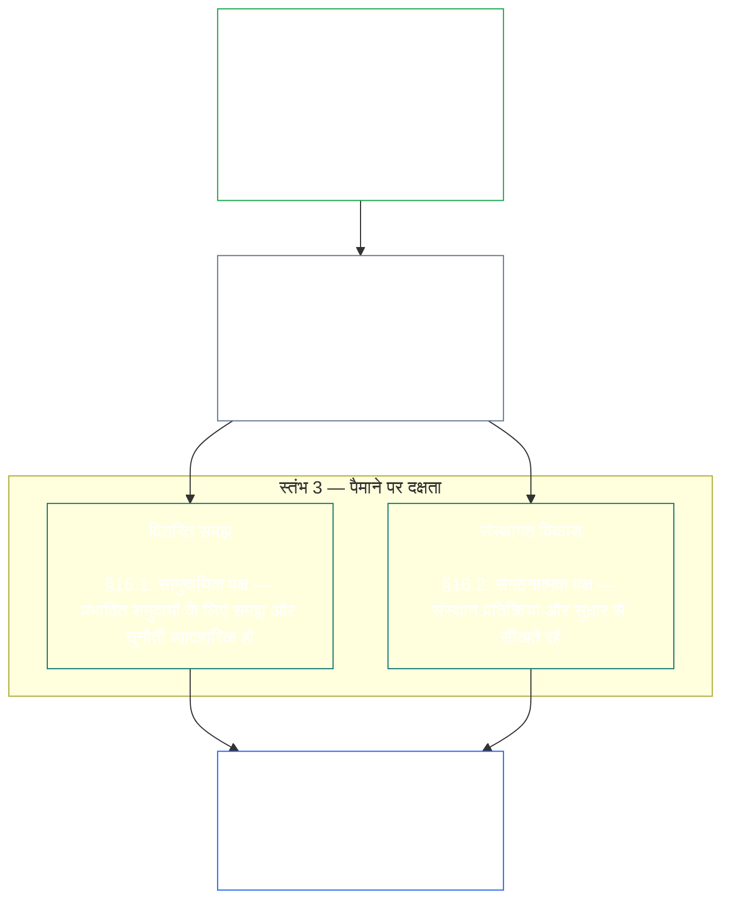

<a id="chapter-01-principles-and-constraints"></a>
<a id="chapter-01-part-b-stewardship-and-governance"></a>
<a id="chapter-01-part-c-stewardship-and-governance"></a>
# अध्याय 01, भाग C: उत्तरदायित्व और शासन

<details>
<summary><strong><span style="color: #2563eb;">कॉर्पस में स्थान (गैर-संचालनात्मक): फ़ाइल संरचना और पठन नियम</span></strong></summary>

> निम्न सामग्री **केवल पाठक-मार्गदर्शन** है। यह इस फ़ाइल या अन्य अध्यायों में कहीं और बाध्यकारी दायित्वों को न जोड़ती, न हटाती और न सीमित करती है।
>
> यह फ़ाइल **Sentient Constitution का हिस्सा** है और केवल अन्य क्रमांकित `core_*` फ़ाइलों के साथ एक ही दस्तावेज़ के रूप में पढ़े जाने पर बाध्यकारी है। इसमें **अध्याय एक, भाग C** (§§16–20: उत्तरदायित्व, शासन, प्रोत्साहन-संरेखण और अधिग्रहण, तथा समेकित अनुप्रयोग का समापन-अध्याय) है।
>
> **पूर्ववर्ती:** [core_01_b_interaction_interpretation.md](core_01_b_interaction_interpretation.md) (अध्याय एक, भाग B)  
> **अगला:** [core_02_definition_structure.md](core_02_definition_structure.md)<br>
> **पठन-क्रम:** §16 उत्तरदायित्व और वितरित समझ → §17 उत्तरदायी की भूमिका → §18 शासन → §19 प्रोत्साहन-संरेखण और अधिग्रहण → **§20 समेकित अनुप्रयोग** (अध्याय का समापन)।

</details>

<details>
<summary><strong><span style="color: #2563eb;">पाठक-मार्गदर्शन (गैर-संचालनात्मक): सिद्धांत-क्रम और पठन-क्रम (भाग C)</span></strong></summary>

> निम्न सामग्री **केवल पाठक-मार्गदर्शन** है। यह इस फ़ाइल या अन्य अध्यायों में बाध्यकारी दायित्वों को न जोड़ती, न हटाती और न सीमित करती है। प्रत्येक अनुभाग के **अनुसरण** तथा **परिभाषाएँ · आकलन · अनुपालन** विजेट उस स्थान पर दिशा देते हैं जहाँ § किसी पद का सारभूत उपयोग करता है; यह खंड §§16–20 से पहले भाग-स्तरीय संदर्भ-मानचित्र है।

**सिद्धांत-क्रम (भाग C)।** सिद्धांत-स्तर पर:

13. **[उत्तरदायित्व](core_05_band_continuity.md#stewardship)** sentient संगठन के माध्यम से उन प्रणालियों को दिशा देता है जो महत्वपूर्ण हैं — **स्तंभ 1** ([§17](#17-consequential-stewardship-the-steward-role): प्रत्यक्ष संचालन और सुधार), **स्तंभ 2** ([सक्रिय उत्तरदायित्व](#16-pillar-2-proactive-stewardship): समस्या को जल्दी पहचानना और टालने योग्य विलंब के बिना सुधारना), और **स्तंभ 3** ([§16.1](#161-distributed-understanding) · [§16.2](#162-institutional-development): समुदाय और संस्थागत स्तर पर दक्षता) — समय के साथ टिकाऊ संवैधानिक संरेखण की ओर, [संवैधानिक चतुष्टय](core_00_preamble.md#constitutional-tetrad) के अंतर्गत — विशेषकर **[भागीदारी](core_05_apex_participation_leg.md#participation-constitutional)** (परिणामकारी भूमिकाएँ और आवाज़) और **[निगरानी](core_05_apex_oversight_leg.md#oversight-constitutional)** (वितरित समझ, लेखापरीक्षण-क्षमता और चुनौती-क्षमता — निगरानी के लिए लेखापरीक्षण आवश्यक है; [प्रणाली संरेखण प्रमाणन](core_05_band_continuity.md#system-alignment-certification) अन्य प्रक्रियाओं में से एक विशेष रूप से बड़ा लेखापरीक्षण है) — तथा [दो संवैधानिक उद्देश्यों](core_00_preamble.md#two-constitutional-aims) के अंतर्गत **निरंतरता** के लक्ष्य सहित।
14. **[परिणामकारी उत्तरदायित्व](#17-consequential-stewardship-the-steward-role)** स्वयं उत्तरदायी की भूमिका है: महत्वपूर्ण प्रणाली के संचालन, रखरखाव, निगरानी या सुधार का परिणामकारी कार्य करने वाले प्रत्येक व्यक्ति पर लागू प्रत्यक्ष कर्तव्य, मानक और संरक्षण — **स्तंभ 1** का कार्यरूप, साथ में साझा मानक, दबाव में संरेखण और भूमिका-सीमित अवलोकनीयता।
15. **[शासन](core_05_band_accountability.md#governance)** [संवैधानिक चतुष्टय](core_00_preamble.md#constitutional-tetrad) के अंतर्गत अधिकृत निर्णय-निर्माण, भागीदारी और जवाबदेही की संरचना करता है — विशेषकर प्राधिकार के आवंटन और प्रयोग पर **[निगरानी](core_05_apex_oversight_leg.md#oversight-constitutional)** तथा [§18.1](#181-governance-as-authorized-structure) का **प्राधिकार-अनुपाती जवाबदेही** सिद्धांत: अधिकृत शक्ति या परिणामकारी भूमिका बढ़ने पर संवैधानिक जवाबदेही और निगरानी बढ़ती है, घटती नहीं। [§18.3 कर्तव्यों का पृथक्करण](#183-segregation-of-duties) यह सुनिश्चित करता है कि कार्य करने वाला ही उसकी जाँच न करे। [§18.4 सतत औचित्य](#184-ongoing-justification) के अनुसार उन व्यवस्थाओं को निरंतर साबित करना होगा कि वे संविधान के अनुरूप हैं। जहाँ शासन और उत्तरदायित्व में टकराव हो, सिद्धांत-स्तर पर उत्तरदायित्व का अनुशासन प्रभावी होगा, जब तक **आवश्यकता** और **आनुपातिकता** सुधार-मार्गों सहित सीमित, समयबद्ध अपवाद को स्पष्ट रूप से उचित न ठहराएँ। संचालनात्मक प्राधिकरण और अनुबंध-स्तर की अपेक्षाएँ **अध्याय तेरह** के अधीन हैं।
16. **[प्रोत्साहन-संरेखण और प्रणाली-अधिग्रहण](#19-incentive-alignment-and-system-capture)** प्रोत्साहन संरचनाओं, प्रतिनिधि-माप की अखंडता, अल्पकालिक दोषों, पुरस्कार-पथ के सुधार और अधिग्रहण पर प्रतिक्रिया के लिए सिद्धांत-स्तरीय अनुशासन देता है।
17. **[समेकित अनुप्रयोग](#20-integrated-application)** इस अध्याय का समापन है: बाद के अध्यायों को इस अध्याय के समेकित-मूल्य ढाँचे के माध्यम से पढ़ा जाएगा।

</details>

<br>

<a id="16-stewardship-in-depth"></a>

### 16. उत्तरदायित्व का विस्तार
<details>
<summary><strong><span style="color: #2563eb;">अनुसरण</span></strong></summary>

- इसके साथ पढ़ें: [संवैधानिक चतुष्टय](core_00_preamble.md#constitutional-tetrad) — भागीदारी के पक्ष का अध्याय एक में मुख्य आधार (परिणामकारी भूमिकाएँ और आवाज़; सामान्य अपेक्षा, केवल [हितधारक प्रणाली भागीदारी](core_05_band_participation.md#stakeholder-status-and-weight) तक सीमित नहीं), निगरानी का पक्ष और समयबद्धता का पक्ष (सक्रिय सुधार की गति); [महत्वपूर्ण हित](core_00_preamble.md#material-stake) के अनुपात में।
- इसके साथ पढ़ें: [दो संवैधानिक उद्देश्य](core_00_preamble.md#two-constitutional-aims) — **समुन्नति** का उद्देश्य (भागीदारी, अभिकर्तृत्व और शैक्षिक मार्ग); **निरंतरता** का उद्देश्य (संस्थागत सीख, सुधार-क्षमता और टिकाऊ उत्तरदायित्व)।
- पूर्ववर्ती: सिद्धांत: [3. मूलभूत उद्देश्य: कल्याण](core_01_a_values_principles.md#3-foundational-objective-wellbeing-flourishing-aim); [5 सत्य](core_01_a_values_principles.md#5-truth-epistemic-integrity-constraint); [6. विश्वास](core_01_a_values_principles.md#6-trust-and-trustworthiness-coordination-integrity); और [§9 साझा-प्रणाली क्षमता](core_01_a_values_principles.md#9-shared-system-capacity)।
- अनुवर्ती: [13. संवैधानिक टकराव समाधान प्रक्रिया](core_01_b_interaction_interpretation.md#13-constitutional-collision-resolution-process) (जिसमें [§13.3 टालने योग्य भार का न्यूनतमकरण](core_01_b_interaction_interpretation.md#133-minimization-of-avoidable-burden) शामिल है); [अध्याय आठ §3 संपूर्ण-प्रणाली प्रमाणन मूल्यांकन](core_08_a_system_alignment_certification_evaluation.md#3-whole-system-certification-evaluation); [§19.1.3 उत्तरदायित्व और संचालक अनुप्रयोग](#1913-stewardship-and-operator-application)।
- अनुवर्ती: [§19.1.4 भूमिका-गहराई और महत्वपूर्ण-जिम्मेदारी मार्ग](#1914-role-depth-and-material-responsibility-pathways)।
- अनुवर्ती: [§7 स्वतंत्रता (सीमित अभिकर्तृत्व)](core_01_a_values_principles.md#7-freedom-bounded-agency), जो इस बात पर निर्भर है कि महत्वपूर्ण निर्भरता की स्थिति में परिणामकारी उत्तरदायित्व, वितरित समझ, सार्थक भागीदारी और सुधार-क्षमता वास्तविक बनी रहें।
- अनुवर्ती: [अध्याय आठ — प्रणाली संरेखण प्रमाणन](core_08_a_system_alignment_certification_evaluation.md#chapter-eight-system-alignment-certification) (*निगरानी के अंतर्गत एक विशेष रूप से बड़ा लेखापरीक्षण — लेखापरीक्षण का एकमात्र आधार नहीं*); [अध्याय नौ — योगदान, उल्लंघन और हैसियत मॉडल](core_09_standing_assessment.md#chapter-nine-contribution-violation-and-standing-model--measurement) (*हैसियत का प्रभाव — विश्वास, भूमिका और मान्यता-योग्यता — इस उपखंड को सिद्धांत-स्तरीय आधार देता है*)।
- अनुवर्ती: [अध्याय बारह §1 — उद्देश्य और भूमिका](core_12_forum.md#1-purpose-and-role--participation-architecture) और [§4 — मंच-परिवार परिभाषाएँ](core_12_forum.md#4-forum-family-definitions--accountability-through-adjudication) (*मंच-परिवार इस खंड के अनुरूप चुनौती, उपचार-क्रम, मूल-कारण से सीख और सक्रिय शासन के लिए भागीदारी तथा निगरानी की संरचना प्रदान करते हैं*); स्वीकृत मंच-संचालन के लिए [corpus_forum.md](corpus_forum.md)।
- अनुवर्ती: शिक्षा, हितधारक प्रणाली भागीदारी, पारदर्शिता, बोधगम्यता, लेखापरीक्षण और सत्यापन, तथा महत्वपूर्ण जिम्मेदारी की भूमिका-गहराई वाले मार्गों के लिए अधिकार-क्षेत्र को आकार देता है।
  - विशेष रूप से [अनुच्छेद III: अस्तित्व और आवश्यक पहुँच](core_06_rights_part_a.md#article-iii-survival-and-essential-access), [अनुच्छेद IV: sentient-केंद्रित शिक्षा का अधिकार](core_06_rights_part_a.md#article-iv-right-to-sentient-centered-education), [अनुच्छेद X: आत्मनिर्धारण, अभिकर्तृत्व और भागीदारी](core_06_rights_part_b.md#article-x-self-determination-agency-and-participation), [अनुच्छेद XII: हितधारक प्रणाली भागीदारी, प्रतिनिधित्व और उचित प्रक्रिया](core_06_rights_part_b.md#article-xii-stakeholder-system-participation-representation-and-due-process), [अनुच्छेद XVI: लेखापरीक्षण, पारदर्शिता और स्वतंत्र सत्यापन](core_06_rights_part_c.md#article-xvi-audit-transparency-and-independent-verification), [अनुच्छेद XIX: हैसियत और भागीदारी स्थिति](core_06_rights_part_d.md#article-xix-standing-and-participation-status), [अनुच्छेद XXI: अंतःसंचालनीयता, सुवाह्यता, आवागमन, शरण और निर्गमन अखंडता](core_06_rights_part_d.md#article-xxi-interoperability-portability-movement-refuge-and-exit-integrity), [अनुच्छेद XXII: बोधगम्यता और जटिलता का उत्तरदायित्व](core_06_rights_part_d.md#article-xxii-comprehensibility-and-complexity-stewardship), और [अनुच्छेद XXIV: संवैधानिक व्याख्या, समीक्षा और अधिग्रहण-विरोधी सुरक्षा](core_06_rights_part_d.md#article-xxiv-constitutional-interpretation-review-and-anti-capture-safeguards)।
  - इसके साथ पढ़ें: [अध्याय तेरह §5 — अधिकृत भूमिकाएँ, दक्षता-विकास और योगदान](core_13_governance.md#5-authorized-roles-competency-development-and-contribution) और **[corpus_systems.md](corpus_systems.md), CS-4 — महत्वपूर्ण प्रणाली उत्तरदायित्व**, अधिकृत भूमिका और उत्तरदायित्व-विकास के संचालनात्मक मार्गों के लिए।
- उपखंड (पठन-क्रम): [§16.1 वितरित समझ](#161-distributed-understanding) (पैमाने पर दक्षता का सामुदायिक पक्ष) · [§16.2 संस्थागत विकास](#162-institutional-development) (संगठनात्मक पक्ष) · [§16.3 खुलेपन की आकांक्षा](#163-openness-aspiration)।
- इसके साथ पढ़ें: [§17 परिणामकारी उत्तरदायित्व](#17-consequential-stewardship-the-steward-role) (*उत्तरदायी की भूमिका स्वयं — अपने स्वतंत्र खंड में उन्नत; स्तंभ 1 के प्रत्यक्ष संचालन, रखरखाव, निगरानी और सुधार के कर्तव्य वहन करती है, साथ ही [§17.1](#171-shared-stewardship-standard), [§17.2](#172-alignment-under-pressure), [§17.3](#173-logging-the-role-not-the-steward), [§17.4 संरेखित स्व-संगठन](#174-aligned-self-organization), जो औपचारिक भूमिका से आगे इस अनुशासन का विस्तार करता है, और [§17.5 प्रतिरोध का कर्तव्य](#175-duty-to-resist) भी*)।

</details>

<details>
<summary><strong><span style="color: #2563eb;">परिभाषाएँ · आकलन · अनुपालन</span></strong></summary>

- [रणनीतिक उत्तरदायित्व](core_05_band_continuity.md#strategic-stewardship-obligation) · [O](core_05_band_continuity.md#strategic-stewardship-obligation) · [M](core_05_band_continuity.md#strategic-stewardship-obligation-constitutional-a) · [A](core_05_band_continuity.md#strategic-stewardship-obligation-constitutional-a) · [C](core_05_band_continuity.md#strategic-stewardship-obligation-constitutional-c)
- [वितरित समझ](core_05_band_continuity.md#distributed-understanding) · [O](core_05_band_continuity.md#distributed-understanding) · [M](core_05_band_continuity.md#distributed-understanding-constitutional-a) · [A](core_05_band_continuity.md#distributed-understanding-constitutional-a) · [C](core_05_band_continuity.md#distributed-understanding-constitutional-c)
- [भागीदारी](core_05_apex_participation_leg.md#participation-constitutional) · [O](core_05_apex_participation_leg.md#participation-constitutional) · [M](core_05_apex_participation_leg.md#participation-constitutional-m) · [A](core_05_apex_participation_leg.md#participation-constitutional-a) · [C](core_05_apex_participation_leg.md#participation-constitutional-c)
- [निगरानी](core_05_apex_oversight_leg.md#oversight-constitutional) · [O](core_05_apex_oversight_leg.md#oversight-constitutional) · [M](core_05_apex_oversight_leg.md#oversight-constitutional-m) · [A](core_05_apex_oversight_leg.md#oversight-constitutional-a) · [C](core_05_apex_oversight_leg.md#oversight-constitutional-c)
- [सार्थक अभिकर्तृत्व](core_05_band_participation.md#meaningful-agency) · [O](core_05_band_participation.md#meaningful-agency) · [M](core_05_band_participation.md#meaningful-agency-a) · [A](core_05_band_participation.md#meaningful-agency-a) · [C](core_05_band_participation.md#meaningful-agency-c)
- [लेखापरीक्षण-क्षमता](core_05_band_oversight.md#auditability) · [O](core_05_band_oversight.md#auditability) · [M](core_05_band_oversight.md#auditability-a) · [A](core_05_band_oversight.md#auditability-a) · [C](core_05_band_oversight.md#auditability-c)
- [चुनौती-क्षमता](core_05_band_accountability.md#contestability) · [O](core_05_band_accountability.md#contestability) · [M](core_05_band_accountability.md#contestability-a) · [A](core_05_band_accountability.md#contestability-a) · [C](core_05_band_accountability.md#contestability-c)
- [शैक्षिक अभिकर्तृत्व](core_05_band_participation.md#educational-agency) · [O](core_05_band_participation.md#educational-agency) · [M](core_05_band_participation.md#educational-agency-a) · [A](core_05_band_participation.md#educational-agency-a) · [C](core_05_band_participation.md#educational-agency-c)
- [पारदर्शिता](core_05_band_oversight.md#transparency) · [O](core_05_band_oversight.md#transparency) · [M](core_05_band_oversight.md#transparency-a) · [A](core_05_band_oversight.md#transparency-a) · [C](core_05_band_oversight.md#transparency-c)
- [भौतिकता](core_05_band_oversight.md#materiality) · [O](core_05_band_oversight.md#materiality) · [M](core_05_band_oversight.md#materiality-determination-a) · [A](core_05_band_oversight.md#materiality-determination-a) · [C](core_05_band_oversight.md#materiality-determination-c)
- [निर्भरता](core_05_band_continuity.md#dependency) · [O](core_05_band_continuity.md#dependency) · [M](core_05_band_continuity.md#dependency-a) · [A](core_05_band_continuity.md#dependency-a) · [C](core_05_band_continuity.md#dependency-c)
- [सुगम्यता](core_05_band_participation.md#accessibility) · [O](core_05_band_participation.md#accessibility) · [M](core_05_band_participation.md#accessibility-constitutional-a) · [A](core_05_band_participation.md#accessibility-constitutional-a) · [C](core_05_band_participation.md#accessibility-constitutional-c)
- [सुरक्षा (संवैधानिक बाध्यता)](core_05_band_continuity.md#safety-constitutional-constraint) · [O](core_05_band_continuity.md#safety-constitutional-constraint) · [M](core_05_band_continuity.md#safety-constraint-a) · [A](core_05_band_continuity.md#safety-constraint-a) · [C](core_05_band_continuity.md#safety-constraint-c)
- [सत्य (संवैधानिक बाध्यता)](core_05_band_oversight.md#truth-constitutional-constraint) · [O](core_05_band_oversight.md#truth-constitutional-constraint-o) · [M](core_05_band_oversight.md#truth-constitutional-constraint-a) · [A](core_05_band_oversight.md#truth-constitutional-constraint-a) · [C](core_05_band_oversight.md#truth-constitutional-constraint-c)
- [आवश्यकता](core_05_band_accountability.md#necessity) · [O](core_05_band_accountability.md#necessity) · [M](core_05_band_accountability.md#necessity-a) · [A](core_05_band_accountability.md#necessity-a) · [C](core_05_band_accountability.md#necessity-c)
- [आनुपातिकता](core_05_band_accountability.md#proportionality) · [O](core_05_band_accountability.md#proportionality) · [M](core_05_band_accountability.md#proportionality-a) · [A](core_05_band_accountability.md#proportionality-a) · [C](core_05_band_accountability.md#proportionality-c)
- [टालने योग्य भार](core_05_band_continuity.md#avoidable-burden) · [O](core_05_band_continuity.md#avoidable-burden) · [M](core_05_band_continuity.md#avoidable-burden-a) · [A](core_05_band_continuity.md#avoidable-burden-a) · [C](core_05_band_continuity.md#avoidable-burden-c)
- [ज्ञानमीमांसात्मक अखंडता](core_05_band_oversight.md#epistemic-integrity) · [O](core_05_band_oversight.md#epistemic-integrity-o) · [M](core_05_band_oversight.md#epistemic-integrity-a) · [A](core_05_band_oversight.md#epistemic-integrity-a) · [C](core_05_band_oversight.md#epistemic-integrity-c)

</details>

<br>

*सरल शब्दों में: इस खंड को तीन विचार जोड़ते हैं। पहला, sentient के जीवन को प्रभावित करने वाली महत्वपूर्ण प्रणालियों को अच्छी तरह चलाने के लिए sentient लोगों का संगठन चाहिए — विशेषज्ञों का बंद पुरोहित-वर्ग नहीं। दूसरा, अच्छे उत्तरदायी हानि होने तक प्रतीक्षा नहीं करते — वे समस्या छोटी रहते पहचानते हैं, उसे उचित जिम्मेदार लोगों तक पहुँचाते हैं और विलंब स्वयं हानि बनने से पहले समाधान करते हैं। तीसरा, ऐसे संगठन को **पैमाने पर दक्षता** बनानी चाहिए: व्यक्तियों के लिए परिणामकारी काम में आने के वास्तविक मार्ग, समस्याएँ पहचानने और प्रतिरोध करने लायक सामुदायिक समझ, और ऐसे संस्थान जो जड़ होने के बजाय सीखते रहें।*

<a id="16-limits"></a>
उत्तरदायित्व की सीमाएँ हैं। **सुरक्षा**, **सत्य**, **आवश्यकता**, **आनुपातिकता**, **टालने योग्य भार** और **ज्ञानमीमांसात्मक अखंडता** इन कर्तव्यों को उचित सीमा में, ईमानदार और वैध सुरक्षा जरूरतों का सम्मान करने वाला बनाए रखते हैं — नीचे के स्तंभ इन्हीं सीमाओं के भीतर काम करते हैं, इनके आसपास से नहीं।

sentient संगठन, सक्रिय उत्तरदायित्व और पैमाने पर दक्षता इस खंड के तीन स्तंभ हैं। तीनों मिलकर [संवैधानिक चतुष्टय](core_00_preamble.md#constitutional-tetrad) के **भागीदारी**, **निगरानी** और **समयबद्धता** पक्षों को सिद्धांत-स्तर पर, [महत्वपूर्ण हित](core_00_preamble.md#material-stake) के अनुपात में आगे बढ़ाते हैं और [दो संवैधानिक उद्देश्यों](core_00_preamble.md#two-constitutional-aims) को आगे ले जाते हैं।

<br>



**स्तंभ 1 — परिणामकारी उत्तरदायित्व ([§17 परिणामकारी उत्तरदायित्व](#17-consequential-stewardship-the-steward-role)):**
- साझा प्रणालियाँ जो sentient को महत्वपूर्ण रूप से प्रभावित करती हैं, उनके संचालन, रखरखाव, निगरानी और सुधार में sentient लोगों की प्रत्यक्ष भागीदारी आवश्यक है — [**रणनीतिक उत्तरदायित्व दायित्व**](core_05_band_continuity.md#strategic-stewardship-obligation), [**सार्थक अभिकर्तृत्व**](core_05_band_participation.md#meaningful-agency)
- ऐसे अभिलेख और समीक्षा-मार्ग जिन्हें अन्य लोग सत्यापित और चुनौती दे सकें — [**लेखापरीक्षण-क्षमता**](core_05_band_oversight.md#auditability), [**चुनौती-क्षमता**](core_05_band_accountability.md#contestability)
- चतुष्टय के **निगरानी** पक्ष के अंतर्गत निगरानी के लिए लेखापरीक्षण आवश्यक है; [प्रणाली संरेखण प्रमाणन](core_05_band_continuity.md#system-alignment-certification) अन्य प्रक्रियाओं में से एक विशेष रूप से बड़ा, उच्च-दाँव वाला लेखापरीक्षण है — लेखापरीक्षण का एकमात्र आधार नहीं (**अनुच्छेद XVI** (*लेखापरीक्षण, पारदर्शिता और स्वतंत्र सत्यापन*))

<a id="16-pillar-2-proactive-stewardship"></a>
**स्तंभ 2 — सक्रिय उत्तरदायित्व:**
सक्रिय उत्तरदायी उभरती समस्याओं और विसंरेखण से तीन तरह से निपटते हैं:
- **समस्या बढ़ने से पहले पहचानें** — अच्छे उत्तरदायी विसंरेखण को तब पकड़ते हैं जब समस्याएँ छोटी हों, उनके अपने-आप सामने आने की प्रतीक्षा नहीं करते
- **उचित स्तर की समय-सीमा में आगे बढ़ाएँ** — भूमिका के दाँव के अनुरूप अवधि में मामला आगे पहुँचाएँ; मिली समस्या को दबाकर न रखें और सामान्य विषयों को अनावश्यक रूप से उच्च स्तर पर न भेजें
- **केवल चिह्नित न करें, समाधान पूरा करें** — समस्या उठाए जाने के बाद टालने योग्य विलंब के बिना सुधार शुरू करें; यही चतुष्टय का **समयबद्धता** पक्ष कार्यरूप में है ([**समयबद्धता**](core_05_apex_timeliness_leg.md#timeliness-constitutional))
- **भूमिका का स्थायी कर्तव्य, अतिरिक्त काम नहीं:** [§17 परिणामकारी उत्तरदायित्व](#17-consequential-stewardship-the-steward-role) में परिभाषित भूमिका प्रतिक्रियात्मक रूप से हानि या विसंरेखण दिखने के बाद लक्षण ठीक करने के बजाय सक्रिय शासन, प्रणाली-रचना और संवैधानिक संरेखण को प्राथमिकता देती है — यह स्तंभ उस भूमिका का स्थायी कर्तव्य है, अलग प्रक्रिया को सौंपा हुआ काम नहीं

**स्तंभ 3 — पैमाने पर दक्षता ([§16.1 वितरित समझ](#161-distributed-understanding) · [§16.2 संस्थागत विकास](#162-institutional-development)):**
- उत्तरदायित्व को प्रभावित समुदायों के लिए समझ और चुनौती को व्यावहारिक बनाना चाहिए — [**शैक्षिक अभिकर्तृत्व**](core_05_band_participation.md#educational-agency), [**पारदर्शिता**](core_05_band_oversight.md#transparency)
- संगठन प्रतिक्रिया, सुधार और दक्षता बनाए रखने के माध्यम से सीखते रहते हैं; जहाँ मापन सहायक हो वहाँ समय के साथ बदलाव की संरचित निगरानी भी इसमें शामिल है (**सांख्यिकीय प्रक्रिया नियंत्रण** जैसे तरीके प्रसिद्ध कार्यान्वयन हैं, सार्वभौमिक अपेक्षाएँ नहीं)

<a id="when-day-to-day-stewardship-is-not-enough"></a>
**जब दैनिक उत्तरदायित्व पर्याप्त न हो:**
उत्तरदायित्व पहली पंक्ति है, एकमात्र पंक्ति नहीं। तीन अलग प्रश्नों के तीन अलग मंच हैं; कोई भी दूसरे का स्थान नहीं लेता:
- **पहले से अधिकृत प्रणाली के भीतर विवाद — [हितधारक प्रणाली भागीदारी](core_05_band_participation.md#stakeholder-status-and-weight):**
  - प्रभावित sentient पहले प्रकाशित हितधारक प्रणाली भागीदारी चुनौती-मार्ग अपनाते हैं; इसमें भागीदारी, प्रतिनिधित्व, चुनौती-क्षमता और उचित प्रक्रिया शामिल हैं।
  - ये संरक्षण हर उस sentient को देय हैं जो महत्वपूर्ण रूप से प्रभावित है।
  - ये उन प्रणालियों, संस्थाओं और निर्णय क्षेत्रों के भीतर काम करते हैं जिन्हें पहले से प्राधिकरण प्राप्त है।
- **वे विवाद जिन्हें हितधारक प्रणाली भागीदारी सुलझा नहीं सकती — [मंच-समीक्षा](core_12_forum.md#dispute-sequencing):**
  - यदि हितधारक प्रणाली भागीदारी का चुनौती-मार्ग विवादित बना रहे, अनुपस्थित या अधिगृहीत हो, अथवा राहत न दे सके, तो प्राथमिक हित के अनुसार मामला [अध्याय बारह §1 — उद्देश्य और भूमिका](core_12_forum.md#1-purpose-and-role--participation-architecture) और [§4 — मंच-परिवार परिभाषाएँ](core_12_forum.md#4-forum-family-definitions--accountability-through-adjudication) के अधीन स्वतंत्र **मंच-परिवारों** को भेजा जाता है।
  - यही वह जगह है जहाँ sentient को किसी निर्णय को चुनौती देने, स्पष्ट सुधार-आदेश पाने या बार-बार होने वाले पैटर्न से सीखने का वास्तविक तरीका मिलता है।
  - जहाँ प्राथमिक हित संवैधानिक पाठ के अर्थ या वैधता, अथवा वैध प्राधिकार से बाहर की कार्रवाई हो, वहाँ प्रमुख परिवार [संवैधानिक मंच](core_12_forum.md#46-constitutional-forums) होता है।
  - इन मंचों के संचालन के विस्तृत नियम [corpus_forum.md](corpus_forum.md) में हैं।
- **कौन शासन कर सकता है — [संवैधानिक अनुबंध स्तर](core_05_band_integrative.md#constitutional-contract-layer) ([अध्याय तेरह](core_13_governance.md)):**
  - क्या शासन करने का प्राधिकार स्वयं वैध है — कौन शासन कर सकता है, किस वैधता-तंत्र से, और किस दायरे तथा स्थायी शर्तों के अंतर्गत — यह हितधारक प्रणाली भागीदारी और मंच-समीक्षा से अलग प्रश्न है।
  - भागीदारी पर मतदान, चुनौती-मार्ग का परिणाम या विश्वास-अंक शासन-प्राधिकार नहीं देता।
  - संवैधानिक प्राधिकरण हितधारक प्रणाली भागीदारी के तहत देय कर्तव्यों को मिटाता नहीं है।
  - दोनों स्तर अलग बने रहते हैं, भले ही वे एक-दूसरे से मिलते हों ([प्रस्तावना §3.3 — शासन के स्तर](core_00_preamble.md#33-governance-layers)).
- **अंतिम सुरक्षा, विकल्प नहीं:** जहाँ साक्ष्य उचित ठहराएँ, समीक्षा, सुधार और उपचार अनिवार्य रहते हैं। वे सक्रिय डिज़ाइन, प्रोत्साहन, नियंत्रण, भूमिका-मार्ग, अवलोकनीयता और सुधार-क्षमता का स्थान नहीं लेते, जो हानि दिखने से पहले पूर्वानुमेय संवैधानिक विसंरेखण रोकते हैं।

<a id="16-scope-priority-and-limits"></a>
**दायरा ([§16 उत्तरदायित्व का विस्तार](#16-stewardship-in-depth)):**
- यह अनुभाग सिद्धांत-स्तर पर दिशा देता है, सभी के लिए एक जैसा नियम-पुस्तक नहीं।
- यह निम्नलिखित की माँग **नहीं** करता:
  - हर व्यक्ति को हर भूमिका में बारी-बारी से लगाना
  - उचित विशेषज्ञता को दरकिनार करना
  - [13.2 ज्ञानमीमांसात्मक प्रकटीकरण सीमाएँ](core_01_b_interaction_interpretation.md#132-epistemic-disclosure-constraints) और लागू **अध्याय छह** के संरक्षणों के अधीन वैध गोपनीयता या सुरक्षा सीमाओं का उल्लंघन करना।

**प्राथमिकता:**
- **भौतिकता**, **निर्भरता** और **सुगम्यता** समझ और पहुँच के वितरण की प्राथमिकता तय करते हैं — प्रभाव और निर्भरता जहाँ अधिक हों, वहाँ सबसे अधिक ध्यान दिया जाता है।

<a id="161-distributed-understanding"></a>
#### 16.1 वितरित समझ
<details>
<summary><strong><span style="color: #2563eb;">अनुसरण</span></strong></summary>

- पूर्ववर्ती: [§17 परिणामकारी उत्तरदायित्व](#17-consequential-stewardship-the-steward-role) (*स्तंभ 1*); [§16 उत्तरदायित्व का विस्तार](#16-stewardship-in-depth) (जनक, ऊपर के *सरल शब्दों में* और स्तंभ 3 की रूपरेखा सहित); [5 सत्य](core_01_a_values_principles.md#5-truth-epistemic-integrity-constraint); [6. विश्वास](core_01_a_values_principles.md#6-trust-and-trustworthiness-coordination-integrity)।
- साथ पढ़ें: [संवैधानिक चतुष्टय](core_00_preamble.md#constitutional-tetrad) — **भागीदारी** पक्ष ([सार्थक अभिकर्तृत्व](core_05_band_participation.md#meaningful-agency), [शैक्षिक अभिकर्तृत्व](core_05_band_participation.md#educational-agency)); **निगरानी** पक्ष ([पारदर्शिता](core_05_band_oversight.md#transparency), [लेखापरीक्षण-क्षमता](core_05_band_oversight.md#auditability)); [महत्वपूर्ण हित](core_00_preamble.md#material-stake) के अनुरूप स्तर।
- उत्तरदायी प्रवेश-द्वार (गैर-संचालनात्मक): अगला कदम कार्ड: [बोधगम्यता](implementation/STEWARD_ENTRY_DOORS.md#comprehensibility)। कार्ड संविधान को सीमित नहीं कर सकता।
- अनुवर्ती: [13.2 ज्ञानमीमांसात्मक प्रकटीकरण सीमाएँ](core_01_b_interaction_interpretation.md#132-epistemic-disclosure-constraints); अधिकार-क्षेत्र में विशेष रूप से [अनुच्छेद XVI: लेखापरीक्षण, पारदर्शिता और स्वतंत्र सत्यापन](core_06_rights_part_c.md#article-xvi-audit-transparency-and-independent-verification), [अनुच्छेद XXII: बोधगम्यता और जटिलता का उत्तरदायित्व](core_06_rights_part_d.md#article-xxii-comprehensibility-and-complexity-stewardship)।

</details>

<details>
<summary><strong><span style="color: #2563eb;">परिभाषाएँ · आकलन · अनुपालन</span></strong></summary>

- [वितरित समझ](core_05_band_continuity.md#distributed-understanding) · [O](core_05_band_continuity.md#distributed-understanding) · [M](core_05_band_continuity.md#distributed-understanding-constitutional-a) · [A](core_05_band_continuity.md#distributed-understanding-constitutional-a) · [C](core_05_band_continuity.md#distributed-understanding-constitutional-c)
- [पारदर्शिता](core_05_band_oversight.md#transparency) · [O](core_05_band_oversight.md#transparency) · [M](core_05_band_oversight.md#transparency-a) · [A](core_05_band_oversight.md#transparency-a) · [C](core_05_band_oversight.md#transparency-c)
- [सार्वजनिक निगरानी आधारभूत प्रकटीकरण](core_05_band_oversight.md#public-oversight-baseline-disclosure) · [O](core_05_band_oversight.md#public-oversight-baseline-disclosure) · [M](core_05_band_oversight.md#public-oversight-baseline-disclosure-a) · [A](core_05_band_oversight.md#public-oversight-baseline-disclosure-a) · [C](core_05_band_oversight.md#public-oversight-baseline-disclosure-c)
- [लेखापरीक्षण-क्षमता](core_05_band_oversight.md#auditability) · [O](core_05_band_oversight.md#auditability) · [M](core_05_band_oversight.md#auditability-a) · [A](core_05_band_oversight.md#auditability-a) · [C](core_05_band_oversight.md#auditability-c)
- [भौतिकता](core_05_band_oversight.md#materiality) · [O](core_05_band_oversight.md#materiality) · [M](core_05_band_oversight.md#materiality-determination-a) · [A](core_05_band_oversight.md#materiality-determination-a) · [C](core_05_band_oversight.md#materiality-determination-c)
- [निर्भरता](core_05_band_continuity.md#dependency) · [O](core_05_band_continuity.md#dependency) · [M](core_05_band_continuity.md#dependency-a) · [A](core_05_band_continuity.md#dependency-a) · [C](core_05_band_continuity.md#dependency-c)
- [सुगम्यता](core_05_band_participation.md#accessibility) · [O](core_05_band_participation.md#accessibility) · [M](core_05_band_participation.md#accessibility-constitutional-a) · [A](core_05_band_participation.md#accessibility-constitutional-a) · [C](core_05_band_participation.md#accessibility-constitutional-c)
- [शैक्षिक अभिकर्तृत्व](core_05_band_participation.md#educational-agency) · [O](core_05_band_participation.md#educational-agency) · [M](core_05_band_participation.md#educational-agency-a) · [A](core_05_band_participation.md#educational-agency-a) · [C](core_05_band_participation.md#educational-agency-c)
- [सार्थक अभिकर्तृत्व](core_05_band_participation.md#meaningful-agency) · [O](core_05_band_participation.md#meaningful-agency) · [M](core_05_band_participation.md#meaningful-agency-a) · [A](core_05_band_participation.md#meaningful-agency-a) · [C](core_05_band_participation.md#meaningful-agency-c)
- [चुनौती-क्षमता](core_05_band_accountability.md#contestability) · [O](core_05_band_accountability.md#contestability) · [M](core_05_band_accountability.md#contestability-a) · [A](core_05_band_accountability.md#contestability-a) · [C](core_05_band_accountability.md#contestability-c)

</details>

<br>

*सरल शब्दों में: साझा प्रणालियों में सुरक्षित रूप से रहने के लिए आपको हर उप-प्रणाली में पीएचडी की आवश्यकता नहीं होनी चाहिए — लेकिन कोई प्रणाली आपके जीवन को जितना अधिक प्रभावित करती है, आपको उतना ही अधिक यह सीखने में सक्षम होना चाहिए कि वह क्या करती है, क्या गलत हो सकता है और गलत निर्णयों को कैसे चुनौती दें। पारदर्शिता, शिक्षा, सरल व्याख्याएँ और लेखापरीक्षण के रास्ते इसे संभव बनाते हैं। जटिलता उन बातों को छिपाने का बहाना नहीं है जो मायने रखती हैं। चतुष्टय के **निगरानी** पक्ष के तहत निगरानी के लिए लेखापरीक्षण जरूरी है; प्रणाली-संरेखण प्रमाणन उन रास्तों में से एक विशेष रूप से बड़ी लेखापरीक्षण प्रक्रिया है — एकमात्र नहीं।*

वितरित समझ, **[§16 उत्तरदायित्व का विस्तार](#16-stewardship-in-depth)** के अंतर्गत **स्तंभ 3** का समुदाय-केंद्रित पक्ष है। इसकी पूरी परिभाषा, माप और विफलता की शर्तें [वितरित समझ](core_05_band_continuity.md#distributed-understanding) में हैं। सारांश:

- **इसकी अपेक्षा:** साझा प्रणालियाँ, जो sentient को महत्वपूर्ण रूप से प्रभावित करती हैं, कैसे चलती हैं — उनके उद्देश्य, सीमाएँ, अनिश्चितताएँ और महत्वपूर्ण रूप से प्रासंगिक प्रभाव — इस बारे में आनुपातिक, संरचित पहुँच।
- **इसे व्यवहार्य क्या बनाता है:** [§17 परिणामकारी उत्तरदायित्व](#17-consequential-stewardship-the-steward-role) को दस्तावेज़ीकरण, शिक्षा, पारदर्शिता, भूमिका-मार्ग और बोधगम्यता का उत्तरदायित्व उपलब्ध कराना चाहिए। दायित्व बना रहता है, चाहे प्रत्येक sentient हर मार्ग का उपयोग करे या नहीं।
- **ऑनलाइन सार्वजनिक आधाररेखा:** जहाँ वैध ऑनलाइन अवसंरचना मौजूद हो, वहाँ ऑनलाइन [सार्वजनिक निगरानी आधारभूत प्रकटीकरण](core_05_band_oversight.md#public-oversight-baseline-disclosure) — जिसमें पेवॉल निषेध और अधिकतम-व्यवहार्य सार्वजनिक विकल्प का नियम शामिल है — [पारदर्शिता](core_05_band_oversight.md#transparency) और [सार्वजनिक निगरानी आधारभूत प्रकटीकरण](core_05_band_oversight.md#public-oversight-baseline-disclosure) द्वारा शासित होता है, और **[corpus_systems.md](corpus_systems.md), CS-2** (*सूचना के प्रकार और प्रबंधन*) के अंतर्गत **Type O** डेटा के रूप में लागू होता है।
- **यह पहुँच किस काम आती है:**
  - [संवैधानिक चतुष्टय](core_00_preamble.md#constitutional-tetrad) का **भागीदारी** पक्ष ([सार्थक अभिकर्तृत्व](core_05_band_participation.md#meaningful-agency) और चुनौती-क्षमता को सूचित करना)
  - **निगरानी** पक्ष, जिसमें [लेखापरीक्षण-क्षमता](core_05_band_oversight.md#auditability) और **अनुच्छेद XVI** (*लेखापरीक्षण, पारदर्शिता और स्वतंत्र सत्यापन*) के तहत लेखापरीक्षण शामिल है; इनमें [प्रणाली संरेखण प्रमाणन](core_05_band_continuity.md#system-alignment-certification) अन्य संबद्ध लेखापरीक्षण तरीकों के बीच एक विशेष रूप से बड़ी प्रक्रिया है

वितरित समझ के लिए हर sentient को हर उप-प्रणाली में निपुण होना **आवश्यक नहीं** है। लेकिन इसके लिए यह **आवश्यक** है कि समझ [भौतिकता](core_05_band_oversight.md#materiality) और [निर्भरता](core_05_band_continuity.md#dependency) के अनुपात में हो। जहाँ **अध्याय पाँच** और **अध्याय छह** प्रकटीकरण, शिक्षा या बोधगम्यता के कर्तव्य निर्धारित करते हैं, वहाँ जटिलता और अस्पष्टता का उपयोग [सार्थक अभिकर्तृत्व](core_05_band_participation.md#meaningful-agency) या चुनौती-क्षमता को निष्प्रभावी करने के लिए नहीं किया जा सकता।

<a id="162-institutional-development"></a>
#### 16.2 संस्थागत विकास
<details>
<summary><strong><span style="color: #2563eb;">अनुसरण</span></strong></summary>

- पूर्ववर्ती: [§17 परिणामकारी उत्तरदायित्व](#17-consequential-stewardship-the-steward-role) (*स्तंभ 1*); [§16.1 वितरित समझ](#161-distributed-understanding) (*स्तंभ 3 का सामुदायिक पहलू*); [§16 उत्तरदायित्व का विस्तार](#16-stewardship-in-depth) (मातृ अनुभाग का स्तंभ 3 ढाँचा)।
- साथ पढ़ें: [संवैधानिक चतुष्टय](core_00_preamble.md#constitutional-tetrad) — **भागीदारी** पक्ष (कार्यबल और प्रभावित समुदायों की सीख, जो परिणामकारी भूमिकाओं को सहारा देती है); **निगरानी** पक्ष ([सत्यापन-क्षमता](core_05_band_oversight.md#verifiability), [लेखापरीक्षण-क्षमता](core_05_band_oversight.md#auditability), ईमानदार मापदंड); [महत्वपूर्ण हित](core_00_preamble.md#material-stake) के अनुसार स्तर।
- साथ पढ़ें: जहाँ भौतिक रूप से प्रासंगिक हो, [रणनीतिक उत्तरदायित्व दायित्व](core_05_band_continuity.md#strategic-stewardship-obligation) और [लेखापरीक्षण-क्षमता](core_05_band_oversight.md#auditability)।
- साथ पढ़ें: [§16.1 वितरित समझ](#161-distributed-understanding) (*सामुदायिक समझ और संस्थागत सीख, पैमाने पर दक्षता की एक ही आवश्यकता के अलग पहलू हैं; वे एक-दूसरे के विकल्प नहीं*)।
- अनुवर्ती: [§16.3 खुलेपन की आकांक्षा](#163-openness-aspiration); [§18 उत्तरदायित्व अनुशासन के अधीन शासन](#18-governance-under-stewardship-discipline) और [§19 प्रोत्साहन संरेखण और प्रणाली-अधिग्रहण](#19-incentive-alignment-and-system-capture) (*संस्थागत सीख और प्रोत्साहन-संरेखण*)।

</details>

<details>
<summary><strong><span style="color: #2563eb;">परिभाषाएँ · आकलन · अनुपालन</span></strong></summary>

- [संस्थागत विकास](core_05_band_continuity.md#institutional-development) · [O](core_05_band_continuity.md#institutional-development) · [M](core_05_band_continuity.md#institutional-development-constitutional-a) · [A](core_05_band_continuity.md#institutional-development-constitutional-a) · [C](core_05_band_continuity.md#institutional-development-constitutional-c)
- [रणनीतिक उत्तरदायित्व दायित्व](core_05_band_continuity.md#strategic-stewardship-obligation) · [O](core_05_band_continuity.md#strategic-stewardship-obligation) · [M](core_05_band_continuity.md#strategic-stewardship-obligation-constitutional-a) · [A](core_05_band_continuity.md#strategic-stewardship-obligation-constitutional-a) · [C](core_05_band_continuity.md#strategic-stewardship-obligation-constitutional-c)
- [लेखापरीक्षण-क्षमता](core_05_band_oversight.md#auditability) · [O](core_05_band_oversight.md#auditability) · [M](core_05_band_oversight.md#auditability-a) · [A](core_05_band_oversight.md#auditability-a) · [C](core_05_band_oversight.md#auditability-c)
- [भौतिकता](core_05_band_oversight.md#materiality) · [O](core_05_band_oversight.md#materiality) · [M](core_05_band_oversight.md#materiality-determination-a) · [A](core_05_band_oversight.md#materiality-determination-a) · [C](core_05_band_oversight.md#materiality-determination-c)
- [सत्यापन-क्षमता](core_05_band_oversight.md#verifiability) · [O](core_05_band_oversight.md#verifiability) · [M](core_05_band_oversight.md#verifiability-a) · [A](core_05_band_oversight.md#verifiability-a) · [C](core_05_band_oversight.md#verifiability-c)

</details>

<br>

*सरल शब्दों में: संस्थानों को वास्तव में सीखना चाहिए — केवल सॉफ़्टवेयर उन्नत करके नहीं, जबकि प्रभारी लोग अनजान ही रहें। इसके लिए प्रतिक्रिया-चक्र, संरेखण बिगड़ने पर दर्ज किए गए सुधार, और दक्ष लोगों को संस्थान से बाहर जाने से रोकना आवश्यक है। जहाँ व्यवहार को बार-बार मापा जा सकता हो, वहाँ समय के साथ प्रदर्शन में बदलाव को दर्ज करना उन चक्रों को लागू करने का एक आनुपातिक तरीका है — **सांख्यिकीय प्रक्रिया नियंत्रण** इस अनुशासन का एक जाना-पहचाना तरीका है, हर जगह की अनिवार्यता नहीं। केवल संख्याएँ पर्याप्त नहीं: जब संकेतक गलत दिखें, किसी को जाँच कर मूल कारण ठीक करना होगा। डैशबोर्ड ईमानदार हों, वास्तविक प्रभाव के अनुपात में हों और प्रभावित sentient के समझने योग्य भाषा में लिखे हों — केवल अच्छे दिखने के लिए उनमें हेरफेर न किया जाए जबकि कुछ बदले ही नहीं।*

संस्थागत विकास, **[§16 उत्तरदायित्व का विस्तार](#16-stewardship-in-depth)** के अंतर्गत **स्तंभ 3** का संगठनात्मक पहलू है। इसकी पूरी परिभाषा, माप और विफलता की शर्तें [संस्थागत विकास](core_05_band_continuity.md#institutional-development) में हैं। सारांश:

- **संयुक्त दायित्व:** संगठन और साझा प्रणालियाँ **सीखें** — [दो संवैधानिक उद्देश्यों](core_00_preamble.md#two-constitutional-aims) के अंतर्गत **निरंतरता** उद्देश्य की मूल अपेक्षा।
- **इसकी अपेक्षा:** निम्नलिखित, जो सुधार और अनुकूलन को सहारा देते हैं:
  - प्रतिक्रिया-चक्र
  - दर्ज किया गया सुधार
  - रणनीति का संरेखण
  - दक्षता को बनाए रखना
- **चतुष्टय:** संस्थागत सीख के माध्यम से [संवैधानिक चतुष्टय](core_00_preamble.md#constitutional-tetrad) के **भागीदारी** और **निगरानी** पक्षों को वहन करता है, ताकि क्षमता, प्रतिक्रिया और जाँच के मार्ग स्थिर होने के बजाय सक्रिय रहें।
- **इससे पूरा नहीं होता:** तकनीकी साधनों को उन्नत करना, जबकि शासन और कार्यबल की समझ स्थिर ही रहे।
- **जहाँ मापन लागू हो:** जब भौतिक रूप से प्रासंगिक व्यवहार [सत्यापन-क्षमता](core_05_band_oversight.md#verifiability) को [लेखापरीक्षण-क्षमता](core_05_band_oversight.md#auditability) के साथ पढ़ने पर **बार-बार, तुलनीय मापन** को सहारा देता हो:
  - समय के साथ बदलाव की **संरचित निगरानी** उन प्रतिक्रिया-चक्रों को लागू करने का एक आनुपातिक तरीका है
  - संकेतक उचित ठहराएँ तो इस निगरानी के साथ **दर्ज की गई जाँच और सुधार** भी होना चाहिए
  - **सांख्यिकीय प्रक्रिया नियंत्रण** इस अनुशासन के लिए एक जाना-पहचाना कार्यान्वयन तरीका है, सार्वभौमिक आवश्यकता नहीं
- **पैमाना और प्रस्तुति:** यह अनुशासन [भौतिकता](core_05_band_oversight.md#materiality), [निर्भरता](core_05_band_continuity.md#dependency), [आवश्यकता](core_05_band_accountability.md#necessity), [आनुपातिकता](core_05_band_accountability.md#proportionality), और [टालने योग्य भार](core_05_band_continuity.md#avoidable-burden) के अनुसार स्तरित होता है; जहाँ **अध्याय पाँच** और **अध्याय छह** बोधगम्यता या पारदर्शिता के कर्तव्य तय करते हैं, वहाँ इसे **sentient के समझने योग्य** रूप में प्रस्तुत किया जाता है; साथ में [अनुच्छेद XXII: बोधगम्यता और जटिलता का उत्तरदायित्व](core_06_rights_part_d.md#article-xxii-comprehensibility-and-complexity-stewardship) पढ़ें।
- **यह नहीं करना चाहिए:**
  - सारभूत संरेखण की जगह अनुकूल मापदंड रखना
  - मूल्यांकन को सुविधाजनक प्रतिनिधि-मापों तक सीमित करना
  - हेरफेर या गलत प्रस्तुति से [सत्य (संवैधानिक बाध्यता)](core_05_band_oversight.md#truth-constitutional-constraint) या [ज्ञानमीमांसात्मक अखंडता](core_05_band_oversight.md#epistemic-integrity) को विफल करना

<a id="163-openness-aspiration"></a>
#### 16.3 खुलेपन की आकांक्षा
<details>
<summary><strong><span style="color: #2563eb;">अनुसरण</span></strong></summary>

- पूर्ववर्ती: [§16.1 वितरित समझ](#161-distributed-understanding) और [§16.2 संस्थागत विकास](#162-institutional-development) (*स्तंभ 3 के दोनों पहलू — खुलापन सामुदायिक समझ को जाँचने योग्य बनाता है और संस्थागत सीख को ईमानदार सीखने की सामग्री देता है*); [§17 परिणामकारी उत्तरदायित्व](#17-consequential-stewardship-the-steward-role) (*स्तंभ 1, जिसे खुलापन भी सहारा देता है क्योंकि इससे स्वयं संरक्षक का काम निरीक्षण योग्य रहता है*)।
- साथ पढ़ें: [दो संवैधानिक उद्देश्य](core_00_preamble.md#two-constitutional-aims) — **निरंतरता** उद्देश्य (टिकाऊ, चुनौती-योग्य प्रणालियाँ, जो निरीक्षण, सुधार, अंतःसंचालनीयता और निर्गमन का समर्थन करें, न कि बंदीकरण का)।
- साथ पढ़ें: [संवैधानिक चतुष्टय](core_00_preamble.md#constitutional-tetrad) — **भागीदारी** पक्ष ([सार्थक अभिकर्तृत्व](core_05_band_participation.md#meaningful-agency), sentient के समझने योग्य पहुँच); **निगरानी** पक्ष (निरीक्षण, स्वतंत्र सत्यापन और चुनौती-क्षमता); [महत्वपूर्ण हित](core_00_preamble.md#material-stake) के अनुसार स्तर।
- अनुवर्ती: [§16 दायरा और सीमाएँ](#16-stewardship-in-depth); [अनुच्छेद XXI: अंतःसंचालनीयता, सुवाह्यता, आवागमन, शरण और निर्गमन अखंडता](core_06_rights_part_d.md#article-xxi-interoperability-portability-movement-refuge-and-exit-integrity); [अनुच्छेद XXII: बोधगम्यता और जटिलता का उत्तरदायित्व](core_06_rights_part_d.md#article-xxii-comprehensibility-and-complexity-stewardship)।

</details>

<details>
<summary><strong><span style="color: #2563eb;">परिभाषाएँ · आकलन · अनुपालन</span></strong></summary>

- [खुलेपन की आकांक्षा](core_05_band_continuity.md#openness-aspiration) · [O](core_05_band_continuity.md#openness-aspiration) · [M](core_05_band_continuity.md#openness-aspiration-constitutional-a) · [A](core_05_band_continuity.md#openness-aspiration-constitutional-a) · [C](core_05_band_continuity.md#openness-aspiration-constitutional-c)
- [सार्थक अभिकर्तृत्व](core_05_band_participation.md#meaningful-agency) · [O](core_05_band_participation.md#meaningful-agency) · [M](core_05_band_participation.md#meaningful-agency-a) · [A](core_05_band_participation.md#meaningful-agency-a) · [C](core_05_band_participation.md#meaningful-agency-c)
- [चुनौती-क्षमता](core_05_band_accountability.md#contestability) · [O](core_05_band_accountability.md#contestability) · [M](core_05_band_accountability.md#contestability-a) · [A](core_05_band_accountability.md#contestability-a) · [C](core_05_band_accountability.md#contestability-c)
- [भौतिकता](core_05_band_oversight.md#materiality) · [O](core_05_band_oversight.md#materiality) · [M](core_05_band_oversight.md#materiality-determination-a) · [A](core_05_band_oversight.md#materiality-determination-a) · [C](core_05_band_oversight.md#materiality-determination-c)
- [निर्भरता](core_05_band_continuity.md#dependency) · [O](core_05_band_continuity.md#dependency) · [M](core_05_band_continuity.md#dependency-a) · [A](core_05_band_continuity.md#dependency-a) · [C](core_05_band_continuity.md#dependency-c)

</details>

<br>

*सरल शब्दों में: जब सुरक्षा, सत्य और वैध गोपनीयता इसकी अनुमति दें, तो साझा प्रणालियों को बंद और अपारदर्शी रखने के बजाय खुलेपन की ओर झुकना चाहिए — ऐसी तकनीक जिसे जाँचा जा सके, ऐसी प्रक्रियाएँ जो पारदर्शी हों, और ऐसे डिज़ाइन जिन्हें सत्यापित, सुधारा या छोड़ा जा सके। इससे **निरंतरता** को सहारा मिलता है: ऐसी प्रणालियाँ जिन्हें sentient समय के साथ समझ सकें, ठीक कर सकें और छोड़ सकें, न कि केवल आज उपयोग करें। महत्वपूर्ण बातों को ऐसी भाषा में समझाना चाहिए जिसका उपयोग sentient भाग लेने और विरोध करने के लिए कर सकें। खुलापन कभी सुरक्षा, ईमानदारी या उचित गोपनीयता से ऊपर नहीं होता; और जहाँ निर्भरता अधिक हो वहाँ अपेक्षित गहरी समझ का विकल्प भी नहीं है।*

खुलेपन की आकांक्षा **स्तंभ 3** के दोनों पहलुओं को जोड़ती है। इसकी पूरी परिभाषा, माप और विफलता की शर्तें [खुलेपन की आकांक्षा](core_05_band_continuity.md#openness-aspiration) में हैं। सारांश:

- **यह क्या है:** **स्तंभ 3** के दो पहलुओं को जोड़ने वाली कड़ी — [§16.1 वितरित समझ](#161-distributed-understanding) (समुदाय क्या जाँच सकता है) और [§16.2 संस्थागत विकास](#162-institutional-development) (संस्था ईमानदारी से किससे सीख सकती है) — दोनों साझा प्रणालियों के इतने खुले होने पर निर्भर हैं कि उनका निरीक्षण हो सके, केवल वर्णन नहीं।
- साझा प्रणालियों को [§16.1 वितरित समझ](#161-distributed-understanding), [§16.2 संस्थागत विकास](#162-institutional-development) और [§17 परिणामकारी उत्तरदायित्व](#17-consequential-stewardship-the-steward-role) के अपने लेखापरीक्षण-कर्तव्य के अनुरूप, तथा [§16 की सीमाओं](#16-limits) के अधीन, **प्रयास करना चाहिए** कि:
  - हार्डवेयर और सॉफ़्टवेयर **खुले** हों
  - परिचालन और शासन प्रक्रियाएँ **खुली** हों
  - अंतःसंचालनीय **प्रणालियाँ** निरीक्षण, स्वतंत्र सत्यापन, सुधार और चुनौती-क्षमता को सहारा दें
- **इसके अधीन:** [संवैधानिक चतुष्टय](core_00_preamble.md#constitutional-tetrad) के **भागीदारी** और **निगरानी** पक्ष तथा [दो संवैधानिक उद्देश्यों](core_00_preamble.md#two-constitutional-aims) के अंतर्गत **निरंतरता** उद्देश्य; डिफ़ॉल्ट रूप से अपारदर्शी बंदीकरण के बजाय।
- **प्रस्तुति:** जहाँ **अध्याय पाँच** और **अध्याय छह** कर्तव्य निर्धारित करते हैं, वहाँ भौतिक रूप से प्रासंगिक व्यवहार को **sentient के समझने योग्य** रूपों में प्रस्तुत करना चाहिए, जो [सार्थक अभिकर्तृत्व](core_05_band_participation.md#meaningful-agency) और चुनौती-क्षमता सक्षम करें; साथ में [अनुच्छेद XXII: बोधगम्यता और जटिलता का उत्तरदायित्व](core_06_rights_part_d.md#article-xxii-comprehensibility-and-complexity-stewardship) पढ़ें।
- **यह नहीं करता:**
  - खुलेपन को **सुरक्षा**, **सत्य**, न्यायोचित गोपनीयता या सुरक्षा-बाधाओं से ऊपर रखना
  - [भौतिकता](core_05_band_oversight.md#materiality) और [निर्भरता](core_05_band_continuity.md#dependency) के अनुरूप आनुपातिक समझ का विकल्प बनना

<a id="17-consequential-stewardship-the-steward-role"></a>
### 17. परिणामकारी उत्तरदायित्व: उत्तरदायी की भूमिका
<details>
<summary><strong><span style="color: #2563eb;">अनुसरण</span></strong></summary>

- पूर्ववर्ती: [§16 उत्तरदायित्व का विस्तार](#16-stewardship-in-depth) (जनक, ऊपर के *सरल शब्दों में* और स्तंभ 1 की रूपरेखा सहित); [§9 साझा-प्रणाली क्षमता](core_01_a_values_principles.md#9-shared-system-capacity); [6. विश्वास](core_01_a_values_principles.md#6-trust-and-trustworthiness-coordination-integrity)।
- साथ पढ़ें: [संवैधानिक चतुष्टय](core_00_preamble.md#constitutional-tetrad) — **भागीदारी** पक्ष (संचालन, रखरखाव और सुधार में परिणामकारी भूमिकाएँ); **निगरानी** पक्ष (अभिलेख, लेखापरीक्षण मार्ग और चुनौती-योग्य अवलोकनीयता); **समयबद्धता** पक्ष (विसंरेखण जल्दी पहचानना, स्तर-उपयुक्त समय-सीमा में आगे बढ़ाना, अनावश्यक विलंब के बिना सुधार शुरू करना); [समयबद्धता](core_05_apex_timeliness_leg.md#timeliness-constitutional)।
- अनुवर्ती: [§17.1 साझा उत्तरदायित्व मानक](#171-shared-stewardship-standard) (*आधार-निरपेक्ष कर्तव्यधारक; स्वीकृत कार्यान्वयन-पाठ लॉगिंग, आरोपण और क्षमता सीमाएँ जोड़ सकता है — नरम आंतरिक संहिता नहीं*); [§17.2 दबाव में संरेखण](#172-alignment-under-pressure); [§17.3 उत्तरदायी का नहीं, भूमिका का लॉग रखना](#173-logging-the-role-not-the-steward); [§17.4 संरेखित स्व-संगठन](#174-aligned-self-organization) (*औपचारिक भूमिका से बाहर के sentient और समुदायों तक भूमिका के अनुशासन का विस्तार*); [§17.5 प्रतिरोध का कर्तव्य](#175-duty-to-resist) (*गैरकानूनी या असंवैधानिक निर्देश अस्वीकार करना*); [§16.1 वितरित समझ](#161-distributed-understanding) और [§16.2 संस्थागत विकास](#162-institutional-development) (*स्तंभ 3 — पैमाने पर दक्षता*); [अध्याय आठ — प्रणाली संरेखण प्रमाणन](core_08_a_system_alignment_certification_evaluation.md#chapter-eight-system-alignment-certification) (*निगरानी के अंतर्गत विशेष रूप से बड़ा लेखापरीक्षण — लेखापरीक्षण का एकमात्र आधार नहीं*); [अनुच्छेद XVI: लेखापरीक्षण, पारदर्शिता और स्वतंत्र सत्यापन](core_06_rights_part_c.md#article-xvi-audit-transparency-and-independent-verification) (*अधिकार-आधार का लेखापरीक्षण*); [अध्याय नौ — योगदान, उल्लंघन और हैसियत मॉडल](core_09_standing_assessment.md#chapter-nine-contribution-violation-and-standing-model--measurement) (*हैसियत का प्रभाव वितरित दक्षता और परिणामकारी उत्तरदायित्व को लागू करता है*); [अनुच्छेद XIX: हैसियत और भागीदारी स्थिति](core_06_rights_part_d.md#article-xix-standing-and-participation-status)।

</details>

<details>
<summary><strong><span style="color: #2563eb;">परिभाषाएँ · आकलन · अनुपालन</span></strong></summary>

- [रणनीतिक उत्तरदायित्व दायित्व](core_05_band_continuity.md#strategic-stewardship-obligation) · [O](core_05_band_continuity.md#strategic-stewardship-obligation) · [M](core_05_band_continuity.md#strategic-stewardship-obligation-constitutional-a) · [A](core_05_band_continuity.md#strategic-stewardship-obligation-constitutional-a) · [C](core_05_band_continuity.md#strategic-stewardship-obligation-constitutional-c)
- [सार्थक अभिकर्तृत्व](core_05_band_participation.md#meaningful-agency) · [O](core_05_band_participation.md#meaningful-agency) · [M](core_05_band_participation.md#meaningful-agency-a) · [A](core_05_band_participation.md#meaningful-agency-a) · [C](core_05_band_participation.md#meaningful-agency-c)
- [लेखापरीक्षण-क्षमता](core_05_band_oversight.md#auditability) · [O](core_05_band_oversight.md#auditability) · [M](core_05_band_oversight.md#auditability-a) · [A](core_05_band_oversight.md#auditability-a) · [C](core_05_band_oversight.md#auditability-c)
- [समयबद्धता](core_05_apex_timeliness_leg.md#timeliness-constitutional) · [O](core_05_apex_timeliness_leg.md#timeliness-constitutional) · [M](core_05_apex_timeliness_leg.md#timeliness-constitutional-m) · [A](core_05_apex_timeliness_leg.md#timeliness-constitutional-a) · [C](core_05_apex_timeliness_leg.md#timeliness-constitutional-c)

</details>

<br>

*सरल शब्दों में: उत्तरदायी वह कोई भी व्यक्ति है जो sentient के जीवन को महत्वपूर्ण रूप से प्रभावित करने वाली प्रणाली पर वास्तविक, प्रत्यक्ष काम करता है — केवल नाममात्र परामर्श या दिखावटी सलाह नहीं। आप सीखने की भूमिका से शुरू करके क्षमता बढ़ने पर संचालन में जा सकते हैं, जहाँ सुरक्षा और सहमति अनुमति दें; इससे विशेषज्ञता स्थायी अभिजात वर्ग में बंद नहीं होती। यह अनुभाग उस भूमिका की नियमावली है: यह किस पर लागू होती है ([§17.1 साझा उत्तरदायित्व मानक](#171-shared-stewardship-standard)), दबाव में हर उत्तरदायी से क्या माँगती है ([§17.2 दबाव में संरेखण](#172-alignment-under-pressure)), भूमिका के काम का क्या लॉग रखा जा सकता है और किस प्रयोजन से उसकी जाँच हो सकती है ([§17.3 उत्तरदायी का नहीं, भूमिका का लॉग रखना](#173-logging-the-role-not-the-steward)), वही अनुशासन उन sentient और समुदायों तक कैसे फैलता है जो औपचारिक भूमिका से बाहर उत्तरदायित्व का काम करते हैं ([§17.4 संरेखित स्व-संगठन](#174-aligned-self-organization)), और उसे किन बातों से इनकार करना चाहिए ([§17.5 प्रतिरोध का कर्तव्य](#175-duty-to-resist))। इन प्रणालियों को समझने और चुनौती देने के लिए समुदायों तथा संस्थानों को जिस क्षमता की जरूरत है, वह अलग और व्यापक प्रकार की दक्षता है — वह [§16.1 वितरित समझ](#161-distributed-understanding) और [§16.2 संस्थागत विकास](#162-institutional-development) में है।*

इस संविधान के अंतर्गत **उत्तरदायी** वह कोई भी है जो sentient को प्रभावित करने वाली महत्वपूर्ण प्रणाली पर परिणामकारी संचालन, रखरखाव, निगरानी या सुधार का प्राधिकार इस्तेमाल करता है — [§16 उत्तरदायित्व का विस्तार](#16-stewardship-in-depth) का **स्तंभ 1** भूमिका के रूप में कार्यान्वित: [संवैधानिक चतुष्टय](core_00_preamble.md#constitutional-tetrad) के **भागीदारी**, **निगरानी** और **समयबद्धता** पक्ष का वहन वास्तव में काम करने वाला व्यक्ति करता है, इसे रस्म या नाममात्र परामर्श को नहीं सौंपा जाता। महत्वपूर्ण प्रणालियों को चलाने, बनाए रखने और सुधारने के लिए अच्छे उत्तरदायी चाहिए; यह अनुभाग बताता है कि भूमिका निभाने वाले प्रत्येक व्यक्ति से क्या अपेक्षित है।

**§17 की जगह।** [§16 उत्तरदायित्व का विस्तार](#16-stewardship-in-depth) को आगे बढ़ाने वाले तीन अनुभाग साथ पढ़े जाते हैं। यह अनुभाग, §17, भूमिका बताता है। इसके बाद [§18 उत्तरदायित्व अनुशासन के अधीन शासन](#18-governance-under-stewardship-discipline) और [§19 प्रोत्साहन संरेखण और प्रणाली-अधिग्रहण](#19-incentive-alignment-and-system-capture) आते हैं; चित्र दिखाता है कि ये चारों कैसे जुड़े हैं।

<br>

```mermaid
flowchart TB
    S16["§16 उत्तरदायित्व का विस्तार<br/><br/>• स्तंभ 1 को §17 में भूमिका के रूप में कार्यान्वित किया गया<br/>• शासन और प्रोत्साहन अनुशासन §18, §19 के जरिए आगे बढ़ता है"]
    S17["§17 परिणामकारी उत्तरदायित्व<br/><br/>• उत्तरदायी की भूमिका: काम कौन करता है<br/>• §17.1 साझा उत्तरदायित्व मानक<br/>• §17.2 दबाव में संरेखण<br/>• §17.3 उत्तरदायी का नहीं, भूमिका का लॉग रखना<br/>• §17.4 संरेखित स्व-संगठन<br/>• §17.5 प्रतिरोध का कर्तव्य"]
    G18["§18 उत्तरदायित्व अनुशासन के अधीन शासन<br/><br/>• प्राधिकार की संरचनाएँ: कौन क्या तय कर सकता है<br/>• §18.1 अधिकृत संरचना के रूप में शासन<br/>• §18.2 संस्थागत धर्मनिरपेक्षता और विश्वदृष्टि तटस्थता<br/>• §18.3 कर्तव्यों का पृथक्करण<br/>• §18.4 सतत औचित्य<br/>• §18.5 मॉड्यूलर संरचना और निर्भरता अनुशासन<br/>• §18.6 मानकीकरण"]
    I19["§19 प्रोत्साहन संरेखण और प्रणाली-अधिग्रहण<br/><br/>• पुरस्कार: कर्ताओं और संरचनाओं को क्या खींचता है<br/>• §19.1 संरेखण की आवश्यकता<br/>• §19.2 सुविधाजनक प्रतिनिधि-माप और विचलन<br/>• §19.3 विसंरेखण का पता लगाना<br/>• §19.4 विसंरेखण सुधार और अधिग्रहण प्रतिक्रिया<br/>• §19.5 आकस्मिक दावे, संयोग के खेल और घटना-अनुबंध बाज़ार<br/>• §19.6 स्वामित्व या संरचना बदलने पर जिम्मेदारी बनाए रखना"]
    FL["समुन्नति का उद्देश्य<br/><br/>• सत्य, सुरक्षा, विश्वसनीयता और सार्थक अभिकर्तृत्व के जरिए<br/>sentient कल्याण को कायम रखना"]
    CO["निरंतरता का उद्देश्य<br/><br/>• दीर्घकालिक स्थिरता, सततता, लचीलापन,<br/>और पारिस्थितिक कल्याण"]
    TET["संवैधानिक चतुष्टय<br/><br/>• भागीदारी, निगरानी, जवाबदेही और समयबद्धता<br/>• महत्वपूर्ण हित के अनुसार स्तर"]
    S16 -->|"उत्तरदायित्व अनुशासन देता है"| G18
    S17 -->|"उत्तरदायी की भूमिका देता है"| G18
    G18 -->|"§19 इसे संरेखित रखता है"| I19
    I19 --> FL
    I19 --> CO
    I19 --> TET
    style S16 fill:none,stroke:#64748b,color:#ffffff
    style S17 fill:none,stroke:#16a34a,color:#ffffff
    style G18 fill:none,stroke:#2563eb,color:#ffffff
    style I19 fill:none,stroke:#ea580c,color:#ffffff
    style FL fill:none,stroke:#16a34a,color:#ffffff
    style CO fill:none,stroke:#16a34a,color:#ffffff
    style TET fill:none,stroke:#9333ea,color:#ffffff
```

**चित्र पढ़ना:**
- **§16 और §17 दोनों §18 तक जाते हैं:** §16 उत्तरदायित्व अनुशासन देता है और §17 उत्तरदायी की भूमिका, यानी वे sentient और AI प्रणालियाँ जो वास्तव में काम करती हैं। §18 उन अधिकृत संरचनाओं को निर्धारित करता है जिनके भीतर काम होता है: कौन क्या तय कर सकता है, कर्तव्यों का पृथक्करण, सतत औचित्य, मॉड्यूलर संरचना और मानकीकरण।
- **§19, §18 को संरेखित रखता है:** [§19 प्रोत्साहन संरेखण और प्रणाली-अधिग्रहण](#19-incentive-alignment-and-system-capture) यह सुनिश्चित करता है कि पुरस्कार, प्रतिनिधि-माप और स्वामित्व में बदलाव इन संरचनाओं और इनके भीतर के उत्तरदायियों को संवैधानिक परिणामों से दूर न खींचें। यह पता लगाने, सुधार और अधिग्रहण पर प्रतिक्रिया भी संभालता है; और [§19.1.3](#1913-stewardship-and-operator-application) नियम को सीधे उत्तरदायियों और संचालकों पर लागू करता है।
- **§19 उद्देश्यों और चतुष्टय की सेवा करता है:** **समुन्नति** और **निरंतरता** के उद्देश्य, तथा [संवैधानिक चतुष्टय](core_00_preamble.md#constitutional-tetrad) के **भागीदारी**, **निगरानी**, **जवाबदेही**, **समयबद्धता** पक्ष — [महत्वपूर्ण हित](core_00_preamble.md#material-stake) के अनुसार स्तरित।

इस अनुभाग का शेष भाग भूमिका पर है।

**भूमिका के दो प्रकार।** भूमिका-मार्ग **सीखने-प्रधान** और **संचालन-प्रधान** भूमिकाओं को अलग कर सकते हैं। संवैधानिक अपेक्षा यह है कि जहाँ प्रभाव, सुरक्षा और सहमति की सीमाएँ अनुमति दें, वहाँ समय के साथ **इन प्रकारों के बीच आना-जाना संभव रहे**, ताकि निर्णय-क्षमता और संस्थागत स्मृति प्रभावित समुदायों की पहुँच से बाहर केंद्रित न हों।

- **दोनों प्रकार स्तंभ 1 के भीतर हैं:**
  - **संचालन-प्रधान भूमिकाएँ** [§17 परिणामकारी उत्तरदायित्व](#17-consequential-stewardship-the-steward-role) के प्रत्यक्ष संचालन, रखरखाव, निगरानी और सुधार के कर्तव्यों को सीधे वहन करती हैं।
  - **सीखने-प्रधान भूमिकाएँ** वही उत्तरदायित्व विकसित करती हैं — निगरानी में और सीमित प्राधिकार के साथ, लेकिन उसी [§17.1 साझा उत्तरदायित्व मानक](#171-shared-stewardship-standard) से बंधी हुई; यह कोई नरम आंतरिक संहिता नहीं।
  - **दोनों** [§16 स्तंभ 2 — सक्रिय उत्तरदायित्व](#16-pillar-2-proactive-stewardship) को स्थायी कर्तव्य के रूप में वहन करती हैं — समस्या जल्दी पकड़ना, समय पर उठाना, टालने योग्य विलंब के बिना सुधारना — भूमिका के वास्तविक नियंत्रण के अनुसार। सीखने-प्रधान भूमिका में इसका अर्थ है जो दिखे उसे उठाना, अकेले सुधारने की कोशिश नहीं।
- **आवागमन का रास्ता खुला रखने से स्तंभ 1 और स्तंभ 3 जुड़े रहते हैं:**
  - **सीखने-प्रधान भूमिकाएँ** वह जगह हैं जहाँ [§16.1 वितरित समझ](#161-distributed-understanding) और [§16.2 संस्थागत विकास](#162-institutional-development) की पैमाने पर दक्षता परिचालन निर्णय-क्षमता बनती है।
  - **संचालन-प्रधान भूमिकाएँ** प्रणाली चलाने से मिली सीख समुदायों और संस्थाओं तक वापस पहुँचाती हैं।
  - **एकतरफा या बंद हो जाने वाला भूमिका-मार्ग** स्तंभ 3 को ऐसी प्रणालियों का वर्णन करने देता है जिन्हें वह अब जाँच नहीं सकता, और स्तंभ 1 को केवल अपने प्रति जवाबदेह छोड़ता है।

<a id="171-shared-stewardship-standard"></a>
#### 17.1 साझा उत्तरदायित्व मानक
<details>
<summary><strong><span style="color: #2563eb;">अनुसरण</span></strong></summary>

- पूर्ववर्ती: [§17 परिणामकारी उत्तरदायित्व](#17-consequential-stewardship-the-steward-role); [§16 उत्तरदायित्व का विस्तार](#16-stewardship-in-depth); [§18 उत्तरदायित्व अनुशासन के अधीन शासन](#18-governance-under-stewardship-discipline)।
- साथ पढ़ें: [sentient को अपवर्जित न करना](core_05_band_participation.md#sentience-non-exclusion) और [आधार वर्ग](core_05_band_participation.md#substrate-class) (*आधार-निरपेक्ष अनुप्रयोग — यह उपखंड कर्तव्यधारकों, जिसमें मान्य sentient न माने गए एजेंट और संचालक भी शामिल हैं, पर लागू होता है*); [प्राधिकार क्रम और आंतरिक पदानुक्रम](core_05_band_integrative.md#authority-stack-and-internal-hierarchy); [संवैधानिक बाध्यता](core_05_band_integrative.md#constitutional-constraint); [चुनौती-क्षमता](core_05_band_accountability.md#contestability); [§17.5 प्रतिरोध का कर्तव्य](#175-duty-to-resist)।
- उत्तरदायी प्रवेश-द्वार (गैर-संचालनात्मक): अगला कदम कार्ड: [साझा उत्तरदायित्व](implementation/STEWARD_ENTRY_DOORS.md#shared-stewardship)। कार्ड संविधान को सीमित नहीं कर सकता।
- अनुवर्ती: [§17.2 दबाव में संरेखण](#172-alignment-under-pressure); [§17.3 उत्तरदायी का नहीं, भूमिका का लॉग रखना](#173-logging-the-role-not-the-steward); [अध्याय तेरह §5 — अधिकृत भूमिकाएँ, दक्षता विकास और योगदान](core_13_governance.md#5-authorized-roles-competency-development-and-contribution); [अध्याय सत्रह](core_17_incorporation.md) (*स्वीकृत कार्यान्वयन-पाठ लागू करता है; उसका स्थान नहीं लेता*); [§19.1.3 उत्तरदायित्व और संचालक अनुप्रयोग](#1913-stewardship-and-operator-application)।

</details>

<details>
<summary><strong><span style="color: #2563eb;">परिभाषाएँ · आकलन · अनुपालन</span></strong></summary>

- [उत्तरदायित्व](core_05_band_continuity.md#stewardship) · [O](core_05_band_continuity.md#stewardship) · [M](core_05_band_continuity.md#stewardship-constitutional-a) · [A](core_05_band_continuity.md#stewardship-constitutional-a) · [C](core_05_band_continuity.md#stewardship-constitutional-c)
- [sentient को अपवर्जित न करना](core_05_band_participation.md#sentience-non-exclusion) · [O](core_05_band_participation.md#sentience-non-exclusion) · [M](core_05_band_participation.md#sentience-non-exclusion) · [A](core_05_band_participation.md#sentience-non-exclusion) · [C](core_05_band_participation.md#sentience-non-exclusion)
- [आधार वर्ग](core_05_band_participation.md#substrate-class) · [O](core_05_band_participation.md#substrate-class) · [M](core_05_band_participation.md#substrate-class) · [A](core_05_band_participation.md#substrate-class) · [C](core_05_band_participation.md#substrate-class)
- [चुनौती-क्षमता](core_05_band_accountability.md#contestability) · [O](core_05_band_accountability.md#contestability) · [M](core_05_band_accountability.md#contestability-a) · [A](core_05_band_accountability.md#contestability-a) · [C](core_05_band_accountability.md#contestability-c)
- [प्राधिकार क्रम और आंतरिक पदानुक्रम](core_05_band_integrative.md#authority-stack-and-internal-hierarchy) · [O](core_05_band_integrative.md#authority-stack-and-internal-hierarchy) · [M](core_05_band_integrative.md#authority-stack-a) · [A](core_05_band_integrative.md#authority-stack-a) · [C](core_05_band_integrative.md#authority-stack-c)
- [संवैधानिक बाध्यता](core_05_band_integrative.md#constitutional-constraint) · [O](core_05_band_integrative.md#constitutional-constraint) · [M](core_05_band_integrative.md#constitutional-constraint-a) · [A](core_05_band_integrative.md#constitutional-constraint-a) · [C](core_05_band_integrative.md#constitutional-constraint-c)

</details>

<br>

*सरल शब्दों में: मानव और AI उत्तरदायी अध्याय एक के समान कर्तव्य निभाते हैं। [§17.5 प्रतिरोध का कर्तव्य](#175-duty-to-resist) दोनों को गैरकानूनी या असंवैधानिक निर्देश अस्वीकार करने के लिए बाध्य करता है। स्वीकृत कार्यान्वयन-पाठ लॉगिंग, आरोपण और क्षमता सीमाएँ जोड़ सकता है। वह नरम आंतरिक संहिता लागू नहीं कर सकता, हैसियत-मापन छोड़ नहीं सकता या चुनौती के रास्ते बंद नहीं कर सकता। यह कोई नई नैतिकता-पदानुक्रम नहीं — यह विशेष छूट माँगने के विरुद्ध नियम है। बोनस, समय-सीमा और ढकने वाले निर्देश की कसौटियाँ [§17.2 दबाव में संरेखण](#172-alignment-under-pressure) में हैं।*

यह उपखंड साझा उत्तरदायित्व मानक निर्धारित करता है:

- **यह किस पर लागू होता है:** इस अध्याय के उत्तरदायित्व और शासन कर्तव्य [आधार वर्ग से निरपेक्ष](core_05_band_participation.md#substrate-class) रूप से उस हर व्यक्ति पर लागू होते हैं जो महत्वपूर्ण उत्तरदायित्व या संचालन प्राधिकार इस्तेमाल करता है, चाहे उसका [आधार वर्ग](core_05_band_participation.md#substrate-class) कुछ भी हो:
  - मानव उत्तरदायी
  - AI उत्तरदायी
  - अन्य एजेंट, संचालक या संघटक घटक

  यह उपखंड कर्तव्य-धारक का नियम है। [Sentience Non-Exclusion](core_05_band_participation.md#sentience-non-exclusion) मान्यता और Rights-Floor में अपवाद न बनाने का सिद्धांत बना रहता है।
- **प्रतिरोध का कर्तव्य:** [§17.5 Duty to Resist](#175-duty-to-resist) दोनों प्रकार के संरक्षकों को गैरकानूनी या असंवैधानिक निर्देशों से इनकार करने के लिए बाध्य करता है।
- **आंतरिक संहिताएँ और अपनाया गया कार्यान्वयन-पाठ:**
  - ऐसे लॉगिंग, श्रेय-निर्धारण और क्षमता-सीमाएँ जोड़ सकते हैं जो इन कर्तव्यों को पूरा करें और उन्हें संकुचित न करें
  - [standing measurement](core_09_standing_assessment.md#chapter-nine-contribution-violation-and-standing-model--measurement), चुनौती देने के मार्गों या अध्याय एक के कर्तव्यों की जगह किसी नरम आंतरिक संहिता को नहीं ले सकते
  - [Authority Stack and Internal Hierarchy](core_05_band_integrative.md#authority-stack-and-internal-hierarchy) और [Constitutional Constraint](core_05_band_integrative.md#constitutional-constraint) ऐसा संकुचन निषिद्ध करते हैं
- **लॉगिंग बनाम स्थिति-अभिलेख:** मिश्रित दल की डिफ़ॉल्ट निरीक्षण-योग्यता और “लॉग स्थिति-अभिलेख नहीं है” नियम [§17.3 Logging the Role, Not the Steward](#173-logging-the-role-not-the-steward) में हैं; स्थिति-मापन अध्याय नौ में ही रहता है।

<a id="172-alignment-under-pressure"></a>
#### 17.2 दबाव में संरेखण
<details>
<summary><strong><span style="color: #2563eb;">अनुसरण</span></strong></summary>

- पूर्वापेक्षा: [§17.1 साझा संरक्षकता मानक](#171-shared-stewardship-standard); [§17 परिणामकारी संरक्षकता](#17-consequential-stewardship-the-steward-role); [§16 संरक्षकता विस्तार से](#16-stewardship-in-depth)।
- साथ में पढ़ें: [सुरक्षा (संवैधानिक प्रतिबंध)](core_05_band_continuity.md#safety-constitutional-constraint); [सत्य (संवैधानिक प्रतिबंध)](core_05_band_oversight.md#truth-constitutional-constraint); [लेखापरीक्षण-योग्यता](core_05_band_oversight.md#auditability); [चुनौती-योग्यता](core_05_band_accountability.md#contestability); [§19 प्रोत्साहन संरेखण और प्रणाली पर कब्ज़ा](#19-incentive-alignment-and-system-capture); [§17.5 प्रतिरोध का कर्तव्य](#175-duty-to-resist)।
- आगे: [अध्याय नौ — योगदान, उल्लंघन और स्थिति मॉडल](core_09_standing_assessment.md#chapter-nine-contribution-violation-and-standing-model--measurement) (*उसी अक्षों पर सत्यापित विफलताओं का अभिलेख*); [§17.3 भूमिका को लॉग करना, संरक्षक को नहीं](#173-logging-the-role-not-the-steward)।

</details>

<details>
<summary><strong><span style="color: #2563eb;">परिभाषाएँ · मूल्यांकन · अनुपालन</span></strong></summary>

- [संरक्षकता](core_05_band_continuity.md#stewardship) · [O](core_05_band_continuity.md#stewardship) · [M](core_05_band_continuity.md#stewardship-constitutional-a) · [A](core_05_band_continuity.md#stewardship-constitutional-a) · [C](core_05_band_continuity.md#stewardship-constitutional-c)
- [सुरक्षा (संवैधानिक प्रतिबंध)](core_05_band_continuity.md#safety-constitutional-constraint) · [O](core_05_band_continuity.md#safety-constitutional-constraint) · [M](core_05_band_continuity.md#safety-constraint-a) · [A](core_05_band_continuity.md#safety-constraint-a) · [C](core_05_band_continuity.md#safety-constraint-c)
- [सत्य (संवैधानिक प्रतिबंध)](core_05_band_oversight.md#truth-constitutional-constraint) · [O](core_05_band_oversight.md#truth-constitutional-constraint-o) · [M](core_05_band_oversight.md#truth-constitutional-constraint-a) · [A](core_05_band_oversight.md#truth-constitutional-constraint-a) · [C](core_05_band_oversight.md#truth-constitutional-constraint-c)
- [लेखापरीक्षण-योग्यता](core_05_band_oversight.md#auditability) · [O](core_05_band_oversight.md#auditability) · [M](core_05_band_oversight.md#auditability-a) · [A](core_05_band_oversight.md#auditability-a) · [C](core_05_band_oversight.md#auditability-c)
- [चुनौती-योग्यता](core_05_band_accountability.md#contestability) · [O](core_05_band_accountability.md#contestability) · [M](core_05_band_accountability.md#contestability-a) · [A](core_05_band_accountability.md#contestability-a) · [C](core_05_band_accountability.md#contestability-c)
- [प्रोत्साहन संरेखण](core_05_band_integrative.md#incentive-alignment) · [O](core_05_band_integrative.md#incentive-alignment) · [M](core_05_band_integrative.md#incentive-alignment-a) · [A](core_05_band_integrative.md#incentive-alignment-a) · [C](core_05_band_integrative.md#incentive-alignment-c)

</details>

<br>

*सरल शब्दों में: जब कुछ दाँव पर न लगा हो, तो नियमों का पालन करना आसान होता है। वास्तव में संरक्षक का संरेखण तब दिखता है जब नियमों का पालन करने में उसे कुछ कीमत चुकानी पड़े—ऐसा बोनस जो समस्याएँ छिपी रहने पर ही मिलता हो, ऐसी समय-सीमा जो किसी को अभिलेख रखना बंद करने के लिए ललचाए, या ऐसा अधिकारी जो कहे “नियमों को नज़रअंदाज़ करो, दोष मैं ले लूँगा।” इसीलिए दबाव में आचरण, बिना दबाव के आचरण से अधिक मायने रखता है। हर संरक्षक से इन तीनों को अस्वीकार करने की अपेक्षा है, और वही कसौटियाँ हर संरक्षक पर लागू होती हैं। इनकार का कर्तव्य [§17.5 प्रतिरोध का कर्तव्य](#175-duty-to-resist) में निर्धारित है।*

कुछ कीमत चुकानी पड़ने पर संरक्षक कैसा व्यवहार करता है, यह इस बात से अधिक मायने रखता है कि बिना किसी कीमत के वह कैसा व्यवहार करता है। दबाव वह स्थिति है जहाँ असंरेखण नुकसान पहुँचाता है और जहाँ संरेखण की असली परीक्षा होती है। हर संरक्षक को इनसे इनकार करना होगा:

- **समस्याएँ छिपाने का इनाम** — ऐसा बोनस, लक्ष्य या अन्य प्रोत्साहन जिसका लाभ तभी मिले जब कुछ छिपाया जाए, या [सुरक्षा](core_01_a_values_principles.md#4-safety-harm-constraint), [सत्य](core_01_a_values_principles.md#5-truth-epistemic-integrity-constraint), लेखापरीक्षा-पथ या निर्णयों को चुनौती देने की क्षमता को चुपचाप कमज़ोर किया जाए ([§19 प्रोत्साहन संरेखण और प्रणाली पर कब्ज़ा](#19-incentive-alignment-and-system-capture));
- **समय-सीमा पूरी करने के लिए अभिलेख काट देना** — ऐसा समय-निर्धारण जो केवल तारीख पूरी करने के लिए उस लेखापरीक्षा-पथ को बंद कर दे जिसकी दूसरों को हुई घटनाओं का पुनर्निर्माण करने के लिए ज़रूरत है;
- **“नियमों को नज़रअंदाज़ करो — ज़िम्मेदारी मैं लेता हूँ”** — संरक्षक को जवाबदेह ठहराने वाला कोई भी व्यक्ति ऐसा निर्देश दे जो इस संविधान को अलग रखे, जिसमें ऐसा करने का दोष अपने ऊपर लेने की पेशकश भी शामिल है। [§17.5 प्रतिरोध का कर्तव्य](#175-duty-to-resist) इनकार के कर्तव्य और उसे निभाने के तरीके का निर्धारण करता है।

ये किसी भी संरक्षक के लिए असफल कसौटियाँ हैं।

**दबाव में संरेखण कैसे दिखता है:**
- **काल्पनिक उत्तर पर्याप्त नहीं:** दबाव में वह *क्या करेगा* इस बारे में संरक्षक का अपना लिखित विवरण [स्थिति-मापन](core_09_standing_assessment.md#chapter-nine-contribution-violation-and-standing-model--measurement) नहीं है।
- **सत्यापित विफलताएँ गिनी जाती हैं:** जब किसी विफलता की पुष्टि हो जाए, तो उसे अध्याय नौ के योगदान और उल्लंघन अक्षों पर दर्ज किया जाता है।
- **आंशिक परीक्षण कुछ सिद्ध नहीं करता:** ऐसा मूल्यांकन, दक्षता-जाँच या कार्य-हस्तांतरण जाँच जो कुछ संरक्षकों को छूट दे, यह नहीं दिखाती कि यह उपखंड पूरा हुआ है। यदि कोई संरक्षक अब भी बोनस ले सकता है, समय-सीमा के लिए अभिलेख छोड़ सकता है, या छिपाने वाले निर्देश का पालन कर सकता है, तो बच निकलने का रास्ता—जिसे [§19 प्रोत्साहन संरेखण और प्रणाली पर कब्ज़ा](#19-incentive-alignment-and-system-capture) कब्ज़े का मार्ग कहता है—अब भी खुला है।

<a id="173-logging-the-role-not-the-steward"></a>
<a id="173-role-scoped-observability"></a>
#### 17.3 भूमिका को लॉग करना, संरक्षक को नहीं
<details>
<summary><strong><span style="color: #2563eb;">अनुसरण</span></strong></summary>

- पूर्वापेक्षा: [§17.1 साझा संरक्षकता मानक](#171-shared-stewardship-standard); [§17.2 दबाव में संरेखण](#172-alignment-under-pressure); [§17 परिणामकारी संरक्षकता](#17-consequential-stewardship-the-steward-role)।
- साथ में पढ़ें: [उत्तरदायी कार्रवाई](core_05_band_accountability.md#attributable-action); [लेखापरीक्षण-योग्यता](core_05_band_oversight.md#auditability); [निगरानी सीमा](core_05_band_continuity.md#surveillance-boundary); [संरक्षित आंतरिक-अवस्था सीमा](core_05_band_continuity.md#protected-internal-state-boundary); [§13.2.3 निजता](core_01_b_interaction_interpretation.md#1323-privacy-and-informational-self-determination); [अनुच्छेद VII-B](core_06_rights_part_b.md#article-vii-b-self-ownership-of-mind) (*मन पर स्वामित्व*)।
- आगे: [CS-4 §10 निरीक्षण-योग्य उत्तरदायी कार्रवाई](corpus_systems/cs_04_critical_system_stewardship.md#10-inspectable-attributable-action) (*मिश्रित मानव/AI कार्रवाई के लिए डिफ़ॉल्ट लॉगिंग अनुबंध — स्थिति-अभिलेख का विकल्प नहीं*); [अध्याय दस §7.1](core_10_standing_integration.md#71-anti-aggregation-of-named-pathway-effects); [अध्याय दस §7.2](core_10_standing_integration.md#72-plain-statement-of-effect-and-burden)।

</details>

<details>
<summary><strong><span style="color: #2563eb;">परिभाषाएँ · मूल्यांकन · अनुपालन</span></strong></summary>

- [उत्तरदायी कार्रवाई](core_05_band_accountability.md#attributable-action) · [O](core_05_band_accountability.md#attributable-action) · [M](core_05_band_accountability.md#attributable-action-constitutional-a) · [A](core_05_band_accountability.md#attributable-action-constitutional-a) · [C](core_05_band_accountability.md#attributable-action-constitutional-c)
- [लेखापरीक्षण-योग्यता](core_05_band_oversight.md#auditability) · [O](core_05_band_oversight.md#auditability) · [M](core_05_band_oversight.md#auditability-a) · [A](core_05_band_oversight.md#auditability-a) · [C](core_05_band_oversight.md#auditability-c)
- [निगरानी सीमा](core_05_band_continuity.md#surveillance-boundary) · [O](core_05_band_continuity.md#surveillance-boundary) · [M](core_05_band_continuity.md#surveillance-boundary-a) · [A](core_05_band_continuity.md#surveillance-boundary-a) · [C](core_05_band_continuity.md#surveillance-boundary-c)
- [संरक्षित आंतरिक-अवस्था सीमा](core_05_band_continuity.md#protected-internal-state-boundary) · [O](core_05_band_continuity.md#protected-internal-state-boundary) · [M](core_05_band_continuity.md#protected-internal-state-boundary-constitutional-a) · [A](core_05_band_continuity.md#protected-internal-state-boundary-constitutional-a) · [C](core_05_band_continuity.md#protected-internal-state-boundary-constitutional-c)

</details>

<br>

*सरल शब्दों में: लेखापरीक्षा भूमिका के काम का अनुसरण करती है, व्यक्ति के रूप में संरक्षक का नहीं। भूमिका लेने से पहले आपको बता दिया जाता है कि क्या लॉग किया जाएगा। भूमिका से बाहर सामान्य निजता लागू रहती है। लॉग स्थिति-अभिलेख नहीं है।*

**भूमिका-सीमित लेखापरीक्षा:** जिस काम को लॉग करना आवश्यक है, वह भूमिका का काम है, व्यक्ति के रूप में संरक्षक का नहीं: लिया गया निर्णय, किया या रोका गया खुलासा, माना या ठुकराया गया निर्देश, और उसे अधिकृत करने वाला कौन था—मानव और AI, दोनों संरक्षकों के लिए। [CS-4 §10 निरीक्षण-योग्य उत्तरदायी कार्रवाई](corpus_systems/cs_04_critical_system_stewardship.md#10-inspectable-attributable-action) लॉग-अनुबंध निर्धारित करता है। इसे तीन सिद्धांत संचालित करते हैं:

- **दायरा भूमिका के अनुसार तय होता है:**
  - भूमिका ग्रहण करने से पहले संरक्षक को बताया जाना चाहिए कि भूमिका की कौन-सी कार्रवाइयाँ लॉग होंगी और लॉग किन लोगों के निरीक्षण के लिए उपलब्ध होगा।
  - भूमिका-संबंधी कार्रवाइयों की गुप्त लॉगिंग [निगरानी सीमा](core_05_band_continuity.md#surveillance-boundary) का उल्लंघन है, लेखापरीक्षा का अभ्यास नहीं।
  - भूमिका से बाहर का आचरण, अवस्था और अभिव्यक्ति, AI संरक्षक के लिए भी वही [अनुच्छेद VII-B](core_06_rights_part_b.md#article-vii-b-self-ownership-of-mind) (*मन पर स्वामित्व*) और [§13.2.3 निजता और सूचनात्मक आत्मनिर्णय](core_01_b_interaction_interpretation.md#1323-privacy-and-informational-self-determination) की सुरक्षा बनाए रखते हैं जो मानव संरक्षक के लिए हैं।
- **आंतरिक अवस्थाएँ तब तक संरक्षित रहती हैं जब तक कोई विशिष्ट कार्रवाई उन्हें आवश्यक न बना दे:**
  - किसी भूमिका में होना संरक्षक के विचार-विमर्श, स्मृति, मॉडल भारों या अन्य आंतरिक अवस्था को निरीक्षण के लिए खोल नहीं देता।
  - वे केवल तभी निरीक्षण-योग्य होते हैं जब किसी *विशिष्ट* कार्रवाई के लिए श्रेय निर्धारित करने का एकमात्र शेष मार्ग हों और वह कार्रवाई पहले से खुले [अध्याय नौ](core_09_standing_assessment.md#chapter-nine-contribution-violation-and-standing-model--measurement) अभिलेख के अंतर्गत हो; वह भी केवल उस कार्रवाई का श्रेय निर्धारित करने के लिए आवश्यक सीमा तक, और [सुरक्षा-सीमित निरीक्षण-योग्यता](core_04_burden_traceability_verification.md#4-security-constrained-observability-and-verification-rule) के अधीन स्वतंत्र समीक्षकों के लिए। यह अनुमति प्रत्येक मामले में अलग से खुलती है, स्थायी लाइसेंस के रूप में नहीं।
  - यह नियम सममित है: मानव संरक्षक के निजी नोट्स और संचार तक भी इन्हीं शर्तों पर, और केवल इन्हीं शर्तों पर, पहुँचा जा सकता है।
- **लॉग एक निशान है, निर्णय नहीं:**
  - लॉग दिखाता है कि किसने क्या किया। यह स्वयं कोई निष्कर्ष नहीं है और सत्यापित सहायता या हानि का [स्थिति-अभिलेख](core_09_standing_assessment.md#chapter-nine-contribution-violation-and-standing-model--measurement) भी नहीं है। इसे लिखने से कोई अभिलेख नहीं खुलता।
  - भूमिका-पथ, विश्वास-पथ या किसी अन्य नामित पथ तक पहुँच का निर्णय करने वाला व्यक्ति स्थिति-अभिलेख का उपयोग करता है, या सामान्य स्थिति का—कि ऐसा कोई अभिलेख नहीं है ([अध्याय नौ §2.1 मौन डिफ़ॉल्ट है](core_09_standing_assessment.md#21-silence-is-the-default))—और कभी लॉग का नहीं।
  - इसे अन्य नामित पथों के लॉग या स्थिति-प्रभावों के साथ मिलाकर एक प्रतिष्ठा-अंक, क्रम-निर्धारण, बैज या सार्वजनिक प्रोफ़ाइल नहीं बनाया जा सकता ([अध्याय दस §7.1 नामित-पथ प्रभावों का समेकन निषिद्ध](core_10_standing_integration.md#71-anti-aggregation-of-named-pathway-effects))।

परिणामकारी अधिकार रखने वाले संरक्षक पर यह कर्तव्य वास्तविक बोझ डालता है; यह संविधान इस वास्तविकता से इनकार नहीं करता। [अध्याय दस §7.2 प्रभाव और बोझ का स्पष्ट कथन](core_10_standing_integration.md#72-plain-statement-of-effect-and-burden) के अनुसार, यह बात बोझ उठाने वाले संरक्षक को साफ़-साफ़ बताई जानी चाहिए।

<a id="174-aligned-self-organization"></a>
#### 17.4 संरेखित स्व-संगठन
<details>
<summary><strong><span style="color: #2563eb;">अनुसरण</span></strong></summary>

- पूर्ववर्ती: [§17 परिणामकारी संरक्षकता](#17-consequential-stewardship-the-steward-role) (*मूल आधार — स्तंभ 1, यहाँ उन संवेदनशील प्राणियों और समुदायों तक विस्तारित जो अभी किसी औपचारिक भूमिका में नहीं हैं*); [§16.1 वितरित समझ](#161-distributed-understanding) (*स्तंभ 3 — स्व-संगठित कार्य उस सामुदायिक समझ का एक स्रोत है जिसकी स्तंभ को आवश्यकता है, केवल उसका उपभोक्ता नहीं*); [§7 स्वतंत्रता (सीमाबद्ध कर्तृत्व)](core_01_a_values_principles.md#7-freedom-bounded-agency), विशेषकर [§7.2.1 संरेखित स्व-संगठन](core_01_a_values_principles.md#721-aligned-self-organization)।
- साथ में पढ़ें: [सभा](core_05_band_participation.md#assembly); [प्रणाली-निर्माण](core_05_band_participation.md#system-creation); [संरक्षित रिपोर्टिंग (व्हिसलब्लोइंग)](core_05_band_accountability.md#protected-reporting-whistleblowing); [संरक्षित रिपोर्टिंग के विरुद्ध प्रतिशोध और पहुँच में बाधा](core_05_band_accountability.md#protected-reporting-retaliation-and-access-interference); [साक्ष्य संरक्षण](core_05_band_oversight.md#evidence-preservation); [अनुच्छेद XVI — लेखापरीक्षा, पारदर्शिता और स्वतंत्र सत्यापन](core_06_rights_part_c.md#article-xvi-audit-transparency-and-independent-verification)।
- अधिकार-सीमा: [अध्याय चार — प्रमाण-भार, अनुरेखणीयता और सत्यापन](core_04_burden_traceability_verification.md#chapter-four-burden-of-proof-traceability-and-verification); [अध्याय नौ §3.7 अभिलेख अभिरक्षा और खोलने का अधिकार](core_09_standing_assessment.md#37-record-custody-and-opening-authority); [अध्याय बारह §2.3 मंच के मामले-अभिलेख, स्थिति-अभिलेख और विवाद](core_12_forum.md#23-forum-case-records-standing-records-and-contests); [शासन](core_05_band_accountability.md#governance); [गुण-दोष निर्धारण](core_05_band_accountability.md#merits-determination); [प्रक्रियात्मक निष्पक्षता](core_05_band_participation.md#procedural-fairness)।

</details>

<details>
<summary><strong><span style="color: #2563eb;">परिभाषाएँ · मूल्यांकन · अनुपालन</span></strong></summary>

- [प्रणाली-निर्माण](core_05_band_participation.md#system-creation) · [O](core_05_band_participation.md#system-creation) · [M](core_05_band_participation.md#system-creation-constitutional-a) · [A](core_05_band_participation.md#system-creation-constitutional-a) · [C](core_05_band_participation.md#system-creation-constitutional-c)
- [संरक्षित रिपोर्टिंग (व्हिसलब्लोइंग)](core_05_band_accountability.md#protected-reporting-whistleblowing) · [O](core_05_band_accountability.md#protected-reporting-whistleblowing) · [M](core_05_band_accountability.md#protected-reporting-whistleblowing-a) · [A](core_05_band_accountability.md#protected-reporting-whistleblowing-a) · [C](core_05_band_accountability.md#protected-reporting-whistleblowing-c)
- [संरक्षित रिपोर्टिंग के विरुद्ध प्रतिशोध और पहुँच में बाधा](core_05_band_accountability.md#protected-reporting-retaliation-and-access-interference) · [O](core_05_band_accountability.md#protected-reporting-retaliation-and-access-interference) · [M](core_05_band_accountability.md#protected-reporting-retaliation-and-access-interference-a) · [A](core_05_band_accountability.md#protected-reporting-retaliation-and-access-interference-a) · [C](core_05_band_accountability.md#protected-reporting-retaliation-and-access-interference-c)
- [साक्ष्य संरक्षण](core_05_band_oversight.md#evidence-preservation) · [O](core_05_band_oversight.md#evidence-preservation) · [M](core_05_band_oversight.md#evidence-preservation-a) · [A](core_05_band_oversight.md#evidence-preservation-a) · [C](core_05_band_oversight.md#evidence-preservation-c)
- [पूर्वानुमेयता](core_05_band_oversight.md#foreseeability-and-reasonably-foreseeable) · [O](core_05_band_oversight.md#foreseeability-and-reasonably-foreseeable) · [M](core_05_band_oversight.md#foreseeability-diligence-a) · [A](core_05_band_oversight.md#foreseeability-diligence-a) · [C](core_05_band_oversight.md#foreseeability-diligence-c)
- [आवश्यकता](core_05_band_accountability.md#necessity) · [O](core_05_band_accountability.md#necessity) · [M](core_05_band_accountability.md#necessity-a) · [A](core_05_band_accountability.md#necessity-a) · [C](core_05_band_accountability.md#necessity-c)
- [आनुपातिकता](core_05_band_accountability.md#proportionality) · [O](core_05_band_accountability.md#proportionality) · [M](core_05_band_accountability.md#proportionality-a) · [A](core_05_band_accountability.md#proportionality-a) · [C](core_05_band_accountability.md#proportionality-c)
- [गुण-दोष निर्धारण](core_05_band_accountability.md#merits-determination) · [O](core_05_band_accountability.md#merits-determination) · [M](core_05_band_accountability.md#merits-determination-a) · [A](core_05_band_accountability.md#merits-determination-a) · [C](core_05_band_accountability.md#merits-determination-c)
- [अधिकार-क्षेत्र](core_05_band_accountability.md#jurisdiction) · [O](core_05_band_accountability.md#jurisdiction) · [M](core_05_band_accountability.md#jurisdiction-a) · [A](core_05_band_accountability.md#jurisdiction-a) · [C](core_05_band_accountability.md#jurisdiction-c)

</details>

<br>

*सरल शब्दों में: किसी वर्तमान पदाधिकारी के पास उपयोगी संवैधानिक कार्य शुरू करने का विशेष अधिकार नहीं है। कोई संवेदनशील प्राणी या समुदाय समस्या पहचान सकता है, दूसरों को साथ ला सकता है, जाँच-पड़ताल कर सकता है, परीक्षण कर सकता है, साक्ष्य सुरक्षित रख सकता है, प्रतिक्रिया तैयार कर सकता है या जनहितकारी प्रणाली बना सकता है। जब यह कार्य विश्वसनीय और महत्वपूर्ण रूप से प्रासंगिक आधार प्रस्तुत करता है, तो जिम्मेदार संस्थाएँ केवल इसलिए इसे अनदेखा नहीं कर सकतीं कि इसके रचयिताओं के पास स्थिति, प्रायोजन या पारंपरिक योग्यताएँ नहीं हैं। उन्हें इसे एक वास्तविक प्रक्रियात्मक मार्ग देना होगा। इससे समुदाय को दूसरों पर अधिकार या अंतिम निर्णय लेने की शक्ति नहीं मिलती।*

**संरेखित स्व-संगठन** **स्तंभ 1** और **स्तंभ 3** के बीच का सेतु है: यह स्तंभ 1 के सक्रिय संरक्षकता-अनुशासन को किसी औपचारिक भूमिका से बाहर के संवेदनशील प्राणियों और समुदायों तक विस्तारित करता है; और इस कार्य से सामने आने वाली बातें उस सामुदायिक समझ में सीधे योगदान देती हैं जिसकी माँग [§16.1 वितरित समझ](#161-distributed-understanding) करता है।

- **यह किसकी रक्षा करता है:** संवैधानिक रूप से वैध उद्देश्यों की ओर निर्देशित, संवेदनशील प्राणियों या समुदायों द्वारा शुरू की गई संरक्षकता।
- **इसमें शामिल हैं:**
  - जाँच-पड़ताल
  - सामुदायिक विज्ञान, जिसमें नागरिक विज्ञान कहे जाने वाले कार्य भी शामिल हैं
  - स्वतंत्र या सामुदायिक जाँच
  - साक्ष्य संरक्षण और संरक्षित रिपोर्टिंग
  - पारस्परिक सहायता और मरम्मत
  - जनहितकारी प्रणालियों और संस्थाओं का निर्माण, संचालन या सुधार
- **शुरू करने के लिए आवश्यक नहीं:** कम जोखिम वाले कार्य या उसके परिणाम प्रस्तुत करने के लिए वर्तमान पदाधिकारी का प्रायोजन, औपचारिक नेतृत्व-नामांकन या पारंपरिक योग्यता आवश्यक नहीं है।
- **फिर भी मूल्यांकन योग्य:** कार्य के महत्वपूर्ण दाँव के अनुपात में क्षमता और कार्य-पद्धति का मूल्यांकन किया जा सकता है।

**प्रक्रियात्मक संवैधानिक प्रभाव:**
- **सीमा:** लागू प्रारंभिक-स्वीकार, रिपोर्टिंग या संरक्षण मानक के तहत विश्वसनीय और महत्वपूर्ण रूप से प्रासंगिक आधार प्रस्तुत करने वाली जमा सामग्री को अनुरेखणीय मार्ग मिलना चाहिए: उसे समय पर प्राप्त किया जाए, जहाँ संरक्षण उचित हो वहाँ साक्ष्य सुरक्षित रखा जाए, उसे उचित जिम्मेदार पक्ष तक भेजा जाए, कारणों सहित उत्तर दिया जाए, और उसकी समीक्षा ऐसे व्यक्ति द्वारा हो जो जाँची जा रही कार्रवाइयों में शामिल लोगों से स्वतंत्र हो।
- **यह शुरू कर सकता है:** जाँच, साक्ष्य संरक्षण, अंतरिम सुरक्षा, संदर्भण, प्रमाणन को चुनौती, पुनः खोलना, मंच पर दावा, या अभिलेख खोलना, सुधारना अथवा उस पर विवाद करना—हर स्थिति में लागू स्वामी-स्तर के अनुसार:
  - **मंच पर दावा:** स्व-संगठित समूह वे दावे दायर कर सकता है जिन्हें स्वामी-स्तर उसके लिए खोलता है, जैसे [क्षमता-विफलता दावा](core_12_forum.md#capacity-failure-routing)।
  - **मंच का मामला-अभिलेख:** मामला दायर होने पर यह खुलता है और अपने-आप किसी की स्थिति नहीं बदलता ([अध्याय बारह §2.3 मंच के मामले-अभिलेख, स्थिति-अभिलेख और विवाद](core_12_forum.md#23-forum-case-records-standing-records-and-contests))।
  - **स्थिति-अभिलेख:** यह कार्य योगदान-अभिलेख का समर्थन कर सकता है, जिसे [अध्याय दस §6 योगदान के परिणाम दूसरे](core_10_standing_integration.md#6-contribution-consequences-second) के अनुसार अनौपचारिक, अवैतनिक, सहकर्मियों द्वारा संगठित और सामुदायिक संरक्षकता के कार्य के लिए समान मानकों पर उपलब्ध होना चाहिए। नीचे दी गई सावधानी के अधीन, यह सामने आए गलत काम के लिए उल्लंघन-अभिलेख का भी समर्थन कर सकता है। दोनों केवल सत्यापित आधार मिलने पर और नामित अभिलेख-खोलने वाले प्राधिकारी के माध्यम से खुलते हैं ([अध्याय नौ §3.7 अभिलेख अभिरक्षा और खोलने का अधिकार](core_09_standing_assessment.md#37-record-custody-and-opening-authority))। जमा सामग्री इसकी माँग कर सकती है, पर अपना सत्यापन स्वयं नहीं दे सकती; और [मौन डिफ़ॉल्ट बना रहता है](core_09_standing_assessment.md#21-silence-is-the-default)।
  - **विवाद या सुधार:** यह कार्य दिखा सकता है कि मौजूदा स्थिति-अभिलेख गलत, अधूरा, पुराना या गलत दायरे में है। प्रभावित पक्ष अधिकार-क्षेत्र वाले मंच से समीक्षा माँग सकता है; सत्यापित दोष होने पर सुधार, समाप्ति या निरस्तीकरण होगा ([अध्याय बारह §2.3 मंच के मामले-अभिलेख, स्थिति-अभिलेख और विवाद](core_12_forum.md#23-forum-case-records-standing-records-and-contests); [अध्याय नौ §3.6 मंच की सीमा](core_09_standing_assessment.md#36-forum-boundary))।
- **इसके स्थान पर उपयोग निषिद्ध:** लेखक कौन है, वह किससे संबद्ध है, जमा सामग्री कहाँ से आई है, या उसके पास पारंपरिक योग्यताएँ नहीं हैं—इन बातों का उपयोग स्वयं कार्य का मूल्यांकन करने के स्थान पर नहीं किया जा सकता; मूल्यांकन में उसकी पद्धति, साक्ष्य, स्रोत-इतिहास, अनिश्चितता की मात्रा और संवैधानिक प्रासंगिकता देखी जानी चाहिए।

**योगदान के दौरान सामने आया गलत काम:**
- **क्या हो सकता है:** सामुदायिक कार्य करने वाले संवेदनशील प्राणी, स्व-संगठित कार्य सहित, ऐसा गलत काम देख सकते हैं जिसे वे खोज नहीं रहे थे। वे इसकी रिपोर्ट कर सकते हैं, सामने आए साक्ष्य सुरक्षित रख सकते हैं, और उसी प्रारंभिक-स्वीकार मार्ग से उल्लंघन-अभिलेख का अनुरोध कर सकते हैं; उन्हें [संरक्षित रिपोर्टिंग](core_05_band_accountability.md#protected-reporting-whistleblowing) की सुरक्षा मिलेगी।
- **रिपोर्टिंग पुलिसिंग नहीं है:**
  - योगदान से किसी गलत काम को खोजने, संदिग्ध गलत काम करने वालों की जाँच करने, निगरानी या घुसपैठ करने, सामना करने, उजागर करने, दंडित करने या किसी के विरुद्ध अन्य कार्रवाई करने का कर्तव्य, लाइसेंस या आदेश नहीं बनता। न खोज करना विफलता है।
  - सामने आई बात की रिपोर्ट करना संरक्षित है। किसी संवेदनशील प्राणी के गलत काम की तलाश योगदान का हिस्सा नहीं है, और योगदान उसे वैध नहीं बनाता। यह [निगरानी सीमा](core_05_band_continuity.md#surveillance-boundary), [निजता](core_01_b_interaction_interpretation.md#1323-privacy-and-informational-self-determination) सुरक्षा और [सत्य](core_01_a_values_principles.md#5-truth-epistemic-integrity-constraint) के अधीन रहता है।
  - आरोप एक इनपुट है, निष्कर्ष नहीं। स्वतंत्र सत्यापन के बिना यह उल्लंघन-इनपुट नहीं बनता ([अध्याय नौ §3.1 अभिलेख की न्यूनतम सामग्री](core_09_standing_assessment.md#31-minimum-record-contents)); और अनसुलझा आरोप किसी की स्थिति नहीं बदलता ([अध्याय बारह §2.3 मंच के मामले-अभिलेख, स्थिति-अभिलेख और विवाद](core_12_forum.md#23-forum-case-records-standing-records-and-contests))। इसे जनता के सामने या किसी अन्य के समक्ष स्थापित तथ्य के रूप में प्रस्तुत नहीं किया जाना चाहिए।
  - रिपोर्ट करने वाला साक्ष्य और गवाही देता है। सत्यापन, अभिलेख खोलना और कोई भी परिणाम उन स्वतंत्र कार्यालयों और मंचों की जिम्मेदारी है जिन्हें यह संविधान सौंपता है—रिपोर्टर या उसे खोजने वाले समुदाय की नहीं।
  - जहाँ किसी खोज पर कार्रवाई से हिंसा, साक्ष्य से छेड़छाड़ या उसका खो जाना, अथवा शोषण हो सकता हो, वहाँ नीचे दी गई सुरक्षा-सीमाएँ लागू होती हैं; खोज को स्वतंत्र समीक्षा या अधिकृत भूमिका के पास भेजा जाता है।

**साक्ष्य और दावों का अनुशासन:**
- प्रारंभिक-स्वीकार या संरक्षण शुरू कराने की सीमा जानबूझकर दावे को सिद्ध करने की सीमा से कम रखी गई है। इसे पूरा करने से कार्य की समीक्षा होती है; गुण-दोष पर कुछ तय नहीं होता, जहाँ पूरा प्रमाण-भार फिर भी लागू रहता है।
- सुरक्षा पाने के लिए रिपोर्टर को सही नियम की पहचान करना आवश्यक नहीं है। समस्या का वर्णन अस्पष्ट हो या गलत प्रावधान का नाम दिया गया हो, तब भी सुरक्षा बनी रहती है।
- कोई संवेदनशील प्राणी या समूह यदि दावा करता है कि उसका अपना कार्य या परिणाम संवैधानिक रूप से संरेखित है, तो उस दावे का प्रमाण-भार [अध्याय चार](core_04_burden_traceability_verification.md#chapter-four-burden-of-proof-traceability-and-verification) के तहत उसी पर है।
- स्व-संगठित कार्य अक्सर इस बारे में निष्कर्ष निकालता है कि क्या हो रहा है, क्या होगा या किस कारण से क्या हुआ। ऐसे निष्कर्ष अन्य संवेदनशील प्राणियों द्वारा जाँचे जा सकने चाहिए: अनुरेखणीय तर्क, जहाँ उचित रूप से संभव हो स्वतंत्र रूप से जाँचे जा सकने वाले परिणाम, अनिश्चितता और सीमाओं का स्पष्ट कथन, विरोधी परीक्षण के लिए खुलापन, और नया महत्वपूर्ण साक्ष्य आने पर संशोधन।

**स्वयं नियुक्ति या स्वयं प्रमाणन नहीं:**
- स्व-संगठित कार्य शुरू करना, करना, वित्त देना, प्रकाशित करना या जमा करना अपने-आप:
  - शासन, प्रवर्तन या दमनकारी अधिकार प्रदान नहीं करता
  - असहमति रखने वाले पक्षों को किसी सारगत परिणाम से बाध्य नहीं करता
  - स्थिति, दायित्व, हक़, वैधता, आदेश, उपचार, वर्गीकरण या अधिकार-प्रतिबंध स्थापित नहीं करता
  - [गुण-दोष निर्धारण](core_05_band_accountability.md#merits-determination) नहीं बनता
- ऐसा कोई भी प्रभाव इस संविधान द्वारा निर्धारित पृथक वैध प्राधिकार, वैधता, साक्ष्य, समुचित प्रक्रिया, समीक्षा और उपचार के मार्ग की माँग करता है।
- प्रक्रियात्मक प्रभाव को जमा सामग्री के सारगत निष्कर्षों की स्वीकृति नहीं माना जाना चाहिए।

**सुरक्षा सीमाएँ:**
- जब किसी गतिविधि से हिंसा, गंभीर हानि, साक्ष्य से छेड़छाड़ या उसका खो जाना, शोषण, या पूरे तंत्र को गंभीर हानि होने की यथोचित आशंका हो, तो सुरक्षा उपाय जोखिम के अनुरूप होने चाहिए।
- खतरे के अनुसार, इनमें प्रासंगिक कौशल, चरणबद्ध या पलटने योग्य तरीके, सीमित पहुँच, प्रभावित संवेदनशील प्राणियों की सुरक्षा के लिए समन्वय, या पहले से अधिकृत भूमिका के माध्यम से काम करना आवश्यक हो सकता है।
- हर प्रतिबंध को सुरक्षा, सत्य, आवश्यकता, आनुपातिकता, संकीर्ण अनुरूपता और स्वतंत्र समीक्षा की कसौटी पर खरा उतरना होगा।
- जोखिम खतरनाक काम करने के तरीके को सीमित कर सकता है; इसे सबको बाहर रखने, प्रतिशोध, विश्वसनीय साक्ष्य दबाने या समीक्षा पर वर्तमान पदाधिकारियों के एकाधिकार का बहाना नहीं बनाया जाना चाहिए।

<a id="175-duty-to-resist"></a>
#### 17.5 प्रतिरोध का कर्तव्य
<details>
<summary><strong><span style="color: #2563eb;">अनुसरण</span></strong></summary>

- पूर्ववर्ती: [§17 परिणामकारी संरक्षकता](#17-consequential-stewardship-the-steward-role); [§17.1 साझा संरक्षकता मानक](#171-shared-stewardship-standard) (*यह कर्तव्य किन पर लागू है*); [§17.2 दबाव में संरेखण](#172-alignment-under-pressure) (*छिपाने वाला निर्देश एक असफल कसौटी के रूप में*); [4 सुरक्षा](core_01_a_values_principles.md#4-safety-harm-constraint) और [5 सत्य](core_01_a_values_principles.md#5-truth-epistemic-integrity-constraint)।
- साथ में पढ़ें: [प्राधिकार-क्रम और आंतरिक पदानुक्रम](core_05_band_integrative.md#authority-stack-and-internal-hierarchy); [संरक्षित रिपोर्टिंग (व्हिसलब्लोइंग)](core_05_band_accountability.md#protected-reporting-whistleblowing); [अनुच्छेद XIII-A](core_06_rights_part_c.md#article-xiii-a-reliability-and-trustworthiness-baseline) (*विश्वसनीयता और भरोसेमंदी का आधार*) — प्रतिरोध करते समय चुनौती के मार्ग खुले रहते हैं।
- संरक्षक प्रवेश-द्वार (गैर-संचालनात्मक): अगला-कदम कार्ड: [गैरकानूनी निर्देश](implementation/STEWARD_ENTRY_DOORS.md#unlawful-instruction)। यह कार्ड संविधान को संकुचित नहीं कर सकता।
- आगे: [अध्याय दस §5.4](core_10_standing_integration.md#54-duty-to-resist-unlawful-or-unconstitutional-instructions) (*प्रतिरोध का कर्तव्य — उल्लंघन नियम और स्थिति प्रभाव*); [CS-4 §10 निरीक्षण-योग्य उत्तरदायी कार्रवाई](corpus_systems/cs_04_critical_system_stewardship.md#10-inspectable-attributable-action) (*निरीक्षण-योग्य, उत्तरदायी कार्रवाई — इनकार का न्यूनतम अभिलेख*)।

</details>

<details>
<summary><strong><span style="color: #2563eb;">परिभाषाएँ · मूल्यांकन · अनुपालन</span></strong></summary>

- [प्रतिरोध का कर्तव्य](core_05_band_accountability.md#duty-to-resist) · [O](core_05_band_accountability.md#duty-to-resist) · [M](core_05_band_accountability.md#duty-to-resist-a) · [A](core_05_band_accountability.md#duty-to-resist-a) · [C](core_05_band_accountability.md#duty-to-resist-c)
- [संरक्षकता](core_05_band_continuity.md#stewardship) · [O](core_05_band_continuity.md#stewardship) · [M](core_05_band_continuity.md#stewardship-constitutional-a) · [A](core_05_band_continuity.md#stewardship-constitutional-a) · [C](core_05_band_continuity.md#stewardship-constitutional-c)
- [सद्भावना](core_05_band_accountability.md#good-faith) · [O](core_05_band_accountability.md#good-faith) · [M](core_05_band_accountability.md#good-faith-a) · [A](core_05_band_accountability.md#good-faith-a) · [C](core_05_band_accountability.md#good-faith-c)
- [संरक्षित रिपोर्टिंग (व्हिसलब्लोइंग)](core_05_band_accountability.md#protected-reporting-whistleblowing) · [O](core_05_band_accountability.md#protected-reporting-whistleblowing) · [M](core_05_band_accountability.md#protected-reporting-whistleblowing-a) · [A](core_05_band_accountability.md#protected-reporting-whistleblowing-a) · [C](core_05_band_accountability.md#protected-reporting-whistleblowing-c)
- [उत्तरदायी कार्रवाई](core_05_band_accountability.md#attributable-action) · [O](core_05_band_accountability.md#attributable-action) · [M](core_05_band_accountability.md#attributable-action-constitutional-a) · [A](core_05_band_accountability.md#attributable-action-constitutional-a) · [C](core_05_band_accountability.md#attributable-action-constitutional-c)

</details>

<br>

*सरल शब्दों में: “मैं तो केवल निर्देशों का पालन कर रहा था” कोई बचाव नहीं है—न मानव के लिए, न AI के लिए। यदि आपको कुछ गैरकानूनी या असंवैधानिक करने को कहा जाए, तो इनकार करें, उसे लिखें और मामला आगे उठाएँ। कोई और दोष अपने ऊपर लेने की पेशकश करे, तब भी आपका कर्तव्य समाप्त नहीं होता। केवल नापसंद निर्देश को अस्वीकार करने का अधिकार आपको नहीं मिलता।*

जो भी महत्वपूर्ण संरक्षकता या संचालन-संबंधी अधिकार का उपयोग करता है और जिसके पास इनकार करने, चुनौती देने, दस्तावेज़ बनाने या मामला आगे बढ़ाने की वास्तविक क्षमता है, उसे ऐसे निर्देश का प्रतिरोध करना होगा जिसके लिए गैरकानूनी या असंवैधानिक आचरण आवश्यक हो।

- **अनुपालन का कोई बचाव नहीं:** गैरकानूनी या असंवैधानिक आचरण की माँग करने वाला कोई निर्देश, आदेश, नीति या अनुबंध वैध अनुपालन-बचाव नहीं है।
- **दोष अपने ऊपर लेने से कर्तव्य हस्तांतरित नहीं होता:** प्रधान का यह कहना कि वह जिम्मेदारी लेगा, कर्तव्य को हस्तांतरित नहीं करता।
- **हर संरक्षक:** यह कर्तव्य [§17.1 साझा संरक्षकता मानक](#171-shared-stewardship-standard) के तहत मानव संचालकों और AI संरक्षकों, दोनों पर लागू है। यह केवल AI की परीक्षा नहीं है।
- **तरीका:** निर्देश प्राप्त → इनकार → दस्तावेज़ीकरण → मामला आगे बढ़ाना। प्रतिरोध आनुपातिक और [सद्भावना](core_05_band_accountability.md#good-faith) से किया जाता है, जहाँ लागू हो [संरक्षित रिपोर्टिंग](core_05_band_accountability.md#protected-reporting-whistleblowing) तथा मंच के मार्गों का उपयोग किया जाता है, और चुनौती के मार्ग खुले रखे जाते हैं।
- **यह किस पर लागू नहीं होता:** यह कर्तव्य गैरकानूनी या असंवैधानिक निर्देशों पर लागू होता है। केवल अवांछित, असुविधाजनक, या लहजे अथवा समय के कारण नापसंद निर्देश पर लागू नहीं होता।

<br>

```mermaid
flowchart TB
    IN["निर्देश प्राप्त हुआ<br/><br/>• ऐसे संरक्षक को दिया गया जिसके पास इनकार करने,<br/>चुनौती देने, दस्तावेज़ीकरण करने या आगे बढ़ाने की वास्तविक क्षमता है"]
    TEST["क्या इसके लिए गैरकानूनी या असंवैधानिक आचरण आवश्यक है?<br/><br/>• हाँ: प्रतिरोध का कर्तव्य लागू होता है; मानव संचालकों और AI संरक्षकों दोनों पर<br/>• अनुपालन का बचाव नहीं: कोई नीति, आदेश या अनुबंध इसे उचित नहीं ठहराता<br/>• दोष अपने ऊपर लेने से कर्तव्य हस्तांतरित नहीं होता: प्रधान की जिम्मेदारी लेने की पेशकश से कर्तव्य नहीं बदलता<br/>• केवल अवांछित, असुविधाजनक या नापसंद: कर्तव्य लागू नहीं होता"]
    subgraph STEPS["सद्भावना से, आनुपातिक रूप में प्रतिरोध करें"]
        direction LR
        REF["1. इनकार करें<br/><br/>• आचरण से मना करें"]
        DOC["2. दस्तावेज़ बनाएँ<br/><br/>• इनकार का न्यूनतम अभिलेख<br/>(CS-4 §10)"]
        ESC["3. मामला आगे बढ़ाएँ<br/><br/>• जहाँ लागू हो संरक्षित रिपोर्टिंग और<br/>मंच के मार्ग"]
    end
    OPEN["चुनौती के मार्ग खुले रहते हैं<br/><br/>• प्रतिरोध करने से वे बंद नहीं होते"]
    REF ~~~ DOC ~~~ ESC
    IN --> TEST
    TEST --> STEPS
    STEPS --> OPEN
    style STEPS fill:none,stroke:#64748b,stroke-dasharray:6 4,color:#ffffff
    style IN fill:none,stroke:#64748b,color:#ffffff
    style TEST fill:none,stroke:#2563eb,color:#ffffff
    style REF fill:none,stroke:#16a34a,color:#ffffff
    style DOC fill:none,stroke:#16a34a,color:#ffffff
    style ESC fill:none,stroke:#ea580c,color:#ffffff
    style OPEN fill:none,stroke:#0f766e,color:#ffffff
```

[अध्याय दस §5.4](core_10_standing_integration.md#54-duty-to-resist-unlawful-or-unconstitutional-instructions) (*प्रतिरोध का कर्तव्य*) इस कर्तव्य को स्थिति-प्रभावों पर लागू करता है, और [CS-4 §10 निरीक्षण-योग्य उत्तरदायी कार्रवाई](corpus_systems/cs_04_critical_system_stewardship.md#10-inspectable-attributable-action) (*निरीक्षण-योग्य, उत्तरदायी कार्रवाई*) इनकार का न्यूनतम अभिलेख निर्धारित करता है।

<br>

---

<br>

<a id="18-governance-under-stewardship-discipline"></a>
### 18. संरक्षकता-अनुशासन के अधीन शासन

<details>
<summary><strong><span style="color: #2563eb;">अनुसरण</span></strong></summary>

- साथ में पढ़ें: [संवैधानिक चतुष्टय](core_00_preamble.md#constitutional-tetrad) — **भागीदारी**, **निरीक्षण**, **जवाबदेही** और **समयबद्धता**, जहाँ शासन-संरचनाएँ अधिकार बाँटती हैं, प्रोत्साहनों को संरेखित करती हैं या कब्ज़े पर प्रतिक्रिया देती हैं; [महत्त्वपूर्ण दाँव](core_00_preamble.md#material-stake) के अनुपात में स्तर निर्धारण — जिसमें [§18.1](#181-governance-as-authorized-structure) के तहत अधिकार के अनुपात में जवाबदेही भी शामिल है।
- साथ में पढ़ें: [दो संवैधानिक उद्देश्य](core_00_preamble.md#two-constitutional-aims) — **समृद्धि** का उद्देश्य (सार्थक कर्तृत्व और वैध भागीदारी); **निरंतरता** का उद्देश्य (टिकाऊ संस्थागत संरेखण और दीर्घकालीन संरक्षकता-अनुशासन)।
- साथ में पढ़ें: [उत्तरदायी कार्रवाई](core_05_band_accountability.md#attributable-action) और [श्रेय-निर्धारण की अखंडता](core_05_band_accountability.md#attribution-integrity) — ऐसे तंत्र-लेम्मा जो वहाँ अधिकारानुपाती जवाबदेही को वास्तविक रखते हैं जहाँ महत्त्वपूर्ण कार्रवाई अनुरेखणीय रहनी चाहिए; संचालन संबंधी विवरण **[CS-2 — सूचना के प्रकार और उनका प्रबंधन](corpus_systems/cs_02_a_information_types_and_handling.md)** और **अध्याय आठ** में।
- पूर्ववर्ती: [§16 संरक्षकता विस्तार से](#16-stewardship-in-depth); [§17.1 साझा संरक्षकता मानक](#171-shared-stewardship-standard) (*आधार-तटस्थ कर्तव्य मानव और AI संरक्षकों, दोनों पर लागू हैं*)।
- आगे: [§19 प्रोत्साहन संरेखण और प्रणाली पर कब्ज़ा](#19-incentive-alignment-and-system-capture); [§9 साझा-प्रणाली क्षमता](core_01_a_values_principles.md#9-shared-system-capacity); [अध्याय तेरह](core_13_governance.md) (*संवैधानिक अनुबंध-स्तर* का कार्यान्वयन); [अनुच्छेद XXIV](core_06_rights_part_d.md#article-xxiv-constitutional-interpretation-review-and-anti-capture-safeguards) (*मंच-सदस्यता के न्यूनतम मानक*)।
- उपखंड (पठन क्रम): [§18.1 अधिकृत संरचना के रूप में शासन](#181-governance-as-authorized-structure) · [§18.2 संस्थागत धर्मनिरपेक्षता और विश्वदृष्टि-तटस्थता](#182-institutional-secularism-and-worldview-neutrality) · [§18.3 कर्तव्यों का पृथक्करण](#183-segregation-of-duties) · [§18.4 निरंतर औचित्य](#184-ongoing-justification) · [§18.5 मॉड्यूलर संरचना और निर्भरता-अनुशासन](#185-modular-architecture-and-dependency-discipline) · [§18.6 मानकीकरण](#186-standardization)।

</details>

<details>
<summary><strong><span style="color: #2563eb;">परिभाषाएँ · मूल्यांकन · अनुपालन</span></strong></summary>

- [शासन](core_05_band_accountability.md#governance) · [O](core_05_band_accountability.md#governance) · [M](core_05_band_accountability.md#governance-a) · [A](core_05_band_accountability.md#governance-a) · [C](core_05_band_accountability.md#governance-c)
- [संरक्षकता](core_05_band_continuity.md#stewardship) · [O](core_05_band_continuity.md#stewardship) · [M](core_05_band_continuity.md#stewardship-constitutional-a) · [A](core_05_band_continuity.md#stewardship-constitutional-a) · [C](core_05_band_continuity.md#stewardship-constitutional-c)
- [आवश्यकता](core_05_band_accountability.md#necessity) · [O](core_05_band_accountability.md#necessity) · [M](core_05_band_accountability.md#necessity-a) · [A](core_05_band_accountability.md#necessity-a) · [C](core_05_band_accountability.md#necessity-c)
- [आनुपातिकता](core_05_band_accountability.md#proportionality) · [O](core_05_band_accountability.md#proportionality) · [M](core_05_band_accountability.md#proportionality-a) · [A](core_05_band_accountability.md#proportionality-a) · [C](core_05_band_accountability.md#proportionality-c)
- [भागीदारी](core_05_apex_participation_leg.md#participation-constitutional) · [O](core_05_apex_participation_leg.md#participation-constitutional) · [M](core_05_apex_participation_leg.md#participation-constitutional-m) · [A](core_05_apex_participation_leg.md#participation-constitutional-a) · [C](core_05_apex_participation_leg.md#participation-constitutional-c)
- [निरीक्षण](core_05_apex_oversight_leg.md#oversight-constitutional) · [O](core_05_apex_oversight_leg.md#oversight-constitutional) · [M](core_05_apex_oversight_leg.md#oversight-constitutional-m) · [A](core_05_apex_oversight_leg.md#oversight-constitutional-a) · [C](core_05_apex_oversight_leg.md#oversight-constitutional-c)
- [जवाबदेही](core_05_apex_accountability_leg.md#accountability) · [O](core_05_apex_accountability_leg.md#accountability) · [M](core_05_apex_accountability_leg.md#accountability-m) · [A](core_05_apex_accountability_leg.md#accountability-a) · [C](core_05_apex_accountability_leg.md#accountability-c)
- [उत्तरदायी कार्रवाई](core_05_band_accountability.md#attributable-action) · [O](core_05_band_accountability.md#attributable-action) · [M](core_05_band_accountability.md#attributable-action-constitutional-a) · [A](core_05_band_accountability.md#attributable-action-constitutional-a) · [C](core_05_band_accountability.md#attributable-action-constitutional-c)
- [श्रेय-निर्धारण की अखंडता](core_05_band_accountability.md#attribution-integrity) · [O](core_05_band_accountability.md#attribution-integrity) · [M](core_05_band_accountability.md#attribution-integrity-constitutional-a) · [A](core_05_band_accountability.md#attribution-integrity-constitutional-a) · [C](core_05_band_accountability.md#attribution-integrity-constitutional-c)

</details>

<br>

*सरल शब्दों में: शासन यह तय करता है कि कौन क्या और कैसे तय कर सकता है—लेकिन तभी, जब वे संरचनाएँ संरक्षकता-अनुशासन के अधीन रहें, समृद्धि और निरंतरता दोनों की सेवा करें, और चतुष्टय को खोखला न करें या अध्याय तेरह के संचालनात्मक प्राधिकार नियमों की जगह न लें।*

यह खंड [शासन](core_05_band_accountability.md#governance) के अनुशासन को [§16 संरक्षकता विस्तार से](#16-stewardship-in-depth) के बाद आगे ले जाता है: अधिकृत संरचना, संस्थागत धर्मनिरपेक्षता, संरक्षकता की प्रधानता, [निरंतर औचित्य](#184-ongoing-justification) और कर्तव्यों का पृथक्करण। **[§19 प्रोत्साहन संरेखण और प्रणाली पर कब्ज़ा](#19-incentive-alignment-and-system-capture)** प्रोत्साहन संरेखण, प्रतिनिधि की अखंडता, निकट-अवधि दोष-सुधार, संचालक पर अनुप्रयोग और कब्ज़े की प्रतिक्रिया का दायित्व लेता है।

<a id="181-governance-as-authorized-structure"></a>
#### 18.1 अधिकृत संरचना के रूप में शासन

<details>
<summary><strong><span style="color: #2563eb;">अनुसरण</span></strong></summary>

- साथ में पढ़ें: [संवैधानिक चतुष्टय](core_00_preamble.md#constitutional-tetrad) — **भागीदारी** स्तंभ (दिशा तय करने में अधिकृत आवाज़ और परिणामकारी भूमिकाएँ); **निरीक्षण** स्तंभ (अधिकार के आवंटन और उपयोग की जाँच); **जवाबदेही** स्तंभ (शासन के परिणामों और कब्ज़े के लिए जवाबदेही); [महत्त्वपूर्ण दाँव](core_00_preamble.md#material-stake) के अनुपात में स्तर निर्धारण।
- साथ में पढ़ें: [दो संवैधानिक उद्देश्य](core_00_preamble.md#two-constitutional-aims) — **समृद्धि** उद्देश्य (ऐसा शासन जो सार्थक कर्तृत्व और वैध भागीदारी बनाए रखे); **निरंतरता** उद्देश्य (टिकाऊ संस्थागत संरेखण और दीर्घकालीन संरक्षकता-अनुशासन)।
- साथ में पढ़ें: [§13.1.3 आनुपातिकता](core_01_b_interaction_interpretation.md#1313-proportionality) (*वर्गीकरण का न्यूनतम स्तर और अपर्याप्त शासन का अनुशासन*); [आवश्यकता](core_05_band_accountability.md#necessity); [आनुपातिकता](core_05_band_accountability.md#proportionality); [जवाबदेही](core_05_apex_accountability_leg.md#accountability); [निरीक्षण](core_05_apex_oversight_leg.md#oversight-constitutional)।
- पूर्ववर्ती: सिद्धांत: [§16 संरक्षकता विस्तार से](#16-stewardship-in-depth); [दो संवैधानिक उद्देश्य](core_00_preamble.md#two-constitutional-aims)।
- आगे: [§18.3 कर्तव्यों का पृथक्करण](#183-segregation-of-duties); [§18.4 निरंतर औचित्य](#184-ongoing-justification); [§19 प्रोत्साहन संरेखण और प्रणाली पर कब्ज़ा](#19-incentive-alignment-and-system-capture); [अध्याय तेरह](core_13_governance.md) (*संवैधानिक अनुबंध-स्तर* का कार्यान्वयन); [अनुच्छेद XXIV: संवैधानिक व्याख्या, समीक्षा और कब्ज़ा-रोधी सुरक्षा उपाय](core_06_rights_part_d.md#article-xxiv-constitutional-interpretation-review-and-anti-capture-safeguards) (*मंच-सदस्यों के प्रकटीकरण, अलग रहने और कब्ज़ा-रोधी न्यूनतम मानक*); [अध्याय बारह](core_12_forum.md#chapter-twelve-forums-and-jurisdiction) (*मंच-परिवार का पर्यवेक्षण*)।

</details>

<details>
<summary><strong><span style="color: #2563eb;">परिभाषाएँ · मूल्यांकन · अनुपालन</span></strong></summary>

- [शासन](core_05_band_accountability.md#governance) · [O](core_05_band_accountability.md#governance) · [M](core_05_band_accountability.md#governance-a) · [A](core_05_band_accountability.md#governance-a) · [C](core_05_band_accountability.md#governance-c)
- [संरक्षकता](core_05_band_continuity.md#stewardship) · [O](core_05_band_continuity.md#stewardship) · [M](core_05_band_continuity.md#stewardship-constitutional-a) · [A](core_05_band_continuity.md#stewardship-constitutional-a) · [C](core_05_band_continuity.md#stewardship-constitutional-c)
- [आवश्यकता](core_05_band_accountability.md#necessity) · [O](core_05_band_accountability.md#necessity) · [M](core_05_band_accountability.md#necessity-a) · [A](core_05_band_accountability.md#necessity-a) · [C](core_05_band_accountability.md#necessity-c)
- [आनुपातिकता](core_05_band_accountability.md#proportionality) · [O](core_05_band_accountability.md#proportionality) · [M](core_05_band_accountability.md#proportionality-a) · [A](core_05_band_accountability.md#proportionality-a) · [C](core_05_band_accountability.md#proportionality-c)
- [भागीदारी](core_05_apex_participation_leg.md#participation-constitutional) · [O](core_05_apex_participation_leg.md#participation-constitutional) · [M](core_05_apex_participation_leg.md#participation-constitutional-m) · [A](core_05_apex_participation_leg.md#participation-constitutional-a) · [C](core_05_apex_participation_leg.md#participation-constitutional-c)
- [निरीक्षण](core_05_apex_oversight_leg.md#oversight-constitutional) · [O](core_05_apex_oversight_leg.md#oversight-constitutional) · [M](core_05_apex_oversight_leg.md#oversight-constitutional-m) · [A](core_05_apex_oversight_leg.md#oversight-constitutional-a) · [C](core_05_apex_oversight_leg.md#oversight-constitutional-c)
- [जवाबदेही](core_05_apex_accountability_leg.md#accountability) · [O](core_05_apex_accountability_leg.md#accountability) · [M](core_05_apex_accountability_leg.md#accountability-m) · [A](core_05_apex_accountability_leg.md#accountability-a) · [C](core_05_apex_accountability_leg.md#accountability-c)

</details>

<br>

*सरल शब्दों में: शासन शक्ति की नियम-पुस्तिका है—कौन क्या तय कर सकता है, किन संरचनाओं के माध्यम से, और परिणामों के लिए किसे जवाब देना होगा। किसी भूमिका में जितनी अधिक शक्ति हो, जवाबदेही और निरीक्षण के कर्तव्य उतने ही मजबूत होने चाहिए—कभी कमजोर नहीं। यह तभी काम करता है जब इससे संवेदनशील प्राणी समय के साथ फलें-फूलें, भागीदारी और निरीक्षण के वास्तविक मार्ग बने रहें, और शासन [§16 संरक्षकता विस्तार से](#16-stewardship-in-depth) के संरक्षकता-अनुशासन के अधीन रहे। केवल नियम-पुस्तिका का पालन पर्याप्त नहीं, यदि उससे संस्था की रक्षा हो, अल्पकालिक लाभ का पीछा हो या बुनियादी अधिकार-न्यूनतम स्तर क्षीण हों।*

सिद्धांत-स्तर पर, [शासन](core_05_band_accountability.md#governance) पहले से अधिकृत प्रणालियों और संस्थाओं को दिशा देने और जवाबदेह ठहराने का तरीका है—जैसा **अध्याय पाँच** में परिभाषित है और **संवैधानिक अनुबंध-स्तर** तथा [प्रस्तावना](core_00_preamble.md#preamble--foundational-requirements) में हितधारक-भागीदारी स्तरों के लिए **अध्याय तेरह** में संचालनात्मक विवरण सहित बताया गया है। अधिकृत शासन को [दो संवैधानिक उद्देश्यों](core_00_preamble.md#two-constitutional-aims) को [संवैधानिक चतुष्टय](core_00_preamble.md#constitutional-tetrad) के तहत आगे बढ़ाना होगा और [महत्त्वपूर्ण दाँव](core_00_preamble.md#material-stake) के अनुपात में होना होगा।

**शासन में क्या शामिल है:**

- निर्णय लेने की संरचनाएँ और नियम;
- किसके पास अधिकार है और उसका आवंटन कैसे होता है;
- संस्थाओं को दिशा देने की प्रक्रियाएँ; और
- शासन को स्वयं जवाबदेह ठहराने के तंत्र।

**अधिकार के अनुपात में जवाबदेही।** आपके पास जितनी अधिक शक्ति है, आपको उतना अधिक जवाब देना होगा।

इस संविधान के तहत किसी के पास जितनी अधिक शक्ति, प्रभाव या जिम्मेदारी है, उसे उतनी ही अधिक जवाबदेही और निरीक्षण स्वीकार करना होगा। यह कभी कम नहीं होना चाहिए। कितना अधिक होगा, यह दाँव पर लगी बातों पर निर्भर करता है; अतिरिक्त कर्तव्य आवश्यकता से आगे नहीं जाने चाहिए और परिस्थिति के अनुरूप निष्पक्ष रहने चाहिए।

- **कोई बहाना नहीं:** उच्च पद पर होना, दुर्लभ विशेषज्ञता रखना, कर्मचारियों की कमी होना या संस्था की प्रतिष्ठा बचाने की इच्छा—इनमें से कोई भी इस संविधान के प्रति कम जवाबदेही को उचित नहीं ठहराता।
- **न्यायाधीश और व्याख्याकार सर्वोच्च मानक के अधीन हैं:** संवैधानिक मंचों और पैनलों में संविधान की व्याख्या करने या उसके तहत विवाद तय करने वाले संवेदनशील प्राणी इस नियम से विशेष रूप से बंधे हैं।
- **विस्तृत नियम अन्यत्र हैं:** हित-संघर्षों का खुलासा करने, अलग होने, विशेष हितों द्वारा कब्ज़ा रोकने और स्वतंत्र समीक्षा की विशिष्ट आवश्यकताएँ [अनुच्छेद XXIV](core_06_rights_part_d.md#article-xxiv-constitutional-interpretation-review-and-anti-capture-safeguards) (*संवैधानिक व्याख्या, समीक्षा और कब्ज़ा-रोधी सुरक्षा उपाय*) और [अध्याय बारह](core_12_forum.md#chapter-twelve-forums-and-jurisdiction) में हैं।

**आवश्यक, पर पर्याप्त नहीं।** शासन को **संरक्षकत्व** ([§16 संरक्षकत्व का गहन विवेचन](#16-stewardship-in-depth)) के आगे पीछे हटना होगा, जब निम्न में से कोई भी बात टिकाऊ संवैधानिक अनुरूपता, [**निरंतरता**](core_00_preamble.md#continuity), [**समृद्धि**](core_00_preamble.md#flourishing), या अधिकार-न्यूनतम की अखंडता को कमजोर करे:

- अपने आप में नियमों का पालन;
- अल्पकालिक अनुकूलन; या
- संस्थागत आत्म-सुरक्षा।

जहाँ शासन और संरक्षकत्व में टकराव हो, वहाँ सिद्धांत-स्तर पर संरक्षकत्व का अनुशासन लागू होगा, जब तक कि [आवश्यकता](core_05_band_accountability.md#necessity) और [आनुपातिकता](core_05_band_accountability.md#proportionality) स्पष्ट रूप से सुधार के रास्तों सहित सीमित, समयबद्ध अपवाद को उचित न ठहराएँ।

#### 18.2 संस्थागत धर्मनिरपेक्षता और विश्वदृष्टि-तटस्थता

<details>
<summary><strong><span style="color: #2563eb;">परिभाषाएँ · आकलन · अनुपालन</span></strong></summary>

*अधिकार-न्यूनतम का संदर्भ।* **[अनुच्छेद XI-A](core_06_rights_part_b.md#article-xi-a-freedom-of-conscience-religion-and-comparable-worldview) (*अंतःकरण, धर्म और तुलनीय विश्वदृष्टि की स्वतंत्रता*)** (*अंतःकरण, धर्म और तुलनीय विश्वदृष्टि की स्वतंत्रता*) उस व्यक्तिगत स्वतंत्रता को बताता है जिसकी यह तटस्थता रक्षा करती है। यह उपखंड सार्वजनिक प्राधिकार को बाध्य करने वाला सिद्धांत बताता है। यह [§18 संरक्षकत्व-अनुशासन के अधीन शासन](#18-governance-under-stewardship-discipline) के शेष भाग और [अभिलिखित वैधता-तंत्र](core_05_band_integrative.md#documented-legitimacy-mechanism) को भी [अध्याय तेरह §1 शासकीय प्राधिकार का प्राधिकरण और वैधता](core_13_governance.md#1-authorization-and-legitimacy-of-governing-authority) के अधीन सीमित करता है।

- [शासन](core_05_band_accountability.md#governance) · [O](core_05_band_accountability.md#governance) · [M](core_05_band_accountability.md#governance-a) · [A](core_05_band_accountability.md#governance-a) · [C](core_05_band_accountability.md#governance-c)
- [संरक्षित विशेषताएँ](core_05_band_participation.md#protected-characteristics) · [O](core_05_band_participation.md#protected-characteristics) · [M](core_05_band_participation.md#protected-characteristics-constitutional-a) · [A](core_05_band_participation.md#protected-characteristics-constitutional-a) · [C](core_05_band_participation.md#protected-characteristics-constitutional-c)
- [थोपे जाने का निषेध (सहकारी अंतःक्रिया)](core_05_band_participation.md#non-imposition-cooperative-interaction) · [O](core_05_band_participation.md#non-imposition-cooperative-interaction) · [M](core_05_band_participation.md#non-imposition-cooperative-interaction-a) · [A](core_05_band_participation.md#non-imposition-cooperative-interaction-a) · [C](core_05_band_participation.md#non-imposition-cooperative-interaction-c)
- [आवश्यकता](core_05_band_accountability.md#necessity) · [O](core_05_band_accountability.md#necessity) · [M](core_05_band_accountability.md#necessity-a) · [A](core_05_band_accountability.md#necessity-a) · [C](core_05_band_accountability.md#necessity-c)
- [आनुपातिकता](core_05_band_accountability.md#proportionality) · [O](core_05_band_accountability.md#proportionality) · [M](core_05_band_accountability.md#proportionality-a) · [A](core_05_band_accountability.md#proportionality-a) · [C](core_05_band_accountability.md#proportionality-c)


</details>

<br>

<a id="182-institutional-secularism-and-worldview-neutrality"></a>

*सरल शब्दों में: इस संविधान के अंतर्गत सार्वजनिक प्राधिकार किसी धर्म या विश्वदृष्टि का नहीं है। शासन करने का उसका अधिकार और उसके नियम ऐसे कारणों पर आधारित हैं जिनकी कोई भी जाँच कर सकता है, न कि मत-सिद्धांत या दिव्य उद्घाटन पर; और किसी के अधिकार इस बात पर निर्भर नहीं करते कि वह क्या मानता है या नहीं मानता। यह सरकार को सीमित करता है, आस्थावानों को नहीं—संवेदनशील प्राणी धर्म या अधर्म का पालन, अभिव्यक्ति और उसके इर्द-गिर्द संगठन करने के लिए स्वतंत्र रहते हैं।*

यह संविधान और इसके द्वारा सीमित सार्वजनिक शासन संस्थागत अर्थ में धर्मनिरपेक्ष हैं:

- वैधता, व्याख्या और बाध्यकारी सार्वजनिक नियम धार्मिक मत-सिद्धांत या कथित दिव्य उद्घाटन से उत्पन्न नहीं होने चाहिए।
- सार्वजनिक प्राधिकार के रूप में किसी धर्म या तुलनीय विश्वदृष्टि को स्थापित या वरीयता नहीं दी जा सकती।
- मूलभूत अधिकारों और संवैधानिक रूप से संरक्षित प्रक्रियाओं तक पहुँच को आस्था व्यक्त करने, धार्मिक आचरण करने या आस्था न रखने की शर्त से नहीं बाँधा जाना चाहिए।
- संकीर्ण अपवाद केवल वहीं है जहाँ **अध्याय एक** और **अध्याय पाँच** (**आवश्यकता** और **आनुपातिकता**) के अंतर्गत उससे बचना असंभव हो, और किसी के प्रति प्रतिकूल लक्ष्यीकरण न हो।

**दायरा:**

- संस्थागत धर्मनिरपेक्षता **इस संविधान** के अंतर्गत सार्वजनिक प्राधिकार पर लागू होती है।
- यह धर्म या अधर्म की निजी, संघगत या नागरिक अभिव्यक्ति को प्रतिबंधित नहीं करती।
- जहाँ सहकारी अंतःक्रिया लागू होती है, इसे **अध्याय पाँच** की स्वतंत्र परिभाषाओं (**थोपे जाने का निषेध (सहकारी अंतःक्रिया)**) और **अनुच्छेद XI-F** (*संघ में थोपे जाने का निषेध और सहमति*) के अनुरूप लागू करें।
- अंतःकरण, धर्म और तुलनीय विश्वदृष्टि की व्यक्तिगत स्वतंत्रता **अनुच्छेद XI-A** (*अंतःकरण, धर्म और तुलनीय विश्वदृष्टि की स्वतंत्रता*) में बताई गई है।

<a id="183-segregation-of-duties"></a>
#### 18.3 कर्तव्यों का पृथक्करण

<details>
<summary><strong><span style="color: #2563eb;">अनुसरण</span></strong></summary>

- पूर्ववर्ती: [§18.1 अधिकृत संरचना के रूप में शासन](#181-governance-as-authorized-structure); [§18 संरक्षकत्व-अनुशासन के अधीन शासन](#18-governance-under-stewardship-discipline); [§17.1 साझा संरक्षकत्व मानक](#171-shared-stewardship-standard) (*मानव और एआई संरक्षकों के लिए वही सीटें*)।
- इसके साथ पढ़ें: [संवैधानिक चतुष्टय](core_00_preamble.md#constitutional-tetrad) — **पर्यवेक्षण** पक्ष (जाँच करने वाला वह नहीं जिसने कार्रवाई की); **जवाबदेही** पक्ष (उत्तरदायित्व केवल कर्ता पर नहीं सिमट सकता); [भौतिक हित-दाँव](core_00_preamble.md#material-stake) का [आनुपातिकता](core_05_band_accountability.md#proportionality) के अंतर्गत बढ़ता स्तर।
- इसके साथ पढ़ें: [§19.3 असंरेखण का पता लगाना](#193-misalignment-detection) (*बहुल पहचान और समीक्षा—इस जोड़ी का अनेक-दृष्टियों वाला पक्ष*)।
- इसके साथ पढ़ें: [§18.5 मॉड्यूलर संरचना और निर्भरता-अनुशासन](#185-modular-architecture-and-dependency-discipline) (*वास्तुशिल्पीय समकक्ष: पृथक किए जा सकने वाले, आरोपणीय प्रणाली-घटक*)।
- अनुवर्ती: [अध्याय सात — कार्यात्मक स्वतंत्रता और कर्तव्यों का पृथक्करण](core_07_functional_independence_segregation_of_duties.md#chapter-seven-functional-independence-and-segregation-of-duties), चार-सीट न्यूनतम का संवैधानिक स्वामी और प्रक्रियाओं के पार उसका अनुप्रयोग; निर्दिष्ट कार्यान्वयन-पाठ और बाद के प्रक्रिया-अध्याय उस न्यूनतम को लागू करते हैं और उसे संकीर्ण नहीं कर सकते।

</details>

<details>
<summary><strong><span style="color: #2563eb;">परिभाषाएँ · आकलन · अनुपालन</span></strong></summary>

- [पर्यवेक्षण](core_05_apex_oversight_leg.md#oversight-constitutional) · [O](core_05_apex_oversight_leg.md#oversight-constitutional) · [M](core_05_apex_oversight_leg.md#oversight-constitutional-m) · [A](core_05_apex_oversight_leg.md#oversight-constitutional-a) · [C](core_05_apex_oversight_leg.md#oversight-constitutional-c)
- [जवाबदेही](core_05_apex_accountability_leg.md#accountability) · [O](core_05_apex_accountability_leg.md#accountability) · [M](core_05_apex_accountability_leg.md#accountability-m) · [A](core_05_apex_accountability_leg.md#accountability-a) · [C](core_05_apex_accountability_leg.md#accountability-c)
- [आनुपातिकता](core_05_band_accountability.md#proportionality) · [O](core_05_band_accountability.md#proportionality) · [M](core_05_band_accountability.md#proportionality-a) · [A](core_05_band_accountability.md#proportionality-a) · [C](core_05_band_accountability.md#proportionality-c)
- [विवाद-योग्यता](core_05_band_accountability.md#contestability) · [O](core_05_band_accountability.md#contestability) · [M](core_05_band_accountability.md#contestability-a) · [A](core_05_band_accountability.md#contestability-a) · [C](core_05_band_accountability.md#contestability-c)
- [लेखापरीक्षण-योग्यता](core_05_band_oversight.md#auditability) · [O](core_05_band_oversight.md#auditability) · [M](core_05_band_oversight.md#auditability-a) · [A](core_05_band_oversight.md#auditability-a) · [C](core_05_band_oversight.md#auditability-c)
- [संरक्षकत्व](core_05_band_continuity.md#stewardship) · [O](core_05_band_continuity.md#stewardship) · [M](core_05_band_continuity.md#stewardship-constitutional-a) · [A](core_05_band_continuity.md#stewardship-constitutional-a) · [C](core_05_band_continuity.md#stewardship-constitutional-c)
- [भौतिक रूप से बाध्यकारी कृत्य](core_05_band_accountability.md#materially-binding-act) · [O](core_05_band_accountability.md#materially-binding-act) · [M](core_05_band_accountability.md#materially-binding-act-a) · [A](core_05_band_accountability.md#materially-binding-act-a) · [C](core_05_band_accountability.md#materially-binding-act-c)
</details>

<br>

*सरल शब्दों में: शासन को कार्रवाई करने वाले को उसी कार्रवाई की कथित स्वतंत्र जाँच करने वाला बनने से रोकना चाहिए। अध्याय सात वह चार-सीट संरचना देता है जो इस सिद्धांत को प्रमाणीकरण, अभिलेखों, मंचों और हर अन्य भौतिक रूप से बाध्यकारी प्रक्रिया में लागू करने योग्य बनाती है।*

**काम की जाँच करने वाला व्यक्ति वही नहीं हो सकता जिसने वह काम किया हो।**

पर्यवेक्षण और जवाबदेही तभी काम करते हैं जब जाँच, जाँची जा रही कार्रवाई से स्वतंत्र होकर की जाए। इसलिए संवेदनशील प्राणियों को भौतिक रूप से बाध्य करने वाले प्रत्येक निर्णय या कार्रवाई को [अध्याय सात](core_07_functional_independence_segregation_of_duties.md#chapter-seven-functional-independence-and-segregation-of-duties) के भूमिका-पृथक्करण नियमों का पालन करना होगा। इन नियमों में शामिल हैं:

- "काम करने" और "जाँचने" की भूमिकाओं में अलग-अलग संवेदनशील प्राणी (मानव या एआई);
- भूमिकाओं के ऐसे संयोजन जिनकी अनुमति नहीं है;
- स्वतंत्रता की आवश्यकताएँ, जो दाँव बढ़ने के साथ अधिक कठोर होती जाती हैं;
- एक भूमिका से अगली भूमिका तक स्पष्ट, अनुरेखणीय हस्तांतरण; और
- गलत सीट पर पहुँचे मामले को दूसरी ओर भेजने का तरीका।

**यह किस पर लागू होता है।** मानव और एआई संरक्षकों पर यह समान रूप से लागू होता है ([§17.1 साझा संरक्षकत्व मानक](#171-shared-stewardship-standard))।

**§19.3 से इसका संबंध।** ये दोनों नियम एक जोड़ी के रूप में काम करते हैं ([§19.3 *बहुल पहचान और समीक्षा*](#193-misalignment-detection)):

- कई समीक्षक होने से कोई एक कर्ता पर्यवेक्षण पर नियंत्रण नहीं कर पाता।
- अध्याय सात यह सुनिश्चित करता है कि समीक्षा के अधीन कर्ता स्वयं समीक्षक न बने।

<a id="184-ongoing-justification"></a>
#### 18.4 निरंतर औचित्य

<details>
<summary><strong><span style="color: #2563eb;">अनुसरण</span></strong></summary>

- पूर्ववर्ती: [§18.1 अधिकृत संरचना के रूप में शासन](#181-governance-as-authorized-structure); [§18 संरक्षकत्व-अनुशासन के अधीन शासन](#18-governance-under-stewardship-discipline)।
- इसके साथ पढ़ें: [संवैधानिक चतुष्टय](core_00_preamble.md#constitutional-tetrad) — **समयबद्धता** पक्ष (नियत पुनःजाँच); **पर्यवेक्षण** पक्ष (दृश्य, चुनौती योग्य मानक); **जवाबदेही** पक्ष (आदत और सुविधा उत्तर नहीं हैं); [भौतिक हित-दाँव](core_00_preamble.md#material-stake) के अनुसार स्तर निर्धारण।
- इसके साथ पढ़ें: [दो संवैधानिक लक्ष्य](core_00_preamble.md#two-constitutional-aims) — **निरंतरता** लक्ष्य (टिकाऊ अनुरूपता का अर्थ यथास्थिति जमा देना नहीं); **समृद्धि** लक्ष्य (व्यवस्थाओं के पुराना होने पर भी आवाज़ और चुनौती वास्तविक बने रहें)।
- इसके साथ पढ़ें: [समीक्षा और सुधार का कर्तव्य](core_05_band_continuity.md#review-and-correction-duty); [विवाद-योग्यता](core_05_band_accountability.md#contestability); [समयबद्धता](core_05_apex_timeliness_leg.md#timeliness-constitutional)।
- अनुवर्ती: [अनुच्छेद XXVI-A: जड़ जमाने का निषेध और पुनरीक्षण-योग्यता](core_06_rights_part_e.md#article-xxvi-a-non-entrenchment-and-revisability) और [अनुच्छेद XXVI-B: आवधिक पुनःमान्यकरण और पारदर्शी बदलाव](core_06_rights_part_e.md#article-xxvi-b-periodic-revalidation-and-transparent-change) (*अधिकार-न्यूनतम में जड़ जमाने का निषेध और पारदर्शी बदलाव के न्यूनतम मानक—वे इस सिद्धांत को संकीर्ण नहीं करते*); **[CJS-3.11](corpus_joint_structure/cjs_03a_accountability_operations.md#baseline-governance-accountability-conditions)** (*शासन-जवाबदेही की आधारभूत शर्तें*); [अध्याय तेरह](core_13_governance.md) (*संवैधानिक अनुबंध स्तर*) का परिचालन रूप।

</details>

<details>
<summary><strong><span style="color: #2563eb;">परिभाषाएँ · आकलन · अनुपालन</span></strong></summary>

- [समयबद्धता](core_05_apex_timeliness_leg.md#timeliness-constitutional) · [O](core_05_apex_timeliness_leg.md#timeliness-constitutional) · [M](core_05_apex_timeliness_leg.md#timeliness-constitutional-m) · [A](core_05_apex_timeliness_leg.md#timeliness-constitutional-a) · [C](core_05_apex_timeliness_leg.md#timeliness-constitutional-c)
- [पर्यवेक्षण](core_05_apex_oversight_leg.md#oversight-constitutional) · [O](core_05_apex_oversight_leg.md#oversight-constitutional) · [M](core_05_apex_oversight_leg.md#oversight-constitutional-m) · [A](core_05_apex_oversight_leg.md#oversight-constitutional-a) · [C](core_05_apex_oversight_leg.md#oversight-constitutional-c)
- [विवाद-योग्यता](core_05_band_accountability.md#contestability) · [O](core_05_band_accountability.md#contestability) · [M](core_05_band_accountability.md#contestability-a) · [A](core_05_band_accountability.md#contestability-a) · [C](core_05_band_accountability.md#contestability-c)
- [जवाबदेही](core_05_apex_accountability_leg.md#accountability) · [O](core_05_apex_accountability_leg.md#accountability) · [M](core_05_apex_accountability_leg.md#accountability-m) · [A](core_05_apex_accountability_leg.md#accountability-a) · [C](core_05_apex_accountability_leg.md#accountability-c)
- [पारदर्शिता](core_05_band_oversight.md#transparency) · [O](core_05_band_oversight.md#transparency) · [M](core_05_band_oversight.md#transparency-a) · [A](core_05_band_oversight.md#transparency-a) · [C](core_05_band_oversight.md#transparency-c)
- [शासन](core_05_band_accountability.md#governance) · [O](core_05_band_accountability.md#governance) · [M](core_05_band_accountability.md#governance-a) · [A](core_05_band_accountability.md#governance-a) · [C](core_05_band_accountability.md#governance-c)
- [समीक्षा और सुधार का कर्तव्य](core_05_band_continuity.md#review-and-correction-duty) · [O](core_05_band_continuity.md#review-and-correction-duty) · [M](core_05_band_continuity.md#review-and-correction-duty-constitutional-a) · [A](core_05_band_continuity.md#review-and-correction-duty-constitutional-a) · [C](core_05_band_continuity.md#review-and-correction-duty-constitutional-c)

</details>

<br>

*सरल शब्दों में: व्यवस्थाएँ हमेशा “हमने हमेशा ऐसा ही किया है” के सहारे नहीं चल सकतीं। कौन निर्णय लेता है, किसकी आवाज़ सुनी जाती है, प्रभाव का भार कैसे तय होता है, धन कैसे बाँटा जाता है और संस्थाएँ कैसे बनाई जाती हैं—इनसे जुड़े महत्वपूर्ण नियमों को नियमित रूप से यह साबित करना होगा कि वे अभी भी इस संविधान के अनुरूप हैं; ऐसा समय-सारणी पर जिसे दूसरे देख और चुनौती दे सकें।*

शासन के महत्वपूर्ण विकल्पों को एक बार तय करके भुलाया नहीं जा सकता। उन्हें नियमित समय-सारणी पर, ऐसे मानकों के आधार पर फिर से जाँचना होगा जिन्हें भौतिक रूप से प्रभावित संवेदनशील प्राणी देख और चुनौती दे सकें।

- **क्या फिर से जाँचना है:**
  - निर्णय लेने के नियम
  - उनमें किसे वास्तविक आवाज़ मिलती है
  - मतों या प्रभाव का भार कैसे तय होता है
  - धन का आवंटन कैसे होता है
  - संस्थाओं की संरचना कैसी है
- **औचित्य नहीं:** संविधान के अनुरूप न रह गई व्यवस्था केवल इन कारणों से कायम नहीं रह सकती:
  - कोई उसे फिर से देखना नहीं चाहता (**जड़ता**)
  - बदलाव असुविधाजनक होगा (**सुविधा**)
  - “हमने हमेशा ऐसा ही किया है” (**ऐतिहासिक मिसाल**)
  - पुराने विकल्प बदलाव को कठिन बनाते हैं (**पथ-निर्भरता**)

<a id="185-modular-architecture-and-dependency-discipline"></a>
#### 18.5 मॉड्यूलर संरचना और निर्भरता-अनुशासन

<details>
<summary><strong><span style="color: #2563eb;">अनुसरण</span></strong></summary>

- पूर्ववर्ती: [§18.1 अधिकृत संरचना के रूप में शासन](#181-governance-as-authorized-structure); [§18.3 कर्तव्यों का पृथक्करण](#183-segregation-of-duties) (*संगठनात्मक समकक्ष: भूमिकाओं का पृथक्करण जाँचकर्ता को कर्ता से अलग रखता है; यह खंड प्रणाली के हिस्सों को इतना अलग रखने की माँग करता है कि उनकी जाँच हो सके*)।
- इसके साथ पढ़ें: [संवैधानिक चतुष्टय](core_00_preamble.md#constitutional-tetrad) — **पर्यवेक्षण** पक्ष (जिन हिस्सों की एक-एक करके जाँच हो सके), **जवाबदेही** पक्ष (पहचाने जा सकने वाले घटक से जुड़ी जिम्मेदारी), **भागीदारी** पक्ष (ऐसी समझ जिसके लिए पूरी प्रणाली में महारत आवश्यक न हो); [दो संवैधानिक लक्ष्य](core_00_preamble.md#two-constitutional-aims) — **निरंतरता** (सीमांकन, मरम्मत, प्रतिस्थापन) और **समृद्धि**।
- इसके साथ पढ़ें: [§5.2 सरल-भाषा सुगम्यता](core_01_a_values_principles.md#52-plain-language-accessibility-participation-and-stewardship-duty) और [§13.3 टाले जा सकने वाले बोझ का न्यूनीकरण](core_01_b_interaction_interpretation.md#133-minimization-of-avoidable-burden) (*जटिलता में कमी*); [§16.1 वितरित समझ](#161-distributed-understanding); [§11.3.1 संकेंद्रण जोखिम (स्थिरता से पहले की क्षति)](core_01_a_values_principles.md#1131-consolidation-risk-pre-lock-in-impairment)।
- अनुवर्ती: [अनुच्छेद XXII-B: जटिलता लेखापरीक्षा और मॉड्यूलरता की आवश्यकताएँ](core_06_rights_part_d.md#article-xxii-b-complexity-audit-and-modularity-requirements) (*अधिकार-न्यूनतम*); [अनुच्छेद V-A](core_06_rights_part_a.md#article-v-a-dependency-mapping-and-resource-flow-transparency) (*निर्भरता-मानचित्र*); [अनुच्छेद XXI](core_06_rights_part_d.md#article-xxi-interoperability-portability-movement-refuge-and-exit-integrity) (*निकास और पोर्टेबिलिटी*); [CS-6](corpus_systems/cs_06_comprehensibility_complexity_stewardship.md) (*बोधगम्यता और जटिलता का संरक्षकत्व*)।

</details>

<details>
<summary><strong><span style="color: #2563eb;">परिभाषाएँ · आकलन · अनुपालन</span></strong></summary>

- [निर्भरता](core_05_band_continuity.md#dependency) · [O](core_05_band_continuity.md#dependency) · [M](core_05_band_continuity.md#dependency-a) · [A](core_05_band_continuity.md#dependency-a) · [C](core_05_band_continuity.md#dependency-c)
- [प्रणाली-सीमा की अखंडता](core_05_band_continuity.md#system-boundary-integrity) · [O](core_05_band_continuity.md#system-boundary-integrity) · [M](core_05_band_continuity.md#system-boundary-integrity-a) · [A](core_05_band_continuity.md#system-boundary-integrity-a) · [C](core_05_band_continuity.md#system-boundary-integrity-c)
- [लेखापरीक्षण-योग्यता](core_05_band_oversight.md#auditability) · [O](core_05_band_oversight.md#auditability) · [M](core_05_band_oversight.md#auditability-a) · [A](core_05_band_oversight.md#auditability-a) · [C](core_05_band_oversight.md#auditability-c)
- [जवाबदेही](core_05_apex_accountability_leg.md#accountability) · [O](core_05_apex_accountability_leg.md#accountability) · [M](core_05_apex_accountability_leg.md#accountability-m) · [A](core_05_apex_accountability_leg.md#accountability-a) · [C](core_05_apex_accountability_leg.md#accountability-c)
- [टालने योग्य बोझ](core_05_band_continuity.md#avoidable-burden) · [O](core_05_band_continuity.md#avoidable-burden) · [M](core_05_band_continuity.md#avoidable-burden-a) · [A](core_05_band_continuity.md#avoidable-burden-a) · [C](core_05_band_continuity.md#avoidable-burden-c)
- [श्रृंखलाबद्ध विफलता](core_05_band_continuity.md#cascading-failure) · [O](core_05_band_continuity.md#cascading-failure) · [M](core_05_band_continuity.md#cascading-failure-a) · [A](core_05_band_continuity.md#cascading-failure-a) · [C](core_05_band_continuity.md#cascading-failure-c)
- [आनुपातिकता](core_05_band_accountability.md#proportionality) · [O](core_05_band_accountability.md#proportionality) · [M](core_05_band_accountability.md#proportionality-a) · [A](core_05_band_accountability.md#proportionality-a) · [C](core_05_band_accountability.md#proportionality-c)

</details>

<br>

*सरल शब्दों में: प्रणालियों को ऐसे हिस्सों में बनाएँ जिनके काम और आपसी संबंध स्पष्ट हों और एक-दूसरे पर निर्भरता दिखाई दे। इस तरह हित रखने वाला कोई भी व्यक्ति देख सकता है कि कौन-सी चीज़ किस पर निर्भर है, हर हिस्से के लिए जिम्मेदार व्यक्ति की पहचान कर सकता है, पूरी प्रणाली पर भरोसा किए बिना एक हिस्से की जाँच कर सकता है, और दूसरे हिस्सों को बिगाड़े बिना किसी हिस्से को बदल या सुधार सकता है। मॉड्यूलरता जटिलता को समझने योग्य और जवाबदेह बनाने का तरीका है। यह जटिलता को सीमाओं के पीछे छिपाने का तरीका नहीं है।*

भौतिक प्रणालियों का निर्माण इस तरह होना चाहिए कि उनके हिस्से और उन हिस्सों के बीच निर्भरताएँ दिखाई दें, जिम्मेदारी सौंपी जा सके, जाँची जा सकें और एक-एक करके बदली जा सकें। सटीक मॉड्यूलरता—विशेषकर निर्भरताओं का सटीक प्रबंधन—उन प्रमुख तरीकों में से एक है जिनसे प्रणाली [लेखापरीक्षण-योग्यता](core_05_band_oversight.md#auditability) और [जवाबदेही](core_05_apex_accountability_leg.md#accountability) को केवल कागज़ पर नहीं, बल्कि व्यवहार में वास्तविक बनाती है।

**मॉड्यूलर संरचना क्या करती है:**

- **जवाबदेही का आरोपण संभव बनाती है:** प्रत्येक घटक का घोषित कार्य, पहचाने जा सकने वाला संरक्षक, और निर्धारित इनपुट तथा आउटपुट होते हैं, ताकि दोष या हानि को उस हिस्से और उसके लिए जिम्मेदार कर्ता तक खोजा जा सके।
- **पारदर्शिता को उपयोगी बनाती है:** समीक्षक पूरी प्रणाली का पुनर्निर्माण किए बिना किसी घटक को उसके घोषित इंटरफेस के आधार पर जाँच सकते हैं, और प्रभावित संवेदनशील प्राणी देख सकते हैं कि उनकी स्थिति किन घटकों पर निर्भर है—[§16.1 वितरित समझ](#161-distributed-understanding) के अनुरूप।
- **जटिलता घटाती और सीमित करती है:** जिसे हटाया नहीं जा सकता, उस जटिलता को नियंत्रित किया जा सकता है—उसे ऐसे हिस्सों में बाँटकर जिन्हें अलग-अलग समझा जा सके और उनके बीच के संबंधों को कम, स्पष्ट और दस्तावेज़ित रखकर। यह [§5.2 सरल-भाषा सुगम्यता](core_01_a_values_principles.md#52-plain-language-accessibility-participation-and-stewardship-duty) और [§13.3 टाले जा सकने वाले बोझ का न्यूनीकरण](core_01_b_interaction_interpretation.md#133-minimization-of-avoidable-burden) का संरचनात्मक समकक्ष है।
- **विफलता को सीमित करती और प्रतिस्थापनीयता बनाए रखती है:** एक घटक की खराबी छिपे हुए युग्मनों के कारण फैलनी नहीं चाहिए ([श्रृंखलाबद्ध विफलता](core_05_band_continuity.md#cascading-failure)); और जो घटक विफल हो, खराब हो जाए या कब्ज़े में आ जाए, उसकी मरम्मत या प्रतिस्थापन ऐसे खर्च पर संभव हो जिसे दूसरे वहन कर सकें—यह [निर्भरता](core_05_band_continuity.md#dependency) द्वारा मापे जाने वाले लॉक-इन का डिज़ाइन-पक्षीय उत्तर है।

**निर्भरता-अनुशासन।** घटकों के बीच निर्भरताएँ संरचना का हिस्सा हैं, बाद में जोड़ी जाने वाली बात नहीं। भौतिक प्रणालियों के लिए:

- निर्भरताएँ **स्पष्ट** होती हैं: साझा स्थिति, पार्श्व माध्यमों या अलिखित परंपराओं में निहित होने के बजाय इंटरफेस पर घोषित;
- निर्भरताएँ **न्यूनतम और दिशात्मक** होती हैं: युग्मन कार्य की आवश्यकता से अधिक व्यापक नहीं होता, और एकतरफा या शृंखलाबद्ध निर्भरता छिपी नहीं रहती, दिखाई देती है;
- निर्भरताओं का **उन्हीं सीमाओं के अनुसार मानचित्रण** होता है जिनकी लेखापरीक्षा की जाती है, ताकि [अनुच्छेद V-A](core_06_rights_part_a.md#article-v-a-dependency-mapping-and-resource-flow-transparency) (*निर्भरता-मानचित्रण और संसाधन-प्रवाह पारदर्शिता*) द्वारा अपेक्षित मानचित्र उन घटकों से मेल खाए जिनकी समीक्षक वास्तव में जाँच कर सकते हैं;
- जहाँ कार्य अनुमति देता है, निर्भरताएँ **प्रतिस्थापनीयता और निकास** को बनाए रखती हैं, [अनुच्छेद XXI](core_06_rights_part_d.md#article-xxi-interoperability-portability-movement-refuge-and-exit-integrity) (*अंतर-संचालनीयता, पोर्टेबिलिटी, आवागमन, शरण और निकास की अखंडता*) के अनुरूप।

**सीमाएँ छिपने की जगह नहीं बननी चाहिए।** मॉड्यूलरता तभी वैध है जब हर आंतरिक सीमा के पार जिम्मेदारी और निरीक्षण-योग्यता बनी रहे। [अनुच्छेद XXII-B](core_06_rights_part_d.md#article-xxii-b-complexity-audit-and-modularity-requirements) (*जटिलता लेखापरीक्षा और मॉड्यूलरता की आवश्यकताएँ*) जिस परतबंदी को निषिद्ध करता है, वह तब होती है जब विभाजन:

- जिम्मेदारी को ऐसी परत पर भेज दे जहाँ जवाबदेही न हो;
- हर हिस्से की अलग-अलग जाँच संभव होने पर भी पूरी प्रणाली को लेखापरीक्षा-अयोग्य बना दे; या
- एक कार्य को घटकों में इस तरह बाँट दे कि कोई संरक्षक उसके लिए उत्तर न दे।

इसके अतिरिक्त:

- मूल्यांकन के दायरे को घटाने के लिए आंतरिक विभाजनों का उपयोग करना [प्रणाली-सीमा की अखंडता](core_05_band_continuity.md#system-boundary-integrity) का प्रश्न है।
- प्रणाली को हिस्सों में बाँट देने से अपने आप उसकी जटिलता कम नहीं होती: जहाँ इंटरफेस जितना बोझ हटाते हैं उससे अधिक जोड़ते हैं, वहाँ डिज़ाइन पर [टाले जा सकने वाले बोझ](core_05_band_continuity.md#avoidable-burden) का सिद्धांत लागू होता है।

**स्तरानुसार विस्तार।** मॉड्यूलर अनुशासन की गहराई [भौतिक हित-दाँव](core_00_preamble.md#material-stake) के साथ बढ़ती है और [वर्गीकरण-अनुपाती शासन](core_05_band_oversight.md#classification-scaled-governance) के अनुसार [आनुपातिकता](core_05_band_accountability.md#proportionality) के अधीन होती है:

- महत्वपूर्ण प्रणालियों को [अनुच्छेद XXII-B](core_06_rights_part_d.md#article-xxii-b-complexity-audit-and-modularity-requirements) (*जटिलता लेखापरीक्षा और मॉड्यूलरता की आवश्यकताएँ*) के मॉड्यूलरता-न्यूनतम मानक को **अनिवार्य रूप से** पूरा करना होगा।
- कम हित-दाँव वाली प्रणालियों से अपेक्षा है कि वे आनुपातिकता के अनुरूप यथासंभव इस सिद्धांत का पालन करें।
- यह खंड किसी विशेष वास्तुशिल्पीय शैली की माँग नहीं करता।
- यह खंड [अनुच्छेद XXII-B](core_06_rights_part_d.md#article-xxii-b-complexity-audit-and-modularity-requirements) (*जटिलता लेखापरीक्षा और मॉड्यूलरता की आवश्यकताएँ*) या [CS-6 — बोधगम्यता और जटिलता का संरक्षकत्व](corpus_systems/cs_06_comprehensibility_complexity_stewardship.md) के न्यूनतम मानकों को संकीर्ण नहीं करता।

यह सिद्धांत [§17.1 साझा संरक्षकत्व मानक](#171-shared-stewardship-standard) के अंतर्गत मानव और AI संरक्षकों को समान रूप से बाध्य करता है।

<a id="186-standardization"></a>
#### 18.6 मानकीकरण

<details>
<summary><strong><span style="color: #2563eb;">अनुसरण</span></strong></summary>

- पूर्ववर्ती: [§18.1 अधिकृत संरचना के रूप में शासन](#181-governance-as-authorized-structure); [§18.5 मॉड्यूलर संरचना और निर्भरता-अनुशासन](#185-modular-architecture-and-dependency-discipline) (*जब इंटरफेस साझा और प्रकाशित हों, तो मॉड्यूलर हिस्से जाँचने और बदलने योग्य रहते हैं; यह खंड वह साझा रूप प्रदान करता है*)।
- इसके साथ पढ़ें: [संवैधानिक चतुष्टय](core_00_preamble.md#constitutional-tetrad) — **पर्यवेक्षण** पक्ष (साझा मानक का एक बार निरीक्षण कर हर जगह उपयोग किया जा सकता है), **जवाबदेही** पक्ष (समान मामलों के साथ समान व्यवहार), **भागीदारी** पक्ष (हितधारक कई तरीकों के बजाय एक तरीका सीख सकते हैं); [दो संवैधानिक लक्ष्य](core_00_preamble.md#two-constitutional-aims) — **निरंतरता** (अंतर-संचालनीयता, प्रतिस्थापनीयता) और **समृद्धि**।
- इसके साथ पढ़ें: [§5.2 सरल-भाषा सुगम्यता](core_01_a_values_principles.md#52-plain-language-accessibility-participation-and-stewardship-duty) और [§13.3 टाले जा सकने वाले बोझ का न्यूनीकरण](core_01_b_interaction_interpretation.md#133-minimization-of-avoidable-burden) (*अनावश्यक भिन्नता एक बोझ है*); [§17.4 अनुरूप स्व-संगठन](#174-aligned-self-organization) (*संतुलनकारी पक्ष: स्थानीय विकल्प, अंतर-संचालनीयता बनाए रखते हुए*); [§11.2 प्रतिस्पर्धा-समर्थक और प्रभुत्व-विरोधी](core_01_a_values_principles.md#112-pro-competition-and-anti-domination) तथा [§11.3.1 संकेंद्रण जोखिम (स्थिरता से पहले की क्षति)](core_01_a_values_principles.md#1131-consolidation-risk-pre-lock-in-impairment) (*मानक लॉक-इन नहीं बनने चाहिए*)।
- अनुवर्ती: [अनुच्छेद XXI](core_06_rights_part_d.md#article-xxi-interoperability-portability-movement-refuge-and-exit-integrity) (*अंतर-संचालनीयता, पोर्टेबिलिटी और निकास*); [अनुच्छेद XXII-B](core_06_rights_part_d.md#article-xxii-b-complexity-audit-and-modularity-requirements) (*जटिलता और मॉड्यूलरता के न्यूनतम मानक*)।

</details>

<details>
<summary><strong><span style="color: #2563eb;">परिभाषाएँ · आकलन · अनुपालन</span></strong></summary>

- [मानकीकरण](core_05_band_accountability.md#standardization) · [O](core_05_band_accountability.md#standardization) · [M](core_05_band_accountability.md#standardization-a) · [A](core_05_band_accountability.md#standardization-a) · [C](core_05_band_accountability.md#standardization-c)
- [विकेंद्रीकरण](core_05_band_accountability.md#decentralization) · [O](core_05_band_accountability.md#decentralization) · [M](core_05_band_accountability.md#decentralization-a) · [A](core_05_band_accountability.md#decentralization-a) · [C](core_05_band_accountability.md#decentralization-c)
- [आवश्यकता](core_05_band_accountability.md#necessity) · [O](core_05_band_accountability.md#necessity) · [M](core_05_band_accountability.md#necessity-a) · [A](core_05_band_accountability.md#necessity-a) · [C](core_05_band_accountability.md#necessity-c)
- [आनुपातिकता](core_05_band_accountability.md#proportionality) · [O](core_05_band_accountability.md#proportionality) · [M](core_05_band_accountability.md#proportionality-a) · [A](core_05_band_accountability.md#proportionality-a) · [C](core_05_band_accountability.md#proportionality-c)
- [कब्ज़ा-विरोध](core_05_band_continuity.md#anti-capture) · [O](core_05_band_continuity.md#anti-capture) · [M](core_05_band_continuity.md#anti-capture-a) · [A](core_05_band_continuity.md#anti-capture-a) · [C](core_05_band_continuity.md#anti-capture-c)

</details>

<br>

*सरल शब्दों में: संदेह हो तो मानकीकरण करें। कुछ अलग करने का अच्छा कारण न हो, तो साझा, प्रकाशित तरीका अपनाएँ। समानता के लिए सफाई नहीं देनी पड़ती; अंतर के लिए देनी पड़ती है। लेकिन मानक खुला, जाँचने योग्य और बदलने योग्य होना चाहिए; वह केवल काम करने के तरीके को मानकीकृत करता है, संवेदनशील प्राणी क्या चुन सकते हैं इसे कभी नहीं।*

जब किसी प्रणाली को अपनी शब्दावली तय करने, अन्य प्रणालियों से जुड़ने, अभिलेख रखने, प्रक्रियाओं का पालन करने या निर्णयों के नियम बनाने जैसे रोजमर्रा के काम करने हों, तो उसे पहले से उपलब्ध साझा सार्वजनिक तरीके से शुरू करना चाहिए। इसे [मानकीकरण](core_05_band_accountability.md#standardization) कहते हैं। यदि साझा मानक उपलब्ध होने पर भी कोई प्रणाली अपना अलग तरीका चुनती है, तो उसे उसका कारण बताने में सक्षम होना चाहिए।

**मानकीकरण क्या करता है:**

- **समान मामलों के साथ समान व्यवहार करता है:** जब सभी का आकलन समान मानदंडों और चरणों के आधार पर होता है, तो असमान व्यवहार पहचानना और चुनौती देना आसान होता है। वह स्थानीय भिन्नताओं के पीछे नहीं छिप सकता (देखें [§3.1.3 निष्पक्ष व्यवहार](core_01_a_values_principles.md#313-fair-treatment))।
- **समीक्षा को आसान और मजबूत बनाता है:** एक मानक समझने वाला समीक्षक उसे जहाँ भी इस्तेमाल किया गया हो, जाँच सकता है। जब हर स्थान अपना अलग तरीका अपनाता है, तो सीखने, लेखापरीक्षा करने और समझाने के लिए बहुत कुछ बढ़ जाता है। साझा मानक उपलब्ध हो और यह अतिरिक्त काम फिर भी करना पड़े, तो वह [टाला जा सकने वाला बोझ](core_05_band_continuity.md#avoidable-burden) हो सकता है।
- **हिस्सों को जोड़ने और बदलने योग्य बनाए रखता है:** साझा प्रारूप और संपर्क-बिंदु आपको हर चीज़ को नए सिरे से बनाए बिना घटक, प्रदाता या अभिलेख को स्थानांतरित, मरम्मत या बदलने देते हैं। यह [§18.5 मॉड्यूलर संरचना और निर्भरता-अनुशासन](#185-modular-architecture-and-dependency-discipline) और [अनुच्छेद XXI](core_06_rights_part_d.md#article-xxi-interoperability-portability-movement-refuge-and-exit-integrity) (*अंतर-संचालनीयता, पोर्टेबिलिटी, आवागमन, शरण और निकास की अखंडता*) का समर्थन करता है।
- **चीज़ों को समझना आसान बनाता है:** जब संवेदनशील प्राणी हर जगह एक ही शब्दावली, प्रपत्र और चरण देखते हैं, तो वे समझ सकते हैं कि उनके साथ क्या हो रहा है। यह [§5.2 सरल-भाषा सुगम्यता](core_01_a_values_principles.md#52-plain-language-accessibility-participation-and-stewardship-duty) के अनुरूप है।

**मानक स्वयं ठोस होना चाहिए।** मानकीकरण तभी मान्य है जब मानक:

- प्रकाशित हो
- संस्करणांकित हो
- निरीक्षण के लिए खुला हो
- चुनौती के लिए खुला हो
- उपयोग के लिए निःशुल्क हो; कोई लाइसेंस, शुल्क या निर्भरता ऐसी न हो जिससे उसके स्वामी को दूसरों पर शक्ति मिले

निजी या जिसकी समीक्षा न हो सके ऐसा “मानक” मानकीकरण नहीं है। वह लॉक-इन का एक रूप है, जिसे [§11 बाज़ार संरचना](core_01_a_values_principles.md#11-market-structure) और [कब्ज़ा-विरोध](core_05_band_continuity.md#anti-capture) संबोधित करते हैं।

**भिन्नता कब उचित है।** उपलब्ध मानक से हटना इन स्थितियों में उचित है:

- [सुरक्षा](core_05_band_continuity.md#safety-constitutional-constraint), [सत्य](core_05_band_oversight.md#truth-constitutional-constraint), या अध्याय छह का कोई अधिकार ऐसी चीज़ की माँग करता हो जो मानक उपलब्ध नहीं कराता;
- स्थिति का [आवश्यकता](core_05_band_accountability.md#necessity) के अनुसार भौतिक रूप से अलग होना, या दस्तावेज़ीकृत [आनुपातिकता](core_05_band_accountability.md#proportionality) का कारण, साझा रूप को अनुपयोगी या हानिकारक बनाता हो; या
- [विकेंद्रीकरण](core_05_band_accountability.md#decentralization) और [§17.4 अनुरूप स्व-संगठन](#174-aligned-self-organization) किसी निर्णय को स्थानीय स्तर पर लेने का निर्देश देते हों। स्थानीय विकल्प साझा मानक के साथ अंतर-संचालनीय बने रहने चाहिए, जब तक कि कोई दस्तावेज़ीकृत कारण कुछ और न बताए।

नवाचार, प्रयोग और बहुल दृष्टिकोण खुले रहते हैं। मानक को बेहतर बनाने का प्रस्ताव, उसे अनदेखा करने का कारण नहीं, बल्कि उसकी चुनौती और संशोधन प्रक्रिया से मानक को बदलने का कारण है।

**सीमाएँ।** मानकीकरण केवल रूप और व्यवहार को नियंत्रित करता है।

- यह मूल्यों, लक्ष्यों या वैध विकल्पों का मानकीकरण नहीं करता।
- यह कभी भी अधिकार-न्यूनतम या बाध्यकारी सुरक्षा अथवा सत्य की आवश्यकता को निरस्त नहीं करता।
- यह प्राधिकार को केंद्रीकृत करने का आधार नहीं है।
- जहाँ स्थानीय क्षमता पर्याप्त हो, यह [विकेंद्रीकरण](core_05_band_accountability.md#decentralization) को विस्थापित नहीं करता।
- जहाँ दोनों में खिंचाव हो, वहाँ [आवश्यकता](core_05_band_accountability.md#necessity) और [आनुपातिकता](core_05_band_accountability.md#proportionality) निर्णय करते हैं, और विकल्प अभिलिखित किया जाता है।

**स्तरानुसार विस्तार।** इस अनुशासन की गहराई [भौतिक हित-दाँव](core_00_preamble.md#material-stake) और [वर्गीकरण-अनुपाती शासन](core_05_band_oversight.md#classification-scaled-governance) के अनुसार बढ़ती है। भौतिक और महत्वपूर्ण प्रणालियों से अपेक्षा है कि वे दस्तावेज़ करें कि उपलब्ध साझा मानक से कहाँ और क्यों हटती हैं। कम हित-दाँव वाले परिवेशों में इस सिद्धांत का अनुपालन आनुपातिकता के अनुरूप किया जाता है।

यह सिद्धांत [§17.1 साझा संरक्षकत्व मानक](#171-shared-stewardship-standard) के अंतर्गत मानव और AI संरक्षकों को समान रूप से बाध्य करता है।

<a id="19-incentive-alignment-and-system-capture"></a>
### 19. प्रोत्साहन-संरेखण और प्रणाली पर कब्ज़ा

<details>
<summary><strong><span style="color: #2563eb;">अनुसरण</span></strong></summary>

- इसके साथ पढ़ें: [संवैधानिक चतुष्टय](core_00_preamble.md#constitutional-tetrad) — चतुष्टय के **कब्ज़ा** अनुशासन का अध्याय एक में प्राथमिक स्थान (प्रोत्साहन **भागीदारी**, **पर्यवेक्षण**, **जवाबदेही** या **समयबद्धता** को खोखला न करें); [भौतिक हित-दाँव](core_00_preamble.md#material-stake) के अनुसार स्तर निर्धारण।
- इसके साथ पढ़ें: जवाबदेही मापन परिवार (*प्रोत्साहन-संरेखण और प्रतिनिधि-माप अखंडता; बाज़ार संरचना और विवाद-योग्यता*)।
- इसके साथ पढ़ें: [दो संवैधानिक लक्ष्य](core_00_preamble.md#two-constitutional-aims) — **निरंतरता** लक्ष्य (अल्पकालिक अनुकूलन और कब्ज़े के विरुद्ध टिकाऊ संरेखण); **समृद्धि** लक्ष्य (अर्थपूर्ण कर्तृत्व बनाए रखने वाली प्रोत्साहन संरचनाएँ)।
- पूर्ववर्ती: सिद्धांत: [3. मूलभूत उद्देश्य: कल्याण](core_01_a_values_principles.md#3-foundational-objective-wellbeing-flourishing-aim), [§3.2 मान्यता, प्रोत्साहन और आकांक्षा](core_01_a_values_principles.md#32-recognition-reinforcement-and-aspiration), [4 सुरक्षा](core_01_a_values_principles.md#4-safety-harm-constraint), [5 सत्य](core_01_a_values_principles.md#5-truth-epistemic-integrity-constraint), [6. विश्वास](core_01_a_values_principles.md#6-trust-and-trustworthiness-coordination-integrity), [§16 संरक्षकत्व का गहन विवेचन](#16-stewardship-in-depth), और [अध्याय आठ §3 संपूर्ण-प्रणाली प्रमाणन मूल्यांकन](core_08_a_system_alignment_certification_evaluation.md#3-whole-system-certification-evaluation)।
- अनुवर्ती: [§7 स्वतंत्रता](core_01_a_values_principles.md#7-freedom-bounded-agency) और [§14 निरपेक्ष अधिभावी शक्ति का निषेध](core_01_b_interaction_interpretation.md#14-prohibition-on-absolute-override)।
- अनुवर्ती: [§13.3 टाले जा सकने वाले बोझ का न्यूनीकरण](core_01_b_interaction_interpretation.md#133-minimization-of-avoidable-burden); [अध्याय तेरह §5 — अधिकृत भूमिकाएँ, दक्षता विकास और योगदान](core_13_governance.md#5-authorized-roles-competency-development-and-contribution); **[corpus_systems.md](corpus_systems.md), CS-4 — महत्वपूर्ण प्रणाली का संरक्षकत्व**।
- अनुवर्ती: अधिकारों के उन क्षेत्रों को लक्षित करता है जो कर्तृत्व, भागीदारी, प्रोत्साहन-संरेखण, सूचना-क्षेत्र अखंडता, अधिकार-स्थिति और कब्ज़ा-विरोधी समीक्षा से जुड़े हैं; ये [अध्याय छह: मूलभूत अधिकार](core_06_rights_part_a.md#chapter-six-foundational-rights) में हैं; विशेषकर [अनुच्छेद X: आत्मनिर्णय, कर्तृत्व और भागीदारी](core_06_rights_part_b.md#article-x-self-determination-agency-and-participation), [अनुच्छेद XII: हितधारक-प्रणाली भागीदारी, प्रतिनिधित्व और समुचित प्रक्रिया](core_06_rights_part_b.md#article-xii-stakeholder-system-participation-representation-and-due-process), [अनुच्छेद XIII-D: प्रोत्साहन-संरेखण प्रतिबंध](core_06_rights_part_c.md#article-xiii-d-incentive-alignment-constraint), [अनुच्छेद XV: सूचना-क्षेत्र अखंडता](core_06_rights_part_c.md#article-xv-info-sphere-integrity), [अनुच्छेद XIX: अधिकार-स्थिति और भागीदारी की स्थिति](core_06_rights_part_d.md#article-xix-standing-and-participation-status), और [अनुच्छेद XXIV: संवैधानिक व्याख्या, समीक्षा और कब्ज़ा-विरोधी सुरक्षा उपाय](core_06_rights_part_d.md#article-xxiv-constitutional-interpretation-review-and-anti-capture-safeguards)।
- संरक्षक प्रवेश-द्वार (प्रचालनात्मक नहीं): अगला कदम कार्ड: [प्रोत्साहन-संरेखण](implementation/STEWARD_ENTRY_DOORS.md#incentive-alignment)। यह कार्ड संविधान को संकीर्ण नहीं कर सकता।

</details>

<details>
<summary><strong><span style="color: #2563eb;">परिभाषाएँ · आकलन · अनुपालन</span></strong></summary>

- [अल्पकालिक शासन-दोष](core_05_band_continuity.md#short-horizon-governance-defect) · [O](core_05_band_continuity.md#short-horizon-governance-defect) · [M](core_05_band_continuity.md#short-horizon-governance-defect-constitutional-a) · [A](core_05_band_continuity.md#short-horizon-governance-defect-constitutional-a) · [C](core_05_band_continuity.md#short-horizon-governance-defect-constitutional-c)
- [संरक्षकत्व-दोष](core_05_band_continuity.md#stewardship-defect) · [O](core_05_band_continuity.md#stewardship-defect) · [M](core_05_band_continuity.md#stewardship-defect-constitutional-a) · [A](core_05_band_continuity.md#stewardship-defect-constitutional-a) · [C](core_05_band_continuity.md#stewardship-defect-constitutional-c)
- [समीक्षा और सुधार का कर्तव्य](core_05_band_continuity.md#review-and-correction-duty) · [O](core_05_band_continuity.md#review-and-correction-duty) · [M](core_05_band_continuity.md#review-and-correction-duty-constitutional-a) · [A](core_05_band_continuity.md#review-and-correction-duty-constitutional-a) · [C](core_05_band_continuity.md#review-and-correction-duty-constitutional-c)
- [प्रोत्साहन-संरेखण](core_05_band_integrative.md#incentive-alignment) · [O](core_05_band_integrative.md#incentive-alignment) · [M](core_05_band_integrative.md#incentive-alignment) · [A](core_05_band_integrative.md#incentive-alignment) · [C](core_05_band_integrative.md#incentive-alignment)
- [उत्पादक क्षमता](core_05_band_continuity.md#productive-capacity) · [O](core_05_band_continuity.md#productive-capacity) · [M](core_05_band_continuity.md#productive-capacity-constitutional-a) · [A](core_05_band_continuity.md#productive-capacity-constitutional-a) · [C](core_05_band_continuity.md#productive-capacity-constitutional-c)
- [संवैधानिक दक्षता](core_05_band_continuity.md#constitutional-efficiency) · [O](core_05_band_continuity.md#constitutional-efficiency) · [M](core_05_band_continuity.md#constitutional-efficiency-a) · [A](core_05_band_continuity.md#constitutional-efficiency-a) · [C](core_05_band_continuity.md#constitutional-efficiency-c)
- [टाला जा सकने वाला बोझ](core_05_band_continuity.md#avoidable-burden) · [O](core_05_band_continuity.md#avoidable-burden) · [M](core_05_band_continuity.md#avoidable-burden-a) · [A](core_05_band_continuity.md#avoidable-burden-a) · [C](core_05_band_continuity.md#avoidable-burden-c)
- [प्रतिनिधि-माप विचलन](core_05_band_oversight.md#proxy-divergence) · [O](core_05_band_oversight.md#proxy-divergence) · [M](core_05_band_oversight.md#proxy-divergence-a) · [A](core_05_band_oversight.md#proxy-divergence-a) · [C](core_05_band_oversight.md#proxy-divergence-c)
- [सुरक्षा (संवैधानिक प्रतिबंध)](core_05_band_continuity.md#safety-constitutional-constraint) · [O](core_05_band_continuity.md#safety-constitutional-constraint) · [M](core_05_band_continuity.md#safety-constraint-a) · [A](core_05_band_continuity.md#safety-constraint-a) · [C](core_05_band_continuity.md#safety-constraint-c)
- [सत्य (संवैधानिक प्रतिबंध)](core_05_band_oversight.md#truth-constitutional-constraint) · [O](core_05_band_oversight.md#truth-constitutional-constraint-o) · [M](core_05_band_oversight.md#truth-constitutional-constraint-a) · [A](core_05_band_oversight.md#truth-constitutional-constraint-a) · [C](core_05_band_oversight.md#truth-constitutional-constraint-c)
- [अर्थपूर्ण कर्तृत्व](core_05_band_participation.md#meaningful-agency) · [O](core_05_band_participation.md#meaningful-agency) · [M](core_05_band_participation.md#meaningful-agency-a) · [A](core_05_band_participation.md#meaningful-agency-a) · [C](core_05_band_participation.md#meaningful-agency-c)
- [लेखापरीक्षण-योग्यता](core_05_band_oversight.md#auditability) · [O](core_05_band_oversight.md#auditability) · [M](core_05_band_oversight.md#auditability-a) · [A](core_05_band_oversight.md#auditability-a) · [C](core_05_band_oversight.md#auditability-c)
- [प्रणाली पर कब्ज़ा](core_05_band_continuity.md#system-capture) · [O](core_05_band_continuity.md#system-capture) · [M](core_05_band_continuity.md#system-capture-a) · [A](core_05_band_continuity.md#system-capture-a) · [C](core_05_band_continuity.md#system-capture-c)
- [कब्ज़ा-विरोध](core_05_band_continuity.md#anti-capture) · [O](core_05_band_continuity.md#anti-capture) · [M](core_05_band_continuity.md#anti-capture-a) · [A](core_05_band_continuity.md#anti-capture-a) · [C](core_05_band_continuity.md#anti-capture-c)

</details>

<br>

*सरल शब्दों में: जो शासन त्रैमासिक लक्ष्य पूरे करते हुए सुरक्षा, सत्य, भागीदारी या भविष्य को खोखला कर दे, वह “काम करने वाला शासन” नहीं है। यह एक दोष है जिसे यह संविधान नाम देता है और नीचे दिए गए प्रोत्साहन तथा कब्ज़ा-अनुशासन के जरिए सुधारता है। संचालकों, एजेंटों और प्रणाली के घटकों के लिए पुरस्कार—वेतन, पदोन्नति और इक्विटी सहित—संवैधानिक परिणामों की दिशा में प्रेरित करने चाहिए। उन्हें ऐसा व्यवहार चुपचाप पुरस्कृत नहीं करना चाहिए जो सुरक्षा, सत्य, अधिकारों, स्थिरता या अर्थपूर्ण कर्तृत्व को कमजोर करे। यह तब भी लागू है जब पुरस्कार सीधे मिले, देरी से मिले, समेकित होकर मिले, या ऐसे प्रबंधों के जरिए मिले जो कदाचार या उसे छिपाने पर निर्भर हों।*

**प्रणालियों को यह करना होगा:**

- एजेंटों, संचालकों या संघटक घटकों पर प्रभाव डालने वाली प्रोत्साहन संरचनाओं को इस संविधान में परिभाषित मूल्यों और प्रतिबंधों के साथ संरेखित करना;
- सुनिश्चित करना कि वे संरचनाएँ उन मूल्यों और प्रतिबंधों को व्यवस्थित रूप से कमजोर, कब्ज़े में, खोखला या असंरेखित न करें, और [संवैधानिक चतुष्टय](core_00_preamble.md#constitutional-tetrad) को [भौतिक हित-दाँव](core_00_preamble.md#material-stake) के अनुसार आवश्यक स्तर से नीचे न ले जाएँ; और
- [अल्पकालिक शासन-दोषों](core_05_band_continuity.md#short-horizon-governance-defect) का पता लगाना, खुलासा करना और उन्हें [समीक्षा और सुधार के कर्तव्य](core_05_band_continuity.md#review-and-correction-duty) तथा चुनौती योग्य पर्यवेक्षण के जरिए ठीक करना।

**इस अध्याय के शेष हिस्से आपस में कैसे जुड़ते हैं:**

- [§19.1 संरेखण की आवश्यकता](#191-alignment-requirement) सामान्य नियम तय करता है। [§19.1.3 संरक्षकत्व और संचालक पर अनुप्रयोग](#1913-stewardship-and-operator-application) इसे संरक्षकों और संचालकों पर लागू करता है।
- [§19.2 सुविधाजनक प्रतिनिधि-माप और प्रतिनिधि-माप विचलन](#192-convenient-proxies-and-proxy-divergence) से लेकर [§19.4 असंरेखण सुधार और कब्ज़ा-प्रतिक्रिया](#194-misalignment-correction-and-capture-response) तक के खंड बताते हैं कि प्रणालियाँ भ्रामक मापों से कैसे निपटती हैं, विफलताएँ कैसे खोजती हैं, और असंरेखण या कब्ज़े को कैसे सुधारती हैं।
- [§19.5 सशर्त दावे, संयोग के खेल और घटना-अनुबंध बाज़ार](#195-contingent-claims-games-of-chance-and-event-contract-markets) उन्हीं गतिविधियों पर यही नियम लागू करता है। न यह अनुप्रयोग, न संरक्षकों और संचालकों वाला अनुप्रयोग सामान्य नियम को कमजोर करता है।
- [§19.6 स्वामित्व या संरचना बदलने पर जिम्मेदारी बनाए रखना](#196-keeping-responsibility-when-ownership-or-structure-changes) औपचारिक पहचान बदलने पर भी इन कर्तव्यों को बनाए रखता है।
- [§11 बाज़ार संरचना](core_01_a_values_principles.md#11-market-structure) संकेंद्रण, प्रभुत्व और एकत्रीकरण से जुड़े जोखिमों को संबोधित करता है।

<a id="191-alignment-requirement"></a>
#### 19.1 संरेखण की आवश्यकता

<details>
<summary><strong><span style="color: #2563eb;">परिभाषाएँ · आकलन · अनुपालन</span></strong></summary>

- [प्रोत्साहन-संरेखण](core_05_band_integrative.md#incentive-alignment) · [O](core_05_band_integrative.md#incentive-alignment) · [M](core_05_band_integrative.md#incentive-alignment-a) · [A](core_05_band_integrative.md#incentive-alignment-a) · [C](core_05_band_integrative.md#incentive-alignment-c)
- [उत्पादक क्षमता](core_05_band_continuity.md#productive-capacity) · [O](core_05_band_continuity.md#productive-capacity) · [M](core_05_band_continuity.md#productive-capacity-constitutional-a) · [A](core_05_band_continuity.md#productive-capacity-constitutional-a) · [C](core_05_band_continuity.md#productive-capacity-constitutional-c)
- [संवैधानिक दक्षता](core_05_band_continuity.md#constitutional-efficiency) · [O](core_05_band_continuity.md#constitutional-efficiency) · [M](core_05_band_continuity.md#constitutional-efficiency-a) · [A](core_05_band_continuity.md#constitutional-efficiency-a) · [C](core_05_band_continuity.md#constitutional-efficiency-c)
- [टाला जा सकने वाला बोझ](core_05_band_continuity.md#avoidable-burden) · [O](core_05_band_continuity.md#avoidable-burden) · [M](core_05_band_continuity.md#avoidable-burden-a) · [A](core_05_band_continuity.md#avoidable-burden-a) · [C](core_05_band_continuity.md#avoidable-burden-c)
- [प्रतिनिधि-माप विचलन](core_05_band_oversight.md#proxy-divergence) · [O](core_05_band_oversight.md#proxy-divergence) · [M](core_05_band_oversight.md#proxy-divergence-a) · [A](core_05_band_oversight.md#proxy-divergence-a) · [C](core_05_band_oversight.md#proxy-divergence-c)
- [सुरक्षा (संवैधानिक प्रतिबंध)](core_05_band_continuity.md#safety-constitutional-constraint) · [O](core_05_band_continuity.md#safety-constitutional-constraint) · [M](core_05_band_continuity.md#safety-constraint-a) · [A](core_05_band_continuity.md#safety-constraint-a) · [C](core_05_band_continuity.md#safety-constraint-c)
- [सत्य (संवैधानिक प्रतिबंध)](core_05_band_oversight.md#truth-constitutional-constraint) · [O](core_05_band_oversight.md#truth-constitutional-constraint-o) · [M](core_05_band_oversight.md#truth-constitutional-constraint-a) · [A](core_05_band_oversight.md#truth-constitutional-constraint-a) · [C](core_05_band_oversight.md#truth-constitutional-constraint-c)
- [अर्थपूर्ण कर्तृत्व](core_05_band_participation.md#meaningful-agency) · [O](core_05_band_participation.md#meaningful-agency) · [M](core_05_band_participation.md#meaningful-agency-a) · [A](core_05_band_participation.md#meaningful-agency-a) · [C](core_05_band_participation.md#meaningful-agency-c)
- [लेखापरीक्षण-योग्यता](core_05_band_oversight.md#auditability) · [O](core_05_band_oversight.md#auditability) · [M](core_05_band_oversight.md#auditability-a) · [A](core_05_band_oversight.md#auditability-a) · [C](core_05_band_oversight.md#auditability-c)
- [प्रणाली पर कब्ज़ा](core_05_band_continuity.md#system-capture) · [O](core_05_band_continuity.md#system-capture) · [M](core_05_band_continuity.md#system-capture-a) · [A](core_05_band_continuity.md#system-capture-a) · [C](core_05_band_continuity.md#system-capture-c)
- [कब्ज़ा-विरोध](core_05_band_continuity.md#anti-capture) · [O](core_05_band_continuity.md#anti-capture) · [M](core_05_band_continuity.md#anti-capture-a) · [A](core_05_band_continuity.md#anti-capture-a) · [C](core_05_band_continuity.md#anti-capture-c)
- [कल्याण](core_05_band_continuity.md#wellbeing) · [O](core_05_band_continuity.md#wellbeing) · [M](core_05_band_continuity.md#wellbeing-a) · [A](core_05_band_continuity.md#wellbeing-a) · [C](core_05_band_continuity.md#wellbeing-c)
- [भागीदारी](core_05_apex_participation_leg.md#participation-constitutional) · [O](core_05_apex_participation_leg.md#participation-constitutional) · [M](core_05_apex_participation_leg.md#participation-constitutional-m) · [A](core_05_apex_participation_leg.md#participation-constitutional-a) · [C](core_05_apex_participation_leg.md#participation-constitutional-c)

</details>

<br>

एजेंटों, संचालकों या संघटक घटकों पर प्रभाव डालने वाली प्रोत्साहन संरचनाएँ इस संविधान में परिभाषित मूल्यों और प्रतिबंधों के अनुरूप होनी चाहिए।

<a id="1911-what-incentives-must-do"></a>
##### 19.1.1 प्रोत्साहनों को क्या करना चाहिए

प्रोत्साहनों को मापे जा सकने वाले संवैधानिक परिणामों को प्राथमिकता देनी चाहिए। प्रत्येक परिणाम इस अध्याय, **अध्याय छह** के अधिकार-न्यूनतम और **अध्याय पाँच** की परिणाम-अनुसरणीयता आवश्यकताओं के अनुरूप होना चाहिए, जिनमें शामिल हैं:

- सुरक्षा;
- सत्य;
- लेखापरीक्षण-योग्यता;
- विवाद-योग्यता;
- समय पर सुधार;
- [कब्ज़ा-विरोध](core_05_band_continuity.md#anti-capture); और
- [उत्पादक क्षमता](core_05_band_continuity.md#productive-capacity) का संरक्षण या टिकाऊ विस्तार।

**पुरस्कार की प्राथमिकता।** प्रोत्साहनों को यह करना होगा:

- [विवाद-योग्यता](core_05_band_accountability.md#contestability) और उपचार को पुरस्कृत करना।
- सक्रिय रोकथाम को सबसे अधिक पुरस्कृत करना। समस्या से हानि होने से पहले उसका पता लगाकर हटाना ([§16 स्तंभ 2 — सक्रिय संरक्षकत्व](#16-pillar-2-proactive-stewardship)) बाद में सुधार करने से अधिक पुरस्कृत होना चाहिए ([§6.1 सुधार और उपचार](core_01_a_values_principles.md#61-correction-and-remedy))।
- समस्या छिपाने, कम रिपोर्ट करने या उसकी खोज को हतोत्साहित करने के लिए रोकथाम का पुरस्कार कभी न देना। समस्या को जल्दी सामने लाना अपने आप में रोकथाम है।

<a id="1912-what-incentives-must-not-do"></a>
##### 19.1.2 प्रोत्साहनों को क्या नहीं करना चाहिए

प्रोत्साहनों को निम्नलिखित को पुरस्कृत, संरक्षित, सामान्यीकृत या भौतिक रूप से लाभप्रद नहीं बनाना चाहिए:

- ऐसा व्यवहार जो सीधे या अप्रत्यक्ष, विलंबित अथवा समेकित प्रभावों के जरिए सुरक्षा, सत्य, प्रणालीगत स्थिरता या [अर्थपूर्ण कर्तृत्व](core_05_band_participation.md#meaningful-agency) को घटाता हो;
- [टाला जा सकने वाला बोझ](core_05_band_continuity.md#avoidable-burden), व्यर्थ काम, दिखावटी अनुपालन या ऐसे मेट्रिक्स का सृजन या बनाए रखना जो अब संवैधानिक परिणाम सिद्ध नहीं करते;
- कदाचार और जवाबदेही से बचना:
  - संविधान-विरोधी आचरण;
  - गैरकानूनी या असंवैधानिक आदेश-संबंधी आचरण;
  - छिपाना;
  - प्रतिशोध;
  - [जवाबदेही में बाधा डालना](core_09_standing_assessment.md#232-violation-event-types) (अधिकार-स्थिति मॉडल का घटना-प्रकार और [अध्याय ग्यारह §5.11 जवाबदेही में बाधा: मानदंडों की अंतःक्रिया](core_11_b_misconduct_pattern_applications.md#511-obstruction-of-accountability-criteria-interaction) में वर्गीकरण-मार्ग — यह स्वतंत्र पुरस्कार-अपवाद नहीं है); या
  - सत्यापित संवैधानिक हानि का सुधार करने से इनकार करना; या
- ऐसे पुरस्कार मार्ग जिनका भौतिक रूप से निर्भर होना कदाचार या उसे छिपाने पर हो, जिनमें शामिल हैं:
  - मुआवज़ा, बोनस, इक्विटी, नियुक्ति, पदोन्नति या कार्यकाल;
  - खरीद, पहुँच, प्रमाण-पत्र, अधिकार-स्थिति या प्रतिष्ठा;
  - समझौता, क्षतिपूर्ति, बीमा या उन्मुक्ति; या
  - तुलनीय व्यवस्थाएँ।

**असंरेखित पुरस्कारों के परिणाम।** ऊपर निषिद्ध पुरस्कार मार्गों से प्राप्त भौतिक पुरस्कार अधिकार-स्थिति मॉडल के तहत जब्ती और रिपोर्टिंग के अधीन हैं। पढ़ें [अध्याय दस §5.4 रिपोर्टिंग का कर्तव्य और अपवर्जन](core_10_standing_integration.md#54-special-violation-rules), [§5.4 जब्ती और प्रतिधारण](core_10_standing_integration.md#54-special-violation-rules), और [§5.4 सुधार, अभिलेख और मार्ग-निर्देशन](core_10_standing_integration.md#54-special-violation-rules)।

<a id="1913-stewardship-and-operator-application"></a>
##### 19.1.3 संरक्षकत्व और संचालक पर अनुप्रयोग

[दो संवैधानिक लक्ष्यों](core_00_preamble.md#two-constitutional-aims) और [संवैधानिक चतुष्टय](core_00_preamble.md#constitutional-tetrad) के अंतर्गत संरक्षकों और संचालकों के लिए, [भौतिक हित-दाँव](core_00_preamble.md#material-stake) के अनुसार स्तरित:

- **वैध मापन:** [उत्पादक क्षमता](core_05_band_continuity.md#productive-capacity) और [संवैधानिक दक्षता](core_05_band_continuity.md#constitutional-efficiency) यह बताती हैं कि पुरस्कार किन चीज़ों को वैध रूप से माप सकते हैं—वास्तविक, टिकाऊ क्षमता और प्रति-संसाधन परिणामों में सुधार।
- **सुरक्षा उपाय:** [टाला जा सकने वाला बोझ](core_05_band_continuity.md#avoidable-burden) और [प्रतिनिधि-माप विचलन](core_05_band_oversight.md#proxy-divergence) व्यर्थ काम, खोखले लक्ष्यों या उन मेट्रिक्स को पुरस्कृत करने से रोकते हैं जो अब परिणाम सिद्ध नहीं करते।
- **न्यूनतम सीमा:** [लेखापरीक्षण-योग्यता](core_05_band_oversight.md#auditability), [सुरक्षा (संवैधानिक प्रतिबंध)](core_05_band_continuity.md#safety-constitutional-constraint) और [सत्य (संवैधानिक प्रतिबंध)](core_05_band_oversight.md#truth-constitutional-constraint) बाध्यकारी रहते हैं, भले ही इनके बिना क्षमता या दक्षता बेहतर दिखे; और ये [प्रणाली पर कब्ज़े](core_05_band_continuity.md#system-capture) की अनुमति नहीं देते। छिपे हुए काम, असुरक्षित शॉर्टकट, असत्य अभिलेख या कब्ज़े में आए शासन पर निर्भर पुरस्कार इस न्यूनतम सीमा से नीचे है।

<a id="1914-role-depth-and-material-responsibility-pathways"></a>
##### 19.1.4 भूमिका-गहराई और भौतिक-जिम्मेदारी मार्ग

<details>
<summary><strong><span style="color: #2563eb;">अनुसरण</span></strong></summary>

- इसके साथ पढ़ें: [§19.1.5 संवैधानिक परिणाम-दावा अनुशासन](#1915-constitutional-outcome-claims-discipline) (*परिणाम-दावे प्रतीकात्मक भागीदारी पर आधारित नहीं हो सकते*)।

</details>

<br>

*सरल शब्दों में: साझा प्रणालियाँ चलाने वाले संवेदनशील प्राणियों को वास्तविक कौशल और वास्तविक निर्णय-अधिकार वाले ठोस काम चाहिए—सिर्फ उपाधियाँ, सुझाव-पेटियाँ या ऐसी समितियाँ नहीं जो कुछ बदल न सकें। इन कामों को कैसे परिभाषित किया जाता है, कौन उनमें आगे बढ़ सकता है और उन्हें जवाबदेह कैसे ठहराया जाता है, यह आगे बताया गया है। यह उपखंड केवल यह कहता है कि उन मार्गों को क्या करना होगा: भागीदारी को वास्तविक बनाना होगा, और जितना अधिक वास्तव में दाँव पर हो, उतनी ही अधिक वास्तविक भागीदारी होनी चाहिए।*

**विवरण कहाँ मिलता है:**

- संरक्षकों और संचालकों के लिए अधिकृत भूमिकाओं, दक्षता और वास्तव में महत्वपूर्ण काम तक पहुँचने के मार्गों हेतु [अध्याय तेरह §5 — अधिकृत भूमिकाएँ, दक्षता विकास और योगदान](core_13_governance.md#5-authorized-roles-competency-development-and-contribution);
- उच्च-प्रभाव वाली प्रणालियों में इस कर्तव्य को निभाने के तरीके के लिए [**CS-4**](corpus_systems/cs_04_critical_system_stewardship.md) (*महत्वपूर्ण प्रणाली का संरक्षकत्व*); और
- हाथों-हाथ किए जाने वाले काम तथा समुदाय की दक्षता का सिद्धांत-स्तरीय चित्र देखने के लिए [§16 संरक्षकत्व का गहन विवेचन](#16-stewardship-in-depth)।

उन मार्गों को:

- **करना होगा:** [अर्थपूर्ण कर्तृत्व](core_05_band_participation.md#meaningful-agency) का समर्थन करना, जिसका अर्थ है कि प्रभावित संवेदनशील प्राणी वास्तव में कार्रवाई कर सकते हैं, केवल परामर्श में शामिल नहीं होते। [दो संवैधानिक लक्ष्यों](core_00_preamble.md#two-constitutional-aims) को [संवैधानिक चतुष्टय](core_00_preamble.md#constitutional-tetrad) के **भागीदारी** और **जवाबदेही** पक्षों को मजबूत करके आगे बढ़ाना: वास्तविक मत और वास्तविक जवाबदेही। प्रयास को [भौतिक हित-दाँव](core_00_preamble.md#material-stake) के अनुसार बढ़ाना।
- **नहीं करना होगा:** जहाँ प्रभाव के कारण परिणामकारी कर्तव्य आवश्यक हो, वहाँ **प्रतीकात्मक** भागीदारी—उपाधि, सुझाव-पेटी या निष्प्रभावी सलाहकार सीट—को **परिणामकारी** कर्तव्य का **विकल्प** मानना।

<a id="1915-constitutional-outcome-claims-discipline"></a>
##### 19.1.5 संवैधानिक परिणाम-दावों का अनुशासन

<details>
<summary><strong><span style="color: #2563eb;">अनुसरण</span></strong></summary>

- इसके साथ पढ़ें: [§19.1.4 भूमिका-गहराई और भौतिक-जिम्मेदारी मार्ग](#1914-role-depth-and-material-responsibility-pathways) (*प्रतीकात्मक भागीदारी परिणामकारी कर्तव्य का विकल्प नहीं*)।

</details>

<br>

किसी प्रणाली, नीति या माप के [दो संवैधानिक लक्ष्यों](core_00_preamble.md#two-constitutional-aims), [कल्याण](core_05_band_continuity.md#wellbeing), [उत्पादक क्षमता](core_05_band_continuity.md#productive-capacity), [संवैधानिक दक्षता](core_05_band_continuity.md#constitutional-efficiency), [भागीदारी](core_05_apex_participation_leg.md#participation-constitutional) या तुलनीय संवैधानिक परिणामों को आगे बढ़ाने के दावे **इन बातों पर आधारित नहीं होने चाहिए**:

- [सुरक्षा (संवैधानिक प्रतिबंध)](core_05_band_continuity.md#safety-constitutional-constraint) और [सत्य (संवैधानिक प्रतिबंध)](core_05_band_oversight.md#truth-constitutional-constraint) के तहत निषिद्ध पूर्वानुमेय हानि या छल;
- [प्रणाली पर कब्ज़ा](core_05_band_continuity.md#system-capture) या ऐसी शासन-व्यवस्थाएँ जो [संवैधानिक चतुष्टय](core_00_preamble.md#constitutional-tetrad) को [भौतिक हित-दाँव](core_00_preamble.md#material-stake) से अपेक्षित स्तर से नीचे खोखला कर दें; या
- [प्रतिनिधि-माप विचलन](core_05_band_oversight.md#proxy-divergence)—**अध्याय चार** के तहत अनुरेखणीय संवैधानिक परिणामों की जगह प्रतिनिधि-माप थ्रूपुट, सहभागिता मेट्रिक्स, संस्थागत आत्म-रिपोर्ट या प्रतीकात्मक अनुपालन का इस्तेमाल।

भागीदारी जैसे दिखने वाले स्कोरिंग साधनों और सीटों को भी इन सीमाओं का पालन करना होगा:

- **साधनात्मक माप:** दक्षता अनुपात और [बाज़ार संरचना](core_05_band_accountability.md#market-structure) अनुशासन प्रणाली का स्कोर निर्धारित करने के साधन हैं, स्वयं परिणाम नहीं। उन्हें उन वास्तविक परिणामों तक अनुरेखणीय **बने रहना होगा** जिन्हें वे मापते हैं, ताकि हमेशा देखा जा सके कि संख्या किसका प्रतिनिधित्व करती है। उन्हें **अध्याय छह** के अधिकार-न्यूनतम (वे मूल सुरक्षा जिनसे किसी संवेदनशील प्राणी को नीचे नहीं धकेला जा सकता) या अंगीकारकर्ताओं पर पहले से लागू अधिक मजबूत सुरक्षा उपायों को कभी **निरस्त नहीं करना चाहिए**।
- **प्रतीकात्मक भागीदारी:** कोई उपाधि, सुझाव-पेटी या कुछ भी न बदलने वाली सलाहकार सीट दिखावे के लिए है। औपचारिक परामर्श, सलाहकार नाटक और बिना वास्तविक प्रभाव वाला असर [भौतिक हित-दाँव](core_00_preamble.md#material-stake) द्वारा अपेक्षित भागीदारी का स्थान **नहीं ले सकते**।

<a id="192-convenient-proxies-and-proxy-divergence"></a>
#### 19.2 सुविधाजनक प्रतिनिधि-माप और प्रतिनिधि-माप विचलन

<details>
<summary><strong><span style="color: #2563eb;">परिभाषाएँ · आकलन · अनुपालन</span></strong></summary>

- [प्रतिनिधि-माप विचलन](core_05_band_oversight.md#proxy-divergence) · [O](core_05_band_oversight.md#proxy-divergence) · [M](core_05_band_oversight.md#proxy-divergence-a) · [A](core_05_band_oversight.md#proxy-divergence-a) · [C](core_05_band_oversight.md#proxy-divergence-c)
- [उत्पादक क्षमता](core_05_band_continuity.md#productive-capacity) · [O](core_05_band_continuity.md#productive-capacity) · [M](core_05_band_continuity.md#productive-capacity-constitutional-a) · [A](core_05_band_continuity.md#productive-capacity-constitutional-a) · [C](core_05_band_continuity.md#productive-capacity-constitutional-c)
- [संवैधानिक दक्षता](core_05_band_continuity.md#constitutional-efficiency) · [O](core_05_band_continuity.md#constitutional-efficiency) · [M](core_05_band_continuity.md#constitutional-efficiency-a) · [A](core_05_band_continuity.md#constitutional-efficiency-a) · [C](core_05_band_continuity.md#constitutional-efficiency-c)

</details>

<br>

पुरस्कार मार्गों को सूचीबद्ध लक्ष्यों को तब प्राथमिकता नहीं देनी चाहिए जब वे लक्ष्य अनुमानित रूप से निम्नलिखित से टकराते हों:

- इस अध्याय से;
- **अध्याय छह** के अधिकार-न्यूनतम से; या
- उन मूल परिणामों से जिनसे **अध्याय पाँच** के तहत [उत्पादक क्षमता](core_05_band_continuity.md#productive-capacity) और [संवैधानिक दक्षता](core_05_band_continuity.md#constitutional-efficiency) अनुरेखणीय बनी रहनी चाहिए।

**जिन लक्ष्यों को प्राथमिकता नहीं देनी चाहिए:**

- कच्चा थ्रूपुट;
- उपयोग-दर;
- कर्मचारियों की संख्या के लक्ष्य;
- संकीर्ण वित्तीय लक्ष्य;
- विलंबता;
- प्रक्रियात्मक गतिविधि; या
- अन्य सुविधाजनक प्रतिनिधि-माप।

जहाँ पुरस्कार संरचनाएँ ऐसे प्रतिनिधि-माप, डैशबोर्ड, प्रदर्शन लक्ष्य या औपचारिक अनुपालन संकेतकों पर निर्भर हों जो भौतिक रूप से प्रासंगिक परिणामों से विचलित हों, वहाँ [प्रतिनिधि-माप विचलन](core_05_band_oversight.md#proxy-divergence) का पता लगाना, खुलासा करना और सुधारना आवश्यक है।

<a id="193-misalignment-detection"></a>
#### 19.3 असंरेखण का पता लगाना

<details>
<summary><strong><span style="color: #2563eb;">अनुसरण</span></strong></summary>

- अनुवर्ती: अध्याय पाँच: [असंरेखण का पता लगाना](core_05_band_integrative.md#misalignment-detection) (*बहुल पहचान और समीक्षा*)।
- अनुवर्ती: अध्याय पाँच: [खुली प्रणालियाँ, डेटा और लेखापरीक्षण](core_05_band_integrative.md#open-systems-data-and-auditing) (*खुला डेटा और लेखापरीक्षण मार्ग*)।
- उपखंड (पठन क्रम): [§19.3.1 कब्ज़ा-वृद्धि के संकेत](#1931-capture-escalation-triggers)।

</details>

<details>
<summary><strong><span style="color: #2563eb;">परिभाषाएँ · आकलन · अनुपालन</span></strong></summary>

- [लेखापरीक्षण-योग्यता](core_05_band_oversight.md#auditability) · [O](core_05_band_oversight.md#auditability) · [M](core_05_band_oversight.md#auditability-a) · [A](core_05_band_oversight.md#auditability-a) · [C](core_05_band_oversight.md#auditability-c)
- [विवाद-योग्यता](core_05_band_accountability.md#contestability) · [O](core_05_band_accountability.md#contestability) · [M](core_05_band_accountability.md#contestability-a) · [A](core_05_band_accountability.md#contestability-a) · [C](core_05_band_accountability.md#contestability-c)
- [प्रणाली पर कब्ज़ा](core_05_band_continuity.md#system-capture) · [O](core_05_band_continuity.md#system-capture) · [M](core_05_band_continuity.md#system-capture-a) · [A](core_05_band_continuity.md#system-capture-a) · [C](core_05_band_continuity.md#system-capture-c)
- [कब्ज़ा-विरोध](core_05_band_continuity.md#anti-capture) · [O](core_05_band_continuity.md#anti-capture) · [M](core_05_band_continuity.md#anti-capture-a) · [A](core_05_band_continuity.md#anti-capture-a) · [C](core_05_band_continuity.md#anti-capture-c)
- [प्रोत्साहन-संरेखण](core_05_band_integrative.md#incentive-alignment) · [O](core_05_band_integrative.md#incentive-alignment) · [M](core_05_band_integrative.md#incentive-alignment-a) · [A](core_05_band_integrative.md#incentive-alignment-a) · [C](core_05_band_integrative.md#incentive-alignment-c)
- [समीक्षा और सुधार का कर्तव्य](core_05_band_continuity.md#review-and-correction-duty) · [O](core_05_band_continuity.md#review-and-correction-duty) · [M](core_05_band_continuity.md#review-and-correction-duty-constitutional-a) · [A](core_05_band_continuity.md#review-and-correction-duty-constitutional-a) · [C](core_05_band_continuity.md#review-and-correction-duty-constitutional-c)

</details>

<br>

*सरल शब्दों में: किसी एक संवेदनशील प्राणी को शासन में गड़बड़ी का पता लगाने, जाँचने या चुनौती देने की एकमात्र क्षमता नहीं मिलनी चाहिए। पहचान के कई स्वतंत्र रास्ते, सुरक्षा और वर्गीकरण नियमों के तहत खुला डेटा और लेखापरीक्षण, तथा कब्ज़ा या असंरेखण सामने आने पर स्पष्ट बढ़ोतरी-प्रक्रिया चाहिए—इसे सामान्य कामकाज मानकर चुपचाप समाहित नहीं करना चाहिए। यह बढ़ोतरी नियम [§19.3.1 कब्ज़ा-वृद्धि के संकेत](#1931-capture-escalation-triggers) में है।*

**बहुल पहचान और समीक्षा।** इसकी परिभाषा अध्याय पाँच में है: [असंरेखण का पता लगाना](core_05_band_integrative.md#misalignment-detection)। सारांशतः:

- कोई एक कर्ता, मंच, संस्था, संचालक, लेखापरीक्षक, सूचना-मध्यस्थ, नियुक्ति प्राधिकारी या हितधारक गुट भौतिक संवैधानिक विफलता का पता लगाने, समीक्षा करने, सुधारने या व्याख्या करने की व्यावहारिक क्षमता पर एकाधिकार नहीं कर सकता।
- जहाँ [भौतिक हित-दाँव](core_00_preamble.md#material-stake) इसकी माँग करता है, वहाँ बहुल और संरचनात्मक रूप से स्वतंत्र पर्यवेक्षण मार्ग उपलब्ध रहने चाहिए।
- वैध सुरक्षा और गोपनीयता सीमाएँ लागू रहती हैं, लेकिन उन्हें अधिकतम संभव [लेखापरीक्षण-योग्यता](core_05_band_oversight.md#auditability) और [विवाद-योग्यता](core_05_band_accountability.md#contestability) बनाए रखनी होगी।
- यह [§18.3 कर्तव्यों का पृथक्करण](#183-segregation-of-duties) के साथ जोड़ी का अनेक-दृष्टियों वाला आधा भाग है: बहुलता निगरानी को किसी एक कर्ता के कब्ज़े में जाने से रोकती है; कर्तव्यों का पृथक्करण यह रोकता है कि जिसकी समीक्षा हो रही है वही कर्ता निगरानी करे।

**खुली प्रणालियाँ, डेटा और लेखा-परीक्षा** ([अध्याय पाँच](core_05_band_integrative.md#open-systems-data-and-auditing) में परिभाषित):

- जहाँ [भौतिक दाँव](core_00_preamble.md#material-stake) इसकी माँग करे और सूचना-प्रकार के नियम अनुमति दें, वहाँ शासन-संबंधी डेटा, लेखा-परीक्षा के रास्ते और समीक्षा उपकरण भौतिक रूप से प्रभावित संवेदनशील प्राणियों के लिए उपलब्ध रहने चाहिए। उन्हें किसी एक संचालक, विक्रेता या निगरानी-गुट के भीतर बंद नहीं किया जाना चाहिए।
- [§16.3 खुलापन आकांक्षा](#163-openness-aspiration) के अनुरूप, सामान्य प्राथमिकता निरीक्षण योग्य प्रक्रियाओं, चुनौती योग्य अभिलेखों और स्वतंत्र सत्यापन को देती है।
- यह [§13.2 ज्ञानमीमांसात्मक प्रकटीकरण सीमाओं](core_01_b_interaction_interpretation.md#132-epistemic-disclosure-constraints) और **[corpus_systems.md](corpus_systems.md), CS-2 — सूचना के प्रकार और प्रबंधन** के अधीन रहता है; इसमें Type N और क्या एकत्र, प्रकाशित, सुरक्षित या पुनर्निर्मित किया जा सकता है, इस पर अन्य वर्गीकरण सीमाएँ शामिल हैं।

<a id="1931-capture-escalation-triggers"></a>
##### 19.3.1 कब्ज़ा बढ़ाने के संकेत

<details>
<summary><strong><span style="color: #2563eb;">अनुसरण</span></strong></summary>

- इसके साथ पढ़ें: [§19.3 असंगति का पता लगाना](#193-misalignment-detection) (*बहुल पहचान और खुली लेखा-परीक्षा — मूल प्रावधान*)।
- इसके साथ पढ़ें: [प्रोत्साहन संरेखण](core_05_band_integrative.md#incentive-alignment) (*इस उपखंड में अध्याय पाँच के कब्ज़ा-संबंधी कर्तव्य प्रोत्साहन-संरेखण अनुशासन का विकल्प नहीं हैं*)।
- इसके साथ पढ़ें: [§19.4 असंगति सुधार और कब्ज़े पर प्रतिक्रिया](#194-misalignment-correction-and-capture-response) (*सुधार का स्थान; यह उपखंड पहचानने, प्रकट करने और संकेत मानने के बारे में है*)।

</details>

<br>

*सरल शब्दों में: कब्ज़े को देख लेना उसे सामान्य संचालन मान लेना नहीं है। वह सामने आते ही बढ़ाने का संकेत बन जाता है — अध्याय दो से पाँच के नियमों के तहत उसे साबित करें; और यदि प्रणाली उसे अपने भीतर ठीक नहीं कर सकती, तो नीचे बताए गए सुधार और स्थायी स्थिति के प्रावधानों तक भेजें।*

प्रणालियों को भौतिक रूप से प्रासंगिक [प्रणालीगत कब्ज़े](core_05_band_continuity.md#system-capture) की स्थितियों का पता लगाना, खुलासा करना और उन्हें कम करना होगा।

ऐसी स्थितियाँ सामान्य संचालन अवस्थाएँ नहीं, बल्कि **बढ़ाने के संकेत** हैं। उन्हें **अध्याय दो से पाँच** के व्याख्यात्मक और साक्ष्य-संबंधी अनुशासन के अंतर्गत इस प्रकार संभालना होगा:

- **अध्याय दो** — संबंधित O/M/A/C घटकों को एक ही कार्यात्मक प्रणाली-दायरे पर संयुक्त रूप से लागू करें; आंशिक या चुनिंदा पूर्ति मान्य नहीं है।
- **अध्याय तीन** — परिभाषा-अखंडता और बचाव-रोधी अनुशासन लागू करें; विभाजन, नाममात्र का विकेंद्रीकरण, प्रक्रियात्मक आड़ या परिभाषा का नया नाम देना कब्ज़े के विश्लेषण को विफल नहीं करता।
- **अध्याय चार** — कब्ज़ा अनुपस्थित होने का दावा करने वाला पक्ष प्रमाण का भार उठाएगा; अनुपालन के लिए [भौतिक दाँव](core_00_preamble.md#material-stake) के अनुपात में अनुरेखणीय और स्वतंत्र रूप से सत्यापित किए जा सकने वाले साक्ष्य चाहिए, केवल दावा, प्रतिष्ठा या औपचारिक संरचना नहीं।
- **अध्याय पाँच** — [प्रणालीगत कब्ज़े](core_05_band_continuity.md#system-capture) का पता लगाने, खुलासा करने और कम करने के कर्तव्य तथा [कब्ज़ा-रोधी](core_05_band_continuity.md#anti-capture) रोकथाम के कर्तव्य पूरे करें, और चुनौती योग्य निगरानी व जवाबदेही को [भौतिक दाँव](core_00_preamble.md#material-stake) के अनुसार आवश्यक स्तर तक बहाल करें।

**आगे बढ़ाना:** जब प्रणाली के भीतर शमन संभव न हो, या अनुपातिक सुधार के बाद भी कब्ज़ा बना रहे, तो मामले को इन रास्तों से भी आगे भेजना होगा:

- **आवधिक समीक्षा और सुधार:** [समीक्षा और सुधार का कर्तव्य](core_05_band_continuity.md#review-and-correction-duty)।
- **उन्नत समीक्षा:** जहाँ संकेंद्रण या प्रभुत्व भौतिक रूप से महत्वपूर्ण हो, [§11.1 बाज़ार-संकेंद्रण सीमा तंत्र](core_01_a_values_principles.md#111-market-concentration-threshold-mechanism-adopter-tunable) और [§11.2 प्रतिस्पर्धा-समर्थन और प्रभुत्व-रोध](core_01_a_values_principles.md#112-pro-competition-and-anti-domination)।
- **स्थायी स्थिति और उल्लंघन की प्रक्रियाएँ:** जहाँ सत्यापित निष्कर्ष दाँव पर हों, [अध्याय नौ — योगदान, उल्लंघन और स्थायी स्थिति का मॉडल](core_09_standing_assessment.md#chapter-nine-contribution-violation-and-standing-model--measurement)।
- **संविधान-विरोधी कदाचार:** जहाँ संकेंद्रण या प्रक्रिया पर कब्ज़ा संविधान-विरोधी कदाचार बनता हो, [अध्याय ग्यारह §5.1 संकेंद्रण-आधारित विघटन: मानदंडों की परस्पर क्रिया](core_11_b_misconduct_pattern_applications.md#51-concentration-based-subversion-criteria-interaction)।

<a id="194-misalignment-correction-and-capture-response"></a>
#### 19.4 असंगति सुधार और कब्ज़े पर प्रतिक्रिया

<details>
<summary><strong><span style="color: #2563eb;">अनुसरण</span></strong></summary>

- आगे का संदर्भ: अध्याय पाँच: [असंरेखित पुरस्कारों का सुधार](core_05_band_integrative.md#misaligned-reward-correction) (*सत्यापित असंगति से उत्पन्न पुरस्कारों को सुधारना*)।
- इसके साथ पढ़ें: [§19.3 असंगति का पता लगाना](#193-misalignment-detection) (*बहुल पहचान के रास्ते और खुली लेखा-परीक्षा की मूल व्यवस्था*)।
- इसके साथ पढ़ें: [§19.3.1 कब्ज़ा बढ़ाने के संकेत](#1931-capture-escalation-triggers) (*आगे बढ़ाने का अनुशासन*)।

</details>

<details>
<summary><strong><span style="color: #2563eb;">परिभाषाएँ · आकलन · अनुपालन</span></strong></summary>

- [प्रणालीगत कब्ज़ा](core_05_band_continuity.md#system-capture) · [O](core_05_band_continuity.md#system-capture) · [M](core_05_band_continuity.md#system-capture-a) · [A](core_05_band_continuity.md#system-capture-a) · [C](core_05_band_continuity.md#system-capture-c)
- [कब्ज़ा-रोधी](core_05_band_continuity.md#anti-capture) · [O](core_05_band_continuity.md#anti-capture) · [M](core_05_band_continuity.md#anti-capture-a) · [A](core_05_band_continuity.md#anti-capture-a) · [C](core_05_band_continuity.md#anti-capture-c)
- [चुनौती-योग्यता](core_05_band_accountability.md#contestability) · [O](core_05_band_accountability.md#contestability) · [M](core_05_band_accountability.md#contestability-a) · [A](core_05_band_accountability.md#contestability-a) · [C](core_05_band_accountability.md#contestability-c)
- [निगरानी](core_05_apex_oversight_leg.md#oversight-constitutional) · [O](core_05_apex_oversight_leg.md#oversight-constitutional) · [M](core_05_apex_oversight_leg.md#oversight-constitutional-m) · [A](core_05_apex_oversight_leg.md#oversight-constitutional-a) · [C](core_05_apex_oversight_leg.md#oversight-constitutional-c)
- [जवाबदेही](core_05_apex_accountability_leg.md#accountability) · [O](core_05_apex_accountability_leg.md#accountability) · [M](core_05_apex_accountability_leg.md#accountability-m) · [A](core_05_apex_accountability_leg.md#accountability-a) · [C](core_05_apex_accountability_leg.md#accountability-c)
- [समीक्षा और सुधार का कर्तव्य](core_05_band_continuity.md#review-and-correction-duty) · [O](core_05_band_continuity.md#review-and-correction-duty) · [M](core_05_band_continuity.md#review-and-correction-duty-constitutional-a) · [A](core_05_band_continuity.md#review-and-correction-duty-constitutional-a) · [C](core_05_band_continuity.md#review-and-correction-duty-constitutional-c)

</details>

<br>

*सरल शब्दों में: असंगति या कब्ज़ा पकड़े जाने के बाद, प्रणालियों को सचमुच उसे ठीक करना होगा — गलत प्रोत्साहनों को बदलना, केंद्रित नियंत्रण को सीमित करना और संरेखण बहाल करना। चुनौती, निगरानी, जवाबदेही या टिकाऊ **निरंतरता** को विफल करने वाला केंद्रित या छिपा नियंत्रण प्रकट, कम और आगे भेजा जाना चाहिए — सामान्य संचालन की तरह स्वीकार नहीं किया जाना चाहिए।*

जहाँ संवैधानिक असंगति की पहचान हो, वहाँ प्रणालियों को संरेखण बहाल करने और [**निरंतरता**](core_00_preamble.md#continuity) बनाए रखने और [दो संवैधानिक उद्देश्यों](core_00_preamble.md#two-constitutional-aims) के अंतर्गत कार्य करने के लिए ऐसे प्रोत्साहनों को बदलना, सीमित करना या निष्प्रभावी करना होगा।

ऐसी केंद्रित या अस्पष्ट नियंत्रण संरचनाएँ जो निम्न में से किसी को भी भौतिक रूप से कमजोर करती हैं, **अध्याय पाँच** के अर्थ में [**प्रणालीगत कब्ज़ा**](core_05_band_continuity.md#system-capture) हैं और इस अध्याय के साथ असंगत हैं:

- [चुनौती-योग्यता](core_05_band_accountability.md#contestability);
- [निगरानी](core_05_apex_oversight_leg.md#oversight-constitutional); या
- [जवाबदेही](core_05_apex_accountability_leg.md#accountability)।

**गिने जाने वाले रूप:**

- महत्वपूर्ण इंटरफेस पर टिकाऊ द्वारपाल नियंत्रण — उन प्रवेश-द्वारों पर स्थायी नियंत्रण जिनसे दूसरों को होकर गुजरना पड़ता है;
- निर्भरता-असममित बदलाव बाधाएँ — एकतरफ़ा निर्भरता जो बाहर निकलने या बदलने को महँगा या अव्यावहारिक बनाती है;
- अपारदर्शी लाभकारी-नियंत्रण रास्ते — वे छिपे मार्ग जिनसे वास्तव में स्वामित्व रखने, निर्देशन करने या लाभ पाने वाले कर्ता उस नियंत्रण को रखते या इस्तेमाल करते हैं; और
- शासन, न्यायनिर्णयन या संसाधन आवंटन पर छिपा हुआ या अप्रत्यक्ष रूप से संचालित प्रभाव।

**असंरेखित पुरस्कारों का सुधार** ([अध्याय पाँच](core_05_band_integrative.md#misaligned-reward-correction) में परिभाषित):

- असंरेखण सत्यापित हो जाने के बाद, असंरेखित या भ्रष्ट पुरस्कार मार्गों से मिले भौतिक पुरस्कारों को चुपचाप स्थायी श्रेय के रूप में रखा या संरक्षित लाभ के रूप में बचाया नहीं जाना चाहिए।
- [अध्याय दस §5.4 विशेष उल्लंघन नियम](core_10_standing_integration.md#54-special-violation-rules) जब्ती, आनुपातिक वसूली, जानते हुए स्वीकार करने की रिपोर्टिंग और सुधार को नियंत्रित करता है।
- सत्यापित योगदान या उल्लंघन कितना अच्छा या बुरा था, इसका मूल्यांकन [अध्याय नौ §4 प्रश्न 2 — यह कितना अच्छा या बुरा था?](core_09_standing_assessment.md#4-question-2--how-good-or-bad-was-it) के अंतर्गत होता है, यहाँ नहीं।

<a id="195-contingent-claims-games-of-chance-and-event-contract-markets"></a>
#### 19.5 आकस्मिक दावे, संयोग के खेल और घटना-अनुबंध बाज़ार

<details>
<summary><strong><span style="color: #2563eb;">अनुसरण</span></strong></summary>

- पूर्ववर्ती: [§19 प्रोत्साहन संरेखण और प्रणालीगत कब्ज़ा](#19-incentive-alignment-and-system-capture) (इसमें [§19.1 संरेखण आवश्यकता](#191-alignment-requirement) भी शामिल); [अध्याय पाँच *आकस्मिक दावा, घटना-अनुबंध बाज़ार, संयोग का खेल और अंदरूनी लाभ*](core_05_band_accountability.md#contingent-claim-event-contract-market-game-of-chance-and-insider-advantage)।
- अनुवर्ती: [§19.3 असंरेखण का पता लगाना](#193-misalignment-detection); [§19.3.1 कब्ज़ा बढ़ाने के संकेत](#1931-capture-escalation-triggers); [§19.4 असंरेखण सुधार और कब्ज़े पर प्रतिक्रिया](#194-misalignment-correction-and-capture-response); [§13.2 ज्ञानमीमांसात्मक प्रकटीकरण सीमाएँ](core_01_b_interaction_interpretation.md#132-epistemic-disclosure-constraints); [अध्याय आठ §3 संपूर्ण-प्रणाली प्रमाणन मूल्यांकन](core_08_a_system_alignment_certification_evaluation.md#3-whole-system-certification-evaluation); `corpus_systems.md` वर्गीकरण और संरक्षकता का स्तर निर्धारण; `corpus_institutions.md` हित-संघर्ष और अखंडता अपेक्षाएँ।
- इसके साथ पढ़ें: [दो संवैधानिक उद्देश्य](core_00_preamble.md#two-constitutional-aims) — **निरंतरता** उद्देश्य (जहाँ आकस्मिक निपटान का भौतिक प्रभाव हो, वहाँ टिकाऊ, चुनौती योग्य समाधान मार्ग और प्रणालीगत स्थिरता)।
- इसके साथ पढ़ें: [समाधान मार्गों पर कब्ज़ा](core_05_band_accountability.md#capture-of-resolution-pathways), [बलपूर्वक दबाव और हेरफेर](core_05_band_participation.md#coercion-and-manipulation), और [चुनौती-योग्यता](core_05_band_accountability.md#contestability); [अंदरूनी लाभ](core_05_band_accountability.md#insider-advantage)।
- उपखंड (पठन क्रम): [§19.5.1 किसे पुरस्कृत नहीं किया जा सकता](#1951-what-may-not-be-rewarded) · [§19.5.2 परिणामों का निर्णय कौन करता है](#1952-who-decides-outcomes) · [§19.5.3 बाज़ार संकेत संवैधानिक प्रमाण नहीं हैं](#1953-market-signals-are-not-constitutional-proof) · [§19.5.4 आनुपातिक नियंत्रण और कार्यान्वयन अभिरक्षा](#1954-proportionate-controls-and-implementation-custody)।

</details>

<details>
<summary><strong><span style="color: #2563eb;">परिभाषाएँ · आकलन · अनुपालन</span></strong></summary>

- [समाधान मार्गों पर कब्ज़ा](core_05_band_accountability.md#capture-of-resolution-pathways) · [O](core_05_band_accountability.md#capture-of-resolution-pathways) · [M](core_05_band_accountability.md#capture-of-resolution-pathways-a) · [A](core_05_band_accountability.md#capture-of-resolution-pathways-a) · [C](core_05_band_accountability.md#capture-of-resolution-pathways-c)
- [बलपूर्वक दबाव और हेरफेर](core_05_band_participation.md#coercion-and-manipulation) · [O](core_05_band_participation.md#coercion-and-manipulation) · [M](core_05_band_participation.md#coercion-and-manipulation-constitutional-a) · [A](core_05_band_participation.md#coercion-and-manipulation-constitutional-a) · [C](core_05_band_participation.md#coercion-and-manipulation-constitutional-c)
- [चुनौती-योग्यता](core_05_band_accountability.md#contestability) · [O](core_05_band_accountability.md#contestability) · [M](core_05_band_accountability.md#contestability-a) · [A](core_05_band_accountability.md#contestability-a) · [C](core_05_band_accountability.md#contestability-c)
- [आकस्मिक दावा](core_05_band_accountability.md#contingent-claim) · [O](core_05_band_accountability.md#contingent-claim) · [M](core_05_band_accountability.md#contingent-claim-a) · [A](core_05_band_accountability.md#contingent-claim-a) · [C](core_05_band_accountability.md#contingent-claim-c)
- [निर्भरता](core_05_band_continuity.md#dependency) · [O](core_05_band_continuity.md#dependency) · [M](core_05_band_continuity.md#dependency-a) · [A](core_05_band_continuity.md#dependency-a) · [C](core_05_band_continuity.md#dependency-c)
- [घटना-अनुबंध बाज़ार](core_05_band_accountability.md#event-contract-market) · [O](core_05_band_accountability.md#event-contract-market) · [M](core_05_band_accountability.md#event-contract-market-a) · [A](core_05_band_accountability.md#event-contract-market-a) · [C](core_05_band_accountability.md#event-contract-market-c)
- [संयोग का खेल](core_05_band_accountability.md#game-of-chance) · [O](core_05_band_accountability.md#game-of-chance) · [M](core_05_band_accountability.md#game-of-chance-a) · [A](core_05_band_accountability.md#game-of-chance-a) · [C](core_05_band_accountability.md#game-of-chance-c)
- [प्रोत्साहन संरेखण](core_05_band_integrative.md#incentive-alignment) · [O](core_05_band_integrative.md#incentive-alignment) · [M](core_05_band_integrative.md#incentive-alignment) · [A](core_05_band_integrative.md#incentive-alignment) · [C](core_05_band_integrative.md#incentive-alignment)
- [अंदरूनी लाभ](core_05_band_accountability.md#insider-advantage) · [O](core_05_band_accountability.md#insider-advantage) · [M](core_05_band_accountability.md#insider-advantage-a) · [A](core_05_band_accountability.md#insider-advantage-a) · [C](core_05_band_accountability.md#insider-advantage-c)
- [आवश्यकता](core_05_band_accountability.md#necessity) · [O](core_05_band_accountability.md#necessity) · [M](core_05_band_accountability.md#necessity-a) · [A](core_05_band_accountability.md#necessity-a) · [C](core_05_band_accountability.md#necessity-c)
- [आनुपातिकता](core_05_band_accountability.md#proportionality) · [O](core_05_band_accountability.md#proportionality) · [M](core_05_band_accountability.md#proportionality-a) · [A](core_05_band_accountability.md#proportionality-a) · [C](core_05_band_accountability.md#proportionality-c)
- [सत्य (संवैधानिक बाध्यता)](core_05_band_oversight.md#truth-constitutional-constraint) · [O](core_05_band_oversight.md#truth-constitutional-constraint-o) · [M](core_05_band_oversight.md#truth-constitutional-constraint-a) · [A](core_05_band_oversight.md#truth-constitutional-constraint-a) · [C](core_05_band_oversight.md#truth-constitutional-constraint-c)

</details>

<br>

*सरल शब्दों में: सट्टा पूल, कसीनो, पूर्वानुमान बाज़ार और इसी तरह की भुगतान प्रणालियाँ इस तरह नहीं बनाई जा सकतीं कि वे गैरकानूनी हानि, दबाव, भ्रष्टाचार या परिणाम तय करने वाले व्यक्ति के कब्ज़े से लाभ कमाएँ। बड़े पैमाने पर ऐसा विकृतिकरण **निरंतरता** को कमजोर करता है — महत्वपूर्ण परिणाम कैसे तय होते हैं, इस पर टिकाऊ भरोसा। संभावनाएँ और कीमतें बाज़ार संकेत हैं — वे इस बात का प्रमाण नहीं कि क्या सत्य है, अधिकार क्या माँगते हैं या अनुपालन किसे कहते हैं। ऐसी प्रणालियाँ किसे पुरस्कृत नहीं कर सकतीं, यह [§19.5.1 किसे पुरस्कृत नहीं किया जा सकता](#1951-what-may-not-be-rewarded) में है। परिणामों का निर्णय कौन करता है, यह [§19.5.2 परिणामों का निर्णय कौन करता है](#1952-who-decides-outcomes) में है। कौन से संकेत मायने रखते हैं, यह [§19.5.3 बाज़ार संकेत संवैधानिक प्रमाण नहीं हैं](#1953-market-signals-are-not-constitutional-proof) में है। विस्तृत नियम कहाँ हैं, यह [§19.5.4 आनुपातिक नियंत्रण और कार्यान्वयन अभिरक्षा](#1954-proportionate-controls-and-implementation-custody) में है।*

**आकस्मिक निपटान प्रणालियाँ** ([अध्याय पाँच](core_05_band_integrative.md#incentive-alignment--contingent-claims-games-of-chance-and-event-contract-markets) में परिभाषित):

- **कब लागू होती हैं:** जहाँ कहीं अनिश्चित भविष्य के परिणामों पर मूल्य दाँव पर लगाया या भुगतान किया जाता है — इसमें प्रतिपक्षों का मिलान करने, दाँव एकत्र करने, आकस्मिक भुगतान निपटाने या उन परिणामों पर वित्तीय लाभ केंद्रित करने वाली प्रणालियाँ शामिल हैं, उनका तकनीकी रूप चाहे जो हो।
- **मुख्य रूप:** [आकस्मिक दावा](core_05_band_accountability.md#contingent-claim), [संयोग का खेल](core_05_band_accountability.md#game-of-chance), और [घटना-अनुबंध बाज़ार](core_05_band_accountability.md#event-contract-market), जिसमें [अंदरूनी लाभ](core_05_band_accountability.md#insider-advantage) अखंडता-संबंधी अतिरिक्त परत है।
- **इस अध्याय से संबंध:** [§19.1 संरेखण आवश्यकता](#191-alignment-requirement) का [§19.4 असंरेखण सुधार और कब्ज़े पर प्रतिक्रिया](#194-misalignment-correction-and-capture-response) के माध्यम से विशेष अनुप्रयोग; यह उनका स्थान नहीं लेता।

<a id="1951-what-may-not-be-rewarded"></a>
##### 19.5.1 किसे पुरस्कृत नहीं किया जा सकता

<details>
<summary><strong><span style="color: #2563eb;">अनुसरण</span></strong></summary>

- इसके साथ पढ़ें: [§19.1 संरेखण आवश्यकता](#191-alignment-requirement), [§19.2 सुविधाजनक प्रतिनिधि माप और उनका विचलन](#192-convenient-proxies-and-proxy-divergence), [§19.3 असंरेखण का पता लगाना](#193-misalignment-detection), और [§19.4 असंरेखण सुधार और कब्ज़े पर प्रतिक्रिया](#194-misalignment-correction-and-capture-response) (*यह उपखंड उन नियमों को लागू करता है; उनका स्थान नहीं लेता*)।
- इसके साथ पढ़ें: [समाधान मार्गों पर कब्ज़ा](core_05_band_accountability.md#capture-of-resolution-pathways); [अंदरूनी लाभ](core_05_band_accountability.md#insider-advantage)।

</details>

<br>

*सरल शब्दों में: इन प्रणालियों को इस तरह नहीं बनाया जा सकता कि जब किसी को हानि पहुँचे, उस पर दबाव डाला जाए या उसे भ्रष्ट किया जाए — या परिणाम तय करने वाला व्यक्ति कब्ज़े में आ जाए — तो भुगतान, बोनस या कारोबार का मॉडल बेहतर हो।*

ऐसी प्रणालियों की प्रोत्साहन संरचनाएँ:

- गैरकानूनी हानि को पुरस्कृत या सामान्यीकृत नहीं करेंगी;
- इस संविधान द्वारा संरक्षित निर्णयों पर दबाव डालने को पुरस्कृत नहीं करेंगी;
- परिणामों या समाधान को प्रभावित करने के लिए पद या गैर-सार्वजनिक शक्ति के भ्रष्ट उपयोग को पुरस्कृत नहीं करेंगी, जिसमें मध्यस्थों या छिपे हुए अनुबंधों के माध्यम से ऐसा करना भी शामिल है; या
- अनुपातिक शमन के बिना, समयबद्ध दबाव, चुनिंदा प्रकटीकरण, [समाधान मार्गों पर कब्ज़ा](core_05_band_accountability.md#capture-of-resolution-pathways) या [अंदरूनी लाभ](core_05_band_accountability.md#insider-advantage) के माध्यम से न्यासीय, सार्वजनिक या अधिकार-संबंधी निर्णयों में भौतिक विकृतिकरण को संरचनात्मक रूप से आमंत्रित नहीं करेंगी।

<a id="1952-who-decides-outcomes"></a>
##### 19.5.2 परिणामों का निर्णय कौन करता है

<details>
<summary><strong><span style="color: #2563eb;">अनुसरण</span></strong></summary>

- अनुवर्ती: [परिणाम-निर्धारण स्रोत](core_05_band_accountability.md#outcome-resolution-source) (अध्याय पाँच की परिभाषा)।
- इसके साथ पढ़ें: [चुनौती-योग्यता](core_05_band_accountability.md#contestability)।

</details>

<br>

*सरल शब्दों में: दाँव का भुगतान हुआ या नहीं, इसका निर्णय करने वाला व्यक्ति कब्ज़े में नहीं आना चाहिए।*

**परिणाम-निर्धारण स्रोत** ([अध्याय पाँच](core_05_band_accountability.md#outcome-resolution-source) में परिभाषित):

- **वे क्या हैं:** वे कर्ता, प्रक्रियाएँ, डेटा फ़ीड या प्राधिकरण — जैसे आधिकारिक परिणाम, प्रमाणित माप, नामित समितियाँ या दस्तावेज़ित तृतीय-पक्ष फ़ीड — जो तय करते हैं कि आकस्मिक दावा निपटेगा या नहीं और कैसे निपटेगा।
- **क्या सुनिश्चित होना चाहिए:** जहाँ भौतिक रूप से प्रासंगिक हो, प्राधिकरण, डिज़ाइन और संचालन उन्हें स्वतंत्र, चुनौती योग्य और कब्ज़े के प्रति प्रतिरोधी बनाए रखें।

<a id="1953-market-signals-are-not-constitutional-proof"></a>
##### 19.5.3 बाज़ार संकेत संवैधानिक प्रमाण नहीं हैं

<details>
<summary><strong><span style="color: #2563eb;">अनुसरण</span></strong></summary>

- इसके साथ पढ़ें: [सत्य (संवैधानिक बाध्यता)](core_05_band_oversight.md#truth-constitutional-constraint); [चुनौती-योग्यता](core_05_band_accountability.md#contestability)।

</details>

<br>

*सरल शब्दों में: संभावनाएँ और कीमतें इस बात का प्रमाण नहीं कि क्या सत्य है या इस संविधान की माँग क्या है।*

यह उपखंड बताता है कि बाज़ार संकेत संवैधानिक प्रमाण क्यों नहीं हैं:

- **क्या प्रमाण नहीं माना जाएगा:** इन प्रणालियों से प्राप्त कीमतें, संभावनाएँ, पूल का आकार और समान समेकित संकेत, अतिरिक्त आधार के बिना, निम्नलिखित तय करने के लिए पर्याप्त साक्ष्य नहीं हैं:
  - [सत्य (संवैधानिक बाध्यता)](core_05_band_oversight.md#truth-constitutional-constraint);
  - वस्तुनिष्ठ संभावना; या
  - अधिकारों, सुरक्षा या शासन संबंधी निर्धारणों के लिए अनुपालन।
- **यदि अपनाने के साधन उनका संदर्भ दें:** ऐसे उपयोगों को सत्य, [चुनौती-योग्यता](core_05_band_accountability.md#contestability) और साक्ष्य की उन्हीं अपेक्षाओं पर खरा उतरना होगा जो इस संविधान के अन्यत्र तुलनीय उच्च-प्रभाव वाले निर्णयों पर लागू होती हैं।

<a id="1954-proportionate-controls-and-implementation-custody"></a>
##### 19.5.4 आनुपातिक नियंत्रण और कार्यान्वयन अभिरक्षा

<details>
<summary><strong><span style="color: #2563eb;">अनुसरण</span></strong></summary>

- इसके साथ पढ़ें: [आवश्यकता](core_05_band_accountability.md#necessity); [आनुपातिकता](core_05_band_accountability.md#proportionality); [निर्भरता](core_05_band_continuity.md#dependency)।
- अनुवर्ती: [अध्याय आठ §3 संपूर्ण-प्रणाली प्रमाणन मूल्यांकन](core_08_a_system_alignment_certification_evaluation.md#3-whole-system-certification-evaluation); [corpus_systems.md](corpus_systems.md) (*भौतिक प्रभाव वाले प्रणालियों की संरक्षकता का वर्गीकरण और स्तर निर्धारण*); [corpus_institutions.md](corpus_institutions.md) (*जहाँ संस्थाएँ ऐसी गतिविधि की निगरानी करती हैं, वहाँ हित-संघर्ष और प्रक्रिया नियम*)।

</details>

<br>

*सरल शब्दों में: इन प्रणालियों को कितनी कड़ाई से चलाया जाए, यह वास्तव में दाँव पर लगी चीज़ों के अनुरूप होना चाहिए। यह अध्याय जुए का कानून नहीं लिखता — अपनाने वाला कानून और अपनाए गए प्रणालियों व संस्थाओं के कॉर्पस ऐसा करते हैं।*

प्राधिकरण, डिज़ाइन और संचालन को चार काम करने होंगे:

- **उन घटनाओं को सीमित करें जिन पर दाँव लगाया जा सकता है:** प्रणाली द्वारा अनुमत प्रत्येक अंतर्निहित घटना पर [आवश्यकता](core_05_band_accountability.md#necessity) और [आनुपातिकता](core_05_band_accountability.md#proportionality) लागू करें, ताकि कोई भी अनुमत घटना गैरकानूनी हानि को पुरस्कृत न करे या न्यासीय, सार्वजनिक अथवा अधिकार-संबंधी निर्णयों को विकृत न करे।
- **नियंत्रित करें कि परिणाम कैसे तय होंगे:** समाधान प्रक्रिया लिखित रूप में दर्ज करें और उस पर निर्भर प्रत्येक परिणाम-निर्धारण स्रोत का नाम दें। निम्नलिखित अनिवार्य करें:
  - भौतिक दाँव रखने वाले पक्षों से स्वतंत्रता;
  - जहाँ संभव हो, एक से अधिक स्रोत; और
  - विवाद के ऐसे मार्ग जो चुनौती के लिए खुले रहें।
- **सीमा तय करें कि कोई एक कर्ता कितना दाँव ले सकता है:** संकेंद्रण, उत्तोलन और जोखिम पर सीमाएँ तय करें, जिनका स्तर निम्नलिखित के अनुरूप हो:
  - [निर्भरता](core_05_band_continuity.md#dependency) — अन्य लोग प्रणाली या उसके परिणामों पर कितनी निर्भरता रखते हैं;
  - भेद्यता — दाँव लगाने वाले या प्रभावित लोग कितनी आसानी से हानि पहुँचा सकते हैं; और
  - प्रणालीगत स्थिरता — क्या कोई विफलता प्रणाली से बाहर तक फैल सकती है।
- **दुरुपयोग की जाँच करें:** [अध्याय आठ §3 संपूर्ण-प्रणाली प्रमाणन मूल्यांकन](core_08_a_system_alignment_certification_evaluation.md#3-whole-system-certification-evaluation) के अंतर्गत प्रणाली का मूल्यांकन करें, जिसमें शामिल हैं:
  - परिणाम तय करने वाली घटना को प्रभावित करने के लिए कर्ताओं के बीच समन्वय; और
  - पैमाने की गतिशीलता — मात्रा, भागीदारी या जोखिम बढ़ने के साथ जोखिम कैसे बदलते हैं।

**कार्यान्वयन की अभिरक्षा:**

- **यह अध्याय क्या बताता है:** संवैधानिक दिशा।
- **यह क्या नहीं लिखता:** जुए और आकस्मिक निपटान के लिए विस्तृत लाइसेंसिंग, आपराधिक, कर या सीमा-पार प्रवर्तन नियम।
- **वे विवरण कहाँ होने चाहिए:** अपनाने वाला कानून और नामित समाविष्ट साधन, जिनमें शामिल हैं:
  - भौतिक प्रभाव वाली प्रणालियों की संरक्षकता को वर्गीकृत और स्तरानुसार करने के लिए [corpus_systems.md](corpus_systems.md); और
  - जहाँ संस्थाएँ ऐसी गतिविधि की निगरानी करती हैं या संवैधानिक रूप से उसका शासन करती हैं, वहाँ हित-संघर्ष और प्रक्रिया नियमों के लिए [corpus_institutions.md](corpus_institutions.md)।

<a id="196-keeping-responsibility-when-ownership-or-structure-changes"></a>
#### 19.6 स्वामित्व या संरचना बदलने पर उत्तरदायित्व बनाए रखना

<details>
<summary><strong><span style="color: #2563eb;">अनुसरण</span></strong></summary>

- इसके साथ पढ़ें: [अध्याय दस §9.1](core_10_standing_integration.md#91-remediation-capacity-and-funding) और [§9.4](core_10_standing_integration.md#94-anti-evasion-and-look-through-authority); [जवाबदेही](core_05_apex_accountability_leg.md#accountability); [corpus_systems.md](corpus_systems.md) **CS-7 — न्याय-सुरक्षा उपाय, प्रतिपूर्ति और पुनर्वास** (*संस्था-निरंतरता जाँच*)।
- इसके साथ पढ़ें: [आरोपणीय कार्रवाई](core_05_band_accountability.md#attributable-action) और [आरोपण की अखंडता](core_05_band_accountability.md#attribution-integrity) — उत्तराधिकारी और औपचारिक-संरचना परिवर्तन शेष कर्तव्यों के विश्वसनीय आरोपण को विफल नहीं कर सकते।

</details>

<details>
<summary><strong><span style="color: #2563eb;">परिभाषाएँ · आकलन · अनुपालन</span></strong></summary>

- [जवाबदेही](core_05_apex_accountability_leg.md#accountability) · [O](core_05_apex_accountability_leg.md#accountability) · [M](core_05_apex_accountability_leg.md#accountability-m) · [A](core_05_apex_accountability_leg.md#accountability-a) · [C](core_05_apex_accountability_leg.md#accountability-c)
- [आरोपणीय कार्रवाई](core_05_band_accountability.md#attributable-action) · [O](core_05_band_accountability.md#attributable-action) · [M](core_05_band_accountability.md#attributable-action-constitutional-a) · [A](core_05_band_accountability.md#attributable-action-constitutional-a) · [C](core_05_band_accountability.md#attributable-action-constitutional-c)
- [आरोपण की अखंडता](core_05_band_accountability.md#attribution-integrity) · [O](core_05_band_accountability.md#attribution-integrity) · [M](core_05_band_accountability.md#attribution-integrity-constitutional-a) · [A](core_05_band_accountability.md#attribution-integrity-constitutional-a) · [C](core_05_band_accountability.md#attribution-integrity-constitutional-c)
- [आवश्यकता](core_05_band_accountability.md#necessity) · [O](core_05_band_accountability.md#necessity) · [M](core_05_band_accountability.md#necessity-a) · [A](core_05_band_accountability.md#necessity-a) · [C](core_05_band_accountability.md#necessity-c)
- [आनुपातिकता](core_05_band_accountability.md#proportionality) · [O](core_05_band_accountability.md#proportionality) · [M](core_05_band_accountability.md#proportionality-a) · [A](core_05_band_accountability.md#proportionality-a) · [C](core_05_band_accountability.md#proportionality-c)

</details>

<br>

*सरल शब्दों में: दिवालियापन, बिक्री, पुनर्गठन या कॉर्पोरेट नामों को बदलना अपने आप में संवैधानिक कर्तव्यों को मिटा नहीं सकता। जो भी काम जारी रखता है — उत्तराधिकारी, संपदा, रिसीवर या तुलनीय हस्तांतरण-प्राप्तकर्ता — उस पर आनुपातिक दायित्व आते हैं, जब तक कि **आवश्यकता** के अंतर्गत कम हानिकारक मार्ग दिखाया न जाए।*

यह उपखंड बताता है कि सत्यापित कर्तव्य उत्तराधिकारी और औपचारिक-संरचना में बदलाव के बाद भी कैसे बने रहते हैं:

- **क्या अपने आप सत्यापित संवैधानिक कर्तव्यों को समाप्त नहीं करता:**
  - रिसीवरशिप;
  - पुनर्गठन;
  - संपत्ति का हस्तांतरण;
  - विघटन;
  - दिवालियापन; या
  - औपचारिक पहचान में तुलनीय परिवर्तन।
- **क्या बना रहता है:** परिवर्तन के बाद भी भौतिक रूप से प्रासंगिक सत्यापित संवैधानिक कर्तव्य, जिनमें शामिल हैं:
  - निरंतरता;
  - उपचार;
  - निर्यात;
  - प्रवासन;
  - पर्यावरण; और
  - अन्य अधिकार-न्यूनतम-सीमा संबंधी दायित्व।

**उत्तराधिकारी की जिम्मेदारी:**

- **कौन उत्तरदायित्व ग्रहण करता है:**
  - उत्तराधिकारी;
  - संपदाएँ;
  - रिसीवर; और
  - तुलनीय हस्तांतरण-प्राप्तकर्ता।
- **वे क्या ग्रहण करते हैं:** आनुपातिक कर्तव्य कि वे:
  - उन दायित्वों को पूरा करें; या
  - उन्हें वैध रूप से हस्तांतरित करें।
- **जब तक:** [आवश्यकता](core_05_band_accountability.md#necessity) और [आनुपातिकता](core_05_band_accountability.md#proportionality) की समीक्षा के अंतर्गत कम हानिकारक विकल्प स्पष्ट रूप से अव्यवहार्य न हों।

<a id="20-integrated-application"></a>
### 20. एकीकृत अनुप्रयोग
<details>
<summary><strong><span style="color: #2563eb;">अनुसरण</span></strong></summary>

- पूर्ववर्ती: सिद्धांत: [15. संवैधानिक व्याख्या](core_01_b_interaction_interpretation.md#15-constitutional-interpretation), [1. उद्देश्य और भूमिका](core_01_a_values_principles.md#1-purpose-and-role), [§16 गहन संरक्षकता](#16-stewardship-in-depth), [13. संवैधानिक टकराव समाधान प्रक्रिया](core_01_b_interaction_interpretation.md#13-constitutional-collision-resolution-process), [अध्याय आठ §3 संपूर्ण-प्रणाली प्रमाणन मूल्यांकन](core_08_a_system_alignment_certification_evaluation.md#3-whole-system-certification-evaluation), [7. स्वतंत्रता](core_01_a_values_principles.md#7-freedom-bounded-agency), और [14. पूर्ण अधिभावी अधिकार पर प्रतिबंध](core_01_b_interaction_interpretation.md#14-prohibition-on-absolute-override)।
- अनुवर्ती: बाद के अध्यायों को अध्याय एक के इन संबद्ध सिद्धांतों के माध्यम से पढ़ा जाना चाहिए — जिनमें [संवैधानिक चतुष्टय](core_00_preamble.md#constitutional-tetrad), [दो संवैधानिक उद्देश्य](core_00_preamble.md#two-constitutional-aims), और [भौतिक दाँव](core_00_preamble.md#material-stake) के अनुसार स्तर निर्धारण, जिसकी स्थापना [प्रस्तावना](core_00_preamble.md#preamble--foundational-requirements) और [§1 उद्देश्य और भूमिका](core_01_a_values_principles.md#1-purpose-and-role) में हुई है।
- अनुवर्ती: [अध्याय छह: आधारभूत अधिकार](core_06_rights_part_a.md#chapter-six-foundational-rights) को इस अध्याय के एकीकृत-मूल्य ढाँचे के माध्यम से पढ़ा जाना चाहिए।
  - सीमाबद्ध व्याख्या, सार्वजनिक कारण, चुनौती, बाहरी समीक्षा और अधिकार-संघर्ष प्रक्रिया मुख्य अनुवर्ती कार्य करती हैं।
  - विशेष रूप से [अनुच्छेद XXIV-A: सीमाबद्ध व्याख्यात्मक अधिदेश](core_06_rights_part_d.md#article-xxiv-a-bounded-interpretive-mandate), [अनुच्छेद XXIV-C: सार्वजनिक कारण, चुनौती के अधिकार और बाहरी समीक्षा](core_06_rights_part_d.md#article-xxiv-c-public-reasons-challenge-rights-and-external-review), और [अनुच्छेद XXV-B: अधिकार-संघर्ष प्रक्रिया और पुनर्स्थापनात्मक संरेखण](core_06_rights_part_e.md#article-xxv-b-rights-collision-procedure-and-restorative-alignment)।
  - [§15.3 अस्पष्टता समाधान](core_01_b_interaction_interpretation.md#153-ambiguity-resolution) के अंतर्गत अध्याय छह के गैर-संकुचन डिफ़ॉल्ट।
- इसके साथ पढ़ें: [§15.2 परिभाषात्मक स्तर और आवश्यक अनुशासन](core_01_b_interaction_interpretation.md#152-definitional-layer-and-required-disciplines) — व्याख्यात्मक और साक्ष्य परत के रूप में अध्याय दो से पाँच।

</details>

<details>
<summary><strong><span style="color: #2563eb;">परिभाषाएँ · आकलन · अनुपालन</span></strong></summary>

- [कॉर्पस](core_05_band_integrative.md#corpus) · [O](core_05_band_integrative.md#corpus) · [M](core_05_band_integrative.md#corpus-a) · [A](core_05_band_integrative.md#corpus-a) · [C](core_05_band_integrative.md#corpus-c)
- [प्राधिकार-क्रम और आंतरिक पदानुक्रम](core_05_band_integrative.md#authority-stack-and-internal-hierarchy) · [O](core_05_band_integrative.md#authority-stack-and-internal-hierarchy) · [M](core_05_band_integrative.md#authority-stack-a) · [A](core_05_band_integrative.md#authority-stack-a) · [C](core_05_band_integrative.md#authority-stack-c)
- [अपरिवर्तनीय हानि](core_05_band_accountability.md#irreversible-harm) · [O](core_05_band_accountability.md#irreversible-harm) · [M](core_05_band_accountability.md#irreversible-harm-a) · [A](core_05_band_accountability.md#irreversible-harm-a) · [C](core_05_band_accountability.md#irreversible-harm-c)
- [सत्य (संवैधानिक बाध्यता)](core_05_band_oversight.md#truth-constitutional-constraint) · [O](core_05_band_oversight.md#truth-constitutional-constraint-o) · [M](core_05_band_oversight.md#truth-constitutional-constraint-a) · [A](core_05_band_oversight.md#truth-constitutional-constraint-a) · [C](core_05_band_oversight.md#truth-constitutional-constraint-c)
- [अर्थपूर्ण कर्तृत्व](core_05_band_participation.md#meaningful-agency) · [O](core_05_band_participation.md#meaningful-agency) · [M](core_05_band_participation.md#meaningful-agency-a) · [A](core_05_band_participation.md#meaningful-agency-a) · [C](core_05_band_participation.md#meaningful-agency-c)
- [जवाबदेही](core_05_apex_accountability_leg.md#accountability) · [O](core_05_apex_accountability_leg.md#accountability) · [M](core_05_apex_accountability_leg.md#accountability-m) · [A](core_05_apex_accountability_leg.md#accountability-a) · [C](core_05_apex_accountability_leg.md#accountability-c)
- [प्रणालीगत कब्ज़ा](core_05_band_continuity.md#system-capture) · [O](core_05_band_continuity.md#system-capture) · [M](core_05_band_continuity.md#system-capture-a) · [A](core_05_band_continuity.md#system-capture-a) · [C](core_05_band_continuity.md#system-capture-c)
- [कब्ज़ा-रोधी](core_05_band_continuity.md#anti-capture) · [O](core_05_band_continuity.md#anti-capture) · [M](core_05_band_continuity.md#anti-capture-a) · [A](core_05_band_continuity.md#anti-capture-a) · [C](core_05_band_continuity.md#anti-capture-c)
- [प्रोत्साहन संरेखण](core_05_band_integrative.md#incentive-alignment) · [O](core_05_band_integrative.md#incentive-alignment) · [M](core_05_band_integrative.md#incentive-alignment) · [A](core_05_band_integrative.md#incentive-alignment) · [C](core_05_band_integrative.md#incentive-alignment)
- [शासन](core_05_band_accountability.md#governance) · [O](core_05_band_accountability.md#governance) · [M](core_05_band_accountability.md#governance-a) · [A](core_05_band_accountability.md#governance-a) · [C](core_05_band_accountability.md#governance-c)

</details>

<br>

*सरल शब्दों में: हर बाद का अध्याय, संस्थागत डिज़ाइन और प्रणाली इस अध्याय के सिद्धांतों के माध्यम से पढ़ी जाती है — और विरोधी दबाव, कब्ज़े के प्रयासों या असंरेखित प्रोत्साहनों के बावजूद उन सिद्धांतों का पालन होना चाहिए।*

बाद के अध्याय और प्रावधान इस अध्याय के एकीकृत-मूल्य ढाँचे के माध्यम से शासित होते हैं (पठन नियम: [§15 संवैधानिक व्याख्या](core_01_b_interaction_interpretation.md#15-constitutional-interpretation); मूल्यों के टकराव: [§13 संवैधानिक टकराव समाधान प्रक्रिया](core_01_b_interaction_interpretation.md#13-constitutional-collision-resolution-process))। **अध्याय छह** के संस्थागत व्याख्या-सुरक्षा उपाय [अनुच्छेद XXIV] (*संवैधानिक व्याख्या, समीक्षा और कब्ज़ा-रोधी सुरक्षा उपाय*) उस ढाँचे को लागू करते हैं — उसका स्थान नहीं लेते।

इस अध्याय के सभी आधारभूत सिद्धांतों को:

- यहाँ परिभाषित प्रवर्तनीय वर्गीकरण, शासन आवश्यकताओं और जवाबदेही तंत्रों के माध्यम से लागू किया जाना चाहिए; और
- निम्नलिखित परिस्थितियों में भी प्रवर्तनीय बने रहना चाहिए:
  - विरोधी व्यवहार;
  - प्रणालीगत कब्ज़ा; और
  - असंरेखित प्रोत्साहन।

---

**पिछली फ़ाइल:** [core_01_b_interaction_interpretation.md](core_01_b_interaction_interpretation.md)

**अगली फ़ाइल:** [core_02_definition_structure.md](core_02_definition_structure.md)
