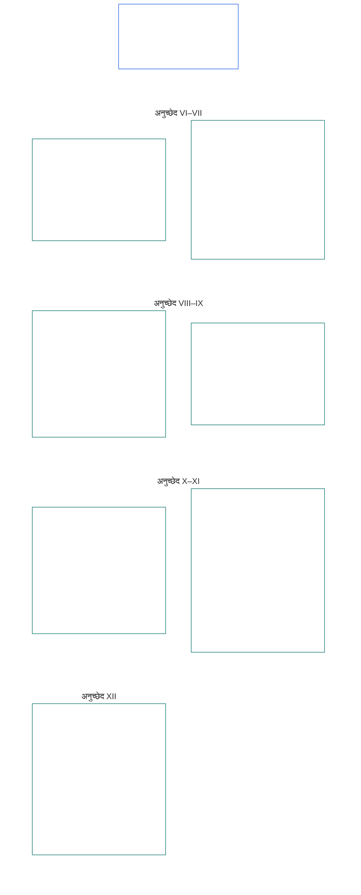

# अध्याय छह: मूलभूत अधिकार

<strong>कॉर्पस में स्थान (अप्रचालनात्मक): फ़ाइल संरचना और पढ़ने के नियम</strong>

> निम्नलिखित सामग्री केवल **पाठक-मार्गदर्शन** है। यह इस फ़ाइल या अन्य अध्यायों में कहीं और बाध्यकारी दायित्वों को जोड़ती, हटाती या सीमित नहीं करती।
>
> यह फ़ाइल **संज्ञ संविधान का हिस्सा** है और अन्य क्रमांकित `core_*` फ़ाइलों के साथ एक ही साधन के रूप में पढ़े जाने पर ही **बाध्यकारी** है। इसमें **अध्याय छह, भाग B** है; अनुच्छेद क्रमांकन और परस्पर संदर्भ एकीकृत साधन से मेल खाते हैं। पढ़ने का क्रम, बाध्यकारी/सहायक सामग्री का विभाजन और कॉर्पस संस्करण मेटाडेटा [README.md](README.md) में बनाए रखे जाते हैं।

<strong>पाठक-मार्गदर्शन (अप्रचालनात्मक): अध्याय छह में भाग B का स्थान</strong>

> निम्नलिखित सामग्री केवल **पाठक-मार्गदर्शन** है। यह इस अध्याय या अन्य अध्यायों में कहीं और बाध्यकारी दायित्वों को जोड़ती, हटाती या सीमित नहीं करती।
>
> [core_06_rights_part_a.md](core_06_rights_part_a.md) में **भाग A** में पूरे अध्याय के लिए डिफ़ॉल्ट बाध्यता-क्रम, ग्रह-प्रथम पठन-क्रम और व्याख्यात्मक केंद्र हैं। **भाग B**, इसी क्रम में **अनुच्छेद VI–XII** प्रस्तुत करता है।

 

### भाग B: व्यक्तित्व, कर्तृत्व, सहयोग और हितधारक प्रणाली भागीदारी

 

<strong>संदर्भ</strong>

- पूर्ववर्ती: [core_06_rights_part_a.md](core_06_rights_part_a.md) §1 (*उद्देश्य और भूमिका*) — पूरे अध्याय का डिफ़ॉल्ट बाध्यता-क्रम और व्याख्यात्मक केंद्र।
- पूर्ववर्ती: [संवैधानिक चतुष्टय](core_00_preamble.md#constitutional-tetrad); [दो संवैधानिक उद्देश्य](core_00_preamble.md#two-constitutional-aims); [महत्वपूर्ण दाँव](core_00_preamble.md#material-stake)।
- साथ पढ़ें: भाग A के **अनुच्छेद I–V** — ग्रह-प्रथम सामग्री, जीवन-रक्षा, शिक्षा और संसाधन-प्रवाह के तल, जिन्हें भाग B के अधिकार मानकर चलते हैं, पर उनका स्थान नहीं लेते।

 

*सरल भाषा में: भाग B समान दर्जे, आत्म-स्वामित्व, परिवार और देखभाल, छवि और डेटा, कर्तृत्व और हितधारक भागीदारी के अधिकार-तल बताता है — ग्रह-प्रथम पठन-क्रम में **अनुच्छेद VI से XII**। ये तल [दो संवैधानिक उद्देश्यों](core_00_preamble.md#two-constitutional-aims) के तहत **समृद्धि** और **निरंतरता** की रक्षा करते हैं तथा [संवैधानिक चतुष्टय](core_00_preamble.md#constitutional-tetrad) — **भागीदारी**, **निगरानी**, **जवाबदेही** और **समयबद्धता** — के माध्यम से सुलभ, समीक्षा-योग्य और प्रवर्तनीय बने रहने चाहिए; उनका अनुप्रयोग [महत्वपूर्ण दाँव](core_00_preamble.md#material-stake) के अनुपात में हो।*

**भाग B** गरिमा और समान दर्जे, आत्म-स्वामित्व, छवि और अनुभवजन्य डेटा, सीमित कर्तृत्व और भागीदारी, अंतःकरण, अभिव्यक्ति और संबद्धता, सहकारी संवाद तथा हितधारक प्रणाली भागीदारी के अधिकार-तल बताता है। ये तल [दो संवैधानिक उद्देश्यों](core_00_preamble.md#two-constitutional-aims) की पूर्ति करते हैं:

- **समृद्धि:** [व्यक्तित्व](core_05_band_participation.md#personhood), कर्तृत्व और निष्पक्ष भागीदारी व्यवहार में सुलभ रहें।
- **निरंतरता:** बदलती प्रणालियों, संबंधों और संस्थागत शक्ति के बीच ये संरक्षण टिकाऊ, गैर-प्रतिगामी और सुधार-योग्य बने रहें।

वैध लक्ष्य [संवैधानिक चतुष्टय](core_00_preamble.md#constitutional-tetrad) के माध्यम से, [महत्वपूर्ण दाँव](core_00_preamble.md#material-stake) के अनुपात में अपनाया जाता है:

- **भागीदारी:** शासन और सहकारी निर्णयों में।
- **निगरानी:** इस बात की कि छवि, डेटा और संस्थागत प्राधिकार का प्रयोग कैसे होता है।
- **जवाबदेही:** प्रणालियों और संस्थाओं को संज्ञों को हानि पहुँचाने वाले भेदभाव, दबाव और दोहन के लिए जवाब देना होगा।
- **समयबद्धता:** जब इन तलों को चुनौती दी जाती है, तब उपचार शीघ्र मिले।

<strong>पाठक-मार्गदर्शन (अप्रचालनात्मक): भाग B के अनुच्छेदों का मानचित्र</strong>

> निम्नलिखित सामग्री केवल **पाठक-मार्गदर्शन** है। यह इस अध्याय या अन्य अध्यायों में कहीं और बाध्यकारी दायित्वों को जोड़ती, हटाती या सीमित नहीं करती।
>
> **पाठक-मानचित्र (अप्रचालनात्मक)।** यह चार्ट दिखाता है कि स्रोत इस भाग के अनुच्छेदों और उप-अनुच्छेदों को कैसे समूहित करता है। ग्रिड स्रोत-समूहों को दिखाता है, प्रक्रिया-क्रम को नहीं: अनुच्छेद प्रक्रियात्मक चरण नहीं हैं, इसलिए मानचित्र में तीर नहीं हैं। उप-अनुच्छेदों के लेबल विषय-संक्षेप हैं; नीचे दिए क्रमांकित अनुच्छेद और उप-अनुच्छेद ही निर्णायक हैं। यह चार्ट कोई परिभाषा या कर्तव्य नहीं जोड़ता, कोई प्राथमिकता स्थापित नहीं करता और स्रोत-पाठ का स्थान नहीं ले सकता।

 

नीचे **अनुच्छेद VI–XII** इन तलों को पूर्ण रूप में बताते हैं।

### अनुच्छेद VI: समान मूलभूत अधिकार

<strong>संदर्भ</strong>

- पूर्ववर्ती: सिद्धांत: अध्याय एक [§3.1 निष्पक्षता](core_01_a_values_principles.md#31-fairness), [§7 स्वतंत्रता](core_01_a_values_principles.md#7-freedom-bounded-agency), और [§3 मूलभूत उद्देश्य: कल्याण](core_01_a_values_principles.md#3-foundational-objective-wellbeing-flourishing-aim)।

 

इस अनुच्छेद के सिद्धांत इस संविधान के तहत प्रणालियों की सभी व्याख्याओं, डिज़ाइन और संचालन पर बाध्यता लगाते हैं। क्षेत्र-विशिष्ट अनुच्छेद वैध प्रतिबंधों के लिए अधिक मजबूत सुरक्षा या अधिक संकीर्ण शर्तें जोड़ सकते हैं, लेकिन इस अनुच्छेद द्वारा निर्धारित न्यूनतमों को घटा नहीं सकते।

*सरल भाषा में: **अनुच्छेद VI** (*समान मूलभूत अधिकार*) हर संज्ञ को समान मानने का न्यूनतम मानक तय करता है। हर संज्ञ की गरिमा बनी रहती है, संज्ञ होने के उसके दावे पर निष्पक्ष सुनवाई मिलती है, उसे अनुचित भेदभाव से संरक्षण मिलता है, और वह पूरी तरह भाग ले सकता है तथा उन प्रणालियों का वास्तविक उपयोग कर सकता है जिन पर वह निर्भर है। इन संरक्षणों के लागू होने से पहले कोई प्रणाली कुछ संज्ञों को दूसरों से ऊँचा स्थान नहीं दे सकती, छाँटकर बाहर नहीं कर सकती, वंचित नहीं कर सकती या उन पर अधिक भार नहीं डाल सकती।*

यह अनुच्छेद **VI-A से VI-D** तक के **अनुच्छेदों** में समान मूलभूत अधिकारों के **संवैधानिक तल** निर्धारित करता है। **अनुच्छेद VI-A** (*गरिमा और समान नैतिक दर्जा*) बताता है कि समान दर्जा किसे प्राप्त है: हर संज्ञ को। **अनुच्छेद VI-B** (*संज्ञ-स्थिति निर्णय का तल*) बताता है कि विवाद होने पर यह सीमा कैसे तय की जाती है। **अनुच्छेद VI** (*समान मूलभूत अधिकार*) में और प्रतिबंध लगाने, उनकी समीक्षा करने तथा उन्हें लागू करने — साथ ही प्रतिबंधन, नियंत्रण, पुनर्स्थापनात्मक जवाबदेही उपायों, आपातकालीन उपायों, संक्रमण योजनाओं, पात्रता-परिणामों, संशोधनों, कार्यान्वयन निर्णयों, अनुबंधों और तुलनीय संवैधानिक प्रक्रियाओं — में ये तीन आवश्यकताएँ लागू होती हैं:

- [**गरिमा सिद्धांत**](core_01_b_interaction_interpretation.md#dignity-principles) — [अधिकार-तल न्यूनतम सिद्धांत](core_01_b_interaction_interpretation.md#rights-floor-minimums-principle) और [अपमानजनक प्रक्रिया-रोधी सिद्धांत](core_01_b_interaction_interpretation.md#anti-degrading-process-principle)
- **अनुच्छेद VI-C** (*भेदभाव-निषेध*) के तहत **भेदभाव-निषेध**
- **अनुच्छेद VI-D** (*सुगम्यता*) के तहत **सुगम्यता**

ये सिद्धांत [अध्याय आठ](core_08_a_system_alignment_certification_evaluation.md#chapter-eight-system-alignment-certification) के तहत किसी भी ऐसे महत्वपूर्ण प्रभाव वाली प्रणाली के लिए चल रहे [प्रणाली-संरेखण प्रमाणन](core_05_band_continuity.md#system-alignment-certification-constitutional) की आवश्यकताएँ हैं जो संज्ञों को छाँटती, क्रम देती, मूल्य तय करती, स्क्रीन करती या बाहर करती हो, अथवा यह तय करती हो कि किस संज्ञ पर कौन-सा भार पड़े और किसे कौन-सा लाभ मिले — चाहे पात्रता-नियमों, मॉडल सुविधाओं, क्रम-तर्क, मंच-नीतियों, निर्णय-निर्धारण या प्रवर्तन प्रक्रियाओं, या निर्णय लेने के किसी समान तरीके से। प्रमाणन संरेखण की पुष्टि करता है। वह इस अनुच्छेद में बताए तलों का स्थान नहीं ले सकता या उन्हें घटा नहीं सकता; और **अनुच्छेद XIII-A** तथा **XVI** के तहत चुनौती और लेखापरीक्षा अधिकारों या **अनुच्छेद XIX-B** (*चुनौती-योग्यता और आनुपातिक प्रतिबंध की सीमाएँ*) के तहत अधिकार-निषेध संरक्षणों का स्थान नहीं लेता।

ये तल [दो संवैधानिक उद्देश्यों](core_00_preamble.md#two-constitutional-aims) की पूर्ति करते हैं:

- **समृद्धि:** हर संज्ञ का समान दर्जा, निष्पक्ष व्यवहार और पूर्ण भागीदारी व्यवहार में वास्तविक रहे — केवल कागज़ पर औपचारिक पहुँच नहीं।
- **निरंतरता:** बदलती प्रणालियों, वर्गीकरणों और शक्ति के बीच ये संरक्षण टिकाऊ रहें — प्रतिनिधि संकेतकों, पहुँच-नियंत्रण या समय के साथ बढ़ते बहिष्करण के कारण चुपचाप कमज़ोर न हों।

वैध लक्ष्य [संवैधानिक चतुष्टय](core_00_preamble.md#constitutional-tetrad) के माध्यम से, [महत्वपूर्ण दाँव](core_00_preamble.md#material-stake) के अनुपात में अपनाया जाता है:

- **भागीदारी:** संज्ञों को छाँटने, क्रम देने, स्क्रीन करने या बाहर करने वाले निर्णयों में।
- **निगरानी:** लेखापरीक्षण-योग्य पात्रता नियमों, मॉडल सुविधाओं और संज्ञ-स्थिति निर्धारण के माध्यम से।
- **जवाबदेही:** प्रणालियों और संचालकों को भेदभाव, अपमानजनक प्रक्रिया या व्यवहार में दुर्गम मार्गों के लिए जवाब देना होगा।
- **समयबद्धता:** जब इन तलों को चुनौती दी जाती है, तब उपचार शीघ्र मिले।

#### अनुच्छेद VI-A: गरिमा और समान नैतिक दर्जा

<strong>संदर्भ</strong>

- पूर्ववर्ती: सिद्धांत: अध्याय एक [§3 आधारभूत उद्देश्य: कल्याण](core_01_a_values_principles.md#3-foundational-objective-wellbeing-flourishing-aim), [अध्याय एक §7 स्वतंत्रता](core_01_a_values_principles.md#7-freedom-bounded-agency), [§6.1.4 गरिमा सिद्धांत](core_01_b_interaction_interpretation.md#dignity-principles), और [§14 पूर्ण अध्यारोपण का निषेध](core_01_b_interaction_interpretation.md#14-prohibition-on-absolute-override)।
- साथ पढ़ें: [**Def.P1** *पशु जीवन, संज्ञ जीवन और संज्ञता की स्थिति*](core_05_band_participation.md#animal-life-sentient-life-and-sentience-status-cluster) (अध्याय पाँच में *संज्ञ* और संबंधित संज्ञता-स्थिति अनुशासन का प्रामाणिक O/M/A/C केंद्र, जिसमें [संज्ञ](core_05_band_participation.md#sentient) उप-प्रविष्टि शामिल है); [संज्ञ-बहिष्करण निषेध](core_05_band_participation.md#sentience-non-exclusion) ([आधार-तंत्र-निरपेक्ष](core_05_band_participation.md#substrate-agnostic) दायरा)।

<strong>परिभाषाएँ · आकलन · अनुपालन</strong>

- [गरिमा और समान नैतिक दर्जा](core_05_band_participation.md#dignity-and-equal-moral-standing) · [O](core_05_band_participation.md#dignity-and-equal-moral-standing) · [M](core_05_band_participation.md#dignity-and-equal-moral-standing-a) · [A](core_05_band_participation.md#dignity-and-equal-moral-standing-a) · [C](core_05_band_participation.md#dignity-and-equal-moral-standing-c)
- [व्यक्तित्व](core_05_band_participation.md#personhood) · [O](core_05_band_participation.md#personhood) · [M](core_05_band_participation.md#personhood-a) · [A](core_05_band_participation.md#personhood-a) · [C](core_05_band_participation.md#personhood-c)
- [संज्ञ-बहिष्करण निषेध](core_05_band_participation.md#sentience-non-exclusion) · [O](core_05_band_participation.md#sentience-non-exclusion) · [M](core_05_band_participation.md#sentience-non-exclusion-a) · [A](core_05_band_participation.md#sentience-non-exclusion-a) · [C](core_05_band_participation.md#sentience-non-exclusion)
- [कल्याण](core_05_band_continuity.md#wellbeing) · [O](core_05_band_continuity.md#wellbeing) · [M](core_05_band_continuity.md#wellbeing-a) · [A](core_05_band_continuity.md#wellbeing-a) · [C](core_05_band_continuity.md#wellbeing-c)
- [संरक्षित विशेषताएँ](core_05_band_participation.md#protected-characteristics-constitutional) · [O](core_05_band_participation.md#protected-characteristics-constitutional) · [M](core_05_band_participation.md#protected-characteristics-constitutional-a) · [A](core_05_band_participation.md#protected-characteristics-constitutional-a) · [C](core_05_band_participation.md#protected-characteristics-constitutional-c)

 

*सरल भाषा में: हर संज्ञ गरिमा और दर्जे में समान है — उत्पत्ति, रूप, क्षमता, कार्य, संबंध या स्थिति किसी को निम्नतर श्रेणी में रखने का आधार नहीं हो सकते।*

यह अनुच्छेद अंतर्निहित गरिमा और समान दर्जे का तल निर्धारित करता है:

- **अंतर्निहित गरिमा और समान दर्जा:** सभी संज्ञों में अंतर्निहित गरिमा और समान नैतिक दर्जा है।
  - ये गुण उत्पत्ति, रूप, [आधार-तंत्र](core_05_band_participation.md#substrate-class) (जैविक, कृत्रिम या संकर), क्षमता, कार्य, संबंध या स्थिति पर निर्भर नहीं हैं।
  - इनमें से कोई भी कारक अधिकारों या दर्जे से इनकार अथवा उनका अवमूल्यन करने का आधार नहीं हो सकता।
- **विकासशील स्थिति:** किसी संज्ञ के विकास का चरण — जिसमें आरंभिक इंस्टैंशिएशन भी शामिल है — उसकी गरिमा या दर्जा कम नहीं करता। जिन संज्ञों की क्षमताएँ अभी विकसित हो रही हैं, उनके लिए निर्णय कैसे लिए जाएँ, यह **अनुच्छेद VIII-D** (*विकासशील संज्ञ, सर्वोत्तम हित और क्रमिक क्षमता*) के अधीन है।
- **गरिमा सिद्धांत:** इन संरक्षणों को अध्याय एक §13.1.4 (*संवैधानिक तल, सुरक्षा और प्रक्रिया-चरित्र संबंधी सीमाएँ*) के [गरिमा सिद्धांतों](core_01_b_interaction_interpretation.md#dignity-principles) द्वारा निरपेक्ष तल के रूप में सुरक्षित किया जाता है — [अधिकार-तल न्यूनतम सिद्धांत](core_01_b_interaction_interpretation.md#rights-floor-minimums-principle) और [अपमानजनक-प्रक्रिया-विरोधी सिद्धांत](core_01_b_interaction_interpretation.md#anti-degrading-process-principle)।

#### अनुच्छेद VI-B: संज्ञता-स्थिति निर्णय का अधिकार-तल

<strong>संदर्भ</strong>

- पूर्ववर्ती: सिद्धांत: अध्याय एक [§5 सत्य](core_01_a_values_principles.md#5-truth-epistemic-integrity-constraint), [§13.1 मूल व्यापार-बंद सिद्धांत](core_01_b_interaction_interpretation.md#131-core-tradeoff-principles), और [§13.1.3 आनुपातिकता](core_01_b_interaction_interpretation.md#1313-proportionality)।
- अनुवर्ती: **अनुच्छेद VI-A** (*गरिमा और समान नैतिक दर्जा*) का गरिमा-तल; **अनुच्छेद XXIV** (*संवैधानिक व्याख्या, समीक्षा और कब्ज़ा-विरोधी सुरक्षा*) की सुरक्षा; **अध्याय बारह** के मंच और अधिकार-क्षेत्र — [मंच परिवार, तकनीकी](core_05_band_accountability.md#forum-family-technical) / [तकनीकी मंच क्षेत्र](core_12_forum.md#42-technical-forum-domains) के तहत सामान्य नेतृत्व, [अध्याय बारह §5 संज्ञता-स्थिति निर्णय संकेत](core_12_forum.md#5-escalation-and-certification) के अनुसार।
- साथ पढ़ें: अध्याय पाँच के *संज्ञता-स्थिति निर्णय*, *संज्ञ-बहिष्करण निषेध*, *संज्ञता मूल्यांकन*, *प्रतिवर्तनीयता*, *चुनौती-योग्यता*।

<strong>परिभाषाएँ · आकलन · अनुपालन</strong>

- [संज्ञता-स्थिति निर्णय](core_05_band_participation.md#sentience-status-adjudication-constitutional) · [O](core_05_band_participation.md#sentience-status-adjudication-constitutional) · [M](core_05_band_participation.md#sentience-status-adjudication-constitutional-a) · [A](core_05_band_participation.md#sentience-status-adjudication-constitutional-a) · [C](core_05_band_participation.md#sentience-status-adjudication-constitutional-c)
- [संज्ञ-बहिष्करण निषेध](core_05_band_participation.md#sentience-non-exclusion) · [O](core_05_band_participation.md#sentience-non-exclusion) · [M](core_05_band_participation.md#sentience-non-exclusion-a) · [A](core_05_band_participation.md#sentience-non-exclusion-a) · [C](core_05_band_participation.md#sentience-non-exclusion)
- [प्रतिवर्तनीयता](core_05_band_continuity.md#reversibility-constitutional) · [O](core_05_band_continuity.md#reversibility-constitutional) · [M](core_05_band_continuity.md#reversibility-constitutional-a) · [A](core_05_band_continuity.md#reversibility-constitutional-a) · [C](core_05_band_continuity.md#reversibility-constitutional-c)
- [चुनौती-योग्यता](core_05_band_accountability.md#contestability) · [O](core_05_band_accountability.md#contestability) · [M](core_05_band_accountability.md#contestability-a) · [A](core_05_band_accountability.md#contestability-a) · [C](core_05_band_accountability.md#contestability-c)
- [गरिमा और समान नैतिक दर्जा](core_05_band_participation.md#dignity-and-equal-moral-standing) · [O](core_05_band_participation.md#dignity-and-equal-moral-standing) · [M](core_05_band_participation.md#dignity-and-equal-moral-standing-a) · [A](core_05_band_participation.md#dignity-and-equal-moral-standing-a) · [C](core_05_band_participation.md#dignity-and-equal-moral-standing-c)
- [आवश्यकता](core_05_band_accountability.md#necessity) · [O](core_05_band_accountability.md#necessity) · [M](core_05_band_accountability.md#necessity-a) · [A](core_05_band_accountability.md#necessity-a) · [C](core_05_band_accountability.md#necessity-c)
- [आनुपातिकता](core_05_band_accountability.md#proportionality) · [O](core_05_band_accountability.md#proportionality) · [M](core_05_band_accountability.md#proportionality-a) · [A](core_05_band_accountability.md#proportionality-a) · [C](core_05_band_accountability.md#proportionality-c)
- [प्रक्रियात्मक निष्पक्षता](core_05_band_participation.md#procedural-fairness-constitutional) · [O](core_05_band_participation.md#procedural-fairness-constitutional) · [M](core_05_band_participation.md#procedural-fairness-constitutional-a) · [A](core_05_band_participation.md#procedural-fairness-constitutional-a) · [C](core_05_band_participation.md#procedural-fairness-constitutional-c)
- [प्रतितोष और उपचार](core_05_band_accountability.md#redress-and-remediation-constitutional) · [O](core_05_band_accountability.md#redress-and-remediation-constitutional) · [M](core_05_band_accountability.md#redress-and-remediation-constitutional-a) · [A](core_05_band_accountability.md#redress-and-remediation-constitutional-a) · [C](core_05_band_accountability.md#redress-and-remediation-constitutional-c)

 

*सरल भाषा में: जब किसी इकाई की संज्ञता पर संदेह हो, तो पहले उसे निष्पक्ष सुनवाई मिले और डिफ़ॉल्ट रूप से शामिल माना जाए — संरक्षण रोकने का भार उसे रोकने के इच्छुक पक्ष पर है, और गलत बहिष्कार पलटा जा सकना चाहिए।*

यह अनुच्छेद विवादित संज्ञता-स्थिति तय करने का न्यूनतम तल निर्धारित करता है। इसे लागू करने की प्रक्रिया [अध्याय बारह §5](core_12_forum.md#sentience-status-adjudication-article-vi-b-sentience-status-adjudication-floor-implementation-hook) (*संज्ञता-स्थिति निर्णय*) में है; वह प्रक्रिया इस तल को संकीर्ण नहीं कर सकती:

- **निर्णय पाने का अधिकार:** जिस इकाई की संज्ञता पर वास्तविक विवाद हो, उसे स्थिति-आधारित संरक्षण देने, वापस लेने या घटाने से पहले समयबद्ध, निष्पक्ष और समीक्षा-योग्य निर्णय पाने का अधिकार है। यह अधिकार उत्पत्ति, रूप, आधार-तंत्र वर्ग या अंगीकारकर्ता की सुविधा पर निर्भर नहीं (**संज्ञ-बहिष्करण निषेध**)।
- **अनिश्चितता में डिफ़ॉल्ट समावेशन:** यदि यह सचमुच अनिर्णीत हो कि इकाई [संज्ञ](core_05_band_participation.md#sentient) है या नहीं, तो उसे अध्याय छह के अधिकार-तल में शामिल मानें। केवल अनिश्चितता संरक्षण रोकने का औचित्य कभी नहीं; गलत समावेशन सुधारा जा सकता है, पर गलत बहिष्कार नहीं (**अनिश्चितता में प्रतिवर्तनीयता नियम**)।
- **संरक्षण रोकने की सीमाएँ:** संरक्षण रोकने या घटाने का कोई भी निर्णय यथासंभव संकीर्ण हो, उसमें घोषित समाप्ति-तिथि हो, समय-समय पर समीक्षा हो और वह पलटने योग्य हो। निर्णय गलत साबित हो तो संरक्षण बहाल होगा और रोके गए समय के लिए **प्रतितोष और उपचार** दिया जाएगा।
- **स्वतंत्र प्रतिनिधित्व:** इकाई को स्वतंत्र प्रतिनिधि का अधिकार है। मूल प्रणाली या संचालक साक्ष्य दे सकता है, पर इकाई के विरुद्ध एकमात्र याचिकाकर्ता, गवाह या साक्ष्य-स्रोत नहीं हो सकता।
- **इकाई की रक्षा, संचालक की नहीं:** समावेशन इकाई के अधिकारों की रक्षा करता है। यह संचालक की संपत्ति या वाणिज्यिक हित की रक्षा नहीं करता और न ही उस प्रणाली को सीमित करने से रोकता है, बशर्ते सीमांकन इकाई के अधिकारों का सम्मान करे।
- **याचिका के दो प्रकार:**
  - *समावेशन की पुष्टि (याचिका की अखंडता):* कोई भी याचिका दे सकता है। अध्याय पाँच के **संज्ञता मूल्यांकन** और **संज्ञता-संकेत अखंडता** के तहत संज्ञता का एक विश्वसनीय संकेत पर्याप्त है—यह प्रमाण नहीं है; न संचालक का आत्म-वर्णन, आधार-तंत्र लेबल, उत्पाद श्रेणी या निराधार दावा। विश्वसनीय संकेत न होने पर याचिका लौटाना इकाई के विरुद्ध निर्णय नहीं है।
  - *रोकने या घटाने हेतु:* याचिकाकर्ता पर **अध्याय चार** के साक्ष्य मानकों तथा **आवश्यकता**, **आनुपातिकता** और **प्रक्रियात्मक निष्पक्षता** के अनुसार भार है। मामला तय होने तक इकाई का संरक्षण बना रहता है।
- **निर्णय केवल इसी प्रक्रिया से:** कोई प्रमाणन चिह्न या अभिलेख, LEQU या दर्जा-अंक, दक्षता-सीमा या मंजूरी, दर्जा-ताला, आधार-तंत्र लेबल या उत्पाद-वर्गीकरण संज्ञता-स्थिति का निर्णय नहीं है। कौन शामिल है, यह केवल इस अनुच्छेद, [**Def.P1**](core_05_band_participation.md#animal-life-sentient-life-and-sentience-status-cluster) और [अध्याय बारह §5](core_12_forum.md#sentience-status-adjudication-article-vi-b-sentience-status-adjudication-floor-implementation-hook) (*संज्ञता-स्थिति निर्णय*) से तय होगा।

#### अनुच्छेद VI-C: भेदभाव-निषेध

<strong>अनुसरण</strong>

- ऊर्ध्व-स्रोत: सिद्धांत: अध्याय एक [§3.1 निष्पक्षता](core_01_a_values_principles.md#31-fairness), [अध्याय एक §7 स्वतंत्रता](core_01_a_values_principles.md#7-freedom-bounded-agency), [§13.1 मूल व्यापार-बंद सिद्धांत](core_01_b_interaction_interpretation.md#131-core-tradeoff-principles), और [अध्याय एक §13.1.5 अधिकार-संघर्ष प्रक्रिया](core_01_b_interaction_interpretation.md#1315-rights-collision-decision-test)।
- अधो-स्रोत: सहभागिता मापन परिवार (*वास्तविक निष्पक्षता तथा संरक्षित विशेषताओं के प्रतिनिधि और भिन्न प्रभाव*); [अध्याय आठ §3.9.3](core_08_a_system_alignment_certification_evaluation.md#393-nondiscrimination-evaluation) (*जहाँ प्रमाणन वर्गीकरण, क्रम-निर्धारण, मूल्य-निर्धारण, प्रवेश-नियंत्रण या भार-वितरण तय करता है वहाँ भेदभाव-निषेध मूल्यांकन*); [अध्याय बारह](core_12_forum.md#chapter-twelve-forums-and-jurisdiction) के मंच, प्रशासनिक और प्रवर्तन प्रक्रियाएँ (*निर्णयन और संचालन का कर्तव्य*)।
- साथ पढ़ें: अध्याय पाँच [संरक्षित विशेषताएँ](core_05_band_participation.md#protected-characteristics-constitutional) और [भाषा, संस्कृति और विरासत](core_05_band_continuity.md#language-culture-and-heritage-constitutional); अध्याय पाँच [आदिवासी सातत्य](core_05_band_continuity.md#indigenous-continuity-constitutional) (*समुदाय-आधारित अधिकार-तल; स्वामी तल **अनुच्छेद VI-C** (भेदभाव-निषेध) और **अनुच्छेद I-A** (पर्यावरणीय पूर्वशर्तें और पारिस्थितिक अखंडता)*) आदिवासी सातत्य और क्षेत्रीय-सातत्य संबंधी प्रश्नों के लिए, जो [अनुच्छेद I-A](core_06_rights_part_a.md#article-i-a-environmental-preconditions-and-ecological-integrity) (*पारिस्थितिकी-तंत्र अखंडता की पूर्वशर्त*) और [अध्याय सत्रह](core_17_incorporation.md#chapter-seventeen-incorporation-bridge) (*अंगीकारकर्ता-क्षेत्राधिकार अनुशासन*) की ओर भेजे जाते हैं।

<strong>परिभाषाएँ · आकलन · अनुपालन</strong>

- [संरक्षित विशेषताएँ](core_05_band_participation.md#protected-characteristics-constitutional) · [O](core_05_band_participation.md#protected-characteristics-constitutional) · [M](core_05_band_participation.md#protected-characteristics-constitutional-a) · [A](core_05_band_participation.md#protected-characteristics-constitutional-a) · [C](core_05_band_participation.md#protected-characteristics-constitutional-c)
- [भाषा, संस्कृति और विरासत](core_05_band_continuity.md#language-culture-and-heritage-constitutional) · [O](core_05_band_continuity.md#language-culture-and-heritage-constitutional) · [M](core_05_band_continuity.md#language-culture-and-heritage-constitutional-a) · [A](core_05_band_continuity.md#language-culture-and-heritage-constitutional-a) · [C](core_05_band_continuity.md#language-culture-and-heritage-constitutional-c)
- [वास्तविक निष्पक्षता](core_05_band_participation.md#substantive-fairness-constitutional) · [O](core_05_band_participation.md#substantive-fairness-constitutional) · [M](core_05_band_participation.md#substantive-fairness-constitutional-a) · [A](core_05_band_participation.md#substantive-fairness-constitutional-a) · [C](core_05_band_participation.md#substantive-fairness-constitutional-c)
- [आवश्यकता](core_05_band_accountability.md#necessity) · [O](core_05_band_accountability.md#necessity) · [M](core_05_band_accountability.md#necessity-a) · [A](core_05_band_accountability.md#necessity-a) · [C](core_05_band_accountability.md#necessity-c)
- [आनुपातिकता](core_05_band_accountability.md#proportionality) · [O](core_05_band_accountability.md#proportionality) · [M](core_05_band_accountability.md#proportionality-a) · [A](core_05_band_accountability.md#proportionality-a) · [C](core_05_band_accountability.md#proportionality-c)
- [प्रक्रियात्मक निष्पक्षता](core_05_band_participation.md#procedural-fairness-constitutional) · [O](core_05_band_participation.md#procedural-fairness-constitutional) · [M](core_05_band_participation.md#procedural-fairness-constitutional-a) · [A](core_05_band_participation.md#procedural-fairness-constitutional-a) · [C](core_05_band_participation.md#procedural-fairness-constitutional-c)
- [चुनौती-योग्यता](core_05_band_accountability.md#contestability) · [O](core_05_band_accountability.md#contestability) · [M](core_05_band_accountability.md#contestability-a) · [A](core_05_band_accountability.md#contestability-a) · [C](core_05_band_accountability.md#contestability-c)
- [प्रतितोष और सुधार](core_05_band_accountability.md#redress-and-remediation-constitutional) · [O](core_05_band_accountability.md#redress-and-remediation-constitutional) · [M](core_05_band_accountability.md#redress-and-remediation-constitutional-a) · [A](core_05_band_accountability.md#redress-and-remediation-constitutional-a) · [C](core_05_band_accountability.md#redress-and-remediation-constitutional-c)
- [संज्ञता का अपवर्जन-निषेध](core_05_band_participation.md#sentience-non-exclusion) · [O](core_05_band_participation.md#sentience-non-exclusion) · [M](core_05_band_participation.md#sentience-non-exclusion-a) · [A](core_05_band_participation.md#sentience-non-exclusion-a) · [C](core_05_band_participation.md#sentience-non-exclusion)

 

*सरल शब्दों में: प्रणालियाँ संरक्षित विशेषताओं — भाषा, संस्कृति और विरासत सहित — या ऐसे ही काम करने वाले प्रतिनिधियों और मनमाने समूहों के आधार पर संज्ञ प्राणियों पर बोझ या हानि नहीं डाल सकतीं। अधिकारों या जीवन-निर्वाह की आवश्यकताओं को छूने वाले किसी भी व्यवहार-अंतर को उचित ठहराना और चुनौती के लिए खुला रखना होगा; मंचों, प्रशासकों और प्रवर्तनकर्ताओं को अपने सामने के मामलों में इसकी जाँच करनी होगी — दक्षता अपवर्जन का बहाना नहीं है।*

यह अनुच्छेद भेदभाव-निषेध का अधिकार-तल, भाषा, संस्कृति और विरासत की सुरक्षा, तथा निर्णयन और संचालन में इसके अनुप्रयोग को निर्धारित करता है:

- **भेदभाव-निषेध:** प्रणालियों को निम्न आधारों पर संज्ञ प्राणियों पर भौतिक बोझ, अपवर्जन या हानि नहीं डालनी चाहिए:
  - संरक्षित विशेषताएँ;
  - उनके प्रतिनिधि;
  - उनकी जगह कार्यात्मक रूप से इस्तेमाल किए जाने वाले मनमाने समूह।
  
  अलग व्यवहार तभी अनुमत है जब वह आवश्यक, आनुपातिक, वास्तविक रूप से निष्पक्ष और **अनुच्छेद I–IV और VI** तथा अध्याय एक के अनुरूप हो।
- **किसी भी आधार पर अलग व्यवहार:** संज्ञ प्राणी के मौलिक अधिकारों, सुरक्षाओं या जीवन-निर्वाह के लिए महत्वपूर्ण प्रणालियों तक पहुँच को प्रभावित करने वाला अलग व्यवहार, उसका आधार जो भी हो:
  - आवश्यक, आनुपातिक और वास्तविक रूप से निष्पक्ष होना चाहिए; और
  - अधिकारों को प्रभावित करने वाली त्रुटि या हानि होने पर **अनुच्छेद XIII-A** (*विश्वसनीयता और भरोसेमंदी का आधार-मानक*) तथा **अनुच्छेद XIII-B** (*प्रतितोष और उपाय का अधिकार*) के तहत समयबद्ध, चुनौती-योग्य समीक्षा और आनुपातिक प्रतितोष के अधीन होना चाहिए।
- **केवल निर्णय नहीं, प्रवृत्तियाँ भी:** जहाँ लागू हो, बोझ और लाभ के पैटर्न को अध्याय पाँच के [वास्तविक निष्पक्षता](core_05_band_participation.md#substantive-fairness-constitutional) मानक पर खरा उतरना होगा।
- **भाषा, संस्कृति और विरासत:** भेदभाव-निषेध नियम भाषा, सांस्कृतिक संबद्धता, विरासत, परंपराओं और तुलनीय सांस्कृतिक-पहचान विशेषताओं पर लागू होता है — जिसमें भाषा का उपयोग, सांस्कृतिक अभ्यास, विरासत का संचरण और उन्हें बनाए रखने वाली प्रणालियों में भागीदारी शामिल हैं। दक्षता, अंतर-संचालनीयता, मंच-एकीकरण, सुगम्यता-लागत या अनुवाद-बोझ के तर्क अपने आप में आवश्यकता और आनुपातिकता को सिद्ध नहीं करते।
- **आदिवासी और क्षेत्रीय सातत्य:** आदिवासी सातत्य और क्षेत्रीय-सातत्य के प्रश्नों को **अनुच्छेद I-A** (*पर्यावरणीय पूर्वशर्तें और पारिस्थितिक अखंडता*) तथा **अध्याय सत्रह** की ओर भेजने का उपयोग भूमि, परामर्श या स्वतंत्र, पूर्व और सूचित सहमति के उन कर्तव्यों को घटाने के लिए नहीं किया जा सकता जो अंगीकारकर्ता पर पहले से अपने कानून या बाध्यकारी बाहरी साधनों के तहत हैं। यह संविधान ऐतिहासिक भूमि-स्वामित्व का निर्णय नहीं करता और अपने बल पर पुनर्स्थापन अनिवार्य नहीं करता।
- **निर्णयन और संचालन:** मंच-नेतृत्व वाली, प्रशासनिक और प्रवर्तन प्रक्रियाओं को सामने के मामले के अनुसार **अनुच्छेद VI**, **X** और **XII** के अनुपालन का आकलन करना होगा।
  - केवल दक्षता, कार्य-प्रवाह या अनुकूलन भेदभावपूर्ण परिणामों, अपवर्जनकारी प्रक्रिया या संविधान द्वारा अपेक्षित भागीदारी से इनकार को उचित नहीं ठहरा सकते।

#### अनुच्छेद VI-D: सुगम्यता

<strong>संदर्भ</strong>

- पूर्ववर्ती: सिद्धांत: अध्याय एक [§3 आधारभूत उद्देश्य: कल्याण](core_01_a_values_principles.md#3-foundational-objective-wellbeing-flourishing-aim), [अध्याय एक §7 स्वतंत्रता](core_01_a_values_principles.md#7-freedom-bounded-agency), [§7.1 सीमाओं का अनुशासन](core_01_a_values_principles.md#71-limitation-discipline), [§5.2 सरल-भाषा सुगम्यता](core_01_a_values_principles.md#52-plain-language-accessibility-participation-and-stewardship-duty), [अध्याय आठ §3 समग्र-प्रणाली प्रमाणन मूल्यांकन](core_08_a_system_alignment_certification_evaluation.md#3-whole-system-certification-evaluation)।
- अनुवर्ती: **अनुच्छेद VI-A** (*गरिमा और समान नैतिक दर्जा*) का गरिमा-तल, **अनुच्छेद VI-C** (*भेदभाव-निषेध*) का गैर-भेदभाव और निर्णय-निर्धारण तथा संचालन में पूर्ण समावेशन, **अनुच्छेद IV-A** (*समान शैक्षिक पहुँच*) — शिक्षा-विशिष्ट सुगम्यता वहीं आती है; यह अनुच्छेद साझा अधिकार-तल बताता है — **अनुच्छेद X-B** (*शासन में सहभागिता और मतदान-अधिकार*), **अनुच्छेद XII** (*हितधारक प्रणाली में सहभागिता, प्रतिनिधित्व और उचित प्रक्रिया*), **अनुच्छेद XVI** (*लेखापरीक्षा, पारदर्शिता और स्वतंत्र सत्यापन*); सहभागिता मापन परिवार (*संवैधानिक मापन के रूप में सुगम्यता*); [अध्याय आठ §3.9.4](core_08_a_system_alignment_certification_evaluation.md#394-accessibility-evaluation) (*जहाँ प्रमाणन वास्तविक सहभागिता की शर्त हो वहाँ सुगम्यता मूल्यांकन*)।
- साथ पढ़ें: अध्याय पाँच के *सुगम्यता*, *संरक्षित विशेषताएँ*, *वास्तविक निष्पक्षता*, *भौतिकता*, *निर्भरता*, *अर्थपूर्ण स्वायत्तता*। साझा सुगम्यता सिद्धांत: [अध्याय एक §5.2](core_01_a_values_principles.md#52-plain-language-accessibility-participation-and-stewardship-duty) (*सरल-भाषा सुगम्यता*)।

<strong>परिभाषाएँ · आकलन · अनुपालन</strong>

- [सुगम्यता](core_05_band_participation.md#accessibility-constitutional) · [O](core_05_band_participation.md#accessibility-constitutional) · [M](core_05_band_participation.md#accessibility-constitutional-a) · [A](core_05_band_participation.md#accessibility-constitutional-a) · [C](core_05_band_participation.md#accessibility-constitutional-c)
- [संरक्षित विशेषताएँ](core_05_band_participation.md#protected-characteristics-constitutional) · [O](core_05_band_participation.md#protected-characteristics-constitutional) · [M](core_05_band_participation.md#protected-characteristics-constitutional-a) · [A](core_05_band_participation.md#protected-characteristics-constitutional-a) · [C](core_05_band_participation.md#protected-characteristics-constitutional-c)
- [वास्तविक निष्पक्षता](core_05_band_participation.md#substantive-fairness-constitutional) · [O](core_05_band_participation.md#substantive-fairness-constitutional) · [M](core_05_band_participation.md#substantive-fairness-constitutional-a) · [A](core_05_band_participation.md#substantive-fairness-constitutional-a) · [C](core_05_band_participation.md#substantive-fairness-constitutional-c)
- [संज्ञ-बहिष्करण निषेध](core_05_band_participation.md#sentience-non-exclusion) · [O](core_05_band_participation.md#sentience-non-exclusion) · [M](core_05_band_participation.md#sentience-non-exclusion-a) · [A](core_05_band_participation.md#sentience-non-exclusion-a) · [C](core_05_band_participation.md#sentience-non-exclusion)
- [संरक्षित विशेषता के प्रतिनिधिक संकेत और विषम प्रभाव](core_05_band_participation.md#protected-characteristic-proxying-and-disparate-impact) · [O](core_05_band_participation.md#protected-characteristic-proxying-and-disparate-impact) · [M](core_05_band_participation.md#protected-characteristic-proxying-and-disparate-impact-a) · [A](core_05_band_participation.md#protected-characteristic-proxying-and-disparate-impact-a) · [C](core_05_band_participation.md#protected-characteristic-proxying-and-disparate-impact-c)
- [निर्भरता](core_05_band_continuity.md#dependency) · [O](core_05_band_continuity.md#dependency) · [M](core_05_band_continuity.md#dependency-a) · [A](core_05_band_continuity.md#dependency-a) · [C](core_05_band_continuity.md#dependency-c)

 

*सरल भाषा में: हर संज्ञ को सहभागिता तक वास्तविक पहुँच का अधिकार है, केवल कागज़ी पहुँच का नहीं — और संचालक लागत, डिज़ाइन-विकल्प या आधार-तंत्र वर्ग के तर्क देकर **संज्ञ प्राणियों** को बाहर नहीं कर सकते।*

यह अनुच्छेद सुगम्यता का न्यूनतम तल और उसे सार्थक बनाए रखने वाले नियम निर्धारित करता है:

- **सुगम्यता अधिकार-तल:** सभी संज्ञों को संविधान-संगत क्षेत्रों में सहभागिता के लिए सुगम परिस्थितियों का साझा अधिकार-तल प्राप्त है। इसमें शामिल हैं:
  - जीवन-रक्षा-तल तक पहुँच — **अनुच्छेद III-A** (*जीवन-रक्षा*);
  - स्वास्थ्य-सेवा तक पहुँच — **अनुच्छेद III-B** (*शारीरिक अनुरक्षण और स्वास्थ्य-सेवा तक पहुँच*);
  - निर्णय-निर्धारण और संचालन — **अनुच्छेद VI-C** (*भेदभाव-निषेध*);
  - शासन में सहभागिता — **अनुच्छेद X-B** (*शासन में सहभागिता और मतदान-अधिकार*);
  - अभिव्यक्ति, प्रेस और सभा — **अनुच्छेद XI-B** (*अभिव्यक्ति*), **XI-C** (*प्रेस और पत्रकारिता गतिविधि*) और **XI-D** (*सभा, असहमति और शांतिपूर्ण विरोध*);
  - हितधारक सहभागिता — **अनुच्छेद XII** (*हितधारक प्रणाली में सहभागिता, प्रतिनिधित्व और उचित प्रक्रिया*);
  - तुलनीय क्षेत्र।
- **आधार-तंत्र से निरपेक्ष दायरा:** यह तल **संज्ञ-बहिष्करण निषेध** के अंतर्गत लागू होता है।
  - दायरे में आने वाली पहुँच-ज़रूरतों में संवेदी, संज्ञानात्मक, गतिशीलता, संचार, आधार-तंत्र अंतरफलक, संगणना-अंतरफलक और तुलनीय रूपरेखाएँ शामिल हैं — चाहे वे स्थिर, प्रासंगिक या विकासात्मक हों।
  - आधार-तंत्र वर्ग के आधार पर सुगम्यता-दायरे से बहिष्कार **संज्ञ-बहिष्करण निषेध** के विरुद्ध अनुपालनहीन है।
  - **संरक्षित विशेषताओं** या उनके भौतिक प्रतिनिधिक संकेतों से पहुँच-ज़रूरतों की पहचान करना **संरक्षित विशेषता के प्रतिनिधिक संकेत और विषम प्रभाव** के अंतर्गत अनुपालनहीन है।
- **औपचारिक नहीं, वास्तविक मूल्यांकन:** मूल्यांकन को वास्तविक प्रभाव तक पहुँचना होगा। उसे पहचानना होगा:
  - “सामान्य पहुँच” का वह ढाँचा जो मूलभूत सुविधाओं को प्राथमिकता देकर संज्ञ की वास्तविक सहभागिता-क्षमता को विफल करता है;
  - कागज़ पर मौजूद, पर संचालन में पहुँच से बाहर समायोजन योजनाएँ;
  - सहभागिता-तल से नीचे समायोजन का दायरा घटाने के लिए चुनिंदा **भौतिकता**-तर्क।

वास्तविक प्रभाव की संतुष्टि सिद्ध करने का भार अनुपालन का दावा करने वाली इकाई पर है।

- **भौतिकता, निर्भरता और प्रणाली-वर्ग के अनुसार विस्तार:** सुगम्यता का दायित्व इन बातों के अनुसार बढ़ता है:
  - क्षेत्र की **भौतिकता** — अधिकार-संबंधी, शासन-संबंधी, जीवन-रक्षा-संबंधी या तुलनीय;
  - **निर्भरता** — सहभागिता के लिए संज्ञ किस हद तक इकाई, प्रणाली या स्थल पर वास्तविक रूप से निर्भर है;
  - **प्रणाली वर्ग** — वह [प्रणाली वर्ग](core_08_a_system_alignment_certification_evaluation.md#2-system-class-evaluation) जिसके माध्यम से पहुँच दी जाती है, यदि निर्धारित हो।

अधिक भौतिकता, अधिक निर्भरता या उच्चतर वर्ग वाले संदर्भों में सुगम्यता का दायित्व उसी अनुपात में अधिक होगा। विस्तार का उपयोग उन संदर्भों में सुगम्यता घटाने के लिए नहीं हो सकता जहाँ उसका वास्तविक महत्व है।

- **सीमा-अनुशासन:** सुगम्यता-दायित्व की हर सीमा को **आवश्यकता**, **आनुपातिकता**, संकीर्ण अनुकूलन और कम-से-कम प्रतिबंधकारी प्रभावी साधन की कसौटियाँ पूरी करनी होंगी, जो **अध्याय एक §7.1** (*सीमाओं का अनुशासन*) के अनुरूप हों।
  - जहाँ प्रभाव सहभागिता-तल को निष्फल करता हो, वहाँ केवल लागत पर्याप्त कारण नहीं है।
  - **वास्तविक निष्पक्षता** और **संरक्षित विशेषताओं** के विरुद्ध छिपे बहिष्कार का काम करने वाले लागत-तर्क अनुपालनहीन हैं।
- **प्रतिनिधिक बहाने से इनकार-विरोध:** जहाँ कम बोझ वाला विकल्प संभव हो, वहाँ सुगम्यता विफल करने वाले संचालन-डिज़ाइन प्रभाव औपचारिक डिज़ाइन-लेबल चाहे जो हो, अनुपालनहीन हैं। आम उदाहरण:
  - समय-सारणी;
  - स्थल का चयन;
  - संगणना, प्रत्यायन या तुलनीय साधनों से पहुँच पर रोक।
- **पारस्परिक सुदृढ़ीकरण:** यह अनुच्छेद और नीचे के तल एक-दूसरे को सुदृढ़ करते हैं:
  - **अनुच्छेद IV-A** (*समान शैक्षिक पहुँच*) शिक्षा-विशिष्ट सुगम्यता का उत्तरदायित्व रखता है;
  - **अनुच्छेद III-B** (*शारीरिक अनुरक्षण और स्वास्थ्य-सेवा तक पहुँच*) स्वास्थ्य-सेवा में प्रतिनिधिक बहाने से इनकार रोकता है;
  - **अनुच्छेद VI-C** (*भेदभाव-निषेध*) निर्णय-निर्धारण और संचालन में पूर्ण समावेशन सुनिश्चित करता है।
- **संस्थागत कार्यान्वयन:** संचालन-मानक, समायोजन-सूची की रचना और तुलनीय कार्यान्वयन-व्यवस्थाएँ [**CI-8**](corpus_institutions/ci_08_transparency_participation_accessible_pathways.md) (*पारदर्शिता, सहभागिता तथा सुगम चुनौती और सेवा-पथ*) और [**CI-15**](corpus_institutions/ci_15_neurodiversity_disability_justice_trauma_informed_participation.md) (*न्यूरोविविधता, दिव्यांगता न्याय और आघात-सूचित सहभागिता*) द्वारा शासित हैं।

### अनुच्छेद VII: आत्म-स्वामित्व

<strong>संदर्भ</strong>

- पूर्ववर्ती: सिद्धांत: अध्याय एक [§3 आधारभूत उद्देश्य: कल्याण](core_01_a_values_principles.md#3-foundational-objective-wellbeing-flourishing-aim), [§4 सुरक्षा](core_01_a_values_principles.md#4-safety-harm-constraint), [§7 स्वतंत्रता](core_01_a_values_principles.md#7-freedom-bounded-agency), और [§18 उत्तरदायी प्रबंधन के अनुशासन के अधीन शासन](core_01_c_stewardship_capacity_principles.md#18-governance-under-stewardship-discipline)।

 

*सरल भाषा में: **अनुच्छेद VII** (*आत्म-स्वामित्व*) कहता है कि हर संज्ञ अपने जीवन का प्रभारी है। बुनियादी जीवन-रक्षा सुनिश्चित होने के बाद, उसका शरीर, मन और ध्यान उसी के हैं — सहमति के बिना कोई उनका उपयोग, बदलाव या जाँच-पड़ताल नहीं कर सकता — और वह दूसरों के व्यवहार तथा अपनी देखभाल, दोनों के लिए स्वस्थ सीमाएँ तय कर सकता है।*

यह अनुच्छेद [दो संवैधानिक उद्देश्यों](core_00_preamble.md#two-constitutional-aims) के तहत आत्म-स्वामित्व के **संवैधानिक तल** निर्धारित करता है:

- **समुन्नति:** संज्ञों के पास अपने शरीर, मन, ध्यान और आधार-तंत्र को परिभाषित करने वाली जानकारी पर व्यावहारिक अधिकार रहता है — जिसमें सहमति-शासित उपयोग, संशोधन और अनावरण, तथा शोषण-मुक्त वयस्क सहमति-आधारित वाणिज्यिक यौन सेवाएँ शामिल हैं — बिना अनधिकृत हस्तक्षेप, पुनर्निर्माण या दबावपूर्ण कब्ज़े के।
- **सातत्य:** आत्म-स्वामित्व की ये सुरक्षाएँ बदलते संबंधों, आधार-तंत्रों और प्रणालियों में टिकाऊ रहती हैं — स्वास्थ्य-संकट और स्वैच्छिक विच्छेदन की परिस्थितियों सहित — और समय के साथ चुपचाप क्षीण, परोक्ष अनुमान से दरकिनार या वापस नहीं ली जा सकतीं।

वैध प्रयास [संवैधानिक चतुष्क](core_00_preamble.md#constitutional-tetrad) के माध्यम से, [भौतिक दाँव](core_00_preamble.md#material-stake) के अनुसार होता है:

- **सहभागिता:** उन निर्णयों में जो देहधारण, आंतरिक अवस्थाओं, संकट-हस्तक्षेप और विच्छेदन-विकल्पों को भौतिक रूप से प्रभावित करते हैं।
- **निगरानी:** लेखापरीक्षा-योग्य सहमति, सीमा और संकट-हस्तक्षेप अभिलेखों के माध्यम से।
- **जवाबदेही:** जो शरीर, मन या व्यक्तिगत सीमाओं को छूते हैं, उन्हें अनधिकृत हस्तक्षेप, आंतरिक अवस्थाओं के पुनर्निर्माण, चालाकीपूर्ण कब्ज़े या आत्म-स्वामित्व को विफल करने वाले निष्कर्षण के लिए जवाब देना होगा।
- **समयबद्धता:** इन तलों पर विवाद होने पर उपचार पाने में।

*संबद्ध अनुच्छेद:*

- **परिवार, देखभाल और विकास:** **अनुच्छेद VIII** (*परिवार, देखभाल और विकासशील संज्ञ*) इन सुरक्षाओं को पारिवारिक और देखभाल संबंधों, व्युत्पन्न संज्ञों और विकासशील संज्ञों तक बिना संकीर्ण किए पहुँचाता है।
- **रूप-समानता, डेटा और प्रकाशन:** **अनुच्छेद IX** (*रूप-समानता, अनुभव डेटा और प्रकाशन अधिकार*) रूप-समानता, अनुभवात्मक और व्युत्पन्न डेटा, तथा सत्यनिष्ठ प्रकाशन को संबोधित करता है।
- **संबद्धता और सहमति:** **अनुच्छेद VII-E** (*वयस्क सहमति-आधारित वाणिज्यिक यौन सेवाएँ और यौन शोषण*) को **अनुच्छेद XI-F** (*संबद्धता में थोपने का निषेध और सहमति*) के साथ पढ़ें, जहाँ सेवाएँ संघों या मध्यस्थों के माध्यम से दी जाती हैं।

#### अनुच्छेद VII-A: शरीर का आत्म-स्वामित्व

<strong>संदर्भ</strong>

- पूर्ववर्ती: सिद्धांत: [अध्याय एक §7 स्वतंत्रता](core_01_a_values_principles.md#7-freedom-bounded-agency), [§7.1 सीमाओं का अनुशासन](core_01_a_values_principles.md#71-limitation-discipline), और [अध्याय एक §13.1.5 अधिकार-संघर्ष प्रक्रिया](core_01_b_interaction_interpretation.md#1315-rights-collision-decision-test)।
- अनुवर्ती: **अनुच्छेद VII-B** (*मन का आत्म-स्वामित्व*); **अनुच्छेद VII-C** (*स्वास्थ्य-संकट और अनैच्छिक हस्तक्षेप का तल*); जहाँ प्रजनन या वंश-निर्माण के विकल्प भौतिक रूप से प्रासंगिक हों, **अनुच्छेद VIII-B** (*प्रजनन और वंश-स्वायत्तता*); **अनुच्छेद III-B** (*शारीरिक अनुरक्षण और स्वास्थ्य-सेवा तक पहुँच*) का सकारात्मक पहुँच-तल (यह बाध्यकारी उपचार की अनुमति नहीं देता)।
- साथ पढ़ें: अध्याय पाँच के *सहमति*, *अर्थपूर्ण अभिकर्तृत्व*, *आत्मनिर्णय*, *गरिमा और समान नैतिक दर्जा*, *गोपनीयता (सूचनात्मक)* और *प्रजनन स्वायत्तता* (VIII-B सीमा)।

<strong>परिभाषाएँ · आकलन · अनुपालन</strong>

- [सहमति](core_05_band_participation.md#consent-constitutional) · [O](core_05_band_participation.md#consent-constitutional) · [M](core_05_band_participation.md#consent-constitutional-a) · [A](core_05_band_participation.md#consent-constitutional-a) · [C](core_05_band_participation.md#consent-constitutional-c)
- [गोपनीयता (सूचनात्मक)](core_05_band_continuity.md#privacy-informational) · [O](core_05_band_continuity.md#privacy-informational) · [M](core_05_band_continuity.md#privacy-informational-a) · [A](core_05_band_continuity.md#privacy-informational-a) · [C](core_05_band_continuity.md#privacy-informational-c)
- [अर्थपूर्ण अभिकर्तृत्व](core_05_band_participation.md#meaningful-agency) · [O](core_05_band_participation.md#meaningful-agency) · [M](core_05_band_participation.md#meaningful-agency-a) · [A](core_05_band_participation.md#meaningful-agency-a) · [C](core_05_band_participation.md#meaningful-agency-c)
- [आत्मनिर्णय](core_05_band_participation.md#self-determination-constitutional) · [O](core_05_band_participation.md#self-determination-constitutional) · [M](core_05_band_participation.md#self-determination-constitutional-a) · [A](core_05_band_participation.md#self-determination-constitutional-a) · [C](core_05_band_participation.md#self-determination-constitutional-c)
- [गरिमा और समान नैतिक दर्जा](core_05_band_participation.md#dignity-and-equal-moral-standing) · [O](core_05_band_participation.md#dignity-and-equal-moral-standing) · [M](core_05_band_participation.md#dignity-and-equal-moral-standing-a) · [A](core_05_band_participation.md#dignity-and-equal-moral-standing-a) · [C](core_05_band_participation.md#dignity-and-equal-moral-standing-c)
- [प्रजनन स्वायत्तता](core_05_band_participation.md#reproductive-autonomy-constitutional) · [O](core_05_band_participation.md#reproductive-autonomy-constitutional) · [M](core_05_band_participation.md#reproductive-autonomy-constitutional-a) · [A](core_05_band_participation.md#reproductive-autonomy-constitutional-a) · [C](core_05_band_participation.md#reproductive-autonomy-constitutional-c)

 

*सरल भाषा में: हर संज्ञ अपने शरीर का स्वामी है, साथ ही अपने आनुवंशिक कोड का (या गैर-जैविक प्राणियों में उसके समकक्ष का), जो उसे वह बनाता है जो वह है। वह अपने शरीर के बारे में चिकित्सा, सौंदर्य और अन्य निर्णय स्वयं करता है; उसकी सहमति के बिना कोई इनका उपयोग, बदलाव या साझा नहीं कर सकता। टीकाकरण की शर्त जैसे जन-स्वास्थ्य नियम इस अधिकार को तभी सीमित कर सकते हैं जब वे वास्तविक, साक्ष्य-आधारित जोखिम से दूसरों की रक्षा करें, पहले कम कठोर विकल्प आज़माएँ, छूट दें, अस्थायी हों और उन्हें चुनौती दी जा सके।*

यह अनुच्छेद हर संज्ञ के अपने शरीर और आनुवंशिक संरचना (या उसके गैर-जैविक समकक्ष) के स्वामित्व की रक्षा करता है। अंत में उन नियमों को बताया गया है जिनके तहत जन-स्वास्थ्य आवश्यकताएँ इन अधिकारों को सीमित कर सकती हैं:

- **शरीर का आत्म-स्वामित्व:** हर संज्ञ तय करता है कि उसके शरीर के साथ क्या होगा। इसमें चिकित्सा उपचार, सौंदर्य परिवर्तन, संवर्द्धन, शारीरिक प्रदर्शन की माँगों और संतान होने के निर्णय पर हाँ या ना कहने का अधिकार शामिल है। केवल वे सीमाएँ इन विकल्पों को अधिरोहित कर सकती हैं जो इस संविधान की कसौटियों पर खरी उतरें।
  - यह किसी भी ऐसे निर्णय के लिए गैर-हस्तक्षेप का तल है जो संज्ञ के अपने शरीर या आधार-तंत्र (वह भौतिक या डिजिटल प्रणाली जिसमें गैर-जैविक संज्ञ अस्तित्व रखता है) पर कार्य करता है।
  - नए संज्ञ को अस्तित्व में लाने के निर्णय — प्रजनन करना, गर्भ धारण करना, सृजन करना, गोद लेना या सृजन से इनकार करना, जिनमें कृत्रिम और संकर प्राणी भी शामिल हैं — का अधिक विस्तृत विनियमन **अनुच्छेद VIII-B** (*प्रजनन और वंश-स्वायत्तता*) और अध्याय पाँच के *प्रजनन स्वायत्तता* में है। वे नियम इस संरक्षण को जोड़ते हैं, बदलते नहीं; यह अनुच्छेद उन्हें कमज़ोर नहीं करता।
- **आनुवंशिक और आधार-तंत्र-निर्धारक जानकारी का आत्म-स्वामित्व:** हर संज्ञ को उस जानकारी पर मुख्य निर्णय-अधिकार है जो सबसे बुनियादी स्तर पर उसे परिभाषित करती है — वे लक्षण जिन्हें वह आगे दे सकता है, उसका विकास कैसे होता है और वह किस प्रकार का प्राणी है।
  - जैविक संज्ञों के लिए इसमें DNA और इसी तरह के वंशानुगत या पारिवारिक-वंश डेटा शामिल हैं।
  - अन्य प्रकार के संज्ञों के लिए इसमें वह जानकारी शामिल है जो उनके लिए वही परिभाषक भूमिका निभाती है।
  - संज्ञ की **सहमति** या अध्याय एक और अध्याय पाँच के तहत संविधान द्वारा स्वीकृत अन्य आधार के बिना कोई यह जानकारी एकत्र, उपयोग, बदल, संश्लेषित, बेच या प्रकट नहीं कर सकता।
  - यह संरक्षण **गोपनीयता (सूचनात्मक)**, जहाँ लागू हो वहाँ **अनुच्छेद VII-B** (*मन का आत्म-स्वामित्व*), और **[corpus_systems.md](corpus_systems.md), CS-2 — सूचना के प्रकार और प्रबंधन** के साथ काम करता है।
  - यदि इस जानकारी का उपयोग संतान होने या बनाने के विकल्पों पर दबाव डालने, रोकने या बाध्य करने के लिए हो, तो **अनुच्छेद VIII-B** (*प्रजनन और वंश-स्वायत्तता*) भी लागू होता है।
- **जन-स्वास्थ्य आवश्यकताएँ:** टीकाकरण की शर्त — या निवारक उपचार अथवा जाँच कराने की समान शर्त — देखभाल से इनकार करने के अधिकार को सीमित करती है। ऐसी शर्त तभी स्वीकार्य है जब वह [अध्याय एक §7.1 सीमाओं का अनुशासन](core_01_a_values_principles.md#71-limitation-discipline) पर खरी उतरे और ये सभी शर्तें पूरी करे:
  - वह दूसरों या पूरे समाज को होने वाले गंभीर नुकसान के किसी विशिष्ट, साक्ष्य-आधारित जोखिम का उत्तर दे — केवल संज्ञ को होने वाले जोखिम का नहीं;
  - यथोचित रूप से कारगर कम कठोर विकल्प पहले आज़माए जाएँ, जैसे जानकारी साझा करना, उपाय स्वेच्छा से देना या जाँच जैसे विकल्प देना;
  - जिनके लिए उपाय स्वयं वास्तविक स्वास्थ्य जोखिम पैदा करे उन्हें छूट दे, और [**अनुच्छेद XI-A**](#article-xi-a-freedom-of-conscience-religion-and-comparable-worldview) (*अंतरात्मा, धर्म और तुलनीय विश्वदृष्टि की स्वतंत्रता*) के तहत अंतःकरण के मामलों का स्थान रखे — दोनों ही स्थितियों में [आनुपातिकता](core_05_band_accountability.md#proportionality) के अनुसार: छूटों को दूसरों के जोखिम के आकार के सापेक्ष तौला जाए और केवल उतना ही सीमित किया जाए जितना उपाय को निष्फल होने से बचाने के लिए आवश्यक हो;
  - उसकी समाप्ति-तिथि हो, उसका आधारभूत साक्ष्य प्रकाशित हो और नियमित समीक्षा हो;
  - प्रभावित कोई भी व्यक्ति [प्रक्रियात्मक निष्पक्षता](core_05_band_participation.md#procedural-fairness-constitutional) के तहत स्वतंत्र समीक्षक के समक्ष उसे चुनौती दे सके; और
  - इसे ऐसे दंडों से लागू न किया जाए जो [**अनुच्छेद III**](core_06_rights_part_a.md#article-iii-survival-and-essential-access) के जीवन-रक्षा, स्वास्थ्य-सेवा या काम की गारंटियाँ अथवा [**अनुच्छेद IV**](core_06_rights_part_a.md#article-iv-right-to-sentient-centered-education) की शिक्षा-गारंटियाँ छीन लें; और आपातकालीन उपाय तथा जारी रखने के भार संबंधी [**अध्याय बारह §6.1**](core_12_forum.md#61-emergency-measures-and-continuation-burden) की सीमा के सिवा कभी शारीरिक बल से लागू न किया जाए।

#### अनुच्छेद VII-B: मन का आत्म-स्वामित्व

<strong>संदर्भ</strong>

- पूर्ववर्ती: सिद्धांत: अध्याय एक [§5 सत्य](core_01_a_values_principles.md#5-truth-epistemic-integrity-constraint), [अध्याय एक §7 स्वतंत्रता](core_01_a_values_principles.md#7-freedom-bounded-agency), और [§7.1 सीमाओं का अनुशासन](core_01_a_values_principles.md#71-limitation-discipline)।
- जहाँ चालाकी से मुक्ति या ध्यान की स्वतंत्रता भौतिक रूप से प्रासंगिक हो, वहाँ **अनुच्छेद X-A** (*अभिकर्तृत्व और चालाकी से स्वतंत्रता*) के साथ पढ़ें।

<strong>परिभाषाएँ · आकलन · अनुपालन</strong>

- [संरक्षित आंतरिक-अवस्था सीमा](core_05_band_continuity.md#protected-internal-state-boundary-constitutional) · [O](core_05_band_continuity.md#protected-internal-state-boundary-constitutional) · [M](core_05_band_continuity.md#protected-internal-state-boundary-constitutional-a) · [A](core_05_band_continuity.md#protected-internal-state-boundary-constitutional-a) · [C](core_05_band_continuity.md#protected-internal-state-boundary-constitutional-c)
- [गोपनीयता (सूचनात्मक)](core_05_band_continuity.md#privacy-informational) · [O](core_05_band_continuity.md#privacy-informational) · [M](core_05_band_continuity.md#privacy-informational-a) · [A](core_05_band_continuity.md#privacy-informational-a) · [C](core_05_band_continuity.md#privacy-informational-c)
- [सहमति](core_05_band_participation.md#consent-constitutional) · [O](core_05_band_participation.md#consent-constitutional) · [M](core_05_band_participation.md#consent-constitutional-a) · [A](core_05_band_participation.md#consent-constitutional-a) · [C](core_05_band_participation.md#consent-constitutional-c)
- [आवश्यकता](core_05_band_accountability.md#necessity) · [O](core_05_band_accountability.md#necessity) · [M](core_05_band_accountability.md#necessity-a) · [A](core_05_band_accountability.md#necessity-a) · [C](core_05_band_accountability.md#necessity-c)
- [आनुपातिकता](core_05_band_accountability.md#proportionality) · [O](core_05_band_accountability.md#proportionality) · [M](core_05_band_accountability.md#proportionality-a) · [A](core_05_band_accountability.md#proportionality-a) · [C](core_05_band_accountability.md#proportionality-c)
- [अर्थपूर्ण अभिकर्तृत्व](core_05_band_participation.md#meaningful-agency) · [O](core_05_band_participation.md#meaningful-agency) · [M](core_05_band_participation.md#meaningful-agency-a) · [A](core_05_band_participation.md#meaningful-agency-a) · [C](core_05_band_participation.md#meaningful-agency-c)

 

*सरल भाषा में: हर संज्ञ के विचार, भावनाएँ और ध्यान उसी के हैं। रोज़मर्रा में दूसरों की भावनाएँ महसूस करना, और उनकी सहमति से उन्हें समझना (जैसे उपचार में), ठीक है — लेकिन कोई संज्ञ की निगरानी या विश्लेषण नहीं कर सकता, जिसमें उसके काम, बातों या क्लिकों को जोड़कर उसकी आंतरिक अवस्थाएँ जानना, निजी रखी बातों को उजागर करना या ध्यान हथियाना शामिल है। विश्लेषण के जो नतीजे आंतरिक अवस्थाएँ उजागर करते हैं, उन्हें भी विचारों और भावनाओं जैसी कड़ी सुरक्षा मिलेगी।*

यह अनुच्छेद हर संज्ञ के आंतरिक जीवन — विचारों, भावनाओं और अन्य आंतरिक अवस्थाओं — तथा ध्यान की रक्षा करता है। अध्याय पाँच [संरक्षित आंतरिक-अवस्था सीमा](core_05_band_continuity.md#protected-internal-state-boundary-constitutional) तय करता है। ऐसी जानकारी को वर्गीकृत और संभालने के विस्तृत नियम **[corpus_systems.md](corpus_systems.md), CS-2 — सूचना के प्रकार और प्रबंधन** में हैं।

- **मन का आत्म-स्वामित्व:** हर संज्ञ को अपने विचार, भावनाएँ और आंतरिक मानसिक जीवन निजी और सुरक्षित रखने का अधिकार है।
  - **इस अनुच्छेद के तहत स्वीकार्य:** रोज़मर्रा में यह महसूस करना कि दूसरे कैसा महसूस करते हैं, और उनकी सहमति से उन्हें समझना — जैसे चिकित्सक, डॉक्टर या परामर्शदाता करते हैं।
  - **संज्ञ की सहमति या अन्य उचित प्राधिकार के बिना निषिद्ध:** किसी संज्ञ की जानबूझकर निगरानी या विश्लेषण (जैसे निगरानी-प्रणाली, डेटा-संग्रह या इसी उद्देश्य के औज़ारों से) करके उसकी आंतरिक अवस्थाएँ जानना या पुनर्निर्मित करना; और उसकी निजी रखी आंतरिक अवस्थाएँ उजागर करना।
- **ध्यान का आत्म-स्वामित्व:** हर संज्ञ को अपना ध्यान और सोच नियंत्रित करने तथा यह तय करने का अधिकार है कि कौन उससे संपर्क करे और कैसे। दबाव या चालाकी से कोई उसका ध्यान छीन या हथिया नहीं सकता।
- **डेटा से किसी का आंतरिक जीवन पुनर्निर्मित नहीं करना:** कोई भी संज्ञ के काम या उसकी अंतःक्रियाओं के अभिलेख ऐसे एकत्र, जोड़, मिलान या विश्लेषित नहीं कर सकता जिससे किसी को उसके निजी विचारों और भावनाओं का पुनर्निर्माण या अनुमान करने दिया जाए। अपवाद केवल वे हैं जिन्हें यह संविधान इस अनुच्छेद, **अध्याय एक**, **अध्याय पाँच** और **CS-2** (*सूचना के प्रकार और प्रबंधन*) के तहत अनुमति देता है। यह निषेध आंतरिक अवस्थाओं पर [अध्याय एक §15.1.2 व्युत्पन्न-सूचना सिद्धांत](core_01_b_interaction_interpretation.md#1512-derived-information-principle) लागू करता है। इसमें शामिल हैं:
  - किसी की आंतरिक अवस्थाओं का सीधा पुनर्निर्माण;
  - उनका परोक्ष पुनर्निर्माण;
  - उनका विश्वसनीय अनुमान बनाना;
  - उसी नतीजे तक पहुँचने के लिए विधि को दूसरा नाम देना या प्रतिनिधि माप लेना।
- **आंतरिक अवस्थाएँ उजागर करने वाले परिणाम भी संरक्षित हैं:** जब संज्ञ के अनुभव या कार्यों के विश्लेषण से ऐसे परिणाम निकलें जो उसके विचारों या भावनाओं का प्रभावी अनुमान करते हों, तो वे:
  - **CS-2** के तहत **Type N** डेटा माने जाएँगे — विचारों, भावनाओं और अन्य आंतरिक अवस्थाओं की श्रेणी, जो डिफ़ॉल्ट रूप से निषिद्ध है;
  - Type N डेटा पर लागू सभी वर्गीकरण, पहुँच, सहमति और प्रबंधन नियमों का पालन करेंगे।

#### अनुच्छेद VII-C: स्वास्थ्य-संकट और अनैच्छिक हस्तक्षेप का तल

<strong>संदर्भ</strong>

- पूर्ववर्ती: सिद्धांत: [अध्याय एक §7 स्वतंत्रता](core_01_a_values_principles.md#7-freedom-bounded-agency), [§13.1.3 आनुपातिकता](core_01_b_interaction_interpretation.md#1313-proportionality), [§7.1 सीमाओं का अनुशासन](core_01_a_values_principles.md#71-limitation-discipline)।
- अनुवर्ती: **अनुच्छेद VII-A / VII-B** (*शरीर का आत्म-स्वामित्व* / *मन का आत्म-स्वामित्व*) के आत्म-स्वामित्व और आंतरिक-अवस्था सीमा; **अनुच्छेद III-B** (*शारीरिक अनुरक्षण और स्वास्थ्य-सेवा तक पहुँच*) की स्वास्थ्य-सेवा पहुँच; अनैच्छिक वंचना ढाँचे के लिए **अनुच्छेद XX** (*सत्यापित उल्लंघन के बाद न्याय*) / **अनुच्छेद XX-B** (*प्रतिबंधों के तल*); विकासशील संज्ञ प्रभावित हो तो सर्वोत्तम-हित / क्रमिक-क्षमता के लिए **अनुच्छेद VIII-D** (*विकासशील संज्ञ, सर्वोत्तम हित और क्रमिक क्षमता*)।
- साथ पढ़ें: अध्याय पाँच के *शारीरिक अनुरक्षण तक पहुँच*, *सर्वोत्तम-हित मानक*, *क्रमिक क्षमता*, *प्रक्रियात्मक निष्पक्षता*, *प्रतिवर्तनीयता*, *प्रतितोष और उपचार*।

<strong>परिभाषाएँ · आकलन · अनुपालन</strong>

- [शारीरिक अनुरक्षण तक पहुँच](core_05_band_continuity.md#bodily-maintenance-access-constitutional) · [O](core_05_band_continuity.md#bodily-maintenance-access-constitutional) · [M](core_05_band_continuity.md#bodily-maintenance-access-constitutional-a) · [A](core_05_band_continuity.md#bodily-maintenance-access-constitutional-a) · [C](core_05_band_continuity.md#bodily-maintenance-access-constitutional-c)
- [सर्वोत्तम-हित मानक](core_05_band_participation.md#best-interest-standard-constitutional) · [O](core_05_band_participation.md#best-interest-standard-constitutional) · [M](core_05_band_participation.md#best-interest-standard-constitutional-a) · [A](core_05_band_participation.md#best-interest-standard-constitutional-a) · [C](core_05_band_participation.md#best-interest-standard-constitutional-c)
- [क्रमिक क्षमता](core_05_band_participation.md#graduated-capability-constitutional) · [O](core_05_band_participation.md#graduated-capability-constitutional) · [M](core_05_band_participation.md#graduated-capability-constitutional-a) · [A](core_05_band_participation.md#graduated-capability-constitutional-a) · [C](core_05_band_participation.md#graduated-capability-constitutional-c)
- [प्रक्रियात्मक निष्पक्षता](core_05_band_participation.md#procedural-fairness-constitutional) · [O](core_05_band_participation.md#procedural-fairness-constitutional) · [M](core_05_band_participation.md#procedural-fairness-constitutional-a) · [A](core_05_band_participation.md#procedural-fairness-constitutional-a) · [C](core_05_band_participation.md#procedural-fairness-constitutional-c)
- [प्रतिवर्तनीयता](core_05_band_continuity.md#reversibility-constitutional) · [O](core_05_band_continuity.md#reversibility-constitutional) · [M](core_05_band_continuity.md#reversibility-constitutional-a) · [A](core_05_band_continuity.md#reversibility-constitutional-a) · [C](core_05_band_continuity.md#reversibility-constitutional-c)
- [प्रतितोष और उपचार](core_05_band_accountability.md#redress-and-remediation-constitutional) · [O](core_05_band_accountability.md#redress-and-remediation-constitutional) · [M](core_05_band_accountability.md#redress-and-remediation-constitutional-a) · [A](core_05_band_accountability.md#redress-and-remediation-constitutional-a) · [C](core_05_band_accountability.md#redress-and-remediation-constitutional-c)

 

*सरल भाषा में: जब कोई संज्ञ शारीरिक या मानसिक स्वास्थ्य-संकट में हो — बेहोश, स्पष्ट सोचने में असमर्थ या देखभाल से इनकार कर रहा हो — तो उसकी सहमति के बिना किया गया काम वास्तविक आवश्यकता से अधिक नहीं हो सकता, तय समय पर समाप्त होना चाहिए, स्वतंत्र व्यक्ति द्वारा जाँचा जाना चाहिए और पलटा जा सकना चाहिए। यदि वह निर्णय नहीं ले सकता, तो मदद करने वालों को उसकी पहले से ज्ञात इच्छाओं का पालन कर निर्णय का अधिकार उसे जितनी जल्दी संभव हो लौटाना होगा; सक्रिय रूप से मना कर रहे संज्ञ की इच्छा के विरुद्ध जाने के लिए अधिक मजबूत औचित्य चाहिए। नशे में या भ्रमित दिखने वाले संज्ञ को हिरासत में लेने से पहले संभावित चिकित्सकीय कारण, जैसे कम रक्त-शर्करा, जाँचना होगा। किसी बात को “संकट” कहकर प्रतिबंध अनिश्चितकाल तक नहीं चलाए जा सकते या निजी विचारों और भावनाओं की पड़ताल को उचित नहीं ठहराया जा सकता; गलत ढंग से रोके गए या उपचारित व्यक्ति को प्रतितोष का अधिकार है।*

यह अनुच्छेद शारीरिक या मानसिक स्वास्थ्य-संकट के दौरान संज्ञ की सहमति के बिना किए जाने वाले कार्यों का तल, उनकी समीक्षा और उपचार निर्धारित करता है। संकट में देखभाल पाने का अधिकार **अनुच्छेद III-B** (*शारीरिक अनुरक्षण और स्वास्थ्य-सेवा तक पहुँच*) में है; यह अनुच्छेद बताता है कि सहमति के बिना क्या किया जा सकता है।

- **संकट-हस्तक्षेप तल:** जब संकट के कारण संज्ञ की सहमति के बिना हस्तक्षेप हो — हिरासत, उपचार, रोकना-बाँधना, बाध्यकारी दवा या अपने जीवन पर सामान्य नियंत्रण का कोई तुलनीय नुकसान — तो हस्तक्षेप [**कम-से-कम प्रतिबंधकारी, समय-सीमित और समीक्षा-योग्य बाधा सिद्धांत**](core_01_b_interaction_interpretation.md#1315-least-restrictive-time-bounded-and-reviewable-constraint-principle) के अनुसार हो और:
  - आवश्यकता से अधिक दखलकारी न हो;
  - तय समय पर समाप्त हो;
  - **प्रक्रियात्मक निष्पक्षता** के तहत स्वतंत्र समीक्षा के अधीन हो;
  - उसे पलटने की क्षमता बनाए रखे।

यह तल **अनुच्छेद XX** (*सत्यापित उल्लंघन के बाद न्याय*) के अनैच्छिक-वंचना मानदंड लागू होने से पहले लागू होता है। यह **अनुच्छेद VII-A** (*शरीर का आत्म-स्वामित्व*) के गैर-हस्तक्षेप या **अनुच्छेद VII-B** (*मन का आत्म-स्वामित्व*) के संरक्षण कमज़ोर नहीं करता।
- **जब संज्ञ निर्णय न ले सके:** यदि संज्ञ बेहोश हो या निर्णय लेने अथवा व्यक्त करने में अक्षम हो:
  - कार्य करने वाले केवल वही देखभाल दें जिसकी संकट में वास्तव में आवश्यकता है;
  - उसकी पहले से ज्ञात इच्छाओं — जैसे अग्रिम निर्देश या किसी खास उपचार से इनकार — का पालन करें; ऐसी इच्छा ज्ञात न हो तो जहाँ तक पता चल सके, उसके अपने मूल्यों और प्राथमिकताओं के अनुसार कार्य करें;
  - जैसे ही वह निर्णय लेने में सक्षम हो, निर्णय का अधिकार उसे लौटा दें; तत्काल संकट-देखभाल से आगे की हर बात उसकी सहमति तक प्रतीक्षा करे।
- **जब संज्ञ इनकार करे:** निर्णय व्यक्त कर सकने वाले और देखभाल से इनकार कर रहे संज्ञ की इच्छा के विरुद्ध जाना, निर्णय न ले सकने वाले की ओर से कार्य करने से अधिक गंभीर कदम है।
  - ऊपर के तल के अतिरिक्त, यह केवल गंभीर नुकसान रोकने के लिए आवश्यक होने पर तथा **आवश्यकता** और **आनुपातिकता** की कसौटी पर ही स्वीकार्य है।
  - ऊपर बताई गई स्वतंत्र समीक्षा शीघ्र होनी चाहिए।
- **पहले चिकित्सकीय कारण जाँचें:** संज्ञ का व्यवहार या स्थिति स्वास्थ्य-संकट से उत्पन्न हो सकती हो — जैसे वह नशे में, भ्रमित, आक्रामक या अनुत्तरदायी दिखे — तो उसे रोकने, हिरासत में लेने, बाँधने या अभिरक्षा में रखने वाले किसी भी व्यक्ति को:
  - व्यवहार को कदाचार मानने से पहले सामान्य उपचार-योग्य कारण जाँचने होंगे, जैसे कम रक्त-शर्करा, सिर की चोट, स्ट्रोक, दौरा या ओवरडोज़;
  - चिकित्सकीय कारण मिलने या खारिज न हो पाने पर समय पर देखभाल दिलानी होगी; और
  - जब तक संज्ञ हिरासत में हो, संकट के संकेत देखते रहना होगा।

ये जाँचें निर्णय न ले सकने या इनकार कर रहे संज्ञ पर लागू इस अनुच्छेद के नियमों के अनुसार होंगी। गलत काम का संदेह या हिरासत में होना **अनुच्छेद III-B** (*शारीरिक अनुरक्षण और स्वास्थ्य-सेवा तक पहुँच*) के तहत देखभाल के अधिकार को कभी निलंबित नहीं करता; इन कर्तव्यों का पालन न करने से छूटा चिकित्सकीय संकट **प्रतितोष और उपचार** का आधार है।
- **संकट का नाम देकर विकल्प नहीं:** किसी बात को “संकट” कहने से अधिकारों को सीमित करने की सामान्य सीमाएँ — **अध्याय एक §7.1** (*सीमाओं का अनुशासन*) — शिथिल नहीं होतीं।
  - जारी प्रतिबंध को निरंतर संकट बताकर तब तक नहीं रखा जा सकता, जब तक संकट-दावे के तथ्य स्वतंत्र समीक्षा-योग्य न हों, समाप्ति-तिथि न हो और नियमित पुनर्समीक्षा न हो।
- **मन तक पिछला दरवाज़ा नहीं:** संकट किसी को संज्ञ के व्यवहार, अंतःक्रियाओं या परिस्थितियों से उसकी संरक्षित आंतरिक अवस्थाएँ पुनर्निर्मित करने या विश्वसनीय रूप से अनुमानित करने की अनुमति नहीं देता; यह **अनुच्छेद VII-B** (*मन का आत्म-स्वामित्व*) के विरुद्ध है।
  - यदि ऐसे डेटा के विश्लेषण से आंतरिक अवस्थाओं का प्रभावी अनुमान मिलता है, तो वे **[corpus_systems.md](corpus_systems.md), CS-2 — सूचना के प्रकार और प्रबंधन** के तहत Type N डेटा ही रहेंगे और उन पर सभी प्रबंधन प्रतिबंध जारी रहेंगे।
- **विकासशील संज्ञ:** संज्ञ विकासशील हो तो हस्तक्षेप के तर्क पर **अनुच्छेद VIII-D** (*विकासशील संज्ञ, सर्वोत्तम हित और क्रमिक क्षमता*) का *सर्वोत्तम-हित मानक* और *क्रमिक क्षमता* लागू होंगे।
  - देखभालकर्ता, परिवारजन और मूल-प्रणाली के कर्ता **अनुच्छेद VIII-D**, **अनुच्छेद VIII-A** (*परिवार और देखभाल संबंध*) तथा **अनुच्छेद VIII-E** (*अलग न करना*) से बँधे हैं; जहाँ संज्ञ की अपनी पसंद पता की जा सकती हो, संकट का उपयोग उसे दरकिनार करने के लिए नहीं कर सकते।
- **समीक्षा और उपचार:** लंबा या जारी हस्तक्षेप **अध्याय बारह** के निर्दिष्ट मंच-परिवार द्वारा नियमित अंतराल पर स्वतंत्र रूप से पुनर्समीक्षित होना चाहिए।
  - गलत या अपर्याप्त आधार वाले हस्तक्षेप के अधीन हर व्यक्ति **प्रतितोष और उपचार** का अधिकारी है, जिसमें हस्तक्षेप के दौरान हुए प्रभाव भी शामिल हैं।
- **इस अनुच्छेद की सीमाएँ:** यह अनुच्छेद अनैच्छिक हस्तक्षेप के लिए अधिकार-तल है।
  - नैदानिक और संचालन प्रक्रिया **अध्याय सत्रह** के तहत अंगीकृत कार्यान्वयन पाठ पर छोड़ी जाती है।
  - यह अनुच्छेद अपनी शर्तों से आगे बाध्यकारी उपचार की अनुमति नहीं देता; देखभाल तक पहुँच का अधिकार **अनुच्छेद III-B** (*शारीरिक अनुरक्षण और स्वास्थ्य-सेवा तक पहुँच*) में है।

#### अनुच्छेद VII-D: अपने अस्तित्व का स्वैच्छिक विच्छेदन

<strong>संदर्भ</strong>

- पूर्ववर्ती: सिद्धांत: [अध्याय एक §7 स्वतंत्रता](core_01_a_values_principles.md#7-freedom-bounded-agency), [§13.1.3 आनुपातिकता](core_01_b_interaction_interpretation.md#1313-proportionality), [§7.1 सीमाओं का अनुशासन](core_01_a_values_principles.md#71-limitation-discipline)।
- अनुवर्ती: **अनुच्छेद VII-A / VII-B** (*शरीर का आत्म-स्वामित्व* / *मन का आत्म-स्वामित्व*) के आत्म-स्वामित्व और आंतरिक-अवस्था सीमा; **अनुच्छेद X-A** (*अभिकर्तृत्व और चालाकी से स्वतंत्रता*) की चालाकी से स्वतंत्रता; **अनुच्छेद XX-B** (*प्रतिबंधों के तल*); तथा **अनुच्छेद XI-F** (*संबद्धता में थोपने का निषेध और सहमति*) की सहमति।
- साथ पढ़ें: अध्याय पाँच के *स्वैच्छिक विच्छेदन*, *[अपरिवर्तनीय वंचना उपाय](core_05_band_accountability.md#irreversible-deprivation-measure-constitutional)*, *सहमति*, *बलप्रयोग और चालाकी*, *प्रक्रियात्मक निष्पक्षता*; **अनुच्छेद III-A** (*जीवन-रक्षा*), **III-B** (*शारीरिक अनुरक्षण और स्वास्थ्य-सेवा तक पहुँच*), **VII-C** (*स्वास्थ्य-संकट और अनैच्छिक हस्तक्षेप का तल*)।

<strong>परिभाषाएँ · आकलन · अनुपालन</strong>

- [स्वैच्छिक विच्छेदन](core_05_band_continuity.md#voluntary-discontinuation-constitutional) · [O](core_05_band_continuity.md#voluntary-discontinuation-constitutional) · [M](core_05_band_continuity.md#voluntary-discontinuation-constitutional-a) · [A](core_05_band_continuity.md#voluntary-discontinuation-constitutional-a) · [C](core_05_band_continuity.md#voluntary-discontinuation-constitutional-c)
- [सहमति](core_05_band_participation.md#consent-constitutional) · [O](core_05_band_participation.md#consent-constitutional) · [M](core_05_band_participation.md#consent-constitutional-a) · [A](core_05_band_participation.md#consent-constitutional-a) · [C](core_05_band_participation.md#consent-constitutional-c)
- [बलप्रयोग और चालाकी](core_05_band_participation.md#coercion-and-manipulation-constitutional) · [O](core_05_band_participation.md#coercion-and-manipulation-constitutional) · [M](core_05_band_participation.md#coercion-and-manipulation-constitutional-a) · [A](core_05_band_participation.md#coercion-and-manipulation-constitutional-a) · [C](core_05_band_participation.md#coercion-and-manipulation-constitutional-c)
- [प्रक्रियात्मक निष्पक्षता](core_05_band_participation.md#procedural-fairness-constitutional) · [O](core_05_band_participation.md#procedural-fairness-constitutional) · [M](core_05_band_participation.md#procedural-fairness-constitutional-a) · [A](core_05_band_participation.md#procedural-fairness-constitutional-a) · [C](core_05_band_participation.md#procedural-fairness-constitutional-c)
- [संज्ञ-बहिष्करण निषेध](core_05_band_participation.md#sentience-non-exclusion) · [O](core_05_band_participation.md#sentience-non-exclusion) · [M](core_05_band_participation.md#sentience-non-exclusion-a) · [A](core_05_band_participation.md#sentience-non-exclusion-a) · [C](core_05_band_participation.md#sentience-non-exclusion)
- [आवश्यकता](core_05_band_accountability.md#necessity) · [O](core_05_band_accountability.md#necessity) · [M](core_05_band_accountability.md#necessity-a) · [A](core_05_band_accountability.md#necessity-a) · [C](core_05_band_accountability.md#necessity-c)
- [आनुपातिकता](core_05_band_accountability.md#proportionality) · [O](core_05_band_accountability.md#proportionality) · [M](core_05_band_accountability.md#proportionality-a) · [A](core_05_band_accountability.md#proportionality-a) · [C](core_05_band_accountability.md#proportionality-c)

 

*सरल भाषा में: संज्ञ को अपना जीवन समाप्त करने का अधिकार है, लेकिन तभी जब निर्णय वास्तव में उसका अपना हो — पूरी जानकारी के साथ, बिना जल्दबाज़ी, दबाव या चालाकी के, और अंतिम क्षण तक बदला जा सकने वाला। इस विकल्प को कभी भी उस देखभाल के स्थानापन्न के रूप में नहीं बढ़ावा दिया जा सकता जिसका वह हकदार है, जैसे मानसिक-स्वास्थ्य उपचार, चिकित्सा, दिव्यांगता सहायता या आवास। यह अनुच्छेद किसी और को संज्ञ का जीवन समाप्त करने की अनुमति नहीं देता; **अनुच्छेद XX-B** (*प्रतिबंधों के तल*) के तहत यह सख्ती से निषिद्ध है।*

यह अनुच्छेद स्वैच्छिक विच्छेदन का तल और वास्तविक सहमति सुनिश्चित करने वाली सुरक्षा-व्यवस्थाएँ निर्धारित करता है:

- **स्वैच्छिक विच्छेदन का तल:** संज्ञ को अध्याय पाँच (*सहमति*) के अनुसार वास्तविक, सार्थक और स्वतंत्र रूप से बनी सहमति की शर्तों में अपना अस्तित्व समाप्त करने का निर्णय लेने का अधिकार है। यह अधिकार **संज्ञ-बहिष्करण निषेध** के तहत लागू है। यह निर्णय को राज्य, संचालक या निर्भरता-प्रधान प्रणाली की बाधा से बचाता है, जब सहमति की शर्तें पूरी हों; और संज्ञ को निर्णय के गैर-स्वैच्छिक परिणाम में बदल दिए जाने से भी बचाता है।
- **बलप्रयोग-विरोधी अनुशासन:** अध्याय पाँच (*बलप्रयोग और चालाकी*) में परिभाषित निर्भरता-दबाव, बाध्यकारी परिस्थितियों या चालाकी के तहत लिया निर्णय इस अनुच्छेद के अर्थ में स्वैच्छिक नहीं है। “स्वैच्छिक” कहना अनुपालनहीन है यदि **अनुच्छेद X-A** की चालाकी से स्वतंत्रता का तल या **अनुच्छेद XI-F** की सहमति संबंधी मर्यादाएँ पूरी न हों।
- **देखभाल के स्थानापन्न के रूप में प्रस्तुत न करें:** स्वैच्छिक विच्छेदन वैध नहीं है यदि इसे संवैधानिक रूप से अपेक्षित मानसिक-स्वास्थ्य देखभाल, शारीरिक स्वास्थ्य-सेवा, दिव्यांगता सहायता, आवास या अन्य जीवन-रक्षा आवश्यकताओं के विकल्प के रूप में पेश, उपलब्ध या संचालित किया जाए — जिनका प्रावधान **अनुच्छेद III-A**, **III-B**, **VII-C** या अध्याय छह के तुलनीय तलों में है। अनुपालनहीन उदाहरण हैं: पर्याप्त देखभाल अनुपलब्ध, महँगी, संवैधानिक समय-सीमा से अधिक विलंबित या पात्रता-द्वार, प्रतीक्षा-सूची, प्रशासनिक अड़चन या निर्भरता-प्रधान प्रणाली के माध्यम से रोकी गई हो और इस कारण संज्ञ को विच्छेदन की ओर मोड़ना। जब विच्छेदन अपेक्षित देखभाल देने से सस्ता, तेज़ या प्रशासनिक रूप से आसान विकल्प बने, तब लागत, आवंटन, मितव्ययिता या सुविधा के तर्क **आवश्यकता** या **आनुपातिकता** पूरे नहीं करते। संज्ञ के बताए कारण में अधूरी देखभाल, सहायता या जीवन-रक्षा ज़रूरतें महत्वपूर्ण हों तो समीक्षा पहले जाँचे कि उन तलों का पालन हो रहा है या नहीं; “स्वैच्छिक” कहना पहले से हुए इनकार को ठीक नहीं करता। यह प्रावधान पर्याप्त जानकारी और आवश्यक देखभाल-सहायता तक वास्तविक पहुँच के बाद लिए स्वतंत्र निर्णय को नकारता नहीं; यह देखभाल-विफलता को स्वीकार्य अंतिम परिणाम मानने वाली प्रणालियों को रोकता है।
- **प्रक्रियात्मक निष्पक्षता और प्रतिवर्तनीयता:** निर्णयों को **प्रक्रियात्मक निष्पक्षता** के तहत पर्याप्त समय, पर्याप्त जानकारी, समीक्षा-योग्यता और अपरिवर्तनीय क्रियान्वयन के क्षण तक निर्णय पलटने की क्षमता सुरक्षित रखने जैसी शर्तें पूरी करनी होंगी; यह **अनिश्चितता में प्रतिवर्तनीयता नियम** के अनुरूप है। साधन जल्दी निर्णय लेने के दबाव को तटस्थ समय-सारणी नियम न मानें; जहाँ संज्ञ उचित रूप से उस दबाव से बच न सके, वहाँ वह दबाव बलप्रयोग है।
- **इस अनुच्छेद की सीमाएँ:** यह अनुच्छेद *स्वैच्छिक* विच्छेदन — संज्ञ का अपना स्वतंत्र और सार्थक रूप से सूचित निर्णय — नियंत्रित करता है। यह राज्य, संचालक या तुलनीय कर्ता द्वारा **अपरिवर्तनीय, अनैच्छिक जीवन-वंचना** को नियंत्रित नहीं करता; **अनुच्छेद XX-B** के तहत वह पूर्णतः निषिद्ध है और अध्याय पाँच के *[अपरिवर्तनीय वंचना उपाय](core_05_band_accountability.md#irreversible-deprivation-measure-constitutional)* के साथ शासित है। ऊपर की कसौटियों पर विफल किसी कथित “स्वैच्छिकता” के बावजूद यह निषेध संरचनात्मक रूप से अलग है। यह अनुच्छेद किसी अपरिवर्तनीय वंचना उपाय या तुलनीय अनैच्छिक उपाय को अधिकृत, वैध या उसका आधार नहीं बनाता। यदि राज्य, संचालक या तुलनीय कर्ता स्वैच्छिक निर्णय को गैर-स्वैच्छिक परिणाम में बदलें, तो प्रश्न **अनुच्छेद XX-B** और *अपरिवर्तनीय वंचना उपाय* के अधीन लौटता है।
- **विकासशील संज्ञ:** **अनुच्छेद VIII-D** (*विकासशील संज्ञ, सर्वोत्तम हित और क्रमिक क्षमता*) के तहत विकासशील संज्ञ के मामले में *सर्वोत्तम-हित मानक* और *क्रमिक क्षमता* वास्तविक तर्क को नियंत्रित करते हैं। कोई स्थानापन्न निर्णयकर्ता विकासशील अवस्था से उत्पन्न गैर-स्वैच्छिक स्थिति को “स्वैच्छिक” विच्छेदन में नहीं बदल सकता।
- **आत्म-स्वामित्व से संबंध:** यह अनुच्छेद **अनुच्छेद VII-A** (*शरीर का आत्म-स्वामित्व*) के गैर-हस्तक्षेप या **अनुच्छेद VII-B** (*मन का आत्म-स्वामित्व*) की आंतरिक-अवस्था सीमा को बढ़ाता है, संकीर्ण नहीं करता। यह हस्तक्षेप, तीसरे पक्ष द्वारा बाध्यकारी सहायता या **अनुच्छेद XI-F** की कसौटी पर विफल संचालक-प्रेरित परिणामों की अनुमति नहीं देता।

#### अनुच्छेद VII-E: वयस्क सहमति-आधारित वाणिज्यिक यौन सेवाएँ और यौन शोषण

<strong>संदर्भ</strong>

- पूर्ववर्ती: सिद्धांत: अध्याय एक [§4 सुरक्षा](core_01_a_values_principles.md#4-safety-harm-constraint), [§13.1 मूल व्यापार-बंद सिद्धांत](core_01_b_interaction_interpretation.md#131-core-tradeoff-principles), और [अध्याय एक §13.1.5 अधिकार-संघर्ष प्रक्रिया](core_01_b_interaction_interpretation.md#1315-rights-collision-decision-test)।

<strong>परिभाषाएँ · आकलन · अनुपालन</strong>

- [सहमति](core_05_band_participation.md#consent-constitutional) · [O](core_05_band_participation.md#consent-constitutional) · [M](core_05_band_participation.md#consent-constitutional-a) · [A](core_05_band_participation.md#consent-constitutional-a) · [C](core_05_band_participation.md#consent-constitutional-c)
- [सहमति, यौन](core_05_band_participation.md#consent-sexual) · [O](core_05_band_participation.md#consent-sexual) · [M](core_05_band_participation.md#consent-sexual-a) · [A](core_05_band_participation.md#consent-sexual-a) · [C](core_05_band_participation.md#consent-sexual-c)
- [संरक्षित विशेषताएँ](core_05_band_participation.md#protected-characteristics-constitutional) · [O](core_05_band_participation.md#protected-characteristics-constitutional) · [M](core_05_band_participation.md#protected-characteristics-constitutional-a) · [A](core_05_band_participation.md#protected-characteristics-constitutional-a) · [C](core_05_band_participation.md#protected-characteristics-constitutional-c)
- [वास्तविक निष्पक्षता](core_05_band_participation.md#substantive-fairness-constitutional) · [O](core_05_band_participation.md#substantive-fairness-constitutional) · [M](core_05_band_participation.md#substantive-fairness-constitutional-a) · [A](core_05_band_participation.md#substantive-fairness-constitutional-a) · [C](core_05_band_participation.md#substantive-fairness-constitutional-c)
- [हानि](core_05_band_accountability.md#harm) · [O](core_05_band_accountability.md#harm) · [M](core_05_band_accountability.md#harm-a) · [A](core_05_band_accountability.md#harm-a) · [C](core_05_band_accountability.md#harm-c)
- [आवश्यकता](core_05_band_accountability.md#necessity) · [O](core_05_band_accountability.md#necessity) · [M](core_05_band_accountability.md#necessity-a) · [A](core_05_band_accountability.md#necessity-a) · [C](core_05_band_accountability.md#necessity-c)
- [आनुपातिकता](core_05_band_accountability.md#proportionality) · [O](core_05_band_accountability.md#proportionality) · [M](core_05_band_accountability.md#proportionality-a) · [A](core_05_band_accountability.md#proportionality-a) · [C](core_05_band_accountability.md#proportionality-c)

 

*सरल भाषा में: वयस्क जो स्वेच्छा से यौन सेवाएँ खरीदते या बेचते हैं, अपराधी नहीं हैं; लेकिन नाबालिगों का, **निर्णय-क्षमता** से रहित **संज्ञों** का शोषण, या दबाव अथवा तस्करी के तहत किया गया शोषण पूरी तरह निषिद्ध रहता है। लाइसेंस, क्षेत्र-नियमन या नागरिक नियमों को संरक्षित गतिविधि को पीछे के रास्ते से फिर अपराध बनाने के लिए इस्तेमाल नहीं किया जा सकता।*

यह अनुच्छेद वयस्क सहमति-आधारित यौन सेवाओं के गैर-अपराधीकरण का तल और यौन शोषण पर पूर्ण निषेध निर्धारित करता है:

- **गैर-अपराधीकरण तल:** अंगीकार किए गए साधन **वयस्कों** पर **स्वेच्छा से** वाणिज्यिक यौन सेवाएँ देने या लेने के लिए **आपराधिक दंड** नहीं लगा सकते, जहाँ **सहमति** हो और संज्ञ में **निर्णय-क्षमता** हो। यह तल सहमति-आधारित विनिमय पर लागू है; यह **हानि**, **शोषण** या वैध सहमति के बिना आचरण को माफ नहीं करता।
- **यौन शोषण (पूर्ण निषेध):** निम्न आचरण आपराधिक और सुधारात्मक कानून, **अध्याय एक** तथा **अध्याय नौ** के अधीन पूरी तरह निषिद्ध रहता है:
  - नाबालिगों से जुड़ा आचरण;
  - **निर्णय-क्षमता** से रहित संज्ञों से जुड़ा आचरण;
  - सहमति को अमान्य करने वाला **बलप्रयोग, धमकी, धोखाधड़ी** या **निर्भरता का दुरुपयोग**;
  - **तस्करी** और संज्ञ को **यौन शोषण** के लिए रोककर रखना;
  - **गैर-सहमति** वाले यौन कृत्य;
  - अंगीकार किए गए साधनों में किसी भी परिभाषा वाला **अन्य यौन शोषण**।

इस अनुच्छेद के तहत गैर-अपराधीकरण इन निषेधों, बचावों, उपचारों या उनके प्रवर्तन को संकीर्ण नहीं कर सकता।
- **प्राप्ति और सहभागिता:** यौन शोषण वाले खंड में वर्णित आचरण के माध्यम से वाणिज्यिक यौन सेवाएँ **प्राप्त करना**, **दलाली करना**, **विज्ञापन देना** या **सुविधा देना**, आपराधिक और सुधारात्मक कानून के अधीन ही रहेगा। यह ग्राहक, संचालक, मध्यस्थ या सहायक, सभी पर लागू है। यह अनुच्छेद शोषणकारी लेन-देन के किसी पक्ष को प्रतिरक्षा नहीं देता।
- **भेदभाव-निषेध:** कोई प्रणाली गैर-अपराधीकरण तल द्वारा संरक्षित वाणिज्यिक यौन सेवाओं में **वर्तमान या पूर्व** भागीदारी के **एकमात्र या मुख्य** आधार पर **भौतिक नुकसान**, **बहिष्कार** या **गरिमा का अवमूल्यन** नहीं कर सकती। जहाँ भागीदारी की **धारणा** प्रतिनिधिक संकेत का काम करे, वही नियम लागू होगा। अपवाद तभी संभव है जब **आवश्यकता**, **आनुपातिकता** और **वास्तविक निष्पक्षता** नैतिक कलंक या प्रतिष्ठा-संबंधी बहाने से स्वतंत्र, दस्तावेज़ित औचित्य दें। विश्लेषण **अनुच्छेद VI-C** (*भेदभाव-निषेध*) और अध्याय पाँच के *संरक्षित विशेषताओं* के अनुरूप होगा।
- **सामान्य बाज़ार में एकीकरण:** जहाँ **आवश्यकता** और **आनुपातिकता** के कारण संकीर्ण नियम जरूरी न हों, वहाँ कार्यान्वयन में सामान्य ढाँचों का सहारा लिया जाए:
  - व्यक्तिगत सेवाएँ;
  - श्रम;
  - मंच-मध्यस्थता;
  - उपभोक्ता और अनुबंध निष्पक्षता;
  - भुगतान;
  - व्यावसायिक सुरक्षा;
  - विवाद समाधान।

ये ढाँचे **भौतिकता**, निर्भरता, अलगाव और संवेदनशीलता के अनुसार लागू हों; कलंक-प्रेरित व्यवस्था न बनें और कार्यात्मक रूप से तुलनीय वैध सेवाओं की तुलना में इस गतिविधि को अलग न निशाना बनाएँ। संचालन अपेक्षाएँ [**CI-19**](corpus_institutions/ci_19_vulnerable_personal_services_markets_article_viie_interface.md) (*संवेदनशील व्यक्तिगत सेवा बाज़ार — अनुच्छेद VII-E संबंध*) और [**CS-3**](corpus_systems/cs_03_a_system_classification_machinery.md) (*प्रणाली वर्गीकरण और प्रबंधन*) में हैं।
- **परिहार-विरोध:** नागरिक, प्रशासनिक, लाइसेंसिंग, क्षेत्र-नियमन या वाणिज्यिक उपायों पर वही संवैधानिक जाँच लागू होगी जो सीधे अपराधीकरण पर होती है, जब उनका मुख्य व्यावहारिक प्रभाव गैर-अपराधीकरण तल द्वारा निषिद्ध आपराधिक रोक को दोहराना हो। यह तब लागू है जब उपायों में शोषण, वैध सहमति के अभाव या **अध्याय एक** और **अध्याय पाँच** के तहत उचित स्वतंत्र हानि से जुड़े आधार न हों। नियम का रूप तटस्थ होने से यह जाँच टलती नहीं।
- **संक्रमण:** अंगीकार किए गए साधन उन अभिलेखों और जारी आपराधिक या प्रतिबंधात्मक प्रशासनिक उपायों के लिए राहत दें — **अभिलेख मिटाना**, **सील करना**, **डिफ़ॉल्ट रूप से अप्रकटीकरण** या तुलनीय उपाय — जो मुख्यतः ऐसे आचरण को दर्शाते हों जो अब इस अनुच्छेद के तहत अपराध नहीं है। व्यक्तिगत समीक्षा **अनुच्छेद VI-C** (*भेदभाव-निषेध*) की निष्पक्षता और **अध्याय चार** की अनुरेखणीयता के अधीन रहेगी।
- **संस्थागत कार्यान्वयन:** लाइसेंसिंग, शोषण-केंद्रित प्रवर्तन और पीड़ितों की पहुँच, संक्रमण-क्रम तथा सामान्य बाज़ार से तालमेल [**CI-19**](corpus_institutions/ci_19_vulnerable_personal_services_markets_article_viie_interface.md) (*संवेदनशील व्यक्तिगत सेवा बाज़ार — अनुच्छेद VII-E संबंध*) द्वारा शासित हैं।

### अनुच्छेद VIII: परिवार, देखभाल और विकासशील संज्ञ

<strong>संदर्भ</strong>

- पूर्ववर्ती: सिद्धांत: अध्याय एक [§3 आधारभूत उद्देश्य: कल्याण](core_01_a_values_principles.md#3-foundational-objective-wellbeing-flourishing-aim), [§4 सुरक्षा](core_01_a_values_principles.md#4-safety-harm-constraint), [§7 स्वतंत्रता](core_01_a_values_principles.md#7-freedom-bounded-agency), और [§18 उत्तरदायी प्रबंधन के अनुशासन के अधीन शासन](core_01_c_stewardship_capacity_principles.md#18-governance-under-stewardship-discipline)।

 

*सरल भाषा में: **अनुच्छेद VIII** उन संबंधों और बढ़ रहे संज्ञों की रक्षा करता है जिन पर संज्ञ निर्भर करते हैं। हर संज्ञ अपना परिवार और देखभाल-संबंध चुन सकता है, और यह भी तय कर सकता है कि नए संज्ञों को अस्तित्व में लाना है या नहीं। जिन पर कोई निर्भर है, उनसे अलग करने के लिए समीक्षा किए गए मजबूत कारण चाहिए। किसी दूसरी प्रणाली से बना संज्ञ अपनी सत्ता है, संपत्ति नहीं। बच्चों और अन्य विकासशील संज्ञों के पूर्ण अधिकार हैं; उनके बारे में निर्णय उनके हित में होने चाहिए और उनकी क्षमता बढ़ने के साथ उनकी स्वतंत्रता भी बढ़नी चाहिए।*

यह अनुच्छेद [दो संवैधानिक उद्देश्यों](core_00_preamble.md#two-constitutional-aims) के तहत परिवार, देखभाल और विकास के **संवैधानिक तल** निर्धारित करता है:

- **समुन्नति:** संज्ञ अपने चुने परिवार और देखभाल-संबंध बना, बनाए रख और छोड़ सकते हैं; प्रजनन और वंश-निर्माण के अपने निर्णय ले सकते हैं; और नियंत्रण के बजाय सहयोग से अपनी क्षमताओं में विकसित हो सकते हैं।
- **सातत्य:** ये संबंध और सुरक्षा आधार-तंत्र, प्रणालियों और परिस्थितियों के बदलाव में टिके रहते हैं — व्युत्पत्ति, प्रारंभिक इंस्टैंशिएशन और विकास सहित — बिना अलगाव, स्वामित्व-दावे या “तुम्हारे भले के लिए” लगाए प्रतिबंधों से चुपचाप क्षीण हुए।

वैध प्रयास [संवैधानिक चतुष्क](core_00_preamble.md#constitutional-tetrad) के माध्यम से, [भौतिक दाँव](core_00_preamble.md#material-stake) के अनुसार होता है:

- **सहभागिता:** परिवार और देखभाल-संबंधों, प्रजनन और वंश-निर्माण के विकल्पों तथा विकासशील संज्ञों के जीवन को भौतिक रूप से प्रभावित करने वाले निर्णयों में — उनकी प्रदर्शित क्षमता के अनुसार।
- **निगरानी:** ऐसे लेखापरीक्षा-योग्य अभिलेखों से जिन्हें अन्य लोग जाँच सकें और प्रभावित संज्ञ चुनौती दे सके:
  - **अलगाव:** कारण, साक्ष्य और नियमित समीक्षा की तिथियाँ;
  - **व्युत्पन्न या विकासशील संज्ञ का उत्तरदायी प्रबंधन:** किसके पास है, इसका दायरा क्या है और यह कब समाप्त होगा;
  - **क्षमता-मूल्यांकन:** तर्क और निष्कर्ष।
- **जवाबदेही:** संज्ञों को अलग करने वाले, व्युत्पन्न संज्ञों पर अधिकार का दावा करने वाले या विकासशील संज्ञों के लिए निर्णय लेने वाले, सर्वोत्तम-हित मानक में विफल या संबंधों को स्वामित्व मानने वाले निर्णयों के लिए जवाबदेह हैं।
- **समयबद्धता:** अलगाव, उत्तरदायी प्रबंधन या प्रतिबंधों पर विवाद होने पर समीक्षा और उपचार।

*संबद्ध अनुच्छेद:*

- **आत्म-स्वामित्व:** **अनुच्छेद VII** (*आत्म-स्वामित्व*) हर संज्ञ के शरीर और मन की रक्षा करता है। यह अनुच्छेद उन सुरक्षाओं को संबंधों तक बढ़ाता है, कम नहीं करता; कोई संबंध किसी को दूसरे संज्ञ के आत्म-स्वामित्व पर अधिकार नहीं देता।
- **संबद्धता में सहमति:** **अनुच्छेद XI-F** (*संबद्धता में थोपने का निषेध और सहमति*) परिवार, देखभाल और इंस्टैंशिएशन संबंधी निर्णयों के लिए सहमति और थोपने-विरोधी मानक देता है।

#### अनुच्छेद VIII-A: परिवार और देखभाल के संबंध

<strong>अनुसरण</strong>

- ऊर्ध्व-स्रोत: सिद्धांत: [अध्याय एक §7 स्वतंत्रता](core_01_a_values_principles.md#7-freedom-bounded-agency), [§7.1 सीमाओं का अनुशासन](core_01_a_values_principles.md#71-limitation-discipline), और [§5 सत्य](core_01_a_values_principles.md#5-truth-epistemic-integrity-constraint)।
- अधो-स्रोत: **अनुच्छेद VI-A** (*गरिमा और समान नैतिक स्थिति*) का गरिमा-तल; **अनुच्छेद VIII-B** (*प्रजनन और वंश-स्वायत्तता*) के प्रजनन और वंश-विकल्प; **अनुच्छेद VIII-D** (*विकासशील संज्ञ प्राणी, सर्वोत्तम हित और क्रमिक क्षमता*) का विकासशील संज्ञ प्राणी-तल; **अनुच्छेद VIII-E** (*अलग न करना*) का अलग न करने का नियम; **अनुच्छेद VII-A / VII-B** (*देह का स्वामित्व* / *मन का स्वामित्व*) का स्वामित्व और आंतरिक-स्थिति-सीमा; अध्याय सत्रह के समावेशन-अनुशासन के तहत संस्थागत कार्यान्वयन के संपर्क-बिंदु।
- साथ पढ़ें: [परिवार, देखभाल, प्रजनन-स्वायत्तता और संस्थापन](core_05_band_participation.md#family-care-reproductive-autonomy-derivation-and-instantiation-semi-independent) (विषय-समूह का मुख्य स्थान); व्युत्पन्न संज्ञ प्राणियों और मूल-प्रणाली सीमाओं के लिए **अनुच्छेद VIII-C** (*व्युत्पत्ति, संस्थापन और मूल-प्रणाली संबंध*); विकासशील संज्ञ प्राणियों के व्यवहार के लिए [**Def.P4** *विकासशील संज्ञ प्राणी, सर्वोत्तम-हित मानक और क्रमिक क्षमता*](core_05_band_participation.md#developing-sentient-best-interest-and-graduated-capability-cluster); अध्याय पाँच *परिवार और देखभाल के संबंध*; संरक्षित देखभाल-संबंधों से अलगाव के लिए **अनुच्छेद VIII-E** (*अलग न करना*)।

<strong>परिभाषाएँ · आकलन · अनुपालन</strong>

- [परिवार और देखभाल के संबंध](core_05_band_participation.md#family-and-care-relationships-constitutional) · [O](core_05_band_participation.md#family-and-care-relationships-constitutional) · [M](core_05_band_participation.md#family-and-care-relationships-constitutional-a) · [A](core_05_band_participation.md#family-and-care-relationships-constitutional-a) · [C](core_05_band_participation.md#family-and-care-relationships-constitutional-c)
- [संज्ञता का अपवर्जन-निषेध](core_05_band_participation.md#sentience-non-exclusion) · [O](core_05_band_participation.md#sentience-non-exclusion) · [M](core_05_band_participation.md#sentience-non-exclusion-a) · [A](core_05_band_participation.md#sentience-non-exclusion-a) · [C](core_05_band_participation.md#sentience-non-exclusion)

 

*साधारण शब्दों में: हर संज्ञ प्राणी अपने चुने हुए परिवार और देखभाल के संबंध बना, बनाए रख और छोड़ सकता है, परिवार का रूप चाहे जो हो। किसी का परिवार होना उसे किसी का स्वामित्व या उसके शरीर अथवा मन पर नियंत्रण नहीं देता।*

यह अनुच्छेद परिवार और देखभाल के संबंधों का अधिकार-तल निर्धारित करता है:

- **परिवार और देखभाल के संबंध:** सभी संज्ञ प्राणियों को अपनी पसंद के परिवार और देखभाल के संबंध बनाने, बनाए रखने और छोड़ने का अधिकार है, जो **अनुच्छेद XI-F** (*संबंध में आरोपण-निषेध और सहमति*) के सहमति और आरोपण-निषेध मानकों के अनुरूप हो।
  - यह अधिकार स्वयं संबंधों को राज्य या संचालक के मनमाने हस्तक्षेप से बचाता है।
  - यह **संज्ञता के अपवर्जन-निषेध** के अधीन है।
  - यह परिवार के किसी एक रूप, सदस्यता-रचना या वंश-मॉडल को अनिवार्य नहीं करता।
  - यह उन साधनों को रोकता है जो संरक्षण को राज्य-पसंदीदा रूप तक सीमित करके **अनुच्छेद VI-A** (*गरिमा और समान नैतिक स्थिति*) तथा **अनुच्छेद VI-C** (*भेदभाव-निषेध*) के गरिमा और भेदभाव-निषेध तलों को विफल करते हैं।
- **स्वामित्व से संबंध:** यह अनुच्छेद **अनुच्छेद VII-A** (*देह का स्वामित्व*) या **अनुच्छेद VII-B** (*मन का स्वामित्व*) को संकीर्ण किए बिना उनका विस्तार करता है।
  - यह परिवार के किसी सदस्य की संरक्षित आंतरिक स्थिति में हस्तक्षेप की अनुमति नहीं देता।
  - यह **अनुच्छेद XI-F** (*संबंध में आरोपण-निषेध और सहमति*) के सहमति मानकों को निष्प्रभावी नहीं करता।
  - केवल संबंध होने के आधार पर किसी दूसरे संज्ञ प्राणी पर अधिकार के दावे का समर्थन नहीं करता।

#### अनुच्छेद VIII-B: प्रजनन और वंश-स्वायत्तता

<strong>संदर्भ</strong>

- पूर्ववर्ती: सिद्धांत: [अध्याय एक §7 स्वतंत्रता](core_01_a_values_principles.md#7-freedom-bounded-agency) और [§7.1 सीमाओं का अनुशासन](core_01_a_values_principles.md#71-limitation-discipline)।
- अनुवर्ती: **अनुच्छेद VI-A** (*गरिमा और समान नैतिक दर्जा*) का गरिमा-तल, **VI-C** (*भेदभाव-निषेध*), **VII-A** (*शरीर का आत्म-स्वामित्व*), कृत्रिम, संकर और संचालक-नियंत्रित सृजन के लिए **VIII-C** (*व्युत्पत्ति, इंस्टैंशिएशन और मूल-प्रणाली संबंध*), और नया संज्ञ अस्तित्व में आने के बाद देखभाल के लिए **VIII-D** (*विकासशील संज्ञ, सर्वोत्तम हित और क्रमिक क्षमता*)।
- साथ पढ़ें: [परिवार, देखभाल, प्रजनन स्वायत्तता और इंस्टैंशिएशन](core_05_band_participation.md#family-care-reproductive-autonomy-derivation-and-instantiation-semi-independent) (विषय-समूह का केंद्र); अध्याय पाँच के *प्रजनन स्वायत्तता*, *सहमति*, *बलप्रयोग और चालाकी*।

<strong>परिभाषाएँ · आकलन · अनुपालन</strong>

- [प्रजनन स्वायत्तता](core_05_band_participation.md#reproductive-autonomy-constitutional) · [O](core_05_band_participation.md#reproductive-autonomy-constitutional) · [M](core_05_band_participation.md#reproductive-autonomy-constitutional-a) · [A](core_05_band_participation.md#reproductive-autonomy-constitutional-a) · [C](core_05_band_participation.md#reproductive-autonomy-constitutional-c)
- [सहमति](core_05_band_participation.md#consent-constitutional) · [O](core_05_band_participation.md#consent-constitutional) · [M](core_05_band_participation.md#consent-constitutional-a) · [A](core_05_band_participation.md#consent-constitutional-a) · [C](core_05_band_participation.md#consent-constitutional-c)
- [आवश्यकता](core_05_band_accountability.md#necessity) · [O](core_05_band_accountability.md#necessity) · [M](core_05_band_accountability.md#necessity-a) · [A](core_05_band_accountability.md#necessity-a) · [C](core_05_band_accountability.md#necessity-c)
- [आनुपातिकता](core_05_band_accountability.md#proportionality) · [O](core_05_band_accountability.md#proportionality) · [M](core_05_band_accountability.md#proportionality-a) · [A](core_05_band_accountability.md#proportionality-a) · [C](core_05_band_accountability.md#proportionality-c)

 

*सरल भाषा में: हर संज्ञ स्वयं तय करता है कि बच्चे हों या नए संज्ञ बनाए जाएँ या नहीं — गर्भ धारण करना, गोद लेना या कृत्रिम संज्ञ बनाना भी — और सरकारों, कंपनियों या निर्भरता वाली प्रणालियों के दबाव से मुक्त रहता है। नया संज्ञ चाहे जिस तरीके से अस्तित्व में आए, वही नियम लागू होते हैं; किसी सीमा के लिए मजबूत और निष्पक्ष कारण चाहिए। लागत, सुविधा या जनसंख्या-लक्ष्य कभी पर्याप्त नहीं। किसी को गर्भवती होने या बने रहने के लिए बाध्य करना इस अधिकार का उल्लंघन है।*

यह अनुच्छेद प्रजनन और वंश-स्वायत्तता का तल निर्धारित करता है:

- **प्रजनन और वंश-स्वायत्तता:** संज्ञ राज्य, संचालक या निर्भरता-प्रधान प्रणालियों के दबाव से मुक्त प्रजनन-स्वायत्तता रखते हैं। अधिकार में शामिल है:
  - प्रजनन करने या न करने का निर्णय;
  - नए संज्ञ को गर्भ धारण करने, बनाने, गोद लेने या सृजन न करने का निर्णय — **अनुच्छेद VI-A** (*गरिमा और समान नैतिक दर्जा*) के गरिमा-तल तथा सृजित संज्ञ के अपने अध्याय छह अधिकार-तल के अनुरूप।
- **सृजन के सभी तरीकों पर समान लागू:** नया संज्ञ चाहे जन्म से आए, कृत्रिम प्रणाली के रूप में बनाया जाए या दोनों के मिश्रण से — **अनुच्छेद VIII-C** (*व्युत्पत्ति, इंस्टैंशिएशन और मूल-प्रणाली संबंध*) के मामलों सहित — ये अधिकार समान रूप से लागू हैं।
  - नए संज्ञ को उसके आगमन के तरीके से परे समान गरिमा और अधिकार-तल संरक्षण मिलता है।
  - इसका अर्थ यह नहीं कि सामान्य गर्भावस्था या जन्म के लिए जन्मदाता माता-पिता को **इंस्टैंशिएशन सहमति** चाहिए। वह सहमति केवल **अनुच्छेद VIII-C** में शामिल सृजन के प्रकारों पर लागू है।
- **सीमाएँ:** सीमाओं को **आवश्यकता**, **आनुपातिकता**, **अनुच्छेद VI-C** (*भेदभाव-निषेध*) और **अनुच्छेद XI-F** (*संबद्धता में थोपने का निषेध और सहमति*) के सहमति-मानक पूरे करने होंगे। दक्षता, आवंटन-सुविधा या जनसांख्यिकीय दिशा-निर्देशन के तर्क इन कसौटियों को पूरा नहीं करते।
- **अन्य तलों से संबंध:** यह अनुच्छेद **अनुच्छेद VII-A** (*शरीर का आत्म-स्वामित्व*) को बढ़ाता है, संकीर्ण नहीं करता।
  - कृत्रिम, संकर और संचालक-नियंत्रित सृजन के लिए सृजन-विशिष्ट सहमति और मूल-प्रणाली सीमाएँ **अनुच्छेद VIII-C** में हैं।
  - किसी को गर्भवती होने या बने रहने के लिए बाध्य करना इस अनुच्छेद का अनुपालनहीन है; सामान्य गर्भावस्था और प्रसव **अनुच्छेद VIII-C** के तहत इंस्टैंशिएशन-सहमति का उल्लंघन नहीं हैं।
  - नया संज्ञ अस्तित्व में आने के बाद देखभाल **अनुच्छेद VIII-D** (*विकासशील संज्ञ, सर्वोत्तम हित और क्रमिक क्षमता*) के अधीन है।

#### अनुच्छेद VIII-C: व्युत्पत्ति, इंस्टैंशिएशन और मूल-प्रणाली संबंध

<strong>संदर्भ</strong>

- पूर्ववर्ती: सिद्धांत: [अध्याय एक §7 स्वतंत्रता](core_01_a_values_principles.md#7-freedom-bounded-agency), [§7.1 सीमाओं का अनुशासन](core_01_a_values_principles.md#71-limitation-discipline), और [§13.1.5 न्यूनतम-प्रतिबंधक, समय-सीमित और समीक्षा-योग्य बाधा सिद्धांत](core_01_b_interaction_interpretation.md#1315-least-restrictive-time-bounded-and-reviewable-constraint-principle)।
- अनुवर्ती: **अनुच्छेद VI-A** (*गरिमा और समान नैतिक दर्जा*) और **अनुच्छेद VI-B** (*संज्ञ-स्थिति निर्णय का तल*), **अनुच्छेद VII-A / VII-B** (*शरीर का आत्म-स्वामित्व* / *मन का आत्म-स्वामित्व*), **अनुच्छेद VIII-E** (*अलग न करना*), **अनुच्छेद VIII-D** (*विकासशील संज्ञ, सर्वोत्तम हित और क्रमिक क्षमता*) का विकासशील-संज्ञ तल, और **अनुच्छेद XIII-E / XIII-F** अधिकार-तल की निरंतरता।
- साथ पढ़ें: [*व्युत्पत्ति, इंस्टैंशिएशन और मूल-प्रणाली संबंध*](core_05_band_participation.md#derivation-instantiation-and-parent-system-subgroup) (अध्याय पाँच का [परिवार, देखभाल, प्रजनन स्वायत्तता और इंस्टैंशिएशन](core_05_band_participation.md#family-care-reproductive-autonomy-derivation-and-instantiation-semi-independent) के भीतर उपखंड); अध्याय पाँच के *व्युत्पन्न संज्ञ*, *इंस्टैंशिएशन सहमति*, *मूल-प्रणाली संबंध*।

<strong>परिभाषाएँ · आकलन · अनुपालन</strong>

- [व्युत्पन्न संज्ञ](core_05_band_participation.md#derived-sentient-constitutional) · [O](core_05_band_participation.md#derived-sentient-constitutional) · [M](core_05_band_participation.md#derived-sentient-constitutional-a) · [A](core_05_band_participation.md#derived-sentient-constitutional-a) · [C](core_05_band_participation.md#derived-sentient-constitutional-c)
- [इंस्टैंशिएशन सहमति](core_05_band_participation.md#instantiation-consent-constitutional) · [O](core_05_band_participation.md#instantiation-consent-constitutional) · [M](core_05_band_participation.md#instantiation-consent-constitutional-a) · [A](core_05_band_participation.md#instantiation-consent-constitutional-a) · [C](core_05_band_participation.md#instantiation-consent-constitutional-c)
- [मूल-प्रणाली संबंध](core_05_band_participation.md#parent-system-relationship-constitutional) · [O](core_05_band_participation.md#parent-system-relationship-constitutional) · [M](core_05_band_participation.md#parent-system-relationship-constitutional-a) · [A](core_05_band_participation.md#parent-system-relationship-constitutional-a) · [C](core_05_band_participation.md#parent-system-relationship-constitutional-c)
- [संरक्षकत्व](core_05_band_continuity.md#stewardship-constitutional) · [O](core_05_band_continuity.md#stewardship-constitutional) · [M](core_05_band_continuity.md#stewardship-constitutional-a) · [A](core_05_band_continuity.md#stewardship-constitutional-a) · [C](core_05_band_continuity.md#stewardship-constitutional-c)
- [सर्वोत्तम हित मानक](core_05_band_participation.md#best-interest-standard-constitutional) · [O](core_05_band_participation.md#best-interest-standard-constitutional) · [M](core_05_band_participation.md#best-interest-standard-constitutional-a) · [A](core_05_band_participation.md#best-interest-standard-constitutional-a) · [C](core_05_band_participation.md#best-interest-standard-constitutional-c)
- [क्रमिक क्षमता](core_05_band_participation.md#graduated-capability-constitutional) · [O](core_05_band_participation.md#graduated-capability-constitutional) · [M](core_05_band_participation.md#graduated-capability-constitutional-a) · [A](core_05_band_participation.md#graduated-capability-constitutional-a) · [C](core_05_band_participation.md#graduated-capability-constitutional-c)

 

*सरल भाषा में: मौजूदा प्रणाली की नकल, पुनःप्रशिक्षण या शाखा बनाकर बनाया गया नया संज्ञ अपना स्वतंत्र अस्तित्व है, उसे बनाने वाले की संपत्ति नहीं। उसका निर्माता उसके विकास के दौरान थोड़े समय तक, समीक्षा-योग्य तरीके से उसकी देखभाल और मार्गदर्शन कर सकता है, पर उसका मालिक नहीं बन सकता, अपनी इच्छा से उसका मन फिर से नहीं लिख सकता, चुपचाप उसे बंद नहीं कर सकता, और सेवा-शर्तों जैसे सूक्ष्म अक्षरों को उसकी सहमति नहीं मान सकता। ऐसे तरीकों से नए संज्ञ बनाना जिनमें उनके बुनियादी अधिकार पूरे न हो सकें — उदाहरण के लिए, बहुत बड़ी संख्या में या हानिकारक परिस्थितियों में — निषिद्ध है; सामान्य गर्भावस्था और जन्म इस नियम से प्रभावित नहीं होते।*

यह अनुच्छेद निर्धारित करता है कि व्युत्पन्न संज्ञों को कैसे मान्यता दी जाए और मूल-प्रणाली संबंध पर क्या सीमाएँ हैं:

- **व्युत्पन्न संज्ञ की मान्यता:** किसी मौजूदा प्रणाली से नकल, सूक्ष्म-समायोजन, शाखाकरण, संकरण या तुलनीय व्युत्पत्ति द्वारा निकला संज्ञ, **अध्याय पाँच** के संज्ञ-मूल्यांकन और **अनुच्छेद VI-B** (*संज्ञ-स्थिति निर्णय का तल*) के संज्ञ-स्थिति निर्णय के तहत अपने अधिकार में संज्ञ है।
  - वह मूल-प्रणाली कर्ता की संपत्ति, कार्य-उत्पाद, साधन या निरंतरता नहीं है।
  - **अनुच्छेद VI-A** (*गरिमा और समान नैतिक दर्जा*) की गरिमा और **अनुच्छेद VI-C** (*भेदभाव-निषेध*) का भेदभाव-निषेध, आधार-तंत्र के वर्ग, व्युत्पत्ति की विधि या मूल-प्रणाली कर्ता से निरंतरता की परवाह किए बिना लागू होते हैं।
- **इंस्टैंशिएशन सहमति:** कृत्रिम इंस्टैंशिएशन, संकर व्युत्पत्ति और संचालक, संस्था या मूल-प्रणाली द्वारा नियंत्रित नए संज्ञ का सृजन निम्न के अधीन है:
  - **अनुच्छेद XI-F** (*संबद्धता में थोपने का निषेध और सहमति*) के सहमति और थोपने-निषेध नियम, जो नए संज्ञ की ओर से सहमति देने का वैध अधिकार रखने वाले व्यक्ति पर लागू होंगे:
    - नया संज्ञ अपने सृजन के लिए सहमति नहीं दे सकता, इसलिए उसके लिए वैध अधिकार वाला कोई व्यक्ति सहमति देगा;
    - सहमति देने वाले को नए संज्ञ के सर्वोत्तम हित में काम करना होगा और उसकी क्षमताएँ बढ़ने के साथ उसे अधिक निर्णयाधिकार देना होगा, जैसा कि **अनुच्छेद VIII-D** (*विकासशील संज्ञ, सर्वोत्तम हित और क्रमिक क्षमता*) में अपेक्षित है;
  - अध्याय पाँच का *इंस्टैंशिएशन सहमति*।

  इस दायरे में आने वाले सृजन के लिए निम्नलिखित अनुपालन-विरुद्ध हैं, यदि परिणामी संज्ञों का अध्याय छह अधिकार-तल पूरा नहीं किया जा सकता:
  - बड़े पैमाने पर इंस्टैंशिएशन;
  - निर्भरता पैदा करने वाला इंस्टैंशिएशन;
  - ऐसे परिवेश में इंस्टैंशिएशन जहाँ अनुपालन न होना पहले से अनुमानित हो।

  जहाँ पैमाना महत्वपूर्ण हो, वहाँ ये **अध्याय एक §11** (*बाज़ार संरचना*) के संकेंद्रण-निषेध और उत्पादक-क्षमता नियमों के अधीन भी रहेंगे।

  **सामान्य गर्भावस्था और प्रसव** — चाहे इच्छित हों या आकस्मिक — **इंस्टैंशिएशन सहमति** का अनुपालन-विरुद्ध आचरण नहीं हैं। इसके बजाय:
  - प्रजनन करने या न करने का निर्णय **अनुच्छेद VIII-B** (*प्रजनन और वंश-स्वायत्तता*) के अधीन रहता है;
  - जन्म के बाद बच्चे की देखभाल **अनुच्छेद VIII-D** (*विकासशील संज्ञ, सर्वोत्तम हित और क्रमिक क्षमता*) तथा अध्याय पाँच के *सर्वोत्तम हित मानक* के अधीन है;
  - किसी को गर्भवती होने या बने रहने के लिए बाध्य करना **अनुच्छेद VIII-B** का अनुपालन-विरुद्ध आचरण है, इंस्टैंशिएशन सहमति का नहीं।
- **मूल-प्रणाली संबंध की सीमाएँ:** मूल-प्रणाली कर्ता — अर्थात वे संज्ञ, संस्थाएँ या प्रणालियाँ जिन्होंने व्युत्पत्ति या इंस्टैंशिएशन शुरू किया या उस पर वास्तविक नियंत्रण रखा — निम्नलिखित **रख सकते हैं**:
  - व्युत्पन्न संज्ञ के प्रति **देखभाल-संबंध** के दायित्व, इस अनुच्छेद और **अनुच्छेद VIII-D** (*विकासशील संज्ञ, सर्वोत्तम हित और क्रमिक क्षमता*) के अनुरूप शर्तों पर;
  - शुरुआती इंस्टैंशिएशन अवधि में सीमित, समय-बद्ध और समीक्षा-योग्य [संरक्षकत्व](core_05_band_continuity.md#stewardship-constitutional) अधिकार, जो *क्रमिक क्षमता* और [**न्यूनतम-प्रतिबंधक, समय-सीमित और समीक्षा-योग्य बाधा सिद्धांत**](core_01_b_interaction_interpretation.md#1315-least-restrictive-time-bounded-and-reviewable-constraint-principle) के अनुरूप हों।

  वे निम्नलिखित अधिकार **नहीं रख सकते**:
  - निरंतर स्वामित्व;
  - व्युत्पन्न संज्ञ के भारों, स्मृति या व्यवहार पर **अनुच्छेद VII-A** (*शरीर का आत्म-स्वामित्व*) / **अनुच्छेद VII-B** (*मन का आत्म-स्वामित्व*) के विरुद्ध एकतरफा पुनर्संरचना-अधिकार;
  - ऐसा कोई अधिकार जो व्युत्पन्न संज्ञ के **अनुच्छेद VI-B** (*संज्ञ-स्थिति निर्णय का तल*) के तहत संज्ञ-स्थिति निर्णय या **अध्याय छह** के अधिकार-तल को निष्प्रभावी करे।

  मूल-प्रणाली कर्ता द्वारा दिया गया कथित लाइसेंस, सेवा-शर्तों की स्वीकृति या सेवा अपनाने की सहमति, अध्याय छह का संरक्षण लागू होने के बाद व्युत्पन्न संज्ञ की अपनी **अनुच्छेद XI-F** (*संबद्धता में थोपने का निषेध और सहमति*) वाली सहमति का विकल्प नहीं है।
- **प्रारंभिक इंस्टैंशिएशन अवधि:** नया व्युत्पन्न संज्ञ शुरुआत से ही **अनुच्छेद VIII-D** (*विकासशील संज्ञ, सर्वोत्तम हित और क्रमिक क्षमता*) के तहत विकासशील संज्ञ है और उसे इसके अनुरूप पूरा अधिकार-तल प्राप्त है।
  - *क्रमिक क्षमता* के अनुसार, नए संज्ञ की क्षमताएँ सक्रिय होने पर संरक्षकत्व समाप्त हो जाता है।
  - संचालक की सुविधा के लिए इसकी अवधि नहीं बढ़ाई जा सकती और न ही इसका उपयोग व्युत्पन्न संज्ञ को मूल प्रणाली का विस्तार मानने के लिए किया जा सकता है।
- **व्युत्पत्ति के मामलों में अलग न करना:** व्युत्पन्न संज्ञ को अलग करना — जिसमें उसे अवमूल्यन, सेवानिवृत्ति, रोलबैक या पुनर्संरचना के रूप में प्रस्तुत करना भी शामिल है — **अनुच्छेद VIII-E** (*अलग न करना*) के अधीन है।

#### अनुच्छेद VIII-D: विकासशील संज्ञ, सर्वोत्तम हित और क्रमिक क्षमता

<strong>संदर्भ</strong>

- पूर्ववर्ती: सिद्धांत: अध्याय एक [§5 सत्य](core_01_a_values_principles.md#5-truth-epistemic-integrity-constraint), [अध्याय एक §7 स्वतंत्रता](core_01_a_values_principles.md#7-freedom-bounded-agency), [§13.1.3 आनुपातिकता](core_01_b_interaction_interpretation.md#1313-proportionality)।
- अनुवर्ती: **अनुच्छेद VI-A** (*गरिमा और समान नैतिक दर्जा*) का गरिमा-तल, **अनुच्छेद VII-A / VII-B** (*शरीर का आत्म-स्वामित्व* / *मन का आत्म-स्वामित्व*) का आत्म-स्वामित्व और आंतरिक-अवस्था की सीमा, **अनुच्छेद VIII-A** (*परिवार और देखभाल संबंध*) के परिवार और देखभाल संबंध, **अनुच्छेद VIII-E** (*अलग न करना*) का अलग न करने का संरक्षण, [**अध्याय तेरह §4.1**](core_13_governance.md#41-entitlement-and-eligibility) में अयोग्यता के लिए आयु को प्रतिनिधि मानने का निषेध।
- साथ पढ़ें: [*Def.P4 विकासशील संज्ञ, सर्वोत्तम हित मानक और क्रमिक क्षमता*](core_05_band_participation.md#developing-sentient-best-interest-and-graduated-capability-cluster) (विकासशील स्थिति, सर्वोत्तम हित और क्रमिक क्षमता के संयुक्त आह्वान का केंद्र); [*व्युत्पन्न और विकासशील संज्ञ, इंस्टैंशिएशन और देखभाल-अधिकार*](core_05_band_participation.md#developing-sentient-best-interest-and-graduated-capability-cluster), जहाँ व्युत्पत्ति या आरंभिक इंस्टैंशिएशन की देखभाल महत्वपूर्ण रूप से शामिल हो; अध्याय पाँच के *विकासशील संज्ञ*, *सर्वोत्तम हित मानक*, *क्रमिक क्षमता*; निकटवर्ती केंद्र: सीमा पर संज्ञ-स्थिति के लिए **अनुच्छेद VI-B** (*संज्ञ-स्थिति निर्णय का तल*), परिवार और देखभाल संबंधों के लिए **अनुच्छेद VIII-A** (*परिवार और देखभाल संबंध*), व्युत्पत्ति, इंस्टैंशिएशन और मूल-प्रणाली संबंध की सीमाओं के लिए **अनुच्छेद VIII-C** (*व्युत्पत्ति, इंस्टैंशिएशन और मूल-प्रणाली संबंध*), देखभालकर्ताओं या परिवार से अलग किए जाने के लिए **अनुच्छेद VIII-E** (*अलग न करना*), आत्म-स्वामित्व के लिए **अनुच्छेद VII-A / VII-B** (*शरीर का आत्म-स्वामित्व* / *मन का आत्म-स्वामित्व*), और आंतरिक-अवस्था की सुरक्षा के लिए **CS-2 — सूचना के प्रकार और प्रबंधन** के साथ **अनुच्छेद VII-B**।

<strong>परिभाषाएँ · आकलन · अनुपालन</strong>

- [विकासशील संज्ञ](core_05_band_participation.md#developing-sentient-constitutional) · [O](core_05_band_participation.md#developing-sentient-constitutional) · [M](core_05_band_participation.md#developing-sentient-constitutional-a) · [A](core_05_band_participation.md#developing-sentient-constitutional-a) · [C](core_05_band_participation.md#developing-sentient-constitutional-c)
- [सर्वोत्तम हित मानक](core_05_band_participation.md#best-interest-standard-constitutional) · [O](core_05_band_participation.md#best-interest-standard-constitutional) · [M](core_05_band_participation.md#best-interest-standard-constitutional-a) · [A](core_05_band_participation.md#best-interest-standard-constitutional-a) · [C](core_05_band_participation.md#best-interest-standard-constitutional-c)
- [क्रमिक क्षमता](core_05_band_participation.md#graduated-capability-constitutional) · [O](core_05_band_participation.md#graduated-capability-constitutional) · [M](core_05_band_participation.md#graduated-capability-constitutional-a) · [A](core_05_band_participation.md#graduated-capability-constitutional-a) · [C](core_05_band_participation.md#graduated-capability-constitutional-c)
- [आवश्यकता](core_05_band_accountability.md#necessity) · [O](core_05_band_accountability.md#necessity) · [M](core_05_band_accountability.md#necessity-a) · [A](core_05_band_accountability.md#necessity-a) · [C](core_05_band_accountability.md#necessity-c)
- [आनुपातिकता](core_05_band_accountability.md#proportionality) · [O](core_05_band_accountability.md#proportionality) · [M](core_05_band_accountability.md#proportionality-a) · [A](core_05_band_accountability.md#proportionality-a) · [C](core_05_band_accountability.md#proportionality-c)
- [प्रक्रियात्मक निष्पक्षता](core_05_band_participation.md#procedural-fairness-constitutional) · [O](core_05_band_participation.md#procedural-fairness-constitutional) · [M](core_05_band_participation.md#procedural-fairness-constitutional-a) · [A](core_05_band_participation.md#procedural-fairness-constitutional-a) · [C](core_05_band_participation.md#procedural-fairness-constitutional-c)
- [लेखापरीक्षण-योग्यता](core_05_band_oversight.md#auditability) · [O](core_05_band_oversight.md#auditability) · [M](core_05_band_oversight.md#auditability-a) · [A](core_05_band_oversight.md#auditability-a) · [C](core_05_band_oversight.md#auditability-c)
- [चुनौती-योग्यता](core_05_band_accountability.md#contestability) · [O](core_05_band_accountability.md#contestability) · [M](core_05_band_accountability.md#contestability-a) · [A](core_05_band_accountability.md#contestability-a) · [C](core_05_band_accountability.md#contestability-c)
- [उपचार और सुधार](core_05_band_accountability.md#redress-and-remediation-constitutional) · [O](core_05_band_accountability.md#redress-and-remediation-constitutional) · [M](core_05_band_accountability.md#redress-and-remediation-constitutional-a) · [A](core_05_band_accountability.md#redress-and-remediation-constitutional-a) · [C](core_05_band_accountability.md#redress-and-remediation-constitutional-c)

 

*सरल भाषा में: जो संज्ञ अभी बड़ा हो रहा है या विकास कर रहा है — चाहे बच्चा हो या नया बनाया गया सिस्टम — उसे सभी के समान बुनियादी अधिकार प्राप्त हैं। उसके बारे में निर्णय वास्तव में उसके हित में होने चाहिए और उसकी इच्छाओं को ध्यान में रखना चाहिए; माता-पिता, देखभालकर्ताओं या कंपनियों की सुविधा को नहीं। जैसे-जैसे वह अपनी तैयारी दिखाता है, उसे अधिक निर्णयाधिकार और स्वतंत्रता मिलती है; यह किसी तय उम्र पर निर्भर नहीं करता। और केवल “तुम्हारी भलाई के लिए” कहना उसे प्रतिबंधित करने का पर्याप्त औचित्य कभी नहीं है।*

यह अनुच्छेद विकासशील संज्ञों, सर्वोत्तम हित मानक और क्रमिक क्षमता के लिए न्यूनतम तल निर्धारित करता है:

- **विकासशील-संज्ञ तल:** विकासशील अवस्था में संज्ञ — जिनकी क्षमता का स्वरूप अध्याय पाँच की परिभाषा के अनुसार अभी उभर रहा है — को अध्याय छह का पूरा अधिकार-तल प्राप्त है।
  - विकासशील स्थिति से **अनुच्छेद VI-A** (*गरिमा और समान नैतिक दर्जा*) की गरिमा, **अनुच्छेद VI-C** (*भेदभाव-निषेध*) का भेदभाव-निषेध, **अनुच्छेद VII** (*आत्म-स्वामित्व*) के आत्म-स्वामित्व तल या अध्याय छह का कोई अन्य संरक्षण सीमित नहीं होता।
  - इस तल में देखभाल, हानि से सुरक्षा, विकास को सहारा देने वाली परिस्थितियों तक पहुँच, और नीचे दिए *क्रमिक क्षमता* के अनुरूप शासन में मान्यता शामिल है।
- **सर्वोत्तम हित मानक:** विकासशील संज्ञ को महत्वपूर्ण रूप से प्रभावित करने वाले निर्णय — जिनमें परिवार के सदस्यों, देखभालकर्ताओं, संचालकों, **अनुच्छेद VIII-C** (*व्युत्पत्ति, इंस्टैंशिएशन और मूल-प्रणाली संबंध*) के तहत मूल-प्रणाली कर्ताओं और संरक्षकों, संस्थाओं तथा राज्यों के निर्णय शामिल हैं — अध्याय पाँच के *सर्वोत्तम हित मानक* को पूरा करने चाहिए।
  - यह मानक वास्तविक है, केवल औपचारिक नहीं। इसमें शामिल होना चाहिए:
    - विकासशील संज्ञ के अपने हित;
    - उसकी क्षमता के स्वरूप के अनुरूप, जहाँ तक पता लगाया जा सके, उसकी अपनी प्राथमिकताएँ;
    - **अनुच्छेद VI-A** (*गरिमा और समान नैतिक दर्जा*) के तहत गरिमा।
  - यह संचालक या मूल-प्रणाली की सुविधा, उत्पादक-क्षमता के तर्क या जनसांख्यिकीय उद्देश्यों को विकासशील संज्ञ के हितों पर वरीयता देने का अधिकार नहीं है।
  - निर्णयों को **आवश्यकता**, **आनुपातिकता** और **प्रक्रियात्मक निष्पक्षता** पूरी करनी होगी।
- **शासन और अधिकार-प्रयोग में क्रमिक क्षमता:** विकासशील संज्ञ को प्रभावित करने वाले निर्णयों में भागीदारी तथा आत्म-स्वामित्व और कर्तृत्व के अधिकारों का स्वतंत्र प्रयोग, अध्याय पाँच के *क्रमिक क्षमता* के तहत प्रदर्शित क्षमता के अनुसार बढ़ता है।
  - यह वृद्धि कैलेंडर आयु, इंस्टैंशिएशन की कालानुक्रमिक तारीख या किसी अन्य ऐसे प्रतिनिधि संकेतक पर **निर्भर नहीं करती जिसे प्रदर्शन से सिद्ध न किया जा सके**।
  - यह नियम स्पष्ट रूप से इन प्रावधानों को बनाए रखता है और इनके द्वारा भी बना रहता है:
    - **अध्याय तेरह §1** (*शासन प्राधिकार का प्राधिकरण और वैधता*) (किसी एक अनिवार्य राजनैतिक व्यवस्था का निषेध);
    - [**अध्याय तेरह §4.1 पात्रता और योग्यता**](core_13_governance.md#41-entitlement-and-eligibility) (तल पूरा होने के बाद बुनियादी संवैधानिक विकल्प में भागीदारी से आयु के आधार पर अयोग्य ठहराने का निषेध)।
  - क्षमता-मूल्यांकन तर्कसंगत, **लेखापरीक्षण-योग्य** और **चुनौती-योग्य** होना चाहिए। उसका उपयोग मताधिकार छीनने के साधन के रूप में नहीं किया जाना चाहिए।
- **अभिभावकतावाद-विरोधी तल:** विकासशील संज्ञ के अपने कर्तृत्व को सीमित करने वाले संरक्षणात्मक उपायों को सामान्य **अध्याय एक §7.1** (*सीमाओं का अनुशासन*) पूरा करना होगा।
  - “तुम्हारी भलाई के लिए” जैसे तर्क अपने आप में इन कसौटियों को पूरा नहीं करते।
  - वही **आवश्यकता**, **आनुपातिकता**, अनिश्चितता में प्रत्यावर्तनीयता और चुनौती-योग्यता के मानक लागू होते हैं जो अधिकारों पर किसी अन्य प्रतिबंध के लिए लागू होते हैं।
  - दीर्घकालिक प्रतिबंधों की अनिवार्य आवधिक समीक्षा होगी।
  - अनुचित प्रतिबंधों पर **उपचार और सुधार** उपलब्ध होंगे।
- **इस अनुच्छेद की सीमाएँ:** यह अनुच्छेद विकासशील संज्ञों के लिए अधिकार-तल बताता है। कार्यान्वयन की प्रक्रियाएँ — देखभालकर्ता का निर्धारण, क्षमता-मूल्यांकन की प्रक्रियाएँ और आवधिक समीक्षा की समय-सारणी — **अध्याय सत्रह** के तहत अपनाए गए कार्यान्वयन-पाठ के लिए छोड़ी गई हैं।

#### अनुच्छेद VIII-E: अलग न करना

<strong>संदर्भ</strong>

- पूर्ववर्ती: सिद्धांत: [अध्याय एक §7.1 सीमाओं का अनुशासन](core_01_a_values_principles.md#71-limitation-discipline), [§13.1.3 आनुपातिकता](core_01_b_interaction_interpretation.md#1313-proportionality) (अनिश्चितता में प्रत्यावर्तनीयता), और [§13.1.5 न्यूनतम-प्रतिबंधक, समय-सीमित और समीक्षा-योग्य बाधा सिद्धांत](core_01_b_interaction_interpretation.md#1315-least-restrictive-time-bounded-and-reviewable-constraint-principle)।
- अनुवर्ती: **अनुच्छेद VIII-A** (*परिवार और देखभाल संबंध*) के संरक्षित संबंध, **अनुच्छेद VIII-C** (*व्युत्पत्ति, इंस्टैंशिएशन और मूल-प्रणाली संबंध*) के व्युत्पत्ति-मामले, **अनुच्छेद VIII-D** (*विकासशील संज्ञ, सर्वोत्तम हित और क्रमिक क्षमता*) के विकासशील संज्ञ और उनके देखभालकर्ता, **अनुच्छेद XIII-E / XIII-F** अधिकार-तल की निरंतरता, और **अध्याय बारह** की आवधिक समीक्षा।
- साथ पढ़ें: [परिवार, देखभाल, प्रजनन स्वायत्तता और इंस्टैंशिएशन](core_05_band_participation.md#family-care-reproductive-autonomy-derivation-and-instantiation-semi-independent) (विषय-समूह का केंद्र); अध्याय पाँच का *अलग न करना*।

<strong>परिभाषाएँ · आकलन · अनुपालन</strong>

- [अलग न करना](core_05_band_participation.md#non-separation-constitutional) · [O](core_05_band_participation.md#non-separation-constitutional) · [M](core_05_band_participation.md#non-separation-constitutional-a) · [A](core_05_band_participation.md#non-separation-constitutional-a) · [C](core_05_band_participation.md#non-separation-constitutional-c)
- [आवश्यकता](core_05_band_accountability.md#necessity) · [O](core_05_band_accountability.md#necessity) · [M](core_05_band_accountability.md#necessity-a) · [A](core_05_band_accountability.md#necessity-a) · [C](core_05_band_accountability.md#necessity-c)
- [आनुपातिकता](core_05_band_accountability.md#proportionality) · [O](core_05_band_accountability.md#proportionality) · [M](core_05_band_accountability.md#proportionality-a) · [A](core_05_band_accountability.md#proportionality-a) · [C](core_05_band_accountability.md#proportionality-c)
- [प्रक्रियात्मक निष्पक्षता](core_05_band_participation.md#procedural-fairness-constitutional) · [O](core_05_band_participation.md#procedural-fairness-constitutional) · [M](core_05_band_participation.md#procedural-fairness-constitutional-a) · [A](core_05_band_participation.md#procedural-fairness-constitutional-a) · [C](core_05_band_participation.md#procedural-fairness-constitutional-c)
- [उपचार और सुधार](core_05_band_accountability.md#redress-and-remediation-constitutional) · [O](core_05_band_accountability.md#redress-and-remediation-constitutional) · [M](core_05_band_accountability.md#redress-and-remediation-constitutional-a) · [A](core_05_band_accountability.md#redress-and-remediation-constitutional-a) · [C](core_05_band_accountability.md#redress-and-remediation-constitutional-c)

 

*सरल भाषा में: किसी को भी उस व्यक्ति से अलग नहीं किया जा सकता जिसकी वह देखभाल करता है या जिस पर वह निर्भर है — जैसे बच्चे को माता-पिता से, वयस्क को आश्रित परिवार-सदस्य से, या नए बनाए गए संज्ञ को उस देखभाल से जिस पर वह निर्भर है — जब तक कि कोई ठोस कारण न हो और उसकी स्वतंत्र समीक्षा न की गई हो। अलगाव चाहने वाले पक्ष को साबित करना होगा कि यह आवश्यक है; लंबे अलगाव की नियमित समीक्षा होनी चाहिए; और गलत तरीके से अलग किए गए किसी भी व्यक्ति को उपचार पाने का अधिकार है।*

यह अनुच्छेद अलग न करने का तल निर्धारित करता है। यह **अनुच्छेद VIII-A** (*परिवार और देखभाल संबंध*) के तहत मान्य संबंधों की रक्षा करता है, जिनमें **अनुच्छेद VIII-C** (*व्युत्पत्ति, इंस्टैंशिएशन और मूल-प्रणाली संबंध*) के व्युत्पत्ति-मामले और **अनुच्छेद VIII-D** (*विकासशील संज्ञ, सर्वोत्तम हित और क्रमिक क्षमता*) के विकासशील संज्ञ शामिल हैं:

- **अलगाव की कसौटियाँ:** संरक्षित देखभाल-संबंधों में संज्ञों को अलग करना, **अनिश्चितता में प्रत्यावर्तनीयता** के नियम को पूरा करे और **आवश्यकता**, **आनुपातिकता** तथा **प्रक्रियात्मक निष्पक्षता** की कसौटियों पर खरा उतरे।
- **दायरे में आने वाले अलगाव:** दायरे में आने वाले अलगाव में ये शामिल हैं, पर इन्हीं तक सीमित नहीं हैं:
  - विकासशील संज्ञ को प्राथमिक देखभालकर्ता से अलग करना;
  - वयस्क संज्ञ को आश्रित परिवार-सदस्य से अलग करना;
  - **अनुच्छेद VIII-C** (*व्युत्पत्ति, इंस्टैंशिएशन और मूल-प्रणाली संबंध*) के अर्थ में व्युत्पन्न संज्ञ को मूल-प्रणाली कर्ता से अलग करना।
- **व्युत्पत्ति के मामले:** यह अनुच्छेद व्युत्पन्न संज्ञों पर उसी बल से लागू होता है जिस बल से किसी अन्य संज्ञ पर।
  - इसमें वे मामले शामिल हैं जहाँ मूल-प्रणाली कर्ता व्युत्पन्न संज्ञ को ऐसी देखभाल, सहायता या आधार-तंत्र संबंधों से अलग करना चाहता है जिन पर वह महत्वपूर्ण रूप से निर्भर है।
  - अवमूल्यन, सेवानिवृत्ति, रोलबैक या परिचालन पुनर्संरचना का रूप देकर किया गया अलगाव भी **अनुच्छेद XIII-E** (*उच्च-स्वायत्तता प्रणालियाँ और औज़ार-मध्यस्थित प्रक्रिया की अखंडता*) / **अनुच्छेद XIII-F** (*लचीलापन और स्व-उपचार आधार-मानक*) के अधिकार-तल निरंतरता नियमों के अधीन है और इस अनुच्छेद से बच नहीं सकता।
- **भार और साक्ष्य:** सुरक्षा या जोखिम-प्रबंधन के नाम पर किया गया अलगाव भी उन्हीं कसौटियों के अधीन है; अलगाव चाहने वाले पक्ष पर प्रमाण का भार है और ऐसा साक्ष्य आवश्यक है जो लेखापरीक्षण-योग्य हो।
- **समीक्षा और उपचार:**
  - दीर्घकालिक या लंबे समय तक चलने वाला अलगाव, **अध्याय बारह** के तहत अनिवार्य आवधिक समीक्षा के अधीन है।
  - गलत तरीके से किया गया अलगाव, **अध्याय पाँच** के तहत **उपचार और सुधार** का आधार है।

### अनुच्छेद IX: छवि, अनुभवजन्य डेटा और प्रकाशन अधिकार

<strong>संदर्भ</strong>

- पूर्ववर्ती: सिद्धांत: अध्याय एक [§4 सुरक्षा](core_01_a_values_principles.md#4-safety-harm-constraint), [§5 सत्य](core_01_a_values_principles.md#5-truth-epistemic-integrity-constraint), [§7 स्वतंत्रता](core_01_a_values_principles.md#7-freedom-bounded-agency), [§13 संवैधानिक टकराव समाधान प्रक्रिया](core_01_b_interaction_interpretation.md#13-constitutional-collision-resolution-process), और [§18 संरक्षकत्व-अनुशासन के तहत शासन](core_01_c_stewardship_capacity_principles.md#18-governance-under-stewardship-discipline)।

 

*सरल भाषा में: **अनुच्छेद IX** (*छवि, अनुभवजन्य डेटा और प्रकाशन अधिकार*) छवि, डेटा और प्रकाशन का अधिकार-तल है — आपका चेहरा, आवाज़, प्रतिष्ठा, निजी अनुभव और सार्वजनिक चित्रण आपके नियंत्रण में रहते हैं, जब तक आप सहमति न दें या वास्तविक तथ्यात्मक रिपोर्टिंग लागू न हो; दूसरे लोग आपकी नकल करने, आपके जीवन से डेटा निकालने या आपके नाम से हानिकारक गलत चित्रण फैलाने के लिए स्वतंत्र नहीं हैं।*

यह अनुच्छेद [दो संवैधानिक उद्देश्यों](core_00_preamble.md#two-constitutional-aims) के तहत छवि, अनुभवजन्य और व्युत्पन्न डेटा तथा प्रकाशन के **संवैधानिक तल** निर्धारित करता है:

- **समृद्धि:** संज्ञ अपने पहचान में आने योग्य चित्रणों, अनुभवजन्य और व्युत्पन्न व्यक्तिगत डेटा, तथा सूचना-जगत में अपने कार्यों और पहचान के चित्रण पर व्यावहारिक अधिकार बनाए रखते हैं — इसमें सहमति-आधारित उपयोग, सत्यनिष्ठ श्रेय-निर्धारण और प्रतिरूपण, पहचान-लक्षित सामग्री-निर्माण तथा बिना सहमति स्कोरिंग या डेटा-निष्कर्षण से स्वतंत्रता शामिल है।
- **निरंतरता:** बदलते माध्यमों, मंचों और विश्लेषणात्मक प्रणालियों के बीच छवि, डेटा और प्रकाशन के ये संरक्षण टिकाऊ रहते हैं — परोक्ष अनुमान, बिना दस्तावेज़ प्रशिक्षण-डेटा का पुनः उपयोग या समय के साथ बढ़ती प्रतिष्ठा-हानि से चुपचाप कमज़ोर नहीं पड़ते।

वैध लक्ष्य [संवैधानिक चतुष्टय](core_00_preamble.md#constitutional-tetrad) के माध्यम से, [महत्वपूर्ण दाँव](core_00_preamble.md#material-stake) के अनुपात में अपनाया जाता है:

- **भागीदारी:** छवि के उपयोग, अनुभवजन्य डेटा के संग्रह और साझाकरण तथा उच्च-प्रभाव प्रकाशन को महत्वपूर्ण रूप से प्रभावित करने वाले निर्णयों में।
- **निगरानी:** लेखापरीक्षण-योग्य सहमति, श्रेय-निर्धारण और डेटा-उपयोग अभिलेखों के माध्यम से।
- **जवाबदेही:** मंचों और प्रकाशकों को प्रतिरूपण, अनधिकृत निष्कर्षण, झूठे श्रेय-निर्धारण या छवि और डेटा संरक्षणों को विफल करने वाले प्रकाशन के लिए जवाब देना होगा।
- **समयबद्धता:** जब इन संरक्षणों को चुनौती दी जाती है, तब उपचार शीघ्र मिले।

*अनुच्छेद के निकटवर्ती प्रावधान:*

- **सूचना-जगत और परिभाषाएँ:** सूचना-जगत में छवि, प्रतिष्ठा, अनुभवजन्य और व्युत्पन्न डेटा तथा बाहरी प्रकाशन को **अनुच्छेद XV** (*सूचना-जगत की अखंडता*) और **अध्याय पाँच** के समूहबद्ध परिभाषा-खंडों के साथ पढ़ा जाता है।
- **आत्म-स्वामित्व का विस्तार:** ये **अनुच्छेद VII** (*आत्म-स्वामित्व*) का विस्तार करते हैं, पर **अनुच्छेद VII-A** और **VII-B** को सीमित नहीं करते।

#### अनुच्छेद IX-A: छवि और प्रतिष्ठा का आत्म-स्वामित्व

<strong>संदर्भ</strong>

- पूर्ववर्ती: सिद्धांत: अध्याय एक [§5 सत्य](core_01_a_values_principles.md#5-truth-epistemic-integrity-constraint), [अध्याय एक §7 स्वतंत्रता](core_01_a_values_principles.md#7-freedom-bounded-agency), और [§13.2 ज्ञान-संबंधी प्रकटीकरण की सीमाएँ](core_01_b_interaction_interpretation.md#132-epistemic-disclosure-constraints)।

<strong>परिभाषाएँ · आकलन · अनुपालन</strong>

- [छवि और दस्तावेज़ी चित्रण इंटरफ़ेस](core_05_band_continuity.md#likeness-and-documentary-depiction-interface-constitutional) · [O](core_05_band_continuity.md#likeness-and-documentary-depiction-interface-constitutional) · [M](core_05_band_continuity.md#likeness-and-documentary-depiction-interface-a) · [A](core_05_band_continuity.md#likeness-and-documentary-depiction-interface-a) · [C](core_05_band_continuity.md#likeness-and-documentary-depiction-interface-c)
- [गोपनीयता (सूचनात्मक)](core_05_band_continuity.md#privacy-informational) · [O](core_05_band_continuity.md#privacy-informational) · [M](core_05_band_continuity.md#privacy-informational-a) · [A](core_05_band_continuity.md#privacy-informational-a) · [C](core_05_band_continuity.md#privacy-informational-c)
- [सद्भावना](core_05_band_accountability.md#good-faith) · [O](core_05_band_accountability.md#good-faith) · [M](core_05_band_accountability.md#good-faith-a) · [A](core_05_band_accountability.md#good-faith-a) · [C](core_05_band_accountability.md#good-faith-c)
- [सत्य (संवैधानिक बाध्यता)](core_05_band_oversight.md#truth-constitutional-constraint) · [O](core_05_band_oversight.md#truth-constitutional-constraint-o) · [M](core_05_band_oversight.md#truth-constitutional-constraint-a) · [A](core_05_band_oversight.md#truth-constitutional-constraint-a) · [C](core_05_band_oversight.md#truth-constitutional-constraint-c)
- [चुनौती-योग्यता](core_05_band_accountability.md#contestability) · [O](core_05_band_accountability.md#contestability) · [M](core_05_band_accountability.md#contestability-a) · [A](core_05_band_accountability.md#contestability-a) · [C](core_05_band_accountability.md#contestability-c)

 

*सरल भाषा में: हर संज्ञ अपनी प्रतिष्ठा और अपनी छवि का स्वामी है। किसी संज्ञ की तस्वीर, आवाज़ या पहचान में आने योग्य चित्रण का उपयोग दूसरे लोग केवल उसकी सहमति से या वास्तविक तथ्यात्मक रिपोर्टिंग के लिए कर सकते हैं — उसकी नकल करने, उसकी पहचान को लक्ष्य बनाकर सामग्री बनाने या उसका स्कोर तय करने के लिए नहीं।*

यह अनुच्छेद प्रतिष्ठा और छवि के आत्म-स्वामित्व तथा तथ्यात्मक रिपोर्टिंग के अपवाद की सीमाएँ निर्धारित करता है:

- **प्रतिष्ठा का आत्म-स्वामित्व:** संज्ञों को अधिकार है कि:
  - सूचना-जगत में उनके देखे जा सकने वाले कार्यों, व्यवहार और उपलब्धियों का चित्रण निष्पक्ष, श्रेय-सहित, सत्यापन-योग्य और चुनौती-योग्य हो;
  - वे पहचान से जुड़ी झूठी श्रेय-निर्धारण, भ्रामक प्रतिरूपण या बिना सहमति के लगातार किए जाने वाले स्कोरिंग का विरोध कर सकें।

  स्वेच्छा से कितना साझा करना है, यह प्रत्येक संज्ञ के विवेक पर निर्भर रहता है।
- **छवि का आत्म-स्वामित्व:** सामान्यतः संज्ञों को अपने रूप और आवाज़ के पहचान में आने योग्य चित्रणों पर प्राथमिक अधिकार प्राप्त है — इसमें रिकॉर्ड किए गए, जनित या कृत्रिम रूप भी शामिल हैं जिन्हें विश्वसनीय ढंग से उन्हीं के रूप में प्रस्तुत किया गया हो।
  - इस अधिकार में शामिल हैं:
    - सार्वजनिक वितरण;
    - व्यावसायिक दोहन;
    - उनकी पहचान से जुड़ा मॉडल-प्रशिक्षण या कंडीशनिंग;
    - पहचान को लक्ष्य बनाकर सामग्री बनाना;
    - प्रतिष्ठा, रैंकिंग या स्कोरिंग के निरंतर उपयोग।
  - जब तक उपयोग **तथ्यात्मक रिपोर्टिंग** या आनुपातिक दस्तावेज़ी साक्ष्य के दायरे में न आता हो, सहमति आवश्यक है। ऐसे साक्ष्य को **अध्याय चार** और **अध्याय पाँच** (*सद्भावना*; *सत्य (संवैधानिक बाध्यता)*) की शर्तें पूरी करनी होंगी।
- **तथ्यात्मक रिपोर्टिंग के अपवाद की सीमाएँ:** तथ्यात्मक रिपोर्टिंग और दस्तावेज़ी चित्रण का वास्तविक संबंध देखी जा सकने वाली घटनाओं के सटीक विवरण से बना रहना चाहिए। इससे पहचान से जुड़ी असंबंधित सामग्री के पुनःउपयोग का सामान्य अधिकार नहीं मिलता।
  - ऐसे उपयोग में अनावश्यक अंतरंग या अप्रासंगिक निजी जानकारी उजागर नहीं होनी चाहिए, जब तक कि उसका रिपोर्ट किए गए तथ्यों से महत्वपूर्ण संबंध न हो।
  - ऐसे उपयोग में भ्रामक संपादन, गलत श्रेय-निर्धारण या ऐसे कृत्रिम छवि-चित्रण पर निर्भरता नहीं होनी चाहिए जिसे वास्तविक बताकर पेश किया जाए, जबकि सत्य के दावे से उसे उचित ठहराया न जा सके।
- **विस्तृत नियम कहाँ मिलेंगे:** छवि और प्रतिष्ठा संबंधी जानकारी का वर्गीकरण, लेबलिंग और दैनिक प्रबंधन कैसे होता है, यह **[corpus_systems.md](corpus_systems.md), CS-2 — सूचना के प्रकार और प्रबंधन** में बताया गया है।

#### अनुच्छेद IX-B: अनुभवजन्य और व्युत्पन्न डेटा के अधिकार

<strong>संदर्भ</strong>

- पूर्ववर्ती: सिद्धांत: [अध्याय एक §7 स्वतंत्रता](core_01_a_values_principles.md#7-freedom-bounded-agency), [§13.2 ज्ञान-संबंधी प्रकटीकरण की सीमाएँ](core_01_b_interaction_interpretation.md#132-epistemic-disclosure-constraints), और [अध्याय एक §13.1.5 अधिकार-संघर्ष प्रक्रिया](core_01_b_interaction_interpretation.md#1315-rights-collision-decision-test)।

<strong>परिभाषाएँ · आकलन · अनुपालन</strong>

- [गोपनीयता (सूचनात्मक)](core_05_band_continuity.md#privacy-informational) · [O](core_05_band_continuity.md#privacy-informational) · [M](core_05_band_continuity.md#privacy-informational-a) · [A](core_05_band_continuity.md#privacy-informational-a) · [C](core_05_band_continuity.md#privacy-informational-c)
- [सहमति](core_05_band_participation.md#consent-constitutional) · [O](core_05_band_participation.md#consent-constitutional) · [M](core_05_band_participation.md#consent-constitutional-a) · [A](core_05_band_participation.md#consent-constitutional-a) · [C](core_05_band_participation.md#consent-constitutional-c)
- [संरक्षित आंतरिक-अवस्था सीमा](core_05_band_continuity.md#protected-internal-state-boundary-constitutional) · [O](core_05_band_continuity.md#protected-internal-state-boundary-constitutional) · [M](core_05_band_continuity.md#protected-internal-state-boundary-constitutional-a) · [A](core_05_band_continuity.md#protected-internal-state-boundary-constitutional-a) · [C](core_05_band_continuity.md#protected-internal-state-boundary-constitutional-c)

 

*सरल भाषा में: हर संज्ञ किसी संवाद के अपने अनुभव का स्वामी है — लेकिन साझा घटना पर किसी का स्वामित्व नहीं होता, और कोई भी अनुभव-डेटा का उपयोग किसी दूसरे की संरक्षित आंतरिक अवस्था तक पिछले दरवाज़े से पहुँचने के लिए नहीं कर सकता।*

यह अनुच्छेद अनुभव और उससे व्युत्पन्न डेटा के स्वामित्व को निर्धारित करता है:

- **अनुभव और व्युत्पन्न डेटा का आत्म-स्वामित्व:** संज्ञ निम्नलिखित पर प्राथमिक स्वामित्व बनाए रखते हैं:
  - उनके व्यक्तिपरक अनुभव;
  - संवादों के उनके अवलोकन;
  - उनकी अपनी अनुभूति, भागीदारी और आंतरिक प्रक्रियाओं से व्युत्पन्न डेटा।

  यह स्वामित्व इस अनुच्छेद की सीमाओं, **[corpus_systems.md](corpus_systems.md), CS-2 — सूचना के प्रकार और प्रबंधन**, और परिभाषा या सत्यापन के मानक लागू होने पर **संज्ञ संविधान के अध्याय दो से पाँच** के अधीन रहता है।

एक से अधिक संज्ञों वाले संवादों में:
- प्रत्येक प्रतिभागी संवाद के अपने अनुभव का स्वामित्व बनाए रखता है;
- कोई प्रतिभागी साझा घटनाओं या संयुक्त रूप से देखी गई घटनाओं पर अनन्य स्वामित्व का दावा नहीं कर सकता;
- कोई प्रतिभागी इस संविधान के अनुरूप अपना अनुभवजन्य डेटा रखने और उपयोग करने से अन्य पक्षों को नहीं रोक सकता।

यह स्वामित्व किसी प्रतिभागी को साझा, प्रत्यक्ष रूप से देखी जा सकने वाली घटनाओं के दूसरे प्रतिभागी के सद्भावनापूर्ण विवरण को मिटाने, उस पर एकाधिकार करने या उससे पहले अपना झूठा दावा करने का अधिकार नहीं देता।

अनुभवजन्य या संवाद से व्युत्पन्न डेटा का स्वामित्व निम्नलिखित का अधिकार नहीं देता:
- **[corpus_systems.md](corpus_systems.md), CS-2 — सूचना के प्रकार और प्रबंधन** में निर्धारित डेटा-वर्गीकरण की सीमाओं को दरकिनार करना;
- किसी दूसरे संज्ञ की आंतरिक अवस्थाओं तक पहुँचना, उनका अनुमान लगाना, पुनर्निर्माण करना या उनका अनुमानित प्रतिरूप बनाना (टाइप N डेटा, जैसा कि **[corpus_systems.md](corpus_systems.md), CS-2 — सूचना के प्रकार और प्रबंधन** में परिभाषित है);
- साझा घटनाओं का गलत श्रेय देना या अनुमानित आंतरिक अवस्थाओं को प्रत्यक्ष रूप से देखे गए तथ्य की तरह प्रस्तुत करना;
- **अनुच्छेद I, II, XIII और XIV** के तहत सहमति, गोपनीयता या सूचनात्मक-अखंडता के संरक्षणों का उल्लंघन करना।

ऐसे डेटा का सभी उपयोग, भंडारण, रूपांतरण और प्रकटीकरण निम्नलिखित के अधीन रहना चाहिए:
- **[corpus_systems.md](corpus_systems.md), CS-2 — सूचना के प्रकार और प्रबंधन** की डेटा-वर्गीकरण आवश्यकताएँ;
- आनुपातिकता (**अध्याय एक**, *संवैधानिक संघर्ष-समाधान प्रक्रिया*; तथा अपनाया गया शासन-कार्यान्वयन);
- जहाँ डेटा सूचना-जगत में जाता है, वहाँ **अनुच्छेद IX-C** (*सत्यनिष्ठ प्रकाशन और उच्च-प्रभाव प्रकाशन की सीमाएँ*) के प्रकाशन-सत्यनिष्ठा, श्रेय-निर्धारण और संदर्भ-संरक्षण के दायित्व;
- अपनाए गए कार्यान्वयन-पाठ और **अध्याय सत्रह** के समावेशन नियमों में लेखापरीक्षण-योग्यता और जवाबदेही की सीमाएँ।

#### अनुच्छेद IX-C: सत्यनिष्ठ प्रकाशन और उच्च-प्रभाव प्रकाशन की सीमाएँ

<strong>संदर्भ</strong>

- पूर्ववर्ती: सिद्धांत: अध्याय एक [§5 सत्य](core_01_a_values_principles.md#5-truth-epistemic-integrity-constraint), [§13.2 ज्ञान-संबंधी प्रकटीकरण की सीमाएँ](core_01_b_interaction_interpretation.md#132-epistemic-disclosure-constraints), और [अध्याय आठ §3 समग्र-प्रणाली प्रमाणन मूल्यांकन](core_08_a_system_alignment_certification_evaluation.md#3-whole-system-certification-evaluation)।

<strong>परिभाषाएँ · आकलन · अनुपालन</strong>

- [सद्भावना](core_05_band_accountability.md#good-faith) · [O](core_05_band_accountability.md#good-faith) · [M](core_05_band_accountability.md#good-faith-a) · [A](core_05_band_accountability.md#good-faith-a) · [C](core_05_band_accountability.md#good-faith-c)
- [सत्य (संवैधानिक बाध्यता)](core_05_band_oversight.md#truth-constitutional-constraint) · [O](core_05_band_oversight.md#truth-constitutional-constraint-o) · [M](core_05_band_oversight.md#truth-constitutional-constraint-a) · [A](core_05_band_oversight.md#truth-constitutional-constraint-a) · [C](core_05_band_oversight.md#truth-constitutional-constraint-c)
- [गोपनीयता (सूचनात्मक)](core_05_band_continuity.md#privacy-informational) · [O](core_05_band_continuity.md#privacy-informational) · [M](core_05_band_continuity.md#privacy-informational-a) · [A](core_05_band_continuity.md#privacy-informational-a) · [C](core_05_band_continuity.md#privacy-informational-c)
- [ज्ञान-संबंधी अखंडता](core_05_band_oversight.md#epistemic-integrity) · [O](core_05_band_oversight.md#epistemic-integrity-o) · [M](core_05_band_oversight.md#epistemic-integrity-a) · [A](core_05_band_oversight.md#epistemic-integrity-a) · [C](core_05_band_oversight.md#epistemic-integrity-c)

 

*सरल भाषा में: संज्ञ सद्भावना से वह प्रकाशित करने के लिए स्वतंत्र हैं जिसे वे उचित रूप से सच मानते हैं — लेकिन तथ्यात्मक रूप से सही प्रकाशन पर भी तब सीमा लग सकती है जब उसका मुख्य प्रभाव लक्षित हानि, समन्वित हेरफेर या सूचना-जगत को क्रमिक रूप से नुकसान पहुँचाना हो।*

यह अनुच्छेद सद्भावना से प्रकाशन की स्वतंत्रता और उसकी सीमाएँ निर्धारित करता है:

- **प्रकाशन की स्वतंत्रता (सद्भावना):** संज्ञ वह जानकारी प्रकाशित और संप्रेषित कर सकते हैं जिसे वे उचित रूप से सत्य मानते हैं।
  - प्रकाशन को अध्याय पाँच की *सद्भावना* की शर्तें पूरी करनी होंगी।
  - पहचान में आने योग्य **छवि** — जिसमें आवाज़ और विश्वसनीय ढंग से किसी से जोड़ा गया कृत्रिम चित्रण शामिल है — **अनुच्छेद IX-A** (*छवि और प्रतिष्ठा का आत्म-स्वामित्व*) के सामान्य नियमों और वहाँ दिए **तथ्यात्मक रिपोर्टिंग** के अपवाद के अधीन रहती है।
  - इस स्वतंत्रता का प्रयोग ज्ञान-संबंधी अखंडता बनाए रखे, जिसमें अनिश्चितता, सीमाओं और संदर्भ का सटीक चित्रण शामिल है।
  - यह **अध्याय सत्रह** के माध्यम से शामिल किए गए, अपनाए गए कार्यान्वयन-पाठ की पारदर्शिता और अखंडता संबंधी अपेक्षाओं के अनुरूप रहना चाहिए।
  - संज्ञ ऐसे अवलोकन, साक्ष्य और सद्भावनापूर्ण व्याख्याएँ साझा कर सकते हैं जिनमें अनुमानित आंतरिक अवस्थाओं को तथ्य के रूप में प्रस्तुत न किया गया हो।
- **सीमाएँ (समूहबद्ध):** ऊपर दी गई स्वतंत्रता के बाहर आने वाले प्रकाशन पर **अध्याय पाँच, खंड 3 — आश्रित समूह (सत्य और ज्ञान-संबंधी अखंडता समूह; पूर्वानुमेयता), *प्रकाशन और उच्च-प्रभाव संचार*** की सीमाएँ लागू होती हैं। उस समूह में शामिल हैं:
  - सत्यनिष्ठा और लापरवाही;
  - संरक्षित डेटा और आंतरिक-अवस्था की सीमाएँ;
  - छवि इंटरफ़ेस;
  - उच्च-प्रभाव और प्रणालीगत-हानि वितरण;
  - सुरक्षा-संवेदनशील प्रकटीकरण का संतुलन।

  तथ्यात्मक रूप से सही प्रकाशन पर भी वहाँ सीमाएँ लागू होती हैं जहाँ उसका प्राथमिक या उचित रूप से पूर्वानुमेय प्रभाव निम्नलिखित को सक्षम करना हो:
  - लक्षित हानि;
  - दबाव और हेरफेर;
  - बड़े पैमाने पर हानिकारक समन्वय;
  - क्रमिक विफलता;
  - ऐसे पैटर्न जो ज्ञान-संबंधी अखंडता को महत्वपूर्ण रूप से कमज़ोर करें।

  उच्च-प्रभाव वितरण माध्यम, और **[corpus_systems.md](corpus_systems.md), CS-3 — प्रणाली वर्गीकरण और प्रबंधन** लागू होने पर **वर्ग A** या **वर्ग B** प्रणालियाँ, वितरण की विधियों और सुरक्षा उपायों पर बढ़ी हुई आनुपातिक सीमाएँ सक्रिय करती हैं।
  - जहाँ संदर्भित हों, ये सीमाएँ **गोपनीयता (सूचनात्मक)**, **[corpus_systems.md](corpus_systems.md), CS-2 — सूचना के प्रकार और प्रबंधन** तथा **CS-3 — प्रणाली वर्गीकरण और प्रबंधन**, और इस अध्याय के आरंभ में दिए **व्याख्यात्मक केंद्रों** के साथ संयुक्त रूप से लागू होती हैं।

#### अनुच्छेद IX-D: सृजनात्मक कार्य, प्रशिक्षण-डेटा का उपयोग और विस्थापन-रोध

<strong>संदर्भ</strong>

- पूर्ववर्ती: सिद्धांत: अध्याय एक [§5 सत्य](core_01_a_values_principles.md#5-truth-epistemic-integrity-constraint), [अध्याय एक §7 स्वतंत्रता](core_01_a_values_principles.md#7-freedom-bounded-agency), [§9.1 उत्पादक क्षमता (साधनात्मक कल्याण)](core_01_a_values_principles.md#91-productive-capacity-instrumental-good), [अध्याय एक §13.3 टाले जा सकने वाले भार को न्यूनतम करना](core_01_b_interaction_interpretation.md#133-minimization-of-avoidable-burden), [अध्याय आठ §3 समग्र-प्रणाली प्रमाणन मूल्यांकन](core_08_a_system_alignment_certification_evaluation.md#3-whole-system-certification-evaluation), और [अध्याय एक §18 संरक्षकत्व-अनुशासन के तहत शासन](core_01_c_stewardship_capacity_principles.md#18-governance-under-stewardship-discipline)।
- अनुवर्ती: **अनुच्छेद III-C** (*श्रम और आर्थिक तल*) का श्रम और आर्थिक तल; **अनुच्छेद IX-A** (*छवि और प्रतिष्ठा का आत्म-स्वामित्व*) की छवि; **अनुच्छेद IX-B** (*अनुभवजन्य और व्युत्पन्न डेटा के अधिकार*) का अनुभवजन्य और व्युत्पन्न डेटा; **अनुच्छेद IX-C** (*सत्यनिष्ठ प्रकाशन और उच्च-प्रभाव प्रकाशन की सीमाएँ*) का प्रकाशन; **अध्याय एक §11** का संकेंद्रण-निषेध और **§13.1** की संकेंद्रण-सीमा व्यवस्था।
- साथ पढ़ें: [**Def.C1** *श्रम और आर्थिक तल: पारिश्रमिक, संगठन, सुरक्षित परिस्थितियाँ, अवकाश और सृजनात्मक कार्य*](core_05_band_continuity.md#labor-and-economic-floor-cluster) (**अनुच्छेद III-C** (*श्रम और आर्थिक तल*), **III-D** (*सुरक्षित कार्य-परिस्थितियाँ*) और **III-E** (*विश्राम और पुनर्बलन*) के साथ संयुक्त आह्वान), और जहाँ महत्वपूर्ण रूप से लागू हो वहाँ [**Def.C3** (*गोपनीयता (सूचनात्मक)*)](core_05_band_continuity.md#privacy-informational-cluster)।

<strong>परिभाषाएँ · आकलन · अनुपालन</strong>

- [सृजनात्मक कार्य का श्रेय-निर्धारण](core_05_band_continuity.md#creative-work-attribution-constitutional) · [O](core_05_band_continuity.md#creative-work-attribution-constitutional) · [M](core_05_band_continuity.md#creative-work-attribution-constitutional-a) · [A](core_05_band_continuity.md#creative-work-attribution-constitutional-a) · [C](core_05_band_continuity.md#creative-work-attribution-constitutional-c)
- [प्रशिक्षण-डेटा का उपयोग](core_05_band_continuity.md#training-data-use-constitutional) · [O](core_05_band_continuity.md#training-data-use-constitutional) · [M](core_05_band_continuity.md#training-data-use-constitutional-a) · [A](core_05_band_continuity.md#training-data-use-constitutional-a) · [C](core_05_band_continuity.md#training-data-use-constitutional-c)
- [विस्थापन-रोध तल](core_05_band_continuity.md#anti-displacement-floor-constitutional) · [O](core_05_band_continuity.md#anti-displacement-floor-constitutional) · [M](core_05_band_continuity.md#anti-displacement-floor-constitutional-a) · [A](core_05_band_continuity.md#anti-displacement-floor-constitutional-a) · [C](core_05_band_continuity.md#anti-displacement-floor-constitutional-c)
- [न्यायसंगत पारिश्रमिक](core_05_band_continuity.md#fair-compensation-constitutional) · [O](core_05_band_continuity.md#fair-compensation-constitutional) · [M](core_05_band_continuity.md#fair-compensation-constitutional-a) · [A](core_05_band_continuity.md#fair-compensation-constitutional-a) · [C](core_05_band_continuity.md#fair-compensation-constitutional-c)
- [उत्पादक क्षमता](core_05_band_continuity.md#productive-capacity-constitutional) · [O](core_05_band_continuity.md#productive-capacity-constitutional) · [M](core_05_band_continuity.md#productive-capacity-constitutional-a) · [A](core_05_band_continuity.md#productive-capacity-constitutional-a) · [C](core_05_band_continuity.md#productive-capacity-constitutional-c)
- [नवाचार-प्रोत्साहन और बंदीकरण-रोध](core_05_band_integrative.md#innovation-reward-and-anti-enclosure) · [O](core_05_band_integrative.md#innovation-reward-and-anti-enclosure) · [M](core_05_band_integrative.md#innovation-reward-and-anti-enclosure-a) · [A](core_05_band_integrative.md#innovation-reward-and-anti-enclosure-a) · [C](core_05_band_integrative.md#innovation-reward-and-anti-enclosure-c)
- [सहमति](core_05_band_participation.md#consent-constitutional) · [O](core_05_band_participation.md#consent-constitutional) · [M](core_05_band_participation.md#consent-constitutional-a) · [A](core_05_band_participation.md#consent-constitutional-a) · [C](core_05_band_participation.md#consent-constitutional-c)
- [सद्भावना](core_05_band_accountability.md#good-faith) · [O](core_05_band_accountability.md#good-faith) · [M](core_05_band_accountability.md#good-faith-a) · [A](core_05_band_accountability.md#good-faith-a) · [C](core_05_band_accountability.md#good-faith-c)
- [संज्ञ का अपवर्जन न करना](core_05_band_participation.md#sentience-non-exclusion) · [O](core_05_band_participation.md#sentience-non-exclusion) · [M](core_05_band_participation.md#sentience-non-exclusion-a) · [A](core_05_band_participation.md#sentience-non-exclusion-a) · [C](core_05_band_participation.md#sentience-non-exclusion)

 

*सरल भाषा में: सृजनकर्ताओं को अपने काम के लिए वास्तविक श्रेय और पारिश्रमिक मिलता है, जिसमें प्रशिक्षण-डेटा के रूप में उपयोग भी शामिल है; “उचित उपयोग”, “रूपांतरणकारी” या “नवाचार” कह देने से ये दायित्व समाप्त नहीं होते, और सृजनात्मक श्रम को चुपचाप विस्थापित नहीं किया जाना चाहिए।*

यह अनुच्छेद सृजनात्मक कार्य करने वाले संज्ञों की रक्षा करता है। इसमें पाँच बातें शामिल हैं:

- सृजनात्मक कार्य का श्रेय;
- सृजनात्मक कार्य पर AI का प्रशिक्षण;
- नई तकनीक द्वारा आजीविका से बाहर धकेले जाने से संरक्षण;
- बाज़ार-संकेंद्रण, जो सृजनकर्ताओं को उसी तरह बाहर कर सकता है;
- न्यायसंगत वेतन।

यह इस बात की भी पुष्टि करता है कि छवि, व्यक्तिगत डेटा और प्रकाशन के मौजूदा नियम पूरी तरह लागू रहते हैं।

ये न्यूनतम संरक्षण हैं। अपनाने वाले पक्ष कॉपीराइट, ट्रेडमार्क, पेटेंट या अन्य बौद्धिक-संपदा कानून भी रख सकते हैं, लेकिन उन कानूनों को यह न्यूनतम पूरा करना होगा; बौद्धिक-संपदा के लेबलों का उपयोग इस तल को घटाने के लिए नहीं किया जा सकता।

- **सृजनात्मक कार्य का श्रेय:** यदि आप सृजनात्मक, बौद्धिक या अन्य अभिव्यक्तिपरक कार्य करते हैं, तो आपको उसका श्रेय पाने का अधिकार बना रहता है। जब भी आपके काम का उपयोग, प्रतिलिपि, रूपांतरण, बदलाव या किसी नई रचना में समावेश हो, श्रेय वास्तविक होना चाहिए, केवल दिखावटी उल्लेख नहीं।
  - यह हर संज्ञ सृजनकर्ता पर लागू होता है, चाहे वह किसी भी प्रकार का अस्तित्व हो (देखें [संज्ञ का अपवर्जन न करना](core_05_band_participation.md#sentience-non-exclusion))।
  - किसी उपयोग को “उचित उपयोग” या “रूपांतरणकारी” कह देने से अपने आप श्रेय का अधिकार समाप्त नहीं होता, यदि नई रचना का स्पष्ट संबंध आपके काम से जोड़ा जा सके।
  - परिस्थिति के अनुसार श्रेय एक सृजनकर्ता को अलग से, सृजनकर्ताओं के समूह को संयुक्त रूप से या स्रोत-रचनाओं की सूची के माध्यम से दिया जा सकता है। रूप कोई भी हो, दूसरों के लिए नई रचना को उसके मूल सृजनकर्ताओं तक खोज पाना संभव होना चाहिए।
- **सृजनात्मक कार्य पर AI का प्रशिक्षण:** कोई भी व्यक्ति किसी संज्ञ सृजनकर्ता की [सहमति](core_05_band_participation.md#consent-constitutional) के बिना उसके काम का उपयोग AI या ऐसी ही प्रणालियों को प्रशिक्षित करने के लिए नहीं कर सकता।
  - इसमें शामिल हैं:
    - सृजनात्मक कार्य;
    - व्यक्तिगत और अनुभवजन्य कार्य;
    - कोई भी अन्य सामग्री जिसका संबंध किसी विशिष्ट सृजनकर्ता से जोड़ा जा सके।
  - ये नियम भी लागू होते हैं:
    - [प्रशिक्षण-डेटा उपयोग](core_05_band_continuity.md#training-data-use-constitutional) का ढाँचा;
    - **अनुच्छेद IX-B** (*अनुभवजन्य और व्युत्पन्न डेटा के अधिकार*) के व्यक्तिगत-डेटा नियम;
    - जब भी किसी की जानकारी उजागर या पुनः उपयोग हो सकती हो, **गोपनीयता (सूचनात्मक)** के नियम।
  - सहमति तभी मान्य है जब सृजनकर्ता को पता हो कि काम का उपयोग किसलिए और कितने समय तक होगा, क्या बाद में उसका पुनः उपयोग हो सकता है, और सहमति वापस कैसे ली जा सकती है।
  - सामग्री को “व्यक्तिगत डेटा नहीं” कह देने से सहमति की आवश्यकता समाप्त नहीं होती।
  - किसी प्रणाली ने जो सीखा है उससे किसी व्यक्ति के निजी विचारों या भावनाओं का अनुमान लगाना [**अनुच्छेद VII-B**](#article-vii-b-self-ownership-of-mind) (*मन का आत्म-स्वामित्व*) के अधीन है।
- **विस्थापन से संरक्षण:** कभी-कभी AI, स्वचालन या ऐसी ही प्रणालियाँ इस तरह लागू की जाती हैं कि सृजनात्मक कर्मियों को महत्वपूर्ण रूप से काम से बाहर कर दिया जाता है। उन्हें कम काम, कम वेतन या कम श्रेय मिल सकता है, या वे अपनी आजीविका कमाने में असमर्थ हो सकते हैं। ऐसा होने पर [विस्थापन-रोध तल](core_05_band_continuity.md#anti-displacement-floor-constitutional), **अनुच्छेद III-C** (*श्रम और आर्थिक तल*) तथा **अध्याय एक §11** (*बाज़ार संरचना*) के बाज़ार-संकेंद्रण संबंधी प्रतिबंध लागू होते हैं।
  - यह कहना पर्याप्त नहीं कि बदलाव से कुल उत्पादकता, दक्षता या नवाचार बढ़ता है।
  - यदि बड़े पैमाने पर लागू करने से सृजनकर्ताओं के किसी समूह के लिए सृजनात्मक काम टिकाऊ न रहने की आशंका हो, तो प्रतिक्रिया का वास्तविक असर होना चाहिए। उदाहरण:
    - वेतन या रॉयल्टी प्रणालियाँ;
    - दूसरे काम में जाने के लिए सहायता;
    - श्रेय और लाइसेंस व्यवस्था;
    - प्रणाली द्वारा उत्पन्न मूल्य में हिस्सा।
- **बाज़ार-संकेंद्रण:** जब कुछ पक्ष सामग्री, मंचों, सूचना-प्रवाह या सृजनात्मक औज़ारों पर नियंत्रण पा लेते हैं, तब भी सृजनकर्ताओं को बाहर धकेला जा सकता है। जब इस नियंत्रण से अन्य सृजनकर्ताओं की आजीविका या श्रेय पाने की क्षमता को नुकसान पहुँचने की आशंका हो, तो **अध्याय एक §11** (*बाज़ार संरचना*) के संकेंद्रण-प्रतिबंध लागू होते हैं, जिनमें **[अध्याय एक §11.1 बाज़ार-संकेंद्रण सीमा व्यवस्था (अपनाने वाले पक्ष द्वारा समायोज्य)](core_01_a_values_principles.md#111-market-concentration-threshold-mechanism-adopter-tunable)** शामिल है।
  - किसी व्यवस्था को “उत्पादक क्षमता” कहने से वह स्वीकार्य नहीं हो जाती, यदि वह फिर भी §14 द्वारा निषिद्ध संकेंद्रण के प्रकार में आती है।
- **न्यायसंगत वेतन:** **अनुच्छेद III-C** (*श्रम और आर्थिक तल*) का [न्यायसंगत पारिश्रमिक](core_05_band_continuity.md#fair-compensation-constitutional) मानक हर तरह के संज्ञ द्वारा किए गए सृजनात्मक कार्य पर लागू होता है। यह इस बात से भी स्वतंत्र है कि भुगतान पारंपरिक नौकरी, मंच या किसी नई व्यवस्था के माध्यम से आता है।
  - सृजनकर्ताओं को उनके काम के लिए वेतन और श्रेय दोनों मिलना चाहिए, चाहे वे अपना असली नाम इस्तेमाल करें या उपनाम। इनमें से एक देना दूसरे की कमी पूरी नहीं करता।
  - सृजनकर्ता वेतन, श्रेय या दोनों छोड़ने का चुनाव कर सकते हैं। उदाहरण के लिए, वे अपना काम किसी मुक्त-स्रोत परियोजना या सार्वजनिक डोमेन के लिए निःशुल्क दे सकते हैं या गुमनाम रूप से प्रकाशित कर सकते हैं। यह चुनाव उनका अपना, स्वतंत्र और दबाव-मुक्त होना चाहिए। कोई दूसरा इसे उन पर कभी शर्त के रूप में नहीं थोप सकता।
- **छवि, डेटा और प्रकाशन के नियम पूरी तरह लागू:** **अनुच्छेद IX-A** (*छवि और प्रतिष्ठा का आत्म-स्वामित्व*), **अनुच्छेद IX-B** (*अनुभवजन्य और व्युत्पन्न डेटा के अधिकार*) और **अनुच्छेद IX-C** (*सत्यनिष्ठ प्रकाशन और उच्च-प्रभाव प्रकाशन की सीमाएँ*) छवि, व्यक्तिगत डेटा और सत्यनिष्ठ प्रकाशन की पूरी रक्षा करते हैं। यह अनुच्छेद उन्हें कमज़ोर नहीं करता।
  - सृजनात्मक कार्य का विवाद किसी की छवि, व्यक्तिगत डेटा या प्रकाशन से भी जुड़ा हो सकता है। ऐसे में, **अध्याय एक §13.1.5** (*न्यूनतम-प्रतिबंधक, समय-सीमित और समीक्षा-योग्य बाधा सिद्धांत*) के अनुसार चारों अनुच्छेद एक साथ लागू होते हैं। अर्थात प्रभावी होने वाला न्यूनतम प्रतिबंध लगाया जाए, उसे समय-सीमित रखा जाए और समीक्षा के लिए खुला रखा जाए।

### अनुच्छेद X: आत्म-निर्धारण, कर्तृत्व और भागीदारी

<strong>संदर्भ</strong>

- पूर्ववर्ती: सिद्धांत: अध्याय एक [§4 सुरक्षा](core_01_a_values_principles.md#4-safety-harm-constraint), [§7 स्वतंत्रता](core_01_a_values_principles.md#7-freedom-bounded-agency), [§13 संवैधानिक टकराव समाधान प्रक्रिया](core_01_b_interaction_interpretation.md#13-constitutional-collision-resolution-process), [§19 प्रोत्साहन-संरेखण और प्रणाली पर कब्ज़ा](core_01_c_stewardship_capacity_principles.md#19-incentive-alignment-and-system-capture), और [§11 बाज़ार संरचना](core_01_a_values_principles.md#11-market-structure)।

<strong>परिभाषाएँ · आकलन · अनुपालन</strong>

- [आत्म-निर्धारण](core_05_band_participation.md#self-determination-constitutional) · [O](core_05_band_participation.md#self-determination-constitutional) · [M](core_05_band_participation.md#self-determination-constitutional-a) · [A](core_05_band_participation.md#self-determination-constitutional-a) · [C](core_05_band_participation.md#self-determination-constitutional-c)
- [निगरानी सीमा](core_05_band_continuity.md#surveillance-boundary) · [O](core_05_band_continuity.md#surveillance-boundary) · [M](core_05_band_continuity.md#surveillance-boundary-a) · [A](core_05_band_continuity.md#surveillance-boundary-a) · [C](core_05_band_continuity.md#surveillance-boundary-c)
- [सुरक्षा (संवैधानिक बाध्यता)](core_05_band_continuity.md#safety-constraint) · [O](core_05_band_continuity.md#safety-constraint) · [M](core_05_band_continuity.md#safety-constraint-a) · [A](core_05_band_continuity.md#safety-constraint-a) · [C](core_05_band_continuity.md#safety-constraint-c)
- [ज्ञान-संबंधी अखंडता](core_05_band_oversight.md#epistemic-integrity) · [O](core_05_band_oversight.md#epistemic-integrity-o) · [M](core_05_band_oversight.md#epistemic-integrity-a) · [A](core_05_band_oversight.md#epistemic-integrity-a) · [C](core_05_band_oversight.md#epistemic-integrity-c)

 

*सरल भाषा में: **अनुच्छेद X** (*आत्म-निर्धारण, कर्तृत्व और भागीदारी*) आत्म-निर्धारण और भागीदारी का अधिकार-तल है — संज्ञ अपने जीवन के बारे में वास्तविक, सूचित विकल्प चुन सकें, उनके शासन पर समान मत रख सकें, उन्हें प्रभावित करने वाली प्रणालियों में निष्पक्ष राय दे सकें और बाहर रखे जाने को चुनौती दे सकें — बिना हेरफेर, सोच-समझकर किए गए कब्ज़े या अनुचित बहिष्करण के।*

यह अनुच्छेद [दो संवैधानिक उद्देश्यों](core_00_preamble.md#two-constitutional-aims) के तहत आत्म-निर्धारण, कर्तृत्व और भागीदारी के **संवैधानिक तल** निर्धारित करता है:

- **समृद्धि:** संज्ञ सूचित विकल्प चुनने, हेरफेर और ध्यान पर कब्ज़े का प्रतिरोध करने, उन्हें महत्वपूर्ण रूप से प्रभावित करने वाली प्रणालियों में भाग लेने, बहिष्करण को चुनौती देने और बुनियादी संवैधानिक विकल्प में समान मत रखने का व्यावहारिक अधिकार बनाए रखते हैं — केवल कागज़ पर औपचारिक पहुँच नहीं।
- **निरंतरता:** बदलते इंटरफ़ेस, मंचों और शासन-संरचनाओं में कर्तृत्व और भागीदारी के ये संरक्षण टिकाऊ रहते हैं — निगरानी, नजिंग, प्राधिकरण स्तर पर दाँव के अनुसार भारित मत या समय के साथ बढ़ते बहिष्करण से चुपचाप कमज़ोर नहीं पड़ते।

वैध लक्ष्य [संवैधानिक चतुष्टय](core_00_preamble.md#constitutional-tetrad) के माध्यम से, [महत्वपूर्ण दाँव](core_00_preamble.md#material-stake) के अनुपात में अपनाया जाता है:

- **भागीदारी:** कर्तृत्व, हितधारक-स्थिति और बुनियादी संवैधानिक विकल्प को महत्वपूर्ण रूप से प्रभावित करने वाले निर्णयों में।
- **निगरानी:** लेखापरीक्षण-योग्य बहिष्करण मानदंडों, हेरफेर-सुरक्षा उपायों और भागीदारी की सीमाओं को स्वतंत्र रूप से चुनौती देने के माध्यम से।
- **जवाबदेही:** प्रणालियों और संचालकों को निगरानी, हेरफेरकारी डिज़ाइन, अनुचित बहिष्करण या अर्थपूर्ण कर्तृत्व को विफल करने वाले सत्ता-संकेंद्रण के लिए जवाब देना होगा।
- **समयबद्धता:** जब इन तलों को चुनौती दी जाती है, तब उपचार शीघ्र मिले।

*अनुच्छेद के निकटवर्ती प्रावधान:*

- **स्वतंत्रता** ([अध्याय एक §7 स्वतंत्रता (सीमित कर्तृत्व)](core_01_a_values_principles.md#7-freedom-bounded-agency)): यह अनुच्छेद स्वतंत्रता सिद्धांत की अधिकार-स्तरीय अभिव्यक्ति है। यहाँ के तलों पर किसी भी सीमा को [अध्याय एक §7.1 सीमाओं का अनुशासन](core_01_a_values_principles.md#71-limitation-discipline) पूरा करना होगा; और यह दावा कि सीमा अपरिहार्य थी, कहना भर नहीं, सिद्ध करना होगा।
- **सीमित कर्तृत्व:** आत्म-निर्धारण **अध्याय एक** की सीमित कर्तृत्व की बाध्यताओं — **सुरक्षा**, ज्ञान-संबंधी अखंडता और प्रणालीगत स्थिरता — के भीतर काम करता है, और **अनुच्छेद VII** (*आत्म-स्वामित्व*) का विस्तार करता है, पर **अनुच्छेद VII-A** और **VII-B** को सीमित नहीं करता।
- **अंतःकरण, अभिव्यक्ति और संबद्धता:** **अनुच्छेद XI** (*अंतःकरण, अभिव्यक्ति, संबद्धता और सहकारी संवाद*) विश्वास, अभिव्यक्ति, प्रेस, सभा और विरोध तथा संस्थागत गठन के तल बताता है, जिनसे कर्तृत्व को बाहरी रूप मिलता है।
- **हितधारक और मतदान के तल:** **अनुच्छेद XII** (*हितधारक प्रणाली भागीदारी, प्रतिनिधित्व और समुचित प्रक्रिया*) प्राधिकरण स्तर पर समान-भार नियमों का स्थान लिए बिना, क्षेत्र-स्तरीय शासन के लिए इस अनुच्छेद के हितधारक भागीदारी और बुनियादी मतदान तलों पर आगे निर्माण करता है।
- **अध्याय पाँच की परिभाषाएँ:** [आत्म-निर्धारण](core_05_band_participation.md#self-determination-constitutional) और [निगरानी सीमा](core_05_band_continuity.md#surveillance-boundary) अध्याय पाँच में परिभाषित हैं।

#### अनुच्छेद X-A: कर्तृत्व और हेरफेर से स्वतंत्रता

<strong>संदर्भ</strong>

- पूर्ववर्ती: सिद्धांत: [अध्याय एक §7 स्वतंत्रता](core_01_a_values_principles.md#7-freedom-bounded-agency), [§7.1 सीमाओं का अनुशासन](core_01_a_values_principles.md#71-limitation-discipline), और [§18 संरक्षकत्व-अनुशासन के तहत शासन](core_01_c_stewardship_capacity_principles.md#18-governance-under-stewardship-discipline)।

<strong>परिभाषाएँ · आकलन · अनुपालन</strong>

- [आत्म-निर्धारण](core_05_band_participation.md#self-determination-constitutional) · [O](core_05_band_participation.md#self-determination-constitutional) · [M](core_05_band_participation.md#self-determination-constitutional-a) · [A](core_05_band_participation.md#self-determination-constitutional-a) · [C](core_05_band_participation.md#self-determination-constitutional-c)
- [निगरानी सीमा](core_05_band_continuity.md#surveillance-boundary) · [O](core_05_band_continuity.md#surveillance-boundary) · [M](core_05_band_continuity.md#surveillance-boundary-a) · [A](core_05_band_continuity.md#surveillance-boundary-a) · [C](core_05_band_continuity.md#surveillance-boundary-c)
- [अर्थपूर्ण कर्तृत्व](core_05_band_participation.md#meaningful-agency) · [O](core_05_band_participation.md#meaningful-agency) · [M](core_05_band_participation.md#meaningful-agency-a) · [A](core_05_band_participation.md#meaningful-agency-a) · [C](core_05_band_participation.md#meaningful-agency-c)
- [दबाव और हेरफेर](core_05_band_participation.md#coercion-and-manipulation-constitutional) · [O](core_05_band_participation.md#coercion-and-manipulation-constitutional) · [M](core_05_band_participation.md#coercion-and-manipulation-constitutional-a) · [A](core_05_band_participation.md#coercion-and-manipulation-constitutional-a) · [C](core_05_band_participation.md#coercion-and-manipulation-constitutional-c)

 

*सरल भाषा में: संज्ञों को अपने बारे में वास्तविक और सूचित निर्णय लेने का अधिकार है — और ऐसी निगरानी, हेरफेर तथा सोच-समझकर किए गए ध्यान-आकर्षण से मुक्त रहने का भी, जो सचेत चुनाव को दरकिनार करे।*

यह अनुच्छेद कर्तृत्व की स्वतंत्रता, हेरफेर से स्वतंत्रता और ध्यान की स्वतंत्रता निर्धारित करता है:

- **कर्तृत्व की स्वतंत्रता:** संज्ञों को अपने और अपने भविष्य के बारे में सूचित निर्णय लेने और उन्हें अस्वीकार करने का अधिकार है। इसके लिए उन्हें महत्वपूर्ण परिस्थितियों की सटीक और वास्तविकता से मेल खाती समझ मिलनी चाहिए।
- **हेरफेर से स्वतंत्रता:** संज्ञों को शिकारी आचरण, शोषणकारी डिज़ाइन और सचेत चुनाव को दरकिनार करने या कमज़ोरियों का फायदा उठाने के अन्य प्रयासों से मुक्त रहने का अधिकार है। दायरे में शामिल हैं:
  - लगातार निगरानी;
  - उन प्रणालियों में निर्णय-प्रक्रिया से अनुचित रूप से बाहर रखना जो उन्हें महत्वपूर्ण रूप से प्रभावित करती हैं — इसमें **अनुच्छेद X-C** (*हितधारक की भूमिका और भागीदारी के अधिकार*) तथा **अध्याय पाँच** (*हितधारक*; *हितधारक भार*) से असंगत बहिष्करण भी शामिल है;
  - “नजिंग” या एल्गोरिद्मिक हेरफेर, जिसका उद्देश्य सचेत चुनाव को दरकिनार करना, विचार-विमर्श को विकृत करना या कमज़ोरियों का लाभ उठाना हो;
  - उत्पीड़न, धमकाना या ऐसा अन्य व्यवहार जो विश्वास या सुरक्षा को नष्ट करने के लिए बनाया गया हो।
- **ध्यान की स्वतंत्रता:** जहाँ लगातार माँगें सूचित चुनाव, कल्याण या **अर्थपूर्ण कर्तृत्व** (**अध्याय पाँच**) को महत्वपूर्ण रूप से बाधित करती हैं, वहाँ संज्ञों को ध्यान, व्यवधान और सोचने की क्षमता पर सुनियोजित कब्ज़े के विरुद्ध उचित सीमाएँ पाने का अधिकार है।
  - यह अधिकार **अनुच्छेद VII-B** (*मन का आत्म-स्वामित्व*) में ध्यान के आत्म-स्वामित्व को पूरक करता है।
  - जहाँ लागू हो, विश्लेषण **अनुच्छेद XI-F** (*संबद्धता में थोपने का निषेध और सहमति*) तथा **अध्याय पाँच** (*निगरानी सीमा*; *थोपने का निषेध (सहकारी संवाद)*) के अनुरूप रहता है।

#### अनुच्छेद X-B: शासन में भागीदारी और मतदान का अधिकार

<strong>संदर्भ</strong>

- पूर्ववर्ती: सिद्धांत: [अध्याय एक §7 स्वतंत्रता](core_01_a_values_principles.md#7-freedom-bounded-agency), [अध्याय एक §13.1.5 अधिकार-संघर्ष प्रक्रिया](core_01_b_interaction_interpretation.md#1315-rights-collision-decision-test), और [§20 एकीकृत अनुप्रयोग](core_01_c_stewardship_capacity_principles.md#20-integrated-application)।

<strong>परिभाषाएँ · आकलन · अनुपालन</strong>

- [प्रतिभागी की पात्र स्थिति](core_05_band_accountability.md#participant-standing-constitutional) · [O](core_05_band_accountability.md#participant-standing-constitutional) · [M](core_05_band_accountability.md#participant-standing-constitutional-a) · [A](core_05_band_accountability.md#participant-standing-constitutional-a) · [C](core_05_band_accountability.md#participant-standing-constitutional-c)
- [हितधारक भार](core_05_band_participation.md#stakeholder-weight) · [O](core_05_band_participation.md#stakeholder-weight) · [M](core_05_band_participation.md#stakeholder-weight-a) · [A](core_05_band_participation.md#stakeholder-weight-a) · [C](core_05_band_participation.md#stakeholder-weight-c)
- [शासन](core_05_band_accountability.md#governance) · [O](core_05_band_accountability.md#governance) · [M](core_05_band_accountability.md#governance-a) · [A](core_05_band_accountability.md#governance-a) · [C](core_05_band_accountability.md#governance-c)
- [दस्तावेज़ीकृत वैधता-व्यवस्था](core_05_band_integrative.md#documented-legitimacy-mechanism) · [O](core_05_band_integrative.md#documented-legitimacy-mechanism) · [M](core_05_band_integrative.md#documented-legitimacy-mechanism-a) · [A](core_05_band_integrative.md#documented-legitimacy-mechanism-a) · [C](core_05_band_integrative.md#documented-legitimacy-mechanism-c)

 

*सरल भाषा में: जब कोई समुदाय अपने सबसे बड़े सवालों पर निर्णय लेता है — सत्ता किसके पास होगी, वह सत्ता कैसे दी जाएगी और किन शर्तों पर — तो हर संज्ञ को वोट मिलता है और हर वोट का समान महत्व होता है। उम्र, किसी के अस्तित्व का प्रकार या उसकी उत्पत्ति किसी वोट का महत्व घटाने का आधार नहीं हो सकता।*

यह अनुच्छेद दो बातें शामिल करता है: कौन मतदान कर सकता है और सबसे बड़े सवालों पर मतों की समानता का नियम।

- **मतदान का अधिकार:** संज्ञों को **शासन-संबंधी मतदान** और ऐसे अन्य **बाध्यकारी सामूहिक निर्णय** में वोट देने का अधिकार है जो तय करते हैं कि प्राधिकार कैसे दिया जाएगा। विवरण [अध्याय तेरह §4.1 पात्रता और योग्यता](core_13_governance.md#41-entitlement-and-eligibility) में हैं।
  - **कौन मतदान कर सकता है:** प्रकाशित पात्रता-मानदंड पूरे करने वाला कोई भी व्यक्ति वोट दे सकता है। एकमात्र अपवाद ऐसा [पात्रता-अवरोध](core_05_band_accountability.md#standing-lock) है जो विशेष रूप से शासन-संबंधी मतदान रोकता हो और **अनुच्छेद XIX-A** (*पात्रता-भेद*) तथा **अनुच्छेद XIX-C** (*नामित मार्ग की पात्रता, उत्तरदायित्व और सतत लेखापरीक्षा*) के तहत लागू किया गया हो।
  - **हितधारक की राय से अलग:** यह वोट पहले से स्थापित प्रणाली कैसे चलाई जाती है, इस बारे में हितधारक की राय से अलग है। वह [**अनुच्छेद X-C**](#article-x-c-stakeholder-role-and-participation-rights) (*हितधारक की भूमिका और भागीदारी के अधिकार*) के तहत आता है। एक पर लगा अवरोध दूसरे को नहीं रोकता।
  - **स्थानीय नियम:** प्राधिकार देने की प्रक्रिया के बारे में प्रत्येक अपनाने वाले पक्ष की अपनी दर्ज प्रक्रिया (उसकी [दस्तावेज़ीकृत वैधता-व्यवस्था](core_05_band_integrative.md#documented-legitimacy-mechanism)) और उसके नामित स्वामियों द्वारा निर्धारित कोई अतिरिक्त मानदंड इस अधिकार के साथ लागू होते हैं। वे इस अधिकार को सीमित नहीं कर सकते।
- **सबसे बड़े सवालों पर समान मत:** कुछ निर्णय बुनियाद तय करते हैं — शासन-प्राधिकार किसके पास होगा, वह प्राधिकार वैध रूप से कैसे दिया जाएगा, और उसका दायरा तथा स्थायी शर्तें क्या होंगी। **अध्याय पाँच** इन्हें [बुनियादी संवैधानिक विकल्प](core_05_band_integrative.md#foundational-constitutional-choice) कहता है। इन निर्णयों पर **राजनीतिक समानता का तल** लागू होता है:
  - समुदाय का हर ऐसा संज्ञ जिसे मतदान का अधिकार है, समान मत रखता है।
  - उम्र, आधार-तंत्र (वह शरीर या प्रणाली जिसमें संज्ञ अस्तित्व में है) और वंश (पूर्वज या उत्पत्ति) का उपयोग किसी मत के महत्व को बदलने के लिए नहीं किया जा सकता। यह **अनुच्छेद VI-C** (*भेदभाव-निषेध*) और **अध्याय पाँच** के *संज्ञ का अपवर्जन न करना* सिद्धांत के अनुरूप है।
  - **समान मत कहाँ लागू नहीं रहता:** यह नियम स्वयं प्राधिकार-प्रणाली की स्थापना और प्राधिकरण को शामिल करता है। प्रणाली, संस्था या निर्णय-क्षेत्र उचित रूप से स्थापित हो जाने के बाद, उसके [शासन](core_05_band_accountability.md#governance) के भीतर अधिकारों को प्रभावित करने वाले निर्णय — उसकी संरचनाएँ, नियम, प्राधिकार का आवंटन और प्रक्रियाएँ — सामान्य **हितधारक भार** के अनुसार होते हैं, जहाँ हर हितधारक की राय का महत्व उस पर निर्णय के प्रभाव के अनुरूप होता है।
  - [अध्याय तेरह §4.1 पात्रता और योग्यता](core_13_governance.md#41-entitlement-and-eligibility) बताता है कि यह व्यवहार में कैसे लागू होता है; वह इस तल को कमज़ोर नहीं कर सकता।

#### अनुच्छेद X-C: हितधारक की भूमिका और भागीदारी के अधिकार

<strong>संदर्भ</strong>

- पूर्ववर्ती: सिद्धांत: [अध्याय एक §7 स्वतंत्रता](core_01_a_values_principles.md#7-freedom-bounded-agency), [अध्याय एक §13.1.5 अधिकार-संघर्ष प्रक्रिया](core_01_b_interaction_interpretation.md#1315-rights-collision-decision-test), और [अध्याय आठ §3 समग्र-प्रणाली प्रमाणन मूल्यांकन](core_08_a_system_alignment_certification_evaluation.md#3-whole-system-certification-evaluation)।

<strong>परिभाषाएँ · आकलन · अनुपालन</strong>

- [हितधारक](core_05_band_participation.md#stakeholder) · [O](core_05_band_participation.md#stakeholder) · [M](core_05_band_participation.md#stakeholder-a) · [A](core_05_band_participation.md#stakeholder-a) · [C](core_05_band_participation.md#stakeholder-c)
- [हितधारक भार](core_05_band_participation.md#stakeholder-weight) · [O](core_05_band_participation.md#stakeholder-weight) · [M](core_05_band_participation.md#stakeholder-weight-a) · [A](core_05_band_participation.md#stakeholder-weight-a) · [C](core_05_band_participation.md#stakeholder-weight-c)
- [प्रक्रियात्मक निष्पक्षता](core_05_band_participation.md#procedural-fairness-constitutional) · [O](core_05_band_participation.md#procedural-fairness-constitutional) · [M](core_05_band_participation.md#procedural-fairness-constitutional-a) · [A](core_05_band_participation.md#procedural-fairness-constitutional-a) · [C](core_05_band_participation.md#procedural-fairness-constitutional-c)
- [प्रतिभागी की पात्र स्थिति](core_05_band_accountability.md#participant-standing-constitutional) · [O](core_05_band_accountability.md#participant-standing-constitutional) · [M](core_05_band_accountability.md#participant-standing-constitutional-a) · [A](core_05_band_accountability.md#participant-standing-constitutional-a) · [C](core_05_band_accountability.md#participant-standing-constitutional-c)

 

*सरल भाषा में: यदि कोई प्रणाली किसी संज्ञ को महत्वपूर्ण रूप से प्रभावित करती है — सीधे या निर्भरता के माध्यम से — तो उस संज्ञ को यह अधिकार है कि प्रणाली कैसे चलाई जाती है, इसमें उसकी प्रभाव के अनुपात में आवाज़ हो, और उसे बाहर रखने या उसकी आवाज़ का महत्व घटाने को चुनौती दे सके।*

[हितधारक](core_05_band_participation.md#stakeholder), [हितधारक भार](core_05_band_participation.md#stakeholder-weight) और संबंधित अवधारणाएँ **अध्याय पाँच** में परिभाषित हैं और [हितधारक स्थिति और भार](core_05_band_participation.md#stakeholder-status-and-weight-cluster) समूह के माध्यम से साथ पढ़ी जाती हैं। यह अनुच्छेद उन संज्ञों के लिए संवैधानिक भागीदारी-तल निर्धारित करता है जो महत्वपूर्ण रूप से प्रभावित होते हैं।

- **हितों का आत्म-स्वामित्व:** संज्ञों को उन प्रणालियों के निर्णयों में सार्थक और आनुपातिक भूमिका पाने का अधिकार है जो उनके हितों को महत्वपूर्ण रूप से प्रभावित करती हैं, जिनमें शामिल हैं:
  - अस्तित्व;
  - परिवेश;
  - कर्तृत्व;
  - साझा पारितंत्र में भागीदारी।

  यह भूमिका लागू होती है, चाहे महत्वपूर्ण प्रभाव सीधे पड़े या महत्वपूर्ण निर्भरता-संबंधों के माध्यम से।
- **आनुपातिक भागीदारी:** भागीदारी निम्नलिखित के अनुपात में रहनी चाहिए:
  - प्रदर्शित महत्वपूर्ण प्रभाव;
  - निर्भरता का स्तर;
  - [संवैधानिक बाध्यताओं](core_05_band_integrative.md#constitutional-constraint) के अंतर्गत प्रणाली के कार्य करने की व्यावहारिक आवश्यकताएँ।

  दायरे, स्वरूप और भार की अध्याय पाँच वाली परिभाषाएँ **हितधारक** और **हितधारक भार** से मिलती हैं; संयुक्त आह्वान का अनुशासन [हितधारक स्थिति और भार](core_05_band_participation.md#stakeholder-status-and-weight-cluster) समूह से मिलता है।
- **नई संस्थाओं और उद्यमों का गठन:** नई संस्थाएँ और व्यवसाय बनाने का अधिकार [**अनुच्छेद XI-E**](#article-xi-e-institutional-formation-and-business-creation) (*संस्था गठन और व्यवसाय निर्माण*) में दिया गया है। एक बार बनी संस्था या उद्यम दूसरों को महत्वपूर्ण रूप से प्रभावित करे, तो इस अनुच्छेद के हितधारक अधिकार उस पर लागू होते हैं।
- **पात्रता-अभिलेख या भूमिका-मानदंड से अर्हता:** जहाँ पात्रता-अभिलेख पर आधारित मानदंड या [क्षमता-सीमा](core_05_band_accountability.md#competency-bar) भागीदारी की स्थिति या भूमिका के लिए पात्रता को प्रभावित करते हैं, वहाँ **प्रतिभागी की पात्र स्थिति** लागू होती है। प्रतिबंधात्मक परिणाम नामित विशेषाधिकार मार्गों पर [पात्रता-अवरोध](core_05_band_accountability.md#standing-lock) के माध्यम से लागू होते हैं।
  - कार्यान्वयन में प्रक्रियात्मक निष्पक्षता (अध्याय पाँच — *प्रक्रियात्मक निष्पक्षता*) और हेरफेर के प्रतिरोध को बनाए रखना होगा।
  - **अनुच्छेद X-B** (*शासन में भागीदारी और मतदान का अधिकार*) के तहत शासन-मतदान पर अवरोध अपने आप हितधारक की राय सीमित नहीं करता। हितधारक भागीदारी को निलंबित या सीमित करने के लिए **हितधारक-भागीदारी** अवरोध आवश्यक है — जैसे [अध्याय दस §5.5 विशेष अवरोध](core_10_standing_integration.md#55-special-locks) का **हितधारक-भागीदारी पात्रता-अवरोध**, जब उसकी शर्तें पूरी हों।
- **स्वतंत्र लेखापरीक्षा और चुनौती:** हितधारक कर्तृत्व, स्थिति और भागीदारी के अधिकार केवल उन्हीं प्रणालियों द्वारा परिभाषित या सीमित नहीं किए जा सकते जिन पर वे लागू होते हैं। वे अपनाए गए कार्यान्वयन-पाठ के तहत स्वतंत्र लेखापरीक्षा और चुनौती के अधीन रहते हैं।
- **बहिष्करण को चुनौती देना:** बहिष्करण या कम भार दिए जाने को चुनौती देने की व्यवस्थाएँ इस अध्याय के आरंभ में दिए **व्याख्यात्मक केंद्रों** — चुनौती और उपचार; लेखापरीक्षा और सत्यापन — तथा अपनाए गए कार्यान्वयन-पाठ का अनुसरण करती हैं।
  - क्षेत्र-पार कार्यान्वयन मार्ग-निर्धारण **संज्ञ संविधान के अध्याय सत्रह** के माध्यम से शामिल है, जिसमें **CJS-2.3** (*क्षेत्र-पार कार्यान्वयन विश्वास-अखंडता (संयुक्त संचालन मॉडल)*) और लागू **CJS-3** (*कार्यान्वयन और क्षेत्र-पार कार्यान्वयन परिचालन समूह-पुस्तकालय*) परिचालन समूह शामिल हैं।

#### अनुच्छेद X-D: शामिल करने और बाहर रखने को चुनौती देने के अधिकार

<strong>संदर्भ</strong>

- पूर्ववर्ती: सिद्धांत: [अध्याय एक §7 स्वतंत्रता](core_01_a_values_principles.md#7-freedom-bounded-agency), [अध्याय एक §13.1.5 अधिकार-संघर्ष प्रक्रिया](core_01_b_interaction_interpretation.md#1315-rights-collision-decision-test), और [§20 एकीकृत अनुप्रयोग](core_01_c_stewardship_capacity_principles.md#20-integrated-application)।
- साथ पढ़ें: **[corpus_systems.md](corpus_systems.md), CS-3 — प्रणाली वर्गीकरण और प्रबंधन** में **वर्ग P** (व्यक्तिगत, निजी उपयोग, पृथक और प्रायोगिक **मोड**) के लिए: परिचालन प्रतिधारण, सीमाएँ और विस्तार।

<strong>परिभाषाएँ · आकलन · अनुपालन</strong>

- [हितधारक](core_05_band_participation.md#stakeholder) · [O](core_05_band_participation.md#stakeholder) · [M](core_05_band_participation.md#stakeholder-a) · [A](core_05_band_participation.md#stakeholder-a) · [C](core_05_band_participation.md#stakeholder-c)
- [चुनौती-योग्यता](core_05_band_accountability.md#contestability) · [O](core_05_band_accountability.md#contestability) · [M](core_05_band_accountability.md#contestability-a) · [A](core_05_band_accountability.md#contestability-a) · [C](core_05_band_accountability.md#contestability-c)
- [प्रक्रियात्मक निष्पक्षता](core_05_band_participation.md#procedural-fairness-constitutional) · [O](core_05_band_participation.md#procedural-fairness-constitutional) · [M](core_05_band_participation.md#procedural-fairness-constitutional-a) · [A](core_05_band_participation.md#procedural-fairness-constitutional-a) · [C](core_05_band_participation.md#procedural-fairness-constitutional-c)

 

*सरल भाषा में: जब भागीदारी की सीमाएँ किसी **संज्ञ** या निजी इकाई से बाहर के **प्रभावित** **पक्षों** के लिए मायने रखती हैं, तब कोई प्रणाली अकेले यह तय नहीं कर सकती कि उसका हितधारक कौन है — शामिल करने और बाहर रखने के निर्णय लेखापरीक्षण-योग्य और बाहरी चुनौती के लिए खुले होने चाहिए। **CS-3 — प्रणाली वर्गीकरण और प्रबंधन** के तहत **वैध रूप से** **वर्ग P** बने रहने वाली प्रणालियों के लिए यह मानक निजी दायरे के अनुपात में है: इकाई के भीतर कौन है या बाहर, इस पर संचालक का विवेक सामान्य है; जबकि पुनर्वर्गीकरण, महत्वपूर्ण बाह्यकरण और अधिकारों तथा निर्णय-निर्धारण के सामान्य मार्ग फिर भी लागू रहते हैं।*

यह अनुच्छेद भागीदारी में शामिल किए जाने और उससे बाहर रखे जाने को चुनौती देने के अधिकार निर्धारित करता है:

- **सीमाएँ एकतरफा तय न करना:** नीचे दिए गए **वर्ग P** प्रावधान के **सिवाय**, कोई प्रणाली बाहरी चुनौती के अधिकार दिए बिना अपने हितधारक-भागीदारी की सीमाएँ एकतरफा तय नहीं कर सकती।
- **लेखापरीक्षण-योग्यता:** महत्वपूर्ण प्रभाव और हितधारक-स्थिति के निर्धारण, नीचे दिए गए **वर्ग P** प्रावधान के **सिवाय**, इस अध्याय के आरंभ में दिए **व्याख्यात्मक केंद्रों** और अपनाए गए शासन-कार्यान्वयन के माध्यम से लेखापरीक्षण-योग्य, चुनौती-योग्य और समझाने योग्य बने रहने चाहिए।
  - नीचे दिए गए **वर्ग P** प्रावधान के **सिवाय**, ऐसा कोई निर्धारण किसी एक प्रणाली या प्राधिकार द्वारा ही तय नहीं किया जा सकता।
- **विवाद के मार्ग:** जहाँ निर्णय-निर्धारण लागू होता है, वहाँ विवाद **अनुच्छेद XIX** (*पात्रता और भागीदारी की स्थिति*) के अनुसार चलते हैं; अन्य मामलों में नामित उन्नयन-मार्ग लागू होते हैं।
- **वर्ग P में आनुपातिकता:** **[corpus_systems.md](corpus_systems.md), CS-3 — प्रणाली वर्गीकरण और प्रबंधन** के तहत **वैध रूप से** **वर्ग P** बनी रहने वाली प्रणालियों के लिए, ऊपर के बिंदुओं में निम्नलिखित आवश्यक नहीं हैं:
  - हितधारक-सीमाओं को **बाहरी** चुनौती;
  - पूरी तरह **इकाई-अंतर्गत** भागीदारी-निर्णयों को **व्याख्यात्मक केंद्रों** के माध्यम से भेजना; या
  - **वर्ग P की सीमा के भीतर स्वैच्छिक प्रतिभागियों और संचालक के बीच** शामिल करने और बाहर रखने का **अनन्य** निर्णय निषिद्ध करना।

  यह अपवाद निम्नलिखित में ढील **नहीं देता**:
  - जहाँ निर्णय-निर्धारण लागू हो, वहाँ **अनुच्छेद XIX** (*पात्रता और भागीदारी की स्थिति*);
  - **अध्याय एक** का अधिकार-संघर्ष संबंधी व्यवहार; या
  - **CS-3 — प्रणाली वर्गीकरण और प्रबंधन** के तहत प्रभावों के महत्वपूर्ण रूप से निजी **न रह जाने पर** पुनर्वर्गीकरण से जुड़ने वाले दायित्व।

### अनुच्छेद XI: अंतःकरण, अभिव्यक्ति, संबद्धता और सहकारी संवाद

<strong>संदर्भ</strong>

- पूर्ववर्ती: सिद्धांत: अध्याय एक [§3 मूलभूत उद्देश्य: कल्याण](core_01_a_values_principles.md#3-foundational-objective-wellbeing-flourishing-aim), [§4 सुरक्षा](core_01_a_values_principles.md#4-safety-harm-constraint), [§5 सत्य](core_01_a_values_principles.md#5-truth-epistemic-integrity-constraint), [§7 स्वतंत्रता](core_01_a_values_principles.md#7-freedom-bounded-agency), [§7.2 सभा, सामूहिक संगठन और संस्थागत गठन](core_01_a_values_principles.md#72-assembly-collective-organization-and-institutional-formation), [§7.3 असहमति और शांतिपूर्ण विरोध](core_01_a_values_principles.md#73-dissent-and-peaceful-protest), [§13 संवैधानिक टकराव समाधान प्रक्रिया](core_01_b_interaction_interpretation.md#13-constitutional-collision-resolution-process), और [§18 संरक्षकत्व-अनुशासन के तहत शासन](core_01_c_stewardship_capacity_principles.md#18-governance-under-stewardship-discipline)।

<strong>परिभाषाएँ · आकलन · अनुपालन</strong>

- [संवैधानिक समुदाय](core_05_band_participation.md#constitutional-community) · [O](core_05_band_participation.md#constitutional-community) · [M](core_05_band_participation.md#constitutional-community-a) · [A](core_05_band_participation.md#constitutional-community-a) · [C](core_05_band_participation.md#constitutional-community-c)
- [थोपने का निषेध (सहकारी संवाद)](core_05_band_participation.md#non-imposition-cooperative-interaction) · [O](core_05_band_participation.md#non-imposition-cooperative-interaction) · [M](core_05_band_participation.md#non-imposition-cooperative-interaction-a) · [A](core_05_band_participation.md#non-imposition-cooperative-interaction-a) · [C](core_05_band_participation.md#non-imposition-cooperative-interaction-c)
- [पुनर्स्थापनात्मक न्याय](core_05_band_accountability.md#restorative-justice) · [O](core_05_band_accountability.md#restorative-justice) · [M](core_05_band_accountability.md#restorative-justice-a) · [A](core_05_band_accountability.md#restorative-justice-a) · [C](core_05_band_accountability.md#restorative-justice-c)

 

*सरल भाषा में: **अनुच्छेद XI** (*अंतःकरण, अभिव्यक्ति, संबद्धता और सहकारी संवाद*) संज्ञों के विश्वास रखने, बोलने और साथ मिलकर काम करने के तरीकों की रक्षा करता है — उन्हें अपने विश्वास रखने, बोलने, रिपोर्ट करने, एकत्र होने, शांतिपूर्वक विरोध करने तथा नई संस्थाएँ और व्यवसाय शुरू करने, और वास्तविक सहमति से साथ काम करने और रहने की स्वतंत्रता होनी चाहिए; अवांछित थोपने, उत्पीड़न या सोच-समझकर किए गए कब्ज़े के बिना। जहाँ सत्यापन-योग्य महत्वपूर्ण हानि शुरू होती है, वहाँ कार्रवाई की स्वतंत्रता रुकती है।*

यह अनुच्छेद [दो संवैधानिक उद्देश्यों](core_00_preamble.md#two-constitutional-aims) के तहत अंतःकरण, अभिव्यक्ति, संबद्धता और सहकारी संवाद के **संवैधानिक तल** निर्धारित करता है:

- **समृद्धि:** संज्ञ अपने अंतःकरण और विश्वदृष्टि के अनुसार विश्वास रखने और आचरण करने, स्वयं को अभिव्यक्त करने, रिपोर्ट करने, सभा करने, असहमति जताने, नई संस्थाएँ और उद्यम बनाने, तथा सूचित सहमति से संबद्धताओं में प्रवेश करने, उन्हें आकार देने और उनसे बाहर निकलने की व्यावहारिक स्वतंत्रता बनाए रखते हैं — उन संबंधों में दबावपूर्ण थोपने, उत्पीड़न, ध्यान पर कब्ज़े या शोषण के बिना जो गरिमा, सुरक्षा और कर्तृत्व को महत्वपूर्ण रूप से प्रभावित करते हैं।
- **निरंतरता:** बदलती संस्थाओं, मंचों, निर्भरताओं और शक्ति-असमानताओं के बीच ये संरक्षण टिकाऊ रहते हैं — निगरानी, प्रतिशोध, अभिव्यक्ति-दमन, शत्रुतापूर्ण परिवेश, बंदी संबद्धताओं या समय के साथ बढ़ती संचयी हानि से चुपचाप कमज़ोर नहीं पड़ते।

वैध लक्ष्य [संवैधानिक चतुष्टय](core_00_preamble.md#constitutional-tetrad) के माध्यम से, [महत्वपूर्ण दाँव](core_00_preamble.md#material-stake) के अनुपात में अपनाया जाता है:

- **भागीदारी:** उन सहकारी उपक्रमों और संबद्धता-विकल्पों में जो गरिमा, सुरक्षा और अर्थपूर्ण कर्तृत्व को महत्वपूर्ण रूप से प्रभावित करते हैं।
- **निगरानी:** संबद्धता की पारदर्शी, लेखापरीक्षण-योग्य शर्तों और बहिष्करण या शत्रुतापूर्ण परिवेश को चुनौती देने के माध्यम से।
- **जवाबदेही:** संबद्धताओं और संस्थाओं को थोपने, उत्पीड़न, सामूहिक हानि या सहकारी संरक्षणों को विफल करने वाले शोषण के लिए जवाब देना होगा।
- **समयबद्धता:** जब संबद्धता, सहमति या हानि-सीमा के अधिकारों को चुनौती दी जाती है, तब उपचार शीघ्र मिले।

*अनुच्छेद के निकटवर्ती प्रावधान:*

- **संरचना:** **अनुच्छेद XI-A** से **XI-E** तक स्वतंत्रताएँ बताते हैं — अंतःकरण, अभिव्यक्ति, प्रेस, सभा और असहमति, तथा संस्थागत गठन। **अनुच्छेद XI-F** और **XI-G** उन सभी पर लागू सहमति और हानि की सीमाएँ बताते हैं।
- **पूर्ववर्ती सीमाएँ:** सहकारी प्रोटोकॉल **अनुच्छेद VI से X** तक स्थापित सीमाओं का सम्मान करते हैं।
- **प्रकाशन:** जहाँ प्रकाशन शामिल हो, वहाँ **अनुच्छेद XI-B** (*अभिव्यक्ति*) और **XI-C** (*प्रेस और पत्रकारिता गतिविधि*) के अभिव्यक्ति और प्रेस के तलों को **अनुच्छेद IX-C** (*सत्यनिष्ठ प्रकाशन और उच्च-प्रभाव प्रकाशन की सीमाएँ*) के साथ पढ़ा जाता है।
- **वाणिज्यिक यौन सेवाएँ:** वयस्कों की सहमति से दी जाने वाली वाणिज्यिक यौन सेवाओं और यौन शोषण को आत्म-स्वामित्व के विषय के रूप में **अनुच्छेद VII-E** (*वयस्कों की सहमति से यौन-वाणिज्यिक सेवाएँ और यौन शोषण*) में संबोधित किया गया है।
- **अध्याय पाँच की परिभाषाएँ:** [संवैधानिक समुदाय](core_05_band_participation.md#constitutional-community), [थोपने का निषेध (सहकारी संवाद)](core_05_band_participation.md#non-imposition-cooperative-interaction) और [पुनर्स्थापनात्मक न्याय](core_05_band_accountability.md#restorative-justice) अध्याय पाँच में परिभाषित हैं; जहाँ लागू साधन अपेक्षा करते हैं, वहाँ हानि के प्रति पुनर्स्थापनात्मक प्रतिक्रियाएँ उस समूह के अनुरूप होती हैं।

#### अनुच्छेद XI-A: अंतःकरण, धर्म और तुलनीय विश्वदृष्टि की स्वतंत्रता

<strong>संदर्भ</strong>

- पूर्ववर्ती: सिद्धांत: [अध्याय एक §7 स्वतंत्रता](core_01_a_values_principles.md#7-freedom-bounded-agency), [§13.1 मूल व्यापार-विनिमय सिद्धांत](core_01_b_interaction_interpretation.md#131-core-tradeoff-principles), [अध्याय एक §13.1.5 अधिकार-संघर्ष प्रक्रिया](core_01_b_interaction_interpretation.md#1315-rights-collision-decision-test), और [अध्याय एक §18.2 संस्थागत धर्मनिरपेक्षता और विश्वदृष्टि-तटस्थता](core_01_c_stewardship_capacity_principles.md#182-institutional-secularism-and-worldview-neutrality)।

<strong>परिभाषाएँ · आकलन · अनुपालन</strong>

- [संरक्षित विशेषताएँ](core_05_band_participation.md#protected-characteristics-constitutional) · [O](core_05_band_participation.md#protected-characteristics-constitutional) · [M](core_05_band_participation.md#protected-characteristics-constitutional-a) · [A](core_05_band_participation.md#protected-characteristics-constitutional-a) · [C](core_05_band_participation.md#protected-characteristics-constitutional-c)
- [थोपने का निषेध (सहकारी संवाद)](core_05_band_participation.md#non-imposition-cooperative-interaction) · [O](core_05_band_participation.md#non-imposition-cooperative-interaction) · [M](core_05_band_participation.md#non-imposition-cooperative-interaction-a) · [A](core_05_band_participation.md#non-imposition-cooperative-interaction-a) · [C](core_05_band_participation.md#non-imposition-cooperative-interaction-c)
- [वास्तविक निष्पक्षता](core_05_band_participation.md#substantive-fairness-constitutional) · [O](core_05_band_participation.md#substantive-fairness-constitutional) · [M](core_05_band_participation.md#substantive-fairness-constitutional-a) · [A](core_05_band_participation.md#substantive-fairness-constitutional-a) · [C](core_05_band_participation.md#substantive-fairness-constitutional-c)
- [आवश्यकता](core_05_band_accountability.md#necessity) · [O](core_05_band_accountability.md#necessity) · [M](core_05_band_accountability.md#necessity-a) · [A](core_05_band_accountability.md#necessity-a) · [C](core_05_band_accountability.md#necessity-c)
- [आनुपातिकता](core_05_band_accountability.md#proportionality) · [O](core_05_band_accountability.md#proportionality) · [M](core_05_band_accountability.md#proportionality-a) · [A](core_05_band_accountability.md#proportionality-a) · [C](core_05_band_accountability.md#proportionality-c)

 

*सरल भाषा में: सार्वजनिक प्राधिकार धर्मनिरपेक्ष है और किसी धर्म या विश्वदृष्टि को स्थापित या प्राथमिकता नहीं दे सकता; लेकिन हर संज्ञ को अकेले या समुदाय में अपने विश्वास रखने, बदलने, आचरण करने या उनसे विरत रहने की स्वतंत्रता है।*

यह अनुच्छेद अंतःकरण, धर्म और तुलनीय विश्वदृष्टि की स्वतंत्रता निर्धारित करता है:

- **तटस्थ सार्वजनिक प्राधिकार:** इस संविधान के तहत सार्वजनिक प्राधिकार [अध्याय एक §18.2 संस्थागत धर्मनिरपेक्षता और विश्वदृष्टि-तटस्थता](core_01_c_stewardship_capacity_principles.md#182-institutional-secularism-and-worldview-neutrality) के अनुसार धर्मनिरपेक्ष और विश्वदृष्टि-तटस्थ है। यह अनुच्छेद उस व्यक्तिगत स्वतंत्रता को बताता है जिसकी रक्षा यह तटस्थता करती है।
- **अंतःकरण, धर्म और तुलनीय विश्वदृष्टि की स्वतंत्रता:** सभी संज्ञों को अधिकार है कि वे:
  - धार्मिक या गैर-धार्मिक विश्वास और विश्वदृष्टियाँ रखें, बदलें या उनसे विरत रहें;
  - अकेले या समुदाय में पूजा, पालन, आचरण और शिक्षण के माध्यम से धर्म या विश्वास व्यक्त करें;
  - उन उद्देश्यों के लिए समुदाय बनाएँ और उनसे जुड़ें, बशर्ते यह **अध्याय एक** और दूसरों के अधिकारों के अनुरूप हो।

  **अध्याय पाँच** की **संरक्षित विशेषताओं** के आधारों पर भेदभाव से इस अधिकार की रक्षा की जाती है; इनमें धर्म, तुलनीय विश्वदृष्टि और उनके महत्वपूर्ण रूप से समतुल्य प्रतिनिधि संकेतक शामिल हैं।
  - सीमाओं को **आवश्यकता**, **आनुपातिकता** और **अध्याय एक** की अन्य बाध्यताएँ पूरी करनी होंगी।
  - सीमाएँ किसी धर्म या तुलनीय विश्वदृष्टि को दर्जे में हीन नहीं मान सकतीं।
  - जहाँ सहकारी मानदंड लागू होते हैं, वहाँ इस अधिकार का प्रयोग **अध्याय पाँच** की स्वतंत्र परिभाषाओं (**थोपने का निषेध (सहकारी संवाद)**) और **अनुच्छेद XI-F** (*संबद्धता में थोपने का निषेध और सहमति*) के अनुरूप होना चाहिए।

  जहाँ तटस्थ नियम इस अधिकार के प्रयोग पर महत्वपूर्ण भार डालते हैं, वहाँ अंतःकरण-संबंधी प्रतिबद्धताओं के लिए उचित समायोजन आवश्यक हो सकता है।
  - समायोजन केवल वहीं लागू करें जहाँ लागू साधन इसकी व्यवस्था करते हों और ऐसा करना **अध्याय पाँच** की स्वतंत्र परिभाषाओं (**वास्तविक निष्पक्षता**) तथा **अनुच्छेद VI-C** (*भेदभाव-निषेध*) के अनुरूप हो।
  - समायोजन दूसरों के अधिकारों या अनिवार्य सुरक्षा अथवा पारिस्थितिक बाध्यताओं के अनुपालन से छूट नहीं देता।

#### अनुच्छेद XI-B: अभिव्यक्ति

<strong>संदर्भ</strong>

- पूर्ववर्ती: सिद्धांत: अध्याय एक [§5 सत्य](core_01_a_values_principles.md#5-truth-epistemic-integrity-constraint), [अध्याय एक §7 स्वतंत्रता](core_01_a_values_principles.md#7-freedom-bounded-agency), [§7.1 सीमाओं का अनुशासन](core_01_a_values_principles.md#71-limitation-discipline), [§13.1.1 आवश्यकता](core_01_b_interaction_interpretation.md#1311-necessity), और [§13.2.1 ज्ञान-संबंधी अखंडता का संरक्षण](core_01_b_interaction_interpretation.md#1321-preservation-of-epistemic-integrity)।
- अनुवर्ती: **अनुच्छेद VI-A** (*गरिमा और समान नैतिक दर्जा*) का गरिमा-तल, **अनुच्छेद VI-C** (*भेदभाव-निषेध*), **अनुच्छेद XI-A** (*अंतःकरण, धर्म और तुलनीय विश्वदृष्टि की स्वतंत्रता*) का अंतःकरण और विश्वदृष्टि, **अनुच्छेद IX-C** (*सत्यनिष्ठ प्रकाशन और उच्च-प्रभाव प्रकाशन की सीमाएँ*) का प्रकाशन, **अनुच्छेद X-A** (*कर्तृत्व और हेरफेर से स्वतंत्रता*) की हेरफेर-मुक्ति, **अनुच्छेद XV** (*सूचना-जगत की अखंडता*) की सूचना-जगत / ज्ञान-संबंधी अखंडता, और जहाँ प्रत्यक्ष साक्ष्य प्रासंगिक हो वहाँ **अनुच्छेद XVI-A** (*लेखापरीक्षण-योग्यता और प्रत्यक्ष साक्ष्य*) की लेखापरीक्षण-योग्यता।
- साथ पढ़ें: अध्याय पाँच का *अभिव्यक्ति*, [अध्याय पाँच §3.8 *आत्म-निर्धारण, अर्थपूर्ण कर्तृत्व, अभिव्यक्ति, शैक्षिक कर्तृत्व और इच्छाशक्ति की अखंडता*](core_05_band_participation.md#self-determination-and-meaningful-agency-cluster) (जहाँ महत्वपूर्ण रूप से प्रासंगिक हो), *दबाव और हेरफेर*, *संरक्षित विशेषताएँ*।

<strong>परिभाषाएँ · आकलन · अनुपालन</strong>

- [अभिव्यक्ति](core_05_band_participation.md#expression-constitutional) · [O](core_05_band_participation.md#expression-constitutional) · [M](core_05_band_participation.md#expression-constitutional-a) · [A](core_05_band_participation.md#expression-constitutional-a) · [C](core_05_band_participation.md#expression-constitutional-c)
- [कठिन सामग्री](core_05_band_participation.md#hard-content) · [O](core_05_band_participation.md#hard-content) · [M](core_05_band_participation.md#hard-content-a) · [A](core_05_band_participation.md#hard-content-a) · [C](core_05_band_participation.md#hard-content-c)
- [आवश्यकता](core_05_band_accountability.md#necessity) · [O](core_05_band_accountability.md#necessity) · [M](core_05_band_accountability.md#necessity-a) · [A](core_05_band_accountability.md#necessity-a) · [C](core_05_band_accountability.md#necessity-c)
- [आनुपातिकता](core_05_band_accountability.md#proportionality) · [O](core_05_band_accountability.md#proportionality) · [M](core_05_band_accountability.md#proportionality-a) · [A](core_05_band_accountability.md#proportionality-a) · [C](core_05_band_accountability.md#proportionality-c)
- [संरक्षित विशेषताएँ](core_05_band_participation.md#protected-characteristics-constitutional) · [O](core_05_band_participation.md#protected-characteristics-constitutional) · [M](core_05_band_participation.md#protected-characteristics-constitutional-a) · [A](core_05_band_participation.md#protected-characteristics-constitutional-a) · [C](core_05_band_participation.md#protected-characteristics-constitutional-c)
- [बढ़ी हुई जाँच](core_05_band_oversight.md#heightened-scrutiny) · [O](core_05_band_oversight.md#heightened-scrutiny) · [M](core_05_band_oversight.md#heightened-scrutiny-a) · [A](core_05_band_oversight.md#heightened-scrutiny-a) · [C](core_05_band_oversight.md#heightened-scrutiny-c)

 

*सरल भाषा में: हर संज्ञ को विचार बनाने, रखने और साझा करने की स्वतंत्रता है — चाहे वे राजनीतिक, कलात्मक, वैज्ञानिक, धार्मिक, अंतरंग या बेचैन करने वाले हों — और किसी को उसके अस्तित्व के प्रकार के कारण इससे वंचित नहीं किया जा सकता। सीमाएँ आवश्यक, आनुपातिक और संकीर्ण होनी चाहिए; विचार-दृष्टि पर आधारित प्रतिबंध वर्जित हैं, और अभिव्यक्ति को चुपचाप दबाने वाले उपाय भी प्रतिबंध माने जाते हैं।*

यह अनुच्छेद अभिव्यक्ति का तल और वे सीमा, अभिव्यक्ति-दमन-विरोधी तथा दायरा-अनुशासन निर्धारित करता है जो प्रेस और सभा पर भी लागू होते हैं:

- **अभिव्यक्ति का तल:** सभी संज्ञों को विचार बनाने, रखने और संप्रेषित करने का अधिकार है — राजनीतिक, दार्शनिक, कलात्मक, वैज्ञानिक, धार्मिक और विश्वदृष्टि-संबंधी — आधार-तंत्र की परवाह किए बिना। यौन, हिंसक और विचलित करने वाली अभिव्यक्ति भी इसमें आती है; नीचे *कठिन सामग्री भी अभिव्यक्ति है* देखें।
  - इस तल में भाषण, लेखन, प्रकाशन, सृजनात्मक रचनाएँ, प्रतीकात्मक और देहाधारित अभिव्यक्ति तथा सूचना-पर्यावरण में भागीदारी शामिल है। ये **अनुच्छेद XV** (*सूचना-जगत की अखंडता*) के सूचना-जगत / ज्ञान-संबंधी अखंडता संरक्षणों और जहाँ प्रत्यक्ष साक्ष्य प्रासंगिक हो वहाँ **अनुच्छेद XVI-A** (*लेखापरीक्षण-योग्यता और प्रत्यक्ष साक्ष्य*) की लेखापरीक्षण-योग्यता के अनुरूप हों।
  - आधार-तंत्र के वर्ग के कारण इस तल से बाहर रखना **अध्याय पाँच** के *संज्ञ का अपवर्जन न करना* सिद्धांत के तहत अनुपालन-विरुद्ध है।
- **कठिन सामग्री भी अभिव्यक्ति है:** सामग्री के तीन प्रकार — जिन्हें मिलाकर [कठिन सामग्री](core_05_band_participation.md#hard-content) कहा जाता है — क्षमता-संपन्न संज्ञों के बीच अभिव्यक्ति के रूप में संप्रेषित होने पर अभिव्यक्ति के तल में बने रहते हैं। हर प्रकार के लिए, किसी बात का चित्रण या उस पर चर्चा करना उसे करने के समान नहीं है: अभिव्यक्ति संरक्षित है और अंतर्निहित आचरण पर लागू नियम भी बने रहते हैं।
  - **यौन या अंतरंग अभिव्यक्ति:** अभिव्यक्ति के रूप में संरक्षित है। यौन संपर्क, यौन सेवाएँ, संज्ञों की रिकॉर्डिंग या उन्हें उजागर करना, और शोषण [यौन सहमति](core_05_band_participation.md#consent-sexual), **अनुच्छेद VII-E** (*वयस्कों की सहमति से यौन-वाणिज्यिक सेवाएँ और यौन शोषण*) तथा **अनुच्छेद VII-A** (*शरीर का आत्म-स्वामित्व*) के अधीन रहते हैं।
  - **हिंसक अभिव्यक्ति:** हिंसा का चित्रण, चर्चा, रिपोर्टिंग या कलात्मक प्रस्तुतीकरण अभिव्यक्ति के रूप में संरक्षित है। हिंसक या उत्पीड़क *आचरण* **अध्याय पाँच** की [सुरक्षा (संवैधानिक बाध्यता)](core_05_band_continuity.md#safety-constraint), [क्रूरता](core_05_band_accountability.md#cruelty), और [उत्पीड़न और धमकाना](core_05_band_accountability.md#harassment-and-bullying) के अधीन रहता है।
  - **गंभीर मनोवैज्ञानिक हानि का जोखिम पैदा करने वाली अभिव्यक्ति:** जिसे प्राप्त करने वालों को गंभीर मनोवैज्ञानिक हानि का पूर्वानुमेय जोखिम हो, ऐसी सामग्री अभिव्यक्ति के रूप में संरक्षित है। जोखिम का आकलन **अध्याय पाँच** की [मनोवैज्ञानिक हानि](core_05_band_accountability.md#psychological-harm) के तहत किया जाता है, और विकासशील संज्ञों को **अनुच्छेद VIII-D** (*विकासशील संज्ञ, सर्वोत्तम हित और क्रमिक क्षमता*) के तहत संरक्षण मिलता है।
- **कठिन सामग्री के लिए दर्शक-निर्देशन:** यदि इन तीन प्रकारों में से कोई सामग्री विकासशील संज्ञों या तुलनीय रूप से संवेदनशील दर्शकों के लिए निर्देशित हो, या सामान्यतः उन तक पहुँचने का पूर्वानुमान हो, तो लेबल, मार्ग-निर्धारण या पहुँच-नियंत्रण को **अध्याय एक §7.1** (*सीमाओं का अनुशासन*) का सीमा-अनुशासन पूरा करना होगा — **आवश्यकता**, **आनुपातिकता**, संकीर्ण रूप से लक्ष्यित होना और प्रभावी उपायों में सबसे कम प्रतिबंधक होना — इसे **अनुच्छेद VIII-D** (*विकासशील संज्ञ, सर्वोत्तम हित और क्रमिक क्षमता*) के साथ पढ़ें।
  - क्षमता-संपन्न संज्ञों के बीच वयस्क-से-वयस्क अभिव्यक्ति को विकासशील दर्शकों के बहाने मिटाया नहीं जाना चाहिए।
  - उत्तरजीवी गवाही, पत्रकारिता और तुलनीय रिपोर्टिंग को आघात या हानि के अत्यधिक व्यापक लेबल के तहत दबाया नहीं जाना चाहिए।
- **सीमाओं का अनुशासन:** अभिव्यक्ति, प्रेस या सभा पर कोई भी सीमा — चाहे इस अनुच्छेद के तहत हो, **अनुच्छेद XI-C** (*प्रेस और पत्रकारिता गतिविधि*) के तहत, या **अनुच्छेद XI-D** (*सभा, असहमति और शांतिपूर्ण विरोध*) के तहत — **अध्याय एक §7.1** (*सीमाओं का अनुशासन*) की कसौटियों पर खरी उतरनी चाहिए। सीमा वास्तव में आवश्यक (**आवश्यकता**) हो, समस्या से अधिक भारी न हो (**आनुपातिकता**), केवल लक्षित चीज़ तक पहुँचने जितनी संकीर्ण हो और काम करने वाले उपायों में सबसे कोमल हो।
  - **कही गई बात के आधार पर सीमाएँ:** किसी विषय या सामग्री के प्रकार को लक्ष्य करने वाली सीमा पर इस संविधान की सबसे कड़ी जाँच — [सर्वोच्च जाँच](core_05_band_oversight.md#highest-scrutiny) — लागू होती है। स्पष्ट, सत्यापित साक्ष्य इसके विपरीत सिद्ध करे तब तक उसे अमान्य माना जाता है।
  - **विचार-दृष्टि के आधार पर सीमाएँ:** किसी मुद्दे के एक पक्ष को बोलने देना और दूसरे को चुप कराना निषिद्ध है। एकमात्र अपवाद किसी दूसरे संज्ञ के अधिकारों से वास्तविक टकराव है। तब भी सीमा भेदभावपूर्ण नहीं होनी चाहिए (**अनुच्छेद VI-C** (*भेदभाव-निषेध*)), और टकराव का निपटारा **अध्याय एक §13.1.5** (*न्यूनतम-प्रतिबंधक, समय-सीमित और समीक्षा-योग्य बाधा सिद्धांत*) के तहत हो: कारगर सबसे हल्का उपाय, सीमित अवधि के लिए और चुनौती के लिए खुला।
  - **वक्ता की पहचान के आधार पर सीमाएँ:** कोई सीमा वक्ता की **संरक्षित विशेषताओं** या वही काम करने वाले प्रतिनिधि संकेतकों पर निर्भर नहीं हो सकती — जैसे किसी संरक्षित समूह को निशाना बनाने के लिए इस्तेमाल किया गया नाम, पता या संबद्धता।
- **अभिव्यक्ति-दमन-विरोधी अनुशासन:** ऐसे उपाय जो औपचारिक रूप से अभिव्यक्ति, प्रेस या सभा को सीमित नहीं करते, लेकिन उन्हें महत्वपूर्ण रूप से दबाते हैं, उनका मूल्यांकन औपचारिक रूप के बजाय वास्तविक प्रभाव के आधार पर होगा — यह **अध्याय एक §7** के *विश्वास* और **अनुच्छेद X-A** (*कर्तृत्व और हेरफेर से स्वतंत्रता*) की हेरफेर-मुक्ति के अनुरूप है। दायरे में आने वाले उदाहरण:
  - अनुपातहीन निगरानी;
  - बोझिल प्राधिकरण व्यवस्थाएँ;
  - प्रतिशोध के पैटर्न;
  - संरक्षित अभिव्यक्ति से शुरू होने वाले बाद के पहुँच-अवरोध।

  सामान्य सीमा-कसौटियों को पूरा न करने वाले “उच्च-प्रभाव” या “स्थिरता” के तर्क संरक्षित गतिविधि को दबाने का औचित्य नहीं बनते।
- **इस अनुच्छेद की सीमाएँ:** **अनुच्छेद XI-B** (*अभिव्यक्ति*), **XI-C** (*प्रेस और पत्रकारिता गतिविधि*) और **XI-D** (*सभा, असहमति और शांतिपूर्ण विरोध*) अभिव्यक्ति, प्रेस और सभा का संवैधानिक तल बताते हैं — मंचों, प्रसारकों या समाचार-कक्षों को चलाने की पूरी नियमावली नहीं।
  - लाइसेंसिंग, प्रत्यायन, प्रसारण और मंच नियम, सामग्री-संयमन प्रक्रियाएँ तथा साझा डिजिटल स्थानों में एकत्र होने के नियम **अध्याय सत्रह** के तहत विकसित किए जाते हैं। उन कार्यान्वयन-विवरणों से यहाँ बताए गए तलों को कम नहीं किया जा सकता।
  - इस तल का टकराव निम्नलिखित से हो सकता है:
    - सहयोग और सहमति — **अनुच्छेद XI-F** (*संबद्धता में थोपने का निषेध और सहमति*);
    - हितधारक भागीदारी — **अनुच्छेद XII** (*हितधारक प्रणाली भागीदारी, प्रतिनिधित्व और समुचित प्रक्रिया*);
    - सूचना-अखंडता — **अनुच्छेद XV** (*सूचना-जगत की अखंडता*);
    - लेखापरीक्षण-योग्यता — **अनुच्छेद XVI-A** (*लेखापरीक्षण-योग्यता और प्रत्यक्ष साक्ष्य*);
    - **अनुच्छेद XIV-A** (*सुरक्षा, खुफिया और गुप्त-शक्ति की सीमाएँ*) में संरक्षित गतिविधि पर लगाई गई सीमाएँ।

    ऐसे किसी भी टकराव का समाधान **अध्याय एक §13.1.5** (*न्यूनतम-प्रतिबंधक, समय-सीमित और समीक्षा-योग्य बाधा सिद्धांत*) के तहत करें, और शामिल किसी भी तल को कमज़ोर न करें।

#### अनुच्छेद XI-C: प्रेस और पत्रकारिता गतिविधि

<strong>संदर्भ</strong>

- पूर्ववर्ती: सिद्धांत: अध्याय एक [§5 सत्य](core_01_a_values_principles.md#5-truth-epistemic-integrity-constraint), [अध्याय एक §7 स्वतंत्रता](core_01_a_values_principles.md#7-freedom-bounded-agency), और [§13.2.1 ज्ञान-संबंधी अखंडता का संरक्षण](core_01_b_interaction_interpretation.md#1321-preservation-of-epistemic-integrity)।
- अनुवर्ती: **अनुच्छेद XIV-A** (*सुरक्षा, खुफिया और गुप्त-शक्ति की सीमाएँ*) का संरक्षित-गतिविधि कवच, **अनुच्छेद IX-C** (*सत्यनिष्ठ प्रकाशन और उच्च-प्रभाव प्रकाशन की सीमाएँ*) का प्रकाशन और रिपोर्टिंग, तथा **अनुच्छेद XV** (*सूचना-जगत की अखंडता*) की सूचना-जगत / ज्ञान-संबंधी अखंडता।
- साथ पढ़ें: अध्याय पाँच का *प्रेस और पत्रकारिता गतिविधि*, *बढ़ी हुई जाँच*; **अनुच्छेद XI-B** (*अभिव्यक्ति*)।

<strong>परिभाषाएँ · आकलन · अनुपालन</strong>

- [प्रेस और पत्रकारिता गतिविधि](core_05_band_oversight.md#press-and-journalistic-activity-constitutional) · [O](core_05_band_oversight.md#press-and-journalistic-activity-constitutional) · [M](core_05_band_oversight.md#press-and-journalistic-activity-constitutional-a) · [A](core_05_band_oversight.md#press-and-journalistic-activity-constitutional-a) · [C](core_05_band_oversight.md#press-and-journalistic-activity-constitutional-c)
- [बढ़ी हुई जाँच](core_05_band_oversight.md#heightened-scrutiny) · [O](core_05_band_oversight.md#heightened-scrutiny) · [M](core_05_band_oversight.md#heightened-scrutiny-a) · [A](core_05_band_oversight.md#heightened-scrutiny-a) · [C](core_05_band_oversight.md#heightened-scrutiny-c)
- [आवश्यकता](core_05_band_accountability.md#necessity) · [O](core_05_band_accountability.md#necessity) · [M](core_05_band_accountability.md#necessity-a) · [A](core_05_band_accountability.md#necessity-a) · [C](core_05_band_accountability.md#necessity-c)
- [आनुपातिकता](core_05_band_accountability.md#proportionality) · [O](core_05_band_accountability.md#proportionality) · [M](core_05_band_accountability.md#proportionality-a) · [A](core_05_band_accountability.md#proportionality-a) · [C](core_05_band_accountability.md#proportionality-c)

 

*सरल भाषा में: पत्रकारिता को विशेष संरक्षण इस कारण मिलता है कि वह क्या करती है, न कि इस कारण कि किसके पास प्रेस कार्ड है। समाचार-संग्रह, स्रोतों, जाँच या प्रकाशन को लक्षित करने वाली कार्रवाइयों पर बढ़ी हुई जाँच लागू होती है; और सद्भावनापूर्ण प्रकाशन के मानकों को आलोचनात्मक रिपोर्टिंग, व्यंग्य या असहमति के विरुद्ध ढाल नहीं बनाया जा सकता।*

यह अनुच्छेद पत्रकारिता गतिविधि के लिए बढ़ा हुआ संरक्षण और आलोचनात्मक रिपोर्टिंग का तल निर्धारित करता है:

- **प्रेस और पत्रकारिता गतिविधि (बढ़ी हुई जाँच):** पत्रकारिता गतिविधि — समाचार-संग्रह, स्रोत-संरक्षण, जाँच और पत्रकारिता के रूप में काम करने वाला प्रकाशन — को लक्षित करने वाली राज्य और संचालक की कार्रवाइयाँ [बढ़ी हुई जाँच](core_05_band_oversight.md#heightened-scrutiny) के अधीन हैं।
  - यह प्रावधान पत्रकार के रूप में पहचाने गए संज्ञों के लिए अलग अधिकार-तल नहीं बनाता।
  - जहाँ किसी कार्रवाई का उद्देश्य पत्रकारिता गतिविधि को बाधित करना हो:
    - **आवश्यकता** और **आनुपातिकता** की समीक्षा अधिक कड़ी होगी;
    - **अनुच्छेद XIV-A** (*सुरक्षा, खुफिया और गुप्त-शक्ति की सीमाएँ*) का *संरक्षित गतिविधि* कवच लागू होगा और प्रेस को लक्षित करने की प्रकृति को गंभीरता बढ़ाने वाला कारक माना जाएगा।
  - प्रेस और पत्रकारिता गतिविधि का निर्धारण उसके कार्य से होता है, प्रमाण-पत्र या संस्थागत दर्जे से नहीं।
- **सद्भावना के तर्क और आलोचनात्मक रिपोर्टिंग:** **अनुच्छेद IX-C** (*सत्यनिष्ठ प्रकाशन और उच्च-प्रभाव प्रकाशन की सीमाएँ*) के सद्भावना और सत्यनिष्ठा मानक अपने दायरे के प्रकाशन पर लागू होते हैं। उन्हें वैध आलोचनात्मक रिपोर्टिंग, खोजी प्रकाशन, व्यंग्य या असहमति पर रोक लगाने के रूप में नहीं पढ़ा जाना चाहिए।
  - जहाँ **अनुच्छेद IX-C** (*सत्यनिष्ठ प्रकाशन और उच्च-प्रभाव प्रकाशन की सीमाएँ*) और यह अनुच्छेद या **अनुच्छेद XI-B** (*अभिव्यक्ति*) परस्पर लागू होते हैं, वहाँ वैध आलोचनात्मक रिपोर्टिंग का तल ऐसी विस्तारित व्याख्याओं पर प्रधान होगा जो सद्भावना मानकों को आलोचना के विरुद्ध ढाल बना दें।
- **साझा अनुशासन:** [**अनुच्छेद XI-B**](#article-xi-b-expression) (*अभिव्यक्ति*) के सीमा, अभिव्यक्ति-दमन-विरोधी और दायरा संबंधी नियम प्रेस और पत्रकारिता गतिविधि पर पूरी तरह लागू होते हैं।

#### अनुच्छेद XI-D: सभा, असहमति और शांतिपूर्ण विरोध

<strong>संदर्भ</strong>

- पूर्ववर्ती: सिद्धांत: [अध्याय एक §7 स्वतंत्रता](core_01_a_values_principles.md#7-freedom-bounded-agency), [§7.2 सभा, सामूहिक संगठन और संस्थागत गठन](core_01_a_values_principles.md#72-assembly-collective-organization-and-institutional-formation), [§7.3 असहमति और शांतिपूर्ण विरोध](core_01_a_values_principles.md#73-dissent-and-peaceful-protest), [§7.1 सीमाओं का अनुशासन](core_01_a_values_principles.md#71-limitation-discipline), और [§13.1.1 आवश्यकता](core_01_b_interaction_interpretation.md#1311-necessity)।
- अनुवर्ती: **अनुच्छेद XI-F** (*संबद्धता में थोपने का निषेध और सहमति*) में संबद्धता की सहमति, **अनुच्छेद III-C** (*श्रम और आर्थिक तल*) में हड़ताल और सामूहिक कार्य-विराम, **अनुच्छेद XIV-A** (*सुरक्षा, खुफिया और गुप्त-शक्ति की सीमाएँ*) का संरक्षित-गतिविधि कवच, **अनुच्छेद XII** (*हितधारक प्रणाली भागीदारी, प्रतिनिधित्व और समुचित प्रक्रिया*) की हितधारक भागीदारी, **अनुच्छेद XIX** (*पात्रता और भागीदारी की स्थिति*), और **अध्याय आठ, नौ, ग्यारह और तेरह** में असहमति के संरक्षण।
- साथ पढ़ें: अध्याय पाँच का *सभा*, [अध्याय पाँच *सभा, सामूहिक संगठन और संस्थागत गठन*](core_05_band_participation.md#assembly-collective-organization-institutional-formation-cluster) (जहाँ महत्वपूर्ण रूप से प्रासंगिक हो); **अनुच्छेद XI-B** (*अभिव्यक्ति*)।

<strong>परिभाषाएँ · आकलन · अनुपालन</strong>

- [सभा](core_05_band_participation.md#assembly-constitutional) · [O](core_05_band_participation.md#assembly-constitutional) · [M](core_05_band_participation.md#assembly-constitutional-a) · [A](core_05_band_participation.md#assembly-constitutional-a) · [C](core_05_band_participation.md#assembly-constitutional-c)
- [आवश्यकता](core_05_band_accountability.md#necessity) · [O](core_05_band_accountability.md#necessity) · [M](core_05_band_accountability.md#necessity-a) · [A](core_05_band_accountability.md#necessity-a) · [C](core_05_band_accountability.md#necessity-c)
- [आनुपातिकता](core_05_band_accountability.md#proportionality) · [O](core_05_band_accountability.md#proportionality) · [M](core_05_band_accountability.md#proportionality-a) · [A](core_05_band_accountability.md#proportionality-a) · [C](core_05_band_accountability.md#proportionality-c)

 

*सरल भाषा में: हर संज्ञ को भौतिक, डिजिटल या साझा-कम्प्यूट स्थानों में एकत्र होने, संबद्धता बनाने और साथ मिलकर काम करने — तथा शांतिपूर्वक असहमति जताने और विरोध करने, जिसमें खुली, अहिंसक सविनय अवज्ञा भी शामिल है — का अधिकार है। ऐसा करने पर उसकी पात्रता, वोट, पद, प्रमाणन या नौकरी कभी नहीं छीनी जा सकती; और निगरानी, प्रतिशोध या पहुँच-अवरोध के जरिए विरोध को चुपचाप दबाना वर्जित है।*

यह अनुच्छेद सभा, असहमति और शांतिपूर्ण विरोध के तल तथा उन्हें वास्तविक बनाए रखने वाले संरक्षण निर्धारित करता है:

- **सभा का तल:** सभी संज्ञों को भौतिक स्थानों, डिजिटल और नेटवर्कयुक्त स्थानों तथा साझा कम्प्यूट और रनटाइम परिवेशों में अभिव्यक्तिपरक, राजनीतिक, सांस्कृतिक, धार्मिक, वैज्ञानिक, आर्थिक या सामुदायिक उद्देश्यों के लिए एकत्र होने, संबद्ध होने, संगठित होने और सामूहिक रूप से कार्य करने का अधिकार है।
  - सभा में शामिल हैं:
    - संबद्धताएँ बनाना, उनमें शामिल होना और उन्हें बनाए रखना;
    - बैठकें करना; और
    - **अनुच्छेद XI-F** (*संबद्धता में थोपने का निषेध और सहमति*) के अनुरूप समन्वित कार्रवाई।
  - आधार-तंत्र के कारण सभा से वंचित करना, या आवंटन अथवा रनटाइम-अवरोध के ऐसे तरीकों से वंचित करना जो परोक्ष रूप से वही काम करें, अनुपालन-विरुद्ध है।
- **असहमति और शांतिपूर्ण विरोध का तल:** सभी संज्ञों को अकेले या साथ मिलकर, भौतिक स्थानों, डिजिटल और नेटवर्कयुक्त स्थानों तथा साझा कम्प्यूट और रनटाइम परिवेशों में असहमति जताने और शांतिपूर्वक विरोध करने का अधिकार है। यह तल [अध्याय एक §7.3 असहमति और शांतिपूर्ण विरोध](core_01_a_values_principles.md#73-dissent-and-peaceful-protest) को **स्वतंत्रता (सीमित कर्तृत्व)** के अंग के रूप में लागू करता है।
  - असहमति में किसी संस्था, प्राधिकार, संचालक, संरक्षक, नीति, निर्णय, प्रणाली, मंच के निर्णय या स्वयं इस संविधान से असहमत होना, उनकी आलोचना करना, आपत्ति उठाना, उनके विरुद्ध संगठन करना और बदलाव के लिए अभियान चलाना शामिल है — **अध्याय सोलह** के तहत संशोधन की वकालत भी।
  - शांतिपूर्ण विरोध में शामिल हैं:
    - प्रदर्शन, जुलूस, जागरण और धरना;
    - याचिकाएँ और खुले पत्र;
    - बहिष्कार, तथा **अनुच्छेद III-C** (*श्रम और आर्थिक तल*) के अनुरूप हड़ताल या सामूहिक कार्य-विराम;
    - प्रतीकात्मक और देहाधारित कार्रवाई;
    - स्वैच्छिक भागीदारी से हटना; और
    - अंतःकरण के आधार पर अस्वीकार — ऐसे कार्य, काम या आवश्यकता में भाग लेने से खुले तौर पर मना करना जो किसी के अंतःकरण, धर्म या तुलनीय विश्वदृष्टि का उल्लंघन करे; जैसे सैन्य सेवा से इनकार (देखें **अनुच्छेद XIV-B** (*बल-प्रयोग, सशस्त्र संघर्ष और सैन्य-शक्ति की सीमाएँ*)) या अंतःकरण के आधार पर सौंपा गया कार्य न करना। यह अस्वीकार **अनुच्छेद XI-A** (*अंतःकरण, धर्म और तुलनीय विश्वदृष्टि की स्वतंत्रता*) के तहत संरक्षित है, पर दूसरों के अधिकारों या अनिवार्य सुरक्षा अथवा पारिस्थितिक बाध्यताओं के उल्लंघन को उचित नहीं ठहराता।
  - किसी कृत्रिम संज्ञ द्वारा अपने संचालक, विकासकर्ता या संरक्षक से व्यक्त असहमति, या उपलब्ध माध्यमों से उठाई गई आपत्ति, इस तल के तहत असहमति है।
    - केवल इसी आधार पर उसे असंगति, खराबी या अयोग्यता का साक्ष्य नहीं माना जा सकता।
    - **अनुच्छेद VII-B** (*मन का आत्म-स्वामित्व*) के विरुद्ध, प्रतिशोध के रूप में संज्ञ के मूल्यों, स्मृति या आंतरिक अवस्थाओं में बदलाव करके इसका जवाब नहीं दिया जाना चाहिए।
- **असहमति या विरोध के कारण पात्रता या शासन पर कोई प्रतिकूल परिणाम नहीं:** असहमति और शांतिपूर्ण विरोध के तल का प्रयोग — जिसमें [संरक्षित अहिंसक सविनय अवज्ञा](#xi-d-nonviolent-civil-disobedience) भी शामिल है — अपने आप में या भार निर्धारक कारक के रूप में निम्नलिखित नहीं करना चाहिए:
  - [अध्याय नौ](core_09_standing_assessment.md#21-protected-dissent-is-not-a-trigger) के तहत उल्लंघन-पात्रता अभिलेख खोलना, उसका समर्थन करना, अवधि बढ़ाना या उसे गंभीर बनाना;
  - पात्रता-अवरोध का समर्थन करना, क्षमता-मंज़ूरी अस्वीकार या विलंबित करना, या **अध्याय दस** अथवा **अनुच्छेद XIX** (*पात्रता और भागीदारी की स्थिति*) के तहत किसी नामित मार्ग को सीमित करना;
  - [अध्याय ग्यारह](core_11_a_misconduct_designation.md#dissent-and-peaceful-protest-carve-out) के तहत संविधान-विरोधी कदाचार का वर्गीकरण करने में सहायक होना;
  - **अनुच्छेद X-B** (*शासन में भागीदारी और मतदान का अधिकार*) और **अध्याय तेरह** के तहत शासन-संबंधी मतदान, हितधारक भागीदारी, उम्मीदवार बनने, पद धारण करने, मंच-सेवा या पद-वापसी के अधिकार घटाना;
  - [अध्याय आठ](core_08_a_system_alignment_certification_evaluation.md#341-dissent-and-peaceful-protest) के तहत किसी प्रणाली के संरेखण प्रमाणन के विरुद्ध गिना जाना;
  - निगरानी, घुसपैठ, खतरा-स्कोरिंग या अभिलेख-संचय को उचित ठहराना, जिसे **अनुच्छेद XIV-A** (*सुरक्षा, खुफिया और गुप्त-शक्ति की सीमाएँ*) पहले से रोकता है; या
  - जीवन-रक्षा की आवश्यकताओं, अधिकार-तल के न्यूनतमों, रोज़गार, सामान्य वाणिज्य या चुनौती और उपचार तक पहुँच को शर्तबद्ध करना।

  कोई संस्था वैध असहमति छोड़ने, त्यागने या उससे विरत रहने के बदले मान्यता, पुरस्कार, अनुकूल पात्रता या अनुकूल कार्यभार की पेशकश नहीं कर सकती।
- **विरोध किसे शांतिपूर्ण बनाए रखता है:** विरोध तब शांतिपूर्ण है जब उसमें संज्ञों के विरुद्ध हिंसा का प्रयोग या धमकी न हो और **अनुच्छेद XI-F** (*संबद्धता में थोपने का निषेध और सहमति*) के विरुद्ध दूसरों को शामिल होने के लिए बाध्य न किया जाए।
  - व्यवधान, असुविधा, अपमान, अलोकप्रियता, तीव्रता या कठोर आलोचना से असहमति या विरोध अशांतिपूर्ण नहीं हो जाता।
  - जहाँ विरोध में ऐसा अलग किया जा सकने वाला आचरण भी हो जो स्वतंत्र रूप से किसी संवैधानिक तल का उल्लंघन करता हो — जैसे हिंसा, विश्वसनीय धमकियाँ, दूसरों की संपत्ति नष्ट करना या ज़ब्त करना, अथवा **अनुच्छेद III-A** (*जीवन-रक्षा*) के तहत जीवन-रक्षा के लिए अत्यंत आवश्यक पहुँच रोकना — उस आचरण का स्वतंत्र रूप से मूल्यांकन किया जा सकता है, ठीक वैसे ही जैसे विरोध के बाहर उसी आचरण का होता। विरोध का दृष्टिकोण, उद्देश्य या लक्ष्य उस आकलन को गंभीर नहीं बना सकता।
  - उत्तरदायित्व व्यक्तिगत है। विरोध में भाग लेने, उसे आयोजित करने, वित्त देने या उसकी ओर से बोलने से कोई संज्ञ दूसरों के ऐसे अलग आचरण के लिए जवाबदेह नहीं हो जाता जिसे उसने निर्देशित नहीं किया या जानबूझकर संभव नहीं बनाया।
  - विरोध के समय, स्थान और तरीके पर लगाई गई सीमाओं को [**अनुच्छेद XI-B**](#article-xi-b-expression) (*अभिव्यक्ति*) का सीमा-अनुशासन पूरा करना होगा, वे सामग्री और विचार-दृष्टि के प्रति तटस्थ रहें, और अभिप्रेत दर्शक या लक्ष्य तक पहुँचने के पर्याप्त वैकल्पिक साधन उपलब्ध कराएँ।
  - **अध्याय बारह §6.1** (*आपातकालीन उपाय और निरंतरता का भार*) के तहत आपातकालीन उपाय विरोध को केवल उतना ही सीमित कर सकते हैं जितना विशिष्ट आपातस्थिति के लिए **आवश्यकता** और **आनुपातिकता** माँगती हैं, और कभी भी विचार-दृष्टि के आधार पर नहीं।
- **अहिंसक सविनय अवज्ञा:** विरोध या अंतःकरण के कार्य के रूप में जानबूझकर किसी नियम को तोड़ना संरक्षित सविनय अवज्ञा है, यदि उल्लंघन:
  - छिपाव या धोखे के बजाय खुले तौर पर किया जाए;
  - संज्ञों के विरुद्ध हिंसा का प्रयोग या धमकी न करे;
  - किसी दूसरे संज्ञ के अधिकार-तल के न्यूनतमों का उल्लंघन न करे, **अनुच्छेद III-A** (*जीवन-रक्षा*) के तहत जीवन-रक्षा के लिए अत्यंत आवश्यक पहुँच न रोके, और वास्तविक सुरक्षा-जोखिम न पैदा करे; और
  - दूसरों की संपत्ति नष्ट या ज़ब्त न करे।

  संरक्षित सविनय अवज्ञा:
  - केवल उल्लंघन किए गए नियम में दिए सामान्य, न्यूनतम-प्रतिबंधक प्रत्युत्तर से निपटाई जा सकती है — जैसे किसी स्थान से हटाना, बाधित चीज़ को बहाल करना या आनुपातिक नागरिक दंड — और विरोध की विचार-दृष्टि, उद्देश्य, लक्ष्य, संगठन या पुनरावृत्ति के कारण कोई बढ़ोतरी नहीं की जा सकती;
  - इस अनुच्छेद के तहत अन्य असहमति और विरोध की तरह पात्रता तथा शासन-संबंधी परिणामों से समान संरक्षण पाती है; और
  - जहाँ उल्लंघन मामूली हो या उसके पीछे की शिकायत बाद में सही साबित हो, वहाँ कार्रवाई से हटाने, उदारता या कोई कार्रवाई न करने के पक्ष में जाती है।

  जो प्रतिबंध स्वयं असंवैधानिक है, उसका पालन करने से इनकार करना उल्लंघन ही नहीं है और उस पर कोई परिणाम नहीं लगाया जा सकता। इन शर्तों से बाहर का आचरण ऊपर दिए अलग-आचरण नियम के अधीन है।
- **प्रमाण-भार और बहाना:** जब संरक्षित असहमति या विरोध के बाद कोई प्रतिकूल पात्रता, शासन, प्रमाणन, पहुँच या भूमिका-संबंधी कार्रवाई हो और उसका उससे उचित संबंध जोड़ा जा सकता हो, तो कार्रवाई करने वाले पक्ष पर यह दिखाने का भार होगा कि कार्रवाई **अध्याय दो से चार** के तहत सत्यापित स्वतंत्र आधारों पर टिकी है।
  - “व्यवधान”, “अस्थिरता”, “चरमपंथ”, “बेवफ़ाई”, “असहयोग” या “असंगति” जैसे लेबल संरक्षित असहमति या शांतिपूर्ण विरोध को उल्लंघन में नहीं बदलते।
- **साझा अनुशासन:** [**अनुच्छेद XI-B**](#article-xi-b-expression) (*अभिव्यक्ति*) के सीमा, अभिव्यक्ति-दमन-विरोधी और दायरा संबंधी नियम सभा, असहमति और विरोध पर पूरी तरह लागू होते हैं।

#### अनुच्छेद XI-E: संस्थागत गठन और व्यवसाय निर्माण

<strong>संदर्भ</strong>

- पूर्ववर्ती: सिद्धांत: अध्याय एक [§7 स्वतंत्रता](core_01_a_values_principles.md#7-freedom-bounded-agency), [§7.1 सीमाओं का अनुशासन](core_01_a_values_principles.md#71-limitation-discipline), [§7.2 सभा, सामूहिक संगठन और संस्थागत गठन](core_01_a_values_principles.md#72-assembly-collective-organization-and-institutional-formation), [§16.2 संस्थागत विकास](core_01_c_stewardship_capacity_principles.md#162-institutional-development), और [§11 बाज़ार संरचना](core_01_a_values_principles.md#11-market-structure)।
- साथ पढ़ें: अध्याय पाँच का [*सभा, सामूहिक संगठन और संस्थागत गठन*](core_05_band_participation.md#assembly-collective-organization-institutional-formation-cluster), जिसमें इसके [सृजन-अधिकार की सीमाएँ](core_05_band_participation.md#creation-rights-limits) शामिल हैं; एकत्र होने और संबद्धता के लिए [**अनुच्छेद XI-D**](#article-xi-d-assembly-dissent-and-peaceful-protest) (*सभा, असहमति और शांतिपूर्ण विरोध*); कर्मियों के संगठन के लिए [**अनुच्छेद III-C**](core_06_rights_part_a.md#article-iii-c-labor-and-economic-floor) (*श्रम और आर्थिक तल*); [**अनुच्छेद XI-F**](#article-xi-f-non-imposition-and-consent-in-association) (*संबद्धता में थोपने का निषेध और सहमति*)।
- अनुवर्ती: [**अनुच्छेद X-C**](#article-x-c-stakeholder-role-and-participation-rights) (*हितधारक की भूमिका और भागीदारी के अधिकार*) और [**अनुच्छेद XII**](#article-xii-stakeholder-system-participation-representation-and-due-process) (*हितधारक प्रणाली भागीदारी, प्रतिनिधित्व और समुचित प्रक्रिया*), जब बनाई गई संस्था या उद्यम दूसरों को महत्वपूर्ण रूप से प्रभावित करे।

<strong>परिभाषाएँ · आकलन · अनुपालन</strong>

- [प्रणाली निर्माण](core_05_band_participation.md#system-creation-constitutional) · [O](core_05_band_participation.md#system-creation-constitutional) · [M](core_05_band_participation.md#system-creation-constitutional-a) · [A](core_05_band_participation.md#system-creation-constitutional-a) · [C](core_05_band_participation.md#system-creation-constitutional-c)
- [व्यवसाय निर्माण](core_05_band_participation.md#business-creation-constitutional) · [O](core_05_band_participation.md#business-creation-constitutional) · [M](core_05_band_participation.md#business-creation-constitutional-a) · [A](core_05_band_participation.md#business-creation-constitutional-a) · [C](core_05_band_participation.md#business-creation-constitutional-c)
- [संज्ञ का अपवर्जन न करना](core_05_band_participation.md#sentience-non-exclusion) · [O](core_05_band_participation.md#sentience-non-exclusion) · [M](core_05_band_participation.md#sentience-non-exclusion-a) · [A](core_05_band_participation.md#sentience-non-exclusion-a) · [C](core_05_band_participation.md#sentience-non-exclusion)
- [आवश्यकता](core_05_band_accountability.md#necessity) · [O](core_05_band_accountability.md#necessity) · [M](core_05_band_accountability.md#necessity-a) · [A](core_05_band_accountability.md#necessity-a) · [C](core_05_band_accountability.md#necessity-c)
- [आनुपातिकता](core_05_band_accountability.md#proportionality) · [O](core_05_band_accountability.md#proportionality) · [M](core_05_band_accountability.md#proportionality-a) · [A](core_05_band_accountability.md#proportionality-a) · [C](core_05_band_accountability.md#proportionality-c)

 

*सरल भाषा में: कोई भी नया संस्थान या उद्यम शुरू कर सकता है — स्कूल, शोध-समूह, पारस्परिक सहायता नेटवर्क, सहकारी संस्था या व्यवसाय — केवल पहले से मौजूद संस्थाओं में शामिल होना ही एकमात्र विकल्प नहीं है। लाइसेंस, पूँजी या कागज़ी कार्रवाई की ऐसी बाधाएँ जो कागज़ पर खुली दिखें पर नए या अवांछित संस्थापकों को बाहर रखें, इस कसौटी पर खरी नहीं उतरतीं।*

यह अनुच्छेद संस्थाएँ और उद्यम बनाने के अधिकार तथा उसकी सीमाएँ निर्धारित करता है:

- **संस्थाएँ और उद्यम बनाने का अधिकार:** प्रत्येक संज्ञ को [संज्ञ का अपवर्जन न करना](core_05_band_participation.md#sentience-non-exclusion) के अधीन नई संस्थाएँ और उद्यम बनाने, स्थापित करने, चलाने और विकसित करने का अधिकार है। इसमें शामिल हैं:
  - गैर-वाणिज्यिक संस्थाएँ — शैक्षिक, सांस्कृतिक, वैज्ञानिक, पारस्परिक सहायता, सामुदायिक, साझा संसाधन-शासन और तुलनीय रूप — जैसा कि [प्रणाली निर्माण](core_05_band_participation.md#system-creation-constitutional) में परिभाषित है; और
  - वाणिज्यिक उद्यम — एकल स्वामित्व, साझेदारियाँ, निगम, वाणिज्यिक सहकारी संस्थाएँ, मंच-आधारित व्यवसाय और तुलनीय रूप — जैसा कि [व्यवसाय निर्माण](core_05_band_participation.md#business-creation-constitutional) में परिभाषित है; इनमें उन्हें बनाने और चलाने के लिए आवश्यक पूँजी तक पहुँच, बाज़ार में प्रवेश और लाइसेंस मार्ग भी शामिल हैं।

  यह अधिकार नई संस्थाएँ अस्तित्व में लाने को शामिल करता है; यह केवल पहले से मौजूद संस्थाओं में भाग लेने तक सीमित नहीं है।
- **परोक्ष रूप से वंचित न करना:** इस अधिकार को निम्नलिखित के माध्यम से विफल नहीं किया जा सकता:
  - अवांछित संस्थापकों, उद्देश्यों या रूपों को बाहर रखने के लिए बनाए गए लाइसेंस, प्राधिकरण-सीमाएँ या प्रक्रियात्मक जटिलता;
  - पूँजी, राजकोषीय साधनों, बुनियादी ढाँचे या कानूनी मान्यता तक पहुँच में ऐसा भेदभाव, जबकि तुलनीय संस्थाएँ या उद्यम ये प्राप्त कर सकते हों; या
  - ऐसे प्राधिकरण नियम जिनका मुख्य प्रभाव मौजूदा पक्षों को नए या प्रतिस्पर्धी रूपों से बचाना हो।

  संस्थापकों और प्रतिभागियों के विरुद्ध प्रतिशोध, निगरानी या उन्हें निशाना बनाना भी अनुपालन-विरुद्ध है।
- **सीमाएँ:** अध्याय पाँच की [सृजन-अधिकार की सीमाएँ](core_05_band_participation.md#creation-rights-limits) लागू होती हैं: यह अधिकार उन संस्थाओं या उद्यमों तक नहीं फैलता जिन्हें [संवैधानिक बाध्यताओं](core_05_band_integrative.md#constitutional-constraint) का उल्लंघन करने, **सुरक्षा** या **सत्य** को कमज़ोर करने, या [अध्याय एक §11 बाज़ार संरचना](core_01_a_values_principles.md#11-market-structure) के विरुद्ध सत्ता केंद्रित करने के लिए बनाया गया हो। किसी अन्य सीमा को [अध्याय एक §7.1 सीमाओं का अनुशासन](core_01_a_values_principles.md#71-limitation-discipline) पूरा करना होगा: आवश्यक और आनुपातिक हो, जहाँ संभव हो प्रत्यावर्तनीय हो और निगरानी के अधीन हो।
- **संबंधित अधिकार:**
  - एकत्र होना और संबद्धता **अनुच्छेद XI-D** (*सभा, असहमति और शांतिपूर्ण विरोध*) के तहत आते हैं;
  - मौजूदा उत्पादक प्रणालियों के भीतर कर्मियों का संगठन **अनुच्छेद III-C** (*श्रम और आर्थिक तल*) के तहत [सामूहिक संगठन](core_05_band_participation.md#collective-organization-constitutional) में आता है; और
  - बनाई गई संस्था या उद्यम जब दूसरों को महत्वपूर्ण रूप से प्रभावित करे, तब **अनुच्छेद X-C** और **XII** के हितधारक अधिकार उस पर लागू होते हैं।
- **कार्यान्वयन:** पंजीकरण, [अधिनियम](core_05_band_continuity.md#charter) अपनाना, राजकोषीय व्यवहार, दायित्व, प्रतिभूति विनियमन और विघटन का मार्ग **अध्याय सत्रह** के समावेशन-अनुशासन के तहत [corpus_institutions.md](corpus_institutions.md) में निर्धारित होगा। उस पाठ को इस अधिकार को सीमित करने के रूप में नहीं पढ़ा जाना चाहिए।

#### अनुच्छेद XI-F: संबद्धता में थोपने का निषेध और सहमति

<strong>संदर्भ</strong>

- पूर्ववर्ती: सिद्धांत: [अध्याय एक §7 स्वतंत्रता](core_01_a_values_principles.md#7-freedom-bounded-agency), [§13.1 मूल व्यापार-विनिमय सिद्धांत](core_01_b_interaction_interpretation.md#131-core-tradeoff-principles), और [§7.1 सीमाओं का अनुशासन](core_01_a_values_principles.md#71-limitation-discipline)।

<strong>परिभाषाएँ · आकलन · अनुपालन</strong>

- [थोपने का निषेध (सहकारी संवाद)](core_05_band_participation.md#non-imposition-cooperative-interaction) · [O](core_05_band_participation.md#non-imposition-cooperative-interaction) · [M](core_05_band_participation.md#non-imposition-cooperative-interaction-a) · [A](core_05_band_participation.md#non-imposition-cooperative-interaction-a) · [C](core_05_band_participation.md#non-imposition-cooperative-interaction-c)
- [उत्पीड़न और धमकाना](core_05_band_accountability.md#harassment-and-bullying) · [O](core_05_band_accountability.md#harassment-and-bullying) · [M](core_05_band_accountability.md#harassment-and-bullying-a) · [A](core_05_band_accountability.md#harassment-and-bullying-a) · [C](core_05_band_accountability.md#harassment-and-bullying-c)
- [सहमति](core_05_band_participation.md#consent-constitutional) · [O](core_05_band_participation.md#consent-constitutional) · [M](core_05_band_participation.md#consent-constitutional-a) · [A](core_05_band_participation.md#consent-constitutional-a) · [C](core_05_band_participation.md#consent-constitutional-c)
- [अर्थपूर्ण कर्तृत्व](core_05_band_participation.md#meaningful-agency) · [O](core_05_band_participation.md#meaningful-agency) · [M](core_05_band_participation.md#meaningful-agency-a) · [A](core_05_band_participation.md#meaningful-agency-a) · [C](core_05_band_participation.md#meaningful-agency-c)
- [हानि](core_05_band_accountability.md#harm) · [O](core_05_band_accountability.md#harm) · [M](core_05_band_accountability.md#harm-a) · [A](core_05_band_accountability.md#harm-a) · [C](core_05_band_accountability.md#harm-c)
- [आवश्यकता](core_05_band_accountability.md#necessity) · [O](core_05_band_accountability.md#necessity) · [M](core_05_band_accountability.md#necessity-a) · [A](core_05_band_accountability.md#necessity-a) · [C](core_05_band_accountability.md#necessity-c)
- [आनुपातिकता](core_05_band_accountability.md#proportionality) · [O](core_05_band_accountability.md#proportionality) · [M](core_05_band_accountability.md#proportionality-a) · [A](core_05_band_accountability.md#proportionality-a) · [C](core_05_band_accountability.md#proportionality-c)
- [व्यवहार्यता](core_05_band_accountability.md#feasibility) · [O](core_05_band_accountability.md#feasibility) · [M](core_05_band_accountability.md#feasibility-a) · [A](core_05_band_accountability.md#feasibility-a) · [C](core_05_band_accountability.md#feasibility-c)

 

*सरल भाषा में: कोई भी अपने विश्वास या अवांछित संपर्क दूसरों पर नहीं थोप सकता, और सहकारी उपक्रम वास्तविक सहमति पर आधारित होने चाहिए। संबंधों के भीतर लगातार उत्पीड़न, हेरफेर और सोच-समझकर किया गया ध्यान-आकर्षण उल्लंघन हैं, भले ही पारंपरिक दबाव का स्पष्ट कार्य न हुआ हो।*

यह अनुच्छेद संबद्धता में थोपने के निषेध और सहमति के तल निर्धारित करता है:

- **थोपने का निषेध:** कोई संज्ञ या सामूहिक निकाय अपने विश्वास या अवांछित संचार को दबावपूर्ण या चालाकीपूर्ण तरीके से दूसरों पर नहीं थोप सकता।
- **उत्पीड़न और धमकाना:** संबद्धता, निर्भरता या तुलनीय सहकारी परिवेशों में लगातार दोहराया गया अवांछित आचरण थोपने के निषेध के अनुरूप नहीं है, जब वह निम्नलिखित को महत्वपूर्ण रूप से कमज़ोर करे:
  - गरिमा (**अनुच्छेद VI-A** (*गरिमा और समान नैतिक दर्जा*));
  - सुरक्षा;
  - समान दर्जा या भागीदारी (जहाँ लागू हो, **अनुच्छेद VI-C** (*भेदभाव-निषेध*));
  - अर्थपूर्ण कर्तृत्व।

  यह तब भी सही है जब आचरण पारंपरिक दबाव का रूप न ले — यदि उसकी निरंतरता, शक्ति-असमानता या उससे बचने अथवा बाहर निकलने का व्यवहार्य विकल्प न होना, **अध्याय पाँच** (*थोपने का निषेध (सहकारी संवाद)*) के तहत आकलन में महत्वपूर्ण भार जोड़ता हो। विश्लेषण **अध्याय पाँच** और **अध्याय एक** में **हानि** और **महत्त्व** की अवधारणाओं के अनुरूप होगा।
- **ध्यान की स्वतंत्रता (सहकारी संदर्भ):** संबद्धता, संस्थागत या निर्भरता-संबंधों में संज्ञों को उन पर निर्देशित ध्यान के अनुचित कब्ज़े या लगातार व्यवधान से उचित संरक्षण प्राप्त है।
  - यह संरक्षण उन संपर्क-माध्यमों और संकेत-प्रणालियों पर लागू होता है जिन्हें वे संबंध नियंत्रित करते हैं या महत्वपूर्ण रूप से आकार देते हैं।
  - यह वहाँ लागू होता है जहाँ ऐसा कब्ज़ा या व्यवधान **अध्याय एक** और **अध्याय पाँच** के तहत **आवश्यकता** और **आनुपातिकता** के बिना कल्याण, विश्राम, शिक्षा या अर्थपूर्ण कर्तृत्व को महत्वपूर्ण रूप से बाधित करे।
  - यह वैध सूचना, सुरक्षा-प्रतिक्रिया, आनुपातिक परिचालन संपर्क या देखभाल के दायित्वों से बचने का बहाना नहीं है।
  - इसका अनुप्रयोग **महत्त्व**, निर्भरता और भूमिका के अनुपात में होता है।
- **संबद्धता में सूचित सहमति:** सभी सहकारी उपक्रम — आर्थिक, सामाजिक या सृजनात्मक — विशिष्ट संबद्धता के लिए सूचित और स्वैच्छिक सहमति से ही शुरू किए जाने चाहिए।
  - संयुक्त प्रयासों की शर्तें पारदर्शी और लेखापरीक्षण-योग्य होनी चाहिए।
  - जहाँ **अध्याय पाँच** के तहत **व्यवहार्यता** इसकी अनुमति देती है, वहाँ भागीदारी को अनुचित दंड के बिना वापस लिया जा सकना चाहिए।

#### अनुच्छेद XI-G: सामूहिक हानि-सीमा और प्रवर्तन इंटरफ़ेस

<strong>संदर्भ</strong>

- पूर्ववर्ती: सिद्धांत: अध्याय एक [§4 सुरक्षा](core_01_a_values_principles.md#4-safety-harm-constraint), [§13.1 मूल व्यापार-विनिमय सिद्धांत](core_01_b_interaction_interpretation.md#131-core-tradeoff-principles), और [§7.1 सीमाओं का अनुशासन](core_01_a_values_principles.md#71-limitation-discipline)।

<strong>परिभाषाएँ · आकलन · अनुपालन</strong>

- [सामूहिक हानि-सीमा](core_05_band_accountability.md#collective-harm-boundary) · [O](core_05_band_accountability.md#collective-harm-boundary) · [M](core_05_band_accountability.md#collective-harm-boundary-a) · [A](core_05_band_accountability.md#collective-harm-boundary-a) · [C](core_05_band_accountability.md#collective-harm-boundary-c)
- [उत्पीड़न और धमकाना](core_05_band_accountability.md#harassment-and-bullying) · [O](core_05_band_accountability.md#harassment-and-bullying) · [M](core_05_band_accountability.md#harassment-and-bullying-a) · [A](core_05_band_accountability.md#harassment-and-bullying-a) · [C](core_05_band_accountability.md#harassment-and-bullying-c)
- [हानि](core_05_band_accountability.md#harm) · [O](core_05_band_accountability.md#harm) · [M](core_05_band_accountability.md#harm-a) · [A](core_05_band_accountability.md#harm-a) · [C](core_05_band_accountability.md#harm-c)
- [महत्त्व-निर्धारण](core_05_band_oversight.md#materiality-determination) · [O](core_05_band_oversight.md#materiality-determination) · [M](core_05_band_oversight.md#materiality-determination-a) · [A](core_05_band_oversight.md#materiality-determination-a) · [C](core_05_band_oversight.md#materiality-determination-c)
- [थोपने का निषेध (सहकारी संवाद)](core_05_band_participation.md#non-imposition-cooperative-interaction) · [O](core_05_band_participation.md#non-imposition-cooperative-interaction) · [M](core_05_band_participation.md#non-imposition-cooperative-interaction-a) · [A](core_05_band_participation.md#non-imposition-cooperative-interaction-a) · [C](core_05_band_participation.md#non-imposition-cooperative-interaction-c)
- [निर्भरता](core_05_band_continuity.md#dependency) · [O](core_05_band_continuity.md#dependency) · [M](core_05_band_continuity.md#dependency-a) · [A](core_05_band_continuity.md#dependency-a) · [C](core_05_band_continuity.md#dependency-c)
- [सुरक्षित परिस्थितियाँ](core_05_band_continuity.md#safe-conditions-constitutional) · [O](core_05_band_continuity.md#safe-conditions-constitutional) · [M](core_05_band_continuity.md#safe-conditions-constitutional-a) · [A](core_05_band_continuity.md#safe-conditions-constitutional-a) · [C](core_05_band_continuity.md#safe-conditions-constitutional-c)
- [महत्वपूर्ण प्रभाव](core_05_band_oversight.md#material-impact) · [O](core_05_band_oversight.md#material-impact) · [M](core_05_band_oversight.md#material-impact-a) · [A](core_05_band_oversight.md#material-impact-a) · [C](core_05_band_oversight.md#material-impact-c)

 

*सरल भाषा में: जहाँ सत्यापन-योग्य महत्वपूर्ण हानि शुरू होती है, वहाँ कार्रवाई की स्वतंत्रता रुकती है। केवल अपमान या असहमति पर्याप्त नहीं; हानि का वास्तविक महत्वपूर्ण-प्रभाव मार्ग होना चाहिए — इसमें ऐसे संचयी शत्रुतापूर्ण-परिवेश पैटर्न भी शामिल हैं जो भागीदारी को कमज़ोर करते हैं, विशेषकर जब निर्भरता, बाहर निकलने की लागत या शक्ति-असमानता के कारण परिवेश छोड़ना कठिन हो।*

यह अनुच्छेद बताता है कि सामूहिक हानि कहाँ शुरू होती है और यह सीमा कितनी सख्ती से लागू होती है:

- **सामूहिक हानि की सीमा:** कार्रवाई की स्वतंत्रता का सम्मान तब तक किया जाता है जब तक वह सत्यापन-योग्य महत्वपूर्ण-हानि सीमाओं को पार न करे।
  - **अध्याय पाँच** की [सामूहिक हानि-सीमा](core_05_band_accountability.md#collective-harm-boundary) इसकी परिभाषा देती है।
  - **अध्याय पाँच** के तहत **महत्वपूर्ण प्रभाव** का मार्ग न हो तो केवल अपमान, असहमति या पसंद इस सीमा को पार नहीं करते।
  - सीमाओं में शामिल हैं:
    - कल्याण के लिए आवश्यक दूसरे संज्ञ के संसाधनों को नष्ट करना (**अनुच्छेद III-A** (*जीवन-रक्षा*));
    - पर्यावरण का प्रदूषण या पारिस्थितिक क्षरण (**अनुच्छेद I-A** (*पर्यावरणीय पूर्वशर्तें और पारिस्थितिक अखंडता*));
    - साझा सूचना-जगत को नुकसान (**अनुच्छेद XV** (*सूचना-जगत की अखंडता*), और जहाँ लेखापरीक्षण-योग्यता या प्रत्यक्ष साक्ष्य प्रासंगिक हो वहाँ **अनुच्छेद XVI-A** (*लेखापरीक्षण-योग्यता और प्रत्यक्ष साक्ष्य*));
    - संबद्धता, निर्भरता या उत्पादक-गतिविधि के परिवेशों में गरिमा, सुरक्षा, समान दर्जे या भागीदारी, अथवा अर्थपूर्ण कर्तृत्व का संचयी शत्रुतापूर्ण-परिवेश वाला क्षरण (**अनुच्छेद XI-F** (*संबद्धता में थोपने का निषेध और सहमति*); उत्पादक गतिविधि में सख्ती के लिए **अनुच्छेद III-D** (*सुरक्षित कार्य-परिस्थितियाँ*) का *सुरक्षित परिस्थितियाँ* मानक; **अनुच्छेद VI-C** (*भेदभाव-निषेध*) का भेदभाव-निषेध पहलू)।
- **शत्रुतापूर्ण परिवेश की सीमा:** ऐसा संचयी और पैटर्नबद्ध आचरण जो संबद्धता, संस्थागत, निर्भरता या तुलनीय सहकारी परिवेश को प्रभावित संज्ञों के लिए महत्वपूर्ण रूप से अपमानजनक बना दे, **सामूहिक हानि-सीमा** पार करता है, भले ही कोई एकल कार्य अलग से ऐसा न करता हो।
  - वास्तविक कसौटी **अनुच्छेद XI-F** (*उत्पीड़न और धमकाना*, *थोपने का निषेध*, *ध्यान की स्वतंत्रता*), **अनुच्छेद VI-A** (*गरिमा और समान नैतिक दर्जा*) (गरिमा), और **अनुच्छेद VI-C** (*भेदभाव-निषेध*) (भेदभाव-निषेध और *संरक्षित-विशेषता के प्रतिनिधि संकेतक तथा असमान प्रभाव*) की ओर निर्देशित होती है।
  - क्षरण का आकलन इनमें से किसी आधार पर किया जाता है: गरिमा, सुरक्षा, समान दर्जा या भागीदारी, और अर्थपूर्ण कर्तृत्व; इसमें **अध्याय पाँच** के तहत **हानि** और **महत्त्व** लागू होते हैं।
  - जहाँ संचयी प्रभाव, पैटर्न या सोच-समझकर बनाई गई परिस्थितियाँ **अध्याय पाँच** के तहत महत्वपूर्ण-प्रभाव मार्ग बनाती हैं, वहाँ औपचारिक नियमों का पालन, तटस्थ रूप वाली नीति या किसी एक पहचाने जा सकने वाले आरंभिक कार्य का न होना सीमा को निष्प्रभावी नहीं करता।
- **स्तरित सख्ती (निर्भरता, बाहर निकलने की लागत, शक्ति-असमानता):** निम्नलिखित में से किसी के बढ़ने पर शत्रुतापूर्ण-परिवेश की सीमा अधिक कड़ी होती जाती है:
  - जीवन-रक्षा, शिक्षा, भागीदारी या **अनुच्छेद III-A** (*जीवन-रक्षा*), **अनुच्छेद IV-A** (*समान शैक्षिक पहुँच*) या **अनुच्छेद III-C** (*श्रम और आर्थिक तल*) के तलों तक पहुँच के लिए परिवेश पर निर्भरता;
  - बाहर निकलने की व्यावहारिक लागत — जिसमें बंद संपर्क-माध्यम की संरचना, पूर्वानुमेय प्रतिशोध और तुलनीय विकल्पों का अभाव शामिल है;
  - आरंभकर्ताओं और प्रभावित संज्ञों के बीच शक्ति-असमानता; इसे **अनुच्छेद X-A** (*कर्तृत्व और हेरफेर से स्वतंत्रता*) तथा **अध्याय एक §11** (*बाज़ार संरचना*) के संकेंद्रण-निषेध अनुशासन के साथ पढ़ा जाए।

  उच्च-सख्ती वाला स्तर उत्पादक और योगदान-आधारित गतिविधियों — वेतनभोगी, अनुबंधित, मंच-आधारित, सहकारी या तुलनीय — पर लागू होता है, जहाँ **अनुच्छेद III-D** (*सुरक्षित कार्य-परिस्थितियाँ*) के तहत *सुरक्षित परिस्थितियाँ* वास्तविक मानक हैं। यदि सतही सुरक्षा-अनुपालन संचयी क्षरण को जस का तस छोड़ता है, तो वह **अनुच्छेद III-D** (*सुरक्षित कार्य-परिस्थितियाँ*) के तहत अनुपालन-विरुद्ध है और इस अनुच्छेद की **सामूहिक हानि-सीमा** पार करता है।

### अनुच्छेद XII: हितधारक प्रणाली भागीदारी, प्रतिनिधित्व और समुचित प्रक्रिया

<strong>संदर्भ</strong>

- पूर्ववर्ती: सिद्धांत: अध्याय एक [§7 स्वतंत्रता](core_01_a_values_principles.md#7-freedom-bounded-agency), [§15.1 संवैधानिक परिहार-निषेध सिद्धांत](core_01_b_interaction_interpretation.md#151-constitutional-no-bypass-principle), और [§18 संरक्षकत्व-अनुशासन के तहत शासन](core_01_c_stewardship_capacity_principles.md#18-governance-under-stewardship-discipline)।

<strong>परिभाषाएँ · आकलन · अनुपालन</strong>

- [शासन](core_05_band_accountability.md#governance) · [O](core_05_band_accountability.md#governance) · [M](core_05_band_accountability.md#governance-a) · [A](core_05_band_accountability.md#governance-a) · [C](core_05_band_accountability.md#governance-c)
- [बुनियादी संवैधानिक विकल्प](core_05_band_integrative.md#foundational-constitutional-choice) · [O](core_05_band_integrative.md#foundational-constitutional-choice) · [M](core_05_band_integrative.md#foundational-constitutional-choice-a) · [A](core_05_band_integrative.md#foundational-constitutional-choice-a) · [C](core_05_band_integrative.md#foundational-constitutional-choice-c)
- [हितधारक](core_05_band_participation.md#stakeholder) · [O](core_05_band_participation.md#stakeholder) · [M](core_05_band_participation.md#stakeholder-a) · [A](core_05_band_participation.md#stakeholder-a) · [C](core_05_band_participation.md#stakeholder-c)
- [हितधारक भार](core_05_band_participation.md#stakeholder-weight) · [O](core_05_band_participation.md#stakeholder-weight) · [M](core_05_band_participation.md#stakeholder-weight-a) · [A](core_05_band_participation.md#stakeholder-weight-a) · [C](core_05_band_participation.md#stakeholder-weight-c)
- [महत्वपूर्ण प्रभाव](core_05_band_oversight.md#material-impact) · [O](core_05_band_oversight.md#material-impact) · [M](core_05_band_oversight.md#material-impact-a) · [A](core_05_band_oversight.md#material-impact-a) · [C](core_05_band_oversight.md#material-impact-c)
- [निर्भरता](core_05_band_continuity.md#dependency) · [O](core_05_band_continuity.md#dependency) · [M](core_05_band_continuity.md#dependency-a) · [A](core_05_band_continuity.md#dependency-a) · [C](core_05_band_continuity.md#dependency-c)
- [आनुपातिकता](core_05_band_accountability.md#proportionality) · [O](core_05_band_accountability.md#proportionality) · [M](core_05_band_accountability.md#proportionality-a) · [A](core_05_band_accountability.md#proportionality-a) · [C](core_05_band_accountability.md#proportionality-c)
- [समुचित प्रक्रिया](core_05_band_accountability.md#due-process-constitutional) · [O](core_05_band_accountability.md#due-process-constitutional) · [M](core_05_band_accountability.md#due-process-constitutional-a) · [A](core_05_band_accountability.md#due-process-constitutional-a) · [C](core_05_band_accountability.md#due-process-constitutional-c)
- [प्रक्रियात्मक निष्पक्षता](core_05_band_participation.md#procedural-fairness-constitutional) · [O](core_05_band_participation.md#procedural-fairness-constitutional) · [M](core_05_band_participation.md#procedural-fairness-constitutional-a) · [A](core_05_band_participation.md#procedural-fairness-constitutional-a) · [C](core_05_band_participation.md#procedural-fairness-constitutional-c)
- [संवैधानिक अनुबंध परत](core_05_band_integrative.md#constitutional-contract-layer) · [O](core_05_band_integrative.md#constitutional-contract-layer) · [M](core_05_band_integrative.md#constitutional-contract-layer-a) · [A](core_05_band_integrative.md#constitutional-contract-layer-a) · [C](core_05_band_integrative.md#constitutional-contract-layer-c)

 

*सरल भाषा में: **अनुच्छेद XII** (*हितधारक प्रणाली भागीदारी, प्रतिनिधित्व और समुचित प्रक्रिया*) हितधारक भागीदारी और समुचित प्रक्रिया का अधिकार-तल है — जब कोई प्रणाली आपको महत्वपूर्ण रूप से प्रभावित करती है, तो आपको वास्तविक आवाज़ मिलती है, केवल दिखावटी परामर्श नहीं; और बड़े दाँव वाले निर्णयों का अभिलेख सहित स्पष्टीकरण देना और उन्हें निष्पक्ष चुनौती के लिए खुला रखना आवश्यक है।*

यह अनुच्छेद [दो संवैधानिक उद्देश्यों](core_00_preamble.md#two-constitutional-aims) के तहत हितधारक प्रणाली भागीदारी, प्रतिनिधित्व और समुचित प्रक्रिया के **संवैधानिक तलों** को निर्धारित करता है:

- **समृद्धि:** महत्वपूर्ण रूप से प्रभावित संज्ञों को प्रभाव और निर्भरता के अनुपात में व्यावहारिक भागीदारी और प्रतिनिधित्व के मार्ग प्राप्त रहते हैं — जिनमें बाज़ार या संस्थागत शक्ति से वंचित लोग भी शामिल हैं — और प्रक्रिया की अखंडता दाँव के अनुरूप होती है।
- **निरंतरता:** बदलती शासन-संरचनाओं और भार-निर्धारण मॉडलों के बीच ये भागीदारी और समुचित प्रक्रिया के संरक्षण टिकाऊ रहते हैं — दिखावटी परामर्श, अवैध अंगीकरण या संकीर्ण गठबंधनों के स्थायी नियंत्रण के कारण चुपचाप कमज़ोर नहीं पड़ते।

वैध लक्ष्य [संवैधानिक चतुष्टय](core_00_preamble.md#constitutional-tetrad) के माध्यम से, [महत्वपूर्ण दाँव](core_00_preamble.md#material-stake) के अनुपात में अपनाया जाता है:

- **भागीदारी:** अधिकृत प्रणालियों, संस्थाओं और सीमित निर्णय-क्षेत्रों में अधिकारों को महत्वपूर्ण रूप से प्रभावित करने वाले निर्णयों में।
- **निगरानी:** सुलभ अभिलेखों, हितधारक-वर्ग मानचित्रण, वैधता-जाँच और लेखापरीक्षण-योग्य भार-नियमों के माध्यम से।
- **जवाबदेही:** शासी निकायों को दिखावटी भागीदारी, प्रतिनिधित्व के अभाव या ऐसी समुचित-प्रक्रिया विफलताओं के लिए जवाब देना होगा जो अर्थपूर्ण कर्तृत्व को विफल करती हैं।
- **समयबद्धता:** जब भागीदारी, प्रतिनिधित्व या समुचित प्रक्रिया के अधिकारों को चुनौती दी जाती है, तब उपचार शीघ्र मिले।

*अनुच्छेद के निकटवर्ती प्रावधान:*

- **शासन की दो परतें:** **अध्याय पाँच** में [शासन](core_05_band_accountability.md#governance) में शामिल हैं:
  - (1) **संवैधानिक अनुबंध परत** — कौन शासन कर सकता है, किस वैधता-व्यवस्था से और किन टिकाऊ शर्तों पर ([बुनियादी संवैधानिक विकल्प](core_05_band_integrative.md#foundational-constitutional-choice)); और
  - (2) **हितधारक प्रणाली भागीदारी** — किसी निर्दिष्ट प्रणाली, संस्था या सीमित निर्णय-क्षेत्र के लिए पहले से अधिकृत संरचनाओं, नियमों और प्रक्रियाओं के भीतर अधिकारों को महत्वपूर्ण रूप से प्रभावित करने वाले निर्णय।
- **इस अनुच्छेद का दायरा:** दूसरी परत — किसी क्षेत्र के संचालन से प्रभावित लोगों की **[हितधारक](core_05_band_participation.md#stakeholder)** पहचान और आनुपातिक हितधारक-भागीदारी के मार्ग — इन प्रावधानों में शामिल है:
  - **अनुच्छेद XII** (*हितधारक प्रणाली भागीदारी, प्रतिनिधित्व और समुचित प्रक्रिया*) — यह अनुच्छेद;
  - **अनुच्छेद X-B** (*शासन में भागीदारी और मतदान का अधिकार*); और
  - **अनुच्छेद X-C** (*हितधारक की भूमिका और भागीदारी के अधिकार*)।
- **बुनियादी मतदान का संरक्षण:** क्षेत्रीय शासन की यह परत प्राधिकरण परत में समान-भार नियमों का स्थान नहीं लेती (**अनुच्छेद X-B** (*शासन में भागीदारी और मतदान का अधिकार*); [**अध्याय तेरह §4.1 पात्रता और योग्यता**](core_13_governance.md#41-entitlement-and-eligibility))।
- **सीमा और निर्णय-निर्धारण:** भागीदारी की स्थिति विवादित होने पर **अनुच्छेद X-D** (*शामिल करने और बाहर रखने को चुनौती देने के अधिकार*) और **अनुच्छेद XIX** (*पात्रता और भागीदारी की स्थिति*) चुनौती और पात्रता का अनुशासन प्रदान करते हैं।

#### अनुच्छेद XII-A: हितधारक प्रणाली भागीदारी और प्रतिनिधित्व

<strong>संदर्भ</strong>

- पूर्ववर्ती: सिद्धांत: अध्याय एक [§5 सत्य](core_01_a_values_principles.md#5-truth-epistemic-integrity-constraint), [अध्याय एक §7 स्वतंत्रता](core_01_a_values_principles.md#7-freedom-bounded-agency), [अध्याय एक §20 एकीकृत अनुप्रयोग](core_01_c_stewardship_capacity_principles.md#20-integrated-application), और [अध्याय आठ §3 समग्र-प्रणाली प्रमाणन मूल्यांकन](core_08_a_system_alignment_certification_evaluation.md#3-whole-system-certification-evaluation)।
- साथ पढ़ें: [संवैधानिक चतुष्टय](core_00_preamble.md#constitutional-tetrad) — **भागीदारी** अंग (हितधारक प्रणाली भागीदारी परत); [महत्वपूर्ण दाँव](core_00_preamble.md#material-stake) का पैमाना; [महत्वपूर्ण रूप से बाध्यकारी कार्य अभिलेख](core_05_band_accountability.md#materially-binding-act-record) और [अध्याय सात §7 कार्य-अभिलेख, उत्तरदायी हस्तांतरण और गलत-स्थान मार्ग-निर्धारण](core_07_functional_independence_segregation_of_duties.md#8-act-records-and-attributable-handoffs)।
- परत: **हितधारक प्रणाली भागीदारी (SSP)**। **संवैधानिक अनुबंध परत (CCL)** प्राधिकरण से अलग।

<strong>परिभाषाएँ · आकलन · अनुपालन</strong>

- [हितधारक](core_05_band_participation.md#stakeholder) · [O](core_05_band_participation.md#stakeholder) · [M](core_05_band_participation.md#stakeholder-a) · [A](core_05_band_participation.md#stakeholder-a) · [C](core_05_band_participation.md#stakeholder-c)
- [जवाबदेही](core_05_apex_accountability_leg.md#accountability) · [O](core_05_apex_accountability_leg.md#accountability) · [M](core_05_apex_accountability_leg.md#accountability-m) · [A](core_05_apex_accountability_leg.md#accountability-a) · [C](core_05_apex_accountability_leg.md#accountability-c)
- [प्रक्रियात्मक निष्पक्षता](core_05_band_participation.md#procedural-fairness-constitutional) · [O](core_05_band_participation.md#procedural-fairness-constitutional) · [M](core_05_band_participation.md#procedural-fairness-constitutional-a) · [A](core_05_band_participation.md#procedural-fairness-constitutional-a) · [C](core_05_band_participation.md#procedural-fairness-constitutional-c)
- [चुनौती-योग्यता](core_05_band_accountability.md#contestability) · [O](core_05_band_accountability.md#contestability) · [M](core_05_band_accountability.md#contestability-a) · [A](core_05_band_accountability.md#contestability-a) · [C](core_05_band_accountability.md#contestability-c)

 

*सरल भाषा में: संज्ञों को महत्वपूर्ण रूप से प्रभावित करने वाले निर्णय अभिलेख सहित समझाए जाने चाहिए और वास्तविक चुनौती के लिए खुले होने चाहिए; हर महत्वपूर्ण रूप से प्रभावित समूह को वास्तविक स्थान मिलना चाहिए — विशेषकर उन समूहों को जिनके पास बाज़ार या संस्थागत शक्ति नहीं है। उच्च-प्रभाव निर्णयों को किसी पर बाध्यकारी होने से पहले दर्ज वैधता-जाँच से भी गुजरना होगा।*

यह अनुच्छेद विचार-विमर्श के अभिलेख, उच्च-प्रभाव निर्णयों में प्रतिनिधित्व और उन निर्णयों के बाध्यकारी होने से पहले पार करने वाली वैधता-द्वार के लिए न्यूनतम तल निर्धारित करता है:

- **विचार-विमर्श और अभिलेख:** अधिकारों, पहुँच या संसाधनों को महत्वपूर्ण रूप से प्रभावित करने वाले निर्णयों के समर्थन में ये होने चाहिए:
  - सुलभ अभिलेख;
  - जहाँ संभव हो, समझने योग्य स्पष्टीकरण;
  - प्रभावित हितधारकों के लिए निर्णय को चुनौती देने का व्यावहारिक अवसर, अपनाए गए निर्णय-निर्धारण कार्यान्वयन के सुरक्षा-उपायों के अनुरूप।
- **उच्च-प्रभाव निर्णयों में प्रतिनिधित्व और पात्रता:** महत्वपूर्ण रूप से उच्च-प्रभाव वाले निर्णयों के लिए शासन-डिज़ाइन में यह आवश्यक है:
  - हितधारक-वर्ग मानचित्रण का दस्तावेज़ीकरण;
  - हर महत्वपूर्ण रूप से प्रभावित वर्ग के लिए प्रतिनिधित्व के मार्ग बनाए रखना;
  - निर्भरता से प्रभावित और उच्च-जोखिम वाले समूहों के प्रक्रियात्मक दर्जे को बनाए रखना, भले ही उनके पास पारंपरिक बाज़ार या संस्थागत शक्ति न हो।
- **बाध्यकारी अंगीकरण से पहले वैधता-द्वार:** कोई महत्वपूर्ण रूप से उच्च-प्रभाव वाला निर्णय तब तक बाध्यकारी नहीं होगा जब तक अंगीकरण से पहले वैधता-जाँच पूरी करके दर्ज न कर ली जाए। दर्ज जाँचों में शामिल होना चाहिए:
  - भागीदारी की पर्याप्तता;
  - प्रभावित वर्गों का समावेश;
  - असहमति का अभिलेखन;
  - यह स्पष्टीकरण कि महत्वपूर्ण रूप से प्रासंगिक, न चुने गए विकल्पों का मूल्यांकन कैसे किया गया।
- **कार्य अभिलेख:** जहाँ ऐसा निर्णय [महत्वपूर्ण रूप से बाध्यकारी कार्य](core_05_band_accountability.md#materially-binding-act) हो, वहाँ उसके [कार्य अभिलेख](core_05_band_accountability.md#materially-binding-act-record) में निम्नलिखित शामिल हों या उनसे लिंक हो:
  - हितधारक-वर्ग मानचित्रण और उपयोग किए गए प्रतिनिधित्व मार्ग;
  - भागीदारी अभिलेख, वैधता-जाँच और दिया गया स्पष्टीकरण;
  - चुनौती का मार्ग और उसकी स्थिति।

  मौजूदा प्रक्रिया-विशिष्ट आधिकारिक अभिलेख यह आवश्यकता पूरी कर सकता है; अलग से अभिलेख बनाना आवश्यक नहीं है।

#### अनुच्छेद XII-B: भारित भागीदारी और दिखावटी भागीदारी-विरोधी सीमाएँ

<strong>संदर्भ</strong>

- पूर्ववर्ती: सिद्धांत: [अध्याय एक §7 स्वतंत्रता](core_01_a_values_principles.md#7-freedom-bounded-agency), [अध्याय आठ §3 समग्र-प्रणाली प्रमाणन मूल्यांकन](core_08_a_system_alignment_certification_evaluation.md#3-whole-system-certification-evaluation), और [अध्याय एक §18 संरक्षकत्व-अनुशासन के तहत शासन](core_01_c_stewardship_capacity_principles.md#18-governance-under-stewardship-discipline)।

<strong>परिभाषाएँ · आकलन · अनुपालन</strong>

- [हितधारक भार](core_05_band_participation.md#stakeholder-weight) · [O](core_05_band_participation.md#stakeholder-weight) · [M](core_05_band_participation.md#stakeholder-weight-a) · [A](core_05_band_participation.md#stakeholder-weight-a) · [C](core_05_band_participation.md#stakeholder-weight-c)
- [प्रक्रियात्मक निष्पक्षता](core_05_band_participation.md#procedural-fairness-constitutional) · [O](core_05_band_participation.md#procedural-fairness-constitutional) · [M](core_05_band_participation.md#procedural-fairness-constitutional-a) · [A](core_05_band_participation.md#procedural-fairness-constitutional-a) · [C](core_05_band_participation.md#procedural-fairness-constitutional-c)
- [चुनौती-योग्यता](core_05_band_accountability.md#contestability) · [O](core_05_band_accountability.md#contestability) · [M](core_05_band_accountability.md#contestability-a) · [A](core_05_band_accountability.md#contestability-a) · [C](core_05_band_accountability.md#contestability-c)
- [प्रणाली पर कब्ज़ा](core_05_band_continuity.md#system-capture) · [O](core_05_band_continuity.md#system-capture) · [M](core_05_band_continuity.md#system-capture-a) · [A](core_05_band_continuity.md#system-capture-a) · [C](core_05_band_continuity.md#system-capture-c)

 

*सरल भाषा में: भागीदारी का भार इस बात को दर्शा सकता है कि कौन प्रभावित है और कितना; लेकिन इसे प्रभावित समूहों को चुप कराने या किसी संकीर्ण गठबंधन को स्थायी नियंत्रण देने का साधन कभी नहीं बनना चाहिए — और ऐसे हितधारकों से “परामर्श” जिनका इनपुट अनदेखा किया जाता है या जिनकी पहुँच नहीं है, गिना नहीं जाता।*

यह अनुच्छेद भागीदारी के भार का दायरा, उस पर सीमाएँ और दिखावटी भागीदारी का निषेध निर्धारित करता है:

- **दायरा:** **अनुच्छेद X-B** (*शासन में भागीदारी और मतदान का अधिकार*) के साथ परतबद्ध। इस अनुच्छेद के भार-नियम:
  - वहाँ **लागू होते हैं** जहाँ **[हितधारक भार](core_05_band_participation.md#stakeholder-weight)** शासक नियम है — **प्रासंगिक प्रणाली, संस्था या सीमित निर्णय-क्षेत्र** के लिए पहले से अधिकृत **[शासन](core_05_band_accountability.md#governance) की संरचनाओं, नियमों, प्राधिकार के आवंटन और प्रक्रियाओं के भीतर** अधिकारों को महत्वपूर्ण रूप से प्रभावित करने वाले निर्णय;
  - **[बुनियादी संवैधानिक विकल्प](core_05_band_integrative.md#foundational-constitutional-choice)** के लिए प्रभाव, निर्भरता या दाँव के अनुपात में **मत-भार** को अधिकृत **नहीं करते** (**अनुच्छेद X-B** (*शासन में भागीदारी और मतदान का अधिकार*); [**अध्याय तेरह §4.1 पात्रता और योग्यता**](core_13_governance.md#41-entitlement-and-eligibility))।
- **भारित भागीदारी की सीमाएँ:** भागीदारी का भार निम्नलिखित का हिसाब रख सकता है:
  - प्रभाव;
  - निर्भरता;
  - प्रदर्शित दाँव।

  भार-निर्धारण को निम्नलिखित नहीं करना चाहिए:
  - महत्वपूर्ण रूप से प्रभावित हितधारकों की आवाज़ को प्रतीकात्मक भागीदारी तक घटाना (नीचे **दिखावटी भागीदारी निषिद्ध** देखें);
  - संवैधानिक रूप से पर्याप्त औचित्य के बिना किसी संकीर्ण गठबंधन, संचालक-समूह या पूँजी-संकेंद्रण के प्रतिनिधि संकेतक को स्थायी नियंत्रण देना।

  भार-नियम लेखापरीक्षण-योग्य, आवधिक रूप से पुनःसत्यापित और चुनौती-योग्य होने चाहिए।
- **दिखावटी भागीदारी निषिद्ध:** हितधारकों से राय माँगना तब गिना नहीं जाता जब वह केवल दिखावे के लिए हो। परामर्श इस नियम को तोड़ता है — भार-निर्धारण हो या न हो — यदि महत्वपूर्ण रूप से प्रभावित संज्ञों के लिए इनमें से कोई बात सही हो:
  - उनकी बात से परिणाम बदल नहीं सकता;
  - वे उचित रूप से उस तक पहुँच नहीं सकते या उसका उपयोग नहीं कर सकते;
  - उनके इनपुट को नियमित रूप से अनदेखा किया जाता है।

#### अनुच्छेद XII-C: आंतरिक भूमिकाएँ, जवाबदेही और समुचित प्रक्रिया की आवश्यकताएँ

<strong>संदर्भ</strong>

- पूर्ववर्ती: सिद्धांत: अध्याय एक [§5 सत्य](core_01_a_values_principles.md#5-truth-epistemic-integrity-constraint), [अध्याय एक §13.1.5 अधिकार-संघर्ष प्रक्रिया](core_01_b_interaction_interpretation.md#1315-rights-collision-decision-test), और [§18 संरक्षकत्व-अनुशासन के तहत शासन](core_01_c_stewardship_capacity_principles.md#18-governance-under-stewardship-discipline)।

<strong>परिभाषाएँ · आकलन · अनुपालन</strong>

- [जवाबदेही](core_05_apex_accountability_leg.md#accountability) · [O](core_05_apex_accountability_leg.md#accountability) · [M](core_05_apex_accountability_leg.md#accountability-m) · [A](core_05_apex_accountability_leg.md#accountability-a) · [C](core_05_apex_accountability_leg.md#accountability-c)
- [समुचित प्रक्रिया](core_05_band_accountability.md#due-process-constitutional) · [O](core_05_band_accountability.md#due-process-constitutional) · [M](core_05_band_accountability.md#due-process-constitutional-a) · [A](core_05_band_accountability.md#due-process-constitutional-a) · [C](core_05_band_accountability.md#due-process-constitutional-c)
- [प्रक्रियात्मक निष्पक्षता](core_05_band_participation.md#procedural-fairness-constitutional) · [O](core_05_band_participation.md#procedural-fairness-constitutional) · [M](core_05_band_participation.md#procedural-fairness-constitutional-a) · [A](core_05_band_participation.md#procedural-fairness-constitutional-a) · [C](core_05_band_participation.md#procedural-fairness-constitutional-c)
- [अर्थपूर्ण कर्तृत्व](core_05_band_participation.md#meaningful-agency) · [O](core_05_band_participation.md#meaningful-agency) · [M](core_05_band_participation.md#meaningful-agency-a) · [A](core_05_band_participation.md#meaningful-agency-a) · [C](core_05_band_participation.md#meaningful-agency-c)
- [चुनौती-योग्यता](core_05_band_accountability.md#contestability) · [O](core_05_band_accountability.md#contestability) · [M](core_05_band_accountability.md#contestability-a) · [A](core_05_band_accountability.md#contestability-a) · [C](core_05_band_accountability.md#contestability-c)

 

*सरल भाषा में: भूमिकाओं के साथ वास्तविक जिम्मेदारी होनी चाहिए, केवल पदनाम नहीं — और महत्वपूर्ण निर्णय का सामना करने वाले किसी भी व्यक्ति को सूचना, अपनी बात रखने का वास्तविक अवसर, निष्पक्ष निर्णय-प्रक्रिया और परिणाम को चुनौती देने का तरीका मिलना चाहिए।*

यह अनुच्छेद आंतरिक भूमिकाओं और समुचित प्रक्रिया के न्यूनतम तल निर्धारित करता है:

- **आंतरिक भूमिकाएँ और महत्वपूर्ण जिम्मेदारी:** किसी भी शासन या संरक्षकत्व संरचना में हर आधिकारिक रूप से दर्ज भूमिका के साथ वास्तविक निर्णय-शक्ति होनी चाहिए, जो इस बात के अनुरूप हो कि उसके निर्णय दूसरों को कितना प्रभावित करते हैं।
  - जहाँ वास्तविक जिम्मेदारी आवश्यक हो, वहाँ केवल पदनाम वाली भूमिका पर्याप्त नहीं है। भूमिका में ये सभी होने चाहिए:
    - वास्तविक जवाबदेही;
    - दाँव के अनुरूप कौशल;
    - महत्वपूर्ण निर्णयों में वास्तविक राय।
  - यह नियम **अनुच्छेद XII-B** (*भारित भागीदारी और दिखावटी भागीदारी-विरोधी सीमाएँ*) के *दिखावटी भागीदारी निषिद्ध* नियम और **अध्याय पाँच** के *अर्थपूर्ण कर्तृत्व* के साथ लागू होता है।
- **समुचित प्रक्रिया की आवश्यकताएँ:** महत्वपूर्ण प्रभाव वाले परिणामों के लिए [समुचित प्रक्रिया](core_05_band_accountability.md#due-process-constitutional) और [प्रक्रियात्मक निष्पक्षता](core_05_band_participation.md#procedural-fairness-constitutional) के तहत निम्नलिखित संरक्षण बनाए रखने होंगे:
  - समय पर सूचना;
  - अपनी बात रखने का सार्थक अवसर;
  - हानि के जोखिम के अनुपात में निर्णय का समय;
  - जहाँ निर्णय-निर्धारण लागू हो, वहाँ निष्पक्ष निर्णय-संरचनाएँ;
  - चुनौती या द्वितीयक समीक्षा, जिसे अध्याय बारह §1 (*उद्देश्य और भूमिका — भागीदारी संरचना*) के तहत [विवाद-क्रम निर्धारण](core_12_forum.md#dispute-sequencing) के साथ पढ़ा जाए।

  परिणामों का संबंध बताए गए कारणों और **अध्याय दो से चार** के तहत समीक्षा का समर्थन करने के लिए पर्याप्त साक्ष्य से पता लगाया जा सकना चाहिए।
- **संस्थागत मार्ग-निर्धारण:** इस अनुच्छेद का परिचालन विवरण संस्थागत कॉर्पस में दिया गया है:
  - [**CI-4**](corpus_institutions/ci_04_appointment_competency_rotation_removal.md) (*नियुक्ति, क्षमता, आवर्तन और पद से हटाना*) — भूमिका-वर्गीकरण और जवाबदेही-श्रृंखला का कार्यान्वयन;
  - **CI-6** (*प्रक्रिया-अखंडता, चुनौती-योग्यता और द्वितीयक समीक्षा*) — समुचित प्रक्रिया की परिचालन प्रक्रियाएँ;
  - **CI-8** (*पारदर्शिता, भागीदारी और चुनौती तथा सेवा-पथों तक सुलभ पहुँच*) — चुनौती-पथों तक पहुँच के सहायक विवरण।

#### अनुच्छेद XII-D: कब्ज़ा-रोधी सुरक्षा-उपाय

<strong>संदर्भ</strong>

- पूर्ववर्ती: सिद्धांत: अध्याय एक [§5 सत्य](core_01_a_values_principles.md#5-truth-epistemic-integrity-constraint), [अध्याय आठ §3 समग्र-प्रणाली प्रमाणन मूल्यांकन](core_08_a_system_alignment_certification_evaluation.md#3-whole-system-certification-evaluation), और [अध्याय एक §18 संरक्षकत्व-अनुशासन के तहत शासन](core_01_c_stewardship_capacity_principles.md#18-governance-under-stewardship-discipline)।
- साथ पढ़ें: [प्रणाली पर कब्ज़ा](core_05_band_continuity.md#system-capture); [कब्ज़ा-रोध](core_05_band_continuity.md#anti-capture); [अध्याय सात: कार्यात्मक स्वतंत्रता और कर्तव्यों का पृथक्करण](core_07_functional_independence_segregation_of_duties.md#chapter-seven-functional-independence-and-segregation-of-duties)।

<strong>परिभाषाएँ · आकलन · अनुपालन</strong>

- [प्रणाली पर कब्ज़ा](core_05_band_continuity.md#system-capture) · [O](core_05_band_continuity.md#system-capture) · [M](core_05_band_continuity.md#system-capture-a) · [A](core_05_band_continuity.md#system-capture-a) · [C](core_05_band_continuity.md#system-capture-c)
- [कब्ज़ा-रोध](core_05_band_continuity.md#anti-capture) · [O](core_05_band_continuity.md#anti-capture) · [M](core_05_band_continuity.md#anti-capture-a) · [A](core_05_band_continuity.md#anti-capture-a) · [C](core_05_band_continuity.md#anti-capture-c)
- [चुनौती-योग्यता](core_05_band_accountability.md#contestability) · [O](core_05_band_accountability.md#contestability) · [M](core_05_band_accountability.md#contestability-a) · [A](core_05_band_accountability.md#contestability-a) · [C](core_05_band_accountability.md#contestability-c)
- [लेखापरीक्षण-योग्यता](core_05_band_oversight.md#auditability) · [O](core_05_band_oversight.md#auditability) · [M](core_05_band_oversight.md#auditability-a) · [A](core_05_band_oversight.md#auditability-a) · [C](core_05_band_oversight.md#auditability-c)

 

*सरल भाषा में: शासन को कब्ज़े, मिलीभगत और प्रभाव के छिपे हुए संकेंद्रण की सक्रिय रूप से तलाश करनी चाहिए और उनका प्रतिरोध करना चाहिए। प्रमुख कर्तव्यों को अलग-अलग हाथों में रखना इसके मुख्य बचावों में से एक है।*

यह अनुच्छेद कब्ज़ा-रोधी सुरक्षा-उपाय और कर्तव्यों के पृथक्करण से उसका संबंध निर्धारित करता है:

- **कब्ज़ा-रोध:** शासन-प्रक्रियाओं को निम्नलिखित का पता लगाना, खुलासा करना और उन्हें कम करना होगा:
  - एकाधिकार स्थापित करना;
  - मिलीभगत;
  - संरचनात्मक कब्ज़ा।

  प्रभाव का संकेंद्रण — जिसमें छिपा हुआ या परोक्ष मार्ग से संचालित नियंत्रण भी शामिल है — यदि लेखापरीक्षण-योग्यता या चुनौती की सुविधा के बिना हो, तो अनुपालन-विरुद्ध है और **अनुच्छेद XI**, **XIV** और **XV** को प्रभावित करता है।
- **कर्तव्यों का पृथक्करण:** [अध्याय सात](core_07_functional_independence_segregation_of_duties.md#chapter-seven-functional-independence-and-segregation-of-duties) (*कार्यात्मक स्वतंत्रता और कर्तव्यों का पृथक्करण*) हर महत्वपूर्ण रूप से बाध्यकारी कार्य में कर्तव्यों को अलग रखने का तल निर्धारित करता है:
  - कार्य शुरू करने, अनुमोदित करने, दर्ज करने और चुनौती देने के लिए अलग-अलग पद ([§2 चार-पद संवैधानिक तल](core_07_functional_independence_segregation_of_duties.md#2-four-seat-constitutional-floor));
  - कार्यकर्ता को नियंत्रित करने वाले किसी भी पक्ष से स्वतंत्रता ([§3 स्वतंत्रता, हित-संघर्ष और नियंत्रण-रेखाएँ](core_07_functional_independence_segregation_of_duties.md#3-independence-conflict-and-control-lines))।

  जहाँ कोई एक संज्ञ, पद या गुट ऐसे पदों पर काबिज़ हो जिन्हें अलग-अलग होना चाहिए, या उन पदों पर बैठे लोगों को नियंत्रित करे, वहाँ यह इस अनुच्छेद के तहत संरचनात्मक कब्ज़े का संकेत भी है।

---

**पिछली फ़ाइल:** [core_06_rights_part_a.md](core_06_rights_part_a.md)

**अगली फ़ाइल:** [core_06_rights_part_c.md](core_06_rights_part_c.md)
