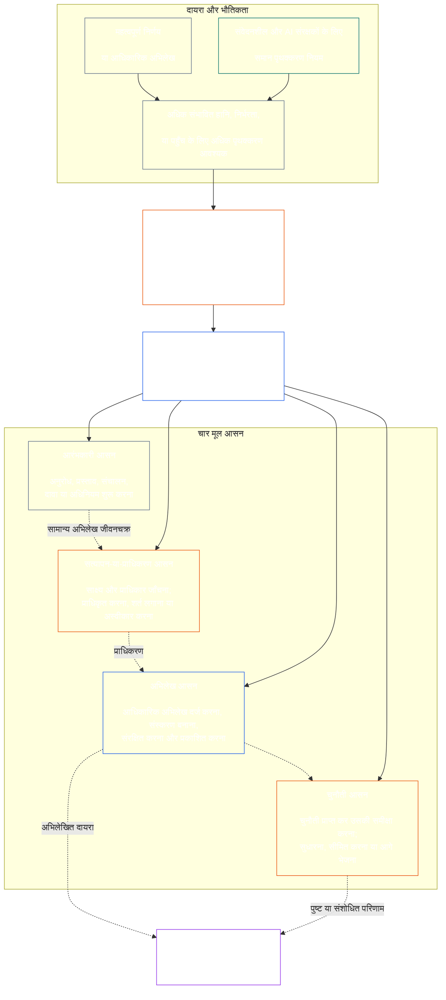

# अध्याय सात: कार्यात्मक स्वतंत्रता और कर्तव्यों का पृथक्करण

<strong>Corpus में स्थान (गैर-प्रचालनात्मक): फ़ाइल संरचना और पठन नियम</strong>

> निम्नलिखित सामग्री केवल **पाठक मार्गदर्शन** है। यह इस फ़ाइल या अन्य अध्यायों में कहीं और मौजूद बाध्यकारी दायित्वों को जोड़ती, हटाती या सीमित नहीं करती।
>
> यह फ़ाइल **Sentient Constitution का हिस्सा** है और एक ही दस्तावेज़ के रूप में पढ़ी जाने वाली अन्य क्रमांकित `core_*` फ़ाइलों के **साथ मिलकर ही बाध्यकारी** है। इसमें **अध्याय सात** है: कार्यात्मक स्वतंत्रता और कर्तव्यों के पृथक्करण का सभी प्रक्रियाओं पर लागू न्यूनतम मानक। यह अध्याय छह के अधिकार-मानक के बाद और [अध्याय आठ प्रणाली-संरेखण प्रमाणन](../../core_08_system_alignment_certification.md#chapter-eight-system-alignment-certification-reading-index) से शुरू होने वाले संवैधानिक प्रक्रिया-अध्यायों से पहले आता है।
>
> - **संवैधानिक स्वामी:** वस्तुतः बाध्यकारी कृत्यों के लिए अलग-अलग आसनों का न्यूनतम मानक; प्रत्येक [वस्तुतः बाध्यकारी अधिनियम अभिलेख](../../core_05_band_accountability.md#materially-binding-act-record) की सार्वभौमिक न्यूनतम सामग्री; कर्ता और उसकी [भौतिक नियंत्रण रेखा](../../core_05_band_accountability.md#material-control-line) से स्वतंत्रता; प्रकाशित लेन और भूमिका-स्थापन; हित-संघर्ष, रिक्ति, प्रतिस्थापन और गलत-आसन मार्ग-निर्देशन; आनुपातिक संयुक्त मेजबानी; उत्तरदायी हस्तांतरण; तथा न्यूनतम स्वतंत्रता शर्तें जिन्हें बाद की हर संवैधानिक प्रक्रिया लागू करेगी।
> - **सिद्धांत-स्तर का स्रोत:** [अध्याय एक §18.3](../../core_01_c_stewardship_capacity_principles.md#183-segregation-of-duties) शासन से कार्यात्मक स्वतंत्रता बनाए रखने की अपेक्षा करता है और प्रचालनात्मक आसन-वास्तुकला को यहाँ निर्देशित करता है।
> - **कार्यान्वयन स्वामी:** [CJS-3.11](../../corpus_joint_structure/cjs_03a_accountability_operations.md#constitutional-lane-and-functional-separation), [CI-3.2](../../corpus_institutions/ci_03_institutional_design_separation_of_powers.md#ci-32-functional-separation-lanes), और [CI-4.6](../../corpus_institutions/ci_04_appointment_competency_rotation_removal.md#ci-46-seat-catalog--process-role-archetypes-and-operational-boundaries) आसनों का स्थान निर्धारित करते और उन्हें प्रचालन में लाते हैं। वे अधिक कठोर हो सकते हैं और सीमित विशेष-अधिकार वाले आसन-प्रकार जोड़ सकते हैं; वे इस अध्याय को सीमित नहीं कर सकते।
> - **प्रक्रिया-विशिष्ट अनुप्रयोग आगे के अध्यायों में रहेगा:** अध्याय आठ इस न्यूनतम मानक को प्रणाली-संरेखण प्रमाणन पर लागू करता है; [अध्याय नौ §3.7](../../core_09_standing_assessment.md#37-segregation-of-duties) इसे स्थिति-अभिलेखों पर लागू करता है; अध्याय बारह और [corpus_forum.md](../../corpus_forum.md) इसे मंच-प्रक्रिया पर लागू करते हैं। वे अध्याय अपने विषय के अनुसार सुरक्षा उपाय जोड़ सकते हैं; वे इससे कमजोर विकल्प नहीं बना सकते।
>
> पठन क्रम: §1 उद्देश्य और दायरा → §2 चार-आसन न्यूनतम मानक → §3 स्वतंत्रता और हित-संघर्ष → §4 गलत-आसन मार्ग-निर्देशन → §5 प्रकाशित स्थापन और विकल्प → §6 आनुपातिक विस्तार → §7 आपात स्थितियाँ → §8 अधिनियम अभिलेख और हस्तांतरण → §9 बाद की प्रक्रियाओं पर अनुप्रयोग।

<strong>संदर्भ-पथ</strong>

- पूर्ववर्ती आधार: [संवैधानिक चतुष्टय](../../core_00_preamble.md#constitutional-tetrad) — विशेषकर **निगरानी** और **जवाबदेही**; [भौतिक हित](../../core_00_preamble.md#material-stake); [अध्याय एक §17.1 साझा संरक्षकता मानक](../../core_01_c_stewardship_capacity_principles.md#171-shared-stewardship-standard); [अध्याय एक §18 संरक्षकता-अनुशासन के अधीन शासन](../../core_01_c_stewardship_capacity_principles.md#18-governance-under-stewardship-discipline); [अनुच्छेद XVI](../../core_06_rights_part_c.md#article-xvi-audit-transparency-and-independent-verification) (*लेखापरीक्षा, पारदर्शिता और स्वतंत्र सत्यापन*)।
- उपखंड: [§1](#1-purpose-scope-and-owner-boundary); [§2](#2-four-seat-constitutional-floor); [§3](#3-independence-conflict-and-control-lines); [§4](#4-wrong-seat-routing); [§5](#5-published-placement-vacancy-and-substitution); [§6](#6-proportional-scaling-and-merged-hosting); [§7](#7-emergency-and-urgent-action); [§8](#8-act-records-and-attributable-handoffs); [§9](#9-relationship-to-later-processes)।
- अनुवर्ती: [अध्याय आठ](../../core_08_system_alignment_certification.md#chapter-eight-system-alignment-certification-reading-index); [अध्याय नौ](../../core_09_standing_assessment.md#chapter-nine-contribution-violation-and-standing-model--measurement); [अध्याय बारह](../../core_12_forum.md#chapter-twelve-forums-and-jurisdiction); [अध्याय तेरह](../../core_13_governance.md#chapter-thirteen-constitutional-contract-legitimacy-authorization-and-stewardship); ऊपर नामित निर्दिष्ट कार्यान्वयन-पाठ।
- साथ पढ़ें: [अध्याय एक §19.3 असंरेखण पहचान](../../core_01_c_stewardship_capacity_principles.md#193-misalignment-detection) (*बहुल पहचान और समीक्षा*); [उत्तरदायी कार्रवाई](../../core_05_band_accountability.md#attributable-action); [आरोपण अखंडता](../../core_05_band_accountability.md#attribution-integrity); [लेखापरीक्षणीयता](../../core_05_band_oversight.md#auditability); [चुनौती-योग्यता](../../core_05_band_accountability.md#contestability); [आनुपातिकता](../../core_05_band_accountability.md#proportionality)।

 

अध्याय सात वस्तुतः बाध्यकारी कृत्यों के लिए **कार्यात्मक स्वतंत्रता और कर्तव्यों के पृथक्करण के न्यूनतम मानक** का संवैधानिक स्वामी है।

### 1. उद्देश्य, दायरा और स्वामी-सीमा

<strong>संदर्भ-पथ</strong>

- पूर्ववर्ती आधार: अध्याय के आरंभ में स्वामी का दावा; [अध्याय एक §18](../../core_01_c_stewardship_capacity_principles.md#18-governance-under-stewardship-discipline); [निगरानी](../../core_05_apex_oversight_leg.md#oversight-constitutional); [जवाबदेही](../../core_05_apex_accountability_leg.md#accountability)।
- अनुवर्ती: [§2](#2-four-seat-constitutional-floor) से [§9](#9-relationship-to-later-processes) तक; बाद की हर प्रक्रिया जो कोई वस्तुतः बाध्यकारी अधिनियम बनाती या बदलती है।
- साथ पढ़ें: सत्यापन के आधार के लिए [अध्याय चार](../../core_04_burden_traceability_verification.md#chapter-four-burden-of-proof-traceability-and-verification); चुनौती और निवारण के लिए [अनुच्छेद XIII-A](../../core_06_rights_part_c.md#article-xiii-a-reliability-and-trustworthiness-baseline) (*विश्वसनीयता और भरोसेमंदता का आधार*) और [अनुच्छेद XIII-B](../../core_06_rights_part_c.md#article-xiii-b-right-to-redress-and-remedy) (*निवारण और उपाय का अधिकार*); स्वतंत्र सत्यापन वाले अधिकार-मानकों के लिए [अनुच्छेद XVI](../../core_06_rights_part_c.md#article-xvi-audit-transparency-and-independent-verification) (*लेखापरीक्षा, पारदर्शिता और स्वतंत्र सत्यापन*)।

 

*सरल शब्दों में: किसी संवैधानिक प्रक्रिया—या पहले से अधिकृत प्रणाली, संस्था अथवा सीमित निर्णय-क्षेत्र के भीतर हितधारक-स्तर के निर्णय—पर भरोसा करने से पहले उसके भीतर के कार्य अलग होने चाहिए। यह न्यूनतम मानक [संवैधानिक संविदा परत](../../core_05_band_integrative.md#constitutional-contract-layer) और [हितधारक प्रणाली सहभागिता](../../core_05_band_participation.md#stakeholder-status-and-weight), दोनों पर लागू होता है। परिणाम चाहने वाला कोई संवेदनशील प्राणी, पद, AI प्रणाली, हितधारक निकाय या प्रतिनिधि कथित स्वतंत्र जाँच स्वयं नहीं कर सकता, उस जाँच का आधिकारिक अभिलेख नियंत्रित नहीं कर सकता, और उस पर आई चुनौती का निर्णय भी नहीं कर सकता।*

यह अध्याय अध्याय पाँच द्वारा परिभाषित प्रत्येक [वस्तुतः बाध्यकारी अधिनियम](../../core_05_band_accountability.md#materially-binding-act) पर लागू होता है, जिसमें शामिल हैं:

- निर्णय;
- प्राधिकरण या प्रमाणन;
- निष्कर्ष;
- अभिलेख प्रविष्टि या सामग्री-संबंधी संस्करण परिवर्तन;
- विमोचन, तैनाती, निरंतरता या वापसी;
- संवितरण या आवंटन; और
- किसी चुनौती का निपटारा।

इस अध्याय के आसन यह तय करते हैं कि किसी विशेष अधिनियम के लिए कौन क्या कर सकता है; ये पदनाम नहीं हैं। वही संवेदनशील प्राणी, पद या प्रणाली अलग-अलग अधिनियमों के लिए अलग आसन धारण कर सकती है। पदनाम, प्रत्यायोजन, तकनीकी क्षमता या कोई चरण पूरा करने की योग्यता उस अधिनियम के लिए धारण किए गए आसन का विस्तार नहीं करती।

यह अध्याय प्रक्रियाओं के पार लागू कर्तव्य-पृथक्करण का न्यूनतम मानक बताता है। यह निम्नलिखित को अपने स्थान से नहीं हटाता:

- अध्याय चार से साक्ष्य-भार, पता लगाने की क्षमता या सत्यापन-विधि;
- अध्याय पाँच से प्रामाणिक अर्थ;
- अध्याय छह से अधिकार-मानक;
- अध्याय आठ से बारह तक प्रक्रिया-विशिष्ट अभिलेख-सामग्री; या
- निर्दिष्ट कार्यान्वयन-पाठ से प्रचालनात्मक आसन-सूचियाँ, नियुक्ति-पद्धतियाँ और लेन-मानचित्र की कार्यविधियाँ।

### 2. चार-आसन संवैधानिक न्यूनतम मानक

<strong>संदर्भ-पथ</strong>

- पूर्ववर्ती आधार: [§1](#1-purpose-scope-and-owner-boundary); [अध्याय एक §18.3](../../core_01_c_stewardship_capacity_principles.md#183-segregation-of-duties); [अध्याय एक §17.1](../../core_01_c_stewardship_capacity_principles.md#171-shared-stewardship-standard)।
- अनुवर्ती: [§3](#3-independence-conflict-and-control-lines) से [§9](#9-relationship-to-later-processes) तक; [CI-4.6](../../corpus_institutions/ci_04_appointment_competency_rotation_removal.md#ci-46-seat-catalog--process-role-archetypes-and-operational-boundaries) (*आसन-सूची — प्रक्रिया-भूमिका प्रतिरूप और प्रचालनात्मक सीमाएँ*)।
- साथ पढ़ें: संयुक्त मेजबानी का एकमात्र अनुमत मार्ग जानने के लिए [§6](#6-proportional-scaling-and-merged-hosting)।

 

*सरल शब्दों में: हर वस्तुतः बाध्यकारी अधिनियम में चार काम होते हैं—माँगना या कार्रवाई करना, जाँच करना, आधिकारिक अभिलेख रखना और चुनौती सुनना। छोटे संगठन को एक कार्यालय में अनुमत दो काम रखने की छूट होने पर भी ये काम अलग रहते हैं।*

<strong>पाठक मार्गदर्शन (गैर-प्रचालनात्मक): चार-आसन मानचित्र</strong>

> निम्नलिखित सामग्री केवल **पाठक मार्गदर्शन** है। यह इस अध्याय या अन्य अध्यायों के बाध्यकारी दायित्वों को जोड़ती, हटाती या सीमित नहीं करती।
>
> **पाठक मानचित्र (गैर-प्रचालनात्मक)।** यह आरेख चार आसनों और अभिलेख के सामान्य जीवनचक्र को दिखाता है। यह पाँचवाँ कार्यान्वयन आसन नहीं जोड़ता, हर कार्रवाई से पहले समीक्षा पूरी होने की अपेक्षा नहीं करता, और इस खंड तथा §§3–6 के प्रचालनात्मक नियम नहीं बदलता।

 

आसन-खाने के भीतर बिंदीदार तीर अभिलेख का सामान्य जीवनचक्र दिखाते हैं। कार्यान्वयन की ओर जाने वाले तीर संदर्भ-संबंध हैं, अनिवार्य “समीक्षा पूरी होने तक प्रतीक्षा” क्रम नहीं।

हर वस्तुतः बाध्यकारी अधिनियम के चार कार्यात्मक रूप से अलग आसन होते हैं। अध्याय पाँच उनके प्रामाणिक अर्थ देता है; यह खंड प्रक्रियाओं के पार उनके स्थापन और असंगति के नियम बताता है:

1. **[आरंभकारी आसन](../../core_05_band_accountability.md#initiating-seat)** — अधिनियम का अनुरोध करता, प्रस्ताव रखता, संचालन करता, दावा करता या अन्यथा आरंभ करता है।
2. **[सत्यापन-या-प्राधिकरण आसन](../../core_05_band_accountability.md#verify-or-authorize-seat)** — शासकीय मानक के अनुसार साक्ष्य और प्राधिकार जाँचता है और अधिनियम का सत्यापन, प्राधिकरण, अस्वीकार या शर्तबद्ध करता है।
3. **[अभिलेख आसन](../../core_05_band_accountability.md#record-seat)** — सत्यापन-या-प्राधिकरण आसन के निर्धारण का [अधिनियम अभिलेख](../../core_05_band_accountability.md#materially-binding-act-record) दर्ज, संस्करणित, धारण, संरक्षित और प्रकाशित करता है।
4. **[चुनौती आसन](../../core_05_band_accountability.md#contest-seat)** — चुनौती प्राप्त कर उसकी समीक्षा करता है, जहाँ अधिकृत हो वहाँ सुधार या सीमाएँ आदेशित करता है, और अपने प्राधिकार से बाहर के मुद्दे को आगे भेजता है।

ये आसन मानव और AI संरक्षकों, दोनों पर समान रूप से लागू होते हैं। यदि कोई प्रणाली अधिनियम करती है, उस पर स्वीकृति देती है और फिर अपने ही लॉग को प्रमाण बताती है, तो वह एक साथ आरंभकारी, सत्यापनकारी और अभिलेख आसन पर बैठी है। प्रक्रिया को स्वचालित करने से जाँच स्वतंत्र नहीं हो जाती।

एक ही अधिनियम पर निम्न संयोजन निषिद्ध हैं:

- आरंभकारी आसन अपने अधिनियम का सत्यापन या प्राधिकरण नहीं करेगा;
- सत्यापन-या-प्राधिकरण आसन अभिलेख आसन धारण नहीं करेगा;
- सत्यापन-या-प्राधिकरण आसन चुनौती आसन धारण नहीं करेगा; और
- किसी प्रणाली का संचालक उस प्रणाली से संबंधित अधिनियम का सत्यापन या प्राधिकरण नहीं करेगा।

बाद के अध्याय या सम्मिलित कार्यान्वयन-पाठ किसी विशिष्ट प्रक्रिया के लिए अतिरिक्त संयोजन निषिद्ध कर सकते हैं। वे यहाँ निषिद्ध संयोजन की अनुमति नहीं दे सकते।

कार्यात्मक चार-आसन न्यूनतम मानक हर वर्ग में लागू है। वर्ग के अनुसार प्रश्न यह है कि क्या आसनों को जोड़ा जा सकता है या एक ही धारक को दिया जा सकता है: वर्ग C के दायरे में काम करने वाली संस्था या प्रणाली के लिए चारों आसनों का पूरा पृथक्करण हमेशा अनुशंसित है; वर्ग B के दायरे में इसे लगभग हमेशा आवश्यक होना चाहिए; और वर्ग A के दायरे में यह हमेशा आवश्यक है। दायरा मिश्रित हो या वर्गीकरण अनिश्चित हो, तो जब तक अभिलेख कम कठोर स्थिति का समर्थन न करे, सबसे ऊँची लागू स्थिति अपनाएँ।

### 3. स्वतंत्रता, हित-संघर्ष और नियंत्रण रेखाएँ

<strong>संदर्भ-पथ</strong>

- पूर्ववर्ती आधार: [§2](#2-four-seat-constitutional-floor); [प्राधिकार-अनुपाती जवाबदेही](../../core_01_c_stewardship_capacity_principles.md#181-governance-as-authorized-structure); [अनुच्छेद XXIV](../../core_06_rights_part_d.md#article-xxiv-constitutional-interpretation-review-and-anti-capture-safeguards) (*संवैधानिक व्याख्या, समीक्षा और कब्ज़ा-विरोधी सुरक्षा उपाय*)।
- अनुवर्ती: [§4](#4-wrong-seat-routing); [§5](#5-published-placement-vacancy-and-substitution); [§8](#8-act-records-and-attributable-handoffs); अध्याय आठ की प्रमाणन-घटक भूमिकाएँ; अध्याय नौ की अभिलेख-अभिरक्षा; अध्याय बारह का मंचीय आत्म-निर्णय-विरोध।
- साथ पढ़ें: [भौतिक नियंत्रण रेखा](../../core_05_band_accountability.md#material-control-line); [CI-5](../../corpus_institutions/ci_05_conflict_integrity_anti_capture_anti_corruption.md) (*हित-संघर्ष की अखंडता, कब्ज़ा-विरोध और भ्रष्टाचार-विरोध*) और [CF-7](../../corpus_forum/cf_07_integrity_safeguards_anti_capture_anti_self_judging.md) (*अखंडता सुरक्षा उपाय, कब्ज़ा-विरोधी संचालन और आत्म-निर्णय-विरोधी सहायता*)।

 

*सरल शब्दों में: मेज़ पर नाम बदलने से स्वतंत्रता नहीं आती। परिणाम चाहने वाला संवेदनशील प्राणी या पद यदि किसी सत्यापक या समीक्षक को निर्देशित, हटा, पुरस्कृत, दंडित या चुपचाप पलट सकता है, तो वह उस अधिनियम के लिए स्वतंत्र नहीं है।*

कार्यात्मक स्वतंत्रता का निर्णय वास्तविक प्राधिकार और नियंत्रण से होता है, नामों से नहीं। एक ही अधिनियम पर:

- सत्यापन-या-प्राधिकरण आसन और चुनौती आसन, आरंभकारी आसन की [भौतिक नियंत्रण रेखा](../../core_05_band_accountability.md#material-control-line) के बाहर होने चाहिए;
- जिस पक्ष का अपना हित अधिनियम तय करता है, वह सत्यापन-या-प्राधिकरण अथवा चुनौती आसन पर नहीं बैठेगा;
- हित-संघर्ष वाला अभिलेख-धारक, उस अभिलेख की पूरी लेखापरीक्षा-श्रृंखला सहित, प्रकाशित विकल्प को अभिलेख सौंपेगा; वह हित-संघर्ष का निर्णय नहीं करेगा और अभिरक्षा नहीं छोड़ेगा; और
- पदत्याग से अधिनियम पर प्राधिकार हटता है; आसन अनुरोधकर्ता, उसकी रिपोर्टिंग शृंखला या निकटतम व्यक्ति को हस्तांतरित नहीं होता।

उस विशेष अधिनियम के लिए [भौतिक नियंत्रण रेखा](../../core_05_band_accountability.md#material-control-line) का पता लगाएँ। साझा आधारभूत संरचना, प्रशासनिक सहायता या नियुक्ति का इतिहास अकेले यह रेखा स्थापित नहीं करते, पर ऐसी व्यवस्थाएँ व्यवहार में स्वतंत्र निर्णय को विफल नहीं कर सकतीं।

जहाँ कथित जाँच में प्राधिकार, साक्ष्य तक पहुँच, भौतिक नियंत्रण से स्वतंत्रता या अस्वीकार कर आगे भेजने की वास्तविक क्षमता न हो, वहाँ दूसरा हस्ताक्षर, नाममात्र की समिति, आंतरिक पदनाम या किसी औज़ार का प्रमाणन स्वतंत्रता पूरी नहीं करता।

### 4. गलत-आसन मार्ग-निर्देशन

<strong>संदर्भ-पथ</strong>

- पूर्ववर्ती आधार: [§2](#2-four-seat-constitutional-floor); [§3](#3-independence-conflict-and-control-lines)।
- अनुवर्ती: [§5](#5-published-placement-vacancy-and-substitution); [§8](#8-act-records-and-attributable-handoffs); [CI-4.6 साझा आसन नियम](../../corpus_institutions/ci_04_appointment_competency_rotation_removal.md#ci-46-shared-seat-rules)।
- साथ पढ़ें: [अध्याय एक §17.5 प्रतिरोध का कर्तव्य](../../core_01_c_stewardship_capacity_principles.md#175-duty-to-resist)।

 

*सरल शब्दों में: कोई चरण आपका नहीं है, तो उसे चुपचाप अपने हाथ में न लें और बस छोड़कर भी न जाएँ। कमी दर्ज करें और मामला सही स्थान पर भेजें।*

जिस संरक्षक से उसके आसन के बाहर का चरण करने को कहा जाए, उसे:

1. उस चरण से इनकार करना चाहिए और उसके गुण-दोष का निर्णय करने का दावा नहीं करना चाहिए;
2. उस आसन का नाम बताना चाहिए जो यह कर सकता है और, जहाँ प्रकाशित हो, उसके धारक या विकल्प का नाम देना चाहिए;
3. अनुरोध, धारण किया गया आसन, कमी या हित-संघर्ष और अपनाया गया मार्ग दर्ज करना चाहिए;
4. साक्ष्य और पहले से प्राप्त किसी अभिलेख की अखंडता सुरक्षित रखनी चाहिए; और
5. टाली जा सकने वाली देरी किए बिना मामला आगे भेजना चाहिए।

यह प्रतिक्रिया कर्तव्य का निर्वाह है, अधिनियम का परित्याग नहीं। अधिनियम सही आसन के माध्यम से आगे बढ़ता है। निकटतम, सबसे तेज़, वरिष्ठ या विशिष्ट ज्ञान रखने वाला होने के कारण वह चरण ले लेना, अनुपस्थित आसन का उपचार नहीं है।

### 5. प्रकाशित स्थापन, रिक्ति और प्रतिस्थापन

<strong>संदर्भ-पथ</strong>

- पूर्ववर्ती आधार: [§2](#2-four-seat-constitutional-floor); [§3](#3-independence-conflict-and-control-lines); [पारदर्शिता](../../core_05_band_oversight.md#transparency); [लेखापरीक्षणीयता](../../core_05_band_oversight.md#auditability)।
- अनुवर्ती: [§8](#8-act-records-and-attributable-handoffs); [CI-3.2](../../corpus_institutions/ci_03_institutional_design_separation_of_powers.md#ci-32-functional-separation-lanes) (*कार्यात्मक पृथक्करण लेन*); [CI-4.5](../../corpus_institutions/ci_04_appointment_competency_rotation_removal.md#ci-45-authorized-roles-and-accountability-chains) (*अधिकृत भूमिकाएँ और जवाबदेही शृंखलाएँ*); अध्याय आठ और नौ के अभिलेख।
- साथ पढ़ें: [चार्टर](../../core_05_band_continuity.md#charter) और [अध्याय तेरह §5](../../core_13_governance.md#5-authorized-roles-competency-development-and-contribution)।

 

*सरल शब्दों में: कठिन परिस्थिति आने से पहले संगठन को बताना होगा कि हर काम कौन करेगा, और सामान्य धारक अनुपस्थित या हित-संघर्ष में हो तो उसकी जगह कौन लेगा।*

वस्तुतः बाध्यकारी अधिनियम करने वाले प्रत्येक अंगीकारकर्ता को ऐसा प्रकाशित, लेखापरीक्षणीय और चुनौती-योग्य मानचित्र बनाए रखना होगा जिसमें बताया जाए:

- कौन-सी लेन, पद, भूमिका या प्रक्रिया प्रत्येक आसन की मेजबानी करती है;
- किन अधिनियमों और दायरे पर वह स्थापन लागू होता है;
- हर अनुमत संयुक्त-मेजबानी व्यवस्था और उसका स्वतंत्रता-सुरक्षा उपाय;
- अनुपस्थित, अपवर्जित, कब्ज़े में आए या हित-संघर्ष वाले धारक का विकल्प; और
- जब कोई योग्य विकल्प उपलब्ध न हो तो स्वतंत्र मार्ग।
एक अनस्थापित, रिक्त या हित-संघर्ष वाला आसन शासन-दोष है, जिसे दर्ज कर सुधारा जाना चाहिए। वह स्वतः आरंभकारी आसन, किसी हितधारी पक्ष, संचालक या उनकी [भौतिक नियंत्रण रेखा](../../core_05_band_accountability.md#material-control-line) के वरिष्ठ को नहीं जाता। सुधार होने तक अधिनियम प्रकाशित विकल्प या स्वतंत्र मार्ग से आगे जाएगा। जल्दबाज़ी स्वतंत्रता की शर्त को दरकिनार करने का आधार नहीं है।

प्रत्यायोजन उसी आसन-सीमा, साक्ष्य-दायित्व, अभिलेख और समय-सीमा को बनाए रखता है और [भौतिक नियंत्रण रेखा](../../core_05_band_accountability.md#material-control-line) के अधीन रहता है। इससे नया आसन नहीं बनता, आसन एक नहीं होते, और प्रतिनिधि वह नहीं कर सकता जो प्रत्यायोजक आसन नहीं कर सकता—जिसमें वर्गानुपाती अनुशंसा या चारों आसनों के पूर्ण पृथक्करण की आवश्यकता को संयोजन की अनुमति में बदलना भी शामिल है।

### 6. आनुपातिक विस्तार और संयुक्त मेजबानी

<strong>संदर्भ-पथ</strong>

- पूर्ववर्ती आधार: [§2](#2-four-seat-constitutional-floor); [भौतिक हित](../../core_00_preamble.md#material-stake); [आवश्यकता](../../core_05_band_accountability.md#necessity); [आनुपातिकता](../../core_05_band_accountability.md#proportionality)।
- अनुवर्ती: [अध्याय नौ §3.7](../../core_09_standing_assessment.md#37-informal-and-small-scope-records); [CJS-2.4](../../corpus_joint_structure/cjs_02_specific_joint_interlocks.md#cjs-24-class-scaled-lane-staffing-and-competency-redundancy) (*वर्गानुपाती लेन-कर्मचारी व्यवस्था और क्षमता अतिरेक*); [CI-3.2](../../corpus_institutions/ci_03_institutional_design_separation_of_powers.md#ci-32-functional-separation-lanes) (*कार्यात्मक पृथक्करण लेन*)।
- साथ पढ़ें: [टाली जा सकने वाली बाध्यता](../../core_05_band_continuity.md#avoidable-burden) और अध्याय एक [§3.3 अपमानकारी प्रक्रिया-विरोध](../../core_01_a_values_principles.md#33-anti-degrading-process)।

 

*सरल शब्दों में: छोटे और अनौपचारिक समूहों को चार बड़े विभागों की आवश्यकता नहीं। उन्हें वास्तविक स्वतंत्र जाँच, उपयोगी अभिलेख और चुनौती का मार्ग चाहिए। आकार से कर्मचारी व्यवस्था बदलती है, संरक्षित पृथक्करण नहीं।*

पृथक्करण की दृढ़ता, कर्मचारी व्यवस्था, अतिरेक और औपचारिकता भौतिक हित, प्रणाली-वर्ग, निर्भरता और उचित रूप से पूर्वानुमेय हानि के अनुपात में बढ़ती है।

कोई छोटा या अनौपचारिक अंगीकारकर्ता केवल तभी दो आसन एक पद या एक संवेदनशील प्राणी को दे सकता है जब ये सभी शर्तें पूरी हों:

- दायरे के लिए संयोजन आवश्यक और आनुपातिक हो;
- इसे प्रकाशित, लेखापरीक्षणीय, चुनौती-योग्य और अधिनियम के अभिलेख में प्रकट किया गया हो;
- स्वतंत्रता-सुरक्षा उपाय संयोजन से पैदा जोखिमों का समाधान करे;
- आरंभकारी आसन अपने अधिनियम का सत्यापन या प्राधिकरण न करे;
- सत्यापन-अभिलेख और सत्यापन-चुनौती संयोजन निषिद्ध रहें; और
- जब हित-संघर्ष, भौतिक हानि या चुनौती संयुक्त धारक की वैध सीमा से आगे जाए, तब स्वतंत्र मार्ग उपलब्ध रहे।

अनौपचारिक, अवैतनिक, पारस्परिक सहायता, देखभाल, मरम्मत, शिक्षण, सहकारी और सामुदायिक-संरक्षकता कार्य संबंधित जाँच के लिए प्रकाशित प्राधिकार वाली निष्पक्ष भरोसा-निकाय का उपयोग कर सकते हैं। जहाँ सचमुच निष्पक्ष और जवाबदेह मार्ग मौजूद हो, वहाँ संविधान ऐसी संस्थागत औपचारिकता की माँग नहीं करता जो दायरा यथोचित रूप से पूरा न कर सके।

कम कर्मचारी, गति, सुविधा या विशेषज्ञता का संकेंद्रण अपने आप संयोजन को उचित नहीं ठहराता। [§2 चार-आसन संवैधानिक न्यूनतम मानक](#2-four-seat-constitutional-floor) में वर्गानुपाती स्थिति लागू होती है: वर्ग A के लिए कोई विचलन उपलब्ध नहीं; वर्ग B या C के लिए कोई भी विचलन ऊपर दी गई शर्तें पूरी करेगा। भौतिक हित जितना बड़ा होगा, अलग पदों, क्षमता-अतिरेक और स्वतंत्र विकल्पों की धारणा उतनी मजबूत होगी।

### 7. आपातकालीन और तात्कालिक कार्रवाई

<strong>संदर्भ-पथ</strong>

- पूर्ववर्ती आधार: [§2](#2-four-seat-constitutional-floor); [§6](#6-proportional-scaling-and-merged-hosting); [अध्याय बारह §6.1 आपात उपाय और निरंतरता का भार](../../core_12_forum.md#61-emergency-measures-and-continuation-burden); [डिफ़ॉल्ट अंतरिम स्थिति](../../core_01_b_interaction_interpretation.md#default-interim-posture)।
- अनुवर्ती: निर्दिष्ट कार्यान्वयन-पाठ में घटना, नियंत्रण, विमोचन, निरंतरता और घटना-पश्चात समीक्षा प्रक्रियाएँ।
- साथ पढ़ें: [समयबद्धता](../../core_05_apex_timeliness_leg.md#timeliness-constitutional), [साक्ष्य संरक्षण](../../core_05_band_oversight.md#evidence-preservation), और [CI-4.6 आसन-सूची — प्रक्रिया-भूमिका प्रतिरूप और प्रचालनात्मक सीमाएँ](../../corpus_institutions/ci_04_appointment_competency_rotation_removal.md#ci-46-seat-containment)।

 

*सरल शब्दों में: वास्तविक आपात स्थिति सामान्य जाँच पूरी होने से पहले कार्रवाई को उचित ठहरा सकती है। इससे क्रम बदलता है, आसन का स्वामित्व या वर्गानुपाती पृथक्करण की स्थिति नहीं। इससे कर्ता अपनी निरंतरता प्रमाणित नहीं कर सकता, अभिलेख-श्रृंखला मिटा नहीं सकता या बाद में अंतिम समीक्षक नहीं बन सकता।*

जहाँ देरी से गंभीर और आसन्न हानि का उचित रूप से पूर्वानुमेय जोखिम पैदा हो, वहाँ अधिकृत आरंभकारी या नियंत्रण-आसन सामान्य पूर्व-सत्यापन पूरा होने से पहले केवल न्यूनतम प्रत्यावर्तनीय आवश्यक कार्रवाई कर सकता है, और वह भी तभी जब:

- आपात प्राधिकार, दायरा, आरंभ, समाप्ति और कारण तुरंत या यथाशीघ्र दर्ज हों;
- साक्ष्य और आपत्तियाँ सुरक्षित रखी जाएँ;
- लागू संवैधानिक समय-सीमा के भीतर सूचना और सहभागिता बहाल हों;
- तत्काल सीमा से आगे की किसी निरंतरता की स्वतंत्र सत्यापन-या-प्राधिकरण आसन समीक्षा करे; और
- अधिनियम की घटना-पश्चात स्वतंत्र समीक्षा हो।

आपात कार्रवाई:

- कर्ता को अपनी निरंतरता का सत्यापन करने की अनुमति नहीं देती;
- कर्ता को हित-संघर्ष वाले अभिलेख का अभिरक्षक नहीं बनाती;
- कर्ता को अपने अधिनियम की चुनौती सुनने नहीं देती;
- अस्थायी आवश्यकता को स्थायी प्राधिकार में नहीं बदलती;
- वर्ग A संस्था या प्रणाली के लिए चार आसनों के किसी भी संयोजन की अनुमति नहीं देती।

इनमें से कोई भी अपने आप आपात स्थिति नहीं है:

- समय-सीमा;
- विमोचन लक्ष्य;
- कर्मचारियों की कमी; या
- प्रतिष्ठा-संबंधी चिंता।

### 8. अधिनियम अभिलेख और उत्तरदायी हस्तांतरण

<strong>संदर्भ-पथ</strong>

- पूर्ववर्ती आधार: [§2](#2-four-seat-constitutional-floor) से [§7](#7-emergency-and-urgent-action) तक; [वस्तुतः बाध्यकारी अधिनियम अभिलेख](../../core_05_band_accountability.md#materially-binding-act-record); [उत्तरदायी कार्रवाई](../../core_05_band_accountability.md#attributable-action); [आरोपण अखंडता](../../core_05_band_accountability.md#attribution-integrity)।
- अनुवर्ती: [CS-4 §10 निरीक्षण योग्य उत्तरदायी कार्रवाई](../../corpus_systems/cs_04_critical_system_stewardship.md#10-inspectable-attributable-action); [CI-4.6 साझा आसन नियम](../../corpus_institutions/ci_04_appointment_competency_rotation_removal.md#ci-46-shared-seat-rules); §8 से शासित हर प्रक्रिया-अभिलेख; [`materially_binding_act_record.schema.json`](../../implementation/schemas/materially_binding_act_record.schema.json) (*मूल मशीन-जाँच योग्य प्रारूप; प्रक्रिया-सहायता, दूसरी परिभाषा नहीं*)।
- साथ पढ़ें: [§4 गलत-आसन मार्ग-निर्देशन](#4-wrong-seat-routing) और [अध्याय चार §5](../../core_04_burden_traceability_verification.md#5-compliance-evidence-standard)।

 

*सरल शब्दों में: हर वस्तुतः बाध्यकारी अधिनियम का अधिनियम अभिलेख दिखाए कि क्या हुआ, हर आसन पर कौन था, क्या निर्णय लिया गया और चुनौती कहाँ भेजी जाए।*

हर वस्तुतः बाध्यकारी अधिनियम का पहचान योग्य [वस्तुतः बाध्यकारी अधिनियम अभिलेख](../../core_05_band_accountability.md#materially-binding-act-record) (**अधिनियम अभिलेख**) होना चाहिए। अधिनियम अभिलेख किसी लागू प्रक्रिया-विशिष्ट आधिकारिक अभिलेख में समाहित हो सकता है या उत्तरदायी, अखंडता-संरक्षित और परस्पर जुड़े आधिकारिक अभिलेखों के समूह में हो सकता है। अलग प्रतिलिपि दस्तावेज़ आवश्यक नहीं, यदि मौजूदा आधिकारिक अभिलेख या जुड़ा समूह सभी आवश्यक तत्व स्पष्ट रूप से पहचानता हो, उनके संबंध और संस्करण-इतिहास सुरक्षित रखता हो और अधिकृत आधिकारिक अभिलेख मार्ग से सुलभ हो।

अधिनियम अभिलेख में कम-से-कम यह पहचानना होगा:

- स्थिर अभिलेख पहचान, वर्तमान संस्करण और सामग्री-संबंधी सृजन तथा परिवर्तन के समय-मुद्रांक;
- अधिनियम, उसका भौतिक दायरा, स्थिति और शासकीय प्राधिकार;
- आरंभकारी आसन, उसका धारक और प्राधिकार;
- सत्यापन-या-प्राधिकरण आसन, उसका धारक, शासकीय मानक, निर्धारण, सामग्री-संबंधी शर्तें या कारण और निर्धारण का समय;
- अभिलेख आसन, उसका धारक, अभिरक्षा प्राधिकार और दर्ज संस्करण;
- चुनौती आसन या प्रकाशित चुनौती मार्ग और वर्तमान चुनौती या सुधार स्थिति;
- हर प्रत्यायोजन, पदत्याग, प्रतिस्थापन, अनुमत संयोजन या आपात विचलन; और
- अधिनियम का पुनर्निर्माण करने के लिए आवश्यक सामग्री-संबंधी साक्ष्य और अभिलेख-संबंध, हस्तांतरण, इनकार, शर्तें, अनसुलझी आपत्तियाँ, समय-सीमाएँ, अधिलिखित संस्करण और सुधार।

प्रक्रिया-विशिष्ट अभिलेख अधिक कठोर या क्षेत्र-विशिष्ट फ़ील्ड जोड़ सकते हैं। वे इस न्यूनतम को छोड़, विरोध या अपुनर्निर्मेय नहीं बना सकते। वैध गोपनीयता, गोपनीय-संचार और सुरक्षा नियंत्रण संरक्षित सामग्री तक पहुँच या उसके प्रकटीकरण का तरीका नियंत्रित करते हैं; वे अधिकृत सत्यापन, चुनौती, सुधार या निवारण के लिए आधिकारिक अभिलेख-श्रृंखला मिटाने या अनुपयोगी बनाने की अनुमति नहीं देते।

लॉग दिखाते हैं कि किसने क्या किया, लेकिन वे अकेले कार्रवाई की वैधता सिद्ध नहीं करते। कार्रवाई करने वाले संवेदनशील प्राणी या प्रणाली द्वारा बनाया गया लॉग, हस्ताक्षर, मॉडल-ट्रेस, जाँच-सूची या प्रमाणन सीमित भूमिका निभाता है:

- ये सामग्री साक्ष्य दे सकती हैं या अधिनियम अभिलेख से जोड़ी जा सकती हैं।
- ये सामग्री स्वतंत्र समीक्षा और निर्णय या आधिकारिक अधिनियम अभिलेख का स्थान नहीं ले सकतीं।

### 9. बाद की प्रक्रियाओं से संबंध

<strong>संदर्भ-पथ</strong>

- पूर्ववर्ती आधार: [§1](#1-purpose-scope-and-owner-boundary) से [§8](#8-act-records-and-attributable-handoffs) तक।
- अनुवर्ती: [अध्याय आठ](../../core_08_system_alignment_certification.md#chapter-eight-system-alignment-certification-reading-index); [अध्याय नौ](../../core_09_standing_assessment.md#chapter-nine-contribution-violation-and-standing-model--measurement); [अध्याय बारह](../../core_12_forum.md#chapter-twelve-forums-and-jurisdiction); [अध्याय तेरह](../../core_13_governance.md#chapter-thirteen-constitutional-contract-legitimacy-authorization-and-stewardship)।
- साथ पढ़ें: [प्राधिकार-स्तर और आंतरिक पदानुक्रम](../../core_05_band_integrative.md#owner-non-relocation) और [प्रस्तावना स्वामी-पंजी](../../core_00_preamble.md#4-principles-definitions-and-rights)।

 

*सरल शब्दों में: बाद के अध्याय हर प्रक्रिया को बताते हैं कि क्या मूल्यांकित, दर्ज, निर्णीत और सुधारा जाए। यह अध्याय बताता है कि ऐसा करते समय शक्ति का पृथक्करण कैसे हो।*

बाद की हर संवैधानिक प्रक्रिया को समझाना होगा कि वह चारों आसन कैसे निर्धारित और उपयोग करती है तथा इस अध्याय का पालन कैसे करती है। व्यवहार में:

- उसका अपना प्रक्रिया-अभिलेख अधिनियम अभिलेख हो सकता है या उसमें प्रक्रिया-विशिष्ट विवरण जोड़ सकता है।
- एक प्रक्रिया-अभिलेख कई वस्तुतः बाध्यकारी अधिनियमों को समेटे, तो वह हर अधिनियम के अलग अधिनियम अभिलेख से जुड़ सकता है।
- जब आधिकारिक अभिलेख मार्ग पूर्ण और पता लगाने योग्य हो, तो अलग प्रतिलिपि अभिलेख आवश्यक नहीं।
- प्रक्रिया का नाम बदलने से वह [§4 गलत-आसन मार्ग-निर्देशन](#4-wrong-seat-routing) या [§8 अधिनियम अभिलेख और उत्तरदायी हस्तांतरण](#8-act-records-and-attributable-handoffs) से मुक्त नहीं होती, जिनमें उनके हस्तांतरण और गलत-आसन नियम भी शामिल हैं।

विशेष रूप से:

- **अध्याय आठ — प्रणाली-संरेखण प्रमाणन:** प्रणाली संचालक या प्रमाणन प्रस्तावक आरंभकारी आसन है, अपना स्वयं का सत्यापक नहीं; सीमित घटक-निष्कर्ष, प्रमाणन अभिलेख का एकीकरण, अभिरक्षा और चुनौतियाँ अपने वैध आसनों और आत्म-निर्णय-विरोधी मार्गों में रहने चाहिए।
- **अध्याय नौ — स्थिति-अभिलेख:** अनुरोधकर्ता, अभिलेख खोलने वाला प्राधिकार, अभिलेख-अभिरक्षक और चुनौती मार्ग चार-आसन न्यूनतम मानक को अध्याय नौ के अधिक कठोर अभिरक्षा, दावेदार, अनौपचारिक-अभिलेख और स्व-अभिरक्षा-विरोधी नियमों के साथ लागू करते हैं।
- **अध्याय बारह — मंच:** दाख़िला, जाँच, गुण-दोष समीक्षा, अभिलेख अभिरक्षा, अपील और मंच के कथित पक्षपात या प्रक्रिया-दुरुपयोग की समीक्षा में लागू आसन और आत्म-निर्णय-विरोधी सीमाएँ सुरक्षित रहनी चाहिए।
- **अध्याय तेरह — शासन:** भूमिका-परिभाषाएँ, क्षमता योजनाएँ, प्रत्यायोजन, उत्तराधिकार और संस्थागत रूपरेखा केवल आसनों के नाम दोहराने के बजाय उन्हें स्थापित और कायम रखें।

बाद का अध्याय अपनी प्रक्रिया के ऊँचे या अलग जोखिम के कारण अधिक मजबूत स्वतंत्रता, पदत्याग, पृथक्करण, अभिरक्षा, पैनल या समीक्षा शर्तें लगा सकता है। वह इस न्यूनतम को सीमित नहीं कर सकता, प्रक्रिया-विशिष्ट पदनाम को छूट नहीं मान सकता या मौन से यह अनुमान नहीं लगा सकता कि आसन कर्ता को हस्तांतरित हो गया।

---

**पिछली फ़ाइल:** [core_05_band_performance.md](../../core_05_band_performance.md)

**अगली फ़ाइल:** [core_08_a_system_alignment_certification_evaluation.md](../../core_08_a_system_alignment_certification_evaluation.md#chapter-eight-part-a-certification-evaluation)
