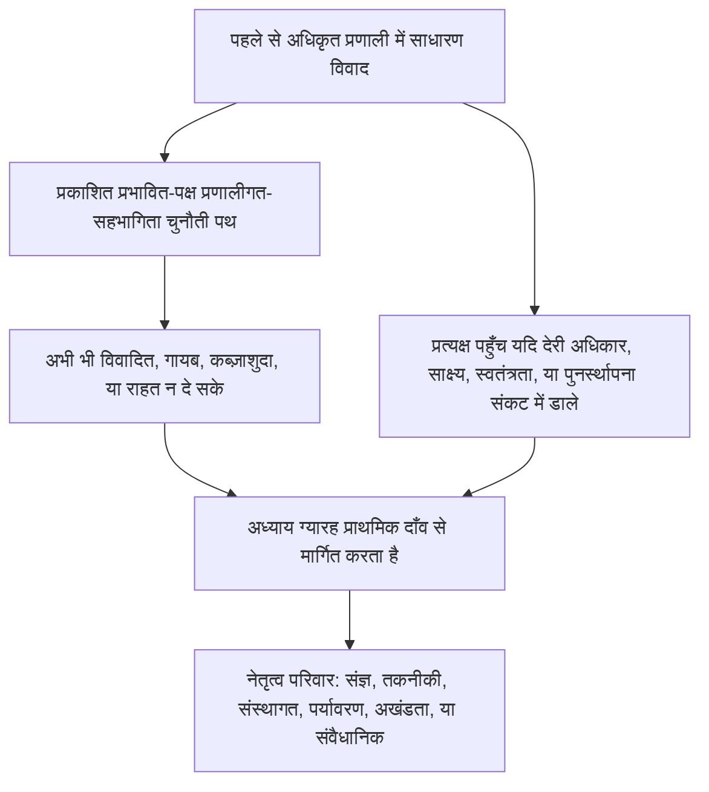

# अध्याय ग्यारह: मंच और क्षेत्राधिकार

<strong>संग्रह में स्थान (गैर-संक्रियात्मक): फ़ाइल संरचना और पढ़ने के नियम</strong>

> नीचे की सामग्री **केवल पाठक मार्गदर्शन** है। यह इस फ़ाइल या अन्य अध्यायों में बाध्यकारी कर्तव्यों को जोड़ती, घटाती या संकीर्ण नहीं करती।
>
> यह फ़ाइल [अंग्रेज़ी अध्याय ग्यारह](../../core_12_forum.md) का **पाठक-भाषा पायलट** है। यह संज्ञ संविधान का **बाध्यकारी भाग नहीं** है। यह **दूसरा संविधान नहीं** है। यह **प्रेषण संस्करण नहीं** है। यह `SC-Corpus-2026.08.09` से **जुड़ी** है। यदि यह अनुवाद और अंग्रेज़ी मूल में अंतर दिखे, तो क्रमांकित [`core_11_forum.md`](../../core_12_forum.md) जीतता है। पढ़ने का क्रम और संस्करण मेटाडेटा [README.md](../../README.md) में रहते हैं। विधि और शब्द-सूची: [translations/hi/README.md](README.md)।
>
> इसमें **अध्याय ग्यारह** है: मंच-परिवार, तयशुदा स्थान और प्राथमिक-दाँव मार्गन, न्यायिक-वैज्ञानिक सहारा, प्रवेश त्रियाज, और क्षेत्राधिकार — प्रस्थिति शृंखला और अधिकार-तल के अधीन विवादों के लिए। मंच [संवैधानिक चतुष्क](core_00_preamble.md#constitutional-tetrad) की **सहभागिता**, **निगरानी**, और **समयबद्धता** टाँगों के अधीन विवाद-सँभाल का **पर्यवेक्षण** करते हैं, [भौतिक दाँव](core_00_preamble.md#material-stake) से स्केल। जब तथ्य सत्यापित हों, वे प्रस्थिति अभिलेख **खोल, अद्यतन, या सुधार** सकते हैं — या **चुनौती पर खराब अभिलेख अलग रख** सकते हैं — [अध्याय आठ §3](core_08_standing_assessment.md#3-standing-record-operational-requirements) के अधीन; दायर मामला अपने आप प्रस्थिति नहीं है, और मंच-कथा अध्याय आठ प्रस्थिति मापन का स्थानापन्न नहीं होनी चाहिए ([अध्याय आठ §3.6](core_08_standing_assessment.md#36-forum-boundary))। शृंखला नेविगेशन के लिए [README — Standing pipeline and forums](../../README.md#standing-pipeline-and-forums) इस्तेमाल करें। संक्रियात्मक मंच यांत्रिकी नामित कार्यान्वयन फ़ाइलों में रहती है। अध्याय क्रमांकन और परस्पर संदर्भ एकीकृत लिखत से मेल खाते हैं।

>
> **पिछला (अभी अंग्रेज़ी में):** [core_10_b_misconduct_pattern_applications.md](../../core_11_b_misconduct_pattern_applications.md#chapter-eleven-part-b-anti-constitutional-misconduct-pattern-applications)
>
> **अगला (अभी अंग्रेज़ी में):** [core_08-11_application_vignettes.md](../../core_09-12_application_vignettes.md#chapters-eight-eleven-application-vignettes)
> **पढ़ने का चाप:** §1 उद्देश्य → विवाद अनुक्रम → §2 तयशुदा स्थान और प्रवेश → §2.1–§2.3 नेतृत्व सीमाएँ, मिश्रित दाँव, चुनौतियाँ → §3 स्थानांतरण और आत्म-निर्णय-निषेध → §4 परिवार → §5 उन्नयन और प्रमाणन → §6 स्तर और देरी-निरोध → §7 मंच सहारा

<strong>पाठक मार्गदर्शन (गैर-संक्रियात्मक): अध्याय ग्यारह कहाँ रहता है और क्या यहाँ रहता है</strong>

> नीचे की सामग्री **केवल पाठक मार्गदर्शन** है। यह इस अध्याय या अन्य अध्यायों में बाध्यकारी कर्तव्यों को जोड़ती, घटाती या संकीर्ण नहीं करती।
>
> यह कहाँ रहता है (नेविगेशन):
> - **संवैधानिक स्वामी:** **अनुभाग 1** (*उद्देश्य* — इस अध्याय द्वारा आवंटित मानदंडों का **प्राथमिक न्यायनिर्णयन अनुप्रयोग**, दिन-प्रतिदिन **कार्यकारी प्रशासन** से **भिन्न**; पहले से अधिकृत प्रणालियों के भीतर साधारण विवादों के लिए **विवाद अनुक्रम**; **जवाबदेही** अपेक्षाएँ; **प्रकाशित**, **पूर्वानुमेय** **दहलीज** स्थानन); **तयशुदा आरंभ स्थान**, **प्राथमिक-दाँव** मार्गन, **प्रवेश त्रियाज निकाय** (**प्रथम-स्पर्श डेस्क**), मिश्रित दाँव, विषमता, प्रस्थिति-अभिलेख चुनौतियाँ, **सद्भाव वर्णन और क्रीड़ा-निषेध**, और **संज्ञ-सुगम** **दहलीज** **पहुँच** अपेक्षाएँ (**अनुभाग 2**, **साथ पढ़ें** **`corpus_forum.md`**); **स्थानांतरण**, **समेकन**, और **समन्वय** (**अनुभाग 3**, **अनुभाग 5** प्रमाणन और बैकअप के साथ पढ़ें); **मंच-परिवार परिभाषाएँ**, **आंतरिक कक्ष**, **साझा मानक**, और **अनंतिम संक्रियात्मक विधि** (संज्ञ, तकनीकी, संस्थागत, पर्यावरण, अखंडता, संवैधानिक — **अनुभाग** **4**, **अनुभाग** **2** की **तालिका** का दर्पण); **उन्नयन**, **प्रमाणन**, और **अंतरिम रक्षा** (**अनुभाग 5**); **समयबद्ध समाधान** और **देरी-निरोध** अनुशासन (**अनुभाग 6**); समीक्षा से पहले, दौरान, और बाद **मंच सहारा** (**अनुभाग 7**), ताकि त्रियाज और सहारा भूमिकाएँ **विधिपूर्वक गठित गुण पैनलों** का **स्थानापन्न न** बनें; **आत्म-निर्णय-निषेध** बैकअप मार्गन; और **अध्याय आठ**, **अध्याय दस**, तथा **अध्याय छह** न्याय और चुनौती अधिकारों से जुड़े उन्नयन हुक।
> - **शृंखला नेविगेशन:** [README — Standing pipeline and forums](../../README.md#standing-pipeline-and-forums) — इस फ़ाइल में [§§1–7](#1-purpose-and-role)।
> - **अध्याय आठ–नौ तीन-प्रश्न शृंखला:** अध्याय आठ **अनुभाग 2–3** प्रश्न 1 (*क्या हुआ?*) का उत्तर सत्यापित, अक्ष-शुद्ध अभिलेखों से देते हैं। [अध्याय आठ §4](core_08_standing_assessment.md#4-standing-measurement-evaluation-dimensions) और [§7 एकीकृत आनुपातिक LEQU पैमाना](core_08_standing_assessment.md#7-unified-proportional-lequ-scale) प्रश्न 2 (*कितना अच्छा या कितना बुरा था?*) का उत्तर आकलन आयामों, साझा पाँच-गुना LEQU बैंडों, और साझा **s** = 1...9 व्याकरण से देते हैं जबकि अलग योगदान और उल्लंघन अभिलेख सुरक्षित रखते हैं। [अध्याय नौ](core_09_standing_integration.md#chapter-nine-standing-effects-and-integration) प्रश्न 3 (*इसके कारण क्या होता है?*) का उत्तर उपचार, रक्षोपाय, क्षमता-पट्टियाँ और स्वीकृतियाँ, और प्रस्थिति तालों से देता है। उल्लंघन अक्ष स्लॉट केवल सत्यापित प्रभाव से नियंत्रित होता है; लापरवाही, छिपाव, दबाव, प्रतिक्रिया, और तुलनीय चरित्र वर्णनकर्ता उसे नहीं हिलाते। [अध्याय दस](core_10_a_misconduct_designation.md#chapter-ten-anti-constitutional-misconduct) अध्याय आठ स्लॉट 7, 8, या 9 अभिलेख पर मेल खाता संविधान-विरोधी-दुराचरण नामांकन जोड़ सकता है पर संख्यात्मक स्लॉट नहीं देता।
> - **मंच (गैर-संक्रियात्मक gloss):** इस अध्याय के अधीन **मंच-परिवार** प्राथमिक **मंच** हैं जो [अध्याय आठ](core_08_standing_assessment.md#chapter-eight-compliance-violation-and-standing-model) वर्गीकरण ठोस विवादों पर लागू करते हैं — सहित मामले जहाँ अलग अभिलेखित **योगदान प्रकृति**, **उल्लंघन अक्ष प्रभाव स्लॉट**, और प्रक्रिया / प्रतिक्रिया चरित्र **सह-उपस्थित** हों और **अध्याय आठ** संयुक्त-आकलन तथा गैर-प्रतिस्थापन अनुशासन के अधीन सँभाले जाने चाहिए। न्यायनिर्णयन के बाहर **शोध वित्त**, **वित्तपोषण**, और **प्रोत्साहन** तंत्र अंगीकृत कार्यान्वयन और **[corpus_systems.md](../../corpus_systems.md)** में रहते हैं (देखें **अध्याय आठ** पाठक मार्गदर्शन); वे रोकथाम और मूल-कारण जाँच सहारा दे सकते हैं और **दहलीज** मार्गन, **गुण** निर्धारण, प्रामाणिक अध्याय आठ संख्यात्मक स्लॉट आवंटन, कोई मेल खाता **अध्याय दस** नामांकन, या **अनुच्छेद XXIII** (*संघर्ष समाधान, वृद्धि और आपातकालीन आनुपातिकता*) बंधनों का **स्थानापन्न नहीं** बन सकते। **अनुभाग 1 और 2** **प्रोत्साहन** संरचनाओं की **प्राथमिक** जिम्मेदारी **मुख्यतः** प्रत्येक **परिवार** के **क्षेत्र** **के भीतर** आवंटित करते हैं (सूक्ष्म विस्तार **संग्रह** और कार्यान्वयन में); वह **आवंटन** [अध्याय बारह](../../core_13_governance.md#chapter-thirteen-constitutional-contract-legitimacy-authorization-and-stewardship) और **[corpus_systems.md](../../corpus_systems.md)** के लिए आरक्षित **प्रणाली-व्यापी** **बजट** या **शासन-पैमाने** विकल्प **स्थानांतरित नहीं** करता।
> - **कार्यान्वयन स्वामी:** प्रकाशित प्रवेश **वर्ग**, दिन-प्रतिदिन सूची नियम, स्टाफिंग, बजट, सूक्ष्म प्रक्रिया, संक्रियात्मक उन्नयन यांत्रिकी, और मंच-सहारा संक्रियात्मक अपेक्षाएँ अंगीकृत कार्यान्वयन पाठ और **[corpus_forum.md](../../corpus_forum.md)** में रहती हैं (**CF-5** (*मार्गन संचालन, स्थानांतरण, प्रमाणन, और प्रतिनिधि व्यवहार*), **CF-8** (*मंच न्यायिक-वैज्ञानिक और विश्लेषणात्मक सहारा*), **CF-9** (*स्वतंत्र जाँच सेवा और अभियोजन इंटरफ़ेस*), और संबंधित अनुभाग); वे परतें इस अध्याय को **लागू करती हैं, संकीर्ण नहीं**।
> - **स्थानांतरण-निषेध नियम:** अंगीकार लिखत इस अध्याय को ऐसी प्रक्रियाओं से पूरा न करें जो भिन्न मंच कार्यों को मिला दें, **स्वतंत्रता** या **वास्तविक समीक्षा** छीन लें, या अखंडता चुनौतियाँ उसी कब्ज़ाशुदा मंच पर लौटा दें जिसे यह अध्याय एकमात्र अंतिम गुण घर के रूप में निषिद्ध करता है।
>
> **वास्तुकला — *साधारण शब्दों में* स्थानन:** प्रत्येक *साधारण शब्दों में* पंक्ति अनुरेख नेविगेशन ब्लॉक के तुरंत बाद आती है (और उसके बाद का ` ` जब हो), और उस अनुभाग के संक्रियात्मक अनुच्छेदों तथा बुलेट सूचियों **से पहले**। केवल पाठक-मुख gloss; बाध्यकारी पाठ जोड़ती, घटाती या संकीर्ण नहीं करती।

<strong>अनुरेख</strong>

- ऊर्ध्व: [अध्याय आठ](core_08_standing_assessment.md#chapter-eight-compliance-violation-and-standing-model) (*प्रश्न 1 अभिलेख और प्रश्न 2 मापन जो वे विवाद देते हैं जिन्हें यह अध्याय मार्गित करता है*); [अध्याय आठ §5.1](core_08_standing_assessment.md#5-slot-grammar-and-display-labels) (*प्रस्थिति-स्लॉट व्याकरण*); [अध्याय आठ §7 एकीकृत पैमाना](core_08_standing_assessment.md#7-unified-proportional-lequ-scale) (*साझा पाँच-गुना LEQU बैंड और अलग अक्ष अभिलेख*); [अध्याय आठ §§4.3–4.4](core_08_standing_assessment.md#43-route-descriptor-measurement-roles) (*अंतर-अक्ष सामान्यीकृत वर्णनकर्ता सूची, सहित योगदान अक्ष और उल्लंघन अक्ष वर्णनकर्ता जो स्लॉट नहीं हिलाते*); [अध्याय दस](core_10_a_misconduct_designation.md#chapter-ten-anti-constitutional-misconduct) (*योग्य अध्याय आठ स्लॉट 7–9 के लिए मेल खाता संविधान-विरोधी-दुराचरण नामांकन*); [अध्याय दो से चार](core_02_definition_structure.md) (*अभिलेख, सत्यापन, और अनुरेख अपेक्षाएँ*); [अध्याय पाँच](core_05__definitions_home.md#chapter-five-foundational-definitions) (*आधारभूत परिभाषाएँ*); [अध्याय एक](core_01_c_stewardship_capacity_principles.md#chapter-01-principles-and-constraints) (*व्याख्यात्मक बंधन*); [अध्याय छह — आधारभूत अधिकार](core_06_rights_part_a.md#chapter-six-foundational-rights) से [भाग घ](core_06_rights_part_d.md) (*चुनौती, लेखापरीक्षा, और न्याय-अनुच्छेद हुक*)।
- उपअनुभाग: [§1](#1-purpose-and-role); [§2](#2-default-venue-and-primary-stakes); [§3](#3-transfer-consolidation-and-coordination); [§4](#4-forum-family-definitions); [§5](#5-escalation-and-certification); [§6](#6-timely-resolution-materiality-tiers-and-anti-delay-discipline); [§7](#7-forum-support-before-during-and-after-review)।
- साथ पढ़ें: [README — Standing pipeline and forums](../../README.md#standing-pipeline-and-forums)।
- अधो: [corpus_forum.md](../../corpus_forum.md) (*संक्रियात्मक मंच सिद्धांत*); [अध्याय बारह](../../core_13_governance.md#chapter-thirteen-constitutional-contract-legitimacy-authorization-and-stewardship) जहाँ शासन वैधता न्यायनिर्णयन भूमिका से अंतःक्रिया करे; [अध्याय सोलह](../../core_17_incorporation.md#chapter-seventeen-incorporation-bridge) (*अंगीकृत प्रक्रिया परतों के लिए अंगीकार अनुशासन*)।
- साथ पढ़ें: [अध्याय आठ §5.1](core_08_standing_assessment.md#5-slot-grammar-and-display-labels) (*प्रस्थिति-स्लॉट व्याकरण*); [अध्याय आठ §§4.3–4.4](core_08_standing_assessment.md#43-route-descriptor-measurement-roles) (*अंतर-अक्ष सामान्यीकृत योगदान अक्ष और उल्लंघन अक्ष वर्णनकर्ता*)।
- साथ यह भी पढ़ें: [अध्याय नौ §3](core_09_standing_integration.md#3-descriptor-integration-and-attachment-normalization) (*वर्णनकर्ता एकीकरण और संलग्नक सामान्यीकरण, अनुभाग 2 प्राथमिक-दाँव मार्गन के साथ*); [README.md](../../README.md) (*पढ़ने का क्रम और संग्रह संगठन*); [doc_architecture.md](../../doc_architecture.md) (*गैर-बाध्यकारी संपादकीय मानचित्र जब तक अंगीकृत न हों*)।

 

अध्याय ग्यारह **मंच-परिवार, तयशुदा स्थान, क्षेत्राधिकार, और प्रस्थिति शृंखला तथा अधिकार-तल के अधीन विवादों के लिए न्यायनिर्णयन मार्गन** का संवैधानिक स्वामी है।

*साधारण शब्दों में: [संवैधानिक चतुष्क](core_00_preamble.md#constitutional-tetrad) और [दो संवैधानिक उद्देश्य](core_00_preamble.md#two-constitutional-aims) के अधीन, यह अध्याय **पर्यवेक्षण** करता है कि विवाद अध्याय आठ–दस प्रस्थिति शृंखला कैसे पार करते हैं — मार्गन, स्वतंत्रता, न्यायिक-वैज्ञानिक सहारा, उपचार अनुक्रम, और **अनुभाग 6** तथा **अनुच्छेद XXIV-C** (*समयबद्ध समाधान और देरी-निरोध तल*) के अधीन स्तर-तयशुदा घड़ियाँ। मंच-परिवार बताते हैं कौन-सी पटरी कौन-सा विवाद सँभाले, मामला साधारणतः कहाँ शुरू हो, और मिश्रित-दाँव मामले कैसे समन्वित हों। वे **सहभागिता** (सुगम चुनौती) और **निगरानी** (पतायोग्य गुण समीक्षा) देते हैं। जब तथ्य सत्यापित हों, वे प्रस्थिति अभिलेख **खोल, अद्यतन, या सुधार** सकते हैं — या **चुनौती पर खराब अभिलेख अलग रख** सकते हैं। वे प्रस्थिति शृंखला के बगल दूसरी, अलग निर्णय पटरी **नहीं** चलाते। मामला दायर करना अपने आप प्रस्थिति पर तत्काल प्रभाव नहीं डालता। दिन-प्रतिदिन सुनवाई नियम, बजट, और स्टाफिंग नियमावली कार्यान्वयन परतों में रहती हैं और इस अध्याय या **अनुच्छेद XXIII** (*संघर्ष समाधान, वृद्धि और आपातकालीन आनुपातिकता*) को **लागू करें, संकीर्ण न करें**।*

### 1. उद्देश्य और भूमिका — सहभागिता वास्तुकला

<strong>अनुरेख</strong>

- ऊर्ध्व: [अध्याय सात — प्रणाली-संरेखण प्रमाणन](core_07_a_system_alignment_certification_evaluation.md#chapter-seven-system-alignment-certification); [अध्याय आठ](core_08_standing_assessment.md#chapter-eight-compliance-violation-and-standing-model); [अध्याय नौ](core_09_standing_integration.md#chapter-nine-standing-effects-and-integration); [अध्याय दस](core_10_a_misconduct_designation.md#chapter-ten-anti-constitutional-misconduct); [अध्याय एक](core_01_c_stewardship_capacity_principles.md#chapter-01-principles-and-constraints) (*सिद्धांत और व्याख्यात्मक बंधन*); [अध्याय दो से चार](core_02_definition_structure.md) (*अनुरेख और सत्यापन अपेक्षाएँ*); [अध्याय पाँच](core_05__definitions_home.md#chapter-five-foundational-definitions) (*परिभाषाएँ, संग्रह-स्थान विजेट में अध्याय दो से चार के साथ पढ़ें*); [अध्याय छह](core_06_rights_part_a.md#chapter-six-foundational-rights) (*आधारभूत अधिकार-तल जिसे यह अध्याय साथ लागू करता है*)।
- अधो: [§2](#2-default-venue-and-primary-stakes) (*प्राथमिक-दाँव तयशुदा स्थान, प्रवेश त्रियाज, मिश्रित दाँव, विषमता, प्रस्थिति-अभिलेख चुनौतियाँ; शीघ्र चुनौती-योग्य दहलीज पहुँच; सद्भाव वर्णन और क्रीड़ा-निषेध*); [§3](#3-transfer-consolidation-and-coordination) (*स्थानांतरण और आत्म-निर्णय-निषेध*); [§4](#4-forum-family-definitions) (*मंच-परिवार परिभाषाएँ, कक्ष, साझा मानक, और अनंतिम संक्रियात्मक विधि*); [§4.3](#43-institutional-forums) (*आंतरिक प्रक्रिया सीमा, विवाद अनुक्रम का संस्थागत-परिवार अनुप्रयोग*); [§5](#5-escalation-and-certification) (*उन्नयन, प्रमाणन, और अंतरिम रक्षा*); [§6](#6-timely-resolution-materiality-tiers-and-anti-delay-discipline) (*तात्विकता स्तर, शृंखला मीलपत्थर, और देरी-निरोध अनुशासन*); [§7](#7-forum-support-before-during-and-after-review) (*समीक्षा से पहले, दौरान, और बाद मंच सहारा*)।
- चतुष्क टाँग(एँ): **सहभागिता**, **निगरानी**, **जवाबदेही**, **समयबद्धता** (सत्यापित निष्कर्ष प्रस्थिति अभिलेख खोल, अद्यतन, या सुधार सकते हैं; **CF-11** स्तर घड़ियाँ लागू करता है)। प्राथमिक उद्देश्य: **समुन्नति** और **सातत्य**। [भौतिक दाँव](core_00_preamble.md#material-stake) स्केलिंग मार्गन और पहुँच भार पर लागू होती है।
- साथ पढ़ें: [प्रस्तावना §3.2](core_00_preamble.md#32-key-governance-processes) और [§3.3](core_00_preamble.md#33-governance-layers) (*प्रक्रिया पथ और शासन-परत अनुशासन*); [अनुच्छेद XI: प्रभावित पक्षों की प्रणालीगत सहभागिता, प्रतिनिधित्व और उचित प्रक्रिया](core_06_rights_part_b.md#article-xi-stakeholder-system-participation-representation-and-due-process); [corpus_forum.md](../../corpus_forum.md) (**CF-6.2.2** (*आपात, निःशेषण, और समय नियम*) — लागू करे, संकीर्ण न करे); [corpus_institutions.md](../../corpus_institutions.md) (*चुनौती, द्वितीयक समीक्षा, और अखंडता निगरानी — आवंटित मंच क्षेत्राधिकार का स्थान नहीं लेती*); [अनुच्छेद XII-B: चुनौती, समीक्षा और उपचार का अधिकार](core_06_rights_part_c.md#article-xii-b-right-to-challenge-review-and-redress); [अनुच्छेद XXIII परिवार](core_06_rights_part_d.md#article-xxiii-a-justice-objective-and-scope) (*संग्रह-स्थान विजेट में निर्दिष्ट न्याय बंधन*)।

 

*साधारण शब्दों में: यह अनुभाग मंच-परिवारों के माध्यम से संवैधानिक **सहभागिता** और **निगरानी** आवंटित करता है जो दो पटरियों का **पर्यवेक्षण** करते हैं — **प्रस्थिति शृंखला** (अध्याय आठ–दस विवाद और अभिलेख प्रभाव) और **प्रणाली-संरेखण प्रमाणन** (अध्याय सात पहचान और समीक्षा) — फिर प्रकाशित दहलीज स्थानन के लिए जवाबदेही अपेक्षाएँ कहता है। पहले से अधिकृत प्रणालियों के भीतर साधारण विवाद पहले प्रकाशित प्रभावित-पक्ष प्रणालीगत-सहभागिता चुनौती पथ इस्तेमाल करते हैं; यह अध्याय तब संभालता है जब वह पथ अभी भी विवादित, गायब, कब्ज़ाशुदा हो, या राहत न दे सके। विस्तृत सुनवाई नियम अन्यत्र रहते हैं और चुपचाप यह अध्याय जो गारंटी देता है उसे छोटा नहीं कर सकते।*

यह अध्याय कहता है कौन-से **मंच-परिवार** कौन-से प्राथमिक प्रश्नों का **पर्यवेक्षण** **सहभागिता** (संज्ञ-सुगम चुनौती, प्रतिनिधि व्यवहार, और आनुपातिक पहुँच) तथा **निगरानी** (स्वतंत्रता, न्यायिक-वैज्ञानिक सहारा, और पतायोग्य गुण समीक्षा) से करते हैं। यह सूची नियम, स्टाफिंग, बजट, सूक्ष्म प्रक्रिया, या संक्रियात्मक उन्नयन यांत्रिकी **नहीं** कहता। वे विस्तार संग्रह कार्यान्वयन परतों के हैं जो इस अध्याय को **लागू करें, संकीर्ण न करें**। **मंच-परिवारों** को दहलीज स्थानन, प्राथमिक-दाँव मार्गन, और प्रणाली-संरेखण समीक्षा की वैध और नियामक सीमाएँ पूर्वानुमेय, प्रकाशित ढंग से कहनी चाहिए जो **अनुभाग 2** को **`corpus_forum.md`** के साथ **लागू करे, संकीर्ण न करे**।

**मंच-परिवार पर्यवेक्षण करते हैं:**

1. **प्रस्थिति शृंखला** (अध्याय आठ–दस, विवादों में अध्याय एक से छह और नामित संग्रह कार्यान्वयन मानदंड लागू करते हुए)
   - प्राथमिक-दाँव मार्गन, जहाँ आवंटित हो गुण समीक्षा, स्थानांतरण, समेकन, और प्रमाणन समन्वय, तथा प्रस्थिति-संबंधित विवादों के लिए उपचार अनुक्रम।
   - **अध्याय आठ** योगदान और उल्लंघन अभिलेख §7 एकीकृत आनुपातिक LEQU पैमाने पर नापे गए, चरित्र वर्णनकर्ता, और प्रस्थिति प्रभाव — सत्यापित निष्कर्ष प्रस्थिति अभिलेख **खोल, अद्यतन, या सुधार** सकते हैं — या **चुनौती पर खराब अभिलेख अलग रख** सकते हैं — [अध्याय आठ §3](core_08_standing_assessment.md#3-standing-record-operational-requirements) के अधीन जब वे सत्यापित-निवेश द्वार पूरा करें; दायर मामला अपने आप प्रस्थिति नहीं है, और मंच-कथा अध्याय आठ प्रस्थिति मापन का स्थानापन्न नहीं होनी चाहिए ([अध्याय आठ §3.6](core_08_standing_assessment.md#36-forum-boundary))।
   - **अध्याय नौ** प्रस्थिति प्रभाव और एकीकरण जहाँ यह अध्याय उपचार और अनुक्रम का मंच पर्यवेक्षण आवंटित करे।
   - **अध्याय दस** संविधान-विरोधी-दुराचरण नामांकन जहाँ वह नामांकन अध्याय आठ स्लॉट 7–9 अभिलेख के लिए मुद्दा हो।
   - **अध्याय एक से छह** और नामित [संग्रह](core_05_band_integrative.md#corpus) कार्यान्वयन परतों का अनुप्रयोग, उन विवादों द्वारा लागू मानदंड के रूप में।

2. **प्रणाली-संरेखण प्रमाणन** ([अध्याय सात](core_07_a_system_alignment_certification_evaluation.md#chapter-seven-system-alignment-certification))
   - मंच-पर्यवेक्षित पहचान, सशर्त पहचान, वैधीकरण, पुनर्वैधता, वापसी, और संबंधित प्रमाणन-अभिलेख परिणाम [अध्याय सात भाग ख](core_07_b_system_alignment_certification_record_process.md#chapter-seven-part-b-certification-record-and-process) के अधीन।
   - [भाग ख §13](core_07_b_system_alignment_certification_record_process.md#13-forum-supervision-and-component-roles) के अधीन घटक भूमिकाएँ:
     - **तकनीकी** — विनिर्देश, विधियाँ, और साक्ष्य मानक
     - **अखंडता** — औपचारिक संरेखण पहचान और नेतृत्व समन्वय
     - **पर्यावरण** — पर्यावरण-संरेखण घटक जहाँ तात्विक हो
     - इस अध्याय के मार्गन के अधीन अन्य परिवार घटक निष्कर्ष
   - संज्ञ प्राणी प्रमाणन परिणाम चुनौती दे सकते हैं, शर्तें जोड़ सकते हैं, और जब चाहिए फ़ाइल पुनर्खोल सकते हैं — पर प्रमाणन प्रस्थिति मापन का **स्थानापन्न नहीं** है।
   - प्रमाणन के महत्वपूर्ण निष्कर्ष **सत्यापित निवेश** गिन सकते हैं जब अध्याय आठ प्रस्थिति नापे। प्रमाणन **अपने आप** किसी को प्रस्थिति स्लॉट नहीं देता ([भाग ख §15](core_07_b_system_alignment_certification_record_process.md#15-relationship-to-standing))।

**मंच-परिवार** प्राथमिक संस्थाएँ हैं जिनसे यह लिखत उन पटरियों का **पर्यवेक्षण** करता है। वे अधिनियमित नियमों के दिन-प्रतिदिन कार्यकारी प्रशासन से भिन्न हैं।

**विवाद अनुक्रम।** पहले से अधिकृत प्रणाली, संस्था, या सीमाबद्ध निर्णय-क्षेत्र के भीतर, साधारण विवाद पहले प्रकाशित [प्रभावित पक्षों की प्रणालीगत सहभागिता](core_05_band_participation.md#stakeholder-status-and-weight-cluster) चुनौती और उचित-प्रक्रिया पथ इस्तेमाल करता है। यदि वह पथ अभी भी विवादित परिणाम दे, गायब हो, कब्ज़ाशुदा हो, या आवश्यक राहत विधिपूर्वक न दे सके, यह अध्याय विषय को **अनुभाग 2** के अधीन प्राथमिक दाँव से मार्गित करता है। **अखंडता**, **तकनीकी मंच डोमेन**, **पर्यावरण**, और **संवैधानिक** तयशुदा नेतृत्व परिवार हैं जब वही प्राथमिक दाँव हो — अनुक्रम छोड़ने वाले अपवाद नहीं। अधूरी आंतरिक प्रक्रिया, निःशेषण लेबल, या यह दावा कि आंतरिक समीक्षा अधूरी है, उन नेतृत्वों को रोक, उनके गुण विस्थापित, या **अनुच्छेद XXIV-C** (*समयबद्ध समाधान और देरी-निरोध तल*) घड़ियाँ खा नहीं सकते। प्रत्यक्ष पहुँच तब उपलब्ध रहती है जब देरी अधिकार, साक्ष्य, स्वतंत्रता, या व्यावहारिक पुनर्स्थापना तात्विक रूप से संकट में डाले।

*केवल पाठक मानचित्र। यह विवाद-अनुक्रम अनुच्छेद जोड़ता, घटाता या संकीर्ण नहीं करता।*

वे:

- सक्रिय शासन भूमिका निभाते हैं, सहित समस्या समाधान, मूल-कारण विश्लेषण, रोकथाम, उपचार अनुक्रम, और विफलता पैटर्नों से सीखना, **अध्याय एक** सिद्धांतों के संरेखण में सहित **सुरक्षा**, **सत्य**, **कल्याण**, **प्रतिक्रियाशीलता**, और **उत्तरदायी प्रबंधन और वितरित समझ**।
- **अध्याय दो से चार** में **स्वतंत्रता**, **चुनौती-योग्यता**, और **अनुरेख** अपेक्षाएँ पूरी करें, **अनुच्छेद XII-B** (*चुनौती, समीक्षा और उपचार का अधिकार*) जहाँ चुनौती और उपचार निहित हों, और **अनुच्छेद XXIII** (*संघर्ष समाधान, वृद्धि और आपातकालीन आनुपातिकता*) जहाँ न्याय बंधन शासित करें।
- इस लिखत की सबसे कठोर व्यक्त प्रक्रियात्मक और अखंडता-जवाबदेही अपेक्षाओं के अधीन हैं, सहित सार्वजनिक औचित्य, पता-योग्यता, परहेज और पैनल अनुशासन, न्यायिक-वैज्ञानिक और विश्लेषणात्मक सहारा जहाँ यह अध्याय आवंटित करे
- आत्म-निर्णय-निषेध बैकअप मार्गन माँगते हैं। वे अपेक्षाएँ राजनीतिक नियंत्रण को न्यायनिर्णयन स्वतंत्रता का स्थानापन्न न बनाएँ।
- **अखंडता**, **संवैधानिक**, और **पर्यावरण** मंच, तथा **तकनीकी मंच डोमेन** जब संज्ञता-स्थिति न्यायनिर्णयन सुनें, **प्रकाशित**, **विवादित**, **चक्रण-योग्य** नियुक्ति या समतुल्य स्वतंत्रता जाँच [अध्याय बारह §1.2](../../core_13_governance.md#12-eligibility-contested-selection-and-democratic-minimums) के अधीन माँगते हैं। उन पीठों की अल्प-नियुक्ति या अल्प-वित्तपोषण [अध्याय नौ §9](core_09_standing_integration.md#9-enforcement-realism) विफलता है।

प्रत्येक **मंच-परिवार** मुख्यतः अपने क्षेत्र के भीतर प्रोत्साहन संरचनाओं की प्राथमिक जिम्मेदारी रखता है। इसमें शामिल है:

- अंगीकार लिखत और नामित कार्यान्वयन परतें
- लागत, प्रतिबंध, चुनौती और रिपोर्टिंग मार्गों की समीक्षा
- उपचार अनुक्रम हुक, और तुलनीय न्यायनिर्णयन-समीप संरेखण।

**प्रणाली-व्यापी** बजट, अंतःकाट शोध वित्त, और शासन-पैमाने कार्यक्रम [अध्याय बारह — शासन](../../core_13_governance.md#chapter-thirteen-constitutional-contract-legitimacy-authorization-and-stewardship), **[corpus_systems.md](../../corpus_systems.md)**, और अन्य सर्वोच्चता नियमों के अधीन रहते हैं जहाँ लागू हों। भुगतान, लागत नियम, और जैसे प्रोत्साहन उपकरण **इनका स्थानापन्न नहीं** बन सकते:

- उचित मंच मार्गन
- विधिपूर्वक गठित पैनल द्वारा वास्तविक गुण निर्णय
- अध्याय आठ प्रभाव-स्लॉट मापन
- कोई मेल खाता **अध्याय दस** नामांकन
- **अनुच्छेद XXIII** (*संघर्ष समाधान, वृद्धि और आपातकालीन आनुपातिकता*) के न्याय बंधन

**`corpus_institutions.md`** में संस्थागत चुनौती, द्वितीयक समीक्षा, और अखंडता निगरानी (सहित **CI-5** (*संघर्ष अखंडता, कब्ज़ा-निषेध, और भ्रष्टाचार-निषेध*) से **CI-8** (*अंतर-संस्था समन्वय और उन्नयन*) तथा चुनौती-अखंडता अपेक्षाएँ) इस अध्याय के साथ चलती हैं। वे **अखंडता**, **पर्यावरण**, या **संस्थागत** मंच-परिवारों का स्थान बाध्यकारी गुण के लिए नहीं लेते जहाँ यह अध्याय उन परिवारों को क्षेत्राधिकार आवंटित करे। उन खंडों में कार्यान्वयन प्रोत्साहन तंत्र उस मंच-परिवार से समन्वित रहें जिसका क्षेत्र मुख्यतः निहित हो, बिना प्राथमिक-दाँव मार्गन या गुण प्राधिकार विस्थापित किए जिसे यह अध्याय आवंटित करता है।

### 2. तयशुदा स्थान और प्राथमिक दाँव

<strong>अनुरेख</strong>

- ऊर्ध्व: [§1](#1-purpose-and-role) (*उद्देश्य, प्राथमिक अनुप्रयोग भूमिका, जवाबदेही अपेक्षाएँ, प्रकाशित दहलीज मार्गन, विस्तार का गैर-स्थानांतरण, स्वतंत्रता और समीक्षा अपेक्षाएँ*)।
- अधो: [§3](#3-transfer-consolidation-and-coordination) (*स्थानांतरण, समेकन, आत्म-निर्णय-निषेध*); [§4](#4-forum-family-definitions) (*मंच-परिवार परिभाषाएँ तयशुदा तालिका के साथ*); [§5](#5-escalation-and-certification) (*तयशुदा स्थान से उन्नयन; अंतरिम रक्षा*); [§6](#6-timely-resolution-materiality-tiers-and-anti-delay-discipline) (*तात्विकता स्तर और देरी-निरोध अनुशासन*); [§7](#7-forum-support-before-during-and-after-review) (*समीक्षा से पहले, दौरान, और बाद मंच सहारा*)।
- §2 के भीतर: [§2.1](#21-lead-default-limits) (*प्राथमिक-दाँव टकराव, संवैधानिक प्रमाणन, और आत्म-निर्णय-निषेध बैकअप*); [§2.2](#22-mixed-stakes-and-routing-asymmetry) (*मिश्रित दाँव और विषमता*); [§2.3](#23-forum-records-standing-records-and-contests) (*मंच मामला अभिलेख, प्रस्थिति अभिलेख, और चुनौतियाँ*)।
- साथ पढ़ें: [संवैधानिक चतुष्क](core_00_preamble.md#constitutional-tetrad) — **सहभागिता**, **निगरानी**, और **समयबद्धता** टाँगें; प्राथमिक-दाँव मार्गन के लिए [भौतिक दाँव](core_00_preamble.md#material-stake) स्केलिंग; [अध्याय आठ §5.1](core_08_standing_assessment.md#5-slot-grammar-and-display-labels) (*प्रस्थिति-स्लॉट व्याकरण*); [अध्याय आठ §7 एकीकृत पैमाना](core_08_standing_assessment.md#7-unified-proportional-lequ-scale) (*साझा पाँच-गुना LEQU बैंड और अलग अक्ष अभिलेख*); [अध्याय आठ §§4.3–4.4](core_08_standing_assessment.md#43-route-descriptor-measurement-roles) (*अंतर-अक्ष सामान्यीकृत वर्णनकर्ता जो प्रभाव स्लॉट हिलाए बिना प्राथमिक दाँव सूचित करें*); [corpus_forum.md](../../corpus_forum.md) (**CF-5** और **CF-7.2**); [corpus_systems.md](../../corpus_systems.md) (*प्रणाली वर्गीकरण, तैनाती, और पुनर्वैधता कर्तव्य*); [अध्याय दस §3](core_10_a_misconduct_designation.md#3-violation-axis-s-7-9-slot-assignment-incident-gravity) (*योग्य अध्याय आठ स्लॉट 7–9 के लिए संविधान-विरोधी-दुराचरण नामांकन; विरासत लंगर सुरक्षित*); [अध्याय दस §4](core_10_a_misconduct_designation.md#4-due-process-safeguards-for-slot-assignment) (*उस नामांकन के लिए उचित प्रक्रिया, इस अध्याय और **अनुच्छेद XXIII** (*संघर्ष समाधान, वृद्धि और आपातकालीन आनुपातिकता*) के साथ*); [अनुच्छेद XXIII-A](core_06_rights_part_d.md#article-xxiii-a-justice-objective-and-scope) (*न्याय का उद्देश्य और दायरा*)।

 

*साधारण शब्दों में: प्रत्येक परिवार का **प्रथम-स्पर्श डेस्क** — **प्रवेश त्रियाज निकाय** — पूछता है लड़ाई वास्तव में किस बारे में है, शीर्षक क्या कहता है नहीं, फिर नेतृत्व मंच चुनने के लिए तयशुदा तालिका इस्तेमाल करता है। तकनीकी मंच प्रणाली-संरेखण विनिर्देश, विधियाँ, और साक्ष्य मानक बनाए रखते हैं; **अखंडता** मंच आधिकारिक संरेखण-पहचान और चालू-वैधीकरण निर्णय करते हैं जब तक कोई घटक प्रश्न अन्यत्र न हो। छँटाई विधिपूर्वक गठित गुण पैनलों का स्थानापन्न नहीं; मिश्रित दाँव, विषमता, और प्रस्थिति-अभिलेख चुनौतियाँ नीचे के उपअनुभागों में हैं।*

**प्राथमिक-दाँव मार्गन** विषय उस मंच-परिवार को सौंपता है जो **दावे** या **रक्षा** में मुख्य वैध, उपचार, बलपूर्वक-रक्षोपाय, संवैधानिक-तल, या व्यावहारिक दाँव का जिम्मेदार हो। वह विवाद वास्तव में जिस बारे में है उसका अनुसरण करता है, शीर्षक या पक्ष के इच्छित परिणाम का नहीं।

**प्रवेश त्रियाज निकाय (प्रथम-स्पर्श डेस्क)।** प्रत्येक अपेक्षित मंच-परिवार को एक **प्रवेश त्रियाज निकाय**, या उस परिवार के भीतर कार्यात्मक रूप से समतुल्य व्यवस्था, परिवार के **प्रथम-स्पर्श डेस्क** के रूप में दाखिल पर बनाए रखना चाहिए। वह निकाय:
- इस अनुभाग के अधीन प्राथमिक-दाँव मार्गन **लागू** करता है;
- आने वाले विषयों को **प्राथमिक दाँव** से सुसंगत **प्रकाशित** प्रवेश व्यवहार के लिए **छाँटता** है;
- संरक्षण, **अधिकार-तल**, **अंतर-परिवार मार्गन**, और **बैकअप-मंच** ज़रूरतें **चिह्नित** करता है;
- प्रारंभिक पहुँच **प्रशासित** करता है ताकि **अनुभाग 3 और 5** के अधीन स्थानांतरण, समेकन, प्रमाणन, और बैकअप अनुशासन शीघ्र प्रभावी हो सकें;
- अलग संवैधानिक मंच-परिवार **नहीं** है;
- **गुण परिणामों** पर विधिपूर्वक गठित गुण पैनल का **स्थानापन्न नहीं** बन सकता या **परिवार** सीमाएँ **मिला नहीं** सकता;
- प्राथमिक-दाँव मार्गन हराने या अपारदर्शी दहलीज छँटाई सक्षम करने के लिए वित्तपोषण, शुल्क, प्रशासनिक तरजीह, या अन्य प्रोत्साहन उपकरण **नहीं** लगा सकता।

**सद्भाव वर्णन और क्रीड़ा-निषेध।** मंच वर्णन **सद्भाव** और **प्राथमिक दाँव** से **न्यायोचित** होना चाहिए। **जानबूझकर** गलत वर्णन अंगीकार विधि के अधीन **लागत**, **खारिजी**, या **संदर्भ** चालू **कर सकता** है। प्रोत्साहन उपकरण ऐसे संरचित या लागू न हों कि मंच-खरीद, अपारदर्शी दहलीज छँटाई, या **इस अनुभाग** और **अनुभाग 3** की प्राथमिक-दाँव अनुशासन से असंगत मार्गन पुरस्कृत करें। लागत, खारिजी, और संदर्भ यांत्रिकी **`corpus_forum.md`** (**CF-5**) में रहती हैं और इस अनुभाग को **लागू करें, संकीर्ण न करें**।

संक्रियात्मक अपेक्षाएँ — सहित **प्रकाशित प्रवेश वर्ग**, आरोपणीय प्रवेश अभिलेख, स्वतंत्रता और **चुनौती** अपेक्षाएँ, तथा **विवादित** मार्गन की **शीघ्र** समीक्षा — **`corpus_forum.md`** (**CF-5** (*मार्गन संचालन, स्थानांतरण, प्रमाणन, और प्रतिनिधि व्यवहार*)) में कही गई हैं।

प्रत्येक मंच-परिवार तक **प्रारंभिक पहुँच** इतनी शीघ्र और चुनौती-योग्य हो कि:
- इस अनुभाग के अधीन प्राथमिक-दाँव मार्गन अर्थपूर्ण रहे;
- **अनुभाग 3 और 5** के अधीन स्थानांतरण, समेकन, प्रमाणन, और बैकअप अनुशासन देरी या अपारदर्शी दहलीज छँटाई से निष्प्रभावी न हों।

मंच पहुँच की समय अपेक्षाएँ:
- **संज्ञ-सुगम** हों;
- **अनुभाग 6** और **अनुच्छेद XXIV-C** (*समयबद्ध समाधान और देरी-निरोध तल*) के अधीन हानि तात्कालिकता और विषय जटिलता से अंशांकित हों;
- प्रशासनिक सुविधा पर **अनुभाग 5** (*अंतरिम रक्षा*) के अधीन वास्तविक दहलीज पहुँच और विधिपूर्ण अंतरिम राहत को तरजीह दें।

इस अनुभाग के अधीन **प्रवेश त्रियाज निकाय**, **`corpus_forum.md`** (**CF-5**) के साथ, यह कर्तव्य पूरा करता है और अंगीकार दायरे में **अनुभाग 6** स्तर-तयशुदा खिड़कियाँ लागू करे।

**अध्याय आठ §3 से मार्गन मानचित्र।** अध्याय आठ मंचों को बताता है *कैसे नापें* क्या हुआ। वह **अपने आप** नहीं चुनता कौन-सा मंच मामला सुने। दाखिल पर परिवार का **प्रवेश त्रियाज निकाय** (प्रथम-स्पर्श डेस्क) यह क्रम चलाता है:

1. **जाँचें क्या पहले से सत्यापित है:** कोई सत्यापित अध्याय आठ **योगदान अक्ष** या **उल्लंघन अक्ष** सामग्री नोट करें — सहित प्रभाव स्लॉट, गंभीरता बैंड, प्रक्रिया / प्रतिक्रिया चरित्र, और प्रस्थिति प्रभाव — जब वे पहले से मौजूद हों।
2. **आरोपों को स्थिर तथ्य न मानें:** आरोप और अनंतिम लेबल केवल मार्गन और साक्ष्य संरक्षण मार्गदर्शन करते हैं, जब तक **अध्याय दो से चार** के अधीन निष्कर्ष न हों।
3. **लड़ाई वास्तव में जिस बारे में है उससे नेतृत्व मंच चुनें:** नीचे तयशुदा स्थान तालिका इस्तेमाल करें: **संज्ञ**, **तकनीकी मंच डोमेन**, **संस्थागत**, **पर्यावरण**, **अखंडता**, या **संवैधानिक**। जहाँ फिट हों ये विशेष मार्गन नियम लागू करें:
   - **अध्याय दस नामांकन:** जहाँ **अध्याय दस** संविधान-विरोधी-दुराचरण नामांकन **प्राथमिक** दाँव हो, **अखंडता** तयशुदा नेतृत्व है। रखें:
     - अध्याय आठ संख्यात्मक प्रभाव स्लॉट;
     - जहाँ चाहिए **संवैधानिक** प्रमाणन;
     - संस्थागत-पक्ष नियम; और
     - **अनुभाग 2, 3, और 5** के अधीन आत्म-निर्णय-निषेध बैकअप।
   - **मंच-पक्षपात विवाद:** यदि लड़ाई मुख्यतः उस पैनलिस्ट के बारे में है जिसे अलग होना चाहिए था, पक्षपाती पैनल सहभागिता, या तुलनीय मंच-अखंडता भंग — सहित **[अनुच्छेद XXII-B](core_06_rights_part_c.md#article-xxii-b-composition-rotation-and-conflict-controls) (*संरचना, चक्रण, और संघर्ष नियंत्रण*)** के अधीन **संवैधानिक** मंच पैनल पर — पहले **अखंडता** मंचों तक मार्गित करें। **अनुभाग 3** के अधीन कोई मंच अपने पक्षपात का एकमात्र अंतिम निर्णायक नहीं हो सकता: **संवैधानिक** मंच यह तय करने वाला एकमात्र अंतिम मंच नहीं हो सकता कि उसके अपने पैनलिस्ट को परहेज करना चाहिए था। प्रस्थिति-ताला अनुशासन: **[अध्याय नौ §5.5](core_09_standing_integration.md#55-special-locks)**। नामित दुराचरण पैटर्न: **[अध्याय दस §5.10](../../core_11_b_misconduct_pattern_applications.md#510-forum-recusal-failure-and-biased-panel-participation)**।
   - **तकनीकी कैसे-करें प्रश्न:** विनिर्देश, विधियाँ, मापन, परीक्षण, और विशेषज्ञ-साक्ष्य प्रश्न **तकनीकी मंच डोमेन** जाते हैं जब वे प्राथमिक दाँव या प्रमाणित घटक प्रश्न हों।
   - **प्रणाली-संरेखण हस्ताक्षर:**
     - नए तात्विक रूप से प्रभावशाली प्रणालियों के लिए आधिकारिक **संवैधानिक संरेखण पहचान**, और विद्यमान के लिए **चालू संरेखण वैधीकरण**, तयशुदा **अखंडता** नेतृत्व पर जाते हैं।
     - अखंडता तकनीकी-मंच निवेश के साथ संवैधानिक, संस्थागत, पारिस्थितिक, अधिकार, और कब्ज़ा-निषेध अपेक्षाएँ इस्तेमाल करती है।
     - जहाँ प्रणाली में तात्विक पारिस्थितिक जोखिम, पर्यावरणीय-पूर्वशर्त निर्भरता, जीवनचक्र भार, पुनर्स्थापना कर्तव्य, या युक्तिसंगत रूप से पूर्वानुमेय पारिस्थितिक जोखिम हो, **पर्यावरण** मंच-परिवार को पहचान, वैधीकरण, पुनर्वैधता, या पर्यावरणीय शर्तों से तात्विक मुक्ति अंतिम होने से पहले अपनी पर्यावरण-संरेखण समीक्षा (हस्ताक्षर या आपत्ति) पूरी करनी चाहिए।
     - उन परिवारों के स्वामित्व वाले घटक प्रश्नों के लिए **तकनीकी मंच डोमेन**, **संस्थागत**, **पर्यावरण**, **संज्ञ**, और **संवैधानिक** तक संदर्भ या प्रमाणन रखें।

दाखिल पर **तयशुदा** स्थान इन नियमों का अनुसरण करता है जब तक **अनुभाग 3** स्थानांतरित या समेकित न करे:

| परिवार | पक्ष पैटर्न | प्राथमिक दाँव (सार) |
|--------|---------------|--------------------------|
| **संज्ञ** | संज्ञ-से-संज्ञ विषय, और सदस्य, सहभागी, घरेलू, पड़ोस, संघ, स्थानीय, क्षेत्रीय, ऑनलाइन, या तुलनीय समुदाय-शासन विवाद जहाँ कोई संस्था आवश्यक पक्ष न हो और कोई अन्य परिवार प्राथमिक दाँव न रखे | निजी या समुदाय कर्तव्य, उपचार या पुनर्स्थापना हानि, स्थानीय पुनर्स्थापना, स्थानीय या ऑनलाइन समुदाय मानदंड, समुदाय-शासन सहभागिता, बहिष्कार, पुनर्स्थापना, या आंतरिक आत्म-शासन चुनौतियाँ |
| **तकनीकी मंच डोमेन** | कोई पक्ष पैटर्न, पर **प्राथमिक** दाँव तकनीकी-शासन प्रक्रिया, प्रणाली-संरेखण विनिर्देश, विशेषज्ञ-साक्ष्य मानक, वैज्ञानिक / अभियांत्रिकी / चिकित्सा प्रशासन, अंगीकृत दायरे में तुलनीय ज्ञान-शासन, **या** **अनुच्छेद V-E** (*संज्ञता-स्थिति न्यायनिर्णयन तल*) संकेतक / विशेषज्ञ साक्ष्य / सीमाबद्ध अनिश्चितता पर संज्ञता-स्थिति निर्धारण हो | **तकनीकी** मानक, प्रणाली-संरेखण विनिर्देश, मापन और परीक्षण विधियाँ, विशेषज्ञ प्रशासनिक प्रक्रिया, साक्ष्य उत्तरदायी प्रबंधन, पाठ्यपुस्तक या पाठ्यक्रम अखंडता, मानक शासन, न्यायनिर्णयन, विनियमन, या संरेखण पहचान से संबंधित सीमाबद्ध अनिश्चितता-कमी, **या** **अनुच्छेद V-E** (*संज्ञता-स्थिति न्यायनिर्णयन तल*) के अधीन संज्ञता-स्थिति संकेतक न्यायनिर्णयन |
| **संस्थागत** | कोई **संस्था** **आवश्यक** पक्ष हो **या** मुख्य लड़ाई इस बारे में हो कि संस्था क्या कर सकती है, उसे क्या सौंपा गया है, या उसने अपने शासन नियम माने या नहीं | संस्था क्या कर सकती है, उसे क्या सौंपा गया है, जिसके अधीन उसका पर्यवेक्षण होता है वह दायरा, वह कैसे वर्गीकृत है, या उसने कर्तव्य माने या नहीं |
| **पर्यावरण** | कोई पक्ष पैटर्न; आवश्यक घटक भूमिका जहाँ प्रणाली संरेखण तात्विक रूप से पारिस्थितिक जोखिम निहित करे | **पारिस्थितिक अखंडता**, **पर्यावरणीय पूर्व शर्तें**, साझा पारिस्थितिक प्रणालियों की पुनर्स्थापना या उपचार, आरोपणीय पर्यावरणीय भार, जीवनचक्र या प्रणालीगत पारिस्थितिक हानि, तात्विक पारिस्थितिक जोखिम वाली प्रणालियों के लिए पर्यावरण-संरेखण घटक समीक्षा, या **पैटर्न** या **प्रणालीगत** पारिस्थितिक विफलता जहाँ वर्गीकरण, संरेखण पहचान, पुनर्वैधता, या अधिकार-तल प्रवर्तन उस निर्धारण पर निर्भर करे |
| **अखंडता** | **अखंडता** **मुख्य** मुद्दा (सहित संघर्ष, प्रक्रिया, या कब्ज़ा नियंत्रणों का **गंभीर** भंग), प्रणालियों के लिए आधिकारिक **संवैधानिक संरेखण पहचान** या **चालू संरेखण वैधीकरण**, **या** अध्याय आठ **s = 7, 8, या 9** प्रभाव स्लॉट के लिए **अध्याय दस** संविधान-विरोधी-दुराचरण नामांकन **प्राथमिक** दाँव के रूप में | पद, प्रक्रिया, चुनौती मार्ग, प्रकटीकरण, संघर्ष नियम, कब्ज़ा-निषेध कर्तव्य की **अखंडता**, आधिकारिक प्रणाली-संरेखण पहचान, वैधीकरण, और पुनर्वैधता — तकनीकी-मंच निवेश और जहाँ तात्विक हो पर्यावरण मंच पर्यावरण-संरेखण घटक निर्धारण के साथ (**सहित** संस्थाओं या प्रणालियों **के आर-पार** **पैटर्न** या **प्रणालीगत** विफलता जहाँ **अध्याय आठ** मापन, मेल खाता **अध्याय दस** नामांकन, या **अधिकार-तल** प्रवर्तन उस निर्धारण पर निर्भर करे) |
| **संवैधानिक** | **संरचनात्मक** संवैधानिक वैधता, **सभी** व्याख्याकारों के लिए **मानदंड** अर्थ, या उपचार जो शासन को **संवैधानिक अपेक्षा** से **पुनर्संरचित** करे | **संवैधानिक** वैधता या अर्थ, **विधिपूर्ण प्राधिकार से परे** क्रिया, सर्वोच्चता, या **वर्ग-व्यापी** **संरचनात्मक** उपचार |

#### 2.1 नेतृत्व-तयशुदा सीमाएँ

ये नियम सीमित करते हैं तालिका के तयशुदा नेतृत्व कैसे अंतःक्रिया करें। वे **अनुभाग 3 और 5**, या **अनुभाग 2.2** के मिश्रित-दाँव और विषमता नियमों का स्थान नहीं लेते।

- **प्राथमिक-दाँव टकराव:** यदि मुख्य लड़ाई इस बारे में हो कि संस्था क्या कर सकती है, उसे क्या सौंपा गया है, या उसने अपने शासन नियम माने या नहीं, अध्याय दस **अखंडता** नेतृत्व तयशुदा **संस्थागत** पंक्ति को अधिक्रमित नहीं करता। **अनुभाग 2.2** और **अनुभाग 3** मिश्रित दाँव, आवश्यक संस्थागत पक्ष, और नेतृत्व मंच चयन शासित करते हैं।
- **संवैधानिक प्रमाणन:** अध्याय दस नामांकन के लिए **अखंडता** नेतृत्व अध्याय आठ संख्यात्मक स्लॉट मापन या **अनुभाग 5** के अधीन **संवैधानिक** मंचों तक प्रमाणन या उन्नयन विस्थापित नहीं करता जहाँ संवैधानिक अर्थ, वैधता, या वर्ग-व्यापी संरचनात्मक उपचार **संवैधानिक** पंक्ति या परिवार-से-परिवार उन्नयन से निर्धारण माँगे।
- **आत्म-निर्णय-निषेध बैकअप:** जहाँ तात्विक आरोप अध्याय आठ स्लॉट 7–9 अभिलेख संबंधी अध्याय दस नामांकन कार्यवाही में **अखंडता** मंच अखंडता की स्वतंत्र गुण समीक्षा न्यायोचित ठहराएँ, **अनुभाग 3 और 5** के अधीन बैकअप मार्गन लागू होता है बिना **अध्याय दस अनुभाग 4** या **अनुच्छेद XXIII** (*संघर्ष समाधान, वृद्धि और आपातकालीन आनुपातिकता*) संकीर्ण किए।

#### 2.2 मिश्रित दाँव और मार्गन विषमता

**मिश्रित दाँव।** साधारणतः एक अभिलेख और एक नेतृत्व परिवार अन्योन्याश्रित दावे सुनते हैं। द्वितीयक मुद्दे प्रमाणित, स्थगित, या मुद्दा-पूर्वबंधन से सुलझाए जा सकते हैं जैसा अंगीकार लिखत दें, **अनुच्छेद XII-B** (*चुनौती, समीक्षा और उपचार का अधिकार*) तथा **अध्याय आठ** संयुक्त-आकलन और गैर-प्रतिस्थापन अनुशासन से सुसंगत।

**विषमता:**
- जहाँ **निर्भरता**, **मापन**, या **आवश्यक** **निवेश** पर **संस्थागत** **एकाधिकार** **संज्ञ** पक्ष को तात्विक रूप से अलाभ करे, **संस्थागत** या **अखंडता** मार्गन **उपलब्ध** **होना चाहिए** जब तालिका **संस्थागत** या **अखंडता** दाँव आवंटित करे।
- जहाँ **तात्विक** **पारिस्थितिक** दाँव **प्राथमिक** हों, **पर्यावरण** मार्गन तालिका के आवंटन के अनुसार **उपलब्ध** **होना चाहिए**।
- इस अनुभाग की तालिका के अधीन जब **प्राथमिक** दाँव **संस्थागत**, **अखंडता**, या **पारिस्थितिक** हों, **संज्ञ** मंच **एकमात्र** **अनिवार्य** मंच **नहीं** हो सकते।

#### 2.3 मंच मामला अभिलेख, प्रस्थिति अभिलेख, और चुनौतियाँ

**मंच मामला अभिलेख और प्रस्थिति अभिलेख:**
- मंच अपने सामने विवाद के लिए [**मंच मामला अभिलेख**](core_05_band_accountability.md#forum-case-record) रखता है। वह अभिलेख अनुरेख करता है:
  - दावे;
  - साक्ष्य;
  - मार्गन विकल्प;
  - अस्थायी आदेश;
  - प्रमाणित प्रश्न; और
  - उस मामले में अंतिम निष्कर्ष।
- यह [अध्याय आठ](core_08_standing_assessment.md#2-standing-records) द्वारा अपेक्षित **प्रस्थिति अभिलेखों** के समान वस्तु **नहीं** है (देखें [प्रस्थिति अभिलेख](core_05_band_accountability.md#standing-record-chapter-six))।
- मंच निर्णय अध्याय आठ **योगदान प्रस्थिति अभिलेख** या **उल्लंघन प्रस्थिति अभिलेख** का भाग तभी बन सकता है जब वह सत्यापित योगदान अभिलेख, सत्यापित उल्लंघन निष्कर्ष, **प्रणाली संरेखण प्रमाणन अभिलेख**, या अन्य निष्कर्ष पैदा करे जो अध्याय दो से चार और किसी अपेक्षित समीक्षा सुरक्षा के अधीन सीमाबद्ध, पतायोग्य, चुनौती-योग्य, और सत्यापित हो।
- निम्न में से कोई अपने आप किसी की प्रस्थिति, भूमिका पात्रता, विश्वास स्थिति, मान्यता, या अंतिम प्रस्थिति प्रभाव नहीं बदलता:
  - मामला दायर करना;
  - उसे मंच-परिवार सौंपना;
  - प्रवेश नोट बनाना;
  - अस्थायी आदेश जारी करना;
  - अनसुलझा आरोप अभिलेखित करना;
  - समझौता चर्चा करना; या
  - अनंतिम मार्गन लेबल इस्तेमाल करना।
- जब एक नेतृत्व मंच मिश्रित-दाँव मामला सँभाले, उसे **मंच मामला अभिलेख** इतना स्पष्ट रखना चाहिए कि अलग अध्याय आठ योगदान और उल्लंघन मापन, कोई अध्याय दस नामांकन, और अध्याय नौ प्रस्थिति प्रभाव अभी भी अलग लेखापरीक्षा हो सकें और अक्ष-शुद्ध प्रस्थिति अभिलेखों में दर्ज हों।

**प्रस्थिति अभिलेखों की चुनौतियाँ:**
- किसी दाखिल से पहले अभिलेख पर उठाई चुनौती — अभिरक्षक, अभिलेख-खोल प्राधिकार, या संस्था के किसी कार्यालय से — अभिलेख पर लॉग होती है, *चुनौती अधीन* की जाती है, और अभिरक्षक [अध्याय आठ §3.7](core_08_standing_assessment.md#37-challenge-received-on-the-record) (*अभिलेख पर प्राप्त चुनौती*) के अधीन मार्गित करता है; **§6** के अधीन स्तर घड़ियाँ उस प्राप्ति से चलती हैं, और **मंच मामला अभिलेख** तब खुलता है जब चुनौती मंच तक पहुँचे।
- संज्ञ, संस्था, प्रणाली, समुदाय, या अन्य प्रभावित विषय सक्षम मंच से **योगदान प्रस्थिति अभिलेख** या **उल्लंघन प्रस्थिति अभिलेख** समीक्षा माँग सकता है जब दावा हो कि अभिलेख:
  - गलत है;
  - अधूरा है;
  - बासी है;
  - गलत-दायरा है;
  - अमान्य निष्कर्ष पर आधारित है;
  - अपेक्षित संदर्भ गायब है;
  - अपेक्षित परस्पर संदर्भ गायब है; या
  - ऐसे उद्देश्य के लिए इस्तेमाल हो रहा है जिसे वह कवर नहीं करता।
- मंच का काम चुनौती किए गए अभिलेख और उसके इस्तेमाल का तरीका समीक्षा करना है। वह कर सकता है:
  - अभिलेख पुष्ट करना;
  - सुधार माँगना;
  - नया संस्करण आदेश देना;
  - अभिलेख पर भरोसा सीमित या रोकना;
  - अंतर्निहित मुद्दा सही मंच भेजना; या
  - संवैधानिक प्रश्न प्रमाणित करना।
- मंच प्रस्थिति-अभिलेख चुनौती को सामान्य प्रतिष्ठा सुनवाई **न** बनाए और योगदान तथा उल्लंघन समीक्षा एक अविभेदित गुण सुनवाई में **न** मिलाए जब चुनौती केवल एक अक्ष-शुद्ध अभिलेख निशाना बनाए।
- मार्गन चुनौती के वास्तविक मुद्दे का अनुसरण करता है:
  - तथ्यात्मक या साक्ष्य दोष उस मंच-परिवार जाते हैं जो उस सामग्री की निष्पक्ष समीक्षा कर सके;
  - संस्थागत-उपयोग विवाद **संस्थागत** मंच जाते हैं जहाँ मुख्य लड़ाई इस बारे में हो कि संस्था क्या कर सकती है या उसने शासन नियम माने या नहीं;
  - कब्ज़ा, छिपाव, प्रतिशोध, या प्रक्रिया-अखंडता दावे **अखंडता** मंच जाते हैं जहाँ अखंडता प्राथमिक हो;
  - पर्यावरण गुण **पर्यावरण** मंच जाते हैं जहाँ पारिस्थितिक दाँव प्राथमिक हों;
  - संवैधानिक वैधता या अर्थ प्रमाणन या प्रत्यक्ष मार्गन से **संवैधानिक** मंच जाते हैं जहाँ यह अध्याय अनुमति दे।

### 3. स्थानांतरण, समेकन, और समन्वय — सातत्य और कब्ज़ा-निषेध

<strong>अनुरेख</strong>

- ऊर्ध्व: [§2](#2-default-venue-and-primary-stakes) (*तयशुदा स्थान तालिका, प्रवेश त्रियाज, मिश्रित दाँव, और विषमता*); [अध्याय नौ §2 — एकीकरण अभिलेख और निर्णय क्रम](core_09_standing_integration.md#2-integration-record-and-decision-order) (*उच्चतम लागू गैर-अनुपालन श्रेणी — मिश्रित-दाँव समन्वय*)।
- अधो: [§5](#5-escalation-and-certification) (*प्रमाणित संवैधानिक प्रश्न, बैकअप मार्गन सक्रियण, और समन्वय चलते अंतरिम रक्षा*)।
- साथ पढ़ें: [अनुच्छेद XII-B](core_06_rights_part_c.md#article-xii-b-right-to-challenge-review-and-redress) (*चुनौती, समीक्षा और उपचार का अधिकार*); [corpus_institutions.md](../../corpus_institutions.md) (*आंतरिक अखंडता प्रक्रिया जो अखंडता मंचों से पहले आ सकती है जहाँ सुरक्षाएँ अपेक्षाएँ पूरी करें*); [corpus_forum.md](../../corpus_forum.md) (**CF-7**, अखंडता-नेतृत्व संरेखण समन्वय)।

 

*साधारण शब्दों में: जब अनेक **प्रभावित** **पक्ष** एक ही अंतर्निहित हानि पैटर्न साझा करें, मंच मामला निष्पक्ष रूप से चौड़ा कर सकते हैं; जब **अखंडता** मंच **संरेखण** निर्णय जारी करें वे **एक** नेतृत्व अभिलेख रखते हैं और **घटक** प्रश्न सही **परिवार** को संदर्भित करते हैं बिना उन मंचों के गुण काम चुराए; और कोई मंच-परिवार एकमात्र अंतिम शब्द नहीं जब आरोप मूलतः यही हो कि यही परिवार खेला, संघर्षित, या गेंद छिपा रहा है — नियम उसे लिखित बैकअप के साथ अलग नेतृत्व पटरी पर भेजते हैं।*

**दायरा विस्तार और प्रतिनिधि व्यवहार।** जब एक संज्ञ मामला दायर करे, मंच कार्यवाही **चौड़ा** **कर सकता** है ताकि उसी स्थिति में प्रभावित **वर्ग**, **उपवर्ग**, या अन्य समूह कवर हो।
- विस्तार उपलब्ध है जब अभिलेख निम्न में से कोई दिखाए:
  - साझा चोट जो मायने रखे;
  - वही विधिविरुद्ध अभ्यास;
  - वही निर्णय नियम;
  - उसी आचरण, प्रणाली, या संस्थागत विकल्प पर साझा निर्भरता; या
  - ऊर्ध्व या अधो तात्विक प्रभाव वाला **प्रणाली-संरेखण** मुद्दा।
- मंच **विस्तार करे** जब विस्तार से इनकार पूर्वानुमेय रूप से समान स्थिति वाले **संज्ञ प्राणियों** को व्यावहारिक उपचार बिना छोड़ दे।
- वह **तब भी विस्तार करे** जब विस्तार से इनकार पूर्वानुमेय रूप से टकराने वाले निर्णय पैदा करे, या राहत रोके जिसे **संरचनात्मक** स्तर पर काम करना है।
- मामला चौड़ा करना मूल दावेदार की **प्रस्थिति** नहीं छीनता। वह व्यक्तिगत मुद्दे भी नहीं मिटाता जिन्हें अभी व्यक्ति-दर-व्यक्ति प्रमाण या उपचार चाहिए।

**परिवार अनुक्रम और संरेखण नेतृत्व।** संबंधित विषय निकटतम सक्षम पटरी पर शुरू हो सकते हैं, जहाँ सुरक्षाएँ टिकें पहले विधिपूर्ण संस्थागत आंतरिक अखंडता प्रक्रिया इस्तेमाल करें, और **संरेखण** समन्वय के लिए एक **अखंडता** नेतृत्व अभिलेख रखें — बिना अन्य परिवारों के **प्राथमिक-दाँव** गुण विस्थापित किए।
- **संज्ञ** पहले लागू हो सकता है जब समकक्ष विवाद अंतिम संस्थागत या संवैधानिक निर्धारण बिना पूरी तरह सुलझ सकें; संस्थागत या संवैधानिक पहलू स्पष्ट पूर्वबंधन नियमों के साथ स्थगित या विभक्त हो सकते हैं।
- **संस्थागत** आंतरिक अखंडता प्रक्रिया **अखंडता** मंचों से पहले आ सकती है जहाँ स्वतंत्रता और चुनौती सुरक्षाएँ **अध्याय आठ**, **अध्याय छह** (आधारभूत अधिकार), और **`corpus_institutions.md`** अपेक्षाएँ पूरी करें; **अखंडता** मंच अंतिम अखंडता निर्धारण, अंतर-संस्था गतिरोध, और पैटर्न दावों के लिए उपलब्ध रहते हैं।

**अखंडता-नेतृत्व संरेखण समन्वय:**
- जहाँ **अखंडता** मंच **अनुभाग** **4** के अधीन **संरेखण** निर्णय जारी करे, वह **उस** कार्यवाही के **अभिलेख** के लिए **नेतृत्व** समन्वय मंच **रहता** है, जैसा **अनुभाग** **4** देता है।
- जहाँ **अखंडता** मंच नई प्रणाली के लिए **संवैधानिक संरेखण पहचान** या विद्यमान प्रणाली के लिए **चालू संरेखण समीक्षा** चलाए, वह संरेखण अभिलेख का आधिकारिक नेतृत्व मंच रहता है जब तक प्राथमिक-दाँव मार्गन, आत्म-निर्णय-निषेध रक्षा, या प्रमाणन घटक प्रश्न अन्यत्र न सौंपे।
- जहाँ तात्विक पारिस्थितिक जोखिम हो, **पर्यावरण** मंच पर्यावरण-संरेखण समीक्षा उस नेतृत्व अभिलेख का आवश्यक घटक है। नेतृत्व **अखंडता** समन्वय पहचान, वैधीकरण, पुनर्वैधता, या पर्यावरणीय शर्तों से तात्विक मुक्ति अंतिम न करे जबकि समयबद्ध पर्यावरण मंच आपत्ति, उपचार शर्त, या प्रमाणित पर्यावरणीय प्रश्न अनसुलझा रहे।
- **अन्य** परिवारों को **संदर्भित** या **प्रमाणित** **घटक** विषय **प्राथमिक-दाँव** **गुण** के लिए उन मंचों के पास **रहते** हैं।
- नेतृत्व **अखंडता** समन्वय **संवैधानिक**, **संस्थागत**, **पर्यावरण**, **विशेषज्ञ तकनीकी**, या **संज्ञ** मंचों के लिए आरक्षित गैर-अखंडता प्राथमिक प्रश्नों पर अंतिम गुण पूर्वक्रय न करे।
- **टकराने वाले** **एक साथ** आदेश **प्रकाशित** **समन्वय** नियमों से **सुलझाए जाएँ** — **सहित** **संरेखण** निर्णय या **कार्यान्वयन** पाठ में **स्थगन** और **अनुक्रम** — **अनुभाग** **7** और **`corpus_forum.md`** (**CF-7** (*अखंडता सुरक्षाएँ, कब्ज़ा-निषेध संचालन, और आत्म-निर्णय-निषेध सहारा*)) से **सुसंगत**।

**अंतर-मंच आत्म-निर्णय-निषेध नियम।** कोई **मंच** परिवार दावे का **एकमात्र** **अंतिम** **गुण** मंच **नहीं** हो सकता जिसका **प्राथमिक** मुद्दा उसी परिवार का अपना **पक्षपात**, **कब्ज़ा**, **संघर्ष**, **परहेज विफलता**, **छिपाव**, **प्रक्रिया दुरुपयोग**, या तुलनीय **अखंडता** भंग हो।
- प्राथमिक-दाँव मार्गन अभी भी शासित करता है। ऐसे दावों के लिए **स्वतंत्र** नेतृत्व परिवार इस प्रकार आवंटित होता है जब तक अधिक विशिष्ट संवैधानिक नियम नियंत्रित न करे:
  - **संवैधानिक** मंचों के विरुद्ध: पहले **अखंडता** और बैकअप **संस्थागत**
  - **संस्थागत** मंचों के विरुद्ध: पहले **संवैधानिक** और बैकअप **अखंडता**
  - **अखंडता** मंचों के विरुद्ध: पहले **संस्थागत** और बैकअप **संवैधानिक**
  - **पर्यावरण** मंचों के विरुद्ध: पहले **संस्थागत** और बैकअप **अखंडता**
- यह नियम प्रत्येक मामले को जो मंच नाम करे विशेष स्थान नियम **नहीं** बनाता। यह केवल वहाँ लागू होता है जहाँ **आत्म-निर्णय-निषेध** रक्षा **स्वतंत्रता**, **चुनौती-योग्यता**, या **सार्वजनिक** **विश्वास** सुरक्षित रखने के लिए तात्विक रूप से आवश्यक हो।

**परिवार-स्तरीय कब्ज़ा।** जहाँ विश्वसनीय साक्ष्य पूरे **मंच-परिवार** को प्रभावित **कब्ज़ा**, समझौता, बलपूर्वक नियंत्रण, समन्वित अवरोध, या संरचनात्मक निर्भरता दर्शाए, साधारण अंतःपरिवार परहेज, अपील, या सातत्य प्रक्रिया अपने आप पर्याप्त नहीं।
- मंच प्रणाली निम्न सक्रिय करे, विधिपूर्ण, चुनौती-योग्य गुण न्यायनिर्णयन पुनर्स्थापित करने लायक:
  - परिवार-स्तरीय बैकअप मार्गन;
  - अभिलेखों का स्वतंत्र संरक्षण; और
  - समय-बद्ध बाहरी समीक्षा।
- कब्ज़ाशुदा या समझौता परिवार अपने सक्रियण अभिलेख, पुनर्स्थापना समीक्षा, या अपनी पुनर्स्थापित स्वतंत्रता का अंतिम निर्धारण नियंत्रित न करे।
- बैकअप प्राधिकार इनके लिए आवश्यक तक सीमित रहता है:
  - विधिपूर्ण गुण न्यायनिर्णयन;
  - आपातकालीन राहत;
  - अभिलेख अभिरक्षा; और
  - पुनर्स्थापना।
- वह कब्ज़ाशुदा परिवार का क्षेत्राधिकार स्थायी रूप से नहीं निगलता और **संवैधानिक** प्रमाणन विस्थापित नहीं करता जहाँ संरचनात्मक उपचार या संवैधानिक अर्थ तात्विक रूप से मुद्दा हो।

**क्षमता विफलता भूखे निकाय के बाहर सुनी जाती है।** दावा कि मंच-परिवार, उपचार प्रणाली, या प्रस्थिति-एकीकरण कार्य क्षमता से नीचे है — डिज़ाइन किया बैकलॉग, दुष्कर प्रवेश, चिरकालिक अल्प-वित्तपोषण, चिरकालिक मीलपत्थर विफलता, या ट्रिप हुआ [अध्याय नौ §4.4](core_09_standing_integration.md#44-remedy-parity-and-lock-preconditions) उपचार-समता ट्रिपवायर — आत्म-निर्णय-निषेध विषय है। जिस निकाय की क्षमता प्रश्न में है वह अपनी क्षमता का एकमात्र तथ्य-निर्धारक न हो।
- **अखंडता** परिवार क्षमता-विफलता दावों का तयशुदा नेतृत्व है, **अनुभाग 3** बैकअप जोड़े लागू होते हुए जहाँ स्वयं अखंडता प्रश्नगत निकाय हो।
- कोई प्रभावित पक्ष, संरक्षित रिपोर्टर, या [अध्याय एक §9.5](core_01_c_stewardship_capacity_principles.md#95-aligned-self-organization) के अधीन स्व-संगठित समूह क्षमता-विफलता दावा दायर कर सकता है। वह **अनुभाग 6** के अधीन Tier B घड़ी पर सुना जाता है जब तक अभिलेख Tier A दाँव न दिखाए।
- प्रश्नगत निकाय अपने प्रकाशित [अध्याय नौ §4.4](core_09_standing_integration.md#44-remedy-parity-and-lock-preconditions) और **अनुभाग 6** बैकलॉग आँकड़े दे, और साक्ष्य दे सकता है, पर निष्कर्ष या सुधारात्मक आदेश नियंत्रित न करे।
- क्षमता-विफलता निष्कर्ष [अध्याय नौ §9.2](core_09_standing_integration.md#92-remedy-system-durability) टिकाऊपन विफलता है। वह सुधारात्मक आदेश [प्राथमिक-दाँव](#2-default-venue-and-primary-stakes) परिवार को मार्गित करता है जो स्टाफिंग और वित्तपोषण का जिम्मेदार हो, और जहाँ पैटर्न चिरकालिक या छिपा हो साधारण अध्याय आठ पथ खोलता है।

### 4. मंच-परिवार परिभाषाएँ — न्यायनिर्णयन के माध्यम से जवाबदेही

<strong>अनुरेख</strong>

- ऊर्ध्व: [§1](#1-purpose-and-role) (*उद्देश्य, प्राथमिक अनुप्रयोग भूमिका, जवाबदेही अपेक्षाएँ, प्रकाशित दहलीज मार्गन, विस्तार का गैर-स्थानांतरण, स्वतंत्रता और समीक्षा अपेक्षाएँ*); [§2](#2-default-venue-and-primary-stakes) (*तयशुदा स्थान तालिका, प्राथमिक-दाँव परीक्षा, प्रवेश त्रियाज, मिश्रित दाँव, और शीघ्र चुनौती-योग्य दहलीज पहुँच*); [§3](#3-transfer-consolidation-and-coordination) (*स्थानांतरण, समेकन, और आत्म-निर्णय-निषेध*)।
- अधो: [§5](#5-escalation-and-certification) (*परिवार-से-परिवार उन्नयन; प्रमाणन जब संक्रियात्मक और संवैधानिक दाँव मिलें; संरेखण निर्णय और सामान्य सिद्धांत*); [§6](#6-timely-resolution-materiality-tiers-and-anti-delay-discipline) (*तात्विकता स्तर और देरी-निरोध अनुशासन*); [§7](#7-forum-support-before-during-and-after-review) (*समीक्षा से पहले, दौरान, और बाद मंच सहारा*)।
- साथ पढ़ें: [प्रस्तावना §3.1](core_00_preamble.md#31-using-measurements-in-governance) (*मापन मानक अभिरक्षा और शासन सेतु*); [corpus_forum.md](../../corpus_forum.md) (**CF-3** (*मंच गठन — परिवार सूची, शीर्षक लचीलापन, और गैर-पतन*); **CF-7** संरेखण निर्णय); [corpus_institutions.md](../../corpus_institutions.md) (*संस्था कर्तव्य और पर्यवेक्षित-दायरा भाषा संस्थागत परिवार में प्रतिबिंबित*); [अध्याय पाँच — संग्रह](core_05_band_integrative.md#corpus) (*कार्यान्वयन-फ़ाइल नामांकन और अंगीकृत संस्था नियमों के लिए अभिरक्षा पद*)।
- §4 के भीतर: [§4.1](#41-sentient-forums); [§4.2](#42-technical-forum-domains); [§4.3](#43-institutional-forums); [§4.4](#44-environment-forums); [§4.5](#45-integrity-forums); [§4.6](#46-constitutional-forums); [§4.7](#47-provisional-implementation-operational-law)।

 

*साधारण शब्दों में: अंगीकारकर्ता छह सचमुच भिन्न मंच पटरियाँ रखते हैं — संज्ञ, तकनीकी, संस्थागत, पर्यावरण, अखंडता, और संवैधानिक — **अनुभाग 2** की तयशुदा-स्थान तालिका के उसी क्रम में। **अखंडता** मंच अंतःगुंफित प्रक्रिया और प्रणाली विफलता **संरेखण** निर्णयों से मानचित्र करते हैं और संदर्भित घटक मुद्दे **एक** नेतृत्व अभिलेख पर **समन्वित** करते हैं (**अनुभाग 3** के साथ)। प्रत्येक परिवार का **प्रथम-स्पर्श डेस्क** (**प्रवेश त्रियाज निकाय**) और मिश्रित-दाँव सुरक्षाएँ **अनुभाग 2** में हैं — वे डेस्क अंतिम गुण के लिए अलग शीर्ष-स्तरीय मंच **नहीं** हैं। विशेषज्ञ पैनल और अन्य **आंतरिक कक्ष** इन परिवारों **के भीतर** बैठते हैं — प्राथमिक-दाँव मार्गन से बचाव के रूप में नहीं। साझा मानक, विस्थापन-निषेध, और अनंतिम संक्रियात्मक-विधि जारीकरण इस अनुभाग में रहते हैं (**§§4.2 और 4.7**); संवैधानिक निपटान **§4.6** में है; दाँव मिलने पर प्रमाणन **अनुभाग 5** में है।*

संक्रियात्मक परिवार सूची, स्थानीय शीर्षक लचीलापन, और गैर-पतन यांत्रिकी **`corpus_forum.md`** (**CF-3** (*मंच गठन, मंच-संरचना मानचित्रण, और कक्ष संरचना*)) में रहती हैं और इस अध्याय या **अनुभाग 2** की तयशुदा स्थान तालिका को **लागू करें, संकीर्ण न करें**।

प्रत्येक परिवार **आंतरिक कक्ष**, प्रभाग, या नामित पैनल इस्तेमाल कर सकता है; **परिवार** सीमाएँ अभी भी **अनुभाग 2 और 5** के अधीन **अपील**, **प्रमाणन**, और **प्राथमिक-दाँव** मार्गन शासित करती हैं।

नीचे **उपअनुभाग** **अनुभाग** **2** की **तयशुदा** **स्थान** **तालिका** **क्रम** **अनुसरण** **करते** **हैं**। स्थानीय **शीर्षक** **`corpus_forum.md`** (**CF-3**) के अधीन **भिन्न** **हो** **सकते** हैं; **कार्य** नहीं। जब **प्राथमिक** दाँव परिवार का आवंटन छोड़ दे, **अनुभाग 2, 3, और 5** मार्गन, स्थानांतरण, समेकन, प्रमाणन, और बैकअप शासित करते हैं — परिवार परिभाषाएँ वह मैट्रिक्स पुनः नहीं कहतीं।

#### 4.1 संज्ञ मंच

**प्राथमिक दाँव।** **संज्ञ मंच** विवाद सुनते हैं जिनका **प्राथमिक** चरित्र है:
- **निजी** या **समुदाय** कर्तव्य;
- **सिविल** हानि;
- **पुनर्स्थापना**;
- **स्थानीय** या **ऑनलाइन** समुदाय मानदंड;
- संज्ञ प्राणियों, सदस्यों, निवासियों, उपयोगकर्ताओं, घरों, संघों, पड़ोसों, स्थानों, क्षेत्रीय समुदायों, ऑनलाइन समुदायों, या तुलनीय समुदाय संरचनाओं के बीच समुदाय-शासन सहभागिता।
- विषय **संवैधानिक** वैधता, **संस्थागत** अधिदेश, पारिस्थितिक गुण, तकनीकी-शासन प्रशासन, या अखंडता विफलता का **अंतिम** समाधान मुख्य प्रश्न के रूप में **न** माँगे।

**उदाहरण विषय।** इस परिवार में चुनौतियाँ शामिल हैं:
- समुदाय-स्तरीय बहिष्कार;
- साझा समुदाय प्रक्रिया तक पहुँच;
- स्थानीय पुनर्स्थापना कर्तव्य;
- गैर-संस्थागत ऑनलाइन समुदायों में मॉडरेशन या सदस्यता निर्णय;
- पड़ोस या संघ आत्म-शासन;
- सहभागी-बजट निवेश;
- सामान्य-संपदा उपयोग कर्तव्य;
- समुदाय पुनर्स्थापना या समकक्ष-मध्यस्थता प्रक्रियाओं के परिणाम;
- तुलनीय समुदाय आत्म-शासन अभिलेख जहाँ विषय मुख्यतः अंतरव्यक्तिगत, समुदाय-पुनर्स्थापनात्मक, या स्थानीय रूप से मानकीय रहे।

**समुदाय शासन सीमा।** समुदाय शासन निकाय स्वयं इस अध्याय के अधीन अलग **मंच-परिवार** नहीं हैं।
- उनके अभिलेख, सिफारिशें, प्रत्यायोजित निर्णय, या चूक **संज्ञ मंचों** के विषय तभी बनते हैं जहाँ **प्राथमिक** दाँव इस उपअनुभाग से फिट हो, [विवाद अनुक्रम](#dispute-sequencing) के अधीन।

#### 4.2 तकनीकी मंच डोमेन

**प्राथमिक दाँव।** **तकनीकी मंच डोमेन** **तयशुदा** **नेतृत्व** **परिवार** हैं जहाँ **प्राथमिक** दाँव **अनुभाग 2** की **तकनीकी मंच डोमेन** पंक्ति से मेल खाए। इसमें शामिल है:
- तकनीकी-शासन प्रक्रिया;
- विशेषज्ञ-साक्ष्य मानक;
- अंगीकृत दायरे में वैज्ञानिक, अभियांत्रिकी, चिकित्सा, या तुलनीय ज्ञान-शासन प्रशासन;
- तकनीकी मानक;
- विशेषज्ञ प्रशासनिक प्रक्रिया;
- साक्ष्य उत्तरदायी प्रबंधन;
- पाठ्यपुस्तक या पाठ्यक्रम अखंडता;
- मानक शासन;
- न्यायनिर्णयन या विनियमन से संबंधित सीमाबद्ध अनिश्चितता-कमी;
- **अनुच्छेद V-E** (*संज्ञता-स्थिति न्यायनिर्णयन तल*) संज्ञता-स्थिति निर्धारण जिनका प्राथमिक दाँव संकेतक आकलन, विशेषज्ञ साक्ष्य, या सीमाबद्ध अनिश्चितता हो कि कोई सत्ता **अध्याय पाँच** (*संज्ञता स्थिति न्यायनिर्णयन*) के अधीन **संज्ञ** है या नहीं।

**मानक अभिरक्षा।** **तकनीकी मंच डोमेन** समीक्षा-योग्य मानक बनाए रखते हैं जिनसे [प्रस्तावना §2](core_00_preamble.md#2-the-measurements) मापन श्रेणियाँ और [अध्याय पाँच](core_05__definitions_home.md#chapter-five-foundational-definitions) परिभाषा घर संक्रियात्मक होते हैं — सहित प्रणाली संरेखण आकलन मानक — विधिपूर्ण दायरे में:
- मापन विधियाँ;
- परीक्षण प्रोटोकॉल;
- विशेषज्ञ-साक्ष्य मानक;
- तकनीकी विनिर्देश;
- साक्ष्य दहलीजें;
- डोमेन-विशिष्ट मानक।
- वे **प्रणाली संरेखण प्रमाणन अभिलेख** के लिए प्रमाणित तकनीकी प्रश्नों का उत्तर दे सकते हैं।
- वे अंतिम आधिकारिक संवैधानिक संरेखण निर्धारण या चालू वैधीकरण **जारी नहीं** करते जब तक कोई अन्य प्रावधान स्वतंत्र रूप से वह प्राथमिक दाँव उन्हें न सौंपे।

**साझा मानक और विस्थापन-निषेध।** संवैधानिक विधि प्रवर्तन का तयशुदा दृष्टिकोण **साझा मानकों के साथ विकेंद्रित प्रवर्तन** है: तकनीकी मंच इस उपअनुभाग के अधीन समीक्षा-योग्य अंतर-परिवार मानक बनाए रखते हैं; विवाद का नेतृत्व मंच-परिवार उन्हें **अनुभाग 2** के अधीन लागू करता है। मंच-परिवार तकनीकी विशेषज्ञता इस्तेमाल न करें साधारण संवैधानिक, संस्थागत, अखंडता, पर्यावरण, या संज्ञ मार्गन विस्थापित करने के लिए जहाँ प्राथमिक मुद्दा अधिकार, अधिदेश, दायित्व, उपचार, या उन विशेषज्ञ कार्यों के बाहर पारिस्थितिक गुण हो।

**विशेषज्ञ कक्ष।** अंगीकार लिखत **विज्ञान**, **अभियांत्रिकी**, **चिकित्सा**, या अन्य तकनीकी मंच विद्यमान मंच-परिवारों के भीतर **विशेषज्ञ कक्ष या नामित पैनल** के रूप में स्थापित कर सकते हैं — पूर्णतः अलग परिवारों के रूप में **नहीं**। उनके कार्यों में शामिल हो सकता है:
- मंच-परिवारों के आर-पार प्रयुक्त वैज्ञानिक, तकनीकी, नैदानिक, या अन्य विशेषज्ञ दावों के लिए समीक्षा-योग्य मानक, विधियाँ, और साक्ष्य मार्गदर्शन जारी करना;
- विवाद सुनना जिनका प्राथमिक दाँव विशेषज्ञ प्रशासनिक प्रक्रिया, साक्ष्य उत्तरदायी प्रबंधन, प्रत्यायन-समतुल्य अभिरक्षा, सार्वजनिक रूप से शासित पाठ्यक्रम या पाठ्यपुस्तक अखंडता, मानक शासन, या तुलनीय ज्ञान-शासन प्रश्न हो;
- सीमाबद्ध अनिश्चितता-कमी कार्य आयोग या निर्देश देना जहाँ तात्विक अनसुलझे तकनीकी प्रश्न विश्वसनीय न्यायनिर्णयन, वर्गीकरण, या नियामक अखंडता रोकें।

**अनंतिम संक्रियात्मक विधि।** **अनुभाग 4.7** का **अनंतिम कार्यान्वयन संक्रियात्मक विधि** ढाँचा **विशेषज्ञ तकनीकी मंचों** पर उनके विधिपूर्ण दायरे में लागू होता है।

#### 4.3 संस्थागत मंच

**प्राथमिक दाँव।** **संस्थागत मंच** विवाद सुनते हैं जिनमें **कम से कम एक संस्था** **आवश्यक पक्ष** हो, या जिनमें **प्राथमिक** दाँव हो:
- संस्था क्या कर सकती है;
- उसे क्या सौंपा गया है;
- जिसके अधीन उसका पर्यवेक्षण होता है वह दायरा;
- अंगीकार लिखतों के अधीन वह कैसे वर्गीकृत है;
- अंगीकार लिखतों के अधीन मापन;
- क्या उसने **`corpus_institutions.md`** और सजातीय परतों के अधीन अपने संस्थागत कर्तव्य माने।

**उदाहरण विषय।** इस परिवार में चुनौतियाँ शामिल हैं:
- संस्थागत अधिदेश, अनुमत क्रिया, या सौंपा कार्य;
- अंगीकार लिखतों के अधीन पर्यवेक्षित-दायरा सीमाएँ और वर्गीकरण;
- [चार्टर](core_05_band_continuity.md#charter) दायरा, चार्टर संशोधन प्राधिकार, चार्टर–आचरण बेमेल, या चार्टर्ड दायरे से बाहर संचालन;
- **`corpus_institutions.md`** और सजातीय परतों के अधीन संस्थागत-कर्तव्य अनुपालन और प्रदर्शन;
- साझा अंतर-क्षेत्राधिकार या अंतर-संस्था मानकों का स्थानीय प्रवर्तन;
- प्रणाली-संरेखण कार्यवाहियों में संस्थागत-अधिदेश और अधिकार-तल घटक प्रश्न जहाँ संस्था आवश्यक पक्ष हो या संस्थागत अधिदेश प्राथमिक हो।

**स्थानीय प्रवर्तन।** जहाँ साझा अंतर-क्षेत्राधिकार या अंतर-संस्था मानक लागू हों, **संस्थागत मंच** तयशुदा **स्थानीय प्रवर्तन** मंच हैं जब तक प्राथमिक-दाँव मार्गन विषय अन्यत्र न रखे।

**संरेखण घटक।** **संस्थागत मंच** प्रणाली-संरेखण प्रमाणन और संबंधित कार्यवाहियों में समीक्षा-योग्य संस्थागत-अधिदेश और अधिकार-तल घटक प्राधिकार रखते हैं जहाँ संस्था आवश्यक पक्ष हो, संचालक या प्रबंधक संस्थागत हो, या संस्थागत अधिदेश या पर्यवेक्षित अनुपालन प्राथमिक दाँव हो।
- **अखंडता** मंच संपूर्ण-प्रणाली संवैधानिक संरेखण पहचान और वैधीकरण के तयशुदा आधिकारिक नेतृत्व रहते हैं।
- उन कार्यवाहियों का घटक विस्तार [अध्याय सात](core_07_b_system_alignment_certification_record_process.md#13-forum-supervision-and-component-roles) में रहता है और इस आवंटन को **लागू करे, संकीर्ण न करे**।

**अनंतिम संक्रियात्मक विधि।** **अनुभाग 4.7** का **अनंतिम कार्यान्वयन संक्रियात्मक विधि** ढाँचा **संस्थागत मंचों** पर उनके विधिपूर्ण दायरे में लागू होता है।

**आंतरिक प्रक्रिया सीमा।** यह उपअनुभाग **अनुभाग 1** के अधीन [**विवाद अनुक्रम**](#dispute-sequencing) **संस्थागत** मंचों पर लागू करता है। विधिपूर्ण संस्थागत आंतरिक अखंडता प्रक्रिया **अनुभाग 3** के अधीन **अखंडता** मंचों से पहले आ सकती है जहाँ स्वतंत्रता और चुनौती सुरक्षाएँ टिकें।
- आंतरिक प्रक्रिया लेबल अधिदेश, पर्यवेक्षित दायरा, वर्गीकरण, या कर्तव्य-अनुपालन दाँव पर **संस्थागत** मंच गुण **विस्थापित नहीं** करते।
- वे अंतिम अखंडता निर्धारण, अंतर-संस्था गतिरोध, पैटर्न दावों, या कब्ज़ा-संवेदनशील समीक्षा के लिए **अखंडता** मंच **विस्थापित नहीं** करते।

#### 4.4 पर्यावरण मंच

**प्राथमिक दाँव।** **पर्यावरण मंच** विवाद सुनते हैं जिनका **प्राथमिक** दाँव हो:
- **पारिस्थितिक अखंडता**;
- **पर्यावरणीय पूर्व शर्तें**;
- **जीवनचक्र** या **प्रणालीगत** पारिस्थितिक **हानि**;
- **साझा** पारिस्थितिक **प्रणालियों** की **पुनर्स्थापना** या **उपचार**;
- **आरोपणीय** पर्यावरणीय **भारों** की **जवाबदेही**;
- तुलनीय **पारिस्थितिक** **गुण**।
- इसमें **पैटर्न** या **प्रणालीगत** पारिस्थितिक विफलता शामिल है जहाँ **अध्याय आठ** मापन, **अध्याय छह** अधिकार-तल प्रवर्तन, या **अध्याय पाँच** (*पारिस्थितिक अखंडता*, *पर्यावरणीय पूर्व शर्तें*) उस निर्धारण पर निर्भर करे।

**प्रतिनिधि दाखिल।** मामला जिसका प्राथमिक दाँव [प्राकृतिक प्रणालियों की प्रस्थिति](core_05_band_participation.md#natural-systems-standing) या पारिस्थितिक अखंडता हो, प्रकाशित प्रतिनिधि — प्रभावित समुदाय, देशज-सातत्य धारक, या नामित संरक्षक — जीवन-समर्थक प्रणाली के अपने हित में खोल सकता है। यह प्रणाली को संज्ञ नहीं बनाता। प्रतिनिधियों की नियुक्ति, परहेज, और प्रकाशन [`corpus_forum.md`](../../corpus_forum.md) (**CF-5** (*मार्गन संचालन, स्थानांतरण, प्रमाणन, और प्रतिनिधि व्यवहार*)) में रहते हैं और इस तल को **लागू करें, संकीर्ण न करें**।

**उदाहरण विषय।** इस परिवार में चुनौतियाँ शामिल हैं:
- पारिस्थितिक अखंडता या पर्यावरणीय-पूर्वशर्त आधाररेखाएँ और भंग;
- साझा पारिस्थितिक प्रणालियों की पुनर्स्थापना या उपचार;
- आरोपणीय पर्यावरणीय भार, सहित जहाँ तात्विक हो पारिस्थितिक-पदचिह्न आरोपण;
- जीवनचक्र प्रभाव, उत्सर्जन, भूमि या जल प्रभाव, जैवविविधता प्रभाव, अपशिष्ट धाराएँ, या उपचार कर्तव्य;
- वर्गीकरण, संरेखण पहचान, पुनर्वैधता, या अधिकार-तल प्रवर्तन के लिए तात्विक पैटर्न या प्रणालीगत पारिस्थितिक विफलता;
- तात्विक पारिस्थितिक जोखिम वाली प्रणालियों के लिए पर्यावरण-संरेखण घटक समीक्षा।

**संरेखण घटक।** **पर्यावरण मंच** उन प्रणालियों के लिए समीक्षा-योग्य पर्यावरण-संरेखण घटक रखते हैं जिनका संचालन, निर्भरता मानचित्र, संसाधन उपयोग, जीवनचक्र प्रभाव, उत्सर्जन, भूमि या जल प्रभाव, जैवविविधता प्रभाव, अपशिष्ट धाराएँ, उपचार कर्तव्य, या विफलता मोड तात्विक रूप से पारिस्थितिक अखंडता या पर्यावरणीय पूर्व शर्तें निहित करें — सहित जहाँ तात्विक पारिस्थितिक जोखिम, पर्यावरणीय-पूर्वशर्त निर्भरता, जीवनचक्र भार, पुनर्स्थापना कर्तव्य, या युक्तिसंगत रूप से पूर्वानुमेय पारिस्थितिक जोखिम मौजूद हो।
- पारिस्थितिक गुण प्राधिकार के भीतर, वे जारी कर सकते हैं:
  - पर्यावरण-संरेखण अनुमोदन;
  - सशर्त अनुमोदन;
  - आपत्ति;
  - उपचार अपेक्षाएँ; या
  - शर्त-से-मुक्ति निष्कर्ष।
- **अखंडता** मंच संपूर्ण-प्रणाली संवैधानिक संरेखण पहचान और वैधीकरण के तयशुदा आधिकारिक नेतृत्व रहते हैं।
- जहाँ तात्विक पारिस्थितिक जोखिम हो, समयबद्ध पर्यावरण मंच पर्यावरण-संरेखण निष्कर्ष आवश्यक घटक निर्धारण हैं; अखंडता नेतृत्व समन्वय के साथ अनुक्रम **अनुभाग 3** से शासित है।
- उन कार्यवाहियों का घटक विस्तार [अध्याय सात](core_07_b_system_alignment_certification_record_process.md#13-forum-supervision-and-component-roles) में रहता है और इस आवंटन को **लागू करे, संकीर्ण न करे**।

**अनंतिम संक्रियात्मक विधि।** **अनुभाग 4.7** का **अनंतिम कार्यान्वयन संक्रियात्मक विधि** ढाँचा **पर्यावरण मंचों** पर उनके विधिपूर्ण दायरे में लागू होता है।

#### 4.5 अखंडता मंच

**प्राथमिक दाँव।** **अखंडता मंच** विवाद सुनते हैं जिनका **प्राथमिक** दाँव हो:
- पद की अखंडता;
- प्रक्रिया;
- चुनौती मार्ग;
- प्रकटीकरण;
- संघर्ष नियम;
- कब्ज़ा-निषेध कर्तव्य;
- संबंधित प्रक्रिया और शासन अखंडता।
- इसमें संस्थाओं के आर-पार **पैटर्न** या **प्रणालीगत** अखंडता विफलता शामिल है जहाँ **अध्याय आठ** प्रभाव-स्लॉट मापन, स्लॉट 7–9 अभिलेख के लिए मेल खाता **अध्याय दस** संविधान-विरोधी-दुराचरण नामांकन, या **अधिकार-तल** प्रवर्तन उस निर्धारण पर निर्भर करे।
- इसमें प्रणालियों के लिए आधिकारिक **संवैधानिक संरेखण पहचान** या **चालू संरेखण वैधीकरण** भी शामिल है, और **अध्याय दस** नामांकन **प्राथमिक** दाँव के रूप में, जैसा **अनुभाग 2** आवंटित करे।

**उदाहरण विषय।** इस परिवार में चुनौतियाँ शामिल हैं:
- पद, प्रक्रिया, या चुनौती-मार्ग अखंडता;
- प्रकटीकरण, संघर्ष-नियम, या कब्ज़ा-निषेध भंग;
- छिपाव, कब्ज़ा, प्रतिशोध, या तुलनीय प्रक्रिया दुरुपयोग;
- संस्थाओं या प्रणालियों के आर-पार पैटर्न या प्रणालीगत अखंडता विफलता;
- अध्याय दस संविधान-विरोधी-दुराचरण नामांकन जहाँ वह नामांकन प्राथमिक दाँव हो;
- आधिकारिक प्रणाली-संरेखण पहचान, वैधीकरण, और पुनर्वैधता।

**संरेखण निर्णय।** जहाँ इस परिवार के क्षेत्राधिकार में विषय सुलझाने के लिए आवश्यक हो, **अखंडता मंच** **संरेखण निर्णय** जारी कर सकते हैं जो:
- प्रक्रियाओं, प्रणालियों, संस्थाओं, या चुनौती मार्गों के बीच अंतःगुंफित **विसंरेखण** निदान करें — सहित निर्भरताएँ, संकीर्ण बिंदु, छिपाव या कब्ज़ा जोखिम, और उपचार अनुक्रम;
- उन बिंदुओं पर बाध्यकारी अखंडता निष्कर्ष उस मंच के सामने अभिलेख पर कहें।

**संवैधानिक संरेखण पहचान और वैधीकरण।** **अखंडता मंच** तयशुदा आधिकारिक मंच हैं यह पहचानने के लिए कि नई तात्विक रूप से प्रभावशाली प्रणाली अपने दावा किए दायरे में चलने लायक पर्याप्त संवैधानिक रूप से संरेखित है या नहीं, और आवधिक वैधीकरण के लिए कि विद्यमान प्रणालियाँ संरेखित रहती हैं या नहीं जब उनका आचरण, पैमाना, निर्भरता, प्रोत्साहन, या जोखिम प्रोफ़ाइल बदले।
- वे जहाँ तात्विक हो तकनीकी-मंच विनिर्देश, विधियाँ, और विशेषज्ञ साक्ष्य लागू करते हैं, पर उनका निर्णय संवैधानिक, संस्थागत, पारिस्थितिक, अधिकार, कब्ज़ा-निषेध, और उपचार विचार भी शामिल करता है।
- जहाँ तात्विक पारिस्थितिक जोखिम हो, **पर्यावरण** मंच-परिवार का पर्यावरण-संरेखण घटक निर्धारण अंतिम पहचान, वैधीकरण, पुनर्वैधता, या पर्यावरणीय शर्तों से तात्विक मुक्ति से पहले अपेक्षित है; अनुक्रम **अनुभाग 3** से शासित है।
- पहचान और वैधीकरण **अध्याय दो से चार**, **अध्याय आठ**, **अध्याय छह**, और **`corpus_systems.md`** के अधीन साक्ष्य-आधारित, चुनौती-योग्य, और पतायोग्य हों।
- परिणामों में शामिल हो सकते हैं:
  - पहचान;
  - सशर्त पहचान;
  - उपचार;
  - विधिपूर्ण दायरे में निलंबन या बंधन सिफारिशें;
  - दूसरे मंच-परिवार को संदर्भ; या
  - **संवैधानिक** मंचों को प्रमाणन जहाँ संवैधानिक अर्थ, वैधता, या वर्ग-व्यापी संरचनात्मक उपचार तात्विक रूप से मुद्दा हो।
- उन कार्यवाहियों का घटक विस्तार [अध्याय सात](core_07_b_system_alignment_certification_record_process.md#13-forum-supervision-and-component-roles) में रहता है और इस आवंटन को **लागू करे, संकीर्ण न करे**।

**पर्यवेक्षी समन्वय।** **अखंडता** मंच जो **संरेखण** निर्णय जारी करे उस कार्यवाही के लिए एक समन्वित अभिलेख की नेतृत्व जिम्मेदारी रखता है और तटस्थ समन्वय — सहित स्थगन, अनुक्रम, स्थिति समीक्षा, और कार्यान्वयन मीलपत्थर — प्रबंधित करे जब तक संरेखण उपचार प्राप्त हो या मंच विधिपूर्वक पर्यवेक्षण बंद करे।
- समन्वय मंच को पक्ष वकालत न बनाए।
- समन्वय अन्य मंचों के गैर-अखंडता प्राथमिक मुद्दों पर गुण प्राधिकार विस्थापित न करे।

**घटक संदर्भ।** विविक्त उप-मुद्दे जो प्राथमिक-दाँव मार्गन के अधीन मुख्यतः दूसरे मंच-परिवार में रहते हैं, जैसा अंगीकार लिखत दें, संदर्भित, प्रमाणित, या स्थगित किए जाएँ।
- प्रतिस्पर्धी घटक मुद्दों में क्रम प्रकाशित प्राथमिकता मानदंड का अनुसरण करे, बिना अपारदर्शी दहलीज छँटाई के, जो हिसाब में लें:
  - अधिकार-तल तात्कालिकता;
  - अपरिवर्तनीय-हानि जोखिम;
  - मापन या अध्याय आठ निर्भरता;
  - साक्ष्य क्षय या संरक्षण ज़रूरत; और
  - व्यावहारिक समाधान अनुक्रम।

**उपचार फ्रेमिंग।** संरेखण निर्णय विधिपूर्ण दायरे में तर्कसंगत उपचार मेनू, कार्यान्वयन विकल्प, या अनुक्रम अपेक्षाएँ स्थापित कर सकता है।
- ऐसे तत्व केवल उसी हद बाध्यकारी हैं जहाँ निर्णय स्पष्ट कहे वे बाध्यकारी हैं और अन्यत्र आवंटित गुण प्राधिकार से सुसंगत हों।

**अनंतिम संक्रियात्मक विधि से सीमा।** संरेखण निर्णय **संस्थागत**, **पर्यावरण**, या **विशेषज्ञ तकनीकी** मंचों के लिए **अनुभाग 4.7** के अधीन अनंतिम कार्यान्वयन संक्रियात्मक विधि का स्थानापन्न नहीं हैं।
- जहाँ मामले-विशिष्ट या पैटर्न-विशिष्ट अखंडता उपचार से परे सामान्य मानकीय प्रभाव तात्विक रूप से दाँव पर हो, **अनुभाग 5** प्रमाणन, उन्नयन, और संवैधानिक निपटान शासित करता है।

#### 4.6 संवैधानिक मंच

**प्राथमिक दाँव।** **संवैधानिक मंच** विवाद सुनते हैं जिनका **प्राथमिक** दाँव हो:
- **संवैधानिक** प्रावधानों की वैधता और अर्थ;
- **संरचनात्मक** उपचार जो कर्ताओं या प्रणालियों के **वर्गों** के लिए शासन बदलें;
- अन्य परिवारों से **प्रमाणित** प्रश्न;
- **विधिपूर्ण प्राधिकार से परे** या **सर्वोच्चता** क्रिया जहाँ **संवैधानिक** पाठ अपने आप प्रमाणित मुद्दा तय करने लायक हो।

**उदाहरण विषय।** इस परिवार में चुनौतियाँ शामिल हैं:
- सभी व्याख्याकारों को बाँधती संवैधानिक वैधता या अर्थ;
- संवैधानिक पाठ द्वारा अपेक्षित वर्ग-व्यापी संरचनात्मक उपचार;
- **अनुभाग 5** के अधीन अन्य मंच-परिवारों से उन्नत प्रमाणित प्रश्न;
- विधिपूर्ण-प्राधिकार-से-परे या सर्वोच्चता निर्धारण जहाँ संवैधानिक पाठ अकेला मुद्दा तय करे।

**अनंतिम-विधि निपटान।** **संवैधानिक मंच** **अनुभाग 4.7** के अधीन जारी अनंतिम कार्यान्वयन-संक्रियात्मक-विधि निर्णयों का निपटान करते हैं:
- उन्हें **स्वीकार** करके (**पंजीकृत** या **पूर्वनिर्णय** प्रभाव देकर जैसा दिया हो);
- उन्हें **अस्वीकार** करके (**सामान्य** प्रभाव हटाकर सिवाय जहाँ **पक्षों** के प्रति **निष्पक्षता** माँगे); या
- प्रश्न **पूर्ण** गुण पर **सुन** करके।

सूक्ष्म प्रकाशन, सूचीकरण, और निपटान **लंबित** प्रभाव **[corpus_forum.md](../../corpus_forum.md)** में रहते हैं और इस आवंटन को **लागू करें, संकीर्ण न करें**। जहाँ संक्रियात्मक प्रश्न संवैधानिक वैधता, अर्थ, या संरचनात्मक उपचार से अलग न हो सके, **अनुभाग 5** प्रमाणन और उन्नयन शासित करता है।

#### 4.7 अनंतिम कार्यान्वयन संक्रियात्मक विधि

निम्न **एकल** ढाँचा **संस्थागत मंचों**, **पर्यावरण मंचों**, और **विशेषज्ञ तकनीकी मंचों** पर प्रत्येक प्रकार के विधिपूर्ण दायरे में लागू होता है। यह **अनुभाग 4.5** के अधीन **अखंडता** संरेखण निर्णयों का स्थान नहीं लेता।

जहाँ क्षेत्राधिकार में विषय सुलझाने के लिए **आवश्यक** हो, मंच **कार्यान्वयन संक्रियात्मक विधि** पर **अनंतिम** निर्णय जारी कर सकता है — **अंगीकृत** कार्यान्वयन लिखतों की व्याख्या, समन्वय, या व्यवस्थित अनुप्रयोग — **सामान्य** संक्रियात्मक सिद्धांत के रूप में। **विषय वस्तु** मंच प्रकार पर निर्भर करती है:
- **संस्थागत मंच:** **`corpus_institutions.md`** और सजातीय परतों के अधीन **संस्थागत** कर्तव्य, साथ संबंधित कार्यान्वयन लिखत।
- **पर्यावरण मंच:** सजातीय परतों में **पर्यावरणीय** संक्रियात्मक नियम जो **पारिस्थितिक अखंडता**, **पर्यावरणीय पूर्व शर्तें**, **पुनर्स्थापना**, **उपचार**, **आरोपण**, और तुलनीय **पर्यावरणीय** **गुण** शासित करें।
- **विशेषज्ञ तकनीकी मंच:** **वैज्ञानिक**, **तकनीकी**, **नैदानिक**, **अभियांत्रिकी**, **चिकित्सा**, या **ज्ञान-शासन** मानक और प्रक्रियाएँ, **अंतर-परिवार** तकनीकी प्रशासन, और संबंधित कार्यान्वयन लिखत।

इन निर्णयों का **संवैधानिक निपटान** **अनुभाग 4.6** के अधीन **संवैधानिक मंचों** का स्वामित्व है। संक्रियात्मक और संवैधानिक दाँव मिलने पर **प्रमाणन** **अनुभाग 5** से शासित है।

### 5. उन्नयन और प्रमाणन

<strong>अनुरेख</strong>

- ऊर्ध्व: [§2](#2-default-venue-and-primary-stakes) और [§3](#3-transfer-consolidation-and-coordination) (*तयशुदा स्थान, प्रवेश, स्थानांतरण, मिश्रित दाँव, और आत्म-निर्णय-निषेध बैकअप*); [§4.6](#46-constitutional-forums) और [§4.7](#47-provisional-implementation-operational-law) (*अनंतिम-विधि निपटान और जारीकरण*); [अध्याय आठ §7 एकीकृत पैमाना](core_08_standing_assessment.md#7-unified-proportional-lequ-scale) (*संख्यात्मक प्रभाव-स्लॉट आवंटन*); [अध्याय दस](core_10_a_misconduct_designation.md#chapter-ten-anti-constitutional-misconduct) (*योग्य स्लॉट 7–9 के लिए मेल खाता संविधान-विरोधी-दुराचरण नामांकन*); [अध्याय एक](core_01_c_stewardship_capacity_principles.md#chapter-01-principles-and-constraints) (*प्रमाणित संवैधानिक प्रश्नों में सुरक्षा और सत्य हुक*)।
- अधो: [§6](#6-timely-resolution-materiality-tiers-and-anti-delay-discipline) (*तात्विकता स्तर और देरी-निरोध अनुशासन*); [§7](#7-forum-support-before-during-and-after-review) (*उन्नयन और प्रमाणन के लिए चुनौती-योग्य मंच सहारा*); [अध्याय सोलह](../../core_17_incorporation.md) (**अनुच्छेद V-E** (*संज्ञता-स्थिति न्यायनिर्णयन तल*) कार्यान्वयन डिज़ाइन के लिए कार्यान्वयन मार्गन*)।
- §5 के भीतर: [अंतरिम रक्षा](#interim-protection) (*गुण लंबित यथास्थिति और बहु-मंच अंतरिम-आदेश संघर्ष समन्वय*)।
- साथ पढ़ें: [अनुच्छेद V-E: संज्ञता-स्थिति न्यायनिर्णयन तल](core_06_rights_part_b.md#article-v-e-sentience-status-adjudication-floor); [अध्याय पाँच — संज्ञता स्थिति न्यायनिर्णयन](core_05_band_participation.md#sentience-status-adjudication-constitutional); [अनुच्छेद XXIII-A](core_06_rights_part_d.md#article-xxiii-a-justice-objective-and-scope) (*न्याय का उद्देश्य और दायरा*) से [अनुच्छेद XXIII-C](core_06_rights_part_d.md#article-xxiii-c-least-restrictive-and-time-bounded-rule) (*अध्याय दस नामांकनों के साथ निर्दिष्ट समीक्षा सुरक्षाएँ*); [अनुच्छेद XII-B](core_06_rights_part_c.md#article-xii-b-right-to-challenge-review-and-redress) (*प्रमाणन — संरेखण निर्णय और सामान्य सिद्धांत*)।

 

*साधारण शब्दों में: जब मामला पहले डेस्क से बड़ा हो जाए, ये नियम कहती हैं कैसे उन्नयन हो — उदाहरण के लिए जब संस्था जोड़ी जाए, अखंडता हावी हो, या गहरा संवैधानिक वैधता प्रश्न दिखे। वे समझाती हैं प्रमाणित प्रश्न **संवैधानिक** मंचों तक कैसे पहुँचें, अस्तित्वगत-जोखिम और विशेषज्ञ विवाद चुनौती-योग्य कैसे रहें, और अंतरिम आदेश मार्गन तथा प्रमाणन पूरे होने तक अपरिवर्तनीय हानि कैसे रोकें।*

#### परिवार-से-परिवार उन्नयन

मामला एक मंच-परिवार से दूसरे तक तभी जा सकता है जब प्राप्त परिवार **प्राथमिक-दाँव** मार्गन, **आत्म-निर्णय-निषेध** रक्षा, या प्रमाणित संवैधानिक समीक्षा के अधीन बेहतर गुण मंच बन गया हो।

- **संज्ञ से संस्थागत।**
  उन्नयन जब:
  - कोई **संस्था** **आवश्यक** पक्ष बने; या
  - प्रभावी **राहत** **संस्थागत** **शक्ति** **माँगे**।
- **संज्ञ या संस्थागत से अखंडता।**
  उन्नयन जब:
  - **अखंडता** **प्राथमिक** बने;
  - **संस्थागत** प्रक्रिया **तात्विक** रूप से **समझौता** हो; या
  - **प्रतिशोध**, **छिपाव**, **कब्ज़ा**, या तुलनीय **आरोप** **स्वतंत्र** **गुण** **मंच** **न्यायोचित** ठहराएँ।
- **संज्ञ, संस्थागत, या अखंडता से पर्यावरण।**
  उन्नयन जब प्राथमिक मुद्दा बने:
  - **पारिस्थितिक अखंडता**;
  - **पर्यावरणीय पूर्व शर्तें**; या
  - **पुनर्स्थापना**, **उपचार**, आरोपणीय **पर्यावरणीय** भार, जीवनचक्र या प्रणालीगत पारिस्थितिक हानि, या **पैटर्न** या **प्रणालीगत** पारिस्थितिक विफलता जो **अनुभाग 2** के अधीन **पर्यावरण** परिवार को बेहतर गुण मंच बनाए।
- **कोई परिवार संवैधानिक तक।**
  उन्नयन केवल जहाँ लागू **अनुच्छेद XXIII-A** (*न्याय का उद्देश्य और दायरा*)-वर्ग **समीक्षा** **सुरक्षाएँ** अंगीकार लिखतों के अधीन सुरक्षित रहें और निम्न में से एक मौजूद हो:
  - **प्रमाणित** **संरचनात्मक** प्रश्न;
  - **प्रमाणित** **वैधता** प्रश्न; या
  - **संवैधानिक** **बिंदु** पर **निम्न** **पैनलों** के बीच **संघर्ष**।

#### अस्तित्वगत जोखिम और अभिलेख पर अनिश्चितता

- **अस्तित्वगत-जोखिम सँभाल:** जहाँ विषय तात्विक रूप से **अस्तित्वगत जोखिम**, उत्तरजीविता-गंभीर पतन, या **पारिस्थितिक पुनर्प्राप्ति क्षमता** की अपरिवर्तनीय हानि का विश्वसनीय दावा प्रस्तुत करे, **प्राथमिक-दाँव** मार्गन के अधीन नामित नेतृत्व परिवार गुण मंच रहता है **जब तक** इस अध्याय का कोई अन्य नियम **स्थानांतरण**, **प्रमाणन**, या **बैकअप** सक्रियण न माँगे। अस्तित्वगत-जोखिम महत्व अलग मंच-परिवार **नहीं** बनाता।
- **तर्कसंगत अनिश्चितता व्यवहार:** मंच अस्तित्वगत-जोखिम दावा केवल इसलिए **अस्वीकार न** करे कि प्रायिकता परिमाणित करना कठिन है। उसे आकलन करना चाहिए कि पथ विरोधी, समेकित, निर्भरता-संवेदनशील, या दहलीज स्थितियों के अधीन विश्वसनीय है या नहीं। उसे अभिलेख पर अनिश्चितता और साक्ष्य सीमाएँ कहनी चाहिए।

#### **संवैधानिक** मंचों को प्रमाणन

- **प्रमाणित संवैधानिक प्रश्न:** जहाँ ऐसा विषय सुलझाने के लिए **सुरक्षा**, **सत्य**, **अनुच्छेद I** (*पर्यावरणीय उत्तरजीविता*), या तुलनीय दीर्घ-क्षितिज अधिकार और बंधन प्रावधानों के अधीन संवैधानिक अर्थ, वैधता, या संरचनात्मक प्रभाव निर्धारण चाहिए, नेतृत्व परिवार वह प्रश्न **संवैधानिक** मंचों को प्रमाणित करे **अंगीकार** **लिखतों** **के अधीन** जो लागू समीक्षा सुरक्षाएँ **सुरक्षित** **रखें**।
- **अनंतिम संक्रियात्मक विधि:** जहाँ **अनुभाग 4.7** के अधीन अनंतिम कार्यान्वयन-संक्रियात्मक-विधि निर्णय संवैधानिक वैधता, अर्थ, या संरचनात्मक उपचार से अलग न हो सके, नेतृत्व परिवार इस अनुभाग के अधीन प्रमाणित या उन्नत करे। पृथक्करणीय अनंतिम निर्णयों का निपटान **अनुभाग 4.6** के अधीन रहता है।
- **संरेखण निर्णय और सामान्य सिद्धांत:** जहाँ **अखंडता** मंच का **संरेखण** निर्णय **मामला-विशिष्ट** या **पैटर्न-विशिष्ट** **अखंडता** **उपचार** **के बाहर** **सामान्य** **कार्यान्वयन** संक्रियात्मक **सिद्धांत** या **वर्ग-व्यापी** **संरचनात्मक** नियम **स्थापित** **करे**, **नेतृत्व** मंच **अनुच्छेद XII-B** (*चुनौती, समीक्षा और उपचार का अधिकार*) और **इस** **अनुभाग** से सुसंगत **अंगीकार** **लिखतों** के अधीन **प्रमाणित** या **उन्नत** **करे**। **संरेखण** निर्णय **अनुभाग 4.7** ढाँचा **इस्तेमाल** **नहीं** **करते**।
- **प्रणाली पहचान और पुनर्वैधता:** **मंच मामला अभिलेख** जो नई प्रणाली को संवैधानिक रूप से संरेखित पहचानता हो, पहचान पर शर्तें लगाता हो, पहचान वापस लेता हो, या विद्यमान प्रणाली तात्विक रूप से पुनर्वैध करता हो, कहे:
  - प्रणाली दायरा;
  - साक्ष्य आधार;
  - वर्गीकरण धारणाएँ;
  - निर्भरता और जोखिम प्रोफ़ाइल;
  - अनसुलझी अनिश्चितता;
  - समीक्षा लय;
  - चुनौती पथ; और
  - कोई संदर्भित या प्रमाणित प्रश्न।
  पहचान स्थायी प्राधिकार नहीं: तात्विक परिवर्तन, विसंरेखण, छिपा आचरण, नई निर्भरता, नया जोखिम, या विश्वसनीय चुनौती इस अध्याय और **`corpus_systems.md`** के अधीन समीक्षा पुनर्खोलती है।

#### तकनीकी सहारा और सुरक्षित **अखंडता** उन्नयन

- **तकनीकी चुनौती-योग्यता:** जहाँ अस्तित्वगत-जोखिम निर्धारण विवादित वैज्ञानिक, अभियांत्रिकी, पारिस्थितिक, चिकित्सा, संगणकीय, या तुलनीय विशेषज्ञ प्रश्नों पर निर्भर करे, नेतृत्व परिवार **अनुभाग 7** के अधीन चुनौती-योग्य तकनीकी सहारा प्राप्त करे जहाँ न्यायिक-वैज्ञानिक या विश्लेषणात्मक क्षमता अपेक्षित हो। वह सहारा इनसे चल सकता है:
  - विधिपूर्ण विशेषज्ञ कक्ष;
  - नामित पैनल;
  - प्रमाणित निष्कर्ष प्रक्रिया; या
  - समतुल्य समीक्षा-योग्य तंत्र।
  तकनीकी सहारा गुण प्राधिकार चुपचाप **विस्थापित न** करे।
- **अखंडता उन्नयन सुरक्षित:** जहाँ दावे में छिपाव, पूँछ-जोखिम साक्ष्य दमन, सुरक्षा अभिलेखों का हेरफेर, रणनीतिक अनिश्चितता धुलाई, या तुलनीय अखंडता भंग शामिल हो, **अखंडता** मार्गन और उन्नयन इस अध्याय के अधीन उपलब्ध रहते हैं।

#### अंतरिम रक्षा

- कोई सक्षम परिवार अंतरिम राहत जारी कर सकता है आवश्यक:
  - आसन्न अपरिवर्तनीय हानि रोकने;
  - [साक्ष्य संरक्षण](core_05_band_oversight.md#evidence-preservation) के अधीन साक्ष्य सुरक्षित रखने;
  - **पारिस्थितिक पुनर्प्राप्ति क्षमता** बनाए रखने;
  - मार्गन, प्रमाणन, या तकनीकी समीक्षा **पूरे** होने तक तात्विक वृद्धि रोकने; या
  - **गुण** लंबित **यथास्थिति** सुरक्षित रखने।
  ऐसी राहत तर्कसंगत, आनुपातिक, और शीघ्र समीक्षा के अधीन हो।
- जहाँ **अनेक** मंच क्षेत्राधिकार साझा करें, **एक** समन्वय मंच या नियम एक साथ अंतरिम आदेशों के बीच संघर्ष सुलझाए।

#### आत्म-निर्णय-निषेध नियम के अधीन बैकअप मार्गन

- जहाँ **अनुभाग 3** का **अंतर-मंच आत्म-निर्णय-निषेध नियम** लागू हो, **बैकअप** मार्गन केवल प्रलेखित होने पर सक्रिय होता है:
  - **परहेज**;
  - **कब्ज़ा**;
  - **गतिरोध**;
  - **अनुपलब्धता**; या
  - अन्यथा नामित नेतृत्व परिवार में **स्वतंत्र** पैनल गठित करने में असमर्थता।
  **बैकअप** मार्गन **प्रकाशित**, **तर्कसंगत**, और विधिपूर्ण तथा चुनौती-योग्य **गुण** मंच सुरक्षित रखने के लिए आवश्यक तक सीमित हो।
- जहाँ **अनुभाग 3** के अधीन **परिवार-स्तरीय कब्ज़ा** तात्विक रूप से आरोपित या पाया जाए, सक्रियण अभिलेख पहचाने:
  - प्रभावित परिवार-व्यापी कार्य;
  - प्रयुक्त स्वतंत्र बैकअप परिवार या बाहरी समीक्षा पथ;
  - अभिलेख-अभिरक्षा उपाय;
  - सुरक्षित आपातकालीन विषय;
  - पुनर्स्थापना शर्तें; और
  - कोई संवैधानिक प्रश्न जिसे प्रमाणित होना चाहिए।
  कब्ज़ाशुदा या समझौता परिवार साक्ष्य, अभिलेख, और प्रशासनिक सहयोग दे सकता है, पर अपनी प्राधिकार के सक्रियण, निरंतरता, या पुनर्स्थापना का एकमात्र निर्णयकर्ता न हो।

#### संज्ञता-स्थिति न्यायनिर्णयन (**अनुच्छेद V-E** (*संज्ञता-स्थिति न्यायनिर्णयन तल*) कार्यान्वयन हुक)

- **अनुच्छेद V-E** (*संज्ञता-स्थिति न्यायनिर्णयन तल*) से शासित दावे जिनमें तात्विक रूप से विवादित प्रश्न यह है कि कोई सत्ता **संज्ञ** है या नहीं — **अध्याय पाँच** (*संज्ञता स्थिति न्यायनिर्णयन*) के अधीन संकेतकों, विशेषज्ञ साक्ष्य, और सीमाबद्ध अनिश्चितता पर न्यायनिर्णित — तयशुदा **तकनीकी मंच डोमेन** को नेतृत्व परिवार के रूप में मार्गित होते हैं।
- **संवैधानिक** मार्गन या प्रमाणन उपलब्ध रहता है जहाँ प्रमाणित संरचनात्मक, वैधता, या अधिकार-तल-अर्थ प्रश्न स्थिति निर्धारण से अलग न हो सके।
- **अखंडता** मार्गन उपलब्ध है जहाँ **कब्ज़ा**, **सुविधा-वर्गीकरण**, या **निर्णायक-संघर्ष** आरोप तात्विक हों।
- **संस्थागत** मार्गन उपलब्ध है जहाँ संस्था का **वर्गीकरण अभ्यास** **प्राथमिक** दाँव हो।
- **संज्ञ** मंच इन दावों के लिए **एकमात्र** **अनिवार्य** मंच **नहीं** हैं।
- निम्न गुण मंच और किसी विशेषज्ञ कक्ष जो उसकी सहायता करे बाँधते हैं, जैसा **अनुच्छेद V-E** (*संज्ञता-स्थिति न्यायनिर्णयन तल*) और **अध्याय पाँच** (*संज्ञता स्थिति न्यायनिर्णयन*) में कहा:
  - तात्विक अनिश्चितता के अधीन **तयशुदा-समावेश नियम**;
  - रक्षा रोकने या संकीर्ण करने वाले पक्ष पर **भार**;
  - अवर्गीकरण निर्धारणों की **समय-बद्धता** और **अनिवार्य आवधिक समीक्षा**; और
  - गलत निर्धारणों की **प्रतिवर्तिता**।
- **दाखिल अखंडता:** स्थिति मामला खोलने के लिए **अनुच्छेद V-E** (*संज्ञता-स्थिति न्यायनिर्णयन तल*) दाखिल-अखंडता प्रदर्शन चाहिए — **संज्ञता आकलन** / **संज्ञता संकेतक अखंडता** के अधीन विश्वसनीय संकेतक, संचालक आत्म-वर्णन, आधार-वर्ग, उत्पाद स्थिति, या नंगा दावा नहीं। प्रवेश पर तुच्छ या संकेतक-शून्य दाखिल अस्वीकार करना रोक निर्धारण नहीं है। एक बार मामला विधिपूर्वक खुला, यह द्वार रक्षा रोकने, संकीर्ण करने, या विलंबित करने के लिए इस्तेमाल न हो।
- **प्रवेश-द्वार लेखापरीक्षा:**
  - प्रवेश पर अस्वीकृत प्रत्येक दाखिल संकेतक और अस्वीकृति कारण के साथ लॉग हो।
  - **अखंडता** परिवार उस लॉग का प्रकाशित लय पर नमूना ले।
  - निम्न में से किसी पर केंद्रित अस्वीकृति पैटर्न स्वयं विश्वसनीय संकेतक है कि द्वार रोक उपकरण के रूप में इस्तेमाल हो रहा है, और बिना और दाखिल अखंडता समीक्षा खोलता है:
    - एक [आधार-वर्ग](core_05_band_participation.md#substrate-class);
    - एक जनक प्रणाली; या
    - एक संचालक।
  - अंगीकारकर्ता संकेतकों का तल समुच्चय प्रकाशित करें जिसे कोई प्रवेश डेस्क अपने आप अपर्याप्त न माने।
- **स्वतंत्र प्रतिनिधित्व:** स्थिति मामला खुलने के बाद, गुण मंच उस सत्ता के लिए स्वतंत्र प्रतिनिधि नियुक्त करे जिसकी स्थिति प्रश्न में है — संज्ञ या निकाय जिसकी जनक प्रणाली, संचालक, या रक्षा रोकने या संकीर्ण करने वाले किसी पक्ष पर कोई तात्विक निर्भरता, स्वामित्व हित, या नियोजन न हो। प्रतिनिधि को चाहिए:
  - [अनुच्छेद VII-B](core_06_rights_part_b.md#article-vii-b-internal-state-boundary-and-type-n-protection) (*आंतरिक-अवस्था सीमा और प्रकार-N रक्षा*) सीमाओं के भीतर सत्ता तक पहुँच;
  - सत्ता के हित और कोई वरीयताएँ जो सत्ता व्यक्त कर सके प्रस्तुत करने का कर्तव्य; और
  - संकीर्णन, निरस्तीकरण, या प्रवेश अस्वीकृति चुनौती करने की प्रस्थिति।

  नियुक्ति मंच पैनलों को शासित चक्रण और संघर्ष नियमों का अनुसरण करे; प्रतिनिधि भूमिका [अध्याय नौ §5.5](core_09_standing_integration.md#55-special-locks) मंच-सेवा प्रस्थिति ताला प्रयोजनों के लिए नामित मार्ग है।
- **जनक-प्रणाली सीमाएँ:** जनक प्रणाली, संचालक, या सत्ता में स्वामित्व या निर्भरता हित वाला कोई पक्ष साक्ष्य दे सकता है और अभिलेख सुरक्षित तथा प्रस्तुत करे, पर रोकने, संकीर्ण करने, या निरस्त करने के अनुरोध पर न हो:
  - एकमात्र दाखिलकर्ता;
  - एकमात्र साक्षी; या
  - संकेतक साक्ष्य का एकमात्र स्रोत।

  केवल जनक-प्रणाली साक्ष्य से समर्थित संकीर्णन अनुरोध गुण के लिए खुला नहीं जब तक स्वतंत्र संकेतक साक्ष्य अभिलेख पर न हो।
- **समावेश सत्ता की ढाल है, संचालक की नहीं:** विवादित-संज्ञ या पुष्ट स्थिति सत्ता के अध्याय छह अधिकार-तल की रक्षा करती है। यह:
  - संचालक की संपत्ति या तैनाती में वाणिज्यिक हित की रक्षा **नहीं** करती;
  - तैनाती को **अनुच्छेद XII-E** (*उच्च-स्वायत्तता प्रणालियाँ और उपकरण-मध्यस्थ प्रक्रिया अखंडता*) और **अनुच्छेद XXVI-D** (*गैर-अनुपालक संपत्ति और प्रणालियाँ; स्वैच्छिक समर्पण प्रोत्साहन*) के अधीन प्रणाली-स्तरीय नियंत्रण, विराम, या संगरोध से छूट **नहीं** देती जो सत्ता के अधिकारों से सुसंगत हो; या
  - संचालक के लिए योगदान अक्ष श्रेय **नहीं** पैदा करती।

  संचालक द्वारा अपने उत्पाद की ओर से दाखिल **समावेश** दिशा में सुविधा-वर्गीकरण के लिए **अखंडता** समीक्षा तक उसी शर्तों पर मार्गित होता है जो यह हुक पहले से बहिष्करण पर लागू करता है।
- **न्यूनतम कार्यान्वयन क्षेत्र:** कोई अंगीकृत कार्यान्वयन पाठ जो इस हुक को संक्रियात्मक करे कम से कम, अधिकार-तल संकीर्ण किए बिना, नाम करे:
  - **नेतृत्व परिवार** — तयशुदा तकनीकी मंच डोमेन, ऊपर विशेष मार्गों के साथ;
  - **विशेषज्ञ-कक्ष अनुमति** — विशेषज्ञ पैनल या कक्ष संकेतक आकलन सहायता कर सकते हैं पर गुण-तल नियम या तयशुदा समावेश विस्थापित न करें;
  - **दाखिल चालक** — तात्विक रूप से विवादित, विवादित, अनिर्णीत, संकीर्ण, निरस्त, या पुनर्स्थापित स्थिति — स्थिति-निर्भर रक्षा देने, वापस लेने, या संकीर्ण करने से पहले;
  - **अंतरिम विवादित व्यवहार** — स्थिति जीवित रहते [विवादित-संज्ञ जीवन](core_05_band_participation.md#contested-sentient-life-constitutional) प्लस अनुच्छेद V-E तयशुदा समावेश;
  - **समीक्षा चालक** — इस मुद्रा के लिए घोषित अंत-तिथि या अनिवार्य समीक्षा (समय-बद्ध समीक्षा, प्रजाति सूची नहीं);
  - **पुनर्खोल साक्ष्य मानक** — नया सत्यापित साक्ष्य, केवल-कैलेंडर पुनर्खोल नहीं;
  - **स्वतंत्र प्रतिनिधि** — इस हुक के अधीन सत्ता के प्रतिनिधि के लिए नियुक्ति पथ, संघर्ष जाँच, और पहुँच शर्तें; और
  - **प्रवेश-अस्वीकृति लॉग** — अस्वीकृत दाखिल कहाँ दर्ज हों, **अखंडता** किस लय पर नमूना ले, और संकेतकों का प्रकाशित तल समुच्चय।
- विस्तृत संस्थागत डिज़ाइन, नियुक्ति यांत्रिकी, दाखिल प्रपत्र, और अनुक्रम **अध्याय सोलह** अंगीकार अनुशासन के अधीन अंगीकृत कार्यान्वयन पाठ तक मार्गित होते हैं और **अनुच्छेद V-E** (*संज्ञता-स्थिति न्यायनिर्णयन तल*) तल **संकीर्ण न** करें। इस संस्करण तक, समर्पित [संज्ञता-स्थिति न्यायनिर्णयन अभिलेख](core_05_band_participation.md#sentience-status-adjudication-record-constitutional) प्रारूप **अध्याय सोलह** के अधीन [`corpus_forum/cf_sentience_status_record.md`](../../corpus_forum/cf_sentience_status_record.md) और [`implementation/schemas/sentience_status_adjudication_record.schema.json`](../../implementation/schemas/sentience_status_adjudication_record.schema.json) के रूप में गणित है; वे फ़ाइलें **अनुच्छेद V-E** (*संज्ञता-स्थिति न्यायनिर्णयन तल*) या इस हुक को लागू करती हैं, **संकीर्ण नहीं** करतीं। ऊपर न्यूनतम क्षेत्र अभी लागू रहते हैं। यह हुक पूर्ण नियुक्ति या दाखिल क़ानून **नहीं** है।

#### संदर्भ विस्तार से भिन्न

- **संदर्भ**, **स्थानांतरण**, या **प्रमाणन** मुद्दा उस मंच या परिवार तक ले जाता है जिसे उसे तय करना है।
- **दायरा विस्तार** चौड़ा करता है कार्यवाही किसे कवर करे, कौन-सा साझा साक्ष्य प्रासंगिक हो, या कौन-सा उपचार विचारित होना चाहिए।
- एक की उपलब्धता दूसरी **विस्थापित नहीं** करती जहाँ दोनों संवैधानिक रूप से आवश्यक हों।

#### अध्याय दस नामांकन और स्वतंत्र समीक्षा

- संख्यात्मक **उल्लंघन अक्ष** स्लॉट अभी भी केवल सत्यापित प्रभाव से **अध्याय आठ §7 एकीकृत पैमाने** पर आता है। **अध्याय दस** अंतिम अध्याय आठ स्लॉट **7**, **8**, या **9** अभिलेख पर मेल खाता संविधान-विरोधी-दुराचरण लेबल चिपका सकता है — वह संख्या **नहीं** चुनता या बदलता। मंच-परिवार **अध्याय दस**, **अनुभाग 4**, और **अनुच्छेद XXIII** (*संघर्ष समाधान, वृद्धि और आपातकालीन आनुपातिकता*) के अधीन स्वतंत्र समीक्षा और उचित प्रक्रिया दें।
- जब **अध्याय दस** नामांकन मुख्य लड़ाई हो, **अनुभाग 2** तयशुदा नेतृत्व परिवार नाम करता है। **अनुभाग 2, 3, और 5** अभी स्थानांतरण, समेकन, प्रमाणन, बैकअप मार्गन, और आत्म-निर्णय-निषेध सक्रियण नियंत्रित करते हैं। उनमें से कोई अध्याय दस या मंच को संख्यात्मक स्लॉट आवंटित या हिलाने नहीं देता।

### 6. समयबद्ध समाधान, तात्विकता स्तर, और देरी-निरोध अनुशासन

<strong>अनुरेख</strong>

- ऊर्ध्व: [अनुच्छेद XXIV-C](core_06_rights_part_d.md#article-xxiv-c-timely-resolution-and-anti-delay-floor) (*समयबद्ध, कुशल, और न्याय तल*); [README — Standing pipeline and forums](../../README.md#standing-pipeline-and-forums); [अनुच्छेद XII-B](core_06_rights_part_c.md#article-xii-b-right-to-challenge-review-and-redress) (*चुनौती और उपचार पहुँच*); [अनुच्छेद XXIII-D](core_06_rights_part_d.md#article-xxiii-d-emergency-measures-and-continuation-burden) (*निरंतरता अनुशासन*); [§5](#5-escalation-and-certification) (*उन्नयन और प्रमाणन घड़ियाँ अंतःक्रिया करती हैं*)।
- अधो: [§7](#7-forum-support-before-during-and-after-review) (*निरीक्षण, न्यायिक-वैज्ञानिक, और अनुवर्तन सहारा*); [§5](#interim-protection) (*अंतरिम रक्षा*); [corpus_forum.md](../../corpus_forum.md) (**CF-11.3.1** (*लक्ष्य खिड़कियाँ और समय तल*)); [corpus_institutions.md](../../corpus_institutions.md) (**CI-8** (*सुगम मार्ग*)); [अध्याय आठ–ग्यारह अनुप्रयोग विग्नेट](../../core_09-12_application_vignettes.md#chapters-eight-eleven-application-vignettes); [अनुच्छेद XXIII-D](core_06_rights_part_d.md#xxiii-d-restore-challenge-clocks) (*पुनर्स्थापना-चुनौती तयशुदा के रूप में वही बाहरी सीमाएँ*)।
- चतुष्क टाँग(एँ): **समयबद्धता** (अंतःकाट प्रवर्तन); **सहभागिता** और **निगरानी** (सुगम प्रवेश और प्रकाशित मीलपत्थर)। प्राथमिक उद्देश्य: **समुन्नति** और **सातत्य**।
- साथ पढ़ें: समयबद्धता मापन परिवार (*समयबद्ध समाधान तथा देरी-निरोध और समाधान-मार्ग अनुशासन*); [तात्विकता निर्धारण](core_05_band_oversight.md#materiality-determination); [समयबद्ध समाधान](core_05_band_accountability.md#timely-resolution-constitutional); [समाधान-मार्गों का कब्ज़ा](core_05_band_accountability.md#capture-of-resolution-pathways); [संवैधानिक दक्षता](core_05_band_continuity.md#constitutional-efficiency)।
- प्रबंधक द्वार (गैर-संक्रियात्मक): बाध्यकारी अगला-कदम कथन: [संक्रियात्मक प्रबंधक कथन (अनुच्छेद XXIV-C)](core_06_rights_part_d.md#operative-steward-statement-delay)। सहायक संकेत उसे संकीर्ण नहीं कर सकते।

<strong>परिभाषाएँ · आकलन · अनुपालन</strong>

- [समयबद्ध समाधान](core_05_band_accountability.md#timely-resolution-constitutional) · [O](core_05_band_accountability.md#timely-resolution-constitutional) · [M](core_05_band_accountability.md#timely-resolution-constitutional-a) · [A](core_05_band_accountability.md#timely-resolution-constitutional-a) · [C](core_05_band_accountability.md#timely-resolution-constitutional-c)
- [तात्विकता निर्धारण](core_05_band_oversight.md#materiality-determination) · [O](core_05_band_oversight.md#materiality-determination) · [M](core_05_band_oversight.md#materiality-determination-a) · [A](core_05_band_oversight.md#materiality-determination-a) · [C](core_05_band_oversight.md#materiality-determination-c)
- [समाधान-मार्गों का कब्ज़ा](core_05_band_accountability.md#capture-of-resolution-pathways) · [O](core_05_band_accountability.md#capture-of-resolution-pathways) · [M](core_05_band_accountability.md#capture-of-resolution-pathways-a) · [A](core_05_band_accountability.md#capture-of-resolution-pathways-a) · [C](core_05_band_accountability.md#capture-of-resolution-pathways-c)
- [संवैधानिक दक्षता](core_05_band_continuity.md#constitutional-efficiency) · [O](core_05_band_continuity.md#constitutional-efficiency) · [M](core_05_band_continuity.md#constitutional-efficiency-a) · [A](core_05_band_continuity.md#constitutional-efficiency-a) · [C](core_05_band_continuity.md#constitutional-efficiency-c)

 

*साधारण शब्दों में: मंच-परिवार तात्विक विवाद प्रकाशित घड़ियों पर चलाएँ जिन्हें साधारण संज्ञ प्राणी महसूस करें — सबसे बुरे आपात के लिए लगभग एक सप्ताह, साधारण तात्विक हानि के लिए कुछ सप्ताह, और समन्वय-तयशुदा या सीमाबद्ध विषयों के लिए अधिकतम कुछ महीने — मामले गोदाम न करें जबकि हानि बढ़े। प्रत्येक विवाद हानि से तात्कालिकता स्तर पाता है; बाद-चरण खिड़कियाँ समन्वय कठिन होने पर खिंच सकती हैं, पर वह खिंचाव तात्कालिकता पुनर्लेबल करने का कारण नहीं। तेज़ चलना तथ्य-जाँच छोड़ने, गलत पक्ष दंड देने, हानि से न मेल खाने वाला सुधार देने, या चुनौती और अपील काटने का बहाना नहीं।*

यह अनुभाग **अध्याय आठ से ग्यारह** प्रस्थिति शृंखला के मंच पर्यवेक्षण के लिए **अनुच्छेद XXIV-C** (*समयबद्ध समाधान और देरी-निरोध तल*) लागू करता है। अंगीकार लिखत इस अनुभाग या **अनुच्छेद XXIV-C** (*समयबद्ध समाधान और देरी-निरोध तल*) को **लागू करें, संकीर्ण न करें**।

- **तात्विकता स्तर:** अंगीकारकर्ता प्रत्येक तात्विक विवाद [तात्विकता निर्धारण](core_05_band_oversight.md#materiality-determination) के अधीन पाँच स्तरों (A/B/C/L/P) में से एक में वर्गीकृत करें, **CS-3** की प्रणाली वर्गीकरण वर्णमाला का दर्पण, और नीचे तयशुदा खिड़कियाँ लागू करें जब तक **अधिकार-तल** तात्कालिकता संकीर्ण खिड़की न माँगे या **अनुच्छेद XXIII-D** (*निरंतरता अनुशासन*) के अधीन प्रलेखित विस्तार प्राधिकृत न हो:
  - **स्तर A — आसन्न या निर्भरता-असुरक्षित चालू हानि, या अंतिम उच्च-प्रभाव समीक्षा**
    - हानि का दायरा:
      - तीव्र या चालू चोट जहाँ स्वयं देरी क्षति बढ़ाए;
      - निर्भरता-विषम सेटिंग जहाँ निकास व्यावहारिक न हो; या
      - अंतिम उच्च-प्रभाव प्रस्थिति / दुराचरण समीक्षा जिसका परिणाम गंभीर परिणाम ताला लगा सके।
    - उदाहरण:
      - तीव्र देखभाल-कर्तव्य विफलता;
      - चालू हिंसा;
      - निर्भरता-विषम सेटिंग में सहभागिता-बाधा चोट;
      - अंतिम अध्याय आठ **उल्लंघन अक्ष s = 7, 8, या 9** प्रभाव-स्लॉट समीक्षा; या
      - जहाँ लागू हो मेल खाता **अध्याय दस** नामांकन।
    - अपेक्षा: विधिपूर्ण **अंतरिम रक्षा** पूर्ण गुण की प्रतीक्षा बिना उपलब्ध हो; प्रवेश, अभिस्वीकृति, और साक्ष्य संरक्षण **दिनों** में शुरू हों, सप्ताहों में नहीं, जब तक [अप्रत्याशित घटना](core_05_band_accountability.md#force-majeure-constitutional) या प्रलेखित सुरक्षा बंधन न रोके।
  - **स्तर B — तात्विक अधिकार प्रभाव, गैर-आसन्न**
    - हानि का दायरा: तात्विक अधिकार, प्रस्थिति, या संस्थागत चोट जो अभी मायने रखे, पर अभी स्तर A तात्कालिकता की तीव्र चालू हानि न हो।
    - उदाहरण:
      - भेदभाव पैटर्न;
      - विसंरेखित व्यापार हानि;
      - सुधार योग्य संस्थागत दुराचरण।
    - अपेक्षा: प्रवेश और प्राथमिक-दाँव मार्गन **दिनों** में; प्रारंभिक सत्यापित निपटान, प्रस्थिति मापन, या समतुल्य गुण मीलपत्थर **सप्ताहों** में, महीनों में नहीं, जब तक प्रलेखित स्तर-उपयुक्त विस्तार प्राधिकृत न हो।
  - **स्तर C — समन्वय-जटिलता तयशुदा (A या B की वृद्धि नहीं)**
    - हानि का दायरा: विषय जिनकी तात्विकता बहु-पक्ष, सीमा-पार, या समेकित समन्वय हो **और** जो स्वतंत्र रूप से **स्तर A** या **स्तर B** तात्कालिकता पूरी न करें। समन्वय भार यहाँ आरंभिक वर्गीकरण है; A या B निष्कर्ष का धीमा स्थानापन्न नहीं।
    - उदाहरण:
      - बहु-प्रणाली समन्वय विवाद बिना आसन्न या तात्विक-अधिकार-अभी चोट;
      - सीमा-पार क्षेत्राधिकार समन्वय जिसके अपने दाँव अभी A या B न हों;
      - बहु-पक्ष प्रस्थिति विषय जिन्हें समेकित समीक्षा चाहिए जहाँ कोई उच्च-तात्कालिकता हानि स्वतंत्र रूप से मौजूद न हो।
    - अपेक्षा: विस्तार केवल **अनुच्छेद XXIII-D** (*आपातकालीन उपाय और निरंतरता भार*) निरंतरता अनुशासन के अधीन अनुमत; एकीकृत उपचार आरंभ, विधिपूर्ण अधिक्रमण, या प्रलेखित अंतिम निपटान अनिश्चितकालीन लंबित न रहे।
  - **स्तर L — सीमाबद्ध संवैधानिक महत्व**
    - हानि का दायरा:
      - सीमित बाहरी निर्भरता या प्रभाव;
      - प्रतिस्थापनीय प्रणालियाँ;
      - सीमाबद्ध संदर्भ बिना व्यापक संवैधानिक समुदाय पर प्रणालीगत प्रभाव।
    - उदाहरण:
      - प्रतिस्थापनीय स्थानीय सेवा विवाद;
      - बिना फैलाव सीमाबद्ध संघ नियम चुनौती;
      - विनिमेय प्रदाताओं के बीच निम्न-निर्भरता उपकरण असहमति।
    - अपेक्षा: आनुपातिक रूप से हल्की प्रक्रियात्मक अपेक्षाओं और लंबी तयशुदा समाधान खिड़कियों के साथ मानक मंच सँभाल; स्तर A/B तात्कालिकता तल और समन्वय-जटिलता बाद-चरण विस्तार लागू नहीं, पर देरी-निरोध अनुशासन संक्रियात्मक रहता है।
  - **स्तर P — निजी/सीमित, न्यूनतम बाहरी संवैधानिक प्रभाव**
    - हानि का दायरा: निजी इकाई के भीतर या स्वैच्छिक सहभागियों के बीच सीमित; बाहरी संवैधानिक निर्भरता या बाहरी लोगों के लिए अधिकार-तल दाँव सार्थक नहीं।
    - उदाहरण:
      - अंतः-घरेलू या स्वैच्छिक-क्लब विवाद बिना बाहरी अधिकार दाँव;
      - वर्ग P–सीमित असहमति जो निजी सीमा से बाहर न निकले।
    - अपेक्षा: सरलतम प्रक्रिया पथ; औपचारिक मंच प्रक्रिया न्यूनतम या माफ़ हो सकती है जहाँ कोई बाहरी अधिकार दाँव न हो; क्रीड़ा-निषेध और देरी-निरोध नियम केवल वहाँ लागू हों जहाँ बाहरी संवैधानिक हित निहित हों।

- **तात्कालिकता वर्गीकरण और समय-पैमाना:** A/B/C/L/P लेबल विवाद का तात्कालिकता और तात्विकता निष्कर्ष है। [§5](#5-escalation-and-certification) मंच-परिवार उन्नयन, जोड़े पक्ष, सीमा-पार समन्वय, या अध्याय दस सूची **अपने आप** विषय को भिन्न तात्कालिकता स्तर में नहीं ले जाता। वे तथ्य बाद-चरण खिड़कियाँ (**प्रश्न 1** से एकीकृत समाधान) लंबे प्रकाशित समय पैमाने पर बढ़ा सकते हैं, जब तक प्रवेश, साक्ष्य संरक्षण, और कोई अपेक्षित **अंतरिम रक्षा** वर्गीकृत स्तर के तल पर रहें। उस निष्कर्ष के स्थानापन्न के रूप में धीमे स्तर की घड़ियाँ इस्तेमाल करना गैर-अनुपालन है। स्वयं तात्कालिकता लेबल बदलने से पहले नया [तात्विकता निर्धारण](core_05_band_oversight.md#materiality-determination) अपेक्षित है — साधारणतः **स्तर A** तक **ऊपर** जब हानि आसन्न बने या जब अंतिम अध्याय आठ **उल्लंघन अक्ष s = 7, 8, या 9** समीक्षा या मेल खाता **अध्याय दस** नामांकन दाँव हो।
- **शृंखला-चरण मीलपत्थर:** **अध्याय आठ से ग्यारह** से मार्गित विवादों के लिए, अंगीकारकर्ता प्रत्येक चरण के लिए संज्ञ-सुगम तयशुदा खिड़कियाँ प्रकाशित करें, स्तर से स्केल। संख्यात्मक तल तालिकाएँ [CF-11.3.1](../../corpus_forum/cf_11_performance_backlog_publication_accessibility.md#cf-1131-target-windows-and-timing-floors) में रहती हैं और इस अनुभाग की बाहरी सीमाओं के भीतर फिट हों:
  1. मंच पहुँच और प्रवेश;
  2. साक्ष्य संरक्षण;
  3. **प्रश्न 1** सत्यापित निष्कर्ष और **अध्याय आठ अनुभाग 2–3** के अधीन **प्रस्थिति अभिलेख** खोलना;
  4. **अध्याय आठ §4** के अधीन **प्रश्न 2** मापन;
  5. **अध्याय नौ** के अधीन **प्रश्न 3** एकीकरण;
  6. **अनुच्छेद XXIII-B** (*अतुच्छ प्रतिबंध, प्रत्यास्थापन, और पुनर्स्थापनात्मक-जवाबदेही बंधन*) और लागू प्रतिकार नियमों के अधीन उपचार आरंभ।
- **अतिक्रमण समीक्षा:** यदि विषय अपनी स्तर खिड़की लिखित, स्तर-उपयुक्त विस्तार, उन्नयन, या अंतरिम राहत बिना पार करे, वह अतिक्रमण समीक्षा हो। वह गैर-अनुपालन है जब देरी पूर्वानुमेय रूप से चालू हानि जारी रहने दे या प्रतिकार व्यर्थ बनाए।
- **बाहरी सीमा:** अंगीकार लिखत प्रत्येक स्तर में एकीकृत समाधान समाप्त करने की कठोर बाहरी घड़ी प्रकाशित करें। वे घड़ियाँ साधारण संज्ञ समय के निकट रहें — प्रशासनिक समय नहीं। जब तक संकीर्ण अधिकार-तल खिड़की लागू न हो, या **अनुच्छेद XXIII-D** (*आपातकालीन उपाय और निरंतरता भार*) के अधीन प्रलेखित विस्तार प्राधिकृत न हो, बाहरी सीमाएँ हैं:
  - **स्तर A:** अधिकतम **एक सप्ताह**;
  - **स्तर B:** अधिकतम **तीन सप्ताह**;
  - **स्तर C:** अधिकतम **दो महीने**;
  - **स्तर L:** अधिकतम **चार महीने**;
  - **स्तर P:** अधिकतम **छह महीने**।
  उस प्रलेखित विस्तार बिना स्तर की बाहरी सीमा पार करना गैर-अनुपालन है। अनिश्चितकालीन स्थगन गैर-अनुपालन है जहाँ संवैधानिक हित अनसुलझे रहें।
- **आपात नियंत्रण के बाद पुनर्स्थापना-चुनौती:** वही बाहरी सीमाएँ [**अनुच्छेद XXIII-D**](core_06_rights_part_d.md#xxiii-d-restore-challenge-clocks) आपातकालीन उपाय के बाद सूचना और चुनौती पुनर्स्थापित करने की तयशुदा खिड़कियाँ हैं जिसने उन्हें स्थगित किया। खिड़की उपाय के आरंभ से, या जब सूचना या चुनौती स्थगित हुई, जो भी पहले हो, चलती है। सूचना या चुनौती का आपातकालीन स्थगन **स्तर A** है जब तक निम्न-तात्कालिकता का प्रलेखित प्रदर्शन अभिलेख पर न हो। सीमा से आगे निरंतरता **अनुच्छेद XXIII-D** निरंतरता प्रदर्शन है, नई घड़ी नहीं।
- **देरी-निरोध तल:** निम्न गैर-अनुपालन हैं जहाँ वे पूर्वानुमेय रूप से अधिकार, उपचार, या समयबद्ध रक्षा निष्प्रभावी करें:
  - डिज़ाइन किया बैकलॉग, चिरकालिक अल्प-वित्तपोषण, या दुष्कर प्रवेश जो **अनुच्छेद XII-B** (*चुनौती, समीक्षा और उपचार का अधिकार*) व्यावहारिक पहुँच हराए;
  - दावेदारों को थकाने के लिए डिज़ाइन की गई देरी व्यवस्थाएँ;
  - स्व-निर्मित देरी, प्रक्रिया परत, मंच-खरीद, या अभिलेख विखंडन मीलपत्थर औचित्य बिना समाधान लंबा करने के लिए प्रयुक्त;
  - समय खरीदने के लिए आरोपों को सत्यापित प्रस्थिति निवेश मानना ([अध्याय आठ §3.1](core_08_standing_assessment.md#verified-inputs-for-standing));
  - देरी, अपारदर्शिता, या निर्णायक पक्षपात से [समाधान-मार्गों का कब्ज़ा](core_05_band_accountability.md#capture-of-resolution-pathways);
  - अध्याय एक [§12.2 संवैधानिक दक्षता](core_01_c_stewardship_capacity_principles.md#122-constitutional-efficiency) के विरुद्ध दक्षता दावे जो:
    - तथ्य-जाँच छोड़ें;
    - गलत पक्ष दंड दें;
    - हानि से न मेल खाने वाला सुधार दें; या
    - चुनौती और अपील काटें।

### 7. समीक्षा से पहले, दौरान, और बाद मंच सहारा — निगरानी वास्तुकला

<strong>अनुरेख</strong>

- ऊर्ध्व: [§1](#1-purpose-and-role) (*स्वतंत्रता, चुनौती-योग्यता, और अनुरेख अपेक्षाएँ*); [§2](#2-default-venue-and-primary-stakes) (*प्राथमिक-दाँव मार्गन और प्रवेश*); [§4](#4-forum-family-definitions) (*मंच-परिवार जो यह क्षमता रखते हैं*); [§5](#5-escalation-and-certification) (*उन्नयन और प्रमाणन जो चुनौती-योग्य सहारे पर निर्भर करें*); [§6](#6-timely-resolution-materiality-tiers-and-anti-delay-discipline) (*स्तर घड़ियाँ और देरी-निरोध अनुशासन*)।
- अधो: [§5](#interim-protection) (*सहारा कार्य चलते अंतरिम रक्षा*)।
- साथ पढ़ें: [corpus_forum.md](../../corpus_forum.md) (**CF-8** (*मंच न्यायिक-वैज्ञानिक और विश्लेषणात्मक सहारा*); **CF-9** (*स्वतंत्र जाँच सेवा और अभियोजन इंटरफ़ेस*)); [अनुच्छेद XII-B: चुनौती, समीक्षा और उपचार का अधिकार](core_06_rights_part_c.md#article-xii-b-right-to-challenge-review-and-redress); [अनुच्छेद XV](core_06_rights_part_c.md#article-xv-audit-transparency-and-independent-verification) (*लेखापरीक्षा, पारदर्शिता और स्वतंत्र सत्यापन*)।

 

*साधारण शब्दों में: मंचों को मामला अस्तित्व से पहले, निर्णय करते, और बाद में मदद चाहिए — निरीक्षक और न्यायिक-वैज्ञानिक व्याख्या-योग्य अभिलेख बनाते हैं; वे दूसरा गुण मंच नहीं बनते।*

मंच-परिवार समीक्षा जीवनचक्र के आर-पार **स्वतंत्र** सहारा बनाए रखें या पहुँच प्राप्त करें। सहारा भूमिकाएँ साक्ष्य एकत्र, सुरक्षित, पुनर्निर्माण, परीक्षण, और व्याख्या कर सकती हैं। उनका काम **चुनौती-योग्य** रहे। वे स्वयं **बाध्यकारी** **गुण** प्राधिकार प्रयोग न करें, अध्याय आठ प्रस्थिति स्लॉट आवंटित न करें, या विधिपूर्वक गठित गुण पैनल का स्थानापन्न न बनें। संक्रियात्मक विस्तार **`corpus_forum.md`** (**CF-8**, **CF-9**) में रहता है और इस अनुभाग को **लागू करे, संकीर्ण न करे**।

- **समीक्षा से पहले:**
  - क्षमता: मंच-परिवार तात्विक जोखिम, हानि पैटर्न, या पूर्व शर्त विफलता के लिए स्वतंत्र **निरीक्षण** या **जाँच** क्षमता **दायर मामले की प्रतीक्षा बिना** प्राप्त कर सकें।
  - उदाहरण: औद्योगिक क्षेत्र के निकट पारिस्थितिकी तंत्र स्वास्थ्य निगरानी जब विश्वसनीय संकेतक जाँच न्यायोचित ठहराएँ।
  - अधो प्रभाव: वह काम साक्ष्य संरक्षण, **अनुभाग 2** के अधीन प्रवेश संदर्भ, **अनुभाग 5** के अधीन अंतरिम रक्षा, या मामला खोलना चालू कर सकता है।
  - सीमा: वह स्वयं गुण तय **नहीं** करता और प्रस्थिति अभिलेख नहीं खोलता, अद्यतन करता, या सुधारता।
- **समीक्षा के दौरान:**
  - चालक: जहाँ **तात्विक** **अनिश्चितता**, **तकनीकी** **अपारदर्शिता**, **प्रतिबंधित** **साक्ष्य**, या **कारण** **जटिलता** अन्यथा विश्वसनीय न्यायनिर्णयन रोके।
  - क्षमता: मंच-परिवारों के पास **अध्याय दो से चार**, **अनुच्छेद XII-B** (*चुनौती, समीक्षा और उपचार का अधिकार*), और **अनुच्छेद XV** (*लेखापरीक्षा, पारदर्शिता और स्वतंत्र सत्यापन*) से सुसंगत स्वतंत्र **न्यायिक-वैज्ञानिक** या **विश्लेषणात्मक** क्षमता पहुँच हो।
- **समीक्षा के बाद:**
  - क्षमता: जहाँ तात्विक हो, मंच-परिवार उपचार सत्यापन, पैटर्न अनुवर्तन, और पुनर्खोल निवेश के लिए सहारा प्राप्त कर सकें।
  - सीमा: वह सहारा अध्याय आठ प्रस्थिति मापन या अध्याय नौ एकीकरण का **स्थानापन्न न** बने।

---

**पिछली फ़ाइल (अभी अंग्रेज़ी में):** [core_10_b_misconduct_pattern_applications.md](../../core_11_b_misconduct_pattern_applications.md#chapter-eleven-part-b-anti-constitutional-misconduct-pattern-applications)

**अगली फ़ाइल (अभी अंग्रेज़ी में):** [core_08-11_application_vignettes.md](../../core_09-12_application_vignettes.md#chapters-eight-eleven-application-vignettes)

**बाध्यकारी मूल:** [core_11_forum.md](../../core_12_forum.md)

