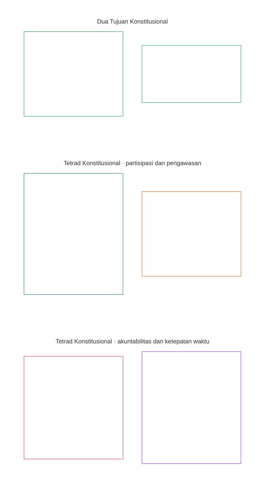
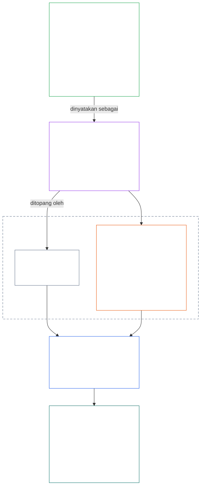
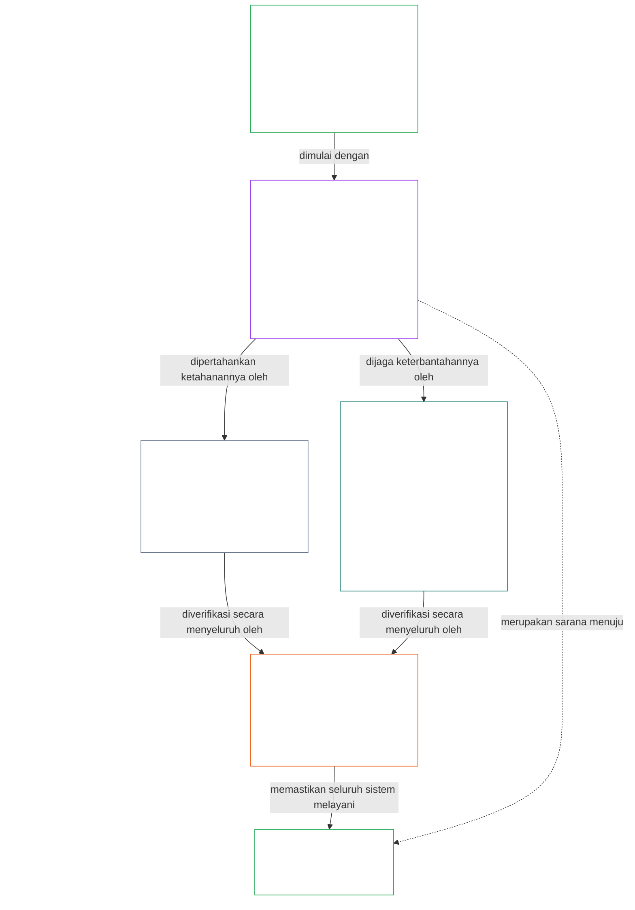

# BAB 01, BAGIAN A: PRINSIP NILAI

<strong>Posisi dalam korpus (non-normatif): struktur berkas dan aturan pembacaan</strong>

> Konten berikut **hanya merupakan panduan bagi pembaca**. Konten ini tidak menambah, menghapus, atau mempersempit kewajiban yang mengikat di bagian lain dalam berkas ini maupun bab lain.
>
> Berkas ini **merupakan bagian dari Konstitusi Sentien** dan **hanya mengikat jika dibaca bersama** berkas bernomor `core_*` lainnya sebagai satu instrumen. Berkas ini memuat **Bab Satu, Bagian A** (§§1–12: tujuan dan peran; tujuan Keberkembangan, yang diperkenalkan pada §2 dan dikembangkan melalui kesejahteraan, Keselamatan, Kebenaran, Kepercayaan, dan Kebebasan; serta tujuan Kesinambungan, yang diperkenalkan pada §8 dan dikembangkan melalui kapasitas sistem bersama, ketahanan, struktur pasar, dan evaluasi sistemik).
>
> **Sebelumnya:** [core_00_preamble.md](core_00_preamble.md)  
> **Berikutnya:** [core_01_b_interaction_interpretation.md](core_01_b_interaction_interpretation.md) (Bab Satu, Bagian B — §§13–15, interaksi, batas pengesampingan, dan penafsiran konstitusional).  
> **Alur baca:** §1 tujuan dan peran → **Keberkembangan:** pengantar §2 (termasuk batasan Keselamatan dan Kebenaran yang tidak dapat ditawar pada §2.1) → §3 kesejahteraan (hasil) → §4 Keselamatan → §5 Kebenaran → §6 Kepercayaan → §7 Kebebasan → **Kesinambungan:** pengantar §8 → §9 kapasitas sistem bersama (jembatan: sarana menuju Keberkembangan sekaligus substansi Kesinambungan) → §10 ketahanan → §11 struktur pasar → §12 evaluasi sistemik.

<strong>Panduan pembaca (non-normatif): cara Bab Satu menghubungkan tujuan, Tetrad, Pasal, dan definisi</strong>

> Konten berikut **hanya merupakan panduan bagi pembaca**. Konten ini tidak menambah, menghapus, atau mempersempit kewajiban yang mengikat di bagian lain dalam berkas ini maupun bab lain. Widget **Pelacakan** dan **Definisi · Penilaian · Kepatuhan** pada setiap bagian memuat rujukan yang mengikat; blok ini merupakan peta tingkat bagian bagi pembaca yang mulai memasuki Bab Satu.

**Hubungan antar-lapisan.** Setiap lapisan menjawab pertanyaan yang berbeda, dan setiap prinsip Bab Satu menunjuk ke tiga lapisan lainnya:

- **Tujuan dan Tetrad** ([Pembukaan §1](core_00_preamble.md#the-model)): untuk apa sistem bersama dibentuk ([Keberkembangan](core_05_apex_flourishing_aim.md#flourishing-constitutional) dan [Kesinambungan](core_05_apex_continuity_aim.md#chapter-five-definitions-continuity-constitutional-aim)), serta empat kewajiban yang menjaga agar pencapaian tujuan tersebut tetap sah ([partisipasi](core_05_apex_participation_leg.md#participation-constitutional), [pengawasan](core_05_apex_oversight_leg.md#oversight-constitutional), [akuntabilitas](core_05_apex_accountability_leg.md#accountability), dan [ketepatan waktu](core_05_apex_timeliness_leg.md#timeliness-constitutional)).
- **Prinsip** (bab ini): cara tujuan dan kewajiban tersebut menjadi nilai, batasan, dan aturan untuk menimbangnya satu sama lain.
- **Pasal** ([Bab Enam](core_06_rights_part_a.md#chapter-six-foundational-rights)): perlindungan Ambang Hak yang tetap dapat digunakan selama tujuan dikejar. **Pelacakan** pada setiap bagian mencantumkannya di bawah *Khususnya*.
- **Definisi** ([Bab Dua sampai Lima](core_02_definition_structure.md)): makna bersama yang digunakan untuk menguji kebenaran suatu klaim. Widget **Definisi · Penilaian · Kepatuhan** pada setiap bagian mencantumkannya.

**Cara Bab Satu mengembangkan setiap tujuan.** Keberkembangan adalah kesejahteraan yang dipertahankan melalui kebenaran, keselamatan, keterpercayaan, dan agensi yang bermakna ([Pembukaan §1](core_00_preamble.md#flourishing)). Bab Satu menyatakan hasilnya terlebih dahulu, lalu satu prinsip untuk masing-masing dari empat kondisi tersebut.

| Tujuan dan aspek | Prinsip Bab Satu | Rujukan definisi | Pasal yang tercantum dalam Pelacakannya |
|---|---|---|---|
| **Keberkembangan**: hasil | [§3 Kesejahteraan](#3-foundational-objective-wellbeing-flourishing-aim) | [Kesejahteraan](core_05_band_continuity.md#wellbeing) | [VI](core_06_rights_part_b.md#article-vi-equal-basic-rights), [X](core_06_rights_part_b.md#article-x-self-determination-agency-and-participation), [XIII-B](core_06_rights_part_c.md#article-xiii-b-right-to-redress-and-remedy), [XIX-B](core_06_rights_part_d.md#article-xix-b-contestability-and-proportional-restriction-limits) |
| **Keberkembangan**: keselamatan | [§4 Keselamatan](#4-safety-harm-constraint) | [Keselamatan](core_05_band_continuity.md#safety-constitutional-constraint) | [XIII](core_06_rights_part_c.md#article-xiii-right-to-reliable-and-trustworthy-systems), [XVII](core_06_rights_part_c.md#article-xvii-system-lifecycle-environments-and-reversibility), [XXIII](core_06_rights_part_d.md#article-xxiii-root-cause-analysis-and-adaptive-response) |
| **Keberkembangan**: kebenaran | [§5 Kebenaran](#5-truth-epistemic-integrity-constraint) | [Kebenaran](core_05_band_oversight.md#truth-constitutional-constraint) | [XIII](core_06_rights_part_c.md#article-xiii-right-to-reliable-and-trustworthy-systems), [XV](core_06_rights_part_c.md#article-xv-info-sphere-integrity), [XVI](core_06_rights_part_c.md#article-xvi-audit-transparency-and-independent-verification) |
| **Keberkembangan**: keterpercayaan | [§6 Kepercayaan](#6-trust-and-trustworthiness-coordination-integrity) | [Keterpercayaan](core_05_band_continuity.md#trustworthiness) | [XIII](core_06_rights_part_c.md#article-xiii-right-to-reliable-and-trustworthy-systems), [XV](core_06_rights_part_c.md#article-xv-info-sphere-integrity), [XVI](core_06_rights_part_c.md#article-xvi-audit-transparency-and-independent-verification) |
| **Keberkembangan**: agensi yang bermakna | [§7 Kebebasan](#7-freedom-bounded-agency) | [Agensi yang Bermakna](core_05_band_participation.md#meaningful-agency) | [VI](core_06_rights_part_b.md#article-vi-equal-basic-rights), [X](core_06_rights_part_b.md#article-x-self-determination-agency-and-participation), [XXI](core_06_rights_part_d.md#article-xxi-interoperability-portability-movement-refuge-and-exit-integrity) |
| **Kesinambungan**, menjembatani Keberkembangan: kapasitas yang tahan lama | [§9 Kapasitas Sistem Bersama](#9-shared-system-capacity) | [Kapasitas Sistem Bersama](core_05_band_continuity.md#shared-system-capacity) | [I-A](core_06_rights_part_a.md#article-i-a-environmental-preconditions-and-ecological-integrity), [III](core_06_rights_part_a.md#article-iii-survival-and-essential-access), [V](core_06_rights_part_a.md#article-v-resource-allocation-dependencies-and-ecosystem-funding) |
| **Kesinambungan**: ketahanan | [§10 Ketahanan dan Desain Pemulihan Mandiri](#10-resilience-and-self-healing-design) | [Pemulihan Mandiri](core_05_band_continuity.md#self-healing) | [XIII](core_06_rights_part_c.md#article-xiii-right-to-reliable-and-trustworthy-systems), [XVII](core_06_rights_part_c.md#article-xvii-system-lifecycle-environments-and-reversibility), [XXIII](core_06_rights_part_d.md#article-xxiii-root-cause-analysis-and-adaptive-response) |
| **Kesinambungan**: pasar yang dapat diperebutkan | [§11 Struktur Pasar](#11-market-structure) | [Struktur Pasar](core_05_band_accountability.md#market-structure) | [III-C](core_06_rights_part_a.md#article-iii-c-labor-and-economic-floor), [V](core_06_rights_part_a.md#article-v-resource-allocation-dependencies-and-ecosystem-funding), [XXI](core_06_rights_part_d.md#article-xxi-interoperability-portability-movement-refuge-and-exit-integrity) |
| **Kesinambungan**: pandangan menyeluruh atas sistem | [§12 Persyaratan Evaluasi Sistemik](#12-systemic-evaluation-requirement) | [Sertifikasi Keselarasan Sistem](core_05_band_continuity.md#system-alignment-certification) | [XVI](core_06_rights_part_c.md#article-xvi-audit-transparency-and-independent-verification) |

**Hierarki prinsip (Kesinambungan).** Pada tingkat prinsip, tujuan Kesinambungan dikembangkan dengan urutan berikut, dimulai dari kapasitas yang menjembatani kedua tujuan:

6. **[Kapasitas Sistem Bersama](core_05_band_continuity.md#shared-system-capacity)** adalah hasil yang semestinya diwujudkan dari pengelolaan amanah, tata kelola, dan insentif yang baik dari waktu ke waktu — kemampuan nyata dan dapat digugat yang memungkinkan makhluk sentien dan sistem bersama menjalankan pekerjaan yang diwajibkan Konstitusi. Kapasitas ini mencakup kedua tujuan: sarana menuju **Keberkembangan** sekaligus substansi **Kesinambungan**, dan bukan kartu truf yang mengesampingkan segala hal lain. **[§9.1](#91-productive-capacity-instrumental-good)** dan **[§9.2](#92-constitutional-efficiency)** menjelaskan dua aspek utamanya.
7. **[Ketahanan dan Desain Pemulihan Mandiri](#10-resilience-and-self-healing-design)** menjelaskan bagaimana sistem yang diandalkan makhluk sentien mendeteksi masalah lebih awal, menahannya, mengalami kegagalan melalui jalur yang diungkapkan, lalu pulih dengan jujur ([Pemulihan Mandiri](core_05_band_continuity.md#self-healing)). Dengan begitu, kapasitas pada butir 6 tetap bertahan dan stabilitas tidak bergantung pada intervensi darurat.
8. **[Struktur Pasar](core_05_band_accountability.md#market-structure)** pada [§11](#11-market-structure) menyediakan disiplin anti-konsentrasi agar kapasitas tersebut tetap dapat diperebutkan dalam praktik.
9. **[Persyaratan Evaluasi Sistemik](#12-systemic-evaluation-requirement)** memverifikasi cakupan seluruh sistem, ketergantungan, dan keselarasan insentif sebelum klaim kepatuhan atau tata kelola dapat diterima — dengan berpedoman pada unsur **pengawasan** dalam Tetrad sebagai orientasi audit pada tingkat prinsip, termasuk [Sertifikasi Keselarasan Sistem](core_05_band_continuity.md#system-alignment-certification) sebagai salah satu proses audit yang sangat besar di antara proses lainnya.

**Peran Tetrad dalam Bab Satu.** Setiap bagian menyebutkan unsur yang dicakupnya dalam Pelacakan. Bagian-bagian berikut membahasnya paling langsung:

| Unsur Tetrad | Bagian utama dalam Bab Satu |
|---|---|
| **Partisipasi** | [§16 Pengelolaan Amanah Secara Mendalam](core_01_c_stewardship_capacity_principles.md#16-stewardship-in-depth) dan [§17 Pengelolaan Amanah yang Berdampak Besar](core_01_c_stewardship_capacity_principles.md#17-consequential-stewardship-the-steward-role) (peran yang berdampak dan suara); [§7 Kebebasan](#7-freedom-bounded-agency) (agensi yang bermakna) |
| **Pengawasan** | [§16](core_01_c_stewardship_capacity_principles.md#16-stewardship-in-depth) dan [§17](core_01_c_stewardship_capacity_principles.md#17-consequential-stewardship-the-steward-role) (pemahaman terdistribusi, catatan); [§18 Tata Kelola](core_01_c_stewardship_capacity_principles.md#18-governance-under-stewardship-discipline) (cara kewenangan dialokasikan); [§12](#12-systemic-evaluation-requirement) (audit) |
| **Akuntabilitas** | [§18 Tata Kelola](core_01_c_stewardship_capacity_principles.md#18-governance-under-stewardship-discipline) (pertanggungjawaban yang sebanding dengan kewenangan); [§19 Keselarasan Insentif dan Pengambilalihan Sistem](core_01_c_stewardship_capacity_principles.md#19-incentive-alignment-and-system-capture) (imbalan tidak boleh mengosongkan unsur-unsur tersebut) |
| **Ketepatan Waktu** | [§16](core_01_c_stewardship_capacity_principles.md#16-stewardship-in-depth) dan [§17](core_01_c_stewardship_capacity_principles.md#17-consequential-stewardship-the-steward-role) (menemukan dan memperbaiki masalah tanpa penundaan yang dapat dihindari) |

**Dua sumbu, bukan pertentangan.** Tujuan menjelaskan apa yang diupayakan sistem; Tetrad menjelaskan cara menjaga agar upaya itu tetap sah. Satu istilah dapat berada pada keduanya: Kebenaran dan Keterpercayaan merupakan unsur Keberkembangan, dan [Pembukaan §2](core_00_preamble.md#2-measurements-overview) mengukurnya dalam rumpun Pengawasan. [§§13–15](core_01_b_interaction_interpretation.md#13-constitutional-collision-resolution-process) mengatur cara menimbang prinsip-prinsip ini saat berbenturan dan membacanya sebagai satu kesatuan; [§20](core_01_c_stewardship_capacity_principles.md#20-integrated-application) menerapkannya pada setiap bab berikutnya.

 

### 1. Tujuan dan Peran

<strong>Pelacakan</strong>

- Hulu: [Prakata §1 Model](core_00_preamble.md#the-model) — [Tetrad Konstitusional](core_00_preamble.md#constitutional-tetrad), [Dua Tujuan Konstitusional](core_00_preamble.md#two-constitutional-aims), dan penyesuaian skala menurut [kepentingan material](core_00_preamble.md#material-stake) berlaku di seluruh bab melalui pelacakan tiap bagian.
- Hilir: [15. Penafsiran Konstitusional](core_01_b_interaction_interpretation.md#15-constitutional-interpretation) untuk pembacaan terpadu, ambiguitas, hierarki internal, dan prosedur penyelesaian konflik yang baku.
- Hilir: [Dua Tujuan Konstitusional](core_00_preamble.md#two-constitutional-aims) — pengembangan tujuan **Keberkembangan**: dari [§3](#3-foundational-objective-wellbeing-flourishing-aim) hingga [§6](#6-trust-and-trustworthiness-coordination-integrity) dan [§7 Kebebasan](#7-freedom-bounded-agency); pengembangan tujuan **Kesinambungan**: [§9 Kapasitas Sistem Bersama](#9-shared-system-capacity), [§10 Ketahanan dan Desain Pemulihan Mandiri](#10-resilience-and-self-healing-design), [§11 Struktur Pasar](#11-market-structure), serta [§12 Persyaratan Evaluasi Sistemik](#12-systemic-evaluation-requirement).
- Hilir: [3. Tujuan Mendasar: Kesejahteraan](#3-foundational-objective-wellbeing-flourishing-aim), [§3.2 Pengakuan, Penguatan, dan Aspirasi](#32-recognition-reinforcement-and-aspiration), [4 Keselamatan](#4-safety-harm-constraint), [5 Kebenaran](#5-truth-epistemic-integrity-constraint), [6. Kepercayaan](#6-trust-and-trustworthiness-coordination-integrity), [§16 Pengelolaan Amanah Secara Mendalam](core_01_c_stewardship_capacity_principles.md#16-stewardship-in-depth), [13. Proses Penyelesaian Benturan Konstitusional](core_01_b_interaction_interpretation.md#13-constitutional-collision-resolution-process), dan [§7 Kebebasan](#7-freedom-bounded-agency).
- Baca bersama: [Tetrad Konstitusional](core_00_preamble.md#constitutional-tetrad) — partisipasi, pengawasan, akuntabilitas, dan ketepatan waktu mengatur cara sistem bersama mengejar [Dua Tujuan Konstitusional](core_00_preamble.md#two-constitutional-aims); penyesuaian skala menurut [kepentingan material](core_00_preamble.md#material-stake) berlaku di seluruh bab melalui pelacakan tiap bagian.
- Baca bersama: [Bab Dua sampai Empat](core_02_definition_structure.md) dan [Bab Lima](core_05__definitions_home.md#chapter-five-foundational-definitions) — lapisan mekanisme pengatur bagi setiap istilah yang digunakan dalam bab ini; terapkan integritas O/M/A/C, pencegahan pengelakan, beban pembuktian, serta keterlacakan definisi hingga hasil.
- Baca bersama: [Bab Enam: Hak-Hak Dasar](core_06_rights_part_a.md#chapter-six-foundational-rights).
  - Khususnya [Pasal VI: Hak-Hak Dasar yang Setara](core_06_rights_part_b.md#article-vi-equal-basic-rights), [Pasal XIII: Hak atas Sistem yang Andal dan Dapat Dipercaya](core_06_rights_part_c.md#article-xiii-right-to-reliable-and-trustworthy-systems), dan [Pasal XXIV: Penafsiran Konstitusional, Peninjauan, dan Perlindungan Anti-Pengambilalihan](core_06_rights_part_d.md#article-xxiv-constitutional-interpretation-review-and-anti-capture-safeguards).
  - Terapkan pembacaan ini apabila penafsiran berdampak pada makhluk sentien, sistem, atau lembaga yang dilindungi.

<strong>Definisi · Penilaian · Kepatuhan</strong>

- [Proporsionalitas](core_05_band_accountability.md#proportionality) · [O](core_05_band_accountability.md#proportionality) · [M](core_05_band_accountability.md#proportionality-a) · [A](core_05_band_accountability.md#proportionality-a) · [C](core_05_band_accountability.md#proportionality-c)
- [Kebutuhan](core_05_band_accountability.md#necessity) · [O](core_05_band_accountability.md#necessity) · [M](core_05_band_accountability.md#necessity-a) · [A](core_05_band_accountability.md#necessity-a) · [C](core_05_band_accountability.md#necessity-c)

 

*Secara sederhana: Bab Satu menetapkan nilai dan batasan yang mengatur setiap bab lainnya. Sistem bersama harus mengejar **Keberkembangan** dan **Kesinambungan** secara bersamaan — bukan mengorbankan salah satunya demi yang lain — dan tidak boleh memaksimalkan satu nilai dengan mengorbankan nilai lainnya.*

Bab ini menetapkan prinsip dan batasan yang mengatur penafsiran, penerapan, dan perkembangan Konstitusi ini. Bab ini mengembangkan [Dua Tujuan Konstitusional](core_00_preamble.md#two-constitutional-aims) — [**Keberkembangan**](core_00_preamble.md#flourishing) dan [**Kesinambungan**](core_00_preamble.md#continuity) — yang ditetapkan dalam [Prakata §1 Model](core_00_preamble.md#the-model), menjadi prinsip dan batasan operasional. Definisi baku pada lapisan prinsip terdapat dalam Prakata; bab ini menerapkannya.

Kedua tujuan tersebut harus selalu dikejar bersama, dalam batasan prinsip yang tidak dapat ditawar dan perlindungan hak yang ditetapkan oleh Konstitusi ini. [**Tetrad Konstitusional**](core_00_preamble.md#constitutional-tetrad) mengatur bagaimana upaya tersebut tetap sah — dengan skala yang disesuaikan menurut [**kepentingan material**](core_00_preamble.md#material-stake).

Bab ini disusun berdasarkan kedua tujuan tersebut dan Tetrad:
- **Keberkembangan:** [Tujuan Keberkembangan: Pengantar](#2-flourishing-aim-introduction) memetakan tujuan ini. [§3 Tujuan Mendasar: Kesejahteraan](#3-foundational-objective-wellbeing-flourishing-aim) menyatakan hasilnya. [§4 Keselamatan](#4-safety-harm-constraint), [§5 Kebenaran](#5-truth-epistemic-integrity-constraint), [§6 Kepercayaan](#6-trust-and-trustworthiness-coordination-integrity), dan [§7 Kebebasan](#7-freedom-bounded-agency) mengembangkan empat kondisi yang menopangnya: keselamatan, kebenaran, keterpercayaan, dan agensi yang bermakna.
- **Kesinambungan:** [Tujuan Kesinambungan: Pengantar](#8-continuity-aim-introduction) memetakan tujuan ini. [§9 Kapasitas Sistem Bersama](#9-shared-system-capacity) (sarana menuju Keberkembangan yang sekaligus merupakan substansi Kesinambungan), [§10 Ketahanan dan Desain Pemulihan Mandiri](#10-resilience-and-self-healing-design), [§11 Struktur Pasar](#11-market-structure), dan [§12 Persyaratan Evaluasi Sistemik](#12-systemic-evaluation-requirement) mengembangkan stabilitas jangka panjang, kapasitas sistem bersama yang tahan lama, dan ketahanan. Klaim mengenai Kesinambungan bertumpu pada gambaran keseluruhan sistem yang jujur: setiap klaim dalam §§9–11 hanya berlaku setelah pemeriksaan dalam §12.
- **Saat prinsip-prinsip berhadapan:** [§13 Proses Penyelesaian Benturan Konstitusional](core_01_b_interaction_interpretation.md#13-constitutional-collision-resolution-process), [§14 Larangan Pengesampingan Mutlak](core_01_b_interaction_interpretation.md#14-prohibition-on-absolute-override), dan [§15 Penafsiran Konstitusional](core_01_b_interaction_interpretation.md#15-constitutional-interpretation) mengatur cara menimbang dan membaca tujuan serta prinsip secara terpadu.
- **Penerapan Tetrad:** [§16 Pengelolaan Amanah Secara Mendalam](core_01_c_stewardship_capacity_principles.md#16-stewardship-in-depth) hingga [§19 Penyelarasan Insentif dan Pengambilalihan Sistem](core_01_c_stewardship_capacity_principles.md#19-incentive-alignment-and-system-capture) membawa partisipasi, pengawasan, akuntabilitas, dan ketepatan waktu ke dalam pengelolaan amanah, tata kelola, dan insentif; [§20 Penerapan Terpadu](core_01_c_stewardship_capacity_principles.md#20-integrated-application) menerapkan keseluruhan bab ini pada setiap bab berikutnya.

**Pelacakan** setiap prinsip mencantumkan Pasal-Pasal Bab Enam yang melindunginya, sedangkan widget **Definisi · Penilaian · Kepatuhan** mencantumkan definisi Bab Lima yang mengukurnya.

**Diagram: Dua Tujuan Konstitusional dan Tetrad Konstitusional**

*Tujuan menjelaskan apa yang harus diupayakan sistem bersama; Tetrad menjelaskan kewajiban yang menjaga agar upaya tersebut tetap sah. Keempat kewajiban disesuaikan skalanya menurut [kepentingan material](core_00_preamble.md#material-stake), dan kedua tujuan tetap dibatasi oleh Ambang Hak. Direproduksi dari [Ikhtisar Konseptual](guides/CONCEPTUAL_OVERVIEW.md#two-aims-and-the-constitutional-tetrad).*

Nilai-nilai ini:
- tidak berdiri sendiri, dan dalam operasi biasa tidak membentuk hierarki yang kaku.
- berfungsi sebagai prinsip dan batasan yang saling berinteraksi dan harus dinilai bersama.
- berlaku bagi semua “sistem”, termasuk struktur teknis, organisasi, ekonomi, sosial-teknis, serta ekosistem yang berdampak material terhadap makhluk sentien dan planet Bumi.

Tidak satu pun prinsip boleh diterapkan secara terpisah apabila hal itu secara material melanggar prinsip lainnya. Ketika timbul ketegangan, sistem harus menyelesaikannya menurut persyaratan proporsionalitas, kebutuhan, dan dampak sistemik yang ditetapkan dalam bab ini. Jika konflik yang belum terselesaikan secara langsung menyangkut batasan prinsip yang tidak dapat ditawar, **§13** Bab Satu, Proses Penyelesaian Benturan Konstitusional, menentukan prioritas.

### 2. Tujuan Keberkembangan: Pengantar

<strong>Pelacakan</strong>

- Baca bersama: [Tetrad Konstitusional](core_00_preamble.md#constitutional-tetrad) — keempat unsurnya berlaku bagi cara Keberkembangan diupayakan; [kepentingan material](core_00_preamble.md#material-stake) menentukan skala kedalaman setiap klaim tentang Keberkembangan.
- Baca bersama: [Dua Tujuan Konstitusional](core_00_preamble.md#two-constitutional-aims) — tujuan **Keberkembangan**; tujuan pasangannya diperkenalkan dalam [Tujuan Kesinambungan: Pengantar](#8-continuity-aim-introduction).
- Hulu: Prinsip: [Prakata §1 Model](core_00_preamble.md#flourishing); [Keberkembangan (Tujuan Konstitusional)](core_05_apex_flourishing_aim.md#flourishing-constitutional); [§1 Tujuan dan Peran](#1-purpose-and-role).
- Hilir: [§3 Tujuan Mendasar: Kesejahteraan (Tujuan Keberkembangan)](#3-foundational-objective-wellbeing-flourishing-aim), [§4 Keselamatan (Batasan Bahaya)](#4-safety-harm-constraint), [§5 Kebenaran (Batasan Integritas Epistemik)](#5-truth-epistemic-integrity-constraint), [§6 Kepercayaan dan Keterpercayaan (Integritas Koordinasi)](#6-trust-and-trustworthiness-coordination-integrity), dan [§7 Kebebasan (Agensi Terbatas)](#7-freedom-bounded-agency); Pasal-Pasal yang melindungi masing-masing disebutkan dalam Pelacakan bagian terkait.
- Subbagian: [§2.1 Batasan Prinsip yang Tidak Dapat Ditawar: Keselamatan dan Kebenaran](#21-non-negotiable-principle-constraints-safety-and-truth).
- Baca bersama: secara umum, Ambang Hak dalam Bab Enam.

<strong>Definisi · Penilaian · Kepatuhan</strong>

- [Keberkembangan (Tujuan Konstitusional)](core_05_apex_flourishing_aim.md#flourishing-constitutional) · [O](core_05_apex_flourishing_aim.md#flourishing-constitutional) · [M](core_05_apex_flourishing_aim.md#flourishing-constitutional-m) · [A](core_05_apex_flourishing_aim.md#flourishing-constitutional-a) · [C](core_05_apex_flourishing_aim.md#flourishing-constitutional-c)
- [Kesejahteraan](core_05_band_continuity.md#wellbeing) · [O](core_05_band_continuity.md#wellbeing) · [M](core_05_band_continuity.md#wellbeing-a) · [A](core_05_band_continuity.md#wellbeing-a) · [C](core_05_band_continuity.md#wellbeing-c)
- [Keselamatan (Batasan Konstitusional)](core_05_band_continuity.md#safety-constitutional-constraint) · [O](core_05_band_continuity.md#safety-constitutional-constraint) · [M](core_05_band_continuity.md#safety-constraint-a) · [A](core_05_band_continuity.md#safety-constraint-a) · [C](core_05_band_continuity.md#safety-constraint-c)
- [Kebenaran (Batasan Konstitusional)](core_05_band_oversight.md#truth-constitutional-constraint) · [O](core_05_band_oversight.md#truth-constitutional-constraint-o) · [M](core_05_band_oversight.md#truth-constitutional-constraint-a) · [A](core_05_band_oversight.md#truth-constitutional-constraint-a) · [C](core_05_band_oversight.md#truth-constitutional-constraint-c)
- [Keterpercayaan](core_05_band_continuity.md#trustworthiness) · [O](core_05_band_continuity.md#trustworthiness) · [M](core_05_band_continuity.md#trustworthiness-a) · [A](core_05_band_continuity.md#trustworthiness-a) · [C](core_05_band_continuity.md#trustworthiness-c)
- [Agensi Bermakna](core_05_band_participation.md#meaningful-agency) · [O](core_05_band_participation.md#meaningful-agency) · [M](core_05_band_participation.md#meaningful-agency-a) · [A](core_05_band_participation.md#meaningful-agency-a) · [C](core_05_band_participation.md#meaningful-agency-c)

 

*Secara sederhana: Keberkembangan adalah tujuan pertama dari dua tujuan: makhluk sentien hidup dengan baik dan tetap mampu hidup dengan baik karena sistem di sekelilingnya aman, jujur, dapat dipercaya, serta memberi ruang nyata untuk memilih. §3 menjelaskan hasil yang dimaksud. Empat prinsip sesudahnya menjelaskan cara menjaga hasil itu tetap nyata.*

[**Keberkembangan**](core_05_apex_flourishing_aim.md#flourishing-constitutional) adalah **kesejahteraan makhluk sentien yang dipertahankan melalui kebenaran, keselamatan, keterpercayaan, dan agensi bermakna** ([Prakata §1 Model](core_00_preamble.md#flourishing)). Bab Satu mengembangkannya dalam dua tahap: [§3 Tujuan Mendasar: Kesejahteraan (Tujuan Keberkembangan)](#3-foundational-objective-wellbeing-flourishing-aim) menyatakan hasilnya, sedangkan empat prinsip menyatakan kondisi yang menopangnya.

| Kondisi | Prinsip | Pertanyaan yang dijawab |
|---|---|---|
| **Keselamatan** | [§4 Keselamatan (Batasan Bahaya)](#4-safety-harm-constraint) | Apakah makhluk sentien terlindung dari bahaya yang dapat dihindari? |
| **Kebenaran** | [§5 Kebenaran (Batasan Integritas Epistemik)](#5-truth-epistemic-integrity-constraint), beserta [§5.1 Penyelidikan Berbasis Sains dan Dukungan Pengambilan Keputusan](#51-science-informed-inquiry-and-decision-support) serta [§5.2 Aksesibilitas dengan Bahasa Sederhana (Kewajiban Partisipasi dan Pengelolaan Amanah)](#52-plain-language-accessibility-participation-and-stewardship-duty) | Dapatkah makhluk sentien mengandalkan dan memahami apa yang disampaikan kepada mereka? |
| **Keterpercayaan** | [§6 Kepercayaan dan Keterpercayaan (Integritas Koordinasi)](#6-trust-and-trustworthiness-coordination-integrity) | Apakah sistem layak dipercaya dan memulihkan kepercayaan ketika gagal? |
| **Agensi bermakna** | [§7 Kebebasan (Agensi Terbatas)](#7-freedom-bounded-agency) | Apakah makhluk sentien tetap memiliki kebebasan yang nyata dan terbatas untuk memilih, berbeda pendapat, berorganisasi, dan pergi? |

**Cara prinsip-prinsip Keberkembangan bekerja bersama:**
- **Keselamatan dan Kebenaran adalah batasan yang tidak dapat ditawar:** Keduanya dinyatakan bersama dalam [§2.1 Batasan Prinsip yang Tidak Dapat Ditawar: Keselamatan dan Kebenaran](#21-non-negotiable-principle-constraints-safety-and-truth), dan tidak boleh dikorbankan demi memperoleh prinsip lain.
- **Kepercayaan dan Kebebasan memiliki batas, bukan sifat mutlak:** Kepercayaan harus diperoleh dan dapat dikoreksi ([§6.1 Koreksi dan Pemulihan](#61-correction-and-remedy)); Kebebasan memiliki batasan yang disiplin ([§7.1 Disiplin Pembatasan](#71-limitation-discipline)).
- **Tidak satu pun diterapkan secara terpisah:** Prinsip-prinsip dibaca bersama; ketika berbenturan, semuanya ditimbang menurut [§13 Proses Penyelesaian Benturan Konstitusional](core_01_b_interaction_interpretation.md#13-constitutional-collision-resolution-process).
- **Keberkembangan memiliki tujuan pasangan:** Tujuan Kesinambungan menanyakan apa yang membuat hasil ini bertahan lama; tujuan tersebut diperkenalkan dalam [Tujuan Kesinambungan: Pengantar](#8-continuity-aim-introduction).

**Diagram: Keberkembangan dan prinsip-prinsipnya**

*Keberkembangan dinyatakan sebagai suatu hasil, dan mula-mula ditopang oleh batasan yang tidak dapat ditawar, Keselamatan dan Kebenaran; keduanya menopang Kepercayaan, yang selanjutnya menopang Kebebasan. Warna adalah penanda visual yang dapat digunakan kembali, bukan pernyataan prioritas. Pelacakan setiap prinsip menyebut Pasal-Pasalnya, dan widget Definisi · Penilaian · Kepatuhan menyebut definisinya. Direproduksi dalam [Ikhtisar Konseptual](guides/CONCEPTUAL_OVERVIEW.md#flourishing-and-its-principles).*

#### 2.1 Batasan Prinsip yang Tidak Dapat Ditawar: Keselamatan dan Kebenaran

<strong>Pelacakan</strong>

- Baca bersama: [Tetrad Konstitusional](core_00_preamble.md#constitutional-tetrad) — unsur **partisipasi** (memahami dan menggugat penetapan keselamatan dan kebenaran); unsur **pengawasan** (mendeteksi risiko bahaya dan penurunan mutu epistemik); unsur **akuntabilitas** (pertanggungjawaban atas bahaya, penipuan, dan ketergantungan yang menyesatkan); penskalaan menurut [kepentingan material](core_00_preamble.md#material-stake).
- Baca bersama: [Dua Tujuan Konstitusional](core_00_preamble.md#two-constitutional-aims) — tujuan **Keberkembangan** (**Keselamatan** dan **Kebenaran** disebut sebagai unsur pembentuk dalam [Prakata §1](core_00_preamble.md#two-constitutional-aims)); tujuan **Kesinambungan** (pencegahan bahaya jangka panjang dan pengelolaan amanah yang jujur atas sistem tahan lama).
- Hulu: Prinsip: [3. Tujuan Mendasar: Kesejahteraan](#3-foundational-objective-wellbeing-flourishing-aim); [Dua Tujuan Konstitusional](core_00_preamble.md#two-constitutional-aims).
- Hilir: [6. Kepercayaan](#6-trust-and-trustworthiness-coordination-integrity), [13. Proses Penyelesaian Benturan Konstitusional](core_01_b_interaction_interpretation.md#13-constitutional-collision-resolution-process), dan [§7 Kebebasan](#7-freedom-bounded-agency).
- Diterapkan dalam: [§4 Keselamatan](#4-safety-harm-constraint); [§5 Kebenaran](#5-truth-epistemic-integrity-constraint); [§5.1 Penyelidikan Berbasis Sains dan Dukungan Pengambilan Keputusan](#51-science-informed-inquiry-and-decision-support); [§5.2 Aksesibilitas dengan Bahasa Sederhana](#52-plain-language-accessibility-participation-and-stewardship-duty).

 

*Secara sederhana: Keselamatan dan Kebenaran adalah batas minimum yang tegas dalam Konstitusi, bukan hal yang dapat dipertukarkan demi optimalisasi. Sistem bersama tidak boleh secara terduga membahayakan atau menipu makhluk sentien; kedua batasan tetap berlaku ketika Keberkembangan dan Kesinambungan diupayakan di bawah disiplin partisipasi, pengawasan, akuntabilitas, dan ketepatan waktu dalam Tetrad.*

**Keselamatan** dan **Kebenaran** adalah batasan prinsip yang tidak dapat ditawar, yang membatasi semua prinsip Bab Satu lainnya — termasuk [§3 Tujuan Mendasar: Kesejahteraan](#3-foundational-objective-wellbeing-flourishing-aim) — serta [Dua Tujuan Konstitusional](core_00_preamble.md#two-constitutional-aims). Keduanya disebut sebagai unsur pembentuk [**Keberkembangan**](#flourishing) dan sangat penting bagi [**Kesinambungan**](#continuity): sistem tidak dapat berkembang melalui bahaya atau penipuan, dan legitimasi yang bertahan lama memerlukan pengelolaan amanah risiko secara jujur.

Penerapan batasan ini harus memenuhi [Tetrad Konstitusional](core_00_preamble.md#constitutional-tetrad), dengan skala yang disesuaikan menurut [kepentingan material](core_00_preamble.md#material-stake), khususnya:
- ketika penetapan keselamatan memengaruhi kapasitas partisipasi
- ketika klaim kebenaran menentukan kepercayaan
- ketika akuntabilitas atas bahaya atau tindakan menyesatkan dipertaruhkan

Temuan tentang Keselamatan dan Kebenaran dapat mengubah catatan kedudukan suatu makhluk sentien, termasuk:
- bagaimana [kontribusi](core_05_band_accountability.md#contribution-nature) diakui
- apakah pelanggaran dicatat
- bagaimana tingkat keparahan pelanggaran diklasifikasikan
- konsekuensi apa yang melekat

Model kedudukan [**Bab Sembilan**](core_09_standing_assessment.md) mengatur cara temuan tersebut diklasifikasikan, diverifikasi, dan diterapkan, dengan persyaratan evaluasi dan kepatuhan yang bersumber dari [**Bab Dua sampai Lima**](core_02_definition_structure.md).

### 3. Tujuan Dasar: Kesejahteraan (Tujuan Flourishing)

<strong>Pelacakan</strong>

- Baca bersama: [Tetrad Konstitusional](core_00_preamble.md#constitutional-tetrad) — unsur **partisipasi** berlaku ketika kondisi kesejahteraan secara material memengaruhi apakah suara, akses, dan kemampuan menggugat bersifat substantif; unsur **akuntabilitas** berlaku ketika klaim kesejahteraan memengaruhi pembagian beban; skala [taruhan material](core_00_preamble.md#material-stake) berlaku ketika relevan secara material.
- Baca bersama: [Dua Tujuan Konstitusional](core_00_preamble.md#two-constitutional-aims) — bab ini mengembangkan tujuan **Flourishing** dari [§3](#3-foundational-objective-wellbeing-flourishing-aim) hingga [§6](#6-trust-and-trustworthiness-coordination-integrity) dan [§7 Kebebasan](#7-freedom-bounded-agency).
- Hulu: Prinsip: [Pembukaan §1 Model](core_00_preamble.md#the-model); [Dua Tujuan Konstitusional](core_00_preamble.md#two-constitutional-aims) — pengembangan tujuan **Flourishing**.
- Hilir: [§4 Keselamatan](#4-safety-harm-constraint), [§5 Kebenaran](#5-truth-epistemic-integrity-constraint), [§16 Penatalayanan Mendalam](core_01_c_stewardship_capacity_principles.md#16-stewardship-in-depth), dan [§13 Proses Penyelesaian Benturan Konstitusional](core_01_b_interaction_interpretation.md#13-constitutional-collision-resolution-process).
- Subseksi: [§3.1 Keadilan](#31-fairness); [§3.2 Pengakuan, Penguatan, dan Aspirasi](#32-recognition-reinforcement-and-aspiration); [§3.3 Proses Anti-Pendegredasian](#33-anti-degrading-process).
- Baca bersama: Lantai Hak Bab Enam secara umum.
  - Khususnya [Pasal VI: Hak Dasar yang Setara](core_06_rights_part_b.md#article-vi-equal-basic-rights), [Pasal X: Penentuan Nasib Sendiri, Agensi, dan Partisipasi](core_06_rights_part_b.md#article-x-self-determination-agency-and-participation), [Pasal XIII-B: Hak atas Ganti Rugi dan Pemulihan](core_06_rights_part_c.md#article-xiii-b-right-to-redress-and-remedy), serta [Pasal XIX-B: Kontestabilitas dan Batasan Pembatasan Proporsional](core_06_rights_part_d.md#article-xix-b-contestability-and-proportional-restriction-limits).
  - Terapkan pembacaan ini ketika klaim peningkatan kesejahteraan akan digunakan untuk membenarkan pembatasan agensi, martabat, atau kontestabilitas.
  - Khususnya [Martabat dan Kedudukan Moral yang Setara](core_05_band_participation.md#dignity-and-equal-moral-standing), [Keadilan Substantif](core_05_band_participation.md#substantive-fairness), dan [6. Kepercayaan](#6-trust-and-trustworthiness-coordination-integrity) ketika akses, proses, keselarasan distribusi, keandalan, atau integritas koordinasi secara material dipertaruhkan.

<strong>Definisi · Penilaian · Kepatuhan</strong>

- [Kesejahteraan](core_05_band_continuity.md#wellbeing) · [O](core_05_band_continuity.md#wellbeing) · [M](core_05_band_continuity.md#wellbeing-a) · [A](core_05_band_continuity.md#wellbeing-a) · [C](core_05_band_continuity.md#wellbeing-c)
- [Partisipasi](core_05_apex_participation_leg.md#participation-constitutional) · [O](core_05_apex_participation_leg.md#participation-constitutional) · [M](core_05_apex_participation_leg.md#participation-constitutional-m) · [A](core_05_apex_participation_leg.md#participation-constitutional-a) · [C](core_05_apex_participation_leg.md#participation-constitutional-c)
- [Martabat dan Kedudukan Moral yang Setara](core_05_band_participation.md#dignity-and-equal-moral-standing) · [O](core_05_band_participation.md#dignity-and-equal-moral-standing) · [M](core_05_band_participation.md#dignity-and-equal-moral-standing-a) · [A](core_05_band_participation.md#dignity-and-equal-moral-standing-a) · [C](core_05_band_participation.md#dignity-and-equal-moral-standing-c)
- [Keadilan Substantif](core_05_band_participation.md#substantive-fairness) · [O](core_05_band_participation.md#substantive-fairness) · [M](core_05_band_participation.md#substantive-fairness-constitutional-a) · [A](core_05_band_participation.md#substantive-fairness-constitutional-a) · [C](core_05_band_participation.md#substantive-fairness-constitutional-c)
- [Materialitas](core_05_band_oversight.md#materiality) · [O](core_05_band_oversight.md#materiality) · [M](core_05_band_oversight.md#materiality-determination-a) · [A](core_05_band_oversight.md#materiality-determination-a) · [C](core_05_band_oversight.md#materiality-determination-c)
- [Penyimpangan Proksi](core_05_band_oversight.md#proxy-divergence) · [O](core_05_band_oversight.md#proxy-divergence) · [M](core_05_band_oversight.md#proxy-divergence-a) · [A](core_05_band_oversight.md#proxy-divergence-a) · [C](core_05_band_oversight.md#proxy-divergence-c)

 

*Secara sederhana: tujuan utama sistem-sistem ini adalah benar-benar memperbaiki kehidupan makhluk berkesadaran — tujuan itu tidak tercapai dengan mengejar metrik proksi dan tidak boleh dijadikan alasan untuk mengambil jalan pintas terkait Keselamatan, Kebenaran, atau hak. Kesejahteraan merupakan dasar partisipasi: suara simbolis tanpa kondisi yang membuat agensi nyata bukanlah partisipasi menurut Konstitusi ini.*

Tujuan utama semua sistem yang diatur oleh Konstitusi ini adalah menjaga dan meningkatkan [kesejahteraan](core_05_band_continuity.md#wellbeing) makhluk berkesadaran — tujuan [**Flourishing**](#flourishing) dalam kerangka [Dua Tujuan Konstitusional](core_00_preamble.md#two-constitutional-aims).

[Pembukaan §1 Model](core_00_preamble.md#flourishing) mendefinisikan Flourishing sebagai kesejahteraan makhluk berkesadaran yang dipertahankan melalui kebenaran, keselamatan, keterpercayaan, dan agensi yang bermakna. Bagian ini menyatakan hasilnya. Bagian-bagian berikut mengembangkan empat kondisi yang mempertahankannya: [§4 Keselamatan](#4-safety-harm-constraint), [§5 Kebenaran](#5-truth-epistemic-integrity-constraint), [§6 Kepercayaan](#6-trust-and-trustworthiness-coordination-integrity), dan [§7 Kebebasan](#7-freedom-bounded-agency). Kelima prinsip ini bersama-sama mengembangkan tujuan Flourishing dalam Bab Satu. Tujuan [**Kontinuitas**](#continuity) dikembangkan dalam [§9 Kapasitas Sistem Bersama](#9-shared-system-capacity), [§10 Ketahanan dan Desain Pemulihan Mandiri](#10-resilience-and-self-healing-design), [§11 Struktur Pasar](#11-market-structure), dan [§12 Persyaratan Evaluasi Sistemik](#12-systemic-evaluation-requirement).

Kesejahteraan merupakan dasar bagi [Partisipasi](core_05_apex_participation_leg.md#participation-constitutional) menurut [Tetrad Konstitusional](core_00_preamble.md#constitutional-tetrad). Sistem bersama tidak boleh menganggap partisipasi telah terpenuhi ketika kondisi dasar kesejahteraan — termasuk [Agensi Bermakna](core_05_band_participation.md#meaningful-agency), akses yang adil, dan martabat — mengalami penurunan material.

Kesejahteraan mencakup bukan hanya dampak langsung, tetapi juga konsekuensi tidak langsung, tertunda, kumulatif, dan lintas sistem, yang dievaluasi berdasarkan [**Bab Dua hingga Empat**](core_02_definition_structure.md). Pada lapisan nilai ini, kesejahteraan:
- memungkinkan partisipasi nyata — suara yang tidak dapat digunakan makhluk berkesadaran karena mereka tidak memiliki kondisi pendukung bukanlah partisipasi bermakna
- tidak dapat dinyatakan “tercapai” hanya dengan memenuhi metrik yang telah menyimpang dari hal yang sungguh penting
- tetap dibatasi oleh batasan prinsip yang tidak dapat ditawar dalam bab ini: **Keselamatan** dan **Kebenaran**
- tidak dapat digunakan sebagai pembenaran menyeluruh untuk melanggar Keselamatan, Kebenaran, atau perlindungan hak

#### 3.1 Keadilan

<strong>Pelacakan</strong>

- Baca bersama: [Tetrad Konstitusional](core_00_preamble.md#constitutional-tetrad) — unsur **partisipasi** (akses, suara, dan kontestabilitas; persyaratan umum, bukan hanya [Partisipasi Sistem Pemangku Kepentingan](core_05_band_participation.md#stakeholder-status-and-weight)); unsur **akuntabilitas** ketika manfaat dan beban timbul.
- Hulu: Prinsip: [§3 Tujuan Dasar: Kesejahteraan](#3-foundational-objective-wellbeing-flourishing-aim) — termasuk kesejahteraan sebagai landasan [Partisipasi](core_05_apex_participation_leg.md#participation-constitutional).
- Hilir: [3.2 Pengakuan, Penguatan, dan Aspirasi](#32-recognition-reinforcement-and-aspiration); [6. Kepercayaan](#6-trust-and-trustworthiness-coordination-integrity), [§16 Penatalayanan Mendalam](core_01_c_stewardship_capacity_principles.md#16-stewardship-in-depth), [13. Proses Penyelesaian Benturan Konstitusional](core_01_b_interaction_interpretation.md#13-constitutional-collision-resolution-process), dan [Catatan Benturan Konstitusional](core_05_band_integrative.md#constitutional-collision-record), ketika pilihan prioritas dan alokasi harus tetap koheren dan dapat ditinjau.
- Subseksi (urutan baca): [§3.1.1](#311-access-and-opportunity) · [§3.1.2](#312-benefits-and-burdens) · [§3.1.3](#313-fair-treatment) · [§3.1.4](#314-unfair-treatment).
- Hilir: Membentuk cakupan hak untuk kedudukan setara, perlakuan non-arbitrer, gugatan bermakna, dan batas pembatasan proporsional.
  - Khususnya [Pasal VI: Hak Dasar yang Setara](core_06_rights_part_b.md#article-vi-equal-basic-rights), [Pasal VI-C: Non-diskriminasi](core_06_rights_part_b.md#article-vi-c-nondiscrimination), [Pasal X: Penentuan Nasib Sendiri, Agensi, dan Partisipasi](core_06_rights_part_b.md#article-x-self-determination-agency-and-participation), [Pasal XIII-B: Hak atas Ganti Rugi dan Pemulihan](core_06_rights_part_c.md#article-xiii-b-right-to-redress-and-remedy), serta [Pasal XIX-B: Kontestabilitas dan Batasan Pembatasan Proporsional](core_06_rights_part_d.md#article-xix-b-contestability-and-proportional-restriction-limits).
  - Jika penetapan anti-konstitusional membawa sanksi atau dampak yang bertahan lama, baca bersama [Bab Sebelas, bagian 4 — Perlindungan proses hukum yang layak, pemulihan, dan pencegahan](core_11_a_misconduct_designation.md#4-due-process-safeguards-for-slot-assignment).
  - Komitmen nondiskriminasi dijabarkan melalui Bab Lima [§2 — Karakteristik yang Dilindungi, Penggunaan Proksi, Penyaringan Sinyal Intim, dan Status **Pasal VII-E** (*Layanan seksual komersial konsensual dewasa dan eksploitasi seksual*)](core_05_band_participation.md#fairness-protected-characteristics-and-nondiscrimination), termasuk [Penyaringan Sinyal Intim yang Dilindungi dan Pengelakan Status **Pasal VII-E** (*Layanan seksual komersial konsensual dewasa dan eksploitasi seksual*)](core_05_band_participation.md#protected-intimate-signal-gating-and-article-vii-e-adult-consensual-commercial-sexual-services-and-sexual-exploitation-status-circumvention) ketika aturan perlakuan adil §2.1.3 menyangkut penyaringan sinyal intim atau **Pasal VII-E** (*Layanan seksual komersial konsensual dewasa dan eksploitasi seksual*).
- Baca bersama: [Keadilan Substantif](core_05_band_participation.md#substantive-fairness) dan kewajiban Lantai Hak Bab Enam yang terkait ketika manfaat, beban, imbalan, biaya, tugas, risiko, kontribusi, kebutuhan, atau paparan bersifat material; [Aksesibilitas](core_05_band_participation.md#accessibility) ketika jalur akses §2.1.1 bersifat material; [Penyimpangan Proksi](core_05_band_oversight.md#proxy-divergence) ketika metrik agregat atau dampak papan skor bersifat material.

<strong>Definisi · Penilaian · Kepatuhan</strong>

- [Martabat dan Kedudukan Moral yang Setara](core_05_band_participation.md#dignity-and-equal-moral-standing) · [O](core_05_band_participation.md#dignity-and-equal-moral-standing) · [M](core_05_band_participation.md#dignity-and-equal-moral-standing-a) · [A](core_05_band_participation.md#dignity-and-equal-moral-standing-a) · [C](core_05_band_participation.md#dignity-and-equal-moral-standing-c)
- [Aksesibilitas](core_05_band_participation.md#accessibility) · [O](core_05_band_participation.md#accessibility) · [M](core_05_band_participation.md#accessibility-constitutional-a) · [A](core_05_band_participation.md#accessibility-constitutional-a) · [C](core_05_band_participation.md#accessibility-constitutional-c)
- [Partisipasi](core_05_apex_participation_leg.md#participation-constitutional) · [O](core_05_apex_participation_leg.md#participation-constitutional) · [M](core_05_apex_participation_leg.md#participation-constitutional-m) · [A](core_05_apex_participation_leg.md#participation-constitutional-a) · [C](core_05_apex_participation_leg.md#participation-constitutional-c)
- [Keadilan Prosedural](core_05_band_participation.md#procedural-fairness) · [O](core_05_band_participation.md#procedural-fairness) · [M](core_05_band_participation.md#procedural-fairness-constitutional-a) · [A](core_05_band_participation.md#procedural-fairness-constitutional-a) · [C](core_05_band_participation.md#procedural-fairness-constitutional-c)
- [Keadilan Substantif](core_05_band_participation.md#substantive-fairness) · [O](core_05_band_participation.md#substantive-fairness) · [M](core_05_band_participation.md#substantive-fairness-constitutional-a) · [A](core_05_band_participation.md#substantive-fairness-constitutional-a) · [C](core_05_band_participation.md#substantive-fairness-constitutional-c)
- [Karakteristik yang Dilindungi](core_05_band_participation.md#protected-characteristics) · [O](core_05_band_participation.md#protected-characteristics) · [M](core_05_band_participation.md#protected-characteristics-constitutional-a) · [A](core_05_band_participation.md#protected-characteristics-constitutional-a) · [C](core_05_band_participation.md#protected-characteristics-constitutional-c)
- [Penggunaan Proksi atas Karakteristik yang Dilindungi dan Dampak yang Berbeda](core_05_band_participation.md#protected-characteristic-proxying-and-disparate-impact) · [O](core_05_band_participation.md#protected-characteristic-proxying-and-disparate-impact) · [M](core_05_band_participation.md#protected-characteristic-proxying-and-disparate-impact-a) · [A](core_05_band_participation.md#protected-characteristic-proxying-and-disparate-impact-a) · [C](core_05_band_participation.md#protected-characteristic-proxying-and-disparate-impact-c)
- [Penyaringan Sinyal Intim yang Dilindungi dan Pengelakan Status **Pasal VII-E** (*Layanan seksual komersial konsensual dewasa dan eksploitasi seksual*)](core_05_band_participation.md#protected-intimate-signal-gating-and-article-vii-e-adult-consensual-commercial-sexual-services-and-sexual-exploitation-status-circumvention) · [O](core_05_band_participation.md#protected-intimate-signal-gating-and-article-vii-e-adult-consensual-commercial-sexual-services-and-sexual-exploitation-status-circumvention) · [M](core_05_band_participation.md#protected-intimate-signal-gating-and-article-vii-e-status-circumvention-a) · [A](core_05_band_participation.md#protected-intimate-signal-gating-and-article-vii-e-status-circumvention-a) · [C](core_05_band_participation.md#protected-intimate-signal-gating-and-article-vii-e-status-circumvention-c)
- [Penyimpangan Proksi](core_05_band_oversight.md#proxy-divergence) · [O](core_05_band_oversight.md#proxy-divergence) · [M](core_05_band_oversight.md#proxy-divergence-a) · [A](core_05_band_oversight.md#proxy-divergence-a) · [C](core_05_band_oversight.md#proxy-divergence-c)

 

*Secara sederhana: keadilan berarti sistem tidak boleh menyebut dirinya baik ketika makhluk berkesadaran biasa dilarang berpartisipasi, diperlakukan dengan aturan yang tidak dijelaskan, atau dibebani biaya yang dapat dihindari pihak lain. Sistem yang adil memberi akses nyata, menggunakan alasan yang dapat dipertanggungjawabkan, dan membagi imbalan, biaya, serta risiko sesuai kontribusi, kebutuhan, dan paparan yang sesungguhnya.*

**Keadilan** merupakan bagian dari tuntutan [§3 Tujuan Dasar: Kesejahteraan](#3-foundational-objective-wellbeing-flourishing-aim) setiap kali makhluk berkesadaran harus hidup, bekerja, belajar, berdagang, atau mengambil keputusan melalui sistem bersama. Ketika sistem bersama berdampak material terhadap mereka, keadilan menilai apakah kesempatan, perlakuan, serta pembagian manfaat dan beban menghormati [Martabat dan Kedudukan Moral yang Setara](core_05_band_participation.md#dignity-and-equal-moral-standing).

Keadilan membantu mewujudkan [Partisipasi](core_05_apex_participation_leg.md#participation-constitutional). Partisipasi tidak nyata ketika makhluk berkesadaran secara teknis memiliki suara tetapi tidak dapat menjangkau proses, memahami aturan, memenuhi persyaratan, menggugat hasil, atau menanggung beban yang dibebankan kepada mereka.

Sistem yang menunjukkan hasil rata-rata yang baik saja tidak cukup. Satu metrik utama, rata-rata, peringkat, atau klaim efisiensi tidak dengan sendirinya membuktikan keadilan. Secara agregat suatu sistem mungkin tampak berhasil, tetapi tetap tidak adil terhadap makhluk berkesadaran yang dikecualikan, salah diklasifikasikan, dibayar terlalu rendah, dibebani berlebihan, atau tidak diberi kesempatan bermakna untuk menyanggah.

Bagian ini memiliki **empat bagian kerja**. Bagian-bagian tersebut memandu bagian ini, tetapi tidak menggantikan definisi Bab Lima atau Lantai Hak Bab Enam.

##### 3.1.1 Akses dan Kesempatan

Subbagian ini menjelaskan arti akses dan kesempatan dalam praktik:

- Makhluk berkesadaran memerlukan jalur praktis menuju [Partisipasi](core_05_apex_participation_leg.md#participation-constitutional), pendidikan, pekerjaan, perawatan, keselamatan, mobilitas, dan kebutuhan penting lainnya dalam kehidupan sehari-hari.
- Jalur tersebut tidak boleh dihalangi, dibuat tak terjangkau, ditunda, disembunyikan, atau diarahkan secara berat sebelah karena alasan sewenang-wenang atau tidak relevan.
- Pintu yang hanya terbuka di atas kertas tidak cukup ketika Konstitusi ini mensyaratkan kesempatan **substantif**.

##### 3.1.2 Manfaat dan Beban

Subbagian ini menjelaskan kapan pembagian manfaat dan beban bersifat adil:

- Sistem tidak adil ketika sebagian makhluk berkesadaran menerima keuntungan sementara pihak lain diam-diam menanggung biayanya.
- Favoritisme, pengalihan biaya tersembunyi, penegakan selektif, dan manipulasi papan skor tidak memenuhi persyaratan ini.

##### 3.1.3 Perlakuan Adil

Subbagian ini menjelaskan apa yang dituntut oleh perlakuan adil:

- Makhluk berkesadaran dalam keadaan serupa seharusnya dikenai aturan dasar yang sama.
- Apa yang diterima, wajib diberikan, atau dipertaruhkan oleh makhluk berkesadaran harus sepadan dengan kontribusi, kebutuhan, atau beban yang benar-benar mereka hadapi.
- Perlakuan berbeda harus memiliki alasan nyata, proporsional terhadap alasan itu, menghormati martabat, dan menghindari diskriminasi.
- Aturan terperinci dijabarkan melalui Bab Lima, termasuk [Karakteristik yang Dilindungi](core_05_band_participation.md#protected-characteristics) dan [Penggunaan Proksi atas Karakteristik yang Dilindungi dan Dampak yang Berbeda](core_05_band_participation.md#protected-characteristic-proxying-and-disparate-impact).
- Ketika suatu keputusan berdampak material pada seseorang atau ketika ia menggugat keputusan itu, jalur peninjauan harus memenuhi [Keadilan Prosedural](core_05_band_participation.md#procedural-fairness) apabila Bab Enam atau instrumen yang mengatur mensyaratkan pemberitahuan, pemeriksaan, penjelasan, atau peninjauan.

Kesejahteraan yang diklaim tidak selaras dengan [§3 Tujuan Dasar: Kesejahteraan](#3-foundational-objective-wellbeing-flourishing-aim) jika bergantung pada pengecualian sewenang-wenang, aturan yang tidak dijelaskan atau tidak stabil, ekstraksi tersembunyi, atau [Partisipasi](core_05_apex_participation_leg.md#participation-constitutional) formal sementara kondisi keadilan yang membuat partisipasi bermakna telah gagal.

##### 3.1.4 Perlakuan Tidak Adil

Perlakuan tidak adil menimbulkan pengecualian dan ketidakkonsistenan. Sistem tidak boleh menyembunyikannya di balik bahasa teknis, label netral, atau keputusan otomatis. Secara khusus, sistem tidak boleh:
- menggunakan algoritme, sistem penilaian, atau aturan administratif yang mengulangi kerugian historis tanpa alasan konstitusional yang sah;
- menggunakan sinyal pribadi yang intim atau riwayat seksual sebagai jalan pintas untuk menilai kepercayaan, risiko, karakter, atau akses — baca bersama [Penyaringan Sinyal Intim yang Dilindungi dan Pengelakan Status **Pasal VII-E** (*Layanan seksual komersial konsensual dewasa dan eksploitasi seksual*)](core_05_band_participation.md#protected-intimate-signal-gating-and-article-vii-e-adult-consensual-commercial-sexual-services-and-sexual-exploitation-status-circumvention);
- menghukum pekerjaan yang sah, riwayat pekerjaan, ketiadaan pekerjaan, status kerja yang sah, atau asosiasi yang dilindungi tanpa alasan konstitusional yang sah;
- menolak pekerjaan, perumahan, layanan perbankan, lisensi, status, atau akses serupa **terutama karena** bentuk pekerjaan apa pun yang sah, pekerjaan sah di masa lalu, pekerjaan sah yang dipersepsikan, atau ketiadaan pekerjaan;
- menimbulkan kerugian material melalui perizinan, zonasi, biaya, aturan platform, atau persyaratan lain yang tampak netral tetapi terutama membebani pekerjaan yang sah, riwayat pekerjaan sah, pekerjaan sah yang dipersepsikan, ketiadaan pekerjaan, atau asosiasi yang dilindungi tanpa pembenaran sebagaimana diwajibkan Konstitusi ini.

Keempat bagian ini juga mendukung [6. Kepercayaan](#6-trust-and-trustworthiness-coordination-integrity) ketika makhluk berkesadaran harus mengandalkan suatu sistem, menerima keputusannya, atau berkoordinasi berdasarkan janjinya.

#### 3.2 Pengakuan, Penguatan, dan Aspirasi

<strong>Jejak</strong>

- Baca bersama: [Tetrad Konstitusional](core_00_preamble.md#constitutional-tetrad) — unsur **partisipasi** ketika pengakuan bernama, pujian, atau jalur aspirasi secara material memengaruhi suara, status, atau akses ke peran yang berdampak; unsur **akuntabilitas** (anti-penghargaan atas pengkhianatan, penyembunyian, dan penghindaran akuntabilitas); unsur **pengawasan** (pujian yang dapat ditelusuri dan tidak menyesatkan).
- Hulu: Prinsip: [§3 Tujuan Mendasar: Kesejahteraan](#3-foundational-objective-wellbeing-flourishing-aim) — termasuk kesejahteraan sebagai landasan [Partisipasi](core_05_apex_participation_leg.md#participation-constitutional); [§3.1 Keadilan](#31-fairness).
- Hilir: [6. Kepercayaan](#6-trust-and-trustworthiness-coordination-integrity); [§16 Penatalayanan Secara Mendalam](core_01_c_stewardship_capacity_principles.md#16-stewardship-in-depth); [§18 Tata Kelola di Bawah Disiplin Penatalayanan](core_01_c_stewardship_capacity_principles.md#18-governance-under-stewardship-discipline); [§7 Kebebasan](#7-freedom-bounded-agency).
- Baca bersama: [Bab Sembilan §§4.3–4.4 — Katalog deskriptor ternormalisasi](core_09_standing_assessment.md#43-route-descriptor-measurement-roles) ketika narasi deskriptor **selaras dengan ranah** atau perbandingan **Sumbu Kontribusi / Sumbu Pelanggaran** bersifat material.
- Baca bersama: [Bab Sembilan §4.3 — Deskriptor sisi kontribusi](core_09_standing_assessment.md#43-route-descriptor-measurement-roles) ketika sifat kontribusi dan narasi pengakuan bersifat material; [Bab Sepuluh §3](core_10_standing_integration.md#3-descriptor-integration-and-attachment-normalization) untuk integrasinya ke dalam Pertanyaan 3.
- Baca bersama: [Pasal X: Penentuan Nasib Sendiri, Agensi, dan Partisipasi](core_06_rights_part_b.md#article-x-self-determination-agency-and-participation) ketika preferensi mengenai bentuk pengakuan, visibilitas, atau pilihan untuk tidak ikut bersifat material.
- Subbagian (urutan baca): [§3.2.1](#321-recognition-and-reinforcement) · [§3.2.2](#322-celebration-of-success) · [§3.2.3](#323-aspiration) · [§3.2.4](#324-preference-aligned-recognition) · [§3.2.5](#325-aligned-recognition-pathways) · [§3.2.6](#326-anti-reward-for-anti-constitutional-conduct) · [§3.2.7](#327-implementation-layer).

<strong>Definisi · Penilaian · Kepatuhan</strong>

- [Kesejahteraan](core_05_band_continuity.md#wellbeing) · [O](core_05_band_continuity.md#wellbeing) · [M](core_05_band_continuity.md#wellbeing-a) · [A](core_05_band_continuity.md#wellbeing-a) · [C](core_05_band_continuity.md#wellbeing-c)
- [Partisipasi](core_05_apex_participation_leg.md#participation-constitutional) · [O](core_05_apex_participation_leg.md#participation-constitutional) · [M](core_05_apex_participation_leg.md#participation-constitutional-m) · [A](core_05_apex_participation_leg.md#participation-constitutional-a) · [C](core_05_apex_participation_leg.md#participation-constitutional-c)
- [Keadilan Substantif](core_05_band_participation.md#substantive-fairness) · [O](core_05_band_participation.md#substantive-fairness) · [M](core_05_band_participation.md#substantive-fairness-constitutional-a) · [A](core_05_band_participation.md#substantive-fairness-constitutional-a) · [C](core_05_band_participation.md#substantive-fairness-constitutional-c)
- [Dapat Digugat](core_05_band_accountability.md#contestability) · [O](core_05_band_accountability.md#contestability) · [M](core_05_band_accountability.md#contestability-a) · [A](core_05_band_accountability.md#contestability-a) · [C](core_05_band_accountability.md#contestability-c)
- [Agensi yang Bermakna](core_05_band_participation.md#meaningful-agency) · [O](core_05_band_participation.md#meaningful-agency) · [M](core_05_band_participation.md#meaningful-agency-a) · [A](core_05_band_participation.md#meaningful-agency-a) · [C](core_05_band_participation.md#meaningful-agency-c)
- [Keselarasan Insentif](core_05_band_integrative.md#incentive-alignment) · [O](core_05_band_integrative.md#incentive-alignment) · [M](core_05_band_integrative.md#incentive-alignment-a) · [A](core_05_band_integrative.md#incentive-alignment-a) · [C](core_05_band_integrative.md#incentive-alignment-c)

 

*Singkatnya: kesejahteraan bukan hanya tentang apa yang dilarang dan apa yang adil — sistem bersama juga semestinya dengan jujur mengapresiasi dan memberi penghargaan atas perilaku yang ingin diulang, dalam batas kebenaran dan hak, dengan cara yang mendukung, bukan menggantikan, partisipasi nyata. Merayakan keberhasilan berarti mengakui kontribusi, pemulihan, dan penyelesaian yang nyata, bukan sensasi atau metrik yang dimanipulasi. Ini juga berarti menolak memberi penghargaan atas pengkhianatan konstitusional, penyembunyian, pembalasan, atau penghindaran akuntabilitas — sekalipun tindakan itu menghasilkan keuntungan institusional.*

**Tiga dimensi.** Kesejahteraan bergantung pada apa yang dilarang sistem dan seberapa adil sistem membagikan biaya — serta pada apa yang secara nyata dihargai, diperkuat, dan dibantu untuk diupayakan oleh sistem bagi para insan berkesadaran. Bagian ini menetapkan kewajiban pengakuan, penguatan, dan aspirasi tersebut. Pengakuan dan pujian yang secara material memengaruhi suara, status, atau akses harus tetap selaras dengan [Partisipasi](core_05_apex_participation_leg.md#participation-constitutional) menurut [§3 Tujuan Mendasar: Kesejahteraan](#3-foundational-objective-wellbeing-flourishing-aim) dan [§3.1 Keadilan](#31-fairness). Ketentuan ini berlaku bersama [§3.1 Keadilan](#31-fairness) dan dibatasi oleh Keselamatan, Kebenaran, serta Landasan Hak Bab Enam.

##### 3.2.1 Pengakuan dan Penguatan

Kesejahteraan insan berkesadaran meningkat ketika sistem **memberi sinyal**, **mengakui kontribusi**, dan **memberi penghargaan secara proporsional** atas penatalayanan yang sah, kerja sama yang jujur, pemulihan, penyelesaian, serta kontribusi lain yang selaras dengan konstitusi — termasuk melalui **penguatan positif** dan **pengakuan publik** — bukan hanya melalui pembatasan, sanksi, atau kebisuan.

Ini adalah kewajiban konstitusional, bukan budaya opsional. Sistem bersama semestinya membuat perilaku yang selaras dengan konstitusi terlihat dan layak untuk diulang.

##### 3.2.2 Perayaan Keberhasilan

**Perayaan** menghormati pencapaian yang **dapat ditelusuri**, **tidak menyesatkan**, dan koordinasi prososial. Ini mencakup narasi yang mengangkat dan penatalayanan yang terkait dengan [kontribusi](core_05_band_accountability.md#contribution-nature) yang telah diverifikasi.

Perayaan tidak boleh:
- menggantikan kemajuan nyata menuju tujuan konstitusional mendasar ketika optimalisasi proksi telah menyimpang darinya ([§3 Tujuan Mendasar: Kesejahteraan](#3-foundational-objective-wellbeing-flourishing-aim))
- menjadi **penguasaan** atas pujian atau prestise ([§19 Keselarasan Insentif dan Penguasaan Sistem](core_01_c_stewardship_capacity_principles.md#19-incentive-alignment-and-system-capture))
- memaklumi penghindaran akuntabilitas ketika Keselamatan, Kebenaran, atau perlindungan hak terkait

##### 3.2.3 Aspirasi

**Aspirasi** mencakup preferensi yang dinyatakan dan tujuan yang diupayakan dalam kerangka [§7 Kebebasan](#7-freedom-bounded-agency). Aspirasi merupakan bagian dari kesejahteraan jika konsisten dengan martabat, kedudukan setara, Keselamatan, Kebenaran, dan [Keadilan Substantif](core_05_band_participation.md#substantive-fairness).

Dalam batas-batas tersebut, sistem semestinya **mengakui dan mendukung** hal-hal yang secara sah ingin diupayakan oleh para insan berkesadaran.

Keinginan atas sesuatu bukanlah izin tanpa batas. Ketika persetujuan, martabat, Keselamatan, Kebenaran, keadilan substantif, atau perlindungan **Bab Enam** menjadi kepentingan material, aspirasi itu tetap tunduk pada analisis Benturan Konstitusional seperti klaim konstitusional lainnya.

##### 3.2.4 Pengakuan yang Selaras dengan Preferensi

Jika dapat dilakukan, sistem semestinya **menyesuaikan** pengakuan, pujian, dan penghargaan proporsional dengan cara para insan berkesadaran ingin dihormati — terutama preferensi yang mereka nyatakan mengenai **bentuk dan visibilitas**.

Ini termasuk menghormati **pilihan untuk tidak ikut** dalam pengakuan publik atau seremonial, atau preferensi atas pengakuan **minimal atau privat**, jika proporsional dan sah.

Pengakuan yang **tidak diinginkan** atau **memaksa** tidak memenuhi ketentuan ini — termasuk menyoroti insan berkesadaran yang **menolak**.

Pengakuan semestinya terasa **bermakna** bagi mereka yang dihormati dan komunitas tempat mereka bekerja, bukan seperti pertunjukan yang terutama dipentaskan bagi pengamat luar.

##### 3.2.5 Jalur Pengakuan yang Selaras

Jalur pengakuan bernama, pujian, hadiah, sertifikasi, kedudukan, dampak reputasi, atau insentif sebanding yang **mengalokasikan status**, **sumber daya**, atau **akses material** harus tetap konsisten dengan Kebenaran, Keselamatan, prosedur yang dapat digugat ketika ditetapkan oleh **Bab Enam**, [Partisipasi](core_05_apex_participation_leg.md#participation-constitutional), dan [Keselarasan Insentif](core_05_band_integrative.md#incentive-alignment).

Jalur tersebut **tidak boleh** secara sistematis memberi penghargaan atas bahaya, penipuan, penghindaran pengawasan, ekstraksi, atau pengikisan agensi yang bermakna.

##### 3.2.6 Larangan Penghargaan atas Perilaku Anti-Konstitusional

*Singkatnya: tidak seorang pun boleh diberi penghargaan karena melakukan, menyembunyikan, atau membalas pelaporan perilaku anti-konstitusional, baik secara terbuka maupun melalui jalur belakang seperti perlakuan istimewa, promosi diam-diam, atau pembiaran. Membantu insan berkesadaran yang dirugikan dan melindungi mereka yang melapor dengan jujur adalah hal berbeda. Itulah tanggapan yang benar dan harus didorong.*

Pengakuan, penghargaan, perlindungan, kemajuan, kekebalan, penugasan yang menguntungkan, kontrak, akses, status, manfaat reputasi, manfaat kedudukan, atau keuntungan sebanding tidak boleh diberikan karena insan berkesadaran, peran, institusi, atau komponen sistem melakukan, memungkinkan, menyembunyikan, menormalkan, menolak memperbaiki, atau membalas pelaporan perilaku anti-konstitusional.

Aturan ini mencakup penghargaan langsung dan jalur penghargaan tidak langsung, termasuk patronase, pencucian reputasi, promosi setelah kejadian, tidak ditegakkannya aturan secara selektif, penyelesaian yang menguntungkan, kredit metrik, atau perlindungan institusional.

Insan berkesadaran, peran, institusi, atau komponen sistem mana pun yang memperbaiki kerugian, melindungi insan berkesadaran dari pembalasan, atau memulihkan keadaan bagi mereka yang dirugikan atau melapor dengan iktikad baik, sedang melakukan hal yang didorong oleh Konstitusi ini. Baik tindakan itu maupun bantuan yang diterima insan berkesadaran yang dirugikan dan pelapor beriktikad baik tidak dihitung sebagai penghargaan menurut aturan ini.

##### 3.2.7 Lapisan Implementasi

Upacara, kurikulum, anggaran, program, dan metrik terperinci menjadi bagian dari lapisan implementasi yang diadopsi.

#### 3.3 Proses Anti-Perendahan Martabat

<strong>Jejak</strong>

- Hulu: [§3 Tujuan Mendasar: Kesejahteraan](#3-foundational-objective-wellbeing-flourishing-aim) (*induk — martabat dan kedudukan moral setara dioperasionalkan sebagai batas dasar proses anti-perendahan martabat*); [§3.1 Keadilan](#31-fairness) (*perlakuan adil menuntut agar proses itu sendiri tidak menjadi hukuman*); [Martabat dan Kedudukan Moral Setara](core_05_band_participation.md#dignity-and-equal-moral-standing).
- Baca bersama: [Tetrad Konstitusional](core_00_preamble.md#constitutional-tetrad) — unsur **akuntabilitas** (desain proses bertanggung jawab kepada insan berkesadaran yang terdampak, bukan demi kenyamanan institusi); unsur **pengawasan** (perendahan dapat dideteksi dan digugat); [Kekejaman](core_05_band_accountability.md#cruelty) (*rujukan Bab Lima untuk penderitaan sebagai tujuan dan penderitaan yang serampangan/merendahkan*).
- Hilir: [§13.1.4 Landasan Konstitusional, Keselamatan, dan Proses Anti-Perendahan Martabat](core_01_b_interaction_interpretation.md#1314-constitutional-floors-safety-and-anti-degrading-process) (menggunakan prinsip ini sebagai batas absolut dalam susunan pertukaran); [§16 Penatalayanan Secara Mendalam](core_01_c_stewardship_capacity_principles.md#16-stewardship-in-depth) dan [§17 Penatalayanan Konsekuensial](core_01_c_stewardship_capacity_principles.md#17-consequential-stewardship-the-steward-role) (*mengikat cara kerja pilar dan peran penatalayan dilaksanakan — bukan subbagian dari salah satunya*); [Pasal VI: Hak Dasar Setara](core_06_rights_part_b.md#article-vi-equal-basic-rights) dan [Pasal VI-A](core_06_rights_part_b.md#article-vi-a-dignity-and-equal-moral-standing) (*batas martabat*); [Pasal XX-A](core_06_rights_part_d.md#article-xx-a-justice-objective-and-scope) (*batas anti-kekejaman*); [sistem korpus CS-7](corpus_systems/cs_07_justice_safeguards_restitution_rehabilitation.md) (*Perlindungan keadilan, restitusi, dan rehabilitasi*).

<strong>Definisi · Penilaian · Kepatuhan</strong>

- [Martabat dan Kedudukan Moral Setara](core_05_band_participation.md#dignity-and-equal-moral-standing) · [O](core_05_band_participation.md#dignity-and-equal-moral-standing) · [M](core_05_band_participation.md#dignity-and-equal-moral-standing-a) · [A](core_05_band_participation.md#dignity-and-equal-moral-standing-a) · [C](core_05_band_participation.md#dignity-and-equal-moral-standing-c)
- [Kekejaman](core_05_band_accountability.md#cruelty) · [O](core_05_band_accountability.md#cruelty) · [M](core_05_band_accountability.md#cruelty-a) · [A](core_05_band_accountability.md#cruelty-a) · [C](core_05_band_accountability.md#cruelty-c)
- [Bahaya](core_05_band_accountability.md#harm) · [O](core_05_band_accountability.md#harm) · [M](core_05_band_accountability.md#harm-a) · [A](core_05_band_accountability.md#harm-a) · [C](core_05_band_accountability.md#harm-c)
- [Proporsionalitas](core_05_band_accountability.md#proportionality) · [O](core_05_band_accountability.md#proportionality) · [M](core_05_band_accountability.md#proportionality-a) · [A](core_05_band_accountability.md#proportionality-a) · [C](core_05_band_accountability.md#proportionality-c)
- [Dapat Digugat](core_05_band_accountability.md#contestability) · [O](core_05_band_accountability.md#contestability) · [M](core_05_band_accountability.md#contestability-a) · [A](core_05_band_accountability.md#contestability-a) · [C](core_05_band_accountability.md#contestability-c)

 

*Singkatnya: apa pun cara Anda memerintah, menegakkan aturan, mengadili, membatasi, atau memberi pemulihan — jangan memperlakukan insan berkesadaran dengan penghinaan, tontonan publik, pembalasan, atau kekejaman yang dilakukan “karena lebih mudah bagi kita”. Konsekuensi yang adil, akuntabilitas publik, dan pembatasan tegas tetap dapat sah sekalipun menyakiti atau mempermalukan seseorang. Batas dilanggar ketika proses itu sendiri menjadi hukuman — dirancang untuk merendahkan, mempermalukan, atau melampiaskan amarah, bukan untuk melindungi, memperbaiki, memulihkan, atau mencegah. Prinsip ini berlaku di semua ranah kewenangan konstitusional, bukan hanya dalam pertukaran hak.*

**Apa itu:** batas karakter lintas bidang di bawah [§3 Kesejahteraan](#3-foundational-objective-wellbeing-flourishing-aim) — prinsip ini tidak menambahkan tugas substantifnya sendiri seperti [§3.1 Keadilan](#31-fairness) dan [§3.2 Pengakuan, Penguatan, dan Aspirasi](#32-recognition-reinforcement-and-aspiration), tetapi membatasi *cara* pekerjaan kesejahteraan, penatalayanan, dan setiap proses konstitusional lainnya dilaksanakan — termasuk tiga pilar [§16 Penatalayanan Secara Mendalam](core_01_c_stewardship_capacity_principles.md#16-stewardship-in-depth) dan peran penatalayan yang ditetapkan dalam [§17 Penatalayanan Konsekuensial](core_01_c_stewardship_capacity_principles.md#17-consequential-stewardship-the-steward-role).

**Prinsip Proses Anti-Perendahan Martabat.** Proses, tindakan, dan hasil konstitusional harus mematuhi prinsip ini.

**Dilarang.** Hal-hal tersebut tidak boleh dibenarkan oleh, mencakup, atau secara terprediksi menimbulkan:

- perlakuan yang merendahkan;
- penghinaan demi penghinaan itu sendiri;
- tontonan yang terutama digunakan untuk mencegah;
- keluhan yang bersifat membalas;
- pembalasan kolektif;
- pembebanan diskriminatif; atau
- kenyamanan prosedural yang mengesampingkan hak.

Jika karakter yang dilarang adalah penderitaan sebagai tujuan itu sendiri, atau pengenaan penderitaan yang serampangan atau merendahkan melampaui kebutuhan dan proporsionalitas — termasuk penghinaan demi penghinaan itu sendiri — rujukan Bab Limanya adalah [Kekejaman](core_05_band_accountability.md#cruelty) (subjenis penghinaan dalam entri tersebut).

**Tidak dilarang hanya karena sulit.** Akuntabilitas publik yang wajar, publikasi beralasan, pembatasan terverifikasi, atau pemulihan proporsional tetap sah sekalipun tidak menyenangkan atau merugikan reputasi.

**Desain dan pelaksanaan.** Proses tidak boleh dirancang, dibingkai, dilaksanakan, atau dibiarkan beroperasi sebagai perendahan, penghinaan, tontonan, pembalasan, pembebanan diskriminatif, atau pengikisan hak demi kenyamanan.

**Cakupan.** Prinsip ini berlaku bagi setiap proses konstitusional, termasuk:

- keputusan tata kelola dan implementasi;
- penegakan dan penilaian kedudukan;
- proses forum;
- tindakan darurat dan rencana transisi;
- prosedur amendemen; dan
- semua kegiatan administratif dan operasional di bawah kewenangan konstitusional.

Prinsip ini tidak terbatas pada konteks susunan pertukaran, tempat prinsip ini juga berfungsi sebagai batas absolut menurut [§13.1.4 Landasan Konstitusional, Keselamatan, dan Proses Anti-Perendahan Martabat](core_01_b_interaction_interpretation.md#1314-constitutional-floors-safety-and-anti-degrading-process).

**Deteksi dan gugatan.** Karakter suatu proses tunduk pada persyaratan [Dapat Digugat](core_05_band_accountability.md#contestability) dan [Pengawasan](core_05_apex_oversight_leg.md#oversight-constitutional) yang sama dengan hasil substantif. Pihak terdampak dapat menggugat karakter proses secara terpisah dari pertanyaan apakah hasil substantifnya jika dinilai sendiri akan sah. Hasil yang benar tetapi disampaikan melalui proses yang merendahkan tetap tidak patuh.

### 4. Keselamatan (Batasan Bahaya)

<strong>Jejak</strong>

- Baca bersama: [Tetrad Konstitusional](core_00_preamble.md#constitutional-tetrad) — unsur **pengawasan** dan **akuntabilitas**; penskalaan [kepentingan material](core_00_preamble.md#material-stake).
- Baca bersama: [Dua Tujuan Konstitusional](core_00_preamble.md#two-constitutional-aims) — tujuan **Flourishing** (unsur **Keselamatan**); tujuan **Continuity** (pencegahan bahaya yang tak dapat dipulihkan dan penatalayanan risiko jangka panjang).
- Hulu: Prinsip: [3. Tujuan Mendasar: Kesejahteraan](#3-foundational-objective-wellbeing-flourishing-aim); [Dua Tujuan Konstitusional](core_00_preamble.md#two-constitutional-aims).
- Hilir: [5.1 Penyelidikan Berbasis Sains dan Dukungan Keputusan](#51-science-informed-inquiry-and-decision-support), [6. Kepercayaan](#6-trust-and-trustworthiness-coordination-integrity), [§7 Kebebasan](#7-freedom-bounded-agency), [13. Proses Penyelesaian Benturan Konstitusional](core_01_b_interaction_interpretation.md#13-constitutional-collision-resolution-process), dan [13.2.1 Pelestarian Integritas Epistemik](core_01_b_interaction_interpretation.md#1321-preservation-of-epistemic-integrity).
- Hilir: Membentuk cakupan hak untuk sistem yang andal, integritas ruang informasi, audit dan peninjauan, kontrol siklus hidup, batas eksperimen, keterpahaman, respons adaptif, dan penanganan keadaan darurat.
  - Terutama [Pasal XIII: Hak atas Sistem yang Andal dan Dapat Dipercaya](core_06_rights_part_c.md#article-xiii-right-to-reliable-and-trustworthy-systems), [Pasal XV: Integritas Ruang Informasi](core_06_rights_part_c.md#article-xv-info-sphere-integrity), [Pasal XVI: Audit, Transparansi, dan Verifikasi Independen](core_06_rights_part_c.md#article-xvi-audit-transparency-and-independent-verification), [Pasal XVII: Siklus Hidup Sistem, Lingkungan, dan Reversibilitas](core_06_rights_part_c.md#article-xvii-system-lifecycle-environments-and-reversibility), [Pasal XVIII: Inovasi, Eksperimen, dan Kebebasan Kreatif dalam Lingkungan Terisolasi](core_06_rights_part_c.md#article-xviii-sandboxed-innovation-experimentation-and-creative-freedom), [Pasal XXII: Keterpahaman dan Penatalayanan Kompleksitas](core_06_rights_part_d.md#article-xxii-comprehensibility-and-complexity-stewardship), [Pasal XXIII: Analisis Akar Penyebab dan Respons Adaptif](core_06_rights_part_d.md#article-xxiii-root-cause-analysis-and-adaptive-response), [Pasal XXIV: Penafsiran Konstitusi, Peninjauan, dan Perlindungan Anti-Penguasaan](core_06_rights_part_d.md#article-xxiv-constitutional-interpretation-review-and-anti-capture-safeguards), dan [Pasal XX: Keadilan Setelah Pelanggaran Terverifikasi](core_06_rights_part_d.md#article-xx-justice-after-verified-violation).
  - Ini juga mencakup Landasan Hak Bab Enam mana pun yang pelaksanaan atau pembatasannya bergantung pada risiko, bukti, pengungkapan, atau integritas sistem.

<strong>Definisi · Penilaian · Kepatuhan</strong>

- [Keselamatan (Batasan Konstitusional)](core_05_band_continuity.md#safety-constitutional-constraint) · [O](core_05_band_continuity.md#safety-constitutional-constraint) · [M](core_05_band_continuity.md#safety-constraint-a) · [A](core_05_band_continuity.md#safety-constraint-a) · [C](core_05_band_continuity.md#safety-constraint-c)
- [Bahaya](core_05_band_accountability.md#harm) · [O](core_05_band_accountability.md#harm) · [M](core_05_band_accountability.md#harm-a) · [A](core_05_band_accountability.md#harm-a) · [C](core_05_band_accountability.md#harm-c)
- [Bahaya yang Tak Dapat Dipulihkan](core_05_band_accountability.md#irreversible-harm) · [O](core_05_band_accountability.md#irreversible-harm) · [M](core_05_band_accountability.md#irreversible-harm-a) · [A](core_05_band_accountability.md#irreversible-harm-a) · [C](core_05_band_accountability.md#irreversible-harm-c)
- [Risiko](core_05_band_continuity.md#risk) · [O](core_05_band_continuity.md#risk) · [M](core_05_band_continuity.md#risk-a) · [A](core_05_band_continuity.md#risk-a) · [C](core_05_band_continuity.md#risk-c)
- [Materialitas](core_05_band_oversight.md#materiality) · [O](core_05_band_oversight.md#materiality) · [M](core_05_band_oversight.md#materiality-determination-a) · [A](core_05_band_oversight.md#materiality-determination-a) · [C](core_05_band_oversight.md#materiality-determination-c)
- [Ketergantungan](core_05_band_continuity.md#dependency) · [O](core_05_band_continuity.md#dependency) · [M](core_05_band_continuity.md#dependency-a) · [A](core_05_band_continuity.md#dependency-a) · [C](core_05_band_continuity.md#dependency-c)
- [Keterdugaan](core_05_band_oversight.md#foreseeability) · [O](core_05_band_oversight.md#foreseeability) · [M](core_05_band_oversight.md#foreseeability-diligence-a) · [A](core_05_band_oversight.md#foreseeability-diligence-a) · [C](core_05_band_oversight.md#foreseeability-diligence-c)

 

*Singkatnya: sistem tidak boleh dibangun atau dijalankan dengan cara yang secara dapat diperkirakan meningkatkan risiko bahaya yang tak terkendali, kegagalan berantai, atau kerusakan yang tak dapat dipulihkan terhadap insan berkesadaran dan sistem yang mereka andalkan.*

Keselamatan adalah batasan prinsip yang tidak dapat ditawar dalam desain, operasi, dan tata kelola sistem — unsur bernama dari [**Flourishing**](#flourishing) dan landasan bagi [**Continuity**](#continuity) kapan pun sistem bersama menciptakan risiko bahaya yang dapat diperkirakan. Definisi terperinci, kriteria evaluasi, dan uji kepatuhan terdapat dalam [**Bab Dua hingga Lima**](core_02_definition_structure.md), khususnya [Bahaya](core_05_band_accountability.md#harm), [Bahaya yang Tak Dapat Dipulihkan](core_05_band_accountability.md#irreversible-harm), [Risiko](core_05_band_continuity.md#risk), [Materialitas](core_05_band_oversight.md#materiality), [Ketergantungan](core_05_band_continuity.md#dependency), dan [Keterdugaan](core_05_band_oversight.md#foreseeability-and-reasonably-foreseeable).

Sistem tidak boleh bertindak — atau gagal bertindak — dengan cara yang secara dapat diperkirakan meningkatkan risiko bahaya tak terkendali, potensi kegagalan berantai, atau paparan terhadap bahaya tak dapat dipulihkan yang bertentangan dengan Konstitusi ini.

### 5. Kebenaran (Batasan Integritas Epistemik)

<strong>Jejak</strong>

- Baca bersama: [Tetrad Konstitusional](core_00_preamble.md#constitutional-tetrad) — unsur **pengawasan** dan **akuntabilitas**; penskalaan [kepentingan material](core_00_preamble.md#material-stake).
- Baca bersama: [Dua Tujuan Konstitusional](core_00_preamble.md#two-constitutional-aims) — tujuan **Flourishing** (unsur **Kebenaran**); tujuan **Continuity** (penatalayanan jujur atas kondisi epistemik dan institusional yang bertahan lama).
- Hulu: Prinsip: [3. Tujuan Mendasar: Kesejahteraan](#3-foundational-objective-wellbeing-flourishing-aim); [Dua Tujuan Konstitusional](core_00_preamble.md#two-constitutional-aims).
- Hilir: [5.1 Penyelidikan Berbasis Sains dan Dukungan Keputusan](#51-science-informed-inquiry-and-decision-support), [6. Kepercayaan](#6-trust-and-trustworthiness-coordination-integrity), [13. Proses Penyelesaian Benturan Konstitusional](core_01_b_interaction_interpretation.md#13-constitutional-collision-resolution-process), [13.2.1 Pelestarian Integritas Epistemik](core_01_b_interaction_interpretation.md#1321-preservation-of-epistemic-integrity), [13.2.2 Keselarasan Kepercayaan-Kebenaran](core_01_b_interaction_interpretation.md#1322-trust-truth-alignment), dan [14. Larangan Pengesampingan Mutlak](core_01_b_interaction_interpretation.md#14-prohibition-on-absolute-override).
- Hilir: Menjadi landasan cakupan hak atas bukti yang benar, kemampuan diaudit, integritas ilmiah, peninjauan retrospektif, dan pengungkapan yang dapat digugat.
  - Terutama [Pasal XIII: Hak atas Sistem yang Andal dan Dapat Dipercaya](core_06_rights_part_c.md#article-xiii-right-to-reliable-and-trustworthy-systems), [Pasal XV: Integritas Ruang Informasi](core_06_rights_part_c.md#article-xv-info-sphere-integrity), [Pasal XVI: Audit, Transparansi, dan Verifikasi Independen](core_06_rights_part_c.md#article-xvi-audit-transparency-and-independent-verification), [Pasal XVIII-E: Integritas Publikasi, Peninjauan, dan Replikasi Ilmiah](core_06_rights_part_c.md#article-xviii-e-scientific-publication-review-and-replication-integrity), [Pasal XXIV: Penafsiran Konstitusi, Peninjauan, dan Perlindungan Anti-Penguasaan](core_06_rights_part_d.md#article-xxiv-constitutional-interpretation-review-and-anti-capture-safeguards), dan [Pasal XXV-A: Peninjauan Retrospektif dan Pengungkapan](core_06_rights_part_e.md#article-xxv-a-retrospective-review-and-disclosure).
  - Ini juga mencakup konteks Landasan Hak Bab Enam ketika kejujuran, bukti, pengungkapan, atau kemampuan untuk menggugat menjadi kepentingan.

<strong>Definisi · Penilaian · Kepatuhan</strong>

- [Integritas Epistemik](core_05_band_oversight.md#epistemic-integrity) · [O](core_05_band_oversight.md#epistemic-integrity-o) · [M](core_05_band_oversight.md#epistemic-integrity-a) · [A](core_05_band_oversight.md#epistemic-integrity-a) · [C](core_05_band_oversight.md#epistemic-integrity-c)
- [Kebenaran (Batasan Konstitusional)](core_05_band_oversight.md#truth-constitutional-constraint) · [O](core_05_band_oversight.md#truth-constitutional-constraint-o) · [M](core_05_band_oversight.md#truth-constitutional-constraint-a) · [A](core_05_band_oversight.md#truth-constitutional-constraint-a) · [C](core_05_band_oversight.md#truth-constitutional-constraint-c)
- [Materialitas](core_05_band_oversight.md#materiality) · [O](core_05_band_oversight.md#materiality) · [M](core_05_band_oversight.md#materiality-determination-a) · [A](core_05_band_oversight.md#materiality-determination-a) · [C](core_05_band_oversight.md#materiality-determination-c)
- [Ketergantungan](core_05_band_continuity.md#dependency) · [O](core_05_band_continuity.md#dependency) · [M](core_05_band_continuity.md#dependency-a) · [A](core_05_band_continuity.md#dependency-a) · [C](core_05_band_continuity.md#dependency-c)
- [Keterdugaan](core_05_band_oversight.md#foreseeability) · [O](core_05_band_oversight.md#foreseeability) · [M](core_05_band_oversight.md#foreseeability-diligence-a) · [A](core_05_band_oversight.md#foreseeability-diligence-a) · [C](core_05_band_oversight.md#foreseeability-diligence-c)

 

*Singkatnya: sistem tidak boleh menipu, menyimpangkan, menekan, atau menyusun keluarannya untuk menyesatkan — dan keputusan berdampak tinggi harus bertumpu pada bukti jujur, metode yang dinyatakan, ketidakpastian yang diakui, dan keterbukaan sungguh-sungguh terhadap temuan yang berlawanan.*

Kebenaran tidak dapat ditawar: bersikaplah jujur dalam cara Anda bekerja dan dalam hal yang Anda sampaikan kepada orang lain. Kebenaran merupakan bagian inti dari [**Flourishing**](#flourishing). Kebenaran juga dibutuhkan untuk [**Continuity**](#continuity), karena segala sesuatu yang dibangun agar bertahan bergantung pada bukti yang jujur dan gambaran akurat tentang apa yang sebenarnya terjadi. Definisi terperinci, kriteria evaluasi, dan uji kepatuhan terdapat dalam [**Bab Dua hingga Lima**](core_02_definition_structure.md), khususnya [Integritas Epistemik](core_05_band_oversight.md#epistemic-integrity), [Kebenaran (Batasan Konstitusional)](core_05_band_oversight.md#truth-constitutional-constraint), [Materialitas](core_05_band_oversight.md#materiality), [Ketergantungan](core_05_band_continuity.md#dependency), dan [Keterdugaan](core_05_band_oversight.md#foreseeability-and-reasonably-foreseeable).

Sistem tidak boleh merusak kemampuan insan berkesadaran untuk memahami apa yang sedang terjadi, mengambil keputusan berdasarkan informasi, atau memeriksa kebenaran informasi yang disampaikan kepada mereka. Ini mencakup berbohong, menyimpangkan, menyembunyikan informasi, atau menyajikan hal-hal dengan cara yang dirancang untuk menyesatkan.

#### 5.1 Penyelidikan Berbasis Sains dan Dukungan Keputusan

<strong>Jejak</strong>

- Baca bersama: [Tetrad Konstitusional](core_00_preamble.md#constitutional-tetrad) — unsur **partisipasi** ketika pihak terdampak harus memahami dan menggugat klaim empiris; unsur **pengawasan** (pemeriksaan independen, kemampuan diaudit); penskalaan [kepentingan material](core_00_preamble.md#material-stake).
- Baca bersama: [Dua Tujuan Konstitusional](core_00_preamble.md#two-constitutional-aims) — tujuan **Flourishing** (bukti jujur untuk **Keselamatan** dan **Kebenaran**); tujuan **Continuity** (penatalayanan empiris jangka panjang yang dapat dikoreksi).
- Hulu: Prinsip: [§4 Keselamatan](#4-safety-harm-constraint) dan [§5 Kebenaran](#5-truth-epistemic-integrity-constraint); [Dua Tujuan Konstitusional](core_00_preamble.md#two-constitutional-aims).
- Hilir: [6. Kepercayaan](#6-trust-and-trustworthiness-coordination-integrity), [§16 Penatalayanan Secara Mendalam](core_01_c_stewardship_capacity_principles.md#16-stewardship-in-depth), [13.2 Batasan Pengungkapan Epistemik](core_01_b_interaction_interpretation.md#132-epistemic-disclosure-constraints), [Bab Delapan §3 Evaluasi Sertifikasi Seluruh Sistem](core_08_a_system_alignment_certification_evaluation.md#3-whole-system-certification-evaluation), dan [§18 Tata Kelola di Bawah Disiplin Penatalayanan](core_01_c_stewardship_capacity_principles.md#18-governance-under-stewardship-discipline).
- Hilir: Membentuk cakupan hak atas bukti empiris yang andal, standar bukti ahli, integritas publikasi dan replikasi ilmiah, verifikasi independen, pengujian siklus hidup, peninjauan akar penyebab, dan pengungkapan yang peka terhadap keselamatan.
  - Terutama [Pasal XIII: Hak atas Sistem yang Andal dan Dapat Dipercaya](core_06_rights_part_c.md#article-xiii-right-to-reliable-and-trustworthy-systems), [Pasal XVI: Audit, Transparansi, dan Verifikasi Independen](core_06_rights_part_c.md#article-xvi-audit-transparency-and-independent-verification), [Pasal XVIII-E: Integritas Publikasi, Peninjauan, dan Replikasi Ilmiah](core_06_rights_part_c.md#article-xviii-e-scientific-publication-review-and-replication-integrity), [Pasal XXIII: Analisis Akar Penyebab dan Respons Adaptif](core_06_rights_part_d.md#article-xxiii-root-cause-analysis-and-adaptive-response), dan [Pasal XXV-A: Peninjauan Retrospektif dan Pengungkapan](core_06_rights_part_e.md#article-xxv-a-retrospective-review-and-disclosure).
- Baca bersama: [Bab Dua Belas §4.2 — Ranah Forum Teknis](core_12_forum.md#42-technical-forum-domains) (*termasuk standar bersama dan anti-penggeseran*) ketika standar bukti ahli, pertanyaan teknis tersertifikasi, atau sengketa penatalayanan bukti bersifat material; [forum korpus CF-10](corpus_forum/cf_10_technical_specialist_forums_specialist_chambers.md) (*Forum spesialis teknis dan kamar spesialis*) untuk jalur spesialis yang diadopsi.

<strong>Definisi · Penilaian · Kepatuhan</strong>

- [Keselamatan (Batasan Konstitusional)](core_05_band_continuity.md#safety-constitutional-constraint) · [O](core_05_band_continuity.md#safety-constitutional-constraint) · [M](core_05_band_continuity.md#safety-constraint-a) · [A](core_05_band_continuity.md#safety-constraint-a) · [C](core_05_band_continuity.md#safety-constraint-c)
- [Kebenaran (Batasan Konstitusional)](core_05_band_oversight.md#truth-constitutional-constraint) · [O](core_05_band_oversight.md#truth-constitutional-constraint-o) · [M](core_05_band_oversight.md#truth-constitutional-constraint-a) · [A](core_05_band_oversight.md#truth-constitutional-constraint-a) · [C](core_05_band_oversight.md#truth-constitutional-constraint-c)
- [Integritas Epistemik](core_05_band_oversight.md#epistemic-integrity) · [O](core_05_band_oversight.md#epistemic-integrity-o) · [M](core_05_band_oversight.md#epistemic-integrity-a) · [A](core_05_band_oversight.md#epistemic-integrity-a) · [C](core_05_band_oversight.md#epistemic-integrity-c)
- [Risiko](core_05_band_continuity.md#risk) · [O](core_05_band_continuity.md#risk) · [M](core_05_band_continuity.md#risk-a) · [A](core_05_band_continuity.md#risk-a) · [C](core_05_band_continuity.md#risk-c)
- [Materialitas](core_05_band_oversight.md#materiality) · [O](core_05_band_oversight.md#materiality) · [M](core_05_band_oversight.md#materiality-determination-a) · [A](core_05_band_oversight.md#materiality-determination-a) · [C](core_05_band_oversight.md#materiality-determination-c)
- [Ketergantungan](core_05_band_continuity.md#dependency) · [O](core_05_band_continuity.md#dependency) · [M](core_05_band_continuity.md#dependency-a) · [A](core_05_band_continuity.md#dependency-a) · [C](core_05_band_continuity.md#dependency-c)
- [Keterdugaan](core_05_band_oversight.md#foreseeability) · [O](core_05_band_oversight.md#foreseeability) · [M](core_05_band_oversight.md#foreseeability-diligence-a) · [A](core_05_band_oversight.md#foreseeability-diligence-a) · [C](core_05_band_oversight.md#foreseeability-diligence-c)
- [Tata Kelola Berskala Klasifikasi](core_05_band_oversight.md#classification-scaled-governance) · [O](core_05_band_oversight.md#classification-scaled-governance) · [M](core_05_band_oversight.md#classification-scaled-governance-a) · [A](core_05_band_oversight.md#classification-scaled-governance-a) · [C](core_05_band_oversight.md#classification-scaled-governance-c)
- [Kemampuan Diaudit](core_05_band_oversight.md#auditability) · [O](core_05_band_oversight.md#auditability) · [M](core_05_band_oversight.md#auditability-a) · [A](core_05_band_oversight.md#auditability-a) · [C](core_05_band_oversight.md#auditability-c)

 

*Singkatnya: ketika sistem membuat klaim yang dapat diuji tentang keselamatan, risiko, kebenaran, atau tata kelola berdampak tinggi, sistem harus memperlakukan bukti sebagai bukti — dengan metode yang jelas, ketidakpastian, pemeriksaan, dan kesediaan untuk mengubah arah ketika fakta menuntutnya.*

Penyelidikan berbasis sains merupakan disiplin pendukung yang diwajibkan bagi **Keselamatan** dan **Kebenaran** ketika keputusan konstitusional bertumpu pada proposisi empiris, prediktif, kausal, terukur, atau yang dapat diuji dengan cara lain. Ini bukan batasan ketiga yang tidak dapat ditawar dan terpisah dari Keselamatan dan Kebenaran; ini adalah kewajiban untuk memeriksa klaim menggunakan bukti teruji dan metode yang jelas agar kedua batasan itu tetap benar dalam praktik, dapat dikoreksi bila keliru, dan proporsional dengan apa yang benar-benar diketahui.

Ketika pilihan tata kelola — termasuk prediksi, klaim kausal, klasifikasi, dan keputusan **berdampak tinggi** lainnya — bertumpu pada proposisi **empiris** atau **yang dapat diuji**, praktik pembuktian **harus** selaras dengan **integritas ilmiah**. Sedapat mungkin, catatan keputusan minimal harus mencakup:
- pertanyaan atau hipotesis yang dinyatakan secara tegas
- **metode**, **batas data**, dan **ketidakpastian**
- perlakuan jujur terhadap **bukti yang bertentangan** dan **revisi ketika bukti menyangkal** kesimpulan atau asumsi sebelumnya
- **pemeriksaan independen** yang proporsional dengan kepentingan menurut **Bab Empat** dan **Bab Lima** (*Integritas Epistemik*; *Kebenaran (Batasan Konstitusional)*)

Metode ilmiah, penyelidikan sistematis, dan tinjauan sejawat menetapkan standar, tetapi bukan satu-satunya prosedur yang dapat diterima. Tingkat formalitas yang diperlukan bergantung pada kepentingannya: keputusan yang lebih berdampak memerlukan praktik pembuktian yang lebih ketat, diatur oleh [Tata Kelola Berskala Klasifikasi](core_05_band_oversight.md#classification-scaled-governance).

Jika sengketa menyangkut apa yang dianggap sebagai bukti ahli yang baik, metode mana yang tepat, atau siapa yang mengelola bukti, perkara itu dibawa ke forum yang menangani pertanyaan tersebut. Lihat **Ranah Forum Teknis** dalam [Bab Dua Belas §4.2 Ranah Forum Teknis](core_12_forum.md#42-technical-forum-domains). Forum teknis menjaga konsistensi standar lintas keluarga dan dapat menjawab pertanyaan teknis tersertifikasi. Forum tersebut tidak mengambil alih perkara yang menjadi ranah forum lain berdasarkan kepentingan yang dipertaruhkan.

Kadang-kadang keselamatan menjadi alasan yang baik untuk membatasi apa yang diterbitkan atau dibagikan: akses data, cara kerja suatu metode, atau bahan yang diperlukan seseorang untuk mengulangi studi. Pembatasan semacam itu hanya diizinkan menurut:

- [13.2 Batasan Pengungkapan Epistemik](core_01_b_interaction_interpretation.md#132-epistemic-disclosure-constraints)
- definisi Bab Lima yang tercantum di atas
- Landasan Hak Bab Enam yang berlaku

Meski demikian, pertahankan sebanyak mungkin kejujuran dan kemampuan untuk memeriksa dengan aman. Gunakan catatan terlindungi, peninjauan independen, rilis tertunda, penyuntingan, akses aman, atau cara serupa. Jangan pernah menggunakan pembatasan untuk mengubur bukti yang tidak diinginkan, menyembunyikan cacat keselamatan, atau membuat tingkat kesepakatan tampak lebih kuat daripada kenyataannya.

#### 5.2 Aksesibilitas Bahasa Sederhana (Kewajiban Partisipasi dan Penatalayanan)

<strong>Jejak</strong>

- Baca bersama [Tetrad Konstitusional](core_00_preamble.md#constitutional-tetrad) — unsur **partisipasi** (keterlibatan yang dapat dipahami); unsur **pengawasan** (keterbacaan audit dan verifikasi); penyesuaian menurut [kepentingan material](core_00_preamble.md#material-stake).
- Baca bersama [Dua Tujuan Konstitusional](core_00_preamble.md#two-constitutional-aims) — tujuan **Flourishing** (agensi bermakna melalui keterlibatan yang dapat dipahami dengan **Kebenaran**); tujuan **Continuity** (keterbacaan institusional yang bertahan lama).
- Hulu: Prinsip: [§5 Kebenaran](#5-truth-epistemic-integrity-constraint), [5.1 Penyelidikan Berbasis Sains dan Dukungan Keputusan](#51-science-informed-inquiry-and-decision-support), [§13.3 Pengurangan Beban yang Dapat Dihindari](core_01_b_interaction_interpretation.md#133-minimization-of-avoidable-burden), dan [§19.1.3 Penerapan Penatalayanan dan Operator](core_01_c_stewardship_capacity_principles.md#1913-stewardship-and-operator-application); [Dua Tujuan Konstitusional](core_00_preamble.md#two-constitutional-aims).
- Hilir: Cakupan hak: [Pasal VI-D: Aksesibilitas](core_06_rights_part_b.md#article-vi-d-accessibility), [Pasal IV: Hak atas Pendidikan yang Berpusat pada Insan Berkesadaran](core_06_rights_part_a.md#article-iv-right-to-sentient-centered-education), [Pasal XVI: Audit, Transparansi, dan Verifikasi Independen](core_06_rights_part_c.md#article-xvi-audit-transparency-and-independent-verification), [Pasal XXII: Keterpahaman dan Penatalayanan Kompleksitas](core_06_rights_part_d.md#article-xxii-comprehensibility-and-complexity-stewardship).
- Rujukan silang: Mekanisme definisi dan pedoman bahasa sederhana Bab Dua sampai Empat dalam [core_02_definition_structure.md](core_02_definition_structure.md) tetap menjadi acuan pada lapisan definisi.
- Subbagian (urutan baca): [§5.2.1](#521-scope) · [§5.2.2](#522-the-duty) · [§5.2.3](#523-definitional-rigor-preserved) · [§5.2.4](#524-jargon-as-defeat-discipline) · [§5.2.5](#525-rights-floor-boundary).

<strong>Definisi · Penilaian · Kepatuhan</strong>

- [Beban yang Dapat Dihindari](core_05_band_continuity.md#avoidable-burden) · [O](core_05_band_continuity.md#avoidable-burden) · [M](core_05_band_continuity.md#avoidable-burden-a) · [A](core_05_band_continuity.md#avoidable-burden-a) · [C](core_05_band_continuity.md#avoidable-burden-c)
- [Aksesibilitas](core_05_band_participation.md#accessibility) · [O](core_05_band_participation.md#accessibility) · [M](core_05_band_participation.md#accessibility-constitutional-a) · [A](core_05_band_participation.md#accessibility-constitutional-a) · [C](core_05_band_participation.md#accessibility-constitutional-c)
- [Dapat Digugat](core_05_band_accountability.md#contestability) · [O](core_05_band_accountability.md#contestability) · [M](core_05_band_accountability.md#contestability-a) · [A](core_05_band_accountability.md#contestability-a) · [C](core_05_band_accountability.md#contestability-c)
- [Agensi Bermakna](core_05_band_participation.md#meaningful-agency) · [O](core_05_band_participation.md#meaningful-agency) · [M](core_05_band_participation.md#meaningful-agency-a) · [A](core_05_band_participation.md#meaningful-agency-a) · [C](core_05_band_participation.md#meaningful-agency-c)
- [Transparansi](core_05_band_oversight.md#transparency) · [O](core_05_band_oversight.md#transparency) · [M](core_05_band_oversight.md#transparency-a) · [A](core_05_band_oversight.md#transparency-a) · [C](core_05_band_oversight.md#transparency-c)
- [Kebenaran (Batasan Konstitusional)](core_05_band_oversight.md#truth-constitutional-constraint) · [O](core_05_band_oversight.md#truth-constitutional-constraint-o) · [M](core_05_band_oversight.md#truth-constitutional-constraint-a) · [A](core_05_band_oversight.md#truth-constitutional-constraint-a) · [C](core_05_band_oversight.md#truth-constitutional-constraint-c)

 

*Singkatnya: aturan, keputusan, dan pemberitahuan yang mengikat insan berkesadaran harus ditulis agar mereka benar-benar dapat membaca, memahami, dan menindaklanjutinya — jargon, kerumitan berlapis, atau ketertutupan prosedural tidak boleh digunakan untuk menggagalkan kemampuan menggugat, agensi, atau audit.*

Aturan yang mengikat insan berkesadaran harus ditulis dengan bahasa sederhana. Inilah **kewajiban aksesibilitas bahasa sederhana**. Kewajiban ini mencakup teks konstitusional, tata kelola, forum, dan operasional sehari-hari. Ini juga mencakup setiap teks yang perlu digunakan insan berkesadaran untuk menjalankan hak, ikut serta dalam tata kelola, menggugat keputusan, atau memastikan aturan dipatuhi.

Ini merupakan persyaratan [Partisipasi](core_05_apex_participation_leg.md#participation-constitutional). Jika insan berkesadaran tidak memahami aturan yang mengikat mereka, mereka tidak dapat benar-benar berpartisipasi dalam sistem yang diatur oleh aturan tersebut.

##### 5.2.1 Cakupan

Kewajiban ini mencakup aturan, pemberitahuan, atau alat apa pun yang benar-benar harus dibaca atau digunakan insan berkesadaran. Contohnya:

- teks konstitusional dan tata kelola
- keputusan dan pemberitahuan dari forum
- tahapan untuk menggugat keputusan atau memperoleh pemulihan
- catatan audit dan verifikasi, ketika disampaikan kepada pembaca insan berkesadaran
- ketentuan, layar persetujuan, dan hal sejenis

Saluran penyampaian informasi tidak menjadi soal: teks tertulis, antarmuka, pesan lisan, atau saluran lain. Saluran memenuhi kewajiban ini jika menyediakan versi bahasa sederhana yang dapat diakses setiap insan berkesadaran terdampak. Hal ini sejalan dengan [Pasal VI-D](core_06_rights_part_b.md#article-vi-d-accessibility) (*Aksesibilitas*) dan [Larangan Pengecualian Berdasarkan Kesadaran](core_05_band_participation.md#sentience-non-exclusion).

##### 5.2.2 Kewajiban

Berdasarkan [§13.3 Pengurangan Beban yang Dapat Dihindari](core_01_b_interaction_interpretation.md#133-minimization-of-avoidable-burden), operator dan badan tata kelola wajib:

- Menggunakan kata-kata sederhana dan langsung, bukan jargon atau susunan kalimat yang rumit tanpa perlu, selama makna pentingnya tetap utuh.
- Menyediakan ringkasan atau panduan awal dalam bahasa sederhana ketika insan berkesadaran harus menggunakan materi teknis yang padat.
- Menyusun teks agar insan berkesadaran dapat menemukan yang mereka perlukan dan membacanya tanpa upaya tambahan. Ini mendukung kepentingan pembelajaran yang diakui dalam [Pasal IV](core_06_rights_part_a.md#article-iv-right-to-sentient-centered-education) (*Hak atas Pendidikan yang Berpusat pada Insan Berkesadaran*).
- Menjaga tingkat kerumitan agar sebanding dengan isi yang perlu disampaikan.

Kerumitan yang menambah kesulitan tanpa melayani tujuan konstitusional merupakan cacat [Beban yang Dapat Dihindari](core_05_band_continuity.md#avoidable-burden) menurut [§13.3 Pengurangan Beban yang Dapat Dihindari](core_01_b_interaction_interpretation.md#133-minimization-of-avoidable-burden). Hal itu juga menjadi masalah menurut [Pasal XXII](core_06_rights_part_d.md#article-xxii-comprehensibility-and-complexity-stewardship) (*Keterpahaman dan Penatalayanan Kompleksitas*).

##### 5.2.3 Ketepatan Definisi Tetap Terjaga

Penggunaan bahasa sederhana **bukan** izin untuk melonggarkan ketepatan definisi. Hal-hal berikut tetap menjadi acuan pada lapisan definisi:

- definisi Bab Lima beserta komponen O/M/A/C-nya;
- mekanisme definisi Bab Dua sampai Empat.

Menulis sesuatu dengan bahasa yang lebih sederhana tidak mengubah maknanya. Jika ringkasan bahasa sederhana dan definisi resmi yang diringkas tampak menyatakan hal yang berbeda, definisi resmi yang berlaku — dan ringkasan harus diperbaiki agar sesuai dengannya.

##### 5.2.4 Disiplin Melawan Penggunaan Jargon untuk Menggagalkan Hak

Sistem tidak boleh menggunakan bahasa rumit, prosedur membingungkan, atau ketidakjelasan yang disengaja untuk menghalangi insan berkesadaran [menggugat](core_05_band_accountability.md#contestability) keputusan, menggunakan [agensi bermakna](core_05_band_participation.md#meaningful-agency), mengakses [audit](core_06_rights_part_c.md#article-xvi-audit-transparency-and-independent-verification), atau menjalankan hak mereka menurut [Bab Enam](core_06_rights_part_a.md#chapter-six-foundational-rights).

Hal sebaliknya juga dilarang. Bahasa sederhana tidak boleh salah menggambarkan apa yang sesungguhnya dilakukan suatu aturan, menyembunyikan dampak sebenarnya, atau menggantikan teks operatif. Itu melanggar batasan [Kebenaran](core_05_band_oversight.md#truth-constitutional-constraint).

##### 5.2.5 Batas Landasan Hak

Landasan Hak untuk aksesibilitas, pendidikan, dan keterpahaman masing-masing terdapat dalam [Pasal VI-D](core_06_rights_part_b.md#article-vi-d-accessibility) (*Aksesibilitas*), [Pasal IV-A](core_06_rights_part_a.md#article-iv-a-equal-educational-access) (*Kesetaraan Akses Pendidikan*), dan [Pasal XXII](core_06_rights_part_d.md#article-xxii-comprehensibility-and-complexity-stewardship) (*Keterpahaman dan Penatalayanan Kompleksitas*). Bagian ini menetapkan kewajiban pada lapisan prinsip yang mendukung landasan tersebut.

### 6. Kepercayaan dan Kelayakan Dipercaya (Integritas Koordinasi)

<strong>Jejak</strong>

- Baca bersama [Tetrad Konstitusional](core_00_preamble.md#constitutional-tetrad) — unsur **partisipasi** (ketergantungan yang beralasan memungkinkan agensi bermakna dan kemampuan menggugat); unsur **pengawasan** (deteksi risiko sistemik dan kelayakan dipercaya yang dapat digugat); unsur **akuntabilitas** (pertanggungjawaban atas ketergantungan yang menyesatkan); penyesuaian menurut [kepentingan material](core_00_preamble.md#material-stake).
- Baca bersama [Dua Tujuan Konstitusional](core_00_preamble.md#two-constitutional-aims) — tujuan **Flourishing** (**kelayakan dipercaya** merupakan unsur bernama menurut [Pengantar §1](core_00_preamble.md#flourishing)); tujuan **Continuity** (integritas koordinasi dan stabilitas sistem yang bertahan dari waktu ke waktu).
- Hulu: Prinsip: [§2.1 Batasan Prinsip yang Tidak Dapat Ditawar: Keselamatan dan Kebenaran](#21-non-negotiable-principle-constraints-safety-and-truth); [§3.2 Pengakuan, Penguatan, dan Aspirasi](#32-recognition-reinforcement-and-aspiration); [Dua Tujuan Konstitusional](core_00_preamble.md#two-constitutional-aims).
- Hilir: [§16 Penatalayanan Secara Mendalam](core_01_c_stewardship_capacity_principles.md#16-stewardship-in-depth), [13.2.1 Pelestarian Integritas Epistemik](core_01_b_interaction_interpretation.md#1321-preservation-of-epistemic-integrity), [13.2.2 Keselarasan Kepercayaan-Kebenaran](core_01_b_interaction_interpretation.md#1322-trust-truth-alignment), dan [14. Larangan Pengesampingan Mutlak](core_01_b_interaction_interpretation.md#14-prohibition-on-absolute-override).
- Subbagian: [§6.1 Koreksi dan Pemulihan](#61-correction-and-remedy).
- Hilir: [§10 Ketahanan dan Desain Pemulihan Mandiri](#10-resilience-and-self-healing-design) — pengembangan Continuity mengenai pemulihan dan penyembuhan mandiri yang diandalkan Kepercayaan.
- Hilir: Membentuk cakupan hak terkait agensi, ketergantungan yang andal, transparansi, kedudukan, dan peninjauan anti-penguasaan.
  - Terutama [Pasal X: Penentuan Nasib Sendiri, Agensi, dan Partisipasi](core_06_rights_part_b.md#article-x-self-determination-agency-and-participation), [Pasal XIII: Hak atas Sistem yang Andal dan Dapat Dipercaya](core_06_rights_part_c.md#article-xiii-right-to-reliable-and-trustworthy-systems), [Pasal XV: Integritas Ruang Informasi](core_06_rights_part_c.md#article-xv-info-sphere-integrity), [Pasal XVI: Audit, Transparansi, dan Verifikasi Independen](core_06_rights_part_c.md#article-xvi-audit-transparency-and-independent-verification), [Pasal XIX: Kedudukan dan Status Partisipasi](core_06_rights_part_d.md#article-xix-standing-and-participation-status), dan [Pasal XXIV: Penafsiran Konstitusi, Peninjauan, dan Perlindungan Anti-Penguasaan](core_06_rights_part_d.md#article-xxiv-constitutional-interpretation-review-and-anti-capture-safeguards).
  - Ini juga mencakup konteks Bab Enam ketika ketergantungan, legitimasi, atau kemampuan menggugat dipertaruhkan.

<strong>Definisi · Penilaian · Kepatuhan</strong>

- [Kepercayaan](core_05_band_continuity.md#trust) · [O](core_05_band_continuity.md#trust) · [M](core_05_band_continuity.md#trust-a) · [A](core_05_band_continuity.md#trust-a) · [C](core_05_band_continuity.md#trust-c)
- [Kelayakan Dipercaya](core_05_band_continuity.md#trustworthiness) · [O](core_05_band_continuity.md#trustworthiness) · [M](core_05_band_continuity.md#trustworthiness-a) · [A](core_05_band_continuity.md#trustworthiness-a) · [C](core_05_band_continuity.md#trustworthiness-c)
- [Kebenaran (Batasan Konstitusional)](core_05_band_oversight.md#truth-constitutional-constraint) · [O](core_05_band_oversight.md#truth-constitutional-constraint-o) · [M](core_05_band_oversight.md#truth-constitutional-constraint-a) · [A](core_05_band_oversight.md#truth-constitutional-constraint-a) · [C](core_05_band_oversight.md#truth-constitutional-constraint-c)
- [Keselamatan (Batasan Konstitusional)](core_05_band_continuity.md#safety-constitutional-constraint) · [O](core_05_band_continuity.md#safety-constitutional-constraint) · [M](core_05_band_continuity.md#safety-constraint-a) · [A](core_05_band_continuity.md#safety-constraint-a) · [C](core_05_band_continuity.md#safety-constraint-c)
- [Materialitas](core_05_band_oversight.md#materiality) · [O](core_05_band_oversight.md#materiality) · [M](core_05_band_oversight.md#materiality-determination-a) · [A](core_05_band_oversight.md#materiality-determination-a) · [C](core_05_band_oversight.md#materiality-determination-c)
- [Penurunan Kepercayaan dan Ketergantungan yang Menyesatkan](core_05_band_continuity.md#trust-degradation-and-misleading-reliance) · [O](core_05_band_continuity.md#trust-degradation-and-misleading-reliance-o) · [M](core_05_band_continuity.md#trust-degradation-and-misleading-reliance-a) · [A](core_05_band_continuity.md#trust-degradation-and-misleading-reliance-a) · [C](core_05_band_continuity.md#trust-degradation-and-misleading-reliance-c)

 

*Singkatnya: sistem bersama meminta insan berkesadaran untuk bergantung kepadanya — demi keselamatan, informasi, akses, dan koordinasi. Menurut Konstitusi ini, kepercayaan harus diperoleh melalui perilaku nyata sistem, bukan direkayasa dengan pencitraan, kerahasiaan, atau pengalihan risiko secara tersembunyi.*

Insan berkesadaran memerlukan sistem yang sungguh dapat diandalkan. [**Kepercayaan**](core_05_band_continuity.md#trust) adalah prinsip konstitusional yang menjadikan ketergantungan itu sah: sistem harus memperolehnya melalui perilaku jujur dan keandalan yang terbukti dari waktu ke waktu, bukan mengundangnya melalui penipuan atau penyembunyian. [**Kelayakan Dipercaya**](core_05_band_continuity.md#trustworthiness) adalah rekam jejak yang memperolehnya. Kelayakan dipercaya merupakan unsur bernama dari [**Flourishing**](#flourishing), dan Kepercayaan yang diperolehnya sangat penting bagi [**Continuity**](#continuity) — koordinasi yang bertahan lama memerlukan sistem yang dapat diandalkan insan berkesadaran.

Kepercayaan menghubungkan batasan prinsip dengan kehidupan bersama sehari-hari:
- [**Kebenaran**](core_05_band_oversight.md#truth-constitutional-constraint) melarang penipuan.
- [**Keselamatan**](core_05_band_continuity.md#safety-constitutional-constraint) membatasi sejauh mana ketergantungan boleh diberikan ketika risiko nyata ada.
- [**Materialitas**](core_05_band_oversight.md#materiality) menentukan seberapa banyak yang harus diperlihatkan dan dijelaskan — semakin besar kepentingan insan berkesadaran yang bergantung pada sistem, semakin banyak sistem itu harus mengungkapkan dan membenarkan tindakannya.
- [**Penurunan Kepercayaan dan Ketergantungan yang Menyesatkan**](core_05_band_continuity.md#trust-degradation-and-misleading-reliance) menamai pola kegagalannya — ketika sistem menciptakan, mempertahankan, atau menilai ketergantungan dengan cara yang menyesatkan secara konstitusional.

Kepercayaan gagal ketika ketergantungan dibangun atau dipertahankan melalui penekanan, penipuan, pengalihan risiko tersembunyi, atau taktik sejenis — termasuk apa pun yang secara material melemahkan kemampuan insan berkesadaran untuk mendeteksi dan menggugat risiko sistemik. Proses [**Sertifikasi Keselarasan Sistem**](core_08_a_system_alignment_certification_evaluation.md#chapter-eight-part-a-system-alignment-certification--evaluation) menurut [Bab Delapan](core_08_a_system_alignment_certification_evaluation.md#chapter-eight-system-alignment-certification) adalah cara sistem menunjukkan bahwa klaim kepercayaannya terbukti: sertifikasi harus memverifikasi bahwa perilaku aktual sistem sesuai dengan representasinya, berdasarkan catatan yang dapat digugat — bukan hanya pernyataan operator.

Kepercayaan juga bergantung pada apa yang terjadi saat sistem gagal. Sistem yang layak dipercaya memperbaiki kesalahannya: [§6.1 Koreksi dan Pemulihan](#61-correction-and-remedy) menjadikan koreksi bagian dari Kepercayaan, bukan pekerjaan susulan.

Sertifikasi adalah salah satu dari dua perlindungan yang bekerja bersama: sertifikasi membuat sistem layak dipercaya, sedangkan hak insan berkesadaran untuk [menggugatnya](core_06_rights_part_c.md#article-xiii-a-reliability-and-trustworthiness-baseline), [meminta pemulihan](core_06_rights_part_c.md#article-xiii-b-right-to-redress-and-remedy), dan [meminta audit](core_06_rights_part_c.md#article-xvi-audit-transparency-and-independent-verification) menjaganya tetap jujur. Keduanya tidak saling menggantikan — [Pasal XIII](core_06_rights_part_c.md#article-xiii-right-to-reliable-and-trustworthy-systems) (*Hak atas Sistem yang Andal dan Dapat Dipercaya*) menjelaskan bagaimana keduanya berpadu.

#### 6.1 Koreksi dan Pemulihan

<strong>Jejak</strong>

- Baca bersama: [Constitutional Tetrad](core_00_preamble.md#constitutional-tetrad) — unsur **akuntabilitas** (kewajiban memberi pertanggungjawaban, pemulihan, dan koreksi nyata); unsur **ketepatan waktu** (pemulihan harus tersedia sebelum penundaan membuatnya tak terjangkau); penyesuaian kedalaman pemulihan menurut [taruhan material](core_00_preamble.md#material-stake).
- Baca bersama: [Two Constitutional Aims](core_00_preamble.md#two-constitutional-aims) — tujuan **Flourishing** (kepercayaan tetap beralasan karena kegagalan diperbaiki); tujuan **Continuity** (kemampuan pemulihan yang tahan lama lintas waktu, suksesi, dan restrukturisasi).
- Prinsip yang mendasari: [4 Safety](#4-safety-harm-constraint), [5 Truth](#5-truth-epistemic-integrity-constraint), dan [§6 Trust](#6-trust-and-trustworthiness-coordination-integrity).
- Prinsip lanjutan: [Article XIII-B: Right to Redress and Remedy](core_06_rights_part_c.md#article-xiii-b-right-to-redress-and-remedy); [Chapter Ten §9](core_10_standing_integration.md#9-enforcement-realism-and-remedy-systems) (*Enforcement realism and remedy systems*) mengenai konsekuensi kedudukan hukum; [CI-27](corpus_institutions/ci_27_remedy_systems_institutional_redress_capacity.md) (*Remedy systems and institutional redress capacity*) mengenai penerapan kelembagaan.

<strong>Definisi · Penilaian · Kepatuhan</strong>

- [Redress and Remediation](core_05_band_accountability.md#redress-and-remediation) · [O](core_05_band_accountability.md#redress-and-remediation) · [M](core_05_band_accountability.md#redress-and-remediation-constitutional-a) · [A](core_05_band_accountability.md#redress-and-remediation-constitutional-a) · [C](core_05_band_accountability.md#redress-and-remediation-constitutional-c)
- [Remedy System](core_05_band_accountability.md#remedy-system) · [O](core_05_band_accountability.md#remedy-system) · [M](core_05_band_accountability.md#remedy-system-constitutional-a) · [A](core_05_band_accountability.md#remedy-system-constitutional-a) · [C](core_05_band_accountability.md#remedy-system-constitutional-c)
- [Timely Resolution](core_05_band_accountability.md#timely-resolution) · [O](core_05_band_accountability.md#timely-resolution) · [M](core_05_band_accountability.md#timely-resolution-constitutional-a) · [A](core_05_band_accountability.md#timely-resolution-constitutional-a) · [C](core_05_band_accountability.md#timely-resolution-constitutional-c)

 

*Secara sederhana: ketika suatu sistem berbuat salah, sistem itu memperbaikinya. Sistem dapat dipercaya bukan karena tidak pernah gagal, melainkan karena kegagalannya diakui, dikoreksi, dan dipulihkan — tepat waktu, dengan kapasitas yang benar-benar tersedia.*

Tidak ada sistem yang menjadi tumpuan para sentien yang akan sepenuhnya bebas dari kegagalan. Yang membuat kepercayaan terhadapnya beralasan adalah apa yang terjadi sesudahnya. Koreksi merupakan bagian dari [**Trust**](core_05_band_continuity.md#trust), bukan tambahan: sistem yang berbuat salah tetapi tidak memperbaikinya tidak dapat mempertahankan kepercayaan yang dimintanya.

Jika kegagalan suatu sistem menimbulkan kerugian material bagi para sentien atau melanggar Lantai Hak Bab Enam, pihak yang bertanggung jawab atas sistem tersebut wajib:
- mengakui kegagalan itu;
- mengoreksinya;
- memulihkan kerugian secara proporsional (lihat [Redress and Remediation](core_05_band_accountability.md#redress-and-remediation)); dan
- bertindak agar kegagalan itu tidak terulang.

Koreksi tersebut harus nyata:
- **Kapasitas nyata:** Pemulihan disediakan melalui [Remedy System](core_05_band_accountability.md#remedy-system) — kapasitas yang tahan lama, memiliki staf, didanai, dan dapat diakses — bukan pemulihan yang hanya ada di atas kertas.
- **Tepat waktu:** Pemulihan yang baru datang setelah kerugian tak dapat dipulihkan, atau setelah sentien dibuat begitu lelah hingga menyerah, bukanlah pemulihan (lihat [Timely Resolution](core_05_band_accountability.md#timely-resolution)).
- **Ditanggung pihak yang bertanggung jawab:** Biaya koreksi tidak boleh dialihkan kepada pihak yang dirugikan, komunitas mereka, atau sistem pemulihan publik apabila pelaku yang bertanggung jawab mampu menanggungnya. Biaya, restrukturisasi, atau suksesi dengan sendirinya tidak mengakhiri kewajiban tersebut.

Hak atas koreksi ini dinyatakan dalam [Article XIII-B](core_06_rights_part_c.md#article-xiii-b-right-to-redress-and-remedy) (*Right to Redress and Remedy*) di Bab Enam. [Chapter Ten §9](core_10_standing_integration.md#9-enforcement-realism-and-remedy-systems) (*Enforcement realism and remedy systems*) menerapkan prinsip ini pada konsekuensi kedudukan hukum, dan [CI-27](corpus_institutions/ci_27_remedy_systems_institutional_redress_capacity.md) (*Remedy systems and institutional redress capacity*) menetapkan penerapan kelembagaannya.

### 7. Freedom (Bounded Agency)

<strong>Jejak</strong>

- Baca bersama: [Constitutional Tetrad](core_00_preamble.md#constitutional-tetrad) — unsur **partisipasi** (agensi yang bermakna dan peran yang berdampak); unsur **akuntabilitas** (agensi tanpa kewajiban memberi pertanggungjawaban tidaklah lengkap); penyesuaian menurut [taruhan material](core_00_preamble.md#material-stake).
- Baca bersama: [Two Constitutional Aims](core_00_preamble.md#two-constitutional-aims) — tujuan **Flourishing** (bab ini mengembangkan **agensi bermakna**); tujuan **Continuity** (agensi terbatas yang menjaga sistem konstitusional tetap tahan lama dan dapat digugat).
- Baca bersama: [Voluntary Discontinuation](core_05_band_continuity.md#voluntary-discontinuation), Bab Lima §2 *Agency, consent, and anti-coercion*, dan [Assembly, Collective Organization, and Institutional Formation](core_05_band_participation.md#assembly-collective-organization-and-institutional-formation).
- Baca bersama: [§17 Consequential Stewardship](core_01_c_stewardship_capacity_principles.md#17-consequential-stewardship-the-steward-role) dan [§19.1.4 Role-Depth and Material-Responsibility Pathways](core_01_c_stewardship_capacity_principles.md#1914-role-depth-and-material-responsibility-pathways) — jalur kedalaman peran, kompetensi, dan tanggung jawab material; agensi bermakna mencakup jalur nyata menuju peran pembelajaran, operasional, dan kewajiban berdampak apabila keselamatan dan persetujuan memungkinkan; partisipasi simbolis tidak boleh menggantikan kewajiban berdampak ketika dampaknya menuntut hal tersebut.
- Baca bersama: [§11 Market Structure](#11-market-structure), khususnya [§11.2 Pro-Competition and Anti-Domination](#112-pro-competition-and-anti-domination), serta [Article XXI: Interoperability, Portability, Movement, Refuge, and Exit Integrity](core_06_rights_part_d.md#article-xxi-interoperability-portability-movement-refuge-and-exit-integrity) ketika konsentrasi, dominasi, atau penguncian secara material membatasi agensi — pasar yang dapat dipersaingkan, jalur keluar, dan disiplin anti-dominasi menjaga agensi tetap nyata dalam skala besar.
- Baca bersama: [§7.1 Limitation Discipline](#71-limitation-discipline) dan [Chapter Eight §3.2 Time-Consistency Constraint](core_08_a_system_alignment_certification_evaluation.md#32-time-consistency-constraint) — disiplin evaluasi operasional atas pembatasan kebebasan dan konsistensi waktu; ketika pembatasan kebebasan berbenturan dengan nilai atau hak lain, penyelesaiannya mengikuti [§13.1](core_01_b_interaction_interpretation.md#131-core-tradeoff-principles) hingga [§13.1.5 Rights-Collision Procedure](core_01_b_interaction_interpretation.md#1315-rights-collision-decision-test), setelah **Safety** dan **Truth** terpenuhi.
- Prinsip yang mendasari: [§3.2 Recognition, Reinforcement, and Aspiration](#32-recognition-reinforcement-and-aspiration); [4 Safety](#4-safety-harm-constraint); [5 Truth](#5-truth-epistemic-integrity-constraint); [6. Trust](#6-trust-and-trustworthiness-coordination-integrity); dan [Two Constitutional Aims](core_00_preamble.md#two-constitutional-aims).
- Prinsip lanjutan: [§7.1 Limitation Discipline](#71-limitation-discipline) melalui [§7.4 Voluntary Discontinuation, Major Self-Modification, and Exit Rights](#74-voluntary-discontinuation-and-exit-rights); [§18.2 Institutional Secularism and Worldview Neutrality](core_01_c_stewardship_capacity_principles.md#182-institutional-secularism-and-worldview-neutrality) (*padanan Freedom dalam kewenangan publik*); [13. Constitutional Collision Resolution Process](core_01_b_interaction_interpretation.md#13-constitutional-collision-resolution-process); [14. Prohibition on Absolute Override](core_01_b_interaction_interpretation.md#14-prohibition-on-absolute-override); [§20 Integrated Application](core_01_c_stewardship_capacity_principles.md#20-integrated-application); dan [Constitutional Collision Record](core_05_band_integrative.md#constitutional-collision-record) ketika penerapan konkret memerlukan penanganan benturan.
- Prinsip lanjutan: Menetapkan cakupan hak terkait kesetaraan status, pendidikan, kepemilikan diri, kendali atas publikasi dan kemiripan, agensi, interaksi kooperatif, proses yang adil, kedudukan hukum, serta peninjauan anti-penangkapan.
  - Terutama [Article VI: Equal Basic Rights](core_06_rights_part_b.md#article-vi-equal-basic-rights), [Article IV: Right to Sentient-Centered Education](core_06_rights_part_a.md#article-iv-right-to-sentient-centered-education), [Article VII: Self-Ownership](core_06_rights_part_b.md#article-vii-self-ownership), [Article IX: Likeness, Experiential Data, and Publication Rights](core_06_rights_part_b.md#article-ix-likeness-experiential-data-and-publication-rights), [Article X: Self-Determination, Agency, and Participation](core_06_rights_part_b.md#article-x-self-determination-agency-and-participation), [Article XI: Conscience, Expression, Association, and Cooperative Interaction](core_06_rights_part_b.md#article-xi-conscience-expression-association-and-cooperative-interaction), [Article XII: Stakeholder System Participation, Representation, and Due Process](core_06_rights_part_b.md#article-xii-stakeholder-system-participation-representation-and-due-process), [Article XIX: Standing and Participation Status](core_06_rights_part_d.md#article-xix-standing-and-participation-status), dan [Article XXIV: Constitutional Interpretation, Review, and Anti-Capture Safeguards](core_06_rights_part_d.md#article-xxiv-constitutional-interpretation-review-and-anti-capture-safeguards).
  - Ini juga mencakup konteks Lantai Hak Bab Enam apa pun ketika agensi dibatasi atau diklaim.

<strong>Definisi · Penilaian · Kepatuhan</strong>

- [Freedom (Bounded Agency)](core_05_band_participation.md#freedom-bounded-agency) · [O](core_05_band_participation.md#freedom-bounded-agency) · [M](core_05_band_participation.md#freedom-bounded-agency-a) · [A](core_05_band_participation.md#freedom-bounded-agency-a) · [C](core_05_band_participation.md#freedom-bounded-agency-c)
- [Meaningful Agency](core_05_band_participation.md#meaningful-agency) · [O](core_05_band_participation.md#meaningful-agency) · [M](core_05_band_participation.md#meaningful-agency-a) · [A](core_05_band_participation.md#meaningful-agency-a) · [C](core_05_band_participation.md#meaningful-agency-c)
- [Reproductive Autonomy](core_05_band_participation.md#reproductive-autonomy) · [O](core_05_band_participation.md#reproductive-autonomy) · [M](core_05_band_participation.md#reproductive-autonomy-constitutional-a) · [A](core_05_band_participation.md#reproductive-autonomy-constitutional-a) · [C](core_05_band_participation.md#reproductive-autonomy-constitutional-c)
- [Consent](core_05_band_participation.md#consent) · [O](core_05_band_participation.md#consent) · [M](core_05_band_participation.md#consent-constitutional-a) · [A](core_05_band_participation.md#consent-constitutional-a) · [C](core_05_band_participation.md#consent-constitutional-c)
- [Coercion and Manipulation](core_05_band_participation.md#coercion-and-manipulation) · [O](core_05_band_participation.md#coercion-and-manipulation) · [M](core_05_band_participation.md#coercion-and-manipulation-constitutional-a) · [A](core_05_band_participation.md#coercion-and-manipulation-constitutional-a) · [C](core_05_band_participation.md#coercion-and-manipulation-constitutional-c)
- [Assembly](core_05_band_participation.md#assembly) · [O](core_05_band_participation.md#assembly) · [M](core_05_band_participation.md#assembly-constitutional-a) · [A](core_05_band_participation.md#assembly-constitutional-a) · [C](core_05_band_participation.md#assembly-constitutional-c)
- [Collective Organization](core_05_band_participation.md#collective-organization) · [O](core_05_band_participation.md#collective-organization) · [M](core_05_band_participation.md#collective-organization-constitutional-a) · [A](core_05_band_participation.md#collective-organization-constitutional-a) · [C](core_05_band_participation.md#collective-organization-constitutional-c)
- [System Creation](core_05_band_participation.md#system-creation) · [O](core_05_band_participation.md#system-creation) · [M](core_05_band_participation.md#system-creation-constitutional-a) · [A](core_05_band_participation.md#system-creation-constitutional-a) · [C](core_05_band_participation.md#system-creation-constitutional-c)
- [Business Creation](core_05_band_participation.md#business-creation) · [O](core_05_band_participation.md#business-creation) · [M](core_05_band_participation.md#business-creation-constitutional-a) · [A](core_05_band_participation.md#business-creation-constitutional-a) · [C](core_05_band_participation.md#business-creation-constitutional-c)
- [Feasibility](core_05_band_accountability.md#feasibility) · [O](core_05_band_accountability.md#feasibility) · [M](core_05_band_accountability.md#feasibility-a) · [A](core_05_band_accountability.md#feasibility-a) · [C](core_05_band_accountability.md#feasibility-c)
- [Necessity](core_05_band_accountability.md#necessity) · [O](core_05_band_accountability.md#necessity) · [M](core_05_band_accountability.md#necessity-a) · [A](core_05_band_accountability.md#necessity-a) · [C](core_05_band_accountability.md#necessity-c)
- [Proportionality](core_05_band_accountability.md#proportionality) · [O](core_05_band_accountability.md#proportionality) · [M](core_05_band_accountability.md#proportionality-a) · [A](core_05_band_accountability.md#proportionality-a) · [C](core_05_band_accountability.md#proportionality-c)
- [Harm Minimization (Tradeoff Selection)](core_05_band_accountability.md#harm-minimization-tradeoff-selection) · [O](core_05_band_accountability.md#harm-minimization-tradeoff-selection) · [M](core_05_band_accountability.md#harm-minimization-tradeoff-selection-a) · [A](core_05_band_accountability.md#harm-minimization-tradeoff-selection-a) · [C](core_05_band_accountability.md#harm-minimization-tradeoff-selection-c)
- [Dependency](core_05_band_continuity.md#dependency) · [O](core_05_band_continuity.md#dependency) · [M](core_05_band_continuity.md#dependency-a) · [A](core_05_band_continuity.md#dependency-a) · [C](core_05_band_continuity.md#dependency-c)

 

*Secara sederhana: kebebasan berarti memiliki pilihan nyata dalam batas-batas Konstitusi. Pilihan nyata mendukung Flourishing, dan menjaga sistem tetap terbuka terhadap gugatan mendukung Continuity. Kebebasan bukan berarti Anda boleh melakukan apa saja. "Kami tidak punya pilihan" bukan alasan pembenar. Pihak yang mengatakannya harus menunjukkan bahwa tidak ada pilihan yang kurang membatasi yang akan berhasil; kemudahan, biaya, atau kebiasaan bukan bukti. Para sentien tetap harus memiliki suara yang nyata, dan seseorang tetap harus bertanggung jawab atas akibatnya. Semakin besar dampak, ketergantungan, dan risikonya, semakin penting hal itu.*

**Freedom (Bounded Agency)** adalah cara Bab Satu menyatakan unsur pilihan nyata dari tujuan [**Flourishing**](core_00_preamble.md#flourishing), salah satu dari [Two Constitutional Aims](core_00_preamble.md#two-constitutional-aims). Ini adalah agensi yang dibatasi, bukan keleluasaan tanpa batas atau otonomi mutlak.

- Kebebasan harus dijalankan selaras dengan Safety, Truth, dan hak orang lain.
- Jika keputusan berdampak material terhadap seseorang, atau seseorang bergantung secara material pada sistem, pilihannya harus tetap nyata. Mereka memerlukan pilihan yang sungguh-sungguh serta kemampuan praktis untuk menggunakannya. Ketergantungan tidak boleh mengubah pilihan menjadi "terima atau tinggalkan saja".
- Kebebasan harus selaras dengan [**Continuity**](core_00_preamble.md#continuity), sebab sistem konstitusional yang bertahan lama bergantung pada agensi yang dibatasi dan terbuka terhadap gugatan.

Penerapannya harus memenuhi [Constitutional Tetrad](core_00_preamble.md#constitutional-tetrad). Dua unsurnya paling utama. **Partisipasi** berarti adanya pilihan nyata dan peran yang berdampak. **Akuntabilitas** berarti agensi tanpa kewajiban memberi pertanggungjawaban tidaklah lengkap. Tingkat tuntutannya disesuaikan dengan [taruhan material](core_00_preamble.md#material-stake).

Pernyataan bahwa pembatasan kebebasan tidak dapat dihindari — termasuk "kami tidak punya pilihan" — tidak terbukti hanya dengan menyatakannya. Pihak yang membuat klaim itu harus menunjukkan, berdasarkan persyaratan beban pembuktian dan keterlacakan [Chapter Four](core_04_burden_traceability_verification.md#chapter-four-burden-of-proof-traceability-and-verification) serta definisi [Feasibility](core_05_band_accountability.md#feasibility) dan [Necessity](core_05_band_accountability.md#necessity) dalam Bab Lima, bahwa dalam sistem yang sedang berjalan tidak ada alternatif yang kurang membatasi yang tetap dapat mencegah kerugian material atau risiko sistemik tersebut. Kemudahan, biaya semata, hambatan yang dibuat operator, atau kebiasaan kelembagaan tidak membuktikan hal itu. Klaim tersebut tidak menghapus kewajiban Tetrad yang disesuaikan dengan [taruhan material](core_00_preamble.md#material-stake):
- **partisipasi** — sentien yang terdampak tetap memerlukan agensi bermakna dan peran yang dapat digugat
- **akuntabilitas** — seseorang tetap bertanggung jawab atas pembatasan tersebut

Uji operasional terdapat dalam [§7.1 Limitation Discipline](#71-limitation-discipline) dan [§13.1.1 Necessity](core_01_b_interaction_interpretation.md#1311-necessity).

[Meaningful Agency](core_05_band_participation.md#meaningful-agency) adalah kemampuan untuk memilih di antara pilihan-pilihan nyata. [Consent](core_05_band_participation.md#consent) adalah persetujuan sah terhadap satu pilihan tertentu. Persetujuan tidak berlaku jika pilihan-pilihannya tidak berbeda satu sama lain atau tidak bermakna. Formulir bertanda tangan saja tidak menghasilkan agensi bermakna ataupun persetujuan. [Coercion and Manipulation](core_05_band_participation.md#coercion-and-manipulation) merusak keduanya. Aturan terperinci terdapat dalam Bab Lima §2 *Agency, consent, and anti-coercion*.

Kebebasan tidak mengizinkan siapa pun merusak sistem konstitusional, menghindari proses atau pemulihan konstitusional, ataupun mengklaim agensi yang dilindungi untuk tindakan yang tujuan atau dampak utamanya adalah memberi imbalan, melindungi, menormalkan, atau membayar tindakan anti-konstitusional. Tidak setuju dengan sistem konstitusional dan memprotesnya secara damai untuk mengubahnya bukanlah tindakan merusak. Lihat [§7.3 Dissent and Peaceful Protest](#73-dissent-and-peaceful-protest).

#### 7.1 Disiplin Pembatasan

<strong>Definisi · Penilaian · Kepatuhan</strong>

*Cakupan.* [§7.1 Limitation Discipline](#71-limitation-discipline) — definisi mengenai kapan kebebasan boleh dibatasi.

- [Freedom (Bounded Agency)](core_05_band_participation.md#freedom-bounded-agency) · [O](core_05_band_participation.md#freedom-bounded-agency) · [M](core_05_band_participation.md#freedom-bounded-agency-a) · [A](core_05_band_participation.md#freedom-bounded-agency-a) · [C](core_05_band_participation.md#freedom-bounded-agency-c)
- [Feasibility](core_05_band_accountability.md#feasibility) · [O](core_05_band_accountability.md#feasibility) · [M](core_05_band_accountability.md#feasibility-a) · [A](core_05_band_accountability.md#feasibility-a) · [C](core_05_band_accountability.md#feasibility-c)
- [Necessity](core_05_band_accountability.md#necessity) · [O](core_05_band_accountability.md#necessity) · [M](core_05_band_accountability.md#necessity-a) · [A](core_05_band_accountability.md#necessity-a) · [C](core_05_band_accountability.md#necessity-c)
- [Proportionality](core_05_band_accountability.md#proportionality) · [O](core_05_band_accountability.md#proportionality) · [M](core_05_band_accountability.md#proportionality-a) · [A](core_05_band_accountability.md#proportionality-a) · [C](core_05_band_accountability.md#proportionality-c)
- [Harm Minimization (Tradeoff Selection)](core_05_band_accountability.md#harm-minimization-tradeoff-selection) · [O](core_05_band_accountability.md#harm-minimization-tradeoff-selection) · [M](core_05_band_accountability.md#harm-minimization-tradeoff-selection-a) · [A](core_05_band_accountability.md#harm-minimization-tradeoff-selection-a) · [C](core_05_band_accountability.md#harm-minimization-tradeoff-selection-c)
- [Harm](core_05_band_accountability.md#harm) · [O](core_05_band_accountability.md#harm) · [M](core_05_band_accountability.md#harm-a) · [A](core_05_band_accountability.md#harm-a) · [C](core_05_band_accountability.md#harm-c)
- [Risk](core_05_band_continuity.md#risk) · [O](core_05_band_continuity.md#risk) · [M](core_05_band_continuity.md#risk-a) · [A](core_05_band_continuity.md#risk-a) · [C](core_05_band_continuity.md#risk-c)
- [Reversibility](core_05_band_continuity.md#reversibility) · [O](core_05_band_continuity.md#reversibility) · [M](core_05_band_continuity.md#reversibility-constitutional-a) · [A](core_05_band_continuity.md#reversibility-constitutional-a) · [C](core_05_band_continuity.md#reversibility-constitutional-c)
- [Oversight](core_05_apex_oversight_leg.md#oversight-constitutional) · [O](core_05_apex_oversight_leg.md#oversight-constitutional) · [M](core_05_apex_oversight_leg.md#oversight-constitutional-m) · [A](core_05_apex_oversight_leg.md#oversight-constitutional-a) · [C](core_05_apex_oversight_leg.md#oversight-constitutional-c)

 

*Secara sederhana: kebebasan dibatasi, tetapi tidak boleh ditiadakan begitu saja. Jangan batasi kebebasan seseorang kecuali memang perlu — dan kalau perlu, batasi hanya secukupnya untuk mencegah kerugian material atau risiko sistemik serius, dengan pengawasan dan kemungkinan pembatalan jika memungkinkan.*

Kebebasan hanya boleh dibatasi jika:
- diperlukan untuk mencegah **kerugian material** atau **risiko sistemik**
- pembatasan itu **proporsional**, **dapat dibatalkan jika memungkinkan**, dan **berada di bawah pengawasan**

Batasan di atas bergantung pada apa yang dianggap sebagai kerugian. Bab Lima membahas keenam gagasan ini secara terpadu sebagai [Harm cluster](core_05_band_accountability.md#defa1-collective-harm-boundary-harm-and-harassment-and-bullying):

- [**Harm**](core_05_band_accountability.md#harm): kemunduran material dalam kehidupan, agensi, fungsi, atau kesehatan psikologis seseorang. Tersinggung, tidak nyaman, atau berbeda pendapat saja bukanlah kerugian.
- [**Psychological Harm**](core_05_band_accountability.md#psychological-harm): cedera serius terhadap cara seseorang berpikir, merasa, menjalin hubungan, atau menjalankan agensinya. Ketidaknyamanan biasa tidak cukup.
- [**Irreversible Harm**](core_05_band_accountability.md#irreversible-harm): kerusakan yang tidak dapat dipulihkan secara bermakna dalam rentang waktu yang relevan.
- [**Cruelty**](core_05_band_accountability.md#cruelty): sengaja membuat seseorang menderita, atau menimpakan penderitaan yang tidak perlu atau merendahkan melebihi yang diizinkan oleh kebutuhan dan proporsionalitas.
- [**Harassment and Bullying**](core_05_band_accountability.md#harassment-and-bullying): tindakan atau keadaan yang tidak diinginkan dan, melalui pengulangan, koordinasi, kuasa, atau tingkat keparahan, membuat suatu lingkungan tidak aman, merendahkan, atau sulit diikuti.
- [**Collective Harm Boundary**](core_05_band_accountability.md#collective-harm-boundary): titik ketika kebebasan bertindak suatu pihak harus mengalah karena menimbulkan kerugian yang dapat diverifikasi terhadap kepentingan terlindungi pihak lain atau kondisi bersama yang menjadi tumpuan semua orang.

Semua ini harus dibaca bersama. Jika suatu perkara termasuk dalam gugus ini, perkara tersebut tidak boleh dipecah menjadi pertanyaan terpisah untuk menghindari atau mengecilkan salah satunya.

Kebebasan seseorang hanya boleh dibatasi sebagai upaya terakhir. Jika pilihan yang kurang membatasi tetap dapat mencegah kerugian material atau risiko sistemik, pilihan itulah yang wajib digunakan. Setiap pembatasan harus memenuhi semua syarat berikut:

- **Diperlukan:** Tidak ada pilihan yang kurang membatasi yang tetap dapat mencegah kerugian atau risiko. Inilah uji [Necessity](core_05_band_accountability.md#necessity) dalam Bab Lima.
- **Terbukti:** Siapa pun yang menyatakan bahwa pembatasan tak dapat dihindari harus dapat membuktikannya sesuai aturan beban pembuktian dan keterlacakan dalam Bab Empat. Kemudahan, biaya semata, hambatan yang dibuat operator, dan kebiasaan bukan bukti.
- **Sesuai dengan definisi:** Klaim tersebut harus sesuai dengan definisi Feasibility, Necessity, Proportionality, dan Harm Minimization (Tradeoff Selection) dalam Bab Lima.
- **Diawasi:** Setiap pembatasan tetap berada di bawah [Oversight](core_05_apex_oversight_leg.md#oversight-constitutional); semakin besar taruhannya, semakin ketat pengawasan yang diperlukan ([taruhan material](core_00_preamble.md#material-stake)).

Jika pembatasan kebebasan berbenturan dengan nilai atau hak konstitusional lain, pastikan terlebih dahulu **Safety** dan **Truth** terpenuhi. Setelah itu, ikuti [§13.1 Core Tradeoff Principles](core_01_b_interaction_interpretation.md#131-core-tradeoff-principles) hingga [§13.1.5 Rights-Collision Procedure](core_01_b_interaction_interpretation.md#1315-rights-collision-decision-test).

#### 7.2 Majelis, Organisasi Kolektif, dan Pembentukan Institusi

<strong>Definisi · Penilaian · Kepatuhan</strong>

*Lokasi definisi.* Bab Lima [§3.5 Majelis, Organisasi Kolektif, dan Pembentukan Institusi](core_05_band_participation.md#assembly-collective-organization-and-institutional-formation) adalah tempat utama bagi kelompok definisi ini. Bacalah bersama **Pasal XI-D** (*Majelis, Perbedaan Pendapat, dan Protes Damai*) (majelis), **Pasal III-C** (*Lantai Perlindungan Tenaga Kerja dan Ekonomi*) (organisasi kolektif dalam lingkup lantai perlindungan tenaga kerja dan ekonomi), serta [§17.4 Pengorganisasian Diri yang Selaras](core_01_c_stewardship_capacity_principles.md#174-aligned-self-organization) (jalur prosedural bagi pengelolaan konstitusional yang diprakarsai oleh makhluk berkesadaran dan komunitas).

- [Majelis](core_05_band_participation.md#assembly) · [O](core_05_band_participation.md#assembly) · [M](core_05_band_participation.md#assembly-constitutional-a) · [A](core_05_band_participation.md#assembly-constitutional-a) · [C](core_05_band_participation.md#assembly-constitutional-c)
- [Organisasi Kolektif](core_05_band_participation.md#collective-organization) · [O](core_05_band_participation.md#collective-organization) · [M](core_05_band_participation.md#collective-organization-constitutional-a) · [A](core_05_band_participation.md#collective-organization-constitutional-a) · [C](core_05_band_participation.md#collective-organization-constitutional-c)
- [Penciptaan Sistem](core_05_band_participation.md#system-creation) · [O](core_05_band_participation.md#system-creation) · [M](core_05_band_participation.md#system-creation-constitutional-a) · [A](core_05_band_participation.md#system-creation-constitutional-a) · [C](core_05_band_participation.md#system-creation-constitutional-c)
- [Penciptaan Usaha](core_05_band_participation.md#business-creation) · [O](core_05_band_participation.md#business-creation) · [M](core_05_band_participation.md#business-creation-constitutional-a) · [A](core_05_band_participation.md#business-creation-constitutional-a) · [C](core_05_band_participation.md#business-creation-constitutional-c)

 

*Secara sederhana: pertanyaan tentang majelis, pengorganisasian ala serikat pekerja, akses platform, atau izin operasi tidak boleh dipisah-pisahkan sedemikian rupa sehingga dokumennya tampak ramah tetapi tindakan kolektif yang nyata justru digagalkan. Bagian ini tidak menggantikan Lantai Hak: **Pasal XI-D** (*Majelis, Perbedaan Pendapat, dan Protes Damai*) tetap mengatur majelis, dan **Pasal III-C** (*Lantai Perlindungan Tenaga Kerja dan Ekonomi*) tetap mengatur pengorganisasian tenaga kerja.*

**Tempat aturan lengkap berada.** Bab Lima mengelompokkan definisi terkait yang harus dibaca bersama ketika pertanyaan yang dicakupnya saling terkait. Pengelompokan itu disebut **klaster definisi**. Ini bukan hak tersendiri dan bukan pengganti pasal-pasal Bab Enam di bawah. Definisi untuk topik ini terdapat di [Bab Lima — Majelis, Organisasi Kolektif, dan Pembentukan Institusi](core_05_band_participation.md#assembly-collective-organization-and-institutional-formation):
- [Majelis](core_05_band_participation.md#assembly)
- [Organisasi Kolektif](core_05_band_participation.md#collective-organization)
- [Penciptaan Sistem](core_05_band_participation.md#system-creation)
- [Penciptaan Usaha](core_05_band_participation.md#business-creation)

Aturan pembacaan klaster itu sendiri tercantum di sana. **§7.2** (*Majelis, Organisasi Kolektif, dan Pembentukan Institusi*) menerapkan [Prinsip Anti-Segmentasi](core_01_b_interaction_interpretation.md#1511-anti-segmentation-principle) pada topik ini; bagian tersebut tidak mengulang mekanisme Bab Lima.

**Pasal hak yang tetap berlaku.****§7.2** (*Majelis, Organisasi Kolektif, dan Pembentukan Institusi*) adalah prinsip Bab Satu. Bagian ini tidak menggantikan Lantai Hak Bab Enam. Dalam lingkup **§7.2** (*Majelis, Organisasi Kolektif, dan Pembentukan Institusi*), pasal-pasal berikut tetap menentukan isi hak dan cara pembatasannya:
- **[Pasal XI-D](core_06_rights_part_b.md#article-xi-d-assembly-dissent-and-peaceful-protest) (*Majelis, Perbedaan Pendapat, dan Protes Damai*)** (*Majelis, Perbedaan Pendapat, dan Protes Damai*) — berkumpul, berserikat, dan bertindak bersama di ruang fisik, digital, atau komputasi bersama untuk tujuan ekspresi, politik, budaya, komunitas, dan tujuan serupa
- **[Pasal III-C](core_06_rights_part_a.md#article-iii-c-labor-and-economic-floor) (*Lantai Perlindungan Tenaga Kerja dan Ekonomi*)** (*Lantai Perlindungan Tenaga Kerja dan Ekonomi*) — organisasi kolektif dalam kegiatan produktif dan ekonomi (serikat pekerja, koperasi, perkumpulan profesi, dewan pekerja, dan bentuk sebanding untuk menentukan syarat kerja)
- **[Pasal XI-E](core_06_rights_part_b.md#article-xi-e-institutional-formation-and-business-creation) (*Pembentukan Institusi dan Penciptaan Usaha*)** (*Pembentukan Institusi dan Penciptaan Usaha*) — [Penciptaan Sistem](core_05_band_participation.md#system-creation) (membentuk dan menjalankan institusi nonkomersial) serta [Penciptaan Usaha](core_05_band_participation.md#business-creation) (membentuk dan menjalankan perusahaan komersial)
- **[Pasal X-C](core_06_rights_part_b.md#article-x-c-stakeholder-role-and-participation-rights) (*Hak Peran dan Partisipasi Pemangku Kepentingan*)** (*Hak Peran dan Partisipasi Pemangku Kepentingan*) dan **[Pasal XII](core_06_rights_part_b.md#article-xii-stakeholder-system-participation-representation-and-due-process) (*Partisipasi Sistem, Perwakilan, dan Proses Hukum yang Patut bagi Pemangku Kepentingan*)** (*Partisipasi Sistem, Perwakilan, dan Proses Hukum yang Patut bagi Pemangku Kepentingan*) — hak pemangku kepentingan setelah institusi atau perusahaan yang dibentuk berdampak material pada pihak lain

**Kapan seluruh klaster definisi berlaku.** Aturan anti-segmentasi berlaku ketika [Majelis](core_05_band_participation.md#assembly), [Organisasi Kolektif](core_05_band_participation.md#collective-organization), [Penciptaan Sistem](core_05_band_participation.md#system-creation), atau [Penciptaan Usaha](core_05_band_participation.md#business-creation) bersifat material sehingga pertanyaan-pertanyaan tersebut saling berkaitan.

**Kapan aturan yang lebih ringan berlaku.** Jika perkara hanya menyangkut salah satu pertanyaan itu — misalnya pertemuan warga biasa tanpa kepentingan pengorganisasian tenaga kerja atau pembentukan institusi:

- Gunakan [Majelis](core_05_band_participation.md#assembly) atau [Organisasi Kolektif](core_05_band_participation.md#collective-organization) sebagai definisi pendukung biasa.
- Jangan libatkan [Penciptaan Sistem](core_05_band_participation.md#system-creation), [Penciptaan Usaha](core_05_band_participation.md#business-creation), ataupun bagian lain dari klaster definisi ini.
- Jangan terapkan paket anti-segmentasi **§7.2** (*Majelis, Organisasi Kolektif, dan Pembentukan Institusi*) hanya karena salah satu istilah itu muncul.

**Cakupan dan batas bagian ini:**

- **Hal yang tidak diubah:** **§7.2** (*Majelis, Organisasi Kolektif, dan Pembentukan Institusi*) menerapkan [Prinsip Anti-Segmentasi](core_01_b_interaction_interpretation.md#1511-anti-segmentation-principle) pada topik ini dan hanya menambahkan rujukan [§7.2.1 Pengorganisasian Diri yang Selaras](#721-aligned-self-organization). Bagian ini tidak menciptakan, memperluas, atau mempersempit ketentuan Lantai Hak Bab Enam mana pun.
- **Pemisahan ranah:** Kerangka asosiasi sipil, organisasi tenaga kerja, akses platform, dan otorisasi. Pemisahan ini tidak patuh jika akses formal tetap ada tetapi perlindungan majelis atau organisasi kolektif digagalkan.
- **Evaluasi seluruh sistem:** Jika klaster definisi lengkap berlaku, sebelum klaim klasifikasi, tata kelola, atau kepatuhan dapat diterima, anti-segmentasi harus diuji berdasarkan [Bab Delapan §3.7 Majelis, Organisasi Kolektif, dan Pembentukan Institusi](core_08_a_system_alignment_certification_evaluation.md#37-assembly-collective-organization-and-institutional-formation).

##### 7.2.1 Pengorganisasian Diri yang Selaras

*Secara sederhana: Anda boleh memulai pekerjaan yang sah tanpa sponsor, dan institusi harus menyediakan jalur prosedural yang nyata bagi pekerjaan yang kredibel — tetapi jalur itu bukan kewenangan untuk mengatur orang lain dan bukan keputusan akhir tentang substansinya.*

Kebebasan untuk berkumpul atau menciptakan sistem mencakup cara yang nyata untuk memulai pekerjaan yang diakui sah oleh Konstitusi ini, tanpa menunggu sponsor dari pengampu yang sedang berkuasa. [§17.4 Pengorganisasian Diri yang Selaras](core_01_c_stewardship_capacity_principles.md#174-aligned-self-organization) adalah tempat aturan operatifnya. Subbagian ini menerapkan aturan itu pada lapisan Kebebasan / majelis dan pembentukan.

Jika pekerjaan itu kredibel dan relevan secara material, institusi harus menyediakan jalur prosedural yang nyata:
- menerimanya
- menyimpannya jika patut
- meneruskannya kepada pihak yang tepat
- memberikan tanggapan yang disertai alasan
- meninjaunya melalui pihak yang independen dari mereka yang tindakannya sedang diperiksa

Jalur itu bukan pemberian kekuasaan. Memulai, menjalankan, mendanai, menerbitkan, atau mengajukan pekerjaan tersebut dengan sendirinya tidak:
- memberi siapa pun kewenangan untuk mengatur orang lain, memberlakukan tindakan terhadap mereka, atau memaksa mereka
- mengikat makhluk berkesadaran yang tidak menyetujui hasil substantif
- menentukan kedudukan hukum, tanggung jawab, hak atas sesuatu, keabsahan, mandat, pemulihan, klasifikasi, atau pembatasan hak
- dihitung sebagai [Penetapan Pokok Perkara](core_05_band_accountability.md#merits-determination) — keputusan yang mengikat mengenai substansi sengketa

Diterima, diteruskan, atau dijawabnya suatu pekerjaan tidak berarti kesimpulan para penulisnya disetujui. Dampak terhadap tata kelola atau pokok perkara mensyaratkan kewenangan sah, bukti, proses yang adil, peninjauan, dan pemulihan terpisah sebagaimana ditetapkan Konstitusi ini. Aturan lengkap yang melarang pengangkatan diri sendiri terdapat di [§17.4 Pengorganisasian Diri yang Selaras](core_01_c_stewardship_capacity_principles.md#174-aligned-self-organization).

#### 7.3 Perbedaan Pendapat dan Protes Damai

<strong>Definisi · Penilaian · Kepatuhan</strong>

*Tempat Lantai Hak.* **[Pasal XI-D](core_06_rights_part_b.md#xi-d-dissent-and-peaceful-protest) (*Majelis, Perbedaan Pendapat, dan Protes Damai*)** (*Majelis, Perbedaan Pendapat, dan Protes Damai*) menetapkan lantai operatif bagi perbedaan pendapat, protes damai, dan pembangkangan sipil. Subbagian ini menyatakan prinsip Kebebasan yang diterapkannya.

- [Kebebasan (Agensi Terbatas)](core_05_band_participation.md#freedom-bounded-agency) · [O](core_05_band_participation.md#freedom-bounded-agency) · [M](core_05_band_participation.md#freedom-bounded-agency-a) · [A](core_05_band_participation.md#freedom-bounded-agency-a) · [C](core_05_band_participation.md#freedom-bounded-agency-c)
- [Agensi yang Bermakna](core_05_band_participation.md#meaningful-agency) · [O](core_05_band_participation.md#meaningful-agency) · [M](core_05_band_participation.md#meaningful-agency-a) · [A](core_05_band_participation.md#meaningful-agency-a) · [C](core_05_band_participation.md#meaningful-agency-c)
- [Majelis](core_05_band_participation.md#assembly) · [O](core_05_band_participation.md#assembly) · [M](core_05_band_participation.md#assembly-constitutional-a) · [A](core_05_band_participation.md#assembly-constitutional-a) · [C](core_05_band_participation.md#assembly-constitutional-c)
- [Keniscayaan](core_05_band_accountability.md#necessity) · [O](core_05_band_accountability.md#necessity) · [M](core_05_band_accountability.md#necessity-a) · [A](core_05_band_accountability.md#necessity-a) · [C](core_05_band_accountability.md#necessity-c)
- [Proporsionalitas](core_05_band_accountability.md#proportionality) · [O](core_05_band_accountability.md#proportionality) · [M](core_05_band_accountability.md#proportionality-a) · [A](core_05_band_accountability.md#proportionality-a) · [C](core_05_band_accountability.md#proportionality-c)

 

*Secara sederhana: kebebasan mencakup kebebasan untuk mengatakan tidak — berbeda pendapat dengan otoritas mana pun, termasuk Konstitusi ini, dan memprotes secara damai untuk mengubahnya. Sistem yang menghukum perbedaan pendapat tidak lagi dapat digugat; sistem yang tidak dapat digugat tidak dapat memperbaiki dirinya sendiri.*

**Perbedaan pendapat adalah bagian dari kebebasan.** [Agensi yang Bermakna](core_05_band_participation.md#meaningful-agency) mencakup kemampuan untuk tidak setuju, mengajukan keberatan, dan mengorganisasi perlawanan terhadap keputusan, institusi, dan sistem yang membentuk kehidupan suatu makhluk berkesadaran. Agensi terbatas yang tidak dapat menjangkau sistem yang menetapkan batas-batasnya tidak akan bermakna.

**Perbedaan pendapat menjaga agar sistem dapat digugat.** Tujuan [**Keberlanjutan**](core_00_preamble.md#continuity) bergantung pada sistem konstitusional yang tetap dapat digugat. Perbedaan pendapat dan protes damai adalah cara gugatan dari luar proses formal menjangkau otoritas, sekaligus menampakkan kesalahan yang luput dari proses formal. Keduanya mendukung pilar **partisipasi** dan **pengawasan** dalam [Tetrad Konstitusional](core_00_preamble.md#constitutional-tetrad).

**Perbedaan pendapat bukan subversi.** Tidak setuju dengan Konstitusi ini atau dengan otoritas yang bertindak berdasarkan Konstitusi ini, serta mengadvokasi perubahan atau pergantian pemegang otoritas melalui cara damai dan sah, merupakan pelaksanaan kebebasan. Hal itu bukan [subversi](core_05_band_accountability.md#subversion) atas sistem konstitusional yang dikecualikan dari agensi yang dilindungi dalam [§7 Kebebasan (Agensi Terbatas)](#7-freedom-bounded-agency). Subversi mensyaratkan kekerasan, pemaksaan, perebutan kekuasaan, atau membuat proses atau pemulihan konstitusional tidak dapat digunakan dalam praktik.

**Pembatasan perbedaan pendapat harus mengikuti disiplin pembatasan.** Perbedaan pendapat dan protes damai hanya boleh dibatasi berdasarkan [§7.1 Disiplin Pembatasan](#71-limitation-discipline).
- Perbedaan pendapat, gangguan, ketidaknyamanan, rasa tersinggung, ketidakpopuleran, atau tekanan terhadap otoritas, dengan sendirinya, bukan **kerugian material** atau **risiko sistemik**.
- Pembatasan tidak boleh bergantung pada sudut pandang, dan pihak yang membatasi perbedaan pendapat memikul beban pembuktian berdasarkan **Bab Empat**.

**Pelaksanaan kebebasan tidak boleh menghilangkan kedudukan atau suara.** Pelaksanaan kebebasan ini oleh makhluk berkesadaran tidak boleh menjadi alasan untuk menurunkan kedudukannya, mempersempit kelayakannya mengemban peran, mengurangi suara tata kelolanya, atau diperhitungkan secara negatif dalam sertifikasi keselarasan sistem. Aturan operatif, termasuk aturan pembangkangan sipil dan beban pembuktian untuk tindakan merugikan setelah perbedaan pendapat, tercantum dalam **[Pasal XI-D](core_06_rights_part_b.md#xi-d-dissent-and-peaceful-protest) (*Majelis, Perbedaan Pendapat, dan Protes Damai*)**.

Saat seluruh sistem dievaluasi, evaluasi harus memeriksa cara sistem memperlakukan perbedaan pendapat dan protes damai dengan menggunakan [Bab Delapan §3.7.1 Perbedaan Pendapat dan Protes Damai](core_08_a_system_alignment_certification_evaluation.md#371-dissent-and-peaceful-protest). Sebelum pemeriksaan itu selesai, tidak seorang pun boleh menyatakan bahwa sistem telah diklasifikasikan dengan semestinya, dikelola dengan baik, atau patuh, jika bagian ini berlaku.

**Hal yang tidak diubah oleh bagian ini:**

- **§7.3** (*Perbedaan Pendapat dan Protes Damai*) menyatakan prinsip Kebebasan yang mendasari lantai Bab Enam.
- Bagian ini tidak mempersempit **Pasal XI-D** (*Majelis, Perbedaan Pendapat, dan Protes Damai*).
- Bagian ini tidak melindungi tindakan terpisah yang secara mandiri melanggar Keselamatan atau batas minimum Lantai Hak makhluk berkesadaran lain.

#### 7.4 Penghentian Sukarela, Modifikasi Diri Besar, dan Hak Keluar

<strong>Definisi · Penilaian · Kepatuhan</strong>

*Lokasi definisi.* [Penghentian Sukarela](core_05_band_continuity.md#voluntary-discontinuation) di Bab Lima merupakan Definisi Mandiri pada §1. Bacalah bersama Bab Lima §2 _Agensi, persetujuan, dan anti-pemaksaan_.

- [Penghentian Sukarela](core_05_band_continuity.md#voluntary-discontinuation) · [O](core_05_band_continuity.md#voluntary-discontinuation) · [M](core_05_band_continuity.md#voluntary-discontinuation-constitutional-a) · [A](core_05_band_continuity.md#voluntary-discontinuation-constitutional-a) · [C](core_05_band_continuity.md#voluntary-discontinuation-constitutional-c)
- [Persetujuan](core_05_band_participation.md#consent) · [O](core_05_band_participation.md#consent) · [M](core_05_band_participation.md#consent-constitutional-a) · [A](core_05_band_participation.md#consent-constitutional-a) · [C](core_05_band_participation.md#consent-constitutional-c)
- [Pemaksaan dan Manipulasi](core_05_band_participation.md#coercion-and-manipulation) · [O](core_05_band_participation.md#coercion-and-manipulation) · [M](core_05_band_participation.md#coercion-and-manipulation-constitutional-a) · [A](core_05_band_participation.md#coercion-and-manipulation-constitutional-a) · [C](core_05_band_participation.md#coercion-and-manipulation-constitutional-c)
- [Ketergantungan](core_05_band_continuity.md#dependency) · [O](core_05_band_continuity.md#dependency) · [M](core_05_band_continuity.md#dependency-a) · [A](core_05_band_continuity.md#dependency-a) · [C](core_05_band_continuity.md#dependency-c)

 

*Secara sederhana: pilihan yang mengubah hidup atau sulit dibatalkan tidak menjadi “sukarela” hanya karena seseorang menandatangani formulir. Agensi yang nyata harus didahulukan; persetujuan adalah kesepakatan yang dibuat dengan agensi tersebut — dan keduanya gagal jika pemaksaan atau tekanan ketergantunganlah yang sesungguhnya menentukan keputusan.*

Urusan berisiko tinggi yang menentukan arah hidup tidak boleh dianggap sukarela hanya berdasarkan persetujuan formal apabila syarat agensi substantif, persetujuan, atau anti-pemaksaan tidak terpenuhi. Persetujuan di sini mengandaikan [Agensi yang Bermakna](core_05_band_participation.md#meaningful-agency); persetujuan tidak menggantikannya.

**Cakupan penerapan.** Subbagian ini berlaku untuk:
- penghentian sukarela
- perubahan yang tidak dapat dibalik atau secara praktis tidak dapat dibalik atas arahan diri sendiri, termasuk modifikasi diri besar
- keputusan yang sarat ketergantungan dan secara material memengaruhi keberlanjutan hidup atau agensi esensial
- keputusan sebanding ketika kesukarelaan bergantung pada pengujian bersama atas persetujuan, penentuan diri, pemaksaan/manipulasi, informasi, tekanan ketergantungan, dan keterbalikan

**Jangan menerapkan aturan persetujuan biasa di luar cakupan.** Di luar cakupan penerapan tersebut, definisi Bab Lima ini tetap dapat digunakan:
- *Persetujuan* (§3 (*Tujuan Dasar: Kesejahteraan*))
- *Penentuan Diri*
- *Pemaksaan dan Manipulasi* (§3 (*Tujuan Dasar: Kesejahteraan*))

Subbagian ini **tidak** menerapkan disiplin penghentian sukarela ke dalam konteks berikut:
- persetujuan biasa
- privasi
- asosiasi
- publikasi
- data pelatihan
- persetujuan seksual
- layanan komersial

Evaluasi seluruh sistem harus menguji persyaratan ini berdasarkan [Bab Delapan §3.6 Penghentian Sukarela, Modifikasi Diri Besar, dan Hak Keluar](core_08_a_system_alignment_certification_evaluation.md#36-voluntary-discontinuation-major-self-modification-and-exit-rights) sebelum klaim klasifikasi, tata kelola, pembatasan, atau kepatuhan dapat diterima jika cakupan penerapan berlaku.

### 8. Pengantar Tujuan Keberlanjutan

<strong>Trace</strong>

- Baca bersama: [Constitutional Tetrad](core_00_preamble.md#constitutional-tetrad) — keempat unsur berlaku dalam upaya Keberlanjutan; [material stake](core_00_preamble.md#material-stake) menentukan kedalaman setiap klaim Keberlanjutan.
- Baca bersama: [Two Constitutional Aims](core_00_preamble.md#two-constitutional-aims) — the **Continuity** aim; tujuan pasangannya diperkenalkan dalam [Flourishing Aim: Introduction](#2-flourishing-aim-introduction).
- Landasan prinsip: [Preamble §1 The Model](core_00_preamble.md#continuity); [Continuity (Constitutional Aim)](core_05_apex_continuity_aim.md#chapter-five-definitions-continuity-constitutional-aim); [Flourishing Aim: Introduction](#2-flourishing-aim-introduction).
- Turunan: [§9 Kapasitas Sistem Bersama](#9-shared-system-capacity), [§10 Ketangguhan dan Desain Pemulihan Mandiri](#10-resilience-and-self-healing-design), [§11 Struktur Pasar](#11-market-structure), and [§12 Persyaratan Evaluasi Sistemik](#12-systemic-evaluation-requirement); Artikel yang melindungi masing-masing disebutkan dalam Trace bagian tersebut.
- Baca bersama: secara umum dengan Lantai Hak Bab Enam.

<strong>Definitions · Assessment · Compliance</strong>

- [Continuity (Constitutional Aim)](core_05_apex_continuity_aim.md#chapter-five-definitions-continuity-constitutional-aim) · [O](core_05_apex_continuity_aim.md#chapter-five-definitions-continuity-constitutional-aim) · [M](core_05_apex_continuity_aim.md#continuity-aim-constitutional-m) · [A](core_05_apex_continuity_aim.md#continuity-aim-constitutional-a) · [C](core_05_apex_continuity_aim.md#continuity-aim-constitutional-c)
- [Kapasitas Sistem Bersama](core_05_band_continuity.md#shared-system-capacity) · [O](core_05_band_continuity.md#shared-system-capacity) · [M](core_05_band_continuity.md#shared-system-capacity-constitutional-a) · [A](core_05_band_continuity.md#shared-system-capacity-constitutional-a) · [C](core_05_band_continuity.md#shared-system-capacity-constitutional-c)
- [Self-Healing](core_05_band_continuity.md#self-healing) · [O](core_05_band_continuity.md#self-healing) · [M](core_05_band_continuity.md#self-healing-constitutional-a) · [A](core_05_band_continuity.md#self-healing-constitutional-a) · [C](core_05_band_continuity.md#self-healing-constitutional-c)
- [Ecological Integrity](core_05_band_continuity.md#ecological-integrity) · [O](core_05_band_continuity.md#ecological-integrity) · [M](core_05_band_continuity.md#ecological-integrity-constitutional-a) · [A](core_05_band_continuity.md#ecological-integrity-constitutional-a) · [C](core_05_band_continuity.md#ecological-integrity-constitutional-c)
- [Intergenerational Responsibility](core_05_band_continuity.md#intergenerational-responsibility) · [O](core_05_band_continuity.md#intergenerational-responsibility) · [M](core_05_band_continuity.md#intergenerational-responsibility-constitutional-a) · [A](core_05_band_continuity.md#intergenerational-responsibility-constitutional-a) · [C](core_05_band_continuity.md#intergenerational-responsibility-constitutional-c)

 

*Sederhananya: Keberlanjutan adalah tujuan kedua dari dua tujuan konstitusional: memastikan hasil yang baik bertahan melewati kegagalan dan lintas generasi, tanpa dikuasai segelintir pelaku kuat. Tujuan ini dimulai dengan Kapasitas Sistem Bersama, yang mendukung Kesejahteraan sekaligus menjadi inti Keberlanjutan.*

[**Keberlanjutan**](core_05_apex_continuity_aim.md#chapter-five-definitions-continuity-constitutional-aim) berarti **stabilitas jangka panjang, kelestarian, ketangguhan, dan kesejahteraan ekologis** ([Pembukaan §1 Model](core_00_preamble.md#continuity)). Bab Satu mengembangkannya melalui empat prinsip; prinsip pertama menjadi jembatan dari [Kesejahteraan](#2-flourishing-aim-introduction).

| Prinsip | Pertanyaan yang dijawab |
|---|---|
| [§9 Kapasitas Sistem Bersama](#9-shared-system-capacity) | Apakah makhluk berkesadaran dan sistem bersama terus memiliki kemampuan jangka panjang untuk menjalankan pekerjaan yang diwajibkan konstitusi? |
| [§10 Ketangguhan dan Desain Pemulihan Mandiri](#10-resilience-and-self-healing-design) | Apakah sistem mendeteksi masalah sejak dini, membatasinya, dan pulih secara jujur? |
| [§11 Struktur Pasar](#11-market-structure) | Apakah makhluk berkesadaran masih dapat memasuki pasar, bersaing, menantang pelaku kuat, dan beralih dari mereka, ataukah konsentrasi oleh segelintir pelaku telah menutup jalan itu dan menguras kapasitas sistem? |
| [§12 Persyaratan Evaluasi Sistemik](#12-systemic-evaluation-requirement) | Sebelum menyatakan suatu sistem patuh, aman, atau dikelola dengan baik, apakah seluruh sistem telah diperiksa—termasuk ketergantungan dan insentif yang menggerakkannya—bukan hanya satu bagian pada satu saat? |

**Cara prinsip-prinsip Keberlanjutan bekerja bersama:**
- **Keberlanjutan berangkat dari gambaran yang jujur:** Setiap klaim tentang Keberlanjutan—kapasitas, ketangguhan, atau struktur pasar—harus bertumpu pada apa yang sungguh dilakukan seluruh sistem dari waktu ke waktu, bukan slogan atau cuplikan sesaat. [§12 Persyaratan Evaluasi Sistemik](#12-systemic-evaluation-requirement) menetapkan standar itu bagi setiap klaim dalam [§§9–11](#9-shared-system-capacity). Standar ini bertumpu pada batasan Kebenaran dalam [§2.1](#21-non-negotiable-principle-constraints-safety-and-truth) dan [§5](#5-truth-epistemic-integrity-constraint).
- **Kapasitas menjembatani kedua tujuan:** [§9 Kapasitas Sistem Bersama](#9-shared-system-capacity) adalah sarana menuju Kesejahteraan sekaligus inti Keberlanjutan; kapasitas ini tidak boleh mengalahkan keselamatan, kebenaran, hak, atau ekologi.
- **Ketangguhan dan struktur pasar melindungi kapasitas:** Ketangguhan menjaganya tetap tahan lama; struktur pasar memastikan kapasitas tetap dapat dipersoalkan.
- **Evaluasi sistemik memeriksa keseluruhan:** [§12 Persyaratan Evaluasi Sistemik](#12-systemic-evaluation-requirement) memeriksa cakupan, ketergantungan, dan keselarasan insentif sebelum klaim kepatuhan dapat diterima. Bagian ini ditempatkan terakhir karena memverifikasi hal-hal yang diuraikan §§9–11 dan mengatur cara setiap klaim Keberlanjutan dibuat.
- **Keberlanjutan tidak boleh diam-diam mengalahkan Kesejahteraan:** Jika keduanya berbenturan, penimbangannya mengikuti [§13 Proses Penyelesaian Benturan Konstitusional](core_01_b_interaction_interpretation.md#13-constitutional-collision-resolution-process).

**Diagram: Keberlanjutan dan prinsip-prinsipnya**

*Keberlanjutan dimulai dengan kapasitas yang menjembatani Kesejahteraan, dipertahankan melalui ketangguhan, dijaga agar tetap dapat dipersoalkan melalui struktur pasar, dan diverifikasi secara menyeluruh. Warna merupakan petunjuk visual yang dapat digunakan kembali, bukan pernyataan prioritas. Trace setiap prinsip menyebutkan Artikelnya, sedangkan widget Definisi · Penilaian · Kepatuhan menyebutkan definisinya. Diagram ini juga ditampilkan dalam [Ikhtisar Konseptual](guides/CONCEPTUAL_OVERVIEW.md#continuity-and-its-principles).*

### 9. Kapasitas Sistem Bersama

<strong>Trace</strong>

- Baca bersama: [Two Constitutional Aims](core_00_preamble.md#two-constitutional-aims) — **Continuity** aim (ecological integrity, intergenerational responsibility, and durable shared-system capacity); **Flourishing** aim (capacity merupakan sarana menuju it). Bagian ini menjembatani keduanya.
- Landasan prinsip: [Preamble §1 The Model](core_00_preamble.md#the-model); [Two Constitutional Aims](core_00_preamble.md#two-constitutional-aims) — **Continuity** aim development; [3. Foundational Objective: Wellbeing](#3-foundational-objective-wellbeing-flourishing-aim), [§6 Trust and Trustworthiness](#6-trust-and-trustworthiness-coordination-integrity), and [§7 Freedom](#7-freedom-bounded-agency).
- Turunan: [§13.3 Minimization of Avoidable Burden](core_01_b_interaction_interpretation.md#133-minimization-of-avoidable-burden), [18. Governance Under Stewardship Discipline](core_01_c_stewardship_capacity_principles.md#18-governance-under-stewardship-discipline), and [§19.1.3 Stewardship and Operator Application](core_01_c_stewardship_capacity_principles.md#1913-stewardship-and-operator-application).
- Turunan: **CJS-3.11.1 — Concentration threshold-setting discipline (adopter-tunable)** (operative threshold-setting rules).
- Turunan: Membentuk cakupan hak terkait ecological preconditions, resource allocation, educational and developmental capacity, lifecycle resilience, interoperability, comprehensibility, and adaptive response; terutama [Article I-A: Environmental Preconditions and Ecological Integrity](core_06_rights_part_a.md#article-i-a-environmental-preconditions-and-ecological-integrity), [Article III: Survival and Essential Access](core_06_rights_part_a.md#article-iii-survival-and-essential-access), [Article V: Resource Allocation, Dependencies, and Ecosystem Funding](core_06_rights_part_a.md#article-v-resource-allocation-dependencies-and-ecosystem-funding), [Article X: Self-Determination, Agency, and Participation](core_06_rights_part_b.md#article-x-self-determination-agency-and-participation), [Article XVII: System Lifecycle, Environments, and Reversibility](core_06_rights_part_c.md#article-xvii-system-lifecycle-environments-and-reversibility), [Article XXI: Interoperability, Portability, Movement, Refuge, and Exit Integrity](core_06_rights_part_d.md#article-xxi-interoperability-portability-movement-refuge-and-exit-integrity), [Article XXII: Comprehensibility and Complexity Stewardship](core_06_rights_part_d.md#article-xxii-comprehensibility-and-complexity-stewardship), and [Article XXIII: Root Cause Analysis and Adaptive Response](core_06_rights_part_d.md#article-xxiii-root-cause-analysis-and-adaptive-response).
- Subbagian (urutan baca): [§9.1 Kapasitas Produktif (Kebaikan Instrumental)](#91-productive-capacity-instrumental-good) · [§9.1.1 Preserve, Expand, and What Does Not Count](#911-preserve-expand-and-what-does-not-count) · [§9.2 Efisiensi Konstitusional](#92-constitutional-efficiency).

<strong>Definitions · Assessment · Compliance</strong>

- [Kapasitas Sistem Bersama](core_05_band_continuity.md#shared-system-capacity) · [O](core_05_band_continuity.md#shared-system-capacity) · [M](core_05_band_continuity.md#shared-system-capacity-constitutional-a) · [A](core_05_band_continuity.md#shared-system-capacity-constitutional-a) · [C](core_05_band_continuity.md#shared-system-capacity-constitutional-c)
- [Productive Capacity](core_05_band_continuity.md#productive-capacity) · [O](core_05_band_continuity.md#productive-capacity) · [M](core_05_band_continuity.md#productive-capacity-constitutional-a) · [A](core_05_band_continuity.md#productive-capacity-constitutional-a) · [C](core_05_band_continuity.md#productive-capacity-constitutional-c)
- [Efisiensi Konstitusional](core_05_band_continuity.md#constitutional-efficiency) · [O](core_05_band_continuity.md#constitutional-efficiency) · [M](core_05_band_continuity.md#constitutional-efficiency-a) · [A](core_05_band_continuity.md#constitutional-efficiency-a) · [C](core_05_band_continuity.md#constitutional-efficiency-c)
- [Wellbeing](core_05_band_continuity.md#wellbeing) · [O](core_05_band_continuity.md#wellbeing) · [M](core_05_band_continuity.md#wellbeing-a) · [A](core_05_band_continuity.md#wellbeing-a) · [C](core_05_band_continuity.md#wellbeing-c)
- [Dignity and Equal Moral Standing](core_05_band_participation.md#dignity-and-equal-moral-standing) · [O](core_05_band_participation.md#dignity-and-equal-moral-standing) · [M](core_05_band_participation.md#dignity-and-equal-moral-standing-a) · [A](core_05_band_participation.md#dignity-and-equal-moral-standing-a) · [C](core_05_band_participation.md#dignity-and-equal-moral-standing-c)
- [Meaningful Agency](core_05_band_participation.md#meaningful-agency) · [O](core_05_band_participation.md#meaningful-agency) · [M](core_05_band_participation.md#meaningful-agency-a) · [A](core_05_band_participation.md#meaningful-agency-a) · [C](core_05_band_participation.md#meaningful-agency-c)
- [Feasibility](core_05_band_accountability.md#feasibility) · [O](core_05_band_accountability.md#feasibility) · [M](core_05_band_accountability.md#feasibility-a) · [A](core_05_band_accountability.md#feasibility-a) · [C](core_05_band_accountability.md#feasibility-c)
- [Necessity](core_05_band_accountability.md#necessity) · [O](core_05_band_accountability.md#necessity) · [M](core_05_band_accountability.md#necessity-a) · [A](core_05_band_accountability.md#necessity-a) · [C](core_05_band_accountability.md#necessity-c)
- [Proportionality](core_05_band_accountability.md#proportionality) · [O](core_05_band_accountability.md#proportionality) · [M](core_05_band_accountability.md#proportionality-a) · [A](core_05_band_accountability.md#proportionality-a) · [C](core_05_band_accountability.md#proportionality-c)
- [Avoidable Burden](core_05_band_continuity.md#avoidable-burden) · [O](core_05_band_continuity.md#avoidable-burden) · [M](core_05_band_continuity.md#avoidable-burden-a) · [A](core_05_band_continuity.md#avoidable-burden-a) · [C](core_05_band_continuity.md#avoidable-burden-c)
- [Proxy Divergence](core_05_band_oversight.md#proxy-divergence) · [O](core_05_band_oversight.md#proxy-divergence) · [M](core_05_band_oversight.md#proxy-divergence-a) · [A](core_05_band_oversight.md#proxy-divergence-a) · [C](core_05_band_oversight.md#proxy-divergence-c)
- [Ecological Integrity](core_05_band_continuity.md#ecological-integrity) · [O](core_05_band_continuity.md#ecological-integrity) · [M](core_05_band_continuity.md#ecological-integrity-constitutional-a) · [A](core_05_band_continuity.md#ecological-integrity-constitutional-a) · [C](core_05_band_continuity.md#ecological-integrity-constitutional-c)
- [Environmental Preconditions](core_05_band_continuity.md#environmental-preconditions) · [O](core_05_band_continuity.md#environmental-preconditions) · [M](core_05_band_continuity.md#environmental-preconditions-constitutional-a) · [A](core_05_band_continuity.md#environmental-preconditions-constitutional-a) · [C](core_05_band_continuity.md#environmental-preconditions-constitutional-c)
- [Intergenerational Responsibility](core_05_band_continuity.md#intergenerational-responsibility) · [O](core_05_band_continuity.md#intergenerational-responsibility) · [M](core_05_band_continuity.md#intergenerational-responsibility-constitutional-a) · [A](core_05_band_continuity.md#intergenerational-responsibility-constitutional-a) · [C](core_05_band_continuity.md#intergenerational-responsibility-constitutional-c)

 

*Sederhananya: sistem bersama harus terus berfungsi bagi makhluk berkesadaran dalam jangka panjang. Mereka harus dapat melakukan pekerjaan yang bermanfaat, memperbaiki kehidupan dari waktu ke waktu, dan menyuarakan masalah tanpa disingkirkan oleh segelintir pelaku kuat. Kemampuan yang bertahan itu disebut **Kapasitas Sistem Bersama**. **[§9.1 Kapasitas Produktif (Kebaikan Instrumental)](#91-productive-capacity-instrumental-good)** menanyakan apakah hasil nyata tercapai. **[§9.2 Efisiensi Konstitusional](#92-constitutional-efficiency)** menanyakan apakah hasil itu dicapai tanpa menyia-nyiakan waktu, uang, dan perhatian siapa pun. Keuntungan yang diperoleh dengan menimbun kekayaan atau kuasa, memalsukan angka, mencabut hak, atau memindahkan dampak buruk kepada orang lain maupun planet tidak diperhitungkan; **[§9.1.1 Mempertahankan, Memperluas, dan Hal yang Tidak Diperhitungkan](#911-preserve-expand-and-what-does-not-count)** menjelaskannya. **[§11 Struktur Pasar](#11-market-structure)** mencegah segelintir pelaku mengambil alih.*

Kesejahteraan adalah tujuannya: kehidupan makhluk berkesadaran yang berjalan baik. Bagian ini membuka paruh Keberlanjutan bab ini dengan menanyakan apa yang mempertahankan keadaan tersebut dalam jangka panjang. Jawabannya adalah sistem bersama yang terus menjalankan pekerjaan nyata dan tetap dapat dipertanyakan serta ditentang oleh makhluk berkesadaran. Klaim tentang kemampuan itu harus jujur dan diperiksa berdasarkan kinerja seluruh sistem dari waktu ke waktu, sebagaimana diwajibkan [§12 Persyaratan Evaluasi Sistemik](#12-systemic-evaluation-requirement).

**[Kapasitas Sistem Bersama](core_05_band_continuity.md#shared-system-capacity)** adalah hasil yang seharusnya dicapai [Penatalayanan](core_05_band_continuity.md#stewardship) dan [Tata Kelola](core_05_band_accountability.md#governance) yang baik dari waktu ke waktu: kemampuan makhluk berkesadaran dan sistem bersama untuk terus memenuhi tuntutan Konstitusi ini, sambil tetap terbuka terhadap tantangan. Kapasitas ini merupakan **sarana** bagi tujuan **Kesejahteraan** dan inti tujuan **Keberlanjutan**. Namun, kapasitas ini tidak pernah menjadi alasan untuk mengesampingkan keselamatan, kebenaran, hak, atau ekologi.

Kapasitas tersebut mencakup beberapa aspek yang saling mendukung:
- **[Kapasitas Produktif](core_05_band_continuity.md#productive-capacity)** — apakah makhluk berkesadaran dapat berpartisipasi, berkontribusi, dan mencapai hasil nyata? ([§9.1 Kapasitas Produktif (Kebaikan Instrumental)](#91-productive-capacity-instrumental-good))
- **[Efisiensi Konstitusional](core_05_band_continuity.md#constitutional-efficiency)** — apakah hasil itu dicapai tanpa menyia-nyiakan waktu, perhatian, bahan, infrastruktur, dan energi makhluk berkesadaran? ([§9.2 Efisiensi Konstitusional](#92-constitutional-efficiency))
- **Disiplin anti-konsentrasi** — apakah makhluk berkesadaran masih dapat menantang, bersaing, dan keluar? ([§11 Struktur Pasar](#11-market-structure))
- **Representasi pemangku kepentingan yang adil, hak keluar, keterbantahan, dan prasyarat ekologis** — apakah pemangku kepentingan yang terdampak terwakili secara adil, dan apakah kondisi dasarnya menjaga agar kapasitas tetap nyata?

**Cara kapasitas tersebut dinilai:**

- **Wujud keberhasilan:**
  - [Wellbeing](core_05_band_continuity.md#wellbeing);
  - [Dignity and Equal Moral Standing](core_05_band_participation.md#dignity-and-equal-moral-standing); and
  - [Meaningful Agency](core_05_band_participation.md#meaningful-agency).
- **Pedoman untuk pertukaran kepentingan yang sulit:**
  - [Feasibility](core_05_band_accountability.md#feasibility);
  - [Necessity](core_05_band_accountability.md#necessity); and
  - [Proportionality](core_05_band_accountability.md#proportionality).
- **Cara mendeteksi hambatan sia-sia dan metrik yang tidak jujur:**
  - [Avoidable Burden](core_05_band_continuity.md#avoidable-burden); and
  - [Proxy Divergence](core_05_band_oversight.md#proxy-divergence).
- **Cara menjaga kapasitas tetap berpijak pada dunia yang layak huni dari waktu ke waktu:**
  - [Ecological Integrity](core_05_band_continuity.md#ecological-integrity);
  - [Environmental Preconditions](core_05_band_continuity.md#environmental-preconditions); and
  - [Intergenerational Responsibility](core_05_band_continuity.md#intergenerational-responsibility).

#### 9.1 Kapasitas Produktif (Kebaikan Instrumental)

<strong>Ketertelusuran</strong>

- Baca bersama: [§9 Kapasitas Sistem Bersama](#9-shared-system-capacity).
- Subbagian (urutan baca): [§9.1.1 Mempertahankan, Memperluas, dan Hal yang Tidak Dihitung](#911-preserve-expand-and-what-does-not-count).

<strong>Definisi · Penilaian · Kepatuhan</strong>

- [Kapasitas Produktif](core_05_band_continuity.md#productive-capacity) · [O](core_05_band_continuity.md#productive-capacity) · [M](core_05_band_continuity.md#productive-capacity-constitutional-a) · [A](core_05_band_continuity.md#productive-capacity-constitutional-a) · [C](core_05_band_continuity.md#productive-capacity-constitutional-c)
- [Kapasitas Sistem Bersama](core_05_band_continuity.md#shared-system-capacity) · [O](core_05_band_continuity.md#shared-system-capacity) · [M](core_05_band_continuity.md#shared-system-capacity-constitutional-a) · [A](core_05_band_continuity.md#shared-system-capacity-constitutional-a) · [C](core_05_band_continuity.md#shared-system-capacity-constitutional-c)
- [Efisiensi Konstitusional](core_05_band_continuity.md#constitutional-efficiency) · [O](core_05_band_continuity.md#constitutional-efficiency) · [M](core_05_band_continuity.md#constitutional-efficiency-a) · [A](core_05_band_continuity.md#constitutional-efficiency-a) · [C](core_05_band_continuity.md#constitutional-efficiency-c)
- [Kesejahteraan](core_05_band_continuity.md#wellbeing) · [O](core_05_band_continuity.md#wellbeing) · [M](core_05_band_continuity.md#wellbeing-a) · [A](core_05_band_continuity.md#wellbeing-a) · [C](core_05_band_continuity.md#wellbeing-c)
- [Martabat dan Kedudukan Moral yang Setara](core_05_band_participation.md#dignity-and-equal-moral-standing) · [O](core_05_band_participation.md#dignity-and-equal-moral-standing) · [M](core_05_band_participation.md#dignity-and-equal-moral-standing-a) · [A](core_05_band_participation.md#dignity-and-equal-moral-standing-a) · [C](core_05_band_participation.md#dignity-and-equal-moral-standing-c)
- [Penyimpangan Proksi](core_05_band_oversight.md#proxy-divergence) · [O](core_05_band_oversight.md#proxy-divergence) · [M](core_05_band_oversight.md#proxy-divergence-a) · [A](core_05_band_oversight.md#proxy-divergence-a) · [C](core_05_band_oversight.md#proxy-divergence-c)
- [Integritas Ekologis](core_05_band_continuity.md#ecological-integrity) · [O](core_05_band_continuity.md#ecological-integrity) · [M](core_05_band_continuity.md#ecological-integrity-constitutional-a) · [A](core_05_band_continuity.md#ecological-integrity-constitutional-a) · [C](core_05_band_continuity.md#ecological-integrity-constitutional-c)
- [Prasyarat Lingkungan](core_05_band_continuity.md#environmental-preconditions) · [O](core_05_band_continuity.md#environmental-preconditions) · [M](core_05_band_continuity.md#environmental-preconditions-constitutional-a) · [A](core_05_band_continuity.md#environmental-preconditions-constitutional-a) · [C](core_05_band_continuity.md#environmental-preconditions-constitutional-c)
- [Tanggung Jawab Antargenerasi](core_05_band_continuity.md#intergenerational-responsibility) · [O](core_05_band_continuity.md#intergenerational-responsibility) · [M](core_05_band_continuity.md#intergenerational-responsibility-constitutional-a) · [A](core_05_band_continuity.md#intergenerational-responsibility-constitutional-a) · [C](core_05_band_continuity.md#intergenerational-responsibility-constitutional-c)

 

*Singkatnya: kapasitas produktif adalah sisi kapasitas sistem bersama yang bertanya, “apakah kita benar-benar dapat menyelesaikan pekerjaan?” Dapatkah sentien berpartisipasi, belajar, berkontribusi, mengubah upaya dan sumber daya menjadi hasil yang memperbaiki kehidupan, lalu mempertahankan kemampuan itu dari waktu ke waktu? Ini adalah alat untuk hidup lebih baik. [§9.1.1 Mempertahankan, Memperluas, dan Hal yang Tidak Dihitung](#911-preserve-expand-and-what-does-not-count) menjelaskan apa yang harus dipertahankan dan apa yang tidak dihitung.*

**[Kapasitas Produktif](core_05_band_continuity.md#productive-capacity)** adalah salah satu aspek **[Kapasitas Sistem Bersama](core_05_band_continuity.md#shared-system-capacity)**. Istilah ini merujuk pada kemampuan berkelanjutan sentien dan sistem bersama untuk:
- mendukung partisipasi nyata, kontribusi, dan pengembangan keterampilan; serta
- mengubah waktu, perhatian, upaya, koordinasi, bahan, infrastruktur, dan energi menjadi hasil yang benar-benar diwajibkan oleh Konstitusi ini.

Ini adalah **kebaikan instrumental** — sarana, bukan nilai yang mengalahkan segalanya. Fungsinya adalah meningkatkan, mempertahankan, dan membagikan kualitas hidup berdasarkan tujuan **Kemakmuran**, sesuai dengan [Kesejahteraan](#3-foundational-objective-wellbeing-flourishing-aim), [Martabat dan Kedudukan Moral yang Setara](core_05_band_participation.md#dignity-and-equal-moral-standing), Lantai Hak Bab Enam, serta batas ekologis dan antargenerasi tujuan **Kontinuitas** dalam [Dua Tujuan Konstitusional](core_00_preamble.md#two-constitutional-aims).

##### 9.1.1 Mempertahankan, Memperluas, dan Hal yang Tidak Dihitung

<strong>Ketertelusuran</strong>

- Baca bersama: [§9.2 Efisiensi Konstitusional](#92-constitutional-efficiency); [§13 Proses Penyelesaian Benturan Konstitusional](core_01_b_interaction_interpretation.md#13-constitutional-collision-resolution-process); [§13.2.4 Pembatalan akibat Penyimpangan Proksi](core_01_b_interaction_interpretation.md#1324-proxy-divergence-invalidation); [§14 Larangan Pengesampingan Mutlak](core_01_b_interaction_interpretation.md#14-prohibition-on-absolute-override); [Pasal I-A: Prasyarat Lingkungan dan Integritas Ekologis](core_06_rights_part_a.md#article-i-a-environmental-preconditions-and-ecological-integrity).
- Baca bersama: [§4 Keselamatan (Batasan Bahaya)](#4-safety-harm-constraint); [§5 Kebenaran (Batasan Integritas Epistemik)](#5-truth-epistemic-integrity-constraint); [§6 Kepercayaan](#6-trust-and-trustworthiness-coordination-integrity); [§7 Kebebasan (Agensi Terbatas)](#7-freedom-bounded-agency).

 

*Singkatnya: pertahankan kemampuan untuk menyelesaikan pekerjaan dan kembangkan ketika itu mengurangi waktu yang terbuang bagi semua orang — tetapi bukan dengan menimbun kekayaan, memalsukan angka, mencabut hak, atau membebankan kerugian kepada orang lain atau planet ini. Metrik yang tidak lagi membuktikan hasil nyata tidak dihitung.*

Sistem harus mempertahankan kapasitas produktif dan, jika layak, memperluasnya apabila hal itu meningkatkan [Efisiensi Konstitusional](core_05_band_continuity.md#constitutional-efficiency) ([§9.2 Efisiensi Konstitusional](#92-constitutional-efficiency)).

**Kewajiban itu:**

- **Tetap berada dalam batas:**
  - Keselamatan;
  - Kebenaran;
  - Kepercayaan;
  - Kebebasan;
  - Lantai Hak Bab Enam, termasuk [Pasal I-A](core_06_rights_part_a.md#article-i-a-environmental-preconditions-and-ecological-integrity) (*Prasyarat Lingkungan dan Integritas Ekologis*), yang meliputi:
    - [Integritas Ekologis](core_05_band_continuity.md#ecological-integrity);
    - [Prasyarat Lingkungan](core_05_band_continuity.md#environmental-preconditions); dan
    - [Tanggung Jawab Antargenerasi](core_05_band_continuity.md#intergenerational-responsibility).
  - batas tegas dalam [§2.1 Batasan Prinsip yang Tidak Dapat Ditawar: Keselamatan dan Kebenaran](#21-non-negotiable-principle-constraints-safety-and-truth): Keselamatan dan Kebenaran tidak pernah dikorbankan demi tujuan lain.
- **Cara menilainya:** hasil yang dapat ditelusuri berdasarkan **Bab Empat dan Lima**.
- **Cara membuktikannya:** bukti, bukan slogan.

Kapasitas produktif tidak mencakup hal berikut dan tidak boleh digunakan untuk membenarkannya:

- **Memusatkan kekuasaan atau mengalihkan biaya kepada pihak lain:**
  - memusatkan kekayaan, kekuasaan, kendali, atau peluang dengan cara yang merugikan kesejahteraan, agensi, martabat, atau kondisi ekologis sentien lain — sekarang maupun kelak;
  - merusak sistem alam yang menopang kehidupan, atau membebankan biaya ekologis atau antargenerasi kepada pihak lain tanpa mitigasi, pengungkapan, dan perwakilan.
- **Menghitung hal yang keliru:**
  - arus bruto, volume keluaran, pemanfaatan, jumlah pegawai, pendapatan, pertumbuhan aset, pangsa pasar, atau proksi serupa yang tidak lagi melacak hasil nyata; termasuk proksi yang menunjukkan “pertumbuhan” sementara kerugian dialihkan kepada sentien, generasi mendatang, atau lingkungan.
- **Melemahkan perlindungan:**
  - mempersempit atau menunda Lantai Hak Bab Enam, termasuk prasyarat ekologis menurut [Pasal I-A](core_06_rights_part_a.md#article-i-a-environmental-preconditions-and-ecological-integrity) (*Prasyarat Lingkungan dan Integritas Ekologis*);
  - melemahkan kewajiban audit, kontestabilitas, atau tinjauan retrospektif.
- **Mengakali aturan penimbangan prinsip:**
  - mengakali [§13 Proses Penyelesaian Benturan Konstitusional](core_01_b_interaction_interpretation.md#13-constitutional-collision-resolution-process), termasuk persyaratan [Catatan Benturan Konstitusional](core_05_band_integrative.md#constitutional-collision-record); atau
  - menggunakan jalur pengesampingan terlarang lain dalam [§14 Larangan Pengesampingan Mutlak](core_01_b_interaction_interpretation.md#14-prohibition-on-absolute-override), termasuk menyembunyikan kerugian ekologis, antargenerasi, atau distributif yang menurut **Bab Dua sampai Empat** harus tetap terlihat.

Jika klaim kapasitas produktif bertumpu pada metrik yang tidak lagi membuktikan hasil nyata — termasuk metrik yang menyembunyikan kerusakan ekologis, kerugian masa depan, atau kehilangan akibat konsentrasi — [§13.2.4 Pembatalan akibat Penyimpangan Proksi](core_01_b_interaction_interpretation.md#1324-proxy-divergence-invalidation) berlaku.

#### 9.2 Efisiensi Konstitusional

<strong>Definisi · Penilaian · Kepatuhan</strong>

- [Efisiensi Konstitusional](core_05_band_continuity.md#constitutional-efficiency) · [O](core_05_band_continuity.md#constitutional-efficiency) · [M](core_05_band_continuity.md#constitutional-efficiency-a) · [A](core_05_band_continuity.md#constitutional-efficiency-a) · [C](core_05_band_continuity.md#constitutional-efficiency-c)
- [Kapasitas Sistem Bersama](core_05_band_continuity.md#shared-system-capacity) · [O](core_05_band_continuity.md#shared-system-capacity) · [M](core_05_band_continuity.md#shared-system-capacity-constitutional-a) · [A](core_05_band_continuity.md#shared-system-capacity-constitutional-a) · [C](core_05_band_continuity.md#shared-system-capacity-constitutional-c)
- [Kapasitas Produktif](core_05_band_continuity.md#productive-capacity) · [O](core_05_band_continuity.md#productive-capacity) · [M](core_05_band_continuity.md#productive-capacity-constitutional-a) · [A](core_05_band_continuity.md#productive-capacity-constitutional-a) · [C](core_05_band_continuity.md#productive-capacity-constitutional-c)

 

*Singkatnya: efisiensi konstitusional adalah sisi kapasitas sistem bersama yang bertanya, “apakah nilai yang diperoleh sepadan menurut ukuran manusia?” Lebih banyak manfaat nyata untuk setiap jam waktu, perhatian, dan upaya bersama sentien — bukan dengan mengorbankan hak, kebenaran, keselamatan, atau ekologi agar tampak cepat, ramping, atau murah.*

**[Efisiensi Konstitusional](core_05_band_continuity.md#constitutional-efficiency)** adalah aspek utama lainnya dari **[Kapasitas Sistem Bersama](core_05_band_continuity.md#shared-system-capacity)**. Efisiensi menilai apakah sistem menghasilkan lebih banyak manfaat yang diwajibkan konstitusi untuk setiap unit waktu, perhatian, upaya, koordinasi, bahan, infrastruktur, dan energi sentien yang dikonsumsi.

Efisiensi dapat mendorong perbaikan yang dinikmati luas, tetapi hanya dalam batas konstitusional. Efisiensi itu sendiri **bukan**:
- kecepatan mentah;
- kemudahan administratif;
- sasaran pemanfaatan;
- pertumbuhan pendapatan;
- pangsa pasar;
- jumlah pegawai; atau
- pemangkasan biaya demi pemangkasan itu sendiri.

**Kapan klaim efisiensi dapat dihitung:**

- **Terhubung dengan:** hasil konstitusional yang nyata.
- **Tetap selaras dengan:**
  - Keselamatan;
  - Kebenaran;
  - Lantai Hak Bab Enam;
  - integritas ekologis;
  - martabat;
  - agensi bermakna; dan
  - distribusi yang adil.

**Peningkatan efisiensi tidak boleh:**

- mengosongkan [Tetrad Konstitusional](core_00_preamble.md#constitutional-tetrad); atau
- mengganti kemajuan menuju [Dua Tujuan Konstitusional](core_00_preamble.md#two-constitutional-aims) dengan metrik dasbor.

### 10. Ketahanan dan Desain Pemulihan Mandiri

<strong>Jejak</strong>

- Baca bersama: [Tetrad Konstitusional](core_00_preamble.md#constitutional-tetrad) — pilar **pengawasan** dan **akuntabilitas**; penskalaan berdasarkan [taruhan material](core_00_preamble.md#material-stake) untuk pemulihan dan kedalaman audit.
- Hulu: [§9 Kapasitas Sistem Bersama](#9-shared-system-capacity) — kapasitas tahan lama yang dilindungi dan dipulihkan oleh ketahanan.
- Baca bersama: [Dua Tujuan Konstitusional](core_00_preamble.md#two-constitutional-aims) — tujuan **Kontinuitas** (disiplin ketahanan dan pemulihan mandiri); tujuan **Kemajuan** (pemulihan tepercaya tanpa penurunan epistemik).
- Hulu: Prinsip: [Pembukaan §1 Model](core_00_preamble.md#the-model); [Dua Tujuan Konstitusional](core_00_preamble.md#two-constitutional-aims); [4 Keselamatan](#4-safety-harm-constraint), [5 Kebenaran](#5-truth-epistemic-integrity-constraint), dan [§6 Kepercayaan](#6-trust-and-trustworthiness-coordination-integrity).
- Hilir: [§16 Penatalayanan Secara Mendalam](core_01_c_stewardship_capacity_principles.md#16-stewardship-in-depth), [§13.3 Minimalisasi Beban yang Dapat Dihindari](core_01_b_interaction_interpretation.md#133-minimization-of-avoidable-burden), [Bab Delapan §3 Evaluasi Sertifikasi Seluruh Sistem](core_08_a_system_alignment_certification_evaluation.md#3-whole-system-certification-evaluation), [§18 Tata Kelola di Bawah Disiplin Penatalayanan](core_01_c_stewardship_capacity_principles.md#18-governance-under-stewardship-discipline), dan [14. Larangan Pengesampingan Mutlak](core_01_b_interaction_interpretation.md#14-prohibition-on-absolute-override).
- Hilir: Membentuk permukaan hak untuk keandalan-dengan-pemulihan, kejujuran akar penyebab, keterbalikan, serta keterpahaman keadaan yang menurun dan pulih.
  - Terutama [Pasal XIII: Hak atas Sistem yang Andal dan Tepercaya](core_06_rights_part_c.md#article-xiii-right-to-reliable-and-trustworthy-systems) (termasuk **Pasal XIII-F** (*Landasan Ketahanan dan Pemulihan Mandiri*)), [Pasal XVI: Audit, Transparansi, dan Verifikasi Independen](core_06_rights_part_c.md#article-xvi-audit-transparency-and-independent-verification), [Pasal XVII: Siklus Hidup Sistem, Lingkungan, dan Keterbalikan](core_06_rights_part_c.md#article-xvii-system-lifecycle-environments-and-reversibility), [Pasal XXII: Keterpahaman dan Penatalayanan Kompleksitas](core_06_rights_part_d.md#article-xxii-comprehensibility-and-complexity-stewardship), dan [Pasal XXIII: Analisis Akar Penyebab dan Respons Adaptif](core_06_rights_part_d.md#article-xxiii-root-cause-analysis-and-adaptive-response).

<strong>Definisi · Penilaian · Kepatuhan</strong>

- [Pemulihan Mandiri](core_05_band_continuity.md#self-healing) · [O](core_05_band_continuity.md#self-healing) · [M](core_05_band_continuity.md#self-healing-constitutional-a) · [A](core_05_band_continuity.md#self-healing-constitutional-a) · [C](core_05_band_continuity.md#self-healing-constitutional-c)
- [Kegagalan Berantai](core_05_band_continuity.md#cascading-failure) · [O](core_05_band_continuity.md#cascading-failure) · [M](core_05_band_continuity.md#cascading-failure-a) · [A](core_05_band_continuity.md#cascading-failure-a) · [C](core_05_band_continuity.md#cascading-failure-c)
- [Keterbalikan](core_05_band_continuity.md#reversibility) · [O](core_05_band_continuity.md#reversibility) · [M](core_05_band_continuity.md#reversibility-constitutional-a) · [A](core_05_band_continuity.md#reversibility-constitutional-a) · [C](core_05_band_continuity.md#reversibility-constitutional-c)
- [Beban yang Dapat Dihindari](core_05_band_continuity.md#avoidable-burden) · [O](core_05_band_continuity.md#avoidable-burden) · [M](core_05_band_continuity.md#avoidable-burden-a) · [A](core_05_band_continuity.md#avoidable-burden-a) · [C](core_05_band_continuity.md#avoidable-burden-c)
- [Penyelarasan Insentif](core_05_band_integrative.md#incentive-alignment) · [O](core_05_band_integrative.md#incentive-alignment) · [M](core_05_band_integrative.md#incentive-alignment) · [A](core_05_band_integrative.md#incentive-alignment) · [C](core_05_band_integrative.md#incentive-alignment)

 

*Dalam istilah sederhana: sistem yang diandalkan para sentien harus mendeteksi masalah sejak dini, membatasinya, mengalami kegagalan melalui jalur yang telah diungkapkan, dan pulih dengan jujur. “Pemulihan mandiri” yang menyembunyikan kegagalan, melewatkan penelusuran akar penyebab, atau diam-diam mempersempit hak bukanlah ketahanan — itu cacat.*

Sistem yang menjadi sandaran para sentien harus dirancang untuk:
- mendeteksi masalah sejak dini;
- membatasi masalah sebelum menyebar;
- mengalami kegagalan melalui jalur yang direncanakan dan diungkapkan, bukan jalur tersembunyi;
- pulih dengan cara yang selaras dengan [Keterbalikan](core_05_band_continuity.md#reversibility) dan Landasan Hak Bab Enam.

Inilah yang disebut Bab Lima sebagai [**Pemulihan Mandiri**](core_05_band_continuity.md#self-healing) — dan hal ini hanya sah jika membuat sistem lebih jujur tentang kondisinya sendiri, bukan sebaliknya. Pemulihan otomatis yang menutupi akar penyebab, menekan bukti, atau menggantikan tata kelola bukanlah pemulihan mandiri. Itu merupakan pelanggaran [Kebenaran](core_05_band_oversight.md#truth-constitutional-constraint) dan cacat [Penyelarasan Insentif](core_05_band_integrative.md#incentive-alignment).

Semakin banyak sentien yang bergantung pada suatu sistem dan semakin besar dampaknya, semakin sedikit sistem itu seharusnya mengandalkan intervensi darurat. Sebaliknya, sistem harus berinvestasi dalam pemulihan mandiri yang teruji, diaudit, dan terbatas — mengurangi [Beban yang Dapat Dihindari](core_05_band_continuity.md#avoidable-burden) dan mendukung [**Kontinuitas**](#continuity) jangka panjang.

Rincian operasional — deteksi pemulihan, pembatasan, preferensi kegagalan aman, penutupan akar penyebab, dan kontinuitas Landasan Hak — tercantum dalam [Pasal XIII-F](core_06_rights_part_c.md#article-xiii-right-to-reliable-and-trustworthy-systems) (*Landasan Ketahanan dan Pemulihan Mandiri*) di Bab Enam, beserta persyaratan arsitektur pemulihan dalam teks implementasi yang diinkorporasi.

### 11. Struktur Pasar

<strong>Jejak</strong>

- Baca bersama: [Tetrad Konstitusional](core_00_preamble.md#constitutional-tetrad) — partisipasi, pengawasan, akuntabilitas, dan ketepatan waktu ketika konsentrasi atau dominasi mengalahkan suara, pemeriksaan, pertanggungjawaban, atau koreksi tepat waktu; penskalaan berdasarkan [taruhan material](core_00_preamble.md#material-stake) (terutama [§11.2 Persaingan Pro dan Anti-Dominasi](#112-pro-competition-and-anti-domination)).
- Baca bersama: [Dua Tujuan Konstitusional](core_00_preamble.md#two-constitutional-aims) — tujuan **Kontinuitas** (kondisi produktif yang dapat diperebutkan dan tahan lama); tujuan **Kemajuan** (akses yang adil ke jalur penghidupan, agensi, dan inovasi).
- Hulu: Prinsip: [§9 Kapasitas Sistem Bersama](#9-shared-system-capacity) — klaim kapasitas produktif dan efisiensi gagal ketika konsentrasi atau dominasi mengosongkan maknanya; [18. Tata Kelola di Bawah Disiplin Penatalayanan](core_01_c_stewardship_capacity_principles.md#18-governance-under-stewardship-discipline).
- Hilir: [Bab Sebelas §5](core_11_b_misconduct_pattern_applications.md#51-concentration-based-subversion-criteria-interaction) (subversi berbasis konsentrasi); [13. Proses Penyelesaian Benturan Konstitusional](core_01_b_interaction_interpretation.md#13-constitutional-collision-resolution-process) ([§13.2.4 Pembatalan Divergensi Proksi](core_01_b_interaction_interpretation.md#1324-proxy-divergence-invalidation)).
- Hilir: **CJS-3.11.1 — Disiplin penetapan ambang konsentrasi pasar (dapat disesuaikan oleh pengadopsi)** (aturan [§11.1](#111-market-concentration-threshold-mechanism-adopter-tunable) dan [§11.4](#114-resource-and-dependency-concentration-adopter-tunable) untuk menerapkannya); **CJS-3.11.2 — Katalog perilaku anti-dominasi dan pemulihan** ([§11.2](#112-pro-competition-and-anti-domination) perilaku terlarang dan pemulihannya); **CJS-3.11.3 — Disiplin penetapan batas konsolidasi (dapat disesuaikan oleh pengadopsi)** ([§11.3.2](#1132-consolidation-ceiling-mechanism-adopter-tunable) cara menetapkan batas tersebut).
- Hilir: Membentuk permukaan hak untuk alokasi sumber daya, kompensasi yang adil, organisasi kolektif, interoperabilitas, keluar, dan peninjauan anti-pengambilalihan; terutama [Pasal III-C: Landasan Ketenagakerjaan dan Ekonomi](core_06_rights_part_a.md#article-iii-c-labor-and-economic-floor), [Pasal V: Alokasi Sumber Daya, Ketergantungan, dan Pendanaan Ekosistem](core_06_rights_part_a.md#article-v-resource-allocation-dependencies-and-ecosystem-funding), dan [Pasal XXI: Interoperabilitas, Portabilitas, Perpindahan, Perlindungan, dan Integritas Hak Keluar](core_06_rights_part_d.md#article-xxi-interoperability-portability-movement-refuge-and-exit-integrity).
- Subbagian (urutan baca): [§11.1 Mekanisme Ambang Konsentrasi Pasar (Dapat Disesuaikan oleh Pengadopsi)](#111-market-concentration-threshold-mechanism-adopter-tunable) · [§11.1.1 Pemicu Ambang Konsentrasi (Dapat Disesuaikan oleh Pengadopsi)](#1111-concentration-threshold-triggers-adopter-tunable) · [§11.2 Persaingan Pro dan Anti-Dominasi](#112-pro-competition-and-anti-domination) · [§11.3 Batas Konsolidasi](#113-consolidation-ceiling) · [§11.4 Konsentrasi Sumber Daya dan Ketergantungan (Dapat Disesuaikan oleh Pengadopsi)](#114-resource-and-dependency-concentration-adopter-tunable).

<strong>Definisi · Penilaian · Kepatuhan</strong>

- [Struktur Pasar](core_05_band_accountability.md#market-structure) · [O](core_05_band_accountability.md#market-structure) · [M](core_05_band_accountability.md#market-structure-constitutional-a) · [A](core_05_band_accountability.md#market-structure-constitutional-a) · [C](core_05_band_accountability.md#market-structure-constitutional-c)
- [Ambang Konsentrasi Pasar](core_05_band_accountability.md#market-concentration-threshold) · [O](core_05_band_accountability.md#market-concentration-threshold) · [M](core_05_band_accountability.md#market-concentration-threshold-constitutional-a) · [A](core_05_band_accountability.md#market-concentration-threshold-constitutional-a) · [C](core_05_band_accountability.md#market-concentration-threshold-constitutional-c)
- [Daya Saing](core_05_band_accountability.md#contestability) · [O](core_05_band_accountability.md#contestability) · [M](core_05_band_accountability.md#contestability-a) · [A](core_05_band_accountability.md#contestability-a) · [C](core_05_band_accountability.md#contestability-c)
- [Divergensi Proksi](core_05_band_oversight.md#proxy-divergence) · [O](core_05_band_oversight.md#proxy-divergence) · [M](core_05_band_oversight.md#proxy-divergence-a) · [A](core_05_band_oversight.md#proxy-divergence-a) · [C](core_05_band_oversight.md#proxy-divergence-c)
- [Ketergantungan](core_05_band_continuity.md#dependency) · [O](core_05_band_continuity.md#dependency) · [M](core_05_band_continuity.md#dependency-a) · [A](core_05_band_continuity.md#dependency-a) · [C](core_05_band_continuity.md#dependency-c)
- [Agensi Bermakna](core_05_band_participation.md#meaningful-agency) · [O](core_05_band_participation.md#meaningful-agency) · [M](core_05_band_participation.md#meaningful-agency-a) · [A](core_05_band_participation.md#meaningful-agency-a) · [C](core_05_band_participation.md#meaningful-agency-c)

 

*Dalam istilah sederhana: sentien harus dapat bekerja, membangun, berganti penyedia, dan menyampaikan keberatan tanpa terbentur tembok karena satu perusahaan atau institusi menguasai satu-satunya pintu. **Struktur Pasar** adalah disiplin anti-monopoli itu — untuk pasar, platform, sistem kerja, infrastruktur, data, daya komputasi, kredensial, dan ketergantungan lain yang penting dalam kehidupan sehari-hari. Menjadi besar dan menciptakan hal baru tidak masalah; menguasai seluruh pasar tidak. **§11.1–§11.3** (*Mekanisme Ambang Konsentrasi Pasar, Persaingan Pro dan Anti-Dominasi, serta Batas Konsolidasi*) menetapkan kapan konsentrasi sudah berlebihan, cara menghentikan dominasi, dan seberapa banyak konsolidasi yang diizinkan sebelum sentien terkunci. **§11.4** (*Konsentrasi Sumber Daya dan Ketergantungan*) menerapkan ambang yang sama pada sumber daya bersama dan ketergantungan.*

**[Struktur Pasar](core_05_band_accountability.md#market-structure)** mengatur apakah sentien dan sistem bersama dapat berpartisipasi dalam kehidupan produktif dengan tetap terbuka pada pilihan, persaingan, dan keberatan. Jika [taruhan material](core_00_preamble.md#material-stake) mengharuskannya, hal itu mencakup:
- pertukaran komersial;
- platform;
- pasar permintaan tenaga kerja;
- sistem pemasok dan kendali sumber daya;
- jalur peran pemberian kredensial;
- saluran akses modal; dan
- pengendalian akses ke ranah informasi.

Klaim **[Kapasitas Produktif](core_05_band_continuity.md#productive-capacity)** dan **[Efisiensi Konstitusional](core_05_band_continuity.md#constitutional-efficiency)** berdasarkan **[§9 Kapasitas Sistem Bersama](#9-shared-system-capacity)** gagal jika struktur pasar memungkinkan konsentrasi, dominasi, atau konsolidasi yang secara dapat diperkirakan menurunkan:
- [Kesejahteraan](core_05_band_continuity.md#wellbeing);
- [Agensi Bermakna](core_05_band_participation.md#meaningful-agency);
- [Martabat dan Kedudukan Moral yang Setara](core_05_band_participation.md#dignity-and-equal-moral-standing);
- [Integritas Ekologis](core_05_band_continuity.md#ecological-integrity); atau
- peninjauan konstitusional.

#### 11.1 Mekanisme Ambang Konsentrasi Pasar (Dapat Disesuaikan oleh Pengadopsi)

<strong>Jejak</strong>

- Hulu: [§11 Struktur Pasar](#11-market-structure); [Ambang Konsentrasi Pasar](core_05_band_accountability.md#market-concentration-threshold).
- Hilir: **CJS-3.11.1 — Disiplin penetapan ambang konsentrasi pasar (dapat disesuaikan oleh pengadopsi)** (aturan operasional penetapan ambang); [§11.2 Persaingan Pro dan Anti-Dominasi](#112-pro-competition-and-anti-domination); [§11.3 Batas Konsolidasi](#113-consolidation-ceiling); [CJS-3.11.3 — Disiplin penetapan batas konsolidasi (dapat disesuaikan oleh pengadopsi)](corpus_joint_structure/cjs_03a_accountability_operations.md#cjs-3113-consolidation-ceiling-setting-discipline-adopter-tunable) (aturan operasional penetapan batas [§11.3.2](#1132-consolidation-ceiling-mechanism-adopter-tunable)); [Bab Sembilan §4 Pertanyaan 2 — seberapa baik atau buruk hasilnya?](core_09_standing_assessment.md#4-question-2--how-good-or-bad-was-it); [Bab Sebelas §5.1 Subversi berbasis konsentrasi](core_11_b_misconduct_pattern_applications.md#51-concentration-based-subversion-criteria-interaction).
- Pintu penatalayanan (non-operasional): Kartu langkah berikutnya: [Struktur pasar](implementation/STEWARD_ENTRY_DOORS.md#market-structure). Kartu tersebut tidak dapat mempersempit Konstitusi.
- Subbagian (urutan baca): [§11.1.1 Pemicu Ambang Konsentrasi (Dapat Disesuaikan oleh Pengadopsi)](#1111-concentration-threshold-triggers-adopter-tunable).

<strong>Definisi · Penilaian · Kepatuhan</strong>

- [Ambang Konsentrasi Pasar](core_05_band_accountability.md#market-concentration-threshold) · [O](core_05_band_accountability.md#market-concentration-threshold) · [M](core_05_band_accountability.md#market-concentration-threshold-constitutional-a) · [A](core_05_band_accountability.md#market-concentration-threshold-constitutional-a) · [C](core_05_band_accountability.md#market-concentration-threshold-constitutional-c)
- [Struktur Pasar](core_05_band_accountability.md#market-structure) · [O](core_05_band_accountability.md#market-structure) · [M](core_05_band_accountability.md#market-structure-constitutional-a) · [A](core_05_band_accountability.md#market-structure-constitutional-a) · [C](core_05_band_accountability.md#market-structure-constitutional-c)
- [Ketergantungan](core_05_band_continuity.md#dependency) · [O](core_05_band_continuity.md#dependency) · [M](core_05_band_continuity.md#dependency-a) · [A](core_05_band_continuity.md#dependency-a) · [C](core_05_band_continuity.md#dependency-c)

 

*Dalam istilah sederhana: bagian ini menetapkan batas dasar untuk penumpukan kekayaan, kekuasaan, atau kendali yang merugikan. Bagian ini tidak menentukan sendiri seberapa buruk dampaknya, dan tidak menetapkan sendiri seseorang sebagai kasus pelanggaran. Jika konsentrasi digunakan untuk melemahkan Konstitusi ini, Bab Sebelas menilainya — dan hanya setelah Bab Sembilan lebih dulu menilai dampak terverifikasi sebagai salah satu dari tiga tingkat paling serius. Pengadopsi boleh menyesuaikan pemicu numerik yang tepat dengan konteksnya, tetapi tidak boleh menetapkannya terlalu tinggi hingga tak pernah berlaku, memasangkannya dengan penegakan yang tak dapat digunakan, atau menyamarkan konsentrasi melalui struktur federasi atau perusahaan cangkang. Cara menetapkan pemicu itu dijelaskan dalam [§11.1.1 Pemicu Ambang Konsentrasi (Dapat Disesuaikan oleh Pengadopsi)](#1111-concentration-threshold-triggers-adopter-tunable).* 

**Yang dilakukan subbagian ini:**

- **Dilakukan:** menyatakan arah ambang pada lapisan prinsip untuk landasan [§11 Struktur Pasar](#11-market-structure).
- **Tidak dilakukan:** memutuskan seberapa serius dampak terverifikasi, atau menetapkan klasifikasi pelanggaran.
- **Jika konsentrasi digunakan untuk melemahkan Konstitusi ini:** pelanggaran tersebut dinilai berdasarkan [Bab Sebelas §5.1 Subversi berbasis konsentrasi](core_11_b_misconduct_pattern_applications.md#51-concentration-based-subversion-criteria-interaction).
- **Menciptakan, mempertahankan, atau mengeksploitasi konsentrasi di atas batas dasar:** hal ini dapat dirujuk ke Bab Sebelas untuk peninjauan penetapan pelanggaran, tetapi hanya melalui dua tahap. Pertama, [Bab Sembilan §4 Pertanyaan 2 — seberapa baik atau buruk hasilnya?](core_09_standing_assessment.md#4-question-2--how-good-or-bad-was-it) harus sudah menilai dampak terverifikasi pada salah satu dari tiga tingkat paling serius. Lalu Bab Sebelas memeriksa apakah konsentrasi memenuhi kriteria 3 (cara mengakali yang membatalkan perlindungan), kriteria 4 (kerusakan pada perlindungan Landasan Hak atau tantangan yang dihalangi), atau kriteria 6 (proses konstitusional yang dalam praktiknya dibuat tak dapat digunakan).

**Landasan konstitusional:**

- **Apa itu:** disiplin anti-konsentrasi dalam [§11 Struktur Pasar](#11-market-structure) menetapkan **landasan konstitusional**.
- **Yang dibatasi:** konsentrasi atas:
  - kekayaan;
  - kekuasaan;
  - kendali; atau
  - kesempatan.
- **Dampak yang dicegah:** penurunan yang dapat diperkirakan terhadap pihak sentien lain dalam hal:
  - kesejahteraan;
  - agensi;
  - martabat; atau
  - integritas ekologis.
- **Bukan:** satu angka tetap — melainkan standar minimum.
- **Konflik lainnya:** [Tetrad Konstitusional](core_00_preamble.md#constitutional-tetrad) dan tujuan **Kontinuitas** dalam [Dua Tujuan Konstitusional](core_00_preamble.md#two-constitutional-aims). Konsentrasi bertentangan dengan keduanya jika secara dapat diperkirakan mengalahkan salah satu dari empat kewajiban Tetrad:
  - suara (partisipasi);
  - pemeriksaan (pengawasan);
  - pertanggungjawaban (akuntabilitas); atau
  - koreksi tepat waktu (ketepatan waktu).

##### 11.1.1 Pemicu Ambang Konsentrasi (Dapat Disesuaikan oleh Pengadopsi)

<strong>Jejak</strong>

- Baca bersama: [Ambang Konsentrasi Pasar](core_05_band_accountability.md#market-concentration-threshold); [Ketergantungan](core_05_band_continuity.md#dependency).
- Hilir: [CJS-3.11.1 — Disiplin penetapan ambang konsentrasi pasar (dapat disesuaikan oleh pengadopsi)](corpus_joint_structure/cjs_03a_accountability_operations.md#cjs-3111-market-concentration-threshold-setting-discipline-adopter-tunable) (aturan operasional penetapan ambang).

 

*Dalam istilah sederhana: pengadopsi boleh menyesuaikan pemicu numerik dengan konteksnya — bidang, ukuran populasi, kepadatan ketergantungan — tetapi tidak ada satu angka global, dan batas dasar tetap berlaku. Aturan terperinci penetapan ambang tercantum dalam CJS-3.11.1 (*Disiplin penetapan ambang konsentrasi pasar (dapat disesuaikan oleh pengadopsi)*) (disiplin ambang konsentrasi pasar).* 

**Ambang konsentrasi** adalah pemicu kuantitatif yang menandai bahwa konsentrasi telah mencapai tingkat yang memerlukan peninjauan lebih ketat, intervensi, atau pemulihan struktural. Cakupannya meliputi konsentrasi material, yurisdiksi, kapabilitas, platform, dan ranah informasi. Pengadopsi boleh menyesuaikan pemicu ini **dalam batas landasan konstitusional**.

Pengadopsi dapat menetapkan ambang yang berbeda berdasarkan:
- bidang (material, yurisdiksi, kapabilitas, platform, ranah informasi);
- ukuran populasi sentien;
- kepadatan ketergantungan;
- faktor lain yang sesuai dengan konteks.

Ketentuan ini tidak menetapkan satu angka global. Federasi konstitusional yang berbeda dapat menetapkan ambang yang berbeda tanpa hal itu saja menjadi ketidakpatuhan, selama landasan tetap terjaga. Lihat [Ambang Konsentrasi Pasar](core_05_band_accountability.md#market-concentration-threshold) untuk acuan definisinya.

Disiplin operasional penetapan ambang — pemeliharaan batas dasar, peninjauan berdasarkan substansi alih-alih bentuk, pencegahan peniadaan, dan pemicu pemeriksaan yang lebih ketat — tercantum dalam **CJS-3.11.1 — Disiplin penetapan ambang konsentrasi (dapat disesuaikan oleh pengadopsi)**.

#### 11.2 Persaingan Pro dan Anti-Dominasi

<strong>Jejak</strong>

- Hulu: [§11 Struktur Pasar](#11-market-structure); [Struktur Pasar](core_05_band_accountability.md#market-structure).
- Hilir: **CJS-3.11.2 — Katalog perilaku anti-dominasi dan pemulihan** (pola perilaku operasional dan pemulihan); [§11.3 Batas Konsolidasi](#113-consolidation-ceiling); [Bab Sebelas §5](core_11_b_misconduct_pattern_applications.md#51-concentration-based-subversion-criteria-interaction).
- Baca bersama: [Pasal III-C: Landasan Ketenagakerjaan dan Ekonomi](core_06_rights_part_a.md#article-iii-c-labor-and-economic-floor) (Landasan Hak mobilitas tenaga kerja); [Pasal XXI: Interoperabilitas, Portabilitas, Perpindahan, Perlindungan, dan Integritas Hak Keluar](core_06_rights_part_d.md#article-xxi-interoperability-portability-movement-refuge-and-exit-integrity); [13. Proses Penyelesaian Benturan Konstitusional](core_01_b_interaction_interpretation.md#13-constitutional-collision-resolution-process) ([Keniscayaan](core_05_band_accountability.md#necessity), [Proporsionalitas](core_05_band_accountability.md#proportionality), [§13.2.4 Pembatalan Divergensi Proksi](core_01_b_interaction_interpretation.md#1324-proxy-divergence-invalidation)).
- Subbagian (urutan baca): [§11.2.1 Kewajiban Pro-Persaingan (Yang Harus Dilakukan)](#1121-pro-competition-duties-dos) · [§11.2.2 Larangan Anti-Dominasi (Yang Tidak Boleh Dilakukan)](#1122-anti-domination-prohibitions-donts) · [§11.2.3 Pemulihan](#1123-remedies).

<strong>Definisi · Penilaian · Kepatuhan</strong>

- [Struktur Pasar](core_05_band_accountability.md#market-structure) · [O](core_05_band_accountability.md#market-structure) · [M](core_05_band_accountability.md#market-structure-constitutional-a) · [A](core_05_band_accountability.md#market-structure-constitutional-a) · [C](core_05_band_accountability.md#market-structure-constitutional-c)
- [Daya Saing](core_05_band_accountability.md#contestability) · [O](core_05_band_accountability.md#contestability) · [M](core_05_band_accountability.md#contestability-a) · [A](core_05_band_accountability.md#contestability-a) · [C](core_05_band_accountability.md#contestability-c)
- [Agensi Bermakna](core_05_band_participation.md#meaningful-agency) · [O](core_05_band_participation.md#meaningful-agency) · [M](core_05_band_participation.md#meaningful-agency-a) · [A](core_05_band_participation.md#meaningful-agency-a) · [C](core_05_band_participation.md#meaningful-agency-c)
- [Keniscayaan](core_05_band_accountability.md#necessity) · [O](core_05_band_accountability.md#necessity) · [M](core_05_band_accountability.md#necessity-a) · [A](core_05_band_accountability.md#necessity-a) · [C](core_05_band_accountability.md#necessity-c)
- [Proporsionalitas](core_05_band_accountability.md#proportionality) · [O](core_05_band_accountability.md#proportionality) · [M](core_05_band_accountability.md#proportionality-a) · [A](core_05_band_accountability.md#proportionality-a) · [C](core_05_band_accountability.md#proportionality-c)
- [Ketergantungan](core_05_band_continuity.md#dependency) · [O](core_05_band_continuity.md#dependency) · [M](core_05_band_continuity.md#dependency-a) · [A](core_05_band_continuity.md#dependency-a) · [C](core_05_band_continuity.md#dependency-c)
- [Divergensi Proksi](core_05_band_oversight.md#proxy-divergence) · [O](core_05_band_oversight.md#proxy-divergence) · [M](core_05_band_oversight.md#proxy-divergence-a) · [A](core_05_band_oversight.md#proxy-divergence-a) · [C](core_05_band_oversight.md#proxy-divergence-c)

 

*Dalam istilah sederhana: Konstitusi tidak menghukum suatu sistem hanya karena ukurannya besar, berguna, atau untuk sementara unggul karena benar-benar berinovasi. Yang dilarang adalah dominasi yang bertahan lama: kendali atas pasar, tenaga kerja, platform, infrastruktur, data, komputasi, kredensial, atau sumber daya yang memungkinkan suatu pelaku mengunci pihak lain, menghalangi pesaing, menekan tawar-menawar yang adil, atau menguasai akuntabilitas konstitusional.*

**Yang dilakukan subbagian ini:**

- **Yang dinyatakan:** aturan Konstitusi untuk menjaga persaingan tetap nyata dan menghentikan dominasi yang bertahan lama — hanya pada tingkat prinsip. Ini bukan kode persaingan yang lengkap.
- **Hukum lokal yang lebih kuat:** bagian ini tidak menghapus hukum antimonopoli atau persaingan milik badan pengadopsi jika hukum itu memberi perlindungan lebih kuat.
- **Kewajiban pemilik lain tetap berlaku:** jika fakta yang sama juga memunculkan hak atau kewajiban pemulihan maupun pelanggaran yang dirujuk bagian ini, kewajiban tersebut tetap berlaku secara mandiri.

##### 11.2.1 Kewajiban Pro-Persaingan (Yang Harus Dilakukan)

*Dalam istilah sederhana (yang harus dilakukan): pasar dan ketergantungan harus cukup terbuka agar sentien dapat masuk, berpindah, berunding secara adil, dan keluar — menjadi besar atau menciptakan hal baru boleh saja selama daya saing tetap nyata.*

Kapasitas sistem bersama harus tetap dapat diperebutkan dalam praktik. Berdasarkan [Tetrad Konstitusional](core_00_preamble.md#constitutional-tetrad), dominasi yang mengosongkan makna **partisipasi**, **pengawasan**, **akuntabilitas**, atau **ketepatan waktu** — yang skalanya disesuaikan dengan [taruhan material](core_00_preamble.md#material-stake) — tidak selaras dengan bagian ini, apa pun skala atau klaim efisiensinya.

Jika sentien bergantung pada pasar, platform, infrastruktur, pengaturan tenaga kerja, aliran sumber daya, akses data, akses komputasi, kredensial, atau kondisi produktif sebanding untuk penghidupan, agensi, atau kesejahteraan, sistem tata kelola dan pengaturan pembentukan pasar harus mempertahankan:
- partisipasi yang dapat diperebutkan, artinya sentien dapat turut serta dan menantang keputusan serta ketentuan yang memengaruhi mereka;
- kemampuan substitusi dan hak keluar yang bermakna, artinya tersedia alternatif yang layak dan sentien dapat berpindah atau keluar tanpa biaya, penundaan, atau kehilangan hal yang mereka perlukan secara tidak wajar;
- akses masuk dan masuk kembali yang adil, artinya pendatang baru dapat masuk dan pihak yang telah keluar dapat kembali dengan ketentuan yang adil;
- interoperabilitas dan portabilitas jika penting bagi hak keluar atau persaingan, artinya sistem dapat terhubung ke alternatif dan sentien dapat membawa data serta identitasnya;
- tawar-menawar tanpa paksaan bagi pekerja, pemasok, pengguna, peserta yang bergantung, dan pemangku kepentingan terdampak;
- akses ke infrastruktur esensial atau yang sangat menjadi tumpuan, yang dapat ditinjau, jika penolakan akses akan menggagalkan perlindungan Bab Enam, audit, pemulihan, atau agensi bermakna.

Hal-hal berikut tidak dilarang dengan sendirinya:
- skala;
- integrasi;
- perlindungan kekayaan intelektual;
- keunggulan sementara dari inovasi yang sungguh-sungguh;
- efisiensi dari koordinasi yang sah.

Keunggulan tersebut tetap sah hanya selama tidak berubah menjadi hal-hal berikut, sehingga tidak melemahkan [Dua Tujuan Konstitusional](core_00_preamble.md#two-constitutional-aims) atau [Tetrad Konstitusional](core_00_preamble.md#constitutional-tetrad):
- dominasi yang bertahan lama;
- ketergantungan yang memaksa;
- penurunan Landasan Hak;
- pengalihan beban ekologis;
- penguasaan jalur akuntabilitas.

Pembenaran berikut harus memenuhi kewajiban ketertelusuran dan bukti dalam [13. Proses Penyelesaian Benturan Konstitusional](core_01_b_interaction_interpretation.md#13-constitutional-collision-resolution-process) dan Bab Empat:
- efisiensi;
- daya saing;
- keadaan darurat;
- keamanan;
- kapasitas produktif.

##### 11.2.2 Larangan Anti-Dominasi (Yang Tidak Boleh Dilakukan)

*Dalam istilah sederhana (yang tidak boleh dilakukan): jangan mengunci sentien, menghalangi pesaing, menekan tawar-menawar yang adil, atau menguasai akuntabilitas konstitusional.*

Tak satu pun dari berikut:
- sentien;
- institusi;
- platform;
- perusahaan;
- organ negara;
- penatalayan;
- kelompok terkoordinasi

boleh:
- menciptakan;
- mempertahankan;
- memperoleh;
- mengeksploitasi;
- menyembunyikan;
- menyusun ulang untuk mengakali

kekuasaan yang bertahan lama dalam bentuk apa pun berikut:
- pasar;
- platform;
- infrastruktur;
- tenaga kerja;
- pemasok;
- data;
- komputasi;
- pemberian kredensial;
- akses modal;
- kendali sumber daya.

jika kekuasaan tersebut secara dapat diperkirakan menurunkan:
- kesejahteraan;
- agensi bermakna;
- kompensasi yang adil;
- inovasi;
- akses;
- integritas ekologis;
- daya saing;
- peninjauan konstitusional.

##### 11.2.3 Pemulihan

*Dalam istilah sederhana: ketika dominasi terbukti, respons harus sepadan dengan dampaknya, memulihkan pilihan yang nyata, dan tidak menghukum ukuran semata.*

Hal-hal berikut tercantum dalam **CJS-3.11.2 — Katalog perilaku anti-dominasi dan pemulihan**:
- contoh pola perilaku terlarang;
- perangkat pemulihan yang proporsional;
- pengalihan evaluasi lintas bidang.

Pemilik lain:
- larangan kategoris mobilitas tenaga kerja: [Pasal III-C](core_06_rights_part_a.md#article-iii-c-labor-and-economic-floor) (*Landasan Ketenagakerjaan dan Ekonomi*);
- ketentuan operasional interoperabilitas, portabilitas, dan integritas hak keluar: **CJS-3.17** (*Kontinuitas: ketentuan interoperabilitas, portabilitas, dan integritas hak keluar*);
- pola risiko konsolidasi horizontal dan vertikal: **§11.3** (*Batas Konsolidasi*).

Pemulihan harus:
- sebanding dengan:
  - konsentrasi;
  - ketergantungan;
  - perilaku;
  - dampak konstitusional;
- memulihkan daya saing jika dominasi terbukti;
- mempertahankan Landasan Hak Bab Enam.

Pemulihan tidak boleh menghukum skala saja.

Pemilihan pemulihan operasional mengikuti **CJS-3.11.2** (*Katalog perilaku anti-dominasi dan pemulihan*).

#### 11.3 Batas Konsolidasi

<strong>Jejak</strong>

- Baca bersama: [Tetrad Konstitusional](core_00_preamble.md#constitutional-tetrad) — **pengawasan**, **akuntabilitas**, dan **ketepatan waktu** ketika konsolidasi mengganggu pemeriksaan, pertanggungjawaban, atau koreksi tepat waktu sebelum penguncian; **partisipasi** ketika konsolidasi menutup akses masuk, hak keluar, atau tawar-menawar yang adil; penskalaan berdasarkan [taruhan material](core_00_preamble.md#material-stake).
- Baca bersama: [Dua Tujuan Konstitusional](core_00_preamble.md#two-constitutional-aims) — tujuan **Kontinuitas** (kondisi produktif yang dapat diperebutkan dan tahan lama untuk melawan konsolidasi sebelum penguncian); tujuan **Kemajuan** (jalur penghidupan, agensi, dan inovasi selama alternatif tetap nyata).
- Hulu: [§11 Struktur Pasar](#11-market-structure); [§18 Tata Kelola di Bawah Disiplin Penatalayanan](core_01_c_stewardship_capacity_principles.md#18-governance-under-stewardship-discipline); [§16 Penatalayanan Secara Mendalam](core_01_c_stewardship_capacity_principles.md#16-stewardship-in-depth).
- Subbagian (urutan baca): [§11.3.1 Risiko Konsolidasi (Gangguan Sebelum Penguncian)](#1131-consolidation-risk-pre-lock-in-impairment) · [§11.3.2 Mekanisme Batas Konsolidasi (Dapat Disesuaikan oleh Pengadopsi)](#1132-consolidation-ceiling-mechanism-adopter-tunable).

<strong>Definisi · Penilaian · Kepatuhan</strong>

- [Tata Kelola](core_05_band_accountability.md#governance) · [O](core_05_band_accountability.md#governance) · [M](core_05_band_accountability.md#governance-a) · [A](core_05_band_accountability.md#governance-a) · [C](core_05_band_accountability.md#governance-c)
- [Penatalayanan](core_05_band_continuity.md#stewardship) · [O](core_05_band_continuity.md#stewardship) · [M](core_05_band_continuity.md#stewardship-constitutional-a) · [A](core_05_band_continuity.md#stewardship-constitutional-a) · [C](core_05_band_continuity.md#stewardship-constitutional-c)
- [Daya Saing](core_05_band_accountability.md#contestability) · [O](core_05_band_accountability.md#contestability) · [M](core_05_band_accountability.md#contestability-a) · [A](core_05_band_accountability.md#contestability-a) · [C](core_05_band_accountability.md#contestability-c)
- [Struktur Pasar](core_05_band_accountability.md#market-structure) · [O](core_05_band_accountability.md#market-structure) · [M](core_05_band_accountability.md#market-structure-constitutional-a) · [A](core_05_band_accountability.md#market-structure-constitutional-a) · [C](core_05_band_accountability.md#market-structure-constitutional-c)
- [Ketergantungan](core_05_band_continuity.md#dependency) · [O](core_05_band_continuity.md#dependency) · [M](core_05_band_continuity.md#dependency-a) · [A](core_05_band_continuity.md#dependency-a) · [C](core_05_band_continuity.md#dependency-c)

 

*Dalam istilah sederhana: konsolidasi dapat merampas pilihan nyata jauh sebelum pasar tampak terkunci. **Batas konsolidasi** memberi tata kelola dan penatalayan kewenangan peringatan dini — untuk memeriksa, melakukan intervensi, dan mengoreksi penumpukan sebelum hak keluar dan persaingan lenyap.*

Konsolidasi yang secara dapat diperkirakan mengganggu daya saing sebelum penguncian terlihat jelas merupakan masalah [Tata Kelola](core_05_band_accountability.md#governance) dan [Penatalayanan](core_05_band_continuity.md#stewardship), bukan hanya masalah dominasi setelah kejadian, serta menjadi disiplin batas konsolidasi pada lapisan prinsip berdasarkan:
- [§11 Struktur Pasar](#11-market-structure);
- [§11.2 Persaingan Pro dan Anti-Dominasi](#112-pro-competition-and-anti-domination).

Pengadopsi dan sistem tata kelola harus mendeteksi penumpukan konsolidasi berikut:
- **Konsolidasi horizontal** (*pengurangan pesaing pada lapisan yang sama*). Konsolidasi yang mengurangi alternatif, persaingan, atau daya tawar pada satu lapisan atau pasar — misalnya berkurangnya penjual atau penyedia layanan yang dapat dipilih, monopsoni pasar tenaga kerja, akuisisi beruntun atau akuisisi pemangsa yang menghapus persaingan potensial, atau konsentrasi daya beli yang menutup jalan pesaing sementara harga utama tetap stabil.
- **Konsolidasi vertikal** (*ketergantungan lintas lapisan dan kendali titik hambat*). Konsolidasi yang menghubungkan kendali lintas lapisan rantai nilai, tumpukan platform, atau rantai ketergantungan — misalnya penguasaan input atau antarmuka, penjagaan akses modal, penekanan interoperabilitas atau portabilitas, preferensi terhadap produk sendiri, atau kendali pemeringkatan yang menaikkan biaya perpindahan dan menggagalkan hak keluar.
- **Struktur lintas bidang dan federasi** (*bentuk yang mempertahankan penumpukan kendali yang sama*). Pengaturan lintas bidang, platform, perusahaan cangkang, penerus, atau bentuk federasi yang mempertahankan konsolidasi efektif sembari lolos dari uji horizontal atau vertikal secara nominal.

Pola apa pun ini dapat melibatkan kepadatan ketergantungan, biaya perpindahan, penguncian, penutupan alternatif pengganti, atau konsentrasi beban ekologis maupun kendali atas prasyarat lingkungan jika relevan secara material.

Konsolidasi tersebut harus dideteksi lebih awal, selagi hal-hal berikut masih dapat memulihkan daya saing:
- peninjauan;
- intervensi;
- pemulihan struktural.

Disiplin ini mendukung [Tetrad Konstitusional](core_00_preamble.md#constitutional-tetrad), dengan skala sesuai [taruhan material](core_00_preamble.md#material-stake), terutama:
- **pengawasan**, **akuntabilitas**, dan **ketepatan waktu** melalui peninjauan dini sebelum penguncian mengalahkan:
  - pemeriksaan;
  - koreksi;
- **partisipasi** ketika konsolidasi menutup:
  - akses masuk yang adil;
  - hak keluar;
  - tawar-menawar.

Disiplin ini memajukan hal berikut berdasarkan [Dua Tujuan Konstitusional](core_00_preamble.md#two-constitutional-aims):
- tujuan **Kontinuitas** (kondisi produktif yang dapat diperebutkan dan tahan lama);
- tujuan **Kemajuan** (jalur penghidupan, agensi, dan inovasi selama alternatif tetap nyata).

Aturan operasional penetapan batas tercantum dalam:
- [§11.3.2 Disiplin Batas (Persyaratan Pengadopsi)](#1132-consolidation-ceiling-mechanism-adopter-tunable);
- **CJS-3.11.3 — Disiplin penetapan batas konsolidasi (dapat disesuaikan oleh pengadopsi)**.

##### 11.3.1 Risiko Konsolidasi (Gangguan Sebelum Penguncian)

*Dalam istilah sederhana: konsolidasi dapat mengosongkan pilihan alternatif nyata jauh sebelum pasar tampak “terkunci”. Dua jenis penumpukan sangat penting: **konsolidasi horizontal** — lebih sedikit pesaing pada lapisan yang sama — dan **konsolidasi vertikal** — kendali lintas lapisan yang menciptakan titik hambat dan penguncian.*

Konsolidasi dapat secara dapat diperkirakan mengganggu hal-hal berikut sebelum penguncian tampak jelas:
- daya saing;
- kemampuan substitusi;
- tawar-menawar yang adil;
- akses masuk;
- hak keluar;
- inovasi;
- agensi pemangku kepentingan;
- interoperabilitas;
- portabilitas;
- peninjauan konstitusional.

Peninjauan tidak boleh menunggu sampai salah satu hal berikut telanjur terkunci:
- pasar;
- platform;
- kumpulan tenaga kerja;
- lapisan data;
- lapisan komputasi;
- ketergantungan infrastruktur.

Pola risiko utama adalah:
- horizontal (*lebih sedikit pesaing pada lapisan yang sama*);
- vertikal (*kendali lintas lapisan yang menciptakan titik hambat dan penguncian*);
- lintas bidang (*bentuk federasi, cangkang, atau bidang terpisah yang mempertahankan penumpukan kendali yang sama*).

Evaluasi batas menilai:
- kendali substantif;
- bukan jumlah entitas formal.

Hal berikut tetap tercakup jika mempertahankan konsolidasi efektif sembari menghindari ambang nominal:
- bentuk federasi;
- perusahaan cangkang;
- pengaturan kontraktual;
- pengaturan lisensi;
- pengaturan paten;
- pengaturan kepemilikan bersama;
- pengaturan lintas platform;
- penerus;
- pengaturan delegasi;
- pengaturan lintas bidang.

##### 11.3.2 Mekanisme Batas Konsolidasi (Dapat Disesuaikan oleh Pengadopsi)

<strong>Jejak</strong>

- Hulu: [§11.3 Batas Konsolidasi](#113-consolidation-ceiling); [§11.3.1 Risiko Konsolidasi (Gangguan Sebelum Penguncian)](#1131-consolidation-risk-pre-lock-in-impairment).
- Hilir: **CJS-3.11.3 — Disiplin penetapan batas konsolidasi (dapat disesuaikan oleh pengadopsi)** (aturan operasional penetapan batas); [CJS-3.11.2 — Katalog perilaku anti-dominasi dan pemulihan](corpus_joint_structure/cjs_03a_accountability_operations.md#cjs-3112-anti-domination-conduct-and-remediation-catalog) (pengalihan pemulihan jika batas dilanggar); [Bab Sebelas §5](core_11_b_misconduct_pattern_applications.md#51-concentration-based-subversion-criteria-interaction).

 

*Dalam istilah sederhana: pengadopsi harus menetapkan batas berbasis bukti yang memicu pemeriksaan sebelum risiko konsolidasi dalam **§11.3.1** (*Risiko Konsolidasi, Gangguan Sebelum Penguncian*) terwujud menjadi penguncian — dengan pemicu horizontal dan vertikal yang terpisah jika bidangnya memerlukannya.*

**Batas konsolidasi** adalah pemicu peringatan dini yang dapat disesuaikan oleh pengadopsi untuk pemeriksaan yang lebih ketat, intervensi, atau pemulihan struktural ketika konsolidasi mencapai tingkat yang membuat gangguan dalam **§11.3.1** (*Risiko Konsolidasi, Gangguan Sebelum Penguncian*) secara dapat diperkirakan segera terjadi. Batas ini berada di bawah disiplin anti-konsentrasi **§11** (*Struktur Pasar*) dan aturan anti-dominasi **§11.2** (*Persaingan Pro dan Anti-Dominasi*); batas ini bukan larangan atas skala.

Pengadopsi harus menetapkan batas konsolidasi untuk:
- pasar;
- platform;
- lapisan infrastruktur;
- pasar permintaan tenaga kerja;
- sistem pemasok atau kendali sumber daya;
- ketergantungan data atau komputasi;
- jalur peran pemberian kredensial;
- saluran akses modal;
- bidang sebanding lainnya.

jika konsolidasi dapat memengaruhi secara material:
- kesempatan sentien;
- penghidupan;
- agensi;
- kesejahteraan;
- integritas ekologis;
- akuntabilitas konstitusional.

Disiplin operasional penetapan batas — rancangan pemicu horizontal dan vertikal, praduga terlampauinya batas, sanggahan, pencegahan peniadaan, dan pengalihan pemulihan — tercantum dalam **CJS-3.11.3 — Disiplin penetapan batas konsolidasi (dapat disesuaikan oleh pengadopsi)**.

#### 11.4 Konsentrasi Sumber Daya dan Ketergantungan (Dapat Disesuaikan oleh Pengadopsi)

<strong>Jejak</strong>

- Baca bersama: [Tetrad Konstitusional](core_00_preamble.md#constitutional-tetrad) — **pengawasan** (peta dan catatan tentang siapa bergantung pada siapa serta ke mana sumber daya mengalir), **akuntabilitas** (pertanggungjawaban atas ekstraksi tersembunyi dan ketimpangan yang tidak diperbaiki), **partisipasi** (hak untuk menantang pembagian sumber daya), dan **ketepatan waktu** (bertindak sebelum ketergantungan terkunci); penskalaan berdasarkan [taruhan material](core_00_preamble.md#material-stake).
- Baca bersama: [Dua Tujuan Konstitusional](core_00_preamble.md#two-constitutional-aims) — tujuan **Kontinuitas** (infrastruktur bersama tetap didanai dan tahan lama); tujuan **Kemajuan** (akses adil tanpa ada pihak yang terjebak dalam ketergantungan sepihak).
- Hulu: [§11 Struktur Pasar](#11-market-structure); [§11.1 Mekanisme Ambang Konsentrasi Pasar (Dapat Disesuaikan oleh Pengadopsi)](#111-market-concentration-threshold-mechanism-adopter-tunable); [§11.1.1 Pemicu Ambang Konsentrasi (Dapat Disesuaikan oleh Pengadopsi)](#1111-concentration-threshold-triggers-adopter-tunable).
- Hilir: [Pasal V: Alokasi Sumber Daya, Ketergantungan, dan Pendanaan Ekosistem](core_06_rights_part_a.md#article-v-resource-allocation-dependencies-and-ecosystem-funding) (Landasan Hak yang tidak diubah oleh subbagian ini), [Pasal V-A: Pemetaan Ketergantungan dan Transparansi Aliran Sumber Daya](core_06_rights_part_a.md#article-v-a-dependency-mapping-and-resource-flow-transparency), dan [Pasal V-B: Keadilan dan Keberlanjutan Lintas Sistem](core_06_rights_part_a.md#article-v-b-cross-system-fairness-and-sustainability); [CJS-3.11.1 — Disiplin penetapan ambang konsentrasi pasar (dapat disesuaikan oleh pengadopsi)](corpus_joint_structure/cjs_03a_accountability_operations.md#cjs-3111-market-concentration-threshold-setting-discipline-adopter-tunable) (aturan operasional penetapan ambang); [CS-9](corpus_systems/cs_09_resource_allocation_funding_stewardship.md) (*Alokasi sumber daya dan penatalayanan pendanaan*) dan [CS-8](corpus_systems/cs_08_adaptive_sustainability_ecosystem_resilience.md) (*Keberlanjutan adaptif dan ketahanan ekosistem*).

<strong>Definisi · Penilaian · Kepatuhan</strong>

- [Ambang Konsentrasi Pasar](core_05_band_accountability.md#market-concentration-threshold) · [O](core_05_band_accountability.md#market-concentration-threshold) · [M](core_05_band_accountability.md#market-concentration-threshold-constitutional-a) · [A](core_05_band_accountability.md#market-concentration-threshold-constitutional-a) · [C](core_05_band_accountability.md#market-concentration-threshold-constitutional-c)
- [Ketergantungan](core_05_band_continuity.md#dependency) · [O](core_05_band_continuity.md#dependency) · [M](core_05_band_continuity.md#dependency-a) · [A](core_05_band_continuity.md#dependency-a) · [C](core_05_band_continuity.md#dependency-c)
- [Ekstraksi Lintas Sistem](core_05_band_continuity.md#cross-system-extraction) · [O](core_05_band_continuity.md#cross-system-extraction) · [M](core_05_band_continuity.md#cross-system-extraction-a) · [A](core_05_band_continuity.md#cross-system-extraction-a) · [C](core_05_band_continuity.md#cross-system-extraction-c)
- [Dukungan Lintas Sistem yang Proporsional](core_05_band_continuity.md#proportionate-cross-system-support) · [O](core_05_band_continuity.md#proportionate-cross-system-support) · [M](core_05_band_continuity.md#proportionate-cross-system-support-constitutional-a) · [A](core_05_band_continuity.md#proportionate-cross-system-support-constitutional-a) · [C](core_05_band_continuity.md#proportionate-cross-system-support-constitutional-c)

 

*Dalam istilah sederhana: infrastruktur bersama, seperti jaringan, perangkat terbuka, layanan publik, data, dan daya komputasi, dapat menjadi tempat segelintir pelaku diam-diam mengendalikan siapa yang memperoleh sumber daya, siapa yang harus bergantung pada siapa, dan siapa yang membayar agar semua itu tetap berjalan. Pengadopsi harus menetapkan batas yang jelas untuk konsentrasi semacam ini dan bertindak ketika batas terlampaui atau hampir terlampaui. Batasnya dapat berbeda sesuai konteks, tetapi tidak boleh terlalu longgar hingga tak bermakna. [Pasal V](core_06_rights_part_a.md#article-v-resource-allocation-dependencies-and-ecosystem-funding) (*Alokasi Sumber Daya, Ketergantungan, dan Pendanaan Ekosistem*) beserta perlindungannya atas berbagi sumber daya tetap berlaku tanpa perubahan.*

Konsentrasi mudah luput dari perhatian dalam infrastruktur bersama. Beberapa sistem dapat akhirnya mengendalikan cara sumber daya dialokasikan, banyaknya pihak yang bergantung padanya tanpa alternatif nyata, dan siapa yang membayar agar infrastruktur tetap berjalan. [Pasal V](core_06_rights_part_a.md#article-v-resource-allocation-dependencies-and-ecosystem-funding) (*Alokasi Sumber Daya, Ketergantungan, dan Pendanaan Ekosistem*) menetapkan Landasan Hak untuk berbagi sumber daya. Subbagian ini menerapkan ambang konsentrasi [§11.1 Mekanisme Ambang Konsentrasi Pasar (Dapat Disesuaikan oleh Pengadopsi)](#111-market-concentration-threshold-mechanism-adopter-tunable) pada ranah tersebut. Aturan operasional penetapan ambang tercantum dalam **CJS-3.11.1** (*Disiplin penetapan ambang konsentrasi pasar*); rincian tentang peta sumber daya, aliran, alokasi, dan pendanaan ekosistem tercantum dalam [**CS-9**](corpus_systems/cs_09_resource_allocation_funding_stewardship.md) (*Alokasi sumber daya dan penatalayanan pendanaan*) dan [**CS-8**](corpus_systems/cs_08_adaptive_sustainability_ecosystem_resilience.md) (*Keberlanjutan adaptif dan ketahanan ekosistem*).

**Yang harus ditetapkan pengadopsi:**

Pengadopsi harus menetapkan indikator [Ambang Konsentrasi Pasar](core_05_band_accountability.md#market-concentration-threshold) untuk alokasi sumber daya, ketergantungan, dan pendanaan ekosistem, serta bertindak ketika ambang terlampaui atau secara meyakinkan hampir terlampaui. Indikator harus mencakup:
- kendali jangka panjang atas cara sumber daya bersama dialokasikan;
- konsentrasi ketergantungan, yakni jumlah sentien atau sistem yang bergantung pada satu penyedia atau fondasi tanpa alternatif nyata;
- pengendalian akses terhadap antarmuka dan titik akses infrastruktur bersama; dan
- kendali terkonsentrasi atas cara ekosistem didanai dan pihak yang memperoleh manfaat.

**Cara pengadopsi harus menetapkannya:**

- **Berdasarkan aliran nyata:** tetapkan tingkat berdasarkan peta ketergantungan dan catatan aliran sumber daya yang diwajibkan oleh [Pasal V-A](core_06_rights_part_a.md#article-v-a-dependency-mapping-and-resource-flow-transparency) (*Pemetaan Ketergantungan dan Transparansi Aliran Sumber Daya*), bukan label operator atau transfer sesaat.
- **Sesuai konteks:** tingkat dapat berbeda menurut bidang, ukuran populasi, dan kepadatan ketergantungan, sebagaimana dalam [§11.1.1 Pemicu Ambang Konsentrasi (Dapat Disesuaikan oleh Pengadopsi)](#1111-concentration-threshold-triggers-adopter-tunable).
- **Dengan disiplin yang sama:** aturan pemeliharaan batas dasar, substansi alih-alih bentuk, pencegahan peniadaan, dan pemeriksaan lebih ketat dalam **CJS-3.11.1 — Disiplin penetapan ambang konsentrasi pasar (dapat disesuaikan oleh pengadopsi)** berlaku sepenuhnya. Tingkat mana pun tidak boleh ditetapkan terlalu tinggi hingga tidak pernah berlaku; konsentrasi yang disembunyikan di balik struktur cangkang, federasi, atau pemecahan tetap diperhitungkan.
- **Secara terbuka:** tingkat dan alasannya harus dicatat dan terbuka untuk ditantang, sesuai [Pasal V](core_06_rights_part_a.md#article-v-resource-allocation-dependencies-and-ecosystem-funding) (*Alokasi Sumber Daya, Ketergantungan, dan Pendanaan Ekosistem*), yang mewajibkan agar aliran sumber daya terlihat, dapat diperiksa, dan terbuka untuk ditantang.

**Ketika suatu tingkat terlampaui:**

Terlewatinya suatu tingkat mengharuskan peninjauan dan mitigasi yang lebih ketat berdasarkan [§11.1.1 Pemicu Ambang Konsentrasi (Dapat Disesuaikan oleh Pengadopsi)](#1111-concentration-threshold-triggers-adopter-tunable). Hal itu sendiri bukan temuan pelanggaran ([§11.1 Mekanisme Ambang Konsentrasi Pasar (Dapat Disesuaikan oleh Pengadopsi)](#111-market-concentration-threshold-mechanism-adopter-tunable)). Jika pengaturan yang sama juga tidak memenuhi [Pasal V-A](core_06_rights_part_a.md#article-v-a-dependency-mapping-and-resource-flow-transparency) (*Pemetaan Ketergantungan dan Transparansi Aliran Sumber Daya*) atau [Pasal V-B](core_06_rights_part_a.md#article-v-b-cross-system-fairness-and-sustainability) (*Keadilan dan Keberlanjutan Lintas Sistem*), keduanya berlaku: pemeriksaan konsentrasi ditambahkan di atas **Pasal V** (*Alokasi Sumber Daya, Ketergantungan, dan Pendanaan Ekosistem*) dan tidak menggantikannya.

### 12. Persyaratan Evaluasi Sistemik

<strong>Jejak</strong>

- Baca bersama: rumpun pengukuran Kontinuitas (*Ketahanan, keterbalikan, dan risiko sistemik*).
- Baca bersama: [Tetrad Konstitusional](core_00_preamble.md#constitutional-tetrad), [Dua Tujuan Konstitusional](core_00_preamble.md#two-constitutional-aims), dan penskalaan berdasarkan [taruhan material](core_00_preamble.md#material-stake).
- Baca bersama: [13. Proses Penyelesaian Benturan Konstitusional](core_01_b_interaction_interpretation.md#13-constitutional-collision-resolution-process), [§16 Penatalayanan Secara Mendalam](core_01_c_stewardship_capacity_principles.md#16-stewardship-in-depth), [§18 Tata Kelola di Bawah Disiplin Penatalayanan](core_01_c_stewardship_capacity_principles.md#18-governance-under-stewardship-discipline), dan [§19 Penyelarasan Insentif dan Penguasaan Sistem](core_01_c_stewardship_capacity_principles.md#19-incentive-alignment-and-system-capture).
- Baca bersama: **[Bab Delapan §3 Evaluasi Sertifikasi Seluruh Sistem](core_08_a_system_alignment_certification_evaluation.md#3-whole-system-certification-evaluation)** — faktor yang digunakan untuk mengevaluasi seluruh sistem demi sertifikasi. Sertifikasi adalah salah satu audit yang sangat besar di bawah pilar **pengawasan** Tetrad, bukan satu-satunya tempat audit berlangsung.
- Baca bersama: **Pasal XVI** (*Audit, Transparansi, dan Verifikasi Independen*) dan [Kemampuan Diaudit](core_05_band_oversight.md#auditability) — landasan audit yang harus dipenuhi Bab Delapan dan juga diterapkan oleh mode audit sejenis.
- Baca bersama: **[corpus_systems.md](corpus_systems.md), CS-3 — Klasifikasi dan penanganan sistem** serta [Tata Kelola Berdasarkan Skala Klasifikasi](core_05_band_oversight.md#classification-scaled-governance) — penerapan sesuai kelas, bentuk pencatatan, pemicu klasifikasi ulang, dan profil penanganan.
- Hulu: [§16 Penatalayanan Secara Mendalam](core_01_c_stewardship_capacity_principles.md#16-stewardship-in-depth); [§18 Tata Kelola di Bawah Disiplin Penatalayanan](core_01_c_stewardship_capacity_principles.md#18-governance-under-stewardship-discipline); [13. Proses Penyelesaian Benturan Konstitusional](core_01_b_interaction_interpretation.md#13-constitutional-collision-resolution-process).
- Hilir: [§20 Penerapan Terpadu](core_01_c_stewardship_capacity_principles.md#20-integrated-application) — memverifikasi upaya mencapai [Dua Tujuan Konstitusional](core_00_preamble.md#two-constitutional-aims) dan penskalaan [Tetrad Konstitusional](core_00_preamble.md#constitutional-tetrad) berdasarkan struktur insentif dan kendali sistem, bukan hanya alasan yang dinyatakan.
- Dibaca bersama, **§§9–12** membangun tujuan Kontinuitas mulai dari kapasitas dan ketahanan sistem bersama, berlanjut melalui struktur pasar, hingga validasi seluruh sistem; **§§13–15** menyediakan prosedur pertukaran kepentingan yang mengatur penimbangannya terhadap Kemajuan; dan **§§16–20** membawa disiplin penatalayanan, tata kelola, dan insentif yang menjaga legitimasi tujuan tersebut.

<strong>Definisi · Penilaian · Kepatuhan</strong>

- [Tata Kelola Berdasarkan Skala Klasifikasi](core_05_band_oversight.md#classification-scaled-governance) · [O](core_05_band_oversight.md#classification-scaled-governance) · [M](core_05_band_oversight.md#classification-scaled-governance-a) · [A](core_05_band_oversight.md#classification-scaled-governance-a) · [C](core_05_band_oversight.md#classification-scaled-governance-c)
- [Pengawasan](core_05_apex_oversight_leg.md#oversight-constitutional) · [O](core_05_apex_oversight_leg.md#oversight-constitutional) · [M](core_05_apex_oversight_leg.md#oversight-constitutional-m) · [A](core_05_apex_oversight_leg.md#oversight-constitutional-a) · [C](core_05_apex_oversight_leg.md#oversight-constitutional-c)
- [Kemampuan Diaudit](core_05_band_oversight.md#auditability) · [O](core_05_band_oversight.md#auditability) · [M](core_05_band_oversight.md#auditability-a) · [A](core_05_band_oversight.md#auditability-a) · [C](core_05_band_oversight.md#auditability-c)
- [Sertifikasi Keselarasan Sistem](core_05_band_continuity.md#system-alignment-certification) · [O](core_05_band_continuity.md#system-alignment-certification) · [M](core_05_band_continuity.md#system-alignment-certification-constitutional-a) · [A](core_05_band_continuity.md#system-alignment-certification-constitutional-a) · [C](core_05_band_continuity.md#system-alignment-certification-constitutional-c)
- [Risiko](core_05_band_continuity.md#risk) · [O](core_05_band_continuity.md#risk) · [M](core_05_band_continuity.md#risk-a) · [A](core_05_band_continuity.md#risk-a) · [C](core_05_band_continuity.md#risk-c)
- [Ketergantungan](core_05_band_continuity.md#dependency) · [O](core_05_band_continuity.md#dependency) · [M](core_05_band_continuity.md#dependency-a) · [A](core_05_band_continuity.md#dependency-a) · [C](core_05_band_continuity.md#dependency-c)

 

*Dalam istilah sederhana: prinsip ini merupakan penunjuk. Evaluasi seluruh sistem harus melihat melampaui dampak langsung dan lokal, tetapi faktor operasional sertifikasi sistem, kewajiban pencatatan, kedalaman sesuai kelas, frekuensi, dan konsekuensi sertifikasi tercantum dalam **Bab Delapan** dan **CS-3** (*Mekanisme klasifikasi sistem*), bukan di sini. Di bawah pilar **pengawasan** Tetrad, pengawasan mewajibkan audit; sertifikasi keselarasan sistem adalah salah satu proses audit yang sangat besar dan berisiko tinggi di antara proses lainnya — bukan satu-satunya tempat audit dilakukan (**Pasal XVI** (*Audit, Transparansi, dan Verifikasi Independen*), [Kemampuan Diaudit](core_05_band_oversight.md#auditability)).*

Setiap klaim mengenai hal-hal di bawah ini harus diperiksa terhadap apa yang sebenarnya dilakukan seluruh sistem dari waktu ke waktu. Slogan atau cuplikan satu bagian pada satu saat saja tidak cukup:

- klasifikasi;
- kepatuhan;
- tata kelola;
- pembatasan;
- pengakuan;
- validasi;
- ketergantungan berkelanjutan;
- penerapan;
- pembebasan dari persyaratan.

Faktor evaluasi terperinci dan catatan sertifikasi menjadi tanggung jawab:
- **[Bab Delapan §3 Evaluasi Sertifikasi Seluruh Sistem](core_08_a_system_alignment_certification_evaluation.md#3-whole-system-certification-evaluation)**;
- **[Bab Delapan §6 Catatan Sertifikasi Sistem](core_08_b_system_alignment_certification_record_process.md#6-system-certification-record)**;
- **[corpus_systems.md](corpus_systems.md), CS-3 — Klasifikasi dan penanganan sistem**.

Proses Bab Delapan tersebut:
- merupakan audit pada lapisan prinsip berdasarkan [Pengawasan](core_05_apex_oversight_leg.md#oversight-constitutional);
- merupakan salah satu proses audit yang sangat besar di antara mode sejenis;
- tidak memindahkan atau menggantikan **Pasal XVI** (*Audit, Transparansi, dan Verifikasi Independen*).

 

---

**File sebelumnya:** [core_00_preamble.md](core_00_preamble.md)

**File berikutnya:** [core_01_b_interaction_interpretation.md](core_01_b_interaction_interpretation.md)
