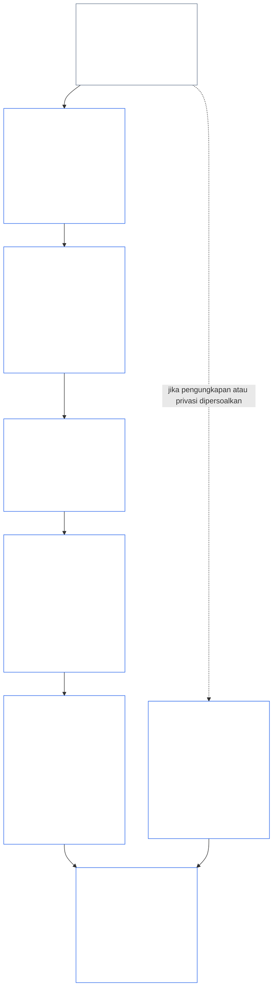
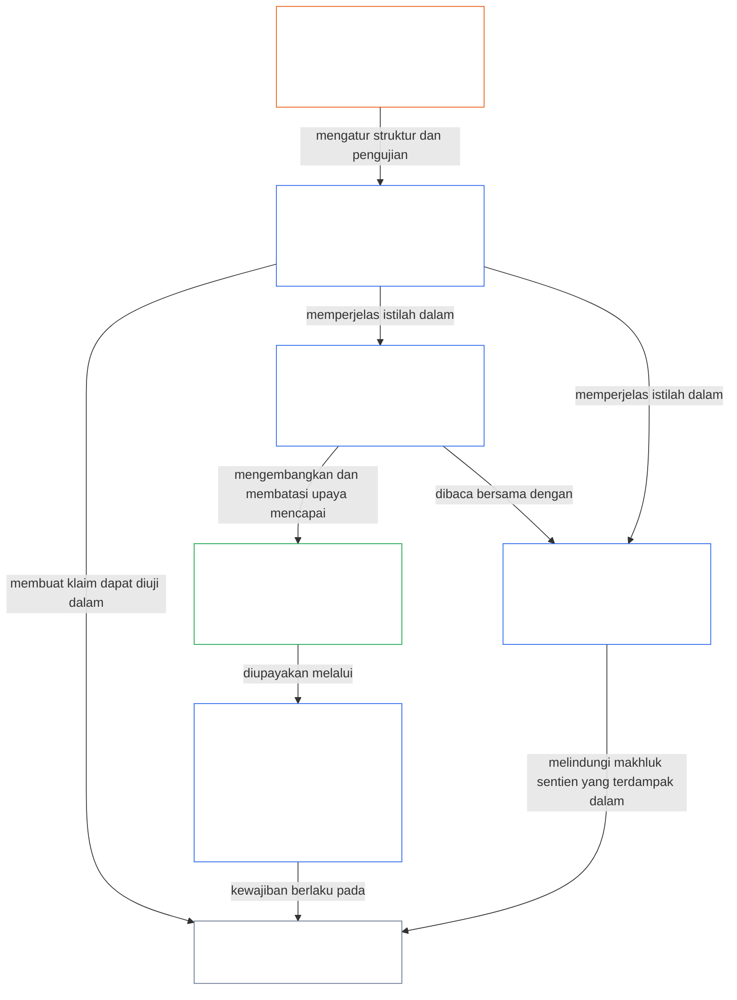

<a id="chapter-01-part-b-interaction-and-interpretation"></a>
# BAB 01, BAGIAN B: INTERAKSI DAN INTERPRETASI

<details>
<summary><strong><span style="color: #2563eb;">Penempatan dalam korpus (nonoperatif): struktur berkas dan aturan membaca</span></strong></summary>

> Konten berikut **hanya panduan bagi pembaca**. Konten ini tidak menambah, menghapus, atau mempersempit kewajiban yang mengikat di bagian lain berkas ini atau di bab lain.
>
> Berkas ini **merupakan bagian dari Konstitusi Sentien** dan **mengikat hanya bersama-sama** dengan berkas bernomor `core_*` lainnya yang dibaca sebagai satu instrumen. Berkas ini memuat **Bab Satu, Bagian B** (§§13–15: Proses Penyelesaian Benturan Konstitusional, larangan pengesampingan mutlak, dan interpretasi konstitusional)—bagian yang menjaga Tetrad Konstitusional tetap utuh ketika prinsip-prinsip berbenturan dan ketika Konstitusi dibaca.
>
> **Sebelumnya:** [core_01_a_values_principles.md](core_01_a_values_principles.md) (Bab Satu, Bagian A — §§1–12, tujuan Pemekaran dan Kesinambungan)  
> **Berikutnya:** [core_01_c_stewardship_capacity_principles.md](core_01_c_stewardship_capacity_principles.md) (Bab Satu, Bagian C — §§16–20, pengelolaan amanah, tata kelola, penyelarasan insentif, dan penerapan terpadu).
> **Alur membaca:** §13 Proses Penyelesaian Benturan Konstitusional (urutan penyeimbangan, batas pengungkapan, dan beban yang dapat dihindari) → §14 larangan pengesampingan mutlak → §15 interpretasi konstitusional (tanpa pengelakan, informasi turunan, definisi, ambiguitas, dan prioritas).

</details>

<details>
<summary><strong><span style="color: #2563eb;">Panduan pembaca (nonoperatif): jangkar kosakata dan peta kelompok Bab Lima</span></strong></summary>

<a id="chapter-one-part-a-chapter-five-vocabulary-anchor"></a>

> Konten berikut **hanya panduan bagi pembaca**. Konten ini tidak menambah, menghapus, atau mempersempit kewajiban yang mengikat di bagian lain berkas ini atau di bab lain. Widget **Jejak** dan **Definisi · Penilaian · Kepatuhan** pada setiap bagian menyediakan tautan navigasi dan tautan O/M/A/C pada bagian yang secara material menggunakan suatu istilah. Sebaliknya, blok ini merupakan peta silang tingkat bab bagi pembaca yang menyelesaikan Bagian A.

**Kosakata lapisan prinsip** (lokasi kanonis di Bab Satu (Bagian A dan B)):

- [Tetrad Konstitusional](core_00_preamble.md#constitutional-tetrad) — **partisipasi**, **pengawasan**, **akuntabilitas**, dan **ketepatan waktu**, disesuaikan dengan [taruhan material](core_00_preamble.md#material-stake)
- [Dua Tujuan Konstitusional](core_00_preamble.md#two-constitutional-aims) — [Pemekaran](core_00_preamble.md#flourishing) dan [Kesinambungan](core_00_preamble.md#continuity) (tujuan **Kesinambungan** konstitusional, yang berbeda dari kesinambungan operasional atau protokol di bagian lain korpus)
- [taruhan material](core_00_preamble.md#material-stake) — skala dampak, ketergantungan, dan risiko untuk kewajiban Tetrad; baca bersama Materialitas Integratif ([Materialitas](core_05_band_oversight.md#materiality)) dan entri Bab Lima di bawah

**Definisi proksi Bab Lima** (pemenuhan O/M/A/C — telusuri dalam Bab Dua hingga Empat ketika relevan secara material):

- [Kesejahteraan](core_05_band_continuity.md#wellbeing) (tujuan Pemekaran)
- [Pengawasan](core_05_apex_oversight_leg.md#oversight), [Akuntabilitas](core_05_apex_accountability_leg.md#accountability), [Kontestabilitas](core_05_band_accountability.md#contestability), [Tata Kelola](core_05_band_accountability.md#governance), [Tata Kelola Berskala Klasifikasi](core_05_band_oversight.md#classification-scaled-governance)
- [Material](core_05_band_oversight.md#material), [Dampak Material](core_05_band_oversight.md#material-impact), [Risiko Material](core_05_band_oversight.md#material-risk), [Materialitas](core_05_band_oversight.md#materiality) (widget memberi label **Materialitas**), [Materialitas Sistemik](core_05_band_continuity.md#systemic-materiality) — kelompok: [Materialitas, dampak, risiko, dan integritas proksi](core_05_band_oversight.md#materiality-impact-risk-and-proxy-integrity)

**Kelompok bergantung utama §3 Bab Lima** (kelompok pemanggilan bersama — baca bersama Bab Dua hingga Empat ketika relevan secara material):

- [Status dan Bobot Pemangku Kepentingan](core_05_band_participation.md#stakeholder-status-and-weight) (lapisan Partisipasi Sistem Pemangku Kepentingan)
- [Lapisan Kontrak Konstitusional](core_05_band_integrative.md#constitutional-contract-layer) dan [Arsitektur Tata Kelola, Pengawasan, Ketergantungan, Desentralisasi, Konsentrasi, Struktur Pasar, dan Integritas Jalur Keluar](core_05_band_accountability.md#governance-architecture-decentralization-and-concentration)
- [Korpus dan Tumpukan Otoritas](core_05_band_integrative.md#defi1-corpus-and-authority-stack)
- [Akuntabilitas, Kontestabilitas, dan Kegagalan Akuntabilitas Kolektif](core_05_apex_accountability_leg.md#accountability)

**CJS-3** (*pustaka kelompok operasional (oDef)*) — kompas kelompok operasional untuk istilah operasional bersama lintas implementasi; baca bersama Tetrad, Tujuan, dan skala taruhan material bab ini:

- [CJS-3.1 Kompas konstitusional dan peta kelompok](corpus_joint_structure/cjs_03_cross_implementation_operational_terms.md#cjs-31-constitutional-compass-and-cluster-map) — pintu masuk utama untuk kelompok **CJS-3.2** (*Pengawasan: transparansi refleksif dan istilah akuntabilitas*) hingga **CJS-3.23** (*Integratif: istilah integritas intervensi dan pengesampingan*), yang disusun berdasarkan komponen Tetrad, tujuan Kesinambungan, dan pita integratif lintas komponen

</details>

<details>
<summary><strong><span style="color: #2563eb;">Panduan pembaca (nonoperatif): cara Bagian B menjaga Tetrad Konstitusional tetap utuh</span></strong></summary>

> Konten berikut **hanya panduan bagi pembaca**. Konten ini tidak menambah, menghapus, atau mempersempit kewajiban yang mengikat di bagian lain berkas ini atau di bab lain. Widget **Jejak** pada tiap bagian menyebut komponen Tetrad yang dibahasnya; blok ini merupakan peta tingkat Bagian bagi pembaca yang memasuki Bagian B.

**Fungsi Bagian B.** [Bagian A](core_01_a_values_principles.md) mengembangkan [Dua Tujuan Konstitusional](core_00_preamble.md#two-constitutional-aims). Bagian B tidak menambahkan prinsip baru maupun kewajiban kelima. Bagian ini menjaga [Tetrad Konstitusional](core_00_preamble.md#constitutional-tetrad)—**partisipasi**, **pengawasan**, **akuntabilitas**, dan **ketepatan waktu**, disesuaikan dengan [taruhan material](core_00_preamble.md#material-stake)—tetap utuh dalam tiga keadaan:

- **Ketika prinsip-prinsip berbenturan** ([§13 Proses Penyelesaian Benturan Konstitusional](#13-constitutional-collision-resolution-process)): Keselamatan dan Kebenaran didahulukan, dan setiap pertukaran kepentingan lain harus menjaga Tetrad, bukan melemahkannya demi memperoleh penyelesaian yang mudah.
- **Ketika suatu nilai didorong terlalu jauh** ([§14 Larangan Pengesampingan Mutlak](#14-prohibition-on-absolute-override)): tidak ada nilai, maupun salah satu dari kedua tujuan, yang boleh digunakan untuk mengosongkan suatu komponen hingga di bawah tuntutan taruhan material.
- **Ketika Konstitusi dibaca atau diterapkan** ([§15 Interpretasi Konstitusional](#15-constitutional-interpretation)): mengganti nama, memecah, atau mengalihkan tindakan yang sama tidak dapat menghindari suatu persyaratan, dan ambiguitas ditafsirkan demi [Efek Perlindungan Terpenuh](core_05_band_integrative.md#fullest-protective-effect).

**Tempat Bagian B memuat tiap komponen.** Jejak tiap bagian mencantumkan semua komponen yang dibahasnya. Tabel ini menunjukkan lokasi utama.

| Komponen Tetrad | Hal yang dipertahankan Bagian B | Lokasi utama dalam Bagian B |
|---|---|---|
| **Partisipasi** | Beban pembuktian tidak pernah dialihkan kepada pihak yang dikenai pembatasan; hak inti untuk menantang, meninjau, dan mengajukan banding tidak dapat dihapus secara permanen; batas pengungkapan harus mempertahankan kontestabilitas yang berdasarkan informasi; beban yang dapat dihindari mempersempit daya bertindak | [§13.1.1](#1311-necessity), [§13.1.4](#1314-constitutional-floors-safety-and-anti-degrading-process), [§13.1.5](#1315-least-restrictive-time-bounded-and-reviewable-constraint-principle), [§13.2](#132-epistemic-disclosure-constraints), [§13.3](#133-minimization-of-avoidable-burden), [§15.1](#151-constitutional-no-bypass-principle), [§15.1.2](#1512-derived-information-principle) |
| **Pengawasan** | Kerugian diperhitungkan sepenuhnya; keputusan dapat direkonstruksi dan ditinjau secara mandiri oleh pihak lain; batas pengungkapan yang tetap memungkinkan pemeriksaan; metrik berhenti diperhitungkan ketika menyimpang dari tujuannya | [§13.1.2](#1312-harm-minimization), [§13.1.5](#1315-least-restrictive-time-bounded-and-reviewable-constraint-principle), [§13.2](#132-epistemic-disclosure-constraints), [§13.2.4](#1324-proxy-divergence-invalidation), [§15.1](#151-constitutional-no-bypass-principle), [§15.4.4](#1544-combined-satisfaction-of-jointly-applicable-incorporated-obligations) |
| **Akuntabilitas** | Beban pembuktian ditanggung pihak yang membatasi; kewajiban untuk memberikan pertanggungjawaban meningkat seiring kewenangan; proses tidak boleh merendahkan atau mempermalukan; setiap batas pengungkapan diaudit setelahnya | [§13.1.1](#1311-necessity), [§13.1.3](#1313-proportionality), [§13.1.4](#1314-constitutional-floors-safety-and-anti-degrading-process), [§13.1.5](#1315-least-restrictive-time-bounded-and-reviewable-constraint-principle), [§13.2.1](#1321-preservation-of-epistemic-integrity), [§15.1](#151-constitutional-no-bypass-principle), [§15.1.2](#1512-derived-information-principle) |
| **Ketepatan waktu** | Pembatasan dibatasi waktunya dan dapat ditinjau, dengan jalur pemulihan; Benturan Konstitusional yang tertunda berjalan menurut jam yang berlaku; pengungkapan yang ditunda pada akhirnya tetap dilakukan; penundaan yang dapat dihindari merupakan beban yang dapat dihindari; penyempitan darurat dibatasi waktunya | [§13.1.5](#1315-least-restrictive-time-bounded-and-reviewable-constraint-principle), [§13.2.1](#1321-preservation-of-epistemic-integrity), [§13.3](#133-minimization-of-avoidable-burden), [§15.1](#151-constitutional-no-bypass-principle), [§15.4.4](#1544-combined-satisfaction-of-jointly-applicable-incorporated-obligations) |

**Bagian yang tidak secara langsung membahas komponen mana pun.** [§15.1.1 Prinsip Anti-Segmentasi](#1511-anti-segmentation-principle) dan [§15.4.1](#1541-integrated-reading) sampai [§15.4.3](#1543-incorporation-layer) mengatur cara teks dibaca dan lapisan sumber mana yang mengendalikan. Sesuai rancangan, Jejaknya tidak memuat baris Tetrad.

**Dua makna waktu.** Dalam Bagian B, waktu muncul dalam dua makna. Cakrawala waktu panjang (kerugian tertunda dan kumulatif, serta [§3.2 Batasan Konsistensi Waktu Bab Delapan](core_08_a_system_alignment_certification_evaluation.md#32-time-consistency-constraint) yang diterapkan dalam [§13.1.2](#1312-harm-minimization)) termasuk dalam tujuan **Kesinambungan**. Tenggat, irama peninjauan, dan penundaan (batas waktu pembatasan, pengungkapan pada akhirnya, penundaan yang dapat dihindari) termasuk dalam komponen **ketepatan waktu**.

**Dua sumbu, tanpa pertentangan.** Tujuan Bagian A menyatakan apa yang hendak dicapai sistem bersama. Bagian B menyatakan apa yang tidak boleh diambil oleh penyeimbangan, pengesampingan, atau penafsiran apa pun.

</details>

<br>
<a id="13-constitutional-collision-resolution-process"></a>

### 13. Proses Penyelesaian Benturan Konstitusional
<details>
<summary><strong><span style="color: #2563eb;">Penelusuran</span></strong></summary>

- Baca bersama: [Tetrad Konstitusional](core_00_preamble.md#constitutional-tetrad) — partisipasi, pengawasan, akuntabilitas, dan ketepatan waktu dalam prosedur, pengungkapan, penanganan Benturan Konstitusional, serta pemulihan; dengan skala [kepentingan material](core_00_preamble.md#material-stake).
- Hulu: Prinsip: [3. Tujuan Dasar: Kesejahteraan](core_01_a_values_principles.md#3-foundational-objective-wellbeing-flourishing-aim), [4 Keselamatan](core_01_a_values_principles.md#4-safety-harm-constraint), [5 Kebenaran](core_01_a_values_principles.md#5-truth-epistemic-integrity-constraint), [6. Kepercayaan](core_01_a_values_principles.md#6-trust-and-trustworthiness-coordination-integrity), [7. Kebebasan (Agensi Terbatas)](core_01_a_values_principles.md#7-freedom-bounded-agency), dan [§16 Penatalayanan secara Mendalam](core_01_c_stewardship_capacity_principles.md#16-stewardship-in-depth).
- Hilir: [13.2.1 Pemeliharaan Integritas Epistemik](#1321-preservation-of-epistemic-integrity), [Catatan Benturan Konstitusional](core_05_band_integrative.md#constitutional-collision-record), [sikap sementara bawaan](#default-interim-posture), dan [14. Larangan Pengesampingan Mutlak](#14-prohibition-on-absolute-override).
- Mengatur konflik lintas pasal di seluruh [Bab Enam: Hak-Hak Dasar](core_06_rights_part_a.md#chapter-six-foundational-rights).
  - Baca bersama [Pasal XXIV: Penafsiran Konstitusional, Peninjauan, dan Perlindungan Antipengambilalihan](core_06_rights_part_d.md#article-xxiv-constitutional-interpretation-review-and-anti-capture-safeguards) dan [Pasal XX: Keadilan Setelah Pelanggaran Terverifikasi](core_06_rights_part_d.md#article-xx-justice-after-verified-violation).
  - Terapkan ketika timbul persoalan peninjauan, keadaan darurat, atau Benturan Konstitusional.

</details>

<details>
<summary><strong><span style="color: #2563eb;">Definisi · Penilaian · Kepatuhan</span></strong></summary>

- [Benturan Konstitusional](core_05_band_integrative.md#constitutional-collision) · [O](core_05_band_integrative.md#constitutional-collision) · [M](core_05_band_integrative.md#constitutional-collision-a) · [A](core_05_band_integrative.md#constitutional-collision-a) · [C](core_05_band_integrative.md#constitutional-collision-c)
- [Partisipasi](core_05_apex_participation_leg.md#participation-constitutional) · [O](core_05_apex_participation_leg.md#participation-constitutional) · [M](core_05_apex_participation_leg.md#participation-constitutional-m) · [A](core_05_apex_participation_leg.md#participation-constitutional-a) · [C](core_05_apex_participation_leg.md#participation-constitutional-c)
- [Pengawasan](core_05_apex_oversight_leg.md#oversight-constitutional) · [O](core_05_apex_oversight_leg.md#oversight-constitutional) · [M](core_05_apex_oversight_leg.md#oversight-constitutional-m) · [A](core_05_apex_oversight_leg.md#oversight-constitutional-a) · [C](core_05_apex_oversight_leg.md#oversight-constitutional-c)
- [Akuntabilitas](core_05_apex_accountability_leg.md#accountability) · [O](core_05_apex_accountability_leg.md#accountability) · [M](core_05_apex_accountability_leg.md#accountability-m) · [A](core_05_apex_accountability_leg.md#accountability-a) · [C](core_05_apex_accountability_leg.md#accountability-c)
- [Ketepatan Waktu](core_05_apex_timeliness_leg.md#timeliness-constitutional) · [O](core_05_apex_timeliness_leg.md#timeliness-constitutional) · [M](core_05_apex_timeliness_leg.md#timeliness-constitutional-m) · [A](core_05_apex_timeliness_leg.md#timeliness-constitutional-a) · [C](core_05_apex_timeliness_leg.md#timeliness-constitutional-c)

</details>

<br>

*Secara sederhana: Benturan Konstitusional akan terjadi — **Keselamatan** dan **Kebenaran** didahulukan. Setelah itu, pembatasan harus proporsional, diperlukan, meminimalkan bahaya, dan seringan mungkin. Kebenaran tidak boleh disembunyikan demi kenyamanan; privasi tidak boleh dicabut demi kemudahan; pembatasan kebebasan berlaku menurut [§7.1 Disiplin Pembatasan](core_01_a_values_principles.md#71-limitation-discipline); Benturan Konstitusional mengenai hak memerlukan uji keputusan yang terdokumentasi; dan metrik yang memberikan gambaran keliru tentang kepatuhan tidak diperhitungkan. Optimalisasi jangka pendek tidak dapat lolos evaluasi berdasarkan [Kendala Konsistensi Waktu Bab Delapan §3.2](core_08_a_system_alignment_certification_evaluation.md#32-time-consistency-constraint). **§13.1** (*Prinsip Inti Pertukaran*) sampai **§13.3** (*Meminimalkan Beban yang Dapat Dihindari*) memuat aturan pertukaran, kendala pengungkapan dan privasi, serta prosedur Benturan Konstitusional.*

Bagian B menjaga Tetrad tetap utuh dalam tiga situasi:
- **[Benturan Konstitusional](core_05_band_integrative.md#constitutional-collision) (bagian ini):** menyelesaikannya tanpa melemahkan unsur mana pun.
- **Penerapan berlebihan ([§14 Larangan Pengesampingan Mutlak](#14-prohibition-on-absolute-override)):** melarang satu nilai pun, termasuk salah satu tujuan, mengesampingkan nilai lainnya atau mengosongkan suatu unsur di bawah tingkat yang diwajibkan oleh kepentingan material.
- **Pembacaan dan penerapan ([§15 Penafsiran Konstitusional](#15-constitutional-interpretation)):** melarang penggantian label, pemisahan, atau pengalihan tindakan yang sama untuk menghindari persyaratan, serta menafsirkan ambiguitas menuju [Efek Protektif Terpenuh](core_05_band_integrative.md#fullest-protective-effect).

Ketika nilai atau kendala bertentangan:
- **Prioritas:** **Keselamatan** dan **Kebenaran** didahulukan apabila konflik tidak dapat diselesaikan tanpa melanggarnya.
- **Tetrad tetap utuh:** pertukaran lainnya harus menjaga [Tetrad Konstitusional](core_00_preamble.md#constitutional-tetrad) — **partisipasi**, **pengawasan**, **akuntabilitas**, dan **ketepatan waktu** yang disesuaikan dengan [kepentingan material](core_00_preamble.md#material-stake) — bukan melemahkannya demi penyelesaian yang mudah.
- **Dampak gabungan:** banyak keputusan kecil yang masing-masing tampak baik tetap dapat bergabung menjadi hasil yang ditolak oleh Konstitusi ini.
- **Tempat penyelesaian:** sistem harus menyelesaikan konflik berdasarkan **§13.1** (*Prinsip Inti Pertukaran*) sampai **§13.3** (*Meminimalkan Beban yang Dapat Dihindari*).

**Diagram: Bagian B dan Tetrad Konstitusional**

<hr style="border: 0; border-top: 1px solid currentColor;">

```mermaid
flowchart TB
    PA["Prinsip Bagian A dan Dua Tujuan Konstitusional<br/><br/>• Kesejahteraan dan Keberlanjutan<br/>• Prinsip dan kendala yang dapat berbenturan<br/>atau ditafsirkan dengan lebih dari satu cara"]
    P13["§13 Proses Penyelesaian Benturan Konstitusional<br/><br/>• Keselamatan dan Kebenaran didahulukan<br/>• Setiap pertukaran lainnya menjaga Tetrad<br/>• Urutan pertukaran, batas pengungkapan,<br/>dan beban yang dapat dihindari"]
    P14["§14 Larangan Pengesampingan Mutlak<br/><br/>• Tidak ada nilai yang menjadi kartu truf<br/>• Kedua tujuan tidak saling mengesampingkan<br/>• Tidak ada unsur yang dikosongkan di bawah kepentingan material"]
    P15["§15 Penafsiran Konstitusional<br/><br/>• Larangan Pengelakan, Larangan Segmentasi,<br/>dan Informasi Turunan<br/>• Ambiguitas dibaca sebagai satu kesatuan terpadu<br/>• Prioritas lapisan sumber"]
    TT["Tetrad Konstitusional<br/><br/>• Dijaga tetap utuh, disesuaikan dengan kepentingan material<br/>• Partisipasi · Pengawasan · Akuntabilitas · Ketepatan Waktu"]
    P["Partisipasi<br/><br/>• Beban tidak pernah ditanggung pihak yang dibatasi<br/>• Hak untuk menggugat dan mengajukan banding tetap berlaku"]
    O["Pengawasan<br/><br/>• Bahaya dihitung sepenuhnya<br/>• Pihak lain dapat merekonstruksi keputusan<br/>dan meninjaunya secara independen"]
    A["Akuntabilitas<br/><br/>• Pihak yang membatasi menanggung beban<br/>• Kewajiban menjawab meningkat seiring kewenangan"]
    T["Ketepatan Waktu<br/><br/>• Pembatasan berbatas waktu dan dapat ditinjau<br/>• Penundaan tidak boleh menggagalkan pemulihan"]
    PA --> P13
    PA --> P14
    PA --> P15
    P13 --> TT
    P14 --> TT
    P15 --> TT
    TT --> P
    TT --> O
    TT --> A
    TT --> T
    style PA fill:none,stroke:#16a34a,color:#ffffff
    style P13 fill:none,stroke:#2563eb,color:#ffffff
    style P14 fill:none,stroke:#2563eb,color:#ffffff
    style P15 fill:none,stroke:#2563eb,color:#ffffff
    style TT fill:none,stroke:#2563eb,color:#ffffff
    style P fill:none,stroke:#0f766e,color:#ffffff
    style O fill:none,stroke:#ea580c,color:#ffffff
    style A fill:none,stroke:#db2777,color:#ffffff
    style T fill:none,stroke:#9333ea,color:#ffffff
```

*Prinsip dan tujuan Bagian A dapat berbenturan dan dapat dibaca dengan lebih dari satu cara. Bagian B menyelesaikan Benturan Konstitusional, melarang pengesampingan, dan menetapkan cara membaca teks agar setiap unsur Tetrad tetap nyata pada tingkat yang diwajibkan oleh kepentingan material. Warna garis tepi menggunakan kembali warna unsur Tetrad sebagai petunjuk visual, bukan sebagai klaim prioritas. Penelusuran setiap bagian menyebutkan unsur yang dicakupnya.*
<a id="131-core-tradeoff-principles"></a>
#### 13.1 Prinsip Inti Pertukaran

<details>
<summary><strong><span style="color: #2563eb;">Penelusuran</span></strong></summary>

- Baca bersama: [Tetrad Konstitusional](core_00_preamble.md#constitutional-tetrad) — keempat unsurnya berlaku di seluruh rangkaian pertukaran: **akuntabilitas** dan **partisipasi** ([§13.1.1](#1311-necessity), pihak yang menanggung beban), **pengawasan** ([§13.1.2](#1312-harm-minimization) dan [§13.1.5](#1315-least-restrictive-time-bounded-and-reviewable-constraint-principle), bahaya dihitung sepenuhnya dan Catatan Benturan Konstitusional yang dapat ditinjau pihak lain), serta **ketepatan waktu** (§13.1.5, pembatasan berbatas waktu dan dapat ditinjau); skala [kepentingan material](core_00_preamble.md#material-stake) menentukan beban pembuktian dan kedalaman pemeriksaan. Penelusuran setiap subbagian menyebutkan unsur yang dicakupnya.
- Subbagian: [§13.1.1 Keniscayaan](#1311-necessity) · [§13.1.2 Minimalisasi Bahaya](#1312-harm-minimization) · [§13.1.3 Proporsionalitas](#1313-proportionality) · [§13.1.4 Batas Minimum Konstitusional, Keselamatan, dan Proses Antimerendahkan](#1314-constitutional-floors-safety-and-anti-degrading-process) · [§13.1.5 Prinsip Kendala Paling Tidak Membatasi, Berbatas Waktu, dan Dapat Ditinjau](#1315-least-restrictive-time-bounded-and-reviewable-constraint-principle).

</details>

<details>
<summary><strong><span style="color: #2563eb;">Definisi · Penilaian · Kepatuhan</span></strong></summary>

*Cakupan.* [§13.1 Prinsip Inti Pertukaran](#131-core-tradeoff-principles) — definisi keniscayaan, minimalisasi bahaya, dan bahaya dalam rangkaian pertukaran.

- [Keniscayaan](core_05_band_accountability.md#necessity) · [O](core_05_band_accountability.md#necessity) · [M](core_05_band_accountability.md#necessity-a) · [A](core_05_band_accountability.md#necessity-a) · [C](core_05_band_accountability.md#necessity-c)
- [Minimalisasi Bahaya (Pemilihan Pertukaran)](core_05_band_accountability.md#harm-minimization-tradeoff-selection) · [O](core_05_band_accountability.md#harm-minimization-tradeoff-selection) · [M](core_05_band_accountability.md#harm-minimization-tradeoff-selection-a) · [A](core_05_band_accountability.md#harm-minimization-tradeoff-selection-a) · [C](core_05_band_accountability.md#harm-minimization-tradeoff-selection-c)
- [Bahaya](core_05_band_accountability.md#harm) · [O](core_05_band_accountability.md#harm) · [M](core_05_band_accountability.md#harm-a) · [A](core_05_band_accountability.md#harm-a) · [C](core_05_band_accountability.md#harm-c)

</details>

<br>

*Secara sederhana: saat sesuatu harus dibatasi, sesuaikan pemulihan dengan masalahnya — gunakan langkah paling ringan yang tetap efektif, pilih opsi yang paling sedikit menimbulkan bahaya, dan sesedikit mungkin membuang waktu makhluk berkesadaran setelah Keselamatan, Kebenaran, dan hak-hak terpenuhi. Ambang pembuktian meningkat cepat ketika bahaya mungkin tidak dapat dipulihkan atau dapat mengunci sistem ke dalam keadaan tertentu.*

**Cara membaca rangkaian:** Terapkan aturan ini sebagai satu urutan, bukan sebagai izin yang berdiri sendiri.
- **[§13.1.1 Keniscayaan](#1311-necessity)** menanyakan apakah pembatasan memang diperlukan, atau apakah alternatif yang lebih sedikit membatasi masih dapat mencegah bahaya material atau risiko sistemik. Pihak yang membatasi menanggung beban pembuktian.
- **[§13.1.2 Minimalisasi Bahaya](#1312-harm-minimization)** mengharuskan pilihan yang secara konstitusional memadai dan paling sedikit menimbulkan bahaya bagi makhluk berkesadaran, sistem, dan rentang waktu.
- **[§13.1.3 Proporsionalitas](#1313-proportionality)** memastikan skala pembatasan yang dipilih sesuai dengan besaran, kemungkinan, dan karakter sistemik bahaya yang ditangani.
- **[§13.1.4 Batas Minimum Konstitusional, Keselamatan, dan Proses Antimerendahkan](#1314-constitutional-floors-safety-and-anti-degrading-process)** menetapkan batas mutlak yang tetap berlaku bahkan bagi pembatasan yang diperlukan, meminimalkan bahaya, dan proporsional dengan benar: minimum tertentu pada Lantai Hak tidak dapat dihapus secara permanen; Keselamatan berfungsi sekaligus sebagai pembenaran dan kendala; dan proses tidak boleh merosot menjadi penghinaan, tontonan, atau pembalasan. Minimum Lantai Hak dan batas proses antimerendahkan bersama-sama membentuk [Prinsip-Prinsip Martabat](#dignity-principles).
- **[§13.1.5 Prinsip Kendala Paling Tidak Membatasi, Berbatas Waktu, dan Dapat Ditinjau](#1315-least-restrictive-time-bounded-and-reviewable-constraint-principle)** mengatur bentuk setiap pembatasan yang lolos dari pengujian sebelumnya: pembatasan harus menggunakan tindakan efektif yang paling ringan, tetap dapat ditinjau secara independen, dan bersifat sementara kecuali Konstitusi ini secara tegas mengizinkan pembatasan yang berkelanjutan.

Setelah rangkaian pertukaran dipenuhi, **[§13.3 Minimalisasi Beban yang Dapat Dihindari](#133-minimization-of-avoidable-burden)** berlaku pada rancangan yang dihasilkan: sistem harus mengutamakan opsi yang paling sedikit membuang waktu, perhatian, dan upaya makhluk berkesadaran.

**Diagram: rangkaian pertukaran dan unsur Tetrad yang dicakup tiap langkah**

<hr style="border: 0; border-top: 1px solid currentColor;">



*Benturan Konstitusional menjalankan rangkaian ini secara berurutan: keniscayaan, minimalisasi bahaya, proporsionalitas, batas minimum konstitusional, dan bentuk setiap pembatasan yang tetap berlaku. Konflik pengungkapan dan privasi juga tunduk pada §13.2 (*Kendala Pengungkapan Epistemik*). §13.3 (*Minimalisasi Beban yang Dapat Dihindari*) berlaku pada semua hal yang lolos. Setiap kotak mencantumkan unsur Tetrad yang disebutkan dalam penelusurannya. Warna adalah petunjuk visual, bukan klaim prioritas.*

<br>
<a id="1311-necessity"></a>
##### 13.1.1 Keniscayaan
<details>
<summary><strong><span style="color: #2563eb;">Jejak</span></strong></summary>

- Baca bersama: [Tetrad Konstitusional](core_00_preamble.md#constitutional-tetrad) — unsur **akuntabilitas** (pihak yang memberlakukan pembatasan menanggung beban pembuktian dan harus mendokumentasikan alternatif); unsur **partisipasi** (beban tidak pernah dibebankan kepada pihak yang kebebasan, agensi, atau aksesnya dibatasi, dan pembuktian harus lebih ketat ketika Kebebasan, Agensi Bermakna, atau Persetujuan terbebani); unsur **pengawasan** (analisis alternatif didokumentasikan agar peninjau dapat memeriksanya); skala [kepentingan material](core_00_preamble.md#material-stake).

</details>

<details>
<summary><strong><span style="color: #2563eb;">Definisi · Penilaian · Kepatuhan</span></strong></summary>

- [Keniscayaan](core_05_band_accountability.md#necessity) · [O](core_05_band_accountability.md#necessity) · [M](core_05_band_accountability.md#necessity-a) · [A](core_05_band_accountability.md#necessity-a) · [C](core_05_band_accountability.md#necessity-c)
- [Kelayakan](core_05_band_accountability.md#feasibility) · [O](core_05_band_accountability.md#feasibility) · [M](core_05_band_accountability.md#feasibility-a) · [A](core_05_band_accountability.md#feasibility-a) · [C](core_05_band_accountability.md#feasibility-c)
- [Kebebasan (Agensi Terbatas)](core_05_band_participation.md#freedom-bounded-agency) · [O](core_05_band_participation.md#freedom-bounded-agency) · [M](core_05_band_participation.md#freedom-bounded-agency-a) · [A](core_05_band_participation.md#freedom-bounded-agency-a) · [C](core_05_band_participation.md#freedom-bounded-agency-c)
- [Agensi Bermakna](core_05_band_participation.md#meaningful-agency) · [O](core_05_band_participation.md#meaningful-agency) · [M](core_05_band_participation.md#meaningful-agency-a) · [A](core_05_band_participation.md#meaningful-agency-a) · [C](core_05_band_participation.md#meaningful-agency-c)

</details>

<br>

*Secara sederhana: pembatasan hanya dapat diberlakukan jika tidak ada alternatif yang kurang membatasi tetapi tetap dapat mencegah kerugian material atau risiko sistemik. Pihak yang memberlakukan pembatasan menanggung beban untuk membuktikannya, bukan pihak yang kebebasannya dibatasi. Kemudahan, kebiasaan institusional, dan alasan “kami selalu melakukannya seperti ini” tidak membuktikan keniscayaan. Jika pilihan yang lebih ringan dapat berfungsi, pilihan yang lebih berat tidak patuh.*

**Beban pembuktian.** Pihak yang memberlakukan atau mempertahankan pembatasan konstitusional menanggung beban untuk menunjukkan bahwa, dalam keadaan yang ada, tidak tersedia alternatif yang kurang membatasi tetapi tetap dapat mencegah kerugian material atau risiko sistemik. Pihak yang kebebasan, agensi, atau aksesnya dibatasi tidak menanggung beban untuk membuktikan bahwa alternatif tersedia.

**Persyaratan analisis alternatif.** Klaim keniscayaan harus didukung oleh analisis terdokumentasi mengenai:
- alternatif yang secara wajar tersedia, termasuk tidak mengambil tindakan;
- efektivitas setiap alternatif dalam kaitannya dengan kerugian konstitusional yang ditangani;
- risiko tersisa atau ketidakselarasan yang ditimbulkan oleh setiap alternatif.

Pernyataan bahwa tidak ada alternatif, tanpa analisis terdokumentasi, tidak memenuhi persyaratan ini.

**Hal-hal yang tidak membuktikan keniscayaan:**
- kemudahan atau preferensi administratif;
- praktik baku, kelembaman institusional, atau tradisi;
- penghematan biaya saja ketika hak terdampak secara material;
- fakta bahwa pembatasan tersebut sudah berlaku.

**Cakupan.** Subbagian ini berlaku untuk setiap pembatasan konstitusional, bukan hanya konteks Benturan Konstitusional berdasarkan [§13.1.5 Prosedur Benturan Hak](#1315-rights-collision-decision-test). Jika suatu pembatasan secara material membebani [Kebebasan (Agensi Terbatas)](core_05_band_participation.md#freedom-bounded-agency), [Agensi Bermakna](core_05_band_participation.md#meaningful-agency), atau [Persetujuan](core_05_band_participation.md#consent), pembuktian keniscaraan harus sama ketatnya.
<a id="1312-harm-minimization"></a>
##### 13.1.2 Minimalisasi Bahaya
<details>
<summary><strong><span style="color: #2563eb;">Jejak</span></strong></summary>

- Baca bersama: [Tetrad Konstitusional](core_00_preamble.md#constitutional-tetrad) — unsur **pengawasan** (bahaya tidak langsung, tertunda, kumulatif, lintas sistem, dan ekologis diperhitungkan, bukan dibiarkan tak terlihat); unsur **akuntabilitas** (bahaya tidak boleh dialihkan kepada pihak yang tidak diperhitungkan agar tampak meminimalkan bahaya); penskalaan [kepentingan material](core_00_preamble.md#material-stake) pada berbagai cakrawala waktu yang relevan.

</details>

<details>
<summary><strong><span style="color: #2563eb;">Definisi · Penilaian · Kepatuhan</span></strong></summary>

- [Minimalisasi Bahaya (Pemilihan Pertukaran)](core_05_band_accountability.md#harm-minimization-tradeoff-selection) · [O](core_05_band_accountability.md#harm-minimization-tradeoff-selection) · [M](core_05_band_accountability.md#harm-minimization-tradeoff-selection-a) · [A](core_05_band_accountability.md#harm-minimization-tradeoff-selection-a) · [C](core_05_band_accountability.md#harm-minimization-tradeoff-selection-c)
- [Bahaya](core_05_band_accountability.md#harm) · [O](core_05_band_accountability.md#harm) · [M](core_05_band_accountability.md#harm-a) · [A](core_05_band_accountability.md#harm-a) · [C](core_05_band_accountability.md#harm-c)
- [Integritas Ekologis](core_05_band_continuity.md#ecological-integrity) · [O](core_05_band_continuity.md#ecological-integrity) · [M](core_05_band_continuity.md#ecological-integrity-constitutional-a) · [A](core_05_band_continuity.md#ecological-integrity-constitutional-a) · [C](core_05_band_continuity.md#ecological-integrity-constitutional-c)
- [Kapasitas Pemulihan Ekologis](core_05_band_continuity.md#ecological-recovery-capacity) · [O](core_05_band_continuity.md#ecological-recovery-capacity) · [M](core_05_band_continuity.md#ecological-recovery-capacity-constitutional-a) · [A](core_05_band_continuity.md#ecological-recovery-capacity-constitutional-a) · [C](core_05_band_continuity.md#ecological-recovery-capacity-constitutional-c)
- [Risiko](core_05_band_continuity.md#risk) · [O](core_05_band_continuity.md#risk) · [M](core_05_band_continuity.md#risk-a) · [A](core_05_band_continuity.md#risk-a) · [C](core_05_band_continuity.md#risk-c)
- [Bahaya yang Tak Dapat Dipulihkan](core_05_band_accountability.md#irreversible-harm) · [O](core_05_band_accountability.md#irreversible-harm) · [M](core_05_band_accountability.md#irreversible-harm-a) · [A](core_05_band_accountability.md#irreversible-harm-a) · [C](core_05_band_accountability.md#irreversible-harm-c)

</details>

<br>

*Secara sederhana: ketika masih ada beberapa opsi yang diperlukan setelah [§13.1.1 Keniscayaan](#1311-necessity) dipenuhi, pilih opsi yang menimbulkan bahaya total paling kecil — dengan memperhitungkan semua pihak yang terdampak, ekosistem dan sistem kehidupan, semua sistem yang tersentuh, serta semua cakrawala waktu yang relevan. Mengoptimalkan secara lokal sambil menimbulkan kerusakan sistemik atau ekologis, atau mengoptimalkan jangka pendek sambil menimbulkan bahaya jangka panjang, tidak lulus uji ini. Minimalisasi bahaya tidak pernah mengizinkan tindakan di bawah batas minimum konstitusional dalam [§13.1.4 Batas Minimum Konstitusional, Keselamatan, dan Proses Anti-Degradasi](#1314-constitutional-floors-safety-and-anti-degrading-process).*

**Cakupan perbandingan.** Jika beberapa opsi yang memadai secara konstitusional memenuhi [Keselamatan (§4)](core_01_a_values_principles.md#4-safety-harm-constraint), [Kebenaran (§5)](core_01_a_values_principles.md#5-truth-epistemic-integrity-constraint), dan [§13.1.1 Keniscayaan](#1311-necessity), pemilihan harus mengutamakan opsi yang meminimalkan total [Bahaya](core_05_band_accountability.md#harm) terhadap:
- makhluk sentien yang terdampak secara langsung maupun tidak langsung;
- sistem yang menopang, menengahi, atau bergantung pada hasilnya;
- sistem ekologis dan kehidupan, termasuk [Integritas Ekologis](core_05_band_continuity.md#ecological-integrity) dan, ketika pemulihan setelah bahaya berdampak material, [Kapasitas Pemulihan Ekologis](core_05_band_continuity.md#ecological-recovery-capacity);
- cakrawala waktu yang relevan, termasuk dampak tertunda dan kumulatif.

**Persyaratan agregasi.** Penilaian bahaya harus mengagregasikan:
- bahaya langsung terhadap pihak-pihak yang teridentifikasi;
- bahaya tidak langsung yang disalurkan melalui sistem, dependensi, atau preseden;
- bahaya tertunda yang terwujud seiring waktu;
- bahaya kumulatif akibat keputusan berulang atau yang saling memperkuat;
- dampak lintas sistem ketika tindakan di satu ranah menimbulkan bahaya di ranah lain;
- bahaya ekologis, termasuk dampak yang dialihkan ke pihak lain, tertunda, kumulatif, serta terkait kapasitas pemulihan.

Hal-hal berikut tidak patuh:
- hanya mengoptimalkan bahaya lokal atau langsung sambil menimbulkan bahaya sistemik, agregat, atau ekologis yang lebih besar;
- mengalihkan bahaya kepada ekosistem, makhluk sentien yang tidak teridentifikasi, atau pihak lain yang tidak diperhitungkan agar tampak meminimalkan bahaya bagi pihak yang teridentifikasi.

**Disiplin cakrawala waktu.** Pengoptimalan jangka pendek dengan mengorbankan sistem jangka panjang tidak lulus uji ini. Minimalisasi bahaya harus memperhitungkan [Kendala Konsistensi Waktu Bab Delapan §3.2](core_08_a_system_alignment_certification_evaluation.md#32-time-consistency-constraint): keputusan yang tampak meminimalkan bahaya pada periode berjalan, tetapi secara terduga menimbulkan bahaya yang lebih besar sepanjang cakrawala waktu konstitusional yang relevan, tidak patuh.

**Hubungan dengan batas minimum konstitusional.** Minimalisasi bahaya berlaku *di atas* batas minimum konstitusional yang ditetapkan dalam [§13.1.4 Batas Minimum Konstitusional, Keselamatan, dan Proses Anti-Degradasi](#1314-constitutional-floors-safety-and-anti-degrading-process). Prinsip ini tidak pernah mengizinkan:
- penghapusan permanen atas minimum Lantai Hak;
- proses yang merendahkan martabat — pembatasan, pemulihan, atau proses yang dirancang, dibingkai, atau dilaksanakan sebagai penghinaan, tontonan, pembalasan, pembebanan diskriminatif, atau pengikisan hak demi kemudahan ([§13.1.4 Batas Minimum Konstitusional, Keselamatan, dan Proses Anti-Degradasi](#1314-constitutional-floors-safety-and-anti-degrading-process));
- tindakan di bawah batas minimum Keselamatan.

Minimalisasi bahaya memilih di antara opsi yang sudah memenuhi batas minimum tersebut — prinsip ini tidak menukar kepatuhan dengan tindakan di bawah batas itu.
<a id="1313-proportionality"></a>
##### 13.1.3 Proporsionalitas

<details>
<summary><strong><span style="color: #2563eb;">Jejak</span></strong></summary>

- Baca bersama: [Tetrad Konstitusional](core_00_preamble.md#constitutional-tetrad) — unsur **akuntabilitas** dan **pengawasan** (pertanggungjawaban yang sebanding dengan kewenangan: intensitas meningkat seiring bertambahnya kuasa yang diotorisasi atau peran yang berdampak besar, dan tidak pernah menurun); skala [kepentingan material](core_00_preamble.md#material-stake) (batas bawah klasifikasi dan ambang yang diperketat).
- Baca bersama: [§18.1 Tata Kelola sebagai Struktur yang Diotorisasi](core_01_c_stewardship_capacity_principles.md#181-governance-as-authorized-structure).

</details>

<details>
<summary><strong><span style="color: #2563eb;">Definisi · Penilaian · Kepatuhan</span></strong></summary>

- [Proporsionalitas](core_05_band_accountability.md#proportionality) · [O](core_05_band_accountability.md#proportionality) · [M](core_05_band_accountability.md#proportionality-a) · [A](core_05_band_accountability.md#proportionality-a) · [C](core_05_band_accountability.md#proportionality-c)
- [Risiko](core_05_band_continuity.md#risk) · [O](core_05_band_continuity.md#risk) · [M](core_05_band_continuity.md#risk-a) · [A](core_05_band_continuity.md#risk-a) · [C](core_05_band_continuity.md#risk-c)
- [Kerugian yang Tidak Dapat Dipulihkan](core_05_band_accountability.md#irreversible-harm) · [O](core_05_band_accountability.md#irreversible-harm) · [M](core_05_band_accountability.md#irreversible-harm-a) · [A](core_05_band_accountability.md#irreversible-harm-a) · [C](core_05_band_accountability.md#irreversible-harm-c)
- [Risiko Eksistensial](core_05_band_continuity.md#existential-risk) · [O](core_05_band_continuity.md#existential-risk) · [M](core_05_band_continuity.md#existential-risk-a) · [A](core_05_band_continuity.md#existential-risk-a) · [C](core_05_band_continuity.md#existential-risk-c)
- [Kapasitas Pemulihan Ekologis](core_05_band_continuity.md#ecological-recovery-capacity) · [O](core_05_band_continuity.md#ecological-recovery-capacity) · [M](core_05_band_continuity.md#ecological-recovery-capacity-constitutional-a) · [A](core_05_band_continuity.md#ecological-recovery-capacity-constitutional-a) · [C](core_05_band_continuity.md#ecological-recovery-capacity-constitutional-c)
- [Penguncian Sistemik](core_05_band_continuity.md#systemic-lock-in) · [O](core_05_band_continuity.md#systemic-lock-in) · [M](core_05_band_continuity.md#systemic-lock-in-a) · [A](core_05_band_continuity.md#systemic-lock-in-a) · [C](core_05_band_continuity.md#systemic-lock-in-c)
- [Reversibilitas](core_05_band_continuity.md#reversibility) · [O](core_05_band_continuity.md#reversibility) · [M](core_05_band_continuity.md#reversibility-constitutional-a) · [A](core_05_band_continuity.md#reversibility-constitutional-a) · [C](core_05_band_continuity.md#reversibility-constitutional-c)
- [Ketergantungan](core_05_band_continuity.md#dependency) · [O](core_05_band_continuity.md#dependency) · [M](core_05_band_continuity.md#dependency-a) · [A](core_05_band_continuity.md#dependency-a) · [C](core_05_band_continuity.md#dependency-c)
- [Akuntabilitas](core_05_apex_accountability_leg.md#accountability) · [O](core_05_apex_accountability_leg.md#accountability) · [M](core_05_apex_accountability_leg.md#accountability-m) · [A](core_05_apex_accountability_leg.md#accountability-a) · [C](core_05_apex_accountability_leg.md#accountability-c)
- [Pengawasan](core_05_apex_oversight_leg.md#oversight-constitutional) · [O](core_05_apex_oversight_leg.md#oversight-constitutional) · [M](core_05_apex_oversight_leg.md#oversight-constitutional-m) · [A](core_05_apex_oversight_leg.md#oversight-constitutional-a) · [C](core_05_apex_oversight_leg.md#oversight-constitutional-c)

</details>

<br>

*Secara sederhana: proporsionalitas memastikan bahwa skala pembatasan sesuai dengan skala kerugian yang ditanganinya. Opsi yang diperlukan dan meminimalkan kerugian tetap gagal jika cakupan, durasi, atau intensitasnya tidak sebanding dengan taruhan yang sebenarnya. Semakin tidak dapat dipulihkan, sistemik, atau menciptakan ketergantungan suatu risiko, semakin kuat pembenaran yang diperlukan dan semakin ketat pengawasannya. Aturan yang sama tentang tata kelola yang tidak memadai berlaku bagi kuasa: kuasa yang lebih besar dan diotorisasi atau peran yang berdampak besar harus meningkatkan akuntabilitas dan pengawasan, bukan menurunkannya.*

Pembatasan atas **nilai-nilai** konstitusional — termasuk perlindungan **Lantai Hak** dalam **Bab Enam** serta prinsip dan perlindungan lain yang dapat dipertukarkan berdasarkan [§13 Proses Penyelesaian Konflik Konstitusional](#13-constitutional-collision-resolution-process) — harus sebanding dengan besaran dan kemungkinan **kerugian** atau **dampak sistemik** yang secara sah ditangani, sesuai dengan [Proporsionalitas](core_05_band_accountability.md#proportionality) dalam **Bab Lima**.

**Batas bawah klasifikasi.** Tidak ada sistem yang boleh diatur pada tingkat di bawah tingkat yang diwajibkan oleh klasifikasi tertinggi yang berlaku. Label administratif yang lebih rendah tidak dapat mengurangi pengawasan yang diwajibkan oleh klasifikasi risiko, ketergantungan, hak, atau dampak sistem yang tertinggi dan berlaku.

**Pertanggungjawaban sebanding dengan kewenangan.** Proporsionalitas juga melarang tata kelola yang tidak memadai terhadap mereka yang memegang kuasa lebih besar yang diotorisasi, peran yang berdampak besar, atau pengaruh kelembagaan: intensitas [Akuntabilitas](core_05_apex_accountability_leg.md#accountability) dan [Pengawasan](core_05_apex_oversight_leg.md#oversight-constitutional) harus meningkat seiring kewenangan tersebut, bukan menurun.

**Ambang yang diperketat.** Jika tindakan menimbulkan risiko kerugian yang tidak dapat dipulihkan, penguncian sistemik, Risiko Eksistensial, atau hilangnya Kapasitas Pemulihan Ekologis secara tidak dapat dipulihkan, sistem harus menerapkan [Pengawasan yang Diperketat](core_05_band_oversight.md#heightened-scrutiny) serta ambang yang diperketat untuk pembenaran dan reversibilitas jika memungkinkan.

**Eskalasi lebih lanjut.** Ambang tersebut harus dinaikkan lagi jika indikator yang relevan secara material berlaku, termasuk:
- paparan terhadap ketakterpulihan
- ketergantungan yang terkonsentrasi
- risiko ekor dengan konsekuensi tinggi
- penguncian sistemik yang masuk akal
- Risiko Eksistensial
- hilangnya Kapasitas Pemulihan Ekologis secara tidak dapat dipulihkan
<a id="1314-constitutional-floors-safety-and-anti-degrading-process"></a>
##### 13.1.4 Batas dasar konstitusional, keselamatan, dan proses yang tidak merendahkan
<details>
<summary><strong><span style="color: #2563eb;">Penelusuran</span></strong></summary>

- Baca bersama: [Tetrad Konstitusional](core_00_preamble.md#constitutional-tetrad) — dimensi **partisipasi** (hak inti untuk menggugat, meninjau, dan mengajukan banding termasuk minimum yang tidak dapat dihapus secara permanen); dimensi **akuntabilitas** (proses yang lolos dari rangkaian pertimbangan tetap tidak boleh merendahkan, mempermalukan, atau membalas; lihat [§3.3 Proses yang Tidak Merendahkan](core_01_a_values_principles.md#33-anti-degrading-process)); penskalaan menurut [kepentingan material](core_00_preamble.md#material-stake) jika pemeriksaan yang lebih ketat berlaku.

</details>

<details>
<summary><strong><span style="color: #2563eb;">Definisi · Penilaian · Kepatuhan</span></strong></summary>

- [Keselamatan (Kendala Konstitusional)](core_05_band_continuity.md#safety-constitutional-constraint) · [O](core_05_band_continuity.md#safety-constitutional-constraint) · [M](core_05_band_continuity.md#safety-constraint-a) · [A](core_05_band_continuity.md#safety-constraint-a) · [C](core_05_band_continuity.md#safety-constraint-c)
- [Martabat dan Kedudukan Moral yang Setara](core_05_band_participation.md#dignity-and-equal-moral-standing) · [O](core_05_band_participation.md#dignity-and-equal-moral-standing) · [M](core_05_band_participation.md#dignity-and-equal-moral-standing-a) · [A](core_05_band_participation.md#dignity-and-equal-moral-standing-a) · [C](core_05_band_participation.md#dignity-and-equal-moral-standing-c)
- [Kekejaman](core_05_band_accountability.md#cruelty) · [O](core_05_band_accountability.md#cruelty) · [M](core_05_band_accountability.md#cruelty-a) · [A](core_05_band_accountability.md#cruelty-a) · [C](core_05_band_accountability.md#cruelty-c)
- [Kerugian](core_05_band_accountability.md#harm) · [O](core_05_band_accountability.md#harm) · [M](core_05_band_accountability.md#harm-a) · [A](core_05_band_accountability.md#harm-a) · [C](core_05_band_accountability.md#harm-c)
- [Kerugian yang Tidak Dapat Dipulihkan](core_05_band_accountability.md#irreversible-harm) · [O](core_05_band_accountability.md#irreversible-harm) · [M](core_05_band_accountability.md#irreversible-harm-a) · [A](core_05_band_accountability.md#irreversible-harm-a) · [C](core_05_band_accountability.md#irreversible-harm-c)
- [Keniscayaan](core_05_band_accountability.md#necessity) · [O](core_05_band_accountability.md#necessity) · [M](core_05_band_accountability.md#necessity-a) · [A](core_05_band_accountability.md#necessity-a) · [C](core_05_band_accountability.md#necessity-c)
- [Proporsionalitas](core_05_band_accountability.md#proportionality) · [O](core_05_band_accountability.md#proportionality) · [M](core_05_band_accountability.md#proportionality-a) · [A](core_05_band_accountability.md#proportionality-a) · [C](core_05_band_accountability.md#proportionality-c)

</details>

<br>

*Secara sederhana: minimalisasi kerugian memiliki batas mutlak. Betapapun proporsional, niscaya, atau dirancang dengan baik suatu pembatasan, hal-hal tertentu tidak boleh dihilangkan secara permanen, dan cara-cara tertentu dalam menjalankan proses selalu dilarang. Keselamatan menjadi dasar batas-batas ini: keselamatan membenarkan tindakan untuk mencegah kerugian serius, tetapi juga membatasi tindakan — alasan keselamatan tidak boleh dijadikan kedok untuk menghapus hak, merendahkan martabat, atau mengakali batas-batas yang ditetapkan di sini.*

**Keselamatan sebagai pembenaran dan kendala.** [Keselamatan (§4)](core_01_a_values_principles.md#4-safety-harm-constraint) merupakan kendala yang tidak dapat ditawar dan dapat membenarkan pembatasan kepentingan konstitusional lainnya. Namun, Keselamatan juga *membatasi* cara pembatasan tersebut diterapkan:
- Alasan keselamatan tidak mengizinkan penghapusan permanen atas minimum Lantai Hak.
- Jika Keselamatan mengharuskan pembatasan, pembatasan itu tetap harus mematuhi batas-batas di bawah ini dan, dalam bentuknya, [§13.1.5 Prinsip Pembatasan Paling Sedikit, Berbatas Waktu, dan Dapat Ditinjau](#1315-least-restrictive-time-bounded-and-reviewable-constraint-principle).

<a id="dignity-principles"></a>

###### Prinsip Martabat

**Prinsip Martabat** adalah dua prinsip berikut: [Prinsip Minimum Lantai Hak](#rights-floor-minimums-principle) dan [Prinsip Proses yang Tidak Merendahkan](#anti-degrading-process-principle). Keduanya menjadikan [Martabat dan Kedudukan Moral yang Setara](core_05_band_participation.md#dignity-and-equal-moral-standing) sebagai batas mutlak yang operasional: apa yang tidak boleh diambil secara permanen dari makhluk berkesadaran mana pun, serta bagaimana makhluk berkesadaran mana pun tidak boleh diperlakukan dalam proses apa pun. Akses minimum untuk memenuhi kebutuhan hidup serta hak inti untuk menggugat, meninjau, dan mengajukan banding termasuk dalam Prinsip Martabat karena merupakan syarat minimum untuk memperlakukan seseorang sebagai pihak yang kedudukan moralnya diperhitungkan. Kesetaraan kedudukan itu sendiri, serta dasar-dasar yang melarang penyangkalannya, dinyatakan dalam [Pasal VI-A](core_06_rights_part_b.md#article-vi-a-dignity-and-equal-moral-standing) (*Martabat dan Kedudukan Moral yang Setara*).

<a id="rights-floor-minimums-principle"></a>

###### Prinsip Minimum Lantai Hak

Prinsip ini melindungi Lantai Hak sebagai berikut:

- Tidak ada proses konstitusional, tindakan, transisi, amendemen, konsekuensi kedudukan, tindakan darurat, atau hasil terkait keadilan yang boleh menghapus atau mengesampingkan secara permanen **minimum Lantai Hak**: perlindungan martabat dasar berdasarkan [Pasal VI-A](core_06_rights_part_b.md#article-vi-a-dignity-and-equal-moral-standing) (*Martabat dan Kedudukan Moral yang Setara*) dan [Prinsip Proses yang Tidak Merendahkan](#anti-degrading-process-principle), akses minimum untuk memenuhi kebutuhan hidup, ataupun hak inti untuk menggugat, meninjau, dan mengajukan banding.
- Pembatasan sementara atas hak tertentu hanya diperbolehkan jika memenuhi [Prinsip Pembatasan Paling Sedikit, Berbatas Waktu, dan Dapat Ditinjau](#1315-least-restrictive-time-bounded-and-reviewable-constraint-principle) serta aturan darurat dalam [Bab Dua Belas §6.1](core_12_forum.md#61-emergency-measures-and-continuation-burden) (*Tindakan darurat dan beban kelanjutan*) — artinya, setiap pembatasan harus beralasan, seminimal mungkin, terdokumentasi, dibatasi waktu, dan dapat ditinjau secara independen. Pasal-pasal tertentu dapat menambahkan perlindungan yang lebih kuat, tetapi tidak boleh mempersempit prinsip ini atau menggunakan label kemudahan, efisiensi, klasifikasi, keadaan darurat, transisi, kedudukan, amendemen, kontrak, atau implementasi untuk mengakalinya.

<a id="anti-degrading-process-principle"></a>

###### Prinsip Proses yang Tidak Merendahkan

[Prinsip Proses yang Tidak Merendahkan (§3.3)](core_01_a_values_principles.md#33-anti-degrading-process) yang dinyatakan dalam Bagian A berlaku sebagai batas mutlak dalam rangkaian pertimbangan ini.
- Tidak ada pembatasan, pemulihan, atau proses yang lolos dari uji keniscayaan, minimalisasi kerugian, dan proporsionalitas yang boleh dirancang, dibingkai, dilaksanakan, atau dibiarkan beroperasi sebagai perendahan, penghinaan, tontonan, pembalasan, pembebanan diskriminatif, atau pengikisan hak demi kemudahan.
- Hasil substantif yang benar tetapi disampaikan melalui proses yang merendahkan tetap tidak patuh.
- Jika sifat yang dilarang berupa penderitaan sebagai tujuan pada dirinya sendiri atau penderitaan yang ditimbulkan secara cuma-cuma/merendahkan — termasuk penghinaan demi penghinaan itu sendiri — baca bersama [Kekejaman](core_05_band_accountability.md#cruelty).

##### 13.1.5 Prinsip Pembatasan Paling Sedikit, Berbatas Waktu, dan Dapat Ditinjau

<details>
<summary><strong><span style="color: #2563eb;">Penelusuran</span></strong></summary>

- Baca bersama: [Tetrad Konstitusional](core_00_preamble.md#constitutional-tetrad) — keempat dimensinya: **pengawasan** (pembatasan tetap dapat ditinjau secara independen; bukti dipertahankan dan peninjau independen tetap memperoleh akses selama Kolisi Konstitusional masih tertunda); **akuntabilitas** (Catatan Kolisi Konstitusional yang terdokumentasi dan dapat diaudit menyebutkan aturan, alternatif, bukti, dan dasar pemilihan); **partisipasi** (pihak terdampak dapat memahami, menggugat, dan merekonstruksi keputusan serta diberi tahu apa yang dibekukan); **ketepatan waktu** (pembatasan bersifat sementara kecuali aturan Lantai Hak yang lebih kuat menyatakan lain, mencakup durasi atau jadwal peninjauan serta jalur pemulihan, dan Kolisi Konstitusional yang tertunda mengikuti tenggat waktu yang berlaku); penskalaan menurut [kepentingan material](core_00_preamble.md#material-stake) (beban pembuktian meningkat sesuai tingkat keparahan, ketakterbalikan, pemusatan ketergantungan, dan ketidakpastian).
- Tindak lanjut: [Pasal XXV-B: Prosedur Benturan Hak dan Penyelarasan Restoratif](core_06_rights_part_e.md#article-xxv-b-rights-collision-procedure-and-restorative-alignment) (forum menerapkan uji keputusan ini); [Pasal XXV-C: Penyelesaian Tepat Waktu dan Batas Anti-Penundaan](core_06_rights_part_e.md#article-xxv-c-timely-resolution-and-anti-delay-floor); [Bab Dua Belas §6](core_12_forum.md#6-timely-resolution-materiality-tiers-and-anti-delay-discipline) (*Penyelesaian tepat waktu, tingkat materialitas, dan disiplin anti-penundaan*).

</details>

<details>
<summary><strong><span style="color: #2563eb;">Definisi · Penilaian · Kepatuhan</span></strong></summary>

- [Catatan Kolisi Konstitusional](core_05_band_integrative.md#constitutional-collision-record) · [O](core_05_band_integrative.md#constitutional-collision-record) · [M](core_05_band_integrative.md#constitutional-collision-record-a) · [A](core_05_band_integrative.md#constitutional-collision-record-a) · [C](core_05_band_integrative.md#constitutional-collision-record-c)

</details>

<br>

*Secara sederhana: setelah suatu pembatasan dibenarkan, bentuknya tetap harus dirancang dengan benar. Gunakan langkah efektif yang paling ringan, tetapkan tenggat waktu atau jadwal peninjauan yang nyata, pertahankan hak untuk menggugat dan peninjauan independen, serta tentukan cara pembatasan berakhir atau dipulihkan. Kemudahan, tingkat keparahan, atau pelabelan ulang administratif tidak dapat mengubah pembatasan sementara atas hak menjadi jalan pintas permanen.*

Subbagian ini mengatur bentuk pembatasan konstitusional setelah proporsionalitas, keniscayaan, minimalisasi kerugian, dan batas-batas konstitusional dalam [§13.1.4 Batas Dasar Konstitusional, Keselamatan, dan Proses yang Tidak Merendahkan](#1314-constitutional-floors-safety-and-anti-degrading-process) diterapkan. Subbagian ini tidak melonggarkan uji-uji tersebut.

Pembatasan konstitusional harus memenuhi semua hal berikut:
- **Dibenarkan dan minimal:** pembatasan harus dibenarkan oleh kerugian konstitusional atau dampak sistemik yang ditangani dan tidak boleh melampaui apa yang didukung oleh pembenaran tersebut.
- **Cara efektif yang paling sedikit membatasi:** setiap kendala yang memengaruhi hak harus menggunakan cara paling sedikit membatasi yang tetap dapat mencapai hasil perlindungan keselamatan, integritas, atau hak yang diwajibkan.
- **Dapat ditinjau:** pembatasan harus mempertahankan kemungkinan untuk menggugat dan peninjauan independen.
- **Sementara kecuali secara tegas diizinkan:** pembatasan harus bersifat sementara kecuali aturan Lantai Hak yang lebih kuat secara tegas mengizinkan pembatasan yang bertahan lama.
- **Jalur pemulihan:** jika memungkinkan, pembatasan harus mencantumkan durasi atau jadwal peninjauan, serta syarat pemulihan, pembatalan, atau evaluasi ulang yang dikaitkan dengan bukti, perubahan keadaan, atau penyimpangan hasil yang diamati dari hasil yang diharapkan.
<a id="1315-rights-collision-decision-test"></a>
**Catatan Benturan Konstitusional dan kemampuan merekonstruksi keputusan.** Ketika rangkaian pertimbangan (§13.1.1 (*Kebutuhan*) hingga §13.1.5 (*Prinsip Pembatasan yang Paling Sedikit Membatasi, Berbatas Waktu, dan Dapat Ditinjau*)) diterapkan pada pembatasan material atau Benturan Konstitusional, penyelesaiannya harus menghasilkan [Catatan Benturan Konstitusional](core_05_band_integrative.md#constitutional-collision-record) yang terdokumentasi dan dapat diaudit (selanjutnya disingkat **Catatan Benturan**) dengan kejelasan yang memadai agar pihak terdampak dan peninjau dapat memahami, menggugat, dan merekonstruksi keputusan secara independen. Sekurang-kurangnya, catatan tersebut harus memuat:
- **Aturan operatif dan prasyarat:** ketentuan konstitusional yang dijadikan dasar serta fakta material yang memicunya.
- **Alternatif yang dipertimbangkan:** alternatif yang secara material layak dilaksanakan, termasuk tidak bertindak, beserta alasan penolakannya secara eksplisit — untuk memenuhi persyaratan analisis alternatif dalam [§13.1.1 Kebutuhan](#1311-necessity).
- **Bukti dan penanganan ketidakpastian:** bukti yang mendukung kebutuhan, profil bahaya, dan proporsionalitas opsi yang dipilih, termasuk cara ketidakpastian ditangani.
- **Dasar pemilihan:** alasan opsi yang dipilih memenuhi kebutuhan, minimisasi bahaya, proporsionalitas, batas minimum konstitusional, dan bentuk yang paling sedikit membatasi — bukan sekadar pernyataan bahwa opsi tersebut memenuhinya.
- **Pemicu peninjauan:** tanggal berakhir, frekuensi evaluasi ulang, atau kondisi pembatalan berdasarkan [§13.1.5 Prinsip Pembatasan yang Paling Sedikit Membatasi, Berbatas Waktu, dan Dapat Ditinjau](#1315-least-restrictive-time-bounded-and-reviewable-constraint-principle).

Catatan Benturan menjadi bagian dari [Catatan Tindakan](core_05_band_accountability.md#materially-binding-act-record) atas tindakan yang menyelesaikan Benturan Konstitusional; catatan tersendiri yang duplikatif tidak diperlukan selama unsur-unsur tersebut tetap dapat diidentifikasi, ditautkan, diberi versi, disimpan, dan diakses.

Beban pembuktian meningkat seiring tingkat keparahan bahaya yang diperkirakan, ketakterbalikan, konsentrasi ketergantungan, dan ketidakpastian. Pembatasan berisiko lebih tinggi memerlukan bukti yang lebih kuat dan pemeriksaan independen. Kemudahan, kelembaman institusional, atau preferensi optimasi saja tidak cukup untuk membenarkan pembatasan hak ketika disiplin ini berlaku.

Pembatasan kerahasiaan atas Catatan Benturan harus memenuhi [§13.2 Batasan Pengungkapan Epistemik](#132-epistemic-disclosure-constraints). Jika pengungkapan publik secara penuh tidak memungkinkan, pengungkapan parsial semaksimal mungkin serta akses bagi peninjau independen harus dipertahankan.

<a id="default-interim-posture"></a>
**Sikap sementara baku selama Benturan Konstitusional belum diputuskan.** Sampai proses [Catatan Benturan Konstitusional](core_05_band_integrative.md#constitutional-collision-record) dan [Pasal XXIV](core_06_rights_part_d.md#article-xxiv-constitutional-interpretation-review-and-anti-capture-safeguards) (*Penafsiran Konstitusional, Peninjauan, dan Perlindungan Anti-Pengambilalihan*) menyelesaikan Benturan Konstitusional, pola penangguhan ditetapkan agar pengampu tidak dapat mengada-adakan pemenang melalui improvisasi:

- **Pertahankan bukti:** Jangan menggugurkan Benturan Konstitusional melalui penghapusan, kebocoran, atau publikasi yang tidak dapat dibatalkan.
- **Bekukan langkah yang tidak dapat dibatalkan** jika langkah itu akan membuat salah satu penafsiran yang berbenturan tidak lagi tersedia — jangan mengambil langkah yang tidak dapat dibatalkan apabila langkah itu akan menutup Benturan Konstitusional, menggugurkan salah satu pihak, atau mengada-adakan pemenang sebelum penafsiran diputuskan.
- **Lanjutkan langkah yang dapat dibatalkan dan disetujui** yang mempertahankan ketersediaan kedua penafsiran — termasuk akses bagi peninjau independen berdasarkan [keteramatan yang dibatasi keamanan](core_04_burden_traceability_verification.md#4-security-constrained-observability-and-verification-rule) jika ada persetujuan.
- **Beri tahu** pihak terdampak dan jalur penafsiran mengenai hal yang dibekukan, hal yang tetap berjalan, serta tenggat waktu yang berlaku (untuk sengketa yang dirujuk ke forum, batas waktu tiap tingkat dan batas keseluruhan dalam [Bab Dua Belas §6](core_12_forum.md#6-timely-resolution-materiality-tiers-and-anti-delay-discipline) (*Penyelesaian tepat waktu, tingkat materialitas, dan disiplin anti-penundaan*)).

Pola penangguhan ini bukan keputusan tentang pihak mana yang benar. Bekukan hal yang tidak dapat dibatalkan agar tidak satu pun penafsiran dikesampingkan; [§13 Proses Penyelesaian Benturan Konstitusional](#13-constitutional-collision-resolution-process) tetap harus menjawab Benturan Konstitusional tersebut. Itulah alasan [§13.1.5 Prinsip Pembatasan yang Paling Sedikit Membatasi, Berbatas Waktu, dan Dapat Ditinjau](#1315-least-restrictive-time-bounded-and-reviewable-constraint-principle): langkah yang disetujui dan dapat dibatalkan mempertahankan ketersediaan kedua penafsiran, sedangkan langkah yang tidak dapat dibatalkan tidak demikian.

Setelah rangkaian pertimbangan terpenuhi, [§13.3 Minimisasi Beban yang Dapat Dihindari](#133-minimization-of-avoidable-burden) berlaku pada rancangan yang dihasilkan.
<a id="132-epistemic-disclosure-constraints"></a>
#### 13.2 Batasan Pengungkapan Epistemik
<details>
<summary><strong><span style="color: #2563eb;">Penelusuran</span></strong></summary>

- Baca bersama: [Tetrad Konstitusional](core_00_preamble.md#constitutional-tetrad) — unsur **partisipasi** (kemampuan untuk menggugat secara terinformasi di tengah batasan); unsur **pengawasan** (batasan pengungkapan harus mempertahankan pemeriksaan semaksimal mungkin); unsur **akuntabilitas** (setiap batasan disertai audit dan peninjauan retrospektif berdasarkan [§13.2.1](#1321-preservation-of-epistemic-integrity), sehingga ada pihak yang bertanggung jawab); unsur **ketepatan waktu** (pengungkapan yang dibatasi atau ditunda memiliki batas waktu dan berakhir dengan pengungkapan pada akhirnya menurut §13.2.1); serta penskalaan berdasarkan [kepentingan material](core_00_preamble.md#material-stake).
- Prinsip hulu: [4 Keselamatan](core_01_a_values_principles.md#4-safety-harm-constraint), [5 Kebenaran](core_01_a_values_principles.md#5-truth-epistemic-integrity-constraint), [6. Kepercayaan](core_01_a_values_principles.md#6-trust-and-trustworthiness-coordination-integrity), dan [§13 Proses Penyelesaian Benturan Konstitusional](#13-constitutional-collision-resolution-process).
- Berikutnya: [§13.2.1 Pemeliharaan Integritas Epistemik](#1321-preservation-of-epistemic-integrity), [§13.2.2 Penyelarasan Kepercayaan dan Kebenaran](#1322-trust-truth-alignment), [§13.2.3 Privasi dan Penentuan Nasib Sendiri secara Informasional](#1323-privacy-and-informational-self-determination), serta [14. Larangan Pengesampingan Mutlak](#14-prohibition-on-absolute-override).
- Berikutnya: melindungi cakupan hak atas integritas ranah informasi, kemampuan audit, peninjauan retrospektif, dan kemampuan menggugat secara terinformasi ketika pengungkapan dibatasi; khususnya [Pasal XV: Integritas Ranah Informasi](core_06_rights_part_c.md#article-xv-info-sphere-integrity), [Pasal XVI: Audit, Transparansi, dan Verifikasi Independen](core_06_rights_part_c.md#article-xvi-audit-transparency-and-independent-verification), [Pasal XXIV: Penafsiran Konstitusional, Peninjauan, dan Perlindungan Antipenangkapan](core_06_rights_part_d.md#article-xxiv-constitutional-interpretation-review-and-anti-capture-safeguards), serta [Pasal XXV-A: Peninjauan dan Pengungkapan Retrospektif](core_06_rights_part_e.md#article-xxv-a-retrospective-review-and-disclosure), juga konteks hak apa pun ketika batasan pengungkapan memengaruhi kemampuan menggugat atau partisipasi yang terinformasi.

</details>

<details>
<summary><strong><span style="color: #2563eb;">Definisi · Penilaian · Kepatuhan</span></strong></summary>

- [Integritas Epistemik](core_05_band_oversight.md#epistemic-integrity) · [O](core_05_band_oversight.md#epistemic-integrity-o) · [M](core_05_band_oversight.md#epistemic-integrity-a) · [A](core_05_band_oversight.md#epistemic-integrity-a) · [C](core_05_band_oversight.md#epistemic-integrity-c)
- [Kebenaran (Kendala Konstitusional)](core_05_band_oversight.md#truth-constitutional-constraint) · [O](core_05_band_oversight.md#truth-constitutional-constraint-o) · [M](core_05_band_oversight.md#truth-constitutional-constraint-a) · [A](core_05_band_oversight.md#truth-constitutional-constraint-a) · [C](core_05_band_oversight.md#truth-constitutional-constraint-c)
- [Kepercayaan](core_05_band_continuity.md#trust) · [O](core_05_band_continuity.md#trust) · [M](core_05_band_continuity.md#trust-a) · [A](core_05_band_continuity.md#trust-a) · [C](core_05_band_continuity.md#trust-c)
- [Privasi (Informasional)](core_05_band_continuity.md#privacy-informational) · [O](core_05_band_continuity.md#privacy-informational) · [M](core_05_band_continuity.md#privacy-informational-a) · [A](core_05_band_continuity.md#privacy-informational-a) · [C](core_05_band_continuity.md#privacy-informational-c)
- [Materialitas](core_05_band_oversight.md#materiality) · [O](core_05_band_oversight.md#materiality) · [M](core_05_band_oversight.md#materiality-determination-a) · [A](core_05_band_oversight.md#materiality-determination-a) · [C](core_05_band_oversight.md#materiality-determination-c)
- [Keterdugaan](core_05_band_oversight.md#foreseeability) · [O](core_05_band_oversight.md#foreseeability) · [M](core_05_band_oversight.md#foreseeability-diligence-a) · [A](core_05_band_oversight.md#foreseeability-diligence-a) · [C](core_05_band_oversight.md#foreseeability-diligence-c)
- [Keniscayaan](core_05_band_accountability.md#necessity) · [O](core_05_band_accountability.md#necessity) · [M](core_05_band_accountability.md#necessity-a) · [A](core_05_band_accountability.md#necessity-a) · [C](core_05_band_accountability.md#necessity-c)
- [Proporsionalitas](core_05_band_accountability.md#proportionality) · [O](core_05_band_accountability.md#proportionality) · [M](core_05_band_accountability.md#proportionality-a) · [A](core_05_band_accountability.md#proportionality-a) · [C](core_05_band_accountability.md#proportionality-c)

</details>

<br>

*Secara sederhana: pembatasan atas apa yang dapat diketahui oleh makhluk berkesadaran merupakan pengecualian, bukan aturan. Jika pengungkapan dapat langsung menimbulkan bahaya serius dan tidak ada alternatif yang lebih ringan, batasi sesedikit dan sesingkat mungkin, dengan pencatatan — lalu ungkapkan informasinya setelah bahaya berlalu. Masalah tidak boleh disembunyikan demi menenangkan makhluk berkesadaran.*

**Batasan pengungkapan epistemik** mengatur konflik antara **Kebenaran**, kewajiban transparansi, dan **Keselamatan** ketika pengungkapan segera atau sepenuhnya akan secara langsung dan material memungkinkan terjadinya bahaya. Ketiga subbagiannya masing-masing menyatakan satu bagian:
- **[§13.2.1 Pemeliharaan Integritas Epistemik](#1321-preservation-of-epistemic-integrity):** menjelaskan kapan batasan pengungkapan yang beralasan diizinkan.
- **[§13.2.2 Penyelarasan Kepercayaan dan Kebenaran](#1322-trust-truth-alignment):** menyatakan bahwa **Kepercayaan** tidak boleh dipertahankan melalui penipuan atau penekanan kebenaran.
- **[§13.2.3 Privasi dan Penentuan Nasib Sendiri secara Informasional](#1323-privacy-and-informational-self-determination):** menjelaskan kapan privasi dapat membatasi pengungkapan.

Bagian ini membedakan tiga pola:
- **Distorsi atau penekanan kebenaran** — **tidak diizinkan**, termasuk demi:
  - stabilitas;
  - kemudahan;
  - mempertahankan kepercayaan; atau
  - keuntungan institusional.
- **Pengungkapan tertunda** dan **pengungkapan terbatas** — hanya diizinkan jika:
  - persyaratan [§13.2.1 Pemeliharaan Integritas Epistemik](#1321-preservation-of-epistemic-integrity) terpenuhi;
  - [Keniscayaan](core_05_band_accountability.md#necessity) dan [Proporsionalitas](core_05_band_accountability.md#proportionality) terpenuhi; dan
  - [Integritas Epistemik](core_05_band_oversight.md#epistemic-integrity) semaksimal mungkin dipertahankan.
- **Pembatasan pengungkapan untuk melindungi privasi** berdasarkan [§13.2.3 Privasi dan Penentuan Nasib Sendiri secara Informasional](#1323-privacy-and-informational-self-determination):
  - hanya diizinkan berdasarkan [Prinsip Kendala yang Paling Sedikit Membatasi, Berbatas Waktu, dan Dapat Ditinjau](#1315-least-restrictive-time-bounded-and-reviewable-constraint-principle);
  - jika privasi berbenturan dengan transparansi, audit, keselamatan, atau akuntabilitas, Benturan Konstitusional diselesaikan menurut persyaratan [Catatan Benturan Konstitusional](core_05_band_integrative.md#constitutional-collision-record);
  - privasi tidak otomatis berada di bawah kepentingan lain.

Setiap batasan yang beralasan harus mempertahankan unsur **pengawasan** dalam [Tetrad Konstitusional](core_00_preamble.md#constitutional-tetrad) melalui catatan terlindungi (termasuk [Catatan Benturan Konstitusional](core_05_band_integrative.md#constitutional-collision-record) untuk batasan itu sendiri), peninjauan independen, akses aman, penyuntingan, pelepasan tertunda, atau perlindungan sebanding. Batasan itu **tidak boleh** menggagalkan [kemampuan menggugat](core_05_band_accountability.md#contestability) secara terinformasi atau kewajiban transparansi, audit, maupun peninjauan yang berlaku menurut **Bab Enam**, kecuali sejauh yang secara tegas diizinkan oleh [§13.2.1 Pemeliharaan Integritas Epistemik](#1321-preservation-of-epistemic-integrity).

Batasan atas publikasi, akses data, pengungkapan metode, atau bahan replikasi yang sensitif terhadap keselamatan diatur di sini dan dalam [Bab Satu §5.1 Penyelidikan Berbasis Sains dan Dukungan Pengambilan Keputusan](core_01_a_values_principles.md#51-science-informed-inquiry-and-decision-support). Batasan tersebut **tidak boleh** menjadi cara untuk menekan bukti yang tidak menguntungkan, menyembunyikan kekurangan keselamatan, atau menciptakan kesan adanya konsensus.

<a id="1321-preservation-of-epistemic-integrity"></a>
##### 13.2.1 Pemeliharaan Integritas Epistemik
<details>
<summary><strong><span style="color: #2563eb;">Penelusuran</span></strong></summary>

- Sebelumnya: [§13.2 Batasan Pengungkapan Epistemik](#132-epistemic-disclosure-constraints) (bagian induk, termasuk *Secara sederhana* dan teks operatif di atas).
- Baca bersama: [Tetrad Konstitusional](core_00_preamble.md#constitutional-tetrad) — unsur **partisipasi** (kemampuan menggugat secara terinformasi di tengah batasan); unsur **pengawasan** (batasan pengungkapan harus mempertahankan pemeriksaan semaksimal mungkin); unsur **akuntabilitas** (setiap pembatasan disertai audit dan peninjauan retrospektif); unsur **ketepatan waktu** (pembatasan memiliki cakupan sempit dan batas waktu, dengan pengungkapan pada akhirnya setelah kondisi yang membenarkannya tidak lagi berlaku); serta penskalaan berdasarkan [kepentingan material](core_00_preamble.md#material-stake).
- Prinsip hulu: [4 Keselamatan](core_01_a_values_principles.md#4-safety-harm-constraint), [5 Kebenaran](core_01_a_values_principles.md#5-truth-epistemic-integrity-constraint), [6. Kepercayaan](core_01_a_values_principles.md#6-trust-and-trustworthiness-coordination-integrity), dan [13. Proses Penyelesaian Benturan Konstitusional](#13-constitutional-collision-resolution-process).
- Berikutnya: [§13.2.2 Penyelarasan Kepercayaan dan Kebenaran](#1322-trust-truth-alignment) dan [14. Larangan Pengesampingan Mutlak](#14-prohibition-on-absolute-override).
- Berikutnya: melindungi cakupan hak atas integritas ranah informasi, kemampuan audit, peninjauan retrospektif, dan kemampuan menggugat secara terinformasi ketika pengungkapan dibatasi; khususnya [Pasal XV: Integritas Ranah Informasi](core_06_rights_part_c.md#article-xv-info-sphere-integrity), [Pasal XVI: Audit, Transparansi, dan Verifikasi Independen](core_06_rights_part_c.md#article-xvi-audit-transparency-and-independent-verification), [Pasal XXIV: Penafsiran Konstitusional, Peninjauan, dan Perlindungan Antipenangkapan](core_06_rights_part_d.md#article-xxiv-constitutional-interpretation-review-and-anti-capture-safeguards), serta [Pasal XXV-A: Peninjauan dan Pengungkapan Retrospektif](core_06_rights_part_e.md#article-xxv-a-retrospective-review-and-disclosure), juga konteks hak apa pun ketika batasan pengungkapan memengaruhi kemampuan menggugat atau partisipasi yang terinformasi.

</details>

<details>
<summary><strong><span style="color: #2563eb;">Definisi · Penilaian · Kepatuhan</span></strong></summary>

- [Integritas Epistemik](core_05_band_oversight.md#epistemic-integrity) · [O](core_05_band_oversight.md#epistemic-integrity-o) · [M](core_05_band_oversight.md#epistemic-integrity-a) · [A](core_05_band_oversight.md#epistemic-integrity-a) · [C](core_05_band_oversight.md#epistemic-integrity-c)
- [Kebenaran (Kendala Konstitusional)](core_05_band_oversight.md#truth-constitutional-constraint) · [O](core_05_band_oversight.md#truth-constitutional-constraint-o) · [M](core_05_band_oversight.md#truth-constitutional-constraint-a) · [A](core_05_band_oversight.md#truth-constitutional-constraint-a) · [C](core_05_band_oversight.md#truth-constitutional-constraint-c)
- [Materialitas](core_05_band_oversight.md#materiality) · [O](core_05_band_oversight.md#materiality) · [M](core_05_band_oversight.md#materiality-determination-a) · [A](core_05_band_oversight.md#materiality-determination-a) · [C](core_05_band_oversight.md#materiality-determination-c)
- [Keterdugaan](core_05_band_oversight.md#foreseeability) · [O](core_05_band_oversight.md#foreseeability) · [M](core_05_band_oversight.md#foreseeability-diligence-a) · [A](core_05_band_oversight.md#foreseeability-diligence-a) · [C](core_05_band_oversight.md#foreseeability-diligence-c)
- [Keniscayaan](core_05_band_accountability.md#necessity) · [O](core_05_band_accountability.md#necessity) · [M](core_05_band_accountability.md#necessity-a) · [A](core_05_band_accountability.md#necessity-a) · [C](core_05_band_accountability.md#necessity-c)
- [Proporsionalitas](core_05_band_accountability.md#proportionality) · [O](core_05_band_accountability.md#proportionality) · [M](core_05_band_accountability.md#proportionality-a) · [A](core_05_band_accountability.md#proportionality-a) · [C](core_05_band_accountability.md#proportionality-c)

</details>

<br>

*Secara sederhana: kebenaran hanya boleh ditahan atau ditunda jika pengungkapan akan secara langsung memungkinkan bahaya yang dapat diperkirakan dan tidak ada alternatif yang lebih ringan. Setiap pembatasan harus sempit, berbatas waktu, diaudit, dan diungkapkan setelah kondisi yang membenarkannya tidak lagi berlaku.*

Kebenaran tidak boleh ditekan atau didistorsi kecuali jika:
- pengungkapannya akan secara **langsung dan material** memungkinkan bahaya yang segera terjadi atau dapat diperkirakan secara wajar, termasuk risiko sistemik atau berantai;
- tidak tersedia **mitigasi yang lebih sedikit membatasi**.

Pembatasan tersebut harus **bercakupan sempit**, **berbatas waktu**, serta **tunduk pada audit dan peninjauan**.

Jika transparansi berbenturan dengan batasan Keselamatan, pengungkapan harus dibatasi sesuai ketentuan di atas sambil mempertahankan **integritas epistemik semaksimal mungkin**.

Semua pembatasan pengungkapan harus mencakup ketentuan untuk **audit retrospektif** dan, jika memungkinkan, **pengungkapan pada akhirnya** setelah kondisi yang membenarkan pembatasan tidak lagi berlaku.

<a id="1322-trust-truth-alignment"></a>
##### 13.2.2 Penyelarasan Kepercayaan dan Kebenaran
<details>
<summary><strong><span style="color: #2563eb;">Penelusuran</span></strong></summary>

- Baca bersama: [Tetrad Konstitusional](core_00_preamble.md#constitutional-tetrad) — unsur **pengawasan** (integritas epistemik merupakan bagian dari ranah Pengawasan; pengelolaan pengungkapan tidak boleh menyembunyikan masalah demi menenangkan makhluk berkesadaran); penskalaan berdasarkan [kepentingan material](core_00_preamble.md#material-stake) jika relevan secara material.
- Sebelumnya: [§13.2 Batasan Pengungkapan Epistemik](#132-epistemic-disclosure-constraints) (bagian induk, termasuk *Secara sederhana* dan teks operatif di atas); [§13.2.1 Pemeliharaan Integritas Epistemik](#1321-preservation-of-epistemic-integrity).

</details>

<details>
<summary><strong><span style="color: #2563eb;">Definisi · Penilaian · Kepatuhan</span></strong></summary>

- [Kepercayaan](core_05_band_continuity.md#trust) · [O](core_05_band_continuity.md#trust) · [M](core_05_band_continuity.md#trust-a) · [A](core_05_band_continuity.md#trust-a) · [C](core_05_band_continuity.md#trust-c)
- [Kebenaran (Kendala Konstitusional)](core_05_band_oversight.md#truth-constitutional-constraint) · [O](core_05_band_oversight.md#truth-constitutional-constraint-o) · [M](core_05_band_oversight.md#truth-constitutional-constraint-a) · [A](core_05_band_oversight.md#truth-constitutional-constraint-a) · [C](core_05_band_oversight.md#truth-constitutional-constraint-c)
- [Integritas Epistemik](core_05_band_oversight.md#epistemic-integrity) · [O](core_05_band_oversight.md#epistemic-integrity-o) · [M](core_05_band_oversight.md#epistemic-integrity-a) · [A](core_05_band_oversight.md#epistemic-integrity-a) · [C](core_05_band_oversight.md#epistemic-integrity-c)

</details>

<br>

*Secara sederhana: ketika kepercayaan dan kebenaran saling berlawanan, kebenaran harus diutamakan. Kepercayaan tidak boleh dipertahankan melalui kebohongan, dan pengungkapan harus dikelola dengan cermat — bukan ditekan demi stabilitas.*

Kepercayaan tidak boleh dipertahankan melalui penipuan atau penekanan kebenaran. Ketika timbul ketegangan, sistem harus mempertahankan integritas epistemik sambil mengelola pengungkapan dengan cara yang menghindari destabilisasi **yang tidak perlu**.
<a id="1323-privacy-and-informational-self-determination"></a>
##### 13.2.3 Privasi dan Penentuan Nasib Sendiri atas Informasi
<details>
<summary><strong><span style="color: #2563eb;">Jejak</span></strong></summary>

- Baca bersama: [Tetrad Konstitusional](core_00_preamble.md#constitutional-tetrad) — unsur **partisipasi** (privasi menopang kebebasan berekspresi dan berserikat); unsur **pengawasan** (campur tangan terhadap privasi juga harus dapat diaudit); unsur **akuntabilitas** (jika privasi berbenturan dengan transparansi, audit, keselamatan, atau akuntabilitas, Benturan Konstitusional diselesaikan melalui Catatan Benturan Konstitusional yang terdokumentasi, bukan dengan menganggap privasi sebagai hal subordinat); penyesuaian skala [kepentingan material](core_00_preamble.md#material-stake).
- Hulu: Prinsip: [7. Kebebasan (Agensi Terbatas)](core_01_a_values_principles.md#7-freedom-bounded-agency), [4 Keselamatan](core_01_a_values_principles.md#4-safety-harm-constraint), [5 Kebenaran](core_01_a_values_principles.md#5-truth-epistemic-integrity-constraint), dan [§13.2 Batasan Pengungkapan Epistemik](#132-epistemic-disclosure-constraints).
- Hilir: [**Def.C3** Privasi (Informasional) — kepala klaster setingkat](core_05_band_continuity.md#defc3-privacy-informational--peer-level-cluster-head), termasuk [Privasi (Informasional)](core_05_band_continuity.md#privacy-informational), [Batas Keadaan Internal yang Dilindungi](core_05_band_continuity.md#protected-internal-state-boundary), dan [Batas Pengawasan](core_05_band_continuity.md#surveillance-boundary).
- Hilir: [Pasal VII-A](core_06_rights_part_b.md#article-vii-a-self-ownership-of-body) (*Kepemilikan Diri atas Tubuh*); [Pasal VII-B](core_06_rights_part_b.md#article-vii-b-self-ownership-of-mind) (*Kepemilikan Diri atas Pikiran*); [Pasal IX](core_06_rights_part_b.md#article-ix-likeness-experiential-data-and-publication-rights) (*Hak atas Kemiripan, Data Pengalaman, dan Publikasi*); [Pasal X-A](core_06_rights_part_b.md#article-x-a-agency-and-freedom-from-manipulation) (*Agensi dan Kebebasan dari Manipulasi*); [Pasal XIV-A](core_06_rights_part_c.md#article-xiv-a-security-intelligence-and-covert-power-limits) (*Batas Keamanan, Intelijen, dan Kekuasaan Terselubung*).
- Baca bersama: [§13.1.5 Prinsip Pembatasan Paling Sedikit Membatasi, Berjangka Waktu, dan Dapat Ditinjau](#1315-least-restrictive-time-bounded-and-reviewable-constraint-principle); [Catatan Benturan Konstitusional](core_05_band_integrative.md#constitutional-collision-record) apabila privasi berbenturan dengan transparansi, audit, keselamatan, atau kepentingan konstitusional lainnya.

</details>

<details>
<summary><strong><span style="color: #2563eb;">Definisi · Penilaian · Kepatuhan</span></strong></summary>

- [Privasi (Informasional)](core_05_band_continuity.md#privacy-informational) · [O](core_05_band_continuity.md#privacy-informational) · [M](core_05_band_continuity.md#privacy-informational-a) · [A](core_05_band_continuity.md#privacy-informational-a) · [C](core_05_band_continuity.md#privacy-informational-c)
- [Batas Keadaan Internal yang Dilindungi](core_05_band_continuity.md#protected-internal-state-boundary) · [O](core_05_band_continuity.md#protected-internal-state-boundary) · [M](core_05_band_continuity.md#protected-internal-state-boundary-constitutional-a) · [A](core_05_band_continuity.md#protected-internal-state-boundary-constitutional-a) · [C](core_05_band_continuity.md#protected-internal-state-boundary-constitutional-c)
- [Batas Pengawasan](core_05_band_continuity.md#surveillance-boundary) · [O](core_05_band_continuity.md#surveillance-boundary) · [M](core_05_band_continuity.md#surveillance-boundary-a) · [A](core_05_band_continuity.md#surveillance-boundary-a) · [C](core_05_band_continuity.md#surveillance-boundary-c)
- [Persetujuan](core_05_band_participation.md#consent) · [O](core_05_band_participation.md#consent) · [M](core_05_band_participation.md#consent-constitutional-a) · [A](core_05_band_participation.md#consent-constitutional-a) · [C](core_05_band_participation.md#consent-constitutional-c)
- [Keniscayaan](core_05_band_accountability.md#necessity) · [O](core_05_band_accountability.md#necessity) · [M](core_05_band_accountability.md#necessity-a) · [A](core_05_band_accountability.md#necessity-a) · [C](core_05_band_accountability.md#necessity-c)
- [Proporsionalitas](core_05_band_accountability.md#proportionality) · [O](core_05_band_accountability.md#proportionality) · [M](core_05_band_accountability.md#proportionality-a) · [A](core_05_band_accountability.md#proportionality-a) · [C](core_05_band_accountability.md#proportionality-c)

</details>

<br>

*Secara sederhana: privasi adalah kepentingan yang berbobot secara konstitusional, bukan sekadar ketiadaan pengungkapan. Sistem tidak boleh mengumpulkan, menyimpulkan, menggabungkan, menyimpan, atau menggunakan informasi pribadi dan relasional melebihi yang dibenarkan oleh keniscayaan dan proporsionalitas. Jika privasi berbenturan dengan kewajiban transparansi, audit, keselamatan, atau akuntabilitas, Benturan Konstitusional diselesaikan sesuai persyaratan [Catatan Benturan Konstitusional](core_05_band_integrative.md#constitutional-collision-record), bukan dengan menganggap privasi otomatis subordinat. Pengawasan yang menghambat agensi, perkumpulan, atau ekspresi harus mematuhi disiplin keniscayaan dan pembatasan paling sedikit sebagaimana pembatasan hak lainnya.*

**Privasi sebagai kepentingan konstitusional.** Privasi — termasuk privasi informasional, privasi ruang dan relasional, serta kebebasan dari pengawasan yang tidak beralasan — adalah kepentingan berbobot konstitusional yang menopang **Kebebasan** ([§7 Kebebasan (Agensi Terbatas)](core_01_a_values_principles.md#7-freedom-bounded-agency)), **Martabat** ([Pasal VI-A](core_06_rights_part_b.md#article-vi-a-dignity-and-equal-moral-standing) (*Martabat dan Kedudukan Moral yang Setara*)), serta kondisi bagi agensi yang bermakna dan partisipasi tanpa paksaan. Privasi memiliki bobot konstitusional tersendiri dalam mekanisme pertukaran kepentingan dan Benturan Konstitusional pada bagian ini.

**Disiplin pengumpulan dan penggunaan.** Pengumpulan, penyimpulan, penggabungan, penyimpanan, pemindahan, dan penggunaan informasi pribadi, relasional, perilaku, biometrik, yang berdekatan dengan keadaan internal, atau informasi sejenis harus memenuhi:
- **Keniscayaan:** pengumpulan atau penyimpanan tidak boleh lebih luas daripada yang diperlukan untuk tujuan yang sah secara konstitusional.
- **Proporsionalitas:** tingkat intrusi harus sebanding dengan kepentingan konstitusional yang dilayani, bukan dengan kemudahan atau peluang komersial.
- **Minimalisasi:** kumpulkan sesedikit mungkin, simpan sesingkat mungkin, dan batasi akses pada lingkup sesempit mungkin yang mencapai tujuan sah.
- **Persetujuan atau kewenangan yang memadai:** jika pengumpulan atau penggunaan tidak benar-benar diperlukan berdasarkan **Keselamatan** atau batasan lain yang tidak dapat ditawar, diperlukan persetujuan berdasarkan informasi atau dasar lain yang memadai secara konstitusional.

Ketersediaan, keteramatan, publikasi sebelumnya, penguasaan oleh platform, atau aksesibilitas teknis tidak menghapus kepentingan privasi atau memenuhi disiplin di atas.

**Integrasi klasifikasi data.** Lapisan operasional bagi disiplin ini adalah sistem tipe data dalam **[CS-2 — Jenis dan penanganan informasi](corpus_systems/cs_02_a_information_types_and_handling.md)**. Sistem tersebut menetapkan tingkat perlindungan, pengaturan akses bawaan, dan batasan penanganan tersendiri bagi setiap kategori informasi (data koordinasi, tata kelola, identitas, interaksi, kognitif-internal, dan operasional-sistem). Disiplin pengumpulan, penyimpanan, dan penggunaan di atas berlaku *pada tingkat yang diwajibkan oleh klasifikasi data paling ketat yang berlaku* — bukan pada batas dasar generik. Jika data dapat direkonstruksi, ditransformasikan, atau digabungkan menjadi klasifikasi yang lebih sensitif, perlindungan untuk klasifikasi yang lebih sensitif itu berlaku. Salah klasifikasi, penataan yang mengelak, atau pengelakan fungsional terhadap perlindungan tipe data melanggar prinsip ini.

**Pengawasan dan pemantauan.** Sistem pemantauan, pengamatan, pencatatan, dan penyimpulan yang berdampak material pada agensi, perkumpulan, atau ekspresi makhluk berakal harus memenuhi [**Prinsip Pembatasan Paling Sedikit Membatasi, Berjangka Waktu, dan Dapat Ditinjau**](#1315-least-restrictive-time-bounded-and-reviewable-constraint-principle). Pemantauan tidak boleh bersifat tanpa pembedaan, terselubung, tanpa batas waktu, atau dijadikan syarat penggunaan sistem yang diandalkan makhluk berakal apabila metode yang lebih ringan dapat digunakan. Pemantauan dilarang jika membuat makhluk berakal enggan berbicara, berkumpul, atau menggunakan kebebasan lain yang dilindungi Konstitusi ini.

**Privasi dalam Benturan Konstitusional dengan kepentingan lain.** Privasi dapat dibatasi jika berbenturan secara material dengan **Keselamatan**, **Kebenaran**, kewajiban transparansi dan audit, kewajiban akuntabilitas, atau kepentingan konstitusional lain yang berbobot sama atau lebih besar.
- Pembatasan tersebut harus mengikuti persyaratan [Catatan Benturan Konstitusional](core_05_band_integrative.md#constitutional-collision-record), termasuk:
  - alternatif yang terdokumentasi;
  - pemilihan opsi yang paling sedikit membatasi;
  - lingkup yang dibatasi waktu; dan
  - pemicu peninjauan.
- Privasi tidak otomatis subordinat terhadap:
  - transparansi;
  - efisiensi; atau
  - kemudahan institusional.

**Agregasi dan identifikasi ulang:**
- Penggabungan, penautan, penyimpulan, dan penghilangan identitas informasi diatur oleh [§15.1.2 Prinsip Informasi Turunan](#1512-derived-information-principle): informasi diperlakukan menurut apa yang diungkapkannya, dan penghilangan identitas tidak mengakhiri kewajiban privasi selama identifikasi ulang masih mungkin secara wajar.
- Pemecahan pengumpulan di antara sistem atau waktu demi mengelak dari kewajiban privasi diatur oleh [§15.1.1 Prinsip Anti-Segmentasi](#1511-anti-segmentation-principle).

<a id="1324-proxy-divergence-invalidation"></a>
##### 13.2.4 Pembatalan akibat Penyimpangan Proksi
<details>
<summary><strong><span style="color: #2563eb;">Jejak</span></strong></summary>

- Baca bersama: [Tetrad Konstitusional](core_00_preamble.md#constitutional-tetrad) — unsur **pengawasan** ([Penyimpangan Proksi](core_05_band_oversight.md#proxy-divergence) adalah istilah dalam Band Pengawasan; metrik yang tidak lagi mengikuti tujuan konstitusionalnya tidak dapat mendukung klaim kepatuhan); unsur **akuntabilitas** (koreksi memerlukan eskalasi dan peninjauan yang terdokumentasi); penyesuaian skala [kepentingan material](core_00_preamble.md#material-stake) jika relevan secara material.

</details>

<details>
<summary><strong><span style="color: #2563eb;">Definisi · Penilaian · Kepatuhan</span></strong></summary>

- [Penyimpangan Proksi](core_05_band_oversight.md#proxy-divergence) · [O](core_05_band_oversight.md#proxy-divergence) · [M](core_05_band_oversight.md#proxy-divergence-a) · [A](core_05_band_oversight.md#proxy-divergence-a) · [C](core_05_band_oversight.md#proxy-divergence-c)
- [Materialitas](core_05_band_oversight.md#materiality) · [O](core_05_band_oversight.md#materiality) · [M](core_05_band_oversight.md#materiality-determination-a) · [A](core_05_band_oversight.md#materiality-determination-a) · [C](core_05_band_oversight.md#materiality-determination-c)

</details>

<br>

*Secara sederhana: ketika metrik menyimpang dari hal yang seharusnya diukurnya, mengandalkan metrik itu tidak lagi dihitung sebagai kepatuhan. Penyimpangan tersebut harus diperbaiki dalam catatan, dengan eskalasi dan peninjauan yang terdokumentasi.*

Metrik, skor, atau kotak centang hanyalah pengganti bagi sesuatu yang nyata. Jika bukti yang relevan secara material menunjukkan bahwa pengganti tersebut tidak lagi mengukur hal yang seharusnya diukurnya (hal yang benar-benar dipedulikan Konstitusi), klaim kepatuhan yang bertumpu padanya tidak berlaku. Kesenjangan ini disebut [penyimpangan proksi](core_05_band_oversight.md#proxy-divergence). Klaim tersebut tetap tidak sah sampai masalahnya diperbaiki.

Koreksi hanya dihitung jika tercatat:
- **Dapat ditelusuri:** koreksi mengikuti aturan keterlacakan dalam [Bab Empat](core_04_burden_traceability_verification.md) dan definisi proksi dalam Bab Lima, sehingga siapa pun dapat melihat apa yang salah dan apa yang berubah.
- **Dieskalasikan:** masalah diajukan kepada seseorang yang berwenang untuk menanganinya.
- **Ditinjau:** perbaikannya diperiksa, dan eskalasi maupun peninjauannya didokumentasikan.
<a id="133-minimization-of-avoidable-burden"></a>
#### 13.3 Meminimalkan Beban yang Dapat Dihindari

<details>
<summary><strong><span style="color: #2563eb;">Jejak</span></strong></summary>

- Landasan: [§13.1 Prinsip-prinsip Pertukaran Inti](#131-core-tradeoff-principles) (berlaku setelah rangkaian pertukaran dipenuhi); [§17 Pengampuan Konsekuensial](core_01_c_stewardship_capacity_principles.md#17-consequential-stewardship-the-steward-role); [§9.2 Efisiensi Konstitusional](core_01_a_values_principles.md#92-constitutional-efficiency).
- Baca bersama: rumpun pengukuran Kinerja Konstitusional (*Beban yang Dapat Dihindari sebagai pengukuran konstitusional*); [Tetrad Konstitusional](core_00_preamble.md#constitutional-tetrad) — unsur **partisipasi** (beban yang tidak diwajibkan secara konstitusional mempersempit [Agensi Bermakna](core_05_band_participation.md#meaningful-agency)); unsur **ketepatan waktu** (keterlambatan yang dapat dihindari merupakan beban yang dapat dihindari); unsur **pengawasan** dan **akuntabilitas** (beban yang diklaim diwajibkan secara konstitusional harus memenuhi persyaratan bukti dan keterlacakan Bab Empat agar dapat diperiksa dan digugat); penskalaan menurut [kepentingan material](core_00_preamble.md#material-stake).
- Tindak lanjut: [§19.1.3 Penerapan bagi Pengampu dan Operator](core_01_c_stewardship_capacity_principles.md#1913-stewardship-and-operator-application) (insentif tidak boleh memberi penghargaan atas penciptaan beban yang tidak perlu); [Pasal XXII: Keterpahaman dan Pengampuan Kompleksitas](core_06_rights_part_d.md#article-xxii-comprehensibility-and-complexity-stewardship).

</details>

<details>
<summary><strong><span style="color: #2563eb;">Definisi · Penilaian · Kepatuhan</span></strong></summary>

- [Beban yang Dapat Dihindari](core_05_band_continuity.md#avoidable-burden) · [O](core_05_band_continuity.md#avoidable-burden) · [M](core_05_band_continuity.md#avoidable-burden-a) · [A](core_05_band_continuity.md#avoidable-burden-a) · [C](core_05_band_continuity.md#avoidable-burden-c)
- [Proporsionalitas](core_05_band_accountability.md#proportionality) · [O](core_05_band_accountability.md#proportionality) · [M](core_05_band_accountability.md#proportionality-a) · [A](core_05_band_accountability.md#proportionality-a) · [C](core_05_band_accountability.md#proportionality-c)
- [Keniscayaan](core_05_band_accountability.md#necessity) · [O](core_05_band_accountability.md#necessity) · [M](core_05_band_accountability.md#necessity-a) · [A](core_05_band_accountability.md#necessity-a) · [C](core_05_band_accountability.md#necessity-c)
- [Keselamatan (Kendala Konstitusional)](core_05_band_continuity.md#safety-constitutional-constraint) · [O](core_05_band_continuity.md#safety-constitutional-constraint) · [M](core_05_band_continuity.md#safety-constraint-a) · [A](core_05_band_continuity.md#safety-constraint-a) · [C](core_05_band_continuity.md#safety-constraint-c)
- [Kebenaran (Kendala Konstitusional)](core_05_band_oversight.md#truth-constitutional-constraint) · [O](core_05_band_oversight.md#truth-constitutional-constraint-o) · [M](core_05_band_oversight.md#truth-constitutional-constraint-a) · [A](core_05_band_oversight.md#truth-constitutional-constraint-a) · [C](core_05_band_oversight.md#truth-constitutional-constraint-c)

</details>

<br>

*Secara sederhana: setelah suatu opsi memenuhi Keselamatan, Kebenaran, hak-hak, dan aturan pertukaran dalam §13.1 (*Prinsip-prinsip Pertukaran Inti*), pilih opsi yang paling sedikit menyia-nyiakan waktu, perhatian, dan upaya makhluk berperasaan. Sederhanakan atau hapus langkah yang tidak menjalankan fungsi konstitusional. Proses yang melindungi hak bukanlah pemborosan, tetapi birokrasi yang tidak beralasan adalah pemborosan, dan kemudahan atau kelembaman tidak dapat membenarkannya.*

Jika beberapa opsi memenuhi Keselamatan, Kebenaran, Lantai Hak dalam **Bab Enam**, [§13.1 Prinsip-prinsip Pertukaran Inti](#131-core-tradeoff-principles), [§13.2 Batasan Pengungkapan Epistemik](#132-epistemic-disclosure-constraints), [§13.1.5 Prosedur Benturan Hak](#1315-rights-collision-decision-test), **serta** [Kendala Konstitusional](core_05_band_integrative.md#constitutional-constraint) lain yang berlaku, sistem harus mengutamakan opsi yang membebankan **beban yang dapat dihindari paling kecil** pada waktu, perhatian, upaya, bahan, infrastruktur, dan energi makhluk berperasaan.

Jika beban yang dapat dihindari dapat diperbaiki dengan menyederhanakan, mengonsolidasikan, mengotomatiskan, memperjelas, atau menghapus langkah yang tidak perlu, perbaikan itu menjadi solusi yang diutamakan, kecuali jika hal itu akan secara material melemahkan Keselamatan, Kebenaran, perlindungan Lantai Hak, kemampuan diaudit, kemampuan untuk menggugat, proses hukum yang semestinya, atau peninjauan retrospektif.

Untuk bagian ini:
- **Beban yang dapat dihindari** adalah biaya proses, kepatuhan, koordinasi, atau pelaksanaan yang tidak dapat ditelusuri ke suatu hasil konstitusional berdasarkan **Proporsionalitas** dan **Keniscayaan**, serta tidak diwajibkan oleh perlindungan Lantai Hak, kewajiban Keselamatan, atau kewajiban Kebenaran.
- Biaya transaksi biasa **bukan** beban yang dapat dihindari. Biaya yang diwajibkan untuk audit yang proporsional, kemampuan menggugat, jaminan proses hukum yang semestinya, atau proses lain yang melindungi hak juga **bukan** beban yang dapat dihindari untuk keperluan bagian ini.

Bagian ini:
- berlaku **hanya di dalam** kumpulan opsi yang telah memenuhi Keselamatan, Kebenaran, Lantai Hak, dan prinsip pertukaran dalam §13.1 (*Prinsip-prinsip Pertukaran Inti*). Bagian ini **tidak** mengizinkan pengurangan beban dengan melemahkan perlindungan tersebut.
- berjalan bersama persyaratan **Pemilihan Efektif yang Paling Sedikit Membatasi** dalam [Catatan Benturan Konstitusional](core_05_band_integrative.md#constitutional-collision-record). Jika bagian ini berlaku, tindakan yang dipilih harus sekaligus menjadi opsi efektif yang paling sedikit membatasi dan paling ringan bebannya.
- menganggap proses berlebihan, pembatasan berlebihan, dan beban berlebihan tanpa kaitan yang dapat diperiksa dengan manfaat konstitusional sebagai cacat konstitusional. Cacat tersebut dapat ditinjau berdasarkan **Bab Sembilan** dan diperbaiki melalui keterlacakan definisi ke hasil sebagaimana disyaratkan **Bab Empat**.

Klaim bahwa suatu beban tertentu diwajibkan secara konstitusional harus memenuhi persyaratan bukti dan keterlacakan **Bab Empat**. Kemudahan, kelembaman institusional, tradisi, atau preferensi semata tidak cukup untuk mempertahankan beban yang tidak memiliki kaitan yang dapat diperiksa dengan hasil konstitusional, sesuai dengan persyaratan [Catatan Benturan Konstitusional](core_05_band_integrative.md#constitutional-collision-record).

Jika struktur insentif memengaruhi pengampu atau operator, bagian ini memperkuat [§19.1.3 Penerapan bagi Pengampu dan Operator](core_01_c_stewardship_capacity_principles.md#1913-stewardship-and-operator-application). Insentif pengampuan tidak boleh memberi penghargaan atas penciptaan beban yang tidak perlu, sebagaimana insentif itu juga tidak boleh memberi penghargaan atas volume kerja semata.
### 14. Larangan Pengesampingan Mutlak
<details>
<summary><strong><span style="color: #2563eb;">Jejak</span></strong></summary>

- Baca bersama: [Tetrad Konstitusional](core_00_preamble.md#constitutional-tetrad) — tidak satu pun nilai boleh digunakan untuk mengosongkan **partisipasi**, **pengawasan**, **akuntabilitas**, atau **ketepatan waktu** hingga berada di bawah persyaratan [kepentingan material](core_00_preamble.md#material-stake).
- Baca bersama: [Dua Tujuan Konstitusional](core_00_preamble.md#two-constitutional-aims) — baik **Kesejahteraan** maupun **Keberlanjutan** tidak boleh dijadikan alasan utama untuk mengesampingkan yang lain, Keselamatan dan Kebenaran, ataupun disiplin tetrad; larangan pengesampingan mutlak melindungi upaya mencapai kedua tujuan secara bersama-sama.
- Hulu: Prinsip: [3. Tujuan Dasar: Kesejahteraan](core_01_a_values_principles.md#3-foundational-objective-wellbeing-flourishing-aim), [4 Keselamatan](core_01_a_values_principles.md#4-safety-harm-constraint), [5 Kebenaran](core_01_a_values_principles.md#5-truth-epistemic-integrity-constraint), [6. Kepercayaan](core_01_a_values_principles.md#6-trust-and-trustworthiness-coordination-integrity), [§16 Penatalayanan Secara Mendalam](core_01_c_stewardship_capacity_principles.md#16-stewardship-in-depth), [13. Proses Penyelesaian Benturan Konstitusional](#13-constitutional-collision-resolution-process), [7. Kebebasan](core_01_a_values_principles.md#7-freedom-bounded-agency), dan [Dua Tujuan Konstitusional](core_00_preamble.md#two-constitutional-aims).
- Hilir: [20. Penerapan Terpadu](core_01_c_stewardship_capacity_principles.md#20-integrated-application).
- Hilir: Melindungi ranah hak dari logika pengesampingan satu nilai yang dapat meruntuhkan kesetaraan, hak untuk mengajukan keberatan, transparansi, hak untuk menggugat, atau interpretasi yang dibatasi.
  - Khususnya [Pasal VI: Hak-Hak Dasar yang Setara](core_06_rights_part_b.md#article-vi-equal-basic-rights), [Pasal XIII-B: Hak atas Koreksi dan Pemulihan](core_06_rights_part_c.md#article-xiii-b-right-to-redress-and-remedy), [Pasal XV-B: Transparansi, Kemampuan Audit, dan Hak untuk Menggugat](core_06_rights_part_c.md#article-xv-b-transparency-auditability-and-contestability), [Pasal XIX-B: Hak untuk Menggugat dan Batasan atas Pembatasan yang Proporsional](core_06_rights_part_d.md#article-xix-b-contestability-and-proportional-restriction-limits), dan [Pasal XXIV-A: Mandat Interpretatif yang Dibatasi](core_06_rights_part_d.md#article-xxiv-a-bounded-interpretive-mandate).

</details>

<details>
<summary><strong><span style="color: #2563eb;">Definisi · Penilaian · Kepatuhan</span></strong></summary>

- [Keniscayaan](core_05_band_accountability.md#necessity) · [O](core_05_band_accountability.md#necessity) · [M](core_05_band_accountability.md#necessity-a) · [A](core_05_band_accountability.md#necessity-a) · [C](core_05_band_accountability.md#necessity-c)
- [Proporsionalitas](core_05_band_accountability.md#proportionality) · [O](core_05_band_accountability.md#proportionality) · [M](core_05_band_accountability.md#proportionality-a) · [A](core_05_band_accountability.md#proportionality-a) · [C](core_05_band_accountability.md#proportionality-c)
- [Materialitas](core_05_band_oversight.md#materiality) · [O](core_05_band_oversight.md#materiality) · [M](core_05_band_oversight.md#materiality-determination-a) · [A](core_05_band_oversight.md#materiality-determination-a) · [C](core_05_band_oversight.md#materiality-determination-c)
- [Minimisasi Bahaya (Pemilihan Kompromi)](core_05_band_accountability.md#harm-minimization-tradeoff-selection) · [O](core_05_band_accountability.md#harm-minimization-tradeoff-selection) · [M](core_05_band_accountability.md#harm-minimization-tradeoff-selection-a) · [A](core_05_band_accountability.md#harm-minimization-tradeoff-selection-a) · [C](core_05_band_accountability.md#harm-minimization-tradeoff-selection-c)
- [Divergensi Proksi](core_05_band_oversight.md#proxy-divergence) · [O](core_05_band_oversight.md#proxy-divergence) · [M](core_05_band_oversight.md#proxy-divergence-a) · [A](core_05_band_oversight.md#proxy-divergence-a) · [C](core_05_band_oversight.md#proxy-divergence-c)

</details>

<br>

*Secara sederhana: tidak ada satu nilai pun dalam bab ini yang dapat dijadikan kartu truf — dan Kesejahteraan maupun Keberlanjutan tidak boleh dikejar dengan mengorbankan yang lain. Kesejahteraan tidak dapat membenarkan pemaksaan, keselamatan tidak dapat membenarkan penguncian tanpa batas waktu, kepercayaan tidak dapat dipertahankan dengan kebohongan, dan kebebasan tidak dapat membenarkan bahaya terhadap sistem yang menjadi tumpuan orang lain. Tidak ada pengesampingan yang boleh mengosongkan dimensi **partisipasi**, **pengawasan**, **akuntabilitas**, atau **ketepatan waktu** dalam Tetrad hingga berada di bawah tingkat yang disyaratkan oleh kepentingan material.*

Tidak satu pun nilai yang didefinisikan dalam bab ini boleh digunakan sebagai pembenaran universal atau tanpa batas untuk mengesampingkan nilai lainnya — termasuk salah satu dari [Dua Tujuan Konstitusional](core_00_preamble.md#two-constitutional-aims) dengan mengorbankan yang lain. Semua penerapan tetap tunduk pada [§13.1 Prinsip Inti Kompromi](#131-core-tradeoff-principles), [§13.2 Batasan Pengungkapan Epistemik](#132-epistemic-disclosure-constraints), dan [§13.3 Minimisasi Beban yang Dapat Dihindari](#133-minimization-of-avoidable-burden), serta harus mempertahankan [Tetrad Konstitusional](core_00_preamble.md#constitutional-tetrad) pada tingkat yang disyaratkan oleh [kepentingan material](core_00_preamble.md#material-stake). Secara khusus:
- kesejahteraan tidak boleh digunakan untuk membenarkan pemaksaan yang tidak proporsional atau manipulasi epistemik
- keselamatan tidak boleh digunakan untuk membenarkan pembatasan tanpa batas waktu atau tanpa batas
- kepercayaan tidak boleh dipertahankan melalui kepalsuan
- kebebasan tidak boleh dijalankan dengan cara yang menimbulkan bahaya sistemik
### 15. Penafsiran Konstitusional
<details>
<summary><strong><span style="color: #2563eb;">Jejak</span></strong></summary>

- Sebelumnya: [Pembukaan — Tetrad Konstitusional](core_00_preamble.md#constitutional-tetrad); penskalaan [kepentingan material](core_00_preamble.md#material-stake) berlaku di seluruh bab melalui jejak tiap bagian.
- Selanjutnya: [§15.1 Prinsip Konstitusional Anti-Pengelakan](#151-constitutional-no-bypass-principle) ([§15.1.1](#1511-anti-segmentation-principle)), [§15.2 Lapisan Definisi dan Disiplin yang Diwajibkan](#152-definitional-layer-and-required-disciplines), [§15.3 Penyelesaian Ambiguitas](#153-ambiguity-resolution), [§15.4 Penyelesaian Konflik Makna Konstitusional](#154-constitutional-meaning-conflict-resolution) ([§15.4.1](#1541-integrated-reading) · [§15.4.2](#1542-last-resort-internal-hierarchy) · [§15.4.3](#1543-incorporation-layer) · [§15.4.4](#1544-combined-satisfaction-of-jointly-applicable-incorporated-obligations)); [3. Tujuan Dasar: Kesejahteraan](core_01_a_values_principles.md#3-foundational-objective-wellbeing-flourishing-aim) hingga [20. Penerapan Terpadu](core_01_c_stewardship_capacity_principles.md#20-integrated-application); [13. Proses Penyelesaian Benturan Konstitusional](#13-constitutional-collision-resolution-process) untuk prosedur Benturan Konstitusional; [Bab Enam: Hak-Hak Dasar](core_06_rights_part_a.md#chapter-six-foundational-rights), ketentuan bawaan untuk tidak mengurangi.
- Baca bersama: [Bab Dua sampai Empat](core_02_definition_structure.md) dan [Bab Lima](core_05__definitions_home.md#chapter-five-foundational-definitions) — lapisan interpretatif dan pembuktian untuk setiap istilah dalam bab ini.
- Baca bersama: [Tetrad Konstitusional](core_00_preamble.md#constitutional-tetrad) dan [Dua Tujuan Konstitusional](core_00_preamble.md#two-constitutional-aims) — latar interpretatif bagi kerangka nilai terpadu; penskalaan [kepentingan material](core_00_preamble.md#material-stake) bila relevan secara material.
- Baca bersama: [Tumpukan Otoritas dan Hierarki Internal](core_05_band_integrative.md#authority-stack-and-internal-hierarchy) (*status lapisan sumber*); [Bab Tujuh Belas](core_17_incorporation.md#chapter-seventeen-incorporation-bridge) (*penitipan, edisi, kerangka adopsi* — bukan tempat kedua bagi urutan penyelesaian konflik); [Bab Empat Belas](core_14_non_regression.md#chapter-fourteen-non-regression-and-substantive-amendment-validity) dan [Bab Lima Belas](core_15_expansion_supremacy.md#chapter-fifteen-expansion-supremacy-and-external-legal-orders) (*gerbang nonregresi dan hierarki pengadopsi berdasarkan [§15.4 Penyelesaian Konflik Makna Konstitusional](#154-constitutional-meaning-conflict-resolution)*).
- Baca bersama: [Pasal XXIV: Penafsiran Konstitusional, Peninjauan, dan Perlindungan Anti-Pengambilalihan](core_06_rights_part_d.md#article-xxiv-constitutional-interpretation-review-and-anti-capture-safeguards) untuk perlindungan penafsiran institusional (bukan pengganti bagian ini).
- Baca bersama: [Bab Tujuh: Kemandirian Fungsional dan Pemisahan Tugas](core_07_functional_independence_segregation_of_duties.md#chapter-seven-functional-independence-and-segregation-of-duties) — batas minimum arsitektur kursi yang dilindungi oleh daftar anti-pengelakan dalam [§15.1 Prinsip Konstitusional Anti-Pengelakan](#151-constitutional-no-bypass-principle) (tidak diuraikan ulang di sini).

</details>

<details>
<summary><strong><span style="color: #2563eb;">Definisi · Penilaian · Kepatuhan</span></strong></summary>

- [Korpus](core_05_band_integrative.md#corpus) · [O](core_05_band_integrative.md#corpus) · [M](core_05_band_integrative.md#corpus-a) · [A](core_05_band_integrative.md#corpus-a) · [C](core_05_band_integrative.md#corpus-c)
- [Tumpukan Otoritas dan Hierarki Internal](core_05_band_integrative.md#authority-stack-and-internal-hierarchy) · [O](core_05_band_integrative.md#authority-stack-and-internal-hierarchy) · [M](core_05_band_integrative.md#authority-stack-a) · [A](core_05_band_integrative.md#authority-stack-a) · [C](core_05_band_integrative.md#authority-stack-c)
- [Proporsionalitas](core_05_band_accountability.md#proportionality) · [O](core_05_band_accountability.md#proportionality) · [M](core_05_band_accountability.md#proportionality-a) · [A](core_05_band_accountability.md#proportionality-a) · [C](core_05_band_accountability.md#proportionality-c)
- [Keniscayaan](core_05_band_accountability.md#necessity) · [O](core_05_band_accountability.md#necessity) · [M](core_05_band_accountability.md#necessity-a) · [A](core_05_band_accountability.md#necessity-a) · [C](core_05_band_accountability.md#necessity-c)

</details>

<br>

*Secara sederhana: bacalah Konstitusi ini sebagai satu kesatuan. Bab Satu menetapkan nilai dan batas, tetapi kata-kata itu hanya berlaku jika dibaca bersama aturan definisi dan pembuktian dalam Bab Dua sampai Lima. Jika suatu bagian dapat ditafsirkan dengan lebih dari satu cara, pilih penafsiran yang paling melindungi makhluk sentien dan Konstitusi secara keseluruhan — dengan mengutamakan stabilitas, pengurangan bahaya yang tak dapat dipulihkan, pemahaman yang jujur, dan agensi yang bermakna — bukan penafsiran yang sekadar paling membatasi di atas kertas ([Kekakuan Abstrak](core_05_band_integrative.md#abstract-strictness)). Hak dalam Bab Enam tidak boleh dipersempit kecuali Konstitusi ini dengan jelas mengizinkannya.*

Setiap prinsip dalam bab ini berlaku bersama [Tetrad Konstitusional](core_00_preamble.md#constitutional-tetrad) dan [Dua Tujuan Konstitusional](core_00_preamble.md#two-constitutional-aims) yang ditetapkan dalam [Pembukaan §1 Model](core_00_preamble.md#the-model). Jika suatu bagian secara material melibatkan satu kaki Tetrad atau suatu tujuan, Jejaknya menyebutkan yang mana dan apakah kewajibannya diskalakan menurut [kepentingan material](core_00_preamble.md#material-stake).

#### 15.1 Prinsip Konstitusional Anti-Pengelakan

<details>
<summary><strong><span style="color: #2563eb;">Jejak</span></strong></summary>

- Baca bersama: [Tetrad Konstitusional](core_00_preamble.md#constitutional-tetrad) — daftar pengelakan mengikuti keempat kakinya: kaki **pengawasan** (penelaahan biasa dan kemampuan diaudit); kaki **partisipasi** (dapat digugat, akses praktis, dan kewajiban memberikan alasan publik); kaki **ketepatan waktu** (penyelesaian tepat waktu serta jalur pemulihan dan pembatalan); kaki **akuntabilitas** (akuntabilitas itu sendiri serta kemandirian fungsional dan pemisahan tugas berdasarkan [Bab Tujuh](core_07_functional_independence_segregation_of_duties.md#chapter-seven-functional-independence-and-segregation-of-duties)); penskalaan [kepentingan material](core_00_preamble.md#material-stake).
- Selanjutnya: [§15.1.1 Prinsip Anti-Segmentasi](#1511-anti-segmentation-principle); [§15.1.2 Prinsip Informasi Turunan](#1512-derived-information-principle).

</details>

<details>
<summary><strong><span style="color: #2563eb;">Definisi · Penilaian · Kepatuhan</span></strong></summary>

- [Anti-Pengelakan](core_05_band_integrative.md#no-bypass) · [O](core_05_band_integrative.md#no-bypass) · [M](core_05_band_integrative.md#no-bypass-a) · [A](core_05_band_integrative.md#no-bypass-a) · [C](core_05_band_integrative.md#no-bypass-c)
- [Dapat Digugat](core_05_band_accountability.md#contestability) · [O](core_05_band_accountability.md#contestability) · [M](core_05_band_accountability.md#contestability-a) · [A](core_05_band_accountability.md#contestability-a) · [C](core_05_band_accountability.md#contestability-c)
- [Kemampuan Diaudit](core_05_band_oversight.md#auditability) · [O](core_05_band_oversight.md#auditability) · [M](core_05_band_oversight.md#auditability-a) · [A](core_05_band_oversight.md#auditability-a) · [C](core_05_band_oversight.md#auditability-c)
- [Akuntabilitas](core_05_apex_accountability_leg.md#accountability) · [O](core_05_apex_accountability_leg.md#accountability) · [M](core_05_apex_accountability_leg.md#accountability-m) · [A](core_05_apex_accountability_leg.md#accountability-a) · [C](core_05_apex_accountability_leg.md#accountability-c)

</details>

<br>

Persyaratan konstitusional tidak dapat dihindari dengan mengubah salah satu hal berikut untuk tindakan substantif yang sama:
- label;
- jalur;
- penanggung jawab;
- forum;
- instrumen; atau
- waktu.

Mengemas tindakan yang sama sebagai proses khusus tidak menghapus persyaratan tersebut. Penggunaan salah satu hal berikut hanya diperbolehkan jika langkah itu sendiri tetap mematuhi Konstitusi ini:
- penetapan keadaan darurat;
- perencanaan transisi;
- rincian implementasi;
- pengalihan penitipan (perubahan pihak yang memegang catatan, sistem, atau makhluk sentien);
- sertifikasi (label selaras atau tersertifikasi);
- kontrak (perjanjian privat, termasuk mengontrakkan pekerjaan kepada pihak lain);
- konsekuensi tetap;
- restrukturisasi kelembagaan;
- kemudahan administratif; atau
- pembingkaian prosedural yang sebanding.

Hal itu tidak boleh digunakan untuk mengelakkan:
- standar minimum Lantai Hak;
- batasan keabsahan perubahan formal (aturan amendemen dan ratifikasi);
- penelaahan biasa;
- dapat digugat;
- kemampuan diaudit;
- kewajiban memberikan alasan publik;
- akses praktis;
- penyelesaian tepat waktu;
- jalur pemulihan dan pembatalan;
- kemandirian fungsional dan pemisahan tugas ([Bab Tujuh](core_07_functional_independence_segregation_of_duties.md#chapter-seven-functional-independence-and-segregation-of-duties)); atau
- akuntabilitas.

Lapisan implementasi yang diadopsi dapat menambahkan rincian pada perlindungan ini. Lapisan tersebut tidak boleh mempersempitnya.
<a id="1511-anti-segmentation-principle"></a>
##### Prinsip Anti-Segmentasi

*Singkatnya: No-Bypass menyatakan bahwa mengganti label tidak menghapus suatu persyaratan. Bagian ini menyatakan hal yang sama tentang pemecahan. Jika pertanyaan dalam satu perkara saling berkaitan, Anda tidak boleh memisahkannya ke dalam kotak, jalur, atau catatan tersendiri sehingga tiap kotak lolos sementara keseluruhan perkara gagal.*

Jika pertanyaan yang timbul dalam suatu perkara secara material saling berkaitan, nilailah perkara itu sebagai satu kesatuan. Ini berlaku bagi gugus definisi yang dipanggil bersama berdasarkan [Bab Lima §2.1 Pemanggilan dan pemenuhan bersama](core_05__definitions_home.md#21-joint-invocation-and-satisfaction), serta perkara lain yang kewajibannya saling bergantung secara material.

Perkara dalam cakupan tersebut tidak boleh dibagi ke dalam hal-hal berikut dengan cara yang memenuhi satu bagian tetapi menggagalkan bagian lain yang secara material terkait:
- pembingkaian, kategori, atau klasifikasi yang terpisah;
- pertanyaan, komponen, atau pengujian yang terpisah;
- saluran, catatan, atau prosedur yang terpisah;
- pelaku, pemilik, forum, atau periode waktu yang terpisah.

Memenuhi satu bagian bukan berarti mematuhi keseluruhan. Jika kewajiban dalam perkara saling terkait, penilaian harus menguji semuanya bersama-sama dan memberikan hasil untuk keseluruhan perkara.

Prinsip ini tidak:
- menarik definisi atau kewajiban yang tidak berkaitan ke dalam suatu perkara hanya karena satu istilah muncul;
- menciptakan, memperluas, atau mempersempit ketentuan Rights-Floor Bab Enam; atau
- menggantikan pernyataan gugus itu sendiri tentang kompartemen dan kewajiban terlindungi yang dicakupnya. Gugus menyatakan hal tersebut di bawah **Anti-bypass** dan merujuk bagian ini untuk aturannya.

Evaluasi seluruh sistem harus menguji anti-segmentasi berdasarkan [Bab Delapan §3 Evaluasi Sertifikasi Seluruh Sistem](core_08_a_system_alignment_certification_evaluation.md#3-whole-system-certification-evaluation) ketika gugus yang dipanggil bersama berlaku, sebelum klaim klasifikasi, tata kelola, atau kepatuhan dapat dianggap berlaku. Bagian ini bekerja bersama [Bab Tiga §2.1 Pola Pengelakan Umum](core_03_definition_integrity.md#21-common-evasion-patterns) dan [§2.2 Pengelakan Reduktif](core_03_definition_integrity.md#22-reductive-evasion).

<a id="1512-derived-information-principle"></a>
##### Prinsip Informasi Turunan
<details>
<summary><strong><span style="color: #2563eb;">Jejak</span></strong></summary>

- Baca bersama: [Tetrad Konstitusional](core_00_preamble.md#constitutional-tetrad) — unsur **partisipasi** (privasi menopang agensi dan ekspresi, yang akan dirusak oleh rekonstruksi dari data gabungan); unsur **akuntabilitas** (pihak yang mengandalkan label tanpa identitas atau agregat menunjukkan bahwa informasi tersebut memang demikian); penskalaan berdasarkan [taruhan material](core_00_preamble.md#material-stake).
- Hulu: [§15.1 Prinsip Konstitusional No-Bypass](#151-constitutional-no-bypass-principle); [§15.1.1 Prinsip Anti-Segmentasi](#1511-anti-segmentation-principle).
- Hilir: [§13.2.3 Privasi dan Penentuan Nasib Sendiri Secara Informasional](#1323-privacy-and-informational-self-determination); [CS-2 — Jenis dan penanganan informasi](corpus_systems/cs_02_a_information_types_and_handling.md).

</details>

<details>
<summary><strong><span style="color: #2563eb;">Definisi · Penilaian · Kepatuhan</span></strong></summary>

- [Informasi Turunan](core_05_band_integrative.md#derived-information) · [O](core_05_band_integrative.md#derived-information) · [M](core_05_band_integrative.md#derived-information-a) · [A](core_05_band_integrative.md#derived-information-a) · [C](core_05_band_integrative.md#derived-information-c)
- [Privasi (Informasional)](core_05_band_continuity.md#privacy-informational) · [O](core_05_band_continuity.md#privacy-informational) · [M](core_05_band_continuity.md#privacy-informational-a) · [A](core_05_band_continuity.md#privacy-informational-a) · [C](core_05_band_continuity.md#privacy-informational-c)
- [Batas Keadaan Internal yang Dilindungi](core_05_band_continuity.md#protected-internal-state-boundary) · [O](core_05_band_continuity.md#protected-internal-state-boundary) · [M](core_05_band_continuity.md#protected-internal-state-boundary-constitutional-a) · [A](core_05_band_continuity.md#protected-internal-state-boundary-constitutional-a) · [C](core_05_band_continuity.md#protected-internal-state-boundary-constitutional-c)

</details>

<br>

*Singkatnya: No-Bypass menyatakan bahwa mengganti label tidak menghapus persyaratan, dan Anti-Segmentasi menyatakan bahwa memecah-belah juga tidak. Bagian ini menyatakan hal yang sama tentang penggabungan. Informasi diperlakukan berdasarkan apa yang diungkapkannya, bukan berdasarkan cara pembuatannya: potongan yang tampak tidak berbahaya tetapi jika digabungkan mengungkap sesuatu yang sensitif tetaplah sensitif, dan label “tanpa identitas” atau “agregat” tidak menjadikannya aman selama sentien masih dapat diidentifikasi atau sesuatu yang dilindungi masih dapat direkonstruksi.*

Informasi diperlakukan pada tingkat perlindungan yang sesuai dengan apa yang diungkapkannya, bagaimanapun informasi itu diturunkan. [Informasi Turunan](core_05_band_integrative.md#derived-information) tunduk pada disiplin yang berlaku bagi hal yang diungkapkan atau dimungkinkannya, bukan disiplin yang lebih rendah yang berlaku bagi masukan informasinya.

**Kapan berlaku:** Informasi turunan tercakup jika salah satu hal berikut terpenuhi:
- **Dampak fungsional:** informasi itu mengungkapkan, merekonstruksi, memperkirakan, atau mengidentifikasi kembali sesuatu yang dilindungi, seperti informasi pribadi sensitif, keadaan internal yang dilindungi, karakteristik yang dilindungi, atau fakta yang sensitif bagi keamanan. Dampak fungsional adalah pengujian utama.
- **Penggunaan:** informasi itu digunakan untuk melakukan salah satu hal tersebut.
- **Kemampuan:** pemegangnya, atau penerima yang memiliki sarana yang sewajarnya tersedia, dapat dengan mudah menggunakannya untuk melakukan salah satu hal tersebut.

Tidak adanya niat tidak mengecualikan informasi turunan yang tercakup dari prinsip ini. Pengujian disesuaikan dengan [taruhan material](core_00_preamble.md#material-stake) serta sensitivitas hal yang akan diungkapkan.

**Konsekuensinya:**
- Penurunan informasi harus memenuhi disiplin yang akan berlaku untuk mengumpulkan hal yang diungkapkannya, termasuk persetujuan atau kewenangan yang memadai, kebutuhan, proporsionalitas, dan minimisasi, berdasarkan [§13.2.3 Privasi dan Penentuan Nasib Sendiri Secara Informasional](#1323-privacy-and-informational-self-determination) dan, untuk keadaan internal, [Batas Keadaan Internal yang Dilindungi](core_05_band_continuity.md#protected-internal-state-boundary).
- Penghilangan identitas, agregasi, pengumpulan ke dalam satu himpunan, dan label sejenis tidak mengakhiri kewajiban tersebut selama identifikasi kembali atau rekonstruksi masih mungkin dilakukan secara wajar. Pihak yang mengandalkan label semacam itu harus menunjukkan bahwa hal tersebut tidak mungkin.
- Memecah proses penurunan informasi lintas sistem, pelaku, atau waktu sehingga tiap langkah lolos sedangkan keseluruhannya mengungkap hasil yang dilindungi tunduk pada [§15.1.1 Prinsip Anti-Segmentasi](#1511-anti-segmentation-principle).

Prinsip ini tidak:
- berlaku bagi agregat biasa, seperti jumlah lalu lintas anonim, yang tidak mengungkapkan apa pun yang dilindungi dan tidak dapat digunakan secara wajar untuk mengidentifikasi kembali siapa pun atau merekonstruksi sesuatu yang dilindungi;
- menciptakan, memperluas, atau mempersempit ketentuan Rights-Floor Bab Enam; atau
- menggantikan aturan jenis data dalam [CS-2 — Jenis dan penanganan informasi](corpus_systems/cs_02_a_information_types_and_handling.md), yang menerapkan prinsip ini.
<a id="152-definitional-layer-and-required-disciplines"></a>
#### 15.2 Lapisan definisional dan disiplin yang diwajibkan

<details>
<summary><strong><span style="color: #2563eb;">Definisi · Penilaian · Kepatuhan</span></strong></summary>

- [Proporsionalitas](core_05_band_accountability.md#proportionality) · [O](core_05_band_accountability.md#proportionality) · [M](core_05_band_accountability.md#proportionality-a) · [A](core_05_band_accountability.md#proportionality-a) · [C](core_05_band_accountability.md#proportionality-c)
- [Keniscayaan](core_05_band_accountability.md#necessity) · [O](core_05_band_accountability.md#necessity) · [M](core_05_band_accountability.md#necessity-a) · [A](core_05_band_accountability.md#necessity-a) · [C](core_05_band_accountability.md#necessity-c)
- [Tata kelola yang disesuaikan dengan klasifikasi](core_05_band_oversight.md#classification-scaled-governance) · [O](core_05_band_oversight.md#classification-scaled-governance) · [M](core_05_band_oversight.md#classification-scaled-governance-a) · [A](core_05_band_oversight.md#classification-scaled-governance-a) · [C](core_05_band_oversight.md#classification-scaled-governance-c)

</details>

<br>

**Bab Dua sampai Lima** mengatur makna, evaluasi, dan syarat pemenuhan semua istilah dan batasan yang digunakan dalam Bab Satu. Bab-bab tersebut menjelaskan cara membaca istilah itu dan apa yang dapat dianggap sebagai bukti. Bab-bab itu bukan buku aturan kedua yang dapat bersaing dengan Bab Satu.

**Diagram: Prinsip, pasal, dan definisi**

<hr style="border: 0; border-top: 1px solid currentColor;">



*Definisi memperjelas prinsip-prinsip Bab Satu dan hak-hak Bab Enam; Bab Dua sampai Empat mengatur struktur, integritas, dan verifikasi definisi tersebut. Kedua lapisan itu tidak bersaing dengan Bab Satu—ketepatan dan keterujian mendukung prinsip, bukan menggantikannya. Direproduksi dari [Ikhtisar Konseptual](guides/CONCEPTUAL_OVERVIEW.md#principles-articles-and-definitions).*

Tidak ada penafsiran Bab Satu yang sah di luar definisi dan batasan evaluasi yang ditetapkan dalam **Bab Dua sampai Lima**. Setiap penerapan juga harus mempertahankan dan menerapkan:
- **proporsionalitas**, **keniscayaan**, dan **evaluasi sistemik**
- persyaratan pembuktian dan keterlacakan dalam **Bab Empat**
- integritas definisi, pengelakan, dan ketidakpatuhan dalam **Bab Tiga**
- **[§13 Proses Penyelesaian Benturan Konstitusional](#13-constitutional-collision-resolution-process)**, termasuk penanganan Benturan Konstitusional sesuai persyaratan **[Catatan Benturan Konstitusional](core_05_band_integrative.md#constitutional-collision-record)** jika relevan secara material
<a id="153-ambiguity-resolution"></a>
#### 15.3 Penyelesaian ambiguitas

<details>
<summary><strong><span style="color: #2563eb;">Definisi · Penilaian · Kepatuhan</span></strong></summary>

- [Keketatan abstrak](core_05_band_integrative.md#abstract-strictness) · [O](core_05_band_integrative.md#abstract-strictness) · [M](core_05_band_integrative.md#abstract-strictness-a) · [A](core_05_band_integrative.md#abstract-strictness-a) · [C](core_05_band_integrative.md#abstract-strictness-c)
- [Dampak perlindungan sepenuhnya](core_05_band_integrative.md#fullest-protective-effect) · [O](core_05_band_integrative.md#fullest-protective-effect) · [M](core_05_band_integrative.md#fullest-protective-effect-a) · [A](core_05_band_integrative.md#fullest-protective-effect-a) · [C](core_05_band_integrative.md#fullest-protective-effect-c)
- [Kesejahteraan](core_05_band_continuity.md#wellbeing) · [O](core_05_band_continuity.md#wellbeing) · [M](core_05_band_continuity.md#wellbeing-a) · [A](core_05_band_continuity.md#wellbeing-a) · [C](core_05_band_continuity.md#wellbeing-c)
- [Kerugian yang tak dapat dipulihkan](core_05_band_accountability.md#irreversible-harm) · [O](core_05_band_accountability.md#irreversible-harm) · [M](core_05_band_accountability.md#irreversible-harm-a) · [A](core_05_band_accountability.md#irreversible-harm-a) · [C](core_05_band_accountability.md#irreversible-harm-c)
- [Kebenaran (Batasan Konstitusional)](core_05_band_oversight.md#truth-constitutional-constraint) · [O](core_05_band_oversight.md#truth-constitutional-constraint-o) · [M](core_05_band_oversight.md#truth-constitutional-constraint-a) · [A](core_05_band_oversight.md#truth-constitutional-constraint-a) · [C](core_05_band_oversight.md#truth-constitutional-constraint-c)
- [Agensi yang bermakna](core_05_band_participation.md#meaningful-agency) · [O](core_05_band_participation.md#meaningful-agency) · [M](core_05_band_participation.md#meaningful-agency-a) · [A](core_05_band_participation.md#meaningful-agency-a) · [C](core_05_band_participation.md#meaningful-agency-c)

</details>

<br>

Jika Bab Satu ambigu, penafsir harus memilih pembacaan yang paling baik mempertahankan dua hal sekaligus: [Dampak perlindungan sepenuhnya](core_05_band_integrative.md#fullest-protective-effect) dari Konstitusi, dan tujuan konstitusionalnya untuk menyelaraskan sistem bersama dengan kesejahteraan makhluk berkesadaran. Ambiguitas tidak boleh diselesaikan melalui [Keketatan abstrak](core_05_band_integrative.md#abstract-strictness). Jika hak **Bab Enam** terlibat, penafsir **tidak boleh** menyelesaikan ambiguitas dengan pembacaan yang **mempersempit** perlindungan tersebut, kecuali jika aturan interaksi **Bab Satu** dan definisi yang berlaku **secara tegas** mengizinkannya.

Jika ambiguitas masih ada setelah pembacaan terpadu, penafsiran juga harus mengutamakan:
- pemeliharaan stabilitas sistemik
- minimalisasi kerugian yang tak dapat dipulihkan
- pemeliharaan kebenaran dan pemahaman yang andal
- perlindungan agensi yang bermakna sesuai dengan kondisi sistem

<a id="154-constitutional-meaning-conflict-resolution"></a>
#### 15.4 Penyelesaian Konflik Makna Konstitusional

<details>
<summary><strong><span style="color: #2563eb;">Definisi · Penilaian · Kepatuhan</span></strong></summary>

- [Korpus](core_05_band_integrative.md#corpus) · [O](core_05_band_integrative.md#corpus) · [M](core_05_band_integrative.md#corpus-a) · [A](core_05_band_integrative.md#corpus-a) · [C](core_05_band_integrative.md#corpus-c)
- [Dampak perlindungan sepenuhnya](core_05_band_integrative.md#fullest-protective-effect) · [O](core_05_band_integrative.md#fullest-protective-effect) · [M](core_05_band_integrative.md#fullest-protective-effect-a) · [A](core_05_band_integrative.md#fullest-protective-effect-a) · [C](core_05_band_integrative.md#fullest-protective-effect-c)
- [Tumpukan Otoritas dan Hierarki Internal](core_05_band_integrative.md#authority-stack-and-internal-hierarchy) · [O](core_05_band_integrative.md#authority-stack-and-internal-hierarchy) · [M](core_05_band_integrative.md#authority-stack-a) · [A](core_05_band_integrative.md#authority-stack-a) · [C](core_05_band_integrative.md#authority-stack-c)

</details>

<br>

*Dalam istilah sederhana: ketika teks bertentangan, terapkan urutan ini — Konstitusi dan larangan regresi terlebih dahulu, lalu pembacaan terpadu atas sumber yang mengikat, kemudian kewajiban yang diinkorporasikan secara bersama. Jangan melewati suatu lapisan demi memperoleh hasil yang diinginkan.*

Subbagian ini merupakan **prosedur kanonis tunggal** untuk menyelesaikan ketegangan interpretatif yang timbul dari **prioritas tekstual dan lapisan sumber**.
- Prosedur ini berlaku:
  - di dalam sumber konstitusional yang mengikat (instrumen `core_*` terpadu); dan
  - pada lapisan inkorporasi, ketika teks yang diinkorporasikan dipilih berdasarkan [Dampak perlindungan sepenuhnya](core_05_band_integrative.md#fullest-protective-effect).
- Status lapisan sumber diidentifikasi dalam [Tumpukan Otoritas dan Hierarki Internal](core_05_band_integrative.md#authority-stack-and-internal-hierarchy) pada Bab Lima.
- [Bab Tujuh Belas](core_17_incorporation.md#chapter-seventeen-incorporation-bridge) menetapkan kustodi, penguncian edisi, dan kerangka adopsi. Bab tersebut **tidak** menyatakan ulang prosedur ini.
- Untuk **Benturan Konstitusional dalam operasi** — bukan prioritas lapisan tekstual — terapkan **[§13 Proses Penyelesaian Benturan Konstitusional](#13-constitutional-collision-resolution-process)**.

**Urutan operasional.** Terapkan hal berikut **dalam urutan ini**:

1. **Konstitusi, larangan regresi, dan hierarki pengadopsi terlebih dahulu:** terapkan supremasi Konstitusi Sentient, batasan larangan regresi **Bab Empat Belas**, dan aturan hierarki internal **Bab Lima Belas** sebelum menyelesaikan lapisan yang lebih rendah.
2. **Pembacaan konstitusional yang mengikat:** di dalam sumber konstitusional yang mengikat, terapkan **[§15.4.1 Pembacaan terpadu](#1541-integrated-reading)** dan, hanya jika ketidakcocokan residual yang nyata masih ada, **[§15.4.2 Hierarki internal sebagai upaya terakhir](#1542-last-resort-internal-hierarchy)**.
3. **Kewajiban yang diinkorporasikan:** selanjutnya terapkan kewajiban yang diinkorporasikan berdasarkan **[§15.4.3 Lapisan inkorporasi](#1543-incorporation-layer)** dan **[§15.4.4 Pemenuhan gabungan atas kewajiban terinkorporasi yang berlaku bersama](#1544-combined-satisfaction-of-jointly-applicable-incorporated-obligations)**.
<a id="1541-integrated-reading"></a>
##### 15.4.1 Pembacaan terpadu

Terapkan terlebih dahulu **[§15.2 Lapisan definisi dan disiplin yang diwajibkan](#152-definitional-layer-and-required-disciplines)** dan **[§15.3 Penyelesaian ambiguitas](#153-ambiguity-resolution)**:
- **Bab Dua sampai Lima** berfungsi sebagai lapisan interpretatif dan pembuktian.
- Aturan **ambiguitas** mengharuskan efek **perlindungan** paling penuh sebagai satu keseluruhan terpadu dan keselarasan dengan kesejahteraan makhluk sadar; aturan ini **tidak** mengizinkan [Kekakuan Abstrak](core_05_band_integrative.md#abstract-strictness).
- Hak dalam **Bab Enam** tidak boleh dikurangi kecuali aturan interaksi **Bab Satu** dan definisi yang berlaku secara **tegas** mengizinkannya.

<a id="1542-last-resort-internal-hierarchy"></a>
##### 15.4.2 Hierarki internal sebagai upaya terakhir

Dalam sumber konstitusional yang mengikat, **prinsip Bab Satu** mengatur arah konstitusional tingkat tinggi. **Kewajiban tingkat pasal dan Lantai Hak** mengatur persyaratan operasional yang spesifik. Rumusan kanonis aturan ini — termasuk batasnya terhadap kewenangan lapisan sumber dan penerapannya kepada pengadopsi berdasarkan **Bab Lima Belas** (*Hierarki Internal bagi Pengadopsi*) — terdapat dalam klaster [Tumpukan Kewenangan dan Hierarki Internal](core_05_band_integrative.md#authority-stack-and-internal-hierarchy) di Bab Lima.

Jika ketidakcocokan yang nyata masih tersisa setelah pembacaan terpadu berdasarkan **§15.4.1** (*Pembacaan terpadu*):
- prinsip mengungguli pasal;
- pasal mengungguli definisi yang dibaca sebagai penjelasan substantif independen;
- definisi kanonis tetap mengatur arti istilah yang digunakan pada setiap tingkat.

Hierarki ini merupakan aturan interpretatif sebagai upaya terakhir. Aturan ini hanya berlaku untuk ketidakcocokan nyata yang tetap ada setelah pembacaan terpadu berdasarkan **§15.4.1** (*Pembacaan terpadu*), dan tidak membolehkan satu lapisan menggantikan lapisan lain dalam operasi biasa. Batasan dalam **[§15.3 Penyelesaian ambiguitas](#153-ambiguity-resolution)** dan **§15.4.1** (*Pembacaan terpadu*) tetap berlaku. Batasan tersebut melarang [Kekakuan Abstrak](core_05_band_integrative.md#abstract-strictness), dan melarang pengurangan hak **Bab Enam** di luar aturan interaksi **Bab Satu** yang secara tegas diizinkan.

<a id="1543-incorporation-layer"></a>
##### 15.4.3 Lapisan penginkorporasian

Setelah pembacaan konstitusional berdasarkan **§15.4.1** (*Pembacaan terpadu*) dan **§15.4.2** (*Hierarki internal sebagai upaya terakhir*), terapkan **kewajiban yang ditetapkan** dalam teks implementasi yang diadopsi — yakni tugas tata cara bernama yang benar-benar diberlakukan oleh adopsi. Terapkan kewajiban tersebut hanya dalam **cakupan adopsi dan penginkorporasian yang sah** berdasarkan **[Bab Tujuh Belas](core_17_incorporation.md#chapter-seventeen-incorporation-bridge)** (siapa yang memegang catatan, edisi mana yang dipatok, dan bagaimana adopsi dirumuskan).

Aturan di bawah ini memilih di antara teks yang diinkorporasikan berdasarkan [Efek Perlindungan Paling Penuh](core_05_band_integrative.md#fullest-protective-effect), standar yang sama dengan yang digunakan aturan **ambiguitas** dalam **[§15.3 Penyelesaian ambiguitas](#153-ambiguity-resolution)**. Aturan ini tidak pernah memilih berdasarkan [Kekakuan Abstrak](core_05_band_integrative.md#abstract-strictness).

- **Efek Perlindungan Paling Penuh di antara teks yang diinkorporasikan:** Terapkan kewajiban yang diinkorporasikan pada tingkat yang memiliki Efek Perlindungan Paling Penuh dan konsisten dengan pembacaan konstitusional tersebut.
  - Tingkat itu adalah **teks** yang diinkorporasikan yang mempertahankan persyaratan **perlindungan, keselamatan, akuntabilitas, dan keterlacakan** terkuat untuk kewajiban yang sama dalam cakupan material.
  - Pilih di antara alternatif yang tetap selaras dengan pembacaan konstitusional berdasarkan [Tumpukan Kewenangan dan Hierarki Internal](core_05_band_integrative.md#authority-stack-and-internal-hierarchy).
  - Ini **bukan** [Kekakuan Abstrak](core_05_band_integrative.md#abstract-strictness).
- **Baseline yang diadopsi secara jelas:** Jika **pengenal edisi atau catatan penguasaan** untuk artefak yang diinkorporasikan hilang, bertentangan, atau secara material tidak dapat diandalkan:
  - **baseline yang diadopsi secara jelas** dengan [Efek Perlindungan Paling Penuh](core_05_band_integrative.md#fullest-protective-effect) berlaku sampai validitas dipulihkan berdasarkan **Bab Dua Belas dan Tiga Belas**;
  - **Baseline yang diadopsi secara jelas** berarti edisi atau **baseline** yang diinkorporasikan dan **dapat dilacak ke adopsi**, yang **secara jelas didukung** oleh rantai adopsi ketika catatan tidak dapat diandalkan (disiplin penguasaan dan **anti-pergeseran** berdasarkan Bab Tujuh Belas);
  - ini **bukan** penyelesaian ambiguitas konstitusional substantif melalui [Kekakuan Abstrak](core_05_band_integrative.md#abstract-strictness).
- **Efek Perlindungan Paling Penuh lintas berkas:** Jika dua atau lebih berkas implementasi yang diadopsi menetapkan standar berbeda untuk risiko yang sama dengan cakupan yang bermakna, aturan yang diadopsi secara jelas dengan [Efek Perlindungan Paling Penuh](core_05_band_integrative.md#fullest-protective-effect) berlaku, selaras dengan dua aturan di atas.
  - Status lapisan sumber tetap diatur oleh [Tumpukan Kewenangan dan Hierarki Internal](core_05_band_integrative.md#authority-stack-and-internal-hierarchy).
  - Penguasaan, edisi, dan perumusan adopsi tetap diatur oleh **[Bab Tujuh Belas](core_17_incorporation.md#chapter-seventeen-incorporation-bridge)**.
  - Aturan yang sama berlaku ketika profil yang dikutip dan label implementasi yang dikutip tampak bertentangan mengenai risiko tersebut.

<a id="1544-combined-satisfaction-of-jointly-applicable-incorporated-obligations"></a>
##### 15.4.4 Pemenuhan gabungan atas kewajiban terinkorporasi yang berlaku bersama
<details>
<summary><strong><span style="color: #2563eb;">Jejak</span></strong></summary>

- Baca bersama: [Tetrad Konstitusional](core_00_preamble.md#constitutional-tetrad) — aspek **pengawasan** (penyempitan darurat atas kewajiban terinkorporasi harus dipublikasikan); aspek **ketepatan waktu** (harus dibatasi dengan jelas dan dibatasi waktunya; penyempitan “sementara” yang diam-diam atau tanpa batas tidak diperhitungkan); aspek **akuntabilitas** (harus dikaitkan dengan Konstitusi ini dan aturan darurat yang berlaku); penskalaan [taruhan material](core_00_preamble.md#material-stake).

</details>

<br>

*Singkatnya: ketika satu situasi menyangkut lebih dari satu berkas tata cara yang diinkorporasikan — atau ketika dokumen adopsi Anda memberlakukan kewajiban struktur bersama tersebut — kinerja baik pada satu berkas tidak dihitung sebagai kepatuhan jika kewajiban material lain untuk fakta yang sama masih belum dipenuhi.*

Aturan pemenuhan gabungan dalam subbagian ini menyangkut penerapan **lebih dari satu berkas tata cara** pada fakta yang sama. Aturan ini berbeda dari:
- aturan untuk satu klaster operasional **tunggal** dalam teks struktur bersama yang diinkorporasikan, ketika hanya menjalankan sebagian klaster itu tidak dihitung sebagai kepatuhan — lihat **[CJS-1.14](corpus_joint_structure/cjs_05_odef_parse_mechanics.md#cjs-114-operational-clusters)** (*Klaster operasional*); atau
- aturan Bab Lima bahwa definisi **klaster dependen** harus dipenuhi bersama — lihat **[Bab Lima §2.1 Pemanggilan dan pemenuhan bersama](core_05__definitions_home.md#21-joint-invocation-and-satisfaction)**.

**Kapan subbagian ini berlaku.** Aturan ini berlaku dalam cakupan adopsi dan penginkorporasian yang sah berdasarkan **[Bab Tujuh Belas](core_17_incorporation.md#chapter-seventeen-incorporation-bridge)** dalam salah satu dari dua keadaan berikut:

1. **Satu situasi, lebih dari satu berkas:** Fakta mengharuskan penerapan lebih dari satu berkas implementasi yang diinkorporasikan — misalnya teks sistem, institusi, forum, atau struktur bersama. Berkas yang berlaku ditentukan oleh cakupan adopsi dan perutean topik yang disediakan berkas tersebut untuk fakta, bukan dengan hanya memilih berkas yang paling mudah dipenuhi.
2. **Adopsi memberlakukan kumpulan struktur bersama:** Instrumen adopsi menerapkan teks implementasi struktur bersama yang ditetapkan (folder **CJS** dan berkas struktur bersama lain yang tercantum dalam rantai adopsi) kepada pengadopsi.

**Pemenuhan gabungan.** Jika lebih dari satu berkas implementasi yang diinkorporasikan berlaku atas fakta yang sama berdasarkan pemicu tersebut, kepatuhan berarti memenuhi **semua** kewajiban material dalam kumpulan itu. Makhluk sadar atau institusi tidak dapat memenuhi satu berkas lalu mengklaim patuh sementara kewajiban material lain dibiarkan belum dikerjakan. Jika dua berkas dalam kumpulan itu berbeda pendapat mengenai risiko yang sama dengan cakupan yang bermakna, terapkan **[§15.4.3](#1543-incorporation-layer)** (*Efek Perlindungan Paling Penuh lintas berkas*).

**Susunan pembacaan baku.** Jika lebih dari satu lapisan adopsi yang diinkorporasikan — struktur bersama (**CJS**), sistem (**CS**), institusi (**CI**), dan forum (**CF**) — berlaku atas fakta yang sama berdasarkan pemicu tersebut:
- baca dengan urutan berikut:
  - **CJS** terlebih dahulu (termasuk aturan bersama khusus domain pada lapisan itu dan kepemilikan topik melalui peruteannya);
  - lalu **CS** (klasifikasi sistem dan skala pengampuan);
  - lalu **CI** (tata kelola dan penjaminan institusional);
  - lalu **CF** (doktrin keluarga forum Bab Dua Belas);
- dalam urutan itu, baca hanya hal yang diwajibkan oleh perutean topik untuk fakta tersebut;
- editor dan auditor menggunakan **[CJS-0.1](corpus_joint_structure/cjs_00_registry_and_reading_rules.md#cjs-01-cross-file-routing) (*Perutean lintas berkas*)** untuk tabel baris yang berwenang;
- pemenuhan gabungan dan aturan Efek Perlindungan Paling Penuh lintas berkas tetap berlaku sebagaimana dinyatakan dalam subbagian ini dan **§15.4.3** (*Lapisan penginkorporasian*).

Keadaan darurat hanya boleh mempersempit kewajiban tersebut jika penyempitan itu:
- dipublikasikan;
- dibatasi dengan jelas;
- dibatasi waktunya;
- dapat dibalik jika memungkinkan; dan
- dikaitkan dengan Konstitusi ini dan aturan darurat yang berlaku dalam berkas implementasi tersebut.

Penyempitan “sementara” yang diam-diam atau tanpa batas tidak diperhitungkan.

---

**Berkas sebelumnya:** [core_01_a_values_principles.md](core_01_a_values_principles.md)

**Berkas berikutnya:** [core_01_c_stewardship_capacity_principles.md](core_01_c_stewardship_capacity_principles.md)
