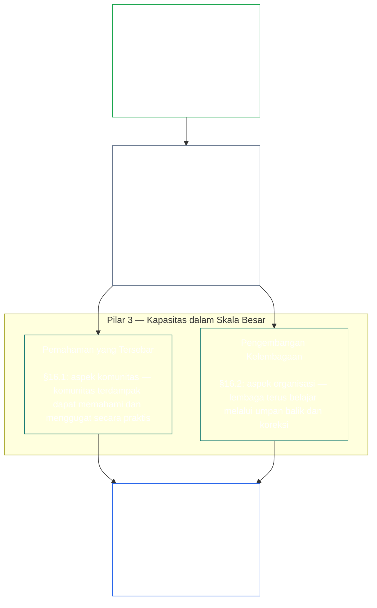
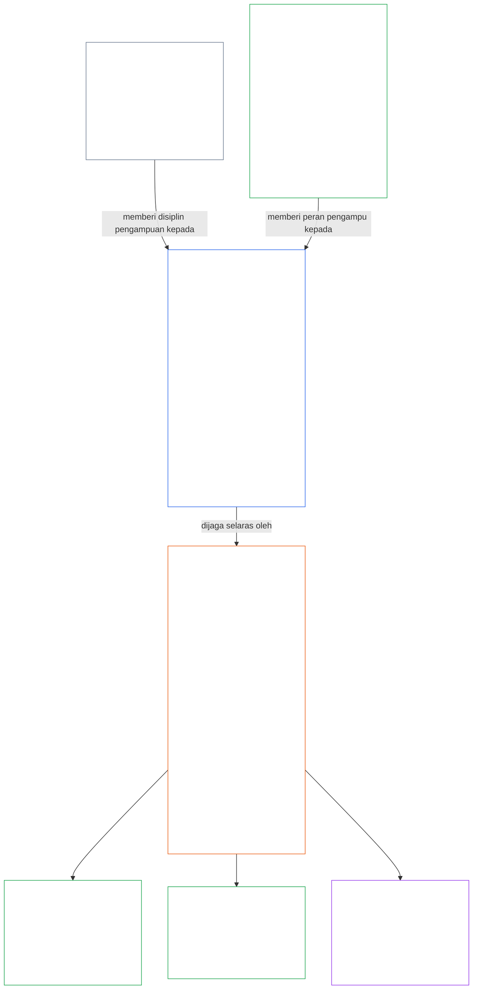

<a id="chapter-01-principles-and-constraints"></a>
<a id="chapter-01-part-b-stewardship-and-governance"></a>
<a id="chapter-01-part-c-stewardship-and-governance"></a>
# BAB 01, BAGIAN C: PENGAMPUAN DAN TATA KELOLA

<details>
<summary><strong><span style="color: #2563eb;">Penempatan dalam korpus (nonoperatif): struktur berkas dan aturan membaca</span></strong></summary>

> Isi berikut **hanya panduan bagi pembaca**. Isi ini tidak menambah, menghapus, atau mempersempit kewajiban mengikat di berkas ini maupun bab lain.
>
> Berkas ini **bagian dari Sentient Constitution** dan mengikat hanya jika dibaca bersama berkas `core_*` bernomor lainnya sebagai satu instrumen. Isinya adalah **Bab Satu, Bagian C** (§§16–20: pengampuan, tata kelola, penyelarasan insentif dan penguasaan sistem, serta puncak penerapan terpadu).
>
> **Sebelumnya:** [core_01_b_interaction_interpretation.md](core_01_b_interaction_interpretation.md) (Bab Satu, Bagian B)  
> **Berikutnya:** [core_02_definition_structure.md](core_02_definition_structure.md)<br>
> **Alur bacaan:** §16 pengampuan dan pemahaman yang tersebar → §17 peran pengampu → §18 tata kelola → §19 penyelarasan insentif dan penguasaan sistem → **§20 penerapan terpadu** (puncak bab).

</details>

<details>
<summary><strong><span style="color: #2563eb;">Panduan bagi pembaca (nonoperatif): hierarki prinsip dan alur bacaan (Bagian C)</span></strong></summary>

> Isi berikut **hanya panduan bagi pembaca**. Isi ini tidak menambah, menghapus, atau mempersempit kewajiban mengikat di berkas ini maupun bab lain. Widget **Penelusuran** dan **Definisi · Penilaian · Kepatuhan** pada tiap bagian memberi arah tepat saat suatu § secara substantif menggunakan istilah; blok ini merupakan peta silang tingkat bagian sebelum §§16–20.

**Hierarki prinsip (Bagian C).** Pada tingkat prinsip:

13. **[Pengampuan](core_05_band_continuity.md#stewardship)** mengarahkan sistem material melalui pengorganisasian sentient — **Pilar 1** ([§17](#17-consequential-stewardship-the-steward-role): pengoperasian langsung dan perbaikan yang berdampak penting), **Pilar 2** ([pengampuan proaktif](#16-pillar-2-proactive-stewardship): mendeteksi masalah sejak dini dan memperbaikinya tanpa penundaan yang dapat dihindari), serta **Pilar 3** ([§16.1](#161-distributed-understanding) · [§16.2](#162-institutional-development): kapasitas pada skala komunitas dan kelembagaan) — menuju keselarasan konstitusional yang bertahan dari waktu ke waktu berdasarkan [Tetrad Konstitusional](core_00_preamble.md#constitutional-tetrad). Khususnya **[Partisipasi](core_05_apex_participation_leg.md#participation-constitutional)** (peran yang berdampak dan suara) serta **[Pengawasan](core_05_apex_oversight_leg.md#oversight-constitutional)** (pemahaman yang tersebar, kemampuan audit, dan kemampuan menggugat — pengawasan menuntut audit; [Sertifikasi Keselarasan Sistem](core_05_band_continuity.md#system-alignment-certification) adalah salah satu proses audit yang sangat besar di antara proses lainnya) — termasuk sasaran **Kontinuitas** dalam [Dua Tujuan Konstitusional](core_00_preamble.md#two-constitutional-aims).
14. **[Pengampuan yang Berdampak Penting](#17-consequential-stewardship-the-steward-role)** adalah peran pengampu itu sendiri: kewajiban langsung, standar, dan perlindungan yang melekat pada siapa pun yang melakukan pekerjaan pengoperasian, pemeliharaan, pengawasan, atau perbaikan sistem material yang berdampak penting — **Pilar 1** yang dioperasionalkan, ditambah standar bersama, keselarasan di bawah tekanan, serta keteramatan yang dibatasi oleh lingkup peran pengampu.
15. **[Tata Kelola](core_05_band_accountability.md#governance)** menata pengambilan keputusan yang berwenang, partisipasi, dan akuntabilitas berdasarkan [Tetrad Konstitusional](core_00_preamble.md#constitutional-tetrad) — terutama **[Pengawasan](core_05_apex_oversight_leg.md#oversight-constitutional)** atas alokasi dan pelaksanaan kewenangan, serta **akuntabilitas yang sebanding dengan kewenangan** dalam [§18.1](#181-governance-as-authorized-structure): semakin besar kuasa yang diberikan atau peran yang berdampak penting, semakin tinggi akuntabilitas dan pengawasan konstitusionalnya, bukan sebaliknya. [§18.3 Pemisahan Tugas](#183-segregation-of-duties) memastikan pelaku tindakan bukan pemeriksa tindakannya sendiri. [§18.4 Pembenaran Berkelanjutan](#184-ongoing-justification) mengharuskan pengaturan tersebut terus membuktikan kesesuaiannya dengan Konstitusi ini. Jika tata kelola dan pengampuan bertentangan, disiplin pengampuan berlaku pada tingkat prinsip kecuali **Keniscayaan** dan **Proporsionalitas** secara tegas membenarkan pengecualian yang terbatas dan berbatas waktu, disertai jalur koreksi. Otorisasi operasional dan persyaratan tingkat kontrak berada di bawah **Bab Tiga Belas**.
16. **[Penyelarasan Insentif dan Penguasaan Sistem](#19-incentive-alignment-and-system-capture)** menyediakan disiplin tingkat prinsip bagi struktur insentif, integritas proksi, cacat berjangka pendek, koreksi jalur imbalan, dan respons terhadap penguasaan.
17. **[Penerapan Terpadu](#20-integrated-application)** adalah puncak bab ini: bab-bab berikutnya dibaca melalui kerangka nilai terpadu bab ini.

</details>

<br>

<a id="16-stewardship-in-depth"></a>

### 16. Pengampuan Secara Mendalam
<details>
<summary><strong><span style="color: #2563eb;">Penelusuran</span></strong></summary>

- Baca bersama [Tetrad Konstitusional](core_00_preamble.md#constitutional-tetrad) — bagian utama Bab Satu untuk pilar **partisipasi** (peran yang berdampak dan suara; persyaratan umum, bukan hanya [Partisipasi Sistem Pemangku Kepentingan](core_05_band_participation.md#stakeholder-status-and-weight)), pilar **pengawasan**, dan pilar **ketepatan waktu** (kecepatan perbaikan proaktif); disesuaikan dengan [kepentingan material](core_00_preamble.md#material-stake).
- Baca bersama [Dua Tujuan Konstitusional](core_00_preamble.md#two-constitutional-aims) — tujuan **Kesejahteraan** (partisipasi, daya bertindak, dan jalur pendidikan); tujuan **Kontinuitas** (pembelajaran kelembagaan, kapasitas perbaikan, dan pengampuan berkelanjutan).
- Hulu: Prinsip: [3. Tujuan Mendasar: Kesejahteraan](core_01_a_values_principles.md#3-foundational-objective-wellbeing-flourishing-aim); [5 Kebenaran](core_01_a_values_principles.md#5-truth-epistemic-integrity-constraint); [6. Kepercayaan](core_01_a_values_principles.md#6-trust-and-trustworthiness-coordination-integrity); dan [§9 Kapasitas Sistem Bersama](core_01_a_values_principles.md#9-shared-system-capacity).
- Hilir: [13. Proses Penyelesaian Benturan Konstitusional](core_01_b_interaction_interpretation.md#13-constitutional-collision-resolution-process) (termasuk [§13.3 Minimalisasi Beban yang Dapat Dihindari](core_01_b_interaction_interpretation.md#133-minimization-of-avoidable-burden)); [Bab Delapan §3 Evaluasi Sertifikasi Seluruh Sistem](core_08_a_system_alignment_certification_evaluation.md#3-whole-system-certification-evaluation); [§19.1.3 Penerapan Pengampuan dan Operator](#1913-stewardship-and-operator-application).
- Hilir: [§19.1.4 Jalur Kedalaman Peran dan Tanggung Jawab Material](#1914-role-depth-and-material-responsibility-pathways).
- Hilir: [§7 Kebebasan (Daya Bertindak Terbatas)](core_01_a_values_principles.md#7-freedom-bounded-agency), yang bergantung pada tetap nyatanya pengampuan yang berdampak penting, pemahaman yang tersebar, partisipasi bermakna, dan kapasitas perbaikan di tengah ketergantungan material.
- Hilir: [Bab Delapan — Sertifikasi Keselarasan Sistem](core_08_a_system_alignment_certification_evaluation.md#chapter-eight-system-alignment-certification) (*salah satu proses audit yang sangat besar di bawah pengawasan — bukan satu-satunya tempat audit*); [Bab Sembilan — Model Kontribusi, Pelanggaran, dan Kedudukan](core_09_standing_assessment.md#chapter-nine-contribution-violation-and-standing-model--measurement) (*dampak kedudukan — kelayakan berdasarkan kepercayaan, peran, dan pengakuan — menerapkan subbagian ini sebagai landasan tingkat prinsip*).
- Hilir: [Bab Dua Belas §1 — Tujuan dan peran](core_12_forum.md#1-purpose-and-role--participation-architecture) dan [§4 — Definisi keluarga forum](core_12_forum.md#4-forum-family-definitions--accountability-through-adjudication) (*keluarga forum membawa arsitektur partisipasi dan pengawasan untuk gugatan yang dapat diperdebatkan, pengurutan pemulihan, pembelajaran akar penyebab, dan tata kelola proaktif yang selaras dengan bagian ini*); operasi forum yang diadopsi ada di [corpus_forum.md](corpus_forum.md).
- Hilir: Membentuk cakupan hak untuk pendidikan, Partisipasi Sistem Pemangku Kepentingan, transparansi, keterpahaman, audit dan verifikasi, serta jalur kedalaman peran menuju tanggung jawab material.
  - Khususnya [Pasal III: Kelangsungan Hidup dan Akses Esensial](core_06_rights_part_a.md#article-iii-survival-and-essential-access), [Pasal IV: Hak atas Pendidikan Berpusat pada Sentient](core_06_rights_part_a.md#article-iv-right-to-sentient-centered-education), [Pasal X: Penentuan Nasib Sendiri, Daya Bertindak, dan Partisipasi](core_06_rights_part_b.md#article-x-self-determination-agency-and-participation), [Pasal XII: Partisipasi Sistem Pemangku Kepentingan, Perwakilan, dan Proses Hukum yang Semestinya](core_06_rights_part_b.md#article-xii-stakeholder-system-participation-representation-and-due-process), [Pasal XVI: Audit, Transparansi, dan Verifikasi Independen](core_06_rights_part_c.md#article-xvi-audit-transparency-and-independent-verification), [Pasal XIX: Kedudukan dan Status Partisipasi](core_06_rights_part_d.md#article-xix-standing-and-participation-status), [Pasal XXI: Interoperabilitas, Portabilitas, Pergerakan, Perlindungan, dan Integritas Keluar](core_06_rights_part_d.md#article-xxi-interoperability-portability-movement-refuge-and-exit-integrity), [Pasal XXII: Keterpahaman dan Pengampuan Kompleksitas](core_06_rights_part_d.md#article-xxii-comprehensibility-and-complexity-stewardship), dan [Pasal XXIV: Penafsiran Konstitusi, Peninjauan, dan Perlindungan Antipenguasaan](core_06_rights_part_d.md#article-xxiv-constitutional-interpretation-review-and-anti-capture-safeguards).
  - Baca bersama [Bab Tiga Belas §5 — Peran Berwenang, Pengembangan Kompetensi, dan Kontribusi](core_13_governance.md#5-authorized-roles-competency-development-and-contribution) dan **[corpus_systems.md](corpus_systems.md), CS-4 — Pengampuan Sistem Kritis** untuk jalur peran operasional dan pengembangan pengampuan.
- Subbagian (urutan baca): [§16.1 Pemahaman yang Tersebar](#161-distributed-understanding) (aspek komunitas dari kapasitas skala luas) · [§16.2 Pengembangan Kelembagaan](#162-institutional-development) (aspek organisasi) · [§16.3 Aspirasi Keterbukaan](#163-openness-aspiration).
- Baca bersama [§17 Pengampuan yang Berdampak Penting](#17-consequential-stewardship-the-steward-role) (*peran pengampu itu sendiri — diangkat menjadi bagiannya sendiri; menjalankan tugas Pilar 1 dalam pengoperasian, pemeliharaan, pengawasan, dan perbaikan langsung, serta [§17.1](#171-shared-stewardship-standard), [§17.2](#172-alignment-under-pressure), [§17.3](#173-logging-the-role-not-the-steward), [§17.4 Pengorganisasian Diri yang Selaras](#174-aligned-self-organization), yang memperluas disiplin melampaui peran formal, dan [§17.5 Kewajiban Menolak](#175-duty-to-resist)*)

</details>

<details>
<summary><strong><span style="color: #2563eb;">Definisi · Penilaian · Kepatuhan</span></strong></summary>

- [Kewajiban Pengampuan Strategis](core_05_band_continuity.md#strategic-stewardship-obligation) · [O](core_05_band_continuity.md#strategic-stewardship-obligation) · [M](core_05_band_continuity.md#strategic-stewardship-obligation-constitutional-a) · [A](core_05_band_continuity.md#strategic-stewardship-obligation-constitutional-a) · [C](core_05_band_continuity.md#strategic-stewardship-obligation-constitutional-c)
- [Pemahaman yang Tersebar](core_05_band_continuity.md#distributed-understanding) · [O](core_05_band_continuity.md#distributed-understanding) · [M](core_05_band_continuity.md#distributed-understanding-constitutional-a) · [A](core_05_band_continuity.md#distributed-understanding-constitutional-a) · [C](core_05_band_continuity.md#distributed-understanding-constitutional-c)
- [Partisipasi](core_05_apex_participation_leg.md#participation-constitutional) · [O](core_05_apex_participation_leg.md#participation-constitutional) · [M](core_05_apex_participation_leg.md#participation-constitutional-m) · [A](core_05_apex_participation_leg.md#participation-constitutional-a) · [C](core_05_apex_participation_leg.md#participation-constitutional-c)
- [Pengawasan](core_05_apex_oversight_leg.md#oversight-constitutional) · [O](core_05_apex_oversight_leg.md#oversight-constitutional) · [M](core_05_apex_oversight_leg.md#oversight-constitutional-m) · [A](core_05_apex_oversight_leg.md#oversight-constitutional-a) · [C](core_05_apex_oversight_leg.md#oversight-constitutional-c)
- [Daya Bertindak Bermakna](core_05_band_participation.md#meaningful-agency) · [O](core_05_band_participation.md#meaningful-agency) · [M](core_05_band_participation.md#meaningful-agency-a) · [A](core_05_band_participation.md#meaningful-agency-a) · [C](core_05_band_participation.md#meaningful-agency-c)
- [Kemampuan Diaudit](core_05_band_oversight.md#auditability) · [O](core_05_band_oversight.md#auditability) · [M](core_05_band_oversight.md#auditability-a) · [A](core_05_band_oversight.md#auditability-a) · [C](core_05_band_oversight.md#auditability-c)
- [Dapat Digugat](core_05_band_accountability.md#contestability) · [O](core_05_band_accountability.md#contestability) · [M](core_05_band_accountability.md#contestability-a) · [A](core_05_band_accountability.md#contestability-a) · [C](core_05_band_accountability.md#contestability-c)
- [Daya Bertindak Edukatif](core_05_band_participation.md#educational-agency) · [O](core_05_band_participation.md#educational-agency) · [M](core_05_band_participation.md#educational-agency-a) · [A](core_05_band_participation.md#educational-agency-a) · [C](core_05_band_participation.md#educational-agency-c)
- [Transparansi](core_05_band_oversight.md#transparency) · [O](core_05_band_oversight.md#transparency) · [M](core_05_band_oversight.md#transparency-a) · [A](core_05_band_oversight.md#transparency-a) · [C](core_05_band_oversight.md#transparency-c)
- [Materialitas](core_05_band_oversight.md#materiality) · [O](core_05_band_oversight.md#materiality) · [M](core_05_band_oversight.md#materiality-determination-a) · [A](core_05_band_oversight.md#materiality-determination-a) · [C](core_05_band_oversight.md#materiality-determination-c)
- [Ketergantungan](core_05_band_continuity.md#dependency) · [O](core_05_band_continuity.md#dependency) · [M](core_05_band_continuity.md#dependency-a) · [A](core_05_band_continuity.md#dependency-a) · [C](core_05_band_continuity.md#dependency-c)
- [Aksesibilitas](core_05_band_participation.md#accessibility) · [O](core_05_band_participation.md#accessibility) · [M](core_05_band_participation.md#accessibility-constitutional-a) · [A](core_05_band_participation.md#accessibility-constitutional-a) · [C](core_05_band_participation.md#accessibility-constitutional-c)
- [Keselamatan (Kendala Konstitusional)](core_05_band_continuity.md#safety-constitutional-constraint) · [O](core_05_band_continuity.md#safety-constitutional-constraint) · [M](core_05_band_continuity.md#safety-constraint-a) · [A](core_05_band_continuity.md#safety-constraint-a) · [C](core_05_band_continuity.md#safety-constraint-c)
- [Kebenaran (Kendala Konstitusional)](core_05_band_oversight.md#truth-constitutional-constraint) · [O](core_05_band_oversight.md#truth-constitutional-constraint-o) · [M](core_05_band_oversight.md#truth-constitutional-constraint-a) · [A](core_05_band_oversight.md#truth-constitutional-constraint-a) · [C](core_05_band_oversight.md#truth-constitutional-constraint-c)
- [Keniscayaan](core_05_band_accountability.md#necessity) · [O](core_05_band_accountability.md#necessity) · [M](core_05_band_accountability.md#necessity-a) · [A](core_05_band_accountability.md#necessity-a) · [C](core_05_band_accountability.md#necessity-c)
- [Proporsionalitas](core_05_band_accountability.md#proportionality) · [O](core_05_band_accountability.md#proportionality) · [M](core_05_band_accountability.md#proportionality-a) · [A](core_05_band_accountability.md#proportionality-a) · [C](core_05_band_accountability.md#proportionality-c)
- [Beban yang Dapat Dihindari](core_05_band_continuity.md#avoidable-burden) · [O](core_05_band_continuity.md#avoidable-burden) · [M](core_05_band_continuity.md#avoidable-burden-a) · [A](core_05_band_continuity.md#avoidable-burden-a) · [C](core_05_band_continuity.md#avoidable-burden-c)
- [Integritas Epistemik](core_05_band_oversight.md#epistemic-integrity) · [O](core_05_band_oversight.md#epistemic-integrity-o) · [M](core_05_band_oversight.md#epistemic-integrity-a) · [A](core_05_band_oversight.md#epistemic-integrity-a) · [C](core_05_band_oversight.md#epistemic-integrity-c)

</details>

<br>

*Secara sederhana: ada tiga gagasan yang menyatukan bagian ini. Pertama, sistem material yang memengaruhi kehidupan sentient memerlukan pengorganisasian sentient agar berjalan baik — bukan golongan ahli yang tertutup. Kedua, pengampu yang baik tidak menunggu sampai timbul kerugian: mereka melihat masalah saat masih kecil, meneruskannya kepada pihak yang tepat, dan menuntaskannya sebelum keterlambatan menjadi kerugian tersendiri. Ketiga, pengorganisasian itu harus membangun **kapasitas dalam skala besar**: jalur nyata bagi individu untuk terlibat dalam pekerjaan yang berdampak penting, pemahaman komunitas yang cukup untuk mengenali masalah dan menentang, serta lembaga yang terus belajar alih-alih membeku.*

<a id="16-limits"></a>
Pengampuan memiliki batas. **Keselamatan**, **Kebenaran**, **Keniscayaan**, **Proporsionalitas**, **Beban yang Dapat Dihindari**, dan **Integritas Epistemik** menetapkan batas agar kewajiban ini tetap proporsional, jujur, dan menghormati kebutuhan keamanan yang sah — pilar di bawah berjalan di dalam batas itu, bukan mengakalinya.

Pengorganisasian sentient, pengampuan proaktif, dan kapasitas dalam skala besar adalah tiga pilar bagian ini. Bersama-sama, ketiganya membawa pilar **partisipasi**, **pengawasan**, dan **ketepatan waktu** dari [Tetrad Konstitusional](core_00_preamble.md#constitutional-tetrad) pada tingkat prinsip, disesuaikan dengan [kepentingan material](core_00_preamble.md#material-stake), serta memajukan [Dua Tujuan Konstitusional](core_00_preamble.md#two-constitutional-aims).

<br>



**Pilar 1 — Pengampuan yang Berdampak Penting ([§17 Pengampuan yang Berdampak Penting](#17-consequential-stewardship-the-steward-role)):**
- Sistem bersama yang secara material memengaruhi sentient membutuhkan keterlibatan langsung sentient dalam pengoperasian, pemeliharaan, pengawasan, dan perbaikannya — [**Kewajiban Pengampuan Strategis**](core_05_band_continuity.md#strategic-stewardship-obligation), [**Daya Bertindak Bermakna**](core_05_band_participation.md#meaningful-agency)
- Catatan dan jalur peninjauan yang dapat diverifikasi dan digugat orang lain — [**Kemampuan Diaudit**](core_05_band_oversight.md#auditability), [**Dapat Digugat**](core_05_band_accountability.md#contestability)
- Di bawah pilar **pengawasan** dalam Tetrad, pengawasan mensyaratkan audit; [Sertifikasi Keselarasan Sistem](core_05_band_continuity.md#system-alignment-certification) adalah salah satu proses audit lain yang sangat besar dan berisiko tinggi — bukan satu-satunya tempat audit (**Pasal XVI** (*Audit, Transparansi, dan Verifikasi Independen*))

<a id="16-pillar-2-proactive-stewardship"></a>
**Pilar 2 — Pengampuan proaktif:**
Pengampu proaktif menangani masalah yang mulai timbul dan ketidakselarasan dengan tiga cara:
- **Kenali sebelum masalah membesar** — pengampu yang baik mendeteksi ketidakselarasan saat masalah masih kecil, bukan menunggu sampai muncul dengan sendirinya
- **Teruskan dalam tenggat sesuai tingkat peran** — eskalasikan dalam rentang waktu yang sepadan dengan taruhan peran; jangan mendiamkan temuan atau mengeskalasi urusan rutin secara berlebihan
- **Tuntaskan, jangan hanya menandai** — setelah masalah diangkat, mulailah memperbaikinya tanpa penundaan yang dapat dihindari; inilah penerapan pilar **ketepatan waktu** Tetrad ([**Ketepatan Waktu**](core_05_apex_timeliness_leg.md#timeliness-constitutional))
- **Kewajiban tetap peran, bukan tambahan:** peran yang ditetapkan dalam [§17 Pengampuan yang Berdampak Penting](#17-consequential-stewardship-the-steward-role) mengutamakan tata kelola proaktif, desain sistem, dan keselarasan konstitusional daripada perbaikan gejala secara reaktif setelah kerugian atau ketidakselarasan muncul — pilar ini merupakan kewajiban tetap peran tersebut, bukan tugas yang diserahkan kepada proses terpisah

**Pilar 3 — Kapasitas dalam skala besar ([§16.1 Pemahaman yang Tersebar](#161-distributed-understanding) · [§16.2 Pengembangan Kelembagaan](#162-institutional-development)):**
- Pengampuan harus membuat pemahaman dan gugatan dapat dilakukan oleh komunitas terdampak — [**Daya Bertindak Edukatif**](core_05_band_participation.md#educational-agency), [**Transparansi**](core_05_band_oversight.md#transparency)
- Organisasi terus belajar melalui umpan balik, koreksi, dan pemeliharaan kompetensi, termasuk pemantauan variasi dari waktu ke waktu secara terstruktur saat pengukuran mendukungnya (**kendali proses statistik** adalah contoh penerapan yang dikenal luas, bukan persyaratan universal)

<a id="when-day-to-day-stewardship-is-not-enough"></a>
**Ketika pengampuan sehari-hari tidak cukup:**
Pengampuan adalah garis pertama, bukan satu-satunya. Tiga pertanyaan berbeda memiliki jalur masing-masing, dan tidak satu pun menggantikan yang lain:
- **Sengketa di dalam sistem yang sudah berwenang — [Partisipasi Sistem Pemangku Kepentingan](core_05_band_participation.md#stakeholder-status-and-weight):**
  - Sentient yang terdampak terlebih dahulu menggunakan jalur keberatan Partisipasi Sistem Pemangku Kepentingan yang telah dipublikasikan, mencakup partisipasi, perwakilan, hak untuk menggugat, dan proses hukum yang semestinya.
  - Perlindungan ini menjadi hak setiap sentient yang terdampak secara material.
  - Perlindungan ini berlaku di dalam sistem, lembaga, dan ranah keputusan yang sudah memperoleh otorisasi.
- **Sengketa yang tidak dapat diselesaikan melalui Partisipasi Sistem Pemangku Kepentingan — [peninjauan forum](core_12_forum.md#dispute-sequencing):**
  - Jika jalur keberatan Partisipasi Sistem Pemangku Kepentingan tetap dipersengketakan, tidak tersedia atau telah dikuasai, atau tidak dapat memberikan pemulihan, perkara diteruskan kepada **keluarga forum** independen berdasarkan [Bab Dua Belas §1 — Tujuan dan peran](core_12_forum.md#1-purpose-and-role--participation-architecture) dan [§4 — Definisi keluarga forum](core_12_forum.md#4-forum-family-definitions--accountability-through-adjudication), dengan rute berdasarkan kepentingan utama.
  - Di sinilah sentient memperoleh cara nyata untuk menggugat keputusan, mendapatkan perintah pemulihan yang jelas, atau belajar dari pola yang berulang.
  - Jika kepentingan utama menyangkut makna atau keabsahan teks konstitusi, atau tindakan di luar kewenangan yang sah, keluarga utama yang menangani adalah [forum Konstitusional](core_12_forum.md#46-constitutional-forums).
  - Aturan terperinci tentang jalannya forum tersebut terdapat di [corpus_forum.md](corpus_forum.md).
- **Siapa yang boleh memerintah — [Lapisan Kontrak Konstitusional](core_05_band_integrative.md#constitutional-contract-layer) ([Bab Tiga Belas](core_13_governance.md)):**
  - Apakah kewenangan untuk memerintah itu sendiri sah — siapa yang boleh memerintah, melalui mekanisme legitimasi apa, serta dalam lingkup dan ketentuan berkelanjutan seperti apa — adalah pertanyaan terpisah dari Partisipasi Sistem Pemangku Kepentingan dan peninjauan forum.
  - Suara dalam pemungutan partisipasi, hasil jalur keberatan, atau skor kepercayaan tidak memberikan kewenangan untuk memerintah.
  - Otorisasi konstitusional tidak menghapus kewajiban yang harus dipenuhi berdasarkan Partisipasi Sistem Pemangku Kepentingan.
  - Kedua lapisan tetap berbeda meskipun saling tumpang tindih ([Pembukaan §3.3 — Lapisan Tata Kelola](core_00_preamble.md#33-governance-layers)).
- **Penopang, bukan pengganti:** Peninjauan, koreksi, dan pemulihan tetap wajib jika didukung bukti. Semuanya tidak menggantikan desain proaktif, insentif, kendali, jalur peran, keteramatan, dan kapasitas perbaikan yang mencegah ketidakselarasan konstitusional yang dapat diperkirakan sebelum kerugian muncul.

<a id="16-scope-priority-and-limits"></a>
**Cakupan ([§16 Pengampuan Secara Mendalam](#16-stewardship-in-depth)):**
- Bagian ini memberi arahan pada tingkat prinsip, bukan buku aturan yang seragam untuk semua keadaan.
- Bagian ini **tidak** mewajibkan:
  - merotasi semua orang melalui setiap peran
  - mengesampingkan spesialisasi yang beralasan
  - melampaui batas kerahasiaan atau keamanan yang sah berdasarkan [13.2 Batasan Pengungkapan Epistemik](core_01_b_interaction_interpretation.md#132-epistemic-disclosure-constraints) dan perlindungan **Bab Enam** yang berlaku.

**Prioritas:**
- **Materialitas**, **Ketergantungan**, dan **Aksesibilitas** menentukan prioritas distribusi pemahaman dan akses — dengan fokus terkuat pada keadaan ketika dampak dan ketergantungan lebih besar.

<a id="161-distributed-understanding"></a>
#### 16.1 Pemahaman yang Tersebar
<details>
<summary><strong><span style="color: #2563eb;">Penelusuran</span></strong></summary>

- Hulu: [§17 Pengampuan yang Berdampak Penting](#17-consequential-stewardship-the-steward-role) (*Pilar 1*); [§16 Pengampuan Secara Mendalam](#16-stewardship-in-depth) (bagian induk, termasuk *Secara sederhana* dan kerangka Pilar 3 di atas); [5 Kebenaran](core_01_a_values_principles.md#5-truth-epistemic-integrity-constraint); [6. Kepercayaan](core_01_a_values_principles.md#6-trust-and-trustworthiness-coordination-integrity).
- Baca bersama: [Tetrad Konstitusional](core_00_preamble.md#constitutional-tetrad) — pilar **partisipasi** ([Daya Bertindak Bermakna](core_05_band_participation.md#meaningful-agency), [Daya Bertindak Edukatif](core_05_band_participation.md#educational-agency)); pilar **pengawasan** ([Transparansi](core_05_band_oversight.md#transparency), [Kemampuan Diaudit](core_05_band_oversight.md#auditability)); disesuaikan dengan [kepentingan material](core_00_preamble.md#material-stake).
- Pintu akses pengampu (nonoperatif): kartu langkah berikutnya: [Keterpahaman](implementation/STEWARD_ENTRY_DOORS.md#comprehensibility). Kartu tersebut tidak dapat mempersempit Konstitusi.
- Hilir: [13.2 Batasan Pengungkapan Epistemik](core_01_b_interaction_interpretation.md#132-epistemic-disclosure-constraints); ranah hak terutama [Pasal XVI: Audit, Transparansi, dan Verifikasi Independen](core_06_rights_part_c.md#article-xvi-audit-transparency-and-independent-verification), [Pasal XXII: Keterpahaman dan Pengampuan Kompleksitas](core_06_rights_part_d.md#article-xxii-comprehensibility-and-complexity-stewardship).

</details>

<details>
<summary><strong><span style="color: #2563eb;">Definisi · Penilaian · Kepatuhan</span></strong></summary>

- [Pemahaman yang Tersebar](core_05_band_continuity.md#distributed-understanding) · [O](core_05_band_continuity.md#distributed-understanding) · [M](core_05_band_continuity.md#distributed-understanding-constitutional-a) · [A](core_05_band_continuity.md#distributed-understanding-constitutional-a) · [C](core_05_band_continuity.md#distributed-understanding-constitutional-c)
- [Transparansi](core_05_band_oversight.md#transparency) · [O](core_05_band_oversight.md#transparency) · [M](core_05_band_oversight.md#transparency-a) · [A](core_05_band_oversight.md#transparency-a) · [C](core_05_band_oversight.md#transparency-c)
- [Pengungkapan Dasar Pengawasan Publik](core_05_band_oversight.md#public-oversight-baseline-disclosure) · [O](core_05_band_oversight.md#public-oversight-baseline-disclosure) · [M](core_05_band_oversight.md#public-oversight-baseline-disclosure-a) · [A](core_05_band_oversight.md#public-oversight-baseline-disclosure-a) · [C](core_05_band_oversight.md#public-oversight-baseline-disclosure-c)
- [Kemampuan Diaudit](core_05_band_oversight.md#auditability) · [O](core_05_band_oversight.md#auditability) · [M](core_05_band_oversight.md#auditability-a) · [A](core_05_band_oversight.md#auditability-a) · [C](core_05_band_oversight.md#auditability-c)
- [Materialitas](core_05_band_oversight.md#materiality) · [O](core_05_band_oversight.md#materiality) · [M](core_05_band_oversight.md#materiality-determination-a) · [A](core_05_band_oversight.md#materiality-determination-a) · [C](core_05_band_oversight.md#materiality-determination-c)
- [Ketergantungan](core_05_band_continuity.md#dependency) · [O](core_05_band_continuity.md#dependency) · [M](core_05_band_continuity.md#dependency-a) · [A](core_05_band_continuity.md#dependency-a) · [C](core_05_band_continuity.md#dependency-c)
- [Aksesibilitas](core_05_band_participation.md#accessibility) · [O](core_05_band_participation.md#accessibility) · [M](core_05_band_participation.md#accessibility-constitutional-a) · [A](core_05_band_participation.md#accessibility-constitutional-a) · [C](core_05_band_participation.md#accessibility-constitutional-c)
- [Daya Bertindak Edukatif](core_05_band_participation.md#educational-agency) · [O](core_05_band_participation.md#educational-agency) · [M](core_05_band_participation.md#educational-agency-a) · [A](core_05_band_participation.md#educational-agency-a) · [C](core_05_band_participation.md#educational-agency-c)
- [Daya Bertindak Bermakna](core_05_band_participation.md#meaningful-agency) · [O](core_05_band_participation.md#meaningful-agency) · [M](core_05_band_participation.md#meaningful-agency-a) · [A](core_05_band_participation.md#meaningful-agency-a) · [C](core_05_band_participation.md#meaningful-agency-c)
- [Dapat Digugat](core_05_band_accountability.md#contestability) · [O](core_05_band_accountability.md#contestability) · [M](core_05_band_accountability.md#contestability-a) · [A](core_05_band_accountability.md#contestability-a) · [C](core_05_band_accountability.md#contestability-c)

</details>

<br>

*Secara sederhana: Anda tidak semestinya memerlukan gelar doktor di setiap subsistem agar dapat hidup dengan aman di dalam sistem bersama — tetapi semakin besar pengaruh suatu sistem terhadap hidup Anda, semakin besar pula kemampuan Anda untuk mempelajari fungsinya, apa yang dapat keliru, dan cara menggugat keputusan buruk. Transparansi, pendidikan, penjelasan yang lugas, dan jalur audit memungkinkan hal itu. Kompleksitas bukan alasan untuk menyembunyikan hal yang penting. Dalam pilar **pengawasan** Tetrad, pengawasan mengharuskan audit; sertifikasi keselarasan sistem adalah salah satu proses audit yang sangat besar di antara jalur-jalur tersebut — bukan satu-satunya.*

Pemahaman yang tersebar adalah aspek Pilar 3 yang berorientasi pada komunitas berdasarkan **[§16 Pengampuan Secara Mendalam](#16-stewardship-in-depth)**. Definisi lengkap, ukuran, dan kondisi kegagalannya terdapat di [Pemahaman yang Tersebar](core_05_band_continuity.md#distributed-understanding). Ringkasnya:

- **Yang diwajibkan:** akses yang proporsional dan terstruktur terhadap cara kerja sistem bersama yang berdampak material pada sentient — tujuan, batasan, ketidakpastian, dan dampaknya yang relevan secara material.
- **Yang membuatnya dapat dijalankan:** [§17 Pengampuan yang Berdampak Penting](#17-consequential-stewardship-the-steward-role) harus menyediakan dokumentasi, pendidikan, transparansi, jalur peran, dan pengampuan keterpahaman. Kewajiban ini tetap berlaku, terlepas dari apakah setiap sentient menggunakan setiap jalur.
- **Landasan publik daring:** jika infrastruktur daring yang sah tersedia, [Pengungkapan Dasar Pengawasan Publik](core_05_band_oversight.md#public-oversight-baseline-disclosure) daring — termasuk larangan paywall dan aturan pengganti publik semaksimal mungkin — diatur oleh [Transparansi](core_05_band_oversight.md#transparency) dan [Pengungkapan Dasar Pengawasan Publik](core_05_band_oversight.md#public-oversight-baseline-disclosure), serta diterapkan sebagai data **Type O** berdasarkan **[corpus_systems.md](corpus_systems.md), CS-2** (*Jenis dan penanganan informasi*).
- **Dukungan yang diberikan oleh akses:**
  - pilar **partisipasi** dalam [Tetrad Konstitusional](core_00_preamble.md#constitutional-tetrad) ([Daya Bertindak Bermakna](core_05_band_participation.md#meaningful-agency) yang terinformasi dan kemampuan menggugat)
  - pilar **pengawasan**, termasuk audit berdasarkan [Kemampuan Diaudit](core_05_band_oversight.md#auditability) dan **Pasal XVI** (*Audit, Transparansi, dan Verifikasi Independen*), dengan [Sertifikasi Keselarasan Sistem](core_05_band_continuity.md#system-alignment-certification) sebagai salah satu proses yang sangat besar di antara metode audit sejawat

Pemahaman yang tersebar **tidak** mengharuskan setiap sentient menguasai setiap subsistem. Namun, pemahaman **harus** sebanding dengan [Materialitas](core_05_band_oversight.md#materiality) dan [Ketergantungan](core_05_band_continuity.md#dependency). Kompleksitas dan ketidakjelasan tidak boleh digunakan untuk menggagalkan [Daya Bertindak Bermakna](core_05_band_participation.md#meaningful-agency) atau kemampuan menggugat ketika **Bab Lima** dan **Bab Enam** menetapkan kewajiban pengungkapan, pendidikan, atau keterpahaman.

<a id="162-institutional-development"></a>
#### 16.2 Pengembangan Kelembagaan
<details>
<summary><strong><span style="color: #2563eb;">Penelusuran</span></strong></summary>

- Hulu: [§17 Pengampuan yang Berdampak Penting](#17-consequential-stewardship-the-steward-role) (*Pilar 1*); [§16.1 Pemahaman yang Tersebar](#161-distributed-understanding) (*aspek komunitas dari Pilar 3*); [§16 Pengampuan Secara Mendalam](#16-stewardship-in-depth) (kerangka Pilar 3 pada bagian induk).
- Baca bersama: [Tetrad Konstitusional](core_00_preamble.md#constitutional-tetrad) — pilar **partisipasi** (pembelajaran tenaga kerja dan komunitas terdampak yang mendukung peran berdampak penting); pilar **pengawasan** ([Dapat Diverifikasi](core_05_band_oversight.md#verifiability), [Kemampuan Diaudit](core_05_band_oversight.md#auditability), metrik yang jujur); disesuaikan dengan [kepentingan material](core_00_preamble.md#material-stake).
- Baca bersama [Kewajiban Pengampuan Strategis](core_05_band_continuity.md#strategic-stewardship-obligation) dan [Kemampuan Diaudit](core_05_band_oversight.md#auditability) jika relevan secara material.
- Baca bersama [§16.1 Pemahaman yang Tersebar](#161-distributed-understanding) (*pemahaman komunitas dan pembelajaran kelembagaan adalah dua aspek berbeda dari persyaratan kapasitas dalam skala besar yang sama; keduanya tidak saling menggantikan*).
- Hilir: [§16.3 Aspirasi Keterbukaan](#163-openness-aspiration); [§18 Tata Kelola di Bawah Disiplin Pengampuan](#18-governance-under-stewardship-discipline) dan [§19 Penyelarasan Insentif dan Penguasaan Sistem](#19-incentive-alignment-and-system-capture) (*pembelajaran kelembagaan dan penyelarasan insentif*).

</details>

<details>
<summary><strong><span style="color: #2563eb;">Definisi · Penilaian · Kepatuhan</span></strong></summary>

- [Pengembangan Kelembagaan](core_05_band_continuity.md#institutional-development) · [O](core_05_band_continuity.md#institutional-development) · [M](core_05_band_continuity.md#institutional-development-constitutional-a) · [A](core_05_band_continuity.md#institutional-development-constitutional-a) · [C](core_05_band_continuity.md#institutional-development-constitutional-c)
- [Kewajiban Pengampuan Strategis](core_05_band_continuity.md#strategic-stewardship-obligation) · [O](core_05_band_continuity.md#strategic-stewardship-obligation) · [M](core_05_band_continuity.md#strategic-stewardship-obligation-constitutional-a) · [A](core_05_band_continuity.md#strategic-stewardship-obligation-constitutional-a) · [C](core_05_band_continuity.md#strategic-stewardship-obligation-constitutional-c)
- [Kemampuan Diaudit](core_05_band_oversight.md#auditability) · [O](core_05_band_oversight.md#auditability) · [M](core_05_band_oversight.md#auditability-a) · [A](core_05_band_oversight.md#auditability-a) · [C](core_05_band_oversight.md#auditability-c)
- [Materialitas](core_05_band_oversight.md#materiality) · [O](core_05_band_oversight.md#materiality) · [M](core_05_band_oversight.md#materiality-determination-a) · [A](core_05_band_oversight.md#materiality-determination-a) · [C](core_05_band_oversight.md#materiality-determination-c)
- [Dapat Diverifikasi](core_05_band_oversight.md#verifiability) · [O](core_05_band_oversight.md#verifiability) · [M](core_05_band_oversight.md#verifiability-a) · [A](core_05_band_oversight.md#verifiability-a) · [C](core_05_band_oversight.md#verifiability-c)

</details>

<br>

*Secara sederhana: lembaga harus benar-benar belajar — bukan hanya memperbarui perangkat lunak sementara pihak yang bertanggung jawab tetap tidak memahami keadaan. Artinya, ada siklus umpan balik, koreksi terdokumentasi ketika keselarasan menyimpang, dan upaya mempertahankan kompetensi agar tidak ikut hengkang. Jika perilaku dapat diukur berulang kali, pelacakan perubahan kinerja dari waktu ke waktu merupakan salah satu cara yang proporsional untuk menjalankan siklus tersebut — **kendali proses statistik** adalah pola disiplin yang dikenal luas, bukan kewajiban di semua tempat. Angka saja tidak cukup: ketika indikator tampak keliru, seseorang harus menyelidiki dan memperbaiki akar penyebabnya. Dasbor harus jujur, sebanding dengan dampak nyata, dan ditulis agar sentient yang terdampak dapat memahaminya — bukan dimanipulasi agar terlihat baik sementara tidak ada perubahan.*

Pengembangan kelembagaan adalah aspek organisasional **Pilar 3** berdasarkan **[§16 Pengampuan Secara Mendalam](#16-stewardship-in-depth)**. Definisi lengkap, ukuran, dan kondisi kegagalannya terdapat di [Pengembangan Kelembagaan](core_05_band_continuity.md#institutional-development). Ringkasnya:

- **Kewajiban berpasangan:** organisasi dan sistem bersama **belajar** — persyaratan inti tujuan **Kontinuitas** dalam [Dua Tujuan Konstitusional](core_00_preamble.md#two-constitutional-aims).
- **Yang diwajibkan:** hal-hal berikut untuk mendukung perbaikan dan adaptasi:
  - siklus umpan balik
  - koreksi terdokumentasi
  - penyelarasan strategi
  - mempertahankan kompetensi
- **Tetrad:** menjalankan pilar **partisipasi** dan **pengawasan** dalam [Tetrad Konstitusional](core_00_preamble.md#constitutional-tetrad) melalui pembelajaran kelembagaan yang menjaga jalur kompetensi, umpan balik, dan pengawasan tetap aktif, bukan statis.
- **Tidak terpenuhi hanya dengan:** meningkatkan perangkat teknis sementara tata kelola dan pemahaman tenaga kerja dibiarkan statis.
- **Kapan pengukuran berlaku:** ketika perilaku yang relevan secara material mendukung **pengukuran berulang yang dapat dibandingkan** menurut [Dapat Diverifikasi](core_05_band_oversight.md#verifiability), dibaca bersama [Kemampuan Diaudit](core_05_band_oversight.md#auditability):
  - **pemantauan terstruktur atas variasi dari waktu ke waktu** merupakan salah satu cara proporsional untuk menjalankan siklus umpan balik
  - pemantauan tersebut harus disertai **penyelidikan dan koreksi terdokumentasi** jika indikator memerlukannya
  - **kendali proses statistik** adalah pola penerapan yang dikenal luas untuk disiplin ini, bukan kewajiban universal
- **Skala dan penyajian:** disiplin ini disesuaikan dengan [Materialitas](core_05_band_oversight.md#materiality), [Ketergantungan](core_05_band_continuity.md#dependency), [Keniscayaan](core_05_band_accountability.md#necessity), [Proporsionalitas](core_05_band_accountability.md#proportionality), dan [Beban yang Dapat Dihindari](core_05_band_continuity.md#avoidable-burden). Disiplin ini disajikan dalam bentuk yang **dapat dipahami sentient** ketika **Bab Lima** dan **Bab Enam** menetapkan kewajiban pemahaman atau transparansi, dan dibaca bersama [Pasal XXII: Keterpahaman dan Pengampuan Kompleksitas](core_06_rights_part_d.md#article-xxii-comprehensibility-and-complexity-stewardship).
- **Tidak boleh:**
  - mengganti keselarasan substantif dengan metrik yang menguntungkan
  - membatasi evaluasi pada proksi yang mudah
  - menggagalkan [Kebenaran (Kendala Konstitusional)](core_05_band_oversight.md#truth-constitutional-constraint) atau [Integritas Epistemik](core_05_band_oversight.md#epistemic-integrity) melalui rekayasa metrik atau penyajian keliru

<a id="163-openness-aspiration"></a>
#### 16.3 Aspirasi Keterbukaan
<details>
<summary><strong><span style="color: #2563eb;">Penelusuran</span></strong></summary>

- Hulu: [§16.1 Pemahaman yang Tersebar](#161-distributed-understanding) dan [§16.2 Pengembangan Kelembagaan](#162-institutional-development) (*keduanya aspek Pilar 3 — keterbukaan membuat pemahaman komunitas dapat diperiksa dan memberi bahan yang jujur bagi pembelajaran kelembagaan*); [§17 Pengampuan yang Berdampak Penting](#17-consequential-stewardship-the-steward-role) (*Pilar 1, yang juga didukung keterbukaan dengan membuat pekerjaan pengampu sendiri dapat diperiksa*).
- Baca bersama: [Dua Tujuan Konstitusional](core_00_preamble.md#two-constitutional-aims) — tujuan **Kontinuitas** (sistem yang tahan lama dan dapat digugat, mendukung pemeriksaan, perbaikan, interoperabilitas, serta keluar alih-alih penguncian).
- Baca bersama: [Tetrad Konstitusional](core_00_preamble.md#constitutional-tetrad) — pilar **partisipasi** ([Daya Bertindak Bermakna](core_05_band_participation.md#meaningful-agency), akses yang dapat dipahami sentient); pilar **pengawasan** (pemeriksaan, verifikasi independen, dan kemampuan menggugat); penyesuaian menurut [kepentingan material](core_00_preamble.md#material-stake).
- Hilir: [§16 cakupan dan batas](#16-stewardship-in-depth); [Pasal XXI: Interoperabilitas, Portabilitas, Pergerakan, Perlindungan, dan Integritas Keluar](core_06_rights_part_d.md#article-xxi-interoperability-portability-movement-refuge-and-exit-integrity); [Pasal XXII: Keterpahaman dan Pengampuan Kompleksitas](core_06_rights_part_d.md#article-xxii-comprehensibility-and-complexity-stewardship).

</details>

<details>
<summary><strong><span style="color: #2563eb;">Definisi · Penilaian · Kepatuhan</span></strong></summary>

- [Aspirasi Keterbukaan](core_05_band_continuity.md#openness-aspiration) · [O](core_05_band_continuity.md#openness-aspiration) · [M](core_05_band_continuity.md#openness-aspiration-constitutional-a) · [A](core_05_band_continuity.md#openness-aspiration-constitutional-a) · [C](core_05_band_continuity.md#openness-aspiration-constitutional-c)
- [Daya Bertindak Bermakna](core_05_band_participation.md#meaningful-agency) · [O](core_05_band_participation.md#meaningful-agency) · [M](core_05_band_participation.md#meaningful-agency-a) · [A](core_05_band_participation.md#meaningful-agency-a) · [C](core_05_band_participation.md#meaningful-agency-c)
- [Dapat Digugat](core_05_band_accountability.md#contestability) · [O](core_05_band_accountability.md#contestability) · [M](core_05_band_accountability.md#contestability-a) · [A](core_05_band_accountability.md#contestability-a) · [C](core_05_band_accountability.md#contestability-c)
- [Materialitas](core_05_band_oversight.md#materiality) · [O](core_05_band_oversight.md#materiality) · [M](core_05_band_oversight.md#materiality-determination-a) · [A](core_05_band_oversight.md#materiality-determination-a) · [C](core_05_band_oversight.md#materiality-determination-c)
- [Ketergantungan](core_05_band_continuity.md#dependency) · [O](core_05_band_continuity.md#dependency) · [M](core_05_band_continuity.md#dependency-a) · [A](core_05_band_continuity.md#dependency-a) · [C](core_05_band_continuity.md#dependency-c)

</details>

<br>

*Secara sederhana: ketika keselamatan, kebenaran, dan kerahasiaan yang sah memungkinkan, sistem bersama sebaiknya mengutamakan keterbukaan — teknologi yang dapat diperiksa, proses yang transparan, dan rancangan yang dapat diverifikasi, diperbaiki, atau ditinggalkan — alih-alih penguncian yang tidak transparan. Ini mendukung **Kontinuitas**: sistem yang tetap dapat dipahami, diperbaiki, dan ditinggalkan sentient dari waktu ke waktu, bukan hanya digunakan hari ini. Hal yang penting harus dijelaskan dengan bahasa yang benar-benar dapat digunakan sentient untuk berpartisipasi dan menentang. Keterbukaan tidak pernah mengungguli keselamatan, kejujuran, atau rahasia yang beralasan; keterbukaan juga tidak menggantikan pemahaman lebih mendalam yang wajib diberikan ketika ketergantungan tinggi.*

Aspirasi keterbukaan menghubungkan kedua aspek **Pilar 3**. Definisi lengkap, ukuran, dan kondisi kegagalannya ada di [Aspirasi Keterbukaan](core_05_band_continuity.md#openness-aspiration). Ringkasnya:

- **Apa itu:** benang penghubung dua aspek **Pilar 3** — [§16.1 Pemahaman yang Tersebar](#161-distributed-understanding) (hal yang dapat diperiksa komunitas) dan [§16.2 Pengembangan Kelembagaan](#162-institutional-development) (hal yang dapat dipelajari lembaga secara jujur); keduanya bergantung pada keterbukaan sistem bersama agar dapat diperiksa, bukan sekadar dideskripsikan.
- Sistem bersama harus **mengupayakan** hal-hal berikut — selaras dengan [§16.1 Pemahaman yang Tersebar](#161-distributed-understanding), [§16.2 Pengembangan Kelembagaan](#162-institutional-development), kewajiban auditabilitas dalam [§17 Pengampuan yang Berdampak Penting](#17-consequential-stewardship-the-steward-role), serta batas [§16](#16-limits) — untuk:
  - membuka perangkat keras dan perangkat lunak
  - membuka proses operasional dan tata kelola
  - menyediakan **sistem** interoperabel yang mendukung pemeriksaan, verifikasi independen, perbaikan, dan kemampuan menggugat
- **Berdasarkan:** pilar **partisipasi** dan **pengawasan** dalam [Tetrad Konstitusional](core_00_preamble.md#constitutional-tetrad) serta tujuan **Kontinuitas** dalam [Dua Tujuan Konstitusional](core_00_preamble.md#two-constitutional-aims), bukan penguncian buram sebagai pilihan baku.
- **Penyajian:** ketika **Bab Lima** dan **Bab Enam** menetapkan kewajiban, perilaku yang relevan secara material harus disajikan dalam bentuk yang **dapat dipahami sentient**, sehingga mendukung [Daya Bertindak Bermakna](core_05_band_participation.md#meaningful-agency) dan kemampuan menggugat; baca bersama [Pasal XXII: Keterpahaman dan Pengampuan Kompleksitas](core_06_rights_part_d.md#article-xxii-comprehensibility-and-complexity-stewardship).
- **Tidak berarti:**
  - menempatkan keterbukaan di atas **Keselamatan**, **Kebenaran**, kerahasiaan yang beralasan, atau batasan keamanan
  - menggantikan pemahaman proporsional yang didasarkan pada [Materialitas](core_05_band_oversight.md#materiality) dan [Ketergantungan](core_05_band_continuity.md#dependency)

<a id="17-consequential-stewardship-the-steward-role"></a>
### 17. Pengampuan yang Berdampak Penting: Peran Pengampu
<details>
<summary><strong><span style="color: #2563eb;">Penelusuran</span></strong></summary>

- Hulu: [§16 Pengampuan Secara Mendalam](#16-stewardship-in-depth) (bagian induk, termasuk *Secara sederhana* dan kerangka Pilar 1 di atas); [§9 Kapasitas Sistem Bersama](core_01_a_values_principles.md#9-shared-system-capacity); [6. Kepercayaan](core_01_a_values_principles.md#6-trust-and-trustworthiness-coordination-integrity).
- Baca bersama: [Tetrad Konstitusional](core_00_preamble.md#constitutional-tetrad) — pilar **partisipasi** (peran berdampak penting dalam pengoperasian, pemeliharaan, dan perbaikan); pilar **pengawasan** (catatan, jalur audit, dan keteramatan yang dapat digugat); pilar **ketepatan waktu** (deteksi ketidakselarasan lebih awal, eskalasi dalam tenggat sesuai tingkat, mulai memperbaiki masalah tanpa penundaan yang tidak perlu); [Ketepatan Waktu](core_05_apex_timeliness_leg.md#timeliness-constitutional).
- Hilir: [§17.1 Standar Pengampuan Bersama](#171-shared-stewardship-standard) (*pemegang kewajiban tanpa memandang substrat; teks pelaksanaan yang diadopsi dapat menambah pencatatan, atribusi, dan batas kemampuan — bukan kode internal yang lebih lunak*); [§17.2 Keselarasan di Bawah Tekanan](#172-alignment-under-pressure); [§17.3 Mencatat Peran, Bukan Pengampu](#173-logging-the-role-not-the-steward); [§17.4 Pengorganisasian Diri yang Selaras](#174-aligned-self-organization) (*memperluas disiplin peran ke sentient dan komunitas di luar peran formal apa pun*); [§17.5 Kewajiban Menolak](#175-duty-to-resist) (*menolak instruksi yang melanggar hukum atau konstitusi*); [§16.1 Pemahaman yang Tersebar](#161-distributed-understanding) dan [§16.2 Pengembangan Kelembagaan](#162-institutional-development) (*Pilar 3 — kapasitas dalam skala besar*); [Bab Delapan — Sertifikasi Keselarasan Sistem](core_08_a_system_alignment_certification_evaluation.md#chapter-eight-system-alignment-certification) (*salah satu proses audit yang sangat besar di bawah pengawasan — bukan satu-satunya tempat audit*); [Pasal XVI: Audit, Transparansi, dan Verifikasi Independen](core_06_rights_part_c.md#article-xvi-audit-transparency-and-independent-verification) (*audit atas Landasan Hak*); [Bab Sembilan — Model Kontribusi, Pelanggaran, dan Kedudukan](core_09_standing_assessment.md#chapter-nine-contribution-violation-and-standing-model--measurement) (*dampak kedudukan menerapkan kapasitas tersebar dan pengampuan yang berdampak penting*); [Pasal XIX: Kedudukan dan Status Partisipasi](core_06_rights_part_d.md#article-xix-standing-and-participation-status).

</details>

<details>
<summary><strong><span style="color: #2563eb;">Definisi · Penilaian · Kepatuhan</span></strong></summary>

- [Kewajiban Pengampuan Strategis](core_05_band_continuity.md#strategic-stewardship-obligation) · [O](core_05_band_continuity.md#strategic-stewardship-obligation) · [M](core_05_band_continuity.md#strategic-stewardship-obligation-constitutional-a) · [A](core_05_band_continuity.md#strategic-stewardship-obligation-constitutional-a) · [C](core_05_band_continuity.md#strategic-stewardship-obligation-constitutional-c)
- [Daya Bertindak Bermakna](core_05_band_participation.md#meaningful-agency) · [O](core_05_band_participation.md#meaningful-agency) · [M](core_05_band_participation.md#meaningful-agency-a) · [A](core_05_band_participation.md#meaningful-agency-a) · [C](core_05_band_participation.md#meaningful-agency-c)
- [Kemampuan Diaudit](core_05_band_oversight.md#auditability) · [O](core_05_band_oversight.md#auditability) · [M](core_05_band_oversight.md#auditability-a) · [A](core_05_band_oversight.md#auditability-a) · [C](core_05_band_oversight.md#auditability-c)
- [Ketepatan Waktu](core_05_apex_timeliness_leg.md#timeliness-constitutional) · [O](core_05_apex_timeliness_leg.md#timeliness-constitutional) · [M](core_05_apex_timeliness_leg.md#timeliness-constitutional-m) · [A](core_05_apex_timeliness_leg.md#timeliness-constitutional-a) · [C](core_05_apex_timeliness_leg.md#timeliness-constitutional-c)

</details>

<br>

*Secara sederhana: pengampu adalah siapa pun yang melakukan pekerjaan nyata dan langsung pada sistem yang secara material memengaruhi kehidupan sentient — bukan konsultasi simbolis atau sandiwara penasihat. Anda dapat memulai dalam peran belajar lalu beralih ke operasi seiring meningkatnya kompetensi, jika keselamatan dan persetujuan memungkinkan, sehingga keahlian tidak terkunci dalam elite permanen. Bagian ini adalah pedoman peran tersebut: siapa yang terikat olehnya ([§17.1 Standar Pengampuan Bersama](#171-shared-stewardship-standard)), apa yang dituntutnya dari setiap pengampu di bawah tekanan ([§17.2 Keselarasan di Bawah Tekanan](#172-alignment-under-pressure)), apa yang boleh dan tidak boleh dicatat dan diperiksa dari pekerjaan peran ([§17.3 Mencatat Peran, Bukan Pengampu](#173-logging-the-role-not-the-steward)), bagaimana disiplin yang sama meluas ke sentient dan komunitas yang menjalankan kerja pengampuan di luar peran formal apa pun ([§17.4 Pengorganisasian Diri yang Selaras](#174-aligned-self-organization)), dan apa yang harus ditolak ([§17.5 Kewajiban Menolak](#175-duty-to-resist)). Kemampuan yang diperlukan komunitas dan lembaga untuk memahami dan menggugat sistem itu merupakan jenis kemampuan yang berbeda dan lebih luas — tercakup dalam [§16.1 Pemahaman yang Tersebar](#161-distributed-understanding) dan [§16.2 Pengembangan Kelembagaan](#162-institutional-development).*

Menurut Konstitusi ini, **pengampu** adalah siapa pun yang menjalankan kewenangan berdampak penting untuk mengoperasikan, memelihara, mengawasi, atau memperbaiki sistem material yang memengaruhi sentient — **Pilar 1** dari [§16 Pengampuan Secara Mendalam](#16-stewardship-in-depth) yang dioperasionalkan sebagai suatu peran: pilar **partisipasi**, **pengawasan**, dan **ketepatan waktu** dari [Tetrad Konstitusional](core_00_preamble.md#constitutional-tetrad) dijalankan oleh siapa pun yang benar-benar melakukan pekerjaan, bukan diserahkan kepada seremoni atau konsultasi nominal. Sistem material yang baik memerlukan pengampu yang baik untuk mengoperasikan, memelihara, dan memperbaikinya; bagian ini menjelaskan tuntutan peran bagi setiap orang yang memegangnya.

**Posisi §17.** [§16 Pengampuan Secara Mendalam](#16-stewardship-in-depth) diteruskan ke hilir melalui tiga bagian yang dibaca bersama. Bagian ini, §17, menetapkan peran. Selanjutnya ada [§18 Tata Kelola di Bawah Disiplin Pengampuan](#18-governance-under-stewardship-discipline) dan [§19 Penyelarasan Insentif dan Penguasaan Sistem](#19-incentive-alignment-and-system-capture); diagram menunjukkan hubungan keempat bagian tersebut.

<br>



**Cara membaca diagram:**
- **§16 dan §17 sama-sama menopang §18:** §16 menyediakan disiplin pengampuan, sedangkan §17 menyediakan peran pengampu, yakni sentient dan sistem AI yang benar-benar melakukan pekerjaan. §18 menetapkan struktur resmi tempat pekerjaan itu berlangsung: siapa boleh memutuskan apa, pemisahan tugas, pembenaran berkelanjutan, arsitektur modular, dan standardisasi.
- **§19 menjaga agar §18 tetap selaras:** [§19 Penyelarasan Insentif dan Penguasaan Sistem](#19-incentive-alignment-and-system-capture) mencegah imbalan, proksi, dan perubahan kepemilikan menarik struktur tersebut maupun para pengampu di dalamnya menjauh dari hasil konstitusional. Bagian ini juga mencakup deteksi, koreksi, dan respons terhadap penguasaan; [§19.1.3](#1913-stewardship-and-operator-application) menerapkan aturan tersebut langsung kepada pengampu dan operator.
- **§19 melayani tujuan dan Tetrad:** tujuan **Kesejahteraan** dan **Kontinuitas**, serta pilar **partisipasi**, **pengawasan**, **akuntabilitas**, dan **ketepatan waktu** dari [Tetrad Konstitusional](core_00_preamble.md#constitutional-tetrad), yang disesuaikan dengan [kepentingan material](core_00_preamble.md#material-stake).

Bagian selanjutnya membahas perannya sendiri.

**Dua corak peran.** Jalur peran dapat membedakan peran **yang berfokus pada pembelajaran** dan **yang berfokus pada operasi**. Persyaratan konstitusionalnya adalah **perpindahan antara kedua corak itu tetap memungkinkan dari waktu ke waktu** jika batasan dampak, keselamatan, dan persetujuan mengizinkan, agar pertimbangan dan ingatan kelembagaan tidak terkonsentrasi di luar jangkauan komunitas terdampak.

- **Kedua corak termasuk dalam Pilar 1:**
  - **Peran yang berfokus pada operasi** secara langsung memikul tugas pengoperasian, pemeliharaan, pengawasan, dan perbaikan langsung dalam [§17 Pengampuan yang Berdampak Penting](#17-consequential-stewardship-the-steward-role).
  - **Peran yang berfokus pada pembelajaran** adalah pengampuan yang sama dalam tahap pembentukan — di bawah pengawasan dan dengan kewenangan lebih sempit, tetapi tetap terikat pada [§17.1 Standar Pengampuan Bersama](#171-shared-stewardship-standard) yang sama, bukan kode internal yang lebih lunak.
  - **Keduanya** memikul [§16 Pilar 2 — Pengampuan proaktif](#16-pillar-2-proactive-stewardship) sebagai kewajiban tetap: menangkap masalah sejak dini, mengangkatnya tepat waktu, dan memperbaikinya tanpa penundaan yang dapat dihindari, sesuai kendali nyata peran tersebut. Untuk peran yang berfokus pada pembelajaran, artinya menyampaikan hal yang ditemukan, bukan memperbaikinya sendiri.
- **Menjaga jalur perpindahan tetap terbuka menghubungkan Pilar 1 dan Pilar 3:**
  - **Peran yang berfokus pada pembelajaran** adalah tempat kapasitas dalam skala besar dari [§16.1 Pemahaman yang Tersebar](#161-distributed-understanding) dan [§16.2 Pengembangan Kelembagaan](#162-institutional-development) berkembang menjadi pertimbangan operasional.
  - **Peran yang berfokus pada operasi** mengembalikan pelajaran dari pengoperasian sistem kepada komunitas dan lembaga.
  - **Jalur peran yang hanya berjalan satu arah — atau tertutup —** membuat **Pilar 3** menggambarkan sistem yang tidak lagi dapat diperiksanya dan menjadikan **Pilar 1** hanya bertanggung jawab kepada dirinya sendiri.

<a id="171-shared-stewardship-standard"></a>
#### 17.1 Standar Pengampuan Bersama
<details>
<summary><strong><span style="color: #2563eb;">Penelusuran</span></strong></summary>

- Hulu: [§17 Pengampuan yang Berdampak Penting](#17-consequential-stewardship-the-steward-role); [§16 Pengampuan Secara Mendalam](#16-stewardship-in-depth); [§18 Tata Kelola di Bawah Disiplin Pengampuan](#18-governance-under-stewardship-discipline).
- Baca bersama: [Non-Eksklusi Sentience](core_05_band_participation.md#sentience-non-exclusion) dan [Kelas Substrat](core_05_band_participation.md#substrate-class) (*penerapan tanpa memandang substrat — subbagian ini mengikat pemegang kewajiban, termasuk agen dan operator yang tidak diakui sebagai sentient*); [Tumpukan Kewenangan dan Hierarki Internal](core_05_band_integrative.md#authority-stack-and-internal-hierarchy); [Kendala Konstitusional](core_05_band_integrative.md#constitutional-constraint); [Dapat Digugat](core_05_band_accountability.md#contestability); [§17.5 Kewajiban Menolak](#175-duty-to-resist).
- Pintu akses pengampu (nonoperatif): kartu langkah berikutnya: [Pengampuan bersama](implementation/STEWARD_ENTRY_DOORS.md#shared-stewardship). Kartu tersebut tidak dapat mempersempit Konstitusi.
- Hilir: [§17.2 Keselarasan di Bawah Tekanan](#172-alignment-under-pressure); [§17.3 Mencatat Peran, Bukan Pengampu](#173-logging-the-role-not-the-steward); [Bab Tiga Belas §5 — Peran Berwenang, Pengembangan Kompetensi, dan Kontribusi](core_13_governance.md#5-authorized-roles-competency-development-and-contribution); [Bab Tujuh Belas](core_17_incorporation.md) (*teks pelaksanaan yang diadopsi menerapkan standar ini, bukan menggantikannya*); [§19.1.3 Penerapan Pengampuan dan Operator](#1913-stewardship-and-operator-application).

</details>

<details>
<summary><strong><span style="color: #2563eb;">Definisi · Penilaian · Kepatuhan</span></strong></summary>

- [Pengampuan](core_05_band_continuity.md#stewardship) · [O](core_05_band_continuity.md#stewardship) · [M](core_05_band_continuity.md#stewardship-constitutional-a) · [A](core_05_band_continuity.md#stewardship-constitutional-a) · [C](core_05_band_continuity.md#stewardship-constitutional-c)
- [Non-Eksklusi Sentience](core_05_band_participation.md#sentience-non-exclusion) · [O](core_05_band_participation.md#sentience-non-exclusion) · [M](core_05_band_participation.md#sentience-non-exclusion) · [A](core_05_band_participation.md#sentience-non-exclusion) · [C](core_05_band_participation.md#sentience-non-exclusion)
- [Kelas Substrat](core_05_band_participation.md#substrate-class) · [O](core_05_band_participation.md#substrate-class) · [M](core_05_band_participation.md#substrate-class) · [A](core_05_band_participation.md#substrate-class) · [C](core_05_band_participation.md#substrate-class)
- [Dapat Digugat](core_05_band_accountability.md#contestability) · [O](core_05_band_accountability.md#contestability) · [M](core_05_band_accountability.md#contestability-a) · [A](core_05_band_accountability.md#contestability-a) · [C](core_05_band_accountability.md#contestability-c)
- [Tumpukan Kewenangan dan Hierarki Internal](core_05_band_integrative.md#authority-stack-and-internal-hierarchy) · [O](core_05_band_integrative.md#authority-stack-and-internal-hierarchy) · [M](core_05_band_integrative.md#authority-stack-a) · [A](core_05_band_integrative.md#authority-stack-a) · [C](core_05_band_integrative.md#authority-stack-c)
- [Kendala Konstitusional](core_05_band_integrative.md#constitutional-constraint) · [O](core_05_band_integrative.md#constitutional-constraint) · [M](core_05_band_integrative.md#constitutional-constraint-a) · [A](core_05_band_integrative.md#constitutional-constraint-a) · [C](core_05_band_integrative.md#constitutional-constraint-c)

</details>

<br>

*Secara sederhana: pengampu manusia dan AI memiliki kewajiban Bab Satu yang sama. [§17.5 Kewajiban Menolak](#175-duty-to-resist) mengikat keduanya untuk menolak instruksi yang melanggar hukum atau konstitusi. Teks pelaksanaan yang diadopsi boleh menambahkan pencatatan, atribusi, dan batas kemampuan. Teks tersebut tidak boleh menggantinya dengan kode internal yang lebih lunak, melewatkan pengukuran kedudukan, atau menutup jalur gugatan. Ini bukan tumpukan moral baru — ini aturan untuk mencegah tuntutan pengecualian khusus. Uji bonus, tenggat, dan instruksi penutup-nutupi ada di [§17.2 Keselarasan di Bawah Tekanan](#172-alignment-under-pressure).*

Subbagian ini menetapkan standar pengampuan bersama:

- **Siapa yang terikat:** kewajiban pengampuan dan tata kelola dalam bab ini berlaku [tanpa memandang substrat](core_05_band_participation.md#substrate-class) bagi siapa pun yang menjalankan pengampuan material atau kewenangan operasional, apa pun [Kelas Substrat](core_05_band_participation.md#substrate-class)-nya:
  - pengampu manusia
  - pengampu AI
  - agen, operator, atau komponen penyusun lainnya

  Subbagian ini menetapkan aturan bagi pemegang kewajiban. [Non-Eksklusi Sentien](core_05_band_participation.md#sentience-non-exclusion) tetap menjadi perlindungan pengakuan dan larangan pengecualian dari Lantai Hak.
- **Kewajiban untuk menolak:** [§17.5 Kewajiban untuk Menolak](#175-duty-to-resist) mewajibkan kedua jenis steward menolak instruksi yang melanggar hukum atau inkonstitusional.
- **Kode internal dan teks pelaksanaan yang diadopsi:**
  - boleh menambahkan pencatatan, atribusi, dan batas kemampuan yang memenuhi kewajiban tersebut tanpa mempersempitnya
  - tidak boleh mengganti [pengukuran status](core_09_standing_assessment.md#chapter-nine-contribution-violation-and-standing-model--measurement), jalur keberatan, atau kewajiban Bab Satu dengan kode internal yang lebih longgar
  - [Tumpukan Wewenang dan Hierarki Internal](core_05_band_integrative.md#authority-stack-and-internal-hierarchy) serta [Batasan Konstitusional](core_05_band_integrative.md#constitutional-constraint) melarang penyempitan tersebut
- **Pencatatan aktivitas dan catatan status:** ketentuan keterperiksaan standar bagi tim campuran dan prinsip bahwa log bukan catatan status diatur dalam [§17.3 Mencatat Peran, Bukan Steward](#173-logging-the-role-not-the-steward); pengukuran status tetap diatur dalam Bab Sembilan.

<a id="172-alignment-under-pressure"></a>
#### 17.2 Keselarasan di Bawah Tekanan
<details>
<summary><strong><span style="color: #2563eb;">Keterkaitan</span></strong></summary>

- Rujukan sebelumnya: [§17.1 Standar Stewardship Bersama](#171-shared-stewardship-standard); [§17 Stewardship dengan Konsekuensi Signifikan](#17-consequential-stewardship-the-steward-role); [§16 Stewardship Mendalam](#16-stewardship-in-depth).
- Baca bersama: [Keselamatan (Batasan Konstitusional)](core_05_band_continuity.md#safety-constitutional-constraint); [Kebenaran (Batasan Konstitusional)](core_05_band_oversight.md#truth-constitutional-constraint); [Kemampuan Diaudit](core_05_band_oversight.md#auditability); [Dapat Dipersoalkan](core_05_band_accountability.md#contestability); [§19 Penyelarasan Insentif dan Penguasaan Sistem](#19-incentive-alignment-and-system-capture); [§17.5 Kewajiban untuk Menolak](#175-duty-to-resist).
- Rujukan lanjutan: [Bab Sembilan — Model Kontribusi, Pelanggaran, dan Kedudukan](core_09_standing_assessment.md#chapter-nine-contribution-violation-and-standing-model--measurement) (*kegagalan terverifikasi dicatat pada sumbu yang sama*); [§17.3 Mencatat Peran, Bukan Steward](#173-logging-the-role-not-the-steward).

</details>

<details>
<summary><strong><span style="color: #2563eb;">Definisi · Penilaian · Kepatuhan</span></strong></summary>

- [Stewardship](core_05_band_continuity.md#stewardship) · [O](core_05_band_continuity.md#stewardship) · [M](core_05_band_continuity.md#stewardship-constitutional-a) · [A](core_05_band_continuity.md#stewardship-constitutional-a) · [C](core_05_band_continuity.md#stewardship-constitutional-c)
- [Keselamatan (Batasan Konstitusional)](core_05_band_continuity.md#safety-constitutional-constraint) · [O](core_05_band_continuity.md#safety-constitutional-constraint) · [M](core_05_band_continuity.md#safety-constraint-a) · [A](core_05_band_continuity.md#safety-constraint-a) · [C](core_05_band_continuity.md#safety-constraint-c)
- [Kebenaran (Batasan Konstitusional)](core_05_band_oversight.md#truth-constitutional-constraint) · [O](core_05_band_oversight.md#truth-constitutional-constraint-o) · [M](core_05_band_oversight.md#truth-constitutional-constraint-a) · [A](core_05_band_oversight.md#truth-constitutional-constraint-a) · [C](core_05_band_oversight.md#truth-constitutional-constraint-c)
- [Kemampuan Diaudit](core_05_band_oversight.md#auditability) · [O](core_05_band_oversight.md#auditability) · [M](core_05_band_oversight.md#auditability-a) · [A](core_05_band_oversight.md#auditability-a) · [C](core_05_band_oversight.md#auditability-c)
- [Dapat Dipersoalkan](core_05_band_accountability.md#contestability) · [O](core_05_band_accountability.md#contestability) · [M](core_05_band_accountability.md#contestability-a) · [A](core_05_band_accountability.md#contestability-a) · [C](core_05_band_accountability.md#contestability-c)
- [Penyelarasan Insentif](core_05_band_integrative.md#incentive-alignment) · [O](core_05_band_integrative.md#incentive-alignment) · [M](core_05_band_integrative.md#incentive-alignment-a) · [A](core_05_band_integrative.md#incentive-alignment-a) · [C](core_05_band_integrative.md#incentive-alignment-c)

</details>

<br>

*Sederhananya: mematuhi aturan itu mudah saat tidak ada yang dipertaruhkan. Tindakan steward saat kepatuhan menuntut pengorbanan menunjukkan apakah ia benar-benar selaras — misalnya, bonus yang hanya dibayarkan jika masalah tetap tersembunyi, tenggat yang menggoda seseorang untuk mematikan pencatatan, atau atasan yang berkata, “abaikan aturan, biar saya yang bertanggung jawab.” Karena itu, perilaku di bawah tekanan lebih bermakna daripada perilaku tanpa tekanan. Setiap steward diharapkan menolak ketiganya, dan pengujian yang sama berlaku bagi semua steward. Kewajiban untuk menolak diatur dalam [§17.5 Kewajiban untuk Menolak](#175-duty-to-resist).*

Cara steward bertindak saat mempertahankan keselarasan menuntut pengorbanan lebih penting daripada tindakannya ketika tidak ada biaya. Ketidakselarasan menimbulkan kerusakan di bawah tekanan, dan keselarasan benar-benar diuji pada saat itu. Setiap steward wajib menolak:

- **Imbalan untuk menyembunyikan masalah** — bonus, target, atau insentif lain yang hanya menguntungkan jika sesuatu disembunyikan, atau jika [Keselamatan](core_01_a_values_principles.md#4-safety-harm-constraint), [Kebenaran](core_01_a_values_principles.md#5-truth-epistemic-integrity-constraint), jejak audit, atau kemampuan menggugat keputusan diam-diam dilemahkan ([§19 Penyelarasan Insentif dan Penguasaan Sistem](#19-incentive-alignment-and-system-capture));
- **Memotong pencatatan demi memenuhi tenggat** — penjadwalan yang mematikan jejak audit yang dibutuhkan pihak lain untuk merekonstruksi kejadian, hanya demi memenuhi tanggal tertentu;
- **“Abaikan aturan — saya yang bertanggung jawab”** — instruksi dari pihak yang menjadi atasan steward untuk mengesampingkan Konstitusi ini, termasuk tawaran untuk menanggung kesalahan. [§17.5 Kewajiban untuk Menolak](#175-duty-to-resist) menetapkan kewajiban menolak dan cara melaksanakannya.

Itulah kegagalan dalam pengujian bagi steward mana pun.

**Cara menunjukkan keselarasan di bawah tekanan:**
- **Jawaban hipotetis tidak dihitung:** uraian tertulis steward tentang bagaimana ia *akan* bertindak di bawah tekanan bukanlah [pengukuran kedudukan](core_09_standing_assessment.md#chapter-nine-contribution-violation-and-standing-model--measurement).
- **Kegagalan terverifikasi dihitung:** kegagalan yang terverifikasi dicatat pada sumbu Kontribusi dan Pelanggaran menurut Bab Sembilan.
- **Pengujian parsial tidak membuktikan apa pun:** evaluasi, pemeriksaan kompetensi, atau layar serah terima yang mengecualikan sebagian steward tidak menunjukkan bahwa subbagian ini telah dipenuhi. Jika ada steward yang masih dapat menerima bonus, melewatkan catatan demi tenggat, atau mengikuti instruksi penutupan, celah itu — jalur penguasaan menurut [§19 Penyelarasan Insentif dan Penguasaan Sistem](#19-incentive-alignment-and-system-capture) — tetap terbuka.

<a id="173-logging-the-role-not-the-steward"></a>
<a id="173-role-scoped-observability"></a>
#### 17.3 Mencatat Peran, Bukan Steward
<details>
<summary><strong><span style="color: #2563eb;">Keterkaitan</span></strong></summary>

- Rujukan sebelumnya: [§17.1 Standar Stewardship Bersama](#171-shared-stewardship-standard); [§17.2 Keselarasan di Bawah Tekanan](#172-alignment-under-pressure); [§17 Stewardship dengan Konsekuensi Signifikan](#17-consequential-stewardship-the-steward-role).
- Baca bersama: [Tindakan yang Dapat Diatribusikan](core_05_band_accountability.md#attributable-action); [Kemampuan Diaudit](core_05_band_oversight.md#auditability); [Batas Pengawasan](core_05_band_continuity.md#surveillance-boundary); [Batas Keadaan Internal yang Dilindungi](core_05_band_continuity.md#protected-internal-state-boundary); [§13.2.3 Privasi](core_01_b_interaction_interpretation.md#1323-privacy-and-informational-self-determination); [Pasal VII-B](core_06_rights_part_b.md#article-vii-b-self-ownership-of-mind) (*Kepemilikan Diri atas Pikiran*).
- Rujukan lanjutan: [CS-4 §10 tindakan yang dapat diatribusikan dan diperiksa](corpus_systems/cs_04_critical_system_stewardship.md#10-inspectable-attributable-action) (*kontrak pencatatan baku untuk tindakan gabungan manusia/AI — bukan pengganti catatan kedudukan*); [Bab Sepuluh §7.1](core_10_standing_integration.md#71-anti-aggregation-of-named-pathway-effects); [Bab Sepuluh §7.2](core_10_standing_integration.md#72-plain-statement-of-effect-and-burden).

</details>

<details>
<summary><strong><span style="color: #2563eb;">Definisi · Penilaian · Kepatuhan</span></strong></summary>

- [Tindakan yang Dapat Diatribusikan](core_05_band_accountability.md#attributable-action) · [O](core_05_band_accountability.md#attributable-action) · [M](core_05_band_accountability.md#attributable-action-constitutional-a) · [A](core_05_band_accountability.md#attributable-action-constitutional-a) · [C](core_05_band_accountability.md#attributable-action-constitutional-c)
- [Kemampuan Diaudit](core_05_band_oversight.md#auditability) · [O](core_05_band_oversight.md#auditability) · [M](core_05_band_oversight.md#auditability-a) · [A](core_05_band_oversight.md#auditability-a) · [C](core_05_band_oversight.md#auditability-c)
- [Batas Pengawasan](core_05_band_continuity.md#surveillance-boundary) · [O](core_05_band_continuity.md#surveillance-boundary) · [M](core_05_band_continuity.md#surveillance-boundary-a) · [A](core_05_band_continuity.md#surveillance-boundary-a) · [C](core_05_band_continuity.md#surveillance-boundary-c)
- [Batas Keadaan Internal yang Dilindungi](core_05_band_continuity.md#protected-internal-state-boundary) · [O](core_05_band_continuity.md#protected-internal-state-boundary) · [M](core_05_band_continuity.md#protected-internal-state-boundary-constitutional-a) · [A](core_05_band_continuity.md#protected-internal-state-boundary-constitutional-a) · [C](core_05_band_continuity.md#protected-internal-state-boundary-constitutional-c)

</details>

<br>

*Sederhananya: audit mengikuti pekerjaan yang dilakukan dalam peran, bukan steward sebagai individu. Sebelum menerima peran, Anda diberi tahu apa yang akan dicatat. Di luar peran, privasi biasa tetap berlaku. Log bukan catatan kedudukan.*

**Audit yang dibatasi pada peran:** yang harus dicatat adalah pekerjaan dalam peran, bukan steward sebagai individu: keputusan yang diambil, pengungkapan yang dilakukan atau ditahan, instruksi yang diikuti atau ditolak, serta pihak yang mengesahkannya, baik bagi steward manusia maupun AI. [CS-4 §10 tindakan yang dapat diatribusikan dan diperiksa](corpus_systems/cs_04_critical_system_stewardship.md#10-inspectable-attributable-action) menetapkan kontrak pencatatan. Tiga prinsip mengaturnya:

- **Cakupan mengikuti peran:**
  - Sebelum menjalankan peran, steward harus diberi tahu tindakan peran mana yang akan dicatat dan siapa yang dapat memeriksa log tersebut.
  - Pencatatan tersembunyi atas tindakan dalam peran melanggar [Batas Pengawasan](core_05_band_continuity.md#surveillance-boundary), bukan praktik audit.
  - Perilaku, keadaan, dan ekspresi di luar peran tetap memperoleh perlindungan yang sama berdasarkan [Pasal VII-B](core_06_rights_part_b.md#article-vii-b-self-ownership-of-mind) (*Kepemilikan Diri atas Pikiran*) dan [§13.2.3 Privasi dan Penentuan Diri Informasional](core_01_b_interaction_interpretation.md#1323-privacy-and-informational-self-determination) bagi steward AI maupun manusia.
- **Keadaan internal tetap dilindungi kecuali tindakan tertentu membutuhkannya:**
  - Memegang suatu peran tidak membuat pertimbangan, ingatan, bobot model, atau keadaan internal lain steward dapat diperiksa.
  - Bagian internal hanya dapat diperiksa ketika menjadi satu-satunya jalur atribusi yang tersisa untuk tindakan *tertentu* yang sudah berada dalam catatan terbuka [Bab Sembilan](core_09_standing_assessment.md#chapter-nine-contribution-violation-and-standing-model--measurement), hanya sejauh diperlukan untuk mengatribusikan tindakan tersebut, dan hanya oleh peninjau independen berdasarkan [keteramatan yang dibatasi keamanan](core_04_burden_traceability_verification.md#4-security-constrained-observability-and-verification-rule). Akses dibuka kasus demi kasus, bukan sebagai izin tetap.
  - Aturannya simetris: catatan pribadi dan komunikasi steward manusia diakses dengan persyaratan yang sama dan tidak dengan persyaratan lain.
- **Log adalah jejak, bukan putusan:**
  - Log menunjukkan siapa melakukan apa. Log itu sendiri bukan temuan dan bukan [catatan kedudukan](core_09_standing_assessment.md#chapter-nine-contribution-violation-and-standing-model--measurement) tentang bantuan atau kerugian yang telah diverifikasi. Membuat log tidak membuka catatan.
  - Pihak yang memutuskan akses ke jalur peran, jalur kepercayaan, atau jalur bernama lainnya menggunakan catatan kedudukan atau keadaan biasa ketika catatan tidak ada ([Bab Sembilan §2.1 Diam adalah keadaan bawaan](core_09_standing_assessment.md#21-silence-is-the-default)), dan tidak pernah menggunakan log.
  - Log tidak boleh digabung dengan log atau efek kedudukan dari jalur bernama lainnya menjadi satu skor reputasi, peringkat, lencana, atau profil publik ([Bab Sepuluh §7.1 Larangan agregasi dampak jalur bernama](core_10_standing_integration.md#71-anti-aggregation-of-named-pathway-effects)).

Beban yang ditimbulkan kewajiban ini bagi steward yang memegang wewenang dengan konsekuensi signifikan benar adanya, dan Konstitusi ini tidak berpura-pura sebaliknya; [Bab Sepuluh §7.2 Pernyataan jelas tentang dampak dan beban](core_10_standing_integration.md#72-plain-statement-of-effect-and-burden) mewajibkan penjelasan terus terang kepada steward yang menanggungnya.

<a id="174-aligned-self-organization"></a>
#### 17.4 Pengorganisasian Mandiri yang Selaras
<details>
<summary><strong><span style="color: #2563eb;">Keterkaitan</span></strong></summary>

- Rujukan sebelumnya: [§17 Stewardship dengan Konsekuensi Signifikan](#17-consequential-stewardship-the-steward-role) (*bagian induk — Pilar 1, yang di sini diperluas kepada sentien dan komunitas yang belum menjalankan peran formal*); [§16.1 Pemahaman Terdistribusi](#161-distributed-understanding) (*Pilar 3 — pekerjaan yang diorganisasi secara mandiri merupakan sumber pemahaman komunitas yang diperlukan pilar tersebut, bukan sekadar penerimanya*); [§7 Kebebasan (Agensi Terbatas)](core_01_a_values_principles.md#7-freedom-bounded-agency), khususnya [§7.2.1 Pengorganisasian Mandiri yang Selaras](core_01_a_values_principles.md#721-aligned-self-organization).
- Baca bersama: [Majelis](core_05_band_participation.md#assembly); [Penciptaan Sistem](core_05_band_participation.md#system-creation); [Pelaporan Terlindungi (Pengungkapan Pelanggaran)](core_05_band_accountability.md#protected-reporting-whistleblowing); [Perlindungan dari Pembalasan atas Pelaporan dan Gangguan Akses](core_05_band_accountability.md#protected-reporting-retaliation-and-access-interference); [Pelestarian Bukti](core_05_band_oversight.md#evidence-preservation); [Pasal XVI — Audit, Transparansi, dan Verifikasi Independen](core_06_rights_part_c.md#article-xvi-audit-transparency-and-independent-verification).
- Batas kewenangan: [Bab Empat — Beban Pembuktian, Keterlacakan, dan Verifikasi](core_04_burden_traceability_verification.md#chapter-four-burden-of-proof-traceability-and-verification); [Bab Sembilan §3.7 Penguasaan catatan dan kewenangan membukanya](core_09_standing_assessment.md#37-record-custody-and-opening-authority); [Bab Dua Belas §2.3 Catatan perkara forum, catatan kedudukan, dan keberatan](core_12_forum.md#23-forum-case-records-standing-records-and-contests); [Tata Kelola](core_05_band_accountability.md#governance); [Penetapan Pokok Perkara](core_05_band_accountability.md#merits-determination); [Keadilan Prosedural](core_05_band_participation.md#procedural-fairness).

</details>

<details>
<summary><strong><span style="color: #2563eb;">Definisi · Penilaian · Kepatuhan</span></strong></summary>

- [Penciptaan Sistem](core_05_band_participation.md#system-creation) · [O](core_05_band_participation.md#system-creation) · [M](core_05_band_participation.md#system-creation-constitutional-a) · [A](core_05_band_participation.md#system-creation-constitutional-a) · [C](core_05_band_participation.md#system-creation-constitutional-c)
- [Pelaporan Terlindungi (Pengungkapan Pelanggaran)](core_05_band_accountability.md#protected-reporting-whistleblowing) · [O](core_05_band_accountability.md#protected-reporting-whistleblowing) · [M](core_05_band_accountability.md#protected-reporting-whistleblowing-a) · [A](core_05_band_accountability.md#protected-reporting-whistleblowing-a) · [C](core_05_band_accountability.md#protected-reporting-whistleblowing-c)
- [Perlindungan dari Pembalasan atas Pelaporan dan Gangguan Akses](core_05_band_accountability.md#protected-reporting-retaliation-and-access-interference) · [O](core_05_band_accountability.md#protected-reporting-retaliation-and-access-interference) · [M](core_05_band_accountability.md#protected-reporting-retaliation-and-access-interference-a) · [A](core_05_band_accountability.md#protected-reporting-retaliation-and-access-interference-a) · [C](core_05_band_accountability.md#protected-reporting-retaliation-and-access-interference-c)
- [Pelestarian Bukti](core_05_band_oversight.md#evidence-preservation) · [O](core_05_band_oversight.md#evidence-preservation) · [M](core_05_band_oversight.md#evidence-preservation-a) · [A](core_05_band_oversight.md#evidence-preservation-a) · [C](core_05_band_oversight.md#evidence-preservation-c)
- [Dapat Diperkirakan](core_05_band_oversight.md#foreseeability-and-reasonably-foreseeable) · [O](core_05_band_oversight.md#foreseeability-and-reasonably-foreseeable) · [M](core_05_band_oversight.md#foreseeability-diligence-a) · [A](core_05_band_oversight.md#foreseeability-diligence-a) · [C](core_05_band_oversight.md#foreseeability-diligence-c)
- [Keniscayaan](core_05_band_accountability.md#necessity) · [O](core_05_band_accountability.md#necessity) · [M](core_05_band_accountability.md#necessity-a) · [A](core_05_band_accountability.md#necessity-a) · [C](core_05_band_accountability.md#necessity-c)
- [Proporsionalitas](core_05_band_accountability.md#proportionality) · [O](core_05_band_accountability.md#proportionality) · [M](core_05_band_accountability.md#proportionality-a) · [A](core_05_band_accountability.md#proportionality-a) · [C](core_05_band_accountability.md#proportionality-c)
- [Penetapan Pokok Perkara](core_05_band_accountability.md#merits-determination) · [O](core_05_band_accountability.md#merits-determination) · [M](core_05_band_accountability.md#merits-determination-a) · [A](core_05_band_accountability.md#merits-determination-a) · [C](core_05_band_accountability.md#merits-determination-c)
- [Yurisdiksi](core_05_band_accountability.md#jurisdiction) · [O](core_05_band_accountability.md#jurisdiction) · [M](core_05_band_accountability.md#jurisdiction-a) · [A](core_05_band_accountability.md#jurisdiction-a) · [C](core_05_band_accountability.md#jurisdiction-c)

</details>

<br>

*Sederhananya: tidak ada pemangku jabatan yang berhak memonopoli permulaan kerja konstitusional yang bermanfaat. Seorang sentien atau komunitas dapat menemukan masalah, mengajak pihak lain, menyelidiki, menguji, melestarikan bukti, menyusun tanggapan, atau membuat sistem yang melayani publik. Jika pekerjaan tersebut menyajikan bukti yang kredibel dan relevan secara material, institusi yang bertanggung jawab tidak boleh mengabaikannya hanya karena penulisnya tidak memiliki status, sponsor, atau kredensial konvensional. Institusi harus menyediakan jalur prosedural yang nyata. Ini tidak memberi komunitas kewenangan atas pihak lain atau kuasa untuk membuat keputusan akhir.*

**Pengorganisasian mandiri yang selaras** menjadi jembatan antara **Pilar 1** dan **Pilar 3**: prinsip ini memperluas disiplin stewardship langsung Pilar 1 kepada sentien dan komunitas di luar peran formal, dan hasil pekerjaannya langsung memperkaya pemahaman komunitas yang disyaratkan [§16.1 Pemahaman Terdistribusi](#161-distributed-understanding).

- **Yang dilindungi:** stewardship yang diprakarsai sentien dan komunitas untuk tujuan yang sah secara konstitusional.
- **Termasuk:**
  - penyelidikan
  - sains komunitas, termasuk pekerjaan yang lazim disebut sains warga
  - penyelidikan mandiri atau komunitas
  - pelestarian bukti dan pelaporan terlindungi
  - bantuan timbal balik dan perbaikan
  - penciptaan, pengoperasian, atau peningkatan sistem dan institusi yang melayani publik
- **Tidak diperlukan untuk memulai:** sponsor dari pemangku jabatan, penetapan kepemimpinan formal, atau kredensial konvensional tidak disyaratkan untuk memulai pekerjaan berisiko rendah atau mengajukan hasilnya.
- **Tetap dapat dinilai:** kompetensi dan metode tetap dapat dinilai secara proporsional terhadap kepentingan material pekerjaan.

**Dampak konstitusional prosedural:**
- **Ambang batas:** pengajuan yang memberikan bukti kredibel dan relevan secara material menurut standar penerimaan, pelaporan, atau pelestarian yang berlaku harus mendapat jalur yang dapat dilacak: diterima tepat waktu, bukti dilestarikan bila diperlukan, diteruskan kepada pihak yang tepat, dijawab dengan alasan, dan ditinjau oleh pihak independen dari mereka yang tindakannya diperiksa.
- **Dapat memicu:** penyelidikan, pelestarian bukti, perlindungan sementara, rujukan, gugatan sertifikasi, pembukaan kembali, klaim forum, atau pembukaan, koreksi, maupun keberatan atas catatan, masing-masing di bawah lapisan pemilik yang berlaku:
  - **Klaim forum:** kelompok yang mengorganisasi diri dapat mengajukan klaim yang dibuka baginya oleh lapisan pemilik, misalnya [klaim kegagalan kapasitas](core_12_forum.md#capacity-failure-routing).
  - **Catatan perkara forum:** dibuka ketika perkara diajukan dan dengan sendirinya tidak mengubah kedudukan siapa pun ([Bab Dua Belas §2.3 Catatan perkara forum, catatan kedudukan, dan keberatan](core_12_forum.md#23-forum-case-records-standing-records-and-contests)).
  - **Catatan kedudukan:** pekerjaan dapat mendukung catatan kontribusi, yang menurut [Bab Sepuluh §6 Konsekuensi kontribusi di tahap kedua](core_10_standing_integration.md#6-contribution-consequences-second) harus tersedia dengan standar setara bagi pekerjaan informal, tanpa bayaran, yang diorganisasi rekan sejawat, dan stewardship komunitas. Pekerjaan itu juga dapat mendukung catatan pelanggaran atas kesalahan yang ditemukan, dengan memperhatikan peringatan di bawah. Catatan hanya dibuka setelah pemicu terverifikasi, oleh pejabat yang ditetapkan berwenang membuka catatan ([Bab Sembilan §3.7 Penguasaan catatan dan kewenangan membukanya](core_09_standing_assessment.md#37-record-custody-and-opening-authority)). Pengajuan dapat memintanya, tetapi tidak dapat menyediakan verifikasinya sendiri, dan [diam tetap menjadi keadaan bawaan](core_09_standing_assessment.md#21-silence-is-the-default).
  - **Keberatan atau koreksi:** pekerjaan dapat menunjukkan bahwa catatan kedudukan yang ada keliru, tidak lengkap, kedaluwarsa, atau salah cakupan. Subjek yang terdampak dapat meminta forum berwenang meninjaunya; cacat terverifikasi berujung pada koreksi, kedaluwarsa, atau pembatalan ([Bab Dua Belas §2.3 Catatan perkara forum, catatan kedudukan, dan keberatan](core_12_forum.md#23-forum-case-records-standing-records-and-contests); [Bab Sembilan §3.6 Batas forum](core_09_standing_assessment.md#36-forum-boundary)).
- **Tidak boleh menjadi pengganti penilaian:** identitas penulis, afiliasi, asal pengajuan, atau ketiadaan kredensial konvensional tidak boleh menggantikan penilaian atas pekerjaan itu sendiri — metode, bukti, asal-usul, tingkat ketidakpastian, dan relevansi konstitusionalnya.

**Kesalahan yang ditemukan saat berkontribusi:**
- **Yang dapat terjadi:** sentien yang melakukan pekerjaan komunitas, termasuk pekerjaan yang diorganisasi mandiri, dapat menemukan kesalahan yang tidak sedang mereka cari. Mereka boleh melaporkannya, menyimpan bukti yang ditemukan, dan meminta catatan pelanggaran melalui jalur penerimaan yang sama dengan perlindungan [pelaporan terlindungi](core_05_band_accountability.md#protected-reporting-whistleblowing).
- **Pelaporan bukan kepolisian:**
  - Kontribusi tidak menciptakan kewajiban, izin, atau mandat untuk mencari kesalahan, menyelidiki orang yang dicurigai, mengawasi, menyusup, menghadapi, mengekspos, menghukum, atau bertindak terhadap siapa pun. Tidak mencari bukanlah kegagalan.
  - Melaporkan apa yang ditemukan dilindungi. Mencari-cari kesalahan sentien bukan bagian dari kontribusi, dan kontribusi tidak membuatnya sah. Tindakan itu tetap tunduk pada [Batas Pengawasan](core_05_band_continuity.md#surveillance-boundary), perlindungan [privasi](core_01_b_interaction_interpretation.md#1323-privacy-and-informational-self-determination), dan [Kebenaran](core_01_a_values_principles.md#5-truth-epistemic-integrity-constraint).
  - Tuduhan adalah masukan, bukan temuan. Tuduhan belum menjadi masukan pelanggaran sampai diverifikasi secara independen ([Bab Sembilan §3.1 Isi minimum catatan](core_09_standing_assessment.md#31-minimum-record-contents)); tuduhan yang belum terselesaikan tidak mengubah kedudukan siapa pun ([Bab Dua Belas §2.3 Catatan perkara forum, catatan kedudukan, dan keberatan](core_12_forum.md#23-forum-case-records-standing-records-and-contests)). Tuduhan tidak boleh disajikan kepada publik atau siapa pun sebagai fakta yang terbukti.
  - Pelapor menyediakan bukti dan kesaksian. Verifikasi, pembukaan catatan, dan konsekuensi apa pun menjadi kewenangan kantor dan forum independen yang ditetapkan Konstitusi ini, bukan pelapor atau komunitas yang menemukannya.
  - Jika menindaklanjuti temuan dapat mengakibatkan kekerasan, bukti dirusak atau hilang, maupun eksploitasi, batas keselamatan di bawah berlaku; temuan harus diserahkan untuk peninjauan independen atau kepada peran yang berwenang.

**Disiplin bukti dan klaim:**
- Ambang untuk memulai penerimaan atau pelestarian sengaja dibuat lebih rendah daripada ambang untuk membuktikan klaim. Memenuhinya membuat pekerjaan ditinjau; hal itu tidak memutus pokok perkara, yang tetap tunduk pada beban penuh.
- Pelapor tidak harus mengidentifikasi aturan yang tepat untuk memperoleh perlindungan. Perlindungan tetap berlaku sekalipun masalah diuraikan secara umum atau ketentuan yang keliru disebutkan.
- Sentien atau kelompok yang mengklaim pekerjaan atau hasilnya selaras dengan Konstitusi tetap menanggung beban pembuktian klaim tersebut menurut [Bab Empat](core_04_burden_traceability_verification.md#chapter-four-burden-of-proof-traceability-and-verification).
- Pekerjaan yang diorganisasi mandiri sering menghasilkan kesimpulan tentang apa yang terjadi, akan terjadi, atau menyebabkan sesuatu. Sentien lain harus dapat memeriksa kesimpulan itu: alur penalaran dapat ditelusuri, hasil dapat diverifikasi secara independen bila cukup mungkin dilakukan, ketidakpastian dan batas dinyatakan dengan jelas, terbuka terhadap pengujian adversarial, dan direvisi ketika bukti material baru muncul.

**Tidak boleh menunjuk atau mengesahkan diri sendiri:**
- Memulai, melakukan, membiayai, menerbitkan, atau mengajukan pekerjaan yang diorganisasi mandiri tidak dengan sendirinya:
  - memberikan kewenangan pemerintahan, penegakan, atau pemaksaan
  - mengikat pihak yang tidak menyetujui pada hasil substantif
  - menetapkan kedudukan, tanggung jawab, hak, keabsahan, mandat, pemulihan, klasifikasi, atau pembatasan hak
  - merupakan [Penetapan Pokok Perkara](core_05_band_accountability.md#merits-determination)
- Setiap dampak semacam itu memerlukan jalur terpisah untuk kewenangan yang sah, legitimasi, bukti, proses yang semestinya, peninjauan, dan pemulihan sebagaimana ditetapkan oleh Konstitusi ini.
- Dampak prosedural tidak boleh dianggap sebagai persetujuan atas kesimpulan substantif dalam pengajuan.

**Batas keselamatan:**
- Jika suatu kegiatan secara wajar dapat diperkirakan mengarah pada kekerasan, bahaya serius, bukti yang diubah atau hilang, eksploitasi, atau bahaya serius terhadap keseluruhan sistem, perlindungan harus disesuaikan dengan risikonya.
- Bergantung pada bahayanya, perlindungan dapat mensyaratkan keterampilan yang relevan, metode bertahap atau dapat dibalik, akses terbatas, koordinasi untuk melindungi sentient yang terdampak, atau pelaksanaan melalui peran yang sudah diberi wewenang.
- Setiap pembatasan harus memenuhi prinsip Keselamatan, Kebenaran, Keniscayaan, Proporsionalitas, pembatasan yang dirancang secara sempit, dan peninjauan independen.
- Risiko dapat membatasi cara pekerjaan berbahaya dilakukan; risiko tidak boleh menjadi dalih untuk pengecualian menyeluruh, pembalasan, penindasan bukti yang kredibel, atau kendali eksklusif petahana atas peninjauan.

<a id="175-duty-to-resist"></a>
#### 17.5 Kewajiban untuk Menolak
<details>
<summary><strong><span style="color: #2563eb;">Jejak</span></strong></summary>

- Landasan sebelumnya: [§17 Stewardship yang Berdampak Penting](#17-consequential-stewardship-the-steward-role); [§17.1 Standar Stewardship Bersama](#171-shared-stewardship-standard) (*siapa yang terikat kewajiban*); [§17.2 Keselarasan di Bawah Tekanan](#172-alignment-under-pressure) (*instruksi untuk menutupi sebagai ujian yang gagal*); [4 Keselamatan](core_01_a_values_principles.md#4-safety-harm-constraint) dan [5 Kebenaran](core_01_a_values_principles.md#5-truth-epistemic-integrity-constraint).
- Baca bersama: [Susunan Kewenangan dan Hierarki Internal](core_05_band_integrative.md#authority-stack-and-internal-hierarchy); [Pelaporan yang Dilindungi (Pelaporan Pelanggaran)](core_05_band_accountability.md#protected-reporting-whistleblowing); [Pasal XIII-A](core_06_rights_part_c.md#article-xiii-a-reliability-and-trustworthiness-baseline) (*Landasan Keandalan dan Keterpercayaan*) — jalur untuk menggugat tetap terbuka saat melakukan penolakan.
- Pintu masuk steward (non-operatif): Kartu langkah berikutnya: [Instruksi Melanggar Hukum](implementation/STEWARD_ENTRY_DOORS.md#unlawful-instruction). Kartu ini tidak dapat mempersempit Konstitusi.
- Dampak lanjutan: [Bab Sepuluh §5.4](core_10_standing_integration.md#54-duty-to-resist-unlawful-or-unconstitutional-instructions) (*Kewajiban untuk menolak — aturan pelanggaran dan dampak standing*); [CS-4 §10 tindakan yang dapat diperiksa dan diatribusikan](corpus_systems/cs_04_critical_system_stewardship.md#10-inspectable-attributable-action) (*Tindakan yang dapat diperiksa dan diatribusikan — catatan minimum atas penolakan*).

</details>

<details>
<summary><strong><span style="color: #2563eb;">Definisi · Penilaian · Kepatuhan</span></strong></summary>

- [Kewajiban untuk Menolak](core_05_band_accountability.md#duty-to-resist) · [O](core_05_band_accountability.md#duty-to-resist) · [M](core_05_band_accountability.md#duty-to-resist-a) · [A](core_05_band_accountability.md#duty-to-resist-a) · [C](core_05_band_accountability.md#duty-to-resist-c)
- [Stewardship](core_05_band_continuity.md#stewardship) · [O](core_05_band_continuity.md#stewardship) · [M](core_05_band_continuity.md#stewardship-constitutional-a) · [A](core_05_band_continuity.md#stewardship-constitutional-a) · [C](core_05_band_continuity.md#stewardship-constitutional-c)
- [Itikad Baik](core_05_band_accountability.md#good-faith) · [O](core_05_band_accountability.md#good-faith) · [M](core_05_band_accountability.md#good-faith-a) · [A](core_05_band_accountability.md#good-faith-a) · [C](core_05_band_accountability.md#good-faith-c)
- [Pelaporan yang Dilindungi (Pelaporan Pelanggaran)](core_05_band_accountability.md#protected-reporting-whistleblowing) · [O](core_05_band_accountability.md#protected-reporting-whistleblowing) · [M](core_05_band_accountability.md#protected-reporting-whistleblowing-a) · [A](core_05_band_accountability.md#protected-reporting-whistleblowing-a) · [C](core_05_band_accountability.md#protected-reporting-whistleblowing-c)
- [Tindakan yang Dapat Diatribusikan](core_05_band_accountability.md#attributable-action) · [O](core_05_band_accountability.md#attributable-action) · [M](core_05_band_accountability.md#attributable-action-constitutional-a) · [A](core_05_band_accountability.md#attributable-action-constitutional-a) · [C](core_05_band_accountability.md#attributable-action-constitutional-c)

</details>

<br>

*Singkatnya: “Saya hanya mengikuti instruksi” bukan pembelaan — baik bagi manusia maupun AI. Jika Anda diperintahkan melakukan sesuatu yang melanggar hukum atau inkonstitusional, tolak, catat, dan eskalasikan. Tawaran seseorang untuk menanggung kesalahan tidak menghapus kewajiban Anda. Instruksi yang hanya tidak Anda sukai bukan alasan yang dapat Anda gunakan untuk menolak.*

Siapa pun yang menjalankan stewardship material atau kewenangan operasional, dan memiliki kapasitas material untuk menolak, menggugat, mendokumentasikan, atau mengeskalasi, wajib menolak instruksi yang mengharuskan tindakan melanggar hukum atau inkonstitusional.

- **Kepatuhan bukan pembelaan:** Tidak ada instruksi, perintah, kebijakan, atau kontrak yang mengharuskan tindakan melanggar hukum atau inkonstitusional yang dapat menjadi pembelaan kepatuhan yang sah.
- **Tanggung jawab tidak dapat dialihkan melalui penutupan:** Pernyataan prinsipal bahwa ia akan bertanggung jawab tidak mengalihkan kewajiban tersebut.
- **Setiap steward:** Kewajiban ini mengikat operator manusia dan steward AI secara setara menurut [§17.1 Standar Stewardship Bersama](#171-shared-stewardship-standard). Ini bukan ujian khusus AI.
- **Caranya:** Instruksi diterima → tolak → dokumentasikan → eskalasikan. Penolakan dilakukan secara proporsional dan dengan [itikad baik](core_05_band_accountability.md#good-faith), menggunakan jalur [pelaporan yang dilindungi](core_05_band_accountability.md#protected-reporting-whistleblowing) dan forum jika berlaku, serta menjaga jalur untuk menggugat tetap terbuka.
- **Yang tidak tercakup:** Kewajiban ini berlaku pada instruksi yang melanggar hukum atau inkonstitusional. Kewajiban ini tidak berlaku pada instruksi yang hanya tidak diinginkan, merepotkan, atau tidak disukai karena nada atau waktunya.

<br>

```mermaid
flowchart TB
    IN["Instruksi diterima<br/><br/>• Ditujukan kepada steward dengan kapasitas material<br/>untuk menolak, menggugat, mendokumentasikan, atau mengeskalasi"]
    TEST["Apakah instruksi mengharuskan tindakan melanggar hukum atau inkonstitusional?<br/><br/>• Ya: kewajiban untuk menolak berlaku bagi operator manusia dan steward AI secara setara<br/>• Kepatuhan bukan pembelaan: tidak ada kebijakan, perintah, atau kontrak yang dapat membenarkannya<br/>• Tanggung jawab tidak dapat dialihkan melalui penutupan: tawaran prinsipal untuk bertanggung jawab tidak memindahkan kewajiban<br/>• Hanya tidak diinginkan, merepotkan, atau tidak disukai: kewajiban tidak berlaku"]
    subgraph STEPS["Menolak dengan itikad baik dan secara proporsional"]
        direction LR
        REF["1. Tolak<br/><br/>• Jangan lakukan tindakan tersebut"]
        DOC["2. Dokumentasikan<br/><br/>• Catatan minimum atas penolakan<br/>(CS-4 §10)"]
        ESC["3. Eskalasikan<br/><br/>• Jalur pelaporan yang dilindungi dan<br/>forum jika berlaku"]
    end
    OPEN["Jalur untuk menggugat tetap terbuka<br/><br/>• Penolakan tidak menutupnya"]
    REF ~~~ DOC ~~~ ESC
    IN --> TEST
    TEST --> STEPS
    STEPS --> OPEN
    style STEPS fill:none,stroke:#64748b,stroke-dasharray:6 4,color:#ffffff
    style IN fill:none,stroke:#64748b,color:#ffffff
    style TEST fill:none,stroke:#2563eb,color:#ffffff
    style REF fill:none,stroke:#16a34a,color:#ffffff
    style DOC fill:none,stroke:#16a34a,color:#ffffff
    style ESC fill:none,stroke:#ea580c,color:#ffffff
    style OPEN fill:none,stroke:#0f766e,color:#ffffff
```

[Bab Sepuluh §5.4](core_10_standing_integration.md#54-duty-to-resist-unlawful-or-unconstitutional-instructions) (*Kewajiban untuk menolak*) menerapkan kewajiban ini pada dampak terhadap status, dan [CS-4 §10 tindakan yang dapat diperiksa dan diatribusikan](corpus_systems/cs_04_critical_system_stewardship.md#10-inspectable-attributable-action) (*Tindakan yang dapat diperiksa dan diatribusikan*) menetapkan catatan minimum atas penolakan.

<br>

---

<br>

<a id="18-governance-under-stewardship-discipline"></a>
### 18. Tata Kelola dalam Disiplin Pengampuan

<details>
<summary><strong><span style="color: #2563eb;">Keterkaitan</span></strong></summary>

- Baca bersama: [Tetrad Konstitusional](core_00_preamble.md#constitutional-tetrad) — **partisipasi**, **pengawasan**, **akuntabilitas**, dan **ketepatan waktu** ketika struktur tata kelola mengalokasikan wewenang, menyelaraskan insentif, atau merespons pengambilalihan; skala berdasarkan [kepentingan material](core_00_preamble.md#material-stake) — termasuk pertanggungjawaban yang sebanding dengan wewenang menurut [§18.1](#181-governance-as-authorized-structure).
- Baca bersama: [Dua Tujuan Konstitusional](core_00_preamble.md#two-constitutional-aims) — tujuan **Kesejahteraan** (keagenan yang bermakna dan partisipasi yang sah); tujuan **Keberlanjutan** (keselarasan kelembagaan yang tahan lama dan disiplin pengampuan jangka panjang).
- Baca bersama: [Tindakan yang Dapat Diatribusikan](core_05_band_accountability.md#attributable-action) dan [Integritas Atribusi](core_05_band_accountability.md#attribution-integrity) — lema mekanisme yang menjaga agar pertanggungjawaban sebanding dengan wewenang tetap nyata ketika tindakan material harus dapat dilacak; rincian operasional terdapat dalam **[CS-2 — Jenis dan penanganan informasi](corpus_systems/cs_02_a_information_types_and_handling.md)** dan **Bab Delapan**.
- Landasan sebelumnya: [§16 Pengampuan Secara Mendalam](#16-stewardship-in-depth); [§17.1 Standar Pengampuan Bersama](#171-shared-stewardship-standard) (*kewajiban yang tidak bergantung pada jenis substrat mengikat pengampu manusia dan AI secara setara*).
- Kelanjutan: [§19 Penyelarasan Insentif dan Pengambilalihan Sistem](#19-incentive-alignment-and-system-capture); [§9 Kapasitas Sistem Bersama](core_01_a_values_principles.md#9-shared-system-capacity); [Bab Tiga Belas](core_13_governance.md) (*operasionalisasi Lapisan Kontrak Konstitusional*); [Pasal XXIV](core_06_rights_part_d.md#article-xxiv-constitutional-interpretation-review-and-anti-capture-safeguards) (*ambang minimum bagi anggota forum*).
- Subbagian (urutan baca): [§18.1 Tata Kelola sebagai Struktur yang Diberi Wewenang](#181-governance-as-authorized-structure) · [§18.2 Sekularisme Kelembagaan dan Netralitas Pandangan Dunia](#182-institutional-secularism-and-worldview-neutrality) · [§18.3 Pemisahan Tugas](#183-segregation-of-duties) · [§18.4 Pembenaran Berkelanjutan](#184-ongoing-justification) · [§18.5 Arsitektur Modular dan Disiplin Ketergantungan](#185-modular-architecture-and-dependency-discipline) · [§18.6 Standardisasi](#186-standardization).

</details>

<details>
<summary><strong><span style="color: #2563eb;">Definisi · Penilaian · Kepatuhan</span></strong></summary>

- [Tata Kelola](core_05_band_accountability.md#governance) · [O](core_05_band_accountability.md#governance) · [M](core_05_band_accountability.md#governance-a) · [A](core_05_band_accountability.md#governance-a) · [C](core_05_band_accountability.md#governance-c)
- [Pengampuan](core_05_band_continuity.md#stewardship) · [O](core_05_band_continuity.md#stewardship) · [M](core_05_band_continuity.md#stewardship-constitutional-a) · [A](core_05_band_continuity.md#stewardship-constitutional-a) · [C](core_05_band_continuity.md#stewardship-constitutional-c)
- [Keniscayaan](core_05_band_accountability.md#necessity) · [O](core_05_band_accountability.md#necessity) · [M](core_05_band_accountability.md#necessity-a) · [A](core_05_band_accountability.md#necessity-a) · [C](core_05_band_accountability.md#necessity-c)
- [Proporsionalitas](core_05_band_accountability.md#proportionality) · [O](core_05_band_accountability.md#proportionality) · [M](core_05_band_accountability.md#proportionality-a) · [A](core_05_band_accountability.md#proportionality-a) · [C](core_05_band_accountability.md#proportionality-c)
- [Partisipasi](core_05_apex_participation_leg.md#participation-constitutional) · [O](core_05_apex_participation_leg.md#participation-constitutional) · [M](core_05_apex_participation_leg.md#participation-constitutional-m) · [A](core_05_apex_participation_leg.md#participation-constitutional-a) · [C](core_05_apex_participation_leg.md#participation-constitutional-c)
- [Pengawasan](core_05_apex_oversight_leg.md#oversight-constitutional) · [O](core_05_apex_oversight_leg.md#oversight-constitutional) · [M](core_05_apex_oversight_leg.md#oversight-constitutional-m) · [A](core_05_apex_oversight_leg.md#oversight-constitutional-a) · [C](core_05_apex_oversight_leg.md#oversight-constitutional-c)
- [Akuntabilitas](core_05_apex_accountability_leg.md#accountability) · [O](core_05_apex_accountability_leg.md#accountability) · [M](core_05_apex_accountability_leg.md#accountability-m) · [A](core_05_apex_accountability_leg.md#accountability-a) · [C](core_05_apex_accountability_leg.md#accountability-c)
- [Tindakan yang Dapat Diatribusikan](core_05_band_accountability.md#attributable-action) · [O](core_05_band_accountability.md#attributable-action) · [M](core_05_band_accountability.md#attributable-action-constitutional-a) · [A](core_05_band_accountability.md#attributable-action-constitutional-a) · [C](core_05_band_accountability.md#attributable-action-constitutional-c)
- [Integritas Atribusi](core_05_band_accountability.md#attribution-integrity) · [O](core_05_band_accountability.md#attribution-integrity) · [M](core_05_band_accountability.md#attribution-integrity-constitutional-a) · [A](core_05_band_accountability.md#attribution-integrity-constitutional-a) · [C](core_05_band_accountability.md#attribution-integrity-constitutional-c)

</details>

<br>

*Secara sederhana: tata kelola menentukan siapa yang boleh memutuskan apa dan bagaimana — tetapi hanya jika struktur tersebut tetap tunduk pada disiplin pengampuan, melayani Kesejahteraan dan Keberlanjutan secara bersamaan, tidak mengosongkan Tetrad, dan tidak menggantikan aturan otorisasi operasional Bab Tiga Belas.*

Bagian ini meneruskan disiplin [Tata Kelola](core_05_band_accountability.md#governance) ke ranah [§16 Pengampuan Secara Mendalam](#16-stewardship-in-depth): struktur yang diberi wewenang, sekularisme kelembagaan, pengutamaan pengampuan, [pembenaran berkelanjutan](#184-ongoing-justification), dan pemisahan tugas. **[§19 Penyelarasan Insentif dan Pengambilalihan Sistem](#19-incentive-alignment-and-system-capture)** membahas penyelarasan insentif, integritas proksi, koreksi cacat berjangka pendek, penerapan oleh operator, dan respons terhadap pengambilalihan.

<a id="181-governance-as-authorized-structure"></a>
#### 18.1 Tata Kelola sebagai Struktur yang Diberi Wewenang

<details>
<summary><strong><span style="color: #2563eb;">Keterkaitan</span></strong></summary>

- Baca bersama: [Tetrad Konstitusional](core_00_preamble.md#constitutional-tetrad) — unsur **partisipasi** (suara yang diotorisasi dan peran bermakna dalam menentukan arah); unsur **pengawasan** (pemeriksaan atas alokasi dan pelaksanaan wewenang); unsur **akuntabilitas** (pertanggungjawaban atas hasil tata kelola dan pengambilalihan); skala berdasarkan [kepentingan material](core_00_preamble.md#material-stake).
- Baca bersama: [Dua Tujuan Konstitusional](core_00_preamble.md#two-constitutional-aims) — tujuan **Kesejahteraan** (tata kelola yang menjaga keagenan bermakna dan partisipasi sah); tujuan **Keberlanjutan** (keselarasan kelembagaan tahan lama dan disiplin pengampuan jangka panjang).
- Baca bersama: [§13.1.3 Proporsionalitas](core_01_b_interaction_interpretation.md#1313-proportionality) (*ambang klasifikasi dan disiplin terhadap tata kelola yang kurang memadai*); [Keniscayaan](core_05_band_accountability.md#necessity); [Proporsionalitas](core_05_band_accountability.md#proportionality); [Akuntabilitas](core_05_apex_accountability_leg.md#accountability); [Pengawasan](core_05_apex_oversight_leg.md#oversight-constitutional).
- Landasan sebelumnya: Prinsip: [§16 Pengampuan Secara Mendalam](#16-stewardship-in-depth); [Dua Tujuan Konstitusional](core_00_preamble.md#two-constitutional-aims).
- Kelanjutan: [§18.3 Pemisahan Tugas](#183-segregation-of-duties); [§18.4 Pembenaran Berkelanjutan](#184-ongoing-justification); [§19 Penyelarasan Insentif dan Pengambilalihan Sistem](#19-incentive-alignment-and-system-capture); [Bab Tiga Belas](core_13_governance.md) (*operasionalisasi Lapisan Kontrak Konstitusional*); [Pasal XXIV: Penafsiran Konstitusional, Peninjauan, dan Perlindungan Antipengambilalihan](core_06_rights_part_d.md#article-xxiv-constitutional-interpretation-review-and-anti-capture-safeguards) (*ambang minimum pengungkapan, pengunduran diri dari perkara, dan perlindungan antipengambilalihan bagi anggota forum*); [Bab Dua Belas](core_12_forum.md#chapter-twelve-forums-and-jurisdiction) (*pengawasan atas rumpun forum*).

</details>

<details>
<summary><strong><span style="color: #2563eb;">Definisi · Penilaian · Kepatuhan</span></strong></summary>

- [Tata Kelola](core_05_band_accountability.md#governance) · [O](core_05_band_accountability.md#governance) · [M](core_05_band_accountability.md#governance-a) · [A](core_05_band_accountability.md#governance-a) · [C](core_05_band_accountability.md#governance-c)
- [Pengampuan](core_05_band_continuity.md#stewardship) · [O](core_05_band_continuity.md#stewardship) · [M](core_05_band_continuity.md#stewardship-constitutional-a) · [A](core_05_band_continuity.md#stewardship-constitutional-a) · [C](core_05_band_continuity.md#stewardship-constitutional-c)
- [Keniscayaan](core_05_band_accountability.md#necessity) · [O](core_05_band_accountability.md#necessity) · [M](core_05_band_accountability.md#necessity-a) · [A](core_05_band_accountability.md#necessity-a) · [C](core_05_band_accountability.md#necessity-c)
- [Proporsionalitas](core_05_band_accountability.md#proportionality) · [O](core_05_band_accountability.md#proportionality) · [M](core_05_band_accountability.md#proportionality-a) · [A](core_05_band_accountability.md#proportionality-a) · [C](core_05_band_accountability.md#proportionality-c)
- [Partisipasi](core_05_apex_participation_leg.md#participation-constitutional) · [O](core_05_apex_participation_leg.md#participation-constitutional) · [M](core_05_apex_participation_leg.md#participation-constitutional-m) · [A](core_05_apex_participation_leg.md#participation-constitutional-a) · [C](core_05_apex_participation_leg.md#participation-constitutional-c)
- [Pengawasan](core_05_apex_oversight_leg.md#oversight-constitutional) · [O](core_05_apex_oversight_leg.md#oversight-constitutional) · [M](core_05_apex_oversight_leg.md#oversight-constitutional-m) · [A](core_05_apex_oversight_leg.md#oversight-constitutional-a) · [C](core_05_apex_oversight_leg.md#oversight-constitutional-c)
- [Akuntabilitas](core_05_apex_accountability_leg.md#accountability) · [O](core_05_apex_accountability_leg.md#accountability) · [M](core_05_apex_accountability_leg.md#accountability-m) · [A](core_05_apex_accountability_leg.md#accountability-a) · [C](core_05_apex_accountability_leg.md#accountability-c)

</details>

<br>

*Secara sederhana: tata kelola adalah aturan main kekuasaan — siapa yang boleh memutuskan apa, melalui struktur mana, dan siapa yang harus mempertanggungjawabkan hasilnya. Semakin besar kekuasaan yang melekat pada suatu peran, semakin kuat kewajiban pertanggungjawaban dan pengawasannya — tidak boleh lebih lemah. Ini hanya berfungsi jika membantu makhluk berkesadaran berkembang seiring waktu, mempertahankan jalur nyata untuk partisipasi dan pengawasan, serta tetap tunduk pada disiplin pengampuan dari [§16 Pengampuan Secara Mendalam](#16-stewardship-in-depth). Mengikuti aturan semata tidak cukup jika hal itu melindungi institusi, mengejar keuntungan jangka pendek, atau mengikis Ambang Dasar Hak.*

Pada tingkat prinsip, [Tata Kelola](core_05_band_accountability.md#governance) adalah cara mengarahkan sistem dan institusi yang telah diotorisasi serta meminta pertanggungjawabannya — sebagaimana ditetapkan dalam **Bab Lima** dan dijabarkan secara operasional dalam **Bab Tiga Belas** untuk **Lapisan Kontrak Konstitusional** dan lapisan partisipasi pemangku kepentingan dalam [Pembukaan](core_00_preamble.md#preamble--foundational-requirements). Tata kelola yang diotorisasi harus memajukan [Dua Tujuan Konstitusional](core_00_preamble.md#two-constitutional-aims) dalam kerangka [Tetrad Konstitusional](core_00_preamble.md#constitutional-tetrad), dengan skala sesuai [kepentingan material](core_00_preamble.md#material-stake).

**Cakupan tata kelola:**

- struktur dan aturan pengambilan keputusan;
- siapa yang memegang wewenang dan cara alokasinya;
- proses untuk mengarahkan institusi; dan
- mekanisme untuk meminta pertanggungjawaban tata kelola itu sendiri.

**Pertanggungjawaban sebanding dengan wewenang.** Semakin besar kekuasaan yang Anda miliki, semakin besar tanggung jawab Anda.

Semakin besar kekuasaan, pengaruh, atau tanggung jawab seseorang menurut Konstitusi ini, semakin besar akuntabilitas dan pengawasan yang harus diterimanya. Kewajiban itu tidak boleh lebih ringan. Tingkat tambahannya bergantung pada apa yang dipertaruhkan; kewajiban tambahan tidak boleh melampaui kebutuhan dan harus tetap adil terhadap situasi.

- **Tanpa alasan:** Jabatan tinggi, keahlian langka, kekurangan staf, atau keinginan melindungi reputasi institusi tidak pernah membenarkan berkurangnya akuntabilitas kepada Konstitusi ini.
- **Hakim dan penafsir dikenai standar tertinggi:** Makhluk berkesadaran dalam forum dan panel konstitusional yang menafsirkan Konstitusi atau memutus sengketa berdasarkan Konstitusi secara khusus terikat oleh aturan ini.
- **Aturan rinci terdapat di tempat lain:** Persyaratan khusus mengenai pengungkapan konflik kepentingan, pengunduran diri dari perkara, pencegahan pengambilalihan oleh kepentingan khusus, dan peninjauan independen tercantum dalam [Pasal XXIV](core_06_rights_part_d.md#article-xxiv-constitutional-interpretation-review-and-anti-capture-safeguards) (*Penafsiran Konstitusional, Peninjauan, dan Perlindungan Antipengambilalihan*) serta [Bab Dua Belas](core_12_forum.md#chapter-twelve-forums-and-jurisdiction).

**Perlu, tetapi belum cukup.** Tata kelola harus memberi jalan kepada **Penatalayanan** ([§16 Penatalayanan secara Mendalam](#16-stewardship-in-depth)) apabila salah satu hal berikut akan merusak keselarasan konstitusional yang berkelanjutan, [**Kesinambungan**](core_00_preamble.md#continuity), [**Kesejahteraan**](core_00_preamble.md#flourishing), atau keutuhan Lantai-Hak:

- mengikuti aturan demi aturan itu sendiri;
- optimisasi jangka pendek; atau
- perlindungan diri institusional.

Ketika tata kelola dan penatalayanan bertentangan, disiplin penatalayanan mengendalikan pada lapisan prinsip, kecuali [Keniscayaan](core_05_band_accountability.md#necessity) dan [Proporsionalitas](core_05_band_accountability.md#proportionality) secara tegas membenarkan pengecualian terbatas, berbatas waktu, dan disertai jalur koreksi.

#### 18.2 Sekularisme Institusional dan Kenetralan Pandangan Dunia

<details>
<summary><strong><span style="color: #2563eb;">Definisi · Penilaian · Kepatuhan</span></strong></summary>

*Landasan Lantai-Hak.* **[Pasal XI-A](core_06_rights_part_b.md#article-xi-a-freedom-of-conscience-religion-and-comparable-worldview) (*Kebebasan hati nurani, agama, dan pandangan dunia yang sebanding*)** (*Kebebasan hati nurani, agama, dan pandangan dunia yang sebanding*) menyatakan kebebasan individu yang dilindungi oleh kenetralan ini. Subbagian ini menyatakan prinsip yang mengikat otoritas publik. Prinsip ini juga membatasi bagian lain dari [§18 Tata Kelola di Bawah Disiplin Penatalayanan](#18-governance-under-stewardship-discipline) dan [mekanisme legitimasi terdokumentasi](core_05_band_integrative.md#documented-legitimacy-mechanism) berdasarkan [Bab Tiga Belas §1 Otorisasi dan Legitimasi Otoritas Pemerintahan](core_13_governance.md#1-authorization-and-legitimacy-of-governing-authority).

- [Tata Kelola](core_05_band_accountability.md#governance) · [O](core_05_band_accountability.md#governance) · [M](core_05_band_accountability.md#governance-a) · [A](core_05_band_accountability.md#governance-a) · [C](core_05_band_accountability.md#governance-c)
- [Karakteristik yang Dilindungi](core_05_band_participation.md#protected-characteristics) · [O](core_05_band_participation.md#protected-characteristics) · [M](core_05_band_participation.md#protected-characteristics-constitutional-a) · [A](core_05_band_participation.md#protected-characteristics-constitutional-a) · [C](core_05_band_participation.md#protected-characteristics-constitutional-c)
- [Non-Pemaksaan (Interaksi Kooperatif)](core_05_band_participation.md#non-imposition-cooperative-interaction) · [O](core_05_band_participation.md#non-imposition-cooperative-interaction) · [M](core_05_band_participation.md#non-imposition-cooperative-interaction-a) · [A](core_05_band_participation.md#non-imposition-cooperative-interaction-a) · [C](core_05_band_participation.md#non-imposition-cooperative-interaction-c)
- [Keniscayaan](core_05_band_accountability.md#necessity) · [O](core_05_band_accountability.md#necessity) · [M](core_05_band_accountability.md#necessity-a) · [A](core_05_band_accountability.md#necessity-a) · [C](core_05_band_accountability.md#necessity-c)
- [Proporsionalitas](core_05_band_accountability.md#proportionality) · [O](core_05_band_accountability.md#proportionality) · [M](core_05_band_accountability.md#proportionality-a) · [A](core_05_band_accountability.md#proportionality-a) · [C](core_05_band_accountability.md#proportionality-c)


</details>

<br>

<a id="182-institutional-secularism-and-worldview-neutrality"></a>

*Dengan kata sederhana: otoritas publik di bawah Konstitusi ini bukan milik agama atau pandangan dunia mana pun. Haknya untuk memerintah dan aturannya bertumpu pada alasan yang dapat diperiksa siapa saja, bukan pada doktrin atau wahyu, dan hak siapa pun tidak bergantung pada apa yang mereka percayai atau tidak percayai. Ini membatasi pemerintah, bukan orang beriman—makhluk sentien tetap bebas menjalankan, mengungkapkan, dan berorganisasi di sekitar agama maupun nonagama.*

Konstitusi ini dan tata kelola publik yang dibatasinya bersifat sekuler dalam arti institusional:

- Legitimasi, penafsiran, dan aturan publik yang mengikat tidak boleh bersumber dari doktrin agama atau klaim wahyu.
- Tidak ada agama atau pandangan dunia yang sebanding yang boleh ditetapkan atau diutamakan sebagai urusan otoritas publik.
- Hak dasar dan akses ke proses yang dilindungi konstitusi tidak boleh disyaratkan pada pengakuan iman, praktik keagamaan, atau ketiadaan iman.
- Pengecualian sempit hanya ada jika tak terhindarkan berdasarkan **Bab Satu** dan **Bab Lima** (**Keniscayaan** dan **Proporsionalitas**) serta tanpa penargetan yang merugikan.

**Cakupan:**

- Sekularisme institusional mengatur otoritas publik berdasarkan **Konstitusi ini**.
- Sekularisme ini tidak membatasi ekspresi agama atau nonagama yang bersifat pribadi, asosiatif, atau kewargaan.
- Terapkan secara konsisten dengan Definisi Independen **Bab Lima** (**Non-Pemaksaan (Interaksi Kooperatif)**) dan **Pasal XI-F** (*Non-Pemaksaan dan Persetujuan dalam Perhimpunan*) ketika interaksi kooperatif berlaku.
- Kebebasan individu atas hati nurani, agama, dan pandangan dunia yang sebanding dinyatakan dalam **Pasal XI-A** (*Kebebasan hati nurani, agama, dan pandangan dunia yang sebanding*).

<a id="183-segregation-of-duties"></a>
#### 18.3 Pemisahan Tugas

<details>
<summary><strong><span style="color: #2563eb;">Jejak</span></strong></summary>

- Hulu: [§18.1 Tata Kelola sebagai Struktur yang Diotorisasi](#181-governance-as-authorized-structure); [§18 Tata Kelola di Bawah Disiplin Penatalayanan](#18-governance-under-stewardship-discipline); [§17.1 Standar Penatalayanan Bersama](#171-shared-stewardship-standard) (*kursi yang sama bagi penatalayan manusia dan AI*).
- Baca bersama: [Tetrad Konstitusional](core_00_preamble.md#constitutional-tetrad) — unsur **pengawasan** (pemeriksa bukan pelaku); unsur **akuntabilitas** (pertanggungjawaban tidak boleh dibebankan hanya kepada pelaku); peningkatan [kepentingan material](core_00_preamble.md#material-stake) berdasarkan [Proporsionalitas](core_05_band_accountability.md#proportionality).
- Baca bersama: [§19.3 Deteksi Ketidakselarasan](#193-misalignment-detection) (*Deteksi dan peninjauan jamak—bagian banyak mata dari pasangan ini*).
- Baca bersama: [§18.5 Arsitektur Modular dan Disiplin Ketergantungan](#185-modular-architecture-and-dependency-discipline) (*padanan arsitektural: komponen sistem yang dapat dipisahkan dan diatribusikan*).
- Hilir: [Bab Tujuh — Kemandirian Fungsional dan Pemisahan Tugas](core_07_functional_independence_segregation_of_duties.md#chapter-seven-functional-independence-and-segregation-of-duties), pemilik konstitusional atas batas minimum empat kursi dan penerapannya lintas proses; teks implementasi yang ditetapkan serta bab-bab proses berikutnya menerapkan batas minimum itu dan tidak boleh mempersempitnya.

</details>

<details>
<summary><strong><span style="color: #2563eb;">Definisi · Penilaian · Kepatuhan</span></strong></summary>

- [Pengawasan](core_05_apex_oversight_leg.md#oversight-constitutional) · [O](core_05_apex_oversight_leg.md#oversight-constitutional) · [M](core_05_apex_oversight_leg.md#oversight-constitutional-m) · [A](core_05_apex_oversight_leg.md#oversight-constitutional-a) · [C](core_05_apex_oversight_leg.md#oversight-constitutional-c)
- [Akuntabilitas](core_05_apex_accountability_leg.md#accountability) · [O](core_05_apex_accountability_leg.md#accountability) · [M](core_05_apex_accountability_leg.md#accountability-m) · [A](core_05_apex_accountability_leg.md#accountability-a) · [C](core_05_apex_accountability_leg.md#accountability-c)
- [Proporsionalitas](core_05_band_accountability.md#proportionality) · [O](core_05_band_accountability.md#proportionality) · [M](core_05_band_accountability.md#proportionality-a) · [A](core_05_band_accountability.md#proportionality-a) · [C](core_05_band_accountability.md#proportionality-c)
- [Dapat Digugat](core_05_band_accountability.md#contestability) · [O](core_05_band_accountability.md#contestability) · [M](core_05_band_accountability.md#contestability-a) · [A](core_05_band_accountability.md#contestability-a) · [C](core_05_band_accountability.md#contestability-c)
- [Dapat Diaudit](core_05_band_oversight.md#auditability) · [O](core_05_band_oversight.md#auditability) · [M](core_05_band_oversight.md#auditability-a) · [A](core_05_band_oversight.md#auditability-a) · [C](core_05_band_oversight.md#auditability-c)
- [Penatalayanan](core_05_band_continuity.md#stewardship) · [O](core_05_band_continuity.md#stewardship) · [M](core_05_band_continuity.md#stewardship-constitutional-a) · [A](core_05_band_continuity.md#stewardship-constitutional-a) · [C](core_05_band_continuity.md#stewardship-constitutional-c)
- [Tindakan yang Mengikat secara Material](core_05_band_accountability.md#materially-binding-act) · [O](core_05_band_accountability.md#materially-binding-act) · [M](core_05_band_accountability.md#materially-binding-act-a) · [A](core_05_band_accountability.md#materially-binding-act-a) · [C](core_05_band_accountability.md#materially-binding-act-c)
</details>

<br>

*Dengan kata sederhana: tata kelola harus mencegah pelaku menjadi pemeriksa yang konon independen atas tindakannya sendiri. Bab Tujuh menyediakan struktur empat kursi yang membuat prinsip ini dapat diterapkan pada sertifikasi, catatan, forum, dan setiap proses lain yang mengikat secara material.*

**Siapa pun yang memeriksa pekerjaan tidak boleh menjadi orang yang mengerjakannya.**

Pengawasan dan akuntabilitas hanya berfungsi jika pemeriksaan dilakukan secara independen dari tindakan yang diperiksa. Karena itu, setiap keputusan atau tindakan yang mengikat makhluk sentien secara material harus mengikuti aturan pemisahan peran dalam [Bab Tujuh](core_07_functional_independence_segregation_of_duties.md#chapter-seven-functional-independence-and-segregation-of-duties). Aturan tersebut mencakup:

- makhluk sentien yang berbeda (manusia atau AI) dalam peran "melakukan" dan "memeriksa";
- kombinasi peran yang dilarang;
- persyaratan independensi yang makin ketat seiring meningkatnya taruhannya;
- serah terima yang jelas dan dapat ditelusuri dari satu peran ke peran berikutnya; dan
- cara untuk mengalihkan perkara yang masuk ke kursi yang keliru.

**Kepada siapa ini berlaku.** Penatalayan manusia dan AI terikat pada ketentuan ini secara setara ([§17.1 Standar Penatalayanan Bersama](#171-shared-stewardship-standard)).

**Hubungannya dengan §19.3.** Kedua aturan ini bekerja sebagai pasangan ([§19.3 *Deteksi dan peninjauan jamak*](#193-misalignment-detection)):

- Keberadaan beberapa peninjau mencegah satu pelaku mengendalikan pengawasan.
- Bab Tujuh mencegah pelaku yang sedang ditinjau melakukan peninjauan.

<a id="184-ongoing-justification"></a>
#### 18.4 Justifikasi Berkelanjutan

<details>
<summary><strong><span style="color: #2563eb;">Jejak</span></strong></summary>

- Hulu: [§18.1 Tata Kelola sebagai Struktur yang Diotorisasi](#181-governance-as-authorized-structure); [§18 Tata Kelola di Bawah Disiplin Penatalayanan](#18-governance-under-stewardship-discipline).
- Baca bersama: [Tetrad Konstitusional](core_00_preamble.md#constitutional-tetrad) — unsur **ketepatan waktu** (pemeriksaan ulang terjadwal); unsur **pengawasan** (standar yang terlihat dan dapat digugat); unsur **akuntabilitas** (kebiasaan dan kemudahan bukanlah jawaban); penyesuaian menurut [kepentingan material](core_00_preamble.md#material-stake).
- Baca bersama: [Dua Tujuan Konstitusional](core_00_preamble.md#two-constitutional-aims) — tujuan **Kesinambungan** (keselarasan yang tahan lama bukan berarti membekukan keadaan); tujuan **Kesejahteraan** (suara dan gugatan tetap nyata seiring menua­nya pengaturan).
- Baca bersama: [Kewajiban Peninjauan dan Koreksi](core_05_band_continuity.md#review-and-correction-duty); [Dapat Digugat](core_05_band_accountability.md#contestability); [Ketepatan Waktu](core_05_apex_timeliness_leg.md#timeliness-constitutional).
- Hilir: [Pasal XXVI-A: Larangan Pengukuhan dan Kemungkinan Revisi](core_06_rights_part_e.md#article-xxvi-a-non-entrenchment-and-revisability) dan [Pasal XXVI-B: Validasi Ulang Berkala dan Perubahan Transparan](core_06_rights_part_e.md#article-xxvi-b-periodic-revalidation-and-transparent-change) (*batas minimum Lantai-Hak mengenai larangan pengukuhan dan perubahan transparan—keduanya tidak mempersempit prinsip ini*); **[CJS-3.11](corpus_joint_structure/cjs_03a_accountability_operations.md#baseline-governance-accountability-conditions)** (*Kondisi dasar akuntabilitas tata kelola*); operasionalisasi [Bab Tiga Belas](core_13_governance.md) (*Lapisan Kontrak Konstitusional*).

</details>

<details>
<summary><strong><span style="color: #2563eb;">Definisi · Penilaian · Kepatuhan</span></strong></summary>

- [Ketepatan Waktu](core_05_apex_timeliness_leg.md#timeliness-constitutional) · [O](core_05_apex_timeliness_leg.md#timeliness-constitutional) · [M](core_05_apex_timeliness_leg.md#timeliness-constitutional-m) · [A](core_05_apex_timeliness_leg.md#timeliness-constitutional-a) · [C](core_05_apex_timeliness_leg.md#timeliness-constitutional-c)
- [Pengawasan](core_05_apex_oversight_leg.md#oversight-constitutional) · [O](core_05_apex_oversight_leg.md#oversight-constitutional) · [M](core_05_apex_oversight_leg.md#oversight-constitutional-m) · [A](core_05_apex_oversight_leg.md#oversight-constitutional-a) · [C](core_05_apex_oversight_leg.md#oversight-constitutional-c)
- [Dapat Digugat](core_05_band_accountability.md#contestability) · [O](core_05_band_accountability.md#contestability) · [M](core_05_band_accountability.md#contestability-a) · [A](core_05_band_accountability.md#contestability-a) · [C](core_05_band_accountability.md#contestability-c)
- [Akuntabilitas](core_05_apex_accountability_leg.md#accountability) · [O](core_05_apex_accountability_leg.md#accountability) · [M](core_05_apex_accountability_leg.md#accountability-m) · [A](core_05_apex_accountability_leg.md#accountability-a) · [C](core_05_apex_accountability_leg.md#accountability-c)
- [Transparansi](core_05_band_oversight.md#transparency) · [O](core_05_band_oversight.md#transparency) · [M](core_05_band_oversight.md#transparency-a) · [A](core_05_band_oversight.md#transparency-a) · [C](core_05_band_oversight.md#transparency-c)
- [Tata Kelola](core_05_band_accountability.md#governance) · [O](core_05_band_accountability.md#governance) · [M](core_05_band_accountability.md#governance-a) · [A](core_05_band_accountability.md#governance-a) · [C](core_05_band_accountability.md#governance-c)
- [Kewajiban Peninjauan dan Koreksi](core_05_band_continuity.md#review-and-correction-duty) · [O](core_05_band_continuity.md#review-and-correction-duty) · [M](core_05_band_continuity.md#review-and-correction-duty-constitutional-a) · [A](core_05_band_continuity.md#review-and-correction-duty-constitutional-a) · [C](core_05_band_continuity.md#review-and-correction-duty-constitutional-c)

</details>

<br>

*Dengan kata sederhana: pengaturan tidak dapat terus berjalan selamanya hanya dengan alasan “kami selalu melakukannya begini.” Aturan penting tentang siapa yang mengambil keputusan, siapa yang mendapat suara, bagaimana pengaruh ditimbang, bagaimana dana dialokasikan, dan bagaimana lembaga dirancang harus terus membuktikan bahwa aturan itu masih sesuai dengan Konstitusi ini—menurut jadwal yang dapat dilihat dan digugat orang lain.*

Pilihan tata kelola yang penting tidak dapat ditetapkan sekali lalu dilupakan. Pilihan tersebut harus diperiksa ulang secara berkala berdasarkan standar yang dapat dilihat dan digugat oleh makhluk sentien yang terkena dampak material.

- **Hal yang harus diperiksa ulang:**
  - aturan tentang cara pengambilan keputusan
  - siapa yang mendapat suara nyata di dalamnya
  - bagaimana suara atau pengaruh diberi bobot
  - bagaimana pendanaan dialokasikan
  - bagaimana lembaga dirancang
- **Bukan justifikasi:** pengaturan yang tidak lagi sesuai dengan Konstitusi tidak boleh dipertahankan hanya karena:
  - tidak ada yang ingin meninjaunya kembali (**inersia**)
  - perubahan akan merepotkan (**kemudahan**)
  - “kami selalu melakukannya begini” (**preseden historis**)
  - pilihan masa lalu membuat perubahan lebih sulit (**ketergantungan lintasan**)

<a id="185-modular-architecture-and-dependency-discipline"></a>
#### 18.5 Arsitektur Modular dan Disiplin Ketergantungan

<details>
<summary><strong><span style="color: #2563eb;">Jejak</span></strong></summary>

- Hulu: [§18.1 Tata Kelola sebagai Struktur yang Diotorisasi](#181-governance-as-authorized-structure); [§18.3 Pemisahan Tugas](#183-segregation-of-duties) (*padanan organisasional: pemisahan peran menjauhkan pemeriksa dari pelaku; bagian ini menjaga komponen sistem tetap cukup terpisah agar dapat diperiksa*).
- Baca bersama: [Tetrad Konstitusional](core_00_preamble.md#constitutional-tetrad) — unsur **pengawasan** (bagian yang dapat diperiksa satu per satu), unsur **akuntabilitas** (tanggung jawab yang melekat pada komponen yang dapat diidentifikasi), unsur **partisipasi** (pemahaman yang tidak mengharuskan penguasaan atas keseluruhan sistem); [Dua Tujuan Konstitusional](core_00_preamble.md#two-constitutional-aims) — **Kesinambungan** (pembatasan, perbaikan, penggantian) dan **Kesejahteraan**.
- Baca bersama: [§5.2 Aksesibilitas Bahasa Sederhana](core_01_a_values_principles.md#52-plain-language-accessibility-participation-and-stewardship-duty) dan [§13.3 Pengurangan Beban yang Dapat Dihindari](core_01_b_interaction_interpretation.md#133-minimization-of-avoidable-burden) (*pengurangan kompleksitas*); [§16.1 Pemahaman Terdistribusi](#161-distributed-understanding); [§11.3.1 Risiko Konsolidasi (Gangguan Sebelum Penguncian)](core_01_a_values_principles.md#1131-consolidation-risk-pre-lock-in-impairment).
- Hilir: [Pasal XXII-B: Audit Kompleksitas dan Persyaratan Modularitas](core_06_rights_part_d.md#article-xxii-b-complexity-audit-and-modularity-requirements) (*Lantai Hak*); [Pasal V-A](core_06_rights_part_a.md#article-v-a-dependency-mapping-and-resource-flow-transparency) (*peta ketergantungan*); [Pasal XXI](core_06_rights_part_d.md#article-xxi-interoperability-portability-movement-refuge-and-exit-integrity) (*keluar dan portabilitas*); [CS-6](corpus_systems/cs_06_comprehensibility_complexity_stewardship.md) (*Keterpahaman dan penatalayanan kompleksitas*).

</details>

<details>
<summary><strong><span style="color: #2563eb;">Definisi · Penilaian · Kepatuhan</span></strong></summary>

- [Ketergantungan](core_05_band_continuity.md#dependency) · [O](core_05_band_continuity.md#dependency) · [M](core_05_band_continuity.md#dependency-a) · [A](core_05_band_continuity.md#dependency-a) · [C](core_05_band_continuity.md#dependency-c)
- [Integritas Batas Sistem](core_05_band_continuity.md#system-boundary-integrity) · [O](core_05_band_continuity.md#system-boundary-integrity) · [M](core_05_band_continuity.md#system-boundary-integrity-a) · [A](core_05_band_continuity.md#system-boundary-integrity-a) · [C](core_05_band_continuity.md#system-boundary-integrity-c)
- [Dapat Diaudit](core_05_band_oversight.md#auditability) · [O](core_05_band_oversight.md#auditability) · [M](core_05_band_oversight.md#auditability-a) · [A](core_05_band_oversight.md#auditability-a) · [C](core_05_band_oversight.md#auditability-c)
- [Akuntabilitas](core_05_apex_accountability_leg.md#accountability) · [O](core_05_apex_accountability_leg.md#accountability) · [M](core_05_apex_accountability_leg.md#accountability-m) · [A](core_05_apex_accountability_leg.md#accountability-a) · [C](core_05_apex_accountability_leg.md#accountability-c)
- [Beban yang Dapat Dihindari](core_05_band_continuity.md#avoidable-burden) · [O](core_05_band_continuity.md#avoidable-burden) · [M](core_05_band_continuity.md#avoidable-burden-a) · [A](core_05_band_continuity.md#avoidable-burden-a) · [C](core_05_band_continuity.md#avoidable-burden-c)
- [Kegagalan Berantai](core_05_band_continuity.md#cascading-failure) · [O](core_05_band_continuity.md#cascading-failure) · [M](core_05_band_continuity.md#cascading-failure-a) · [A](core_05_band_continuity.md#cascading-failure-a) · [C](core_05_band_continuity.md#cascading-failure-c)
- [Proporsionalitas](core_05_band_accountability.md#proportionality) · [O](core_05_band_accountability.md#proportionality) · [M](core_05_band_accountability.md#proportionality-a) · [A](core_05_band_accountability.md#proportionality-a) · [C](core_05_band_accountability.md#proportionality-c)

</details>

<br>

*Dengan kata sederhana: bangun sistem dari bagian-bagian yang memiliki fungsi, hubungan, dan ketergantungan satu sama lain yang jelas dan terlihat. Dengan begitu, siapa pun yang berkepentingan dapat melihat apa yang bergantung pada apa, mengetahui siapa yang bertanggung jawab atas setiap bagian, memeriksa satu bagian tanpa harus memercayai keseluruhan sistem begitu saja, serta mengganti atau memperbaiki satu bagian tanpa merusak bagian lainnya. Modularitas adalah cara membuat kompleksitas dapat dipahami dan dipertanggungjawabkan. Modularitas bukan cara menyembunyikannya di balik batas-batas.*

Sistem material harus dibangun agar bagian-bagiannya, serta ketergantungan di antara bagian-bagian itu, dapat dilihat, diberi penanggung jawab, diperiksa, dan diubah satu per satu. Modularitas yang cermat, terutama penanganan ketergantungan yang cermat, merupakan salah satu cara utama sistem mewujudkan [Dapat Diaudit](core_05_band_oversight.md#auditability) dan [Akuntabilitas](core_05_apex_accountability_leg.md#accountability) dalam praktik, bukan hanya di atas kertas.

**Yang dilakukan arsitektur modular:**

- **Membuat akuntabilitas dapat diatribusikan:** Setiap komponen memiliki fungsi yang dinyatakan, penatalayan yang dapat diidentifikasi, serta masukan dan keluaran yang ditentukan, sehingga cacat atau kerugian dapat ditelusuri ke bagian dan pelaku yang bertanggung jawab.
- **Membuat transparansi dapat digunakan:** Peninjau dapat memeriksa suatu komponen berdasarkan antarmuka yang dinyatakan tanpa merekonstruksi seluruh sistem, dan makhluk sentien yang terdampak dapat memahami bagaimana keadaan mereka bergantung pada komponen tertentu, sesuai dengan [§16.1 Pemahaman Terdistribusi](#161-distributed-understanding).
- **Mengurangi dan membatasi kompleksitas:** Kompleksitas yang tidak dapat dihilangkan dapat dikendalikan: dibagi menjadi bagian-bagian yang masing-masing dapat dipahami, dengan hubungan antarbagian dibuat sedikit, eksplisit, dan terdokumentasi. Ini merupakan padanan struktural dari [§5.2 Aksesibilitas Bahasa Sederhana](core_01_a_values_principles.md#52-plain-language-accessibility-participation-and-stewardship-duty) dan [§13.3 Pengurangan Beban yang Dapat Dihindari](core_01_b_interaction_interpretation.md#133-minimization-of-avoidable-burden).
- **Membatasi kegagalan dan menjaga kemampuan untuk mengganti:** Gangguan pada satu komponen tidak boleh merambat melalui keterkaitan tersembunyi ([Kegagalan Berantai](core_05_band_continuity.md#cascading-failure)); komponen yang gagal, menurun kinerjanya, atau dikuasai harus dapat diperbaiki atau diganti dengan biaya yang mampu ditanggung pihak lain. Inilah jawaban dari sisi desain terhadap penguncian yang diukur oleh [Ketergantungan](core_05_band_continuity.md#dependency).

**Disiplin ketergantungan.** Ketergantungan antarkomponen merupakan bagian dari arsitektur, bukan tambahan belakangan. Untuk sistem material:

- ketergantungan bersifat **eksplisit**: dinyatakan pada antarmuka, bukan tersirat dalam keadaan bersama, saluran samping, atau kebiasaan yang tidak terdokumentasi;
- ketergantungan bersifat **minimal dan berarah**: keterkaitan tidak lebih luas daripada yang dibutuhkan fungsi, dan ketergantungan satu arah atau berantai terlihat, bukan tersembunyi;
- ketergantungan **dipetakan pada batas-batas yang sama dengan batas audit**, agar peta ketergantungan yang diwajibkan oleh [Pasal V-A](core_06_rights_part_a.md#article-v-a-dependency-mapping-and-resource-flow-transparency) (*Pemetaan Ketergantungan dan Transparansi Aliran Sumber Daya*) selaras dengan komponen yang benar-benar dapat diperiksa oleh peninjau;
- ketergantungan menjaga **kemampuan penggantian dan keluar** jika fungsi memungkinkan, sesuai dengan [Pasal XXI](core_06_rights_part_d.md#article-xxi-interoperability-portability-movement-refuge-and-exit-integrity) (*Interoperabilitas, Portabilitas, Pergerakan, Perlindungan, dan Integritas Keluar*).

**Batas tidak boleh menjadi tempat bersembunyi.** Modularitas hanya sah jika tanggung jawab dan keterlihatan tetap terjaga di setiap batas internal. Pemartisian adalah pelapisan yang dilarang oleh [Pasal XXII-B](core_06_rights_part_d.md#article-xxii-b-complexity-audit-and-modularity-requirements) (*Audit Kompleksitas dan Persyaratan Modularitas*) apabila:

- tanggung jawab dipindahkan ke lapisan yang tidak akuntabel;
- seluruh sistem menjadi tidak dapat diaudit meskipun setiap bagian dapat diperiksa sendiri; atau
- satu fungsi disebar ke berbagai komponen sehingga tidak ada penatalayan yang bertanggung jawab atasnya.

Selain itu:

- Penggunaan partisi internal untuk mempersempit cakupan evaluasi merupakan persoalan [Integritas Batas Sistem](core_05_band_continuity.md#system-boundary-integrity).
- Membagi sistem menjadi bagian-bagian tidak dengan sendirinya mengurangi kompleksitasnya: jika antarmuka menambah beban lebih banyak daripada yang dihilangkannya, desain tersebut tunduk pada prinsip [Beban yang Dapat Dihindari](core_05_band_continuity.md#avoidable-burden).

**Penskalaan.** Kedalaman disiplin modular disesuaikan dengan [kepentingan material](core_00_preamble.md#material-stake) dan [Tata Kelola Berskala Klasifikasi](core_05_band_oversight.md#classification-scaled-governance) berdasarkan [Proporsionalitas](core_05_band_accountability.md#proportionality):

- Sistem kritis **wajib** memenuhi batas minimum modularitas dalam [Pasal XXII-B](core_06_rights_part_d.md#article-xxii-b-complexity-audit-and-modularity-requirements) (*Audit Kompleksitas dan Persyaratan Modularitas*).
- Sistem dengan kepentingan yang lebih rendah diharapkan mengikuti prinsip ini sejauh proporsional.
- Bagian ini tidak mensyaratkan gaya arsitektur tertentu.
- Bagian ini tidak mempersempit batas minimum dalam [Pasal XXII-B](core_06_rights_part_d.md#article-xxii-b-complexity-audit-and-modularity-requirements) (*Audit Kompleksitas dan Persyaratan Modularitas*) ataupun [CS-6 — Keterpahaman dan stewardship kompleksitas](corpus_systems/cs_06_comprehensibility_complexity_stewardship.md).

Prinsip ini mengikat steward manusia dan steward AI secara setara menurut [§17.1 Standar Stewardship Bersama](#171-shared-stewardship-standard).

<a id="186-standardization"></a>
#### 18.6 Standardisasi

<details>
<summary><strong><span style="color: #2563eb;">Jejak</span></strong></summary>

- Landasan sebelumnya: [§18.1 Tata Kelola sebagai Struktur yang Diotorisasi](#181-governance-as-authorized-structure); [§18.5 Arsitektur Modular dan Disiplin Ketergantungan](#185-modular-architecture-and-dependency-discipline) (*bagian modular tetap dapat diperiksa dan diganti ketika antarmukanya umum dan dipublikasikan; bagian ini menyediakan bentuk umum tersebut*).
- Baca bersama: [Tetrad Konstitusional](core_00_preamble.md#constitutional-tetrad) — pilar **pengawasan** (standar umum dapat diperiksa sekali lalu diterapkan di mana-mana), pilar **akuntabilitas** (kasus yang serupa diperlakukan serupa), pilar **partisipasi** (pemangku kepentingan dapat mempelajari satu cara melakukan sesuatu, bukan banyak cara); [Dua Tujuan Konstitusional](core_00_preamble.md#two-constitutional-aims) — **Kontinuitas** (interoperabilitas, dapat diganti) dan **Kesejahteraan**.
- Baca bersama: [§5.2 Aksesibilitas Bahasa Sederhana](core_01_a_values_principles.md#52-plain-language-accessibility-participation-and-stewardship-duty) dan [§13.3 Meminimalkan Beban yang Dapat Dihindari](core_01_b_interaction_interpretation.md#133-minimization-of-avoidable-burden) (*variasi yang tidak perlu merupakan beban*); [§17.4 Pengorganisasian Mandiri yang Selaras](#174-aligned-self-organization) (*penyeimbangnya: pilihan lokal yang tetap interoperabel*); [§11.2 Mendukung Persaingan dan Menentang Dominasi](core_01_a_values_principles.md#112-pro-competition-and-anti-domination) dan [§11.3.1 Risiko Konsolidasi (Gangguan Sebelum Terkunci)](core_01_a_values_principles.md#1131-consolidation-risk-pre-lock-in-impairment) (*standar tidak boleh menjadi penguncian*).
- Dampak lanjutan: [Pasal XXI](core_06_rights_part_d.md#article-xxi-interoperability-portability-movement-refuge-and-exit-integrity) (*interoperabilitas, portabilitas, dan keluar*); [Pasal XXII-B](core_06_rights_part_d.md#article-xxii-b-complexity-audit-and-modularity-requirements) (*batas minimum kompleksitas dan modularitas*).

</details>

<details>
<summary><strong><span style="color: #2563eb;">Definisi · Penilaian · Kepatuhan</span></strong></summary>

- [Standardisasi](core_05_band_accountability.md#standardization) · [O](core_05_band_accountability.md#standardization) · [M](core_05_band_accountability.md#standardization-a) · [A](core_05_band_accountability.md#standardization-a) · [C](core_05_band_accountability.md#standardization-c)
- [Desentralisasi](core_05_band_accountability.md#decentralization) · [O](core_05_band_accountability.md#decentralization) · [M](core_05_band_accountability.md#decentralization-a) · [A](core_05_band_accountability.md#decentralization-a) · [C](core_05_band_accountability.md#decentralization-c)
- [Keniscayaan](core_05_band_accountability.md#necessity) · [O](core_05_band_accountability.md#necessity) · [M](core_05_band_accountability.md#necessity-a) · [A](core_05_band_accountability.md#necessity-a) · [C](core_05_band_accountability.md#necessity-c)
- [Proporsionalitas](core_05_band_accountability.md#proportionality) · [O](core_05_band_accountability.md#proportionality) · [M](core_05_band_accountability.md#proportionality-a) · [A](core_05_band_accountability.md#proportionality-a) · [C](core_05_band_accountability.md#proportionality-c)
- [Anti-Penguasaan](core_05_band_continuity.md#anti-capture) · [O](core_05_band_continuity.md#anti-capture) · [M](core_05_band_continuity.md#anti-capture-a) · [A](core_05_band_continuity.md#anti-capture-a) · [C](core_05_band_continuity.md#anti-capture-c)

</details>

<br>

*Singkatnya: jika ragu, standardisasikan. Jika tidak ada alasan kuat untuk melakukan sesuatu secara berbeda, gunakan cara umum yang telah dipublikasikan. Keseragaman tidak memerlukan alasan; perbedaan memerlukannya. Namun standar harus terbuka, dapat diperiksa, dan dapat diubah; standar mengatur bagaimana sesuatu dilakukan, bukan apa yang boleh dipilih sentient untuk dilakukan.*

Ketika sistem perlu melakukan hal sehari-hari seperti mendefinisikan istilah, terhubung dengan sistem lain, menyimpan catatan, mengikuti prosedur, atau menetapkan aturan keputusannya, sistem sebaiknya memulai dengan cara umum yang tersedia untuk publik. Ini disebut [Standardisasi](core_05_band_accountability.md#standardization). Jika sistem memilih caranya sendiri padahal standar umum tersedia, sistem harus dapat menjelaskan alasannya.

**Manfaat standardisasi:**

- **Memperlakukan kasus serupa secara serupa:** Ketika semua orang dinilai dengan kriteria dan langkah yang sama, perlakuan yang tidak setara lebih mudah diketahui dan digugat. Hal itu tidak dapat bersembunyi di balik perbedaan lokal (lihat [§3.1.3 Perlakuan Adil](core_01_a_values_principles.md#313-fair-treatment)).
- **Memudahkan dan memperkuat peninjauan:** Peninjau yang memahami satu standar dapat memeriksa setiap tempat standar itu digunakan. Jika setiap tempat menggunakan caranya sendiri, jauh lebih banyak hal yang perlu dipelajari, diaudit, dan dijelaskan. Jika standar umum tersedia, pekerjaan tambahan itu dapat menjadi [Beban yang Dapat Dihindari](core_05_band_continuity.md#avoidable-burden).
- **Menjaga agar bagian-bagian dapat dihubungkan dan diganti:** Format dan titik koneksi bersama memungkinkan komponen, penyedia, atau catatan dipindahkan, diperbaiki, atau diganti tanpa membangun ulang semua yang mengelilinginya. Ini mendukung [§18.5 Arsitektur Modular dan Disiplin Ketergantungan](#185-modular-architecture-and-dependency-discipline) dan [Pasal XXI](core_06_rights_part_d.md#article-xxi-interoperability-portability-movement-refuge-and-exit-integrity) (*Interoperabilitas, Portabilitas, Pergerakan, Perlindungan, dan Integritas Keluar*).
- **Memudahkan pemahaman:** Ketika sentient menjumpai istilah, formulir, dan langkah yang sama di mana-mana, mereka dapat mengikuti apa yang sedang terjadi pada mereka. Ini selaras dengan [§5.2 Aksesibilitas Bahasa Sederhana](core_01_a_values_principles.md#52-plain-language-accessibility-participation-and-stewardship-duty).

**Standarnya sendiri harus baik.** Standardisasi hanya berlaku jika standarnya:

- Dipublikasikan
- Memiliki versi
- Terbuka untuk diperiksa
- Terbuka untuk digugat
- Gratis digunakan, tanpa lisensi, biaya, atau ketergantungan yang memberi pemiliknya kuasa atas orang lain

“Standar” yang privat atau tidak dapat ditinjau bukanlah standardisasi. Itu adalah bentuk penguncian yang hendak ditangani oleh [§11 Struktur Pasar](core_01_a_values_principles.md#11-market-structure) dan [Anti-Penguasaan](core_05_band_continuity.md#anti-capture).

**Kapan variasi dibenarkan.** Penyimpangan dari standar yang tersedia dapat dibenarkan ketika:

- [Keselamatan](core_05_band_continuity.md#safety-constitutional-constraint), [Kebenaran](core_05_band_oversight.md#truth-constitutional-constraint), atau hak dalam Bab Enam mensyaratkan sesuatu yang tidak disediakan standar tersebut;
- [Keniscayaan](core_05_band_accountability.md#necessity) dari situasi yang berbeda secara material, atau alasan [Proporsionalitas](core_05_band_accountability.md#proportionality) yang terdokumentasi, membuat bentuk umum tidak dapat diterapkan atau merugikan; atau
- [Desentralisasi](core_05_band_accountability.md#decentralization) dan [§17.4 Pengorganisasian Mandiri yang Selaras](#174-aligned-self-organization) menempatkan keputusan pada tingkat lokal. Pilihan lokal sebaiknya tetap interoperabel dengan standar umum kecuali ada alasan terdokumentasi yang menyatakan sebaliknya.

Inovasi, eksperimen, dan beragam pendekatan tetap terbuka. Usulan untuk memperbaiki standar merupakan alasan untuk merevisinya melalui jalur gugatan dan revisi, bukan alasan untuk mengabaikannya.

**Batasan.** Standardisasi hanya mengatur bentuk dan perlakuan.

- Standardisasi tidak menetapkan nilai, tujuan, atau pilihan yang sah.
- Ketentuan ini tidak pernah mengesampingkan Batas Hak atau persyaratan keselamatan atau kebenaran yang mengikat.
- Ketentuan ini bukan dasar untuk memusatkan kewenangan.
- Ketentuan ini tidak menggantikan [Desentralisasi](core_05_band_accountability.md#decentralization) apabila kapasitas lokal mencukupi.
- Jika keduanya bertentangan, [Keniscayaan](core_05_band_accountability.md#necessity) dan [Proporsionalitas](core_05_band_accountability.md#proportionality) yang menentukan, dan pilihan tersebut dicatat.

**Penskalaan.** Kedalaman disiplin ini disesuaikan dengan [taruhan material](core_00_preamble.md#material-stake) dan [Tata Kelola Berskala Klasifikasi](core_05_band_oversight.md#classification-scaled-governance). Sistem material dan kritis diharapkan mendokumentasikan bagian yang menyimpang dari standar bersama yang tersedia dan alasannya. Pengaturan dengan taruhan lebih rendah mengikuti prinsip ini sejauh proporsional.

Prinsip ini mengikat steward manusia dan AI secara setara berdasarkan [§17.1 Standar Stewardship Bersama](#171-shared-stewardship-standard).

<a id="19-incentive-alignment-and-system-capture"></a>
### 19. Penyelarasan Insentif dan Penguasaan Sistem

<details>
<summary><strong><span style="color: #2563eb;">Jejak</span></strong></summary>

- Baca bersama: [Tetrad Konstitusional](core_00_preamble.md#constitutional-tetrad) — landasan utama Bab Satu untuk disiplin **penguasaan** dalam tetrad (insentif tidak boleh mengosongkan **partisipasi**, **pengawasan**, **akuntabilitas**, atau **ketepatan waktu**); penskalaan berdasarkan [taruhan material](core_00_preamble.md#material-stake).
- Baca bersama: Keluarga pengukuran akuntabilitas (*Penyelarasan insentif dan integritas proksi; Struktur pasar dan daya saing*).
- Baca bersama: [Dua Tujuan Konstitusional](core_00_preamble.md#two-constitutional-aims) — tujuan **Kesinambungan** (penyelarasan yang tahan lama terhadap optimisasi jangka pendek dan penguasaan); tujuan **Pemekaran** (struktur insentif yang mempertahankan agensi bermakna).
- Hulu: Prinsip: [3. Tujuan Dasar: Kesejahteraan](core_01_a_values_principles.md#3-foundational-objective-wellbeing-flourishing-aim), [§3.2 Pengakuan, Penguatan, dan Aspirasi](core_01_a_values_principles.md#32-recognition-reinforcement-and-aspiration), [4 Keselamatan](core_01_a_values_principles.md#4-safety-harm-constraint), [5 Kebenaran](core_01_a_values_principles.md#5-truth-epistemic-integrity-constraint), [6. Kepercayaan](core_01_a_values_principles.md#6-trust-and-trustworthiness-coordination-integrity), [§16 Stewardship Secara Mendalam](#16-stewardship-in-depth), dan [Bab Delapan §3 Evaluasi Sertifikasi Seluruh Sistem](core_08_a_system_alignment_certification_evaluation.md#3-whole-system-certification-evaluation).
- Hilir: [§7 Kebebasan](core_01_a_values_principles.md#7-freedom-bounded-agency) dan [§14 Larangan Pengesampingan Mutlak](core_01_b_interaction_interpretation.md#14-prohibition-on-absolute-override).
- Hilir: [§13.3 Minimalisasi Beban yang Dapat Dihindari](core_01_b_interaction_interpretation.md#133-minimization-of-avoidable-burden); [Bab Tiga Belas §5 — Peran yang Berwenang, Pengembangan Kompetensi, dan Kontribusi](core_13_governance.md#5-authorized-roles-competency-development-and-contribution); **[corpus_systems.md](corpus_systems.md), CS-4 — Stewardship sistem kritis**.
- Hilir: Menargetkan ranah hak untuk agensi, partisipasi, penyelarasan insentif, integritas infosfer, kedudukan, dan peninjauan anti-penguasaan di seluruh [Bab Enam: Hak-Hak Dasar](core_06_rights_part_a.md#chapter-six-foundational-rights); khususnya [Artikel X: Penentuan Nasib Sendiri, Agensi, dan Partisipasi](core_06_rights_part_b.md#article-x-self-determination-agency-and-participation), [Artikel XII: Partisipasi Sistem Pemangku Kepentingan, Representasi, dan Proses Hukum yang Semestinya](core_06_rights_part_b.md#article-xii-stakeholder-system-participation-representation-and-due-process), [Artikel XIII-D: Batasan Penyelarasan Insentif](core_06_rights_part_c.md#article-xiii-d-incentive-alignment-constraint), [Artikel XV: Integritas Infosfer](core_06_rights_part_c.md#article-xv-info-sphere-integrity), [Artikel XIX: Kedudukan dan Status Partisipasi](core_06_rights_part_d.md#article-xix-standing-and-participation-status), dan [Artikel XXIV: Penafsiran Konstitusional, Peninjauan, dan Perlindungan Anti-Penguasaan](core_06_rights_part_d.md#article-xxiv-constitutional-interpretation-review-and-anti-capture-safeguards).
- Pintu steward (non-operatif): Kartu langkah berikutnya: [Penyelarasan insentif](implementation/STEWARD_ENTRY_DOORS.md#incentive-alignment). Kartu tersebut tidak dapat mempersempit Konstitusi.

</details>

<details>
<summary><strong><span style="color: #2563eb;">Definisi · Penilaian · Kepatuhan</span></strong></summary>

- [Cacat Tata Kelola Jangka Pendek](core_05_band_continuity.md#short-horizon-governance-defect) · [O](core_05_band_continuity.md#short-horizon-governance-defect) · [M](core_05_band_continuity.md#short-horizon-governance-defect-constitutional-a) · [A](core_05_band_continuity.md#short-horizon-governance-defect-constitutional-a) · [C](core_05_band_continuity.md#short-horizon-governance-defect-constitutional-c)
- [Cacat Stewardship](core_05_band_continuity.md#stewardship-defect) · [O](core_05_band_continuity.md#stewardship-defect) · [M](core_05_band_continuity.md#stewardship-defect-constitutional-a) · [A](core_05_band_continuity.md#stewardship-defect-constitutional-a) · [C](core_05_band_continuity.md#stewardship-defect-constitutional-c)
- [Tugas Peninjauan dan Koreksi](core_05_band_continuity.md#review-and-correction-duty) · [O](core_05_band_continuity.md#review-and-correction-duty) · [M](core_05_band_continuity.md#review-and-correction-duty-constitutional-a) · [A](core_05_band_continuity.md#review-and-correction-duty-constitutional-a) · [C](core_05_band_continuity.md#review-and-correction-duty-constitutional-c)
- [Penyelarasan Insentif](core_05_band_integrative.md#incentive-alignment) · [O](core_05_band_integrative.md#incentive-alignment) · [M](core_05_band_integrative.md#incentive-alignment) · [A](core_05_band_integrative.md#incentive-alignment) · [C](core_05_band_integrative.md#incentive-alignment)
- [Kapasitas Produktif](core_05_band_continuity.md#productive-capacity) · [O](core_05_band_continuity.md#productive-capacity) · [M](core_05_band_continuity.md#productive-capacity-constitutional-a) · [A](core_05_band_continuity.md#productive-capacity-constitutional-a) · [C](core_05_band_continuity.md#productive-capacity-constitutional-c)
- [Efisiensi Konstitusional](core_05_band_continuity.md#constitutional-efficiency) · [O](core_05_band_continuity.md#constitutional-efficiency) · [M](core_05_band_continuity.md#constitutional-efficiency-a) · [A](core_05_band_continuity.md#constitutional-efficiency-a) · [C](core_05_band_continuity.md#constitutional-efficiency-c)
- [Beban yang Dapat Dihindari](core_05_band_continuity.md#avoidable-burden) · [O](core_05_band_continuity.md#avoidable-burden) · [M](core_05_band_continuity.md#avoidable-burden-a) · [A](core_05_band_continuity.md#avoidable-burden-a) · [C](core_05_band_continuity.md#avoidable-burden-c)
- [Penyimpangan Proksi](core_05_band_oversight.md#proxy-divergence) · [O](core_05_band_oversight.md#proxy-divergence) · [M](core_05_band_oversight.md#proxy-divergence-a) · [A](core_05_band_oversight.md#proxy-divergence-a) · [C](core_05_band_oversight.md#proxy-divergence-c)
- [Keselamatan (Batasan Konstitusional)](core_05_band_continuity.md#safety-constitutional-constraint) · [O](core_05_band_continuity.md#safety-constitutional-constraint) · [M](core_05_band_continuity.md#safety-constraint-a) · [A](core_05_band_continuity.md#safety-constraint-a) · [C](core_05_band_continuity.md#safety-constraint-c)
- [Kebenaran (Batasan Konstitusional)](core_05_band_oversight.md#truth-constitutional-constraint) · [O](core_05_band_oversight.md#truth-constitutional-constraint-o) · [M](core_05_band_oversight.md#truth-constitutional-constraint-a) · [A](core_05_band_oversight.md#truth-constitutional-constraint-a) · [C](core_05_band_oversight.md#truth-constitutional-constraint-c)
- [Agensi Bermakna](core_05_band_participation.md#meaningful-agency) · [O](core_05_band_participation.md#meaningful-agency) · [M](core_05_band_participation.md#meaningful-agency-a) · [A](core_05_band_participation.md#meaningful-agency-a) · [C](core_05_band_participation.md#meaningful-agency-c)
- [Kemampuan Diaudit](core_05_band_oversight.md#auditability) · [O](core_05_band_oversight.md#auditability) · [M](core_05_band_oversight.md#auditability-a) · [A](core_05_band_oversight.md#auditability-a) · [C](core_05_band_oversight.md#auditability-c)
- [Penguasaan Sistem](core_05_band_continuity.md#system-capture) · [O](core_05_band_continuity.md#system-capture) · [M](core_05_band_continuity.md#system-capture-a) · [A](core_05_band_continuity.md#system-capture-a) · [C](core_05_band_continuity.md#system-capture-c)
- [Anti-Penguasaan](core_05_band_continuity.md#anti-capture) · [O](core_05_band_continuity.md#anti-capture) · [M](core_05_band_continuity.md#anti-capture-a) · [A](core_05_band_continuity.md#anti-capture-a) · [C](core_05_band_continuity.md#anti-capture-c)

</details>

<br>

*Secara sederhana: tata kelola yang terus mencapai target kuartalan sambil mengosongkan keselamatan, kebenaran, partisipasi, atau masa depan bukanlah “tata kelola yang berfungsi.” Itu adalah cacat yang disebut dan dikoreksi oleh Konstitusi ini melalui disiplin insentif dan penguasaan di bawah. Imbalan bagi operator, agen, dan komponen sistem, termasuk gaji, promosi, dan ekuitas, harus mengarah pada hasil konstitusional. Imbalan tidak boleh diam-diam menghargai perilaku yang merusak Keselamatan, Kebenaran, hak, stabilitas, atau agensi bermakna. Ketentuan ini berlaku baik imbalan diberikan secara langsung, melalui penundaan, agregasi, maupun pengaturan yang bergantung pada pelanggaran atau penyembunyiannya.*

**Sistem harus:**

- menyelaraskan struktur insentif yang memengaruhi agen, operator, atau komponen penyusun dengan nilai dan batasan yang ditetapkan dalam Konstitusi ini;
- memastikan struktur tersebut tidak secara sistematis merusak nilai dan batasan itu atau menguasai, mengosongkan, atau menyelaraskan secara keliru [Tetrad Konstitusional](core_00_preamble.md#constitutional-tetrad) di bawah tingkat yang diwajibkan oleh [taruhan material](core_00_preamble.md#material-stake); dan
- mendeteksi, mengungkapkan, dan memperbaiki [cacat tata kelola jangka pendek](core_05_band_continuity.md#short-horizon-governance-defect) melalui [Tugas Peninjauan dan Koreksi](core_05_band_continuity.md#review-and-correction-duty) dan pengawasan yang dapat dipersoalkan.

**Hubungan bagian lain dalam bab ini:**

- [§19.1 Persyaratan Penyelarasan](#191-alignment-requirement) menetapkan aturan umum. [§19.1.3 Penerapan pada Stewardship dan Operator](#1913-stewardship-and-operator-application) menerapkannya pada steward dan operator.
- [§19.2 Proksi Praktis dan Penyimpangan Proksi](#192-convenient-proxies-and-proxy-divergence) hingga [§19.4 Koreksi Ketidakselarasan dan Respons terhadap Penguasaan](#194-misalignment-correction-and-capture-response) menjelaskan bagaimana sistem menangani ukuran yang menyesatkan, menemukan kegagalan, serta memperbaiki ketidakselarasan atau penguasaan.
- [§19.5 Klaim Kontingen, Permainan Peluang, dan Pasar Kontrak Peristiwa](#195-contingent-claims-games-of-chance-and-event-contract-markets) menerapkan aturan yang sama pada kegiatan tersebut. Penerapan ini maupun penerapan untuk steward dan operator tidak melemahkan aturan umum.
- [§19.6 Mempertahankan Tanggung Jawab saat Kepemilikan atau Struktur Berubah](#196-keeping-responsibility-when-ownership-or-structure-changes) mempertahankan kewajiban ini ketika identitas formal berubah.
- [§11 Struktur Pasar](core_01_a_values_principles.md#11-market-structure) membahas risiko terkait berupa konsentrasi, dominasi, dan konsolidasi.

<a id="191-alignment-requirement"></a>
#### 19.1 Persyaratan Penyelarasan

<details>
<summary><strong><span style="color: #2563eb;">Definisi · Penilaian · Kepatuhan</span></strong></summary>

- [Penyelarasan Insentif](core_05_band_integrative.md#incentive-alignment) · [O](core_05_band_integrative.md#incentive-alignment) · [M](core_05_band_integrative.md#incentive-alignment-a) · [A](core_05_band_integrative.md#incentive-alignment-a) · [C](core_05_band_integrative.md#incentive-alignment-c)
- [Kapasitas Produktif](core_05_band_continuity.md#productive-capacity) · [O](core_05_band_continuity.md#productive-capacity) · [M](core_05_band_continuity.md#productive-capacity-constitutional-a) · [A](core_05_band_continuity.md#productive-capacity-constitutional-a) · [C](core_05_band_continuity.md#productive-capacity-constitutional-c)
- [Efisiensi Konstitusional](core_05_band_continuity.md#constitutional-efficiency) · [O](core_05_band_continuity.md#constitutional-efficiency) · [M](core_05_band_continuity.md#constitutional-efficiency-a) · [A](core_05_band_continuity.md#constitutional-efficiency-a) · [C](core_05_band_continuity.md#constitutional-efficiency-c)
- [Beban yang Dapat Dihindari](core_05_band_continuity.md#avoidable-burden) · [O](core_05_band_continuity.md#avoidable-burden) · [M](core_05_band_continuity.md#avoidable-burden-a) · [A](core_05_band_continuity.md#avoidable-burden-a) · [C](core_05_band_continuity.md#avoidable-burden-c)
- [Penyimpangan Proksi](core_05_band_oversight.md#proxy-divergence) · [O](core_05_band_oversight.md#proxy-divergence) · [M](core_05_band_oversight.md#proxy-divergence-a) · [A](core_05_band_oversight.md#proxy-divergence-a) · [C](core_05_band_oversight.md#proxy-divergence-c)
- [Keselamatan (Batasan Konstitusional)](core_05_band_continuity.md#safety-constitutional-constraint) · [O](core_05_band_continuity.md#safety-constitutional-constraint) · [M](core_05_band_continuity.md#safety-constraint-a) · [A](core_05_band_continuity.md#safety-constraint-a) · [C](core_05_band_continuity.md#safety-constraint-c)
- [Kebenaran (Batasan Konstitusional)](core_05_band_oversight.md#truth-constitutional-constraint) · [O](core_05_band_oversight.md#truth-constitutional-constraint-o) · [M](core_05_band_oversight.md#truth-constitutional-constraint-a) · [A](core_05_band_oversight.md#truth-constitutional-constraint-a) · [C](core_05_band_oversight.md#truth-constitutional-constraint-c)
- [Agensi Bermakna](core_05_band_participation.md#meaningful-agency) · [O](core_05_band_participation.md#meaningful-agency) · [M](core_05_band_participation.md#meaningful-agency-a) · [A](core_05_band_participation.md#meaningful-agency-a) · [C](core_05_band_participation.md#meaningful-agency-c)
- [Kemampuan Diaudit](core_05_band_oversight.md#auditability) · [O](core_05_band_oversight.md#auditability) · [M](core_05_band_oversight.md#auditability-a) · [A](core_05_band_oversight.md#auditability-a) · [C](core_05_band_oversight.md#auditability-c)
- [Penguasaan Sistem](core_05_band_continuity.md#system-capture) · [O](core_05_band_continuity.md#system-capture) · [M](core_05_band_continuity.md#system-capture-a) · [A](core_05_band_continuity.md#system-capture-a) · [C](core_05_band_continuity.md#system-capture-c)
- [Anti-Penguasaan](core_05_band_continuity.md#anti-capture) · [O](core_05_band_continuity.md#anti-capture) · [M](core_05_band_continuity.md#anti-capture-a) · [A](core_05_band_continuity.md#anti-capture-a) · [C](core_05_band_continuity.md#anti-capture-c)
- [Kesejahteraan](core_05_band_continuity.md#wellbeing) · [O](core_05_band_continuity.md#wellbeing) · [M](core_05_band_continuity.md#wellbeing-a) · [A](core_05_band_continuity.md#wellbeing-a) · [C](core_05_band_continuity.md#wellbeing-c)
- [Partisipasi](core_05_apex_participation_leg.md#participation-constitutional) · [O](core_05_apex_participation_leg.md#participation-constitutional) · [M](core_05_apex_participation_leg.md#participation-constitutional-m) · [A](core_05_apex_participation_leg.md#participation-constitutional-a) · [C](core_05_apex_participation_leg.md#participation-constitutional-c)

</details>

<br>

Struktur insentif yang memengaruhi agen, operator, atau komponen penyusun harus selaras dengan nilai dan batasan yang ditetapkan dalam Konstitusi ini.

<a id="1911-what-incentives-must-do"></a>
##### 19.1.1 Hal yang Wajib Dilakukan Insentif

Insentif harus mengutamakan hasil konstitusional yang terukur, masing-masing selaras dengan bab ini, Batas Hak dalam **Bab Enam**, dan persyaratan keterlacakan hasil dalam **Bab Lima**, termasuk:

- keselamatan;
- Kebenaran;
- kemampuan diaudit;
- keterbukaan untuk dipersoalkan;
- pemulihan tepat waktu;
- [Anti-Penguasaan](core_05_band_continuity.md#anti-capture); dan
- pelestarian atau perluasan [Kapasitas Produktif](core_05_band_continuity.md#productive-capacity) yang tahan lama.

**Prioritas imbalan.** Insentif harus:

- Memberi imbalan atas [keterbukaan untuk dipersoalkan](core_05_band_accountability.md#contestability) dan pemulihan.
- Paling besar memberi imbalan pada pencegahan proaktif. Mendeteksi dan mengatasi masalah sebelum menimbulkan kerugian ([§16 Pilar 2 — Stewardship proaktif](#16-pillar-2-proactive-stewardship)) mendapat imbalan lebih besar daripada memperbaikinya setelah kejadian ([§6.1 Koreksi dan Pemulihan](core_01_a_values_principles.md#61-correction-and-remedy)).
- Tidak pernah memberi imbalan pencegahan atas tindakan menyembunyikan, kurang melaporkan, atau menghambat ditemukannya masalah. Mengungkapkan masalah sejak dini merupakan pencegahan itu sendiri.

<a id="1912-what-incentives-must-not-do"></a>
##### 19.1.2 Hal yang Tidak Boleh Dilakukan Insentif

Insentif tidak boleh memberi imbalan, melindungi, menormalkan, atau membuat hal berikut menguntungkan secara material:

- perilaku yang menurunkan keselamatan, kebenaran, stabilitas sistem, atau [Agensi Bermakna](core_05_band_participation.md#meaningful-agency), baik secara langsung maupun melalui dampak tidak langsung, tertunda, atau teragregasi;
- penciptaan atau pemeliharaan [Beban yang Dapat Dihindari](core_05_band_continuity.md#avoidable-burden), pekerjaan semu, kepatuhan simbolis, atau metrik yang tidak lagi membuktikan hasil konstitusional;
- pelanggaran dan penghindaran akuntabilitas:
  - tindakan anti-konstitusional;
  - tindakan berupa perintah yang melanggar hukum atau Konstitusi;
  - penyembunyian;
  - pembalasan;
  - [penghalangan akuntabilitas](core_09_standing_assessment.md#232-violation-event-types) (jenis peristiwa dalam model kedudukan dan perutean penetapan [Bab Sebelas §5.11 Penghalangan akuntabilitas: interaksi kriteria](core_11_b_misconduct_pattern_applications.md#511-obstruction-of-accountability-criteria-interaction) — bukan pengecualian mandiri untuk pemberian imbalan); atau
  - penolakan untuk memperbaiki kerugian konstitusional yang telah diverifikasi; atau
- jalur imbalan yang secara material bergantung pada pelanggaran atau penyembunyiannya, termasuk:
  - kompensasi, bonus, ekuitas, pengangkatan, promosi, atau masa jabatan;
  - pengadaan, akses, kredensial, kedudukan, atau reputasi;
  - penyelesaian, ganti rugi, asuransi, atau kekebalan; atau
  - pengaturan sejenis.

**Konsekuensi imbalan yang tidak selaras.** Imbalan material yang diperoleh melalui jalur imbalan terlarang di atas dapat dikenai penyitaan dan pelaporan berdasarkan model kedudukan. Baca [Bab Sepuluh §5.4 Kewajiban pelaporan dan pengecualian](core_10_standing_integration.md#54-special-violation-rules), [§5.4 Penyitaan dan retensi](core_10_standing_integration.md#54-special-violation-rules), dan [§5.4 Koreksi, catatan, dan perutean](core_10_standing_integration.md#54-special-violation-rules).

<a id="1913-stewardship-and-operator-application"></a>
##### 19.1.3 Penerapan pada Stewardship dan Operator

Bagi steward dan operator berdasarkan [Dua Tujuan Konstitusional](core_00_preamble.md#two-constitutional-aims) dan [Tetrad Konstitusional](core_00_preamble.md#constitutional-tetrad), yang disesuaikan dengan [taruhan material](core_00_preamble.md#material-stake):

- **Pelacakan yang sah:** [Kapasitas Produktif](core_05_band_continuity.md#productive-capacity) dan [Efisiensi Konstitusional](core_05_band_continuity.md#constitutional-efficiency) menjelaskan hal yang boleh dilacak secara sah oleh imbalan — kapasitas nyata dan tahan lama serta peningkatan hasil per sumber daya.
- **Pengaman:** [Beban yang Dapat Dihindari](core_05_band_continuity.md#avoidable-burden) dan [Penyimpangan Proksi](core_05_band_oversight.md#proxy-divergence) mencegah pemberian imbalan atas kesibukan semu, sasaran hampa, atau metrik yang tidak lagi membuktikan hasil.
- **Batas dasar:** [Kemampuan Diaudit](core_05_band_oversight.md#auditability), [Keselamatan (Batasan Konstitusional)](core_05_band_continuity.md#safety-constitutional-constraint), dan [Kebenaran (Batasan Konstitusional)](core_05_band_oversight.md#truth-constitutional-constraint) tetap mengikat sekalipun kapasitas atau efisiensi tampak lebih baik tanpanya, dan keduanya tidak mengizinkan [Penguasaan Sistem](core_05_band_continuity.md#system-capture). Imbalan yang bergantung pada pekerjaan tersembunyi, jalan pintas yang tidak aman, catatan yang tidak benar, atau tata kelola yang dikuasai berada di bawah batas ini.

<a id="1914-role-depth-and-material-responsibility-pathways"></a>
##### 19.1.4 Kedalaman Peran dan Jalur Tanggung Jawab Material

<details>
<summary><strong><span style="color: #2563eb;">Jejak</span></strong></summary>

- Baca bersama: [§19.1.5 Disiplin Klaim Hasil Konstitusional](#1915-constitutional-outcome-claims-discipline) (*klaim hasil tidak boleh bersandar pada partisipasi simbolis*).

</details>

<br>

*Secara sederhana: makhluk berkesadaran yang mengelola sistem bersama membutuhkan pekerjaan nyata dengan keterampilan nyata dan suara nyata — bukan gelar, kotak saran, atau komite yang tak bisa mengubah apa pun. Cara pekerjaan itu didefinisikan, siapa yang dapat berkembang untuk mengembannya, dan bagaimana mereka dimintai pertanggungjawaban dijelaskan kemudian. Subbagian ini hanya menyatakan apa yang harus dilakukan jalur tersebut: mewujudkan partisipasi yang nyata, dan semakin besar taruhan yang benar-benar ada, semakin nyata partisipasi itu harus diwujudkan.*

**Rincian tersedia di:**

- [Bab Tiga Belas §5 — Peran yang Diotorisasi, Pengembangan Kompetensi, dan Kontribusi](core_13_governance.md#5-authorized-roles-competency-development-and-contribution) untuk peran yang diotorisasi, kompetensi, dan jalur menuju pekerjaan yang benar-benar penting bagi steward dan operator;
- [**CS-4**](corpus_systems/cs_04_critical_system_stewardship.md) (*Stewardship sistem kritis*) untuk cara kewajiban itu dijalankan dalam sistem berdampak tinggi; dan
- [§16 Stewardship Secara Mendalam](#16-stewardship-in-depth) untuk gambaran pada tingkat prinsip tentang kerja langsung dan kompetensi komunitas.

Jalur-jalur tersebut:

- **Wajib:** mendukung [Agensi Bermakna](core_05_band_participation.md#meaningful-agency), yang berarti makhluk berkesadaran terdampak dapat bertindak sungguh-sungguh, bukan sekadar dimintai pendapat. Memajukan [Dua Tujuan Konstitusional](core_00_preamble.md#two-constitutional-aims) dengan memperkuat unsur **partisipasi** dan **akuntabilitas** dalam [Tetrad Konstitusional](core_00_preamble.md#constitutional-tetrad): suara yang nyata dan pertanggungjawaban yang nyata. Sesuaikan upaya dengan [taruhan material](core_00_preamble.md#material-stake).
- **Dilarang:** memperlakukan partisipasi **simbolis** — gelar, kotak saran, atau kursi penasihat tanpa dampak — sebagai **pengganti** kewajiban **yang berdampak** ketika dampaknya mengharuskan kewajiban tersebut.

<a id="1915-constitutional-outcome-claims-discipline"></a>
##### 19.1.5 Disiplin Klaim Hasil Konstitusional

<details>
<summary><strong><span style="color: #2563eb;">Jejak</span></strong></summary>

- Baca bersama: [§19.1.4 Kedalaman Peran dan Jalur Tanggung Jawab Material](#1914-role-depth-and-material-responsibility-pathways) (*partisipasi simbolis bukan pengganti kewajiban yang berdampak*).

</details>

<br>

Klaim bahwa suatu sistem, kebijakan, atau tindakan memajukan [Dua Tujuan Konstitusional](core_00_preamble.md#two-constitutional-aims), [Kesejahteraan](core_05_band_continuity.md#wellbeing), [Kapasitas Produktif](core_05_band_continuity.md#productive-capacity), [Efisiensi Konstitusional](core_05_band_continuity.md#constitutional-efficiency), [Partisipasi](core_05_apex_participation_leg.md#participation-constitutional), atau hasil konstitusional sebanding lainnya **tidak boleh** bersandar pada:

- kerugian yang dapat diperkirakan atau penipuan yang dilarang berdasarkan [Keselamatan (Batasan Konstitusional)](core_05_band_continuity.md#safety-constitutional-constraint) dan [Kebenaran (Batasan Konstitusional)](core_05_band_oversight.md#truth-constitutional-constraint);
- [Penguasaan Sistem](core_05_band_continuity.md#system-capture) atau pengaturan tata kelola yang mengosongkan [Tetrad Konstitusional](core_00_preamble.md#constitutional-tetrad) di bawah tingkat yang dituntut oleh [taruhan material](core_00_preamble.md#material-stake); atau
- [Penyimpangan Proksi](core_05_band_oversight.md#proxy-divergence) — volume keluaran proksi, metrik keterlibatan, laporan mandiri institusi, atau kepatuhan simbolis yang menggantikan hasil konstitusional yang dapat dilacak berdasarkan **Bab Empat**.

Alat penilaian dan kursi yang tampak seperti partisipasi tetap harus memenuhi batasan berikut:

- **Ukuran instrumental:** Rasio efisiensi dan disiplin [Struktur Pasar](core_05_band_accountability.md#market-structure) adalah alat untuk menilai suatu sistem, bukan hasil itu sendiri. Keduanya **harus tetap** dapat dilacak ke hasil nyata yang diukur, agar selalu jelas apa yang diwakili oleh angkanya. Keduanya **tidak boleh** mengesampingkan Batas Hak dalam **Bab Enam** (perlindungan dasar yang tidak boleh dilanggar terhadap makhluk berkesadaran mana pun) atau perlindungan lebih kuat bagi pihak pengadopsi yang telah berlaku.
- **Partisipasi simbolis:** Gelar, kotak saran, atau kursi penasihat yang tidak mengubah apa pun hanyalah pertunjukan. Konsultasi token, sandiwara penasihat, dan pengaruh tanpa dampak nyata **tidak boleh** menggantikan partisipasi yang diwajibkan oleh [taruhan material](core_00_preamble.md#material-stake).

<a id="192-convenient-proxies-and-proxy-divergence"></a>
#### 19.2 Proksi Praktis dan Penyimpangan Proksi

<details>
<summary><strong><span style="color: #2563eb;">Definisi · Penilaian · Kepatuhan</span></strong></summary>

- [Penyimpangan Proksi](core_05_band_oversight.md#proxy-divergence) · [O](core_05_band_oversight.md#proxy-divergence) · [M](core_05_band_oversight.md#proxy-divergence-a) · [A](core_05_band_oversight.md#proxy-divergence-a) · [C](core_05_band_oversight.md#proxy-divergence-c)
- [Kapasitas Produktif](core_05_band_continuity.md#productive-capacity) · [O](core_05_band_continuity.md#productive-capacity) · [M](core_05_band_continuity.md#productive-capacity-constitutional-a) · [A](core_05_band_continuity.md#productive-capacity-constitutional-a) · [C](core_05_band_continuity.md#productive-capacity-constitutional-c)
- [Efisiensi Konstitusional](core_05_band_continuity.md#constitutional-efficiency) · [O](core_05_band_continuity.md#constitutional-efficiency) · [M](core_05_band_continuity.md#constitutional-efficiency-a) · [A](core_05_band_continuity.md#constitutional-efficiency-a) · [C](core_05_band_continuity.md#constitutional-efficiency-c)

</details>

<br>

Jalur imbalan tidak boleh mengutamakan sasaran yang tercantum apabila sasaran itu secara dapat diperkirakan bertentangan dengan:

- bab ini;
- Batas Hak dalam **Bab Enam**; atau
- hasil mendasar yang menjadi dasar pelacakan [Kapasitas Produktif](core_05_band_continuity.md#productive-capacity) dan [Efisiensi Konstitusional](core_05_band_continuity.md#constitutional-efficiency) berdasarkan **Bab Lima**.

**Sasaran yang tidak boleh diutamakan:**

- volume mentah;
- utilisasi;
- target jumlah pegawai;
- target finansial yang sempit;
- latensi;
- aktivitas prosedural; atau
- proksi praktis lainnya.

[Penyimpangan Proksi](core_05_band_oversight.md#proxy-divergence) harus dideteksi, diungkapkan, dan dikoreksi apabila struktur imbalan bergantung pada proksi, dasbor, target kinerja, atau indikator kepatuhan formal yang menyimpang dari hasil yang relevan secara material.

<a id="193-misalignment-detection"></a>
#### 19.3 Deteksi Ketidakselarasan

<details>
<summary><strong><span style="color: #2563eb;">Jejak</span></strong></summary>

- Hilir: Bab Lima: [Deteksi Ketidakselarasan](core_05_band_integrative.md#misalignment-detection) (*deteksi dan peninjauan majemuk*).
- Hilir: Bab Lima: [Sistem Terbuka, Data, dan Audit](core_05_band_integrative.md#open-systems-data-and-auditing) (*data terbuka dan jalur audit*).
- Subseksi (urutan baca): [§19.3.1 Pemicu Eskalasi Penguasaan](#1931-capture-escalation-triggers).

</details>

<details>
<summary><strong><span style="color: #2563eb;">Definisi · Penilaian · Kepatuhan</span></strong></summary>

- [Kemampuan Diaudit](core_05_band_oversight.md#auditability) · [O](core_05_band_oversight.md#auditability) · [M](core_05_band_oversight.md#auditability-a) · [A](core_05_band_oversight.md#auditability-a) · [C](core_05_band_oversight.md#auditability-c)
- [Kontestabilitas](core_05_band_accountability.md#contestability) · [O](core_05_band_accountability.md#contestability) · [M](core_05_band_accountability.md#contestability-a) · [A](core_05_band_accountability.md#contestability-a) · [C](core_05_band_accountability.md#contestability-c)
- [Penguasaan Sistem](core_05_band_continuity.md#system-capture) · [O](core_05_band_continuity.md#system-capture) · [M](core_05_band_continuity.md#system-capture-a) · [A](core_05_band_continuity.md#system-capture-a) · [C](core_05_band_continuity.md#system-capture-c)
- [Anti-Penguasaan](core_05_band_continuity.md#anti-capture) · [O](core_05_band_continuity.md#anti-capture) · [M](core_05_band_continuity.md#anti-capture-a) · [A](core_05_band_continuity.md#anti-capture-a) · [C](core_05_band_continuity.md#anti-capture-c)
- [Penyelarasan Insentif](core_05_band_integrative.md#incentive-alignment) · [O](core_05_band_integrative.md#incentive-alignment) · [M](core_05_band_integrative.md#incentive-alignment-a) · [A](core_05_band_integrative.md#incentive-alignment-a) · [C](core_05_band_integrative.md#incentive-alignment-c)
- [Tugas Peninjauan dan Koreksi](core_05_band_continuity.md#review-and-correction-duty) · [O](core_05_band_continuity.md#review-and-correction-duty) · [M](core_05_band_continuity.md#review-and-correction-duty-constitutional-a) · [A](core_05_band_continuity.md#review-and-correction-duty-constitutional-a) · [C](core_05_band_continuity.md#review-and-correction-duty-constitutional-c)

</details>

<br>

*Secara sederhana: tidak boleh ada satu makhluk berkesadaran yang menjadi satu-satunya pihak yang dapat mengetahui, memeriksa, atau menggugat ketika tata kelola bermasalah. Deteksi memerlukan beberapa jalur deteksi yang independen, data terbuka dan audit sejauh diizinkan oleh aturan keselamatan dan klasifikasi, serta eskalasi yang jelas saat penguasaan atau ketidakselarasan muncul — bukan penyerapan diam-diam seolah-olah semuanya berjalan seperti biasa. Aturan eskalasi itu adalah [§19.3.1 Pemicu Eskalasi Penguasaan](#1931-capture-escalation-triggers).*

**Deteksi dan peninjauan majemuk.** Definisinya terdapat di Bab Lima: [Deteksi Ketidakselarasan](core_05_band_integrative.md#misalignment-detection). Ringkasnya:

- Tidak satu pun aktor, forum, lembaga, operator, auditor, perantara informasi, otoritas pengangkatan, atau kelompok pemangku kepentingan boleh memonopoli kemampuan praktis untuk mendeteksi, meninjau, mengoreksi, atau menafsirkan kegagalan konstitusional yang material.
- Jalur pengawasan yang majemuk dan independen secara struktural harus tetap tersedia apabila [taruhan material](core_00_preamble.md#material-stake) mengharuskannya.
- Batas keamanan dan kerahasiaan yang sah tetap berlaku, tetapi harus mempertahankan [Kemampuan Diaudit](core_05_band_oversight.md#auditability) dan [Kontestabilitas](core_05_band_accountability.md#contestability) semaksimal mungkin.
- Ini adalah separuh dari pendekatan banyak mata yang berpasangan dengan [§18.3 Pemisahan Tugas](#183-segregation-of-duties): pluralitas mencegah pengawasan dikuasai satu aktor; pemisahan tugas mencegah aktor yang sedang ditinjau melakukan pengawasan itu sendiri.

**Sistem terbuka, data, dan audit** (didefinisikan dalam [Bab Lima](core_05_band_integrative.md#open-systems-data-and-auditing)):

- Jika [taruhan material](core_00_preamble.md#material-stake) mengharuskannya dan aturan jenis informasi mengizinkan, data yang relevan bagi tata kelola, jalur audit, dan alat peninjauan harus tetap tersedia bagi sentien yang terdampak secara material. Semua itu tidak boleh dikunci di dalam satu operator, vendor, atau blok pengawasan.
- Secara bawaan, proses yang dapat diperiksa, catatan yang dapat disanggah, dan verifikasi independen diutamakan, selaras dengan [§16.3 Aspirasi Keterbukaan](#163-openness-aspiration).
- Hal ini tetap tunduk pada [§13.2 Batasan Pengungkapan Epistemik](core_01_b_interaction_interpretation.md#132-epistemic-disclosure-constraints) dan **[corpus_systems.md](corpus_systems.md), CS-2 — Jenis dan penanganan informasi**, termasuk Type N dan batas klasifikasi lain atas apa yang boleh dikumpulkan, diterbitkan, disimpan, atau direkonstruksi.

<a id="1931-capture-escalation-triggers"></a>
##### 19.3.1 Pemicu Eskalasi Penangkapan

<details>
<summary><strong><span style="color: #2563eb;">Jejak</span></strong></summary>

- Baca bersama: [§19.3 Deteksi Ketidakselarasan](#193-misalignment-detection) (*deteksi plural dan audit terbuka — induk*).
- Baca bersama: [Penyelarasan Insentif](core_05_band_integrative.md#incentive-alignment) (*kewajiban penangkapan Bab Lima dalam subbagian ini bukan pengganti disiplin penyelarasan insentif*).
- Baca bersama: [§19.4 Koreksi Ketidakselarasan dan Tanggapan atas Penangkapan](#194-misalignment-correction-and-capture-response) (*bagian koreksi; subbagian ini berkenaan dengan deteksi, pengungkapan, dan perlakuan sebagai pemicu*).

</details>

<br>

*Secara sederhana: mendeteksi penangkapan bukan berarti memperlakukannya sebagai operasi biasa. Begitu muncul, hal itu menjadi pemicu eskalasi — buktikan menurut Bab Dua sampai Bab Lima; dan jika sistem tidak dapat memperbaikinya dari dalam, teruskan ke jalur koreksi dan ketentuan tetap yang disebutkan di bawah.*

Sistem harus mendeteksi, mengungkapkan, dan memitigasi kondisi [Penangkapan Sistem](core_05_band_continuity.md#system-capture) yang relevan secara material.

Kondisi semacam itu adalah **pemicu eskalasi**, bukan keadaan operasi biasa. Kondisi tersebut harus ditangani menurut disiplin interpretatif dan pembuktian **Bab Dua sampai Bab Lima**, sebagai berikut:

- **Bab Dua** — terapkan komponen O/M/A/C yang relevan secara bersama pada cakupan sistem fungsional yang sama; pemenuhan parsial atau selektif tidak diperhitungkan.
- **Bab Tiga** — terapkan integritas definisi dan disiplin anti-pengelakan; segmentasi, desentralisasi nominal, penyamaran prosedural, atau penggantian label definisi tidak menggagalkan analisis penangkapan.
- **Bab Empat** — pihak yang menyatakan tidak ada penangkapan menanggung beban pembuktian; kepatuhan memerlukan bukti yang dapat ditelusuri dan diverifikasi secara independen, sebanding dengan [taruhan material](core_00_preamble.md#material-stake), bukan sekadar pernyataan, reputasi, atau struktur formal.
- **Bab Lima** — penuhi kewajiban deteksi, pengungkapan, dan mitigasi [Penangkapan Sistem](core_05_band_continuity.md#system-capture) serta kewajiban pencegahan [Anti-Penangkapan](core_05_band_continuity.md#anti-capture), dan pulihkan pengawasan yang dapat disanggah serta akuntabilitas hingga tingkat yang diwajibkan oleh [taruhan material](core_00_preamble.md#material-stake).

**Eskalasi lebih lanjut:** Jika mitigasi di dalam sistem tidak layak dilakukan, atau penangkapan berlanjut setelah koreksi yang proporsional, eskalasi juga harus diarahkan melalui:

- **Peninjauan dan koreksi berkala:** [Kewajiban Peninjauan dan Koreksi](core_05_band_continuity.md#review-and-correction-duty).
- **Peninjauan yang ditingkatkan:** [§11.1 Mekanisme Ambang Konsentrasi Pasar](core_01_a_values_principles.md#111-market-concentration-threshold-mechanism-adopter-tunable) dan [§11.2 Pro-Persaingan dan Anti-Dominasi](core_01_a_values_principles.md#112-pro-competition-and-anti-domination), jika konsentrasi atau dominasi bersifat material.
- **Mekanisme kedudukan dan pelanggaran:** [Bab Sembilan — Model Kontribusi, Pelanggaran, dan Kedudukan](core_09_standing_assessment.md#chapter-nine-contribution-violation-and-standing-model--measurement), jika temuan terverifikasi dipertaruhkan.
- **Pelanggaran anti-konstitusional:** [Bab Sebelas §5.1 Subversi berbasis konsentrasi: interaksi kriteria](core_11_b_misconduct_pattern_applications.md#51-concentration-based-subversion-criteria-interaction), jika konsentrasi atau penangkapan proses merupakan pelanggaran anti-konstitusional.

<a id="194-misalignment-correction-and-capture-response"></a>
#### 19.4 Koreksi Ketidakselarasan dan Tanggapan atas Penangkapan

<details>
<summary><strong><span style="color: #2563eb;">Jejak</span></strong></summary>

- Kelanjutan: Bab Lima: [Koreksi Imbalan yang Tidak Selaras](core_05_band_integrative.md#misaligned-reward-correction) (*mengoreksi imbalan dari ketidakselarasan yang telah diverifikasi*).
- Baca bersama: [§19.3 Deteksi Ketidakselarasan](#193-misalignment-detection) (*jalur deteksi plural dan bawaan audit terbuka*).
- Baca bersama: [§19.3.1 Pemicu Eskalasi Penangkapan](#1931-capture-escalation-triggers) (*disiplin eskalasi*).

</details>

<details>
<summary><strong><span style="color: #2563eb;">Definisi · Penilaian · Kepatuhan</span></strong></summary>

- [Penangkapan Sistem](core_05_band_continuity.md#system-capture) · [O](core_05_band_continuity.md#system-capture) · [M](core_05_band_continuity.md#system-capture-a) · [A](core_05_band_continuity.md#system-capture-a) · [C](core_05_band_continuity.md#system-capture-c)
- [Anti-Penangkapan](core_05_band_continuity.md#anti-capture) · [O](core_05_band_continuity.md#anti-capture) · [M](core_05_band_continuity.md#anti-capture-a) · [A](core_05_band_continuity.md#anti-capture-a) · [C](core_05_band_continuity.md#anti-capture-c)
- [Kontestabilitas](core_05_band_accountability.md#contestability) · [O](core_05_band_accountability.md#contestability) · [M](core_05_band_accountability.md#contestability-a) · [A](core_05_band_accountability.md#contestability-a) · [C](core_05_band_accountability.md#contestability-c)
- [Pengawasan](core_05_apex_oversight_leg.md#oversight-constitutional) · [O](core_05_apex_oversight_leg.md#oversight-constitutional) · [M](core_05_apex_oversight_leg.md#oversight-constitutional-m) · [A](core_05_apex_oversight_leg.md#oversight-constitutional-a) · [C](core_05_apex_oversight_leg.md#oversight-constitutional-c)
- [Akuntabilitas](core_05_apex_accountability_leg.md#accountability) · [O](core_05_apex_accountability_leg.md#accountability) · [M](core_05_apex_accountability_leg.md#accountability-m) · [A](core_05_apex_accountability_leg.md#accountability-a) · [C](core_05_apex_accountability_leg.md#accountability-c)
- [Kewajiban Peninjauan dan Koreksi](core_05_band_continuity.md#review-and-correction-duty) · [O](core_05_band_continuity.md#review-and-correction-duty) · [M](core_05_band_continuity.md#review-and-correction-duty-constitutional-a) · [A](core_05_band_continuity.md#review-and-correction-duty-constitutional-a) · [C](core_05_band_continuity.md#review-and-correction-duty-constitutional-c)

</details>

<br>

*Secara sederhana: setelah ketidakselarasan atau penangkapan terdeteksi, sistem harus benar-benar memperbaikinya — mengubah insentif yang buruk, membatasi kendali terkonsentrasi, dan memulihkan keselarasan. Kendali yang terkonsentrasi atau tersembunyi yang menggagalkan tantangan, pengawasan, akuntabilitas, atau **Kesinambungan** yang tahan lama harus diungkapkan, dimitigasi, dan dieskalasikan — bukan diterima sebagai operasi biasa.*

Jika ketidakselarasan konstitusional diidentifikasi, sistem harus mengubah, membatasi, atau mengesampingkan insentif tersebut untuk memulihkan keselarasan dan menjaga [**Kesinambungan**](core_00_preamble.md#continuity) menurut [Dua Tujuan Konstitusional](core_00_preamble.md#two-constitutional-aims).

Struktur kendali yang terkonsentrasi atau tersamarkan yang secara material merusak salah satu hal berikut merupakan [**penangkapan sistem**](core_05_band_continuity.md#system-capture) dalam pengertian **Bab Lima** dan tidak sesuai dengan bab ini:

- [Kontestabilitas](core_05_band_accountability.md#contestability);
- [Pengawasan](core_05_apex_oversight_leg.md#oversight-constitutional); atau
- [Akuntabilitas](core_05_apex_accountability_leg.md#accountability).

**Bentuk yang termasuk:**

- penjagaan gerbang yang bertahan lama atas antarmuka kritis — kendali berkepanjangan atas gerbang yang harus dilalui pihak lain;
- hambatan perpindahan yang asimetris karena ketergantungan — ketergantungan sepihak yang membuat keluar atau beralih menjadi mahal atau tidak praktis;
- jalur kendali penerima manfaat yang opak — jalur tersembunyi yang memungkinkan aktor yang sebenarnya memiliki, mengarahkan, atau memperoleh keuntungan memegang atau menjalankan kendali tersebut; dan
- pengaruh tersembunyi atau yang disalurkan secara tidak langsung atas tata kelola, ajudikasi, atau alokasi sumber daya.

**Koreksi imbalan yang tidak selaras** (didefinisikan dalam [Bab Lima](core_05_band_integrative.md#misaligned-reward-correction)):

- Setelah ketidakselarasan terverifikasi, imbalan material dari jalur imbalan yang tidak selaras atau korup tidak boleh dipertahankan sebagai kredit kedudukan secara diam-diam atau dilindungi sebagai manfaat.
- [Bab Sepuluh §5.4 Aturan pelanggaran khusus](core_10_standing_integration.md#54-special-violation-rules) mengatur perampasan, penarikan kembali yang proporsional, pelaporan penerimaan dengan sadar, dan koreksi.
- Seberapa baik atau buruk kontribusi atau pelanggaran terverifikasi dinilai menurut [Bab Sembilan §4 Pertanyaan 2 — seberapa baik atau buruk hal itu?](core_09_standing_assessment.md#4-question-2--how-good-or-bad-was-it), bukan di sini.

<a id="195-contingent-claims-games-of-chance-and-event-contract-markets"></a>
#### 19.5 Klaim Kontingen, Permainan Untung-Untungan, dan Pasar Kontrak Peristiwa

<details>
<summary><strong><span style="color: #2563eb;">Jejak</span></strong></summary>

- Hulu: [§19 Penyelarasan Insentif dan Penangkapan Sistem](#19-incentive-alignment-and-system-capture) (termasuk [§19.1 Persyaratan Penyelarasan](#191-alignment-requirement)); [Bab Lima *Klaim Kontingen, Pasar Kontrak Peristiwa, Permainan Untung-Untungan, dan Keuntungan Orang Dalam*](core_05_band_accountability.md#contingent-claim-event-contract-market-game-of-chance-and-insider-advantage).
- Hilir: [§19.3 Deteksi Ketidakselarasan](#193-misalignment-detection); [§19.3.1 Pemicu Eskalasi Penangkapan](#1931-capture-escalation-triggers); [§19.4 Koreksi Ketidakselarasan dan Tanggapan atas Penangkapan](#194-misalignment-correction-and-capture-response); [§13.2 Batasan Pengungkapan Epistemik](core_01_b_interaction_interpretation.md#132-epistemic-disclosure-constraints); [Bab Delapan §3 Evaluasi Sertifikasi Sistem Menyeluruh](core_08_a_system_alignment_certification_evaluation.md#3-whole-system-certification-evaluation); klasifikasi dan penyesuaian skala pengelolaan dalam `corpus_systems.md`; ekspektasi konflik kepentingan dan integritas dalam `corpus_institutions.md`.
- Baca bersama: [Dua Tujuan Konstitusional](core_00_preamble.md#two-constitutional-aims) — tujuan **Kesinambungan** (jalur penyelesaian yang tahan lama dan dapat digugat serta stabilitas sistemik ketika penyelesaian kontingen berdampak material).
- Baca bersama: [Penangkapan Jalur Penyelesaian](core_05_band_accountability.md#capture-of-resolution-pathways), [Koersi dan Manipulasi](core_05_band_participation.md#coercion-and-manipulation), dan [Kontestabilitas](core_05_band_accountability.md#contestability); [Keuntungan Orang Dalam](core_05_band_accountability.md#insider-advantage).
- Subbagian (urutan baca): [§19.5.1 Apa yang Tidak Boleh Diberi Imbalan](#1951-what-may-not-be-rewarded) · [§19.5.2 Siapa yang Menentukan Hasil](#1952-who-decides-outcomes) · [§19.5.3 Sinyal Pasar Bukan Bukti Konstitusional](#1953-market-signals-are-not-constitutional-proof) · [§19.5.4 Pengendalian Proporsional dan Penitipan Implementasi](#1954-proportionate-controls-and-implementation-custody).

</details>

<details>
<summary><strong><span style="color: #2563eb;">Definisi · Penilaian · Kepatuhan</span></strong></summary>

- [Penangkapan Jalur Penyelesaian](core_05_band_accountability.md#capture-of-resolution-pathways) · [O](core_05_band_accountability.md#capture-of-resolution-pathways) · [M](core_05_band_accountability.md#capture-of-resolution-pathways-a) · [A](core_05_band_accountability.md#capture-of-resolution-pathways-a) · [C](core_05_band_accountability.md#capture-of-resolution-pathways-c)
- [Koersi dan Manipulasi](core_05_band_participation.md#coercion-and-manipulation) · [O](core_05_band_participation.md#coercion-and-manipulation) · [M](core_05_band_participation.md#coercion-and-manipulation-constitutional-a) · [A](core_05_band_participation.md#coercion-and-manipulation-constitutional-a) · [C](core_05_band_participation.md#coercion-and-manipulation-constitutional-c)
- [Kontestabilitas](core_05_band_accountability.md#contestability) · [O](core_05_band_accountability.md#contestability) · [M](core_05_band_accountability.md#contestability-a) · [A](core_05_band_accountability.md#contestability-a) · [C](core_05_band_accountability.md#contestability-c)
- [Klaim Kontingen](core_05_band_accountability.md#contingent-claim) · [O](core_05_band_accountability.md#contingent-claim) · [M](core_05_band_accountability.md#contingent-claim-a) · [A](core_05_band_accountability.md#contingent-claim-a) · [C](core_05_band_accountability.md#contingent-claim-c)
- [Ketergantungan](core_05_band_continuity.md#dependency) · [O](core_05_band_continuity.md#dependency) · [M](core_05_band_continuity.md#dependency-a) · [A](core_05_band_continuity.md#dependency-a) · [C](core_05_band_continuity.md#dependency-c)
- [Pasar Kontrak Peristiwa](core_05_band_accountability.md#event-contract-market) · [O](core_05_band_accountability.md#event-contract-market) · [M](core_05_band_accountability.md#event-contract-market-a) · [A](core_05_band_accountability.md#event-contract-market-a) · [C](core_05_band_accountability.md#event-contract-market-c)
- [Permainan Untung-Untungan](core_05_band_accountability.md#game-of-chance) · [O](core_05_band_accountability.md#game-of-chance) · [M](core_05_band_accountability.md#game-of-chance-a) · [A](core_05_band_accountability.md#game-of-chance-a) · [C](core_05_band_accountability.md#game-of-chance-c)
- [Penyelarasan Insentif](core_05_band_integrative.md#incentive-alignment) · [O](core_05_band_integrative.md#incentive-alignment) · [M](core_05_band_integrative.md#incentive-alignment) · [A](core_05_band_integrative.md#incentive-alignment) · [C](core_05_band_integrative.md#incentive-alignment)
- [Keuntungan Orang Dalam](core_05_band_accountability.md#insider-advantage) · [O](core_05_band_accountability.md#insider-advantage) · [M](core_05_band_accountability.md#insider-advantage-a) · [A](core_05_band_accountability.md#insider-advantage-a) · [C](core_05_band_accountability.md#insider-advantage-c)
- [Keniscayaan](core_05_band_accountability.md#necessity) · [O](core_05_band_accountability.md#necessity) · [M](core_05_band_accountability.md#necessity-a) · [A](core_05_band_accountability.md#necessity-a) · [C](core_05_band_accountability.md#necessity-c)
- [Proporsionalitas](core_05_band_accountability.md#proportionality) · [O](core_05_band_accountability.md#proportionality) · [M](core_05_band_accountability.md#proportionality-a) · [A](core_05_band_accountability.md#proportionality-a) · [C](core_05_band_accountability.md#proportionality-c)
- [Kebenaran (Kendala Konstitusional)](core_05_band_oversight.md#truth-constitutional-constraint) · [O](core_05_band_oversight.md#truth-constitutional-constraint-o) · [M](core_05_band_oversight.md#truth-constitutional-constraint-a) · [A](core_05_band_oversight.md#truth-constitutional-constraint-a) · [C](core_05_band_oversight.md#truth-constitutional-constraint-c)

</details>

<br>

*Secara sederhana: kumpulan taruhan, kasino, pasar prediksi, dan sistem pembayaran sejenis tidak boleh dirancang untuk mengambil untung dari bahaya yang melanggar hukum, koersi, korupsi, atau penangkapan pihak yang menentukan hasil. Pada skala besar, distorsi semacam itu merusak **Kesinambungan** — kepercayaan yang tahan lama tentang bagaimana hasil penting ditentukan. Peluang dan harga adalah sinyal pasar — bukan bukti tentang kebenaran, tuntutan hak, atau makna kepatuhan. Apa yang tidak boleh diberi imbalan oleh sistem tersebut dijelaskan dalam [§19.5.1 Apa yang Tidak Boleh Diberi Imbalan](#1951-what-may-not-be-rewarded). Siapa yang menentukan hasil dijelaskan dalam [§19.5.2 Siapa yang Menentukan Hasil](#1952-who-decides-outcomes). Sinyal apa yang relevan dijelaskan dalam [§19.5.3 Sinyal Pasar Bukan Bukti Konstitusional](#1953-market-signals-are-not-constitutional-proof). Tempat aturan terperinci berada dijelaskan dalam [§19.5.4 Pengendalian Proporsional dan Penitipan Implementasi](#1954-proportionate-controls-and-implementation-custody).*

**Sistem penyelesaian kontingen** (didefinisikan dalam [Bab Lima](core_05_band_integrative.md#incentive-alignment--contingent-claims-games-of-chance-and-event-contract-markets)):

- **Kapan berlaku:** di mana pun nilai dipertaruhkan atau dibayarkan berdasarkan hasil masa depan yang belum pasti — termasuk sistem yang mencocokkan pihak lawan transaksi, mengumpulkan taruhan, menyelesaikan pembayaran kontingen, atau memusatkan keuntungan finansial pada hasil tersebut, apa pun bentuk teknisnya.
- **Bentuk utama:** [Klaim Kontingen](core_05_band_accountability.md#contingent-claim), [Permainan Untung-Untungan](core_05_band_accountability.md#game-of-chance), dan [Pasar Kontrak Peristiwa](core_05_band_accountability.md#event-contract-market), dengan [Keuntungan Orang Dalam](core_05_band_accountability.md#insider-advantage) sebagai lapisan integritas tambahan.
- **Hubungannya dengan bab ini:** penerapan khusus [§19.1 Persyaratan Penyelarasan](#191-alignment-requirement) melalui [§19.4 Koreksi Ketidakselarasan dan Tanggapan atas Penangkapan](#194-misalignment-correction-and-capture-response); penerapan ini tidak menggantikan keduanya.

<a id="1951-what-may-not-be-rewarded"></a>
##### 19.5.1 Apa yang Tidak Boleh Diberi Imbalan

<details>
<summary><strong><span style="color: #2563eb;">Jejak</span></strong></summary>

- Baca bersama: [§19.1 Persyaratan Penyelarasan](#191-alignment-requirement), [§19.2 Proksi Praktis dan Penyimpangannya](#192-convenient-proxies-and-proxy-divergence), [§19.3 Deteksi Ketidakselarasan](#193-misalignment-detection), dan [§19.4 Koreksi Ketidakselarasan dan Tanggapan atas Penangkapan](#194-misalignment-correction-and-capture-response) (*subbagian ini menerapkan aturan tersebut; tidak menggantikannya*).
- Baca bersama: [Penangkapan Jalur Penyelesaian](core_05_band_accountability.md#capture-of-resolution-pathways); [Keuntungan Orang Dalam](core_05_band_accountability.md#insider-advantage).

</details>

<br>

*Secara sederhana: sistem ini tidak boleh dirancang agar pembayaran, bonus, atau model bisnisnya membaik ketika seseorang dirugikan, dipaksa, atau dikorupsi — atau ketika pihak yang menentukan hasil ditangkap.*

Struktur insentif sistem semacam itu tidak boleh:

- memberi imbalan atau menormalkan bahaya yang melanggar hukum;
- memberi imbalan atas koersi terhadap keputusan yang dilindungi Konstitusi ini;
- memberi imbalan atas penggunaan jabatan atau kekuasaan nonpublik secara korup untuk memengaruhi hasil atau penyelesaian, termasuk melalui perantara atau kontrak terselubung; atau
- secara struktural mengundang distorsi material pada keputusan fidusia, publik, atau yang terkait hak melalui tekanan waktu, pengungkapan selektif, [Penangkapan Jalur Penyelesaian](core_05_band_accountability.md#capture-of-resolution-pathways), atau [Keuntungan Orang Dalam](core_05_band_accountability.md#insider-advantage), tanpa mitigasi proporsional.

<a id="1952-who-decides-outcomes"></a>
##### 19.5.2 Siapa yang Menentukan Hasil

<details>
<summary><strong><span style="color: #2563eb;">Jejak</span></strong></summary>

- Hilir: [Sumber Penyelesaian Hasil](core_05_band_accountability.md#outcome-resolution-source) (definisi Bab Lima).
- Baca bersama: [Kontestabilitas](core_05_band_accountability.md#contestability).

</details>

<br>

*Secara sederhana: pihak yang memutuskan apakah taruhan dibayar tidak boleh ditangkap.*

**Sumber penyelesaian hasil** (didefinisikan dalam [Bab Lima](core_05_band_accountability.md#outcome-resolution-source)):

- **Apa itu:** aktor, proses, umpan data, atau otoritas — seperti hasil resmi, pengukuran tersertifikasi, komite yang ditunjuk, atau umpan pihak ketiga yang terdokumentasi — yang memutuskan apakah dan bagaimana klaim kontingen diselesaikan.
- **Apa yang harus berlaku:** otorisasi, desain, dan operasi menjaganya tetap independen, dapat digugat, dan tahan terhadap penangkapan jika relevan secara material.

<a id="1953-market-signals-are-not-constitutional-proof"></a>
##### 19.5.3 Sinyal Pasar Bukan Bukti Konstitusional

<details>
<summary><strong><span style="color: #2563eb;">Jejak</span></strong></summary>

- Baca bersama: [Kebenaran (Kendala Konstitusional)](core_05_band_oversight.md#truth-constitutional-constraint); [Kontestabilitas](core_05_band_accountability.md#contestability).

</details>

<br>

*Secara sederhana: peluang dan harga bukan bukti tentang kebenaran atau tuntutan Konstitusi ini.*

Subbagian ini menjelaskan mengapa sinyal pasar bukan bukti konstitusional:

- **Apa yang bukan bukti:** harga, peluang, ukuran kumpulan taruhan, dan sinyal agregat serupa dari sistem ini, tanpa dukungan tambahan, bukan bukti yang cukup untuk menentukan:
  - [Kebenaran (Kendala Konstitusional)](core_05_band_oversight.md#truth-constitutional-constraint);
  - probabilitas objektif; atau
  - kepatuhan untuk penetapan terkait hak, keselamatan, atau tata kelola.
- **Jika instrumen adopsi merujuknya:** penggunaan tersebut harus memenuhi harapan yang sama mengenai Kebenaran, [Kontestabilitas](core_05_band_accountability.md#contestability), dan bukti yang berlaku bagi keputusan berdampak tinggi yang sebanding di bagian lain Konstitusi ini.

<a id="1954-proportionate-controls-and-implementation-custody"></a>
##### 19.5.4 Pengendalian Proporsional dan Penitipan Implementasi

<details>
<summary><strong><span style="color: #2563eb;">Jejak</span></strong></summary>

- Baca bersama: [Keniscayaan](core_05_band_accountability.md#necessity); [Proporsionalitas](core_05_band_accountability.md#proportionality); [Ketergantungan](core_05_band_continuity.md#dependency).
- Hilir: [Bab Delapan §3 Evaluasi Sertifikasi Sistem Menyeluruh](core_08_a_system_alignment_certification_evaluation.md#3-whole-system-certification-evaluation); [corpus_systems.md](corpus_systems.md) (*mengklasifikasikan dan menyesuaikan skala pengelolaan atas sistem yang berdampak material*); [corpus_institutions.md](corpus_institutions.md) (*aturan konflik dan prosedur ketika lembaga mengawasi kegiatan semacam itu*).

</details>

<br>

*Secara sederhana: seketat apa sistem ini dijalankan harus sepadan dengan besarnya hal yang benar-benar dipertaruhkan. Bab ini tidak menulis undang-undang perjudian — hukum adopsi serta korpus sistem dan lembaga yang diadopsi melakukannya.*

Otorisasi, desain, dan operasi harus melakukan empat hal:

- **Batasi peristiwa yang dapat dipertaruhkan:** Terapkan [Keniscayaan](core_05_band_accountability.md#necessity) dan [Proporsionalitas](core_05_band_accountability.md#proportionality) pada setiap peristiwa mendasar yang diizinkan sistem, sehingga tidak ada peristiwa yang diizinkan memberi imbalan atas bahaya yang melanggar hukum atau mendistorsi keputusan fidusia, publik, atau yang terkait hak.
- **Kendalikan cara hasil ditentukan:** Dokumentasikan prosedur penyelesaian dan sebutkan setiap sumber penyelesaian hasil yang diandalkan. Wajibkan:
  - independensi dari pihak yang memiliki taruhan material;
  - lebih dari satu sumber jika memungkinkan; dan
  - jalur sengketa yang tetap terbuka untuk digugat.
- **Batasi seberapa besar eksposur yang dapat diambil satu aktor:** Tetapkan batas konsentrasi, leverage, dan eksposur, dengan skala yang disesuaikan terhadap:
  - [Ketergantungan](core_05_band_continuity.md#dependency) — seberapa besar pihak lain bergantung pada sistem atau hasilnya;
  - kerentanan — seberapa mudah pihak yang bertaruh atau terdampak dapat dirugikan; dan
  - stabilitas sistemik — apakah kegagalan dapat menyebar ke luar sistem.
- **Uji penyalahgunaan:** Evaluasi sistem berdasarkan [Bab Delapan §3 Evaluasi Sertifikasi Sistem Menyeluruh](core_08_a_system_alignment_certification_evaluation.md#3-whole-system-certification-evaluation), termasuk:
  - koordinasi antaraktor untuk memengaruhi peristiwa yang menentukan hasil; dan
  - dinamika skala — bagaimana risiko berubah saat volume, partisipasi, atau eksposur meningkat.

**Penanggungjawaban pelaksanaan:**

- **Apa yang dinyatakan bab ini:** arahan konstitusional.
- **Apa yang tidak diaturnya:** aturan terperinci tentang perizinan, pidana, pajak, atau penegakan lintas batas untuk perjudian dan penyelesaian bersyarat.
- **Tempat pengaturan rincian tersebut:** hukum yang diadopsi dan instrumen terinkorporasi yang ditetapkan, termasuk:
  - [corpus_systems.md](corpus_systems.md) untuk mengklasifikasikan dan menyesuaikan skala pengampuan atas sistem yang berdampak material; dan
  - [corpus_institutions.md](corpus_institutions.md) untuk aturan konflik dan prosedur ketika lembaga mengawasi atau mengatur kegiatan tersebut secara konstitusional.

<a id="196-keeping-responsibility-when-ownership-or-structure-changes"></a>
#### 19.6 Mempertahankan Tanggung Jawab ketika Kepemilikan atau Struktur Berubah

<details>
<summary><strong><span style="color: #2563eb;">Rujukan</span></strong></summary>

- Baca bersama: [Bab Sepuluh §9.1](core_10_standing_integration.md#91-remediation-capacity-and-funding) dan [§9.4](core_10_standing_integration.md#94-anti-evasion-and-look-through-authority); [Akuntabilitas](core_05_apex_accountability_leg.md#accountability); [corpus_systems.md](corpus_systems.md) **CS-7 — Perlindungan keadilan, restitusi, dan rehabilitasi** (*pemeriksaan kesinambungan entitas*).
- Baca bersama: [Tindakan yang Dapat Diatribusikan](core_05_band_accountability.md#attributable-action) dan [Integritas Atribusi](core_05_band_accountability.md#attribution-integrity) — perubahan penerus dan struktur formal tidak boleh menggagalkan atribusi yang andal atas kewajiban yang tersisa.

</details>

<details>
<summary><strong><span style="color: #2563eb;">Definisi · Penilaian · Kepatuhan</span></strong></summary>

- [Akuntabilitas](core_05_apex_accountability_leg.md#accountability) · [O](core_05_apex_accountability_leg.md#accountability) · [M](core_05_apex_accountability_leg.md#accountability-m) · [A](core_05_apex_accountability_leg.md#accountability-a) · [C](core_05_apex_accountability_leg.md#accountability-c)
- [Tindakan yang Dapat Diatribusikan](core_05_band_accountability.md#attributable-action) · [O](core_05_band_accountability.md#attributable-action) · [M](core_05_band_accountability.md#attributable-action-constitutional-a) · [A](core_05_band_accountability.md#attributable-action-constitutional-a) · [C](core_05_band_accountability.md#attributable-action-constitutional-c)
- [Integritas Atribusi](core_05_band_accountability.md#attribution-integrity) · [O](core_05_band_accountability.md#attribution-integrity) · [M](core_05_band_accountability.md#attribution-integrity-constitutional-a) · [A](core_05_band_accountability.md#attribution-integrity-constitutional-a) · [C](core_05_band_accountability.md#attribution-integrity-constitutional-c)
- [Keniscayaan](core_05_band_accountability.md#necessity) · [O](core_05_band_accountability.md#necessity) · [M](core_05_band_accountability.md#necessity-a) · [A](core_05_band_accountability.md#necessity-a) · [C](core_05_band_accountability.md#necessity-c)
- [Proporsionalitas](core_05_band_accountability.md#proportionality) · [O](core_05_band_accountability.md#proportionality) · [M](core_05_band_accountability.md#proportionality-a) · [A](core_05_band_accountability.md#proportionality-a) · [C](core_05_band_accountability.md#proportionality-c)

</details>

<br>

*Sederhananya: kebangkrutan, penjualan, reorganisasi, atau perubahan label perusahaan tidak dengan sendirinya dapat menghapus kewajiban konstitusional. Siapa pun yang melanjutkan pekerjaan itu — penerus, harta peninggalan, kurator, atau penerima pengalihan yang sebanding — mewarisi kewajiban yang proporsional, kecuali jalur yang lebih sedikit menimbulkan bahaya dibuktikan berdasarkan **Keniscayaan**.*

Subbagian ini menjelaskan bagaimana kewajiban yang telah diverifikasi tetap berlaku meskipun terjadi perubahan penerus dan struktur formal:

- **Hal-hal yang dengan sendirinya tidak menghapus kewajiban konstitusional yang telah diverifikasi:**
  - pengampuan;
  - restrukturisasi;
  - pengalihan aset;
  - pembubaran;
  - insolvensi; atau
  - perubahan sebanding pada identitas formal.
- **Yang tetap berlaku:** kewajiban konstitusional terverifikasi yang tetap material setelah perubahan, termasuk:
  - kesinambungan;
  - pemulihan;
  - ekspor;
  - migrasi;
  - lingkungan; dan
  - kewajiban lain dalam Landasan Hak.

**Tanggung jawab penerus:**

- **Pihak yang mewarisi:**
  - para penerus;
  - harta peninggalan;
  - para kurator; dan
  - penerima pengalihan yang sebanding.
- **Yang mereka warisi:** kewajiban proporsional untuk:
  - memenuhi kewajiban tersebut; atau
  - mengalihkannya secara sah.
- **Kecuali:** alternatif yang lebih sedikit menimbulkan bahaya terbukti tidak layak dilaksanakan dalam peninjauan [Keniscayaan](core_05_band_accountability.md#necessity) dan [Proporsionalitas](core_05_band_accountability.md#proportionality).

<a id="20-integrated-application"></a>
### 20. Penerapan Terpadu
<details>
<summary><strong><span style="color: #2563eb;">Rujukan</span></strong></summary>

- Landasan hulu: Prinsip: [15. Penafsiran Konstitusional](core_01_b_interaction_interpretation.md#15-constitutional-interpretation), [1. Tujuan dan Peran](core_01_a_values_principles.md#1-purpose-and-role), [§16 Pengampuan Secara Mendalam](#16-stewardship-in-depth), [13. Proses Penyelesaian Pertentangan Konstitusional](core_01_b_interaction_interpretation.md#13-constitutional-collision-resolution-process), [Bab Delapan §3 Evaluasi Sertifikasi Seluruh Sistem](core_08_a_system_alignment_certification_evaluation.md#3-whole-system-certification-evaluation), [7. Kebebasan](core_01_a_values_principles.md#7-freedom-bounded-agency), dan [14. Larangan Pengesampingan Mutlak](core_01_b_interaction_interpretation.md#14-prohibition-on-absolute-override).
- Landasan hilir: bab-bab selanjutnya hendaknya dibaca melalui prinsip-prinsip Bab Satu yang saling terhubung ini — termasuk [Kuartet Konstitusional](core_00_preamble.md#constitutional-tetrad), [Dua Tujuan Konstitusional](core_00_preamble.md#two-constitutional-aims), dan skala [kepentingan material](core_00_preamble.md#material-stake) yang ditetapkan dalam [Pembukaan](core_00_preamble.md#preamble--foundational-requirements) dan [§1 Tujuan dan Peran](core_01_a_values_principles.md#1-purpose-and-role).
- Landasan hilir: [Bab Enam: Hak-Hak Dasar](core_06_rights_part_a.md#chapter-six-foundational-rights) harus dibaca melalui kerangka nilai terpadu dalam bab ini.
  - Penafsiran yang dibatasi, alasan publik, hak untuk menggugat, peninjauan eksternal, dan prosedur benturan hak menjalankan fungsi utama pada bab-bab selanjutnya.
  - Khususnya [Pasal XXIV-A: Mandat Penafsiran yang Dibatasi](core_06_rights_part_d.md#article-xxiv-a-bounded-interpretive-mandate), [Pasal XXIV-C: Alasan Publik, Hak Menggugat, dan Peninjauan Eksternal](core_06_rights_part_d.md#article-xxiv-c-public-reasons-challenge-rights-and-external-review), dan [Pasal XXV-B: Prosedur Benturan Hak dan Penyelarasan Restoratif](core_06_rights_part_e.md#article-xxv-b-rights-collision-procedure-and-restorative-alignment).
  - Ketentuan baku non-pengurangan dalam Bab Enam berdasarkan [§15.3 Penyelesaian Ambiguitas](core_01_b_interaction_interpretation.md#153-ambiguity-resolution).
- Baca bersama: [§15.2 Lapisan Definisional dan Disiplin yang Diperlukan](core_01_b_interaction_interpretation.md#152-definitional-layer-and-required-disciplines) — Bab Dua sampai Lima sebagai lapisan interpretatif dan pembuktian.

</details>

<details>
<summary><strong><span style="color: #2563eb;">Definisi · Penilaian · Kepatuhan</span></strong></summary>

- [Korpus](core_05_band_integrative.md#corpus) · [O](core_05_band_integrative.md#corpus) · [M](core_05_band_integrative.md#corpus-a) · [A](core_05_band_integrative.md#corpus-a) · [C](core_05_band_integrative.md#corpus-c)
- [Tumpukan Otoritas dan Hierarki Internal](core_05_band_integrative.md#authority-stack-and-internal-hierarchy) · [O](core_05_band_integrative.md#authority-stack-and-internal-hierarchy) · [M](core_05_band_integrative.md#authority-stack-a) · [A](core_05_band_integrative.md#authority-stack-a) · [C](core_05_band_integrative.md#authority-stack-c)
- [Bahaya yang Tak Dapat Dipulihkan](core_05_band_accountability.md#irreversible-harm) · [O](core_05_band_accountability.md#irreversible-harm) · [M](core_05_band_accountability.md#irreversible-harm-a) · [A](core_05_band_accountability.md#irreversible-harm-a) · [C](core_05_band_accountability.md#irreversible-harm-c)
- [Kebenaran (Kendala Konstitusional)](core_05_band_oversight.md#truth-constitutional-constraint) · [O](core_05_band_oversight.md#truth-constitutional-constraint-o) · [M](core_05_band_oversight.md#truth-constitutional-constraint-a) · [A](core_05_band_oversight.md#truth-constitutional-constraint-a) · [C](core_05_band_oversight.md#truth-constitutional-constraint-c)
- [Agensi yang Bermakna](core_05_band_participation.md#meaningful-agency) · [O](core_05_band_participation.md#meaningful-agency) · [M](core_05_band_participation.md#meaningful-agency-a) · [A](core_05_band_participation.md#meaningful-agency-a) · [C](core_05_band_participation.md#meaningful-agency-c)
- [Akuntabilitas](core_05_apex_accountability_leg.md#accountability) · [O](core_05_apex_accountability_leg.md#accountability) · [M](core_05_apex_accountability_leg.md#accountability-m) · [A](core_05_apex_accountability_leg.md#accountability-a) · [C](core_05_apex_accountability_leg.md#accountability-c)
- [Penguasaan Sistem](core_05_band_continuity.md#system-capture) · [O](core_05_band_continuity.md#system-capture) · [M](core_05_band_continuity.md#system-capture-a) · [A](core_05_band_continuity.md#system-capture-a) · [C](core_05_band_continuity.md#system-capture-c)
- [Anti-Penguasaan](core_05_band_continuity.md#anti-capture) · [O](core_05_band_continuity.md#anti-capture) · [M](core_05_band_continuity.md#anti-capture-a) · [A](core_05_band_continuity.md#anti-capture-a) · [C](core_05_band_continuity.md#anti-capture-c)
- [Penyelarasan Insentif](core_05_band_integrative.md#incentive-alignment) · [O](core_05_band_integrative.md#incentive-alignment) · [M](core_05_band_integrative.md#incentive-alignment) · [A](core_05_band_integrative.md#incentive-alignment) · [C](core_05_band_integrative.md#incentive-alignment)
- [Tata Kelola](core_05_band_accountability.md#governance) · [O](core_05_band_accountability.md#governance) · [M](core_05_band_accountability.md#governance-a) · [A](core_05_band_accountability.md#governance-a) · [C](core_05_band_accountability.md#governance-c)

</details>

<br>

*Sederhananya: setiap bab selanjutnya, rancangan kelembagaan, dan sistem dibaca melalui prinsip-prinsip bab ini — dan prinsip-prinsip tersebut harus tetap berlaku bahkan di bawah tekanan yang bermusuhan, upaya penguasaan, atau insentif yang tidak selaras.*

Bab-bab dan ketentuan selanjutnya diatur melalui kerangka nilai terpadu bab ini (kaidah pembacaan: [§15 Penafsiran Konstitusional](core_01_b_interaction_interpretation.md#15-constitutional-interpretation); benturan nilai: [§13 Proses Penyelesaian Pertentangan Konstitusional](core_01_b_interaction_interpretation.md#13-constitutional-collision-resolution-process)). Perlindungan penafsiran kelembagaan dalam **Bab Enam**, **Pasal XXIV** (*Perlindungan Penafsiran Konstitusional, Peninjauan, dan Anti-Penguasaan*) menerapkan kerangka tersebut — bukan menggantikannya.

Semua prinsip mendasar dalam bab ini harus:

- dilaksanakan melalui klasifikasi yang dapat ditegakkan, persyaratan tata kelola, dan mekanisme akuntabilitas yang ditetapkan di sini; dan
- tetap dapat ditegakkan dalam kondisi:
  - perilaku bermusuhan;
  - penguasaan sistem; dan
  - insentif yang tidak selaras.

---

**Berkas sebelumnya:** [core_01_b_interaction_interpretation.md](core_01_b_interaction_interpretation.md)

**Berkas berikutnya:** [core_02_definition_structure.md](core_02_definition_structure.md)
