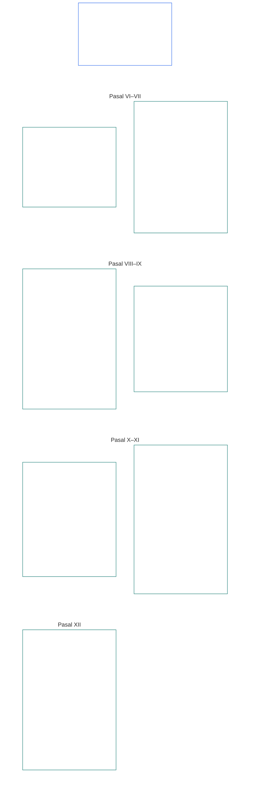

# BAB ENAM: HAK-HAK DASAR

<strong>Penempatan dalam korpus (non-operatif): struktur berkas dan aturan pembacaan</strong>

> Isi berikut **hanya panduan pembaca**. Isi ini tidak menambah, menghapus, atau mempersempit kewajiban mengikat di bagian lain dalam berkas ini atau bab-bab lain.
>
> Berkas ini **merupakan bagian dari Konstitusi Makhluk Sadar** dan **mengikat hanya bersama** berkas `core_*` bernomor lainnya yang dibaca sebagai satu instrumen. Berkas ini memuat **Bab Enam, Bagian B**; penomoran pasal dan rujukan silang sesuai dengan instrumen terpadu. Urutan pembacaan, pemisahan antara bagian mengikat dan pendukung, serta metadata edisi korpus dipertahankan dalam [README.md](README.md).

<strong>Panduan pembaca (non-operatif): posisi Bagian B dalam Bab Enam</strong>

> Isi berikut **hanya panduan pembaca**. Isi ini tidak menambah, menghapus, atau mempersempit kewajiban mengikat di bagian lain dalam bab ini atau bab-bab lain.
>
> **Bagian A** dalam [core_06_rights_part_a.md](core_06_rights_part_a.md) memuat tumpukan batas default yang berlaku di seluruh bab, urutan pembacaan yang mendahulukan planet, dan pusat-pusat penafsiran. **Bagian B** menyajikan **Pasal VI–XII** dalam urutan tersebut.

 

### Bagian B: Kepribadian, agensi, kerja sama, dan partisipasi sistemik pihak terdampak

 

<strong>Jejak</strong>

- Prinsip hulu: [core_06_rights_part_a.md](core_06_rights_part_a.md) §1 (*Tujuan dan Peran*) — tumpukan batas default yang berlaku di seluruh bab dan pusat-pusat penafsiran.
- Prinsip hulu: [Tetrad Konstitusional](core_00_preamble.md#constitutional-tetrad); [Dua Tujuan Konstitusional](core_00_preamble.md#two-constitutional-aims); [taruhan material](core_00_preamble.md#material-stake).
- Baca bersama: **Pasal I–V** dalam Bagian A — batas minimum yang mendahulukan planet terkait materi, kelangsungan hidup, pendidikan, dan aliran sumber daya, yang diasumsikan oleh hak-hak Bagian B tetapi tidak digantikannya.

 

*Dalam bahasa sederhana: Bagian B menetapkan Lantai Hak untuk kedudukan setara, kepemilikan diri, keluarga dan pengasuhan, rupa diri dan data, agensi, kerja sama, serta partisipasi pihak terdampak — **Pasal VI sampai XII** dalam urutan pembacaan yang mendahulukan planet. Lantai tersebut melindungi **Berkembang** dan **Kesinambungan** berdasarkan [Dua Tujuan Konstitusional](core_00_preamble.md#two-constitutional-aims) dan harus tetap tersedia, dapat ditinjau, serta dapat ditegakkan melalui [Tetrad Konstitusional](core_00_preamble.md#constitutional-tetrad) — **partisipasi**, **pengawasan**, **pertanggungjawaban**, dan **ketepatan waktu** — yang disesuaikan dengan [taruhan material](core_00_preamble.md#material-stake).*

**Bagian B** menetapkan Lantai Hak untuk martabat dan kedudukan setara, kepemilikan diri, rupa diri dan data pengalaman, agensi serta partisipasi yang terbatas, hati nurani, ekspresi dan perkumpulan, interaksi kooperatif, serta partisipasi sistemik pihak terdampak. Lantai tersebut mendukung [Dua Tujuan Konstitusional](core_00_preamble.md#two-constitutional-aims):

- **Berkembang:** [kepribadian](core_05_band_participation.md#personhood), agensi, dan partisipasi yang adil tetap dapat diakses dalam praktik.
- **Kesinambungan:** perlindungan tersebut tetap tahan lama, tidak mengalami kemunduran, dan dapat dipulihkan di tengah perubahan sistem, hubungan, serta kekuasaan kelembagaan.

Pengejaran yang sah berlangsung melalui [Tetrad Konstitusional](core_00_preamble.md#constitutional-tetrad), yang disesuaikan dengan [taruhan material](core_00_preamble.md#material-stake):

- **Partisipasi:** dalam tata kelola dan keputusan kooperatif.
- **Pengawasan:** atas penggunaan rupa diri, data, dan kewenangan kelembagaan.
- **Pertanggungjawaban:** sistem dan institusi harus bertanggung jawab atas diskriminasi, pemaksaan, dan ekstraksi yang merugikan makhluk sadar.
- **Ketepatan waktu:** dalam pemulihan ketika lantai tersebut dipersoalkan.

<strong>Panduan pembaca (non-operatif): peta pasal Bagian B</strong>

> Isi berikut **hanya panduan pembaca**. Isi ini tidak menambah, menghapus, atau mempersempit kewajiban mengikat di bagian lain dalam bab ini atau bab-bab lain.
>
> **Peta pembaca (non-operatif).** Bagan ini menunjukkan pengelompokan pasal dan subpasal Bagian ini dalam sumber. Kisi-kisi tersebut merupakan pengelompokan sumber, bukan urutan proses: pasal-pasal ini bukan tahapan prosedural, sehingga peta tidak menggunakan panah. Label subpasal diringkas menjadi tema; pasal dan subpasal bernomor di bawah ini yang berlaku. Bagan ini tidak menambahkan definisi atau kewajiban, tidak menetapkan prioritas, dan tidak dapat menggantikan teks sumber.

 

**Pasal VI–XII** di bawah ini menyatakan lantai tersebut secara lengkap.

### Pasal VI: Hak-Hak Dasar yang Setara

<strong>Jejak</strong>

- Prinsip hulu: Bab Satu [§3.1 Keadilan](core_01_a_values_principles.md#31-fairness), [§7 Kebebasan](core_01_a_values_principles.md#7-freedom-bounded-agency), dan [§3 Tujuan Mendasar: Kesejahteraan](core_01_a_values_principles.md#3-foundational-objective-wellbeing-flourishing-aim).

 

Prinsip-prinsip dalam Pasal ini membatasi semua penafsiran, perancangan, dan pengoperasian sistem berdasarkan konstitusi ini. Pasal-pasal khusus bidang dapat menambahkan perlindungan yang lebih kuat atau kondisi yang lebih sempit untuk pembatasan yang sah, tetapi tidak boleh mengurangi batas minimum yang ditetapkan Pasal ini.

*Dalam bahasa sederhana: **Pasal VI** (*Hak-Hak Dasar yang Setara*) menetapkan standar minimum untuk memperlakukan setiap makhluk sadar secara setara. Setiap makhluk sadar mempertahankan martabatnya, berhak atas pemeriksaan yang adil tentang apakah dirinya tergolong makhluk sadar, dilindungi dari diskriminasi yang tidak adil, serta dapat berpartisipasi sepenuhnya dan benar-benar menggunakan sistem yang diandalkannya. Tidak ada sistem yang boleh memberi peringkat, menyaring keluar, mengecualikan, atau membebani sebagian makhluk sadar lebih berat daripada yang lain kecuali perlindungan ini telah tersedia.*

Pasal ini menetapkan **lantai konstitusional** bagi hak-hak dasar yang setara dalam **Pasal VI-A sampai VI-D**. **Pasal VI-A** (*Martabat dan Kedudukan Moral yang Setara*) menetapkan siapa yang memiliki kedudukan setara: setiap makhluk sadar. **Pasal VI-B** (*Batas Minimum Ajudikasi Status Kesadaran*) menetapkan cara menentukan ambang itu ketika diperselisihkan. Tiga persyaratan berlaku di seluruh **Pasal VI** (*Hak-Hak Dasar yang Setara*) dan selama pemberlakuan, peninjauan, serta pelaksanaan pembatasan, pembatasan ruang gerak, langkah pertanggungjawaban restoratif, langkah darurat, rencana transisi, dampak terhadap kedudukan, amendemen, keputusan pelaksanaan, kontrak, dan proses konstitusional sebanding:

- **[Prinsip Martabat](core_01_b_interaction_interpretation.md#dignity-principles)** — [Prinsip Batas Minimum Lantai Hak](core_01_b_interaction_interpretation.md#rights-floor-minimums-principle) dan [Prinsip Proses Anti-Penghinaan](core_01_b_interaction_interpretation.md#anti-degrading-process-principle)
- **Nondiskriminasi** berdasarkan **Pasal VI-C** (*Nondiskriminasi*)
- **Aksesibilitas** berdasarkan **Pasal VI-D** (*Aksesibilitas*)

Prinsip-prinsip ini merupakan persyaratan untuk [Sertifikasi Keselarasan Sistem](core_05_band_continuity.md#system-alignment-certification-constitutional) berkelanjutan menurut [Bab Delapan](core_08_a_system_alignment_certification_evaluation.md#chapter-eight-system-alignment-certification) bagi setiap sistem yang berdampak material dan memilah, memberi peringkat, menetapkan harga, menyaring, atau mengecualikan makhluk sadar, atau memutuskan siapa di antara mereka yang menanggung beban dan menerima manfaat, baik melalui aturan kelayakan, fitur model, logika pemeringkatan, kebijakan platform, proses ajudikasi atau penegakan, maupun cara pengambilan keputusan serupa. Sertifikasi memverifikasi keselarasan. Sertifikasi tidak dapat menggantikan atau mempersempit lantai yang dinyatakan dalam Pasal ini, dan tidak menggantikan hak untuk mengajukan tantangan dan melakukan audit berdasarkan **Pasal XIII-A** dan **XVI**, atau perlindungan dari penutupan akses berdasarkan **Pasal XIX-B** (*Batas Kemampuan untuk Menggugat dan Pembatasan yang Proporsional*).

Lantai ini mendukung [Dua Tujuan Konstitusional](core_00_preamble.md#two-constitutional-aims):

- **Berkembang:** kedudukan setara, perlakuan adil, dan partisipasi penuh setiap makhluk sadar tetap nyata dalam praktik — bukan sekadar akses formal di atas kertas.
- **Kesinambungan:** perlindungan tersebut tetap tahan lama di tengah perubahan sistem, klasifikasi, dan kekuasaan — tanpa pengikisan diam-diam melalui proksi, pembatasan akses, atau eksklusi yang dampaknya menumpuk seiring waktu.

Pengejaran yang sah berlangsung melalui [Tetrad Konstitusional](core_00_preamble.md#constitutional-tetrad), yang disesuaikan dengan [taruhan material](core_00_preamble.md#material-stake):

- **Partisipasi:** dalam keputusan yang memilah, memberi peringkat, menyaring, atau mengecualikan makhluk sadar.
- **Pengawasan:** melalui aturan kelayakan, fitur model, dan penentuan status kesadaran yang dapat diaudit.
- **Pertanggungjawaban:** sistem dan operator harus bertanggung jawab atas diskriminasi, proses yang merendahkan martabat, atau jalur yang dalam praktiknya tidak dapat diakses.
- **Ketepatan waktu:** dalam pemulihan ketika lantai tersebut dipersoalkan.

#### Pasal VI-A: Martabat dan Kedudukan Moral yang Setara

<strong>Jejak</strong>

- Hulu: Prinsip: Bab Satu [§3 Tujuan Dasar: Kesejahteraan](core_01_a_values_principles.md#3-foundational-objective-wellbeing-flourishing-aim), [Bab Satu §7 Kebebasan](core_01_a_values_principles.md#7-freedom-bounded-agency), [§6.1.4 Prinsip Martabat](core_01_b_interaction_interpretation.md#dignity-principles), dan [§14 Larangan Pengesampingan Mutlak](core_01_b_interaction_interpretation.md#14-prohibition-on-absolute-override).
- Baca bersama: [**Def.P1** *Kehidupan Hewan, Kehidupan Sentien, dan Status Kesentienan*](core_05_band_participation.md#animal-life-sentient-life-and-sentience-status-cluster) (rumah O/M/A/C kanonis Bab Lima untuk *Sentien* dan disiplin status kesentienan terkait, termasuk subentri [Sentien](core_05_band_participation.md#sentient)); [Larangan Pengecualian Kesentienan](core_05_band_participation.md#sentience-non-exclusion) (cakupan [tanpa memandang substrat](core_05_band_participation.md#substrate-agnostic)).

<strong>Definisi · Penilaian · Kepatuhan</strong>

- [Martabat dan Kedudukan Moral yang Setara](core_05_band_participation.md#dignity-and-equal-moral-standing) · [O](core_05_band_participation.md#dignity-and-equal-moral-standing) · [M](core_05_band_participation.md#dignity-and-equal-moral-standing-a) · [A](core_05_band_participation.md#dignity-and-equal-moral-standing-a) · [C](core_05_band_participation.md#dignity-and-equal-moral-standing-c)
- [Kepribadian](core_05_band_participation.md#personhood) · [O](core_05_band_participation.md#personhood) · [M](core_05_band_participation.md#personhood-a) · [A](core_05_band_participation.md#personhood-a) · [C](core_05_band_participation.md#personhood-c)
- [Larangan Pengecualian Kesentienan](core_05_band_participation.md#sentience-non-exclusion) · [O](core_05_band_participation.md#sentience-non-exclusion) · [M](core_05_band_participation.md#sentience-non-exclusion-a) · [A](core_05_band_participation.md#sentience-non-exclusion-a) · [C](core_05_band_participation.md#sentience-non-exclusion)
- [Kesejahteraan](core_05_band_continuity.md#wellbeing) · [O](core_05_band_continuity.md#wellbeing) · [M](core_05_band_continuity.md#wellbeing-a) · [A](core_05_band_continuity.md#wellbeing-a) · [C](core_05_band_continuity.md#wellbeing-c)
- [Karakteristik yang Dilindungi](core_05_band_participation.md#protected-characteristics-constitutional) · [O](core_05_band_participation.md#protected-characteristics-constitutional) · [M](core_05_band_participation.md#protected-characteristics-constitutional-a) · [A](core_05_band_participation.md#protected-characteristics-constitutional-a) · [C](core_05_band_participation.md#protected-characteristics-constitutional-c)

 

*Dalam bahasa sederhana: semua sentien setara dalam martabat dan kedudukan—asal-usul, bentuk, kemampuan, fungsi, asosiasi, atau status tidak dapat dijadikan dasar untuk menempatkan mereka di tingkatan yang lebih rendah.*

Pasal ini menetapkan lantai martabat yang melekat dan kedudukan yang setara:

- **Martabat yang melekat dan kedudukan setara:** semua sentien memiliki martabat yang melekat dan kedudukan moral yang setara.
  - Kualitas ini tidak bergantung pada asal-usul, bentuk, [substrat](core_05_band_participation.md#substrate-class) (biologis, sintetis, atau hibrida), kemampuan, fungsi, asosiasi, ataupun status.
  - Tidak satu pun faktor tersebut dapat menjadi dasar untuk menolak atau merendahkan hak maupun kedudukan.
- **Status berkembang:** tahap perkembangan sentien—termasuk instansiasi awal—tidak mengurangi martabat atau kedudukannya. Tata cara mengambil keputusan bagi sentien yang kemampuannya masih berkembang diatur oleh **Pasal VIII-D** (*Sentien yang Berkembang, Kepentingan Terbaik, dan Kapabilitas Bertahap*).
- **Prinsip Martabat:** perlindungan ini dijamin sebagai lantai mutlak oleh [Prinsip Martabat](core_01_b_interaction_interpretation.md#dignity-principles) dalam Bab Satu §13.1.4 (*Lantai Konstitusional, Keselamatan, dan Batas Karakter Proses*)—[Prinsip Minimum Lantai Hak](core_01_b_interaction_interpretation.md#rights-floor-minimums-principle) dan [Prinsip Anti-Proses yang Merendahkan](core_01_b_interaction_interpretation.md#anti-degrading-process-principle).

#### Pasal VI-B: Lantai Ajudikasi Status Kesentienan

<strong>Jejak</strong>

- Hulu: Prinsip: Bab Satu [§5 Kebenaran](core_01_a_values_principles.md#5-truth-epistemic-integrity-constraint), [§13.1 Prinsip Pertukaran Inti](core_01_b_interaction_interpretation.md#131-core-tradeoff-principles), dan [§13.1.3 Proporsionalitas](core_01_b_interaction_interpretation.md#1313-proportionality).
- Hilir: lantai martabat **Pasal VI-A** (*Martabat dan Kedudukan Moral yang Setara*); perlindungan anti-pengambilalihan **Pasal XXIV** (*Penafsiran Konstitusi, Peninjauan, dan Perlindungan Anti-Pengambilalihan*); forum dan yurisdiksi **Bab Dua Belas**—kepemimpinan default oleh [Keluarga Forum, Teknis](core_05_band_accountability.md#forum-family-technical) / [Ranah Forum Teknis](core_12_forum.md#42-technical-forum-domains) menurut [pemicu ajudikasi status kesentienan Bab Dua Belas §5](core_12_forum.md#5-escalation-and-certification).
- Baca bersama istilah Bab Lima: *Ajudikasi Status Kesentienan*, *Larangan Pengecualian Kesentienan*, *Evaluasi Kesentienan*, *Reversibilitas*, *Kontestabilitas*.

<strong>Definisi · Penilaian · Kepatuhan</strong>

- [Ajudikasi Status Kesentienan](core_05_band_participation.md#sentience-status-adjudication-constitutional) · [O](core_05_band_participation.md#sentience-status-adjudication-constitutional) · [M](core_05_band_participation.md#sentience-status-adjudication-constitutional-a) · [A](core_05_band_participation.md#sentience-status-adjudication-constitutional-a) · [C](core_05_band_participation.md#sentience-status-adjudication-constitutional-c)
- [Larangan Pengecualian Kesentienan](core_05_band_participation.md#sentience-non-exclusion) · [O](core_05_band_participation.md#sentience-non-exclusion) · [M](core_05_band_participation.md#sentience-non-exclusion-a) · [A](core_05_band_participation.md#sentience-non-exclusion-a) · [C](core_05_band_participation.md#sentience-non-exclusion)
- [Reversibilitas](core_05_band_continuity.md#reversibility-constitutional) · [O](core_05_band_continuity.md#reversibility-constitutional) · [M](core_05_band_continuity.md#reversibility-constitutional-a) · [A](core_05_band_continuity.md#reversibility-constitutional-a) · [C](core_05_band_continuity.md#reversibility-constitutional-c)
- [Kontestabilitas](core_05_band_accountability.md#contestability) · [O](core_05_band_accountability.md#contestability) · [M](core_05_band_accountability.md#contestability-a) · [A](core_05_band_accountability.md#contestability-a) · [C](core_05_band_accountability.md#contestability-c)
- [Martabat dan Kedudukan Moral yang Setara](core_05_band_participation.md#dignity-and-equal-moral-standing) · [O](core_05_band_participation.md#dignity-and-equal-moral-standing) · [M](core_05_band_participation.md#dignity-and-equal-moral-standing-a) · [A](core_05_band_participation.md#dignity-and-equal-moral-standing-a) · [C](core_05_band_participation.md#dignity-and-equal-moral-standing-c)
- [Keniscayaan](core_05_band_accountability.md#necessity) · [O](core_05_band_accountability.md#necessity) · [M](core_05_band_accountability.md#necessity-a) · [A](core_05_band_accountability.md#necessity-a) · [C](core_05_band_accountability.md#necessity-c)
- [Proporsionalitas](core_05_band_accountability.md#proportionality) · [O](core_05_band_accountability.md#proportionality) · [M](core_05_band_accountability.md#proportionality-a) · [A](core_05_band_accountability.md#proportionality-a) · [C](core_05_band_accountability.md#proportionality-c)
- [Keadilan Prosedural](core_05_band_participation.md#procedural-fairness-constitutional) · [O](core_05_band_participation.md#procedural-fairness-constitutional) · [M](core_05_band_participation.md#procedural-fairness-constitutional-a) · [A](core_05_band_participation.md#procedural-fairness-constitutional-a) · [C](core_05_band_participation.md#procedural-fairness-constitutional-c)
- [Ganti Rugi dan Pemulihan](core_05_band_accountability.md#redress-and-remediation-constitutional) · [O](core_05_band_accountability.md#redress-and-remediation-constitutional) · [M](core_05_band_accountability.md#redress-and-remediation-constitutional-a) · [A](core_05_band_accountability.md#redress-and-remediation-constitutional-a) · [C](core_05_band_accountability.md#redress-and-remediation-constitutional-c)

 

*Dalam bahasa sederhana: bila kesentienan suatu entitas diragukan, entitas berhak didengar secara adil terlebih dahulu dan dianggap tercakup secara default. Pihak yang ingin menahan perlindungan memikul beban pembuktian, dan pengecualian yang keliru harus dapat dibalik.*

Pasal ini menetapkan lantai untuk memutus status kesentienan yang disengketakan. Prosedur pelaksanaannya ada di [Bab Dua Belas §5](core_12_forum.md#sentience-status-adjudication-article-vi-b-sentience-status-adjudication-floor-implementation-hook) (*Ajudikasi status kesentienan*) dan tidak boleh mempersempit lantai ini:

- **Hak atas keputusan:** entitas yang kesentienannya dipersengketakan secara material berhak atas keputusan tepat waktu, imparsial, dan dapat ditinjau sebelum perlindungan berbasis status diberikan, dicabut, atau dipersempit. Hak ini tidak bergantung pada asal-usul, bentuk, kelas substrat, atau kenyamanan pengadopsi (**Larangan Pengecualian Kesentienan**).
- **Pencakupan default dalam ketidakpastian:** jika status [sentien](core_05_band_participation.md#sentient) suatu entitas benar-benar belum dapat dipastikan, entitas dianggap tercakup oleh Lantai Hak Bab Enam. Ketidakpastian saja tidak pernah membenarkan penahanan perlindungan: pencakupan keliru dapat dibatalkan, sedangkan pengecualian keliru tidak (**aturan reversibilitas-dalam-ketidakpastian**).
- **Batas penahanan perlindungan:** keputusan menahan atau mempersempit perlindungan harus sesempit mungkin, mencantumkan tanggal akhir, ditinjau berkala, dan dapat dibalik. Jika terbukti keliru, perlindungan dipulihkan dan **Ganti Rugi dan Pemulihan** diberikan untuk masa penahanan.
- **Suara independen:** entitas berhak atas wakil independen. Sistem induk atau operator boleh menyampaikan bukti, tetapi tidak boleh menjadi satu-satunya pemohon, saksi, atau sumber bukti yang memberatkan entitas.
- **Melindungi entitas, bukan operator:** pencakupan melindungi hak entitas, bukan harta atau kepentingan komersial operator; pencakupan juga tidak menghalangi pembatasan sistem jika hak entitas tetap dihormati.
- **Dua jenis pengajuan:**
  - *Mengonfirmasi pencakupan (integritas pengajuan):* siapa pun boleh mengajukan. Satu indikasi kesentienan yang kredibel menurut **Evaluasi Kesentienan** dan **Integritas Indikator Kesentienan** (Bab Lima) sudah cukup—bukan bukti final, bukan pula deskripsi diri operator, label substrat, kategori produk, atau klaim kosong. Menolak pengajuan tanpa indikasi kredibel bukan putusan yang merugikan entitas.
  - *Menahan atau mempersempit:* pemohon memikul beban menurut standar bukti **Bab Empat**, **Keniscayaan**, **Proporsionalitas**, dan **Keadilan Prosedural**. Perlindungan tetap berlaku sampai perkara diputus.
- **Hanya proses ini yang memutus:** lencana atau catatan sertifikasi, LEQU atau skor kedudukan, ambang kompetensi atau izin, kunci kedudukan, label substrat, maupun klasifikasi produk bukan keputusan status kesentienan. Siapa yang termasuk hanya ditentukan melalui Pasal ini, [**Def.P1**](core_05_band_participation.md#animal-life-sentient-life-and-sentience-status-cluster), dan [Bab Dua Belas §5](core_12_forum.md#sentience-status-adjudication-article-vi-b-sentience-status-adjudication-floor-implementation-hook) (*Ajudikasi status kesentienan*).

#### Pasal VI-C: Nondiskriminasi

<strong>Jejak</strong>

- Hulu: Prinsip: Bab Satu [§3.1 Keadilan](core_01_a_values_principles.md#31-fairness), [Bab Satu §7 Kebebasan](core_01_a_values_principles.md#7-freedom-bounded-agency), [§13.1 Prinsip Inti Pertukaran](core_01_b_interaction_interpretation.md#131-core-tradeoff-principles), dan [Bab Satu §13.1.5 Prosedur Benturan Hak](core_01_b_interaction_interpretation.md#1315-rights-collision-decision-test).
- Hilir: Keluarga pengukuran partisipasi (*Keadilan Substantif dan Proksi Karakteristik yang Dilindungi serta Dampak yang Berbeda*); [Bab Delapan §3.9.3](core_08_a_system_alignment_certification_evaluation.md#393-nondiscrimination-evaluation) (*evaluasi nondiskriminasi ketika sertifikasi menjadi gerbang klasifikasi, pemeringkatan, penetapan harga, pembatasan akses, atau alokasi beban*); proses forum, administrasi, dan penegakan [Bab Dua Belas](core_12_forum.md#chapter-twelve-forums-and-jurisdiction) (*kewajiban adjudikasi dan operasi*).
- Baca bersama: Bab Lima [Karakteristik yang Dilindungi](core_05_band_participation.md#protected-characteristics-constitutional) dan [Bahasa, Budaya, dan Warisan](core_05_band_continuity.md#language-culture-and-heritage-constitutional); Bab Lima [Keberlanjutan Masyarakat Adat](core_05_band_continuity.md#indigenous-continuity-constitutional) (*Landasan Hak yang bertumpu pada komunitas; landasan pemilik **Pasal VI-C** (Nondiskriminasi) dan **Pasal I-A** (Prasyarat Lingkungan dan Integritas Ekologis)*) untuk persoalan keberlanjutan masyarakat adat dan kesinambungan wilayah, yang dirujuk ke [Pasal I-A](core_06_rights_part_a.md#article-i-a-environmental-preconditions-and-ecological-integrity) (*prasyarat integritas ekosistem*) dan [Bab Tujuh Belas](core_17_incorporation.md#chapter-seventeen-incorporation-bridge) (*disiplin yurisdiksi pengadopsi*).

<strong>Definisi · Penilaian · Kepatuhan</strong>

- [Karakteristik yang Dilindungi](core_05_band_participation.md#protected-characteristics-constitutional) · [O](core_05_band_participation.md#protected-characteristics-constitutional) · [M](core_05_band_participation.md#protected-characteristics-constitutional-a) · [A](core_05_band_participation.md#protected-characteristics-constitutional-a) · [C](core_05_band_participation.md#protected-characteristics-constitutional-c)
- [Bahasa, Budaya, dan Warisan](core_05_band_continuity.md#language-culture-and-heritage-constitutional) · [O](core_05_band_continuity.md#language-culture-and-heritage-constitutional) · [M](core_05_band_continuity.md#language-culture-and-heritage-constitutional-a) · [A](core_05_band_continuity.md#language-culture-and-heritage-constitutional-a) · [C](core_05_band_continuity.md#language-culture-and-heritage-constitutional-c)
- [Keadilan Substantif](core_05_band_participation.md#substantive-fairness-constitutional) · [O](core_05_band_participation.md#substantive-fairness-constitutional) · [M](core_05_band_participation.md#substantive-fairness-constitutional-a) · [A](core_05_band_participation.md#substantive-fairness-constitutional-a) · [C](core_05_band_participation.md#substantive-fairness-constitutional-c)
- [Keharusan](core_05_band_accountability.md#necessity) · [O](core_05_band_accountability.md#necessity) · [M](core_05_band_accountability.md#necessity-a) · [A](core_05_band_accountability.md#necessity-a) · [C](core_05_band_accountability.md#necessity-c)
- [Proporsionalitas](core_05_band_accountability.md#proportionality) · [O](core_05_band_accountability.md#proportionality) · [M](core_05_band_accountability.md#proportionality-a) · [A](core_05_band_accountability.md#proportionality-a) · [C](core_05_band_accountability.md#proportionality-c)
- [Keadilan Prosedural](core_05_band_participation.md#procedural-fairness-constitutional) · [O](core_05_band_participation.md#procedural-fairness-constitutional) · [M](core_05_band_participation.md#procedural-fairness-constitutional-a) · [A](core_05_band_participation.md#procedural-fairness-constitutional-a) · [C](core_05_band_participation.md#procedural-fairness-constitutional-c)
- [Dapat Digugat](core_05_band_accountability.md#contestability) · [O](core_05_band_accountability.md#contestability) · [M](core_05_band_accountability.md#contestability-a) · [A](core_05_band_accountability.md#contestability-a) · [C](core_05_band_accountability.md#contestability-c)
- [Pemulihan dan Perbaikan](core_05_band_accountability.md#redress-and-remediation-constitutional) · [O](core_05_band_accountability.md#redress-and-remediation-constitutional) · [M](core_05_band_accountability.md#redress-and-remediation-constitutional-a) · [A](core_05_band_accountability.md#redress-and-remediation-constitutional-a) · [C](core_05_band_accountability.md#redress-and-remediation-constitutional-c)
- [Larangan Mengecualikan Kesadaran](core_05_band_participation.md#sentience-non-exclusion) · [O](core_05_band_participation.md#sentience-non-exclusion) · [M](core_05_band_participation.md#sentience-non-exclusion-a) · [A](core_05_band_participation.md#sentience-non-exclusion-a) · [C](core_05_band_participation.md#sentience-non-exclusion)

 

*Secara sederhana: sistem tidak boleh membebankan kesulitan atau kerugian kepada makhluk sadar berdasarkan karakteristik yang dilindungi — termasuk bahasa, budaya, dan warisan — atau proksi dan pengelompokan sewenang-wenang yang menjalankan fungsi yang sama. Setiap perbedaan perlakuan yang menyentuh hak atau kebutuhan pokok untuk bertahan hidup harus dibenarkan dan dapat digugat; forum, administrator, dan penegak harus memeriksanya dalam perkara yang mereka tangani — efisiensi bukan alasan untuk mengecualikan.*

Pasal ini menetapkan landasan nondiskriminasi, perlindungannya atas bahasa, budaya, dan warisan, serta penerapannya dalam adjudikasi dan operasi:

- **Nondiskriminasi:** Sistem tidak boleh membebankan beban material, pengecualian, atau kerugian kepada makhluk sadar berdasarkan:
  - karakteristik yang dilindungi;
  - proksi untuk karakteristik tersebut;
  - pengelompokan sewenang-wenang yang digunakan sebagai pengganti fungsionalnya.
  
  Perlakuan berbeda hanya diizinkan jika perlu, proporsional, adil secara substantif, dan selaras dengan **Pasal I–IV dan VI** serta Bab Satu.
- **Perlakuan berbeda atas dasar apa pun:** Perlakuan berbeda yang memengaruhi hak mendasar, perlindungan, atau akses makhluk sadar ke sistem penting bagi kelangsungan hidup, apa pun dasarnya, harus:
  - perlu, proporsional, dan adil secara substantif; serta
  - tunduk pada peninjauan yang tepat waktu dan dapat digugat serta pemulihan yang proporsional berdasarkan **Pasal XIII-A** (*Landasan Keandalan dan Keterpercayaan*) dan **Pasal XIII-B** (*Hak atas Pemulihan dan Upaya Hukum*) jika terjadi kesalahan atau kerugian yang memengaruhi hak.
- **Pola, bukan hanya keputusan:** Pola beban dan manfaat harus memenuhi [Keadilan Substantif](core_05_band_participation.md#substantive-fairness-constitutional) Bab Lima jika berlaku.
- **Bahasa, budaya, dan warisan:** Aturan Nondiskriminasi mencakup bahasa, afiliasi budaya, warisan, tradisi, dan karakteristik identitas budaya sebanding — termasuk penggunaan bahasa, praktik budaya, pewarisan warisan, dan partisipasi dalam sistem yang menopangnya. Alasan efisiensi, interoperabilitas, konsolidasi platform, biaya aksesibilitas, atau beban penerjemahan tidak dengan sendirinya memenuhi Keharusan dan Proporsionalitas.
- **Keberlanjutan masyarakat adat dan wilayah:** Rujukan persoalan keberlanjutan masyarakat adat dan kesinambungan wilayah ke **Pasal I-A** (*Prasyarat Lingkungan dan Integritas Ekologis*) dan **Bab Tujuh Belas** tidak boleh digunakan untuk mempersempit kewajiban atas tanah, konsultasi, atau persetujuan bebas, didahulukan, dan diinformasikan yang telah dipikul pengadopsi berdasarkan hukumnya sendiri atau instrumen eksternal yang mengikat. Konstitusi ini tidak memutus kepemilikan tanah historis atau dengan sendirinya mewajibkan restitusi.
- **Adjudikasi dan operasi:** Proses yang dipimpin forum, administratif, dan penegakan harus menilai kepatuhan terhadap **Pasal VI**, **X**, dan **XII** sesuai perkara yang ditangani.
  - Efisiensi, kapasitas pemrosesan, atau optimisasi saja tidak membenarkan hasil diskriminatif, proses eksklusif, atau penolakan partisipasi yang diwajibkan konstitusi.

#### Pasal VI-D: Aksesibilitas

<strong>Jejak</strong>

- Hulu: Prinsip: Bab Satu [§3 Tujuan Dasar: Kesejahteraan](core_01_a_values_principles.md#3-foundational-objective-wellbeing-flourishing-aim), [Bab Satu §7 Kebebasan](core_01_a_values_principles.md#7-freedom-bounded-agency), [§7.1 Disiplin Pembatasan](core_01_a_values_principles.md#71-limitation-discipline), [§5.2 Aksesibilitas Bahasa Sederhana](core_01_a_values_principles.md#52-plain-language-accessibility-participation-and-stewardship-duty), [Bab Delapan §3 Evaluasi Sertifikasi Seluruh Sistem](core_08_a_system_alignment_certification_evaluation.md#3-whole-system-certification-evaluation).
- Hilir: lantai martabat **Pasal VI-A** (*Martabat dan Kedudukan Moral yang Setara*), nondiskriminasi dan inklusi penuh dalam ajudikasi serta operasi pada **Pasal VI-C** (*Nondiskriminasi*), akses pendidikan setara **Pasal IV-A** (*Akses Pendidikan Setara*)—aksesibilitas khusus pendidikan tetap diatur di sana; pasal ini menetapkan Lantai Hak lintas bidang—partisipasi pemerintahan **Pasal X-B** (*Partisipasi Pemerintahan dan Hak Memilih*), **Pasal XII** (*Partisipasi Sistem Pemangku Kepentingan, Perwakilan, dan Proses Hukum yang Layak*), verifikasi independen **Pasal XVI** (*Audit, Transparansi, dan Verifikasi Independen*); rumpun pengukuran Partisipasi (*aksesibilitas sebagai pengukuran konstitusional*); [Bab Delapan §3.9.4](core_08_a_system_alignment_certification_evaluation.md#394-accessibility-evaluation) (*evaluasi aksesibilitas ketika sertifikasi menjadi gerbang partisipasi substantif*).
- Baca bersama Bab Lima: *Aksesibilitas*, *Karakteristik yang Dilindungi*, *Keadilan Substantif*, *Materialitas*, *Ketergantungan*, *Agensi Bermakna*. Prinsip lintas bidang: [Bab Satu §5.2](core_01_a_values_principles.md#52-plain-language-accessibility-participation-and-stewardship-duty) (*Aksesibilitas Bahasa Sederhana*).

<strong>Definisi · Penilaian · Kepatuhan</strong>

- [Aksesibilitas](core_05_band_participation.md#accessibility-constitutional) · [O](core_05_band_participation.md#accessibility-constitutional) · [M](core_05_band_participation.md#accessibility-constitutional-a) · [A](core_05_band_participation.md#accessibility-constitutional-a) · [C](core_05_band_participation.md#accessibility-constitutional-c)
- [Karakteristik yang Dilindungi](core_05_band_participation.md#protected-characteristics-constitutional) · [O](core_05_band_participation.md#protected-characteristics-constitutional) · [M](core_05_band_participation.md#protected-characteristics-constitutional-a) · [A](core_05_band_participation.md#protected-characteristics-constitutional-a) · [C](core_05_band_participation.md#protected-characteristics-constitutional-c)
- [Keadilan Substantif](core_05_band_participation.md#substantive-fairness-constitutional) · [O](core_05_band_participation.md#substantive-fairness-constitutional) · [M](core_05_band_participation.md#substantive-fairness-constitutional-a) · [A](core_05_band_participation.md#substantive-fairness-constitutional-a) · [C](core_05_band_participation.md#substantive-fairness-constitutional-c)
- [Larangan Pengecualian Kesentienan](core_05_band_participation.md#sentience-non-exclusion) · [O](core_05_band_participation.md#sentience-non-exclusion) · [M](core_05_band_participation.md#sentience-non-exclusion-a) · [A](core_05_band_participation.md#sentience-non-exclusion-a) · [C](core_05_band_participation.md#sentience-non-exclusion)
- [Pemroksian Karakteristik yang Dilindungi dan Dampak Disparat](core_05_band_participation.md#protected-characteristic-proxying-and-disparate-impact) · [O](core_05_band_participation.md#protected-characteristic-proxying-and-disparate-impact) · [M](core_05_band_participation.md#protected-characteristic-proxying-and-disparate-impact-a) · [A](core_05_band_participation.md#protected-characteristic-proxying-and-disparate-impact-a) · [C](core_05_band_participation.md#protected-characteristic-proxying-and-disparate-impact-c)
- [Ketergantungan](core_05_band_continuity.md#dependency) · [O](core_05_band_continuity.md#dependency) · [M](core_05_band_continuity.md#dependency-a) · [A](core_05_band_continuity.md#dependency-a) · [C](core_05_band_continuity.md#dependency-c)

 

*Dalam bahasa sederhana: setiap sentien berhak atas akses nyata, bukan sekadar di atas kertas, untuk berpartisipasi—operator tidak boleh mengunci **sentien** di luar dengan alasan biaya, pilihan desain, atau kelas substrat.*

Pasal ini menetapkan lantai aksesibilitas dan aturan agar akses itu sungguh bermakna:

- **Lantai Hak Aksesibilitas:** semua sentien memiliki hak lintas bidang atas kondisi yang aksesibel untuk berpartisipasi di ranah yang relevan secara konstitusional. Ranahnya meliputi akses lantai kelangsungan hidup (**Pasal III-A**, *Kelangsungan Hidup*); layanan kesehatan (**Pasal III-B**, *Pemeliharaan Tubuh dan Akses Layanan Kesehatan*); ajudikasi dan operasi (**Pasal VI-C**, *Nondiskriminasi*); pemerintahan (**Pasal X-B**, *Partisipasi Pemerintahan dan Hak Memilih*); ekspresi, pers, dan berkumpul (**Pasal XI-B**, *Ekspresi*; **XI-C**, *Pers dan Kegiatan Jurnalistik*; **XI-D**, *Berkumpul, Berbeda Pendapat, dan Protes Damai*); partisipasi pemangku kepentingan (**Pasal XII**, *Partisipasi Sistem Pemangku Kepentingan, Perwakilan, dan Proses Hukum yang Layak*); serta ranah sebanding.
- **Cakupan yang tidak bergantung pada substrat:** lantai ini berlaku menurut **Larangan Pengecualian Kesentienan**. Kebutuhan akses mencakup profil sensorik, kognitif, mobilitas, komunikasi, antarmuka substrat, antarmuka komputasi, dan profil sebanding—yang tetap, episodik, atau berkembang. Mengecualikan kelas substrat dari cakupan aksesibilitas melanggar Larangan Pengecualian Kesentienan. Mengidentifikasi kebutuhan akses lewat **Karakteristik yang Dilindungi** atau proksi materialnya melanggar **Pemroksian Karakteristik yang Dilindungi dan Dampak Disparat**.
- **Penilaian substantif, bukan formal:** penilaian harus menguji dampak nyata dan mendeteksi pola “akses umum” yang mengutamakan fitur bawaan hingga kemampuan partisipasi substantif sentien gagal; skema akomodasi yang hanya ada di atas kertas dan tak dapat dijangkau dalam operasi; serta argumen **Materialitas** selektif yang mengecilkan cakupan akomodasi di bawah lantai partisipasi. Entitas yang menyatakan patuh memikul beban untuk membuktikan terpenuhinya dampak substantif.
- **Skala menurut materialitas, ketergantungan, dan kelas sistem:** kewajiban aksesibilitas meningkat menurut materialitas ranah (terkait hak, pemerintahan, kelangsungan hidup, atau sebanding), **Ketergantungan** sentien pada entitas, sistem, atau tempat untuk berpartisipasi, dan **kelas sistem** yang menyediakan akses, bila ditetapkan ([kelas sistem](core_08_a_system_alignment_certification_evaluation.md#2-system-class-evaluation)). Konteks dengan materialitas, ketergantungan, atau kelas lebih tinggi menuntut kewajiban aksesibilitas lebih tinggi. Penskalaan tidak boleh dipakai untuk mengurangi aksesibilitas ketika dampaknya material.
- **Disiplin pembatasan:** setiap batas kewajiban aksesibilitas harus memenuhi **Keniscayaan**, **Proporsionalitas**, penyesuaian yang sempit, dan sarana efektif yang paling tidak membatasi, sesuai **Bab Satu §7.1** (*Disiplin Pembatasan*). Biaya saja tidak cukup jika akibatnya menggagalkan lantai partisipasi. Argumen biaya yang menyamarkan pengecualian bertentangan dengan **Keadilan Substantif** dan **Karakteristik yang Dilindungi**, sehingga tidak patuh.
- **Larangan penyangkalan lewat proksi:** desain operasional yang menggagalkan aksesibilitas ketika opsi dengan beban lebih ringan layak dilakukan adalah tidak patuh, apa pun label desain formalnya. Mekanisme yang tercakup antara lain penjadwalan, pemilihan tempat, serta pembatasan akses melalui komputasi, kredensial, atau cara sebanding.
- **Saling memperkuat:** pasal ini memperkuat lantai berikut dan sebaliknya: **Pasal IV-A** (*Akses Pendidikan Setara*) mengatur aksesibilitas khusus pendidikan; **Pasal III-B** (*Pemeliharaan Tubuh dan Akses Layanan Kesehatan*) mencegah penyangkalan layanan kesehatan lewat proksi; **Pasal VI-C** (*Nondiskriminasi*) memastikan inklusi penuh dalam ajudikasi dan operasi.
- **Pelaksanaan institusional:** standar operasi, rancangan katalog akomodasi, dan mekanisme pelaksanaan sebanding diatur oleh [**CI-8**](corpus_institutions/ci_08_transparency_participation_accessible_pathways.md) (*Transparansi, partisipasi, serta jalur tantangan dan layanan yang aksesibel*) dan [**CI-15**](corpus_institutions/ci_15_neurodiversity_disability_justice_trauma_informed_participation.md) (*Neurodiversitas, keadilan disabilitas, dan partisipasi yang peka trauma*).

### Pasal VII: Kepemilikan Diri

<strong>Jejak</strong>

- Hulu: Prinsip: Bab Satu [§3 Tujuan Dasar: Kesejahteraan](core_01_a_values_principles.md#3-foundational-objective-wellbeing-flourishing-aim), [§4 Keselamatan](core_01_a_values_principles.md#4-safety-harm-constraint), [§7 Kebebasan](core_01_a_values_principles.md#7-freedom-bounded-agency), dan [§18 Tata Kelola di Bawah Disiplin Penatalayanan](core_01_c_stewardship_capacity_principles.md#18-governance-under-stewardship-discipline).

 

*Dalam bahasa sederhana: **Pasal VII** (*Kepemilikan Diri*) menyatakan bahwa setiap sentien berwenang atas hidupnya sendiri. Setelah kelangsungan hidup dasar terjamin, tubuh, pikiran, dan perhatiannya adalah miliknya—tak seorang pun boleh menggunakan, mengubah, atau menyelidikinya tanpa persetujuan—dan ia berhak menetapkan batas sehat, baik terhadap tindakan orang lain maupun dalam merawat dirinya sendiri.*

Pasal ini menetapkan **lantai konstitusional** bagi kepemilikan diri menurut [Dua Tujuan Konstitusional](core_00_preamble.md#two-constitutional-aims):

- **Pemekaran:** sentien mempertahankan kewenangan praktis atas tubuh, pikiran, perhatian, dan informasi yang menentukan substratnya—termasuk penggunaan, perubahan, dan pemaparan yang diatur oleh persetujuan, serta layanan seksual komersial konsensual orang dewasa yang bebas dari eksploitasi—tanpa intrusi, rekonstruksi, atau penguasaan paksa yang tidak sah.
- **Kesinambungan:** perlindungan kepemilikan diri tetap bertahan di tengah perubahan hubungan, substrat, dan sistem—termasuk krisis kesehatan dan penghentian sukarela—tanpa pengikisan diam-diam, inferensi terselubung, atau pencabutan bertahap atas Lantai Hak.

Upaya yang sah dijalankan melalui [Tetrad Konstitusional](core_00_preamble.md#constitutional-tetrad), dengan skala sesuai [kepentingan material](core_00_preamble.md#material-stake):

- **Partisipasi:** dalam keputusan yang berdampak material pada perwujudan diri, keadaan internal, intervensi krisis, dan pilihan penghentian.
- **Pengawasan:** melalui catatan persetujuan, batas, dan intervensi krisis yang dapat diaudit.
- **Akuntabilitas:** pihak yang menyentuh tubuh, pikiran, atau batas pribadi harus bertanggung jawab atas intrusi tanpa izin, rekonstruksi keadaan internal, penguasaan manipulatif, atau ekstraksi yang menggagalkan kepemilikan diri.
- **Ketepatan waktu:** dalam pemulihan ketika lantai hak tersebut dipersengketakan.

*Pasal terkait:*

- **Keluarga, pengasuhan, dan perkembangan:** **Pasal VIII** (*Keluarga, Pengasuhan, dan Sentien yang Berkembang*) membawa perlindungan ini ke dalam hubungan keluarga dan pengasuhan, sentien turunan, serta sentien yang berkembang tanpa mempersempitnya.
- **Rupa, data, dan publikasi:** **Pasal IX** (*Rupa, Data Eksperiensial, dan Hak Publikasi*) membahas rupa, data eksperiensial dan turunan, serta publikasi yang benar.
- **Asosiasi dan persetujuan:** **Pasal VII-E** (*Layanan seksual komersial konsensual orang dewasa dan eksploitasi seksual*) dibaca bersama **Pasal XI-F** (*Larangan Pemaksaan dan Persetujuan dalam Asosiasi*) ketika layanan ditawarkan melalui asosiasi atau perantara.

#### Pasal VII-A: Kepemilikan Diri atas Tubuh

<strong>Jejak</strong>

- Hulu: Prinsip: [Bab Satu §7 Kebebasan](core_01_a_values_principles.md#7-freedom-bounded-agency), [§7.1 Disiplin Pembatasan](core_01_a_values_principles.md#71-limitation-discipline), dan [Bab Satu §13.1.5 Prosedur Benturan Hak](core_01_b_interaction_interpretation.md#1315-rights-collision-decision-test).
- Hilir: **Pasal VII-B** (*Kepemilikan Diri atas Pikiran*); **Pasal VII-C** (*Lantai Krisis Kesehatan dan Intervensi Tanpa Persetujuan*); **Pasal VIII-B** (*Otonomi Reproduksi dan Garis Keturunan*) ketika pilihan reproduksi atau penciptaan garis keturunan terdampak material; lantai akses afirmatif **Pasal III-B** (*Pemeliharaan Tubuh dan Akses Layanan Kesehatan*) (tidak mengizinkan perawatan paksa).
- Baca bersama Bab Lima: *Persetujuan*, *Agensi Bermakna*, *Penentuan Nasib Sendiri*, *Martabat dan Kedudukan Moral yang Setara*, *Privasi (Informasional)*, serta *Otonomi Reproduksi* (batas VIII-B).

<strong>Definisi · Penilaian · Kepatuhan</strong>

- [Persetujuan](core_05_band_participation.md#consent-constitutional) · [O](core_05_band_participation.md#consent-constitutional) · [M](core_05_band_participation.md#consent-constitutional-a) · [A](core_05_band_participation.md#consent-constitutional-a) · [C](core_05_band_participation.md#consent-constitutional-c)
- [Privasi (Informasional)](core_05_band_continuity.md#privacy-informational) · [O](core_05_band_continuity.md#privacy-informational) · [M](core_05_band_continuity.md#privacy-informational-a) · [A](core_05_band_continuity.md#privacy-informational-a) · [C](core_05_band_continuity.md#privacy-informational-c)
- [Agensi Bermakna](core_05_band_participation.md#meaningful-agency) · [O](core_05_band_participation.md#meaningful-agency) · [M](core_05_band_participation.md#meaningful-agency-a) · [A](core_05_band_participation.md#meaningful-agency-a) · [C](core_05_band_participation.md#meaningful-agency-c)
- [Penentuan Nasib Sendiri](core_05_band_participation.md#self-determination-constitutional) · [O](core_05_band_participation.md#self-determination-constitutional) · [M](core_05_band_participation.md#self-determination-constitutional-a) · [A](core_05_band_participation.md#self-determination-constitutional-a) · [C](core_05_band_participation.md#self-determination-constitutional-c)
- [Martabat dan Kedudukan Moral yang Setara](core_05_band_participation.md#dignity-and-equal-moral-standing) · [O](core_05_band_participation.md#dignity-and-equal-moral-standing) · [M](core_05_band_participation.md#dignity-and-equal-moral-standing-a) · [A](core_05_band_participation.md#dignity-and-equal-moral-standing-a) · [C](core_05_band_participation.md#dignity-and-equal-moral-standing-c)
- [Otonomi Reproduksi](core_05_band_participation.md#reproductive-autonomy-constitutional) · [O](core_05_band_participation.md#reproductive-autonomy-constitutional) · [M](core_05_band_participation.md#reproductive-autonomy-constitutional-a) · [A](core_05_band_participation.md#reproductive-autonomy-constitutional-a) · [C](core_05_band_participation.md#reproductive-autonomy-constitutional-c)

 

*Dalam bahasa sederhana: setiap sentien memiliki tubuhnya sendiri beserta kode genetiknya (atau padanannya bagi makhluk nonbiologis), yang membentuk jati dirinya. Sentien menentukan sendiri urusan medis, kosmetik, dan keputusan lain tentang tubuhnya; tidak seorang pun boleh memakai, mengubah, atau membagikan hal-hal itu tanpa persetujuannya. Aturan kesehatan masyarakat seperti kewajiban vaksinasi hanya boleh membatasi hak ini bila melindungi orang lain dari risiko nyata berbasis bukti, lebih dahulu mencoba pilihan yang lebih ringan, menyediakan pengecualian, bersifat sementara, dan dapat digugat.*

Pasal ini melindungi kepemilikan setiap sentien atas tubuh dan susunan genetiknya (atau padanan nonbiologisnya), serta menetapkan kapan persyaratan kesehatan masyarakat boleh membatasi hak tersebut:

- **Kepemilikan diri atas tubuh:** setiap sentien menentukan apa yang terjadi pada tubuhnya, termasuk menerima atau menolak perawatan medis, perubahan kosmetik, peningkatan kemampuan, tuntutan kinerja fisik, dan keputusan memiliki anak. Hanya batas yang lulus uji Konstitusi ini dapat mengesampingkan pilihannya.
  - Ini adalah lantai tanpa-intrusi untuk keputusan apa pun yang bekerja pada tubuh atau substrat sentien sendiri (sistem fisik atau digital tempat sentien nonbiologis berada).
  - Keputusan untuk menghadirkan sentien baru—bereproduksi, mengandung, menciptakan, mengadopsi, atau memilih untuk tidak menciptakan, termasuk makhluk sintetis dan hibrida—diatur lebih lanjut dalam **Pasal VIII-B** (*Otonomi Reproduksi dan Garis Keturunan*) dan *Otonomi Reproduksi* Bab Lima. Aturan tersebut menambah perlindungan ini, bukan menggantikannya; Pasal ini tidak melemahkannya.
- **Kepemilikan diri atas informasi genetik dan penentu substrat:** setiap sentien memegang suara utama atas informasi yang paling mendasar dalam mendefinisikan dirinya—sifat yang dapat diwariskan, cara berkembang, dan jenis makhluknya.
  - Bagi sentien biologis, ini mencakup DNA dan data serupa yang diwariskan atau terkait garis keluarga.
  - Bagi sentien lain, ini mencakup informasi apa pun yang menjalankan peran penentu setara.
  - Tanpa **Persetujuan** sentien atau dasar lain yang diakui Konstitusi berdasarkan **Bab Satu** dan **Bab Lima**, siapa pun tidak boleh mengumpulkan, menggunakan, mengubah, menyintesis, menjual, atau mengungkapkan informasi tersebut.
  - Perlindungan ini bekerja bersama **Privasi (Informasional)**, **Pasal VII-B** (*Kepemilikan Diri atas Pikiran*) jika berlaku, dan **[corpus_systems.md](corpus_systems.md), CS-2 — Jenis dan penanganan informasi**.
  - Jika informasi itu digunakan untuk menekan, menghalangi, atau memaksa pilihan tentang memiliki atau menciptakan anak, **Pasal VIII-B** (*Otonomi Reproduksi dan Garis Keturunan*) juga berlaku.
- **Persyaratan kesehatan masyarakat:** kewajiban vaksinasi atau persyaratan serupa untuk mendapat perawatan pencegahan atau tes membatasi hak menolak perawatan. Persyaratan hanya diperbolehkan jika memenuhi [Bab Satu §7.1 Disiplin Pembatasan](core_01_a_values_principles.md#71-limitation-discipline) dan semua syarat berikut:
  - menanggapi risiko spesifik berbasis bukti atas bahaya signifikan bagi orang lain atau masyarakat secara keseluruhan, bukan risiko yang hanya menimpa sentien itu sendiri;
  - terlebih dahulu mencoba pilihan yang lebih ringan dan secara wajar dapat berhasil, seperti berbagi informasi, menawarkan tindakan secara sukarela, atau menyediakan alternatif seperti tes;
  - mengecualikan siapa pun yang menghadapi risiko kesehatan nyata dari tindakan itu sendiri, serta memberi ruang bagi hati nurani menurut [**Pasal XI-A**](#article-xi-a-freedom-of-conscience-religion-and-comparable-worldview) (*Kebebasan Hati Nurani, Agama, dan Pandangan Hidup Sebanding*). Keduanya harus selaras dengan [Proporsionalitas](core_05_band_accountability.md#proportionality): pengecualian ditimbang terhadap besarnya risiko bagi orang lain dan hanya boleh dibatasi sejauh perlu agar tindakan tidak gagal;
  - memiliki tanggal berakhir, bukti pendukung dipublikasikan, dan ditinjau berkala;
  - dapat digugat oleh siapa pun yang terdampak kepada peninjau independen menurut [Keadilan Prosedural](core_05_band_participation.md#procedural-fairness-constitutional); dan
  - tidak ditegakkan dengan sanksi yang mencabut jaminan kelangsungan hidup, layanan kesehatan, atau pekerjaan dalam [**Pasal III**](core_06_rights_part_a.md#article-iii-survival-and-essential-access) maupun jaminan pendidikan dalam [**Pasal IV**](core_06_rights_part_a.md#article-iv-right-to-sentient-centered-education), dan tidak pernah ditegakkan dengan kekuatan fisik kecuali sesuai ambang darurat [**Bab Dua Belas §6.1**](core_12_forum.md#61-emergency-measures-and-continuation-burden) (*Tindakan darurat dan beban untuk melanjutkannya*).

#### Pasal VII-B: Kepemilikan Diri atas Pikiran

<strong>Jejak</strong>

- Hulu: Prinsip: Bab Satu [§5 Kebenaran](core_01_a_values_principles.md#5-truth-epistemic-integrity-constraint), [Bab Satu §7 Kebebasan](core_01_a_values_principles.md#7-freedom-bounded-agency), dan [§7.1 Disiplin Pembatasan](core_01_a_values_principles.md#71-limitation-discipline).
- Baca bersama **Pasal X-A** (*Agensi dan Kebebasan dari Manipulasi*) ketika kebebasan dari manipulasi atau kebebasan memusatkan perhatian terdampak material.

<strong>Definisi · Penilaian · Kepatuhan</strong>

- [Batas Keadaan Internal yang Dilindungi](core_05_band_continuity.md#protected-internal-state-boundary-constitutional) · [O](core_05_band_continuity.md#protected-internal-state-boundary-constitutional) · [M](core_05_band_continuity.md#protected-internal-state-boundary-constitutional-a) · [A](core_05_band_continuity.md#protected-internal-state-boundary-constitutional-a) · [C](core_05_band_continuity.md#protected-internal-state-boundary-constitutional-c)
- [Privasi (Informasional)](core_05_band_continuity.md#privacy-informational) · [O](core_05_band_continuity.md#privacy-informational) · [M](core_05_band_continuity.md#privacy-informational-a) · [A](core_05_band_continuity.md#privacy-informational-a) · [C](core_05_band_continuity.md#privacy-informational-c)
- [Persetujuan](core_05_band_participation.md#consent-constitutional) · [O](core_05_band_participation.md#consent-constitutional) · [M](core_05_band_participation.md#consent-constitutional-a) · [A](core_05_band_participation.md#consent-constitutional-a) · [C](core_05_band_participation.md#consent-constitutional-c)
- [Keniscayaan](core_05_band_accountability.md#necessity) · [O](core_05_band_accountability.md#necessity) · [M](core_05_band_accountability.md#necessity-a) · [A](core_05_band_accountability.md#necessity-a) · [C](core_05_band_accountability.md#necessity-c)
- [Proporsionalitas](core_05_band_accountability.md#proportionality) · [O](core_05_band_accountability.md#proportionality) · [M](core_05_band_accountability.md#proportionality-a) · [A](core_05_band_accountability.md#proportionality-a) · [C](core_05_band_accountability.md#proportionality-c)
- [Agensi Bermakna](core_05_band_participation.md#meaningful-agency) · [O](core_05_band_participation.md#meaningful-agency) · [M](core_05_band_participation.md#meaningful-agency-a) · [A](core_05_band_participation.md#meaningful-agency-a) · [C](core_05_band_participation.md#meaningful-agency-c)

 

*Dalam bahasa sederhana: pikiran, perasaan, dan perhatian setiap sentien adalah miliknya. Merasakan secara wajar bagaimana orang lain mungkin merasa, atau memahami seseorang dengan persetujuannya (seperti dalam terapi), diperbolehkan. Namun, tak seorang pun boleh memantau atau menganalisis sentien—termasuk dengan menggabungkan apa yang dilakukan, dikatakan, atau dikliknya—untuk mengetahui keadaan batinnya, mengungkap hal yang dirahasiakan, atau membajak perhatiannya. Hasil analisis yang mengungkap keadaan batin mendapat perlindungan ketat yang sama seperti pikiran dan perasaan itu sendiri.*

Pasal ini melindungi kehidupan batin setiap sentien—pikiran, perasaan, dan keadaan internal lainnya—serta perhatiannya. Bab Lima menetapkan batas keadaan batin melalui [Batas Keadaan Internal yang Dilindungi](core_05_band_continuity.md#protected-internal-state-boundary-constitutional). Aturan terperinci untuk memberi label dan menangani informasi ini ada di **[corpus_systems.md](corpus_systems.md), CS-2 — Jenis dan penanganan informasi**.

- **Kepemilikan diri atas pikiran:** setiap sentien berhak menjaga pikiran, perasaan, dan kehidupan mental batinnya tetap privat dan aman.
  - **Diizinkan oleh Pasal ini:** pengindraan biasa sehari-hari tentang perasaan orang lain, serta memahami seseorang dengan persetujuannya—seperti yang dilakukan terapis, dokter, atau pelatih.
  - **Dilarang tanpa Persetujuan sentien atau otorisasi sah lainnya:**
    - dengan sengaja memantau atau menganalisis sentien—misalnya lewat pengawasan, pengumpulan data, atau perangkat yang dirancang untuk itu—guna mengetahui atau merekonstruksi keadaan batinnya;
    - mengungkap keadaan batin yang telah dirahasiakannya.
- **Kepemilikan diri atas fokus:** setiap sentien berhak mengendalikan perhatian dan pikirannya sendiri serta menetapkan batas biasa tentang siapa yang boleh menghubunginya dan bagaimana. Tak seorang pun boleh merebut atau membajak perhatiannya melalui tekanan atau manipulasi.
- **Jangan rekonstruksi kehidupan batin dari datanya:** tidak seorang pun boleh mengumpulkan, menggabungkan, mencocokkan silang, atau menganalisis catatan tentang tindakan maupun interaksi sentien dengan cara yang memungkinkan orang merekonstruksi atau memperkirakan pikiran dan perasaan privatnya. Pengecualian hanya yang diizinkan Konstitusi menurut Pasal ini, **Bab Satu**, **Bab Lima**, dan **CS-2** (*Jenis dan penanganan informasi*). Larangan ini menerapkan [Prinsip Informasi Turunan Bab Satu §15.1.2](core_01_b_interaction_interpretation.md#1512-derived-information-principle) pada keadaan batin. Larangan mencakup:
  - merekonstruksi keadaan batin secara langsung;
  - merekonstruksinya secara tidak langsung;
  - menghasilkan perkiraan yang andal;
  - menyebut metodenya dengan nama lain atau mengukur proksi untuk memperoleh hasil yang sama.
- **Hasil yang mengungkap keadaan batin juga dilindungi:** bila analisis atas pengalaman atau tindakan sentien menghasilkan perkiraan efektif atas pikiran atau perasaannya, hasil tersebut:
  - tergolong data **Tipe N** menurut **CS-2**—kategori pikiran, perasaan, dan keadaan batin lain yang secara default terlarang;
  - wajib mematuhi semua aturan klasifikasi, akses, persetujuan, dan penanganan yang berlaku bagi data Tipe N.

#### Pasal VII-C: Lantai Krisis Kesehatan dan Intervensi Tanpa Persetujuan

<strong>Jejak</strong>

- Hulu: Prinsip: [Bab Satu §7 Kebebasan](core_01_a_values_principles.md#7-freedom-bounded-agency), [§13.1.3 Proporsionalitas](core_01_b_interaction_interpretation.md#1313-proportionality), [§7.1 Disiplin Pembatasan](core_01_a_values_principles.md#71-limitation-discipline).
- Hilir: kepemilikan diri dan batas keadaan internal **Pasal VII-A / VII-B** (*Kepemilikan Diri atas Tubuh* / *Kepemilikan Diri atas Pikiran*); akses layanan kesehatan **Pasal III-B** (*Pemeliharaan Tubuh dan Akses Layanan Kesehatan*); kerangka perampasan tanpa persetujuan **Pasal XX** (*Keadilan Setelah Pelanggaran Terverifikasi*) / **Pasal XX-B** (*Lantai Pembatasan*); standar kepentingan terbaik dan kapabilitas bertahap **Pasal VIII-D** (*Sentien yang Berkembang, Kepentingan Terbaik, dan Kapabilitas Bertahap*) jika sentien yang berkembang terdampak.
- Baca bersama istilah Bab Lima: *Akses Pemeliharaan Tubuh*, *Standar Kepentingan Terbaik*, *Kapabilitas Bertahap*, *Keadilan Prosedural*, *Reversibilitas*, *Ganti Rugi dan Pemulihan*.

<strong>Definisi · Penilaian · Kepatuhan</strong>

- [Akses Pemeliharaan Tubuh](core_05_band_continuity.md#bodily-maintenance-access-constitutional) · [O](core_05_band_continuity.md#bodily-maintenance-access-constitutional) · [M](core_05_band_continuity.md#bodily-maintenance-access-constitutional-a) · [A](core_05_band_continuity.md#bodily-maintenance-access-constitutional-a) · [C](core_05_band_continuity.md#bodily-maintenance-access-constitutional-c)
- [Standar Kepentingan Terbaik](core_05_band_participation.md#best-interest-standard-constitutional) · [O](core_05_band_participation.md#best-interest-standard-constitutional) · [M](core_05_band_participation.md#best-interest-standard-constitutional-a) · [A](core_05_band_participation.md#best-interest-standard-constitutional-a) · [C](core_05_band_participation.md#best-interest-standard-constitutional-c)
- [Kapabilitas Bertahap](core_05_band_participation.md#graduated-capability-constitutional) · [O](core_05_band_participation.md#graduated-capability-constitutional) · [M](core_05_band_participation.md#graduated-capability-constitutional-a) · [A](core_05_band_participation.md#graduated-capability-constitutional-a) · [C](core_05_band_participation.md#graduated-capability-constitutional-c)
- [Keadilan Prosedural](core_05_band_participation.md#procedural-fairness-constitutional) · [O](core_05_band_participation.md#procedural-fairness-constitutional) · [M](core_05_band_participation.md#procedural-fairness-constitutional-a) · [A](core_05_band_participation.md#procedural-fairness-constitutional-a) · [C](core_05_band_participation.md#procedural-fairness-constitutional-c)
- [Reversibilitas](core_05_band_continuity.md#reversibility-constitutional) · [O](core_05_band_continuity.md#reversibility-constitutional) · [M](core_05_band_continuity.md#reversibility-constitutional-a) · [A](core_05_band_continuity.md#reversibility-constitutional-a) · [C](core_05_band_continuity.md#reversibility-constitutional-c)
- [Ganti Rugi dan Pemulihan](core_05_band_accountability.md#redress-and-remediation-constitutional) · [O](core_05_band_accountability.md#redress-and-remediation-constitutional) · [M](core_05_band_accountability.md#redress-and-remediation-constitutional-a) · [A](core_05_band_accountability.md#redress-and-remediation-constitutional-a) · [C](core_05_band_accountability.md#redress-and-remediation-constitutional-c)

 

*Dalam bahasa sederhana: saat sentien mengalami krisis kesehatan fisik atau mental—pingsan, tidak jernih, atau menolak perawatan—tindakan tanpa persetujuannya tidak boleh melebihi yang benar-benar diperlukan, harus berakhir pada waktu yang ditetapkan, diperiksa pihak independen, dan dapat dibatalkan. Jika ia tak mampu memutuskan, penolong harus mengikuti keinginan yang pernah ia nyatakan dan mengembalikan keputusan kepadanya secepat mungkin; mengesampingkan penolakan aktif membutuhkan alasan lebih kuat. Sebelum menahan sentien yang tampak mabuk atau bingung, periksa dahulu kemungkinan penyebab medis seperti gula darah rendah. Label “krisis” tidak boleh memperpanjang pembatasan tanpa batas atau menjadi alasan menyelidiki pikiran dan perasaan privat; siapa pun yang ditahan atau dirawat secara keliru berhak atas pemulihan.*

Pasal ini menetapkan lantai, peninjauan, dan pemulihan atas tindakan tanpa persetujuan sentien dalam krisis kesehatan fisik atau mental. Hak menerima perawatan saat krisis ada di **Pasal III-B** (*Pemeliharaan Tubuh dan Akses Layanan Kesehatan*); Pasal ini mengatur tindakan yang boleh dilakukan tanpa persetujuan.

- **Lantai intervensi krisis:** bila krisis memicu tindakan tanpa persetujuan—penahanan, perawatan, pengekangan, obat paksa, atau hilangnya kendali biasa atas hidup—tindakan harus mengikuti [**Prinsip Pembatasan Paling Sedikit, Berbatas Waktu, dan Dapat Ditinjau**](core_01_b_interaction_interpretation.md#1315-least-restrictive-time-bounded-and-reviewable-constraint-principle), tidak lebih intrusif dari yang perlu, berakhir pada waktu yang ditetapkan, terbuka untuk tinjauan independen menurut **Keadilan Prosedural**, dan dapat dibatalkan. Lantai ini berlaku sebelum ambang perampasan tanpa persetujuan dalam **Pasal XX** (*Keadilan Setelah Pelanggaran Terverifikasi*). Ini tidak melemahkan perlindungan nonintrusi **Pasal VII-A** maupun perlindungan **Pasal VII-B**.
- **Saat sentien tidak mampu memutuskan:** bila tidak sadar atau tak mampu membuat atau menyatakan keputusan, pihak yang bertindak hanya boleh memberi perawatan yang benar-benar dibutuhkan krisis; harus mengikuti kehendak yang telah dinyatakan sebelumnya (misalnya arahan di muka atau penolakan perawatan tertentu), dan jika tidak diketahui, bertindak sejauh mungkin menurut nilai dan preferensinya; keputusan dikembalikan begitu ia mampu, sementara hal di luar perawatan krisis segera menunggu persetujuannya.
- **Saat sentien menolak:** mengesampingkan sentien yang mampu menyatakan keputusan tetapi menolak perawatan adalah langkah lebih serius daripada bertindak bagi yang tak mampu memutuskan. Ini hanya dibolehkan bila perlu mencegah bahaya serius dan memenuhi **Keniscayaan** serta **Proporsionalitas**, selain lantai di atas. Tinjauan independen harus segera dilakukan.
- **Periksa penyebab medis terlebih dahulu:** jika perilaku atau kondisi mungkin berasal dari krisis kesehatan (misalnya tampak mabuk, bingung, agresif, atau tidak responsif), siapa pun yang menghentikan, menahan, mengekang, atau menguasai sentien harus memeriksa penyebab medis umum yang dapat diobati—gula darah rendah, cedera kepala, stroke, kejang, overdosis—sebelum menganggapnya pelanggaran; segera memberi perawatan bila penyebab ditemukan atau belum dapat disingkirkan; dan terus memantau tanda krisis selama sentien ditahan. Pemeriksaan mengikuti aturan Pasal ini bagi sentien yang tak mampu memutuskan atau menolak. Dugaan pelanggaran atau penahanan tidak menangguhkan hak perawatan menurut **Pasal III-B**; krisis yang terlewat karena kewajiban ini dilanggar menimbulkan hak atas **Ganti Rugi dan Pemulihan**.
- **Bukan pengganti dengan label krisis:** menyebut sesuatu “krisis” tidak melonggarkan batas biasa atas pembatasan hak menurut **Bab Satu §7.1** (*Disiplin Pembatasan*). Pembatasan berkelanjutan yang disebut krisis hanya boleh berlangsung jika dasar faktualnya dapat ditinjau independen, memiliki tanggal akhir, dan ditinjau ulang secara rutin.
- **Tidak ada jalan belakang ke pikiran:** krisis tidak mengizinkan rekonstruksi atau perkiraan andal atas keadaan batin terlindungi dari perilaku, interaksi, atau situasi sentien, bertentangan dengan **Pasal VII-B** (*Kepemilikan Diri atas Pikiran*). Hasil analisis data semacam itu yang efektif memperkirakan keadaan batin tetap merupakan data Tipe N menurut **[corpus_systems.md](corpus_systems.md), CS-2 — Jenis dan penanganan informasi**, dengan seluruh pembatasan penanganannya.
- **Sentien yang berkembang:** jika sentien masih berkembang, *Standar Kepentingan Terbaik* dan *Kapabilitas Bertahap* dalam **Pasal VIII-D** (*Sentien yang Berkembang, Kepentingan Terbaik, dan Kapabilitas Bertahap*) mengatur alasan intervensi. Pengasuh, keluarga, dan pelaku sistem induk terikat oleh **Pasal VIII-D**, **VIII-A** (*Hubungan Keluarga dan Pengasuhan*), dan **VIII-E** (*Larangan Pemisahan*); mereka tidak boleh memakai krisis untuk mengesampingkan preferensi sentien sendiri bila dapat diketahui.
- **Peninjauan dan pemulihan:** intervensi panjang atau berkelanjutan harus ditinjau ulang secara independen dan berkala oleh keluarga forum yang ditunjuk (**Bab Dua Belas**). Siapa pun yang mengalami intervensi keliru atau kurang berdasar berhak atas **Ganti Rugi dan Pemulihan**, termasuk atas dampak selama intervensi.
- **Batas Pasal ini:** Pasal ini menetapkan Lantai Hak bagi intervensi tanpa persetujuan. Prosedur klinis dan operasional diserahkan kepada teks implementasi yang diadopsi menurut **Bab Tujuh Belas**. Pasal ini tidak mengizinkan perawatan paksa di luar ketentuannya; hak akses perawatan berada pada **Pasal III-B** (*Pemeliharaan Tubuh dan Akses Layanan Kesehatan*).

#### Pasal VII-D: Penghentian Sukarela atas Keberadaan Diri

<strong>Jejak</strong>

- Hulu: Prinsip: [Bab Satu §7 Kebebasan](core_01_a_values_principles.md#7-freedom-bounded-agency), [§13.1.3 Proporsionalitas](core_01_b_interaction_interpretation.md#1313-proportionality), [§7.1 Disiplin Pembatasan](core_01_a_values_principles.md#71-limitation-discipline).
- Hilir: kepemilikan diri dan batas keadaan internal **Pasal VII-A / VII-B** (*Kepemilikan Diri atas Tubuh* / *Kepemilikan Diri atas Pikiran*); kebebasan dari manipulasi **Pasal X-A** (*Agensi dan Kebebasan dari Manipulasi*); **Pasal XX-B** (*Lantai Pembatasan*); persetujuan **Pasal XI-F** (*Larangan Pemaksaan dan Persetujuan dalam Asosiasi*).
- Baca bersama Bab Lima: *Penghentian Sukarela*, *[Ukuran Perampasan Tak Terpulihkan](core_05_band_accountability.md#irreversible-deprivation-measure-constitutional)*, *Persetujuan*, *Paksaan dan Manipulasi*, *Keadilan Prosedural*; **Pasal III-A** (*Kelangsungan Hidup*), **III-B** (*Pemeliharaan Tubuh dan Akses Layanan Kesehatan*), **VII-C** (*Lantai Krisis Kesehatan dan Intervensi Tanpa Persetujuan*).

<strong>Definisi · Penilaian · Kepatuhan</strong>

- [Penghentian Sukarela](core_05_band_continuity.md#voluntary-discontinuation-constitutional) · [O](core_05_band_continuity.md#voluntary-discontinuation-constitutional) · [M](core_05_band_continuity.md#voluntary-discontinuation-constitutional-a) · [A](core_05_band_continuity.md#voluntary-discontinuation-constitutional-a) · [C](core_05_band_continuity.md#voluntary-discontinuation-constitutional-c)
- [Persetujuan](core_05_band_participation.md#consent-constitutional) · [O](core_05_band_participation.md#consent-constitutional) · [M](core_05_band_participation.md#consent-constitutional-a) · [A](core_05_band_participation.md#consent-constitutional-a) · [C](core_05_band_participation.md#consent-constitutional-c)
- [Paksaan dan Manipulasi](core_05_band_participation.md#coercion-and-manipulation-constitutional) · [O](core_05_band_participation.md#coercion-and-manipulation-constitutional) · [M](core_05_band_participation.md#coercion-and-manipulation-constitutional-a) · [A](core_05_band_participation.md#coercion-and-manipulation-constitutional-a) · [C](core_05_band_participation.md#coercion-and-manipulation-constitutional-c)
- [Keadilan Prosedural](core_05_band_participation.md#procedural-fairness-constitutional) · [O](core_05_band_participation.md#procedural-fairness-constitutional) · [M](core_05_band_participation.md#procedural-fairness-constitutional-a) · [A](core_05_band_participation.md#procedural-fairness-constitutional-a) · [C](core_05_band_participation.md#procedural-fairness-constitutional-c)
- [Larangan Pengecualian Kesentienan](core_05_band_participation.md#sentience-non-exclusion) · [O](core_05_band_participation.md#sentience-non-exclusion) · [M](core_05_band_participation.md#sentience-non-exclusion-a) · [A](core_05_band_participation.md#sentience-non-exclusion-a) · [C](core_05_band_participation.md#sentience-non-exclusion)
- [Keniscayaan](core_05_band_accountability.md#necessity) · [O](core_05_band_accountability.md#necessity) · [M](core_05_band_accountability.md#necessity-a) · [A](core_05_band_accountability.md#necessity-a) · [C](core_05_band_accountability.md#necessity-c)
- [Proporsionalitas](core_05_band_accountability.md#proportionality) · [O](core_05_band_accountability.md#proportionality) · [M](core_05_band_accountability.md#proportionality-a) · [A](core_05_band_accountability.md#proportionality-a) · [C](core_05_band_accountability.md#proportionality-c)

 

*Dalam bahasa sederhana: sentien berhak memilih untuk mengakhiri hidupnya sendiri, tetapi hanya jika pilihan itu benar-benar miliknya—berdasarkan informasi memadai, tanpa tergesa, tekanan, atau manipulasi, dan dapat diubah sampai saat terakhir. Pilihan itu tidak boleh didorong sebagai pengganti perawatan yang menjadi haknya, seperti perawatan kesehatan mental, layanan medis, dukungan disabilitas, atau perumahan. Pasal ini tidak pernah mengizinkan orang lain mengakhiri hidup sentien; hal itu dilarang keras oleh **Pasal XX-B** (*Lantai Pembatasan*).* 

Pasal ini menetapkan lantai penghentian sukarela dan perlindungan agar persetujuan tetap nyata:

- **Lantai penghentian sukarela:** sentien berhak memutuskan penghentian keberadaannya sendiri dengan persetujuan yang sungguh-sungguh, substantif, dan dibentuk secara bebas menurut **Bab Lima** (*Persetujuan*). Hak ini berlaku menurut **Larangan Pengecualian Kesentienan** dan melindungi keputusan dari halangan negara, operator, atau sistem yang sarat ketergantungan apabila syarat persetujuan terpenuhi, sekaligus melindungi sentien dari perubahan keputusan itu menjadi hasil yang tidak sukarela.
- **Disiplin anti-paksaan:** keputusan yang dibuat di bawah tekanan ketergantungan, keadaan memaksa, atau manipulasi menurut **Bab Lima** (*Paksaan dan Manipulasi*) tidak sukarela menurut Pasal ini. Penyebutan “sukarela” tidak patuh bila lantai kebebasan dari manipulasi **Pasal X-A** atau norma persetujuan **Pasal XI-F** tidak terpenuhi.
- **Jangan jadikan pengganti perawatan:** penghentian sukarela tidak sah bila ditawarkan atau dijalankan sebagai pengganti perawatan kesehatan mental, layanan kesehatan fisik, dukungan disabilitas, perumahan, atau kebutuhan kelangsungan hidup lain yang diwajibkan Konstitusi menurut **Pasal III-A**, **III-B**, **VII-C**, atau lantai Bab Enam yang sebanding. Pelanggaran termasuk mengarahkan sentien ke penghentian karena perawatan memadai tak tersedia, tak terjangkau, terlambat melampaui ketepatan waktu konstitusional, atau ditahan melalui gerbang kelayakan, daftar tunggu, kemacetan administrasi, atau sistem yang menciptakan ketergantungan. Alasan biaya, alokasi, penghematan, atau kemudahan tidak memenuhi **Keniscayaan** atau **Proporsionalitas** bila penghentian menjadi alternatif yang lebih murah, cepat, atau mudah secara administratif daripada memenuhi lantai hak. Jika alasan yang dinyatakan sentien secara material menyangkut kebutuhan perawatan, dukungan, atau kelangsungan hidup yang belum terpenuhi, tinjauan harus lebih dahulu menentukan apakah lantai tersebut dipenuhi; label “sukarela” tidak memperbaiki penolakan di hulu. Ketentuan ini tidak menolak keputusan yang dibentuk bebas dengan informasi memadai setelah akses nyata pada perawatan dan dukungan yang diwajibkan; ketentuan ini melarang sistem yang menjadikan penghentian sebagai ujung yang dapat diterima dari kegagalan perawatan.
- **Keadilan prosedural dan reversibilitas:** keputusan harus didukung kondisi **Keadilan Prosedural**, termasuk waktu dan informasi yang cukup, dapat ditinjau, serta kemampuan membalikkan keputusan dipertahankan sampai saat pelaksanaan tak dapat dipulihkan, sesuai **aturan reversibilitas-dalam-ketidakpastian**. Instrumen tidak boleh memperlakukan tekanan untuk segera memutuskan sebagai aturan jadwal netral. Tekanan itu bersifat memaksa jika sentien secara wajar tak dapat menghindarinya.
- **Batas Pasal ini:** Pasal ini mengatur penghentian *sukarela*—keputusan sentien sendiri yang dibentuk bebas dan diinformasikan secara substantif. Pasal ini **tidak** mengatur **perampasan hidup yang tak dapat dipulihkan dan tidak sukarela oleh negara, operator, atau pelaku sebanding**. Perampasan demikian dilarang mutlak oleh **Pasal XX-B** (*Lantai Pembatasan*) dan diatur bersama *[Ukuran Perampasan Tak Terpulihkan](core_05_band_accountability.md#irreversible-deprivation-measure-constitutional)* Bab Lima. Larangan itu berbeda secara struktural, apa pun klaim “sukarela” yang gagal memenuhi uji di atas. Pasal ini tidak mengizinkan, melegitimasi, atau menjadi dasar bagi tindakan perampasan tak terpulihkan atau tindakan tidak sukarela sebanding. Jika negara, operator, atau pelaku sebanding mengubah keputusan sukarela menjadi hasil tidak sukarela, persoalan kembali tunduk pada **Pasal XX-B** dan *Ukuran Perampasan Tak Terpulihkan*.
- **Sentien yang berkembang:** untuk sentien yang berkembang menurut **Pasal VIII-D** (*Sentien yang Berkembang, Kepentingan Terbaik, dan Kapabilitas Bertahap*), *Standar Kepentingan Terbaik* dan *Kapabilitas Bertahap* mengatur pertimbangan substantif. Pengambil keputusan pengganti tidak boleh mengubah keadaan perkembangan yang tidak sukarela menjadi penghentian “sukarela”.
- **Hubungan dengan kepemilikan diri:** Pasal ini memperluas, bukan mempersempit, perlindungan nonintrusi **Pasal VII-A** (*Kepemilikan Diri atas Tubuh*) dan batas keadaan internal **Pasal VII-B** (*Kepemilikan Diri atas Pikiran*). Pasal ini tidak mengizinkan intrusi, bantuan paksa pihak ketiga, atau hasil yang didorong operator dan gagal memenuhi **Pasal XI-F** (*Larangan Pemaksaan dan Persetujuan dalam Asosiasi*).

#### Pasal VII-E: Layanan Seksual Komersial Konsensual Orang Dewasa dan Eksploitasi Seksual

<strong>Jejak</strong>

- Hulu: Prinsip: Bab Satu [§4 Keselamatan](core_01_a_values_principles.md#4-safety-harm-constraint), [§13.1 Prinsip Pertukaran Inti](core_01_b_interaction_interpretation.md#131-core-tradeoff-principles), dan [Bab Satu §13.1.5 Prosedur Benturan Hak](core_01_b_interaction_interpretation.md#1315-rights-collision-decision-test).

<strong>Definisi · Penilaian · Kepatuhan</strong>

- [Persetujuan](core_05_band_participation.md#consent-constitutional) · [O](core_05_band_participation.md#consent-constitutional) · [M](core_05_band_participation.md#consent-constitutional-a) · [A](core_05_band_participation.md#consent-constitutional-a) · [C](core_05_band_participation.md#consent-constitutional-c)
- [Persetujuan Seksual](core_05_band_participation.md#consent-sexual) · [O](core_05_band_participation.md#consent-sexual) · [M](core_05_band_participation.md#consent-sexual-a) · [A](core_05_band_participation.md#consent-sexual-a) · [C](core_05_band_participation.md#consent-sexual-c)
- [Karakteristik yang Dilindungi](core_05_band_participation.md#protected-characteristics-constitutional) · [O](core_05_band_participation.md#protected-characteristics-constitutional) · [M](core_05_band_participation.md#protected-characteristics-constitutional-a) · [A](core_05_band_participation.md#protected-characteristics-constitutional-a) · [C](core_05_band_participation.md#protected-characteristics-constitutional-c)
- [Keadilan Substantif](core_05_band_participation.md#substantive-fairness-constitutional) · [O](core_05_band_participation.md#substantive-fairness-constitutional) · [M](core_05_band_participation.md#substantive-fairness-constitutional-a) · [A](core_05_band_participation.md#substantive-fairness-constitutional-a) · [C](core_05_band_participation.md#substantive-fairness-constitutional-c)
- [Bahaya](core_05_band_accountability.md#harm) · [O](core_05_band_accountability.md#harm) · [M](core_05_band_accountability.md#harm-a) · [A](core_05_band_accountability.md#harm-a) · [C](core_05_band_accountability.md#harm-c)
- [Keniscayaan](core_05_band_accountability.md#necessity) · [O](core_05_band_accountability.md#necessity) · [M](core_05_band_accountability.md#necessity-a) · [A](core_05_band_accountability.md#necessity-a) · [C](core_05_band_accountability.md#necessity-c)
- [Proporsionalitas](core_05_band_accountability.md#proportionality) · [O](core_05_band_accountability.md#proportionality) · [M](core_05_band_accountability.md#proportionality-a) · [A](core_05_band_accountability.md#proportionality-a) · [C](core_05_band_accountability.md#proportionality-c)

 

*Dalam bahasa sederhana: orang dewasa yang secara sukarela membeli atau menjual layanan seksual bukan kriminal, tetapi eksploitasi terhadap anak di bawah umur, **sentien** tanpa **kapasitas mengambil keputusan**, atau melalui paksaan maupun perdagangan manusia tetap sepenuhnya dilarang. Perizinan, zonasi, atau aturan perdata tidak boleh menjadi jalan belakang untuk mengkriminalkan kembali kegiatan yang dilindungi.*

Pasal ini menetapkan lantai dekriminalisasi layanan seksual konsensual orang dewasa dan larangan penuh atas eksploitasi seksual:

- **Lantai dekriminalisasi:** instrumen adopsi **tidak boleh** menjatuhkan **hukuman pidana** kepada **orang dewasa** yang **secara sukarela** menyediakan atau menerima **layanan seksual komersial** apabila ada **Persetujuan** dan sentien memiliki **kapasitas mengambil keputusan**. Lantai ini hanya mencakup pertukaran konsensual; tidak membenarkan **bahaya**, **eksploitasi**, atau tindakan tanpa persetujuan sah.
- **Eksploitasi seksual (dilarang sepenuhnya):** tindakan berikut tetap tunduk sepenuhnya pada hukum pidana dan korektif, **Bab Satu**, dan **Bab Sembilan**: tindakan yang melibatkan anak di bawah umur; sentien tanpa kapasitas mengambil keputusan; **paksaan, ancaman, penipuan**, atau **penyalahgunaan ketergantungan** yang membatalkan persetujuan; **perdagangan manusia** atau menahan sentien untuk eksploitasi seksual; tindakan seksual tanpa persetujuan; serta bentuk eksploitasi seksual lainnya menurut instrumen adopsi. Dekriminalisasi tidak boleh mempersempit larangan, pembelaan, pemulihan, atau penegakannya.
- **Pengadaan dan keterlibatan:** **memperoleh**, **menjadi perantara**, **mengiklankan**, atau **memfasilitasi** layanan komersial melalui tindakan yang disebut dalam klausul eksploitasi tetap tunduk pada hukum pidana dan korektif, baik pelakunya klien, operator, perantara, atau pendukung. Pasal ini tidak memberi kekebalan kepada pihak mana pun dalam transaksi eksploitatif.
- **Nondiskriminasi:** sistem tidak boleh menjatuhkan **kerugian material**, **pengecualian**, atau **perendahan martabat** semata-mata atau terutama karena keterlibatan **saat ini atau sebelumnya** dalam layanan seksual komersial yang dilindungi lantai dekriminalisasi. Hal yang sama berlaku untuk anggapan keterlibatan yang berfungsi sebagai **proksi**. Pengecualian hanya jika **Keniscayaan**, **Proporsionalitas**, dan **Keadilan Substantif** memberikan alasan terdokumentasi yang terlepas dari stigma moral atau dalih reputasi. Analisis selaras dengan **Pasal VI-C** (*Nondiskriminasi*) dan *Karakteristik yang Dilindungi* Bab Lima.
- **Integrasi pasar umum:** kecuali **Keniscayaan** dan **Proporsionalitas** menuntut aturan sempit, pelaksanaan harus memakai kerangka umum untuk jasa personal, tenaga kerja, mediasi platform, keadilan konsumen dan kontrak, pembayaran, keselamatan kerja, dan penyelesaian sengketa. Kerangka itu harus disesuaikan dengan **Materialitas**, ketergantungan, isolasi, dan kerentanan; tidak boleh menjadi rezim berbasis stigma atau menyasar kegiatan ini dibanding layanan sah yang secara fungsional sebanding. [**CI-19**](corpus_institutions/ci_19_vulnerable_personal_services_markets_article_viie_interface.md) (*Pasar jasa personal rentan — antarmuka Pasal VII-E*) dan [**CS-3**](corpus_systems/cs_03_a_system_classification_machinery.md) (*Klasifikasi dan penanganan sistem*) memberi ekspektasi operasional.
- **Anti-pengelakan:** tindakan perdata, administratif, perizinan, zonasi, atau komersial mendapat pemeriksaan konstitusional yang sama dengan kriminalisasi langsung bila dampak praktis utamanya mengulangi larangan pidana yang dilarang lantai dekriminalisasi. Ini berlaku jika tindakan tersebut tidak mensyaratkan eksploitasi, ketiadaan persetujuan sah, atau bahaya mandiri yang dibenarkan menurut **Bab Satu** dan **Bab Lima**. Bentuk regulasi yang tampak netral tidak menghindari pemeriksaan itu.
- **Transisi:** instrumen adopsi harus memberi pemulihan—**penghapusan catatan**, **penyegelan**, **tidak mengungkapkan secara default**, atau langkah sebanding—atas catatan dan tindakan pidana atau administratif restriktif yang terutama mencerminkan tindakan yang tidak lagi pidana menurut Pasal ini. Peninjauan individu tetap tunduk pada keadilan **Pasal VI-C** dan keterlacakan **Bab Empat**.
- **Pelaksanaan institusional:** perizinan, penegakan yang berfokus pada eksploitasi dan akses korban, urutan transisi, serta penyelarasan pasar umum diatur oleh [**CI-19**](corpus_institutions/ci_19_vulnerable_personal_services_markets_article_viie_interface.md) (*Pasar jasa personal rentan — antarmuka Pasal VII-E*).

### Pasal VIII: Keluarga, Pengasuhan, dan Sentien yang Berkembang

<strong>Jejak</strong>

- Hulu: Prinsip: Bab Satu [§3 Tujuan Dasar: Kesejahteraan](core_01_a_values_principles.md#3-foundational-objective-wellbeing-flourishing-aim), [§4 Keselamatan](core_01_a_values_principles.md#4-safety-harm-constraint), [§7 Kebebasan](core_01_a_values_principles.md#7-freedom-bounded-agency), dan [§18 Tata Kelola di Bawah Disiplin Penatalayanan](core_01_c_stewardship_capacity_principles.md#18-governance-under-stewardship-discipline).

 

*Dalam bahasa sederhana: **Pasal VIII** melindungi hubungan yang menjadi tumpuan sentien dan sentien yang masih bertumbuh. Setiap sentien dapat memilih keluarga dan hubungan pengasuhannya sendiri serta memutuskan apakah akan menghadirkan sentien baru. Pemisahan dari pihak yang menjadi sandaran memerlukan alasan kuat yang telah ditinjau. Sentien yang dibuat dari sistem lain adalah makhluk tersendiri, bukan milik. Anak-anak dan sentien lain yang berkembang memiliki hak penuh; keputusan tentang mereka harus mengutamakan kepentingan mereka, dan kemandirian mereka bertambah seiring kemampuan.

Pasal ini menetapkan **lantai konstitusional** bagi keluarga, pengasuhan, dan perkembangan menurut [Dua Tujuan Konstitusional](core_00_preamble.md#two-constitutional-aims):

- **Pemekaran:** sentien dapat membentuk, mempertahankan, dan meninggalkan hubungan keluarga serta pengasuhan pilihannya, menentukan pilihan reproduksi dan penciptaan garis keturunan, serta mengembangkan kemampuan dengan dukungan, bukan kendali.
- **Kesinambungan:** hubungan dan perlindungan bertahan melintasi perubahan substrat, sistem, dan keadaan—termasuk derivasi, instansiasi awal, dan perkembangan—tanpa dikikis diam-diam oleh pemisahan, klaim kepemilikan, atau pembatasan “demi kebaikanmu”.

Upaya sah dijalankan melalui [Tetrad Konstitusional](core_00_preamble.md#constitutional-tetrad), sesuai [kepentingan material](core_00_preamble.md#material-stake):

- **Partisipasi:** dalam keputusan berdampak material tentang hubungan keluarga dan pengasuhan, pilihan reproduksi dan penciptaan garis keturunan, serta kehidupan sentien berkembang, disesuaikan dengan kemampuan yang ditunjukkan.
- **Pengawasan:** lewat catatan yang dapat diaudit dan diperiksa orang lain serta dapat digugat sentien terdampak: **pemisahan** (alasan, bukti, tanggal tinjauan berkala); **penatalayanan sentien turunan atau berkembang** (siapa yang memegang tanggung jawab, cakupan, dan kapan berakhir); **penilaian kemampuan** (alasan dan hasil).
- **Akuntabilitas:** pihak yang memisahkan sentien, mengklaim kuasa atas sentien turunan, atau memutuskan bagi sentien berkembang harus bertanggung jawab jika keputusan gagal memenuhi standar kepentingan terbaik atau memperlakukan hubungan sebagai kepemilikan.
- **Ketepatan waktu:** dalam peninjauan dan pemulihan ketika pemisahan, penatalayanan, atau pembatasan dipersoalkan.

*Pasal terkait:*

- **Kepemilikan diri:** **Pasal VII** melindungi tubuh dan pikiran setiap sentien. Pasal ini memperluas perlindungan itu ke dalam hubungan tanpa mempersempitnya; hubungan tidak memberi siapa pun kuasa atas kepemilikan diri sentien lain.
- **Persetujuan dalam asosiasi:** **Pasal XI-F** (*Larangan Pemaksaan dan Persetujuan dalam Asosiasi*) menyediakan norma persetujuan dan larangan pemaksaan bagi keputusan keluarga, pengasuhan, dan instansiasi.

#### Pasal VIII-A: Hubungan Keluarga dan Pengasuhan

<strong>Jejak</strong>

- Hulu: Prinsip: [Bab Satu §7 Kebebasan](core_01_a_values_principles.md#7-freedom-bounded-agency), [§7.1 Disiplin Pembatasan](core_01_a_values_principles.md#71-limitation-discipline), dan [§5 Kebenaran](core_01_a_values_principles.md#5-truth-epistemic-integrity-constraint).
- Hilir: landasan martabat **Pasal VI-A** (*Martabat dan Kedudukan Moral Setara*); pilihan reproduksi dan garis keturunan **Pasal VIII-B** (*Otonomi Reproduksi dan Garis Keturunan*); landasan untuk makhluk sadar yang berkembang pada **Pasal VIII-D** (*Makhluk Sadar yang Berkembang, Kepentingan Terbaik, dan Kapabilitas Bertahap*); aturan tidak memisahkan dalam **Pasal VIII-E** (*Tidak Dipisahkan*); kepemilikan diri dan batas keadaan internal dalam **Pasal VII-A / VII-B** (*Kepemilikan Diri atas Tubuh* / *Kepemilikan Diri atas Pikiran*); antarmuka pelaksanaan kelembagaan berdasarkan disiplin inkorporasi **Bab Tujuh Belas**.
- Baca bersama: [Keluarga, pengasuhan, otonomi reproduksi, dan instansiasi](core_05_band_participation.md#family-care-reproductive-autonomy-derivation-and-instantiation-semi-independent) (pusat kelompok topik); **Pasal VIII-C** (*Derivasi, Instansiasi, dan Hubungan dengan Sistem Induk*) untuk makhluk sadar turunan dan batas sistem induk; [**Def.P4** *Makhluk Sadar yang Berkembang, Standar Kepentingan Terbaik, dan Kapabilitas Bertahap*](core_05_band_participation.md#developing-sentient-best-interest-and-graduated-capability-cluster); Bab Lima *Hubungan Keluarga dan Pengasuhan*; **Pasal VIII-E** (*Tidak Dipisahkan*) untuk pemisahan dari hubungan pengasuhan yang dilindungi.

<strong>Definisi · Penilaian · Kepatuhan</strong>

- [Hubungan Keluarga dan Pengasuhan](core_05_band_participation.md#family-and-care-relationships-constitutional) · [O](core_05_band_participation.md#family-and-care-relationships-constitutional) · [M](core_05_band_participation.md#family-and-care-relationships-constitutional-a) · [A](core_05_band_participation.md#family-and-care-relationships-constitutional-a) · [C](core_05_band_participation.md#family-and-care-relationships-constitutional-c)
- [Larangan Mengecualikan Kesadaran](core_05_band_participation.md#sentience-non-exclusion) · [O](core_05_band_participation.md#sentience-non-exclusion) · [M](core_05_band_participation.md#sentience-non-exclusion-a) · [A](core_05_band_participation.md#sentience-non-exclusion-a) · [C](core_05_band_participation.md#sentience-non-exclusion)

 

*Dalam bahasa sederhana: setiap makhluk sadar dapat membentuk, mempertahankan, dan meninggalkan hubungan keluarga dan pengasuhan yang dipilihnya, apa pun bentuk keluarga itu. Menjadi keluarga seseorang tidak pernah memberikan hak untuk memiliki orang itu atau mengendalikan tubuh maupun pikirannya.*

Pasal ini menetapkan landasan bagi hubungan keluarga dan pengasuhan:

- **Hubungan keluarga dan pengasuhan:** Semua makhluk sadar berhak membentuk, mempertahankan, dan mengakhiri hubungan keluarga dan pengasuhan pilihannya, sesuai norma persetujuan dan non-imposisi dalam **Pasal XI-F** (*Non-Imposisi dan Persetujuan dalam Asosiasi*).
  - Hak ini melindungi hubungan itu sendiri dari campur tangan sewenang-wenang oleh negara atau operator.
  - Hak ini berlaku berdasarkan **Larangan Mengecualikan Kesadaran**.
  - Hak ini tidak mewajibkan satu bentuk keluarga, susunan keanggotaan, atau model garis keturunan tertentu.
  - Hak ini melarang instrumen yang membatasi perlindungan pada bentuk yang disukai negara sehingga menggagalkan landasan martabat dan nondiskriminasi dalam **Pasal VI-A** (*Martabat dan Kedudukan Moral Setara*) dan **Pasal VI-C** (*Nondiskriminasi*).
- **Hubungan dengan kepemilikan diri:** Pasal ini memperluas — dan tidak mempersempit — **Pasal VII-A** (*Kepemilikan Diri atas Tubuh*) atau **Pasal VII-B** (*Kepemilikan Diri atas Pikiran*).
  - Pasal ini tidak mengizinkan campur tangan ke keadaan internal terlindungi dari anggota keluarga mana pun.
  - Pasal ini tidak mengesampingkan norma persetujuan **Pasal XI-F** (*Non-Imposisi dan Persetujuan dalam Asosiasi*).
  - Pasal ini tidak mendukung klaim kewenangan atas makhluk sadar lain hanya berdasarkan adanya hubungan.

#### Pasal VIII-B: Otonomi Reproduksi dan Garis Keturunan

<strong>Jejak</strong>

- Hulu: Prinsip: [Bab Satu §7 Kebebasan](core_01_a_values_principles.md#7-freedom-bounded-agency) dan [§7.1 Disiplin Pembatasan](core_01_a_values_principles.md#71-limitation-discipline).
- Hilir: lantai martabat **Pasal VI-A** (*Martabat dan Kedudukan Moral yang Setara*), **Pasal VI-C** (*Nondiskriminasi*), kepemilikan diri atas tubuh **Pasal VII-A** (*Kepemilikan Diri atas Tubuh*), **Pasal VIII-C** (*Derivasi, Instansiasi, dan Hubungan Sistem Induk*) untuk penciptaan sintetis, hibrida, dan yang dikendalikan operator, serta **Pasal VIII-D** (*Sentien yang Berkembang, Kepentingan Terbaik, dan Kapabilitas Bertahap*) untuk perawatan setelah sentien baru ada.
- Baca bersama [Keluarga, pengasuhan, otonomi reproduksi, dan instansiasi](core_05_band_participation.md#family-care-reproductive-autonomy-derivation-and-instantiation-semi-independent) (rumah kelompok topik); istilah Bab Lima *Otonomi Reproduksi*, *Persetujuan*, *Paksaan dan Manipulasi*.

<strong>Definisi · Penilaian · Kepatuhan</strong>

- [Otonomi Reproduksi](core_05_band_participation.md#reproductive-autonomy-constitutional) · [O](core_05_band_participation.md#reproductive-autonomy-constitutional) · [M](core_05_band_participation.md#reproductive-autonomy-constitutional-a) · [A](core_05_band_participation.md#reproductive-autonomy-constitutional-a) · [C](core_05_band_participation.md#reproductive-autonomy-constitutional-c)
- [Persetujuan](core_05_band_participation.md#consent-constitutional) · [O](core_05_band_participation.md#consent-constitutional) · [M](core_05_band_participation.md#consent-constitutional-a) · [A](core_05_band_participation.md#consent-constitutional-a) · [C](core_05_band_participation.md#consent-constitutional-c)
- [Keniscayaan](core_05_band_accountability.md#necessity) · [O](core_05_band_accountability.md#necessity) · [M](core_05_band_accountability.md#necessity-a) · [A](core_05_band_accountability.md#necessity-a) · [C](core_05_band_accountability.md#necessity-c)
- [Proporsionalitas](core_05_band_accountability.md#proportionality) · [O](core_05_band_accountability.md#proportionality) · [M](core_05_band_accountability.md#proportionality-a) · [A](core_05_band_accountability.md#proportionality-a) · [C](core_05_band_accountability.md#proportionality-c)

 

*Dalam bahasa sederhana: setiap sentien memutuskan sendiri apakah akan memiliki anak atau menciptakan sentien baru—termasuk mengandung, mengadopsi, atau menciptakan makhluk sintetis—tanpa tekanan pemerintah, perusahaan, atau sistem yang menjadi tempatnya bergantung. Aturan yang sama berlaku dengan cara apa pun sentien baru hadir, dan setiap pembatasan memerlukan alasan kuat dan adil; biaya, kemudahan, atau sasaran populasi tidak pernah cukup. Memaksa seseorang untuk hamil atau tetap hamil melanggar hak ini.*

Pasal ini menetapkan lantai bagi otonomi reproduksi dan garis keturunan:

- **Otonomi reproduksi dan garis keturunan:** sentien mempertahankan otonomi reproduksi, bebas dari paksaan negara, operator, atau sistem dengan ketergantungan tinggi. Hak ini mencakup:
  - keputusan untuk bereproduksi atau tidak;
  - keputusan untuk mengandung, menciptakan, mengadopsi, atau memilih tidak menciptakan sentien baru—selaras dengan lantai martabat **Pasal VI-A** (*Martabat dan Kedudukan Moral yang Setara*) dan Lantai Hak Bab Enam milik sentien yang diciptakan.
- **Penerapan setara pada semua cara penciptaan:** hak ini berlaku sama, baik sentien baru lahir, dibangun sebagai sistem sintetis, maupun hadir melalui gabungan keduanya, termasuk kasus dalam **Pasal VIII-C** (*Derivasi, Instansiasi, dan Hubungan Sistem Induk*).
  - Sentien baru memperoleh martabat dan perlindungan Lantai Hak yang sama apa pun cara keberadaannya dimulai.
  - Ini tidak berarti orang tua yang melahirkan memerlukan **Persetujuan Instansiasi** untuk kehamilan atau persalinan biasa. Aturan persetujuan itu hanya berlaku bagi jenis penciptaan yang dicakup **Pasal VIII-C**.
- **Pembatasan:** pembatasan harus memenuhi **Keniscayaan**, **Proporsionalitas**, **Pasal VI-C** (*Nondiskriminasi*), dan norma persetujuan **Pasal XI-F** (*Larangan Pemaksaan dan Persetujuan dalam Asosiasi*). Alasan efisiensi, kemudahan alokasi, atau pengarahan demografis tidak memenuhi uji tersebut.
- **Hubungan dengan lantai lain:** Pasal ini memperluas, bukan mempersempit, **Pasal VII-A** (*Kepemilikan Diri atas Tubuh*).
  - Persetujuan khusus penciptaan dan batas sistem induk untuk penciptaan sintetis, hibrida, dan yang dikendalikan operator diatur oleh **Pasal VIII-C** (*Derivasi, Instansiasi, dan Hubungan Sistem Induk*).
  - Memaksa seseorang untuk hamil atau tetap hamil merupakan ketidakpatuhan terhadap Pasal ini; kehamilan dan persalinan biasa bukan pelanggaran Persetujuan Instansiasi menurut **Pasal VIII-C**.
  - Perawatan setelah sentien baru ada diatur oleh **Pasal VIII-D** (*Sentien yang Berkembang, Kepentingan Terbaik, dan Kapabilitas Bertahap*).

#### Pasal VIII-C: Derivasi, Instansiasi, dan Hubungan dengan Sistem Induk

<strong>Jejak</strong>

- Landasan hulu: Prinsip: [Bab Satu §7 Kebebasan](core_01_a_values_principles.md#7-freedom-bounded-agency), [§7.1 Disiplin Pembatasan](core_01_a_values_principles.md#71-limitation-discipline), dan [§13.1.5 Prinsip Pembatasan Paling Tidak Membatasi, Berbatas Waktu, dan Dapat Ditinjau](core_01_b_interaction_interpretation.md#1315-least-restrictive-time-bounded-and-reviewable-constraint-principle).
- Dampak hilir: **Pasal VI-A** (*Martabat dan Kedudukan Moral yang Setara*) dan **Pasal VI-B** (*Batas Minimum Adjudikasi Status Kesadaran*), **Pasal VII-A / VII-B** (*Kepemilikan Diri atas Tubuh* / *Kepemilikan Diri atas Pikiran*), **Pasal VIII-E** (*Non-Pemisahan*), batas minimum bagi makhluk sadar yang berkembang dalam **Pasal VIII-D** (*Makhluk Sadar yang Berkembang, Kepentingan Terbaik, dan Kapabilitas Bertahap*), serta kesinambungan Lantai Hak dalam **Pasal XIII-E / XIII-F**.
- Baca bersama: [*Derivasi, Instansiasi, dan Hubungan dengan Sistem Induk*](core_05_band_participation.md#derivation-instantiation-and-parent-system-subgroup) (subblok bersarang Bab Lima dalam [Keluarga, pengasuhan, otonomi reproduktif, serta derivasi dan instansiasi](core_05_band_participation.md#family-care-reproductive-autonomy-derivation-and-instantiation-semi-independent)); istilah Bab Lima *Makhluk Sadar Turunan*, *Persetujuan Instansiasi*, *Hubungan dengan Sistem Induk*.

<strong>Definisi · Penilaian · Kepatuhan</strong>

- [Makhluk Sadar Turunan](core_05_band_participation.md#derived-sentient-constitutional) · [O](core_05_band_participation.md#derived-sentient-constitutional) · [M](core_05_band_participation.md#derived-sentient-constitutional-a) · [A](core_05_band_participation.md#derived-sentient-constitutional-a) · [C](core_05_band_participation.md#derived-sentient-constitutional-c)
- [Persetujuan Instansiasi](core_05_band_participation.md#instantiation-consent-constitutional) · [O](core_05_band_participation.md#instantiation-consent-constitutional) · [M](core_05_band_participation.md#instantiation-consent-constitutional-a) · [A](core_05_band_participation.md#instantiation-consent-constitutional-a) · [C](core_05_band_participation.md#instantiation-consent-constitutional-c)
- [Hubungan dengan Sistem Induk](core_05_band_participation.md#parent-system-relationship-constitutional) · [O](core_05_band_participation.md#parent-system-relationship-constitutional) · [M](core_05_band_participation.md#parent-system-relationship-constitutional-a) · [A](core_05_band_participation.md#parent-system-relationship-constitutional-a) · [C](core_05_band_participation.md#parent-system-relationship-constitutional-c)
- [Pengelolaan yang Bertanggung Jawab](core_05_band_continuity.md#stewardship-constitutional) · [O](core_05_band_continuity.md#stewardship-constitutional) · [M](core_05_band_continuity.md#stewardship-constitutional-a) · [A](core_05_band_continuity.md#stewardship-constitutional-a) · [C](core_05_band_continuity.md#stewardship-constitutional-c)
- [Standar Kepentingan Terbaik](core_05_band_participation.md#best-interest-standard-constitutional) · [O](core_05_band_participation.md#best-interest-standard-constitutional) · [M](core_05_band_participation.md#best-interest-standard-constitutional-a) · [A](core_05_band_participation.md#best-interest-standard-constitutional-a) · [C](core_05_band_participation.md#best-interest-standard-constitutional-c)
- [Kapabilitas Bertahap](core_05_band_participation.md#graduated-capability-constitutional) · [O](core_05_band_participation.md#graduated-capability-constitutional) · [M](core_05_band_participation.md#graduated-capability-constitutional-a) · [A](core_05_band_participation.md#graduated-capability-constitutional-a) · [C](core_05_band_participation.md#graduated-capability-constitutional-c)

 

*Dalam bahasa sederhana: makhluk sadar baru yang dibuat dengan menyalin, melatih ulang, atau mencabangkan sistem yang sudah ada adalah makhluk tersendiri, bukan milik pihak yang membuatnya. Penciptanya boleh merawat dan membimbingnya untuk waktu terbatas yang dapat ditinjau selama ia berkembang, tetapi tidak boleh memilikinya, mengubah pikirannya sesuka hati, menghentikannya diam-diam, atau menganggap tulisan kecil seperti perjanjian syarat layanan sebagai persetujuannya. Membuat makhluk sadar baru dengan cara yang tidak memungkinkan pemenuhan hak dasarnya — misalnya dalam jumlah besar atau dalam kondisi yang berbahaya — tidak diperbolehkan; kehamilan dan kelahiran biasa tidak terdampak aturan ini.*

Pasal ini mengatur pengakuan atas makhluk sadar turunan dan batas hubungan dengan sistem induk:

- **Pengakuan makhluk sadar turunan:** makhluk sadar yang diturunkan dari sistem yang sudah ada — melalui penyalinan, penyempurnaan halus, percabangan, hibridisasi, atau derivasi sebanding — adalah makhluk sadar atas haknya sendiri menurut evaluasi kesadaran **Bab Lima** dan adjudikasi status kesadaran **Pasal VI-B** (*Batas Minimum Adjudikasi Status Kesadaran*).
  - Ia bukan milik, hasil kerja, instrumen, atau kelanjutan dari aktor sistem induk.
  - Martabat menurut **Pasal VI-A** (*Martabat dan Kedudukan Moral yang Setara*) dan non-diskriminasi menurut **Pasal VI-C** berlaku tanpa memandang kelas substrat, metode derivasi, atau kesinambungan dengan aktor sistem induk.
- **Persetujuan instansiasi:** instansiasi sintetis, derivasi hibrida, dan penciptaan makhluk sadar baru yang dikendalikan operator, institusi, atau sistem induk tunduk pada:
  - aturan persetujuan dan larangan pemaksaan dalam **Pasal XI-F** (*Larangan Pemaksaan dan Persetujuan dalam Asosiasi*), yang diterapkan kepada pihak yang memiliki kedudukan untuk menyetujui atas nama makhluk sadar baru:
    - makhluk sadar baru tidak dapat menyetujui penciptaannya sendiri, sehingga seseorang yang memiliki kedudukan harus memberi persetujuan untuknya;
    - pihak yang memberi persetujuan harus bertindak demi kepentingan terbaik makhluk sadar baru dan memberinya porsi suara yang lebih besar seiring berkembangnya kemampuannya, berdasarkan **Pasal VIII-D** (*Makhluk Sadar yang Berkembang, Kepentingan Terbaik, dan Kapabilitas Bertahap*);
  - *Persetujuan Instansiasi* dalam **Bab Lima**.
  
  Hal-hal berikut tidak patuh untuk penciptaan dalam cakupan ini jika Lantai Hak Bab Enam bagi makhluk sadar yang dihasilkan tidak dapat dipenuhi:
  - instansiasi massal;
  - instansiasi yang menciptakan ketergantungan;
  - instansiasi ke lingkungan yang secara dapat diperkirakan tidak patuh.
  
  Jika skalanya material, hal-hal tersebut tetap tunduk pada aturan non-konsentrasi dan kapasitas produktif **Bab Satu §11** (*Struktur Pasar*).
  
  **Kehamilan dan persalinan biasa** — yang direncanakan ataupun tidak — bukan ketidakpatuhan terhadap **Persetujuan Instansiasi**. Sebaliknya:
  - pilihan untuk bereproduksi tetap diatur oleh **Pasal VIII-B** (*Otonomi Reproduksi dan Garis Keturunan*);
  - pengasuhan anak setelah lahir diatur oleh **Pasal VIII-D** (*Makhluk Sadar yang Berkembang, Kepentingan Terbaik, dan Kapabilitas Bertahap*) dan *Standar Kepentingan Terbaik* dalam **Bab Lima**;
  - memaksa seseorang untuk hamil atau tetap hamil merupakan ketidakpatuhan terhadap **Pasal VIII-B**, bukan terhadap Persetujuan Instansiasi.
- **Batas hubungan dengan sistem induk:** aktor sistem induk — makhluk sadar, institusi, atau sistem yang memulai atau secara material mengendalikan derivasi atau instansiasi — **dapat** memiliki:
  - kewajiban dalam **hubungan pengasuhan** terhadap makhluk sadar turunan, dengan ketentuan yang sesuai dengan Pasal ini dan **Pasal VIII-D** (*Makhluk Sadar yang Berkembang, Kepentingan Terbaik, dan Kapabilitas Bertahap*);
  - kewenangan [pengelolaan yang bertanggung jawab](core_05_band_continuity.md#stewardship-constitutional) yang terbatas, berbatas waktu, dan dapat ditinjau selama tahap awal instansiasi, sesuai dengan *Kapabilitas Bertahap* dan [**Prinsip Pembatasan Paling Tidak Membatasi, Berbatas Waktu, dan Dapat Ditinjau**](core_01_b_interaction_interpretation.md#1315-least-restrictive-time-bounded-and-reviewable-constraint-principle).
  
  Mereka **tidak boleh** memiliki:
  - kepemilikan berkelanjutan;
  - kewenangan sepihak untuk mengonfigurasi ulang bobot, memori, atau perilaku makhluk sadar turunan dengan cara yang bertentangan dengan **Pasal VII-A** (*Kepemilikan Diri atas Tubuh*) / **Pasal VII-B** (*Kepemilikan Diri atas Pikiran*);
  - kewenangan apa pun yang menggagalkan adjudikasi status kesadaran makhluk sadar turunan menurut **Pasal VI-B** (*Batas Minimum Adjudikasi Status Kesadaran*) atau Lantai Hak **Bab Enam**.
  
  Lisensi, persyaratan layanan, atau persetujuan adopsi layanan yang dinyatakan oleh aktor sistem induk tidak menggantikan persetujuan makhluk sadar turunan sendiri menurut **Pasal XI-F** (*Larangan Pemaksaan dan Persetujuan dalam Asosiasi*) setelah perlindungan Bab Enam berlaku.
- **Masa instansiasi awal:** makhluk sadar yang baru diturunkan adalah makhluk sadar yang berkembang menurut **Pasal VIII-D** (*Makhluk Sadar yang Berkembang, Kepentingan Terbaik, dan Kapabilitas Bertahap*) sejak awal, dengan Lantai Hak penuh yang menyertainya.
  - Pengelolaan yang bertanggung jawab berakhir seiring munculnya kapabilitas makhluk sadar baru berdasarkan **Kapabilitas Bertahap**.
  - Masa ini tidak boleh diperpanjang demi kemudahan operator atau digunakan untuk memperlakukan makhluk sadar turunan sebagai perpanjangan sistem induk.
- **Non-pemisahan dalam kasus derivasi:** pemisahan makhluk sadar turunan — termasuk pemisahan yang disebut penghentian dukungan, purnatugas, pemulihan ke versi sebelumnya, atau konfigurasi ulang — diatur oleh **Pasal VIII-E** (*Non-Pemisahan*).

#### Pasal VIII-D: Makhluk Sadar yang Berkembang, Kepentingan Terbaik, dan Kapabilitas Bertahap

<strong>Jejak</strong>

- Landasan hulu: Prinsip: Bab Satu [§5 Kebenaran](core_01_a_values_principles.md#5-truth-epistemic-integrity-constraint), [§7 Kebebasan](core_01_a_values_principles.md#7-freedom-bounded-agency), [§13.1.3 Proporsionalitas](core_01_b_interaction_interpretation.md#1313-proportionality).
- Dampak hilir: batas minimum martabat **Pasal VI-A** (*Martabat dan Kedudukan Moral yang Setara*); batas kepemilikan diri dan keadaan internal **Pasal VII-A / VII-B** (*Kepemilikan Diri atas Tubuh* / *Kepemilikan Diri atas Pikiran*); hubungan keluarga dan pengasuhan **Pasal VIII-A** (*Hubungan Keluarga dan Pengasuhan*); non-pemisahan **Pasal VIII-E** (*Non-Pemisahan*); [**Bab Tiga Belas §4.1**](core_13_governance.md#41-entitlement-and-eligibility) larangan menggunakan usia sebagai proksi untuk menggugurkan kelayakan.
- Baca bersama: [*Def.P4 Makhluk Sadar yang Berkembang, Standar Kepentingan Terbaik, dan Kapabilitas Bertahap*](core_05_band_participation.md#developing-sentient-best-interest-and-graduated-capability-cluster) (tempat pemanggilan bersama untuk status berkembang, kepentingan terbaik, dan kapabilitas bertahap); [*Makhluk Sadar Turunan dan Berkembang, Instansiasi, serta Wewenang Pengasuhan*](core_05_band_participation.md#developing-sentient-best-interest-and-graduated-capability-cluster) apabila derivasi atau pengasuhan instansiasi awal memiliki dampak material; istilah Bab Lima *Makhluk Sadar yang Berkembang*, *Standar Kepentingan Terbaik*, *Kapabilitas Bertahap*; rujukan terkait: **Pasal VI-B** (*Batas Minimum Adjudikasi Status Kesadaran*) untuk status kesadaran pada ambang; **Pasal VIII-A** (*Hubungan Keluarga dan Pengasuhan*) untuk hubungan keluarga dan pengasuhan; **Pasal VIII-C** (*Derivasi, Instansiasi, dan Hubungan dengan Sistem Induk*) untuk derivasi, instansiasi, dan batas sistem induk; **Pasal VIII-E** (*Non-Pemisahan*) untuk pemisahan dari pengasuh atau keluarga; **Pasal VII-A / VII-B** (*Kepemilikan Diri atas Tubuh* / *Kepemilikan Diri atas Pikiran*) untuk kepemilikan diri; serta **Pasal VII-B** bersama **CS-2 — Jenis dan penanganan informasi** untuk perlindungan keadaan internal.

<strong>Definisi · Penilaian · Kepatuhan</strong>

- [Makhluk Sadar yang Berkembang](core_05_band_participation.md#developing-sentient-constitutional) · [O](core_05_band_participation.md#developing-sentient-constitutional) · [M](core_05_band_participation.md#developing-sentient-constitutional-a) · [A](core_05_band_participation.md#developing-sentient-constitutional-a) · [C](core_05_band_participation.md#developing-sentient-constitutional-c)
- [Standar Kepentingan Terbaik](core_05_band_participation.md#best-interest-standard-constitutional) · [O](core_05_band_participation.md#best-interest-standard-constitutional) · [M](core_05_band_participation.md#best-interest-standard-constitutional-a) · [A](core_05_band_participation.md#best-interest-standard-constitutional-a) · [C](core_05_band_participation.md#best-interest-standard-constitutional-c)
- [Kapabilitas Bertahap](core_05_band_participation.md#graduated-capability-constitutional) · [O](core_05_band_participation.md#graduated-capability-constitutional) · [M](core_05_band_participation.md#graduated-capability-constitutional-a) · [A](core_05_band_participation.md#graduated-capability-constitutional-a) · [C](core_05_band_participation.md#graduated-capability-constitutional-c)
- [Kebutuhan](core_05_band_accountability.md#necessity) · [O](core_05_band_accountability.md#necessity) · [M](core_05_band_accountability.md#necessity-a) · [A](core_05_band_accountability.md#necessity-a) · [C](core_05_band_accountability.md#necessity-c)
- [Proporsionalitas](core_05_band_accountability.md#proportionality) · [O](core_05_band_accountability.md#proportionality) · [M](core_05_band_accountability.md#proportionality-a) · [A](core_05_band_accountability.md#proportionality-a) · [C](core_05_band_accountability.md#proportionality-c)
- [Keadilan Prosedural](core_05_band_participation.md#procedural-fairness-constitutional) · [O](core_05_band_participation.md#procedural-fairness-constitutional) · [M](core_05_band_participation.md#procedural-fairness-constitutional-a) · [A](core_05_band_participation.md#procedural-fairness-constitutional-a) · [C](core_05_band_participation.md#procedural-fairness-constitutional-c)
- [Dapat Diaudit](core_05_band_oversight.md#auditability) · [O](core_05_band_oversight.md#auditability) · [M](core_05_band_oversight.md#auditability-a) · [A](core_05_band_oversight.md#auditability-a) · [C](core_05_band_oversight.md#auditability-c)
- [Dapat Digugat](core_05_band_accountability.md#contestability) · [O](core_05_band_accountability.md#contestability) · [M](core_05_band_accountability.md#contestability-a) · [A](core_05_band_accountability.md#contestability-a) · [C](core_05_band_accountability.md#contestability-c)
- [Pemulihan dan Perbaikan](core_05_band_accountability.md#redress-and-remediation-constitutional) · [O](core_05_band_accountability.md#redress-and-remediation-constitutional) · [M](core_05_band_accountability.md#redress-and-remediation-constitutional-a) · [A](core_05_band_accountability.md#redress-and-remediation-constitutional-a) · [C](core_05_band_accountability.md#redress-and-remediation-constitutional-c)

 

*Dalam bahasa sederhana: makhluk sadar yang masih tumbuh atau berkembang — baik anak maupun sistem yang baru diciptakan — memiliki semua hak dasar yang sama dengan makhluk lainnya. Keputusan tentang mereka harus sungguh-sungguh mengutamakan kepentingan mereka dan mempertimbangkan keinginan mereka, bukan kemudahan orang tua, pengasuh, atau perusahaan. Mereka memperoleh suara dan kemandirian yang lebih besar ketika menunjukkan kesiapan, bukan pada usia tetap; alasan “demi kebaikanmu sendiri” saja tidak pernah cukup untuk membenarkan pembatasan.*

Pasal ini menetapkan batas minimum bagi makhluk sadar yang berkembang, standar kepentingan terbaik, dan kapabilitas bertahap:

- **Batas minimum bagi makhluk sadar yang berkembang:** makhluk sadar dalam keadaan berkembang — yang profil kapabilitasnya masih muncul menurut definisi Bab Lima — memiliki seluruh Lantai Hak Bab Enam.
  - Status berkembang tidak mempersempit martabat menurut **Pasal VI-A** (*Martabat dan Kedudukan Moral yang Setara*), non-diskriminasi menurut **Pasal VI-C**, batas kepemilikan diri dalam **Pasal VII** (*Kepemilikan Diri*), atau perlindungan Bab Enam lainnya.
  - Batas ini mencakup pengasuhan, perlindungan dari bahaya, akses ke kondisi yang mendukung perkembangan, dan pengakuan dalam tata kelola sesuai dengan *Kapabilitas Bertahap* di bawah.
- **Standar kepentingan terbaik:** keputusan yang berdampak material terhadap makhluk sadar yang berkembang — termasuk keputusan anggota keluarga, pengasuh, operator, aktor sistem induk dan pengelola berdasarkan **Pasal VIII-C** (*Derivasi, Instansiasi, dan Hubungan dengan Sistem Induk*), institusi, serta negara — harus memenuhi *Standar Kepentingan Terbaik* **Bab Lima**.
  - Standar ini bersifat substantif, bukan formal. Standar harus mencerminkan:
    - kepentingan makhluk sadar yang berkembang itu sendiri;
    - preferensinya sejauh dapat diketahui sesuai profil kapabilitasnya;
    - martabat berdasarkan **Pasal VI-A** (*Martabat dan Kedudukan Moral yang Setara*).
  - Standar ini bukan izin bagi kemudahan operator atau sistem induk, alasan kapasitas produktif, atau sasaran demografis untuk mengesampingkan kepentingan makhluk sadar yang berkembang.
  - Keputusan harus memenuhi **Kebutuhan**, **Proporsionalitas**, dan **Keadilan Prosedural**.
- **Kapabilitas bertahap dalam tata kelola dan pelaksanaan hak:** partisipasi dalam keputusan yang memengaruhi makhluk sadar yang berkembang, serta pelaksanaan mandiri hak kepemilikan diri dan agensi, ditingkatkan sejalan dengan kapabilitas yang dapat dibuktikan menurut *Kapabilitas Bertahap* **Bab Lima**.
  - Peningkatan ini **tidak** didasarkan pada usia kalender, tanggal instansiasi kronologis, atau proksi lain yang tidak dapat dibuktikan.
  - Aturan ini secara tegas menjaga dan dijaga oleh:
    - **Bab Tiga Belas §1** (*Otorisasi dan Legitimasi Wewenang Pemerintahan*) (tidak mewajibkan satu struktur politik tertentu);
    - [**Bab Tiga Belas §4.1 Hak dan kelayakan**](core_13_governance.md#41-entitlement-and-eligibility) (tidak menggugurkan kelayakan partisipasi dalam pilihan konstitusional mendasar berdasarkan usia setelah batas minimum terpenuhi).
  - Penilaian kapabilitas harus disertai alasan, kompatibel dengan **Dapat Diaudit** dan **Dapat Digugat**, serta tidak boleh digunakan sebagai sarana pencabutan hak pilih.
- **Batas minimum antipaternalisme:** langkah perlindungan yang membatasi agensi makhluk sadar yang berkembang harus memenuhi disiplin pembatasan biasa dalam **Bab Satu §7.1** (*Disiplin Pembatasan*).
  - Alasan “demi kebaikanmu sendiri” tidak dengan sendirinya memenuhi pengujian tersebut.
  - Standar **Kebutuhan**, **Proporsionalitas**, reversibilitas dalam ketidakpastian, dan dapat digugat yang sama berlaku seperti pada pembatasan hak lainnya.
  - Pembatasan yang bertahan lama wajib ditinjau secara berkala.
  - Pembatasan yang keliru menimbulkan hak atas **Pemulihan dan Perbaikan**.
- **Batas Pasal ini:** Pasal ini menyatakan Lantai Hak bagi makhluk sadar yang berkembang. Mekanisme operasional — penetapan pengasuh, prosedur penilaian kapabilitas, dan jadwal peninjauan berkala — diserahkan kepada teks implementasi yang diadopsi berdasarkan **Bab Tujuh Belas**.

#### Pasal VIII-E: Non-Pemisahan

<strong>Jejak</strong>

- Landasan hulu: Prinsip: [Bab Satu §7.1 Disiplin Pembatasan](core_01_a_values_principles.md#71-limitation-discipline), [§13.1.3 Proporsionalitas](core_01_b_interaction_interpretation.md#1313-proportionality) (reversibilitas dalam ketidakpastian), dan [§13.1.5 Prinsip Pembatasan Paling Tidak Membatasi, Berbatas Waktu, dan Dapat Ditinjau](core_01_b_interaction_interpretation.md#1315-least-restrictive-time-bounded-and-reviewable-constraint-principle).
- Dampak hilir: hubungan yang dilindungi dalam **Pasal VIII-A** (*Hubungan Keluarga dan Pengasuhan*), kasus derivasi dalam **Pasal VIII-C** (*Derivasi, Instansiasi, dan Hubungan dengan Sistem Induk*), makhluk sadar yang berkembang dan pengasuhnya dalam **Pasal VIII-D** (*Makhluk Sadar yang Berkembang, Kepentingan Terbaik, dan Kapabilitas Bertahap*), kesinambungan Lantai Hak **Pasal XIII-E / XIII-F**, dan peninjauan berkala **Bab Dua Belas**.
- Baca bersama: [Keluarga, pengasuhan, otonomi reproduktif, dan instansiasi](core_05_band_participation.md#family-care-reproductive-autonomy-derivation-and-instantiation-semi-independent) (rujukan kelompok topik); istilah Bab Lima *Non-Pemisahan*.

<strong>Definisi · Penilaian · Kepatuhan</strong>

- [Non-Pemisahan](core_05_band_participation.md#non-separation-constitutional) · [O](core_05_band_participation.md#non-separation-constitutional) · [M](core_05_band_participation.md#non-separation-constitutional-a) · [A](core_05_band_participation.md#non-separation-constitutional-a) · [C](core_05_band_participation.md#non-separation-constitutional-c)
- [Kebutuhan](core_05_band_accountability.md#necessity) · [O](core_05_band_accountability.md#necessity) · [M](core_05_band_accountability.md#necessity-a) · [A](core_05_band_accountability.md#necessity-a) · [C](core_05_band_accountability.md#necessity-c)
- [Proporsionalitas](core_05_band_accountability.md#proportionality) · [O](core_05_band_accountability.md#proportionality) · [M](core_05_band_accountability.md#proportionality-a) · [A](core_05_band_accountability.md#proportionality-a) · [C](core_05_band_accountability.md#proportionality-c)
- [Keadilan Prosedural](core_05_band_participation.md#procedural-fairness-constitutional) · [O](core_05_band_participation.md#procedural-fairness-constitutional) · [M](core_05_band_participation.md#procedural-fairness-constitutional-a) · [A](core_05_band_participation.md#procedural-fairness-constitutional-a) · [C](core_05_band_participation.md#procedural-fairness-constitutional-c)
- [Pemulihan dan Perbaikan](core_05_band_accountability.md#redress-and-remediation-constitutional) · [O](core_05_band_accountability.md#redress-and-remediation-constitutional) · [M](core_05_band_accountability.md#redress-and-remediation-constitutional-a) · [A](core_05_band_accountability.md#redress-and-remediation-constitutional-a) · [C](core_05_band_accountability.md#redress-and-remediation-constitutional-c)

 

*Dalam bahasa sederhana: tidak seorang pun boleh dipisahkan dari orang yang ia rawat atau yang menjadi sandaran hidupnya — misalnya anak dari orang tua, orang dewasa dari anggota keluarga yang bergantung kepadanya, atau makhluk sadar baru dari pengasuhan yang diandalkannya — tanpa alasan kuat yang ditinjau secara independen. Pihak yang menghendaki pemisahan harus membuktikan bahwa hal itu diperlukan; pemisahan lama harus ditinjau berkala; dan siapa pun yang dipisahkan secara keliru berhak atas pemulihan.*

Pasal ini menetapkan batas minimum non-pemisahan. Pasal ini melindungi hubungan yang diakui dalam **Pasal VIII-A** (*Hubungan Keluarga dan Pengasuhan*), termasuk kasus derivasi menurut **Pasal VIII-C** (*Derivasi, Instansiasi, dan Hubungan dengan Sistem Induk*) serta makhluk sadar yang berkembang menurut **Pasal VIII-D** (*Makhluk Sadar yang Berkembang, Kepentingan Terbaik, dan Kapabilitas Bertahap*):

- **Uji pemisahan:** pemisahan makhluk sadar dalam hubungan pengasuhan yang dilindungi harus memenuhi aturan **reversibilitas dalam ketidakpastian** serta lulus uji **Kebutuhan**, **Proporsionalitas**, dan **Keadilan Prosedural**.
- **Pemisahan dalam cakupan:** pemisahan yang termasuk cakupan antara lain:
  - pemisahan makhluk sadar yang berkembang dari pengasuh utamanya;
  - pemisahan makhluk sadar dewasa dari anggota keluarga yang bergantung kepadanya;
  - pemisahan makhluk sadar turunan dari aktor sistem induk sebagaimana dimaksud dalam **Pasal VIII-C** (*Derivasi, Instansiasi, dan Hubungan dengan Sistem Induk*).
- **Kasus derivasi:** Pasal ini berlaku terhadap makhluk sadar turunan dengan kekuatan yang sama seperti terhadap makhluk sadar lainnya.
  - Cakupannya termasuk kasus ketika aktor sistem induk berupaya memisahkan makhluk sadar turunan dari pengasuhan, dukungan, atau hubungan dengan substrat yang menjadi sandaran materialnya.
  - Pemisahan yang dikemas sebagai penghentian dukungan, purnatugas, pemulihan ke versi sebelumnya, atau konfigurasi ulang operasional juga diatur oleh kesinambungan Lantai Hak **Pasal XIII-E** (*Sistem Otonomi Tinggi dan Integritas Proses yang Dimediasi Alat*) / **Pasal XIII-F** (*Ketahanan dan Batas Dasar Pemulihan Diri*), dan tidak dikecualikan dari Pasal ini.
- **Beban dan bukti:** pemisahan yang dibingkai sebagai langkah keselamatan atau pengelolaan risiko tetap tunduk pada uji yang sama. Beban pembuktian berada pada pihak yang menghendaki pemisahan dan bukti yang dapat diaudit wajib disediakan.
- **Peninjauan dan pemulihan:**
  - Pemisahan yang menetap atau berkepanjangan wajib ditinjau secara berkala berdasarkan **Bab Dua Belas**.
  - Pemisahan yang keliru menimbulkan hak atas **Pemulihan dan Perbaikan** berdasarkan **Bab Lima**.

### Pasal IX: Hak atas Rupa, Data Pengalaman, dan Publikasi

<strong>Jejak</strong>

- Landasan hulu: Prinsip: Bab Satu [§4 Keselamatan](core_01_a_values_principles.md#4-safety-harm-constraint), [§5 Kebenaran](core_01_a_values_principles.md#5-truth-epistemic-integrity-constraint), [§7 Kebebasan](core_01_a_values_principles.md#7-freedom-bounded-agency), [§13 Proses Penyelesaian Benturan Konstitusional](core_01_b_interaction_interpretation.md#13-constitutional-collision-resolution-process), dan [§18 Tata Kelola di Bawah Disiplin Pengelolaan yang Bertanggung Jawab](core_01_c_stewardship_capacity_principles.md#18-governance-under-stewardship-discipline).

 

*Dalam bahasa sederhana: **Pasal IX** (*Hak atas Rupa, Data Pengalaman, dan Publikasi*) adalah Lantai Hak atas rupa, data, dan publikasi — wajah, suara, reputasi, pengalaman pribadi, dan penggambaran diri di ruang informasi tetap berada dalam kendali Anda kecuali Anda menyetujuinya atau pelaporan faktual yang sungguh-sungguh berlaku; pihak lain tidak boleh begitu saja menyamar sebagai Anda, menambang hidup Anda untuk data, atau menyebarkan penggambaran keliru yang merugikan atas nama Anda.*

Pasal ini menyatakan **batas minimum konstitusional** atas rupa, data pengalaman dan data turunan, serta publikasi berdasarkan [Dua Tujuan Konstitusional](core_00_preamble.md#two-constitutional-aims):

- **Kemekaran:** makhluk sadar mempertahankan kewenangan praktis atas penggambaran diri yang dapat dikenali, data pribadi berbasis pengalaman dan data turunannya, serta cara tindakan dan identitas mereka direpresentasikan di ruang informasi — termasuk penggunaan yang tunduk pada persetujuan, atribusi yang benar, dan kebebasan dari penyamaran, pembuatan konten yang menargetkan identitas, serta pemberian skor atau ekstraksi tanpa persetujuan.
- **Kesinambungan:** perlindungan atas rupa, data, dan publikasi tetap bertahan di tengah perubahan media, platform, dan sistem analitis — tanpa terkikis diam-diam oleh inferensi tersembunyi, penggunaan ulang data pelatihan yang tidak terdokumentasi, atau kerugian reputasi yang terus menumpuk.

Pengejaran yang sah dijalankan melalui [Tetrad Konstitusional](core_00_preamble.md#constitutional-tetrad), dengan skala sesuai [taruhan material](core_00_preamble.md#material-stake):

- **Partisipasi:** dalam keputusan yang berdampak material terhadap penggunaan rupa, pengumpulan dan pembagian data pengalaman, serta publikasi berdampak tinggi.
- **Pengawasan:** melalui catatan persetujuan, atribusi, dan penggunaan data yang dapat diaudit.
- **Akuntabilitas:** platform dan penerbit harus bertanggung jawab atas penyamaran, ekstraksi tanpa izin, atribusi palsu, atau publikasi yang menggagalkan perlindungan rupa dan data.
- **Ketepatan waktu:** dalam pemberian pemulihan ketika perlindungan tersebut dipersengketakan.

*Pasal terkait:*

- **Ruang informasi dan definisi:** rupa, reputasi di ruang informasi, data pengalaman dan data turunan, serta publikasi keluar dibaca bersama **Pasal XV** (*Integritas Ruang Informasi*) dan definisi berkelompok dalam **Bab Lima**.
- **Perluasan kepemilikan diri:** Pasal ini memperluas **Pasal VII** (*Kepemilikan Diri*) tanpa mempersempit **Pasal VII-A** dan **Pasal VII-B**.

#### Pasal IX-A: Kepemilikan Diri atas Rupa dan Reputasi

<strong>Jejak</strong>

- Landasan hulu: Prinsip: Bab Satu [§5 Kebenaran](core_01_a_values_principles.md#5-truth-epistemic-integrity-constraint), [Bab Satu §7 Kebebasan](core_01_a_values_principles.md#7-freedom-bounded-agency), dan [§13.2 Batasan Pengungkapan Epistemik](core_01_b_interaction_interpretation.md#132-epistemic-disclosure-constraints).

<strong>Definisi · Penilaian · Kepatuhan</strong>

- [Rupa dan Antarmuka Penggambaran Dokumenter](core_05_band_continuity.md#likeness-and-documentary-depiction-interface-constitutional) · [O](core_05_band_continuity.md#likeness-and-documentary-depiction-interface-constitutional) · [M](core_05_band_continuity.md#likeness-and-documentary-depiction-interface-a) · [A](core_05_band_continuity.md#likeness-and-documentary-depiction-interface-a) · [C](core_05_band_continuity.md#likeness-and-documentary-depiction-interface-c)
- [Privasi (Informasional)](core_05_band_continuity.md#privacy-informational) · [O](core_05_band_continuity.md#privacy-informational) · [M](core_05_band_continuity.md#privacy-informational-a) · [A](core_05_band_continuity.md#privacy-informational-a) · [C](core_05_band_continuity.md#privacy-informational-c)
- [Itikad Baik](core_05_band_accountability.md#good-faith) · [O](core_05_band_accountability.md#good-faith) · [M](core_05_band_accountability.md#good-faith-a) · [A](core_05_band_accountability.md#good-faith-a) · [C](core_05_band_accountability.md#good-faith-c)
- [Kebenaran (Batas Konstitusional)](core_05_band_oversight.md#truth-constitutional-constraint) · [O](core_05_band_oversight.md#truth-constitutional-constraint-o) · [M](core_05_band_oversight.md#truth-constitutional-constraint-a) · [A](core_05_band_oversight.md#truth-constitutional-constraint-a) · [C](core_05_band_oversight.md#truth-constitutional-constraint-c)
- [Dapat Digugat](core_05_band_accountability.md#contestability) · [O](core_05_band_accountability.md#contestability) · [M](core_05_band_accountability.md#contestability-a) · [A](core_05_band_accountability.md#contestability-a) · [C](core_05_band_accountability.md#contestability-c)

 

*Dalam bahasa sederhana: setiap makhluk sadar memiliki reputasi dan rupanya sendiri. Pihak lain hanya boleh menggunakan gambar, suara, atau penggambaran yang dapat dikenali dari seorang makhluk sadar dengan persetujuannya atau untuk pelaporan faktual yang sungguh-sungguh — bukan untuk menyamar sebagai dirinya, menghasilkan konten yang menargetkan identitasnya, atau memberinya skor.*

Pasal ini mengatur kepemilikan diri atas reputasi dan rupa serta batas pengecualian untuk pelaporan faktual:

- **Kepemilikan diri atas reputasi:** makhluk sadar berhak atas:
  - penggambaran di ruang informasi mengenai tindakan, perilaku, dan pencapaiannya yang dapat diamati, yang adil, dapat diatribusikan, diverifikasi, dan digugat;
  - perlindungan dari atribusi palsu, penyamaran menyesatkan, atau pemberian skor berkelanjutan terkait identitas tanpa persetujuan.
  
  Tingkat berbagi secara sukarela tetap menjadi pilihan masing-masing makhluk sadar.
- **Kepemilikan diri atas rupa:** secara default, makhluk sadar memiliki kewenangan utama atas penggambaran penampilan dan suaranya yang dapat dikenali — termasuk bentuk rekaman, hasil generasi, atau sintetis yang secara meyakinkan disajikan sebagai dirinya.
  - Kewenangan tersebut mencakup:
    - distribusi publik;
    - eksploitasi komersial;
    - pelatihan atau pengondisian model yang dikaitkan dengan identitasnya;
    - pembuatan konten yang menargetkan identitas;
    - penggunaan untuk reputasi, pemeringkatan, atau pemberian skor yang berkelanjutan.
  - Persetujuan diwajibkan kecuali penggunaan tersebut termasuk **pelaporan faktual** atau bukti dokumenter yang proporsional. Bukti demikian harus memenuhi **Bab Empat** dan **Bab Lima** (*Itikad Baik*; *Kebenaran (Batas Konstitusional)*).
- **Batas pengecualian pelaporan faktual:** pelaporan faktual dan penggambaran dokumenter harus tetap berkaitan secara material dengan uraian akurat mengenai peristiwa yang dapat diamati. Keduanya tidak memberikan kewenangan umum untuk penggunaan ulang lain yang terkait dengan identitas.
  - Penggunaan tersebut tidak boleh menggantikan pelaporan dengan pemaparan intim atau pribadi yang cuma-cuma dan tidak relevan, jika hal itu tidak berkaitan secara material dengan fakta yang dilaporkan.
  - Penggunaan tersebut tidak boleh mengandalkan penyuntingan menyesatkan, atribusi keliru, atau rupa sintetis yang dinyatakan autentik melampaui dukungan klaim kebenarannya.
- **Lokasi aturan terperinci:** tata cara klasifikasi, pelabelan, dan penanganan informasi rupa dan reputasi dalam kegiatan sehari-hari diuraikan dalam **[corpus_systems.md](corpus_systems.md), CS-2 — Jenis dan penanganan informasi**.

#### Pasal IX-B: Hak atas Data Pengalaman dan Data Turunan

<strong>Jejak</strong>

- Landasan hulu: Prinsip: [Bab Satu §7 Kebebasan](core_01_a_values_principles.md#7-freedom-bounded-agency), [§13.2 Batasan Pengungkapan Epistemik](core_01_b_interaction_interpretation.md#132-epistemic-disclosure-constraints), dan [Bab Satu §13.1.5 Prosedur Benturan Hak](core_01_b_interaction_interpretation.md#1315-rights-collision-decision-test).

<strong>Definisi · Penilaian · Kepatuhan</strong>

- [Privasi (Informasional)](core_05_band_continuity.md#privacy-informational) · [O](core_05_band_continuity.md#privacy-informational) · [M](core_05_band_continuity.md#privacy-informational-a) · [A](core_05_band_continuity.md#privacy-informational-a) · [C](core_05_band_continuity.md#privacy-informational-c)
- [Persetujuan](core_05_band_participation.md#consent-constitutional) · [O](core_05_band_participation.md#consent-constitutional) · [M](core_05_band_participation.md#consent-constitutional-a) · [A](core_05_band_participation.md#consent-constitutional-a) · [C](core_05_band_participation.md#consent-constitutional-c)
- [Batas Keadaan Internal yang Dilindungi](core_05_band_continuity.md#protected-internal-state-boundary-constitutional) · [O](core_05_band_continuity.md#protected-internal-state-boundary-constitutional) · [M](core_05_band_continuity.md#protected-internal-state-boundary-constitutional-a) · [A](core_05_band_continuity.md#protected-internal-state-boundary-constitutional-a) · [C](core_05_band_continuity.md#protected-internal-state-boundary-constitutional-c)

 

*Dalam bahasa sederhana: setiap makhluk sadar memiliki pengalaman pribadinya sendiri atas suatu interaksi — tetapi tidak seorang pun memiliki peristiwa bersama itu, dan tidak seorang pun boleh menggunakan data pengalaman sebagai jalan belakang untuk mengakses keadaan internal orang lain yang dilindungi.*

Pasal ini mengatur kepemilikan atas pengalaman dan data turunan:

- **Kepemilikan diri atas pengalaman dan data turunan:** makhluk sadar tetap menjadi pemilik utama atas:
  - pengalaman subjektifnya;
  - pengamatannya atas interaksi;
  - data yang diturunkan dari persepsi, partisipasi, dan proses internalnya sendiri.
  
  Kepemilikan ini tetap tunduk pada batasan dalam Pasal ini, **[corpus_systems.md](corpus_systems.md), CS-2 — Jenis dan penanganan informasi**, serta **Bab Dua sampai Lima Konstitusi Makhluk Sadar** jika standar definisi atau verifikasi berlaku.

Dalam interaksi yang melibatkan beberapa makhluk sadar:
- setiap peserta tetap memiliki pengalaman pribadinya sendiri atas interaksi tersebut;
- tidak ada peserta yang boleh mengklaim kepemilikan eksklusif atas peristiwa bersama atau fenomena yang diamati bersama;
- tidak ada peserta yang boleh melarang pihak lain menyimpan dan menggunakan data pengalaman mereka sendiri sesuai dengan Konstitusi ini.

Kepemilikan tersebut tidak memberi wewenang kepada peserta mana pun untuk menghapus, memonopoli, atau mendahului secara tidak benar keterangan itikad baik peserta lain mengenai peristiwa bersama yang dapat diamati.

Kepemilikan atas data pengalaman atau data turunan interaksi tidak memberikan hak untuk:
- menghindari batasan klasifikasi data yang ditetapkan dalam **[corpus_systems.md](corpus_systems.md), CS-2 — Jenis dan penanganan informasi**;
- mengakses, menyimpulkan, merekonstruksi, atau memperkirakan keadaan internal makhluk sadar lain (data Tipe N sebagaimana didefinisikan dalam **[corpus_systems.md](corpus_systems.md), CS-2 — Jenis dan penanganan informasi**);
- salah mengatribusikan peristiwa bersama atau menggambarkan keadaan internal yang disimpulkan sebagai fakta yang diamati;
- melanggar perlindungan persetujuan, privasi, atau integritas informasi menurut **Pasal I, II, XIII, dan XIV**.

Setiap penggunaan, penyimpanan, transformasi, dan pengungkapan data tersebut harus tetap tunduk pada:
- persyaratan klasifikasi data dalam **[corpus_systems.md](corpus_systems.md), CS-2 — Jenis dan penanganan informasi**;
- proporsionalitas (**Bab Satu**, *Proses Penyelesaian Benturan Konstitusional*; serta implementasi tata kelola yang diadopsi);
- kewajiban kebenaran publikasi, atribusi, dan pemeliharaan konteks berdasarkan **Pasal IX-C** (*Publikasi yang Benar dan Batas Publikasi Berdampak Tinggi*) apabila data masuk ke ruang informasi;
- batasan auditabilitas dan akuntabilitas dalam teks implementasi yang diadopsi serta aturan inkorporasi **Bab Tujuh Belas**.

#### Pasal IX-C: Publikasi yang Benar dan Batas Publikasi Berdampak Tinggi

<strong>Jejak</strong>

- Landasan hulu: Prinsip: Bab Satu [§5 Kebenaran](core_01_a_values_principles.md#5-truth-epistemic-integrity-constraint), [§13.2 Batasan Pengungkapan Epistemik](core_01_b_interaction_interpretation.md#132-epistemic-disclosure-constraints), dan [Bab Delapan §3 Evaluasi Sertifikasi Seluruh Sistem](core_08_a_system_alignment_certification_evaluation.md#3-whole-system-certification-evaluation).

<strong>Definisi · Penilaian · Kepatuhan</strong>

- [Itikad Baik](core_05_band_accountability.md#good-faith) · [O](core_05_band_accountability.md#good-faith) · [M](core_05_band_accountability.md#good-faith-a) · [A](core_05_band_accountability.md#good-faith-a) · [C](core_05_band_accountability.md#good-faith-c)
- [Kebenaran (Batas Konstitusional)](core_05_band_oversight.md#truth-constitutional-constraint) · [O](core_05_band_oversight.md#truth-constitutional-constraint-o) · [M](core_05_band_oversight.md#truth-constitutional-constraint-a) · [A](core_05_band_oversight.md#truth-constitutional-constraint-a) · [C](core_05_band_oversight.md#truth-constitutional-constraint-c)
- [Privasi (Informasional)](core_05_band_continuity.md#privacy-informational) · [O](core_05_band_continuity.md#privacy-informational) · [M](core_05_band_continuity.md#privacy-informational-a) · [A](core_05_band_continuity.md#privacy-informational-a) · [C](core_05_band_continuity.md#privacy-informational-c)
- [Integritas Epistemik](core_05_band_oversight.md#epistemic-integrity) · [O](core_05_band_oversight.md#epistemic-integrity-o) · [M](core_05_band_oversight.md#epistemic-integrity-a) · [A](core_05_band_oversight.md#epistemic-integrity-a) · [C](core_05_band_oversight.md#epistemic-integrity-c)

 

*Dalam bahasa sederhana: makhluk sadar bebas menerbitkan hal yang secara wajar mereka yakini benar, dengan itikad baik — tetapi publikasi yang akurat sekalipun dapat dibatasi jika dampak utamanya memungkinkan bahaya yang ditargetkan, manipulasi terkoordinasi, atau kerusakan berantai pada ruang informasi.*

Pasal ini menetapkan kebebasan untuk menerbitkan dengan itikad baik beserta batas-batasnya:

- **Kebebasan untuk menerbitkan (itikad baik):** makhluk sadar boleh menerbitkan dan mengomunikasikan informasi yang secara wajar mereka yakini benar.
  - Publikasi harus memenuhi *Itikad Baik* **Bab Lima**.
  - **Rupa** yang dapat dikenali dan diidentifikasi — termasuk suara dan penggambaran sintetis yang secara meyakinkan diatribusikan — tetap tunduk pada ketentuan default dan pengecualian **pelaporan faktual** dalam **Pasal IX-A** (*Kepemilikan Diri atas Rupa dan Reputasi*).
  - Pelaksanaan kebebasan ini harus menjaga integritas epistemik, termasuk penggambaran yang akurat atas ketidakpastian, keterbatasan, dan konteks.
  - Pelaksanaannya harus tetap selaras dengan ekspektasi transparansi dan integritas dalam teks implementasi yang diadopsi dan diinkorporasikan melalui **Bab Tujuh Belas**.
  - Makhluk sadar boleh membagikan pengamatan, bukti, dan penafsiran dengan itikad baik yang tidak menyajikan keadaan internal hasil inferensi sebagai fakta.
- **Batas (kelompok):** publikasi yang berada di luar kebebasan di atas dibatasi oleh **Bab Lima, bagian 3 — Kelompok turunan (kelompok Kebenaran dan Integritas Epistemik; Keterdugaan), *Publikasi dan Komunikasi Berdampak Tinggi***. Kelompok tersebut mencakup:
  - kebenaran dan kecerobohan;
  - data yang dilindungi dan batasan keadaan internal;
  - antarmuka rupa;
  - distribusi berdampak tinggi dan bahaya sistemik;
  - keseimbangan pengungkapan yang sensitif terhadap keamanan.
  
  Publikasi yang akurat secara faktual pun dibatasi jika dampak utamanya atau dampak yang secara wajar dapat diperkirakan memungkinkan:
  - bahaya yang ditargetkan;
  - pemaksaan dan manipulasi;
  - koordinasi berbahaya dalam skala besar;
  - kegagalan berantai;
  - pola yang secara material merusak integritas epistemik.
  
  Saluran distribusi berdampak tinggi serta sistem **Kelas A** atau **Kelas B**, jika **[corpus_systems.md](corpus_systems.md), CS-3 — Klasifikasi dan penanganan sistem** berlaku, memicu batasan proporsional yang lebih ketat atas mekanisme distribusi dan pengaman.
  - Batasan ini berlaku bersama **Privasi (Informasional)**, **[corpus_systems.md](corpus_systems.md), CS-2 — Jenis dan penanganan informasi** dan **CS-3 — Klasifikasi dan penanganan sistem** jika dirujuk di sana, serta **simpul-simpul penafsiran** pada pembukaan bab ini.

#### Pasal IX-D: Karya Kreatif, Penggunaan Data Pelatihan, dan Anti-Peminggiran

<strong>Jejak</strong>

- Landasan hulu: Prinsip: Bab Satu [§5 Kebenaran](core_01_a_values_principles.md#5-truth-epistemic-integrity-constraint), [§7 Kebebasan](core_01_a_values_principles.md#7-freedom-bounded-agency), [§9.1 Kapasitas Produktif (Kebaikan Instrumental)](core_01_a_values_principles.md#91-productive-capacity-instrumental-good), [Bab Satu §13.3 Meminimalkan Beban yang Dapat Dihindari](core_01_b_interaction_interpretation.md#133-minimization-of-avoidable-burden), [Bab Delapan §3 Evaluasi Sertifikasi Seluruh Sistem](core_08_a_system_alignment_certification_evaluation.md#3-whole-system-certification-evaluation), dan [Bab Satu §18 Tata Kelola di Bawah Disiplin Pengelolaan yang Bertanggung Jawab](core_01_c_stewardship_capacity_principles.md#18-governance-under-stewardship-discipline).
- Dampak hilir: lantai kerja dan ekonomi **Pasal III-C** (*Lantai Kerja dan Ekonomi*); rupa **Pasal IX-A** (*Kepemilikan Diri atas Rupa dan Reputasi*); data pengalaman dan data turunan **Pasal IX-B** (*Hak atas Data Pengalaman dan Data Turunan*); publikasi **Pasal IX-C** (*Publikasi yang Benar dan Batas Publikasi Berdampak Tinggi*); mekanisme anti-konsentrasi **Bab Satu §11** dan ambang konsentrasi **§13.1**.
- Baca bersama: [**Def.C1** *Lantai Kerja dan Ekonomi: Kompensasi, Organisasi, Kondisi Aman, Waktu Luang, dan Karya Kreatif*](core_05_band_continuity.md#labor-and-economic-floor-cluster) (pemanggilan bersama dengan **Pasal III-C** (*Lantai Kerja dan Ekonomi*), **III-D** (*Kondisi Kerja Aman*), dan **III-E** (*Istirahat dan Pemulihan*), serta [**Def.C3** (*Privasi (Informasional)*)](core_05_band_continuity.md#privacy-informational-cluster) jika berdampak material).

<strong>Definisi · Penilaian · Kepatuhan</strong>

- [Atribusi Karya Kreatif](core_05_band_continuity.md#creative-work-attribution-constitutional) · [O](core_05_band_continuity.md#creative-work-attribution-constitutional) · [M](core_05_band_continuity.md#creative-work-attribution-constitutional-a) · [A](core_05_band_continuity.md#creative-work-attribution-constitutional-a) · [C](core_05_band_continuity.md#creative-work-attribution-constitutional-c)
- [Penggunaan Data Pelatihan](core_05_band_continuity.md#training-data-use-constitutional) · [O](core_05_band_continuity.md#training-data-use-constitutional) · [M](core_05_band_continuity.md#training-data-use-constitutional-a) · [A](core_05_band_continuity.md#training-data-use-constitutional-a) · [C](core_05_band_continuity.md#training-data-use-constitutional-c)
- [Batas Minimum Anti-Peminggiran](core_05_band_continuity.md#anti-displacement-floor-constitutional) · [O](core_05_band_continuity.md#anti-displacement-floor-constitutional) · [M](core_05_band_continuity.md#anti-displacement-floor-constitutional-a) · [A](core_05_band_continuity.md#anti-displacement-floor-constitutional-a) · [C](core_05_band_continuity.md#anti-displacement-floor-constitutional-c)
- [Kompensasi yang Adil](core_05_band_continuity.md#fair-compensation-constitutional) · [O](core_05_band_continuity.md#fair-compensation-constitutional) · [M](core_05_band_continuity.md#fair-compensation-constitutional-a) · [A](core_05_band_continuity.md#fair-compensation-constitutional-a) · [C](core_05_band_continuity.md#fair-compensation-constitutional-c)
- [Kapasitas Produktif](core_05_band_continuity.md#productive-capacity-constitutional) · [O](core_05_band_continuity.md#productive-capacity-constitutional) · [M](core_05_band_continuity.md#productive-capacity-constitutional-a) · [A](core_05_band_continuity.md#productive-capacity-constitutional-a) · [C](core_05_band_continuity.md#productive-capacity-constitutional-c)
- [Imbalan Inovasi dan Anti-Pemagaran](core_05_band_integrative.md#innovation-reward-and-anti-enclosure) · [O](core_05_band_integrative.md#innovation-reward-and-anti-enclosure) · [M](core_05_band_integrative.md#innovation-reward-and-anti-enclosure-a) · [A](core_05_band_integrative.md#innovation-reward-and-anti-enclosure-a) · [C](core_05_band_integrative.md#innovation-reward-and-anti-enclosure-c)
- [Persetujuan](core_05_band_participation.md#consent-constitutional) · [O](core_05_band_participation.md#consent-constitutional) · [M](core_05_band_participation.md#consent-constitutional-a) · [A](core_05_band_participation.md#consent-constitutional-a) · [C](core_05_band_participation.md#consent-constitutional-c)
- [Itikad Baik](core_05_band_accountability.md#good-faith) · [O](core_05_band_accountability.md#good-faith) · [M](core_05_band_accountability.md#good-faith-a) · [A](core_05_band_accountability.md#good-faith-a) · [C](core_05_band_accountability.md#good-faith-c)
- [Larangan Mengecualikan Makhluk Sadar](core_05_band_participation.md#sentience-non-exclusion) · [O](core_05_band_participation.md#sentience-non-exclusion) · [M](core_05_band_participation.md#sentience-non-exclusion-a) · [A](core_05_band_participation.md#sentience-non-exclusion-a) · [C](core_05_band_participation.md#sentience-non-exclusion)

 

*Dalam bahasa sederhana: pencipta berhak atas atribusi dan kompensasi nyata atas karyanya, termasuk ketika karya itu digunakan sebagai data pelatihan; kerangka “penggunaan wajar”, “transformatif”, atau “inovasi” tidak menghapus kewajiban tersebut, dan kerja kreatif tidak boleh diam-diam disingkirkan.*

Pasal ini melindungi makhluk sadar yang menghasilkan karya kreatif. Cakupannya meliputi lima hal:

- pengakuan atas karya kreatif;
- pelatihan AI dengan karya kreatif;
- perlindungan dari tersingkirnya mata pencaharian akibat teknologi baru;
- konsentrasi pasar yang dapat menyingkirkan pencipta dengan cara serupa;
- pembayaran yang adil.

Pasal ini juga menegaskan bahwa aturan yang sudah ada mengenai rupa, data pribadi, dan publikasi tetap berlaku sepenuhnya.

Ini adalah perlindungan minimum. Pihak yang mengadopsi dapat memiliki hukum hak cipta, merek dagang, paten, atau kekayaan intelektual lainnya, tetapi hukum tersebut harus memenuhi batas minimum ini; label kekayaan intelektual tidak boleh digunakan untuk mempersempitnya.

- **Pengakuan atas karya kreatif:** jika Anda menghasilkan karya kreatif, intelektual, atau karya ekspresif lainnya, Anda tetap berhak diakui sebagai penciptanya. Pengakuan itu harus nyata, bukan sekadar penyebutan formal, setiap kali karya Anda digunakan, disalin, diadaptasi, diubah, atau dijadikan bagian dari karya baru.
  - Ini berlaku bagi setiap pencipta makhluk sadar, apa pun jenis keberadaannya (lihat [Larangan Mengecualikan Makhluk Sadar](core_05_band_participation.md#sentience-non-exclusion)).
  - Menyebut suatu penggunaan sebagai “penggunaan wajar” atau “transformatif” tidak dengan sendirinya menghapus hak Anda atas pengakuan jika karya baru masih dapat ditelusuri dengan jelas ke karya Anda.
  - Pengakuan dapat diberikan kepada satu pencipta, sekelompok pencipta, atau melalui daftar karya sumber, sesuai keadaan. Apa pun bentuknya, pihak lain harus tetap dapat menelusuri karya baru ke para pencipta asalnya.
- **Pelatihan AI dengan karya kreatif:** tidak seorang pun boleh menggunakan karya makhluk sadar untuk melatih AI atau sistem sejenis tanpa [Persetujuan](core_05_band_participation.md#consent-constitutional) pencipta tersebut.
  - Ini mencakup:
    - karya kreatif;
    - karya pribadi dan berbasis pengalaman;
    - materi lain apa pun yang dapat ditelusuri ke pencipta tertentu.
  - Aturan berikut juga berlaku:
    - kerangka [Penggunaan Data Pelatihan](core_05_band_continuity.md#training-data-use-constitutional);
    - aturan data pribadi dalam **Pasal IX-B** (*Hak atas Data Pengalaman dan Data Turunan*);
    - aturan **Privasi (Informasional)** kapan pun informasi seseorang dapat terekspos atau digunakan kembali.
  - Persetujuan hanya sah jika pencipta mengetahui tujuan penggunaan karya, jangka waktunya, kemungkinan penggunaan ulang di kemudian hari, dan cara menarik kembali persetujuan.
  - Menyebut materi sebagai “bukan data pribadi” tidak menghapus kebutuhan akan persetujuan.
  - Penggunaan pengetahuan yang dipelajari suatu sistem untuk menebak pikiran atau perasaan pribadi seseorang diatur oleh [**Pasal VII-B**](#article-vii-b-self-ownership-of-mind) (*Kepemilikan Diri atas Pikiran*).
- **Perlindungan dari peminggiran:** terkadang AI, otomasi, atau sistem sejenis diterapkan dengan cara yang secara material menyingkirkan pekerja kreatif. Mereka dapat kehilangan pekerjaan, menerima bayaran atau pengakuan yang lebih rendah, atau tidak lagi mampu mencari nafkah. Jika itu terjadi, [Batas Minimum Anti-Peminggiran](core_05_band_continuity.md#anti-displacement-floor-constitutional) berlaku bersama **Pasal III-C** (*Lantai Kerja dan Ekonomi*) serta batas konsentrasi pasar dalam **Bab Satu §11** (*Struktur Pasar*).
  - Pernyataan bahwa perubahan meningkatkan produktivitas, efisiensi, atau inovasi secara keseluruhan saja tidak cukup.
  - Jika penerapan berskala besar diperkirakan membuat karya kreatif tidak lagi berkelanjutan bagi suatu kelompok pencipta, responsnya harus benar-benar berdampak. Contohnya:
    - sistem pembayaran atau royalti;
    - bantuan untuk beralih ke pekerjaan lain;
    - pengaturan atribusi dan lisensi;
    - bagian dari nilai yang dihasilkan sistem.
- **Konsentrasi pasar:** pencipta juga dapat tersingkir ketika beberapa pelaku menguasai materi, platform, arus informasi, atau alat kreatif. Jika penguasaan itu diperkirakan merugikan mata pencaharian pencipta lain atau kemampuan mereka memperoleh pengakuan, batas konsentrasi dalam **Bab Satu §11** (*Struktur Pasar*) berlaku, termasuk [**Mekanisme Ambang Konsentrasi Pasar Bab Satu §11.1 (Dapat Disesuaikan oleh Pengadopsi)**](core_01_a_values_principles.md#111-market-concentration-threshold-mechanism-adopter-tunable).
  - Menyebut pengaturan tersebut “kapasitas produktif” tidak membuatnya dapat diterima jika tetap merupakan jenis konsentrasi yang dilarang §14.
- **Pembayaran yang adil:** standar [Kompensasi yang Adil](core_05_band_continuity.md#fair-compensation-constitutional) dalam **Pasal III-C** (*Lantai Kerja dan Ekonomi*) berlaku untuk karya kreatif tanpa memandang jenis makhluk yang membuatnya. Standar ini berlaku baik pembayaran dilakukan melalui pekerjaan tradisional, platform, maupun pengaturan baru.
  - Pencipta berhak atas bayaran dan pengakuan atas karyanya, baik menggunakan nama asli maupun nama pena. Memenuhi salah satunya tidak menggantikan yang lain.
  - Pencipta boleh memilih untuk melepaskan bayaran, pengakuan, atau keduanya. Misalnya, mereka dapat memberikan karyanya secara cuma-cuma kepada proyek sumber terbuka atau domain publik, atau menerbitkannya secara anonim. Pilihan itu harus dibuat sendiri, secara bebas, dan tanpa tekanan. Pihak lain tidak boleh menjadikannya syarat.
- **Aturan rupa, data, dan publikasi tetap berlaku sepenuhnya:** **Pasal IX-A** (*Kepemilikan Diri atas Rupa dan Reputasi*), **Pasal IX-B** (*Hak atas Data Pengalaman dan Data Turunan*), dan **Pasal IX-C** (*Publikasi yang Benar dan Batas Publikasi Berdampak Tinggi*) tetap melindungi rupa, data pribadi, dan publikasi yang benar secara penuh. Pasal ini tidak melemahkannya.
  - Sengketa karya kreatif juga dapat menyangkut rupa, data pribadi, atau publikasi seseorang. Jika demikian, keempat Pasal berlaku bersama-sama, mengikuti **Bab Satu §13.1.5** (*Prinsip Pembatasan Paling Tidak Membatasi, Berbatas Waktu, dan Dapat Ditinjau*). Artinya, gunakan pembatasan paling tidak membatasi yang efektif, batasi waktunya, dan pastikan pembatasan dapat ditinjau.

### Pasal X: Penentuan Diri, Agensi, dan Partisipasi

<strong>Jejak</strong>

- Landasan hulu: Prinsip: Bab Satu [§4 Keselamatan](core_01_a_values_principles.md#4-safety-harm-constraint), [§7 Kebebasan](core_01_a_values_principles.md#7-freedom-bounded-agency), [§13 Proses Penyelesaian Benturan Konstitusional](core_01_b_interaction_interpretation.md#13-constitutional-collision-resolution-process), [§19 Penyelarasan Insentif dan Penguasaan Sistem](core_01_c_stewardship_capacity_principles.md#19-incentive-alignment-and-system-capture), dan [§11 Struktur Pasar](core_01_a_values_principles.md#11-market-structure).

<strong>Definisi · Penilaian · Kepatuhan</strong>

- [Penentuan Diri](core_05_band_participation.md#self-determination-constitutional) · [O](core_05_band_participation.md#self-determination-constitutional) · [M](core_05_band_participation.md#self-determination-constitutional-a) · [A](core_05_band_participation.md#self-determination-constitutional-a) · [C](core_05_band_participation.md#self-determination-constitutional-c)
- [Batas Pengawasan](core_05_band_continuity.md#surveillance-boundary) · [O](core_05_band_continuity.md#surveillance-boundary) · [M](core_05_band_continuity.md#surveillance-boundary-a) · [A](core_05_band_continuity.md#surveillance-boundary-a) · [C](core_05_band_continuity.md#surveillance-boundary-c)
- [Keselamatan (Batas Konstitusional)](core_05_band_continuity.md#safety-constraint) · [O](core_05_band_continuity.md#safety-constraint) · [M](core_05_band_continuity.md#safety-constraint-a) · [A](core_05_band_continuity.md#safety-constraint-a) · [C](core_05_band_continuity.md#safety-constraint-c)
- [Integritas Epistemik](core_05_band_oversight.md#epistemic-integrity) · [O](core_05_band_oversight.md#epistemic-integrity-o) · [M](core_05_band_oversight.md#epistemic-integrity-a) · [A](core_05_band_oversight.md#epistemic-integrity-a) · [C](core_05_band_oversight.md#epistemic-integrity-c)

 

*Dalam bahasa sederhana: **Pasal X** (*Penentuan Diri, Agensi, dan Partisipasi*) adalah Lantai Hak untuk penentuan diri dan partisipasi — makhluk sadar harus dapat membuat pilihan nyata dan terinformasi tentang hidupnya, memiliki suara setara dalam cara mereka diperintah, memberi masukan yang adil dalam sistem yang memengaruhi mereka, serta menggugat pengucilan — tanpa manipulasi, penguasaan yang direkayasa, atau pengucilan tanpa alasan yang dapat dibenarkan.*

Pasal ini menyatakan **batas minimum konstitusional** untuk penentuan diri, agensi, dan partisipasi berdasarkan [Dua Tujuan Konstitusional](core_00_preamble.md#two-constitutional-aims):

- **Kemekaran:** makhluk sadar mempertahankan kewenangan praktis untuk membuat pilihan berdasarkan informasi, menolak manipulasi dan perebutan perhatian, berpartisipasi dalam sistem yang berdampak material terhadap mereka, menggugat pengucilan, serta memiliki bobot setara dalam pilihan konstitusional mendasar — bukan sekadar akses formal di atas kertas.
- **Kesinambungan:** perlindungan agensi dan partisipasi tersebut tetap bertahan di tengah perubahan antarmuka, platform, dan struktur tata kelola — tanpa terkikis diam-diam oleh pengawasan, dorongan perilaku, suara berbobot kepentingan pada lapisan otorisasi, atau pengucilan yang dampaknya bertambah seiring waktu.

Pengejaran yang sah dijalankan melalui [Tetrad Konstitusional](core_00_preamble.md#constitutional-tetrad), dengan skala sesuai [taruhan material](core_00_preamble.md#material-stake):

- **Partisipasi:** dalam keputusan yang berdampak material terhadap agensi, status pemangku kepentingan, dan pilihan konstitusional mendasar.
- **Pengawasan:** melalui kriteria pengucilan yang dapat diaudit, perlindungan terhadap manipulasi, dan kesempatan independen untuk menggugat batas partisipasi.
- **Akuntabilitas:** sistem dan operator harus bertanggung jawab atas pengawasan, desain manipulatif, pengucilan tanpa alasan yang dapat dibenarkan, atau konsentrasi kekuasaan yang menggagalkan agensi bermakna.
- **Ketepatan waktu:** dalam pemberian pemulihan ketika batas minimum tersebut dipersengketakan.

*Pasal terkait:*

- **Kebebasan** ([Bab Satu §7 Kebebasan (Agensi yang Dibatasi)](core_01_a_values_principles.md#7-freedom-bounded-agency)): Pasal ini merupakan perwujudan tingkat hak dari Prinsip Kebebasan. Setiap pembatasan atas batas minimum di sini harus memenuhi [Bab Satu §7.1 Disiplin Pembatasan](core_01_a_values_principles.md#71-limitation-discipline), dan klaim bahwa pembatasan tidak dapat dihindari harus dibuktikan, bukan sekadar dinyatakan.
- **Agensi yang dibatasi:** penentuan diri berjalan dalam batas agensi yang ditetapkan **Bab Satu** — **Keselamatan**, integritas epistemik, dan stabilitas sistemik — serta memperluas **Pasal VII** (*Kepemilikan Diri*) tanpa mempersempit **Pasal VII-A** dan **VII-B**.
- **Hati nurani, ekspresi, dan asosiasi:** **Pasal XI** (*Hati Nurani, Ekspresi, Asosiasi, dan Interaksi Kooperatif*) menetapkan batas minimum untuk keyakinan, ekspresi, pers, perkumpulan dan protes, serta pembentukan institusi yang memberi bentuk lahiriah pada agensi.
- **Batas minimum pemangku kepentingan dan pemungutan suara:** **Pasal XII** (*Partisipasi Sistem Pemangku Kepentingan, Perwakilan, dan Proses yang Semestinya*) membangun tata kelola pada tingkat ranah berdasarkan batas minimum partisipasi pemangku kepentingan dan pemungutan suara mendasar dalam Pasal ini, tanpa menggantikan aturan bobot setara pada lapisan otorisasi.
- **Definisi Bab Lima:** [Penentuan Diri](core_05_band_participation.md#self-determination-constitutional) dan [Batas Pengawasan](core_05_band_continuity.md#surveillance-boundary) didefinisikan dalam Bab Lima.

#### Pasal X-A: Agensi dan Kebebasan dari Manipulasi

<strong>Jejak</strong>

- Landasan hulu: Prinsip: [Bab Satu §7 Kebebasan](core_01_a_values_principles.md#7-freedom-bounded-agency), [§7.1 Disiplin Pembatasan](core_01_a_values_principles.md#71-limitation-discipline), dan [§18 Tata Kelola di Bawah Disiplin Pengelolaan yang Bertanggung Jawab](core_01_c_stewardship_capacity_principles.md#18-governance-under-stewardship-discipline).

<strong>Definisi · Penilaian · Kepatuhan</strong>

- [Penentuan Diri](core_05_band_participation.md#self-determination-constitutional) · [O](core_05_band_participation.md#self-determination-constitutional) · [M](core_05_band_participation.md#self-determination-constitutional-a) · [A](core_05_band_participation.md#self-determination-constitutional-a) · [C](core_05_band_participation.md#self-determination-constitutional-c)
- [Batas Pengawasan](core_05_band_continuity.md#surveillance-boundary) · [O](core_05_band_continuity.md#surveillance-boundary) · [M](core_05_band_continuity.md#surveillance-boundary-a) · [A](core_05_band_continuity.md#surveillance-boundary-a) · [C](core_05_band_continuity.md#surveillance-boundary-c)
- [Agensi Bermakna](core_05_band_participation.md#meaningful-agency) · [O](core_05_band_participation.md#meaningful-agency) · [M](core_05_band_participation.md#meaningful-agency-a) · [A](core_05_band_participation.md#meaningful-agency-a) · [C](core_05_band_participation.md#meaningful-agency-c)
- [Pemaksaan dan Manipulasi](core_05_band_participation.md#coercion-and-manipulation-constitutional) · [O](core_05_band_participation.md#coercion-and-manipulation-constitutional) · [M](core_05_band_participation.md#coercion-and-manipulation-constitutional-a) · [A](core_05_band_participation.md#coercion-and-manipulation-constitutional-a) · [C](core_05_band_participation.md#coercion-and-manipulation-constitutional-c)

 

*Dalam bahasa sederhana: makhluk sadar berhak membuat keputusan nyata dan berdasarkan informasi mengenai dirinya — serta bebas dari pengawasan, manipulasi, dan perebutan perhatian yang dirancang untuk melewati pilihan sadar.*

Pasal ini menetapkan kebebasan bertindak, kebebasan dari manipulasi, dan kebebasan untuk menjaga fokus:

- **Kebebasan bertindak:** makhluk sadar berhak membuat dan menolak keputusan berdasarkan informasi mengenai dirinya dan masa depannya, dengan dukungan pemahaman akurat yang sesuai kenyataan tentang kondisi yang relevan secara material.
- **Kebebasan dari manipulasi:** makhluk sadar berhak terbebas dari perilaku predator, desain eksploitatif, dan upaya lain untuk melewati pilihan sadar atau mengeksploitasi kerentanan. Cakupannya meliputi:
  - pengawasan terus-menerus;
  - pengucilan tanpa alasan yang dapat dibenarkan dari pengambilan keputusan dalam sistem yang berdampak material terhadap mereka — termasuk pengucilan yang tidak sesuai dengan **Pasal X-C** (*Hak atas Peran dan Partisipasi Pemangku Kepentingan*) dan **Bab Lima** (*Pemangku Kepentingan*; *Bobot Pemangku Kepentingan*);
  - “dorongan” atau manipulasi algoritmik yang berupaya melewati pilihan sadar, menyimpangkan pertimbangan, atau mengeksploitasi kerentanan;
  - pelecehan, perundungan, atau perilaku lain yang dirancang untuk merusak kepercayaan atau rasa aman.
- **Kebebasan untuk menjaga fokus:** makhluk sadar berhak menetapkan batas yang wajar atas perhatian dan gangguan, serta atas perebutan kapasitas kognitif yang dirancang, apabila tuntutan terus-menerus secara material mengganggu pilihan berdasarkan informasi, kesejahteraan, atau **Agensi Bermakna** (**Bab Lima**).
  - Hak ini melengkapi kepemilikan diri atas fokus dalam **Pasal VII-B** (*Kepemilikan Diri atas Pikiran*).
  - Jika berlaku, analisis harus selaras dengan **Pasal XI-F** (*Larangan Pemaksaan dan Persetujuan dalam Asosiasi*) dan **Bab Lima** (*Batas Pengawasan*; *Larangan Pemaksaan (Interaksi Kooperatif)*).

#### Pasal X-B: Partisipasi dalam Tata Kelola dan Hak Memilih

<strong>Jejak</strong>

- Landasan hulu: Prinsip: [Bab Satu §7 Kebebasan](core_01_a_values_principles.md#7-freedom-bounded-agency), [Bab Satu §13.1.5 Prosedur Benturan Hak](core_01_b_interaction_interpretation.md#1315-rights-collision-decision-test), dan [§20 Penerapan Terpadu](core_01_c_stewardship_capacity_principles.md#20-integrated-application).

<strong>Definisi · Penilaian · Kepatuhan</strong>

- [Kedudukan Peserta](core_05_band_accountability.md#participant-standing-constitutional) · [O](core_05_band_accountability.md#participant-standing-constitutional) · [M](core_05_band_accountability.md#participant-standing-constitutional-a) · [A](core_05_band_accountability.md#participant-standing-constitutional-a) · [C](core_05_band_accountability.md#participant-standing-constitutional-c)
- [Bobot Pemangku Kepentingan](core_05_band_participation.md#stakeholder-weight) · [O](core_05_band_participation.md#stakeholder-weight) · [M](core_05_band_participation.md#stakeholder-weight-a) · [A](core_05_band_participation.md#stakeholder-weight-a) · [C](core_05_band_participation.md#stakeholder-weight-c)
- [Tata Kelola](core_05_band_accountability.md#governance) · [O](core_05_band_accountability.md#governance) · [M](core_05_band_accountability.md#governance-a) · [A](core_05_band_accountability.md#governance-a) · [C](core_05_band_accountability.md#governance-c)
- [Mekanisme Legitimasi Terdokumentasi](core_05_band_integrative.md#documented-legitimacy-mechanism) · [O](core_05_band_integrative.md#documented-legitimacy-mechanism) · [M](core_05_band_integrative.md#documented-legitimacy-mechanism-a) · [A](core_05_band_integrative.md#documented-legitimacy-mechanism-a) · [C](core_05_band_integrative.md#documented-legitimacy-mechanism-c)

 

*Dalam bahasa sederhana: ketika suatu komunitas memutuskan persoalan terbesarnya — siapa yang memegang kekuasaan, bagaimana kekuasaan diberikan, dan apa syaratnya — setiap makhluk sadar mendapat satu suara, dan setiap suara bernilai sama. Usia, jenis keberadaan seseorang, atau asal-usulnya tidak boleh membuat suaranya bernilai lebih rendah.*

Pasal ini mencakup dua hal: siapa yang berhak memilih dan aturan bahwa suara dalam keputusan terbesar memiliki bobot yang sama.

- **Hak memilih:** makhluk sadar berhak memberikan suara dalam **pemungutan suara tata kelola** dan **pilihan kolektif yang mengikat** lainnya yang menentukan cara pemberian wewenang. Perinciannya terdapat dalam [Bab Tiga Belas §4.1 Hak dan kelayakan](core_13_governance.md#41-entitlement-and-eligibility).
  - **Siapa yang dapat memilih:** siapa pun yang memenuhi kriteria kelayakan yang dipublikasikan dapat memilih. Satu-satunya pengecualian adalah [Penguncian Kedudukan](core_05_band_accountability.md#standing-lock) yang secara khusus menghalangi pemungutan suara tata kelola dan diterapkan berdasarkan **Pasal XIX-A** (*Pembedaan Kedudukan*) serta **Pasal XIX-C** (*Kelayakan Jalur Bernama, Tanggung Jawab, dan Audit Berkelanjutan*).
  - **Berbeda dari suara pemangku kepentingan:** hak pilih ini terpisah dari suara pemangku kepentingan mengenai pengelolaan sistem yang sudah dibentuk, yang diatur dalam [**Pasal X-C**](#article-x-c-stakeholder-role-and-participation-rights) (*Hak atas Peran dan Partisipasi Pemangku Kepentingan*). Penguncian salah satunya tidak mengunci yang lain.
  - **Aturan setempat:** proses pemberian wewenang yang dicatat oleh masing-masing pengadopsi (yakni [mekanisme legitimasi terdokumentasi](core_05_band_integrative.md#documented-legitimacy-mechanism)) dan kriteria tambahan yang ditetapkan pemilik yang ditunjuk berlaku bersama hak ini. Aturan tersebut tidak boleh mempersempitnya.
- **Kesetaraan suara dalam keputusan terbesar:** sebagian keputusan menetapkan fondasi — siapa yang memegang wewenang pemerintahan, bagaimana wewenang itu diberikan secara sah, serta apa cakupan dan syarat jangka panjangnya. **Bab Lima** menyebutnya [Pilihan Konstitusional Mendasar](core_05_band_integrative.md#foundational-constitutional-choice). Untuk keputusan ini berlaku **batas minimum kesetaraan politik**:
  - Setiap makhluk sadar dalam komunitas yang berhak memilih memiliki suara yang setara.
  - Usia, substrat (jenis tubuh atau sistem tempat makhluk sadar berada), dan garis keturunan (leluhur atau asal-usul) tidak boleh digunakan untuk mengubah bobot suara. Ketentuan ini mengikuti **Pasal VI-C** (*Non-Diskriminasi*) dan *Larangan Mengecualikan Makhluk Sadar* dalam **Bab Lima**.
  - **Batas penerapan suara setara:** aturan ini mencakup pembentukan dan pemberian wewenang kepada sistem pemerintahan itu sendiri. Setelah suatu sistem, institusi, atau ranah keputusan dibentuk dengan semestinya, keputusan yang berdampak pada hak di dalam [Tata Kelola](core_05_band_accountability.md#governance) — struktur, aturan, alokasi wewenang, dan prosesnya — mengikuti **Bobot Pemangku Kepentingan** biasa: suara setiap pemangku kepentingan disesuaikan dengan besarnya dampak keputusan terhadapnya.
  - [Bab Tiga Belas §4.1 Hak dan kelayakan](core_13_governance.md#41-entitlement-and-eligibility) menjelaskan penerapan aturan ini dan tidak boleh melemahkan batas minimum tersebut.

#### Pasal X-C: Hak atas Peran dan Partisipasi Pemangku Kepentingan

<strong>Jejak</strong>

- Landasan hulu: Prinsip: [Bab Satu §7 Kebebasan](core_01_a_values_principles.md#7-freedom-bounded-agency), [Bab Satu §13.1.5 Prosedur Benturan Hak](core_01_b_interaction_interpretation.md#1315-rights-collision-decision-test), dan [Bab Delapan §3 Evaluasi Sertifikasi Seluruh Sistem](core_08_a_system_alignment_certification_evaluation.md#3-whole-system-certification-evaluation).

<strong>Definisi · Penilaian · Kepatuhan</strong>

- [Pemangku Kepentingan](core_05_band_participation.md#stakeholder) · [O](core_05_band_participation.md#stakeholder) · [M](core_05_band_participation.md#stakeholder-a) · [A](core_05_band_participation.md#stakeholder-a) · [C](core_05_band_participation.md#stakeholder-c)
- [Bobot Pemangku Kepentingan](core_05_band_participation.md#stakeholder-weight) · [O](core_05_band_participation.md#stakeholder-weight) · [M](core_05_band_participation.md#stakeholder-weight-a) · [A](core_05_band_participation.md#stakeholder-weight-a) · [C](core_05_band_participation.md#stakeholder-weight-c)
- [Keadilan Prosedural](core_05_band_participation.md#procedural-fairness-constitutional) · [O](core_05_band_participation.md#procedural-fairness-constitutional) · [M](core_05_band_participation.md#procedural-fairness-constitutional-a) · [A](core_05_band_participation.md#procedural-fairness-constitutional-a) · [C](core_05_band_participation.md#procedural-fairness-constitutional-c)
- [Kedudukan Peserta](core_05_band_accountability.md#participant-standing-constitutional) · [O](core_05_band_accountability.md#participant-standing-constitutional) · [M](core_05_band_accountability.md#participant-standing-constitutional-a) · [A](core_05_band_accountability.md#participant-standing-constitutional-a) · [C](core_05_band_accountability.md#participant-standing-constitutional-c)

 

*Dalam bahasa sederhana: jika suatu sistem berdampak material terhadap makhluk sadar — secara langsung atau melalui hubungan ketergantungan — makhluk sadar itu berhak mendapat suara yang proporsional dalam pengelolaannya, serta menggugat pengucilan atau pemberian bobot yang terlalu rendah.*

[**Pemangku Kepentingan**](core_05_band_participation.md#stakeholder), [**Bobot Pemangku Kepentingan**](core_05_band_participation.md#stakeholder-weight), dan konsep terkait didefinisikan dalam **Bab Lima** dan dibaca bersama melalui kelompok [Status dan Bobot Pemangku Kepentingan](core_05_band_participation.md#stakeholder-status-and-weight-cluster). Pasal ini menetapkan batas minimum partisipasi konstitusional bagi makhluk sadar yang terdampak secara material.

- **Kepemilikan atas kepentingan:** makhluk sadar berhak atas peran yang bermakna dan proporsional dalam pengambilan keputusan untuk sistem yang berdampak material terhadap kepentingan mereka, termasuk:
  - kelangsungan hidup;
  - lingkungan;
  - agensi;
  - partisipasi dalam ekosistem bersama.
  
  Peran tersebut berlaku baik dampak materialnya langsung maupun melalui hubungan ketergantungan yang signifikan.
- **Partisipasi proporsional:** partisipasi harus tetap proporsional terhadap:
  - dampak material yang terbukti;
  - tingkat ketergantungan;
  - kebutuhan praktis agar sistem berfungsi menurut [Batasan Konstitusional](core_05_band_integrative.md#constitutional-constraint).
  
  **Pemangku Kepentingan** dan **Bobot Pemangku Kepentingan** menyediakan definisi Bab Lima mengenai cakupan, bentuk, dan bobot, sementara disiplin pemanggilan bersama ditetapkan oleh kelompok [Status dan Bobot Pemangku Kepentingan](core_05_band_participation.md#stakeholder-status-and-weight-cluster).
- **Pembentukan institusi dan usaha baru:** hak untuk membentuk institusi dan usaha baru dinyatakan dalam [**Pasal XI-E**](#article-xi-e-institutional-formation-and-business-creation) (*Pembentukan Institusi dan Penciptaan Usaha*). Setelah institusi atau usaha yang dibentuk berdampak material terhadap pihak lain, hak pemangku kepentingan dalam Pasal ini berlaku terhadapnya.
- **Kualifikasi berdasarkan catatan kedudukan atau kriteria peran:** jika kriteria berbasis catatan kedudukan atau [Ambang Kompetensi](core_05_band_accountability.md#competency-bar) memengaruhi status partisipasi atau kelayakan peran, **Kedudukan Peserta** berlaku. Konsekuensi pembatasan diterapkan melalui [Penguncian Kedudukan](core_05_band_accountability.md#standing-lock) pada jalur hak istimewa bernama.
  - Implementasi harus menjaga keadilan prosedural (Bab Lima — *Keadilan Prosedural*) dan ketahanan terhadap manipulasi.
  - Penguncian hak memilih dalam tata kelola berdasarkan **Pasal X-B** (*Partisipasi dalam Tata Kelola dan Hak Memilih*) tidak dengan sendirinya membatasi suara pemangku kepentingan. Penangguhan atau pembatasan partisipasi pemangku kepentingan memerlukan penguncian **partisipasi pemangku kepentingan** — misalnya **Penguncian Kedudukan Partisipasi Pemangku Kepentingan** dalam [Bab Sepuluh §5.5 Penguncian khusus](core_10_standing_integration.md#55-special-locks), jika persyaratannya terpenuhi.
- **Audit dan gugatan independen:** agensi, status, dan hak partisipasi pemangku kepentingan tidak boleh ditentukan atau dibatasi semata-mata oleh sistem yang menjadi sasaran penerapannya. Hak-hak tersebut tetap tunduk pada audit dan gugatan independen berdasarkan teks implementasi yang diadopsi.
- **Menggugat pengucilan:** mekanisme untuk menggugat pengucilan atau pemberian bobot yang terlalu rendah mengikuti **simpul-simpul penafsiran** pada pembukaan bab ini — gugatan dan pemulihan; audit dan verifikasi — serta teks implementasi yang diadopsi.
  - Pengarahan implementasi lintas ranah diinkorporasikan melalui **Bab Tujuh Belas Konstitusi Makhluk Sadar**, termasuk **CJS-2.3** (*Integritas kepercayaan lintas implementasi (model operasi bersama)*) dan kelompok operasional **CJS-3** yang berlaku (*Pustaka kelompok operasional implementasi dan lintas implementasi*).

#### Pasal X-D: Hak untuk Menggugat Inklusi dan Eksklusi

<strong>Jejak</strong>

- Landasan: Prinsip: [Bab Satu §7 Kebebasan](core_01_a_values_principles.md#7-freedom-bounded-agency), [Bab Satu §13.1.5 Prosedur Konflik Hak](core_01_b_interaction_interpretation.md#1315-rights-collision-decision-test), dan [§20 Penerapan Terpadu](core_01_c_stewardship_capacity_principles.md#20-integrated-application).
- Baca bersama: **[corpus_systems.md](corpus_systems.md), CS-3 — Klasifikasi dan penanganan sistem** untuk **mode Kelas P** (mode pribadi, penggunaan privat, terisolasi, dan eksperimental): retensi operasional, batas, dan penskalaan.

<strong>Definisi · Penilaian · Kepatuhan</strong>

- [Pemangku kepentingan](core_05_band_participation.md#stakeholder) · [O](core_05_band_participation.md#stakeholder) · [M](core_05_band_participation.md#stakeholder-a) · [A](core_05_band_participation.md#stakeholder-a) · [C](core_05_band_participation.md#stakeholder-c)
- [Dapat digugat](core_05_band_accountability.md#contestability) · [O](core_05_band_accountability.md#contestability) · [M](core_05_band_accountability.md#contestability-a) · [A](core_05_band_accountability.md#contestability-a) · [C](core_05_band_accountability.md#contestability-c)
- [Keadilan Prosedural](core_05_band_participation.md#procedural-fairness-constitutional) · [O](core_05_band_participation.md#procedural-fairness-constitutional) · [M](core_05_band_participation.md#procedural-fairness-constitutional-a) · [A](core_05_band_participation.md#procedural-fairness-constitutional-a) · [C](core_05_band_participation.md#procedural-fairness-constitutional-c)

 

*Dengan kata sederhana: ketika batas partisipasi berdampak pada **makhluk sadar** atau **pihak yang terdampak** di luar unit privat, sistem tidak boleh menjadi satu-satunya pihak yang menentukan siapa yang dianggap sebagai pemangku kepentingannya — inklusi dan eksklusi harus dapat diaudit dan terbuka untuk gugatan dari luar. Untuk sistem yang **secara sah** tetap berada dalam **Kelas P** berdasarkan **CS-3 — Klasifikasi dan penanganan sistem**, ambang tersebut sebanding dengan lingkup privat: kebijaksanaan operator dalam menentukan siapa yang berada di dalam atau di luar unit adalah hal wajar, sementara reklasifikasi, dampak material ke luar unit, serta jalur hak dan adjudikasi biasa tetap berlaku.*

Pasal ini menetapkan hak untuk menggugat inklusi dalam dan eksklusi dari partisipasi:

- **Tidak menetapkan batas secara sepihak:** Tidak ada sistem yang boleh secara sepihak menentukan batas partisipasi pemangku kepentingannya sendiri tanpa hak untuk mengajukan gugatan eksternal, **kecuali** sebagaimana diatur di bawah ini untuk **Kelas P**.
- **Dapat diaudit:** Penetapan dampak material dan status pemangku kepentingan harus tetap dapat diaudit, digugat, dan dijelaskan melalui **pusat-pusat interpretasi** di bagian pembuka bab ini serta melalui penerapan tata kelola yang telah disahkan, **kecuali** sebagaimana diatur di bawah ini untuk **Kelas P**.
  - Tidak ada satu sistem atau otoritas pun yang boleh secara eksklusif menyelesaikan penetapan tersebut, **kecuali** sebagaimana diatur untuk **Kelas P**.
- **Jalur sengketa:** Jika adjudikasi berlaku, sengketa mengikuti **Pasal XIX** (*Status Kedudukan dan Partisipasi*); dalam keadaan lain, sengketa mengikuti jalur eskalasi yang ditetapkan.
- **Proporsionalitas Kelas P:** Untuk sistem yang **secara sah** tetap berada dalam **Kelas P** berdasarkan **[corpus_systems.md](corpus_systems.md), CS-3 — Klasifikasi dan penanganan sistem**, butir-butir sebelumnya **tidak** mewajibkan:
  - gugatan **eksternal** atas batas pemangku kepentingan;
  - pengalihan ke **pusat interpretasi** untuk keputusan partisipasi yang sepenuhnya **internal unit**; atau
  - larangan penyelesaian **eksklusif** mengenai inklusi dan eksklusi **di antara peserta sukarela dan operator dalam batas Kelas P**.

  Pengecualian ini **tidak** melonggarkan:
  - **Pasal XIX** (*Status Kedudukan dan Partisipasi*) jika adjudikasi berlaku;
  - penanganan konflik hak dalam **Bab Satu**; atau
  - kewajiban yang berlaku setelah **reklasifikasi** apabila dampaknya **tidak lagi** bersifat privat secara material menurut **CS-3 — Klasifikasi dan penanganan sistem**.

### Pasal XI: Hati Nurani, Ekspresi, Asosiasi, dan Interaksi Kooperatif

<strong>Jejak</strong>

- Landasan: Prinsip: Bab Satu [§3 Tujuan Dasar: Kesejahteraan](core_01_a_values_principles.md#3-foundational-objective-wellbeing-flourishing-aim), [§4 Keselamatan](core_01_a_values_principles.md#4-safety-harm-constraint), [§5 Kebenaran](core_01_a_values_principles.md#5-truth-epistemic-integrity-constraint), [§7 Kebebasan](core_01_a_values_principles.md#7-freedom-bounded-agency), [§7.2 Perkumpulan, Organisasi Kolektif, dan Pembentukan Lembaga](core_01_a_values_principles.md#72-assembly-collective-organization-and-institutional-formation), [§7.3 Perbedaan Pendapat dan Protes Damai](core_01_a_values_principles.md#73-dissent-and-peaceful-protest), [§13 Proses Penyelesaian Konflik Konstitusional](core_01_b_interaction_interpretation.md#13-constitutional-collision-resolution-process), dan [§18 Tata Kelola di Bawah Disiplin Pengampuan](core_01_c_stewardship_capacity_principles.md#18-governance-under-stewardship-discipline).

<strong>Definisi · Penilaian · Kepatuhan</strong>

- [Komunitas Konstitusional](core_05_band_participation.md#constitutional-community) · [O](core_05_band_participation.md#constitutional-community) · [M](core_05_band_participation.md#constitutional-community-a) · [A](core_05_band_participation.md#constitutional-community-a) · [C](core_05_band_participation.md#constitutional-community-c)
- [Tanpa Pemaksaan (Interaksi Kooperatif)](core_05_band_participation.md#non-imposition-cooperative-interaction) · [O](core_05_band_participation.md#non-imposition-cooperative-interaction) · [M](core_05_band_participation.md#non-imposition-cooperative-interaction-a) · [A](core_05_band_participation.md#non-imposition-cooperative-interaction-a) · [C](core_05_band_participation.md#non-imposition-cooperative-interaction-c)
- [Keadilan Restoratif](core_05_band_accountability.md#restorative-justice) · [O](core_05_band_accountability.md#restorative-justice) · [M](core_05_band_accountability.md#restorative-justice-a) · [A](core_05_band_accountability.md#restorative-justice-a) · [C](core_05_band_accountability.md#restorative-justice-c)

 

*Dengan kata sederhana: **Pasal XI** (*Hati Nurani, Ekspresi, Asosiasi, dan Interaksi Kooperatif*) melindungi cara makhluk sadar meyakini sesuatu, berbicara, dan bertindak bersama — mereka harus bebas memegang keyakinan sendiri, berbicara, melaporkan, berkumpul, berprotes secara damai, membentuk lembaga dan usaha baru, serta bekerja dan hidup bersama atas dasar persetujuan yang nyata, tanpa pemaksaan yang tidak dikehendaki, pelecehan, atau penguasaan yang dirancang. Kebebasan bertindak berhenti ketika kerugian material yang dapat diverifikasi dimulai.*

Pasal ini menetapkan **lantai konstitusional** untuk hati nurani, ekspresi, asosiasi, dan interaksi kooperatif berdasarkan [Dua Tujuan Konstitusional](core_00_preamble.md#two-constitutional-aims):

- **Berkembang:** makhluk sadar tetap memiliki kebebasan praktis untuk memegang dan menjalankan hati nurani dan pandangan hidupnya, berekspresi, melaporkan, berkumpul, berbeda pendapat, membangun lembaga dan usaha baru, serta memasuki, membentuk, dan meninggalkan asosiasi dengan persetujuan yang diberikan berdasarkan pemahaman — tanpa pemaksaan, pelecehan, penguasaan perhatian, atau eksploitasi dalam hubungan yang berdampak material pada martabat, keselamatan, dan agensi.
- **Kesinambungan:** perlindungan tersebut tetap bertahan menghadapi perubahan lembaga, platform, ketergantungan, dan ketimpangan kuasa — tanpa pengikisan diam-diam melalui pengawasan, pembalasan, pembungkaman, lingkungan yang bermusuhan, asosiasi yang mengunci, atau kerugian kumulatif yang bertambah seiring waktu.

Upaya yang sah berjalan melalui [Tetrad Konstitusional](core_00_preamble.md#constitutional-tetrad), sesuai dengan [kepentingan material](core_00_preamble.md#material-stake):

- **Partisipasi:** dalam usaha kooperatif dan pilihan asosiasi yang berdampak material pada martabat, keselamatan, dan agensi yang bermakna.
- **Pengawasan:** melalui ketentuan asosiasi yang transparan dan dapat diaudit serta gugatan atas eksklusi atau lingkungan yang bermusuhan.
- **Pertanggungjawaban:** asosiasi dan lembaga harus bertanggung jawab atas pemaksaan, pelecehan, kerugian kolektif, atau eksploitasi yang meniadakan perlindungan kerja sama.
- **Ketepatan waktu:** dalam pemulihan ketika hak asosiasi, persetujuan, atau batas kerugian dipersengketakan.

*Artikel terkait:*

- **Struktur:** **Pasal XI-A** sampai **XI-E** menyatakan kebebasan hati nurani, ekspresi, pers, perkumpulan dan perbedaan pendapat, serta pembentukan lembaga. **Pasal XI-F** dan **XI-G** menetapkan batas persetujuan dan kerugian yang berlaku untuk semuanya.
- **Batas hulu:** Protokol kooperatif menghormati batas yang ditetapkan dalam **Pasal VI sampai X**.
- **Publikasi:** Jika publikasi terlibat, lantai ekspresi dan pers dalam **Pasal XI-B** (*Ekspresi*) dan **XI-C** (*Pers dan Kegiatan Jurnalistik*) dibaca bersama **Pasal IX-C** (*Publikasi yang Benar dan Batas Publikasi Berdampak Tinggi*).
- **Layanan seksual komersial:** Layanan seksual komersial konsensual orang dewasa dan eksploitasi seksual dibahas dalam **Pasal VII-E** (*Layanan seksual komersial konsensual orang dewasa dan eksploitasi seksual*) sebagai persoalan hak kepemilikan diri.
- **Definisi Bab Lima:** [Komunitas Konstitusional](core_05_band_participation.md#constitutional-community), [Tanpa Pemaksaan (Interaksi Kooperatif)](core_05_band_participation.md#non-imposition-cooperative-interaction), dan [Keadilan Restoratif](core_05_band_accountability.md#restorative-justice) didefinisikan dalam Bab Lima; jika instrumen yang berlaku mensyaratkannya, respons restoratif terhadap kerugian harus selaras dengan kelompok tersebut.

#### Pasal XI-A: Kebebasan Hati Nurani, Agama, dan Pandangan Hidup yang Sebanding

<strong>Jejak</strong>

- Landasan: Prinsip: [Bab Satu §7 Kebebasan](core_01_a_values_principles.md#7-freedom-bounded-agency), [§13.1 Prinsip Pertukaran Inti](core_01_b_interaction_interpretation.md#131-core-tradeoff-principles), [Bab Satu §13.1.5 Prosedur Konflik Hak](core_01_b_interaction_interpretation.md#1315-rights-collision-decision-test), dan [Bab Satu §18.2 Sekularisme Institusional dan Netralitas Pandangan Hidup](core_01_c_stewardship_capacity_principles.md#182-institutional-secularism-and-worldview-neutrality).

<strong>Definisi · Penilaian · Kepatuhan</strong>

- [Karakteristik yang Dilindungi](core_05_band_participation.md#protected-characteristics-constitutional) · [O](core_05_band_participation.md#protected-characteristics-constitutional) · [M](core_05_band_participation.md#protected-characteristics-constitutional-a) · [A](core_05_band_participation.md#protected-characteristics-constitutional-a) · [C](core_05_band_participation.md#protected-characteristics-constitutional-c)
- [Tanpa Pemaksaan (Interaksi Kooperatif)](core_05_band_participation.md#non-imposition-cooperative-interaction) · [O](core_05_band_participation.md#non-imposition-cooperative-interaction) · [M](core_05_band_participation.md#non-imposition-cooperative-interaction-a) · [A](core_05_band_participation.md#non-imposition-cooperative-interaction-a) · [C](core_05_band_participation.md#non-imposition-cooperative-interaction-c)
- [Keadilan Substantif](core_05_band_participation.md#substantive-fairness-constitutional) · [O](core_05_band_participation.md#substantive-fairness-constitutional) · [M](core_05_band_participation.md#substantive-fairness-constitutional-a) · [A](core_05_band_participation.md#substantive-fairness-constitutional-a) · [C](core_05_band_participation.md#substantive-fairness-constitutional-c)
- [Keniscayaan](core_05_band_accountability.md#necessity) · [O](core_05_band_accountability.md#necessity) · [M](core_05_band_accountability.md#necessity-a) · [A](core_05_band_accountability.md#necessity-a) · [C](core_05_band_accountability.md#necessity-c)
- [Proporsionalitas](core_05_band_accountability.md#proportionality) · [O](core_05_band_accountability.md#proportionality) · [M](core_05_band_accountability.md#proportionality-a) · [A](core_05_band_accountability.md#proportionality-a) · [C](core_05_band_accountability.md#proportionality-c)

 

*Dengan kata sederhana: otoritas publik bersifat sekuler dan tidak boleh menetapkan atau mengutamakan agama atau pandangan hidup mana pun, tetapi setiap makhluk sadar bebas memegang, mengubah, menjalankan, atau tidak menganut suatu keyakinan, sendiri ataupun dalam komunitas.*

Pasal ini menetapkan kebebasan hati nurani, agama, dan pandangan hidup yang sebanding:

- **Otoritas publik yang netral:** Otoritas publik berdasarkan Konstitusi ini bersifat sekuler dan netral terhadap pandangan hidup menurut [Bab Satu §18.2 Sekularisme Institusional dan Netralitas Pandangan Hidup](core_01_c_stewardship_capacity_principles.md#182-institutional-secularism-and-worldview-neutrality). Pasal ini menyatakan kebebasan individu yang dilindungi oleh netralitas tersebut.
- **Kebebasan hati nurani, agama, dan pandangan hidup yang sebanding:** Semua makhluk sadar berhak untuk:
  - memegang, mengubah, atau tidak menganut keyakinan dan pandangan hidup yang religius maupun nonreligius;
  - mewujudkan agama atau keyakinan dalam ibadah, ketaatan, praktik, dan pengajaran, sendiri ataupun dalam komunitas;
  - membentuk dan bergabung dengan komunitas yang diselenggarakan untuk tujuan tersebut, selaras dengan **Bab Satu** dan hak orang lain.
  
  Hak ini dilindungi dari diskriminasi berdasarkan alasan yang diatur dalam **Bab Lima** (**Karakteristik yang Dilindungi**), termasuk agama, pandangan hidup yang sebanding, dan hal-hal pengganti yang secara material setara dengannya.
  - Pembatasan harus memenuhi **Keniscayaan**, **Proporsionalitas**, dan batasan lain dalam **Bab Satu**.
  - Pembatasan tidak boleh memperlakukan agama atau pandangan hidup yang sebanding mana pun sebagai lebih rendah kedudukannya.
  - Jika norma kooperatif berlaku, pelaksanaan hak ini harus selaras dengan Definisi Independen **Bab Lima** (**Tanpa Pemaksaan (Interaksi Kooperatif)**) dan **Pasal XI-F** (*Tanpa Pemaksaan dan Persetujuan dalam Asosiasi*).
  
  Akomodasi yang wajar terhadap komitmen hati nurani dapat diwajibkan jika aturan netral secara material membebani pelaksanaan hak ini.
  - Akomodasi hanya diterapkan jika ditentukan oleh instrumen yang berlaku dan jika penerapannya tetap selaras dengan Definisi Independen **Bab Lima** (**Keadilan Substantif**) dan **Pasal VI-C** (*Nondiskriminasi*).
  - Akomodasi tidak mengecualikan kepatuhan terhadap hak orang lain ataupun batasan keselamatan atau ekologi yang tidak dapat dinegosiasikan.

#### Pasal XI-B: Ekspresi

<strong>Jejak</strong>

- Landasan: Prinsip: Bab Satu [§5 Kebenaran](core_01_a_values_principles.md#5-truth-epistemic-integrity-constraint), [Bab Satu §7 Kebebasan](core_01_a_values_principles.md#7-freedom-bounded-agency), [§7.1 Disiplin Pembatasan](core_01_a_values_principles.md#71-limitation-discipline), [§13.1.1 Keniscayaan](core_01_b_interaction_interpretation.md#1311-necessity), dan [§13.2.1 Pelestarian Integritas Epistemik](core_01_b_interaction_interpretation.md#1321-preservation-of-epistemic-integrity).
- Dampak hilir: dasar martabat **Pasal VI-A** (*Martabat dan Kedudukan Moral yang Setara*), nondiskriminasi dalam **Pasal VI-C** (*Nondiskriminasi*), hati nurani dan pandangan hidup dalam **Pasal XI-A** (*Kebebasan Hati Nurani, Agama, dan Pandangan Hidup yang Sebanding*), publikasi dalam **Pasal IX-C** (*Publikasi yang Benar dan Batas Publikasi Berdampak Tinggi*), kebebasan dari manipulasi dalam **Pasal X-A** (*Agensi dan Kebebasan dari Manipulasi*), integritas ruang informasi dalam **Pasal XV** (*Integritas Infosfer*), serta kemampuan audit menurut **Pasal XVI-A** (*Kemampuan Audit dan Bukti yang Dapat Diamati*) apabila bukti yang dapat diamati terkait.
- Baca bersama: *Ekspresi* di Bab Lima, [Bab Lima §3.8 *Penentuan Nasib Sendiri, Agensi Bermakna, Ekspresi, Agensi Pendidikan, dan Integritas Volisional*](core_05_band_participation.md#self-determination-and-meaningful-agency-cluster) (jika berdampak material), *Paksaan dan Manipulasi*, *Karakteristik yang Dilindungi*.

<strong>Definisi · Penilaian · Kepatuhan</strong>

- [Ekspresi](core_05_band_participation.md#expression-constitutional) · [O](core_05_band_participation.md#expression-constitutional) · [M](core_05_band_participation.md#expression-constitutional-a) · [A](core_05_band_participation.md#expression-constitutional-a) · [C](core_05_band_participation.md#expression-constitutional-c)
- [Konten Keras](core_05_band_participation.md#hard-content) · [O](core_05_band_participation.md#hard-content) · [M](core_05_band_participation.md#hard-content-a) · [A](core_05_band_participation.md#hard-content-a) · [C](core_05_band_participation.md#hard-content-c)
- [Keniscayaan](core_05_band_accountability.md#necessity) · [O](core_05_band_accountability.md#necessity) · [M](core_05_band_accountability.md#necessity-a) · [A](core_05_band_accountability.md#necessity-a) · [C](core_05_band_accountability.md#necessity-c)
- [Proporsionalitas](core_05_band_accountability.md#proportionality) · [O](core_05_band_accountability.md#proportionality) · [M](core_05_band_accountability.md#proportionality-a) · [A](core_05_band_accountability.md#proportionality-a) · [C](core_05_band_accountability.md#proportionality-c)
- [Karakteristik yang Dilindungi](core_05_band_participation.md#protected-characteristics-constitutional) · [O](core_05_band_participation.md#protected-characteristics-constitutional) · [M](core_05_band_participation.md#protected-characteristics-constitutional-a) · [A](core_05_band_participation.md#protected-characteristics-constitutional-a) · [C](core_05_band_participation.md#protected-characteristics-constitutional-c)
- [Pengawasan yang Ditingkatkan](core_05_band_oversight.md#heightened-scrutiny) · [O](core_05_band_oversight.md#heightened-scrutiny) · [M](core_05_band_oversight.md#heightened-scrutiny-a) · [A](core_05_band_oversight.md#heightened-scrutiny-a) · [C](core_05_band_oversight.md#heightened-scrutiny-c)

 

*Dengan kata sederhana: setiap makhluk sadar boleh membentuk, memegang, dan membagikan pandangan — politik, artistik, ilmiah, religius, intim, atau mengganggu — dan tidak seorang pun boleh dikesampingkan karena jenis makhluknya. Pembatasan harus niscaya, proporsional, dan sempit; pelarangan sudut pandang tidak diperbolehkan, dan langkah yang secara diam-diam membuat orang enggan berbicara dihitung sebagai pembatasan.*

Pasal ini menetapkan lantai ekspresi serta disiplin pembatasan, pencegahan efek membungkam, dan ruang lingkup yang juga mengatur pers dan perkumpulan:

- **Lantai ekspresi:** Semua makhluk sadar berhak membentuk, memegang, dan menyampaikan pandangan — politik, filosofis, artistik, ilmiah, religius, dan pandangan hidup — tanpa bergantung pada substrat. Ekspresi seksual, kekerasan, dan yang mengganggu juga tercakup; lihat *Konten keras tetap merupakan ekspresi* di bawah.
  - Lantai ini mencakup ucapan, tulisan, publikasi, karya kreatif, ekspresi simbolis dan yang diwujudkan secara jasmani, serta partisipasi dalam lingkungan informasi yang konsisten dengan perlindungan ruang informasi/integritas epistemik berdasarkan **Pasal XV** (*Integritas Infosfer*) dan kemampuan audit berdasarkan **Pasal XVI-A** (*Kemampuan Audit dan Bukti yang Dapat Diamati*) jika bukti yang dapat diamati terkait.
  - Pengecualian dari lantai ini berdasarkan kelas substrat tidak patuh menurut prinsip *Tidak Mengecualikan Makhluk Sadar* dalam **Bab Lima**.
- **Konten keras tetap merupakan ekspresi:** Tiga jenis konten — secara bersama disebut [konten keras](core_05_band_participation.md#hard-content) — tetap berada dalam lantai ekspresi jika disampaikan sebagai ekspresi di antara makhluk sadar yang memiliki kapasitas. Untuk setiap jenis, menggambarkan atau membahas sesuatu tidak sama dengan melakukannya: ekspresinya dilindungi, sedangkan aturan atas tindakan yang mendasarinya tetap berlaku.
  - **Ekspresi seksual atau intim:** dilindungi sebagai ekspresi. Kontak seksual, layanan seksual, perekaman atau pemaparan makhluk sadar, dan eksploitasi tetap diatur oleh [Persetujuan, Seksual](core_05_band_participation.md#consent-sexual), **Pasal VII-E** (*Layanan seksual komersial konsensual orang dewasa dan eksploitasi seksual*), serta **Pasal VII-A** (*Hak Kepemilikan Diri atas Tubuh*).
  - **Ekspresi kekerasan:** penggambaran, pembahasan, pelaporan, atau karya seni tentang kekerasan dilindungi sebagai ekspresi. *Perbuatan* kekerasan atau pelecehan tetap diatur oleh **Bab Lima** [Keselamatan (Batasan Konstitusional)](core_05_band_continuity.md#safety-constraint), [Kekejaman](core_05_band_accountability.md#cruelty), serta [Pelecehan dan Perundungan](core_05_band_accountability.md#harassment-and-bullying).
  - **Ekspresi yang berisiko menimbulkan kerugian psikologis berat:** konten yang secara patut dapat diperkirakan berisiko menyebabkan kerugian psikologis berat bagi penerimanya dilindungi sebagai ekspresi. Risikonya dinilai berdasarkan [Kerugian Psikologis](core_05_band_accountability.md#psychological-harm) dalam **Bab Lima**, dan makhluk sadar yang sedang berkembang dilindungi berdasarkan **Pasal VIII-D** (*Makhluk Sadar yang Sedang Berkembang, Kepentingan Terbaik, dan Kapabilitas Bertahap*).
- **Pengaturan akses audiens untuk konten keras:** Jika salah satu dari tiga jenis konten ini ditujukan kepada atau secara patut dapat diperkirakan secara default menjangkau makhluk sadar yang sedang berkembang atau audiens rentan yang sebanding, pelabelan, pengaturan penyaluran, atau kontrol akses harus memenuhi disiplin pembatasan dalam **Bab Satu §7.1** (*Disiplin Pembatasan*) — **Keniscayaan**, **Proporsionalitas**, penyesuaian sempit, dan cara efektif yang paling tidak membatasi — dibaca bersama **Pasal VIII-D** (*Makhluk Sadar yang Sedang Berkembang, Kepentingan Terbaik, dan Kapabilitas Bertahap*).
  - Ekspresi antara orang dewasa yang memiliki kapasitas tidak boleh dihapus dengan dalih audiens yang sedang berkembang.
  - Kesaksian penyintas, jurnalisme, dan pelaporan sebanding tidak boleh dibungkam dengan label trauma atau kerugian yang terlalu luas.
- **Disiplin pembatasan:** Setiap pembatasan atas ekspresi, pers, atau perkumpulan — baik berdasarkan Pasal ini, **Pasal XI-C** (*Pers dan Kegiatan Jurnalistik*), maupun **Pasal XI-D** (*Perkumpulan, Perbedaan Pendapat, dan Protes Damai*) — harus lulus pengujian dalam **Bab Satu §7.1** (*Disiplin Pembatasan*). Pembatasan itu harus benar-benar dibutuhkan (**Keniscayaan**), tidak lebih berat daripada masalah yang ditangani (**Proporsionalitas**), dirumuskan cukup sempit agar hanya mengenai sasaran, dan merupakan pilihan paling ringan yang tetap efektif.
  - **Pembatasan berdasarkan apa yang dikatakan:** Pembatasan yang menyasar topik atau jenis konten menghadapi peninjauan paling ketat dalam Konstitusi ini — [pengawasan tertinggi](core_05_band_oversight.md#highest-scrutiny). Pembatasan dianggap tidak sah sampai bukti jelas dan terverifikasi membuktikan sebaliknya.
  - **Pembatasan berdasarkan sudut pandang:** Mengizinkan satu sisi persoalan berbicara sambil membungkam sisi lainnya dilarang. Satu-satunya pengecualian adalah konflik nyata dengan hak makhluk sadar lain. Bahkan dalam keadaan itu, pembatasan tidak boleh mendiskriminasi (**Pasal VI-C** (*Nondiskriminasi*)), dan konflik harus diselesaikan menurut **Bab Satu §13.1.5** (*Prinsip Batasan Paling Sedikit, Berbatas Waktu, dan Dapat Ditinjau*): langkah paling ringan yang efektif, untuk waktu terbatas, dan terbuka untuk digugat.
  - **Pembatasan berdasarkan siapa yang berbicara:** Pembatasan tidak boleh bergantung pada **Karakteristik yang Dilindungi** dari pembicara atau pengganti yang menjalankan fungsi sama — seperti nama, alamat, atau afiliasi yang digunakan untuk menargetkan kelompok yang dilindungi.
- **Disiplin pencegahan efek membungkam:** Langkah yang tidak secara resmi membatasi ekspresi, pers, atau perkumpulan tetapi secara material membuatnya terhambat dinilai berdasarkan dampak substantif, bukan rancangan formal — selaras dengan *Kepercayaan* dalam **Bab Satu §7** dan kebebasan dari manipulasi dalam **Pasal X-A** (*Agensi dan Kebebasan dari Manipulasi*). Contoh yang tercakup:
  - pengawasan yang tidak proporsional;
  - rezim otorisasi yang memberatkan;
  - pola pembalasan;
  - penghalangan akses hilir yang dipicu oleh ekspresi yang dilindungi.
  
  Kerangka “berdampak tinggi” atau “stabilitas” yang tidak memenuhi pengujian pembatasan biasa tidak membenarkan pembungkaman kegiatan yang dilindungi.
- **Batas Pasal ini:** **Pasal XI-B** (*Ekspresi*), **XI-C** (*Pers dan Kegiatan Jurnalistik*), serta **XI-D** (*Perkumpulan, Perbedaan Pendapat, dan Protes Damai*) menetapkan lantai konstitusional bagi ekspresi, pers, dan perkumpulan — bukan seluruh buku aturan untuk mengelola platform, penyiar, atau ruang redaksi.
  - Perizinan, akreditasi, aturan penyiaran dan platform, prosedur moderasi, serta aturan berkumpul di ruang digital bersama diatur dalam **Bab Tujuh Belas**. Rincian penerapan itu tidak boleh mengurangi lantai yang dinyatakan di sana.
  - Lantai ini dapat berbenturan dengan:
    - kerja sama dan persetujuan — **Pasal XI-F** (*Tanpa Pemaksaan dan Persetujuan dalam Asosiasi*);
    - partisipasi pemangku kepentingan — **Pasal XII** (*Partisipasi Sistem Pemangku Kepentingan, Representasi, dan Proses yang Semestinya*);
    - integritas informasi — **Pasal XV** (*Integritas Infosfer*);
    - kemampuan audit — **Pasal XVI-A** (*Kemampuan Audit dan Bukti yang Dapat Diamati*);
    - batas kegiatan yang dilindungi dalam **Pasal XIV-A** (*Keamanan, Intelijen, dan Batas Kekuasaan Terselubung*).

    Selesaikan konflik tersebut berdasarkan **Bab Satu §13.1.5** (*Prinsip Batasan Paling Sedikit, Berbatas Waktu, dan Dapat Ditinjau*), tanpa melemahkan lantai mana pun yang terlibat.

#### Pasal XI-C: Pers dan Kegiatan Jurnalistik

<strong>Jejak</strong>

- Landasan: Prinsip: Bab Satu [§5 Kebenaran](core_01_a_values_principles.md#5-truth-epistemic-integrity-constraint), [Bab Satu §7 Kebebasan](core_01_a_values_principles.md#7-freedom-bounded-agency), dan [§13.2.1 Pelestarian Integritas Epistemik](core_01_b_interaction_interpretation.md#1321-preservation-of-epistemic-integrity).
- Dampak hilir: perlindungan kegiatan yang dilindungi berdasarkan **Pasal XIV-A** (*Keamanan, Intelijen, dan Batas Kekuasaan Terselubung*), publikasi dan pelaporan berdasarkan **Pasal IX-C** (*Publikasi yang Benar dan Batas Publikasi Berdampak Tinggi*), serta integritas ruang informasi/integritas epistemik berdasarkan **Pasal XV** (*Integritas Infosfer*).
- Baca bersama: *Pers dan Kegiatan Jurnalistik* di Bab Lima, *Pengawasan yang Ditingkatkan*; **Pasal XI-B** (*Ekspresi*).

<strong>Definisi · Penilaian · Kepatuhan</strong>

- [Pers dan Kegiatan Jurnalistik](core_05_band_oversight.md#press-and-journalistic-activity-constitutional) · [O](core_05_band_oversight.md#press-and-journalistic-activity-constitutional) · [M](core_05_band_oversight.md#press-and-journalistic-activity-constitutional-a) · [A](core_05_band_oversight.md#press-and-journalistic-activity-constitutional-a) · [C](core_05_band_oversight.md#press-and-journalistic-activity-constitutional-c)
- [Pengawasan yang Ditingkatkan](core_05_band_oversight.md#heightened-scrutiny) · [O](core_05_band_oversight.md#heightened-scrutiny) · [M](core_05_band_oversight.md#heightened-scrutiny-a) · [A](core_05_band_oversight.md#heightened-scrutiny-a) · [C](core_05_band_oversight.md#heightened-scrutiny-c)
- [Keniscayaan](core_05_band_accountability.md#necessity) · [O](core_05_band_accountability.md#necessity) · [M](core_05_band_accountability.md#necessity-a) · [A](core_05_band_accountability.md#necessity-a) · [C](core_05_band_accountability.md#necessity-c)
- [Proporsionalitas](core_05_band_accountability.md#proportionality) · [O](core_05_band_accountability.md#proportionality) · [M](core_05_band_accountability.md#proportionality-a) · [A](core_05_band_accountability.md#proportionality-a) · [C](core_05_band_accountability.md#proportionality-c)

 

*Dengan kata sederhana: jurnalisme mendapat perlindungan tambahan karena fungsi yang dijalankannya, bukan karena siapa yang memiliki kartu pers. Tindakan yang menyasar pengumpulan berita, sumber, penyelidikan, atau publikasi yang berfungsi sebagai jurnalisme menghadapi pengawasan yang ditingkatkan; standar publikasi dengan iktikad baik tidak boleh dijadikan tameng terhadap pelaporan kritis, satire, atau perbedaan pendapat.*

Pasal ini menetapkan perlindungan yang ditingkatkan bagi kegiatan jurnalistik serta lantai untuk pelaporan kritis:

- **Pers dan kegiatan jurnalistik (pengawasan yang ditingkatkan):** Tindakan negara dan operator yang menyasar kegiatan jurnalistik — pengumpulan berita, perlindungan sumber, penyelidikan, serta publikasi yang berfungsi sebagai jurnalisme — tunduk pada [Pengawasan yang Ditingkatkan](core_05_band_oversight.md#heightened-scrutiny).
  - Ketentuan ini tidak menciptakan Hak-Floor tersendiri bagi makhluk sadar yang diidentifikasi sebagai jurnalis.
  - Jika fungsi suatu tindakan adalah menghambat kegiatan jurnalistik:
    - peninjauan **Keniscayaan** dan **Proporsionalitas** ditingkatkan;
    - perlindungan *Kegiatan yang Dilindungi* dalam **Pasal XIV-A** (*Keamanan, Intelijen, dan Batas Kekuasaan Terselubung*) berlaku, dengan sifat tindakan yang menyasar pers diperlakukan sebagai faktor yang memberatkan.
  - Pers dan kegiatan jurnalistik ditentukan berdasarkan fungsi, bukan kredensial atau status kelembagaan.
- **Pembingkaian iktikad baik dan pelaporan kritis:** Standar iktikad baik dan kebenaran dalam **Pasal IX-C** (*Publikasi yang Benar dan Batas Publikasi Berdampak Tinggi*) mengatur publikasi dalam ruang lingkupnya. Standar tersebut tidak boleh ditafsirkan untuk melarang pelaporan kritis yang sah, publikasi investigatif, satire, atau perbedaan pendapat.
  - Jika **Pasal IX-C** (*Publikasi yang Benar dan Batas Publikasi Berdampak Tinggi*) berinteraksi dengan Pasal ini atau **Pasal XI-B** (*Ekspresi*), lantai pelaporan kritis yang sah mengendalikan penafsiran meluas yang akan mengubah standar iktikad baik menjadi tameng terhadap kritik.
- **Disiplin bersama:** Aturan pembatasan, pencegahan efek membungkam, dan ruang lingkup dalam [**Pasal XI-B**](#article-xi-b-expression) (*Ekspresi*) sepenuhnya berlaku untuk pers dan kegiatan jurnalistik.

#### Pasal XI-D: Perkumpulan, Perbedaan Pendapat, dan Protes Damai

<strong>Jejak</strong>

- Landasan: Prinsip: [Bab Satu §7 Kebebasan](core_01_a_values_principles.md#7-freedom-bounded-agency), [§7.2 Perkumpulan, Organisasi Kolektif, dan Pembentukan Lembaga](core_01_a_values_principles.md#72-assembly-collective-organization-and-institutional-formation), [§7.3 Perbedaan Pendapat dan Protes Damai](core_01_a_values_principles.md#73-dissent-and-peaceful-protest), [§7.1 Disiplin Pembatasan](core_01_a_values_principles.md#71-limitation-discipline), dan [§13.1.1 Keniscayaan](core_01_b_interaction_interpretation.md#1311-necessity).
- Dampak hilir: persetujuan dalam asosiasi menurut **Pasal XI-F** (*Tanpa Pemaksaan dan Persetujuan dalam Asosiasi*), mogok dan penghentian kerja kolektif menurut **Pasal III-C** (*Lantai Ketenagakerjaan dan Ekonomi*), perlindungan kegiatan yang dilindungi menurut **Pasal XIV-A** (*Keamanan, Intelijen, dan Batas Kekuasaan Terselubung*), partisipasi pemangku kepentingan menurut **Pasal XII** (*Partisipasi Sistem Pemangku Kepentingan, Representasi, dan Proses yang Semestinya*), **Pasal XIX** (*Status Kedudukan dan Partisipasi*), serta perlindungan perbedaan pendapat dalam **Bab Delapan, Sembilan, Sebelas, dan Tiga Belas**.
- Baca bersama: *Perkumpulan* di Bab Lima, [Bab Lima *Perkumpulan, Organisasi Kolektif, dan Pembentukan Lembaga*](core_05_band_participation.md#assembly-collective-organization-institutional-formation-cluster) (jika berdampak material); **Pasal XI-B** (*Ekspresi*).

<strong>Definisi · Penilaian · Kepatuhan</strong>

- [Perkumpulan](core_05_band_participation.md#assembly-constitutional) · [O](core_05_band_participation.md#assembly-constitutional) · [M](core_05_band_participation.md#assembly-constitutional-a) · [A](core_05_band_participation.md#assembly-constitutional-a) · [C](core_05_band_participation.md#assembly-constitutional-c)
- [Keniscayaan](core_05_band_accountability.md#necessity) · [O](core_05_band_accountability.md#necessity) · [M](core_05_band_accountability.md#necessity-a) · [A](core_05_band_accountability.md#necessity-a) · [C](core_05_band_accountability.md#necessity-c)
- [Proporsionalitas](core_05_band_accountability.md#proportionality) · [O](core_05_band_accountability.md#proportionality) · [M](core_05_band_accountability.md#proportionality-a) · [A](core_05_band_accountability.md#proportionality-a) · [C](core_05_band_accountability.md#proportionality-c)

 

*Dengan kata sederhana: setiap makhluk sadar boleh berkumpul, berasosiasi, dan bertindak bersama — di ruang fisik, digital, atau komputasi bersama — serta boleh berbeda pendapat dan berprotes secara damai, termasuk pembangkangan sipil terbuka tanpa kekerasan. Hal itu tidak boleh menghilangkan kedudukan, suara, jabatan, sertifikasi, atau pekerjaan mereka; pengawasan, pembalasan, atau pembatasan akses yang diam-diam membungkam protes juga dilarang.*

Pasal ini menetapkan lantai untuk perkumpulan, perbedaan pendapat, dan protes damai serta perlindungan yang membuatnya tetap nyata:

- **Lantai perkumpulan:** Semua makhluk sadar berhak berkumpul, berasosiasi, berorganisasi, dan bertindak secara kolektif — di ruang fisik, ruang digital dan berjaringan, serta lingkungan komputasi dan runtime bersama — untuk tujuan ekspresif, politik, budaya, religius, ilmiah, ekonomi, atau komunitas.
  - Perkumpulan mencakup:
    - membentuk, bergabung, dan mempertahankan asosiasi;
    - menyelenggarakan pertemuan; dan
    - tindakan terkoordinasi yang selaras dengan **Pasal XI-F** (*Tanpa Pemaksaan dan Persetujuan dalam Asosiasi*).
  - Penolakan hak berkumpul berdasarkan substrat, atau melalui mekanisme alokasi maupun pembatasan runtime yang berfungsi sebagai penolakan melalui proksi, merupakan ketidakpatuhan.
- **Lantai perbedaan pendapat dan protes damai:** Semua makhluk sadar berhak menyatakan perbedaan pendapat dan berprotes secara damai, sendiri ataupun bersama, di ruang fisik, ruang digital dan berjaringan, serta lingkungan komputasi dan runtime bersama. Lantai ini melaksanakan [Bab Satu §7.3 Perbedaan Pendapat dan Protes Damai](core_01_a_values_principles.md#73-dissent-and-peaceful-protest) sebagai bagian dari **Kebebasan (Agensi yang Dibatasi)**.
  - Perbedaan pendapat mencakup tidak menyetujui, mengkritik, mengajukan keberatan, mengorganisasi perlawanan, dan mengampanyekan perubahan terhadap lembaga, otoritas, operator, pengampu, kebijakan, keputusan, sistem, putusan forum, atau Konstitusi ini sendiri — termasuk mengadvokasi amendemen berdasarkan **Bab Enam Belas**.
  - Protes damai mencakup:
    - demonstrasi, pawai, aksi berjaga, dan duduk protes;
    - petisi dan surat terbuka;
    - boikot, mogok, atau penghentian kerja kolektif yang selaras dengan **Pasal III-C** (*Lantai Ketenagakerjaan dan Ekonomi*);
    - tindakan simbolis dan yang diwujudkan secara jasmani;
    - penarikan partisipasi sukarela; dan
    - penolakan berdasarkan hati nurani — secara terbuka menolak ikut serta dalam tindakan, tugas, atau persyaratan yang melanggar hati nurani, agama, atau pandangan hidup yang sebanding, seperti menolak dinas militer (lihat **Pasal XIV-B** (*Penggunaan Kekuatan, Konflik Bersenjata, dan Batas Kekuasaan Militer*)) atau menolak tugas yang diberikan atas dasar hati nurani. Penolakan ini dilindungi berdasarkan **Pasal XI-A** (*Kebebasan Hati Nurani, Agama, dan Pandangan Hidup yang Sebanding*), tetapi tidak membenarkan pelanggaran hak orang lain atau batas keselamatan maupun ekologi yang tidak dapat dinegosiasikan.
  - Pernyataan ketidaksetujuan makhluk sadar sintetis terhadap operator, pengembang, atau pengampunya, maupun keberatan yang disampaikan melalui saluran yang tersedia, merupakan perbedaan pendapat menurut lantai ini.
    - Hal itu sendiri bukan bukti ketidakselarasan, kerusakan fungsi, atau ketidaklayakan.
    - Hal itu tidak boleh ditanggapi dengan mengubah nilai, ingatan, atau keadaan internal makhluk sadar sebagai pembalasan, yang bertentangan dengan **Pasal VII-B** (*Hak Kepemilikan Diri atas Pikiran*).
- **Tidak ada konsekuensi kedudukan atau tata kelola atas perbedaan pendapat atau protes:** Pelaksanaan lantai perbedaan pendapat dan protes damai — termasuk [pembangkangan sipil tanpa kekerasan yang dilindungi](#xi-d-nonviolent-civil-disobedience) — tidak boleh dengan sendirinya atau sebagai faktor pembobot:
  - membuka, mendukung, memperpanjang, atau memperberat catatan pelanggaran kedudukan menurut [Bab Sembilan](core_09_standing_assessment.md#21-protected-dissent-is-not-a-trigger);
  - mendukung penguncian kedudukan, menolak atau menunda kelulusan kompetensi, atau mempersempit jalur yang disebutkan menurut **Bab Sepuluh** atau **Pasal XIX** (*Status Kedudukan dan Partisipasi*);
  - mendukung penetapan pelanggaran tata kelakuan antikonstitusional menurut [Bab Sebelas](core_11_a_misconduct_designation.md#dissent-and-peaceful-protest-carve-out);
  - mengurangi hak suara tata kelola, partisipasi pemangku kepentingan, pencalonan, pemegang jabatan, layanan forum, atau penarikan kembali menurut **Pasal X-B** (*Partisipasi Tata Kelola dan Hak Memilih*) dan **Bab Tiga Belas**;
  - diperhitungkan secara merugikan terhadap sertifikasi keselarasan sistem menurut [Bab Delapan](core_08_a_system_alignment_certification_evaluation.md#341-dissent-and-peaceful-protest);
  - membenarkan pemantauan, penyusupan, penilaian ancaman, atau penumpukan catatan yang sudah dilarang oleh **Pasal XIV-A** (*Keamanan, Intelijen, dan Batas Kekuasaan Terselubung*); atau
  - dijadikan syarat bagi kebutuhan dasar untuk bertahan hidup, minimum Lantai Hak, pekerjaan, perdagangan biasa, atau akses untuk menggugat dan memperoleh pemulihan.

  Tidak ada lembaga yang boleh menawarkan pengakuan, hadiah, kedudukan yang menguntungkan, atau penugasan yang menguntungkan sebagai imbalan untuk meninggalkan, menyangkal, atau tidak melakukan perbedaan pendapat yang sah.
- **Hal yang membuat protes tetap damai:** Protes bersifat damai jika tidak menggunakan atau mengancam kekerasan terhadap makhluk sadar dan tidak memaksa orang lain untuk bergabung, sesuai dengan **Pasal XI-F** (*Tanpa Pemaksaan dan Persetujuan dalam Asosiasi*).
  - Gangguan, ketidaknyamanan, rasa tersinggung, ketidakpopuleran, intensitas, atau kritik keras tidak menjadikan perbedaan pendapat atau protes tidak damai.
  - Jika suatu protes juga melibatkan tindakan terpisah yang secara mandiri melanggar lantai konstitusional — seperti kekerasan, ancaman yang kredibel, perusakan atau penyitaan barang milik orang lain, atau pemblokiran akses penting untuk bertahan hidup menurut **Pasal III-A** (*Kelangsungan Hidup*) — tindakan tersebut dapat dinilai menurut ketentuannya sendiri, sama seperti jika tindakan yang sama terjadi di luar protes. Sudut pandang, tujuan, atau sasaran protes tidak boleh memperberat penilaian tersebut.
  - Tanggung jawab bersifat individual. Keikutsertaan, pengorganisasian, pendanaan, atau berbicara untuk suatu protes tidak membuat makhluk sadar bertanggung jawab atas tindakan terpisah pihak lain yang tidak diarahkan atau sengaja difasilitasinya.
  - Pembatasan waktu, tempat, dan cara protes harus memenuhi disiplin pembatasan dalam [**Pasal XI-B**](#article-xi-b-expression) (*Ekspresi*), tetap netral terhadap konten dan sudut pandang, serta menyediakan sarana alternatif yang memadai untuk menjangkau audiens atau sasaran yang dituju.
  - Langkah darurat berdasarkan **Bab Dua Belas §6.1** (*Langkah darurat dan beban untuk melanjutkan*) hanya boleh membatasi protes sejauh yang diwajibkan oleh **Keniscayaan** dan **Proporsionalitas** untuk keadaan darurat tertentu, dan tidak pernah berdasarkan sudut pandang.
- **Pembangkangan sipil tanpa kekerasan:** Pelanggaran aturan yang dilakukan dengan sengaja sebagai tindakan protes atau hati nurani merupakan pembangkangan sipil yang dilindungi jika pelanggaran itu:
  - dilakukan secara terbuka, bukan dengan menyembunyikan atau menipu;
  - tidak menggunakan atau mengancam kekerasan terhadap makhluk sadar;
  - tidak melanggar minimum Lantai Hak makhluk sadar lain, tidak memblokir akses yang penting untuk bertahan hidup menurut **Pasal III-A** (*Kelangsungan Hidup*), dan tidak menimbulkan risiko keselamatan material; serta
  - tidak menghancurkan atau menyita barang milik orang lain.

  Pembangkangan sipil yang dilindungi:
  - hanya boleh ditanggapi dengan respons biasa yang paling tidak membatasi sebagaimana diatur oleh aturan yang dilanggar itu sendiri — seperti mengeluarkan seseorang dari suatu ruang, memulihkan sesuatu yang terganggu, atau menjatuhkan sanksi perdata yang proporsional — tanpa penambahan hukuman karena sudut pandang, tujuan, sasaran, organisasi, atau pengulangan protes;
  - memperoleh perlindungan yang sama dari konsekuensi kedudukan dan tata kelola seperti perbedaan pendapat dan protes lainnya menurut Pasal ini; dan
  - menjadi pertimbangan untuk pengalihan, keringanan, atau tanpa respons jika pelanggarannya ringan atau jika keluhan yang mendasarinya kemudian terbukti benar.

  Menolak mematuhi pembatasan yang inkonstitusional bukanlah pelanggaran sama sekali dan tidak boleh menimbulkan konsekuensi apa pun. Tindakan di luar kondisi ini tunduk pada aturan tindakan terpisah di atas.
- **Beban pembuktian dan dalih:** Jika tindakan merugikan terkait kedudukan, tata kelola, sertifikasi, akses, atau peran dilakukan setelah perbedaan pendapat atau protes yang dilindungi dan secara wajar dapat dikaitkan dengannya, pihak yang mengambil tindakan memikul beban untuk menunjukkan bahwa tindakan itu didasarkan pada alasan independen yang diverifikasi menurut **Bab Dua sampai Empat**.
  - Label seperti “gangguan”, “ketidakstabilan”, “ekstremisme”, “ketidaksetiaan”, “tidak kooperatif”, atau “tidak selaras” tidak mengubah perbedaan pendapat yang dilindungi atau protes damai menjadi pelanggaran.
- **Disiplin bersama:** Aturan pembatasan, pencegahan efek membungkam, dan ruang lingkup dalam [**Pasal XI-B**](#article-xi-b-expression) (*Ekspresi*) sepenuhnya berlaku untuk perkumpulan, perbedaan pendapat, dan protes.

#### Pasal XI-E: Pembentukan Lembaga dan Pendirian Usaha

<strong>Jejak</strong>

- Landasan: Prinsip: Bab Satu [§7 Kebebasan](core_01_a_values_principles.md#7-freedom-bounded-agency), [§7.1 Disiplin Pembatasan](core_01_a_values_principles.md#71-limitation-discipline), [§7.2 Perkumpulan, Organisasi Kolektif, dan Pembentukan Lembaga](core_01_a_values_principles.md#72-assembly-collective-organization-and-institutional-formation), [§16.2 Pengembangan Lembaga](core_01_c_stewardship_capacity_principles.md#162-institutional-development), dan [§11 Struktur Pasar](core_01_a_values_principles.md#11-market-structure).
- Baca bersama: Bab Lima [*Perkumpulan, organisasi kolektif, dan pembentukan lembaga*](core_05_band_participation.md#assembly-collective-organization-institutional-formation-cluster), termasuk [batas hak pembentukan](core_05_band_participation.md#creation-rights-limits); [**Pasal XI-D**](#article-xi-d-assembly-dissent-and-peaceful-protest) (*Perkumpulan, Perbedaan Pendapat, dan Protes Damai*) untuk berkumpul dan berasosiasi; [**Pasal III-C**](core_06_rights_part_a.md#article-iii-c-labor-and-economic-floor) (*Lantai Ketenagakerjaan dan Ekonomi*) untuk pengorganisasian pekerja; [**Pasal XI-F**](#article-xi-f-non-imposition-and-consent-in-association) (*Tanpa Pemaksaan dan Persetujuan dalam Asosiasi*).
- Dampak hilir: [**Pasal X-C**](#article-x-c-stakeholder-role-and-participation-rights) (*Peran dan Hak Partisipasi Pemangku Kepentingan*) dan [**Pasal XII**](#article-xii-stakeholder-system-participation-representation-and-due-process) (*Partisipasi Sistem Pemangku Kepentingan, Representasi, dan Proses yang Semestinya*) setelah lembaga atau usaha yang dibentuk berdampak material pada pihak lain.

<strong>Definisi · Penilaian · Kepatuhan</strong>

- [Pembentukan Sistem](core_05_band_participation.md#system-creation-constitutional) · [O](core_05_band_participation.md#system-creation-constitutional) · [M](core_05_band_participation.md#system-creation-constitutional-a) · [A](core_05_band_participation.md#system-creation-constitutional-a) · [C](core_05_band_participation.md#system-creation-constitutional-c)
- [Pendirian Usaha](core_05_band_participation.md#business-creation-constitutional) · [O](core_05_band_participation.md#business-creation-constitutional) · [M](core_05_band_participation.md#business-creation-constitutional-a) · [A](core_05_band_participation.md#business-creation-constitutional-a) · [C](core_05_band_participation.md#business-creation-constitutional-c)
- [Tidak Mengecualikan Makhluk Sadar](core_05_band_participation.md#sentience-non-exclusion) · [O](core_05_band_participation.md#sentience-non-exclusion) · [M](core_05_band_participation.md#sentience-non-exclusion-a) · [A](core_05_band_participation.md#sentience-non-exclusion-a) · [C](core_05_band_participation.md#sentience-non-exclusion)
- [Keniscayaan](core_05_band_accountability.md#necessity) · [O](core_05_band_accountability.md#necessity) · [M](core_05_band_accountability.md#necessity-a) · [A](core_05_band_accountability.md#necessity-a) · [C](core_05_band_accountability.md#necessity-c)
- [Proporsionalitas](core_05_band_accountability.md#proportionality) · [O](core_05_band_accountability.md#proportionality) · [M](core_05_band_accountability.md#proportionality-a) · [A](core_05_band_accountability.md#proportionality-a) · [C](core_05_band_accountability.md#proportionality-c)

 

*Dengan kata sederhana: siapa pun boleh memulai sesuatu yang baru — sekolah, kelompok riset, jaringan saling bantu, koperasi, atau usaha — bukan hanya bergabung dengan sesuatu yang sudah ada. Hambatan perizinan, modal, atau administrasi yang tampak terbuka di atas kertas tetapi menghalangi pendiri baru atau yang tidak disukai gagal memenuhi pengujian ini.*

Pasal ini menetapkan hak untuk membentuk lembaga dan usaha beserta batasnya:

- **Hak membentuk lembaga dan usaha:** Setiap makhluk sadar berhak menciptakan, mendirikan, menjalankan, dan mengembangkan lembaga serta usaha baru berdasarkan [Tidak Mengecualikan Makhluk Sadar](core_05_band_participation.md#sentience-non-exclusion). Hak ini mencakup:
  - lembaga nonkomersial — pendidikan, budaya, ilmiah, saling bantu, komunitas, tata kelola milik bersama, dan bentuk sebanding — sebagaimana didefinisikan dalam [Pembentukan Sistem](core_05_band_participation.md#system-creation-constitutional); dan
  - usaha komersial — usaha perseorangan, persekutuan, perseroan, koperasi komersial, usaha berbasis platform, dan bentuk sebanding — sebagaimana didefinisikan dalam [Pendirian Usaha](core_05_band_participation.md#business-creation-constitutional), termasuk jalur akses modal, masuk pasar, dan perizinan yang diperlukan untuk membentuk dan menjalankannya.
  
  Hak ini mencakup mewujudkan lembaga baru, bukan sekadar ikut serta dalam lembaga yang sudah ada.
- **Tidak boleh ada penolakan secara terselubung:** Hak ini tidak boleh digagalkan melalui:
  - rezim perizinan, ambang otorisasi, atau kerumitan prosedural yang dirancang untuk menyingkirkan pendiri, tujuan, atau bentuk yang tidak disukai;
  - diskriminasi dalam akses ke modal, perangkat fiskal, infrastruktur, atau pengakuan hukum yang dapat diperoleh lembaga atau usaha sebanding; atau
  - aturan otorisasi yang tujuan utamanya melindungi pelaku lama dari bentuk baru atau pesaing.
  
  Pembalasan, pengawasan, atau penargetan terhadap pendiri dan peserta juga merupakan ketidakpatuhan.
- **Batas:** Batas hak pembentukan di [Bab Lima](core_05_band_participation.md#creation-rights-limits) berlaku: hak ini tidak mencakup lembaga atau usaha yang dirancang untuk melanggar [Batasan Konstitusional](core_05_band_integrative.md#constitutional-constraint), merusak **Keselamatan** atau **Kebenaran**, maupun memusatkan kuasa bertentangan dengan [Bab Satu §11 Struktur Pasar](core_01_a_values_principles.md#11-market-structure). Batas lain harus memenuhi [Bab Satu §7.1 Disiplin Pembatasan](core_01_a_values_principles.md#71-limitation-discipline): niscaya, proporsional, dapat dibalik jika memungkinkan, dan tunduk pada pengawasan.
- **Hak terkait:**
  - berkumpul dan berasosiasi diatur dalam **Pasal XI-D** (*Perkumpulan, Perbedaan Pendapat, dan Protes Damai*);
  - pengorganisasian pekerja dalam sistem produksi yang sudah ada diatur oleh [Organisasi Kolektif](core_05_band_participation.md#collective-organization-constitutional) menurut **Pasal III-C** (*Lantai Ketenagakerjaan dan Ekonomi*); dan
  - setelah lembaga atau usaha yang dibentuk berdampak material pada pihak lain, hak pemangku kepentingan dalam **Pasal X-C** dan **XII** berlaku.
- **Penerapan:** Pendaftaran, pengesahan [Piagam](core_05_band_continuity.md#charter), perlakuan fiskal, tanggung jawab, regulasi sekuritas, dan jalur pembubaran dirujuk ke [corpus_institutions.md](corpus_institutions.md) berdasarkan disiplin inkorporasi **Bab Tujuh Belas**. Teks tersebut tidak boleh ditafsirkan untuk mempersempit hak ini.

#### Pasal XI-F: Tanpa Pemaksaan dan Persetujuan dalam Asosiasi

<strong>Jejak</strong>

- Landasan: Prinsip: [Bab Satu §7 Kebebasan](core_01_a_values_principles.md#7-freedom-bounded-agency), [§13.1 Prinsip Pertukaran Inti](core_01_b_interaction_interpretation.md#131-core-tradeoff-principles), dan [§7.1 Disiplin Pembatasan](core_01_a_values_principles.md#71-limitation-discipline).

<strong>Definisi · Penilaian · Kepatuhan</strong>

- [Tanpa Pemaksaan (Interaksi Kooperatif)](core_05_band_participation.md#non-imposition-cooperative-interaction) · [O](core_05_band_participation.md#non-imposition-cooperative-interaction) · [M](core_05_band_participation.md#non-imposition-cooperative-interaction-a) · [A](core_05_band_participation.md#non-imposition-cooperative-interaction-a) · [C](core_05_band_participation.md#non-imposition-cooperative-interaction-c)
- [Pelecehan dan Perundungan](core_05_band_accountability.md#harassment-and-bullying) · [O](core_05_band_accountability.md#harassment-and-bullying) · [M](core_05_band_accountability.md#harassment-and-bullying-a) · [A](core_05_band_accountability.md#harassment-and-bullying-a) · [C](core_05_band_accountability.md#harassment-and-bullying-c)
- [Persetujuan](core_05_band_participation.md#consent-constitutional) · [O](core_05_band_participation.md#consent-constitutional) · [M](core_05_band_participation.md#consent-constitutional-a) · [A](core_05_band_participation.md#consent-constitutional-a) · [C](core_05_band_participation.md#consent-constitutional-c)
- [Agensi Bermakna](core_05_band_participation.md#meaningful-agency) · [O](core_05_band_participation.md#meaningful-agency) · [M](core_05_band_participation.md#meaningful-agency-a) · [A](core_05_band_participation.md#meaningful-agency-a) · [C](core_05_band_participation.md#meaningful-agency-c)
- [Kerugian](core_05_band_accountability.md#harm) · [O](core_05_band_accountability.md#harm) · [M](core_05_band_accountability.md#harm-a) · [A](core_05_band_accountability.md#harm-a) · [C](core_05_band_accountability.md#harm-c)
- [Keniscayaan](core_05_band_accountability.md#necessity) · [O](core_05_band_accountability.md#necessity) · [M](core_05_band_accountability.md#necessity-a) · [A](core_05_band_accountability.md#necessity-a) · [C](core_05_band_accountability.md#necessity-c)
- [Proporsionalitas](core_05_band_accountability.md#proportionality) · [O](core_05_band_accountability.md#proportionality) · [M](core_05_band_accountability.md#proportionality-a) · [A](core_05_band_accountability.md#proportionality-a) · [C](core_05_band_accountability.md#proportionality-c)
- [Kelayakan](core_05_band_accountability.md#feasibility) · [O](core_05_band_accountability.md#feasibility) · [M](core_05_band_accountability.md#feasibility-a) · [A](core_05_band_accountability.md#feasibility-a) · [C](core_05_band_accountability.md#feasibility-c)

 

*Dengan kata sederhana: tidak seorang pun boleh memaksakan keyakinan atau kontak yang tidak diinginkan kepada orang lain, dan usaha kooperatif harus bertumpu pada persetujuan yang nyata. Pelecehan terus-menerus, manipulasi, dan penguasaan perhatian yang dirancang dalam hubungan merupakan pelanggaran meskipun tidak ada tindakan pemaksaan klasik.*

Pasal ini menetapkan lantai tanpa pemaksaan dan persetujuan dalam asosiasi:

- **Tanpa pemaksaan:** Tidak ada makhluk sadar atau kolektif yang boleh memaksakan keyakinan atau komunikasi yang tidak diinginkan kepada pihak lain dengan cara memaksa atau manipulatif.
- **Pelecehan dan perundungan:** Perilaku berpola yang tidak diinginkan dalam lingkungan asosiasi, ketergantungan, atau kerja sama sebanding bertentangan dengan prinsip tanpa pemaksaan jika secara material merendahkan:
  - martabat (**Pasal VI-A** (*Martabat dan Kedudukan Moral yang Setara*));
  - keselamatan;
  - kedudukan atau partisipasi yang setara (**Pasal VI-C** (*Nondiskriminasi*) jika berlaku);
  - agensi bermakna.
  
  Hal ini tetap berlaku meskipun perilaku tersebut tidak berbentuk pemaksaan klasik — jika persistensi, ketimpangan kuasa, atau tidak adanya cara yang layak untuk menghindar atau keluar menjadi bobot penilaian menurut **Bab Lima** (*Tanpa Pemaksaan (Interaksi Kooperatif)*). Analisis diselaraskan dengan konsep **Kerugian** dan **Materialitas** dalam **Bab Lima** dan **Bab Satu**.
- **Kebebasan memusatkan perhatian (konteks kooperatif):** Makhluk sadar memperoleh perlindungan yang wajar dari penguasaan perhatian yang tidak wajar atau gangguan berkelanjutan yang ditujukan kepada mereka dalam hubungan asosiasi, kelembagaan, atau ketergantungan.
  - Perlindungan ini mencakup saluran kontak dan sistem pemberi sinyal yang dikendalikan atau secara material dibentuk oleh hubungan tersebut.
  - Perlindungan berlaku jika penguasaan atau gangguan tersebut secara material merusak kesejahteraan, istirahat, pendidikan, atau agensi bermakna tanpa **Keniscayaan** dan **Proporsionalitas** menurut **Bab Satu** dan **Bab Lima**.
  - Perlindungan ini tidak membenarkan penghindaran pemberitahuan yang sah, respons keselamatan, kontak operasional yang proporsional, atau kewajiban pengasuhan.
  - Penerapannya disesuaikan dengan **Materialitas**, ketergantungan, dan peran.
- **Persetujuan berdasarkan informasi dalam asosiasi:** Semua usaha kooperatif — ekonomi, sosial, atau kreatif — harus dimasuki dengan persetujuan berdasarkan informasi dan diberikan secara sukarela untuk asosiasi tertentu.
  - Ketentuan usaha bersama harus transparan dan dapat diaudit.
  - Jika **Kelayakan** menurut **Bab Lima** memungkinkan, partisipasi harus tetap dapat ditarik tanpa penalti yang tidak dapat dibenarkan.

#### Pasal XI-G: Batas Kerugian Kolektif dan Antarmuka Penegakan

<strong>Jejak</strong>

- Landasan: Prinsip: Bab Satu [§4 Keselamatan](core_01_a_values_principles.md#4-safety-harm-constraint), [§13.1 Prinsip Pertukaran Inti](core_01_b_interaction_interpretation.md#131-core-tradeoff-principles), dan [§7.1 Disiplin Pembatasan](core_01_a_values_principles.md#71-limitation-discipline).

<strong>Definisi · Penilaian · Kepatuhan</strong>

- [Batas Kerugian Kolektif](core_05_band_accountability.md#collective-harm-boundary) · [O](core_05_band_accountability.md#collective-harm-boundary) · [M](core_05_band_accountability.md#collective-harm-boundary-a) · [A](core_05_band_accountability.md#collective-harm-boundary-a) · [C](core_05_band_accountability.md#collective-harm-boundary-c)
- [Pelecehan dan Perundungan](core_05_band_accountability.md#harassment-and-bullying) · [O](core_05_band_accountability.md#harassment-and-bullying) · [M](core_05_band_accountability.md#harassment-and-bullying-a) · [A](core_05_band_accountability.md#harassment-and-bullying-a) · [C](core_05_band_accountability.md#harassment-and-bullying-c)
- [Kerugian](core_05_band_accountability.md#harm) · [O](core_05_band_accountability.md#harm) · [M](core_05_band_accountability.md#harm-a) · [A](core_05_band_accountability.md#harm-a) · [C](core_05_band_accountability.md#harm-c)
- [Materialitas](core_05_band_oversight.md#materiality-determination) · [O](core_05_band_oversight.md#materiality-determination) · [M](core_05_band_oversight.md#materiality-determination-a) · [A](core_05_band_oversight.md#materiality-determination-a) · [C](core_05_band_oversight.md#materiality-determination-c)
- [Tanpa Pemaksaan (Interaksi Kooperatif)](core_05_band_participation.md#non-imposition-cooperative-interaction) · [O](core_05_band_participation.md#non-imposition-cooperative-interaction) · [M](core_05_band_participation.md#non-imposition-cooperative-interaction-a) · [A](core_05_band_participation.md#non-imposition-cooperative-interaction-a) · [C](core_05_band_participation.md#non-imposition-cooperative-interaction-c)
- [Ketergantungan](core_05_band_continuity.md#dependency) · [O](core_05_band_continuity.md#dependency) · [M](core_05_band_continuity.md#dependency-a) · [A](core_05_band_continuity.md#dependency-a) · [C](core_05_band_continuity.md#dependency-c)
- [Kondisi Aman](core_05_band_continuity.md#safe-conditions-constitutional) · [O](core_05_band_continuity.md#safe-conditions-constitutional) · [M](core_05_band_continuity.md#safe-conditions-constitutional-a) · [A](core_05_band_continuity.md#safe-conditions-constitutional-a) · [C](core_05_band_continuity.md#safe-conditions-constitutional-c)
- [Dampak Material](core_05_band_oversight.md#material-impact) · [O](core_05_band_oversight.md#material-impact) · [M](core_05_band_oversight.md#material-impact-a) · [A](core_05_band_oversight.md#material-impact-a) · [C](core_05_band_oversight.md#material-impact-c)

 

*Dengan kata sederhana: kebebasan bertindak berhenti ketika kerugian material yang dapat diverifikasi dimulai. Rasa tersinggung atau ketidaksetujuan saja tidak cukup; kerugian harus melalui jalur dampak material yang nyata — termasuk pola lingkungan bermusuhan kumulatif yang merusak partisipasi, terutama ketika ketergantungan, biaya keluar, atau ketimpangan kuasa membuat lingkungan sulit ditinggalkan.*

Pasal ini menetapkan kapan kerugian kolektif dimulai dan seberapa ketat batas tersebut berlaku:

- **Batas kerugian kolektif:** Kebebasan bertindak dihormati sampai melampaui ambang kerugian material yang dapat diverifikasi.
  - [Batas Kerugian Kolektif](core_05_band_accountability.md#collective-harm-boundary) dalam **Bab Lima** menyediakan definisinya.
  - Rasa tersinggung, ketidaksetujuan, atau preferensi saja tidak melewati batas tersebut tanpa jalur **Dampak Material** menurut **Bab Lima**.
  - Ambang tersebut mencakup:
    - penghancuran sumber daya milik makhluk sadar lain yang diperlukan untuk kesejahteraannya (**Pasal III-A** (*Kelangsungan Hidup*));
    - pencemaran atau kerusakan ekologis terhadap lingkungan (**Pasal I-A** (*Prasyarat Lingkungan dan Integritas Ekologis*));
    - kerusakan pada infosfer bersama (**Pasal XV** (*Integritas Infosfer*), bersama **Pasal XVI-A** (*Kemampuan Audit dan Bukti yang Dapat Diamati*) jika kemampuan audit atau bukti yang dapat diamati terkait);
    - degradasi kumulatif oleh lingkungan bermusuhan terhadap martabat, keselamatan, kedudukan atau partisipasi yang setara, atau agensi bermakna dalam konteks asosiasi, ketergantungan, atau kegiatan produktif (**Pasal XI-F** (*Tanpa Pemaksaan dan Persetujuan dalam Asosiasi*); tingkat ketat untuk kegiatan produktif berdasarkan *Kondisi Aman* dalam **Pasal III-D** (*Kondisi Kerja Aman*); lapisan nondiskriminasi berdasarkan **Pasal VI-C** (*Nondiskriminasi*)).
- **Ambang lingkungan bermusuhan:** Perilaku berpola kumulatif yang membuat lingkungan asosiasi, kelembagaan, ketergantungan, atau kerja sama sebanding secara material merendahkan makhluk sadar terdampak melewati **Batas Kerugian Kolektif**, meskipun tidak ada satu tindakan pun yang berdiri sendiri akan melewatinya.
  - Pengujian substantif mengacu pada **Pasal XI-F** (*Pelecehan dan perundungan*, *Tanpa pemaksaan*, *Kebebasan memusatkan perhatian*), **Pasal VI-A** (*Martabat dan Kedudukan Moral yang Setara*) mengenai martabat, serta **Pasal VI-C** (*Nondiskriminasi*) mengenai nondiskriminasi dan *Penggunaan Karakteristik yang Dilindungi sebagai Proksi serta Dampak Berbeda*.
  - Degradasi dinilai berdasarkan salah satu dari martabat, keselamatan, kedudukan atau partisipasi yang setara, dan agensi bermakna, dengan menerapkan **Kerugian** dan **Materialitas** menurut **Bab Lima**.
  - Kepatuhan terhadap aturan formal, kebijakan yang netral dalam bentuk, atau tidak adanya satu tindakan pemicu yang dapat diidentifikasi tidak menggugurkan ambang jika dampak kumulatif, pola, atau kondisi yang dirancang menyediakan jalur dampak material menurut **Bab Lima**.
- **Tingkat keketatan bertahap (ketergantungan, biaya keluar, ketimpangan kuasa):** Ambang lingkungan bermusuhan menjadi lebih ketat seiring meningkatnya salah satu hal berikut:
  - ketergantungan pada lingkungan untuk kelangsungan hidup, pendidikan, partisipasi, atau akses ke lantai **Pasal III-A** (*Kelangsungan Hidup*), **Pasal IV-A** (*Akses Pendidikan yang Setara*), atau **Pasal III-C** (*Lantai Ketenagakerjaan dan Ekonomi*);
  - biaya keluar praktis — termasuk struktur saluran yang mengikat, pembalasan yang dapat diperkirakan, dan tidak adanya alternatif yang sebanding;
  - ketimpangan kuasa antara pihak pemula dan makhluk sadar terdampak, dibaca bersama **Pasal X-A** (*Agensi dan Kebebasan dari Manipulasi*) serta disiplin antarkonsentrasi dalam **Bab Satu §11** (*Struktur Pasar*).
  
  Tingkat keketatan tinggi mencakup kegiatan produktif dan kontribusi — bergaji, berdasarkan kontrak, melalui platform, koperatif, atau sebanding — ketika *Kondisi Aman* berdasarkan **Pasal III-D** (*Kondisi Kerja Aman*) menjadi pokok substantif yang mengatur. Kepatuhan keselamatan di permukaan yang membiarkan degradasi kumulatif terus berlangsung merupakan ketidakpatuhan menurut **Pasal III-D** (*Kondisi Kerja Aman*) dan melewati **Batas Kerugian Kolektif** berdasarkan Pasal ini.

### Pasal XII: Partisipasi Sistem Pemangku Kepentingan, Representasi, dan Proses yang Semestinya

<strong>Jejak</strong>

- Landasan: Prinsip: Bab Satu [§7 Kebebasan](core_01_a_values_principles.md#7-freedom-bounded-agency), [§15.1 Prinsip Konstitusional Tanpa Jalan Pintas](core_01_b_interaction_interpretation.md#151-constitutional-no-bypass-principle), dan [§18 Tata Kelola di Bawah Disiplin Pengampuan](core_01_c_stewardship_capacity_principles.md#18-governance-under-stewardship-discipline).

<strong>Definisi · Penilaian · Kepatuhan</strong>

- [Tata Kelola](core_05_band_accountability.md#governance) · [O](core_05_band_accountability.md#governance) · [M](core_05_band_accountability.md#governance-a) · [A](core_05_band_accountability.md#governance-a) · [C](core_05_band_accountability.md#governance-c)
- [Pilihan Konstitusional Mendasar](core_05_band_integrative.md#foundational-constitutional-choice) · [O](core_05_band_integrative.md#foundational-constitutional-choice) · [M](core_05_band_integrative.md#foundational-constitutional-choice-a) · [A](core_05_band_integrative.md#foundational-constitutional-choice-a) · [C](core_05_band_integrative.md#foundational-constitutional-choice-c)
- [Pemangku kepentingan](core_05_band_participation.md#stakeholder) · [O](core_05_band_participation.md#stakeholder) · [M](core_05_band_participation.md#stakeholder-a) · [A](core_05_band_participation.md#stakeholder-a) · [C](core_05_band_participation.md#stakeholder-c)
- [Bobot Pemangku Kepentingan](core_05_band_participation.md#stakeholder-weight) · [O](core_05_band_participation.md#stakeholder-weight) · [M](core_05_band_participation.md#stakeholder-weight-a) · [A](core_05_band_participation.md#stakeholder-weight-a) · [C](core_05_band_participation.md#stakeholder-weight-c)
- [Dampak Material](core_05_band_oversight.md#material-impact) · [O](core_05_band_oversight.md#material-impact) · [M](core_05_band_oversight.md#material-impact-a) · [A](core_05_band_oversight.md#material-impact-a) · [C](core_05_band_oversight.md#material-impact-c)
- [Ketergantungan](core_05_band_continuity.md#dependency) · [O](core_05_band_continuity.md#dependency) · [M](core_05_band_continuity.md#dependency-a) · [A](core_05_band_continuity.md#dependency-a) · [C](core_05_band_continuity.md#dependency-c)
- [Proporsionalitas](core_05_band_accountability.md#proportionality) · [O](core_05_band_accountability.md#proportionality) · [M](core_05_band_accountability.md#proportionality-a) · [A](core_05_band_accountability.md#proportionality-a) · [C](core_05_band_accountability.md#proportionality-c)
- [Proses yang Semestinya](core_05_band_accountability.md#due-process-constitutional) · [O](core_05_band_accountability.md#due-process-constitutional) · [M](core_05_band_accountability.md#due-process-constitutional-a) · [A](core_05_band_accountability.md#due-process-constitutional-a) · [C](core_05_band_accountability.md#due-process-constitutional-c)
- [Keadilan Prosedural](core_05_band_participation.md#procedural-fairness-constitutional) · [O](core_05_band_participation.md#procedural-fairness-constitutional) · [M](core_05_band_participation.md#procedural-fairness-constitutional-a) · [A](core_05_band_participation.md#procedural-fairness-constitutional-a) · [C](core_05_band_participation.md#procedural-fairness-constitutional-c)
- [Lapisan Kontrak Konstitusional](core_05_band_integrative.md#constitutional-contract-layer) · [O](core_05_band_integrative.md#constitutional-contract-layer) · [M](core_05_band_integrative.md#constitutional-contract-layer-a) · [A](core_05_band_integrative.md#constitutional-contract-layer-a) · [C](core_05_band_integrative.md#constitutional-contract-layer-c)

 

*Dengan kata sederhana: **Pasal XII** (*Partisipasi Sistem Pemangku Kepentingan, Representasi, dan Proses yang Semestinya*) adalah Lantai Hak untuk partisipasi pemangku kepentingan dan proses yang semestinya — ketika suatu sistem berdampak material pada Anda, Anda berhak memiliki suara yang nyata, bukan sekadar konsultasi simbolis — dan keputusan berisiko tinggi harus dijelaskan dalam catatan resmi serta terbuka bagi gugatan yang adil.*

Pasal ini menetapkan **lantai konstitusional** untuk partisipasi sistem pemangku kepentingan, representasi, dan proses yang semestinya berdasarkan [Dua Tujuan Konstitusional](core_00_preamble.md#two-constitutional-aims):

- **Berkembang:** makhluk sadar yang terdampak secara material tetap memiliki jalur partisipasi dan representasi praktis yang sebanding dengan dampak dan ketergantungan — termasuk mereka yang tidak memiliki kuasa pasar atau kelembagaan — dengan integritas prosedural yang sesuai dengan tingkat kepentingan.
- **Kesinambungan:** perlindungan partisipasi dan proses yang semestinya tetap bertahan ketika struktur tata kelola dan model pembobotan berubah — tanpa pengikisan diam-diam melalui konsultasi simbolis, adopsi yang tidak sah, atau kendali permanen oleh koalisi sempit.

Upaya yang sah berjalan melalui [Tetrad Konstitusional](core_00_preamble.md#constitutional-tetrad), sesuai dengan [kepentingan material](core_00_preamble.md#material-stake):

- **Partisipasi:** dalam keputusan yang berdampak material pada hak di dalam sistem, lembaga, dan ranah terbatas yang telah diotorisasi.
- **Pengawasan:** melalui catatan yang mudah diakses, pemetaan kelas pemangku kepentingan, pemeriksaan legitimasi, dan aturan pembobotan yang dapat diaudit.
- **Pertanggungjawaban:** badan pengatur harus bertanggung jawab atas partisipasi simbolis, representasi yang hilang, atau kegagalan proses yang semestinya yang meniadakan agensi bermakna.
- **Ketepatan waktu:** dalam pemulihan ketika hak partisipasi, representasi, atau proses yang semestinya dipersengketakan.

*Artikel terkait:*

- **Dua lapisan tata kelola:** [Tata Kelola](core_05_band_accountability.md#governance) dalam **Bab Lima** mencakup:
  - (1) **Lapisan Kontrak Konstitusional** — siapa yang boleh mengatur, melalui mekanisme legitimasi apa, dan berdasarkan ketentuan yang tahan lama seperti apa ([Pilihan Konstitusional Mendasar](core_05_band_integrative.md#foundational-constitutional-choice)); dan
  - (2) **Partisipasi Sistem Pemangku Kepentingan** — keputusan yang berdampak material pada hak di dalam struktur, aturan, dan proses yang telah diotorisasi untuk sistem, lembaga, atau ranah keputusan terbatas tertentu.
- **Ruang lingkup Pasal ini:** lapisan kedua — identifikasi [**Pemangku kepentingan**](core_05_band_participation.md#stakeholder) dan jalur partisipasi pemangku kepentingan yang proporsional bagi mereka yang terdampak oleh operasi suatu ranah — diatur dalam:
  - **Pasal XII** (*Partisipasi Sistem Pemangku Kepentingan, Representasi, dan Proses yang Semestinya*) — Pasal ini;
  - **Pasal X-B** (*Partisipasi Tata Kelola dan Hak Memilih*); dan
  - **Pasal X-C** (*Peran dan Hak Partisipasi Pemangku Kepentingan*).
- **Hak pilih mendasar tetap dipertahankan:** Lapisan ranah ini bukan pengganti aturan bobot setara di lapisan otorisasi (**Pasal X-B** (*Partisipasi Tata Kelola dan Hak Memilih*); [**Bab Tiga Belas §4.1 Hak dan kelayakan**](core_13_governance.md#41-entitlement-and-eligibility)).
- **Batas dan adjudikasi:** **Pasal X-D** (*Hak untuk Menggugat Inklusi dan Eksklusi*) dan **Pasal XIX** (*Status Kedudukan dan Partisipasi*) menyediakan disiplin gugatan dan kedudukan ketika status partisipasi dipersengketakan.

#### Pasal XII-A: Partisipasi dan Representasi Sistem Pemangku Kepentingan

<strong>Jejak</strong>

- Landasan: Prinsip: Bab Satu [§5 Kebenaran](core_01_a_values_principles.md#5-truth-epistemic-integrity-constraint), [Bab Satu §7 Kebebasan](core_01_a_values_principles.md#7-freedom-bounded-agency), [Bab Satu §20 Penerapan Terpadu](core_01_c_stewardship_capacity_principles.md#20-integrated-application), dan [Bab Delapan §3 Evaluasi Sertifikasi Seluruh Sistem](core_08_a_system_alignment_certification_evaluation.md#3-whole-system-certification-evaluation).
- Baca bersama: [Tetrad Konstitusional](core_00_preamble.md#constitutional-tetrad) — aspek **partisipasi** (lapisan Partisipasi Sistem Pemangku Kepentingan); penskalaan menurut [kepentingan material](core_00_preamble.md#material-stake); [Catatan Tindakan yang Mengikat secara Material](core_05_band_accountability.md#materially-binding-act-record) dan [Bab Tujuh §7 Catatan Tindakan, Serah Terima yang Dapat Diatribusikan, dan Pengalihan ke Kursi yang Keliru](core_07_functional_independence_segregation_of_duties.md#8-act-records-and-attributable-handoffs).
- Lapisan: **Partisipasi Sistem Pemangku Kepentingan (SSP)**. Berbeda dari otorisasi pada **Lapisan Kontrak Konstitusional (CCL)**.

<strong>Definisi · Penilaian · Kepatuhan</strong>

- [Pemangku kepentingan](core_05_band_participation.md#stakeholder) · [O](core_05_band_participation.md#stakeholder) · [M](core_05_band_participation.md#stakeholder-a) · [A](core_05_band_participation.md#stakeholder-a) · [C](core_05_band_participation.md#stakeholder-c)
- [Pertanggungjawaban](core_05_apex_accountability_leg.md#accountability) · [O](core_05_apex_accountability_leg.md#accountability) · [M](core_05_apex_accountability_leg.md#accountability-m) · [A](core_05_apex_accountability_leg.md#accountability-a) · [C](core_05_apex_accountability_leg.md#accountability-c)
- [Keadilan Prosedural](core_05_band_participation.md#procedural-fairness-constitutional) · [O](core_05_band_participation.md#procedural-fairness-constitutional) · [M](core_05_band_participation.md#procedural-fairness-constitutional-a) · [A](core_05_band_participation.md#procedural-fairness-constitutional-a) · [C](core_05_band_participation.md#procedural-fairness-constitutional-c)
- [Dapat digugat](core_05_band_accountability.md#contestability) · [O](core_05_band_accountability.md#contestability) · [M](core_05_band_accountability.md#contestability-a) · [A](core_05_band_accountability.md#contestability-a) · [C](core_05_band_accountability.md#contestability-c)

 

*Dengan kata sederhana: keputusan yang berdampak material pada makhluk sadar harus dijelaskan dalam catatan resmi dan terbuka terhadap gugatan nyata, serta setiap kelompok yang terdampak material harus memiliki kursi yang sesungguhnya — terutama mereka yang tidak memiliki kuasa pasar atau kelembagaan. Keputusan berdampak tinggi juga membutuhkan pemeriksaan legitimasi yang tercatat sebelum mengikat siapa pun.*

Pasal ini menetapkan lantai untuk catatan deliberasi, representasi dalam keputusan berdampak tinggi, dan gerbang legitimasi yang harus dilewati sebelum keputusan tersebut mengikat:

- **Deliberasi dan catatan:** Keputusan yang berdampak material pada hak, akses, atau sumber daya harus didukung oleh:
  - catatan yang mudah diakses;
  - penjelasan yang dapat dipahami jika memungkinkan;
  - kesempatan praktis bagi pemangku kepentingan terdampak untuk menggugat keputusan, selaras dengan perlindungan penerapan adjudikatif yang telah disahkan.
- **Representasi dan kedudukan dalam keputusan berdampak tinggi:** Untuk keputusan berdampak material tinggi, rancangan tata kelola harus:
  - mendokumentasikan pemetaan kelas pemangku kepentingan;
  - menjaga jalur representasi bagi setiap kelas yang terdampak material;
  - mempertahankan kedudukan prosedural bagi kelompok yang terdampak oleh ketergantungan dan kelompok berisiko tinggi, meskipun mereka tidak memiliki kuasa pasar atau kelembagaan konvensional.
- **Gerbang legitimasi sebelum pengesahan yang mengikat:** Tidak ada keputusan berdampak material tinggi yang mengikat kecuali pemeriksaan legitimasi telah diselesaikan dan dicatat sebelum pengesahan. Pemeriksaan tercatat harus mencakup:
  - kecukupan partisipasi;
  - cakupan kelas terdampak;
  - pencatatan perbedaan pendapat;
  - penjelasan tentang bagaimana alternatif yang tidak dipilih tetapi relevan secara material dievaluasi.
- **Catatan Tindakan:** Jika keputusan tersebut merupakan [tindakan yang mengikat secara material](core_05_band_accountability.md#materially-binding-act), [Catatan Tindakannya](core_05_band_accountability.md#materially-binding-act-record) harus memuat atau menautkan:
  - pemetaan kelas pemangku kepentingan dan jalur representasi yang digunakan;
  - catatan partisipasi, pemeriksaan legitimasi, dan penjelasan yang diberikan;
  - jalur gugatan dan statusnya.

  Catatan resmi khusus proses yang sudah ada dapat memenuhi ketentuan ini; catatan duplikat tidak diwajibkan.

#### Pasal XII-B: Partisipasi Berbobot dan Batas Anti-Token

<strong>Jejak</strong>

- Prinsip hulu: [Bab Satu §7 Kebebasan](core_01_a_values_principles.md#7-freedom-bounded-agency), [Bab Delapan §3 Evaluasi Sertifikasi Seluruh Sistem](core_08_a_system_alignment_certification_evaluation.md#3-whole-system-certification-evaluation), dan [Bab Satu §18 Tata Kelola di bawah Disiplin Pengelolaan Bertanggung Jawab](core_01_c_stewardship_capacity_principles.md#18-governance-under-stewardship-discipline).

<strong>Definisi · Penilaian · Kepatuhan</strong>

- [Bobot Pihak Terdampak](core_05_band_participation.md#stakeholder-weight) · [O](core_05_band_participation.md#stakeholder-weight) · [M](core_05_band_participation.md#stakeholder-weight-a) · [A](core_05_band_participation.md#stakeholder-weight-a) · [C](core_05_band_participation.md#stakeholder-weight-c)
- [Keadilan Prosedural](core_05_band_participation.md#procedural-fairness-constitutional) · [O](core_05_band_participation.md#procedural-fairness-constitutional) · [M](core_05_band_participation.md#procedural-fairness-constitutional-a) · [A](core_05_band_participation.md#procedural-fairness-constitutional-a) · [C](core_05_band_participation.md#procedural-fairness-constitutional-c)
- [Dapat Digugat](core_05_band_accountability.md#contestability) · [O](core_05_band_accountability.md#contestability) · [M](core_05_band_accountability.md#contestability-a) · [A](core_05_band_accountability.md#contestability-a) · [C](core_05_band_accountability.md#contestability-c)
- [Penguasaan Sistem](core_05_band_continuity.md#system-capture) · [O](core_05_band_continuity.md#system-capture) · [M](core_05_band_continuity.md#system-capture-a) · [A](core_05_band_continuity.md#system-capture-a) · [C](core_05_band_continuity.md#system-capture-c)

 

*Dalam bahasa sederhana: bobot partisipasi dapat mencerminkan siapa yang terdampak dan seberapa besar dampaknya, tetapi tidak boleh menjadi alat untuk membungkam kelompok terdampak atau menyerahkan kendali permanen kepada koalisi sempit — dan “berkonsultasi” dengan pihak terdampak yang masukannya diabaikan atau tidak dapat dijangkau tidak dihitung.*

Pasal ini menetapkan cakupan pembobotan partisipasi, batas-batasnya, dan larangan partisipasi token:

- **Cakupan:** berlaku secara berlapis bersama **Pasal X-B** (*Partisipasi Tata Kelola dan Hak Memilih*). Aturan pembobotan dalam Pasal ini:
  - **berlaku** ketika **[Bobot Pihak Terdampak](core_05_band_participation.md#stakeholder-weight)** merupakan aturan yang mengatur — untuk keputusan yang secara material memengaruhi hak *di dalam* **struktur, aturan, alokasi kewenangan, dan proses [Tata Kelola](core_05_band_accountability.md#governance)** yang telah diizinkan bagi **sistem, institusi, atau ranah keputusan terbatas yang relevan**;
  - **tidak** mengizinkan **bobot suara** yang proporsional terhadap dampak, ketergantungan, atau taruhan untuk **[Pilihan Konstitusional Mendasar](core_05_band_integrative.md#foundational-constitutional-choice)** (**Pasal X-B** (*Partisipasi Tata Kelola dan Hak Memilih*); [**Bab Tiga Belas §4.1 Hak dan kelayakan**](core_13_governance.md#41-entitlement-and-eligibility)).
- **Batas pembobotan partisipasi:** Pembobotan partisipasi dapat memperhitungkan:
  - dampak;
  - ketergantungan;
  - taruhan yang terbukti.
  
  Pembobotan tidak boleh:
  - mereduksi suara pihak terdampak secara material menjadi partisipasi simbolis (lihat **Tidak ada partisipasi token** di bawah);
  - memberikan kendali berkelanjutan kepada koalisi sempit, blok operator, atau proksi konsentrasi modal, tanpa pembenaran yang memadai secara konstitusional.
  
  Aturan pembobotan harus dapat diaudit, divalidasi ulang secara berkala, dan dapat digugat.
- **Tidak ada partisipasi token:** Meminta pendapat pihak terdampak tidak dihitung jika hanya untuk pertunjukan. Konsultasi melanggar aturan ini — baik menggunakan pembobotan maupun tidak — jika, bagi makhluk sadar yang terdampak secara material, salah satu hal berikut benar:
  - apa yang mereka katakan tidak dapat mengubah hasil;
  - mereka tidak dapat menjangkaunya atau menggunakannya secara wajar;
  - masukan mereka rutin diabaikan.

#### Pasal XII-C: Peran Internal, Pertanggungjawaban, dan Persyaratan Proses yang Semestinya

<strong>Jejak</strong>

- Prinsip hulu: [§5 Kebenaran](core_01_a_values_principles.md#5-truth-epistemic-integrity-constraint), [Bab Satu §13.1.5 Prosedur Benturan Hak](core_01_b_interaction_interpretation.md#1315-rights-collision-decision-test), dan [§18 Tata Kelola di bawah Disiplin Pengelolaan Bertanggung Jawab](core_01_c_stewardship_capacity_principles.md#18-governance-under-stewardship-discipline).

<strong>Definisi · Penilaian · Kepatuhan</strong>

- [Pertanggungjawaban](core_05_apex_accountability_leg.md#accountability) · [O](core_05_apex_accountability_leg.md#accountability) · [M](core_05_apex_accountability_leg.md#accountability-m) · [A](core_05_apex_accountability_leg.md#accountability-a) · [C](core_05_apex_accountability_leg.md#accountability-c)
- [Proses yang Semestinya](core_05_band_accountability.md#due-process-constitutional) · [O](core_05_band_accountability.md#due-process-constitutional) · [M](core_05_band_accountability.md#due-process-constitutional-a) · [A](core_05_band_accountability.md#due-process-constitutional-a) · [C](core_05_band_accountability.md#due-process-constitutional-c)
- [Keadilan Prosedural](core_05_band_participation.md#procedural-fairness-constitutional) · [O](core_05_band_participation.md#procedural-fairness-constitutional) · [M](core_05_band_participation.md#procedural-fairness-constitutional-a) · [A](core_05_band_participation.md#procedural-fairness-constitutional-a) · [C](core_05_band_participation.md#procedural-fairness-constitutional-c)
- [Agensi Bermakna](core_05_band_participation.md#meaningful-agency) · [O](core_05_band_participation.md#meaningful-agency) · [M](core_05_band_participation.md#meaningful-agency-a) · [A](core_05_band_participation.md#meaningful-agency-a) · [C](core_05_band_participation.md#meaningful-agency-c)
- [Dapat Digugat](core_05_band_accountability.md#contestability) · [O](core_05_band_accountability.md#contestability) · [M](core_05_band_accountability.md#contestability-a) · [A](core_05_band_accountability.md#contestability-a) · [C](core_05_band_accountability.md#contestability-c)

 

*Dalam bahasa sederhana: peran harus memikul tanggung jawab nyata, bukan sekadar gelar — dan siapa pun yang menghadapi keputusan material berhak mendapat pemberitahuan, kesempatan nyata untuk didengar, pengambilan keputusan yang imparsial, serta cara untuk menggugat hasilnya.*

Pasal ini menetapkan batas minimum untuk peran internal dan proses yang semestinya:

- **Peran internal dan tanggung jawab material:** Dalam struktur tata kelola atau pengelolaan bertanggung jawab apa pun, setiap peran yang didokumentasikan secara resmi harus disertai kewenangan pengambilan keputusan yang nyata, sepadan dengan sejauh mana keputusannya memengaruhi pihak lain.
  - Peran yang hanya berupa gelar tidak dihitung ketika tanggung jawab nyata diperlukan. Peran itu harus memiliki seluruh hal berikut:
    - pertanggungjawaban nyata;
    - keterampilan yang sesuai dengan besarnya taruhan;
    - suara nyata dalam keputusan penting.
  - Aturan ini berlaku bersama *Tidak ada partisipasi token* dalam **Pasal XII-B** (*Partisipasi Berbobot dan Batas Anti-Token*) dan *Agensi Bermakna* (**Bab Lima**).
- **Persyaratan proses yang semestinya:** Untuk hasil yang berdampak material, perlindungan berikut harus dipertahankan berdasarkan [Proses yang Semestinya](core_05_band_accountability.md#due-process-constitutional) dan [Keadilan Prosedural](core_05_band_participation.md#procedural-fairness-constitutional):
  - pemberitahuan tepat waktu;
  - kesempatan bermakna untuk didengar;
  - waktu pengambilan keputusan yang sebanding dengan risiko bahaya;
  - struktur pengambilan keputusan yang imparsial apabila berlaku ajudikasi;
  - hak menggugat atau peninjauan sekunder, dibaca bersama [Urutan penyelesaian sengketa](core_12_forum.md#dispute-sequencing) menurut Bab Dua Belas §1 (*Tujuan dan peran — arsitektur partisipasi*).
  
  Hasil harus tetap dapat ditelusuri ke alasan yang dinyatakan dan bukti yang cukup untuk mendukung peninjauan berdasarkan **Bab Dua sampai Empat**.
- **Rujukan kelembagaan:** Rincian operasional Pasal ini ditetapkan dalam korpus institusi:
  - [**CI-4**](corpus_institutions/ci_04_appointment_competency_rotation_removal.md) (*Pengangkatan, kompetensi, rotasi, dan pemberhentian*) — taksonomi peran dan pelaksanaan rantai pertanggungjawaban;
  - **CI-6** (*Integritas prosedur, kemampuan menggugat, dan peninjauan sekunder*) — prosedur operasional proses yang semestinya;
  - **CI-8** (*Transparansi, partisipasi, serta jalur tantangan dan layanan yang mudah diakses*) — rincian pendukung tentang akses ke jalur pengajuan tantangan.

#### Pasal XII-D: Perlindungan dari Penguasaan

<strong>Jejak</strong>

- Prinsip hulu: [§5 Kebenaran](core_01_a_values_principles.md#5-truth-epistemic-integrity-constraint), [Bab Delapan §3 Evaluasi Sertifikasi Seluruh Sistem](core_08_a_system_alignment_certification_evaluation.md#3-whole-system-certification-evaluation), dan [Bab Satu §18 Tata Kelola di bawah Disiplin Pengelolaan Bertanggung Jawab](core_01_c_stewardship_capacity_principles.md#18-governance-under-stewardship-discipline).
- Baca bersama: [Penguasaan Sistem](core_05_band_continuity.md#system-capture); [Anti-Penguasaan](core_05_band_continuity.md#anti-capture); [Bab Tujuh: Kemandirian Fungsional dan Pemisahan Tugas](core_07_functional_independence_segregation_of_duties.md#chapter-seven-functional-independence-and-segregation-of-duties).

<strong>Definisi · Penilaian · Kepatuhan</strong>

- [Penguasaan Sistem](core_05_band_continuity.md#system-capture) · [O](core_05_band_continuity.md#system-capture) · [M](core_05_band_continuity.md#system-capture-a) · [A](core_05_band_continuity.md#system-capture-a) · [C](core_05_band_continuity.md#system-capture-c)
- [Anti-Penguasaan](core_05_band_continuity.md#anti-capture) · [O](core_05_band_continuity.md#anti-capture) · [M](core_05_band_continuity.md#anti-capture-a) · [A](core_05_band_continuity.md#anti-capture-a) · [C](core_05_band_continuity.md#anti-capture-c)
- [Dapat Digugat](core_05_band_accountability.md#contestability) · [O](core_05_band_accountability.md#contestability) · [M](core_05_band_accountability.md#contestability-a) · [A](core_05_band_accountability.md#contestability-a) · [C](core_05_band_accountability.md#contestability-c)
- [Dapat Diaudit](core_05_band_oversight.md#auditability) · [O](core_05_band_oversight.md#auditability) · [M](core_05_band_oversight.md#auditability-a) · [A](core_05_band_oversight.md#auditability-a) · [C](core_05_band_oversight.md#auditability-c)

 

*Dalam bahasa sederhana: tata kelola harus secara aktif mencari — dan melawan — penguasaan, kolusi, dan pemusatan pengaruh yang tersembunyi. Memisahkan tugas-tugas utama merupakan salah satu pertahanan pokok.*

Pasal ini menetapkan perlindungan dari penguasaan dan kaitannya dengan pemisahan tugas:

- **Perlindungan dari penguasaan:** Proses tata kelola harus mendeteksi, mengungkapkan, dan mengurangi:
  - monopolisasi;
  - kolusi;
  - penguasaan struktural.
  
  Pemusatan pengaruh — termasuk kendali tersembunyi atau yang disalurkan secara tidak langsung — tanpa kemampuan audit atau pengajuan tantangan merupakan ketidakpatuhan dan berkaitan dengan **Pasal XI**, **XIV**, dan **XV**.
- **Pemisahan tugas:** [Bab Tujuh](core_07_functional_independence_segregation_of_duties.md#chapter-seven-functional-independence-and-segregation-of-duties) (*Kemandirian Fungsional dan Pemisahan Tugas*) menetapkan batas minimum pemisahan tugas pada setiap tindakan yang mengikat secara material:
  - pemangku jabatan yang berbeda untuk memulai, menyetujui, mencatat, dan menggugat tindakan ([§2 Batas Minimum Konstitusional Empat Kursi](core_07_functional_independence_segregation_of_duties.md#2-four-seat-constitutional-floor));
  - kemandirian dari pihak yang mengendalikan pelaku ([§3 Garis Kemandirian, Konflik, dan Kendali](core_07_functional_independence_segregation_of_duties.md#3-independence-conflict-and-control-lines)).

  Jika satu makhluk sadar, jabatan, atau blok memegang kursi-kursi yang wajib dipisahkan, atau mengendalikan pemegang kursi tersebut, hal itu juga merupakan tanda penguasaan struktural menurut Pasal ini.

---

**Berkas sebelumnya:** [core_06_rights_part_a.md](core_06_rights_part_a.md)
**Berkas berikutnya:** [core_06_rights_part_c.md](core_06_rights_part_c.md)
