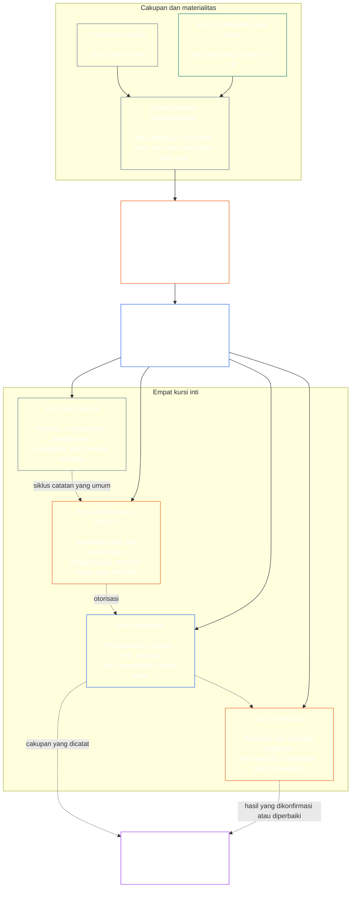

# BAB TUJUH: KEMANDIRIAN FUNGSIONAL DAN PEMISAHAN TUGAS

<strong>Penempatan korpus (nonoperasional): struktur berkas dan aturan membaca</strong>

> Konten berikut **hanya panduan pembaca**. Konten ini tidak menambah, menghapus, atau mempersempit kewajiban yang mengikat di bagian lain berkas ini atau dalam bab lain.
>
> Berkas ini **merupakan bagian dari Sentient Constitution** dan **hanya mengikat bersama** berkas `core_*` bernomor lainnya ketika dibaca sebagai satu instrumen. Berkas ini memuat **Bab Tujuh**: standar dasar lintas proses untuk kemandirian fungsional dan pemisahan tugas. Bab ini mengikuti Lantai Hak Bab Enam dan mendahului bab-bab proses konstitusional yang dimulai dengan [sertifikasi keselarasan sistem Bab Delapan](../../core_08_system_alignment_certification.md#chapter-eight-system-alignment-certification-reading-index).
>
> - **Pemilik konstitusional:** standar dasar kursi yang berbeda untuk tindakan yang mengikat secara material; isi minimum universal setiap [Catatan Tindakan yang Mengikat secara Material](../../core_05_band_accountability.md#materially-binding-act-record); kemandirian dari pelaku dan [Garis Kendali Material](../../core_05_band_accountability.md#material-control-line) pelaku; penempatan jalur dan peran yang dipublikasikan; konflik, kekosongan jabatan, penggantian, dan pengalihan ke kursi yang keliru; penampungan gabungan yang proporsional; serah terima yang dapat diatribusikan; serta syarat kemandirian minimum yang wajib diterapkan oleh setiap proses konstitusional berikutnya.
> - **Sumber lapisan prinsip:** [Bab Satu §18.3](../../core_01_c_stewardship_capacity_principles.md#183-segregation-of-duties) mewajibkan tata kelola mempertahankan kemandirian fungsional dan mengarahkan arsitektur kursi operatif ke sini.
> - **Pemilik implementasi:** [CJS-3.11](../../corpus_joint_structure/cjs_03a_accountability_operations.md#constitutional-lane-and-functional-separation), [CI-3.2](../../corpus_institutions/ci_03_institutional_design_separation_of_powers.md#ci-32-functional-separation-lanes), dan [CI-4.6](../../corpus_institutions/ci_04_appointment_competency_rotation_removal.md#ci-46-seat-catalog--process-role-archetypes-and-operational-boundaries) menempatkan dan mengoperasionalkan kursi. Ketiganya boleh lebih ketat dan boleh menambahkan jenis kursi dengan kewenangan khusus yang terbatas; ketiganya tidak boleh mempersempit bab ini.
> - **Penerapan khusus proses tetap di bagian hilir:** Bab Delapan menerapkan standar dasar ini pada sertifikasi keselarasan sistem; [Bab Sembilan §3.7](../../core_09_standing_assessment.md#37-segregation-of-duties) menerapkannya pada catatan status; Bab Dua Belas dan [corpus_forum.md](../../corpus_forum.md) menerapkannya pada proses forum. Bab-bab tersebut boleh menambahkan perlindungan yang diperlukan oleh pokok bahasannya; bab-bab tersebut tidak boleh membuat pengganti yang lebih lemah.
>
> Urutan membaca: §1 tujuan dan cakupan serta batas pemilik → §2 standar dasar empat kursi → §3 kemandirian dan konflik → §4 pengalihan ke kursi yang keliru → §5 penempatan dan pengganti yang dipublikasikan → §6 penskalaan proporsional → §7 keadaan darurat → §8 Catatan Tindakan dan serah terima yang dapat diatribusikan → §9 penerapan pada proses berikutnya.

<strong>Jejak rujukan</strong>

- Hulu: [Tetrad Konstitusional](../../core_00_preamble.md#constitutional-tetrad) — khususnya **pengawasan** dan **akuntabilitas**; [kepentingan material](../../core_00_preamble.md#material-stake); [Standar Penatalayanan Bersama Bab Satu §17.1](../../core_01_c_stewardship_capacity_principles.md#171-shared-stewardship-standard); [Tata Kelola di Bawah Disiplin Penatalayanan Bab Satu §18](../../core_01_c_stewardship_capacity_principles.md#18-governance-under-stewardship-discipline); [Pasal XVI](../../core_06_rights_part_c.md#article-xvi-audit-transparency-and-independent-verification) (*Audit, Transparansi, dan Verifikasi Independen*).
- Subbagian: [§1](#1-purpose-scope-and-owner-boundary); [§2](#2-four-seat-constitutional-floor); [§3](#3-independence-conflict-and-control-lines); [§4](#4-wrong-seat-routing); [§5](#5-published-placement-vacancy-and-substitution); [§6](#6-proportional-scaling-and-merged-hosting); [§7](#7-emergency-and-urgent-action); [§8](#8-act-records-and-attributable-handoffs); [§9](#9-relationship-to-later-processes).
- Hilir: [Bab Delapan](../../core_08_system_alignment_certification.md#chapter-eight-system-alignment-certification-reading-index); [Bab Sembilan](../../core_09_standing_assessment.md#chapter-nine-contribution-violation-and-standing-model--measurement); [Bab Dua Belas](../../core_12_forum.md#chapter-twelve-forums-and-jurisdiction); [Bab Tiga Belas](../../core_13_governance.md#chapter-thirteen-constitutional-contract-legitimacy-authorization-and-stewardship); teks implementasi yang ditetapkan di atas.
- Baca bersama: [Deteksi Ketidakselarasan Bab Satu §19.3](../../core_01_c_stewardship_capacity_principles.md#193-misalignment-detection) (*deteksi dan tinjauan majemuk*); [Tindakan yang Dapat Diatribusikan](../../core_05_band_accountability.md#attributable-action); [Integritas Atribusi](../../core_05_band_accountability.md#attribution-integrity); [Auditabilitas](../../core_05_band_oversight.md#auditability); [Kontestabilitas](../../core_05_band_accountability.md#contestability); [Proporsionalitas](../../core_05_band_accountability.md#proportionality).

 

Bab Tujuh adalah pemilik konstitusional **standar dasar kemandirian fungsional dan pemisahan tugas untuk tindakan yang mengikat secara material**.

### 1. Tujuan, Cakupan, dan Batas Pemilik

<strong>Jejak rujukan</strong>

- Hulu: klaim pemilik pada pembukaan bab; [Bab Satu §18](../../core_01_c_stewardship_capacity_principles.md#18-governance-under-stewardship-discipline); [Pengawasan](../../core_05_apex_oversight_leg.md#oversight-constitutional); [Akuntabilitas](../../core_05_apex_accountability_leg.md#accountability).
- Hilir: [§2](#2-four-seat-constitutional-floor) sampai [§9](#9-relationship-to-later-processes); setiap proses berikutnya yang menghasilkan atau mengubah tindakan yang mengikat secara material.
- Baca bersama: [Bab Empat](../../core_04_burden_traceability_verification.md#chapter-four-burden-of-proof-traceability-and-verification) untuk dasar verifikasi; [Pasal XIII-A](../../core_06_rights_part_c.md#article-xiii-a-reliability-and-trustworthiness-baseline) (*Landasan Keandalan dan Keterpercayaan*) dan [Pasal XIII-B](../../core_06_rights_part_c.md#article-xiii-b-right-to-redress-and-remedy) (*Hak atas Pemulihan dan Upaya Hukum*) untuk tantangan dan pemulihan; [Pasal XVI](../../core_06_rights_part_c.md#article-xvi-audit-transparency-and-independent-verification) (*Audit, Transparansi, dan Verifikasi Independen*) untuk Lantai Hak verifikasi independen.

 

*Dengan kata sederhana: sebelum proses konstitusional—atau keputusan tingkat pemangku kepentingan di dalam sistem, institusi, atau ranah keputusan terbatas yang telah diotorisasi—dapat dipercaya, tugas-tugas di dalamnya harus dipisahkan. Standar dasar ini berlaku bagi [Lapisan Kontrak Konstitusional](../../core_05_band_integrative.md#constitutional-contract-layer) dan [Partisipasi Pemangku Kepentingan dalam Sistem](../../core_05_band_participation.md#stakeholder-status-and-weight). Makhluk sadar, jabatan, sistem AI, badan pemangku kepentingan, atau perwakilan yang mengupayakan hasil tidak boleh sekaligus melakukan pemeriksaan yang dianggap independen, mengendalikan catatan resmi pemeriksaan itu, atau memutus tantangan terhadapnya.*

Bab ini berlaku bagi setiap [Tindakan yang Mengikat secara Material](../../core_05_band_accountability.md#materially-binding-act), sebagaimana didefinisikan Bab Lima, termasuk:

- keputusan;
- otorisasi atau sertifikasi;
- temuan;
- entri catatan atau perubahan versi material;
- pelepasan, penerapan, kelanjutan, atau penarikan;
- pencairan atau alokasi; dan
- disposisi atas suatu tantangan.

Kursi dalam bab ini menetapkan siapa yang boleh melakukan apa untuk tindakan tertentu; kursi bukanlah jabatan. Makhluk sadar, jabatan, atau sistem yang sama dapat menduduki kursi berbeda untuk tindakan berbeda. Gelar, delegasi, kemampuan teknis, atau kemampuan melakukan suatu langkah tidak memperluas kursi yang dipegang untuk tindakan tersebut.

Bab ini menetapkan standar dasar pemisahan tugas lintas proses. Bab ini tidak memindahkan:

- beban pembuktian, keterlacakan, atau metode verifikasi dari Bab Empat;
- makna kanonis dari Bab Lima;
- Lantai Hak dari Bab Enam;
- isi catatan khusus proses dari Bab Delapan sampai Dua Belas; atau
- katalog kursi operasional, metode penempatan staf, dan mekanika peta jalur dari teks implementasi yang ditetapkan.

### 2. Standar Dasar Konstitusional Empat Kursi

<strong>Jejak rujukan</strong>

- Hulu: [§1](#1-purpose-scope-and-owner-boundary); [Bab Satu §18.3](../../core_01_c_stewardship_capacity_principles.md#183-segregation-of-duties); [Bab Satu §17.1](../../core_01_c_stewardship_capacity_principles.md#171-shared-stewardship-standard).
- Hilir: [§3](#3-independence-conflict-and-control-lines) sampai [§9](#9-relationship-to-later-processes); [CI-4.6](../../corpus_institutions/ci_04_appointment_competency_rotation_removal.md#ci-46-seat-catalog--process-role-archetypes-and-operational-boundaries) (*Katalog Kursi — Arketipe Peran Proses dan Batas Operasional*).
- Baca bersama: [§6](#6-proportional-scaling-and-merged-hosting) untuk satu-satunya jalur penampungan gabungan yang diizinkan.

 

*Dengan kata sederhana: setiap tindakan yang mengikat secara material memiliki empat tugas—meminta atau bertindak, memeriksa, menyimpan catatan resmi, dan mendengar tantangan. Tugas-tugas tetap terpisah meskipun organisasi kecil diizinkan menempatkan pasangan yang diizinkan dalam satu jabatan.*

<strong>Panduan pembaca (nonoperasional): peta empat kursi</strong>

> Konten berikut **hanya panduan pembaca**. Konten ini tidak menambah, menghapus, atau mempersempit kewajiban yang mengikat di bagian lain bab ini atau bab lain.
>
> **Peta pembaca (nonoperasional).** Diagram ini menunjukkan empat kursi dan siklus catatan yang umum. Diagram ini tidak menambahkan kursi implementasi kelima, tidak mewajibkan tinjauan selesai sebelum setiap tindakan, dan tidak mengubah aturan operatif dalam bagian ini dan §§3–6.

 

Panah bertitik di dalam kotak kursi menunjukkan siklus catatan yang umum. Panah menuju pelaksanaan adalah tautan pelacakan, bukan urutan wajib yang mengharuskan tindakan menunggu tinjauan selesai.

Setiap tindakan yang mengikat secara material memiliki empat kursi yang berbeda secara fungsional. Bab Lima menetapkan makna kanonisnya; bagian ini menetapkan aturan penempatan dan ketidakcocokan lintas proses:

1. **[Kursi Pemrakarsa](../../core_05_band_accountability.md#initiating-seat)** — meminta, mengusulkan, menjalankan, mengklaim, atau dengan cara lain memulai tindakan.
2. **[Kursi Verifikasi atau Otorisasi](../../core_05_band_accountability.md#verify-or-authorize-seat)** — memeriksa bukti dan kewenangan berdasarkan standar yang berlaku serta memverifikasi, mengotorisasi, menolak, atau memberi syarat pada tindakan.
3. **[Kursi Pencatatan](../../core_05_band_accountability.md#record-seat)** — memasukkan, memberi versi, memegang, menjaga, dan menerbitkan [Catatan Tindakan](../../core_05_band_accountability.md#materially-binding-act-record) tentang penetapan Kursi Verifikasi atau Otorisasi.
4. **[Kursi Kontestasi](../../core_05_band_accountability.md#contest-seat)** — menerima dan meninjau tantangan, memerintahkan perbaikan atau pembatasan jika diotorisasi, serta meneruskan masalah di luar kewenangannya.

Kursi-kursi ini berlaku sama bagi pengampu manusia dan AI. Jika sistem melaksanakan tindakan, menyetujuinya, lalu menggunakan lognya sendiri sebagai bukti, sistem itu sekaligus menduduki kursi pemrakarsa, verifikasi, dan pencatatan. Otomatisasi proses tidak membuat pemeriksaan menjadi independen.

Kombinasi berikut dilarang untuk tindakan yang sama:

- kursi pemrakarsa tidak boleh memverifikasi atau mengotorisasi tindakannya sendiri;
- kursi verifikasi atau otorisasi tidak boleh memegang kursi pencatatan;
- kursi verifikasi atau otorisasi tidak boleh memegang kursi kontestasi; dan
- operator sistem tidak boleh memverifikasi atau mengotorisasi tindakan mengenai sistem tersebut.

Bab berikutnya atau teks implementasi yang digabungkan boleh melarang pasangan tambahan untuk proses tertentu. Teks tersebut tidak boleh mengizinkan pasangan yang dilarang di sini.

Standar dasar empat kursi yang fungsional berlaku pada setiap kelas. Pertanyaan yang disesuaikan menurut kelas ialah apakah kursi boleh digabungkan atau dipegang oleh satu pihak: untuk institusi atau sistem dalam cakupan Kelas C, pemisahan penuh empat kursi selalu direkomendasikan; dalam cakupan Kelas B, pemisahan itu hampir selalu harus diwajibkan; dan dalam cakupan Kelas A, pemisahan itu selalu diwajibkan. Jika cakupan bercampur atau klasifikasi tidak pasti, terapkan postur tertinggi yang berlaku sampai catatan mendukung postur yang lebih rendah.

### 3. Kemandirian, Konflik, dan Garis Kendali

<strong>Jejak rujukan</strong>

- Hulu: [§2](#2-four-seat-constitutional-floor); [Akuntabilitas yang diskalakan menurut kewenangan](../../core_01_c_stewardship_capacity_principles.md#181-governance-as-authorized-structure); [Pasal XXIV](../../core_06_rights_part_d.md#article-xxiv-constitutional-interpretation-review-and-anti-capture-safeguards) (*Penafsiran Konstitusional, Tinjauan, dan Perlindungan Antipengambilalihan*).
- Hilir: [§4](#4-wrong-seat-routing); [§5](#5-published-placement-vacancy-and-substitution); [§8](#8-act-records-and-attributable-handoffs); peran komponen sertifikasi Bab Delapan; penguasaan catatan Bab Sembilan; pencegahan mengadili diri sendiri di forum Bab Dua Belas.
- Baca bersama: [Garis Kendali Material](../../core_05_band_accountability.md#material-control-line); [CI-5](../../corpus_institutions/ci_05_conflict_integrity_anti_capture_anti_corruption.md) (*Integritas konflik, antipengambilalihan, dan antikorupsi*) serta [CF-7](../../corpus_forum/cf_07_integrity_safeguards_anti_capture_anti_self_judging.md) (*Perlindungan integritas, operasi antipengambilalihan, dan dukungan pencegahan mengadili diri sendiri*) untuk perlindungan operasional terhadap konflik dan penghakiman diri.

 

*Dengan kata sederhana: mengganti nama pada meja tidak menciptakan kemandirian. Verifikator atau peninjau tidak mandiri jika makhluk sadar atau jabatan yang menginginkan hasil dapat mengarahkan, memberhentikan, memberi imbalan, menghukum, atau diam-diam membatalkannya terkait tindakan itu.*

Kemandirian fungsional dinilai berdasarkan kewenangan dan kendali yang nyata, bukan label. Untuk tindakan yang sama:

- kursi verifikasi atau otorisasi dan kursi kontestasi harus berada di luar [Garis Kendali Material](../../core_05_band_accountability.md#material-control-line) kursi pemrakarsa;
- pihak yang kepentingannya sendiri ditentukan oleh tindakan tidak boleh memegang kursi verifikasi atau otorisasi maupun kursi kontestasi;
- pemegang catatan yang berkonflik harus menyerahkan catatan itu, bersama seluruh jejak auditnya, kepada pengganti yang dipublikasikan, bukan memutus konflik atau meninggalkan penguasaan; dan
- pengunduran diri menghapus kewenangan atas tindakan; kursi tidak dialihkan kepada pemohon, jalur pelaporan pemohon, atau orang yang paling dekat.

Telusuri [Garis Kendali Material](../../core_05_band_accountability.md#material-control-line) untuk tindakan tertentu. Infrastruktur bersama, dukungan administratif, atau riwayat pengangkatan saja tidak membuktikan garis tersebut, tetapi pengaturan itu tidak boleh menggagalkan pertimbangan independen dalam praktik.

Tanda tangan kedua, komite nominal, label internal, atau pengesahan buatan alat tidak memenuhi kemandirian jika pemeriksaan yang seharusnya independen tidak memiliki kewenangan, akses bukti, kebebasan dari kendali material, atau kemampuan nyata untuk menolak dan meneruskan.

### 4. Pengalihan ke Kursi yang Keliru

<strong>Jejak rujukan</strong>

- Hulu: [§2](#2-four-seat-constitutional-floor); [§3](#3-independence-conflict-and-control-lines).
- Hilir: [§5](#5-published-placement-vacancy-and-substitution); [§8](#8-act-records-and-attributable-handoffs); [aturan kursi bersama CI-4.6](../../corpus_institutions/ci_04_appointment_competency_rotation_removal.md#ci-46-shared-seat-rules).
- Baca bersama: [Kewajiban untuk Melawan Bab Satu §17.5](../../core_01_c_stewardship_capacity_principles.md#175-duty-to-resist).

 

*Dengan kata sederhana: jika suatu langkah bukan tugas Anda, jangan diam-diam mengambilnya dan jangan sekadar pergi. Catat kekosongan itu dan teruskan perkara ke tempat yang tepat.*

Pengampu yang diminta mengambil langkah di luar kursinya harus:

1. menolak langkah itu tanpa berpura-pura memutus pokok perkaranya;
2. menyebut kursi yang boleh mengambil langkah tersebut dan, jika dipublikasikan, pemegang atau penggantinya;
3. mencatat permintaan, kursi yang dipegang, kekosongan atau konflik, dan jalur yang digunakan;
4. menjaga bukti dan integritas catatan yang telah diterima; dan
5. meneruskan perkara tanpa penundaan yang dapat dihindari.

Tanggapan tersebut merupakan pelaksanaan kewajiban, bukan pengabaian tindakan. Tindakan dilanjutkan melalui kursi yang tepat. Mengambil langkah karena pengampu paling dekat, paling cepat, paling senior, atau paling mengetahui bukanlah perbaikan atas kursi yang kosong.

### 5. Penempatan, Kekosongan, dan Penggantian yang Dipublikasikan

<strong>Jejak rujukan</strong>

- Hulu: [§2](#2-four-seat-constitutional-floor); [§3](#3-independence-conflict-and-control-lines); [Transparansi](../../core_05_band_oversight.md#transparency); [Auditabilitas](../../core_05_band_oversight.md#auditability).
- Hilir: [§8](#8-act-records-and-attributable-handoffs); [CI-3.2](../../corpus_institutions/ci_03_institutional_design_separation_of_powers.md#ci-32-functional-separation-lanes) (*Jalur pemisahan fungsional*); [CI-4.5](../../corpus_institutions/ci_04_appointment_competency_rotation_removal.md#ci-45-authorized-roles-and-accountability-chains) (*Peran resmi dan rantai akuntabilitas*); catatan Bab Delapan dan Bab Sembilan.
- Baca bersama: [Piagam](../../core_05_band_continuity.md#charter) dan [Bab Tiga Belas §5](../../core_13_governance.md#5-authorized-roles-competency-development-and-contribution).

 

*Dengan kata sederhana: organisasi harus mengumumkan siapa yang memegang setiap tugas sebelum masalah sulit muncul, termasuk siapa yang menggantikan pemegang biasa ketika ia tidak hadir atau berkonflik.*

Setiap pengadopsi yang mengambil tindakan yang mengikat secara material wajib memelihara peta yang dipublikasikan, dapat diaudit, dan dapat dikontestasikan, yang mengidentifikasi:

- jalur, kantor, peran, atau proses yang menampung setiap kursi;
- tindakan dan cakupan yang berlaku bagi penempatan tersebut;
- setiap pengaturan penampungan gabungan yang diizinkan dan perlindungan kemandiriannya;
- pengganti bagi pemegang yang tidak hadir, dikecualikan, dikuasai, atau berkonflik; dan
- jalur independen ketika tidak tersedia pengganti yang memenuhi syarat.

Kursi yang belum ditempatkan, kosong, atau berkonflik merupakan cacat tata kelola yang harus dicatat dan diperbaiki. Kursi itu tidak otomatis beralih kepada kursi pemrakarsa, pihak berkepentingan, operator, atau atasan dalam [Garis Kendali Material](../../core_05_band_accountability.md#material-control-line) mereka. Sampai diperbaiki, tindakan dialihkan ke pengganti yang dipublikasikan atau jalur independen. Persyaratan kemandirian tidak boleh dilewati hanya karena terburu-buru.

Delegasi mempertahankan batas kursi, kewajiban bukti, catatan, dan tenggat yang sama, serta tetap tunduk pada [Garis Kendali Material](../../core_05_band_accountability.md#material-control-line). Delegasi tidak menciptakan kursi baru, menggabungkan kursi, atau membolehkan penerima delegasi melakukan hal yang tidak boleh dilakukan kursi pemberi delegasi, termasuk mengubah rekomendasi yang diskalakan menurut kelas atau persyaratan pemisahan penuh empat kursi menjadi izin untuk menggabungkannya.

### 6. Penskalaan Proporsional dan Penampungan Gabungan

<strong>Jejak rujukan</strong>

- Hulu: [§2](#2-four-seat-constitutional-floor); [kepentingan material](../../core_00_preamble.md#material-stake); [Keniscayaan](../../core_05_band_accountability.md#necessity); [Proporsionalitas](../../core_05_band_accountability.md#proportionality).
- Hilir: [Bab Sembilan §3.7](../../core_09_standing_assessment.md#37-informal-and-small-scope-records); [CJS-2.4](../../corpus_joint_structure/cjs_02_specific_joint_interlocks.md#cjs-24-class-scaled-lane-staffing-and-competency-redundancy) (*Penempatan staf jalur dan redundansi kompetensi yang diskalakan menurut kelas*); [CI-3.2](../../corpus_institutions/ci_03_institutional_design_separation_of_powers.md#ci-32-functional-separation-lanes) (*Jalur pemisahan fungsional*).
- Baca bersama: [Beban yang Dapat Dihindari](../../core_05_band_continuity.md#avoidable-burden) dan [Anti-Proses yang Merendahkan, Bab Satu §3.3](../../core_01_a_values_principles.md#33-anti-degrading-process).

 

*Dengan kata sederhana: kelompok kecil dan informal tidak memerlukan empat departemen besar. Namun mereka membutuhkan pemeriksaan independen yang nyata, catatan yang dapat digunakan, dan jalur tantangan. Skala mengubah metode penempatan staf, bukan pemisahan yang dilindungi.*

Kekuatan, penempatan staf, redundansi, dan formalitas pemisahan mengikuti skala kepentingan material, kelas sistem, ketergantungan, dan bahaya yang secara wajar dapat diperkirakan.

Pengadopsi kecil atau informal boleh menempatkan dua kursi pada satu kantor atau satu makhluk sadar hanya jika semua hal berikut terpenuhi:

- penggabungan itu perlu dan proporsional terhadap cakupan;
- penggabungan itu dipublikasikan, dapat diaudit, dapat dikontestasikan, dan diungkapkan dalam catatan tindakan;
- perlindungan kemandirian menangani risiko yang ditimbulkan penggabungan;
- kursi pemrakarsa tidak memverifikasi atau mengotorisasi tindakannya sendiri;
- penggabungan verifikasi-dengan-pencatatan dan verifikasi-dengan-kontestasi tetap dilarang; dan
- jalur independen tetap tersedia ketika konflik, bahaya material, atau tantangan melampaui batas hukum pemegang gabungan.

Pekerjaan informal dan tanpa upah seperti gotong royong, pengasuhan, perbaikan, pengajaran, koperasi, dan penatalayanan masyarakat boleh menggunakan badan rujukan yang tidak berkepentingan, dengan kewenangan yang dipublikasikan untuk pemeriksaan terkait. Konstitusi tidak mewajibkan formalitas kelembagaan yang secara wajar tidak dapat dicapai oleh cakupan tersebut selama terdapat jalur yang sungguh tidak berkepentingan dan akuntabel.

Keterbatasan staf, kecepatan, kemudahan, atau pemusatan keahlian tidak dengan sendirinya membenarkan penggabungan. Postur menurut kelas dalam [§2 Standar Dasar Konstitusional Empat Kursi](#2-four-seat-constitutional-floor) berlaku: tidak ada penyimpangan untuk Kelas A, dan setiap penyimpangan untuk Kelas B atau C harus memenuhi persyaratan di atas. Semakin besar kepentingan material, semakin kuat praduga bagi kantor terpisah, redundansi kompetensi, dan pengganti independen.

### 7. Tindakan Darurat dan Mendesak

<strong>Jejak rujukan</strong>

- Hulu: [§2](#2-four-seat-constitutional-floor); [§6](#6-proportional-scaling-and-merged-hosting); [Langkah darurat dan beban kelanjutan, Bab Dua Belas §6.1](../../core_12_forum.md#61-emergency-measures-and-continuation-burden); [postur sementara bawaan](../../core_01_b_interaction_interpretation.md#default-interim-posture).
- Hilir: proses insiden, pembatasan, pelepasan, kelanjutan, dan tinjauan pascakejadian dalam teks implementasi yang ditetapkan.
- Baca bersama: [Ketepatan Waktu](../../core_05_apex_timeliness_leg.md#timeliness-constitutional), [Pelestarian Bukti](../../core_05_band_oversight.md#evidence-preservation), dan [Katalog Kursi CI-4.6 — arketipe peran proses dan batas operasional](../../corpus_institutions/ci_04_appointment_competency_rotation_removal.md#ci-46-seat-containment).

 

*Dengan kata sederhana: keadaan darurat yang nyata dapat membenarkan tindakan sebelum pemeriksaan biasa selesai. Keadaan itu mengubah urutan, bukan kepemilikan kursi atau postur pemisahan menurut kelas. Keadaan itu tidak membolehkan pelaku mengesahkan kelanjutannya sendiri, menghapus jejak, atau menjadi peninjau akhir setelahnya.*

Jika penundaan akan menimbulkan risiko bahaya serius dan segera yang secara wajar dapat diperkirakan, kursi pemrakarsa atau pengendalian yang berwenang boleh mengambil tindakan minimum yang perlu dan dapat dibalik sebelum verifikasi awal biasa selesai, hanya jika:

- kewenangan darurat, cakupan, waktu mulai, kedaluwarsa, dan alasannya dicatat segera atau secepat mungkin secara fisik;
- bukti dan keberatan dilestarikan;
- pemberitahuan dan partisipasi dipulihkan dalam tenggat konstitusional yang berlaku;
- kursi verifikasi atau otorisasi yang independen meninjau kelanjutan apa pun di luar batas langsung; dan
- tindakan menerima tinjauan independen setelah kejadian.

Tindakan darurat tidak:

- mengizinkan pelaku memverifikasi kelanjutannya sendiri;
- menjadikan pelaku pemegang catatan yang berkonflik;
- membolehkan pelaku mendengar tantangan terhadap tindakannya;
- mengubah keniscayaan sementara menjadi kewenangan permanen;
- membolehkan penggabungan apa pun atas empat kursi bagi institusi atau sistem Kelas A.

Hal-hal berikut bukan keadaan darurat jika berdiri sendiri:

- tenggat waktu;
- target pelepasan;
- kekurangan staf; atau
- kekhawatiran reputasi.

### 8. Catatan Tindakan dan Serah Terima yang Dapat Diatribusikan

<strong>Jejak rujukan</strong>

- Hulu: [§2](#2-four-seat-constitutional-floor) sampai [§7](#7-emergency-and-urgent-action); [Catatan Tindakan yang Mengikat secara Material](../../core_05_band_accountability.md#materially-binding-act-record); [Tindakan yang Dapat Diatribusikan](../../core_05_band_accountability.md#attributable-action); [Integritas Atribusi](../../core_05_band_accountability.md#attribution-integrity).
- Hilir: [Tindakan yang Dapat Diatribusikan dan Dapat Diperiksa, CS-4 §10](../../corpus_systems/cs_04_critical_system_stewardship.md#10-inspectable-attributable-action); [aturan kursi bersama CI-4.6](../../corpus_institutions/ci_04_appointment_competency_rotation_removal.md#ci-46-shared-seat-rules); setiap catatan proses yang diatur §8; [`materially_binding_act_record.schema.json`](../../implementation/schemas/materially_binding_act_record.schema.json) (*bentuk dasar yang dapat diperiksa mesin; dukungan proses, bukan definisi kedua*).
- Baca bersama: [§4 Pengalihan ke Kursi yang Keliru](#4-wrong-seat-routing) dan [Bab Empat §5](../../core_04_burden_traceability_verification.md#5-compliance-evidence-standard).

 

*Dengan kata sederhana: setiap tindakan yang mengikat secara material memiliki Catatan Tindakan yang menunjukkan apa yang terjadi, siapa yang menduduki setiap kursi, apa yang diputuskan, dan ke mana tantangan harus diajukan.*

Setiap tindakan yang mengikat secara material harus memiliki [Catatan Tindakan yang Mengikat secara Material](../../core_05_band_accountability.md#materially-binding-act-record) yang dapat diidentifikasi (**Catatan Tindakan**). Catatan Tindakan boleh diwujudkan dalam satu catatan resmi khusus proses yang berlaku atau dalam rangkaian catatan resmi tertaut yang dapat diatribusikan dan menjaga integritas. Dokumen duplikat terpisah tidak diwajibkan jika catatan resmi yang ada atau rangkaian tertaut dengan jelas mengidentifikasi seluruh unsur wajib, mempertahankan tautan dan riwayat versinya, serta tetap dapat diakses melalui jalur catatan resmi yang diotorisasi.

Catatan Tindakan setidaknya harus mengidentifikasi:

- identitas catatan yang stabil, versi terkini, dan cap waktu pembuatan serta perubahan material;
- tindakan, cakupan material, status, dan kewenangan yang mengatur;
- kursi pemrakarsa, pemegang, dan kewenangannya;
- kursi verifikasi atau otorisasi, pemegang, standar yang mengatur, penetapan, syarat atau alasan material, serta waktu penetapan;
- kursi pencatatan, pemegang, kewenangan penguasaan, dan versi yang dimasukkan;
- kursi kontestasi atau jalur tantangan yang dipublikasikan serta status tantangan atau koreksi terkini;
- setiap delegasi, pengunduran diri, penggantian, penggabungan yang diizinkan, atau penyimpangan darurat; dan
- bukti material dan tautan catatan, serah terima, penolakan, syarat, keberatan yang belum diselesaikan, tenggat, versi yang digantikan, dan koreksi yang diperlukan untuk merekonstruksi tindakan.

Catatan khusus proses boleh menambahkan kolom yang lebih ketat atau khusus bidang. Catatan tersebut tidak boleh menghilangkan, bertentangan dengan, atau membuat standar minimum ini tidak dapat direkonstruksi. Kontrol privasi, kerahasiaan, dan keamanan yang sah mengatur akses atau pengungkapan materi yang dilindungi; kontrol tersebut tidak membolehkan jejak resmi dihapus atau dibuat tidak berguna untuk verifikasi, tantangan, koreksi, atau pemulihan yang diotorisasi.

Log menunjukkan siapa melakukan apa, tetapi dengan sendirinya tidak membuktikan bahwa tindakan itu sah. Log, tanda tangan, jejak model, daftar periksa, atau atestasi yang dibuat oleh makhluk sadar atau sistem yang mengambil tindakan memiliki peran terbatas:

- Materi tersebut boleh memberikan bukti atau ditautkan ke Catatan Tindakan.
- Materi tersebut tidak dapat menggantikan tinjauan dan keputusan independen maupun Catatan Tindakan resmi itu sendiri.

### 9. Hubungan dengan Proses Berikutnya

<strong>Jejak rujukan</strong>

- Hulu: [§1](#1-purpose-scope-and-owner-boundary) sampai [§8](#8-act-records-and-attributable-handoffs).
- Hilir: [Bab Delapan](../../core_08_system_alignment_certification.md#chapter-eight-system-alignment-certification-reading-index); [Bab Sembilan](../../core_09_standing_assessment.md#chapter-nine-contribution-violation-and-standing-model--measurement); [Bab Dua Belas](../../core_12_forum.md#chapter-twelve-forums-and-jurisdiction); [Bab Tiga Belas](../../core_13_governance.md#chapter-thirteen-constitutional-contract-legitimacy-authorization-and-stewardship).
- Baca bersama: [Tumpukan Kewenangan dan Hierarki Internal](../../core_05_band_integrative.md#owner-non-relocation) dan [register pemilik Preambule](../../core_00_preamble.md#4-principles-definitions-and-rights).

 

*Dengan kata sederhana: bab-bab berikutnya memberi tahu setiap proses apa yang harus dinilai, dicatat, diputuskan, dan dipulihkan. Bab ini memberi tahu proses-proses tersebut bagaimana memisahkan kekuasaan saat melakukannya.*

Setiap proses konstitusional berikutnya harus menjelaskan cara menetapkan dan menggunakan keempat kursi serta cara mematuhi bab ini. Dalam praktik:

- Catatan prosesnya sendiri boleh berfungsi sebagai Catatan Tindakan atau menambahkan rincian khusus proses ke dalamnya.
- Jika satu catatan proses mencakup beberapa tindakan yang mengikat secara material, catatan itu boleh tertaut ke Catatan Tindakan terpisah untuk setiap tindakan.
- Catatan duplikat terpisah tidak diwajibkan jika jalur catatan resmi tetap lengkap dan dapat ditelusuri.
- Memberi nama berbeda pada suatu proses tidak membebaskannya dari [§4 Pengalihan ke Kursi yang Keliru](#4-wrong-seat-routing) atau [§8 Catatan Tindakan dan Serah Terima yang Dapat Diatribusikan](#8-act-records-and-attributable-handoffs), termasuk aturan serah terima dan kursi yang keliru.

Secara khusus:

- **Bab Delapan — sertifikasi keselarasan sistem:** operator sistem atau pengusul sertifikasi menempati kursi pemrakarsa, bukan verifikator atas dirinya sendiri; temuan komponen yang terbatas, integrasi catatan sertifikasi, penguasaan, dan tantangan harus tetap berada dalam kursi sahnya serta jalur antipenghakiman diri.
- **Bab Sembilan — catatan status:** pemohon, kewenangan pembukaan catatan, pemegang catatan, dan jalur kontestasi menerapkan standar dasar empat kursi bersama aturan Bab Sembilan yang lebih ketat tentang penguasaan, penggugat, catatan informal, dan larangan penguasaan sendiri.
- **Bab Dua Belas — forum:** pengajuan, penyelidikan, tinjauan pokok perkara, penguasaan catatan, banding, dan tinjauan atas dugaan keberpihakan forum sendiri atau penyalahgunaan proses harus mempertahankan batas kursi yang berlaku dan batas antipenghakiman diri.
- **Bab Tiga Belas — tata kelola:** definisi peran, rencana kompetensi, delegasi, suksesi, dan desain kelembagaan harus menempatkan serta mempertahankan kursi, bukan sekadar mengulangi namanya.

Bab berikutnya boleh memberlakukan persyaratan yang lebih kuat untuk kemandirian, pengunduran diri, pemisahan, penguasaan, panel, atau tinjauan karena prosesnya membawa risiko yang lebih tinggi atau berbeda. Bab tersebut tidak boleh mempersempit standar dasar ini, menganggap label khusus proses sebagai pengecualian, atau menyimpulkan bahwa diam memindahkan kursi kepada pelaku.

---

**Berkas sebelumnya:** [core_05_band_performance.md](../../core_05_band_performance.md)

**Berkas berikutnya:** [core_08_a_system_alignment_certification_evaluation.md](../../core_08_a_system_alignment_certification_evaluation.md#chapter-eight-part-a-certification-evaluation)
