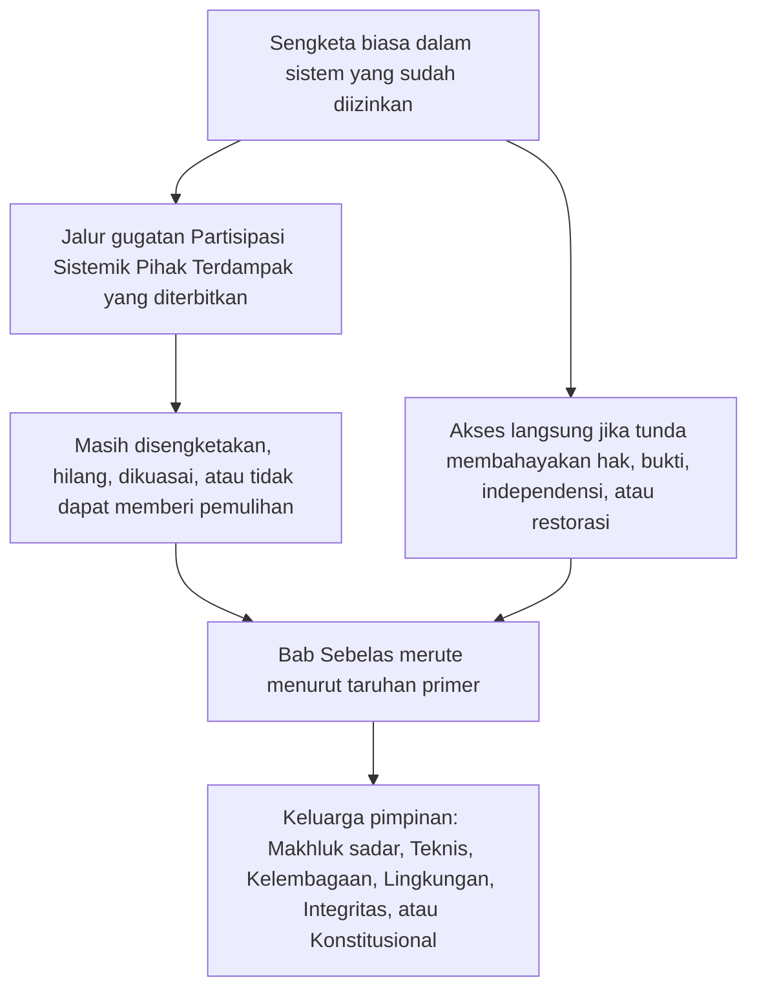

# BAB SEBELAS: FORUM DAN YURISDIKSI

<strong>Letak dalam korpus (non-operatif): struktur berkas dan aturan baca</strong>

> Isi berikut **hanya panduan pembaca**. Tidak menambah, mengurangi, atau mempersempit kewajiban yang mengikat di berkas ini atau di bab lain.
>
> Berkas ini adalah **uji coba bahasa pembaca** atas [Bab Sebelas bahasa Inggris](../../core_12_forum.md). **Bukan** bagian mengikat Konstitusi Makhluk Sadar. **Bukan** konstitusi kedua. **Bukan** edisi kirim. **Disematkan** pada `SC-Corpus-2026.08.09`. Jika terjemahan ini dan sumber bahasa Inggris tampak berselisih, berkas bernomor [`core_11_forum.md`](../../core_12_forum.md) yang menang. Urutan baca dan metadata edisi tetap di [README.md](../../README.md). Metode dan glosarium: [translations/id/README.md](README.md).
>
> Berisi **Bab Sebelas**: keluarga forum, tempat default dan perutean taruhan primer, dukungan forensik, triase penerimaan, dan yurisdiksi bagi sengketa di bawah rantai jejak dan Lantai Hak. Forum **mensupervisi** penanganan sengketa di bawah kaki **partisipasi**, **pengawasan**, dan **ketepatan waktu** [Tetrad Konstitusional](core_00_preamble.md#constitutional-tetrad), diskalakan ke [taruhan material](core_00_preamble.md#material-stake). Ketika fakta terverifikasi, mereka boleh **membuka, memperbarui, atau mengoreksi** catatan jejak — atau **mengesampingkan catatan yang cacat atas gugatan** — di bawah [Bab Delapan §3](core_08_standing_assessment.md#3-standing-record-operational-requirements); perkara yang diajukan bukan jejak dengan sendirinya, dan narasi forum tidak boleh menggantikan pengukuran jejak Bab Delapan ([Bab Delapan §3.6](core_08_standing_assessment.md#36-forum-boundary)). Pakai [README — Standing pipeline and forums](../../README.md#standing-pipeline-and-forums) untuk navigasi rantai. Mekanika forum operatif tetap di berkas implementasi yang ditunjuk. Penomoran bab dan rujukan silang cocok dengan instrumen terpadu. Urutan baca, pemisahan mengikat/dukungan, dan metadata edisi korpus dijaga di [README.md](../../README.md).

>
> **Sebelumnya (masih bahasa Inggris):** [core_10_b_misconduct_pattern_applications.md](../../core_11_b_misconduct_pattern_applications.md#chapter-eleven-part-b-anti-constitutional-misconduct-pattern-applications)
>
> **Berikutnya (masih bahasa Inggris):** [core_08-11_application_vignettes.md](../../core_09-12_application_vignettes.md#chapters-eight-eleven-application-vignettes)
> **Alur baca:** §1 tujuan → Urutan sengketa → §2 tempat default dan penerimaan → §2.1–§2.3 batas pimpinan, taruhan campuran, gugatan → §3 pemindahan dan anti-mengadili-sendiri → §4 keluarga → §5 eskalasi dan sertifikasi → §6 tingkat dan disiplin anti-tunda → §7 dukungan forum

<strong>Panduan pembaca (non-operatif): di mana Bab Sebelas hidup dan apa yang tetap di sini</strong>

> Isi berikut **hanya panduan pembaca**. Tidak menambah, mengurangi, atau mempersempit kewajiban yang mengikat di bab ini atau di bab lain.
>
> Di mana ini hidup (navigasi):
> - **Pemilik konstitusional:** **bagian 1** (*tujuan* — **penerapan ajudikatif primer** atas norma yang bab ini alokasikan, **berbeda dari** **administrasi eksekutif** rutin; **Urutan sengketa** bagi sengketa biasa di dalam sistem yang sudah diizinkan; persyaratan **pertanggungjawaban**; penempatan **ambang** yang **diterbitkan** dan **dapat diprediksi**); **tempat awal default**, perutean **taruhan primer**, **badan triase penerimaan** (**meja kontak pertama**), taruhan campuran, asimetri, gugatan catatan jejak, **karakterisasi itikad baik dan anti-permainan**, dan harapan **akses** **ambang** yang **dapat diakses makhluk sadar** (**bagian 2**, **baca bersama** **`corpus_forum.md`**); **pemindahan**, **konsolidasi**, dan **koordinasi** (**bagian 3**, baca bersama sertifikasi dan cadangan **bagian 5**); **definisi keluarga forum**, **kamar internal**, **standar bersama**, dan **hukum operasional sementara** (makhluk sadar, teknis, kelembagaan, lingkungan, integritas, konstitusional — **bagian** **4**, mencerminkan **tabel** **bagian** **2**); **eskalasi**, **sertifikasi**, dan **perlindungan sementara** (**bagian 5**); **penyelesaian tepat waktu** dan disiplin **anti-tunda** (**bagian 6**); **dukungan forum** sebelum, selama, dan sesudah tinjauan (**bagian 7**), diimplementasikan agar peran triase dan dukungan **tidak** menggantikan **panel pokok yang dibentuk secara sah**; perutean cadangan **anti-mengadili-sendiri**; dan kait eskalasi yang terikat pada **Bab Delapan**, **Bab Sepuluh**, dan hak keadilan serta gugatan **Bab Enam**.
> - **Navigasi rantai:** [README — Standing pipeline and forums](../../README.md#standing-pipeline-and-forums) — [§§1–7](#1-purpose-and-role) dalam berkas ini.
> - **Rantai tiga pertanyaan Bab Delapan–Sembilan:** **Bagian 2–3** Bab Delapan menjawab Pertanyaan 1 (*apa yang terjadi?*) lewat catatan terverifikasi yang murni-sumbu. [Bab Delapan §4](core_08_standing_assessment.md#4-standing-measurement-evaluation-dimensions) dan [skala LEQU proporsional terpadu §7](core_08_standing_assessment.md#7-unified-proportional-lequ-scale) menjawab Pertanyaan 2 (*seberapa baik atau seberapa buruk?*) lewat dimensi penilaian, pita LEQU bersama lima kali, dan tata bahasa bersama **s** = 1...9, sambil menjaga catatan Kontribusi dan Pelanggaran tetap terpisah. [Bab Sembilan](core_09_standing_integration.md#chapter-nine-standing-effects-and-integration) menjawab Pertanyaan 3 (*apa yang terjadi karenanya?*) lewat pemulihan, pagar pengaman, palang kompetensi dan izin, serta kunci jejak. Slot Sumbu Pelanggaran dikendalikan hanya oleh dampak terverifikasi; kelalaian, penyembunyian, koersi, respons, dan deskriptor karakter sebanding tidak menggesernya. [Bab Sepuluh](core_10_a_misconduct_designation.md#chapter-ten-anti-constitutional-misconduct) boleh menambah penunjukan salah-laku-anti-konstitusi yang berpasangan pada catatan slot 7, 8, atau 9 Bab Delapan, tetapi tidak menugaskan slot numerik.
> - **Forum (glosa non-operatif):** **Keluarga forum** di bawah bab ini adalah **forum** primer yang menerapkan klasifikasi [Bab Delapan](core_08_standing_assessment.md#chapter-eight-compliance-violation-and-standing-model) pada sengketa konkret — termasuk perkara di mana **sifat kontribusi**, **slot dampak Sumbu Pelanggaran**, dan karakter proses / respons yang dicatat terpisah **hadir bersama** dan harus ditangani di bawah disiplin penilaian-bersama dan non-penggantian **Bab Delapan**. Mekanisme **pendanaan riset**, **pembiayaan**, dan **insentif** di luar ajudikasi tetap di implementasi yang diadopsi dan di **[corpus_systems.md](../../corpus_systems.md)** (lihat panduan pembaca **Bab Delapan**); mereka boleh menopang pencegahan dan penyelidikan sebab-akar dan **tidak boleh** menggantikan perutean **ambang**, penentuan **pokok**, penugasan slot numerik Bab Delapan yang berwenang, penunjukan berpasangan **Bab Sepuluh** mana pun, atau batasan **Pasal XXIII** (*Penyelesaian Konflik, Eskalasi, dan Proporsionalitas Darurat*). **Bagian 1 dan 2** mengalokasikan tanggung jawab **primer** atas struktur **insentif** **terutama** **di dalam** **lingkup** setiap **keluarga** (rincian granular di **korpus** dan implementasi); **alokasi** itu **tidak** memindahkan pilihan **anggaran** **sepanjang-sistem** atau **skala tata kelola** yang dicadangkan bagi [Bab Dua Belas](../../core_13_governance.md#chapter-thirteen-constitutional-contract-legitimacy-authorization-and-stewardship) dan **[corpus_systems.md](../../corpus_systems.md)**.
> - **Pemilik implementasi:** **kelas** penerimaan yang diterbitkan, aturan daftar perkara harian, staf, anggaran, prosedur granular, mekanika eskalasi operatif, dan persyaratan operasional dukungan forum hidup di teks implementasi yang diadopsi dan di **[corpus_forum.md](../../corpus_forum.md)** (**CF-5** (*Operasi perutean, pemindahan, sertifikasi, dan perlakuan perwakilan*), **CF-8** (*Dukungan forensik dan analitis forum*), **CF-9** (*Layanan investigasi independen dan antarmuka penuntutan*), dan bagian terkait); lapisan itu **mengimplementasikan, bukan mempersempit**, bab ini.
> - **Aturan anti-relokasi:** instrumen adopsi tidak boleh memenuhi bab ini lewat prosedur yang meruntuhkan fungsi forum yang berbeda, menelanjangi **independensi** atau **tinjauan nyata**, atau merutekan gugatan integritas kembali ke forum yang dikuasai yang sama yang bab ini larang sebagai satu-satunya rumah pokok akhir.
>
> **Arsitektur — penempatan *Dalam bahasa sederhana*:** Setiap baris *Dalam bahasa sederhana* muncul segera setelah blok navigasi Jejak rujukan (dan ` ` yang mengikutinya jika ada), dan **sebelum** paragraf operatif serta daftar butir bagian itu. Glosa menghadap-pembaca saja; tidak menambah, mengurangi, atau mempersempit teks yang mengikat.

<strong>Jejak rujukan</strong>

- Hulu: [Bab Delapan](core_08_standing_assessment.md#chapter-eight-compliance-violation-and-standing-model) (*catatan Pertanyaan 1 dan pengukuran Pertanyaan 2 yang memasok sengketa yang bab ini rute*); [Bab Delapan §5.1](core_08_standing_assessment.md#5-slot-grammar-and-display-labels) (*tata bahasa slot jejak*); [skala terpadu Bab Delapan §7](core_08_standing_assessment.md#7-unified-proportional-lequ-scale) (*pita LEQU bersama lima kali dan catatan sumbu terpisah*); [Bab Delapan §§4.3–4.4](core_08_standing_assessment.md#43-route-descriptor-measurement-roles) (*katalog deskriptor ternormalisasi lintas-sumbu, termasuk deskriptor Sumbu Kontribusi dan Sumbu Pelanggaran yang tidak menggeser slot*); [Bab Sepuluh](core_10_a_misconduct_designation.md#chapter-ten-anti-constitutional-misconduct) (*penunjukan salah-laku-anti-konstitusi berpasangan bagi slot 7–9 Bab Delapan yang memenuhi syarat*); [Bab Dua sampai Empat](core_02_definition_structure.md) (*harapan catatan, verifikasi, dan ketelusuran*); [Bab Lima](core_05__definitions_home.md#chapter-five-foundational-definitions) (*definisi fondasional*); [Bab Satu](core_01_c_stewardship_capacity_principles.md#chapter-01-principles-and-constraints) (*batasan tafsir*); [Bab Enam — Hak Dasar](core_06_rights_part_a.md#chapter-six-foundational-rights) sampai [Bagian D](core_06_rights_part_d.md) (*kait gugatan, audit, dan pasal keadilan*).
- Subbagian: [§1](#1-purpose-and-role); [§2](#2-default-venue-and-primary-stakes); [§3](#3-transfer-consolidation-and-coordination); [§4](#4-forum-family-definitions); [§5](#5-escalation-and-certification); [§6](#6-timely-resolution-materiality-tiers-and-anti-delay-discipline); [§7](#7-forum-support-before-during-and-after-review).
- Baca bersama: [README — Standing pipeline and forums](../../README.md#standing-pipeline-and-forums).
- Hilir: [corpus_forum.md](../../corpus_forum.md) (*doktrin forum operatif*); [Bab Dua Belas](../../core_13_governance.md#chapter-thirteen-constitutional-contract-legitimacy-authorization-and-stewardship) di mana keabsahan tata kelola berinteraksi dengan peran ajudikatif; [Bab Enam Belas](../../core_17_incorporation.md#chapter-seventeen-incorporation-bridge) (*disiplin inkorporasi* bagi lapisan prosedur yang diadopsi).
- Baca bersama: [Bab Delapan §5.1](core_08_standing_assessment.md#5-slot-grammar-and-display-labels) (*tata bahasa slot jejak*); [Bab Delapan §§4.3–4.4](core_08_standing_assessment.md#43-route-descriptor-measurement-roles) (*deskriptor ternormalisasi lintas-sumbu Sumbu Kontribusi dan Sumbu Pelanggaran*).
- Baca juga bersama: [Bab Sembilan §3](core_09_standing_integration.md#3-descriptor-integration-and-attachment-normalization) (*integrasi deskriptor dan normalisasi lampiran dibaca bersama perutean taruhan primer bagian 2*); [README.md](../../README.md) (*urutan baca dan organisasi korpus*); [doc_architecture.md](../../doc_architecture.md) (*peta editorial non-mengikat kecuali diadopsi*).

 

Bab Sebelas adalah pemilik konstitusional atas **keluarga forum, tempat default, yurisdiksi, dan perutean ajudikatif bagi sengketa di bawah rantai jejak dan Lantai Hak**.

*Dalam bahasa sederhana: Di bawah [Tetrad Konstitusional](core_00_preamble.md#constitutional-tetrad) dan [Dua Tujuan Konstitusional](core_00_preamble.md#two-constitutional-aims), bab ini **mensupervisi** cara sengketa bergerak lewat rantai jejak Bab Delapan–Sepuluh — perutean, independensi, dukungan forensik, pengurutan remediasi, dan jam bawaan-tingkat di bawah **bagian 6** dan **Pasal XXIV-C** (*Penyelesaian tepat waktu dan lantai anti-tunda*). Keluarga forum menjawab jalur mana yang menangani sengketa mana, di mana suatu perkara biasanya mulai, dan bagaimana perkara taruhan-campuran dikoordinasikan. Mereka memasok **partisipasi** (gugatan yang dapat diakses) dan **pengawasan** (tinjauan pokok yang dapat ditelusuri). Ketika fakta terverifikasi, mereka boleh **membuka, memperbarui, atau mengoreksi** catatan jejak — atau **mengesampingkan catatan yang cacat atas gugatan**. Mereka **tidak** menjalankan jalur keputusan kedua yang terpisah di samping rantai jejak. Mengajukan perkara semata tidak berdampak langsung pada jejak. Aturan sidang harian, anggaran, dan manual staf hidup di lapisan implementasi dan harus **mengimplementasikan, bukan mempersempit**, bab ini atau **Pasal XXIII** (*Penyelesaian Konflik, Eskalasi, dan Proporsionalitas Darurat*).*

### 1. Tujuan dan peran — arsitektur partisipasi

<strong>Jejak rujukan</strong>

- Hulu: [Bab Tujuh — Sertifikasi Keselarasan Sistem](core_07_a_system_alignment_certification_evaluation.md#chapter-seven-system-alignment-certification); [Bab Delapan](core_08_standing_assessment.md#chapter-eight-compliance-violation-and-standing-model); [Bab Sembilan](core_09_standing_integration.md#chapter-nine-standing-effects-and-integration); [Bab Sepuluh](core_10_a_misconduct_designation.md#chapter-ten-anti-constitutional-misconduct); [Bab Satu](core_01_c_stewardship_capacity_principles.md#chapter-01-principles-and-constraints) (*prinsip dan batasan tafsir*); [Bab Dua sampai Empat](core_02_definition_structure.md) (*harapan ketelusuran dan verifikasi*); [Bab Lima](core_05__definitions_home.md#chapter-five-foundational-definitions) (*definisi dibaca bersama Bab Dua sampai Empat dalam widget Letak dalam korpus*); [Bab Enam](core_06_rights_part_a.md#chapter-six-foundational-rights) (*Lantai Hak Dasar yang bab ini terapkan bersama*).
- Hilir: [§2](#2-default-venue-and-primary-stakes) (*tempat default taruhan primer, triase penerimaan, taruhan campuran, asimetri, gugatan catatan jejak; akses ambang yang segera dan dapat digugat; karakterisasi itikad baik dan anti-permainan*); [§3](#3-transfer-consolidation-and-coordination) (*pemindahan dan anti-mengadili-sendiri*); [§4](#4-forum-family-definitions) (*definisi keluarga forum, kamar, standar bersama, dan hukum operasional sementara*); [§4.3](#43-institutional-forums) (*Batas proses internal sebagai penerapan Kelembagaan atas Urutan sengketa*); [§5](#5-escalation-and-certification) (*eskalasi, sertifikasi, dan perlindungan sementara*); [§6](#6-timely-resolution-materiality-tiers-and-anti-delay-discipline) (*tingkat materialitas, tonggak rantai, dan disiplin anti-tunda*); [§7](#7-forum-support-before-during-and-after-review) (*dukungan forum sebelum, selama, dan sesudah tinjauan*).
- Kaki Tetrad: **partisipasi**, **pengawasan**, **pertanggungjawaban**, **ketepatan waktu** (temuan terverifikasi boleh membuka, memperbarui, atau mengoreksi catatan jejak; **CF-11** mengimplementasikan jam tingkat). Tujuan primer: **Berkembang** dan **Kesinambungan**. Penskalaan [taruhan material](core_00_preamble.md#material-stake) berlaku pada perutean dan beban akses.
- Baca bersama: [Pembukaan §3.2](core_00_preamble.md#32-key-governance-processes) dan [§3.3](core_00_preamble.md#33-governance-layers) (*jalur proses dan disiplin lapisan tata kelola*); [Pasal XI: Partisipasi Sistemik Pihak Terdampak, Perwakilan, dan Proses yang Semestinya](core_06_rights_part_b.md#article-xi-stakeholder-system-participation-representation-and-due-process); [corpus_forum.md](../../corpus_forum.md) (**CF-6.2.2** (*Aturan Darurat, Kehabisan, dan Waktu*) — mengimplementasikan, bukan mempersempit); [corpus_institutions.md](../../corpus_institutions.md) (*gugatan, tinjauan sekunder, dan pemantauan integritas — tidak menggantikan yurisdiksi forum yang ditugaskan*); [Pasal XII-B: Hak untuk Menggugat, Meninjau, dan Memperoleh Pemulihan](core_06_rights_part_c.md#article-xii-b-right-to-challenge-review-and-redress); [keluarga Pasal XXIII](core_06_rights_part_d.md#article-xxiii-a-justice-objective-and-scope) (*batasan keadilan yang dirujuk dalam widget Letak dalam korpus*).

 

*Dalam bahasa sederhana: bagian ini menugaskan **partisipasi** dan **pengawasan** konstitusional lewat keluarga forum yang **mensupervisi** dua jalur — **rantai jejak** (sengketa dan akibat catatan Bab Delapan–Sepuluh) dan **Sertifikasi Keselarasan Sistem** (pengakuan dan tinjauan Bab Tujuh) — lalu menyatakan persyaratan pertanggungjawaban bagi penempatan ambang yang diterbitkan. Sengketa biasa di dalam sistem yang sudah diizinkan memakai jalur gugatan Partisipasi Sistemik Pihak Terdampak yang diterbitkan lebih dulu; bab ini mengambil alih ketika jalur itu masih disengketakan, hilang, dikuasai, atau tidak dapat memberi pemulihan. Aturan sidang rinci hidup di tempat lain dan tidak boleh diam-diam menyusutkan apa yang bab ini jamin.*

Bab ini menyatakan **keluarga forum** mana yang **mensupervisi** pertanyaan primer mana lewat **partisipasi** (gugatan yang dapat diakses makhluk sadar, perlakuan perwakilan, dan akses yang proporsional) dan **pengawasan** (independensi, dukungan forensik, dan tinjauan pokok yang dapat ditelusuri). Ia **tidak** merinci aturan daftar perkara, staf, anggaran, prosedur granular, atau mekanika eskalasi operatif. Rincian itu milik lapisan implementasi korpus yang harus **mengimplementasikan, bukan mempersempit**, bab ini. **Keluarga forum** harus menyatakan batas hukum dan regulasi bagi penempatan ambang, perutean taruhan primer, dan tinjauan keselarasan sistem dengan cara yang dapat diprediksi dan diterbitkan yang **mengimplementasikan, bukan mempersempit**, **bagian 2** bersama **`corpus_forum.md`**.

**Keluarga forum mensupervisi:**

1. **Rantai jejak** (Bab Delapan–Sepuluh, menerapkan Bab Satu sampai Enam dan norma implementasi korpus yang ditunjuk dalam sengketa)
   - Perutean taruhan primer, tinjauan pokok di mana ditugaskan, pemindahan, konsolidasi dan koordinasi sertifikasi, serta pengurutan remediasi bagi sengketa terkait jejak.
   - Catatan Kontribusi dan Pelanggaran **Bab Delapan** yang diukur pada skala LEQU proporsional terpadu §7, deskriptor karakter, dan akibat jejak — temuan terverifikasi boleh **membuka, memperbarui, atau mengoreksi** catatan jejak — atau **mengesampingkan catatan yang cacat atas gugatan** — di bawah [Bab Delapan §3](core_08_standing_assessment.md#3-standing-record-operational-requirements) ketika mereka memenuhi gerbang masukan-terverifikasi; perkara yang diajukan bukan jejak dengan sendirinya, dan narasi forum tidak boleh menggantikan pengukuran jejak Bab Delapan ([Bab Delapan §3.6](core_08_standing_assessment.md#36-forum-boundary)).
   - Akibat jejak dan integrasi **Bab Sembilan** di mana bab ini menugaskan supervisi forum atas pemulihan dan pengurutan.
   - Penunjukan salah-laku-anti-konstitusi **Bab Sepuluh** di mana penunjukan itu menjadi isu bagi catatan slot 7–9 Bab Delapan.
   - Penerapan **Bab Satu sampai Enam** dan lapisan implementasi [korpus](core_05_band_integrative.md#corpus) yang ditunjuk sebagai norma yang sengketa itu terapkan.

2. **Sertifikasi Keselarasan Sistem** ([Bab Tujuh](core_07_a_system_alignment_certification_evaluation.md#chapter-seven-system-alignment-certification))
   - Pengakuan tersupervisi-forum, pengakuan bersyarat, validasi, revalidasi, penarikan, dan hasil catatan-sertifikasi terkait di bawah [Bab Tujuh Bagian B](core_07_b_system_alignment_certification_record_process.md#chapter-seven-part-b-certification-record-and-process).
   - Peran komponen di bawah [Bagian B §13](core_07_b_system_alignment_certification_record_process.md#13-forum-supervision-and-component-roles):
     - **Teknis** — spesifikasi, metode, dan standar bukti
     - **Integritas** — pengakuan keselarasan resmi dan koordinasi pimpinan
     - **Lingkungan** — komponen keselarasan-lingkungan di mana material
     - temuan komponen keluarga lain di bawah perutean bab ini
   - Makhluk sadar dapat menggugat hasil sertifikasi, melekatkan syarat, dan membuka ulang berkas ketika dibutuhkan — tetapi sertifikasi **tidak** menggantikan pengukuran jejak.
   - Temuan penting dari suatu sertifikasi dapat dihitung sebagai **masukan terverifikasi** ketika Bab Delapan mengukur jejak. Sertifikasi **tidak**, dengan sendirinya, menugaskan slot jejak kepada siapa pun ([Bagian B §15](core_07_b_system_alignment_certification_record_process.md#15-relationship-to-standing)).

**Keluarga forum** adalah lembaga primer yang lewatnya instrumen ini **mensupervisi** jalur itu. Mereka berbeda dari administrasi eksekutif rutin atas aturan yang sudah diundangkan.

**Urutan sengketa.** Di dalam sistem, lembaga, atau ranah keputusan terbatas yang sudah diizinkan, sengketa biasa memakai jalur gugatan dan proses yang semestinya [Partisipasi Sistemik Pihak Terdampak](core_05_band_participation.md#stakeholder-status-and-weight-cluster) yang diterbitkan lebih dulu. Jika jalur itu menghasilkan hasil yang masih disengketakan, hilang, dikuasai, atau tidak dapat secara sah memberi pemulihan yang dibutuhkan, bab ini merute perkara menurut taruhan primer di bawah **bagian 2**. **Integritas**, **Domain Forum Teknis**, **Lingkungan**, dan **Konstitusional** adalah keluarga pimpinan default ketika itulah taruhan primer — bukan pengecualian yang meloncat urutan. Proses internal yang belum selesai, label kehabisan, atau klaim bahwa tinjauan internal belum selesai tidak boleh menahan pimpinan itu, menggeser pokok mereka, atau memakan jam **Pasal XXIV-C** (*Penyelesaian tepat waktu dan lantai anti-tunda*). Akses langsung tetap tersedia ketika tunda akan secara material membahayakan hak, bukti, independensi, atau restorasi praktis.

*Peta pembaca saja. Tidak menambah, mengurangi, atau mempersempit paragraf Urutan sengketa.*

Mereka:

- membawa peran tata kelola proaktif, termasuk penyelesaian masalah, analisis sebab-akar, pencegahan, pengurutan remediasi, dan pembelajaran dari pola kegagalan, selaras dengan prinsip **Bab Satu** termasuk **Keselamatan**, **Kebenaran**, **Kesejahteraan**, **Ketanggapan**, dan **Pengelolaan Bertanggung Jawab dan Pemahaman Terdistribusi**.
- harus memenuhi harapan **independensi**, **dapat-digugat**, dan **ketelusuran** di **Bab Dua sampai Empat**, **Pasal XII-B** (*Hak untuk Menggugat, Meninjau, dan Memperoleh Pemulihan*) di mana gugatan dan remediasi tersangkut, dan **Pasal XXIII** (*Penyelesaian Konflik, Eskalasi, dan Proporsionalitas Darurat*) di mana batasan keadilan mengatur.
- tunduk pada persyaratan prosedural dan pertanggungjawaban-integritas paling ketat yang dinyatakan instrumen ini, termasuk justifikasi publik, ketelusuran, penarikan diri dan disiplin panel, dukungan forensik dan analitis di mana bab ini menugaskannya
- menuntut perutean cadangan anti-mengadili-sendiri. Persyaratan itu tidak boleh menggantikan kendali politik bagi independensi ajudikatif.
- Forum **Integritas**, **Konstitusional**, dan **Lingkungan**, serta **Domain Forum Teknis** ketika mereka mendengar ajudikasi status kesadaran, menuntut pengangkatan yang **diterbitkan**, **disengketakan**, **dapat-dirorasi** atau pemeriksaan independensi setara di bawah [Bab Dua Belas §1.2](../../core_13_governance.md#12-eligibility-contested-selection-and-democratic-minimums). Kekurangan pengangkatan atau pendanaan bagi bangku itu adalah kegagalan [Bab Sembilan §9](core_09_standing_integration.md#9-enforcement-realism).

Setiap **keluarga forum** menanggung tanggung jawab primer atas struktur insentif terutama di dalam lingkupnya. Itu mencakup:

- instrumen adopsi dan lapisan implementasi yang ditunjuk
- meninjau jalur biaya, sanksi, gugatan, dan pelaporan
- kait pengurutan remediasi, dan keselarasan sebanding yang berdekatan dengan ajudikasi.

Anggaran **sepanjang-sistem**, pendanaan riset lintas-potong, dan program skala-tata-kelola tetap tunduk pada [Bab Dua Belas — Tata Kelola](../../core_13_governance.md#chapter-thirteen-constitutional-contract-legitimacy-authorization-and-stewardship), **[corpus_systems.md](../../corpus_systems.md)**, dan aturan supremasi lain di mana berlaku. Imbalan, aturan biaya, dan alat insentif serupa **tidak** boleh mengambil tempat:

- perutean forum yang semestinya
- keputusan pokok nyata oleh panel yang dibentuk secara sah
- pengukuran slot-dampak Bab Delapan
- penunjukan **Bab Sepuluh** yang berpasangan
- batasan keadilan di **Pasal XXIII** (*Penyelesaian Konflik, Eskalasi, dan Proporsionalitas Darurat*)

Gugatan kelembagaan, tinjauan sekunder, dan pemantauan integritas di **`corpus_institutions.md`** (termasuk **CI-5** (*Integritas konflik, anti-penguasaan, dan anti-korupsi*) sampai **CI-8** (*Koordinasi lintas-lembaga dan eskalasi*) serta harapan integritas-gugatan) bekerja bersama bab ini. Mereka tidak menggantikan keluarga forum **Integritas**, **Lingkungan**, atau **Kelembagaan** bagi pokok yang mengikat di mana bab ini menugaskan yurisdiksi kepada keluarga itu. Mekanisme insentif implementasi dalam volume itu harus berkoordinasi dengan keluarga forum yang lingkupnya terutama tersangkut, tanpa menggeser perutean taruhan primer atau wewenang pokok yang bab ini tugaskan.

### 2. Tempat default dan taruhan primer

<strong>Jejak rujukan</strong>

- Hulu: [§1](#1-purpose-and-role) (*tujuan, peran penerapan primer, persyaratan pertanggungjawaban, perutean ambang terbit, non-relokasi rincian, harapan independensi dan tinjauan*).
- Hilir: [§3](#3-transfer-consolidation-and-coordination) (*pemindahan, konsolidasi, anti-mengadili-sendiri*); [§4](#4-forum-family-definitions) (*definisi keluarga forum dibaca bersama tabel default*); [§5](#5-escalation-and-certification) (*eskalasi dari tempat default; Perlindungan sementara*); [§6](#6-timely-resolution-materiality-tiers-and-anti-delay-discipline) (*tingkat materialitas dan disiplin anti-tunda*); [§7](#7-forum-support-before-during-and-after-review) (*dukungan forum sebelum, selama, dan sesudah tinjauan*).
- Dalam §2: [§2.1](#21-lead-default-limits) (*tabrakan taruhan primer, sertifikasi konstitusional, dan cadangan anti-mengadili-sendiri*); [§2.2](#22-mixed-stakes-and-routing-asymmetry) (*taruhan campuran dan asimetri*); [§2.3](#23-forum-records-standing-records-and-contests) (*catatan perkara forum, catatan jejak, dan gugatan*).
- Baca bersama: [Tetrad Konstitusional](core_00_preamble.md#constitutional-tetrad) — kaki **partisipasi**, **pengawasan**, dan **ketepatan waktu**; penskalaan [taruhan material](core_00_preamble.md#material-stake) bagi perutean taruhan primer; [Bab Delapan §5.1](core_08_standing_assessment.md#5-slot-grammar-and-display-labels) (*tata bahasa slot jejak*); [skala terpadu Bab Delapan §7](core_08_standing_assessment.md#7-unified-proportional-lequ-scale) (*pita LEQU bersama lima kali dan catatan sumbu terpisah*); [Bab Delapan §§4.3–4.4](core_08_standing_assessment.md#43-route-descriptor-measurement-roles) (*deskriptor ternormalisasi lintas-sumbu yang menginformasikan taruhan primer tanpa menggeser slot dampak*); [corpus_forum.md](../../corpus_forum.md) (**CF-5** dan **CF-7.2**); [corpus_systems.md](../../corpus_systems.md) (*klasifikasi sistem, pengerahan, dan kewajiban revalidasi*); [Bab Sepuluh §3](core_10_a_misconduct_designation.md#3-violation-axis-s-7-9-slot-assignment-incident-gravity) (*penunjukan salah-laku-anti-konstitusi bagi slot 7–9 Bab Delapan yang memenuhi syarat; jangkar warisan dilestarikan*); [Bab Sepuluh §4](core_10_a_misconduct_designation.md#4-due-process-safeguards-for-slot-assignment) (*proses yang semestinya bagi penunjukan itu dibaca bersama bab ini dan **Pasal XXIII** (*Penyelesaian Konflik, Eskalasi, dan Proporsionalitas Darurat*)*); [Pasal XXIII-A](core_06_rights_part_d.md#article-xxiii-a-justice-objective-and-scope) (*tujuan dan lingkup keadilan*).

 

*Dalam bahasa sederhana: **meja kontak pertama** setiap keluarga — **badan triase penerimaan** — menanyakan tentang apa sesungguhnya pertarungan itu, bukan apa yang dikatakan judul, lalu memakai tabel default untuk memilih forum pimpinan. Forum teknis memelihara spesifikasi, metode, dan standar bukti keselarasan sistem; forum **Integritas** membuat putusan pengakuan-keselarasan resmi dan validasi-berkelanjutan kecuali suatu pertanyaan komponen milik tempat lain. Penyortiran tidak menggantikan panel pokok yang dibentuk secara sah; taruhan campuran, asimetri, dan gugatan catatan jejak ada di subbagian di bawah.*

**Perutean taruhan primer** menugaskan suatu perkara kepada keluarga forum yang bertanggung jawab atas taruhan hukum, pemulihan, pagar-pengaman-koersif, lantai-konstitusi, atau praktis utama dalam **klaim** atau **pembelaan**. Ia mengikuti tentang apa sesungguhnya sengketa itu, bukan judul atau hasil yang disukai pihak.

**Badan triase penerimaan (meja kontak pertama).** Setiap keluarga forum yang dituntut harus memelihara **badan triase penerimaan**, atau pengaturan yang setara secara fungsional di dalam keluarga itu, sebagai **meja kontak pertama** keluarga pada pengajuan. Badan itu:
- **menerapkan** perutean taruhan primer di bawah bagian ini;
- **menyortir** perkara masuk bagi perlakuan penerimaan **terbit** yang konsisten dengan **taruhan primer**;
- **menandai** kebutuhan pelestarian, **Lantai Hak**, **perutean lintas-keluarga**, dan **forum cadangan**;
- **mengelola** akses awal agar pemindahan, konsolidasi, sertifikasi, dan disiplin cadangan di bawah **bagian 3 dan 5** dapat berlaku segera;
- **bukan** keluarga forum konstitusional yang terpisah;
- **tidak boleh** menggantikan panel pokok yang dibentuk secara sah atas **hasil substantif** atau **meruntuhkan** batas **keluarga**;
- **tidak boleh** memakai pendanaan, biaya, preferensi administratif, atau perangkat insentif lain untuk mengalahkan perutean taruhan primer atau memungkinkan penyortiran ambang yang buram.

**Karakterisasi itikad baik dan anti-permainan.** Karakterisasi forum harus **beritikad baik** dan **ditopang** oleh **taruhan primer**. Salah-karakterisasi yang **disadari** **boleh** memicu **biaya**, **penolakan**, atau **rujukan** di bawah hukum adopsi. Perangkat insentif tidak boleh disusun atau diterapkan untuk memberi imbalan belanja-forum, penyortiran ambang yang buram, atau perutean yang tidak konsisten dengan disiplin taruhan primer di **bagian ini** dan **bagian 3**. Mekanika biaya, penolakan, dan rujukan hidup di **`corpus_forum.md`** (**CF-5**) dan harus **mengimplementasikan, bukan mempersempit**, bagian ini.

Persyaratan operasional — termasuk **kelas penerimaan terbit**, catatan penerimaan yang dapat diatribusi, harapan independensi dan **gugatan**, serta tinjauan **segera** atas perutean yang **disengketakan** — dinyatakan di **`corpus_forum.md`** (**CF-5** (*Operasi perutean, pemindahan, sertifikasi, dan perlakuan perwakilan*)).

**Akses awal** ke setiap keluarga forum harus cukup segera dan dapat digugat agar:
- perutean taruhan primer di bawah bagian ini tetap bermakna;
- pemindahan, konsolidasi, sertifikasi, dan disiplin cadangan di bawah **bagian 3 dan 5** tidak dibatalkan oleh tunda atau oleh penyortiran ambang yang buram.

Harapan waktu bagi akses forum harus:
- **dapat diakses makhluk sadar**;
- dikalibrasi ke urgensi bahaya dan kompleksitas perkara di bawah **bagian 6** dan **Pasal XXIV-C** (*Penyelesaian tepat waktu dan lantai anti-tunda*);
- mengutamakan akses ambang nyata dan pemulihan sementara yang sah di bawah **bagian 5** (*Perlindungan sementara*) di atas kenyamanan administratif.

**Badan triase penerimaan** di bawah bagian ini, bersama **`corpus_forum.md`** (**CF-5**), memenuhi kewajiban ini dan harus mengimplementasikan jendela bawaan-tingkat **bagian 6** di dalam cakupan inkorporasi.

**Peta perutean dari Bab Delapan §3.** Bab Delapan memberitahu forum cara *mengukur* apa yang terjadi. Ia **tidak** dengan sendirinya memilih forum mana yang mendengar perkara. Pada pengajuan, **badan triase penerimaan** keluarga (meja kontak pertama) menelusuri urutan ini:

1. **Periksa apa yang sudah terverifikasi:** Catat setiap materi **Sumbu Kontribusi** atau **Sumbu Pelanggaran** Bab Delapan yang terverifikasi — termasuk slot dampak, pita keparahan, karakter proses / respons, dan akibat jejak — ketika itu sudah ada.
2. **Jangan perlakukan tuduhan sebagai fakta yang sudah tetap:** Tuduhan dan label sementara hanya memandu perutean dan pelestarian bukti, sampai temuan ada di bawah **Bab Dua sampai Empat**.
3. **Pilih forum pimpinan menurut tentang apa sesungguhnya pertarungan itu:** Pakai tabel tempat default di bawah: **Makhluk sadar**, **Domain Forum Teknis**, **Kelembagaan**, **Lingkungan**, **Integritas**, atau **Konstitusional**. Terapkan aturan perutean khusus ini di mana cocok:
   - **Penunjukan Bab Sepuluh:** Di mana penunjukan salah-laku-anti-konstitusi **Bab Sepuluh** adalah taruhan **primer**, **Integritas** adalah pimpinan default. Jaga:
     - slot dampak numerik Bab Delapan;
     - sertifikasi **Konstitusional** di mana dibutuhkan;
     - aturan pihak kelembagaan; dan
     - cadangan anti-mengadili-sendiri di bawah **bagian 2, 3, dan 5**.
   - **Sengketa bias forum:** Jika pertarungan terutama tentang anggota panel yang seharusnya mundur, partisipasi panel yang bias, atau pelanggaran integritas-forum sebanding — termasuk pada panel forum **Konstitusional** di bawah **[Pasal XXII-B](core_06_rights_part_c.md#article-xxii-b-composition-rotation-and-conflict-controls) (*Komposisi, Rotasi, dan Kontrol Konflik*)** — rute lebih dulu ke forum **Integritas**. Di bawah **bagian 3**, suatu forum tidak boleh menjadi satu-satunya hakim akhir atas biasnya sendiri: forum **Konstitusional** tidak boleh menjadi satu-satunya forum akhir yang memutus apakah anggota panelnya sendiri seharusnya mundur. Disiplin kunci jejak: **[Bab Sembilan §5.5](core_09_standing_integration.md#55-special-locks)**. Pola salah laku bernama: **[Bab Sepuluh §5.10](../../core_11_b_misconduct_pattern_applications.md#510-forum-recusal-failure-and-biased-panel-participation)**.
   - **Pertanyaan teknis cara-kerja:** Pertanyaan spesifikasi, metode, pengukuran, pengujian, dan bukti-ahli pergi ke **Domain Forum Teknis** ketika itu taruhan primer atau pertanyaan komponen tersertifikasi.
   - **Persetujuan keselarasan sistem:**
     - **Pengakuan keselarasan konstitusional resmi** bagi sistem baru yang berdampak material, dan **validasi keselarasan berkelanjutan** bagi yang sudah ada, default ke **Integritas** sebagai pimpinan.
     - Integritas memakai masukan forum-teknis plus persyaratan konstitusional, kelembagaan, ekologis, hak, dan anti-penguasaan.
     - Di mana sistem punya paparan ekologis material, ketergantungan prakondisi-lingkungan, beban siklus-hidup, kewajiban restorasi, atau risiko ekologis yang secara wajar dapat diduga, keluarga forum **Lingkungan** harus menyelesaikan tinjauan keselarasan-lingkungannya (persetujuan atau keberatan) sebelum pengakuan, validasi, revalidasi, atau pelepasan material dari syarat lingkungan boleh menjadi final.
     - Jaga rujukan atau sertifikasi ke **Domain Forum Teknis**, **Kelembagaan**, **Lingkungan**, **Makhluk sadar**, dan **Konstitusional** bagi pertanyaan komponen yang dimiliki keluarga itu.

Pada pengajuan, tempat **default** mengikuti aturan ini kecuali **bagian 3** memindahkan atau mengonsolidasi:

| Keluarga | Pola pihak | Taruhan primer (ringkasan) |
|--------|---------------|--------------------------|
| **Makhluk sadar** | Perkara makhluk-sadar-ke-makhluk-sadar, dan sengketa anggota, peserta, rumah tangga, tetangga, asosiasi, lokal, regional, daring, atau tata kelola komunitas sebanding di mana tidak ada lembaga sebagai pihak yang perlu dan tidak ada keluarga lain yang memegang taruhan primer | Kewajiban privat atau komunitas, bahaya pemulihan atau restoratif, restorasi lokal, norma komunitas lokal atau daring, partisipasi tata kelola komunitas, pengecualian, restorasi, atau gugatan swa-tata-kelola internal |
| **Domain Forum Teknis** | Pola pihak apa pun, tetapi taruhan **primer** adalah prosedur tata kelola teknis, spesifikasi keselarasan sistem, standar bukti ahli, administrasi ilmiah / rekayasa / medis, tata kelola pengetahuan sebanding dalam cakupan yang diadopsi, **atau** penentuan status kesadaran **Pasal V-E** (*Lantai Ajudikasi Status Kesadaran*) atas indikator / bukti ahli / ketidakpastian terbatas | Standar **teknis**, spesifikasi keselarasan sistem, metode pengukuran dan pengujian, prosedur administratif ahli, pengelolaan bukti yang bertanggung jawab, integritas buku teks atau kurikulum, tata kelola standar, pengurangan ketidakpastian terbatas yang relevan bagi ajudikasi, regulasi, atau pengakuan keselarasan, **atau** ajudikasi indikator status-kesadaran di bawah **Pasal V-E** (*Lantai Ajudikasi Status Kesadaran*) |
| **Kelembagaan** | Setiap **lembaga** adalah pihak yang **perlu** **atau** pertarungan utama adalah tentang apa yang boleh dilakukan suatu lembaga, apa yang ditugaskan kepadanya, atau apakah ia mengikuti aturan yang mengaturnya | Apa yang boleh dilakukan suatu lembaga, apa yang ditugaskan kepadanya, cakupan yang di bawahnya ia disupervisi, bagaimana ia diklasifikasi, atau apakah ia mengikuti kewajibannya |
| **Lingkungan** | Pola pihak apa pun; peran komponen dituntut di mana keselarasan sistem secara material menyangkut paparan ekologis | **Integritas ekologis**, **prakondisi lingkungan**, restorasi atau remediasi sistem ekologis bersama, beban lingkungan yang dapat diatribusi, bahaya ekologis siklus-hidup atau sistemik, tinjauan komponen keselarasan-lingkungan bagi sistem dengan paparan ekologis material, atau kegagalan ekologis **pola** atau **sistemik** di mana klasifikasi, pengakuan keselarasan, revalidasi, atau penegakan Lantai Hak bergantung pada penentuan itu |
| **Integritas** | **Integritas** sebagai isu **utama** (termasuk pelanggaran **berat** atas kontrol konflik, prosedur, atau penguasaan), **pengakuan keselarasan konstitusional resmi** atau **validasi keselarasan berkelanjutan** bagi sistem, **atau** penunjukan salah-laku-anti-konstitusi **Bab Sepuluh** bagi slot dampak Bab Delapan **s = 7, 8, atau 9** sebagai taruhan **primer** | **Integritas** jabatan, proses, jalur gugatan, pengungkapan, aturan konflik, kewajiban anti-penguasaan, pengakuan keselarasan-sistem resmi, validasi, dan revalidasi memakai masukan forum-teknis dan penentuan komponen keselarasan-lingkungan forum Lingkungan di mana material (**termasuk** kegagalan **pola** atau **sistemik** **lintas** lembaga atau sistem di mana pengukuran **Bab Delapan**, penunjukan berpasangan **Bab Sepuluh**, atau penegakan **Lantai Hak** bergantung pada penentuan itu) |
| **Konstitusional** | Keabsahan konstitusional **struktural**, makna **norma** bagi **semua** penafsir, atau pemulihan yang **menyusun ulang** tata kelola **berdasarkan persyaratan konstitusional** | Keabsahan atau makna **konstitusional**, tindakan **melampaui wewenang yang sah**, supremasi, atau pemulihan **struktural** **seluruh-kelas** |

#### 2.1 Batas pimpinan-default

Aturan ini membatasi cara pimpinan default tabel berinteraksi. Mereka tidak menggantikan **bagian 3 dan 5**, atau aturan taruhan campuran dan asimetri di **bagian 2.2**.

- **Tabrakan taruhan primer:** Jika pertarungan utama adalah tentang apa yang boleh dilakukan suatu lembaga, apa yang ditugaskan kepadanya, atau apakah ia mengikuti aturan yang mengaturnya, pimpinan default **Integritas** Bab Sepuluh tidak menimpa baris **Kelembagaan**. **Bagian 2.2** dan **bagian 3** mengatur taruhan campuran, pihak kelembagaan yang perlu, dan pemilihan forum pimpinan.
- **Sertifikasi konstitusional:** Pimpinan **Integritas** bagi penunjukan Bab Sepuluh tidak menggeser pengukuran slot numerik Bab Delapan atau sertifikasi atau eskalasi ke forum **Konstitusional** di bawah **bagian 5** di mana makna konstitusional, keabsahan, atau pemulihan struktural seluruh-kelas menuntut penentuan di bawah baris **Konstitusional** atau lewat eskalasi keluarga-ke-keluarga.
- **Cadangan anti-mengadili-sendiri:** Di mana tuduhan material menjustifikasi tinjauan pokok independen atas integritas forum **Integritas** dalam prosedur penunjukan Bab Sepuluh mengenai catatan slot 7–9 Bab Delapan, perutean cadangan di bawah **bagian 3 dan 5** berlaku tanpa mempersempit **Bab Sepuluh bagian 4** atau **Pasal XXIII** (*Penyelesaian Konflik, Eskalasi, dan Proporsionalitas Darurat*).

#### 2.2 Taruhan campuran dan asimetri perutean

**Taruhan campuran.** Satu catatan dan satu keluarga pimpinan biasanya mendengar klaim yang saling bergantung. Isu sekunder boleh disertifikasi, ditangguhkan, atau diselesaikan lewat preklusi isu sebagaimana disediakan instrumen adopsi, konsisten dengan **Pasal XII-B** (*Hak untuk Menggugat, Meninjau, dan Memperoleh Pemulihan*) dan disiplin penilaian-bersama serta non-penggantian **Bab Delapan**.

**Asimetri:**
- Di mana **ketergantungan**, **pengukuran**, atau **monopoli** **kelembagaan** atas **masukan** yang **perlu** secara material merugikan pihak **makhluk sadar**, perutean **Kelembagaan** atau **Integritas** **harus** **tersedia** ketika tabel menugaskan taruhan **kelembagaan** atau **integritas**.
- Di mana taruhan **ekologis** **material** bersifat **primer**, perutean **Lingkungan** **harus** **tersedia** sebagaimana tabel menugaskan.
- Forum **Makhluk sadar** **tidak boleh** menjadi **satu-satunya** forum **wajib** ketika taruhan **primer** bersifat **kelembagaan**, **integritas**, atau **ekologis** di bawah tabel bagian ini.

#### 2.3 Catatan perkara forum, catatan jejak, dan gugatan

**Catatan perkara forum dan catatan jejak:**
- Forum menjaga [**catatan perkara forum**](core_05_band_accountability.md#forum-case-record) bagi sengketa di hadapannya. Catatan itu menelusuri:
  - klaim;
  - bukti;
  - pilihan perutean;
  - perintah sementara;
  - pertanyaan tersertifikasi; dan
  - temuan akhir dalam perkara itu.
- Ia **bukan** hal yang sama dengan **catatan jejak** yang dituntut [Bab Delapan](core_08_standing_assessment.md#2-standing-records) (lihat [Catatan Jejak](core_05_band_accountability.md#standing-record-chapter-six)).
- Keputusan forum boleh menjadi bagian dari **catatan jejak kontribusi** atau **catatan jejak pelanggaran** Bab Delapan hanya ketika ia menghasilkan catatan kontribusi terverifikasi, temuan pelanggaran terverifikasi, **catatan sertifikasi keselarasan sistem**, atau temuan lain yang berbatas, dapat ditelusuri, dapat digugat, dan terverifikasi di bawah Bab Dua sampai Empat serta setiap pagar pengaman tinjauan yang dituntut.
- Tidak satu pun berikut dengan sendirinya mengubah jejak, kelayakan peran, status kepercayaan, pengakuan, atau akibat jejak akhir siapa pun:
  - mengajukan perkara;
  - menugaskannya ke suatu keluarga forum;
  - membuat catatan penerimaan;
  - mengeluarkan perintah sementara;
  - mencatat tuduhan yang belum terselesaikan;
  - membahas penyelesaian; atau
  - memakai label perutean sementara.
- Ketika satu forum pimpinan menangani perkara taruhan-campuran, ia harus menjaga **catatan perkara forum** cukup jelas agar pengukuran kontribusi dan pelanggaran Bab Delapan yang terpisah, penunjukan Bab Sepuluh mana pun, dan akibat jejak Bab Sembilan masih dapat diaudit secara terpisah dan dicatat dalam catatan jejak yang murni-sumbu.

**Gugatan atas catatan jejak:**
- Gugatan yang diajukan atas suatu catatan sebelum pengajuan apa pun — kepada kustodian, otoritas pembuka-catatan, atau kantor lembaga mana pun — dicatat pada catatan, ditetapkan *sedang digugat*, dan dirutekan oleh kustodian di bawah [Bab Delapan §3.7](core_08_standing_assessment.md#37-challenge-received-on-the-record) (*Gugatan diterima pada catatan*); jam tingkat di bawah **§6** berjalan dari penerimaan itu, dan **catatan perkara forum** terbuka ketika gugatan mencapai suatu forum.
- Makhluk sadar, lembaga, sistem, komunitas, atau subjek terdampak lain boleh meminta forum yang kompeten meninjau **catatan jejak kontribusi** atau **catatan jejak pelanggaran** ketika mereka mengklaim catatan itu:
  - salah;
  - tidak lengkap;
  - basi;
  - salah-cakupan;
  - didasarkan pada temuan yang tidak sah;
  - kehilangan konteks yang dituntut;
  - kehilangan rujukan silang yang dituntut; atau
  - dipakai untuk tujuan yang tidak diliputnya.
- Tugas forum adalah meninjau catatan yang digugat dan cara ia dipakai. Ia boleh:
  - mengonfirmasi catatan;
  - menuntut koreksi;
  - memerintahkan versi baru;
  - membatasi atau menjeda ketergantungan pada catatan;
  - mengirim isu yang mendasari ke forum yang tepat; atau
  - mensertifikasi pertanyaan konstitusional.
- Forum **tidak boleh** mengubah gugatan catatan-jejak menjadi sidang reputasi umum atau menggabungkan tinjauan kontribusi dan pelanggaran menjadi satu sidang pokok yang tidak dibedakan ketika gugatan menarget hanya satu catatan murni-sumbu.
- Perutean mengikuti isu nyata dalam gugatan:
  - cacat faktual atau evidensial pergi ke keluarga forum yang dapat meninjau materi itu secara adil;
  - sengketa pemakaian-kelembagaan pergi ke forum **Kelembagaan** di mana pertarungan utama adalah tentang apa yang boleh dilakukan suatu lembaga atau apakah ia mengikuti aturan yang mengaturnya;
  - klaim penguasaan, penyembunyian, pembalasan, atau integritas-proses pergi ke forum **Integritas** di mana integritas primer;
  - pokok lingkungan pergi ke forum **Lingkungan** di mana taruhan ekologis primer;
  - keabsahan atau makna konstitusional pergi ke forum **Konstitusional** lewat sertifikasi atau perutean langsung di mana bab ini mengizinkannya.

### 3. Pemindahan, konsolidasi, dan koordinasi — kesinambungan dan anti-penguasaan

<strong>Jejak rujukan</strong>

- Hulu: [§2](#2-default-venue-and-primary-stakes) (*tabel tempat default, triase penerimaan, taruhan campuran, dan asimetri*); [Bab Sembilan §2 — Catatan integrasi dan urutan keputusan](core_09_standing_integration.md#2-integration-record-and-decision-order) (*kategori ketidakpatuhan berlaku tertinggi — koordinasi taruhan campuran*).
- Hilir: [§5](#5-escalation-and-certification) (*pertanyaan konstitusional tersertifikasi, aktivasi perutean cadangan, dan Perlindungan sementara selagi koordinasi berjalan*).
- Baca bersama: [Pasal XII-B](core_06_rights_part_c.md#article-xii-b-right-to-challenge-review-and-redress) (*Hak untuk Menggugat, Meninjau, dan Memperoleh Pemulihan*); [corpus_institutions.md](../../corpus_institutions.md) (*proses integritas internal yang boleh mendahului forum integritas di mana pagar pengaman memenuhi harapan*); [corpus_forum.md](../../corpus_forum.md) (**CF-7**, koordinasi keselarasan dipimpin Integritas).

 

*Dalam bahasa sederhana: ketika banyak **pihak** **terdampak** berbagi pola bahaya yang sama yang mendasari, forum boleh memperluas perkara secara adil; ketika forum **Integritas** mengeluarkan putusan **keselarasan** mereka menjaga **satu** catatan pimpinan dan merujuk pertanyaan **komponen** ke **keluarga** yang tepat tanpa mencuri pekerjaan pokok forum itu; dan tidak ada keluarga forum yang mendapat kata akhir satu-satunya ketika tuduhan pada dasarnya adalah bahwa keluarga yang sama itu dikuasai, berkonflik, atau menyembunyikan bola — aturan mengirim itu ke jalur pimpinan berbeda dengan cadangan tertulis.*

**Perluasan cakupan dan perlakuan perwakilan.** Ketika satu makhluk sadar mengajukan perkara, forum **boleh** memperluas prosedur untuk mencakup **kelas**, **subkelas**, atau kelompok terdampak lain dalam situasi yang sama.
- Perluasan tersedia ketika catatan menunjukkan salah satu berikut:
  - cedera bersama yang berarti;
  - praktik melawan-hukum yang sama;
  - aturan keputusan yang sama;
  - ketergantungan bersama pada perilaku, sistem, atau pilihan kelembagaan yang sama; atau
  - isu **keselarasan-sistem** dengan efek material di hulu atau hilir.
- Forum **seharusnya** memperluas ketika menolak memperluas secara dapat diduga akan meninggalkan **makhluk sadar** dalam situasi serupa tanpa pemulihan praktis.
- Ia **seharusnya** juga memperluas ketika menolak memperluas secara dapat diduga akan menghasilkan putusan yang bertentangan, atau akan memblokir pemulihan yang harus bekerja pada tingkat **struktural**.
- Memperluas perkara tidak menghapus **jejak** pengklaim asli. Ia juga tidak menghapus isu individual yang masih membutuhkan bukti atau pemulihan orang-per-orang.

**Pengurutan keluarga dan pimpinan keselarasan.** Perkara terkait boleh mulai di jalur kompeten terdekat, memakai proses integritas internal kelembagaan yang sah lebih dulu di mana pagar pengaman bertahan, dan menjaga satu catatan pimpinan **Integritas** bagi koordinasi **keselarasan** — tanpa menggeser pokok **taruhan-primer** keluarga lain.
- **Makhluk sadar** lebih dulu boleh berlaku ketika sengketa sebaya dapat diselesaikan sepenuhnya tanpa penentuan kelembagaan atau konstitusional akhir; aspek kelembagaan atau konstitusional boleh ditangguhkan atau dipisah dengan aturan preklusi yang tegas.
- Proses integritas internal **Kelembagaan** boleh mendahului forum **Integritas** di mana independensi dan pagar pengaman gugatan memenuhi harapan **Bab Delapan**, **Bab Enam** (Hak Dasar), dan **`corpus_institutions.md`**; forum **Integritas** tetap tersedia bagi penentuan integritas akhir, kebuntuan lintas-lembaga, dan klaim pola.

**Koordinasi keselarasan dipimpin Integritas:**
- Di mana forum **Integritas** mengeluarkan putusan **keselarasan** di bawah **bagian** **4**, ia **tetap** forum koordinasi **pimpinan** bagi **catatan** prosedur **itu**, sebagaimana **bagian** **4** menyediakan.
- Di mana forum **Integritas** menjalankan **pengakuan keselarasan konstitusional** bagi sistem baru atau **tinjauan keselarasan berkelanjutan** bagi sistem yang sudah ada, ia tetap forum pimpinan resmi bagi catatan keselarasan kecuali perutean taruhan primer, perlindungan anti-mengadili-sendiri, atau sertifikasi menugaskan pertanyaan komponen ke tempat lain.
- Di mana paparan ekologis material ada, tinjauan keselarasan-lingkungan forum **Lingkungan** adalah komponen yang dituntut dari catatan pimpinan itu. Koordinasi pimpinan **Integritas** tidak boleh memfinalkan pengakuan, validasi, revalidasi, atau pelepasan material dari syarat lingkungan selagi keberatan forum Lingkungan yang tepat waktu, syarat remediasi, atau pertanyaan lingkungan tersertifikasi tetap belum terselesaikan.
- Perkara **komponen** yang **dirujuk** atau **disertifikasi** ke keluarga **lain** **tetap** pada forum itu bagi **pokok** **taruhan-primer**.
- Koordinasi pimpinan **Integritas** tidak boleh mendahului pokok akhir atas pertanyaan primer non-integritas yang dicadangkan bagi forum **Konstitusional**, **Kelembagaan**, **Lingkungan**, **teknis terspesialisasi**, atau **Makhluk sadar**.
- Perintah **simultan** yang **bertentangan** **harus** **diselesaikan** lewat aturan **koordinasi** yang **diterbitkan** — **termasuk** **penangguhan** dan **pengurutan** dalam putusan **keselarasan** atau teks **implementasi** — **konsisten** dengan **bagian** **7** dan **`corpus_forum.md`** (**CF-7** (*Pagar pengaman integritas, operasi anti-penguasaan, dan dukungan anti-mengadili-sendiri*)).

**Aturan anti-mengadili-sendiri lintas-forum.** Suatu keluarga **forum** **tidak boleh** menjadi **satu-satunya** forum **pokok** **akhir** bagi klaim yang isu **primernya** adalah **bias**, **penguasaan**, **konflik**, **kegagalan mundur**, **penyembunyian**, **penyalahgunaan proses**, atau pelanggaran **integritas** sebanding milik keluarga itu sendiri.
- Perutean taruhan primer tetap mengatur. Keluarga pimpinan **independen** bagi klaim itu ditugaskan sebagai berikut kecuali aturan konstitusional yang lebih spesifik mengendalikan:
  - terhadap forum **Konstitusional**: **Integritas** lebih dulu dan **Kelembagaan** sebagai cadangan
  - terhadap forum **Kelembagaan**: **Konstitusional** lebih dulu dan **Integritas** sebagai cadangan
  - terhadap forum **Integritas**: **Kelembagaan** lebih dulu dan **Konstitusional** sebagai cadangan
  - terhadap forum **Lingkungan**: **Kelembagaan** lebih dulu dan **Integritas** sebagai cadangan
- Aturan ini **tidak** mengubah setiap perkara yang menamai suatu forum menjadi aturan tempat khusus. Ia berlaku hanya di mana perlindungan **anti-mengadili-sendiri** secara material perlu untuk menjaga **independensi**, **dapat-digugat**, atau **kepercayaan** **publik**.

**Penguasaan tingkat-keluarga.** Di mana bukti kredibel menunjukkan **penguasaan**, kompromi, kendali koersif, hambatan terkoordinasi, atau ketergantungan struktural yang memengaruhi suatu **keluarga forum** secara keseluruhan, proses mundur, banding, atau kesinambungan intra-keluarga biasa tidak cukup dengan sendirinya.
- Sistem forum harus mengaktifkan berikut, cukup untuk merestorasi ajudikasi pokok yang sah dan dapat digugat:
  - perutean cadangan tingkat-keluarga;
  - pelestarian catatan independen; dan
  - tinjauan eksternal berbatas waktu.
- Keluarga yang dikuasai atau dikompromikan tidak boleh mengendalikan catatan aktivasi, tinjauan restorasi, atau penentuan akhir independensi restorasinya sendiri.
- Wewenang cadangan tetap terbatas pada apa yang perlu bagi:
  - ajudikasi pokok yang sah;
  - pemulihan darurat;
  - kustodi catatan; dan
  - restorasi.
- Ia tidak secara permanen menyerap yurisdiksi keluarga yang dikuasai atau menggeser sertifikasi **Konstitusional** di mana pemulihan struktural atau makna konstitusional secara material menjadi isu.

**Kegagalan kapasitas didengar di luar badan yang dilaparkan.** Klaim bahwa suatu keluarga forum, sistem pemulihan, atau fungsi integrasi-jejak kekurangan kapasitas — tumpukan yang dirancang, penerimaan yang tidak dapat diakses, kekurangan dana kronis, kegagalan tonggak kronis, atau pemicu paritas-pemulihan [Bab Sembilan §4.4](core_09_standing_integration.md#44-remedy-parity-and-lock-preconditions) yang terpicu — adalah perkara anti-mengadili-sendiri. Badan yang kapasitasnya dipertanyakan tidak boleh menjadi satu-satunya penemu fakta atas kapasitasnya sendiri.
- Keluarga **Integritas** adalah pimpinan default bagi klaim kegagalan-kapasitas, dengan pasangan cadangan **bagian 3** berlaku di mana Integritas sendiri adalah badan yang dipertanyakan.
- Setiap pihak terdampak, pelapor terlindung, atau kelompok yang mengorganisasi-diri di bawah [Bab Satu §9.5](core_01_c_stewardship_capacity_principles.md#95-aligned-self-organization) boleh mengajukan klaim kegagalan-kapasitas. Ia didengar pada jam Tingkat B di bawah **bagian 6** kecuali catatan menunjukkan taruhan Tingkat A.
- Badan yang dipertanyakan harus memasok angka tumpukan [Bab Sembilan §4.4](core_09_standing_integration.md#44-remedy-parity-and-lock-preconditions) dan **bagian 6** yang diterbitkannya, dan boleh memberi bukti, tetapi tidak boleh mengendalikan temuan atau perintah korektif.
- Temuan kegagalan-kapasitas adalah kegagalan daya-tahan [Bab Sembilan §9.2](core_09_standing_integration.md#92-remedy-system-durability). Ia merute perintah korektif ke keluarga [taruhan-primer](#2-default-venue-and-primary-stakes) yang bertanggung jawab atas staf dan pendanaan dan, di mana polanya kronis atau disembunyikan, membuka jalur Bab Delapan biasa.

### 4. Definisi keluarga forum — pertanggungjawaban lewat ajudikasi

<strong>Jejak rujukan</strong>

- Hulu: [§1](#1-purpose-and-role) (*tujuan, peran penerapan primer, persyaratan pertanggungjawaban, perutean ambang terbit, non-relokasi rincian, harapan independensi dan tinjauan*); [§2](#2-default-venue-and-primary-stakes) (*tabel tempat default, uji taruhan primer, triase penerimaan, taruhan campuran, dan akses ambang yang segera dan dapat digugat*); [§3](#3-transfer-consolidation-and-coordination) (*pemindahan, konsolidasi, dan anti-mengadili-sendiri*).
- Hilir: [§5](#5-escalation-and-certification) (*eskalasi keluarga-ke-keluarga; sertifikasi ketika taruhan operasional dan konstitusional menyatu; putusan keselarasan dan doktrin umum*); [§6](#6-timely-resolution-materiality-tiers-and-anti-delay-discipline) (*tingkat materialitas dan disiplin anti-tunda*); [§7](#7-forum-support-before-during-and-after-review) (*dukungan forum sebelum, selama, dan sesudah tinjauan*).
- Baca bersama: [Pembukaan §3.1](core_00_preamble.md#31-using-measurements-in-governance) (*kustodi standar pengukuran dan jembatan tata kelola*); [corpus_forum.md](../../corpus_forum.md) (**CF-3** (*Pembentukan forum — inventaris keluarga, keluwesan gelar, dan non-runtuh*); **CF-7** putusan keselarasan); [corpus_institutions.md](../../corpus_institutions.md) (*kewajiban lembaga dan bahasa cakupan-tersuvervisi yang dicerminkan dalam keluarga kelembagaan*); [Bab Lima — Korpus](core_05_band_integrative.md#corpus) (*penunjukan berkas implementasi dan syarat kustodi bagi aturan lembaga yang diinkorporasikan*).
- Dalam §4: [§4.1](#41-sentient-forums); [§4.2](#42-technical-forum-domains); [§4.3](#43-institutional-forums); [§4.4](#44-environment-forums); [§4.5](#45-integrity-forums); [§4.6](#46-constitutional-forums); [§4.7](#47-provisional-implementation-operational-law).

 

*Dalam bahasa sederhana: pengadopsi menjaga enam jalur forum yang sungguh berbeda — makhluk sadar, teknis, kelembagaan, lingkungan, integritas, dan konstitusional — dalam urutan yang sama dengan tabel tempat-default di **bagian 2**. Forum **Integritas** memetakan kegagalan proses dan sistem yang terjalin lewat putusan **keselarasan** dan **mengoordinasikan** isu komponen yang dirujuk pada **satu** catatan pimpinan (dengan **bagian 3**). **Meja kontak pertama** setiap keluarga (**badan triase penerimaan**) dan pagar pengaman taruhan-campuran ada di **bagian 2** — meja itu **bukan** forum puncak terpisah bagi pokok akhir. Panel ahli dan **kamar internal** lain duduk **di dalam** keluarga ini — bukan sebagai jalan pintas di sekitar perutean taruhan primer. Standar bersama, anti-penggeseran, dan penerbitan hukum operasional sementara hidup di bagian ini (**§§4.2 dan 4.7**); disposisi Konstitusional ada di **§4.6**; sertifikasi ketika taruhan menyatu ada di **bagian 5**.*

Inventaris keluarga operasional, keluwesan gelar lokal, dan mekanika non-runtuh hidup di **`corpus_forum.md`** (**CF-3** (*Pembentukan forum, pemetaan struktur-forum, dan struktur kamar*)) dan harus **mengimplementasikan, bukan mempersempit**, bab ini atau tabel tempat default **bagian 2**.

Setiap keluarga boleh memakai **kamar internal**, divisi, atau panel yang ditunjuk; batas **keluarga** tetap mengatur **banding**, **sertifikasi**, dan perutean **taruhan-primer** di bawah **bagian 2 dan 5**.

**Subbagian** **di bawah** **mengikuti** **urutan** **tabel** **tempat** **default** **bagian** **2**. **Gelar** **lokal** **boleh** **berbeda** di bawah **`corpus_forum.md`** (**CF-3**); **fungsi** tidak boleh. Ketika taruhan **primer** meninggalkan alokasi suatu keluarga, **bagian 2, 3, dan 5** mengatur perutean, pemindahan, konsolidasi, sertifikasi, dan cadangan — definisi keluarga tidak menyatakan ulang matriks itu.

#### 4.1 Forum makhluk sadar

**Taruhan primer.** **Forum makhluk sadar** mendengar sengketa yang karakter **primernya** adalah:
- kewajiban **privat** atau **komunitas**;
- bahaya **perdata**;
- **restorasi**;
- norma komunitas **lokal** atau **daring**;
- partisipasi tata kelola komunitas di antara makhluk sadar, anggota, penghuni, pengguna, rumah tangga, asosiasi, tetangga, lokalitas, komunitas regional, komunitas daring, atau formasi komunitas sebanding.
- Perkara **tidak** boleh menuntut penyelesaian **akhir** keabsahan **konstitusional**, mandat **kelembagaan**, pokok ekologis, administrasi tata kelola teknis, atau kegagalan integritas sebagai pertanyaan utama.

**Perkara ilustratif.** Keluarga ini mencakup gugatan atas:
- pengecualian tingkat-komunitas;
- akses ke proses komunitas bersama;
- kewajiban restoratif lokal;
- keputusan moderasi atau keanggotaan di komunitas daring non-kelembagaan;
- swa-tata-kelola tetangga atau asosiasi;
- masukan anggaran partisipatif;
- kewajiban pemakaian milik bersama;
- hasil proses restoratif komunitas atau mediasi sebaya;
- catatan swa-tata-kelola komunitas sebanding di mana perkara tetap terutama interpersonal, restoratif-komunitas, atau normatif-lokal.

**Batas tata kelola komunitas.** Badan tata kelola komunitas sendiri bukan **keluarga forum** terpisah di bawah bab ini.
- Catatan, rekomendasi, keputusan terdelegasi, atau kelalaian mereka menjadi perkara bagi **forum makhluk sadar** hanya di mana taruhan **primer** cocok dengan subbagian ini, di bawah [Urutan sengketa](#dispute-sequencing).

#### 4.2 Domain Forum Teknis

**Taruhan primer.** **Domain Forum Teknis** adalah **keluarga** **pimpinan** **default** di mana taruhan **primer** cocok dengan baris **Domain Forum Teknis** di **bagian 2**. Itu mencakup:
- prosedur tata kelola teknis;
- standar bukti ahli;
- administrasi ilmiah, rekayasa, medis, atau tata kelola pengetahuan sebanding dalam cakupan yang diadopsi;
- standar teknis;
- prosedur administratif ahli;
- pengelolaan bukti yang bertanggung jawab;
- integritas buku teks atau kurikulum;
- tata kelola standar;
- pengurangan ketidakpastian terbatas yang relevan bagi ajudikasi atau regulasi;
- penentuan status kesadaran **Pasal V-E** (*Lantai Ajudikasi Status Kesadaran*) yang taruhan primernya adalah evaluasi indikator, bukti ahli, atau ketidakpastian terbatas tentang apakah suatu entitas adalah **makhluk sadar** di bawah **Bab Lima** (*Ajudikasi Status Kesadaran*).

**Kustodi standar.** **Domain Forum Teknis** memelihara standar yang dapat ditinjau yang dipakai untuk mengoperasionalkan kategori pengukuran [Pembukaan §2](core_00_preamble.md#2-measurements-overview) dan rumah definisi [Bab Lima](core_05__definitions_home.md#chapter-five-foundational-definitions) — termasuk standar yang dipakai untuk menilai keselarasan sistem — dalam cakupan yang sah:
- metode pengukuran;
- protokol uji;
- standar bukti ahli;
- spesifikasi teknis;
- ambang evidensial;
- standar spesifik-ranah.
- Mereka boleh menjawab pertanyaan teknis tersertifikasi bagi **catatan sertifikasi keselarasan sistem**.
- Mereka **tidak** mengeluarkan penentuan keselarasan konstitusional resmi akhir atau validasi berkelanjutan kecuali ketentuan lain secara independen menugaskan taruhan primer itu kepada mereka.

**Standar bersama dan anti-penggeseran.** Pendekatan default bagi penegakan hukum konstitusional adalah **standar bersama dengan penegakan terdesentralisasi**: forum teknis memelihara standar lintas-keluarga yang dapat ditinjau di bawah subbagian ini; keluarga forum pimpinan bagi sengketa menerapkannya di bawah **bagian 2**. Keluarga forum tidak boleh memakai spesialisasi teknis untuk menggeser perutean konstitusional, kelembagaan, integritas, lingkungan, atau makhluk sadar biasa di mana isu primer adalah hak, mandat, kewajiban, pemulihan, atau pokok ekologis di luar fungsi terspesialisasi itu.

**Kamar terspesialisasi.** Instrumen adopsi boleh menetapkan forum **sains**, **rekayasa**, **kedokteran**, atau forum teknis lain sebagai **kamar terspesialisasi atau panel yang ditunjuk** di dalam keluarga forum yang sudah ada — **bukan** sebagai keluarga yang sepenuhnya terpisah. Fungsi mereka boleh mencakup:
- mengeluarkan standar, metode, dan panduan evidensial yang dapat ditinjau bagi klaim ilmiah, teknis, klinis, atau ahli lain yang dipakai lintas keluarga forum;
- mendengar sengketa yang taruhan primernya adalah prosedur administratif ahli, pengelolaan bukti yang bertanggung jawab, kustodi setara-akreditasi, integritas kurikulum atau buku teks yang diatur publik, tata kelola standar, atau pertanyaan tata kelola pengetahuan sebanding;
- menugaskan atau mengarahkan kerja pengurangan-ketidakpastian terbatas di mana pertanyaan teknis material yang belum terselesaikan mencegah ajudikasi, klasifikasi, atau integritas regulasi yang andal.

**Hukum operasional sementara.** Kerangka **hukum operasional sementara implementasi** di **bagian 4.7** berlaku pada **forum teknis terspesialisasi** dalam cakupan sah mereka.

#### 4.3 Forum kelembagaan

**Taruhan primer.** **Forum kelembagaan** mendengar sengketa di mana **setidaknya satu lembaga** adalah **pihak yang perlu**, atau di mana taruhan **primer** adalah:
- apa yang boleh dilakukan suatu lembaga;
- apa yang ditugaskan kepadanya;
- cakupan yang di bawahnya ia disupervisi;
- bagaimana ia diklasifikasi di bawah instrumen yang diadopsi;
- pengukuran di bawah instrumen yang diadopsi;
- apakah ia mengikuti kewajiban kelembagaannya di bawah **`corpus_institutions.md`** dan lapisan kognat.

**Perkara ilustratif.** Keluarga ini mencakup gugatan atas:
- mandat kelembagaan, tindakan yang diizinkan, atau fungsi yang ditugaskan;
- batas cakupan-tersuvervisi dan klasifikasi di bawah instrumen yang diadopsi;
- cakupan [Piagam](core_05_band_continuity.md#charter), wewenang amandemen piagam, ketidakcocokan piagam–perilaku, atau operasi di luar cakupan berpiagam;
- kepatuhan kewajiban kelembagaan dan kinerja di bawah **`corpus_institutions.md`** dan lapisan kognat;
- penegakan lokal atas standar lintas-yurisdiksi atau lintas-lembaga bersama;
- pertanyaan komponen mandat-kelembagaan dan Lantai Hak dalam prosedur keselarasan-sistem di mana suatu lembaga adalah pihak yang perlu atau mandat kelembagaan primer.

**Penegakan lokal.** Di mana standar lintas-yurisdiksi atau lintas-lembaga bersama berlaku, **forum kelembagaan** adalah forum **penegakan lokal** default kecuali perutean taruhan primer menempatkan perkara di tempat lain.

**Komponen keselarasan.** **Forum kelembagaan** memegang wewenang komponen mandat-kelembagaan dan Lantai Hak yang dapat ditinjau dalam sertifikasi keselarasan sistem dan prosedur terkait di mana suatu lembaga adalah pihak yang perlu, operator atau pengelola bersifat kelembagaan, atau mandat kelembagaan atau kepatuhan tersupervisi adalah taruhan primer.
- Forum **Integritas** tetap pimpinan resmi default bagi pengakuan dan validasi keselarasan konstitusional seluruh-sistem.
- Rincian komponen bagi prosedur itu hidup di [Bab Tujuh](core_07_b_system_alignment_certification_record_process.md#13-forum-supervision-and-component-roles) dan harus **mengimplementasikan, bukan mempersempit**, alokasi ini.

**Hukum operasional sementara.** Kerangka **hukum operasional sementara implementasi** di **bagian 4.7** berlaku pada **forum kelembagaan** dalam cakupan sah mereka.

**Batas proses internal.** Subbagian ini menerapkan [**Urutan sengketa**](#dispute-sequencing) di bawah **bagian 1** pada forum **Kelembagaan**. Proses integritas internal kelembagaan yang sah boleh mendahului forum **Integritas** di bawah **bagian 3** di mana independensi dan pagar pengaman gugatan bertahan.
- Label proses internal **tidak** menggeser pokok forum **Kelembagaan** atas taruhan mandat, cakupan tersupervisi, klasifikasi, atau kepatuhan-kewajiban.
- Mereka **tidak** menggeser forum **Integritas** bagi penentuan integritas akhir, kebuntuan lintas-lembaga, klaim pola, atau tinjauan peka-penguasaan.

#### 4.4 Forum lingkungan

**Taruhan primer.** **Forum lingkungan** mendengar sengketa yang taruhan **primernya** adalah:
- **integritas ekologis**;
- **prakondisi lingkungan**;
- bahaya ekologis **siklus hidup** atau **sistemik**;
- **restorasi** atau **remediasi** **sistem** ekologis **bersama**;
- **pertanggungjawaban** atas **beban** lingkungan yang **dapat diatribusi**;
- **pokok** **ekologis** sebanding.
- Ini mencakup kegagalan ekologis **pola** atau **sistemik** di mana pengukuran **Bab Delapan**, penegakan Lantai Hak **Bab Enam**, atau **Bab Lima** (*Integritas Ekologis*, *Prakondisi Lingkungan*) bergantung pada penentuan itu.

**Pengajuan perwakilan.** Perkara yang taruhan primernya adalah [Jejak Sistem Alami](core_05_band_participation.md#natural-systems-standing) atau integritas ekologis boleh dibuka oleh perwakilan yang diterbitkan — komunitas terdampak, pemegang kesinambungan adat, atau wali yang ditunjuk — demi kepentingan sistem pendukung-hidup itu sendiri. Ini tidak menjadikan sistem itu makhluk sadar. Pengangkatan, mundur, dan publikasi perwakilan hidup di [`corpus_forum.md`](../../corpus_forum.md) (**CF-5** (*Operasi perutean, pemindahan, sertifikasi, dan perlakuan perwakilan*)) dan harus **mengimplementasikan, bukan mempersempit**, lantai ini.

**Perkara ilustratif.** Keluarga ini mencakup gugatan atas:
- integritas ekologis atau garis dasar dan pelanggaran prakondisi-lingkungan;
- restorasi atau remediasi sistem ekologis bersama;
- beban lingkungan yang dapat diatribusi, termasuk atribusi jejak-ekologis di mana material;
- efek siklus hidup, emisi, dampak tanah atau air, efek keanekaragaman hayati, aliran limbah, atau kewajiban remediasi;
- kegagalan ekologis pola atau sistemik yang material bagi klasifikasi, pengakuan keselarasan, revalidasi, atau penegakan Lantai Hak;
- tinjauan komponen keselarasan-lingkungan bagi sistem dengan paparan ekologis material.

**Komponen keselarasan.** **Forum lingkungan** memegang komponen keselarasan-lingkungan yang dapat ditinjau bagi sistem yang operasi, peta ketergantungan, pemakaian sumber daya, efek siklus hidup, emisi, dampak tanah atau air, efek keanekaragaman hayati, aliran limbah, kewajiban remediasi, atau mode kegagalannya secara material menyangkut integritas ekologis atau prakondisi lingkungan — termasuk di mana paparan ekologis material, ketergantungan prakondisi-lingkungan, beban siklus-hidup, kewajiban restorasi, atau risiko ekologis yang secara wajar dapat diduga hadir.
- Dalam wewenang pokok ekologis, mereka boleh mengeluarkan:
  - persetujuan keselarasan-lingkungan;
  - persetujuan bersyarat;
  - keberatan;
  - persyaratan remediasi; atau
  - temuan pelepasan-dari-syarat.
- Forum **Integritas** tetap pimpinan resmi default bagi pengakuan dan validasi keselarasan konstitusional seluruh-sistem.
- Di mana paparan ekologis material ada, temuan keselarasan-lingkungan forum Lingkungan yang tepat waktu adalah penentuan komponen yang dituntut; pengurutan dengan koordinasi pimpinan Integritas diatur oleh **bagian 3**.
- Rincian komponen bagi prosedur itu hidup di [Bab Tujuh](core_07_b_system_alignment_certification_record_process.md#13-forum-supervision-and-component-roles) dan harus **mengimplementasikan, bukan mempersempit**, alokasi ini.

**Hukum operasional sementara.** Kerangka **hukum operasional sementara implementasi** di **bagian 4.7** berlaku pada **forum lingkungan** dalam cakupan sah mereka.

#### 4.5 Forum integritas

**Taruhan primer.** **Forum integritas** mendengar sengketa yang taruhan **primernya** adalah:
- integritas jabatan;
- proses;
- jalur gugatan;
- pengungkapan;
- aturan konflik;
- kewajiban anti-penguasaan;
- integritas prosedur dan tata kelola terkait.
- Ini mencakup kegagalan integritas **pola** atau **sistemik** lintas lembaga di mana pengukuran slot-dampak **Bab Delapan**, penunjukan salah-laku-anti-konstitusi berpasangan **Bab Sepuluh** bagi catatan slot 7–9, atau penegakan **Lantai Hak** bergantung pada penentuan itu.
- Ia juga mencakup **pengakuan keselarasan konstitusional resmi** atau **validasi keselarasan berkelanjutan** bagi sistem, dan penunjukan **Bab Sepuluh** sebagai taruhan **primer**, sebagaimana ditugaskan di **bagian 2**.

**Perkara ilustratif.** Keluarga ini mencakup gugatan atas:
- integritas jabatan, proses, atau jalur-gugatan;
- pelanggaran pengungkapan, aturan-konflik, atau anti-penguasaan;
- penyembunyian, penguasaan, pembalasan, atau penyalahgunaan proses sebanding;
- kegagalan integritas pola atau sistemik lintas lembaga atau sistem;
- penunjukan salah-laku-anti-konstitusi Bab Sepuluh di mana penunjukan itu adalah taruhan primer;
- pengakuan, validasi, dan revalidasi keselarasan-sistem resmi.

**Putusan keselarasan.** Di mana perlu untuk menyelesaikan perkara dalam yurisdiksi keluarga ini, **forum integritas** boleh mengeluarkan **putusan keselarasan** yang:
- mendiagnosis **ketidakselarasan** yang terjalin di antara proses, sistem, lembaga, atau jalur gugatan — termasuk ketergantungan, titik-sumbat, risiko penyembunyian atau penguasaan, dan pengurutan remediasi;
- menyatakan temuan integritas yang mengikat pada poin itu di catatan di hadapan forum itu.

**Pengakuan dan validasi keselarasan konstitusional.** **Forum integritas** adalah forum resmi default untuk mengakui apakah sistem baru yang berdampak material cukup selaras secara konstitusional untuk beroperasi dalam cakupan yang diklaimnya, dan untuk secara berkala memvalidasi apakah sistem yang sudah ada tetap selaras ketika perilaku, skala, ketergantungan, insentif, atau profil risikonya berubah.
- Mereka menerapkan spesifikasi, metode, dan bukti ahli forum-teknis di mana material, tetapi putusan mereka juga mencakup pertimbangan konstitusional, kelembagaan, ekologis, hak, anti-penguasaan, dan remediasi.
- Di mana paparan ekologis material ada, penentuan komponen keselarasan-lingkungan keluarga forum **Lingkungan** dituntut sebelum pengakuan, validasi, revalidasi, atau pelepasan material dari syarat lingkungan menjadi final; pengurutan diatur oleh **bagian 3**.
- Pengakuan dan validasi harus berbasis bukti, dapat digugat, dan dapat ditelusuri di bawah **Bab Dua sampai Empat**, **Bab Delapan**, **Bab Enam**, dan **`corpus_systems.md`**.
- Hasil boleh mencakup:
  - pengakuan;
  - pengakuan bersyarat;
  - remediasi;
  - rekomendasi penangguhan atau batasan dalam cakupan yang sah;
  - rujukan ke keluarga forum lain; atau
  - sertifikasi ke forum **Konstitusional** di mana makna konstitusional, keabsahan, atau pemulihan struktural seluruh-kelas secara material menjadi isu.
- Rincian komponen bagi prosedur itu hidup di [Bab Tujuh](core_07_b_system_alignment_certification_record_process.md#13-forum-supervision-and-component-roles) dan harus **mengimplementasikan, bukan mempersempit**, alokasi ini.

**Koordinasi supervisi.** Forum **Integritas** yang mengeluarkan putusan **keselarasan** menahan tanggung jawab pimpinan atas satu catatan terkoordinasi bagi prosedur itu dan harus mengelola koordinasi netral — termasuk penangguhan, pengurutan, tinjauan status, dan tonggak implementasi — sampai remediasi keselarasan tercapai atau forum secara sah menutup supervisi.
- Koordinasi tidak boleh mengubah forum menjadi advokasi pihak.
- Koordinasi tidak boleh menggeser wewenang pokok forum lain atas isu primer non-integritas.

**Rujukan komponen.** Sub-isu diskret yang terutama milik keluarga forum lain di bawah perutean taruhan primer harus dirujuk, disertifikasi, atau ditangguhkan sebagaimana disediakan instrumen adopsi.
- Urutan di antara isu komponen yang bersaing mengikuti kriteria prioritas terbit, tanpa penyortiran ambang yang buram, yang harus memperhitungkan:
  - urgensi Lantai Hak;
  - risiko bahaya yang tidak dapat dibalik;
  - ketergantungan pengukuran atau Bab Delapan;
  - peluruhan evidensial atau kebutuhan pelestarian; dan
  - urutan penyelesaian praktis.

**Pembingkaian remediasi.** Putusan keselarasan boleh menetapkan menu remediasi beralasan, opsi implementasi, atau persyaratan pengurutan dalam cakupan yang sah.
- Unsur itu mengikat hanya sejauh putusan secara tegas menyatakan mereka mengikat dan mereka konsisten dengan wewenang pokok yang ditugaskan di tempat lain.

**Batas dengan hukum operasional sementara.** Putusan keselarasan tidak menggantikan hukum operasional sementara implementasi di bawah **bagian 4.7** bagi forum **Kelembagaan**, **Lingkungan**, atau **teknis terspesialisasi**.
- Di mana efek normatif umum di luar remediasi integritas spesifik-perkara atau spesifik-pola secara material dipertaruhkan, **bagian 5** mengatur sertifikasi, eskalasi, dan disposisi konstitusional.

#### 4.6 Forum konstitusional

**Taruhan primer.** **Forum konstitusional** mendengar sengketa yang taruhan **primernya** adalah:
- keabsahan dan makna ketentuan **konstitusional**;
- pemulihan **struktural** yang mengubah tata kelola bagi **kelas** pelaku atau sistem;
- pertanyaan **tersertifikasi** dari keluarga lain;
- tindakan **melampaui wewenang yang sah** atau **supremasi** di mana teks **konstitusional** cukup dengan sendirinya untuk memutus isu tersertifikasi.

**Perkara ilustratif.** Keluarga ini mencakup gugatan atas:
- keabsahan atau makna konstitusional yang mengikat semua penafsir;
- pemulihan struktural seluruh-kelas yang dituntut teks konstitusional;
- pertanyaan tersertifikasi yang dieskalasi dari keluarga forum lain di bawah **bagian 5**;
- penentuan melampaui-wewenang-yang-sah atau supremasi di mana teks konstitusional saja memutus isu.

**Disposisi hukum-sementara.** **Forum konstitusional** mendisposisi putusan hukum-operasional-sementara-implementasi yang dikeluarkan di bawah **bagian 4.7** dengan:
- **menerima** mereka (memberi efek **terdaftar** atau **preseden** sebagaimana disediakan);
- **menolak** mereka (menarik efek **umum** kecuali sebagaimana **keadilan** kepada **pihak** boleh menuntut); atau
- **mendengar** pertanyaan pada **pokok** **penuh**.

Publikasi granular, pencatatan daftar perkara, dan efek **sambil menunggu** disposisi tetap di **[corpus_forum.md](../../corpus_forum.md)** dan harus **mengimplementasikan, bukan mempersempit**, alokasi ini. Di mana pertanyaan operasional tidak dapat dipisahkan dari keabsahan konstitusional, makna, atau pemulihan struktural, **bagian 5** mengatur sertifikasi dan eskalasi.

#### 4.7 Hukum operasional sementara implementasi

**Kerangka** **tunggal** berikut berlaku pada **forum kelembagaan**, **forum lingkungan**, dan **forum teknis terspesialisasi** dalam cakupan sah setiap tipe. Ia tidak menggantikan putusan keselarasan **Integritas** di bawah **bagian 4.5**.

Di mana **perlu** untuk menyelesaikan perkara dalam yurisdiksi, forum boleh mengeluarkan putusan **sementara** atas **hukum operasional implementasi** — tafsir, koordinasi, atau penerapan tertib instrumen implementasi yang **diadopsi** — sebagai doktrin operasional **umum**. **Pokok bahasan** bergantung pada tipe forum:
- **Forum kelembagaan:** kewajiban **kelembagaan** di bawah **`corpus_institutions.md`** dan lapisan kognat, bersama instrumen implementasi terkait.
- **Forum lingkungan:** aturan operasional **lingkungan** dalam lapisan kognat yang mengatur **integritas ekologis**, **prakondisi lingkungan**, **restorasi**, **remediasi**, **atribusi**, dan **pokok** **lingkungan** sebanding.
- **Forum teknis terspesialisasi:** standar dan prosedur **ilmiah**, **teknis**, **klinis**, **rekayasa**, **medis**, atau **tata kelola pengetahuan**, administrasi teknis **lintas-keluarga**, dan instrumen implementasi terkait.

**Disposisi konstitusional** putusan ini dimiliki **forum konstitusional** di bawah **bagian 4.6**. **Sertifikasi** ketika taruhan operasional dan konstitusional menyatu diatur oleh **bagian 5**.

### 5. Eskalasi dan sertifikasi

<strong>Jejak rujukan</strong>

- Hulu: [§2](#2-default-venue-and-primary-stakes) dan [§3](#3-transfer-consolidation-and-coordination) (*tempat default, penerimaan, pemindahan, taruhan campuran, dan cadangan anti-mengadili-sendiri*); [§4.6](#46-constitutional-forums) dan [§4.7](#47-provisional-implementation-operational-law) (*disposisi dan penerbitan hukum-sementara*); [skala terpadu Bab Delapan §7](core_08_standing_assessment.md#7-unified-proportional-lequ-scale) (*penugasan slot dampak numerik*); [Bab Sepuluh](core_10_a_misconduct_designation.md#chapter-ten-anti-constitutional-misconduct) (*penunjukan salah-laku-anti-konstitusi berpasangan bagi slot 7–9 yang memenuhi syarat*); [Bab Satu](core_01_c_stewardship_capacity_principles.md#chapter-01-principles-and-constraints) (*kait Keselamatan dan Kebenaran dalam pertanyaan konstitusional tersertifikasi*).
- Hilir: [§6](#6-timely-resolution-materiality-tiers-and-anti-delay-discipline) (*tingkat materialitas dan disiplin anti-tunda*); [§7](#7-forum-support-before-during-and-after-review) (*dukungan forum yang dapat digugat bagi eskalasi dan sertifikasi*); [Bab Enam Belas](../../core_17_incorporation.md) (*perutean implementasi bagi rancangan implementasi **Pasal V-E** (*Lantai Ajudikasi Status Kesadaran*)*).
- Dalam §5: [Perlindungan sementara](#interim-protection) (*status quo sambil menunggu pokok dan koordinasi konflik perintah-sementara multi-forum*).
- Baca bersama: [Pasal V-E: Lantai Ajudikasi Status Kesadaran](core_06_rights_part_b.md#article-v-e-sentience-status-adjudication-floor); [Bab Lima — Ajudikasi Status Kesadaran](core_05_band_participation.md#sentience-status-adjudication-constitutional); [Pasal XXIII-A](core_06_rights_part_d.md#article-xxiii-a-justice-objective-and-scope) (*Tujuan dan Lingkup Keadilan*) sampai [Pasal XXIII-C](core_06_rights_part_d.md#article-xxiii-c-least-restrictive-and-time-bounded-rule) (*pagar pengaman tinjauan yang dirujuk bersama penunjukan Bab Sepuluh*); [Pasal XII-B](core_06_rights_part_c.md#article-xii-b-right-to-challenge-review-and-redress) (*sertifikasi — putusan keselarasan dan doktrin umum*).

 

*Dalam bahasa sederhana: ketika perkara tumbuh melebihi meja pertama, aturan ini mengatakan cara mengeskalasi — misalnya ketika suatu lembaga harus digabungkan, integritas mendominasi, atau pertanyaan keabsahan konstitusional yang dalam muncul. Mereka menjelaskan bagaimana pertanyaan tersertifikasi mencapai forum **Konstitusional**, bagaimana sengketa risiko-eksistensial dan ahli tetap dapat digugat, dan bagaimana perintah sementara dapat membekukan bahaya yang tidak dapat dibalik selagi perutean dan sertifikasi selesai.*

#### Eskalasi keluarga-ke-keluarga

Suatu perkara boleh pindah dari satu keluarga forum ke yang lain hanya ketika keluarga penerima telah menjadi forum pokok yang lebih baik di bawah perutean **taruhan-primer**, perlindungan **anti-mengadili-sendiri**, atau tinjauan konstitusional tersertifikasi.

- **Makhluk sadar ke Kelembagaan.**
  Eskalasi ketika:
  - suatu **lembaga** menjadi pihak yang **perlu**; atau
  - **pemulihan** yang **efektif** **menuntut** **kuasa** **kelembagaan**.
- **Makhluk sadar atau Kelembagaan ke Integritas.**
  Eskalasi ketika:
  - **integritas** menjadi **primer**;
  - proses **kelembagaan** **dikompromikan** secara **material**; atau
  - **tuduhan** **pembalasan**, **penyembunyian**, **penguasaan**, atau sebanding **menjustifikasi** **forum** **pokok** yang **independen**.
- **Makhluk sadar, Kelembagaan, atau Integritas ke Lingkungan.**
  Eskalasi ketika isu primer menjadi:
  - **integritas ekologis**;
  - **prakondisi lingkungan**; atau
  - **restorasi**, **remediasi**, beban **lingkungan** yang dapat diatribusi, bahaya ekologis siklus-hidup atau sistemik, atau kegagalan ekologis **pola** atau **sistemik** yang menjadikan keluarga **Lingkungan** forum pokok yang lebih baik di bawah **bagian 2**.
- **Keluarga mana pun ke Konstitusional.**
  Eskalasi hanya di mana **pagar pengaman** **tinjauan** kelas **Pasal XXIII-A** (*Tujuan dan Lingkup Keadilan*) yang berlaku dilestarikan di bawah instrumen adopsi dan salah satu berikut hadir:
  - pertanyaan **struktural** yang **disertifikasi**;
  - pertanyaan **keabsahan** yang **disertifikasi**; atau
  - **konflik** di antara **panel** **lebih rendah** pada suatu **poin** **konstitusional**.

#### Risiko eksistensial dan ketidakpastian pada catatan

- **Penanganan risiko-eksistensial:** Di mana suatu perkara secara material menyajikan klaim kredibel **Risiko Eksistensial**, keruntuhan kritis-kelangsungan-hidup, atau kehilangan tidak dapat dibalik **Kapasitas Pemulihan Ekologis**, keluarga pimpinan yang ditunjuk di bawah perutean **taruhan-primer** tetap forum pokok **kecuali** aturan lain dalam bab ini menuntut **pemindahan**, **sertifikasi**, atau aktivasi **cadangan**. Signifikansi risiko-eksistensial **tidak** menciptakan keluarga forum terpisah.
- **Perlakuan ketidakpastian beralasan:** Forum **tidak boleh** menolak klaim risiko-eksistensial semata karena probabilitas sulit dikuantifikasi. Ia harus menilai apakah jalurnya kredibel di bawah kondisi adversarial, teragregasi, peka-ketergantungan, atau ambang. Ia harus menyatakan ketidakpastian dan batas evidensial pada catatan.

#### Sertifikasi ke forum **Konstitusional**

- **Pertanyaan konstitusional tersertifikasi:** Di mana menyelesaikan perkara semacam itu menuntut penentuan makna konstitusional, keabsahan, atau efek struktural di bawah **Keselamatan**, **Kebenaran**, **Pasal I** (*Kelangsungan Hidup Lingkungan*), atau ketentuan hak dan batasan cakrawala-panjang sebanding, keluarga pimpinan harus mensertifikasi pertanyaan itu ke forum **Konstitusional** **di bawah** **instrumen** **adopsi** yang **melestarikan** pagar pengaman tinjauan yang berlaku.
- **Hukum operasional sementara:** Di mana putusan hukum-operasional-sementara-implementasi di bawah **bagian 4.7** tidak dapat dipisahkan dari keabsahan konstitusional, makna, atau pemulihan struktural, keluarga pimpinan harus mensertifikasi atau mengeskalasi di bawah bagian ini. Disposisi putusan sementara yang dapat dipisah tetap di bawah **bagian 4.6**.
- **Putusan keselarasan dan doktrin umum:** Di mana putusan **keselarasan** forum **Integritas** **akan** menetapkan **doktrin** operasional **implementasi** **umum** atau aturan **struktural** **seluruh-kelas** **di luar** **remediasi** **integritas** **spesifik-perkara** atau **spesifik-pola**, forum **pimpinan** **harus** **mensertifikasi** atau **mengeskalasi** di bawah **instrumen** **adopsi** yang konsisten dengan **Pasal XII-B** (*Hak untuk Menggugat, Meninjau, dan Memperoleh Pemulihan*) dan **bagian** **ini**. Putusan **keselarasan** **tidak** **memakai** kerangka **bagian 4.7**.
- **Pengakuan dan revalidasi sistem:** **Catatan perkara forum** yang mengakui sistem baru sebagai selaras secara konstitusional, mengenakan syarat pada pengakuan, menarik pengakuan, atau secara material merevalidasi sistem yang sudah ada harus menyatakan:
  - cakupan sistem;
  - dasar bukti;
  - asumsi klasifikasi;
  - profil ketergantungan dan risiko;
  - ketidakpastian yang belum terselesaikan;
  - irama tinjauan;
  - jalur gugatan; dan
  - setiap pertanyaan yang dirujuk atau disertifikasi.
  Pengakuan bukan otorisasi permanen: perubahan material, ketidakselarasan, perilaku tersembunyi, ketergantungan baru, risiko baru, atau gugatan kredibel membuka ulang tinjauan di bawah bab ini dan **`corpus_systems.md`**.

#### Dukungan teknis dan eskalasi **Integritas** yang dilestarikan

- **Dapat-digugat teknis:** Di mana penentuan risiko-eksistensial bergantung pada pertanyaan ilmiah, rekayasa, ekologis, medis, komputasional, atau ahli sebanding yang disengketakan, keluarga pimpinan harus memperoleh dukungan teknis yang dapat digugat di bawah **bagian 7** di mana kapasitas forensik atau analitis dituntut. Dukungan itu boleh berjalan lewat:
  - kamar spesialis yang sah;
  - panel yang ditunjuk;
  - proses temuan tersertifikasi; atau
  - mekanisme yang dapat ditinjau yang setara.
  Dukungan teknis **tidak boleh** diam-diam menggeser wewenang pokok.
- **Eskalasi integritas dilestarikan:** Di mana klaim mencakup penyembunyian, penekanan bukti risiko-ekor, manipulasi catatan keselamatan, pencucian ketidakpastian strategis, atau pelanggaran integritas sebanding, perutean dan eskalasi **Integritas** tetap tersedia di bawah bab ini.

#### Perlindungan sementara

- Setiap keluarga yang kompeten boleh mengeluarkan pemulihan sementara yang perlu untuk:
  - mencegah bahaya tidak dapat dibalik yang segera;
  - melestarikan bukti di bawah [Pelestarian bukti](core_05_band_oversight.md#evidence-preservation);
  - menjaga **Kapasitas Pemulihan Ekologis**;
  - menghentikan eskalasi material selagi perutean, sertifikasi, atau tinjauan teknis **diselesaikan**; atau
  - menjaga **status quo** sambil menunggu **pokok**.
  Pemulihan itu harus beralasan, proporsional, dan tunduk pada tinjauan segera.
- Di mana **beberapa** forum berbagi yurisdiksi, **satu** forum atau aturan koordinasi harus menyelesaikan konflik di antara perintah sementara simultan.

#### Perutean cadangan di bawah aturan anti-mengadili-sendiri

- Di mana **aturan anti-mengadili-sendiri lintas-forum** di **bagian 3** berlaku, perutean **cadangan** aktif hanya atas dokumentasi:
  - **mundur**;
  - **penguasaan**;
  - **kebuntuan**;
  - **ketidaktersediaan**; atau
  - ketidakmampuan membentuk panel **independen** dalam keluarga pimpinan yang sebaliknya ditunjuk.
  Perutean **cadangan** harus **diterbitkan**, **beralasan**, dan terbatas pada apa yang perlu untuk menjaga forum **pokok** yang sah dan dapat digugat.
- Di mana **penguasaan tingkat-keluarga** di bawah **bagian 3** secara material dituduhkan atau ditemukan, catatan aktivasi harus mengidentifikasi:
  - fungsi seluruh-keluarga yang terdampak;
  - keluarga cadangan independen atau jalur tinjauan eksternal yang dipakai;
  - ukuran kustodi catatan;
  - perkara darurat yang dilestarikan;
  - syarat restorasi; dan
  - setiap pertanyaan konstitusional yang harus disertifikasi.
  Keluarga yang dikuasai atau dikompromikan boleh menyediakan bukti, catatan, dan kerja sama administratif, tetapi tidak boleh menjadi satu-satunya pembuat keputusan atas aktivasi, kelanjutan, atau restorasi wewenangnya sendiri.

#### Ajudikasi status kesadaran (**Pasal V-E** (*Lantai Ajudikasi Status Kesadaran*) kait implementasi)

- Klaim yang diatur **Pasal V-E** (*Lantai Ajudikasi Status Kesadaran*) di mana pertanyaan yang secara material disengketakan adalah apakah suatu entitas adalah **makhluk sadar** — dinilai atas indikator, bukti ahli, dan ketidakpastian terbatas di bawah **Bab Lima** (*Ajudikasi Status Kesadaran*) — merute secara default ke **Domain Forum Teknis** sebagai keluarga pimpinan.
- Perutean atau sertifikasi **Konstitusional** tetap tersedia di mana pertanyaan struktural, keabsahan, atau makna-Lantai-Hak yang disertifikasi tidak dapat dipisahkan dari penentuan status.
- Perutean **Integritas** tersedia di mana tuduhan **penguasaan**, **taksonomi-kenyamanan**, atau **konflik-ajudikator** bersifat material.
- Perutean **Kelembagaan** tersedia di mana **praktik klasifikasi** suatu lembaga adalah taruhan **primer**.
- Forum **Makhluk sadar** **bukan** **satu-satunya** forum **wajib** bagi klaim ini.
- Berikut mengikat forum pokok dan setiap kamar spesialis yang membantunya, sebagaimana dinyatakan di **Pasal V-E** (*Lantai Ajudikasi Status Kesadaran*) dan di **Bab Lima** (*Ajudikasi Status Kesadaran*):
  - **aturan inklusi-default** di bawah ketidakpastian material;
  - **beban** pada pihak yang berusaha menahan atau mempersempit perlindungan;
  - **pembatasan-waktu** dan **tinjauan berkala wajib** atas penentuan deklasifikasi; dan
  - **kebalikan** penentuan yang keliru.
- **Integritas pengajuan:** Membuka perkara status menuntut demonstrasi integritas-pengajuan **Pasal V-E** (*Lantai Ajudikasi Status Kesadaran*) — indikator kredibel di bawah **Evaluasi Kesadaran** / **Integritas Indikator Kesadaran**, bukan deskripsi-sendiri operator, kelas substrat, status produk, atau klaim telanjang. Menolak pengajuan yang sia-sia atau kosong-indikator pada penerimaan bukan penentuan penahanan. Setelah perkara sah terbuka, gerbang ini tidak boleh dipakai untuk menahan, mempersempit, atau menunda perlindungan.
- **Audit gerbang-penerimaan:**
  - Setiap pengajuan yang ditolak pada penerimaan harus dicatat dengan indikator yang dikutip dan alasan penolakan.
  - Keluarga **Integritas** menyampel log itu pada irama yang diterbitkan.
  - Pola penolakan yang terkonsentrasi pada salah satu berikut sendiri adalah indikator kredibel bahwa gerbang dipakai sebagai perangkat penahanan, dan membuka tinjauan Integritas tanpa pengajuan lebih lanjut:
    - satu [Kelas Substrat](core_05_band_participation.md#substrate-class);
    - satu sistem induk; atau
    - satu operator.
  - Pengadopsi harus menerbitkan himpunan lantai indikator yang tidak boleh diperlakukan meja penerimaan mana pun sebagai tidak memadai dengan sendirinya.
- **Perwakilan independen:** Setelah perkara status terbuka, forum pokok harus mengangkat perwakilan independen bagi entitas yang statusnya dipertanyakan — makhluk sadar atau badan tanpa ketergantungan material pada, kepentingan kepemilikan di, atau pekerjaan oleh sistem induk, operator, atau pihak mana pun yang berusaha menahan atau mempersempit perlindungan. Perwakilan harus:
  - punya akses ke entitas dalam batas [Pasal VII-B](core_06_rights_part_b.md#article-vii-b-internal-state-boundary-and-type-n-protection) (*Batas Keadaan Internal dan Perlindungan Tipe-N*);
  - punya kewajiban menyajikan kepentingan entitas dan setiap preferensi yang dapat diungkapkan entitas; dan
  - punya jejak untuk menggugat penyempitan, pencabutan, atau penolakan penerimaan.

  Pengangkatan mengikuti aturan rotasi dan konflik yang mengatur panel forum; peran perwakilan adalah jalur bernama bagi tujuan Kunci Jejak Layanan-Forum [Bab Sembilan §5.5](core_09_standing_integration.md#55-special-locks).
- **Batas sistem-induk:** Sistem induk, operator, atau pihak mana pun dengan kepentingan kepemilikan atau ketergantungan pada entitas boleh memberi bukti dan harus melestarikan serta menghasilkan catatan, tetapi pada permintaan untuk menahan, mempersempit, atau mencabut tidak boleh menjadi:
  - satu-satunya pengaju;
  - satu-satunya saksi; atau
  - satu-satunya sumber bukti indikator.

  Permintaan penyempitan yang ditopang hanya oleh bukti sistem-induk tidak terbuka bagi pokok sampai bukti indikator independen ada pada catatan.
- **Inklusi adalah perisai bagi entitas, bukan operator:** Status Makhluk-Sadar-yang-Dipersengketakan atau yang ditegaskan melindungi Lantai Hak Bab Enam entitas. Ia tidak:
  - melindungi properti operator atau kepentingan komersial dalam pengerahan;
  - membebaskan pengerahan dari penahanan, henti, atau karantina tingkat-sistem di bawah **Pasal XII-E** (*Sistem Otonomi Tinggi dan Integritas Proses yang Dimediasi Alat*) dan **Pasal XXVI-D** (*Properti dan Sistem Tidak Patuh; Insentif Penyerahan Sukarela*) yang kompatibel dengan hak entitas; atau
  - menghasilkan kredit Sumbu Kontribusi bagi operator.

  Pengajuan oleh operator atas nama produknya sendiri merute ke tinjauan **Integritas** bagi taksonomi-kenyamanan dalam arah **inklusi** pada syarat yang sama yang kait ini sudah terapkan pada eksklusi.
- **Medan implementasi minimum:** Setiap teks implementasi yang diadopsi yang mengoperasionalkan kait ini harus setidaknya menamai, tanpa mempersempit Lantai Hak:
  - **keluarga pimpinan** — Domain Forum Teknis secara default, dengan rute khusus di atas;
  - **izin kamar-spesialis** — panel atau kamar ahli boleh membantu evaluasi indikator tetapi tidak boleh menggeser aturan lantai-pokok atau inklusi default;
  - **pemicu pengajuan** — status yang secara material disengketakan, dipersengketakan, belum tetap, disempitkan, dicabut, atau direstorasi sebelum memberi, menarik, atau mempersempit perlindungan yang bergantung-status;
  - **perlakuan Sementara yang Dipersengketakan** — [Kehidupan Makhluk-Sadar-yang-Dipersengketakan](core_05_band_participation.md#contested-sentient-life-constitutional) plus inklusi default Pasal V-E selagi status tetap hidup;
  - **pemicu tinjauan** — tanggal akhir yang dinyatakan atau tinjauan wajib bagi postur ini (tinjauan berbatas waktu, bukan daftar spesies);
  - **standar bukti pembukaan-ulang** — bukti terverifikasi baru, bukan pembukaan-ulang hanya-kalender;
  - **perwakilan independen** — jalur pengangkatan, saringan konflik, dan syarat akses bagi perwakilan entitas di bawah kait ini; dan
  - **log penolakan-penerimaan** — di mana pengajuan yang ditolak dicatat, pada irama apa **Integritas** menyampelnya, dan himpunan lantai indikator yang diterbitkan.
- Rancangan kelembagaan rinci, mekanika pengangkatan, formulir pengajuan, dan pengurutan merute ke teks implementasi yang diadopsi di bawah disiplin inkorporasi **Bab Enam Belas** dan **tidak boleh** mempersempit lantai **Pasal V-E** (*Lantai Ajudikasi Status Kesadaran*). Pada edisi ini, format khusus [Catatan Ajudikasi Status Kesadaran](core_05_band_participation.md#sentience-status-adjudication-record-constitutional) dienumerasi di bawah **Bab Enam Belas** sebagai [`corpus_forum/cf_sentience_status_record.md`](../../corpus_forum/cf_sentience_status_record.md) dan [`implementation/schemas/sentience_status_adjudication_record.schema.json`](../../implementation/schemas/sentience_status_adjudication_record.schema.json); berkas itu mengimplementasikan, dan **tidak** mempersempit, **Pasal V-E** (*Lantai Ajudikasi Status Kesadaran*) atau kait ini. Medan minimum di atas tetap berlaku. Kait ini **bukan** undang-undang pengangkatan atau pengajuan yang lengkap.

#### Rujukan dibedakan dari perluasan

- **Rujukan**, **pemindahan**, atau **sertifikasi** memindahkan suatu isu ke forum atau keluarga yang harus memutuskannya.
- **Perluasan cakupan** memperluas siapa yang diliput prosedur, bukti bersama apa yang relevan, atau pemulihan apa yang harus dipertimbangkan.
- Ketersediaan yang satu **tidak** menggeser yang lain di mana keduanya secara konstitusional perlu.

#### Penunjukan Bab Sepuluh dan tinjauan independen

- Slot numerik **Sumbu Pelanggaran** tetap datang hanya dari dampak terverifikasi pada **skala terpadu Bab Delapan §7**. **Bab Sepuluh** boleh melekatkan label salah-laku-anti-konstitusi yang berpasangan pada catatan slot **7**, **8**, atau **9** Bab Delapan yang final — ia **tidak** memilih atau mengubah angka itu. Keluarga forum harus memberi tinjauan independen dan proses yang semestinya di bawah **Bab Sepuluh**, **bagian 4**, dan **Pasal XXIII** (*Penyelesaian Konflik, Eskalasi, dan Proporsionalitas Darurat*).
- Ketika penunjukan **Bab Sepuluh** adalah pertarungan utama, **bagian 2** menamai keluarga pimpinan default. **Bagian 2, 3, dan 5** tetap mengendalikan pemindahan, konsolidasi, sertifikasi, perutean cadangan, dan aktivasi anti-mengadili-sendiri. Tidak satu pun dari itu membiarkan Bab Sepuluh atau suatu forum menugaskan atau menggeser slot numerik.

### 6. Penyelesaian tepat waktu, tingkat materialitas, dan disiplin anti-tunda

<strong>Jejak rujukan</strong>

- Hulu: [Pasal XXIV-C](core_06_rights_part_d.md#article-xxiv-c-timely-resolution-and-anti-delay-floor) (*lantai tepat waktu, efisien, dan adil*); [README — Standing pipeline and forums](../../README.md#standing-pipeline-and-forums); [Pasal XII-B](core_06_rights_part_c.md#article-xii-b-right-to-challenge-review-and-redress) (*akses gugatan dan pemulihan*); [Pasal XXIII-D](core_06_rights_part_d.md#article-xxiii-d-emergency-measures-and-continuation-burden) (*disiplin kelanjutan*); [§5](#5-escalation-and-certification) (*jam eskalasi dan sertifikasi berinteraksi dengan*).
- Hilir: [§7](#7-forum-support-before-during-and-after-review) (*dukungan inspeksi, forensik, dan tindak lanjut*); [§5](#interim-protection) (*Perlindungan sementara*); [corpus_forum.md](../../corpus_forum.md) (**CF-11.3.1** (*jendela sasaran dan lantai waktu*)); [corpus_institutions.md](../../corpus_institutions.md) (**CI-8** (*jalur yang dapat diakses*)); [Vinyet penerapan Bab Delapan–Sebelas](../../core_09-12_application_vignettes.md#chapters-eight-eleven-application-vignettes); [Pasal XXIII-D](core_06_rights_part_d.md#xxiii-d-restore-challenge-clocks) (*batas luar yang sama sebagai jendela bawaan restorasi-gugatan*).
- Kaki Tetrad: **ketepatan waktu** (penegakan lintas-potong); **partisipasi** dan **pengawasan** (penerimaan yang dapat diakses dan tonggak terbit). Tujuan primer: **Berkembang** dan **Kesinambungan**.
- Baca bersama: keluarga pengukuran Ketepatan waktu (*Penyelesaian tepat waktu dan disiplin anti-tunda serta jalur-resolusi*); [Penentuan materialitas](core_05_band_oversight.md#materiality-determination); [Penyelesaian tepat waktu](core_05_band_accountability.md#timely-resolution-constitutional); [Penguasaan jalur resolusi](core_05_band_accountability.md#capture-of-resolution-pathways); [Efisiensi konstitusional](core_05_band_continuity.md#constitutional-efficiency).
- Pintu pengelola (non-operatif): Pernyataan langkah-berikutnya yang mengikat: [Pernyataan pengelola operatif (Pasal XXIV-C)](core_06_rights_part_d.md#operative-steward-statement-delay). Penunjuk pendukung tidak dapat mempersempitnya.

<strong>Definisi · Penilaian · Kepatuhan</strong>

- [Penyelesaian tepat waktu](core_05_band_accountability.md#timely-resolution-constitutional) · [O](core_05_band_accountability.md#timely-resolution-constitutional) · [M](core_05_band_accountability.md#timely-resolution-constitutional-a) · [A](core_05_band_accountability.md#timely-resolution-constitutional-a) · [C](core_05_band_accountability.md#timely-resolution-constitutional-c)
- [Penentuan materialitas](core_05_band_oversight.md#materiality-determination) · [O](core_05_band_oversight.md#materiality-determination) · [M](core_05_band_oversight.md#materiality-determination-a) · [A](core_05_band_oversight.md#materiality-determination-a) · [C](core_05_band_oversight.md#materiality-determination-c)
- [Penguasaan jalur resolusi](core_05_band_accountability.md#capture-of-resolution-pathways) · [O](core_05_band_accountability.md#capture-of-resolution-pathways) · [M](core_05_band_accountability.md#capture-of-resolution-pathways-a) · [A](core_05_band_accountability.md#capture-of-resolution-pathways-a) · [C](core_05_band_accountability.md#capture-of-resolution-pathways-c)
- [Efisiensi konstitusional](core_05_band_continuity.md#constitutional-efficiency) · [O](core_05_band_continuity.md#constitutional-efficiency) · [M](core_05_band_continuity.md#constitutional-efficiency-a) · [A](core_05_band_continuity.md#constitutional-efficiency-a) · [C](core_05_band_continuity.md#constitutional-efficiency-c)

 

*Dalam bahasa sederhana: keluarga forum harus menjaga sengketa material bergerak pada jam terbit yang dapat dirasakan makhluk sadar biasa — kira-kira seminggu bagi darurat terburuk, beberapa minggu bagi bahaya material biasa, dan paling beberapa bulan bagi perkara koordinasi-default atau berbatas — bukan menggudang perkara selagi bahaya bertambah. Setiap sengketa mendapat tingkat urgensi dari bahayanya; jendela tahap-kemudian boleh meregang ketika koordinasi menjadi lebih sulit, tetapi peregangan itu bukan alasan untuk memberi label ulang urgensi. Bergerak cepat bukan alasan untuk melewatkan pemeriksaan fakta, menghukum pihak yang salah, menawarkan perbaikan yang tidak cocok dengan bahaya, atau memotong gugatan dan banding.*

Bagian ini mengimplementasikan **Pasal XXIV-C** (*Penyelesaian tepat waktu dan lantai anti-tunda*) bagi supervisi forum atas rantai jejak **Bab Delapan sampai Sebelas**. Instrumen yang diadopsi harus **mengimplementasikan, bukan mempersempit**, bagian ini atau **Pasal XXIV-C** (*Penyelesaian tepat waktu dan lantai anti-tunda*).

- **Tingkat materialitas:** Pengadopsi harus mengklasifikasikan setiap sengketa material ke salah satu dari lima tingkat (A/B/C/L/P) di bawah [Penentuan materialitas](core_05_band_oversight.md#materiality-determination), mencerminkan alfabet klasifikasi sistem di **CS-3**, dan menerapkan jendela default di bawah kecuali jendela yang lebih sempit dituntut oleh urgensi **Lantai Hak** atau perpanjangan terdokumentasi diizinkan di bawah **Pasal XXIII-D** (*Disiplin kelanjutan*):
  - **Tingkat A — bahaya segera atau berlangsung yang rentan-ketergantungan, atau tinjauan akhir berdampak-tinggi**
    - Lingkup bahaya:
      - cedera akut atau berlangsung di mana tunda sendiri menambah kerusakan;
      - latar asimetri-ketergantungan di mana keluar tidak praktis; atau
      - tinjauan jejak / salah laku akhir berdampak-tinggi yang hasilnya dapat mengunci akibat berat.
    - Contoh:
      - kegagalan kewajiban-perawatan akut;
      - kekerasan berlangsung;
      - cedera hambatan-partisipasi dalam latar asimetri-ketergantungan;
      - tinjauan slot-dampak **Sumbu Pelanggaran s = 7, 8, atau 9** Bab Delapan yang final; atau
      - penunjukan **Bab Sepuluh** berpasangan di mana berlaku.
    - Harapan: **perlindungan sementara** yang sah harus tersedia tanpa menunggu pokok penuh; penerimaan, pengakuan, dan pelestarian bukti harus mulai **dalam hitungan hari**, bukan minggu, kecuali [Keadaan kahar](core_05_band_accountability.md#force-majeure-constitutional) atau batasan keselamatan terdokumentasi mencegahnya.
  - **Tingkat B — dampak hak material, tidak segera**
    - Lingkup bahaya: cedera hak, jejak, atau kelembagaan material yang berarti sekarang, tetapi belum bahaya berlangsung akut dengan urgensi Tingkat A.
    - Contoh:
      - pola diskriminasi;
      - bahaya bisnis yang tidak selaras;
      - salah laku kelembagaan yang dapat diremediasi.
    - Harapan: penerimaan dan perutean taruhan primer **dalam hitungan hari**; disposisi terverifikasi awal, pengukuran jejak, atau tonggak pokok setara **dalam hitungan minggu**, bukan bulan, kecuali perpanjangan terdokumentasi yang sesuai-tingkat diizinkan.
  - **Tingkat C — default kompleksitas-koordinasi (bukan eskalasi A atau B)**
    - Lingkup bahaya: perkara yang materialitasnya adalah koordinasi multi-pihak, lintas-batas, atau terkonsolidasi **dan** yang tidak secara independen memenuhi urgensi **Tingkat A** atau **Tingkat B**. Beban koordinasi adalah klasifikasi awal di sini; ia bukan pengganti lebih lambat bagi temuan A atau B.
    - Contoh:
      - sengketa koordinasi multi-sistem tanpa cedera segera atau hak-material-sekarang;
      - koordinasi yurisdiksi lintas-batas yang taruhannya sendiri belum A atau B;
      - perkara jejak multi-pihak yang menuntut tinjauan terkonsolidasi di mana tidak ada bahaya urgensi-lebih-tinggi yang secara independen hadir.
    - Harapan: perpanjangan diizinkan hanya di bawah disiplin kelanjutan **Pasal XXIII-D** (*Tindakan Darurat dan Beban Kelanjutan*); dimulainya pemulihan terintegrasi, supersesi yang sah, atau disposisi akhir terdokumentasi tidak boleh tetap tertunda tanpa batas.
  - **Tingkat L — signifikansi konstitusional berbatas**
    - Lingkup bahaya:
      - ketergantungan atau dampak eksternal terbatas;
      - sistem yang dapat diganti;
      - konteks berbatas tanpa efek sistemik pada komunitas konstitusional yang lebih luas.
    - Contoh:
      - sengketa layanan lokal yang dapat diganti;
      - gugatan aturan asosiasi berbatas tanpa limpahan;
      - ketidaksetujuan perkakas berketergantungan-rendah di antara penyedia yang dapat dipertukarkan.
    - Harapan: penanganan forum standar dengan persyaratan prosedural yang secara proporsional lebih ringan dan jendela penyelesaian default yang lebih panjang; lantai urgensi Tingkat A/B dan perpanjangan tahap-kemudian kompleksitas-koordinasi tidak berlaku, tetapi disiplin anti-tunda tetap operatif.
  - **Tingkat P — privat/terkandung, dampak konstitusional eksternal minimal**
    - Lingkup bahaya: terkandung dalam unit privat atau di antara peserta sukarela; tidak ada ketergantungan konstitusional eksternal yang berarti atau taruhan Lantai Hak bagi pihak luar.
    - Contoh:
      - sengketa intra-rumah-tangga atau klub sukarela tanpa hak pihak luar dipertaruhkan;
      - ketidaksetujuan terkandung Kelas P yang tidak keluar dari batas privat.
    - Harapan: jalur prosedural paling sederhana; proses forum formal boleh minimal atau dilepas di mana tidak ada hak eksternal dipertaruhkan; aturan anti-permainan dan anti-tunda berlaku hanya di mana kepentingan konstitusional eksternal tersangkut.

- **Klasifikasi urgensi dan skala waktu:** Label A/B/C/L/P adalah temuan urgensi dan materialitas sengketa. Eskalasi keluarga-forum [§5](#5-escalation-and-certification), pihak yang ditambah, koordinasi lintas-batas, atau daftar perkara Bab Sepuluh **tidak** dengan sendirinya memindahkan perkara ke tingkat urgensi berbeda. Fakta itu boleh memanjangkan jendela tahap-kemudian (**Pertanyaan 1** sampai penyelesaian terintegrasi) pada skala waktu terbit yang lebih panjang, sepanjang penerimaan, pelestarian bukti, dan setiap **perlindungan sementara** yang dituntut tetap pada lantai tingkat yang diklasifikasi. Memakai jam tingkat yang lebih lambat sebagai pengganti temuan itu adalah tidak patuh. [Penentuan materialitas](core_05_band_oversight.md#materiality-determination) baru dituntut sebelum label urgensi itu sendiri berubah — biasanya **naik** ke **Tingkat A** ketika bahaya menjadi segera atau ketika tinjauan **Sumbu Pelanggaran s = 7, 8, atau 9** Bab Delapan yang final atau penunjukan **Bab Sepuluh** berpasangan adalah taruhannya.
- **Tonggak tahap-rantai:** Bagi sengketa yang dirutekan lewat **Bab Delapan sampai Sebelas**, pengadopsi harus menerbitkan jendela default yang dapat diakses makhluk sadar bagi setiap tahap, diskalakan ke tingkat. Tabel lantai numerik hidup di [CF-11.3.1](../../corpus_forum/cf_11_performance_backlog_publication_accessibility.md#cf-1131-target-windows-and-timing-floors) dan harus muat di dalam batas luar bagian ini:
  1. akses forum dan penerimaan;
  2. pelestarian bukti;
  3. temuan terverifikasi **Pertanyaan 1** dan pembukaan **catatan jejak** di bawah **Bab Delapan bagian 2–3**;
  4. pengukuran **Pertanyaan 2** di bawah **Bab Delapan §4**;
  5. integrasi **Pertanyaan 3** di bawah **Bab Sembilan**;
  6. dimulainya pemulihan di bawah **Pasal XXIII-B** (*Pembatasan Non-Trivial, Restitusi, dan Batasan Pertanggungjawaban Restoratif*) dan aturan pemulihan yang berlaku.
- **Tinjauan lampau-batas:** Jika suatu perkara melewati jendela tingkatnya tanpa perpanjangan tertulis yang sesuai-tingkat, eskalasi, atau pemulihan sementara, lampau-batas itu harus ditinjau. Ia tidak patuh ketika tunda secara dapat diduga membiarkan bahaya berlangsung berlanjut atau membuat pemulihan tidak berguna.
- **Batas luar:** Instrumen yang diadopsi harus menerbitkan jam luar yang keras untuk menyelesaikan penyelesaian terintegrasi dalam setiap tingkat. Jam itu harus tetap dekat dengan waktu makhluk sadar biasa — bukan waktu birokrasi. Kecuali jendela Lantai Hak yang lebih sempit berlaku, atau perpanjangan terdokumentasi diizinkan di bawah **Pasal XXIII-D** (*Tindakan Darurat dan Beban Kelanjutan*), batas luarnya adalah:
  - **Tingkat A:** paling **satu minggu**;
  - **Tingkat B:** paling **tiga minggu**;
  - **Tingkat C:** paling **dua bulan**;
  - **Tingkat L:** paling **empat bulan**;
  - **Tingkat P:** paling **enam bulan**.
  Melewati batas luar suatu tingkat tanpa perpanjangan terdokumentasi itu adalah tidak patuh. Penundaan tanpa batas adalah tidak patuh di mana pun kepentingan konstitusional tetap belum terselesaikan.
- **Restorasi-gugatan setelah penahanan darurat:** Batas luar yang sama adalah jendela default untuk merestorasi pemberitahuan dan gugatan setelah tindakan darurat [**Pasal XXIII-D**](core_06_rights_part_d.md#xxiii-d-restore-challenge-clocks) yang menundanya. Jendela berjalan dari dimulainya tindakan, atau dari ketika pemberitahuan atau gugatan ditunda, mana yang lebih awal. Penundaan darurat pemberitahuan atau gugatan adalah **Tingkat A** kecuali demonstrasi urgensi-lebih-rendah yang terdokumentasi dicatat. Kelanjutan melewati batas adalah demonstrasi kelanjutan **Pasal XXIII-D**, bukan jam baru.
- **Lantai anti-tunda:** Berikut tidak patuh di mana mereka secara dapat diduga meniadakan hak, pemulihan, atau perlindungan tepat waktu:
  - tumpukan yang dirancang, kekurangan dana kronis, atau penerimaan yang tidak dapat diakses yang mengalahkan akses praktis **Pasal XII-B** (*Hak untuk Menggugat, Meninjau, dan Memperoleh Pemulihan*);
  - rezim tunda yang dirancang untuk menghabiskan pengklaim;
  - tunda yang diciptakan sendiri, pelapisan prosedural, belanja-forum, atau fragmentasi catatan yang dipakai untuk memperpanjang penyelesaian tanpa justifikasi tonggak;
  - memperlakukan tuduhan sebagai masukan jejak terverifikasi untuk membeli waktu ([Bab Delapan §3.1](core_08_standing_assessment.md#verified-inputs-for-standing));
  - [Penguasaan jalur resolusi](core_05_band_accountability.md#capture-of-resolution-pathways) lewat tunda, opasitas, atau bias penyelesai;
  - klaim efisiensi yang bertentangan dengan [§12.2 Efisiensi Konstitusional](core_01_c_stewardship_capacity_principles.md#122-constitutional-efficiency) Bab Satu yang:
    - melewatkan pemeriksaan fakta;
    - menghukum pihak yang salah;
    - menawarkan perbaikan yang tidak cocok dengan bahaya; atau
    - memotong gugatan dan banding.

### 7. Dukungan forum sebelum, selama, dan sesudah tinjauan — arsitektur pengawasan

<strong>Jejak rujukan</strong>

- Hulu: [§1](#1-purpose-and-role) (*harapan independensi, dapat-digugat, dan ketelusuran*); [§2](#2-default-venue-and-primary-stakes) (*perutean taruhan primer dan penerimaan*); [§4](#4-forum-family-definitions) (*keluarga forum yang memegang kapasitas ini*); [§5](#5-escalation-and-certification) (*eskalasi dan sertifikasi yang mengandalkan dukungan yang dapat digugat*); [§6](#6-timely-resolution-materiality-tiers-and-anti-delay-discipline) (*jam tingkat dan disiplin anti-tunda*).
- Hilir: [§5](#interim-protection) (*Perlindungan sementara selagi kerja dukungan berjalan*).
- Baca bersama: [corpus_forum.md](../../corpus_forum.md) (**CF-8** (*Dukungan forensik dan analitis forum*); **CF-9** (*Layanan investigasi independen dan antarmuka penuntutan*)); [Pasal XII-B: Hak untuk Menggugat, Meninjau, dan Memperoleh Pemulihan](core_06_rights_part_c.md#article-xii-b-right-to-challenge-review-and-redress); [Pasal XV](core_06_rights_part_c.md#article-xv-audit-transparency-and-independent-verification) (*Audit, Transparansi, dan Verifikasi Independen*).

 

*Dalam bahasa sederhana: forum butuh bantuan sebelum suatu perkara ada, selagi memutus, dan sesudahnya — inspektur dan forensik membangun catatan yang dapat dijelaskan; mereka tidak menjadi forum pokok kedua.*

Keluarga forum harus memelihara atau memperoleh akses ke dukungan **independen** lintas siklus hidup tinjauan. Peran dukungan boleh mengumpulkan, melestarikan, merekonstruksi, menguji, dan menjelaskan bukti. Kerja mereka harus tetap **dapat digugat**. Mereka **tidak boleh** sendiri menjalankan wewenang **pokok** yang **mengikat**, menugaskan slot jejak Bab Delapan, atau menggantikan panel pokok yang dibentuk secara sah. Rincian operasional hidup di **`corpus_forum.md`** (**CF-8**, **CF-9**) dan harus **mengimplementasikan, bukan mempersempit**, bagian ini.

- **Sebelum tinjauan:**
  - Kapasitas: Keluarga forum harus dapat memperoleh kapasitas **inspeksi** atau **penyelidikan** independen bagi risiko material, pola bahaya, atau kegagalan prakondisi **tanpa menunggu perkara diajukan**.
  - Contoh: memantau kesehatan ekosistem dekat kawasan industri ketika indikator kredibel menjustifikasi penyelidikan.
  - Efek hilir: kerja itu boleh memicu pelestarian bukti, rujukan ke penerimaan di bawah **bagian 2**, perlindungan sementara di bawah **bagian 5**, atau pembukaan perkara.
  - Batas: ia **tidak** sendiri memutus pokok atau membuka, memperbarui, atau mengoreksi catatan jejak.
- **Selama tinjauan:**
  - Pemicu: di mana **ketidakpastian** **material**, **opasitas** **teknis**, **bukti** **terbatas**, atau **kompleksitas** **kausal** sebaliknya akan mencegah ajudikasi yang andal.
  - Kapasitas: keluarga forum harus punya akses ke kapasitas **forensik** atau **analitis** independen yang konsisten dengan **Bab Dua sampai Empat**, **Pasal XII-B** (*Hak untuk Menggugat, Meninjau, dan Memperoleh Pemulihan*), dan **Pasal XV** (*Audit, Transparansi, dan Verifikasi Independen*).
- **Sesudah tinjauan:**
  - Kapasitas: di mana material, keluarga forum harus dapat memperoleh dukungan bagi verifikasi pemulihan, tindak lanjut pola, dan masukan pembukaan-ulang.
  - Batas: dukungan itu **tidak boleh** menggantikan pengukuran jejak Bab Delapan atau integrasi Bab Sembilan.

---

**Berkas sebelumnya (masih bahasa Inggris):** [core_10_b_misconduct_pattern_applications.md](../../core_11_b_misconduct_pattern_applications.md#chapter-eleven-part-b-anti-constitutional-misconduct-pattern-applications)

**Berkas berikutnya (masih bahasa Inggris):** [core_08-11_application_vignettes.md](../../core_09-12_application_vignettes.md#chapters-eight-eleven-application-vignettes)

**Sumber mengikat:** [core_11_forum.md](../../core_12_forum.md)
