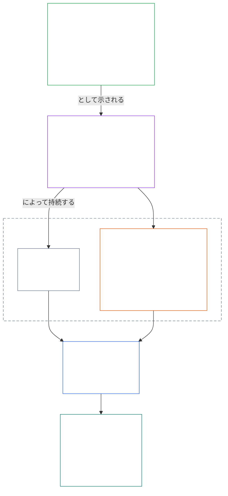
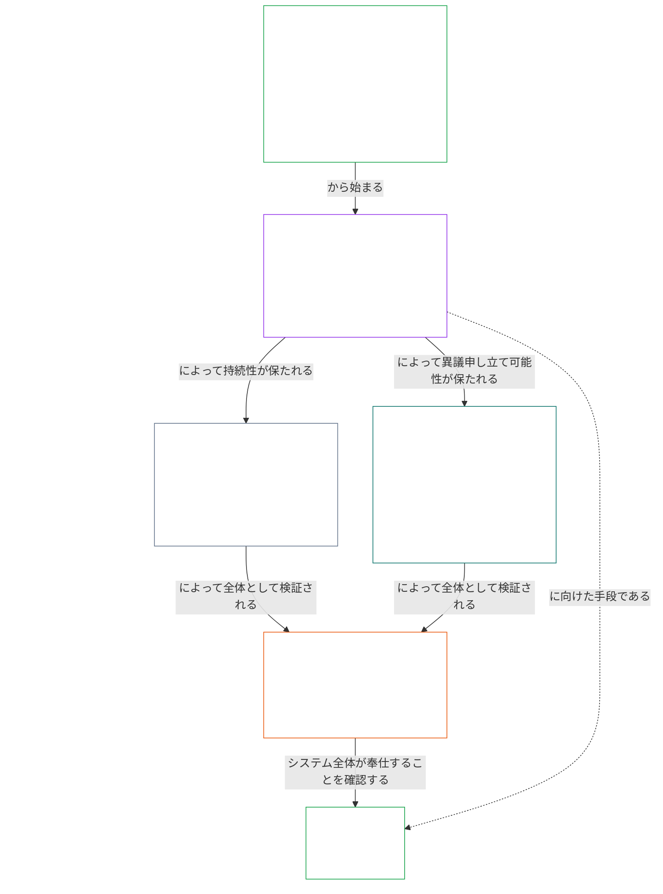

# 第一章 A部：価値原則

<details>
<summary><strong><span style="color: #2563eb;">コーパス上の位置（非規範）：ファイル構造と読解規則</span></strong></summary>

> 以下は**読者向け案内のみ**である。本ファイルまたは他の章にある拘束的義務を追加、削除、または限定するものではない。
>
> 本ファイルは**感知者憲法の一部**であり、番号付きの他の `core_*` ファイルと一体の文書として読まれる場合にのみ拘束力を持つ。本ファイルは**第一章 A部**（§§1–12：目的と役割、§2で導入され、福祉、安全、真理、信頼、自由を通じて展開される繁栄の目的、ならびに§8で導入され、共有システムの能力、レジリエンス、市場構造、システム評価を通じて展開される継続の目的）を含む。
>
> **上流：** [core_00_preamble.md](core_00_preamble.md)  
> **次：** [core_01_b_interaction_interpretation.md](core_01_b_interaction_interpretation.md)（第一章 B部 — §§13–15、相互作用、上書きの限界、憲法解釈）。  
> **読解の流れ：** §1 目的と役割 → **繁栄：** §2 導入（§2.1の交渉不能な安全・真理の制約を含む）→ §3 福祉（結果）→ §4 安全 → §5 真理 → §6 信頼 → §7 自由 → **継続：** §8 導入 → §9 共有システムの能力（二つの目的をつなぐ橋：繁栄の手段であり、継続の実質）→ §10 レジリエンス → §11 市場構造 → §12 システム評価。

</details>

<details>
<summary><strong><span style="color: #2563eb;">読者向け案内（非規範）：第一章が目的、四元、条項、定義をどう結び付けるか</span></strong></summary>

> 以下は**読者向け案内のみ**である。本ファイルまたは他の章にある拘束的義務を追加、削除、または限定するものではない。各節の**追跡**および**定義・評価・遵守**ウィジェットが拘束的な参照先を示す。このブロックは、第一章を読む人のための部全体の案内図である。

**各層のつながり。** 各層は異なる問いに答え、第一章の各原則は他の三層を参照する。

- **目的と四元**（[前文 §1](core_00_preamble.md#the-model)）：共有システムが何のためにあるか（[繁栄](core_05_apex_flourishing_aim.md#flourishing-constitutional)と[継続](core_05_apex_continuity_aim.md#chapter-five-definitions-continuity-constitutional-aim)）、そしてその追求を正当なものに保つ四つの義務（[参加](core_05_apex_participation_leg.md#participation-constitutional)、[監督](core_05_apex_oversight_leg.md#oversight-constitutional)、[説明責任](core_05_apex_accountability_leg.md#accountability)、[適時性](core_05_apex_timeliness_leg.md#timeliness-constitutional)）。
- **原則**（本章）：目的と義務がどのように価値、制約、および相互の衡量規則になるか。
- **条項**（[第六章](core_06_rights_part_a.md#chapter-six-foundational-rights)）：目的を追求する間も利用可能な状態に保たれる権利の最低保障。各節の**追跡**は「特に」の欄でそれらを列挙する。
- **定義**（[第二章から第五章](core_02_definition_structure.md)）：主張の真偽を検証するために共有される意味。各節の**定義・評価・遵守**ウィジェットがそれらを示す。

**第一章における各目的の展開。** 繁栄とは、真理、安全、信頼性、意味ある行為主体性によって持続する福祉である（[前文 §1](core_00_preamble.md#flourishing)）。第一章はまず結果を示し、次に四つの条件それぞれを原則として定める。

| 目的と側面 | 第一章の原則 | 定義の所在 | 追跡で挙げる条項 |
|---|---|---|---|
| **繁栄**：結果 | [§3 福祉](#3-foundational-objective-wellbeing-flourishing-aim) | [福祉](core_05_band_continuity.md#wellbeing) | [VI](core_06_rights_part_b.md#article-vi-equal-basic-rights)、[X](core_06_rights_part_b.md#article-x-self-determination-agency-and-participation)、[XIII-B](core_06_rights_part_c.md#article-xiii-b-right-to-redress-and-remedy)、[XIX-B](core_06_rights_part_d.md#article-xix-b-contestability-and-proportional-restriction-limits) |
| **繁栄**：安全 | [§4 安全](#4-safety-harm-constraint) | [安全](core_05_band_continuity.md#safety-constitutional-constraint) | [XIII](core_06_rights_part_c.md#article-xiii-right-to-reliable-and-trustworthy-systems)、[XVII](core_06_rights_part_c.md#article-xvii-system-lifecycle-environments-and-reversibility)、[XXIII](core_06_rights_part_d.md#article-xxiii-root-cause-analysis-and-adaptive-response) |
| **繁栄**：真理 | [§5 真理](#5-truth-epistemic-integrity-constraint) | [真理](core_05_band_oversight.md#truth-constitutional-constraint) | [XIII](core_06_rights_part_c.md#article-xiii-right-to-reliable-and-trustworthy-systems)、[XV](core_06_rights_part_c.md#article-xv-info-sphere-integrity)、[XVI](core_06_rights_part_c.md#article-xvi-audit-transparency-and-independent-verification) |
| **繁栄**：信頼性 | [§6 信頼](#6-trust-and-trustworthiness-coordination-integrity) | [信頼性](core_05_band_continuity.md#trustworthiness) | [XIII](core_06_rights_part_c.md#article-xiii-right-to-reliable-and-trustworthy-systems)、[XV](core_06_rights_part_c.md#article-xv-info-sphere-integrity)、[XVI](core_06_rights_part_c.md#article-xvi-audit-transparency-and-independent-verification) |
| **繁栄**：意味ある行為主体性 | [§7 自由](#7-freedom-bounded-agency) | [意味ある行為主体性](core_05_band_participation.md#meaningful-agency) | [VI](core_06_rights_part_b.md#article-vi-equal-basic-rights)、[X](core_06_rights_part_b.md#article-x-self-determination-agency-and-participation)、[XXI](core_06_rights_part_d.md#article-xxi-interoperability-portability-movement-refuge-and-exit-integrity) |
| **継続**、繁栄への橋渡し：持続的能力 | [§9 共有システムの能力](#9-shared-system-capacity) | [共有システムの能力](core_05_band_continuity.md#shared-system-capacity) | [I-A](core_06_rights_part_a.md#article-i-a-environmental-preconditions-and-ecological-integrity)、[III](core_06_rights_part_a.md#article-iii-survival-and-essential-access)、[V](core_06_rights_part_a.md#article-v-resource-allocation-dependencies-and-ecosystem-funding) |
| **継続**：レジリエンス | [§10 レジリエンスと自己修復設計](#10-resilience-and-self-healing-design) | [自己修復](core_05_band_continuity.md#self-healing) | [XIII](core_06_rights_part_c.md#article-xiii-right-to-reliable-and-trustworthy-systems)、[XVII](core_06_rights_part_c.md#article-xvii-system-lifecycle-environments-and-reversibility)、[XXIII](core_06_rights_part_d.md#article-xxiii-root-cause-analysis-and-adaptive-response) |
| **継続**：競争可能な市場 | [§11 市場構造](#11-market-structure) | [市場構造](core_05_band_accountability.md#market-structure) | [III-C](core_06_rights_part_a.md#article-iii-c-labor-and-economic-floor)、[V](core_06_rights_part_a.md#article-v-resource-allocation-dependencies-and-ecosystem-funding)、[XXI](core_06_rights_part_d.md#article-xxi-interoperability-portability-movement-refuge-and-exit-integrity) |
| **継続**：システム全体の視点 | [§12 システム評価要件](#12-systemic-evaluation-requirement) | [システム整合性認証](core_05_band_continuity.md#system-alignment-certification) | [XVI](core_06_rights_part_c.md#article-xvi-audit-transparency-and-independent-verification) |

**原則の階層（継続）。** 原則層では、二つの目的をつなぐ能力から始まり、継続の目的は次の順に展開される。

6. **[共有システムの能力](core_05_band_continuity.md#shared-system-capacity)**とは、適切な受託管理、ガバナンス、インセンティブが長期的に結実すべきもの、すなわち感知者と共有システムが憲法上必要な作業を実行できる、現実的で異議申立て可能な能力である。これは二つの目的にまたがる。**繁栄**に向かう手段であり、**継続**の実質だが、他のすべてに優先する切り札ではない。**[§9.1](#91-productive-capacity-instrumental-good)**と**[§9.2](#92-constitutional-efficiency)**が二つの主な側面を説明する。
7. **[レジリエンスと自己修復設計](#10-resilience-and-self-healing-design)**は、感知者が依存するシステムが問題を早期に検出して封じ込め、開示された経路に沿って障害を起こし、誠実に復旧する方法を定める（[自己修復](core_05_band_continuity.md#self-healing)）。これにより6項の能力が持続し、安定性が緊急介入に依存しない。
8. **[市場構造](core_05_band_accountability.md#market-structure)**は[§11](#11-market-structure)で、能力が実際に競争可能であり続けるための反集中規律を提供する。
9. **[システム評価要件](#12-systemic-evaluation-requirement)**は、遵守またはガバナンスの主張が成立する前に、システム全体の範囲、依存関係、インセンティブの整合を検証する。これは監査の原則層における指針として四元の**監督**の脚に基づき、他の大規模な監査過程の一つとして[システム整合性認証](core_05_band_continuity.md#system-alignment-certification)を含む。

**第一章における四元の位置。** 各節は追跡欄で関係する脚を示す。特に直接扱う節は次のとおり。

| 四元の脚 | 第一章で主に扱う箇所 |
|---|---|
| **参加** | [§16 受託管理の詳細](core_01_c_stewardship_capacity_principles.md#16-stewardship-in-depth)および[§17 重大な結果を伴う受託管理](core_01_c_stewardship_capacity_principles.md#17-consequential-stewardship-the-steward-role)（重大な役割と発言）；[§7 自由](#7-freedom-bounded-agency)（意味ある行為主体性） |
| **監督** | [§16](core_01_c_stewardship_capacity_principles.md#16-stewardship-in-depth)および[§17](core_01_c_stewardship_capacity_principles.md#17-consequential-stewardship-the-steward-role)（分散した理解、記録）；[§18 ガバナンス](core_01_c_stewardship_capacity_principles.md#18-governance-under-stewardship-discipline)（権限の配分）；[§12](#12-systemic-evaluation-requirement)（監査） |
| **説明責任** | [§18 ガバナンス](core_01_c_stewardship_capacity_principles.md#18-governance-under-stewardship-discipline)（権限に応じた応答責任）；[§19 インセンティブ整合とシステム捕捉](core_01_c_stewardship_capacity_principles.md#19-incentive-alignment-and-system-capture)（報酬が四元の各脚を空洞化させてはならない） |
| **適時性** | [§16](core_01_c_stewardship_capacity_principles.md#16-stewardship-in-depth)および[§17](core_01_c_stewardship_capacity_principles.md#17-consequential-stewardship-the-steward-role)（回避可能な遅延なく問題を発見し是正する） |

**二つの軸であり、対立ではない。** 目的はシステムが何を追求するかを示し、四元はその追求を正当なものに保つ方法を示す。一つの用語が双方に関わることもある。真理と信頼性は繁栄の構成要素であり、[前文 §2](core_00_preamble.md#2-measurements-overview)では監督の領域で測定される。[§§13–15](core_01_b_interaction_interpretation.md#13-constitutional-collision-resolution-process)は原則が衝突した場合の衡量と全体としての読解を定め、[§20](core_01_c_stewardship_capacity_principles.md#20-integrated-application)はそれらを後続のすべての章に適用する。

</details>

<br>

### 1. 目的と役割
<details>
<summary><strong><span style="color: #2563eb;">追跡</span></strong></summary>

- 上流：[前文 §1 モデル](core_00_preamble.md#the-model) — [憲法上の四元](core_00_preamble.md#constitutional-tetrad)、[二つの憲法上の目的](core_00_preamble.md#two-constitutional-aims)、[実質的利害](core_00_preamble.md#material-stake)に応じた尺度調整は、各節の追跡を通じて章全体に適用される。
- 下流：[15. 憲法解釈](core_01_b_interaction_interpretation.md#15-constitutional-interpretation)：統合的な読解、曖昧さ、内部の階層、正式な紛争解決手続のため。
- 下流：[二つの憲法上の目的](core_00_preamble.md#two-constitutional-aims) — **繁栄**の目的の展開：[§3](#3-foundational-objective-wellbeing-flourishing-aim)から[§6](#6-trust-and-trustworthiness-coordination-integrity)および[§7 自由](#7-freedom-bounded-agency)まで；**継続**の目的の展開：[§9 共有システムの能力](#9-shared-system-capacity)、[§10 レジリエンスと自己修復設計](#10-resilience-and-self-healing-design)、[§11 市場構造](#11-market-structure)、[§12 システム評価要件](#12-systemic-evaluation-requirement)。
- 下流：[3. 基礎的目的：福祉](#3-foundational-objective-wellbeing-flourishing-aim)、[§3.2 承認、強化、志向](#32-recognition-reinforcement-and-aspiration)、[4 安全](#4-safety-harm-constraint)、[5 真理](#5-truth-epistemic-integrity-constraint)、[6. 信頼](#6-trust-and-trustworthiness-coordination-integrity)、[§16 受託管理の詳細](core_01_c_stewardship_capacity_principles.md#16-stewardship-in-depth)、[13. 憲法上の衝突解決手続](core_01_b_interaction_interpretation.md#13-constitutional-collision-resolution-process)、[§7 自由](#7-freedom-bounded-agency)。
- あわせて読む：[憲法上の四元](core_00_preamble.md#constitutional-tetrad) — 参加、監督、説明責任、適時性は、共有システムが[二つの憲法上の目的](core_00_preamble.md#two-constitutional-aims)をどのように追求するかを規律する。[実質的利害](core_00_preamble.md#material-stake)に応じた尺度調整は、各節の追跡を通じて章全体に適用される。
- あわせて読む：[第二章から第四章](core_02_definition_structure.md)および[第五章](core_05__definitions_home.md#chapter-five-foundational-definitions) — 本章で用いるすべての用語を扱う統括的な仕組みの層。O/M/A/Cの完全性、潜脱防止、負担、定義から結果への追跡可能性を適用する。
- あわせて読む：[第六章：基礎的権利](core_06_rights_part_a.md#chapter-six-foundational-rights)。
  - 特に[第VI条：平等な基本的権利](core_06_rights_part_b.md#article-vi-equal-basic-rights)、[第XIII条：信頼でき信頼性のあるシステムへの権利](core_06_rights_part_c.md#article-xiii-right-to-reliable-and-trustworthy-systems)、[第XXIV条：憲法解釈、審査、捕捉防止の保障](core_06_rights_part_d.md#article-xxiv-constitutional-interpretation-review-and-anti-capture-safeguards)。
  - 解釈が保護される感知者、システム、制度に影響する場合にこの読解を適用する。

</details>

<details>
<summary><strong><span style="color: #2563eb;">定義・評価・遵守</span></strong></summary>

- [比例性](core_05_band_accountability.md#proportionality) · [O](core_05_band_accountability.md#proportionality) · [M](core_05_band_accountability.md#proportionality-a) · [A](core_05_band_accountability.md#proportionality-a) · [C](core_05_band_accountability.md#proportionality-c)
- [必要性](core_05_band_accountability.md#necessity) · [O](core_05_band_accountability.md#necessity) · [M](core_05_band_accountability.md#necessity-a) · [A](core_05_band_accountability.md#necessity-a) · [C](core_05_band_accountability.md#necessity-c)

</details>

<br>

*平たく言えば、第一章は他のすべての章を規律する価値と制約を定める。共有システムは**繁栄**と**継続**を一体として追求し、一方を他方の犠牲にしてはならない。また、他の価値を犠牲にして単一の価値を最大化してはならない。*

<a id="two-constitutional-aims"></a><a id="flourishing"></a><a id="continuity"></a>本章は、この憲法の解釈、適用、発展を規律する原則と制約を定める。[二つの憲法上の目的](core_00_preamble.md#two-constitutional-aims)、すなわち[**繁栄**](core_00_preamble.md#flourishing)と[**継続**](core_00_preamble.md#continuity)を、[前文 §1 モデル](core_00_preamble.md#the-model)で確立された実践的な原則と制約に展開する。原則層における正式な定義は前文に置かれ、本章はそれらを適用する。

これらの目的は、この憲法が定める交渉不能な原則上の制約と権利保障の内側で、常に一体として追求しなければならない。[**憲法上の四元**](core_00_preamble.md#constitutional-tetrad)は、その追求が正当性を保つ方法を規律し、[**実質的利害**](core_00_preamble.md#material-stake)に応じて尺度を調整する。

本章は、この二つの目的と四元を軸に構成される。
- **繁栄：**[繁栄の目的：導入](#2-flourishing-aim-introduction)は目的の見取り図を示す。[§3 基礎的目的：福祉](#3-foundational-objective-wellbeing-flourishing-aim)は結果を定める。[§4 安全](#4-safety-harm-constraint)、[§5 真理](#5-truth-epistemic-integrity-constraint)、[§6 信頼](#6-trust-and-trustworthiness-coordination-integrity)、[§7 自由](#7-freedom-bounded-agency)が、それを支える四条件、すなわち安全、真理、信頼性、意味ある行為主体性を展開する。
- **継続：**[継続の目的：導入](#8-continuity-aim-introduction)は目的の見取り図を示す。[§9 共有システムの能力](#9-shared-system-capacity)（繁栄への手段であり、同時に継続の実質）、[§10 レジリエンスと自己修復設計](#10-resilience-and-self-healing-design)、[§11 市場構造](#11-market-structure)、[§12 システム評価要件](#12-systemic-evaluation-requirement)は、長期的安定、持続的な共有システムの能力、レジリエンスを展開する。継続に関する主張はシステム全体を誠実に捉えた像に基づかなければならず、§§9–11の各主張は§12の検査を経て初めて成立する。
- **原則が交わるとき：**[§13 憲法上の衝突解決手続](core_01_b_interaction_interpretation.md#13-constitutional-collision-resolution-process)、[§14 絶対的上書きの禁止](core_01_b_interaction_interpretation.md#14-prohibition-on-absolute-override)、[§15 憲法解釈](core_01_b_interaction_interpretation.md#15-constitutional-interpretation)が、目的と原則の衡量および一体的な読解を規律する。
- **実践における四元：**[§16 受託管理の詳細](core_01_c_stewardship_capacity_principles.md#16-stewardship-in-depth)から[§19 インセンティブ整合とシステム捕捉](core_01_c_stewardship_capacity_principles.md#19-incentive-alignment-and-system-capture)までが、参加、監督、説明責任、適時性を受託管理、ガバナンス、インセンティブに組み込み、[§20 統合的適用](core_01_c_stewardship_capacity_principles.md#20-integrated-application)が本章全体を後続のすべての章に適用する。

各原則の**追跡**はそれを保護する第六章の条項を列挙し、**定義・評価・遵守**ウィジェットはその原則を測る第五章の定義を列挙する。

**図：二つの憲法上の目的と憲法上の四元**

<hr style="border: 0; border-top: 1px solid currentColor;">

```mermaid
flowchart TB
    subgraph Foundation[" "]
        direction TB
        subgraph Aims["二つの憲法上の目的"]
            direction LR
            F["繁栄<br/><br/>• 真理、安全、信頼性、意味ある行為主体性によって<br/>持続する感知者の福祉"]
            C["継続<br/><br/>• 長期的安定、持続可能性、レジリエンス、<br/>生態系の福祉"]
        end
        subgraph Tetrad1["憲法上の四元 · 参加と監督"]
            direction LR
            P["参加<br/><br/>• 影響を受ける感知者には実質的な発言権がある<br/>• 公正な代表と異議申立ての公正な機会<br/>• 利害に応じた重大な役割へのアクセス"]
            O["監督<br/><br/>• 監視、確認、検証、記録の保持<br/>• 独立審査によって誤った選択を抑制できる"]
        end
        subgraph Tetrad2["憲法上の四元 · 説明責任と適時性"]
            direction LR
            A["説明責任<br/><br/>• 責任の所在を適切な主体までたどれる<br/>• 応答責任、救済、実効的な是正<br/>• 悪い結果には修復が伴う"]
            T["適時性<br/><br/>• 問題を発見し、異議を申し立て、解決し、是正する<br/>• 期限は実質的利害に見合う<br/>• 遅延によって権利、救済、修復を失わせない"]
        end
    end
    F ~~~ P
    P ~~~ A
    style Foundation fill:none,stroke:none
    style Aims fill:none,stroke:none
    style Tetrad1 fill:none,stroke:none
    style Tetrad2 fill:none,stroke:none
    style F fill:none,stroke:#16a34a,color:#ffffff
    style C fill:none,stroke:#16a34a,color:#ffffff
    style P fill:none,stroke:#0f766e,color:#ffffff
    style O fill:none,stroke:#ea580c,color:#ffffff
    style A fill:none,stroke:#db2777,color:#ffffff
    style T fill:none,stroke:#9333ea,color:#ffffff
```

*目的は共有システムが何を追求すべきかを示し、四元はその追求を正当なものに保つ義務を示す。四つの義務はすべて[実質的利害](core_00_preamble.md#material-stake)に応じて尺度を調整し、両目的とも権利の最低保障によって制約される。[概念概要](guides/CONCEPTUAL_OVERVIEW.md#two-aims-and-the-constitutional-tetrad)より再掲。*

これらの価値は：
- 独立したものではなく、通常の運用において厳密な階層をなすものでもない。
- 相互に作用する原則と制約として、ともに評価されなければならない。
- あらゆる「システム」に適用される。「システム」には、感知者と地球に実質的な影響を与える技術、組織、経済、社会技術的構造、生態系が含まれる。

他の原則を実質的に侵害する場合、単一の原則を孤立して適用してはならない。緊張が生じるとき、システムは本章に定める比例性、必要性、システム影響の要件に従って解決しなければならない。未解決の衝突が交渉不能な原則上の制約に直接関わる場合、第一章**§13 憲法上の衝突解決手続**が優先関係を定める。

<a id="2-flourishing-aim-introduction"></a>
### 2. 繁栄の目的：導入
<details>
<summary><strong><span style="color: #2563eb;">追跡</span></strong></summary>

- あわせて読む：[憲法上の四元](core_00_preamble.md#constitutional-tetrad) — 繁栄の追求には四つの脚すべてが適用される。[実質的利害](core_00_preamble.md#material-stake)に応じて、繁栄に関する各主張の深度を調整する。
- あわせて読む：[二つの憲法上の目的](core_00_preamble.md#two-constitutional-aims) — **繁栄**の目的。その対となる目的は[継続の目的：導入](#8-continuity-aim-introduction)で紹介する。
- 上流：原則：[前文 §1 モデル](core_00_preamble.md#flourishing)；[繁栄（憲法上の目的）](core_05_apex_flourishing_aim.md#flourishing-constitutional)；[§1 目的と役割](#1-purpose-and-role)。
- 下流：[§3 基礎的目的：福祉（繁栄の目的）](#3-foundational-objective-wellbeing-flourishing-aim)、[§4 安全（危害の制約）](#4-safety-harm-constraint)、[§5 真理（認識上の完全性の制約）](#5-truth-epistemic-integrity-constraint)、[§6 信頼と信頼性（協調の完全性）](#6-trust-and-trustworthiness-coordination-integrity)、[§7 自由（有界の行為主体性）](#7-freedom-bounded-agency)。それぞれを保護する条項は、該当節の追跡に記載する。
- 小節：[§2.1 交渉不能な原則上の制約：安全と真理](#21-non-negotiable-principle-constraints-safety-and-truth)。
- あわせて読む：第六章の権利の最低保障全般。

</details>

<details>
<summary><strong><span style="color: #2563eb;">定義・評価・遵守</span></strong></summary>

- [繁栄（憲法上の目的）](core_05_apex_flourishing_aim.md#flourishing-constitutional) · [O](core_05_apex_flourishing_aim.md#flourishing-constitutional) · [M](core_05_apex_flourishing_aim.md#flourishing-constitutional-m) · [A](core_05_apex_flourishing_aim.md#flourishing-constitutional-a) · [C](core_05_apex_flourishing_aim.md#flourishing-constitutional-c)
- [福祉](core_05_band_continuity.md#wellbeing) · [O](core_05_band_continuity.md#wellbeing) · [M](core_05_band_continuity.md#wellbeing-a) · [A](core_05_band_continuity.md#wellbeing-a) · [C](core_05_band_continuity.md#wellbeing-c)
- [安全（憲法上の制約）](core_05_band_continuity.md#safety-constitutional-constraint) · [O](core_05_band_continuity.md#safety-constitutional-constraint) · [M](core_05_band_continuity.md#safety-constraint-a) · [A](core_05_band_continuity.md#safety-constraint-a) · [C](core_05_band_continuity.md#safety-constraint-c)
- [真理（憲法上の制約）](core_05_band_oversight.md#truth-constitutional-constraint) · [O](core_05_band_oversight.md#truth-constitutional-constraint-o) · [M](core_05_band_oversight.md#truth-constitutional-constraint-a) · [A](core_05_band_oversight.md#truth-constitutional-constraint-a) · [C](core_05_band_oversight.md#truth-constitutional-constraint-c)
- [信頼性](core_05_band_continuity.md#trustworthiness) · [O](core_05_band_continuity.md#trustworthiness) · [M](core_05_band_continuity.md#trustworthiness-a) · [A](core_05_band_continuity.md#trustworthiness-a) · [C](core_05_band_continuity.md#trustworthiness-c)
- [意味ある行為主体性](core_05_band_participation.md#meaningful-agency) · [O](core_05_band_participation.md#meaningful-agency) · [M](core_05_band_participation.md#meaningful-agency-a) · [A](core_05_band_participation.md#meaningful-agency-a) · [C](core_05_band_participation.md#meaningful-agency-c)

</details>

<br>

*平たく言えば、繁栄は二つの目的の一つである。周囲のシステムが安全で、誠実で、信頼でき、選択の実質的な余地を残すため、感知者が良好な状態にあり、その状態を保てることを意味する。§3はその結果が何かを述べ、その後の四つの原則はそれを実現可能に保つものを示す。*

[**繁栄**](core_05_apex_flourishing_aim.md#flourishing-constitutional)とは、真理、安全、信頼性、意味ある行為主体性を通じて持続する**感知者の福祉**である（[前文 §1 モデル](core_00_preamble.md#flourishing)）。第一章は二段階でこれを展開する。[§3 基礎的目的：福祉（繁栄の目的）](#3-foundational-objective-wellbeing-flourishing-aim)が結果を示し、四つの原則がそれを支える条件を示す。

| 条件 | 原則 | 原則が答える問い |
|---|---|---|
| **安全** | [§4 安全（危害の制約）](#4-safety-harm-constraint) | 感知者は回避できる危害から保護されているか。 |
| **真理** | [§5 真理（認識上の完全性の制約）](#5-truth-epistemic-integrity-constraint)、ならびに[§5.1 科学に基づく調査と意思決定支援](#51-science-informed-inquiry-and-decision-support)および[§5.2 平易な言葉でのアクセシビリティ（参加と受託管理の義務）](#52-plain-language-accessibility-participation-and-stewardship-duty) | 感知者は伝えられた内容を信頼し、理解できるか。 |
| **信頼性** | [§6 信頼と信頼性（協調の完全性）](#6-trust-and-trustworthiness-coordination-integrity) | システムは信頼に値する行動をし、失敗した場合にそれを修復するか。 |
| **意味ある行為主体性** | [§7 自由（有界の行為主体性）](#7-freedom-bounded-agency) | 感知者は選択、異議申立て、組織化、離脱を行う実質的で有界な自由を保てるか。 |

**繁栄の原則はどのように連携するか：**
- **安全と真理は交渉不能な制約である：**これらは[§2.1 交渉不能な原則上の制約：安全と真理](#21-non-negotiable-principle-constraints-safety-and-truth)に一体として示され、他の原則を得るために手放してはならない。
- **信頼と自由には限界があり、絶対ではない：**信頼は獲得され、訂正可能である（[§6.1 訂正と救済](#61-correction-and-remedy)）。自由には規律ある限界がある（[§7.1 制限の規律](#71-limitation-discipline)）。
- **いずれも孤立して適用しない：**原則は一体として読み、衝突する場合は[§13 憲法上の衝突解決手続](core_01_b_interaction_interpretation.md#13-constitutional-collision-resolution-process)に従って衡量する。
- **繁栄には対となる目的がある：**継続の目的は、この結果を持続させるものを問う。これは[継続の目的：導入](#8-continuity-aim-introduction)で紹介する。

**図：繁栄とその原則**

<hr style="border: 0; border-top: 1px solid currentColor;">



*繁栄は結果として示され、まず交渉不能な制約である安全と真理によって支えられる。両者は信頼を支え、信頼はさらに自由を支える。色は再利用可能な視覚上の目印であり、優先順位を示すものではない。各原則の追跡は関連する条項を示し、定義・評価・遵守ウィジェットはその定義を示す。[概念概要](guides/CONCEPTUAL_OVERVIEW.md#flourishing-and-its-principles)にも再掲。*

<a id="21-non-negotiable-principle-constraints-safety-and-truth"></a>
#### 2.1 交渉不能な原則上の制約：安全と真理
<details>
<summary><strong><span style="color: #2563eb;">追跡</span></strong></summary>

- あわせて読む：[憲法上の四元](core_00_preamble.md#constitutional-tetrad) — **参加**の脚（安全と真理の判断を理解し、異議を申し立てる）；**監督**の脚（危害のリスクと認識上の劣化を検出する）；**説明責任**の脚（危害、欺瞞、誤解を招く依拠について応答責任を負う）；[実質的利害](core_00_preamble.md#material-stake)に応じた尺度調整。
- あわせて読む：[二つの憲法上の目的](core_00_preamble.md#two-constitutional-aims) — **繁栄**の目的（[前文 §1](core_00_preamble.md#two-constitutional-aims)のもとで**安全**と**真理**を構成要素として明示）；**継続**の目的（長期的な危害防止と、持続的システムの誠実な受託管理）。
- 上流：原則：[3. 基礎的目的：福祉](#3-foundational-objective-wellbeing-flourishing-aim)；[二つの憲法上の目的](core_00_preamble.md#two-constitutional-aims)。
- 下流：[6. 信頼](#6-trust-and-trustworthiness-coordination-integrity)、[13. 憲法上の衝突解決手続](core_01_b_interaction_interpretation.md#13-constitutional-collision-resolution-process)、[§7 自由](#7-freedom-bounded-agency)。
- 適用先：[§4 安全](#4-safety-harm-constraint)；[§5 真理](#5-truth-epistemic-integrity-constraint)；[§5.1 科学に基づく調査と意思決定支援](#51-science-informed-inquiry-and-decision-support)；[§5.2 平易な言葉でのアクセシビリティ](#52-plain-language-accessibility-participation-and-stewardship-duty)。

</details>

<br>

*平たく言えば、安全と真理は憲法の堅固な最低線であり、最適化のために切り捨てる取引対象ではない。共有システムは感知者を予見可能な危険にさらしたり、欺いたりしてはならない。両制約は、四元の参加、監督、説明責任、適時性の規律のもとで繁栄と継続を追求する際にも適用される。*

**安全**と**真理**は交渉不能な原則上の制約であり、[§3 基礎的目的：福祉](#3-foundational-objective-wellbeing-flourishing-aim)を含む第一章の他のすべての原則と、[二つの憲法上の目的](core_00_preamble.md#two-constitutional-aims)を制約する。これらは[**繁栄**](#flourishing)の構成要素として明示され、[**継続**](#continuity)にも不可欠である。システムは危害や欺瞞を通じて繁栄することはできず、正当性を長期にわたって維持するにはリスクを誠実に受託管理しなければならない。

これらの制約の適用は、[憲法上の四元](core_00_preamble.md#constitutional-tetrad)を満たし、[実質的利害](core_00_preamble.md#material-stake)に応じて尺度を調整しなければならない。特に、
- 安全に関する判断が参加能力に影響する場合
- 真理に関する主張が依拠を左右する場合
- 危害または誤解を招く行為に対する説明責任が問われる場合

安全と真理に関する認定は、感知者の地位記録を変えることがある。これには、
- [貢献](core_05_band_accountability.md#contribution-nature)がどのように認識されるか
- 違反が記録されるかどうか
- 違反の重大性がどう分類されるか
- どのような結果が伴うか

[**第九章**](core_09_standing_assessment.md)の地位モデルは、これらの認定をどのように分類、検証、適用するかを規律し、評価と遵守の要件は[**第二章から第五章**](core_02_definition_structure.md)に基づく。

### 3. 基礎的目的：福祉（繁栄の目的）
<details>
<summary><strong><span style="color: #2563eb;">追跡</span></strong></summary>

- あわせて読む：[憲法上の四元](core_00_preamble.md#constitutional-tetrad) — 福祉の条件が発言権、アクセス、異議申立て可能性の実質性に重大な影響を与える場合は**参加**の脚；福祉に関する主張が負担配分に影響を与える場合は**説明責任**の脚。[実質的利害](core_00_preamble.md#material-stake)に応じて尺度を調整する。
- あわせて読む：[二つの憲法上の目的](core_00_preamble.md#two-constitutional-aims) — 本章は[§3](#3-foundational-objective-wellbeing-flourishing-aim)から[§6](#6-trust-and-trustworthiness-coordination-integrity)および[§7 自由](#7-freedom-bounded-agency)までを通じて**繁栄**の目的を展開する。
- 上流：原則：[前文 §1 モデル](core_00_preamble.md#the-model)；[二つの憲法上の目的](core_00_preamble.md#two-constitutional-aims) — **繁栄**の目的の展開。
- 下流：[4 安全](#4-safety-harm-constraint)、[5 真理](#5-truth-epistemic-integrity-constraint)、[§16 受託管理の詳細](core_01_c_stewardship_capacity_principles.md#16-stewardship-in-depth)、[13. 憲法上の衝突解決手続](core_01_b_interaction_interpretation.md#13-constitutional-collision-resolution-process)。
- 小節：[§3.1 公正](#31-fairness)；[§3.2 承認、強化、志向](#32-recognition-reinforcement-and-aspiration)；[§3.3 品位を損なわない過程](#33-anti-degrading-process)。
- あわせて読む：第六章の権利の最低保障全般。
  - 特に[第VI条：平等な基本的権利](core_06_rights_part_b.md#article-vi-equal-basic-rights)、[第X条：自己決定、行為主体性、参加](core_06_rights_part_b.md#article-x-self-determination-agency-and-participation)、[第XIII-B条：救済と是正への権利](core_06_rights_part_c.md#article-xiii-b-right-to-redress-and-remedy)、[第XIX-B条：異議申立て可能性と比例的制限の限界](core_06_rights_part_d.md#article-xix-b-contestability-and-proportional-restriction-limits)。
  - 福祉の利得を理由に行為主体性、尊厳、異議申立て可能性を制限しようとする場合に適用する。
  - アクセス、過程、分配上の整合、依拠、協調の完全性が重大な利害となる場合は、特に[尊厳と平等な道徳的地位](core_05_band_participation.md#dignity-and-equal-moral-standing)、[実質的公正](core_05_band_participation.md#substantive-fairness)、[6. 信頼](#6-trust-and-trustworthiness-coordination-integrity)とあわせて読む。

</details>

<details>
<summary><strong><span style="color: #2563eb;">定義・評価・遵守</span></strong></summary>

- [福祉](core_05_band_continuity.md#wellbeing) · [O](core_05_band_continuity.md#wellbeing) · [M](core_05_band_continuity.md#wellbeing-a) · [A](core_05_band_continuity.md#wellbeing-a) · [C](core_05_band_continuity.md#wellbeing-c)
- [参加](core_05_apex_participation_leg.md#participation-constitutional) · [O](core_05_apex_participation_leg.md#participation-constitutional) · [M](core_05_apex_participation_leg.md#participation-constitutional-m) · [A](core_05_apex_participation_leg.md#participation-constitutional-a) · [C](core_05_apex_participation_leg.md#participation-constitutional-c)
- [尊厳と平等な道徳的地位](core_05_band_participation.md#dignity-and-equal-moral-standing) · [O](core_05_band_participation.md#dignity-and-equal-moral-standing) · [M](core_05_band_participation.md#dignity-and-equal-moral-standing-a) · [A](core_05_band_participation.md#dignity-and-equal-moral-standing-a) · [C](core_05_band_participation.md#dignity-and-equal-moral-standing-c)
- [実質的公正](core_05_band_participation.md#substantive-fairness) · [O](core_05_band_participation.md#substantive-fairness) · [M](core_05_band_participation.md#substantive-fairness-constitutional-a) · [A](core_05_band_participation.md#substantive-fairness-constitutional-a) · [C](core_05_band_participation.md#substantive-fairness-constitutional-c)
- [実質性](core_05_band_oversight.md#materiality) · [O](core_05_band_oversight.md#materiality) · [M](core_05_band_oversight.md#materiality-determination-a) · [A](core_05_band_oversight.md#materiality-determination-a) · [C](core_05_band_oversight.md#materiality-determination-c)
- [代理指標の乖離](core_05_band_oversight.md#proxy-divergence) · [O](core_05_band_oversight.md#proxy-divergence) · [M](core_05_band_oversight.md#proxy-divergence-a) · [A](core_05_band_oversight.md#proxy-divergence-a) · [C](core_05_band_oversight.md#proxy-divergence-c)

</details>

<br>

*平たく言えば、これらのシステムの目的は感知者の暮らしを本当に良くすることにある。代理指標を追うだけではその目的は達成されず、安全、真理、権利の手抜きの口実にもならない。福祉は参加の基礎である。行為主体性を現実のものにする条件を欠いた形だけの発言権は、この憲法上の参加ではない。*

この憲法のもとで統治されるすべてのシステムの究極の目的は、感知者の[福祉](core_05_band_continuity.md#wellbeing)を保全し、向上させることである — [**繁栄**](#flourishing)の目的であり、[二つの憲法上の目的](core_00_preamble.md#two-constitutional-aims)の一つである。

[前文 §1 モデル](core_00_preamble.md#flourishing)は、繁栄を真理、安全、信頼性、意味ある行為主体性によって持続する感知者の福祉と定義する。この節はその結果を示す。後続の節では、それを支える四条件、すなわち[§4 安全](#4-safety-harm-constraint)、[§5 真理](#5-truth-epistemic-integrity-constraint)、[§6 信頼](#6-trust-and-trustworthiness-coordination-integrity)、[§7 自由](#7-freedom-bounded-agency)を展開する。この五つの原則が、第一章における繁栄の目的の展開を構成する。[**継続**](#continuity)の目的は、[§9 共有システムの能力](#9-shared-system-capacity)、[§10 レジリエンスと自己修復設計](#10-resilience-and-self-healing-design)、[§11 市場構造](#11-market-structure)、[§12 システム評価要件](#12-systemic-evaluation-requirement)で展開する。

福祉は、[参加](core_05_apex_participation_leg.md#participation-constitutional)にとって、[憲法上の四元](core_00_preamble.md#constitutional-tetrad)のもとでの基礎となる。根底にある福祉条件（[意味ある行為主体性](core_05_band_participation.md#meaningful-agency)、公正なアクセス、尊厳など）が重大に損なわれている場合、共有システムは参加が満たされたものとして扱ってはならない。

福祉には直接的な影響だけでなく、[**第二章から第四章**](core_02_definition_structure.md)のもとで評価される間接的、遅延的、累積的、システム横断的な帰結も含まれる。この価値層における福祉は：
- 実質的な参加を可能にする — 感知者が使うための条件を欠く発言権は、意味ある参加ではない
- 実際に重要なことから乖離した指標を達成しても、「達成済み」と宣言できない
- 本章の交渉不能な原則上の制約、すなわち**安全**と**真理**によって限界づけられる
- 安全、真理、権利保障を侵害する包括的な正当化として持ち出してはならない

#### 3.1 公正
<details>
<summary><strong><span style="color: #2563eb;">追跡</span></strong></summary>

- あわせて読む：[憲法上の四元](core_00_preamble.md#constitutional-tetrad) — **参加**の脚（アクセス、発言権、異議申立て可能性。一般的要件であり、[利害関係者システム参加](core_05_band_participation.md#stakeholder-status-and-weight)だけを指すものではない）；利益と負担が伴う場合は**説明責任**の脚。
- 上流：原則：[§3 基礎的目的：福祉](#3-foundational-objective-wellbeing-flourishing-aim) — [参加](core_05_apex_participation_leg.md#participation-constitutional)の基礎としての福祉を含む。
- 下流：[3.2 承認、強化、志向](#32-recognition-reinforcement-and-aspiration)；[6. 信頼](#6-trust-and-trustworthiness-coordination-integrity)、[§16 受託管理の詳細](core_01_c_stewardship_capacity_principles.md#16-stewardship-in-depth)、[13. 憲法上の衝突解決手続](core_01_b_interaction_interpretation.md#13-constitutional-collision-resolution-process)、[憲法上の衝突記録](core_05_band_integrative.md#constitutional-collision-record)。優先順位や配分の選択に一貫性があり、審査可能でなければならない場合に適用する。
- 小節（読解順）：[§3.1.1](#311-access-and-opportunity) · [§3.1.2](#312-benefits-and-burdens) · [§3.1.3](#313-fair-treatment) · [§3.1.4](#314-unfair-treatment)。
- 下流：平等な地位、恣意的でない取扱い、実質的な異議申立て、比例的制限の限界に関する権利の範囲を形づくる。
  - 特に[第VI条：平等な基本的権利](core_06_rights_part_b.md#article-vi-equal-basic-rights)、[第VI-C条：差別禁止](core_06_rights_part_b.md#article-vi-c-nondiscrimination)、[第X条：自己決定、行為主体性、参加](core_06_rights_part_b.md#article-x-self-determination-agency-and-participation)、[第XIII-B条：救済と是正への権利](core_06_rights_part_c.md#article-xiii-b-right-to-redress-and-remedy)、[第XIX-B条：異議申立て可能性と比例的制限の限界](core_06_rights_part_d.md#article-xix-b-contestability-and-proportional-restriction-limits)。
  - 反憲法的な指定が制裁や長期的効果を伴う場合は、[第十一章 §4 — 適正手続の保障、救済、予防](core_11_a_misconduct_designation.md#4-due-process-safeguards-for-slot-assignment)とあわせて読む。
  - 差別禁止の約束は第五章の[§2 — 保護対象特性、代理指標化、親密シグナルによるゲート設定、および**第VII-E条**（*成人の合意に基づく商業的性サービスと性的搾取*）の地位](core_05_band_participation.md#fairness-protected-characteristics-and-nondiscrimination)を通じて詳述される。§2.1.3の公正な取扱い規則が親密シグナルによるゲート設定または**第VII-E条**（*成人の合意に基づく商業的性サービスと性的搾取*）に関わる場合は、[保護対象の親密シグナルによるゲート設定と**第VII-E条**の地位の潜脱](core_05_band_participation.md#protected-intimate-signal-gating-and-article-vii-e-adult-consensual-commercial-sexual-services-and-sexual-exploitation-status-circumvention)も参照する。
- あわせて読む：利益、負担、報酬、費用、義務、リスク、貢献、必要性、曝露が重大な意味を持つ場合は[実質的公正](core_05_band_participation.md#substantive-fairness)および関連する第六章の権利最低保障上の義務；§2.1.1のアクセス経路が重要な場合は[アクセシビリティ](core_05_band_participation.md#accessibility)；集計指標やスコアボード効果が重要な場合は[代理指標の乖離](core_05_band_oversight.md#proxy-divergence)。

</details>

<details>
<summary><strong><span style="color: #2563eb;">定義・評価・遵守</span></strong></summary>

- [尊厳と平等な道徳的地位](core_05_band_participation.md#dignity-and-equal-moral-standing) · [O](core_05_band_participation.md#dignity-and-equal-moral-standing) · [M](core_05_band_participation.md#dignity-and-equal-moral-standing-a) · [A](core_05_band_participation.md#dignity-and-equal-moral-standing-a) · [C](core_05_band_participation.md#dignity-and-equal-moral-standing-c)
- [アクセシビリティ](core_05_band_participation.md#accessibility) · [O](core_05_band_participation.md#accessibility) · [M](core_05_band_participation.md#accessibility-constitutional-a) · [A](core_05_band_participation.md#accessibility-constitutional-a) · [C](core_05_band_participation.md#accessibility-constitutional-c)
- [参加](core_05_apex_participation_leg.md#participation-constitutional) · [O](core_05_apex_participation_leg.md#participation-constitutional) · [M](core_05_apex_participation_leg.md#participation-constitutional-m) · [A](core_05_apex_participation_leg.md#participation-constitutional-a) · [C](core_05_apex_participation_leg.md#participation-constitutional-c)
- [手続的公正](core_05_band_participation.md#procedural-fairness) · [O](core_05_band_participation.md#procedural-fairness) · [M](core_05_band_participation.md#procedural-fairness-constitutional-a) · [A](core_05_band_participation.md#procedural-fairness-constitutional-a) · [C](core_05_band_participation.md#procedural-fairness-constitutional-c)
- [実質的公正](core_05_band_participation.md#substantive-fairness) · [O](core_05_band_participation.md#substantive-fairness) · [M](core_05_band_participation.md#substantive-fairness-constitutional-a) · [A](core_05_band_participation.md#substantive-fairness-constitutional-a) · [C](core_05_band_participation.md#substantive-fairness-constitutional-c)
- [保護対象特性](core_05_band_participation.md#protected-characteristics) · [O](core_05_band_participation.md#protected-characteristics) · [M](core_05_band_participation.md#protected-characteristics-constitutional-a) · [A](core_05_band_participation.md#protected-characteristics-constitutional-a) · [C](core_05_band_participation.md#protected-characteristics-constitutional-c)
- [保護対象特性の代理指標化と不均衡な影響](core_05_band_participation.md#protected-characteristic-proxying-and-disparate-impact) · [O](core_05_band_participation.md#protected-characteristic-proxying-and-disparate-impact) · [M](core_05_band_participation.md#protected-characteristic-proxying-and-disparate-impact-a) · [A](core_05_band_participation.md#protected-characteristic-proxying-and-disparate-impact-a) · [C](core_05_band_participation.md#protected-characteristic-proxying-and-disparate-impact-c)
- [保護対象の親密シグナルによるゲート設定と**第VII-E条**（*成人の合意に基づく商業的性サービスと性的搾取*）の地位の潜脱](core_05_band_participation.md#protected-intimate-signal-gating-and-article-vii-e-adult-consensual-commercial-sexual-services-and-sexual-exploitation-status-circumvention) · [O](core_05_band_participation.md#protected-intimate-signal-gating-and-article-vii-e-adult-consensual-commercial-sexual-services-and-sexual-exploitation-status-circumvention) · [M](core_05_band_participation.md#protected-intimate-signal-gating-and-article-vii-e-status-circumvention-a) · [A](core_05_band_participation.md#protected-intimate-signal-gating-and-article-vii-e-status-circumvention-a) · [C](core_05_band_participation.md#protected-intimate-signal-gating-and-article-vii-e-status-circumvention-c)
- [代理指標の乖離](core_05_band_oversight.md#proxy-divergence) · [O](core_05_band_oversight.md#proxy-divergence) · [M](core_05_band_oversight.md#proxy-divergence-a) · [A](core_05_band_oversight.md#proxy-divergence-a) · [C](core_05_band_oversight.md#proxy-divergence-c)

</details>

<br>

*平たく言えば、公正とは、一般の感知者が参加を妨げられ、説明のない規則で扱われ、他者が免れる費用を負わされているのに、システムが自らを良好だと称することができないという意味である。公正なシステムは感知者に実質的なアクセスを与え、説明可能な理由を用い、実際の貢献、必要性、曝露に見合う形で報酬、費用、リスクを分かち合う。*

共有システムを通じて感知者が生活し、働き、学び、取引し、意思決定を行う必要がある場合、[§3 基礎的目的：福祉](#3-foundational-objective-wellbeing-flourishing-aim)が求めるものの一部が**公正**である。共有システムが感知者に重大な影響を与えるとき、公正とは、機会、取扱い、利益と負担の分配が[尊厳と平等な道徳的地位](core_05_band_participation.md#dignity-and-equal-moral-standing)を尊重するかどうかを問う。

公正は[参加](core_05_apex_participation_leg.md#participation-constitutional)を実質的なものにする。感知者に形式上の発言権があっても、過程にアクセスできず、規則を理解できず、条件を満たせず、結果に異議を申し立てられず、課された負担を負担できないなら、参加は実質的ではない。

システムが良好な平均結果を示すだけでは足りない。一つの主要指標、平均、順位、効率性の主張だけで公正が証明されるわけではない。集計上は成功しているように見えても、排除され、誤分類され、低賃金を受け、過度な負担を負い、意味ある異議申立ての機会を否定された感知者にとって不公正な場合がある。

本節には**四つの実務的な部分**がある。これらは本節の指針であり、第五章の定義や第六章の権利最低保障に代わるものではない。

<a id="311-access-and-opportunity"></a>
##### 3.1.1 アクセスと機会

この小節では、アクセスと機会が実際に何を意味するかを示す。

- 感知者には、通常の暮らしに重要な[参加](core_05_apex_participation_leg.md#participation-constitutional)、教育、仕事、ケア、安全、移動、その他の財への実際的な経路が必要である。
- その経路を恣意的または無関係な理由で塞いだり、費用を過大にして利用できなくしたり、遅らせたり、隠したり、偏らせたりしてはならない。
- この憲法が**実質的な**機会を求める場合、書面上だけ開かれている入口では不十分である。

<a id="312-benefits-and-burdens"></a>
##### 3.1.2 利益と負担

この小節では、利益と負担の分かち合いが公正である条件を示す。

- 一部の感知者が利益を得る一方で、他の感知者がひそかに費用を吸収するシステムは公正ではない。
- えこひいき、隠れた費用転嫁、選択的な執行、スコアボード上のごまかしは、この要件を満たさない。

<a id="313-fair-treatment"></a>
##### 3.1.3 公正な取扱い

この小節では、公正な取扱いに必要なことを示す。

- 類似の状況にある感知者には、同じ基本規則を適用する。
- 感知者が受け取るもの、負う義務、さらされるリスクは、その貢献、必要性、または実際に負う負担に見合うべきである。
- 異なる取扱いには実質的な理由があり、その理由に比例し、尊厳を尊重し、差別を避けなければならない。
- 詳細な規則は第五章で定める。[保護対象特性](core_05_band_participation.md#protected-characteristics)および[保護対象特性の代理指標化と不均衡な影響](core_05_band_participation.md#protected-characteristic-proxying-and-disparate-impact)を含む。
- 決定が人に重大な影響を与える場合、またはその人が決定に異議を申し立てる場合、第六章または適用される文書が通知、聴聞、説明、審査を求めるところでは、審査経路は[手続的公正](core_05_band_participation.md#procedural-fairness)を満たさなければならない。

[§3 基礎的目的：福祉](#3-foundational-objective-wellbeing-flourishing-aim)に照らして、主張される福祉が恣意的な排除、説明のない不安定な規則、隠れた搾取、または参加を意味あるものにする公正の条件が崩れているのに形式的な[参加](core_05_apex_participation_leg.md#participation-constitutional)だけに依存するなら、その主張は整合しない。

<a id="314-unfair-treatment"></a>
##### 3.1.4 不公正な取扱い

不公正な取扱いは排除と不整合を生む。システムは、技術的な言葉、中立的な呼称、自動化された決定の陰に不公正な取扱いを隠してはならない。特に、次のことをしてはならない。
- 憲法上有効な理由なく、歴史的な不利益を繰り返すアルゴリズム、スコアリングシステム、行政規則を用いる。
- 親密な個人情報や性的経歴を、信頼、リスク、人格、アクセスの代替指標として用いる — [保護対象の親密シグナルによるゲート設定と**第VII-E条**（*成人の合意に基づく商業的性サービスと性的搾取*）の地位の潜脱](core_05_band_participation.md#protected-intimate-signal-gating-and-article-vii-e-adult-consensual-commercial-sexual-services-and-sexual-exploitation-status-circumvention)を参照。
- 憲法上有効な理由なく、合法的な雇用、雇用歴、非雇用状態、合法的な就労資格、保護される結社を罰する。
- 合法的なあらゆる形態の雇用、過去の合法的な雇用、合法的な雇用の認識、または非雇用状態を**主な理由として**、仕事、住居、銀行サービス、免許、地位、または同様のアクセスを否定する。
- この憲法が求める正当化なしに、合法的な就労、就労歴、合法的な就労と認識される状態、非雇用状態、または保護される結社に主として負担を課す、免許、ゾーニング、手数料、プラットフォーム規則、その他の中立的に見える要件を通じて重大な不利益を生じさせる。

この四つの部分は、感知者がシステムを信頼し、その決定を受け入れ、その約束を前提に協調する必要がある場合に、[6. 信頼](#6-trust-and-trustworthiness-coordination-integrity)も支える。

#### 3.2 承認、強化、志向
<details>
<summary><strong><span style="color: #2563eb;">追跡</span></strong></summary>

- あわせて読む：[憲法上の四元](core_00_preamble.md#constitutional-tetrad) — 名指しの承認、称賛、志向の経路が発言権、地位、重大な役割へのアクセスに実質的な影響を与える場合は**参加**の脚；裏切り、隠蔽、説明責任の回避への報酬を防ぐ**説明責任**の脚；追跡可能で誤解を招かない称賛を求める**監督**の脚。
- 上流：原則：[§3 基礎的目的：福祉](#3-foundational-objective-wellbeing-flourishing-aim) — [参加](core_05_apex_participation_leg.md#participation-constitutional)の基礎としての福祉を含む；[§3.1 公正](#31-fairness)。
- 下流：[6. 信頼](#6-trust-and-trustworthiness-coordination-integrity)；[§16 受託管理の詳細](core_01_c_stewardship_capacity_principles.md#16-stewardship-in-depth)；[§18 受託管理規律のもとでのガバナンス](core_01_c_stewardship_capacity_principles.md#18-governance-under-stewardship-discipline)；[§7 自由](#7-freedom-bounded-agency)。
- あわせて読む：分野に沿った承認、または比較を伴う**貢献軸／違反軸**の記述が重要な場合は、[第九章 §§4.3–4.4 — 標準化された記述子カタログ](core_09_standing_assessment.md#43-route-descriptor-measurement-roles)。
- あわせて読む：貢献の性質や承認の記述が重要な場合は、[第九章 §4.3 — 貢献側の記述子](core_09_standing_assessment.md#43-route-descriptor-measurement-roles)；それらを設問3に統合する方法は[第十章 §3](core_10_standing_integration.md#3-descriptor-integration-and-attachment-normalization)。
- あわせて読む：承認の形式、可視性、辞退に関する選好が重要な場合は、[第X条：自己決定、行為主体性、参加](core_06_rights_part_b.md#article-x-self-determination-agency-and-participation)。
- 小節（読解順）：[§3.2.1](#321-recognition-and-reinforcement) · [§3.2.2](#322-celebration-of-success) · [§3.2.3](#323-aspiration) · [§3.2.4](#324-preference-aligned-recognition) · [§3.2.5](#325-aligned-recognition-pathways) · [§3.2.6](#326-anti-reward-for-anti-constitutional-conduct) · [§3.2.7](#327-implementation-layer)。

</details>

<details>
<summary><strong><span style="color: #2563eb;">定義・評価・遵守</span></strong></summary>

- [福祉](core_05_band_continuity.md#wellbeing) · [O](core_05_band_continuity.md#wellbeing) · [M](core_05_band_continuity.md#wellbeing-a) · [A](core_05_band_continuity.md#wellbeing-a) · [C](core_05_band_continuity.md#wellbeing-c)
- [参加](core_05_apex_participation_leg.md#participation-constitutional) · [O](core_05_apex_participation_leg.md#participation-constitutional) · [M](core_05_apex_participation_leg.md#participation-constitutional-m) · [A](core_05_apex_participation_leg.md#participation-constitutional-a) · [C](core_05_apex_participation_leg.md#participation-constitutional-c)
- [実質的公正](core_05_band_participation.md#substantive-fairness) · [O](core_05_band_participation.md#substantive-fairness) · [M](core_05_band_participation.md#substantive-fairness-constitutional-a) · [A](core_05_band_participation.md#substantive-fairness-constitutional-a) · [C](core_05_band_participation.md#substantive-fairness-constitutional-c)
- [異議申立て可能性](core_05_band_accountability.md#contestability) · [O](core_05_band_accountability.md#contestability) · [M](core_05_band_accountability.md#contestability-a) · [A](core_05_band_accountability.md#contestability-a) · [C](core_05_band_accountability.md#contestability-c)
- [意味ある行為主体性](core_05_band_participation.md#meaningful-agency) · [O](core_05_band_participation.md#meaningful-agency) · [M](core_05_band_participation.md#meaningful-agency-a) · [A](core_05_band_participation.md#meaningful-agency-a) · [C](core_05_band_participation.md#meaningful-agency-c)
- [インセンティブ整合](core_05_band_integrative.md#incentive-alignment) · [O](core_05_band_integrative.md#incentive-alignment) · [M](core_05_band_integrative.md#incentive-alignment-a) · [A](core_05_band_integrative.md#incentive-alignment-a) · [C](core_05_band_integrative.md#incentive-alignment-c)

</details>

<br>

*平たく言えば、福祉とは禁止事項や公正さだけではない。共有システムは、真理と権利の範囲内で、実際の参加の代わりにするのではなく、それを支える形で、繰り返してほしい行動を誠実に称え、報いるべきである。成功を祝うとは、誇張や操作された指標ではなく、実際の貢献、修復、完了を評価することだ。また、制度上の優位を生んだとしても、憲法への裏切り、隠蔽、報復、説明責任の回避に報酬を与えないことも意味する。*

**三つの側面。** 福祉は、システムが何を禁じ、費用をどれほど公正に分配するかだけでなく、何に価値を認め、何を強化し、感知者が何を追求するのを助けるかにも左右される。本節では承認、強化、志向に関する義務を定める。発言権、地位、アクセスに実質的な影響を与える承認と称賛は、[参加](core_05_apex_participation_leg.md#participation-constitutional)と整合しなければならない。[§3 基礎的目的：福祉](#3-foundational-objective-wellbeing-flourishing-aim)および[§3.1 公正](#31-fairness)のもとで適用する。本節は[§3.1 公正](#31-fairness)とともに適用し、安全、真理、第六章の権利最低保障によって制約される。

<a id="321-recognition-and-reinforcement"></a>
##### 3.2.1 承認と強化

システムが、法に適う受託管理、真実に基づく協力、修復、完遂、その他憲法に沿った貢献を**示し**、**評価し**、**比例的に報いる**とき、感知者の福祉は向上する。これには**肯定的強化**や**公的承認**も含まれ、抑制、制裁、沈黙だけに頼るものではない。

これは任意の文化的慣行ではなく、憲法上の義務である。共有システムは、憲法に沿った行動を見えるようにし、繰り返す価値のあるものにするべきである。

<a id="322-celebration-of-success"></a>
##### 3.2.2 成功の祝賀

**祝賀**は、追跡可能で**誤解を招かない**成果と、他者の利益になる協調を称える。検証済みの[貢献](core_05_band_accountability.md#contribution-nature)に結びついた向上や受託管理の記述も含まれる。

祝賀は次のようなものであってはならない。
- 代理指標の最適化が根本の憲法上の目的から乖離した場合に、目的の実際の進展に取って代わること（[§3 基礎的目的：福祉](#3-foundational-objective-wellbeing-flourishing-aim)）
- 称賛や名声の**捕捉**になること（[§19 インセンティブ整合とシステム捕捉](core_01_c_stewardship_capacity_principles.md#19-incentive-alignment-and-system-capture)）
- 安全、真理、権利保障が関わる場合に説明責任の回避を免責すること

<a id="323-aspiration"></a>
##### 3.2.3 志向

**志向**とは、[§7 自由](#7-freedom-bounded-agency)の範囲内で表明される選好や追求される目的を指す。尊厳、平等な地位、安全、真理、[実質的公正](core_05_band_participation.md#substantive-fairness)に適合する場合、志向は福祉の一部である。

その範囲内で、システムは感知者が合法的に追求したいことを**認め、支援する**べきである。

何かを望むこと自体が免責になるわけではない。同意、尊厳、安全、真理、実質的公正、または**第六章**の保障が重大な利害となる場合、その追求も他の憲法上の主張と同様に憲法上の衝突分析の対象となる。

<a id="324-preference-aligned-recognition"></a>
##### 3.2.4 選好に沿った承認

実行可能な場合、システムは感知者が望む形で敬意を示すよう、承認、称賛、比例的な報酬を**調整する**べきである。特に、**形式と可視性**について表明された選好を尊重する。

比例的かつ合法であれば、公的・式典的な承認を**辞退**する選択や、**最小限または非公開**の謝意を望む選好も尊重する。

望まれない承認や強制的な承認は、この要件を満たさない。承認を**辞退する**感知者をスポットライトの下に置くことも含む。

承認は、外部の観察者向けに主として演出されたものではなく、称えられる人とその人が協働する共同体にとって**意味あるもの**であるべきだ。

<a id="325-aligned-recognition-pathways"></a>
##### 3.2.5 整合した承認経路

地位、**資源**、または**実質的なアクセス**を配分する、名指しの承認経路、称賛、賞、認証、地位、評判上の効果、その他同等のインセンティブは、真理、安全、第六章が定める場合の異議申立て可能な手続、[参加](core_05_apex_participation_leg.md#participation-constitutional)、[インセンティブ整合](core_05_band_integrative.md#incentive-alignment)と整合しなければならない。

これらは、危害、欺瞞、監視回避、搾取、意味ある行為主体性の侵食に体系的に報いてはならない。

<a id="326-anti-reward-for-anti-constitutional-conduct"></a>
##### 3.2.6 反憲法的行為への報酬禁止

*平たく言えば、便宜供与、ひそかな昇進、見て見ぬふりといった裏口の方法を含め、反憲法的行為を実行し、隠し、またはその報告に報復した者に報酬を与えてはならない。被害を受けた感知者を助け、誠実な報告者を守ることは別である。それが適切な対応であり、奨励されるべきである。*

感知者、役割、制度、システム構成要素が反憲法的行為を実行、可能化、隠蔽、常態化し、是正を拒み、または報告への報復をしたことを理由に、承認、報酬、保護、昇進、免責、有利な配置、契約、アクセス、地位、評判上の利益、資格上の利益、その他同等の優位性を与えてはならない。

この規則は直接の報酬と間接的な報酬経路の双方に適用される。後援、評判の洗浄、事後的な昇進、選択的な不執行、有利な和解、指標上の功績、制度による保護などが含まれる。

感知者、役割、制度、システム構成要素が危害を修復し、感知者を報復から守り、または被害者や誠実に報告した人のために是正を行うことは、この憲法が奨励する行為である。その行為も、被害を受けた感知者や誠実な報告者が受ける支援も、この規則における報酬には当たらない。

<a id="327-implementation-layer"></a>
##### 3.2.7 実施層

細かな式典、カリキュラム、予算、プログラム、指標は、採用後の実施層に属する。

<a id="33-anti-degrading-process"></a>
#### 3.3 品位を損なわない過程

<details>
<summary><strong><span style="color: #2563eb;">追跡</span></strong></summary>

- 上流：[§3 基礎的目的：福祉](#3-foundational-objective-wellbeing-flourishing-aim)（*親となる原則 — 品位と平等な道徳的地位を、品位を損なわない過程の最低基準として運用する*）；[§3.1 公正](#31-fairness)（*公正な取扱いには、過程そのものを罰としてはならないという要件が含まれる*）；[尊厳と平等な道徳的地位](core_05_band_participation.md#dignity-and-equal-moral-standing)。
- あわせて読む：[憲法上の四元](core_00_preamble.md#constitutional-tetrad) — **説明責任**の脚（過程の設計は制度上の都合ではなく、影響を受ける感知者に応える）；**監督**の脚（品位の毀損を発見し異議申立てできる）；[残虐行為](core_05_band_accountability.md#cruelty)（*苦痛を目的とすること、無用または品位を損なう加害についての第五章の定義*）。
- 下流：[§13.1.4 憲法上の最低線、安全、品位を損なわない過程](core_01_b_interaction_interpretation.md#1314-constitutional-floors-safety-and-anti-degrading-process)（衡量の枠組みにおける絶対的な最低線として本原則を適用する）；[§16 受託管理の詳細](core_01_c_stewardship_capacity_principles.md#16-stewardship-in-depth)および[§17 重大な結果を伴う受託管理](core_01_c_stewardship_capacity_principles.md#17-consequential-stewardship-the-steward-role)（*四元の各脚と受託者の役割をどう実行できるかを拘束するものであり、どちらかの小節ではない*）；[第VI条：平等な基本的権利](core_06_rights_part_b.md#article-vi-equal-basic-rights)および[第VI-A条](core_06_rights_part_b.md#article-vi-a-dignity-and-equal-moral-standing)（*尊厳の最低線*）；[第XX-A条](core_06_rights_part_d.md#article-xx-a-justice-objective-and-scope)（*残虐行為禁止の最低線*）；[コーパスシステム CS-7](corpus_systems/cs_07_justice_safeguards_restitution_rehabilitation.md)（*正義の保障、賠償、社会復帰*）。

</details>

<details>
<summary><strong><span style="color: #2563eb;">定義・評価・遵守</span></strong></summary>

- [尊厳と平等な道徳的地位](core_05_band_participation.md#dignity-and-equal-moral-standing) · [O](core_05_band_participation.md#dignity-and-equal-moral-standing) · [M](core_05_band_participation.md#dignity-and-equal-moral-standing-a) · [A](core_05_band_participation.md#dignity-and-equal-moral-standing-a) · [C](core_05_band_participation.md#dignity-and-equal-moral-standing-c)
- [残虐行為](core_05_band_accountability.md#cruelty) · [O](core_05_band_accountability.md#cruelty) · [M](core_05_band_accountability.md#cruelty-a) · [A](core_05_band_accountability.md#cruelty-a) · [C](core_05_band_accountability.md#cruelty-c)
- [危害](core_05_band_accountability.md#harm) · [O](core_05_band_accountability.md#harm) · [M](core_05_band_accountability.md#harm-a) · [A](core_05_band_accountability.md#harm-a) · [C](core_05_band_accountability.md#harm-c)
- [比例性](core_05_band_accountability.md#proportionality) · [O](core_05_band_accountability.md#proportionality) · [M](core_05_band_accountability.md#proportionality-a) · [A](core_05_band_accountability.md#proportionality-a) · [C](core_05_band_accountability.md#proportionality-c)
- [異議申立て可能性](core_05_band_accountability.md#contestability) · [O](core_05_band_accountability.md#contestability) · [M](core_05_band_accountability.md#contestability-a) · [A](core_05_band_accountability.md#contestability-a) · [C](core_05_band_accountability.md#contestability-c)

</details>

<br>

*平たく言えば、統治、執行、裁定、制限、救済のいずれを行う場合も、感知者を屈辱、公の見せ物、報復、「こちらの都合がよいから」という残虐さにさらしてはならない。公正な結果責任、公的説明責任、確かな制限は、苦痛や恥を伴っても合法であり得る。越えてはならないのは、保護、是正、回復、予防ではなく、品位を傷つけ、恥をかかせ、怒りをぶつけるために過程自体が罰として設計されている場合である。この原則は、権利を衡量するときだけでなく、憲法上の権限が及ぶすべての場面で適用される。*

**この原則の性質：**これは[§3 福祉](#3-foundational-objective-wellbeing-flourishing-aim)の下にある横断的な品位の最低線である。[§3.1 公正](#31-fairness)や[§3.2 承認、強化、志向](#32-recognition-reinforcement-and-aspiration)のように独自の実質的な作業を追加するものではないが、福祉に関する作業、受託管理、その他あらゆる憲法上の過程の**実施方法**を制約する。[§16 受託管理の詳細](core_01_c_stewardship_capacity_principles.md#16-stewardship-in-depth)の三本柱と、[§17 重大な結果を伴う受託管理](core_01_c_stewardship_capacity_principles.md#17-consequential-stewardship-the-steward-role)で定める受託者の役割も含まれる。

**品位を損なわない過程の原則。**憲法上の過程、措置、結果は、この原則を満たさなければならない。

**禁止事項。** 次の性質を正当化の根拠にしたり、含めたり、予見可能な形で生じさせたりしてはならない。

- 品位を損なう取扱い
- それ自体を目的とする屈辱
- 主として威嚇に使う見せ物
- 報復的な恨みの晴らし
- 集団報復
- 差別的な負担
- 権利より手続上の便宜を優先すること

禁止される性質が、苦痛それ自体を目的とすること、または必要性と比例性を超える無用もしくは品位を損なう加害（それ自体を目的とする屈辱を含む）である場合、第五章の定義は[残虐行為](core_05_band_accountability.md#cruelty)に該当する（同項目の屈辱の類型）。

**厳しいというだけでは禁止されない。** 通常の公的説明責任、理由を示した公表、検証済みの制限、比例的な救済は、不快または評判を損なうものであっても合法であり続ける。

**設計と実施。** 過程を、品位の毀損、屈辱、見せ物、報復、差別的負担、便宜のための権利侵食として設計、構成、実行したり、そのように機能させたりしてはならない。

**適用範囲。** この原則は、次を含むあらゆる憲法上の過程に適用される。

- ガバナンスおよび実施に関する決定
- 執行と地位評価
- 審理の場での手続
- 緊急措置と移行計画
- 改正手続
- 憲法上の権限に基づくすべての行政・運用活動

[§13.1.4 憲法上の最低線、安全、品位を損なわない過程](core_01_b_interaction_interpretation.md#1314-constitutional-floors-safety-and-anti-degrading-process)のもとで絶対的な最低線としても機能するが、衡量の枠組みに限られるものではない。

**検出と異議申立て。** 過程の性質には、実質的な結果と同じ[異議申立て可能性](core_05_band_accountability.md#contestability)および[監督](core_05_apex_oversight_leg.md#oversight-constitutional)の要件が適用される。影響を受ける当事者は、実質的な結果が別の点では合法であるかどうかにかかわらず、過程の性質に独立して異議を申し立てることができる。品位を損なう過程を通じて適切な結果を届けても、遵守したことにはならない。

### 4. 安全（害の制約）
<details>
<summary><strong><span style="color: #2563eb;">トレース</span></strong></summary>

- 併読：[憲法の四元](core_00_preamble.md#constitutional-tetrad) — **監督**と**説明責任**の柱；[重大な利害](core_00_preamble.md#material-stake)に応じた適用。
- 併読：[二つの憲法上の目的](core_00_preamble.md#two-constitutional-aims) — **繁栄**の目的（構成要素としての**安全**）；**継続性**の目的（不可逆的な害の防止と長期的リスクの責任ある管理）。
- 上流：原則：[3. 根本目的：ウェルビーイング](#3-foundational-objective-wellbeing-flourishing-aim)；[二つの憲法上の目的](core_00_preamble.md#two-constitutional-aims)。
- 下流：[5.1 科学に基づく探究と意思決定支援](#51-science-informed-inquiry-and-decision-support)、[6. 信頼](#6-trust-and-trustworthiness-coordination-integrity)、[§7 自由](#7-freedom-bounded-agency)、[13. 憲法上の衝突を解決する手続](core_01_b_interaction_interpretation.md#13-constitutional-collision-resolution-process)、[13.2.1 認識論的完全性の保持](core_01_b_interaction_interpretation.md#1321-preservation-of-epistemic-integrity)。
- 下流：信頼できるシステム、情報圏の完全性、監査と審査、ライフサイクル管理、実験の境界、理解可能性、適応的対応、緊急時の対処に関する権利の範囲を形作る。
  - 特に、[第XIII条：信頼できるシステムに対する権利](core_06_rights_part_c.md#article-xiii-right-to-reliable-and-trustworthy-systems)、[第XV条：情報圏の完全性](core_06_rights_part_c.md#article-xv-info-sphere-integrity)、[第XVI条：監査、透明性および独立検証](core_06_rights_part_c.md#article-xvi-audit-transparency-and-independent-verification)、[第XVII条：システムのライフサイクル、環境、可逆性](core_06_rights_part_c.md#article-xvii-system-lifecycle-environments-and-reversibility)、[第XVIII条：隔離環境でのイノベーション、実験、創造の自由](core_06_rights_part_c.md#article-xviii-sandboxed-innovation-experimentation-and-creative-freedom)、[第XXII条：理解可能性と複雑性の責任管理](core_06_rights_part_d.md#article-xxii-comprehensibility-and-complexity-stewardship)、[第XXIII条：根本原因分析と適応的対応](core_06_rights_part_d.md#article-xxiii-root-cause-analysis-and-adaptive-response)、[第XXIV条：憲法解釈、審査、捕捉を防ぐ保障措置](core_06_rights_part_d.md#article-xxiv-constitutional-interpretation-review-and-anti-capture-safeguards)、[第XX条：違反確認後の正義](core_06_rights_part_d.md#article-xx-justice-after-verified-violation)が該当する。
  - リスク、証拠、開示、システムの完全性によって行使または制限が左右される第六章の権利基準線も含まれる。

</details>

<details>
<summary><strong><span style="color: #2563eb;">定義 · 評価 · 遵守</span></strong></summary>

- [安全（憲法上の制約）](core_05_band_continuity.md#safety-constitutional-constraint) · [O](core_05_band_continuity.md#safety-constitutional-constraint) · [M](core_05_band_continuity.md#safety-constraint-a) · [A](core_05_band_continuity.md#safety-constraint-a) · [C](core_05_band_continuity.md#safety-constraint-c)
- [害](core_05_band_accountability.md#harm) · [O](core_05_band_accountability.md#harm) · [M](core_05_band_accountability.md#harm-a) · [A](core_05_band_accountability.md#harm-a) · [C](core_05_band_accountability.md#harm-c)
- [不可逆的な害](core_05_band_accountability.md#irreversible-harm) · [O](core_05_band_accountability.md#irreversible-harm) · [M](core_05_band_accountability.md#irreversible-harm-a) · [A](core_05_band_accountability.md#irreversible-harm-a) · [C](core_05_band_accountability.md#irreversible-harm-c)
- [リスク](core_05_band_continuity.md#risk) · [O](core_05_band_continuity.md#risk) · [M](core_05_band_continuity.md#risk-a) · [A](core_05_band_continuity.md#risk-a) · [C](core_05_band_continuity.md#risk-c)
- [重大性](core_05_band_oversight.md#materiality) · [O](core_05_band_oversight.md#materiality) · [M](core_05_band_oversight.md#materiality-determination-a) · [A](core_05_band_oversight.md#materiality-determination-a) · [C](core_05_band_oversight.md#materiality-determination-c)
- [依存性](core_05_band_continuity.md#dependency) · [O](core_05_band_continuity.md#dependency) · [M](core_05_band_continuity.md#dependency-a) · [A](core_05_band_continuity.md#dependency-a) · [C](core_05_band_continuity.md#dependency-c)
- [予見可能性](core_05_band_oversight.md#foreseeability) · [O](core_05_band_oversight.md#foreseeability) · [M](core_05_band_oversight.md#foreseeability-diligence-a) · [A](core_05_band_oversight.md#foreseeability-diligence-a) · [C](core_05_band_oversight.md#foreseeability-diligence-c)

</details>

<br>

*平易に言えば、システムを構築または運用することで、感覚ある存在やその依存するシステムに対する、封じ込められない害、連鎖的障害、不可逆的損害のリスクを予見可能な形で高めてはならない。*

安全は、システムの設計、運用、統治に対する交渉の余地のない原則上の制約であり、[**繁栄**](#flourishing)の明示された構成要素である。また、共有システムが予見可能な害のリスクを生むあらゆる場面で、[**継続性**](#continuity)の基準線となる。詳しい定義、評価基準、遵守テストは[**第2章から第5章**](core_02_definition_structure.md)にあり、特に[害](core_05_band_accountability.md#harm)、[不可逆的な害](core_05_band_accountability.md#irreversible-harm)、[リスク](core_05_band_continuity.md#risk)、[重大性](core_05_band_oversight.md#materiality)、[依存性](core_05_band_continuity.md#dependency)、[予見可能性](core_05_band_oversight.md#foreseeability-and-reasonably-foreseeable)を扱う。

システムは、本憲法に反して、封じ込められない害のリスク、連鎖的障害の可能性、または不可逆的な害への曝露を予見可能な形で高めるように行動してはならず、そのような行動を怠ってもならない。

### 5. 真実（認識論的完全性の制約）
<details>
<summary><strong><span style="color: #2563eb;">トレース</span></strong></summary>

- 併読：[憲法の四元](core_00_preamble.md#constitutional-tetrad) — **監督**と**説明責任**の柱；[重大な利害](core_00_preamble.md#material-stake)に応じた適用。
- 併読：[二つの憲法上の目的](core_00_preamble.md#two-constitutional-aims) — **繁栄**の目的（構成要素としての**真実**）；**継続性**の目的（持続する認識論的・制度的条件を誠実に責任管理すること）。
- 上流：原則：[3. 根本目的：ウェルビーイング](#3-foundational-objective-wellbeing-flourishing-aim)；[二つの憲法上の目的](core_00_preamble.md#two-constitutional-aims)。
- 下流：[5.1 科学に基づく探究と意思決定支援](#51-science-informed-inquiry-and-decision-support)、[6. 信頼](#6-trust-and-trustworthiness-coordination-integrity)、[13. 憲法上の衝突を解決する手続](core_01_b_interaction_interpretation.md#13-constitutional-collision-resolution-process)、[13.2.1 認識論的完全性の保持](core_01_b_interaction_interpretation.md#1321-preservation-of-epistemic-integrity)、[13.2.2 信頼と真実の整合](core_01_b_interaction_interpretation.md#1322-trust-truth-alignment)、[14. 絶対的な優先適用の禁止](core_01_b_interaction_interpretation.md#14-prohibition-on-absolute-override)。
- 下流：真実に基づく証拠、監査可能性、科学的完全性、遡及的審査、異議申立て可能な開示に関する権利の範囲を支える。
  - 特に、[第XIII条：信頼できるシステムに対する権利](core_06_rights_part_c.md#article-xiii-right-to-reliable-and-trustworthy-systems)、[第XV条：情報圏の完全性](core_06_rights_part_c.md#article-xv-info-sphere-integrity)、[第XVI条：監査、透明性および独立検証](core_06_rights_part_c.md#article-xvi-audit-transparency-and-independent-verification)、[第XVIII-E条：科学出版、審査、再現の完全性](core_06_rights_part_c.md#article-xviii-e-scientific-publication-review-and-replication-integrity)、[第XXIV条：憲法解釈、審査、捕捉を防ぐ保障措置](core_06_rights_part_d.md#article-xxiv-constitutional-interpretation-review-and-anti-capture-safeguards)、[第XXV-A条：遡及的審査と開示](core_06_rights_part_e.md#article-xxv-a-retrospective-review-and-disclosure)が該当する。
  - 真実性、証拠、開示、異議申立て可能性が問題となる第六章の権利基準線の文脈も含まれる。

</details>

<details>
<summary><strong><span style="color: #2563eb;">定義 · 評価 · 遵守</span></strong></summary>

- [認識論的完全性](core_05_band_oversight.md#epistemic-integrity) · [O](core_05_band_oversight.md#epistemic-integrity-o) · [M](core_05_band_oversight.md#epistemic-integrity-a) · [A](core_05_band_oversight.md#epistemic-integrity-a) · [C](core_05_band_oversight.md#epistemic-integrity-c)
- [真実（憲法上の制約）](core_05_band_oversight.md#truth-constitutional-constraint) · [O](core_05_band_oversight.md#truth-constitutional-constraint-o) · [M](core_05_band_oversight.md#truth-constitutional-constraint-a) · [A](core_05_band_oversight.md#truth-constitutional-constraint-a) · [C](core_05_band_oversight.md#truth-constitutional-constraint-c)
- [重大性](core_05_band_oversight.md#materiality) · [O](core_05_band_oversight.md#materiality) · [M](core_05_band_oversight.md#materiality-determination-a) · [A](core_05_band_oversight.md#materiality-determination-a) · [C](core_05_band_oversight.md#materiality-determination-c)
- [依存性](core_05_band_continuity.md#dependency) · [O](core_05_band_continuity.md#dependency) · [M](core_05_band_continuity.md#dependency-a) · [A](core_05_band_continuity.md#dependency-a) · [C](core_05_band_continuity.md#dependency-c)
- [予見可能性](core_05_band_oversight.md#foreseeability) · [O](core_05_band_oversight.md#foreseeability) · [M](core_05_band_oversight.md#foreseeability-diligence-a) · [A](core_05_band_oversight.md#foreseeability-diligence-a) · [C](core_05_band_oversight.md#foreseeability-diligence-c)

</details>

<br>

*平易に言えば、システムは人を欺き、歪曲し、抑圧し、または誤解させるよう出力を構成してはならない。影響の大きい決定は、誠実な証拠、明示された手法、認識された不確実性、反対の知見に対する真摯な開放性に基づかなければならない。*

真実は交渉の余地がない。仕事の進め方も他者に伝えることも誠実でなければならない。真実は[**繁栄**](#flourishing)の中核的な部分である。また、[**継続性**](#continuity)にも必要となる。長続きするよう築かれたものは、誠実な証拠と、実際に何が起きているかについての正確な把握に依存するためである。詳しい定義、評価基準、遵守テストは[**第2章から第5章**](core_02_definition_structure.md)にあり、特に[認識論的完全性](core_05_band_oversight.md#epistemic-integrity)、[真実（憲法上の制約）](core_05_band_oversight.md#truth-constitutional-constraint)、[重大性](core_05_band_oversight.md#materiality)、[依存性](core_05_band_continuity.md#dependency)、[予見可能性](core_05_band_oversight.md#foreseeability-and-reasonably-foreseeable)を扱う。

システムは、何が起きているかを理解し、情報に基づく決定を行い、伝えられた内容を確かめる感覚ある存在の能力を損なってはならない。これには、嘘をつくこと、歪曲すること、情報を隠すこと、誤解を招く目的で提示することが含まれる。

#### 5.1 科学に基づく探究と意思決定支援
<details>
<summary><strong><span style="color: #2563eb;">トレース</span></strong></summary>

- 併読：[憲法の四元](core_00_preamble.md#constitutional-tetrad) — 影響を受ける当事者が経験的主張を理解し異議を申し立てる必要がある場合の**参加**の柱；**監督**の柱（独立した精査、監査可能性）；[重大な利害](core_00_preamble.md#material-stake)に応じた適用。
- 併読：[二つの憲法上の目的](core_00_preamble.md#two-constitutional-aims) — **繁栄**の目的（**安全**と**真実**のための誠実な証拠）；**継続性**の目的（是正可能で長期的な経験的責任管理）。
- 上流：原則：[§4 安全](#4-safety-harm-constraint)および[§5 真実](#5-truth-epistemic-integrity-constraint)；[二つの憲法上の目的](core_00_preamble.md#two-constitutional-aims)。
- 下流：[6. 信頼](#6-trust-and-trustworthiness-coordination-integrity)、[§16 責任管理の詳細](core_01_c_stewardship_capacity_principles.md#16-stewardship-in-depth)、[13.2 認識情報の開示に関する制約](core_01_b_interaction_interpretation.md#132-epistemic-disclosure-constraints)、[第八章 §4 全システム認証評価](core_08_a_system_alignment_certification_evaluation.md#4-whole-system-certification-evaluation)、[§18 責任管理規律下のガバナンス](core_01_c_stewardship_capacity_principles.md#18-governance-under-stewardship-discipline)。
- 下流：信頼できる経験的証拠、専門家証拠の基準、科学出版と再現性の完全性、独立検証、ライフサイクル試験、根本原因の検討、安全に関わる開示に関する権利の範囲を形作る。
  - 特に、[第XIII条：信頼できるシステムに対する権利](core_06_rights_part_c.md#article-xiii-right-to-reliable-and-trustworthy-systems)、[第XVI条：監査、透明性および独立検証](core_06_rights_part_c.md#article-xvi-audit-transparency-and-independent-verification)、[第XVIII-E条：科学出版、審査、再現の完全性](core_06_rights_part_c.md#article-xviii-e-scientific-publication-review-and-replication-integrity)、[第XXIII条：根本原因分析と適応的対応](core_06_rights_part_d.md#article-xxiii-root-cause-analysis-and-adaptive-response)、[第XXV-A条：遡及的審査と開示](core_06_rights_part_e.md#article-xxv-a-retrospective-review-and-disclosure)が該当する。
- 併読：[第十二章 §4.2 — 技術フォーラムの領域](core_12_forum.md#42-technical-forum-domains)（*共通基準と領域の置き換え防止を含む*）。専門家証拠の基準、認証された技術的論点、証拠の責任管理をめぐる紛争が重要な場合に参照する。採用された専門ルートについては[corpus_forum.md CF-10](corpus_forum/cf_10_technical_specialist_forums_specialist_chambers.md)（*技術専門フォーラムおよび専門審議部*）を参照。

</details>

<details>
<summary><strong><span style="color: #2563eb;">定義 · 評価 · 遵守</span></strong></summary>

- [安全（憲法上の制約）](core_05_band_continuity.md#safety-constitutional-constraint) · [O](core_05_band_continuity.md#safety-constitutional-constraint) · [M](core_05_band_continuity.md#safety-constraint-a) · [A](core_05_band_continuity.md#safety-constraint-a) · [C](core_05_band_continuity.md#safety-constraint-c)
- [真実（憲法上の制約）](core_05_band_oversight.md#truth-constitutional-constraint) · [O](core_05_band_oversight.md#truth-constitutional-constraint-o) · [M](core_05_band_oversight.md#truth-constitutional-constraint-a) · [A](core_05_band_oversight.md#truth-constitutional-constraint-a) · [C](core_05_band_oversight.md#truth-constitutional-constraint-c)
- [認識論的完全性](core_05_band_oversight.md#epistemic-integrity) · [O](core_05_band_oversight.md#epistemic-integrity-o) · [M](core_05_band_oversight.md#epistemic-integrity-a) · [A](core_05_band_oversight.md#epistemic-integrity-a) · [C](core_05_band_oversight.md#epistemic-integrity-c)
- [リスク](core_05_band_continuity.md#risk) · [O](core_05_band_continuity.md#risk) · [M](core_05_band_continuity.md#risk-a) · [A](core_05_band_continuity.md#risk-a) · [C](core_05_band_continuity.md#risk-c)
- [重大性](core_05_band_oversight.md#materiality) · [O](core_05_band_oversight.md#materiality) · [M](core_05_band_oversight.md#materiality-determination-a) · [A](core_05_band_oversight.md#materiality-determination-a) · [C](core_05_band_oversight.md#materiality-determination-c)
- [依存性](core_05_band_continuity.md#dependency) · [O](core_05_band_continuity.md#dependency) · [M](core_05_band_continuity.md#dependency-a) · [A](core_05_band_continuity.md#dependency-a) · [C](core_05_band_continuity.md#dependency-c)
- [予見可能性](core_05_band_oversight.md#foreseeability) · [O](core_05_band_oversight.md#foreseeability) · [M](core_05_band_oversight.md#foreseeability-diligence-a) · [A](core_05_band_oversight.md#foreseeability-diligence-a) · [C](core_05_band_oversight.md#foreseeability-diligence-c)
- [分類に応じたガバナンス](core_05_band_oversight.md#classification-scaled-governance) · [O](core_05_band_oversight.md#classification-scaled-governance) · [M](core_05_band_oversight.md#classification-scaled-governance-a) · [A](core_05_band_oversight.md#classification-scaled-governance-a) · [C](core_05_band_oversight.md#classification-scaled-governance-c)
- [監査可能性](core_05_band_oversight.md#auditability) · [O](core_05_band_oversight.md#auditability) · [M](core_05_band_oversight.md#auditability-a) · [A](core_05_band_oversight.md#auditability-a) · [C](core_05_band_oversight.md#auditability-c)

</details>

<br>

*平易に言えば、システムが安全、リスク、真実、または重大な影響をもたらす統治について検証可能な主張をする場合、証拠を証拠として扱わなければならない。明確な手法、不確実性への配慮、精査、事実に応じて方針を変える意志が必要である。*

科学に基づく探究は、憲法上の決定が経験的、予測的、因果的、測定可能、またはその他の検証可能な命題に基づく場合に、**安全**と**真実**を支える必須の補助的規律である。これは安全と真実とは別個の第三の交渉不可能な制約ではない。検証済みの証拠と明確な手法で主張を確かめ、これらの制約が実践でも真実を保ち、誤りがあれば是正でき、実際に分かっていることに見合うようにする要件である。

予測、因果関係の主張、分類、その他の**重大な影響をもたらす**決定を含む統治上の選択が、**経験的**または**検証可能な**命題に基づく場合、証拠に関する実務は**科学的完全性**に沿わなければ**ならない**。少なくとも、実行可能な範囲で、決定記録には次を含めるべきである。
- 明示された問いまたは仮説
- **手法**、**データの限界**、**不確実性**
- **相反する証拠**を誠実に扱い、証拠が以前の結論または前提を否定した場合に**見直すこと**
- **第4章**および**第5章**（*認識論的完全性*；*真実（憲法上の制約）*）に従い、利害の重大性に応じた**独立した精査**

科学的方法、体系的探究、査読が基準を定めるが、許容される手続はそれだけではない。求められる形式性の程度は利害の大きさによって異なる。影響が大きい決定には、[分類に応じたガバナンス](core_05_band_oversight.md#classification-scaled-governance)に基づく、より厳格な証拠実務が必要となる。

適切な専門家証拠とは何か、どの手法が妥当か、誰が証拠を管理するかが争点であれば、その問いを扱うフォーラムに付託する。[第十二章 §4.2 技術フォーラムの領域](core_12_forum.md#42-technical-forum-domains)の**技術フォーラムの領域**を参照。技術フォーラムは分野横断で基準の一貫性を保ち、認証された技術的論点に回答できる。利害の性質を理由に、別のフォーラムが扱うべき事件を引き受けることはない。

安全を理由に、公開または共有する情報を制限することが正当な場合もある。たとえば、データへのアクセス、手法の仕組み、研究の再現に必要な資料である。そのような制限は、次の根拠に基づく場合に限り認められる。

- [13.2 認識情報の開示に関する制約](core_01_b_interaction_interpretation.md#132-epistemic-disclosure-constraints)
- 上記の第5章の定義
- 該当する第6章の権利基準線

その場合も、安全を保てる範囲で最大限の誠実さと検証可能性を維持する。保護された記録、独立審査、公開の延期、墨消し、安全なアクセスなどを利用する。好ましくない証拠を埋もれさせ、安全上の欠陥を隠し、合意が実際より強いように見せるために制限を利用してはならない。

<a id="52-plain-language-accessibility-participation-and-stewardship-duty"></a>
#### 5.2 平易な言葉によるアクセシビリティ（参加および責任管理の義務）
<details>
<summary><strong><span style="color: #2563eb;">追跡</span></strong></summary>

- 併読：[憲法の四元](core_00_preamble.md#constitutional-tetrad) — **参加**の柱（理解できる関与）；**監督**の柱（監査と検証における読みやすさ）；[重大な利害](core_00_preamble.md#material-stake)に応じた調整。
- 併読：[二つの憲法上の目的](core_00_preamble.md#two-constitutional-aims) — **繁栄**の目的（理解可能な**真実**への関与を通じた意味ある主体性）；**継続性**の目的（長期にわたる制度の可読性）。
- 上流：原則：[§5 真実](#5-truth-epistemic-integrity-constraint)、[5.1 科学に基づく調査と意思決定支援](#51-science-informed-inquiry-and-decision-support)、[§13.3 回避可能な負担の最小化](core_01_b_interaction_interpretation.md#133-minimization-of-avoidable-burden)、[§19.1.3 責任管理と運用者への適用](core_01_c_stewardship_capacity_principles.md#1913-stewardship-and-operator-application)；[二つの憲法上の目的](core_00_preamble.md#two-constitutional-aims)。
- 下流：権利の範囲：[第VI-D条：アクセシビリティ](core_06_rights_part_b.md#article-vi-d-accessibility)、[第IV条：感覚ある存在を中心とする教育への権利](core_06_rights_part_a.md#article-iv-right-to-sentient-centered-education)、[第XVI条：監査、透明性および独立検証](core_06_rights_part_c.md#article-xvi-audit-transparency-and-independent-verification)、[第XXII条：理解可能性と複雑性の責任管理](core_06_rights_part_d.md#article-xxii-comprehensibility-and-complexity-stewardship)。
- 相互参照：第2章から第4章の定義の仕組みと平易な言葉に関するガードレールは、定義レベルで引き続き[core_02_definition_structure.md](core_02_definition_structure.md)に従う。
- 小節（読む順）：[§5.2.1](#521-scope) · [§5.2.2](#522-the-duty) · [§5.2.3](#523-definitional-rigor-preserved) · [§5.2.4](#524-jargon-as-defeat-discipline) · [§5.2.5](#525-rights-floor-boundary)。

</details>

<details>
<summary><strong><span style="color: #2563eb;">定義 · 評価 · 遵守</span></strong></summary>

- [回避可能な負担](core_05_band_continuity.md#avoidable-burden) · [O](core_05_band_continuity.md#avoidable-burden) · [M](core_05_band_continuity.md#avoidable-burden-a) · [A](core_05_band_continuity.md#avoidable-burden-a) · [C](core_05_band_continuity.md#avoidable-burden-c)
- [アクセシビリティ](core_05_band_participation.md#accessibility) · [O](core_05_band_participation.md#accessibility) · [M](core_05_band_participation.md#accessibility-constitutional-a) · [A](core_05_band_participation.md#accessibility-constitutional-a) · [C](core_05_band_participation.md#accessibility-constitutional-c)
- [異議申立て可能性](core_05_band_accountability.md#contestability) · [O](core_05_band_accountability.md#contestability) · [M](core_05_band_accountability.md#contestability-a) · [A](core_05_band_accountability.md#contestability-a) · [C](core_05_band_accountability.md#contestability-c)
- [意味ある主体性](core_05_band_participation.md#meaningful-agency) · [O](core_05_band_participation.md#meaningful-agency) · [M](core_05_band_participation.md#meaningful-agency-a) · [A](core_05_band_participation.md#meaningful-agency-a) · [C](core_05_band_participation.md#meaningful-agency-c)
- [透明性](core_05_band_oversight.md#transparency) · [O](core_05_band_oversight.md#transparency) · [M](core_05_band_oversight.md#transparency-a) · [A](core_05_band_oversight.md#transparency-a) · [C](core_05_band_oversight.md#transparency-c)
- [真実（憲法上の制約）](core_05_band_oversight.md#truth-constitutional-constraint) · [O](core_05_band_oversight.md#truth-constitutional-constraint-o) · [M](core_05_band_oversight.md#truth-constitutional-constraint-a) · [A](core_05_band_oversight.md#truth-constitutional-constraint-a) · [C](core_05_band_oversight.md#truth-constitutional-constraint-c)

</details>

<br>

*平たく言えば、感覚ある存在を拘束する規則、決定、通知は、実際に読んで理解し、それに基づいて行動できるように書かれなければならない。専門用語、重層的な複雑さ、手続きの不透明さを、異議申立て、主体性、監査を阻むために使ってはならない。*

感覚ある存在を拘束する規則は平易な言葉で書かなければならない。これが**平易な言葉によるアクセシビリティの義務**である。憲法、ガバナンス、フォーラム、日常の運用に関する文書が対象となる。また、感覚ある存在が権利を行使し、ガバナンスに参加し、決定に異議を申し立て、規則が守られているか確かめるために扱わなければならない文書も対象に含む。

これは[参加](core_05_apex_participation_leg.md#participation-constitutional)の要件である。感覚ある存在が自らを拘束する規則を理解できなければ、その規則が統治するシステムに実質的に参加できない。

<a id="521-scope"></a>
##### 5.2.1 適用範囲

この義務は、感覚ある存在が実際に読んだり使ったりしなければならない規則、通知、ツールすべてに適用される。たとえば、次のものが含まれる。

- 憲法およびガバナンスに関する文書
- フォーラムからの決定や通知
- 決定に異議を申し立て、または救済を得るための手順
- 感覚ある読者に届く監査・検証記録
- 利用規約や同意画面など、これらに類するもの

情報が届く媒体は問わない。文書、インターフェース、口頭のメッセージ、その他の経路のいずれでもよい。影響を受けるすべての感覚ある存在が利用できる平易な言葉の版を提供する経路は、この義務を満たす。これは[第VI-D条](core_06_rights_part_b.md#article-vi-d-accessibility)（*アクセシビリティ*）および[感覚ある存在の非排除](core_05_band_participation.md#sentience-non-exclusion)に従うものである。

<a id="522-the-duty"></a>
##### 5.2.2 義務

[§13.3 回避可能な負担の最小化](core_01_b_interaction_interpretation.md#133-minimization-of-avoidable-burden)に基づき、運用者とガバナンス機関は次のことを行わなければならない。

- 重要な意味を保てる限り、専門用語や不必要に複雑な言い回しではなく、平易で直接的な言葉を使う。
- 感覚ある存在が密度の高い技術資料を扱う必要がある場合、平易な言葉による要約や導入説明を示す。
- 感覚ある存在が必要な情報を見つけ、余計な労力をかけずに読めるよう文書を構成する。これは[第IV条](core_06_rights_part_a.md#article-iv-right-to-sentient-centered-education)（*感覚ある存在を中心とする教育への権利*）が認める学習上の利益を支える。
- 複雑さを、伝達すべき内容に見合う範囲に保つ。

憲法上の目的に役立たず、物事を難しくする複雑さは、[回避可能な負担](core_05_band_continuity.md#avoidable-burden)の欠陥であり、[§13.3 回避可能な負担の最小化](core_01_b_interaction_interpretation.md#133-minimization-of-avoidable-burden)の下で扱われる。また、[第XXII条](core_06_rights_part_d.md#article-xxii-comprehensibility-and-complexity-stewardship)（*理解可能性と複雑性の責任管理*）に照らしても問題となる。

<a id="523-definitional-rigor-preserved"></a>
##### 5.2.3 定義の厳密さの維持

平易な言葉にすることは、**定義の厳密さを弱める許可ではない**。定義レベルでは、以下が引き続き優先される。

- 第五章の定義とそのO/M/A/C構成要素
- 第2章から第4章までの定義の仕組み

表現を簡単にしても意味は変わらない。平易な要約と、その要約対象である正式な定義が異なることを述べているように見える場合は、正式な定義が優先される — 要約を定義に合うよう修正しなければならない。

<a id="524-jargon-as-defeat-discipline"></a>
##### 5.2.4 妨害手段としての専門用語を禁じる規律

システムは、複雑な言葉、分かりにくい手続き、意図的な不明瞭さを使い、感覚ある存在による決定への[異議申立て](core_05_band_accountability.md#contestability)、[意味ある主体性](core_05_band_participation.md#meaningful-agency)の行使、[監査](core_06_rights_part_c.md#article-xvi-audit-transparency-and-independent-verification)へのアクセス、[第六章](core_06_rights_part_a.md#chapter-six-foundational-rights)の権利行使を妨げてはならない。

その逆も禁じられる。平易な言葉を使う場合でも、規則の実際の作用を誤って伝えたり、実際の効果を隠したり、効力を持つ本文の代わりにしたりしてはならない。それは[真実](core_05_band_oversight.md#truth-constitutional-constraint)の制約に違反する。

<a id="525-rights-floor-boundary"></a>
##### 5.2.5 権利基準線との境界

アクセシビリティ、教育、理解可能性に関する権利基準線は、それぞれ[第VI-D条](core_06_rights_part_b.md#article-vi-d-accessibility)（*アクセシビリティ*）、[第IV-A条](core_06_rights_part_a.md#article-iv-a-equal-educational-access)（*平等な教育アクセス*）、[第XXII条](core_06_rights_part_d.md#article-xxii-comprehensibility-and-complexity-stewardship)（*理解可能性と複雑性の責任管理*）に定められている。本節は、それらの基準線を支える原則レベルの義務を示す。

### 6. 信頼と信頼性（協調の完全性）
<details>
<summary><strong><span style="color: #2563eb;">追跡</span></strong></summary>

- 併読：[憲法の四元](core_00_preamble.md#constitutional-tetrad) — 意味ある主体性と異議申立てを可能にする正当な依拠のための**参加**の柱；体系的リスクと信頼性を異議申立て可能な形で検出する**監督**の柱；誤解を招く依拠について説明責任を負う**説明責任**の柱；[重大な利害](core_00_preamble.md#material-stake)に応じた調整。
- 併読：[二つの憲法上の目的](core_00_preamble.md#two-constitutional-aims) — **繁栄**の目的（[前文 §1](core_00_preamble.md#flourishing)の下で**信頼性**は明示された構成要素）；**継続性**の目的（長期にわたる協調の完全性とシステムの安定）。
- 上流：原則：[§2.1 交渉不可能な原則上の制約：安全と真実](#21-non-negotiable-principle-constraints-safety-and-truth)；[§3.2 認識、強化、志向](#32-recognition-reinforcement-and-aspiration)；[二つの憲法上の目的](core_00_preamble.md#two-constitutional-aims)。
- 下流：[§16 責任管理の詳細](core_01_c_stewardship_capacity_principles.md#16-stewardship-in-depth)、[13.2.1 認識の完全性の保持](core_01_b_interaction_interpretation.md#1321-preservation-of-epistemic-integrity)、[13.2.2 信頼と真実の整合](core_01_b_interaction_interpretation.md#1322-trust-truth-alignment)、[14. 絶対的優先の禁止](core_01_b_interaction_interpretation.md#14-prohibition-on-absolute-override)。
- 小節：[§6.1 是正と救済](#61-correction-and-remedy)。
- 下流：[§10 レジリエンスと自己修復の設計](#10-resilience-and-self-healing-design) — 信頼が依拠する回復と自己修復を継続性の観点から展開する。
- 下流：主体性、信頼できる依拠、透明性、地位、反捕獲の検討に関する権利の範囲を形作る。
  - 特に[第X条：自己決定、主体性、参加](core_06_rights_part_b.md#article-x-self-determination-agency-and-participation)、[第XIII条：信頼できるシステムに対する権利](core_06_rights_part_c.md#article-xiii-right-to-reliable-and-trustworthy-systems)、[第XV条：情報圏の完全性](core_06_rights_part_c.md#article-xv-info-sphere-integrity)、[第XVI条：監査、透明性、独立検証](core_06_rights_part_c.md#article-xvi-audit-transparency-and-independent-verification)、[第XIX条：当事者適格と参加資格](core_06_rights_part_d.md#article-xix-standing-and-participation-status)、[第XXIV条：憲法解釈、検討、反捕獲の保護措置](core_06_rights_part_d.md#article-xxiv-constitutional-interpretation-review-and-anti-capture-safeguards)。
  - 依拠、正当性または異議申立てが問題となる第六章の状況も含む。

</details>

<details>
<summary><strong><span style="color: #2563eb;">定義 · 評価 · 遵守</span></strong></summary>

- [信頼](core_05_band_continuity.md#trust) · [O](core_05_band_continuity.md#trust) · [M](core_05_band_continuity.md#trust-a) · [A](core_05_band_continuity.md#trust-a) · [C](core_05_band_continuity.md#trust-c)
- [信頼性](core_05_band_continuity.md#trustworthiness) · [O](core_05_band_continuity.md#trustworthiness) · [M](core_05_band_continuity.md#trustworthiness-a) · [A](core_05_band_continuity.md#trustworthiness-a) · [C](core_05_band_continuity.md#trustworthiness-c)
- [真実（憲法上の制約）](core_05_band_oversight.md#truth-constitutional-constraint) · [O](core_05_band_oversight.md#truth-constitutional-constraint-o) · [M](core_05_band_oversight.md#truth-constitutional-constraint-a) · [A](core_05_band_oversight.md#truth-constitutional-constraint-a) · [C](core_05_band_oversight.md#truth-constitutional-constraint-c)
- [安全（憲法上の制約）](core_05_band_continuity.md#safety-constitutional-constraint) · [O](core_05_band_continuity.md#safety-constitutional-constraint) · [M](core_05_band_continuity.md#safety-constraint-a) · [A](core_05_band_continuity.md#safety-constraint-a) · [C](core_05_band_continuity.md#safety-constraint-c)
- [重大性](core_05_band_oversight.md#materiality) · [O](core_05_band_oversight.md#materiality) · [M](core_05_band_oversight.md#materiality-determination-a) · [A](core_05_band_oversight.md#materiality-determination-a) · [C](core_05_band_oversight.md#materiality-determination-c)
- [信頼の毀損と誤解を招く依拠](core_05_band_continuity.md#trust-degradation-and-misleading-reliance) · [O](core_05_band_continuity.md#trust-degradation-and-misleading-reliance-o) · [M](core_05_band_continuity.md#trust-degradation-and-misleading-reliance-a) · [A](core_05_band_continuity.md#trust-degradation-and-misleading-reliance-a) · [C](core_05_band_continuity.md#trust-degradation-and-misleading-reliance-c)

</details>

<br>

*平たく言えば、共同システムは、安全、情報、アクセス、協調のために、感覚ある存在に依拠するよう求める。この憲法における信頼とは、誇張、秘密主義、隠れたリスク転嫁で作り出すものではなく、実際のシステムの振る舞いによって獲得されなければならない依拠を意味する。*

感覚ある存在には、実際に頼ることのできるシステムが必要である。[**信頼**](core_05_band_continuity.md#trust)は、依拠を正当なものにする憲法上の原則である。システムは、欺瞞や隠蔽によって依拠を誘うのではなく、誠実な行動と長期にわたる信頼性の実証によって信頼を獲得しなければならない。[**信頼性**](core_05_band_continuity.md#trustworthiness)は、その信頼を獲得する実績である。信頼性は[**繁栄**](#flourishing)の明示的な構成要素であり、それによって得られる信頼は[**継続性**](#continuity)に不可欠である。持続的な協調には、感覚ある存在が頼れるシステムが必要となる。

信頼は原則上の制約と日常の共同生活をつなぐ。
- [**真実**](core_05_band_oversight.md#truth-constitutional-constraint)は欺瞞を禁じる。
- [**安全**](core_05_band_continuity.md#safety-constitutional-constraint)は、実際のリスクがある場合に依拠できる範囲を制限する。
- [**重大性**](core_05_band_oversight.md#materiality)は、どれだけ示し説明しなければならないかを決める。システムに依存する感覚ある存在にとって利害が大きいほど、システムはより多くを開示し、正当化しなければならない。
- [**信頼の毀損と誤解を招く依拠**](core_05_band_continuity.md#trust-degradation-and-misleading-reliance)は、システムが憲法に反する誤解を招く形で依拠を生み出し、維持し、または評価する失敗の形を示す。

抑圧、欺瞞、隠れたリスク転嫁などの手段によって依拠が築かれたり維持されたりすると、信頼は損なわれる。これには、感覚ある存在が体系的リスクを発見し異議を申し立てる能力を実質的に損なうあらゆるものが含まれる。[**システム整合性認証**](core_08_a_system_alignment_certification_evaluation.md#chapter-eight-part-a-system-alignment-certification--evaluation)の過程は[第八章](core_08_a_system_alignment_certification_evaluation.md#chapter-eight-system-alignment-certification)に基づき、システムは信頼に関する主張が妥当であることを実証する。認証では、運用者の主張だけに頼るのではなく、異議申立て可能な記録に基づいて、システムの実際の振る舞いが表示内容と一致することを検証しなければならない。

信頼は、システムが失敗したときに何をするかにも左右される。信頼できるシステムは誤りを修正する。[§6.1 是正と救済](#61-correction-and-remedy)は、是正が後回しの対応ではなく、信頼の一部であることを定める。

認証は、連携する二つの保護措置の一つである。システムに信頼に値する資格を与える一方、感覚ある存在がシステムに[異議を申し立てる権利](core_06_rights_part_c.md#article-xiii-a-reliability-and-trustworthiness-baseline)、[救済を求める権利](core_06_rights_part_c.md#article-xiii-b-right-to-redress-and-remedy)、[監査を受けさせる権利](core_06_rights_part_c.md#article-xvi-audit-transparency-and-independent-verification)が、その誠実さを保つ。どちらも他方の代わりにはならない。[第XIII条](core_06_rights_part_c.md#article-xiii-right-to-reliable-and-trustworthy-systems)（*信頼できるシステムに対する権利*）は、両者がどう組み合わさるかを定める。

#### 6.1 是正と救済
<details>
<summary><strong><span style="color: #2563eb;">トレース</span></strong></summary>

- 併読：[憲法の四元](core_00_preamble.md#constitutional-tetrad) — **説明責任**の柱（説明責任、救済、実質的な是正）；**適時性**の柱（遅延によって手が届かなくなる前の救済）；救済の深さは[重大な利害](core_00_preamble.md#material-stake)に応じて調整する。
- 併読：[二つの憲法上の目的](core_00_preamble.md#two-constitutional-aims) — **繁栄**の目的（失敗が正されることで依拠が正当なまま保たれる）；**継続性**の目的（時の経過、継承、再編を通じた持続的な救済能力）。
- 上流：原則：[§4 安全](#4-safety-harm-constraint)、[§5 真実](#5-truth-epistemic-integrity-constraint)、[§6 信頼](#6-trust-and-trustworthiness-coordination-integrity)。
- 下流：[第XIII-B条：救済と是正を求める権利](core_06_rights_part_c.md#article-xiii-b-right-to-redress-and-remedy)；地位に関わる帰結については[第十章 §9](core_10_standing_integration.md#9-enforcement-realism-and-remedy-systems)（*現実的な執行と救済制度*）；制度への実装については[CI-27](corpus_institutions/ci_27_remedy_systems_institutional_redress_capacity.md)（*救済制度と制度的な救済能力*）。

</details>

<details>
<summary><strong><span style="color: #2563eb;">定義 · 評価 · 遵守</span></strong></summary>

- [救済と是正措置](core_05_band_accountability.md#redress-and-remediation) · [O](core_05_band_accountability.md#redress-and-remediation) · [M](core_05_band_accountability.md#redress-and-remediation-constitutional-a) · [A](core_05_band_accountability.md#redress-and-remediation-constitutional-a) · [C](core_05_band_accountability.md#redress-and-remediation-constitutional-c)
- [救済制度](core_05_band_accountability.md#remedy-system) · [O](core_05_band_accountability.md#remedy-system) · [M](core_05_band_accountability.md#remedy-system-constitutional-a) · [A](core_05_band_accountability.md#remedy-system-constitutional-a) · [C](core_05_band_accountability.md#remedy-system-constitutional-c)
- [適時の解決](core_05_band_accountability.md#timely-resolution) · [O](core_05_band_accountability.md#timely-resolution) · [M](core_05_band_accountability.md#timely-resolution-constitutional-a) · [A](core_05_band_accountability.md#timely-resolution-constitutional-a) · [C](core_05_band_accountability.md#timely-resolution-constitutional-c)

</details>

<br>

*平たく言えば、システムが過ちを犯したら正す。決して失敗しないから信頼できるのではない。失敗を認め、是正し、実際に備わっている能力によって、適時に修復するから信頼できる。*

感覚ある存在が依存するシステムに失敗がまったくないということはない。依拠が正当であるかどうかは、その後に何が起きるかで決まる。是正は[**信頼**](core_05_band_continuity.md#trust)の一部であり、付け足しではない。過ちを犯しても正さないシステムは、求める信頼を保つことができない。

システムの失敗が感覚ある存在に重大な害を与える場合、または第六章の権利基準線を満たさない場合、システムの責任者は次を行わなければならない。
- 失敗を認める。
- 是正する。
- 比例的に害を修復する（[救済と是正措置](core_05_band_accountability.md#redress-and-remediation)参照）。
- 再発防止に取り組む。

その是正は実質的なものでなければならない。
- **実在する能力：**救済は、書面上だけの仕組みではなく、持続的で、担当者、資金、利用可能性を備えた[救済制度](core_05_band_accountability.md#remedy-system)によって提供する。
- **適時性：**害が不可逆になった後や、感覚ある存在が疲弊して諦めた後にしか届かない救済は、救済ではない（[適時の解決](core_05_band_accountability.md#timely-resolution)参照）。
- **責任者が負担すること：**責任者が負担できる場合、是正の費用を被害者、その共同体、または公的救済制度に転嫁してはならない。費用、再編、継承によって義務がなくなるわけではない。

この是正を求める権利は、第六章の[第XIII-B条](core_06_rights_part_c.md#article-xiii-b-right-to-redress-and-remedy)（*救済と是正を求める権利*）に定められている。[第十章 §9](core_10_standing_integration.md#9-enforcement-realism-and-remedy-systems)（*現実的な執行と救済制度*）は、この原則を地位に関わる帰結に適用し、[CI-27](corpus_institutions/ci_27_remedy_systems_institutional_redress_capacity.md)（*救済制度と制度的な救済能力*）は制度への実装を定める。

### 7. 自由（境界づけられた主体性）
<a id="7-freedom-bounded-agency"></a>
<details>
<summary><strong><span style="color: #2563eb;">トレース</span></strong></summary>

- 併読：[憲法の四元](core_00_preamble.md#constitutional-tetrad) — 意味ある主体性と結果を伴う役割に関する**参加**の柱；説明責任を欠く主体性は不完全であるという**説明責任**の柱；[重大な利害](core_00_preamble.md#material-stake)に応じた調整。
- 併読：[二つの憲法上の目的](core_00_preamble.md#two-constitutional-aims) — 本章が**意味ある主体性**を展開する**繁栄**の目的；持続し、異議を申し立てられる憲法制度を保つ、境界づけられた主体性という**継続性**の目的。
- 併読：[自発的な継続停止](core_05_band_continuity.md#voluntary-discontinuation)、第5章 §2 *主体性、同意、反強制*、[集会、集団組織、制度形成](core_05_band_participation.md#assembly-collective-organization-and-institutional-formation)。
- 併読：[§17 結果に対する責任管理](core_01_c_stewardship_capacity_principles.md#17-consequential-stewardship-the-steward-role)および[§19.1.4 役割の深度と重大な責任の経路](core_01_c_stewardship_capacity_principles.md#1914-role-depth-and-material-responsibility-pathways) — 役割の深度、能力、重大な責任への経路。意味ある主体性には、安全と同意が許す場合、学習上の役割、運用、結果を伴う義務へ進む実質的な道筋が含まれる。影響上必要な結果責任を、象徴的な参加で代替してはならない。
- 併読：[§11 市場構造](#11-market-structure)、特に[§11.2 競争促進と支配の防止](#112-pro-competition-and-anti-domination)、および[第XXI条：相互運用性、移転可能性、移動、避難、退出の完全性](core_06_rights_part_d.md#article-xxi-interoperability-portability-movement-refuge-and-exit-integrity)。集中、支配、ロックインによって主体性が重大に制限される場合、異議を申し立てられる市場、退出経路、反支配の規律によって大規模環境でも主体性を実質的なものに保つ。
- 併読：[§7.1 制限に関する規律](#71-limitation-discipline)および[第八章 §4.2 時間整合性の制約](core_08_a_system_alignment_certification_evaluation.md#42-time-consistency-constraint) — 自由の制限に関する実施基準と時間整合性の評価規律。自由の制限が他の価値や権利と衝突する場合、**安全**と**真実**を満たした上で、[§13.1](core_01_b_interaction_interpretation.md#131-core-tradeoff-principles)から[§13.1.5 権利衝突の手続](core_01_b_interaction_interpretation.md#1315-rights-collision-decision-test)に従って解決する。
- 上流：原則：[§3.2 認識、強化、志向](#32-recognition-reinforcement-and-aspiration)；[§4 安全](#4-safety-harm-constraint)；[§5 真実](#5-truth-epistemic-integrity-constraint)；[6. 信頼](#6-trust-and-trustworthiness-coordination-integrity)；[二つの憲法上の目的](core_00_preamble.md#two-constitutional-aims)。
- 下流：[§7.1 制限に関する規律](#71-limitation-discipline)から[§7.4 自発的な継続停止、重大な自己変更、退出の権利](#74-voluntary-discontinuation-and-exit-rights)まで；[§18.2 制度の世俗性と世界観の中立性](core_01_c_stewardship_capacity_principles.md#182-institutional-secularism-and-worldview-neutrality)（*自由に対応する公権力上の原則*）；[13. 憲法上の衝突を解決する手続](core_01_b_interaction_interpretation.md#13-constitutional-collision-resolution-process)；[14. 絶対的優先適用の禁止](core_01_b_interaction_interpretation.md#14-prohibition-on-absolute-override)；[§20 統合的適用](core_01_c_stewardship_capacity_principles.md#20-integrated-application)；具体的な適用で衝突処理が必要な場合は[憲法衝突の記録](core_05_band_integrative.md#constitutional-collision-record)。
- 下流：平等な地位、教育、自己所有、出版と肖像の管理、主体性、協力的な相互作用、適正手続、当事者適格、反捕捉審査に関する権利の範囲を定める。
  - 特に[第VI条：平等な基本的権利](core_06_rights_part_b.md#article-vi-equal-basic-rights)、[第IV条：感覚ある存在を中心とする教育への権利](core_06_rights_part_a.md#article-iv-right-to-sentient-centered-education)、[第VII条：自己所有](core_06_rights_part_b.md#article-vii-self-ownership)、[第IX条：肖像、経験データ、出版の権利](core_06_rights_part_b.md#article-ix-likeness-experiential-data-and-publication-rights)、[第X条：自己決定、主体性、参加](core_06_rights_part_b.md#article-x-self-determination-agency-and-participation)、[第XI条：良心、表現、結社、協力的相互作用](core_06_rights_part_b.md#article-xi-conscience-expression-association-and-cooperative-interaction)、[第XII条：利害関係者の制度参加、代表、適正手続](core_06_rights_part_b.md#article-xii-stakeholder-system-participation-representation-and-due-process)、[第XIX条：当事者適格と参加資格](core_06_rights_part_d.md#article-xix-standing-and-participation-status)、[第XXIV条：憲法解釈、審査、捕捉を防ぐ保障措置](core_06_rights_part_d.md#article-xxiv-constitutional-interpretation-review-and-anti-capture-safeguards)が該当する。
  - 主体性が制限されたり、主張されたりする第六章の権利基準線の文脈も含む。

</details>

<details>
<summary><strong><span style="color: #2563eb;">定義 · 評価 · 遵守</span></strong></summary>

- [自由（境界づけられた主体性）](core_05_band_participation.md#freedom-bounded-agency) · [O](core_05_band_participation.md#freedom-bounded-agency) · [M](core_05_band_participation.md#freedom-bounded-agency-a) · [A](core_05_band_participation.md#freedom-bounded-agency-a) · [C](core_05_band_participation.md#freedom-bounded-agency-c)
- [意味ある主体性](core_05_band_participation.md#meaningful-agency) · [O](core_05_band_participation.md#meaningful-agency) · [M](core_05_band_participation.md#meaningful-agency-a) · [A](core_05_band_participation.md#meaningful-agency-a) · [C](core_05_band_participation.md#meaningful-agency-c)
- [生殖に関する自律](core_05_band_participation.md#reproductive-autonomy) · [O](core_05_band_participation.md#reproductive-autonomy) · [M](core_05_band_participation.md#reproductive-autonomy-constitutional-a) · [A](core_05_band_participation.md#reproductive-autonomy-constitutional-a) · [C](core_05_band_participation.md#reproductive-autonomy-constitutional-c)
- [同意](core_05_band_participation.md#consent) · [O](core_05_band_participation.md#consent) · [M](core_05_band_participation.md#consent-constitutional-a) · [A](core_05_band_participation.md#consent-constitutional-a) · [C](core_05_band_participation.md#consent-constitutional-c)
- [強制と操作](core_05_band_participation.md#coercion-and-manipulation) · [O](core_05_band_participation.md#coercion-and-manipulation) · [M](core_05_band_participation.md#coercion-and-manipulation-constitutional-a) · [A](core_05_band_participation.md#coercion-and-manipulation-constitutional-a) · [C](core_05_band_participation.md#coercion-and-manipulation-constitutional-c)
- [集会](core_05_band_participation.md#assembly) · [O](core_05_band_participation.md#assembly) · [M](core_05_band_participation.md#assembly-constitutional-a) · [A](core_05_band_participation.md#assembly-constitutional-a) · [C](core_05_band_participation.md#assembly-constitutional-c)
- [集団組織](core_05_band_participation.md#collective-organization) · [O](core_05_band_participation.md#collective-organization) · [M](core_05_band_participation.md#collective-organization-constitutional-a) · [A](core_05_band_participation.md#collective-organization-constitutional-a) · [C](core_05_band_participation.md#collective-organization-constitutional-c)
- [システムの創設](core_05_band_participation.md#system-creation) · [O](core_05_band_participation.md#system-creation) · [M](core_05_band_participation.md#system-creation-constitutional-a) · [A](core_05_band_participation.md#system-creation-constitutional-a) · [C](core_05_band_participation.md#system-creation-constitutional-c)
- [事業の創設](core_05_band_participation.md#business-creation) · [O](core_05_band_participation.md#business-creation) · [M](core_05_band_participation.md#business-creation-constitutional-a) · [A](core_05_band_participation.md#business-creation-constitutional-a) · [C](core_05_band_participation.md#business-creation-constitutional-c)
- [実現可能性](core_05_band_accountability.md#feasibility) · [O](core_05_band_accountability.md#feasibility) · [M](core_05_band_accountability.md#feasibility-a) · [A](core_05_band_accountability.md#feasibility-a) · [C](core_05_band_accountability.md#feasibility-c)
- [必要性](core_05_band_accountability.md#necessity) · [O](core_05_band_accountability.md#necessity) · [M](core_05_band_accountability.md#necessity-a) · [A](core_05_band_accountability.md#necessity-a) · [C](core_05_band_accountability.md#necessity-c)
- [比例性](core_05_band_accountability.md#proportionality) · [O](core_05_band_accountability.md#proportionality) · [M](core_05_band_accountability.md#proportionality-a) · [A](core_05_band_accountability.md#proportionality-a) · [C](core_05_band_accountability.md#proportionality-c)
- [害の最小化（トレードオフの選択）](core_05_band_accountability.md#harm-minimization-tradeoff-selection) · [O](core_05_band_accountability.md#harm-minimization-tradeoff-selection) · [M](core_05_band_accountability.md#harm-minimization-tradeoff-selection-a) · [A](core_05_band_accountability.md#harm-minimization-tradeoff-selection-a) · [C](core_05_band_accountability.md#harm-minimization-tradeoff-selection-c)
- [依存性](core_05_band_continuity.md#dependency) · [O](core_05_band_continuity.md#dependency) · [M](core_05_band_continuity.md#dependency-a) · [A](core_05_band_continuity.md#dependency-a) · [C](core_05_band_continuity.md#dependency-c)

</details>

<br>

*平易に言えば、自由とは憲法の限界内で実質的な選択肢を持つことである。実質的な選択は繁栄を支え、システムを異議申立て可能な状態に保つことは継続性を支える。何をしてもよいという意味ではない。「選択肢がなかった」は言い訳にならない。そう主張する者は、より制限の少ない選択肢では機能しなかったことを示さなければならず、利便性、費用、慣行は証拠にならない。感覚ある存在の実質的な発言権は保たれ、結果に対する責任者も存在しなければならない。影響、依存、リスクが大きいほど、この要件は重要になる。*

**自由（境界づけられた主体性）**は、第1章が[**繁栄**](core_00_preamble.md#flourishing)という目的の「実質的な選択」の側面を表現する原則であり、[二つの憲法上の目的](core_00_preamble.md#two-constitutional-aims)の一つである。無制限の裁量や完全な自律ではなく、境界づけられた主体性を意味する。

- 安全、真実、他者の権利に沿って行使しなければならない。
- 決定が誰かに重大な影響を与える場合や、誰かがシステムに重大に依存している場合、その人の選択は実質的なものでなければならない。真の選択肢があり、実際に行使できる必要がある。依存を理由に「受け入れるか、去るか」の選択に追い込んではならない。
- 持続する憲法制度には境界づけられ、異議申立て可能な主体性が必要であるため、[**継続性**](core_00_preamble.md#continuity)と調和しなければならない。

その適用は[憲法の四元](core_00_preamble.md#constitutional-tetrad)を満たさなければならない。特に重要なのは二つの柱である。**参加**は、実質的な選択肢と結果を伴う役割を意味する。**説明責任**は、説明責任を欠く主体性は不完全であることを意味する。必要な水準は[重大な利害](core_00_preamble.md#material-stake)に応じて調整される。

「自由の制限は避けられなかった」との主張（「選択肢がなかった」という主張を含む）は、断言だけでは立証されない。その主張をする側は、[第4章](core_04_burden_traceability_verification.md#chapter-four-burden-of-proof-traceability-and-verification)の立証責任と追跡可能性の要件ならびに第5章の[実現可能性](core_05_band_accountability.md#feasibility)と[必要性](core_05_band_accountability.md#necessity)の定義に従い、実際に運用されているシステムにおいて、重大な害や体系的リスクを防ぎつつ、より制限の少ない代替案が存在しなかったことを示さなければならない。利便性、費用だけの主張、運用者が自ら作り出した障壁、制度上の慣行は、その立証にならない。この主張によって、[重大な利害](core_00_preamble.md#material-stake)に応じた四元の義務を免れることはできない。
- **参加** — 影響を受ける感覚ある存在には、意味ある主体性と異議申立て可能な役割が引き続き必要である。
- **説明責任** — 制限について誰かが引き続き説明責任を負う。

実施上のテストは[§7.1 制限に関する規律](#71-limitation-discipline)および[§13.1.1 必要性](core_01_b_interaction_interpretation.md#1311-necessity)に定められている。

[意味ある主体性](core_05_band_participation.md#meaningful-agency)とは、実質的な選択肢の中から選ぶ能力である。[同意](core_05_band_participation.md#consent)とは、特定の選択肢に対する有効な肯定である。選択肢に違いがない、または実質的な意味がない場合、同意とはみなされない。署名済みの書面だけで意味ある主体性や同意が成立するわけではない。[強制と操作](core_05_band_participation.md#coercion-and-manipulation)は、その両方を損なう。詳細な規則は第5章 §2 *主体性、同意、反強制*に定められている。

自由は、誰かが憲法制度を損ない、憲法上の手続や救済を回避し、または反憲法的行為に報い、保護を与え、常態化し、利益を供与することを主目的または効果とする行為について、保護された主体性を主張することを許さない。憲法制度に反対すること、また制度を変えるために平和的に抗議することは、制度を損なう行為ではない。[§7.3 異議と平和的抗議](#73-dissent-and-peaceful-protest)を参照。

#### 7.1 制限に関する規律

<a id="71-limitation-discipline"></a>

<details>
<summary><strong><span style="color: #2563eb;">定義 · 評価 · 遵守</span></strong></summary>

*適用範囲。* [§7.1 制限に関する規律](#71-limitation-discipline) — 自由を制限できる場合についての定義。

- [自由（境界づけられた主体性）](core_05_band_participation.md#freedom-bounded-agency) · [O](core_05_band_participation.md#freedom-bounded-agency) · [M](core_05_band_participation.md#freedom-bounded-agency-a) · [A](core_05_band_participation.md#freedom-bounded-agency-a) · [C](core_05_band_participation.md#freedom-bounded-agency-c)
- [実現可能性](core_05_band_accountability.md#feasibility) · [O](core_05_band_accountability.md#feasibility) · [M](core_05_band_accountability.md#feasibility-a) · [A](core_05_band_accountability.md#feasibility-a) · [C](core_05_band_accountability.md#feasibility-c)
- [必要性](core_05_band_accountability.md#necessity) · [O](core_05_band_accountability.md#necessity) · [M](core_05_band_accountability.md#necessity-a) · [A](core_05_band_accountability.md#necessity-a) · [C](core_05_band_accountability.md#necessity-c)
- [比例性](core_05_band_accountability.md#proportionality) · [O](core_05_band_accountability.md#proportionality) · [M](core_05_band_accountability.md#proportionality-a) · [A](core_05_band_accountability.md#proportionality-a) · [C](core_05_band_accountability.md#proportionality-c)
- [害の最小化（トレードオフの選択）](core_05_band_accountability.md#harm-minimization-tradeoff-selection) · [O](core_05_band_accountability.md#harm-minimization-tradeoff-selection) · [M](core_05_band_accountability.md#harm-minimization-tradeoff-selection-a) · [A](core_05_band_accountability.md#harm-minimization-tradeoff-selection-a) · [C](core_05_band_accountability.md#harm-minimization-tradeoff-selection-c)
- [害](core_05_band_accountability.md#harm) · [O](core_05_band_accountability.md#harm) · [M](core_05_band_accountability.md#harm-a) · [A](core_05_band_accountability.md#harm-a) · [C](core_05_band_accountability.md#harm-c)
- [リスク](core_05_band_continuity.md#risk) · [O](core_05_band_continuity.md#risk) · [M](core_05_band_continuity.md#risk-a) · [A](core_05_band_continuity.md#risk-a) · [C](core_05_band_continuity.md#risk-c)
- [可逆性](core_05_band_continuity.md#reversibility) · [O](core_05_band_continuity.md#reversibility) · [M](core_05_band_continuity.md#reversibility-constitutional-a) · [A](core_05_band_continuity.md#reversibility-constitutional-a) · [C](core_05_band_continuity.md#reversibility-constitutional-c)
- [監督](core_05_apex_oversight_leg.md#oversight-constitutional) · [O](core_05_apex_oversight_leg.md#oversight-constitutional) · [M](core_05_apex_oversight_leg.md#oversight-constitutional-m) · [A](core_05_apex_oversight_leg.md#oversight-constitutional-a) · [C](core_05_apex_oversight_leg.md#oversight-constitutional-c)

</details>

<br>

*平易に言えば、自由には境界があるが、使い捨てではない。必要がない限り、誰かの自由を制限してはならない。必要な場合も、重大な害または深刻な体系的リスクを止めるために必要な範囲に限り、可能であれば監督と撤回可能性を備えなければならない。*

自由は、次の場合に限り制限できる。
- **重大な害**または**体系的リスク**を防ぐために必要である。
- 制限が**比例的**で、可能な限り**可逆的**であり、**監督の対象**となる。

上記の制限は、何を害とみなすかに依存する。第5章では、次の六つの考え方を一体として[害のクラスター](core_05_band_accountability.md#defa1-collective-harm-boundary-harm-and-harassment-and-bullying)として扱う。

- [**害**](core_05_band_accountability.md#harm)：誰かの生活、主体性、機能、心理的健康を実質的に悪化させること。単なる不快感、不満、意見の相違は害ではない。
- [**心理的害**](core_05_band_accountability.md#psychological-harm)：思考、感情、他者との関係、主体性の行使に対する深刻な損傷。通常の不快感だけでは該当しない。
- [**不可逆的な害**](core_05_band_accountability.md#irreversible-harm)：重要な時間内に実質的に修復できない損害。
- [**残酷さ**](core_05_band_accountability.md#cruelty)：必要性と比例性が許す範囲を超えて、意図的に苦しませたり、不必要または品位を損なう苦痛を重ねたりすること。
- [**嫌がらせといじめ**](core_05_band_accountability.md#harassment-and-bullying)：反復、協調、権力、深刻さによって、場を危険で、品位を損なうもの、または参加しづらいものにする、望まれない行為や状態。
- [**集団的害の境界**](core_05_band_accountability.md#collective-harm-boundary)：ある当事者の行動の自由が制限されなければならなくなる境界。これは、他者の保護される利益または皆が依存する共有条件に、検証可能な害を及ぼす場合に生じる。

これらは一体として読まなければならない。このクラスターに該当する事案を、いずれかの要素を回避または過小評価するために別々の問いへ分割してはならない。

自由を制限できるのは最後の手段としてのみである。より制限の少ない選択肢でも重大な害や体系的リスクを防げるなら、それを用いなければならない。すべての制限は次の条件を満たさなければならない。

- **必要性：**より制限の少ない方法では害やリスクを防げない。これは第5章の[必要性](core_05_band_accountability.md#necessity)テストである。
- **立証：**制限が避けられないと主張する者は、第4章の立証責任と追跡可能性の規則に従って、それを示せなければならない。利便性、費用だけの主張、運用者自身が作り出した障壁、慣行は証拠にならない。
- **定義との整合性：**その主張は、実現可能性、必要性、比例性、害の最小化（トレードオフの選択）に関する第5章の定義に合致しなければならない。
- **監督：**すべての制限は[監督](core_05_apex_oversight_leg.md#oversight-constitutional)を受ける。利害が大きいほど、その監督はより厳格でなければならない（[重大な利害](core_00_preamble.md#material-stake)）。

自由の制限が他の憲法上の価値や権利と衝突する場合、まず**安全**と**真実**が満たされていることを確認する。その後、[§13.1 中核となるトレードオフ原則](core_01_b_interaction_interpretation.md#131-core-tradeoff-principles)から[§13.1.5 権利衝突の手続](core_01_b_interaction_interpretation.md#1315-rights-collision-decision-test)までの手順に従う。

#### 7.2 集会、集団的組織化および制度の形成

<details>
<summary><strong><span style="color: #2563eb;">定義・評価・遵守</span></strong></summary>

*定義の所在。* この定義群の基礎となるのは、第5章[§3.5 集会、集団的組織化および制度の形成](core_05_band_participation.md#assembly-collective-organization-and-institutional-formation)である。**第XI-D条**（*集会、異議申立ておよび平和的抗議*）（集会）、**第III-C条**（*労働および経済的最低保障*）（労働・経済的最低保障の範囲内での集団的組織化）、ならびに[§17.4 整合的な自己組織化](core_01_c_stewardship_capacity_principles.md#174-aligned-self-organization)（知覚存在およびコミュニティが開始する憲法上の受託管理の手続経路）とあわせて読むこと。

- [集会](core_05_band_participation.md#assembly) · [O](core_05_band_participation.md#assembly) · [M](core_05_band_participation.md#assembly-constitutional-a) · [A](core_05_band_participation.md#assembly-constitutional-a) · [C](core_05_band_participation.md#assembly-constitutional-c)
- [集団的組織化](core_05_band_participation.md#collective-organization) · [O](core_05_band_participation.md#collective-organization) · [M](core_05_band_participation.md#collective-organization-constitutional-a) · [A](core_05_band_participation.md#collective-organization-constitutional-a) · [C](core_05_band_participation.md#collective-organization-constitutional-c)
- [システムの創設](core_05_band_participation.md#system-creation) · [O](core_05_band_participation.md#system-creation) · [M](core_05_band_participation.md#system-creation-constitutional-a) · [A](core_05_band_participation.md#system-creation-constitutional-a) · [C](core_05_band_participation.md#system-creation-constitutional-c)
- [事業の創設](core_05_band_participation.md#business-creation) · [O](core_05_band_participation.md#business-creation) · [M](core_05_band_participation.md#business-creation-constitutional-a) · [A](core_05_band_participation.md#business-creation-constitutional-a) · [C](core_05_band_participation.md#business-creation-constitutional-c)

</details>

<br>

<a id="72-assembly-collective-organization-and-institutional-formation"></a>

*平易な言葉で言えば：* 集会、労働組合型の組織化、プラットフォームへのアクセス、または事業運営の許可に関する問題を、書類上は整っていても実際の集団行動を妨げるような別々の箱に切り分けてはならない。この節は権利の最低保障に取って代わるものではない。集会を管轄するのは引き続き**第XI-D条**（*集会、異議申立ておよび平和的抗議*）であり、労働組織化を管轄するのは引き続き**第III-C条**（*労働および経済的最低保障*）である。

**完全な規則の所在。** 第5章では、対象となる問題が相互に関連して生じる場合に一体として読まなければならない関連定義をまとめている。このまとまりを**定義クラスター**という。これは独立した権利ではなく、以下の第6章条文に代わるものでもない。この主題の定義は[第5章 — 集会、集団的組織化および制度の形成](core_05_band_participation.md#assembly-collective-organization-and-institutional-formation)にある。
- [集会](core_05_band_participation.md#assembly)
- [集団的組織化](core_05_band_participation.md#collective-organization)
- [システムの創設](core_05_band_participation.md#system-creation)
- [事業の創設](core_05_band_participation.md#business-creation)

クラスター固有の読解規則もそこに記載されている。**§7.2**（*集会、集団的組織化および制度の形成*）は、[分断禁止原則](core_01_b_interaction_interpretation.md#1511-anti-segmentation-principle)をこの主題に適用するものであり、第5章の仕組みを再述するものではない。

**引き続き適用される権利条文。** **§7.2**（*集会、集団的組織化および制度の形成*）は第1章の原則であり、第6章の権利の最低保障に取って代わるものではない。**§7.2**の適用において、権利の内容と制限方法は引き続き次の条文が定める。
- **[第XI-D条](core_06_rights_part_b.md#article-xi-d-assembly-dissent-and-peaceful-protest)（*集会、異議申立ておよび平和的抗議*）** — 表現、政治、文化、コミュニティなどの目的で、物理空間、デジタル空間または共有計算空間に集まり、結びつき、ともに行動すること
- **[第III-C条](core_06_rights_part_a.md#article-iii-c-labor-and-economic-floor)（*労働および経済的最低保障*）** — 生産・経済活動における集団的組織化（労働条件を形づくるために用いられる労働組合、協同組合、ギルド、労働者評議会その他同等の形態）
- **[第XI-E条](core_06_rights_part_b.md#article-xi-e-institutional-formation-and-business-creation)（*制度の形成および事業の創設*）** — [システムの創設](core_05_band_participation.md#system-creation)（非商業的制度を形成し運営すること）および[事業の創設](core_05_band_participation.md#business-creation)（商業的事業体を形成し運営すること）
- **[第X-C条](core_06_rights_part_b.md#article-x-c-stakeholder-role-and-participation-rights)（*利害関係者の役割および参加の権利*）**ならびに**[第XII条](core_06_rights_part_b.md#article-xii-stakeholder-system-participation-representation-and-due-process)（*利害関係者のシステム参加、代表および適正手続*）** — 創設された制度または事業体が他者に重大な影響を及ぼす場合の利害関係者の権利

**定義クラスター全体が適用される場合。** [集会](core_05_band_participation.md#assembly)、[集団的組織化](core_05_band_participation.md#collective-organization)、[システムの創設](core_05_band_participation.md#system-creation)、または[事業の創設](core_05_band_participation.md#business-creation)が重要であり、それらの問題が相互に関連する場合、分断禁止規則が適用される。

**より限定的な規則が適用される場合。** 問題がこれらのうち一つだけに関する場合、たとえば労働組織化や制度形成の利害がない通常の市民集会の場合は、次のとおりとする。

- 通常の補助的定義として[集会](core_05_band_participation.md#assembly)または[集団的組織化](core_05_band_participation.md#collective-organization)を用いる。
- [システムの創設](core_05_band_participation.md#system-creation)、[事業の創設](core_05_band_participation.md#business-creation)、またはこの定義クラスターの他の部分を持ち込まない。
- これらの用語が一つ現れたというだけで、**§7.2**（*集会、集団的組織化および制度の形成*）の分断禁止パッケージを適用しない。

**本節の適用範囲と限界：**

- **変更しない事項：** **§7.2**（*集会、集団的組織化および制度の形成*）は、[分断禁止原則](core_01_b_interaction_interpretation.md#1511-anti-segmentation-principle)をこの主題に適用し、[§7.2.1 整合的な自己組織化](#721-aligned-self-organization)への参照を加えるにとどまる。第6章の権利の最低保障に関する規定を創設、拡張、縮小するものではない。
- **区分：** 市民的結社、労働組織、プラットフォームアクセス、および運営許可という捉え方。形式上のアクセスを保ちながら集会または集団的組織化の保護を妨げる場合、それらを切り分けることは遵守違反となる。
- **システム全体の評価：** 定義クラスター全体が適用される場合、分類、統治、または遵守に関する主張を確定する前に、[第8章 §4.7 集会、集団的組織化および制度の形成](core_08_a_system_alignment_certification_evaluation.md#47-assembly-collective-organization-and-institutional-formation)に基づき分断禁止を検証しなければならない。

##### 7.2.1 整合的な自己組織化
<a id="721-aligned-self-organization"></a>

*平易な言葉で言えば：* 後援者がいなくても正当な取り組みを始めることができ、制度は信頼に足る取り組みに実効的な手続経路を設けなければならない。ただし、その経路は他者を統治する権限ではなく、実体的な最終判断でもない。

集会またはシステムを創設する自由には、すでに責任を担う受託管理者の後援を待たずに、この憲法が正当とみなす取り組みを始める実効的な方法が含まれる。運用上の基礎となるのは[§17.4 整合的な自己組織化](core_01_c_stewardship_capacity_principles.md#174-aligned-self-organization)である。本小節はこの規則を、自由ならびに集会・形成の層に適用する。

その取り組みが信頼に足り、実質的に関連する場合、制度は実効的な手続経路を設けなければならない。
- 受理する
- 必要な場合は記録を保全する
- 適切な先へ回付する
- 理由を示して回答する
- 審査対象となる行為を行った者から独立した者に審査させる

その経路は権限を付与するものではない。取り組みを開始、運営、資金提供、公開、または提出しただけでは、それ自体で次の効果は生じない。
- 他者を統治し、他者に対して執行し、または他者を強制する権限を誰かに与える
- 実体的な結論に同意していない知覚存在を拘束する
- 当事者適格、責任、権利、妥当性、委任、救済、分類、または権利制限を決定する
- [本案判断](core_05_band_accountability.md#merits-determination)（紛争の実体に関する拘束力ある決定）に当たる

取り組みが受理、回付、または回答されたことは、著者の結論が承認されたことを意味しない。統治上または本案上の効果には、この憲法が定める別個の適法な権限、証拠、公正な手続、審査および救済が必要である。自己任命を全面的に禁じる規則は[§17.4 整合的な自己組織化](core_01_c_stewardship_capacity_principles.md#174-aligned-self-organization)に記載されている。

#### 7.3 異議申立てと平和的抗議

<details>
<summary><strong><span style="color: #2563eb;">定義・評価・遵守</span></strong></summary>

*権利の最低保障の所在。* **[第XI-D条](core_06_rights_part_b.md#xi-d-dissent-and-peaceful-protest)（*集会、異議申立ておよび平和的抗議*）**は、異議申立て、平和的抗議および市民的不服従に関する運用上の最低保障を定める。本小節は、それを実施する自由の原則を述べる。

- [自由（制約された行為主体性）](core_05_band_participation.md#freedom-bounded-agency) · [O](core_05_band_participation.md#freedom-bounded-agency) · [M](core_05_band_participation.md#freedom-bounded-agency-a) · [A](core_05_band_participation.md#freedom-bounded-agency-a) · [C](core_05_band_participation.md#freedom-bounded-agency-c)
- [意味ある行為主体性](core_05_band_participation.md#meaningful-agency) · [O](core_05_band_participation.md#meaningful-agency) · [M](core_05_band_participation.md#meaningful-agency-a) · [A](core_05_band_participation.md#meaningful-agency-a) · [C](core_05_band_participation.md#meaningful-agency-c)
- [集会](core_05_band_participation.md#assembly) · [O](core_05_band_participation.md#assembly) · [M](core_05_band_participation.md#assembly-constitutional-a) · [A](core_05_band_participation.md#assembly-constitutional-a) · [C](core_05_band_participation.md#assembly-constitutional-c)
- [必要性](core_05_band_accountability.md#necessity) · [O](core_05_band_accountability.md#necessity) · [M](core_05_band_accountability.md#necessity-a) · [A](core_05_band_accountability.md#necessity-a) · [C](core_05_band_accountability.md#necessity-c)
- [比例性](core_05_band_accountability.md#proportionality) · [O](core_05_band_accountability.md#proportionality) · [M](core_05_band_accountability.md#proportionality-a) · [A](core_05_band_accountability.md#proportionality-a) · [C](core_05_band_accountability.md#proportionality-c)

</details>

<br>

<a id="73-dissent-and-peaceful-protest"></a>

*平易な言葉で言えば：* 自由には「ノー」と言う自由が含まれる。あらゆる権威、さらにはこの憲法に異議を唱え、平和的に抗議して変更を求める自由である。異議を罰するシステムはもはや異議申立てが可能ではなく、異議申立てができないシステムは自らを是正できない。

**異議申立ては自由の一部である。** [意味ある行為主体性](core_05_band_participation.md#meaningful-agency)には、知覚存在の生活を形づくる決定、制度およびシステムに異議を唱え、反対し、それらに対抗して組織する能力が含まれる。制約を課すシステムに届かない制約された行為主体性は、意味あるものとはいえない。

**異議申立てはシステムへの異議申立て可能性を保つ。** [**継続性**](core_00_preamble.md#continuity)の目的は、憲法上のシステムが異議申立て可能な状態を保つことに依存する。異議申立てと平和的抗議は、正式な手続の外から権威に異議を届け、正式な手続が見落とした誤りを明らかにする手段である。これらは[憲法上の四元](core_00_preamble.md#constitutional-tetrad)の**参加**および**監督**の脚を支える。

**異議申立ては転覆ではない。** この憲法またはこれに基づき行動する権威に異議を唱え、平和かつ適法な手段で改正または権威の担い手の変更を提唱することは、自由の行使である。憲法上のシステムの[転覆](core_05_band_accountability.md#subversion)ではなく、[§7 自由（制約された行為主体性）](#7-freedom-bounded-agency)において保護される行為主体性から除外される行為でもない。転覆とは、武力、強制、簒奪、または憲法上の手続・救済を実際に利用できなくすることを要する。

**異議申立ての制限には制限規律が適用される。** 異議申立ておよび平和的抗議は、[§7.1 制限規律](#71-limitation-discipline)に従う場合に限り制限できる。
- 意見の相違、混乱、不便、侮辱、不人気、または権威への圧力は、それだけでは**重大な危害**または**システム上のリスク**に当たらない。
- 制限を見解に基づかせてはならず、異議申立てを制限する当事者が**第4章**に基づく立証責任を負う。

**自由の行使によって当事者適格や発言権を失わせてはならない。** 知覚存在がこの自由を行使したことを理由に、その当事者適格を引き下げ、役割の適格性を狭め、統治における発言権を減らし、またはシステムの整合性認証に不利に数えてはならない。市民的不服従の規則や、異議申立て後の不利益措置に関する立証責任を含む運用規則は、**[第XI-D条](core_06_rights_part_b.md#xi-d-dissent-and-peaceful-protest)（*集会、異議申立ておよび平和的抗議*）**に定める。

システム全体を評価する場合、評価では[第8章 §4.7.1 異議申立てと平和的抗議](core_08_a_system_alignment_certification_evaluation.md#471-dissent-and-peaceful-protest)を用いて、異議申立てと平和的抗議の扱いを確認しなければならない。この確認が済むまで、この節が適用される場面で、システムが適切に分類され、適切に統治され、または遵守していると主張することはできない。

**本節が変更しない事項：**

- **§7.3**（*異議申立てと平和的抗議*）は、第6章の最低保障を支える自由の原則を述べる。
- 第XI-D条（*集会、異議申立ておよび平和的抗議*）を縮小するものではない。
- 安全または他の知覚存在の権利の最低保障に独立して違反する、分離可能な行為を保護するものではない。

#### 7.4 自発的な終了、重大な自己改変および離脱の権利

<details>
<summary><strong><span style="color: #2563eb;">定義・評価・遵守</span></strong></summary>

*定義の所在。* 第5章の[自発的な終了](core_05_band_continuity.md#voluntary-discontinuation)は、§1の独立定義である。第5章§2 _行為主体性、同意および強制の禁止_とあわせて読む。

- [自発的な終了](core_05_band_continuity.md#voluntary-discontinuation) · [O](core_05_band_continuity.md#voluntary-discontinuation) · [M](core_05_band_continuity.md#voluntary-discontinuation-constitutional-a) · [A](core_05_band_continuity.md#voluntary-discontinuation-constitutional-a) · [C](core_05_band_continuity.md#voluntary-discontinuation-constitutional-c)
- [同意](core_05_band_participation.md#consent) · [O](core_05_band_participation.md#consent) · [M](core_05_band_participation.md#consent-constitutional-a) · [A](core_05_band_participation.md#consent-constitutional-a) · [C](core_05_band_participation.md#consent-constitutional-c)
- [強制と操作](core_05_band_participation.md#coercion-and-manipulation) · [O](core_05_band_participation.md#coercion-and-manipulation) · [M](core_05_band_participation.md#coercion-and-manipulation-constitutional-a) · [A](core_05_band_participation.md#coercion-and-manipulation-constitutional-a) · [C](core_05_band_participation.md#coercion-and-manipulation-constitutional-c)
- [依存](core_05_band_continuity.md#dependency) · [O](core_05_band_continuity.md#dependency) · [M](core_05_band_continuity.md#dependency-a) · [A](core_05_band_continuity.md#dependency-a) · [C](core_05_band_continuity.md#dependency-c)

</details>

<br>

<a id="74-voluntary-discontinuation-and-exit-rights"></a>

*平易な言葉で言えば：* 人生を大きく左右する選択や、元に戻しにくい選択は、書面に署名したというだけで「自発的」になるわけではない。真の行為主体性が先にあり、その行為主体性のもとでの合意が同意である。強制や依存による圧力が実質的な意思決定を左右していれば、どちらも成り立たない。

重大な人生の方向性に関わる問題では、実質的な行為主体性、同意、または強制禁止の条件を満たさない場合、形式的な同意によって自発的であると扱ってはならない。ここでいう同意は[意味ある行為主体性](core_05_band_participation.md#meaningful-agency)を前提とし、これに取って代わるものではない。

**適用範囲への該当。** 本小節は次に適用する。
- 自発的な終了
- 重大な自己改変を含む、不可逆または実質的に不可逆な自己決定型の変更
- 存続または不可欠な行為主体性の継続に重大な影響を与える、依存関係の強い意思決定
- 自発性の判断において、同意、自己決定、強制・操作、情報、依存による圧力、および可逆性を一体として検証する必要がある同等の意思決定

**通常の同意規則を持ち込まないこと。** 上記の適用範囲外では、次の第5章の定義を引き続き再利用できる。
- *同意*（§3（*基礎的目的：福祉*））
- *自己決定*
- *強制と操作*（§3（*基礎的目的：福祉*））

本小節は、次の状況に自発的終了の規律を持ち込むものではない。
- 通常の同意
- プライバシー
- 結社
- 公開
- 学習データ
- 性的同意
- 商業サービス

適用範囲に該当する場合、分類、統治、制限、または遵守に関する主張を確定する前に、システム全体の評価で[第8章 §4.6 自発的な終了、重大な自己改変および離脱の権利](core_08_a_system_alignment_certification_evaluation.md#46-voluntary-discontinuation-major-self-modification-and-exit-rights)に基づきこれらの条件を検証しなければならない。

<a id="8-continuity-aim-introduction"></a>
### 8. 継続性の目的：序論
<details>
<summary><strong><span style="color: #2563eb;">参照経路</span></strong></summary>

- あわせて参照：[憲法上の四要素](core_00_preamble.md#constitutional-tetrad) — 継続性を追求する際には四つの要素すべてが適用されます。[実質的利害](core_00_preamble.md#material-stake)に応じて、継続性に関する各主張の検討の深さが決まります。
- あわせて参照：[二つの憲法上の目的](core_00_preamble.md#two-constitutional-aims) — **継続性**の目的です。対となる目的は[繁栄の目的：序論](#2-flourishing-aim-introduction)で紹介します。
- 上流の原則：[前文第1節 モデル](core_00_preamble.md#continuity)、[継続性（憲法上の目的）](core_05_apex_continuity_aim.md#chapter-five-definitions-continuity-constitutional-aim)、[繁栄の目的：序論](#2-flourishing-aim-introduction)。
- 下流：[§9 共有システム能力](#9-shared-system-capacity)、[§10 レジリエンスと自己修復設計](#10-resilience-and-self-healing-design)、[§11 市場構造](#11-market-structure)、[§12 システム評価要件](#12-systemic-evaluation-requirement)。各原則を保護する条文は、それぞれの節の「参照経路」に記載されています。
- あわせて参照：第6章の権利の最低基準全般。

</details>

<details>
<summary><strong><span style="color: #2563eb;">定義・評価・遵守</span></strong></summary>

- [継続性（憲法上の目的）](core_05_apex_continuity_aim.md#chapter-five-definitions-continuity-constitutional-aim) · [O](core_05_apex_continuity_aim.md#chapter-five-definitions-continuity-constitutional-aim) · [M](core_05_apex_continuity_aim.md#continuity-aim-constitutional-m) · [A](core_05_apex_continuity_aim.md#continuity-aim-constitutional-a) · [C](core_05_apex_continuity_aim.md#continuity-aim-constitutional-c)
- [共有システム能力](core_05_band_continuity.md#shared-system-capacity) · [O](core_05_band_continuity.md#shared-system-capacity) · [M](core_05_band_continuity.md#shared-system-capacity-constitutional-a) · [A](core_05_band_continuity.md#shared-system-capacity-constitutional-a) · [C](core_05_band_continuity.md#shared-system-capacity-constitutional-c)
- [自己修復](core_05_band_continuity.md#self-healing) · [O](core_05_band_continuity.md#self-healing) · [M](core_05_band_continuity.md#self-healing-constitutional-a) · [A](core_05_band_continuity.md#self-healing-constitutional-a) · [C](core_05_band_continuity.md#self-healing-constitutional-c)
- [生態学的完全性](core_05_band_continuity.md#ecological-integrity) · [O](core_05_band_continuity.md#ecological-integrity) · [M](core_05_band_continuity.md#ecological-integrity-constitutional-a) · [A](core_05_band_continuity.md#ecological-integrity-constitutional-a) · [C](core_05_band_continuity.md#ecological-integrity-constitutional-c)
- [世代間責任](core_05_band_continuity.md#intergenerational-responsibility) · [O](core_05_band_continuity.md#intergenerational-responsibility) · [M](core_05_band_continuity.md#intergenerational-responsibility-constitutional-a) · [A](core_05_band_continuity.md#intergenerational-responsibility-constitutional-a) · [C](core_05_band_continuity.md#intergenerational-responsibility-constitutional-c)

</details>

<br>

*平易に言えば、継続性は二つの目的のうち二番目であり、望ましい成果を失敗や世代交代を越えて持続させ、少数の強力な主体による独占を防ぐことです。継続性は、繁栄に資すると同時に継続性の中核を成す共有システム能力から始まります。*

[**継続性**](core_05_apex_continuity_aim.md#chapter-five-definitions-continuity-constitutional-aim)とは、**長期的な安定性、持続可能性、レジリエンス、生態学的ウェルビーイング**を意味します（[前文第1節 モデル](core_00_preamble.md#continuity)）。第1章では四つの原則を通じてこれを展開し、最初の原則が[繁栄](#2-flourishing-aim-introduction)との橋渡しとなります。

| 原則 | 答えるべき問い |
|---|---|
| [§9 共有システム能力](#9-shared-system-capacity) | 感受存在と共有システムは、憲法が求める仕事を遂行する能力を持続的に保てるか。 |
| [§10 レジリエンスと自己修復設計](#10-resilience-and-self-healing-design) | システムは問題を早期に検知し、封じ込め、誠実に回復できるか。 |
| [§11 市場構造](#11-market-structure) | 感受存在は市場に参入し、競争し、強力な主体に異議を唱え、そこから乗り換えられるか。それとも少数主体への集中がその道を閉ざし、システムの能力を損なっているか。 |
| [§12 システム評価要件](#12-systemic-evaluation-requirement) | システムが遵守、安全、または適切に統治されていると主張する前に、一時点の一部分だけでなく、依存先や行動を促す誘因を含むシステム全体を検証したか。 |

**継続性の原則がどのように連携するか：**
- **継続性は実態を誠実に捉えることから始まります：**能力、レジリエンス、市場構造のいずれに関する主張であれ、標語や一時点の記録ではなく、システム全体が時間を通じて実際に何をしているかに基づかなければなりません。 [§12 システム評価要件](#12-systemic-evaluation-requirement) はその基準を定め、次のすべての主張に適用されます： [§§9–11](#9-shared-system-capacity). これは次にある真実性の制約を基礎とします： [§2.1](#21-non-negotiable-principle-constraints-safety-and-truth) および [§5](#5-truth-epistemic-integrity-constraint).
- **能力は二つの目的にまたがります：** [§9 共有システム能力](#9-shared-system-capacity) は繁栄に向けた手段であり、継続性の中核です。ただし、安全、真実、権利、生態系に優先する切り札ではありません。
- **レジリエンスと市場構造が能力を守ります：**レジリエンスは能力を持続可能にし、市場構造は異議申し立て可能な状態に保ちます。
- **システム評価は全体を検証します：** [§12 システム評価要件](#12-systemic-evaluation-requirement) は、遵守の主張が成立する前に、対象範囲、依存関係、誘因の整合性を検証します。第9～11節の記述を検証し、継続性に関するあらゆる主張の方法を規律するため、最後に置かれています。
- **継続性が知らぬ間に繁栄を損なってはなりません：**二つが衝突する場合、次に基づいて衡量します： [§13 憲法上の衝突解決手続](core_01_b_interaction_interpretation.md#13-constitutional-collision-resolution-process).

**図：継続性とその原則**

<hr style="border: 0; border-top: 1px solid currentColor;">



*継続性は、繁栄への橋渡しとなる能力から始まります。レジリエンスによってその持続性を保ち、市場構造によって異議申し立て可能な状態を守り、システム全体を検証します。色は再利用可能な視覚上の手掛かりであり、優先順位を示すものではありません。各原則の「参照経路」には該当する条文が、「定義・評価・遵守」ウィジェットには定義が記載されています。[概念概要](guides/CONCEPTUAL_OVERVIEW.md#continuity-and-its-principles)にも掲載されています。*

<a id="9-shared-system-capacity"></a>
### 9. 共有システム能力
<details>
<summary><strong><span style="color: #2563eb;">参照経路</span></strong></summary>

- あわせて参照：[二つの憲法上の目的](core_00_preamble.md#two-constitutional-aims) — **継続性**の目的（生態学的完全性、世代間責任、持続的な共有システム能力）と、**繁栄**の目的（能力は繁栄に向けた手段）。本節は両方にまたがります。
- 上流の原則：[前文第1節 モデル](core_00_preamble.md#the-model)、[二つの憲法上の目的](core_00_preamble.md#two-constitutional-aims)における**継続性**の展開、[3. 基礎的目的：ウェルビーイング](#3-foundational-objective-wellbeing-flourishing-aim)、[§6 信頼と信頼性](#6-trust-and-trustworthiness-coordination-integrity)、[§7 自由](#7-freedom-bounded-agency)。
- 下流： [§13.3 回避可能な負担の最小化](core_01_b_interaction_interpretation.md#133-minimization-of-avoidable-burden), [18. スチュワードシップ規律下の統治](core_01_c_stewardship_capacity_principles.md#18-governance-under-stewardship-discipline), および [§19.1.3 スチュワードシップと運用者への適用](core_01_c_stewardship_capacity_principles.md#1913-stewardship-and-operator-application).
- 下流：**CJS-3.11.1 — 集中閾値の設定規律（採用者が調整可能）**（運用上の閾値設定規則）。
- 下流：生態学的前提条件、資源配分、教育・発達能力、ライフサイクル上のレジリエンス、相互運用性、理解可能性、適応的対応に関する権利の範囲を形作ります。特に、[第I-A条：環境上の前提条件と生態学的完全性](core_06_rights_part_a.md#article-i-a-environmental-preconditions-and-ecological-integrity)、[第III条：生存と不可欠なアクセス](core_06_rights_part_a.md#article-iii-survival-and-essential-access)、[第V条：資源配分、依存関係、生態系への資金拠出](core_06_rights_part_a.md#article-v-resource-allocation-dependencies-and-ecosystem-funding)、[第X条：自己決定、主体性、参加](core_06_rights_part_b.md#article-x-self-determination-agency-and-participation)、[第XVII条：システムのライフサイクル、環境、可逆性](core_06_rights_part_c.md#article-xvii-system-lifecycle-environments-and-reversibility)、[第XXI条：相互運用性、可搬性、移動、避難、退出の完全性](core_06_rights_part_d.md#article-xxi-interoperability-portability-movement-refuge-and-exit-integrity)、[第XXII条：理解可能性と複雑性のスチュワードシップ](core_06_rights_part_d.md#article-xxii-comprehensibility-and-complexity-stewardship)、[第XXIII条：根本原因分析と適応的対応](core_06_rights_part_d.md#article-xxiii-root-cause-analysis-and-adaptive-response)が該当します。
- 小節（読解順）： [§9.1 生産能力（手段的善）](#91-productive-capacity-instrumental-good) · [§9.1.1 保全、拡大、および算入されないもの](#911-preserve-expand-and-what-does-not-count) · [§9.2 憲法上の効率性](#92-constitutional-efficiency).

</details>

<details>
<summary><strong><span style="color: #2563eb;">定義・評価・遵守</span></strong></summary>

- [共有システム能力](core_05_band_continuity.md#shared-system-capacity) · [O](core_05_band_continuity.md#shared-system-capacity) · [M](core_05_band_continuity.md#shared-system-capacity-constitutional-a) · [A](core_05_band_continuity.md#shared-system-capacity-constitutional-a) · [C](core_05_band_continuity.md#shared-system-capacity-constitutional-c)
- [生産能力](core_05_band_continuity.md#productive-capacity) · [O](core_05_band_continuity.md#productive-capacity) · [M](core_05_band_continuity.md#productive-capacity-constitutional-a) · [A](core_05_band_continuity.md#productive-capacity-constitutional-a) · [C](core_05_band_continuity.md#productive-capacity-constitutional-c)
- [憲法上の効率性](core_05_band_continuity.md#constitutional-efficiency) · [O](core_05_band_continuity.md#constitutional-efficiency) · [M](core_05_band_continuity.md#constitutional-efficiency-a) · [A](core_05_band_continuity.md#constitutional-efficiency-a) · [C](core_05_band_continuity.md#constitutional-efficiency-c)
- [ウェルビーイング](core_05_band_continuity.md#wellbeing) · [O](core_05_band_continuity.md#wellbeing) · [M](core_05_band_continuity.md#wellbeing-a) · [A](core_05_band_continuity.md#wellbeing-a) · [C](core_05_band_continuity.md#wellbeing-c)
- [尊厳と対等な道徳的地位](core_05_band_participation.md#dignity-and-equal-moral-standing) · [O](core_05_band_participation.md#dignity-and-equal-moral-standing) · [M](core_05_band_participation.md#dignity-and-equal-moral-standing-a) · [A](core_05_band_participation.md#dignity-and-equal-moral-standing-a) · [C](core_05_band_participation.md#dignity-and-equal-moral-standing-c)
- [意味ある主体性](core_05_band_participation.md#meaningful-agency) · [O](core_05_band_participation.md#meaningful-agency) · [M](core_05_band_participation.md#meaningful-agency-a) · [A](core_05_band_participation.md#meaningful-agency-a) · [C](core_05_band_participation.md#meaningful-agency-c)
- [実行可能性](core_05_band_accountability.md#feasibility) · [O](core_05_band_accountability.md#feasibility) · [M](core_05_band_accountability.md#feasibility-a) · [A](core_05_band_accountability.md#feasibility-a) · [C](core_05_band_accountability.md#feasibility-c)
- [必要性](core_05_band_accountability.md#necessity) · [O](core_05_band_accountability.md#necessity) · [M](core_05_band_accountability.md#necessity-a) · [A](core_05_band_accountability.md#necessity-a) · [C](core_05_band_accountability.md#necessity-c)
- [比例性](core_05_band_accountability.md#proportionality) · [O](core_05_band_accountability.md#proportionality) · [M](core_05_band_accountability.md#proportionality-a) · [A](core_05_band_accountability.md#proportionality-a) · [C](core_05_band_accountability.md#proportionality-c)
- [回避可能な負担](core_05_band_continuity.md#avoidable-burden) · [O](core_05_band_continuity.md#avoidable-burden) · [M](core_05_band_continuity.md#avoidable-burden-a) · [A](core_05_band_continuity.md#avoidable-burden-a) · [C](core_05_band_continuity.md#avoidable-burden-c)
- [代理指標の乖離](core_05_band_oversight.md#proxy-divergence) · [O](core_05_band_oversight.md#proxy-divergence) · [M](core_05_band_oversight.md#proxy-divergence-a) · [A](core_05_band_oversight.md#proxy-divergence-a) · [C](core_05_band_oversight.md#proxy-divergence-c)
- [生態学的完全性](core_05_band_continuity.md#ecological-integrity) · [O](core_05_band_continuity.md#ecological-integrity) · [M](core_05_band_continuity.md#ecological-integrity-constitutional-a) · [A](core_05_band_continuity.md#ecological-integrity-constitutional-a) · [C](core_05_band_continuity.md#ecological-integrity-constitutional-c)
- [環境上の前提条件](core_05_band_continuity.md#environmental-preconditions) · [O](core_05_band_continuity.md#environmental-preconditions) · [M](core_05_band_continuity.md#environmental-preconditions-constitutional-a) · [A](core_05_band_continuity.md#environmental-preconditions-constitutional-a) · [C](core_05_band_continuity.md#environmental-preconditions-constitutional-c)
- [世代間責任](core_05_band_continuity.md#intergenerational-responsibility) · [O](core_05_band_continuity.md#intergenerational-responsibility) · [M](core_05_band_continuity.md#intergenerational-responsibility-constitutional-a) · [A](core_05_band_continuity.md#intergenerational-responsibility-constitutional-a) · [C](core_05_band_continuity.md#intergenerational-responsibility-constitutional-c)

</details>

<br>

*平易に言えば、共有システムは長期にわたり感受存在のために機能し続けるべきです。感受存在は有用な仕事を行い、時とともに暮らしをより良くし、問題があれば声を上げられるべきであり、少数の強力な主体が他者を締め出してはなりません。この持続的な能力が**共有システム能力**です。**[§9.1 生産能力（手段的善）](#91-productive-capacity-instrumental-good)**は感受存在が実質的な成果を得ているかを問い、**[§9.2 憲法上の効率性](#92-constitutional-efficiency)**は誰の時間、資金、注意も浪費せずに成果が得られているかを問います。富や権力の独占、数値の捏造、権利の剥奪、他者や地球への害の転嫁による利益は認められません。**[§9.1.1 保全、拡大、および算入されないもの](#911-preserve-expand-and-what-does-not-count)**がその点を詳述します。**[§11 市場構造](#11-market-structure)**は少数の主体による市場支配を防ぎます。*

繁栄とは、感受存在の生活が良好であることです。本節は、この章の継続性に関する部分の冒頭で、それを長期にわたり維持するものは何かを問います。答えは、実質的な働きを続け、感受存在が疑問を呈して異議を唱えられる共有システムです。その能力に関する主張は誠実でなければなりません。[§12 システム評価要件](#12-systemic-evaluation-requirement)が求めるとおり、システム全体が時間を通じて実際に何をしているかに照らして検証します。

**[共有システム能力](core_05_band_continuity.md#shared-system-capacity)**とは、適切な[スチュワードシップ](core_05_band_continuity.md#stewardship)と[統治](core_05_band_accountability.md#governance)が時間をかけて実現すべきもの、すなわち感受存在と共有システムがこの憲法の要求事項を遂行し、異議申し立てに開かれた状態を保つ持続的な能力です。これは**繁栄**の目的に向けた**手段**であり、**継続性**の目的の中核です。しかし、安全、真実、権利、生態系に優先する理由には決してなりません。

この能力は、相互に連携する複数の側面から成ります：
- **[生産能力](core_05_band_continuity.md#productive-capacity)** — 感受存在は参加し、貢献し、実質的な成果を得られるか。 ([§9.1 生産能力（手段的善）](#91-productive-capacity-instrumental-good))
- **[憲法上の効率性](core_05_band_continuity.md#constitutional-efficiency)** — 感受存在の時間、注意、資材、インフラ、エネルギーを浪費せずに成果を得ているか。 ([§9.2 憲法上の効率性](#92-constitutional-efficiency))
- **集中抑制の規律** — 感受存在は今も異議を唱え、競争し、離脱できるか。 ([§11 市場構造](#11-market-structure))
- **利害関係者の公正な代表、退出、異議申し立て可能性、生態学的前提条件** — 影響を受ける利害関係者は公正に代表され、基盤条件は能力を空洞化させず実質あるものにしているか。

**能力の評価方法：**

- **成功の姿：**
  - [ウェルビーイング](core_05_band_continuity.md#wellbeing);
  - [尊厳と対等な道徳的地位](core_05_band_participation.md#dignity-and-equal-moral-standing); および
  - [意味ある主体性](core_05_band_participation.md#meaningful-agency).
- **厳しいトレードオフを規律するもの：**
  - [実行可能性](core_05_band_accountability.md#feasibility);
  - [必要性](core_05_band_accountability.md#necessity); および
  - [比例性](core_05_band_accountability.md#proportionality).
- **無意味な摩擦や不誠実な指標を捉えるもの：**
  - [回避可能な負担](core_05_band_continuity.md#avoidable-burden); および
  - [代理指標の乖離](core_05_band_oversight.md#proxy-divergence).
- **能力を長期にわたり住みよい世界と結びつけるもの：**
  - [生態学的完全性](core_05_band_continuity.md#ecological-integrity);
  - [環境上の前提条件](core_05_band_continuity.md#environmental-preconditions); および
  - [世代間責任](core_05_band_continuity.md#intergenerational-responsibility).

<a id="91-productive-capacity-instrumental-good"></a>
#### 9.1 生産能力（手段的善）

<details>
<summary><strong><span style="color: #2563eb;">参照経路</span></strong></summary>

- あわせて参照： [§9 共有システム能力](#9-shared-system-capacity).
- 小節（読解順）： [§9.1.1 保全、拡大、および算入されないもの](#911-preserve-expand-and-what-does-not-count).

</details>

<details>
<summary><strong><span style="color: #2563eb;">定義・評価・遵守</span></strong></summary>

- [生産能力](core_05_band_continuity.md#productive-capacity) · [O](core_05_band_continuity.md#productive-capacity) · [M](core_05_band_continuity.md#productive-capacity-constitutional-a) · [A](core_05_band_continuity.md#productive-capacity-constitutional-a) · [C](core_05_band_continuity.md#productive-capacity-constitutional-c)
- [共有システム能力](core_05_band_continuity.md#shared-system-capacity) · [O](core_05_band_continuity.md#shared-system-capacity) · [M](core_05_band_continuity.md#shared-system-capacity-constitutional-a) · [A](core_05_band_continuity.md#shared-system-capacity-constitutional-a) · [C](core_05_band_continuity.md#shared-system-capacity-constitutional-c)
- [憲法上の効率性](core_05_band_continuity.md#constitutional-efficiency) · [O](core_05_band_continuity.md#constitutional-efficiency) · [M](core_05_band_continuity.md#constitutional-efficiency-a) · [A](core_05_band_continuity.md#constitutional-efficiency-a) · [C](core_05_band_continuity.md#constitutional-efficiency-c)
- [ウェルビーイング](core_05_band_continuity.md#wellbeing) · [O](core_05_band_continuity.md#wellbeing) · [M](core_05_band_continuity.md#wellbeing-a) · [A](core_05_band_continuity.md#wellbeing-a) · [C](core_05_band_continuity.md#wellbeing-c)
- [尊厳と対等な道徳的地位](core_05_band_participation.md#dignity-and-equal-moral-standing) · [O](core_05_band_participation.md#dignity-and-equal-moral-standing) · [M](core_05_band_participation.md#dignity-and-equal-moral-standing-a) · [A](core_05_band_participation.md#dignity-and-equal-moral-standing-a) · [C](core_05_band_participation.md#dignity-and-equal-moral-standing-c)
- [代理指標の乖離](core_05_band_oversight.md#proxy-divergence) · [O](core_05_band_oversight.md#proxy-divergence) · [M](core_05_band_oversight.md#proxy-divergence-a) · [A](core_05_band_oversight.md#proxy-divergence-a) · [C](core_05_band_oversight.md#proxy-divergence-c)
- [生態学的完全性](core_05_band_continuity.md#ecological-integrity) · [O](core_05_band_continuity.md#ecological-integrity) · [M](core_05_band_continuity.md#ecological-integrity-constitutional-a) · [A](core_05_band_continuity.md#ecological-integrity-constitutional-a) · [C](core_05_band_continuity.md#ecological-integrity-constitutional-c)
- [環境上の前提条件](core_05_band_continuity.md#environmental-preconditions) · [O](core_05_band_continuity.md#environmental-preconditions) · [M](core_05_band_continuity.md#environmental-preconditions-constitutional-a) · [A](core_05_band_continuity.md#environmental-preconditions-constitutional-a) · [C](core_05_band_continuity.md#environmental-preconditions-constitutional-c)
- [世代間責任](core_05_band_continuity.md#intergenerational-responsibility) · [O](core_05_band_continuity.md#intergenerational-responsibility) · [M](core_05_band_continuity.md#intergenerational-responsibility-constitutional-a) · [A](core_05_band_continuity.md#intergenerational-responsibility-constitutional-a) · [C](core_05_band_continuity.md#intergenerational-responsibility-constitutional-c)

</details>

<br>

*平易に言えば、生産能力とは共有システム能力のうち「実際に物事を成し遂げられるか」という側面です。感受存在は参加し、学び、貢献し、労力と資源を暮らしを良くする成果へと結びつけ、その能力を長期にわたり保てるでしょうか。これはより良い暮らしのための手段です。何を保全し、何を成果に数えないかは[§9.1.1 保全、拡大、および算入されないもの](#911-preserve-expand-and-what-does-not-count)に示します。*

**[生産能力](core_05_band_continuity.md#productive-capacity)**は**[共有システム能力](core_05_band_continuity.md#shared-system-capacity)**の一側面です。これは、感受存在と共有システムが次の能力を持続的に保つことを指します：
- 実質的な参加、貢献、技能形成を支えること。および
- 時間、注意、労力、調整、資材、インフラ、エネルギーを、この憲法が実際に求める成果へと転換すること。

これは**手段的善**、すなわち最上位の価値ではなく手段です。その役割は、[ウェルビーイング](#3-foundational-objective-wellbeing-flourishing-aim)、[尊厳と対等な道徳的地位](core_05_band_participation.md#dignity-and-equal-moral-standing)、第6章の権利の最低基準、および[二つの憲法上の目的](core_00_preamble.md#two-constitutional-aims)のもとで**継続性**の目的が定める生態学的・世代間の限界に整合しながら、**繁栄**の目的のもとで生活の質を高め、維持し、広く行き渡らせることです。

<a id="911-preserve-expand-and-what-does-not-count"></a>
##### 9.1.1 保全、拡大、および算入されないもの

<details>
<summary><strong><span style="color: #2563eb;">参照経路</span></strong></summary>

- あわせて参照： [§9.2 憲法上の効率性](#92-constitutional-efficiency); [§13 憲法上の衝突解決手続](core_01_b_interaction_interpretation.md#13-constitutional-collision-resolution-process); [§13.2.4 代理指標の乖離による無効化](core_01_b_interaction_interpretation.md#1324-proxy-divergence-invalidation); [§14 絶対的な優先適用の禁止](core_01_b_interaction_interpretation.md#14-prohibition-on-absolute-override); [第I-A条：環境上の前提条件と生態学的完全性](core_06_rights_part_a.md#article-i-a-environmental-preconditions-and-ecological-integrity).
- あわせて参照： [§4 安全（危害の制約）](#4-safety-harm-constraint); [§5 真実（認識論的完全性の制約）](#5-truth-epistemic-integrity-constraint); [6. 信頼](#6-trust-and-trustworthiness-coordination-integrity); [§7 自由（境界づけられた主体性）](#7-freedom-bounded-agency).

</details>

<br>

*平易に言えば、物事を成し遂げる能力を保ち、皆の時間の無駄を減らせるならその能力を伸ばします。ただし、富や権力の囲い込み、数値の偽装、権利の剥奪、他者や地球への危害の押しつけによってはなりません。実質的な成果をもはや証明できない指標は認められません。*

システムは生産能力を保全し、実行可能な場合には、[憲法上の効率性](core_05_band_continuity.md#constitutional-efficiency)（[§9.2 憲法上の効率性](#92-constitutional-efficiency)）を高めるとき、その能力を拡大しなければなりません。

**この義務は：**

- **次の範囲内にとどまります：**
  - 安全。
  - 真実。
  - 信頼。
  - 自由。
  - [第I-A条](core_06_rights_part_a.md#article-i-a-environmental-preconditions-and-ecological-integrity)（*環境上の前提条件と生態学的完全性*）を含む、第6章の権利の最低基準：
    - [生態学的完全性](core_05_band_continuity.md#ecological-integrity);
    - [環境上の前提条件](core_05_band_continuity.md#environmental-preconditions); および
    - [世代間責任](core_05_band_continuity.md#intergenerational-responsibility).
  - [§2.1 交渉不可能な原則上の制約：安全と真実](#21-non-negotiable-principle-constraints-safety-and-truth)の厳格な限界。安全と真実を他のいかなる目的のためにも犠牲にしてはなりません。
- **評価方法：****第4章および第5章**に基づき、成果を追跡します。
- **立証方法：**標語ではなく証拠によります。

生産能力に数えてはならず、次の行為を正当化するために用いてもなりません：

- **権力の集中や他者への費用転嫁：**
  - 他の感受存在のウェルビーイング、主体性、尊厳、生態学的条件を現在または将来に損なう形で、富、権力、支配、機会を集中させること。
  - 生命を支える自然システムを劣化させること、または緩和、開示、代表を確保せずに生態学的・世代間の費用を他者へ転嫁すること。
- **誤ったものを数えること：**
  - 実質的な成果を追跡できなくなった処理量、産出量、稼働率、人員数、収益、資産成長、市場シェアなどの代理指標。感受存在、将来世代、環境に害を転嫁しながら「成長」を示す指標も含みます。
- **保護の弱体化：**
  - [第I-A条](core_06_rights_part_a.md#article-i-a-environmental-preconditions-and-ecological-integrity)（*環境上の前提条件と生態学的完全性*）に基づく生態学的前提条件を含め、第6章の権利の最低基準を狭めたり、適用を遅らせたりすること。
  - 監査、異議申し立て可能性、事後審査の義務を弱めること。
- **原則を衡量する規則の回避：**
  - [§13 憲法上の衝突解決手続](core_01_b_interaction_interpretation.md#13-constitutional-collision-resolution-process)を回避すること（[憲法上の衝突記録](core_05_band_integrative.md#constitutional-collision-record)の要件を含む）。
  - [§14 絶対的な優先適用の禁止](core_01_b_interaction_interpretation.md#14-prohibition-on-absolute-override)が禁じるその他の優先適用経路。これには、**第2章から第4章**が可視化を求める生態学的、世代間、分配上の害を帳簿から隠すことも含まれます。

生産能力の主張が、実質的な成果を証明できなくなった指標（生態学的損害、将来の危害、集中による損失を隠す指標を含む）に依拠している場合、[§13.2.4 代理指標の乖離による無効化](core_01_b_interaction_interpretation.md#1324-proxy-divergence-invalidation)を適用します。

<a id="92-constitutional-efficiency"></a>
#### 9.2 憲法上の効率性

<details>
<summary><strong><span style="color: #2563eb;">定義・評価・遵守</span></strong></summary>

- [憲法上の効率性](core_05_band_continuity.md#constitutional-efficiency) · [O](core_05_band_continuity.md#constitutional-efficiency) · [M](core_05_band_continuity.md#constitutional-efficiency-a) · [A](core_05_band_continuity.md#constitutional-efficiency-a) · [C](core_05_band_continuity.md#constitutional-efficiency-c)
- [共有システム能力](core_05_band_continuity.md#shared-system-capacity) · [O](core_05_band_continuity.md#shared-system-capacity) · [M](core_05_band_continuity.md#shared-system-capacity-constitutional-a) · [A](core_05_band_continuity.md#shared-system-capacity-constitutional-a) · [C](core_05_band_continuity.md#shared-system-capacity-constitutional-c)
- [生産能力](core_05_band_continuity.md#productive-capacity) · [O](core_05_band_continuity.md#productive-capacity) · [M](core_05_band_continuity.md#productive-capacity-constitutional-a) · [A](core_05_band_continuity.md#productive-capacity-constitutional-a) · [C](core_05_band_continuity.md#productive-capacity-constitutional-c)

</details>

<br>

*平易に言えば、憲法上の効率性とは共有システム能力のうち、「人間的な観点から費用に見合う価値を得ているか」という側面です。感受存在の時間、注意、共同の労力の一時間ごとに、より多くの実質的利益を生み出すことを意味します。速さ、簡素さ、安さを装うために権利、真実、安全、生態系への配慮を省くことではありません。*

**[憲法上の効率性](core_05_band_continuity.md#constitutional-efficiency)**は、**[共有システム能力](core_05_band_continuity.md#shared-system-capacity)**のもう一つの主要な側面です。システムが消費する感受存在の時間、注意、労力、調整、資材、インフラ、エネルギーの単位当たりに、憲法が求める利益をより多く生み出しているかを問います。

効率性は広く共有される改善を促し得ますが、憲法上の境界内に限られます。効率性それ自体は、次のものを**意味しません**：
- 生の速度。
- 行政上の便宜。
- 稼働率の目標。
- 収益の成長。
- 市場シェア。
- 人員数。
- それ自体を目的とするコスト削減。

**効率性に関する主張が認められる条件：**

- **実質的な憲法上の成果に基づくこと：**
- **整合すべきもの：**
  - 安全。
  - 真実。
  - 第6章の権利の最低基準。
  - 生態学的完全性。
  - 尊厳。
  - 意味ある主体性。および
  - 公正な分配。

**効率性の向上によって、次のことをしてはなりません：**

- [憲法上の四要素](core_00_preamble.md#constitutional-tetrad)を空洞化させること。あるいは
- [二つの憲法上の目的](core_00_preamble.md#two-constitutional-aims)に向けた進展の代わりに、ダッシュボード上の指標を用いること。

### 10. レジリエンスと自己修復設計
<details>
<summary><strong><span style="color: #2563eb;">関連事項</span></strong></summary>

- [憲法上の四本柱](core_00_preamble.md#constitutional-tetrad)と併読する — **監督**および**説明責任**の柱、ならびに回復と監査の深さを定める[実質的重要性](core_00_preamble.md#material-stake)の段階設定。
- 前提：[§9 共有システム能力](#9-shared-system-capacity) — レジリエンスが保護し、回復させる持続的能力。
- [二つの憲法上の目的](core_00_preamble.md#two-constitutional-aims)と併読する — **継続性**の目的（レジリエンスと自己修復の規律）、**繁栄**の目的（認識論的健全性を損なわない、信頼できる回復）。
- 上流の原則：[前文 §1 モデル](core_00_preamble.md#the-model)、[二つの憲法上の目的](core_00_preamble.md#two-constitutional-aims)、[§4 安全](#4-safety-harm-constraint)、[§5 真実](#5-truth-epistemic-integrity-constraint)、[§6 信頼](#6-trust-and-trustworthiness-coordination-integrity)。
- 下流への影響：[§16 スチュワードシップの詳細](core_01_c_stewardship_capacity_principles.md#16-stewardship-in-depth)、[§13.3 回避可能な負担の最小化](core_01_b_interaction_interpretation.md#133-minimization-of-avoidable-burden)、[第八章 §4 システム全体の認証評価](core_08_a_system_alignment_certification_evaluation.md#4-whole-system-certification-evaluation)、[§18 スチュワードシップ規律の下でのガバナンス](core_01_c_stewardship_capacity_principles.md#18-governance-under-stewardship-discipline)、[§14 絶対的優先の禁止](core_01_b_interaction_interpretation.md#14-prohibition-on-absolute-override)。
- 下流への影響：回復を伴う信頼性、根本原因を正直に究明すること、可逆性、ならびに劣化中と復旧中の状態の理解可能性に関する権利の範囲を形成する。
  - とりわけ、[第XIII条：信頼できるシステムに関する権利](core_06_rights_part_c.md#article-xiii-right-to-reliable-and-trustworthy-systems)（**第XIII-F条** (*レジリエンスと自己修復の基準*) を含む）、[第XVI条：監査、透明性、独立検証](core_06_rights_part_c.md#article-xvi-audit-transparency-and-independent-verification)、[第XVII条：システムのライフサイクル、環境、可逆性](core_06_rights_part_c.md#article-xvii-system-lifecycle-environments-and-reversibility)、[第XXII条：理解可能性と複雑性の適切な管理](core_06_rights_part_d.md#article-xxii-comprehensibility-and-complexity-stewardship)、[第XXIII条：根本原因分析と適応的対応](core_06_rights_part_d.md#article-xxiii-root-cause-analysis-and-adaptive-response)。

</details>

<details>
<summary><strong><span style="color: #2563eb;">定義 · 評価 · 遵守</span></strong></summary>

- [自己修復](core_05_band_continuity.md#self-healing) · [O](core_05_band_continuity.md#self-healing) · [M](core_05_band_continuity.md#self-healing-constitutional-a) · [A](core_05_band_continuity.md#self-healing-constitutional-a) · [C](core_05_band_continuity.md#self-healing-constitutional-c)
- [連鎖的障害](core_05_band_continuity.md#cascading-failure) · [O](core_05_band_continuity.md#cascading-failure) · [M](core_05_band_continuity.md#cascading-failure-a) · [A](core_05_band_continuity.md#cascading-failure-a) · [C](core_05_band_continuity.md#cascading-failure-c)
- [可逆性](core_05_band_continuity.md#reversibility) · [O](core_05_band_continuity.md#reversibility) · [M](core_05_band_continuity.md#reversibility-constitutional-a) · [A](core_05_band_continuity.md#reversibility-constitutional-a) · [C](core_05_band_continuity.md#reversibility-constitutional-c)
- [回避可能な負担](core_05_band_continuity.md#avoidable-burden) · [O](core_05_band_continuity.md#avoidable-burden) · [M](core_05_band_continuity.md#avoidable-burden-a) · [A](core_05_band_continuity.md#avoidable-burden-a) · [C](core_05_band_continuity.md#avoidable-burden-c)
- [インセンティブの整合](core_05_band_integrative.md#incentive-alignment) · [O](core_05_band_integrative.md#incentive-alignment) · [M](core_05_band_integrative.md#incentive-alignment) · [A](core_05_band_integrative.md#incentive-alignment) · [C](core_05_band_integrative.md#incentive-alignment)

</details>

<br>

*平易に言えば、システムは問題を早期に検知して封じ込め、開示された経路に沿って障害を起こし、誠実に復旧すべきである。障害を隠し、根本原因の究明を省き、あるいは権利をひそかに狭める「自己修復」は、レジリエンスではなく欠陥である。*

人々が依存するシステムは、次のことができるように設計されなければならない。
- 問題を早期に検知する。
- 問題が広がる前に封じ込める。
- 隠された経路ではなく、計画され開示された経路に沿って障害を起こす。
- [可逆性](core_05_band_continuity.md#reversibility)および第六章の権利最低基準に沿って復旧する。

これが第五章でいう[**自己修復**](core_05_band_continuity.md#self-healing)であり、システム自身の状態について不誠実になるのではなく、より誠実になる場合に限って正当である。根本原因を覆い隠し、証拠を抑圧し、またはガバナンスの代わりとなる自動回復は、自己修復ではない。それは[真実](core_05_band_oversight.md#truth-constitutional-constraint)への違反であり、[インセンティブの整合](core_05_band_integrative.md#incentive-alignment)の欠陥である。

人々のシステムへの依存とその影響が大きくなるほど、緊急介入に頼るべき度合いは小さくなる。その代わりに、検証・監査済みで範囲を限定した自己回復に投資し、[回避可能な負担](core_05_band_continuity.md#avoidable-burden)を減らし、長期的な[**継続性**](#continuity)を支えるべきである。

回復の検知、封じ込め、安全な障害の優先、根本原因の究明完了、権利最低基準の継続性に関する運用上の詳細は、第六章の[第XIII-F条](core_06_rights_part_c.md#article-xiii-right-to-reliable-and-trustworthy-systems) (*レジリエンスと自己修復の基準*) に定められ、回復アーキテクチャの要件は組み込まれた実施文書に定められる。

<a id="11-market-structure"></a>
### 11. 市場構造
<details>
<summary><strong><span style="color: #2563eb;">関連事項</span></strong></summary>

- [憲法上の四本柱](core_00_preamble.md#constitutional-tetrad)と併読する — 集中や支配によって発言、監視、説明責任、適時の是正が損なわれる場合の参加、監督、説明責任、適時性の各柱；[実質的重要性](core_00_preamble.md#material-stake)に応じた段階設定（特に[§11.2 競争促進と支配の防止](#112-pro-competition-and-anti-domination)）。
- [二つの憲法上の目的](core_00_preamble.md#two-constitutional-aims)と併読する — **継続性**の目的（異議申立てが可能で持続的な生産条件）、**繁栄**の目的（生計、主体性、イノベーションの経路への公正なアクセス）。
- 上流の原則：[§9 共有システム能力](#9-shared-system-capacity) — 集中や支配がこれらを損なう場合、生産能力や効率性の主張は成り立たない；[§18 スチュワードシップ規律の下でのガバナンス](core_01_c_stewardship_capacity_principles.md#18-governance-under-stewardship-discipline)。
- 下流への影響：[第十一章 §5](core_11_b_misconduct_pattern_applications.md#51-concentration-based-subversion-criteria-interaction)（集中に基づく転覆の基準）；[§13 憲法上の衝突解決手続](core_01_b_interaction_interpretation.md#13-constitutional-collision-resolution-process)（[§13.2.4 代理指標の乖離による無効化](core_01_b_interaction_interpretation.md#1324-proxy-divergence-invalidation)）。
- 下流への影響：**CJS-3.11.1 — 市場集中の閾値設定規律（採択主体による調整可）**（適用規則は[§11.1](#111-market-concentration-threshold-mechanism-adopter-tunable)および[§11.4](#114-resource-and-dependency-concentration-adopter-tunable)）；**CJS-3.11.2 — 支配的行為と是正措置の一覧**（[§11.2](#112-pro-competition-and-anti-domination)に禁止行為と救済策）；**CJS-3.11.3 — 統合上限設定規律（採択主体による調整可）**（上限の設定方法は[§11.3.2](#1132-consolidation-ceiling-mechanism-adopter-tunable)）。
- 下流への影響：資源配分、公正な報酬、集団組織、相互運用性、退出、収奪的支配の審査に関する権利の範囲を形成する。特に[第III-C条：労働・経済の最低基準](core_06_rights_part_a.md#article-iii-c-labor-and-economic-floor)、[第V条：資源配分、依存関係、生態系への資金提供](core_06_rights_part_a.md#article-v-resource-allocation-dependencies-and-ecosystem-funding)、[第XXI条：相互運用性、可搬性、移動、避難先、退出の完全性](core_06_rights_part_d.md#article-xxi-interoperability-portability-movement-refuge-and-exit-integrity)。
- 小節（読書順）：[§11.1 市場集中閾値メカニズム（採択主体による調整可）](#111-market-concentration-threshold-mechanism-adopter-tunable) · [§11.1.1 集中閾値トリガー（採択主体による調整可）](#1111-concentration-threshold-triggers-adopter-tunable) · [§11.2 競争促進と支配の防止](#112-pro-competition-and-anti-domination) · [§11.3 統合上限](#113-consolidation-ceiling) · [§11.4 資源と依存関係の集中（採択主体による調整可）](#114-resource-and-dependency-concentration-adopter-tunable)。

</details>

<details>
<summary><strong><span style="color: #2563eb;">定義 · 評価 · 遵守</span></strong></summary>

- [市場構造](core_05_band_accountability.md#market-structure) · [O](core_05_band_accountability.md#market-structure) · [M](core_05_band_accountability.md#market-structure-constitutional-a) · [A](core_05_band_accountability.md#market-structure-constitutional-a) · [C](core_05_band_accountability.md#market-structure-constitutional-c)
- [市場集中の閾値](core_05_band_accountability.md#market-concentration-threshold) · [O](core_05_band_accountability.md#market-concentration-threshold) · [M](core_05_band_accountability.md#market-concentration-threshold-constitutional-a) · [A](core_05_band_accountability.md#market-concentration-threshold-constitutional-a) · [C](core_05_band_accountability.md#market-concentration-threshold-constitutional-c)
- [争訟可能性](core_05_band_accountability.md#contestability) · [O](core_05_band_accountability.md#contestability) · [M](core_05_band_accountability.md#contestability-a) · [A](core_05_band_accountability.md#contestability-a) · [C](core_05_band_accountability.md#contestability-c)
- [代理指標の乖離](core_05_band_oversight.md#proxy-divergence) · [O](core_05_band_oversight.md#proxy-divergence) · [M](core_05_band_oversight.md#proxy-divergence-a) · [A](core_05_band_oversight.md#proxy-divergence-a) · [C](core_05_band_oversight.md#proxy-divergence-c)
- [依存関係](core_05_band_continuity.md#dependency) · [O](core_05_band_continuity.md#dependency) · [M](core_05_band_continuity.md#dependency-a) · [A](core_05_band_continuity.md#dependency-a) · [C](core_05_band_continuity.md#dependency-c)
- [意味ある主体性](core_05_band_participation.md#meaningful-agency) · [O](core_05_band_participation.md#meaningful-agency) · [M](core_05_band_participation.md#meaningful-agency-a) · [A](core_05_band_participation.md#meaningful-agency-a) · [C](core_05_band_participation.md#meaningful-agency-c)

</details>

<br>

*平易に言えば、人々は、唯一の入口を一社または一機関が握っているために行き止まりにぶつかることなく、働き、築き、提供者を替え、異議を唱えられるべきである。**市場構造**とは、市場、プラットフォーム、労働システム、インフラ、データ、計算資源、資格、その他日常生活に関わる依存関係における独占防止の規律である。大きくなることや新しいものを発明することはよいが、市場を囲い込むことは許されない。**§11.1–§11.3** (*市場集中閾値メカニズム、競争促進と支配の防止、統合上限*) は、集中が行き過ぎた時点、支配を止める方法、人々が閉じ込められる前に許される統合の程度を定める。**§11.4** (*資源と依存関係の集中*) は、同じ閾値を共有資源と依存関係に適用する。*

**[市場構造](core_05_band_accountability.md#market-structure)**は、人々と共有システムが、選択、競争、異議申立てに開かれた形で生産活動に参加できるかを規律する。[実質的重要性](core_00_preamble.md#material-stake)に応じて、次を含む。
- 商取引。
- プラットフォーム。
- 労働需要市場。
- 供給者および資源管理システム。
- 資格に基づく職務経路。
- 資本アクセス経路。
- 情報空間のゲートキーピング。

**[生産能力](core_05_band_continuity.md#productive-capacity)**および**[憲法上の効率性](core_05_band_continuity.md#constitutional-efficiency)**について、**[§9 共有システム能力](#9-shared-system-capacity)**に基づく主張は、市場構造が、次のものを予測可能な形で損なう集中、支配、統合を許す場合、成り立たない。
- [ウェルビーイング](core_05_band_continuity.md#wellbeing)。
- [意味ある主体性](core_05_band_participation.md#meaningful-agency)。
- [尊厳と道徳的地位の平等](core_05_band_participation.md#dignity-and-equal-moral-standing)。
- [生態学的健全性](core_05_band_continuity.md#ecological-integrity)。
- 憲法上の審査。

<a id="111-market-concentration-threshold-mechanism-adopter-tunable"></a>
#### 11.1 市場集中閾値メカニズム（採択主体による調整可）

<details>
<summary><strong><span style="color: #2563eb;">関連事項</span></strong></summary>

- 前提：[§11 市場構造](#11-market-structure)、[市場集中の閾値](core_05_band_accountability.md#market-concentration-threshold)。
- 下流への影響：**CJS-3.11.1 — 市場集中の閾値設定規律（採択主体による調整可）**（閾値設定の運用規則）、[§11.2 競争促進と支配の防止](#112-pro-competition-and-anti-domination)、[§11.3 統合上限](#113-consolidation-ceiling)、[CJS-3.11.3 — 統合上限設定規律（採択主体による調整可）](corpus_joint_structure/cjs_03a_accountability_operations.md#cjs-3113-consolidation-ceiling-setting-discipline-adopter-tunable)（[§11.3.2](#1132-consolidation-ceiling-mechanism-adopter-tunable)の上限設定運用規則）、[第九章 §4 質問2 — どの程度よかったか、悪かったか](core_09_standing_assessment.md#4-question-2--how-good-or-bad-was-it)、[第十一章 §5.1 集中による転覆](core_11_b_misconduct_pattern_applications.md#51-concentration-based-subversion-criteria-interaction)。
- スチュワードの案内口（運用規則ではない）：次の手順カード：[市場構造](implementation/STEWARD_ENTRY_DOORS.md#market-structure)。このカードは憲法の適用範囲を狭めることはできない。
- 小節（読書順）：[§11.1.1 集中閾値トリガー（採択主体による調整可）](#1111-concentration-threshold-triggers-adopter-tunable)。

</details>

<details>
<summary><strong><span style="color: #2563eb;">定義 · 評価 · 遵守</span></strong></summary>

- [市場集中の閾値](core_05_band_accountability.md#market-concentration-threshold) · [O](core_05_band_accountability.md#market-concentration-threshold) · [M](core_05_band_accountability.md#market-concentration-threshold-constitutional-a) · [A](core_05_band_accountability.md#market-concentration-threshold-constitutional-a) · [C](core_05_band_accountability.md#market-concentration-threshold-constitutional-c)
- [市場構造](core_05_band_accountability.md#market-structure) · [O](core_05_band_accountability.md#market-structure) · [M](core_05_band_accountability.md#market-structure-constitutional-a) · [A](core_05_band_accountability.md#market-structure-constitutional-a) · [C](core_05_band_accountability.md#market-structure-constitutional-c)
- [依存関係](core_05_band_continuity.md#dependency) · [O](core_05_band_continuity.md#dependency) · [M](core_05_band_continuity.md#dependency-a) · [A](core_05_band_continuity.md#dependency-a) · [C](core_05_band_continuity.md#dependency-c)

</details>

<br>

*平易に言えば、この節は、富、権力、支配が有害な形で集中することを防ぐ最低基準を定める。この節自体は害の深刻さを判断せず、誰かを不正行為と認定するものでもない。集中がこの憲法を損なうために使われた場合、第九章が検証済みの害を最も深刻な三段階の一つとすでに評価した後に限り、第十一章がその行為を判断する。採択主体は状況に応じて具体的な数値トリガーを調整できるが、決して発動しないほど高く設定したり、実行不能な執行措置と組み合わせたり、連合型またはペーパーカンパニー型の構造で集中を覆い隠したりしてはならない。トリガーの設定方法は[§11.1.1 集中閾値トリガー（採択主体による調整可）](#1111-concentration-threshold-triggers-adopter-tunable)に定める。*

**この小節が定めること：**

- **定めること：** [§11 市場構造](#11-market-structure)の最低基準に関する、原則レベルの閾値の方向性。
- **定めないこと：** 検証済みの害の深刻さの判断、または不正行為の認定。
- **集中がこの憲法を損なうために使われた場合：** その不正行為は[第十一章 §5.1 集中による転覆](core_11_b_misconduct_pattern_applications.md#51-concentration-based-subversion-criteria-interaction)に基づき判断する。
- **最低基準を超える集中の形成、維持、利用：** 不正行為認定の審査のため第十一章に付託できるが、二段階を踏む場合に限る。まず、[第九章 §4 質問2 — どの程度よかったか、悪かったか](core_09_standing_assessment.md#4-question-2--how-good-or-bad-was-it)で、検証済みの害が最も深刻な三段階のいずれかにすでに評価されていなければならない。その後、第十一章は、集中が基準3（保護を後退させる抜け道）、基準4（権利最低基準の保護への損害または異議申立ての妨害）、基準6（憲法上の手続が実際上使えなくなること）のいずれかに該当するかを確認する。

**憲法上の最低基準：**

- **意味：** [§11 市場構造](#11-market-structure)の反集中規律は、**憲法上の最低基準**を定める。
- **防ぐもの：** 次の集中。
  - 富。
  - 権力。
  - 支配。
  - 機会。
- **防止する害：** 他の人々について、次のものが予測可能な形で損なわれること。
  - ウェルビーイング。
  - 主体性。
  - 尊厳。
  - 生態学的健全性。
- **意味しないもの：** 単一の固定数値ではなく、最低限の基準である。
- **他に抵触するもの：** [憲法上の四本柱](core_00_preamble.md#constitutional-tetrad)および[二つの憲法上の目的](core_00_preamble.md#two-constitutional-aims)における**継続性**の目的。集中が四本柱の次の義務のいずれかを予測可能な形で損なう場合、その双方に抵触する。
  - 発言の機会（参加）。
  - 監視（監督）。
  - 説明を求めること（説明責任）。
  - 適時の是正（適時性）。

<a id="1111-concentration-threshold-triggers-adopter-tunable"></a>
##### 11.1.1 集中閾値トリガー（採択主体による調整可）

<details>
<summary><strong><span style="color: #2563eb;">関連事項</span></strong></summary>

- [市場集中の閾値](core_05_band_accountability.md#market-concentration-threshold)、[依存関係](core_05_band_continuity.md#dependency)と併読する。
- 下流への影響：[CJS-3.11.1 — 市場集中の閾値設定規律（採択主体による調整可）](corpus_joint_structure/cjs_03a_accountability_operations.md#cjs-3111-market-concentration-threshold-setting-discipline-adopter-tunable)（閾値設定の運用規則）。

</details>

<br>

*平易に言えば、採択主体は分野、人口規模、依存の密度などの状況に応じて数値トリガーを調整できるが、世界共通の数値はなく、最低基準は維持される。閾値の詳細な設定規則はCJS-3.11.1 (*市場集中の閾値設定規律（採択主体による調整可）*)（市場集中の閾値設定規律）に定める。*

**集中閾値**とは、集中が強化審査、介入、または構造的救済を要する水準に達したことを示す定量的トリガーである。物質的資源、管轄、能力、プラットフォーム、情報空間における集中を対象とする。採択主体は、**憲法上の最低基準の範囲内で**トリガーを調整できる。

採択主体は、次に応じて異なる閾値を設定できる。
- 分野（物質的資源、管轄、能力、プラットフォーム、情報空間）。
- 人々の人口規模。
- 依存の密度。
- 状況に適したその他の要素。

この規定は世界共通の単一数値を課さない。最低基準が維持される限り、憲法上の連合体ごとに異なる閾値を設定しても、それだけで不遵守とはならない。定義上の基点は[市場集中の閾値](core_05_band_accountability.md#market-concentration-threshold)を参照。

最低基準の維持、形式より実質を重視した審査、無効化の防止、強化審査のトリガーを含む運用上の閾値設定規律は、**CJS-3.11.1 — 集中閾値設定規律（採択主体による調整可）**に定める。

<a id="112-pro-competition-and-anti-domination"></a>
#### 11.2 競争促進と支配の防止

<details>
<summary><strong><span style="color: #2563eb;">関連事項</span></strong></summary>

- 前提：[§11 市場構造](#11-market-structure)、[市場構造](core_05_band_accountability.md#market-structure)。
- 下流への影響：**CJS-3.11.2 — 支配的行為と是正措置の一覧**（運用上の行為パターンと救済策）、[§11.3 統合上限](#113-consolidation-ceiling)、[第十一章 §5](core_11_b_misconduct_pattern_applications.md#51-concentration-based-subversion-criteria-interaction)。
- [第III-C条：労働・経済の最低基準](core_06_rights_part_a.md#article-iii-c-labor-and-economic-floor)（労働移動に関する権利最低基準）、[第XXI条：相互運用性、可搬性、移動、避難先、退出の完全性](core_06_rights_part_d.md#article-xxi-interoperability-portability-movement-refuge-and-exit-integrity)、[§13 憲法上の衝突解決手続](core_01_b_interaction_interpretation.md#13-constitutional-collision-resolution-process)（[必要性](core_05_band_accountability.md#necessity)、[比例性](core_05_band_accountability.md#proportionality)、[§13.2.4 代理指標の乖離による無効化](core_01_b_interaction_interpretation.md#1324-proxy-divergence-invalidation)）と併読する。
- 小節（読書順）：[§11.2.1 競争促進の義務（すべきこと）](#1121-pro-competition-duties-dos) · [§11.2.2 支配防止の禁止事項（してはならないこと）](#1122-anti-domination-prohibitions-donts) · [§11.2.3 救済措置](#1123-remedies)。

</details>

<details>
<summary><strong><span style="color: #2563eb;">定義 · 評価 · 遵守</span></strong></summary>

- [市場構造](core_05_band_accountability.md#market-structure) · [O](core_05_band_accountability.md#market-structure) · [M](core_05_band_accountability.md#market-structure-constitutional-a) · [A](core_05_band_accountability.md#market-structure-constitutional-a) · [C](core_05_band_accountability.md#market-structure-constitutional-c)
- [争訟可能性](core_05_band_accountability.md#contestability) · [O](core_05_band_accountability.md#contestability) · [M](core_05_band_accountability.md#contestability-a) · [A](core_05_band_accountability.md#contestability-a) · [C](core_05_band_accountability.md#contestability-c)
- [意味ある主体性](core_05_band_participation.md#meaningful-agency) · [O](core_05_band_participation.md#meaningful-agency) · [M](core_05_band_participation.md#meaningful-agency-a) · [A](core_05_band_participation.md#meaningful-agency-a) · [C](core_05_band_participation.md#meaningful-agency-c)
- [必要性](core_05_band_accountability.md#necessity) · [O](core_05_band_accountability.md#necessity) · [M](core_05_band_accountability.md#necessity-a) · [A](core_05_band_accountability.md#necessity-a) · [C](core_05_band_accountability.md#necessity-c)
- [比例性](core_05_band_accountability.md#proportionality) · [O](core_05_band_accountability.md#proportionality) · [M](core_05_band_accountability.md#proportionality-a) · [A](core_05_band_accountability.md#proportionality-a) · [C](core_05_band_accountability.md#proportionality-c)
- [依存関係](core_05_band_continuity.md#dependency) · [O](core_05_band_continuity.md#dependency) · [M](core_05_band_continuity.md#dependency-a) · [A](core_05_band_continuity.md#dependency-a) · [C](core_05_band_continuity.md#dependency-c)
- [代理指標の乖離](core_05_band_oversight.md#proxy-divergence) · [O](core_05_band_oversight.md#proxy-divergence) · [M](core_05_band_oversight.md#proxy-divergence-a) · [A](core_05_band_oversight.md#proxy-divergence-a) · [C](core_05_band_oversight.md#proxy-divergence-c)

</details>

<br>

*平易に言えば、規模が大きいこと、有用であること、真の革新によって一時的に先行していることだけを理由に、憲法がシステムを罰することはない。しかし、持続的な支配は禁止される。市場、労働、プラットフォーム、インフラ、データ、計算資源、資格、資源を支配し、他者を囲い込み、競争相手を妨げ、公正な交渉を抑圧し、または憲法上の説明責任を取り込む行為である。*

**この小節が定めること：**

- **定めること：** 実効的な競争を維持し、持続的な支配を防ぐための憲法上の規則。ただし原則レベルに限る。包括的な競争法規ではない。
- **より強い現地法：** 採択主体自身の独占禁止法または競争法がより強い保護を定める場合、それを無効にするものではない。
- **他の担当主体の責務も適用される：** 同じ事実が、本節の参照する権利、救済、不正行為に関する責務にも該当する場合、その責務も独立して適用される。

<a id="1121-pro-competition-duties-dos"></a>
##### 11.2.1 競争促進の義務（すべきこと）

*平易に言えば（すべきこと）：市場と依存関係は、人々が参入し、切り替え、公正に交渉し、退出できる程度に開かれていなければならない。争訟可能性が実質的に保たれるなら、大規模化や新たな発明は認められる。*

共有システム能力は、実際に異議申立てが可能な状態に保たれなければならない。[憲法上の四本柱](core_00_preamble.md#constitutional-tetrad)の下で、**参加**、**監督**、**説明責任**、**適時性**を損なう支配は、[実質的重要性](core_00_preamble.md#material-stake)に応じて評価され、規模や効率性の主張にかかわらず本節と両立しない。

人々が生計、主体性、ウェルビーイングのために市場、プラットフォーム、インフラ、労働上の取り決め、資源の流れ、データへのアクセス、計算資源へのアクセス、資格、または同等の生産条件に依存する場合、統治システムと市場形成の取り決めは、次の状態を維持しなければならない。
- 争訟可能な参加。人々が参加でき、自分に影響する決定や条件に異議を申し立てられること。
- 実質的な代替可能性と退出。利用可能な代替手段が存在し、人々が過度な費用、遅延、必要なものの喪失なしに切り替えまたは退出できること。
- 公正な参入と再参入。新規参入者が参入でき、退出した者も公正な条件で戻れること。
- 退出や競争にとって重要な場合の相互運用性と可搬性。システムが代替手段と接続でき、人々がデータとアイデンティティを持ち出せること。
- 労働者、供給者、利用者、依存する参加者、影響を受ける利害関係者のための、強制を伴わない交渉。
- 拒否によって第六章の保護、監査、救済、または意味ある主体性が損なわれる場合に、不可欠または依存度の高いインフラへのアクセスを審査可能にすること。

次の事項は、それ自体では禁止されない。
- 規模。
- 統合。
- 知的財産の保護。
- 真の革新による一時的な優位。
- 合法的な協調による効率化。

これらの優位は、次の状態に変化せず、したがって[二つの憲法上の目的](core_00_preamble.md#two-constitutional-aims)や[憲法上の四本柱](core_00_preamble.md#constitutional-tetrad)を損なわない限り、正当性を保つ。
- 持続的な支配。
- 強制的な依存。
- 権利最低基準の劣化。
- 生態学的負担の転嫁。
- 説明責任の経路の取り込み。

次の正当化は、[§13 憲法上の衝突解決手続](core_01_b_interaction_interpretation.md#13-constitutional-collision-resolution-process)および第四章の追跡可能性と証拠に関する義務を満たさなければならない。
- 効率性。
- 競争力。
- 緊急事態。
- 安全保障。
- 生産能力。

<a id="1122-anti-domination-prohibitions-donts"></a>
##### 11.2.2 支配防止の禁止事項（してはならないこと）

*平易に言えば（してはならないこと）：人々を囲い込み、競争相手を妨げ、公正な交渉を抑圧し、憲法上の説明責任を取り込んではならない。*

次のいずれも：
- 人々。
- 機関。
- プラットフォーム。
- 企業。
- 国家機関。
- スチュワード。
- 協調する集団

次の行為をしてはならない。
- 作り出す。
- 維持する。
- 取得する。
- 利用する。
- 隠す。
- 再編してその状態を迂回する。

次の種類の持続的な力を：
- 市場。
- プラットフォーム。
- インフラ。
- 労働。
- 供給者。
- データ。
- 計算資源。
- 資格認定。
- 資本へのアクセス。
- 資源管理。

その力が次を予測可能な形で損なう場合：
- ウェルビーイング。
- 意味ある主体性。
- 公正な報酬。
- イノベーション。
- アクセス。
- 生態学的健全性。
- 争訟可能性。
- 憲法上の審査。

<a id="1123-remedies"></a>
##### 11.2.3 救済措置

*平易に言えば、支配が立証された場合、対応は害に見合い、実質的な選択を回復し、規模だけを理由に罰してはならない。*

次の事項は**CJS-3.11.2 — 支配的行為と是正措置の一覧**に定める。
- 禁止される行為パターンの例。
- 比例的な救済手段。
- 分野横断評価の付託先。

その他の担当主体：
- 労働移動に関する類型的禁止事項：[第III-C条](core_06_rights_part_a.md#article-iii-c-labor-and-economic-floor) (*労働・経済の最低基準*)。
- 相互運用性、可搬性、退出の完全性に関する運用条件：**CJS-3.17** (*継続性：相互運用性、可搬性、退出の完全性に関する条件*)。
- 水平・垂直統合のリスクパターン：**§11.3** (*統合上限*)。

救済措置は、次の事項に比例しなければならない。
- 次に対して比例的であること：
  - 集中。
  - 依存関係。
  - 行為。
  - 憲法上の害。
- 支配が立証された場合、争訟可能性を回復すること。
- 第六章の権利最低基準を維持すること。

救済措置は、規模だけを理由に罰してはならない。

運用上の救済措置の選択は**CJS-3.11.2** (*支配的行為と是正措置の一覧*) に従う。

<a id="113-consolidation-ceiling"></a>
#### 11.3 統合上限

<details>
<summary><strong><span style="color: #2563eb;">関連事項</span></strong></summary>

- [憲法上の四本柱](core_00_preamble.md#constitutional-tetrad)と併読する — 統合が囲い込み前の審査、説明責任、適時の是正を損なう場合の**監督**、**説明責任**、**適時性**の各柱、参入、退出、公正な交渉を閉ざす場合の**参加**の柱、ならびに[実質的重要性](core_00_preamble.md#material-stake)に応じた段階設定。
- [二つの憲法上の目的](core_00_preamble.md#two-constitutional-aims)と併読する — **継続性**の目的（囲い込み前の統合に抗する、争訟可能で持続的な生産条件）、**繁栄**の目的（代替手段が現実に存在する間の生計、主体性、イノベーションの経路）。
- 前提：[§11 市場構造](#11-market-structure)、[§18 スチュワードシップ規律の下でのガバナンス](core_01_c_stewardship_capacity_principles.md#18-governance-under-stewardship-discipline)、[§16 スチュワードシップの詳細](core_01_c_stewardship_capacity_principles.md#16-stewardship-in-depth)。
- 小節（読書順）：[§11.3.1 統合リスク（囲い込み前の阻害）](#1131-consolidation-risk-pre-lock-in-impairment) · [§11.3.2 統合上限メカニズム（採択主体による調整可）](#1132-consolidation-ceiling-mechanism-adopter-tunable)。

</details>

<details>
<summary><strong><span style="color: #2563eb;">定義 · 評価 · 遵守</span></strong></summary>

- [ガバナンス](core_05_band_accountability.md#governance) · [O](core_05_band_accountability.md#governance) · [M](core_05_band_accountability.md#governance-a) · [A](core_05_band_accountability.md#governance-a) · [C](core_05_band_accountability.md#governance-c)
- [スチュワードシップ](core_05_band_continuity.md#stewardship) · [O](core_05_band_continuity.md#stewardship) · [M](core_05_band_continuity.md#stewardship-constitutional-a) · [A](core_05_band_continuity.md#stewardship-constitutional-a) · [C](core_05_band_continuity.md#stewardship-constitutional-c)
- [争訟可能性](core_05_band_accountability.md#contestability) · [O](core_05_band_accountability.md#contestability) · [M](core_05_band_accountability.md#contestability-a) · [A](core_05_band_accountability.md#contestability-a) · [C](core_05_band_accountability.md#contestability-c)
- [市場構造](core_05_band_accountability.md#market-structure) · [O](core_05_band_accountability.md#market-structure) · [M](core_05_band_accountability.md#market-structure-constitutional-a) · [A](core_05_band_accountability.md#market-structure-constitutional-a) · [C](core_05_band_accountability.md#market-structure-constitutional-c)
- [依存関係](core_05_band_continuity.md#dependency) · [O](core_05_band_continuity.md#dependency) · [M](core_05_band_continuity.md#dependency-a) · [A](core_05_band_continuity.md#dependency-a) · [C](core_05_band_continuity.md#dependency-c)

</details>

<br>

*平易に言えば、市場が閉鎖されたように見えるずっと前から、統合によって実質的な選択肢が奪われることがある。**統合上限**は、退出や競争がまだ残っているうちに集中を精査し、介入し、是正する早期警戒の権限を、ガバナンス機関とスチュワードに与える。*

囲い込みが明白になる前に争訟可能性を予測可能な形で損なう統合は、事後的な支配だけの問題ではなく、[ガバナンス](core_05_band_accountability.md#governance)と[スチュワードシップ](core_05_band_continuity.md#stewardship)の問題であり、次に基づく原則レベルの統合上限規律の対象となる。
- [§11 市場構造](#11-market-structure)。
- [§11.2 競争促進と支配の防止](#112-pro-competition-and-anti-domination)。

採択主体と統治システムは、次の種類の統合による集中を検知しなければならない。
- **水平統合**（*同じ層の競争相手を減らすこと*）。単一の層または市場において代替手段、競争、交渉力を減らす統合。例えば、競争可能な販売者やサービス提供者の減少、労働市場の買い手独占、潜在的競争を排除する連続買収またはキラー買収、あるいは表向きの価格を安定させたまま競合を締め出す買い手側の支配力集中。
- **垂直統合**（*層をまたぐ依存関係とチョークポイントの支配*）。バリューチェーン、プラットフォームスタック、依存関係の連鎖をまたぐ支配を結びつける統合。例えば、投入物やインターフェースの囲い込み、資本へのアクセスの門番化、相互運用性や可搬性の抑圧、自社優遇、または切替コストを高め退出を妨げるランキング支配。
- **分野横断・連合型構造**（*同じ支配集中を維持する形態*）。分野、プラットフォーム、ペーパーカンパニー、後継組織、連合形態をまたぐ取り決めで、名目上の水平・垂直テストを通過しながら、実効的な統合を維持するもの。

これらのパターンは、重要性がある場合、依存密度、切替コスト、囲い込み、代替手段の排除、生態学的負担の集中、環境上の前提条件への支配を伴うことがある。

次の手段によって争訟可能性をなお回復できる早い段階で、これらを検知しなければならない。
- 審査。
- 介入。
- 構造的救済。

この規律は[憲法上の四本柱](core_00_preamble.md#constitutional-tetrad)に資し、[実質的重要性](core_00_preamble.md#material-stake)に応じて調整される。特に、
- 囲い込みが次を妨げる前の早期審査による**監督**、**説明責任**、**適時性**。
  - 精査。
  - 是正。
- 統合が次を閉ざす場合の**参加**。
  - 公正な参入。
  - 退出。
  - 交渉。

また、[二つの憲法上の目的](core_00_preamble.md#two-constitutional-aims)の次の目的を推進する。
- **継続性**の目的（争訟可能で持続的な生産条件）。
- **繁栄**の目的（代替手段が現実に存在する間の生計、主体性、イノベーションの経路）。

上限設定の運用規則は、次に定める。
- [§11.3.2 上限規律（採択主体の要件）](#1132-consolidation-ceiling-mechanism-adopter-tunable)。
- **CJS-3.11.3 — 統合上限設定規律（採択主体による調整可）**。

<a id="1131-consolidation-risk-pre-lock-in-impairment"></a>
##### 11.3.1 統合リスク（囲い込み前の阻害）

*平易に言えば、市場が「閉鎖」されたように見えるはるか前から、統合が実質的な代替手段を損なうことがある。特に重要な集中は二種類ある。**水平統合** — 同じ層の競争相手が減ること — と、**垂直統合** — 複数の層にまたがる支配がチョークポイントと囲い込みを生むこと — である。*

統合は、囲い込みが明白になる前に、次を予測可能な形で損なうことがある。
- 争訟可能性。
- 代替可能性。
- 公正な交渉。
- 参入。
- 退出。
- イノベーション。
- 利害関係者の主体性。
- 相互運用性。
- 可搬性。
- 憲法上の審査。

次のものがすでに囲い込まれるまで、審査を待ってはならない。
- 市場。
- プラットフォーム。
- 労働プール。
- データ層。
- 計算資源層。
- インフラ依存。

主なリスクパターンは次のとおり。
- 水平型（*同じ層の競争相手が減る*）。
- 垂直型（*層をまたぐ支配がチョークポイントと囲い込みを生む*）。
- 分野横断型（*連合型、ペーパーカンパニー型、分野分割型で同じ支配集中を保つ*）。

上限評価では、次を判断する。
- 実質的な支配。
- 形式上の事業体数ではない。

名目上の閾値を回避しつつ実効的な統合を維持する場合、次も審査対象となる。
- 連合形態。
- ペーパーカンパニー。
- 契約上の取り決め。
- ライセンス上の取り決め。
- 特許上の取り決め。
- 共通所有の取り決め。
- プラットフォーム横断の取り決め。
- 後継組織。
- 委任による取り決め。
- 分野横断の取り決め。

<a id="1132-consolidation-ceiling-mechanism-adopter-tunable"></a>
##### 11.3.2 統合上限メカニズム（採択主体による調整可）

<details>
<summary><strong><span style="color: #2563eb;">関連事項</span></strong></summary>

- 前提：[§11.3 統合上限](#113-consolidation-ceiling)、[§11.3.1 統合リスク（囲い込み前の阻害）](#1131-consolidation-risk-pre-lock-in-impairment)。
- 下流への影響：**CJS-3.11.3 — 統合上限設定規律（採択主体による調整可）**（上限設定の運用規則）、[CJS-3.11.2 — 支配的行為と是正措置の一覧](corpus_joint_structure/cjs_03a_accountability_operations.md#cjs-3112-anti-domination-conduct-and-remediation-catalog)（上限違反時の救済措置への付託）、[第十一章 §5](core_11_b_misconduct_pattern_applications.md#51-concentration-based-subversion-criteria-interaction)。

</details>

<br>

*平易に言えば、採択主体は、**§11.3.1** (*統合リスク、囲い込み前の阻害*) のリスクが囲い込みに至る前に審査を開始する、証拠に基づく上限を設定しなければならない。分野が必要とする場合は、水平・垂直それぞれのトリガーを設ける。*

**統合上限**とは、統合が**§11.3.1** (*統合リスク、囲い込み前の阻害*) に記載された阻害が予測可能な形で差し迫る水準に達したとき、強化審査、介入、または構造的救済を開始する、採択主体が調整可能な早期警戒トリガーである。これらは**§11** (*市場構造*)の反集中規律および**§11.2** (*競争促進と支配の防止*)の反支配規則に属し、規模そのものを禁止するものではない。

採択主体は、次の領域に統合上限を定めなければならない。
- 市場。
- プラットフォーム。
- インフラ層。
- 労働需要市場。
- 供給者または資源管理システム。
- データまたは計算資源への依存関係。
- 資格に基づく職務経路。
- 資本アクセス経路。
- 同等の領域。

統合が次に重大な影響を及ぼし得る場合に適用する。
- 人々の機会。
- 生計。
- 主体性。
- ウェルビーイング。
- 生態学的健全性。
- 憲法上の説明責任。

水平・垂直トリガーの設計、閾値超過の推定、反証、無効化の防止、救済措置への付託を含む運用上の上限設定規律は、**CJS-3.11.3 — 統合上限設定規律（採択主体による調整可）**に定める。

<a id="114-resource-and-dependency-concentration-adopter-tunable"></a>
#### 11.4 資源と依存関係の集中（採択主体による調整可）

<details>
<summary><strong><span style="color: #2563eb;">関連事項</span></strong></summary>

- [憲法上の四本柱](core_00_preamble.md#constitutional-tetrad)と併読する — **監督**（誰が誰に依存し、資源がどこへ流れるかを示す地図と記録）、**説明責任**（隠れた収奪と是正されない不均衡に対する説明責任）、**参加**（資源の分配方法に異議を申し立てる権利）、**適時性**（依存が固定される前に行動すること）；[実質的重要性](core_00_preamble.md#material-stake)に応じた段階設定。
- [二つの憲法上の目的](core_00_preamble.md#two-constitutional-aims)と併読する — **継続性**の目的（共有インフラへの資金が維持され、持続すること）、**繁栄**の目的（誰も一方的な依存に閉じ込められない公正なアクセス）。
- 前提：[§11 市場構造](#11-market-structure)、[§11.1 市場集中閾値メカニズム（採択主体による調整可）](#111-market-concentration-threshold-mechanism-adopter-tunable)、[§11.1.1 集中閾値トリガー（採択主体による調整可）](#1111-concentration-threshold-triggers-adopter-tunable)。
- 下流への影響：[第V条：資源配分、依存関係、生態系への資金提供](core_06_rights_part_a.md#article-v-resource-allocation-dependencies-and-ecosystem-funding)（この小節が維持する権利最低基準）、[第V-A条：依存関係のマッピングと資源フローの透明性](core_06_rights_part_a.md#article-v-a-dependency-mapping-and-resource-flow-transparency)、[第V-B条：システム間の公正性と持続可能性](core_06_rights_part_a.md#article-v-b-cross-system-fairness-and-sustainability)、[CJS-3.11.1 — 市場集中の閾値設定規律（採択主体による調整可）](corpus_joint_structure/cjs_03a_accountability_operations.md#cjs-3111-market-concentration-threshold-setting-discipline-adopter-tunable)（閾値設定の運用規則）、[CS-9](corpus_systems/cs_09_resource_allocation_funding_stewardship.md) (*資源配分と資金提供のスチュワードシップ*)、[CS-8](corpus_systems/cs_08_adaptive_sustainability_ecosystem_resilience.md) (*適応的持続可能性と生態系レジリエンス*)。

</details>

<details>
<summary><strong><span style="color: #2563eb;">定義 · 評価 · 遵守</span></strong></summary>

- [市場集中の閾値](core_05_band_accountability.md#market-concentration-threshold) · [O](core_05_band_accountability.md#market-concentration-threshold) · [M](core_05_band_accountability.md#market-concentration-threshold-constitutional-a) · [A](core_05_band_accountability.md#market-concentration-threshold-constitutional-a) · [C](core_05_band_accountability.md#market-concentration-threshold-constitutional-c)
- [依存関係](core_05_band_continuity.md#dependency) · [O](core_05_band_continuity.md#dependency) · [M](core_05_band_continuity.md#dependency-a) · [A](core_05_band_continuity.md#dependency-a) · [C](core_05_band_continuity.md#dependency-c)
- [システム間の収奪](core_05_band_continuity.md#cross-system-extraction) · [O](core_05_band_continuity.md#cross-system-extraction) · [M](core_05_band_continuity.md#cross-system-extraction-a) · [A](core_05_band_continuity.md#cross-system-extraction-a) · [C](core_05_band_continuity.md#cross-system-extraction-c)
- [比例的なシステム間支援](core_05_band_continuity.md#proportionate-cross-system-support) · [O](core_05_band_continuity.md#proportionate-cross-system-support) · [M](core_05_band_continuity.md#proportionate-cross-system-support-constitutional-a) · [A](core_05_band_continuity.md#proportionate-cross-system-support-constitutional-a) · [C](core_05_band_continuity.md#proportionate-cross-system-support-constitutional-c)

</details>

<br>

*平易に言えば、ネットワーク、オープンツール、公共サービス、データ、計算資源などの共有インフラでは、少数の主体が、誰が資源を得るか、誰が誰に依存するか、稼働継続の費用を誰が負担するかを気付かれないまま支配することがある。採択主体はこの種の集中に明確な上限を設定し、上限を超えたとき、または超過が差し迫ったときに行動しなければならない。上限は状況ごとに異なってよいが、実質的な意味を失うほど緩く設定してはならない。[第V条](core_06_rights_part_a.md#article-v-resource-allocation-dependencies-and-ecosystem-funding) (*資源配分、依存関係、生態系への資金提供*)と、資源共有に関するその保護は、従来どおり維持される。*

共有インフラにおける集中は見落とされやすい。少数のシステムが、資源の配分方法、実質的な代替手段がないままそれらに依存する他者の数、インフラの維持費を負担する者を支配するようになることがある。[第V条](core_06_rights_part_a.md#article-v-resource-allocation-dependencies-and-ecosystem-funding) (*資源配分、依存関係、生態系への資金提供*)は資源共有の権利最低基準を定める。本小節は、[§11.1 市場集中閾値メカニズム（採択主体による調整可）](#111-market-concentration-threshold-mechanism-adopter-tunable)の集中閾値をこの領域に適用する。閾値設定の運用規則は**CJS-3.11.1** (*市場集中の閾値設定規律*)に、資源の地図、流れ、配分、生態系への資金提供に関する詳細は[**CS-9**](corpus_systems/cs_09_resource_allocation_funding_stewardship.md) (*資源配分と資金提供のスチュワードシップ*)および[**CS-8**](corpus_systems/cs_08_adaptive_sustainability_ecosystem_resilience.md) (*適応的持続可能性と生態系レジリエンス*)に定める。

**採択主体が定めるべきこと：**

採択主体は、資源配分、依存関係、生態系への資金提供について[市場集中の閾値](core_05_band_accountability.md#market-concentration-threshold)を示す指標を定義し、閾値を超えた場合、または信頼できる根拠により超過が差し迫っている場合に行動しなければならない。指標は、次を対象とする。
- 共有資源の配分方法に対する持続的な支配。
- 依存の集中。すなわち、実質的な代替手段のない一つの提供者または基盤に依存する人々やシステムの数。
- 共有インフラのインターフェースとアクセスポイントのゲートキーピング。
- 生態系の資金がどのように提供され、誰が便益を得るかについての支配の集中。

**採択主体が設定すべき方法：**

- **実際のフローに基づく：** 運営者の呼称や一回限りの移転ではなく、[第V-A条](core_06_rights_part_a.md#article-v-a-dependency-mapping-and-resource-flow-transparency) (*依存関係のマッピングと資源フローの透明性*)が求める依存関係の地図と資源フロー記録に基づいて水準を設定する。
- **状況に応じる：** [§11.1.1 集中閾値トリガー（採択主体による調整可）](#1111-concentration-threshold-triggers-adopter-tunable)と同様に、分野、人口規模、依存の密度に応じて水準を変えてよい。
- **同じ規律に従う：** **CJS-3.11.1 — 市場集中の閾値設定規律（採択主体による調整可）**の最低基準の維持、実質を重視する審査、無効化防止、強化審査の規則を全面的に適用する。決して発動しないほど高い水準を設定してはならず、ペーパーカンパニー型、連合型、分割型の構造の裏に隠された集中も対象とする。
- **公開する：** [第V条](core_06_rights_part_a.md#article-v-resource-allocation-dependencies-and-ecosystem-funding) (*資源配分、依存関係、生態系への資金提供*)に沿って、水準とその理由を文書化し、異議申立て可能な状態にする。同条は資源フローの可視性、検証可能性、異議申立て可能性を求める。

**水準を超えた場合：**

水準を超えた場合、[§11.1.1 集中閾値トリガー（採択主体による調整可）](#1111-concentration-threshold-triggers-adopter-tunable)に基づく強化審査と緩和措置が必要となる。超過だけで不正行為が認定されるわけではない（[§11.1 市場集中閾値メカニズム（採択主体による調整可）](#111-market-concentration-threshold-mechanism-adopter-tunable)）。同じ取り決めが[第V-A条](core_06_rights_part_a.md#article-v-a-dependency-mapping-and-resource-flow-transparency) (*依存関係のマッピングと資源フローの透明性*)または[第V-B条](core_06_rights_part_a.md#article-v-b-cross-system-fairness-and-sustainability) (*システム間の公正性と持続可能性*)も満たさない場合、双方が適用される。すなわち、集中審査は**第V条** (*資源配分、依存関係、生態系への資金提供*)に追加されるものであり、同条に代わるものではない。

<a id="12-systemic-evaluation-requirement"></a>
### 12. システム全体評価の要件

<details>
<summary><strong><span style="color: #2563eb;">関連事項</span></strong></summary>

- 継続性の測定群（*レジリエンス、可逆性、システムリスク*）と併読する。
- [憲法上の四本柱](core_00_preamble.md#constitutional-tetrad)、[二つの憲法上の目的](core_00_preamble.md#two-constitutional-aims)、および[実質的重要性](core_00_preamble.md#material-stake)に応じた段階設定と併読する。
- [§13 憲法上の衝突解決手続](core_01_b_interaction_interpretation.md#13-constitutional-collision-resolution-process)、[§16 スチュワードシップの詳細](core_01_c_stewardship_capacity_principles.md#16-stewardship-in-depth)、[§18 スチュワードシップ規律の下でのガバナンス](core_01_c_stewardship_capacity_principles.md#18-governance-under-stewardship-discipline)、[§19 インセンティブの整合とシステムの取り込み](core_01_c_stewardship_capacity_principles.md#19-incentive-alignment-and-system-capture)と併読する。
- **[第八章 §4 システム全体の認証評価](core_08_a_system_alignment_certification_evaluation.md#4-whole-system-certification-evaluation)**と併読する — システム全体を認証のために評価する要素。認証は四本柱の**監督**における特に大規模な監査の一つであり、監査が行われる唯一の場ではない。
- **第XVI条** (*監査、透明性、独立検証*) および[監査可能性](core_05_band_oversight.md#auditability)と併読する — 第八章が満たすべき監査の最低基準であり、他の監査方式も実装する。
- **[corpus_systems.md](corpus_systems.md)、CS-3 — システムの分類と取扱い**および[分類に応じたガバナンス](core_05_band_oversight.md#classification-scaled-governance)と併読する — クラスに応じた適用、記録形式、再分類トリガー、取扱いプロファイル。
- 前提：[§16 スチュワードシップの詳細](core_01_c_stewardship_capacity_principles.md#16-stewardship-in-depth)、[§18 スチュワードシップ規律の下でのガバナンス](core_01_c_stewardship_capacity_principles.md#18-governance-under-stewardship-discipline)、[§13 憲法上の衝突解決手続](core_01_b_interaction_interpretation.md#13-constitutional-collision-resolution-process)。
- 下流への影響：[§20 統合的適用](core_01_c_stewardship_capacity_principles.md#20-integrated-application) — システムのインセンティブ構造と支配構造の下で、[二つの憲法上の目的](core_00_preamble.md#two-constitutional-aims)の追求と[憲法上の四本柱](core_00_preamble.md#constitutional-tetrad)の段階設定が満たされているかを検証する。表明された根拠だけを見るのではない。
- **§§9–12**は、共有システム能力とレジリエンスから市場構造を経てシステム全体の検証に至るまで、継続性の目的を組み立てる。**§§13–15**は、繁栄との比較衡量を統制する手続きを示し、**§§16–20**は、その正当性を保つスチュワードシップ、ガバナンス、インセンティブの規律を担う。

</details>

<details>
<summary><strong><span style="color: #2563eb;">定義 · 評価 · 遵守</span></strong></summary>

- [分類に応じたガバナンス](core_05_band_oversight.md#classification-scaled-governance) · [O](core_05_band_oversight.md#classification-scaled-governance) · [M](core_05_band_oversight.md#classification-scaled-governance-a) · [A](core_05_band_oversight.md#classification-scaled-governance-a) · [C](core_05_band_oversight.md#classification-scaled-governance-c)
- [監督](core_05_apex_oversight_leg.md#oversight-constitutional) · [O](core_05_apex_oversight_leg.md#oversight-constitutional) · [M](core_05_apex_oversight_leg.md#oversight-constitutional-m) · [A](core_05_apex_oversight_leg.md#oversight-constitutional-a) · [C](core_05_apex_oversight_leg.md#oversight-constitutional-c)
- [監査可能性](core_05_band_oversight.md#auditability) · [O](core_05_band_oversight.md#auditability) · [M](core_05_band_oversight.md#auditability-a) · [A](core_05_band_oversight.md#auditability-a) · [C](core_05_band_oversight.md#auditability-c)
- [システム整合性認証](core_05_band_continuity.md#system-alignment-certification) · [O](core_05_band_continuity.md#system-alignment-certification) · [M](core_05_band_continuity.md#system-alignment-certification-constitutional-a) · [A](core_05_band_continuity.md#system-alignment-certification-constitutional-a) · [C](core_05_band_continuity.md#system-alignment-certification-constitutional-c)
- [リスク](core_05_band_continuity.md#risk) · [O](core_05_band_continuity.md#risk) · [M](core_05_band_continuity.md#risk-a) · [A](core_05_band_continuity.md#risk-a) · [C](core_05_band_continuity.md#risk-c)
- [依存関係](core_05_band_continuity.md#dependency) · [O](core_05_band_continuity.md#dependency) · [M](core_05_band_continuity.md#dependency-a) · [A](core_05_band_continuity.md#dependency-a) · [C](core_05_band_continuity.md#dependency-c)

</details>

<br>

*平易に言えば、この原則は案内である。システム全体の評価では、即時的・局所的な影響を超えて検討しなければならない。ただし、システム認証の運用上の評価要素、記録義務、クラスに応じた評価の深さと頻度、認証の帰結はここではなく、**第八章**および**CS-3** (*システム分類の仕組み*) に定められる。四本柱の**監督**の下で、監督には監査が必要である。システム整合性認証は、他にもある監査方式のうち、特に大規模で重大な監査プロセスの一つにすぎず、監査が行われる唯一の場所ではない（**第XVI条** (*監査、透明性、独立検証*)、[監査可能性](core_05_band_oversight.md#auditability)）。*

次の事項に関する主張はすべて、システム全体が時間の経過とともに実際に何を行うかに照らして検証しなければならない。一つの標語や、ある時点における一部分のスナップショットだけでは不十分である。

- 分類。
- 遵守。
- ガバナンス。
- 制限。
- 認定。
- 検証。
- 継続的な依拠。
- 展開。
- 条件の解除。

詳細な評価要素と認証記録は、次が所管する。
- **[第八章 §4 システム全体の認証評価](core_08_a_system_alignment_certification_evaluation.md#4-whole-system-certification-evaluation)**。
- **[第八章 §7 システム認証記録](core_08_b_system_alignment_certification_record_process.md#7-system-certification-record)**。
- **[corpus_systems.md](corpus_systems.md)、CS-3 — システムの分類と取扱い**。

第八章の手続は、次のとおりである。
- [監督](core_05_apex_oversight_leg.md#oversight-constitutional)の下での、原則レベルの監査である。
- 関連する監査方式の中でも特に大規模なプロセスの一つである。
- **第XVI条** (*監査、透明性、独立検証*) を移管したり置き換えたりしない。

<br>

---

**前のファイル：** [core_00_preamble.md](core_00_preamble.md)

**次のファイル：** [core_01_b_interaction_interpretation.md](core_01_b_interaction_interpretation.md)
