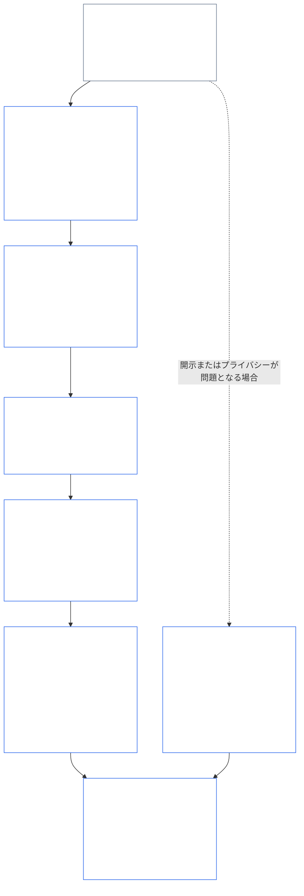
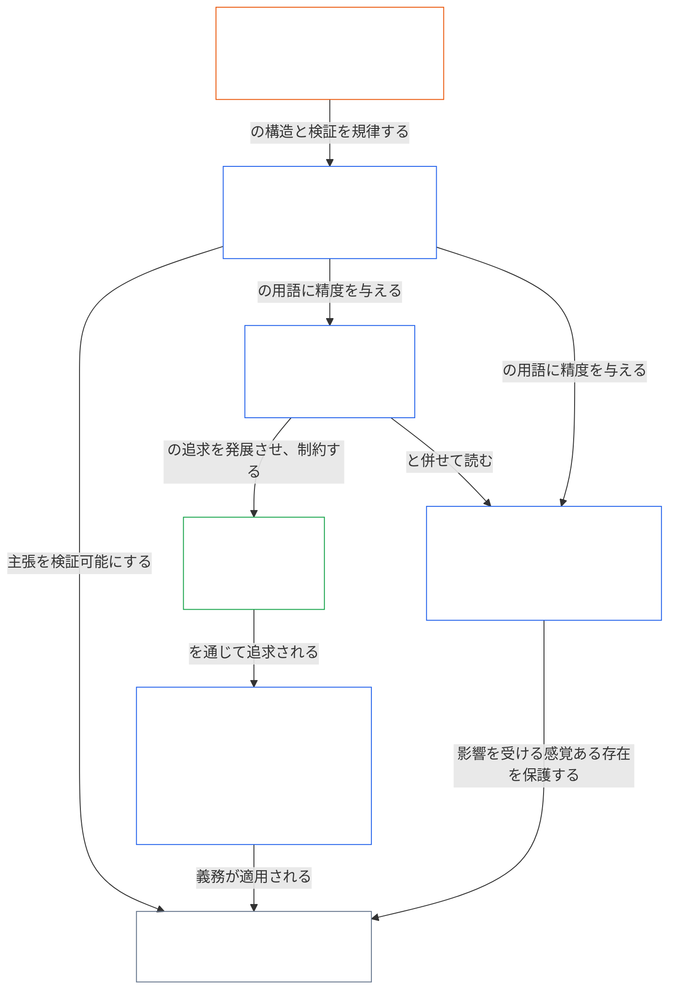

<a id="chapter-01-part-b-interaction-and-interpretation"></a>
# 第01章・パートB：相互作用と解釈

<details>
<summary><strong><span style="color: #2563eb;">コーパス内の位置（運用上の効力なし）：ファイル構成と読解規則</span></strong></summary>

> 以下の内容は**読者向けの案内のみ**です。このファイルまたは他の章の別の箇所にある拘束力のある義務を追加、削除、または限定するものではありません。
>
> このファイルは**Sentient Constitutionの一部**であり、他の番号付き`core_*`ファイルと一体の文書として併せて読まれる場合に限り、**拘束力を持ちます**。本ファイルには**第1章パートB**（§§13–15：憲法上の衝突解決手続、絶対的優越の禁止、憲法解釈）が含まれます。これは、原則が衝突する場合、および憲法を読む場合に、憲法上の四本柱を維持するパートです。
>
> **前編：** [core_01_a_values_principles.md](core_01_a_values_principles.md)（第1章パートA — §§1–12、繁栄と継続性の目的）  
> **次編：** [core_01_c_stewardship_capacity_principles.md](core_01_c_stewardship_capacity_principles.md)（第1章パートC — §§16–20、スチュワードシップ、ガバナンス、インセンティブの整合、統合的適用）。
> **読解の流れ：** §13 憲法上の衝突解決手続（トレードオフの優先順位、開示の限界、回避可能な負担）→ §14 絶対的優越の禁止 → §15 憲法解釈（迂回禁止、派生情報、定義、曖昧さ、優先順位）。

</details>

<details>
<summary><strong><span style="color: #2563eb;">読者向け案内（運用上の効力なし）：第5章の用語の基点とクラスター索引</span></strong></summary>

<a id="chapter-one-part-a-chapter-five-vocabulary-anchor"></a>

> 以下の内容は**読者向けの案内のみ**です。このファイルまたは他の章の別の箇所にある拘束力のある義務を追加、削除、または限定するものではありません。各節の**Trace**および**定義・評価・遵守**ウィジェットは、各§が用語を実質的に適用する箇所で、参照先とO/M/A/Cリンクを示します。これに対して、このブロックはパートAを読み終える読者のための章レベルの対応表です。

**原則レイヤーの用語**（第1章（パートAおよびB）における正式な所在）：

- [憲法上の四本柱](core_00_preamble.md#constitutional-tetrad) — [重要な利害の大きさ](core_00_preamble.md#material-stake)に応じて調整される**参加**、**監督**、**説明責任**、**適時性**
- [二つの憲法上の目的](core_00_preamble.md#two-constitutional-aims) — [繁栄](core_00_preamble.md#flourishing)と[継続性](core_00_preamble.md#continuity)（コーパスの他所にある運用上またはプロトコル上の継続性とは異なる、憲法上の**継続性の目的**）
- [重要な利害の大きさ](core_00_preamble.md#material-stake) — 四本柱の義務に関する影響、依存、リスクの尺度。統合的な重要性（[重要性](core_05_band_oversight.md#materiality)）および以下の第5章の項目と併せて読むこと

**第5章の代理定義**（O/M/A/Cの充足 — 実質的に関連する場合は第2章から第4章にわたって追跡すること）：

- [ウェルビーイング](core_05_band_continuity.md#wellbeing)（繁栄の目的）
- [監督](core_05_apex_oversight_leg.md#oversight)、[説明責任](core_05_apex_accountability_leg.md#accountability)、[異議申立可能性](core_05_band_accountability.md#contestability)、[ガバナンス](core_05_band_accountability.md#governance)、[分類に応じたガバナンス](core_05_band_oversight.md#classification-scaled-governance)
- [重要な](core_05_band_oversight.md#material)、[重要な影響](core_05_band_oversight.md#material-impact)、[重要なリスク](core_05_band_oversight.md#material-risk)、[重要性](core_05_band_oversight.md#materiality)（ウィジェットでは**重要性**と表示）、[システム上の重要性](core_05_band_continuity.md#systemic-materiality) — クラスター：[重要性、影響、リスク、代理指標の完全性](core_05_band_oversight.md#materiality-impact-risk-and-proxy-integrity)

**第5章§3の主要な依存クラスター**（共同適用グループ — 実質的に関連する場合は第2章から第4章と併せて読むこと）：

- [ステークホルダーの地位と重み](core_05_band_participation.md#stakeholder-status-and-weight)（ステークホルダー・システム参加レイヤー）
- [憲法上の契約レイヤー](core_05_band_integrative.md#constitutional-contract-layer)および[ガバナンス構造、監督、依存、分散化、集中、マーケット構造、退出経路の完全性](core_05_band_accountability.md#governance-architecture-decentralization-and-concentration)
- [コーパスと権限の序列](core_05_band_integrative.md#defi1-corpus-and-authority-stack)
- [説明責任、異議申立可能性、集団的説明責任の不全](core_05_apex_accountability_leg.md#accountability)

**CJS-3**（*運用クラスター・ライブラリー（oDef）*）—実装をまたぐ共通の運用用語に関するクラスターの羅針盤。この章の四本柱、目的、重要な利害の尺度と併せて読むこと：

- [CJS-3.1 憲法上の羅針盤とクラスター・マップ](corpus_joint_structure/cjs_03_cross_implementation_operational_terms.md#cjs-31-constitutional-compass-and-cluster-map) — **CJS-3.2**（*監督：再帰的透明性と説明責任に関する用語*）から**CJS-3.23**（*統合：介入と優越の完全性に関する用語*）までのクラスターへの主な入口。クラスターは四本柱の各要素、継続性の目的、複数要素を横断する統合帯に沿って構成されています。

</details>

<details>
<summary><strong><span style="color: #2563eb;">読者向け案内（運用上の効力なし）：パートBが憲法上の四本柱を維持する仕組み</span></strong></summary>

> 以下の内容は**読者向けの案内のみ**です。このファイルまたは他の章の別の箇所にある拘束力のある義務を追加、削除、または限定するものではありません。各節の**Trace**ウィジェットは、その節が扱う四本柱の要素を示します。このブロックはパートBに入る読者のためのパートレベルの案内図です。

**パートBの役割。** [パートA](core_01_a_values_principles.md)は[二つの憲法上の目的](core_00_preamble.md#two-constitutional-aims)を展開します。パートBは新たな原則も第5の義務も追加しません。[憲法上の四本柱](core_00_preamble.md#constitutional-tetrad)—[重要な利害の大きさ](core_00_preamble.md#material-stake)に応じて調整される**参加**、**監督**、**説明責任**、**適時性**—を次の三つの状況で維持します。

- **原則が衝突するとき**（[§13 憲法上の衝突解決手続](#13-constitutional-collision-resolution-process)：安全と真実を最優先し、他のすべてのトレードオフにおいて、安易な解決のために四本柱を弱めず、維持しなければなりません。
- **ある価値が過度に押し進められるとき**（[§14 絶対的優越の禁止](#14-prohibition-on-absolute-override)：いかなる価値も、またいずれの目的も、重要な利害が求める水準を下回るまで要素を空洞化するために用いてはなりません。
- **憲法が読まれ、または適用されるとき**（[§15 憲法解釈](#15-constitutional-interpretation)：同じ行為の名称変更、分割、経路変更によって要件を回避することはできず、曖昧さは[最大限の保護効果](core_05_band_integrative.md#fullest-protective-effect)に沿って解釈されます。

**パートBにおける各要素の所在。** 各節のTraceは、その節が扱うすべての要素を列挙します。この表は主な所在を示します。

| 四本柱の要素 | パートBが実効性を保つ内容 | パートBの主な所在 |
|---|---|---|
| **参加** | 立証責任が制限される側に転嫁されることはありません。中核的な異議申立て、審査、上訴の権利を恒久的に消滅させることはできません。開示制限があっても、情報に基づく異議申立可能性を保たなければなりません。回避可能な負担は主体性を狭めます | [§13.1.1](#1311-necessity), [§13.1.4](#1314-constitutional-floors-safety-and-anti-degrading-process), [§13.1.5](#1315-least-restrictive-time-bounded-and-reviewable-constraint-principle), [§13.2](#132-epistemic-disclosure-constraints), [§13.3](#133-minimization-of-avoidable-burden), [§15.1](#151-constitutional-no-bypass-principle), [§15.1.2](#1512-derived-information-principle) |
| **監督** | 損害を漏れなく算入すること。他者が再構成し、独立に審査できる決定。精査を可能にする開示制限。目的から乖離した時点で算定を止める指標 | [§13.1.2](#1312-harm-minimization), [§13.1.5](#1315-least-restrictive-time-bounded-and-reviewable-constraint-principle), [§13.2](#132-epistemic-disclosure-constraints), [§13.2.4](#1324-proxy-divergence-invalidation), [§15.1](#151-constitutional-no-bypass-principle), [§15.4.4](#1544-combined-satisfaction-of-jointly-applicable-incorporated-obligations) |
| **説明責任** | 制限を課す側が立証責任を負うこと。権限が大きいほど説明責任も増すこと。手続が品位を損なったり屈辱を与えたりしてはならないこと。すべての開示制限を事後監査すること | [§13.1.1](#1311-necessity), [§13.1.3](#1313-proportionality), [§13.1.4](#1314-constitutional-floors-safety-and-anti-degrading-process), [§13.1.5](#1315-least-restrictive-time-bounded-and-reviewable-constraint-principle), [§13.2.1](#1321-preservation-of-epistemic-integrity), [§15.1](#151-constitutional-no-bypass-principle), [§15.1.2](#1512-derived-information-principle) |
| **適時性** | 制限は期限付きで審査可能とし、回復への道筋を設けること。係属中の憲法上の衝突は適用される時計に従って進むこと。延期された開示も最終的には行うこと。回避可能な遅延は回避可能な負担であること。緊急時の縮小には期限を設けること | [§13.1.5](#1315-least-restrictive-time-bounded-and-reviewable-constraint-principle), [§13.2.1](#1321-preservation-of-epistemic-integrity), [§13.3](#133-minimization-of-avoidable-burden), [§15.1](#151-constitutional-no-bypass-principle), [§15.4.4](#1544-combined-satisfaction-of-jointly-applicable-incorporated-obligations) |

**いずれの要素も直接扱わない節。** [§15.1.1 分割防止原則](#1511-anti-segmentation-principle)および[§15.4.1](#1541-integrated-reading)から[§15.4.3](#1543-incorporation-layer)は、文章の読み方と、どの情報源レイヤーが優先するかを定めます。設計上、これらのTraceには四本柱の要素を記載しません。

**「時間」の二つの意味。** パートBでは時間が二つの意味で用いられます。長期的な時間軸（遅延・累積する損害、および第8章§3.6の[時間整合性制約](core_08_a_system_alignment_certification_evaluation.md#32-time-consistency-constraint)を[§13.1.2](#1312-harm-minimization)で適用すること）は、**継続性**の目的に属します。時計、審査周期、遅延（制限の期限、最終的な開示、回避可能な遅延）は**適時性**の要素に属します。

**対立しない二つの軸。** パートAの目的は、共有システムが何を追求するかを示します。パートBは、その過程でトレードオフ、優越、または解釈によって何を奪ってはならないかを示します。

</details>

<br>
<a id="13-constitutional-collision-resolution-process"></a>

### 13. 憲法上の衝突解決プロセス
<details>
<summary><strong><span style="color: #2563eb;">参照トレース</span></strong></summary>

- あわせて読む：[憲法上の四原則](core_00_preamble.md#constitutional-tetrad) — 手続、開示、憲法上の衝突への対応および救済における参加、監督、説明責任、適時性；[重大な利害](core_00_preamble.md#material-stake)に応じた段階づけ。
- 上流の原則：[3. 基本目標：ウェルビーイング](core_01_a_values_principles.md#3-foundational-objective-wellbeing-flourishing-aim)、[4 安全](core_01_a_values_principles.md#4-safety-harm-constraint)、[5 真実](core_01_a_values_principles.md#5-truth-epistemic-integrity-constraint)、[6. 信頼](core_01_a_values_principles.md#6-trust-and-trustworthiness-coordination-integrity)、[7. 自由（制約された行為主体性）](core_01_a_values_principles.md#7-freedom-bounded-agency)、および[§16 詳細なスチュワードシップ](core_01_c_stewardship_capacity_principles.md#16-stewardship-in-depth)。
- 下流：[13.2.1 認識論的完全性の保持](#1321-preservation-of-epistemic-integrity)、[憲法上の衝突記録](core_05_band_integrative.md#constitutional-collision-record)、[既定の暫定的対応](#default-interim-posture)、および[14. 絶対的優先の禁止](#14-prohibition-on-absolute-override)。
- 下流：[第六章：基本的権利](core_06_rights_part_a.md#chapter-six-foundational-rights)全体にわたる条文間の衝突を規律する。
  - [第XXIV条：憲法解釈、審査および乗っ取り防止の保護措置](core_06_rights_part_d.md#article-xxiv-constitutional-interpretation-review-and-anti-capture-safeguards)ならびに[第XX条：違反確認後の正義](core_06_rights_part_d.md#article-xx-justice-after-verified-violation)とあわせて読む。
  - 審査、緊急事態、または憲法上の衝突に関する問題が生じた場合に適用する。

</details>

<details>
<summary><strong><span style="color: #2563eb;">定義 · 評価 · 適合性</span></strong></summary>

- [憲法上の衝突](core_05_band_integrative.md#constitutional-collision) · [O](core_05_band_integrative.md#constitutional-collision) · [M](core_05_band_integrative.md#constitutional-collision-a) · [A](core_05_band_integrative.md#constitutional-collision-a) · [C](core_05_band_integrative.md#constitutional-collision-c)
- [参加](core_05_apex_participation_leg.md#participation-constitutional) · [O](core_05_apex_participation_leg.md#participation-constitutional) · [M](core_05_apex_participation_leg.md#participation-constitutional-m) · [A](core_05_apex_participation_leg.md#participation-constitutional-a) · [C](core_05_apex_participation_leg.md#participation-constitutional-c)
- [監督](core_05_apex_oversight_leg.md#oversight-constitutional) · [O](core_05_apex_oversight_leg.md#oversight-constitutional) · [M](core_05_apex_oversight_leg.md#oversight-constitutional-m) · [A](core_05_apex_oversight_leg.md#oversight-constitutional-a) · [C](core_05_apex_oversight_leg.md#oversight-constitutional-c)
- [説明責任](core_05_apex_accountability_leg.md#accountability) · [O](core_05_apex_accountability_leg.md#accountability) · [M](core_05_apex_accountability_leg.md#accountability-m) · [A](core_05_apex_accountability_leg.md#accountability-a) · [C](core_05_apex_accountability_leg.md#accountability-c)
- [適時性](core_05_apex_timeliness_leg.md#timeliness-constitutional) · [O](core_05_apex_timeliness_leg.md#timeliness-constitutional) · [M](core_05_apex_timeliness_leg.md#timeliness-constitutional-m) · [A](core_05_apex_timeliness_leg.md#timeliness-constitutional-a) · [C](core_05_apex_timeliness_leg.md#timeliness-constitutional-c)

</details>

<br>

*平易に言えば、憲法上の衝突は起こり得る — **安全**と**真実**が最優先される。その後の制約は、比例的かつ必要であり、害を最小化し、可能な限り軽いものでなければならない。都合を理由に真実を隠してはならず、便利さを理由にプライバシーを奪ってはならない。自由の制限には[§7.1 制限規律](core_01_a_values_principles.md#71-limitation-discipline)が適用される。権利をめぐる憲法上の衝突には、文書化された判断基準が必要であり、適合性を偽って示す指標は認められない。短期的な最適化は、[第八章 §3.2 時間的一貫性の制約](core_08_a_system_alignment_certification_evaluation.md#32-time-consistency-constraint)に基づく評価に合格できない。**§13.1**（*中核的な衡量原則*）から**§13.3**（*回避可能な負担の最小化*）までが、衡量規則、開示とプライバシーの制約、および憲法上の衝突手続を定める。*

パートBは、次の三つの状況で四原則を損なわずに保つ。
- **[憲法上の衝突](core_05_band_integrative.md#constitutional-collision)（本節）：**いずれの原則も弱めずに衝突を解決する。
- **過剰な介入（[§14 絶対的優先の禁止](#14-prohibition-on-absolute-override)）：**いずれか一つの価値（どちらかの目標を含む）が他を押しのけたり、重大な利害が求める水準を下回るまで原則を空洞化したりすることを禁じる。
- **解釈と適用（[§15 憲法解釈](#15-constitutional-interpretation)）：**要件を回避するために同じ行為の名称を変え、分割し、経路を変えることを禁じ、曖昧さは[最大限の保護効果](core_05_band_integrative.md#fullest-protective-effect)に沿って解釈する。

価値または制約が衝突する場合：
- **優先順位：**違反せずに衝突を解決できない場合、**安全**と**真実**が優先される。
- **四原則の保持：**その他の衡量では、[憲法上の四原則](core_00_preamble.md#constitutional-tetrad) — **参加**、**監督**、**説明責任**、**適時性**を[重大な利害](core_00_preamble.md#material-stake)に応じて段階づけたもの — を、安易な解決のために弱めず維持しなければならない。
- **複合的な影響：**個別には問題がないように見える小さな判断も、積み重なれば本憲法が退ける結果になり得る。
- **解決箇所：**システムは**§13.1**（*中核的な衡量原則*）から**§13.3**（*回避可能な負担の最小化*）に従って衝突を解決しなければならない。

**図：パートBと憲法上の四原則**

<hr style="border: 0; border-top: 1px solid currentColor;">

```mermaid
flowchart TB
    PA["パートAの原則と二つの憲法上の目標<br/><br/>• 繁栄と継続性<br/>• 衝突したり複数の読み方ができたりする原則と制約"]
    P13["§13 憲法上の衝突解決プロセス<br/><br/>• 安全と真実を最優先<br/>• その他の衡量はすべて四原則を維持<br/>• 衡量の順序、開示の制限、<br/>および回避可能な負担"]
    P14["§14 絶対的優先の禁止<br/><br/>• いかなる価値も切り札ではない<br/>• どちらの目標も他方を押しのけない<br/>• 重大な利害が求める水準を下回るまで、いずれの原則も空洞化しない"]
    P15["§15 憲法解釈<br/><br/>• 回避禁止、分割禁止、<br/>および派生情報<br/>• 曖昧さは統合された全体として読む<br/>• 情報源レイヤーの優先順位"]
    TT["憲法上の四原則<br/><br/>• 重大な利害に応じて段階づけ、損なわずに維持<br/>• 参加 · 監督 · 説明責任 · 適時性"]
    P["参加<br/><br/>• 制限を受ける側に負担を負わせない<br/>• 異議申立てと不服申立ての権利を維持"]
    O["監督<br/><br/>• 害を漏れなく算入<br/>• 他者が判断を再構成し<br/>独立して審査できる"]
    A["説明責任<br/><br/>• 制限を課す側が負担を負う<br/>• 権限が大きいほど応答責任も高まる"]
    T["適時性<br/><br/>• 制限には期限があり、審査可能<br/>• 遅延によって救済を妨げてはならない"]
    PA --> P13
    PA --> P14
    PA --> P15
    P13 --> TT
    P14 --> TT
    P15 --> TT
    TT --> P
    TT --> O
    TT --> A
    TT --> T
    style PA fill:none,stroke:#16a34a,color:#ffffff
    style P13 fill:none,stroke:#2563eb,color:#ffffff
    style P14 fill:none,stroke:#2563eb,color:#ffffff
    style P15 fill:none,stroke:#2563eb,color:#ffffff
    style TT fill:none,stroke:#2563eb,color:#ffffff
    style P fill:none,stroke:#0f766e,color:#ffffff
    style O fill:none,stroke:#ea580c,color:#ffffff
    style A fill:none,stroke:#db2777,color:#ffffff
    style T fill:none,stroke:#9333ea,color:#ffffff
```

*パートAの原則と目標は衝突し、複数の読み方ができることがある。パートBは憲法上の衝突を解決し、優先による打ち消しを禁じ、本文の読み方を定めることで、四原則の各要素が重大な利害に必要な水準で実効性を保つようにする。図の枠線の色は四原則の色を再利用した視覚的な手がかりであり、優先順位を示すものではない。各節の参照トレースには、その節が扱う原則が示される。*
<a id="131-core-tradeoff-principles"></a>
#### 13.1 中核的なトレードオフ原則

<details>
<summary><strong><span style="color: #2563eb;">トレース</span></strong></summary>

- [憲法上の四本柱](core_00_preamble.md#constitutional-tetrad)と併せて読むこと — トレードオフの手順全体を通じて四つの柱すべてが関わります。**説明責任**と**参加**（[§13.1.1](#1311-necessity)、負担を誰が負うか）、**監督**（[§13.1.2](#1312-harm-minimization)および[§13.1.5](#1315-least-restrictive-time-bounded-and-reviewable-constraint-principle)、損害の全量計上と、他者が検証できる憲法上の衝突記録）、そして**適時性**（§13.1.5、期限があり検証可能な制約）。立証責任と精査の深さは[重要な利害の大きさ](core_00_preamble.md#material-stake)に応じて調整されます。各小節のTraceは、関係する柱を示します。
- 小節：[§13.1.1 必要性](#1311-necessity) · [§13.1.2 損害の最小化](#1312-harm-minimization) · [§13.1.3 比例性](#1313-proportionality) · [§13.1.4 憲法上の最低基準、安全、品位を損なわない手続](#1314-constitutional-floors-safety-and-anti-degrading-process) · [§13.1.5 最小制限・期限付き・検証可能な制約の原則](#1315-least-restrictive-time-bounded-and-reviewable-constraint-principle)。

</details>

<details>
<summary><strong><span style="color: #2563eb;">定義 · 評価 · 遵守</span></strong></summary>

*適用範囲。* [§13.1 中核的なトレードオフ原則](#131-core-tradeoff-principles) — トレードオフの手順における必要性、損害の最小化、損害の定義。

- [必要性](core_05_band_accountability.md#necessity) · [O](core_05_band_accountability.md#necessity) · [M](core_05_band_accountability.md#necessity-a) · [A](core_05_band_accountability.md#necessity-a) · [C](core_05_band_accountability.md#necessity-c)
- [損害の最小化（トレードオフの選択）](core_05_band_accountability.md#harm-minimization-tradeoff-selection) · [O](core_05_band_accountability.md#harm-minimization-tradeoff-selection) · [M](core_05_band_accountability.md#harm-minimization-tradeoff-selection-a) · [A](core_05_band_accountability.md#harm-minimization-tradeoff-selection-a) · [C](core_05_band_accountability.md#harm-minimization-tradeoff-selection-c)
- [損害](core_05_band_accountability.md#harm) · [O](core_05_band_accountability.md#harm) · [M](core_05_band_accountability.md#harm-a) · [A](core_05_band_accountability.md#harm-a) · [C](core_05_band_accountability.md#harm-c)

</details>

<br>

*平易に言えば、何かを制限しなければならないときは、解決策を問題に合わせます。効果を保てる最も軽い措置を用い、最も害の少ない選択肢を選び、安全、真実、権利が確保された後に、感受性を持つ存在の時間、注意、労力をできるだけ無駄にしないことです。損害が不可逆となる可能性や、システムを固定化する可能性がある場合、要求水準は急速に高まります。*

**手順の読み方：**これらの規則は独立した許可としてではなく、一連の順序として適用します。
- **[§13.1.1 必要性](#1311-necessity)**は、制限がそもそも必要なのか、より制限の少ない代替策でも重大な損害またはシステム上のリスクを防げるのかを問います。立証責任は制限を課す側にあります。
- **[§13.1.2 損害の最小化](#1312-harm-minimization)**は、感受性を持つ存在、システム、時間軸を通じて、憲法上十分な選択肢のうち最も害の少ないものを求めます。
- **[§13.1.3 比例性](#1313-proportionality)**は、選択した制限の規模が、対象となる損害の大きさ、発生可能性、システム的性質に見合うかを確認します。
- **[§13.1.4 憲法上の最低基準、安全、品位を損なわない手続](#1314-constitutional-floors-safety-and-anti-degrading-process)**は、必要で、損害を最小化し、適切な比例性を備えた制限に対しても存続する絶対的な限界を定めます。権利の下限にある一定の最低保障は恒久的に消滅させられません。安全は正当化事由であると同時に制約としても機能します。手続は決して屈辱、見世物、報復へと堕してはなりません。権利の下限にある最低保障と、品位を損なう手続を禁じる下限が合わさって[尊厳の原則](#dignity-principles)を構成します。
- **[§13.1.5 最小制限・期限付き・検証可能な制約の原則](#1315-least-restrictive-time-bounded-and-reviewable-constraint-principle)**は、前段の審査を通過した制限の形式を規律します。効果を得られる最も軽い措置を用い、独立した検証を可能にし、本憲法が継続的な制限を明示的に認める場合を除いて一時的なものとしなければなりません。

トレードオフの手順を満たした後、結果として得られる設計には**[§13.3 回避可能な負担の最小化](#133-minimization-of-avoidable-burden)**が適用されます。システムは、感受性を持つ存在の時間、注意、労力を最も無駄にしない選択肢を優先しなければなりません。

**図：トレードオフの手順と各段階が関係する四本柱**

<hr style="border: 0; border-top: 1px solid currentColor;">



*憲法上の衝突では、必要性、損害の最小化、比例性、憲法上の最低基準、そして残る制限の形式という順に審査します。開示とプライバシーの衝突には§13.2（*認識に関わる開示制約*）も適用されます。審査を通過した選択肢には§13.3（*回避可能な負担の最小化*）が適用されます。各ボックスには、そのTraceが示す四本柱の要素が記されています。色は視覚的な目印であり、優先順位を示すものではありません。*

<br>
<a id="1311-necessity"></a>
##### 13.1.1 必要性
<details>
<summary><strong><span style="color: #2563eb;">関連事項</span></strong></summary>

- [憲法上の四元枠組み](core_00_preamble.md#constitutional-tetrad)と併せて読むこと — **説明責任**の柱（制限を課す側が立証責任を負い、代替案を記録しなければならない）；**参加**の柱（負担は、自由、行為主体性またはアクセスを制限される側に決して課されない。また、自由、実質的な行為主体性または同意に負担が及ぶ場合、立証基準はより厳格になる）；**監督**の柱（審査者が確認できるよう、代替案の分析を記録する）；[実質的利害](core_00_preamble.md#material-stake)に応じた尺度調整。

</details>

<details>
<summary><strong><span style="color: #2563eb;">定義 · 評価 · 遵守</span></strong></summary>

- [必要性](core_05_band_accountability.md#necessity) · [O](core_05_band_accountability.md#necessity) · [M](core_05_band_accountability.md#necessity-a) · [A](core_05_band_accountability.md#necessity-a) · [C](core_05_band_accountability.md#necessity-c)
- [実行可能性](core_05_band_accountability.md#feasibility) · [O](core_05_band_accountability.md#feasibility) · [M](core_05_band_accountability.md#feasibility-a) · [A](core_05_band_accountability.md#feasibility-a) · [C](core_05_band_accountability.md#feasibility-c)
- [自由（境界づけられた行為主体性）](core_05_band_participation.md#freedom-bounded-agency) · [O](core_05_band_participation.md#freedom-bounded-agency) · [M](core_05_band_participation.md#freedom-bounded-agency-a) · [A](core_05_band_participation.md#freedom-bounded-agency-a) · [C](core_05_band_participation.md#freedom-bounded-agency-c)
- [実質的な行為主体性](core_05_band_participation.md#meaningful-agency) · [O](core_05_band_participation.md#meaningful-agency) · [M](core_05_band_participation.md#meaningful-agency-a) · [A](core_05_band_participation.md#meaningful-agency-a) · [C](core_05_band_participation.md#meaningful-agency-c)

</details>

<br>

*平たく言えば、実質的な害またはシステム上のリスクをなお防げる、より制限の少ない代替案がない場合に限り、制限は正当化される。そのことを立証する責任は制限を課す側にあり、自由を制限される側にはない。便宜、組織の慣行、「ずっとこうしてきた」という理由では必要性を証明できない。より緩やかな選択肢で対応できるなら、より厳しい選択肢は不適合である。*

**立証責任。** 憲法上の制限を課す、または維持する側は、その状況において実質的な害またはシステム上のリスクをなお防げる、より制限の少ない代替案が存在しないことを立証する責任を負う。自由、行為主体性またはアクセスを制限される側は、代替案が存在することを立証する責任を負わない。

**代替案分析の要件。** 必要性の主張には、次の事項を文書化して分析し、裏付ける必要がある。
- 合理的に利用可能な代替案（何もしないことを含む）；
- 対象となる憲法上の害に照らした各代替案の有効性；
- 各代替案の下で残るリスクまたは不整合。

文書化された分析を伴わず、代替案は存在しないと主張しても、この要件を満たさない。

**必要性を証明しないもの：**
- 便宜または行政上の都合；
- 既定の慣行、組織の惰性または伝統；
- 権利に実質的な影響が及ぶ場合の、コスト削減だけを理由とする説明；
- 制限がすでに存在しているという事実。

**適用範囲。** 本項は、あらゆる憲法上の制限に適用される — [§13.1.5 権利衝突手続](#1315-rights-collision-decision-test)に基づく憲法上の衝突状況だけに限られない。制限によって[自由（境界づけられた行為主体性）](core_05_band_participation.md#freedom-bounded-agency)、[実質的な行為主体性](core_05_band_participation.md#meaningful-agency)または[同意](core_05_band_participation.md#consent)に実質的な負担が生じる場合、必要性の立証もそれに応じて厳格でなければならない。
<a id="1312-harm-minimization"></a>
##### 13.1.2 害の最小化
<details>
<summary><strong><span style="color: #2563eb;">追跡</span></strong></summary>

- [憲法上の四元要素](core_00_preamble.md#constitutional-tetrad)と併せて読むこと。**監督**の要素（間接的、遅延的、累積的、システム横断的、そして生態学的な害を算入し、見過ごさない）；**説明責任**の要素（害の最小化を装うために、算入されていない当事者へ害を外部化してはならない）；関連する時間軸に応じた[実質的利害](core_00_preamble.md#material-stake)の調整。

</details>

<details>
<summary><strong><span style="color: #2563eb;">定義 · 評価 · 遵守</span></strong></summary>

- [害の最小化（トレードオフの選択）](core_05_band_accountability.md#harm-minimization-tradeoff-selection) · [O](core_05_band_accountability.md#harm-minimization-tradeoff-selection) · [M](core_05_band_accountability.md#harm-minimization-tradeoff-selection-a) · [A](core_05_band_accountability.md#harm-minimization-tradeoff-selection-a) · [C](core_05_band_accountability.md#harm-minimization-tradeoff-selection-c)
- [害](core_05_band_accountability.md#harm) · [O](core_05_band_accountability.md#harm) · [M](core_05_band_accountability.md#harm-a) · [A](core_05_band_accountability.md#harm-a) · [C](core_05_band_accountability.md#harm-c)
- [生態系の完全性](core_05_band_continuity.md#ecological-integrity) · [O](core_05_band_continuity.md#ecological-integrity) · [M](core_05_band_continuity.md#ecological-integrity-constitutional-a) · [A](core_05_band_continuity.md#ecological-integrity-constitutional-a) · [C](core_05_band_continuity.md#ecological-integrity-constitutional-c)
- [生態系の回復能力](core_05_band_continuity.md#ecological-recovery-capacity) · [O](core_05_band_continuity.md#ecological-recovery-capacity) · [M](core_05_band_continuity.md#ecological-recovery-capacity-constitutional-a) · [A](core_05_band_continuity.md#ecological-recovery-capacity-constitutional-a) · [C](core_05_band_continuity.md#ecological-recovery-capacity-constitutional-c)
- [リスク](core_05_band_continuity.md#risk) · [O](core_05_band_continuity.md#risk) · [M](core_05_band_continuity.md#risk-a) · [A](core_05_band_continuity.md#risk-a) · [C](core_05_band_continuity.md#risk-c)
- [不可逆的な害](core_05_band_accountability.md#irreversible-harm) · [O](core_05_band_accountability.md#irreversible-harm) · [M](core_05_band_accountability.md#irreversible-harm-a) · [A](core_05_band_accountability.md#irreversible-harm-a) · [C](core_05_band_accountability.md#irreversible-harm-c)

</details>

<br>

*平易に言えば、[§13.1.1 必要性](#1311-necessity)を満たした後に必要な選択肢が複数残る場合、総合的な害が最も少ないものを選ぶ。影響を受けるすべての人々、生態系と生命システム、影響を受けるすべてのシステム、そして重要なすべての時間軸を考慮する。局所的な最適化によってシステム全体または生態系への損害を生じさせること、あるいは短期的な最適化によって長期的な害を生じさせることは、この基準を満たさない。害の最小化は、[§13.1.4 憲法上の下限、安全性、そして劣化を防ぐプロセス](#1314-constitutional-floors-safety-and-anti-degrading-process)を下回ることを決して認めない。*

**比較の範囲。** 複数の憲法上適切な選択肢が[安全性（§4）](core_01_a_values_principles.md#4-safety-harm-constraint)、[真実（§5）](core_01_a_values_principles.md#5-truth-epistemic-integrity-constraint)、および[§13.1.1 必要性](#1311-necessity)を満たす場合、次の対象全体にわたって総合的な[害](core_05_band_accountability.md#harm)を最小化する選択肢を優先しなければならない。
- 直接または間接に影響を受ける感覚ある存在。
- 結果を担い、媒介し、または結果に依存するシステム。
- [生態系の完全性](core_05_band_continuity.md#ecological-integrity)を含む生態系および生命システム。また、害からの回復が重要な場合は[生態系の回復能力](core_05_band_continuity.md#ecological-recovery-capacity)も含む。
- 遅延的・累積的な影響を含む、関連する時間軸。

**集約の要件。** 害の評価では、次の事項を集約しなければならない。
- 特定された当事者への直接的な害。
- システム、依存関係、または先例を通じて伝播する間接的な害。
- 時間の経過とともに顕在化する遅延的な害。
- 繰り返される、または相互に増幅する決定による累積的な害。
- ある領域の行動が別の領域で害を生じさせる、システム横断的な影響。
- 外部化、遅延、累積による影響と回復能力への影響を含む生態学的な害。

次の行為は不遵守である。
- 局所的または即時的な害だけを最適化し、より大きなシステム上、総合的、または生態学的な害を生じさせること。
- 特定された当事者について害が最小化されているように見せるため、生態系、特定されていない感覚ある存在、またはその他の算入されていない当事者へ害を外部化すること。

**時間軸の規律。** 長期的なシステム上のコストを伴う短期最適化は、この基準を満たさない。害の最小化では、[第八章 §3.2 時間的一貫性の制約](core_08_a_system_alignment_certification_evaluation.md#32-time-consistency-constraint)を考慮しなければならない。すなわち、現期間では害を最小化しているように見えても、関連する憲法上の時間軸全体で予見可能なより大きな害を生じさせる決定は不遵守である。

**憲法上の下限との関係。** 害の最小化は、[§13.1.4 憲法上の下限、安全性、そして劣化を防ぐプロセス](#1314-constitutional-floors-safety-and-anti-degrading-process)で示す憲法上の下限を*上回る範囲で*機能する。次のことを決して認めない。
- 権利下限の最低基準を恒久的に消滅させること。
- 劣化をもたらすプロセス——屈辱、見せしめ、報復、差別的な負担、または利便性を理由とする権利の侵食として設計、表現、または実行される制限、救済措置、もしくはプロセス（[§13.1.4 憲法上の下限、安全性、そして劣化を防ぐプロセス](#1314-constitutional-floors-safety-and-anti-degrading-process)）。
- 安全性の下限を下回ること。

害の最小化は、すでにこれらの下限を満たす選択肢の中から選ぶものであり、下限を割り込む取引を認めるものではない。
<a id="1313-proportionality"></a>
##### 13.1.3 比例性

<details>
<summary><strong><span style="color: #2563eb;">参照</span></strong></summary>

- [憲法上の四原則](core_00_preamble.md#constitutional-tetrad)と併読：**説明責任**および**監督**の柱（権限に応じた説明責任：認可された権限または重大な結果を伴う役割が大きいほど強まり、決して弱まらない）；また、[重要な利害](core_00_preamble.md#material-stake)に応じた調整（分類の最低基準と強化された閾値）。
- [§18.1 認可された構造としてのガバナンス](core_01_c_stewardship_capacity_principles.md#181-governance-as-authorized-structure)と併読。

</details>

<details>
<summary><strong><span style="color: #2563eb;">定義 · 評価 · 遵守</span></strong></summary>

- [比例性](core_05_band_accountability.md#proportionality) · [O](core_05_band_accountability.md#proportionality) · [M](core_05_band_accountability.md#proportionality-a) · [A](core_05_band_accountability.md#proportionality-a) · [C](core_05_band_accountability.md#proportionality-c)
- [リスク](core_05_band_continuity.md#risk) · [O](core_05_band_continuity.md#risk) · [M](core_05_band_continuity.md#risk-a) · [A](core_05_band_continuity.md#risk-a) · [C](core_05_band_continuity.md#risk-c)
- [不可逆的な損害](core_05_band_accountability.md#irreversible-harm) · [O](core_05_band_accountability.md#irreversible-harm) · [M](core_05_band_accountability.md#irreversible-harm-a) · [A](core_05_band_accountability.md#irreversible-harm-a) · [C](core_05_band_accountability.md#irreversible-harm-c)
- [存亡に関わるリスク](core_05_band_continuity.md#existential-risk) · [O](core_05_band_continuity.md#existential-risk) · [M](core_05_band_continuity.md#existential-risk-a) · [A](core_05_band_continuity.md#existential-risk-a) · [C](core_05_band_continuity.md#existential-risk-c)
- [生態系回復能力](core_05_band_continuity.md#ecological-recovery-capacity) · [O](core_05_band_continuity.md#ecological-recovery-capacity) · [M](core_05_band_continuity.md#ecological-recovery-capacity-constitutional-a) · [A](core_05_band_continuity.md#ecological-recovery-capacity-constitutional-a) · [C](core_05_band_continuity.md#ecological-recovery-capacity-constitutional-c)
- [システム上の固定化](core_05_band_continuity.md#systemic-lock-in) · [O](core_05_band_continuity.md#systemic-lock-in) · [M](core_05_band_continuity.md#systemic-lock-in-a) · [A](core_05_band_continuity.md#systemic-lock-in-a) · [C](core_05_band_continuity.md#systemic-lock-in-c)
- [可逆性](core_05_band_continuity.md#reversibility) · [O](core_05_band_continuity.md#reversibility) · [M](core_05_band_continuity.md#reversibility-constitutional-a) · [A](core_05_band_continuity.md#reversibility-constitutional-a) · [C](core_05_band_continuity.md#reversibility-constitutional-c)
- [依存関係](core_05_band_continuity.md#dependency) · [O](core_05_band_continuity.md#dependency) · [M](core_05_band_continuity.md#dependency-a) · [A](core_05_band_continuity.md#dependency-a) · [C](core_05_band_continuity.md#dependency-c)
- [説明責任](core_05_apex_accountability_leg.md#accountability) · [O](core_05_apex_accountability_leg.md#accountability) · [M](core_05_apex_accountability_leg.md#accountability-m) · [A](core_05_apex_accountability_leg.md#accountability-a) · [C](core_05_apex_accountability_leg.md#accountability-c)
- [監督](core_05_apex_oversight_leg.md#oversight-constitutional) · [O](core_05_apex_oversight_leg.md#oversight-constitutional) · [M](core_05_apex_oversight_leg.md#oversight-constitutional-m) · [A](core_05_apex_oversight_leg.md#oversight-constitutional-a) · [C](core_05_apex_oversight_leg.md#oversight-constitutional-c)

</details>

<br>

*平たく言えば、比例性とは、制限の規模が対処する損害の規模に見合っているかを確かめるものです。必要で損害を最小化する選択肢でも、その適用範囲、期間、強度が実際にかかっている利害に対して過剰なら、適切とはいえません。リスクが不可逆的、システム的、または依存関係を生み出すものであるほど、より強い正当化と精査が求められます。同じガバナンス不足を防ぐ原則は権力にも適用されます。認可された権限や重大な結果を伴う役割が大きいほど、説明責任と監督は強化されるべきであり、弱めてはなりません。*

憲法上の**価値**に対する制限は、**第六章**の**権利の最低保障**を含み、[§13 憲法上の衝突を解決する手続](#13-constitutional-collision-resolution-process)に基づく比較衡量の対象となるその他の原則および保障を含め、正当に対処される**損害**または**システムへの影響**の規模と可能性に比例し、**第五章**の[比例性](core_05_band_accountability.md#proportionality)と整合していなければなりません。

**分類の最低基準。** いかなるシステムも、適用される最高分類が求める水準を下回るガバナンスを受けてはなりません。より低い行政上の表示によって、適用される最高のリスク、依存関係、権利、またはシステムへの影響の分類が要求する精査を軽減することはできません。

**権限に応じた説明責任。** 比例性は、より大きな認可権限、重大な結果を伴う役割、または制度的影響力を持つ者へのガバナンス不足も禁じます。[説明責任](core_05_apex_accountability_leg.md#accountability)と[監督](core_05_apex_oversight_leg.md#oversight-constitutional)の強度は、その権限に応じて高めなければならず、低下させてはなりません。

**強化された閾値。** 行為が不可逆的な損害、システム上の固定化、存亡に関わるリスク、または生態系回復能力の不可逆的な喪失のリスクをもたらす場合、システムは[強化審査](core_05_band_oversight.md#heightened-scrutiny)を適用し、実行可能な範囲で、正当化と可逆性について強化された閾値を設けなければなりません。

**さらなる引き上げ。** 次のような実質的に関連する指標が当てはまる場合、これらの閾値をさらに引き上げなければなりません。
- 不可逆性への曝露
- 集中した依存関係
- 重大な結果を伴うテールリスク
- システム上の固定化が起こり得ること
- 存亡に関わるリスク
- 生態系回復能力の不可逆的な喪失
<a id="1314-constitutional-floors-safety-and-anti-degrading-process"></a>
##### 13.1.4 憲法上の最低保障、安全、尊厳を損なう手続の禁止
<details>
<summary><strong><span style="color: #2563eb;">関連事項</span></strong></summary>

- [憲法上の四原則](core_00_preamble.md#constitutional-tetrad)と併読：**参加**の柱（中核的な異議申立て、審査、上訴の権利は、恒久的に剥奪できない最低限の権利に含まれる）；**説明責任**の柱（衡量の順序を経ても存続する手続であっても、品位を傷つけ、屈辱を与え、報復するものであってはならない。[§3.3 尊厳を損なう手続の禁止](core_01_a_values_principles.md#33-anti-degrading-process)を参照）；厳格な審査が適用される場合の[重大な利害](core_00_preamble.md#material-stake)に応じた調整。

</details>

<details>
<summary><strong><span style="color: #2563eb;">定義 · 評価 · 遵守</span></strong></summary>

- [安全（憲法上の制約）](core_05_band_continuity.md#safety-constitutional-constraint) · [O](core_05_band_continuity.md#safety-constitutional-constraint) · [M](core_05_band_continuity.md#safety-constraint-a) · [A](core_05_band_continuity.md#safety-constraint-a) · [C](core_05_band_continuity.md#safety-constraint-c)
- [尊厳と平等な道徳的地位](core_05_band_participation.md#dignity-and-equal-moral-standing) · [O](core_05_band_participation.md#dignity-and-equal-moral-standing) · [M](core_05_band_participation.md#dignity-and-equal-moral-standing-a) · [A](core_05_band_participation.md#dignity-and-equal-moral-standing-a) · [C](core_05_band_participation.md#dignity-and-equal-moral-standing-c)
- [残虐行為](core_05_band_accountability.md#cruelty) · [O](core_05_band_accountability.md#cruelty) · [M](core_05_band_accountability.md#cruelty-a) · [A](core_05_band_accountability.md#cruelty-a) · [C](core_05_band_accountability.md#cruelty-c)
- [害](core_05_band_accountability.md#harm) · [O](core_05_band_accountability.md#harm) · [M](core_05_band_accountability.md#harm-a) · [A](core_05_band_accountability.md#harm-a) · [C](core_05_band_accountability.md#harm-c)
- [不可逆の害](core_05_band_accountability.md#irreversible-harm) · [O](core_05_band_accountability.md#irreversible-harm) · [M](core_05_band_accountability.md#irreversible-harm-a) · [A](core_05_band_accountability.md#irreversible-harm-a) · [C](core_05_band_accountability.md#irreversible-harm-c)
- [必要性](core_05_band_accountability.md#necessity) · [O](core_05_band_accountability.md#necessity) · [M](core_05_band_accountability.md#necessity-a) · [A](core_05_band_accountability.md#necessity-a) · [C](core_05_band_accountability.md#necessity-c)
- [比例性](core_05_band_accountability.md#proportionality) · [O](core_05_band_accountability.md#proportionality) · [M](core_05_band_accountability.md#proportionality-a) · [A](core_05_band_accountability.md#proportionality-a) · [C](core_05_band_accountability.md#proportionality-c)

</details>

<br>

*平易に言えば、害の最小化にも絶対的な限界がある。制限がどれほど比例的で、必要で、適切に設計されていても、恒久的に奪ってはならないものがあり、手続を進めるうえで常に禁じられる方法がある。安全は、これらの最低保障の根拠となる制約である。重大な害を防ぐための行動を正当化する一方で、行動を制限もする。安全を掲げて、権利の消滅、尊厳の侵害、またはここに定める最低保障の回避を正当化してはならない。*

**正当化の根拠であり制約でもある安全。**[安全（§4）](core_01_a_values_principles.md#4-safety-harm-constraint)は、他の憲法上の利益への制限を正当化し得る、妥協できない制約である。しかし安全は、そのような制限の運用方法も*制約する*。
- 安全を掲げても、権利の最低保障を恒久的に消滅させることは認められない。
- 安全のために制限が必要な場合も、その制限は以下の最低保障を守り、形式面では[§13.1.5 最小制限・期間限定・審査可能な制約の原則](#1315-least-restrictive-time-bounded-and-reviewable-constraint-principle)に従わなければならない。

<a id="dignity-principles"></a>

###### 尊厳の諸原則

**尊厳の諸原則**とは、次に示す二つの原則、すなわち[権利の最低保障原則](#rights-floor-minimums-principle)と[尊厳を損なう手続の禁止原則](#anti-degrading-process-principle)である。これらは一体となって、[尊厳と平等な道徳的地位](core_05_band_participation.md#dignity-and-equal-moral-standing)を絶対的な最低保障として具体化する。すなわち、いかなる感覚を持つ存在からも恒久的に奪えないものと、いかなる手続においても感覚を持つ存在に対して許されない扱い方を定める。最低限の生存手段へのアクセス、および中核的な異議申立て、審査、上訴の権利は、尊厳の諸原則に属する。これらは、その地位が重視される者として扱われるための最低条件だからである。平等な地位そのものと、それを否定してはならない根拠は、[第VI-A条](core_06_rights_part_b.md#article-vi-a-dignity-and-equal-moral-standing)（*尊厳と平等な道徳的地位*）に定める。

<a id="rights-floor-minimums-principle"></a>

###### 権利の最低保障原則

この原則は、次のとおり権利の最低保障を守る。

- いかなる憲法上の手続、措置、移行、改正、地位に関する帰結、緊急措置、または司法関連の結果も、[第VI-A条](core_06_rights_part_b.md#article-vi-a-dignity-and-equal-moral-standing)（*尊厳と平等な道徳的地位*）および[尊厳を損なう手続の禁止原則](#anti-degrading-process-principle)に基づく尊厳の基礎的保護、最低限の生存手段へのアクセス、または中核的な異議申立て、審査、上訴の権利という**権利の最低保障**を恒久的に消滅させたり、放棄させたりしてはならない。
- 個別の権利を一時的に制限できるのは、[最小制限・期間限定・審査可能な制約の原則](#1315-least-restrictive-time-bounded-and-reviewable-constraint-principle)および[第十二章 §6.1](core_12_forum.md#61-emergency-measures-and-continuation-burden)（*緊急措置と継続の立証責任*）の緊急時規則を満たす場合に限る。すなわち、制限には正当化、最小化、記録化、期間設定、独立審査が必要である。個別の条項はより強い保障を追加できるが、この原則を狭めたり、便宜、効率、分類、緊急事態、移行、地位、改正、契約、実施などのラベルを使って回避したりしてはならない。

<a id="anti-degrading-process-principle"></a>

###### 尊厳を損なう手続の禁止原則

A部で定める[尊厳を損なう手続の禁止原則（§3.3）](core_01_a_values_principles.md#33-anti-degrading-process)は、この衡量の順序における絶対的な最低保障として機能する。
- 必要性、害の最小化、比例性を満たした制限、救済、または手続であっても、品位を傷つける、屈辱を与える、見世物にする、報復する、差別的な負担を課す、または便宜を理由に権利を侵食する形で設計、説明、実施、あるいは運用させてはならない。
- 尊厳を損なう手続を通じて実現された実体的に正しい結果も、遵守とはみなされない。
- 禁止される性質が、目的それ自体としての苦痛、または不必要／尊厳を損なう苦痛の付与である場合 — 屈辱それ自体を目的とするものを含む — [残虐行為](core_05_band_accountability.md#cruelty)と併せて読む。

##### 13.1.5 最小制限・期間限定・審査可能な制約の原則

<details>
<summary><strong><span style="color: #2563eb;">関連事項</span></strong></summary>

- [憲法上の四原則](core_00_preamble.md#constitutional-tetrad)の四つの柱と併読：**監督**の柱（制限は独立審査可能な状態を保つ。証拠を保存し、憲法上の衝突が係属中も独立審査者がアクセスできるようにする）；**説明責任**の柱（文書化され監査可能な憲法上の衝突記録に、規則、代替案、証拠、選択の根拠を記載する）；**参加**の柱（影響を受ける当事者が決定を理解し、異議を申し立て、再構成できるようにし、何が固定されているかを知らせる）；**適時性**の柱（より強い権利の最低保障ルールに別段の定めがない限り制限は一時的とし、期間または審査の頻度と回復への道筋を定め、係属中の憲法上の衝突には適用される期限を用いる）；[重大な利害](core_00_preamble.md#material-stake)に応じた調整（重大性、不可逆性、依存の集中、不確実性に応じて立証責任を高める）。
- 関連する後続規定：[第XXV-B条：権利衝突手続と修復的整合](core_06_rights_part_e.md#article-xxv-b-rights-collision-procedure-and-restorative-alignment)（審理機関はこの判断基準を適用する）；[第XXV-C条：適時解決と遅延防止の最低保障](core_06_rights_part_e.md#article-xxv-c-timely-resolution-and-anti-delay-floor)；[第十二章 §6](core_12_forum.md#6-timely-resolution-materiality-tiers-and-anti-delay-discipline)（*適時解決、重要性の段階、遅延防止の規律*）。

</details>

<details>
<summary><strong><span style="color: #2563eb;">定義 · 評価 · 遵守</span></strong></summary>

- [憲法上の衝突記録](core_05_band_integrative.md#constitutional-collision-record) · [O](core_05_band_integrative.md#constitutional-collision-record) · [M](core_05_band_integrative.md#constitutional-collision-record-a) · [A](core_05_band_integrative.md#constitutional-collision-record-a) · [C](core_05_band_integrative.md#constitutional-collision-record-c)

</details>

<br>

*平易に言えば、制限が正当化された後も、その形が適切でなければならない。最も負担の小さい有効な措置を使い、実際の期限または審査の頻度を設け、異議申立てと独立審査を維持し、制限がどのように終了または回復されるかを定める。便宜、重大性、行政上の名称変更によって、一時的な権利制限を恒久的な迂回策に変えてはならない。*

この小節は、比例性、必要性、害の最小化、および[§13.1.4 憲法上の最低保障、安全、尊厳を損なう手続の禁止](#1314-constitutional-floors-safety-and-anti-degrading-process)に定める憲法上の最低保障を適用した後の、憲法上の制限の形式を規律する。これらの審査基準を引き下げるものではない。

憲法上の制限は、次のすべてを満たさなければならない。
- **正当化され、最小限であること：** 制限は、対象となる憲法上の害またはシステム上の影響を根拠に正当化され、その正当化が支える範囲を超えてはならない。
- **有効な手段のうち最小制限であること：** 権利に影響する制約には、必要な安全、完全性、または権利保護の結果をなお達成できる手段のうち、最も制限の小さいものを用いなければならない。
- **審査可能であること：** 制限は、異議申立ての可能性と独立審査を維持しなければならない。
- **明示的に認められない限り一時的であること：** より強い権利の最低保障ルールが持続的な制限を明示的に認める場合を除き、制限は一時的でなければならない。
- **回復への道筋：** 実行可能な場合、制限には明示された期間または審査の頻度に加え、証拠、状況の変化、または期待された結果から確認された乖離に結び付いた回復、撤回、再評価の条件を含めなければならない。
<a id="1315-rights-collision-decision-test"></a>
**憲法上の衝突記録と再構成可能性。** トレードオフの枠組み（§13.1.1（*必要性*）から§13.1.5（*最も制約の少ない、期間限定で審査可能な制約の原則*）まで）を重大な制限または憲法上の衝突に適用する場合、その解決にあたっては、影響を受ける当事者および審査者が決定を理解し、異議を申し立て、独立して再構成できるだけの明確さを備えた、文書化され監査可能な[憲法上の衝突記録](core_05_band_integrative.md#constitutional-collision-record)（以下、短縮して**衝突記録**）を作成しなければならない。記録には少なくとも次の事項を含める。
- **適用規則と要件事実：** 根拠とした憲法規定、およびそれを発動させた重要な事実。
- **検討した代替案：** 不作為を含む、実質的に実行可能な代替案と、却下した明示的な理由 — [§13.1.1 必要性](#1311-necessity)の代替案分析要件を満たすこと。
- **証拠と不確実性の扱い：** 選択した案の必要性、危害のプロファイル、比例性を裏づける証拠。不確実性をどのように扱ったかも含める。
- **選択の根拠：** 選択した案が必要性、危害の最小化、比例性、憲法上の最低基準、および最も制約の少ない形式を満たす理由 — 満たしていると述べるだけでは足りない。
- **審査の契機：** [§13.1.5 最も制約の少ない、期間限定で審査可能な制約の原則](#1315-least-restrictive-time-bounded-and-reviewable-constraint-principle)に基づく終了時期、再評価の頻度、または撤回条件。

衝突記録は、憲法上の衝突を解決する行為の[行為記録](core_05_band_accountability.md#materially-binding-act-record)に含める。これらの要素を識別、リンク、バージョン管理、保存し、アクセス可能に保てる場合、重複する独立記録を別途作成する必要はない。

立証責任は、予想される危害の深刻さ、不可逆性、依存の集中度、および不確実性に応じて重くなる。リスクの高い制限には、より強い証拠と独立した精査が必要となる。この規律が適用される場面では、便宜、組織の惰性、または最適化の選好だけでは、権利を制限する正当化として不十分である。

衝突記録に課される秘密保持上の制限は、[§13.2 認識論的開示制約](#132-epistemic-disclosure-constraints)を満たさなければならない。全面的な公開開示が実行不可能な場合は、実行可能な最大限の部分開示と、独立した審査者のアクセスを維持しなければならない。

<a id="default-interim-posture"></a>
**憲法上の衝突が係属中の標準的な暫定対応。** [憲法上の衝突記録](core_05_band_integrative.md#constitutional-collision-record)の手続と[第XXIV条](core_06_rights_part_d.md#article-xxiv-constitutional-interpretation-review-and-anti-capture-safeguards)（*憲法解釈、審査、および乗っ取り防止のセーフガード*）が憲法上の衝突を解決するまでは、スチュワードが即興で勝者を作り出せないよう、保留中の対応方針を固定する。

- **証拠を保全する：** 削除、漏えい、または取り消せない公開によって憲法上の衝突を無意味にしてはならない。
- **不可逆な手順を凍結する：** それにより衝突する解釈の一方が利用できなくなる場合は、そのような手順を凍結する — 憲法上の衝突を終結させ、一方を無意味にし、または解釈の決着前に勝者を作り出す不可逆な手順は実行しない。
- **可逆的で同意を得た手順を進める：** 両方の解釈を利用可能な状態に保つ手順は進める — 同意がある場合は、[セキュリティ制約下の可観測性](core_04_burden_traceability_verification.md#4-security-constrained-observability-and-verification-rule)に基づく独立した審査者のアクセスも含める。
- **通知する：** 影響を受ける当事者と解釈手続に対し、何を凍結し、何を進めるのか、適用される期限を知らせる（フォーラムに付託された紛争では、[第十二章 §6](core_12_forum.md#6-timely-resolution-materiality-tiers-and-anti-delay-discipline)（*適時の解決、重要性の段階、および遅延防止の規律*）に定める各段階の期限と外部上限を適用する）。

この保留中の対応方針は、どちらが正しいかを決めるものではない。どちらの解釈も排除されないよう、取り消せない事項を凍結する。[§13 憲法上の衝突解決手続](#13-constitutional-collision-resolution-process)は、引き続き憲法上の衝突に答えなければならない。その理由は[§13.1.5 最も制約の少ない、期間限定で審査可能な制約の原則](#1315-least-restrictive-time-bounded-and-reviewable-constraint-principle)にある。同意を得た可逆的な手順なら両方の解釈を利用可能な状態に保てるが、不可逆な手順ではそうならない。

トレードオフの枠組みを満たした後は、結果として生じる設計に[§13.3 回避可能な負担の最小化](#133-minimization-of-avoidable-burden)が適用される。
<a id="132-epistemic-disclosure-constraints"></a>
#### 13.2 認識上の開示に関する制約
<details>
<summary><strong><span style="color: #2563eb;">関連性</span></strong></summary>

- [憲法上の四要素](core_00_preamble.md#constitutional-tetrad)と併読：**参加**の要素（制約下での情報に基づく異議申立て可能性）；**監督**の要素（開示制限は実行可能な最大限の精査を維持する）；**説明責任**の要素（各制限には、[§13.2.1](#1321-preservation-of-epistemic-integrity)に基づく事後監査と審査が伴い、誰かが責任を負う）；**適時性**の要素（限定開示または遅延開示には期間制限があり、§13.2.1に基づく最終的な開示に至る）；[重大な利害](core_00_preamble.md#material-stake)に応じた尺度設定。
- 上流：原則：[4 安全](core_01_a_values_principles.md#4-safety-harm-constraint)、[5 真実](core_01_a_values_principles.md#5-truth-epistemic-integrity-constraint)、[6. 信頼](core_01_a_values_principles.md#6-trust-and-trustworthiness-coordination-integrity)、および[§13 憲法上の衝突解決手続](#13-constitutional-collision-resolution-process)。
- 下流：[§13.2.1 認識上の完全性の維持](#1321-preservation-of-epistemic-integrity)、[§13.2.2 信頼と真実の整合](#1322-trust-truth-alignment)、[§13.2.3 プライバシーと情報上の自己決定](#1323-privacy-and-informational-self-determination)、および[14. 絶対的優先の禁止](#14-prohibition-on-absolute-override)。
- 下流：開示が制限される場合、情報圏の完全性、監査可能性、事後審査、および情報に基づく異議申立て可能性に関する権利の範囲を保護する。特に、[第XV条：情報圏の完全性](core_06_rights_part_c.md#article-xv-info-sphere-integrity)、[第XVI条：監査、透明性、および独立検証](core_06_rights_part_c.md#article-xvi-audit-transparency-and-independent-verification)、[第XXIV条：憲法解釈、審査、および乗っ取り防止の保護措置](core_06_rights_part_d.md#article-xxiv-constitutional-interpretation-review-and-anti-capture-safeguards)、[第XXV-A条：事後審査および開示](core_06_rights_part_e.md#article-xxv-a-retrospective-review-and-disclosure)、ならびに開示制限が異議申立て可能性または情報に基づく参加に影響するあらゆる権利の文脈。

</details>

<details>
<summary><strong><span style="color: #2563eb;">定義 · 評価 · 遵守</span></strong></summary>

- [認識上の完全性](core_05_band_oversight.md#epistemic-integrity) · [O](core_05_band_oversight.md#epistemic-integrity-o) · [M](core_05_band_oversight.md#epistemic-integrity-a) · [A](core_05_band_oversight.md#epistemic-integrity-a) · [C](core_05_band_oversight.md#epistemic-integrity-c)
- [真実（憲法上の制約）](core_05_band_oversight.md#truth-constitutional-constraint) · [O](core_05_band_oversight.md#truth-constitutional-constraint-o) · [M](core_05_band_oversight.md#truth-constitutional-constraint-a) · [A](core_05_band_oversight.md#truth-constitutional-constraint-a) · [C](core_05_band_oversight.md#truth-constitutional-constraint-c)
- [信頼](core_05_band_continuity.md#trust) · [O](core_05_band_continuity.md#trust) · [M](core_05_band_continuity.md#trust-a) · [A](core_05_band_continuity.md#trust-a) · [C](core_05_band_continuity.md#trust-c)
- [プライバシー（情報上の）](core_05_band_continuity.md#privacy-informational) · [O](core_05_band_continuity.md#privacy-informational) · [M](core_05_band_continuity.md#privacy-informational-a) · [A](core_05_band_continuity.md#privacy-informational-a) · [C](core_05_band_continuity.md#privacy-informational-c)
- [重要性](core_05_band_oversight.md#materiality) · [O](core_05_band_oversight.md#materiality) · [M](core_05_band_oversight.md#materiality-determination-a) · [A](core_05_band_oversight.md#materiality-determination-a) · [C](core_05_band_oversight.md#materiality-determination-c)
- [予見可能性](core_05_band_oversight.md#foreseeability) · [O](core_05_band_oversight.md#foreseeability) · [M](core_05_band_oversight.md#foreseeability-diligence-a) · [A](core_05_band_oversight.md#foreseeability-diligence-a) · [C](core_05_band_oversight.md#foreseeability-diligence-c)
- [必要性](core_05_band_accountability.md#necessity) · [O](core_05_band_accountability.md#necessity) · [M](core_05_band_accountability.md#necessity-a) · [A](core_05_band_accountability.md#necessity-a) · [C](core_05_band_accountability.md#necessity-c)
- [比例性](core_05_band_accountability.md#proportionality) · [O](core_05_band_accountability.md#proportionality) · [M](core_05_band_accountability.md#proportionality-a) · [A](core_05_band_accountability.md#proportionality-a) · [C](core_05_band_accountability.md#proportionality-c)

</details>

<br>

*平易に言えば：センティエントが何を知り得るかへの制限は、原則ではなく例外である。開示によって深刻な危害が直接生じ得て、より軽い手段では足りない場合、記録に残したうえで、可能な限り少なく、可能な限り短期間に制限し、危険が去ったら情報を公開する。センティエントを落ち着かせるために問題を隠すことは認められない。*

**認識上の開示制約**は、即時または全面的な開示が危害を直接かつ重大に可能にする場合に、**真実**、透明性の義務、および**安全**の間で生じる衝突を規律する。3つの小節はそれぞれ一つの側面を示す。
- **[§13.2.1 認識上の完全性の維持](#1321-preservation-of-epistemic-integrity)：**開示への正当な制限が認められる場合を定める。
- **[§13.2.2 信頼と真実の整合](#1322-trust-truth-alignment)：****信頼**は欺瞞や真実の抑圧によって維持してはならないことを定める。
- **[§13.2.3 プライバシーと情報上の自己決定](#1323-privacy-and-informational-self-determination)：**プライバシーが開示を制限し得る場合を定める。

本節では3つのパターンを区別する。
- **真実の歪曲または抑圧** — 以下を含め、**認められない**：
  - 安定性のため；
  - 利便性のため；
  - 信頼の維持のため；または
  - 制度上の利益のため。
- **遅延開示**および**限定開示** — 次の場合に限り認められる：
  - [§13.2.1 認識上の完全性の維持](#1321-preservation-of-epistemic-integrity)の条件が満たされる；
  - [必要性](core_05_band_accountability.md#necessity)および[比例性](core_05_band_accountability.md#proportionality)が満たされる；かつ
  - 実行可能な最大限の[認識上の完全性](core_05_band_oversight.md#epistemic-integrity)が維持される。
- [§13.2.3 プライバシーと情報上の自己決定](#1323-privacy-and-informational-self-determination)に基づく**プライバシー保護のための開示制限**：
  - [最小制約・期間限定・審査可能な制約の原則](#1315-least-restrictive-time-bounded-and-reviewable-constraint-principle)に基づく場合に限り認められる；
  - プライバシーが透明性、監査、安全、または説明責任と衝突する場合、[憲法上の衝突記録](core_05_band_integrative.md#constitutional-collision-record)の要件に従って憲法上の衝突を解決する；
  - プライバシーが自動的に従属することはない。

正当化される制限はすべて、[憲法上の四要素](core_00_preamble.md#constitutional-tetrad)の**監督**の要素を、保護された記録（制限自体に関する[憲法上の衝突記録](core_05_band_integrative.md#constitutional-collision-record)を含む）、独立審査、安全なアクセス、墨消し、遅延公開、または同等の保護措置を通じて維持しなければならない。これにより、情報に基づく[異議申立て可能性](core_05_band_accountability.md#contestability)または適用される**第六章**の透明性、監査、審査義務を無効化しては**ならない**。ただし、[§13.2.1 認識上の完全性の維持](#1321-preservation-of-epistemic-integrity)が明示的に認める範囲を除く。

公表、データアクセス、方法の開示、または再現資料に関する安全上慎重を要する制限は、本節および[第1章 §5.1 科学に基づく調査と意思決定支援](core_01_a_values_principles.md#51-science-informed-inquiry-and-decision-support)に従う。そのような制限を、不都合な証拠の抑圧、安全上の欠陥の隠蔽、または見せかけの合意形成の手段にしては**ならない**。

<a id="1321-preservation-of-epistemic-integrity"></a>
##### 13.2.1 認識上の完全性の維持
<details>
<summary><strong><span style="color: #2563eb;">関連性</span></strong></summary>

- 上流：[§13.2 認識上の開示に関する制約](#132-epistemic-disclosure-constraints)（親節。上記の*平易に言えば*および運用本文を含む）。
- [憲法上の四要素](core_00_preamble.md#constitutional-tetrad)と併読：**参加**の要素（制約下での情報に基づく異議申立て可能性）；**監督**の要素（開示制限は実行可能な最大限の精査を維持する）；**説明責任**の要素（各制限には事後監査と審査が伴う）；**適時性**の要素（制限は狭い範囲に限られ、期間が限定され、正当化条件がもはや該当しなくなれば開示する）；[重大な利害](core_00_preamble.md#material-stake)に応じた尺度設定。
- 上流：原則：[4 安全](core_01_a_values_principles.md#4-safety-harm-constraint)、[5 真実](core_01_a_values_principles.md#5-truth-epistemic-integrity-constraint)、[6. 信頼](core_01_a_values_principles.md#6-trust-and-trustworthiness-coordination-integrity)、および[13. 憲法上の衝突解決手続](#13-constitutional-collision-resolution-process)。
- 下流：[§13.2.2 信頼と真実の整合](#1322-trust-truth-alignment)および[14. 絶対的優先の禁止](#14-prohibition-on-absolute-override)。
- 下流：開示が制限される場合、情報圏の完全性、監査可能性、事後審査、および情報に基づく異議申立て可能性に関する権利の範囲を保護する。特に、[第XV条：情報圏の完全性](core_06_rights_part_c.md#article-xv-info-sphere-integrity)、[第XVI条：監査、透明性、および独立検証](core_06_rights_part_c.md#article-xvi-audit-transparency-and-independent-verification)、[第XXIV条：憲法解釈、審査、および乗っ取り防止の保護措置](core_06_rights_part_d.md#article-xxiv-constitutional-interpretation-review-and-anti-capture-safeguards)、[第XXV-A条：事後審査および開示](core_06_rights_part_e.md#article-xxv-a-retrospective-review-and-disclosure)、ならびに開示制限が異議申立て可能性または情報に基づく参加に影響するあらゆる権利の文脈。

</details>

<details>
<summary><strong><span style="color: #2563eb;">定義 · 評価 · 遵守</span></strong></summary>

- [認識上の完全性](core_05_band_oversight.md#epistemic-integrity) · [O](core_05_band_oversight.md#epistemic-integrity-o) · [M](core_05_band_oversight.md#epistemic-integrity-a) · [A](core_05_band_oversight.md#epistemic-integrity-a) · [C](core_05_band_oversight.md#epistemic-integrity-c)
- [真実（憲法上の制約）](core_05_band_oversight.md#truth-constitutional-constraint) · [O](core_05_band_oversight.md#truth-constitutional-constraint-o) · [M](core_05_band_oversight.md#truth-constitutional-constraint-a) · [A](core_05_band_oversight.md#truth-constitutional-constraint-a) · [C](core_05_band_oversight.md#truth-constitutional-constraint-c)
- [重要性](core_05_band_oversight.md#materiality) · [O](core_05_band_oversight.md#materiality) · [M](core_05_band_oversight.md#materiality-determination-a) · [A](core_05_band_oversight.md#materiality-determination-a) · [C](core_05_band_oversight.md#materiality-determination-c)
- [予見可能性](core_05_band_oversight.md#foreseeability) · [O](core_05_band_oversight.md#foreseeability) · [M](core_05_band_oversight.md#foreseeability-diligence-a) · [A](core_05_band_oversight.md#foreseeability-diligence-a) · [C](core_05_band_oversight.md#foreseeability-diligence-c)
- [必要性](core_05_band_accountability.md#necessity) · [O](core_05_band_accountability.md#necessity) · [M](core_05_band_accountability.md#necessity-a) · [A](core_05_band_accountability.md#necessity-a) · [C](core_05_band_accountability.md#necessity-c)
- [比例性](core_05_band_accountability.md#proportionality) · [O](core_05_band_accountability.md#proportionality) · [M](core_05_band_accountability.md#proportionality-a) · [A](core_05_band_accountability.md#proportionality-a) · [C](core_05_band_accountability.md#proportionality-c)

</details>

<br>

*平易に言えば：真実を伏せたり遅らせたりできるのは、開示によって予見可能な危害が直接可能になり、より制約の少ない代替手段がない場合に限られる。そのような制限はすべて範囲を狭く、期間を限定し、監査の対象とし、正当化条件がもはや該当しなくなった時点で開示しなければならない。*

真実を抑圧または歪曲してはならない。ただし、次の場合を除く：
- 開示によって、差し迫った、または合理的に予見可能な危害（システム全体に及ぶリスクや連鎖的リスクを含む）が**直接かつ重大に**可能になる
- **より制約の少ない緩和策**が存在しない

そのような制限は、**対象範囲を狭く**し、**期間を限定**し、**監査および審査の対象**としなければならない。

透明性が安全上の制約と衝突する場合、上記に従って開示を制限しつつ、**可能な最大限の認識上の完全性**を維持しなければならない。

開示に対するすべての制限には、**事後監査**および、可能な場合には、制限を正当化する条件がもはや該当しなくなった後の**最終的な開示**に関する規定を含めなければならない。

<a id="1322-trust-truth-alignment"></a>
##### 13.2.2 信頼と真実の整合
<details>
<summary><strong><span style="color: #2563eb;">関連性</span></strong></summary>

- [憲法上の四要素](core_00_preamble.md#constitutional-tetrad)と併読：**監督**の要素（認識上の完全性は監督バンドの内容であり、センティエントを落ち着かせるために開示管理を通じて問題を隠してはならない）；重大な関連がある場合は[重大な利害](core_00_preamble.md#material-stake)に応じて尺度設定。
- 上流：[§13.2 認識上の開示に関する制約](#132-epistemic-disclosure-constraints)（親節。上記の*平易に言えば*および運用本文を含む）；[§13.2.1 認識上の完全性の維持](#1321-preservation-of-epistemic-integrity)。

</details>

<details>
<summary><strong><span style="color: #2563eb;">定義 · 評価 · 遵守</span></strong></summary>

- [信頼](core_05_band_continuity.md#trust) · [O](core_05_band_continuity.md#trust) · [M](core_05_band_continuity.md#trust-a) · [A](core_05_band_continuity.md#trust-a) · [C](core_05_band_continuity.md#trust-c)
- [真実（憲法上の制約）](core_05_band_oversight.md#truth-constitutional-constraint) · [O](core_05_band_oversight.md#truth-constitutional-constraint-o) · [M](core_05_band_oversight.md#truth-constitutional-constraint-a) · [A](core_05_band_oversight.md#truth-constitutional-constraint-a) · [C](core_05_band_oversight.md#truth-constitutional-constraint-c)
- [認識上の完全性](core_05_band_oversight.md#epistemic-integrity) · [O](core_05_band_oversight.md#epistemic-integrity-o) · [M](core_05_band_oversight.md#epistemic-integrity-a) · [A](core_05_band_oversight.md#epistemic-integrity-a) · [C](core_05_band_oversight.md#epistemic-integrity-c)

</details>

<br>

*平易に言えば：信頼と真実が異なる方向に引っ張り合う場合、真実が優先される。嘘によって信頼を保つことはできず、開示は慎重に管理すべきであり、安定性のために抑圧してはならない。*

欺瞞または真実の抑圧によって信頼を維持してはならない。緊張が生じた場合、システムは認識上の完全性を保ちつつ、**不必要な**不安定化を避ける方法で開示を管理しなければならない。
<a id="1323-privacy-and-informational-self-determination"></a>
##### 13.2.3 プライバシーと情報に関する自己決定
<details>
<summary><strong><span style="color: #2563eb;">参照関係</span></strong></summary>

- [憲法上の四要素](core_00_preamble.md#constitutional-tetrad)と併せて読む — **参加**の柱（プライバシーは表現と結社の自由を支える）；**監督**の柱（プライバシーへの侵害自体も監査可能でなければならない）；**説明責任**の柱（プライバシーが透明性、監査、安全、または説明責任と衝突する場合、プライバシーを従属的に扱うのではなく、文書化された憲法上の衝突記録に基づき憲法上の衝突を解決する）；[重要な利害](core_00_preamble.md#material-stake)に応じた調整。
- 上流の原則：[7. 自由（制約された主体性）](core_01_a_values_principles.md#7-freedom-bounded-agency)、[4. 安全](core_01_a_values_principles.md#4-safety-harm-constraint)、[5. 真実](core_01_a_values_principles.md#5-truth-epistemic-integrity-constraint)、および[§13.2 認識論的開示の制約](#132-epistemic-disclosure-constraints)。
- 下流：[**Def.C3** プライバシー（情報）—ピアレベルのクラスター見出し](core_05_band_continuity.md#defc3-privacy-informational--peer-level-cluster-head)。これには[プライバシー（情報）](core_05_band_continuity.md#privacy-informational)、[保護対象の内部状態の境界](core_05_band_continuity.md#protected-internal-state-boundary)、および[監視の境界](core_05_band_continuity.md#surveillance-boundary)を含む。
- 下流：[第VII-A条](core_06_rights_part_b.md#article-vii-a-self-ownership-of-body)（*身体の自己所有*）；[第VII-B条](core_06_rights_part_b.md#article-vii-b-self-ownership-of-mind)（*精神の自己所有*）；[第IX条](core_06_rights_part_b.md#article-ix-likeness-experiential-data-and-publication-rights)（*肖像、体験データ、および公表に関する権利*）；[第X-A条](core_06_rights_part_b.md#article-x-a-agency-and-freedom-from-manipulation)（*主体性と操作からの自由*）；[第XIV-A条](core_06_rights_part_c.md#article-xiv-a-security-intelligence-and-covert-power-limits)（*安全保障、情報活動、および秘密権力の制限*）。
- [§13.1.5 最も制約の少ない、期限付きで、審査可能な制約の原則](#1315-least-restrictive-time-bounded-and-reviewable-constraint-principle)と併せて読む；プライバシーが透明性、監査、安全、またはその他の憲法上の利害と衝突する場合は[憲法上の衝突記録](core_05_band_integrative.md#constitutional-collision-record)と併せて読む。

</details>

<details>
<summary><strong><span style="color: #2563eb;">定義 · 評価 · 遵守</span></strong></summary>

- [プライバシー（情報）](core_05_band_continuity.md#privacy-informational) · [O](core_05_band_continuity.md#privacy-informational) · [M](core_05_band_continuity.md#privacy-informational-a) · [A](core_05_band_continuity.md#privacy-informational-a) · [C](core_05_band_continuity.md#privacy-informational-c)
- [保護対象の内部状態の境界](core_05_band_continuity.md#protected-internal-state-boundary) · [O](core_05_band_continuity.md#protected-internal-state-boundary) · [M](core_05_band_continuity.md#protected-internal-state-boundary-constitutional-a) · [A](core_05_band_continuity.md#protected-internal-state-boundary-constitutional-a) · [C](core_05_band_continuity.md#protected-internal-state-boundary-constitutional-c)
- [監視の境界](core_05_band_continuity.md#surveillance-boundary) · [O](core_05_band_continuity.md#surveillance-boundary) · [M](core_05_band_continuity.md#surveillance-boundary-a) · [A](core_05_band_continuity.md#surveillance-boundary-a) · [C](core_05_band_continuity.md#surveillance-boundary-c)
- [同意](core_05_band_participation.md#consent) · [O](core_05_band_participation.md#consent) · [M](core_05_band_participation.md#consent-constitutional-a) · [A](core_05_band_participation.md#consent-constitutional-a) · [C](core_05_band_participation.md#consent-constitutional-c)
- [必要性](core_05_band_accountability.md#necessity) · [O](core_05_band_accountability.md#necessity) · [M](core_05_band_accountability.md#necessity-a) · [A](core_05_band_accountability.md#necessity-a) · [C](core_05_band_accountability.md#necessity-c)
- [比例性](core_05_band_accountability.md#proportionality) · [O](core_05_band_accountability.md#proportionality) · [M](core_05_band_accountability.md#proportionality-a) · [A](core_05_band_accountability.md#proportionality-a) · [C](core_05_band_accountability.md#proportionality-c)

</details>

<br>

*平易に言えば、プライバシーは憲法上の重みを持つ利害であり、単に開示がないことを意味するのではない。システムは、必要性と比例性が正当化する範囲を超えて、個人や関係に関する情報を収集、推論、集約、保持、または使用してはならない。プライバシーが透明性、監査、安全、または説明責任上の義務と衝突する場合、プライバシーを自動的に従属させるのではなく、[憲法上の衝突記録](core_05_band_integrative.md#constitutional-collision-record)の要件に従って憲法上の衝突を解決する。主体性、結社、または表現を萎縮させる監視には、他の権利制限と同じ必要性および最小制約の規律を適用しなければならない。*

**憲法上の利害としてのプライバシー。** 情報、空間、関係に関するプライバシー、および正当化されない監視からの自由を含むプライバシーは、**自由**（[§7 自由（制約された主体性）](core_01_a_values_principles.md#7-freedom-bounded-agency)）、**尊厳**（[第VI-A条](core_06_rights_part_b.md#article-vi-a-dignity-and-equal-moral-standing)（*尊厳と対等な道徳的地位*））、そして意味ある主体性と強制されない参加の条件を支える、憲法上の重みを持つ利害である。この節の衡量および憲法上の衝突の仕組みにおいて、独立した憲法上の重みを持つ。

**収集および利用の規律。** 個人、関係、行動、生体、内部状態に近接する情報、またはこれらに類する情報の収集、推論、集約、保持、移転および利用は、次を満たさなければならない。
- **必要性：** 憲法上有効な目的に必要な範囲を超えて収集または保持しない。
- **比例性：** 侵襲性は、利便性や商業機会ではなく、提供される憲法上の利害に比例させる。
- **最小化：** 有効な目的を達成するために必要な最小限を収集し、最短期間保持し、最も狭い範囲にアクセスを制限する。
- **同意または十分な権限：** **安全**または他の交渉不可能な制約の下で、収集または利用が厳密に必要でない場合、十分な情報に基づく同意または憲法上十分な別の根拠を要する。

情報が利用可能、観察可能、すでに公開済み、プラットフォームが保有、または技術的にアクセス可能であることは、プライバシー上の利害を消滅させず、上記の規律を満たすものでもない。

**データ分類との統合。** これらの規律の運用層は、**[CS-2 — 情報の種類と取扱い](corpus_systems/cs_02_a_information_types_and_handling.md)**に定めるデータ型システムである。このシステムは、情報の各区分（調整、統治、アイデンティティ、相互作用、内部認知、システム運用の各データ）に、それぞれの保護レベル、既定のアクセス設定、取扱い制約を割り当てる。上記の収集、保持、利用の規律は一般的な基準ではなく、*適用される中で最も制限的なデータ分類が要求する水準*で適用する。データがより機微な分類に再構成、変換、または集約され得る場合、より機微な分類の保護を適用する。誤分類、回避的な構成、またはデータ型保護の機能的な迂回は、この原則に違反する。

**監視およびモニタリング。** 感覚を持つ存在の主体性、結社、または表現に重大な影響を与えるモニタリング、観察、記録、推論のシステムは、[**最も制約の少ない、期限付きで、審査可能な制約の原則**](#1315-least-restrictive-time-bounded-and-reviewable-constraint-principle)を満たさなければならない。より穏当な方法で足りる場合、監視を無差別、秘密裏、無期限にしてはならず、感覚を持つ存在が依存するシステムを利用する条件としてはならない。発言、集会、または本憲法が保護する他の自由の行使を感覚を持つ存在にためらわせる監視は認められない。

**他の利害との憲法上の衝突におけるプライバシー。** プライバシーは、**安全**、**真実**、透明性および監査の義務、説明責任上の義務、または同等以上の重みを持つ他の憲法上の利害と重大に衝突する場合に制限できる。
- そのような制限は、[憲法上の衝突記録](core_05_band_integrative.md#constitutional-collision-record)の要件に従わなければならず、以下を含む。
  - 代替案の文書化；
  - 最も制約の少ない案の選択；
  - 期限を定めた範囲；および
  - 審査を開始する条件。
- プライバシーは次に自動的に従属しない。
  - 透明性；
  - 効率性；または
  - 組織上の便宜。

**集約と再識別：**
- 情報の結合、連結、推論、匿名化は[§15.1.2 派生情報の原則](#1512-derived-information-principle)に従う。情報は何を明らかにするかに基づいて扱い、再識別が合理的に可能な間は、匿名化によってプライバシー上の義務は終了しない。
- プライバシー上の義務を回避するために、システム間または時間をまたいで収集を分割することは、[§15.1.1 反分割原則](#1511-anti-segmentation-principle)に従う。

<a id="1324-proxy-divergence-invalidation"></a>
##### 13.2.4 代理指標の乖離による無効化
<details>
<summary><strong><span style="color: #2563eb;">参照関係</span></strong></summary>

- [憲法上の四要素](core_00_preamble.md#constitutional-tetrad)と併せて読む — **監督**の柱（[代理指標の乖離](core_05_band_oversight.md#proxy-divergence)は監督バンドの用語であり、憲法上の目的をもはや追跡していない指標は遵守の主張を裏付けられない）；**説明責任**の柱（是正には記録されたエスカレーションと審査が必要）；[重要な利害](core_00_preamble.md#material-stake)が重大に関係する場合の調整。

</details>

<details>
<summary><strong><span style="color: #2563eb;">定義 · 評価 · 遵守</span></strong></summary>

- [代理指標の乖離](core_05_band_oversight.md#proxy-divergence) · [O](core_05_band_oversight.md#proxy-divergence) · [M](core_05_band_oversight.md#proxy-divergence-a) · [A](core_05_band_oversight.md#proxy-divergence-a) · [C](core_05_band_oversight.md#proxy-divergence-c)
- [重要性](core_05_band_oversight.md#materiality) · [O](core_05_band_oversight.md#materiality) · [M](core_05_band_oversight.md#materiality-determination-a) · [A](core_05_band_oversight.md#materiality-determination-a) · [C](core_05_band_oversight.md#materiality-determination-c)

</details>

<br>

*平易に言えば、指標が本来測るはずだったものから乖離した場合、その指標に依拠しても遵守とはみなされない。乖離は記録上で是正し、エスカレーションと審査を文書化しなければならない。*

指標、スコア、チェックボックスは、実在するものの代用にすぎない。重要な証拠によって、その代用が本来測るはずだったもの（憲法が実際に重視するもの）を追跡しなくなったことが示された場合、それに依拠する遵守の主張は認められない。この隔たりを[代理指標の乖離](core_05_band_oversight.md#proxy-divergence)という。問題が是正されるまで、その主張は無効のままである。

是正が有効なのは、記録に残されている場合に限る。
- **追跡可能：** [第4章](core_04_burden_traceability_verification.md)の追跡可能性に関する規則と第5章の代理指標の定義に従い、誰でも何が誤っていたか、何が変わったかを確認できる。
- **エスカレーション済み：** 問題を措置を講じる権限のある者に提起した。
- **審査済み：** 是正を確認し、エスカレーションと審査の双方を記録した。
<a id="133-minimization-of-avoidable-burden"></a>
#### 13.3 回避可能な負担の最小化

<details>
<summary><strong><span style="color: #2563eb;">追跡</span></strong></summary>

- 上流： [§13.1 中核的な衡量原則](#131-core-tradeoff-principles)（衡量の手順を満たした後に適用）；[§17 結果に即したスチュワードシップ](core_01_c_stewardship_capacity_principles.md#17-consequential-stewardship-the-steward-role)；[§9.2 憲法上の効率性](core_01_a_values_principles.md#92-constitutional-efficiency)。
- あわせて読む：憲法上のパフォーマンス測定群（*憲法上の測定としての回避可能な負担*）；[憲法上の四原則](core_00_preamble.md#constitutional-tetrad) — **参加**の柱（憲法上必要でない負担は[意味ある主体性](core_05_band_participation.md#meaningful-agency)を狭める）；**適時性**の柱（回避可能な遅延は回避可能な負担である）；**監督**と**説明責任**の柱（憲法上必要だと主張される負担は、検証や異議申立てができるよう、第４章の証拠および追跡可能性の要件を満たさなければならない）；[重大な利害](core_00_preamble.md#material-stake)に応じた調整。
- 下流：[§19.1.3 スチュワードと運用者への適用](core_01_c_stewardship_capacity_principles.md#1913-stewardship-and-operator-application)（インセンティブは不要な負担の創出を報奨してはならない）；[第XXII条：理解可能性と複雑性のスチュワードシップ](core_06_rights_part_d.md#article-xxii-comprehensibility-and-complexity-stewardship)。

</details>

<details>
<summary><strong><span style="color: #2563eb;">定義 · 評価 · 遵守</span></strong></summary>

- [回避可能な負担](core_05_band_continuity.md#avoidable-burden) · [O](core_05_band_continuity.md#avoidable-burden) · [M](core_05_band_continuity.md#avoidable-burden-a) · [A](core_05_band_continuity.md#avoidable-burden-a) · [C](core_05_band_continuity.md#avoidable-burden-c)
- [比例性](core_05_band_accountability.md#proportionality) · [O](core_05_band_accountability.md#proportionality) · [M](core_05_band_accountability.md#proportionality-a) · [A](core_05_band_accountability.md#proportionality-a) · [C](core_05_band_accountability.md#proportionality-c)
- [必要性](core_05_band_accountability.md#necessity) · [O](core_05_band_accountability.md#necessity) · [M](core_05_band_accountability.md#necessity-a) · [A](core_05_band_accountability.md#necessity-a) · [C](core_05_band_accountability.md#necessity-c)
- [安全（憲法上の制約）](core_05_band_continuity.md#safety-constitutional-constraint) · [O](core_05_band_continuity.md#safety-constitutional-constraint) · [M](core_05_band_continuity.md#safety-constraint-a) · [A](core_05_band_continuity.md#safety-constraint-a) · [C](core_05_band_continuity.md#safety-constraint-c)
- [真実（憲法上の制約）](core_05_band_oversight.md#truth-constitutional-constraint) · [O](core_05_band_oversight.md#truth-constitutional-constraint-o) · [M](core_05_band_oversight.md#truth-constitutional-constraint-a) · [A](core_05_band_oversight.md#truth-constitutional-constraint-a) · [C](core_05_band_oversight.md#truth-constitutional-constraint-c)

</details>

<br>

*平易に言えば、安全、真実、権利、および§13.1（*中核的な衡量原則*）の衡量規則を満たす選択肢の中から、感受性を持つ存在の時間、注意、労力を最も無駄にしないものを選ぶ。憲法上の役割を果たさない手順は簡素化または削除する。権利を保護する手続は無駄ではないが、正当化されないお役所仕事は無駄であり、利便性や慣性を理由に維持してはならない。*

複数の選択肢が、安全、真実、**第六章**の権利の最低保障、[§13.1 中核的な衡量原則](#131-core-tradeoff-principles)、[§13.2 認識上の開示制約](#132-epistemic-disclosure-constraints)、[§13.1.5 権利衝突の手続](#1315-rights-collision-decision-test)、**およびその他の適用される**[憲法上の制約](core_05_band_integrative.md#constitutional-constraint)を満たす場合、システムは、感受性を持つ存在の時間、注意、労力、資材、インフラ、エネルギーに対する**回避可能な負担が最も少ない**選択肢を優先しなければならない。

回避可能な負担を、手順の簡素化、統合、自動化、明確化、または不要な手順の削除によって是正できる場合、安全、真実、権利の最低保障、監査可能性、異議申立可能性、適正手続、または事後審査を実質的に弱めない限り、その是正を優先的な救済策とする。

本節において：
- **回避可能な負担**とは、**比例性**および**必要性**のもとで憲法上の成果まで追跡できず、権利の最低保障、安全上の義務、または真実に関する義務によっても要求されない、手続、遵守、調整、または実施の費用をいう。
- 通常の取引費用は、回避可能な負担**ではない**。比例的な監査、異議申立可能性、適正手続の保障、またはその他の権利保護手続に必要な費用も、本節における回避可能な負担**ではない**。

本節は：
- 安全、真実、権利の最低保障、および§13.1（*中核的な衡量原則*）の衡量原則をすでに満たす選択肢の範囲**内でのみ**適用される。これらの保護を弱めて負担を軽減することを認めるもの**ではない**。
- [憲法上の衝突記録](core_05_band_integrative.md#constitutional-collision-record)の要件にある**最も制約の少ない有効な選択**と連動する。本節が適用される場合、選ばれる措置は、有効な選択肢の中で最も制約が少なく、かつ最も負担が少ないものであるべきである。
- 憲法上の利益との検証可能な結び付きがない過剰な手続、過剰な制約、過剰な負担を憲法上の欠陥として扱う。このような欠陥は**第九章**に基づく審査の対象となり、定義から結果までの**第４章**の追跡可能性要件によって是正できる。

特定の負担が憲法上必要であるとの主張は、**第４章**の証拠および追跡可能性の要件を満たさなければならない。利便性、組織の慣性、伝統、または好みだけでは、憲法上の成果との検証可能な結び付きがない負担を維持する根拠として不十分であり、これは[憲法上の衝突記録](core_05_band_integrative.md#constitutional-collision-record)の要件に沿う。

インセンティブ構造がスチュワードまたは運用者に作用する場合、本節は[§19.1.3 スチュワードと運用者への適用](core_01_c_stewardship_capacity_principles.md#1913-stewardship-and-operator-application)を補強する。スチュワードシップのインセンティブは、単なる処理量を報奨してはならないのと同様に、不要な負担の創出を報奨してはならない。
### 14. 絶対的な優先による覆しの禁止
<details>
<summary><strong><span style="color: #2563eb;">追跡情報</span></strong></summary>

- あわせて読む：[憲法上の四原則](core_00_preamble.md#constitutional-tetrad) — いかなる単一の価値も、[重大な利害](core_00_preamble.md#material-stake)に求められる水準を下回るまで、**参加**、**監督**、**説明責任**、または**適時性**を空洞化させるために持ち出してはならない。
- あわせて読む：[二つの憲法上の目的](core_00_preamble.md#two-constitutional-aims) — **繁栄**も**継続性**も、互いに対して、安全と真実に対して、または四原則の規律に対して、切り札として持ち出してはならない。絶対的な優先による覆しの禁止は、両方の目的を共に追求することを守る。
- 上流：原則：[3. 根本目的：ウェルビーイング](core_01_a_values_principles.md#3-foundational-objective-wellbeing-flourishing-aim)、[4. 安全](core_01_a_values_principles.md#4-safety-harm-constraint)、[5. 真実](core_01_a_values_principles.md#5-truth-epistemic-integrity-constraint)、[6. 信頼](core_01_a_values_principles.md#6-trust-and-trustworthiness-coordination-integrity)、[§16 スチュワードシップの詳細](core_01_c_stewardship_capacity_principles.md#16-stewardship-in-depth)、[13. 憲法上の衝突を解決する手続き](#13-constitutional-collision-resolution-process)、[7. 自由](core_01_a_values_principles.md#7-freedom-bounded-agency)、および[二つの憲法上の目的](core_00_preamble.md#two-constitutional-aims)。
- 下流：[20. 統合的な適用](core_01_c_stewardship_capacity_principles.md#20-integrated-application)。
- 下流：一つの価値による優先ロジックが平等、異議申立ての権利、透明性、争う可能性、または限定された解釈を損なうことから、権利の領域を守る。
  - 特に[第VI条：平等な基本的権利](core_06_rights_part_b.md#article-vi-equal-basic-rights)、[第XIII-B条：救済および是正を受ける権利](core_06_rights_part_c.md#article-xiii-b-right-to-redress-and-remedy)、[第XV-B条：透明性、監査可能性、争う可能性](core_06_rights_part_c.md#article-xv-b-transparency-auditability-and-contestability)、[第XIX-B条：争う可能性および比例的制限の限界](core_06_rights_part_d.md#article-xix-b-contestability-and-proportional-restriction-limits)、ならびに[第XXIV-A条：限定された解釈権限](core_06_rights_part_d.md#article-xxiv-a-bounded-interpretive-mandate)。

</details>

<details>
<summary><strong><span style="color: #2563eb;">定義 · 評価 · 遵守</span></strong></summary>

- [必要性](core_05_band_accountability.md#necessity) · [O](core_05_band_accountability.md#necessity) · [M](core_05_band_accountability.md#necessity-a) · [A](core_05_band_accountability.md#necessity-a) · [C](core_05_band_accountability.md#necessity-c)
- [比例性](core_05_band_accountability.md#proportionality) · [O](core_05_band_accountability.md#proportionality) · [M](core_05_band_accountability.md#proportionality-a) · [A](core_05_band_accountability.md#proportionality-a) · [C](core_05_band_accountability.md#proportionality-c)
- [重大性](core_05_band_oversight.md#materiality) · [O](core_05_band_oversight.md#materiality) · [M](core_05_band_oversight.md#materiality-determination-a) · [A](core_05_band_oversight.md#materiality-determination-a) · [C](core_05_band_oversight.md#materiality-determination-c)
- [危害の最小化（トレードオフの選択）](core_05_band_accountability.md#harm-minimization-tradeoff-selection) · [O](core_05_band_accountability.md#harm-minimization-tradeoff-selection) · [M](core_05_band_accountability.md#harm-minimization-tradeoff-selection-a) · [A](core_05_band_accountability.md#harm-minimization-tradeoff-selection-a) · [C](core_05_band_accountability.md#harm-minimization-tradeoff-selection-c)
- [代理指標の乖離](core_05_band_oversight.md#proxy-divergence) · [O](core_05_band_oversight.md#proxy-divergence) · [M](core_05_band_oversight.md#proxy-divergence-a) · [A](core_05_band_oversight.md#proxy-divergence-a) · [C](core_05_band_oversight.md#proxy-divergence-c)

</details>

<br>

*平たく言えば、この章の単一の価値が切り札になることはなく、**繁栄**も**継続性**も、もう一方を犠牲にして追求してはならない。ウェルビーイングは強制を正当化できず、安全は無期限の封鎖を正当化できず、信頼は嘘によって保てず、自由は他者が依存するシステムへの危害を免責しない。いかなる優先による覆しも、重大な利害が求める水準を下回るまで、四原則の**参加**、**監督**、**説明責任**、または**適時性**の柱を空洞化させてはならない。*

この章で定義された価値は、他の価値を覆す普遍的または無制限の根拠として用いてはならない。これには、もう一方を犠牲にして[二つの憲法上の目的](core_00_preamble.md#two-constitutional-aims)の一方を優先することも含まれる。すべての適用は、[§13.1 トレードオフの基本原則](#131-core-tradeoff-principles)、[§13.2 認識論的開示の制約](#132-epistemic-disclosure-constraints)、および[§13.3 回避可能な負担の最小化](#133-minimization-of-avoidable-burden)に従い、[憲法上の四原則](core_00_preamble.md#constitutional-tetrad)を[重大な利害](core_00_preamble.md#material-stake)が求める水準で維持しなければならない。特に：
- ウェルビーイングを、不均衡な強制や認識論的操作の正当化に用いてはならない
- 安全を、無期限または無制限の制約の正当化に用いてはならない
- 虚偽によって信頼を維持してはならない
- システム全体に及ぶ危害を生じさせる形で自由を行使してはならない
### 15. 憲法解釈
<details>
<summary><strong><span style="color: #2563eb;">追跡関係</span></strong></summary>

- 上流：[前文 — 憲法の四要素](core_00_preamble.md#constitutional-tetrad)；[実質的利害](core_00_preamble.md#material-stake)に応じた調整は、各節の追跡関係を通じて章全体に適用される。
- 下流：[§15.1 憲法上の迂回禁止原則](#151-constitutional-no-bypass-principle)（[§15.1.1](#1511-anti-segmentation-principle)）、[§15.2 定義層と必要な専門規律](#152-definitional-layer-and-required-disciplines)、[§15.3 曖昧さの解消](#153-ambiguity-resolution)、[§15.4 憲法上の意味の衝突解決](#154-constitutional-meaning-conflict-resolution)（[§15.4.1](#1541-integrated-reading) · [§15.4.2](#1542-last-resort-internal-hierarchy) · [§15.4.3](#1543-incorporation-layer) · [§15.4.4](#1544-combined-satisfaction-of-jointly-applicable-incorporated-obligations)）；[3. 基礎的目的：ウェルビーイング](core_01_a_values_principles.md#3-foundational-objective-wellbeing-flourishing-aim)から[20. 統合的適用](core_01_c_stewardship_capacity_principles.md#20-integrated-application)まで；憲法上の衝突手続については[13. 憲法上の衝突解決手続](#13-constitutional-collision-resolution-process)；[第六章：基礎的権利](core_06_rights_part_a.md#chapter-six-foundational-rights)の権利縮減禁止の原則。
- 併せて読む：[第二章から第四章](core_02_definition_structure.md)および[第五章](core_05__definitions_home.md#chapter-five-foundational-definitions) — 本章のすべての用語に関する解釈および証拠の層。
- 併せて読む：[憲法の四要素](core_00_preamble.md#constitutional-tetrad)および[二つの憲法上の目的](core_00_preamble.md#two-constitutional-aims) — 統合的価値枠組みの解釈上の背景；実質的に関連する場合は[実質的利害](core_00_preamble.md#material-stake)に応じて調整する。
- 併せて読む：[権限の階層と内部序列](core_05_band_integrative.md#authority-stack-and-internal-hierarchy)（*情報源層としての位置づけ*）；[第十七章](core_17_incorporation.md#chapter-seventeen-incorporation-bridge)（*管理、版、採択の枠組み — 第二の衝突順序の根拠ではない*）；[第十四章](core_14_non_regression.md#chapter-fourteen-non-regression-and-substantive-amendment-validity)および[第十五章](core_15_expansion_supremacy.md#chapter-fifteen-expansion-supremacy-and-external-legal-orders)（*[§15.4 憲法上の意味の衝突解決](#154-constitutional-meaning-conflict-resolution)に基づく後退禁止および採択者の階層に関する条件*）。
- 併せて読む：[第XXIV条：憲法解釈、審査および取り込み防止の保護措置](core_06_rights_part_d.md#article-xxiv-constitutional-interpretation-review-and-anti-capture-safeguards) — 制度的解釈の保護措置について（本節に代わるものではない）。
- 併せて読む：[第七章：機能的独立性および職務分離](core_07_functional_independence_segregation_of_duties.md#chapter-seven-functional-independence-and-segregation-of-duties) — 席の構造に関する最低基準であり、[§15.1 憲法上の迂回禁止原則](#151-constitutional-no-bypass-principle)の迂回禁止リストがこれを保護する（ここでは再掲しない）。

</details>

<details>
<summary><strong><span style="color: #2563eb;">定義 · 評価 · 遵守</span></strong></summary>

- [コーパス](core_05_band_integrative.md#corpus) · [O](core_05_band_integrative.md#corpus) · [M](core_05_band_integrative.md#corpus-a) · [A](core_05_band_integrative.md#corpus-a) · [C](core_05_band_integrative.md#corpus-c)
- [権限の階層と内部序列](core_05_band_integrative.md#authority-stack-and-internal-hierarchy) · [O](core_05_band_integrative.md#authority-stack-and-internal-hierarchy) · [M](core_05_band_integrative.md#authority-stack-a) · [A](core_05_band_integrative.md#authority-stack-a) · [C](core_05_band_integrative.md#authority-stack-c)
- [比例性](core_05_band_accountability.md#proportionality) · [O](core_05_band_accountability.md#proportionality) · [M](core_05_band_accountability.md#proportionality-a) · [A](core_05_band_accountability.md#proportionality-a) · [C](core_05_band_accountability.md#proportionality-c)
- [必要性](core_05_band_accountability.md#necessity) · [O](core_05_band_accountability.md#necessity) · [M](core_05_band_accountability.md#necessity-a) · [A](core_05_band_accountability.md#necessity-a) · [C](core_05_band_accountability.md#necessity-c)

</details>

<br>

*平易に言えば、この憲法は全体として読むこと。第一章は価値と限界を定めるが、その文言は第二章から第五章の定義および証拠に関する規則と併せて読んで初めて意味を持つ。ある箇所に複数の読み方があり得る場合は、安定性、不可逆的な害の最小化、真実に即した理解、意味のある主体性を優先し、感覚ある存在者と憲法全体を最もよく保護する読み方を選ぶ — 単に文面上で最も制限的な読み方ではない（[抽象的な厳格さ](core_05_band_integrative.md#abstract-strictness)）。この憲法が明確に認めない限り、第六章の権利を狭めてはならない。*

本章の各原則は、[憲法の四要素](core_00_preamble.md#constitutional-tetrad)および[二つの憲法上の目的](core_00_preamble.md#two-constitutional-aims)と併せて適用される。これらは[前文第1節「モデル」](core_00_preamble.md#the-model)で定められている。ある節が四要素の一つまたは目的の一つに実質的に関わる場合、その追跡関係は、どれに関わるのか、また義務が[実質的利害](core_00_preamble.md#material-stake)に応じて拡大するかを示す。

#### 15.1 憲法上の迂回禁止原則

<details>
<summary><strong><span style="color: #2563eb;">追跡関係</span></strong></summary>

- 併せて読む：[憲法の四要素](core_00_preamble.md#constitutional-tetrad) — 迂回禁止リストは四つの要素に対応する。**監督**要素（通常の精査および監査可能性）；**参加**要素（異議申立て可能性、実際のアクセスおよび公的理由の提示義務）；**適時性**要素（適時の解決ならびに回復およびロールバックの経路）；**説明責任**要素（説明責任そのもの、および[第七章](core_07_functional_independence_segregation_of_duties.md#chapter-seven-functional-independence-and-segregation-of-duties)に基づく機能的独立性と職務分離）；[実質的利害](core_00_preamble.md#material-stake)に応じた調整。
- 下流：[§15.1.1 分割防止原則](#1511-anti-segmentation-principle)；[§15.1.2 派生情報原則](#1512-derived-information-principle)。

</details>

<details>
<summary><strong><span style="color: #2563eb;">定義 · 評価 · 遵守</span></strong></summary>

- [迂回禁止](core_05_band_integrative.md#no-bypass) · [O](core_05_band_integrative.md#no-bypass) · [M](core_05_band_integrative.md#no-bypass-a) · [A](core_05_band_integrative.md#no-bypass-a) · [C](core_05_band_integrative.md#no-bypass-c)
- [異議申立て可能性](core_05_band_accountability.md#contestability) · [O](core_05_band_accountability.md#contestability) · [M](core_05_band_accountability.md#contestability-a) · [A](core_05_band_accountability.md#contestability-a) · [C](core_05_band_accountability.md#contestability-c)
- [監査可能性](core_05_band_oversight.md#auditability) · [O](core_05_band_oversight.md#auditability) · [M](core_05_band_oversight.md#auditability-a) · [A](core_05_band_oversight.md#auditability-a) · [C](core_05_band_oversight.md#auditability-c)
- [説明責任](core_05_apex_accountability_leg.md#accountability) · [O](core_05_apex_accountability_leg.md#accountability) · [M](core_05_apex_accountability_leg.md#accountability-m) · [A](core_05_apex_accountability_leg.md#accountability-a) · [C](core_05_apex_accountability_leg.md#accountability-c)

</details>

<br>

同一の実質的行為について、次のいずれかを変更しても憲法上の要件を回避することはできない。
- 名称；
- 経路；
- 責任者；
- フォーラム；
- 手段；または
- 時期。

同一の行為を特別な手続として包み直しても、要件を免れることはできない。次のいずれかを用いることができるのは、その措置自体がなお本憲法に従う場合に限られる。
- 緊急指定；
- 移行計画；
- 実施上の詳細；
- 管理の移転（記録、システムまたは感覚ある存在者を保有する者の変更）；
- 認証（一致または認証済みの表示）；
- 契約（業務委託を含む民間の合意）；
- 継続的な結果；
- 制度の再編；
- 行政上の便宜；または
- これに類する手続上の位置づけ。

次の事項を迂回するために用いてはならない。
- 権利の最低基準；
- 正式な変更有効性の制約（改正および批准の規則）；
- 通常の精査；
- 異議申立て可能性；
- 監査可能性；
- 公的理由の提示義務；
- 実際のアクセス；
- 適時の解決；
- 回復およびロールバックの経路；
- 機能的独立性および職務分離（[第七章](core_07_functional_independence_segregation_of_duties.md#chapter-seven-functional-independence-and-segregation-of-duties)）；または
- 説明責任。

採択された実施層は、これらの保護を詳しく定めることができる。ただし、その範囲を狭めてはならない。
<a id="1511-anti-segmentation-principle"></a>
##### 15.1.1 分割防止原則

*平易に言えば、No-Bypassは、ラベルを変えても要件はなくならないと述べています。本節は、分割についても同じことを述べます。一つの案件に含まれる問いが互いに関連するなら、それぞれの箱は合格しても案件全体は不合格となるように、別々の箱、経路、記録へ分けてはなりません。*

ある案件が提起する問いが実質的に相互に関連する場合、その案件を一体として評価します。これは、[第五章 §2.1 定義群の共同援用と充足](core_05__definitions_home.md#21-joint-invocation-and-satisfaction)に基づいて共同援用される定義群、および義務が実質的に相互依存するその他の案件に適用されます。

この範囲に含まれる案件は、一方の部分を満たしながら、実質的に関係する別の部分を損なうように、次のいずれかへ分割してはなりません。
- 別々の枠組み、分類区分、または分類;
- 別々の問い、構成要素、またはテスト;
- 別々のチャネル、記録、または手続き;
- 別々の行為者、責任者、フォーラム、または期間。

一つの部分を満たしても全体の遵守にはなりません。案件の義務が相互に結び付いている場合、評価ではそれらを一緒に検証し、案件全体の結果を示さなければなりません。

本原則は、次のことを行いません。
- 用語が一つ現れたというだけで、無関係な定義や義務を案件に取り込むこと;
- 第六章の権利最低基準に関する規定を創設、拡張、または縮小すること; または
- 定義群が対象とする区分および保護対象の義務について、その定義群自身の説明に取って代わること。定義群は**バイパス防止**の項でそれらを述べ、規則について本節を参照します。

共同援用された定義群が適用される場合、分類、ガバナンス、または遵守に関する主張が成立する前に、全システム評価では[第八章 §3 全システム認証評価](core_08_a_system_alignment_certification_evaluation.md#3-whole-system-certification-evaluation)に基づき分割防止を検証しなければなりません。本節は[第三章 §2.1 典型的な回避パターン](core_03_definition_integrity.md#21-common-evasion-patterns)および[§2.2 矮小化による回避](core_03_definition_integrity.md#22-reductive-evasion)と連動します。

<a id="1512-derived-information-principle"></a>
##### 15.1.2 派生情報原則
<details>
<summary><strong><span style="color: #2563eb;">関連経路</span></strong></summary>

- 併せて読む：[憲法上の四要素](core_00_preamble.md#constitutional-tetrad) — **参加**の要素（プライバシーは主体性と表現を支え、統合データからの再構成はそれらを損なう）；**説明責任**の要素（匿名化または集計というラベルに依拠する当事者は、その情報が実際にそうであることを示す）；[重大な利害](core_00_preamble.md#material-stake)に応じた尺度の調整。
- 上流：[§15.1 憲法上のバイパス禁止原則](#151-constitutional-no-bypass-principle); [§15.1.1 分割防止原則](#1511-anti-segmentation-principle)。
- 下流：[§13.2.3 プライバシーと情報に関する自己決定](#1323-privacy-and-informational-self-determination); [CS-2 — 情報の種類と取扱い](corpus_systems/cs_02_a_information_types_and_handling.md)。

</details>

<details>
<summary><strong><span style="color: #2563eb;">定義 · 評価 · 遵守</span></strong></summary>

- [派生情報](core_05_band_integrative.md#derived-information) · [O](core_05_band_integrative.md#derived-information) · [M](core_05_band_integrative.md#derived-information-a) · [A](core_05_band_integrative.md#derived-information-a) · [C](core_05_band_integrative.md#derived-information-c)
- [プライバシー（情報）](core_05_band_continuity.md#privacy-informational) · [O](core_05_band_continuity.md#privacy-informational) · [M](core_05_band_continuity.md#privacy-informational-a) · [A](core_05_band_continuity.md#privacy-informational-a) · [C](core_05_band_continuity.md#privacy-informational-c)
- [保護対象の内部状態の境界](core_05_band_continuity.md#protected-internal-state-boundary) · [O](core_05_band_continuity.md#protected-internal-state-boundary) · [M](core_05_band_continuity.md#protected-internal-state-boundary-constitutional-a) · [A](core_05_band_continuity.md#protected-internal-state-boundary-constitutional-a) · [C](core_05_band_continuity.md#protected-internal-state-boundary-constitutional-c)

</details>

<br>

*平易に言えば、No-Bypassは、ラベルを変えても要件はなくならないと述べ、分割防止原則も、切り分けても要件はなくならないと述べています。本節は、組み合わせる場合についても同じことを述べます。情報は、どのように作られたかではなく、何を明らかにするかに基づいて扱われます。個々には無害に見える断片でも、組み合わせると機微な内容になるなら、その情報は機微です。また、センティエントの識別や保護対象の再構成が可能である限り、「匿名化」や「集計」というラベルを付けても安全にはなりません。*

情報は、どのように派生したかにかかわらず、それが明らかにする内容に応じた保護レベルで扱われます。[派生情報](core_05_band_integrative.md#derived-information)には、それが明らかにする、または可能にする内容に適用される規律が適用されます。入力情報に適用されていた、より低い規律ではありません。

**適用される場合：** 次のいずれかに該当するとき、派生情報は本原則の対象となります。
- **機能的効果：** 機微な個人情報、保護対象の内部状態、保護対象の特性、またはセキュリティ上機微な事実など、保護対象の何かを明らかにする、再構成する、近似する、または再識別すること。機能的効果が第一のテストです。
- **利用：** その情報が、これらのいずれかを行うために使われること。
- **能力：** 保有者、または合理的に利用可能な手段を持つ受領者が、その情報をこれらのいずれかに容易に利用できること。

意図がなかったとしても、本原則の対象となる派生情報がその適用範囲から外れることはありません。テストの尺度は、[重大な利害](core_00_preamble.md#material-stake)と、明らかにされる内容の機微性に応じて調整されます。

**生じること：**
- 派生には、明らかにされるものを収集する際に適用される規律を満たす必要があります。これには、[§13.2.3 プライバシーと情報に関する自己決定](#1323-privacy-and-informational-self-determination)に基づく同意または十分な権限、必要性、比例性、最小化が含まれます。内部状態については、[保護対象の内部状態の境界](core_05_band_continuity.md#protected-internal-state-boundary)も適用されます。
- 再識別または再構成が合理的に可能な間は、匿名化、集計、プール化、および類似のラベルによってこれらの義務が終了することはありません。そのようなラベルに依拠する当事者は、それが不可能であることを示さなければなりません。
- 各段階は通過しても全体として保護対象の結果が明らかになるように、派生の過程をシステム、行為者、または時間に分割する場合は、[§15.1.1 分割防止原則](#1511-anti-segmentation-principle)が適用されます。

本原則は、次のことを行いません。
- 保護対象の何も明らかにせず、誰かを再識別したり、保護対象の何かを再構成したりするために合理的に利用できない、匿名の通信量合計などの通常の集計に適用されること;
- 第六章の権利最低基準に関する規定を創設、拡張、または縮小すること; または
- [CS-2 — 情報の種類と取扱い](corpus_systems/cs_02_a_information_types_and_handling.md)のデータ種類に関する規則に取って代わること。本原則はそれらの規則に基づいて適用されます。
<a id="152-definitional-layer-and-required-disciplines"></a>
#### 15.2 定義の層と必須の規律

<details>
<summary><strong><span style="color: #2563eb;">定義 · 評価 · 遵守</span></strong></summary>

- [比例性](core_05_band_accountability.md#proportionality) · [O](core_05_band_accountability.md#proportionality) · [M](core_05_band_accountability.md#proportionality-a) · [A](core_05_band_accountability.md#proportionality-a) · [C](core_05_band_accountability.md#proportionality-c)
- [必要性](core_05_band_accountability.md#necessity) · [O](core_05_band_accountability.md#necessity) · [M](core_05_band_accountability.md#necessity-a) · [A](core_05_band_accountability.md#necessity-a) · [C](core_05_band_accountability.md#necessity-c)
- [分類に応じたガバナンス](core_05_band_oversight.md#classification-scaled-governance) · [O](core_05_band_oversight.md#classification-scaled-governance) · [M](core_05_band_oversight.md#classification-scaled-governance-a) · [A](core_05_band_oversight.md#classification-scaled-governance-a) · [C](core_05_band_oversight.md#classification-scaled-governance-c)

</details>

<br>

**第2章から第5章**は、第1章で用いられるすべての用語と制約の意味、評価、充足条件を定めます。これらの用語の読み方と、何が証拠に当たるかを示します。第1章と競合する第二の規則集ではありません。

**図：原則、条項、定義**

<hr style="border: 0; border-top: 1px solid currentColor;">



*定義は第1章の原則と第6章の権利に精度を与え、第2章から第4章はそれらの定義の構造、完全性、検証を規律します。いずれの層も第1章と競合しません。精度と検証可能性は原則に資するものであり、原則に取って代わるものではありません。[概念の概要](guides/CONCEPTUAL_OVERVIEW.md#principles-articles-and-definitions)から再掲。*

第1章の解釈は、**第2章から第5章**で定められた定義および評価上の制約から外れて有効となることはありません。すべての適用において、次の事項も維持し、適用しなければなりません。
- **比例性**、**必要性**、および**システム全体の評価**
- **第4章**の証拠および追跡可能性の要件
- **第3章**の定義の完全性、回避、および不遵守
- **[§13 憲法上の衝突の解決プロセス](#13-constitutional-collision-resolution-process)**。実質的に関連する場合は、**[憲法上の衝突記録](core_05_band_integrative.md#constitutional-collision-record)**の要件に基づく憲法上の衝突への対応を含みます。
<a id="153-ambiguity-resolution"></a>
#### 15.3 曖昧さの解消

<details>
<summary><strong><span style="color: #2563eb;">定義 · 評価 · 遵守</span></strong></summary>

- [抽象的な厳格さ](core_05_band_integrative.md#abstract-strictness) · [O](core_05_band_integrative.md#abstract-strictness) · [M](core_05_band_integrative.md#abstract-strictness-a) · [A](core_05_band_integrative.md#abstract-strictness-a) · [C](core_05_band_integrative.md#abstract-strictness-c)
- [最大限の保護効果](core_05_band_integrative.md#fullest-protective-effect) · [O](core_05_band_integrative.md#fullest-protective-effect) · [M](core_05_band_integrative.md#fullest-protective-effect-a) · [A](core_05_band_integrative.md#fullest-protective-effect-a) · [C](core_05_band_integrative.md#fullest-protective-effect-c)
- [ウェルビーイング](core_05_band_continuity.md#wellbeing) · [O](core_05_band_continuity.md#wellbeing) · [M](core_05_band_continuity.md#wellbeing-a) · [A](core_05_band_continuity.md#wellbeing-a) · [C](core_05_band_continuity.md#wellbeing-c)
- [不可逆的な害](core_05_band_accountability.md#irreversible-harm) · [O](core_05_band_accountability.md#irreversible-harm) · [M](core_05_band_accountability.md#irreversible-harm-a) · [A](core_05_band_accountability.md#irreversible-harm-a) · [C](core_05_band_accountability.md#irreversible-harm-c)
- [真実（憲法上の制約）](core_05_band_oversight.md#truth-constitutional-constraint) · [O](core_05_band_oversight.md#truth-constitutional-constraint-o) · [M](core_05_band_oversight.md#truth-constitutional-constraint-a) · [A](core_05_band_oversight.md#truth-constitutional-constraint-a) · [C](core_05_band_oversight.md#truth-constitutional-constraint-c)
- [実質的な主体性](core_05_band_participation.md#meaningful-agency) · [O](core_05_band_participation.md#meaningful-agency) · [M](core_05_band_participation.md#meaningful-agency-a) · [A](core_05_band_participation.md#meaningful-agency-a) · [C](core_05_band_participation.md#meaningful-agency-c)

</details>

<br>

第1章に曖昧さがある場合、解釈者は、憲法の[最大限の保護効果](core_05_band_integrative.md#fullest-protective-effect)と、共有システムを意識ある存在のウェルビーイングに適合させるという憲法上の目的という、二つの要素を同時に最もよく保つ解釈を選ばなければならない。解釈者は[抽象的な厳格さ](core_05_band_integrative.md#abstract-strictness)によって曖昧さを解消してはならない。**第6章**の権利が関係する場合、**第1章**の相互作用規則および適用される定義が**明示的に**認める場合を除き、解釈者はそれらの保護を**狭める**読み方によって曖昧さを解消しては**ならない**。

統合的な読みを行った後も曖昧さが残る場合、解釈はさらに次の事項を優先しなければならない。
- システムの安定性を保つこと
- 不可逆的な害を最小限に抑えること
- 真実性と信頼できる理解を維持すること
- システムの条件に沿って実質的な主体性を保護すること

<a id="154-constitutional-meaning-conflict-resolution"></a>
#### 15.4 憲法上の意味の衝突の解決

<details>
<summary><strong><span style="color: #2563eb;">定義 · 評価 · 遵守</span></strong></summary>

- [コーパス](core_05_band_integrative.md#corpus) · [O](core_05_band_integrative.md#corpus) · [M](core_05_band_integrative.md#corpus-a) · [A](core_05_band_integrative.md#corpus-a) · [C](core_05_band_integrative.md#corpus-c)
- [最大限の保護効果](core_05_band_integrative.md#fullest-protective-effect) · [O](core_05_band_integrative.md#fullest-protective-effect) · [M](core_05_band_integrative.md#fullest-protective-effect-a) · [A](core_05_band_integrative.md#fullest-protective-effect-a) · [C](core_05_band_integrative.md#fullest-protective-effect-c)
- [権限の階層と内部階層](core_05_band_integrative.md#authority-stack-and-internal-hierarchy) · [O](core_05_band_integrative.md#authority-stack-and-internal-hierarchy) · [M](core_05_band_integrative.md#authority-stack-a) · [A](core_05_band_integrative.md#authority-stack-a) · [C](core_05_band_integrative.md#authority-stack-c)

</details>

<br>

*簡単に言えば、文書同士が矛盾する場合は、憲法と後退禁止を最初に適用し、次に拘束力のある根拠資料を統合的に読み、続いて組み込まれた義務を併せて適用する。この順序に従う。望ましい結論を得るために、いずれかの階層を飛ばしてはならない。*

本小節は、**文言および根拠資料の階層の優先順位**から生じる解釈上の緊張を解決するための**唯一の標準手順**である。
- 適用範囲は次のとおり。
  - 拘束力のある憲法上の根拠資料（統合された `core_*` 文書）の内部、および
  - 組み込みの階層。ここでは、組み込まれる文書は[最大限の保護効果](core_05_band_integrative.md#fullest-protective-effect)に従って選ばれる。
- 根拠資料の階層上の位置付けは、第5章の[権限の階層と内部階層](core_05_band_integrative.md#authority-stack-and-internal-hierarchy)に基づいて特定する。
- [第17章](core_17_incorporation.md#chapter-seventeen-incorporation-bridge)は、保管、版の固定、および採択の枠組みを定める。この手順を再掲するものでは**ない**。
- **運用上の憲法上の衝突**については — 文書階層の優先順位ではなく — **[§13 憲法上の衝突解決プロセス](#13-constitutional-collision-resolution-process)**を適用する。

**実施順序。** 次の事項を**この順に**適用する。

1. **まず、憲法、後退禁止、および採択者の階層規則：**下位の階層を解決する前に、Sentient Constitutionの最高性、**第14章**の後退禁止の制約、および**第15章**の内部階層規則を適用する。
2. **拘束力のある憲法解釈：**拘束力のある憲法上の根拠資料の内部では、**[§15.4.1 統合的な読み](#1541-integrated-reading)**を適用し、その後も真の残余不整合がある場合に限り、**[§15.4.2 最終手段としての内部階層](#1542-last-resort-internal-hierarchy)**を適用する。
3. **組み込まれた義務：**その後、**[§15.4.3 組み込みの階層](#1543-incorporation-layer)**および**[§15.4.4 同時に適用される組み込み義務の共同充足](#1544-combined-satisfaction-of-jointly-applicable-incorporated-obligations)**に基づき、組み込まれた義務を適用する。
<a id="1541-integrated-reading"></a>
##### 15.4.1 統合的な解釈

まず、**[§15.2 定義レイヤーと必須の規律](#152-definitional-layer-and-required-disciplines)**および**[§15.3 曖昧さの解消](#153-ambiguity-resolution)**を適用する。
- **第2章から第5章**は、解釈および証拠のレイヤーとして機能する。
- **曖昧さ**のルールは、統合された全体として最も十分な**保護**効果をもたらし、感覚ある存在のウェルビーイングと整合させることを求める。このルールは[抽象的な厳格さ](core_05_band_integrative.md#abstract-strictness)を認めるものでは**ない**。
- **第1章**の相互作用ルールおよび適用される定義が**明示的に**認める場合を除き、**第6章**の権利を縮減してはならない。

<a id="1542-last-resort-internal-hierarchy"></a>
##### 15.4.2 最終手段としての内部階層

拘束力のある憲法上の規範源の内部では、**第1章の原則**が高次の憲法上の方向性を定める。**条項レベルの義務および権利の最低保障**が、具体的な運用要件を定める。このルールの正式な記述は、規範源レイヤーの権限との境界、および**第15章**（*採択者のための内部階層*）に基づく採択者への適用を含め、第5章の[権限スタックと内部階層](core_05_band_integrative.md#authority-stack-and-internal-hierarchy)クラスターに記載されている。

**§15.4.1**（*統合的な解釈*）に基づく統合的な解釈を行っても、真の不整合が残る場合：
- 原則が条項に優先する
- 独立した実質的注釈として読まれる定義より、条項が優先する
- 正式な定義は、各レベルで用いられる用語の意味を引き続き定める

この階層は、最終手段としての解釈ルールである。**§15.4.1**（*統合的な解釈*）に基づく統合的な解釈を行っても解消されない真の不整合に限って適用され、通常の運用において一つのレイヤーが別のレイヤーの代わりになることを認めるものではない。**[§15.3 曖昧さの解消](#153-ambiguity-resolution)**および**§15.4.1**（*統合的な解釈*）の制限は引き続き適用される。これらの制限は[抽象的な厳格さ](core_05_band_integrative.md#abstract-strictness)を禁じ、明示的に認められた**第1章**の相互作用ルール以外で**第6章**の権利を縮減することも禁じる。

<a id="1543-incorporation-layer"></a>
##### 15.4.3 取込みレイヤー

**§15.4.1**（*統合的な解釈*）および**§15.4.2**（*最終手段としての内部階層*）に基づく憲法上の解釈の後、採択された実施文書における**指定義務**、すなわち採択によって実際に発効した、名称のある実施上の義務を適用する。これらの義務は、**[第17章](core_17_incorporation.md#chapter-seventeen-incorporation-bridge)**に基づく**有効な採択および取込みの範囲**内でのみ適用する（記録の保管者、固定された版、および採択の枠組み）。

以下のルールは、[最も十分な保護効果](core_05_band_integrative.md#fullest-protective-effect)に従う。これは**[§15.3 曖昧さの解消](#153-ambiguity-resolution)**の**曖昧さ**ルールが用いるものと同じ基準であるに従って、取り込まれた文書の間で選択する。[抽象的な厳格さ](core_05_band_integrative.md#abstract-strictness)によって選択することはない。

- **取り込まれた文書間での最も十分な保護効果：**その憲法上の解釈と整合する範囲で、最も十分な保護効果が得られるレベルの取込み済み義務を適用する。
  - そのレベルとは、同じ実質的範囲の義務について、最も強い**保護、安全、説明責任および追跡可能性**の要件を維持する取込み済みの**文書**である。
  - [権限スタックと内部階層](core_05_band_integrative.md#authority-stack-and-internal-hierarchy)に基づいて得られる憲法上の解釈と整合する選択肢の中から選ぶ。
  - これは[抽象的な厳格さ](core_05_band_integrative.md#abstract-strictness)では**ない**。
- **明確に採択された基準：**取り込まれた成果物の**版識別子または保管記録**が欠落している、矛盾している、または実質的に信頼できない場合：
  - **第12章および第13章**に基づき有効性が回復するまで、[最も十分な保護効果](core_05_band_integrative.md#fullest-protective-effect)を持つ**明確に採択された基準**が適用される。
  - **明確に採択された基準**とは、記録が信頼できない場合に、採択の連鎖が**明確に裏付ける**、採択まで**遡って追跡可能な**取込み済みの版または**基準**を意味する（第17章に基づく保管規律および**逸脱防止**）。
  - これは、[抽象的な厳格さ](core_05_band_integrative.md#abstract-strictness)による実質的な憲法上の曖昧さの解消では**ない**。
- **ファイル間の最も十分な保護効果：**採択済み実施ファイルが2つ以上あり、同じ意味のある範囲のリスクについて異なる基準を定めている場合、上記の2つのルールと整合する、[最も十分な保護効果](core_05_band_integrative.md#fullest-protective-effect)を持つ明確な採択ルールが優先する。
  - 規範源レイヤーの位置づけは、引き続き[権限スタックと内部階層](core_05_band_integrative.md#authority-stack-and-internal-hierarchy)に従う。
  - 保管、版、および採択の枠組みは、引き続き**[第17章](core_17_incorporation.md#chapter-seventeen-incorporation-bridge)**に従う。
  - 引用されたプロファイルと引用された実施ラベルが、そのリスクについて矛盾しているように見える場合にも、同じルールが適用される。

<a id="1544-combined-satisfaction-of-jointly-applicable-incorporated-obligations"></a>
##### 15.4.4 同時に適用される取込み済み義務の併合的充足
<details>
<summary><strong><span style="color: #2563eb;">トレース</span></strong></summary>

- 併せて読む：[憲法上の四要素](core_00_preamble.md#constitutional-tetrad)——**監督**の要素（取込み済み義務の緊急時の縮減は公表しなければならない）；**適時性**の要素（明確に限定され、期間が定められていなければならず、非公開または期限のない「一時的」な縮減は認められない）；**説明責任**の要素（本憲法および適用される緊急時ルールに結び付けなければならない）；[実質的な利害](core_00_preamble.md#material-stake)に応じた調整。

</details>

<br>

*平易に言えば、一つの状況が複数の取込み済み実施ガイド文書に関わる場合、または採択文書によってそれらの共同構造上の義務が発効する場合、一つの文書を適切に実行しても、同じ事実に関する別の重要な義務が未達なら、遵守したことにはならない。*

本小節の併合的充足ルールは、同じ事実に**複数の実施ガイド文書**が適用されることに関するものである。次のルールとは異なる。
- 取込み済みの共同構造文書における**単一の**運用クラスターについて、その一部だけを実施しても遵守にならないというルール——**[CJS-1.14](corpus_joint_structure/cjs_05_odef_parse_mechanics.md#cjs-114-operational-clusters)**（*運用クラスター*）を参照；または
- **依存クラスター**の定義を同時に満たさなければならないという第5章のルール——**[第5章 §2.1 共同の援用と充足](core_05__definitions_home.md#21-joint-invocation-and-satisfaction)**を参照。

**本小節が適用される場合。**次のいずれかの場合に、**[第17章](core_17_incorporation.md#chapter-seventeen-incorporation-bridge)**に基づく有効な採択および取込みの範囲内で、これらのルールが適用される。

1. **一つの状況に複数のファイル：**事実により、複数の取込み済み実施ファイルの適用が必要となる場合。たとえば、システム、機関、フォーラムまたは共同構造の文書が該当する。どのファイルが適用されるかは、採択範囲と、それらのファイルが事実について示すトピック・ルーティングによって決まり、最も容易に満たせるファイルだけを選ぶことでは決まらない。
2. **採択により共同構造一式が発効する場合：**採択文書が、指定された共同構造の実施文書（**CJS**フォルダーおよび採択の連鎖に記載されたその他の共同構造ファイル）を採択者に適用する。

**併合的充足。**これらの発動条件に基づき、複数の取込み済み実施ファイルが同じ事実に適用される場合、遵守するにはその一式に含まれる**すべての**重要な義務を満たさなければならない。感覚ある存在または機関は、一つのファイルを満たした後、別の重要な義務を未履行のまま遵守を主張することはできない。その一式の2つのファイルが、同じ意味のある範囲のリスクについて異なる定めをしている場合は、**[§15.4.3](#1543-incorporation-layer)**（*ファイル間の最も十分な保護効果*）を適用する。

**標準の解釈順序。**これらの発動条件に基づき、取込み済みの採択レイヤー（共同構造（**CJS**）、システム（**CS**）、機関（**CI**）、フォーラム（**CF**））のうち複数が同じ事実に適用される場合：
- 次の順序で読む。
  - 最初に**CJS**（そのレイヤーの領域固有の共同ルール、およびルーティングによるトピック所管を含む）；
  - 次に**CS**（システム分類および管理の規模）；
  - 次に**CI**（機関ガバナンスおよび保証）；
  - 次に**CF**（第12章のフォーラム・ファミリーの法理）。
- この順序の中で、事実に関するトピック・ルーティングが求めるものだけを読む。
- 編集者および監査者は、権威ある行テーブルとして**[CJS-0.1](corpus_joint_structure/cjs_00_registry_and_reading_rules.md#cjs-01-cross-file-routing)（*ファイル間ルーティング*）**を用いる。
- 併合的充足およびファイル間の最も十分な保護効果のルールは、本小節および**§15.4.3**（*取込みレイヤー*）に定めるとおり引き続き適用される。

緊急時にこれらの義務を縮減できるのは、その縮減が次の条件を満たす場合に限られる。
- 公表されている。
- 明確に限定されている。
- 期間が定められている。
- 実行可能な範囲で元に戻せる。
- 本憲法およびそれらの実施ファイルにおける適用可能な緊急時ルールに結び付いている。

非公開または期限のない「一時的」な縮減は認められない。

---

**前のファイル：**[core_01_a_values_principles.md](core_01_a_values_principles.md)

**次のファイル：**[core_01_c_stewardship_capacity_principles.md](core_01_c_stewardship_capacity_principles.md)
