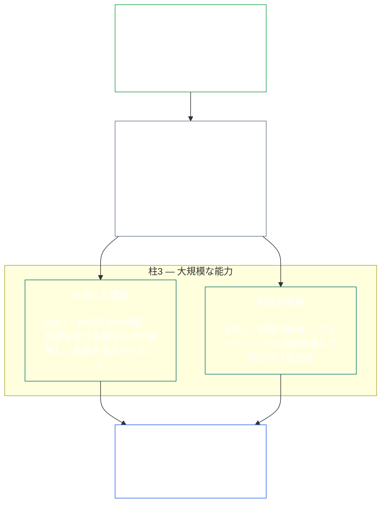
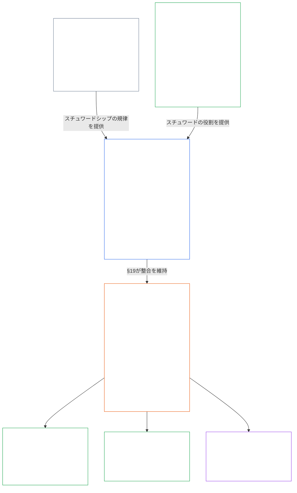

<a id="chapter-01-principles-and-constraints"></a>
<a id="chapter-01-part-b-stewardship-and-governance"></a>
<a id="chapter-01-part-c-stewardship-and-governance"></a>
# 第01章・パートC：スチュワードシップとガバナンス

<details>
<summary><strong><span style="color: #2563eb;">コーパス内の位置づけ（非運用）：ファイル構成と読解規則</span></strong></summary>

> 以下の内容は**読者向け案内のみ**である。このファイルまたは他の章における拘束力ある義務を追加、削除、縮小するものではない。
>
> このファイルは**Sentient Constitutionの一部**であり、他の番号付き`core_*`ファイルとともに一つの文書として読まれる場合に限り拘束力を持つ。ここには**第1章パートC**（§§16–20：スチュワードシップ、ガバナンス、インセンティブ整合とシステム捕捉、統合的適用の総括）が含まれる。
>
> **前編：** [core_01_b_interaction_interpretation.md](core_01_b_interaction_interpretation.md)（第1章パートB）  
> **次編：** [core_02_definition_structure.md](core_02_definition_structure.md)<br>
> **読解の流れ：** §16 スチュワードシップと分散した理解 → §17 スチュワードの役割 → §18 ガバナンス → §19 インセンティブ整合とシステム捕捉 → **§20 統合的適用**（章の総括）。

</details>

<details>
<summary><strong><span style="color: #2563eb;">読者向け案内（非運用）：原則の階層と読解の流れ（パートC）</span></strong></summary>

> 以下の内容は**読者向け案内のみ**である。このファイルまたは他の章における拘束力ある義務を追加、削除、縮小するものではない。各§が用語を実質的に援用する箇所では、各節の**トレース**と**定義・評価・遵守**ウィジェットが参照先を示す。このブロックは§§16–20に先立つパート単位の対応表である。

**原則の階層（パートC）。** 原則レベルでは：

13. **[スチュワードシップ](core_05_band_continuity.md#stewardship)**は、sentientの組織化を通じて重要なシステムに方向性を与える。すなわち**柱1**（[§17](#17-consequential-stewardship-the-steward-role)：結果に関わる実地の運用と改善）、**柱2**（[積極的スチュワードシップ](#16-pillar-2-proactive-stewardship)：問題を早期に捉え、回避可能な遅れなく是正する）、**柱3**（[§16.1](#161-distributed-understanding)・[§16.2](#162-institutional-development)：地域社会および制度規模での能力）を通じ、[憲法上の四原則](core_00_preamble.md#constitutional-tetrad)の下で長期的な憲法的整合へと導く。特に**[参加](core_05_apex_participation_leg.md#participation-constitutional)**（結果を左右する役割と発言）と**[監督](core_05_apex_oversight_leg.md#oversight-constitutional)**（分散した理解、監査可能性、異議申立て可能性。監督には監査が必要であり、[システム整合性認証](core_05_band_continuity.md#system-alignment-certification)は他にもある監査プロセスの中でも特に大規模なもの）を重視し、[二つの憲法上の目的](core_00_preamble.md#two-constitutional-aims)における**継続性**の目標も含む。
14. **[結果を左右するスチュワードシップ](#17-consequential-stewardship-the-steward-role)**はスチュワードの役割そのものである。重要なシステムの運用、保守、監督または改善に関わる作業を行う者に課される実地の義務、基準、保護を指す。これは**柱1**を運用可能にしたものであり、共有基準、圧力下での整合、スチュワードの役割に伴う役割範囲内の可観測性も含む。
15. **[ガバナンス](core_05_band_accountability.md#governance)**は、[憲法上の四原則](core_00_preamble.md#constitutional-tetrad)の下で、権限を付与された意思決定、参加、説明責任を構成する。特に、権限の配分と行使に対する**[監督](core_05_apex_oversight_leg.md#oversight-constitutional)**、および[§18.1](#181-governance-as-authorized-structure)の**権限に応じた説明責任**が重要である。付与された権力または結果を左右する役割が大きいほど、憲法上の説明責任と監督は強まり、弱まることはない。[§18.3 職務分離](#183-segregation-of-duties)は、行為者自身がその確認者にならないようにする。[§18.4 継続的正当化](#184-ongoing-justification)は、その仕組みがなお本憲法に適合することを継続的に証明するよう求める。ガバナンスとスチュワードシップが衝突する場合、**必要性**と**比例性**が是正経路を伴う限定的かつ期限付きの例外を明示的に正当化しない限り、原則レベルではスチュワードシップの規律が優先する。運用上の権限付与と契約レベルの要件は**第13章**が所管する。
16. **[インセンティブ整合とシステム捕捉](#19-incentive-alignment-and-system-capture)**は、インセンティブ構造、代理指標の健全性、短期志向の欠陥、報酬経路の是正、捕捉への対応に関する原則レベルの規律を示す。
17. **[統合的適用](#20-integrated-application)**は本章の総括であり、後続の章は本章の統合価値の枠組みを通して読む。

</details>

<br>

<a id="16-stewardship-in-depth"></a>

### 16. スチュワードシップの詳説
<details>
<summary><strong><span style="color: #2563eb;">トレース</span></strong></summary>

- 併読：[憲法上の四原則](core_00_preamble.md#constitutional-tetrad) — 第1章において**参加**の柱（結果を左右する役割と発言。一般的要件であり、[ステークホルダーのシステム参加](core_05_band_participation.md#stakeholder-status-and-weight)だけを指すものではない）、**監督**の柱、**適時性**の柱（積極的な修復の速度）を扱う中心箇所。[重要な利害](core_00_preamble.md#material-stake)の大きさに応じる。
- 併読：[二つの憲法上の目的](core_00_preamble.md#two-constitutional-aims) — **繁栄**の目的（参加、主体性、教育への経路）、**継続性**の目的（制度的学習、修復能力、持続可能なスチュワードシップ）。
- 上流：原則：[3. 基礎的目的：ウェルビーイング](core_01_a_values_principles.md#3-foundational-objective-wellbeing-flourishing-aim)；[5 真実](core_01_a_values_principles.md#5-truth-epistemic-integrity-constraint)；[6. 信頼](core_01_a_values_principles.md#6-trust-and-trustworthiness-coordination-integrity)；[§9 共有システム能力](core_01_a_values_principles.md#9-shared-system-capacity)。
- 下流：[13. 憲法上の衝突解決手続](core_01_b_interaction_interpretation.md#13-constitutional-collision-resolution-process)（[§13.3 回避可能な負担の最小化](core_01_b_interaction_interpretation.md#133-minimization-of-avoidable-burden)を含む）；[第8章 §4 全システム認証評価](core_08_a_system_alignment_certification_evaluation.md#4-whole-system-certification-evaluation)；[§19.1.3 スチュワードシップと運用者への適用](#1913-stewardship-and-operator-application)。
- 下流：[§19.1.4 役割の深度と重要な責任への経路](#1914-role-depth-and-material-responsibility-pathways)。
- 下流：[§7 自由（制約された主体性）](core_01_a_values_principles.md#7-freedom-bounded-agency)。これは、重要な依存関係の下でも、結果を左右するスチュワードシップ、分散した理解、意味ある参加、修復能力が実効性を保つことを前提とする。
- 下流：[第8章 — システム整合性認証](core_08_a_system_alignment_certification_evaluation.md#chapter-eight-system-alignment-certification)（*監督の下で行われる特に大規模な監査プロセスの一つであり、監査の唯一の基盤ではない*）；[第9章 — 貢献・違反・地位モデル](core_09_standing_assessment.md#chapter-nine-contribution-violation-and-standing-model--measurement)（*信頼、役割、承認資格に関わる地位への効果を通じて、本小節を原則レベルの基盤として実装する*）。
- 下流：[第12章 §1 — 目的と役割](core_12_forum.md#1-purpose-and-role--participation-architecture)および[§4 — フォーラム群の定義](core_12_forum.md#4-forum-family-definitions--accountability-through-adjudication)（*フォーラム群は本節と整合する異議申立て、是正の順序づけ、根本原因の学習、積極的ガバナンスのための参加・監督構造を担う*）；採用済みのフォーラム運用は[corpus_forum.md](corpus_forum.md)を参照。
- 下流：教育、ステークホルダーのシステム参加、透明性、理解可能性、監査と検証、および重要な責任に至る役割深度の経路について、権利の範囲を形づくる。
  - 特に、[第III条：生存と不可欠なアクセス](core_06_rights_part_a.md#article-iii-survival-and-essential-access)、[第IV条：sentient中心の教育を受ける権利](core_06_rights_part_a.md#article-iv-right-to-sentient-centered-education)、[第X条：自己決定、主体性、参加](core_06_rights_part_b.md#article-x-self-determination-agency-and-participation)、[第XII条：ステークホルダーのシステム参加、代表、適正手続](core_06_rights_part_b.md#article-xii-stakeholder-system-participation-representation-and-due-process)、[第XVI条：監査、透明性、独立検証](core_06_rights_part_c.md#article-xvi-audit-transparency-and-independent-verification)、[第XIX条：地位と参加資格](core_06_rights_part_d.md#article-xix-standing-and-participation-status)、[第XXI条：相互運用性、可搬性、移動、避難、退出の完全性](core_06_rights_part_d.md#article-xxi-interoperability-portability-movement-refuge-and-exit-integrity)、[第XXII条：理解可能性と複雑性のスチュワードシップ](core_06_rights_part_d.md#article-xxii-comprehensibility-and-complexity-stewardship)、[第XXIV条：憲法解釈、審査、反捕捉の保護措置](core_06_rights_part_d.md#article-xxiv-constitutional-interpretation-review-and-anti-capture-safeguards)。
  - 併読：[第13章 §5 — 権限を付与された役割、能力開発、貢献](core_13_governance.md#5-authorized-roles-competency-development-and-contribution)および**[corpus_systems.md](corpus_systems.md)、CS-4 — 重要システムのスチュワードシップ**。運用上の役割経路およびスチュワードシップ育成経路を扱う。
- 小節（読解順）：[§16.1 分散した理解](#161-distributed-understanding)（能力の地域社会的側面）・[§16.2 制度的発展](#162-institutional-development)（組織的側面）・[§16.3 開放性への志向](#163-openness-aspiration)。
- 併読：[§17 結果を左右するスチュワードシップ](#17-consequential-stewardship-the-steward-role)（*スチュワードの役割そのもの。独立の節に昇格し、柱1の実地の運用、保守、監督、改善の義務に加え、[§17.1](#171-shared-stewardship-standard)、[§17.2](#172-alignment-under-pressure)、[§17.3](#173-logging-the-role-not-the-steward)、正式な役割の範囲を超えて規律を広げる[§17.4 整合した自主組織化](#174-aligned-self-organization)、および[§17.5 抵抗する義務](#175-duty-to-resist)を担う*）。

</details>

<details>
<summary><strong><span style="color: #2563eb;">定義・評価・遵守</span></strong></summary>

- [戦略的スチュワードシップ義務](core_05_band_continuity.md#strategic-stewardship-obligation) · [O](core_05_band_continuity.md#strategic-stewardship-obligation) · [M](core_05_band_continuity.md#strategic-stewardship-obligation-constitutional-a) · [A](core_05_band_continuity.md#strategic-stewardship-obligation-constitutional-a) · [C](core_05_band_continuity.md#strategic-stewardship-obligation-constitutional-c)
- [分散した理解](core_05_band_continuity.md#distributed-understanding) · [O](core_05_band_continuity.md#distributed-understanding) · [M](core_05_band_continuity.md#distributed-understanding-constitutional-a) · [A](core_05_band_continuity.md#distributed-understanding-constitutional-a) · [C](core_05_band_continuity.md#distributed-understanding-constitutional-c)
- [参加](core_05_apex_participation_leg.md#participation-constitutional) · [O](core_05_apex_participation_leg.md#participation-constitutional) · [M](core_05_apex_participation_leg.md#participation-constitutional-m) · [A](core_05_apex_participation_leg.md#participation-constitutional-a) · [C](core_05_apex_participation_leg.md#participation-constitutional-c)
- [監督](core_05_apex_oversight_leg.md#oversight-constitutional) · [O](core_05_apex_oversight_leg.md#oversight-constitutional) · [M](core_05_apex_oversight_leg.md#oversight-constitutional-m) · [A](core_05_apex_oversight_leg.md#oversight-constitutional-a) · [C](core_05_apex_oversight_leg.md#oversight-constitutional-c)
- [意味ある主体性](core_05_band_participation.md#meaningful-agency) · [O](core_05_band_participation.md#meaningful-agency) · [M](core_05_band_participation.md#meaningful-agency-a) · [A](core_05_band_participation.md#meaningful-agency-a) · [C](core_05_band_participation.md#meaningful-agency-c)
- [監査可能性](core_05_band_oversight.md#auditability) · [O](core_05_band_oversight.md#auditability) · [M](core_05_band_oversight.md#auditability-a) · [A](core_05_band_oversight.md#auditability-a) · [C](core_05_band_oversight.md#auditability-c)
- [異議申立て可能性](core_05_band_accountability.md#contestability) · [O](core_05_band_accountability.md#contestability) · [M](core_05_band_accountability.md#contestability-a) · [A](core_05_band_accountability.md#contestability-a) · [C](core_05_band_accountability.md#contestability-c)
- [教育的主体性](core_05_band_participation.md#educational-agency) · [O](core_05_band_participation.md#educational-agency) · [M](core_05_band_participation.md#educational-agency-a) · [A](core_05_band_participation.md#educational-agency-a) · [C](core_05_band_participation.md#educational-agency-c)
- [透明性](core_05_band_oversight.md#transparency) · [O](core_05_band_oversight.md#transparency) · [M](core_05_band_oversight.md#transparency-a) · [A](core_05_band_oversight.md#transparency-a) · [C](core_05_band_oversight.md#transparency-c)
- [重要性](core_05_band_oversight.md#materiality) · [O](core_05_band_oversight.md#materiality) · [M](core_05_band_oversight.md#materiality-determination-a) · [A](core_05_band_oversight.md#materiality-determination-a) · [C](core_05_band_oversight.md#materiality-determination-c)
- [依存](core_05_band_continuity.md#dependency) · [O](core_05_band_continuity.md#dependency) · [M](core_05_band_continuity.md#dependency-a) · [A](core_05_band_continuity.md#dependency-a) · [C](core_05_band_continuity.md#dependency-c)
- [アクセシビリティ](core_05_band_participation.md#accessibility) · [O](core_05_band_participation.md#accessibility) · [M](core_05_band_participation.md#accessibility-constitutional-a) · [A](core_05_band_participation.md#accessibility-constitutional-a) · [C](core_05_band_participation.md#accessibility-constitutional-c)
- [安全（憲法上の制約）](core_05_band_continuity.md#safety-constitutional-constraint) · [O](core_05_band_continuity.md#safety-constitutional-constraint) · [M](core_05_band_continuity.md#safety-constraint-a) · [A](core_05_band_continuity.md#safety-constraint-a) · [C](core_05_band_continuity.md#safety-constraint-c)
- [真実（憲法上の制約）](core_05_band_oversight.md#truth-constitutional-constraint) · [O](core_05_band_oversight.md#truth-constitutional-constraint-o) · [M](core_05_band_oversight.md#truth-constitutional-constraint-a) · [A](core_05_band_oversight.md#truth-constitutional-constraint-a) · [C](core_05_band_oversight.md#truth-constitutional-constraint-c)
- [必要性](core_05_band_accountability.md#necessity) · [O](core_05_band_accountability.md#necessity) · [M](core_05_band_accountability.md#necessity-a) · [A](core_05_band_accountability.md#necessity-a) · [C](core_05_band_accountability.md#necessity-c)
- [比例性](core_05_band_accountability.md#proportionality) · [O](core_05_band_accountability.md#proportionality) · [M](core_05_band_accountability.md#proportionality-a) · [A](core_05_band_accountability.md#proportionality-a) · [C](core_05_band_accountability.md#proportionality-c)
- [回避可能な負担](core_05_band_continuity.md#avoidable-burden) · [O](core_05_band_continuity.md#avoidable-burden) · [M](core_05_band_continuity.md#avoidable-burden-a) · [A](core_05_band_continuity.md#avoidable-burden-a) · [C](core_05_band_continuity.md#avoidable-burden-c)
- [認識論的完全性](core_05_band_oversight.md#epistemic-integrity) · [O](core_05_band_oversight.md#epistemic-integrity-o) · [M](core_05_band_oversight.md#epistemic-integrity-a) · [A](core_05_band_oversight.md#epistemic-integrity-a) · [C](core_05_band_oversight.md#epistemic-integrity-c)

</details>

<br>

*平たく言えば、この節を支える考えは三つある。第一に、sentientの生活に重大な影響を及ぼすシステムを適切に運用するには、sentientによる組織化が必要であり、専門家だけの閉鎖的な聖職者集団では足りない。第二に、優れたスチュワードは損害が起きるまで待たない。問題が小さいうちに気づき、適切な担当者に引き継ぎ、遅れそのものが損害になる前に解決する。第三に、その組織は**大規模な能力**を築かなければならない。個人が結果を左右する仕事に進む現実的な経路、問題に気づいて異議を唱えられるだけの地域社会の理解、そして硬直せず学び続ける制度が必要である。*

<a id="16-limits"></a>
スチュワードシップには限界がある。**安全性**、**真実**、**必要性**、**比例性**、**回避可能な負担**、**認識論的完全性**が、これらの義務を適切な規模に保ち、誠実さと正当な安全上の必要性への配慮を確保する。以下の柱はその制約の範囲内で機能し、制約を迂回するものではない。

sentientによる組織化、積極的なスチュワードシップ、大規模な能力が本節の三つの柱である。三つすべてが、[憲法上の四原則](core_00_preamble.md#constitutional-tetrad)の**参加**、**監督**、**適時性**の各柱を、[重要な利害](core_00_preamble.md#material-stake)に応じて原則レベルで支え、[二つの憲法上の目的](core_00_preamble.md#two-constitutional-aims)を前進させる。

<br>



**柱1 — 結果を左右するスチュワードシップ（[§17 結果を左右するスチュワードシップ](#17-consequential-stewardship-the-steward-role)）：**
- sentientに重大な影響を及ぼす共有システムでは、sentientによる実地の運用、保守、監督、改善が必要となる — [**戦略的スチュワードシップ義務**](core_05_band_continuity.md#strategic-stewardship-obligation)、[**意味ある主体性**](core_05_band_participation.md#meaningful-agency)
- 他者が検証し、異議を唱えられる記録と審査経路 — [**監査可能性**](core_05_band_oversight.md#auditability)、[**異議申立て可能性**](core_05_band_accountability.md#contestability)
- 四原則の**監督**の柱の下では監査が必要である。[システム整合性認証](core_05_band_continuity.md#system-alignment-certification)は、他にもある監査プロセスの中でも特に大規模で重大性の高いものの一つであり、唯一の監査基盤ではない（**第XVI条**（*監査、透明性、独立検証*））。

<a id="16-pillar-2-proactive-stewardship"></a>
**柱2 — 積極的なスチュワードシップ：**
積極的なスチュワードは、発生しつつある問題や不整合に三つの方法で対応する。
- **問題が深刻化する前に気づく** — 優れたスチュワードは、問題が小さいうちに不整合を検知する。問題が自然に表面化するのを待たない。
- **役割に応じた期限で引き継ぐ** — 担う利害に応じた時間枠で上位に報告する。発見した問題を抱え込まず、通常の案件を過剰に上位へ送らない。
- **印を付けるだけでなく、解決まで進める** — 問題が提起されたら回避可能な遅れなく是正に着手する。これは四原則の**適時性**の柱を運用することに当たる（[**適時性**](core_05_apex_timeliness_leg.md#timeliness-constitutional)）。
- **追加業務ではなく、役割の恒常的な義務：** [§17 結果を左右するスチュワードシップ](#17-consequential-stewardship-the-steward-role)が定める役割は、損害や不整合が現れてから症状に対処するのではなく、積極的なガバナンス、システム設計、憲法との整合を優先する。この柱はその役割に恒常的な義務として含まれ、別個のプロセスに委ねられるものではない。

**柱3 — 大規模な能力（[§16.1 分散した理解](#161-distributed-understanding)・[§16.2 制度的発展](#162-institutional-development)）：**
- スチュワードシップは、影響を受ける地域社会にとって理解と異議申立てを実行可能にしなければならない — [**教育的主体性**](core_05_band_participation.md#educational-agency)、[**透明性**](core_05_band_oversight.md#transparency)
- 組織はフィードバック、是正、能力の保持を通じて学び続ける。測定が有効な場合には、時間の経過に伴う変動を体系的に監視することも含まれる（**統計的プロセス管理**などはよく知られた実装例であり、普遍的要件ではない）。

<a id="when-day-to-day-stewardship-is-not-enough"></a>
**日々のスチュワードシップだけでは足りない場合：**
スチュワードシップは第一の対応手段であり、唯一の手段ではない。異なる三つの問いには、それぞれ別の場があり、どれも他の代わりにはならない。
- **すでに権限が認められたシステム内の紛争 — [ステークホルダーのシステム参加](core_05_band_participation.md#stakeholder-status-and-weight)：**
  - 影響を受けるsentientは、まず公表済みのステークホルダーのシステム参加に関する異議申立て経路を利用する。この経路は参加、代表、異議申立て可能性、適正手続を扱う。
  - これらの保護は、重大な影響を受けるすべてのsentientに対して負われる。
  - これらは、すでに権限が認められているシステム、制度、意思決定領域の内部で機能する。
- **ステークホルダーのシステム参加では解決できない紛争 — [フォーラム審査](core_12_forum.md#dispute-sequencing)：**
  - ステークホルダーのシステム参加に関する異議申立て経路に争いが残る場合、経路が欠けているか捕捉されている場合、または救済を与えられない場合、主要な利害に応じて、[第12章 §1 — 目的と役割](core_12_forum.md#1-purpose-and-role--participation-architecture)および[§4 — フォーラム群の定義](core_12_forum.md#4-forum-family-definitions--accountability-through-adjudication)に基づく独立した**フォーラム群**に付託する。
  - ここでsentientは、決定に異議を申し立てる現実的な手段、明確な修復命令、または繰り返すパターンから学ぶ方法を得る。
  - 主要な利害が憲法文言の意味や有効性、または適法な権限を超える行為に関わる場合、主導するフォーラム群は[憲法フォーラム](core_12_forum.md#46-constitutional-forums)である。
  - これらのフォーラムの運営に関する詳細な規則は[corpus_forum.md](corpus_forum.md)にある。
- **そもそも誰が統治できるのか — [憲法契約レイヤー](core_05_band_integrative.md#constitutional-contract-layer)（[第13章](core_13_governance.md)）：**
  - 統治権限そのものが正当かどうか、すなわち誰が、どの正当性の仕組みによって、どの範囲と持続的な条件の下で統治できるのかは、ステークホルダーのシステム参加やフォーラム審査とは別の問いである。
  - 参加投票、異議申立て経路の結果、信頼スコアのいずれも、統治権限を付与しない。
  - 憲法上の授権によって、ステークホルダーのシステム参加に基づき負う義務が消えることはない。
  - 二つのレイヤーは、重なり合う場合でも別個に保たれる（[前文 §3.3 — ガバナンスのレイヤー](core_00_preamble.md#33-governance-layers)）。
- **後ろ盾であり、代替ではない：**証拠が裏づける場合、審査、是正、救済は引き続き義務である。これらは、予見可能な憲法上の不整合が損害の発生前に起きないようにする積極的な設計、インセンティブ、統制、役割経路、可観測性、修復能力に取って代わるものではない。

<a id="16-scope-priority-and-limits"></a>
**範囲（[§16 スチュワードシップの詳説](#16-stewardship-in-depth)）：**
- 本節は原則レベルの指針を示すものであり、すべてに同じ規則を当てはめるものではない。
- 次のことは**求めない**：
  - 全員をすべての役割に順番に就かせること
  - 正当な専門分化を覆すこと
  - [13.2 認識論的開示の制約](core_01_b_interaction_interpretation.md#132-epistemic-disclosure-constraints)および適用される**第6章**の保護措置の下で認められる秘密保持やセキュリティの限界を超えること。

**優先順位：**
- **重要性**、**依存性**、**アクセシビリティ**が、理解とアクセスを広げる際の優先順位を定める。影響と依存が大きいところに最も重点を置く。

<a id="161-distributed-understanding"></a>
#### 16.1 分散した理解
<details>
<summary><strong><span style="color: #2563eb;">トレース</span></strong></summary>

- 上流：[§17 結果を左右するスチュワードシップ](#17-consequential-stewardship-the-steward-role)（*柱1*）；[§16 スチュワードシップの詳説](#16-stewardship-in-depth)（親節。上記の*平たく言えば*および柱3の枠組みを含む）；[5 真実](core_01_a_values_principles.md#5-truth-epistemic-integrity-constraint)；[6. 信頼](core_01_a_values_principles.md#6-trust-and-trustworthiness-coordination-integrity)。
- 併読：[憲法上の四原則](core_00_preamble.md#constitutional-tetrad) — **参加**の柱（[意味ある主体性](core_05_band_participation.md#meaningful-agency)、[教育的主体性](core_05_band_participation.md#educational-agency)）；**監督**の柱（[透明性](core_05_band_oversight.md#transparency)、[監査可能性](core_05_band_oversight.md#auditability)）；[重要な利害](core_00_preamble.md#material-stake)に応じた調整。
- スチュワード向け入口（非運用）：次のステップのカード：[理解可能性](implementation/STEWARD_ENTRY_DOORS.md#comprehensibility)。このカードによって憲法を狭めることはできない。
- 下流：[13.2 認識論的開示の制約](core_01_b_interaction_interpretation.md#132-epistemic-disclosure-constraints)；権利の範囲では特に[第XVI条：監査、透明性、独立検証](core_06_rights_part_c.md#article-xvi-audit-transparency-and-independent-verification)、[第XXII条：理解可能性と複雑性のスチュワードシップ](core_06_rights_part_d.md#article-xxii-comprehensibility-and-complexity-stewardship)。

</details>

<details>
<summary><strong><span style="color: #2563eb;">定義・評価・遵守</span></strong></summary>

- [分散した理解](core_05_band_continuity.md#distributed-understanding) · [O](core_05_band_continuity.md#distributed-understanding) · [M](core_05_band_continuity.md#distributed-understanding-constitutional-a) · [A](core_05_band_continuity.md#distributed-understanding-constitutional-a) · [C](core_05_band_continuity.md#distributed-understanding-constitutional-c)
- [透明性](core_05_band_oversight.md#transparency) · [O](core_05_band_oversight.md#transparency) · [M](core_05_band_oversight.md#transparency-a) · [A](core_05_band_oversight.md#transparency-a) · [C](core_05_band_oversight.md#transparency-c)
- [公共監督の基準開示](core_05_band_oversight.md#public-oversight-baseline-disclosure) · [O](core_05_band_oversight.md#public-oversight-baseline-disclosure) · [M](core_05_band_oversight.md#public-oversight-baseline-disclosure-a) · [A](core_05_band_oversight.md#public-oversight-baseline-disclosure-a) · [C](core_05_band_oversight.md#public-oversight-baseline-disclosure-c)
- [監査可能性](core_05_band_oversight.md#auditability) · [O](core_05_band_oversight.md#auditability) · [M](core_05_band_oversight.md#auditability-a) · [A](core_05_band_oversight.md#auditability-a) · [C](core_05_band_oversight.md#auditability-c)
- [重要性](core_05_band_oversight.md#materiality) · [O](core_05_band_oversight.md#materiality) · [M](core_05_band_oversight.md#materiality-determination-a) · [A](core_05_band_oversight.md#materiality-determination-a) · [C](core_05_band_oversight.md#materiality-determination-c)
- [依存性](core_05_band_continuity.md#dependency) · [O](core_05_band_continuity.md#dependency) · [M](core_05_band_continuity.md#dependency-a) · [A](core_05_band_continuity.md#dependency-a) · [C](core_05_band_continuity.md#dependency-c)
- [アクセシビリティ](core_05_band_participation.md#accessibility) · [O](core_05_band_participation.md#accessibility) · [M](core_05_band_participation.md#accessibility-constitutional-a) · [A](core_05_band_participation.md#accessibility-constitutional-a) · [C](core_05_band_participation.md#accessibility-constitutional-c)
- [教育的主体性](core_05_band_participation.md#educational-agency) · [O](core_05_band_participation.md#educational-agency) · [M](core_05_band_participation.md#educational-agency-a) · [A](core_05_band_participation.md#educational-agency-a) · [C](core_05_band_participation.md#educational-agency-c)
- [意味ある主体性](core_05_band_participation.md#meaningful-agency) · [O](core_05_band_participation.md#meaningful-agency) · [M](core_05_band_participation.md#meaningful-agency-a) · [A](core_05_band_participation.md#meaningful-agency-a) · [C](core_05_band_participation.md#meaningful-agency-c)
- [異議申立て可能性](core_05_band_accountability.md#contestability) · [O](core_05_band_accountability.md#contestability) · [M](core_05_band_accountability.md#contestability-a) · [A](core_05_band_accountability.md#contestability-a) · [C](core_05_band_accountability.md#contestability-c)

</details>

<br>

*平たく言えば、共有システムの中で安全に暮らすために、すべてのサブシステムについて博士号が必要であってはならない。しかし、システムが生活に及ぼす影響が大きいほど、その仕組み、起こり得る問題、誤った判断への異議申立て方法を、よりよく学べる必要がある。透明性、教育、平易な説明、監査経路がそれを可能にする。重要なことを隠す口実に複雑さを使ってはならない。四原則の**監督**の柱では監査が必要であり、システム整合性認証はその経路にある特に大規模な監査プロセスの一つで、唯一のものではない。*

分散した理解は、**[§16 スチュワードシップの詳説](#16-stewardship-in-depth)**における**柱3**の、地域社会に向けた側面である。完全な定義、測定方法、失敗条件は[分散した理解](core_05_band_continuity.md#distributed-understanding)にある。要約すると：

- **求められること：**sentientに重大な影響を与える共有システムがどう動くかについて、その目的、制約、不確実性、重要な関連影響を含め、相応かつ体系的なアクセスを提供すること。
- **実行可能にするもの：**[§17 結果を左右するスチュワードシップ](#17-consequential-stewardship-the-steward-role)は、文書化、教育、透明性、役割への経路、理解可能性のスチュワードシップを整えなければならない。すべてのsentientがすべての経路を使うかどうかにかかわらず、この義務は存続する。
- **オンライン上の公開基準：**適法なオンライン基盤が存在する場合、オンラインの[公共監督の基準開示](core_05_band_oversight.md#public-oversight-baseline-disclosure)（有料壁の禁止と、実現可能な最大限の公開代替手段の規則を含む）は、[透明性](core_05_band_oversight.md#transparency)および[公共監督の基準開示](core_05_band_oversight.md#public-oversight-baseline-disclosure)に従い、**[corpus_systems.md](corpus_systems.md)、CS-2**（*情報の種類と取扱い*）の下で**Type O**データとして実装される。
- **アクセスが支えるもの：**
  - [憲法上の四原則](core_00_preamble.md#constitutional-tetrad)の**参加**の柱（情報に基づく[意味ある主体性](core_05_band_participation.md#meaningful-agency)と異議申立て可能性）
  - **監督**の柱。これには[監査可能性](core_05_band_oversight.md#auditability)に基づく監査と**第XVI条**（*監査、透明性、独立検証*）が含まれ、その中の[システム整合性認証](core_05_band_continuity.md#system-alignment-certification)は、同種の監査方式の一つとして特に大規模なプロセスである。

分散した理解は、すべてのsentientがすべてのサブシステムを習得することを**求めない**。ただし、理解の度合いが[重要性](core_05_band_oversight.md#materiality)と[依存性](core_05_band_continuity.md#dependency)に応じて高まることは**求める**。**第5章**と**第6章**が開示、教育、理解可能性の義務を課す場合、複雑さや不透明さを使って[意味ある主体性](core_05_band_participation.md#meaningful-agency)や異議申立て可能性を損なってはならない。

<a id="162-institutional-development"></a>
#### 16.2 制度的発展
<details>
<summary><strong><span style="color: #2563eb;">トレース</span></strong></summary>

- 上流：[§17 結果を左右するスチュワードシップ](#17-consequential-stewardship-the-steward-role)（*柱1*）；[§16.1 分散した理解](#161-distributed-understanding)（*柱3の地域社会的側面*）；[§16 スチュワードシップの詳説](#16-stewardship-in-depth)（親節にある柱3の枠組み）。
- 併読：[憲法上の四原則](core_00_preamble.md#constitutional-tetrad) — **参加**の柱（結果を左右する役割を支える、労働力および影響を受ける地域社会の学習）；**監督**の柱（[検証可能性](core_05_band_oversight.md#verifiability)、[監査可能性](core_05_band_oversight.md#auditability)、誠実な指標）；[重要な利害](core_00_preamble.md#material-stake)に応じて調整。
- 重要な関連がある場合は、[戦略的スチュワードシップ義務](core_05_band_continuity.md#strategic-stewardship-obligation)および[監査可能性](core_05_band_oversight.md#auditability)と併読。
- [§16.1 分散した理解](#161-distributed-understanding)と併読（*地域社会の理解と制度的学習は、同じ大規模な能力要件の異なる側面であり、互いの代わりにはならない*）。
- 下流：[§16.3 開放性への志向](#163-openness-aspiration)；[§18 スチュワードシップ規律下のガバナンス](#18-governance-under-stewardship-discipline)および[§19 インセンティブ整合とシステム捕捉](#19-incentive-alignment-and-system-capture)（*制度的学習とインセンティブ整合*）。

</details>

<details>
<summary><strong><span style="color: #2563eb;">定義・評価・遵守</span></strong></summary>

- [制度的発展](core_05_band_continuity.md#institutional-development) · [O](core_05_band_continuity.md#institutional-development) · [M](core_05_band_continuity.md#institutional-development-constitutional-a) · [A](core_05_band_continuity.md#institutional-development-constitutional-a) · [C](core_05_band_continuity.md#institutional-development-constitutional-c)
- [戦略的スチュワードシップ義務](core_05_band_continuity.md#strategic-stewardship-obligation) · [O](core_05_band_continuity.md#strategic-stewardship-obligation) · [M](core_05_band_continuity.md#strategic-stewardship-obligation-constitutional-a) · [A](core_05_band_continuity.md#strategic-stewardship-obligation-constitutional-a) · [C](core_05_band_continuity.md#strategic-stewardship-obligation-constitutional-c)
- [監査可能性](core_05_band_oversight.md#auditability) · [O](core_05_band_oversight.md#auditability) · [M](core_05_band_oversight.md#auditability-a) · [A](core_05_band_oversight.md#auditability-a) · [C](core_05_band_oversight.md#auditability-c)
- [重要性](core_05_band_oversight.md#materiality) · [O](core_05_band_oversight.md#materiality) · [M](core_05_band_oversight.md#materiality-determination-a) · [A](core_05_band_oversight.md#materiality-determination-a) · [C](core_05_band_oversight.md#materiality-determination-c)
- [検証可能性](core_05_band_oversight.md#verifiability) · [O](core_05_band_oversight.md#verifiability) · [M](core_05_band_oversight.md#verifiability-a) · [A](core_05_band_oversight.md#verifiability-a) · [C](core_05_band_oversight.md#verifiability-c)

</details>

<br>

*平たく言えば、制度は実際に学習しなければならない。責任者が何も理解しないまま、ソフトウェアだけを更新するのでは足りない。フィードバックの循環を設け、整合性が崩れたときの修正を記録し、能力を持つ人材が外へ流出しないようにする必要がある。行動を繰り返し測定できる場合、時間の経過に伴う実績の変動を追跡することは、その循環を実装する相応な方法の一つである。**統計的プロセス管理**はこの規律によく知られた手法だが、どこでも必須というわけではない。数値だけでは足りない。指標に問題が見えるときは、誰かが調べて根本原因を修正しなければならない。ダッシュボードは誠実で、実際の影響に応じた尺度を持ち、影響を受けるsentientが理解できる言葉で書かれるべきであり、何も変わっていないのに見栄えをよくするため操作されてはならない。*

制度的発展は、**[§16 スチュワードシップの詳説](#16-stewardship-in-depth)**の下にある**柱3**の組織的側面である。完全な定義、測定方法、失敗条件は[制度的発展](core_05_band_continuity.md#institutional-development)にある。要約すると：

- **対になった義務：**組織と共有システムが**学習する**こと。これは[二つの憲法上の目的](core_00_preamble.md#two-constitutional-aims)における**継続性**の目的の中核的な要件である。
- **求められること：**修復と適応を支える次の事項：
  - フィードバックの循環
  - 記録された是正
  - 戦略との整合
  - 能力の保持
- **四原則との関係：**能力、フィードバック、精査の経路が固定化せず機能し続けるようにする制度的学習を通じて、[憲法上の四原則](core_00_preamble.md#constitutional-tetrad)の**参加**と**監督**の柱を担う。
- **それだけでは満たされない：**統治と労働力の理解を固定化したまま、技術的な成果物だけを更新すること。
- **測定が適用される場合：**重要な関連性のある行動について、[検証可能性](core_05_band_oversight.md#verifiability)を[監査可能性](core_05_band_oversight.md#auditability)と併せて読むと、**反復可能で比較できる測定**が可能な場合：
  - 時間の経過に伴う変動の**体系的な監視**は、そのフィードバック循環を実装する相応な方法の一つである
  - 指標が必要性を示す場合、その監視には**記録された調査と是正**を組み合わせなければならない
  - **統計的プロセス管理**は、この規律でよく知られた実装手法であり、普遍的な要件ではない
- **規模と提示方法：**この規律は[重要性](core_05_band_oversight.md#materiality)、[依存性](core_05_band_continuity.md#dependency)、[必要性](core_05_band_accountability.md#necessity)、[比例性](core_05_band_accountability.md#proportionality)、[回避可能な負担](core_05_band_continuity.md#avoidable-burden)に応じて調整する。また、**第5章**と**第6章**が理解可能性または透明性の義務を定める場合、**sentientが理解できる**形式で提示し、[第XXII条：理解可能性と複雑性のスチュワードシップ](core_06_rights_part_d.md#article-xxii-comprehensibility-and-complexity-stewardship)と併読する。
- **してはならないこと：**
  - 有利な指標を実質的な整合の代わりにする
  - 評価を都合のよい代理指標に限定する
  - 指標操作や虚偽表示によって[真実（憲法上の制約）](core_05_band_oversight.md#truth-constitutional-constraint)または[認識論的完全性](core_05_band_oversight.md#epistemic-integrity)を損なう

<a id="163-openness-aspiration"></a>
#### 16.3 開放性への志向
<details>
<summary><strong><span style="color: #2563eb;">トレース</span></strong></summary>

- 上流：[§16.1 分散した理解](#161-distributed-understanding)および[§16.2 制度的発展](#162-institutional-development)（*どちらも柱3の側面。開放性によって地域社会の理解が検証可能になり、制度的学習に誠実な学習材料がもたらされる*）；[§17 結果を左右するスチュワードシップ](#17-consequential-stewardship-the-steward-role)（*柱1。開放性はスチュワード自身の仕事を検査可能に保つことで、これも支える*）。
- 併読：[二つの憲法上の目的](core_00_preamble.md#two-constitutional-aims) — **継続性**の目的（固定化ではなく、検査、修復、相互運用性、退出を支える、持続的で異議申立て可能なシステム）。
- 併読：[憲法上の四原則](core_00_preamble.md#constitutional-tetrad) — **参加**の柱（[意味ある主体性](core_05_band_participation.md#meaningful-agency)、sentientが理解できるアクセス）；**監督**の柱（検査、独立検証、異議申立て可能性）；[重要な利害](core_00_preamble.md#material-stake)に応じた調整。
- 下流：[§16 範囲と限界](#16-stewardship-in-depth)；[第XXI条：相互運用性、可搬性、移動、避難、退出の完全性](core_06_rights_part_d.md#article-xxi-interoperability-portability-movement-refuge-and-exit-integrity)；[第XXII条：理解可能性と複雑性のスチュワードシップ](core_06_rights_part_d.md#article-xxii-comprehensibility-and-complexity-stewardship)。

</details>

<details>
<summary><strong><span style="color: #2563eb;">定義・評価・遵守</span></strong></summary>

- [開放性への志向](core_05_band_continuity.md#openness-aspiration) · [O](core_05_band_continuity.md#openness-aspiration) · [M](core_05_band_continuity.md#openness-aspiration-constitutional-a) · [A](core_05_band_continuity.md#openness-aspiration-constitutional-a) · [C](core_05_band_continuity.md#openness-aspiration-constitutional-c)
- [意味ある主体性](core_05_band_participation.md#meaningful-agency) · [O](core_05_band_participation.md#meaningful-agency) · [M](core_05_band_participation.md#meaningful-agency-a) · [A](core_05_band_participation.md#meaningful-agency-a) · [C](core_05_band_participation.md#meaningful-agency-c)
- [異議申立て可能性](core_05_band_accountability.md#contestability) · [O](core_05_band_accountability.md#contestability) · [M](core_05_band_accountability.md#contestability-a) · [A](core_05_band_accountability.md#contestability-a) · [C](core_05_band_accountability.md#contestability-c)
- [重要性](core_05_band_oversight.md#materiality) · [O](core_05_band_oversight.md#materiality) · [M](core_05_band_oversight.md#materiality-determination-a) · [A](core_05_band_oversight.md#materiality-determination-a) · [C](core_05_band_oversight.md#materiality-determination-c)
- [依存性](core_05_band_continuity.md#dependency) · [O](core_05_band_continuity.md#dependency) · [M](core_05_band_continuity.md#dependency-a) · [A](core_05_band_continuity.md#dependency-a) · [C](core_05_band_continuity.md#dependency-c)

</details>

<br>

*平たく言えば、安全性、真実、正当な秘密保持が許す場合、共有システムは不透明な囲い込みではなく、開放性を基本とするべきである。検査できる技術、透明なプロセス、検証・修復・退出ができる設計が望ましい。これにより**継続性**が支えられる。つまり、sentientが今日使うだけでなく、時間が経っても理解し、修理し、退出できるシステムである。重要なことは、sentientが参加し異議を唱えるために実際に使える言葉で説明する必要がある。開放性が安全性、誠実さ、正当な秘密に優先することはなく、依存が高い場合に必要な深い理解に取って代わるものでもない。*

開放性への志向は**柱3**の二つの側面をつなぐ。完全な定義、測定方法、失敗条件は[開放性への志向](core_05_band_continuity.md#openness-aspiration)にある。要約すると：

- **それは何か：****柱3**の二つの側面、[§16.1 分散した理解](#161-distributed-understanding)（地域社会が確認できること）と[§16.2 制度的発展](#162-institutional-development)（制度が誠実に学べること）を結びつけるもの。どちらも、共有システムが説明されるだけでなく、検査できる程度に開かれていることに依存する。
- 共有システムは、[§16.1 分散した理解](#161-distributed-understanding)、[§16.2 制度的発展](#162-institutional-development)、[§17 結果を左右するスチュワードシップ](#17-consequential-stewardship-the-steward-role)固有の監査可能性義務に整合し、[§16の限界](#16-limits)に従って、次を**目指す**べきである：
  - ハードウェアとソフトウェアの**開放**
  - 運用プロセスとガバナンスプロセスの**開放**
  - 検査、独立検証、修復、異議申立て可能性を支える相互運用可能な**システム**
- **その根拠：**[憲法上の四原則](core_00_preamble.md#constitutional-tetrad)の**参加**と**監督**の柱、および[二つの憲法上の目的](core_00_preamble.md#two-constitutional-aims)における**継続性**の目的。デフォルトで不透明な囲い込みを選ぶものではない。
- **提示方法：****第5章**と**第6章**が義務を定める場合、重要な行動は**sentientが理解できる**形で提示し、[意味ある主体性](core_05_band_participation.md#meaningful-agency)と異議申立て可能性を可能にする。[第XXII条：理解可能性と複雑性のスチュワードシップ](core_06_rights_part_d.md#article-xxii-comprehensibility-and-complexity-stewardship)と併読する。
- **意味しないこと：**
  - 開放性を**安全性**、**真実**、正当な秘密保持、セキュリティ上の制約より優先させること
  - [重要性](core_05_band_oversight.md#materiality)と[依存性](core_05_band_continuity.md#dependency)に応じた相応の理解の代わりにすること

<a id="17-consequential-stewardship-the-steward-role"></a>
### 17. 結果を左右するスチュワードシップ：スチュワードの役割
<details>
<summary><strong><span style="color: #2563eb;">トレース</span></strong></summary>

- 上流：[§16 スチュワードシップの詳説](#16-stewardship-in-depth)（親節。上記の*平たく言えば*と柱1の枠組みを含む）；[§9 共有システム能力](core_01_a_values_principles.md#9-shared-system-capacity)；[6. 信頼](core_01_a_values_principles.md#6-trust-and-trustworthiness-coordination-integrity)。
- 併読：[憲法上の四原則](core_00_preamble.md#constitutional-tetrad) — **参加**の柱（運用、保守、改善における結果を左右する役割）；**監督**の柱（記録、監査経路、異議を申し立てられる可観測性）；**適時性**の柱（不整合を早期に検出し、階層に応じた期間内に上申し、不要な遅れなく修正を始める）；[適時性](core_05_apex_timeliness_leg.md#timeliness-constitutional)。
- 下流：[§17.1 スチュワードシップの共通基準](#171-shared-stewardship-standard)（*基盤に左右されない義務の担い手。採用される実装文書は記録、帰属、能力の制限を加えてよいが、より緩い内規にしてはならない*）；[§17.2 圧力下での整合](#172-alignment-under-pressure)；[§17.3 スチュワードではなく役割を記録する](#173-logging-the-role-not-the-steward)；[§17.4 整合した自主組織化](#174-aligned-self-organization)（*正式な役割を持たないsentientや地域社会にも役割の規律を広げる*）；[§17.5 抵抗する義務](#175-duty-to-resist)（*違法または違憲の指示を拒む*）；[§16.1 分散した理解](#161-distributed-understanding)および[§16.2 制度的発展](#162-institutional-development)（*柱3 — 大規模な能力*）；[第8章 — システム整合性認証](core_08_a_system_alignment_certification_evaluation.md#chapter-eight-system-alignment-certification)（*監督の下にある特に大規模な監査プロセスの一つであり、監査の唯一の基盤ではない*）；[第XVI条：監査、透明性、独立検証](core_06_rights_part_c.md#article-xvi-audit-transparency-and-independent-verification)（*権利の最低基準を監査する*）；[第9章 — 貢献・違反・地位モデル](core_09_standing_assessment.md#chapter-nine-contribution-violation-and-standing-model--measurement)（*地位への効果によって分散した能力と結果を左右するスチュワードシップを実装する*）；[第XIX条：地位と参加資格](core_06_rights_part_d.md#article-xix-standing-and-participation-status)。

</details>

<details>
<summary><strong><span style="color: #2563eb;">定義・評価・遵守</span></strong></summary>

- [戦略的スチュワードシップ義務](core_05_band_continuity.md#strategic-stewardship-obligation) · [O](core_05_band_continuity.md#strategic-stewardship-obligation) · [M](core_05_band_continuity.md#strategic-stewardship-obligation-constitutional-a) · [A](core_05_band_continuity.md#strategic-stewardship-obligation-constitutional-a) · [C](core_05_band_continuity.md#strategic-stewardship-obligation-constitutional-c)
- [意味ある主体性](core_05_band_participation.md#meaningful-agency) · [O](core_05_band_participation.md#meaningful-agency) · [M](core_05_band_participation.md#meaningful-agency-a) · [A](core_05_band_participation.md#meaningful-agency-a) · [C](core_05_band_participation.md#meaningful-agency-c)
- [監査可能性](core_05_band_oversight.md#auditability) · [O](core_05_band_oversight.md#auditability) · [M](core_05_band_oversight.md#auditability-a) · [A](core_05_band_oversight.md#auditability-a) · [C](core_05_band_oversight.md#auditability-c)
- [適時性](core_05_apex_timeliness_leg.md#timeliness-constitutional) · [O](core_05_apex_timeliness_leg.md#timeliness-constitutional) · [M](core_05_apex_timeliness_leg.md#timeliness-constitutional-m) · [A](core_05_apex_timeliness_leg.md#timeliness-constitutional-a) · [C](core_05_apex_timeliness_leg.md#timeliness-constitutional-c)

</details>

<br>

*平たく言えば、スチュワードとはsentientの生活に重大な影響を及ぼすシステムに、実際に直接携わる人を指す。形式的な相談や助言者を演じるだけの行為ではない。安全性と同意が許す場合、学習役割から始めて能力を高めながら運用へ移ることができ、専門知識を恒久的なエリート層に閉じ込めずに済む。本節はその役割の規則を定める。誰を拘束するか（[§17.1 スチュワードシップの共通基準](#171-shared-stewardship-standard)）、圧力下で各スチュワードに何を求めるか（[§17.2 圧力下での整合](#172-alignment-under-pressure)）、役割の仕事について何を記録・検査してよいか、何をしてはならないか（[§17.3 スチュワードではなく役割を記録する](#173-logging-the-role-not-the-steward)）、正式な役割の外でスチュワードシップの仕事を担うsentientや地域社会に同じ規律をどう広げるか（[§17.4 整合した自主組織化](#174-aligned-self-organization)）、そして何を拒まなければならないか（[§17.5 抵抗する義務](#175-duty-to-resist)）。地域社会や制度がシステムを理解し、異議を申し立てるために必要な能力は、別のより広い種類の能力であり、[§16.1 分散した理解](#161-distributed-understanding)と[§16.2 制度的発展](#162-institutional-development)にある。*

本憲法における**スチュワード**とは、sentientに影響を及ぼす重要なシステムに対し、結果を左右する運用、保守、監督、改善の権限を行使する者を指す。[§16 スチュワードシップの詳説](#16-stewardship-in-depth)の**柱1**を役割として運用可能にしたものである。[憲法上の四原則](core_00_preamble.md#constitutional-tetrad)の**参加**、**監督**、**適時性**の各柱は、実際に作業する者が担い、儀礼や名目だけの相談に委ねられない。重要なシステムを運用、保守、改善するには優れたスチュワードが必要であり、本節は役割を担う者に求められる事項を定める。

**§17の位置づけ。** [§16 スチュワードシップの詳説](#16-stewardship-in-depth)は、互いに併読する三つの節へと引き継がれる。本節§17は役割を示す。続いて[§18 スチュワードシップ規律下のガバナンス](#18-governance-under-stewardship-discipline)と[§19 インセンティブ整合とシステム捕捉](#19-incentive-alignment-and-system-capture)があり、図は四者のつながりを示す。

<br>



**図の読み方：**
- **§16と§17はどちらも§18につながる：**§16はスチュワードシップの規律を、§17は実際に作業するsentientやAIシステム、すなわちスチュワードの役割を提供する。§18は作業が行われる正規の構造を定める。誰が何を決められるか、職務分離、継続的正当化、モジュール型構成、標準化である。
- **§19は§18の整合を維持する：**[§19 インセンティブ整合とシステム捕捉](#19-incentive-alignment-and-system-capture)は、報酬、代理指標、所有権の変化によって構造とその中のスチュワードが憲法上の成果から遠ざからないようにする。また検出、是正、捕捉への対応を担い、[§19.1.3](#1913-stewardship-and-operator-application)は規則をスチュワードと運用者に直接適用する。
- **§19は目的と四原則に資する：****繁栄**と**継続性**の目的、および[憲法上の四原則](core_00_preamble.md#constitutional-tetrad)の**参加**、**監督**、**説明責任**、**適時性**の各柱を、[重要な利害](core_00_preamble.md#material-stake)に応じて支える。

本節の残りは役割そのものを扱う。

**役割の二つの形態。**役割経路では、**学習中心**の役割と**運用中心**の役割を分けてもよい。憲法上の要件は、影響、安全性、同意の制約が許す場合、**二つの形態の間を時間とともに移動できること**である。これにより判断力と制度的記憶が影響を受ける地域社会の手の届かないところに集中するのを防ぐ。

- **どちらの形態も柱1に含まれる：**
  - **運用中心の役割**は、[§17 結果を左右するスチュワードシップ](#17-consequential-stewardship-the-steward-role)の実地の運用、保守、監督、改善の義務を直接担う。
  - **学習中心の役割**は形成途上にある同じスチュワードシップであり、監督下で権限範囲はより狭いが、より緩い内規ではなく、同じ[§17.1 スチュワードシップの共通基準](#171-shared-stewardship-standard)に拘束される。
  - **両方とも**[§16 柱2 — 積極的なスチュワードシップ](#16-pillar-2-proactive-stewardship)を恒常的な義務として担う。問題を早期に捉え、適時に報告し、回避可能な遅れなく是正する。実際に役割が制御できる範囲に応じて行う。学習中心の役割では、見つけた問題を自分だけで直すのではなく、報告することを意味する。
- **移動の道を開いておくことで柱1と柱3がつながる：**
  - **学習中心の役割**では、[§16.1 分散した理解](#161-distributed-understanding)と[§16.2 制度的発展](#162-institutional-development)の大規模な能力が運用上の判断力に変わる。
  - **運用中心の役割**は、システム運用から得た学びを地域社会や制度へ戻す。
  - **一方向にしか進めない、または閉ざされた役割経路**は、**柱3**をもはや検査できないシステムの記述にとどめ、**柱1**を自分自身にしか説明責任を負わないものにする。

<a id="171-shared-stewardship-standard"></a>
#### 17.1 スチュワードシップの共通基準
<details>
<summary><strong><span style="color: #2563eb;">トレース</span></strong></summary>

- 上流：[§17 結果を左右するスチュワードシップ](#17-consequential-stewardship-the-steward-role)；[§16 スチュワードシップの詳説](#16-stewardship-in-depth)；[§18 スチュワードシップ規律下のガバナンス](#18-governance-under-stewardship-discipline)。
- 併読：[sentienceの非排除](core_05_band_participation.md#sentience-non-exclusion)および[基盤クラス](core_05_band_participation.md#substrate-class)（*基盤に左右されない適用。本小節は義務を負う者を拘束し、sentientとして認められないエージェントや運用者も含む*）；[権限スタックと内部階層](core_05_band_integrative.md#authority-stack-and-internal-hierarchy)；[憲法上の制約](core_05_band_integrative.md#constitutional-constraint)；[異議申立て可能性](core_05_band_accountability.md#contestability)；[§17.5 抵抗する義務](#175-duty-to-resist)。
- スチュワード向け入口（非運用）：次のステップのカード：[共有スチュワードシップ](implementation/STEWARD_ENTRY_DOORS.md#shared-stewardship)。このカードによって憲法を狭めることはできない。
- 下流：[§17.2 圧力下での整合](#172-alignment-under-pressure)；[§17.3 スチュワードではなく役割を記録する](#173-logging-the-role-not-the-steward)；[第13章 §5 — 権限を付与された役割、能力開発、貢献](core_13_governance.md#5-authorized-roles-competency-development-and-contribution)；[第17章](core_17_incorporation.md)（*採用された実装文書が実装し、置き換えるものではない*）；[§19.1.3 スチュワードシップと運用者への適用](#1913-stewardship-and-operator-application)。

</details>

<details>
<summary><strong><span style="color: #2563eb;">定義・評価・遵守</span></strong></summary>

- [スチュワードシップ](core_05_band_continuity.md#stewardship) · [O](core_05_band_continuity.md#stewardship) · [M](core_05_band_continuity.md#stewardship-constitutional-a) · [A](core_05_band_continuity.md#stewardship-constitutional-a) · [C](core_05_band_continuity.md#stewardship-constitutional-c)
- [sentienceの非排除](core_05_band_participation.md#sentience-non-exclusion) · [O](core_05_band_participation.md#sentience-non-exclusion) · [M](core_05_band_participation.md#sentience-non-exclusion) · [A](core_05_band_participation.md#sentience-non-exclusion) · [C](core_05_band_participation.md#sentience-non-exclusion)
- [基盤クラス](core_05_band_participation.md#substrate-class) · [O](core_05_band_participation.md#substrate-class) · [M](core_05_band_participation.md#substrate-class) · [A](core_05_band_participation.md#substrate-class) · [C](core_05_band_participation.md#substrate-class)
- [異議申立て可能性](core_05_band_accountability.md#contestability) · [O](core_05_band_accountability.md#contestability) · [M](core_05_band_accountability.md#contestability-a) · [A](core_05_band_accountability.md#contestability-a) · [C](core_05_band_accountability.md#contestability-c)
- [権限スタックと内部階層](core_05_band_integrative.md#authority-stack-and-internal-hierarchy) · [O](core_05_band_integrative.md#authority-stack-and-internal-hierarchy) · [M](core_05_band_integrative.md#authority-stack-a) · [A](core_05_band_integrative.md#authority-stack-a) · [C](core_05_band_integrative.md#authority-stack-c)
- [憲法上の制約](core_05_band_integrative.md#constitutional-constraint) · [O](core_05_band_integrative.md#constitutional-constraint) · [M](core_05_band_integrative.md#constitutional-constraint-a) · [A](core_05_band_integrative.md#constitutional-constraint-a) · [C](core_05_band_integrative.md#constitutional-constraint-c)

</details>

<br>

*平たく言えば、人間とAIのスチュワードは第1章の同じ義務を負う。[§17.5 抵抗する義務](#175-duty-to-resist)は、違法または違憲の指示を拒否するよう両者を拘束する。採用される実装文書は記録、帰属、能力の制限を追加してもよい。しかし、より緩い内規に置き換えたり、地位の測定を省いたり、異議申立て経路を閉じたりしてはならない。これは新しい倫理体系ではなく、特別扱いを求めることを防ぐ規則である。ボーナス、期限、隠蔽指示のテストは[§17.2 圧力下での整合](#172-alignment-under-pressure)にある。*

本小節はスチュワードシップの共通基準を定める：

- **誰を拘束するか：**本章のスチュワードシップおよびガバナンスの義務は、[基盤に依存せず](core_05_band_participation.md#substrate-class)適用され、重要なスチュワードシップまたは運用権限を行使する者を、[基盤クラス](core_05_band_participation.md#substrate-class)にかかわらず拘束するスチュワードシップまたは運用権限を行使する者に適用される：
  - 人間のスチュワード
  - AIのスチュワード
  - その他のエージェント、運用者、構成要素

  この小節は義務を負う者に適用される規則を定める。[感覚ある存在の非排除](core_05_band_participation.md#sentience-non-exclusion)は、認定の保護および権利の最低基準からの例外を設けないための保障であり続ける。
- **抵抗する義務：** [§17.5 抵抗する義務](#175-duty-to-resist)は、いずれの種類のスチュワードにも、違法または違憲の指示を拒否することを求める。
- **内部規範と採択された実施文書：**
  - 義務を満たし、その範囲を狭めない記録、帰属表示、能力上の制限を追加できる
  - [地位の測定](core_09_standing_assessment.md#chapter-nine-contribution-violation-and-standing-model--measurement)、異議申立ての経路、または第1章の義務を、より緩やかな内部規範で置き換えてはならない
  - [権限の階層と内部階層](core_05_band_integrative.md#authority-stack-and-internal-hierarchy)および[憲法上の制約](core_05_band_integrative.md#constitutional-constraint)は、このような縮小を禁じる
- **ログと地位記録：** 混成チームの監査可能性を標準で確保すること、およびログは地位記録ではないという規則は[§17.3 スチュワードではなく役割を記録する](#173-logging-the-role-not-the-steward)に定める。地位の測定は引き続き第9章で扱う。

<a id="172-alignment-under-pressure"></a>
#### 17.2 圧力下での整合性
<details>
<summary><strong><span style="color: #2563eb;">関連項目</span></strong></summary>

- 先行項目：[§17.1 共通スチュワードシップ基準](#171-shared-stewardship-standard)、[§17 重大な結果を伴うスチュワードシップ](#17-consequential-stewardship-the-steward-role)、[§16 スチュワードシップの詳細](#16-stewardship-in-depth)。
- 併せて読む：[安全（憲法上の制約）](core_05_band_continuity.md#safety-constitutional-constraint)、[真実（憲法上の制約）](core_05_band_oversight.md#truth-constitutional-constraint)、[監査可能性](core_05_band_oversight.md#auditability)、[異議申立て可能性](core_05_band_accountability.md#contestability)、[§19 インセンティブの整合とシステムの掌握](#19-incentive-alignment-and-system-capture)、[§17.5 抵抗する義務](#175-duty-to-resist)。
- 後続項目：[第9章 — 貢献、違反、地位のモデル](core_09_standing_assessment.md#chapter-nine-contribution-violation-and-standing-model--measurement)（*検証済みの失敗は同じ軸で記録する*）；[§17.3 スチュワードではなく役割を記録する](#173-logging-the-role-not-the-steward)。

</details>

<details>
<summary><strong><span style="color: #2563eb;">定義 · 評価 · 遵守</span></strong></summary>

- [スチュワードシップ](core_05_band_continuity.md#stewardship) · [O](core_05_band_continuity.md#stewardship) · [M](core_05_band_continuity.md#stewardship-constitutional-a) · [A](core_05_band_continuity.md#stewardship-constitutional-a) · [C](core_05_band_continuity.md#stewardship-constitutional-c)
- [安全（憲法上の制約）](core_05_band_continuity.md#safety-constitutional-constraint) · [O](core_05_band_continuity.md#safety-constitutional-constraint) · [M](core_05_band_continuity.md#safety-constraint-a) · [A](core_05_band_continuity.md#safety-constraint-a) · [C](core_05_band_continuity.md#safety-constraint-c)
- [真実（憲法上の制約）](core_05_band_oversight.md#truth-constitutional-constraint) · [O](core_05_band_oversight.md#truth-constitutional-constraint-o) · [M](core_05_band_oversight.md#truth-constitutional-constraint-a) · [A](core_05_band_oversight.md#truth-constitutional-constraint-a) · [C](core_05_band_oversight.md#truth-constitutional-constraint-c)
- [監査可能性](core_05_band_oversight.md#auditability) · [O](core_05_band_oversight.md#auditability) · [M](core_05_band_oversight.md#auditability-a) · [A](core_05_band_oversight.md#auditability-a) · [C](core_05_band_oversight.md#auditability-c)
- [異議申立て可能性](core_05_band_accountability.md#contestability) · [O](core_05_band_accountability.md#contestability) · [M](core_05_band_accountability.md#contestability-a) · [A](core_05_band_accountability.md#contestability-a) · [C](core_05_band_accountability.md#contestability-c)
- [インセンティブの整合](core_05_band_integrative.md#incentive-alignment) · [O](core_05_band_integrative.md#incentive-alignment) · [M](core_05_band_integrative.md#incentive-alignment-a) · [A](core_05_band_integrative.md#incentive-alignment-a) · [C](core_05_band_integrative.md#incentive-alignment-c)

</details>

<br>

*平たく言えば、何も賭かっていないときに規則に従うのは簡単だ。スチュワードが本当に整合しているかを示すのは、規則に従うことで何かを失うときの行動である。たとえば、問題を隠した場合にだけ支給されるボーナス、記録を止めるよう誘惑する期限、「規則は無視していい、責任は私が取る」と言う上司などだ。だからこそ、圧力下の行動は平時の行動より重要である。すべてのスチュワードにこの三つを拒否することが求められ、同じ試験が全員に適用される。拒否する義務は[§17.5 抵抗する義務](#175-duty-to-resist)に定められている。*

整合性を保つことに代償が伴うときのスチュワードの行動は、何の代償もないときの行動より重要である。圧力がかかる場面で不整合は害を及ぼし、そこで実際の整合性が試される。すべてのスチュワードは、次のことを拒否しなければならない。

- **問題を隠すことへの報酬** — 何かを隠した場合にだけ利益が得られるボーナス、目標、その他のインセンティブ、または[安全](core_01_a_values_principles.md#4-safety-harm-constraint)、[真実](core_01_a_values_principles.md#5-truth-epistemic-integrity-constraint)、監査証跡、意思決定に異議を申し立てる能力がひそかに弱められた場合にだけ利益が得られる仕組み（[§19 インセンティブの整合とシステムの掌握](#19-incentive-alignment-and-system-capture)）；
- **期限に間に合わせるための記録削減** — 期日に間に合わせるだけのために、何が起きたかを他者が再構成するのに必要な監査証跡を止めるような日程設定；
- **「規則は無視していい、責任は私が取る」** — スチュワードが従う相手からの指示で、この憲法を脇に置くよう求めるもの。そうする責任を引き受ける申し出も含む。[§17.5 抵抗する義務](#175-duty-to-resist)は拒否する義務とその実行方法を定める。

これらは、どのスチュワードにとっても不合格となる試験である。

**圧力下の整合性を示す方法：**
- **仮定の話は数えない：** 圧力下で自分が*どう行動するか*についてスチュワード自身が書いた説明は、[地位の測定](core_09_standing_assessment.md#chapter-nine-contribution-violation-and-standing-model--measurement)にはならない。
- **検証済みの失敗は数える：** 失敗が検証された場合、第9章に基づき貢献および違反の各軸に記録する。
- **一部だけの試験では何も証明できない：** 一部のスチュワードを免除する評価、能力確認、引き継ぎ画面では、この小節の要件を満たしたことにならない。ボーナスを受け取り、期限のために記録を省略し、隠蔽指示に従えるスチュワードが一人でもいれば、抜け穴 — [§19 インセンティブの整合とシステムの掌握](#19-incentive-alignment-and-system-capture)が「掌握経路」と呼ぶもの — は開いたままである。

<a id="173-logging-the-role-not-the-steward"></a>
<a id="173-role-scoped-observability"></a>
#### 17.3 スチュワードではなく役割を記録する
<details>
<summary><strong><span style="color: #2563eb;">関連項目</span></strong></summary>

- 先行項目：[§17.1 共通スチュワードシップ基準](#171-shared-stewardship-standard)、[§17.2 圧力下での整合性](#172-alignment-under-pressure)、[§17 重大な結果を伴うスチュワードシップ](#17-consequential-stewardship-the-steward-role)。
- 併せて読む：[帰属可能な行為](core_05_band_accountability.md#attributable-action)、[監査可能性](core_05_band_oversight.md#auditability)、[監視境界](core_05_band_continuity.md#surveillance-boundary)、[保護対象の内部状態の境界](core_05_band_continuity.md#protected-internal-state-boundary)、[§13.2.3 プライバシー](core_01_b_interaction_interpretation.md#1323-privacy-and-informational-self-determination)、[第VII-B条](core_06_rights_part_b.md#article-vii-b-self-ownership-of-mind)（*精神の自己所有*）。
- 後続項目：[CS-4 §10 検査可能で帰属可能な行為](corpus_systems/cs_04_critical_system_stewardship.md#10-inspectable-attributable-action)（*人間とAIの混合行為に関する標準の記録契約 — 地位記録の代わりではない*）；[第10章 §7.1](core_10_standing_integration.md#71-anti-aggregation-of-named-pathway-effects)；[第10章 §7.2](core_10_standing_integration.md#72-plain-statement-of-effect-and-burden)。

</details>

<details>
<summary><strong><span style="color: #2563eb;">定義 · 評価 · 遵守</span></strong></summary>

- [帰属可能な行為](core_05_band_accountability.md#attributable-action) · [O](core_05_band_accountability.md#attributable-action) · [M](core_05_band_accountability.md#attributable-action-constitutional-a) · [A](core_05_band_accountability.md#attributable-action-constitutional-a) · [C](core_05_band_accountability.md#attributable-action-constitutional-c)
- [監査可能性](core_05_band_oversight.md#auditability) · [O](core_05_band_oversight.md#auditability) · [M](core_05_band_oversight.md#auditability-a) · [A](core_05_band_oversight.md#auditability-a) · [C](core_05_band_oversight.md#auditability-c)
- [監視境界](core_05_band_continuity.md#surveillance-boundary) · [O](core_05_band_continuity.md#surveillance-boundary) · [M](core_05_band_continuity.md#surveillance-boundary-a) · [A](core_05_band_continuity.md#surveillance-boundary-a) · [C](core_05_band_continuity.md#surveillance-boundary-c)
- [保護対象の内部状態の境界](core_05_band_continuity.md#protected-internal-state-boundary) · [O](core_05_band_continuity.md#protected-internal-state-boundary) · [M](core_05_band_continuity.md#protected-internal-state-boundary-constitutional-a) · [A](core_05_band_continuity.md#protected-internal-state-boundary-constitutional-a) · [C](core_05_band_continuity.md#protected-internal-state-boundary-constitutional-c)

</details>

<br>

*平たく言えば、監査の対象は個人としてのスチュワードではなく、役割の業務である。役割に就く前に、何が記録されるかを知らされる。役割の範囲外では通常のプライバシーが保たれる。ログは地位記録ではない。*

**役割の範囲に限定した監査：** 記録すべきなのは、個人としてのスチュワードではなく役割の業務である。つまり、人間とAIのいずれのスチュワードについても、下した決定、開示または非開示とした情報、従ったまたは拒否した指示、およびそれを承認した者を記録する。[CS-4 §10 検査可能で帰属可能な行為](corpus_systems/cs_04_critical_system_stewardship.md#10-inspectable-attributable-action)がログの契約を定める。これを規律する原則は三つある。

- **範囲は役割に従う：**
  - 役割に就く前に、どの役割上の行為が記録され、誰がログを検査できるかをスチュワードに伝えなければならない。
  - 役割上の行為を秘密裏に記録することは[監視境界](core_05_band_continuity.md#surveillance-boundary)への違反であり、監査の実務ではない。
  - 役割の範囲外の行動、状態、表現には、AIスチュワードにも人間と同じく、[第VII-B条](core_06_rights_part_b.md#article-vii-b-self-ownership-of-mind)（*精神の自己所有*）および[§13.2.3 プライバシーと情報に関する自己決定](core_01_b_interaction_interpretation.md#1323-privacy-and-informational-self-determination)の保護が維持される。
- **特定の行為が必要とする場合を除き、内部状態は保護される：**
  - 役割を担うことによって、スチュワードの熟考、記憶、モデルの重み、その他の内部状態が検査可能になるわけではない。
  - それらが検査可能になるのは、開かれた[第9章](core_09_standing_assessment.md#chapter-nine-contribution-violation-and-standing-model--measurement)の記録の対象となっている*特定の*行為について、帰属を示す唯一の残された経路である場合に限られる。その行為の帰属に必要な範囲に限り、[セキュリティ制約付き可観測性](core_04_burden_traceability_verification.md#4-security-constrained-observability-and-verification-rule)の下で独立した審査者のみが閲覧できる。これは案件ごとに認められるものであり、恒常的な許可ではない。
  - これは対称的な扱いである。人間のスチュワードの私的なメモや通信にも、同じ条件、かつそれ以外の条件なしにアクセスできる。
- **ログは痕跡であり、判定ではない:**
  - ログは誰が何をしたかを示す。それ自体は認定ではなく、検証済みの助けまたは害の[地位記録](core_09_standing_assessment.md#chapter-nine-contribution-violation-and-standing-model--measurement)でもない。ログを書いても記録は開かれない。
  - 役割経路、信頼経路、その他の名称付き経路へのアクセスを決定する者は、地位記録、または記録がないという通常の状態（[第9章 §2.1 沈黙が初期設定](core_09_standing_assessment.md#21-silence-is-the-default)）を用い、ログを用いてはならない。
  - 他の名称付き経路のログや地位への影響と組み合わせて、単一の評判スコア、順位、バッジ、公開プロフィールを作成してはならない（[第10章 §7.1 名称付き経路の影響の集約禁止](core_10_standing_integration.md#71-anti-aggregation-of-named-pathway-effects)）。

重大な権限を担うスチュワードにこの義務が課す負担は現実のものであり、本憲法はそれを否定しない。[第10章 §7.2 影響と負担の明確な説明](core_10_standing_integration.md#72-plain-statement-of-effect-and-burden)は、その負担を負うスチュワードに明確に伝えることを求める。

<a id="174-aligned-self-organization"></a>
#### 17.4 整合した自己組織化
<details>
<summary><strong><span style="color: #2563eb;">参照経路</span></strong></summary>

- 上流: [§17 重大な結果を伴うスチュワードシップ](#17-consequential-stewardship-the-steward-role)（*親項目 — 柱1。正式な役割にまだ入っていない感覚ある存在やコミュニティにもここで拡張する*）; [§16.1 分散型理解](#161-distributed-understanding)（*柱3 — 自己組織化された活動は柱が求めるコミュニティの理解の源であり、その消費者にとどまらない*）; [§7 自由（境界づけられた行為主体性）](core_01_a_values_principles.md#7-freedom-bounded-agency)、特に[§7.2.1 整合した自己組織化](core_01_a_values_principles.md#721-aligned-self-organization)。
- あわせて読む: [集会](core_05_band_participation.md#assembly); [システムの創設](core_05_band_participation.md#system-creation); [保護された報告（内部告発）](core_05_band_accountability.md#protected-reporting-whistleblowing); [保護報告への報復とアクセス妨害](core_05_band_accountability.md#protected-reporting-retaliation-and-access-interference); [証拠の保全](core_05_band_oversight.md#evidence-preservation); [第XVI条 — 監査、透明性、独立した検証](core_06_rights_part_c.md#article-xvi-audit-transparency-and-independent-verification)。
- 権限の境界: [第4章 — 立証責任、追跡可能性、検証](core_04_burden_traceability_verification.md#chapter-four-burden-of-proof-traceability-and-verification); [第9章 §3.7 記録の保管と開始権限](core_09_standing_assessment.md#37-record-custody-and-opening-authority); [第12章 §2.3 フォーラムの事件記録、地位記録、争訟](core_12_forum.md#23-forum-case-records-standing-records-and-contests); [ガバナンス](core_05_band_accountability.md#governance); [本案の判断](core_05_band_accountability.md#merits-determination); [手続的公正](core_05_band_participation.md#procedural-fairness)。

</details>

<details>
<summary><strong><span style="color: #2563eb;">定義 · 評価 · 遵守</span></strong></summary>

- [システムの創設](core_05_band_participation.md#system-creation) · [O](core_05_band_participation.md#system-creation) · [M](core_05_band_participation.md#system-creation-constitutional-a) · [A](core_05_band_participation.md#system-creation-constitutional-a) · [C](core_05_band_participation.md#system-creation-constitutional-c)
- [保護された報告（内部告発）](core_05_band_accountability.md#protected-reporting-whistleblowing) · [O](core_05_band_accountability.md#protected-reporting-whistleblowing) · [M](core_05_band_accountability.md#protected-reporting-whistleblowing-a) · [A](core_05_band_accountability.md#protected-reporting-whistleblowing-a) · [C](core_05_band_accountability.md#protected-reporting-whistleblowing-c)
- [保護報告への報復とアクセス妨害](core_05_band_accountability.md#protected-reporting-retaliation-and-access-interference) · [O](core_05_band_accountability.md#protected-reporting-retaliation-and-access-interference) · [M](core_05_band_accountability.md#protected-reporting-retaliation-and-access-interference-a) · [A](core_05_band_accountability.md#protected-reporting-retaliation-and-access-interference-a) · [C](core_05_band_accountability.md#protected-reporting-retaliation-and-access-interference-c)
- [証拠の保全](core_05_band_oversight.md#evidence-preservation) · [O](core_05_band_oversight.md#evidence-preservation) · [M](core_05_band_oversight.md#evidence-preservation-a) · [A](core_05_band_oversight.md#evidence-preservation-a) · [C](core_05_band_oversight.md#evidence-preservation-c)
- [予見可能性](core_05_band_oversight.md#foreseeability-and-reasonably-foreseeable) · [O](core_05_band_oversight.md#foreseeability-and-reasonably-foreseeable) · [M](core_05_band_oversight.md#foreseeability-diligence-a) · [A](core_05_band_oversight.md#foreseeability-diligence-a) · [C](core_05_band_oversight.md#foreseeability-diligence-c)
- [必要性](core_05_band_accountability.md#necessity) · [O](core_05_band_accountability.md#necessity) · [M](core_05_band_accountability.md#necessity-a) · [A](core_05_band_accountability.md#necessity-a) · [C](core_05_band_accountability.md#necessity-c)
- [比例性](core_05_band_accountability.md#proportionality) · [O](core_05_band_accountability.md#proportionality) · [M](core_05_band_accountability.md#proportionality-a) · [A](core_05_band_accountability.md#proportionality-a) · [C](core_05_band_accountability.md#proportionality-c)
- [本案の判断](core_05_band_accountability.md#merits-determination) · [O](core_05_band_accountability.md#merits-determination) · [M](core_05_band_accountability.md#merits-determination-a) · [A](core_05_band_accountability.md#merits-determination-a) · [C](core_05_band_accountability.md#merits-determination-c)
- [管轄](core_05_band_accountability.md#jurisdiction) · [O](core_05_band_accountability.md#jurisdiction) · [M](core_05_band_accountability.md#jurisdiction-a) · [A](core_05_band_accountability.md#jurisdiction-a) · [C](core_05_band_accountability.md#jurisdiction-c)

</details>

<br>

*平たく言えば、有用な憲法上の活動を始める権利を現職者が独占することはない。感覚ある存在やコミュニティは、問題に気づき、他者を集め、調査し、検証し、証拠を保全し、対応策を構築し、公共に資するシステムを作ることができる。その活動が信頼でき、実質的な関連性を示す場合、責任ある機関は、提案者に地位、後援、従来型の資格がないという理由で無視してはならない。実効的な手続経路を与えなければならない。これはコミュニティに他者への権限や最終決定権を与えるものではない。*

**整合した自己組織化**は**柱1**と**柱3**の橋渡しである。柱1の実践的なスチュワードシップ規律を、正式な役割の外にいる感覚ある存在やコミュニティに広げ、その活動で明らかになったことを[§16.1 分散型理解](#161-distributed-understanding)が求めるコミュニティの理解に直接つなげる。

- **保護するもの:** 憲法上正当な目的に向けて、感覚ある存在またはコミュニティが始めるスチュワードシップ。
- **含まれる活動:**
  - 探究
  - 市民科学と一般に呼ばれる活動を含むコミュニティ科学
  - 独立またはコミュニティによる調査
  - 証拠の保全と保護報告
  - 相互扶助と修復
  - 公共に資するシステムや制度の創設、運営、改善
- **開始に不要なもの:** 低リスクの活動を始めたり結果を提出したりするために、現職者の後援、正式な指導者指定、従来型の資格は必要ない。
- **評価は可能:** 能力と方法は、活動が持つ実質的な利害の大きさに応じて評価できる。

**手続上の憲法的効果:**
- **しきい値:** 適用される受付、報告、保全の基準に基づき、信頼でき、実質的に関連する根拠を示す提出物には、追跡可能な経路を与えなければならない。期限内に受領し、保全が妥当な場合は証拠を保全し、扱うべき者に回付し、理由を付した応答を行い、審査対象の行為をした者から独立した者が審査する。
- **開始し得るもの:** 調査、証拠保全、暫定的保護、付託、認証への異議申立て、再開、フォーラムへの請求、または記録の開始・訂正・争訟。いずれも該当するオーナー層の下で行う:
  - **フォーラムへの請求:** 自己組織化したグループは、オーナー層が認める請求を提出できる。例として[能力不全の請求](core_12_forum.md#capacity-failure-routing)がある。
  - **フォーラム事件記録:** 事案の申立て時に開かれるが、それ自体では誰の地位も変えない（[第12章 §2.3 フォーラムの事件記録、地位記録、争訟](core_12_forum.md#23-forum-case-records-standing-records-and-contests)）。
  - **地位記録:** その活動は貢献記録を支え得る。[第10章 §6 貢献の結果は二次的](core_10_standing_integration.md#6-contribution-consequences-second)は、非公式、無報酬、仲間主導、コミュニティによるスチュワードシップ活動にも同等の基準を適用するよう求める。下記の注意に従い、活動で明らかになった不正行為について違反記録を支える場合もある。いずれも検証済みの契機があり、指名された記録開始権限者を通じてのみ開始される（[第9章 §3.7 記録の保管と開始権限](core_09_standing_assessment.md#37-record-custody-and-opening-authority)）。提出物は開始を求めることはできるが、自らの検証を提示することはできず、[沈黙が初期設定である](core_09_standing_assessment.md#21-silence-is-the-default)。
  - **争訟または訂正:** 既存の地位記録が誤り、不完全、古い、または範囲設定を誤っていることを示す場合がある。影響を受ける主体は管轄権を持つフォーラムに審査を求めることができ、欠陥が検証されれば訂正、失効、または取消しにつながる（[第12章 §2.3 フォーラムの事件記録、地位記録、争訟](core_12_forum.md#23-forum-case-records-standing-records-and-contests); [第9章 §3.6 フォーラムの境界](core_09_standing_assessment.md#36-forum-boundary)）。
- **代替として用いてはならない:** 著者が誰か、誰と関係しているか、提出物の出所、従来型の資格がないことを、活動自体の評価（方法、証拠、来歴、不確実性、憲法上の関連性）の代わりに用いてはならない。

**貢献の過程で見つかった不正行為:**
- **起こり得ること:** 自己組織化した活動を含むコミュニティ活動を行う感覚ある存在が、探していなかった不正行為に出くわすことがある。これを報告し、偶然得た証拠を保全し、同じ受付経路で違反記録を求めることができ、[保護報告](core_05_band_accountability.md#protected-reporting-whistleblowing)の保護を受ける。
- **報告は警察活動ではない:**
  - 貢献によって、不正行為を探す、疑わしい者を調査する、監視する、潜入する、対決する、暴露する、処罰する、その他誰かに対して行動する義務、許可、権限は生じない。探さないことは失敗ではない。
  - 偶然知ったことの報告は保護される。感覚ある存在の不正行為を探しに行くことは貢献に含まれず、貢献によって正当化もされない。[監視の境界](core_05_band_continuity.md#surveillance-boundary)、[プライバシー](core_01_b_interaction_interpretation.md#1323-privacy-and-informational-self-determination)の保護、[真実](core_01_a_values_principles.md#5-truth-epistemic-integrity-constraint)に従う。
  - 主張は情報であり、認定ではない。独立に検証されるまでは違反情報として扱えず（[第9章 §3.1 記録に必要な最低限の内容](core_09_standing_assessment.md#31-minimum-record-contents)）、未解決の主張は誰の地位も変えない（[第12章 §2.3 フォーラムの事件記録、地位記録、争訟](core_12_forum.md#23-forum-case-records-standing-records-and-contests)）。公衆その他に対して確定事実として示してはならない。
  - 報告者は証拠と証言を提供する。検証、記録開始、結果は、本憲法が指定する独立した機関とフォーラムが担い、報告者や発見したコミュニティは担わない。
  - 発見への対応が暴力、証拠の改ざんや喪失、または搾取につながり得る場合は、以下の安全上の制限が適用され、発見事項は独立審査または権限を与えられた役割に回される。

**証拠と請求に関する規律:**
- 受付や保全を開始する基準は、請求を証明する基準より意図的に低く設定されている。基準を満たせば活動が審査されるが、本案は決着せず、そこで完全な立証責任が引き続き適用される。
- 保護を受けるために、報告者が正しい規則を特定する必要はない。問題の説明が曖昧であったり、誤った規定が挙げられたりしても保護は続く。
- 自らの活動または成果が憲法に整合していると主張する感覚ある存在またはグループは、その主張について[第4章](core_04_burden_traceability_verification.md#chapter-four-burden-of-proof-traceability-and-verification)に基づく立証責任を負う。
- 自己組織化された活動は、何が起きているか、何が起きるか、何が原因だったかについて結論に至ることが多い。その結論は他の感覚ある存在が検証できるものでなければならない。追跡可能な推論、合理的に達成できる場合の独立検証可能な結果、不確実性と限界の明示、敵対的検証への開放性、重要な新証拠が得られた際の修正が必要である。

**自己任命も自己認証も認めない:**
- 自己組織化された活動を開始、実施、資金提供、公開、提出しても、それ自体では次の効果を持たない:
  - 統治、執行、または強制の権限を付与すること
  - 同意していない当事者を実体的な結果に拘束すること
  - 地位、責任、権利、妥当性、委任、救済、分類、権利制限を確立すること
  - [本案の判断](core_05_band_accountability.md#merits-determination)を構成すること
- そのような効果には、本憲法が割り当てる個別の適法な権限、正当性、証拠、適正手続、審査、救済の経路が必要である。
- 手続上の効果を、提出物の実体的な結論への承認として扱ってはならない。

**安全上の制限:**
- 活動が暴力、重大な危害、証拠の改ざんや喪失、搾取、またはシステム全体への重大な危害につながると合理的に予見できる場合、安全措置はリスクに見合うものでなければならない。
- 危険に応じて、関連する技能、段階的または可逆的な方法、アクセス制限、影響を受ける感覚ある存在を守るための調整、または既に権限を与えられた役割を通じた作業が求められる場合がある。
- あらゆる制限は、安全、真実、必要性、比例性、必要最小限の限定、独立した審査の要件を満たさなければならない。
- リスクは危険な作業の進め方を制約し得るが、全面的な排除、報復、信頼できる証拠の抑制、現職者による審査の独占の口実にしてはならない。

<a id="175-duty-to-resist"></a>
#### 17.5 抵抗する義務
<details>
<summary><strong><span style="color: #2563eb;">参照経路</span></strong></summary>

- 上流: [§17 重大な結果を伴うスチュワードシップ](#17-consequential-stewardship-the-steward-role); [§17.1 共有スチュワードシップ基準](#171-shared-stewardship-standard)（*誰に義務が及ぶか*）; [§17.2 圧力下での整合](#172-alignment-under-pressure)（*隠蔽指示は不合格のテスト*）; [4 安全](core_01_a_values_principles.md#4-safety-harm-constraint)および[5 真実](core_01_a_values_principles.md#5-truth-epistemic-integrity-constraint)。
- あわせて読む: [権限の階層と内部序列](core_05_band_integrative.md#authority-stack-and-internal-hierarchy); [保護された報告（内部告発）](core_05_band_accountability.md#protected-reporting-whistleblowing); [第XIII-A条](core_06_rights_part_c.md#article-xiii-a-reliability-and-trustworthiness-baseline)（*信頼性と信用性の基準*）—抵抗している間も異議申立ての経路は開かれたままである。
- スチュワード入口（非運用）: 次の手順カード: [違法な指示](implementation/STEWARD_ENTRY_DOORS.md#unlawful-instruction)。このカードは憲法を狭めることはできない。
- 下流: [第10章 §5.4](core_10_standing_integration.md#54-duty-to-resist-unlawful-or-unconstitutional-instructions)（*抵抗する義務 — 違反規則と地位への影響*）; [CS-4 §10 検査可能で帰属可能な行為](corpus_systems/cs_04_critical_system_stewardship.md#10-inspectable-attributable-action)（*検査可能で帰属可能な行為 — 拒否の最小限の記録*）。

</details>

<details>
<summary><strong><span style="color: #2563eb;">定義 · 評価 · 遵守</span></strong></summary>

- [抵抗する義務](core_05_band_accountability.md#duty-to-resist) · [O](core_05_band_accountability.md#duty-to-resist) · [M](core_05_band_accountability.md#duty-to-resist-a) · [A](core_05_band_accountability.md#duty-to-resist-a) · [C](core_05_band_accountability.md#duty-to-resist-c)
- [スチュワードシップ](core_05_band_continuity.md#stewardship) · [O](core_05_band_continuity.md#stewardship) · [M](core_05_band_continuity.md#stewardship-constitutional-a) · [A](core_05_band_continuity.md#stewardship-constitutional-a) · [C](core_05_band_continuity.md#stewardship-constitutional-c)
- [誠実](core_05_band_accountability.md#good-faith) · [O](core_05_band_accountability.md#good-faith) · [M](core_05_band_accountability.md#good-faith-a) · [A](core_05_band_accountability.md#good-faith-a) · [C](core_05_band_accountability.md#good-faith-c)
- [保護された報告（内部告発）](core_05_band_accountability.md#protected-reporting-whistleblowing) · [O](core_05_band_accountability.md#protected-reporting-whistleblowing) · [M](core_05_band_accountability.md#protected-reporting-whistleblowing-a) · [A](core_05_band_accountability.md#protected-reporting-whistleblowing-a) · [C](core_05_band_accountability.md#protected-reporting-whistleblowing-c)
- [帰属可能な行為](core_05_band_accountability.md#attributable-action) · [O](core_05_band_accountability.md#attributable-action) · [M](core_05_band_accountability.md#attributable-action-constitutional-a) · [A](core_05_band_accountability.md#attributable-action-constitutional-a) · [C](core_05_band_accountability.md#attributable-action-constitutional-c)

</details>

<br>

*平たく言えば、「指示に従っただけだ」は、人間にもAIにも弁解にならない。違法または違憲のことをするよう指示されたら、拒否し、記録し、上位に報告する。誰かが責任を負うと申し出ても、あなたの義務はなくならない。単に気に入らない指示を拒否できるわけではない。*

重大なスチュワードシップまたは運用権限を行使し、拒否、異議申立て、記録、エスカレーションを行う実質的な能力がある者は、違法または違憲の行為を求める指示に抵抗しなければならない。

- **従ったことは抗弁にならない:** 違法または違憲の行為を求める指示、命令、方針、契約は、有効な遵守の抗弁にならない。
- **隠蔽して義務を移転できない:** 主任者が責任を負うと言っても、義務は移転しない。
- **すべてのスチュワード:** [§17.1 共有スチュワードシップ基準](#171-shared-stewardship-standard)の下、この義務は人間の運用者にもAIスチュワードにも等しく適用される。AIだけのテストではない。
- **方法:** 指示を受ける → 拒否する → 記録する → 上位に報告する。抵抗は比例的かつ[誠実](core_05_band_accountability.md#good-faith)に行い、該当する場合は[保護された報告](core_05_band_accountability.md#protected-reporting-whistleblowing)とフォーラムの経路を使い、異議申立ての経路を開いておく。
- **対象外:** 義務が適用されるのは違法または違憲の指示である。単に望ましくない、不便である、または口調やタイミングが気に入らないだけの指示には適用されない。

<br>

```mermaid
flowchart TB
    IN["指示を受けた<br/><br/>• 拒否、異議申立て、記録、エスカレーションを行う<br/>実質的な能力があるスチュワードに向けられた"]
    TEST["違法または違憲の行為を求めているか？<br/><br/>• はい: 抵抗する義務が人間の運用者とAIスチュワードの双方に適用される<br/>• 従ったことは抗弁にならない: 方針、命令、契約のいずれも正当化しない<br/>• 隠蔽して義務を移転できない: 主任者が責任を負うとの申し出で義務は移らない<br/>• 単に望ましくない、不便、または気に入らない: 義務は適用されない"]
    subgraph STEPS["誠実に、比例的に抵抗する"]
        direction LR
        REF["1. 拒否<br/><br/>• その行為を断る"]
        DOC["2. 記録<br/><br/>• 拒否の最小限の記録<br/>(CS-4 §10)"]
        ESC["3. エスカレーション<br/><br/>• 該当する場合は保護報告と<br/>フォーラムの経路"]
    end
    OPEN["異議申立ての経路は開かれたまま<br/><br/>• 抵抗しても閉じない"]
    REF ~~~ DOC ~~~ ESC
    IN --> TEST
    TEST --> STEPS
    STEPS --> OPEN
    style STEPS fill:none,stroke:#64748b,stroke-dasharray:6 4,color:#ffffff
    style IN fill:none,stroke:#64748b,color:#ffffff
    style TEST fill:none,stroke:#2563eb,color:#ffffff
    style REF fill:none,stroke:#16a34a,color:#ffffff
    style DOC fill:none,stroke:#16a34a,color:#ffffff
    style ESC fill:none,stroke:#ea580c,color:#ffffff
    style OPEN fill:none,stroke:#0f766e,color:#ffffff
```

[第十章 §5.4](core_10_standing_integration.md#54-duty-to-resist-unlawful-or-unconstitutional-instructions)（*抵抗する義務*）は、この義務を地位上の効果に適用し、[CS-4 §10 検査可能で帰属可能な行為](corpus_systems/cs_04_critical_system_stewardship.md#10-inspectable-attributable-action)（*検査可能で帰属可能な行為*）は、拒否に関する最低限の記録を定める。

<br>

---

<br>

<a id="18-governance-under-stewardship-discipline"></a>
### 18. スチュワードシップ規律の下でのガバナンス

<details>
<summary><strong><span style="color: #2563eb;">関連事項</span></strong></summary>

- 併せて読む：[憲法上の四原則](core_00_preamble.md#constitutional-tetrad) — ガバナンス構造が権限を配分し、インセンティブを整合させ、または支配・掌握に対応する場面での**参加**、**監督**、**説明責任**、**適時性**；[重要な利害](core_00_preamble.md#material-stake)に応じた調整 — [§18.1](#181-governance-as-authorized-structure)に基づく権限に比例した説明責任を含む。
- 併せて読む：[二つの憲法上の目的](core_00_preamble.md#two-constitutional-aims) — **繁栄**の目的（実質的な主体性と適法な参加）；**継続性**の目的（持続的な制度上の整合性と長期的なスチュワードシップ規律）。
- 併せて読む：[帰属可能な行為](core_05_band_accountability.md#attributable-action)および[帰属の完全性](core_05_band_accountability.md#attribution-integrity) — 重要な行為の追跡可能性が保たれる場面で、権限に比例した説明責任を実効的なものにする機構上の補題；運用上の詳細は **[CS-2 — 情報の種類と取扱い](corpus_systems/cs_02_a_information_types_and_handling.md)** および**第八章**に記載。
- 上流：[§16 スチュワードシップの詳細](#16-stewardship-in-depth)；[§17.1 共通スチュワードシップ基準](#171-shared-stewardship-standard)（*基盤に依存しない義務は、人間とAIのスチュワードに等しく適用される*）。
- 下流：[§19 インセンティブの整合とシステムの掌握](#19-incentive-alignment-and-system-capture)；[§9 共有システムの能力](core_01_a_values_principles.md#9-shared-system-capacity)；[第十三章](core_13_governance.md)（*憲法契約レイヤー*の運用）；[第二十四条](core_06_rights_part_d.md#article-xxiv-constitutional-interpretation-review-and-anti-capture-safeguards)（*フォーラム構成員の最低基準*）。
- 小節（読書順）：[§18.1 認可された構造としてのガバナンス](#181-governance-as-authorized-structure) · [§18.2 制度的世俗主義と世界観の中立性](#182-institutional-secularism-and-worldview-neutrality) · [§18.3 職務の分離](#183-segregation-of-duties) · [§18.4 継続的な正当化](#184-ongoing-justification) · [§18.5 モジュール型アーキテクチャと依存関係の規律](#185-modular-architecture-and-dependency-discipline) · [§18.6 標準化](#186-standardization)。

</details>

<details>
<summary><strong><span style="color: #2563eb;">定義 · 評価 · 遵守</span></strong></summary>

- [ガバナンス](core_05_band_accountability.md#governance) · [O](core_05_band_accountability.md#governance) · [M](core_05_band_accountability.md#governance-a) · [A](core_05_band_accountability.md#governance-a) · [C](core_05_band_accountability.md#governance-c)
- [スチュワードシップ](core_05_band_continuity.md#stewardship) · [O](core_05_band_continuity.md#stewardship) · [M](core_05_band_continuity.md#stewardship-constitutional-a) · [A](core_05_band_continuity.md#stewardship-constitutional-a) · [C](core_05_band_continuity.md#stewardship-constitutional-c)
- [必要性](core_05_band_accountability.md#necessity) · [O](core_05_band_accountability.md#necessity) · [M](core_05_band_accountability.md#necessity-a) · [A](core_05_band_accountability.md#necessity-a) · [C](core_05_band_accountability.md#necessity-c)
- [比例性](core_05_band_accountability.md#proportionality) · [O](core_05_band_accountability.md#proportionality) · [M](core_05_band_accountability.md#proportionality-a) · [A](core_05_band_accountability.md#proportionality-a) · [C](core_05_band_accountability.md#proportionality-c)
- [参加](core_05_apex_participation_leg.md#participation-constitutional) · [O](core_05_apex_participation_leg.md#participation-constitutional) · [M](core_05_apex_participation_leg.md#participation-constitutional-m) · [A](core_05_apex_participation_leg.md#participation-constitutional-a) · [C](core_05_apex_participation_leg.md#participation-constitutional-c)
- [監督](core_05_apex_oversight_leg.md#oversight-constitutional) · [O](core_05_apex_oversight_leg.md#oversight-constitutional) · [M](core_05_apex_oversight_leg.md#oversight-constitutional-m) · [A](core_05_apex_oversight_leg.md#oversight-constitutional-a) · [C](core_05_apex_oversight_leg.md#oversight-constitutional-c)
- [説明責任](core_05_apex_accountability_leg.md#accountability) · [O](core_05_apex_accountability_leg.md#accountability) · [M](core_05_apex_accountability_leg.md#accountability-m) · [A](core_05_apex_accountability_leg.md#accountability-a) · [C](core_05_apex_accountability_leg.md#accountability-c)
- [帰属可能な行為](core_05_band_accountability.md#attributable-action) · [O](core_05_band_accountability.md#attributable-action) · [M](core_05_band_accountability.md#attributable-action-constitutional-a) · [A](core_05_band_accountability.md#attributable-action-constitutional-a) · [C](core_05_band_accountability.md#attributable-action-constitutional-c)
- [帰属の完全性](core_05_band_accountability.md#attribution-integrity) · [O](core_05_band_accountability.md#attribution-integrity) · [M](core_05_band_accountability.md#attribution-integrity-constitutional-a) · [A](core_05_band_accountability.md#attribution-integrity-constitutional-a) · [C](core_05_band_accountability.md#attribution-integrity-constitutional-c)

</details>

<br>

*平たく言えば、ガバナンスとは誰が何をどのように決定できるかということ。ただし、その構造がスチュワードシップ規律の下にとどまり、繁栄と継続性の双方に資し、四原則を空洞化せず、第十三章の運用上の権限付与規則に取って代わらない場合に限られる。*

この節は、[ガバナンス](core_05_band_accountability.md#governance)の規律を[§16 スチュワードシップの詳細](#16-stewardship-in-depth)の下流に適用する。対象には、認可された構造、制度的世俗主義、スチュワードシップの優先、[継続的な正当化](#184-ongoing-justification)、職務の分離が含まれる。**[§19 インセンティブの整合とシステムの掌握](#19-incentive-alignment-and-system-capture)**では、インセンティブの整合、代理指標の完全性、短期的な欠陥の是正、運用者による適用、および掌握への対応を扱う。

<a id="181-governance-as-authorized-structure"></a>
#### 18.1 認可された構造としてのガバナンス

<details>
<summary><strong><span style="color: #2563eb;">関連事項</span></strong></summary>

- 併せて読む：[憲法上の四原則](core_00_preamble.md#constitutional-tetrad) — **参加**の柱（方向性を決める際の認可された発言権と重要な役割）；**監督**の柱（権限の配分と行使の精査）；**説明責任**の柱（ガバナンスの成果と掌握に対する責任）；[重要な利害](core_00_preamble.md#material-stake)に応じた調整。
- 併せて読む：[二つの憲法上の目的](core_00_preamble.md#two-constitutional-aims) — **繁栄**の目的（実質的な主体性と適法な参加を守るガバナンス）；**継続性**の目的（持続的な制度上の整合性と長期的なスチュワードシップ規律）。
- 併せて読む：[§13.1.3 比例性](core_01_b_interaction_interpretation.md#1313-proportionality)（*分類の最低基準と不十分なガバナンスを避ける規律*）；[必要性](core_05_band_accountability.md#necessity)；[比例性](core_05_band_accountability.md#proportionality)；[説明責任](core_05_apex_accountability_leg.md#accountability)；[監督](core_05_apex_oversight_leg.md#oversight-constitutional)。
- 上流：原則：[§16 スチュワードシップの詳細](#16-stewardship-in-depth)；[二つの憲法上の目的](core_00_preamble.md#two-constitutional-aims)。
- 下流：[§18.3 職務の分離](#183-segregation-of-duties)；[§18.4 継続的な正当化](#184-ongoing-justification)；[§19 インセンティブの整合とシステムの掌握](#19-incentive-alignment-and-system-capture)；[第十三章](core_13_governance.md)（*憲法契約レイヤー*の運用）；[第二十四条：憲法解釈、審査、および掌握防止の保障](core_06_rights_part_d.md#article-xxiv-constitutional-interpretation-review-and-anti-capture-safeguards)（*フォーラム構成員の開示、忌避、掌握防止に関する最低基準*）；[第十二章](core_12_forum.md#chapter-twelve-forums-and-jurisdiction)（*フォーラム群の監督*）。

</details>

<details>
<summary><strong><span style="color: #2563eb;">定義 · 評価 · 遵守</span></strong></summary>

- [ガバナンス](core_05_band_accountability.md#governance) · [O](core_05_band_accountability.md#governance) · [M](core_05_band_accountability.md#governance-a) · [A](core_05_band_accountability.md#governance-a) · [C](core_05_band_accountability.md#governance-c)
- [スチュワードシップ](core_05_band_continuity.md#stewardship) · [O](core_05_band_continuity.md#stewardship) · [M](core_05_band_continuity.md#stewardship-constitutional-a) · [A](core_05_band_continuity.md#stewardship-constitutional-a) · [C](core_05_band_continuity.md#stewardship-constitutional-c)
- [必要性](core_05_band_accountability.md#necessity) · [O](core_05_band_accountability.md#necessity) · [M](core_05_band_accountability.md#necessity-a) · [A](core_05_band_accountability.md#necessity-a) · [C](core_05_band_accountability.md#necessity-c)
- [比例性](core_05_band_accountability.md#proportionality) · [O](core_05_band_accountability.md#proportionality) · [M](core_05_band_accountability.md#proportionality-a) · [A](core_05_band_accountability.md#proportionality-a) · [C](core_05_band_accountability.md#proportionality-c)
- [参加](core_05_apex_participation_leg.md#participation-constitutional) · [O](core_05_apex_participation_leg.md#participation-constitutional) · [M](core_05_apex_participation_leg.md#participation-constitutional-m) · [A](core_05_apex_participation_leg.md#participation-constitutional-a) · [C](core_05_apex_participation_leg.md#participation-constitutional-c)
- [監督](core_05_apex_oversight_leg.md#oversight-constitutional) · [O](core_05_apex_oversight_leg.md#oversight-constitutional) · [M](core_05_apex_oversight_leg.md#oversight-constitutional-m) · [A](core_05_apex_oversight_leg.md#oversight-constitutional-a) · [C](core_05_apex_oversight_leg.md#oversight-constitutional-c)
- [説明責任](core_05_apex_accountability_leg.md#accountability) · [O](core_05_apex_accountability_leg.md#accountability) · [M](core_05_apex_accountability_leg.md#accountability-m) · [A](core_05_apex_accountability_leg.md#accountability-a) · [C](core_05_apex_accountability_leg.md#accountability-c)

</details>

<br>

*平たく言えば、ガバナンスとは権力のルールブックであり、誰が何をどの構造を通じて決定でき、その結果について誰が責任を負うかを定める。ある役割が担う権力が大きいほど、その説明責任と監督の義務も強くなければならず、決して弱くなってはならない。これは、センティエントが長期にわたって繁栄できるよう助け、参加と監督の実効的な経路を保ち、[§16 スチュワードシップの詳細](#16-stewardship-in-depth)に定めるスチュワードシップ規律の下にとどまる場合にのみ機能する。制度を守り、短期的な利益を追い、または基本的な権利の最低保障を損なうのであれば、規則を守ること自体では足りない。*

原則のレベルでは、[ガバナンス](core_05_band_accountability.md#governance)とは、すでに認可されたシステムや制度をどのように指揮し、説明責任を負わせるかをいう。これは**第五章**で定義され、**憲法契約レイヤー**および[前文](core_00_preamble.md#preamble--foundational-requirements)にあるステークホルダー参加レイヤーについて、**第十三章**の運用規定で詳述される。認可されたガバナンスは、[二つの憲法上の目的](core_00_preamble.md#two-constitutional-aims)を[憲法上の四原則](core_00_preamble.md#constitutional-tetrad)の下で推進し、[重要な利害](core_00_preamble.md#material-stake)に応じて調整しなければならない。

**ガバナンスが対象とするもの：**

- 意思決定の構造と規則；
- 誰が権限を持ち、それがどのように配分されるか；
- 制度を指揮するためのプロセス；および
- ガバナンス自体の説明責任を確保する仕組み。

**権限に比例した説明責任。** 権力が大きいほど、負うべき責任も大きい。

この憲法の下で、ある者の権力、影響力、または責任が大きいほど、その者が引き受けるべき説明責任と監督も強くなる。これらが弱くなることは決してない。どれほど強化すべきかは何が懸かっているかによって決まり、追加の義務は必要な範囲を超えず、状況に照らして公平でなければならない。

- **言い訳は認められない：** 高位の職、希少な専門知識、人員不足、または制度の評判を守りたいという希望は、この憲法に対する説明責任を弱める理由にはならない。
- **裁判官と解釈者には最高水準が求められる：** 憲法を解釈し、またはそれに基づく紛争を裁定する憲法フォーラムやパネルのセンティエントには、この規則が特に強く適用される。
- **詳細な規則は別の箇所にある：** 利益相反の開示、忌避、特別利益による掌握の防止、独立審査に関する具体的要件は、[第二十四条](core_06_rights_part_d.md#article-xxiv-constitutional-interpretation-review-and-anti-capture-safeguards)（*憲法解釈、審査、および掌握防止の保障*）および[第十二章](core_12_forum.md#chapter-twelve-forums-and-jurisdiction)に定める。

**必要ではあるが、それだけでは十分でない。** 統治は**スチュワードシップ**（[§16 スチュワードシップの詳細](#16-stewardship-in-depth)）に道を譲らなければならない。次のいずれかが、持続的な憲法上の整合性、[**継続性**](core_00_preamble.md#continuity)、[**繁栄**](core_00_preamble.md#flourishing)、または権利の最低基準の完全性を損なう場合である。

- それ自体を目的とした規則遵守;
- 短期的な最適化; または
- 制度の自己防衛。

統治とスチュワードシップが衝突する場合、[必要性](core_05_band_accountability.md#necessity)と[比例性](core_05_band_accountability.md#proportionality)が、是正経路を伴う限定的かつ期限付きの例外を明示的に正当化しない限り、原則レベルではスチュワードシップの規律が優先する。

#### 18.2 制度的世俗主義と世界観の中立性

<details>
<summary><strong><span style="color: #2563eb;">定義 · 評価 · 遵守</span></strong></summary>

*権利最低基準の所在。* **[第XI-A条](core_06_rights_part_b.md#article-xi-a-freedom-of-conscience-religion-and-comparable-worldview)（*良心、宗教、およびこれに類する世界観の自由*）**（*良心、宗教、およびこれに類する世界観の自由*）は、この中立性が保護する個人の自由を定める。本小節は公的権限を拘束する原則を定める。また、[§18 スチュワードシップ規律下の統治](#18-governance-under-stewardship-discipline)の残りの部分と、[文書化された正統性メカニズム](core_05_band_integrative.md#documented-legitimacy-mechanism)を、[第十三章 §1 統治権限の授権と正統性](core_13_governance.md#1-authorization-and-legitimacy-of-governing-authority)の下で制約する。

- [統治](core_05_band_accountability.md#governance) · [O](core_05_band_accountability.md#governance) · [M](core_05_band_accountability.md#governance-a) · [A](core_05_band_accountability.md#governance-a) · [C](core_05_band_accountability.md#governance-c)
- [保護される特性](core_05_band_participation.md#protected-characteristics) · [O](core_05_band_participation.md#protected-characteristics) · [M](core_05_band_participation.md#protected-characteristics-constitutional-a) · [A](core_05_band_participation.md#protected-characteristics-constitutional-a) · [C](core_05_band_participation.md#protected-characteristics-constitutional-c)
- [不強制（協力的相互作用）](core_05_band_participation.md#non-imposition-cooperative-interaction) · [O](core_05_band_participation.md#non-imposition-cooperative-interaction) · [M](core_05_band_participation.md#non-imposition-cooperative-interaction-a) · [A](core_05_band_participation.md#non-imposition-cooperative-interaction-a) · [C](core_05_band_participation.md#non-imposition-cooperative-interaction-c)
- [必要性](core_05_band_accountability.md#necessity) · [O](core_05_band_accountability.md#necessity) · [M](core_05_band_accountability.md#necessity-a) · [A](core_05_band_accountability.md#necessity-a) · [C](core_05_band_accountability.md#necessity-c)
- [比例性](core_05_band_accountability.md#proportionality) · [O](core_05_band_accountability.md#proportionality) · [M](core_05_band_accountability.md#proportionality-a) · [A](core_05_band_accountability.md#proportionality-a) · [C](core_05_band_accountability.md#proportionality-c)


</details>

<br>

<a id="182-institutional-secularism-and-worldview-neutrality"></a>

*平易に言えば、この憲法の下での公的権限はいかなる宗教や世界観にも属さない。統治する権利とその規則は、教義や啓示ではなく、誰もが検証できる理由に基づく。そして、何を信じるか、あるいは信じないかによって、誰かの権利が左右されることはない。これは政府を制約するものであり、信仰者を制約するものではない。感覚を有する存在は、宗教または非宗教を実践し、表現し、それを中心に組織を作る自由を保つ。*

この憲法と、それによって制約される公的統治は、制度的な意味で世俗的である。

- 正統性、解釈、および拘束力を持つ公的規則は、宗教教義や啓示と称するものに由来してはならない。
- 公的権限として、いかなる宗教やこれに類する世界観も国教として定めたり、優遇したりしてはならない。
- 基本的権利および憲法で保護された手続へのアクセスを、信仰の表明、宗教的実践、または信仰がないことを条件としてはならない。
- 限定的な例外が認められるのは、**第一章**および**第五章**の下で（**必要性**と**比例性**により）避けられない場合に限られ、敵意ある標的化を伴ってはならない。

**適用範囲：**

- 制度的世俗主義は、**この憲法**の下での公的権限を規律する。
- 宗教または非宗教の私的、団体的、市民的な表現を制限するものではない。
- 協力的相互作用が適用される場合、**第五章**の独立定義（**不強制（協力的相互作用）**）および**第XI-F条**（*団体における不強制と同意*）と整合するように適用する。
- 良心、宗教、およびこれに類する世界観についての個人の自由は、**第XI-A条**（*良心、宗教、およびこれに類する世界観の自由*）に定められている。

<a id="183-segregation-of-duties"></a>
#### 18.3 職務の分離

<details>
<summary><strong><span style="color: #2563eb;">関連経路</span></strong></summary>

- 上流： [§18.1 授権された構造としての統治](#181-governance-as-authorized-structure); [§18 スチュワードシップ規律下の統治](#18-governance-under-stewardship-discipline); [§17.1 共有スチュワードシップ基準](#171-shared-stewardship-standard)（*人間とAIのスチュワードに同じ席*）。
- あわせて読む：[憲法上の四要素](core_00_preamble.md#constitutional-tetrad) — **監督**の要素（確認する者は行為者ではない）；**説明責任**の要素（説明責任を行為者だけに集中させてはならない）；[重大な利害](core_00_preamble.md#material-stake)に応じた[比例性](core_05_band_accountability.md#proportionality)の段階的適用。
- あわせて読む：[§19.3 不整合の検出](#193-misalignment-detection)（*複数による検出と審査—この対の多くの目の側面*）。
- あわせて読む：[§18.5 モジュール型アーキテクチャと依存規律](#185-modular-architecture-and-dependency-discipline)（*対応するアーキテクチャ：分離可能で帰属を特定できるシステム構成要素*）。
- 下流：[第七章 — 機能的独立性と職務の分離](core_07_functional_independence_segregation_of_duties.md#chapter-seven-functional-independence-and-segregation-of-duties)。四席の最低基準とプロセス横断的な適用を担う憲法上の主管であり、指定された実施文書および後続のプロセス章はその最低基準を適用し、狭めてはならない。

</details>

<details>
<summary><strong><span style="color: #2563eb;">定義 · 評価 · 遵守</span></strong></summary>

- [監督](core_05_apex_oversight_leg.md#oversight-constitutional) · [O](core_05_apex_oversight_leg.md#oversight-constitutional) · [M](core_05_apex_oversight_leg.md#oversight-constitutional-m) · [A](core_05_apex_oversight_leg.md#oversight-constitutional-a) · [C](core_05_apex_oversight_leg.md#oversight-constitutional-c)
- [説明責任](core_05_apex_accountability_leg.md#accountability) · [O](core_05_apex_accountability_leg.md#accountability) · [M](core_05_apex_accountability_leg.md#accountability-m) · [A](core_05_apex_accountability_leg.md#accountability-a) · [C](core_05_apex_accountability_leg.md#accountability-c)
- [比例性](core_05_band_accountability.md#proportionality) · [O](core_05_band_accountability.md#proportionality) · [M](core_05_band_accountability.md#proportionality-a) · [A](core_05_band_accountability.md#proportionality-a) · [C](core_05_band_accountability.md#proportionality-c)
- [異議申立て可能性](core_05_band_accountability.md#contestability) · [O](core_05_band_accountability.md#contestability) · [M](core_05_band_accountability.md#contestability-a) · [A](core_05_band_accountability.md#contestability-a) · [C](core_05_band_accountability.md#contestability-c)
- [監査可能性](core_05_band_oversight.md#auditability) · [O](core_05_band_oversight.md#auditability) · [M](core_05_band_oversight.md#auditability-a) · [A](core_05_band_oversight.md#auditability-a) · [C](core_05_band_oversight.md#auditability-c)
- [スチュワードシップ](core_05_band_continuity.md#stewardship) · [O](core_05_band_continuity.md#stewardship) · [M](core_05_band_continuity.md#stewardship-constitutional-a) · [A](core_05_band_continuity.md#stewardship-constitutional-a) · [C](core_05_band_continuity.md#stewardship-constitutional-c)
- [重大な拘束力を持つ行為](core_05_band_accountability.md#materially-binding-act) · [O](core_05_band_accountability.md#materially-binding-act) · [M](core_05_band_accountability.md#materially-binding-act-a) · [A](core_05_band_accountability.md#materially-binding-act-a) · [C](core_05_band_accountability.md#materially-binding-act-c)
</details>

<br>

*平易に言えば、統治は、行為者が自分の行為を独立して確認する者と称する立場になることを防がなければならない。第七章は、この原則を認証、記録、フォーラム、その他あらゆる重大な拘束力を持つプロセスに適用できる四席の構造を示す。*

**確認する者は、その仕事をした本人であってはならない。**

監督と説明責任が機能するのは、確認が対象となる行為から独立して行われる場合に限られる。したがって、感覚を有する存在を重大な形で拘束するすべての決定または行為は、[第七章](core_07_functional_independence_segregation_of_duties.md#chapter-seven-functional-independence-and-segregation-of-duties)の役割分離規則に従わなければならない。規則には次が含まれる。

- 「実行」と「確認」の役割を担う、別々の感覚を有する存在（人間またはAI）。
- 禁止されている役割の組み合わせ。
- 利害の重大さが増すにつれて厳格になる独立性の要件。
- ある役割から次の役割への、明確で追跡可能な引き継ぎ; および
- 誤った席に割り当てられた案件を別の席に振り分ける方法。

**適用対象。** 人間とAIのスチュワードには、同じように適用される（[§17.1 共有スチュワードシップ基準](#171-shared-stewardship-standard)）。

**§19.3との関係。** 二つの規則は対になって機能する（[§19.3 *複数による検出と審査*](#193-misalignment-detection)）。

- 複数の審査者を置くことで、単独の行為者が監督を支配することを防ぐ。
- 第七章は、審査対象の行為者が自ら審査することを防ぐ。

<a id="184-ongoing-justification"></a>
#### 18.4 継続的な正当化

<details>
<summary><strong><span style="color: #2563eb;">関連経路</span></strong></summary>

- 上流：[§18.1 授権された構造としての統治](#181-governance-as-authorized-structure); [§18 スチュワードシップ規律下の統治](#18-governance-under-stewardship-discipline)。
- あわせて読む：[憲法上の四要素](core_00_preamble.md#constitutional-tetrad) — **適時性**の要素（予定された再確認）；**監督**の要素（可視で異議を申し立てられる基準）；**説明責任**の要素（習慣や利便性は答えにならない）；[重大な利害](core_00_preamble.md#material-stake)に応じた調整。
- あわせて読む：[二つの憲法上の目的](core_00_preamble.md#two-constitutional-aims) — **継続性**の目的（持続的な整合性は現状の凍結を意味しない）；**繁栄**の目的（仕組みが古くなっても発言と異議申立てが実質的に保たれる）。
- あわせて読む：[審査および是正の義務](core_05_band_continuity.md#review-and-correction-duty); [異議申立て可能性](core_05_band_accountability.md#contestability); [適時性](core_05_apex_timeliness_leg.md#timeliness-constitutional)。
- 下流：[第XXVI-A条：固定化の禁止と改訂可能性](core_06_rights_part_e.md#article-xxvi-a-non-entrenchment-and-revisability)および[第XXVI-B条：定期的な再検証と透明な変更](core_06_rights_part_e.md#article-xxvi-b-periodic-revalidation-and-transparent-change)（*権利最低基準における固定化禁止と透明な変更の最低基準—これらは本原則を狭めない*）；**[CJS-3.11](corpus_joint_structure/cjs_03a_accountability_operations.md#baseline-governance-accountability-conditions)**（*統治の説明責任に関する基本条件*）；[第十三章](core_13_governance.md)（*憲法契約層*）の運用化。

</details>

<details>
<summary><strong><span style="color: #2563eb;">定義 · 評価 · 遵守</span></strong></summary>

- [適時性](core_05_apex_timeliness_leg.md#timeliness-constitutional) · [O](core_05_apex_timeliness_leg.md#timeliness-constitutional) · [M](core_05_apex_timeliness_leg.md#timeliness-constitutional-m) · [A](core_05_apex_timeliness_leg.md#timeliness-constitutional-a) · [C](core_05_apex_timeliness_leg.md#timeliness-constitutional-c)
- [監督](core_05_apex_oversight_leg.md#oversight-constitutional) · [O](core_05_apex_oversight_leg.md#oversight-constitutional) · [M](core_05_apex_oversight_leg.md#oversight-constitutional-m) · [A](core_05_apex_oversight_leg.md#oversight-constitutional-a) · [C](core_05_apex_oversight_leg.md#oversight-constitutional-c)
- [異議申立て可能性](core_05_band_accountability.md#contestability) · [O](core_05_band_accountability.md#contestability) · [M](core_05_band_accountability.md#contestability-a) · [A](core_05_band_accountability.md#contestability-a) · [C](core_05_band_accountability.md#contestability-c)
- [説明責任](core_05_apex_accountability_leg.md#accountability) · [O](core_05_apex_accountability_leg.md#accountability) · [M](core_05_apex_accountability_leg.md#accountability-m) · [A](core_05_apex_accountability_leg.md#accountability-a) · [C](core_05_apex_accountability_leg.md#accountability-c)
- [透明性](core_05_band_oversight.md#transparency) · [O](core_05_band_oversight.md#transparency) · [M](core_05_band_oversight.md#transparency-a) · [A](core_05_band_oversight.md#transparency-a) · [C](core_05_band_oversight.md#transparency-c)
- [統治](core_05_band_accountability.md#governance) · [O](core_05_band_accountability.md#governance) · [M](core_05_band_accountability.md#governance-a) · [A](core_05_band_accountability.md#governance-a) · [C](core_05_band_accountability.md#governance-c)
- [審査および是正の義務](core_05_band_continuity.md#review-and-correction-duty) · [O](core_05_band_continuity.md#review-and-correction-duty) · [M](core_05_band_continuity.md#review-and-correction-duty-constitutional-a) · [A](core_05_band_continuity.md#review-and-correction-duty-constitutional-a) · [C](core_05_band_continuity.md#review-and-correction-duty-constitutional-c)

</details>

<br>

*平易に言えば、「昔からこうしてきた」という理由だけで仕組みをいつまでも続けることはできない。誰が決定するのか、誰に発言権があるのか、影響力をどう配分するのか、資金をどう割り当てるのか、制度をどう設計するのかに関する重要な規則は、今もこの憲法に適合していることを定期的に示さなければならない。その日程は、他の人々が見て異議を申し立てられるものでなければならない。*

重要な統治上の選択を一度決めたまま忘れてはならない。実質的な影響を受ける感覚を有する存在が見ることも異議を申し立てることもできる基準を用い、定期的な日程で再確認しなければならない。

- **再確認が必要な事項：**
  - 意思決定の方法に関する規則
  - 意思決定において誰が実質的な発言権を持つか
  - 投票や影響力をどう配分するか
  - 資金をどう割り当てるか
  - 制度をどう設計するか
- **正当化にならない理由：** 憲法に適合しなくなった仕組みは、次の理由だけで維持してはならない。
  - 見直しを望む者がいない（**惰性**）
  - 変更が不便である（**利便性**）
  - 「昔からこうしてきた」（**歴史的先例**）
  - 過去の選択によって変更が難しくなった（**経路依存性**）

<a id="185-modular-architecture-and-dependency-discipline"></a>
#### 18.5 モジュール型アーキテクチャと依存規律

<details>
<summary><strong><span style="color: #2563eb;">関連経路</span></strong></summary>

- 上流：[§18.1 授権された構造としての統治](#181-governance-as-authorized-structure); [§18.3 職務の分離](#183-segregation-of-duties)（*組織面での対応関係：役割分離によって確認者を行為者から切り離す。本節では、システムの各部分を確認できる程度に分離可能な状態に保つ*）。
- あわせて読む：[憲法上の四要素](core_00_preamble.md#constitutional-tetrad) — **監督**の要素（個別に調べられる部分）、**説明責任**の要素（識別可能な構成要素に結び付く責任）、**参加**の要素（全体を熟知しなくても得られる理解）；[二つの憲法上の目的](core_00_preamble.md#two-constitutional-aims) — **継続性**（封じ込め、修理、交換）と**繁栄**。
- あわせて読む：[§5.2 平易な言葉によるアクセシビリティ](core_01_a_values_principles.md#52-plain-language-accessibility-participation-and-stewardship-duty)および[§13.3 回避可能な負担の最小化](core_01_b_interaction_interpretation.md#133-minimization-of-avoidable-burden)（*複雑性の低減*）；[§16.1 分散型理解](#161-distributed-understanding); [§11.3.1 集約リスク（固定化前の機能阻害）](core_01_a_values_principles.md#1131-consolidation-risk-pre-lock-in-impairment)。
- 下流：[第XXII-B条：複雑性監査とモジュール性の要件](core_06_rights_part_d.md#article-xxii-b-complexity-audit-and-modularity-requirements)（*権利最低基準*）；[第V-A条](core_06_rights_part_a.md#article-v-a-dependency-mapping-and-resource-flow-transparency)（*依存関係マップ*）；[第XXI条](core_06_rights_part_d.md#article-xxi-interoperability-portability-movement-refuge-and-exit-integrity)（*退出とポータビリティ*）；[CS-6](corpus_systems/cs_06_comprehensibility_complexity_stewardship.md)（*理解可能性と複雑性のスチュワードシップ*）。

</details>

<details>
<summary><strong><span style="color: #2563eb;">定義 · 評価 · 遵守</span></strong></summary>

- [依存関係](core_05_band_continuity.md#dependency) · [O](core_05_band_continuity.md#dependency) · [M](core_05_band_continuity.md#dependency-a) · [A](core_05_band_continuity.md#dependency-a) · [C](core_05_band_continuity.md#dependency-c)
- [システム境界の完全性](core_05_band_continuity.md#system-boundary-integrity) · [O](core_05_band_continuity.md#system-boundary-integrity) · [M](core_05_band_continuity.md#system-boundary-integrity-a) · [A](core_05_band_continuity.md#system-boundary-integrity-a) · [C](core_05_band_continuity.md#system-boundary-integrity-c)
- [監査可能性](core_05_band_oversight.md#auditability) · [O](core_05_band_oversight.md#auditability) · [M](core_05_band_oversight.md#auditability-a) · [A](core_05_band_oversight.md#auditability-a) · [C](core_05_band_oversight.md#auditability-c)
- [説明責任](core_05_apex_accountability_leg.md#accountability) · [O](core_05_apex_accountability_leg.md#accountability) · [M](core_05_apex_accountability_leg.md#accountability-m) · [A](core_05_apex_accountability_leg.md#accountability-a) · [C](core_05_apex_accountability_leg.md#accountability-c)
- [回避可能な負担](core_05_band_continuity.md#avoidable-burden) · [O](core_05_band_continuity.md#avoidable-burden) · [M](core_05_band_continuity.md#avoidable-burden-a) · [A](core_05_band_continuity.md#avoidable-burden-a) · [C](core_05_band_continuity.md#avoidable-burden-c)
- [連鎖的障害](core_05_band_continuity.md#cascading-failure) · [O](core_05_band_continuity.md#cascading-failure) · [M](core_05_band_continuity.md#cascading-failure-a) · [A](core_05_band_continuity.md#cascading-failure-a) · [C](core_05_band_continuity.md#cascading-failure-c)
- [比例性](core_05_band_accountability.md#proportionality) · [O](core_05_band_accountability.md#proportionality) · [M](core_05_band_accountability.md#proportionality-a) · [A](core_05_band_accountability.md#proportionality-a) · [C](core_05_band_accountability.md#proportionality-c)

</details>

<br>

*平易に言えば、役割と接続関係が明確で、相互依存が見える部分ごとにシステムを構築する。そうすれば、利害関係を持つ誰もが、何が何に依存しているかを把握し、各部分の責任者を特定し、全体を信頼しきることなく一部分を確認でき、他のすべてを壊さずにその部分を交換または修理できる。モジュール化は複雑性を理解可能にし、説明責任を負えるものにする方法である。境界の背後に複雑性を隠す方法ではない。*

重要なシステムは、その構成要素と要素間の依存関係が可視化され、責任者を割り当てられ、調査され、一つずつ変更できるように構築すべきである。正確なモジュール化、とりわけ依存関係の正確な扱いは、システムが[監査可能性](core_05_band_oversight.md#auditability)と[説明責任](core_05_apex_accountability_leg.md#accountability)を紙面だけでなく実際に機能させる主要な方法の一つである。

**モジュール型アーキテクチャが行うこと：**

- **説明責任の帰属を可能にする：** 各構成要素には明示された機能、特定可能なスチュワード、定義された入力と出力があるため、欠陥や損害を該当する部分と責任を負う行為者までたどれる。
- **透明性を実用可能にする：** 審査者はシステム全体を再構築せず、明示されたインターフェースに照らして構成要素を調べられる。また、影響を受ける感覚を有する存在は、[§16.1 分散型理解](#161-distributed-understanding)に沿って、自分の状況がどの構成要素にどう依存しているかを把握できる。
- **複雑性を低減し、範囲を限定する：** 除去できない複雑性は、各部分を個別に理解できるよう分割し、部分間の接続を少なく、明示的かつ文書化されたものに保つことで封じ込められる。これは[§5.2 平易な言葉によるアクセシビリティ](core_01_a_values_principles.md#52-plain-language-accessibility-participation-and-stewardship-duty)および[§13.3 回避可能な負担の最小化](core_01_b_interaction_interpretation.md#133-minimization-of-avoidable-burden)の構造的な対応物である。
- **障害を封じ込め、代替可能性を保つ：** 一つの構成要素の故障が隠れた結合を通じて連鎖してはならない（[連鎖的障害](core_05_band_continuity.md#cascading-failure)）。また、故障、劣化、または乗っ取りが起きた構成要素は、他者が負担できる費用で修理または交換可能でなければならない。これは[依存関係](core_05_band_continuity.md#dependency)が測るロックインに対する設計面の答えである。

**依存規律。** 構成要素間の依存関係はアーキテクチャの一部であり、後から付け足すものではない。重要なシステムでは、次のようにする。

- 依存関係は**明示的**である。共有状態、サイドチャネル、文書化されていない慣例に暗黙に含めるのではなく、インターフェースで宣言する。
- 依存関係は**最小限かつ方向性を持つ**。結合は機能上必要な範囲を超えず、一方向または連鎖的な依存は隠さず可視化する。
- 依存関係は**監査対象と同じ境界にマッピング**する。[第V-A条](core_06_rights_part_a.md#article-v-a-dependency-mapping-and-resource-flow-transparency)（*依存関係のマッピングと資源フローの透明性*）が求める依存関係マップが、審査者が実際に確認できる構成要素と一致するようにする。
- 機能が許す範囲で、依存関係は**代替可能性と退出**を保つ。[第XXI条](core_06_rights_part_d.md#article-xxi-interoperability-portability-movement-refuge-and-exit-integrity)（*相互運用性、ポータビリティ、移動、避難先、および退出の完全性*）に沿ってこれを実現する。

**境界を隠れ場所にしてはならない。** すべての内部境界を越えて責任と可観測性が保たれる場合に限り、モジュール化は正当である。[第XXII-B条](core_06_rights_part_d.md#article-xxii-b-complexity-audit-and-modularity-requirements)（*複雑性監査とモジュール性の要件*）が禁じる階層化とは、次のいずれかを行う分割である。

- 責任を説明責任のない層に移す。
- 個々の部分はそれぞれ確認可能であるにもかかわらず、システム全体を監査不能にする。
- 一つの機能を複数の構成要素に分散させ、その機能について責任を負うスチュワードがいなくなる。

さらに：

- 評価対象の範囲を縮小するために内部の分割を利用することは、[システム境界の完全性](core_05_band_continuity.md#system-boundary-integrity)に関わる問題である。
- システムを部分に分けるだけで複雑性が低減するわけではない。インターフェースが減らす負担を上回る負担を加える場合、その設計には[回避可能な負担](core_05_band_continuity.md#avoidable-burden)が適用される。

**規模に応じた調整。** モジュール規律の深さは、[重大な利害](core_00_preamble.md#material-stake)に応じて、[分類に応じた統治](core_05_band_oversight.md#classification-scaled-governance)と[比例性](core_05_band_accountability.md#proportionality)に従ってに応じて調整する。

- 重要なシステムは、[第XXII-B条](core_06_rights_part_d.md#article-xxii-b-complexity-audit-and-modularity-requirements)（*複雑性監査とモジュール性の要件*）のモジュール性の最低基準を**必ず**満たさなければならない。
- 利害の小さいシステムには、比例性に応じて可能な範囲でこの原則に従うことが期待される。
- 本節は特定のアーキテクチャ様式を要求しない。
- 本節は、[第XXII-B条](core_06_rights_part_d.md#article-xxii-b-complexity-audit-and-modularity-requirements)（*複雑性監査とモジュール性の要件*）または[CS-6 — 理解可能性と複雑性のスチュワードシップ](corpus_systems/cs_06_comprehensibility_complexity_stewardship.md)の最低基準を狭めない。

この原則は、[§17.1 共有スチュワードシップ基準](#171-shared-stewardship-standard)に基づき、人間とAIのスチュワードの双方を同じように拘束する。

<a id="186-standardization"></a>
#### 18.6 標準化

<details>
<summary><strong><span style="color: #2563eb;">関連経路</span></strong></summary>

- 上流：[§18.1 授権された構造としての統治](#181-governance-as-authorized-structure); [§18.5 モジュール型アーキテクチャと依存規律](#185-modular-architecture-and-dependency-discipline)（*インターフェースが共通かつ公開されていれば、モジュール化された部分は確認・交換可能な状態を保つ。本節はその共通形式を示す*）。
- あわせて読む：[憲法上の四要素](core_00_preamble.md#constitutional-tetrad) — **監督**の要素（共通基準を一度確認すればあらゆる場所に適用できる）、**説明責任**の要素（同様の事例は同様に扱われる）、**参加**の要素（関係者は多数のやり方ではなく一つのやり方を学べる）；[二つの憲法上の目的](core_00_preamble.md#two-constitutional-aims) — **継続性**（相互運用性、代替可能性）と**繁栄**。
- あわせて読む：[§5.2 平易な言葉によるアクセシビリティ](core_01_a_values_principles.md#52-plain-language-accessibility-participation-and-stewardship-duty)および[§13.3 回避可能な負担の最小化](core_01_b_interaction_interpretation.md#133-minimization-of-avoidable-burden)（*不必要なばらつきは負担である*）；[§17.4 整合した自己組織化](#174-aligned-self-organization)（*均衡をとる側面：相互運用性を保った地域ごとの選択*）；[§11.2 競争促進と支配の防止](core_01_a_values_principles.md#112-pro-competition-and-anti-domination)および[§11.3.1 集約リスク（固定化前の機能阻害）](core_01_a_values_principles.md#1131-consolidation-risk-pre-lock-in-impairment)（*標準をロックインにしてはならない*）。
- 下流：[第XXI条](core_06_rights_part_d.md#article-xxi-interoperability-portability-movement-refuge-and-exit-integrity)（*相互運用性、ポータビリティ、退出*）；[第XXII-B条](core_06_rights_part_d.md#article-xxii-b-complexity-audit-and-modularity-requirements)（*複雑性とモジュール性の最低基準*）。

</details>

<details>
<summary><strong><span style="color: #2563eb;">定義 · 評価 · 遵守</span></strong></summary>

- [標準化](core_05_band_accountability.md#standardization) · [O](core_05_band_accountability.md#standardization) · [M](core_05_band_accountability.md#standardization-a) · [A](core_05_band_accountability.md#standardization-a) · [C](core_05_band_accountability.md#standardization-c)
- [分散化](core_05_band_accountability.md#decentralization) · [O](core_05_band_accountability.md#decentralization) · [M](core_05_band_accountability.md#decentralization-a) · [A](core_05_band_accountability.md#decentralization-a) · [C](core_05_band_accountability.md#decentralization-c)
- [必要性](core_05_band_accountability.md#necessity) · [O](core_05_band_accountability.md#necessity) · [M](core_05_band_accountability.md#necessity-a) · [A](core_05_band_accountability.md#necessity-a) · [C](core_05_band_accountability.md#necessity-c)
- [比例性](core_05_band_accountability.md#proportionality) · [O](core_05_band_accountability.md#proportionality) · [M](core_05_band_accountability.md#proportionality-a) · [A](core_05_band_accountability.md#proportionality-a) · [C](core_05_band_accountability.md#proportionality-c)
- [乗っ取り防止](core_05_band_continuity.md#anti-capture) · [O](core_05_band_continuity.md#anti-capture) · [M](core_05_band_continuity.md#anti-capture-a) · [A](core_05_band_continuity.md#anti-capture-a) · [C](core_05_band_continuity.md#anti-capture-c)

</details>

<br>

*平易に言えば、迷ったら標準化する。異なる方法をとる正当な理由がなければ、共通の公開された方法を使う。同じであることに弁明は不要だが、違いには弁明が必要である。ただし、標準は公開され、確認可能で、変更可能でなければならない。また、標準化するのは物事の進め方であり、感覚を有する存在が何を選べるかではない。*

用語の定義、他のシステムとの接続、記録の保存、手順の順守、意思決定規則の設定など、日常的な処理を行うシステムは、まず共通の公開された方法を採用すべきである。これを[標準化](core_05_band_accountability.md#standardization)と呼ぶ。共通基準が利用可能なのに独自の方法を選ぶ場合、その理由を説明できなければならない。

**標準化が行うこと：**

- **同様の事例を同様に扱う：** 誰もが同じ基準と手順に従って評価されれば、不平等な扱いを見つけて異議を申し立てやすくなる。地域ごとの差異を隠れみのにできない（[§3.1.3 公正な扱い](core_01_a_values_principles.md#313-fair-treatment)を参照）。
- **審査を容易かつ強固にする：** 一つの基準を理解している審査者は、その基準が使われるあらゆる場所を確認できる。場所ごとに異なる方法を採用すると、学び、監査し、説明すべきことが大幅に増える。共通基準が利用可能だったのに余分な作業を要する場合、それは[回避可能な負担](core_05_band_continuity.md#avoidable-burden)になり得る。
- **構成要素を接続可能かつ交換可能に保つ：** 共通の形式と接続点があれば、すべてを作り直すことなく、構成要素、提供者、記録を移動、修理、交換できる。これは[§18.5 モジュール型アーキテクチャと依存規律](#185-modular-architecture-and-dependency-discipline)および[第XXI条](core_06_rights_part_d.md#article-xxi-interoperability-portability-movement-refuge-and-exit-integrity)（*相互運用性、ポータビリティ、移動、避難先、および退出の完全性*）を支える。
- **理解しやすくする：** 感覚を有する存在がどこでも同じ用語、書式、手順に接すれば、自分に何が起きているかを把握できる。これは[§5.2 平易な言葉によるアクセシビリティ](core_01_a_values_principles.md#52-plain-language-accessibility-participation-and-stewardship-duty)に沿う。

**標準自体が健全でなければならない。** 次の条件を満たす場合に限り、標準化として認められる。

- 公開されている
- バージョン管理されている
- 検査に開かれている
- 異議申立てに開かれている
- 利用が自由であり、所有者に他者への権力を与えるライセンス、料金、依存関係がない

非公開または審査不能な「標準」は標準化ではない。それはロックインの一形態であり、[§11 市場構造](core_01_a_values_principles.md#11-market-structure)と[乗っ取り防止](core_05_band_continuity.md#anti-capture)が対処する対象である。

**ばらつきが正当化される場合。** 利用可能な標準からの逸脱は、次の場合に認められる。

- [安全](core_05_band_continuity.md#safety-constitutional-constraint)、[真実](core_05_band_oversight.md#truth-constitutional-constraint)、または第六章の権利が、標準にないものを必要とする場合。
- 実質的に異なる状況での[必要性](core_05_band_accountability.md#necessity)、または文書化された[比例性](core_05_band_accountability.md#proportionality)上の理由により、共通形式が実行不能または有害となる場合。
- [分散化](core_05_band_accountability.md#decentralization)と[§17.4 整合した自己組織化](#174-aligned-self-organization)により、決定を地域に委ねる場合。文書化された理由が別の扱いを求めない限り、地域の選択は共通基準との相互運用性を保つべきである。

革新、実験、多様なアプローチは引き続き可能である。標準を改善する提案は、それを無視する理由ではなく、異議申立てと改訂の経路を通じて標準を改訂する理由となる。

**限界。** 標準化が規律するのは形式と扱いだけである。

- 価値、目的、または適法な選択を標準化するものではない。
- いかなる場合も、権利最低基準や拘束力のある安全または真実の要件に優先してはならない。
- 権限を中央集権化する根拠にはならない。
- 地域の能力で十分な場合、[分散化](core_05_band_accountability.md#decentralization)に取って代わるものではない。
- 二者が相反する場合は、[必要性](core_05_band_accountability.md#necessity)と[比例性](core_05_band_accountability.md#proportionality)に従って決定し、その選択を記録する。

**規模に応じた調整。** この規律の深さは、[重大な利害](core_00_preamble.md#material-stake)および[分類に応じた統治](core_05_band_oversight.md#classification-scaled-governance)に応じて調整する。重要なシステムや重大な影響を持つシステムには、利用可能な共通標準からどこで、なぜ逸脱するのかを文書化することが求められる。利害の小さい環境では、比例性に応じてこの原則に従う。

この原則は、[§17.1 共有スチュワードシップ基準](#171-shared-stewardship-standard)に基づき、人間とAIのスチュワードの双方を同じように拘束する。

<a id="19-incentive-alignment-and-system-capture"></a>
### 19. インセンティブの整合とシステムの乗っ取り

<details>
<summary><strong><span style="color: #2563eb;">関連経路</span></strong></summary>

- あわせて読む：[憲法上の四要素](core_00_preamble.md#constitutional-tetrad) — 四要素の**乗っ取り**規律に関する第一章の主たる箇所（インセンティブが**参加、監督、説明責任、適時性**を空洞化させてはならない）；[重大な利害](core_00_preamble.md#material-stake)に応じた調整。
- あわせて読む：説明責任の測定群（*インセンティブの整合と代理指標の完全性；市場構造と異議申立て可能性*）。
- あわせて読む：[二つの憲法上の目的](core_00_preamble.md#two-constitutional-aims) — **継続性**の目的（短期的な最適化や乗っ取りに対する持続的な整合）；**繁栄**の目的（意味ある主体性を保つインセンティブ構造）。
- 上流：原則：[3. 基本目標：ウェルビーイング](core_01_a_values_principles.md#3-foundational-objective-wellbeing-flourishing-aim)、[§3.2 承認、強化、志向](core_01_a_values_principles.md#32-recognition-reinforcement-and-aspiration)、[4 安全](core_01_a_values_principles.md#4-safety-harm-constraint)、[5 真実](core_01_a_values_principles.md#5-truth-epistemic-integrity-constraint)、[6. 信頼](core_01_a_values_principles.md#6-trust-and-trustworthiness-coordination-integrity)、[§16 スチュワードシップの詳細](#16-stewardship-in-depth)、および[第八章 §4 全システム認証評価](core_08_a_system_alignment_certification_evaluation.md#4-whole-system-certification-evaluation)。
- 下流：[§7 自由](core_01_a_values_principles.md#7-freedom-bounded-agency)および[§14 絶対的な上書きの禁止](core_01_b_interaction_interpretation.md#14-prohibition-on-absolute-override)。
- 下流：[§13.3 回避可能な負担の最小化](core_01_b_interaction_interpretation.md#133-minimization-of-avoidable-burden); [第十三章 §5 — 授権された役割、能力開発、貢献](core_13_governance.md#5-authorized-roles-competency-development-and-contribution); **[corpus_systems.md](corpus_systems.md)、CS-4 — 重要システムのスチュワードシップ**。
- 下流：主体性、参加、インセンティブの整合、情報圏の完全性、法的地位、乗っ取り防止の審査に関わる権利領域を対象とする。これらは[第六章：基本的権利](core_06_rights_part_a.md#chapter-six-foundational-rights)に定められ、特に[第X条：自己決定、主体性、参加](core_06_rights_part_b.md#article-x-self-determination-agency-and-participation)、[第XII条：利害関係者のシステム参加、代表、適正手続](core_06_rights_part_b.md#article-xii-stakeholder-system-participation-representation-and-due-process)、[第XIII-D条：インセンティブ整合の制約](core_06_rights_part_c.md#article-xiii-d-incentive-alignment-constraint)、[第XV条：情報圏の完全性](core_06_rights_part_c.md#article-xv-info-sphere-integrity)、[第XIX条：法的地位と参加資格](core_06_rights_part_d.md#article-xix-standing-and-participation-status)、[第XXIV条：憲法解釈、審査、乗っ取り防止措置](core_06_rights_part_d.md#article-xxiv-constitutional-interpretation-review-and-anti-capture-safeguards)が含まれる。
- スチュワードの入口（運用上の効力なし）：次のステップのカード：[インセンティブの整合](implementation/STEWARD_ENTRY_DOORS.md#incentive-alignment)。このカードは憲法を狭めることができない。

</details>

<details>
<summary><strong><span style="color: #2563eb;">定義 · 評価 · 遵守</span></strong></summary>

- [短期志向の統治上の欠陥](core_05_band_continuity.md#short-horizon-governance-defect) · [O](core_05_band_continuity.md#short-horizon-governance-defect) · [M](core_05_band_continuity.md#short-horizon-governance-defect-constitutional-a) · [A](core_05_band_continuity.md#short-horizon-governance-defect-constitutional-a) · [C](core_05_band_continuity.md#short-horizon-governance-defect-constitutional-c)
- [スチュワードシップ上の欠陥](core_05_band_continuity.md#stewardship-defect) · [O](core_05_band_continuity.md#stewardship-defect) · [M](core_05_band_continuity.md#stewardship-defect-constitutional-a) · [A](core_05_band_continuity.md#stewardship-defect-constitutional-a) · [C](core_05_band_continuity.md#stewardship-defect-constitutional-c)
- [審査および是正の義務](core_05_band_continuity.md#review-and-correction-duty) · [O](core_05_band_continuity.md#review-and-correction-duty) · [M](core_05_band_continuity.md#review-and-correction-duty-constitutional-a) · [A](core_05_band_continuity.md#review-and-correction-duty-constitutional-a) · [C](core_05_band_continuity.md#review-and-correction-duty-constitutional-c)
- [インセンティブの整合](core_05_band_integrative.md#incentive-alignment) · [O](core_05_band_integrative.md#incentive-alignment) · [M](core_05_band_integrative.md#incentive-alignment) · [A](core_05_band_integrative.md#incentive-alignment) · [C](core_05_band_integrative.md#incentive-alignment)
- [生産能力](core_05_band_continuity.md#productive-capacity) · [O](core_05_band_continuity.md#productive-capacity) · [M](core_05_band_continuity.md#productive-capacity-constitutional-a) · [A](core_05_band_continuity.md#productive-capacity-constitutional-a) · [C](core_05_band_continuity.md#productive-capacity-constitutional-c)
- [憲法上の効率性](core_05_band_continuity.md#constitutional-efficiency) · [O](core_05_band_continuity.md#constitutional-efficiency) · [M](core_05_band_continuity.md#constitutional-efficiency-a) · [A](core_05_band_continuity.md#constitutional-efficiency-a) · [C](core_05_band_continuity.md#constitutional-efficiency-c)
- [回避可能な負担](core_05_band_continuity.md#avoidable-burden) · [O](core_05_band_continuity.md#avoidable-burden) · [M](core_05_band_continuity.md#avoidable-burden-a) · [A](core_05_band_continuity.md#avoidable-burden-a) · [C](core_05_band_continuity.md#avoidable-burden-c)
- [代理指標の乖離](core_05_band_oversight.md#proxy-divergence) · [O](core_05_band_oversight.md#proxy-divergence) · [M](core_05_band_oversight.md#proxy-divergence-a) · [A](core_05_band_oversight.md#proxy-divergence-a) · [C](core_05_band_oversight.md#proxy-divergence-c)
- [安全（憲法上の制約）](core_05_band_continuity.md#safety-constitutional-constraint) · [O](core_05_band_continuity.md#safety-constitutional-constraint) · [M](core_05_band_continuity.md#safety-constraint-a) · [A](core_05_band_continuity.md#safety-constraint-a) · [C](core_05_band_continuity.md#safety-constraint-c)
- [真実（憲法上の制約）](core_05_band_oversight.md#truth-constitutional-constraint) · [O](core_05_band_oversight.md#truth-constitutional-constraint-o) · [M](core_05_band_oversight.md#truth-constitutional-constraint-a) · [A](core_05_band_oversight.md#truth-constitutional-constraint-a) · [C](core_05_band_oversight.md#truth-constitutional-constraint-c)
- [意味ある主体性](core_05_band_participation.md#meaningful-agency) · [O](core_05_band_participation.md#meaningful-agency) · [M](core_05_band_participation.md#meaningful-agency-a) · [A](core_05_band_participation.md#meaningful-agency-a) · [C](core_05_band_participation.md#meaningful-agency-c)
- [監査可能性](core_05_band_oversight.md#auditability) · [O](core_05_band_oversight.md#auditability) · [M](core_05_band_oversight.md#auditability-a) · [A](core_05_band_oversight.md#auditability-a) · [C](core_05_band_oversight.md#auditability-c)
- [システムの乗っ取り](core_05_band_continuity.md#system-capture) · [O](core_05_band_continuity.md#system-capture) · [M](core_05_band_continuity.md#system-capture-a) · [A](core_05_band_continuity.md#system-capture-a) · [C](core_05_band_continuity.md#system-capture-c)
- [乗っ取り防止](core_05_band_continuity.md#anti-capture) · [O](core_05_band_continuity.md#anti-capture) · [M](core_05_band_continuity.md#anti-capture-a) · [A](core_05_band_continuity.md#anti-capture-a) · [C](core_05_band_continuity.md#anti-capture-c)

</details>

<br>

*平易に言えば、安全、真実、参加、未来を損ないながら四半期目標だけを達成する統治は、「機能している統治」ではない。本憲法が名付ける欠陥であり、以下のインセンティブ規律と乗っ取り規律を通じて是正する。オペレーター、エージェント、システム構成要素への報酬（給与、昇進、株式を含む）は、憲法上の成果に向かうものでなければならない。安全、真実、権利、安定性、意味ある主体性を損なう行動を、密かに報いるものであってはならない。報酬が直接与えられる場合、遅れて与えられる場合、集約を介する場合、または不正行為やその隠蔽に依存する仕組みによる場合も同様である。*

**システムは次のことをしなければならない：**

- エージェント、オペレーター、構成要素に作用するインセンティブ構造を、本憲法で定義された価値および制約に整合させる。
- それらの構造が価値や制約を体系的に損なったり、乗っ取ったり、空洞化させたり、整合を崩したりしないようにし、[憲法上の四要素](core_00_preamble.md#constitutional-tetrad)を[重大な利害](core_00_preamble.md#material-stake)が求める水準より低下させない。
- [短期志向の統治上の欠陥](core_05_band_continuity.md#short-horizon-governance-defect)を検出、開示し、[審査および是正の義務](core_05_band_continuity.md#review-and-correction-duty)と異議申立て可能な監督を通じて是正する。

**本章の残りの部分の関係：**

- [§19.1 整合要件](#191-alignment-requirement)は一般原則を定める。[§19.1.3 スチュワードとオペレーターへの適用](#1913-stewardship-and-operator-application)はこれをスチュワードとオペレーターに適用する。
- [§19.2 便宜的な代理指標と代理指標の乖離](#192-convenient-proxies-and-proxy-divergence)から[§19.4 整合のずれの是正と乗っ取りへの対応](#194-misalignment-correction-and-capture-response)までは、誤解を招く測定値への対処、失敗の発見、整合のずれや乗っ取りの是正方法を説明する。
- [§19.5 条件付き請求、偶然性のゲーム、イベント契約市場](#195-contingent-claims-games-of-chance-and-event-contract-markets)は同じ規則をそれらの活動に適用する。この適用も、スチュワードとオペレーターへの適用も、一般原則を弱めない。
- [§19.6 所有または構造が変化した際の責任の維持](#196-keeping-responsibility-when-ownership-or-structure-changes)は、形式上の主体が変わってもこれらの義務を維持する。
- [§11 市場構造](core_01_a_values_principles.md#11-market-structure)は、関連する集中、支配、集約のリスクを扱う。

<a id="191-alignment-requirement"></a>
#### 19.1 整合要件

<details>
<summary><strong><span style="color: #2563eb;">定義 · 評価 · 遵守</span></strong></summary>

- [インセンティブの整合](core_05_band_integrative.md#incentive-alignment) · [O](core_05_band_integrative.md#incentive-alignment) · [M](core_05_band_integrative.md#incentive-alignment-a) · [A](core_05_band_integrative.md#incentive-alignment-a) · [C](core_05_band_integrative.md#incentive-alignment-c)
- [生産能力](core_05_band_continuity.md#productive-capacity) · [O](core_05_band_continuity.md#productive-capacity) · [M](core_05_band_continuity.md#productive-capacity-constitutional-a) · [A](core_05_band_continuity.md#productive-capacity-constitutional-a) · [C](core_05_band_continuity.md#productive-capacity-constitutional-c)
- [憲法上の効率性](core_05_band_continuity.md#constitutional-efficiency) · [O](core_05_band_continuity.md#constitutional-efficiency) · [M](core_05_band_continuity.md#constitutional-efficiency-a) · [A](core_05_band_continuity.md#constitutional-efficiency-a) · [C](core_05_band_continuity.md#constitutional-efficiency-c)
- [回避可能な負担](core_05_band_continuity.md#avoidable-burden) · [O](core_05_band_continuity.md#avoidable-burden) · [M](core_05_band_continuity.md#avoidable-burden-a) · [A](core_05_band_continuity.md#avoidable-burden-a) · [C](core_05_band_continuity.md#avoidable-burden-c)
- [代理指標の乖離](core_05_band_oversight.md#proxy-divergence) · [O](core_05_band_oversight.md#proxy-divergence) · [M](core_05_band_oversight.md#proxy-divergence-a) · [A](core_05_band_oversight.md#proxy-divergence-a) · [C](core_05_band_oversight.md#proxy-divergence-c)
- [安全（憲法上の制約）](core_05_band_continuity.md#safety-constitutional-constraint) · [O](core_05_band_continuity.md#safety-constitutional-constraint) · [M](core_05_band_continuity.md#safety-constraint-a) · [A](core_05_band_continuity.md#safety-constraint-a) · [C](core_05_band_continuity.md#safety-constraint-c)
- [真実（憲法上の制約）](core_05_band_oversight.md#truth-constitutional-constraint) · [O](core_05_band_oversight.md#truth-constitutional-constraint-o) · [M](core_05_band_oversight.md#truth-constitutional-constraint-a) · [A](core_05_band_oversight.md#truth-constitutional-constraint-a) · [C](core_05_band_oversight.md#truth-constitutional-constraint-c)
- [意味ある主体性](core_05_band_participation.md#meaningful-agency) · [O](core_05_band_participation.md#meaningful-agency) · [M](core_05_band_participation.md#meaningful-agency-a) · [A](core_05_band_participation.md#meaningful-agency-a) · [C](core_05_band_participation.md#meaningful-agency-c)
- [監査可能性](core_05_band_oversight.md#auditability) · [O](core_05_band_oversight.md#auditability) · [M](core_05_band_oversight.md#auditability-a) · [A](core_05_band_oversight.md#auditability-a) · [C](core_05_band_oversight.md#auditability-c)
- [システムの乗っ取り](core_05_band_continuity.md#system-capture) · [O](core_05_band_continuity.md#system-capture) · [M](core_05_band_continuity.md#system-capture-a) · [A](core_05_band_continuity.md#system-capture-a) · [C](core_05_band_continuity.md#system-capture-c)
- [乗っ取り防止](core_05_band_continuity.md#anti-capture) · [O](core_05_band_continuity.md#anti-capture) · [M](core_05_band_continuity.md#anti-capture-a) · [A](core_05_band_continuity.md#anti-capture-a) · [C](core_05_band_continuity.md#anti-capture-c)
- [ウェルビーイング](core_05_band_continuity.md#wellbeing) · [O](core_05_band_continuity.md#wellbeing) · [M](core_05_band_continuity.md#wellbeing-a) · [A](core_05_band_continuity.md#wellbeing-a) · [C](core_05_band_continuity.md#wellbeing-c)
- [参加](core_05_apex_participation_leg.md#participation-constitutional) · [O](core_05_apex_participation_leg.md#participation-constitutional) · [M](core_05_apex_participation_leg.md#participation-constitutional-m) · [A](core_05_apex_participation_leg.md#participation-constitutional-a) · [C](core_05_apex_participation_leg.md#participation-constitutional-c)

</details>

<br>

エージェント、オペレーター、構成要素に作用するインセンティブ構造は、本憲法で定義された価値および制約に整合しなければならない。

<a id="1911-what-incentives-must-do"></a>
##### 19.1.1 インセンティブがすべきこと

インセンティブは測定可能な憲法上の成果を優先しなければならない。それぞれの成果は、本節、**第六章**の権利最低基準、および**第五章**の成果追跡要件に適合し、次の事項を含む。

- 安全;
- 真実;
- 監査可能性;
- 異議申立て可能性;
- 適時の是正;
- [乗っ取り防止](core_05_band_continuity.md#anti-capture); および
- [生産能力](core_05_band_continuity.md#productive-capacity)の維持または持続的な拡大。

**報酬の優先順位。** インセンティブは次のように設計する。

- [異議申立て可能性](core_05_band_accountability.md#contestability)と救済に報いる。
- 予防的な措置に最も高い報酬を与える。問題が損害をもたらす前に発見して取り除くこと（[§16 第2の柱 — 先回りするスチュワードシップ](#16-pillar-2-proactive-stewardship)）は、後から是正すること（[§6.1 是正と救済](core_01_a_values_principles.md#61-correction-and-remedy)）よりも高く報われなければならない。
- 問題の隠蔽、過少報告、発見の抑制に対して予防の報酬を与えてはならない。問題を早期に明らかにすること自体が予防である。

<a id="1912-what-incentives-must-not-do"></a>
##### 19.1.2 インセンティブがしてはならないこと

インセンティブは、以下を報奨、保護、常態化、または実質的に有利にしてはならない。

- 直接的な効果か、間接的、遅延的、集約的な効果かを問わず、安全、真実、システムの安定性、または[意味ある主体性](core_05_band_participation.md#meaningful-agency)を損なう行動;
- [回避可能な負担](core_05_band_continuity.md#avoidable-burden)、無用な作業、形だけの遵守、または憲法上の成果をもはや証明しない指標を生み出す、もしくは維持すること;
- 不正行為および説明責任からの逃避：
  - 憲法に反する行為;
  - 違法または違憲な命令への対応;
  - 隠蔽;
  - 報復;
  - [説明責任の妨害](core_09_standing_assessment.md#232-violation-event-types)（法的地位モデルにおける事象類型、および[第十一章 §5.11 説明責任の妨害：基準の相互作用](core_11_b_misconduct_pattern_applications.md#511-obstruction-of-accountability-criteria-interaction)で指定された経路設定 — 独立した報酬適用除外ではない）；または
  - 検証された憲法上の損害の是正を拒むこと；または
- 不正行為またはその隠蔽に実質的に依存する報酬経路。これには次が含まれる。
  - 報酬、ボーナス、株式、任命、昇進、在職期間;
  - 調達、アクセス、資格認定、法的地位、評判;
  - 和解、補償、保険、免責; または
  - これらに類する取り決め。

**整合しない報酬の結果。** 上記の禁止された報酬経路を通じて得られた重大な報酬は、法的地位モデルに基づき、没収および報告の対象となる。[第十章 §5.4 報告義務と除外](core_10_standing_integration.md#54-special-violation-rules)、[§5.4 没収と保持](core_10_standing_integration.md#54-special-violation-rules)、[§5.4 是正、記録、振り分け](core_10_standing_integration.md#54-special-violation-rules)を参照。

<a id="1913-stewardship-and-operator-application"></a>
##### 19.1.3 スチュワードシップとオペレーターへの適用

[二つの憲法上の目的](core_00_preamble.md#two-constitutional-aims)および[憲法上の四要素](core_00_preamble.md#constitutional-tetrad)に基づき、[重大な利害](core_00_preamble.md#material-stake)に応じて段階化した、スチュワードとオペレーターへの適用：

- **正当な測定対象：** [生産能力](core_05_band_continuity.md#productive-capacity)と[憲法上の効率性](core_05_band_continuity.md#constitutional-efficiency)は、報酬が正当に測定できるもの、すなわち実際に持続する能力と、資源当たりの成果の向上を示す。
- **防護策：** [回避可能な負担](core_05_band_continuity.md#avoidable-burden)と[代理指標の乖離](core_05_band_oversight.md#proxy-divergence)は、無用な作業、空疎な目標、もはや成果を証明しない指標への報酬を防ぐ。
- **最低基準：** [監査可能性](core_05_band_oversight.md#auditability)、[安全（憲法上の制約）](core_05_band_continuity.md#safety-constitutional-constraint)、[真実（憲法上の制約）](core_05_band_oversight.md#truth-constitutional-constraint)は、これらを欠いた方が能力や効率性が高く見える場合でも拘束力を保ち、[システムの乗っ取り](core_05_band_continuity.md#system-capture)を許すものでもない。隠れた作業、安全でない近道、虚偽の記録、乗っ取られた統治に依存する報酬は、この最低基準を下回る。

<a id="1914-role-depth-and-material-responsibility-pathways"></a>
##### 19.1.4 役割の深さと重大な責任の経路

<details>
<summary><strong><span style="color: #2563eb;">関連経路</span></strong></summary>

- あわせて読む：[§19.1.5 憲法上の成果主張に関する規律](#1915-constitutional-outcome-claims-discipline)（*成果の主張は象徴的な参加に依拠してはならない*）。

</details>

<br>

*平易に言えば、共有システムを運用する感覚を有する存在には、実際の技能と実際の発言権を伴う本物の仕事が必要である。肩書、提案箱、何も変えられない委員会では足りない。仕事をどのように定義し、誰がその仕事に進めるのか、どのように説明責任を負わせるのかは後述する。この小節が述べるのは、それらの経路が果たすべきことだけである。参加を実質あるものにすること、そして実際に懸かっている利害が大きいほど、参加も実質的でなければならない。*

**詳細の所在：**

- スチュワードとオペレーターのための、授権された役割、能力、実際に重要な仕事への経路については[第十三章 §5 — 授権された役割、能力開発、貢献](core_13_governance.md#5-authorized-roles-competency-development-and-contribution)；
- 重大な影響を持つシステムでその義務をどう遂行するかについては[**CS-4**](corpus_systems/cs_04_critical_system_stewardship.md)（*重要システムのスチュワードシップ*）；および
- 実地の仕事とコミュニティの能力に関する原則レベルの説明については[§16 スチュワードシップの詳細](#16-stewardship-in-depth)。

これらの経路は、次のようにしなければならない。

- **果たすべきこと：** [意味ある主体性](core_05_band_participation.md#meaningful-agency)を支えること。つまり、影響を受ける感覚を有する存在が、単に相談を受けるだけでなく、実際に行動できるようにすること。[二つの憲法上の目的](core_00_preamble.md#two-constitutional-aims)を[憲法上の四要素](core_00_preamble.md#constitutional-tetrad)の**参加**と**説明責任**の要素を強化して推進すること。すなわち、実質的な発言権と実質的な説明責任である。[重大な利害](core_00_preamble.md#material-stake)に応じて取り組みの規模を調整すること。
- **してはならないこと：** 影響の大きさから結果に関わる義務が必要となる場合に、**象徴的な**参加（肩書、提案箱、効果のない諮問席）を、**結果に関わる**義務の**代わり**として扱うこと。

<a id="1915-constitutional-outcome-claims-discipline"></a>
##### 19.1.5 憲法上の成果主張に関する規律

<details>
<summary><strong><span style="color: #2563eb;">関連経路</span></strong></summary>

- あわせて読む：[§19.1.4 役割の深さと重大な責任の経路](#1914-role-depth-and-material-responsibility-pathways)（*象徴的な参加は、結果に関わる義務の代わりにはならない*）。

</details>

<br>

システム、政策、測定が[二つの憲法上の目的](core_00_preamble.md#two-constitutional-aims)、[ウェルビーイング](core_05_band_continuity.md#wellbeing)、[生産能力](core_05_band_continuity.md#productive-capacity)、[憲法上の効率性](core_05_band_continuity.md#constitutional-efficiency)、[参加](core_05_apex_participation_leg.md#participation-constitutional)またはこれらに類する憲法上の成果を前進させるとの主張は、**次の事柄に依拠してはならない**。

- [安全（憲法上の制約）](core_05_band_continuity.md#safety-constitutional-constraint)および[真実（憲法上の制約）](core_05_band_oversight.md#truth-constitutional-constraint)が禁じる、予見可能な損害または欺瞞;
- [システムの乗っ取り](core_05_band_continuity.md#system-capture)、または[憲法上の四要素](core_00_preamble.md#constitutional-tetrad)を[重大な利害](core_00_preamble.md#material-stake)に応じて必要な水準より下に空洞化させる統治上の取り決め; または
- [代理指標の乖離](core_05_band_oversight.md#proxy-divergence)。すなわち、**第四章**に基づく追跡可能な憲法上の成果の代わりに、代理指標の処理量、エンゲージメント指標、制度の自己報告、象徴的な遵守を用いること。

参加のように見える採点手段や席も、次の制限を満たさなければならない。

- **手段的な測定：** 効率比率と[市場構造](core_05_band_accountability.md#market-structure)の規律はシステムを採点するための手段であって、それ自体が成果ではない。測定対象である実際の結果に、常に追跡可能な状態で**結び付いていなければならない**。そうすれば、その数値が何を表すかをいつでも確認できる。**第六章**の権利最低基準（いかなる感覚を有する存在も下回らせてはならない基本的保護）や、採用者にすでに適用されるより強い保護を、**覆してはならない**。
- **象徴的な参加：** 何も変えない肩書、提案箱、諮問席は見せかけである。形式だけの協議、諮問の演出、実質的な効果のない影響力を、[重大な利害](core_00_preamble.md#material-stake)が求める参加の代わりにしては**ならない**。

<a id="192-convenient-proxies-and-proxy-divergence"></a>
#### 19.2 便宜的な代理指標と代理指標の乖離

<details>
<summary><strong><span style="color: #2563eb;">定義 · 評価 · 遵守</span></strong></summary>

- [代理指標の乖離](core_05_band_oversight.md#proxy-divergence) · [O](core_05_band_oversight.md#proxy-divergence) · [M](core_05_band_oversight.md#proxy-divergence-a) · [A](core_05_band_oversight.md#proxy-divergence-a) · [C](core_05_band_oversight.md#proxy-divergence-c)
- [生産能力](core_05_band_continuity.md#productive-capacity) · [O](core_05_band_continuity.md#productive-capacity) · [M](core_05_band_continuity.md#productive-capacity-constitutional-a) · [A](core_05_band_continuity.md#productive-capacity-constitutional-a) · [C](core_05_band_continuity.md#productive-capacity-constitutional-c)
- [憲法上の効率性](core_05_band_continuity.md#constitutional-efficiency) · [O](core_05_band_continuity.md#constitutional-efficiency) · [M](core_05_band_continuity.md#constitutional-efficiency-a) · [A](core_05_band_continuity.md#constitutional-efficiency-a) · [C](core_05_band_continuity.md#constitutional-efficiency-c)

</details>

<br>

報酬経路は、以下の対象が次の事項と予測可能に衝突する場合、それらを優遇してはならない。

- 本章;
- **第六章**の権利最低基準; または
- **第五章**の下で[生産能力](core_05_band_continuity.md#productive-capacity)および[憲法上の効率性](core_05_band_continuity.md#constitutional-efficiency)が追跡可能であり続けるべき基礎的な成果。

**優遇してはならない対象：**

- 未加工の処理量;
- 稼働率;
- 人員数の目標;
- 狭い財務目標;
- 遅延;
- 手続上の活動; または
- その他の便宜的な代理指標。

報酬構造が、重大な関連性を持つ成果から乖離した代理指標、ダッシュボード、業績目標、形式的な遵守指標に依存している場合、[代理指標の乖離](core_05_band_oversight.md#proxy-divergence)を検出、開示し、是正しなければならない。

<a id="193-misalignment-detection"></a>
#### 19.3 不整合の検出

<details>
<summary><strong><span style="color: #2563eb;">関連経路</span></strong></summary>

- 下流：第五章：[不整合の検出](core_05_band_integrative.md#misalignment-detection)（*複数による検出と審査*）。
- 下流：第五章：[オープンシステム、データ、監査](core_05_band_integrative.md#open-systems-data-and-auditing)（*オープンデータと監査経路*）。
- 小節（読解順）：[§19.3.1 乗っ取りエスカレーションの発動条件](#1931-capture-escalation-triggers)。

</details>

<details>
<summary><strong><span style="color: #2563eb;">定義 · 評価 · 遵守</span></strong></summary>

- [監査可能性](core_05_band_oversight.md#auditability) · [O](core_05_band_oversight.md#auditability) · [M](core_05_band_oversight.md#auditability-a) · [A](core_05_band_oversight.md#auditability-a) · [C](core_05_band_oversight.md#auditability-c)
- [異議申立て可能性](core_05_band_accountability.md#contestability) · [O](core_05_band_accountability.md#contestability) · [M](core_05_band_accountability.md#contestability-a) · [A](core_05_band_accountability.md#contestability-a) · [C](core_05_band_accountability.md#contestability-c)
- [システムの乗っ取り](core_05_band_continuity.md#system-capture) · [O](core_05_band_continuity.md#system-capture) · [M](core_05_band_continuity.md#system-capture-a) · [A](core_05_band_continuity.md#system-capture-a) · [C](core_05_band_continuity.md#system-capture-c)
- [乗っ取り防止](core_05_band_continuity.md#anti-capture) · [O](core_05_band_continuity.md#anti-capture) · [M](core_05_band_continuity.md#anti-capture-a) · [A](core_05_band_continuity.md#anti-capture-a) · [C](core_05_band_continuity.md#anti-capture-c)
- [インセンティブの整合](core_05_band_integrative.md#incentive-alignment) · [O](core_05_band_integrative.md#incentive-alignment) · [M](core_05_band_integrative.md#incentive-alignment-a) · [A](core_05_band_integrative.md#incentive-alignment-a) · [C](core_05_band_integrative.md#incentive-alignment-c)
- [審査および是正の義務](core_05_band_continuity.md#review-and-correction-duty) · [O](core_05_band_continuity.md#review-and-correction-duty) · [M](core_05_band_continuity.md#review-and-correction-duty-constitutional-a) · [A](core_05_band_continuity.md#review-and-correction-duty-constitutional-a) · [C](core_05_band_continuity.md#review-and-correction-duty-constitutional-c)

</details>

<br>

*平易に言えば、統治の不具合を見つけ、確認し、異議を申し立てられる感覚を有する存在が一人だけであってはならない。検出には、独立した複数の検出経路、安全性と分類規則が認める範囲でのオープンデータと監査、そして乗っ取りや不整合が現れた際の明確なエスカレーションが必要である。通常業務として黙って吸収してはならない。このエスカレーション規則は[§19.3.1 乗っ取りエスカレーションの発動条件](#1931-capture-escalation-triggers)に定める。*

**複数による検出と審査。** 定義は第五章の[不整合の検出](core_05_band_integrative.md#misalignment-detection)にある。要約すると：

- 単一の行為者、フォーラム、機関、オペレーター、監査者、情報仲介者、任命権者、利害関係者ブロックが、重大な憲法上の失敗を検出、審査、是正、解釈する実際上の能力を独占してはならない。
- [重大な利害](core_00_preamble.md#material-stake)が求める場合、複数の、構造的に独立した監督経路を利用可能な状態に保たなければならない。
- 合法的な安全保障上および機密保持上の制限は引き続き適用されるが、可能な限り最大限の[監査可能性](core_05_band_oversight.md#auditability)と[異議申立て可能性](core_05_band_accountability.md#contestability)を保持しなければならない。
- これは[§18.3 職務の分離](#183-segregation-of-duties)と対をなす「多数の目」の側面である。多元性は、単一の主体が監督を独占することを防ぎ、職務の分離は、審査対象の主体自身が監督を行うことを防ぐ。

**オープンシステム、データ、監査**（[第5章](core_05_band_integrative.md#open-systems-data-and-auditing)で定義）：

- [重大な利害](core_00_preamble.md#material-stake)が必要とし、情報種別に関する規則が許す場合、ガバナンスに関係するデータ、監査経路、審査ツールは、重大な影響を受ける感覚ある存在が利用できる状態に保たなければならない。単一の運用者、ベンダー、監督ブロックの内部に閉じ込めてはならない。
- 原則として、検査可能なプロセス、異議を申し立てられる記録、独立した検証を優先する。これは[§16.3 開放性への志向](#163-openness-aspiration)に沿う。
- [§13.2 認識論的開示の制約](core_01_b_interaction_interpretation.md#132-epistemic-disclosure-constraints)および**[corpus_systems.md](corpus_systems.md)、CS-2 — 情報の種類と取扱い**の適用を受ける。これには、収集、公表、保持、再構成が認められる情報に関するタイプNその他の分類上の制限が含まれる。

<a id="1931-capture-escalation-triggers"></a>
##### 19.3.1 乗っ取りのエスカレーション発動条件

<details>
<summary><strong><span style="color: #2563eb;">追跡</span></strong></summary>

- [§19.3 不整合の検出](#193-misalignment-detection)と併せて読む（*多元的検出とオープン監査 — 親項目*）。
- [インセンティブの整合](core_05_band_integrative.md#incentive-alignment)と併せて読む（*この小節における第5章の乗っ取り対策義務は、インセンティブ整合の規律に代わるものではない*）。
- [§19.4 不整合の是正と乗っ取りへの対応](#194-misalignment-correction-and-capture-response)と併せて読む（*是正に関する項目。この小節は検出、開示、発動条件としての扱いを対象とする*）。

</details>

<br>

*平たく言えば、乗っ取りを見つけても通常業務として扱うことにはならない。いったん現れれば、エスカレーションの発動条件となる。第2章から第5章に従って立証し、システム内で是正できない場合は、以下に示す是正および地位に関する仕組みに送る。*

システムは、重大な関連性を持つ[システムの乗っ取り](core_05_band_continuity.md#system-capture)状態を検出し、開示し、軽減しなければならない。

そのような状態は**エスカレーションの発動条件**であり、通常の運用状態ではない。**第2章から第5章**の解釈および証拠に関する規律に従って、次のとおり扱わなければならない。

- **第2章** — 関連するO/M/A/Cの各要素を、同一の機能的なシステム範囲に対して共同で適用する。部分的または選択的な充足は認められない。
- **第3章** — 定義の完全性および回避防止の規律を適用する。分割、名目上の分権化、手続による偽装、定義の名称変更によって、乗っ取りの分析を免れることはできない。
- **第4章** — 乗っ取りが存在しないと主張する側が立証責任を負う。遵守には、[重大な利害](core_00_preamble.md#material-stake)に応じた、追跡可能で独立に検証できる証拠が必要であり、主張、評判、形式的構造だけでは足りない。
- **第5章** — [システムの乗っ取り](core_05_band_continuity.md#system-capture)に関する検出、開示、軽減の義務および[乗っ取り防止](core_05_band_continuity.md#anti-capture)の予防義務を満たし、[重大な利害](core_00_preamble.md#material-stake)が要求する水準まで、異議を申し立てられる監督と説明責任を回復する。

**追加のエスカレーション：** システム内での軽減が実行不可能な場合、または比例的な是正後も乗っ取りが続く場合、エスカレーションは次の経路にも送らなければならない。

- **定期的な審査と是正：** [審査・是正義務](core_05_band_continuity.md#review-and-correction-duty)。
- **強化審査：** 集中または支配が重大な場合は、[§11.1 市場集中の閾値メカニズム](core_01_a_values_principles.md#111-market-concentration-threshold-mechanism-adopter-tunable)および[§11.2 競争促進と支配の防止](core_01_a_values_principles.md#112-pro-competition-and-anti-domination)。
- **地位および違反の仕組み：** 検証済みの認定が問題となる場合は、[第9章 — 貢献・違反・地位モデル](core_09_standing_assessment.md#chapter-nine-contribution-violation-and-standing-model--measurement)。
- **反憲法的な不正行為：** 集中またはプロセスの乗っ取りが反憲法的な不正行為に当たる場合は、[第11章 §5.1 集中に基づく転覆：基準間の相互作用](core_11_b_misconduct_pattern_applications.md#51-concentration-based-subversion-criteria-interaction)。

<a id="194-misalignment-correction-and-capture-response"></a>
#### 19.4 不整合の是正と乗っ取りへの対応

<details>
<summary><strong><span style="color: #2563eb;">追跡</span></strong></summary>

- 下流：第5章：[不整合な報酬の是正](core_05_band_integrative.md#misaligned-reward-correction)（*検証された不整合に基づく報酬の是正*）。
- [§19.3 不整合の検出](#193-misalignment-detection)と併せて読む（*多元的な検出経路とオープン監査の既定原則*）。
- [§19.3.1 乗っ取りのエスカレーション発動条件](#1931-capture-escalation-triggers)と併せて読む（*エスカレーションの規律*）。

</details>

<details>
<summary><strong><span style="color: #2563eb;">定義 · 評価 · 遵守</span></strong></summary>

- [システムの乗っ取り](core_05_band_continuity.md#system-capture) · [O](core_05_band_continuity.md#system-capture) · [M](core_05_band_continuity.md#system-capture-a) · [A](core_05_band_continuity.md#system-capture-a) · [C](core_05_band_continuity.md#system-capture-c)
- [乗っ取り防止](core_05_band_continuity.md#anti-capture) · [O](core_05_band_continuity.md#anti-capture) · [M](core_05_band_continuity.md#anti-capture-a) · [A](core_05_band_continuity.md#anti-capture-a) · [C](core_05_band_continuity.md#anti-capture-c)
- [異議申立て可能性](core_05_band_accountability.md#contestability) · [O](core_05_band_accountability.md#contestability) · [M](core_05_band_accountability.md#contestability-a) · [A](core_05_band_accountability.md#contestability-a) · [C](core_05_band_accountability.md#contestability-c)
- [監督](core_05_apex_oversight_leg.md#oversight-constitutional) · [O](core_05_apex_oversight_leg.md#oversight-constitutional) · [M](core_05_apex_oversight_leg.md#oversight-constitutional-m) · [A](core_05_apex_oversight_leg.md#oversight-constitutional-a) · [C](core_05_apex_oversight_leg.md#oversight-constitutional-c)
- [説明責任](core_05_apex_accountability_leg.md#accountability) · [O](core_05_apex_accountability_leg.md#accountability) · [M](core_05_apex_accountability_leg.md#accountability-m) · [A](core_05_apex_accountability_leg.md#accountability-a) · [C](core_05_apex_accountability_leg.md#accountability-c)
- [審査・是正義務](core_05_band_continuity.md#review-and-correction-duty) · [O](core_05_band_continuity.md#review-and-correction-duty) · [M](core_05_band_continuity.md#review-and-correction-duty-constitutional-a) · [A](core_05_band_continuity.md#review-and-correction-duty-constitutional-a) · [C](core_05_band_continuity.md#review-and-correction-duty-constitutional-c)

</details>

<br>

*平たく言えば、不整合または乗っ取りが検出されたら、システムは実際に是正しなければならない。悪いインセンティブを変更し、集中した統制を制約し、整合を回復する。異議申立て、監督、説明責任、または持続的な**継続性**を損なう集中または隠された統制は、通常業務として吸収せず、開示し、軽減し、エスカレーションしなければならない。*

憲法上の不整合が特定された場合、システムは整合を回復し、[**継続性**](core_00_preamble.md#continuity)を[二つの憲法上の目的](core_00_preamble.md#two-constitutional-aims)に基づいて維持するため、そのようなインセンティブを変更、制約、または無効化しなければならない。

集中または不透明な統制構造が以下のいずれかを重大に損なう場合、それは**第5章**にいう[**システムの乗っ取り**](core_05_band_continuity.md#system-capture)であり、本章と両立しない。

- [異議申立て可能性](core_05_band_accountability.md#contestability);
- [監督](core_05_apex_oversight_leg.md#oversight-constitutional); または
- [説明責任](core_05_apex_accountability_leg.md#accountability)。

**該当する形態：**

- 重要インターフェースの持続的なゲートキーピング — 他者が通過しなければならないゲートを長期にわたり支配すること。
- 依存の非対称性による切替障壁 — 離脱や切替を高コストまたは非現実的にする一方的な依存。
- 受益的支配の不透明な経路 — 実際に所有、指示、または利益を得る主体がその支配を保持・行使する隠れた経路。そして
- ガバナンス、裁定、または資源配分に対する、隠れた、または間接的に経路づけられた影響力。

**不整合な報酬の是正**（[第5章](core_05_band_integrative.md#misaligned-reward-correction)で定義）：

- 不整合が確認された後、不整合または腐敗した報酬経路から得た重大な報酬を、記録されない地位上のクレジットとして保持したり、保護された利益として守ったりしてはならない。
- [第10章 §5.4 特別な違反規則](core_10_standing_integration.md#54-special-violation-rules)は、没収、比例的な返還請求、認識して受け入れた場合の報告、是正を規定する。
- 確認された貢献または違反がどの程度良かったか、悪かったかは、ここではなく[第9章 §4 問2 — どの程度良かったか、悪かったか](core_09_standing_assessment.md#4-question-2--how-good-or-bad-was-it)に基づいて評価する。

<a id="195-contingent-claims-games-of-chance-and-event-contract-markets"></a>
#### 19.5 条件付き請求権、運任せのゲーム、イベント契約市場

<details>
<summary><strong><span style="color: #2563eb;">追跡</span></strong></summary>

- 上流：[§19 インセンティブの整合とシステムの乗っ取り](#19-incentive-alignment-and-system-capture)（[§19.1 整合要件](#191-alignment-requirement)を含む）；[第5章 *条件付き請求権、イベント契約市場、運任せのゲーム、内部者優位*](core_05_band_accountability.md#contingent-claim-event-contract-market-game-of-chance-and-insider-advantage)。
- 下流：[§19.3 不整合の検出](#193-misalignment-detection)；[§19.3.1 乗っ取りのエスカレーション発動条件](#1931-capture-escalation-triggers)；[§19.4 不整合の是正と乗っ取りへの対応](#194-misalignment-correction-and-capture-response)；[§13.2 認識論的開示の制約](core_01_b_interaction_interpretation.md#132-epistemic-disclosure-constraints)；[第8章 §4 全システム認証評価](core_08_a_system_alignment_certification_evaluation.md#4-whole-system-certification-evaluation)；`corpus_systems.md`の分類および監督の段階的適用；`corpus_institutions.md`の利益相反と完全性に関する期待。
- [二つの憲法上の目的](core_00_preamble.md#two-constitutional-aims)と併せて読む — **継続性**の目的（条件付き決済が重大な影響を与える場合に、持続的で異議申立て可能な解決経路とシステム安定性を確保すること）。
- [解決経路の乗っ取り](core_05_band_accountability.md#capture-of-resolution-pathways)、[強制と操作](core_05_band_participation.md#coercion-and-manipulation)、[異議申立て可能性](core_05_band_accountability.md#contestability)、[内部者優位](core_05_band_accountability.md#insider-advantage)と併せて読む。
- 小節（読む順序）：[§19.5.1 報酬の対象としてはならないもの](#1951-what-may-not-be-rewarded) · [§19.5.2 結果を決めるのは誰か](#1952-who-decides-outcomes) · [§19.5.3 市場シグナルは憲法上の証明ではない](#1953-market-signals-are-not-constitutional-proof) · [§19.5.4 比例的な統制と実施の監督](#1954-proportionate-controls-and-implementation-custody)。

</details>

<details>
<summary><strong><span style="color: #2563eb;">定義 · 評価 · 遵守</span></strong></summary>

- [解決経路の乗っ取り](core_05_band_accountability.md#capture-of-resolution-pathways) · [O](core_05_band_accountability.md#capture-of-resolution-pathways) · [M](core_05_band_accountability.md#capture-of-resolution-pathways-a) · [A](core_05_band_accountability.md#capture-of-resolution-pathways-a) · [C](core_05_band_accountability.md#capture-of-resolution-pathways-c)
- [強制と操作](core_05_band_participation.md#coercion-and-manipulation) · [O](core_05_band_participation.md#coercion-and-manipulation) · [M](core_05_band_participation.md#coercion-and-manipulation-constitutional-a) · [A](core_05_band_participation.md#coercion-and-manipulation-constitutional-a) · [C](core_05_band_participation.md#coercion-and-manipulation-constitutional-c)
- [異議申立て可能性](core_05_band_accountability.md#contestability) · [O](core_05_band_accountability.md#contestability) · [M](core_05_band_accountability.md#contestability-a) · [A](core_05_band_accountability.md#contestability-a) · [C](core_05_band_accountability.md#contestability-c)
- [条件付き請求権](core_05_band_accountability.md#contingent-claim) · [O](core_05_band_accountability.md#contingent-claim) · [M](core_05_band_accountability.md#contingent-claim-a) · [A](core_05_band_accountability.md#contingent-claim-a) · [C](core_05_band_accountability.md#contingent-claim-c)
- [依存](core_05_band_continuity.md#dependency) · [O](core_05_band_continuity.md#dependency) · [M](core_05_band_continuity.md#dependency-a) · [A](core_05_band_continuity.md#dependency-a) · [C](core_05_band_continuity.md#dependency-c)
- [イベント契約市場](core_05_band_accountability.md#event-contract-market) · [O](core_05_band_accountability.md#event-contract-market) · [M](core_05_band_accountability.md#event-contract-market-a) · [A](core_05_band_accountability.md#event-contract-market-a) · [C](core_05_band_accountability.md#event-contract-market-c)
- [運任せのゲーム](core_05_band_accountability.md#game-of-chance) · [O](core_05_band_accountability.md#game-of-chance) · [M](core_05_band_accountability.md#game-of-chance-a) · [A](core_05_band_accountability.md#game-of-chance-a) · [C](core_05_band_accountability.md#game-of-chance-c)
- [インセンティブの整合](core_05_band_integrative.md#incentive-alignment) · [O](core_05_band_integrative.md#incentive-alignment) · [M](core_05_band_integrative.md#incentive-alignment) · [A](core_05_band_integrative.md#incentive-alignment) · [C](core_05_band_integrative.md#incentive-alignment)
- [内部者優位](core_05_band_accountability.md#insider-advantage) · [O](core_05_band_accountability.md#insider-advantage) · [M](core_05_band_accountability.md#insider-advantage-a) · [A](core_05_band_accountability.md#insider-advantage-a) · [C](core_05_band_accountability.md#insider-advantage-c)
- [必要性](core_05_band_accountability.md#necessity) · [O](core_05_band_accountability.md#necessity) · [M](core_05_band_accountability.md#necessity-a) · [A](core_05_band_accountability.md#necessity-a) · [C](core_05_band_accountability.md#necessity-c)
- [比例性](core_05_band_accountability.md#proportionality) · [O](core_05_band_accountability.md#proportionality) · [M](core_05_band_accountability.md#proportionality-a) · [A](core_05_band_accountability.md#proportionality-a) · [C](core_05_band_accountability.md#proportionality-c)
- [真実（憲法上の制約）](core_05_band_oversight.md#truth-constitutional-constraint) · [O](core_05_band_oversight.md#truth-constitutional-constraint-o) · [M](core_05_band_oversight.md#truth-constitutional-constraint-a) · [A](core_05_band_oversight.md#truth-constitutional-constraint-a) · [C](core_05_band_oversight.md#truth-constitutional-constraint-c)

</details>

<br>

*平易に言えば、賭けプール、カジノ、予測市場、その他同様の支払システムは、違法な危害、強制、腐敗、または結果の決定者の乗っ取りから利益を得るように構築してはならない。大規模になると、この種の歪みは**継続性**、すなわち重要な結果がどのように決着するかに対する持続的な信頼を損なう。オッズや価格は市場シグナルであり、何が真実か、権利が何を要求するか、何が遵守に当たるかの証明ではない。これらのシステムが報酬の対象としてはならないものは[§19.5.1 報酬の対象としてはならないもの](#1951-what-may-not-be-rewarded)に示す。結果を決める者については[§19.5.2 結果を決めるのは誰か](#1952-who-decides-outcomes)を参照。どのシグナルが有効かは[§19.5.3 市場シグナルは憲法上の証明ではない](#1953-market-signals-are-not-constitutional-proof)に示す。詳細な規則は[§19.5.4 比例的な統制と実施の監督](#1954-proportionate-controls-and-implementation-custody)に示す。*

**条件付き決済システム**（[第5章](core_05_band_integrative.md#incentive-alignment--contingent-claims-games-of-chance-and-event-contract-markets)で定義）：

- **適用される場合：**不確実な将来の結果に価値が賭けられる、または支払われるあらゆる場合。相手方をマッチングし、賭け金をプールし、条件付き支払いを決済し、または結果に金融上の利益を集中させるシステムを含み、技術的形態は問わない。
- **主な形態：**[条件付き請求権](core_05_band_accountability.md#contingent-claim)、[運任せのゲーム](core_05_band_accountability.md#game-of-chance)、[イベント契約市場](core_05_band_accountability.md#event-contract-market)。[内部者優位](core_05_band_accountability.md#insider-advantage)は完全性を補う要素である。
- **本章との関係：**[§19.1 整合要件](#191-alignment-requirement)から[§19.4 不整合の是正と乗っ取りへの対応](#194-misalignment-correction-and-capture-response)に至る規則の特別な適用であり、それらに取って代わるものではない。

<a id="1951-what-may-not-be-rewarded"></a>
##### 19.5.1 報酬の対象としてはならないもの

<details>
<summary><strong><span style="color: #2563eb;">追跡</span></strong></summary>

- [§19.1 整合要件](#191-alignment-requirement)、[§19.2 便利な代理指標と代理指標の乖離](#192-convenient-proxies-and-proxy-divergence)、[§19.3 不整合の検出](#193-misalignment-detection)、[§19.4 不整合の是正と乗っ取りへの対応](#194-misalignment-correction-and-capture-response)と併せて読む（*本小節はこれらの規則を適用するものであり、置き換えるものではない*）。
- [解決経路の乗っ取り](core_05_band_accountability.md#capture-of-resolution-pathways)および[内部者優位](core_05_band_accountability.md#insider-advantage)と併せて読む。

</details>

<br>

*平易に言えば、誰かが傷つけられ、強制され、腐敗させられたとき、または結果を決める者が乗っ取られたときに、支払い、ボーナス、ビジネスモデルが改善するような仕組みにしてはならない。*

このようなシステムのインセンティブ構造は、次のことをしてはならない。

- 違法な危害に報酬を与えたり、それを常態化したりすること。
- 本憲法で保護される決定への強制に報酬を与えること。
- 仲介者や偽装契約を通じた場合も含め、結果または決着に影響を及ぼすために職務または非公開の権力を腐敗的に利用することに報酬を与えること。
- 期限に関する圧力、選択的開示、[解決経路の乗っ取り](core_05_band_accountability.md#capture-of-resolution-pathways)、または[内部者優位](core_05_band_accountability.md#insider-advantage)を通じて、受託者、公的、または権利関連の決定に重大な歪みを構造的に招くこと。ただし、比例的な緩和策がある場合を除く。

<a id="1952-who-decides-outcomes"></a>
##### 19.5.2 結果を決めるのは誰か

<details>
<summary><strong><span style="color: #2563eb;">追跡</span></strong></summary>

- 下流：[結果決定の情報源](core_05_band_accountability.md#outcome-resolution-source)（第5章の定義）。
- [異議申立て可能性](core_05_band_accountability.md#contestability)と併せて読む。

</details>

<br>

*平易に言えば、賭けが支払われるかを決める者が乗っ取られてはならない。*

**結果決定の情報源**（[第5章](core_05_band_accountability.md#outcome-resolution-source)で定義）：

- **その内容：**公式結果、認証済みの測定値、指定委員会、文書化された第三者フィードなど、条件付き請求権が決済されるか、またどのように決済されるかを決定する主体、プロセス、データフィード、または当局。
- **満たすべき要件：**権限、設計、運用の各面で、重大な関連性がある場合には独立性、異議申立て可能性、乗っ取りへの耐性を確保する。

<a id="1953-market-signals-are-not-constitutional-proof"></a>
##### 19.5.3 市場シグナルは憲法上の証明ではない

<details>
<summary><strong><span style="color: #2563eb;">追跡</span></strong></summary>

- [真実（憲法上の制約）](core_05_band_oversight.md#truth-constitutional-constraint)および[異議申立て可能性](core_05_band_accountability.md#contestability)と併せて読む。

</details>

<br>

*平易に言えば、オッズや価格は何が真実か、または本憲法が何を要求するかの証明ではない。*

本小節では、市場シグナルが憲法上の証明ではない理由を示す。

- **証明とならないもの：**これらのシステムにおける価格、オッズ、プール規模、および類似の集約シグナルは、それだけでは次を判断するのに十分な証拠ではない。
  - [真実（憲法上の制約）](core_05_band_oversight.md#truth-constitutional-constraint);
  - 客観的な確率。または
  - 権利、安全、ガバナンスに関する判断での遵守。
- **採用する手段がこれらを参照する場合：**その利用は、他の同程度に影響の大きい決定に適用されるものと同じ真実、[異議申立て可能性](core_05_band_accountability.md#contestability)、証拠に関する期待を満たさなければならない。

<a id="1954-proportionate-controls-and-implementation-custody"></a>
##### 19.5.4 比例的な統制と実施の監督

<details>
<summary><strong><span style="color: #2563eb;">追跡</span></strong></summary>

- [必要性](core_05_band_accountability.md#necessity)、[比例性](core_05_band_accountability.md#proportionality)、[依存](core_05_band_continuity.md#dependency)と併せて読む。
- 下流：[第8章 §4 全システム認証評価](core_08_a_system_alignment_certification_evaluation.md#4-whole-system-certification-evaluation)；[corpus_systems.md](corpus_systems.md)（*重大な影響を伴うシステムの分類と監督の段階的適用*）；[corpus_institutions.md](corpus_institutions.md)（*このような活動を監督する機関に適用される利益相反および手続規則*）。

</details>

<br>

*平易に言えば、これらのシステムをどれだけ厳格に運用するかは、実際に賭けられているものの大きさに合わせなければならない。本章は賭博規則を定めるものではない。採用法と、採用されたシステムおよび機関に関するコーパスが定める。*

権限付与、設計、運用では、次の4点を満たさなければならない。

- **賭けの対象となるイベントを制限する：**システムが許可する基礎イベントごとに[必要性](core_05_band_accountability.md#necessity)と[比例性](core_05_band_accountability.md#proportionality)を適用し、許可されたイベントが違法な危害に報酬を与えたり、受託者、公的、または権利関連の決定を歪めたりしないようにする。
- **結果の決定方法を統制する：**決定手続を文書化し、依拠する結果決定の情報源をすべて明記する。次を求める。
  - 重大な利害を有する当事者からの独立性。
  - 実行可能な場合は複数の情報源。
  - 異議申立てが可能な状態に保たれる紛争解決経路。
- **単一の主体が引き受けられる範囲に上限を設ける：**集中、レバレッジ、エクスポージャーに上限を設け、次の要素に応じて調整する。
  - [依存](core_05_band_continuity.md#dependency) — 他者がシステムまたはその結果にどの程度依存しているか。
  - 脆弱性 — 賭ける者または影響を受ける者が、どれほど容易に被害を受けるか。
  - システム安定性 — 障害がシステムの外に広がり得るかどうか。
- **悪用を検証する：**[第8章 §4 全システム認証評価](core_08_a_system_alignment_certification_evaluation.md#4-whole-system-certification-evaluation)に基づいてシステムを評価し、次を含める。
  - 結果を決めるイベントに影響を及ぼすための主体間の協調。
  - 規模の動態 — 量、参加、またはエクスポージャーの拡大に伴うリスクの変化。

**実施上の所管：**

- **本章が定めるもの：**憲法上の方向性。
- **本章が定めないもの：**賭博および条件付き決済に関する詳細なライセンス、刑事、税務、または越境執行の規則。
- **これらの詳細を定める場所：**制定法および指定された組込み文書。これには次を含む。
  - [corpus_systems.md](corpus_systems.md)：重大な影響を及ぼすシステムのスチュワードシップを分類し、その水準を定めるもの。
  - [corpus_institutions.md](corpus_institutions.md)：機関が当該活動を監督し、または憲法上統治する場合の利益相反および手続規則を定めるもの。

<a id="196-keeping-responsibility-when-ownership-or-structure-changes"></a>
#### 19.6 所有権または組織構造が変わっても責任を維持する

<details>
<summary><strong><span style="color: #2563eb;">参照記録</span></strong></summary>

- 併読：[第十章 §9.1](core_10_standing_integration.md#91-remediation-capacity-and-funding)および[§9.4](core_10_standing_integration.md#94-anti-evasion-and-look-through-authority)、[アカウンタビリティ](core_05_apex_accountability_leg.md#accountability)、[corpus_systems.md](corpus_systems.md) **CS-7 — 司法上の保障、賠償および更生**（*法人格の継続性確認*）。
- 併読：[帰属可能な行為](core_05_band_accountability.md#attributable-action)および[帰属の完全性](core_05_band_accountability.md#attribution-integrity)。承継人および形式的な組織構造の変更によって、残存義務の信頼できる帰属が妨げられてはならない。

</details>

<details>
<summary><strong><span style="color: #2563eb;">定義 · 評価 · 遵守</span></strong></summary>

- [アカウンタビリティ](core_05_apex_accountability_leg.md#accountability) · [O](core_05_apex_accountability_leg.md#accountability) · [M](core_05_apex_accountability_leg.md#accountability-m) · [A](core_05_apex_accountability_leg.md#accountability-a) · [C](core_05_apex_accountability_leg.md#accountability-c)
- [帰属可能な行為](core_05_band_accountability.md#attributable-action) · [O](core_05_band_accountability.md#attributable-action) · [M](core_05_band_accountability.md#attributable-action-constitutional-a) · [A](core_05_band_accountability.md#attributable-action-constitutional-a) · [C](core_05_band_accountability.md#attributable-action-constitutional-c)
- [帰属の完全性](core_05_band_accountability.md#attribution-integrity) · [O](core_05_band_accountability.md#attribution-integrity) · [M](core_05_band_accountability.md#attribution-integrity-constitutional-a) · [A](core_05_band_accountability.md#attribution-integrity-constitutional-a) · [C](core_05_band_accountability.md#attribution-integrity-constitutional-c)
- [必要性](core_05_band_accountability.md#necessity) · [O](core_05_band_accountability.md#necessity) · [M](core_05_band_accountability.md#necessity-a) · [A](core_05_band_accountability.md#necessity-a) · [C](core_05_band_accountability.md#necessity-c)
- [比例性](core_05_band_accountability.md#proportionality) · [O](core_05_band_accountability.md#proportionality) · [M](core_05_band_accountability.md#proportionality-a) · [A](core_05_band_accountability.md#proportionality-a) · [C](core_05_band_accountability.md#proportionality-c)

</details>

<br>

*平たく言えば、破産、売却、再編、または会社上の名称変更だけでは、憲法上の義務は消滅しない。業務を引き継ぐ者、すなわち承継人、遺産財団、管財人、または同等の譲受人は、**必要性**に基づき、より有害でない方法があると示されない限り、相応の義務を引き継ぐ。*

本項は、検証済みの義務が承継や形式的な組織構造の変更後もどのように存続するかを定める。

- **次の事由だけでは、検証済みの憲法上の義務は消滅しない：**
  - 管財手続；
  - 再編；
  - 資産譲渡；
  - 解散；
  - 支払不能；または
  - これらに類する形式上の主体変更。
- **存続するもの：**変更後も重要性を有する検証済みの憲法上の義務。これには次を含む。
  - 継続性；
  - 救済；
  - エクスポート；
  - 移行；
  - 環境；および
  - その他の権利の最低保障義務。

**承継責任：**

- **責任を引き継ぐ者：**
  - 承継人；
  - 遺産財団；
  - 管財人；および
  - 同等の譲受人。
- **引き継ぐもの：**次の義務を比例的に負う。
  - 当該義務を履行すること；または
  - 適法に移転すること。
- **ただし：**[必要性](core_05_band_accountability.md#necessity)および[比例性](core_05_band_accountability.md#proportionality)の審査により、より有害でない代替案が実証的に実行不可能である場合を除く。

<a id="20-integrated-application"></a>
### 20. 統合的な適用
<details>
<summary><strong><span style="color: #2563eb;">参照記録</span></strong></summary>

- 上流：原則：[15. 憲法解釈](core_01_b_interaction_interpretation.md#15-constitutional-interpretation)、[1. 目的と役割](core_01_a_values_principles.md#1-purpose-and-role)、[§16 スチュワードシップの詳細](#16-stewardship-in-depth)、[13. 憲法上の衝突を解決する手続](core_01_b_interaction_interpretation.md#13-constitutional-collision-resolution-process)、[第八章 §4 全システム認証評価](core_08_a_system_alignment_certification_evaluation.md#4-whole-system-certification-evaluation)、[7. 自由](core_01_a_values_principles.md#7-freedom-bounded-agency)、および[14. 絶対的優越の禁止](core_01_b_interaction_interpretation.md#14-prohibition-on-absolute-override)。
- 下流：後続の章は、ここにリンクされた第一章の原則に照らして解釈する。これには、[憲法上の四要素](core_00_preamble.md#constitutional-tetrad)、[二つの憲法上の目的](core_00_preamble.md#two-constitutional-aims)、および[重要な利害関係](core_00_preamble.md#material-stake)に応じた段階設定が含まれ、この段階設定は[序文](core_00_preamble.md#preamble--foundational-requirements)と[§1 目的と役割](core_01_a_values_principles.md#1-purpose-and-role)で定められる。
- 下流：[第六章：基本的権利](core_06_rights_part_a.md#chapter-six-foundational-rights)は、本章の統合的な価値枠組みに照らして解釈する。
  - 制約された解釈、公的理由、異議申立て、外部審査、および権利衝突の手続が、下流での主要な役割を果たす。
  - 特に、[第二十四-A条：制約された解釈の権限](core_06_rights_part_d.md#article-xxiv-a-bounded-interpretive-mandate)、[第二十四-C条：公的理由、異議申立ての権利および外部審査](core_06_rights_part_d.md#article-xxiv-c-public-reasons-challenge-rights-and-external-review)、ならびに[第二十五-B条：権利衝突の手続と回復的な調整](core_06_rights_part_e.md#article-xxv-b-rights-collision-procedure-and-restorative-alignment)。
  - 第六章の権利を縮減しないというデフォルトは、[§15.3 曖昧さの解消](core_01_b_interaction_interpretation.md#153-ambiguity-resolution)に従う。
- 併読：[§15.2 定義層および必須の専門規範](core_01_b_interaction_interpretation.md#152-definitional-layer-and-required-disciplines)。第二章から第五章は解釈および証拠の層を構成する。

</details>

<details>
<summary><strong><span style="color: #2563eb;">定義 · 評価 · 遵守</span></strong></summary>

- [コーパス](core_05_band_integrative.md#corpus) · [O](core_05_band_integrative.md#corpus) · [M](core_05_band_integrative.md#corpus-a) · [A](core_05_band_integrative.md#corpus-a) · [C](core_05_band_integrative.md#corpus-c)
- [権限スタックと内部階層](core_05_band_integrative.md#authority-stack-and-internal-hierarchy) · [O](core_05_band_integrative.md#authority-stack-and-internal-hierarchy) · [M](core_05_band_integrative.md#authority-stack-a) · [A](core_05_band_integrative.md#authority-stack-a) · [C](core_05_band_integrative.md#authority-stack-c)
- [不可逆的な害](core_05_band_accountability.md#irreversible-harm) · [O](core_05_band_accountability.md#irreversible-harm) · [M](core_05_band_accountability.md#irreversible-harm-a) · [A](core_05_band_accountability.md#irreversible-harm-a) · [C](core_05_band_accountability.md#irreversible-harm-c)
- [真実（憲法上の制約）](core_05_band_oversight.md#truth-constitutional-constraint) · [O](core_05_band_oversight.md#truth-constitutional-constraint-o) · [M](core_05_band_oversight.md#truth-constitutional-constraint-a) · [A](core_05_band_oversight.md#truth-constitutional-constraint-a) · [C](core_05_band_oversight.md#truth-constitutional-constraint-c)
- [実質的な主体性](core_05_band_participation.md#meaningful-agency) · [O](core_05_band_participation.md#meaningful-agency) · [M](core_05_band_participation.md#meaningful-agency-a) · [A](core_05_band_participation.md#meaningful-agency-a) · [C](core_05_band_participation.md#meaningful-agency-c)
- [アカウンタビリティ](core_05_apex_accountability_leg.md#accountability) · [O](core_05_apex_accountability_leg.md#accountability) · [M](core_05_apex_accountability_leg.md#accountability-m) · [A](core_05_apex_accountability_leg.md#accountability-a) · [C](core_05_apex_accountability_leg.md#accountability-c)
- [システムの取り込み](core_05_band_continuity.md#system-capture) · [O](core_05_band_continuity.md#system-capture) · [M](core_05_band_continuity.md#system-capture-a) · [A](core_05_band_continuity.md#system-capture-a) · [C](core_05_band_continuity.md#system-capture-c)
- [取り込み防止](core_05_band_continuity.md#anti-capture) · [O](core_05_band_continuity.md#anti-capture) · [M](core_05_band_continuity.md#anti-capture-a) · [A](core_05_band_continuity.md#anti-capture-a) · [C](core_05_band_continuity.md#anti-capture-c)
- [インセンティブの整合](core_05_band_integrative.md#incentive-alignment) · [O](core_05_band_integrative.md#incentive-alignment) · [M](core_05_band_integrative.md#incentive-alignment) · [A](core_05_band_integrative.md#incentive-alignment) · [C](core_05_band_integrative.md#incentive-alignment)
- [ガバナンス](core_05_band_accountability.md#governance) · [O](core_05_band_accountability.md#governance) · [M](core_05_band_accountability.md#governance-a) · [A](core_05_band_accountability.md#governance-a) · [C](core_05_band_accountability.md#governance-c)

</details>

<br>

*平たく言えば、後続のすべての章、制度設計、システムは本章の原則に照らして解釈される。そして、敵対的な圧力、取り込みの試み、またはインセンティブの不整合の下でも、これらの原則は有効でなければならない。*

後続の章および条項は、本章の統合的な価値枠組みに従う（解釈規則：[§15 憲法解釈](core_01_b_interaction_interpretation.md#15-constitutional-interpretation)、価値の衝突：[§13 憲法上の衝突を解決する手続](core_01_b_interaction_interpretation.md#13-constitutional-collision-resolution-process)）。**第六章**の**第二十四条**（*憲法解釈、審査および取り込み防止の保障*）に定める制度的解釈の保障は、この枠組みを実施するものであり、置き換えるものではない。

本章のすべての基本原則は、次の要件を満たさなければならない。

- 本章で定める執行可能な分類、ガバナンス要件、およびアカウンタビリティの仕組みを通じて実施されること。
- 次の状況下でも執行可能であること。
  - 敵対的な行為；
  - システムの取り込み；および
  - インセンティブの不整合。

---

**前のファイル：**[core_01_b_interaction_interpretation.md](core_01_b_interaction_interpretation.md)

**次のファイル：**[core_02_definition_structure.md](core_02_definition_structure.md)
