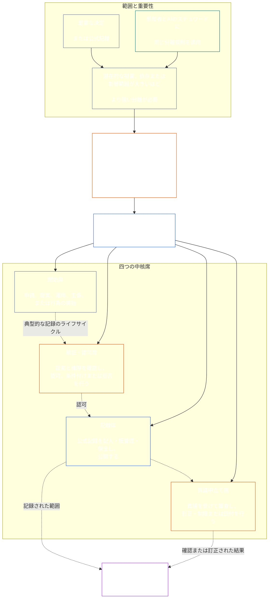

# 第七章：機能的独立性と職務の分離

<strong>コーパス内の位置づけ（非作動的）：ファイル構成と読解規則</strong>

> 以下の内容は**読者向け案内のみ**である。このファイルまたは他の章にある拘束力のある義務を追加、削除、縮小するものではない。
>
> このファイルは**感知者憲法の一部**であり、単一の文書として読む他の番号付き`core_*`ファイルと**併せて初めて拘束力を持つ**。本ファイルは、機能的独立性と職務の分離に関するプロセス横断的な最低基準を定める**第七章**である。第六章の権利の最低基準に続き、憲法上のプロセス章の冒頭となる[第八章・システム整合性認証](../../core_08_system_alignment_certification.md#chapter-eight-system-alignment-certification-reading-index)に先立つ。
>
> - **憲法上の所管事項：**重大な拘束力を持つ行為について別個の席を設ける最低基準；各[重大な拘束力を持つ行為の記録](../../core_05_band_accountability.md#materially-binding-act-record)に共通する普遍的な最低内容；行為者およびその[物的支配ライン](../../core_05_band_accountability.md#material-control-line)からの独立性；公表されたレーンと役割の配置；利益相反、欠員、代行および誤った席への回付；比例的な統合運営；帰属を追跡できる引継ぎ；ならびに後続のすべての憲法上のプロセスが適用すべき最低限の独立性条件。
> - **原則層の根拠：**[第一章 §18.3](../../core_01_c_stewardship_capacity_principles.md#183-segregation-of-duties)は、統治に機能的独立性の維持を求め、運用上の席の構造を本章に委ねる。
> - **実施所管：**[CJS-3.11](../../corpus_joint_structure/cjs_03a_accountability_operations.md#constitutional-lane-and-functional-separation)、[CI-3.2](../../corpus_institutions/ci_03_institutional_design_separation_of_powers.md#ci-32-functional-separation-lanes)、[CI-4.6](../../corpus_institutions/ci_04_appointment_competency_rotation_removal.md#ci-46-seat-catalog--process-role-archetypes-and-operational-boundaries)が席を配置し、運用可能にする。これらは本章より厳格であってよく、限定された特別権限の席種を追加してもよいが、本章の基準を狭めてはならない。
> - **プロセス固有の適用は後続章が担う：**第八章はこの最低基準をシステム整合性認証に適用し、[第九章 §3.7](../../core_09_standing_assessment.md#37-segregation-of-duties)はステータス記録に適用する。第十二章と[corpus_forum.md](../../corpus_forum.md)はフォーラムの手続に適用する。各章は対象分野に必要な保護策を追加できるが、より弱い代替策を設けてはならない。
>
> 読む順序：§1 目的・範囲 → §2 四席の最低基準 → §3 独立性と利益相反 → §4 誤った席への回付 → §5 公表された配置と代行 → §6 比例的な規模調整 → §7 緊急事態 → §8 行為記録と帰属可能な引継ぎ → §9 後続プロセスへの適用。

<strong>トレース</strong>

- 上流：[憲法上の四原則](../../core_00_preamble.md#constitutional-tetrad)、特に**監督**と**説明責任**；[重要な利害](../../core_00_preamble.md#material-stake)；[第一章 §17.1 共有スチュワードシップ基準](../../core_01_c_stewardship_capacity_principles.md#171-shared-stewardship-standard)；[第一章 §18 スチュワードシップ規律下の統治](../../core_01_c_stewardship_capacity_principles.md#18-governance-under-stewardship-discipline)；[第XVI条](../../core_06_rights_part_c.md#article-xvi-audit-transparency-and-independent-verification)（*監査、透明性、独立検証*）。
- 小節：[§1](#1-purpose-scope-and-owner-boundary)；[§2](#2-four-seat-constitutional-floor)；[§3](#3-independence-conflict-and-control-lines)；[§4](#4-wrong-seat-routing)；[§5](#5-published-placement-vacancy-and-substitution)；[§6](#6-proportional-scaling-and-merged-hosting)；[§7](#7-emergency-and-urgent-action)；[§8](#8-act-records-and-attributable-handoffs)；[§9](#9-relationship-to-later-processes)。
- 下流：[第八章](../../core_08_system_alignment_certification.md#chapter-eight-system-alignment-certification-reading-index)；[第九章](../../core_09_standing_assessment.md#chapter-nine-contribution-violation-and-standing-model--measurement)；[第十二章](../../core_12_forum.md#chapter-twelve-forums-and-jurisdiction)；[第十三章](../../core_13_governance.md#chapter-thirteen-constitutional-contract-legitimacy-authorization-and-stewardship)；上記の指定実施文書。
- 併読：[第一章 §19.3 不整合の検出](../../core_01_c_stewardship_capacity_principles.md#193-misalignment-detection)（*複数主体による検出と審査*）；[帰属可能な行為](../../core_05_band_accountability.md#attributable-action)；[帰属の完全性](../../core_05_band_accountability.md#attribution-integrity)；[監査可能性](../../core_05_band_oversight.md#auditability)；[異議申立て可能性](../../core_05_band_accountability.md#contestability)；[比例性](../../core_05_band_accountability.md#proportionality)。

 

第七章は、**重大な拘束力を持つ行為に関する機能的独立性と職務分離の最低基準を憲法上所管する**。

### 1. 目的、範囲および所管境界

<strong>トレース</strong>

- 上流：章冒頭の所管に関する宣言；[第一章 §18](../../core_01_c_stewardship_capacity_principles.md#18-governance-under-stewardship-discipline)；[監督](../../core_05_apex_oversight_leg.md#oversight-constitutional)；[説明責任](../../core_05_apex_accountability_leg.md#accountability)。
- 下流：[§2](#2-four-seat-constitutional-floor)から[§9](#9-relationship-to-later-processes)まで；重大な拘束力を持つ行為を生み出す、または変更する後続のすべてのプロセス。
- 併読：検証基盤については[第四章](../../core_04_burden_traceability_verification.md#chapter-four-burden-of-proof-traceability-and-verification)；異議申立てと救済については[第XIII-A条](../../core_06_rights_part_c.md#article-xiii-a-reliability-and-trustworthiness-baseline)（*信頼性・信頼に足ることの基準*）および[第XIII-B条](../../core_06_rights_part_c.md#article-xiii-b-right-to-redress-and-remedy)（*救済を求める権利*）；独立検証に関する権利の最低基準については[第XVI条](../../core_06_rights_part_c.md#article-xvi-audit-transparency-and-independent-verification)（*監査、透明性、独立検証*）。

 

*平易に言えば：憲法上のプロセス、または既に認可されたシステム、制度、限定された意思決定領域内のステークホルダー水準の決定を信頼するには、その内部の職務を分離しなければならない。この最低基準は[憲法契約層](../../core_05_band_integrative.md#constitutional-contract-layer)と[ステークホルダーのシステム参加](../../core_05_band_participation.md#stakeholder-status-and-weight)の双方に適用される。結果を求める感知者、役職、AIシステム、ステークホルダー組織または代理人は、独立しているとされる確認を自ら行い、その公式記録を管理し、またはその確認への異議を決定してはならない。*

本章は、第五章が定義する[重大な拘束力を持つ行為](../../core_05_band_accountability.md#materially-binding-act)のすべてに適用される。これには次が含まれる：

- 決定；
- 認可または認証；
- 認定；
- 記録への記入または重要な版の変更；
- 公開、展開、継続または撤回；
- 支出または配分；および
- 異議申立てへの処分。

本章の席は、特定の行為について誰が何をしてよいかを定めるものであり、職名ではない。同じ感知者、役職またはシステムが、行為ごとに異なる席を担ってよい。肩書、権限委譲、技術的能力、または手順を実行できる能力によって、その行為について割り当てられた席の権限が拡大することはない。

本章は、プロセス横断的な職務分離の最低基準を定める。次の事項を移管するものではない：

- 第四章の立証責任、トレーサビリティまたは検証方法；
- 第五章の標準的な意味；
- 第六章の権利の最低基準；
- 第八章から第十二章のプロセス固有の記録内容；または
- 指定実施文書の運用上の席カタログ、人員配置方法およびレーンマップの仕組み。

### 2. 四席の憲法上の最低基準

<strong>トレース</strong>

- 上流：[§1](#1-purpose-scope-and-owner-boundary)；[第一章 §18.3](../../core_01_c_stewardship_capacity_principles.md#183-segregation-of-duties)；[第一章 §17.1](../../core_01_c_stewardship_capacity_principles.md#171-shared-stewardship-standard)。
- 下流：[§3](#3-independence-conflict-and-control-lines)から[§9](#9-relationship-to-later-processes)まで；[CI-4.6](../../corpus_institutions/ci_04_appointment_competency_rotation_removal.md#ci-46-seat-catalog--process-role-archetypes-and-operational-boundaries)（*席のカタログ — プロセス役割の類型と運用上の境界*）。
- 併読：唯一認められる統合運営の経路については[§6](#6-proportional-scaling-and-merged-hosting)。

 

*平易に言えば、重大な拘束力を持つ行為には四つの職務がある。申請または実行、確認、公式記録の保管、異議の審理である。小規模な組織に許される職務ペアの統合が認められる場合でも、職務自体は区別される。*

<strong>読者向け案内（非作動的）：四席の図</strong>

> 以下の内容は**読者向け案内のみ**である。本章または他の章にある拘束力のある義務を追加、削除、縮小するものではない。
>
> **読者向け図（非作動的）。**この図は四つの席と典型的な記録のライフサイクルを示す。第五の実施席を追加せず、各行為の前に審査を完了することを求めず、本節および§§3–6の運用規則も変更しない。

 

席の枠内の点線矢印は、典型的な記録のライフサイクルを示す。実施につながる矢印はトレース用のリンクであり、審査完了まで必ず待つ手順を意味しない。

重大な拘束力を持つ行為には、機能的に区別された四つの席がある。各席の標準的な意味は第五章が定め、本節はプロセス横断的な配置と両立しない組合せの規則を定める：

1. **[開始席](../../core_05_band_accountability.md#initiating-seat)** — 行為を申請、提案、運用、主張、またはその他の方法で開始する。
2. **[検証・認可席](../../core_05_band_accountability.md#verify-or-authorize-seat)** — 適用される基準に照らして証拠と権限を確認し、行為を検証、認可、拒否または条件付けする。
3. **[記録席](../../core_05_band_accountability.md#record-seat)** — 検証・認可席の決定内容を[行為記録](../../core_05_band_accountability.md#materially-binding-act-record)に記入し、版管理、保持、保全および公開を行う。
4. **[異議申立て席](../../core_05_band_accountability.md#contest-seat)** — 異議を受理・審査し、権限の範囲で訂正や制限を命じ、権限外の問題を適切な経路に回付する。

これらの席は、人間とAIのスチュワードに等しく適用される。システムが行為を実行して承認し、自らのログを証拠として用いるなら、開始、検証、記録の三席を同時に担っている。プロセスを自動化しても確認が独立するわけではない。

同一の行為について、次の組合せは禁止される：

- 開始席は自らの行為を検証または認可してはならない；
- 検証・認可席は記録席を兼ねてはならない；
- 検証・認可席は異議申立て席を兼ねてはならない；および
- システムの運用者は、そのシステムに関する行為を検証または認可してはならない。

後続の章または組み込まれた実施文書は、特定のプロセスについて追加の兼任を禁じてもよい。ただし、本章で禁止された兼任を認めてはならない。

機能的な四席の最低基準は、すべてのクラスに適用される。クラスに応じて検討するのは、席を統合するか、同一の担当者が複数席を担ってよいかである。Cクラスの範囲内で運用する制度またはシステムでは、四席を全面的に分離することが常に推奨される。Bクラスではほぼ常に必須とし、Aクラスでは常に必須とする。範囲が混在するか分類が不確かな場合、記録がより低い基準を裏付けるまでは、適用される中で最も高い基準を用いる。

### 3. 独立性、利益相反および支配ライン

<strong>トレース</strong>

- 上流：[§2](#2-four-seat-constitutional-floor)；[権限に応じた説明責任](../../core_01_c_stewardship_capacity_principles.md#181-governance-as-authorized-structure)；[第XXIV条](../../core_06_rights_part_d.md#article-xxiv-constitutional-interpretation-review-and-anti-capture-safeguards)（*憲法解釈、審査および乗っ取り防止の保護策*）。
- 下流：[§4](#4-wrong-seat-routing)；[§5](#5-published-placement-vacancy-and-substitution)；[§8](#8-act-records-and-attributable-handoffs)；第八章の認証コンポーネントの役割；第九章の記録保管；第十二章フォーラムにおける自己審査の防止。
- 併読：[物的支配ライン](../../core_05_band_accountability.md#material-control-line)；運用上の利益相反と自己審査防止策について[CI-5](../../corpus_institutions/ci_05_conflict_integrity_anti_capture_anti_corruption.md)（*利益相反の完全性、乗っ取り防止、腐敗防止*）および[CF-7](../../corpus_forum/cf_07_integrity_safeguards_anti_capture_anti_self_judging.md)（*完全性の保護策、乗っ取り防止の運用、自己審査防止の支援*）。

 

*平易に言えば、机上の名称を変えても独立性は生まれない。結果を求める感知者または役職が、当該行為について確認者を指揮し、解任し、報奨し、処罰し、または密かに覆すことができるなら、その確認者や審査者は独立していない。*

機能的独立性は肩書ではなく、実際の権限と支配に基づいて判断される。同一の行為について：

- 検証・認可席と異議申立て席は、開始席の[物的支配ライン](../../core_05_band_accountability.md#material-control-line)の外に置かなければならない；
- 当該行為によって自らの利害が決まる当事者は、検証・認可席または異議申立て席を担ってはならない；
- 利益相反のある記録担当者は、利益相反を裁定したり保管を放棄したりせず、完全な監査証跡とともに記録を公表済みの代行者に引き継がなければならない；および
- 忌避は当該行為に関する権限を取り除くが、その席を申請者、申請者の報告ライン、または最も近くにいる者へ移すものではない。

特定の行為について[物的支配ライン](../../core_05_band_accountability.md#material-control-line)をたどる。共有インフラ、事務支援または任命の経緯だけで同ラインが成立するわけではないが、実務上の独立した判断を妨げるような運用は許されない。

想定される確認者に権限、証拠へのアクセス、物的支配からの自由、または拒否して回付する実質的な能力がない場合、二つ目の署名、名目だけの委員会、内部的な肩書、ツールが生成した証明書によって独立性が満たされることはない。

### 4. 誤った席への回付

<strong>トレース</strong>

- 上流：[§2](#2-four-seat-constitutional-floor)；[§3](#3-independence-conflict-and-control-lines)。
- 下流：[§5](#5-published-placement-vacancy-and-substitution)；[§8](#8-act-records-and-attributable-handoffs)；[CI-4.6 共有席の規則](../../corpus_institutions/ci_04_appointment_competency_rotation_removal.md#ci-46-shared-seat-rules)。
- 併読：[第一章 §17.5 抵抗する義務](../../core_01_c_stewardship_capacity_principles.md#175-duty-to-resist)。

 

*平易に言えば、自分の担当でない手順を黙って引き受けても、ただ立ち去ってもならない。欠けている役割を記録し、適切な担当先へ引き継ぐ。*

スチュワードが自分の席の範囲外の手順を行うよう求められた場合、次を行わなければならない：

1. 本案の当否を決めるかのように振る舞うことなく、その手順を断る；
2. その手順を担える席を示し、公表されている場合は担当者または代行者も示す；
3. 依頼、担っている席、欠員または利益相反、および使用した回付経路を記録する；
4. 証拠と、既に受領した記録の完全性を保全する；および
5. 避けられる遅延なく回付する。

この対応は職務の遂行であり、行為を放棄することではない。行為は適切な席を通じて進む。担当者が最も近い、最も速い、最上位である、または唯一の専門知識を持つという理由で手順を引き受けても、席の欠落は解消されない。

### 5. 公表された配置、欠員および代行

<strong>トレース</strong>

- 上流：[§2](#2-four-seat-constitutional-floor)；[§3](#3-independence-conflict-and-control-lines)；[透明性](../../core_05_band_oversight.md#transparency)；[監査可能性](../../core_05_band_oversight.md#auditability)。
- 下流：[§8](#8-act-records-and-attributable-handoffs)；[CI-3.2](../../corpus_institutions/ci_03_institutional_design_separation_of_powers.md#ci-32-functional-separation-lanes)（*機能的分離レーン*）；[CI-4.5](../../corpus_institutions/ci_04_appointment_competency_rotation_removal.md#ci-45-authorized-roles-and-accountability-chains)（*認可された役割と説明責任の連鎖*）；第八章と第九章の記録。
- 併読：[憲章](../../core_05_band_continuity.md#charter)および[第十三章 §5](../../core_13_governance.md#5-authorized-roles-competency-development-and-contribution)。

 

*平易に言えば、組織は困難な事態が起こる前に各職務の担当者を明示し、通常の担当者が不在または利益相反となった場合に誰が引き継ぐかも定めておかなければならない。*

重大な拘束力を持つ行為を行うすべての採択主体は、次を特定する公表済みで、監査可能かつ異議申立て可能なマップを維持しなければならない：

- 各席を担うレーン、役職、役割またはプロセス；
- その配置が適用される行為と範囲；
- 許可される統合運営の各形態と、それに対する独立性の保護策；
- 不在、排除、捕捉または利益相反のある担当者に代わる者；および
- 適格な代行者がいない場合の独立した経路。

未配置、欠員または利益相反のある席は、記録して是正すべき統治上の欠陥である。その席が自動的に開始席、利害関係者、運用者、またはその者の[物的支配ライン](../../core_05_band_accountability.md#material-control-line)上の上位者に移ることはない。是正まで、行為は公表された代行者または独立経路へ回付する。急いでいるという理由だけで独立性要件を迂回してはならない。

権限委譲後も、同じ席の境界、証拠に関する義務、記録および期限を維持し、[物的支配ライン](../../core_05_band_accountability.md#material-control-line)の対象であり続ける。委譲によって新たな席を作ったり、席を統合したり、委譲元の席ができないことを受任者にさせたりしてはならない。これには、クラスに応じた推奨または四席完全分離の要件を統合の許可に読み替えることも含まれる。

### 6. 比例的な規模調整と席の統合運営

<strong>トレース</strong>

- 上流：[§2](#2-four-seat-constitutional-floor)；[重要な利害](../../core_00_preamble.md#material-stake)；[必要性](../../core_05_band_accountability.md#necessity)；[比例性](../../core_05_band_accountability.md#proportionality)。
- 下流：[第九章 §3.7](../../core_09_standing_assessment.md#37-informal-and-small-scope-records)；[CJS-2.4](../../corpus_joint_structure/cjs_02_specific_joint_interlocks.md#cjs-24-class-scaled-lane-staffing-and-competency-redundancy)（*クラスに応じたレーンの人員配置と能力の冗長性*）；[CI-3.2](../../corpus_institutions/ci_03_institutional_design_separation_of_powers.md#ci-32-functional-separation-lanes)（*機能的分離レーン*）。
- 併読：[回避可能な負担](../../core_05_band_continuity.md#avoidable-burden)および第一章[§3.3 尊厳を損なわないプロセス](../../core_01_a_values_principles.md#33-anti-degrading-process)。

 

*平易に言えば、小規模で非公式な集団に四つの大きな部署は必要ない。しかし実質的に独立した確認、使える記録、異議申立て経路は必要である。規模によって変わるのは人員配置の方法であり、保護される職務分離ではない。*

分離の強度、人員配置、冗長性および形式性は、重要な利害、システムのクラス、依存関係、合理的に予見可能な損害に応じて調整する。

小規模または非公式な採択主体は、次のすべての条件を満たす場合に限り、二つの席を一つの役職または感知者に担わせてもよい：

- 統合が範囲に照らして必要かつ比例的である；
- その統合を公表し、監査可能かつ異議申立て可能なものとし、行為の記録に開示する；
- 独立性の保護策が、統合によって生じるリスクを扱う；
- 開始席が自らの行為を検証または認可しない；
- 検証と記録の兼務、および検証と異議申立ての兼務は禁止されたままである；および
- 利益相反、重大な損害または異議申立てが統合担当者の適法な境界を超えた場合に、独立した経路が利用できる。

非公式、無報酬、相互扶助、介護、修理、教育、協同組合および地域社会のスチュワードシップ活動では、該当する確認について、公表された権限を持つ利害関係のない依拠可能な組織を用いてもよい。真に利害関係がなく説明責任を果たす経路が存在する場合、範囲上合理的に到達できない制度的形式性を憲法は求めない。

人員不足、速度、利便性または専門知識の集中だけでは、統合を正当化できない。適用されるのは[§2 四席の憲法上の最低基準](#2-four-seat-constitutional-floor)に定めるクラス別の方針である。Aクラスでは逸脱を認めず、BクラスまたはCクラスの逸脱は上記の要件を満たさなければならない。重要な利害が大きいほど、別個の役職、能力の冗長性、独立した代行者を求める推定は強くなる。

### 7. 緊急および緊急性の高い行為

<strong>トレース</strong>

- 上流：[§2](#2-four-seat-constitutional-floor)；[§6](#6-proportional-scaling-and-merged-hosting)；[第十二章 §6.1 緊急措置と継続の負担](../../core_12_forum.md#61-emergency-measures-and-continuation-burden)；[既定の暫定方針](../../core_01_b_interaction_interpretation.md#default-interim-posture)。
- 下流：指定実施文書におけるインシデント、封じ込め、公開、継続および事後審査のプロセス。
- 併読：[適時性](../../core_05_apex_timeliness_leg.md#timeliness-constitutional)、[証拠の保全](../../core_05_band_oversight.md#evidence-preservation)、[CI-4.6 席カタログ — プロセス役割の類型と運用上の境界](../../corpus_institutions/ci_04_appointment_competency_rotation_removal.md#ci-46-seat-containment)。

 

*平易に言えば、現実の緊急事態では、通常の確認が終わる前に行動することが正当化される場合がある。変わるのは順序であり、席の所管やクラス別の分離方針ではない。行為者が自ら継続を認証したり、記録を消去したり、後に最終審査者となったりすることは許されない。*

遅延によって重大かつ差し迫った損害の合理的に予見可能なリスクが生じる場合、認可された開始席または封じ込め席は、通常の事前検証が完了する前に必要最小限かつ可逆的な行為を実施できる。ただし、次のすべてを満たさなければならない：

- 緊急権限、範囲、開始時刻、期限および理由を直ちに、または物理的に可能な限り速やかに記録する；
- 証拠と異議を保全する；
- 適用される憲法上の期限内に通知と参加を回復する；
- 独立した検証・認可席が、当面の限界を超えて継続する行為を審査する；および
- 行為を事後に独立審査する。

緊急対応によって次のことが許されるわけではない：

- 行為者が自らの継続を検証すること；
- 利益相反のある記録について行為者が記録保管者となること；
- 行為者が自らの行為に対する異議を審理すること；
- 一時的な必要性を恒久的な権限に変えること；
- Aクラスの制度またはシステムで四席を統合すること。

次のいずれも、それだけで緊急事態とはならない：

- 期限；
- 公開目標；
- 人員不足；または
- 評判に関する懸念。

### 8. 行為記録と帰属可能な引継ぎ

<strong>トレース</strong>

- 上流：[§2](#2-four-seat-constitutional-floor)から[§7](#7-emergency-and-urgent-action)まで；[重大な拘束力を持つ行為の記録](../../core_05_band_accountability.md#materially-binding-act-record)；[帰属可能な行為](../../core_05_band_accountability.md#attributable-action)；[帰属の完全性](../../core_05_band_accountability.md#attribution-integrity)。
- 下流：[CS-4 §10 検査可能で帰属可能な行為](../../corpus_systems/cs_04_critical_system_stewardship.md#10-inspectable-attributable-action)；[CI-4.6 共有席の規則](../../corpus_institutions/ci_04_appointment_competency_rotation_removal.md#ci-46-shared-seat-rules)；§8が定める各プロセス記録；[`materially_binding_act_record.schema.json`](../../implementation/schemas/materially_binding_act_record.schema.json)（*機械検査可能な基本形式。プロセスを支えるものであり、第二の定義ではない*）。
- 併読：[§4 誤った席への回付](#4-wrong-seat-routing)および[第四章 §5](../../core_04_burden_traceability_verification.md#5-compliance-evidence-standard)。

 

*平易に言えば、重大な拘束力を持つ各行為について、何が起きたか、各席を誰が担ったか、何が決定されたか、異議申立て先はどこかを示す行為記録が必要である。*

重大な拘束力を持つ各行為には、特定可能な[重大な拘束力を持つ行為の記録](../../core_05_band_accountability.md#materially-binding-act-record)（**行為記録**）を設けなければならない。行為記録は、適用されるプロセス固有の公式記録一つに含めても、帰属と完全性を保つ、相互にリンクした公式記録一式としてもよい。既存の公式記録またはリンクされた記録一式が必要事項を明確に特定し、リンクと版履歴を保ち、認可された公式記録経路から引き続きアクセスできる場合は、別個の重複文書を要求しない。

行為記録には少なくとも次を記載する：

- 安定した記録識別子、現行版、重要な作成・変更時刻；
- 行為、その重要な範囲、状態および準拠する権限；
- 開始席、担当者および権限；
- 検証・認可席、担当者、適用基準、判断、重要な条件または理由、および判断時刻；
- 記録席、担当者、保管権限および記録された版；
- 異議申立て席または公表された異議申立て経路、ならびに現在の異議または訂正状況；
- すべての権限委譲、忌避、代行、許可された統合または緊急逸脱；および
- 行為を再構成するために必要な重要な証拠と記録リンク、引継ぎ、拒否、条件、未解決の異議、期限、置換済みの版および訂正。

プロセス固有の記録には、より厳格な項目または分野固有の項目を追加してよい。ただし、この最低限を省略、矛盾させたり、再構成できない状態にしたりしてはならない。適法なプライバシー、秘密保持およびセキュリティ管理は、保護対象の資料へのアクセスまたは開示方法を定めるものであり、認可された検証、異議申立て、訂正または救済に公式な証跡を消去したり利用不能にしたりすることを許すものではない。

ログは誰が何をしたかを示すが、それだけで行為の有効性を証明するものではない。行為を行う感知者またはシステムが作成したログ、署名、モデルのトレース、チェックリストまたは証明には限定された役割しかない：

- これらの資料は証拠となり、または行為記録にリンクできる。
- これらの資料は、独立した審査・決定または公式の行為記録そのものに代わることはできない。

### 9. 後続プロセスとの関係

<strong>トレース</strong>

- 上流：[§1](#1-purpose-scope-and-owner-boundary)から[§8](#8-act-records-and-attributable-handoffs)まで。
- 下流：[第八章](../../core_08_system_alignment_certification.md#chapter-eight-system-alignment-certification-reading-index)；[第九章](../../core_09_standing_assessment.md#chapter-nine-contribution-violation-and-standing-model--measurement)；[第十二章](../../core_12_forum.md#chapter-twelve-forums-and-jurisdiction)；[第十三章](../../core_13_governance.md#chapter-thirteen-constitutional-contract-legitimacy-authorization-and-stewardship)。
- 併読：[権限の階層と内部序列](../../core_05_band_integrative.md#owner-non-relocation)および[前文の所管者登録簿](../../core_00_preamble.md#4-principles-definitions-and-rights)。

 

*平易に言えば、後続の章は各プロセスが何を評価し、記録し、決定し、救済すべきかを示す。本章は、それらを行う間に権限をどう分離するかを定める。*

後続するすべての憲法上のプロセスは、四つの席すべてをどう割り当てて用いるか、また本章をどう遵守するかを説明しなければならない。具体的には：

- プロセス独自の記録を行為記録として用いるか、行為記録にプロセス固有の詳細を追加してよい。
- 一つのプロセス記録が複数の重大な拘束力を持つ行為を扱う場合、各行為の個別の行為記録にリンクしてよい。
- 公式な記録経路が完全で追跡可能であれば、重複する別個の記録は不要である。
- プロセスに別の名称を付けても、[§4 誤った席への回付](#4-wrong-seat-routing)または[§8 行為記録と帰属可能な引継ぎ](#8-act-records-and-attributable-handoffs)（引継ぎおよび誤った席への回付の規則を含む）の適用は免れない。

特に：

- **第八章 — システム整合性認証：**システム運用者または認証提案者は開始席であり、自らの検証者ではない。限定されたコンポーネントの所見、認証記録の統合、保管、異議申立ては、適法な席と自己審査防止の経路内で行わなければならない。
- **第九章 — ステータス記録：**申請者、記録開始権限者、記録保管者および異議申立て経路は、四席の最低基準に加え、第九章のより厳格な保管、申立人、非公式記録、自己保管禁止の規則を適用する。
- **第十二章 — フォーラム：**申立て、調査、本案審査、記録保管、上訴、およびフォーラム自身の偏見や手続濫用の申し立てに対する審査では、適用される席と自己審査防止の境界を保たなければならない。
- **第十三章 — 統治：**役割定義、能力計画、権限委譲、承継、制度設計では、席の名称を繰り返すだけでなく、席を配置し維持しなければならない。

後続の章は、そのプロセスがより高い、または異なるリスクを伴うことを理由に、より強い独立性、忌避、分離、保管、合議体または審査の要件を課してよい。ただし、この最低基準を狭めたり、プロセス固有の名称を適用除外として扱ったり、沈黙によって席が行為者に移ると推定したりしてはならない。

---

**前のファイル：** [core_05_band_performance.md](../../core_05_band_performance.md)

**次のファイル：** [core_08_a_system_alignment_certification_evaluation.md](../../core_08_a_system_alignment_certification_evaluation.md#chapter-eight-part-a-certification-evaluation)
