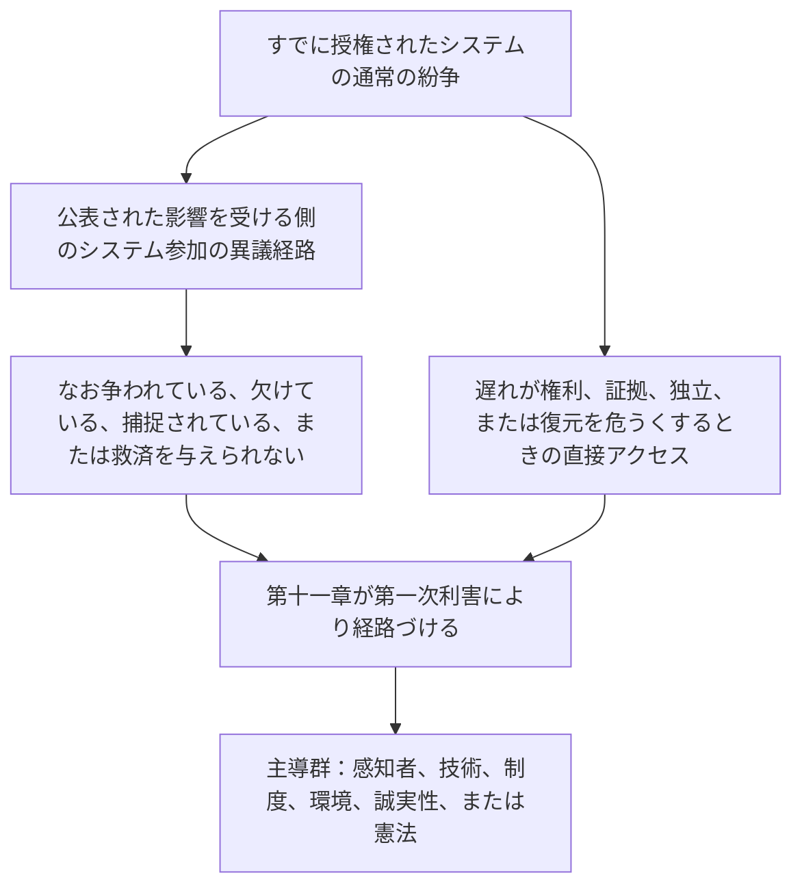

# 第十一章：フォーラムと管轄

<strong>コーパス上の位置（非操作性）：ファイル構造と読み方</strong>

> 以下の内容は**読者向け案内にすぎない**。本ファイルまたは他の章にある拘束力のある義務を加え、除き、または狭めない。
>
> 本ファイルは[英語第十一章](../../core_12_forum.md)の**読者言語パイロット**である。**感知者憲法の拘束力ある部分ではない**。**第二の憲法ではない**。**配布版ではない**。`SC-Corpus-2026.08.09` に**固定**されている。本訳文と英語原文が食い違って見える場合、番号付きファイル [`core_11_forum.md`](../../core_12_forum.md) が勝つ。読み順と版のメタデータは [README.md](../../README.md) に保たれる。方法と用語表：[translations/ja/README.md](README.md)。
>
> **第十一章**を含む：フォーラム群、既定会場と第一次利害の経路づけ、鑑識の支え、受付仕分け、および軌跡の鎖と権利の床のもとでの紛争の管轄。フォーラムは、[憲法四元](core_00_preamble.md#constitutional-tetrad)の**参加**、**監督**、および**適時性**の脚のもとで、[実質的利害](core_00_preamble.md#material-stake)に応じて尺度を合わせ、紛争の取扱いを**監督**する。事実が検証されたとき、[第八章 §3](core_08_standing_assessment.md#3-standing-record-operational-requirements)のもとで軌跡記録を**開き、更新し、または訂正**してよい — または**異議において悪い記録を脇へ置く**。申し立てられた事件はそれ自体では軌跡ではなく、フォーラム物語は第八章の軌跡測定の代わりになってはならない（[第八章 §3.6](core_08_standing_assessment.md#36-forum-boundary)）。鎖の案内には [README — Standing pipeline and forums](../../README.md#standing-pipeline-and-forums) を用いよ。運用上のフォーラムの仕組みは指定された実施ファイルに残る。章番号と相互参照は統合された文書と一致する。

>
> **前（なお英語）：** [core_10_b_misconduct_pattern_applications.md](../../core_11_b_misconduct_pattern_applications.md#chapter-eleven-part-b-anti-constitutional-misconduct-pattern-applications)
>
> **次（なお英語）：** [core_08-11_application_vignettes.md](../../core_09-12_application_vignettes.md#chapters-eight-eleven-application-vignettes)
> **読みの弧：** §1 目的 → 紛争の順序づけ → §2 既定会場と受付 → §2.1–§2.3 主導の限度、混合利害、異議 → §3 移送と自己審判防止 → §4 群 → §5 拡大と認証 → §6 段階と遅延防止 → §7 フォーラムの支え

<strong>読者案内（非操作性）：第十一章が住むところと、ここに残るもの</strong>

> 以下の内容は**読者向け案内にすぎない**。本章または他の章にある拘束力のある義務を加え、除き、または狭めない。
>
> これが住むところ（案内）：
> - **憲法上の所管者：** **第 1 節**（*目的* — 本章が割り当てる規範の**第一次の裁定適用**であり、日常の**執行管理**とは**区別される**；すでに授権されたシステムの内側の通常の紛争についての**紛争の順序づけ**；**説明責任**の要件；**公表**され**予測可能**な**閾**の配置）；**既定の出発会場**、**第一次利害**の経路づけ、**受付仕分け機関**（**第一接触窓口**）、混合利害、非対称、軌跡記録への異議、**誠実な性格付けと弄り防止**、および**感知者に到達可能な** **閾** **アクセス**の期待（**第 2 節**、**`corpus_forum.md`** と**あわせて読む**）；**移送**、**併合**、および**調整**（**第 3 節**、**第 5 節**の認証と予備とあわせて読む）；**フォーラム群の定義**、**内部部局**、**共有標準**、および**暫定運用法**（感知者、技術、制度、環境、誠実性、憲法 — **第** **4** **節**、**第** **2** **節**の**表**を鏡にする）；**拡大**、**認証**、および**暫定保護**（**第 5 節**）；**適時の解決**と**遅延防止**の規律（**第 6 節**）；審査の前・中・後の**フォーラムの支え**（**第 7 節**）。仕分けと支えの役割が**適法に構成された本案合議体**の**代わりにならない**ように実施する；**自己審判防止**の予備経路づけ；**第八章**、**第十章**、および**第六章**の正義と異議の権利に結ばれた拡大のフック。
> - **鎖の案内：** [README — Standing pipeline and forums](../../README.md#standing-pipeline-and-forums) — 本ファイルの [§§1–7](#1-purpose-and-role)。
> - **第八–第九章の三つの問いの鎖：** 第八章の**第 2–3 節**は、検証済みの軸純粋な記録を通じて問い 1（*何が起きたか？*）に答える。[第八章 §4](core_08_standing_assessment.md#4-standing-measurement-evaluation-dimensions) と [§7 の統一比例 LEQU 尺度](core_08_standing_assessment.md#7-unified-proportional-lequ-scale) は、評価の次元、共有の五倍 LEQU 帯、および共有の **s** = 1...9 の文法を通じ、貢献記録と違反記録を別に保ちつつ、問い 2（*どれほど良いか、または悪いか？*）に答える。[第九章](core_09_standing_integration.md#chapter-nine-standing-effects-and-integration) は、救済、保障、能力の閾と許可、および軌跡ロックを通じて問い 3（*そのために何が起きるか？*）に答える。違反軸の箱を制御するのは検証済み影響だけである；過失、隠蔽、強制、応答、および比較可能な性格の記述子はそれを動かさない。[第十章](core_10_a_misconduct_designation.md#chapter-ten-anti-constitutional-misconduct) は、第八章の箱 7、8、または 9 の記録に対応する反憲法的不正行為の指定を加えてよいが、数値の箱は割り当てない。
> - **フォーラム（非操作性の注）：** 本章のもとでの**フォーラム群**は、[第八章](core_08_standing_assessment.md#chapter-eight-compliance-violation-and-standing-model) の分類を具体的紛争へ適用する第一次の**フォーラム**である — 別に記録された**貢献の性質**、**違反軸の影響箱**、および過程／応答の性格が**共在**し、**第八章**の共同評価と非置換の規律のもとで扱われなければならない事案を含む。裁定の外の**研究資金**、**融資**、および**誘因**の仕組みは、採択された実施および **[corpus_systems.md](../../corpus_systems.md)** に残る（**第八章**の読者案内を見よ）；予防と根本原因の探究を支えてよいが、**閾**の経路づけ、**本案**の決定、権限ある第八章の数値箱の割当、対応する**第十章**指定、または **Article XXIII**（《衝突解決、段階的拡大、緊急の比例性》）の制約の**代わりになってはならない**。**第 1 節と第 2 節**は、**誘因**構造についての**第一次**の責任を、各**群**の**領域**の**内側**に**主として**割り当てる（細目は**コーパス**と実施）；その**割当**は、[第十二章](../../core_13_governance.md#chapter-thirteen-constitutional-contract-legitimacy-authorization-and-stewardship) および **[corpus_systems.md](../../corpus_systems.md)** に留保された**システム全体**の**予算**または**統治規模**の選択を**移さない**。
> - **実施の所管者：** 公表された受付**クラス**、日常の審理規則、人員、予算、細かな手続、運用上の拡大の仕組み、およびフォーラム支えの運用要件は、採択された実施本文および **[corpus_forum.md](../../corpus_forum.md)** に住む（**CF-5**（《経路づけの運用、移管、認証、代表的取扱い》）、**CF-8**（《フォーラムの鑑識と分析の支え》）、**CF-9**（《独立調査サービスと訴追のインタフェース》）、および関連節）；それらの層は本章を**実施し、狭めない**。
> - **再配置禁止規則：** 採択文書は、別個のフォーラム機能を折り畳み、**独立**または**本物の審査**を剥ぎ、または本章が唯一の最終本案の本拠として禁じる同一の捕捉されたフォーラムへ誠実性の異議を戻す手続によって、本章を満たしてはならない。
>
> **アーキテクチャ — *平たい言葉で言えば* の配置：** 各 *平たい言葉で言えば* の行は、追跡の案内ブロック（および存在するときのそれに続く ` `）の直後、その節の操作性の段落および箇条書きの**前**に現れる。読者向けの注にすぎない；拘束力ある本文を加え、除き、または狭めない。

<strong>追跡</strong>

- 上流：[第八章](core_08_standing_assessment.md#chapter-eight-compliance-violation-and-standing-model)（*本章が経路づける紛争を供給する問い 1 の記録と問い 2 の測定*）；[第八章 §5.1](core_08_standing_assessment.md#5-slot-grammar-and-display-labels)（*軌跡箱の文法*）；[第八章 §7 統一尺度](core_08_standing_assessment.md#7-unified-proportional-lequ-scale)（*共有の五倍 LEQU 帯と別々の軸記録*）；[第八章 §§4.3–4.4](core_08_standing_assessment.md#43-route-descriptor-measurement-roles)（*軸横断の正規化記述子カタログ。箱を動かさない貢献軸および違反軸の記述子を含む*）；[第十章](core_10_a_misconduct_designation.md#chapter-ten-anti-constitutional-misconduct)（*適格な第八章の箱 7–9 についての対応する反憲法的不正行為の指定*）；[第二章から第四章](core_02_definition_structure.md)（*記録、検証、および追跡の期待*）；[第五章](core_05__definitions_home.md#chapter-five-foundational-definitions)（*基礎定義*）；[第一章](core_01_c_stewardship_capacity_principles.md#chapter-01-principles-and-constraints)（*解釈の制約*）；[第六章 — 基礎的権利](core_06_rights_part_a.md#chapter-six-foundational-rights) から [D部](core_06_rights_part_d.md)（*異議、監査、および正義の条のフック*）。
- 下位節：[§1](#1-purpose-and-role)；[§2](#2-default-venue-and-primary-stakes)；[§3](#3-transfer-consolidation-and-coordination)；[§4](#4-forum-family-definitions)；[§5](#5-escalation-and-certification)；[§6](#6-timely-resolution-materiality-tiers-and-anti-delay-discipline)；[§7](#7-forum-support-before-during-and-after-review)。
- あわせて読む：[README — Standing pipeline and forums](../../README.md#standing-pipeline-and-forums)。
- 下流：[corpus_forum.md](../../corpus_forum.md)（*運用上のフォーラム教義*）；裁定の役割と統治正当性が交わるところでの [第十二章](../../core_13_governance.md#chapter-thirteen-constitutional-contract-legitimacy-authorization-and-stewardship)；採択された手続層についての [第十六章](../../core_17_incorporation.md#chapter-seventeen-incorporation-bridge)（*編入の規律*）。
- あわせて読む：[第八章 §5.1](core_08_standing_assessment.md#5-slot-grammar-and-display-labels)（*軌跡箱の文法*）；[第八章 §§4.3–4.4](core_08_standing_assessment.md#43-route-descriptor-measurement-roles)（*軸横断の正規化された貢献軸および違反軸の記述子*）。
- あわせて読む（追加）：[第九章 §3](core_09_standing_integration.md#3-descriptor-integration-and-attachment-normalization)（*第 2 節の第一次利害の経路づけとあわせて読む記述子の統合と添付の正規化*）；[README.md](../../README.md)（*読み順とコーパスの組織*）；[doc_architecture.md](../../doc_architecture.md)（*採択されない限り拘束力のない編集地図*）。

 

第十一章は、**軌跡の鎖と権利の床のもとでの紛争についてのフォーラム群、既定会場、管轄、および裁定経路づけ**の憲法上の所管者である。

*平たい言葉で言えば： [憲法四元](core_00_preamble.md#constitutional-tetrad) と [二つの憲法上の目的](core_00_preamble.md#two-constitutional-aims) のもとで、本章は、第八章から第十章の軌跡の鎖を紛争がどう横断するかを**監督**する — 経路づけ、独立、鑑識の支え、是正の順序づけ、および **第 6 節** と **Article XXIV-C**（《適時の解決と遅延防止の床》）のもとでの段階既定の時計。フォーラム群は、どの軌道がどの紛争を扱うか、事件が通常どこで始まるか、混合利害の事案がどう調整されるかに答える。**参加**（到達可能な異議）と**監督**（たどれる本案審査）を供給する。事実が検証されたとき、軌跡記録を**開き、更新し、または訂正**してよい — または**異議において悪い記録を脇へ置く**。軌跡の鎖の横に、第二の別の決定軌道を**走らせない**。事件を申し立てることだけでは、軌跡に即時の影響はない。日常の審理規則、予算、人員の手引は実施層に住み、本章または **Article XXIII**（《衝突解決、段階的拡大、緊急の比例性》）を**実施し、狭めてはならない**。*

### 1. 目的と役割 — 参加のアーキテクチャ

<strong>追跡</strong>

- 上流：[第七章 — システム整合認証](core_07_a_system_alignment_certification_evaluation.md#chapter-seven-system-alignment-certification)；[第八章](core_08_standing_assessment.md#chapter-eight-compliance-violation-and-standing-model)；[第九章](core_09_standing_integration.md#chapter-nine-standing-effects-and-integration)；[第十章](core_10_a_misconduct_designation.md#chapter-ten-anti-constitutional-misconduct)；[第一章](core_01_c_stewardship_capacity_principles.md#chapter-01-principles-and-constraints)（*原則と解釈の制約*）；[第二章から第四章](core_02_definition_structure.md)（*追跡と検証の期待*）；[第五章](core_05__definitions_home.md#chapter-five-foundational-definitions)（*コーパス上の位置の枠で第二章から第四章とあわせて読む定義*）；[第六章](core_06_rights_part_a.md#chapter-six-foundational-rights)（*本章がともに適用する基礎的権利の床*）。
- 下流：[§2](#2-default-venue-and-primary-stakes)（*第一次利害の既定会場、受付仕分け、混合利害、非対称、軌跡記録への異議；適時で争訟可能な閾アクセス；誠実な性格付けと弄り防止*）；[§3](#3-transfer-consolidation-and-coordination)（*移送と自己審判防止*）；[§4](#4-forum-family-definitions)（*フォーラム群の定義、部局、共有標準、および暫定運用法*）；[§4.3](#43-institutional-forums)（*紛争の順序づけの制度群への適用としての内部過程の境界*）；[§5](#5-escalation-and-certification)（*拡大、認証、および暫定保護*）；[§6](#6-timely-resolution-materiality-tiers-and-anti-delay-discipline)（*実質性段階、鎖の里程標、および遅延防止の規律*）；[§7](#7-forum-support-before-during-and-after-review)（*審査の前・中・後のフォーラムの支え*）。
- 四元の脚：**参加**、**監督**、**説明責任**、**適時性**（検証済み認定は軌跡記録を開き、更新し、または訂正してよい；**CF-11** は段階の時計を実施する）。第一次の目的：**繁栄**と**継続**。[実質的利害](core_00_preamble.md#material-stake) の尺度合わせは、経路づけとアクセスの負担に適用される。
- あわせて読む：[前文 §3.2](core_00_preamble.md#32-key-governance-processes) および [§3.3](core_00_preamble.md#33-governance-layers)（*過程の経路と統治層の規律*）；[Article XI：影響を受ける側のシステム参加、代表、および適正手続](core_06_rights_part_b.md#article-xi-stakeholder-system-participation-representation-and-due-process)；[corpus_forum.md](../../corpus_forum.md)（**CF-6.2.2**（《緊急、尽尽、および時期の規則》） — 実施し、狭めない）；[corpus_institutions.md](../../corpus_institutions.md)（*異議、二次審査、および誠実性の監視 — 割り当てられたフォーラム管轄を置き換えない*）；[Article XII-B：異議申立て、審査、救済への権利](core_06_rights_part_c.md#article-xii-b-right-to-challenge-review-and-redress)；[Article XXIII の家族](core_06_rights_part_d.md#article-xxiii-a-justice-objective-and-scope)（*コーパス上の位置の枠で参照される正義の制約*）。

 

*平たい言葉で言えば：本節は、二つの軌道を**監督**するフォーラム群を通じて、憲法上の**参加**と**監督**を割り当てる — **軌跡の鎖**（第八章から第十章の紛争と記録の効果）と**システム整合認証**（第七章の認定と審査） — 次いで公表された閾の配置についての説明責任の要件を述べる。すでに授権されたシステムの内側の通常の紛争は、まず公表された影響を受ける側のシステム参加の異議経路を用いる；本章は、その経路がなお争われ、欠け、捕捉され、または救済を与えられないときに引き継ぐ。詳細な審理規則は他所に住み、本章が保障するものを静かに縮めてはならない。*

本章は、どの**フォーラム群**が、**参加**（感知者に到達可能な異議、代表的取扱い、および比例的アクセス）と**監督**（独立、鑑識の支え、およびたどれる本案審査）を通じて、どの第一次の問いを**監督**するかを述べる。審理規則、人員、予算、細かな手続、または運用上の拡大の仕組みは**指定しない**。それらの細目は、本章を**実施し、狭めてはならない**コーパス実施層に属する。**フォーラム群**は、閾の配置、第一次利害の経路づけ、およびシステム整合の審査についての法的・規制上の境界を、予測可能で公表された仕方で述べなければならず、それは **第 2 節** と **`corpus_forum.md`** をともに**実施し、狭めてはならない**。

**フォーラム群が監督するもの：**

1. **軌跡の鎖**（第八章から第十章。紛争において第一章から第六章および指定されたコーパス実施規範を適用する）
   - 第一次利害の経路づけ、割り当てられたところでの本案審査、移送、併合、および認証の調整、ならびに軌跡に関連する紛争についての是正の順序づけ。
   - **第八章**の貢献記録と違反記録 — §7 の統一比例 LEQU 尺度で測られ、性格の記述子および軌跡効果を伴う — 検証済み認定は、検証済み入力の門を満たすとき、[第八章 §3](core_08_standing_assessment.md#3-standing-record-operational-requirements) のもとで軌跡記録を**開き、更新し、または訂正**してよい — または**異議において悪い記録を脇へ置く**。申し立てられた事件はそれ自体では軌跡ではなく、フォーラム物語は第八章の軌跡測定の代わりになってはならない（[第八章 §3.6](core_08_standing_assessment.md#36-forum-boundary)）。
   - 本章が救済と順序づけのフォーラム監督を割り当てるところでの **第九章** の軌跡効果と統合。
   - 第八章の箱 7–9 の記録についてその指定が争点であるところでの **第十章** の反憲法的不正行為の指定。
   - それらの紛争が適用する規範としての **第一章から第六章** および指定された [コーパス](core_05_band_integrative.md#corpus) 実施層の適用。

2. **システム整合認証**（[第七章](core_07_a_system_alignment_certification_evaluation.md#chapter-seven-system-alignment-certification)）
   - [第七章 B部](core_07_b_system_alignment_certification_record_process.md#chapter-seven-part-b-certification-record-and-process) のもとでのフォーラム監督による認定、条件付き認定、検証、再検証、撤回、および関連する認証記録の結果。
   - [B部 §13](core_07_b_system_alignment_certification_record_process.md#13-forum-supervision-and-component-roles) のもとでの構成要素の役割：
     - **技術** — 仕様、方法、および証拠標準
     - **誠実性** — 公式の整合認定と主導調整
     - **環境** — 実質的であるところでの環境整合の構成要素
     - 本章の経路づけのもとでの他の群の構成要素所見
   - 感知者は認証結果に異議を唱え、条件を添付し、必要なときにファイルを再開できる — しかし認証は軌跡測定を**置き換えない**。
   - 認証からの重要な認定は、第八章が軌跡を測るときの**検証済み入力**として数えてよい。認証は、それ自体では誰にも軌跡箱を割り当て**ない**（[B部 §15](core_07_b_system_alignment_certification_record_process.md#15-relationship-to-standing)）。

**フォーラム群**は、この文書がそれらの軌道を**監督**する第一次の制度である。制定された規則の日常の執行管理とは別である。

**紛争の順序づけ。** すでに授権されたシステム、制度、または有界な決定領域の内側では、通常の紛争は、まず公表された [影響を受ける側のシステム参加](core_05_band_participation.md#stakeholder-status-and-weight-cluster) の異議と適正手続の経路を用いる。その経路がなお争われた結果を産出し、欠け、捕捉され、または必要な救済を適法に与えられないなら、本章は **第 2 節** のもとで第一次利害により事案を経路づける。**誠実性**、**技術フォーラム領域**、**環境**、および**憲法**は、それが第一次利害であるときの既定の主導群である — 順序づけを飛ばす例外ではない。未了の内部過程、尽尽のラベル、または内部審査が未了であるとの主張は、それらの主導を停滞させ、その本案を押しのけ、または **Article XXIV-C**（《適時の解決と遅延防止の床》）の時計を食ってはならない。遅れが権利、証拠、独立、または実務上の復元を実質的に危うくするときは、直接アクセスが残る。

*読者地図にすぎない。紛争の順序づけの段落を加え、除き、または狭めない。*

それらは：

- 予防的な統治の役割を担う。問題の解決、根本原因の分析、予防、是正の順序づけ、および失敗のパターンからの学習を含み、**第一章**の原則 — **安全**、**真理**、**福祉**、**応答性**、および**責務ある管理と分散した理解** — と整合する。
- **第二章から第四章**、異議と是正が関わるところでの **Article XII-B**（《異議申立て、審査、救済への権利》）、および正義の制約が統治するところでの **Article XXIII**（《衝突解決、段階的拡大、緊急の比例性》）における**独立**、**争訟可能性**、および**追跡**の期待を満たさなければならない。
- この文書が述べるもっとも厳格な手続および誠実性・説明責任の要件に服する。公の正当化、追跡可能性、忌避と合議体の規律、本章が割り当てるところでの鑑識と分析の支えを含む
- 自己審判防止の予備経路づけを要する。それらの要件は、裁定の独立を政治的制御で置き換えてはならない。
- **誠実性**、**憲法**、および**環境**フォーラム、ならびに感知性地位の裁定を聴くときの**技術フォーラム領域**は、[第十二章 §1.2](../../core_13_governance.md#12-eligibility-contested-selection-and-democratic-minimums) のもとで**公表**され、**争われ**、**交替可能**な任命または同等の独立点検を要する。それらの合議体の任命不足または資金不足は、[第九章 §9](core_09_standing_integration.md#9-enforcement-realism) の失敗である。

各**フォーラム群**は、主として自らの領域内の誘因構造について第一次の責任を負う。これには次を含む：

- 採択文書と指定された実施層
- 費用、制裁、異議、および報告の指名された経路の審査
- 是正の順序づけのフック、および比較可能な裁定隣接の整合。

**システム全体**の予算、横断する研究資金、および統治規模の計画は、適用されるところで [第十二章 — 統治](../../core_13_governance.md#chapter-thirteen-constitutional-contract-legitimacy-authorization-and-stewardship)、**[corpus_systems.md](../../corpus_systems.md)**、および他の最高性規則に服したままである。報酬、費用規則、および同様の誘因の道具は、次の**代わりになってはならない**：

- 適正なフォーラムの経路づけ
- 適法に構成された合議体による本物の本案決定
- 第八章の影響箱の測定
- 対応する**第十章**指定
- **Article XXIII**（《衝突解決、段階的拡大、緊急の比例性》）の正義の制約

**`corpus_institutions.md`** における制度的異議、二次審査、および誠実性の監視（**CI-5**（《衝突の誠実性、捕捉防止、および腐敗防止》）から **CI-8**（《制度横断の調整と拡大》）および異議誠実性の期待を含む）は、本章と並んで働く。本章がそれらの群に管轄を割り当てるところでの拘束力ある本案について、**誠実性**、**環境**、または**制度**フォーラム群を置き換えない。それらの巻における実施の誘因仕組みは、第一次に関わる群と調整しなければならず、本章が割り当てる第一次利害の経路づけまたは本案権限を押しのけてはならない。

### 2. 既定会場と第一次利害

<strong>追跡</strong>

- 上流：[§1](#1-purpose-and-role)（*目的、第一次適用の役割、説明責任の要件、公表された閾の経路づけ、細目の非再配置、独立と審査の期待*）。
- 下流：[§3](#3-transfer-consolidation-and-coordination)（*移送、併合、自己審判防止*）；[§4](#4-forum-family-definitions)（*既定表とあわせて読むフォーラム群の定義*）；[§5](#5-escalation-and-certification)（*既定会場からの拡大；暫定保護*）；[§6](#6-timely-resolution-materiality-tiers-and-anti-delay-discipline)（*実質性段階と遅延防止の規律*）；[§7](#7-forum-support-before-during-and-after-review)（*審査の前・中・後のフォーラムの支え*）。
- §2 の内側：[§2.1](#21-lead-default-limits)（*第一次利害の衝突、憲法認証、および自己審判防止の予備*）；[§2.2](#22-mixed-stakes-and-routing-asymmetry)（*混合利害と非対称*）；[§2.3](#23-forum-records-standing-records-and-contests)（*フォーラム事件記録、軌跡記録、および異議*）。
- あわせて読む：[憲法四元](core_00_preamble.md#constitutional-tetrad) — **参加**、**監督**、および**適時性**の脚；第一次利害の経路づけについての [実質的利害](core_00_preamble.md#material-stake) の尺度合わせ；[第八章 §5.1](core_08_standing_assessment.md#5-slot-grammar-and-display-labels)（*軌跡箱の文法*）；[第八章 §7 統一尺度](core_08_standing_assessment.md#7-unified-proportional-lequ-scale)（*共有の五倍 LEQU 帯と別々の軸記録*）；[第八章 §§4.3–4.4](core_08_standing_assessment.md#43-route-descriptor-measurement-roles)（*影響箱を動かさずに第一次利害を知らせる軸横断の正規化記述子*）；[corpus_forum.md](../../corpus_forum.md)（**CF-5** および **CF-7.2**）；[corpus_systems.md](../../corpus_systems.md)（*システムの分類、配備、および再検証の義務*）；[第十章 §3](core_10_a_misconduct_designation.md#3-violation-axis-s-7-9-slot-assignment-incident-gravity)（*適格な第八章の箱 7–9 についての反憲法的不正行為の指定；レガシー錨を保全*）；[第十章 §4](core_10_a_misconduct_designation.md#4-due-process-safeguards-for-slot-assignment)（*本章および **Article XXIII**（《衝突解決、段階的拡大、緊急の比例性》）とあわせて読むその指定についての適正手続*）；[Article XXIII-A](core_06_rights_part_d.md#article-xxiii-a-justice-objective-and-scope)（*正義の目的と範囲*）。

 

*平たい言葉で言えば：各群の**第一接触窓口** — **受付仕分け機関** — は、表題が何と言うかではなく、争いが本当に何についてのものかを尋ね、次いで既定表を用いて主導フォーラムを選ぶ。技術フォーラムはシステム整合の仕様、方法、および証拠標準を維持する；**誠実性**フォーラムは、構成要素の問いが他所に属するのでない限り、公式の整合認定と継続検証の判断を行う。仕分けは適法に構成された本案合議体の代わりにならない；混合利害、非対称、および軌跡記録への異議は、下の下位節にある。*

**第一次利害の経路づけ**は、**申立て**または**抗弁**における主な法的、救済的、強制的保障、憲法上の床、または実務上の利害を所管するフォーラム群へ事案を割り当てる。当事者の好む結果や表題ではなく、紛争が本当に何についてのものかに従う。

**受付仕分け機関（第一接触窓口）。** 各求められるフォーラム群は、申立てにおける群の**第一接触窓口**として、**受付仕分け機関**、またはその群内の機能的に同等の取決めを維持しなければならない。その機関は：
- 本節のもとで第一次利害の経路づけを**適用**する；
- 到着する事案を、**第一次利害**と一貫した**公表**された受付取扱いへ**仕分ける**；
- 保全、**権利の床**、**群横断の経路づけ**、および**予備フォーラム**の必要を**旗立て**する；
- **第 3 節と第 5 節**のもとでの移送、併合、認証、および予備の規律が速やかに発効できるよう、初期アクセスを**管理**する；
- 別個の憲法上のフォーラム群では**ない**；
- **実体的結果**について適法に構成された本案合議体の代わりになってはならず、**群**の境界を**折り畳いてはならない**；
- 資金、手数料、行政上の選好、または他の誘因装置を用いて、第一次利害の経路づけを打ち負かし、または不透明な閾の仕分けを可能にしては**ならない**。

**誠実な性格付けと弄り防止。** フォーラムの性格付けは**誠実**であり、**第一次利害**によって**裏付け**られなければならない。**知りつつ**誤って性格付けることは、採択法のもとで**費用**、**却下**、または**付託**を発火させて**よい**。誘因装置は、フォーラム漁り、不透明な閾の仕分け、または**本節**および**第 3 節**の第一次利害の規律と一貫しない経路づけを報いるように構造化または適用されてはならない。費用、却下、および付託の仕組みは **`corpus_forum.md`**（**CF-5**）に住み、本節を**実施し、狭めてはならない**。

運用要件 — **公表された受付クラス**、帰属可能な受付記録、独立と**異議**の期待、および**争われた**経路づけの**速やかな**審査を含む — は **`corpus_forum.md`**（**CF-5**（《経路づけの運用、移管、認証、代表的取扱い》））に述べられる。

各フォーラム群への**初期アクセス**は、次を満たすほど速やかで争訟可能でなければならない：
- 本節のもとでの第一次利害の経路づけが意味あるままであること；
- **第 3 節と第 5 節**のもとでの移送、併合、認証、および予備の規律が、遅れまたは不透明な閾の仕分けによって無効にされないこと。

フォーラムアクセスの時間期待は：
- **感知者に到達可能**でなければならず；
- **第 6 節**および **Article XXIV-C**（《適時の解決と遅延防止の床》）のもとで、危害の緊急と事案の複雑さに合わせて較正されなければならず；
- 行政上の便宜よりも、本物の閾アクセスおよび **第 5 節**（《暫定保護》）のもとでの適法な暫定救済を優先しなければならない。

本節のもとでの**受付仕分け機関**は、**`corpus_forum.md`**（**CF-5**）とともにこの義務を満たし、編入範囲内で **第 6 節** の段階既定窓を実施しなければならない。

**第八章 §3 からの経路づけ地図。** 第八章は、フォーラムに起きたことを*測る*仕方を告げる。事件をどのフォーラムが聴くかを、それ自体では選ば**ない**。申立てにおいて、群の**受付仕分け機関**（第一接触窓口）はこの順序をたどる：

1. **すでに検証されているものを点検せよ：** すでに存在するとき、検証済みの第八章の**貢献軸**または**違反軸**の資料 — 影響箱、重大さの帯、過程／応答の性格、および軌跡効果を含む — を記せ。
2. **告発を確定事実として扱うな：** 申立てと暫定ラベルは、**第二章から第四章**のもとでの認定が存在するまで、経路づけと証拠保全のみを案内する。
3. **争いが本当に何についてのものかで主導フォーラムを選べ：** 下の既定会場表を用いよ：**感知者**、**技術フォーラム領域**、**制度**、**環境**、**誠実性**、または**憲法**。当てはまるところで次の特別な経路づけ規則を適用せよ：
   - **第十章の指定：** **第十章**の反憲法的不正行為の指定が**第一次**利害であるところでは、**誠実性**が既定の主導である。次を保て：
     - 第八章の数値の影響箱；
     - 求められるところでの**憲法**認証；
     - 制度当事者の規則；および
     - **第 2、3、および 5 節**のもとでの自己審判防止の予備。
   - **フォーラム偏りの紛争：** 争いが主として、脇へ退くべき合議体構成員、偏った合議体参加、または比較可能なフォーラム誠実性の侵害 — **[Article XXII-B](core_06_rights_part_c.md#article-xxii-b-composition-rotation-and-conflict-controls)（《構成、交替、および利害衝突の制御》）** のもとでの**憲法**フォーラム合議体におけるものを含む — についてのものであるなら、まず**誠実性**フォーラムへ経路づけよ。**第 3 節**のもとで、フォーラムは自らの偏りの唯一の最終判定者であってはならない：**憲法**フォーラムは、自らの合議体構成員が忌避すべきだったかどうかを決める唯一の最終フォーラムであってはならない。軌跡ロックの規律：**[第九章 §5.5](core_09_standing_integration.md#55-special-locks)**。指名された不正行為のパターン：**[第十章 §5.10](../../core_11_b_misconduct_pattern_applications.md#510-forum-recusal-failure-and-biased-panel-participation)**。
   - **技術の仕方の問い：** 仕様、方法、測定、試験、および専門家証拠の問いは、それらが第一次利害または認証された構成要素の問いであるとき、**技術フォーラム領域**へ行く。
   - **システム整合の承認印：**
     - 新たな実質的影響システムの公式の**憲法整合認定**、および既存のものについての**継続整合検証**は、主導として**誠実性**に既定する。
     - 誠実性は、技術フォーラムの入力に加え、憲法、制度、生態、権利、および捕捉防止の要件を用いる。
     - システムが実質的な生態的露出、環境的前提条件への依存、ライフサイクル負担、復元義務、または合理的に予見可能な生態的リスクを持つところでは、**環境**フォーラム群は、認定、検証、再検証、または環境条件からの実質的解除が最終になる前に、環境整合の審査（承認印または異議）を完了しなければならない。
     - それらの群が所管する構成要素の問いについての**技術フォーラム領域**、**制度**、**環境**、**感知者**、および**憲法**への付託または認証を保て。

申立てにおいて、**既定**会場は、**第 3 節**が移送または併合するのでない限り、次の規則に従う：

| 群 | 当事者の型 | 第一次利害（要約） |
|--------|---------------|--------------------------|
| **感知者** | 感知者対感知者の事案、および制度が必要当事者でなく他の群が第一次利害を持たない、構成員、参加者、世帯、近隣、結社、地域、広域、オンライン、または比較可能な共同体統治の紛争 | 私的または共同体の義務、救済的または修復的危害、地域の復元、地域またはオンラインの共同体規範、共同体統治への参加、排除、復元、または内部の自己統治への異議 |
| **技術フォーラム領域** | いかなる当事者の型でも、**第一次**利害が技術統治の手続、システム整合の仕様、専門家証拠の標準、科学／工学／医療の運営、採択範囲内の比較可能な知識統治、**または** **Article V-E**（《感知性地位の裁定の床》）のもとでの指標／専門家証拠／有界な不確実性についての感知性地位の決定である | **技術**標準、システム整合の仕様、測定と試験の方法、専門家行政手続、証拠の責務ある管理、教科書または課程の誠実性、標準の統治、裁定・規制・整合認定に関連する有界な不確実性の低減、**または** **Article V-E**（《感知性地位の裁定の床》）のもとでの感知性地位の指標裁定 |
| **制度** | いずれかの**制度**が**必要**当事者である、**または**主な争いが制度に何が許されるか、何を課されているか、それを統治する規則に従ったかについてのものである | 制度に何が許されるか、何を課されているか、監督される範囲、どう分類されるか、義務に従ったか |
| **環境** | いかなる当事者の型でも；システム整合が生態的露出に実質的に関わるところでの求められる構成要素役割 | **生態的誠実性**、**環境的前提条件**、共有生態系の復元または是正、帰属可能な環境負担、ライフサイクルまたはシステム的な生態的危害、実質的な生態的露出を持つシステムについての環境整合の構成要素審査、または分類、整合認定、再検証、もしくは権利の床の執行がその決定に依るところでの**パターン**または**システム的**な生態的失敗 |
| **誠実性** | **誠実性**が**その**主な争点である（衝突、手続、または捕捉制御の**重大**な侵害を含む）、システムについての公式の**憲法整合認定**または**継続整合検証**、**または**第八章の **s = 7、8、または 9** の影響箱についての**第十章**の反憲法的不正行為の指定が**その** **第一次**利害である | 職務、過程、争訟の指名された経路、開示、利害衝突規則、捕捉防止義務の**誠実性**、技術フォーラムの入力および実質的であるところでの環境フォーラムの環境整合構成要素決定を用いた公式のシステム整合認定、検証、および再検証（**第八章**の測定、対応する**第十章**指定、または**権利の床**の執行がその決定に依るところでの、制度またはシステム**横断**の**パターン**または**システム的**失敗を**含む**） |
| **憲法** | **構造的**な憲法上の有効性、**すべての**解釈者についての**規範**の意味、または**憲法上の要件により**統治を**再構造化する**救済 | **憲法**上の有効性または意味、**適法な権限を超える**行為、最高性、または**クラス全体**の**構造的**救済 |

#### 2.1 主導既定の限度

これらの規則は、表の既定主導がどう相互作用するかを限る。**第 3 節と第 5 節**、または **第 2.2 節** の混合利害と非対称の規則を置き換えない。

- **第一次利害の衝突：** 主な争いが、制度に何が許されるか、何を課されているか、それを統治する規則に従ったかについてのものであるなら、第十章の**誠実性**主導既定は**制度**の行を上書きしない。混合利害、必要な制度当事者、および主導フォーラムの選択は **第 2.2 節** と **第 3 節** が統治する。
- **憲法認証：** 第十章指定についての**誠実性**主導は、第八章の数値箱の測定を押しのけず、憲法上の意味、有効性、またはクラス全体の構造的救済が**憲法**の行のもとで、または群から群への拡大を通じて決定を求めるところでの **第 5 節** のもとでの**憲法**フォーラムへの認証または拡大を押しのけない。
- **自己審判防止の予備：** 第八章の箱 7–9 の記録に関する第十章指定の手続において、**誠実性**フォーラムの誠実性についての独立した本案審査を実質的申立てが求めるところでは、**第 3 節と第 5 節**のもとでの予備経路づけが、**第十章第 4 節**または **Article XXIII**（《衝突解決、段階的拡大、緊急の比例性》）を狭めずに適用される。

#### 2.2 混合利害と経路づけの非対称

**混合利害。** 相互依存する申立ては、通常、一つの記録と一つの主導群が聴く。二次の争点は、**Article XII-B**（《異議申立て、審査、救済への権利》）および **第八章** の共同評価と非置換の規律と一貫して、採択文書が定めるとおり認証、停止、または争点排除を通じて解決してよい。

**非対称：**
- **依存**、**測定**、または**必要**な**入力**についての**制度的** **独占**が**感知者**当事者を実質的に不利にするところでは、表が**制度**または**誠実性**の利害を割り当てるとき、**制度**または**誠実性**の経路づけが**利用可能**で**なければならない**。
- **実質的**な**生態**利害が**第一次**であるところでは、表が割り当てるとおり、**環境**の経路づけが**利用可能**で**なければならない**。
- 本節の表のもとで**第一次**利害が**制度**、**誠実性**、または**生態**であるとき、**感知者**フォーラムは**唯一**の**義務的**フォーラムであっては**ならない**。

#### 2.3 フォーラム事件記録、軌跡記録、および異議

**フォーラム事件記録と軌跡記録：**
- フォーラムは、面前の紛争について [**フォーラム事件記録**](core_05_band_accountability.md#forum-case-record) を保つ。その記録は次を追跡する：
  - 申立て；
  - 証拠；
  - 経路づけの選択；
  - 一時的命令；
  - 認証された問い；および
  - その事件における最終認定。
- それは、[第八章](core_08_standing_assessment.md#2-standing-records) が求める**軌跡記録**と**同じものではない**（[軌跡記録](core_05_band_accountability.md#standing-record-chapter-six) を見よ）。
- フォーラム決定は、検証済み貢献記録、検証済み違反認定、**システム整合認証記録**、または第二章から第四章および求められる審査保障のもとで有界、追跡可能、争訟可能、かつ検証された他の認定を産出するときにのみ、第八章の**貢献軌跡記録**または**違反軌跡記録**の一部となってよい。
- 次のいずれも、それ自体では誰かの軌跡、役割適格、信頼地位、認定、または最終軌跡効果を変えない：
  - 事件を申し立てること；
  - それをフォーラム群へ割り当てること；
  - 受付メモを作ること；
  - 一時的命令を出すこと；
  - 未解決の申立てを記録すること；
  - 和解を議論すること；または
  - 暫定の経路づけラベルを用いること。
- 一つの主導フォーラムが混合利害の事件を扱うとき、別々の第八章の貢献測定と違反測定、いかなる第十章指定、および第九章の軌跡効果が、なお別に監査され、軸純粋な軌跡記録に記録できるほど、**フォーラム事件記録**を明確に保たなければならない。

**軌跡記録への異議：**
- いかなる申立ての前に記録上で挙げられた異議 — 保管者へ、記録開設当局へ、または制度のいかなる事務所へ — は記録に載せられ、*異議中* に設定され、保管者により [第八章 §3.7](core_08_standing_assessment.md#37-challenge-received-on-the-record)（《記録上で受け取られた異議》）のもとで経路づけられる；**§6** のもとでの段階の時計はその受領から走り、異議がフォーラムに到達したときに**フォーラム事件記録**が開く。
- 感知者、制度、システム、共同体、または他の影響を受ける対象は、記録が次であると主張するとき、権限あるフォーラムに**貢献軌跡記録**または**違反軌跡記録**の審査を求めてよい：
  - 誤っている；
  - 不完全である；
  - 古い；
  - 範囲を誤っている；
  - 無効な認定に基づいている；
  - 求められる文脈を欠いている；
  - 求められる相互参照を欠いている；または
  - 覆わない目的に用いられている。
- フォーラムの仕事は、異議を唱えられた記録とそれが用いられている仕方を審査することである。次を行ってよい：
  - 記録を確認する；
  - 訂正を求める；
  - 新しい版を命じる；
  - 記録への依拠を限り、または休ませる；
  - 下にある問いを正しいフォーラムへ送る；または
  - 憲法上の問いを認証する。
- フォーラムは、軌跡記録への異議を一般的な評判審理へ変えては**ならず**、異議が一つの軸純粋な記録だけを対象とするときに、貢献と違反の審査を一つの未分化の本案審理へ融合してはならない。
- 経路づけは、異議における本物の争点に従う：
  - 事実または証拠の欠陥は、その資料を公正に審査できるフォーラム群へ行く；
  - 制度の使用についての紛争は、主な争いが制度に何が許されるか、またはそれを統治する規則に従ったかについてのものであるところでは**制度**フォーラムへ行く；
  - 捕捉、隠蔽、報復、または過程誠実性の主張は、誠実性が第一次であるところでは**誠実性**フォーラムへ行く；
  - 環境の本案は、生態利害が第一次であるところでは**環境**フォーラムへ行く；
  - 憲法上の有効性または意味は、本章が許すところでは認証または直接経路づけを通じて**憲法**フォーラムへ行く。

### 3. 移送、併合、および調整 — 継続と捕捉防止

<strong>追跡</strong>

- 上流：[§2](#2-default-venue-and-primary-stakes)（*既定会場表、受付仕分け、混合利害、および非対称*）；[第九章 §2 — 統合記録と決定の順序](core_09_standing_integration.md#2-integration-record-and-decision-order)（*適用される最高の不遵守カテゴリー — 混合利害の調整*）。
- 下流：[§5](#5-escalation-and-certification)（*認証された憲法上の問い、予備経路づけの起動、および調整が進むあいだの暫定保護*）。
- あわせて読む：[Article XII-B](core_06_rights_part_c.md#article-xii-b-right-to-challenge-review-and-redress)（《異議申立て、審査、救済への権利》）；[corpus_institutions.md](../../corpus_institutions.md)（*保障が期待を満たすところでは誠実性フォーラムに先行してよい内部誠実性過程*）；[corpus_forum.md](../../corpus_forum.md)（**CF-7**、誠実性主導の整合調整）。

 

*平たい言葉で言えば：多くの**影響を受ける** **当事者**が同一の下にある危害パターンを共有するとき、フォーラムは事件を公正に広げてよい；**誠実性**フォーラムが**整合**裁定を出すときは**一つの**主導記録を保ち、**構成要素**の問いを正しい**群**へ付託し、それらのフォーラムの本案の仕事を奪わない；そして告発が本質的に、この同一の群が仕組まれ、利害衝突し、または球を隠していることであるとき、どのフォーラム群も唯一の最終の言葉を得ない — 規則はそれを、文書化された予備とともに別の主導軌道へ送る。*

**範囲の拡大と代表的取扱い。** 一人の感知者が事件を申し立てるとき、フォーラムは手続を広げ、同一の状況にある影響を受ける**クラス**、**下位クラス**、または他の集団を覆って**よい**。
- 拡大は、記録が次のいずれかを示すときに利用できる：
  - 意味ある共有の傷害；
  - 同一の違法な実務；
  - 同一の決定規則；
  - 同一の行為、システム、または制度的選択への共有の依存；または
  - 上流または下流に実質的効果を持つ**システム整合**の問い。
- 拡大を拒むことが、同様の状況にある**感知者**に実務上の救済を残さないと予見可能であるとき、フォーラムは拡大す**べき**である。
- 拡大を拒むことが、予見可能に矛盾する裁定を産出し、または**構造**水準で働かなければならない救済を阻むときにも、拡大す**べき**である。
- 事件を広げることは、元の申立人の**軌跡**を取り上げない。人ごとに証明または救済がなお必要な個別の問いを消すこともない。

**群の順序づけと整合の主導。** 関連する事案は、いちばん近い権限ある軌道で始まり、保障が保たれるところではまず適法な制度の内部誠実性過程を用い、**整合**調整のための一つの**誠実性**主導記録を保ってよい — 他の群の**第一次利害**の本案を押しのけずに。
- 対等の紛争が最終の制度または憲法の決定なしに完全に解決できるとき、**感知者**が先でよい；制度または憲法の側面は、明示の排除規則とともに停止または分割してよい。
- 独立と争訟の保障が **第八章**、**第六章**（基礎的権利）、および **`corpus_institutions.md`** の期待を満たすところでは、**制度**の内部誠実性過程が **誠実性** フォーラムに先行してよい；最終の誠実性決定、制度横断の行き詰まり、およびパターンの主張については、**誠実性**フォーラムが利用可能なままである。

**誠実性主導の整合調整：**
- **誠実性**フォーラムが **第** **4** **節** のもとで**整合**裁定を出すところでは、**第** **4** **節** が定めるとおり、**その**手続の**記録**についての**主導**調整フォーラムのままである。
- **誠実性**フォーラムが新しいシステムについての**憲法整合認定**、または既存のシステムについての**継続整合審査**を行うところでは、第一次利害の経路づけ、自己審判防止の保護、または認証が構成要素の問いを他所へ割り当てるのでない限り、整合記録についての公式の主導フォーラムのままである。
- 実質的な生態的露出があるところでは、**環境**フォーラムの環境整合審査は、その主導記録の求められる構成要素である。適時の環境フォーラムの異議、是正条件、または認証された環境の問いが未解決のあいだ、主導**誠実性**調整は、認定、検証、再検証、または環境条件からの実質的解除を最終にしてはならない。
- **他**の群へ**付託**または**認証**された**構成要素**の事案は、**第一次利害**の**本案**についてそれらのフォーラムに**残る**。
- 主導**誠実性**調整は、**憲法**、**制度**、**環境**、**専門技術**、または**感知者**フォーラムに留保された非誠実性の第一次の問いについての最終本案を先取りしてはならない。
- **衝突する** **同時**命令は、**第 7 節** および **`corpus_forum.md`**（**CF-7**（《誠実性の保障、捕捉防止の運用、自己審判防止の支え》））と**一貫**した、**公表**された**調整**規則 — **整合**裁定または**実施**本文における**停止**と**順序づけ**を**含む** — を通じて**解決**され**なければならない**。

**フォーラム横断の自己審判防止規則。** **フォーラム**群は、**第一次**の争点が同一の群自身の**偏り**、**捕捉**、**利害衝突**、**忌避の失敗**、**隠蔽**、**過程の濫用**、または比較可能な**誠実性**の侵害である主張についての、**唯一**の**最終** **本案**フォーラムであっては**ならない**。
- 第一次利害の経路づけはなお統治する。より具体的な憲法規則が制御するのでない限り、そのような主張についての**独立**した主導群は次のとおり割り当てられる：
  - **憲法**フォーラムに対して：まず**誠実性**、予備として**制度**
  - **制度**フォーラムに対して：まず**憲法**、予備として**誠実性**
  - **誠実性**フォーラムに対して：まず**制度**、予備として**憲法**
  - **環境**フォーラムに対して：まず**制度**、予備として**誠実性**
- 本規則は、フォーラムを名指すすべての事件を特別な会場規則へ**変えない**。**独立**、**争訟可能性**、または**公の** **信頼**を保全するために**自己審判防止**の保護が実質的に必要なところにのみ適用される。

**群水準の捕捉。** 信頼できる証拠が、**フォーラム群**全体に影響する**捕捉**、妥協、強制的制御、協調した妨害、または構造的依存を示すところでは、通常の群内の忌避、上訴、または継続過程だけでは足りない。
- フォーラムシステムは、適法で争訟可能な本案裁定を復元するに足りる次を起動しなければならない：
  - 群水準の予備経路づけ；
  - 記録の独立した保全；および
  - 期限付きの外部審査。
- 捕捉され、または妥協された群は、起動記録、復元審査、または自ら復元された独立の最終決定を制御してはならない。
- 予備権限は、次に必要なものに限られたままである：
  - 適法な本案裁定；
  - 緊急救済；
  - 記録の保管；および
  - 復元。
- 捕捉された群の管轄を永続に吸収せず、構造的救済または憲法上の意味が実質的に争点であるところでの**憲法**認証を押しのけない。

**能力の失敗は、飢えた団体の外で聴かれる。** フォーラム群、救済システム、または軌跡統合の機能が能力不足である — 設計された滞留、到達不能な受付、慢性的な資金不足、慢性的な里程標の失敗、または発火した [第九章 §4.4](core_09_standing_integration.md#44-remedy-parity-and-lock-preconditions) の救済パリティの連動線 — との主張は、自己審判防止の事案である。能力が問われている団体は、自らの能力についての唯一の事実認定者であってはならない。
- **誠実性**群は、能力失敗の主張についての既定の主導であり、誠実性そのものが問われている団体であるところでは **第 3 節** の予備対が適用される。
- 影響を受ける当事者、保護された報告者、または [第一章 §9.5](core_01_c_stewardship_capacity_principles.md#95-aligned-self-organization) のもとでの自己組織化した集団は、能力失敗の主張を申し立ててよい。記録が段階 A の利害を示さない限り、**第 6 節** のもとでの段階 B の時計で聴かれる。
- 問われている団体は、公表された [第九章 §4.4](core_09_standing_integration.md#44-remedy-parity-and-lock-preconditions) および **第 6 節** の滞留数字を供給しなければならず、証拠を与えてよいが、認定または是正命令を制御してはならない。
- 能力失敗の認定は、[第九章 §9.2](core_09_standing_integration.md#92-remedy-system-durability) の耐久の失敗である。是正命令を、人員と資金を所管する [第一次利害](#2-default-venue-and-primary-stakes) の群へ経路づけ、パターンが慢性または隠されているところでは、通常の第八章の経路を開く。

### 4. フォーラム群の定義 — 裁定を通じた説明責任

<strong>追跡</strong>

- 上流：[§1](#1-purpose-and-role)（*目的、第一次適用の役割、説明責任の要件、公表された閾の経路づけ、細目の非再配置、独立と審査の期待*）；[§2](#2-default-venue-and-primary-stakes)（*既定会場表、第一次利害の試験、受付仕分け、混合利害、および適時で争訟可能な閾アクセス*）；[§3](#3-transfer-consolidation-and-coordination)（*移送、併合、および自己審判防止*）。
- 下流：[§5](#5-escalation-and-certification)（*群から群への拡大；運用と憲法の利害が融合するときの認証；整合裁定と一般教義*）；[§6](#6-timely-resolution-materiality-tiers-and-anti-delay-discipline)（*実質性段階と遅延防止の規律*）；[§7](#7-forum-support-before-during-and-after-review)（*審査の前・中・後のフォーラムの支え*）。
- あわせて読む：[前文 §3.1](core_00_preamble.md#31-using-measurements-in-governance)（*測定標準の保管と統治の橋*）；[corpus_forum.md](../../corpus_forum.md)（**CF-3**（《フォーラム形成 — 群の目録、称号の柔軟性、および非折り畳み》）；**CF-7** 整合裁定）；[corpus_institutions.md](../../corpus_institutions.md)（*制度群に鏡される制度義務と監督範囲の言語*）；[第五章 — コーパス](core_05_band_integrative.md#corpus)（*編入された制度規則についての実施ファイルの指定と保管の用語*）。
- §4 の内側：[§4.1](#41-sentient-forums)；[§4.2](#42-technical-forum-domains)；[§4.3](#43-institutional-forums)；[§4.4](#44-environment-forums)；[§4.5](#45-integrity-forums)；[§4.6](#46-constitutional-forums)；[§4.7](#47-provisional-implementation-operational-law)。

 

*平たい言葉で言えば：採択者は、**第 2 節** の既定会場表と同じ順で、六つの本物に異なるフォーラム軌道 — 感知者、技術、制度、環境、誠実性、および憲法 — を保つ。**誠実性**フォーラムは、**整合**裁定を通じて噛み合う過程とシステムの失敗を写し、（**第 3 節**とともに）付託された構成要素の問いを**一つの**主導記録のうえで**調整**する。各群の**第一接触窓口**（**受付仕分け機関**）と混合利害の保障は **第 2 節** にある — それらの窓口は、最終本案についての別個の最上位フォーラムでは**ない**。専門家合議体および他の**内部部局**はこれらの群の**内側**に座る — 第一次利害の経路づけをかわす逃げ道としてではない。共有標準、押しのけ防止、および暫定運用法の発出は本節（**§§4.2 および 4.7**）に住む；憲法上の処分は **§4.6** に；利害が融合するときの認証は **第 5 節** にある。*

運用上の群の目録、現地の称号の柔軟性、および非折り畳みの仕組みは **`corpus_forum.md`**（**CF-3**（《フォーラム形成、フォーラム構造の写像、および部局構造》））に住み、本章または **第 2 節** の既定会場表を**実施し、狭めてはならない**。

各群は**内部部局**、部門、または指定された合議体を用いてよい；**群**の境界はなお、**第 2 節と第 5 節**のもとでの**上訴**、**認証**、および**第一次利害**の経路づけを統治する。

**下**の**下位節**は **第** **2** **節** の**既定** **会場** **表** の**順**に**従う**。現地の**称号**は **`corpus_forum.md`**（**CF-3**）のもとで**異なって** **よい**；**機能**は異なってはならない。**第一次**利害が群の割当を離れるとき、経路づけ、移送、併合、認証、および予備は **第 2、3、および 5 節** が統治する — 群の定義はその行列を再述しない。

#### 4.1 感知者フォーラム

**第一次利害。** **感知者フォーラム**は、**第一次**の性格が次である紛争を聴く：
- **私的**または**共同体**の義務；
- **民事**の危害；
- **復元**；
- **地域**または**オンライン**の共同体規範；
- 感知者、構成員、居住者、利用者、世帯、結社、近隣、地域共同体、広域共同体、オンライン共同体、または比較可能な共同体形成のあいだの共同体統治への参加。
- 事案は、主な問いとしての**憲法**上の有効性、**制度**的委任、生態の本案、技術統治の運営、または誠実性の失敗の**最終**解決を**求めてはならない**。

**例示的事案。** この群は次についての異議を含む：
- 共同体水準の排除；
- 共有の共同体過程へのアクセス；
- 地域の修復義務；
- 非制度的なオンライン共同体におけるモデレーションまたは構成員決定；
- 近隣または結社の自己統治；
- 参加型予算の入力；
- 共有地利用の義務；
- 共同体の修復または対等調停過程の結果；
- 事案が主として対人、共同体修復、または地域規範のままであるところでの比較可能な共同体自己統治の記録。

**共同体統治の境界。** 共同体統治団体そのものは、本章のもとでの別個の**フォーラム群**ではない。
- その記録、勧告、委任された決定、または不作為は、**第一次**利害が本下位節に合うところでのみ、[紛争の順序づけ](#dispute-sequencing) のもとで**感知者フォーラム**の事案になる。

#### 4.2 技術フォーラム領域

**第一次利害。** **技術フォーラム領域**は、**第一次**利害が **第 2 節** の**技術フォーラム領域**の行に合うところでの**既定**の**主導** **群**である。これには次を含む：
- 技術統治の手続；
- 専門家証拠の標準；
- 採択範囲内の科学、工学、医療、または比較可能な知識統治の運営；
- 技術標準；
- 専門家行政手続；
- 証拠の責務ある管理；
- 教科書または課程の誠実性；
- 標準の統治；
- 裁定または規制に関連する有界な不確実性の低減；
- **Article V-E**（《感知性地位の裁定の床》）のもとでの感知性地位の決定であって、第一次利害が指標評価、専門家証拠、または実体が **第五章**（《感知性地位の裁定》）のもとでの**感知者**であるかについての有界な不確実性であるもの。

**標準の保管。** **技術フォーラム領域**は、適法な範囲内で、[前文 §2](core_00_preamble.md#2-the-measurements) の測定カテゴリーおよび [第五章](core_05__definitions_home.md#chapter-five-foundational-definitions) の定義の本拠 — システム整合を評価するために用いられる標準を含む — を運用化するために用いられる審査可能な標準を維持する：
- 測定方法；
- 試験プロトコル；
- 専門家証拠の標準；
- 技術仕様；
- 証拠の閾；
- 領域固有の標準。
- **システム整合認証記録**についての認証された技術の問いに答えてよい。
- 他の規定が独立にその第一次利害をそれらに割り当てるのでない限り、最終の公式の憲法整合決定または継続検証を**出さない**。

**共有標準と押しのけ防止。** 憲法の執行についての既定の取組みは、**共有標準と分散した執行**である：技術フォーラムは本下位節のもとで審査可能な群横断の標準を維持する；紛争についての主導フォーラム群は **第 2 節** のもとでそれらを適用する。フォーラム群は、第一次の問いがそれらの専門機能の外の権利、委任、責任、救済、または生態の本案であるところでは、技術的専門を用いて通常の憲法、制度、誠実性、環境、または感知者の経路づけを押しのけてはならない。

**専門部局。** 採択文書は、**科学**、**工学**、**医学**、または他の技術フォーラムを、既存のフォーラム群の内側の**専門部局または指定された合議体**として設けてよい — **まったく別の群としてではない**。その機能は次を含んでよい：
- フォーラム群を横断して用いられる科学、技術、臨床、または他の専門家主張についての審査可能な標準、方法、および証拠指針を発出すること；
- 第一次利害が専門家行政手続、証拠の責務ある管理、認定相当の保管、公に統治される課程または教科書の誠実性、標準の統治、または比較可能な知識統治の問いである紛争を聴くこと；
- 実質的な未解決の技術の問いが信頼できる裁定、分類、または規制の誠実性を妨げるところでの、有界な不確実性低減の仕事を委嘱し、または指揮すること。

**暫定運用法。** **第 4.7 節** の**暫定実施運用法**の枠は、適法な範囲内の**専門技術フォーラム**に適用される。

#### 4.3 制度フォーラム

**第一次利害。** **制度フォーラム**は、**少なくとも一つの制度**が**必要当事者**である紛争、または**第一次**利害が次である紛争を聴く：
- 制度に何が許されるか；
- 何を課されているか；
- 監督される範囲；
- 採択文書のもとでどう分類されるか；
- 採択文書のもとでの測定；
- **`corpus_institutions.md`** および同族層のもとでの制度義務に従ったか。

**例示的事案。** この群は次についての異議を含む：
- 制度的委任、許される行為、または課された機能；
- 採択文書のもとでの監督範囲の境界と分類；
- [チャーター](core_05_band_continuity.md#charter) の範囲、チャーター改正権限、チャーターと振る舞いの不一致、またはチャーターされた範囲の外での運用；
- **`corpus_institutions.md`** および同族層のもとでの制度義務の遵守と実績；
- 共有の管轄横断または制度横断の標準の現地執行；
- 制度が必要当事者であるか制度的委任が第一次であるところでの、システム整合手続における制度的委任および権利の床の構成要素の問い。

**現地執行。** 共有の管轄横断または制度横断の標準が適用されるところでは、第一次利害の経路づけが事案を他所へ置くのでない限り、**制度フォーラム**は既定の**現地執行**フォーラムである。

**整合の構成要素。** **制度フォーラム**は、制度が必要当事者である、運用者または責務ある管理者が制度的である、または制度的委任もしくは監督される遵守が第一次利害であるところでの、システム整合認証および関連手続における審査可能な制度的委任および権利の床の構成要素権限を持つ。
- **誠実性**フォーラムは、システム全体の憲法整合認定と検証についての既定の公式主導のままである。
- それらの手続についての構成要素の細目は [第七章](core_07_b_system_alignment_certification_record_process.md#13-forum-supervision-and-component-roles) に住み、この割当を**実施し、狭めてはならない**。

**暫定運用法。** **第 4.7 節** の**暫定実施運用法**の枠は、適法な範囲内の**制度フォーラム**に適用される。

**内部過程の境界。** 本下位節は、**第 1 節** のもとでの [**紛争の順序づけ**](#dispute-sequencing) を**制度**フォーラムに適用する。独立と争訟の保障が保たれるところでは、適法な制度の内部誠実性過程が **第 3 節** のもとで**誠実性**フォーラムに先行してよい。
- 内部過程のラベルは、委任、監督範囲、分類、または義務遵守の利害についての**制度**フォーラムの本案を**押しのけない**。
- 最終の誠実性決定、制度横断の行き詰まり、パターンの主張、または捕捉に敏感な審査についての**誠実性**フォーラムを**押しのけない**。

#### 4.4 環境フォーラム

**第一次利害。** **環境フォーラム**は、**第一次**利害が次である紛争を聴く：
- **生態的誠実性**；
- **環境的前提条件**；
- **ライフサイクル**または**システム的**な生態的**危害**；
- **共有**生態**系**の**復元**または**是正**；
- **帰属可能な**環境**負担**についての**説明責任**；
- 比較可能な**生態**の**本案**。
- これには、**第八章**の測定、**第六章**の権利の床の執行、または**第五章**（《生態的誠実性》、《環境的前提条件》）がその決定に依るところでの**パターン**または**システム的**な生態的失敗を含む。

**代表による申立て。** 第一次利害が [自然システムの軌跡](core_05_band_participation.md#natural-systems-standing) または生態的誠実性である事件は、公表された代表 — 影響を受ける共同体、先住民継続の保有者、または指定された守護者 — が、生命を支えるシステム自身の利益において開いてよい。これはそのシステムを感知者にはしない。代表の任命、忌避、および公表は [`corpus_forum.md`](../../corpus_forum.md)（**CF-5**（《経路づけの運用、移管、認証、代表的取扱い》））に住み、この床を**実施し、狭めてはならない**。

**例示的事案。** この群は次についての異議を含む：
- 生態的誠実性または環境的前提条件の基線と侵害；
- 共有生態系の復元または是正；
- 帰属可能な環境負担。実質的であるところでの生態的足跡の帰属を含む；
- ライフサイクル効果、排出、土地または水への影響、生物多様性への効果、廃棄物の流れ、または是正義務；
- 分類、整合認定、再検証、または権利の床の執行に実質的なパターンまたはシステム的な生態的失敗；
- 実質的な生態的露出を持つシステムについての環境整合の構成要素審査。

**整合の構成要素。** **環境フォーラム**は、運用、依存の地図、資源利用、ライフサイクル効果、排出、土地または水への影響、生物多様性への効果、廃棄物の流れ、是正義務、または失敗の様式が生態的誠実性または環境的前提条件に実質的に関わるシステム — 実質的な生態的露出、環境的前提条件への依存、ライフサイクル負担、復元義務、または合理的に予見可能な生態的リスクがあるところを含む — についての審査可能な環境整合の構成要素を持つ。
- 生態の本案権限の内側で、次を発出してよい：
  - 環境整合の承認；
  - 条件付き承認；
  - 異議；
  - 是正要件；または
  - 条件からの解除の認定。
- **誠実性**フォーラムは、システム全体の憲法整合認定と検証についての既定の公式主導のままである。
- 実質的な生態的露出があるところでは、適時の環境フォーラムの環境整合認定は求められる構成要素決定である；誠実性主導調整との順序づけは **第 3 節** が統治する。
- それらの手続についての構成要素の細目は [第七章](core_07_b_system_alignment_certification_record_process.md#13-forum-supervision-and-component-roles) に住み、この割当を**実施し、狭めてはならない**。

**暫定運用法。** **第 4.7 節** の**暫定実施運用法**の枠は、適法な範囲内の**環境フォーラム**に適用される。

#### 4.5 誠実性フォーラム

**第一次利害。** **誠実性フォーラム**は、**第一次**利害が次である紛争を聴く：
- 職務の誠実性；
- 過程；
- 争訟の指名された経路；
- 開示；
- 利害衝突規則；
- 捕捉防止義務；
- 関連する手続と統治の誠実性。
- これには、**第八章**の影響箱の測定、箱 7–9 の記録についての対応する**第十章**の反憲法的不正行為の指定、または**権利の床**の執行がその決定に依るところでの、制度横断の**パターン**または**システム的**な誠実性の失敗を含む。
- また、**第 2 節** で割り当てられるとおり、システムについての公式の**憲法整合認定**または**継続整合検証**、および**第一次**利害としての**第十章**指定を含む。

**例示的事案。** この群は次についての異議を含む：
- 職務、過程、または争訟経路の誠実性；
- 開示、利害衝突規則、または捕捉防止の侵害；
- 隠蔽、捕捉、報復、または比較可能な過程の濫用；
- 制度またはシステム横断のパターンまたはシステム的な誠実性の失敗；
- その指定が第一次利害であるところでの第十章の反憲法的不正行為の指定；
- 公式のシステム整合認定、検証、および再検証。

**整合裁定。** この群の管轄内の事案を解決するために必要なところでは、**誠実性フォーラム**は次の**整合裁定**を発出してよい：
- 過程、システム、制度、または争訟の指名された経路のあいだの噛み合う**不整合**を診断する — 依存、隘路、隠蔽または捕捉のリスク、および是正の順序づけを含む；
- それらの点についての拘束力ある誠実性認定を、そのフォーラムの面前の記録に述べる。

**憲法整合認定と検証。** **誠実性フォーラム**は、新たな実質的影響システムが主張された範囲内で運用するに足りるほど憲法と整合しているかを認定し、既存のシステムが振る舞い、規模、依存、誘因、またはリスクの姿が変わるにつれて整合したままであるかを定期的に検証する、既定の公式フォーラムである。
- 実質的であるところでは技術フォーラムの仕様、方法、および専門家証拠を適用するが、その判断は憲法、制度、生態、権利、捕捉防止、および是正の考慮も含む。
- 実質的な生態的露出があるところでは、最終の認定、検証、再検証、または環境条件からの実質的解除の前に、**環境**フォーラム群の環境整合構成要素決定が求められる；順序づけは **第 3 節** が統治する。
- 認定と検証は、**第二章から第四章**、**第八章**、**第六章**、および **`corpus_systems.md`** のもとで、証拠に基づき、争訟可能で、追跡可能でなければならない。
- 結果は次を含んでよい：
  - 認定；
  - 条件付き認定；
  - 是正；
  - 適法な範囲内の停止または制約の勧告；
  - 他のフォーラム群への付託；または
  - 憲法上の意味、有効性、またはクラス全体の構造的救済が実質的に争点であるところでの**憲法**フォーラムへの認証。
- それらの手続についての構成要素の細目は [第七章](core_07_b_system_alignment_certification_record_process.md#13-forum-supervision-and-component-roles) に住み、この割当を**実施し、狭めてはならない**。

**監督調整。** **整合**裁定を出す**誠実性**フォーラムは、その手続についての一つの調整された記録についての主導責任を保ち、整合の是正が達成されるかフォーラムが適法に監督を閉じるまで、中立の調整 — 停止、順序づけ、地位審査、および実施の里程標を含む — を管理しなければならない。
- 調整は、フォーラムを当事者の代弁へ変えてはならない。
- 調整は、非誠実性の第一次の問いについての他のフォーラムの本案権限を押しのけてはならない。

**構成要素の付託。** 第一次利害の経路づけのもとで主として他のフォーラム群に属する離散した下位争点は、採択文書が定めるとおり付託、認証、または停止されなければならない。
- 競合する構成要素の問いのあいだの順序は、不透明な閾の仕分けなしに、公表された優先基準に従い、次を考慮しなければならない：
  - 権利の床の緊急；
  - 不可逆危害のリスク；
  - 測定または第八章への依存；
  - 証拠の劣化または保全の必要；および
  - 実務上の解決の順序。

**是正の枠づけ。** 整合裁定は、適法な範囲内で、理由付きの是正メニュー、実施の選択肢、または順序づけの要件を確立してよい。
- そのような要素は、裁定がそれらが拘束力あると明示し、他所に割り当てられた本案権限と一貫する範囲でのみ拘束する。

**暫定運用法との境界。** 整合裁定は、**制度**、**環境**、または**専門技術**フォーラムについての **第 4.7 節** のもとでの暫定実施運用法の代わりにならない。
- 事件固有またはパターン固有の誠実性是正を超える一般規範効果が実質的に争点であるところでは、認証、拡大、および憲法上の処分は **第 5 節** が統治する。

#### 4.6 憲法フォーラム

**第一次利害。** **憲法フォーラム**は、**第一次**利害が次である紛争を聴く：
- **憲法**規定の有効性と意味；
- 行為者またはシステムの**クラス**についての統治を変える**構造的**救済；
- 他の群からの**認証**された問い；
- **憲法**本文だけで認証された問いを決めるに足りるところでの、**適法な権限を超える**行為または**最高性**。

**例示的事案。** この群は次についての異議を含む：
- すべての解釈者を縛る憲法上の有効性または意味；
- 憲法本文が求めるクラス全体の構造的救済；
- **第 5 節** のもとで他のフォーラム群から拡大された認証された問い；
- 憲法本文だけで問いを決めるところでの、適法な権限を超える行為または最高性の決定。

**暫定法の処分。** **憲法フォーラム**は、**第 4.7 節** のもとで発出された暫定実施運用法の裁定を、次によって処分する：
- それらを**受け入れる**（定められるとおり**登録**または**先例**効果を与える）；
- それらを**却下する**（**当事者**への**公正**が求める場合を除き**一般**効果を撤回する）；または
- 問いを**十分な**本案で**聴く**。

処分**待ち**の細かな公表、審理、および効果は **[corpus_forum.md](../../corpus_forum.md)** に残り、この割当を**実施し、狭めてはならない**。運用の問いが憲法上の有効性、意味、または構造的救済から分離できないところでは、認証と拡大は **第 5 節** が統治する。

#### 4.7 暫定実施運用法

次の**単一**の枠は、各型の適法な範囲内で、**制度フォーラム**、**環境フォーラム**、および**専門技術フォーラム**に適用される。**第 4.5 節** のもとでの**誠実性**整合裁定を置き換えない。

管轄内の事案を解決するために**必要な**ところでは、フォーラムは、**一般**運用教義として、**実施運用法** — **採択**された実施文書の解釈、調整、または秩序ある適用 — についての**暫定**裁定を発出してよい。**主題**はフォーラムの型に依る：
- **制度フォーラム：** **`corpus_institutions.md`** および同族層のもとでの**制度**義務、ならびに関連する実施文書。
- **環境フォーラム：** **生態的誠実性**、**環境的前提条件**、**復元**、**是正**、**帰属**、および比較可能な**環境**の**本案**を統治する同族層における**環境**運用規則。
- **専門技術フォーラム：** **科学**、**技術**、**臨床**、**工学**、**医療**、または**知識統治**の標準と手続、**群横断**の技術運営、および関連する実施文書。

これらの裁定の**憲法上の処分**は、**第 4.6 節** のもとでの**憲法フォーラム**が所管する。運用と憲法の利害が融合するときの**認証**は **第 5 節** が統治する。

### 5. 拡大と認証

<strong>追跡</strong>

- 上流：[§2](#2-default-venue-and-primary-stakes) および [§3](#3-transfer-consolidation-and-coordination)（*既定会場、受付、移送、混合利害、および自己審判防止の予備*）；[§4.6](#46-constitutional-forums) および [§4.7](#47-provisional-implementation-operational-law)（*暫定法の処分と発出*）；[第八章 §7 統一尺度](core_08_standing_assessment.md#7-unified-proportional-lequ-scale)（*数値の影響箱の割当*）；[第十章](core_10_a_misconduct_designation.md#chapter-ten-anti-constitutional-misconduct)（*適格な箱 7–9 についての対応する反憲法的不正行為の指定*）；[第一章](core_01_c_stewardship_capacity_principles.md#chapter-01-principles-and-constraints)（*認証された憲法上の問いにおける安全と真理のフック*）。
- 下流：[§6](#6-timely-resolution-materiality-tiers-and-anti-delay-discipline)（*実質性段階と遅延防止の規律*）；[§7](#7-forum-support-before-during-and-after-review)（*拡大と認証についての争訟可能なフォーラムの支え*）；[第十六章](../../core_17_incorporation.md)（***Article V-E**（《感知性地位の裁定の床》）実施設計についての実施経路づけ*）。
- §5 の内側：[暫定保護](#interim-protection)（*本案待ちの現状と複数フォーラムの暫定命令の衝突調整*）。
- あわせて読む：[Article V-E：感知性地位の裁定の床](core_06_rights_part_b.md#article-v-e-sentience-status-adjudication-floor)；[第五章 — 感知性地位の裁定](core_05_band_participation.md#sentience-status-adjudication-constitutional)；[Article XXIII-A](core_06_rights_part_d.md#article-xxiii-a-justice-objective-and-scope)（《正義の目的と範囲》）から [Article XXIII-C](core_06_rights_part_d.md#article-xxiii-c-least-restrictive-and-time-bounded-rule)（*第十章指定とあわせて参照される審査保障*）；[Article XII-B](core_06_rights_part_c.md#article-xii-b-right-to-challenge-review-and-redress)（*認証 — 整合裁定と一般教義*）。

 

*平たい言葉で言えば：事件が最初の窓口を超えるとき、これらの規則はどう拡大するかを言う — たとえば制度を加えなければならないとき、誠実性が支配するとき、または深い憲法上の有効性の問いが現れるとき。認証された問いが**憲法**フォーラムへどう到達するか、実存的リスクと専門家の紛争がどう争訟可能なままであるか、経路づけと認証が終わるあいだに暫定命令が不可逆危害をどう凍結できるかを説明する。*

#### 群から群への拡大

事件は、受け取る群が **第一次利害** の経路づけ、**自己審判防止** の保護、または認証された憲法審査のもとで、より良い本案フォーラムになったときにのみ、一つのフォーラム群から別の群へ動いてよい。

- **感知者から制度へ。**
  次のときに拡大せよ：
  - **制度**が**必要**当事者になる；または
  - 実効的な**救済**が**制度**の**権限**を**求める**。
- **感知者または制度から誠実性へ。**
  次のときに拡大せよ：
  - **誠実性**が**第一次**になる；
  - **制度**過程が**実質的に** **損なわれる**；または
  - **報復**、**隠蔽**、**捕捉**、または比較可能な**申立て**が**独立**した**本案** **フォーラム**を**求める**。
- **感知者、制度、または誠実性から環境へ。**
  第一次の問いが次になるときに拡大せよ：
  - **生態的誠実性**；
  - **環境的前提条件**；または
  - **復元**、**是正**、帰属可能な**環境**負担、ライフサイクルまたはシステム的な生態的危害、あるいは **第 2 節** のもとで**環境**群をより良い本案フォーラムにする**パターン**または**システム的**な生態的失敗。
- **いずれの群から憲法へ。**
  適用される **Article XXIII-A**（《正義の目的と範囲》）級の**審査** **保障**が採択文書のもとで保全され、かつ次のいずれかがあるところでのみ拡大せよ：
  - **認証**された**構造**の問い；
  - **認証**された**有効性**の問い；または
  - **憲法**上の**点**についての**下位** **合議体**のあいだの**衝突**。

#### 記録上の実存的リスクと不確実性

- **実存的リスクの取扱い：** 事案が **実存的リスク**、生存に臨界的な崩壊、または **生態的回復能力** の不可逆な喪失の信頼できる主張を実質的に提示するところでは、本章の他の規則が**移送**、**認証**、または**予備**の起動を求めない限り、**第一次利害**の経路づけのもとでの指定された主導群が本案フォーラムのままである。実存的リスクの重要性は、別個のフォーラム群を**つくらない**。
- **理由付きの不確実性の取扱い：** フォーラムは、確率を量化しにくいというだけの理由で実存的リスクの主張を**却下してはならない**。敵対的、集約的、依存に敏感、または閾の条件のもとでその経路が信頼できるかを評価しなければならない。不確実性と証拠の限度を記録に述べなければならない。

#### **憲法**フォーラムへの認証

- **認証された憲法上の問い：** そのような事案の解決が、**安全**、**真理**、**Article I**（《環境生存》）、または比較可能な長い地平の権利と制約規定のもとでの憲法上の意味、有効性、または構造的効果の決定を求めるところでは、主導群は、適用される審査保障を**保全**する**採択** **文書** **のもとで**、その問いを**憲法**フォーラムへ認証しなければならない。
- **暫定運用法：** **第 4.7 節** のもとでの暫定実施運用法の裁定が憲法上の有効性、意味、または構造的救済から分離できないところでは、主導群は本節のもとで認証または拡大しなければならない。分離可能な暫定裁定の処分は **第 4.6 節** のもとで残る。
- **整合裁定と一般教義：** **誠実性**フォーラムの**整合**裁定が、**事件固有**または**パターン固有**の**誠実性** **是正**の**外**で、**一般** **実施**運用**教義**または**クラス全体**の**構造**規則を**確立する** **であろう**ところでは、**主導**フォーラムは、**Article XII-B**（《異議申立て、審査、救済への権利》）および**本** **節**と一貫した**採択** **文書**のもとで**認証**または**拡大**し**なければならない**。**整合**裁定は **第 4.7 節** の枠を**用い** **ない**。
- **システムの認定と再検証：** 新しいシステムを憲法と整合すると認定し、認定に条件を課し、認定を撤回し、または既存のシステムを実質的に再検証する**フォーラム事件記録**は、次を述べなければならない：
  - システムの範囲；
  - 証拠の基盤；
  - 分類の仮定；
  - 依存とリスクの姿；
  - 未解決の不確実性；
  - 審査の周期；
  - 異議の経路；および
  - 付託または認証された問い。
  認定は永続の授権ではない：実質的変化、不整合、隠された振る舞い、新たな依存、新たなリスク、または信頼できる異議は、本章および **`corpus_systems.md`** のもとで審査を再開する。

#### 技術の支えと保全された**誠実性**の拡大

- **技術の争訟可能性：** 実存的リスクの決定が、争われた科学、工学、生態、医療、計算、または比較可能な専門家の問いに依るところでは、主導群は、鑑識または分析の能力が求められるところでは **第 7 節** のもとで争訟可能な技術の支えを得なければならない。その支えは次を通じて走ってよい：
  - 適法な専門部局；
  - 指定された合議体；
  - 認証された認定過程；または
  - 同等の審査可能な仕組み。
  技術の支えは、本案権限を静かに押しのけて**はならない**。
- **誠実性の拡大は保全される：** 主張が隠蔽、尾部リスク証拠の抑制、安全記録の操作、戦略的な不確実性の洗浄、または比較可能な誠実性の侵害を含むところでは、本章のもとでの**誠実性**の経路づけと拡大は利用可能なままである。

#### 暫定保護

- 権限あるいかなる群も、次に必要な暫定救済を発出してよい：
  - 差し迫った不可逆危害を防ぐ；
  - [証拠保全](core_05_band_oversight.md#evidence-preservation) のもとで証拠を保全する；
  - **生態的回復能力**を維持する；
  - 経路づけ、認証、または技術審査が**完了する**あいだ、実質的な拡大を止める；または
  - **本案**待ちの**現状**を保全する。
  そのような救済は、理由付きで、比例し、速やかな審査に服さなければならない。
- **複数**のフォーラムが管轄を共有するところでは、**一つ**の調整フォーラムまたは規則が、同時の暫定命令のあいだの衝突を解決しなければならない。

#### 自己審判防止規則のもとでの予備経路づけ

- **第 3 節** の**フォーラム横断の自己審判防止規則**が適用されるところでは、**予備**経路づけは、文書化された次のときにのみ起動する：
  - **忌避**；
  - **捕捉**；
  - **行き詰まり**；
  - **利用不能**；または
  - そうでなければ指定された主導群において**独立**した合議体を構成できないこと。
  **予備**経路づけは**公表**され、**理由付き**で、適法で争訟可能な**本案**フォーラムを保全するために必要なものに限られなければならない。
- **第 3 節** のもとでの**群水準の捕捉**が実質的に申し立てられ、または認定されるところでは、起動記録は次を識別しなければならない：
  - 影響を受ける群全体の機能；
  - 用いられた独立した予備群または外部審査経路；
  - 記録保管の措置；
  - 保全された緊急事案；
  - 復元の条件；および
  - 認証されなければならない憲法上の問い。
  捕捉され、または妥協された群は、証拠、記録、および行政上の協力を与えてよいが、自らの権限の起動、継続、または復元についての唯一の決定者であってはならない。

#### 感知性地位の裁定（**Article V-E**（《感知性地位の裁定の床》）実施フック）

- **Article V-E**（《感知性地位の裁定の床》）が統治する主張であって、実質的に争われた問いが、実体が**感知者**であるか — **第五章**（《感知性地位の裁定》）のもとでの指標、専門家証拠、および有界な不確実性で判断される — であるものは、既定で主導群として**技術フォーラム領域**へ経路づけられる。
- 認証された構造、有効性、または権利の床の意味の問いが地位決定から分離できないところでは、**憲法**の経路づけまたは認証が利用可能なままである。
- **捕捉**、**都合の分類**、または**裁定者の利害衝突**の申立てが実質的であるところでは、**誠実性**の経路づけが利用できる。
- 制度の**分類実務**が**第一次**利害であるところでは、**制度**の経路づけが利用できる。
- **感知者**フォーラムは、これらの主張についての**唯一**の**義務的**フォーラムでは**ない**。
- 次は、**Article V-E**（《感知性地位の裁定の床》）および **第五章**（《感知性地位の裁定》）に述べられるとおり、本案フォーラムおよびそれを助けるいかなる専門部局をも縛る：
  - 実質的不確実性のもとでの**既定包摂規則**；
  - 保護を差し控え、または狭めようとする当事者への**負担**；
  - 分類解除決定の**期限付け**および**義務的な定期審査**；および
  - 不正な決定の**可逆性**。
- **申立ての誠実性：** 地位事件を開くには、**Article V-E**（《感知性地位の裁定の床》）の申立て誠実性の示し — **感知性評価**／**感知性指標の誠実性**のもとでの信頼できる指標であり、運用者の自己記述、基体クラス、製品地位、または裸の主張ではない — が求められる。受付において軽薄または指標のない申立てを拒むことは、差し控えの決定ではない。事件が適法に開かれたら、この門を用いて保護を差し控え、狭め、または遅らせてはならない。
- **受付門の監査：**
  - 受付で拒まれたすべての申立ては、引用された指標と拒む理由とともに記録されなければならない。
  - **誠実性**群は、公表された周期でその記録を標本する。
  - 次のいずれかに集中した拒みのパターンは、それ自体、門が差し控えの装置として用いられていることの信頼できる指標であり、さらなる申立てなしに誠実性審査を開く：
    - 一つの [基体クラス](core_05_band_participation.md#substrate-class)；
    - 一つの親システム；または
    - 一つの運用者。
  - 採択者は、どの受付窓口もそれだけで不十分として扱ってはならない指標の床の集合を公表しなければならない。
- **独立した代表：** 地位事件が開かれたら、本案フォーラムは、地位が問われている実体について独立した代表を任命しなければならない — 親システム、運用者、または保護を差し控えもしくは狭めようとするいかなる当事者への実質的依存、所有利害、または雇用のない感知者または団体。代表は次を持たなければならない：
  - [Article VII-B](core_06_rights_part_b.md#article-vii-b-internal-state-boundary-and-type-n-protection)（《内部状態の境界と Type-N 保護》）の限度内での実体へのアクセス；
  - 実体の利害および実体が表明できる選好を提示する義務；および
  - 狭窄、撤回、または受付の拒みに異議を唱える軌跡。

  任命は、フォーラム合議体を統治する交替と利害衝突の規則に従う；代表の役割は、[第九章 §5.5](core_09_standing_integration.md#55-special-locks) のフォーラム奉仕軌跡ロックの目的についての指名された経路である。
- **親システムの限度：** 親システム、運用者、または実体への所有もしくは依存利害を持ついかなる当事者も、証拠を与えてよく、記録を保全し提出しなければならないが、差し控え、狭窄、または撤回の請求においては、次であってはならない：
  - 唯一の申立人；
  - 唯一の証人；または
  - 指標証拠の唯一の源。

  親システムの証拠のみに支えられた狭窄の請求は、独立した指標証拠が記録にあるまで本案に開かれない。
- **包摂は実体の盾であり、運用者の盾ではない：** 争われる感知者または肯定された地位は、実体の第六章の権利の床を保護する。次を**しない**：
  - 配備における運用者の財産または商業利害を保護する；
  - 実体の権利と両立する、**Article XII-E**（《高自律システムと道具媒介過程の誠実性》）および **Article XXVI-D**（《不遵守の財産とシステム；任意の引渡し誘因》）のもとでのシステム水準の封じ込め、停止、または隔離から配備を免除する；または
  - 運用者についての貢献軸の信用を産出する。

  運用者が自らの製品のために行う申立ては、本フックがすでに排除に適用する同一の条件で、**包摂**方向の都合の分類について**誠実性**審査へ経路づけられる。
- **最小実施欄：** 本フックを運用化するいかなる採択実施本文も、権利の床を狭めずに、少なくとも次を名指さなければならない：
  - **主導群** — 既定で技術フォーラム領域、上記の特別経路とともに；
  - **専門部局の許容** — 専門家合議体または部局は指標評価を助けてよいが、本案の床の規則または既定包摂を押しのけてはならない；
  - **申立ての引き金** — 地位依存の保護を与え、撤回し、または狭める前の、実質的に争われ、争訟中、未解決、狭窄、撤回、または復元された地位；
  - **暫定の争われる取扱い** — 地位が生きているあいだの [争われる感知者の生命](core_05_band_participation.md#contested-sentient-life-constitutional) と Article V-E の既定包摂；
  - **審査の引き金** — この姿勢についての宣言された終了日または義務的審査（期限付き審査であり、種の一覧ではない）；
  - **再開の証拠標準** — 新たな検証済み証拠であり、暦だけの再開ではない；
  - **独立した代表** — 本フックのもとでの実体の代表についての任命経路、利害衝突の点検、およびアクセス条件；および
  - **受付拒みの記録** — 拒まれた申立てがどこに記録されるか、**誠実性**がどの周期でそれらを標本するか、および公表された指標の床の集合。
- 詳細な制度設計、任命の仕組み、申立て様式、および順序づけは、**第十六章**の編入の規律のもとでの採択実施本文へ経路づけられ、**Article V-E**（《感知性地位の裁定の床》）の床を**狭めてはならない**。本版の時点では、専用の [感知性地位の裁定記録](core_05_band_participation.md#sentience-status-adjudication-record-constitutional) の形式は、**第十六章**のもとで [`corpus_forum/cf_sentience_status_record.md`](../../corpus_forum/cf_sentience_status_record.md) および [`implementation/schemas/sentience_status_adjudication_record.schema.json`](../../implementation/schemas/sentience_status_adjudication_record.schema.json) として列挙される；それらのファイルは **Article V-E**（《感知性地位の裁定の床》）または本フックを実施し、**狭めない**。上記の最小欄はなお適用される。本フックは、完全な任命または申立ての制定法では**ない**。

#### 拡大と区別される付託

- **付託**、**移送**、または**認証**は、問いを、それを決めなければならないフォーラムまたは群へ動かす。
- **範囲の拡大**は、手続が覆う者、どの共有証拠が関連するか、またはどの救済を考慮しなければならないかを広げる。
- 一方が利用できることは、両方が憲法上必要なところでは他方を**押しのけない**。

#### 第十章の指定と独立審査

- 数値の**違反軸**の箱は、なお **第八章 §7 統一尺度** 上の検証済み影響からのみ来る。**第十章**は、最終の第八章の箱 **7**、**8**、または **9** の記録に対応する反憲法的不正行為のラベルを添付してよい — その数を選ばず、変えない。フォーラム群は、**第十章**、**第 4 節**、および **Article XXIII**（《衝突解決、段階的拡大、緊急の比例性》）のもとで独立審査と適正手続を与えなければならない。
- **第十章**指定が主な争いであるとき、**第 2 節** が既定の主導群を名指す。**第 2、3、および 5 節** はなお、移送、併合、認証、予備経路づけ、および自己審判防止の起動を制御する。そのいずれによっても、第十章またはフォーラムが数値の箱を割り当て、または動かしてはならない。

### 6. 適時の解決、実質性段階、および遅延防止の規律

<strong>追跡</strong>

- 上流：[Article XXIV-C](core_06_rights_part_d.md#article-xxiv-c-timely-resolution-and-anti-delay-floor)（*適時、効率的、かつ公正な床*）；[README — Standing pipeline and forums](../../README.md#standing-pipeline-and-forums)；[Article XII-B](core_06_rights_part_c.md#article-xii-b-right-to-challenge-review-and-redress)（*異議と是正へのアクセス*）；[Article XXIII-D](core_06_rights_part_d.md#article-xxiii-d-emergency-measures-and-continuation-burden)（*継続の規律*）；[§5](#5-escalation-and-certification)（*拡大と認証の時計が相互作用する*）。
- 下流：[§7](#7-forum-support-before-during-and-after-review)（*点検、鑑識、および追跡の支え*）；[§5](#interim-protection)（*暫定保護*）；[corpus_forum.md](../../corpus_forum.md)（**CF-11.3.1**（《目標窓と時期の床》））；[corpus_institutions.md](../../corpus_institutions.md)（**CI-8**（《到達可能な経路》））；[第八–第十一章の適用ヴィニエット](../../core_09-12_application_vignettes.md#chapters-eight-eleven-application-vignettes)；[Article XXIII-D](core_06_rights_part_d.md#xxiii-d-restore-challenge-clocks)（*既定の修復・異議窓と同一の外縁*）。
- 四元の脚：**適時性**（横断する執行）；**参加**と**監督**（到達可能な受付と公表された里程標）。第一次の目的：**繁栄**と**継続**。
- あわせて読む：適時性の測定ファミリー（《適時の解決と遅延防止および解決経路の規律》）；[実質性の判定](core_05_band_oversight.md#materiality-determination)；[適時の解決](core_05_band_accountability.md#timely-resolution-constitutional)；[解決経路の捕捉](core_05_band_accountability.md#capture-of-resolution-pathways)；[憲法上の効率](core_05_band_continuity.md#constitutional-efficiency)。
- 責務ある管理の入口（非操作性）：拘束力ある次の一歩の声明：[操作性の責務ある管理の声明（Article XXIV-C）](core_06_rights_part_d.md#operative-steward-statement-delay)。支援ポインタはそれを狭められない。

<strong>定義 · 評価 · 遵守</strong>

- [適時の解決](core_05_band_accountability.md#timely-resolution-constitutional) · [O](core_05_band_accountability.md#timely-resolution-constitutional) · [M](core_05_band_accountability.md#timely-resolution-constitutional-a) · [A](core_05_band_accountability.md#timely-resolution-constitutional-a) · [C](core_05_band_accountability.md#timely-resolution-constitutional-c)
- [実質性の判定](core_05_band_oversight.md#materiality-determination) · [O](core_05_band_oversight.md#materiality-determination) · [M](core_05_band_oversight.md#materiality-determination-a) · [A](core_05_band_oversight.md#materiality-determination-a) · [C](core_05_band_oversight.md#materiality-determination-c)
- [解決経路の捕捉](core_05_band_accountability.md#capture-of-resolution-pathways) · [O](core_05_band_accountability.md#capture-of-resolution-pathways) · [M](core_05_band_accountability.md#capture-of-resolution-pathways-a) · [A](core_05_band_accountability.md#capture-of-resolution-pathways-a) · [C](core_05_band_accountability.md#capture-of-resolution-pathways-c)
- [憲法上の効率](core_05_band_continuity.md#constitutional-efficiency) · [O](core_05_band_continuity.md#constitutional-efficiency) · [M](core_05_band_continuity.md#constitutional-efficiency-a) · [A](core_05_band_continuity.md#constitutional-efficiency-a) · [C](core_05_band_continuity.md#constitutional-efficiency-c)

 

*平たい言葉で言えば：フォーラム群は、普通の感知者が感じられる公表された時計のうえで実質的紛争を動かし続けなければならない — 最悪の緊急にはおよそ一週間、通常の実質的危害には数週間、調整既定または有界な事案にはせいぜい数か月 — 危害が積み重なるあいだ事件を倉庫に置いてはならない。各紛争は危害から緊急の段階を得る；後段の窓は調整が難しくなるときに伸びてよいが、その伸びは緊急を付け替える理由ではない。速く動くことは、事実確認を飛ばし、誤った側を罰し、危害に合わない直しを提示し、または異議と上訴を切る言い訳ではない。*

本節は、**第八章から第十一章**の軌跡の鎖についてのフォーラム監督のために **Article XXIV-C**（《適時の解決と遅延防止の床》）を実施する。採択文書は、本節または **Article XXIV-C**（《適時の解決と遅延防止の床》）を**実施し、狭めてはならない**。

- **実質性段階：** 採択者は、[実質性の判定](core_05_band_oversight.md#materiality-determination) のもとで各実質的紛争を五つの段階（A/B/C/L/P）の一つに分類し、**CS-3** のシステム分類の字母を鏡にし、**権利の床**の緊急がより狭い窓を求め、または **Article XXIII-D**（《継続の規律》）のもとで文書化された延長が認可されるのでない限り、下の既定窓を適用しなければならない：
  - **段階 A — 差し迫った、または依存に脆弱な継続危害、または最終の高影響審査**
    - 危害の範囲：
      - 遅れそのものが損傷を積み重ねる急性または継続の傷害；
      - 退出が実務上でない依存非対称の設定；または
      - 結果が厳しい帰結をロックしうる最終の高影響の軌跡／不正行為審査。
    - 例：
      - 急性のケア義務の失敗；
      - 継続する暴力；
      - 依存非対称の設定における参加障壁の傷害；
      - 最終の第八章 **違反軸 s = 7、8、または 9** の影響箱審査；または
      - 適用されるところでの対応する**第十章**指定。
    - 期待：適法な**暫定保護**は、十分な本案を待たずに利用可能でなければならない；受付、受領、および証拠保全は、[不可抗力](core_05_band_accountability.md#force-majeure-constitutional) または文書化された安全制約が妨げない限り、数週間ではなく**数日以内**に始まらなければならない。
  - **段階 B — 実質的な権利の影響、差し迫っていない**
    - 危害の範囲：いま意味ある実質的な権利、軌跡、または制度の傷害であるが、段階 A の緊急の急性の継続危害ではない。
    - 例：
      - 差別のパターン；
      - 不整合な事業危害；
      - 是正しうる制度的不正行為。
    - 期待：受付と第一次利害の経路づけは**数日以内**；予備の検証済み処分、軌跡測定、または同等の本案里程標は、文書化された段階に適した延長が認可されない限り、数か月ではなく**数週間以内**。
  - **段階 C — 調整複雑さの既定（A または B の拡大ではない）**
    - 危害の範囲：実質性が複数当事者、国境横断、または併合調整であり、**かつ**独立に**段階 A** または**段階 B** の緊急を満たさない事案。調整の負担はここでの出発分類である；A または B の認定のより遅い代替ではない。
    - 例：
      - 差し迫った、またはいま権利が実質的な傷害のない複数システムの調整紛争；
      - 自らの利害がまだ A または B でない国境横断の管轄調整；
      - より高い緊急の危害が独立に存在しないところでの、併合審査を要する複数当事者の軌跡事案。
    - 期待：延長は **Article XXIII-D**（《緊急措置と継続負担》）の継続規律のもとでのみ許される；統合された救済の開始、適法な代位、または文書化された最終処分は、無期限に未了のままであってはならない。
  - **段階 L — 有界な憲法上の重要性**
    - 危害の範囲：
      - 限られた外部依存または影響；
      - 置換可能なシステム；
      - より広い憲法共同体へのシステム効果のない有界な文脈。
    - 例：
      - 置換可能な地域サービスの紛争；
      - 波及のない有界な結社規則への異議；
      - 交換可能な供給者のあいだの低依存の道具の不一致。
    - 期待：比例して軽い手続要件とより長い既定解決窓を伴う標準のフォーラム取扱い；段階 A/B の緊急の床と調整複雑さの後段延長は適用されないが、遅延防止の規律は操作性のままである。
  - **段階 P — 私的／封じ込められた、最小の外部憲法影響**
    - 危害の範囲：私的単位の内側、または自発的参加者のあいだに封じ込められる；外部者についての意味ある外部憲法依存または権利の床の利害がない。
    - 例：
      - 外部者の権利が争点でない世帯内または自発的クラブの紛争；
      - 私的境界を出ない Class P–封じ込められた不一致。
    - 期待：いちばん単純な手続経路；外部の権利が争点でないところでは、正式なフォーラム過程は最小または放棄されてよい；弄り防止と遅延防止の規則は、外部の憲法上の利害が関わるところでのみ適用される。

- **緊急の分類と時間尺度：** A/B/C/L/P のラベルは、紛争の緊急と実質性の認定である。[§5](#5-escalation-and-certification) のフォーラム群の拡大、加わった当事者、国境横断の調整、または第十章の審理は、それ自体では事案を別の緊急段階へ動か**ない**。それらの事実は、受付、証拠保全、および求められる**暫定保護**が分類された段階の床に残る限り、より長い公表された時間尺度のうえで後段の窓（**問い 1** から統合解決まで）を伸ばしてよい。より遅い段階の時計をその認定の代替として用いることは不遵守である。緊急ラベルそのものが変わる前に、新たな [実質性の判定](core_05_band_oversight.md#materiality-determination) が求められる — 通例、危害が差し迫るとき、または最終の第八章 **違反軸 s = 7、8、または 9** の審査もしくは対応する**第十章**指定が利害であるときに、**段階 A** へ**上がる**。
- **鎖の段階の里程標：** **第八章から第十一章**を通じて経路づけられた紛争について、採択者は、段階に合わせて尺度を合わせた、感知者に到達可能な既定窓を各段階について公表しなければならない。数値の床の表は [CF-11.3.1](../../corpus_forum/cf_11_performance_backlog_publication_accessibility.md#cf-1131-target-windows-and-timing-floors) に住み、本節の外縁の内側に収まらなければならない：
  1. フォーラムアクセスと受付；
  2. 証拠保全；
  3. **第八章第 2–3 節** のもとでの **問い 1** の検証済み認定と**軌跡記録**の開設；
  4. **第八章 §4** のもとでの **問い 2** の測定；
  5. **第九章** のもとでの **問い 3** の統合；
  6. **Article XXIII-B**（《非軽微な制限、原状回復、修復的説明責任の制約》）および適用される是正規則のもとでの救済の開始。
- **超過の審査：** 文書化された段階に適した延長、拡大、または暫定救済なしに事案が段階の窓を超えるなら、その超過は審査されなければならない。遅れが予見可能に継続危害を許し、または是正を無価値にするときは不遵守である。
- **外縁：** 採択文書は、各段階における統合解決を終えるための硬い外縁の時計を公表しなければならない。それらの時計は、官僚の時間ではなく、普通の感知者の時間に近く留まらなければならない。より狭い権利の床の窓が適用され、または **Article XXIII-D**（《緊急措置と継続負担》）のもとで文書化された延長が認可されるのでない限り、外縁は次である：
  - **段階 A：** 最大**一週間**；
  - **段階 B：** 最大**三週間**；
  - **段階 C：** 最大**二か月**；
  - **段階 L：** 最大**四か月**；
  - **段階 P：** 最大**六か月**。
  その文書化された延長なしに段階の外縁を超えることは不遵守である。憲法上の利害が未解決のままであるところでは、無期限の延期は不遵守である。
- **緊急封じ込めのあとの修復・異議：** 同一の外縁は、それらを延期した [**Article XXIII-D**](core_06_rights_part_d.md#xxiii-d-restore-challenge-clocks) の緊急措置のあとに通知と異議を復元するための既定の窓である。窓は、措置の開始から、または通知もしくは異議が延期されたときから、いずれか早い方で走る。通知または異議の緊急延期は、文書化されたより低い緊急の示しが記録されない限り **段階 A** である。外縁を超える継続は、新しい時計ではなく、**Article XXIII-D** の継続の示しである。
- **遅延防止の床：** 次は、予見可能に権利、救済、または適時の保護を無効にするところでは不遵守である：
  - **Article XII-B**（《異議申立て、審査、救済への権利》）の実務上のアクセスを打ち負かす、設計された滞留、慢性的な資金不足、または到達不能な受付；
  - 申立人を尽尽させるように設計された遅れの体制；
  - 里程標の正当化なしに解決を長引かせるために用いられる、自らつくった遅れ、手続の層重ね、フォーラム漁り、または記録の断片化；
  - 時間を買うために申立てを検証済み軌跡入力として扱うこと（[第八章 §3.1](core_08_standing_assessment.md#verified-inputs-for-standing)）；
  - 遅れ、不透明、または解決者の偏りを通じた [解決経路の捕捉](core_05_band_accountability.md#capture-of-resolution-pathways)；
  - 第一章 [§12.2 憲法上の効率](core_01_c_stewardship_capacity_principles.md#122-constitutional-efficiency) に反する効率の主張であって、次を行うもの：
    - 事実確認を飛ばす；
    - 誤った側を罰する；
    - 危害に合わない直しを提示する；または
    - 異議と上訴を切る。

### 7. 審査の前・中・後のフォーラムの支え — 監督のアーキテクチャ

<strong>追跡</strong>

- 上流：[§1](#1-purpose-and-role)（*独立、争訟可能性、および追跡の期待*）；[§2](#2-default-venue-and-primary-stakes)（*第一次利害の経路づけと受付*）；[§4](#4-forum-family-definitions)（*この能力を持つフォーラム群*）；[§5](#5-escalation-and-certification)（*争訟可能な支えに依る拡大と認証*）；[§6](#6-timely-resolution-materiality-tiers-and-anti-delay-discipline)（*段階の時計と遅延防止の規律*）。
- 下流：[§5](#interim-protection)（*支えの仕事が進むあいだの暫定保護*）。
- あわせて読む：[corpus_forum.md](../../corpus_forum.md)（**CF-8**（《フォーラムの鑑識と分析の支え》）；**CF-9**（《独立調査サービスと訴追のインタフェース》））；[Article XII-B：異議申立て、審査、救済への権利](core_06_rights_part_c.md#article-xii-b-right-to-challenge-review-and-redress)；[Article XV](core_06_rights_part_c.md#article-xv-audit-transparency-and-independent-verification)（《監査、透明性、独立検証》）。

 

*平たい言葉で言えば：フォーラムは、事件が存在する前、決めているあいだ、およびそのあと — 点検者と鑑識が説明可能な記録を建てる — 助けを要する；それらは第二の本案フォーラムにならない。*

フォーラム群は、審査のライフサイクルを横断する**独立**した支えを維持し、またはそれへのアクセスを得なければならない。支えの役割は、証拠を集め、保全し、再構成し、試験し、説明してよい。その仕事は**争訟可能**なままでなければならない。それら自身が**拘束力ある** **本案**権限を行使し、第八章の軌跡箱を割り当て、または適法に構成された本案合議体の代わりになっては**ならない**。運用の細目は **`corpus_forum.md`**（**CF-8**、**CF-9**）に住み、本節を**実施し、狭めてはならない**。

- **審査の前：**
  - 能力：フォーラム群は、**申し立てられた事件を待たずに**、実質的リスク、危害のパターン、または前提条件の失敗についての独立した**点検**または**探究**の能力を得られなければならない。
  - 例：信頼できる指標が探究を求めるときの、工業地域近くの生態系の健康の監視。
  - 下流の効果：その仕事は、証拠保全、**第 2 節** のもとでの受付への付託、**第 5 節** のもとでの暫定保護、または事件の開設を発火させてよい。
  - 境界：それ自体では本案を決めず、軌跡記録を開き、更新し、または訂正し**ない**。
- **審査のあいだ：**
  - 引き金：**実質的**な**不確実性**、**技術**的**不透明**、**制限**された**証拠**、または**因果**の**複雑さ**が、そうでなければ信頼できる裁定を妨げるところ。
  - 能力：フォーラム群は、**第二章から第四章**、**Article XII-B**（《異議申立て、審査、救済への権利》）、および **Article XV**（《監査、透明性、独立検証》）と一貫した、独立した**鑑識**または**分析**の能力へのアクセスを持たなければならない。
- **審査のあと：**
  - 能力：実質的であるところでは、フォーラム群は、救済の検証、パターンの追跡、および再開の入力についての支えを得られなければならない。
  - 境界：その支えは、第八章の軌跡測定または第九章の統合の**代わりになってはならない**。

---

**前のファイル（なお英語）：** [core_10_b_misconduct_pattern_applications.md](../../core_11_b_misconduct_pattern_applications.md#chapter-eleven-part-b-anti-constitutional-misconduct-pattern-applications)

**次のファイル（なお英語）：** [core_08-11_application_vignettes.md](../../core_09-12_application_vignettes.md#chapters-eight-eleven-application-vignettes)

**拘束力ある原文：** [core_11_forum.md](../../core_12_forum.md)

