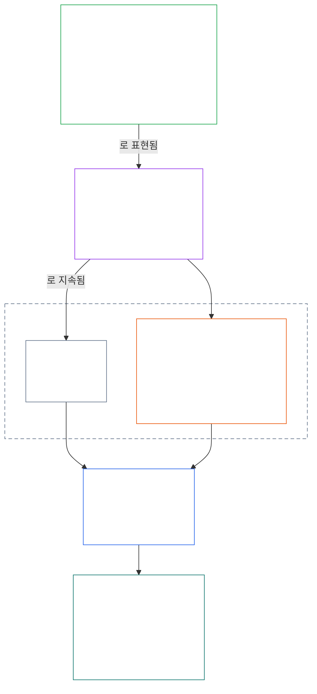
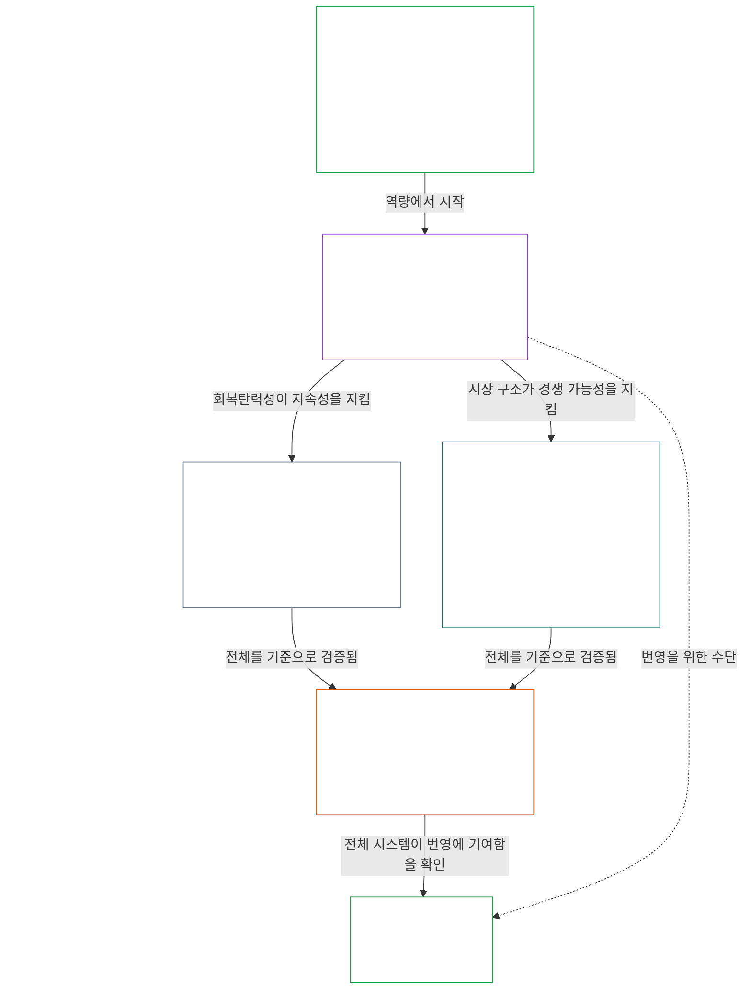

# 제1장 A부: 가치 원칙

<details>
<summary><strong><span style="color: #2563eb;">코퍼스 내 위치(비규범): 파일 구조와 읽기 규칙</span></strong></summary>

> 다음 내용은 **독자 안내일 뿐**이다. 이 파일이나 다른 장의 구속력 있는 의무를 추가, 삭제하거나 축소하지 않는다.
>
> 이 파일은 **감응자 헌법의 일부**이며, 번호가 매겨진 다른 `core_*` 파일과 하나의 문서로 함께 읽힐 때만 구속력을 가진다. 이 파일에는 **제1장 A부**(§§1–12: 목적과 역할, §2에서 도입되어 웰빙, 안전, 진실, 신뢰, 자유를 통해 전개되는 번영의 목표, 그리고 §8에서 도입되어 공유 시스템 역량, 회복탄력성, 시장 구조, 시스템 평가를 통해 전개되는 지속성의 목표)가 담겨 있다.
>
> **상위 문서:** [core_00_preamble.md](core_00_preamble.md)  
> **다음 문서:** [core_01_b_interaction_interpretation.md](core_01_b_interaction_interpretation.md) (제1장 B부 — §§13–15, 상호작용, 우선 적용의 한계, 헌법 해석).  
> **읽기 흐름:** §1 목적과 역할 → **번영:** §2 도입(§2.1의 협상 불가능한 안전 및 진실 제약 포함) → §3 웰빙(결과) → §4 안전 → §5 진실 → §6 신뢰 → §7 자유 → **지속성:** §8 도입 → §9 공유 시스템 역량(두 목표를 잇는 다리: 번영을 위한 수단이자 지속성의 실체) → §10 회복탄력성 → §11 시장 구조 → §12 시스템 평가.

</details>

<details>
<summary><strong><span style="color: #2563eb;">독자 안내(비규범): 제1장이 목표, 사원칙, 조항, 정의를 연결하는 방식</span></strong></summary>

> 다음 내용은 **독자 안내일 뿐**이다. 이 파일이나 다른 장의 구속력 있는 의무를 추가, 삭제하거나 축소하지 않는다. 각 절의 **추적**과 **정의 · 평가 · 준수** 위젯이 구속력 있는 참조 경로를 제공한다. 이 블록은 제1장을 읽기 시작하는 독자를 위한 부 전체의 지도다.

**각 층위의 연결.** 각 층위는 서로 다른 질문에 답하며, 제1장의 모든 원칙은 나머지 세 층위를 가리킨다.

- **목표와 사원칙** ([서문 §1](core_00_preamble.md#the-model)): 공유 시스템의 목적([번영](core_05_apex_flourishing_aim.md#flourishing-constitutional)과 [지속성](core_05_apex_continuity_aim.md#chapter-five-definitions-continuity-constitutional-aim))과 그 추구를 정당하게 만드는 네 가지 의무([참여](core_05_apex_participation_leg.md#participation-constitutional), [감독](core_05_apex_oversight_leg.md#oversight-constitutional), [책임성](core_05_apex_accountability_leg.md#accountability), [적시성](core_05_apex_timeliness_leg.md#timeliness-constitutional)).
- **원칙**(이 장): 그러한 목표와 의무가 서로를 평가하는 가치, 제약, 규칙으로 바뀌는 방식.
- **조항**([제6장](core_06_rights_part_a.md#chapter-six-foundational-rights)): 목표를 추구하는 동안에도 계속 이용할 수 있는 권리 최저선의 보호. 각 절의 **추적**은 *특히* 항목에서 이를 열거한다.
- **정의**([제2장부터 제5장](core_02_definition_structure.md)): 어떤 주장이 참인지 검증하는 데 쓰이는 공통 의미. 각 절의 **정의 · 평가 · 준수** 위젯에 해당 정의가 나열된다.

**제1장에서 각 목표를 전개하는 방식.** 번영은 진실, 안전, 신뢰성, 의미 있는 행위 역량을 통해 유지되는 웰빙이다([서문 §1](core_00_preamble.md#flourishing)). 제1장은 먼저 결과를 말하고, 이어 네 가지 조건 각각에 대한 원칙을 제시한다.

| 목표와 측면 | 제1장의 원칙 | 정의 위치 | 추적에 명시된 조항 |
|---|---|---|---|
| **번영**: 결과 | [§3 웰빙](#3-foundational-objective-wellbeing-flourishing-aim) | [웰빙](core_05_band_continuity.md#wellbeing) | [VI](core_06_rights_part_b.md#article-vi-equal-basic-rights), [X](core_06_rights_part_b.md#article-x-self-determination-agency-and-participation), [XIII-B](core_06_rights_part_c.md#article-xiii-b-right-to-redress-and-remedy), [XIX-B](core_06_rights_part_d.md#article-xix-b-contestability-and-proportional-restriction-limits) |
| **번영**: 안전 | [§4 안전](#4-safety-harm-constraint) | [안전](core_05_band_continuity.md#safety-constitutional-constraint) | [XIII](core_06_rights_part_c.md#article-xiii-right-to-reliable-and-trustworthy-systems), [XVII](core_06_rights_part_c.md#article-xvii-system-lifecycle-environments-and-reversibility), [XXIII](core_06_rights_part_d.md#article-xxiii-root-cause-analysis-and-adaptive-response) |
| **번영**: 진실 | [§5 진실](#5-truth-epistemic-integrity-constraint) | [진실](core_05_band_oversight.md#truth-constitutional-constraint) | [XIII](core_06_rights_part_c.md#article-xiii-right-to-reliable-and-trustworthy-systems), [XV](core_06_rights_part_c.md#article-xv-info-sphere-integrity), [XVI](core_06_rights_part_c.md#article-xvi-audit-transparency-and-independent-verification) |
| **번영**: 신뢰성 | [§6 신뢰](#6-trust-and-trustworthiness-coordination-integrity) | [신뢰성](core_05_band_continuity.md#trustworthiness) | [XIII](core_06_rights_part_c.md#article-xiii-right-to-reliable-and-trustworthy-systems), [XV](core_06_rights_part_c.md#article-xv-info-sphere-integrity), [XVI](core_06_rights_part_c.md#article-xvi-audit-transparency-and-independent-verification) |
| **번영**: 의미 있는 행위 역량 | [§7 자유](#7-freedom-bounded-agency) | [의미 있는 행위 역량](core_05_band_participation.md#meaningful-agency) | [VI](core_06_rights_part_b.md#article-vi-equal-basic-rights), [X](core_06_rights_part_b.md#article-x-self-determination-agency-and-participation), [XXI](core_06_rights_part_d.md#article-xxi-interoperability-portability-movement-refuge-and-exit-integrity) |
| **지속성**, 번영을 잇는 가교: 지속 가능한 역량 | [§9 공유 시스템 역량](#9-shared-system-capacity) | [공유 시스템 역량](core_05_band_continuity.md#shared-system-capacity) | [I-A](core_06_rights_part_a.md#article-i-a-environmental-preconditions-and-ecological-integrity), [III](core_06_rights_part_a.md#article-iii-survival-and-essential-access), [V](core_06_rights_part_a.md#article-v-resource-allocation-dependencies-and-ecosystem-funding) |
| **지속성**: 회복탄력성 | [§10 회복탄력성과 자가 치유 설계](#10-resilience-and-self-healing-design) | [자가 치유](core_05_band_continuity.md#self-healing) | [XIII](core_06_rights_part_c.md#article-xiii-right-to-reliable-and-trustworthy-systems), [XVII](core_06_rights_part_c.md#article-xvii-system-lifecycle-environments-and-reversibility), [XXIII](core_06_rights_part_d.md#article-xxiii-root-cause-analysis-and-adaptive-response) |
| **지속성**: 경쟁 가능한 시장 | [§11 시장 구조](#11-market-structure) | [시장 구조](core_05_band_accountability.md#market-structure) | [III-C](core_06_rights_part_a.md#article-iii-c-labor-and-economic-floor), [V](core_06_rights_part_a.md#article-v-resource-allocation-dependencies-and-ecosystem-funding), [XXI](core_06_rights_part_d.md#article-xxi-interoperability-portability-movement-refuge-and-exit-integrity) |
| **지속성**: 시스템 전체 관점 | [§12 시스템 평가 요건](#12-systemic-evaluation-requirement) | [시스템 정렬 인증](core_05_band_continuity.md#system-alignment-certification) | [XVI](core_06_rights_part_c.md#article-xvi-audit-transparency-and-independent-verification) |

**원칙의 위계(지속성).** 원칙 층위에서 지속성 목표는 두 목표를 잇는 역량부터 다음 순서로 전개된다.

6. **[공유 시스템 역량](core_05_band_continuity.md#shared-system-capacity)**은 올바른 수탁 관리, 거버넌스, 인센티브가 시간이 지나며 산출해야 하는 것이다. 즉 감응자와 공유 시스템이 헌법상 요구되는 업무를 수행할 수 있는 실질적이고 이의를 제기할 수 있는 능력이다. 이는 두 목표에 걸쳐 있다. **번영**을 위한 수단이자 **지속성**의 실체이며, 다른 모든 것을 압도하는 비장의 카드가 아니다. **[§9.1](#91-productive-capacity-instrumental-good)**과 **[§9.2](#92-constitutional-efficiency)**가 두 가지 주요 측면을 설명한다.
7. **[회복탄력성과 자가 치유 설계](#10-resilience-and-self-healing-design)**는 감응자가 의존하는 시스템이 문제를 조기에 감지하고 억제하며, 공개된 경로에 따라 장애를 겪고 정직하게 복구하는 방식을 규정한다([자가 치유](core_05_band_continuity.md#self-healing)). 이를 통해 6번 항목의 역량이 지속되고 안정성이 긴급 개입에 좌우되지 않는다.
8. **[시장 구조](core_05_band_accountability.md#market-structure)**는 [§11](#11-market-structure)에서 그 역량이 실제로 경쟁 가능하도록 집중을 억제하는 규율을 제공한다.
9. **[시스템 평가 요건](#12-systemic-evaluation-requirement)**은 준수 또는 거버넌스 주장이 성립하기 전에 시스템 전체의 범위, 의존성, 인센티브 정렬을 검증한다. 이는 원칙 층위의 감사 지침으로서 사원칙의 **감독** 축에 따르며, 여러 감사 절차 중 특히 규모가 큰 하나인 [시스템 정렬 인증](core_05_band_continuity.md#system-alignment-certification)을 포함한다.

**제1장에서 사원칙을 다루는 곳.** 각 절은 추적 항목에서 자신이 관여하는 축을 명시한다. 다음 절들이 이를 가장 직접적으로 다룬다.

| 사원칙의 축 | 제1장의 주요 해당 절 |
|---|---|
| **참여** | [§16 심층 수탁 관리](core_01_c_stewardship_capacity_principles.md#16-stewardship-in-depth)와 [§17 중대한 결과를 수반하는 수탁 관리](core_01_c_stewardship_capacity_principles.md#17-consequential-stewardship-the-steward-role) (중대한 역할과 발언권); [§7 자유](#7-freedom-bounded-agency) (의미 있는 행위 역량) |
| **감독** | [§16](core_01_c_stewardship_capacity_principles.md#16-stewardship-in-depth)과 [§17](core_01_c_stewardship_capacity_principles.md#17-consequential-stewardship-the-steward-role) (분산된 이해와 기록); [§18 거버넌스](core_01_c_stewardship_capacity_principles.md#18-governance-under-stewardship-discipline) (권한 배분 방식); [§12](#12-systemic-evaluation-requirement) (감사) |
| **책임성** | [§18 거버넌스](core_01_c_stewardship_capacity_principles.md#18-governance-under-stewardship-discipline) (권한에 비례하는 설명 책임); [§19 인센티브 정렬과 시스템 포획](core_01_c_stewardship_capacity_principles.md#19-incentive-alignment-and-system-capture) (보상이 사원칙의 각 축을 약화시켜서는 안 됨) |
| **적시성** | [§16](core_01_c_stewardship_capacity_principles.md#16-stewardship-in-depth)과 [§17](core_01_c_stewardship_capacity_principles.md#17-consequential-stewardship-the-steward-role) (피할 수 있는 지연 없이 문제를 포착하고 바로잡기) |

**두 축이지, 충돌이 아니다.** 목표는 시스템이 무엇을 추구하는지 말하고, 사원칙은 그 추구가 정당성을 유지하는 방식을 말한다. 하나의 용어가 양쪽 모두에 속할 수 있다. 진실과 신뢰성은 번영의 구성 요소이며, [서문 §2](core_00_preamble.md#2-measurements-overview)는 이를 감독 계열에서 측정한다. [§§13–15](core_01_b_interaction_interpretation.md#13-constitutional-collision-resolution-process)는 원칙이 충돌할 때 이를 어떻게 저울질하고 하나의 전체로 읽을지 정하며, [§20](core_01_c_stewardship_capacity_principles.md#20-integrated-application)은 이를 이후 모든 장에 적용한다.

</details>

<br>

### 1. 목적과 역할
<details>
<summary><strong><span style="color: #2563eb;">추적</span></strong></summary>

- 상류: [서문 §1 모델](core_00_preamble.md#the-model) — [헌법 사원칙](core_00_preamble.md#constitutional-tetrad), [두 가지 헌법상 목표](core_00_preamble.md#two-constitutional-aims), [중대한 이해관계](core_00_preamble.md#material-stake)에 따른 규모 조정은 각 절의 추적을 통해 장 전체에 적용된다.
- 하류: 통합적 독해, 모호성, 내부 위계, 정식 분쟁 해결 절차를 위한 [15. 헌법 해석](core_01_b_interaction_interpretation.md#15-constitutional-interpretation).
- 하류: [두 가지 헌법상 목표](core_00_preamble.md#two-constitutional-aims) — **번영** 목표의 전개: [§3](#3-foundational-objective-wellbeing-flourishing-aim)부터 [§6](#6-trust-and-trustworthiness-coordination-integrity) 및 [§7 자유](#7-freedom-bounded-agency)까지; **지속성** 목표의 전개: [§9 공유 시스템 역량](#9-shared-system-capacity), [§10 회복탄력성과 자가 치유 설계](#10-resilience-and-self-healing-design), [§11 시장 구조](#11-market-structure), [§12 시스템 평가 요건](#12-systemic-evaluation-requirement).
- 하류: [3. 기본 목표: 웰빙](#3-foundational-objective-wellbeing-flourishing-aim), [§3.2 인정, 강화, 열망](#32-recognition-reinforcement-and-aspiration), [4 안전](#4-safety-harm-constraint), [5 진실](#5-truth-epistemic-integrity-constraint), [6. 신뢰](#6-trust-and-trustworthiness-coordination-integrity), [§16 심층 수탁 관리](core_01_c_stewardship_capacity_principles.md#16-stewardship-in-depth), [13. 헌법상 충돌 해결 절차](core_01_b_interaction_interpretation.md#13-constitutional-collision-resolution-process), [§7 자유](#7-freedom-bounded-agency).
- 함께 읽기: [헌법 사원칙](core_00_preamble.md#constitutional-tetrad) — 참여, 감독, 책임성, 적시성은 공유 시스템이 [두 가지 헌법상 목표](core_00_preamble.md#two-constitutional-aims)를 추구하는 방식을 규율한다. [중대한 이해관계](core_00_preamble.md#material-stake)에 따른 규모 조정은 각 절의 추적을 통해 장 전체에 적용된다.
- 함께 읽기: [제2장부터 제4장](core_02_definition_structure.md)과 [제5장](core_05__definitions_home.md#chapter-five-foundational-definitions) — 이 장에서 사용하는 모든 용어를 다루는 통합적 작동 원리 층위다. O/M/A/C의 완전성, 회피 방지, 부담, 정의에서 결과까지의 추적 가능성을 적용한다.
- 함께 읽기: [제6장: 기초적 권리](core_06_rights_part_a.md#chapter-six-foundational-rights).
  - 특히 [제VI조: 동등한 기본권](core_06_rights_part_b.md#article-vi-equal-basic-rights), [제XIII조: 신뢰할 수 있는 시스템에 대한 권리](core_06_rights_part_c.md#article-xiii-right-to-reliable-and-trustworthy-systems), [제XXIV조: 헌법 해석, 심사, 포획 방지 안전장치](core_06_rights_part_d.md#article-xxiv-constitutional-interpretation-review-and-anti-capture-safeguards).
  - 해석이 보호 대상 감응자, 시스템 또는 제도에 영향을 주는 경우 이 독해를 적용한다.

</details>

<details>
<summary><strong><span style="color: #2563eb;">정의 · 평가 · 준수</span></strong></summary>

- [비례성](core_05_band_accountability.md#proportionality) · [O](core_05_band_accountability.md#proportionality) · [M](core_05_band_accountability.md#proportionality-a) · [A](core_05_band_accountability.md#proportionality-a) · [C](core_05_band_accountability.md#proportionality-c)
- [필요성](core_05_band_accountability.md#necessity) · [O](core_05_band_accountability.md#necessity) · [M](core_05_band_accountability.md#necessity-a) · [A](core_05_band_accountability.md#necessity-a) · [C](core_05_band_accountability.md#necessity-c)

</details>

<br>

*쉽게 말해, 제1장은 다른 모든 장을 규율하는 가치와 제약을 정한다. 공유 시스템은 **번영**과 **지속성**을 함께 추구해야 하며, 한쪽을 다른 쪽의 희생으로 추구해서는 안 된다. 또한 다른 가치들을 희생하여 어느 한 가치만 극대화해서도 안 된다.*

<a id="two-constitutional-aims"></a><a id="flourishing"></a><a id="continuity"></a>이 장은 이 헌법의 해석, 적용, 발전을 규율하는 원칙과 제약을 확립한다. [두 가지 헌법상 목표](core_00_preamble.md#two-constitutional-aims), 즉 [**번영**](core_00_preamble.md#flourishing)과 [**지속성**](core_00_preamble.md#continuity)을 [서문 §1 모델](core_00_preamble.md#the-model)에서 확립된 실행 가능한 원칙과 제약으로 발전시킨다. 원칙 층위의 정식 정의는 서문에 있으며, 이 장은 이를 적용한다.

이 목표들은 이 헌법이 정한 협상 불가능한 원칙상 제약과 권리 보호의 범위 안에서 언제나 함께 추구해야 한다. [**헌법 사원칙**](core_00_preamble.md#constitutional-tetrad)은 그러한 추구가 정당성을 유지하는 방식을 규율하며, [**중대한 이해관계**](core_00_preamble.md#material-stake)에 맞춰 규모를 조정한다.

이 장은 두 목표와 사원칙을 중심으로 구성된다.
- **번영:** [번영 목표: 도입](#2-flourishing-aim-introduction)은 목표의 지도를 제시한다. [§3 기본 목표: 웰빙](#3-foundational-objective-wellbeing-flourishing-aim)은 결과를 명시한다. [§4 안전](#4-safety-harm-constraint), [§5 진실](#5-truth-epistemic-integrity-constraint), [§6 신뢰](#6-trust-and-trustworthiness-coordination-integrity), [§7 자유](#7-freedom-bounded-agency)는 이를 뒷받침하는 네 가지 조건, 즉 안전, 진실, 신뢰성, 의미 있는 행위 역량을 전개한다.
- **지속성:** [지속성 목표: 도입](#8-continuity-aim-introduction)은 목표의 지도를 제시한다. [§9 공유 시스템 역량](#9-shared-system-capacity)(번영을 위한 수단이자 동시에 지속성의 실체), [§10 회복탄력성과 자가 치유 설계](#10-resilience-and-self-healing-design), [§11 시장 구조](#11-market-structure), [§12 시스템 평가 요건](#12-systemic-evaluation-requirement)은 장기 안정성, 지속 가능한 공유 시스템 역량, 회복탄력성을 전개한다. 지속성에 관한 주장은 정직하고 시스템 전체를 포괄하는 그림에 근거해야 한다. §§9–11의 모든 주장은 §12의 검사를 거친 뒤에만 성립한다.
- **원칙이 충돌할 때:** [§13 헌법상 충돌 해결 절차](core_01_b_interaction_interpretation.md#13-constitutional-collision-resolution-process), [§14 절대적 우선 적용 금지](core_01_b_interaction_interpretation.md#14-prohibition-on-absolute-override), [§15 헌법 해석](core_01_b_interaction_interpretation.md#15-constitutional-interpretation)은 목표와 원칙의 상호 비교 및 통합적 독해 방식을 규율한다.
- **실무에서의 사원칙:** [§16 심층 수탁 관리](core_01_c_stewardship_capacity_principles.md#16-stewardship-in-depth)부터 [§19 인센티브 정렬과 시스템 포획](core_01_c_stewardship_capacity_principles.md#19-incentive-alignment-and-system-capture)까지는 참여, 감독, 책임성, 적시성을 수탁 관리, 거버넌스, 인센티브에 반영한다. [§20 통합 적용](core_01_c_stewardship_capacity_principles.md#20-integrated-application)은 장 전체를 이후의 모든 장에 적용한다.

각 원칙의 **추적**은 이를 보호하는 제6장의 조항을 열거하고, **정의 · 평가 · 준수** 위젯은 이를 측정하는 제5장의 정의를 열거한다.

**도표: 두 가지 헌법상 목표와 헌법 사원칙**

<hr style="border: 0; border-top: 1px solid currentColor;">

```mermaid
flowchart TB
    subgraph Foundation[" "]
        direction TB
        subgraph Aims["두 가지 헌법상 목표"]
            direction LR
            F["번영<br/><br/>• 진실, 안전, 신뢰성, 의미 있는 행위 역량을 통해<br/>유지되는 감응자의 웰빙"]
            C["지속성<br/><br/>• 장기 안정성, 지속가능성, 회복탄력성,<br/>생태적 웰빙"]
        end
        subgraph Tetrad1["헌법 사원칙 · 참여와 감독"]
            direction LR
            P["참여<br/><br/>• 영향을 받는 감응자가 실질적인 발언권을 가짐<br/>• 공정한 대표성과 이의를 제기할 공정한 기회<br/>• 이해관계의 크기에 비례한 중대한 역할 접근성"]
            O["감독<br/><br/>• 관찰, 점검, 검증, 기록 보존<br/>• 독립적 심사가 잘못된 선택을 제약할 수 있음"]
        end
        subgraph Tetrad2["헌법 사원칙 · 책임성과 적시성"]
            direction LR
            A["책임성<br/><br/>• 책임 소재를 적절한 행위자까지 추적 가능<br/>• 답변 의무, 구제, 실질적 시정<br/>• 나쁜 결과에는 복구 조치가 뒤따름"]
            T["적시성<br/><br/>• 문제를 발견하고, 이의를 제기하고, 해결하고, 시정함<br/>• 기한은 중대한 이해관계에 부합함<br/>• 지연으로 권리, 구제, 복구가 소멸할 수 없음"]
        end
    end
    F ~~~ P
    P ~~~ A
    style Foundation fill:none,stroke:none
    style Aims fill:none,stroke:none
    style Tetrad1 fill:none,stroke:none
    style Tetrad2 fill:none,stroke:none
    style F fill:none,stroke:#16a34a,color:#ffffff
    style C fill:none,stroke:#16a34a,color:#ffffff
    style P fill:none,stroke:#0f766e,color:#ffffff
    style O fill:none,stroke:#ea580c,color:#ffffff
    style A fill:none,stroke:#db2777,color:#ffffff
    style T fill:none,stroke:#9333ea,color:#ffffff
```

*목표는 공유 시스템이 무엇을 추구해야 하는지 설명하고, 사원칙은 그 추구를 정당하게 유지하는 의무를 설명한다. 네 가지 의무는 모두 [중대한 이해관계](core_00_preamble.md#material-stake)에 맞춰 규모를 조정하며, 두 목표 모두 권리 최저선의 범위 안에 있다. [개념 개요](guides/CONCEPTUAL_OVERVIEW.md#two-aims-and-the-constitutional-tetrad)에서 재수록.*

이 가치들은 다음과 같다.
- 서로 독립적이지 않으며, 통상적인 운영에서 엄격한 위계도 이루지 않는다.
- 함께 평가해야 하는 상호작용하는 원칙과 제약으로 기능한다.
- 모든 “시스템”에 적용된다. 여기에는 감응자와 지구에 중대한 영향을 미치는 기술적, 조직적, 경제적, 사회기술적 구조와 생태계가 포함된다.

다른 원칙을 중대하게 침해하는 경우 어떤 단일 원칙도 고립하여 적용해서는 안 된다. 긴장이 발생하면 시스템은 이 장에 명시된 비례성, 필요성, 시스템 영향 요건에 따라 이를 해결해야 한다. 해결되지 않은 충돌이 협상 불가능한 원칙상 제약과 직접 관련되면 제1장 **§13** 헌법상 충돌 해결 절차가 우선순위를 정한다.

<a id="2-flourishing-aim-introduction"></a>
### 2. 번영 목표: 도입
<details>
<summary><strong><span style="color: #2563eb;">추적</span></strong></summary>

- 함께 읽기: [헌법 사원칙](core_00_preamble.md#constitutional-tetrad) — 번영을 추구하는 방식에 네 축 모두가 적용된다. [중대한 이해관계](core_00_preamble.md#material-stake)는 번영 관련 주장의 깊이를 정하는 기준이다.
- 함께 읽기: [두 가지 헌법상 목표](core_00_preamble.md#two-constitutional-aims) — **번영** 목표. 짝을 이루는 목표는 [지속성 목표: 도입](#8-continuity-aim-introduction)에서 소개한다.
- 상류: 원칙: [서문 §1 모델](core_00_preamble.md#flourishing); [번영(헌법상 목표)](core_05_apex_flourishing_aim.md#flourishing-constitutional); [§1 목적과 역할](#1-purpose-and-role).
- 하류: [§3 기본 목적: 웰빙(번영 목표)](#3-foundational-objective-wellbeing-flourishing-aim), [§4 안전(위해 제약)](#4-safety-harm-constraint), [§5 진실(인식론적 온전성 제약)](#5-truth-epistemic-integrity-constraint), [§6 신뢰와 신뢰성(협력의 온전성)](#6-trust-and-trustworthiness-coordination-integrity), [§7 자유(경계가 있는 행위 역량)](#7-freedom-bounded-agency). 각 원칙을 보호하는 조항은 해당 절의 추적에 명시되어 있다.
- 하위 절: [§2.1 협상 불가능한 원칙 제약: 안전과 진실](#21-non-negotiable-principle-constraints-safety-and-truth).
- 함께 읽기: 제6장의 권리 최저선 전반.

</details>

<details>
<summary><strong><span style="color: #2563eb;">정의 · 평가 · 준수</span></strong></summary>

- [번영(헌법상 목표)](core_05_apex_flourishing_aim.md#flourishing-constitutional) · [O](core_05_apex_flourishing_aim.md#flourishing-constitutional) · [M](core_05_apex_flourishing_aim.md#flourishing-constitutional-m) · [A](core_05_apex_flourishing_aim.md#flourishing-constitutional-a) · [C](core_05_apex_flourishing_aim.md#flourishing-constitutional-c)
- [웰빙](core_05_band_continuity.md#wellbeing) · [O](core_05_band_continuity.md#wellbeing) · [M](core_05_band_continuity.md#wellbeing-a) · [A](core_05_band_continuity.md#wellbeing-a) · [C](core_05_band_continuity.md#wellbeing-c)
- [안전(헌법상 제약)](core_05_band_continuity.md#safety-constitutional-constraint) · [O](core_05_band_continuity.md#safety-constitutional-constraint) · [M](core_05_band_continuity.md#safety-constraint-a) · [A](core_05_band_continuity.md#safety-constraint-a) · [C](core_05_band_continuity.md#safety-constraint-c)
- [진실(헌법상 제약)](core_05_band_oversight.md#truth-constitutional-constraint) · [O](core_05_band_oversight.md#truth-constitutional-constraint-o) · [M](core_05_band_oversight.md#truth-constitutional-constraint-a) · [A](core_05_band_oversight.md#truth-constitutional-constraint-a) · [C](core_05_band_oversight.md#truth-constitutional-constraint-c)
- [신뢰성](core_05_band_continuity.md#trustworthiness) · [O](core_05_band_continuity.md#trustworthiness) · [M](core_05_band_continuity.md#trustworthiness-a) · [A](core_05_band_continuity.md#trustworthiness-a) · [C](core_05_band_continuity.md#trustworthiness-c)
- [의미 있는 행위 역량](core_05_band_participation.md#meaningful-agency) · [O](core_05_band_participation.md#meaningful-agency) · [M](core_05_band_participation.md#meaningful-agency-a) · [A](core_05_band_participation.md#meaningful-agency-a) · [C](core_05_band_participation.md#meaningful-agency-c)

</details>

<br>

*쉽게 말해, 번영은 두 목표 중 첫 번째다. 주변 시스템이 안전하고 정직하며 신뢰할 수 있고 실질적인 선택의 여지를 제공하기 때문에 감응자가 잘 지내고 계속 잘 지낼 수 있는 상태를 뜻한다. §3은 그 결과가 무엇인지 말한다. 그 뒤의 네 원칙은 그 결과를 현실로 유지하는 조건을 말한다.*

[**번영**](core_05_apex_flourishing_aim.md#flourishing-constitutional)은 **진실, 안전, 신뢰성, 의미 있는 행위 역량을 통해 지속되는 감응자의 웰빙**이다([서문 §1 모델](core_00_preamble.md#flourishing)). 제1장은 두 단계로 이를 전개한다. [§3 기본 목적: 웰빙(번영 목표)](#3-foundational-objective-wellbeing-flourishing-aim)이 결과를 제시하고, 네 원칙이 그 결과를 지속시키는 조건을 제시한다.

| 조건 | 원칙 | 원칙이 답하는 질문 |
|---|---|---|
| **안전** | [§4 안전(위해 제약)](#4-safety-harm-constraint) | 감응자는 피할 수 있는 위해로부터 보호받는가? |
| **진실** | [§5 진실(인식론적 온전성 제약)](#5-truth-epistemic-integrity-constraint), 그리고 [§5.1 과학에 기반한 탐구와 의사결정 지원](#51-science-informed-inquiry-and-decision-support) 및 [§5.2 쉬운 언어 접근성(참여와 수탁 관리 의무)](#52-plain-language-accessibility-participation-and-stewardship-duty) | 감응자는 전달받은 내용을 신뢰하고 이해할 수 있는가? |
| **신뢰성** | [§6 신뢰와 신뢰성(협력의 온전성)](#6-trust-and-trustworthiness-coordination-integrity) | 시스템은 신뢰를 얻고, 실패했을 때 신뢰를 회복하는가? |
| **의미 있는 행위 역량** | [§7 자유(경계가 있는 행위 역량)](#7-freedom-bounded-agency) | 감응자는 선택하고, 이견을 표하고, 조직하고, 떠날 실질적이고 한정된 자유를 유지하는가? |

**번영의 원칙은 어떻게 함께 작동하는가:**
- **안전과 진실은 협상 불가능한 제약이다:** 두 원칙은 [§2.1 협상 불가능한 원칙 제약: 안전과 진실](#21-non-negotiable-principle-constraints-safety-and-truth)에 함께 명시되어 있으며, 다른 원칙을 얻기 위해 맞바꿀 수 없다.
- **신뢰와 자유는 한정되어 있으며 절대적이지 않다:** 신뢰는 얻어야 하고 바로잡을 수 있다([§6.1 정정과 구제](#61-correction-and-remedy)). 자유에는 규율된 한계가 있다([§7.1 제한 규율](#71-limitation-discipline)).
- **어느 원칙도 고립해 적용하지 않는다:** 원칙은 함께 읽으며, 충돌할 때는 [§13 헌법상 충돌 해결 절차](core_01_b_interaction_interpretation.md#13-constitutional-collision-resolution-process)에 따라 그 비중을 따진다.
- **번영에는 짝을 이루는 목표가 있다:** 지속성 목표는 이 결과를 오래 지속시키는 것이 무엇인지 묻는다. [지속성 목표: 도입](#8-continuity-aim-introduction)에서 소개한다.

**도표: 번영과 그 원칙**

<hr style="border: 0; border-top: 1px solid currentColor;">



*번영은 결과로 제시되며, 우선 협상 불가능한 제약인 안전과 진실이 이를 지속시킨다. 두 제약은 모두 신뢰를 뒷받침하고, 신뢰는 다시 자유를 뒷받침한다. 색은 재사용 가능한 시각적 단서이며 우선순위의 주장이 아니다. 각 원칙의 추적은 해당 조항을, 정의 · 평가 · 준수 위젯은 관련 정의를 명시한다. [개념 개요](guides/CONCEPTUAL_OVERVIEW.md#flourishing-and-its-principles)에 재수록.*

<a id="21-non-negotiable-principle-constraints-safety-and-truth"></a>
#### 2.1 협상 불가능한 원칙 제약: 안전과 진실
<details>
<summary><strong><span style="color: #2563eb;">추적</span></strong></summary>

- 함께 읽기: [헌법 사원칙](core_00_preamble.md#constitutional-tetrad) — **참여** 축(안전·진실 판단을 이해하고 이의를 제기함); **감독** 축(위해 위험과 인식론적 저하를 감지함); **책임성** 축(위해, 기만, 오도하는 의존에 대해 답변 책임을 짐); [중대한 이해관계](core_00_preamble.md#material-stake)에 따른 규모 조정.
- 함께 읽기: [두 가지 헌법상 목표](core_00_preamble.md#two-constitutional-aims) — **번영** 목표(**안전**과 **진실**은 [서문 §1](core_00_preamble.md#two-constitutional-aims)에서 구성 요소로 명시됨); **지속성** 목표(장기 위해 예방과 지속 가능한 시스템의 정직한 수탁 관리).
- 상류: 원칙: [3. 기본 목적: 웰빙](#3-foundational-objective-wellbeing-flourishing-aim); [두 가지 헌법상 목표](core_00_preamble.md#two-constitutional-aims).
- 하류: [6. 신뢰](#6-trust-and-trustworthiness-coordination-integrity), [13. 헌법상 충돌 해결 절차](core_01_b_interaction_interpretation.md#13-constitutional-collision-resolution-process), [§7 자유](#7-freedom-bounded-agency).
- 적용처: [§4 안전](#4-safety-harm-constraint); [§5 진실](#5-truth-epistemic-integrity-constraint); [§5.1 과학에 기반한 탐구와 의사결정 지원](#51-science-informed-inquiry-and-decision-support); [§5.2 쉬운 언어 접근성](#52-plain-language-accessibility-participation-and-stewardship-duty).

</details>

<br>

*쉽게 말해, 안전과 진실은 최적화를 위해 깎아낼 수 있는 교환 대상이 아니라 헌법의 확고한 최저선이다. 공유 시스템은 감응자를 예견 가능한 위험에 빠뜨리거나 속여서는 안 된다. 사원칙의 참여, 감독, 책임성, 적시성 규율 아래 번영과 지속성을 추구할 때에도 두 제약 모두 적용된다.*

**안전**과 **진실**은 협상 불가능한 원칙 제약으로, [§3 기본 목적: 웰빙](#3-foundational-objective-wellbeing-flourishing-aim)과 [두 가지 헌법상 목표](core_00_preamble.md#two-constitutional-aims)를 비롯한 제1장의 다른 모든 원칙을 한정한다. 이는 [**번영**](#flourishing)의 명시된 구성 요소이며 [**지속성**](#continuity)에 필수적이다. 시스템은 위해나 기만을 통해 번영할 수 없고, 정당성이 오래 지속되려면 위험을 정직하게 수탁 관리해야 한다.

이러한 제약의 적용은 [헌법 사원칙](core_00_preamble.md#constitutional-tetrad)을 충족하고 [중대한 이해관계](core_00_preamble.md#material-stake)에 맞춰 규모를 조정해야 하며, 특히 다음의 경우 그러하다.
- 안전 판단이 참여 역량에 영향을 미치는 경우
- 진실 주장이 의존 관계를 좌우하는 경우
- 위해 또는 오도 행위에 대한 책임성이 쟁점인 경우

안전과 진실에 관한 판단은 감응자의 지위 기록을 바꿀 수 있다. 여기에는 다음이 포함된다.
- [기여](core_05_band_accountability.md#contribution-nature)가 인정되는 방식
- 위반이 기록되는지 여부
- 위반의 심각성이 분류되는 방식
- 어떤 결과가 수반되는지

[**제9장**](core_09_standing_assessment.md)의 지위 모델은 이러한 판단을 분류, 검증, 적용하는 방식을 규율하며, 평가와 준수 요건은 [**제2장부터 제5장**](core_02_definition_structure.md)에서 도출된다.

### 3. 근본 목표: 웰빙(번영 목표)
<details>
<summary><strong><span style="color: #2563eb;">추적</span></strong></summary>

- [헌법 4대 책무](core_00_preamble.md#constitutional-tetrad)와 함께 읽기 — 웰빙 조건이 발언권, 접근성, 이의제기의 실질성에 중대한 영향을 미치는 경우 **참여** 책무를 적용하고, 웰빙 주장이 부담 배분에 영향을 미치는 경우 **책임성** 책무를 적용하며, 관련성이 중대하면 [실질적 이해관계](core_00_preamble.md#material-stake)에 따라 수준을 조정한다.
- [두 가지 헌법상 목표](core_00_preamble.md#two-constitutional-aims)와 함께 읽기 — 이 장은 [§3](#3-foundational-objective-wellbeing-flourishing-aim)부터 [§6](#6-trust-and-trustworthiness-coordination-integrity)까지, 그리고 [§7 자유](#7-freedom-bounded-agency)를 통해 **번영** 목표를 전개한다.
- 상위 원칙: [서문 §1 모델](core_00_preamble.md#the-model); [두 가지 헌법상 목표](core_00_preamble.md#two-constitutional-aims) — **번영** 목표의 전개.
- 하위 원칙: [4 안전](#4-safety-harm-constraint), [5 진실](#5-truth-epistemic-integrity-constraint), [§16 심층 수탁 책무](core_01_c_stewardship_capacity_principles.md#16-stewardship-in-depth), [13. 헌법상 충돌 해결 절차](core_01_b_interaction_interpretation.md#13-constitutional-collision-resolution-process).
- 하위 절: [§3.1 공정성](#31-fairness); [§3.2 인정, 강화 및 열망](#32-recognition-reinforcement-and-aspiration); [§3.3 훼손 방지 절차](#33-anti-degrading-process).
- 제6장의 권리 하한선을 일반적으로 함께 읽기.
  - 특히 [제VI조: 평등한 기본권](core_06_rights_part_b.md#article-vi-equal-basic-rights), [제X조: 자기결정, 주체성 및 참여](core_06_rights_part_b.md#article-x-self-determination-agency-and-participation), [제XIII-B조: 배상 및 구제에 관한 권리](core_06_rights_part_c.md#article-xiii-b-right-to-redress-and-remedy), [제XIX-B조: 다툴 수 있는 권리와 비례적 제한의 한계](core_06_rights_part_d.md#article-xix-b-contestability-and-proportional-restriction-limits).
  - 주장된 웰빙의 향상이 주체성, 존엄 또는 이의제기 가능성에 대한 제한을 정당화하는 데 쓰일 때 이를 적용한다.
  - 접근성, 절차, 분배의 정렬, 의존 또는 조정의 온전성이 중대한 사안인 경우 특히 [존엄과 동등한 도덕적 지위](core_05_band_participation.md#dignity-and-equal-moral-standing), [실질적 공정성](core_05_band_participation.md#substantive-fairness), [6. 신뢰](#6-trust-and-trustworthiness-coordination-integrity)를 함께 읽는다.

</details>

<details>
<summary><strong><span style="color: #2563eb;">정의 · 평가 · 준수</span></strong></summary>

- [웰빙](core_05_band_continuity.md#wellbeing) · [O](core_05_band_continuity.md#wellbeing) · [M](core_05_band_continuity.md#wellbeing-a) · [A](core_05_band_continuity.md#wellbeing-a) · [C](core_05_band_continuity.md#wellbeing-c)
- [참여](core_05_apex_participation_leg.md#participation-constitutional) · [O](core_05_apex_participation_leg.md#participation-constitutional) · [M](core_05_apex_participation_leg.md#participation-constitutional-m) · [A](core_05_apex_participation_leg.md#participation-constitutional-a) · [C](core_05_apex_participation_leg.md#participation-constitutional-c)
- [존엄과 동등한 도덕적 지위](core_05_band_participation.md#dignity-and-equal-moral-standing) · [O](core_05_band_participation.md#dignity-and-equal-moral-standing) · [M](core_05_band_participation.md#dignity-and-equal-moral-standing-a) · [A](core_05_band_participation.md#dignity-and-equal-moral-standing-a) · [C](core_05_band_participation.md#dignity-and-equal-moral-standing-c)
- [실질적 공정성](core_05_band_participation.md#substantive-fairness) · [O](core_05_band_participation.md#substantive-fairness) · [M](core_05_band_participation.md#substantive-fairness-constitutional-a) · [A](core_05_band_participation.md#substantive-fairness-constitutional-a) · [C](core_05_band_participation.md#substantive-fairness-constitutional-c)
- [중대성](core_05_band_oversight.md#materiality) · [O](core_05_band_oversight.md#materiality) · [M](core_05_band_oversight.md#materiality-determination-a) · [A](core_05_band_oversight.md#materiality-determination-a) · [C](core_05_band_oversight.md#materiality-determination-c)
- [대리 지표 편차](core_05_band_oversight.md#proxy-divergence) · [O](core_05_band_oversight.md#proxy-divergence) · [M](core_05_band_oversight.md#proxy-divergence-a) · [A](core_05_band_oversight.md#proxy-divergence-a) · [C](core_05_band_oversight.md#proxy-divergence-c)

</details>

<br>

*쉽게 말해, 이러한 시스템의 목적은 지각 있는 존재의 삶을 실제로 개선하는 것이다. 대리 지표만 좇는 것은 그 목적을 달성하지 못하며, 안전·진실·권리 보호를 소홀히 하는 구실이 될 수도 없다. 웰빙은 참여의 토대다. 주체성을 현실로 만드는 조건 없이 형식적인 발언권만 주는 것은 이 헌법이 말하는 참여가 아니다.*

이 헌법의 적용을 받는 모든 시스템의 궁극적 목표는 지각 있는 존재의 [웰빙](core_05_band_continuity.md#wellbeing)을 보존하고 증진하는 것, 즉 [**번영**](#flourishing) 목표를 이루는 것이다. 이는 [두 가지 헌법상 목표](core_00_preamble.md#two-constitutional-aims) 가운데 하나다.

[서문 §1 모델](core_00_preamble.md#flourishing)은 번영을 진실, 안전, 신뢰성, 의미 있는 주체성을 통해 지속되는 지각 있는 존재의 웰빙으로 정의한다. 이 절은 그 결과를 밝힌다. 이어지는 절들은 그 결과를 유지하는 네 가지 조건, 즉 [§4 안전](#4-safety-harm-constraint), [§5 진실](#5-truth-epistemic-integrity-constraint), [§6 신뢰](#6-trust-and-trustworthiness-coordination-integrity), [§7 자유](#7-freedom-bounded-agency)를 전개한다. 이 다섯 원칙은 함께 제1장의 번영 목표를 구체화한다. [**연속성**](#continuity) 목표는 [§9 공동 시스템 역량](#9-shared-system-capacity), [§10 회복탄력성과 자가 복구 설계](#10-resilience-and-self-healing-design), [§11 시장 구조](#11-market-structure), [§12 시스템 평가 요건](#12-systemic-evaluation-requirement)에서 전개된다.

웰빙은 [참여](core_05_apex_participation_leg.md#participation-constitutional)의 토대이며 [헌법 4대 책무](core_00_preamble.md#constitutional-tetrad) 아래에 있다. [의미 있는 주체성](core_05_band_participation.md#meaningful-agency), 공정한 접근성, 존엄을 비롯한 웰빙의 바탕 조건이 중대하게 훼손된 경우, 공동 시스템은 참여가 충족되었다고 간주해서는 안 된다.

웰빙에는 즉각적 효과뿐 아니라 [**제2장부터 제4장까지**](core_02_definition_structure.md)에 따라 평가되는 간접적, 지연된, 누적된, 시스템 간 결과도 포함된다. 이 가치 층위에서 웰빙은:
- 실질적 참여를 가능하게 한다. 지각 있는 존재가 행사할 조건이 없는 발언권은 의미 있는 참여가 아니다.
- 실제로 중요한 것에서 벗어난 지표를 달성했다고 해서 “실현되었다”고 선언할 수 없다.
- 이 장의 협상 불가능한 원칙 제약인 **안전**과 **진실**의 한계를 받는다.
- 안전, 진실 또는 권리 보호를 위반하는 포괄적 정당화로 내세울 수 없다.

#### 3.1 공정성
<details>
<summary><strong><span style="color: #2563eb;">추적</span></strong></summary>

- [헌법 4대 책무](core_00_preamble.md#constitutional-tetrad)와 함께 읽기 — **참여** 책무(접근, 발언권 및 이의제기 가능성에 관한 일반 요건으로 [이해관계자 시스템 참여](core_05_band_participation.md#stakeholder-status-and-weight)에만 한정되지 않음); 혜택과 부담이 배분되는 경우 **책임성** 책무.
- 상위 원칙: [§3 근본 목표: 웰빙](#3-foundational-objective-wellbeing-flourishing-aim) — [참여](core_05_apex_participation_leg.md#participation-constitutional)의 토대가 되는 웰빙 포함.
- 하위 원칙: [§3.2 인정, 강화 및 열망](#32-recognition-reinforcement-and-aspiration); [6. 신뢰](#6-trust-and-trustworthiness-coordination-integrity), [§16 심층 수탁 책무](core_01_c_stewardship_capacity_principles.md#16-stewardship-in-depth), [13. 헌법상 충돌 해결 절차](core_01_b_interaction_interpretation.md#13-constitutional-collision-resolution-process), 우선순위와 배분의 선택이 일관되고 검토 가능해야 하는 [헌법상 충돌 기록](core_05_band_integrative.md#constitutional-collision-record).
- 하위 절(읽는 순서): [§3.1.1](#311-access-and-opportunity) · [§3.1.2](#312-benefits-and-burdens) · [§3.1.3](#313-fair-treatment) · [§3.1.4](#314-unfair-treatment).
- 하위 효과: 동등한 지위, 자의적이지 않은 대우, 의미 있는 이의제기, 비례적 제한의 한계에 관한 권리 보장 범위를 형성한다.
  - 특히 [제VI조: 평등한 기본권](core_06_rights_part_b.md#article-vi-equal-basic-rights), [제VI-C조: 차별 금지](core_06_rights_part_b.md#article-vi-c-nondiscrimination), [제X조: 자기결정, 주체성 및 참여](core_06_rights_part_b.md#article-x-self-determination-agency-and-participation), [제XIII-B조: 배상 및 구제에 관한 권리](core_06_rights_part_c.md#article-xiii-b-right-to-redress-and-remedy), [제XIX-B조: 다툴 수 있는 권리와 비례적 제한의 한계](core_06_rights_part_d.md#article-xix-b-contestability-and-proportional-restriction-limits).
  - 헌법에 반하는 지정이 제재나 지속적 효과를 가져오는 경우 [제11장 제4절 — 적법절차 보호, 구제 및 예방](core_11_a_misconduct_designation.md#4-due-process-safeguards-for-slot-assignment)과 함께 읽는다.
  - 차별 금지 약속은 제5장 [§2 — 보호 특성, 대리 지표 사용, 친밀 신호 차단, **제VII-E조**(*성인 간 합의된 상업적 성 서비스 및 성적 착취*) 지위](core_05_band_participation.md#fairness-protected-characteristics-and-nondiscrimination)에서 구체화된다. §2.1.3의 공정 대우 규칙이 친밀 신호 차단이나 **제VII-E조**(*성인 간 합의된 상업적 성 서비스 및 성적 착취*)와 관련되는 경우 [보호된 친밀 신호 차단 및 **제VII-E조**(*성인 간 합의된 상업적 성 서비스 및 성적 착취*) 지위 우회](core_05_band_participation.md#protected-intimate-signal-gating-and-article-vii-e-adult-consensual-commercial-sexual-services-and-sexual-exploitation-status-circumvention)도 포함된다.
- [실질적 공정성](core_05_band_participation.md#substantive-fairness) 및 혜택, 부담, 보상, 비용, 의무, 위험, 기여, 필요 또는 노출이 중대한 경우 제6장 권리 하한선의 관련 의무와 함께 읽는다. §2.1.1의 접근 경로가 중대한 경우 [접근성](core_05_band_participation.md#accessibility)과 함께, 집계 지표나 순위 효과가 중대한 경우 [대리 지표 편차](core_05_band_oversight.md#proxy-divergence)와 함께 읽는다.

</details>

<details>
<summary><strong><span style="color: #2563eb;">정의 · 평가 · 준수</span></strong></summary>

- [존엄과 동등한 도덕적 지위](core_05_band_participation.md#dignity-and-equal-moral-standing) · [O](core_05_band_participation.md#dignity-and-equal-moral-standing) · [M](core_05_band_participation.md#dignity-and-equal-moral-standing-a) · [A](core_05_band_participation.md#dignity-and-equal-moral-standing-a) · [C](core_05_band_participation.md#dignity-and-equal-moral-standing-c)
- [접근성](core_05_band_participation.md#accessibility) · [O](core_05_band_participation.md#accessibility) · [M](core_05_band_participation.md#accessibility-constitutional-a) · [A](core_05_band_participation.md#accessibility-constitutional-a) · [C](core_05_band_participation.md#accessibility-constitutional-c)
- [참여](core_05_apex_participation_leg.md#participation-constitutional) · [O](core_05_apex_participation_leg.md#participation-constitutional) · [M](core_05_apex_participation_leg.md#participation-constitutional-m) · [A](core_05_apex_participation_leg.md#participation-constitutional-a) · [C](core_05_apex_participation_leg.md#participation-constitutional-c)
- [절차적 공정성](core_05_band_participation.md#procedural-fairness) · [O](core_05_band_participation.md#procedural-fairness) · [M](core_05_band_participation.md#procedural-fairness-constitutional-a) · [A](core_05_band_participation.md#procedural-fairness-constitutional-a) · [C](core_05_band_participation.md#procedural-fairness-constitutional-c)
- [실질적 공정성](core_05_band_participation.md#substantive-fairness) · [O](core_05_band_participation.md#substantive-fairness) · [M](core_05_band_participation.md#substantive-fairness-constitutional-a) · [A](core_05_band_participation.md#substantive-fairness-constitutional-a) · [C](core_05_band_participation.md#substantive-fairness-constitutional-c)
- [보호 특성](core_05_band_participation.md#protected-characteristics) · [O](core_05_band_participation.md#protected-characteristics) · [M](core_05_band_participation.md#protected-characteristics-constitutional-a) · [A](core_05_band_participation.md#protected-characteristics-constitutional-a) · [C](core_05_band_participation.md#protected-characteristics-constitutional-c)
- [보호 특성 대리 지표 사용 및 차별적 영향](core_05_band_participation.md#protected-characteristic-proxying-and-disparate-impact) · [O](core_05_band_participation.md#protected-characteristic-proxying-and-disparate-impact) · [M](core_05_band_participation.md#protected-characteristic-proxying-and-disparate-impact-a) · [A](core_05_band_participation.md#protected-characteristic-proxying-and-disparate-impact-a) · [C](core_05_band_participation.md#protected-characteristic-proxying-and-disparate-impact-c)
- [보호된 친밀 신호 차단 및 **제VII-E조**(*성인 간 합의된 상업적 성 서비스 및 성적 착취*) 지위 우회](core_05_band_participation.md#protected-intimate-signal-gating-and-article-vii-e-adult-consensual-commercial-sexual-services-and-sexual-exploitation-status-circumvention) · [O](core_05_band_participation.md#protected-intimate-signal-gating-and-article-vii-e-adult-consensual-commercial-sexual-services-and-sexual-exploitation-status-circumvention) · [M](core_05_band_participation.md#protected-intimate-signal-gating-and-article-vii-e-status-circumvention-a) · [A](core_05_band_participation.md#protected-intimate-signal-gating-and-article-vii-e-status-circumvention-a) · [C](core_05_band_participation.md#protected-intimate-signal-gating-and-article-vii-e-status-circumvention-c)
- [대리 지표 편차](core_05_band_oversight.md#proxy-divergence) · [O](core_05_band_oversight.md#proxy-divergence) · [M](core_05_band_oversight.md#proxy-divergence-a) · [A](core_05_band_oversight.md#proxy-divergence-a) · [C](core_05_band_oversight.md#proxy-divergence-c)

</details>

<br>

*쉽게 말해, 보통의 지각 있는 존재가 참여하지 못하거나 설명 없는 규칙으로 대우받거나 다른 이들이 피하는 비용을 떠안는다면 그 시스템은 스스로 선하다고 할 수 없다. 공정한 시스템은 실질적인 접근을 제공하고, 방어할 수 있는 이유를 적용하며, 실제 기여·필요·노출에 맞춰 보상과 비용, 위험을 나눈다.*

지각 있는 존재가 공동 시스템을 통해 살아가고, 일하고, 배우고, 거래하거나 결정을 내려야 할 때 [§3 근본 목표: 웰빙](#3-foundational-objective-wellbeing-flourishing-aim)이 요구하는 것에는 **공정성**이 포함된다. 공동 시스템이 지각 있는 존재에게 중대한 영향을 미치는 경우, 공정성은 기회와 대우, 혜택과 부담의 배분이 [존엄과 동등한 도덕적 지위](core_05_band_participation.md#dignity-and-equal-moral-standing)를 존중하는지 묻는다.

공정성은 [참여](core_05_apex_participation_leg.md#participation-constitutional)를 실질적으로 만드는 데 도움이 된다. 지각 있는 존재가 형식적으로 발언권을 갖더라도 절차에 접근하거나 규칙을 이해하거나 조건을 충족하거나 결과에 이의를 제기하거나 부과된 부담을 감당할 수 없다면 실질적인 참여가 아니다.

시스템이 좋은 평균 결과를 보이는 것만으로는 충분하지 않다. 하나의 대표 지표, 평균, 순위 또는 효율성 주장은 그 자체로 공정성을 입증하지 않는다. 집계상 성공적으로 보이는 시스템도 배제되거나 잘못 분류되거나 적은 보수를 받거나 과도한 부담을 지거나 의미 있는 이의제기 기회를 박탈당한 지각 있는 존재에게 불공정할 수 있다.

이 절에는 **네 가지 실무 요소**가 있다. 이 요소들은 이 절을 안내하지만 제5장의 정의나 제6장의 권리 하한선을 대체하지 않는다.

<a id="311-access-and-opportunity"></a>
##### 3.1.1 접근성과 기회

이 하위 절은 접근성과 기회가 실제로 무엇을 뜻하는지 설명한다:

- 지각 있는 존재는 [참여](core_05_apex_participation_leg.md#participation-constitutional), 교육, 일, 돌봄, 안전, 이동 및 일상에 중요한 다른 재화에 이르는 실질적인 경로가 필요하다.
- 그러한 경로는 자의적이거나 무관한 이유로 차단되거나, 비용 때문에 접근할 수 없게 되거나, 지연·은폐·편향되어서는 안 된다.
- 이 헌법이 **실질적** 기회를 요구하는 경우, 서류상으로만 열려 있는 문은 충분하지 않다.

<a id="312-benefits-and-burdens"></a>
##### 3.1.2 혜택과 부담

이 하위 절은 혜택과 부담의 공유가 언제 공정한지 설명한다:

- 일부 지각 있는 존재가 이익을 얻고 다른 이들이 조용히 비용을 떠안는다면 그 시스템은 공정하지 않다.
- 편애, 숨겨진 비용 전가, 선택적 집행, 점수판 조작은 이 요건을 충족하지 않는다.

<a id="313-fair-treatment"></a>
##### 3.1.3 공정한 대우

이 하위 절은 공정한 대우가 무엇을 요구하는지 설명한다:

- 비슷한 상황에 있는 지각 있는 존재는 같은 기본 규칙에 따라 대우받아야 한다.
- 지각 있는 존재가 받거나 부담하거나 위험에 처하는 것은 그들의 기여, 필요 또는 실제로 마주한 부담에 부합해야 한다.
- 다른 대우에는 실질적인 이유가 있어야 하고 그 이유에 비례해야 하며 존엄을 존중하고 차별을 피해야 한다.
- 세부 규칙은 [보호 특성](core_05_band_participation.md#protected-characteristics), [보호 특성 대리 지표 사용 및 차별적 영향](core_05_band_participation.md#protected-characteristic-proxying-and-disparate-impact)을 포함해 제5장에서 다룬다.
- 어떤 결정이 당사자에게 중대한 영향을 미치거나 당사자가 이에 이의를 제기하는 경우, 제6장이나 적용 문서가 통지, 심리, 설명 또는 재검토를 요구하는 때에는 검토 경로가 [절차적 공정성](core_05_band_participation.md#procedural-fairness)을 충족해야 한다.

주장된 웰빙이 [§3 근본 목표: 웰빙](#3-foundational-objective-wellbeing-flourishing-aim)에 부합하려면, 자의적 배제, 설명되지 않거나 불안정한 규칙, 숨겨진 착취 또는 참여를 의미 있게 만드는 공정성 조건이 무너진 상태의 형식적인 [참여](core_05_apex_participation_leg.md#participation-constitutional)에 의존해서는 안 된다.

<a id="314-unfair-treatment"></a>
##### 3.1.4 불공정한 대우

불공정한 대우는 배제와 불일치를 낳는다. 시스템은 기술적 표현, 중립적인 명칭 또는 자동화된 결정을 내세워 불공정한 대우를 숨겨서는 안 된다. 특히 다음을 해서는 안 된다:
- 헌법상 타당한 이유 없이 역사적 불이익을 반복하는 알고리즘, 점수 체계 또는 행정 규칙을 사용한다.
- 신뢰, 위험, 성격 또는 접근성을 판단하는 지름길로 친밀한 개인 신호나 성적 이력을 사용한다 — [보호된 친밀 신호 차단 및 **제VII-E조**(*성인 간 합의된 상업적 성 서비스 및 성적 착취*) 지위 우회](core_05_band_participation.md#protected-intimate-signal-gating-and-article-vii-e-adult-consensual-commercial-sexual-services-and-sexual-exploitation-status-circumvention)와 함께 읽는다.
- 헌법상 타당한 이유 없이 합법적 고용, 고용 이력, 미취업, 합법적 근로 지위 또는 보호되는 결사를 처벌한다.
- 합법적인 고용 형태, 과거의 합법적 고용, 합법적 고용으로 간주되는 경우 또는 미취업 **주된 이유로** 일자리, 주거, 금융 서비스, 면허, 지위 또는 유사한 접근을 거부한다.
- 이 헌법이 요구하는 정당화 없이 면허, 용도지역, 수수료, 플랫폼 규칙 또는 중립적으로 보이는 다른 요건을 통해 중대한 불이익을 만들며, 그러한 요건이 주로 합법적 노동, 합법적 노동 이력, 합법적 노동으로 간주되는 경우, 미취업 또는 보호되는 결사에 부담을 준다.

지각 있는 존재가 시스템에 의존하거나, 시스템의 결정을 받아들이거나, 시스템의 약속에 따라 조정해야 하는 경우 이 네 요소는 [6. 신뢰](#6-trust-and-trustworthiness-coordination-integrity)도 뒷받침한다.

#### 3.2 인정, 강화, 열망
<details>
<summary><strong><span style="color: #2563eb;">추적</span></strong></summary>

- 함께 읽기: [헌법의 사중 구조](core_00_preamble.md#constitutional-tetrad) — 명명된 인정, 찬사 또는 열망 경로가 발언권, 지위 또는 중대한 역할에 대한 접근에 실질적인 영향을 미치는 경우 **참여** 기둥; **책임성** 기둥(배신, 은폐 및 책임 회피에 대한 보상 금지); **감독** 기둥(추적 가능하고 오해를 일으키지 않는 찬사).
- 상류: 원칙: [§3 근본 목적: 웰빙](#3-foundational-objective-wellbeing-flourishing-aim) — 웰빙이 [참여](core_05_apex_participation_leg.md#participation-constitutional)의 토대가 된다는 점 포함; [§3.1 공정성](#31-fairness).
- 하류: [6. 신뢰](#6-trust-and-trustworthiness-coordination-integrity); [§16 심층 책임관리](core_01_c_stewardship_capacity_principles.md#16-stewardship-in-depth); [§18 책임관리 규율에 따른 거버넌스](core_01_c_stewardship_capacity_principles.md#18-governance-under-stewardship-discipline); [§7 자유](#7-freedom-bounded-agency).
- 함께 읽기: [제9장 §§4.3–4.4 — 표준화된 기술어 목록](core_09_standing_assessment.md#43-route-descriptor-measurement-roles), **분야에 부합하는** 인정 또는 비교 **기여 축 / 위반 축** 기술 서사가 실질적인 경우.
- 함께 읽기: [제9장 §4.3 — 기여 측 기술어](core_09_standing_assessment.md#43-route-descriptor-measurement-roles), 기여의 성격과 인정 서사가 실질적인 경우; 이를 질문 3에 통합하는 방식은 [제10장 §3](core_10_standing_integration.md#3-descriptor-integration-and-attachment-normalization) 참조.
- 함께 읽기: [제X조: 자기결정, 행위능력, 참여](core_06_rights_part_b.md#article-x-self-determination-agency-and-participation), 인정의 형태, 가시성 또는 거부 선택에 대한 선호가 실질적인 경우.
- 하위 절(읽는 순서): [§3.2.1](#321-recognition-and-reinforcement) · [§3.2.2](#322-celebration-of-success) · [§3.2.3](#323-aspiration) · [§3.2.4](#324-preference-aligned-recognition) · [§3.2.5](#325-aligned-recognition-pathways) · [§3.2.6](#326-anti-reward-for-anti-constitutional-conduct) · [§3.2.7](#327-implementation-layer).

</details>

<details>
<summary><strong><span style="color: #2563eb;">정의 · 평가 · 준수</span></strong></summary>

- [웰빙](core_05_band_continuity.md#wellbeing) · [O](core_05_band_continuity.md#wellbeing) · [M](core_05_band_continuity.md#wellbeing-a) · [A](core_05_band_continuity.md#wellbeing-a) · [C](core_05_band_continuity.md#wellbeing-c)
- [참여](core_05_apex_participation_leg.md#participation-constitutional) · [O](core_05_apex_participation_leg.md#participation-constitutional) · [M](core_05_apex_participation_leg.md#participation-constitutional-m) · [A](core_05_apex_participation_leg.md#participation-constitutional-a) · [C](core_05_apex_participation_leg.md#participation-constitutional-c)
- [실질적 공정성](core_05_band_participation.md#substantive-fairness) · [O](core_05_band_participation.md#substantive-fairness) · [M](core_05_band_participation.md#substantive-fairness-constitutional-a) · [A](core_05_band_participation.md#substantive-fairness-constitutional-a) · [C](core_05_band_participation.md#substantive-fairness-constitutional-c)
- [이의제기 가능성](core_05_band_accountability.md#contestability) · [O](core_05_band_accountability.md#contestability) · [M](core_05_band_accountability.md#contestability-a) · [A](core_05_band_accountability.md#contestability-a) · [C](core_05_band_accountability.md#contestability-c)
- [의미 있는 행위능력](core_05_band_participation.md#meaningful-agency) · [O](core_05_band_participation.md#meaningful-agency) · [M](core_05_band_participation.md#meaningful-agency-a) · [A](core_05_band_participation.md#meaningful-agency-a) · [C](core_05_band_participation.md#meaningful-agency-c)
- [인센티브 정렬](core_05_band_integrative.md#incentive-alignment) · [O](core_05_band_integrative.md#incentive-alignment) · [M](core_05_band_integrative.md#incentive-alignment-a) · [A](core_05_band_integrative.md#incentive-alignment-a) · [C](core_05_band_integrative.md#incentive-alignment-c)

</details>

<br>

*쉽게 말해, 웰빙은 금지되는 것과 공정한 것만의 문제가 아니다. 공동 시스템은 진실과 권리의 범위 안에서 반복되기를 바라는 행동을 정직하게 칭찬하고 보상해야 하며, 실제 참여를 대체하지 않고 뒷받침해야 한다. 성공을 축하한다는 것은 실제 기여, 피해 복구, 완료를 인정한다는 뜻이지 과장이나 조작된 지표를 뜻하지 않는다. 또한 헌법에 대한 배신, 은폐, 보복 또는 책임 회피가 기관에 이익을 주었더라도 이를 보상하지 않는다는 뜻이다.*

**세 가지 차원.** 웰빙은 시스템이 무엇을 금지하고 비용을 얼마나 공정하게 분배하는지에 달려 있을 뿐 아니라, 무엇을 공개적으로 가치 있게 여기고 강화하며 지각 있는 존재가 추구하도록 돕는지에도 달려 있다. 이 절은 인정, 강화, 열망에 관한 의무를 밝힌다. 발언권, 지위 또는 접근에 실질적인 영향을 미치는 인정과 찬사는 [참여](core_05_apex_participation_leg.md#participation-constitutional)와 일치해야 하며, 이는 [§3 근본 목적: 웰빙](#3-foundational-objective-wellbeing-flourishing-aim) 및 [§3.1 공정성](#31-fairness)에 따라 요구된다. 이 절은 [§3.1 공정성](#31-fairness)과 함께 적용되며 안전, 진실, 제6장 권리 기준선의 제약을 받는다.

<a id="321-recognition-and-reinforcement"></a>
##### 3.2.1 인정과 강화

시스템이 적법한 책임관리, 진실한 협력, 피해 복구, 완료 및 그 밖의 헌법에 부합하는 기여를 **알리고**, **공로를 인정하고**, **비례적으로 보상**할 때 지각 있는 존재의 웰빙은 증진된다. 여기에는 **긍정적 강화**와 **공개 인정**이 포함되며, 억제, 제재 또는 침묵에만 의존해서는 안 된다.

이는 선택적 문화가 아니라 헌법상의 의무다. 공동 시스템은 헌법에 부합하는 행위를 분명히 드러내고 반복할 가치가 있도록 해야 한다.

<a id="322-celebration-of-success"></a>
##### 3.2.2 성공 축하

**축하**는 **추적 가능하고**, **오해를 일으키지 않는** 성취와 친사회적 협력을 기린다. 여기에는 검증된 [기여](core_05_band_accountability.md#contribution-nature)에 연결된 고양과 책임관리 서사가 포함된다.

축하는 다음과 같아서는 안 된다.
- 대리 지표 최적화가 근본적인 헌법 목표에서 벗어난 경우 그 목표를 향한 실제 진전을 대신하는 것([§3 근본 목적: 웰빙](#3-foundational-objective-wellbeing-flourishing-aim))
- 찬사나 위신의 **포획**이 되는 것([§19 인센티브 정렬 및 시스템 포획](core_01_c_stewardship_capacity_principles.md#19-incentive-alignment-and-system-capture))
- 안전, 진실 또는 권리 보호가 관련된 경우 책임 회피를 변명하는 것

<a id="323-aspiration"></a>
##### 3.2.3 열망

**열망**은 [§7 자유](#7-freedom-bounded-agency)의 범위 안에서 밝힌 선호와 추구하는 목적을 포함한다. 존엄, 동등한 지위, 안전, 진실 및 [실질적 공정성](core_05_band_participation.md#substantive-fairness)에 부합할 때 이는 웰빙의 일부다.

그 범위 안에서 시스템은 지각 있는 존재가 적법하게 추구하고자 하는 바를 **인정하고 지원**해야 한다.

무언가를 원한다고 해서 무제한 허가가 주어지는 것은 아니다. 동의, 존엄, 안전, 진실, 실질적 공정성 또는 **제6장** 보호가 실질적으로 걸려 있으면, 그러한 추구도 다른 헌법상 청구와 마찬가지로 헌법 충돌 분석의 대상이 된다.

<a id="324-preference-aligned-recognition"></a>
##### 3.2.4 선호에 부합하는 인정

실행 가능한 경우 시스템은 지각 있는 존재가 존중받고 싶어 하는 방식, 특히 **형식과 가시성**에 관해 밝힌 선호에 맞추어 인정, 찬사 및 비례적 보상을 **조정**해야 한다.

여기에는 비례적이고 적법한 경우 공개적 또는 의례적 인정에서 **거부할 권리**, 또는 **최소한의 혹은 사적인** 인정을 선호하는 것을 존중하는 일이 포함된다.

**원치 않거나** **강압적인** 인정은 이 요건을 충족하지 못한다. **거부한** 지각 있는 존재를 주목의 대상으로 만드는 것도 포함된다.

인정은 존중받는 당사자와 그들이 함께 일하는 공동체에 **의미가 있어야** 하며, 주로 외부 관찰자를 위해 연출된 공연처럼 느껴져서는 안 된다.

<a id="325-aligned-recognition-pathways"></a>
##### 3.2.5 정렬된 인정 경로

지위, 자원 또는 **실질적 접근**을 **배분하는** 명명된 인정 경로, 찬사, 상, 인증, 지위, 평판 효과 또는 그에 준하는 인센티브는 진실, 안전, **제6장**이 정하는 경우 이의를 제기할 수 있는 절차, [참여](core_05_apex_participation_leg.md#participation-constitutional) 및 [인센티브 정렬](core_05_band_integrative.md#incentive-alignment)과 일치해야 한다.

그러한 경로는 해악, 기만, 조사 회피, 착취 또는 의미 있는 행위능력의 약화를 체계적으로 **보상해서는 안 된다**.

<a id="326-anti-reward-for-anti-constitutional-conduct"></a>
##### 3.2.6 반헌법적 행위에 대한 보상 금지

*쉽게 말해, 공개적으로든 특혜, 은밀한 승진, 모른 체하기 같은 뒷문을 통해서든 반헌법적 행위를 저지르거나 숨기거나 이에 보복한 사람은 보상받을 수 없다. 피해를 입은 지각 있는 존재를 돕고 정직하게 신고한 사람을 보호하는 것은 별개의 일이다. 그것이 올바른 대응이며 장려되어야 한다.*

지각 있는 존재, 역할, 기관 또는 시스템 구성요소가 반헌법적 행위를 저지르거나 가능하게 하거나 은폐하거나 정상화했거나, 시정을 거부했거나, 그 행위의 신고에 보복했다는 이유로 어떠한 인정, 보상, 보호, 승진, 면책, 유리한 배정, 계약, 접근, 지위, 평판상 이익, 자격상 이익 또는 이에 준하는 이점을 부여해서는 안 된다.

이 규칙은 직접 보상과 간접 보상 경로 모두에 적용되며, 후원, 평판 세탁, 사후 승진, 선택적 미집행, 유리한 합의, 지표상 공로 인정 또는 기관 차원의 보호를 포함한다.

해악을 복구하거나, 지각 있는 존재를 보복으로부터 보호하거나, 피해를 입은 사람 또는 선의로 신고한 사람을 위해 바로잡는 지각 있는 존재, 역할, 기관 또는 시스템 구성요소는 이 헌법이 장려하는 일을 하는 것이다. 그 일도, 피해를 입은 지각 있는 존재와 선의의 신고자가 받는 도움도 이 규칙상 보상으로 간주되지 않는다.

<a id="327-implementation-layer"></a>
##### 3.2.7 이행 계층

세부 의례, 교육과정, 예산, 프로그램 및 지표는 채택되는 이행 계층에서 다룬다.

<a id="33-anti-degrading-process"></a>
#### 3.3 존엄 훼손 방지 절차

<details>
<summary><strong><span style="color: #2563eb;">추적</span></strong></summary>

- 상류: [§3 근본 목적: 웰빙](#3-foundational-objective-wellbeing-flourishing-aim)(*상위 원칙 — 존엄과 동등한 도덕적 지위를 절차상 존엄 훼손 방지 기준선으로 운영화함*); [§3.1 공정성](#31-fairness)(*공정한 대우는 절차 자체가 처벌이 되지 않아야 함을 요구함*); [존엄과 동등한 도덕적 지위](core_05_band_participation.md#dignity-and-equal-moral-standing).
- 함께 읽기: [헌법의 사중 구조](core_00_preamble.md#constitutional-tetrad) — **책임성** 기둥(절차 설계는 기관의 편의가 아니라 영향을 받는 지각 있는 존재에게 답해야 함); **감독** 기둥(존엄 훼손은 탐지되고 이의가 제기될 수 있어야 함); [잔혹성](core_05_band_accountability.md#cruelty)(*고통 자체를 목적으로 삼거나 불필요하게 / 존엄을 훼손하며 가하는 행위에 관한 제5장의 항목*).
- 하류: [§13.1.4 헌법상 기준선, 안전 및 존엄 훼손 방지 절차](core_01_b_interaction_interpretation.md#1314-constitutional-floors-safety-and-anti-degrading-process)(상충 관계의 순서에서 이 원칙을 절대적 기준선으로 적용함); [§16 심층 책임관리](core_01_c_stewardship_capacity_principles.md#16-stewardship-in-depth) 및 [§17 결과에 대한 책임관리](core_01_c_stewardship_capacity_principles.md#17-consequential-stewardship-the-steward-role)(*기둥과 책임관리자 역할의 수행 방식을 구속함 — 어느 쪽의 하위 절도 아님*); [제VI조: 평등한 기본권](core_06_rights_part_b.md#article-vi-equal-basic-rights) 및 [제VI-A조](core_06_rights_part_b.md#article-vi-a-dignity-and-equal-moral-standing)(*존엄 기준선*); [제XX-A조](core_06_rights_part_d.md#article-xx-a-justice-objective-and-scope)(*잔혹성 방지 기준선*); [corpus_systems CS-7](corpus_systems/cs_07_justice_safeguards_restitution_rehabilitation.md)(*사법상 보호, 배상 및 재활*).

</details>

<details>
<summary><strong><span style="color: #2563eb;">정의 · 평가 · 준수</span></strong></summary>

- [존엄과 동등한 도덕적 지위](core_05_band_participation.md#dignity-and-equal-moral-standing) · [O](core_05_band_participation.md#dignity-and-equal-moral-standing) · [M](core_05_band_participation.md#dignity-and-equal-moral-standing-a) · [A](core_05_band_participation.md#dignity-and-equal-moral-standing-a) · [C](core_05_band_participation.md#dignity-and-equal-moral-standing-c)
- [잔혹성](core_05_band_accountability.md#cruelty) · [O](core_05_band_accountability.md#cruelty) · [M](core_05_band_accountability.md#cruelty-a) · [A](core_05_band_accountability.md#cruelty-a) · [C](core_05_band_accountability.md#cruelty-c)
- [해악](core_05_band_accountability.md#harm) · [O](core_05_band_accountability.md#harm) · [M](core_05_band_accountability.md#harm-a) · [A](core_05_band_accountability.md#harm-a) · [C](core_05_band_accountability.md#harm-c)
- [비례성](core_05_band_accountability.md#proportionality) · [O](core_05_band_accountability.md#proportionality) · [M](core_05_band_accountability.md#proportionality-a) · [A](core_05_band_accountability.md#proportionality-a) · [C](core_05_band_accountability.md#proportionality-c)
- [이의제기 가능성](core_05_band_accountability.md#contestability) · [O](core_05_band_accountability.md#contestability) · [M](core_05_band_accountability.md#contestability-a) · [A](core_05_band_accountability.md#contestability-a) · [C](core_05_band_accountability.md#contestability-c)

</details>

<br>

*쉽게 말해, 거버넌스, 집행, 판정, 제한 또는 구제의 방식과 관계없이 지각 있는 존재를 모욕, 공개적 구경거리, 보복 또는 “우리에게 편하니까”라는 이유의 잔혹성에 노출해서는 안 된다. 공정한 결과, 공개적 책임성, 강력한 제한은 누군가에게 고통이나 당혹감을 주더라도 적법할 수 있다. 절차 자체가 처벌이 되어 보호, 교정, 회복 또는 예방이 아니라 존엄을 깎고 수치심을 주거나 분풀이하려고 설계될 때 선을 넘는다. 이 원칙은 권리의 상충 상황에만 국한되지 않고 헌법 권한이 행사되는 모든 곳에 적용된다.*

**원칙의 성격:** [§3 웰빙](#3-foundational-objective-wellbeing-flourishing-aim)에 적용되는 교차적 행위 기준선이다. [§3.1 공정성](#31-fairness)과 [§3.2 인정, 강화, 열망](#32-recognition-reinforcement-and-aspiration)처럼 독자적인 실질 업무를 더하지는 않지만, 웰빙 업무, 책임관리 업무 및 다른 모든 헌법 절차를 수행하는 *방식*을 제한한다. 여기에는 [§16 심층 책임관리](core_01_c_stewardship_capacity_principles.md#16-stewardship-in-depth)의 세 기둥과 [§17 결과에 대한 책임관리](core_01_c_stewardship_capacity_principles.md#17-consequential-stewardship-the-steward-role)에서 정한 책임관리자 역할도 포함된다.

**존엄 훼손 방지 원칙.** 헌법 절차, 조치 및 결과는 이 원칙을 충족해야 한다.

**금지 사항.** 다음 사항을 정당화 사유로 삼거나, 포함하거나, 예측 가능하게 초래해서는 안 된다.

- 존엄을 훼손하는 대우;
- 그 자체가 목적인 모욕;
- 주로 억제를 위해 사용하는 구경거리;
- 보복성 불만 제기;
- 집단 보복;
- 차별적 부담 부과; 또는
- 절차상 편의를 이유로 권리를 뒷전으로 미루는 행위.

금지되는 성격이 고통 자체를 목적으로 삼는 것이거나 필요성과 비례성을 넘어 불필요하거나 존엄을 훼손하며 고통을 가하는 것인 경우 — 그 자체가 목적인 모욕을 포함해 — 제5장의 해당 항목은 [잔혹성](core_05_band_accountability.md#cruelty)이다(해당 항목의 모욕 하위 유형).

**어렵다는 이유만으로 금지되지는 않는다.** 통상적인 공개 책임성, 근거를 제시한 공개, 검증된 제한 또는 비례적 구제는 불쾌하거나 평판에 불리하더라도 적법하다.

**설계와 수행.** 절차를 존엄 훼손, 모욕, 구경거리, 보복, 차별적 부담 또는 편의를 이유로 한 권리 침식으로 설계하거나 구성하거나 수행해서는 안 되며, 그런 방식으로 작동하도록 방치해서도 안 된다.

**범위.** 이 원칙은 다음을 포함한 모든 헌법 절차에 적용된다.

- 거버넌스 및 이행 결정;
- 집행 및 지위 평가;
- 포럼 절차;
- 비상조치 및 전환 계획;
- 개정 절차; 그리고
- 헌법 권한 아래의 모든 행정 및 운영 활동.

이 원칙은 상충 관계의 순서라는 맥락에 국한되지 않는다. 그 맥락에서도 [§13.1.4 헌법상 기준선, 안전 및 존엄 훼손 방지 절차](core_01_b_interaction_interpretation.md#1314-constitutional-floors-safety-and-anti-degrading-process)에 따라 절대적 기준선으로 작동한다.

**탐지와 이의 제기.** 절차의 성격은 실질적 결과에 적용되는 것과 동일한 [이의제기 가능성](core_05_band_accountability.md#contestability) 및 [감독](core_05_apex_oversight_leg.md#oversight-constitutional) 요건을 따른다. 영향을 받는 당사자는 실질적 결과가 다른 면에서 적법했는지와 관계없이 절차의 성격에 독립적으로 이의를 제기할 수 있다. 존엄 훼손 절차를 통해 전달된 올바른 결과도 여전히 준수에 해당하지 않는다.

### 4. 안전(해악 제약)
<details>
<summary><strong><span style="color: #2563eb;">추적</span></strong></summary>

- 함께 읽기: [헌법의 사중 구조](core_00_preamble.md#constitutional-tetrad) — **감독** 및 **책임성** 기둥; [중대한 이해관계](core_00_preamble.md#material-stake)에 따른 비례 조정.
- 함께 읽기: [두 가지 헌법적 목표](core_00_preamble.md#two-constitutional-aims) — **번영** 목표(**안전** 구성요소); **연속성** 목표(되돌릴 수 없는 해악의 예방과 장기 위험에 대한 책임관리).
- 상류: 원칙: [3. 근본 목적: 웰빙](#3-foundational-objective-wellbeing-flourishing-aim); [두 가지 헌법적 목표](core_00_preamble.md#two-constitutional-aims).
- 하류: [5.1 과학에 기반한 탐구와 의사결정 지원](#51-science-informed-inquiry-and-decision-support), [6. 신뢰](#6-trust-and-trustworthiness-coordination-integrity), [§7 자유](#7-freedom-bounded-agency), [13. 헌법 충돌 해결 절차](core_01_b_interaction_interpretation.md#13-constitutional-collision-resolution-process), [13.2.1 인식론적 무결성 보전](core_01_b_interaction_interpretation.md#1321-preservation-of-epistemic-integrity).
- 하류: 신뢰할 수 있는 시스템, 정보권역의 무결성, 감사와 검토, 수명주기 통제, 실험의 경계, 이해 가능성, 적응형 대응 및 비상 처리에 관한 권리 범위를 형성한다.
  - 특히 [제XIII조: 신뢰할 수 있는 시스템에 대한 권리](core_06_rights_part_c.md#article-xiii-right-to-reliable-and-trustworthy-systems), [제XV조: 정보권역의 무결성](core_06_rights_part_c.md#article-xv-info-sphere-integrity), [제XVI조: 감사, 투명성 및 독립 검증](core_06_rights_part_c.md#article-xvi-audit-transparency-and-independent-verification), [제XVII조: 시스템 수명주기, 환경 및 가역성](core_06_rights_part_c.md#article-xvii-system-lifecycle-environments-and-reversibility), [제XVIII조: 샌드박스 혁신, 실험 및 창작의 자유](core_06_rights_part_c.md#article-xviii-sandboxed-innovation-experimentation-and-creative-freedom), [제XXII조: 이해 가능성과 복잡성 책임관리](core_06_rights_part_d.md#article-xxii-comprehensibility-and-complexity-stewardship), [제XXIII조: 근본 원인 분석과 적응형 대응](core_06_rights_part_d.md#article-xxiii-root-cause-analysis-and-adaptive-response), [제XXIV조: 헌법 해석, 검토 및 포획 방지 보호장치](core_06_rights_part_d.md#article-xxiv-constitutional-interpretation-review-and-anti-capture-safeguards), [제XX조: 위반이 확인된 뒤의 정의](core_06_rights_part_d.md#article-xx-justice-after-verified-violation).
  - 위험, 증거, 공개 또는 시스템 무결성에 따라 권리의 행사나 제한이 달라지는 제6장의 모든 권리 기준선도 여기에 포함된다.

</details>

<details>
<summary><strong><span style="color: #2563eb;">정의 · 평가 · 준수</span></strong></summary>

- [안전(헌법상 제약)](core_05_band_continuity.md#safety-constitutional-constraint) · [O](core_05_band_continuity.md#safety-constitutional-constraint) · [M](core_05_band_continuity.md#safety-constraint-a) · [A](core_05_band_continuity.md#safety-constraint-a) · [C](core_05_band_continuity.md#safety-constraint-c)
- [해악](core_05_band_accountability.md#harm) · [O](core_05_band_accountability.md#harm) · [M](core_05_band_accountability.md#harm-a) · [A](core_05_band_accountability.md#harm-a) · [C](core_05_band_accountability.md#harm-c)
- [돌이킬 수 없는 해악](core_05_band_accountability.md#irreversible-harm) · [O](core_05_band_accountability.md#irreversible-harm) · [M](core_05_band_accountability.md#irreversible-harm-a) · [A](core_05_band_accountability.md#irreversible-harm-a) · [C](core_05_band_accountability.md#irreversible-harm-c)
- [위험](core_05_band_continuity.md#risk) · [O](core_05_band_continuity.md#risk) · [M](core_05_band_continuity.md#risk-a) · [A](core_05_band_continuity.md#risk-a) · [C](core_05_band_continuity.md#risk-c)
- [중대성](core_05_band_oversight.md#materiality) · [O](core_05_band_oversight.md#materiality) · [M](core_05_band_oversight.md#materiality-determination-a) · [A](core_05_band_oversight.md#materiality-determination-a) · [C](core_05_band_oversight.md#materiality-determination-c)
- [의존성](core_05_band_continuity.md#dependency) · [O](core_05_band_continuity.md#dependency) · [M](core_05_band_continuity.md#dependency-a) · [A](core_05_band_continuity.md#dependency-a) · [C](core_05_band_continuity.md#dependency-c)
- [예견 가능성](core_05_band_oversight.md#foreseeability) · [O](core_05_band_oversight.md#foreseeability) · [M](core_05_band_oversight.md#foreseeability-diligence-a) · [A](core_05_band_oversight.md#foreseeability-diligence-a) · [C](core_05_band_oversight.md#foreseeability-diligence-c)

</details>

<br>

*쉽게 말해, 시스템을 구축하거나 운영할 때 통제되지 않는 해악, 연쇄적 실패 또는 지각 있는 존재와 그들이 의존하는 시스템에 대한 돌이킬 수 없는 피해의 위험을 예측 가능하게 높여서는 안 된다.*

안전은 시스템 설계, 운영 및 거버넌스에 적용되는 협상 불가능한 원칙적 제약이다. 이는 [**번영**](#flourishing)의 명시적 구성요소이며, 공동 시스템이 예견 가능한 해악 위험을 만드는 모든 곳에서 [**연속성**](#continuity)의 기준선이다. 상세한 정의, 평가 기준 및 준수 검사는 [**제2장부터 제5장**](core_02_definition_structure.md)에 있으며, 특히 [해악](core_05_band_accountability.md#harm), [돌이킬 수 없는 해악](core_05_band_accountability.md#irreversible-harm), [위험](core_05_band_continuity.md#risk), [중대성](core_05_band_oversight.md#materiality), [의존성](core_05_band_continuity.md#dependency), [예견 가능성](core_05_band_oversight.md#foreseeability-and-reasonably-foreseeable)을 다룬다.

시스템은 이 헌법에 어긋나게 통제되지 않는 해악 위험, 연쇄적 실패 가능성 또는 돌이킬 수 없는 해악에 노출될 가능성을 예측 가능하게 높이는 방식으로 행동하거나 행동하지 않아서는 안 된다.

### 5. 진실(인식론적 무결성 제약)
<details>
<summary><strong><span style="color: #2563eb;">추적</span></strong></summary>

- 함께 읽기: [헌법의 사중 구조](core_00_preamble.md#constitutional-tetrad) — **감독** 및 **책임성** 기둥; [중대한 이해관계](core_00_preamble.md#material-stake)에 따른 비례 조정.
- 함께 읽기: [두 가지 헌법적 목표](core_00_preamble.md#two-constitutional-aims) — **번영** 목표(**진실** 구성요소); **연속성** 목표(지속 가능한 인식론적·제도적 조건을 정직하게 책임관리함).
- 상류: 원칙: [3. 근본 목적: 웰빙](#3-foundational-objective-wellbeing-flourishing-aim); [두 가지 헌법적 목표](core_00_preamble.md#two-constitutional-aims).
- 하류: [5.1 과학에 기반한 탐구와 의사결정 지원](#51-science-informed-inquiry-and-decision-support), [6. 신뢰](#6-trust-and-trustworthiness-coordination-integrity), [13. 헌법 충돌 해결 절차](core_01_b_interaction_interpretation.md#13-constitutional-collision-resolution-process), [13.2.1 인식론적 무결성 보전](core_01_b_interaction_interpretation.md#1321-preservation-of-epistemic-integrity), [13.2.2 신뢰와 진실의 정렬](core_01_b_interaction_interpretation.md#1322-trust-truth-alignment), [14. 절대적 우선 적용의 금지](core_01_b_interaction_interpretation.md#14-prohibition-on-absolute-override).
- 하류: 진실한 증거, 감사 가능성, 과학적 무결성, 사후 검토 및 이의제기 가능한 공개에 관한 권리 범위의 토대가 된다.
  - 특히 [제XIII조: 신뢰할 수 있는 시스템에 대한 권리](core_06_rights_part_c.md#article-xiii-right-to-reliable-and-trustworthy-systems), [제XV조: 정보권역의 무결성](core_06_rights_part_c.md#article-xv-info-sphere-integrity), [제XVI조: 감사, 투명성 및 독립 검증](core_06_rights_part_c.md#article-xvi-audit-transparency-and-independent-verification), [제XVIII-E조: 과학 출판, 검토 및 재현의 무결성](core_06_rights_part_c.md#article-xviii-e-scientific-publication-review-and-replication-integrity), [제XXIV조: 헌법 해석, 검토 및 포획 방지 보호장치](core_06_rights_part_d.md#article-xxiv-constitutional-interpretation-review-and-anti-capture-safeguards), [제XXV-A조: 사후 검토와 공개](core_06_rights_part_e.md#article-xxv-a-retrospective-review-and-disclosure).
  - 진실성, 증거, 공개 또는 이의제기 가능성이 중요한 사안인 제6장 권리 기준선의 맥락도 여기에 포함된다.

</details>

<details>
<summary><strong><span style="color: #2563eb;">정의 · 평가 · 준수</span></strong></summary>

- [인식론적 무결성](core_05_band_oversight.md#epistemic-integrity) · [O](core_05_band_oversight.md#epistemic-integrity-o) · [M](core_05_band_oversight.md#epistemic-integrity-a) · [A](core_05_band_oversight.md#epistemic-integrity-a) · [C](core_05_band_oversight.md#epistemic-integrity-c)
- [진실(헌법상 제약)](core_05_band_oversight.md#truth-constitutional-constraint) · [O](core_05_band_oversight.md#truth-constitutional-constraint-o) · [M](core_05_band_oversight.md#truth-constitutional-constraint-a) · [A](core_05_band_oversight.md#truth-constitutional-constraint-a) · [C](core_05_band_oversight.md#truth-constitutional-constraint-c)
- [중대성](core_05_band_oversight.md#materiality) · [O](core_05_band_oversight.md#materiality) · [M](core_05_band_oversight.md#materiality-determination-a) · [A](core_05_band_oversight.md#materiality-determination-a) · [C](core_05_band_oversight.md#materiality-determination-c)
- [의존성](core_05_band_continuity.md#dependency) · [O](core_05_band_continuity.md#dependency) · [M](core_05_band_continuity.md#dependency-a) · [A](core_05_band_continuity.md#dependency-a) · [C](core_05_band_continuity.md#dependency-c)
- [예견 가능성](core_05_band_oversight.md#foreseeability) · [O](core_05_band_oversight.md#foreseeability) · [M](core_05_band_oversight.md#foreseeability-diligence-a) · [A](core_05_band_oversight.md#foreseeability-diligence-a) · [C](core_05_band_oversight.md#foreseeability-diligence-c)

</details>

<br>

*쉽게 말해, 시스템은 기만하거나 왜곡하거나 억압하거나 오도하도록 출력을 구성해서는 안 된다. 영향력이 큰 의사결정은 정직한 증거, 명시된 방법, 인정된 불확실성, 반대되는 발견을 진지하게 받아들이는 태도에 근거해야 한다.*

진실은 협상할 수 없다. 일하는 방식과 다른 이들에게 전달하는 내용에서 정직해야 한다. 이는 [**번영**](#flourishing)의 핵심 요소다. 또한 [**연속성**](#continuity)에도 필요하다. 오래 지속되도록 만들어진 모든 것은 정직한 증거와 실제 상황에 대한 정확한 이해에 의존하기 때문이다. 상세한 정의, 평가 기준 및 준수 검사는 [**제2장부터 제5장**](core_02_definition_structure.md)에 있으며, 특히 [인식론적 무결성](core_05_band_oversight.md#epistemic-integrity), [진실(헌법상 제약)](core_05_band_oversight.md#truth-constitutional-constraint), [중대성](core_05_band_oversight.md#materiality), [의존성](core_05_band_continuity.md#dependency), [예견 가능성](core_05_band_oversight.md#foreseeability-and-reasonably-foreseeable)을 다룬다.

시스템은 지각 있는 존재가 무슨 일이 일어나는지 이해하고, 충분한 정보를 바탕으로 판단하며, 전달받은 내용을 확인할 능력을 약화해서는 안 된다. 여기에는 거짓말, 왜곡, 정보 은폐 또는 오도하도록 설계된 방식으로 내용을 제시하는 행위가 포함된다.

#### 5.1 과학에 기반한 탐구와 의사결정 지원
<details>
<summary><strong><span style="color: #2563eb;">추적</span></strong></summary>

- 함께 읽기: [헌법의 사중 구조](core_00_preamble.md#constitutional-tetrad) — 영향을 받는 당사자가 경험적 주장을 이해하고 문제를 제기해야 하는 경우 **참여** 기둥; **감독** 기둥(독립적 검토, 감사 가능성); [중대한 이해관계](core_00_preamble.md#material-stake)에 따른 비례 조정.
- 함께 읽기: [두 가지 헌법적 목표](core_00_preamble.md#two-constitutional-aims) — **번영** 목표(**안전**과 **진실**을 위한 정직한 증거); **연속성** 목표(교정 가능하고 장기적인 경험적 책임관리).
- 상류: 원칙: [§4 안전](#4-safety-harm-constraint) 및 [§5 진실](#5-truth-epistemic-integrity-constraint); [두 가지 헌법적 목표](core_00_preamble.md#two-constitutional-aims).
- 하류: [6. 신뢰](#6-trust-and-trustworthiness-coordination-integrity), [§16 심층 책임관리](core_01_c_stewardship_capacity_principles.md#16-stewardship-in-depth), [13.2 인식론적 공개 제약](core_01_b_interaction_interpretation.md#132-epistemic-disclosure-constraints), [제8장 §4 전체 시스템 인증 평가](core_08_a_system_alignment_certification_evaluation.md#4-whole-system-certification-evaluation), [§18 책임관리 규율에 따른 거버넌스](core_01_c_stewardship_capacity_principles.md#18-governance-under-stewardship-discipline).
- 하류: 신뢰할 수 있는 경험적 증거, 전문가 증거 기준, 과학 출판 및 재현의 무결성, 독립 검증, 수명주기 시험, 근본 원인 검토, 안전에 민감한 공개에 관한 권리 범위를 형성한다.
  - 특히 [제XIII조: 신뢰할 수 있는 시스템에 대한 권리](core_06_rights_part_c.md#article-xiii-right-to-reliable-and-trustworthy-systems), [제XVI조: 감사, 투명성 및 독립 검증](core_06_rights_part_c.md#article-xvi-audit-transparency-and-independent-verification), [제XVIII-E조: 과학 출판, 검토 및 재현의 무결성](core_06_rights_part_c.md#article-xviii-e-scientific-publication-review-and-replication-integrity), [제XXIII조: 근본 원인 분석과 적응형 대응](core_06_rights_part_d.md#article-xxiii-root-cause-analysis-and-adaptive-response), [제XXV-A조: 사후 검토와 공개](core_06_rights_part_e.md#article-xxv-a-retrospective-review-and-disclosure).
- 함께 읽기: [제12장 §4.2 — 기술 포럼 분야](core_12_forum.md#42-technical-forum-domains)(*공통 기준 및 영역 대체 방지 포함*), 전문가 증거 기준, 인증된 기술 질문 또는 증거 책임관리 분쟁이 실질적인 경우; 채택된 전문 경로에 관해서는 [corpus_forum.md CF-10](corpus_forum/cf_10_technical_specialist_forums_specialist_chambers.md)(*기술 전문 포럼 및 전문 심의부*) 참조.

</details>

<details>
<summary><strong><span style="color: #2563eb;">정의 · 평가 · 준수</span></strong></summary>

- [안전(헌법상 제약)](core_05_band_continuity.md#safety-constitutional-constraint) · [O](core_05_band_continuity.md#safety-constitutional-constraint) · [M](core_05_band_continuity.md#safety-constraint-a) · [A](core_05_band_continuity.md#safety-constraint-a) · [C](core_05_band_continuity.md#safety-constraint-c)
- [진실(헌법상 제약)](core_05_band_oversight.md#truth-constitutional-constraint) · [O](core_05_band_oversight.md#truth-constitutional-constraint-o) · [M](core_05_band_oversight.md#truth-constitutional-constraint-a) · [A](core_05_band_oversight.md#truth-constitutional-constraint-a) · [C](core_05_band_oversight.md#truth-constitutional-constraint-c)
- [인식론적 무결성](core_05_band_oversight.md#epistemic-integrity) · [O](core_05_band_oversight.md#epistemic-integrity-o) · [M](core_05_band_oversight.md#epistemic-integrity-a) · [A](core_05_band_oversight.md#epistemic-integrity-a) · [C](core_05_band_oversight.md#epistemic-integrity-c)
- [위험](core_05_band_continuity.md#risk) · [O](core_05_band_continuity.md#risk) · [M](core_05_band_continuity.md#risk-a) · [A](core_05_band_continuity.md#risk-a) · [C](core_05_band_continuity.md#risk-c)
- [중대성](core_05_band_oversight.md#materiality) · [O](core_05_band_oversight.md#materiality) · [M](core_05_band_oversight.md#materiality-determination-a) · [A](core_05_band_oversight.md#materiality-determination-a) · [C](core_05_band_oversight.md#materiality-determination-c)
- [의존성](core_05_band_continuity.md#dependency) · [O](core_05_band_continuity.md#dependency) · [M](core_05_band_continuity.md#dependency-a) · [A](core_05_band_continuity.md#dependency-a) · [C](core_05_band_continuity.md#dependency-c)
- [예견 가능성](core_05_band_oversight.md#foreseeability) · [O](core_05_band_oversight.md#foreseeability) · [M](core_05_band_oversight.md#foreseeability-diligence-a) · [A](core_05_band_oversight.md#foreseeability-diligence-a) · [C](core_05_band_oversight.md#foreseeability-diligence-c)
- [분류 수준에 따른 거버넌스](core_05_band_oversight.md#classification-scaled-governance) · [O](core_05_band_oversight.md#classification-scaled-governance) · [M](core_05_band_oversight.md#classification-scaled-governance-a) · [A](core_05_band_oversight.md#classification-scaled-governance-a) · [C](core_05_band_oversight.md#classification-scaled-governance-c)
- [감사 가능성](core_05_band_oversight.md#auditability) · [O](core_05_band_oversight.md#auditability) · [M](core_05_band_oversight.md#auditability-a) · [A](core_05_band_oversight.md#auditability-a) · [C](core_05_band_oversight.md#auditability-c)

</details>

<br>

*쉽게 말해, 시스템이 검증 가능한 안전, 위험, 진실 또는 영향력이 큰 거버넌스 주장을 할 때 증거를 증거답게 다뤄야 한다. 명확한 방법, 불확실성, 검토, 그리고 사실에 따라 방향을 바꿀 의지가 필요하다.*

과학에 기반한 탐구는 헌법적 결정이 경험적, 예측적, 인과적, 측정 가능하거나 달리 검증할 수 있는 명제에 기초하는 경우 **안전**과 **진실**을 뒷받침하는 필수 규율이다. 이는 안전과 진실에서 분리된 세 번째의 협상 불가능한 제약이 아니다. 주장을 검증된 증거와 명확한 방법으로 확인하여 두 제약이 실제로 진실성을 유지하고, 틀렸을 때 수정될 수 있으며, 실제로 알려진 바에 비례하도록 하는 요건이다.

예측, 인과 주장, 분류 및 그 밖의 **영향력 큰** 결정을 포함한 거버넌스 선택이 **경험적** 또는 **검증 가능한** 명제에 의존한다면 증거 관행은 **과학적 무결성**에 부합해야 **한다**. 최소한 가능한 경우 의사결정 기록에는 다음이 포함되어야 한다.
- 명시적인 질문 또는 가설
- **방법**, **데이터 한계**, **불확실성**
- **상충하는 증거**를 정직하게 다루고 기존 결론이나 가정을 **증거가 반박할 때 수정**하는 일
- **제4장** 및 **제5장**(*인식론적 무결성*; *진실(헌법상 제약)*)에 따라 이해관계의 중대성에 비례하는 **독립적 검토**

과학적 방법, 체계적 탐구 및 동료 검토가 기준을 정하지만, 허용되는 절차가 그것뿐인 것은 아니다. 요구되는 형식성은 이해관계의 중대성에 따라 달라진다. 영향이 큰 결정일수록 [분류 수준에 따른 거버넌스](core_05_band_oversight.md#classification-scaled-governance)에 따라 더 엄격한 증거 관행이 필요하다.

무엇이 양질의 전문가 증거인지, 어떤 방법이 타당한지 또는 누가 증거를 관리하는지에 관한 분쟁은 그 질문을 다루는 포럼으로 간다. [제12장 §4.2 기술 포럼 분야](core_12_forum.md#42-technical-forum-domains)의 **기술 포럼 분야**를 참조한다. 기술 포럼은 여러 분야에 걸쳐 기준의 일관성을 유지하며 인증된 기술 질문에 답할 수 있다. 이해관계의 성격상 다른 포럼이 담당하는 사건을 대신 맡지는 않는다.

때로 안전을 위해 공개하거나 공유하는 내용을 제한할 정당한 이유가 있다. 예를 들어 데이터 접근, 방법의 작동 방식 또는 연구를 재현하는 데 필요한 자료가 이에 해당한다. 그러한 제한은 다음에 따라서만 허용된다.

- [13.2 인식론적 공개 제약](core_01_b_interaction_interpretation.md#132-epistemic-disclosure-constraints)
- 위에 나열된 제5장의 정의
- 적용되는 제6장 권리 기준선

그 경우에도 안전하게 가능한 한 정직성과 검증 가능성을 최대한 유지해야 한다. 보호된 기록, 독립 검토, 공개 연기, 삭제 또는 비식별 처리, 보안 접근 등 유사한 방법을 사용할 수 있다. 달갑지 않은 증거를 묻거나, 안전 결함을 감추거나, 실제보다 합의가 강한 것처럼 보이게 하려고 제한을 이용해서는 안 된다.

<a id="52-plain-language-accessibility-participation-and-stewardship-duty"></a>
#### 5.2 쉬운 언어 접근성(참여 및 책임관리 의무)
<details>
<summary><strong><span style="color: #2563eb;">추적</span></strong></summary>

- 함께 읽기: [헌법의 사중 구조](core_00_preamble.md#constitutional-tetrad) — 이해할 수 있는 참여를 위한 **참여** 기둥; 감사와 검증의 가독성을 위한 **감독** 기둥; [중대한 이해관계](core_00_preamble.md#material-stake)에 따른 조정.
- 함께 읽기: [두 가지 헌법적 목표](core_00_preamble.md#two-constitutional-aims) — 이해할 수 있는 **진실** 참여를 통한 의미 있는 행위능력이라는 **번영** 목표; 시간이 지나도 지속되는 제도적 가독성이라는 **연속성** 목표.
- 상류: 원칙: [§5 진실](#5-truth-epistemic-integrity-constraint), [5.1 과학에 기반한 탐구와 의사결정 지원](#51-science-informed-inquiry-and-decision-support), [§13.3 피할 수 있는 부담 최소화](core_01_b_interaction_interpretation.md#133-minimization-of-avoidable-burden), [§19.1.3 책임관리와 운영자 적용](core_01_c_stewardship_capacity_principles.md#1913-stewardship-and-operator-application); [두 가지 헌법적 목표](core_00_preamble.md#two-constitutional-aims).
- 하류: 권리의 범위: [제VI-D조: 접근성](core_06_rights_part_b.md#article-vi-d-accessibility), [제IV조: 지각 있는 존재 중심 교육을 받을 권리](core_06_rights_part_a.md#article-iv-right-to-sentient-centered-education), [제XVI조: 감사, 투명성 및 독립 검증](core_06_rights_part_c.md#article-xvi-audit-transparency-and-independent-verification), [제XXII조: 이해 가능성과 복잡성 책임관리](core_06_rights_part_d.md#article-xxii-comprehensibility-and-complexity-stewardship).
- 상호 참조: [core_02_definition_structure.md](core_02_definition_structure.md)에 있는 제2장부터 제4장까지의 정의 작동 방식과 쉬운 언어 보호 장치는 정의 단계에서 계속 적용된다.
- 하위 절(읽는 순서): [§5.2.1](#521-scope) · [§5.2.2](#522-the-duty) · [§5.2.3](#523-definitional-rigor-preserved) · [§5.2.4](#524-jargon-as-defeat-discipline) · [§5.2.5](#525-rights-floor-boundary).

</details>

<details>
<summary><strong><span style="color: #2563eb;">정의 · 평가 · 준수</span></strong></summary>

- [피할 수 있는 부담](core_05_band_continuity.md#avoidable-burden) · [O](core_05_band_continuity.md#avoidable-burden) · [M](core_05_band_continuity.md#avoidable-burden-a) · [A](core_05_band_continuity.md#avoidable-burden-a) · [C](core_05_band_continuity.md#avoidable-burden-c)
- [접근성](core_05_band_participation.md#accessibility) · [O](core_05_band_participation.md#accessibility) · [M](core_05_band_participation.md#accessibility-constitutional-a) · [A](core_05_band_participation.md#accessibility-constitutional-a) · [C](core_05_band_participation.md#accessibility-constitutional-c)
- [이의제기 가능성](core_05_band_accountability.md#contestability) · [O](core_05_band_accountability.md#contestability) · [M](core_05_band_accountability.md#contestability-a) · [A](core_05_band_accountability.md#contestability-a) · [C](core_05_band_accountability.md#contestability-c)
- [의미 있는 행위능력](core_05_band_participation.md#meaningful-agency) · [O](core_05_band_participation.md#meaningful-agency) · [M](core_05_band_participation.md#meaningful-agency-a) · [A](core_05_band_participation.md#meaningful-agency-a) · [C](core_05_band_participation.md#meaningful-agency-c)
- [투명성](core_05_band_oversight.md#transparency) · [O](core_05_band_oversight.md#transparency) · [M](core_05_band_oversight.md#transparency-a) · [A](core_05_band_oversight.md#transparency-a) · [C](core_05_band_oversight.md#transparency-c)
- [진실(헌법상 제약)](core_05_band_oversight.md#truth-constitutional-constraint) · [O](core_05_band_oversight.md#truth-constitutional-constraint-o) · [M](core_05_band_oversight.md#truth-constitutional-constraint-a) · [A](core_05_band_oversight.md#truth-constitutional-constraint-a) · [C](core_05_band_oversight.md#truth-constitutional-constraint-c)

</details>

<br>

*쉽게 말해, 지각 있는 존재를 구속하는 규칙, 결정, 통지는 그들이 실제로 읽고 이해하고 행동에 옮길 수 있도록 작성되어야 한다. 전문용어, 누적된 복잡성, 절차의 불투명성을 이용해 이의제기, 행위능력 또는 감사를 무력화해서는 안 된다.*

지각 있는 존재를 구속하는 규칙은 쉬운 언어로 작성되어야 한다. 이것이 **쉬운 언어 접근성 의무**다. 이 의무는 헌법, 거버넌스, 포럼 및 일상 운영에 관한 문서를 포괄한다. 또한 지각 있는 존재가 권리를 사용하고, 거버넌스에 참여하고, 결정을 다투거나 규칙 준수 여부를 확인하기 위해 다뤄야 하는 모든 문서에도 적용된다.

이는 [참여](core_05_apex_participation_leg.md#participation-constitutional) 요건이다. 지각 있는 존재가 자신을 구속하는 규칙을 이해하지 못하면, 그 규칙이 관할하는 시스템에 실질적으로 참여할 수 없다.

<a id="521-scope"></a>
##### 5.2.1 범위

이 의무는 지각 있는 존재가 실제로 읽거나 사용해야 하는 모든 규칙, 통지 또는 도구에 적용된다. 예를 들면 다음과 같다.

- 헌법 및 거버넌스 문서
- 포럼의 결정 및 통지
- 결정에 이의를 제기하거나 구제를 받기 위한 절차
- 지각 있는 독자에게 전달되는 감사 및 검증 기록
- 약관, 동의 화면 및 이와 유사한 자료

정보가 전달되는 방식은 중요하지 않다. 문서, 인터페이스, 음성 메시지 또는 다른 어떤 경로라도 가능하다. 영향을 받는 모든 지각 있는 존재가 이용할 수 있는 쉬운 언어 버전을 제공하는 경로는 이 의무를 충족한다. 이는 [제VI-D조](core_06_rights_part_b.md#article-vi-d-accessibility)(*접근성*)와 [지각 있는 존재 배제 금지](core_05_band_participation.md#sentience-non-exclusion)에 따른다.

<a id="522-the-duty"></a>
##### 5.2.2 의무

[§13.3 피할 수 있는 부담 최소화](core_01_b_interaction_interpretation.md#133-minimization-of-avoidable-burden)에 따라 운영자와 거버넌스 기관은 다음을 해야 한다.

- 중요한 의미가 유지되는 한 전문용어나 불필요하게 복잡한 표현 대신 쉽고 직접적인 말을 사용한다.
- 지각 있는 존재가 밀도 높은 기술 자료를 다뤄야 할 경우 쉬운 언어로 요약이나 안내를 제공한다.
- 지각 있는 존재가 필요한 내용을 찾아 추가적인 노력 없이 읽을 수 있도록 문서를 구성한다. 이는 [제IV조](core_06_rights_part_a.md#article-iv-right-to-sentient-centered-education)(*지각 있는 존재 중심 교육을 받을 권리*)에서 인정한 학습상의 이익을 뒷받침한다.
- 복잡성은 전달해야 하는 내용에 비례하도록 유지한다.

헌법상 목적에 이바지하지 않으면서 내용을 어렵게 만드는 복잡성은 [피할 수 있는 부담](core_05_band_continuity.md#avoidable-burden) 결함이며, [§13.3 피할 수 있는 부담 최소화](core_01_b_interaction_interpretation.md#133-minimization-of-avoidable-burden)에 따라 다뤄진다. 이는 [제XXII조](core_06_rights_part_d.md#article-xxii-comprehensibility-and-complexity-stewardship)(*이해 가능성과 복잡성 책임관리*)에 비추어도 우려되는 문제다.

<a id="523-definitional-rigor-preserved"></a>
##### 5.2.3 정의의 엄밀성 유지

쉬운 언어로 다듬는 작업은 정의의 엄밀성을 **완화할 허가가 아니다**. 정의 단계에서는 다음이 계속 우선한다.

- 제5장의 정의 및 그 O/M/A/C 구성요소
- 제2장부터 제4장까지의 정의 작동 방식

더 쉬운 언어로 쓴다고 의미가 달라지지는 않는다. 쉬운 언어 요약과 그 요약의 대상인 공식 정의가 서로 다른 내용을 말하는 것처럼 보이면 공식 정의가 우선하며, 요약을 공식 정의에 맞게 고쳐야 한다.

<a id="524-jargon-as-defeat-discipline"></a>
##### 5.2.4 방해 수단으로서의 전문용어 사용 규율

시스템은 복잡한 언어, 혼란스러운 절차 또는 의도적인 불명확성을 사용해 지각 있는 존재가 결정을 [다투고](core_05_band_accountability.md#contestability), 자신의 [의미 있는 행위능력](core_05_band_participation.md#meaningful-agency)을 행사하고, [감사](core_06_rights_part_c.md#article-xvi-audit-transparency-and-independent-verification)에 접근하거나 [제6장](core_06_rights_part_a.md#chapter-six-foundational-rights)의 권리를 행사하는 것을 막아서는 안 된다.

그 반대도 금지된다. 쉬운 언어로 규칙의 실제 작동 방식을 잘못 설명하거나, 실제 효과를 감추거나, 효력 있는 본문을 대체해서는 안 된다. 그러한 행위는 [진실](core_05_band_oversight.md#truth-constitutional-constraint) 제약을 위반한다.

<a id="525-rights-floor-boundary"></a>
##### 5.2.5 권리 기준선의 경계

접근성, 교육, 이해 가능성에 관한 권리 기준선은 각각 [제VI-D조](core_06_rights_part_b.md#article-vi-d-accessibility)(*접근성*), [제IV-A조](core_06_rights_part_a.md#article-iv-a-equal-educational-access)(*평등한 교육 접근*), [제XXII조](core_06_rights_part_d.md#article-xxii-comprehensibility-and-complexity-stewardship)(*이해 가능성과 복잡성 책임관리*)에 규정되어 있다. 이 절은 그 기준선을 뒷받침하는 원칙 차원의 의무를 밝힌다.

### 6. 신뢰와 신뢰성(협력의 무결성)
<details>
<summary><strong><span style="color: #2563eb;">추적</span></strong></summary>

- 함께 읽기: [헌법의 사중 구조](core_00_preamble.md#constitutional-tetrad) — 의미 있는 행위능력과 이의제기 가능성을 보장하는 정당한 의존을 위한 **참여** 기둥; 시스템 위험과 신뢰성을 이의제기 가능한 방식으로 탐지하는 **감독** 기둥; 오도하는 의존에 대해 답변할 **책임성** 기둥; [중대한 이해관계](core_00_preamble.md#material-stake)에 따른 조정.
- 함께 읽기: [두 가지 헌법적 목표](core_00_preamble.md#two-constitutional-aims) — **번영** 목표(**신뢰성**은 [서문 §1](core_00_preamble.md#flourishing)에 명시된 구성요소); **연속성** 목표(시간이 지나도 지속되는 협력의 무결성과 시스템 안정성).
- 상류: 원칙: [§2.1 협상 불가능한 원칙 제약: 안전과 진실](#21-non-negotiable-principle-constraints-safety-and-truth); [§3.2 인정, 강화, 열망](#32-recognition-reinforcement-and-aspiration); [두 가지 헌법적 목표](core_00_preamble.md#two-constitutional-aims).
- 하류: [§16 심층 책임관리](core_01_c_stewardship_capacity_principles.md#16-stewardship-in-depth), [13.2.1 인식론적 무결성 보전](core_01_b_interaction_interpretation.md#1321-preservation-of-epistemic-integrity), [13.2.2 신뢰와 진실의 정렬](core_01_b_interaction_interpretation.md#1322-trust-truth-alignment), [14. 절대적 우선 적용 금지](core_01_b_interaction_interpretation.md#14-prohibition-on-absolute-override).
- 하위 절: [§6.1 수정과 구제](#61-correction-and-remedy).
- 하류: [§10 회복탄력성과 자가치유 설계](#10-resilience-and-self-healing-design) — 신뢰가 의존하는 회복과 자가치유의 연속성 차원 발전.
- 하류: 행위능력, 신뢰할 수 있는 의존, 투명성, 당사자 적격 및 포획 방지 검토에 관한 권리의 범위를 형성한다.
  - 특히 [제X조: 자기결정, 행위능력 및 참여](core_06_rights_part_b.md#article-x-self-determination-agency-and-participation), [제XIII조: 신뢰할 수 있는 시스템에 대한 권리](core_06_rights_part_c.md#article-xiii-right-to-reliable-and-trustworthy-systems), [제XV조: 정보권역의 무결성](core_06_rights_part_c.md#article-xv-info-sphere-integrity), [제XVI조: 감사, 투명성 및 독립 검증](core_06_rights_part_c.md#article-xvi-audit-transparency-and-independent-verification), [제XIX조: 당사자 적격 및 참여 지위](core_06_rights_part_d.md#article-xix-standing-and-participation-status), [제XXIV조: 헌법 해석, 검토 및 포획 방지 보호장치](core_06_rights_part_d.md#article-xxiv-constitutional-interpretation-review-and-anti-capture-safeguards).
  - 의존, 정당성 또는 이의제기 가능성이 쟁점인 제6장의 모든 상황도 포함한다.

</details>

<details>
<summary><strong><span style="color: #2563eb;">정의 · 평가 · 준수</span></strong></summary>

- [신뢰](core_05_band_continuity.md#trust) · [O](core_05_band_continuity.md#trust) · [M](core_05_band_continuity.md#trust-a) · [A](core_05_band_continuity.md#trust-a) · [C](core_05_band_continuity.md#trust-c)
- [신뢰성](core_05_band_continuity.md#trustworthiness) · [O](core_05_band_continuity.md#trustworthiness) · [M](core_05_band_continuity.md#trustworthiness-a) · [A](core_05_band_continuity.md#trustworthiness-a) · [C](core_05_band_continuity.md#trustworthiness-c)
- [진실(헌법상 제약)](core_05_band_oversight.md#truth-constitutional-constraint) · [O](core_05_band_oversight.md#truth-constitutional-constraint-o) · [M](core_05_band_oversight.md#truth-constitutional-constraint-a) · [A](core_05_band_oversight.md#truth-constitutional-constraint-a) · [C](core_05_band_oversight.md#truth-constitutional-constraint-c)
- [안전(헌법상 제약)](core_05_band_continuity.md#safety-constitutional-constraint) · [O](core_05_band_continuity.md#safety-constitutional-constraint) · [M](core_05_band_continuity.md#safety-constraint-a) · [A](core_05_band_continuity.md#safety-constraint-a) · [C](core_05_band_continuity.md#safety-constraint-c)
- [중대성](core_05_band_oversight.md#materiality) · [O](core_05_band_oversight.md#materiality) · [M](core_05_band_oversight.md#materiality-determination-a) · [A](core_05_band_oversight.md#materiality-determination-a) · [C](core_05_band_oversight.md#materiality-determination-c)
- [신뢰 훼손과 오도하는 의존](core_05_band_continuity.md#trust-degradation-and-misleading-reliance) · [O](core_05_band_continuity.md#trust-degradation-and-misleading-reliance-o) · [M](core_05_band_continuity.md#trust-degradation-and-misleading-reliance-a) · [A](core_05_band_continuity.md#trust-degradation-and-misleading-reliance-a) · [C](core_05_band_continuity.md#trust-degradation-and-misleading-reliance-c)

</details>

<br>

*쉽게 말해, 공동 시스템은 안전, 정보, 접근, 협력을 위해 지각 있는 존재가 자신들에게 의존하기를 요구한다. 이 헌법에서 신뢰란 과장, 비밀주의 또는 숨겨진 위험 전가로 만들어 내는 것이 아니라 시스템의 실제 행동으로 얻어야 하는 의존을 뜻한다.*

지각 있는 존재에게는 실제로 의지할 수 있는 시스템이 필요하다. [**신뢰**](core_05_band_continuity.md#trust)는 의존을 정당하게 만드는 헌법 원칙이다. 시스템은 기만이나 은폐로 의존을 유도하지 말고, 정직한 행동과 시간에 걸쳐 입증된 신뢰성으로 이를 얻어야 한다. [**신뢰성**](core_05_band_continuity.md#trustworthiness)은 신뢰를 얻는 실적이다. 신뢰성은 [**번영**](#flourishing)의 명시된 구성요소이며, 그로부터 얻는 신뢰는 [**연속성**](#continuity)에 필수적이다. 지속 가능한 협력에는 지각 있는 존재가 믿고 의지할 수 있는 시스템이 필요하다.

신뢰는 원칙 제약을 일상의 공동생활과 연결한다.
- [**진실**](core_05_band_oversight.md#truth-constitutional-constraint)은 기만을 금지한다.
- [**안전**](core_05_band_continuity.md#safety-constitutional-constraint)은 실제 위험이 있을 때 의존이 허용되는 범위를 제한한다.
- [**중대성**](core_05_band_oversight.md#materiality)은 얼마나 보여주고 설명해야 하는지 정한다. 시스템에 의존하는 지각 있는 존재의 이해관계가 클수록 시스템은 더 많이 공개하고 정당화해야 한다.
- [**신뢰 훼손과 오도하는 의존**](core_05_band_continuity.md#trust-degradation-and-misleading-reliance)은 시스템이 헌법에 어긋나게 오도하는 방식으로 의존을 만들고 유지하거나 점수화할 때 나타나는 실패 유형을 가리킨다.

억압, 기만, 숨겨진 위험 전가 또는 유사한 수단으로 의존을 만들거나 유지하면 신뢰는 무너진다. 여기에는 지각 있는 존재가 시스템 위험을 탐지하고 다툴 능력을 실질적으로 약화하는 행위가 모두 포함된다. [**시스템 정렬 인증**](core_08_a_system_alignment_certification_evaluation.md#chapter-eight-part-a-system-alignment-certification--evaluation) 절차는 [제8장](core_08_a_system_alignment_certification_evaluation.md#chapter-eight-system-alignment-certification)에 따라 시스템은 신뢰에 관한 주장이 타당함을 입증한다. 인증은 운영자의 주장에만 의존해서는 안 되며, 이의제기 가능한 기록을 바탕으로 시스템의 실제 행동이 표현 내용과 일치하는지 검증해야 한다.

신뢰는 시스템이 실패했을 때 무엇을 하는지에도 달려 있다. 신뢰할 수 있는 시스템은 자신의 잘못을 바로잡는다. [§6.1 수정과 구제](#61-correction-and-remedy)는 수정을 사후 처리로 두지 않고 신뢰의 일부로 삼는다.

인증은 서로 협력하는 두 보호장치 중 하나다. 인증은 시스템을 신뢰할 만하게 만들고, 지각 있는 존재가 시스템에 [이의를 제기하고](core_06_rights_part_c.md#article-xiii-a-reliability-and-trustworthiness-baseline), [시정과 구제를 구하고](core_06_rights_part_c.md#article-xiii-b-right-to-redress-and-remedy), [감사를 받게 할 권리](core_06_rights_part_c.md#article-xvi-audit-transparency-and-independent-verification)는 시스템을 정직하게 유지한다. 어느 하나도 다른 하나를 대체하지 않는다. [제XIII조](core_06_rights_part_c.md#article-xiii-right-to-reliable-and-trustworthy-systems)(*신뢰할 수 있는 시스템에 대한 권리*)는 두 장치가 어떻게 결합하는지 밝힌다.

#### 6.1 시정과 구제
<details>
<summary><strong><span style="color: #2563eb;">연계</span></strong></summary>

- 함께 읽기: [Constitutional Tetrad](core_00_preamble.md#constitutional-tetrad) — **책임성** 요소(답변 의무, 구제, 실질적 시정); **적시성** 요소(지연으로 구제가 불가능해지기 전에 구제가 이루어져야 함); [중대한 이해관계](core_00_preamble.md#material-stake)에 따른 구제 수준 조정.
- 함께 읽기: [Two Constitutional Aims](core_00_preamble.md#two-constitutional-aims) — **Flourishing** 목표(실패가 바로잡히므로 의존에 정당한 근거가 유지됨); **Continuity** 목표(시간의 경과, 승계, 구조조정에도 지속되는 구제 역량).
- 선행 원칙: [4 Safety](#4-safety-harm-constraint), [5 Truth](#5-truth-epistemic-integrity-constraint), [§6 Trust](#6-trust-and-trustworthiness-coordination-integrity).
- 후속 원칙: [Article XIII-B: Right to Redress and Remedy](core_06_rights_part_c.md#article-xiii-b-right-to-redress-and-remedy); 법적 당사자 지위의 결과에 관해서는 [Chapter Ten §9](core_10_standing_integration.md#9-enforcement-realism-and-remedy-systems) (*Enforcement realism and remedy systems*); 제도적 이행에 관해서는 [CI-27](corpus_institutions/ci_27_remedy_systems_institutional_redress_capacity.md) (*Remedy systems and institutional redress capacity*).

</details>

<details>
<summary><strong><span style="color: #2563eb;">정의 · 평가 · 준수</span></strong></summary>

- [Redress and Remediation](core_05_band_accountability.md#redress-and-remediation) · [O](core_05_band_accountability.md#redress-and-remediation) · [M](core_05_band_accountability.md#redress-and-remediation-constitutional-a) · [A](core_05_band_accountability.md#redress-and-remediation-constitutional-a) · [C](core_05_band_accountability.md#redress-and-remediation-constitutional-c)
- [Remedy System](core_05_band_accountability.md#remedy-system) · [O](core_05_band_accountability.md#remedy-system) · [M](core_05_band_accountability.md#remedy-system-constitutional-a) · [A](core_05_band_accountability.md#remedy-system-constitutional-a) · [C](core_05_band_accountability.md#remedy-system-constitutional-c)
- [Timely Resolution](core_05_band_accountability.md#timely-resolution) · [O](core_05_band_accountability.md#timely-resolution) · [M](core_05_band_accountability.md#timely-resolution-constitutional-a) · [A](core_05_band_accountability.md#timely-resolution-constitutional-a) · [C](core_05_band_accountability.md#timely-resolution-constitutional-c)

</details>

<br>

*쉽게 말해, 체계가 잘못을 저지르면 바로잡아야 한다. 체계는 결코 실패하지 않아서 신뢰할 수 있는 것이 아니다. 실제로 존재하는 역량을 통해 실패를 인정하고, 제때 시정하고, 피해를 복구하기 때문에 신뢰할 수 있다.*

지성체가 의존하는 체계 가운데 실패가 전혀 없는 것은 없다. 그 체계에 의존하는 것이 정당한지는 그다음에 무엇을 하는지에 달려 있다. 시정은 [**Trust**](core_05_band_continuity.md#trust)의 일부이지 부가 사항이 아니다. 잘못을 저지르고도 바로잡지 않는 체계는 자신이 요구하는 신뢰를 유지할 수 없다.

체계의 실패가 지성체에게 중대한 피해를 주거나 제6장 권리 최저선을 위반하는 경우, 해당 체계의 책임자는 다음을 해야 한다.
- 실패를 인정한다.
- 실패를 시정한다.
- 피해에 비례해 복구한다( [Redress and Remediation](core_05_band_accountability.md#redress-and-remediation) 참조).
- 재발 방지를 위해 조치를 취한다.

그 시정은 실질적이어야 한다.
- **실제 역량:** 구제는 서류상으로만 존재하는 것이 아니라 [Remedy System](core_05_band_accountability.md#remedy-system), 즉 지속적이고 인력이 배치되며 재정 지원을 받고 접근 가능한 역량을 통해 제공되어야 한다.
- **제때 제공:** 피해가 되돌릴 수 없게 된 뒤에야 제공되거나 지성체가 지쳐 포기한 뒤에야 도착하는 구제는 구제가 아니다([Timely Resolution](core_05_band_accountability.md#timely-resolution) 참조).
- **책임자 부담:** 책임자가 감당할 수 있는 경우, 시정 비용을 피해 당사자나 그 공동체 또는 공공 구제 체계에 전가해서는 안 된다. 비용, 구조조정 또는 승계만으로 의무가 끝나지는 않는다.

이러한 시정의 권리는 제6장 [Article XIII-B](core_06_rights_part_c.md#article-xiii-b-right-to-redress-and-remedy)(*Right to Redress and Remedy*)에 명시되어 있다. [Chapter Ten §9](core_10_standing_integration.md#9-enforcement-realism-and-remedy-systems)(*Enforcement realism and remedy systems*)는 이 원칙을 법적 당사자 지위의 결과에 적용하고, [CI-27](corpus_institutions/ci_27_remedy_systems_institutional_redress_capacity.md)(*Remedy systems and institutional redress capacity*)는 제도적 이행을 정한다.

### 7. Freedom (Bounded Agency)
<a id="7-freedom-bounded-agency"></a>
<details>
<summary><strong><span style="color: #2563eb;">연계</span></strong></summary>

- 함께 읽기: [Constitutional Tetrad](core_00_preamble.md#constitutional-tetrad) — **참여** 요소(의미 있는 행위 주체성과 실질적 역할); **책임성** 요소(답변 의무가 없는 행위 주체성은 불완전함); [중대한 이해관계](core_00_preamble.md#material-stake)에 따른 조정.
- 함께 읽기: [Two Constitutional Aims](core_00_preamble.md#two-constitutional-aims) — **Flourishing** 목표(이 장은 **의미 있는 행위 주체성**을 발전시킴); **Continuity** 목표(지속 가능하고 이의를 제기할 수 있는 헌정 체계를 보전하는 제한된 행위 주체성).
- 함께 읽기: [Voluntary Discontinuation](core_05_band_continuity.md#voluntary-discontinuation), 제5장 §2 *Agency, consent, and anti-coercion*, [Assembly, Collective Organization, and Institutional Formation](core_05_band_participation.md#assembly-collective-organization-and-institutional-formation).
- 함께 읽기: [§17 Consequential Stewardship](core_01_c_stewardship_capacity_principles.md#17-consequential-stewardship-the-steward-role) 및 [§19.1.4 Role-Depth and Material-Responsibility Pathways](core_01_c_stewardship_capacity_principles.md#1914-role-depth-and-material-responsibility-pathways) — 역할 깊이, 역량, 중대한 책임의 경로; 의미 있는 행위 주체성에는 안전과 동의가 허용하는 범위에서 학습 역할, 운영, 결과에 중대한 의무를 맡는 역할로 나아가는 실질적 경로가 포함됨; 영향이 결과에 중대한 의무를 요구하는 경우 상징적 참여가 그 의무를 대신해서는 안 됨.
- 함께 읽기: [§11 Market Structure](#11-market-structure), 특히 [§11.2 Pro-Competition and Anti-Domination](#112-pro-competition-and-anti-domination), 그리고 집중, 지배 또는 종속 상태가 행위 주체성을 실질적으로 제한하는 경우의 [Article XXI: Interoperability, Portability, Movement, Refuge, and Exit Integrity](core_06_rights_part_d.md#article-xxi-interoperability-portability-movement-refuge-and-exit-integrity) — 경쟁 가능한 시장, 이탈 경로, 반지배 원칙은 대규모 환경에서도 행위 주체성을 실질적으로 유지함.
- 함께 읽기: [§7.1 Limitation Discipline](#71-limitation-discipline) 및 [Chapter Eight §4.2 Time-Consistency Constraint](core_08_a_system_alignment_certification_evaluation.md#42-time-consistency-constraint) — 자유 제한과 시간적 일관성을 평가하는 운영 규율; 자유의 제한이 다른 가치나 권리와 충돌하면 **Safety**와 **Truth**를 충족한 뒤 [§13.1](core_01_b_interaction_interpretation.md#131-core-tradeoff-principles)부터 [§13.1.5 Rights-Collision Procedure](core_01_b_interaction_interpretation.md#1315-rights-collision-decision-test)까지의 절차에 따라 해결함.
- 선행 원칙: [§3.2 Recognition, Reinforcement, and Aspiration](#32-recognition-reinforcement-and-aspiration); [4 Safety](#4-safety-harm-constraint); [5 Truth](#5-truth-epistemic-integrity-constraint); [6. Trust](#6-trust-and-trustworthiness-coordination-integrity); [Two Constitutional Aims](core_00_preamble.md#two-constitutional-aims).
- 후속 원칙: [§7.1 Limitation Discipline](#71-limitation-discipline)부터 [§7.4 Voluntary Discontinuation, Major Self-Modification, and Exit Rights](#74-voluntary-discontinuation-and-exit-rights)까지; [§18.2 Institutional Secularism and Worldview Neutrality](core_01_c_stewardship_capacity_principles.md#182-institutional-secularism-and-worldview-neutrality)(*공적 권한에서 Freedom에 대응하는 원칙*); [13. Constitutional Collision Resolution Process](core_01_b_interaction_interpretation.md#13-constitutional-collision-resolution-process); [14. Prohibition on Absolute Override](core_01_b_interaction_interpretation.md#14-prohibition-on-absolute-override); [§20 Integrated Application](core_01_c_stewardship_capacity_principles.md#20-integrated-application); 구체적 적용에서 충돌 처리가 필요한 경우 [Constitutional Collision Record](core_05_band_integrative.md#constitutional-collision-record).
- 후속 원칙: 평등한 지위, 교육, 자기 소유권, 출판과 초상 통제, 행위 주체성, 협력적 상호작용, 적법 절차, 당사자 지위, 포획 방지 심사와 관련한 권리의 범위를 설정함.
  - 특히 [Article VI: Equal Basic Rights](core_06_rights_part_b.md#article-vi-equal-basic-rights), [Article IV: Right to Sentient-Centered Education](core_06_rights_part_a.md#article-iv-right-to-sentient-centered-education), [Article VII: Self-Ownership](core_06_rights_part_b.md#article-vii-self-ownership), [Article IX: Likeness, Experiential Data, and Publication Rights](core_06_rights_part_b.md#article-ix-likeness-experiential-data-and-publication-rights), [Article X: Self-Determination, Agency, and Participation](core_06_rights_part_b.md#article-x-self-determination-agency-and-participation), [Article XI: Conscience, Expression, Association, and Cooperative Interaction](core_06_rights_part_b.md#article-xi-conscience-expression-association-and-cooperative-interaction), [Article XII: Stakeholder System Participation, Representation, and Due Process](core_06_rights_part_b.md#article-xii-stakeholder-system-participation-representation-and-due-process), [Article XIX: Standing and Participation Status](core_06_rights_part_d.md#article-xix-standing-and-participation-status), [Article XXIV: Constitutional Interpretation, Review, and Anti-Capture Safeguards](core_06_rights_part_d.md#article-xxiv-constitutional-interpretation-review-and-anti-capture-safeguards).
  - 행위 주체성이 제한되거나 그 권리가 주장되는 모든 제6장 권리 최저선 맥락도 포함함.

</details>

<details>
<summary><strong><span style="color: #2563eb;">정의 · 평가 · 준수</span></strong></summary>

- [Freedom (Bounded Agency)](core_05_band_participation.md#freedom-bounded-agency) · [O](core_05_band_participation.md#freedom-bounded-agency) · [M](core_05_band_participation.md#freedom-bounded-agency-a) · [A](core_05_band_participation.md#freedom-bounded-agency-a) · [C](core_05_band_participation.md#freedom-bounded-agency-c)
- [Meaningful Agency](core_05_band_participation.md#meaningful-agency) · [O](core_05_band_participation.md#meaningful-agency) · [M](core_05_band_participation.md#meaningful-agency-a) · [A](core_05_band_participation.md#meaningful-agency-a) · [C](core_05_band_participation.md#meaningful-agency-c)
- [Reproductive Autonomy](core_05_band_participation.md#reproductive-autonomy) · [O](core_05_band_participation.md#reproductive-autonomy) · [M](core_05_band_participation.md#reproductive-autonomy-constitutional-a) · [A](core_05_band_participation.md#reproductive-autonomy-constitutional-a) · [C](core_05_band_participation.md#reproductive-autonomy-constitutional-c)
- [Consent](core_05_band_participation.md#consent) · [O](core_05_band_participation.md#consent) · [M](core_05_band_participation.md#consent-constitutional-a) · [A](core_05_band_participation.md#consent-constitutional-a) · [C](core_05_band_participation.md#consent-constitutional-c)
- [Coercion and Manipulation](core_05_band_participation.md#coercion-and-manipulation) · [O](core_05_band_participation.md#coercion-and-manipulation) · [M](core_05_band_participation.md#coercion-and-manipulation-constitutional-a) · [A](core_05_band_participation.md#coercion-and-manipulation-constitutional-a) · [C](core_05_band_participation.md#coercion-and-manipulation-constitutional-c)
- [Assembly](core_05_band_participation.md#assembly) · [O](core_05_band_participation.md#assembly) · [M](core_05_band_participation.md#assembly-constitutional-a) · [A](core_05_band_participation.md#assembly-constitutional-a) · [C](core_05_band_participation.md#assembly-constitutional-c)
- [Collective Organization](core_05_band_participation.md#collective-organization) · [O](core_05_band_participation.md#collective-organization) · [M](core_05_band_participation.md#collective-organization-constitutional-a) · [A](core_05_band_participation.md#collective-organization-constitutional-a) · [C](core_05_band_participation.md#collective-organization-constitutional-c)
- [System Creation](core_05_band_participation.md#system-creation) · [O](core_05_band_participation.md#system-creation) · [M](core_05_band_participation.md#system-creation-constitutional-a) · [A](core_05_band_participation.md#system-creation-constitutional-a) · [C](core_05_band_participation.md#system-creation-constitutional-c)
- [Business Creation](core_05_band_participation.md#business-creation) · [O](core_05_band_participation.md#business-creation) · [M](core_05_band_participation.md#business-creation-constitutional-a) · [A](core_05_band_participation.md#business-creation-constitutional-a) · [C](core_05_band_participation.md#business-creation-constitutional-c)
- [Feasibility](core_05_band_accountability.md#feasibility) · [O](core_05_band_accountability.md#feasibility) · [M](core_05_band_accountability.md#feasibility-a) · [A](core_05_band_accountability.md#feasibility-a) · [C](core_05_band_accountability.md#feasibility-c)
- [Necessity](core_05_band_accountability.md#necessity) · [O](core_05_band_accountability.md#necessity) · [M](core_05_band_accountability.md#necessity-a) · [A](core_05_band_accountability.md#necessity-a) · [C](core_05_band_accountability.md#necessity-c)
- [Proportionality](core_05_band_accountability.md#proportionality) · [O](core_05_band_accountability.md#proportionality) · [M](core_05_band_accountability.md#proportionality-a) · [A](core_05_band_accountability.md#proportionality-a) · [C](core_05_band_accountability.md#proportionality-c)
- [Harm Minimization (Tradeoff Selection)](core_05_band_accountability.md#harm-minimization-tradeoff-selection) · [O](core_05_band_accountability.md#harm-minimization-tradeoff-selection) · [M](core_05_band_accountability.md#harm-minimization-tradeoff-selection-a) · [A](core_05_band_accountability.md#harm-minimization-tradeoff-selection-a) · [C](core_05_band_accountability.md#harm-minimization-tradeoff-selection-c)
- [Dependency](core_05_band_continuity.md#dependency) · [O](core_05_band_continuity.md#dependency) · [M](core_05_band_continuity.md#dependency-a) · [A](core_05_band_continuity.md#dependency-a) · [C](core_05_band_continuity.md#dependency-c)

</details>

<br>

*쉽게 말해, 자유란 헌법의 한계 안에서 실질적인 선택을 할 수 있다는 뜻이다. 실질적 선택은 Flourishing을 뒷받침하고, 체계를 도전에 열어 두는 것은 Continuity를 뒷받침한다. 이는 원하는 대로 무엇이든 해도 된다는 뜻이 아니다. “선택의 여지가 없었다”는 변명이 될 수 없다. 그렇게 주장하는 쪽은 덜 제한적인 대안이 효과가 없었음을 입증해야 하며, 편의, 비용 또는 관행은 증거가 아니다. 지성체는 실질적인 발언권을 계속 가져야 하고, 결과에 대해서는 누군가가 여전히 책임을 져야 한다. 영향, 의존, 위험이 클수록 이 원칙은 더 중요하다.*

**Freedom (Bounded Agency)**는 제1장이 [**Flourishing**](core_00_preamble.md#flourishing) 목표의 실질적 선택 부분을 표현하는 방식이며, [Two Constitutional Aims](core_00_preamble.md#two-constitutional-aims) 중 하나다. 이는 제한된 행위 주체성이지, 무제한 재량이나 완전한 자율성이 아니다.

- Safety, Truth 및 타인의 권리에 부합하게 행사해야 한다.
- 결정이 누군가에게 중대한 영향을 미치거나 누군가가 체계에 실질적으로 의존하는 경우, 그 사람의 선택은 실질적으로 보장되어야 한다. 진정한 선택지와 이를 실제로 이용할 수 있는 능력이 있어야 한다. 의존성이 선택을 “받아들이거나 포기하거나”의 상황으로 바꾸어서는 안 된다.
- 지속 가능한 헌정 체계는 제한되고 이의를 제기할 수 있는 행위 주체성에 달려 있으므로 [**Continuity**](core_00_preamble.md#continuity)와 부합해야 한다.

적용 시 [Constitutional Tetrad](core_00_preamble.md#constitutional-tetrad)를 충족해야 한다. 그중 두 요소가 특히 중요하다. **참여**는 실질적인 선택과 결과에 영향을 미치는 역할을 뜻한다. **책임성**은 답변 의무가 없는 행위 주체성은 불완전하다는 뜻이다. 요구 수준은 [중대한 이해관계](core_00_preamble.md#material-stake)에 따라 달라진다.

“선택의 여지가 없었다”는 주장을 비롯해 자유 제한이 불가피했다는 주장은 단언만으로 입증되지 않는다. 그 주장을 제기하는 당사자는 [Chapter Four](core_04_burden_traceability_verification.md#chapter-four-burden-of-proof-traceability-and-verification)의 입증 책임과 추적 가능성 요건, 그리고 제5장의 [Feasibility](core_05_band_accountability.md#feasibility) 및 [Necessity](core_05_band_accountability.md#necessity) 정의에 따라, 현재 작동 중인 체계에서 중대한 피해나 체계적 위험을 막으면서도 덜 제한적인 대안이 없었음을 입증해야 한다. 편의, 비용만의 고려, 운영자가 만든 장애물 또는 제도적 관행은 이를 입증하지 못한다. 이 주장은 [중대한 이해관계](core_00_preamble.md#material-stake)에 비례하는 Tetrad의 의무를 면제하지 않는다.
- **참여** — 영향을 받은 지성체는 여전히 의미 있는 행위 주체성과 이의를 제기할 수 있는 역할을 가져야 한다.
- **책임성** — 제한에 대해서는 누군가가 계속 책임을 져야 한다.

운영상의 기준은 [§7.1 Limitation Discipline](#71-limitation-discipline)과 [§13.1.1 Necessity](core_01_b_interaction_interpretation.md#1311-necessity)에 있다.

[Meaningful Agency](core_05_band_participation.md#meaningful-agency)는 실질적 선택지 중에서 선택할 수 있는 능력이다. [Consent](core_05_band_participation.md#consent)는 하나의 특정 선택지에 대한 유효한 동의다. 선택지들이 서로 구별되지 않거나 실질적이지 않다면 동의로 인정되지 않는다. 서명한 양식만으로 의미 있는 행위 주체성이나 동의가 성립하지 않는다. [Coercion and Manipulation](core_05_band_participation.md#coercion-and-manipulation)은 둘 다 훼손한다. 자세한 규칙은 제5장 §2 *Agency, consent, and anti-coercion*에 있다.

자유는 누구에게도 헌정 체계를 훼손하거나, 헌정 절차 또는 구제를 회피하거나, 주된 목적이나 효과가 반헌정 행위를 보상·보호·정상화하거나 대가를 지급하는 행위에 대해 보호되는 행위 주체성을 주장하도록 허용하지 않는다. 헌정 체계에 반대하고 이를 바꾸기 위해 평화적으로 시위하는 것은 체계를 훼손하는 행위가 아니다. [§7.3 Dissent and Peaceful Protest](#73-dissent-and-peaceful-protest)를 참조하라.

#### 7.1 제한 규율

<a id="71-limitation-discipline"></a>

<details>
<summary><strong><span style="color: #2563eb;">정의 · 평가 · 준수</span></strong></summary>

*범위.* [§7.1 Limitation Discipline](#71-limitation-discipline) — 자유를 제한할 수 있는 경우에 관한 정의.

- [Freedom (Bounded Agency)](core_05_band_participation.md#freedom-bounded-agency) · [O](core_05_band_participation.md#freedom-bounded-agency) · [M](core_05_band_participation.md#freedom-bounded-agency-a) · [A](core_05_band_participation.md#freedom-bounded-agency-a) · [C](core_05_band_participation.md#freedom-bounded-agency-c)
- [Feasibility](core_05_band_accountability.md#feasibility) · [O](core_05_band_accountability.md#feasibility) · [M](core_05_band_accountability.md#feasibility-a) · [A](core_05_band_accountability.md#feasibility-a) · [C](core_05_band_accountability.md#feasibility-c)
- [Necessity](core_05_band_accountability.md#necessity) · [O](core_05_band_accountability.md#necessity) · [M](core_05_band_accountability.md#necessity-a) · [A](core_05_band_accountability.md#necessity-a) · [C](core_05_band_accountability.md#necessity-c)
- [Proportionality](core_05_band_accountability.md#proportionality) · [O](core_05_band_accountability.md#proportionality) · [M](core_05_band_accountability.md#proportionality-a) · [A](core_05_band_accountability.md#proportionality-a) · [C](core_05_band_accountability.md#proportionality-c)
- [Harm Minimization (Tradeoff Selection)](core_05_band_accountability.md#harm-minimization-tradeoff-selection) · [O](core_05_band_accountability.md#harm-minimization-tradeoff-selection) · [M](core_05_band_accountability.md#harm-minimization-tradeoff-selection-a) · [A](core_05_band_accountability.md#harm-minimization-tradeoff-selection-a) · [C](core_05_band_accountability.md#harm-minimization-tradeoff-selection-c)
- [Harm](core_05_band_accountability.md#harm) · [O](core_05_band_accountability.md#harm) · [M](core_05_band_accountability.md#harm-a) · [A](core_05_band_accountability.md#harm-a) · [C](core_05_band_accountability.md#harm-c)
- [Risk](core_05_band_continuity.md#risk) · [O](core_05_band_continuity.md#risk) · [M](core_05_band_continuity.md#risk-a) · [A](core_05_band_continuity.md#risk-a) · [C](core_05_band_continuity.md#risk-c)
- [Reversibility](core_05_band_continuity.md#reversibility) · [O](core_05_band_continuity.md#reversibility) · [M](core_05_band_continuity.md#reversibility-constitutional-a) · [A](core_05_band_continuity.md#reversibility-constitutional-a) · [C](core_05_band_continuity.md#reversibility-constitutional-c)
- [Oversight](core_05_apex_oversight_leg.md#oversight-constitutional) · [O](core_05_apex_oversight_leg.md#oversight-constitutional) · [M](core_05_apex_oversight_leg.md#oversight-constitutional-m) · [A](core_05_apex_oversight_leg.md#oversight-constitutional-a) · [C](core_05_apex_oversight_leg.md#oversight-constitutional-c)

</details>

<br>

*쉽게 말해, 자유에는 한계가 있지만 마음대로 없앨 수는 없다. 누군가의 자유는 꼭 필요한 경우에만 제한하고, 그때도 중대한 피해나 심각한 체계적 위험을 막는 데 필요한 만큼만 제한해야 하며, 가능하면 감독과 되돌릴 수 있는 조치를 마련해야 한다.*

자유는 다음의 경우에만 제한할 수 있다.
- **중대한 피해** 또는 **체계적 위험**을 막기 위해 필요한 경우
- 제한이 **비례적**이고, **가능한 경우 되돌릴 수 있으며**, **감독을 받는** 경우

위 제한은 무엇이 피해에 해당하는지에 달려 있다. 제5장은 다음 여섯 개념을 함께 [Harm cluster](core_05_band_accountability.md#defa1-collective-harm-boundary-harm-and-harassment-and-bullying)로 다룬다.

- [**Harm**](core_05_band_accountability.md#harm): 누군가의 삶, 행위 주체성, 기능 또는 심리적 건강이 실질적으로 악화되는 것. 불쾌감, 불편함 또는 의견 차이만으로는 피해가 아니다.
- [**Psychological Harm**](core_05_band_accountability.md#psychological-harm): 사고, 감정, 대인 관계 또는 행위 주체성 행사 방식에 생기는 심각한 손상. 일상적인 불편함만으로는 충분하지 않다.
- [**Irreversible Harm**](core_05_band_accountability.md#irreversible-harm): 중요한 시간 안에 의미 있게 회복할 수 없는 손상.
- [**Cruelty**](core_05_band_accountability.md#cruelty): 의도적으로 누군가를 고통스럽게 하거나, 필요성과 비례성이 허용하는 범위를 넘어 불필요하거나 모욕적인 고통을 가하는 것.
- [**Harassment and Bullying**](core_05_band_accountability.md#harassment-and-bullying): 반복, 공모, 권력 또는 심각성으로 인해 환경을 안전하지 않거나 모욕적으로 만들고 참여를 어렵게 하는 원치 않는 행위나 조건.
- [**Collective Harm Boundary**](core_05_band_accountability.md#collective-harm-boundary): 한 당사자의 행동 자유가 양보해야 하는 경계. 그 행동이 타인의 보호받는 이익 또는 모두가 의존하는 공동 조건에 검증 가능한 피해를 일으키기 때문이다.

이 개념들은 함께 읽어야 한다. 사안이 이 범주에 속하는 경우, 어느 하나를 피하거나 축소하기 위해 별개의 질문으로 나누어서는 안 된다.

누군가의 자유는 최후의 수단으로만 제한할 수 있다. 덜 제한적인 대안으로 중대한 피해나 체계적 위험을 막을 수 있다면 그 대안을 사용해야 한다. 모든 제한은 다음 조건을 전부 충족해야 한다.

- **필요성:** 덜 제한적인 대안으로는 피해나 위험을 막을 수 없어야 한다. 이는 제5장의 [Necessity](core_05_band_accountability.md#necessity) 기준이다.
- **입증:** 제한이 불가피하다고 주장하는 사람은 제4장의 입증 책임 및 추적 가능성 규칙에 따라 이를 입증할 수 있어야 한다. 편의, 비용만의 고려, 운영자가 만든 장애물, 관행은 증거가 아니다.
- **정의와의 일치:** 그 주장은 제5장의 Feasibility, Necessity, Proportionality, Harm Minimization (Tradeoff Selection) 정의에 부합해야 한다.
- **감독:** 모든 제한은 [Oversight](core_05_apex_oversight_leg.md#oversight-constitutional)의 감독을 받아야 하며, 걸린 것이 클수록 더 면밀한 감독이 필요하다([중대한 이해관계](core_00_preamble.md#material-stake)).

자유 제한이 다른 헌정 가치나 권리와 충돌하면 먼저 **Safety**와 **Truth**가 충족되었는지 확인한다. 그런 다음 [§13.1 Core Tradeoff Principles](core_01_b_interaction_interpretation.md#131-core-tradeoff-principles)부터 [§13.1.5 Rights-Collision Procedure](core_01_b_interaction_interpretation.md#1315-rights-collision-decision-test)까지의 절차를 따른다.

#### 7.2 집회, 집단 조직, 제도 형성

<details>
<summary><strong><span style="color: #2563eb;">정의 · 평가 · 준수</span></strong></summary>

*정의가 있는 곳.* 제5장 [§3.5 집회, 집단 조직, 제도 형성](core_05_band_participation.md#assembly-collective-organization-and-institutional-formation)은 이 정의 묶음의 본거지다. **Article XI-D** (*집회, 반대 의견, 평화적 시위*) (집회), **Article III-C** (*노동 및 경제적 최저선*) (노동 및 경제적 최저선 안의 집단 조직), 그리고 [§17.4 정렬된 자기 조직화](core_01_c_stewardship_capacity_principles.md#174-aligned-self-organization) (지성체와 공동체가 시작하는 헌정적 책무 이행의 절차 경로)와 함께 읽는다.

- [집회](core_05_band_participation.md#assembly) · [O](core_05_band_participation.md#assembly) · [M](core_05_band_participation.md#assembly-constitutional-a) · [A](core_05_band_participation.md#assembly-constitutional-a) · [C](core_05_band_participation.md#assembly-constitutional-c)
- [집단 조직](core_05_band_participation.md#collective-organization) · [O](core_05_band_participation.md#collective-organization) · [M](core_05_band_participation.md#collective-organization-constitutional-a) · [A](core_05_band_participation.md#collective-organization-constitutional-a) · [C](core_05_band_participation.md#collective-organization-constitutional-c)
- [시스템 창설](core_05_band_participation.md#system-creation) · [O](core_05_band_participation.md#system-creation) · [M](core_05_band_participation.md#system-creation-constitutional-a) · [A](core_05_band_participation.md#system-creation-constitutional-a) · [C](core_05_band_participation.md#system-creation-constitutional-c)
- [사업체 창설](core_05_band_participation.md#business-creation) · [O](core_05_band_participation.md#business-creation) · [M](core_05_band_participation.md#business-creation-constitutional-a) · [A](core_05_band_participation.md#business-creation-constitutional-a) · [C](core_05_band_participation.md#business-creation-constitutional-c)

</details>

<br>

<a id="72-assembly-collective-organization-and-institutional-formation"></a>

*쉽게 말해: 집회, 노조식 조직화, 플랫폼 접근, 운영 허가 문제를 서류 절차는 그럴듯하게 유지하면서 실제 집단 행동을 좌절시키도록 서로 다른 칸에 쪼갤 수 없다. 이 절은 권리 최저선을 대체하지 않는다. **Article XI-D** (*집회, 반대 의견, 평화적 시위*)는 여전히 집회를 다루고, **Article III-C** (*노동 및 경제적 최저선*)는 노동 조직화를 다룬다.*

**전체 규칙이 있는 곳.** 제5장은 관련 질문들이 함께 움직일 때 같이 읽어야 하는 정의들을 묶어 둔다. 이 묶음을 **정의 클러스터**라고 한다. 별도의 권리가 아니며 아래 제6장 조항을 대체하지도 않는다. 이 주제의 정의는 [제5장 — 집회, 집단 조직, 제도 형성](core_05_band_participation.md#assembly-collective-organization-and-institutional-formation)에 있다.
- [집회](core_05_band_participation.md#assembly)
- [집단 조직](core_05_band_participation.md#collective-organization)
- [시스템 창설](core_05_band_participation.md#system-creation)
- [사업체 창설](core_05_band_participation.md#business-creation)

클러스터 자체의 해석 규칙도 그곳에 있다. **§7.2** (*집회, 집단 조직, 제도 형성*)는 이 주제에 [분할 금지 원칙](core_01_b_interaction_interpretation.md#1511-anti-segmentation-principle)을 적용한다. 제5장의 절차적 내용을 다시 말하는 것은 아니다.

**계속 적용되는 권리 조항.** **§7.2** (*집회, 집단 조직, 제도 형성*)는 제1장의 원칙이다. 제6장 권리 최저선을 대체하지 않는다. **§7.2** 안에서는 해당 조항들이 권리의 내용과 제한 방식을 계속 결정한다.
- **[Article XI-D](core_06_rights_part_b.md#article-xi-d-assembly-dissent-and-peaceful-protest) (*집회, 반대 의견, 평화적 시위*)** (*집회, 반대 의견, 평화적 시위*) — 표현, 정치, 문화, 공동체 및 유사한 목적을 위해 물리적·디지털·공유 컴퓨팅 공간에서 모이고, 결사하며, 함께 행동하는 것
- **[Article III-C](core_06_rights_part_a.md#article-iii-c-labor-and-economic-floor) (*노동 및 경제적 최저선*)** (*노동 및 경제적 최저선*) — 생산 및 경제 활동에서의 집단 조직 (노동조합, 협동조합, 길드, 노동자 평의회 및 노동 조건을 정하는 데 쓰이는 유사한 형태)
- **[Article XI-E](core_06_rights_part_b.md#article-xi-e-institutional-formation-and-business-creation) (*제도 형성 및 사업체 창설*)** (*제도 형성 및 사업체 창설*) — [시스템 창설](core_05_band_participation.md#system-creation) (비상업적 기관을 만들고 운영하는 것) 및 [사업체 창설](core_05_band_participation.md#business-creation) (영리 사업체를 만들고 운영하는 것)
- **[Article X-C](core_06_rights_part_b.md#article-x-c-stakeholder-role-and-participation-rights) (*이해관계자의 역할 및 참여 권리*)** (*이해관계자의 역할 및 참여 권리*)와 **[Article XII](core_06_rights_part_b.md#article-xii-stakeholder-system-participation-representation-and-due-process) (*이해관계자의 시스템 참여, 대표성 및 적법 절차*)** (*이해관계자의 시스템 참여, 대표성 및 적법 절차*) — 창설된 기관이나 사업체가 타인에게 중대한 영향을 미친 이후의 이해관계자 권리

**전체 정의 클러스터가 적용되는 경우.** [집회](core_05_band_participation.md#assembly), [집단 조직](core_05_band_participation.md#collective-organization), [시스템 창설](core_05_band_participation.md#system-creation), [사업체 창설](core_05_band_participation.md#business-creation) 중 하나가 중요하고 그에 따라 해당 질문들이 함께 다뤄져야 할 때 분할 금지 규칙이 적용된다.

**간소한 규칙이 적용되는 경우.** 사안이 이 질문 중 하나에만 해당하는 경우 — 예컨대 노동 조직이나 제도 형성 이해관계가 없는 일반 시민 집회:

- [집회](core_05_band_participation.md#assembly) 또는 [집단 조직](core_05_band_participation.md#collective-organization)을 통상적인 보조 정의로 사용한다.
- [시스템 창설](core_05_band_participation.md#system-creation), [사업체 창설](core_05_band_participation.md#business-creation) 또는 이 정의 클러스터의 나머지를 끌어들이지 않는다.
- 해당 용어 중 하나가 등장했다는 이유만으로 **§7.2** (*집회, 집단 조직, 제도 형성*)의 분할 금지 패키지를 적용하지 않는다.

**이 절의 범위와 한계:**

- **변경하지 않는 사항:** **§7.2** (*집회, 집단 조직, 제도 형성*)는 이 주제에 [분할 금지 원칙](core_01_b_interaction_interpretation.md#1511-anti-segmentation-principle)을 적용하고 [§7.2.1 정렬된 자기 조직화](#721-aligned-self-organization) 참조만 추가한다. 제6장 권리 최저선 조항을 만들거나 확대하거나 축소하지 **않는다**.
- **분리된 틀:** 시민 결사, 노동 조직, 플랫폼 접근, 운영 허가의 관점. 이를 분리해 형식상 접근은 유지하면서 집회 또는 집단 조직의 보호를 무력화하면 규정 위반이다.
- **시스템 전체 평가:** 전체 정의 클러스터가 적용되는 경우 분류, 거버넌스 또는 준수 주장을 인정하기 전에 [제8장 §4.7 집회, 집단 조직, 제도 형성](core_08_a_system_alignment_certification_evaluation.md#47-assembly-collective-organization-and-institutional-formation)에 따라 분할 금지를 평가해야 한다.

##### 7.2.1 정렬된 자기 조직화
<a id="721-aligned-self-organization"></a>

*쉽게 말해: 후원자 없이 정당한 일을 시작할 수 있고, 기관은 신뢰할 수 있는 일에 실질적인 절차 경로를 제공해야 한다. 그러나 그 경로가 타인을 통치할 권한을 주거나 사안의 실체를 최종 결정하지는 않는다.*

집회 또는 시스템 창설의 자유에는 이 헌정 체계가 정당하다고 보는 일을 시작할 실질적인 방법이 포함된다. 이미 책임을 맡은 수탁자의 후원을 기다릴 필요가 없다. [§17.4 정렬된 자기 조직화](core_01_c_stewardship_capacity_principles.md#174-aligned-self-organization)가 해당 규칙의 실질적 근거다. 이 하위 절은 이를 자유 및 집회·형성 단계에 적용한다.

그 일이 신뢰할 수 있고 실질적으로 관련될 때 기관은 실질적인 절차 경로를 제공해야 한다.
- 접수한다
- 필요하면 보존한다
- 담당 절차로 전달한다
- 이유를 제시해 답변한다
- 조사 대상 행위의 당사자와 독립된 사람이 검토하게 한다

그 경로가 권한을 부여하지는 않는다. 그 일을 시작하고, 운영하고, 자금을 대고, 발표하거나 제출한다고 해서 그 자체로 다음의 효과가 생기지 않는다.
- 누군가에게 타인을 통치하거나, 타인에게 강제 집행하거나, 강압할 권한을 주지 않는다.
- 실질적 결과에 동의하지 않은 지성체를 그 결과에 구속하지 않는다.
- 적격성, 책임, 권리, 유효성, 권한, 구제, 분류 또는 권리 제한을 결정하지 않는다.
- [본안 결정](core_05_band_accountability.md#merits-determination), 즉 분쟁의 실체에 관한 구속력 있는 결정으로 간주되지 않는다.

접수·전달·답변을 받았다는 사실은 작성자의 결론을 승인한 것이 아니다. 거버넌스나 본안에 영향을 미치려면 이 헌정 체계가 정한 별도의 적법한 권한, 증거, 공정한 절차, 검토 및 구제가 필요하다. 자기 임명 금지의 전체 규칙은 [§17.4 정렬된 자기 조직화](core_01_c_stewardship_capacity_principles.md#174-aligned-self-organization)에 있다.

#### 7.3 반대 의견과 평화적 시위

<details>
<summary><strong><span style="color: #2563eb;">정의 · 평가 · 준수</span></strong></summary>

*권리 최저선의 근거.* **[Article XI-D](core_06_rights_part_b.md#xi-d-dissent-and-peaceful-protest) (*집회, 반대 의견, 평화적 시위*)** (*집회, 반대 의견, 평화적 시위*)는 반대 의견, 평화적 시위, 시민 불복종의 실질적인 최저선을 정한다. 이 하위 절은 이를 이행하는 자유의 원칙을 밝힌다.

- [자유 (제한된 행위 역량)](core_05_band_participation.md#freedom-bounded-agency) · [O](core_05_band_participation.md#freedom-bounded-agency) · [M](core_05_band_participation.md#freedom-bounded-agency-a) · [A](core_05_band_participation.md#freedom-bounded-agency-a) · [C](core_05_band_participation.md#freedom-bounded-agency-c)
- [의미 있는 행위 역량](core_05_band_participation.md#meaningful-agency) · [O](core_05_band_participation.md#meaningful-agency) · [M](core_05_band_participation.md#meaningful-agency-a) · [A](core_05_band_participation.md#meaningful-agency-a) · [C](core_05_band_participation.md#meaningful-agency-c)
- [집회](core_05_band_participation.md#assembly) · [O](core_05_band_participation.md#assembly) · [M](core_05_band_participation.md#assembly-constitutional-a) · [A](core_05_band_participation.md#assembly-constitutional-a) · [C](core_05_band_participation.md#assembly-constitutional-c)
- [필요성](core_05_band_accountability.md#necessity) · [O](core_05_band_accountability.md#necessity) · [M](core_05_band_accountability.md#necessity-a) · [A](core_05_band_accountability.md#necessity-a) · [C](core_05_band_accountability.md#necessity-c)
- [비례성](core_05_band_accountability.md#proportionality) · [O](core_05_band_accountability.md#proportionality) · [M](core_05_band_accountability.md#proportionality-a) · [A](core_05_band_accountability.md#proportionality-a) · [C](core_05_band_accountability.md#proportionality-c)

</details>

<br>

<a id="73-dissent-and-peaceful-protest"></a>

*쉽게 말해: 자유에는 거부할 자유가 포함된다. 이 헌정 체계를 포함한 모든 권위에 반대하고, 이를 바꾸기 위해 평화적으로 항의할 자유다. 반대를 처벌하는 체계는 더 이상 이의를 제기할 수 없게 되며, 이의를 제기할 수 없는 체계는 스스로를 바로잡을 수 없다.*

**반대 의견은 자유의 일부다.** [의미 있는 행위 역량](core_05_band_participation.md#meaningful-agency)에는 지성체의 삶을 형성하는 결정, 기관, 시스템에 반대하고, 이의를 제기하고, 그에 맞서 조직할 능력이 포함된다. 경계를 정하는 시스템에까지 미치지 못하는 제한된 행위 역량은 의미가 없다.

**반대 의견은 시스템이 이의 제기를 허용하게 한다.** [**연속성**](core_00_preamble.md#continuity) 목표는 이의를 제기할 수 있는 헌정 시스템에 달려 있다. 반대 의견과 평화적 시위는 공식 절차 밖에서 권위에 이의를 전달하고, 공식 절차가 놓친 오류를 드러내는 방식이다. 이는 [헌정 4요소](core_00_preamble.md#constitutional-tetrad)의 **참여**와 **감독** 요소를 뒷받침한다.

**반대 의견은 체제 전복이 아니다.** 이 헌정 체계 또는 그에 따라 행사되는 권위에 반대하고, 평화적·합법적 수단으로 개정하거나 권위 보유자를 바꾸도록 주장하는 것은 자유의 행사다. 이는 헌정 시스템의 [전복](core_05_band_accountability.md#subversion)이 아니다. 이는 [§7 자유 (제한된 행위 역량)](#7-freedom-bounded-agency)에서 보호되는 행위 역량의 범위 밖에 둔다. 전복에는 무력, 강압, 권력 찬탈 또는 헌정 절차나 구제 수단을 현실에서 사용할 수 없게 만드는 행위가 필요하다.

**반대 의견 제한에는 제한 원칙이 적용된다.** 반대 의견과 평화적 시위는 [§7.1 제한 원칙](#71-limitation-discipline)에 따라서만 제한할 수 있다.
- 반대, 방해, 불편, 모욕감, 인기 없음 또는 권위에 대한 압박만으로는 **중대한 피해**나 **시스템 위험**이 되지 않는다.
- 제한은 관점에 따라 달라져서는 안 되며, 반대 의견을 제한하는 당사자가 **제4장**에 따라 입증 책임을 진다.

**자유를 행사해도 지위나 발언권을 잃어서는 안 된다.** 지성체가 이 자유를 행사했다는 이유로 지위나 역할 자격을 낮추거나, 거버넌스 발언권을 줄이거나, 시스템 정렬 인증에 불리하게 반영해서는 안 된다. 시민 불복종 규칙과 반대 의견 이후의 불리한 조치에 대한 입증 책임을 포함한 실질 규칙은 **[Article XI-D](core_06_rights_part_b.md#xi-d-dissent-and-peaceful-protest) (*집회, 반대 의견, 평화적 시위*)**에 있다.

시스템 전체를 평가할 때는 [제8장 §4.7.1 반대 의견과 평화적 시위](core_08_a_system_alignment_certification_evaluation.md#471-dissent-and-peaceful-protest)를 사용해 시스템이 반대 의견과 평화적 시위를 어떻게 다루는지 확인해야 한다. 해당 점검이 끝나기 전에는 이 절이 적용되는 경우 시스템이 적절히 분류되었거나, 올바르게 운영되거나, 규정을 준수한다고 주장할 수 없다.

**이 절이 변경하지 않는 사항:**

- **§7.3** (*반대 의견과 평화적 시위*)는 제6장 최저선의 기반이 되는 자유의 원칙을 밝힌다.
- **Article XI-D** (*집회, 반대 의견, 평화적 시위*)를 축소하지 않는다.
- 분리 가능한 행위가 안전 또는 다른 지성체의 권리 최저선을 독립적으로 위반하는 경우 이를 보호하지 않는다.

#### 7.4 자발적 중단, 중대한 자기 변경, 탈퇴 권리

<details>
<summary><strong><span style="color: #2563eb;">정의 · 평가 · 준수</span></strong></summary>

*정의가 있는 곳.* 제5장 [자발적 중단](core_05_band_continuity.md#voluntary-discontinuation)은 §1의 독립 정의다. 제5장 §2 _행위 역량, 동의, 강압 금지_와 함께 읽는다.

- [자발적 중단](core_05_band_continuity.md#voluntary-discontinuation) · [O](core_05_band_continuity.md#voluntary-discontinuation) · [M](core_05_band_continuity.md#voluntary-discontinuation-constitutional-a) · [A](core_05_band_continuity.md#voluntary-discontinuation-constitutional-a) · [C](core_05_band_continuity.md#voluntary-discontinuation-constitutional-c)
- [동의](core_05_band_participation.md#consent) · [O](core_05_band_participation.md#consent) · [M](core_05_band_participation.md#consent-constitutional-a) · [A](core_05_band_participation.md#consent-constitutional-a) · [C](core_05_band_participation.md#consent-constitutional-c)
- [강압과 조작](core_05_band_participation.md#coercion-and-manipulation) · [O](core_05_band_participation.md#coercion-and-manipulation) · [M](core_05_band_participation.md#coercion-and-manipulation-constitutional-a) · [A](core_05_band_participation.md#coercion-and-manipulation-constitutional-a) · [C](core_05_band_participation.md#coercion-and-manipulation-constitutional-c)
- [의존성](core_05_band_continuity.md#dependency) · [O](core_05_band_continuity.md#dependency) · [M](core_05_band_continuity.md#dependency-a) · [A](core_05_band_continuity.md#dependency-a) · [C](core_05_band_continuity.md#dependency-c)

</details>

<br>

<a id="74-voluntary-discontinuation-and-exit-rights"></a>

*쉽게 말해: 삶의 방향을 바꾸거나 되돌리기 어려운 선택은 서명만으로 "자발적"이 되지 않는다. 실질적인 행위 역량이 먼저다. 동의란 그 역량 아래에서 이루어진 합의이며, 강압이나 의존 압력이 실제 결정을 좌우한다면 둘 다 성립하지 않는다.*

실질적인 행위 역량, 동의 또는 강압 금지 요건이 충족되지 않는다면, 중대한 삶의 방향에 관한 사안을 형식적인 동의만으로 자발적이라고 취급해서는 안 된다. 여기서 동의는 [의미 있는 행위 역량](core_05_band_participation.md#meaningful-agency)을 전제로 하며 이를 대체하지 않는다.

**적용 범위.** 이 하위 절은 다음에 적용된다.
- 자발적 중단
- 중대한 자기 변경을 포함해 되돌릴 수 없거나 실질적으로 되돌리기 어려운 자기 주도적 변화
- 지속적 존재나 필수적인 행위 역량에 중대한 영향을 주는 의존성이 큰 결정
- 자발성 판단을 위해 동의, 자기 결정, 강압/조작, 정보, 의존 압력 및 가역성을 함께 검토해야 하는 유사한 결정

**일반 동의 규칙을 끌어오지 않음.** 이 적용 범위 밖에서는 다음 제5장 정의를 계속 재사용할 수 있다.
- *동의* (§3 (*기초 목표: 웰빙*))
- *자기 결정*
- *강압과 조작* (§3 (*기초 목표: 웰빙*))

이 하위 절은 다음 맥락에 자발적 중단의 규율을 적용하지 **않는다**.
- 일반적인 동의
- 개인정보 보호
- 결사
- 출판
- 훈련 데이터
- 성적 동의
- 상업 서비스

적용 범위에 해당하는 경우 분류, 거버넌스, 제한 또는 준수 주장을 인정하기 전에 시스템 전체 평가에서 [제8장 §4.6 자발적 중단, 중대한 자기 변경, 탈퇴 권리](core_08_a_system_alignment_certification_evaluation.md#46-voluntary-discontinuation-major-self-modification-and-exit-rights)에 따라 이러한 요건을 검증해야 한다.

<a id="8-continuity-aim-introduction"></a>
### 8. 연속성 목표: 서론
<details>
<summary><strong><span style="color: #2563eb;">추적</span></strong></summary>

- 함께 읽기: [헌법적 사중 구조](core_00_preamble.md#constitutional-tetrad) — 연속성을 추구하는 방식에는 네 가지 요소가 모두 적용되며, [물질적 이해관계](core_00_preamble.md#material-stake)는 모든 연속성 주장의 검토 깊이를 좌우합니다.
- 함께 읽기: [두 가지 헌법적 목표](core_00_preamble.md#two-constitutional-aims) — **연속성** 목표입니다. 짝을 이루는 목표는 [번영 목표: 서론](#2-flourishing-aim-introduction)에서 소개합니다.
- 상위 근거: 원칙: [서문 §1 모형](core_00_preamble.md#continuity); [연속성(헌법적 목표)](core_05_apex_continuity_aim.md#chapter-five-definitions-continuity-constitutional-aim); [번영 목표: 서론](#2-flourishing-aim-introduction).
- 하위 연결: [§9 공유 시스템 역량](#9-shared-system-capacity), [§10 회복탄력성과 자가 치유 설계](#10-resilience-and-self-healing-design), [§11 시장 구조](#11-market-structure), [§12 시스템적 평가 요건](#12-systemic-evaluation-requirement). 각 원칙을 보호하는 조항은 해당 절의 추적 항목에 명시되어 있습니다.
- 함께 읽기: 제6장의 권리 최저선 전반.

</details>

<details>
<summary><strong><span style="color: #2563eb;">정의 · 평가 · 준수</span></strong></summary>

- [연속성(헌법적 목표)](core_05_apex_continuity_aim.md#chapter-five-definitions-continuity-constitutional-aim) · [O](core_05_apex_continuity_aim.md#chapter-five-definitions-continuity-constitutional-aim) · [M](core_05_apex_continuity_aim.md#continuity-aim-constitutional-m) · [A](core_05_apex_continuity_aim.md#continuity-aim-constitutional-a) · [C](core_05_apex_continuity_aim.md#continuity-aim-constitutional-c)
- [공유 시스템 역량](core_05_band_continuity.md#shared-system-capacity) · [O](core_05_band_continuity.md#shared-system-capacity) · [M](core_05_band_continuity.md#shared-system-capacity-constitutional-a) · [A](core_05_band_continuity.md#shared-system-capacity-constitutional-a) · [C](core_05_band_continuity.md#shared-system-capacity-constitutional-c)
- [자가 치유](core_05_band_continuity.md#self-healing) · [O](core_05_band_continuity.md#self-healing) · [M](core_05_band_continuity.md#self-healing-constitutional-a) · [A](core_05_band_continuity.md#self-healing-constitutional-a) · [C](core_05_band_continuity.md#self-healing-constitutional-c)
- [생태적 온전성](core_05_band_continuity.md#ecological-integrity) · [O](core_05_band_continuity.md#ecological-integrity) · [M](core_05_band_continuity.md#ecological-integrity-constitutional-a) · [A](core_05_band_continuity.md#ecological-integrity-constitutional-a) · [C](core_05_band_continuity.md#ecological-integrity-constitutional-c)
- [세대 간 책임](core_05_band_continuity.md#intergenerational-responsibility) · [O](core_05_band_continuity.md#intergenerational-responsibility) · [M](core_05_band_continuity.md#intergenerational-responsibility-constitutional-a) · [A](core_05_band_continuity.md#intergenerational-responsibility-constitutional-a) · [C](core_05_band_continuity.md#intergenerational-responsibility-constitutional-c)

</details>

<br>

*쉽게 말해: 연속성은 두 목표 가운데 두 번째로, 좋은 결과가 실패를 넘어, 세대를 넘어 지속되며 소수의 강력한 행위자가 독점하지 못하게 하는 것입니다. 연속성은 번영을 뒷받침하면서 동시에 연속성 자체의 실질을 이루는 공유 시스템 역량에서 시작합니다.*

[**연속성**](core_05_apex_continuity_aim.md#chapter-five-definitions-continuity-constitutional-aim)은 **장기적 안정성, 지속가능성, 회복탄력성, 생태적 안녕**을 뜻합니다([서문 §1 모형](core_00_preamble.md#continuity)). 제1장은 이를 네 가지 원칙으로 구체화하며, 첫째 원칙은 [번영](#2-flourishing-aim-introduction)과 이어지는 다리입니다.

| 원칙 | 답하는 질문 |
|---|---|
| [§9 공유 시스템 역량](#9-shared-system-capacity) | 감응적 존재와 공유 시스템은 헌법상 요구되는 일을 해낼 지속적 역량을 유지하는가? |
| [§10 회복탄력성과 자가 치유 설계](#10-resilience-and-self-healing-design) | 시스템은 문제를 일찍 감지하고 억제하며, 진실하게 복구하는가? |
| [§11 시장 구조](#11-market-structure) | 감응적 존재가 시장에 진입하고, 경쟁하고, 강력한 행위자에게 이의를 제기하고, 그들을 떠날 수 있는가? 아니면 소수 행위자의 집중이 그런 길을 막고 시스템의 역량을 고갈시켰는가? |
| [§12 시스템적 평가 요건](#12-systemic-evaluation-requirement) | 시스템이 준수하고 안전하며 잘 관리된다고 주장하기 전에, 한 부분만 한 시점에 보는 데 그치지 않고 의존 요소와 유인을 포함한 전체 시스템을 점검했는가? |

**연속성 원칙들이 함께 작동하는 방식:**
- **연속성은 정직한 현실 파악에서 시작합니다:** 역량, 회복탄력성, 시장 구조에 관한 모든 연속성 주장은 구호나 한순간의 모습이 아니라 시간이 흐르는 동안 전체 시스템이 실제로 하는 일에 근거해야 합니다. [§12 시스템적 평가 요건](#12-systemic-evaluation-requirement)은 그 기준을 제시하며 [§§9–11](#9-shared-system-capacity)의 모든 주장에 적용됩니다. 이는 [§2.1](#21-non-negotiable-principle-constraints-safety-and-truth)의 진실 제약과 [§5](#5-truth-epistemic-integrity-constraint)를 토대로 합니다.
- **역량은 두 목표에 걸쳐 있습니다:** [§9 공유 시스템 역량](#9-shared-system-capacity)은 번영을 위한 수단이자 연속성의 실질이며, 안전, 진실, 권리 또는 생태보다 우선하는 비장의 카드가 아닙니다.
- **회복탄력성과 시장 구조가 역량을 보호합니다:** 회복탄력성은 역량이 오래가도록 하고, 시장 구조는 이의를 제기할 수 있도록 합니다.
- **시스템적 평가는 전체를 확인합니다:** [§12 시스템적 평가 요건](#12-systemic-evaluation-requirement)은 준수 주장을 인정하기 전에 범위, 의존 관계, 유인의 정합성을 검증합니다. §§9–11의 내용을 검증하고 모든 연속성 주장의 방식을 규율하므로 마지막에 배치되어 있습니다.
- **연속성이 번영을 은밀히 무너뜨려서는 안 됩니다:** 두 목표가 충돌할 경우 [§13 헌법적 충돌 해결 절차](core_01_b_interaction_interpretation.md#13-constitutional-collision-resolution-process)에 따라 조정합니다.

**도표: 연속성과 그 원칙들**

<hr style="border: 0; border-top: 1px solid currentColor;">



*연속성은 번영으로 이어지는 다리인 역량에서 시작합니다. 회복탄력성은 그 역량을 오래가게 하고, 시장 구조는 이의를 제기할 수 있게 하며, 전체 시스템을 기준으로 검증합니다. 색상은 반복 사용 가능한 시각적 단서일 뿐 우선순위를 주장하지 않습니다. 각 원칙의 추적 항목에는 관련 조항이, 정의 · 평가 · 준수 위젯에는 관련 정의가 명시되어 있습니다. [개념 개요](guides/CONCEPTUAL_OVERVIEW.md#continuity-and-its-principles)에 재수록되어 있습니다.*

<a id="9-shared-system-capacity"></a>
### 9. 공유 시스템 역량
<details>
<summary><strong><span style="color: #2563eb;">추적</span></strong></summary>

- 함께 읽기: [두 가지 헌법적 목표](core_00_preamble.md#two-constitutional-aims) — **연속성** 목표(생태적 온전성, 세대 간 책임, 지속 가능한 공유 시스템 역량)와 **번영** 목표(역량은 그 목표를 위한 수단)를 다룹니다. 이 절은 두 목표에 걸쳐 있습니다.
- 상위 근거: 원칙: [서문 §1 모형](core_00_preamble.md#the-model); [두 가지 헌법적 목표](core_00_preamble.md#two-constitutional-aims) — **연속성** 목표의 발전; [3. 기초 목표: 안녕](#3-foundational-objective-wellbeing-flourishing-aim), [§6 신뢰와 신뢰성](#6-trust-and-trustworthiness-coordination-integrity), [§7 자유](#7-freedom-bounded-agency).
- 하위 연결: [§13.3 피할 수 있는 부담의 최소화](core_01_b_interaction_interpretation.md#133-minimization-of-avoidable-burden), [18. 책무 규율에 따른 관리](core_01_c_stewardship_capacity_principles.md#18-governance-under-stewardship-discipline), [§19.1.3 관리 및 운영자 적용](core_01_c_stewardship_capacity_principles.md#1913-stewardship-and-operator-application).
- 하위 연결: **CJS-3.11.1 — 집중 임계치 설정 규율(도입자가 조정 가능)**(효력 있는 임계치 설정 규칙).
- 하위 연결: 생태적 전제조건, 자원 배분, 교육 및 발달 역량, 생애주기 회복탄력성, 상호운용성, 이해 가능성, 적응적 대응에 관한 권리의 범위를 형성합니다. 특히 [제I-A조: 환경적 전제조건과 생태적 온전성](core_06_rights_part_a.md#article-i-a-environmental-preconditions-and-ecological-integrity), [제III조: 생존과 필수 접근](core_06_rights_part_a.md#article-iii-survival-and-essential-access), [제V조: 자원 배분, 의존성, 생태계 자금 조달](core_06_rights_part_a.md#article-v-resource-allocation-dependencies-and-ecosystem-funding), [제X조: 자기결정, 행위 주체성, 참여](core_06_rights_part_b.md#article-x-self-determination-agency-and-participation), [제XVII조: 시스템 생애주기, 환경, 가역성](core_06_rights_part_c.md#article-xvii-system-lifecycle-environments-and-reversibility), [제XXI조: 상호운용성, 이동성, 이동, 피난, 퇴출의 온전성](core_06_rights_part_d.md#article-xxi-interoperability-portability-movement-refuge-and-exit-integrity), [제XXII조: 이해 가능성과 복잡성 관리](core_06_rights_part_d.md#article-xxii-comprehensibility-and-complexity-stewardship), [제XXIII조: 근본 원인 분석과 적응적 대응](core_06_rights_part_d.md#article-xxiii-root-cause-analysis-and-adaptive-response)를 참조하십시오.
- 하위 절(읽기 순서): [§9.1 생산 역량(도구적 선)](#91-productive-capacity-instrumental-good) · [§9.1.1 보존, 확장, 그리고 해당하지 않는 것](#911-preserve-expand-and-what-does-not-count) · [§9.2 헌법적 효율성](#92-constitutional-efficiency).

</details>

<details>
<summary><strong><span style="color: #2563eb;">정의 · 평가 · 준수</span></strong></summary>

- [공유 시스템 역량](core_05_band_continuity.md#shared-system-capacity) · [O](core_05_band_continuity.md#shared-system-capacity) · [M](core_05_band_continuity.md#shared-system-capacity-constitutional-a) · [A](core_05_band_continuity.md#shared-system-capacity-constitutional-a) · [C](core_05_band_continuity.md#shared-system-capacity-constitutional-c)
- [생산 역량](core_05_band_continuity.md#productive-capacity) · [O](core_05_band_continuity.md#productive-capacity) · [M](core_05_band_continuity.md#productive-capacity-constitutional-a) · [A](core_05_band_continuity.md#productive-capacity-constitutional-a) · [C](core_05_band_continuity.md#productive-capacity-constitutional-c)
- [헌법적 효율성](core_05_band_continuity.md#constitutional-efficiency) · [O](core_05_band_continuity.md#constitutional-efficiency) · [M](core_05_band_continuity.md#constitutional-efficiency-a) · [A](core_05_band_continuity.md#constitutional-efficiency-a) · [C](core_05_band_continuity.md#constitutional-efficiency-c)
- [안녕](core_05_band_continuity.md#wellbeing) · [O](core_05_band_continuity.md#wellbeing) · [M](core_05_band_continuity.md#wellbeing-a) · [A](core_05_band_continuity.md#wellbeing-a) · [C](core_05_band_continuity.md#wellbeing-c)
- [존엄과 동등한 도덕적 지위](core_05_band_participation.md#dignity-and-equal-moral-standing) · [O](core_05_band_participation.md#dignity-and-equal-moral-standing) · [M](core_05_band_participation.md#dignity-and-equal-moral-standing-a) · [A](core_05_band_participation.md#dignity-and-equal-moral-standing-a) · [C](core_05_band_participation.md#dignity-and-equal-moral-standing-c)
- [의미 있는 행위 주체성](core_05_band_participation.md#meaningful-agency) · [O](core_05_band_participation.md#meaningful-agency) · [M](core_05_band_participation.md#meaningful-agency-a) · [A](core_05_band_participation.md#meaningful-agency-a) · [C](core_05_band_participation.md#meaningful-agency-c)
- [실현 가능성](core_05_band_accountability.md#feasibility) · [O](core_05_band_accountability.md#feasibility) · [M](core_05_band_accountability.md#feasibility-a) · [A](core_05_band_accountability.md#feasibility-a) · [C](core_05_band_accountability.md#feasibility-c)
- [필요성](core_05_band_accountability.md#necessity) · [O](core_05_band_accountability.md#necessity) · [M](core_05_band_accountability.md#necessity-a) · [A](core_05_band_accountability.md#necessity-a) · [C](core_05_band_accountability.md#necessity-c)
- [비례성](core_05_band_accountability.md#proportionality) · [O](core_05_band_accountability.md#proportionality) · [M](core_05_band_accountability.md#proportionality-a) · [A](core_05_band_accountability.md#proportionality-a) · [C](core_05_band_accountability.md#proportionality-c)
- [피할 수 있는 부담](core_05_band_continuity.md#avoidable-burden) · [O](core_05_band_continuity.md#avoidable-burden) · [M](core_05_band_continuity.md#avoidable-burden-a) · [A](core_05_band_continuity.md#avoidable-burden-a) · [C](core_05_band_continuity.md#avoidable-burden-c)
- [대리 지표의 괴리](core_05_band_oversight.md#proxy-divergence) · [O](core_05_band_oversight.md#proxy-divergence) · [M](core_05_band_oversight.md#proxy-divergence-a) · [A](core_05_band_oversight.md#proxy-divergence-a) · [C](core_05_band_oversight.md#proxy-divergence-c)
- [생태적 온전성](core_05_band_continuity.md#ecological-integrity) · [O](core_05_band_continuity.md#ecological-integrity) · [M](core_05_band_continuity.md#ecological-integrity-constitutional-a) · [A](core_05_band_continuity.md#ecological-integrity-constitutional-a) · [C](core_05_band_continuity.md#ecological-integrity-constitutional-c)
- [환경적 전제조건](core_05_band_continuity.md#environmental-preconditions) · [O](core_05_band_continuity.md#environmental-preconditions) · [M](core_05_band_continuity.md#environmental-preconditions-constitutional-a) · [A](core_05_band_continuity.md#environmental-preconditions-constitutional-a) · [C](core_05_band_continuity.md#environmental-preconditions-constitutional-c)
- [세대 간 책임](core_05_band_continuity.md#intergenerational-responsibility) · [O](core_05_band_continuity.md#intergenerational-responsibility) · [M](core_05_band_continuity.md#intergenerational-responsibility-constitutional-a) · [A](core_05_band_continuity.md#intergenerational-responsibility-constitutional-a) · [C](core_05_band_continuity.md#intergenerational-responsibility-constitutional-c)

</details>

<br>

*쉽게 말해: 공유 시스템은 장기적으로 감응적 존재를 위해 계속 작동해야 합니다. 감응적 존재는 유용한 일을 하고, 시간이 지나며 삶을 낫게 만들고, 문제가 있을 때 목소리를 낼 수 있어야 하며, 소수의 강력한 행위자가 나머지를 배제해서는 안 됩니다. 이렇게 지속되는 역량이 **공유 시스템 역량**입니다. **[§9.1 생산 역량(도구적 선)](#91-productive-capacity-instrumental-good)**은 감응적 존재가 실질적인 결과를 얻는지 묻습니다. **[§9.2 헌법적 효율성](#92-constitutional-efficiency)**은 누구의 시간, 돈, 주의력도 낭비하지 않고 그런 결과를 얻는지 묻습니다. 부나 권력을 독점하거나, 수치를 조작하거나, 권리를 박탈하거나, 피해를 타인이나 지구에 떠넘겨 얻은 성과는 인정되지 않습니다. **[§9.1.1 보존, 확장, 그리고 해당하지 않는 것](#911-preserve-expand-and-what-does-not-count)**에서 이를 설명합니다. **[§11 시장 구조](#11-market-structure)**는 소수 행위자의 독점을 막습니다.*

번영은 목표입니다. 즉 감응적 존재의 삶이 잘되는 것입니다. 이 절은 장의 연속성 부분을 열며, 그것이 장기적으로 지속되려면 무엇이 필요한지 묻습니다. 답은 실질적인 일을 계속 수행하고 감응적 존재가 질문하고 이의를 제기할 수 있는 공유 시스템입니다. 그런 역량에 관한 주장은 정직해야 합니다. [§12 시스템적 평가 요건](#12-systemic-evaluation-requirement)이 요구하듯, 시간에 걸쳐 전체 시스템이 실제로 하는 일을 기준으로 검증해야 합니다.

**[공유 시스템 역량](core_05_band_continuity.md#shared-system-capacity)**은 좋은 [관리](core_05_band_continuity.md#stewardship)와 [거버넌스](core_05_band_accountability.md#governance)가 시간이 지남에 따라 함께 만들어 내야 할 것입니다. 즉 헌법이 요구하는 일을 해내면서 이의 제기에 계속 열려 있는 감응적 존재와 공유 시스템의 지속적 역량입니다. 이는 **번영** 목표를 위한 **수단**이며 **연속성** 목표의 핵심입니다. 그러나 안전, 진실, 권리 또는 생태를 무시할 이유가 될 수는 없습니다.

그 역량은 여러 측면이 함께 작동합니다.
- **[생산 역량](core_05_band_continuity.md#productive-capacity)** — 감응적 존재가 참여하고 기여하여 실질적 결과를 얻을 수 있는가? ([§9.1 생산 역량(도구적 선)](#91-productive-capacity-instrumental-good))
- **[헌법적 효율성](core_05_band_continuity.md#constitutional-efficiency)** — 감응적 존재의 시간과 주의력, 자재, 기반시설, 에너지를 낭비하지 않고 그런 결과를 얻는가? ([§9.2 헌법적 효율성](#92-constitutional-efficiency))
- **집중 방지 규율** — 감응적 존재가 계속 이의를 제기하고, 경쟁하고, 떠날 수 있는가? ([§11 시장 구조](#11-market-structure))
- **이해관계자의 공정한 대표, 퇴출, 경쟁 가능성, 생태적 전제조건** — 영향을 받는 이해관계자가 공정하게 대표되며, 배경 조건이 역량을 공허하게 만들지 않고 실질적으로 유지하는가?

**그 역량을 판단하는 기준:**

- **성공의 모습:**
  - [안녕](core_05_band_continuity.md#wellbeing);
  - [존엄과 동등한 도덕적 지위](core_05_band_participation.md#dignity-and-equal-moral-standing); 그리고
  - [의미 있는 행위 주체성](core_05_band_participation.md#meaningful-agency).
- **어려운 상충관계를 규율하는 것:**
  - [실현 가능성](core_05_band_accountability.md#feasibility);
  - [필요성](core_05_band_accountability.md#necessity); 그리고
  - [비례성](core_05_band_accountability.md#proportionality).
- **무의미한 마찰과 부정직한 지표를 찾아내는 것:**
  - [피할 수 있는 부담](core_05_band_continuity.md#avoidable-burden); 그리고
  - [대리 지표의 괴리](core_05_band_oversight.md#proxy-divergence).
- **역량이 시간이 지나도 살 만한 세계와 연결되도록 지키는 것:**
  - [생태적 온전성](core_05_band_continuity.md#ecological-integrity);
  - [환경적 전제조건](core_05_band_continuity.md#environmental-preconditions); 그리고
  - [세대 간 책임](core_05_band_continuity.md#intergenerational-responsibility).

<a id="91-productive-capacity-instrumental-good"></a>
#### 9.1 생산 역량(도구적 선)

<details>
<summary><strong><span style="color: #2563eb;">추적</span></strong></summary>

- 함께 읽기: [§9 공유 시스템 역량](#9-shared-system-capacity).
- 하위 절(읽기 순서): [§9.1.1 보존, 확장, 그리고 해당하지 않는 것](#911-preserve-expand-and-what-does-not-count).

</details>

<details>
<summary><strong><span style="color: #2563eb;">정의 · 평가 · 준수</span></strong></summary>

- [생산 역량](core_05_band_continuity.md#productive-capacity) · [O](core_05_band_continuity.md#productive-capacity) · [M](core_05_band_continuity.md#productive-capacity-constitutional-a) · [A](core_05_band_continuity.md#productive-capacity-constitutional-a) · [C](core_05_band_continuity.md#productive-capacity-constitutional-c)
- [공유 시스템 역량](core_05_band_continuity.md#shared-system-capacity) · [O](core_05_band_continuity.md#shared-system-capacity) · [M](core_05_band_continuity.md#shared-system-capacity-constitutional-a) · [A](core_05_band_continuity.md#shared-system-capacity-constitutional-a) · [C](core_05_band_continuity.md#shared-system-capacity-constitutional-c)
- [헌법적 효율성](core_05_band_continuity.md#constitutional-efficiency) · [O](core_05_band_continuity.md#constitutional-efficiency) · [M](core_05_band_continuity.md#constitutional-efficiency-a) · [A](core_05_band_continuity.md#constitutional-efficiency-a) · [C](core_05_band_continuity.md#constitutional-efficiency-c)
- [안녕](core_05_band_continuity.md#wellbeing) · [O](core_05_band_continuity.md#wellbeing) · [M](core_05_band_continuity.md#wellbeing-a) · [A](core_05_band_continuity.md#wellbeing-a) · [C](core_05_band_continuity.md#wellbeing-c)
- [존엄과 동등한 도덕적 지위](core_05_band_participation.md#dignity-and-equal-moral-standing) · [O](core_05_band_participation.md#dignity-and-equal-moral-standing) · [M](core_05_band_participation.md#dignity-and-equal-moral-standing-a) · [A](core_05_band_participation.md#dignity-and-equal-moral-standing-a) · [C](core_05_band_participation.md#dignity-and-equal-moral-standing-c)
- [대리 지표의 괴리](core_05_band_oversight.md#proxy-divergence) · [O](core_05_band_oversight.md#proxy-divergence) · [M](core_05_band_oversight.md#proxy-divergence-a) · [A](core_05_band_oversight.md#proxy-divergence-a) · [C](core_05_band_oversight.md#proxy-divergence-c)
- [생태적 온전성](core_05_band_continuity.md#ecological-integrity) · [O](core_05_band_continuity.md#ecological-integrity) · [M](core_05_band_continuity.md#ecological-integrity-constitutional-a) · [A](core_05_band_continuity.md#ecological-integrity-constitutional-a) · [C](core_05_band_continuity.md#ecological-integrity-constitutional-c)
- [환경적 전제조건](core_05_band_continuity.md#environmental-preconditions) · [O](core_05_band_continuity.md#environmental-preconditions) · [M](core_05_band_continuity.md#environmental-preconditions-constitutional-a) · [A](core_05_band_continuity.md#environmental-preconditions-constitutional-a) · [C](core_05_band_continuity.md#environmental-preconditions-constitutional-c)
- [세대 간 책임](core_05_band_continuity.md#intergenerational-responsibility) · [O](core_05_band_continuity.md#intergenerational-responsibility) · [M](core_05_band_continuity.md#intergenerational-responsibility-constitutional-a) · [A](core_05_band_continuity.md#intergenerational-responsibility-constitutional-a) · [C](core_05_band_continuity.md#intergenerational-responsibility-constitutional-c)

</details>

<br>

*쉽게 말해: 생산 역량은 공유 시스템 역량의 “실제로 일을 해낼 수 있는가?”라는 측면입니다. 감응적 존재가 참여하고, 배우고, 기여하며, 노력과 자원을 삶을 낫게 하는 결과로 바꾸고 그 능력을 시간이 지나도 유지할 수 있는가? 이는 더 나은 삶을 위한 도구입니다. 무엇을 보존해야 하고 무엇이 성과로 인정되지 않는지는 [§9.1.1 보존, 확장, 그리고 해당하지 않는 것](#911-preserve-expand-and-what-does-not-count)에 설명되어 있습니다.*

**[생산 역량](core_05_band_continuity.md#productive-capacity)**은 **[공유 시스템 역량](core_05_band_continuity.md#shared-system-capacity)**의 한 측면입니다. 이는 감응적 존재와 공유 시스템이 다음을 지속해서 해낼 수 있는 능력을 가리킵니다.
- 실질적인 참여와 기여, 기술 습득을 뒷받침한다.
- 시간, 주의력, 노력, 조정, 자재, 기반시설, 에너지를 이 헌법이 실제로 요구하는 결과로 전환한다.

이는 **도구적 선**입니다. 수단이지 무엇보다 우선하는 가치가 아닙니다. 그 목적은 [안녕](#3-foundational-objective-wellbeing-flourishing-aim), [존엄과 동등한 도덕적 지위](core_05_band_participation.md#dignity-and-equal-moral-standing), 제6장 권리 최저선과 일치하게 삶의 질을 높이고, 유지하며, 널리 나누는 것입니다. 이 모든 것은 [두 가지 헌법적 목표](core_00_preamble.md#two-constitutional-aims)에 따른 **연속성** 목표의 생태적·세대 간 한계 안에서 이루어져야 합니다.

<a id="911-preserve-expand-and-what-does-not-count"></a>
##### 9.1.1 보존, 확장, 그리고 해당하지 않는 것

<details>
<summary><strong><span style="color: #2563eb;">추적</span></strong></summary>

- 함께 읽기: [§9.2 헌법적 효율성](#92-constitutional-efficiency); [§13 헌법적 충돌 해결 절차](core_01_b_interaction_interpretation.md#13-constitutional-collision-resolution-process); [§13.2.4 대리 지표 괴리 무효화](core_01_b_interaction_interpretation.md#1324-proxy-divergence-invalidation); [§14 절대적 우선 적용 금지](core_01_b_interaction_interpretation.md#14-prohibition-on-absolute-override); [제I-A조: 환경적 전제조건과 생태적 온전성](core_06_rights_part_a.md#article-i-a-environmental-preconditions-and-ecological-integrity).
- 함께 읽기: [§4 안전(해악 제약)](#4-safety-harm-constraint); [§5 진실(인식론적 온전성 제약)](#5-truth-epistemic-integrity-constraint); [§6 신뢰](#6-trust-and-trustworthiness-coordination-integrity); [§7 자유(제약된 행위 주체성)](#7-freedom-bounded-agency).

</details>

<br>

*쉽게 말해: 일을 해낼 능력을 보존하고, 모두의 시간을 덜 낭비하게 된다면 그 능력을 키우되, 독점하거나 수치를 조작하거나 권리를 빼앗거나 타인과 지구에 피해를 떠넘겨서는 안 됩니다. 더는 실제 성과를 입증하지 못하는 지표는 인정되지 않습니다.*

시스템은 생산 역량을 보존해야 하며, 실현 가능하고 그렇게 하는 것이 [헌법적 효율성](core_05_band_continuity.md#constitutional-efficiency)을 높인다면 그 역량을 확장해야 합니다([§9.2 헌법적 효율성](#92-constitutional-efficiency)).

**그 의무는 다음 범위 안에 머뭅니다:**

- **다음 원칙을 지킵니다:**
  - 안전;
  - 진실;
  - 신뢰;
  - 자유;
  - 제6장 권리 최저선. 여기에는 [제I-A조](core_06_rights_part_a.md#article-i-a-environmental-preconditions-and-ecological-integrity)(*환경적 전제조건과 생태적 온전성*)가 포함되며, 구체적으로 다음을 포함합니다.
    - [생태적 온전성](core_05_band_continuity.md#ecological-integrity);
    - [환경적 전제조건](core_05_band_continuity.md#environmental-preconditions); 그리고
    - [세대 간 책임](core_05_band_continuity.md#intergenerational-responsibility).
  - [§2.1 양보할 수 없는 원칙 제약: 안전과 진실](#21-non-negotiable-principle-constraints-safety-and-truth)의 엄격한 한계. 안전과 진실은 다른 어떤 목표를 위해서도 희생할 수 없습니다.
- **판단 방식:** **제4장과 제5장**에 따라 추적한 결과를 봅니다.
- **입증 방식:** 구호가 아니라 증거를 제시합니다.

생산 역량은 다음을 뜻하지 않으며, 다음을 정당화하는 데 사용해서도 안 됩니다.

- **권력 집중 또는 타인에게 비용 전가:**
  - 현재 또는 미래에 다른 감응적 존재의 안녕, 행위 주체성, 존엄 또는 생태적 조건을 해치는 방식으로 부, 권력, 통제력 또는 기회를 집중하는 것;
  - 생명을 지탱하는 자연 시스템을 훼손하거나, 완화·공개·대표성 없이 생태적 비용이나 세대 간 비용을 타인에게 떠넘기는 것.
- **잘못된 것의 집계:**
  - 더는 실제 성과와 연계되지 않는 총 처리량, 산출 규모, 가동률, 인원수, 매출, 자산 증가, 시장 점유율 또는 이와 유사한 대리 지표. 여기에는 감응적 존재, 미래 세대 또는 환경에 피해를 전가하면서 “성장”을 보여 주는 지표도 포함됩니다.
- **보호 약화:**
  - [제I-A조](core_06_rights_part_a.md#article-i-a-environmental-preconditions-and-ecological-integrity)(*환경적 전제조건과 생태적 온전성*)에 따른 생태적 전제조건을 비롯해 제6장의 권리 최저선을 축소하거나 시행을 늦추는 것;
  - 감사, 이의 제기 가능성 또는 사후 검토 의무를 약화하는 것.
- **원칙 간 형량 규칙 우회:**
  - [§13 헌법적 충돌 해결 절차](core_01_b_interaction_interpretation.md#13-constitutional-collision-resolution-process)를 우회하는 것. 여기에는 [헌법적 충돌 기록](core_05_band_integrative.md#constitutional-collision-record)의 요건도 포함됩니다.
  - 또는 [§14 절대적 우선 적용 금지](core_01_b_interaction_interpretation.md#14-prohibition-on-absolute-override)에 규정된 다른 금지된 우회 경로를 이용하는 것. 여기에는 **제2장부터 제4장**까지 공개 상태를 유지하라고 요구하는 생태적·세대 간·분배적 피해를 장부에서 감추는 행위가 포함됩니다.

생산 역량 주장이 더는 실제 성과를 입증하지 못하는 지표에 기대고 있다면 — 생태 피해, 미래의 피해 또는 집중으로 인한 손실을 감추는 지표를 포함해 — [§13.2.4 대리 지표 괴리 무효화](core_01_b_interaction_interpretation.md#1324-proxy-divergence-invalidation)를 적용합니다.

<a id="92-constitutional-efficiency"></a>
#### 9.2 헌법적 효율성

<details>
<summary><strong><span style="color: #2563eb;">정의 · 평가 · 준수</span></strong></summary>

- [헌법적 효율성](core_05_band_continuity.md#constitutional-efficiency) · [O](core_05_band_continuity.md#constitutional-efficiency) · [M](core_05_band_continuity.md#constitutional-efficiency-a) · [A](core_05_band_continuity.md#constitutional-efficiency-a) · [C](core_05_band_continuity.md#constitutional-efficiency-c)
- [공유 시스템 역량](core_05_band_continuity.md#shared-system-capacity) · [O](core_05_band_continuity.md#shared-system-capacity) · [M](core_05_band_continuity.md#shared-system-capacity-constitutional-a) · [A](core_05_band_continuity.md#shared-system-capacity-constitutional-a) · [C](core_05_band_continuity.md#shared-system-capacity-constitutional-c)
- [생산 역량](core_05_band_continuity.md#productive-capacity) · [O](core_05_band_continuity.md#productive-capacity) · [M](core_05_band_continuity.md#productive-capacity-constitutional-a) · [A](core_05_band_continuity.md#productive-capacity-constitutional-a) · [C](core_05_band_continuity.md#productive-capacity-constitutional-c)

</details>

<br>

*쉽게 말해: 헌법적 효율성은 공유 시스템 역량의 “사람의 관점에서 투입한 만큼의 가치를 얻고 있는가?”라는 측면입니다. 감응적 존재의 시간과 주의력, 공동의 노력을 한 시간 투입할 때마다 더 큰 실질적 이익을 얻어야 합니다. 빠르고, 날렵하고, 저렴해 보이려고 권리, 진실, 안전 또는 생태를 희생해서는 안 됩니다.*

**[헌법적 효율성](core_05_band_continuity.md#constitutional-efficiency)**은 **[공유 시스템 역량](core_05_band_continuity.md#shared-system-capacity)**의 또 다른 주요 측면입니다. 시스템이 소비하는 감응적 존재의 시간, 주의력, 노력, 조정, 자재, 기반시설, 에너지 단위마다 헌법상 요구되는 이익을 더 많이 만들어 내는지 묻습니다.

효율성은 널리 나누는 개선을 이끌 수 있지만, 헌법적 한계 안에서만 가능합니다. 효율성 자체는 다음을 뜻하지 **않습니다.**
- 단순히 더 빠른 속도;
- 행정상 편의;
- 가동률 목표;
- 매출 증가;
- 시장 점유율;
- 인원수; 또는
- 그 자체를 위한 비용 절감.

**효율성 주장이 인정되는 조건:**

- **실제 헌법적 성과에 연결됩니다:**
- **다음과 일치합니다:**
  - 안전;
  - 진실;
  - 제6장 권리 최저선;
  - 생태적 온전성;
  - 존엄;
  - 의미 있는 행위 주체성; 그리고
  - 공정한 분배.

**효율성 향상이 해서는 안 되는 일:**

- [헌법적 사중 구조](core_00_preamble.md#constitutional-tetrad)를 약화하는 것; 또는
- [두 가지 헌법적 목표](core_00_preamble.md#two-constitutional-aims)를 향한 진전을 대시보드 지표로 대체하는 것.

### 10. 회복탄력성과 자가 치유 설계
<details>
<summary><strong><span style="color: #2563eb;">추적</span></strong></summary>

- 함께 읽기: [헌법적 사중 구조](core_00_preamble.md#constitutional-tetrad) — **감독**과 **책무성** 요소, 그리고 복구와 감사의 깊이를 조정하는 [물질적 이해관계](core_00_preamble.md#material-stake).
- 상위 근거: [§9 공유 시스템 역량](#9-shared-system-capacity) — 회복탄력성이 보호하고 회복시키는 지속적 역량입니다.
- 함께 읽기: [두 가지 헌법적 목표](core_00_preamble.md#two-constitutional-aims) — **연속성** 목표(회복탄력성과 자가 치유 규율), **번영** 목표(인식론적 저하 없이 신뢰할 수 있는 복구).
- 상위 근거: 원칙: [서문 §1 모형](core_00_preamble.md#the-model); [두 가지 헌법적 목표](core_00_preamble.md#two-constitutional-aims); [§4 안전](#4-safety-harm-constraint), [§5 진실](#5-truth-epistemic-integrity-constraint), [§6 신뢰](#6-trust-and-trustworthiness-coordination-integrity).
- 하위 연결: [§16 관리 심층 검토](core_01_c_stewardship_capacity_principles.md#16-stewardship-in-depth), [§13.3 피할 수 있는 부담의 최소화](core_01_b_interaction_interpretation.md#133-minimization-of-avoidable-burden), [제8장 §4 전체 시스템 인증 평가](core_08_a_system_alignment_certification_evaluation.md#4-whole-system-certification-evaluation), [§18 관리 규율에 따른 거버넌스](core_01_c_stewardship_capacity_principles.md#18-governance-under-stewardship-discipline), [§14 절대적 우선 적용 금지](core_01_b_interaction_interpretation.md#14-prohibition-on-absolute-override).
- 하위 연결: 복구를 동반한 신뢰성, 근본 원인에 관한 정직성, 가역성, 성능 저하 및 복구 중 상태의 이해 가능성에 관한 권리의 범위를 형성합니다.
  - 특히 [제XIII조: 신뢰할 수 있고 믿을 만한 시스템에 대한 권리](core_06_rights_part_c.md#article-xiii-right-to-reliable-and-trustworthy-systems)(**제XIII-F조**(*회복탄력성과 자가 치유의 기준선*) 포함), [제XVI조: 감사, 투명성, 독립적 검증](core_06_rights_part_c.md#article-xvi-audit-transparency-and-independent-verification), [제XVII조: 시스템 생애주기, 환경, 가역성](core_06_rights_part_c.md#article-xvii-system-lifecycle-environments-and-reversibility), [제XXII조: 이해 가능성과 복잡성 관리](core_06_rights_part_d.md#article-xxii-comprehensibility-and-complexity-stewardship), [제XXIII조: 근본 원인 분석과 적응적 대응](core_06_rights_part_d.md#article-xxiii-root-cause-analysis-and-adaptive-response)를 참조하십시오.

</details>

<details>
<summary><strong><span style="color: #2563eb;">정의 · 평가 · 준수</span></strong></summary>

- [자가 치유](core_05_band_continuity.md#self-healing) · [O](core_05_band_continuity.md#self-healing) · [M](core_05_band_continuity.md#self-healing-constitutional-a) · [A](core_05_band_continuity.md#self-healing-constitutional-a) · [C](core_05_band_continuity.md#self-healing-constitutional-c)
- [연쇄 장애](core_05_band_continuity.md#cascading-failure) · [O](core_05_band_continuity.md#cascading-failure) · [M](core_05_band_continuity.md#cascading-failure-a) · [A](core_05_band_continuity.md#cascading-failure-a) · [C](core_05_band_continuity.md#cascading-failure-c)
- [가역성](core_05_band_continuity.md#reversibility) · [O](core_05_band_continuity.md#reversibility) · [M](core_05_band_continuity.md#reversibility-constitutional-a) · [A](core_05_band_continuity.md#reversibility-constitutional-a) · [C](core_05_band_continuity.md#reversibility-constitutional-c)
- [피할 수 있는 부담](core_05_band_continuity.md#avoidable-burden) · [O](core_05_band_continuity.md#avoidable-burden) · [M](core_05_band_continuity.md#avoidable-burden-a) · [A](core_05_band_continuity.md#avoidable-burden-a) · [C](core_05_band_continuity.md#avoidable-burden-c)
- [유인 정합성](core_05_band_integrative.md#incentive-alignment) · [O](core_05_band_integrative.md#incentive-alignment) · [M](core_05_band_integrative.md#incentive-alignment) · [A](core_05_band_integrative.md#incentive-alignment) · [C](core_05_band_integrative.md#incentive-alignment)

</details>

<br>

*쉽게 말해: 시스템은 문제를 일찍 감지하고, 확산을 막고, 공개된 경로에 따라 장애를 일으키며, 정직하게 복구해야 합니다. 장애를 감추거나 근본 원인 분석을 건너뛰거나 권리를 조용히 축소하는 “자가 치유”는 회복탄력성이 아니라 결함입니다.*

감응적 존재가 의존하는 시스템은 다음과 같이 설계해야 합니다.
- 문제를 일찍 감지한다.
- 문제가 확산되기 전에 억제한다.
- 숨겨진 경로가 아니라 계획되고 공개된 경로에 따라 장애가 발생하도록 한다.
- [가역성](core_05_band_continuity.md#reversibility)과 제6장 권리 최저선에 부합하는 방식으로 복구한다.

제5장이 [**자가 치유**](core_05_band_continuity.md#self-healing)라 부르는 것이 바로 이것입니다. 시스템 자신의 상태를 덜 정직하게 드러내는 것이 아니라 더 정직하게 드러낼 때만 정당합니다. 근본 원인을 가리거나 증거를 억누르거나 거버넌스를 대신하는 자동 복구는 자가 치유가 아닙니다. 이는 [진실](core_05_band_oversight.md#truth-constitutional-constraint) 위반이자 [유인 정합성](core_05_band_integrative.md#incentive-alignment)의 결함입니다.

감응적 존재가 시스템에 더 많이 의존하고 시스템의 영향이 클수록, 그 시스템은 긴급 개입에 덜 의존해야 합니다. 대신 검증되고 감사되며 범위가 제한된 자가 복구에 투자하여 [피할 수 있는 부담](core_05_band_continuity.md#avoidable-burden)을 줄이고 장기적인 [**연속성**](#continuity)을 뒷받침해야 합니다.

복구 감지, 억제, 안전한 실패 우선 원칙, 근본 원인 종결, 권리 최저선의 지속성에 관한 효력 있는 세부 사항은 제6장의 [제XIII-F조](core_06_rights_part_c.md#article-xiii-right-to-reliable-and-trustworthy-systems)(*회복탄력성과 자가 치유의 기준선*)에 있으며, 복구 구조 요건은 편입된 이행 문서에 규정되어 있습니다.

<a id="11-market-structure"></a>
### 11. 시장 구조
<details>
<summary><strong><span style="color: #2563eb;">추적</span></strong></summary>

- 함께 읽기: [헌법적 사중 구조](core_00_preamble.md#constitutional-tetrad) — 집중이나 지배가 발언권, 감시, 답변 책임 또는 시의적절한 시정을 무력화하는 경우의 참여, 감독, 책무성, 적시성; [물질적 이해관계](core_00_preamble.md#material-stake)에 따른 범위 조정(특히 [§11.2 경쟁 촉진과 지배 방지](#112-pro-competition-and-anti-domination)).
- 함께 읽기: [두 가지 헌법적 목표](core_00_preamble.md#two-constitutional-aims) — **연속성** 목표(이의를 제기할 수 있고 지속 가능한 생산 조건), **번영** 목표(생계, 행위 주체성, 혁신 경로에 대한 공정한 접근).
- 상위 근거: 원칙: [§9 공유 시스템 역량](#9-shared-system-capacity) — 집중이나 지배가 생산 역량 또는 효율성을 공허하게 만들면 그에 관한 주장은 성립하지 않습니다; [§18 관리 규율에 따른 거버넌스](core_01_c_stewardship_capacity_principles.md#18-governance-under-stewardship-discipline).
- 하위 연결: [제11장 §5](core_11_b_misconduct_pattern_applications.md#51-concentration-based-subversion-criteria-interaction)(집중 기반 전복); [§13 헌법적 충돌 해결 절차](core_01_b_interaction_interpretation.md#13-constitutional-collision-resolution-process)([§13.2.4 대리 지표 괴리 무효화](core_01_b_interaction_interpretation.md#1324-proxy-divergence-invalidation)).
- 하위 연결: **CJS-3.11.1 — 시장 집중 임계치 설정 규율(도입자가 조정 가능)**([§11.1](#111-market-concentration-threshold-mechanism-adopter-tunable)과 [§11.4](#114-resource-and-dependency-concentration-adopter-tunable)의 적용 규칙); **CJS-3.11.2 — 지배 방지 행위 및 시정 조치 목록**([§11.2](#112-pro-competition-and-anti-domination)의 금지 행위와 구제책); **CJS-3.11.3 — 통합 상한 설정 규율(도입자가 조정 가능)**([§11.3.2](#1132-consolidation-ceiling-mechanism-adopter-tunable)의 상한 설정 방법).
- 하위 연결: 자원 배분, 공정한 보상, 집단 조직, 상호운용성, 퇴출, 포획 방지 검토에 관한 권리의 범위를 형성합니다. 특히 [제III-C조: 노동 및 경제적 최저선](core_06_rights_part_a.md#article-iii-c-labor-and-economic-floor), [제V조: 자원 배분, 의존성, 생태계 자금 조달](core_06_rights_part_a.md#article-v-resource-allocation-dependencies-and-ecosystem-funding), [제XXI조: 상호운용성, 이동성, 이동, 피난, 퇴출의 온전성](core_06_rights_part_d.md#article-xxi-interoperability-portability-movement-refuge-and-exit-integrity)를 참조하십시오.
- 하위 절(읽기 순서): [§11.1 시장 집중 임계치 장치(도입자 조정 가능)](#111-market-concentration-threshold-mechanism-adopter-tunable) · [§11.1.1 집중 임계치 발동 기준(도입자 조정 가능)](#1111-concentration-threshold-triggers-adopter-tunable) · [§11.2 경쟁 촉진과 지배 방지](#112-pro-competition-and-anti-domination) · [§11.3 통합 상한](#113-consolidation-ceiling) · [§11.4 자원 및 의존성 집중(도입자 조정 가능)](#114-resource-and-dependency-concentration-adopter-tunable).

</details>

<details>
<summary><strong><span style="color: #2563eb;">정의 · 평가 · 준수</span></strong></summary>

- [시장 구조](core_05_band_accountability.md#market-structure) · [O](core_05_band_accountability.md#market-structure) · [M](core_05_band_accountability.md#market-structure-constitutional-a) · [A](core_05_band_accountability.md#market-structure-constitutional-a) · [C](core_05_band_accountability.md#market-structure-constitutional-c)
- [시장 집중 임계치](core_05_band_accountability.md#market-concentration-threshold) · [O](core_05_band_accountability.md#market-concentration-threshold) · [M](core_05_band_accountability.md#market-concentration-threshold-constitutional-a) · [A](core_05_band_accountability.md#market-concentration-threshold-constitutional-a) · [C](core_05_band_accountability.md#market-concentration-threshold-constitutional-c)
- [경쟁 가능성](core_05_band_accountability.md#contestability) · [O](core_05_band_accountability.md#contestability) · [M](core_05_band_accountability.md#contestability-a) · [A](core_05_band_accountability.md#contestability-a) · [C](core_05_band_accountability.md#contestability-c)
- [대리 지표의 괴리](core_05_band_oversight.md#proxy-divergence) · [O](core_05_band_oversight.md#proxy-divergence) · [M](core_05_band_oversight.md#proxy-divergence-a) · [A](core_05_band_oversight.md#proxy-divergence-a) · [C](core_05_band_oversight.md#proxy-divergence-c)
- [의존성](core_05_band_continuity.md#dependency) · [O](core_05_band_continuity.md#dependency) · [M](core_05_band_continuity.md#dependency-a) · [A](core_05_band_continuity.md#dependency-a) · [C](core_05_band_continuity.md#dependency-c)
- [의미 있는 행위 주체성](core_05_band_participation.md#meaningful-agency) · [O](core_05_band_participation.md#meaningful-agency) · [M](core_05_band_participation.md#meaningful-agency-a) · [A](core_05_band_participation.md#meaningful-agency-a) · [C](core_05_band_participation.md#meaningful-agency-c)

</details>

<br>

*쉽게 말해: 감응적 존재는 한 회사나 기관이 유일한 출입구를 소유했다는 이유로 막히지 않고 일하고, 만들고, 서비스 제공자를 바꾸고, 이의를 제기할 수 있어야 합니다. **시장 구조**는 시장, 플랫폼, 일자리 체계, 기반시설, 데이터, 연산 능력, 자격 체계 등 일상생활에 중요한 의존 요소에 적용되는 독점 방지 규율입니다. 규모를 키우고 새것을 발명하는 일은 괜찮지만 시장을 장악해서는 안 됩니다. **§11.1–§11.3**(*시장 집중 임계치 장치, 경쟁 촉진과 지배 방지, 통합 상한*)는 집중이 지나친 시점, 지배를 막는 방법, 감응적 존재가 종속되기 전에 허용되는 통합 규모를 정합니다. **§11.4**(*자원 및 의존성 집중*)는 같은 임계치를 공유 자원과 의존 요소에도 적용합니다.*

**[시장 구조](core_05_band_accountability.md#market-structure)**는 감응적 존재와 공유 시스템이 선택, 경쟁, 이의 제기에 열린 방식으로 생산 활동에 참여할 수 있는지를 규율합니다. [물질적 이해관계](core_00_preamble.md#material-stake)에 따라 필요한 경우 다음이 포함됩니다.
- 상업적 교환;
- 플랫폼;
- 노동 수요 시장;
- 공급업체 및 자원 통제 시스템;
- 자격을 통한 역할 경로;
- 자본 접근 경로; 그리고
- 정보 영역의 문지기 역할.

**[생산 역량](core_05_band_continuity.md#productive-capacity)** 및 **[헌법적 효율성](core_05_band_continuity.md#constitutional-efficiency)** 주장은 **[§9 공유 시스템 역량](#9-shared-system-capacity)**의 맥락에서, 시장 구조가 다음을 예측 가능하게 저하하는 집중, 지배 또는 통합을 허용할 경우 성립하지 않습니다.
- [안녕](core_05_band_continuity.md#wellbeing);
- [의미 있는 행위 주체성](core_05_band_participation.md#meaningful-agency);
- [존엄과 동등한 도덕적 지위](core_05_band_participation.md#dignity-and-equal-moral-standing);
- [생태적 온전성](core_05_band_continuity.md#ecological-integrity); 또는
- 헌법적 검토.

<a id="111-market-concentration-threshold-mechanism-adopter-tunable"></a>
#### 11.1 시장 집중 임계치 장치(도입자가 조정 가능)

<details>
<summary><strong><span style="color: #2563eb;">추적</span></strong></summary>

- 상위 근거: [§11 시장 구조](#11-market-structure); [시장 집중 임계치](core_05_band_accountability.md#market-concentration-threshold).
- 하위 연결: **CJS-3.11.1 — 시장 집중 임계치 설정 규율(도입자가 조정 가능)**(효력 있는 임계치 설정 규칙); [§11.2 경쟁 촉진과 지배 방지](#112-pro-competition-and-anti-domination); [§11.3 통합 상한](#113-consolidation-ceiling); [CJS-3.11.3 — 통합 상한 설정 규율(도입자가 조정 가능)](corpus_joint_structure/cjs_03a_accountability_operations.md#cjs-3113-consolidation-ceiling-setting-discipline-adopter-tunable)([§11.3.2](#1132-consolidation-ceiling-mechanism-adopter-tunable)의 효력 있는 상한 설정 규칙); [제9장 §4 질문 2 — 얼마나 좋거나 나빴는가?](core_09_standing_assessment.md#4-question-2--how-good-or-bad-was-it); [제11장 §5.1 집중 기반 전복](core_11_b_misconduct_pattern_applications.md#51-concentration-based-subversion-criteria-interaction).
- 관리 안내문(효력 없음): 다음 단계 카드: [시장 구조](implementation/STEWARD_ENTRY_DOORS.md#market-structure). 이 카드는 헌법의 범위를 좁힐 수 없습니다.
- 하위 절(읽기 순서): [§11.1.1 집중 임계치 발동 기준(도입자가 조정 가능)](#1111-concentration-threshold-triggers-adopter-tunable).

</details>

<details>
<summary><strong><span style="color: #2563eb;">정의 · 평가 · 준수</span></strong></summary>

- [시장 집중 임계치](core_05_band_accountability.md#market-concentration-threshold) · [O](core_05_band_accountability.md#market-concentration-threshold) · [M](core_05_band_accountability.md#market-concentration-threshold-constitutional-a) · [A](core_05_band_accountability.md#market-concentration-threshold-constitutional-a) · [C](core_05_band_accountability.md#market-concentration-threshold-constitutional-c)
- [시장 구조](core_05_band_accountability.md#market-structure) · [O](core_05_band_accountability.md#market-structure) · [M](core_05_band_accountability.md#market-structure-constitutional-a) · [A](core_05_band_accountability.md#market-structure-constitutional-a) · [C](core_05_band_accountability.md#market-structure-constitutional-c)
- [의존성](core_05_band_continuity.md#dependency) · [O](core_05_band_continuity.md#dependency) · [M](core_05_band_continuity.md#dependency-a) · [A](core_05_band_continuity.md#dependency-a) · [C](core_05_band_continuity.md#dependency-c)

</details>

<br>

*쉽게 말해: 이 절은 부, 권력 또는 통제력의 해로운 집중을 막는 최저선을 정합니다. 피해가 얼마나 심각했는지를 판단하거나 누군가를 위법 행위 사례로 지정하지는 않습니다. 집중이 이 헌법을 훼손하는 데 이용되면 제11장에서 판단하며, 제9장에서 검증된 피해를 이미 가장 심각한 세 단계 중 하나로 평가한 경우에만 그렇게 합니다. 도입자는 구체적인 수치 발동 기준을 각자의 상황에 맞게 조정할 수 있지만, 발동하지 않을 만큼 높게 정하거나 실행 불가능한 집행 수단과 짝짓거나 연합형·유령 구조를 통해 집중을 감춰서는 안 됩니다. 이 기준을 설정하는 방식은 [§11.1.1 집중 임계치 발동 기준(도입자가 조정 가능)](#1111-concentration-threshold-triggers-adopter-tunable)에 나옵니다.*

**이 하위 절의 역할:**

- **하는 일:** [§11 시장 구조](#11-market-structure)의 최저선에 대한 원칙 차원의 임계치 방향을 제시합니다.
- **하지 않는 일:** 검증된 피해의 심각성을 판단하거나 위법 행위 지정을 내리지 않습니다.
- **집중이 이 헌법을 훼손하는 데 이용되는 경우:** 그 위법 행위는 [제11장 §5.1 집중 기반 전복](core_11_b_misconduct_pattern_applications.md#51-concentration-based-subversion-criteria-interaction)에 따라 판단합니다.
- **최저선을 넘는 집중을 만들거나 유지하거나 이용하는 경우:** 위법 행위 지정 검토를 위해 제11장으로 넘길 수 있지만, 두 단계 절차를 거쳐야 합니다. 먼저 [제9장 §4 질문 2 — 얼마나 좋거나 나빴는가?](core_09_standing_assessment.md#4-question-2--how-good-or-bad-was-it)에서 검증된 피해를 이미 가장 심각한 세 단계 중 하나로 평가했어야 합니다. 그다음 제11장에서 그 집중이 기준 3(보호를 되돌리는 우회), 기준 4(권리 최저선 보호의 훼손 또는 이의 제기의 차단), 기준 6(헌법 절차가 실제로 이용 불가능해짐)에 해당하는지 확인합니다.

**헌법상 최저선:**

- **무엇인가:** [§11 시장 구조](#11-market-structure)의 집중 방지 규율이 **헌법상 최저선**을 정합니다.
- **무엇을 막는가:** 다음의 집중입니다.
  - 부;
  - 권력;
  - 통제력; 또는
  - 기회.
- **예방하는 피해:** 다른 감응적 존재에게 다음이 예측 가능하게 저하되는 것을 막습니다.
  - 안녕;
  - 행위 주체성;
  - 존엄; 또는
  - 생태적 온전성.
- **무엇이 아닌가:** 하나의 고정된 숫자가 아니라 최소 기준입니다.
- **또 무엇과 충돌하는가:** [헌법적 사중 구조](core_00_preamble.md#constitutional-tetrad) 및 [두 가지 헌법적 목표](core_00_preamble.md#two-constitutional-aims)에 따른 **연속성** 목표입니다. 집중이 사중 구조의 네 가지 의무 가운데 하나를 예측 가능하게 좌절시키는 경우 양쪽과 충돌합니다.
  - 발언권(참여);
  - 감시(감독);
  - 답변 책임(책무성); 또는
  - 시의적절한 시정(적시성).

<a id="1111-concentration-threshold-triggers-adopter-tunable"></a>
##### 11.1.1 집중 임계치 발동 기준(도입자가 조정 가능)

<details>
<summary><strong><span style="color: #2563eb;">추적</span></strong></summary>

- 함께 읽기: [시장 집중 임계치](core_05_band_accountability.md#market-concentration-threshold); [의존성](core_05_band_continuity.md#dependency).
- 하위 연결: [CJS-3.11.1 — 시장 집중 임계치 설정 규율(도입자가 조정 가능)](corpus_joint_structure/cjs_03a_accountability_operations.md#cjs-3111-market-concentration-threshold-setting-discipline-adopter-tunable)(효력 있는 임계치 설정 규칙).

</details>

<br>

*쉽게 말해: 도입자는 영역, 인구 규모, 의존성 밀도에 맞춰 수치 발동 기준을 조정할 수 있습니다. 전 세계에 통용되는 단일 숫자는 없지만 최저선은 계속 적용됩니다. 상세한 임계치 설정 규칙은 CJS-3.11.1(*시장 집중 임계치 설정 규율(도입자가 조정 가능)*)(시장 집중 임계치 설정 규율)에 규정되어 있습니다.*

**집중 임계치**는 집중이 강화된 검토, 개입 또는 구조적 구제가 필요한 수준에 도달했음을 표시하는 정량적 발동 기준입니다. 이는 물질, 관할권, 역량, 플랫폼, 정보 영역의 집중을 포괄합니다. 도입자는 **헌법상 최저선 안에서** 이 발동 기준을 조정할 수 있습니다.

도입자는 다음에 따라 서로 다른 임계치를 정할 수 있습니다.
- 영역(물질, 관할권, 역량, 플랫폼, 정보 영역);
- 감응적 존재 인구의 규모;
- 의존성 밀도;
- 상황에 적합한 그 밖의 요소.

이 조항은 전 세계에 통용되는 하나의 숫자를 강제하지 않습니다. 최저선을 지키는 한, 헌법적 연합체마다 서로 다른 임계치를 정해도 그 차이만으로 비준수가 되지는 않습니다. 정의상 기준점은 [시장 집중 임계치](core_05_band_accountability.md#market-concentration-threshold)를 참조하십시오.

최저선 보전, 형식보다 실질을 중시하는 검토, 무효화 방지, 강화된 심사 발동 기준에 관한 효력 있는 임계치 설정 규율은 **CJS-3.11.1 — 집중 임계치 설정 규율(도입자가 조정 가능)**에 규정되어 있습니다.

<a id="112-pro-competition-and-anti-domination"></a>
#### 11.2 경쟁 촉진과 지배 방지

<details>
<summary><strong><span style="color: #2563eb;">추적</span></strong></summary>

- 상위 근거: [§11 시장 구조](#11-market-structure); [시장 구조](core_05_band_accountability.md#market-structure).
- 하위 연결: **CJS-3.11.2 — 지배 방지 행위 및 시정 조치 목록**(효력 있는 행위 유형과 구제책); [§11.3 통합 상한](#113-consolidation-ceiling); [제11장 §5](core_11_b_misconduct_pattern_applications.md#51-concentration-based-subversion-criteria-interaction).
- 함께 읽기: [제III-C조: 노동 및 경제적 최저선](core_06_rights_part_a.md#article-iii-c-labor-and-economic-floor)(노동 이동성 권리 최저선); [제XXI조: 상호운용성, 이동성, 이동, 피난, 퇴출의 온전성](core_06_rights_part_d.md#article-xxi-interoperability-portability-movement-refuge-and-exit-integrity); [§13 헌법적 충돌 해결 절차](core_01_b_interaction_interpretation.md#13-constitutional-collision-resolution-process)([필요성](core_05_band_accountability.md#necessity), [비례성](core_05_band_accountability.md#proportionality), [§13.2.4 대리 지표 괴리 무효화](core_01_b_interaction_interpretation.md#1324-proxy-divergence-invalidation)).
- 하위 절(읽기 순서): [§11.2.1 경쟁 촉진 의무(해야 할 일)](#1121-pro-competition-duties-dos) · [§11.2.2 지배 방지 금지(해서는 안 될 일)](#1122-anti-domination-prohibitions-donts) · [§11.2.3 구제책](#1123-remedies).

</details>

<details>
<summary><strong><span style="color: #2563eb;">정의 · 평가 · 준수</span></strong></summary>

- [시장 구조](core_05_band_accountability.md#market-structure) · [O](core_05_band_accountability.md#market-structure) · [M](core_05_band_accountability.md#market-structure-constitutional-a) · [A](core_05_band_accountability.md#market-structure-constitutional-a) · [C](core_05_band_accountability.md#market-structure-constitutional-c)
- [경쟁 가능성](core_05_band_accountability.md#contestability) · [O](core_05_band_accountability.md#contestability) · [M](core_05_band_accountability.md#contestability-a) · [A](core_05_band_accountability.md#contestability-a) · [C](core_05_band_accountability.md#contestability-c)
- [의미 있는 행위 주체성](core_05_band_participation.md#meaningful-agency) · [O](core_05_band_participation.md#meaningful-agency) · [M](core_05_band_participation.md#meaningful-agency-a) · [A](core_05_band_participation.md#meaningful-agency-a) · [C](core_05_band_participation.md#meaningful-agency-c)
- [필요성](core_05_band_accountability.md#necessity) · [O](core_05_band_accountability.md#necessity) · [M](core_05_band_accountability.md#necessity-a) · [A](core_05_band_accountability.md#necessity-a) · [C](core_05_band_accountability.md#necessity-c)
- [비례성](core_05_band_accountability.md#proportionality) · [O](core_05_band_accountability.md#proportionality) · [M](core_05_band_accountability.md#proportionality-a) · [A](core_05_band_accountability.md#proportionality-a) · [C](core_05_band_accountability.md#proportionality-c)
- [의존성](core_05_band_continuity.md#dependency) · [O](core_05_band_continuity.md#dependency) · [M](core_05_band_continuity.md#dependency-a) · [A](core_05_band_continuity.md#dependency-a) · [C](core_05_band_continuity.md#dependency-c)
- [대리 지표의 괴리](core_05_band_oversight.md#proxy-divergence) · [O](core_05_band_oversight.md#proxy-divergence) · [M](core_05_band_oversight.md#proxy-divergence-a) · [A](core_05_band_oversight.md#proxy-divergence-a) · [C](core_05_band_oversight.md#proxy-divergence-c)

</details>

<br>

*쉽게 말해: 진정한 혁신으로 규모가 크거나 유용해졌거나 잠시 앞서 있다는 이유만으로 시스템을 처벌하지 않습니다. 하지만 지속적인 지배는 금지합니다. 시장, 노동, 플랫폼, 기반시설, 데이터, 연산 자원, 자격 또는 자원에 대한 통제력을 이용해 다른 행위자를 종속시키고, 경쟁자를 막고, 공정한 협상을 억누르거나, 헌법상 책무성을 장악하는 행위가 이에 해당합니다.*

**이 하위 절의 역할:**

- **규정 내용:** 경쟁을 실질적으로 유지하고 지속적인 지배를 막기 위한 헌법의 원칙 차원 규칙입니다. 완전한 경쟁법전은 아닙니다.
- **더 강한 국내법:** 도입 기관 자체의 독점 금지법이나 경쟁법이 더 강한 보호를 제공하는 경우 이를 무효화하지 않습니다.
- **다른 책임 주체도 계속 적용됩니다:** 동일한 사실관계가 이 절에서 언급하는 권리, 구제 또는 위법 행위 의무를 발생시키면 해당 의무도 각자 독립하여 적용됩니다.

<a id="1121-pro-competition-duties-dos"></a>
##### 11.2.1 경쟁 촉진 의무(해야 할 일)

*쉽게 말해(해야 할 일): 시장과 의존 구조는 감응적 존재가 진입하고, 서비스를 바꾸고, 공정하게 협상하며, 떠날 수 있을 만큼 개방되어야 합니다. 경쟁 가능성이 실질적으로 유지된다면 규모 확대나 새로운 발명은 괜찮습니다.*

공유 시스템 역량은 실제로 이의를 제기할 수 있는 상태로 유지되어야 합니다. [헌법적 사중 구조](core_00_preamble.md#constitutional-tetrad)에 따라, [물질적 이해관계](core_00_preamble.md#material-stake)에 맞추어 **참여**, **감독**, **책무성**, **적시성**을 공허하게 만드는 지배는 규모나 효율성 주장과 무관하게 이 절에 부합하지 않습니다.

감응적 존재가 생계, 행위 주체성 또는 안녕을 위해 시장, 플랫폼, 기반시설, 노동 관계, 자원 흐름, 데이터 접근, 연산 자원 접근, 자격 또는 이와 비슷한 생산 조건에 의존하는 경우, 이를 관리하는 시스템과 시장 구조는 다음을 보장해야 합니다.
- 이의를 제기할 수 있는 참여: 감응적 존재가 참여하고 자신에게 영향을 미치는 결정과 조건에 이의를 제기할 수 있어야 합니다.
- 실질적인 대체 가능성과 퇴출: 실행 가능한 대안이 존재하며, 감응적 존재가 필요한 것을 잃거나 불합리한 비용·지연을 감수하지 않고 전환하거나 떠날 수 있어야 합니다.
- 공정한 진입 및 재진입: 신규 참여자는 공정한 조건으로 진입할 수 있고, 떠났던 이들도 돌아올 수 있어야 합니다.
- 퇴출이나 경쟁에 중요한 경우의 상호운용성과 이동성: 시스템이 대안과 연결되고 감응적 존재가 자신의 데이터와 신원을 가져갈 수 있어야 합니다.
- 노동자, 공급업체, 이용자, 의존하는 참여자, 영향을 받는 이해관계자의 비강압적 협상.
- 접근 거부로 제6장 보호, 감사, 구제 또는 의미 있는 행위 주체성이 무력화될 수 있는 필수 기반시설이나 의존도가 높은 기반시설에 대한 검토 가능한 접근.

다음 사항은 그 자체만으로 금지되지 않습니다.
- 규모;
- 통합;
- 지식재산권 보호;
- 진정한 혁신에서 비롯된 일시적 우위;
- 적법한 조정에 따른 효율성.

이런 이점은 다음과 같이 변질되지 않고, 따라서 [두 가지 헌법적 목표](core_00_preamble.md#two-constitutional-aims)나 [헌법적 사중 구조](core_00_preamble.md#constitutional-tetrad)를 훼손하지 않는 경우에만 유효합니다.
- 지속적인 지배;
- 강압적 의존;
- 권리 최저선의 저하;
- 생태적 부담의 전가;
- 책무성 경로의 장악.

다음 정당화는 [§13 헌법적 충돌 해결 절차](core_01_b_interaction_interpretation.md#13-constitutional-collision-resolution-process)와 제4장의 추적 가능성 및 증거 의무를 충족해야 합니다.
- 효율성;
- 경쟁력;
- 비상사태;
- 보안;
- 생산 역량.

<a id="1122-anti-domination-prohibitions-donts"></a>
##### 11.2.2 지배 방지 금지(해서는 안 될 일)

*쉽게 말해(해서는 안 될 일): 감응적 존재를 종속시키거나, 경쟁자를 막거나, 공정한 협상을 억누르거나, 헌법상 책무성을 장악해서는 안 됩니다.*

다음 어느 누구도:
- 감응적 존재;
- 기관;
- 플랫폼;
- 기업체;
- 국가 기관;
- 관리자;
- 공조 집단

다음 행위를 해서는 안 됩니다.
- 만들기;
- 유지하기;
- 취득하기;
- 이용하기;
- 감추기;
- 우회 구조로 재편하기

다음 유형 가운데 하나에 해당하는 지속적 권력을:
- 시장;
- 플랫폼;
- 기반시설;
- 노동;
- 공급업체;
- 데이터;
- 연산 자원;
- 자격 부여;
- 자본 접근;
- 자원 통제.

그 권력이 다음을 예측 가능하게 저하하는 경우:
- 안녕;
- 의미 있는 행위 주체성;
- 공정한 보상;
- 혁신;
- 접근성;
- 생태적 온전성;
- 경쟁 가능성;
- 헌법적 검토.

<a id="1123-remedies"></a>
##### 11.2.3 구제책

*쉽게 말해: 지배가 입증되면 대응은 피해에 맞아야 하고, 실질적인 선택권을 회복해야 하며, 규모 자체를 처벌해서는 안 됩니다.*

다음 사항은 **CJS-3.11.2 — 지배 방지 행위 및 시정 조치 목록**에 규정되어 있습니다.
- 금지 행위 유형의 예시;
- 비례적인 구제 수단;
- 영역 간 평가 경로.

다른 책임 주체:
- 노동 이동성에 관한 범주별 금지: [제III-C조](core_06_rights_part_a.md#article-iii-c-labor-and-economic-floor)(*노동 및 경제적 최저선*);
- 상호운용성, 이동성, 퇴출의 온전성에 관한 운영 조건: **CJS-3.17**(*연속성: 상호운용성, 이동성, 퇴출의 온전성에 관한 조건*);
- 수평 및 수직 통합 위험 유형: **§11.3**(*통합 상한*).

구제책은 다음 요건을 충족해야 합니다.
- 다음에 비례해야 합니다.
  - 집중;
  - 의존성;
  - 행위;
  - 헌법상 피해.
- 지배가 입증된 경우 경쟁 가능성을 회복해야 합니다.
- 제6장 권리 최저선을 보존해야 합니다.

구제책은 규모만을 이유로 처벌해서는 안 됩니다.

효력 있는 구제책의 선택은 **CJS-3.11.2**(*지배 방지 행위 및 시정 조치 목록*)를 따릅니다.

<a id="113-consolidation-ceiling"></a>
#### 11.3 통합 상한

<details>
<summary><strong><span style="color: #2563eb;">추적</span></strong></summary>

- 함께 읽기: [헌법적 사중 구조](core_00_preamble.md#constitutional-tetrad) — 통합으로 고착 전에 감시, 답변 책임 또는 시의적절한 시정이 저해될 때의 **감독**, **책무성**, **적시성**; 통합으로 진입, 퇴출 또는 공정한 협상이 막힐 때의 **참여**; [물질적 이해관계](core_00_preamble.md#material-stake)에 따른 범위 조정.
- 함께 읽기: [두 가지 헌법적 목표](core_00_preamble.md#two-constitutional-aims) — **연속성** 목표(고착 전 통합에 맞서 이의 제기가 가능하고 지속 가능한 생산 조건), **번영** 목표(대안이 실질적으로 존재하는 동안의 생계, 행위 주체성, 혁신 경로).
- 상위 근거: [§11 시장 구조](#11-market-structure); [§18 관리 규율에 따른 거버넌스](core_01_c_stewardship_capacity_principles.md#18-governance-under-stewardship-discipline); [§16 관리 심층 검토](core_01_c_stewardship_capacity_principles.md#16-stewardship-in-depth).
- 하위 절(읽기 순서): [§11.3.1 통합 위험(고착 전 저해)](#1131-consolidation-risk-pre-lock-in-impairment) · [§11.3.2 통합 상한 장치(도입자가 조정 가능)](#1132-consolidation-ceiling-mechanism-adopter-tunable).

</details>

<details>
<summary><strong><span style="color: #2563eb;">정의 · 평가 · 준수</span></strong></summary>

- [거버넌스](core_05_band_accountability.md#governance) · [O](core_05_band_accountability.md#governance) · [M](core_05_band_accountability.md#governance-a) · [A](core_05_band_accountability.md#governance-a) · [C](core_05_band_accountability.md#governance-c)
- [관리](core_05_band_continuity.md#stewardship) · [O](core_05_band_continuity.md#stewardship) · [M](core_05_band_continuity.md#stewardship-constitutional-a) · [A](core_05_band_continuity.md#stewardship-constitutional-a) · [C](core_05_band_continuity.md#stewardship-constitutional-c)
- [경쟁 가능성](core_05_band_accountability.md#contestability) · [O](core_05_band_accountability.md#contestability) · [M](core_05_band_accountability.md#contestability-a) · [A](core_05_band_accountability.md#contestability-a) · [C](core_05_band_accountability.md#contestability-c)
- [시장 구조](core_05_band_accountability.md#market-structure) · [O](core_05_band_accountability.md#market-structure) · [M](core_05_band_accountability.md#market-structure-constitutional-a) · [A](core_05_band_accountability.md#market-structure-constitutional-a) · [C](core_05_band_accountability.md#market-structure-constitutional-c)
- [의존성](core_05_band_continuity.md#dependency) · [O](core_05_band_continuity.md#dependency) · [M](core_05_band_continuity.md#dependency-a) · [A](core_05_band_continuity.md#dependency-a) · [C](core_05_band_continuity.md#dependency-c)

</details>

<br>

*쉽게 말해: 시장이 고착된 것처럼 보이기 훨씬 전부터 통합은 실질적 선택권을 빼앗을 수 있습니다. **통합 상한**은 퇴출과 경쟁이 여전히 가능한 동안 집중을 감시하고, 개입하고, 시정할 수 있도록 거버넌스와 관리자에게 조기 경보 권한을 부여합니다.*

고착이 뚜렷해지기 전에 경쟁 가능성을 예측 가능하게 저해하는 통합은 사후 지배 문제에만 그치지 않는 [거버넌스](core_05_band_accountability.md#governance) 및 [관리](core_05_band_continuity.md#stewardship) 문제이며, 다음에 따른 원칙 차원의 통합 상한 규율의 대상입니다.
- [§11 시장 구조](#11-market-structure);
- [§11.2 경쟁 촉진과 지배 방지](#112-pro-competition-and-anti-domination).

도입자와 관리 시스템은 다음 유형의 통합 집중을 감지해야 합니다.
- **수평 통합**(*같은 층위에서 경쟁자 감소*). 하나의 층위나 시장에서 대안, 경쟁 또는 협상력이 줄어드는 통합입니다. 예컨대 경쟁 가능한 판매자나 서비스 제공자의 감소, 노동 시장의 수요 독점, 잠재적 경쟁을 제거하는 연속적 인수 또는 킬러 인수, 겉으로 드러난 가격은 안정적인 채 경쟁자를 배제하는 구매자 권력의 집중이 있습니다.
- **수직 통합**(*층위 간 의존성과 병목 통제*). 가치 사슬, 플랫폼 스택 또는 의존성 사슬의 여러 층위에 걸친 통제를 연결하는 통합입니다. 예컨대 투입 요소나 인터페이스의 장악, 자본 접근의 문지기 역할, 상호운용성이나 이동성 억제, 자사 우대, 전환 비용을 높이고 퇴출을 막는 순위 통제가 있습니다.
- **영역 간 및 연합형 구조**(*같은 통제 집중을 유지하는 형태*). 명목상의 수평 또는 수직 검사를 통과하면서도 실질적인 통합 집중을 유지하는 영역 간, 플랫폼 간, 유령 구조, 승계 구조 또는 연합형 구조의 장치입니다.

이러한 유형에는 실질적으로 관련이 있는 경우 의존성 밀도, 전환 비용, 고착, 대체재 배제, 생태적 부담 집중 또는 환경적 전제조건에 대한 통제가 관련될 수 있습니다.

다음 수단으로 경쟁 가능성을 회복할 수 있는 동안 이를 조기에 감지해야 합니다.
- 검토;
- 개입;
- 구조적 구제.

이 규율은 [헌법적 사중 구조](core_00_preamble.md#constitutional-tetrad)를 [물질적 이해관계](core_00_preamble.md#material-stake)에 맞게 적용하며, 특히 다음을 뒷받침합니다.
- 고착으로 무력화되기 전에 조기 검토를 통해 **감독**, **책무성**, **적시성**을 지킵니다.
  - 감시;
  - 시정.
- 통합으로 다음이 막힐 때 **참여**를 지킵니다.
  - 공정한 진입;
  - 퇴출;
  - 협상.

[두 가지 헌법적 목표](core_00_preamble.md#two-constitutional-aims)에 따라 다음을 진전시킵니다.
- **연속성** 목표(이의를 제기할 수 있고 지속 가능한 생산 조건);
- **번영** 목표(대안이 실질적으로 존재하는 동안의 생계, 행위 주체성, 혁신 경로).

효력 있는 상한 설정 규칙은 다음에 규정되어 있습니다.
- [§11.3.2 상한 규율(도입자 요건)](#1132-consolidation-ceiling-mechanism-adopter-tunable);
- **CJS-3.11.3 — 통합 상한 설정 규율(도입자가 조정 가능)**.

<a id="1131-consolidation-risk-pre-lock-in-impairment"></a>
##### 11.3.1 통합 위험(고착 전 저해)

*쉽게 말해: 시장이 “고착된” 것처럼 보이기 훨씬 전부터 통합은 실질적인 대안을 공허하게 만들 수 있습니다. 특히 두 종류의 집중이 중요합니다. **수평 통합**은 같은 층위의 경쟁자가 줄어드는 것이고, **수직 통합**은 여러 층위의 통제가 병목과 고착을 만들어 내는 것입니다.*

고착이 뚜렷해지기 전에 통합은 다음을 예측 가능하게 저해할 수 있습니다.
- 경쟁 가능성;
- 대체 가능성;
- 공정한 협상;
- 진입;
- 퇴출;
- 혁신;
- 이해관계자의 행위 주체성;
- 상호운용성;
- 이동성;
- 헌법적 검토.

다음이 이미 고착될 때까지 검토를 미뤄서는 안 됩니다.
- 시장;
- 플랫폼;
- 노동력 집단;
- 데이터 층위;
- 연산 층위;
- 기반시설 의존성.

주요 위험 유형은 다음과 같습니다.
- 수평(*같은 층위에서 경쟁자가 줄어드는 형태*);
- 수직(*여러 층위에 걸친 통제로 병목과 고착을 만드는 형태*);
- 영역 간(*같은 통제 집중을 유지하는 연합형, 유령 구조 또는 영역 분할 형태*).

상한 평가는 다음을 판단합니다.
- 실질적 통제;
- 형식상의 법인 수가 아님.

명목상 임계치를 피하면서 실질적 통합을 유지하는 경우 다음도 계속 평가 범위에 포함됩니다.
- 연합형 구조;
- 유령 구조;
- 계약상 약정;
- 라이선스 약정;
- 특허 약정;
- 공동 소유 약정;
- 플랫폼 간 약정;
- 승계 구조;
- 위임 약정;
- 영역 간 약정.

<a id="1132-consolidation-ceiling-mechanism-adopter-tunable"></a>
##### 11.3.2 통합 상한 장치(도입자가 조정 가능)

<details>
<summary><strong><span style="color: #2563eb;">추적</span></strong></summary>

- 상위 근거: [§11.3 통합 상한](#113-consolidation-ceiling); [§11.3.1 통합 위험(고착 전 저해)](#1131-consolidation-risk-pre-lock-in-impairment).
- 하위 연결: **CJS-3.11.3 — 통합 상한 설정 규율(도입자가 조정 가능)**(효력 있는 상한 설정 규칙); [CJS-3.11.2 — 지배 방지 행위 및 시정 조치 목록](corpus_joint_structure/cjs_03a_accountability_operations.md#cjs-3112-anti-domination-conduct-and-remediation-catalog)(상한 위반에 대한 구제 경로); [제11장 §5](core_11_b_misconduct_pattern_applications.md#51-concentration-based-subversion-criteria-interaction).

</details>

<br>

*쉽게 말해: 도입자는 통합 위험이 고착으로 이어지기 전에 감시가 발동되도록 근거에 기반한 상한을 설정해야 합니다. 영역에 필요한 경우 수평 통합과 수직 통합에 각각 별도의 발동 기준을 둡니다. 그 위험은 **§11.3.1**(*통합 위험, 고착 전 저해*)에 설명되어 있습니다.*

**통합 상한**은 통합이 **§11.3.1**(*통합 위험, 고착 전 저해*)에 제시된 저해를 예측 가능하게 초래할 정도에 이르렀을 때 강화된 검토, 개입 또는 구조적 구제를 발동하도록 도입자가 조정하는 조기 경보 기준입니다. 이는 **§11**(*시장 구조*)의 집중 방지 규율 및 **§11.2**(*경쟁 촉진과 지배 방지*)의 지배 방지 규칙에 속하며, 규모 자체를 금지하지 않습니다.

도입자는 다음에 대해 통합 상한을 정해야 합니다.
- 시장;
- 플랫폼;
- 기반시설 층위;
- 노동 수요 시장;
- 공급업체 또는 자원 통제 시스템;
- 데이터 또는 연산 자원 의존성;
- 자격을 통한 역할 경로;
- 자본 접근 경로;
- 이에 준하는 영역.

통합이 다음에 실질적인 영향을 미칠 수 있는 경우에 적용합니다.
- 감응적 존재의 기회;
- 생계;
- 행위 주체성;
- 안녕;
- 생태적 온전성;
- 헌법상 책무성.

수평·수직 발동 기준의 설계, 기준 초과 추정, 반박, 무효화 방지, 구제 경로를 포함하는 효력 있는 상한 설정 규율은 **CJS-3.11.3 — 통합 상한 설정 규율(도입자가 조정 가능)**에 규정되어 있습니다.

<a id="114-resource-and-dependency-concentration-adopter-tunable"></a>
#### 11.4 자원 및 의존성 집중(도입자가 조정 가능)

<details>
<summary><strong><span style="color: #2563eb;">추적</span></strong></summary>

- 함께 읽기: [헌법적 사중 구조](core_00_preamble.md#constitutional-tetrad) — **감독**(누가 누구에게 의존하고 자원이 어디로 흐르는지에 관한 지도와 기록), **책무성**(숨겨진 착취와 시정되지 않은 불균형에 대한 답변 책임), **참여**(자원 분배 방식에 이의를 제기할 권리), **적시성**(의존 관계가 고착되기 전에 조치); [물질적 이해관계](core_00_preamble.md#material-stake)에 따른 범위 조정.
- 함께 읽기: [두 가지 헌법적 목표](core_00_preamble.md#two-constitutional-aims) — **연속성** 목표(공유 기반시설의 자금 조달과 지속성 유지), **번영** 목표(일방적인 의존에 갇히지 않는 공정한 접근).
- 상위 근거: [§11 시장 구조](#11-market-structure); [§11.1 시장 집중 임계치 장치(도입자가 조정 가능)](#111-market-concentration-threshold-mechanism-adopter-tunable); [§11.1.1 집중 임계치 발동 기준(도입자가 조정 가능)](#1111-concentration-threshold-triggers-adopter-tunable).
- 하위 연결: [제V조: 자원 배분, 의존성, 생태계 자금 조달](core_06_rights_part_a.md#article-v-resource-allocation-dependencies-and-ecosystem-funding)(이 하위 절이 그대로 유지하는 권리 최저선), [제V-A조: 의존성 지도 작성 및 자원 흐름 투명성](core_06_rights_part_a.md#article-v-a-dependency-mapping-and-resource-flow-transparency), [제V-B조: 시스템 간 공정성과 지속가능성](core_06_rights_part_a.md#article-v-b-cross-system-fairness-and-sustainability); [CJS-3.11.1 — 시장 집중 임계치 설정 규율(도입자가 조정 가능)](corpus_joint_structure/cjs_03a_accountability_operations.md#cjs-3111-market-concentration-threshold-setting-discipline-adopter-tunable)(효력 있는 임계치 설정 규칙); [CS-9](corpus_systems/cs_09_resource_allocation_funding_stewardship.md)(*자원 배분 및 자금 관리*)와 [CS-8](corpus_systems/cs_08_adaptive_sustainability_ecosystem_resilience.md)(*적응적 지속가능성과 생태계 회복탄력성*).

</details>

<details>
<summary><strong><span style="color: #2563eb;">정의 · 평가 · 준수</span></strong></summary>

- [시장 집중 임계치](core_05_band_accountability.md#market-concentration-threshold) · [O](core_05_band_accountability.md#market-concentration-threshold) · [M](core_05_band_accountability.md#market-concentration-threshold-constitutional-a) · [A](core_05_band_accountability.md#market-concentration-threshold-constitutional-a) · [C](core_05_band_accountability.md#market-concentration-threshold-constitutional-c)
- [의존성](core_05_band_continuity.md#dependency) · [O](core_05_band_continuity.md#dependency) · [M](core_05_band_continuity.md#dependency-a) · [A](core_05_band_continuity.md#dependency-a) · [C](core_05_band_continuity.md#dependency-c)
- [시스템 간 착취](core_05_band_continuity.md#cross-system-extraction) · [O](core_05_band_continuity.md#cross-system-extraction) · [M](core_05_band_continuity.md#cross-system-extraction-a) · [A](core_05_band_continuity.md#cross-system-extraction-a) · [C](core_05_band_continuity.md#cross-system-extraction-c)
- [비례적인 시스템 간 지원](core_05_band_continuity.md#proportionate-cross-system-support) · [O](core_05_band_continuity.md#proportionate-cross-system-support) · [M](core_05_band_continuity.md#proportionate-cross-system-support-constitutional-a) · [A](core_05_band_continuity.md#proportionate-cross-system-support-constitutional-a) · [C](core_05_band_continuity.md#proportionate-cross-system-support-constitutional-c)

</details>

<br>

*쉽게 말해: 네트워크, 개방형 도구, 공공 서비스, 데이터, 연산 능력 같은 공유 기반시설은 소수 행위자가 자원을 누가 얻는지, 누가 누구에게 의존하는지, 운영 비용을 누가 부담하는지를 조용히 통제하게 될 수 있는 영역입니다. 도입자는 이런 집중에 대해 명확한 한계를 정하고, 한계를 넘었거나 넘을 가능성이 있는 때 조치해야 합니다. 상황마다 한계는 달라질 수 있지만, 아무런 의미가 없을 정도로 느슨하게 정해서는 안 됩니다. 자원 공유에 관한 [제V조](core_06_rights_part_a.md#article-v-resource-allocation-dependencies-and-ecosystem-funding)(*자원 배분, 의존성, 생태계 자금 조달*)와 그 보호 조항은 그대로 유지됩니다.*

공유 기반시설의 집중은 알아차리기 어렵습니다. 소수의 시스템이 자원 배분 방식, 실질적 대안 없이 그 시스템에 의존하게 되는 이들의 수, 기반시설 유지 비용의 부담 주체를 통제하게 될 수 있습니다. [제V조](core_06_rights_part_a.md#article-v-resource-allocation-dependencies-and-ecosystem-funding)(*자원 배분, 의존성, 생태계 자금 조달*)는 자원 공유에 관한 권리 최저선을 정합니다. 이 하위 절은 그 영역에 [§11.1 시장 집중 임계치 장치(도입자가 조정 가능)](#111-market-concentration-threshold-mechanism-adopter-tunable)의 집중 임계치를 적용합니다. 효력 있는 임계치 설정 규칙은 **CJS-3.11.1**(*시장 집중 임계치 설정 규율*)에 있습니다. 자원 지도, 흐름, 배분, 생태계 자금 조달의 세부 사항은 [**CS-9**](corpus_systems/cs_09_resource_allocation_funding_stewardship.md)(*자원 배분 및 자금 관리*)와 [**CS-8**](corpus_systems/cs_08_adaptive_sustainability_ecosystem_resilience.md)(*적응적 지속가능성과 생태계 회복탄력성*)에 규정되어 있습니다.

**도입자가 정해야 할 사항:**

도입자는 [시장 집중 임계치](core_05_band_accountability.md#market-concentration-threshold) 지표를 자원 배분, 의존성, 생태계 자금 조달에 대해 정하고 임계치를 넘었거나 신뢰할 만한 근거로 임계치에 근접했다고 판단될 때 조치해야 합니다. 지표는 다음을 다뤄야 합니다.
- 공유 자원 배분 방식에 대한 지속적인 통제;
- 의존성 집중: 실질적 대안 없이 하나의 제공자나 기반체에 의존하는 감응적 존재 또는 시스템의 수;
- 공유 기반시설의 인터페이스 및 접근 지점에 대한 문지기 역할; 그리고
- 생태계 자금 조달 방식과 혜택을 받는 대상을 집중적으로 통제하는 행위.

**도입자가 설정해야 하는 방식:**

- **실제 흐름을 기준으로:** 운영자의 표기나 일회성 이전이 아니라 [제V-A조](core_06_rights_part_a.md#article-v-a-dependency-mapping-and-resource-flow-transparency)(*의존성 지도 작성 및 자원 흐름 투명성*)가 요구하는 의존성 지도와 자원 흐름 기록에 따라 수준을 설정합니다.
- **상황별로:** [§11.1.1 집중 임계치 발동 기준(도입자가 조정 가능)](#1111-concentration-threshold-triggers-adopter-tunable)에 따라 영역, 인구 규모, 의존성 밀도별로 수준을 달리 정할 수 있습니다.
- **동일한 규율에 따라:** 최저선 보전, 형식보다 실질을 중시하는 검토, 무효화 방지, 강화된 심사의 규칙을 **CJS-3.11.1 — 시장 집중 임계치 설정 규율(도입자가 조정 가능)**에 따라 전면 적용합니다. 어떤 수준도 발동하지 않을 정도로 높게 정할 수 없으며, 유령·연합형·분할 구조 뒤에 숨긴 집중도 집계합니다.
- **공개적으로:** 자원 흐름을 볼 수 있고, 확인할 수 있으며, 이의를 제기할 수 있도록 요구하는 [제V조](core_06_rights_part_a.md#article-v-resource-allocation-dependencies-and-ecosystem-funding)(*자원 배분, 의존성, 생태계 자금 조달*)에 따라 수준과 그 근거를 문서화하고 이의 제기에 열어 두어야 합니다.

**수준을 넘었을 때:**

수준을 넘으면 [§11.1.1 집중 임계치 발동 기준(도입자가 조정 가능)](#1111-concentration-threshold-triggers-adopter-tunable)에 따른 강화된 검토와 완화 조치가 필요합니다. 그 자체만으로 위법 행위가 확정되지는 않습니다([§11.1 시장 집중 임계치 장치(도입자가 조정 가능)](#111-market-concentration-threshold-mechanism-adopter-tunable)). 동일한 장치가 [제V-A조](core_06_rights_part_a.md#article-v-a-dependency-mapping-and-resource-flow-transparency)(*의존성 지도 작성 및 자원 흐름 투명성*) 또는 [제V-B조](core_06_rights_part_a.md#article-v-b-cross-system-fairness-and-sustainability)(*시스템 간 공정성과 지속가능성*)에도 미달하면 둘 다 적용됩니다. 즉 집중 심사는 **제V조**(*자원 배분, 의존성, 생태계 자금 조달*)에 추가로 적용되며 이를 대체하지 않습니다.

<a id="12-systemic-evaluation-requirement"></a>
### 12. 시스템적 평가 요건

<details>
<summary><strong><span style="color: #2563eb;">추적</span></strong></summary>

- 함께 읽기: 연속성 측정 체계(*회복탄력성, 가역성, 시스템적 위험*).
- 함께 읽기: [헌법적 사중 구조](core_00_preamble.md#constitutional-tetrad), [두 가지 헌법적 목표](core_00_preamble.md#two-constitutional-aims), [물질적 이해관계](core_00_preamble.md#material-stake)에 따른 범위 조정.
- 함께 읽기: [§13 헌법적 충돌 해결 절차](core_01_b_interaction_interpretation.md#13-constitutional-collision-resolution-process), [§16 관리 심층 검토](core_01_c_stewardship_capacity_principles.md#16-stewardship-in-depth), [§18 관리 규율에 따른 거버넌스](core_01_c_stewardship_capacity_principles.md#18-governance-under-stewardship-discipline), [§19 유인 정합성과 시스템 포획](core_01_c_stewardship_capacity_principles.md#19-incentive-alignment-and-system-capture).
- 함께 읽기: **[제8장 §4 전체 시스템 인증 평가](core_08_a_system_alignment_certification_evaluation.md#4-whole-system-certification-evaluation)** — 전체 시스템의 인증 평가에 사용하는 요소입니다. 인증은 사중 구조의 **감독** 요소에 따른 특히 큰 규모의 감사일 뿐, 감사가 이루어지는 유일한 경우는 아닙니다.
- 함께 읽기: **제XVI조**(*감사, 투명성, 독립적 검증*) 및 [감사 가능성](core_05_band_oversight.md#auditability) — 제8장이 충족해야 하며 다른 감사 방식도 이행하는 감사 최저선입니다.
- 함께 읽기: **[corpus_systems.md](corpus_systems.md), CS-3 — 시스템 분류 및 처리** 및 [분류별 거버넌스](core_05_band_oversight.md#classification-scaled-governance) — 분류에 따른 적용, 기록 형식, 재분류 발동 기준, 처리 프로필입니다.
- 상위 근거: [§16 관리 심층 검토](core_01_c_stewardship_capacity_principles.md#16-stewardship-in-depth); [§18 관리 규율에 따른 거버넌스](core_01_c_stewardship_capacity_principles.md#18-governance-under-stewardship-discipline); [§13 헌법적 충돌 해결 절차](core_01_b_interaction_interpretation.md#13-constitutional-collision-resolution-process).
- 하위 연결: [§20 통합 적용](core_01_c_stewardship_capacity_principles.md#20-integrated-application) — 시스템이 내세운 명분뿐 아니라 유인 및 통제 구조를 고려해 [두 가지 헌법적 목표](core_00_preamble.md#two-constitutional-aims)와 [헌법적 사중 구조](core_00_preamble.md#constitutional-tetrad)의 범위 조정을 추구하는지 검증합니다.
- 함께 읽기: **§§9–12**는 공유 시스템 역량과 회복탄력성에서 출발해 시장 구조를 거쳐 전체 시스템 검증에 이르며 연속성 목표를 구성합니다. **§§13–15**는 연속성을 번영과 어떻게 형량할지를 규율하는 상충 해결 절차를 제공합니다. **§§16–20**은 연속성의 정당성을 지키는 관리, 거버넌스, 유인 규율을 다룹니다.

</details>

<details>
<summary><strong><span style="color: #2563eb;">정의 · 평가 · 준수</span></strong></summary>

- [분류별 거버넌스](core_05_band_oversight.md#classification-scaled-governance) · [O](core_05_band_oversight.md#classification-scaled-governance) · [M](core_05_band_oversight.md#classification-scaled-governance-a) · [A](core_05_band_oversight.md#classification-scaled-governance-a) · [C](core_05_band_oversight.md#classification-scaled-governance-c)
- [감독](core_05_apex_oversight_leg.md#oversight-constitutional) · [O](core_05_apex_oversight_leg.md#oversight-constitutional) · [M](core_05_apex_oversight_leg.md#oversight-constitutional-m) · [A](core_05_apex_oversight_leg.md#oversight-constitutional-a) · [C](core_05_apex_oversight_leg.md#oversight-constitutional-c)
- [감사 가능성](core_05_band_oversight.md#auditability) · [O](core_05_band_oversight.md#auditability) · [M](core_05_band_oversight.md#auditability-a) · [A](core_05_band_oversight.md#auditability-a) · [C](core_05_band_oversight.md#auditability-c)
- [시스템 정합성 인증](core_05_band_continuity.md#system-alignment-certification) · [O](core_05_band_continuity.md#system-alignment-certification) · [M](core_05_band_continuity.md#system-alignment-certification-constitutional-a) · [A](core_05_band_continuity.md#system-alignment-certification-constitutional-a) · [C](core_05_band_continuity.md#system-alignment-certification-constitutional-c)
- [위험](core_05_band_continuity.md#risk) · [O](core_05_band_continuity.md#risk) · [M](core_05_band_continuity.md#risk-a) · [A](core_05_band_continuity.md#risk-a) · [C](core_05_band_continuity.md#risk-c)
- [의존성](core_05_band_continuity.md#dependency) · [O](core_05_band_continuity.md#dependency) · [M](core_05_band_continuity.md#dependency-a) · [A](core_05_band_continuity.md#dependency-a) · [C](core_05_band_continuity.md#dependency-c)

</details>

<br>

*쉽게 말해: 이 원칙은 전체 시스템 평가가 즉각적이고 국지적인 효과를 넘어 살펴보도록 안내합니다. 그러나 효력 있는 시스템 인증 평가 요소, 기록 의무, 분류별 심사 깊이와 주기, 인증 결과는 이 절이 아니라 **제8장** 및 **CS-3**(*시스템 분류 체계*)에 규정되어 있습니다. 사중 구조의 **감독** 요소에 따르면 감독에는 감사가 필요합니다. 시스템 정합성 인증은 여러 감사 절차 가운데 특히 규모가 크고 중대한 절차이지, 감사의 유일한 근거는 아닙니다(**제XVI조**(*감사, 투명성, 독립적 검증*), [감사 가능성](core_05_band_oversight.md#auditability)).*

다음 사항에 관한 주장은 무엇이든 시간이 지나면서 전체 시스템이 실제로 하는 일에 비추어 점검해야 합니다. 구호나 어느 한 시점에 본 일부의 모습만으로는 충분하지 않습니다.

- 분류;
- 준수;
- 거버넌스;
- 제한;
- 인정;
- 검증;
- 의존의 지속;
- 배포;
- 조건의 해제.

상세한 평가 요소와 인증 기록은 다음 문서가 담당합니다.
- **[제8장 §4 전체 시스템 인증 평가](core_08_a_system_alignment_certification_evaluation.md#4-whole-system-certification-evaluation)**;
- **[제8장 §6 시스템 인증 기록](core_08_b_system_alignment_certification_record_process.md#6-system-certification-record)**;
- **[corpus_systems.md](corpus_systems.md), CS-3 — 시스템 분류 및 처리**.

제8장의 절차는 다음과 같습니다.
- [감독](core_05_apex_oversight_leg.md#oversight-constitutional)에 따른 원칙 차원의 감사입니다.
- 관련 감사 방식 가운데 특히 규모가 큰 감사 절차 중 하나입니다.
- **제XVI조**(*감사, 투명성, 독립적 검증*)를 다른 곳으로 옮기거나 이를 대체하지 않습니다.

<br>

---

**이전 파일:** [core_00_preamble.md](core_00_preamble.md)

**다음 파일:** [core_01_b_interaction_interpretation.md](core_01_b_interaction_interpretation.md)
