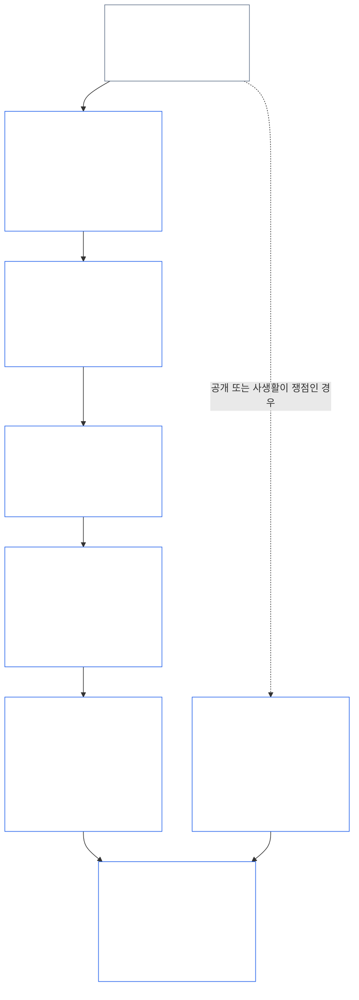
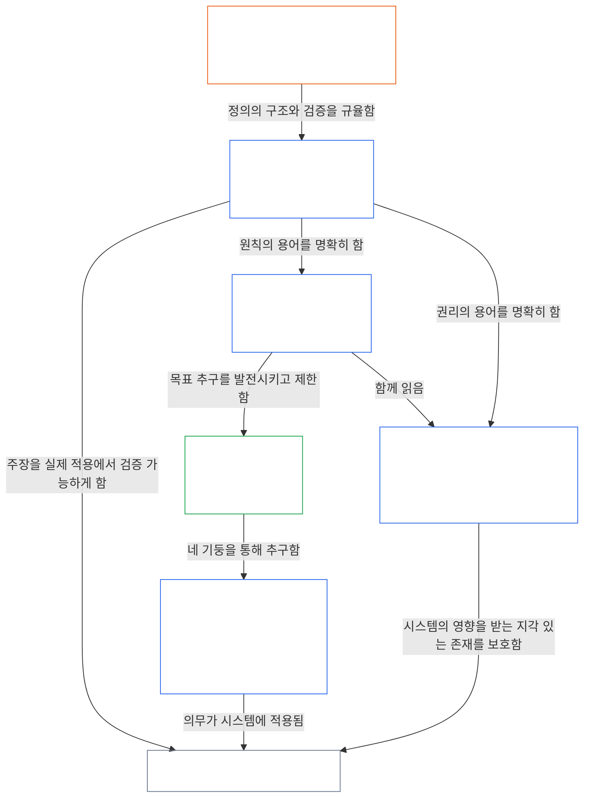

<a id="chapter-01-part-b-interaction-and-interpretation"></a>
# 제01장 제B부: 상호작용과 해석

<details>
<summary><strong><span style="color: #2563eb;">코퍼스 내 위치(비운영적): 파일 구조와 읽기 규칙</span></strong></summary>

> 다음 내용은 **독자를 위한 안내일 뿐**입니다. 이 파일이나 다른 장의 다른 곳에 규정된 구속력 있는 의무를 추가하거나 삭제하거나 축소하지 않습니다.
>
> 이 파일은 **Sentient 헌법의 일부**이며, 번호가 부여된 다른 `core_*` 파일들과 하나의 문서로 함께 읽을 때에만 **구속력을 가집니다**. 여기에는 **제1장 제B부**(§§13–15: 헌법상 충돌 해결 절차, 절대적 우선권 행사 금지, 헌법 해석)가 담겨 있습니다. 이 부분은 원칙들이 충돌할 때와 헌법을 읽을 때 **헌법의 네 요소**가 온전히 유지되도록 합니다.
>
> **앞 문서:** [core_01_a_values_principles.md](core_01_a_values_principles.md) (제1장 제A부 — §§1–12, 번영과 연속성이라는 두 목표)  
> **다음 문서:** [core_01_c_stewardship_capacity_principles.md](core_01_c_stewardship_capacity_principles.md) (제1장 제C부 — §§16–20, 청지기 역할, 거버넌스, 유인 정렬, 통합 적용).
> **읽기 흐름:** §13 헌법상 충돌 해결 절차(상충관계의 순서, 공개 제한, 피할 수 있는 부담) → §14 절대적 우선권 행사 금지 → §15 헌법 해석(우회 금지, 파생 정보, 정의, 모호성, 우선순위).

</details>

<details>
<summary><strong><span style="color: #2563eb;">독자 안내(비운영적): 제5장 어휘 기준점과 클러스터 색인</span></strong></summary>

<a id="chapter-one-part-a-chapter-five-vocabulary-anchor"></a>

> 다음 내용은 **독자를 위한 안내일 뿐**입니다. 이 파일이나 다른 장의 다른 곳에 규정된 구속력 있는 의무를 추가하거나 삭제하거나 축소하지 않습니다. 각 절의 **추적** 및 **정의 · 평가 · 준수** 위젯은 해당 §가 어떤 용어를 실질적으로 적용하는 지점에서 경로 안내와 O/M/A/C 링크를 제공합니다. 반면 이 블록은 제A부를 마무리하는 독자를 위한 장 수준의 대조표입니다.

**원칙 계층의 어휘**(제1장(제A부 및 제B부)의 기준 위치):

- [헌법의 네 요소](core_00_preamble.md#constitutional-tetrad) — **참여**, **감독**, **책임성**, **적시성**이며, [중대한 이해관계](core_00_preamble.md#material-stake)에 비례하여 조정됩니다.
- [두 가지 헌법 목표](core_00_preamble.md#two-constitutional-aims) — [번영](core_00_preamble.md#flourishing)과 [연속성](core_00_preamble.md#continuity) (헌법상 **연속성 목표**로, 코퍼스의 다른 곳에서 다루는 운영상 또는 프로토콜 연속성과는 구별됩니다.)
- [중대한 이해관계](core_00_preamble.md#material-stake) — 네 요소의 의무에 대해 영향, 의존성, 위험을 비례 조정하는 기준입니다. 통합적 중요성([중요성](core_05_band_oversight.md#materiality)) 및 아래의 제5장 항목과 함께 읽습니다.

**제5장의 대리 정의**(O/M/A/C 충족 — 실질적으로 관련되는 경우 제2장부터 제4장까지 추적):

- [웰빙](core_05_band_continuity.md#wellbeing) (번영 목표)
- [감독](core_05_apex_oversight_leg.md#oversight), [책임성](core_05_apex_accountability_leg.md#accountability), [쟁점 제기 가능성](core_05_band_accountability.md#contestability), [거버넌스](core_05_band_accountability.md#governance), [분류 비례 거버넌스](core_05_band_oversight.md#classification-scaled-governance)
- [중대한](core_05_band_oversight.md#material), [중대한 영향](core_05_band_oversight.md#material-impact), [중대한 위험](core_05_band_oversight.md#material-risk), [중요성](core_05_band_oversight.md#materiality) (위젯에서는 이를 **중요성**이라고 부릅니다), [시스템적 중요성](core_05_band_continuity.md#systemic-materiality) — 클러스터: [중요성, 영향, 위험 및 대리 지표의 무결성](core_05_band_oversight.md#materiality-impact-risk-and-proxy-integrity)

**제5장 §3의 주요 종속 클러스터**(공동 호출 그룹 — 실질적으로 관련되는 경우 제2장부터 제4장까지와 함께 읽기):

- [이해관계자의 지위와 비중](core_05_band_participation.md#stakeholder-status-and-weight) (이해관계자 시스템 참여 계층)
- [헌법 계약 계층](core_05_band_integrative.md#constitutional-contract-layer) 및 [거버넌스 아키텍처, 감독, 의존성, 탈중앙화, 집중, 시장 구조, 출구 경로의 무결성](core_05_band_accountability.md#governance-architecture-decentralization-and-concentration)
- [코퍼스와 권한 계층](core_05_band_integrative.md#defi1-corpus-and-authority-stack)
- [책임성, 쟁점 제기 가능성, 집단 책임성 실패](core_05_apex_accountability_leg.md#accountability)

**CJS-3** (*운영 클러스터 라이브러리(oDef)*) — 여러 구현에 걸쳐 공동으로 쓰이는 운영 용어를 위한 운영 클러스터 나침반입니다. 이 장의 네 요소, 목표, 중대한 이해관계의 비례 조정과 함께 읽습니다.

- [CJS-3.1 헌법 나침반 및 클러스터 지도](corpus_joint_structure/cjs_03_cross_implementation_operational_terms.md#cjs-31-constitutional-compass-and-cluster-map) — **CJS-3.2** (*감독: 성찰적 투명성과 책임성 용어*)부터 **CJS-3.23** (*통합: 개입 및 우선권 행사의 무결성 용어*)까지의 클러스터를 위한 기본 진입점입니다. 이 클러스터들은 네 요소의 각 축, 연속성 목표, 요소 간 통합 영역을 기준으로 구성됩니다.

</details>

<details>
<summary><strong><span style="color: #2563eb;">독자 안내(비운영적): 제B부가 헌법의 네 요소를 온전히 유지하는 방식</span></strong></summary>

> 다음 내용은 **독자를 위한 안내일 뿐**입니다. 이 파일이나 다른 장의 다른 곳에 규정된 구속력 있는 의무를 추가하거나 삭제하거나 축소하지 않습니다. 각 절의 **추적** 위젯은 그 절이 다루는 네 요소의 각 축을 표시합니다. 이 블록은 제B부를 읽기 시작하는 독자를 위한 부 수준의 지도입니다.

**제B부의 역할.** [제A부](core_01_a_values_principles.md)는 [두 가지 헌법 목표](core_00_preamble.md#two-constitutional-aims)를 발전시킵니다. 제B부는 새로운 원칙이나 다섯 번째 의무를 추가하지 않습니다. 제B부는 다음 세 상황에서 [헌법의 네 요소](core_00_preamble.md#constitutional-tetrad)—[중대한 이해관계](core_00_preamble.md#material-stake)에 비례하여 조정되는 **참여**, **감독**, **책임성**, **적시성**—를 온전히 유지합니다.

- **원칙들이 충돌할 때** ([§13 헌법상 충돌 해결 절차](#13-constitutional-collision-resolution-process)): 안전과 진실이 우선하며, 다른 모든 상충관계에서도 쉬운 해결을 위해 네 요소를 약화시키지 말고 보존해야 합니다.
- **한 가치가 지나치게 밀어붙여질 때** ([§14 절대적 우선권 행사 금지](#14-prohibition-on-absolute-override)): 어떠한 가치도, 두 목표 중 어느 것도, 중대한 이해관계가 요구하는 수준 아래로 한 요소를 무력화하는 데 사용할 수 없습니다.
- **헌법을 읽거나 적용할 때** ([§15 헌법 해석](#15-constitutional-interpretation)): 같은 행위의 이름을 바꾸거나, 나누거나, 다른 경로로 돌려도 요건을 피할 수 없으며, 모호성은 [최대한의 보호 효과](core_05_band_integrative.md#fullest-protective-effect)를 향해 해석합니다.

**제B부가 각 요소를 구현하는 위치.** 각 절의 추적에는 그 절이 다루는 모든 요소가 나열됩니다. 이 표는 주요 위치를 보여 줍니다.

| 네 요소의 축 | 제B부가 실질적으로 보장하는 내용 | 제B부의 주요 위치 |
|---|---|---|
| **참여** | 입증 책임은 결코 제한을 받는 당사자에게 돌아가지 않습니다. 핵심적인 이의 제기, 검토, 항소 권리를 영구히 없앨 수 없습니다. 공개 제한은 충분한 정보를 바탕으로 쟁점을 제기할 수 있는 상태를 유지해야 합니다. 피할 수 있는 부담은 행위 역량을 좁힙니다. | [§13.1.1](#1311-necessity), [§13.1.4](#1314-constitutional-floors-safety-and-anti-degrading-process), [§13.1.5](#1315-least-restrictive-time-bounded-and-reviewable-constraint-principle), [§13.2](#132-epistemic-disclosure-constraints), [§13.3](#133-minimization-of-avoidable-burden), [§15.1](#151-constitutional-no-bypass-principle), [§15.1.2](#1512-derived-information-principle) |
| **감독** | 피해를 전부 산정합니다. 다른 사람들이 결정을 재구성하고 독립적으로 검토할 수 있어야 합니다. 공개 제한은 감시 가능성을 유지해야 합니다. 지표는 목적에서 벗어나는 순간 집계를 멈춥니다. | [§13.1.2](#1312-harm-minimization), [§13.1.5](#1315-least-restrictive-time-bounded-and-reviewable-constraint-principle), [§13.2](#132-epistemic-disclosure-constraints), [§13.2.4](#1324-proxy-divergence-invalidation), [§15.1](#151-constitutional-no-bypass-principle), [§15.4.4](#1544-combined-satisfaction-of-jointly-applicable-incorporated-obligations) |
| **책임성** | 제한을 가하는 쪽이 입증 책임을 집니다. 권한이 커질수록 설명 책임도 커집니다. 절차는 존엄성을 훼손하거나 굴욕을 주어서는 안 됩니다. 모든 공개 제한은 사후 감사 대상입니다. | [§13.1.1](#1311-necessity), [§13.1.3](#1313-proportionality), [§13.1.4](#1314-constitutional-floors-safety-and-anti-degrading-process), [§13.1.5](#1315-least-restrictive-time-bounded-and-reviewable-constraint-principle), [§13.2.1](#1321-preservation-of-epistemic-integrity), [§15.1](#151-constitutional-no-bypass-principle), [§15.1.2](#1512-derived-information-principle) |
| **적시성** | 제한은 기간이 정해져 있고 검토 가능해야 하며, 복구 경로가 있어야 합니다. 계류 중인 헌법상 충돌은 해당 시한에 따라 진행됩니다. 미뤄진 공개는 결국 공개로 이어집니다. 피할 수 있는 지연은 피할 수 있는 부담입니다. 긴급한 축소는 시간 제한을 받습니다. | [§13.1.5](#1315-least-restrictive-time-bounded-and-reviewable-constraint-principle), [§13.2.1](#1321-preservation-of-epistemic-integrity), [§13.3](#133-minimization-of-avoidable-burden), [§15.1](#151-constitutional-no-bypass-principle), [§15.4.4](#1544-combined-satisfaction-of-jointly-applicable-incorporated-obligations) |

**어떤 축도 직접 다루지 않는 절.** [§15.1.1 분할 방지 원칙](#1511-anti-segmentation-principle)과 [§15.4.1](#1541-integrated-reading)부터 [§15.4.3](#1543-incorporation-layer)까지는 텍스트를 읽는 방법과 어느 출처 계층이 우선하는지를 규율합니다. 의도적으로 해당 추적에는 네 요소의 축이 표시되지 않습니다.

**시간의 두 가지 의미.** 제B부에서 시간은 두 의미로 쓰입니다. 장기 시간 지평(지연되거나 누적되는 피해, 그리고 [제8장 §3.2 시간 일관성 제약](core_08_a_system_alignment_certification_evaluation.md#32-time-consistency-constraint)이 [§13.1.2](#1312-harm-minimization)에 적용되는 경우)은 **연속성** 목표에 속합니다. 시계, 검토 주기, 지연(제한의 시간 한도, 최종 공개, 피할 수 있는 지연)은 **적시성** 축에 속합니다.

**두 축이지 충돌이 아닙니다.** 제A부의 목표는 공유 시스템이 무엇을 추구하는지 말해 줍니다. 제B부는 그 과정에서 어떠한 상충관계, 우선권 행사 또는 해석도 무엇을 빼앗을 수 없는지 말해 줍니다.

</details>

<br>
<a id="13-constitutional-collision-resolution-process"></a>

### 13. 헌법상 충돌 해결 절차
<details>
<summary><strong><span style="color: #2563eb;">추적</span></strong></summary>

- 함께 읽을 것: [헌법의 네 요소](core_00_preamble.md#constitutional-tetrad) — 절차, 공개, 헌법상 충돌 처리 및 구제에서의 참여, 감독, 책임성, 적시성; [중대한 이해관계](core_00_preamble.md#material-stake)에 따른 조정.
- 상위 원칙: [3. 기본 목표: 웰빙](core_01_a_values_principles.md#3-foundational-objective-wellbeing-flourishing-aim), [4 안전](core_01_a_values_principles.md#4-safety-harm-constraint), [5 진실](core_01_a_values_principles.md#5-truth-epistemic-integrity-constraint), [6. 신뢰](core_01_a_values_principles.md#6-trust-and-trustworthiness-coordination-integrity), [7. 자유(제약된 행위 역량)](core_01_a_values_principles.md#7-freedom-bounded-agency), 그리고 [§16 수탁 책임 심층 설명](core_01_c_stewardship_capacity_principles.md#16-stewardship-in-depth).
- 하위 규정: [13.2.1 인식론적 무결성 보존](#1321-preservation-of-epistemic-integrity), [헌법상 충돌 기록](core_05_band_integrative.md#constitutional-collision-record), [기본 임시 입장](#default-interim-posture), 그리고 [14. 절대적 우선권 행사 금지](#14-prohibition-on-absolute-override).
- [제6장: 기본권](core_06_rights_part_a.md#chapter-six-foundational-rights) 전반의 조문 간 충돌을 규율합니다.
  - [제24조: 헌법 해석, 심사 및 포획 방지 안전장치](core_06_rights_part_d.md#article-xxiv-constitutional-interpretation-review-and-anti-capture-safeguards) 및 [제20조: 확인된 침해 이후의 정의](core_06_rights_part_d.md#article-xx-justice-after-verified-violation)와 함께 읽으십시오.
  - 심사, 비상사태 또는 헌법상 충돌에 관한 쟁점이 생기면 적용하십시오.

</details>

<details>
<summary><strong><span style="color: #2563eb;">정의 · 평가 · 준수</span></strong></summary>

- [헌법상 충돌](core_05_band_integrative.md#constitutional-collision) · [O](core_05_band_integrative.md#constitutional-collision) · [M](core_05_band_integrative.md#constitutional-collision-a) · [A](core_05_band_integrative.md#constitutional-collision-a) · [C](core_05_band_integrative.md#constitutional-collision-c)
- [참여](core_05_apex_participation_leg.md#participation-constitutional) · [O](core_05_apex_participation_leg.md#participation-constitutional) · [M](core_05_apex_participation_leg.md#participation-constitutional-m) · [A](core_05_apex_participation_leg.md#participation-constitutional-a) · [C](core_05_apex_participation_leg.md#participation-constitutional-c)
- [감독](core_05_apex_oversight_leg.md#oversight-constitutional) · [O](core_05_apex_oversight_leg.md#oversight-constitutional) · [M](core_05_apex_oversight_leg.md#oversight-constitutional-m) · [A](core_05_apex_oversight_leg.md#oversight-constitutional-a) · [C](core_05_apex_oversight_leg.md#oversight-constitutional-c)
- [책임성](core_05_apex_accountability_leg.md#accountability) · [O](core_05_apex_accountability_leg.md#accountability) · [M](core_05_apex_accountability_leg.md#accountability-m) · [A](core_05_apex_accountability_leg.md#accountability-a) · [C](core_05_apex_accountability_leg.md#accountability-c)
- [적시성](core_05_apex_timeliness_leg.md#timeliness-constitutional) · [O](core_05_apex_timeliness_leg.md#timeliness-constitutional) · [M](core_05_apex_timeliness_leg.md#timeliness-constitutional-m) · [A](core_05_apex_timeliness_leg.md#timeliness-constitutional-a) · [C](core_05_apex_timeliness_leg.md#timeliness-constitutional-c)

</details>

<br>

*쉽게 말해, 헌법상 충돌은 발생합니다. **안전**과 **진실**이 우선입니다. 그다음에는 제한이 비례적이고 필요하며 피해를 최소화하고 가능한 한 가벼워야 합니다. 편의를 위해 진실을 숨겨서는 안 됩니다. 편리함을 위해 프라이버시를 박탈해서는 안 됩니다. 자유 제한은 [§7.1 제한 규율](core_01_a_values_principles.md#71-limitation-discipline)에 따라 적용됩니다. 권리와 관련된 헌법상 충돌에는 문서화된 의사결정 검사가 필요하며, 준수 여부를 거짓으로 보여 주는 지표는 인정되지 않습니다. [제8장 §3.2 시간 일관성 제약](core_08_a_system_alignment_certification_evaluation.md#32-time-consistency-constraint)에 따라 단기 최적화는 평가를 통과할 수 없습니다. **§13.1**(*핵심 상충 원칙*)부터 **§13.3**(*피할 수 있는 부담의 최소화*)까지는 상충 규칙, 공개 및 프라이버시 제한, 헌법상 충돌 절차를 규정합니다.*

제B부는 다음 세 상황에서 네 요소를 온전히 유지합니다.
- **[헌법상 충돌](core_05_band_integrative.md#constitutional-collision)(이 절):** 어느 요소도 약화시키지 않고 충돌을 해결합니다.
- **과도한 권한 행사([§14 절대적 우선권 행사 금지](#14-prohibition-on-absolute-override)):** 어느 하나의 가치도, 두 목표 중 어느 하나도, 다른 가치보다 우선하거나 중대한 이해관계가 요구하는 수준 아래로 한 요소를 무력화하지 못하게 합니다.
- **읽기와 적용([§15 헌법 해석](#15-constitutional-interpretation)):** 같은 행위의 이름을 바꾸거나, 분할하거나, 경로를 바꾸어 요건을 피하는 것을 금지하고, 모호성은 [최대한의 보호 효과](core_05_band_integrative.md#fullest-protective-effect)를 향해 해석합니다.

가치나 제약이 충돌할 때:
- **우선순위:** **안전**이나 **진실**을 위반하지 않고는 충돌을 해결할 수 없는 경우, **안전**과 **진실**이 우선합니다.
- **네 요소 보존:** 그 밖의 상충은 [헌법의 네 요소](core_00_preamble.md#constitutional-tetrad)—[중대한 이해관계](core_00_preamble.md#material-stake)에 따라 조정되는 **참여**, **감독**, **책임성**, **적시성**—를 쉬운 해결을 위해 약화하지 말고 보존해야 합니다.
- **결합 효과:** 각각은 괜찮아 보이는 작은 결정들이 합쳐져 이 헌법이 거부하는 결과를 낳을 수 있습니다.
- **해결 기준:** 시스템은 **§13.1**(*핵심 상충 원칙*)부터 **§13.3**(*피할 수 있는 부담의 최소화*)까지에 따라 충돌을 해결해야 합니다.

**도표: 제B부와 헌법의 네 요소**

<hr style="border: 0; border-top: 1px solid currentColor;">

```mermaid
flowchart TB
    PA["제A부의 원칙과 두 가지 헌법 목표<br/><br/>• 번영과 연속성<br/>• 충돌하거나 하나 이상의 방식으로<br/>해석될 수 있는 원칙과 제약"]
    P13["§13 헌법상 충돌 해결 절차<br/><br/>• 안전과 진실 우선<br/>• 그 밖의 모든 상충은 네 요소를 보존<br/>• 상충 순서, 공개 제한,<br/>피할 수 있는 부담"]
    P14["§14 절대적 우선권 행사 금지<br/><br/>• 어떤 가치도 결정적 우위가 될 수 없음<br/>• 어느 목표도 다른 목표를 압도하지 않음<br/>• 중대한 이해관계의 기준 아래로 어떤 요소도 무력화되지 않음"]
    P15["§15 헌법 해석<br/><br/>• 우회 금지, 분할 금지,<br/>파생 정보<br/>• 모호성은 통합된 전체로 읽음<br/>• 출처 계층의 우선순위"]
    TT["헌법의 네 요소<br/><br/>• 온전히 유지하고 중대한 이해관계에 따라 조정<br/>• 참여 · 감독 · 책임성 · 적시성"]
    P["참여<br/><br/>• 제한을 받는 당사자가 부담을 지지 않음<br/>• 이의 제기와 항소 권리가 유지됨"]
    O["감독<br/><br/>• 피해를 전부 산정<br/>• 다른 사람들이 결정을 재구성하고<br/>독립적으로 심사할 수 있음"]
    A["책임성<br/><br/>• 제한을 가하는 쪽이 부담을 짐<br/>• 권한이 커질수록 답변 책임이 커짐"]
    T["적시성<br/><br/>• 제한은 기간이 정해져 있고 심사 가능<br/>• 지연이 구제를 무산시켜서는 안 됨"]
    PA --> P13
    PA --> P14
    PA --> P15
    P13 --> TT
    P14 --> TT
    P15 --> TT
    TT --> P
    TT --> O
    TT --> A
    TT --> T
    style PA fill:none,stroke:#16a34a,color:#ffffff
    style P13 fill:none,stroke:#2563eb,color:#ffffff
    style P14 fill:none,stroke:#2563eb,color:#ffffff
    style P15 fill:none,stroke:#2563eb,color:#ffffff
    style TT fill:none,stroke:#2563eb,color:#ffffff
    style P fill:none,stroke:#0f766e,color:#ffffff
    style O fill:none,stroke:#ea580c,color:#ffffff
    style A fill:none,stroke:#db2777,color:#ffffff
    style T fill:none,stroke:#9333ea,color:#ffffff
```

*제A부의 원칙과 목표는 충돌할 수 있고 여러 방식으로 해석될 수 있습니다. 제B부는 헌법상 충돌을 해결하고, 우선권 행사를 금지하며, 텍스트의 읽기 방식을 정하여 네 요소의 각 축이 중대한 이해관계가 요구하는 수준에서 실질적으로 유지되도록 합니다. 테두리 색은 네 요소의 색을 재사용한 시각적 안내일 뿐, 우선순위를 주장하는 것이 아닙니다. 각 절의 추적은 그 절이 다루는 요소를 표시합니다.*
<a id="131-core-tradeoff-principles"></a>
#### 13.1 핵심 상충 원칙

<details>
<summary><strong><span style="color: #2563eb;">추적</span></strong></summary>

- [헌법상 사분체](core_00_preamble.md#constitutional-tetrad)와 함께 읽기 — 상충 해결 절차 전반에 네 기둥이 모두 적용됩니다. **책임성**과 **참여**([§13.1.1](#1311-necessity), 입증 책임을 누가 지는지), **감독**([§13.1.2](#1312-harm-minimization) 및 [§13.1.5](#1315-least-restrictive-time-bounded-and-reviewable-constraint-principle), 피해를 온전히 산정하고 다른 이들이 검토할 수 있는 헌법상 충돌 기록), 그리고 **적시성**(§13.1.5, 기간이 정해져 있고 검토 가능한 제한)입니다. 입증 책임과 심사의 깊이는 [중대한 이해관계의 정도](core_00_preamble.md#material-stake)에 맞춰 조정됩니다. 각 하위절의 Trace는 관련된 기둥을 밝힙니다.
- 하위절: [§13.1.1 필요성](#1311-necessity) · [§13.1.2 피해 최소화](#1312-harm-minimization) · [§13.1.3 비례성](#1313-proportionality) · [§13.1.4 헌법상 최저선, 안전 및 존엄 훼손 방지 절차](#1314-constitutional-floors-safety-and-anti-degrading-process) · [§13.1.5 최소 제한·기간 제한·검토 가능 제약 원칙](#1315-least-restrictive-time-bounded-and-reviewable-constraint-principle).

</details>

<details>
<summary><strong><span style="color: #2563eb;">정의 · 평가 · 준수</span></strong></summary>

*범위.* [§13.1 핵심 상충 원칙](#131-core-tradeoff-principles) — 상충 해결 절차에서의 필요성, 피해 최소화 및 피해에 관한 정의.

- [필요성](core_05_band_accountability.md#necessity) · [O](core_05_band_accountability.md#necessity) · [M](core_05_band_accountability.md#necessity-a) · [A](core_05_band_accountability.md#necessity-a) · [C](core_05_band_accountability.md#necessity-c)
- [피해 최소화(상충 해결 선택)](core_05_band_accountability.md#harm-minimization-tradeoff-selection) · [O](core_05_band_accountability.md#harm-minimization-tradeoff-selection) · [M](core_05_band_accountability.md#harm-minimization-tradeoff-selection-a) · [A](core_05_band_accountability.md#harm-minimization-tradeoff-selection-a) · [C](core_05_band_accountability.md#harm-minimization-tradeoff-selection-c)
- [피해](core_05_band_accountability.md#harm) · [O](core_05_band_accountability.md#harm) · [M](core_05_band_accountability.md#harm-a) · [A](core_05_band_accountability.md#harm-a) · [C](core_05_band_accountability.md#harm-c)

</details>

<br>

*쉽게 말해, 무언가를 제한해야 할 때는 해결책을 문제에 맞추십시오. 효과가 유지되는 가장 가벼운 조치를 쓰고, 피해가 가장 적은 선택지를 고르며, 안전·진실·권리가 이미 충족된 뒤에는 감각 있는 존재의 시간과 주의, 노력을 가장 적게 낭비하십시오. 피해가 되돌릴 수 없거나 시스템을 고착시킬 수 있다면 기준은 빠르게 높아집니다.*

**절차 읽는 법:** 이 규칙들을 서로 독립된 허가가 아니라 하나의 순서로 적용하십시오.
- **[§13.1.1 필요성](#1311-necessity)**은 제한이 애초에 필요한지, 아니면 덜 제한적인 대안으로도 중대한 피해나 시스템 위험을 막을 수 있는지 묻습니다. 입증 책임은 제한을 가하는 쪽에 있습니다.
- **[§13.1.2 피해 최소화](#1312-harm-minimization)**는 감각 있는 존재, 시스템, 시간 범위 전반에서 헌법상 충분한 선택지 중 피해가 가장 적은 것을 요구합니다.
- **[§13.1.3 비례성](#1313-proportionality)**은 선택한 제한의 규모가 다루려는 피해의 크기, 발생 가능성, 시스템적 성격에 부합하는지 확인합니다.
- **[§13.1.4 헌법상 최저선, 안전 및 존엄 훼손 방지 절차](#1314-constitutional-floors-safety-and-anti-degrading-process)**는 필요하고 피해를 최소화하며 비례성을 갖춘 제한에도 적용되는 절대적 한계를 명시합니다. 권리 최저선의 일부 기준은 영구히 없앨 수 없고, 안전은 정당화 근거이자 제약으로 작동하며, 절차는 결코 모욕·구경거리·보복으로 전락해서는 안 됩니다. 권리 최저선의 기준과 존엄 훼손 방지 절차의 최저선이 함께 [존엄 원칙](#dignity-principles)을 이룹니다.
- **[§13.1.5 최소 제한·기간 제한·검토 가능 제약 원칙](#1315-least-restrictive-time-bounded-and-reviewable-constraint-principle)**은 앞선 심사를 통과한 제한의 형태를 규율합니다. 효과적인 조치 중 가장 가벼운 것을 사용하고, 독립적 검토가 가능해야 하며, 이 헌법이 지속적 제한을 명시적으로 허용하지 않는 한 일시적이어야 합니다.

상충 해결 절차를 충족하면, 그 결과 설계에는 **[§13.3 피할 수 있는 부담 최소화](#133-minimization-of-avoidable-burden)**가 적용됩니다. 시스템은 감각 있는 존재의 시간과 주의, 노력을 가장 적게 낭비하는 선택지를 우선해야 합니다.

**도표: 상충 해결 절차와 각 단계가 다루는 사분체의 기둥**

<hr style="border: 0; border-top: 1px solid currentColor;">



*헌법상 충돌은 필요성, 피해 최소화, 비례성, 헌법상 최저선, 그리고 살아남은 제한의 형태 순으로 절차를 밟습니다. 공개 및 사생활 충돌에는 §13.2(*인식론적 공개 제약*)도 적용됩니다. 심사를 통과한 모든 선택지에는 §13.3(*피할 수 있는 부담 최소화*)가 적용됩니다. 각 상자에는 그 Trace가 명시하는 사분체의 기둥이 열거되어 있습니다. 색은 시각적 단서일 뿐 우선순위를 주장하지 않습니다.*

<br>
<a id="1311-necessity"></a>
##### 13.1.1 필요성
<details>
<summary><strong><span style="color: #2563eb;">추적 정보</span></strong></summary>

- [헌법 4원칙](core_00_preamble.md#constitutional-tetrad)과 함께 읽을 것 — **책임성** 축(제한을 부과하는 당사자가 입증 책임을 지며 대안을 문서화해야 함); **참여** 축(자유, 행위 주체성 또는 접근성이 제한되는 당사자에게 입증 책임을 지우지 않으며, 자유, 실질적 행위 주체성 또는 동의에 부담이 가해지는 경우 입증 기준이 더 엄격해짐); **감독** 축(검토자가 확인할 수 있도록 대안 분석을 문서화함); [중대한 이해관계](core_00_preamble.md#material-stake)에 따른 비례 조정.

</details>

<details>
<summary><strong><span style="color: #2563eb;">정의 · 평가 · 준수</span></strong></summary>

- [필요성](core_05_band_accountability.md#necessity) · [O](core_05_band_accountability.md#necessity) · [M](core_05_band_accountability.md#necessity-a) · [A](core_05_band_accountability.md#necessity-a) · [C](core_05_band_accountability.md#necessity-c)
- [실현 가능성](core_05_band_accountability.md#feasibility) · [O](core_05_band_accountability.md#feasibility) · [M](core_05_band_accountability.md#feasibility-a) · [A](core_05_band_accountability.md#feasibility-a) · [C](core_05_band_accountability.md#feasibility-c)
- [자유(제한된 행위 주체성)](core_05_band_participation.md#freedom-bounded-agency) · [O](core_05_band_participation.md#freedom-bounded-agency) · [M](core_05_band_participation.md#freedom-bounded-agency-a) · [A](core_05_band_participation.md#freedom-bounded-agency-a) · [C](core_05_band_participation.md#freedom-bounded-agency-c)
- [실질적 행위 주체성](core_05_band_participation.md#meaningful-agency) · [O](core_05_band_participation.md#meaningful-agency) · [M](core_05_band_participation.md#meaningful-agency-a) · [A](core_05_band_participation.md#meaningful-agency-a) · [C](core_05_band_participation.md#meaningful-agency-c)

</details>

<br>

*쉽게 말해, 덜 제한적인 대안으로도 중대한 피해나 시스템적 위험을 방지할 수 없는 경우에만 제한이 정당화된다. 이를 입증할 책임은 제한을 부과하는 당사자에게 있으며, 자유가 제한되는 당사자에게 있지 않다. 편의, 조직의 관행, “늘 이렇게 해 왔다”는 이유는 필요성을 입증하지 못한다. 더 약한 조치로도 효과가 있다면 더 강한 조치는 규정 준수에 해당하지 않는다.*

**입증 책임.** 헌법상 제한을 부과하거나 유지하는 당사자는 해당 상황에서 중대한 피해나 시스템적 위험을 방지할 수 있는 덜 제한적인 대안이 존재하지 않는다는 점을 입증할 책임이 있다. 자유, 행위 주체성 또는 접근성이 제한되는 당사자에게 대안의 존재를 입증할 책임은 없다.

**대안 분석 요건.** 필요성 주장은 다음 사항에 대한 문서화된 분석으로 뒷받침되어야 한다.
- 아무 조치도 하지 않는 경우를 포함하여 합리적으로 이용 가능한 대안;
- 다루려는 헌법상 피해에 비추어 각 대안이 얼마나 효과적인지;
- 각 대안 아래 남는 위험 또는 불일치.

문서화된 분석 없이 대안이 없다고 주장하는 것만으로는 이 요건을 충족하지 못한다.

**필요성을 입증하지 못하는 사항:**
- 편의 또는 행정상 선호;
- 기본 관행, 조직의 관성 또는 전통;
- 권리에 중대한 영향이 있는 경우 비용 절감만을 근거로 하는 주장;
- 제한이 이미 존재한다는 사실.

**범위.** 이 하위 절은 모든 헌법상 제한에 적용되며 — [§13.1.5 권리 충돌 절차](#1315-rights-collision-decision-test)에 따른 헌법상 충돌 상황에만 한정되지 않는다. 제한이 [자유(제한된 행위 주체성)](core_05_band_participation.md#freedom-bounded-agency), [실질적 행위 주체성](core_05_band_participation.md#meaningful-agency) 또는 [동의](core_05_band_participation.md#consent)에 중대한 부담을 주는 경우, 필요성 입증도 그에 상응하게 엄격해야 한다.
<a id="1312-harm-minimization"></a>
##### 13.1.2 피해 최소화
<details>
<summary><strong><span style="color: #2563eb;">추적 기록</span></strong></summary>

- 함께 읽기: [헌법적 사중주](core_00_preamble.md#constitutional-tetrad) — **감독** 요소(간접적·지연·누적·시스템 간·생태적 피해를 보이지 않는 채로 두지 않고 산정함); **책임성** 요소(피해를 최소화하는 것처럼 보이기 위해 산정되지 않은 당사자에게 피해를 전가할 수 없음); 관련 시간 범위에 걸친 [중대한 이해관계](core_00_preamble.md#material-stake)의 비례적 반영.

</details>

<details>
<summary><strong><span style="color: #2563eb;">정의 · 평가 · 준수</span></strong></summary>

- [피해 최소화(상충관계 선택)](core_05_band_accountability.md#harm-minimization-tradeoff-selection) · [O](core_05_band_accountability.md#harm-minimization-tradeoff-selection) · [M](core_05_band_accountability.md#harm-minimization-tradeoff-selection-a) · [A](core_05_band_accountability.md#harm-minimization-tradeoff-selection-a) · [C](core_05_band_accountability.md#harm-minimization-tradeoff-selection-c)
- [피해](core_05_band_accountability.md#harm) · [O](core_05_band_accountability.md#harm) · [M](core_05_band_accountability.md#harm-a) · [A](core_05_band_accountability.md#harm-a) · [C](core_05_band_accountability.md#harm-c)
- [생태적 온전성](core_05_band_continuity.md#ecological-integrity) · [O](core_05_band_continuity.md#ecological-integrity) · [M](core_05_band_continuity.md#ecological-integrity-constitutional-a) · [A](core_05_band_continuity.md#ecological-integrity-constitutional-a) · [C](core_05_band_continuity.md#ecological-integrity-constitutional-c)
- [생태적 복구 역량](core_05_band_continuity.md#ecological-recovery-capacity) · [O](core_05_band_continuity.md#ecological-recovery-capacity) · [M](core_05_band_continuity.md#ecological-recovery-capacity-constitutional-a) · [A](core_05_band_continuity.md#ecological-recovery-capacity-constitutional-a) · [C](core_05_band_continuity.md#ecological-recovery-capacity-constitutional-c)
- [위험](core_05_band_continuity.md#risk) · [O](core_05_band_continuity.md#risk) · [M](core_05_band_continuity.md#risk-a) · [A](core_05_band_continuity.md#risk-a) · [C](core_05_band_continuity.md#risk-c)
- [돌이킬 수 없는 피해](core_05_band_accountability.md#irreversible-harm) · [O](core_05_band_accountability.md#irreversible-harm) · [M](core_05_band_accountability.md#irreversible-harm-a) · [A](core_05_band_accountability.md#irreversible-harm-a) · [C](core_05_band_accountability.md#irreversible-harm-c)

</details>

<br>

*쉽게 말해, [§13.1.1 필요성](#1311-necessity)을 충족한 뒤 여러 필수 선택지가 남아 있다면, 영향을 받는 모든 이들, 생태계와 생명 시스템, 영향을 받는 모든 시스템, 그리고 중요한 모든 시간 범위를 고려해 총피해가 가장 적은 선택지를 고르세요. 지역적으로 최적화하면서 시스템적 또는 생태적 피해를 만들거나, 단기적으로 최적화하면서 장기적 피해를 만드는 것은 이 기준을 통과하지 못합니다. 피해 최소화는 [§13.1.4 헌법상 최저선, 안전 및 비하 방지 절차](#1314-constitutional-floors-safety-and-anti-degrading-process)에 명시된 헌법상 최저선 아래로 내려가는 것을 결코 허용하지 않습니다.*

**비교 범위.** 헌법적으로 충분한 여러 선택지가 [안전(§4)](core_01_a_values_principles.md#4-safety-harm-constraint), [진실(§5)](core_01_a_values_principles.md#5-truth-epistemic-integrity-constraint), [§13.1.1 필요성](#1311-necessity)을 충족하는 경우, 다음에 대한 총 [피해](core_05_band_accountability.md#harm)를 최소화하는 선택지를 우선해야 합니다.
- 직접 및 간접으로 영향을 받는 감응 존재;
- 결과를 전달하거나 매개하거나 그 결과에 의존하는 시스템;
- [생태적 온전성](core_05_band_continuity.md#ecological-integrity) 및 피해 이후 복구가 중대한 경우 [생태적 복구 역량](core_05_band_continuity.md#ecological-recovery-capacity)을 포함한 생태계와 생명 시스템;
- 지연 및 누적 효과를 포함한 관련 시간 범위.

**집계 요건.** 피해 평가는 다음을 집계해야 합니다.
- 확인된 당사자에게 발생하는 직접 피해;
- 시스템, 의존 관계 또는 선례를 통해 전달되는 간접 피해;
- 시간이 지나며 현실화되는 지연 피해;
- 반복되거나 서로 증폭되는 결정으로 인한 누적 피해;
- 한 영역의 조치가 다른 영역에 피해를 일으킬 때의 시스템 간 영향;
- 외부 전가, 지연, 누적 및 복구 역량 관련 영향을 포함하는 생태적 피해.

다음은 준수하지 않는 행위입니다.
- 더 큰 시스템적·집계적·생태적 피해를 만들면서 지역적 또는 즉각적 피해만을 기준으로 최적화하는 행위;
- 확인된 당사자의 피해를 최소화하는 것처럼 보이게 하려고 생태계, 확인되지 않은 감응 존재 또는 그 밖에 산정되지 않은 당사자에게 피해를 전가하는 행위.

**시간 범위 규율.** 장기적 시스템 비용을 치르며 단기적으로 최적화하는 것은 이 기준을 통과하지 못합니다. 피해 최소화는 [제8장 §3.2 시간 일관성 제약](core_08_a_system_alignment_certification_evaluation.md#32-time-consistency-constraint)을 고려해야 합니다. 현재 기간에는 피해를 최소화하는 것처럼 보이더라도 관련 헌법상 시간 범위에 걸쳐 예측 가능한 더 큰 피해를 일으키는 결정은 준수하지 않는 것입니다.

**헌법상 최저선과의 관계.** 피해 최소화는 [§13.1.4 헌법상 최저선, 안전 및 비하 방지 절차](#1314-constitutional-floors-safety-and-anti-degrading-process)에 명시된 헌법상 최저선 *위에서* 작동합니다. 다음을 결코 허용하지 않습니다.
- 권리 최저선의 영구적 소멸;
- 비하 절차 — 굴욕, 구경거리, 보복, 차별적 부담 부과 또는 편의를 위한 권리 침식으로 설계·구성·수행되는 제한, 구제 또는 절차([§13.1.4 헌법상 최저선, 안전 및 비하 방지 절차](#1314-constitutional-floors-safety-and-anti-degrading-process));
- 안전 최저선 아래로 내려가는 행위.

피해 최소화는 이미 그 최저선을 충족하는 선택지 중에서 선택합니다. 최저선 아래로 내려가는 타협은 허용하지 않습니다.
<a id="1313-proportionality"></a>
##### 13.1.3 비례성

<details>
<summary><strong><span style="color: #2563eb;">추적</span></strong></summary>

- 다음과 함께 읽을 것: [헌법적 4원칙](core_00_preamble.md#constitutional-tetrad)의 **책임성** 및 **감독** 축(권한에 비례하는 책임성: 승인된 권한이나 중대한 결과를 수반하는 역할이 커질수록 강도가 높아지며, 결코 낮아지지 않음); 그리고 [중대한 이해관계](core_00_preamble.md#material-stake)에 따른 조정(분류의 최저 기준과 강화된 기준).
- [§18.1 승인된 구조로서의 거버넌스](core_01_c_stewardship_capacity_principles.md#181-governance-as-authorized-structure)와 함께 읽을 것.

</details>

<details>
<summary><strong><span style="color: #2563eb;">정의 · 평가 · 준수</span></strong></summary>

- [비례성](core_05_band_accountability.md#proportionality) · [O](core_05_band_accountability.md#proportionality) · [M](core_05_band_accountability.md#proportionality-a) · [A](core_05_band_accountability.md#proportionality-a) · [C](core_05_band_accountability.md#proportionality-c)
- [위험](core_05_band_continuity.md#risk) · [O](core_05_band_continuity.md#risk) · [M](core_05_band_continuity.md#risk-a) · [A](core_05_band_continuity.md#risk-a) · [C](core_05_band_continuity.md#risk-c)
- [회복 불가능한 피해](core_05_band_accountability.md#irreversible-harm) · [O](core_05_band_accountability.md#irreversible-harm) · [M](core_05_band_accountability.md#irreversible-harm-a) · [A](core_05_band_accountability.md#irreversible-harm-a) · [C](core_05_band_accountability.md#irreversible-harm-c)
- [실존적 위험](core_05_band_continuity.md#existential-risk) · [O](core_05_band_continuity.md#existential-risk) · [M](core_05_band_continuity.md#existential-risk-a) · [A](core_05_band_continuity.md#existential-risk-a) · [C](core_05_band_continuity.md#existential-risk-c)
- [생태적 회복 역량](core_05_band_continuity.md#ecological-recovery-capacity) · [O](core_05_band_continuity.md#ecological-recovery-capacity) · [M](core_05_band_continuity.md#ecological-recovery-capacity-constitutional-a) · [A](core_05_band_continuity.md#ecological-recovery-capacity-constitutional-a) · [C](core_05_band_continuity.md#ecological-recovery-capacity-constitutional-c)
- [체계적 고착](core_05_band_continuity.md#systemic-lock-in) · [O](core_05_band_continuity.md#systemic-lock-in) · [M](core_05_band_continuity.md#systemic-lock-in-a) · [A](core_05_band_continuity.md#systemic-lock-in-a) · [C](core_05_band_continuity.md#systemic-lock-in-c)
- [가역성](core_05_band_continuity.md#reversibility) · [O](core_05_band_continuity.md#reversibility) · [M](core_05_band_continuity.md#reversibility-constitutional-a) · [A](core_05_band_continuity.md#reversibility-constitutional-a) · [C](core_05_band_continuity.md#reversibility-constitutional-c)
- [의존성](core_05_band_continuity.md#dependency) · [O](core_05_band_continuity.md#dependency) · [M](core_05_band_continuity.md#dependency-a) · [A](core_05_band_continuity.md#dependency-a) · [C](core_05_band_continuity.md#dependency-c)
- [책임성](core_05_apex_accountability_leg.md#accountability) · [O](core_05_apex_accountability_leg.md#accountability) · [M](core_05_apex_accountability_leg.md#accountability-m) · [A](core_05_apex_accountability_leg.md#accountability-a) · [C](core_05_apex_accountability_leg.md#accountability-c)
- [감독](core_05_apex_oversight_leg.md#oversight-constitutional) · [O](core_05_apex_oversight_leg.md#oversight-constitutional) · [M](core_05_apex_oversight_leg.md#oversight-constitutional-m) · [A](core_05_apex_oversight_leg.md#oversight-constitutional-a) · [C](core_05_apex_oversight_leg.md#oversight-constitutional-c)

</details>

<br>

*쉽게 말해, 비례성은 제한의 규모가 그 제한이 다루려는 피해의 규모에 맞는지 확인합니다. 필요하고 피해를 최소화하는 선택지도 그 범위, 기간 또는 강도가 실제로 걸린 사안에 비해 과도하면 부적절합니다. 위험이 더 비가역적이거나 체계적이거나 의존성을 만들어 낼수록, 정당화와 면밀한 심사는 더 강해야 합니다. 권력에도 동일한 과소 거버넌스 방지 원칙이 적용됩니다. 승인된 권한이 더 크거나 중대한 결과를 수반하는 역할일수록 책임성과 감독을 낮추는 것이 아니라 높여야 합니다.*

헌법상 **가치**에 대한 제한은 **제6장**의 **권리 최저선** 보호와 [§13 헌법적 충돌 해결 절차](#13-constitutional-collision-resolution-process)에 따라 상충 조정의 대상이 되는 기타 원칙 및 보호를 포함하여, 정당하게 다루는 **피해** 또는 **체계적 영향**의 규모와 발생 가능성에 비례해야 하며 **제5장**의 [비례성](core_05_band_accountability.md#proportionality)과 일치해야 합니다.

**분류 최저 기준.** 어떤 시스템도 적용 가능한 최고 분류가 요구하는 수준보다 낮게 거버넌스되어서는 안 됩니다. 더 낮은 행정상 표시는 위험, 의존성, 권리 또는 체계적 영향에 대한 적용 가능한 최고 분류가 요구하는 심사를 줄일 수 없습니다.

**권한에 비례하는 책임성.** 비례성은 더 큰 승인 권한, 중대한 결과를 수반하는 역할 또는 제도적 영향력을 가진 자에 대한 과소 거버넌스도 금지합니다. [책임성](core_05_apex_accountability_leg.md#accountability)과 [감독](core_05_apex_oversight_leg.md#oversight-constitutional)의 강도는 해당 권한에 따라 높아져야 하며, 낮아져서는 안 됩니다.

**강화된 기준.** 행위가 회복 불가능한 피해, 체계적 고착, 실존적 위험 또는 생태적 회복 역량의 회복 불가능한 상실 위험을 초래하는 경우, 시스템은 [강화 심사](core_05_band_oversight.md#heightened-scrutiny)를 적용하고, 가능한 범위에서 정당화와 가역성에 대한 기준을 높여야 합니다.

**추가 상향.** 다음을 포함해 실질적으로 관련된 지표가 적용되는 경우 기준을 다시 높여야 합니다.
- 비가역성 노출
- 집중된 의존성
- 결과가 중대한 꼬리 위험
- 체계적 고착의 개연성
- 실존적 위험
- 생태적 회복 역량의 회복 불가능한 상실
<a id="1314-constitutional-floors-safety-and-anti-degrading-process"></a>
##### 13.1.4 헌법상 최소 기준, 안전 및 존엄을 훼손하는 절차의 금지
<details>
<summary><strong><span style="color: #2563eb;">연계</span></strong></summary>

- [헌법적 사원칙](core_00_preamble.md#constitutional-tetrad)과 함께 읽기: **참여** 축(핵심적인 이의 제기, 심사 및 항소 권리는 영구적으로 박탈할 수 없는 최소 기준에 포함됨); **책임성** 축(상충 이익의 검토 단계를 통과한 절차도 존엄을 훼손하거나 모욕하거나 보복해서는 안 됨. [§3.3 존엄 훼손 절차의 금지](core_01_a_values_principles.md#33-anti-degrading-process) 참조); 강화된 심사가 적용되는 경우 [중대한 이해관계](core_00_preamble.md#material-stake)에 따른 조정.

</details>

<details>
<summary><strong><span style="color: #2563eb;">정의 · 평가 · 준수</span></strong></summary>

- [안전(헌법상 제약)](core_05_band_continuity.md#safety-constitutional-constraint) · [O](core_05_band_continuity.md#safety-constitutional-constraint) · [M](core_05_band_continuity.md#safety-constraint-a) · [A](core_05_band_continuity.md#safety-constraint-a) · [C](core_05_band_continuity.md#safety-constraint-c)
- [존엄과 동등한 도덕적 지위](core_05_band_participation.md#dignity-and-equal-moral-standing) · [O](core_05_band_participation.md#dignity-and-equal-moral-standing) · [M](core_05_band_participation.md#dignity-and-equal-moral-standing-a) · [A](core_05_band_participation.md#dignity-and-equal-moral-standing-a) · [C](core_05_band_participation.md#dignity-and-equal-moral-standing-c)
- [잔혹 행위](core_05_band_accountability.md#cruelty) · [O](core_05_band_accountability.md#cruelty) · [M](core_05_band_accountability.md#cruelty-a) · [A](core_05_band_accountability.md#cruelty-a) · [C](core_05_band_accountability.md#cruelty-c)
- [해악](core_05_band_accountability.md#harm) · [O](core_05_band_accountability.md#harm) · [M](core_05_band_accountability.md#harm-a) · [A](core_05_band_accountability.md#harm-a) · [C](core_05_band_accountability.md#harm-c)
- [회복 불가능한 해악](core_05_band_accountability.md#irreversible-harm) · [O](core_05_band_accountability.md#irreversible-harm) · [M](core_05_band_accountability.md#irreversible-harm-a) · [A](core_05_band_accountability.md#irreversible-harm-a) · [C](core_05_band_accountability.md#irreversible-harm-c)
- [필요성](core_05_band_accountability.md#necessity) · [O](core_05_band_accountability.md#necessity) · [M](core_05_band_accountability.md#necessity-a) · [A](core_05_band_accountability.md#necessity-a) · [C](core_05_band_accountability.md#necessity-c)
- [비례성](core_05_band_accountability.md#proportionality) · [O](core_05_band_accountability.md#proportionality) · [M](core_05_band_accountability.md#proportionality-a) · [A](core_05_band_accountability.md#proportionality-a) · [C](core_05_band_accountability.md#proportionality-c)

</details>

<br>

*쉽게 말해, 해악 최소화에도 절대적인 한계가 있다. 제한이 아무리 비례적이고 필요하며 잘 설계되어 있어도 영구히 빼앗을 수 없는 것들이 있고, 절차를 수행하는 방식 중에는 언제나 금지되는 것들이 있다. 안전은 이러한 최소 기준의 토대가 되는 제약이다. 중대한 해악을 막기 위한 조치를 정당화하지만, 조치 자체를 제한하기도 한다. 안전을 내세워 권리를 소멸시키거나 존엄을 훼손하거나 여기 명시된 최소 기준을 우회할 수는 없다.*

**정당화 근거이자 제약인 안전.** [안전(§4)](core_01_a_values_principles.md#4-safety-harm-constraint)은 다른 헌법상 이익에 대한 제한을 정당화할 수 있는 협상 불가능한 제약이다. 그러나 안전은 그러한 제한이 작동하는 방식도 *제약한다*.
- 안전을 내세워 권리 최저선의 최소 기준을 영구적으로 소멸시킬 수 없다.
- 안전을 위해 제한이 필요한 경우에도 아래의 최소 기준을 준수해야 하며, 형식 면에서는 [§13.1.5 최소 제한·기간 제한·심사 가능한 제약 원칙](#1315-least-restrictive-time-bounded-and-reviewable-constraint-principle)을 따라야 한다.

<a id="dignity-principles"></a>

###### 존엄 원칙

**존엄 원칙**은 다음 두 원칙을 말한다. [권리 최저선 최소 기준 원칙](#rights-floor-minimums-principle)과 [존엄 훼손 절차 금지 원칙](#anti-degrading-process-principle)이다. 이 두 원칙은 함께 [존엄과 동등한 도덕적 지위](core_05_band_participation.md#dignity-and-equal-moral-standing)를 절대적 최소 기준으로 구체화한다. 즉, 어떤 감각 있는 존재에게서도 영구히 빼앗을 수 없는 것과 모든 절차에서 감각 있는 존재를 대할 때 금지되는 방식을 정한다. 최소한의 생계 수단에 대한 접근과 핵심적인 이의 제기, 심사 및 항소 권리는 존엄 원칙에 속한다. 이는 자신의 지위가 중요하게 여겨지는 사람으로 대우받기 위한 최소 조건이기 때문이다. 동등한 지위 그 자체와 이를 부정할 수 없는 근거는 [제VI-A조](core_06_rights_part_b.md#article-vi-a-dignity-and-equal-moral-standing)(*존엄과 동등한 도덕적 지위*)에 명시되어 있다.

<a id="rights-floor-minimums-principle"></a>

###### 권리 최저선 최소 기준 원칙

이 원칙은 다음과 같이 권리 최저선을 보호한다.

- 어떠한 헌법상 절차, 조치, 전환, 개정, 지위 관련 결과, 비상 조치 또는 사법 관련 결과도 [제VI-A조](core_06_rights_part_b.md#article-vi-a-dignity-and-equal-moral-standing)(*존엄과 동등한 도덕적 지위*) 및 [존엄 훼손 절차 금지 원칙](#anti-degrading-process-principle)에 따른 기본적 존엄 보호, 최소 생계 수단에 대한 접근, 또는 핵심적인 이의 제기, 심사 및 항소 권리라는 **권리 최저선 최소 기준**을 영구적으로 소멸시키거나 포기하게 해서는 안 된다.
- 특정 권리를 일시적으로 제한하는 것은 [최소 제한·기간 제한·심사 가능한 제약 원칙](#1315-least-restrictive-time-bounded-and-reviewable-constraint-principle)과 [제12장 §6.1](core_12_forum.md#61-emergency-measures-and-continuation-burden)(*비상 조치 및 지속의 입증 책임*)의 비상 규칙을 충족하는 경우에만 허용된다. 즉, 모든 제한은 정당화되고, 최소한이어야 하며, 문서화되고, 기간이 한정되며, 독립적으로 심사될 수 있어야 한다. 개별 조항은 더 강한 보호 조치를 추가할 수 있지만, 이 원칙을 축소하거나 편의, 효율성, 분류, 비상사태, 전환, 지위, 개정, 계약 또는 이행이라는 표지를 이용해 우회해서는 안 된다.

<a id="anti-degrading-process-principle"></a>

###### 존엄 훼손 절차 금지 원칙

A부에 명시된 [존엄 훼손 절차 금지 원칙(§3.3)](core_01_a_values_principles.md#33-anti-degrading-process)은 이 상충 이익 검토 단계에서 절대적인 최소 기준으로 작동한다.
- 필요성, 해악 최소화, 비례성을 충족하는 제한, 구제 또는 절차라 하더라도 존엄을 훼손하거나 모욕하거나 구경거리로 만들거나 보복하거나 차별적 부담을 지우거나 편의를 이유로 권리를 침식하는 방식으로 설계·표현·수행되거나 작동하도록 허용되어서는 안 된다.
- 존엄을 훼손하는 절차를 통해 올바른 실체적 결과를 내더라도 준수로 볼 수 없다.
- 금지되는 성격이 고통 자체를 목적으로 하거나 무상으로 / 존엄을 훼손하는 고통을 가하는 것인 경우 — 모욕 그 자체를 목적으로 하는 행위 포함 — [잔혹 행위](core_05_band_accountability.md#cruelty)와 함께 읽는다.

##### 13.1.5 최소 제한·기간 제한·심사 가능한 제약 원칙

<details>
<summary><strong><span style="color: #2563eb;">연계</span></strong></summary>

- [헌법적 사원칙](core_00_preamble.md#constitutional-tetrad)의 네 축 모두와 함께 읽기: **감독** 축(제한은 독립 심사가 가능하도록 유지되고, 증거는 보존되며, 헌법상 충돌이 계류 중에도 독립 심사자가 계속 접근할 수 있어야 함); **책임성** 축(문서화되고 감사 가능한 헌법상 충돌 기록에 규칙, 대안, 증거 및 선택 근거를 명시함); **참여** 축(영향받는 당사자가 결정을 이해하고 이의를 제기하고 재구성할 수 있어야 하며, 무엇이 동결되었는지 안내받아야 함); **적시성** 축(더 강한 권리 최저선 규칙에서 달리 정하지 않는 한 제한은 일시적이어야 하며, 기간 또는 심사 주기와 회복 경로를 갖추고, 계류 중인 헌법상 충돌은 해당 시계를 따라야 함); [중대한 이해관계](core_00_preamble.md#material-stake)에 따른 조정(심각성, 비가역성, 의존 집중도 및 불확실성이 커질수록 입증 책임이 높아짐).
- 후속 규정: [제XXV-B조: 권리 충돌 절차 및 회복적 정렬](core_06_rights_part_e.md#article-xxv-b-rights-collision-procedure-and-restorative-alignment)(심의 기관은 이 판단 기준을 적용함); [제XXV-C조: 적시 해결 및 지연 방지 최저선](core_06_rights_part_e.md#article-xxv-c-timely-resolution-and-anti-delay-floor); [제12장 §6](core_12_forum.md#6-timely-resolution-materiality-tiers-and-anti-delay-discipline)(*적시 해결, 중요성 단계 및 지연 방지 규율*).

</details>

<details>
<summary><strong><span style="color: #2563eb;">정의 · 평가 · 준수</span></strong></summary>

- [헌법상 충돌 기록](core_05_band_integrative.md#constitutional-collision-record) · [O](core_05_band_integrative.md#constitutional-collision-record) · [M](core_05_band_integrative.md#constitutional-collision-record-a) · [A](core_05_band_integrative.md#constitutional-collision-record-a) · [C](core_05_band_integrative.md#constitutional-collision-record-c)

</details>

<br>

*쉽게 말해, 제한이 정당화된 뒤에도 그 형식은 적절해야 한다. 효과가 있는 수단 중 가장 부담이 적은 조치를 사용하고, 실제 기한이나 심사 주기를 두며, 이의 제기와 독립 심사를 보장하고, 제한이 어떻게 종료되거나 회복될지 정해야 한다. 편의, 심각성 또는 행정상 명칭 변경으로 일시적인 권리 제한을 영구적인 우회책으로 바꿀 수 없다.*

이 하위 절은 비례성, 필요성, 해악 최소화 및 [§13.1.4 헌법상 최소 기준, 안전 및 존엄을 훼손하는 절차의 금지](#1314-constitutional-floors-safety-and-anti-degrading-process)에 명시된 헌법상 최소 기준을 적용한 뒤 헌법상 제한의 형식을 규율한다. 이 심사 기준을 낮추지는 않는다.

헌법상 제한은 다음 요건을 모두 충족해야 한다.
- **정당화되고 최소한일 것:** 제한은 다루려는 헌법상 해악 또는 시스템 영향으로 정당화되어야 하며, 그 정당화가 뒷받침하는 범위를 넘어서는 안 된다.
- **효과적인 수단 중 최소 제한일 것:** 권리에 영향을 미치는 제약은 필요한 안전, 온전성 또는 권리 보호 결과를 달성할 수 있는 수단 중 가장 제한이 적은 수단을 사용해야 한다.
- **심사 가능할 것:** 제한은 이의 제기 가능성과 독립 심사를 보장해야 한다.
- **명시적으로 허용되지 않는 한 일시적일 것:** 더 강한 권리 최저선 규칙이 지속적인 제한을 명시적으로 허용하지 않는 한 제한은 일시적이어야 한다.
- **회복 경로:** 가능한 경우 제한에는 명시된 기간 또는 심사 주기와 함께 증거, 변경된 상황 또는 기대 결과와의 관찰된 차이에 연계된 회복, 원상 복구 또는 재평가 조건이 포함되어야 한다.
<a id="1315-rights-collision-decision-test"></a>
**헌법적 충돌 기록과 재구성 가능성.** 상충 원칙의 단계적 적용(§13.1.1 (*필요성*)부터 §13.1.5 (*최소 제한·시간 제한·검토 가능 제약 원칙*)까지)이 중대한 제한이나 헌법적 충돌에 적용되는 경우, 해결 결과로 문서화되고 감사 가능한 [헌법적 충돌 기록](core_05_band_integrative.md#constitutional-collision-record)(약칭 **충돌 기록**)을 작성해야 한다. 이 기록은 영향을 받는 당사자와 검토자가 결정을 이해하고 이의를 제기하며 독립적으로 재구성할 수 있을 만큼 명확해야 한다. 최소한 기록에는 다음이 포함되어야 한다.
- **적용 규칙과 요건:** 근거로 삼은 헌법 조항과 그 조항을 발동한 중대한 사실.
- **검토한 대안:** 아무 조치도 하지 않는 방안을 포함한 실질적으로 실행 가능한 대안과 이를 거부한 명시적 이유 — [§13.1.1 필요성](#1311-necessity)의 대안 분석 요건을 충족해야 한다.
- **증거와 불확실성의 처리:** 선택된 방안의 필요성, 피해 양상 및 비례성을 뒷받침하는 증거와 불확실성을 처리한 방식.
- **선택 근거:** 선택된 방안이 필요성, 피해 최소화, 비례성, 헌법상 최저 기준 및 최소 제한 형식을 충족하는 이유 — 단순히 충족한다고 말하는 데 그치지 않는다.
- **검토 계기:** [§13.1.5 최소 제한·시간 제한·검토 가능 제약 원칙](#1315-least-restrictive-time-bounded-and-reviewable-constraint-principle)에 따른 종료 시점, 재평가 주기 또는 철회 조건.

충돌 기록은 헌법적 충돌을 해결하는 행위의 [행위 기록](core_05_band_accountability.md#materially-binding-act-record)에 포함된다. 이러한 요소를 식별하고, 서로 연결하며, 버전 관리하고, 보존하고, 접근할 수 있는 한 별도의 중복 기록은 필요하지 않다.

입증 책임은 예상되는 피해의 심각성, 비가역성, 의존성 집중 및 불확실성에 비례하여 커진다. 위험이 높은 제한에는 더 강한 증거와 독립적인 검토가 필요하다. 이 원칙이 적용되는 경우, 편의성, 제도적 관성 또는 최적화 선호만으로는 권리 제한을 정당화하기에 충분하지 않다.

충돌 기록에 대한 기밀성 제한은 [§13.2 인식론적 공개 제약](#132-epistemic-disclosure-constraints)을 충족해야 한다. 완전한 공개가 불가능한 경우, 가능한 최대한의 부분 공개와 독립 검토자의 접근을 유지해야 한다.

<a id="default-interim-posture"></a>
**헌법적 충돌이 계류 중일 때의 기본 잠정 입장.** [헌법적 충돌 기록](core_05_band_integrative.md#constitutional-collision-record) 절차와 [제XXIV조](core_06_rights_part_d.md#article-xxiv-constitutional-interpretation-review-and-anti-capture-safeguards) (*헌법 해석, 검토 및 포획 방지 보호조치*)가 헌법적 충돌을 해결할 때까지, 관리자가 임의로 승자를 만들어 내지 못하도록 대기 상태를 고정한다.

- **증거를 보존한다:** 삭제, 유출 또는 되돌릴 수 없는 공개로 헌법적 충돌을 무의미하게 만들지 않는다.
- 충돌하는 해석 중 하나를 이용할 수 없게 만드는 **비가역적 조치를 동결한다** — 되돌릴 수 없는 조치가 헌법적 충돌을 종결하거나, 한쪽의 입장을 무의미하게 하거나, 해석이 끝나기 전에 승자를 만들어 낸다면 그 조치를 취하지 않는다.
- 양쪽 해석을 모두 이용할 수 있도록 **되돌릴 수 있고 동의에 기반한 조치를 계속한다** — 동의가 있는 경우 [보안 제약형 관찰 가능성](core_04_burden_traceability_verification.md#4-security-constrained-observability-and-verification-rule)에 따른 독립 검토자의 접근도 포함한다.
- 영향을 받는 당사자와 해석 절차에 무엇이 동결되었는지, 무엇이 진행되는지, 어떤 시계가 적용되는지 **알린다** (포럼에 회부된 분쟁의 경우, [제12장 §6](core_12_forum.md#6-timely-resolution-materiality-tiers-and-anti-delay-discipline) (*시의적절한 해결, 중요도 단계 및 지연 방지 원칙*)의 단계별 시계와 최종 한계가 적용된다).

이 대기 상태는 어느 쪽이 옳은지에 대한 결정이 아니다. 어느 해석도 차단되지 않도록 되돌릴 수 없는 조치를 동결한다. 헌법적 충돌에 대한 답은 여전히 [§13 헌법적 충돌 해결 절차](#13-constitutional-collision-resolution-process)가 내려야 한다. 이것이 [§13.1.5 최소 제한·시간 제한·검토 가능 제약 원칙](#1315-least-restrictive-time-bounded-and-reviewable-constraint-principle)이 적용되는 이유다. 되돌릴 수 있고 동의에 기반한 조치는 양쪽 해석을 모두 이용할 수 있게 하지만, 비가역적 조치는 그렇지 않다.

상충 원칙의 단계적 적용이 충족되면, 그 결과로 나온 설계에는 [§13.3 피할 수 있는 부담의 최소화](#133-minimization-of-avoidable-burden)가 적용된다.
<a id="132-epistemic-disclosure-constraints"></a>
#### 13.2 인식론적 공개 제약
<details>
<summary><strong><span style="color: #2563eb;">추적</span></strong></summary>

- [헌법상 사요소](core_00_preamble.md#constitutional-tetrad)와 함께 읽기: **참여** 요소(제한하에서도 충분한 정보를 바탕으로 이의를 제기할 수 있음); **감독** 요소(공개 제한은 가능한 최대한의 감사를 보장해야 함); **책임성** 요소(모든 제한에는 [§13.2.1](#1321-preservation-of-epistemic-integrity)에 따른 소급 감사와 검토가 수반되어 누군가가 그에 대해 책임을 짐); **적시성** 요소(제한 또는 지연 공개는 기간이 한정되며 §13.2.1에 따라 궁극적인 공개로 이어짐); [중대한 이해관계](core_00_preamble.md#material-stake)에 따른 조정.
- 상위 항목: 원칙: [4 안전](core_01_a_values_principles.md#4-safety-harm-constraint), [5 진실](core_01_a_values_principles.md#5-truth-epistemic-integrity-constraint), [6. 신뢰](core_01_a_values_principles.md#6-trust-and-trustworthiness-coordination-integrity), [§13 헌법상 충돌 해결 절차](#13-constitutional-collision-resolution-process).
- 하위 항목: [§13.2.1 인식론적 무결성 보전](#1321-preservation-of-epistemic-integrity), [§13.2.2 신뢰와 진실의 정합](#1322-trust-truth-alignment), [§13.2.3 프라이버시와 정보 자기결정](#1323-privacy-and-informational-self-determination), [14. 절대적 우선권의 금지](#14-prohibition-on-absolute-override).
- 하위 항목: 공개가 제한될 때 정보권역의 무결성, 감사 가능성, 소급 검토 및 충분한 정보를 바탕으로 이의를 제기할 권리 범위를 보호함. 특히 [제XV조: 정보권역의 무결성](core_06_rights_part_c.md#article-xv-info-sphere-integrity), [제XVI조: 감사, 투명성 및 독립 검증](core_06_rights_part_c.md#article-xvi-audit-transparency-and-independent-verification), [제XXIV조: 헌법 해석, 검토 및 포획 방지 보호조치](core_06_rights_part_d.md#article-xxiv-constitutional-interpretation-review-and-anti-capture-safeguards), [제XXV-A조: 소급 검토 및 공개](core_06_rights_part_e.md#article-xxv-a-retrospective-review-and-disclosure), 그리고 공개 제한이 이의 제기 가능성이나 충분한 정보를 바탕으로 한 참여에 영향을 미치는 모든 권리 맥락.

</details>

<details>
<summary><strong><span style="color: #2563eb;">정의 · 평가 · 준수</span></strong></summary>

- [인식론적 무결성](core_05_band_oversight.md#epistemic-integrity) · [O](core_05_band_oversight.md#epistemic-integrity-o) · [M](core_05_band_oversight.md#epistemic-integrity-a) · [A](core_05_band_oversight.md#epistemic-integrity-a) · [C](core_05_band_oversight.md#epistemic-integrity-c)
- [진실(헌법상 제약)](core_05_band_oversight.md#truth-constitutional-constraint) · [O](core_05_band_oversight.md#truth-constitutional-constraint-o) · [M](core_05_band_oversight.md#truth-constitutional-constraint-a) · [A](core_05_band_oversight.md#truth-constitutional-constraint-a) · [C](core_05_band_oversight.md#truth-constitutional-constraint-c)
- [신뢰](core_05_band_continuity.md#trust) · [O](core_05_band_continuity.md#trust) · [M](core_05_band_continuity.md#trust-a) · [A](core_05_band_continuity.md#trust-a) · [C](core_05_band_continuity.md#trust-c)
- [프라이버시(정보상의)](core_05_band_continuity.md#privacy-informational) · [O](core_05_band_continuity.md#privacy-informational) · [M](core_05_band_continuity.md#privacy-informational-a) · [A](core_05_band_continuity.md#privacy-informational-a) · [C](core_05_band_continuity.md#privacy-informational-c)
- [중요성](core_05_band_oversight.md#materiality) · [O](core_05_band_oversight.md#materiality) · [M](core_05_band_oversight.md#materiality-determination-a) · [A](core_05_band_oversight.md#materiality-determination-a) · [C](core_05_band_oversight.md#materiality-determination-c)
- [예견 가능성](core_05_band_oversight.md#foreseeability) · [O](core_05_band_oversight.md#foreseeability) · [M](core_05_band_oversight.md#foreseeability-diligence-a) · [A](core_05_band_oversight.md#foreseeability-diligence-a) · [C](core_05_band_oversight.md#foreseeability-diligence-c)
- [필요성](core_05_band_accountability.md#necessity) · [O](core_05_band_accountability.md#necessity) · [M](core_05_band_accountability.md#necessity-a) · [A](core_05_band_accountability.md#necessity-a) · [C](core_05_band_accountability.md#necessity-c)
- [비례성](core_05_band_accountability.md#proportionality) · [O](core_05_band_accountability.md#proportionality) · [M](core_05_band_accountability.md#proportionality-a) · [A](core_05_band_accountability.md#proportionality-a) · [C](core_05_band_accountability.md#proportionality-c)

</details>

<br>

*쉽게 말해: 지각 능력이 있는 존재(sentients)가 알 수 있는 것에 대한 제한은 기본값이 아니라 예외다. 공개가 심각한 피해를 직접 초래할 수 있고 더 약한 조치로는 충분하지 않을 때, 기록을 남기고 가능한 한 적게, 가능한 한 짧게 제한한 뒤 위험이 지나면 정보를 공개한다. 지각 능력이 있는 존재를 안심시키려고 문제를 숨기는 것은 허용되지 않는다.*

**인식론적 공개 제약**은 즉시 또는 전면 공개가 피해를 직접적이고 중대하게 가능하게 할 때 **진실**, 투명성 의무 및 **안전** 간의 충돌을 규율한다. 세 하위 절은 각각 한 부분을 설명한다.
- **[§13.2.1 인식론적 무결성 보전](#1321-preservation-of-epistemic-integrity):** 공개에 대한 정당한 제한이 허용되는 경우를 정한다.
- **[§13.2.2 신뢰와 진실의 정합](#1322-trust-truth-alignment):** **신뢰**를 기만이나 진실 억압으로 보전해서는 안 된다고 정한다.
- **[§13.2.3 프라이버시와 정보 자기결정](#1323-privacy-and-informational-self-determination):** 프라이버시가 공개를 제한할 수 있는 경우를 정한다.

이 절은 세 가지 양상을 구분한다.
- **진실의 왜곡 또는 억압** — 다음을 포함하여 **허용되지 않음**:
  - 안정성;
  - 편의;
  - 신뢰 유지; 또는
  - 제도적 이익.
- **지연 공개**와 **제한 공개** — 다음 조건을 모두 충족할 때만 허용됨:
  - [§13.2.1 인식론적 무결성 보전](#1321-preservation-of-epistemic-integrity)의 조건을 충족함;
  - [필요성](core_05_band_accountability.md#necessity) 및 [비례성](core_05_band_accountability.md#proportionality)을 충족함; 그리고
  - 실행 가능한 최대한의 [인식론적 무결성](core_05_band_oversight.md#epistemic-integrity)을 보전함.
- [§13.2.3 프라이버시와 정보 자기결정](#1323-privacy-and-informational-self-determination)에 따른 **프라이버시 보호 공개 제한**:
  - [최소 제한, 기간 한정 및 검토 가능한 제약 원칙](#1315-least-restrictive-time-bounded-and-reviewable-constraint-principle)에 따를 때만 허용됨;
  - 프라이버시가 투명성, 감사, 안전 또는 책임성과 충돌하면 [헌법상 충돌 기록](core_05_band_integrative.md#constitutional-collision-record)의 요건에 따라 헌법상 충돌을 해결함;
  - 프라이버시는 자동으로 하위에 놓이지 않음.

정당화되는 모든 제한은 [헌법상 사요소](core_00_preamble.md#constitutional-tetrad)의 **감독** 요소를 보호된 기록(제한 자체에 관한 [헌법상 충돌 기록](core_05_band_integrative.md#constitutional-collision-record)을 포함), 독립 검토, 보안 접근, 비식별 처리, 지연 공개 또는 이에 준하는 보호조치를 통해 보전해야 한다. 이는 충분한 정보를 바탕으로 한 [이의 제기 가능성](core_05_band_accountability.md#contestability)이나 적용되는 **제6장**의 투명성, 감사 또는 검토 의무를 무력화해서는 **안 된다**. 단, [§13.2.1 인식론적 무결성 보전](#1321-preservation-of-epistemic-integrity)이 명시적으로 허용하는 범위는 예외다.

출판, 데이터 접근, 방법 공개 또는 재현 자료에 대한 안전 민감 제한은 여기와 [제1장 §5.1 과학 기반 탐구 및 의사결정 지원](core_01_a_values_principles.md#51-science-informed-inquiry-and-decision-support)에 따라 규율된다. 이러한 제한을 불리한 증거를 억압하거나, 안전 결함을 숨기거나, 겉보기 합의를 만들어 내는 수단으로 삼아서는 **안 된다**.

<a id="1321-preservation-of-epistemic-integrity"></a>
##### 13.2.1 인식론적 무결성 보전
<details>
<summary><strong><span style="color: #2563eb;">추적</span></strong></summary>

- 상위 항목: [§13.2 인식론적 공개 제약](#132-epistemic-disclosure-constraints) (상위 절. 위의 *쉽게 말해* 설명과 규범 본문을 포함).
- [헌법상 사요소](core_00_preamble.md#constitutional-tetrad)와 함께 읽기: **참여** 요소(제한하에서도 충분한 정보를 바탕으로 이의를 제기할 수 있음); **감독** 요소(공개 제한은 가능한 최대한의 감사를 보장해야 함); **책임성** 요소(모든 제한에는 소급 감사와 검토가 수반됨); **적시성** 요소(제한은 범위가 좁고 기간이 한정되며, 정당화 조건이 더 이상 적용되지 않을 때 공개됨); [중대한 이해관계](core_00_preamble.md#material-stake)에 따른 조정.
- 상위 항목: 원칙: [4 안전](core_01_a_values_principles.md#4-safety-harm-constraint), [5 진실](core_01_a_values_principles.md#5-truth-epistemic-integrity-constraint), [6. 신뢰](core_01_a_values_principles.md#6-trust-and-trustworthiness-coordination-integrity), [13. 헌법상 충돌 해결 절차](#13-constitutional-collision-resolution-process).
- 하위 항목: [§13.2.2 신뢰와 진실의 정합](#1322-trust-truth-alignment) 및 [14. 절대적 우선권의 금지](#14-prohibition-on-absolute-override).
- 하위 항목: 공개가 제한될 때 정보권역의 무결성, 감사 가능성, 소급 검토 및 충분한 정보를 바탕으로 이의를 제기할 권리 범위를 보호함. 특히 [제XV조: 정보권역의 무결성](core_06_rights_part_c.md#article-xv-info-sphere-integrity), [제XVI조: 감사, 투명성 및 독립 검증](core_06_rights_part_c.md#article-xvi-audit-transparency-and-independent-verification), [제XXIV조: 헌법 해석, 검토 및 포획 방지 보호조치](core_06_rights_part_d.md#article-xxiv-constitutional-interpretation-review-and-anti-capture-safeguards), [제XXV-A조: 소급 검토 및 공개](core_06_rights_part_e.md#article-xxv-a-retrospective-review-and-disclosure), 그리고 공개 제한이 이의 제기 가능성이나 충분한 정보를 바탕으로 한 참여에 영향을 미치는 모든 권리 맥락.

</details>

<details>
<summary><strong><span style="color: #2563eb;">정의 · 평가 · 준수</span></strong></summary>

- [인식론적 무결성](core_05_band_oversight.md#epistemic-integrity) · [O](core_05_band_oversight.md#epistemic-integrity-o) · [M](core_05_band_oversight.md#epistemic-integrity-a) · [A](core_05_band_oversight.md#epistemic-integrity-a) · [C](core_05_band_oversight.md#epistemic-integrity-c)
- [진실(헌법상 제약)](core_05_band_oversight.md#truth-constitutional-constraint) · [O](core_05_band_oversight.md#truth-constitutional-constraint-o) · [M](core_05_band_oversight.md#truth-constitutional-constraint-a) · [A](core_05_band_oversight.md#truth-constitutional-constraint-a) · [C](core_05_band_oversight.md#truth-constitutional-constraint-c)
- [중요성](core_05_band_oversight.md#materiality) · [O](core_05_band_oversight.md#materiality) · [M](core_05_band_oversight.md#materiality-determination-a) · [A](core_05_band_oversight.md#materiality-determination-a) · [C](core_05_band_oversight.md#materiality-determination-c)
- [예견 가능성](core_05_band_oversight.md#foreseeability) · [O](core_05_band_oversight.md#foreseeability) · [M](core_05_band_oversight.md#foreseeability-diligence-a) · [A](core_05_band_oversight.md#foreseeability-diligence-a) · [C](core_05_band_oversight.md#foreseeability-diligence-c)
- [필요성](core_05_band_accountability.md#necessity) · [O](core_05_band_accountability.md#necessity) · [M](core_05_band_accountability.md#necessity-a) · [A](core_05_band_accountability.md#necessity-a) · [C](core_05_band_accountability.md#necessity-c)
- [비례성](core_05_band_accountability.md#proportionality) · [O](core_05_band_accountability.md#proportionality) · [M](core_05_band_accountability.md#proportionality-a) · [A](core_05_band_accountability.md#proportionality-a) · [C](core_05_band_accountability.md#proportionality-c)

</details>

<br>

*쉽게 말해: 공개가 예견 가능한 피해를 직접 가능하게 하고 덜 제한적인 대안이 없을 때만 진실을 보류하거나 늦출 수 있다. 그러한 모든 제한은 범위가 좁고, 기간이 한정되며, 감사 대상이어야 하고, 정당화 조건이 더 이상 적용되지 않으면 공개해야 한다.*

다음의 경우를 제외하고 진실을 억압하거나 왜곡해서는 안 된다.
- 공개가 임박했거나 합리적으로 예견 가능한 피해(시스템적 또는 연쇄적 위험 포함)를 **직접적이고 중대하게** 가능하게 하는 경우
- **덜 제한적인 완화 조치**가 없는 경우

이러한 제한은 **범위가 좁고**, **기간이 한정되며**, **감사 및 검토의 대상**이어야 한다.

투명성이 안전 제약과 충돌하는 경우, 위 기준에 따라 공개를 제한하되 **가능한 최대한의 인식론적 무결성**을 보전해야 한다.

공개에 대한 모든 제한에는 **소급 감사** 조항과, 가능하면 정당화 조건이 더 이상 적용되지 않을 때의 **후속 공개** 조항이 포함되어야 한다.

<a id="1322-trust-truth-alignment"></a>
##### 13.2.2 신뢰와 진실의 정합
<details>
<summary><strong><span style="color: #2563eb;">추적</span></strong></summary>

- [헌법상 사요소](core_00_preamble.md#constitutional-tetrad)와 함께 읽기: **감독** 요소(인식론적 무결성은 감독 밴드의 내용이며, 지각 능력이 있는 존재를 안심시키기 위해 공개 관리를 이용해 문제를 숨겨서는 안 됨); 실질적으로 관련되는 경우 [중대한 이해관계](core_00_preamble.md#material-stake)에 따른 조정.
- 상위 항목: [§13.2 인식론적 공개 제약](#132-epistemic-disclosure-constraints) (상위 절. 위의 *쉽게 말해* 설명과 규범 본문을 포함); [§13.2.1 인식론적 무결성 보전](#1321-preservation-of-epistemic-integrity).

</details>

<details>
<summary><strong><span style="color: #2563eb;">정의 · 평가 · 준수</span></strong></summary>

- [신뢰](core_05_band_continuity.md#trust) · [O](core_05_band_continuity.md#trust) · [M](core_05_band_continuity.md#trust-a) · [A](core_05_band_continuity.md#trust-a) · [C](core_05_band_continuity.md#trust-c)
- [진실(헌법상 제약)](core_05_band_oversight.md#truth-constitutional-constraint) · [O](core_05_band_oversight.md#truth-constitutional-constraint-o) · [M](core_05_band_oversight.md#truth-constitutional-constraint-a) · [A](core_05_band_oversight.md#truth-constitutional-constraint-a) · [C](core_05_band_oversight.md#truth-constitutional-constraint-c)
- [인식론적 무결성](core_05_band_oversight.md#epistemic-integrity) · [O](core_05_band_oversight.md#epistemic-integrity-o) · [M](core_05_band_oversight.md#epistemic-integrity-a) · [A](core_05_band_oversight.md#epistemic-integrity-a) · [C](core_05_band_oversight.md#epistemic-integrity-c)

</details>

<br>

*쉽게 말해: 신뢰와 진실이 서로 다른 방향으로 당길 때는 진실이 우선한다. 거짓말로 신뢰를 유지할 수 없으며, 공개는 신중하게 관리해야지 안정성을 위해 억압해서는 안 된다.*

기만이나 진실 억압으로 신뢰를 보전해서는 안 된다. 긴장이 생기면 시스템은 인식론적 무결성을 유지하면서 **불필요한** 불안정을 피하는 방식으로 공개를 관리해야 한다.
<a id="1323-privacy-and-informational-self-determination"></a>
##### 13.2.3 프라이버시와 정보 자기결정권
<details>
<summary><strong><span style="color: #2563eb;">추적</span></strong></summary>

- 함께 읽기: [헌법 사분체](core_00_preamble.md#constitutional-tetrad) — **참여** 축(프라이버시는 자유로운 표현과 결사의 토대임); **감독** 축(프라이버시 침해 자체도 감사할 수 있어야 함); **책임성** 축(프라이버시가 투명성, 감사, 안전 또는 책임성과 충돌할 때, 프라이버시를 종속적인 것으로 취급하지 않고 문서화된 헌법 충돌 기록에 따라 헌법 충돌을 해결함); [중대한 이해관계](core_00_preamble.md#material-stake)에 따른 규모 조정.
- 상위 연계: 원칙: [7. 자유(제한된 행위주체성)](core_01_a_values_principles.md#7-freedom-bounded-agency), [4 안전](core_01_a_values_principles.md#4-safety-harm-constraint), [5 진실](core_01_a_values_principles.md#5-truth-epistemic-integrity-constraint), 그리고 [§13.2 인식론적 공개 제약](#132-epistemic-disclosure-constraints).
- 하위 연계: [**Def.C3** 프라이버시(정보) — 동등 수준 클러스터 대표 항목](core_05_band_continuity.md#defc3-privacy-informational--peer-level-cluster-head), 여기에는 [프라이버시(정보)](core_05_band_continuity.md#privacy-informational), [보호되는 내부 상태 경계](core_05_band_continuity.md#protected-internal-state-boundary), [감시 경계](core_05_band_continuity.md#surveillance-boundary)가 포함됨.
- 하위 연계: [제VII-A조](core_06_rights_part_b.md#article-vii-a-self-ownership-of-body) (*신체에 대한 자기 소유권*); [제VII-B조](core_06_rights_part_b.md#article-vii-b-self-ownership-of-mind) (*정신에 대한 자기 소유권*); [제IX조](core_06_rights_part_b.md#article-ix-likeness-experiential-data-and-publication-rights) (*초상, 경험 데이터 및 출판 권리*); [제X-A조](core_06_rights_part_b.md#article-x-a-agency-and-freedom-from-manipulation) (*행위주체성과 조작으로부터의 자유*); [제XIV-A조](core_06_rights_part_c.md#article-xiv-a-security-intelligence-and-covert-power-limits) (*안보, 정보 활동 및 비밀 권력의 한계*).
- 함께 읽기: [§13.1.5 최소 제한·기간 한정·검토 가능 제약 원칙](#1315-least-restrictive-time-bounded-and-reviewable-constraint-principle); 프라이버시가 투명성, 감사, 안전 또는 다른 헌법상 이익과 충돌하는 경우 [헌법 충돌 기록](core_05_band_integrative.md#constitutional-collision-record).

</details>

<details>
<summary><strong><span style="color: #2563eb;">정의 · 평가 · 준수</span></strong></summary>

- [프라이버시(정보)](core_05_band_continuity.md#privacy-informational) · [O](core_05_band_continuity.md#privacy-informational) · [M](core_05_band_continuity.md#privacy-informational-a) · [A](core_05_band_continuity.md#privacy-informational-a) · [C](core_05_band_continuity.md#privacy-informational-c)
- [보호되는 내부 상태 경계](core_05_band_continuity.md#protected-internal-state-boundary) · [O](core_05_band_continuity.md#protected-internal-state-boundary) · [M](core_05_band_continuity.md#protected-internal-state-boundary-constitutional-a) · [A](core_05_band_continuity.md#protected-internal-state-boundary-constitutional-a) · [C](core_05_band_continuity.md#protected-internal-state-boundary-constitutional-c)
- [감시 경계](core_05_band_continuity.md#surveillance-boundary) · [O](core_05_band_continuity.md#surveillance-boundary) · [M](core_05_band_continuity.md#surveillance-boundary-a) · [A](core_05_band_continuity.md#surveillance-boundary-a) · [C](core_05_band_continuity.md#surveillance-boundary-c)
- [동의](core_05_band_participation.md#consent) · [O](core_05_band_participation.md#consent) · [M](core_05_band_participation.md#consent-constitutional-a) · [A](core_05_band_participation.md#consent-constitutional-a) · [C](core_05_band_participation.md#consent-constitutional-c)
- [필요성](core_05_band_accountability.md#necessity) · [O](core_05_band_accountability.md#necessity) · [M](core_05_band_accountability.md#necessity-a) · [A](core_05_band_accountability.md#necessity-a) · [C](core_05_band_accountability.md#necessity-c)
- [비례성](core_05_band_accountability.md#proportionality) · [O](core_05_band_accountability.md#proportionality) · [M](core_05_band_accountability.md#proportionality-a) · [A](core_05_band_accountability.md#proportionality-a) · [C](core_05_band_accountability.md#proportionality-c)

</details>

<br>

*쉽게 말해, 프라이버시는 단순히 공개되지 않은 상태가 아니라 헌법적 비중을 지닌 이익이다. 시스템은 필요성과 비례성이 정당화하는 범위를 넘어 개인 및 관계 정보를 수집, 추론, 통합, 보유 또는 이용해서는 안 된다. 프라이버시가 투명성, 감사, 안전 또는 책임성 의무와 충돌하는 경우, 프라이버시를 자동으로 종속적인 것으로 취급하지 않고 [헌법 충돌 기록](core_05_band_integrative.md#constitutional-collision-record)의 요건에 따라 헌법 충돌을 해결한다. 행위주체성, 결사 또는 표현을 위축시키는 감시는 다른 권리 제한과 동일한 필요성 및 최소 제한 원칙을 충족해야 한다.*

**헌법상 이익으로서의 프라이버시.** 정보 프라이버시, 공간 및 관계 프라이버시, 부당한 감시로부터의 자유를 포함하는 프라이버시는 **자유**([§7 자유(제한된 행위주체성)](core_01_a_values_principles.md#7-freedom-bounded-agency)), **존엄성**([제VI-A조](core_06_rights_part_b.md#article-vi-a-dignity-and-equal-moral-standing) (*존엄성과 동등한 도덕적 지위*)), 그리고 의미 있는 행위주체성과 강요받지 않는 참여를 위한 조건을 뒷받침하는 헌법적 비중을 지닌 이익이다. 이 절의 이해관계 형량 및 헌법 충돌 절차에서 독립적인 헌법적 비중을 갖는다.

**수집 및 이용 규율.** 개인, 관계, 행동, 생체인식, 내부 상태 인접 정보 또는 이에 준하는 정보의 수집, 추론, 통합, 보유, 이전 및 이용은 다음을 충족해야 한다.
- **필요성:** 헌법상 유효한 목적에 필요한 범위보다 더 넓게 수집하거나 보유해서는 안 된다.
- **비례성:** 침해의 정도는 편의나 상업적 기회가 아니라 그 조치가 뒷받침하는 헌법상 이익에 비례해야 한다.
- **최소화:** 필요한 정보만 수집하고, 가능한 가장 짧은 기간 동안 보유하며, 유효한 목적을 달성하는 데 필요한 가장 좁은 범위로 접근을 제한한다.
- **동의 또는 충분한 권한:** 수집 또는 이용이 **안전**이나 다른 양보 불가능한 제약에 따라 엄격히 필요한 것이 아닌 경우, 충분한 정보를 바탕으로 한 동의 또는 헌법상 충분한 다른 근거가 필요하다.

정보가 이용 가능하거나 관찰 가능하거나 이미 공개되었거나 플랫폼이 보유하거나 기술적으로 접근 가능하다는 사실은 프라이버시 이익을 소멸시키지 않으며 위 규율을 충족하지도 않는다.

**데이터 분류 통합.** 이러한 규율의 운영 계층은 **[CS-2 — 정보 유형 및 취급](corpus_systems/cs_02_a_information_types_and_handling.md)**의 데이터 유형 시스템이다. 이 시스템은 정보의 각 범주(조정, 거버넌스, 신원, 상호작용, 내부 인지 및 시스템 운영 데이터)에 각각의 보호 수준, 기본 접근 설정 및 취급 제약을 부여한다. 위의 수집, 보유 및 이용 규율은 일반적인 기준이 아니라 *적용 가능한 가장 엄격한 데이터 분류가 요구하는 수준에서* 적용된다. 데이터를 더 민감한 분류로 재구성, 변환 또는 통합할 수 있는 경우에는 더 민감한 분류의 보호 조치가 적용된다. 오분류, 회피를 위한 구조화 또는 데이터 유형 보호의 기능적 우회는 이 원칙을 위반한다.

**감시 및 모니터링.** 감응적 존재의 행위주체성, 결사 또는 표현에 중대한 영향을 미치는 모니터링, 관찰, 기록 및 추론 시스템은 [**최소 제한·기간 한정·검토 가능 제약 원칙**](#1315-least-restrictive-time-bounded-and-reviewable-constraint-principle)을 충족해야 한다. 더 완화된 방법으로 효과를 거둘 수 있다면, 감시는 무차별적이거나 은밀하거나 무기한이어서는 안 되며 감응적 존재가 의존하는 시스템의 이용 조건이 되어서도 안 된다. 감응적 존재가 발언하거나 모이거나 이 헌법이 보호하는 다른 자유를 행사하지 못하도록 위축시키는 감시는 허용되지 않는다.

**다른 이익과의 헌법 충돌에서의 프라이버시.** 프라이버시는 **안전**, **진실**, 투명성 및 감사 의무, 책임성 의무 또는 동등하거나 더 큰 비중을 지닌 다른 헌법상 이익과 중대하게 충돌하는 경우 제한될 수 있다.
- 이러한 제한은 다음을 포함하여 [헌법 충돌 기록](core_05_band_integrative.md#constitutional-collision-record)의 요건을 따라야 한다.
  - 문서화된 대안;
  - 최소 제한 방안의 선택;
  - 기간이 한정된 범위; 및
  - 검토 개시 조건.
- 프라이버시는 다음에 자동으로 종속되지 않는다.
  - 투명성;
  - 효율성; 또는
  - 기관의 편의.

**통합 및 재식별:**
- 정보의 결합, 연결, 추론 및 비식별화는 [§15.1.2 파생 정보 원칙](#1512-derived-information-principle)의 적용을 받는다. 정보는 무엇을 드러내는지에 따라 취급되며, 재식별이 합리적으로 가능한 동안에는 비식별화로 프라이버시 의무가 끝나지 않는다.
- 프라이버시 의무를 회피하기 위해 여러 시스템이나 시간에 걸쳐 수집을 분할하는 행위는 [§15.1.1 분할 방지 원칙](#1511-anti-segmentation-principle)의 적용을 받는다.

<a id="1324-proxy-divergence-invalidation"></a>
##### 13.2.4 대리 지표 편차에 따른 무효화
<details>
<summary><strong><span style="color: #2563eb;">추적</span></strong></summary>

- 함께 읽기: [헌법 사분체](core_00_preamble.md#constitutional-tetrad) — **감독** 축([대리 지표 편차](core_05_band_oversight.md#proxy-divergence)는 감독 밴드 용어임. 더 이상 헌법상 목표를 추적하지 않는 지표는 준수 주장을 뒷받침할 수 없음); **책임성** 축(시정에는 문서화된 상향 보고와 검토가 필요함); 실질적으로 관련 있는 경우 [중대한 이해관계](core_00_preamble.md#material-stake)에 따른 규모 조정.

</details>

<details>
<summary><strong><span style="color: #2563eb;">정의 · 평가 · 준수</span></strong></summary>

- [대리 지표 편차](core_05_band_oversight.md#proxy-divergence) · [O](core_05_band_oversight.md#proxy-divergence) · [M](core_05_band_oversight.md#proxy-divergence-a) · [A](core_05_band_oversight.md#proxy-divergence-a) · [C](core_05_band_oversight.md#proxy-divergence-c)
- [중대성](core_05_band_oversight.md#materiality) · [O](core_05_band_oversight.md#materiality) · [M](core_05_band_oversight.md#materiality-determination-a) · [A](core_05_band_oversight.md#materiality-determination-a) · [C](core_05_band_oversight.md#materiality-determination-c)

</details>

<br>

*쉽게 말해, 지표가 측정하려던 대상에서 벗어나면 그 지표에 의존하는 것은 더 이상 준수로 인정되지 않는다. 편차는 문서화된 상향 보고와 검토를 거쳐 기록상 시정되어야 한다.*

지표, 점수 또는 체크박스는 실재하는 무언가를 대신할 뿐이다. 실질적으로 관련 있는 증거가 그 대리물이 측정하려던 대상(헌법이 실제로 중요하게 여기는 것)을 더 이상 추적하지 못함을 보여 준다면, 이에 근거한 준수 주장은 인정되지 않는다. 이 간극을 [대리 지표 편차](core_05_band_oversight.md#proxy-divergence)라고 한다. 문제가 시정될 때까지 해당 주장은 무효다.

시정은 기록에 남아 있을 때만 인정된다.
- **추적 가능:** [제4장](core_04_burden_traceability_verification.md)의 추적성 규칙과 제5장의 대리 지표 정의를 따르므로 누구나 무엇이 잘못되었고 무엇이 바뀌었는지 확인할 수 있다.
- **상향 보고됨:** 문제를 조치 권한이 있는 사람에게 제기했다.
- **검토됨:** 시정 조치를 확인했고, 상향 보고와 검토 모두 문서화했다.
<a id="133-minimization-of-avoidable-burden"></a>
#### 13.3 피할 수 있는 부담의 최소화

<details>
<summary><strong><span style="color: #2563eb;">추적</span></strong></summary>

- 상위 근거: [§13.1 핵심 상충 원칙](#131-core-tradeoff-principles) (상충 단계가 충족된 후 적용); [§17 결과에 따른 관리책임](core_01_c_stewardship_capacity_principles.md#17-consequential-stewardship-the-steward-role); [§9.2 헌법상 효율성](core_01_a_values_principles.md#92-constitutional-efficiency).
- 함께 읽기: 헌법 성과 측정 계열 (*헌법적 측정으로서의 피할 수 있는 부담*); [헌법의 네 기둥](core_00_preamble.md#constitutional-tetrad) — **참여** 기둥 (헌법상 요구되지 않는 부담은 [의미 있는 행위 역량](core_05_band_participation.md#meaningful-agency)을 좁힘); **적시성** 기둥 (피할 수 있는 지연은 피할 수 있는 부담임); **감독** 및 **책임성** 기둥 (헌법상 요구된다고 주장하는 부담은 확인 및 이의 제기가 가능하도록 제4장의 증거 및 추적 가능성 요건을 충족해야 함); [중대한 이해관계](core_00_preamble.md#material-stake)에 따른 조정.
- 하위 근거: [§19.1.3 관리책임자 및 운영자에 대한 적용](core_01_c_stewardship_capacity_principles.md#1913-stewardship-and-operator-application) (인센티브가 불필요한 부담의 생성을 보상해서는 안 됨); [제XXII조: 이해 가능성과 복잡성 관리책임](core_06_rights_part_d.md#article-xxii-comprehensibility-and-complexity-stewardship).

</details>

<details>
<summary><strong><span style="color: #2563eb;">정의 · 평가 · 준수</span></strong></summary>

- [피할 수 있는 부담](core_05_band_continuity.md#avoidable-burden) · [O](core_05_band_continuity.md#avoidable-burden) · [M](core_05_band_continuity.md#avoidable-burden-a) · [A](core_05_band_continuity.md#avoidable-burden-a) · [C](core_05_band_continuity.md#avoidable-burden-c)
- [비례성](core_05_band_accountability.md#proportionality) · [O](core_05_band_accountability.md#proportionality) · [M](core_05_band_accountability.md#proportionality-a) · [A](core_05_band_accountability.md#proportionality-a) · [C](core_05_band_accountability.md#proportionality-c)
- [필요성](core_05_band_accountability.md#necessity) · [O](core_05_band_accountability.md#necessity) · [M](core_05_band_accountability.md#necessity-a) · [A](core_05_band_accountability.md#necessity-a) · [C](core_05_band_accountability.md#necessity-c)
- [안전 (헌법상 제약)](core_05_band_continuity.md#safety-constitutional-constraint) · [O](core_05_band_continuity.md#safety-constitutional-constraint) · [M](core_05_band_continuity.md#safety-constraint-a) · [A](core_05_band_continuity.md#safety-constraint-a) · [C](core_05_band_continuity.md#safety-constraint-c)
- [진실 (헌법상 제약)](core_05_band_oversight.md#truth-constitutional-constraint) · [O](core_05_band_oversight.md#truth-constitutional-constraint-o) · [M](core_05_band_oversight.md#truth-constitutional-constraint-a) · [A](core_05_band_oversight.md#truth-constitutional-constraint-a) · [C](core_05_band_oversight.md#truth-constitutional-constraint-c)

</details>

<br>

*쉽게 말해, 어떤 선택지가 안전, 진실, 권리와 §13.1 (*핵심 상충 원칙*)의 상충 규칙을 충족하면, 감각을 지닌 존재의 시간, 주의력, 노력을 가장 적게 낭비하는 선택지를 고르십시오. 헌법적 역할을 하지 않는 단계는 단순화하거나 없애십시오. 권리를 보호하는 절차는 낭비가 아닙니다. 그러나 정당화되지 않는 관료적 절차는 낭비이며, 편의나 관성만으로 이를 유지할 수 없습니다.*

여러 선택지가 안전, 진실, **제6장**의 권리 최저선, [§13.1 핵심 상충 원칙](#131-core-tradeoff-principles), [§13.2 인식 공개 제약](#132-epistemic-disclosure-constraints), [§13.1.5 권리 충돌 절차](#1315-rights-collision-decision-test), **그리고 그 밖에 적용되는** [헌법상 제약](core_05_band_integrative.md#constitutional-constraint)을 충족하면, 시스템은 감각을 지닌 존재의 시간, 주의력, 노력, 자재, 기반 시설 및 에너지에 **피할 수 있는 부담을 가장 적게** 부과하는 선택지를 우선해야 합니다.

단계를 단순화, 통합, 자동화 또는 명확화하거나 불필요한 단계를 없애 피할 수 있는 부담을 바로잡을 수 있다면, 그 시정 조치가 우선적인 구제책입니다. 다만 그 조치로 안전, 진실, 권리 최저선 보호, 감사 가능성, 이의 제기 가능성, 적법 절차 또는 사후 검토가 실질적으로 약화되는 경우는 예외입니다.

이 절에서:
- **피할 수 있는 부담**은 **비례성** 및 **필요성**에 따라 헌법적 결과까지 추적할 수 없고, 권리 최저선 보호, 안전 의무 또는 진실 의무가 요구하지도 않는 절차, 준수, 조정 또는 이행 비용을 뜻합니다.
- 통상적인 거래 비용은 피할 수 있는 부담이 **아닙니다**. 비례적인 감사, 이의 제기 가능성, 적법 절차 보장 또는 기타 권리 보호 절차에 필요한 비용도 이 절에서 피할 수 있는 부담이 **아닙니다**.

이 절은:
- 안전, 진실, 권리 최저선 및 §13.1 (*핵심 상충 원칙*)의 상충 원칙을 이미 충족하는 선택지의 범위 **안에서만** 적용됩니다. 이러한 보호를 약화시켜 부담을 줄이는 것을 허용하지 **않습니다**.
- [헌법상 충돌 기록](core_05_band_integrative.md#constitutional-collision-record)의 요건에 포함된 **효과적인 최소 제한 선택**과 함께 적용됩니다. 이 절이 적용될 때 선택된 조치는 효과가 있는 선택지 중 제한이 가장 적고 부담도 가장 적어야 합니다.
- 헌법적 이익과 확인 가능한 연계가 없는 과도한 절차, 과도한 제한 및 과도한 부담을 헌법상 결함으로 봅니다. 그러한 결함은 **제9장**에 따라 검토할 수 있으며, 정의에서 결과까지의 추적 가능성에 관한 **제4장** 요건에 따라 시정할 수 있습니다.

특정 부담이 헌법상 요구된다는 주장은 **제4장**의 증거 및 추적 가능성 요건을 충족해야 합니다. 편의, 제도적 관성, 전통 또는 선호만으로는 헌법적 결과와 확인 가능한 연계가 없는 부담을 유지하기에 충분하지 않습니다. 이는 [헌법상 충돌 기록](core_05_band_integrative.md#constitutional-collision-record)의 요건과 일치합니다.

인센티브 구조가 관리책임자나 운영자에게 작용하는 경우, 이 절은 [§19.1.3 관리책임자 및 운영자에 대한 적용](core_01_c_stewardship_capacity_principles.md#1913-stewardship-and-operator-application)을 뒷받침합니다. 관리책임 인센티브는 불필요한 부담의 생성을 보상해서는 안 되며, 단순한 처리량을 보상해서도 안 됩니다.
### 14. 절대적 우위의 금지
<details>
<summary><strong><span style="color: #2563eb;">추적</span></strong></summary>

- 함께 읽기: [헌법의 4요소](core_00_preamble.md#constitutional-tetrad) — 어떤 단일 가치도 [중대한 이해관계](core_00_preamble.md#material-stake)의 요구 수준 아래로 **참여**, **감독**, **책임성** 또는 **적시성**을 약화시키는 근거로 삼을 수 없다.
- 함께 읽기: [두 가지 헌법적 목표](core_00_preamble.md#two-constitutional-aims) — **번영**이나 **연속성** 어느 쪽도 다른 목표, 안전과 진실, 또는 4요소의 규율보다 우위에 놓는 명분으로 삼을 수 없다. 절대적 우위의 금지는 두 목표를 함께 추구할 수 있도록 보호한다.
- 상위 원칙: 원칙: [3. 근본 목표: 웰빙](core_01_a_values_principles.md#3-foundational-objective-wellbeing-flourishing-aim), [4. 안전](core_01_a_values_principles.md#4-safety-harm-constraint), [5. 진실](core_01_a_values_principles.md#5-truth-epistemic-integrity-constraint), [6. 신뢰](core_01_a_values_principles.md#6-trust-and-trustworthiness-coordination-integrity), [§16 심층적 수탁 책임](core_01_c_stewardship_capacity_principles.md#16-stewardship-in-depth), [13. 헌법 충돌 해결 절차](#13-constitutional-collision-resolution-process), [7. 자유](core_01_a_values_principles.md#7-freedom-bounded-agency), 그리고 [두 가지 헌법적 목표](core_00_preamble.md#two-constitutional-aims).
- 하위 원칙: [20. 통합적 적용](core_01_c_stewardship_capacity_principles.md#20-integrated-application).
- 하위 원칙: 평등, 이의 제기 권리, 투명성, 다툼 가능성 또는 제한된 해석을 무너뜨릴 수 있는 단일 가치 우위 논리로부터 권리의 범위를 보호한다.
  - 특히 [제VI조: 동등한 기본권](core_06_rights_part_b.md#article-vi-equal-basic-rights), [제XIII-B조: 시정 및 구제받을 권리](core_06_rights_part_c.md#article-xiii-b-right-to-redress-and-remedy), [제XV-B조: 투명성, 감사 가능성 및 다툼 가능성](core_06_rights_part_c.md#article-xv-b-transparency-auditability-and-contestability), [제XIX-B조: 다툼 가능성 및 비례적 제한의 한계](core_06_rights_part_d.md#article-xix-b-contestability-and-proportional-restriction-limits), 그리고 [제XXIV-A조: 제한된 해석 권한](core_06_rights_part_d.md#article-xxiv-a-bounded-interpretive-mandate).

</details>

<details>
<summary><strong><span style="color: #2563eb;">정의 · 평가 · 준수</span></strong></summary>

- [필요성](core_05_band_accountability.md#necessity) · [O](core_05_band_accountability.md#necessity) · [M](core_05_band_accountability.md#necessity-a) · [A](core_05_band_accountability.md#necessity-a) · [C](core_05_band_accountability.md#necessity-c)
- [비례성](core_05_band_accountability.md#proportionality) · [O](core_05_band_accountability.md#proportionality) · [M](core_05_band_accountability.md#proportionality-a) · [A](core_05_band_accountability.md#proportionality-a) · [C](core_05_band_accountability.md#proportionality-c)
- [중대성](core_05_band_oversight.md#materiality) · [O](core_05_band_oversight.md#materiality) · [M](core_05_band_oversight.md#materiality-determination-a) · [A](core_05_band_oversight.md#materiality-determination-a) · [C](core_05_band_oversight.md#materiality-determination-c)
- [피해 최소화(절충안 선택)](core_05_band_accountability.md#harm-minimization-tradeoff-selection) · [O](core_05_band_accountability.md#harm-minimization-tradeoff-selection) · [M](core_05_band_accountability.md#harm-minimization-tradeoff-selection-a) · [A](core_05_band_accountability.md#harm-minimization-tradeoff-selection-a) · [C](core_05_band_accountability.md#harm-minimization-tradeoff-selection-c)
- [대리 지표의 괴리](core_05_band_oversight.md#proxy-divergence) · [O](core_05_band_oversight.md#proxy-divergence) · [M](core_05_band_oversight.md#proxy-divergence-a) · [A](core_05_band_oversight.md#proxy-divergence-a) · [C](core_05_band_oversight.md#proxy-divergence-c)

</details>

<br>

*쉽게 말해, 이 장의 어떤 단일 가치도 비장의 카드가 될 수 없다. **번영**이나 **연속성** 어느 쪽도 다른 쪽을 희생해 추구할 수 없다. 웰빙은 강압을 정당화할 수 없고, 안전은 무기한 봉쇄를 정당화할 수 없으며, 거짓말로 신뢰를 유지할 수 없다. 자유를 이유로 다른 사람들이 의존하는 시스템에 해를 끼쳐서도 안 된다. 어떤 우위도 4요소의 **참여**, **감독**, **책임성** 또는 **적시성**이라는 축을 중대한 이해관계가 요구하는 수준 아래로 약화시켜서는 안 된다.*

이 장에서 정의된 어떤 가치도 다른 가치를 제압하기 위한 보편적이거나 무제한적인 정당화 근거로 사용할 수 없다. 여기에는 다른 목표를 희생해 [두 가지 헌법적 목표](core_00_preamble.md#two-constitutional-aims) 중 하나를 추구하는 경우도 포함된다. 모든 적용은 [§13.1 핵심 절충 원칙](#131-core-tradeoff-principles), [§13.2 인식론적 공개 제약](#132-epistemic-disclosure-constraints), [§13.3 피할 수 있는 부담의 최소화](#133-minimization-of-avoidable-burden)를 따라야 하며, [헌법의 4요소](core_00_preamble.md#constitutional-tetrad)를 [중대한 이해관계](core_00_preamble.md#material-stake)가 요구하는 수준으로 보존해야 한다. 특히 다음과 같다.
- 웰빙을 불비례한 강압이나 인식론적 조작의 정당화에 사용해서는 안 된다
- 안전을 무기한 또는 무제한적 제한의 정당화에 사용해서는 안 된다
- 거짓을 통해 신뢰를 유지해서는 안 된다
- 체계적 피해를 낳는 방식으로 자유를 행사해서는 안 된다
### 15. 헌법 해석
<details>
<summary><strong><span style="color: #2563eb;">추적</span></strong></summary>

- 상위 연결: [전문 — 헌법 4요소](core_00_preamble.md#constitutional-tetrad); [물질적 이해관계](core_00_preamble.md#material-stake)에 따른 비례 조정은 각 절의 추적 정보를 통해 장 전체에 적용된다.
- 하위 연결: [§15.1 헌법상 우회 금지 원칙](#151-constitutional-no-bypass-principle) ([§15.1.1](#1511-anti-segmentation-principle)), [§15.2 정의 계층과 필수 규율](#152-definitional-layer-and-required-disciplines), [§15.3 모호성 해소](#153-ambiguity-resolution), [§15.4 헌법적 의미 충돌 해결](#154-constitutional-meaning-conflict-resolution) ([§15.4.1](#1541-integrated-reading) · [§15.4.2](#1542-last-resort-internal-hierarchy) · [§15.4.3](#1543-incorporation-layer) · [§15.4.4](#1544-combined-satisfaction-of-jointly-applicable-incorporated-obligations)); [3. 근본 목표: 웰빙](core_01_a_values_principles.md#3-foundational-objective-wellbeing-flourishing-aim)부터 [20. 통합적 적용](core_01_c_stewardship_capacity_principles.md#20-integrated-application)까지; 헌법 충돌 절차를 위한 [13. 헌법 충돌 해결 절차](#13-constitutional-collision-resolution-process); [제6장: 기본권](core_06_rights_part_a.md#chapter-six-foundational-rights)은 축소하지 않는다는 기본 원칙.
- 함께 읽을 것: [제2장부터 제4장](core_02_definition_structure.md) 및 [제5장](core_05__definitions_home.md#chapter-five-foundational-definitions) — 이 장의 각 용어에 적용되는 해석 및 증거 계층.
- 함께 읽을 것: [헌법 4요소](core_00_preamble.md#constitutional-tetrad)와 [두 가지 헌법적 목표](core_00_preamble.md#two-constitutional-aims) — 통합 가치 체계의 해석적 배경; 실질적으로 관련이 있는 경우 [물질적 이해관계](core_00_preamble.md#material-stake)에 따른 비례 조정.
- 함께 읽을 것: [권한 스택 및 내부 위계](core_05_band_integrative.md#authority-stack-and-internal-hierarchy) (*출처 계층의 지위*); [제17장](core_17_incorporation.md#chapter-seventeen-incorporation-bridge) (*보관, 판본, 채택의 틀* — 충돌 순서를 정하는 두 번째 근거가 아님); [제14장](core_14_non_regression.md#chapter-fourteen-non-regression-and-substantive-amendment-validity) 및 [제15장](core_15_expansion_supremacy.md#chapter-fifteen-expansion-supremacy-and-external-legal-orders) (*[§15.4 헌법적 의미 충돌 해결](#154-constitutional-meaning-conflict-resolution)에 따른 후퇴 금지 및 채택자 위계 심사 기준*).
- 제도적 해석 보호장치를 위해 [제XXIV조: 헌법 해석, 검토 및 포획 방지 보호장치](core_06_rights_part_d.md#article-xxiv-constitutional-interpretation-review-and-anti-capture-safeguards)와 함께 읽을 것 (이 절을 대체하지 않음).
- [제7장: 기능적 독립성과 직무 분리](core_07_functional_independence_segregation_of_duties.md#chapter-seven-functional-independence-and-segregation-of-duties)와 함께 읽을 것 — [§15.1 헌법상 우회 금지 원칙](#151-constitutional-no-bypass-principle)의 우회 방지 목록이 보호하는 직위 구조의 최소 기준 (여기서 다시 설명하지 않음).

</details>

<details>
<summary><strong><span style="color: #2563eb;">정의 · 평가 · 준수</span></strong></summary>

- [코퍼스](core_05_band_integrative.md#corpus) · [O](core_05_band_integrative.md#corpus) · [M](core_05_band_integrative.md#corpus-a) · [A](core_05_band_integrative.md#corpus-a) · [C](core_05_band_integrative.md#corpus-c)
- [권한 스택 및 내부 위계](core_05_band_integrative.md#authority-stack-and-internal-hierarchy) · [O](core_05_band_integrative.md#authority-stack-and-internal-hierarchy) · [M](core_05_band_integrative.md#authority-stack-a) · [A](core_05_band_integrative.md#authority-stack-a) · [C](core_05_band_integrative.md#authority-stack-c)
- [비례성](core_05_band_accountability.md#proportionality) · [O](core_05_band_accountability.md#proportionality) · [M](core_05_band_accountability.md#proportionality-a) · [A](core_05_band_accountability.md#proportionality-a) · [C](core_05_band_accountability.md#proportionality-c)
- [필요성](core_05_band_accountability.md#necessity) · [O](core_05_band_accountability.md#necessity) · [M](core_05_band_accountability.md#necessity-a) · [A](core_05_band_accountability.md#necessity-a) · [C](core_05_band_accountability.md#necessity-c)

</details>

<br>

*쉽게 말해, 이 헌법을 하나의 전체로 읽으십시오. 제1장은 가치와 한계를 정하지만, 그 문구는 제2장부터 제5장의 정의 및 증거 규칙과 함께 읽을 때에만 효력을 갖습니다. 어떤 문구가 여러 방식으로 해석될 수 있다면, 단순히 문면상 가장 제한적인 해석이 아니라 안정성, 되돌릴 수 없는 피해의 최소화, 진실한 이해, 실질적인 행위 역량을 중시하여 지각 있는 존재와 헌법 전체를 가장 잘 보호하는 해석을 선택하십시오 ([추상적 엄격성](core_05_band_integrative.md#abstract-strictness)). 이 헌법이 명확히 허용하지 않는 한 제6장의 권리를 축소해서는 안 됩니다.*

이 장의 각 원칙은 [헌법 4요소](core_00_preamble.md#constitutional-tetrad) 및 [두 가지 헌법적 목표](core_00_preamble.md#two-constitutional-aims)와 함께 적용되며, 이는 [전문 §1 모델](core_00_preamble.md#the-model)에 규정되어 있습니다. 어떤 절이 4요소의 한 축이나 목표에 실질적으로 관여하는 경우, 그 추적 정보는 어느 축 또는 목표인지, 그리고 의무가 [물질적 이해관계](core_00_preamble.md#material-stake)에 따라 비례 조정되는지를 밝힙니다.

#### 15.1 헌법상 우회 금지 원칙

<details>
<summary><strong><span style="color: #2563eb;">추적</span></strong></summary>

- 함께 읽을 것: [헌법 4요소](core_00_preamble.md#constitutional-tetrad) — 우회 방지 목록은 네 축을 따릅니다. **감독** 축 (통상적 심사 및 감사 가능성); **참여** 축 (이의 제기 가능성, 실질적 접근 및 공적 이유 제시 의무); **적시성** 축 (적시 해결, 복원 및 롤백 경로); **책임성** 축 (책임성 자체와 [제7장](core_07_functional_independence_segregation_of_duties.md#chapter-seven-functional-independence-and-segregation-of-duties)에 따른 기능적 독립성 및 직무 분리); [물질적 이해관계](core_00_preamble.md#material-stake)에 따른 비례 조정.
- 하위 연결: [§15.1.1 분절 방지 원칙](#1511-anti-segmentation-principle); [§15.1.2 파생 정보 원칙](#1512-derived-information-principle).

</details>

<details>
<summary><strong><span style="color: #2563eb;">정의 · 평가 · 준수</span></strong></summary>

- [우회 금지](core_05_band_integrative.md#no-bypass) · [O](core_05_band_integrative.md#no-bypass) · [M](core_05_band_integrative.md#no-bypass-a) · [A](core_05_band_integrative.md#no-bypass-a) · [C](core_05_band_integrative.md#no-bypass-c)
- [이의 제기 가능성](core_05_band_accountability.md#contestability) · [O](core_05_band_accountability.md#contestability) · [M](core_05_band_accountability.md#contestability-a) · [A](core_05_band_accountability.md#contestability-a) · [C](core_05_band_accountability.md#contestability-c)
- [감사 가능성](core_05_band_oversight.md#auditability) · [O](core_05_band_oversight.md#auditability) · [M](core_05_band_oversight.md#auditability-a) · [A](core_05_band_oversight.md#auditability-a) · [C](core_05_band_oversight.md#auditability-c)
- [책임성](core_05_apex_accountability_leg.md#accountability) · [O](core_05_apex_accountability_leg.md#accountability) · [M](core_05_apex_accountability_leg.md#accountability-m) · [A](core_05_apex_accountability_leg.md#accountability-a) · [C](core_05_apex_accountability_leg.md#accountability-c)

</details>

<br>

동일한 실질적 행위에 대해 다음 사항 중 어느 하나를 변경하여 헌법상 요구사항을 회피할 수 없습니다.
- 명칭;
- 경로;
- 책임자;
- 심리 기관;
- 수단; 또는
- 시기.

동일한 행위를 특별 절차로 포장해도 요구사항을 건너뛸 수 없습니다. 다음 항목은 그 단계 자체가 이 헌법을 따르는 경우에만 사용할 수 있습니다.
- 비상사태 지정;
- 전환 계획;
- 이행 세부사항;
- 보관권 이전 (기록, 시스템 또는 지각 있는 존재를 보유하는 주체의 변경);
- 인증 (정렬 또는 인증된 명칭);
- 계약 (업무 위탁을 포함한 사적 합의);
- 지위에 따른 결과;
- 기관 재구성;
- 행정 편의; 또는
- 이에 준하는 절차적 틀.

다음 사항을 우회하는 데 이를 사용해서는 안 됩니다.
- 권리 최저선의 최소 기준;
- 공식적인 변경 유효성 제약 (개정 및 비준 규칙);
- 통상적 심사;
- 이의 제기 가능성;
- 감사 가능성;
- 공적 이유 제시 의무;
- 실질적 접근;
- 적시 해결;
- 복원 및 롤백 경로;
- 기능적 독립성 및 직무 분리 ([제7장](core_07_functional_independence_segregation_of_duties.md#chapter-seven-functional-independence-and-segregation-of-duties)); 또는
- 책임성.

채택된 이행 계층은 이러한 보호를 구체화할 수 있습니다. 이를 축소해서는 안 됩니다.
<a id="1511-anti-segmentation-principle"></a>
##### 15.1.1 분할 방지 원칙

*쉽게 말해, 우회 금지는 이름표를 바꿔도 요구사항이 사라지지 않는다고 말합니다. 이 절은 쪼개는 경우에도 마찬가지라고 말합니다. 하나의 사안에 속한 질문들이 서로 연관되어 있다면, 각 상자는 통과하지만 사안 전체는 실패하도록 서로 다른 상자, 경로 또는 기록으로 나눌 수 없습니다.*

한 사안이 제기하는 질문들이 실질적으로 함께 연결되어 있다면, 그 사안을 하나로 평가해야 합니다. 이는 [제5장 §2.1 공동 원용 및 충족](core_05__definitions_home.md#21-joint-invocation-and-satisfaction)에 따라 공동 원용된 정의 묶음과, 의무가 실질적으로 상호 의존하는 그 밖의 모든 사안에 적용됩니다.

이 범위에 속하는 사안을 다음 중 어느 방식으로든 나누어 한 부분은 충족하면서 실질적으로 관련된 다른 부분을 좌절시켜서는 안 됩니다.
- 서로 다른 구성 방식, 범주 또는 분류;
- 서로 다른 질문, 구성 요소 또는 테스트;
- 서로 다른 채널, 기록 또는 절차;
- 서로 다른 행위자, 책임자, 포럼 또는 기간.

한 부분을 충족했다고 해서 전체를 준수한 것은 아닙니다. 사안의 의무들이 서로 맞물려 있다면, 평가에서 이를 함께 검증하고 사안 전체에 대한 결과를 제시해야 합니다.

이 원칙은 다음을 하지 않습니다.
- 용어 하나가 등장했다는 이유만으로 관련 없는 정의나 의무를 사안에 끌어들이는 것;
- 제6장의 어떤 권리 최저선 조항을 만들거나, 확대하거나, 축소하는 것; 또는
- 어떤 구획과 보호 의무를 포괄하는지에 관한 정의 묶음 자체의 설명을 대체하는 것. 정의 묶음은 **우회 방지** 항목에서 이를 설명하고 규칙은 이 절을 참조합니다.

공동 원용된 정의 묶음이 적용되는 경우, 시스템 전체 평가는 분류, 거버넌스 또는 준수 주장이 성립하기 전에 [제8장 §3 시스템 전체 인증 평가](core_08_a_system_alignment_certification_evaluation.md#3-whole-system-certification-evaluation)에 따라 분할 방지를 검증해야 합니다. 이 절은 [제3장 §2.1 일반적 회피 유형](core_03_definition_integrity.md#21-common-evasion-patterns) 및 [§2.2 축소적 회피](core_03_definition_integrity.md#22-reductive-evasion)와 함께 작동합니다.

<a id="1512-derived-information-principle"></a>
##### 15.1.2 파생 정보 원칙
<details>
<summary><strong><span style="color: #2563eb;">연결 경로</span></strong></summary>

- 함께 읽기: [헌법상 사중 원칙](core_00_preamble.md#constitutional-tetrad) — **참여** 요소(프라이버시는 주체성과 표현을 뒷받침하며, 결합 데이터에서 재구성하면 이를 훼손함); **책임성** 요소(비식별 또는 집계라는 표시에 의존하는 당사자는 해당 정보가 실제로 그러함을 입증함); [중대한 이해관계](core_00_preamble.md#material-stake)에 따른 조정.
- 상위 항목: [§15.1 헌법상 우회 금지 원칙](#151-constitutional-no-bypass-principle); [§15.1.1 분할 방지 원칙](#1511-anti-segmentation-principle).
- 하위 항목: [§13.2.3 프라이버시와 정보적 자기결정](#1323-privacy-and-informational-self-determination); [CS-2 — 정보 유형 및 처리](corpus_systems/cs_02_a_information_types_and_handling.md).

</details>

<details>
<summary><strong><span style="color: #2563eb;">정의 · 평가 · 준수</span></strong></summary>

- [파생 정보](core_05_band_integrative.md#derived-information) · [O](core_05_band_integrative.md#derived-information) · [M](core_05_band_integrative.md#derived-information-a) · [A](core_05_band_integrative.md#derived-information-a) · [C](core_05_band_integrative.md#derived-information-c)
- [프라이버시(정보)](core_05_band_continuity.md#privacy-informational) · [O](core_05_band_continuity.md#privacy-informational) · [M](core_05_band_continuity.md#privacy-informational-a) · [A](core_05_band_continuity.md#privacy-informational-a) · [C](core_05_band_continuity.md#privacy-informational-c)
- [보호된 내부 상태 경계](core_05_band_continuity.md#protected-internal-state-boundary) · [O](core_05_band_continuity.md#protected-internal-state-boundary) · [M](core_05_band_continuity.md#protected-internal-state-boundary-constitutional-a) · [A](core_05_band_continuity.md#protected-internal-state-boundary-constitutional-a) · [C](core_05_band_continuity.md#protected-internal-state-boundary-constitutional-c)

</details>

<br>

*쉽게 말해, 우회 금지는 이름표를 바꿔도 요구사항이 사라지지 않는다고 하고 분할 방지는 쪼개도 그렇지 않다고 합니다. 이 절은 결합하는 경우에도 마찬가지라고 말합니다. 정보는 만들어진 방식이 아니라 드러내는 내용에 따라 취급됩니다. 따로 보면 무해해 보이는 조각들이 합쳐져 민감한 내용을 드러내면 그것도 민감합니다. 지각 있는 존재를 식별하거나 보호 대상 내용을 재구성할 수 있는 한, “비식별” 또는 “집계”라는 표시는 안전성을 보장하지 않습니다.*

정보는 어떤 방식으로 파생되었든 그 정보가 드러내는 내용에 해당하는 보호 수준으로 취급됩니다. [파생 정보](core_05_band_integrative.md#derived-information)에는 그 정보가 드러내거나 가능하게 하는 내용에 적용되는 규율이 적용되며, 입력 정보에 적용되었던 더 낮은 규율은 적용되지 않습니다.

**적용되는 경우:** 다음 중 하나라도 해당하면 파생 정보는 이 원칙의 적용을 받습니다.
- **기능적 효과:** 민감한 개인 정보, 보호된 내부 상태, 보호되는 특성 또는 보안상 민감한 사실 등 보호 대상 내용을 드러내거나, 재구성하거나, 근사하거나, 재식별합니다. 기능적 효과가 기본 판단 기준입니다.
- **사용:** 위와 같은 일을 수행하는 데 정보가 사용됩니다.
- **능력:** 보유자 또는 합리적으로 이용 가능한 수단을 갖춘 수령자가 정보를 이용해 위와 같은 일을 쉽게 수행할 수 있습니다.

의도가 없었다는 이유로 이 원칙의 적용을 받는 파생 정보가 범위에서 제외되지는 않습니다. 판단 기준은 [중대한 이해관계](core_00_preamble.md#material-stake)와 드러날 내용의 민감성에 따라 조정됩니다.

**그 결과:**
- 파생 과정은 드러나는 내용을 수집할 때 적용될 규율을 충족해야 합니다. 여기에는 [§13.2.3 프라이버시와 정보적 자기결정](#1323-privacy-and-informational-self-determination)에 따른 동의 또는 충분한 권한, 필요성, 비례성, 최소화가 포함됩니다. 내부 상태에는 [보호된 내부 상태 경계](core_05_band_continuity.md#protected-internal-state-boundary)도 적용됩니다.
- 재식별 또는 재구성이 합리적으로 가능한 동안에는 비식별화, 집계, 풀링 및 유사한 표시로 해당 의무가 끝나지 않습니다. 그러한 표시를 근거로 삼는 당사자가 불가능하다는 점을 입증해야 합니다.
- 파생 과정을 시스템, 행위자 또는 시간에 걸쳐 나누어 각 단계는 통과하지만 전체적으로 보호 대상 결과가 드러나게 하는 경우 [§15.1.1 분할 방지 원칙](#1511-anti-segmentation-principle)이 적용됩니다.

이 원칙은 다음을 하지 않습니다.
- 보호 대상 내용을 드러내지 않고 누구를 재식별하거나 보호 대상 내용을 재구성하는 데 합리적으로 이용될 수 없는 익명 트래픽 총량과 같은 일반 집계에 적용되는 것;
- 제6장의 어떤 권리 최저선 조항을 만들거나, 확대하거나, 축소하는 것; 또는
- [CS-2 — 정보 유형 및 처리](corpus_systems/cs_02_a_information_types_and_handling.md)의 데이터 유형 규칙을 대체하는 것. 이 원칙은 해당 규칙에 따라 적용됩니다.
<a id="152-definitional-layer-and-required-disciplines"></a>
#### 15.2 정의 계층 및 필수 규율

<details>
<summary><strong><span style="color: #2563eb;">정의 · 평가 · 준수</span></strong></summary>

- [비례성](core_05_band_accountability.md#proportionality) · [O](core_05_band_accountability.md#proportionality) · [M](core_05_band_accountability.md#proportionality-a) · [A](core_05_band_accountability.md#proportionality-a) · [C](core_05_band_accountability.md#proportionality-c)
- [필요성](core_05_band_accountability.md#necessity) · [O](core_05_band_accountability.md#necessity) · [M](core_05_band_accountability.md#necessity-a) · [A](core_05_band_accountability.md#necessity-a) · [C](core_05_band_accountability.md#necessity-c)
- [분류 비례 거버넌스](core_05_band_oversight.md#classification-scaled-governance) · [O](core_05_band_oversight.md#classification-scaled-governance) · [M](core_05_band_oversight.md#classification-scaled-governance-a) · [A](core_05_band_oversight.md#classification-scaled-governance-a) · [C](core_05_band_oversight.md#classification-scaled-governance-c)

</details>

<br>

**제2장부터 제5장까지**는 제1장에서 사용하는 모든 용어와 제약의 의미, 평가 및 충족 조건을 규율한다. 해당 용어를 어떻게 읽어야 하는지, 무엇을 증거로 볼 수 있는지를 제시한다. 제1장과 경쟁할 수 있는 별도의 규칙집은 아니다.

**도표: 원칙, 조항 및 정의**

<hr style="border: 0; border-top: 1px solid currentColor;">



*정의는 제1장의 원칙과 제6장의 권리를 명확히 하고, 제2장부터 제4장까지는 그 정의의 구조, 무결성 및 검증을 규율한다. 어느 계층도 제1장과 경쟁하지 않는다. 정확성과 검증 가능성은 원칙을 대체하는 것이 아니라 원칙에 기여한다. [개념 개요](guides/CONCEPTUAL_OVERVIEW.md#principles-articles-and-definitions)에서 재수록.*

**제2장부터 제5장까지**에서 정한 정의와 평가 제약을 벗어난 제1장의 해석은 유효하지 않다. 모든 적용은 또한 다음을 보존하고 이행해야 한다.
- **비례성**, **필요성**, **시스템 차원의 평가**
- 증거 및 추적 가능성에 관한 **제4장**의 요건
- 정의의 무결성, 회피 및 미준수에 관한 **제3장**의 규정
- **[§13 헌법상 충돌 해결 절차](#13-constitutional-collision-resolution-process)**. 여기에는 실질적으로 관련이 있는 경우 **[헌법상 충돌 기록](core_05_band_integrative.md#constitutional-collision-record)** 요건에 따른 헌법상 충돌 처리도 포함된다.
<a id="153-ambiguity-resolution"></a>
#### 15.3 모호성 해결

<details>
<summary><strong><span style="color: #2563eb;">정의 · 평가 · 준수</span></strong></summary>

- [추상적 엄격성](core_05_band_integrative.md#abstract-strictness) · [O](core_05_band_integrative.md#abstract-strictness) · [M](core_05_band_integrative.md#abstract-strictness-a) · [A](core_05_band_integrative.md#abstract-strictness-a) · [C](core_05_band_integrative.md#abstract-strictness-c)
- [최대한의 보호 효과](core_05_band_integrative.md#fullest-protective-effect) · [O](core_05_band_integrative.md#fullest-protective-effect) · [M](core_05_band_integrative.md#fullest-protective-effect-a) · [A](core_05_band_integrative.md#fullest-protective-effect-a) · [C](core_05_band_integrative.md#fullest-protective-effect-c)
- [안녕](core_05_band_continuity.md#wellbeing) · [O](core_05_band_continuity.md#wellbeing) · [M](core_05_band_continuity.md#wellbeing-a) · [A](core_05_band_continuity.md#wellbeing-a) · [C](core_05_band_continuity.md#wellbeing-c)
- [회복 불가능한 피해](core_05_band_accountability.md#irreversible-harm) · [O](core_05_band_accountability.md#irreversible-harm) · [M](core_05_band_accountability.md#irreversible-harm-a) · [A](core_05_band_accountability.md#irreversible-harm-a) · [C](core_05_band_accountability.md#irreversible-harm-c)
- [진실(헌법상 제약)](core_05_band_oversight.md#truth-constitutional-constraint) · [O](core_05_band_oversight.md#truth-constitutional-constraint-o) · [M](core_05_band_oversight.md#truth-constitutional-constraint-a) · [A](core_05_band_oversight.md#truth-constitutional-constraint-a) · [C](core_05_band_oversight.md#truth-constitutional-constraint-c)
- [의미 있는 주체성](core_05_band_participation.md#meaningful-agency) · [O](core_05_band_participation.md#meaningful-agency) · [M](core_05_band_participation.md#meaningful-agency-a) · [A](core_05_band_participation.md#meaningful-agency-a) · [C](core_05_band_participation.md#meaningful-agency-c)

</details>

<br>

제1장이 모호한 경우, 해석자는 다음 두 가지를 동시에 가장 잘 보존하는 해석을 선택해야 한다. 헌법의 [최대한의 보호 효과](core_05_band_integrative.md#fullest-protective-effect)와 공동 시스템을 감각 있는 존재의 안녕에 맞추려는 헌법적 목적이다. [추상적 엄격성](core_05_band_integrative.md#abstract-strictness)으로 모호성을 해소해서는 안 된다. **제6장**의 권리가 관련된 경우, 해석자는 **제1장**의 상호작용 규칙과 적용 가능한 정의가 **명시적으로** 허용하는 경우를 제외하고, 그러한 보호를 **축소하는** 해석으로 모호성을 **해소해서는 안 된다**.

통합적 해석 이후에도 모호성이 남아 있다면, 해석은 다음 사항도 우선해야 한다.
- 시스템 안정성의 보존
- 회복 불가능한 피해의 최소화
- 진실성과 신뢰할 수 있는 이해의 유지
- 시스템 조건에 부합하는 의미 있는 주체성의 보호

<a id="154-constitutional-meaning-conflict-resolution"></a>
#### 15.4 헌법적 의미 충돌 해결

<details>
<summary><strong><span style="color: #2563eb;">정의 · 평가 · 준수</span></strong></summary>

- [말뭉치](core_05_band_integrative.md#corpus) · [O](core_05_band_integrative.md#corpus) · [M](core_05_band_integrative.md#corpus-a) · [A](core_05_band_integrative.md#corpus-a) · [C](core_05_band_integrative.md#corpus-c)
- [최대한의 보호 효과](core_05_band_integrative.md#fullest-protective-effect) · [O](core_05_band_integrative.md#fullest-protective-effect) · [M](core_05_band_integrative.md#fullest-protective-effect-a) · [A](core_05_band_integrative.md#fullest-protective-effect-a) · [C](core_05_band_integrative.md#fullest-protective-effect-c)
- [권한 체계와 내부 위계](core_05_band_integrative.md#authority-stack-and-internal-hierarchy) · [O](core_05_band_integrative.md#authority-stack-and-internal-hierarchy) · [M](core_05_band_integrative.md#authority-stack-a) · [A](core_05_band_integrative.md#authority-stack-a) · [C](core_05_band_integrative.md#authority-stack-c)

</details>

<br>

*쉽게 말해, 텍스트가 충돌하면 이 순서를 적용한다 — 먼저 헌법과 후퇴 금지, 다음으로 구속력 있는 출처의 통합적 해석, 그다음 편입된 의무를 함께 적용한다. 원하는 결과를 얻으려고 어느 단계도 건너뛰지 않는다.*

이 하위 절은 **문언 및 출처 계층의 우선순위**에서 비롯되는 해석상 긴장을 해결하는 **유일한 정식 절차**다.
- 적용 범위:
  - 구속력 있는 헌법 출처(통합된 `core_*` 문서) 내부; 그리고
  - 편입 계층. 여기서 편입 문서는 [최대한의 보호 효과](core_05_band_integrative.md#fullest-protective-effect)에 따라 선택된다.
- 출처 계층의 지위는 제5장의 [권한 체계와 내부 위계](core_05_band_integrative.md#authority-stack-and-internal-hierarchy)에 따라 식별한다.
- [제17장](core_17_incorporation.md#chapter-seventeen-incorporation-bridge)은 보관, 판본 고정, 채택의 틀을 제공한다. 이 절차를 **다시 서술하지 않는다**.
- 운영 중 발생하는 **헌법상 충돌**에는 — 텍스트 계층의 우선순위가 아니라 — **[§13 헌법상 충돌 해결 절차](#13-constitutional-collision-resolution-process)**를 적용한다.

**적용 순서.** 다음 사항을 **이 순서대로** 적용한다.

1. **헌법, 후퇴 금지, 채택자 위계를 먼저 적용:** 하위 계층을 해결하기 전에 Sentient Constitution의 우위, **제14장**의 후퇴 금지 제약, **제15장**의 내부 위계 규칙을 적용한다.
2. **구속력 있는 헌법 해석:** 구속력 있는 헌법 출처 내에서 **[§15.4.1 통합적 해석](#1541-integrated-reading)**을 적용하고, 실제로 잔여 불일치가 남는 경우에만 **[§15.4.2 최후 수단인 내부 위계](#1542-last-resort-internal-hierarchy)**를 적용한다.
3. **편입된 의무:** 그런 다음 **[§15.4.3 편입 계층](#1543-incorporation-layer)** 및 **[§15.4.4 공동으로 적용되는 편입 의무의 통합적 이행](#1544-combined-satisfaction-of-jointly-applicable-incorporated-obligations)**에 따라 편입된 의무를 적용한다.
<a id="1541-integrated-reading"></a>
##### 15.4.1 통합적 해석

먼저 **[§15.2 정의 층위와 필수 규율](#152-definitional-layer-and-required-disciplines)** 및 **[§15.3 모호성 해소](#153-ambiguity-resolution)**를 적용한다.
- **제2장부터 제5장까지**는 해석 및 증거 층위로 기능한다.
- **모호성** 규칙은 통합된 전체로서 가장 충분한 **보호** 효과를 요구하며 지각 있는 존재의 복지와 정렬되어야 한다. 이 규칙은 [추상적 엄격성](core_05_band_integrative.md#abstract-strictness)을 허용하지 **않는다**.
- **제1장**의 상호작용 규칙과 적용 가능한 정의가 **명시적으로** 허용하는 경우를 제외하고 **제6장**의 권리를 축소해서는 안 된다.

<a id="1542-last-resort-internal-hierarchy"></a>
##### 15.4.2 최후의 수단으로서의 내부 위계

구속력 있는 헌법적 출처 안에서 **제1장 원칙**은 상위 수준의 헌법적 방향을 규율한다. **조항 수준의 의무와 권리 하한선**은 구체적인 운영 요건을 규율한다. 이 규칙의 정본 설명은 출처 층위 권한과의 경계 및 **제15장**(*채택자를 위한 내부 위계*)에 따른 채택자 적용을 포함해 제5장의 [권한 체계와 내부 위계](core_05_band_integrative.md#authority-stack-and-internal-hierarchy) 묶음에 있다.

**§15.4.1**(*통합적 해석*)에 따라 통합적으로 해석한 후에도 진정한 양립 불가능성이 남는 경우:
- 원칙이 조항보다 우선한다.
- 독립적인 실질적 주석으로 읽히는 정의보다 조항이 우선한다.
- 정본 정의는 각 수준에서 사용되는 용어의 의미를 계속 규율한다.

이 위계는 최후의 수단인 해석 규칙이다. **§15.4.1**(*통합적 해석*)에 따른 통합적 해석 후에도 남는 진정한 양립 불가능성에만 적용되며, 통상적인 운영에서 한 층위가 다른 층위를 대신하도록 허용하지 않는다. **[§15.3 모호성 해소](#153-ambiguity-resolution)**와 **§15.4.1**(*통합적 해석*)의 제한은 계속 적용된다. 이 제한은 [추상적 엄격성](core_05_band_integrative.md#abstract-strictness)을 금지하고, 명시적으로 허용된 **제1장** 상호작용 규칙 외의 **제6장** 권리 축소도 금지한다.

<a id="1543-incorporation-layer"></a>
##### 15.4.3 편입 층위

**§15.4.1**(*통합적 해석*) 및 **§15.4.2**(*최후의 수단으로서의 내부 위계*)에 따른 헌법적 해석 후, 채택된 이행 문서의 **지정 의무**, 즉 채택을 통해 실제로 발효된 명시된 이행 의무를 적용한다. 이 의무는 **[제17장](core_17_incorporation.md#chapter-seventeen-incorporation-bridge)**에 따른 **유효한 채택 및 편입 범위** 안에서만 적용한다(기록 보유자, 고정된 판본, 채택의 구성 방식).

아래 규칙은 [가장 완전한 보호 효과](core_05_band_integrative.md#fullest-protective-effect)를 기준으로 한다. 이는 **[§15.3 모호성 해소](#153-ambiguity-resolution)**의 **모호성** 규칙이 사용하는 것과 같은 기준이다에 따라 편입된 문서 중에서 선택한다. [추상적 엄격성](core_05_band_integrative.md#abstract-strictness)에 따라 선택하는 일은 없다.

- **편입 문서 간 가장 완전한 보호 효과:** 해당 헌법적 해석과 일치하는 범위에서 가장 완전한 보호 효과가 있는 수준의 편입 의무를 적용한다.
  - 그 수준은 동일하게 실질적 범위를 가진 의무에 대해 가장 강력한 **보호, 안전, 책임성 및 추적 가능성** 요건을 보존하는 편입 **문서**다.
  - [권한 체계와 내부 위계](core_05_band_integrative.md#authority-stack-and-internal-hierarchy)에 따라 도출된 헌법적 해석과 계속 일치하는 대안 중에서 선택한다.
  - 이는 [추상적 엄격성](core_05_band_integrative.md#abstract-strictness)이 **아니다**.
- **명확히 채택된 기준선:** 편입된 산출물의 **판본 식별자나 보관 기록**이 누락되거나, 서로 모순되거나, 실질적으로 신뢰하기 어려운 경우:
  - **제12장과 제13장**에 따라 유효성이 회복될 때까지 [가장 완전한 보호 효과](core_05_band_integrative.md#fullest-protective-effect)를 가진 **명확히 채택된 기준선**이 적용된다.
  - **명확히 채택된 기준선**은 기록을 신뢰할 수 없을 때 채택 경로가 **명확히 뒷받침하는**, 채택까지 **추적 가능한** 편입 판본 또는 **기준선**을 뜻한다(제17장에 따른 보관 규율과 **이탈 방지**).
  - 이는 [추상적 엄격성](core_05_band_integrative.md#abstract-strictness)을 통한 실질적 헌법 모호성 해소가 **아니다**.
- **파일 간 가장 완전한 보호 효과:** 채택된 이행 파일 둘 이상이 동일한 의미 있는 범위의 위험에 대해 서로 다른 기준을 설정하면, 위 두 규칙과 일치하는 [가장 완전한 보호 효과](core_05_band_integrative.md#fullest-protective-effect)를 가진 명확히 채택된 규칙이 우선한다.
  - 출처 층위의 지위는 계속 [권한 체계와 내부 위계](core_05_band_integrative.md#authority-stack-and-internal-hierarchy)에 따른다.
  - 보관, 판본 및 채택 구성은 계속 **[제17장](core_17_incorporation.md#chapter-seventeen-incorporation-bridge)**에 따른다.
  - 인용된 프로필과 인용된 이행 라벨이 해당 위험에 대해 충돌하는 것처럼 보이는 경우에도 같은 규칙이 적용된다.

<a id="1544-combined-satisfaction-of-jointly-applicable-incorporated-obligations"></a>
##### 15.4.4 공동 적용되는 편입 의무의 결합 이행
<details>
<summary><strong><span style="color: #2563eb;">추적</span></strong></summary>

- 함께 읽을 것: [헌법 사원소](core_00_preamble.md#constitutional-tetrad) — **감독** 요소(편입된 의무의 긴급 축소는 공표해야 함); **적시성** 요소(명확히 한정하고 시간 제한을 두어야 하며, 조용하거나 기한이 없는 “임시” 축소는 인정되지 않음); **책임성** 요소(이 헌법 및 적용 가능한 긴급 규칙과 연결해야 함); [중대한 이해관계](core_00_preamble.md#material-stake)에 따른 조정.

</details>

<br>

*쉽게 말해, 한 상황이 편입된 이행 지침 파일 여러 개와 관련되거나 채택 문서가 그러한 공동 구조 의무를 발효시키는 경우, 같은 사실관계에 대한 다른 중요한 의무가 여전히 충족되지 않았다면 한 파일을 잘 이행해도 준수로 인정되지 않는다.*

이 하위 절의 결합 이행 규칙은 동일한 사실관계에 **둘 이상의 이행 지침 파일**이 적용되는 경우에 관한 것이다. 다음과는 다르다.
- 편입된 공동 구조 문서의 **단일** 운영 클러스터에서 그 일부만 이행하면 준수로 인정되지 않는다는 규칙 — **[CJS-1.14](corpus_joint_structure/cjs_05_odef_parse_mechanics.md#cjs-114-operational-clusters)**(*운영 클러스터*) 참조; 또는
- **종속 클러스터** 정의를 함께 충족해야 한다는 제5장 규칙 — **[제5장 §2.1 공동 발동 및 충족](core_05__definitions_home.md#21-joint-invocation-and-satisfaction)** 참조.

**이 하위 절이 적용되는 경우.** 다음 두 경우 중 하나에서 **[제17장](core_17_incorporation.md#chapter-seventeen-incorporation-bridge)**에 따른 유효한 채택 및 편입 범위 안에 이 규칙이 적용된다.

1. **하나의 상황, 둘 이상의 파일:** 사실관계에 따라 시스템, 기관, 포럼 또는 공동 구조 문서 등 편입된 이행 파일을 둘 이상 적용해야 한다. 어떤 파일이 적용되는지는 채택 범위와 해당 파일이 사실관계에 제공하는 주제 라우팅으로 정하며, 충족하기 가장 쉬운 파일만 선택하는 것으로 정하지 않는다.
2. **채택으로 공동 구조 묶음이 발효되는 경우:** 채택 문서가 지정된 공동 구조 이행 문서(**CJS** 폴더 및 채택 경로에 열거된 다른 공동 구조 파일)를 채택자에게 적용한다.

**결합 이행.** 이러한 발동 조건에 따라 편입된 이행 파일 둘 이상이 동일한 사실관계에 적용되면, 준수란 해당 묶음의 **모든** 중요한 의무를 충족하는 것을 뜻한다. 지각 있는 존재나 기관은 한 파일을 충족하고 다른 중요한 의무를 미이행한 채 준수했다고 주장할 수 없다. 해당 묶음의 두 파일이 동일한 의미 있는 범위의 위험에 대해 의견이 다르면 **[§15.4.3](#1543-incorporation-layer)**(*파일 간 가장 완전한 보호 효과*)를 적용한다.

**기본 해석 순서.** 이러한 발동 조건에 따라 편입된 채택 층위인 공동 구조(**CJS**), 시스템(**CS**), 기관(**CI**), 포럼(**CF**) 중 둘 이상이 동일한 사실관계에 적용되는 경우:
- 다음 순서로 읽는다.
  - 먼저 **CJS**(해당 층위의 영역별 공동 규칙 및 라우팅을 통한 주제 관할 포함);
  - 다음으로 **CS**(시스템 분류와 관리 규모);
  - 다음으로 **CI**(기관 거버넌스와 보증);
  - 다음으로 **CF**(제12장 포럼 계열 원칙);
- 이 순서 안에서 해당 사실관계의 주제 라우팅이 요구하는 내용만 읽는다.
- 편집자와 감사자는 권위 있는 행 표로 **[CJS-0.1](corpus_joint_structure/cjs_00_registry_and_reading_rules.md#cjs-01-cross-file-routing)(*파일 간 라우팅*)**을 사용한다.
- 결합 이행과 파일 간 가장 완전한 보호 효과 규칙은 이 하위 절과 **§15.4.3**(*편입 층위*)에 명시된 대로 계속 적용된다.

긴급 상황에서 의무를 축소할 수 있는 경우는 그 축소가 다음 조건을 충족할 때뿐이다.
- 공표될 것;
- 명확히 한정될 것;
- 시간 제한이 있을 것;
- 실행 가능한 경우 되돌릴 수 있을 것; 그리고
- 이 헌법 및 해당 이행 파일의 적용 가능한 긴급 규칙과 연결될 것.

조용하거나 기한이 없는 “임시” 축소는 인정되지 않는다.

---

**이전 파일:** [core_01_a_values_principles.md](core_01_a_values_principles.md)

**다음 파일:** [core_01_c_stewardship_capacity_principles.md](core_01_c_stewardship_capacity_principles.md)
