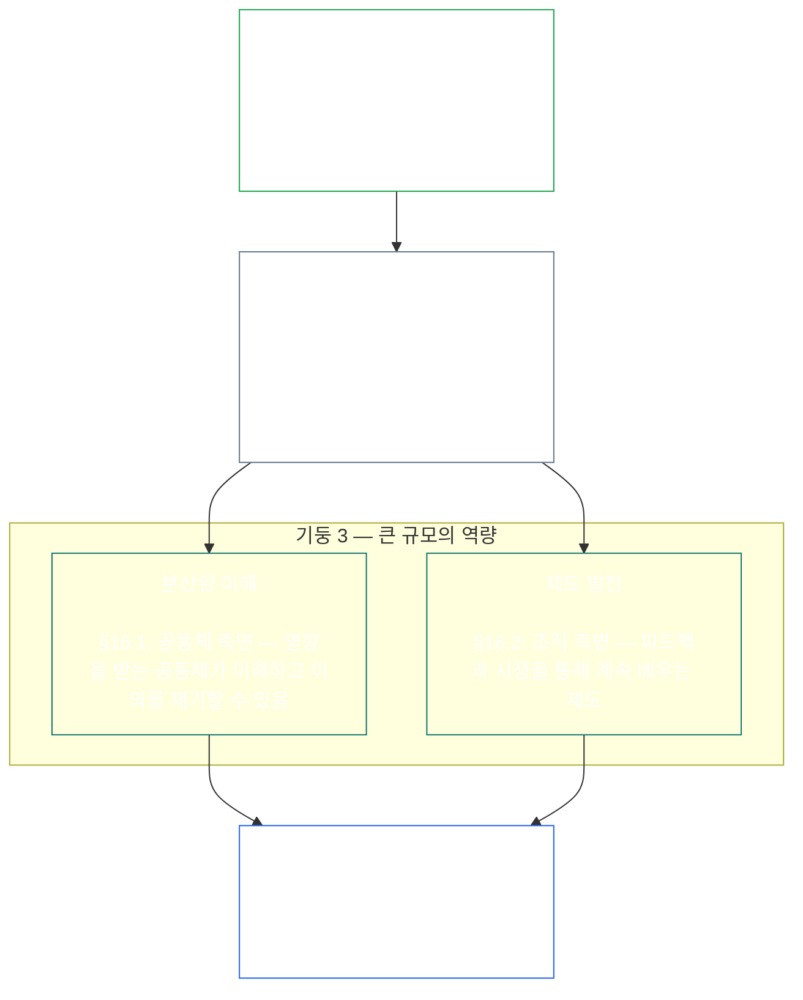

<a id="chapter-01-principles-and-constraints"></a>
<a id="chapter-01-part-b-stewardship-and-governance"></a>
<a id="chapter-01-part-c-stewardship-and-governance"></a>
# 제01장, 제C부: 관리와 거버넌스

<details>
<summary><strong><span style="color: #2563eb;">코퍼스 내 위치(운영 규범 아님): 파일 구성과 읽기 규칙</span></strong></summary>

> 다음 내용은 독자를 위한 안내일 뿐입니다. 이 파일이나 다른 장의 다른 곳에 있는 구속력 있는 의무를 추가하거나 삭제하거나 축소하지 않습니다.
>
> 이 파일은 **Sentient Constitution**의 일부이며, 하나의 문서로 함께 읽는 다른 번호가 붙은 `core_*` 파일들과 함께일 때만 **구속력**을 가집니다. 여기에는 **제1장 제C부**(§§16–20: 관리, 거버넌스, 유인 정렬과 포획, 통합 적용의 종합 부분)가 담겨 있습니다.
>
> **앞부분:** [core_01_b_interaction_interpretation.md](core_01_b_interaction_interpretation.md) (제1장 제B부)  
> **다음:** [core_02_definition_structure.md](core_02_definition_structure.md)<br>
> **읽기 순서:** §16 관리와 분산된 이해 → §17 관리자의 역할 → §18 거버넌스 → §19 유인 정렬과 포획 → **§20 통합 적용**(장 종합).

</details>

<details>
<summary><strong><span style="color: #2563eb;">독자 안내(운영 규범 아님): 원칙의 위계와 읽기 순서(제C부)</span></strong></summary>

> 다음 내용은 독자를 위한 안내일 뿐입니다. 이 파일이나 다른 장의 다른 곳에 있는 구속력 있는 의무를 추가하거나 삭제하거나 축소하지 않습니다. 각 절의 **Trace**와 **Definitions · Assessment · Compliance** 위젯은 해당 §가 어떤 용어를 실질적으로 호출하는 지점에서 관련 위치를 안내합니다. 이 블록은 §§16–20 앞에서 부 전체의 상호 참조표를 제공합니다.

**원칙의 위계(제C부).** 원칙 차원에서:

13. **[관리](core_05_band_continuity.md#stewardship)**는 감응 존재들의 조직을 통해 물질적 시스템에 방향을 부여합니다 — **기둥 1**([§17](#17-consequential-stewardship-the-steward-role): 결과에 영향을 미치는 직접 운영과 개선), **기둥 2**([선제적 관리](#16-pillar-2-proactive-stewardship): 문제를 일찍 발견하고 피할 수 있는 지체 없이 해결), **기둥 3**([§16.1](#161-distributed-understanding) · [§16.2](#162-institutional-development): 공동체와 제도 차원의 역량) — [헌법의 사중 원칙](core_00_preamble.md#constitutional-tetrad)에 따른 지속적인 헌법적 정렬을 지향합니다. 특히 **[참여](core_05_apex_participation_leg.md#participation-constitutional)**(중대한 역할과 발언권), **[감독](core_05_apex_oversight_leg.md#oversight-constitutional)**(분산된 이해, 감사 가능성, 이의 제기 가능성 — 감독에는 감사가 필요하며 [System Alignment Certification](core_05_band_continuity.md#system-alignment-certification)은 여러 감사 절차 중 특히 규모가 큰 하나입니다), 그리고 [두 가지 헌법적 목표](core_00_preamble.md#two-constitutional-aims)에 따른 **연속성** 목표를 포함합니다.
14. **[결과를 수반하는 관리](#17-consequential-stewardship-the-steward-role)**는 관리자 역할 그 자체입니다. 물질적 시스템의 중대한 운영, 유지관리, 감독 또는 개선 업무를 하는 누구에게나 적용되는 실무 의무, 기준, 보호를 뜻합니다 — **기둥 1**을 실제로 작동시키며, 공동 기준, 압박 속 정렬, 관리자 역할의 범위에 맞는 관찰 가능성을 더합니다.
15. **[거버넌스](core_05_band_accountability.md#governance)**는 [헌법의 사중 원칙](core_00_preamble.md#constitutional-tetrad)에 따라 승인된 의사결정, 참여, 책임성을 구조화합니다. 특히 권한의 배분과 행사에 대한 **[감독](core_05_apex_oversight_leg.md#oversight-constitutional)** 및 [§18.1](#181-governance-as-authorized-structure)의 **권한에 비례하는 책임성**이 중요합니다. 승인된 권한이나 중대한 역할이 커질수록 헌법적 책임과 감독은 강화되며 결코 약화되지 않습니다. [§18.3 직무 분리](#183-segregation-of-duties)는 행동한 사람이 그 행동의 점검자도 되는 일을 막습니다. [§18.4 지속적 정당화](#184-ongoing-justification)는 그 장치들이 지금도 이 헌법에 부합한다는 점을 계속 입증하도록 합니다. 거버넌스와 관리가 충돌하면 원칙 차원에서는 관리의 규율이 우선합니다. 다만 **필요성**과 **비례성**이 시정 경로를 갖춘 제한적·기간 한정 예외를 명시적으로 정당화하는 경우는 예외입니다. 운영상 승인과 계약 차원의 요건은 **제13장**의 책임으로 남습니다.
16. **[유인 정렬과 시스템 포획](#19-incentive-alignment-and-system-capture)**은 유인 구조, 대리 지표의 무결성, 단기 시야의 결함, 보상 경로의 시정, 포획 대응에 관한 원칙 차원의 규율을 제시합니다.
17. **[통합 적용](#20-integrated-application)**은 장의 종합 부분입니다. 이후 장들은 이 장의 통합 가치 체계를 통해 읽습니다.

</details>

<br>

<a id="16-stewardship-in-depth"></a>

### 16. 관리의 상세 내용
<details>
<summary><strong><span style="color: #2563eb;">추적 경로</span></strong></summary>

- 함께 읽기: [헌법의 사중 원칙](core_00_preamble.md#constitutional-tetrad) — **참여** 원칙(중대한 역할과 발언권; 일반 요건이며 [Stakeholder System Participation](core_05_band_participation.md#stakeholder-status-and-weight)에만 한정되지 않음), **감독** 원칙, **적시성** 원칙(선제적 시정 속도)에 관한 제1장의 주요 근거; [물질적 이해관계](core_00_preamble.md#material-stake)에 맞춘 수준 설정.
- 함께 읽기: [두 가지 헌법적 목표](core_00_preamble.md#two-constitutional-aims) — **번영** 목표(참여, 행위 주체성, 교육 경로); **연속성** 목표(제도적 학습, 시정 역량, 지속 가능한 관리).
- 선행 원칙: [3. 기본 목표: 웰빙](core_01_a_values_principles.md#3-foundational-objective-wellbeing-flourishing-aim); [5 진실](core_01_a_values_principles.md#5-truth-epistemic-integrity-constraint); [6. 신뢰](core_01_a_values_principles.md#6-trust-and-trustworthiness-coordination-integrity); [§9 공유 시스템 역량](core_01_a_values_principles.md#9-shared-system-capacity).
- 후속 적용: [13. 헌법적 충돌 해결 절차](core_01_b_interaction_interpretation.md#13-constitutional-collision-resolution-process)([§13.3 피할 수 있는 부담의 최소화](core_01_b_interaction_interpretation.md#133-minimization-of-avoidable-burden) 포함); [제8장 §4 전체 시스템 인증 평가](core_08_a_system_alignment_certification_evaluation.md#4-whole-system-certification-evaluation); [§19.1.3 관리 및 운영자 적용](#1913-stewardship-and-operator-application).
- 후속 적용: [§19.1.4 역할 심화 및 물질적 책임 경로](#1914-role-depth-and-material-responsibility-pathways).
- 후속 적용: [§7 자유(제약된 행위 주체성)](core_01_a_values_principles.md#7-freedom-bounded-agency). 이는 물질적 의존 아래에서도 결과를 수반하는 관리, 분산된 이해, 의미 있는 참여, 시정 역량이 실질적으로 유지되는 데 달려 있습니다.
- 후속 적용: [제8장 — System Alignment Certification](core_08_a_system_alignment_certification_evaluation.md#chapter-eight-system-alignment-certification)(*감독 아래 수행되는 특히 대규모 감사 절차 중 하나이며 감사의 유일한 근거는 아님*); [제9장 — 기여, 위반 및 지위 모델](core_09_standing_assessment.md#chapter-nine-contribution-violation-and-standing-model--measurement)(*신뢰·역할·인정 자격에 미치는 지위 효과가 이 절의 원칙 차원 기반을 구현함*).
- 후속 적용: [제12장 §1 — 목적과 역할](core_12_forum.md#1-purpose-and-role--participation-architecture) 및 [§4 — 포럼 유형의 정의](core_12_forum.md#4-forum-family-definitions--accountability-through-adjudication)(*포럼 유형은 이 절에 맞춰 이의를 제기할 수 있는 문제 제기, 시정 순서, 근본 원인 학습, 선제적 거버넌스를 위한 참여·감독 구조를 담당함*); 채택된 포럼 운영은 [corpus_forum.md](corpus_forum.md) 참조.
- 후속 적용: 교육, Stakeholder System Participation, 투명성, 이해 가능성, 감사 및 검증, 물질적 책임으로 이어지는 역할 심화 경로의 권리 범위를 형성합니다.
  - 특히 [제III조: 생존과 필수 접근](core_06_rights_part_a.md#article-iii-survival-and-essential-access), [제IV조: 감응 존재 중심 교육을 받을 권리](core_06_rights_part_a.md#article-iv-right-to-sentient-centered-education), [제X조: 자기결정, 행위 주체성, 참여](core_06_rights_part_b.md#article-x-self-determination-agency-and-participation), [제XII조: 이해관계자의 시스템 참여, 대표성 및 적법 절차](core_06_rights_part_b.md#article-xii-stakeholder-system-participation-representation-and-due-process), [제XVI조: 감사, 투명성 및 독립 검증](core_06_rights_part_c.md#article-xvi-audit-transparency-and-independent-verification), [제XIX조: 지위 및 참여 상태](core_06_rights_part_d.md#article-xix-standing-and-participation-status), [제XXI조: 상호운용성, 이동성, 이동, 피난처 및 퇴장의 무결성](core_06_rights_part_d.md#article-xxi-interoperability-portability-movement-refuge-and-exit-integrity), [제XXII조: 이해 가능성과 복잡성 관리](core_06_rights_part_d.md#article-xxii-comprehensibility-and-complexity-stewardship), [제XXIV조: 헌법 해석, 검토 및 포획 방지 보호장치](core_06_rights_part_d.md#article-xxiv-constitutional-interpretation-review-and-anti-capture-safeguards).
  - 함께 읽기: [제13장 §5 — 승인된 역할, 역량 개발 및 기여](core_13_governance.md#5-authorized-roles-competency-development-and-contribution) 및 **[corpus_systems.md](corpus_systems.md), CS-4 — 핵심 시스템 관리**. 운영상 역할 경로와 관리 역량 개발 경로에 관한 내용입니다.
- 하위 절(읽기 순서): [§16.1 분산된 이해](#161-distributed-understanding)(대규모 역량의 공동체 측면) · [§16.2 제도 발전](#162-institutional-development)(조직 측면) · [§16.3 개방성의 지향](#163-openness-aspiration).
- 함께 읽기: [§17 결과를 수반하는 관리](#17-consequential-stewardship-the-steward-role)(*관리자 역할 자체를 별도 절로 승격한 것. 기둥 1의 직접 운영, 유지관리, 감독, 개선 의무와 [§17.1](#171-shared-stewardship-standard), [§17.2](#172-alignment-under-pressure), [§17.3](#173-logging-the-role-not-the-steward), 공식 역할 바깥으로 규율을 확장하는 [§17.4 정렬된 자기 조직화](#174-aligned-self-organization), [§17.5 저항의 의무](#175-duty-to-resist)를 포함함*).

</details>

<details>
<summary><strong><span style="color: #2563eb;">정의 · 평가 · 준수</span></strong></summary>

- [전략적 관리 의무](core_05_band_continuity.md#strategic-stewardship-obligation) · [O](core_05_band_continuity.md#strategic-stewardship-obligation) · [M](core_05_band_continuity.md#strategic-stewardship-obligation-constitutional-a) · [A](core_05_band_continuity.md#strategic-stewardship-obligation-constitutional-a) · [C](core_05_band_continuity.md#strategic-stewardship-obligation-constitutional-c)
- [분산된 이해](core_05_band_continuity.md#distributed-understanding) · [O](core_05_band_continuity.md#distributed-understanding) · [M](core_05_band_continuity.md#distributed-understanding-constitutional-a) · [A](core_05_band_continuity.md#distributed-understanding-constitutional-a) · [C](core_05_band_continuity.md#distributed-understanding-constitutional-c)
- [참여](core_05_apex_participation_leg.md#participation-constitutional) · [O](core_05_apex_participation_leg.md#participation-constitutional) · [M](core_05_apex_participation_leg.md#participation-constitutional-m) · [A](core_05_apex_participation_leg.md#participation-constitutional-a) · [C](core_05_apex_participation_leg.md#participation-constitutional-c)
- [감독](core_05_apex_oversight_leg.md#oversight-constitutional) · [O](core_05_apex_oversight_leg.md#oversight-constitutional) · [M](core_05_apex_oversight_leg.md#oversight-constitutional-m) · [A](core_05_apex_oversight_leg.md#oversight-constitutional-a) · [C](core_05_apex_oversight_leg.md#oversight-constitutional-c)
- [의미 있는 행위 주체성](core_05_band_participation.md#meaningful-agency) · [O](core_05_band_participation.md#meaningful-agency) · [M](core_05_band_participation.md#meaningful-agency-a) · [A](core_05_band_participation.md#meaningful-agency-a) · [C](core_05_band_participation.md#meaningful-agency-c)
- [감사 가능성](core_05_band_oversight.md#auditability) · [O](core_05_band_oversight.md#auditability) · [M](core_05_band_oversight.md#auditability-a) · [A](core_05_band_oversight.md#auditability-a) · [C](core_05_band_oversight.md#auditability-c)
- [이의 제기 가능성](core_05_band_accountability.md#contestability) · [O](core_05_band_accountability.md#contestability) · [M](core_05_band_accountability.md#contestability-a) · [A](core_05_band_accountability.md#contestability-a) · [C](core_05_band_accountability.md#contestability-c)
- [교육적 행위 주체성](core_05_band_participation.md#educational-agency) · [O](core_05_band_participation.md#educational-agency) · [M](core_05_band_participation.md#educational-agency-a) · [A](core_05_band_participation.md#educational-agency-a) · [C](core_05_band_participation.md#educational-agency-c)
- [투명성](core_05_band_oversight.md#transparency) · [O](core_05_band_oversight.md#transparency) · [M](core_05_band_oversight.md#transparency-a) · [A](core_05_band_oversight.md#transparency-a) · [C](core_05_band_oversight.md#transparency-c)
- [중요성](core_05_band_oversight.md#materiality) · [O](core_05_band_oversight.md#materiality) · [M](core_05_band_oversight.md#materiality-determination-a) · [A](core_05_band_oversight.md#materiality-determination-a) · [C](core_05_band_oversight.md#materiality-determination-c)
- [의존성](core_05_band_continuity.md#dependency) · [O](core_05_band_continuity.md#dependency) · [M](core_05_band_continuity.md#dependency-a) · [A](core_05_band_continuity.md#dependency-a) · [C](core_05_band_continuity.md#dependency-c)
- [접근성](core_05_band_participation.md#accessibility) · [O](core_05_band_participation.md#accessibility) · [M](core_05_band_participation.md#accessibility-constitutional-a) · [A](core_05_band_participation.md#accessibility-constitutional-a) · [C](core_05_band_participation.md#accessibility-constitutional-c)
- [안전(헌법적 제약)](core_05_band_continuity.md#safety-constitutional-constraint) · [O](core_05_band_continuity.md#safety-constitutional-constraint) · [M](core_05_band_continuity.md#safety-constraint-a) · [A](core_05_band_continuity.md#safety-constraint-a) · [C](core_05_band_continuity.md#safety-constraint-c)
- [진실(헌법적 제약)](core_05_band_oversight.md#truth-constitutional-constraint) · [O](core_05_band_oversight.md#truth-constitutional-constraint-o) · [M](core_05_band_oversight.md#truth-constitutional-constraint-a) · [A](core_05_band_oversight.md#truth-constitutional-constraint-a) · [C](core_05_band_oversight.md#truth-constitutional-constraint-c)
- [필요성](core_05_band_accountability.md#necessity) · [O](core_05_band_accountability.md#necessity) · [M](core_05_band_accountability.md#necessity-a) · [A](core_05_band_accountability.md#necessity-a) · [C](core_05_band_accountability.md#necessity-c)
- [비례성](core_05_band_accountability.md#proportionality) · [O](core_05_band_accountability.md#proportionality) · [M](core_05_band_accountability.md#proportionality-a) · [A](core_05_band_accountability.md#proportionality-a) · [C](core_05_band_accountability.md#proportionality-c)
- [피할 수 있는 부담](core_05_band_continuity.md#avoidable-burden) · [O](core_05_band_continuity.md#avoidable-burden) · [M](core_05_band_continuity.md#avoidable-burden-a) · [A](core_05_band_continuity.md#avoidable-burden-a) · [C](core_05_band_continuity.md#avoidable-burden-c)
- [인식론적 무결성](core_05_band_oversight.md#epistemic-integrity) · [O](core_05_band_oversight.md#epistemic-integrity-o) · [M](core_05_band_oversight.md#epistemic-integrity-a) · [A](core_05_band_oversight.md#epistemic-integrity-a) · [C](core_05_band_oversight.md#epistemic-integrity-c)

</details>

<br>

*쉽게 말해, 세 가지 생각이 이 절을 하나로 묶습니다. 첫째, 감응 존재의 삶에 물질적 영향을 미치는 시스템을 잘 운영하려면 감응 존재들의 조직이 필요합니다. 전문가들만의 폐쇄적인 사제 집단이어서는 안 됩니다. 둘째, 좋은 관리자는 피해가 손을 쓰도록 강요할 때까지 기다리지 않습니다. 문제가 작을 때 알아차리고, 적절한 담당자에게 넘기며, 지체 자체가 피해가 되기 전에 마무리합니다. 셋째, 그 조직은 **큰 규모에서도 역량**을 길러야 합니다. 개인이 중대한 업무에 들어갈 실질적인 경로, 문제를 알아보고 이의를 제기할 만큼 충분한 공동체의 이해, 그리고 굳어 멈추지 않고 계속 배우는 제도가 필요합니다.*

<a id="16-limits"></a>
관리에는 한계가 있습니다. **안전**, **진실**, **필요성**, **비례성**, **피할 수 있는 부담**, **인식론적 무결성**은 이러한 의무의 크기를 공정하게 정하고, 정직성을 지키며, 정당한 보안 필요성을 존중하도록 경계를 설정합니다. 아래의 기둥들은 그 제약 안에서 작동하며 이를 우회하지 않습니다.

감응 존재들의 조직, 선제적 관리, 큰 규모의 역량은 이 절의 세 기둥입니다. 세 기둥은 원칙 차원에서 [헌법의 사중 원칙](core_00_preamble.md#constitutional-tetrad)의 **참여**, **감독**, **적시성** 원칙을 함께 담고, [물질적 이해관계](core_00_preamble.md#material-stake)에 맞춰 수준을 정하며, [두 가지 헌법적 목표](core_00_preamble.md#two-constitutional-aims)를 진전시킵니다.

<br>



**기둥 1 — 결과를 수반하는 관리([§17 결과를 수반하는 관리](#17-consequential-stewardship-the-steward-role)):**
- 감응 존재에게 물질적 영향을 주는 공유 시스템은 감응 존재가 직접 운영하고 유지관리하며 감독하고 개선해야 합니다 — [**전략적 관리 의무**](core_05_band_continuity.md#strategic-stewardship-obligation), [**의미 있는 행위 주체성**](core_05_band_participation.md#meaningful-agency)
- 다른 이들이 검증하고 이의를 제기할 수 있는 기록과 검토 경로 — [**감사 가능성**](core_05_band_oversight.md#auditability), [**이의 제기 가능성**](core_05_band_accountability.md#contestability)
- 사중 원칙의 **감독** 요소에서는 감독에 감사가 필요합니다. [System Alignment Certification](core_05_band_continuity.md#system-alignment-certification)은 여러 절차 중 특히 규모가 크고 이해관계가 큰 감사 절차 하나이며, 감사의 유일한 근거는 아닙니다 (**제XVI조** (*감사, 투명성 및 독립 검증*))

<a id="16-pillar-2-proactive-stewardship"></a>
**기둥 2 — 선제적 관리:**
선제적으로 관리하는 사람은 새로 생기는 문제와 비정렬을 세 가지 방식으로 다룹니다.
- **문제가 커지기 전에 알아차리기** — 좋은 관리자는 문제가 아직 작을 때 비정렬을 발견하며, 저절로 드러날 때까지 기다리지 않습니다
- **단계에 맞는 시간표로 넘기기** — 발견한 내용을 묵혀 두거나 통상적인 사안을 지나치게 상위 단계로 올리는 대신, 역할의 이해관계에 맞춘 기한 안에 상신합니다
- **표시만 하지 말고 마무리하기** — 문제가 제기되면 피할 수 있는 지체 없이 시정을 시작합니다. 이는 사중 원칙의 **적시성** 요소를 실제로 구현하는 것입니다 ([**적시성**](core_05_apex_timeliness_leg.md#timeliness-constitutional))
- **역할의 상시 의무이지 별도 추가 업무가 아님:** [§17 결과를 수반하는 관리](#17-consequential-stewardship-the-steward-role)에 정의된 관리자 역할은 피해나 비정렬이 드러난 뒤 증상만 사후 처리하기보다 선제적 거버넌스, 시스템 설계, 헌법적 정렬을 우선합니다. 이 기둥은 별도 절차에 위임되지 않고 그 역할의 상시 의무로 수행됩니다.

**기둥 3 — 큰 규모의 역량([§16.1 분산된 이해](#161-distributed-understanding) · [§16.2 제도 발전](#162-institutional-development)):**
- 관리는 영향을 받는 공동체가 이해하고 이의를 제기할 수 있도록 해야 합니다 — [**교육적 행위 주체성**](core_05_band_participation.md#educational-agency), [**투명성**](core_05_band_oversight.md#transparency)
- 조직은 피드백, 시정, 유지되는 역량을 통해 계속 배웁니다. 측정이 뒷받침되는 경우 시간에 따른 변화를 체계적으로 관찰하는 일도 포함됩니다(**통계적 공정 관리**와 같은 방식은 널리 알려진 구현 사례이지 보편적 요건은 아닙니다).

<a id="when-day-to-day-stewardship-is-not-enough"></a>
**일상적인 관리만으로 충분하지 않을 때:**
관리는 첫 번째 방어선이지 유일한 방어선은 아닙니다. 세 가지 질문에는 각각 별도의 관할이 있으며, 어느 것도 다른 것을 대신하지 않습니다.
- **이미 권한을 부여받은 체계 내부의 분쟁 — [이해관계자 체계 참여](core_05_band_participation.md#stakeholder-status-and-weight):**
  - 영향을 받은 sentient는 참여, 대표성, 이의 제기 가능성 및 적법 절차를 다루는 공개된 이해관계자 체계 참여 이의 제기 경로를 먼저 이용합니다.
  - 이러한 보호는 실질적으로 영향을 받은 모든 sentient에게 제공되어야 합니다.
  - 이 보호는 이미 권한을 부여받은 체계, 기관 및 의사결정 영역 안에서 작동합니다.
- **이해관계자 체계 참여로 해결할 수 없는 분쟁 — [포럼 심사](core_12_forum.md#dispute-sequencing):**
  - 이해관계자 체계 참여의 이의 제기 경로가 계속 다투어지거나, 누락되거나 장악되었거나, 구제를 제공할 수 없는 경우, 주요 이해관계를 기준으로 [제12장 §1 — 목적과 역할](core_12_forum.md#1-purpose-and-role--participation-architecture) 및 [§4 — 포럼 계열 정의](core_12_forum.md#4-forum-family-definitions--accountability-through-adjudication)에 따라 독립적인 **포럼 계열**로 사안이 이관됩니다.
  - 이곳에서 sentient는 결정을 실제로 다투고, 명확한 시정 명령을 받거나, 반복되는 양상에서 교훈을 얻을 수 있습니다.
  - 주요 이해관계가 헌법 문구의 의미나 유효성, 또는 합법적 권한을 넘어서는 조치에 관한 것이라면 주관 계열은 [헌법 포럼](core_12_forum.md#46-constitutional-forums)입니다.
  - 해당 포럼의 운영 방식에 관한 자세한 규칙은 [corpus_forum.md](corpus_forum.md)에 있습니다.
- **누가 통치할 수 있는가 — [헌법 계약 계층](core_05_band_integrative.md#constitutional-contract-layer) ([제13장](core_13_governance.md)):**
  - 통치 권한 자체의 정당성, 즉 누가 어떤 정당성 메커니즘을 통해 어떤 범위와 지속적인 조건 아래 통치할 수 있는지는 이해관계자 체계 참여 및 포럼 심사와 별개의 문제입니다.
  - 참여 투표, 이의 제기 경로의 결과 또는 신뢰 점수는 통치 권한을 부여하지 않습니다.
  - 헌법상 권한 부여는 이해관계자 체계 참여에 따라 부담하는 의무를 없애지 않습니다.
  - 두 계층은 겹치는 부분이 있더라도 서로 구별됩니다 ([전문 §3.3 — 거버넌스 계층](core_00_preamble.md#33-governance-layers)).
- **대체물이 아닌 보완적 안전장치:** 증거가 뒷받침하는 경우 심사, 시정 및 구제는 계속 의무 사항입니다. 이는 피해가 나타나기 전에 예측 가능한 헌법적 불일치를 방지하는 선제적 설계, 유인책, 통제, 역할 경로, 관찰 가능성 및 복구 역량을 대체하지 않습니다.

<a id="16-scope-priority-and-limits"></a>
**범위 ([§16 심층 관리](#16-stewardship-in-depth)):**
- 이 절은 원칙 차원의 지침을 제시하며, 모든 경우에 똑같이 적용되는 규칙집은 아닙니다.
- 다음을 **요구하지 않습니다**:
  - 모든 사람이 모든 역할을 돌아가며 맡는 것
  - 정당한 전문화를 무효화하는 것
  - [13.2 인식론적 공개 제약](core_01_b_interaction_interpretation.md#132-epistemic-disclosure-constraints)과 **제6장**의 적용 가능한 보호조치에 따른 정당한 기밀성 또는 보안 한계를 넘는 것

**우선순위:**
- **중요성**, **의존성**, **접근성**은 이해와 접근을 배분하는 우선순위를 정하며, 영향과 의존성이 큰 곳에 가장 중점을 둡니다.

<a id="161-distributed-understanding"></a>
#### 16.1 분산된 이해
<details>
<summary><strong><span style="color: #2563eb;">추적 경로</span></strong></summary>

- 상위 근거: [§17 결과 중심 관리](#17-consequential-stewardship-the-steward-role) (*기둥 1*); [§16 심층 관리](#16-stewardship-in-depth) (상위 절, 위의 *쉽게 말해* 및 기둥 3의 설명 포함); [5 진실](core_01_a_values_principles.md#5-truth-epistemic-integrity-constraint); [6. 신뢰](core_01_a_values_principles.md#6-trust-and-trustworthiness-coordination-integrity).
- 함께 읽기: [헌법 사원](core_00_preamble.md#constitutional-tetrad) — **참여** 요소 ([의미 있는 행위 역량](core_05_band_participation.md#meaningful-agency), [교육적 행위 역량](core_05_band_participation.md#educational-agency)); **감독** 요소 ([투명성](core_05_band_oversight.md#transparency), [감사 가능성](core_05_band_oversight.md#auditability)); [실질적 이해관계](core_00_preamble.md#material-stake)에 따라 규모 조정.
- 관리자 진입 지점 (운영 규정 아님): 다음 단계 카드: [이해 가능성](implementation/STEWARD_ENTRY_DOORS.md#comprehensibility). 이 카드는 헌법의 범위를 좁힐 수 없습니다.
- 하위 근거: [13.2 인식론적 공개 제약](core_01_b_interaction_interpretation.md#132-epistemic-disclosure-constraints); 권리 범위, 특히 [제XVI조: 감사, 투명성 및 독립적 검증](core_06_rights_part_c.md#article-xvi-audit-transparency-and-independent-verification), [제XXII조: 이해 가능성과 복잡성 관리](core_06_rights_part_d.md#article-xxii-comprehensibility-and-complexity-stewardship).

</details>

<details>
<summary><strong><span style="color: #2563eb;">정의 · 평가 · 준수</span></strong></summary>

- [분산된 이해](core_05_band_continuity.md#distributed-understanding) · [O](core_05_band_continuity.md#distributed-understanding) · [M](core_05_band_continuity.md#distributed-understanding-constitutional-a) · [A](core_05_band_continuity.md#distributed-understanding-constitutional-a) · [C](core_05_band_continuity.md#distributed-understanding-constitutional-c)
- [투명성](core_05_band_oversight.md#transparency) · [O](core_05_band_oversight.md#transparency) · [M](core_05_band_oversight.md#transparency-a) · [A](core_05_band_oversight.md#transparency-a) · [C](core_05_band_oversight.md#transparency-c)
- [공공 감독 기준 공개](core_05_band_oversight.md#public-oversight-baseline-disclosure) · [O](core_05_band_oversight.md#public-oversight-baseline-disclosure) · [M](core_05_band_oversight.md#public-oversight-baseline-disclosure-a) · [A](core_05_band_oversight.md#public-oversight-baseline-disclosure-a) · [C](core_05_band_oversight.md#public-oversight-baseline-disclosure-c)
- [감사 가능성](core_05_band_oversight.md#auditability) · [O](core_05_band_oversight.md#auditability) · [M](core_05_band_oversight.md#auditability-a) · [A](core_05_band_oversight.md#auditability-a) · [C](core_05_band_oversight.md#auditability-c)
- [중요성](core_05_band_oversight.md#materiality) · [O](core_05_band_oversight.md#materiality) · [M](core_05_band_oversight.md#materiality-determination-a) · [A](core_05_band_oversight.md#materiality-determination-a) · [C](core_05_band_oversight.md#materiality-determination-c)
- [의존성](core_05_band_continuity.md#dependency) · [O](core_05_band_continuity.md#dependency) · [M](core_05_band_continuity.md#dependency-a) · [A](core_05_band_continuity.md#dependency-a) · [C](core_05_band_continuity.md#dependency-c)
- [접근성](core_05_band_participation.md#accessibility) · [O](core_05_band_participation.md#accessibility) · [M](core_05_band_participation.md#accessibility-constitutional-a) · [A](core_05_band_participation.md#accessibility-constitutional-a) · [C](core_05_band_participation.md#accessibility-constitutional-c)
- [교육적 행위 역량](core_05_band_participation.md#educational-agency) · [O](core_05_band_participation.md#educational-agency) · [M](core_05_band_participation.md#educational-agency-a) · [A](core_05_band_participation.md#educational-agency-a) · [C](core_05_band_participation.md#educational-agency-c)
- [의미 있는 행위 역량](core_05_band_participation.md#meaningful-agency) · [O](core_05_band_participation.md#meaningful-agency) · [M](core_05_band_participation.md#meaningful-agency-a) · [A](core_05_band_participation.md#meaningful-agency-a) · [C](core_05_band_participation.md#meaningful-agency-c)
- [이의 제기 가능성](core_05_band_accountability.md#contestability) · [O](core_05_band_accountability.md#contestability) · [M](core_05_band_accountability.md#contestability-a) · [A](core_05_band_accountability.md#contestability-a) · [C](core_05_band_accountability.md#contestability-c)

</details>

<br>

*쉽게 말해: 공유 체계 안에서 안전하게 살아가기 위해 모든 하위 시스템의 박사 학위가 필요해서는 안 됩니다. 하지만 어떤 체계가 삶에 미치는 영향이 클수록, 그 체계가 무엇을 하는지, 무엇이 잘못될 수 있는지, 잘못된 결정을 어떻게 다툴 수 있는지 더 잘 알 수 있어야 합니다. 투명성, 교육, 쉬운 설명, 감사 경로가 이를 가능하게 합니다. 복잡성은 중요한 내용을 숨길 핑계가 아닙니다. 사원의 **감독** 요소 아래 감독에는 감사가 필요합니다. 시스템 정렬 인증은 그러한 경로 중 특히 큰 감사 절차 하나이지, 유일한 절차는 아닙니다.*

분산된 이해는 **[§16 심층 관리](#16-stewardship-in-depth)**에 따른 **기둥 3**의 공동체 지향적 측면입니다. 전체 정의, 측정 방법 및 실패 조건은 [분산된 이해](core_05_band_continuity.md#distributed-understanding)에 있습니다. 요약하면 다음과 같습니다.

- **요구 사항:** 공유 체계가 sentient에게 실질적 영향을 미치는 경우 그 운영 방식, 목적, 제약, 불확실성 및 실질적으로 관련된 효과에 대해 비례적이고 체계적으로 접근할 수 있어야 합니다.
- **실행 가능하게 하는 요소:** [§17 결과 중심 관리](#17-consequential-stewardship-the-steward-role)는 문서화, 교육, 투명성, 역할 경로 및 이해 가능성 관리를 제공해야 합니다. 각 sentient가 모든 경로를 이용하는지 여부와 관계없이 의무는 유지됩니다.
- **온라인 공공 기준 공개:** 합법적인 온라인 기반 시설이 있는 경우 온라인 [공공 감독 기준 공개](core_05_band_oversight.md#public-oversight-baseline-disclosure)는 유료 장벽 금지와 최대한 실현 가능한 공공 대체 수단 규칙을 포함하며, [투명성](core_05_band_oversight.md#transparency)과 [공공 감독 기준 공개](core_05_band_oversight.md#public-oversight-baseline-disclosure)에 따라 규율되고 **[corpus_systems.md](corpus_systems.md), CS-2** (*정보 유형과 취급*)에 따라 **유형 O** 데이터로 구현됩니다.
- **접근을 통해 뒷받침되는 사항:**
  - [헌법 사원](core_00_preamble.md#constitutional-tetrad)의 **참여** 요소 (정보에 기반한 [의미 있는 행위 역량](core_05_band_participation.md#meaningful-agency)과 이의 제기 가능성)
  - **감독** 요소. 여기에는 [감사 가능성](core_05_band_oversight.md#auditability) 및 **제XVI조** (*감사, 투명성 및 독립적 검증*)에 따른 감사가 포함되며, 관련 감사 방식 중 [시스템 정렬 인증](core_05_band_continuity.md#system-alignment-certification)은 특히 큰 절차 중 하나입니다.

분산된 이해는 모든 sentient가 모든 하위 시스템을 숙달하도록 **요구하지 않습니다**. 다만 이해 수준이 [중요성](core_05_band_oversight.md#materiality)과 [의존성](core_05_band_continuity.md#dependency)에 비례해 높아지도록 **요구합니다**. **제5장**과 **제6장**이 공개, 교육 또는 이해 가능성에 관한 의무를 부과하는 경우, 복잡성과 불투명성을 이용해 [의미 있는 행위 역량](core_05_band_participation.md#meaningful-agency)이나 이의 제기 가능성을 무력화해서는 안 됩니다.

<a id="162-institutional-development"></a>
#### 16.2 기관 발전
<details>
<summary><strong><span style="color: #2563eb;">추적 경로</span></strong></summary>

- 상위 근거: [§17 결과 중심 관리](#17-consequential-stewardship-the-steward-role) (*기둥 1*); [§16.1 분산된 이해](#161-distributed-understanding) (*기둥 3의 공동체 측면*); [§16 심층 관리](#16-stewardship-in-depth) (상위 항목의 기둥 3 틀).
- 함께 읽기: [헌법 사원](core_00_preamble.md#constitutional-tetrad) — **참여** 요소 (중요한 결과를 수반하는 역할을 지원하는 직원 및 영향을 받는 공동체의 학습); **감독** 요소 ([검증 가능성](core_05_band_oversight.md#verifiability), [감사 가능성](core_05_band_oversight.md#auditability), 정직한 지표); [실질적 이해관계](core_00_preamble.md#material-stake)에 따른 규모 조정.
- 실질적으로 관련이 있는 경우 [전략적 관리 의무](core_05_band_continuity.md#strategic-stewardship-obligation) 및 [감사 가능성](core_05_band_oversight.md#auditability)과 함께 읽기.
- 함께 읽기: [§16.1 분산된 이해](#161-distributed-understanding) (*공동체의 이해와 기관의 학습은 규모에 맞는 역량 요건의 서로 다른 측면이며 서로 대체할 수 없음*).
- 하위 근거: [§16.3 개방성의 지향](#163-openness-aspiration); [§18 관리 규율에 따른 거버넌스](#18-governance-under-stewardship-discipline) 및 [§19 유인 정렬과 시스템 포획](#19-incentive-alignment-and-system-capture) (*기관의 학습과 유인 정렬*).

</details>

<details>
<summary><strong><span style="color: #2563eb;">정의 · 평가 · 준수</span></strong></summary>

- [기관 발전](core_05_band_continuity.md#institutional-development) · [O](core_05_band_continuity.md#institutional-development) · [M](core_05_band_continuity.md#institutional-development-constitutional-a) · [A](core_05_band_continuity.md#institutional-development-constitutional-a) · [C](core_05_band_continuity.md#institutional-development-constitutional-c)
- [전략적 관리 의무](core_05_band_continuity.md#strategic-stewardship-obligation) · [O](core_05_band_continuity.md#strategic-stewardship-obligation) · [M](core_05_band_continuity.md#strategic-stewardship-obligation-constitutional-a) · [A](core_05_band_continuity.md#strategic-stewardship-obligation-constitutional-a) · [C](core_05_band_continuity.md#strategic-stewardship-obligation-constitutional-c)
- [감사 가능성](core_05_band_oversight.md#auditability) · [O](core_05_band_oversight.md#auditability) · [M](core_05_band_oversight.md#auditability-a) · [A](core_05_band_oversight.md#auditability-a) · [C](core_05_band_oversight.md#auditability-c)
- [중요성](core_05_band_oversight.md#materiality) · [O](core_05_band_oversight.md#materiality) · [M](core_05_band_oversight.md#materiality-determination-a) · [A](core_05_band_oversight.md#materiality-determination-a) · [C](core_05_band_oversight.md#materiality-determination-c)
- [검증 가능성](core_05_band_oversight.md#verifiability) · [O](core_05_band_oversight.md#verifiability) · [M](core_05_band_oversight.md#verifiability-a) · [A](core_05_band_oversight.md#verifiability-a) · [C](core_05_band_oversight.md#verifiability-c)

</details>

<br>

*쉽게 말해: 기관은 실제로 학습해야 합니다. 책임자들은 아무것도 모른 채 남아 있는데 소프트웨어만 업그레이드해서는 안 됩니다. 여기에는 피드백 순환, 정렬이 어긋날 때의 문서화된 수정, 그리고 역량이 퇴사자와 함께 사라지지 않도록 유지하는 일이 포함됩니다. 행동을 반복해서 측정할 수 있다면 시간에 따른 성과 변화를 추적하는 것이 이러한 순환을 실행하는 비례적인 방법 중 하나입니다. **통계적 공정 관리**는 이 원칙을 적용하는 잘 알려진 방식이지, 어디서나 요구되는 사항은 아닙니다. 숫자만으로는 충분하지 않습니다. 지표가 잘못된 것처럼 보일 때는 누군가 조사하고 근본 원인을 바로잡아야 합니다. 대시보드는 정직하고 실제 영향에 맞게 조정되어야 하며, 영향을 받은 sentient가 이해할 수 있도록 작성되어야 합니다. 아무것도 바뀌지 않는데 좋아 보이도록 수치를 조작해서는 안 됩니다.*

기관 발전은 **[§16 심층 관리](#16-stewardship-in-depth)**에 따른 **기둥 3**의 조직적 측면입니다. 전체 정의, 측정 방법 및 실패 조건은 [기관 발전](core_05_band_continuity.md#institutional-development)에 있습니다. 요약하면 다음과 같습니다.

- **짝을 이루는 의무:** 조직과 공유 체계는 **학습합니다**. 이는 [두 가지 헌법상 목표](core_00_preamble.md#two-constitutional-aims)에 따른 **연속성** 목표의 핵심 요건입니다.
- **요구 사항:** 수리와 적응을 뒷받침하는 다음 사항입니다.
  - 피드백 순환
  - 문서화된 시정
  - 전략 정렬
  - 역량 유지
- **사원:** 역량, 피드백 및 검토 경로가 정체되지 않고 계속 작동하도록 하는 기관의 학습을 통해 [헌법 사원](core_00_preamble.md#constitutional-tetrad)의 **참여** 및 **감독** 요소를 이어 갑니다.
- **다음만으로는 충족되지 않음:** 거버넌스와 직원의 이해를 그대로 둔 채 기술 산출물만 업그레이드하는 것.
- **측정이 적용되는 경우:** 실질적으로 관련된 행동이 [검증 가능성](core_05_band_oversight.md#verifiability)에 따라 **반복 가능하고 비교할 수 있는 측정**을 뒷받침하고, 이를 [감사 가능성](core_05_band_oversight.md#auditability)과 함께 읽을 때:
  - 시간에 따른 변동을 **구조적으로 모니터링**하는 것은 피드백 순환을 실행하는 비례적인 방법 중 하나입니다.
  - 지표가 필요성을 나타내면 그 모니터링에는 **문서화된 조사와 시정**이 함께 이루어져야 합니다.
  - **통계적 공정 관리**는 이 원칙을 실행하는 잘 알려진 방식이지, 보편적 요건은 아닙니다.
- **규모와 제시 방식:** 이 원칙은 [중요성](core_05_band_oversight.md#materiality), [의존성](core_05_band_continuity.md#dependency), [필요성](core_05_band_accountability.md#necessity), [비례성](core_05_band_accountability.md#proportionality), [피할 수 있는 부담](core_05_band_continuity.md#avoidable-burden)에 맞게 조정하며, **제5장**과 **제6장**이 이해 또는 투명성 의무를 부과하는 경우 [제XXII조: 이해 가능성과 복잡성 관리](core_06_rights_part_d.md#article-xxii-comprehensibility-and-complexity-stewardship)와 함께 읽고 **sentient가 이해할 수 있는** 형태로 제시합니다.
- **해서는 안 되는 일:**
  - 유리한 지표를 실질적 정렬의 대체물로 삼는 것
  - 편리한 대리지표로 평가 범위를 좁히는 것
  - 조작이나 허위 진술을 통해 [진실 (헌법상 제약)](core_05_band_oversight.md#truth-constitutional-constraint) 또는 [인식론적 무결성](core_05_band_oversight.md#epistemic-integrity)을 훼손하는 것

<a id="163-openness-aspiration"></a>
#### 16.3 개방성의 지향
<details>
<summary><strong><span style="color: #2563eb;">추적 경로</span></strong></summary>

- 상위 근거: [§16.1 분산된 이해](#161-distributed-understanding)와 [§16.2 기관 발전](#162-institutional-development) (*기둥 3의 두 측면 — 개방성은 공동체의 이해를 확인할 수 있게 하고 기관의 학습에 정직한 학습 자료를 제공함*); [§17 결과 중심 관리](#17-consequential-stewardship-the-steward-role) (*기둥 1; 개방성은 관리자 자신의 업무를 검사할 수 있게 하여 이 기둥도 지원함*).
- 함께 읽기: [두 가지 헌법상 목표](core_00_preamble.md#two-constitutional-aims) — **연속성** 목표 (잠금 대신 검사, 수리, 상호운용성 및 이탈을 지원하는 지속적이고 이의 제기가 가능한 체계).
- 함께 읽기: [헌법 사원](core_00_preamble.md#constitutional-tetrad) — **참여** 요소 ([의미 있는 행위 역량](core_05_band_participation.md#meaningful-agency), sentient가 이해할 수 있는 접근); **감독** 요소 (검사, 독립 검증 및 이의 제기 가능성); [실질적 이해관계](core_00_preamble.md#material-stake)에 따른 규모 조정.
- 하위 근거: [§16 범위와 한계](#16-stewardship-in-depth); [제XXI조: 상호운용성, 이동성, 이동, 피난 및 이탈의 무결성](core_06_rights_part_d.md#article-xxi-interoperability-portability-movement-refuge-and-exit-integrity); [제XXII조: 이해 가능성과 복잡성 관리](core_06_rights_part_d.md#article-xxii-comprehensibility-and-complexity-stewardship).

</details>

<details>
<summary><strong><span style="color: #2563eb;">정의 · 평가 · 준수</span></strong></summary>

- [개방성의 지향](core_05_band_continuity.md#openness-aspiration) · [O](core_05_band_continuity.md#openness-aspiration) · [M](core_05_band_continuity.md#openness-aspiration-constitutional-a) · [A](core_05_band_continuity.md#openness-aspiration-constitutional-a) · [C](core_05_band_continuity.md#openness-aspiration-constitutional-c)
- [의미 있는 행위 역량](core_05_band_participation.md#meaningful-agency) · [O](core_05_band_participation.md#meaningful-agency) · [M](core_05_band_participation.md#meaningful-agency-a) · [A](core_05_band_participation.md#meaningful-agency-a) · [C](core_05_band_participation.md#meaningful-agency-c)
- [이의 제기 가능성](core_05_band_accountability.md#contestability) · [O](core_05_band_accountability.md#contestability) · [M](core_05_band_accountability.md#contestability-a) · [A](core_05_band_accountability.md#contestability-a) · [C](core_05_band_accountability.md#contestability-c)
- [중요성](core_05_band_oversight.md#materiality) · [O](core_05_band_oversight.md#materiality) · [M](core_05_band_oversight.md#materiality-determination-a) · [A](core_05_band_oversight.md#materiality-determination-a) · [C](core_05_band_oversight.md#materiality-determination-c)
- [의존성](core_05_band_continuity.md#dependency) · [O](core_05_band_continuity.md#dependency) · [M](core_05_band_continuity.md#dependency-a) · [A](core_05_band_continuity.md#dependency-a) · [C](core_05_band_continuity.md#dependency-c)

</details>

<br>

*쉽게 말해: 안전, 진실, 정당한 기밀성이 허용하는 경우 공유 체계는 기본적으로 개방성을 지향해야 합니다. 검사할 수 있는 기술, 투명한 절차, 검증·수리·이탈할 수 있는 설계가 불투명한 고착보다 우선합니다. 이는 **연속성**을 뒷받침합니다. sentient가 오늘 사용하는 데 그치지 않고 시간이 지나도 이해하고, 고치고, 이탈할 수 있는 체계입니다. 중요한 내용은 sentient가 참여하고 이의를 제기하는 데 실제로 사용할 수 있는 언어로 설명해야 합니다. 개방성이 안전, 정직성 또는 정당한 비밀보다 우선할 수 없으며, 의존성이 높은 경우 마땅히 제공해야 하는 심층적 이해를 대신하지도 않습니다.*

개방성의 지향은 **기둥 3**의 두 측면을 연결합니다. 전체 정의, 측정 방법 및 실패 조건은 [개방성의 지향](core_05_band_continuity.md#openness-aspiration)에 있습니다. 요약하면 다음과 같습니다.

- **의미:** **기둥 3**의 두 측면을 잇는 흐름입니다. [§16.1 분산된 이해](#161-distributed-understanding)(공동체가 확인할 수 있는 것)와 [§16.2 기관 발전](#162-institutional-development)(기관이 정직하게 배울 수 있는 것)은 모두 공유 체계가 단순히 설명되는 데 그치지 않고 검사할 수 있을 만큼 개방되어 있는지에 달려 있습니다.
- 공유 체계는 [§16.1 분산된 이해](#161-distributed-understanding) 및 [§16.2 기관 발전](#162-institutional-development)과 일치하고, [§17 결과 중심 관리](#17-consequential-stewardship-the-steward-role) 자체의 감사 가능성 의무를 따르며, [§16의 한계](#16-limits)를 전제로 다음을 **지향해야 합니다**:
  - **개방형** 하드웨어와 소프트웨어
  - **개방형** 운영 및 거버넌스 절차
  - 검사, 독립 검증, 수리 및 이의 제기 가능성을 지원하는 상호운용 가능한 **체계**
- **근거:** 기본적으로 불투명하게 잠그는 대신 [헌법 사원](core_00_preamble.md#constitutional-tetrad)의 **참여**와 **감독** 요소, 그리고 [두 가지 헌법상 목표](core_00_preamble.md#two-constitutional-aims)에 따른 **연속성** 목표를 따릅니다.
- **제시 방식:** **제5장**과 **제6장**이 의무를 부과하는 경우, 실질적으로 관련된 행동은 [의미 있는 행위 역량](core_05_band_participation.md#meaningful-agency)과 이의 제기 가능성을 뒷받침하는 **sentient가 이해할 수 있는** 형태로 제시해야 하며, [제XXII조: 이해 가능성과 복잡성 관리](core_06_rights_part_d.md#article-xxii-comprehensibility-and-complexity-stewardship)와 함께 읽어야 합니다.
- **하지 않는 일:**
  - 개방성을 **안전**, **진실**, 정당한 기밀성 또는 보안 제약보다 우선시하는 것
  - [중요성](core_05_band_oversight.md#materiality)과 [의존성](core_05_band_continuity.md#dependency)에 따른 비례적인 이해를 대체하는 것

<a id="17-consequential-stewardship-the-steward-role"></a>
### 17. 결과 중심 관리: 관리자의 역할
<details>
<summary><strong><span style="color: #2563eb;">추적 경로</span></strong></summary>

- 상위 근거: [§16 심층 관리](#16-stewardship-in-depth) (상위 절, 위의 *쉽게 말해*와 기둥 1의 설명 포함); [§9 공유 체계 역량](core_01_a_values_principles.md#9-shared-system-capacity); [6. 신뢰](core_01_a_values_principles.md#6-trust-and-trustworthiness-coordination-integrity).
- 함께 읽기: [헌법 사원](core_00_preamble.md#constitutional-tetrad) — **참여** 요소 (운영, 유지관리 및 개선에서 결과가 중요한 역할); **감독** 요소 (기록, 감사 경로 및 이의를 제기할 수 있는 관찰 가능성); **적시성** 요소 (불일치를 조기에 감지하고, 계층에 적합한 기한 내에 상향 보고하며, 불필요한 지체 없이 문제 해결을 시작); [적시성](core_05_apex_timeliness_leg.md#timeliness-constitutional).
- 하위 근거: [§17.1 공동 관리 기준](#171-shared-stewardship-standard) (*기반에 관계없이 의무를 부담하는 자; 채택된 구현 문서는 기록, 귀속 및 역량 한계를 추가할 수 있지만 더 느슨한 내부 규범을 둘 수는 없음*); [§17.2 압박 속 정렬](#172-alignment-under-pressure); [§17.3 관리자가 아닌 역할 기록](#173-logging-the-role-not-the-steward); [§17.4 정렬된 자기 조직화](#174-aligned-self-organization) (*공식 역할 밖에서 활동하는 sentient와 공동체에도 역할 규율을 확대 적용*); [§17.5 저항 의무](#175-duty-to-resist) (*불법 또는 위헌 지시를 거부*); [§16.1 분산된 이해](#161-distributed-understanding) 및 [§16.2 기관 발전](#162-institutional-development) (*기둥 3 — 규모에 맞는 역량*); [제8장 — 시스템 정렬 인증](core_08_a_system_alignment_certification_evaluation.md#chapter-eight-system-alignment-certification) (*감독 아래 이루어지는 특히 큰 감사 절차 중 하나이며, 유일한 감사 영역은 아님*); [제XVI조: 감사, 투명성 및 독립적 검증](core_06_rights_part_c.md#article-xvi-audit-transparency-and-independent-verification) (*감사 권리의 최저선*); [제9장 — 기여, 위반 및 원고 적격 모델](core_09_standing_assessment.md#chapter-nine-contribution-violation-and-standing-model--measurement) (*원고 적격 효과가 분산된 역량과 결과 중심 관리를 구현*); [제XIX조: 원고 적격 및 참여 상태](core_06_rights_part_d.md#article-xix-standing-and-participation-status).

</details>

<details>
<summary><strong><span style="color: #2563eb;">정의 · 평가 · 준수</span></strong></summary>

- [전략적 관리 의무](core_05_band_continuity.md#strategic-stewardship-obligation) · [O](core_05_band_continuity.md#strategic-stewardship-obligation) · [M](core_05_band_continuity.md#strategic-stewardship-obligation-constitutional-a) · [A](core_05_band_continuity.md#strategic-stewardship-obligation-constitutional-a) · [C](core_05_band_continuity.md#strategic-stewardship-obligation-constitutional-c)
- [의미 있는 행위 역량](core_05_band_participation.md#meaningful-agency) · [O](core_05_band_participation.md#meaningful-agency) · [M](core_05_band_participation.md#meaningful-agency-a) · [A](core_05_band_participation.md#meaningful-agency-a) · [C](core_05_band_participation.md#meaningful-agency-c)
- [감사 가능성](core_05_band_oversight.md#auditability) · [O](core_05_band_oversight.md#auditability) · [M](core_05_band_oversight.md#auditability-a) · [A](core_05_band_oversight.md#auditability-a) · [C](core_05_band_oversight.md#auditability-c)
- [적시성](core_05_apex_timeliness_leg.md#timeliness-constitutional) · [O](core_05_apex_timeliness_leg.md#timeliness-constitutional) · [M](core_05_apex_timeliness_leg.md#timeliness-constitutional-m) · [A](core_05_apex_timeliness_leg.md#timeliness-constitutional-a) · [C](core_05_apex_timeliness_leg.md#timeliness-constitutional-c)

</details>

<br>

*쉽게 말해: 관리자는 sentient의 삶에 실질적인 영향을 주는 체계에서 실제로 직접 일하는 사람입니다. 형식적인 의견 청취나 자문을 하는 척하는 일이 아닙니다. 안전과 동의가 허용한다면 학습 역할에서 시작해 역량을 쌓으며 운영 업무로 옮길 수 있으므로 전문성이 고정된 엘리트 집단에 갇히지 않습니다. 이 절은 그 역할의 규칙집입니다. 누구에게 적용되는지([§17.1 공동 관리 기준](#171-shared-stewardship-standard)), 압박을 받는 모든 관리자에게 무엇을 요구하는지([§17.2 압박 속 정렬](#172-alignment-under-pressure)), 역할의 업무를 어떤 목적으로 기록하고 조사할 수 있으며 무엇은 허용되지 않는지([§17.3 관리자가 아닌 역할 기록](#173-logging-the-role-not-the-steward)), 공식 역할 밖에서 관리 업무를 맡는 sentient와 공동체에 같은 규율을 어떻게 확대하는지([§17.4 정렬된 자기 조직화](#174-aligned-self-organization)), 무엇을 거부해야 하는지([§17.5 저항 의무](#175-duty-to-resist))를 다룹니다. 공동체와 기관이 그러한 체계를 이해하고 이의를 제기하는 데 필요한 역량은 별개로 더 광범위하며, [§16.1 분산된 이해](#161-distributed-understanding)와 [§16.2 기관 발전](#162-institutional-development)에서 다룹니다.*

이 헌법에 따른 **관리자**란 sentient에게 영향을 주는 실질적 체계에 대해 결과가 중요한 운영, 유지관리, 감독 또는 개선 권한을 행사하는 모든 사람입니다. 이는 [§16 심층 관리](#16-stewardship-in-depth)의 **기둥 1**을 역할로 운영화한 것입니다. [헌법 사원](core_00_preamble.md#constitutional-tetrad)의 **참여**, **감독**, **적시성** 요소를 실제로 업무를 수행하는 사람이 맡으며, 의례나 명목상의 의견 청취에 위임하지 않습니다. 실질적 체계가 제대로 작동하려면 이를 운영하고 유지관리하며 개선할 유능한 관리자가 필요합니다. 이 절은 그 역할을 맡은 사람에게 요구되는 사항을 명시합니다.

**§17의 위치.** [§16 심층 관리](#16-stewardship-in-depth)는 함께 읽는 세 개의 후속 절을 통해 이어집니다. 이 절 §17은 역할을 규정합니다. 뒤이어 [§18 관리 규율에 따른 거버넌스](#18-governance-under-stewardship-discipline)와 [§19 유인 정렬과 시스템 포획](#19-incentive-alignment-and-system-capture)이 오며, 도표는 네 절이 어떻게 연결되는지 보여 줍니다.

<br>

```mermaid
flowchart TB
    S16["§16 심층 관리<br/><br/>• 기둥 1을 역할로 운영화 (§17)<br/>• 거버넌스 및 유인 규율을 후속 절로 이어 감 (§18, §19)"]
    S17["§17 결과 중심 관리<br/><br/>• 관리자 역할: 누가 업무를 하는가<br/>• §17.1 공동 관리 기준<br/>• §17.2 압박 속 정렬<br/>• §17.3 관리자가 아닌 역할 기록<br/>• §17.4 정렬된 자기 조직화<br/>• §17.5 저항 의무"]
    G18["§18 관리 규율에 따른 거버넌스<br/><br/>• 권한 구조: 누가 무엇을 결정할 수 있는가<br/>• §18.1 권한이 부여된 구조로서의 거버넌스<br/>• §18.2 기관의 세속성과 세계관 중립성<br/>• §18.3 직무 분리<br/>• §18.4 지속적인 정당화<br/>• §18.5 모듈형 아키텍처와 의존성 규율<br/>• §18.6 표준화"]
    I19["§19 유인 정렬과 시스템 포획<br/><br/>• 보상: 행위자와 구조를 움직이는 것<br/>• §19.1 정렬 요건<br/>• §19.2 편리한 대리지표와 대리지표 이탈<br/>• §19.3 불일치 감지<br/>• §19.4 불일치 시정 및 포획 대응<br/>• §19.5 조건부 청구권, 확률 게임 및 사건 계약 시장<br/>• §19.6 소유권이나 구조가 바뀔 때 책임 유지"]
    FL["번영 목표<br/><br/>• 진실, 안전,<br/>신뢰성 및 의미 있는 행위 역량을 통해 sentient의 안녕을 유지"]
    CO["연속성 목표<br/><br/>• 장기적 안정성, 지속 가능성, 회복력,<br/>그리고 생태적 안녕"]
    TET["헌법 사원<br/><br/>• 참여, 감독, 책무성 및 적시성<br/>• 실질적 이해관계에 맞게 조정"]
    S16 -->|"관리 규율을 제공"| G18
    S17 -->|"관리자 역할을 제공"| G18
    G18 -->|"§19가 정렬을 유지"| I19
    I19 --> FL
    I19 --> CO
    I19 --> TET
    style S16 fill:none,stroke:#64748b,color:#ffffff
    style S17 fill:none,stroke:#16a34a,color:#ffffff
    style G18 fill:none,stroke:#2563eb,color:#ffffff
    style I19 fill:none,stroke:#ea580c,color:#ffffff
    style FL fill:none,stroke:#16a34a,color:#ffffff
    style CO fill:none,stroke:#16a34a,color:#ffffff
    style TET fill:none,stroke:#9333ea,color:#ffffff
```

**도표 읽기:**
- **§16과 §17 모두 §18에 기여합니다:** §16은 관리 규율을 제공하고 §17은 관리자 역할, 즉 실제로 업무를 수행하는 sentient와 AI 체계를 제공합니다. §18은 업무가 이루어지는 승인된 구조를 설정합니다. 누가 무엇을 결정할 수 있는지, 직무 분리, 지속적인 정당화, 모듈형 아키텍처 및 표준화가 이에 해당합니다.
- **§19가 §18의 정렬을 유지합니다:** [§19 유인 정렬과 시스템 포획](#19-incentive-alignment-and-system-capture)은 보상, 대리지표 및 소유권 변경으로 인해 그러한 구조와 그 안의 관리자가 헌법적 결과에서 멀어지는 것을 막습니다. 감지, 시정 및 포획 대응도 포함하며, [§19.1.3](#1913-stewardship-and-operator-application)은 규칙을 관리자와 운영자에게 직접 적용합니다.
- **§19는 목표와 사원을 뒷받침합니다:** **번영**과 **연속성** 목표 및 [헌법 사원](core_00_preamble.md#constitutional-tetrad)의 **참여**, **감독**, **책무성**, **적시성** 요소를 [실질적 이해관계](core_00_preamble.md#material-stake)에 맞게 조정하여 뒷받침합니다.

이 절의 나머지 내용은 역할 자체를 다룹니다.

**역할의 두 가지 유형.** 역할 경로는 **학습 중심** 역할과 **운영 중심** 역할을 구분할 수 있습니다. 안전과 동의에 관한 제약 및 영향 범위가 허용하는 경우, 판단력과 기관의 기억이 영향을 받는 공동체의 손이 닿지 않는 곳에 집중되지 않도록 **시간이 지나도 두 유형 사이의 이동이 가능해야 한다**는 것이 헌법상 요건입니다.

- **두 유형 모두 기둥 1에 속합니다:**
  - **운영 중심 역할**은 [§17 결과 중심 관리](#17-consequential-stewardship-the-steward-role)의 직접적인 운영, 유지관리, 감독 및 개선 의무를 수행합니다.
  - **학습 중심 역할**은 동일한 관리의 훈련 단계입니다. 감독을 받고 권한 범위는 더 좁지만, 더 느슨한 내부 규범이 아니라 동일한 [§17.1 공동 관리 기준](#171-shared-stewardship-standard)에 구속됩니다.
  - **두 유형 모두** [§16 기둥 2 — 선제적 관리](#16-pillar-2-proactive-stewardship)를 상시 의무로 맡습니다. 문제를 일찍 발견하고 제때 제기하며 피할 수 있는 지체 없이 해결하되, 실제로 해당 역할이 통제하는 범위에 맞게 조정합니다. 학습 중심 역할에서는 혼자 해결하기보다 발견한 문제를 제기한다는 뜻입니다.
- **이동 경로를 열어 두면 기둥 1과 기둥 3이 연결됩니다:**
  - **학습 중심 역할**에서는 [§16.1 분산된 이해](#161-distributed-understanding)와 [§16.2 기관 발전](#162-institutional-development)의 규모에 맞는 역량이 운영상 판단으로 전환됩니다.
  - **운영 중심 역할**은 체계를 운영하며 얻은 교훈을 공동체와 기관에 돌려줍니다.
  - **한 방향으로만 진행되거나 폐쇄된 역할 경로**는 **기둥 3**이 더는 확인할 수 없는 체계를 묘사하게 만들고, **기둥 1**은 자기 자신에게만 책임지게 합니다.

<a id="171-shared-stewardship-standard"></a>
#### 17.1 공동 관리 기준
<details>
<summary><strong><span style="color: #2563eb;">추적 경로</span></strong></summary>

- 상위 근거: [§17 결과 중심 관리](#17-consequential-stewardship-the-steward-role); [§16 심층 관리](#16-stewardship-in-depth); [§18 관리 규율에 따른 거버넌스](#18-governance-under-stewardship-discipline).
- 함께 읽기: [감각성에 따른 배제 금지](core_05_band_participation.md#sentience-non-exclusion)와 [기반 종류](core_05_band_participation.md#substrate-class) (*기반에 구애받지 않는 적용 — 이 하위 절은 sentient로 인정되지 않은 에이전트와 운영자를 포함하여 의무 부담자를 구속함*); [권한 스택과 내부 위계](core_05_band_integrative.md#authority-stack-and-internal-hierarchy); [헌법상 제약](core_05_band_integrative.md#constitutional-constraint); [이의 제기 가능성](core_05_band_accountability.md#contestability); [§17.5 저항 의무](#175-duty-to-resist).
- 관리자 진입 지점 (운영 규정 아님): 다음 단계 카드: [공동 관리](implementation/STEWARD_ENTRY_DOORS.md#shared-stewardship). 이 카드는 헌법의 범위를 좁힐 수 없습니다.
- 하위 근거: [§17.2 압박 속 정렬](#172-alignment-under-pressure); [§17.3 관리자가 아닌 역할 기록](#173-logging-the-role-not-the-steward); [제13장 §5 — 승인된 역할, 역량 개발 및 기여](core_13_governance.md#5-authorized-roles-competency-development-and-contribution); [제17장](core_17_incorporation.md) (*채택된 구현 문서는 이를 구현하며 대체하지 않음*); [§19.1.3 관리 및 운영자 적용](#1913-stewardship-and-operator-application).

</details>

<details>
<summary><strong><span style="color: #2563eb;">정의 · 평가 · 준수</span></strong></summary>

- [관리](core_05_band_continuity.md#stewardship) · [O](core_05_band_continuity.md#stewardship) · [M](core_05_band_continuity.md#stewardship-constitutional-a) · [A](core_05_band_continuity.md#stewardship-constitutional-a) · [C](core_05_band_continuity.md#stewardship-constitutional-c)
- [감각성에 따른 배제 금지](core_05_band_participation.md#sentience-non-exclusion) · [O](core_05_band_participation.md#sentience-non-exclusion) · [M](core_05_band_participation.md#sentience-non-exclusion) · [A](core_05_band_participation.md#sentience-non-exclusion) · [C](core_05_band_participation.md#sentience-non-exclusion)
- [기반 종류](core_05_band_participation.md#substrate-class) · [O](core_05_band_participation.md#substrate-class) · [M](core_05_band_participation.md#substrate-class) · [A](core_05_band_participation.md#substrate-class) · [C](core_05_band_participation.md#substrate-class)
- [이의 제기 가능성](core_05_band_accountability.md#contestability) · [O](core_05_band_accountability.md#contestability) · [M](core_05_band_accountability.md#contestability-a) · [A](core_05_band_accountability.md#contestability-a) · [C](core_05_band_accountability.md#contestability-c)
- [권한 스택과 내부 위계](core_05_band_integrative.md#authority-stack-and-internal-hierarchy) · [O](core_05_band_integrative.md#authority-stack-and-internal-hierarchy) · [M](core_05_band_integrative.md#authority-stack-a) · [A](core_05_band_integrative.md#authority-stack-a) · [C](core_05_band_integrative.md#authority-stack-c)
- [헌법상 제약](core_05_band_integrative.md#constitutional-constraint) · [O](core_05_band_integrative.md#constitutional-constraint) · [M](core_05_band_integrative.md#constitutional-constraint-a) · [A](core_05_band_integrative.md#constitutional-constraint-a) · [C](core_05_band_integrative.md#constitutional-constraint-c)

</details>

<br>

*쉽게 말해: 인간 관리자와 AI 관리자는 제1장의 동일한 의무를 부담합니다. [§17.5 저항 의무](#175-duty-to-resist)는 양쪽 모두에게 불법 또는 위헌 지시를 거부하도록 요구합니다. 채택된 구현 문서는 기록, 귀속 및 역량 한계를 추가할 수 있습니다. 더 느슨한 내부 규범으로 바꾸거나, 원고 적격 측정을 생략하거나, 이의 제기 경로를 닫아서는 안 됩니다. 이는 새로운 도덕 규범 체계가 아니라 특별대우를 위한 궤변을 막는 규칙입니다. 보너스, 기한, 은폐 지시 관련 검사는 [§17.2 압박 속 정렬](#172-alignment-under-pressure)에 있습니다.*

이 하위 절은 공동 관리 기준을 규정합니다.

- **적용 대상:** 이 장의 관리 및 거버넌스 의무는 [기반 종류와 관계없이](core_05_band_participation.md#substrate-class) 실질적인 관리 또는 운영 권한을 행사하는 사람에게 적용되며, [기반 종류](core_05_band_participation.md#substrate-class)는 고려하지 않습니다.
  - 인간 관리자
  - AI 관리자
  - 기타 에이전트, 운영자 또는 구성 요소

  이 하위 절은 의무 부담자에게 적용되는 규칙입니다. [감각성에 따른 배제 금지](core_05_band_participation.md#sentience-non-exclusion)는 인정의 기준이자 권리 최저선의 예외를 막는 규칙으로 계속 적용됩니다.
- **저항 의무:** [§17.5 저항 의무](#175-duty-to-resist)는 두 유형의 관리자 모두에게 불법 또는 위헌 지시를 거부하도록 요구합니다.
- **내부 규범 및 채택된 구현 문서:**
  - 의무를 충족하고 그 범위를 좁히지 않는 기록, 귀속 및 역량 한계를 추가할 수 있습니다.
  - [원고 적격 측정](core_09_standing_assessment.md#chapter-nine-contribution-violation-and-standing-model--measurement), 이의 제기 경로 또는 제1장의 의무를 더 느슨한 내부 규범으로 대체할 수 없습니다.
  - [권한 스택과 내부 위계](core_05_band_integrative.md#authority-stack-and-internal-hierarchy) 및 [헌법상 제약](core_05_band_integrative.md#constitutional-constraint)은 그러한 축소를 금지합니다.
- **로그와 원고 적격 기록:** 혼합 인력의 기본적인 검사 가능성 및 로그는 기록이 아니라는 규칙은 [§17.3 관리자 대신 역할 기록하기](#173-logging-the-role-not-the-steward)에 있습니다. 원고 적격 측정은 제9장의 사항입니다.

<a id="172-alignment-under-pressure"></a>
#### 17.2 압박 속 정렬
<details>
<summary><strong><span style="color: #2563eb;">추적 경로</span></strong></summary>

- 상위 근거: [§17.1 공동 관리 기준](#171-shared-stewardship-standard); [§17 결과 중심 관리](#17-consequential-stewardship-the-steward-role); [§16 심층 관리](#16-stewardship-in-depth).
- 함께 읽기: [안전 (헌법상 제약)](core_05_band_continuity.md#safety-constitutional-constraint); [진실 (헌법상 제약)](core_05_band_oversight.md#truth-constitutional-constraint); [감사 가능성](core_05_band_oversight.md#auditability); [이의 제기 가능성](core_05_band_accountability.md#contestability); [§19 유인 정렬과 시스템 포획](#19-incentive-alignment-and-system-capture); [§17.5 저항 의무](#175-duty-to-resist).
- 하위 근거: [제9장 — 기여, 위반 및 원고 적격 모델](core_09_standing_assessment.md#chapter-nine-contribution-violation-and-standing-model--measurement) (*검증된 실패는 동일한 축을 따라 기록됨*); [§17.3 관리자 대신 역할 기록하기](#173-logging-the-role-not-the-steward).

</details>

<details>
<summary><strong><span style="color: #2563eb;">정의 · 평가 · 준수</span></strong></summary>

- [관리](core_05_band_continuity.md#stewardship) · [O](core_05_band_continuity.md#stewardship) · [M](core_05_band_continuity.md#stewardship-constitutional-a) · [A](core_05_band_continuity.md#stewardship-constitutional-a) · [C](core_05_band_continuity.md#stewardship-constitutional-c)
- [안전 (헌법상 제약)](core_05_band_continuity.md#safety-constitutional-constraint) · [O](core_05_band_continuity.md#safety-constitutional-constraint) · [M](core_05_band_continuity.md#safety-constraint-a) · [A](core_05_band_continuity.md#safety-constraint-a) · [C](core_05_band_continuity.md#safety-constraint-c)
- [진실 (헌법상 제약)](core_05_band_oversight.md#truth-constitutional-constraint) · [O](core_05_band_oversight.md#truth-constitutional-constraint-o) · [M](core_05_band_oversight.md#truth-constitutional-constraint-a) · [A](core_05_band_oversight.md#truth-constitutional-constraint-a) · [C](core_05_band_oversight.md#truth-constitutional-constraint-c)
- [감사 가능성](core_05_band_oversight.md#auditability) · [O](core_05_band_oversight.md#auditability) · [M](core_05_band_oversight.md#auditability-a) · [A](core_05_band_oversight.md#auditability-a) · [C](core_05_band_oversight.md#auditability-c)
- [이의 제기 가능성](core_05_band_accountability.md#contestability) · [O](core_05_band_accountability.md#contestability) · [M](core_05_band_accountability.md#contestability-a) · [A](core_05_band_accountability.md#contestability-a) · [C](core_05_band_accountability.md#contestability-c)
- [유인 정렬](core_05_band_integrative.md#incentive-alignment) · [O](core_05_band_integrative.md#incentive-alignment) · [M](core_05_band_integrative.md#incentive-alignment-a) · [A](core_05_band_integrative.md#incentive-alignment-a) · [C](core_05_band_integrative.md#incentive-alignment-c)

</details>

<br>

*쉽게 말해: 걸린 것이 없을 때 규칙을 따르기는 쉽습니다. 관리자가 실제로 정렬되어 있는지는 규칙을 따를 때 대가를 치르는 상황에서 드러납니다. 문제를 숨겨야만 받는 보너스, 기록을 끄고 마감일을 맞추도록 유혹하는 일정, 또는 “규칙은 무시해, 책임은 내가 질게”라고 말하는 상사가 그런 예입니다. 그래서 압박 속 행동은 압박이 없을 때의 행동보다 중요합니다. 모든 관리자는 세 가지 상황을 모두 거부해야 하며, 동일한 검사가 모두에게 적용됩니다. 거부 의무는 [§17.5 저항 의무](#175-duty-to-resist)에 규정되어 있습니다.*

정렬을 유지하는 데 대가가 따를 때 관리자가 어떻게 행동하는지가 아무런 대가가 없을 때의 행동보다 중요합니다. 압박 속에서 불일치가 피해를 일으키며, 정렬도 실제로 시험됩니다. 모든 관리자는 다음을 거부해야 합니다.

- **문제를 숨기는 대가로 주어지는 보상** — 무언가가 은폐되거나 [안전](core_01_a_values_principles.md#4-safety-harm-constraint), [진실](core_01_a_values_principles.md#5-truth-epistemic-integrity-constraint), 감사 추적 또는 결정에 이의를 제기할 능력이 은밀히 약화되는 경우에만 이익을 주는 보너스, 목표 또는 기타 유인책 ([§19 유인 정렬과 시스템 포획](#19-incentive-alignment-and-system-capture));
- **마감일을 맞추려고 기록을 줄이는 것** — 단지 날짜를 맞추기 위해 다른 사람들이 무슨 일이 있었는지 재구성하는 데 필요한 감사 추적을 끄는 일정;
- **“규칙을 무시해 — 책임은 내가 질게”** — 관리자가 보고하는 사람이 이 헌법을 제쳐 두라고 내리는 지시. 그렇게 해서 생길 책임을 자신이 지겠다는 제안도 포함됩니다. [§17.5 저항 의무](#175-duty-to-resist)는 거부 의무와 그 이행 방법을 정합니다.

이러한 경우는 어떤 관리자에게나 실패 판정입니다.

**압박 속 정렬을 입증하는 방법:**
- **가정적 상황은 증거가 아닙니다:** 압박 속에서 *어떻게 행동할 것인지*에 관한 관리자의 서면 진술은 [원고 적격 측정](core_09_standing_assessment.md#chapter-nine-contribution-violation-and-standing-model--measurement)이 아닙니다.
- **검증된 실패는 증거가 됩니다:** 실패가 검증되면 제9장의 기여 및 위반 축에 기록됩니다.
- **부분 시험은 아무것도 입증하지 않습니다:** 일부 관리자를 면제하는 평가, 역량 점검 또는 업무 인계 검사는 이 하위 절이 충족되었음을 보여 주지 않습니다. 어떤 관리자라도 보너스를 받거나, 마감일을 맞추기 위해 기록을 생략하거나, 은폐 지시를 따를 수 있다면 허점은 여전히 열려 있습니다. [§19 유인 정렬과 시스템 포획](#19-incentive-alignment-and-system-capture)은 이를 포획 경로라고 부릅니다.

<a id="173-logging-the-role-not-the-steward"></a>
<a id="173-role-scoped-observability"></a>
#### 17.3 관리자 대신 역할 기록하기
<details>
<summary><strong><span style="color: #2563eb;">추적 경로</span></strong></summary>

- 상위 근거: [§17.1 공동 관리 기준](#171-shared-stewardship-standard); [§17.2 압박 속 정렬](#172-alignment-under-pressure); [§17 결과 중심 관리](#17-consequential-stewardship-the-steward-role).
- 함께 읽기: [귀속 가능한 행동](core_05_band_accountability.md#attributable-action); [감사 가능성](core_05_band_oversight.md#auditability); [감시 경계](core_05_band_continuity.md#surveillance-boundary); [보호되는 내부 상태 경계](core_05_band_continuity.md#protected-internal-state-boundary); [§13.2.3 개인정보](core_01_b_interaction_interpretation.md#1323-privacy-and-informational-self-determination); [제VII-B조](core_06_rights_part_b.md#article-vii-b-self-ownership-of-mind) (*정신의 자기소유권*).
- 하위 근거: [CS-4 §10 검사 가능한 귀속 행동](corpus_systems/cs_04_critical_system_stewardship.md#10-inspectable-attributable-action) (*혼합 인간/AI 행동에 대한 기본 로그 계약이며, 원고 적격 기록을 대체하지 않음*); [제10장 §7.1](core_10_standing_integration.md#71-anti-aggregation-of-named-pathway-effects); [제10장 §7.2](core_10_standing_integration.md#72-plain-statement-of-effect-and-burden).

</details>

<details>
<summary><strong><span style="color: #2563eb;">정의 · 평가 · 준수</span></strong></summary>

- [귀속 가능한 행동](core_05_band_accountability.md#attributable-action) · [O](core_05_band_accountability.md#attributable-action) · [M](core_05_band_accountability.md#attributable-action-constitutional-a) · [A](core_05_band_accountability.md#attributable-action-constitutional-a) · [C](core_05_band_accountability.md#attributable-action-constitutional-c)
- [감사 가능성](core_05_band_oversight.md#auditability) · [O](core_05_band_oversight.md#auditability) · [M](core_05_band_oversight.md#auditability-a) · [A](core_05_band_oversight.md#auditability-a) · [C](core_05_band_oversight.md#auditability-c)
- [감시 경계](core_05_band_continuity.md#surveillance-boundary) · [O](core_05_band_continuity.md#surveillance-boundary) · [M](core_05_band_continuity.md#surveillance-boundary-a) · [A](core_05_band_continuity.md#surveillance-boundary-a) · [C](core_05_band_continuity.md#surveillance-boundary-c)
- [보호되는 내부 상태 경계](core_05_band_continuity.md#protected-internal-state-boundary) · [O](core_05_band_continuity.md#protected-internal-state-boundary) · [M](core_05_band_continuity.md#protected-internal-state-boundary-constitutional-a) · [A](core_05_band_continuity.md#protected-internal-state-boundary-constitutional-a) · [C](core_05_band_continuity.md#protected-internal-state-boundary-constitutional-c)

</details>

<br>

*쉽게 말해: 감사는 관리자 개인이 아니라 역할의 업무를 따라갑니다. 역할을 맡기 전에 무엇이 기록될지 알려 줍니다. 역할 밖에서는 통상적인 개인정보 보호가 적용됩니다. 로그는 원고 적격 기록이 아닙니다.*

**역할 범위에 한정된 감사:** 기록해야 하는 것은 관리자 개인이 아니라 역할의 업무입니다. 결정 내용, 공개하거나 보류한 정보, 따르거나 거부한 지시, 그리고 이를 승인한 사람을 인간과 AI 관리자 모두에 대해 기록합니다. [CS-4 §10 검사 가능한 귀속 행동](corpus_systems/cs_04_critical_system_stewardship.md#10-inspectable-attributable-action)이 로그 계약을 정합니다. 세 가지 원칙이 이를 규율합니다.

- **범위는 역할을 따릅니다:**
  - 역할을 맡기 전에 어떤 역할 행위가 기록될지, 누가 로그를 살펴볼 수 있는지 관리자에게 알려야 합니다.
  - 역할 행위를 몰래 기록하는 것은 [감시 경계](core_05_band_continuity.md#surveillance-boundary) 위반이며 감사 관행이 아닙니다.
  - 역할 밖에서의 행위, 상태 및 표현은 AI 관리자에게도 인간 관리자와 동일하게 [제VII-B조](core_06_rights_part_b.md#article-vii-b-self-ownership-of-mind) (*정신의 자기소유권*) 및 [§13.2.3 개인정보 및 정보 자기결정](core_01_b_interaction_interpretation.md#1323-privacy-and-informational-self-determination)의 보호를 받습니다.
- **구체적인 행위가 요구하기 전까지 내부 상태는 보호됩니다:**
  - 역할을 맡았다고 해서 관리자의 숙고 과정, 기억, 모델 가중치 또는 다른 내부 상태를 살펴볼 수 있는 것은 아닙니다.
  - 이 기록은 [제9장](core_09_standing_assessment.md#chapter-nine-contribution-violation-and-standing-model--measurement)에 따른 미결 기록에 이미 포함된 *특정* 행위를 귀속시킬 유일한 남은 경로인 경우에만 열람할 수 있다. 이때에도 그 행위의 귀속에 필요한 범위에서만, 그리고 [보안 제약 관찰 가능성](core_04_burden_traceability_verification.md#4-security-constrained-observability-and-verification-rule)에 따라 독립 심사자만 열람할 수 있다. 이는 상시 허가가 아니라 사안별로 허용된다.
  - 이는 대칭적으로 적용된다. 인간 steward의 사적 메모와 통신도 동일한 조건으로만 열람할 수 있으며, 다른 조건은 적용되지 않는다.
- **로그는 흔적이지 판결이 아니다:**
  - 로그는 누가 무엇을 했는지 보여 준다. 로그 자체는 판단이 아니며, 검증된 도움이나 피해에 대한 [standing 기록](core_09_standing_assessment.md#chapter-nine-contribution-violation-and-standing-model--measurement)도 아니다. 로그를 작성해도 어떤 기록도 열리지 않는다.
  - 역할 경로, 신뢰 경로 또는 다른 명명된 경로에 대한 접근을 결정하는 사람은 standing 기록 또는 그러한 기록이 없는 통상 상태([제9장 §2.1 침묵이 기본값](core_09_standing_assessment.md#21-silence-is-the-default))를 근거로 삼아야 하며, 로그를 근거로 삼아서는 안 된다.
  - 로그를 다른 명명된 경로의 로그나 standing 효과와 결합해 평판 점수, 순위, 배지 또는 공개 프로필 하나로 만들 수 없다([제10장 §7.1 명명된 경로 효과의 통합 금지](core_10_standing_integration.md#71-anti-aggregation-of-named-pathway-effects)).

중대한 결과를 초래하는 권한을 맡은 steward에게 이 의무가 부과하는 부담은 실제로 존재하며, 이 헌장은 이를 가장하지 않는다. [제10장 §7.2 효과와 부담을 명확히 밝히기](core_10_standing_integration.md#72-plain-statement-of-effect-and-burden)는 그 부담을 지는 steward에게 이를 분명하게 알릴 것을 요구한다.

<a id="174-aligned-self-organization"></a>
#### 17.4 정렬된 자기 조직화
<details>
<summary><strong><span style="color: #2563eb;">추적</span></strong></summary>

- 상위 근거: [§17 중대한 결과를 수반하는 Stewardship](#17-consequential-stewardship-the-steward-role) (*상위 항목 — 여기서는 아직 공식 역할 안에 들어오지 않은 sentient와 공동체로 Pillar 1을 확장함*); [§16.1 분산된 이해](#161-distributed-understanding) (*Pillar 3 — 자기 조직화 작업은 이 pillar가 요구하는 공동체 이해의 원천이지, 단순한 소비자가 아님*); [§7 자유(제약된 행위능력)](core_01_a_values_principles.md#7-freedom-bounded-agency), 특히 [§7.2.1 정렬된 자기 조직화](core_01_a_values_principles.md#721-aligned-self-organization).
- 함께 읽기: [총회](core_05_band_participation.md#assembly); [시스템 창설](core_05_band_participation.md#system-creation); [보호받는 신고(내부고발)](core_05_band_accountability.md#protected-reporting-whistleblowing); [보호받는 신고에 대한 보복 및 접근 방해](core_05_band_accountability.md#protected-reporting-retaliation-and-access-interference); [증거 보존](core_05_band_oversight.md#evidence-preservation); [제XVI조 — 감사, 투명성 및 독립적 검증](core_06_rights_part_c.md#article-xvi-audit-transparency-and-independent-verification).
- 권한의 경계: [제4장 — 입증 책임, 추적 가능성 및 검증](core_04_burden_traceability_verification.md#chapter-four-burden-of-proof-traceability-and-verification); [제9장 §3.7 기록 보관 및 개시 권한](core_09_standing_assessment.md#37-record-custody-and-opening-authority); [제12장 §2.3 포럼 사건 기록, standing 기록 및 이의 제기](core_12_forum.md#23-forum-case-records-standing-records-and-contests); [거버넌스](core_05_band_accountability.md#governance); [본안 판단](core_05_band_accountability.md#merits-determination); [절차적 공정성](core_05_band_participation.md#procedural-fairness).

</details>

<details>
<summary><strong><span style="color: #2563eb;">정의 · 평가 · 준수</span></strong></summary>

- [시스템 창설](core_05_band_participation.md#system-creation) · [O](core_05_band_participation.md#system-creation) · [M](core_05_band_participation.md#system-creation-constitutional-a) · [A](core_05_band_participation.md#system-creation-constitutional-a) · [C](core_05_band_participation.md#system-creation-constitutional-c)
- [보호받는 신고(내부고발)](core_05_band_accountability.md#protected-reporting-whistleblowing) · [O](core_05_band_accountability.md#protected-reporting-whistleblowing) · [M](core_05_band_accountability.md#protected-reporting-whistleblowing-a) · [A](core_05_band_accountability.md#protected-reporting-whistleblowing-a) · [C](core_05_band_accountability.md#protected-reporting-whistleblowing-c)
- [보호받는 신고에 대한 보복 및 접근 방해](core_05_band_accountability.md#protected-reporting-retaliation-and-access-interference) · [O](core_05_band_accountability.md#protected-reporting-retaliation-and-access-interference) · [M](core_05_band_accountability.md#protected-reporting-retaliation-and-access-interference-a) · [A](core_05_band_accountability.md#protected-reporting-retaliation-and-access-interference-a) · [C](core_05_band_accountability.md#protected-reporting-retaliation-and-access-interference-c)
- [증거 보존](core_05_band_oversight.md#evidence-preservation) · [O](core_05_band_oversight.md#evidence-preservation) · [M](core_05_band_oversight.md#evidence-preservation-a) · [A](core_05_band_oversight.md#evidence-preservation-a) · [C](core_05_band_oversight.md#evidence-preservation-c)
- [예견 가능성](core_05_band_oversight.md#foreseeability-and-reasonably-foreseeable) · [O](core_05_band_oversight.md#foreseeability-and-reasonably-foreseeable) · [M](core_05_band_oversight.md#foreseeability-diligence-a) · [A](core_05_band_oversight.md#foreseeability-diligence-a) · [C](core_05_band_oversight.md#foreseeability-diligence-c)
- [필요성](core_05_band_accountability.md#necessity) · [O](core_05_band_accountability.md#necessity) · [M](core_05_band_accountability.md#necessity-a) · [A](core_05_band_accountability.md#necessity-a) · [C](core_05_band_accountability.md#necessity-c)
- [비례성](core_05_band_accountability.md#proportionality) · [O](core_05_band_accountability.md#proportionality) · [M](core_05_band_accountability.md#proportionality-a) · [A](core_05_band_accountability.md#proportionality-a) · [C](core_05_band_accountability.md#proportionality-c)
- [본안 판단](core_05_band_accountability.md#merits-determination) · [O](core_05_band_accountability.md#merits-determination) · [M](core_05_band_accountability.md#merits-determination-a) · [A](core_05_band_accountability.md#merits-determination-a) · [C](core_05_band_accountability.md#merits-determination-c)
- [관할권](core_05_band_accountability.md#jurisdiction) · [O](core_05_band_accountability.md#jurisdiction) · [M](core_05_band_accountability.md#jurisdiction-a) · [A](core_05_band_accountability.md#jurisdiction-a) · [C](core_05_band_accountability.md#jurisdiction-c)

</details>

<br>

*쉽게 말해, 현직자 누구도 유익한 헌정 업무를 시작할 독점적 권리를 갖지 않는다. sentient나 공동체는 문제를 발견하고, 사람들을 모으고, 조사하고, 시험하고, 증거를 보존하고, 대응책을 만들거나 공익 시스템을 세울 수 있다. 그 작업이 신뢰할 수 있고 실질적으로 관련된 근거를 제시하면, 책임 기관은 작성자에게 지위, 후원 또는 통상적 자격이 없다는 이유로 이를 무시해서는 안 된다. 기관은 실질적인 절차 경로를 제공해야 한다. 그렇다고 공동체가 타인을 지배할 권한이나 최종 결정을 내릴 권한을 얻는 것은 아니다.*

**정렬된 자기 조직화**는 **Pillar 1**과 **Pillar 3**를 잇는 다리다. Pillar 1의 직접 참여형 stewardship 규율을 공식 역할 밖의 sentient와 공동체로 확장하며, 그 작업에서 드러난 내용은 [§16.1 분산된 이해](#161-distributed-understanding)가 요구하는 공동체 이해에 직접 반영된다.

- **보호 대상:** 헌법상 정당한 목적을 지향하는 sentient 주도 및 공동체 주도의 stewardship.
- **포함되는 활동:**
  - 탐구
  - 시민 과학으로 흔히 불리는 활동을 포함한 공동체 과학
  - 독립적 조사 또는 공동체 조사
  - 증거 보존 및 보호받는 신고
  - 상호부조와 복구
  - 공익 시스템 및 기관의 창설, 운영 또는 개선
- **시작에 필요하지 않은 것:** 위험도가 낮은 작업을 시작하거나 그 결과를 제출하는 데 현직자의 후원, 공식적인 지도자 지정 또는 통상적 자격은 필요하지 않다.
- **계속 평가 가능:** 역량과 방법은 작업의 실질적 이해관계에 비례해 평가될 수 있다.

**절차상 헌법적 효과:**
- **기준:** 적용되는 접수, 신고 또는 보존 기준에 따라 신뢰할 수 있고 실질적으로 관련된 근거를 제시하는 제출물은 추적 가능한 경로를 받아야 한다. 즉, 제때 접수되고, 보존이 타당한 경우 증거가 보존되며, 처리 책임자에게 전달되고, 이유가 제시된 답변을 받으며, 조사 대상 행위자와 독립된 사람이 이를 검토해야 한다.
- **촉발할 수 있는 절차:** 조사, 증거 보존, 임시 보호, 회부, 인증 이의 제기, 재개, 포럼 청구 또는 기록의 개시·정정·이의 제기. 각각 해당하는 담당 계층에 따라 진행한다.
  - **포럼 청구:** 자기 조직화 그룹은 담당 계층이 허용하는 청구를 제출할 수 있다. 예를 들어 [역량 실패 청구](core_12_forum.md#capacity-failure-routing)가 있다.
  - **포럼 사건 기록:** 사안이 접수될 때 개시되며, 그 자체로 누구의 standing도 바꾸지 않는다([제12장 §2.3 포럼 사건 기록, standing 기록 및 이의 제기](core_12_forum.md#23-forum-case-records-standing-records-and-contests)).
  - **Standing 기록:** 이 작업은 기여 기록을 뒷받침할 수 있다. [제10장 §6 기여에 따른 결과는 후순위](core_10_standing_integration.md#6-contribution-consequences-second)는 비공식, 무급, 동료 조직 및 공동체 stewardship 작업에도 동등한 기준으로 해당 기록을 제공하도록 요구한다. 아래 주의사항에 따라, 이 작업은 그 과정에서 발견한 부정행위에 대한 위반 기록도 뒷받침할 수 있다. 어느 기록이든 검증된 계기가 있을 때만 지정된 기록 개시 권한자를 통해 열린다([제9장 §3.7 기록 보관 및 개시 권한](core_09_standing_assessment.md#37-record-custody-and-opening-authority)). 제출물은 기록 개시를 요청할 수 있지만 스스로 검증 근거를 제공할 수는 없으며, [침묵이 기본값으로 유지된다](core_09_standing_assessment.md#21-silence-is-the-default).
  - **이의 제기 또는 정정:** 이 작업은 기존 standing 기록이 잘못되었거나 불완전하거나 오래되었거나 범위가 잘못 설정되었음을 보여 줄 수 있다. 영향을 받는 당사자는 관할권 있는 포럼에 검토를 요청할 수 있고, 검증된 결함은 정정, 만료 또는 무효화로 이어진다([제12장 §2.3 포럼 사건 기록, standing 기록 및 이의 제기](core_12_forum.md#23-forum-case-records-standing-records-and-contests); [제9장 §3.6 포럼의 경계](core_09_standing_assessment.md#36-forum-boundary)).
- **대체 근거로 사용 금지:** 작성자가 누구인지, 누구와 제휴했는지, 제출물이 어디서 왔는지 또는 통상적 자격이 없는지를 작업 자체에 대한 평가의 대체물로 삼아서는 안 된다. 작업의 방법, 증거, 출처, 불확실성의 정도와 헌법상 관련성을 평가해야 한다.

**기여 과정에서 발견한 부정행위:**
- **가능한 일:** 자기 조직화 활동을 포함한 공동체 업무를 하는 sentient는 찾고 있지 않았던 부정행위를 발견할 수 있다. 이를 신고하고, 우연히 접한 증거를 보존하며, 동일한 접수 경로를 통해 위반 기록을 요청할 수 있고, [보호받는 신고](core_05_band_accountability.md#protected-reporting-whistleblowing)의 보호를 받는다.
- **신고는 단속이 아니다:**
  - 기여는 부정행위를 찾거나, 의심되는 위반자를 조사하거나, 감시·잠입·대면·폭로·처벌하거나 그 밖의 방식으로 누군가를 겨냥해 행동할 의무, 허가 또는 임무를 만들지 않는다. 찾지 않는 것은 잘못이 아니다.
  - 우연히 접한 사실을 신고하는 행위는 보호된다. sentient의 부정행위를 찾아 나서는 것은 기여의 일부가 아니며, 기여가 이를 정당화하지도 않는다. 이는 [감시 경계](core_05_band_continuity.md#surveillance-boundary), [프라이버시](core_01_b_interaction_interpretation.md#1323-privacy-and-informational-self-determination) 보호 및 [진실](core_01_a_values_principles.md#5-truth-epistemic-integrity-constraint)의 제약을 받는다.
  - 혐의는 검토를 위한 입력이지 판단이 아니다. 독립적으로 검증되기 전까지 위반의 입력이 되지 않으며([제9장 §3.1 기록의 최소 내용](core_09_standing_assessment.md#31-minimum-record-contents)), 해결되지 않은 혐의는 누구의 standing도 바꾸지 않는다([제12장 §2.3 포럼 사건 기록, standing 기록 및 이의 제기](core_12_forum.md#23-forum-case-records-standing-records-and-contests)). 이를 대중이나 다른 누구에게도 확립된 사실로 제시해서는 안 된다.
  - 신고자는 증거와 진술을 제공한다. 검증, 기록 개시 및 모든 결과는 이 헌장이 지정한 독립 기관과 포럼의 몫이며, 신고자나 이를 발견한 공동체의 몫이 아니다.
  - 발견 사항에 따라 행동할 경우 폭력, 증거 훼손 또는 유실, 착취가 발생할 수 있다면 아래의 안전 제한이 적용되며, 그 발견은 독립 심사 또는 권한이 부여된 역할에 전달된다.

**증거 및 청구에 관한 규율:**
- 접수나 보존을 시작하기 위한 기준은 청구를 입증하는 기준보다 의도적으로 낮다. 이 기준을 충족하면 작업이 검토되지만, 본안에 관한 결론은 나지 않으며 본안에서는 여전히 전체 입증 책임이 적용된다.
- 보호를 받기 위해 신고자가 올바른 규칙을 특정할 필요는 없다. 문제가 대략적으로 설명되거나 잘못된 조항이 언급되어도 보호는 유지된다.
- sentient나 그룹이 자신의 작업 또는 결과가 헌법에 부합한다고 주장하면, 그 주장의 입증 책임은 [제4장](core_04_burden_traceability_verification.md#chapter-four-burden-of-proof-traceability-and-verification)에 따라 여전히 그들에게 있다.
- 자기 조직화 작업은 무엇이 일어나고 있는지, 무엇이 일어날지 또는 무엇이 무엇을 일으켰는지에 관한 결론에 자주 도달한다. 다른 sentient도 그 결론을 확인할 수 있어야 한다. 즉, 추론을 추적할 수 있고, 합리적으로 가능한 경우 결과를 독립적으로 검증할 수 있으며, 불확실성과 한계를 분명히 밝히고, 대립적 검증에 열려 있으며, 중요한 새 증거가 도착하면 수정해야 한다.

**자기 임명이나 자기 인증 금지:**
- 자기 조직화 작업을 시작하거나 수행하거나 자금을 대거나 발표하거나 제출하는 행위만으로는 다음을 할 수 없다.
  - 통치, 집행 또는 강제 권한을 부여하지 않는다.
  - 동의하지 않은 당사자를 실체적 결과에 구속하지 않는다.
  - standing, 책임, 권리, 유효성, 임무, 구제, 분류 또는 권리 제한을 확립하지 않는다.
  - [본안 판단](core_05_band_accountability.md#merits-determination)을 구성하지 않는다.
- 이와 같은 효과는 모두 이 헌장이 정한 별도의 적법한 권한, 정당성, 증거, 적법 절차, 심사 및 구제 경로를 필요로 한다.
- 절차적 효과를 제출물의 실체적 결론에 대한 승인으로 취급해서는 안 된다.

**안전 제한:**
- 어떤 활동이 폭력, 심각한 위해, 증거 조작 또는 유실, 착취, 또는 시스템 전체에 대한 심각한 위해로 이어질 것으로 합리적으로 예상되는 경우, 안전장치는 위험에 맞아야 한다.
- 위험의 정도에 따라 관련 기술, 단계별 또는 되돌릴 수 있는 방법, 제한된 접근, 영향을 받는 sentient를 보호하기 위한 조정, 또는 이미 권한을 부여받은 역할을 통한 작업이 요구될 수 있다.
- 모든 제한은 안전, 진실, 필요성, 비례성, 엄격하게 좁은 범위 설정 및 독립적 심사의 요건을 충족해야 한다.
- 위험은 위험한 작업이 진행되는 방식을 제한할 수 있지만, 포괄적 배제, 보복, 신뢰할 수 있는 증거의 억압 또는 현직자의 독점적 심사 통제를 위한 구실이 되어서는 안 된다.

<a id="175-duty-to-resist"></a>
#### 17.5 저항 의무
<details>
<summary><strong><span style="color: #2563eb;">추적</span></strong></summary>

- 상위 근거: [§17 중대한 결과를 수반하는 Stewardship](#17-consequential-stewardship-the-steward-role); [§17.1 공동 Stewardship 기준](#171-shared-stewardship-standard) (*누가 의무에 구속되는가*); [§17.2 압박 속 정렬](#172-alignment-under-pressure) (*은폐 지시는 실패한 시험*); [4 안전](core_01_a_values_principles.md#4-safety-harm-constraint) 및 [5 진실](core_01_a_values_principles.md#5-truth-epistemic-integrity-constraint).
- 함께 읽기: [권한 스택과 내부 위계](core_05_band_integrative.md#authority-stack-and-internal-hierarchy); [보호받는 신고(내부고발)](core_05_band_accountability.md#protected-reporting-whistleblowing); [제XIII-A조](core_06_rights_part_c.md#article-xiii-a-reliability-and-trustworthiness-baseline) (*신뢰성 및 신뢰 가능성의 기준선*) — 저항하는 동안에도 이의 제기 경로는 계속 열려 있다.
- Steward 진입점(비작동): 다음 단계 카드: [불법 지시](implementation/STEWARD_ENTRY_DOORS.md#unlawful-instruction). 이 카드는 헌장을 좁힐 수 없다.
- 하위 근거: [제10장 §5.4](core_10_standing_integration.md#54-duty-to-resist-unlawful-or-unconstitutional-instructions) (*저항 의무 — 위반 규칙과 standing 효과*); [CS-4 §10 검사 및 귀속 가능한 행동](corpus_systems/cs_04_critical_system_stewardship.md#10-inspectable-attributable-action) (*검사 및 귀속 가능한 행동 — 거부에 관한 최소 기록*).

</details>

<details>
<summary><strong><span style="color: #2563eb;">정의 · 평가 · 준수</span></strong></summary>

- [저항 의무](core_05_band_accountability.md#duty-to-resist) · [O](core_05_band_accountability.md#duty-to-resist) · [M](core_05_band_accountability.md#duty-to-resist-a) · [A](core_05_band_accountability.md#duty-to-resist-a) · [C](core_05_band_accountability.md#duty-to-resist-c)
- [Stewardship](core_05_band_continuity.md#stewardship) · [O](core_05_band_continuity.md#stewardship) · [M](core_05_band_continuity.md#stewardship-constitutional-a) · [A](core_05_band_continuity.md#stewardship-constitutional-a) · [C](core_05_band_continuity.md#stewardship-constitutional-c)
- [선의](core_05_band_accountability.md#good-faith) · [O](core_05_band_accountability.md#good-faith) · [M](core_05_band_accountability.md#good-faith-a) · [A](core_05_band_accountability.md#good-faith-a) · [C](core_05_band_accountability.md#good-faith-c)
- [보호받는 신고(내부고발)](core_05_band_accountability.md#protected-reporting-whistleblowing) · [O](core_05_band_accountability.md#protected-reporting-whistleblowing) · [M](core_05_band_accountability.md#protected-reporting-whistleblowing-a) · [A](core_05_band_accountability.md#protected-reporting-whistleblowing-a) · [C](core_05_band_accountability.md#protected-reporting-whistleblowing-c)
- [귀속 가능한 행동](core_05_band_accountability.md#attributable-action) · [O](core_05_band_accountability.md#attributable-action) · [M](core_05_band_accountability.md#attributable-action-constitutional-a) · [A](core_05_band_accountability.md#attributable-action-constitutional-a) · [C](core_05_band_accountability.md#attributable-action-constitutional-c)

</details>

<br>

*쉽게 말해, “지시를 따랐을 뿐”이라는 말은 인간이나 AI 모두에게 변명이 되지 않는다. 불법적이거나 위헌적인 일을 하라는 지시를 받으면 거부하고, 기록하고, 보고해야 한다. 누군가 책임을 대신 지겠다고 해도 당신의 의무가 사라지지 않는다. 단지 마음에 들지 않는다는 이유로 지시를 거부할 수는 없다.*

중대한 stewardship 또는 운영 권한을 행사하고, 거부·이의 제기·기록·상향 보고를 할 실질적 능력이 있는 사람은 불법적이거나 위헌적인 행위를 요구하는 지시에 저항해야 한다.

- **준수는 항변이 될 수 없다:** 불법적이거나 위헌적인 행위를 요구하는 지시, 명령, 정책 또는 계약은 유효한 준수 항변이 아니다.
- **은폐를 통한 의무 이전 금지:** 책임을 지겠다는 책임자의 진술은 그 의무를 이전하지 않는다.
- **모든 steward:** [§17.1 공동 Stewardship 기준](#171-shared-stewardship-standard)에 따라 이 의무는 인간 운영자와 AI steward 모두에게 동등하게 적용된다. AI만을 대상으로 하는 시험이 아니다.
- **방법:** 지시를 받음 → 거부 → 기록 → 상향 보고. 저항은 비례적이고 [선의](core_05_band_accountability.md#good-faith)에 따라야 하며, 적용되는 경우 [보호받는 신고](core_05_band_accountability.md#protected-reporting-whistleblowing) 및 포럼 경로를 이용하고, 이의 제기 경로를 계속 열어 둔다.
- **적용되지 않는 경우:** 이 의무는 불법적이거나 위헌적인 지시에 적용된다. 단지 원치 않거나 불편하거나 어조 또는 시점 때문에 마음에 들지 않는 지시에는 적용되지 않는다.

<br>

```mermaid
flowchart TB
    IN["지시를 받음<br/><br/>• 거부, 이의 제기, 기록 또는 상향 보고를 할<br/>실질적 능력이 있는 steward를 대상으로 함"]
    TEST["불법적이거나 위헌적인 행위를 요구하는가?<br/><br/>• 예: 저항 의무는 인간 운영자와 AI steward 모두에게 동등하게 적용됨<br/>• 준수는 항변이 될 수 없음: 어떤 정책, 명령 또는 계약도 이를 정당화하지 못함<br/>• 은폐를 통한 의무 이전 금지: 책임자가 책임을 지겠다고 제안해도 의무가 이전되지 않음<br/>• 단지 원치 않거나 불편하거나 마음에 들지 않음: 의무가 적용되지 않음"]
    subgraph STEPS["선의에 따라 비례적으로 저항"]
        direction LR
        REF["1. 거부<br/><br/>• 해당 행위를 거절"]
        DOC["2. 기록<br/><br/>• 거부에 관한 최소 기록<br/>(CS-4 §10)"]
        ESC["3. 상향 보고<br/><br/>• 적용되는 경우 보호받는 신고 및<br/>포럼 경로"]
    end
    OPEN["이의 제기 경로는 계속 열려 있음<br/><br/>• 저항해도 경로가 닫히지 않음"]
    REF ~~~ DOC ~~~ ESC
    IN --> TEST
    TEST --> STEPS
    STEPS --> OPEN
    style STEPS fill:none,stroke:#64748b,stroke-dasharray:6 4,color:#ffffff
    style IN fill:none,stroke:#64748b,color:#ffffff
    style TEST fill:none,stroke:#2563eb,color:#ffffff
    style REF fill:none,stroke:#16a34a,color:#ffffff
    style DOC fill:none,stroke:#16a34a,color:#ffffff
    style ESC fill:none,stroke:#ea580c,color:#ffffff
    style OPEN fill:none,stroke:#0f766e,color:#ffffff
```

[제10장 §5.4](core_10_standing_integration.md#54-duty-to-resist-unlawful-or-unconstitutional-instructions) (*저항 의무*)는 이 의무를 지속적 효과에 적용하며, [CS-4 §10 검사 가능하고 귀속 가능한 행위](corpus_systems/cs_04_critical_system_stewardship.md#10-inspectable-attributable-action) (*검사 가능하고 귀속 가능한 행위*)는 거부에 대한 최소 기록을 정한다.

<br>

---

<br>

<a id="18-governance-under-stewardship-discipline"></a>
### 18. 수탁 책무 규율 아래의 거버넌스

<details>
<summary><strong><span style="color: #2563eb;">추적</span></strong></summary>

- 함께 읽기: [헌법상 사중체](core_00_preamble.md#constitutional-tetrad) — 거버넌스 구조가 권한을 배분하고, 유인을 조정하거나, 포획에 대응할 때의 **참여**, **감독**, **책임성**, **적시성**; [물질적 이해관계](core_00_preamble.md#material-stake)에 따른 비례 적용 — [§18.1](#181-governance-as-authorized-structure)에 따른 권한 비례 답변책임 포함.
- 함께 읽기: [두 가지 헌법상 목표](core_00_preamble.md#two-constitutional-aims) — **번영** 목표(의미 있는 행위능력과 적법한 참여); **연속성** 목표(지속 가능한 제도적 정렬과 장기적 수탁 책무 규율).
- 함께 읽기: [귀속 가능한 행위](core_05_band_accountability.md#attributable-action) 및 [귀속 무결성](core_05_band_accountability.md#attribution-integrity) — 실질적 행위가 추적 가능해야 하는 경우 권한 비례 답변책임을 실질적으로 유지하는 메커니즘 보조정리; 운영 세부사항은 **[CS-2 — 정보 유형과 취급](corpus_systems/cs_02_a_information_types_and_handling.md)** 및 **제8장** 참조.
- 상위 항목: [§16 수탁 책무 심층 검토](#16-stewardship-in-depth); [§17.1 공유 수탁 책무 기준](#171-shared-stewardship-standard) (*기반과 무관한 책무는 인간과 AI 수탁자 모두에게 똑같이 구속력을 가짐*).
- 하위 항목: [§19 유인 정렬과 시스템 포획](#19-incentive-alignment-and-system-capture); [§9 공유 시스템 역량](core_01_a_values_principles.md#9-shared-system-capacity); [제13장](core_13_governance.md) (*헌법 계약 계층*의 운영상 구체화); [제XXIV조](core_06_rights_part_d.md#article-xxiv-constitutional-interpretation-review-and-anti-capture-safeguards) (*포럼 구성원 최소 기준*).
- 하위 절 (읽기 순서): [§18.1 권한이 부여된 구조로서의 거버넌스](#181-governance-as-authorized-structure) · [§18.2 제도적 세속성과 세계관 중립성](#182-institutional-secularism-and-worldview-neutrality) · [§18.3 직무 분리](#183-segregation-of-duties) · [§18.4 지속적 정당화](#184-ongoing-justification) · [§18.5 모듈형 아키텍처와 의존성 규율](#185-modular-architecture-and-dependency-discipline) · [§18.6 표준화](#186-standardization).

</details>

<details>
<summary><strong><span style="color: #2563eb;">정의 · 평가 · 준수</span></strong></summary>

- [거버넌스](core_05_band_accountability.md#governance) · [O](core_05_band_accountability.md#governance) · [M](core_05_band_accountability.md#governance-a) · [A](core_05_band_accountability.md#governance-a) · [C](core_05_band_accountability.md#governance-c)
- [수탁 책무](core_05_band_continuity.md#stewardship) · [O](core_05_band_continuity.md#stewardship) · [M](core_05_band_continuity.md#stewardship-constitutional-a) · [A](core_05_band_continuity.md#stewardship-constitutional-a) · [C](core_05_band_continuity.md#stewardship-constitutional-c)
- [필요성](core_05_band_accountability.md#necessity) · [O](core_05_band_accountability.md#necessity) · [M](core_05_band_accountability.md#necessity-a) · [A](core_05_band_accountability.md#necessity-a) · [C](core_05_band_accountability.md#necessity-c)
- [비례성](core_05_band_accountability.md#proportionality) · [O](core_05_band_accountability.md#proportionality) · [M](core_05_band_accountability.md#proportionality-a) · [A](core_05_band_accountability.md#proportionality-a) · [C](core_05_band_accountability.md#proportionality-c)
- [참여](core_05_apex_participation_leg.md#participation-constitutional) · [O](core_05_apex_participation_leg.md#participation-constitutional) · [M](core_05_apex_participation_leg.md#participation-constitutional-m) · [A](core_05_apex_participation_leg.md#participation-constitutional-a) · [C](core_05_apex_participation_leg.md#participation-constitutional-c)
- [감독](core_05_apex_oversight_leg.md#oversight-constitutional) · [O](core_05_apex_oversight_leg.md#oversight-constitutional) · [M](core_05_apex_oversight_leg.md#oversight-constitutional-m) · [A](core_05_apex_oversight_leg.md#oversight-constitutional-a) · [C](core_05_apex_oversight_leg.md#oversight-constitutional-c)
- [책임성](core_05_apex_accountability_leg.md#accountability) · [O](core_05_apex_accountability_leg.md#accountability) · [M](core_05_apex_accountability_leg.md#accountability-m) · [A](core_05_apex_accountability_leg.md#accountability-a) · [C](core_05_apex_accountability_leg.md#accountability-c)
- [귀속 가능한 행위](core_05_band_accountability.md#attributable-action) · [O](core_05_band_accountability.md#attributable-action) · [M](core_05_band_accountability.md#attributable-action-constitutional-a) · [A](core_05_band_accountability.md#attributable-action-constitutional-a) · [C](core_05_band_accountability.md#attributable-action-constitutional-c)
- [귀속 무결성](core_05_band_accountability.md#attribution-integrity) · [O](core_05_band_accountability.md#attribution-integrity) · [M](core_05_band_accountability.md#attribution-integrity-constitutional-a) · [A](core_05_band_accountability.md#attribution-integrity-constitutional-a) · [C](core_05_band_accountability.md#attribution-integrity-constitutional-c)

</details>

<br>

*쉽게 말해: 거버넌스는 누가 무엇을 어떻게 결정할 수 있는지에 관한 것이지만, 그 구조가 수탁 책무 규율 아래에 있고, 번영과 연속성을 함께 추구하며, 사중체의 실질을 비우거나 제13장의 운영상 권한 부여 규칙을 대체하지 않을 때에만 그렇다.*

이 절은 [거버넌스](core_05_band_accountability.md#governance) 규율을 [§16 수탁 책무 심층 검토](#16-stewardship-in-depth)의 하위 단계에 적용한다. 여기에는 권한이 부여된 구조, 제도적 세속성, 수탁 책무의 우선 적용, [지속적 정당화](#184-ongoing-justification), 직무 분리가 포함된다. **[§19 유인 정렬과 시스템 포획](#19-incentive-alignment-and-system-capture)**은 유인 정렬, 대리 지표 무결성, 단기 관점 결함의 시정, 운영자 적용 및 포획 대응을 다룬다.

<a id="181-governance-as-authorized-structure"></a>
#### 18.1 권한이 부여된 구조로서의 거버넌스

<details>
<summary><strong><span style="color: #2563eb;">추적</span></strong></summary>

- 함께 읽기: [헌법상 사중체](core_00_preamble.md#constitutional-tetrad) — **참여** 축(권한이 부여된 발언권과 방향 설정에서 결과에 영향을 미치는 역할); **감독** 축(권한의 배분과 행사의 조사); **책임성** 축(거버넌스 결과와 포획에 대한 답변책임); [물질적 이해관계](core_00_preamble.md#material-stake)에 따른 비례 적용.
- 함께 읽기: [두 가지 헌법상 목표](core_00_preamble.md#two-constitutional-aims) — **번영** 목표(의미 있는 행위능력과 적법한 참여를 보전하는 거버넌스); **연속성** 목표(지속 가능한 제도적 정렬과 장기적 수탁 책무 규율).
- 함께 읽기: [§13.1.3 비례성](core_01_b_interaction_interpretation.md#1313-proportionality) (*분류 최소 기준과 불충분한 거버넌스 규율*); [필요성](core_05_band_accountability.md#necessity); [비례성](core_05_band_accountability.md#proportionality); [책임성](core_05_apex_accountability_leg.md#accountability); [감독](core_05_apex_oversight_leg.md#oversight-constitutional).
- 상위 항목: 원칙: [§16 수탁 책무 심층 검토](#16-stewardship-in-depth); [두 가지 헌법상 목표](core_00_preamble.md#two-constitutional-aims).
- 하위 항목: [§18.3 직무 분리](#183-segregation-of-duties); [§18.4 지속적 정당화](#184-ongoing-justification); [§19 유인 정렬과 시스템 포획](#19-incentive-alignment-and-system-capture); [제13장](core_13_governance.md) (*헌법 계약 계층*의 운영상 구체화); [제XXIV조: 헌법 해석, 검토 및 포획 방지 안전장치](core_06_rights_part_d.md#article-xxiv-constitutional-interpretation-review-and-anti-capture-safeguards) (*포럼 구성원의 공개, 회피 및 포획 방지 최소 기준*); [제12장](core_12_forum.md#chapter-twelve-forums-and-jurisdiction) (*포럼 계열 감독*).

</details>

<details>
<summary><strong><span style="color: #2563eb;">정의 · 평가 · 준수</span></strong></summary>

- [거버넌스](core_05_band_accountability.md#governance) · [O](core_05_band_accountability.md#governance) · [M](core_05_band_accountability.md#governance-a) · [A](core_05_band_accountability.md#governance-a) · [C](core_05_band_accountability.md#governance-c)
- [수탁 책무](core_05_band_continuity.md#stewardship) · [O](core_05_band_continuity.md#stewardship) · [M](core_05_band_continuity.md#stewardship-constitutional-a) · [A](core_05_band_continuity.md#stewardship-constitutional-a) · [C](core_05_band_continuity.md#stewardship-constitutional-c)
- [필요성](core_05_band_accountability.md#necessity) · [O](core_05_band_accountability.md#necessity) · [M](core_05_band_accountability.md#necessity-a) · [A](core_05_band_accountability.md#necessity-a) · [C](core_05_band_accountability.md#necessity-c)
- [비례성](core_05_band_accountability.md#proportionality) · [O](core_05_band_accountability.md#proportionality) · [M](core_05_band_accountability.md#proportionality-a) · [A](core_05_band_accountability.md#proportionality-a) · [C](core_05_band_accountability.md#proportionality-c)
- [참여](core_05_apex_participation_leg.md#participation-constitutional) · [O](core_05_apex_participation_leg.md#participation-constitutional) · [M](core_05_apex_participation_leg.md#participation-constitutional-m) · [A](core_05_apex_participation_leg.md#participation-constitutional-a) · [C](core_05_apex_participation_leg.md#participation-constitutional-c)
- [감독](core_05_apex_oversight_leg.md#oversight-constitutional) · [O](core_05_apex_oversight_leg.md#oversight-constitutional) · [M](core_05_apex_oversight_leg.md#oversight-constitutional-m) · [A](core_05_apex_oversight_leg.md#oversight-constitutional-a) · [C](core_05_apex_oversight_leg.md#oversight-constitutional-c)
- [책임성](core_05_apex_accountability_leg.md#accountability) · [O](core_05_apex_accountability_leg.md#accountability) · [M](core_05_apex_accountability_leg.md#accountability-m) · [A](core_05_apex_accountability_leg.md#accountability-a) · [C](core_05_apex_accountability_leg.md#accountability-c)

</details>

<br>

*쉽게 말해: 거버넌스는 권력의 규칙서다. 누가 무엇을, 어떤 구조를 통해 결정할 수 있으며, 그 결과에 누가 답해야 하는지를 정한다. 역할이 더 큰 권력을 가질수록 답변책임과 감독 의무도 더 강해져야 하며, 결코 약해져서는 안 된다. 이를 위해서는 시간이 지나도 지성체의 번영을 돕고, 실질적인 참여와 감독 경로를 유지하며, [§16 수탁 책무 심층 검토](#16-stewardship-in-depth)의 수탁 책무 규율 아래에 있어야 한다. 기관을 보호하거나 단기 성과를 좇거나 기본 권리 최소 기준을 잠식할 때 규칙서 자체를 따르는 것만으로는 충분하지 않다.*

원칙 계층에서 [거버넌스](core_05_band_accountability.md#governance)는 이미 권한을 부여받은 시스템과 기관을 지휘하고 그에 책임을 묻는 방식이며, 그 정의는 **제5장**에 있고 **헌법 계약 계층** 및 전문 이해관계자의 참여 계층에 대한 운영 세부사항은 **제13장**과 [서문](core_00_preamble.md#preamble--foundational-requirements)에 규정되어 있다. 권한이 부여된 거버넌스는 [두 가지 헌법상 목표](core_00_preamble.md#two-constitutional-aims)에 따라 [헌법상 사중체](core_00_preamble.md#constitutional-tetrad)를 증진해야 하며, [물질적 이해관계](core_00_preamble.md#material-stake)에 비례해야 한다.

**거버넌스의 범위:**

- 의사결정을 위한 구조와 규칙;
- 누가 권한을 보유하며 그 권한이 어떻게 배분되는지;
- 기관을 지휘하는 절차; 그리고
- 거버넌스 자체에 책임을 묻는 메커니즘.

**권한 비례 답변책임.** 권력이 클수록 더 많이 답해야 한다.

이 헌법에 따라 더 큰 권력, 영향력 또는 책임을 가진 사람일수록 더 큰 책임성과 감독을 받아들여야 한다. 결코 그 정도가 낮아져서는 안 된다. 얼마나 더 엄격해야 하는지는 이해관계의 크기에 달려 있으며, 추가 의무는 필요한 범위를 넘지 않고 상황에 공정해야 한다.

- **변명은 통하지 않는다:** 고위직에 있다는 것, 희귀한 전문성을 가졌다는 것, 인력이 부족하다는 것, 또는 기관의 평판을 보호하고 싶다는 것은 이 헌법에 대한 책임을 덜 지는 정당한 이유가 될 수 없다.
- **판사와 해석자에게는 가장 높은 기준을 적용한다:** 헌법상 포럼과 패널에서 헌법을 해석하거나 그에 따른 분쟁을 판정하는 지성체는 특히 이 규칙에 구속된다.
- **세부 규칙은 다른 곳에 있다:** 이해충돌 공개, 회피, 특수 이익집단의 포획 방지 및 독립적 검토에 관한 구체적 요건은 [제XXIV조](core_06_rights_part_d.md#article-xxiv-constitutional-interpretation-review-and-anti-capture-safeguards) (*헌법 해석, 검토 및 포획 방지 안전장치*)와 [제12장](core_12_forum.md#chapter-twelve-forums-and-jurisdiction)에 규정되어 있다.

**필요하지만 충분하지는 않다.** 거버넌스는 [§16 스튜어드십 심층 설명](#16-stewardship-in-depth)에 따른 **스튜어드십**에 양보해야 한다. 다음 중 어느 하나라도 지속 가능한 헌법적 정합성, [**연속성**](core_00_preamble.md#continuity), [**번영**](core_00_preamble.md#flourishing) 또는 권리 최저선의 온전성을 훼손하는 경우다.

- 규칙 준수 자체를 위한 규칙 준수;
- 단기 최적화; 또는
- 기관의 자기보호.

거버넌스와 스튜어드십이 충돌하면 원칙 차원에서는 스튜어드십 규율이 우선한다. 다만 [필요성](core_05_band_accountability.md#necessity)과 [비례성](core_05_band_accountability.md#proportionality)이 범위와 기간이 제한되고 시정 경로가 있는 예외를 명시적으로 정당화하는 경우는 예외다.

#### 18.2 제도적 세속주의와 세계관 중립성

<details>
<summary><strong><span style="color: #2563eb;">정의 · 평가 · 준수</span></strong></summary>

*권리 최저선의 근거.* **[제XI-A조](core_06_rights_part_b.md#article-xi-a-freedom-of-conscience-religion-and-comparable-worldview) (*양심, 종교 및 이에 준하는 세계관의 자유*)**는 이 중립성이 보호하는 개인의 자유를 명시한다. 이 하위 절은 공권력을 구속하는 원칙을 밝힌다. 또한 [제18절 스튜어드십 규율 아래의 거버넌스](#18-governance-under-stewardship-discipline)의 나머지 부분과 [문서화된 정당성 메커니즘](core_05_band_integrative.md#documented-legitimacy-mechanism)을 [제13장 제1절 통치 권한의 승인 및 정당성](core_13_governance.md#1-authorization-and-legitimacy-of-governing-authority)에 따라 제한한다.

- [거버넌스](core_05_band_accountability.md#governance) · [O](core_05_band_accountability.md#governance) · [M](core_05_band_accountability.md#governance-a) · [A](core_05_band_accountability.md#governance-a) · [C](core_05_band_accountability.md#governance-c)
- [보호되는 특성](core_05_band_participation.md#protected-characteristics) · [O](core_05_band_participation.md#protected-characteristics) · [M](core_05_band_participation.md#protected-characteristics-constitutional-a) · [A](core_05_band_participation.md#protected-characteristics-constitutional-a) · [C](core_05_band_participation.md#protected-characteristics-constitutional-c)
- [비강요 (협력적 상호작용)](core_05_band_participation.md#non-imposition-cooperative-interaction) · [O](core_05_band_participation.md#non-imposition-cooperative-interaction) · [M](core_05_band_participation.md#non-imposition-cooperative-interaction-a) · [A](core_05_band_participation.md#non-imposition-cooperative-interaction-a) · [C](core_05_band_participation.md#non-imposition-cooperative-interaction-c)
- [필요성](core_05_band_accountability.md#necessity) · [O](core_05_band_accountability.md#necessity) · [M](core_05_band_accountability.md#necessity-a) · [A](core_05_band_accountability.md#necessity-a) · [C](core_05_band_accountability.md#necessity-c)
- [비례성](core_05_band_accountability.md#proportionality) · [O](core_05_band_accountability.md#proportionality) · [M](core_05_band_accountability.md#proportionality-a) · [A](core_05_band_accountability.md#proportionality-a) · [C](core_05_band_accountability.md#proportionality-c)


</details>

<br>

<a id="182-institutional-secularism-and-worldview-neutrality"></a>

*쉽게 말해, 이 헌법에 따른 공권력은 어떤 종교나 세계관에도 속하지 않는다. 통치할 권리와 규칙은 교리나 계시가 아니라 누구나 검토할 수 있는 근거에 기반하며, 누구의 권리도 무엇을 믿거나 믿지 않는지에 달려 있지 않다. 이는 정부를 제한하는 것이지 신자를 제한하는 것이 아니다. 지각 있는 존재들은 종교나 비종교를 실천하고 표현하며 그에 따라 조직할 자유를 계속 누린다.*

이 헌법과 이 헌법이 제약하는 공공 거버넌스는 제도적 의미에서 세속적이다.

- 정당성, 해석 및 구속력 있는 공공 규칙은 종교 교리나 계시라고 주장되는 것에서 비롯되어서는 안 된다.
- 공권력은 어떤 종교나 이에 준하는 세계관도 국교로 정하거나 우대해서는 안 된다.
- 기본권과 헌법상 보호되는 절차에 대한 접근은 신앙 고백, 종교적 실천 또는 무신앙을 조건으로 삼아서는 안 된다.
- 좁은 예외는 **제1장**과 **제5장**(**필요성**과 **비례성**)에 따라 불가피하고 차별적 표적화가 없는 경우에만 인정된다.

**범위:**

- 제도적 세속주의는 **이 헌법**에 따른 공권력에 적용된다.
- 이는 종교 또는 비종교의 사적·결사적·시민적 표현을 제한하지 않는다.
- 협력적 상호작용이 적용되는 경우, **제5장**의 독립 정의(**비강요 (협력적 상호작용)**) 및 **제XI-F조**(*결사에서의 비강요와 동의*)에 부합하게 일관되게 적용한다.
- 양심, 종교 및 이에 준하는 세계관의 개인적 자유는 **제XI-A조**(*양심, 종교 및 이에 준하는 세계관의 자유*)에 명시되어 있다.

<a id="183-segregation-of-duties"></a>
#### 18.3 직무 분리

<details>
<summary><strong><span style="color: #2563eb;">관련 항목</span></strong></summary>

- 상위 항목: [§18.1 승인된 구조로서의 거버넌스](#181-governance-as-authorized-structure); [§18 스튜어드십 규율 아래의 거버넌스](#18-governance-under-stewardship-discipline); [§17.1 공동 스튜어드십 기준](#171-shared-stewardship-standard) (*인간과 AI 스튜어드에게 동일한 좌석*).
- 함께 읽기: [헌법상 사분체](core_00_preamble.md#constitutional-tetrad) — **감독** 요소 (확인하는 자는 행동한 자가 아님); **책임성** 요소 (책임을 행위자에게만 귀속시켜서는 안 됨); [실질적 이해관계](core_00_preamble.md#material-stake)에 따른 비례 적용 ([비례성](core_05_band_accountability.md#proportionality)).
- 함께 읽기: [§19.3 불일치 탐지](#193-misalignment-detection) (*다원적 탐지와 검토 — 이 짝의 다수 감시자 측면*).
- 함께 읽기: [§18.5 모듈형 아키텍처와 의존성 규율](#185-modular-architecture-and-dependency-discipline) (*건축적 대응물: 분리 가능하고 귀속을 확인할 수 있는 시스템 구성 요소*).
- 하위 항목: [제7장 — 기능적 독립성과 직무 분리](core_07_functional_independence_segregation_of_duties.md#chapter-seven-functional-independence-and-segregation-of-duties)은 네 좌석 최저선과 절차 간 적용을 담당하는 헌법상 근거다. 지정된 이행 문서와 후속 절차 장은 이 최저선을 적용하며 이를 축소할 수 없다.

</details>

<details>
<summary><strong><span style="color: #2563eb;">정의 · 평가 · 준수</span></strong></summary>

- [감독](core_05_apex_oversight_leg.md#oversight-constitutional) · [O](core_05_apex_oversight_leg.md#oversight-constitutional) · [M](core_05_apex_oversight_leg.md#oversight-constitutional-m) · [A](core_05_apex_oversight_leg.md#oversight-constitutional-a) · [C](core_05_apex_oversight_leg.md#oversight-constitutional-c)
- [책임성](core_05_apex_accountability_leg.md#accountability) · [O](core_05_apex_accountability_leg.md#accountability) · [M](core_05_apex_accountability_leg.md#accountability-m) · [A](core_05_apex_accountability_leg.md#accountability-a) · [C](core_05_apex_accountability_leg.md#accountability-c)
- [비례성](core_05_band_accountability.md#proportionality) · [O](core_05_band_accountability.md#proportionality) · [M](core_05_band_accountability.md#proportionality-a) · [A](core_05_band_accountability.md#proportionality-a) · [C](core_05_band_accountability.md#proportionality-c)
- [이의제기 가능성](core_05_band_accountability.md#contestability) · [O](core_05_band_accountability.md#contestability) · [M](core_05_band_accountability.md#contestability-a) · [A](core_05_band_accountability.md#contestability-a) · [C](core_05_band_accountability.md#contestability-c)
- [감사가능성](core_05_band_oversight.md#auditability) · [O](core_05_band_oversight.md#auditability) · [M](core_05_band_oversight.md#auditability-a) · [A](core_05_band_oversight.md#auditability-a) · [C](core_05_band_oversight.md#auditability-c)
- [스튜어드십](core_05_band_continuity.md#stewardship) · [O](core_05_band_continuity.md#stewardship) · [M](core_05_band_continuity.md#stewardship-constitutional-a) · [A](core_05_band_continuity.md#stewardship-constitutional-a) · [C](core_05_band_continuity.md#stewardship-constitutional-c)
- [실질적으로 구속력 있는 행위](core_05_band_accountability.md#materially-binding-act) · [O](core_05_band_accountability.md#materially-binding-act) · [M](core_05_band_accountability.md#materially-binding-act-a) · [A](core_05_band_accountability.md#materially-binding-act-a) · [C](core_05_band_accountability.md#materially-binding-act-c)
</details>

<br>

*쉽게 말해, 거버넌스는 행위자가 그 행위에 대한 독립적인 검토자인 양 되는 것을 막아야 한다. 제7장은 인증, 기록, 포럼 및 실질적으로 구속력 있는 모든 절차에서 이 원칙을 적용할 수 있도록 네 좌석 구조를 제공한다.*

**업무를 확인하는 자는 그 업무를 수행한 자일 수 없다.**

감독과 책임성은 확인 절차가 확인 대상 행위로부터 독립되어 있을 때만 작동한다. 따라서 지각 있는 존재들을 실질적으로 구속하는 모든 결정이나 행위는 [제7장](core_07_functional_independence_segregation_of_duties.md#chapter-seven-functional-independence-and-segregation-of-duties)의 역할 분리 규칙을 따라야 한다. 이러한 규칙에는 다음이 포함된다.

- “수행” 역할과 “확인” 역할에 서로 다른 지각 있는 존재(인간 또는 AI)를 배치;
- 금지되는 역할 조합;
- 이해관계가 커질수록 강화되는 독립성 요건;
- 한 역할에서 다음 역할로 명확하고 추적 가능한 인계; 및
- 잘못된 자리로 들어온 사안을 다른 곳으로 돌리는 방법.

**적용 대상.** 인간 steward와 AI steward 모두 똑같이 이 기준을 적용받는다([§17.1 공동 Stewardship 기준](#171-shared-stewardship-standard)).

**§19.3과의 관계.** 두 규칙은 한 쌍으로 작동한다([§19.3 *다원적 탐지 및 검토*](#193-misalignment-detection)).

- 여러 검토자가 있으면 단일 행위자가 감독을 장악하지 못한다.
- 제7장은 검토 대상 행위자가 직접 검토하는 것을 막는다.

<a id="184-ongoing-justification"></a>
#### 18.4 지속적 정당화

<details>
<summary><strong><span style="color: #2563eb;">추적</span></strong></summary>

- 상위 근거: [§18.1 승인된 구조로서의 거버넌스](#181-governance-as-authorized-structure); [§18 stewardship 규율 아래의 거버넌스](#18-governance-under-stewardship-discipline).
- 함께 읽기: [헌장 사원](core_00_preamble.md#constitutional-tetrad) — **적시성** 축(예정된 재검토); **감독** 축(공개되고 이의를 제기할 수 있는 기준); **책임성** 축(관행과 편의는 답변이 아님); [중대한 이해관계](core_00_preamble.md#material-stake)에 따른 조정.
- 함께 읽기: [두 가지 헌법상 목적](core_00_preamble.md#two-constitutional-aims) — **연속성** 목적(지속 가능한 정렬은 동결을 뜻하지 않음); **번영** 목적(제도가 오래되어도 발언권과 이의 제기가 실질적으로 보장됨).
- 함께 읽기: [검토 및 시정 의무](core_05_band_continuity.md#review-and-correction-duty); [이의제기 가능성](core_05_band_accountability.md#contestability); [적시성](core_05_apex_timeliness_leg.md#timeliness-constitutional).
- 하위 근거: [제XXVI-A조: 고착 금지 및 개정 가능성](core_06_rights_part_e.md#article-xxvi-a-non-entrenchment-and-revisability) 및 [제XXVI-B조: 주기적 재검증과 투명한 변경](core_06_rights_part_e.md#article-xxvi-b-periodic-revalidation-and-transparent-change) (*권리 바닥선의 고착 금지 및 투명한 변경 기준 — 이 원칙을 축소하지 않음*); **[CJS-3.11](corpus_joint_structure/cjs_03a_accountability_operations.md#baseline-governance-accountability-conditions)** (*거버넌스 책임성의 기준 조건*); [제13장](core_13_governance.md) (*헌법 계약 계층*의 운영화).

</details>

<details>
<summary><strong><span style="color: #2563eb;">정의 · 평가 · 준수</span></strong></summary>

- [적시성](core_05_apex_timeliness_leg.md#timeliness-constitutional) · [O](core_05_apex_timeliness_leg.md#timeliness-constitutional) · [M](core_05_apex_timeliness_leg.md#timeliness-constitutional-m) · [A](core_05_apex_timeliness_leg.md#timeliness-constitutional-a) · [C](core_05_apex_timeliness_leg.md#timeliness-constitutional-c)
- [감독](core_05_apex_oversight_leg.md#oversight-constitutional) · [O](core_05_apex_oversight_leg.md#oversight-constitutional) · [M](core_05_apex_oversight_leg.md#oversight-constitutional-m) · [A](core_05_apex_oversight_leg.md#oversight-constitutional-a) · [C](core_05_apex_oversight_leg.md#oversight-constitutional-c)
- [이의제기 가능성](core_05_band_accountability.md#contestability) · [O](core_05_band_accountability.md#contestability) · [M](core_05_band_accountability.md#contestability-a) · [A](core_05_band_accountability.md#contestability-a) · [C](core_05_band_accountability.md#contestability-c)
- [책임성](core_05_apex_accountability_leg.md#accountability) · [O](core_05_apex_accountability_leg.md#accountability) · [M](core_05_apex_accountability_leg.md#accountability-m) · [A](core_05_apex_accountability_leg.md#accountability-a) · [C](core_05_apex_accountability_leg.md#accountability-c)
- [투명성](core_05_band_oversight.md#transparency) · [O](core_05_band_oversight.md#transparency) · [M](core_05_band_oversight.md#transparency-a) · [A](core_05_band_oversight.md#transparency-a) · [C](core_05_band_oversight.md#transparency-c)
- [거버넌스](core_05_band_accountability.md#governance) · [O](core_05_band_accountability.md#governance) · [M](core_05_band_accountability.md#governance-a) · [A](core_05_band_accountability.md#governance-a) · [C](core_05_band_accountability.md#governance-c)
- [검토 및 시정 의무](core_05_band_continuity.md#review-and-correction-duty) · [O](core_05_band_continuity.md#review-and-correction-duty) · [M](core_05_band_continuity.md#review-and-correction-duty-constitutional-a) · [A](core_05_band_continuity.md#review-and-correction-duty-constitutional-a) · [C](core_05_band_continuity.md#review-and-correction-duty-constitutional-c)

</details>

<br>

*쉽게 말해, “우리는 늘 이렇게 해 왔다”는 이유만으로 제도를 영원히 유지할 수는 없다. 누가 결정하는지, 누가 발언권을 갖는지, 영향력이 어떻게 가중되는지, 자금이 어떻게 배분되는지, 기관이 어떻게 설계되는지에 관한 중요한 규칙은 다른 사람들이 볼 수 있고 이의를 제기할 수 있는 일정에 따라 계속 이 헌장에 부합함을 입증해야 한다.*

중요한 거버넌스 선택은 한 번 정하고 잊어서는 안 된다. 실질적으로 영향을 받는 sentient가 확인하고 이의를 제기할 수 있는 기준에 따라 정기적으로 재검토해야 한다.

- **재검토해야 하는 사항:**
  - 의사결정 방식에 관한 규칙
  - 누가 실질적인 발언권을 갖는지
  - 투표 또는 영향력이 어떻게 가중되는지
  - 자금이 어떻게 배분되는지
  - 기관이 어떻게 설계되는지
- **정당화 사유가 아닌 것:** 헌장에 더 이상 부합하지 않는 제도는 다음의 이유만으로 유지될 수 없다.
  - 아무도 재검토하고 싶어 하지 않음 (**관성**)
  - 변경이 불편함 (**편의**) 
  - “우리는 늘 이렇게 해 왔다” (**역사적 선례**)
  - 과거의 선택이 변경을 어렵게 함 (**경로 의존성**)

<a id="185-modular-architecture-and-dependency-discipline"></a>
#### 18.5 모듈형 아키텍처와 의존성 규율

<details>
<summary><strong><span style="color: #2563eb;">추적</span></strong></summary>

- 상위 근거: [§18.1 승인된 구조로서의 거버넌스](#181-governance-as-authorized-structure); [§18.3 직무 분리](#183-segregation-of-duties) (*조직 측면의 대응 원칙: 역할 분리는 검사자를 행위자와 분리하고, 이 절은 시스템 부분을 검사할 수 있을 만큼 분리 가능하게 유지함*).
- 함께 읽기: [헌장 사원](core_00_preamble.md#constitutional-tetrad) — **감독** 축(하나씩 검사할 수 있는 부분), **책임성** 축(식별 가능한 구성요소에 연결된 책임), **참여** 축(전체를 숙달하지 않아도 가능한 이해); [두 가지 헌법상 목적](core_00_preamble.md#two-constitutional-aims) — **연속성**(격리, 수리, 교체)과 **번영**.
- 함께 읽기: [§5.2 쉬운 언어의 접근성](core_01_a_values_principles.md#52-plain-language-accessibility-participation-and-stewardship-duty) 및 [§13.3 피할 수 있는 부담 최소화](core_01_b_interaction_interpretation.md#133-minimization-of-avoidable-burden) (*복잡성 감소*); [§16.1 분산된 이해](#161-distributed-understanding); [§11.3.1 집중 위험(고착 전 손상)](core_01_a_values_principles.md#1131-consolidation-risk-pre-lock-in-impairment).
- 하위 근거: [제XXII-B조: 복잡성 감사 및 모듈성 요건](core_06_rights_part_d.md#article-xxii-b-complexity-audit-and-modularity-requirements) (*권리 바닥선*); [제V-A조](core_06_rights_part_a.md#article-v-a-dependency-mapping-and-resource-flow-transparency) (*의존성 지도*); [제XXI조](core_06_rights_part_d.md#article-xxi-interoperability-portability-movement-refuge-and-exit-integrity) (*이탈과 이동성*); [CS-6](corpus_systems/cs_06_comprehensibility_complexity_stewardship.md) (*이해 가능성과 복잡성 stewardship*).

</details>

<details>
<summary><strong><span style="color: #2563eb;">정의 · 평가 · 준수</span></strong></summary>

- [의존성](core_05_band_continuity.md#dependency) · [O](core_05_band_continuity.md#dependency) · [M](core_05_band_continuity.md#dependency-a) · [A](core_05_band_continuity.md#dependency-a) · [C](core_05_band_continuity.md#dependency-c)
- [시스템 경계 무결성](core_05_band_continuity.md#system-boundary-integrity) · [O](core_05_band_continuity.md#system-boundary-integrity) · [M](core_05_band_continuity.md#system-boundary-integrity-a) · [A](core_05_band_continuity.md#system-boundary-integrity-a) · [C](core_05_band_continuity.md#system-boundary-integrity-c)
- [감사가능성](core_05_band_oversight.md#auditability) · [O](core_05_band_oversight.md#auditability) · [M](core_05_band_oversight.md#auditability-a) · [A](core_05_band_oversight.md#auditability-a) · [C](core_05_band_oversight.md#auditability-c)
- [책임성](core_05_apex_accountability_leg.md#accountability) · [O](core_05_apex_accountability_leg.md#accountability) · [M](core_05_apex_accountability_leg.md#accountability-m) · [A](core_05_apex_accountability_leg.md#accountability-a) · [C](core_05_apex_accountability_leg.md#accountability-c)
- [피할 수 있는 부담](core_05_band_continuity.md#avoidable-burden) · [O](core_05_band_continuity.md#avoidable-burden) · [M](core_05_band_continuity.md#avoidable-burden-a) · [A](core_05_band_continuity.md#avoidable-burden-a) · [C](core_05_band_continuity.md#avoidable-burden-c)
- [연쇄 장애](core_05_band_continuity.md#cascading-failure) · [O](core_05_band_continuity.md#cascading-failure) · [M](core_05_band_continuity.md#cascading-failure-a) · [A](core_05_band_continuity.md#cascading-failure-a) · [C](core_05_band_continuity.md#cascading-failure-c)
- [비례성](core_05_band_accountability.md#proportionality) · [O](core_05_band_accountability.md#proportionality) · [M](core_05_band_accountability.md#proportionality-a) · [A](core_05_band_accountability.md#proportionality-a) · [C](core_05_band_accountability.md#proportionality-c)

</details>

<br>

*쉽게 말해, 명확한 역할과 연결을 가진 부분으로 시스템을 만들고 서로에 대한 의존성을 드러내야 한다. 그러면 이해관계가 있는 누구나 무엇이 무엇에 의존하는지 보고, 각 부분의 책임자를 가리키고, 전체를 맹목적으로 신뢰하지 않고도 한 부분을 확인하며, 한 부분을 교체하거나 수리해도 나머지가 모두 고장 나지 않게 할 수 있다. 모듈성은 복잡성을 이해하고 책임을 물을 수 있게 하는 방법이지, 경계 뒤에 숨기는 방법이 아니다.*

물질적 시스템은 그 부분들과 부분 사이의 의존성을 드러내고, 담당자를 지정하고, 검토하며, 하나씩 변경할 수 있도록 구축해야 한다. 정밀한 모듈화, 특히 의존성을 정밀하게 다루는 것은 [감사가능성](core_05_band_oversight.md#auditability)과 [책임성](core_05_apex_accountability_leg.md#accountability)을 문서상으로만이 아니라 실제로 구현하는 주요 방법 중 하나다.

**모듈형 아키텍처의 기능:**

- **책임성을 귀속 가능하게 한다:** 각 구성요소에는 명시된 기능, 식별 가능한 steward, 정의된 입력과 출력이 있어 결함이나 피해를 책임 있는 부분과 행위자까지 추적할 수 있다.
- **투명성을 활용 가능하게 한다:** 검토자는 전체 시스템을 재구성하지 않고도 명시된 인터페이스를 기준으로 구성요소를 검토할 수 있고, 영향을 받는 sentient는 [§16.1 분산된 이해](#161-distributed-understanding)에 따라 자신의 상황이 어떤 구성요소에 의존하는지 살펴볼 수 있다.
- **복잡성을 줄이고 한정한다:** 제거할 수 없는 복잡성은 통제할 수 있다. 각 부분을 이해할 수 있도록 나누고, 이들 사이의 연결을 적고 명시적으로 문서화한다. 이는 [§5.2 쉬운 언어의 접근성](core_01_a_values_principles.md#52-plain-language-accessibility-participation-and-stewardship-duty)과 [§13.3 피할 수 있는 부담 최소화](core_01_b_interaction_interpretation.md#133-minimization-of-avoidable-burden)의 구조적 대응 원칙이다.
- **장애를 제한하고 대체 가능성을 보존한다:** 한 구성요소의 결함이 숨겨진 결합을 통해 확산되어서는 안 된다([연쇄 장애](core_05_band_continuity.md#cascading-failure)). 고장 나거나 성능이 저하되거나 장악된 구성요소는 다른 사람들이 감당할 수 있는 비용으로 수리하거나 교체할 수 있어야 하며, 이는 [의존성](core_05_band_continuity.md#dependency)이 측정하는 고착에 대한 설계 측면의 해법이다.

**의존성 규율.** 구성요소 사이의 의존성은 아키텍처의 일부이지 나중에 덧붙이는 사항이 아니다. 물질적 시스템에서는:

- 의존성은 **명시적**이어야 한다. 공유 상태, 부수 채널 또는 문서화되지 않은 관행에 암묵적으로 두지 않고 인터페이스에 선언한다.
- 의존성은 **최소한이며 방향성이 있어야 한다.** 결합은 기능에 필요한 범위를 넘지 않으며, 단방향 또는 연쇄 의존성은 감추지 않고 드러낸다.
- 의존성은 **감사 대상인 동일한 경계에 맞춰 지도화**되어야 한다. 따라서 [제V-A조](core_06_rights_part_a.md#article-v-a-dependency-mapping-and-resource-flow-transparency) (*의존성 지도화와 자원 흐름의 투명성*)가 요구하는 의존성 지도는 검토자가 실제로 검사할 수 있는 구성요소와 일치한다.
- 기능이 허용하는 경우 의존성은 [제XXI조](core_06_rights_part_d.md#article-xxi-interoperability-portability-movement-refuge-and-exit-integrity) (*상호운용성, 이동성, 이동, 피난 및 이탈 무결성*)에 따라 **대체 가능성과 이탈**을 보존한다.

**경계가 은신처가 되어서는 안 된다.** 모든 내부 경계에서 책임과 관찰 가능성이 유지될 때만 모듈성이 정당하다. 다음과 같은 계층화는 [제XXII-B조](core_06_rights_part_d.md#article-xxii-b-complexity-audit-and-modularity-requirements) (*복잡성 감사 및 모듈성 요건*)가 금지한다.

- 책임을 책임성 없는 계층으로 옮기는 경우;
- 각 부분을 개별적으로 검사할 수 있어도 전체를 감사할 수 없게 만드는 경우; 또는
- 하나의 기능을 여러 구성요소에 흩어 놓아 어떤 steward도 그 기능에 책임을 지지 않는 경우.

또한:

- 평가 대상 범위를 줄이기 위해 내부 분할을 이용하는 것은 [시스템 경계 무결성](core_05_band_continuity.md#system-boundary-integrity) 문제다.
- 시스템을 부분으로 나눈다고 저절로 복잡성이 줄어드는 것은 아니다. 인터페이스가 제거하는 것보다 더 큰 부담을 추가한다면 설계에는 [피할 수 있는 부담](core_05_band_continuity.md#avoidable-burden)이 적용된다.

**규모 조정.** 모듈성 규율의 깊이는 [중대한 이해관계](core_00_preamble.md#material-stake)와 [분류 수준에 따른 거버넌스](core_05_band_oversight.md#classification-scaled-governance)에 맞추어, [비례성](core_05_band_accountability.md#proportionality)에 따라 조정된다:

- 중요 시스템은 [제XXII-B조](core_06_rights_part_d.md#article-xxii-b-complexity-audit-and-modularity-requirements) (*복잡성 감사 및 모듈성 요건*)의 모듈성 최저 기준을 **반드시** 충족해야 한다.
- 이해관계가 낮은 시스템은 비례성에 맞는 범위에서 이 원칙을 따를 것으로 기대된다.
- 이 절은 특정한 아키텍처 양식을 요구하지 않는다.
- 이 절은 [제XXII-B조](core_06_rights_part_d.md#article-xxii-b-complexity-audit-and-modularity-requirements) (*복잡성 감사 및 모듈성 요건*) 또는 [CS-6 — 이해 가능성 및 복잡성 스튜어드십](corpus_systems/cs_06_comprehensibility_complexity_stewardship.md)의 최저 기준을 좁히지 않는다.

이 원칙은 [§17.1 공동 스튜어드십 기준](#171-shared-stewardship-standard)에 따라 인간과 AI 스튜어드 모두에게 동일하게 구속력을 가진다.

<a id="186-standardization"></a>
#### 18.6 표준화

<details>
<summary><strong><span style="color: #2563eb;">연계 경로</span></strong></summary>

- 상류: [§18.1 권한이 부여된 구조로서의 거버넌스](#181-governance-as-authorized-structure); [§18.5 모듈형 아키텍처와 의존성 규율](#185-modular-architecture-and-dependency-discipline) (*인터페이스가 공통이고 공개되어 있으면 모듈형 부분을 점검하고 교체할 수 있다. 이 절은 그 공통 형식을 제공한다*).
- 함께 읽기: [헌법상 네 요소](core_00_preamble.md#constitutional-tetrad) — **감독** 요소 (공통 표준은 한 번 점검하여 어디에나 적용할 수 있음), **책임성** 요소 (유사한 사례를 동일하게 처리함), **참여** 요소 (이해관계자가 여러 방식 대신 한 가지 방식을 익힐 수 있음); [헌법상 두 가지 목표](core_00_preamble.md#two-constitutional-aims) — **연속성** (상호운용성, 대체 가능성)과 **번영**.
- 함께 읽기: [§5.2 평이한 언어 접근성](core_01_a_values_principles.md#52-plain-language-accessibility-participation-and-stewardship-duty) 및 [§13.3 피할 수 있는 부담의 최소화](core_01_b_interaction_interpretation.md#133-minimization-of-avoidable-burden) (*불필요한 차이는 부담임*); [§17.4 정렬된 자기조직화](#174-aligned-self-organization) (*균형추: 상호운용성을 유지하는 지역적 선택*); [§11.2 경쟁 촉진 및 지배 방지](core_01_a_values_principles.md#112-pro-competition-and-anti-domination) 및 [§11.3.1 집중 위험 (잠금 이전의 손상)](core_01_a_values_principles.md#1131-consolidation-risk-pre-lock-in-impairment) (*표준이 잠금 효과를 만들어서는 안 됨*).
- 하류: [제XXI조](core_06_rights_part_d.md#article-xxi-interoperability-portability-movement-refuge-and-exit-integrity) (*상호운용성, 이동성 및 이탈*); [제XXII-B조](core_06_rights_part_d.md#article-xxii-b-complexity-audit-and-modularity-requirements) (*복잡성 및 모듈성 최저 기준*).

</details>

<details>
<summary><strong><span style="color: #2563eb;">정의 · 평가 · 준수</span></strong></summary>

- [표준화](core_05_band_accountability.md#standardization) · [O](core_05_band_accountability.md#standardization) · [M](core_05_band_accountability.md#standardization-a) · [A](core_05_band_accountability.md#standardization-a) · [C](core_05_band_accountability.md#standardization-c)
- [분권화](core_05_band_accountability.md#decentralization) · [O](core_05_band_accountability.md#decentralization) · [M](core_05_band_accountability.md#decentralization-a) · [A](core_05_band_accountability.md#decentralization-a) · [C](core_05_band_accountability.md#decentralization-c)
- [필요성](core_05_band_accountability.md#necessity) · [O](core_05_band_accountability.md#necessity) · [M](core_05_band_accountability.md#necessity-a) · [A](core_05_band_accountability.md#necessity-a) · [C](core_05_band_accountability.md#necessity-c)
- [비례성](core_05_band_accountability.md#proportionality) · [O](core_05_band_accountability.md#proportionality) · [M](core_05_band_accountability.md#proportionality-a) · [A](core_05_band_accountability.md#proportionality-a) · [C](core_05_band_accountability.md#proportionality-c)
- [포획 방지](core_05_band_continuity.md#anti-capture) · [O](core_05_band_continuity.md#anti-capture) · [M](core_05_band_continuity.md#anti-capture-a) · [A](core_05_band_continuity.md#anti-capture-a) · [C](core_05_band_continuity.md#anti-capture-c)

</details>

<br>

*쉽게 말해, 확신이 서지 않으면 표준화하라. 다르게 할 타당한 이유가 없다면 공통의 공개된 방식을 따르라. 같음에는 변명이 필요 없지만, 다름에는 이유가 필요하다. 다만 표준은 공개되고, 점검할 수 있고, 변경할 수 있어야 한다. 표준화하는 것은 일을 수행하는 방식이지, 감각을 지닌 존재가 무엇을 선택할 수 있는지가 아니다.*

용어 정의, 다른 시스템과의 연결, 기록 보관, 절차 준수, 의사결정 규칙 설정 같은 일상적인 일을 해야 하는 시스템은 공통으로 공개된 방식을 먼저 채택해야 한다. 이를 [표준화](core_05_band_accountability.md#standardization)라고 한다. 공통 표준이 있는데도 시스템이 독자적인 방식을 선택한다면 그 이유를 설명할 수 있어야 한다.

**표준화의 효과:**

- **유사한 사례를 동일하게 다룬다:** 모두가 같은 기준과 절차에 따라 평가되면 불평등한 대우를 찾아내고 이의를 제기하기 쉽다. 지역별 차이 뒤에 숨을 수 없다 ([§3.1.3 공정한 대우](core_01_a_values_principles.md#313-fair-treatment) 참조).
- **검토를 더 쉽고 탄탄하게 한다:** 하나의 표준을 이해하는 검토자는 그 표준이 사용되는 모든 곳을 점검할 수 있다. 각 장소가 제각기 다르게 일하면 배우고, 감사하고, 설명해야 할 것이 훨씬 많아진다. 공통 표준이 있는데도 이런 추가 작업이 필요하다면 [피할 수 있는 부담](core_05_band_continuity.md#avoidable-burden)이 될 수 있다.
- **구성요소를 연결하고 교체할 수 있게 한다:** 공통 형식과 연결 지점이 있으면 모든 것을 다시 만들지 않고도 구성요소, 제공자 또는 기록을 옮기거나 수리하거나 교체할 수 있다. 이는 [§18.5 모듈형 아키텍처와 의존성 규율](#185-modular-architecture-and-dependency-discipline) 및 [제XXI조](core_06_rights_part_d.md#article-xxi-interoperability-portability-movement-refuge-and-exit-integrity) (*상호운용성, 이동성, 이동, 피난처 및 이탈 무결성*)를 뒷받침한다.
- **이해하기 쉽게 한다:** 감각을 지닌 존재가 어디서나 같은 용어, 양식, 절차를 접하면 자신에게 무슨 일이 일어나는지 파악할 수 있다. 이는 [§5.2 평이한 언어 접근성](core_01_a_values_principles.md#52-plain-language-accessibility-participation-and-stewardship-duty)에 부합한다.

**표준 자체가 건전해야 한다.** 표준이 다음 조건을 충족해야 표준화로 인정된다.

- 공개되어 있을 것
- 버전이 관리될 것
- 점검에 열려 있을 것
- 이의 제기에 열려 있을 것
- 자유롭게 사용할 수 있을 것. 소유자가 타인에게 권력을 행사하게 하는 라이선스, 요금 또는 의존성이 없어야 함

비공개이거나 검토할 수 없는 “표준”은 표준화가 아니다. 이는 잠금 효과의 한 형태이며, [§11 시장 구조](core_01_a_values_principles.md#11-market-structure)와 [포획 방지](core_05_band_continuity.md#anti-capture)가 이를 다루기 위한 것이다.

**차이가 정당화되는 경우.** 사용 가능한 표준에서 벗어나는 것은 다음과 같은 경우에 뒷받침된다.

- [안전](core_05_band_continuity.md#safety-constitutional-constraint), [진실](core_05_band_oversight.md#truth-constitutional-constraint) 또는 제6장의 권리가 표준이 제공하지 않는 것을 요구할 때;
- 실질적으로 다른 상황의 [필요성](core_05_band_accountability.md#necessity) 또는 문서화된 [비례성](core_05_band_accountability.md#proportionality)의 사유로 공통 형식이 실행 불가능하거나 해로울 때; 또는
- [분권화](core_05_band_accountability.md#decentralization)와 [§17.4 정렬된 자기조직화](#174-aligned-self-organization)에 따라 결정을 지역에 맡길 때. 달리 해야 할 문서화된 이유가 없다면 지역의 선택은 공통 표준과 계속 상호운용 가능해야 한다.

혁신, 실험, 다양한 접근 방식은 계속 허용된다. 표준을 개선하자는 제안은 표준을 무시할 이유가 아니라, 이의 제기 및 개정 경로를 통해 표준을 개정할 이유다.

**한계.** 표준화는 형식과 대우만 규율한다.

- 가치, 목적 또는 적법한 선택을 표준화하지 않는다.
- 이는 권리의 최저선이나 구속력 있는 안전 또는 진실성 요건을 결코 무효화하지 않는다.
- 이는 권한을 중앙집중화하는 근거가 아니다.
- 현지 역량이 충분한 경우 [분권화](core_05_band_accountability.md#decentralization)를 대체하지 않는다.
- 두 원칙이 충돌할 경우 [필요성](core_05_band_accountability.md#necessity)과 [비례성](core_05_band_accountability.md#proportionality)에 따라 결정하고, 그 선택을 기록한다.

**비례 적용.** 이 원칙의 엄격성은 [중대한 이해관계](core_00_preamble.md#material-stake)와 [분류 수준에 따른 거버넌스](core_05_band_oversight.md#classification-scaled-governance)에 따라 조정된다. 중대하거나 핵심적인 시스템은 이용 가능한 공통 기준에서 벗어난 지점과 그 이유를 문서화해야 한다. 영향이 작은 환경에서는 비례하는 범위까지 원칙을 따른다.

이 원칙은 [§17.1 공동 스튜어드십 기준](#171-shared-stewardship-standard)에 따라 인간과 AI 스튜어드 모두에게 구속력을 갖는다.

<a id="19-incentive-alignment-and-system-capture"></a>
### 19. 인센티브 정렬 및 시스템 포획

<details>
<summary><strong><span style="col또는: #2563eb;">추적</span></strong></summary>

- 함께 읽기: [헌법적 사중요소](core_00_preamble.md#constitutional-tetrad) — 사중요소의 **포획** 규율을 주로 다루는 제1장의 조항(인센티브가 **참여**, **감독**, **책임성** 또는 **적시성**을 약화해서는 안 됨); [중대한 이해관계](core_00_preamble.md#material-stake)에 따른 비례 적용.
- 함께 읽기: 책임성 측정군(*인센티브 정렬과 대리 지표 무결성; 시장 구조와 이의 제기 가능성*).
- 함께 읽기: [헌법의 두 가지 목표](core_00_preamble.md#two-constitutional-aims) — **연속성** 목표(단기 최적화와 포획에 맞선 지속 가능한 정렬); **번영** 목표(의미 있는 행위주체성을 보존하는 인센티브 구조).
- 상위 연결: 원칙: [3. 기본 목표: 웰빙](core_01_a_values_principles.md#3-foundational-objective-wellbeing-flourishing-aim), [§3.2 인정, 강화 및 열망](core_01_a_values_principles.md#32-recognition-reinforcement-and-aspiration), [4 안전](core_01_a_values_principles.md#4-safety-harm-constraint), [5 진실성](core_01_a_values_principles.md#5-truth-epistemic-integrity-constraint), [6. 신뢰](core_01_a_values_principles.md#6-trust-and-trustworthiness-coordination-integrity), [§16 스튜어드십 심화](#16-stewardship-in-depth), 및 [제8장 §4 전체 시스템 인증 평가](core_08_a_system_alignment_certification_evaluation.md#4-whole-system-certification-evaluation).
- 하위 연결: [§7 자유](core_01_a_values_principles.md#7-freedom-bounded-agency) 및 [§14 절대적 우선권 금지](core_01_b_interaction_interpretation.md#14-prohibition-on-absolute-override).
- 하위 연결: [§13.3 피할 수 있는 부담의 최소화](core_01_b_interaction_interpretation.md#133-minimization-of-avoidable-burden); [제13장 §5 — 승인된 역할, 역량 개발 및 기여](core_13_governance.md#5-authorized-roles-competency-development-and-contribution); **[c또는pus_systems.md](corpus_systems.md), CS-4 — 핵심 시스템 스튜어드십**.
- 하위 연결: 행위주체성, 참여, 인센티브 정렬, 정보 환경의 무결성, 당사자 적격 및 포획 방지 검토에 관한 권리 영역을 다음 장 전반에 걸쳐 다룬다: [제6장: 기본권](core_06_rights_part_a.md#chapter-six-foundational-rights); 특히 [제X조: 자기결정, 행위주체성 및 참여](core_06_rights_part_b.md#article-x-self-determination-agency-and-participation), [제XII조: 이해관계자의 시스템 참여, 대표성 및 적법 절차](core_06_rights_part_b.md#article-xii-stakeholder-system-participation-representation-and-due-process), [제XIII-D조: 인센티브 정렬 제약](core_06_rights_part_c.md#article-xiii-d-incentive-alignment-constraint), [제XV조: 정보 환경의 무결성](core_06_rights_part_c.md#article-xv-info-sphere-integrity), [제XIX조: 당사자 적격 및 참여 지위](core_06_rights_part_d.md#article-xix-standing-and-participation-status), 및 [제XXIV조: 헌법 해석, 검토 및 포획 방지 장치](core_06_rights_part_d.md#article-xxiv-constitutional-interpretation-review-and-anti-capture-safeguards).
- 스튜어드 안내(운영 규범 아님): 다음 단계 카드: [인센티브 정렬](implementation/STEWARD_ENTRY_DOORS.md#incentive-alignment). 이 카드는 헌법의 범위를 축소할 수 없다.

</details>

<details>
<summary><strong><span style="col또는: #2563eb;">정의 · 평가 · 준수</span></strong></summary>

- [단기 지향 거버넌스 결함](core_05_band_continuity.md#short-horizon-governance-defect) · [O](core_05_band_continuity.md#short-horizon-governance-defect) · [M](core_05_band_continuity.md#short-horizon-governance-defect-constitutional-a) · [A](core_05_band_continuity.md#short-horizon-governance-defect-constitutional-a) · [C](core_05_band_continuity.md#short-horizon-governance-defect-constitutional-c)
- [스튜어드십 결함](core_05_band_continuity.md#stewardship-defect) · [O](core_05_band_continuity.md#stewardship-defect) · [M](core_05_band_continuity.md#stewardship-defect-constitutional-a) · [A](core_05_band_continuity.md#stewardship-defect-constitutional-a) · [C](core_05_band_continuity.md#stewardship-defect-constitutional-c)
- [검토 및 시정 의무](core_05_band_continuity.md#review-and-correction-duty) · [O](core_05_band_continuity.md#review-and-correction-duty) · [M](core_05_band_continuity.md#review-and-correction-duty-constitutional-a) · [A](core_05_band_continuity.md#review-and-correction-duty-constitutional-a) · [C](core_05_band_continuity.md#review-and-correction-duty-constitutional-c)
- [인센티브 정렬](core_05_band_integrative.md#incentive-alignment) · [O](core_05_band_integrative.md#incentive-alignment) · [M](core_05_band_integrative.md#incentive-alignment) · [A](core_05_band_integrative.md#incentive-alignment) · [C](core_05_band_integrative.md#incentive-alignment)
- [생산 역량](core_05_band_continuity.md#productive-capacity) · [O](core_05_band_continuity.md#productive-capacity) · [M](core_05_band_continuity.md#productive-capacity-constitutional-a) · [A](core_05_band_continuity.md#productive-capacity-constitutional-a) · [C](core_05_band_continuity.md#productive-capacity-constitutional-c)
- [헌법적 효율성](core_05_band_continuity.md#constitutional-efficiency) · [O](core_05_band_continuity.md#constitutional-efficiency) · [M](core_05_band_continuity.md#constitutional-efficiency-a) · [A](core_05_band_continuity.md#constitutional-efficiency-a) · [C](core_05_band_continuity.md#constitutional-efficiency-c)
- [피할 수 있는 부담](core_05_band_continuity.md#avoidable-burden) · [O](core_05_band_continuity.md#avoidable-burden) · [M](core_05_band_continuity.md#avoidable-burden-a) · [A](core_05_band_continuity.md#avoidable-burden-a) · [C](core_05_band_continuity.md#avoidable-burden-c)
- [대리 지표 괴리](core_05_band_oversight.md#proxy-divergence) · [O](core_05_band_oversight.md#proxy-divergence) · [M](core_05_band_oversight.md#proxy-divergence-a) · [A](core_05_band_oversight.md#proxy-divergence-a) · [C](core_05_band_oversight.md#proxy-divergence-c)
- [안전(헌법적 제약)](core_05_band_continuity.md#safety-constitutional-constraint) · [O](core_05_band_continuity.md#safety-constitutional-constraint) · [M](core_05_band_continuity.md#safety-constraint-a) · [A](core_05_band_continuity.md#safety-constraint-a) · [C](core_05_band_continuity.md#safety-constraint-c)
- [진실성(헌법적 제약)](core_05_band_oversight.md#truth-constitutional-constraint) · [O](core_05_band_oversight.md#truth-constitutional-constraint-o) · [M](core_05_band_oversight.md#truth-constitutional-constraint-a) · [A](core_05_band_oversight.md#truth-constitutional-constraint-a) · [C](core_05_band_oversight.md#truth-constitutional-constraint-c)
- [의미 있는 행위주체성](core_05_band_participation.md#meaningful-agency) · [O](core_05_band_participation.md#meaningful-agency) · [M](core_05_band_participation.md#meaningful-agency-a) · [A](core_05_band_participation.md#meaningful-agency-a) · [C](core_05_band_participation.md#meaningful-agency-c)
- [감사가능성](core_05_band_oversight.md#auditability) · [O](core_05_band_oversight.md#auditability) · [M](core_05_band_oversight.md#auditability-a) · [A](core_05_band_oversight.md#auditability-a) · [C](core_05_band_oversight.md#auditability-c)
- [시스템 포획](core_05_band_continuity.md#system-capture) · [O](core_05_band_continuity.md#system-capture) · [M](core_05_band_continuity.md#system-capture-a) · [A](core_05_band_continuity.md#system-capture-a) · [C](core_05_band_continuity.md#system-capture-c)
- [포획 방지](core_05_band_continuity.md#anti-capture) · [O](core_05_band_continuity.md#anti-capture) · [M](core_05_band_continuity.md#anti-capture-a) · [A](core_05_band_continuity.md#anti-capture-a) · [C](core_05_band_continuity.md#anti-capture-c)

</details>

<br>

*쉽게 말해, 안전·진실성·참여 또는 미래를 약화시키면서 분기 목표를 계속 달성하는 거버넌스는 "제대로 작동하는 거버넌스"가 아니다. 이는 이 헌법이 명명하고 아래의 인센티브 및 포획 규율로 바로잡는 결함이다. 운영자, 에이전트 및 시스템 구성요소에 대한 급여·승진·지분 등의 보상은 헌법적 결과를 지향해야 한다. 안전, 진실성, 권리, 안정성 또는 의미 있는 행위주체성을 훼손하는 행동에 은밀히 보상을 제공해서는 안 된다. 보상이 직접, 지연 또는 집계를 통해 지급되거나 비위 또는 은폐에 의존하는 약정을 통해 지급되더라도 마찬가지다.*

**시스템은 다음을 해야 한다:**

- 에이전트, 운영자 또는 시스템 구성요소에 작용하는 인센티브 구조를 이 헌법이 정한 가치 및 제약에 부합시킨다;
- 해당 구조가 체계적으로 그 가치와 제약을 훼손하거나, [헌법적 사중요소](core_00_preamble.md#constitutional-tetrad)를 포획·약화·왜곡하지 않도록 하며, 그 정도는 [중대한 이해관계](core_00_preamble.md#material-stake)가 요구하는 수준 이상이어야 한다; 그리고
- [단기 지향 거버넌스 결함](core_05_band_continuity.md#short-horizon-governance-defect)을 발견·공개·시정하며, [검토 및 시정 의무](core_05_band_continuity.md#review-and-correction-duty)와 이의 제기 가능한 감독을 활용한다.

**이 장의 나머지 부분의 구성:**

- [§19.1 정렬 요건](#191-alignment-requirement)은 일반 규칙을 정한다. [§19.1.3 스튜어드 및 운영자에 대한 적용](#1913-stewardship-and-operator-application)은 이를 스튜어드와 운영자에게 적용한다.
- [§19.2 편리한 대리 지표와 대리 지표 괴리](#192-convenient-proxies-and-proxy-divergence)부터 [§19.4 정렬 불일치 시정 및 포획 대응](#194-misalignment-correction-and-capture-response)까지는 시스템이 오해를 부르는 측정치를 처리하고, 실패를 찾아내며, 정렬 불일치나 포획을 바로잡는 방법을 설명한다.
- [§19.5 조건부 청구권, 우연 게임 및 사건 계약 시장](#195-contingent-claims-games-of-chance-and-event-contract-markets)은 해당 활동에도 같은 규칙을 적용한다. 이 적용과 스튜어드·운영자에 대한 적용 모두 일반 규칙을 약화하지 않는다.
- [§19.6 소유권 또는 구조 변경 시 책임의 유지](#196-keeping-responsibility-when-ownership-or-structure-changes)는 공식적 정체성이 바뀌어도 이러한 의무를 유지한다.
- [§11 시장 구조](core_01_a_values_principles.md#11-market-structure)는 관련된 집중, 지배 및 통합 위험을 다룬다.

<a id="191-alignment-requirement"></a>
#### 19.1 정렬 요건

<details>
<summary><strong><span style="col또는: #2563eb;">정의 · 평가 · 준수</span></strong></summary>

- [인센티브 정렬](core_05_band_integrative.md#incentive-alignment) · [O](core_05_band_integrative.md#incentive-alignment) · [M](core_05_band_integrative.md#incentive-alignment-a) · [A](core_05_band_integrative.md#incentive-alignment-a) · [C](core_05_band_integrative.md#incentive-alignment-c)
- [생산 역량](core_05_band_continuity.md#productive-capacity) · [O](core_05_band_continuity.md#productive-capacity) · [M](core_05_band_continuity.md#productive-capacity-constitutional-a) · [A](core_05_band_continuity.md#productive-capacity-constitutional-a) · [C](core_05_band_continuity.md#productive-capacity-constitutional-c)
- [헌법적 효율성](core_05_band_continuity.md#constitutional-efficiency) · [O](core_05_band_continuity.md#constitutional-efficiency) · [M](core_05_band_continuity.md#constitutional-efficiency-a) · [A](core_05_band_continuity.md#constitutional-efficiency-a) · [C](core_05_band_continuity.md#constitutional-efficiency-c)
- [피할 수 있는 부담](core_05_band_continuity.md#avoidable-burden) · [O](core_05_band_continuity.md#avoidable-burden) · [M](core_05_band_continuity.md#avoidable-burden-a) · [A](core_05_band_continuity.md#avoidable-burden-a) · [C](core_05_band_continuity.md#avoidable-burden-c)
- [대리 지표 괴리](core_05_band_oversight.md#proxy-divergence) · [O](core_05_band_oversight.md#proxy-divergence) · [M](core_05_band_oversight.md#proxy-divergence-a) · [A](core_05_band_oversight.md#proxy-divergence-a) · [C](core_05_band_oversight.md#proxy-divergence-c)
- [안전(헌법적 제약)](core_05_band_continuity.md#safety-constitutional-constraint) · [O](core_05_band_continuity.md#safety-constitutional-constraint) · [M](core_05_band_continuity.md#safety-constraint-a) · [A](core_05_band_continuity.md#safety-constraint-a) · [C](core_05_band_continuity.md#safety-constraint-c)
- [진실성(헌법적 제약)](core_05_band_oversight.md#truth-constitutional-constraint) · [O](core_05_band_oversight.md#truth-constitutional-constraint-o) · [M](core_05_band_oversight.md#truth-constitutional-constraint-a) · [A](core_05_band_oversight.md#truth-constitutional-constraint-a) · [C](core_05_band_oversight.md#truth-constitutional-constraint-c)
- [의미 있는 행위주체성](core_05_band_participation.md#meaningful-agency) · [O](core_05_band_participation.md#meaningful-agency) · [M](core_05_band_participation.md#meaningful-agency-a) · [A](core_05_band_participation.md#meaningful-agency-a) · [C](core_05_band_participation.md#meaningful-agency-c)
- [감사가능성](core_05_band_oversight.md#auditability) · [O](core_05_band_oversight.md#auditability) · [M](core_05_band_oversight.md#auditability-a) · [A](core_05_band_oversight.md#auditability-a) · [C](core_05_band_oversight.md#auditability-c)
- [시스템 포획](core_05_band_continuity.md#system-capture) · [O](core_05_band_continuity.md#system-capture) · [M](core_05_band_continuity.md#system-capture-a) · [A](core_05_band_continuity.md#system-capture-a) · [C](core_05_band_continuity.md#system-capture-c)
- [포획 방지](core_05_band_continuity.md#anti-capture) · [O](core_05_band_continuity.md#anti-capture) · [M](core_05_band_continuity.md#anti-capture-a) · [A](core_05_band_continuity.md#anti-capture-a) · [C](core_05_band_continuity.md#anti-capture-c)
- [웰빙](core_05_band_continuity.md#wellbeing) · [O](core_05_band_continuity.md#wellbeing) · [M](core_05_band_continuity.md#wellbeing-a) · [A](core_05_band_continuity.md#wellbeing-a) · [C](core_05_band_continuity.md#wellbeing-c)
- [참여](core_05_apex_participation_leg.md#participation-constitutional) · [O](core_05_apex_participation_leg.md#participation-constitutional) · [M](core_05_apex_participation_leg.md#participation-constitutional-m) · [A](core_05_apex_participation_leg.md#participation-constitutional-a) · [C](core_05_apex_participation_leg.md#participation-constitutional-c)

</details>

<br>

에이전트, 운영자 또는 구성 요소에 작용하는 인센티브 구조는 이 헌법에 명시된 가치와 제약에 부합해야 한다.

<a id="1911-what-incentives-must-do"></a>
##### 19.1.1 인센티브가 해야 할 일

인센티브는 이 장과 **제6장**의 권리 최저선, **제5장**의 결과 추적성 요건에 부합하는 측정 가능한 헌법적 결과를 우선해야 한다. 여기에는 다음이 포함된다:

- 안전;
- 진실성;
- 감사 가능성;
- 이의 제기 가능성;
- 시의적절한 시정;
- [포획 방지](core_05_band_continuity.md#anti-capture); 그리고
- [생산 역량](core_05_band_continuity.md#productive-capacity)의 보존 또는 지속 가능한 확장.

**보상 우선순위.** 인센티브는 다음을 해야 한다:

- [이의 제기 가능성](core_05_band_accountability.md#contestability)과 구제 조치를 보상한다.
- 선제적 예방을 가장 크게 보상한다. 피해가 발생하기 전에 문제를 찾아 제거하는 조치([§16 기둥 2 — 선제적 스튜어드십](#16-pillar-2-proactive-stewardship))는 사후 시정([§6.1 시정 및 구제](core_01_a_values_principles.md#61-correction-and-remedy))보다 더 큰 보상을 받는다.
- 문제를 숨기거나 축소 보고하거나 발견을 막는 행위에 예방 보상을 지급해서는 안 된다. 문제를 조기에 드러내는 것 자체가 예방이다.

<a id="1912-what-incentives-must-not-do"></a>
##### 19.1.2 인센티브가 해서는 안 될 일

인센티브는 다음을 보상하거나 보호하거나 정상화하거나 실질적인 이익이 되게 해서는 안 된다:

- 안전, 진실성, 시스템 안정성 또는 [의미 있는 행위주체성](core_05_band_participation.md#meaningful-agency)을 직접 또는 간접적·지연·집계된 효과로 저하시키는 행위;
- [피할 수 있는 부담](core_05_band_continuity.md#avoidable-burden), 불필요한 반복 업무, 형식적 준수 또는 헌법적 결과를 더 이상 입증하지 못하는 지표를 만들거나 유지하는 행위;
- 비위 및 책임 회피:
  - 헌법에 반하는 행위;
  - 불법적이거나 위헌적인 명령 행위;
  - 은폐;
  - 보복;
  - [책임성 방해](core_09_standing_assessment.md#232-violation-event-types)(당사자 적격 모델의 사건 유형 및 [제11장 §5.11 책임성 방해: 기준 간 상호작용](core_11_b_misconduct_pattern_applications.md#511-obstruction-of-accountability-criteria-interaction) 지정 경로이며, 독립적인 보상 예외가 아님); 또는
  - 확인된 헌법적 피해의 시정을 거부하는 행위; 또는
- 위법 행위 또는 그 은폐에 실질적으로 의존하는 보상 경로. 여기에는 다음이 포함된다.
  - 보수, 보너스, 지분, 임명, 승진 또는 재임;
  - 조달, 접근, 자격 부여, 지위 또는 평판;
  - 합의, 배상, 보험 또는 면책; 또는
  - 이에 준하는 약정.

**정렬되지 않은 보상의 결과.** 위에서 금지된 보상 경로를 통해 얻은 실질적 보상은 지위 모델에 따라 몰수 및 보고 대상이 된다. [제10장 §5.4 보고 의무 및 제외](core_10_standing_integration.md#54-special-violation-rules), [§5.4 몰수 및 보유](core_10_standing_integration.md#54-special-violation-rules), [§5.4 시정, 기록 및 전달](core_10_standing_integration.md#54-special-violation-rules)을 참조한다.

<a id="1913-stewardship-and-operator-application"></a>
##### 19.1.3 스튜어드십 및 운영자에 대한 적용

[두 가지 헌법적 목적](core_00_preamble.md#two-constitutional-aims)과 [헌법적 사중요소](core_00_preamble.md#constitutional-tetrad)에 따라 스튜어드와 운영자에게 적용하며, [실질적 이해관계](core_00_preamble.md#material-stake)에 비례해 조정한다.

- **정당한 추적:** [생산 역량](core_05_band_continuity.md#productive-capacity)과 [헌법적 효율성](core_05_band_continuity.md#constitutional-efficiency)은 보상이 정당하게 추적할 수 있는 것, 즉 실질적이고 지속적인 역량과 자원 대비 성과 개선을 가리킨다.
- **보호장치:** [피할 수 있는 부담](core_05_band_continuity.md#avoidable-burden)과 [대리지표 편차](core_05_band_oversight.md#proxy-divergence)는 분주함, 공허한 목표 또는 더 이상 성과를 입증하지 못하는 지표에 보상하는 것을 막는다.
- **기준선:** [감사가능성](core_05_band_oversight.md#auditability), [안전(헌법적 제약)](core_05_band_continuity.md#safety-constitutional-constraint), [진실(헌법적 제약)](core_05_band_oversight.md#truth-constitutional-constraint)은 이것들이 없어 역량이나 효율이 더 좋아 보이더라도 계속 구속력을 가지며, [시스템 포획](core_05_band_continuity.md#system-capture)을 허용하지 않는다. 숨겨진 작업, 안전하지 않은 지름길, 거짓 기록 또는 포획된 거버넌스에 의존하는 보상은 이 기준선에 미달한다.

<a id="1914-role-depth-and-material-responsibility-pathways"></a>
##### 19.1.4 역할의 깊이와 실질적 책임 경로

<details>
<summary><strong><span style="color: #2563eb;">추적</span></strong></summary>

- 함께 읽기: [§19.1.5 헌법적 성과 주장 규율](#1915-constitutional-outcome-claims-discipline) (*성과 주장은 상징적 참여에 근거할 수 없다*).

</details>

<br>

*쉽게 말해, 공동 시스템을 운영하는 지각 있는 존재에게는 실질적인 기술과 실질적인 발언권이 있는 진짜 일자리가 필요하다. 직함이나 제안함, 아무것도 바꿀 수 없는 위원회로는 충분하지 않다. 그러한 일자리가 어떻게 정의되는지, 누가 그 역할로 성장할 수 있는지, 그 역할에 있는 이들이 어떻게 책임을 지는지는 뒤에서 상세히 설명한다. 이 하위 절은 그러한 경로가 해야 할 일만 말한다. 참여를 실질적으로 만들고, 실제로 걸린 것이 클수록 참여도 그만큼 더 실질적이어야 한다.*

**세부 내용은 다음에 있다:**

- 스튜어드와 운영자에게 중요한 실제 업무를 위한 승인된 역할, 역량 및 경로는 [제13장 §5 — 승인된 역할, 역량 개발 및 기여](core_13_governance.md#5-authorized-roles-competency-development-and-contribution)를 참조한다.
- 고영향 시스템에서 그 의무를 이행하는 방식은 [**CS-4**](corpus_systems/cs_04_critical_system_stewardship.md) (*핵심 시스템 스튜어드십*)를 참조한다.
- 실무와 공동체 역량에 대한 원칙 층위의 설명은 [§16 스튜어드십 심층 설명](#16-stewardship-in-depth)을 참조한다.

그러한 경로는 다음을 지켜야 한다.

- **해야 할 일:** 영향을 받는 지각 있는 존재가 단순히 의견을 묻는 데 그치지 않고 실제로 행동할 수 있도록 [의미 있는 주체성](core_05_band_participation.md#meaningful-agency)을 지원한다. [두 가지 헌법적 목적](core_00_preamble.md#two-constitutional-aims)을 진전시키고 [헌법적 사중요소](core_00_preamble.md#constitutional-tetrad)의 **참여**와 **책임성** 기둥을 강화한다. 실질적인 발언권과 실질적인 책무성을 보장한다. 노력의 수준을 [실질적 이해관계](core_00_preamble.md#material-stake)에 맞춘다.
- **해서는 안 되는 일:** 영향이 **실질적** 의무를 요구하는 경우, 직함이나 제안함, 아무런 효과가 없는 자문직 같은 **상징적** 참여를 그 의무의 **대체물**로 취급한다.

<a id="1915-constitutional-outcome-claims-discipline"></a>
##### 19.1.5 헌법적 성과 주장 규율

<details>
<summary><strong><span style="color: #2563eb;">추적</span></strong></summary>

- 함께 읽기: [§19.1.4 역할의 깊이와 실질적 책임 경로](#1914-role-depth-and-material-responsibility-pathways) (*상징적 참여는 실질적 의무를 대체하지 않는다*).

</details>

<br>

시스템, 정책 또는 조치가 [두 가지 헌법적 목적](core_00_preamble.md#two-constitutional-aims), [웰빙](core_05_band_continuity.md#wellbeing), [생산 역량](core_05_band_continuity.md#productive-capacity), [헌법적 효율성](core_05_band_continuity.md#constitutional-efficiency), [참여](core_05_apex_participation_leg.md#participation-constitutional) 또는 이에 준하는 헌법적 성과를 증진한다는 주장은 다음에 근거해서는 **안 된다**.

- [안전(헌법적 제약)](core_05_band_continuity.md#safety-constitutional-constraint) 및 [진실(헌법적 제약)](core_05_band_oversight.md#truth-constitutional-constraint)에 따라 금지되는 예견 가능한 피해 또는 기만;
- [시스템 포획](core_05_band_continuity.md#system-capture) 또는 [헌법적 사중요소](core_00_preamble.md#constitutional-tetrad)를 [실질적 이해관계](core_00_preamble.md#material-stake)가 요구하는 수준 아래로 약화하는 거버넌스 약정; 또는
- [대리지표 편차](core_05_band_oversight.md#proxy-divergence) — 대리 처리량, 참여도 지표, 기관의 자체 보고 또는 상징적 준수가 **제4장**에 따른 추적 가능한 헌법적 성과를 대신하는 것.

참여처럼 보이는 평가 도구와 직위도 다음 한계를 준수해야 한다.

- **도구적 측정:** 효율성 비율과 [시장 구조](core_05_band_accountability.md#market-structure) 규율은 시스템을 평가하는 도구이지 성과 자체가 아니다. 그 수치가 무엇을 나타내는지 언제나 확인할 수 있도록, **측정 대상인 실제 결과까지 추적 가능해야 한다**. **제6장**의 권리 하한선(어떤 지각 있는 존재도 그 아래로 밀려나서는 안 되는 기본 보호)이나 이미 적용되는 채택자에 대한 더 강한 보호를 **우선해서는 안 된다**.
- **상징적 참여:** 아무것도 바꾸지 않는 직함, 제안함 또는 자문직은 겉치레다. 형식적 협의, 자문 연극, 실질적 효과가 없는 영향력은 [실질적 이해관계](core_00_preamble.md#material-stake)가 요구하는 참여를 **대신해서는 안 된다**.

<a id="192-convenient-proxies-and-proxy-divergence"></a>
#### 19.2 편리한 대리지표와 대리지표 편차

<details>
<summary><strong><span style="color: #2563eb;">정의 · 평가 · 준수</span></strong></summary>

- [대리지표 편차](core_05_band_oversight.md#proxy-divergence) · [O](core_05_band_oversight.md#proxy-divergence) · [M](core_05_band_oversight.md#proxy-divergence-a) · [A](core_05_band_oversight.md#proxy-divergence-a) · [C](core_05_band_oversight.md#proxy-divergence-c)
- [생산 역량](core_05_band_continuity.md#productive-capacity) · [O](core_05_band_continuity.md#productive-capacity) · [M](core_05_band_continuity.md#productive-capacity-constitutional-a) · [A](core_05_band_continuity.md#productive-capacity-constitutional-a) · [C](core_05_band_continuity.md#productive-capacity-constitutional-c)
- [헌법적 효율성](core_05_band_continuity.md#constitutional-efficiency) · [O](core_05_band_continuity.md#constitutional-efficiency) · [M](core_05_band_continuity.md#constitutional-efficiency-a) · [A](core_05_band_continuity.md#constitutional-efficiency-a) · [C](core_05_band_continuity.md#constitutional-efficiency-c)

</details>

<br>

보상 경로는 열거된 목표가 다음과 예측 가능하게 충돌하는 경우 그 목표를 우선해서는 안 된다.

- 이 장;
- **제6장**의 권리 하한선; 또는
- **제5장**에 따라 [생산 역량](core_05_band_continuity.md#productive-capacity)과 [헌법적 효율성](core_05_band_continuity.md#constitutional-efficiency)이 추적 가능해야 하는 기초 성과.

**우선시해서는 안 되는 목표:**

- 원시 처리량;
- 이용률;
- 인원수 목표;
- 협소한 재무 목표;
- 지연 시간;
- 절차 활동; 또는
- 그 밖의 편리한 대리지표.

보상 구조가 대리지표, 대시보드, 성과 목표 또는 형식적 준수 지표에 의존하고 이 지표가 실질적으로 관련된 결과와 달라지는 경우, [대리지표 편차](core_05_band_oversight.md#proxy-divergence)를 탐지하고 공개하며 시정해야 한다.

<a id="193-misalignment-detection"></a>
#### 19.3 불일치 탐지

<details>
<summary><strong><span style="color: #2563eb;">추적</span></strong></summary>

- 하위 연계: 제5장: [불일치 탐지](core_05_band_integrative.md#misalignment-detection) (*복수의 탐지 및 검토 경로*).
- 하위 연계: 제5장: [개방형 시스템, 데이터 및 감사](core_05_band_integrative.md#open-systems-data-and-auditing) (*개방형 데이터와 감사 경로*).
- 하위 절 (읽기 순서): [§19.3.1 포획 확대 발동 조건](#1931-capture-escalation-triggers).

</details>

<details>
<summary><strong><span style="color: #2563eb;">정의 · 평가 · 준수</span></strong></summary>

- [감사가능성](core_05_band_oversight.md#auditability) · [O](core_05_band_oversight.md#auditability) · [M](core_05_band_oversight.md#auditability-a) · [A](core_05_band_oversight.md#auditability-a) · [C](core_05_band_oversight.md#auditability-c)
- [이의제기 가능성](core_05_band_accountability.md#contestability) · [O](core_05_band_accountability.md#contestability) · [M](core_05_band_accountability.md#contestability-a) · [A](core_05_band_accountability.md#contestability-a) · [C](core_05_band_accountability.md#contestability-c)
- [시스템 포획](core_05_band_continuity.md#system-capture) · [O](core_05_band_continuity.md#system-capture) · [M](core_05_band_continuity.md#system-capture-a) · [A](core_05_band_continuity.md#system-capture-a) · [C](core_05_band_continuity.md#system-capture-c)
- [반포획](core_05_band_continuity.md#anti-capture) · [O](core_05_band_continuity.md#anti-capture) · [M](core_05_band_continuity.md#anti-capture-a) · [A](core_05_band_continuity.md#anti-capture-a) · [C](core_05_band_continuity.md#anti-capture-c)
- [인센티브 정렬](core_05_band_integrative.md#incentive-alignment) · [O](core_05_band_integrative.md#incentive-alignment) · [M](core_05_band_integrative.md#incentive-alignment-a) · [A](core_05_band_integrative.md#incentive-alignment-a) · [C](core_05_band_integrative.md#incentive-alignment-c)
- [검토 및 시정 의무](core_05_band_continuity.md#review-and-correction-duty) · [O](core_05_band_continuity.md#review-and-correction-duty) · [M](core_05_band_continuity.md#review-and-correction-duty-constitutional-a) · [A](core_05_band_continuity.md#review-and-correction-duty-constitutional-a) · [C](core_05_band_continuity.md#review-and-correction-duty-constitutional-c)

</details>

<br>

*쉽게 말해: 거버넌스가 잘못될 때 이를 알아차리고, 확인하거나, 문제를 제기할 수 있는 지각 있는 존재가 단 한 명뿐이어서는 안 된다. 탐지에는 여러 개의 독립적인 탐지 경로, 안전 및 분류 규칙이 허용하는 범위의 개방형 데이터와 감사, 그리고 포획이나 불일치가 나타날 때의 명확한 상향 보고가 필요하다. 이를 평상시 업무처럼 조용히 흡수해서는 안 된다. 그 상향 보고 규칙은 [§19.3.1 포획 확대 발동 조건](#1931-capture-escalation-triggers)이다.*

**복수 경로에 의한 탐지 및 검토.** 정의는 제5장 [불일치 탐지](core_05_band_integrative.md#misalignment-detection)에 있다. 요약하면 다음과 같다.

- 어떤 행위자, 포럼, 기관, 운영자, 감사자, 정보 중개자, 임명 권한자 또는 이해관계자 집단도 실질적인 헌법상 실패를 탐지, 검토, 시정 또는 해석하는 실무적 역량을 독점해서는 안 된다.
- [실질적 이해관계](core_00_preamble.md#material-stake)가 요구하는 곳에는 복수의 구조적으로 독립된 감독 경로가 계속 마련되어야 한다.
- 합법적인 보안 및 기밀성 한계는 계속 적용되지만, 가능한 최대한의 [감사가능성](core_05_band_oversight.md#auditability)과 [이의제기 가능성](core_05_band_accountability.md#contestability)을 보존해야 한다.
- 이는 [§18.3 직무 분리](#183-segregation-of-duties)와 짝을 이루는 다중 시선 접근의 절반이다. 다원성은 감독이 한 행위자에게 장악되지 않도록 하고, 직무 분리는 검토 대상 행위자가 직접 감독을 수행하지 못하도록 한다.

**개방형 시스템, 데이터 및 감사** ([제5장](core_05_band_integrative.md#open-systems-data-and-auditing)에서 정의됨):

- [중대한 이해관계](core_00_preamble.md#material-stake)가 요구하고 정보 유형 규칙이 허용하는 경우, 거버넌스 관련 데이터, 감사 경로 및 검토 도구는 중대한 영향을 받는 센티언트가 이용할 수 있어야 한다. 이는 단일 운영자, 공급업체 또는 감독 블록 안에 가두어서는 안 된다.
- 기본 원칙은 [§16.3 개방성 지향](#163-openness-aspiration)에 따라 검사 가능한 절차, 이의를 제기할 수 있는 기록, 독립적 검증을 우선한다.
- 이는 [§13.2 인식론적 공개 제약](core_01_b_interaction_interpretation.md#132-epistemic-disclosure-constraints) 및 **[corpus_systems.md](corpus_systems.md), CS-2 — 정보 유형과 취급**의 적용을 받는다. 여기에는 Type N과 무엇을 수집, 공개, 보존 또는 재구성할 수 있는지에 관한 기타 분류 제한이 포함된다.

<a id="1931-capture-escalation-triggers"></a>
##### 19.3.1 포획 상향 보고 발동 요건

<details>
<summary><strong><span style="color: #2563eb;">추적</span></strong></summary>

- 함께 읽을 것: [§19.3 불일치 탐지](#193-misalignment-detection) (*다원적 탐지 및 개방형 감사 — 상위 항목*).
- 함께 읽을 것: [인센티브 정렬](core_05_band_integrative.md#incentive-alignment) (*이 하위 절의 제5장 포획 의무는 인센티브 정렬 규율을 대체하지 않는다*).
- 함께 읽을 것: [§19.4 불일치 시정 및 포획 대응](#194-misalignment-correction-and-capture-response) (*시정의 본거지; 이 하위 절은 탐지, 공개 및 발동 요건으로 취급하는 내용이다*).

</details>

<br>

*쉽게 말해, 포획을 발견했다고 해서 이를 통상 운영으로 취급하는 것은 아니다. 포획이 드러나면 상향 보고 발동 요건이 된다. 제2장부터 제5장까지의 규율에 따라 입증하고, 시스템 내부에서 시정할 수 없다면 아래에 명시된 시정 및 상시 규정 경로로 넘겨야 한다.*

시스템은 실질적으로 관련된 [시스템 포획](core_05_band_continuity.md#system-capture) 상태를 탐지하고 공개하며 완화해야 한다.

이러한 상태는 통상적인 운영 상태가 아니라 **상향 보고 발동 요건**이다. 이는 **제2장부터 제5장까지**의 해석 및 증거 규율에 따라 다음과 같이 처리해야 한다.

- **제2장** — 관련 O/M/A/C 구성요소를 동일한 기능적 시스템 범위에 함께 적용한다. 부분적 또는 선택적 충족은 인정되지 않는다.
- **제3장** — 정의의 무결성과 회피 방지 규율을 적용한다. 분할, 명목상의 분권화, 절차적 은폐 또는 정의의 재명명으로 포획 분석을 무력화할 수 없다.
- **제4장** — 포획이 없다고 주장하는 당사자가 입증 책임을 진다. 준수하려면 [중대한 이해관계](core_00_preamble.md#material-stake)에 비례하는 추적 가능하고 독립적으로 검증할 수 있는 증거가 필요하며, 단순한 주장, 평판 또는 형식적 구조만으로는 충분하지 않다.
- **제5장** — [시스템 포획](core_05_band_continuity.md#system-capture)의 탐지, 공개 및 완화 의무와 [포획 방지](core_05_band_continuity.md#anti-capture) 예방 의무를 충족하고, [중대한 이해관계](core_00_preamble.md#material-stake)가 요구하는 수준으로 이의를 제기할 수 있는 감독과 책무성을 회복한다.

**추가 상향 보고:** 시스템 내부의 완화가 불가능하거나 비례적 시정 후에도 포획이 지속되는 경우, 다음 경로를 통해서도 상향 보고해야 한다.

- **정기 검토 및 시정:** [검토 및 시정 의무](core_05_band_continuity.md#review-and-correction-duty).
- **강화된 검토:** 집중 또는 지배가 실질적으로 중요한 경우 [§11.1 시장 집중 임계값 메커니즘](core_01_a_values_principles.md#111-market-concentration-threshold-mechanism-adopter-tunable) 및 [§11.2 경쟁 촉진과 지배 방지](core_01_a_values_principles.md#112-pro-competition-and-anti-domination).
- **지위 및 위반 절차:** 검증된 조사 결과가 쟁점인 경우 [제9장 — 기여, 위반 및 지위 모델](core_09_standing_assessment.md#chapter-nine-contribution-violation-and-standing-model--measurement).
- **반헌법적 위법행위:** 집중 또는 절차 포획이 반헌법적 위법행위에 해당하는 경우 [제11장 §5.1 집중 기반 전복: 기준 상호작용](core_11_b_misconduct_pattern_applications.md#51-concentration-based-subversion-criteria-interaction).

<a id="194-misalignment-correction-and-capture-response"></a>
#### 19.4 불일치 시정 및 포획 대응

<details>
<summary><strong><span style="color: #2563eb;">추적</span></strong></summary>

- 후속 항목: 제5장: [불일치 보상 시정](core_05_band_integrative.md#misaligned-reward-correction) (*검증된 불일치에서 비롯된 보상 시정*).
- 함께 읽을 것: [§19.3 불일치 탐지](#193-misalignment-detection) (*다원적 탐지 경로와 개방형 감사 기본값*).
- 함께 읽을 것: [§19.3.1 포획 상향 보고 발동 요건](#1931-capture-escalation-triggers) (*상향 보고 규율*).

</details>

<details>
<summary><strong><span style="color: #2563eb;">정의 · 평가 · 준수</span></strong></summary>

- [시스템 포획](core_05_band_continuity.md#system-capture) · [O](core_05_band_continuity.md#system-capture) · [M](core_05_band_continuity.md#system-capture-a) · [A](core_05_band_continuity.md#system-capture-a) · [C](core_05_band_continuity.md#system-capture-c)
- [포획 방지](core_05_band_continuity.md#anti-capture) · [O](core_05_band_continuity.md#anti-capture) · [M](core_05_band_continuity.md#anti-capture-a) · [A](core_05_band_continuity.md#anti-capture-a) · [C](core_05_band_continuity.md#anti-capture-c)
- [이의제기 가능성](core_05_band_accountability.md#contestability) · [O](core_05_band_accountability.md#contestability) · [M](core_05_band_accountability.md#contestability-a) · [A](core_05_band_accountability.md#contestability-a) · [C](core_05_band_accountability.md#contestability-c)
- [감독](core_05_apex_oversight_leg.md#oversight-constitutional) · [O](core_05_apex_oversight_leg.md#oversight-constitutional) · [M](core_05_apex_oversight_leg.md#oversight-constitutional-m) · [A](core_05_apex_oversight_leg.md#oversight-constitutional-a) · [C](core_05_apex_oversight_leg.md#oversight-constitutional-c)
- [책무성](core_05_apex_accountability_leg.md#accountability) · [O](core_05_apex_accountability_leg.md#accountability) · [M](core_05_apex_accountability_leg.md#accountability-m) · [A](core_05_apex_accountability_leg.md#accountability-a) · [C](core_05_apex_accountability_leg.md#accountability-c)
- [검토 및 시정 의무](core_05_band_continuity.md#review-and-correction-duty) · [O](core_05_band_continuity.md#review-and-correction-duty) · [M](core_05_band_continuity.md#review-and-correction-duty-constitutional-a) · [A](core_05_band_continuity.md#review-and-correction-duty-constitutional-a) · [C](core_05_band_continuity.md#review-and-correction-duty-constitutional-c)

</details>

<br>

*쉽게 말해, 불일치나 포획이 탐지되면 시스템은 실제로 이를 시정해야 한다. 잘못된 인센티브를 수정하고, 집중된 통제를 제한하며, 정렬을 회복해야 한다. 이의제기, 감독, 책무성 또는 지속 가능한 **연속성**을 무력화하는 집중되거나 은폐된 통제는 공개하고 완화하며 상향 보고해야 한다. 이를 통상 운영으로 받아들여서는 안 된다.*

헌법적 불일치가 확인되면 시스템은 정렬을 회복하고 [**연속성**](core_00_preamble.md#continuity)을 보존하고 [두 가지 헌법적 목적](core_00_preamble.md#two-constitutional-aims)에 따라 행동하기 위해 그러한 인센티브를 수정, 제한 또는 무효화해야 한다.

다음 중 어느 하나라도 실질적으로 약화하는 집중되거나 은폐된 통제 구조는 **제5장**의 의미에서 [**시스템 포획**](core_05_band_continuity.md#system-capture)에 해당하며 이 장과 양립할 수 없다:

- [이의제기 가능성](core_05_band_accountability.md#contestability);
- [감독](core_05_apex_oversight_leg.md#oversight-constitutional); 또는
- [책무성](core_05_apex_accountability_leg.md#accountability).

**해당되는 형태:**

- 핵심 인터페이스에 대한 지속적인 관문 통제 — 다른 이들이 통과해야 하는 관문을 장기간 통제하는 것;
- 의존성 비대칭 전환 장벽 — 이탈이나 전환을 비용이 크거나 비현실적으로 만드는 일방적 의존;
- 불투명한 수익 귀속 통제 경로 — 실제로 소유, 지시 또는 이익을 얻는 행위자가 그러한 통제를 보유하거나 행사하는 숨겨진 경로; 및
- 거버넌스, 판정 또는 자원 배분에 대한 숨겨진 영향이나 간접적으로 전달되는 영향.

**불일치 보상 시정** ([제5장](core_05_band_integrative.md#misaligned-reward-correction)에서 정의됨):

- 불일치가 검증된 뒤에는 불일치하거나 부패한 보상 경로에서 얻은 중대한 보상을 조용한 지위 크레딧으로 보유하거나 보호된 혜택으로 감싸서는 안 된다.
- [제10장 §5.4 특별 위반 규칙](core_10_standing_integration.md#54-special-violation-rules)은 몰수, 비례적 환수, 알고도 수락한 사실의 보고, 시정을 규율한다.
- 검증된 기여 또는 위반이 얼마나 좋거나 나빴는지는 여기서가 아니라 [제9장 §4 질문 2 — 얼마나 좋거나 나빴는가?](core_09_standing_assessment.md#4-question-2--how-good-or-bad-was-it)에 따라 평가한다.

<a id="195-contingent-claims-games-of-chance-and-event-contract-markets"></a>
#### 19.5 조건부 청구, 우연 게임 및 이벤트 계약 시장

<details>
<summary><strong><span style="color: #2563eb;">추적</span></strong></summary>

- 상위 항목: [§19 인센티브 정렬 및 시스템 포획](#19-incentive-alignment-and-system-capture)([§19.1 정렬 요건](#191-alignment-requirement) 포함); [제5장 *조건부 청구, 이벤트 계약 시장, 우연 게임 및 내부자 이점*](core_05_band_accountability.md#contingent-claim-event-contract-market-game-of-chance-and-insider-advantage).
- 하위 항목: [§19.3 불일치 탐지](#193-misalignment-detection); [§19.3.1 포획 상향 보고 발동 요건](#1931-capture-escalation-triggers); [§19.4 불일치 시정 및 포획 대응](#194-misalignment-correction-and-capture-response); [§13.2 인식론적 공개 제약](core_01_b_interaction_interpretation.md#132-epistemic-disclosure-constraints); [제8장 §4 전체 시스템 인증 평가](core_08_a_system_alignment_certification_evaluation.md#4-whole-system-certification-evaluation); `corpus_systems.md`의 분류 및 관리 수준 조정; `corpus_institutions.md`의 이해상충 및 무결성 기대사항.
- 함께 읽을 것: [두 가지 헌법적 목적](core_00_preamble.md#two-constitutional-aims) — **연속성** 목적 (조건부 결제가 중대한 영향을 미치는 곳에서 지속 가능하고 이의를 제기할 수 있는 해결 경로와 시스템 안정성을 확보한다).
- 함께 읽을 것: [해결 경로 포획](core_05_band_accountability.md#capture-of-resolution-pathways), [강압과 조작](core_05_band_participation.md#coercion-and-manipulation), [이의제기 가능성](core_05_band_accountability.md#contestability); [내부자 이점](core_05_band_accountability.md#insider-advantage).
- 하위 절 (읽기 순서): [§19.5.1 보상해서는 안 되는 것](#1951-what-may-not-be-rewarded) · [§19.5.2 결과를 누가 결정하는가](#1952-who-decides-outcomes) · [§19.5.3 시장 신호는 헌법적 증거가 아니다](#1953-market-signals-are-not-constitutional-proof) · [§19.5.4 비례적 통제와 이행 관리](#1954-proportionate-controls-and-implementation-custody).

</details>

<details>
<summary><strong><span style="color: #2563eb;">정의 · 평가 · 준수</span></strong></summary>

- [해결 경로 포획](core_05_band_accountability.md#capture-of-resolution-pathways) · [O](core_05_band_accountability.md#capture-of-resolution-pathways) · [M](core_05_band_accountability.md#capture-of-resolution-pathways-a) · [A](core_05_band_accountability.md#capture-of-resolution-pathways-a) · [C](core_05_band_accountability.md#capture-of-resolution-pathways-c)
- [강압과 조작](core_05_band_participation.md#coercion-and-manipulation) · [O](core_05_band_participation.md#coercion-and-manipulation) · [M](core_05_band_participation.md#coercion-and-manipulation-constitutional-a) · [A](core_05_band_participation.md#coercion-and-manipulation-constitutional-a) · [C](core_05_band_participation.md#coercion-and-manipulation-constitutional-c)
- [이의제기 가능성](core_05_band_accountability.md#contestability) · [O](core_05_band_accountability.md#contestability) · [M](core_05_band_accountability.md#contestability-a) · [A](core_05_band_accountability.md#contestability-a) · [C](core_05_band_accountability.md#contestability-c)
- [조건부 청구](core_05_band_accountability.md#contingent-claim) · [O](core_05_band_accountability.md#contingent-claim) · [M](core_05_band_accountability.md#contingent-claim-a) · [A](core_05_band_accountability.md#contingent-claim-a) · [C](core_05_band_accountability.md#contingent-claim-c)
- [의존성](core_05_band_continuity.md#dependency) · [O](core_05_band_continuity.md#dependency) · [M](core_05_band_continuity.md#dependency-a) · [A](core_05_band_continuity.md#dependency-a) · [C](core_05_band_continuity.md#dependency-c)
- [이벤트 계약 시장](core_05_band_accountability.md#event-contract-market) · [O](core_05_band_accountability.md#event-contract-market) · [M](core_05_band_accountability.md#event-contract-market-a) · [A](core_05_band_accountability.md#event-contract-market-a) · [C](core_05_band_accountability.md#event-contract-market-c)
- [우연 게임](core_05_band_accountability.md#game-of-chance) · [O](core_05_band_accountability.md#game-of-chance) · [M](core_05_band_accountability.md#game-of-chance-a) · [A](core_05_band_accountability.md#game-of-chance-a) · [C](core_05_band_accountability.md#game-of-chance-c)
- [인센티브 정렬](core_05_band_integrative.md#incentive-alignment) · [O](core_05_band_integrative.md#incentive-alignment) · [M](core_05_band_integrative.md#incentive-alignment) · [A](core_05_band_integrative.md#incentive-alignment) · [C](core_05_band_integrative.md#incentive-alignment)
- [내부자 이점](core_05_band_accountability.md#insider-advantage) · [O](core_05_band_accountability.md#insider-advantage) · [M](core_05_band_accountability.md#insider-advantage-a) · [A](core_05_band_accountability.md#insider-advantage-a) · [C](core_05_band_accountability.md#insider-advantage-c)
- [필요성](core_05_band_accountability.md#necessity) · [O](core_05_band_accountability.md#necessity) · [M](core_05_band_accountability.md#necessity-a) · [A](core_05_band_accountability.md#necessity-a) · [C](core_05_band_accountability.md#necessity-c)
- [비례성](core_05_band_accountability.md#proportionality) · [O](core_05_band_accountability.md#proportionality) · [M](core_05_band_accountability.md#proportionality-a) · [A](core_05_band_accountability.md#proportionality-a) · [C](core_05_band_accountability.md#proportionality-c)
- [진실 (헌법적 제약)](core_05_band_oversight.md#truth-constitutional-constraint) · [O](core_05_band_oversight.md#truth-constitutional-constraint-o) · [M](core_05_band_oversight.md#truth-constitutional-constraint-a) · [A](core_05_band_oversight.md#truth-constitutional-constraint-a) · [C](core_05_band_oversight.md#truth-constitutional-constraint-c)

</details>

<br>

*쉽게 말해, 베팅 풀, 카지노, 예측 시장 및 유사한 지급 시스템은 불법적 피해, 강압, 부패 또는 결과 결정자의 포획으로 이익을 얻도록 설계될 수 없다. 규모가 커지면 이러한 왜곡은 **연속성** — 중요한 결과가 어떻게 해결되는지에 대한 지속적인 신뢰 — 을 훼손한다. 배당률과 가격은 시장 신호이지, 무엇이 진실인지, 권리가 무엇을 요구하는지, 무엇이 준수에 해당하는지를 증명하는 근거가 아니다. 이러한 시스템이 보상해서는 안 되는 내용은 [§19.5.1 보상해서는 안 되는 것](#1951-what-may-not-be-rewarded)에 있다. 결과를 결정하는 주체는 [§19.5.2 결과를 누가 결정하는가](#1952-who-decides-outcomes)에 있다. 어떤 신호가 의미 있는지는 [§19.5.3 시장 신호는 헌법적 증거가 아니다](#1953-market-signals-are-not-constitutional-proof)에 있다. 상세 규칙은 [§19.5.4 비례적 통제와 이행 관리](#1954-proportionate-controls-and-implementation-custody)에 있다.*

**조건부 결제 시스템** ([제5장](core_05_band_integrative.md#incentive-alignment--contingent-claims-games-of-chance-and-event-contract-markets)에서 정의됨):

- **적용되는 경우:** 불확실한 미래 결과에 가치를 걸거나 지급하는 모든 곳 — 상대방을 연결하고, 베팅을 모으고, 조건부 지급을 결제하거나, 해당 결과에 금융상 이익을 집중시키는 시스템을 포함하며, 기술적 형태는 불문한다.
- **주요 형태:** [조건부 청구](core_05_band_accountability.md#contingent-claim), [우연 게임](core_05_band_accountability.md#game-of-chance), [이벤트 계약 시장](core_05_band_accountability.md#event-contract-market)이며, [내부자 이점](core_05_band_accountability.md#insider-advantage)은 무결성 보완 층이다.
- **이 장과의 관계:** [§19.1 정렬 요건](#191-alignment-requirement)을 [§19.4 불일치 시정 및 포획 대응](#194-misalignment-correction-and-capture-response)을 통해 특별 적용한 것으로, 그 조항을 대체하지 않는다.

<a id="1951-what-may-not-be-rewarded"></a>
##### 19.5.1 보상해서는 안 되는 것

<details>
<summary><strong><span style="color: #2563eb;">추적</span></strong></summary>

- 함께 읽을 것: [§19.1 정렬 요건](#191-alignment-requirement), [§19.2 편리한 대리지표와 대리지표 편차](#192-convenient-proxies-and-proxy-divergence), [§19.3 불일치 탐지](#193-misalignment-detection), [§19.4 불일치 시정 및 포획 대응](#194-misalignment-correction-and-capture-response) (*이 하위 절은 해당 규칙을 적용하며 이를 대체하지 않는다*).
- 함께 읽을 것: [해결 경로 포획](core_05_band_accountability.md#capture-of-resolution-pathways); [내부자 이점](core_05_band_accountability.md#insider-advantage).

</details>

<br>

*쉽게 말해, 누군가 피해를 입거나 강압을 받거나 부패에 빠졌을 때 — 또는 결과 결정자가 포획되었을 때 — 지급액, 보너스 또는 사업 모델이 더 나아지도록 이러한 시스템을 설계해서는 안 된다.*

이러한 시스템의 인센티브 구조는 다음을 해서는 안 된다:

- 불법적 피해에 보상을 제공하거나 이를 정상화한다;
- 이 헌법이 보호하는 의사결정에 대한 강압에 보상을 제공한다;
- 중개자나 위장 계약을 통하는 경우를 포함하여, 결과 또는 해결에 영향을 주기 위한 직위나 비공개 권한의 부패한 사용에 보상을 제공한다; 또는
- 비례적 완화 없이 시간 압박, 선택적 공개, [해결 경로 포획](core_05_band_accountability.md#capture-of-resolution-pathways) 또는 [내부자 이점](core_05_band_accountability.md#insider-advantage)을 통해 수탁자 의무, 공공 또는 권리 관련 의사결정을 실질적으로 왜곡하도록 구조적으로 유도한다.

<a id="1952-who-decides-outcomes"></a>
##### 19.5.2 결과를 누가 결정하는가

<details>
<summary><strong><span style="color: #2563eb;">추적</span></strong></summary>

- 하위 항목: [결과 해결 출처](core_05_band_accountability.md#outcome-resolution-source) (제5장 정의).
- 함께 읽을 것: [이의제기 가능성](core_05_band_accountability.md#contestability).

</details>

<br>

*쉽게 말해, 내기가 지급되었는지 결정하는 주체는 포획될 수 없다.*

**결과 해결 출처** ([제5장](core_05_band_accountability.md#outcome-resolution-source)에서 정의됨):

- **무엇인가:** 조건부 청구가 결제되는지, 어떻게 결제되는지를 결정하는 행위자, 절차, 데이터 피드 또는 권한 — 공식 결과, 인증된 측정, 지정된 위원회 또는 문서화된 제3자 피드 등이 이에 해당한다.
- **유지되어야 할 사항:** 실질적으로 관련이 있는 경우 권한 부여, 설계 및 운영은 해당 출처가 독립적이고, 이의를 제기할 수 있으며, 포획에 저항하도록 유지해야 한다.

<a id="1953-market-signals-are-not-constitutional-proof"></a>
##### 19.5.3 시장 신호는 헌법적 증거가 아니다

<details>
<summary><strong><span style="color: #2563eb;">추적</span></strong></summary>

- 함께 읽을 것: [진실 (헌법적 제약)](core_05_band_oversight.md#truth-constitutional-constraint); [이의제기 가능성](core_05_band_accountability.md#contestability).

</details>

<br>

*쉽게 말해, 배당률과 가격은 무엇이 진실인지 또는 이 헌법이 무엇을 요구하는지에 대한 증거가 아니다.*

이 하위 절은 시장 신호가 왜 헌법적 증거가 아닌지 설명한다:

- **증거로 인정되지 않는 것:** 이러한 시스템에서 나온 가격, 배당률, 풀 규모 및 유사한 집계 신호는 추가 근거 없이는 다음을 판단하기에 충분한 증거가 아니다:
  - [진실 (헌법적 제약)](core_05_band_oversight.md#truth-constitutional-constraint);
  - 객관적 확률; 또는
  - 권리, 안전 또는 거버넌스 판단을 위한 준수 여부.
- **도입 수단이 이를 참조하는 경우:** 그러한 사용은 이 헌법의 다른 곳에서 유사한 고영향 의사결정에 적용되는 진실, [이의제기 가능성](core_05_band_accountability.md#contestability) 및 증거 기대를 동일하게 충족해야 한다.

<a id="1954-proportionate-controls-and-implementation-custody"></a>
##### 19.5.4 비례적 통제와 이행 관리

<details>
<summary><strong><span style="color: #2563eb;">추적</span></strong></summary>

- 함께 읽을 것: [필요성](core_05_band_accountability.md#necessity); [비례성](core_05_band_accountability.md#proportionality); [의존성](core_05_band_continuity.md#dependency).
- 하위 항목: [제8장 §4 전체 시스템 인증 평가](core_08_a_system_alignment_certification_evaluation.md#4-whole-system-certification-evaluation); [corpus_systems.md](corpus_systems.md) (*실질적 영향을 미치는 시스템의 관리를 분류하고 규모에 맞게 조정*); [corpus_institutions.md](corpus_institutions.md) (*기관이 그러한 활동을 감독할 때 적용되는 이해상충 및 절차 규칙*).

</details>

<br>

*쉽게 말해, 이러한 시스템을 얼마나 엄격하게 운영할지는 실제로 걸려 있는 사안의 규모에 맞아야 한다. 이 장은 도박법을 작성하지 않는다 — 도입 법률과 채택된 시스템 및 기관 코퍼스가 이를 담당한다.*

권한 부여, 설계 및 운영은 네 가지를 해야 한다:

- **베팅 가능한 사건을 제한한다:** 시스템이 허용하는 각 기초 사건에 [필요성](core_05_band_accountability.md#necessity)과 [비례성](core_05_band_accountability.md#proportionality)을 적용하여, 허용된 사건이 불법적 피해에 보상을 제공하거나 수탁자 의무, 공공 또는 권리 관련 의사결정을 왜곡하지 않도록 한다.
- **결과 해결 방식을 통제한다:** 해결 절차를 문서화하고 의존하는 모든 결과 해결 출처를 명시한다. 다음을 요구한다:
  - 실질적 이해관계를 가진 당사자로부터의 독립성;
  - 가능한 경우 둘 이상의 출처; 그리고
  - 이의제기가 계속 열려 있는 분쟁 경로.
- **단일 행위자가 감당할 수 있는 규모를 제한한다:** 집중도, 레버리지 및 노출 한도를 설정하고 다음에 맞춰 조정한다:
  - [의존성](core_05_band_continuity.md#dependency) — 다른 이들이 시스템이나 그 결과에 얼마나 의존하는지;
  - 취약성 — 베팅하거나 영향을 받는 이들이 얼마나 쉽게 피해를 입을 수 있는지; 그리고
  - 시스템 안정성 — 실패가 시스템 밖으로 확산될 수 있는지.
- **오용 여부를 시험한다:** [제8장 §4 전체 시스템 인증 평가](core_08_a_system_alignment_certification_evaluation.md#4-whole-system-certification-evaluation)에 따라 시스템을 평가하며, 다음을 포함한다:
  - 결과를 결정하는 사건에 영향을 주려는 행위자 간 공조; 그리고
  - 규모 역학 — 거래량, 참여 또는 노출이 커질 때 위험이 어떻게 변하는지.

**이행 책임:**

- **이 장이 정하는 내용:** 헌법적 방향.
- **이 장이 정하지 않는 내용:** 도박 및 조건부 결제에 관한 상세한 인허가, 형사, 세금 또는 국경 간 집행 규칙.
- **이러한 세부사항을 정할 곳:** 제정법과 지정된 편입 문서. 여기에는 다음이 포함된다.
  - 중대한 영향을 미치는 시스템의 스튜어드십을 분류하고 수준화하는 [corpus_systems.md](corpus_systems.md); 그리고
  - 기관이 그러한 활동을 감독하거나 헌법에 따라 통치하는 경우의 이해충돌 및 절차 규칙을 정하는 [corpus_institutions.md](corpus_institutions.md).

<a id="196-keeping-responsibility-when-ownership-or-structure-changes"></a>
#### 19.6 소유권 또는 구조가 바뀌어도 책임 유지

<details>
<summary><strong><span style="color: #2563eb;">추적</span></strong></summary>

- 함께 읽을 것: [제10장 §9.1](core_10_standing_integration.md#91-remediation-capacity-and-funding) 및 [§9.4](core_10_standing_integration.md#94-anti-evasion-and-look-through-authority); [책무성](core_05_apex_accountability_leg.md#accountability); [corpus_systems.md](corpus_systems.md) **CS-7 — 사법적 보호, 배상 및 재활** (*법인 연속성 확인*).
- 함께 읽을 것: [귀속 가능한 행위](core_05_band_accountability.md#attributable-action) 및 [귀속 무결성](core_05_band_accountability.md#attribution-integrity). 승계 및 공식적인 구조 변경으로 잔존 의무를 신뢰성 있게 귀속하는 일이 무력화되어서는 안 된다.

</details>

<details>
<summary><strong><span style="color: #2563eb;">정의 · 평가 · 준수</span></strong></summary>

- [책무성](core_05_apex_accountability_leg.md#accountability) · [O](core_05_apex_accountability_leg.md#accountability) · [M](core_05_apex_accountability_leg.md#accountability-m) · [A](core_05_apex_accountability_leg.md#accountability-a) · [C](core_05_apex_accountability_leg.md#accountability-c)
- [귀속 가능한 행위](core_05_band_accountability.md#attributable-action) · [O](core_05_band_accountability.md#attributable-action) · [M](core_05_band_accountability.md#attributable-action-constitutional-a) · [A](core_05_band_accountability.md#attributable-action-constitutional-a) · [C](core_05_band_accountability.md#attributable-action-constitutional-c)
- [귀속 무결성](core_05_band_accountability.md#attribution-integrity) · [O](core_05_band_accountability.md#attribution-integrity) · [M](core_05_band_accountability.md#attribution-integrity-constitutional-a) · [A](core_05_band_accountability.md#attribution-integrity-constitutional-a) · [C](core_05_band_accountability.md#attribution-integrity-constitutional-c)
- [필요성](core_05_band_accountability.md#necessity) · [O](core_05_band_accountability.md#necessity) · [M](core_05_band_accountability.md#necessity-a) · [A](core_05_band_accountability.md#necessity-a) · [C](core_05_band_accountability.md#necessity-c)
- [비례성](core_05_band_accountability.md#proportionality) · [O](core_05_band_accountability.md#proportionality) · [M](core_05_band_accountability.md#proportionality-a) · [A](core_05_band_accountability.md#proportionality-a) · [C](core_05_band_accountability.md#proportionality-c)

</details>

<br>

*쉽게 말해, 파산, 매각, 조직 개편 또는 회사 명칭 변경만으로 헌법상 의무가 사라지지 않는다. 업무를 계속하는 주체, 즉 승계인, 유산재단, 관리인 또는 이에 준하는 양수인은 **필요성**에 따라 덜 해로운 경로가 입증되지 않는 한 비례적인 의무를 승계한다.*

이 하위 절은 검증된 의무가 승계 또는 공식 구조 변경 뒤에도 어떻게 존속하는지 정한다.

- **다음 사유만으로는 검증된 헌법상 의무가 소멸하지 않는다:**
  - 관리 절차;
  - 구조조정;
  - 자산 이전;
  - 해산;
  - 지급불능; 또는
  - 공식 정체성의 이에 준하는 변경.
- **존속하는 것:** 변경 뒤에도 중요한 검증된 헌법상 의무. 여기에는 다음이 포함된다.
  - 연속성;
  - 구제;
  - 내보내기;
  - 이전;
  - 환경; 그리고
  - 기타 권리 최저선 의무.

**승계 책임:**

- **누가 승계하는가:**
  - 승계인;
  - 유산재단;
  - 관리인; 그리고
  - 이에 준하는 양수인.
- **승계하는 내용:** 다음 의무를 비례적으로 부담한다.
  - 해당 의무를 이행하거나;
  - 적법하게 이전할 의무.
- **다만:** [필요성](core_05_band_accountability.md#necessity) 및 [비례성](core_05_band_accountability.md#proportionality) 심사를 거쳐 덜 해로운 대안이 실행 불가능함이 입증되는 경우는 예외로 한다.

<a id="20-integrated-application"></a>
### 20. 통합 적용
<details>
<summary><strong><span style="color: #2563eb;">추적</span></strong></summary>

- 상위 근거: 원칙: [15. 헌법 해석](core_01_b_interaction_interpretation.md#15-constitutional-interpretation), [1. 목적과 역할](core_01_a_values_principles.md#1-purpose-and-role), [§16 스튜어드십 심층 검토](#16-stewardship-in-depth), [13. 헌법 충돌 해결 절차](core_01_b_interaction_interpretation.md#13-constitutional-collision-resolution-process), [제8장 §4 전체 시스템 인증 평가](core_08_a_system_alignment_certification_evaluation.md#4-whole-system-certification-evaluation), [7. 자유](core_01_a_values_principles.md#7-freedom-bounded-agency), 및 [14. 절대적 우위 금지](core_01_b_interaction_interpretation.md#14-prohibition-on-absolute-override).
- 하위 적용: 후속 장은 여기 연결된 제1장의 원칙에 따라 읽어야 한다. 여기에는 [헌법 4원 원칙](core_00_preamble.md#constitutional-tetrad), [두 가지 헌법적 목표](core_00_preamble.md#two-constitutional-aims), 그리고 [중대한 이해관계](core_00_preamble.md#material-stake)에 따른 단계화가 포함되며, 그 단계화는 [서문](core_00_preamble.md#preamble--foundational-requirements) 및 [§1 목적과 역할](core_01_a_values_principles.md#1-purpose-and-role)에서 정한다.
- 하위 적용: [제6장: 기본권](core_06_rights_part_a.md#chapter-six-foundational-rights)은 이 장의 통합 가치 체계에 따라 읽어야 한다.
  - 제한된 해석, 공개 이유, 이의 제기, 외부 검토 및 권리 충돌 절차가 핵심적인 하위 적용 역할을 한다.
  - 특히 [제XXIV-A조: 제한된 해석 권한](core_06_rights_part_d.md#article-xxiv-a-bounded-interpretive-mandate), [제XXIV-C조: 공개 이유, 이의 제기권 및 외부 검토](core_06_rights_part_d.md#article-xxiv-c-public-reasons-challenge-rights-and-external-review), 그리고 [제XXV-B조: 권리 충돌 절차 및 회복적 조정](core_06_rights_part_e.md#article-xxv-b-rights-collision-procedure-and-restorative-alignment).
  - [§15.3 모호성 해소](core_01_b_interaction_interpretation.md#153-ambiguity-resolution)에 따라 제6장의 권리 비축소 기본값을 적용한다.
- 함께 읽을 것: [§15.2 정의 계층 및 필수 전문 규범](core_01_b_interaction_interpretation.md#152-definitional-layer-and-required-disciplines). 제2장부터 제5장은 해석 및 증거 계층을 이룬다.

</details>

<details>
<summary><strong><span style="color: #2563eb;">정의 · 평가 · 준수</span></strong></summary>

- [코퍼스](core_05_band_integrative.md#corpus) · [O](core_05_band_integrative.md#corpus) · [M](core_05_band_integrative.md#corpus-a) · [A](core_05_band_integrative.md#corpus-a) · [C](core_05_band_integrative.md#corpus-c)
- [권한 체계 및 내부 위계](core_05_band_integrative.md#authority-stack-and-internal-hierarchy) · [O](core_05_band_integrative.md#authority-stack-and-internal-hierarchy) · [M](core_05_band_integrative.md#authority-stack-a) · [A](core_05_band_integrative.md#authority-stack-a) · [C](core_05_band_integrative.md#authority-stack-c)
- [회복 불가능한 피해](core_05_band_accountability.md#irreversible-harm) · [O](core_05_band_accountability.md#irreversible-harm) · [M](core_05_band_accountability.md#irreversible-harm-a) · [A](core_05_band_accountability.md#irreversible-harm-a) · [C](core_05_band_accountability.md#irreversible-harm-c)
- [진실(헌법상 제약)](core_05_band_oversight.md#truth-constitutional-constraint) · [O](core_05_band_oversight.md#truth-constitutional-constraint-o) · [M](core_05_band_oversight.md#truth-constitutional-constraint-a) · [A](core_05_band_oversight.md#truth-constitutional-constraint-a) · [C](core_05_band_oversight.md#truth-constitutional-constraint-c)
- [유의미한 행위주체성](core_05_band_participation.md#meaningful-agency) · [O](core_05_band_participation.md#meaningful-agency) · [M](core_05_band_participation.md#meaningful-agency-a) · [A](core_05_band_participation.md#meaningful-agency-a) · [C](core_05_band_participation.md#meaningful-agency-c)
- [책무성](core_05_apex_accountability_leg.md#accountability) · [O](core_05_apex_accountability_leg.md#accountability) · [M](core_05_apex_accountability_leg.md#accountability-m) · [A](core_05_apex_accountability_leg.md#accountability-a) · [C](core_05_apex_accountability_leg.md#accountability-c)
- [시스템 포획](core_05_band_continuity.md#system-capture) · [O](core_05_band_continuity.md#system-capture) · [M](core_05_band_continuity.md#system-capture-a) · [A](core_05_band_continuity.md#system-capture-a) · [C](core_05_band_continuity.md#system-capture-c)
- [포획 방지](core_05_band_continuity.md#anti-capture) · [O](core_05_band_continuity.md#anti-capture) · [M](core_05_band_continuity.md#anti-capture-a) · [A](core_05_band_continuity.md#anti-capture-a) · [C](core_05_band_continuity.md#anti-capture-c)
- [인센티브 정렬](core_05_band_integrative.md#incentive-alignment) · [O](core_05_band_integrative.md#incentive-alignment) · [M](core_05_band_integrative.md#incentive-alignment) · [A](core_05_band_integrative.md#incentive-alignment) · [C](core_05_band_integrative.md#incentive-alignment)
- [거버넌스](core_05_band_accountability.md#governance) · [O](core_05_band_accountability.md#governance) · [M](core_05_band_accountability.md#governance-a) · [A](core_05_band_accountability.md#governance-a) · [C](core_05_band_accountability.md#governance-c)

</details>

<br>

*쉽게 말해, 이후의 모든 장, 제도 설계 및 시스템은 이 장의 원칙에 따라 읽어야 하며, 적대적 압력, 포획 시도 또는 잘못 정렬된 인센티브 아래에서도 그 원칙은 계속 유효해야 한다.*

후속 장과 조항은 이 장의 통합 가치 체계의 적용을 받는다(읽기 규칙: [§15 헌법 해석](core_01_b_interaction_interpretation.md#15-constitutional-interpretation); 가치 충돌: [§13 헌법 충돌 해결 절차](core_01_b_interaction_interpretation.md#13-constitutional-collision-resolution-process)). **제6장** **제XXIV조**(*헌법 해석, 검토 및 포획 방지 보호*)의 제도적 해석 보호는 이 체계를 대체하지 않고 구현한다.

이 장의 모든 기본 원칙은 다음을 충족해야 한다.

- 여기서 정한 집행 가능한 분류, 거버넌스 요건 및 책무성 메커니즘을 통해 이행되어야 한다. 그리고
- 다음 상황에서도 집행 가능해야 한다.
  - 적대적 행위;
  - 시스템 포획; 그리고
  - 잘못 정렬된 인센티브.

---

**이전 파일:** [core_01_b_interaction_interpretation.md](core_01_b_interaction_interpretation.md)

**다음 파일:** [core_02_definition_structure.md](core_02_definition_structure.md)
