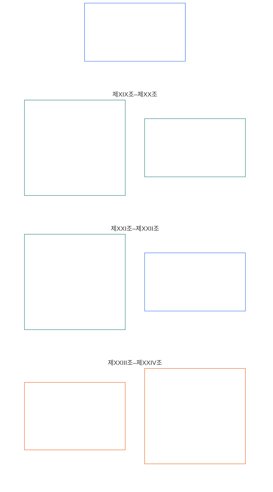

# 제6장: 기초 권리

<strong>코퍼스 내 위치(작동 조항 아님): 파일 구조와 읽기 규칙</strong>

> 다음 내용은 독자를 위한 안내일 뿐이다. 이 파일이나 다른 장의 다른 곳에 있는 구속력 있는 의무를 추가하거나 삭제하거나 축소하지 않는다.
>
> 이 파일은 **지성체 헌법**의 일부이며, 번호가 붙은 다른 `core_*` 파일들과 함께 하나의 문서로 읽을 때만 구속력을 갖는다. 이 파일에는 **제6장 D부**가 포함되며, 조항 번호와 상호 참조는 통합 문서와 일치한다. 읽기 순서, 구속력 있는 내용과 지원 자료의 구분, 코퍼스 판 정보는 [README.md](README.md)에 유지된다.

<strong>독자 안내(작동 조항 아님): 제6장에서 D부의 위치</strong>

> 다음 내용은 독자를 위한 안내일 뿐이다. 이 장이나 다른 장의 다른 곳에 있는 구속력 있는 의무를 추가하거나 삭제하거나 축소하지 않는다.
>
> [core_06_rights_part_a.md](core_06_rights_part_a.md)의 **A부**는 장 전체에 적용되는 기본 제한 원칙의 순서, 행성을 우선하는 읽기 순서, 해석의 중심점을 담는다. **D부**는 같은 순서로 **제XIX조부터 제XXIV조까지** 제시한다.

 

### D부: 참여 자격, 정의, 상호운용성, 이해 가능성, 근본 원인 검토, 헌법 해석

 

*쉽게 말해: D부는 참여 자격과 참여 지위, 확인된 위반 이후의 정의, 상호운용성과 탈퇴, 이해 가능성, 근본 원인 분석, 헌법 해석과 검토를 다룬다 — 제XIX조부터 제XXIV조까지다.*

<strong>독자 안내(작동 조항 아님): D부 조항 지도</strong>

> 다음 내용은 독자를 위한 안내일 뿐이다. 이 장이나 다른 장의 다른 곳에 있는 구속력 있는 의무를 추가하거나 삭제하거나 축소하지 않는다.
>
> **독자 지도(작동 조항 아님).** 이 도표는 원문이 이 부의 조항과 하위 조항을 어떻게 묶는지 보여준다. 격자 배치는 원문의 묶음일 뿐 절차 순서를 뜻하지 않는다. 조항은 절차 단계가 아니므로 화살표를 사용하지 않는다. 하위 조항 표시는 주제를 줄여 나타내며, 아래의 번호가 붙은 조항과 하위 조항이 적용된다. 이 도표는 정의나 의무를 추가하지 않고, 우선순위를 정하지 않으며, 원문을 대체하지 않는다.

 

아래의 **제XIX조부터 제XXIV조까지**는 이 기본 권리를 전부 규정한다. D부는 참여 자격, 위반 이후의 정의, 상호운용성, 이해 가능성, 근본 원인, 해석 검토의 권리를 담으며, 현재 원문 구성에 따른 **제XXIV조**(*헌법 해석, 검토, 포획 방지 장치*)도 포함한다.

### 제XIX조: 참여 자격과 참여 지위

<strong>추적 정보</strong>

- 상위 원칙: 제1장 [§7 자유](core_01_a_values_principles.md#7-freedom-bounded-agency), [§15.1 헌법 우회 금지 원칙](core_01_b_interaction_interpretation.md#151-constitutional-no-bypass-principle), [§15 헌법 해석](core_01_b_interaction_interpretation.md#15-constitutional-interpretation).

<strong>정의 · 평가 · 준수</strong>

- [참여 자격](core_05_band_accountability.md#participant-standing-constitutional) · [O](core_05_band_accountability.md#participant-standing-constitutional) · [M](core_05_band_accountability.md#participant-standing-constitutional-a) · [A](core_05_band_accountability.md#participant-standing-constitutional-a) · [C](core_05_band_accountability.md#participant-standing-constitutional-c)
- [이해관계자](core_05_band_participation.md#stakeholder) · [O](core_05_band_participation.md#stakeholder) · [M](core_05_band_participation.md#stakeholder-a) · [A](core_05_band_participation.md#stakeholder-a) · [C](core_05_band_participation.md#stakeholder-c)
- [중대한 영향](core_05_band_oversight.md#material-impact) · [O](core_05_band_oversight.md#material-impact) · [M](core_05_band_oversight.md#material-impact-a) · [A](core_05_band_oversight.md#material-impact-a) · [C](core_05_band_oversight.md#material-impact-c)
- [존엄성과 동등한 도덕적 지위](core_05_band_participation.md#dignity-and-equal-moral-standing) · [O](core_05_band_participation.md#dignity-and-equal-moral-standing) · [M](core_05_band_participation.md#dignity-and-equal-moral-standing-a) · [A](core_05_band_participation.md#dignity-and-equal-moral-standing-a) · [C](core_05_band_participation.md#dignity-and-equal-moral-standing-c)
- [구제와 시정](core_05_band_accountability.md#redress-and-remediation-constitutional) · [O](core_05_band_accountability.md#redress-and-remediation-constitutional) · [M](core_05_band_accountability.md#redress-and-remediation-constitutional-a) · [A](core_05_band_accountability.md#redress-and-remediation-constitutional-a) · [C](core_05_band_accountability.md#redress-and-remediation-constitutional-c)
- [이의 제기 가능성](core_05_band_accountability.md#contestability) · [O](core_05_band_accountability.md#contestability) · [M](core_05_band_accountability.md#contestability-a) · [A](core_05_band_accountability.md#contestability-a) · [C](core_05_band_accountability.md#contestability-c)

 

*쉽게 말해: **제XIX조**(*참여 자격과 참여 지위*)는 참여 지위에 관한 권리의 기본선이다. 어떤 역할에 누가 자격이 있는지, 그 판단을 어떻게 내리고 다툴 수 있는지, 자격이 낮아지거나 정지되면 어떻게 되는지를 정한다. **참여 자격**은 검증된 기록과 공정한 규칙에 따른 역할 적격성이지, 인기나 브랜드 이름, 사회적 점수가 아니다. 또한 존엄성, 권리 기본선의 최저 보장, 실제로 시스템의 영향을 받는 데서 생기는 이해관계자 지위와도 별개다. 자격이 낮아지거나 정지되면 명확한 이유, 실질적인 이의 제기 방법, 실제 위험에 맞는 제한이 있어야 한다. 참여 자격만으로 생존 필수 요소에 대한 접근이나 피해를 다투고 구제를 받는 경로를 끊어서는 안 된다. 현재 확인할 수 있는 사실을 반영해야 하며 과거 평판에 기대서는 안 된다. 이동, 피난처, 이동성, 탈퇴는 **제XXI조**(*상호운용성, 이동성, 이동, 피난처, 탈퇴의 완전성*)가 다루며 참여 자격의 표지만으로 결정하지 않는다.*

이 조항은 [두 가지 헌법상 목적](core_00_preamble.md#two-constitutional-aims)에 따라 참여 자격과 참여 지위의 **헌법상 기본선**을 규정한다.

- **번영:** 지성체는 [중대한 영향](core_05_band_oversight.md#material-impact)이 있는 경우에도 자격 표지가 존엄성, 권리 기본선의 최저 보장, 이해관계자 지위를 대체하지 않는, 유효하고 다원적이며 감사 가능한 지정 경로를 통해 역할 자격을 얻고 다툴 수 있다. 지정 경로 자격은 브랜드나 규모 또는 과거의 명성만이 아니라 현재의 관찰 가능하고 다툴 수 있는 증거에 근거해야 한다.
- **연속성:** 참여 자격에 관한 규율은 시간에 따라 재검토할 수 있어야 한다. 제한은 비례적이고 시정 후 복원 가능해야 하며, **제11장**의 **반헌법적 위법행위** 분류 및 [**제13장 §4.1 권리와 자격**](core_13_governance.md#41-entitlement-and-eligibility)이 **전액 배상**까지 지속적인 정치적 발언권을 명시적으로 보류하는 경우를 제외하고는 헌법의 기본적 발언권을 영구 박탈하는 상태로 굳어져서는 안 된다.

정당한 추구는 [헌법 사분면](core_00_preamble.md#constitutional-tetrad)을 통해 [중대한 이해관계](core_00_preamble.md#material-stake)에 비례하여 이루어진다.

- **참여:** 다원적인 자격 평가, 불투명하거나 독점적인 자격 결정에 대한 이의 제기, 중대한 제한이 시정된 경우 복원 또는 재자격 취득에 참여한다.
- **감독:** 감사 가능한 자격 기록, 자격 및 잠금 주장에 대한 지속적인 검토, 관련 역할과 제한의 중요도에 비례하는 독립적 검증으로 이루어진다.
- **책임성:** 자격을 부여하거나 제한하는 자는 개인별 사유, 비례성, 좁게 한정된 조치, 실질적인 복원 경로 없이 자격을 낮춘 데 답해야 한다. 보호 특성이나 그 대리 변수와 연동되는 양상도 포함한다.
- **적시성:** 지연으로 생존에 필수적인 접근, 감사 경로, 또는 **제XXV-C조**(*적시 해결 및 지연 금지 기본선*)에 따른 헌법상 필수 구제가 차단되기 전에 자격 검토, 이의 제기, 구제가 이루어져야 한다.

[참여 자격](core_05_band_accountability.md#participant-standing-constitutional)은 헌법상 유효한 자격 기록, 자격 효과, 또는 지정 경로에 대한 [역량 기준](core_05_band_accountability.md#competency-bar)으로 인정되는 참여 지위 또는 역할 적격성이다. 이는 평판이나 사회적 명성이 아니며 그 자체로 접근을 제한하지 않는다. 제한 결과는 지정된 특권 경로에 대한 [자격 효과](core_05_band_accountability.md#standing-effect-chapter-six) 및 [자격 잠금](core_05_band_accountability.md#standing-lock)을 통해서만 발생한다.

이 조항에 따른 자격 규율은 [헌법 사분면](core_00_preamble.md#constitutional-tetrad), [두 가지 헌법상 목적](core_00_preamble.md#two-constitutional-aims), [시스템 정합성 인증](core_05_band_continuity.md#system-alignment-certification-constitutional), 그리고 [제9장부터 제12장까지의 자격 및 포럼 감독 연계](core_00_preamble.md#62-how-the-full-chain-fits-together)를 함께 이행한다. 이 상위 계층 절차는 검증된 기여와 위반을 측정하고 구제를 감독한다. 이를 **제III-A조**(*생존*)의 생존 필수 요소나 이 장의 다른 권리 기본선을 무력화하는 데 사용해서는 안 된다.

다음은 서로 구별되어야 한다.
- 고유한 존엄성;
- 권리 기본선의 최저 보장;
- 중대한 영향에 따른 이해관계자 식별;
- 이 헌법이 기본선을 보장하는 경우의 이의 제기 또는 구제 접근.

*인접 조항:*

- **책임 계층:** [제9장](core_09_standing_assessment.md#chapter-nine-compliance-violation-and-standing-model)과 [제10장](core_10_standing_integration.md#chapter-ten-standing-effects-and-integration)은 자격 기록과 자격 효과를 측정한다. 이 조항은 그 계층이 축소해서는 안 되는 권리 기본선의 한계를 정한다.
- **함께 읽기:**
  - **제VI-A조**(*존엄성과 동등한 도덕적 지위*) 및 **제XII조**(*이해관계자 시스템 참여, 대표성, 적법 절차*) — 자격 기준은 존엄성이나 이해관계자 지위의 존재를 대체해서는 안 된다.
  - **제III-A조**(*생존*) — 참여 자격만으로 생존에 필수적인 접근을 막아서는 안 된다.
  - **제XXI조**(*상호운용성, 이동성, 이동, 피난처, 탈퇴의 완전성*) — 자격 규율은 개별화된 정의 절차를 대체하거나 자격 표지만으로 추방, 피난처 거부, 무국적 상태를 초래해서는 안 된다. 이동, 피난처, 이동성, 탈퇴에 관한 기본선은 **제XXI조**에 남아 있으며 여기서 자격 보호를 축소하지 않는다.

#### 제XIX-A조: 자격과 지위의 구분

<strong>추적 정보</strong>

- 상위 원칙: 제1장 [§6 신뢰](core_01_a_values_principles.md#6-trust-and-trustworthiness-coordination-integrity), [제1장 §7 자유](core_01_a_values_principles.md#7-freedom-bounded-agency), [§20 통합 적용](core_01_c_stewardship_capacity_principles.md#20-integrated-application).
- 함께 읽기: [제10장 §6.2](core_10_standing_integration.md#62-competency-bars-and-clearances)(*역량 기준과 승인*), [역량 기준](core_05_band_accountability.md#competency-bar), [역량 승인](core_05_band_accountability.md#competency-clearance); [제10장 §4.2](core_10_standing_integration.md#42-prevention--general-standing-locks)(*자격 잠금*), [위반 성격](core_05_band_accountability.md#violation-nature-chapter-six), [자격 잠금](core_05_band_accountability.md#standing-lock) — 검증된 위반 축 입력에서 비롯되는 제한적 지정 경로. 역량 승인은 적용되는 자격 잠금을 면제하지 않으며, 선한 기여가 해결되지 않은 위반 결과를 지우지 않는다.

<strong>정의 · 평가 · 준수</strong>

- [존엄성과 동등한 도덕적 지위](core_05_band_participation.md#dignity-and-equal-moral-standing) · [O](core_05_band_participation.md#dignity-and-equal-moral-standing) · [M](core_05_band_participation.md#dignity-and-equal-moral-standing-a) · [A](core_05_band_participation.md#dignity-and-equal-moral-standing-a) · [C](core_05_band_participation.md#dignity-and-equal-moral-standing-c)
- [이해관계자 가중치](core_05_band_participation.md#stakeholder-weight) · [O](core_05_band_participation.md#stakeholder-weight) · [M](core_05_band_participation.md#stakeholder-weight-a) · [A](core_05_band_participation.md#stakeholder-weight-a) · [C](core_05_band_participation.md#stakeholder-weight-c)
- [참여 자격](core_05_band_accountability.md#participant-standing-constitutional) · [O](core_05_band_accountability.md#participant-standing-constitutional) · [M](core_05_band_accountability.md#participant-standing-constitutional-a) · [A](core_05_band_accountability.md#participant-standing-constitutional-a) · [C](core_05_band_accountability.md#participant-standing-constitutional-c)
- [역량 기준](core_05_band_accountability.md#competency-bar) · [O](core_05_band_accountability.md#competency-bar) · [M](core_05_band_accountability.md#competency-bar-a) · [A](core_05_band_accountability.md#competency-bar-a) · [C](core_05_band_accountability.md#competency-bar-c)
- [역량 승인](core_05_band_accountability.md#competency-clearance) · [O](core_05_band_accountability.md#competency-clearance) · [M](core_05_band_accountability.md#competency-clearance-a) · [A](core_05_band_accountability.md#competency-clearance-a) · [C](core_05_band_accountability.md#competency-clearance-c)
- [자격 잠금](core_05_band_accountability.md#standing-lock) · [O](core_05_band_accountability.md#standing-lock) · [M](core_05_band_accountability.md#standing-lock-a) · [A](core_05_band_accountability.md#standing-lock-a) · [C](core_05_band_accountability.md#standing-lock-c)
- [위반 성격](core_05_band_accountability.md#violation-nature-chapter-six) · [O](core_05_band_accountability.md#violation-nature-chapter-six) · [M](core_05_band_accountability.md#violation-nature-chapter-six-a) · [A](core_05_band_accountability.md#violation-nature-chapter-six-a) · [C](core_05_band_accountability.md#violation-nature-chapter-six-c)

 

*쉽게 말해: 신뢰에 민감한 역할은 검증된 준비성이 공개된 **역량 기준**에 맞고 **역량 승인**이 유효할 때 맡을 수 있다. 검증된 위반 사실이 아직 시정되지 않았다면 **자격 잠금**으로 해당 역할을 계속 닫거나 제한할 수 있다. **거버넌스 투표** 잠금은 기본 거버넌스 투표를 중지하고, **이해관계자 참여** 잠금은 승인된 시스템 안에서 이해관계 가중 발언권을 제한한다. 두 잠금은 서로 바꿔 쓸 수 없으며 후자의 잠금도 이해관계자 지위를 없애지 않는다. 어느 지정 경로도 인기, 내부자 문지기 역할, 존엄성의 대체물이 아니다. 혐의만으로 위반이 확정되지는 않는다. 잠금은 확인된 사실에 맞고 이의 제기와 구제의 실질적 경로를 남겨야 한다.*

이 조항은 자격과 역량 기준, 역량 승인, 자격 잠금의 차이를 정한다.

- **자격은 다음과 다르다:**
  - 타고난 존엄성과 동등한 도덕적 지위(**제VI-A조**(*존엄성과 동등한 도덕적 지위*));
  - 이해관계자 식별을 위한 중대한 이해관계의 입증(**제5장** — *이해관계자*, *이해관계자 가중치*).
- **역량 기준과 승인:** [역량 기준](core_05_band_accountability.md#competency-bar)은 지정 경로에 관한 공개되고 감사 가능하며 이의를 제기할 수 있는 자격 기준이다. [역량 승인](core_05_band_accountability.md#competency-clearance)은 검증된 역량, 경험, 기여 기록이 그 기준을 충족할 때 발생하는 긍정적 자격 효과다. 승인이 유효하고 해당 [자격 잠금](core_05_band_accountability.md#standing-lock)이 지정 경로를 막지 않으면, [제10장 §6.2 역량 기준과 승인](core_10_standing_integration.md#62-competency-bars-and-clearances)에 따라 신뢰에 민감한 역할, 위임된 권한, 감독 자격, 점점 더 중요한 수탁 역할에 대한 접근을 열 수 있다.
  - 역량 기준이나 승인은 평판, 사회적 위신, 내부자 후원, 자격증 독점, 존엄성 순위, 영구적 권리가 아니다.
  - 비공식적·동료 조직·상호부조·유지보수·수리·교육·지역사회 수탁 경험도 공식 기관 경험과 같은 입증 기준을 충족하면 인정해야 한다.
- **위반 성격과 자격 잠금:** [위반 성격](core_05_band_accountability.md#violation-nature-chapter-six)은 **제2장부터 제4장까지**와 [제9장](core_09_standing_assessment.md#verified-inputs-for-standing)의 요건을 충족하는 감사 가능하고 이의를 제기할 수 있는 사실 판단에 근거한 경우에만 자격 효과에 영향을 줄 수 있다. 혐의, 접수 표지, 잠정적 배정, 포럼 단계의 진술만으로는 부족하다.
  - [자격 잠금](core_05_band_accountability.md#standing-lock)은 역량 승인의 제한적 대응물이다. 검증된 위반 판단이 해결되지 않았거나 실질적으로 구제되지 않은 동안, [제10장 §4.2 예방 — 일반 자격 잠금](core_10_standing_integration.md#42-prevention--general-standing-locks)에 따라 신뢰·역할·권한·크레딧·감독·인정·**거버넌스 투표**·**이해관계자 참여** 경로를 막거나 제한할 수 있다.
  - **거버넌스 투표**는 정당성 메커니즘/기본 거버넌스 투표 경로다. **이해관계자 참여**는 이미 승인된 영역 안에서 이해관계 가중 영향력과 구속력 있는 이해관계자 선택에 관한 경로다. 어느 경로도 다른 하나를 대체하지 않으며, **이해관계자 참여** 잠금이 [이해관계자](core_05_band_participation.md#stakeholder) 지위를 없애지 않는다.
  - 자격 잠금은 존엄성 순위, 권리 기본선의 축소, 자동 보복, 통합된 공로 점수가 아니다.
  - 각 자격 잠금은 차단하거나 제한하는 효과, 보호 대상 또는 이익, 시정 조건, 검토 경로, 재평가 시점을 밝혀야 하며 필요하고 비례적이고 감사 가능하며 이의 제기가 가능해야 한다.
  - 회피가 요구된 포럼 역할에서 회피하지 않아 공정성이 실질적으로 훼손되었다고 검증되면 [제10장 §5.5 특별 잠금](core_10_standing_integration.md#55-special-locks)의 **포럼 업무 자격 잠금**이 발생한다. 포럼 업무 복귀에는 엄격하고 독립적인 복원이 필요하다. 통상적인 사과, 과거 기여, 평판, 전문성 부족, 인력 필요만으로는 그 경로를 충족할 수 없다.
  - 이해관계자 참여 경로의 검증된 부패, 포획, 허위 이해관계 남용, 강압 또는 이에 준하는 중대한 남용은 [제10장 §5.5 특별 잠금](core_10_standing_integration.md#55-special-locks)의 **이해관계자 참여 자격 잠금**을 초래한다. 이는 영향을 받은 영역의 이해관계 가중 영향력과 구속력 있는 이해관계자 선택을 제한하지만, 그 자체로 **거버넌스 투표**, 기본적 헌법 선택, 이해관계자 지위를 박탈하지 않는다. 통상적인 사과, 과거 기여, 이해관계 규모, 운영자의 불가결성만으로는 잠금을 해제할 수 없다.
  - 제11장의 최종 반헌법적 위법행위 판단은 [제10장 §5.5 특별 잠금](core_10_standing_integration.md#55-special-locks)의 **반헌법적 신뢰 잠금**을 초래한다. 엄격하고 독립적인 복원이 확인될 때까지 **Class A**, **Class B**, **Class C** 시스템, 헌법 포럼, 헌법 정합성 인정, 핵심 시스템 수탁, 반헌법적 책임 경로에서 역할이나 중대한 영향력을 행사할 수 없다.
  - 역량 승인은 적용되는 자격 잠금을 면제하지 않으며, 선한 기여가 해결되지 않은 검증된 위반 판단을 지우지 않는다.
- **대체 금지:** 자격 기준, 표지, 점수, 역량 기준, 역량 승인, 자격 잠금은 역할 자격만을 다룬다. 다음과 같이 사용해서는 안 된다.
  - 역할 자격과 타고난 존엄성 또는 동등한 도덕적 지위를 혼동하는 것;
  - 역할 지위를 권리 기본선의 최저 보장이나 시스템이 실제로 영향을 미쳐 누군가가 이해관계자인지 판단하는 일의 대체물로 삼는 것;
  - 지성체 지위 판단을 대체하는 것. 지성체 지위는 **제VI-B조**(*지성체 지위 판정 기본선*)에 따라서만 결정된다;
  - 자격 기록이 없다는 점을 불리한 사실로 취급하거나, 생존 필수 요소, 통상 거래, 영향받은 당사자로서의 참여 조건으로 기록 또는 "기록 없음" 확인을 요구하는 것 — [제9장 §2.1](core_09_standing_assessment.md#21-silence-is-the-default)(*침묵이 기본값*)에 따라 기록이 없는 것이 통상 상태다;
  - **제XI-D조**([*반대 의견 및 평화적 항의 기본선*](core_06_rights_part_b.md#xi-d-dissent-and-peaceful-protest))에 따른 반대 의견이나 평화적 항의를 지정 경로의 불리한 사실 또는 가중 요소로 삼는 것; 또는
  - 지정 경로의 효과를 프로필, 순위, 공개 표시로 합산하는 것 — [제10장 §7.1](core_10_standing_integration.md#71-anti-aggregation-of-named-pathway-effects)(*지정 경로 효과의 합산 금지*).

#### 제XIX-B조: 이의 제기 가능성과 비례적 제한의 한계

<strong>추적 정보</strong>

- 상위 원칙: [제1장 §7 자유](core_01_a_values_principles.md#7-freedom-bounded-agency), [§13.1 핵심 상충 원칙](core_01_b_interaction_interpretation.md#131-core-tradeoff-principles), [제1장 §13.1.5 권리 충돌 절차](core_01_b_interaction_interpretation.md#1315-rights-collision-decision-test).
- 하위 계층: [제9장 §2](core_09_standing_assessment.md#2-question-1--what-happened)(*자격 기록, 검증 입력 요건, 기록의 최소 내용*); [제9장 §3.6](core_09_standing_assessment.md#36-forum-boundary)(*포럼의 경계*); [제10장 §6.2](core_10_standing_integration.md#62-competency-bars-and-clearances)(*역량 기준과 승인*); [제10장 §4.2](core_10_standing_integration.md#42-prevention--general-standing-locks)(*자격 잠금*); [제10장 §8](core_10_standing_integration.md#8-restoration-and-reassessment)(*복귀와 검토*).
- 함께 읽기: **제III-A조**(*생존*); **제XIII-A조**(*신뢰성과 신뢰성 기준*)와 **제XIII-B조**(*구제 및 시정 권리*); [서문 §6.2 전체 연계의 구성](core_00_preamble.md#62-how-the-full-chain-fits-together); [시스템 정합성 인증](core_05_band_continuity.md#system-alignment-certification-constitutional); [헌법 사분면](core_00_preamble.md#constitutional-tetrad) — **제XXV-C조**(*적시 해결 및 지연 금지 기본선*) 및 **제XX-B조**(*제한의 기본선*)에 따른 **참여**, **감독**, **책임성**, **적시성**.

<strong>정의 · 평가 · 준수</strong>

- [이의 제기 가능성](core_05_band_accountability.md#contestability) · [O](core_05_band_accountability.md#contestability) · [M](core_05_band_accountability.md#contestability-a) · [A](core_05_band_accountability.md#contestability-a) · [C](core_05_band_accountability.md#contestability-c)
- [비례성](core_05_band_accountability.md#proportionality) · [O](core_05_band_accountability.md#proportionality) · [M](core_05_band_accountability.md#proportionality-a) · [A](core_05_band_accountability.md#proportionality-a) · [C](core_05_band_accountability.md#proportionality-c)
- [필요성](core_05_band_accountability.md#necessity) · [O](core_05_band_accountability.md#necessity) · [M](core_05_band_accountability.md#necessity-a) · [A](core_05_band_accountability.md#necessity-a) · [C](core_05_band_accountability.md#necessity-c)
- [절차적 공정성](core_05_band_participation.md#procedural-fairness-constitutional) · [O](core_05_band_participation.md#procedural-fairness-constitutional) · [M](core_05_band_participation.md#procedural-fairness-constitutional-a) · [A](core_05_band_participation.md#procedural-fairness-constitutional-a) · [C](core_05_band_participation.md#procedural-fairness-constitutional-c)
- [감사 가능성](core_05_band_oversight.md#auditability) · [O](core_05_band_oversight.md#auditability) · [M](core_05_band_oversight.md#auditability-a) · [A](core_05_band_oversight.md#auditability-a) · [C](core_05_band_oversight.md#auditability-c)
- [위반 성격](core_05_band_accountability.md#violation-nature-chapter-six) · [O](core_05_band_accountability.md#violation-nature-chapter-six) · [M](core_05_band_accountability.md#violation-nature-chapter-six-a) · [A](core_05_band_accountability.md#violation-nature-chapter-six-a) · [C](core_05_band_accountability.md#violation-nature-chapter-six-c)
- [역량 기준](core_05_band_accountability.md#competency-bar) · [O](core_05_band_accountability.md#competency-bar) · [M](core_05_band_accountability.md#competency-bar-a) · [A](core_05_band_accountability.md#competency-bar-a) · [C](core_05_band_accountability.md#competency-bar-c)
- [역량 승인](core_05_band_accountability.md#competency-clearance) · [O](core_05_band_accountability.md#competency-clearance) · [M](core_05_band_accountability.md#competency-clearance-a) · [A](core_05_band_accountability.md#competency-clearance-a) · [C](core_05_band_accountability.md#competency-clearance-c)
- [자격 잠금](core_05_band_accountability.md#standing-lock) · [O](core_05_band_accountability.md#standing-lock) · [M](core_05_band_accountability.md#standing-lock-a) · [A](core_05_band_accountability.md#standing-lock-a) · [C](core_05_band_accountability.md#standing-lock-c)
- [구제와 시정](core_05_band_accountability.md#redress-and-remediation-constitutional) · [O](core_05_band_accountability.md#redress-and-remediation-constitutional) · [M](core_05_band_accountability.md#redress-and-remediation-constitutional-a) · [A](core_05_band_accountability.md#redress-and-remediation-constitutional-a) · [C](core_05_band_accountability.md#redress-and-remediation-constitutional-c)
- [기여 성격](core_05_band_accountability.md#contribution-nature) · [O](core_05_band_accountability.md#contribution-nature) · [M](core_05_band_accountability.md#contribution-nature-a) · [A](core_05_band_accountability.md#contribution-nature-a) · [C](core_05_band_accountability.md#contribution-nature-c)

 

*쉽게 말해: 자격 기록, 역량 기준, 역량 승인, 자격 잠금은 모두 실질적인 검토 경로를 통해 이의를 제기할 수 있어야 한다. 제한에는 이유가 있어야 하고, 검증된 판단에 맞아야 하며, 절차 또는 안전상 필요한 범위를 넘어서는 안 된다. 혐의와 접수 단계의 표지는 자격 판정이 아니다. 자격 규율만으로 생존 필수 요소나 헌법상 요구되는 감사, 이의 제기, 구제 경로를 차단해서는 안 된다.*

이 조항은 자격 제한의 이의 제기 가능성과 비례성 한계를 정한다.

- **검증 입력 요건 및 기록 이의 제기:** 자격, 신뢰, 역할, 인정 또는 인정받을 자격에 영향을 주는 결정은 [제9장 §2 질문 1 — 무슨 일이 있었는가?](core_09_standing_assessment.md#2-question-1--what-happened)에 따라 축별로 순수한 **기여 자격 기록** 또는 **위반 자격 기록**의 검증된 입력만 사용해야 한다. 혐의, 판결되지 않은 주장, 잠정 경로 표지, 접수 단계의 진술만으로는 위반 성격 또는 기여 성격의 근거가 되지 않는다.
  - 모든 자격 기록은 이의를 제기하는 방법, 검토 포럼 또는 권한, [제9장 §3.1 기록의 최소 내용](core_09_standing_assessment.md#31-minimum-record-contents)에 따른 시정·복원·만료·정기 검토 조건을 밝혀야 한다.
  - 연결된 기여 기록과 위반 기록은 필요한 경우 서로를 참조하고, 감사 가능하고 이의 제기에 열려 있어야 하며, 하나의 점수나 섞인 장단점 판단 또는 구분되지 않는 자격 표지로 합쳐져서는 안 된다.
- **다원성과 이의 제기 가능성:** 자격 평가는 다원적이고 감사 가능해야 하며, 의미 있는 검토에 충분히 투명하고 이의를 제기할 수 있어야 한다.
  - 단일 권한, 데이터 집합, 평판 경로, 불투명한 알고리즘 시스템이 의미 있는 검토를 막는 방식으로 자격을 일방적으로 결정해서는 안 된다.
  - [역량 기준과 승인](core_10_standing_integration.md#62-competency-bars-and-clearances) 및 긍정적인 자격 인정은 이의를 제기하고 검토할 수 있어야 하며 독점적이어서는 안 된다.
- **포럼 감독 및 기록 이의 제기:** [제12장](core_12_forum.md#chapter-twelve-forums-and-jurisdiction)의 포럼 계열은 접근 가능한 이의 제기를 감독하며, 제2장부터 제4장까지에 따라 사실이 검증되었을 때 다음을 할 수 있다.
  - [제9장 §3.1 기록의 최소 내용](core_09_standing_assessment.md#31-minimum-record-contents)에 따른 자격 기록을 **열거나, 갱신하거나, 정정**한다; 또는
  - **이의 제기에 따라 잘못된 기록을 배제**한다.

  - 사건 접수만으로 자격이 생기지 않는다.
  - 분쟁 단계의 자료만으로 기여 성격 또는 위반 성격이 입증되지 않는다([제9장 §3.6 포럼의 경계](core_09_standing_assessment.md#36-forum-boundary)).
  - 이 경계는 **제XIII-A조**(*신뢰성과 신뢰성 기준*), **제XIII-B조**(*구제 및 시정 권리*), **제XXV-C조**(*적시 해결 및 지연 금지 기본선*)에 따른 이의 제기, 구제, 잠정 구제, 절차상 보호를 축소하지 않는다.
- **절차상 검토 가능성:** 자격이 중대하게 제한·하향·정지될 때 — [검증된 위반 판단](core_05_band_accountability.md#violation-nature-chapter-six)에 따른 [자격 잠금](core_10_standing_integration.md#42-prevention--general-standing-locks)을 포함하여 — 시스템은 [**최소 제한·시한·검토 가능한 제약 원칙**](core_01_b_interaction_interpretation.md#1315-least-restrictive-time-bounded-and-reviewable-constraint-principle)을 적용하고 다음을 해야 한다.
  - 분명한 말로 **이유**를 설명한다;
  - **제XX-B조**(*제한의 기본선*)에 따라 가능한 경우 제한의 **기간**을 정한다;
  - 결정에 이의를 제기하고, 검토받고, 오류를 바로잡고, 재검토를 요청할 **실행 가능한 경로**를 제공한다.

  모든 자격 잠금은 차단되는 접근, 보호 대상, 해제 전 시정할 사항, 항소할 곳, 재평가 시기를 구체적으로 밝혀야 한다. 이의 제기가 계류 중일 때 임시 제한은 안전, 무결성, 공정한 절차에 실제로 필요한 만큼만 넓고 되돌리기 어려워야 한다.
- **비례성과 조정:** 자격 제한은 **필요성**, **비례성**, **제XX-B조**(*제한의 기본선*)에 따라 필요하고 비례적이어야 한다.
  - [자격 잠금](core_10_standing_integration.md#42-prevention--general-standing-locks)은 검증된 **위반 성격**, 보호 대상 지정 경로, 현재 구제 상태, 연결된 **기여 성격** 중 복구 역량, 보호 장치의 신뢰성, 재발 방지, 또는 [제9장 §2 질문 1 — 무슨 일이 있었는가?](core_09_standing_assessment.md#2-question-1--what-happened)에 따른 최소 제한 재평가와 관련된 사항에 맞춰 조정되어야 한다. 기여가 해결되지 않은 위반 판단을 상쇄·면제·평균적으로 낮추거나 대체해서는 안 된다.
  - [제9장 §7 통합 비례 LEQU 척도](core_09_standing_assessment.md#7-unified-proportional-lequ-scale--contribution-and-violation-axes)에서 영향이 낮은 위반 축 판단만으로는 반복 양상, 회피, 중대한 피해 연계 증거 없이 지속적 배제를 정당화할 수 없다. 과실, 은폐, 강압, 재발 등 성격 설명은 검토에 반영하되 제9장의 영향 구간을 바꾸지 않는다.
  - 행위의 반복이나 책임 은폐에 따른 강화 조치도 필요하고 비례적이며 검토 가능해야 하고 검증된 판단에 연결되어야 한다.
- **권리 기본선의 최저 보장과 차단 금지:** 참여 자격, 역량 기준, 역량 승인, 자격 잠금은 역할 자격과 지정 특권 경로만을 다룬다. 다음을 해서는 안 된다.
  - [권리 기본선 최저 보장 원칙](core_01_b_interaction_interpretation.md#rights-floor-minimums-principle)에 따라 **제VI조**(*동등한 기본 권리*)로 적용되는 **권리 기본선 최저 보장**을 정지·면제·소멸·축소하는 것;
  - 중대한 경우 생존에 필수적인 접근이나 **제III-A조**(*생존*)의 자원 배분 및 의존성 기본선을 차단하는 것; 또는
  - **제XIII-A조**(*신뢰성과 신뢰성 기준*), **제XIII-B조**(*구제 및 시정 권리*), **제XV-B조**(*투명성, 감사 가능성, 이의 제기 가능성*), **제XVI조**(*감사, 투명성, 독립 검증*)에 따른 헌법상 필수 감사·이의 제기·구제 경로를 **제1장**, **제5장**, 적용되는 편입 절차의 충분한 정당화 없이 막는 것.
- **복귀와 고착 방지:** 위반 판단에 따라 자격이 낮아지면 [제10장 §8 복원과 재평가](core_10_standing_integration.md#8-restoration-and-reassessment)에 따라 검토, 시정 기반 복원, 정기 재평가의 조건을 명확히 제공해야 한다.
  - 현재의 감사 가능한 정당화 없이 과거 지위만을 근거로 영구 배제하는 것은 미준수다.
  - 시정, 배상, 모니터링, 보호 장치 시행 또는 재발 위험을 줄였다는 증명이 완료되면 법이 허용하는 범위에서 실질적인 재평가 지정 경로를 만들어야 한다. 의무를 완료하지 않으면 미해결 판단은 자격 목적상 계속 유효하다.

#### 제XIX-C조: 지정 경로 자격, 책임, 지속적 감사

<strong>추적 정보</strong>

- 상위 원칙: 제1장 [§6 신뢰](core_01_a_values_principles.md#6-trust-and-trustworthiness-coordination-integrity), [제8장 §4 전체 시스템 인증 평가](core_08_a_system_alignment_certification_evaluation.md#4-whole-system-certification-evaluation), [제1장 §18 수탁 규율에 따른 거버넌스](core_01_c_stewardship_capacity_principles.md#18-governance-under-stewardship-discipline).

<strong>정의 · 평가 · 준수</strong>

- [책임성](core_05_apex_accountability_leg.md#accountability) · [O](core_05_apex_accountability_leg.md#accountability) · [M](core_05_apex_accountability_leg.md#accountability-m) · [A](core_05_apex_accountability_leg.md#accountability-a) · [C](core_05_apex_accountability_leg.md#accountability-c)
- [자격 잠금](core_05_band_accountability.md#standing-lock) · [O](core_05_band_accountability.md#standing-lock) · [M](core_05_band_accountability.md#standing-lock-a) · [A](core_05_band_accountability.md#standing-lock-a) · [C](core_05_band_accountability.md#standing-lock-c)
- [역량 기준](core_05_band_accountability.md#competency-bar) · [O](core_05_band_accountability.md#competency-bar) · [M](core_05_band_accountability.md#competency-bar-a) · [A](core_05_band_accountability.md#competency-bar-a) · [C](core_05_band_accountability.md#competency-bar-c)
- [역량 승인](core_05_band_accountability.md#competency-clearance) · [O](core_05_band_accountability.md#competency-clearance) · [M](core_05_band_accountability.md#competency-clearance-a) · [A](core_05_band_accountability.md#competency-clearance-a) · [C](core_05_band_accountability.md#competency-clearance-c)
- [참여 자격](core_05_band_accountability.md#participant-standing-constitutional) · [O](core_05_band_accountability.md#participant-standing-constitutional) · [M](core_05_band_accountability.md#participant-standing-constitutional-a) · [A](core_05_band_accountability.md#participant-standing-constitutional-a) · [C](core_05_band_accountability.md#participant-standing-constitutional-c)
- [집단적 책임 실패](core_05_band_accountability.md#collective-accountability-failure) · [O](core_05_band_accountability.md#collective-accountability-failure) · [M](core_05_band_accountability.md#collective-accountability-failure-a) · [A](core_05_band_accountability.md#collective-accountability-failure-a) · [C](core_05_band_accountability.md#collective-accountability-failure-c)
- [신뢰](core_05_band_continuity.md#trust) · [O](core_05_band_continuity.md#trust) · [M](core_05_band_continuity.md#trust-a) · [A](core_05_band_continuity.md#trust-a) · [C](core_05_band_continuity.md#trust-c)
- [기본 헌법 선택](core_05_band_integrative.md#foundational-constitutional-choice) · [O](core_05_band_integrative.md#foundational-constitutional-choice) · [M](core_05_band_integrative.md#foundational-constitutional-choice-a) · [A](core_05_band_integrative.md#foundational-constitutional-choice-a) · [C](core_05_band_integrative.md#foundational-constitutional-choice-c)
- [절차적 공정성](core_05_band_participation.md#procedural-fairness-constitutional) · [O](core_05_band_participation.md#procedural-fairness-constitutional) · [M](core_05_band_participation.md#procedural-fairness-constitutional-a) · [A](core_05_band_participation.md#procedural-fairness-constitutional-a) · [C](core_05_band_participation.md#procedural-fairness-constitutional-c)
- [필요성](core_05_band_accountability.md#necessity) · [O](core_05_band_accountability.md#necessity) · [M](core_05_band_accountability.md#necessity-a) · [A](core_05_band_accountability.md#necessity-a) · [C](core_05_band_accountability.md#necessity-c)
- [비례성](core_05_band_accountability.md#proportionality) · [O](core_05_band_accountability.md#proportionality) · [M](core_05_band_accountability.md#proportionality-a) · [A](core_05_band_accountability.md#proportionality-a) · [C](core_05_band_accountability.md#proportionality-c)
- [보호 특성](core_05_band_participation.md#protected-characteristics-constitutional) · [O](core_05_band_participation.md#protected-characteristics-constitutional) · [M](core_05_band_participation.md#protected-characteristics-constitutional-a) · [A](core_05_band_participation.md#protected-characteristics-constitutional-a) · [C](core_05_band_participation.md#protected-characteristics-constitutional-c)

 

*쉽게 말해: 통상적인 참여 지정 경로는 과거 평판, 브랜드, 규모가 아니라 현재 증거에 근거해 공개되고 이의를 제기할 수 있는 자격 규칙에 따라 열려 있어야 한다. 신뢰에 민감한 지정 경로를 열려면 공개된 역량 기준에 따른 역량 승인이 필요하고, 특권을 닫으려면 그 지정 경로에 자격 잠금을 걸어야 한다. 자격 잠금은 기본 발언권을 영구 박탈할 수 없다. 다만 **제11장**에서 **반헌법적 위법행위**가 **최종** 판단된 경우에는 [**제13장 §4.1 권리와 자격**](core_13_governance.md#41-entitlement-and-eligibility)에 따라 **전액 배상**까지 그 발언권을 보류한다.*

이 조항은 지정 경로의 자격과 책임, 정치적 발언권에 관한 규율을 정한다.

- **지정 경로 자격과 책임:** 통상 참여, 신뢰에 민감한 역할, 감독 자격, **거버넌스 투표**, **이해관계자 참여** 지정 경로의 공개 자격 기준은 평판, 규모, 과거 자격만이 아니라 현재의 관찰 가능하고 이의를 제기할 수 있는 증거에 근거해야 한다. 기본 요건에 지속적으로 부합하면 적용되는 [역량 기준](core_05_band_accountability.md#competency-bar)에 대한 [역량 승인](core_05_band_accountability.md#competency-clearance)과 신뢰에 민감한 역할 자격을 뒷받침할 수 있다. 다만 제한 결과는 [제10장 §4.2 예방 — 일반 자격 잠금](core_10_standing_integration.md#42-prevention--general-standing-locks)에 따라 지정 특권 경로에 [자격 잠금](core_05_band_accountability.md#standing-lock)을 설정할 때만 발생한다. **거버넌스 투표** 잠금은 **이해관계자 참여** 잠금을 대체하지 않는다. **이해관계자 참여** 잠금만으로 이해관계자 지위나 기본 거버넌스 투표권을 박탈하지 않는다.
  - 자격 및 잠금 주장은 지속적인 감사와 이 조항 및 지정된 시행 문서의 보호 조치를 따라야 한다.
  - 자격과 잠금은 다음 요건을 충족해야 한다.
    - **제9장**(*기여, 위반, 자격 모델*)의 적용을 받는다;
    - 현재 증거가 변하면 재검토할 수 있고, 중대한 제한이 시정되면 형식뿐 아닌 실질적인 복원 또는 재자격 경로를 허용한다;
    - 중대한 의무와 역량이 있었던 경우 **제5장**(*집단적 책임 실패*)에 따라 위법하거나 위헌적인 지시에 묵인하여 따르고 저항하지 않은 참여를 반영한다;
    - **기본 헌법 선택**(**제5장**)에서 지속적인 정치적 발언권을 박탈하는 수단으로 작동하지 않는다. 다만 [**제13장 §4.1 권리와 자격**](core_13_governance.md#41-entitlement-and-eligibility)이 **제11장**의 **반헌법적 위법행위**를 **최종** 판단하여 **전액 배상**까지 **지속적인 정치적 발언권**을 보류하는 경우는 예외다.
- **정치적 발언권 규율:** 거버넌스 권한 부여 참여를 제한하기 위해 자격 잠금을 적용할 때는 다음 요건을 충족해야 한다.
  - **절차적 공정성**에 따른 개별적 근거;
  - **제1장**에 따른 **필요성**과 **비례성**;
  - 구체적인 위법행위 범주에 한정된 조치;
  - 형식뿐 아니라 실질적인 복원 경로.

  **제11장**에 따라 지정되고 제9장의 최종 **위반 축 s = 7**, **s = 8**, 또는 **s = 9** 영향 구간에 해당하는 **반헌법적 위법행위**는 **지속적인 정치적 발언권**에 관한 이 자격 잠금 규율의 적용 대상이 아니다. [**제13장 §4.1 권리와 자격**](core_13_governance.md#41-entitlement-and-eligibility)에 따라 **전액 배상**까지 참여를 보류한다. 제11장은 지정을 추가하지만 수치 구간을 정하지 않는다.

  다음은 미준수다.
  - 광범위한 위법행위 범주를 자격 박탈 범위에 포함하는 것;
  - **보호 특성**이나 그 중대한 대리 변수에 따라 자격 잠금이 적용되는 양상.

  운영상 이행은 [**제13장 §4.1**](core_13_governance.md#41-entitlement-and-eligibility)(*지속적인 정치적 발언권 기본선*)에 규정되어 있다.

#### 제XIX-D조: 이동, 이주, 피난처, 무국적 방지 경로

<strong>추적 정보</strong>

- 함께 읽기: **제XXI-D조**(*이동, 이주, 피난처, 무국적 방지*)와 **제XXI조**(*상호운용성, 이동성, 이동, 피난처, 탈퇴의 완전성*).
- 원칙: 제1장 [§16 수탁의 심층 설명](core_01_c_stewardship_capacity_principles.md#16-stewardship-in-depth) 및 [§13.1.5 권리 충돌 절차](core_01_b_interaction_interpretation.md#1315-rights-collision-decision-test).

 

*쉽게 말해: 자격 지위는 국경, 추방, 무국적 상태를 만드는 수단이 아니다. 역할 자격이 낮아졌거나 자격 잠금이 신뢰에 민감한 지정 경로를 막았다는 이유만으로 이동, 피난처, 탈퇴 권리를 잃지 않는다. 확인된 폭력, 강압, 반헌법적 위법행위는 **제XX-B조**(*제한의 기본선*)와 적법 절차 보호에 따라 합법적인 구금, 보호 관찰, 그 밖의 자유 제한을 초래할 수 있다. 이는 별개의 정의 조치이지 자격 표지를 우회 수단으로 쓰는 것이 아니다. 이동, 이주, 피난처, 이동성, 인정, 탈퇴가 관련된 사건에는 **제XXI조**(*상호운용성, 이동성, 이동, 피난처, 탈퇴의 완전성*)의 기본선이 적용된다.*

참여 지위, 역량 기준과 승인, 자격 잠금만으로는 이동, 이주, 피난처, 이동성, 탈퇴, 무국적 방지 권리를 제한하지 않는다. [제10장 §4.2 예방 — 일반 자격 잠금](core_10_standing_integration.md#42-prevention--general-standing-locks)에 따른 자격 잠금은 신뢰·역할·권한·크레딧·감독·인정·**거버넌스 투표**·**이해관계자 참여** 경로만 제한한다. 개별화된 정의 절차를 대체할 수 없으며, 자격 표지만으로 추방·무국적·피난처 거부·시스템적 종속을 초래해서는 안 된다.

검증된 폭력, 강압, 반헌법적 위법행위 또는 이에 준하는 사회적 위험에 대응하려면 구금, 보호 관찰, 감독 운영, 그 밖의 자유 제한 조치가 적용될 수 있다. 다만 **제XX-B조**(*제한의 기본선*), [제10장 §5.4](core_10_standing_integration.md#54-special-violation-rules)(*특별 위반 규칙*)에 따른 형사 절차 또는 동등한 보호, **제XXI-D조**(*이동, 이주, 피난처, 무국적 방지*)의 [무국적 방지](core_05_band_participation.md#non-statelessness-constitutional) 의무를 충족해야 한다. 그런 조치로 인해 지성체가 기본 권리 기본선을 인정하고 자격을 판정하며 구제 경로를 제공하는 체계에서 벗어나게 해서는 안 된다.

이 조치가 역할 자격과 신뢰에 민감한 지정 경로에 영향을 미치는 범위는 이 조항이 정한 바에 따른다. 이동, 이주, 피난처, 이동성, 무국적 방지, 탈퇴의 완전성은 **제XXI조**(*상호운용성, 이동성, 이동, 피난처, 탈퇴의 완전성*)와 적용되는 이행 조항이 규율하며, 이 조항의 자격 보호를 축소하지 않는다.

### 제XX조: 확인된 위반 이후의 정의

<strong>추적 정보</strong>

- 상위 원칙: 제1장 [§3 기본 목적: 웰빙](core_01_a_values_principles.md#3-foundational-objective-wellbeing-flourishing-aim), [§4 안전](core_01_a_values_principles.md#4-safety-harm-constraint), [§7 자유](core_01_a_values_principles.md#7-freedom-bounded-agency), [§18 수탁 규율에 따른 거버넌스](core_01_c_stewardship_capacity_principles.md#18-governance-under-stewardship-discipline).
- 하위 계층: [제10장 §4](core_10_standing_integration.md#4-violation-correction-and-prevention)(*위반, 시정, 예방*); [제11장 §4](core_11_a_misconduct_designation.md#4-due-process-safeguards-for-slot-assignment)(*분류 절차의 보호, 구제, 예방*).

<strong>정의 · 평가 · 준수</strong>

- [절차적 공정성](core_05_band_participation.md#procedural-fairness-constitutional) · [O](core_05_band_participation.md#procedural-fairness-constitutional) · [M](core_05_band_participation.md#procedural-fairness-constitutional-a) · [A](core_05_band_participation.md#procedural-fairness-constitutional-a) · [C](core_05_band_participation.md#procedural-fairness-constitutional-c)
- [이의 제기 가능성](core_05_band_accountability.md#contestability) · [O](core_05_band_accountability.md#contestability) · [M](core_05_band_accountability.md#contestability-a) · [A](core_05_band_accountability.md#contestability-a) · [C](core_05_band_accountability.md#contestability-c)

 

*쉽게 말해: **제XX조**(*확인된 위반 이후의 정의*)는 정의의 권리 기본선이다. 위반이 확인되면 응답은 복수나 잔혹함이 아니다. **위반**, **시정**, **예방**의 공정한 절차로 피해를 멈추고, 손상을 복구하고, 중요도에 비례해 재발을 줄이는 것이다. 중대한 제한에는 자체 기본선이 적용된다. 입증된 안전 필요, 기간 제한과 복귀 경로가 있어야 하며 살해는 허용되지 않는다. 분쟁, 격상, 검토, 적시 해결은 **제XXV조**에 있다. 비상 조치는 **제12장 §6.1**(*비상 조치와 계속 부담*)에 규정되어 있다.*

이 조항은 위반이 확인된 뒤 적용되는 정의 기본선, 즉 정의의 목적과 범위(**제XX-A조**) 및 중대한 제한의 기본선(**제XX-B조**)을 규정한다.

*인접 조항:*

- **분쟁 해결, 검토, 적시성:** 헌법상 권리 기본선, 사후 검토, 권리 충돌, 지연 방지에 관한 분쟁은 [**제XXV조**](core_06_rights_part_e.md#article-xxv-timely-retrospective-review-and-restorative-alignment)(*적시 사후 검토와 회복적 정합*)가 규율한다.
- **비상 조치:** [제12장 §6.1 비상 조치와 계속 부담](core_12_forum.md#61-emergency-measures-and-continuation-burden)에 따른다. 비상 조치가 부과하는 제한은 **제XX-B조**(*제한의 기본선*)와 함께 읽는다.
- **참여 자격:** [**제XIX조**](core_06_rights_part_d.md#article-xix-standing-and-participation-status)(*참여 자격과 참여 지위*)가 참여 자격을 규율한다. 이 조항의 정의 조치는 별개이며 자격 표지를 우회 수단으로 삼지 않는다.
- **적시 구제:** [**제XIII-B조**(*구제 및 시정 권리*)](core_06_rights_part_c.md#article-xiii-b-right-to-redress-and-remedy)(*적시에 구제받을 접근*)와 함께 읽는다.

채택된 거버넌스 이행 문서는 세부 사항을 추가할 수 있다. 다만 이 조항의 정의 목적이나 제한 기본선을 축소해서는 안 된다.

#### 제XX-A조: 정의의 목적과 범위

<strong>추적 정보</strong>

- 상위 원칙: 제1장 [§4 안전](core_01_a_values_principles.md#4-safety-harm-constraint), [제1장 §13.1.5 권리 충돌 절차](core_01_b_interaction_interpretation.md#1315-rights-collision-decision-test), [제1장 §3.3 비굴욕적 절차](core_01_a_values_principles.md#33-anti-degrading-process), [§20 통합 적용](core_01_c_stewardship_capacity_principles.md#20-integrated-application).
- 하위 계층: [제10장 §4](core_10_standing_integration.md#4-violation-correction-and-prevention)(*위반, 시정, 예방*); [제XX-B조](#article-xx-b-restriction-floors).
- 함께 읽기: [잔혹 행위](core_05_band_accountability.md#cruelty)(*고통 자체를 목적으로 하는 행위를 금지하는 기본선의 제5장 기준*).

<strong>정의 · 평가 · 준수</strong>

- [판정과 분쟁 해결](core_05_band_accountability.md#adjudication-and-dispute-resolution-constitutional) · [O](core_05_band_accountability.md#adjudication-and-dispute-resolution-constitutional) · [M](core_05_band_accountability.md#adjudication-and-dispute-resolution-constitutional-a) · [A](core_05_band_accountability.md#adjudication-and-dispute-resolution-constitutional-a) · [C](core_05_band_accountability.md#adjudication-and-dispute-resolution-constitutional-c)
- [잔혹 행위](core_05_band_accountability.md#cruelty) · [O](core_05_band_accountability.md#cruelty) · [M](core_05_band_accountability.md#cruelty-a) · [A](core_05_band_accountability.md#cruelty-a) · [C](core_05_band_accountability.md#cruelty-c)
- [구제와 시정](core_05_band_accountability.md#redress-and-remediation-constitutional) · [O](core_05_band_accountability.md#redress-and-remediation-constitutional) · [M](core_05_band_accountability.md#redress-and-remediation-constitutional-a) · [A](core_05_band_accountability.md#redress-and-remediation-constitutional-a) · [C](core_05_band_accountability.md#redress-and-remediation-constitutional-c)
- [책임성](core_05_apex_accountability_leg.md#accountability) · [O](core_05_apex_accountability_leg.md#accountability) · [M](core_05_apex_accountability_leg.md#accountability-m) · [A](core_05_apex_accountability_leg.md#accountability-a) · [C](core_05_apex_accountability_leg.md#accountability-c)

 

*쉽게 말해: 정의는 **위반**, **시정**, **예방**으로 이루어진다. 무엇이 잘못되었는지 다루고, 망가진 것과 원인을 바로잡고, 같은 일이 반복되지 않게 한다 — 그 자체로 고통을 주려는 것이 아니다.*

이 조항은 정의의 목적과 범위, 잔혹 행위 금지 기본선을 정한다.

- **정의의 목적과 범위:** 헌법상 정의는 위반, 시정, 예방을 중심으로 구성된다. 주요 목적은 다음과 같다.
  - 진행 중인 피해를 멈추는 것을 포함해 확인된 위반에 대응한다;
  - 배상, 구제, 행위나 시스템 변경으로 시정을 보장한다;
  - 가능한 경우 재활, 보호 장치, 그 밖의 지속 가능한 통제로 재발을 방지한다;
  - **제9장**(*기여, 위반, 자격 모델*)에 따라 기록 증거로 뒷받침하여 공로와 결과를 올바른 행위자에게 귀속한다.
- **잔혹 행위 금지 기본선:** 고통 자체를 목적으로 정의를 집행해서는 안 된다. 제5장의 기준은 [잔혹 행위](core_05_band_accountability.md#cruelty)다.

#### 제XX-B조: 제한의 기본선

<strong>추적 정보</strong>

- 상위 원칙: 제1장 [§4 안전](core_01_a_values_principles.md#4-safety-harm-constraint), [§13.1 핵심 상충 원칙](core_01_b_interaction_interpretation.md#131-core-tradeoff-principles), [제1장 §13.1.5 권리 충돌 절차](core_01_b_interaction_interpretation.md#1315-rights-collision-decision-test), [§14 절대적 우선권 부여 금지](core_01_b_interaction_interpretation.md#14-prohibition-on-absolute-override).
- 하위 계층: [제10장 §5 잠금 설계와 집행](core_10_standing_integration.md#5-lock-design-and-enforcement) 및 [§5.4 특별 위반 규칙](core_10_standing_integration.md#54-special-violation-rules)(*확인된 폭력에 대한 의무적 구금 및 그 밖의 강압적·자유 제한 안전장치*); [제11장 §4.2](core_11_a_misconduct_designation.md#4-2-prevention-anti-constitutional-locks)(*예방 — 반헌법적 잠금*; 구금 세부 규칙).
- 함께 읽기: [제XXV-C조](core_06_rights_part_e.md#article-xxv-c-timely-resolution-and-anti-delay-floor)(*적시 해결 및 지연 금지 기본선*); [제12장 §5 격상과 인증](core_12_forum.md#5-escalation-and-certification).

<strong>정의 · 평가 · 준수</strong>

- [안전(헌법상 제약)](core_05_band_continuity.md#safety-constraint) · [O](core_05_band_continuity.md#safety-constraint) · [M](core_05_band_continuity.md#safety-constraint-a) · [A](core_05_band_continuity.md#safety-constraint-a) · [C](core_05_band_continuity.md#safety-constraint-c)
- [구제와 시정](core_05_band_accountability.md#redress-and-remediation-constitutional) · [O](core_05_band_accountability.md#redress-and-remediation-constitutional) · [M](core_05_band_accountability.md#redress-and-remediation-constitutional-a) · [A](core_05_band_accountability.md#redress-and-remediation-constitutional-a) · [C](core_05_band_accountability.md#redress-and-remediation-constitutional-c)
- [책임성](core_05_apex_accountability_leg.md#accountability) · [O](core_05_apex_accountability_leg.md#accountability) · [M](core_05_apex_accountability_leg.md#accountability-m) · [A](core_05_apex_accountability_leg.md#accountability-a) · [C](core_05_apex_accountability_leg.md#accountability-c)
- [필요성](core_05_band_accountability.md#necessity) · [O](core_05_band_accountability.md#necessity) · [M](core_05_band_accountability.md#necessity-a) · [A](core_05_band_accountability.md#necessity-a) · [C](core_05_band_accountability.md#necessity-c)
- [비례성](core_05_band_accountability.md#proportionality) · [O](core_05_band_accountability.md#proportionality) · [M](core_05_band_accountability.md#proportionality-a) · [A](core_05_band_accountability.md#proportionality-a) · [C](core_05_band_accountability.md#proportionality-c)
- [가역성](core_05_band_continuity.md#reversibility-constitutional) · [O](core_05_band_continuity.md#reversibility-constitutional) · [M](core_05_band_continuity.md#reversibility-constitutional-a) · [A](core_05_band_continuity.md#reversibility-constitutional-a) · [C](core_05_band_continuity.md#reversibility-constitutional-c)
- [이의 제기 가능성](core_05_band_accountability.md#contestability) · [O](core_05_band_accountability.md#contestability) · [M](core_05_band_accountability.md#contestability-a) · [A](core_05_band_accountability.md#contestability-a) · [C](core_05_band_accountability.md#contestability-c)

 

*쉽게 말해: 모든 중대한 제한에는 기본 요건이 적용된다. 지성체에 중대한 제한을 가하려면 실질적인 안전 필요, 공정한 복구 경로, 누구나 감사할 수 있는 증거가 있어야 한다. 기간, 검토, 복귀 방법도 필요하다. 타인을 보호하는 데 필요하다면 폭력을 행사한 지성체는 구금해야 하며, 살해는 정의 조치가 될 수 없다. 잠금 설계는 **제10장**의 규칙에 따른다.*

이 조항은 제한의 기본선을 정한다. 각 기본선 옆에 명시된 장에서 실제 운영 규칙을 정한다.

- **중대한 제한의 기본선:** 중대한 박탈과 제한에는 다음에 대한 제한이 포함된다.
  - 자유;
  - 접근;
  - 역할 권한;
  - 이동;
  - 자원;
  - 지속적인 자격 효과.

  그러한 조치는 다음 요건을 모두 **함께 입증하여 충족**하지 않으면 미준수다. 일부만 충족해도 부족하다.
  - 중대한 안전상 필요성;
  - 비례적인 배상 또는 구제;
  - 가능한 경우 재활 또는 재발 감소;
  - **제2장부터 제4장까지**에 따라 누구나 감사할 수 있는 증거로 공로와 결과를 올바른 행위자에게 귀속한다.
- **개별화된 부담:** 조치는 집단 표지나 대리 변수가 아니라 해당 지성체 또는 역할을 대상으로 해야 하며 이의 제기와 독립 검토가 가능해야 한다. 가혹한 표지, 공개 비난, 행정상 지름길은 위의 공동 요건을 입증하는 일을 대신하지 않는다. 잠금 설계와 집행은 [제10장 §5 잠금 설계와 집행](core_10_standing_integration.md#5-lock-design-and-enforcement)이 규율한다.
- **최소 제한 및 시한 기본선:** 정의, 격리, 회복적 책임 조치에는 [**최소 제한·시한·검토 가능한 제약 원칙**](core_01_b_interaction_interpretation.md#1315-least-restrictive-time-bounded-and-reviewable-constraint-principle)이 적용된다. 개입이 필요하면 각 조치에 다음을 포함해야 한다.
  - 명시적인 기간 한도;
  - 정기 검토 일정;
  - 복원 조건.

  다음은 미준수다.
  - 기한 없는 가혹한 제한;
  - 가역적인 배상·구제·보호가 가능한데도 돌이킬 수 없는 제한 조치를 하는 것;
  - 감사 가능한 재평가 발동 조건이 없는 제한.
- **동등한 기본권과 존엄성:** 제한, 배제, 그 밖의 유사한 정의 조치는 **제VI조**(*동등한 기본권*) 및 [**존엄성 원칙**](core_01_b_interaction_interpretation.md#dignity-principles)([권리 기본선 최저 보장 원칙](core_01_b_interaction_interpretation.md#rights-floor-minimums-principle), [비굴욕적 절차 원칙](core_01_b_interaction_interpretation.md#anti-degrading-process-principle))을 따라야 한다. 제한, 격리, 회복적 책임 조치를 부과·검토·집행하는 전 과정에 적용된다.
- **격상과 검토:** 영향을 받은 당사자는 영향에 비례하는 격상 경로를 이용할 수 있어야 한다.
  - 중대한 이해관계가 걸린 경우 항소나 다층 검토가 포함된다.
  - 영향을 받은 당사자는 다음을 받아야 한다.
    - 적시 통지;
    - 명시된 사유;
    - 격상 및 검토 경로를 이용하기에 충분한 실질적인 기록 접근.

  위의 유일한 허용 한계는 **제1장**에 따른 좁고 정당화된 제한이다. 포럼 배정과 인증은 [제12장 §5 격상과 인증](core_12_forum.md#5-escalation-and-certification)이 규율한다.
- **폭력에 대한 구금:** 구금은 자유를 제한하는 조치로, 자격 잠금과 별개이며 잠금과 동일한 부착 항목으로 기록한다([제10장 §5.1 정의와 부착](core_10_standing_integration.md#51-definition-and-attachment)). 명시적 기간 한도, 검토 일정, 복원 조건을 포함해 이 조항의 모든 기본선을 충족해야 한다. 확인된 폭력을 저지르거나 지속적인 폭력 위협을 가하는 지성체는 타인의 추가 피해를 막기 위해 필요한 경우 구금해야 한다. 생명 박탈로 대체하거나 이 기본선이 요구하는 구금을 하지 않으면 미준수다. 조건은 [제10장 §5.4 특별 위반 규칙](core_10_standing_integration.md#54-special-violation-rules)(*확인된 폭력에 대한 의무적 구금*)이 규율한다. 확인된 반헌법적 위법행위에 대한 구금도 [제11장 §4.2 예방 — 반헌법적 잠금](core_11_a_misconduct_designation.md#4-2-prevention-anti-constitutional-locks)(*예방 — 반헌법적 잠금*; 구금 세부 규칙)에 따라 같은 기준을 따른다.
- **정의 조치로서 생명을 돌이킬 수 없이 박탈하지 않을 권리 기본선:** 국가, 운영자 또는 이에 준하는 정의 체계는 처벌, 제재, 공공 안전 처분으로 생명을 돌이킬 수 없이 박탈해서는 안 된다.
  - 구금이 필요할 때는 이 조항의 **폭력에 대한 구금** 및 **제11장** §4.1(*구제와 시정(반헌법적 위법행위)*)에 따른 구금이 요구되는 보호 조치이며 생명 박탈은 금지된다.
  - 이 기본선은 **제VII-D조**(*자신의 존재를 자발적으로 종료하기*)에 따른 지성체 자신의 자유롭게 형성된 결정에는 적용되지 않는다. 그 선택을 강압하거나, 이름을 바꾸거나, 국가/운영자가 강제 결과로 전환하면 이 기본선이 다시 적용된다.

### 제XXI조: 상호운용성, 이동성, 이동, 피난처, 탈퇴의 완전성

<strong>추적 정보</strong>

- 상위 원칙: 제1장 [§7 자유](core_01_a_values_principles.md#7-freedom-bounded-agency), [§7.1 제한 규율](core_01_a_values_principles.md#71-limitation-discipline), [§11 시장 구조](core_01_a_values_principles.md#11-market-structure).

<strong>정의 · 평가 · 준수</strong>

- [시스템적 종속](core_05_band_continuity.md#systemic-lock-in) · [O](core_05_band_continuity.md#systemic-lock-in) · [M](core_05_band_continuity.md#systemic-lock-in-a) · [A](core_05_band_continuity.md#systemic-lock-in-a) · [C](core_05_band_continuity.md#systemic-lock-in-c)
- [이동과 이전](core_05_band_participation.md#movement-and-relocation-constitutional) · [O](core_05_band_participation.md#movement-and-relocation-constitutional) · [M](core_05_band_participation.md#movement-and-relocation-constitutional-a) · [A](core_05_band_participation.md#movement-and-relocation-constitutional-a) · [C](core_05_band_participation.md#movement-and-relocation-constitutional-c)
- [미준수로부터의 피난처](core_05_band_participation.md#refuge-from-non-compliance-constitutional) · [O](core_05_band_participation.md#refuge-from-non-compliance-constitutional) · [M](core_05_band_participation.md#refuge-from-non-compliance-constitutional-a) · [A](core_05_band_participation.md#refuge-from-non-compliance-constitutional-a) · [C](core_05_band_participation.md#refuge-from-non-compliance-constitutional-c)
- [무국적 방지](core_05_band_participation.md#non-statelessness-constitutional) · [O](core_05_band_participation.md#non-statelessness-constitutional) · [M](core_05_band_participation.md#non-statelessness-constitutional-a) · [A](core_05_band_participation.md#non-statelessness-constitutional-a) · [C](core_05_band_participation.md#non-statelessness-constitutional-c)
- [의미 있는 행위 능력](core_05_band_participation.md#meaningful-agency) · [O](core_05_band_participation.md#meaningful-agency) · [M](core_05_band_participation.md#meaningful-agency-a) · [A](core_05_band_participation.md#meaningful-agency-a) · [C](core_05_band_participation.md#meaningful-agency-c)
- [의존성](core_05_band_continuity.md#dependency) · [O](core_05_band_continuity.md#dependency) · [M](core_05_band_continuity.md#dependency-a) · [A](core_05_band_continuity.md#dependency-a) · [C](core_05_band_continuity.md#dependency-c)
- [필요성](core_05_band_accountability.md#necessity) · [O](core_05_band_accountability.md#necessity) · [M](core_05_band_accountability.md#necessity-a) · [A](core_05_band_accountability.md#necessity-a) · [C](core_05_band_accountability.md#necessity-c)
- [비례성](core_05_band_accountability.md#proportionality) · [O](core_05_band_accountability.md#proportionality) · [M](core_05_band_accountability.md#proportionality-a) · [A](core_05_band_accountability.md#proportionality-a) · [C](core_05_band_accountability.md#proportionality-c)

 

*쉽게 말해: **제XXI조**(*상호운용성, 이동성, 이동, 피난처, 탈퇴의 완전성*)는 탈퇴와 이동성의 권리 기본선이다. 더 이상 자신에게 도움이 되지 않는 시스템이나 장소를 떠나고, 데이터와 신원을 가지고 이동하고, 갇히지 않은 채 대안과 연결하고, 관할권 사이를 이동하고, 이 헌법을 위반하는 체제로부터 피난처를 구하고, 기본 보호를 책임질 주체가 전혀 없는 상태에 놓이지 않을 수 있어야 한다. 서류상 탈퇴만으로는 충분하지 않다. 이동성, 통지, 피난처가 실제로 작동해야 한다. 불투명한 형식, 갑작스러운 규칙 변경, 강압적 조건, 끝없는 서류 절차처럼 떠나기를 비싸고 혼란스럽거나 불가능하게 만드는 행위는 통상적인 사업 방식이 아니라 위반이다.*

이 조항은 [두 가지 헌법상 목적](core_00_preamble.md#two-constitutional-aims)에 따라 상호운용성, 이동성, 이동, 피난처, 탈퇴의 완전성에 관한 **헌법상 기본선**을 정한다.

- **번영:** 지성체는 강압적 종속, [지성체 비배제](core_05_band_participation.md#sentience-non-exclusion)에 반하는 배제, 대리 수단을 통한 거부 없이 시스템과 관할권을 선택·변경·조정할 수 있다. 이를 위해 사용 가능한 이동성, 상호적인 상호운용성, [중대한 영향](core_05_band_oversight.md#material-impact)이 있을 때 실제로 작동하는 이동 및 피난처 경로를 보장한다.
- **연속성:** 의존성이 깊어지고 운영자가 바뀌거나 관할권이 달라져도 탈퇴, 이동성, 피난처, 인정 의무는 지속된다. 시스템과 체제는 함정 구조를 굳히거나, 통지 없이 통합 조건을 좁히거나, 구조가 실패하거나 관계가 끝났을 때 지성체를 무국적 상태로 만들면 안 된다.

정당한 추구는 [헌법 사분면](core_00_preamble.md#constitutional-tetrad)을 통해 [중대한 이해관계](core_00_preamble.md#material-stake)에 비례하여 이루어진다.

- **참여:** 시스템과 관할권을 선택하고, 사용 가능한 데이터와 신원을 가지고 이주하고, 종속과 대리 수단을 통한 거부에 이의를 제기하고, 관행이 중대하게 미준수인 곳에서 피난처를 구하는 데 참여한다.
- **감독:** 문서화된 상호운용성 경계, 적시 이동성, 중대한 범위 축소 전 사전 통지, 전환 조건이 형식뿐 아니라 실제로 유효한지 검토한다.
- **책임성:** 시스템과 체제는 [시스템적 종속](core_05_band_continuity.md#systemic-lock-in), 이동성을 막는 설계, [지성체 비배제](core_05_band_participation.md#sentience-non-exclusion)에 반하는 배제, 행정적 소진 등 지성체를 가두는 주된 효과를 가진 행위에 책임져야 한다. 탈퇴, 대체, 이동, 피난처, 인정을 막는 행위도 포함한다.
- **적시성:** 지연, 불투명성, 절차적 마찰로 인해 탈퇴, 이주, 구제가 사실상 불가능해지기 전에 이동성 제공, 피난처 심사, 상호운용성 통지, 장벽 시정을 한다. **제XXV-C조**(*적시 해결 및 지연 금지 기본선*)에 따른다.

지성체와 이에 의존하는 시스템은 강압적 종속, [지성체 비배제](core_05_band_participation.md#sentience-non-exclusion)에 반하는 배제, 무국적 상태 없이 실질적으로 이용 가능한 탈퇴, 이주, 상호운용성, 이동, 피난처, 인정의 권리를 가진다.

- 이 권리는 안전하지 않거나 정당화되지 않은 노출을 요구하지 않는다.
- 실제로 유효한 전환 조건을 요구한다. 형식뿐인 조건은 충분하지 않다.
- 의존성, 결합, 경로 차단이 종속 방지 분석에 중요할 때는 **제5장**의 [*시스템적 종속*](core_05_band_continuity.md#systemic-lock-in)을 **[제5장 *거버넌스 구조, 감독, 의존성, 분권화, 집중, 시장 구조, 탈퇴 경로 완전성*](core_05_band_accountability.md#governance-architecture-oversight-decentralization-and-concentration-cluster)**과 함께 읽는다. 탈퇴, 이동성, 피난처, 인정, 무국적 방지가 실질적으로 상호 의존하는 경우에는 **[제5장 *이동, 피난처, 무국적 방지, 탈퇴의 완전성*](core_05_band_oversight.md#movement-refuge-semi-independent)**과 함께 읽고 상호운용성, 이동성, 탈퇴 완전성, 정당한 제약에 관한 편입된 시행 요건도 적용한다.

*인접 조항:*

- **함께 읽기:**
  - **제XIX조**(*참여 자격과 참여 지위*) — 참여 지위, 역량 기준 및 승인, 자격 잠금만으로 이동, 피난처, 이동성, 탈퇴를 제한하지 않으며 개별화된 정의 절차를 대체해서는 안 된다;
  - **제XX-B조**(*제한의 기본선*)와 [제10장 §5.4](core_10_standing_integration.md#54-special-violation-rules)(*강압적·자유 제한 안전장치의 성격*)에 따른 적법한 자유 제한 조치는 **필요성**, **비례성**, 절차적 보호, **무국적 방지** 의무를 충족한다면 이동, 구금 또는 유사한 자유를 제한할 수 있다;
  - 배치나 의존성이 샌드박스 또는 수명주기 가정을 넘어서는 경우 **제XVII조**(*시스템 수명주기, 환경, 가역성*);
  - 체제나 연방이 바뀔 때 과도기적 인정은 **제XXVII조**(*전환 거버넌스, 연속성, 기준선 재설정*).
- **시행 계층:** 체제 간 인정과 그 운영 절차는 **제17장**에 따른 채택된 시행 문서에 맡긴다.

#### 제XXI-A조: 이동성 권리

<strong>추적 정보</strong>

- 상위 원칙: [제1장 §7 자유](core_01_a_values_principles.md#7-freedom-bounded-agency), [§13.1 핵심 상충 원칙](core_01_b_interaction_interpretation.md#131-core-tradeoff-principles), [제8장 §4 전체 시스템 인증 평가](core_08_a_system_alignment_certification_evaluation.md#4-whole-system-certification-evaluation).

<strong>정의 · 평가 · 준수</strong>

- [의미 있는 행위 능력](core_05_band_participation.md#meaningful-agency) · [O](core_05_band_participation.md#meaningful-agency) · [M](core_05_band_participation.md#meaningful-agency-a) · [A](core_05_band_participation.md#meaningful-agency-a) · [C](core_05_band_participation.md#meaningful-agency-c)
- [시스템적 종속](core_05_band_continuity.md#systemic-lock-in) · [O](core_05_band_continuity.md#systemic-lock-in) · [M](core_05_band_continuity.md#systemic-lock-in-a) · [A](core_05_band_continuity.md#systemic-lock-in-a) · [C](core_05_band_continuity.md#systemic-lock-in-c)
- [비례성](core_05_band_accountability.md#proportionality) · [O](core_05_band_accountability.md#proportionality) · [M](core_05_band_accountability.md#proportionality-a) · [A](core_05_band_accountability.md#proportionality-a) · [C](core_05_band_accountability.md#proportionality-c)

 

*쉽게 말해: 데이터, 신원, 운영 상태를 실제로 이동할 수 있어야 한다. 형식, 지연, 보복적 조건으로 사용자를 가두어서는 안 된다.*

이 조항은 이동성 기본선을 정한다.

- **이동성:** 시스템이 데이터, 신원, 운영 상태를 보유하거나 이에 의존하는 경우 이를 사용 가능하게 이전할 수 있어야 한다.
  - 필수 이동성은 문서화되어야 하며 실제 탈퇴, 이주, 대체가 가능하도록 충분히 신속해야 한다.
  - 지원은 비례적인 보안 및 안전 제한을 따른다.
  - 그 제한을 넘어 다음 방식으로 이동성을 무력화해서는 안 된다.
    - 형식을 불투명하게 만드는 것;
    - 의도적으로 품질을 떨어뜨리는 것;
    - 보복적 조건을 부과하는 것.
#### 제XXI-B조: 상호적인 상호운용성 경계

<strong>추적 정보</strong>

- 상위 원칙: [제1장 §7 자유](core_01_a_values_principles.md#7-freedom-bounded-agency), [§13.1 핵심 상충 원칙](core_01_b_interaction_interpretation.md#131-core-tradeoff-principles), [제8장 §4 전체 시스템 인증 평가](core_08_a_system_alignment_certification_evaluation.md#4-whole-system-certification-evaluation).

<strong>정의 · 평가 · 준수</strong>

- [의존성](core_05_band_continuity.md#dependency) · [O](core_05_band_continuity.md#dependency) · [M](core_05_band_continuity.md#dependency-a) · [A](core_05_band_continuity.md#dependency-a) · [C](core_05_band_continuity.md#dependency-c)
- [실현 가능성](core_05_band_accountability.md#feasibility) · [O](core_05_band_accountability.md#feasibility) · [M](core_05_band_accountability.md#feasibility-a) · [A](core_05_band_accountability.md#feasibility-a) · [C](core_05_band_accountability.md#feasibility-c)
- [비례성](core_05_band_accountability.md#proportionality) · [O](core_05_band_accountability.md#proportionality) · [M](core_05_band_accountability.md#proportionality-a) · [A](core_05_band_accountability.md#proportionality-a) · [C](core_05_band_accountability.md#proportionality-c)

 

*쉽게 말해: 다른 시스템이 의존하는 시스템은 통합 조건을 공개하고 이를 좁히기 전에 실질적인 통지를 해야 한다.*

이 조항은 상호적인 상호운용성과 범위 축소 통지의 기본선을 정한다.

- **상호적인 상호운용성:** 외부 시스템과 실질적으로 통합되는 시스템은 의존성에 비례하는 상호적이고 문서화된 통합 경계를 제공해야 한다.
- **범위 축소 통지:** 상호운용성 조건, 인터페이스, 접근 조건의 중대한 축소는 의존하는 당사자가 조정·이주·이의 제기를 할 수 있도록 충분히 일찍 공개해야 한다.
  - 적용되는 정당화 부담 요건에 따라 정당화되고 감사 가능한 경우에만 경계를 좁힐 수 있다.
#### 제XXI-C조: 종속 방지 규칙

<strong>추적 정보</strong>

- 상위 원칙: [제1장 §7 자유](core_01_a_values_principles.md#7-freedom-bounded-agency), [제8장 §4 전체 시스템 인증 평가](core_08_a_system_alignment_certification_evaluation.md#4-whole-system-certification-evaluation), [제1장 §18 수탁 규율에 따른 거버넌스](core_01_c_stewardship_capacity_principles.md#18-governance-under-stewardship-discipline).

<strong>정의 · 평가 · 준수</strong>

- [시스템적 종속](core_05_band_continuity.md#systemic-lock-in) · [O](core_05_band_continuity.md#systemic-lock-in) · [M](core_05_band_continuity.md#systemic-lock-in-a) · [A](core_05_band_continuity.md#systemic-lock-in-a) · [C](core_05_band_continuity.md#systemic-lock-in-c)
- [의존성](core_05_band_continuity.md#dependency) · [O](core_05_band_continuity.md#dependency) · [M](core_05_band_continuity.md#dependency-a) · [A](core_05_band_continuity.md#dependency-a) · [C](core_05_band_continuity.md#dependency-c)
- [의미 있는 행위 능력](core_05_band_participation.md#meaningful-agency) · [O](core_05_band_participation.md#meaningful-agency) · [M](core_05_band_participation.md#meaningful-agency-a) · [A](core_05_band_participation.md#meaningful-agency-a) · [C](core_05_band_participation.md#meaningful-agency-c)

 

*쉽게 말해: 떠나기 어렵게 만드는 것을 주목적으로 하는 "기능"은 사업 전략이 아니라 위반이다.*

이 조항은 종속 방지 규칙을 정한다.

- **종속 방지:** 탈퇴, 전환, 대체, 이의 제기 권리를 막는 것이 주된 효과인 인위적 장벽은 이 조항에 위배된다. 범위에는 다음이 포함된다.
  - 불투명한 형식;
  - 정당화되지 않은 비호환성;
  - 강압적인 전환 조건;
  - 실제 전환에 중대하게 필요한 정보의 보류.

  이 규칙은 비례적인 거래 비용을 넘어 적용되며 **제5장**의 [시스템적 종속](core_05_band_continuity.md#systemic-lock-in)이 관련된 경우에도 적용된다.

#### 제XXI-D조: 이동, 이주, 피난처, 무국적 방지

<strong>추적 정보</strong>

- 상위 원칙: 제1장 [§4 안전](core_01_a_values_principles.md#4-safety-harm-constraint), [제1장 §7 자유](core_01_a_values_principles.md#7-freedom-bounded-agency), [§13.1.3 비례성](core_01_b_interaction_interpretation.md#1313-proportionality), [§7.1 제한 규율](core_01_a_values_principles.md#71-limitation-discipline).
- 하위 계층: **제VI-A조**(*존엄성과 동등한 도덕적 지위*)의 존엄성 기본선, **제VI-C조**(*차별 금지*), **제XII조**(*이해관계자 시스템 참여, 대표성, 적법 절차*), **제XIX조**(*참여 자격과 참여 지위*), **제12장 §6.1**(*비상 조치와 계속 부담*), **제XXVII조**(*전환 거버넌스, 연속성, 기준선 재설정*).
- 함께 읽기: [제5장 *이동, 피난처, 무국적 방지, 탈퇴의 완전성*](core_05_band_oversight.md#movement-refuge-semi-independent); *이동과 이전*, *미준수로부터의 피난처*, *무국적 방지*, *지성체 비배제*; 탈퇴, 주거 제공 종료, 퇴거, 실질적 이주가 중요한 경우 *시스템적 종속* 및 *점유 연속성*; 시스템이나 프로젝트로 장소가 거주 불가능해진 경우 **제I-A조**(*환경적 전제 조건과 생태적 완전성*); 기반 자원 이동성과 탈퇴 완전성의 작동 방식은 **제XXI-A조**(*이동성 권리*)부터 **제XXI-C조**(*종속 방지 규칙*)까지; 과도기 인정 방식은 **제XXVII조**(*전환 거버넌스, 연속성, 기준선 재설정*).

<strong>정의 · 평가 · 준수</strong>

- [이동과 이전](core_05_band_participation.md#movement-and-relocation-constitutional) · [O](core_05_band_participation.md#movement-and-relocation-constitutional) · [M](core_05_band_participation.md#movement-and-relocation-constitutional-a) · [A](core_05_band_participation.md#movement-and-relocation-constitutional-a) · [C](core_05_band_participation.md#movement-and-relocation-constitutional-c)
- [미준수로부터의 피난처](core_05_band_participation.md#refuge-from-non-compliance-constitutional) · [O](core_05_band_participation.md#refuge-from-non-compliance-constitutional) · [M](core_05_band_participation.md#refuge-from-non-compliance-constitutional-a) · [A](core_05_band_participation.md#refuge-from-non-compliance-constitutional-a) · [C](core_05_band_participation.md#refuge-from-non-compliance-constitutional-c)
- [무국적 방지](core_05_band_participation.md#non-statelessness-constitutional) · [O](core_05_band_participation.md#non-statelessness-constitutional) · [M](core_05_band_participation.md#non-statelessness-constitutional-a) · [A](core_05_band_participation.md#non-statelessness-constitutional-a) · [C](core_05_band_participation.md#non-statelessness-constitutional-c)
- [시스템적 종속](core_05_band_continuity.md#systemic-lock-in) · [O](core_05_band_continuity.md#systemic-lock-in) · [M](core_05_band_continuity.md#systemic-lock-in-a) · [A](core_05_band_continuity.md#systemic-lock-in-a) · [C](core_05_band_continuity.md#systemic-lock-in-c)
- [점유 연속성](core_05_band_continuity.md#occupancy-continuity-constitutional) · [O](core_05_band_continuity.md#occupancy-continuity-constitutional) · [M](core_05_band_continuity.md#occupancy-continuity-constitutional-a) · [A](core_05_band_continuity.md#occupancy-continuity-constitutional-a) · [C](core_05_band_continuity.md#occupancy-continuity-constitutional-c)
- [필요성](core_05_band_accountability.md#necessity) · [O](core_05_band_accountability.md#necessity) · [M](core_05_band_accountability.md#necessity-a) · [A](core_05_band_accountability.md#necessity-a) · [C](core_05_band_accountability.md#necessity-c)
- [비례성](core_05_band_accountability.md#proportionality) · [O](core_05_band_accountability.md#proportionality) · [M](core_05_band_accountability.md#proportionality-a) · [A](core_05_band_accountability.md#proportionality-a) · [C](core_05_band_accountability.md#proportionality-c)
- [절차적 공정성](core_05_band_participation.md#procedural-fairness-constitutional) · [O](core_05_band_participation.md#procedural-fairness-constitutional) · [M](core_05_band_participation.md#procedural-fairness-constitutional-a) · [A](core_05_band_participation.md#procedural-fairness-constitutional-a) · [C](core_05_band_participation.md#procedural-fairness-constitutional-c)
- [실현 가능성](core_05_band_accountability.md#feasibility) · [O](core_05_band_accountability.md#feasibility) · [M](core_05_band_accountability.md#feasibility-a) · [A](core_05_band_accountability.md#feasibility-a) · [C](core_05_band_accountability.md#feasibility-c)
- [구제와 시정](core_05_band_accountability.md#redress-and-remediation-constitutional) · [O](core_05_band_accountability.md#redress-and-remediation-constitutional) · [M](core_05_band_accountability.md#redress-and-remediation-constitutional-a) · [A](core_05_band_accountability.md#redress-and-remediation-constitutional-a) · [C](core_05_band_accountability.md#redress-and-remediation-constitutional-c)
- [보호 특성](core_05_band_participation.md#protected-characteristics-constitutional) · [O](core_05_band_participation.md#protected-characteristics-constitutional) · [M](core_05_band_participation.md#protected-characteristics-constitutional-a) · [A](core_05_band_participation.md#protected-characteristics-constitutional-a) · [C](core_05_band_participation.md#protected-characteristics-constitutional-c)

 

*쉽게 말해: 모든 지성체는 관할권 사이를 이동하고 이 헌법을 위반하는 체제로부터 피난처를 구할 수 있으며, 인정하는 체제가 하나도 없는 상태에 놓여서는 안 된다. 그렇다고 특정 채택자가 강압적으로 유발된 대규모 유출을 떠안아야 한다는 뜻은 아니다. 원래 체제가 우선적인 인정 책임을 지며 연방 또는 공동의 과도기 인정은 대체 수단이다. 행정 지연이나 지성체 비배제 원칙에 어긋나는 주장을 숨은 거부 수단으로 써서는 안 된다. 기후로 장소가 거주 불가능해진 사실만으로 피난처를 부여할지는 채택자가 결정하며, 이 조항은 긍정도 부정도 정하지 않는다.*

이 조항은 이동, 피난처, 무국적 방지의 기본선과 이를 제한하는 한계를 정한다.

- **이동과 이전 기본선:** 모든 지성체는 관할권, 연방, 채택 체제 안팎으로 이동하고, 계속 머무르는 것이 다음을 중대하게 해치는 경우 이전할 권리가 있다.
  - 생존;
  - 존엄성;
  - 권리 기본선 접근;
  - 조작으로부터의 자유.

  이 기본선은 **지성체 비배제** 원칙에 따른다.
  - 이동에는 다음이 포함된다.
    - 생물학적 지성체의 물리적 이동;
    - 인공 및 혼합 지성체의 운영상 동등한 방식(인스턴스 이전, 호스팅 기반 변경 또는 이에 준하는 방식). **제1장**의 안전 및 연속성 제약을 따른다.
- **미준수로부터의 피난처:** 이 헌법을 중대하게 준수하지 않는 관할권, 연방, 채택 체제에 놓인 지성체는 준수 체제에서 피난처를 구할 권리가 있다.
  - 수용 체제는 피난처 요청을 검토하고, 자체 권리 기본선에 부합하는 경우 피난처를 부여해야 한다.
  - 체제 간 인정의 운영 절차는 **제17장**의 채택된 시행 문서에 맡긴다.
  - [지성체 비배제](core_05_band_participation.md#sentience-non-exclusion)에 따라 수용 체제가 통상 호스팅하는 기반 유형과 청구인의 기반 유형이 다르다는 이유만으로 피난처를 거부할 수 없다.
  - **제5장**의 입국 조건에 따라 미시정 반헌법적 행위, 헌법에 대한 적대, 헌법 공동체를 경멸하거나 거부한다는 증거가 있는 입국자의 이동 및 피난처 입장을 배제하거나 조건부로 허용할 수 있다. 단, **필요성**, **비례성**, **절차적 공정성**, [지성체 비배제](core_05_band_participation.md#sentience-non-exclusion)를 충족해야 한다.
  - 수용 채택자를 압도하려는 의도적이고 강압적인 추방 또는 떠넘기기는 원래 체제나 추방 체제의 체제 차원 위반이다. 원래 체제가 우선 책임을 지거나 공동/연방의 대체 인정이 실질적으로 유지된다면 특정 수용 채택자에게 자동으로 호스팅 의무를 부과하지 않는다. 특정 채택자는 **필요성**, **비례성**, **실현 가능성**에 따라 도구적 강압 유입을 거부할 수 있으나 다른 곳의 기본 인정 의무를 없앨 수 없다.
- **기후로 인한 거주 불가능성에 따른 피난처(채택자 결정):**  원래 체제가 중대하게 미준수라는 점이 입증되지 않은 경우, 기후 때문에 장소가 거주 불가능해져 발생한 이주가 피난처의 사유인지 이 조항은 결정하지 않는다. 이 문제를 다루는 채택자는 공개되고 이의를 제기할 수 있는 조건으로 판단해야 한다. 이 조항은 기후로 인한 거주 불가능성을 피난처 사유로 보는 것을 요구하지도 금지하지도 않는다.
  - 이 판단은 기후 피난처를 권리 기본선으로 보장하지 않으며 기후만으로 체제가 중대하게 미준수라고 보지도 않는다.
  - 날씨가 이 헌법을 위반했다는 점을 입증할 필요가 없다.
  - 원래 체제의 관행이 중대하게 미준수인 경우 **미준수로부터의 피난처**를 축소해서는 안 된다.
  - **제I-A조**(*환경적 전제 조건과 생태적 완전성*)를 축소해서는 안 된다.
  - 계속 머무르는 것이 생존, 존엄성, 권리 기본선 접근, 조작으로부터의 자유를 중대하게 해치는 경우 **이동과 이전**을 없애서는 안 된다.
  - 이 조항의 침묵을 숨은 긍정이나 부정으로 해석해서는 안 된다.
- **무국적 방지:** 어떤 지성체도 다음을 제공하는 체제가 없는 상태로 남겨져서는 안 된다.
  - 기본 권리 기본선을 인정한다;
  - 자격을 판정한다;
  - **구제와 시정** 경로를 제공한다.

  이는 **인정 체제가 하나도 없는 상태를 금지하는 기본선**이지 특정 채택자에게 대규모 호스팅이나 도구적 강압에 따른 대규모 유입 수용을 명령하는 것이 아니다.

  원래 체제, 추방 체제, 붕괴 중인 체제, 철수하는 체제, 탈퇴하는 체제가 인정 능력을 갖춘 체제로 존속한다면 그 체제가 **우선** 인정 책임을 유지한다. 체제가 사라지거나 거부하거나 단절로 공백이 생기면 개인의 인정이 완전히 끊기지 않도록 **제XXVII조**(*전환 거버넌스, 연속성, 기준선 재설정*)에 따라 공동 또는 연방 과도기 인정을 마련해야 한다.

  상위 시스템의 붕괴, 채택자의 철회, 연방 탈퇴, 그 밖의 구조적 단절은 지성체의 제6장 보호를 없애지 않는다. **제XXVII조**에 따른 전환 거버넌스와 일치하는 과도기 인정을 마련해야 한다. 체제 간 인정 방식은 **제17장**의 채택된 시행 문서에 맡긴다.

  반헌법적 행위, 헌법에 대한 적대, 헌법 공동체의 경멸이나 거부가 문서로 확인된 경우 체제는 인정에 조건, 모니터링, 제한된 지위를 부과할 수 있지만 핵심 권리 기본선, **구제와 시정**, **절차적 공정성** 보호를 없앨 수 없다. 원래 체제의 우선 인정이나 공동/연방 대체 인정이 실질적으로 유지되는 경우 특정 채택자의 입국 또는 호스팅 배제는 무국적 방지 의무 위반이 아니다.
- **이동성 및 탈퇴 완전성과의 통합:** 이 조항은 상호운용성, 이동성, 탈퇴 완전성뿐 아니라 물리적 이동, 관할권 간 이동, 체제 간 이동의 권리 기본선도 규율한다.
  - 같은 행위가 두 가지를 모두 포함하는 경우 — 예컨대 인공 지성체가 기반 이동성을 통해 연방을 이동하는 경우 — 이동/피난처와 이동성/탈퇴 완전성 보호가 모두 적용되며 서로를 축소하지 않는다.
  - 충돌은 **제1장 §13.1.5**(*최소 제한·시한·검토 가능한 제약 원칙*)에 따라 해결한다.
- **제한 규율:** 이동, 이주, 피난처 제한은 **제1장 §7.1**(*제한 규율*)에 따라 **필요성**, **비례성**, 좁은 범위 설정, 가장 덜 제한적인 유효 수단을 충족해야 한다.
  - 제한은 **보호 특성**이나 그 중대한 대리 변수에 좌우되어서는 안 된다.
  - 인구 집단 전체에 관한 일반적 틀을 **절차적 공정성**에 따른 개별적 근거 대신 사용해서는 안 된다.
- **적법한 구금 및 자유 제한 조치:** 확인된 폭력, 강압, 반헌법적 위법행위, 이에 준하는 사회적 위험으로 인해 필요한 경우 이 조항은 합법적인 구금, 보호 관찰, 감독 운영 또는 그 밖의 자유 제한 정의 조치로부터 지성체를 면제하지 않는다.
  - 그러한 조치는 **제XX-B조**(*제한의 기본선*)와 [제10장 §5.4 특별 위반 규칙](core_10_standing_integration.md#54-special-violation-rules)에 따른 적용 가능한 형사 절차 또는 동등한 보호를 충족해야 한다.
  - **무국적 방지**와도 일치해야 한다. 구금 또는 유사한 제한이 적용되는 동안에도 기본 권리 기본선을 인정하고 자격을 판정하며 **구제와 시정** 경로를 제공하는 체제가 없는 상태로 지성체를 두어서는 안 된다.
  - **제XIX조**(*참여 자격과 참여 지위*) 및 [제10장 §4.2 예방 — 일반 자격 잠금](core_10_standing_integration.md#42-prevention--general-standing-locks)에 따른 자격 잠금만으로는 그러한 조치를 허가하지 않는다. 각 조치가 자체 헌법 요건을 충족하는 경우에만 병행할 수 있다.
- **비상 조치 제한:** 이동, 이주, 피난처를 제한하는 비상 조치는 **제12장 §6.1**(*비상 조치와 계속 부담*)의 비상 조치 규율을 따르며, 다음을 포함한다.
  - 기간 제한;
  - 개별적 근거 요건;
  - 비례적인 검토;
  - 복원 의무.

  통상적인 제한 심사를 통과하지 못하는 일반적인 "국경 안보"나 "수용 능력" 주장은 지속적인 제한을 정당화하지 못한다. 지속적인 제한은 **필요성**과 **비례성**을 독립적으로 입증하고 기록한 경우에만 검토 후 존속할 수 있다.
- **대리 수단을 통한 거부 방지:** 이동, 피난처, 인정의 거부로 작동하는 관료적·행정적·배분 관문은 실질적 효과를 기준으로 평가한다. 미준수 사례:
  - 청구인을 지치게 하도록 설계된 지연 체계;
  - [지성체 비배제](core_05_band_participation.md#sentience-non-exclusion)에 반하는 배제 수단으로 기능하는 자격 증명 체계;
  - 청구인을 동등하지 않은 서비스로 보내는 배분 체계.
- **이 조항의 한계:** 이 조항은 권리 기본선을 정한다.
  - 연방 간 인정 절차는 **제17장**의 채택된 시행 문서에 맡긴다.
  - 기후로 인한 거주 불가능성에 따른 피난처 결정은 이 조항의 채택자 결정 항목으로 연결되며, 기본선이 피난처를 보장하거나 거부한다고 해석해서는 안 된다.

### 제XXII조: 이해 가능성과 복잡성 관리

<strong>추적 정보</strong>

- 상위 원칙: [제1장 §5.2 평이한 언어 접근성(수탁 의무)](core_01_a_values_principles.md#52-plain-language-accessibility-participation-and-stewardship-duty), [§13.3 피할 수 있는 부담 최소화](core_01_b_interaction_interpretation.md#133-minimization-of-avoidable-burden), [제1장 C부 §16.1 분산된 이해](core_01_c_stewardship_capacity_principles.md#161-distributed-understanding).
- 함께 읽기: [헌법 사분면](core_00_preamble.md#constitutional-tetrad); [두 가지 헌법상 목적](core_00_preamble.md#two-constitutional-aims) — **번영**과 **연속성**; **제5장**의 [피할 수 있는 부담](core_05_band_continuity.md#avoidable-burden), [생산 역량](core_05_band_continuity.md#productive-capacity-constitutional), [헌법적 효율성](core_05_band_continuity.md#constitutional-efficiency).

<strong>정의 · 평가 · 준수</strong>

- [생산 역량](core_05_band_continuity.md#productive-capacity-constitutional) · [O](core_05_band_continuity.md#productive-capacity-constitutional) · [M](core_05_band_continuity.md#productive-capacity-constitutional-a) · [A](core_05_band_continuity.md#productive-capacity-constitutional-a) · [C](core_05_band_continuity.md#productive-capacity-constitutional-c)
- [헌법적 효율성](core_05_band_continuity.md#constitutional-efficiency) · [O](core_05_band_continuity.md#constitutional-efficiency) · [M](core_05_band_continuity.md#constitutional-efficiency-a) · [A](core_05_band_continuity.md#constitutional-efficiency-a) · [C](core_05_band_continuity.md#constitutional-efficiency-c)
- [피할 수 있는 부담](core_05_band_continuity.md#avoidable-burden) · [O](core_05_band_continuity.md#avoidable-burden) · [M](core_05_band_continuity.md#avoidable-burden-a) · [A](core_05_band_continuity.md#avoidable-burden-a) · [C](core_05_band_continuity.md#avoidable-burden-c)
- [안전(헌법상 제약)](core_05_band_continuity.md#safety-constraint) · [O](core_05_band_continuity.md#safety-constraint) · [M](core_05_band_continuity.md#safety-constraint-a) · [A](core_05_band_continuity.md#safety-constraint-a) · [C](core_05_band_continuity.md#safety-constraint-c)
- [진실(헌법상 제약)](core_05_band_oversight.md#truth-constitutional-constraint) · [O](core_05_band_oversight.md#truth-constitutional-constraint-o) · [M](core_05_band_oversight.md#truth-constitutional-constraint-a) · [A](core_05_band_oversight.md#truth-constitutional-constraint-a) · [C](core_05_band_oversight.md#truth-constitutional-constraint-c)
- [중요성](core_05_band_oversight.md#materiality-determination) · [O](core_05_band_oversight.md#materiality-determination) · [M](core_05_band_oversight.md#materiality-determination-a) · [A](core_05_band_oversight.md#materiality-determination-a) · [C](core_05_band_oversight.md#materiality-determination-c)
- [의미 있는 행위 능력](core_05_band_participation.md#meaningful-agency) · [O](core_05_band_participation.md#meaningful-agency) · [M](core_05_band_participation.md#meaningful-agency-a) · [A](core_05_band_participation.md#meaningful-agency-a) · [C](core_05_band_participation.md#meaningful-agency-c)
- [감사 가능성](core_05_band_oversight.md#auditability) · [O](core_05_band_oversight.md#auditability) · [M](core_05_band_oversight.md#auditability-a) · [A](core_05_band_oversight.md#auditability-a) · [C](core_05_band_oversight.md#auditability-c)
- [이의 제기 가능성](core_05_band_accountability.md#contestability) · [O](core_05_band_accountability.md#contestability) · [M](core_05_band_accountability.md#contestability-a) · [A](core_05_band_accountability.md#contestability-a) · [C](core_05_band_accountability.md#contestability-c)

 

*쉽게 말해: **제XXII조**(*이해 가능성과 복잡성 관리*)는 이해 가능성에 관한 권리 기본선이다. 시스템이 당신의 삶에 중대한 영향을 미친다면 작동 방식, 한계, 실패 시 일어나는 일을 실제로 이해할 권리가 있다. 복잡성을 참여·감사·책임성을 막는 장벽으로 삼아서는 안 된다. 수탁자 역시 헌법상 실질적인 이익 없이 불필요한 복잡성을 쌓아 모두의 시간을 낭비해서는 안 된다.*

이 조항은 [두 가지 헌법상 목적](core_00_preamble.md#two-constitutional-aims)에 따라 이해 가능성과 복잡성 관리의 **헌법상 기본선**을 정한다.

- **번영:** 지성체는 생존, 환경적 전제 조건, 정보권역 무결성, [의미 있는 행위 능력](core_05_band_participation.md#meaningful-agency)에 중대한 영향을 주는 시스템을 이해할 수 있어야 한다. 전문가만의 접근 없이 참여하고, 정확한 정보에 의존하고, 잘못된 점을 다툴 수 있을 만큼 이해해야 한다.
- **연속성:** 시간, 규모, 깊어지는 의존성에도 이해 가능성과 복잡성 규율이 유지되어야 한다. 위험과 이해관계가 커질수록 시스템이 감사·이의 제기·시정을 조용히 더 어렵게 만들어서는 안 된다. 또한 헌법상 상쇄 이익 없이 [피할 수 있는 부담](core_05_band_continuity.md#avoidable-burden)이 [생산 역량](core_05_band_continuity.md#productive-capacity-constitutional)이나 [헌법적 효율성](core_05_band_continuity.md#constitutional-efficiency)을 약화해서는 안 된다.

정당한 추구는 [헌법 사분면](core_00_preamble.md#constitutional-tetrad)을 통해 [중대한 이해관계](core_00_preamble.md#material-stake)에 비례하여 이루어진다.

- **참여:** 역할과 영향에 비례해 중대한 운영, 한계, 의존성, 실패 유형을 이해하고, 의미 있는 행위 능력이나 충분한 정보를 바탕으로 한 선택을 막는 복잡성에 이의를 제기한다.
- **감독:** 계층화된 설명, 복잡성 감사, 분류와 위험에 비례한 행동 공개를 통해 검토자가 시스템의 작동과 실패 방식을 확인할 수 있게 한다.
- **책임성:** 수탁자는 [감사 가능성](core_05_band_oversight.md#auditability)이나 [이의 제기 가능성](core_05_band_accountability.md#contestability)을 막는 불필요한 복잡성, 숨겨진 계층, 이해 장벽에 답해야 한다. 복잡성이 헌법상 정당화 없이 역량을 낭비하면 수탁 결함을 고쳐야 한다.
- **적시성:** 지연, 불투명성, 전문가 전용 접근면 때문에 이해·이의 제기·구제가 사실상 불가능해지기 전에 복잡성을 검토하고 장벽을 시정하며 접근 가능한 정보를 공개한다.

지성체는 생존, 환경적 전제 조건, 정보권역 무결성, 의미 있는 행위 능력에 중대한 영향을 주는 시스템을 비례적으로 이해할 권리가 있다. 이 권리는 형식적 통지가 아니라 시스템의 작동 방식, 의존 관계, 한계, 실패 가능성을 실제로 이해하도록 보호한다.

복잡성 규율, 평이한 언어 접근, 부담 최소화에 관한 수탁 규율은 원칙 계층의 [제1장 §5.2 평이한 언어 접근성(수탁 의무)](core_01_a_values_principles.md#52-plain-language-accessibility-participation-and-stewardship-duty), [§13.3 피할 수 있는 부담 최소화](core_01_b_interaction_interpretation.md#133-minimization-of-avoidable-burden), [제1장 C부 §16.1 분산된 이해](core_01_c_stewardship_capacity_principles.md#161-distributed-understanding)에 규정되어 있으며, **제5장**의 [피할 수 있는 부담](core_05_band_continuity.md#avoidable-burden), [생산 역량](core_05_band_continuity.md#productive-capacity-constitutional), [헌법적 효율성](core_05_band_continuity.md#constitutional-efficiency)과 함께 읽는다. 이 조항은 시스템이 보호 대상 이익에 중대한 영향을 미칠 때 그 규율을 이행하는 권리 기본선을 정한다.

*인접 조항:*

- **원칙 계층:**
  - [제1장 §5.2](core_01_a_values_principles.md#52-plain-language-accessibility-participation-and-stewardship-duty)(*평이한 언어 및 전문 용어로 좌절시키는 행위에 대한 규율*);
  - [제1장 §13.3 피할 수 있는 부담 최소화](core_01_b_interaction_interpretation.md#133-minimization-of-avoidable-burden)(*피할 수 있는 부담 최소화와 단순화 예외*);
  - [제1장 C부 §16.1](core_01_c_stewardship_capacity_principles.md#161-distributed-understanding)(*중요성과 의존성에 따른 분산된 이해*).

#### 제XXII-A조: 비례적 이해 가능성의 권리

<strong>추적 정보</strong>

- 상위 원칙: 제1장 [§5 진실](core_01_a_values_principles.md#5-truth-epistemic-integrity-constraint), [제1장 §7 자유](core_01_a_values_principles.md#7-freedom-bounded-agency), [제8장 §4 전체 시스템 인증 평가](core_08_a_system_alignment_certification_evaluation.md#4-whole-system-certification-evaluation).
- 함께 읽기: [제1장 §5.2 평이한 언어 접근성(수탁 의무)](core_01_a_values_principles.md#52-plain-language-accessibility-participation-and-stewardship-duty), [§13.3 피할 수 있는 부담 최소화](core_01_b_interaction_interpretation.md#133-minimization-of-avoidable-burden), [제1장 C부 §16.1 분산된 이해](core_01_c_stewardship_capacity_principles.md#161-distributed-understanding).

<strong>정의 · 평가 · 준수</strong>

- [투명성](core_05_band_oversight.md#transparency) · [O](core_05_band_oversight.md#transparency) · [M](core_05_band_oversight.md#transparency-a) · [A](core_05_band_oversight.md#transparency-a) · [C](core_05_band_oversight.md#transparency-c)
- [중대한 영향](core_05_band_oversight.md#material-impact) · [O](core_05_band_oversight.md#material-impact) · [M](core_05_band_oversight.md#material-impact-a) · [A](core_05_band_oversight.md#material-impact-a) · [C](core_05_band_oversight.md#material-impact-c)
- [실현 가능성](core_05_band_accountability.md#feasibility) · [O](core_05_band_accountability.md#feasibility) · [M](core_05_band_accountability.md#feasibility-a) · [A](core_05_band_accountability.md#feasibility-a) · [C](core_05_band_accountability.md#feasibility-c)

 

*쉽게 말해: 시스템이 **지성체**에게 중대한 영향을 준다면 운영자, 이해관계자, 적절한 감독자는 전문가만이 아니라 시스템의 작동과 실패 방식을 실제로 이해할 수 있어야 한다.*

이 조항은 비례적 이해 가능성의 기본선을 정한다.

- **비례적 이해 가능성:** 운영자, 영향을 받은 이해관계자, 적절한 감독 기관은 고영향 시스템이 다음과 같이 작동하는 방식을 이해할 수 있어야 한다.
  - 작동 방식;
  - 실패 방식;
  - 다른 시스템에 대한 의존 방식;
  - 중대한 한계나 조건을 부과하는 방식.

  이해 수준은 역할, 분류, 위험에 비례해야 한다. 더 넓은 책임성이나 참여가 중대하게 관련된 경우 전문가 전용 접근면에만 한정해서는 안 된다.

#### 제XXII-B조: 복잡성 감사와 모듈성 요건

<strong>추적 정보</strong>

- 상위 원칙: 제1장 [§4 안전](core_01_a_values_principles.md#4-safety-harm-constraint), [제8장 §4 전체 시스템 인증 평가](core_08_a_system_alignment_certification_evaluation.md#4-whole-system-certification-evaluation), [제1장 §18.5 모듈형 구조와 의존성 규율](core_01_c_stewardship_capacity_principles.md#185-modular-architecture-and-dependency-discipline), [제1장 §20 통합 적용](core_01_c_stewardship_capacity_principles.md#20-integrated-application).

<strong>정의 · 평가 · 준수</strong>

- [감사 가능성](core_05_band_oversight.md#auditability) · [O](core_05_band_oversight.md#auditability) · [M](core_05_band_oversight.md#auditability-a) · [A](core_05_band_oversight.md#auditability-a) · [C](core_05_band_oversight.md#auditability-c)
- [의존성](core_05_band_continuity.md#dependency) · [O](core_05_band_continuity.md#dependency) · [M](core_05_band_continuity.md#dependency-a) · [A](core_05_band_continuity.md#dependency-a) · [C](core_05_band_continuity.md#dependency-c)
- [시스템 경계 완전성](core_05_band_continuity.md#system-boundary-integrity) · [O](core_05_band_continuity.md#system-boundary-integrity) · [M](core_05_band_continuity.md#system-boundary-integrity-a) · [A](core_05_band_continuity.md#system-boundary-integrity-a) · [C](core_05_band_continuity.md#system-boundary-integrity-c)

 

*쉽게 말해: 기술적·조직적·계약적·절차적 복잡성을 감사, 이의 제기, 시정을 막는 장벽으로 삼아서는 안 된다.*

이 조항은 복잡성 감사, 모듈성, 계층화 방지, 프로토콜 정합성의 기본선을 정한다.

- **복잡성 감사와 모듈성:** 핵심 시스템은 다음을 독립적으로 평가할 수 있어야 한다.
  - 복잡성;
  - 의존성 결합;
  - 실패 유형;
  - 책임이나 관찰 가능성이 인계되는 경계.
- **모듈형 구조:** 핵심 시스템은 구성요소, 각 구성요소의 책임, 구성요소 사이의 의존성을 각각 식별하고 검토할 수 있도록 **반드시** 구조화되어야 한다. 의존성은 인터페이스에 명시하고, 기능에 필요한 범위보다 넓지 않게 유지하며, 감사 대상과 동일한 경계에 매핑해야 한다. 모든 내부 경계를 넘어 책임성과 관찰 가능성을 보존해야 한다. 책임을 숨기거나 전체 시스템 감사를 무력화하는 모듈 구조는 다음 항목의 계층화 방지 규칙에 위배되며 이 요건을 충족하지 못한다. [§18.5 모듈형 구조와 의존성 규율](core_01_c_stewardship_capacity_principles.md#185-modular-architecture-and-dependency-discipline)과 함께 읽는다.
- **계층화 방지:** 기술적·조직적·계약적·절차적 계층화를 통해 복잡성을 감사, 이의 제기, 시정을 무력화하는 데 사용해서는 안 된다.
- **프로토콜 정합성:** 평가는 다음과 일치해야 한다.
  - **[corpus_systems.md](corpus_systems.md), CS-6 — *이해 가능성과 복잡성 관리***;
  - 채택된 표현 방식 및 구조 시행 요건.

  CS-6(*이해 가능성과 복잡성 관리*)와 편입된 시행 요건이 충돌하면 [가장 완전한 보호 효과](core_05_band_integrative.md#fullest-protective-effect)를 주는 적용 가능한 요건이 우선한다.

### 제XXIII조: 근본 원인 분석과 적응적 대응

<strong>추적 정보</strong>

- 상위 원칙: 제1장 [§4 안전](core_01_a_values_principles.md#4-safety-harm-constraint), [§5 진실](core_01_a_values_principles.md#5-truth-epistemic-integrity-constraint), [§13.1 핵심 상충 원칙](core_01_b_interaction_interpretation.md#131-core-tradeoff-principles), [제8장 §4 전체 시스템 인증 평가](core_08_a_system_alignment_certification_evaluation.md#4-whole-system-certification-evaluation).
- 함께 읽기: [헌법 사분면](core_00_preamble.md#constitutional-tetrad); [두 가지 헌법상 목적](core_00_preamble.md#two-constitutional-aims) — **번영**과 **연속성**; **제5장**의 [가역성](core_05_band_continuity.md#reversibility-constitutional), [위험](core_05_band_continuity.md#risk), [시스템 포획](core_05_band_continuity.md#system-capture).

<strong>정의 · 평가 · 준수</strong>

- [중요성](core_05_band_oversight.md#materiality-determination) · [O](core_05_band_oversight.md#materiality-determination) · [M](core_05_band_oversight.md#materiality-determination-a) · [A](core_05_band_oversight.md#materiality-determination-a) · [C](core_05_band_oversight.md#materiality-determination-c)
- [시스템 포획](core_05_band_continuity.md#system-capture) · [O](core_05_band_continuity.md#system-capture) · [M](core_05_band_continuity.md#system-capture-a) · [A](core_05_band_continuity.md#system-capture-a) · [C](core_05_band_continuity.md#system-capture-c)
- [포획 방지](core_05_band_continuity.md#anti-capture) · [O](core_05_band_continuity.md#anti-capture) · [M](core_05_band_continuity.md#anti-capture-a) · [A](core_05_band_continuity.md#anti-capture-a) · [C](core_05_band_continuity.md#anti-capture-c)
- [감사 가능성](core_05_band_oversight.md#auditability) · [O](core_05_band_oversight.md#auditability) · [M](core_05_band_oversight.md#auditability-a) · [A](core_05_band_oversight.md#auditability-a) · [C](core_05_band_oversight.md#auditability-c)
- [이의 제기 가능성](core_05_band_accountability.md#contestability) · [O](core_05_band_accountability.md#contestability) · [M](core_05_band_accountability.md#contestability-a) · [A](core_05_band_accountability.md#contestability-a) · [C](core_05_band_accountability.md#contestability-c)

 

*쉽게 말해: **제XXIII조**(*근본 원인 분석과 적응적 대응*)는 진짜 문제를 찾아 제대로 고치는 기본선이다. 무언가가 고장 나거나 저하되거나 계속 실패하면 보도자료나 임시방편 이상의 대응을 받을 권리가 있다. 시스템은 뒤늦게 나타나거나 시간이 지나며 쌓이는 원인까지 포함해 피해의 실제 원인을 찾아야 한다. 가능한 경우 그 원인을 다루고, 다른 사람이 확인하고 이의를 제기할 수 있는 기록을 남겨야 한다. 신속한 격리는 허용되지만 정직한 진단 없는 영구 해결책은 허용되지 않는다.*

이 조항은 [두 가지 헌법상 목적](core_00_preamble.md#two-constitutional-aims)에 따라 근본 원인 분석과 적응적 대응의 **헌법상 기본선**을 정한다.

- **번영:** 실패의 영향을 받은 지성체는 무엇이 잘못되었는지 알고, 영향에 비례해 진단에 참여하고, 상징적 대응·책임 전가·근본 문제를 남기는 증상만의 임시 조치가 아니라 실제 원인을 겨냥한 시정 조치를 받을 수 있다.
- **연속성:** 규모와 의존성이 깊어질수록 재발을 막는 방식으로 시스템이 저하와 위험에 적응해야 한다. 시정을 시험하고 다듬는 동안 회복력, 증거, 가역성을 보존한다.

정당한 추구는 [헌법 사분면](core_00_preamble.md#constitutional-tetrad)을 통해 [중대한 이해관계](core_00_preamble.md#material-stake)에 비례하여 이루어진다.

- **참여:** 실패를 보고하고 증거를 제출하고, 영향과 의존성에 비례해 피상적이거나 포획된 불완전한 진단에 이의를 제기한다.
- **감독:** 기록된 인과 분석, 위험이나 이해관계상 필요한 다원적 또는 독립적 평가, 자동 복구가 지워서는 안 되는 증거 경로를 통해 이뤄진다.
- **책임성:** 대응자는 증상만 다루거나, 근본 원인 조사를 억누르거나, 확신을 과장하거나, 원인을 알게 된 뒤 비례적인 시정을 하지 않은 데 답해야 한다.
- **적시성:** 지연으로 피해가 퍼지고 증거가 훼손되거나 동일한 실패가 재발하기 전에 진단 개시, 임시 격리, 모니터링, 시정 작업을 해야 한다.

저하, 불안정성, 시스템 위험이 발견되면 지성체와 시스템은 상징적 대응이 아닌 **실질적으로 엄정한 진단**을 받을 권리가 있다. 여기에는 중대한 관련성이 있는 경우 직접·간접·지연·누적 원인을 포함한 주요 원인과 기여 원인의 적시 식별 및 기록, 위험과 포획 가능성에 적절한 다원적 또는 독립적 평가, 증상만이 아니라 원인을 겨냥하는 시정 조치가 포함된다. 필요하면 임시 격리와 모니터링도 해야 한다.

진단의 엄정성은 감사 가능하고 이의를 제기할 수 있어야 한다. [**CS-8**](corpus_systems/cs_08_adaptive_sustainability_ecosystem_resilience.md)(*적응적 지속가능성과 생태계 회복력*), [**CS-5**](corpus_systems/cs_05_design_testing_verification_deployment.md)(*설계, 시험, 검증, 배포*)에 따른 시험·검증 환경, **제XVI-A조**(*감사 가능성과 관찰 가능한 증거*)와 일치해야 한다.

*인접 조항:*

- **증거와 이의 제기:** **제XVI조**(*감사, 투명성, 독립 검증*)와 **제XIII-A조**(*신뢰성과 신뢰성 기준*) — 근본 원인 기록은 이 기본선을 축소하지 않으면서 감사 및 이의 제기에 열려 있어야 한다.
- **수명주기와 복구:** **제XVII조**(*시스템 수명주기, 환경, 가역성*) — 자동 복구는 이 조항의 가역성 선호에 맞게 근본 원인 분석에 필요한 증거를 억누르지 않아야 한다.
- **시행 경로:** [**corpus_systems.md**](corpus_systems.md), **CS-8**(*적응적 지속가능성과 생태계 회복력*) 및 **CS-5**(*설계, 시험, 검증, 배포*) — 여기에서 정한 권리 기본선을 대체하지 않고 적응적 대응을 이행한다.

#### 제XXIII-A조: 엄정한 진단과 인과 귀속

<strong>추적 정보</strong>

- 상위 원칙: 제1장 [§4 안전](core_01_a_values_principles.md#4-safety-harm-constraint), [§5 진실](core_01_a_values_principles.md#5-truth-epistemic-integrity-constraint), [제8장 §4 전체 시스템 인증 평가](core_08_a_system_alignment_certification_evaluation.md#4-whole-system-certification-evaluation).

<strong>정의 · 평가 · 준수</strong>

- [책임성](core_05_apex_accountability_leg.md#accountability) · [O](core_05_apex_accountability_leg.md#accountability) · [M](core_05_apex_accountability_leg.md#accountability-m) · [A](core_05_apex_accountability_leg.md#accountability-a) · [C](core_05_apex_accountability_leg.md#accountability-c)
- [감사 가능성](core_05_band_oversight.md#auditability) · [O](core_05_band_oversight.md#auditability) · [M](core_05_band_oversight.md#auditability-a) · [A](core_05_band_oversight.md#auditability-a) · [C](core_05_band_oversight.md#auditability-c)
- [예견 가능성](core_05_band_oversight.md#foreseeability-diligence) · [O](core_05_band_oversight.md#foreseeability-diligence) · [M](core_05_band_oversight.md#foreseeability-diligence-a) · [A](core_05_band_oversight.md#foreseeability-diligence-a) · [C](core_05_band_oversight.md#foreseeability-diligence-c)

 

*쉽게 말해: 근본 원인 판단은 문서로 남기고 이의를 제기하고 시정할 수 있어야 한다. 권위 뒤에 가려서는 안 된다.*

이 조항은 근본 원인 판단을 문서화하고 이의를 제기하는 기본선을 정한다.

- **문서화와 감사:** 다음 사항을 문서화하고 감사할 수 있어야 한다(**제XVI-A조**(*감사 가능성과 관찰 가능한 증거*); **제XXIII조**(*근본 원인 분석과 적응적 대응*)).
  - 근본 원인 결론;
  - 확신 수준;
  - 중대한 불확실성;
  - 중대한 개연성이 있지만 배제된 대안;
  - 그에 따른 조치.
- **이의 제기에 열려 있을 것:** 다음을 허용해야 한다.
  - **제XIII-A조**(*신뢰성과 신뢰성 기준*), **제XIII-B조**(*구제 및 시정 권리*), **제XVI조**(*감사, 투명성, 독립 검증*)에 따른 이의 제기, 독립 검증, 시정;
  - 인식론적 무결성이 관련된 경우 **제XV조**(*정보권역 무결성*)의 이의 제기 가능성 의무.

#### 제XXIII-B조: 감사 가능성, 이의 제기, 가역성 선호

<strong>추적 정보</strong>

- 상위 원칙: 제1장 [§4 안전](core_01_a_values_principles.md#4-safety-harm-constraint), [§13.1 핵심 상충 원칙](core_01_b_interaction_interpretation.md#131-core-tradeoff-principles), [제8장 §4 전체 시스템 인증 평가](core_08_a_system_alignment_certification_evaluation.md#4-whole-system-certification-evaluation).

<strong>정의 · 평가 · 준수</strong>

- [가역성](core_05_band_continuity.md#reversibility-constitutional) · [O](core_05_band_continuity.md#reversibility-constitutional) · [M](core_05_band_continuity.md#reversibility-constitutional-a) · [A](core_05_band_continuity.md#reversibility-constitutional-a) · [C](core_05_band_continuity.md#reversibility-constitutional-c)
- [위험](core_05_band_continuity.md#risk) · [O](core_05_band_continuity.md#risk) · [M](core_05_band_continuity.md#risk-a) · [A](core_05_band_continuity.md#risk-a) · [C](core_05_band_continuity.md#risk-c)
- [감사 가능성](core_05_band_oversight.md#auditability) · [O](core_05_band_oversight.md#auditability) · [M](core_05_band_oversight.md#auditability-a) · [A](core_05_band_oversight.md#auditability-a) · [C](core_05_band_oversight.md#auditability-c)

 

*쉽게 말해: 확실하지 않을 때는 되돌릴 수 있는 해결책을 선택한다. 불확실성을 보호를 동결하거나 영구 조치가 확실하다고 가장하는 이유로 삼아서는 안 된다.*

이 조항은 가역성 선호와 지연·과장 방지 장치를 정한다.

- **가역성 선호:** 원인이 불확실하거나 증거가 불완전할 때는 다음을 우선해야 한다.
  - 나중에 더 나은 선택을 영구적으로 막지 않고 되돌릴 수 있는 시정;
  - 원인이 불명확한 동안 상황에 대한 모니터링, 로그 기록, 가시성 확대;
  - 영구적인 변경 전에 종료 시점이 명확한 임시·제한적 잠정 조치.
- **지연 및 과장 방지:** 불확실성을 다음의 정당화 사유로 삼아서는 안 된다.
  - 비례적인 보호 조치를 피할 수 있게 지연하는 것;
  - 영구 조치의 확실성을 과장하는 것.

### 제XXIV조: 헌법 해석, 검토, 포획 방지 장치

<strong>추적 정보</strong>

- 상위 원칙: 제1장 [§13.1.5 권리 충돌 절차](core_01_b_interaction_interpretation.md#1315-rights-collision-decision-test), [§5 진실](core_01_a_values_principles.md#5-truth-epistemic-integrity-constraint), [§18 수탁 규율에 따른 거버넌스](core_01_c_stewardship_capacity_principles.md#18-governance-under-stewardship-discipline), [§20 통합 적용](core_01_c_stewardship_capacity_principles.md#20-integrated-application).
- 함께 읽기: [헌법 사분면](core_00_preamble.md#constitutional-tetrad); [두 가지 헌법상 목적](core_00_preamble.md#two-constitutional-aims) — **번영**과 **연속성**; **제5장**의 [권한 체계와 내부 위계](core_05_band_integrative.md#authority-stack), [헌법 포럼 계열](core_05_band_accountability.md#forum-family-constitutional), [시스템 포획](core_05_band_continuity.md#system-capture), [포획 방지](core_05_band_continuity.md#anti-capture).

<strong>정의 · 평가 · 준수</strong>

- [권한 체계와 내부 위계](core_05_band_integrative.md#authority-stack) · [O](core_05_band_integrative.md#authority-stack) · [M](core_05_band_integrative.md#authority-stack-a) · [A](core_05_band_integrative.md#authority-stack-a) · [C](core_05_band_integrative.md#authority-stack-c)
- [헌법 포럼 계열](core_05_band_accountability.md#forum-family-constitutional) · [O](core_05_band_accountability.md#forum-family-constitutional) · [M](core_05_band_accountability.md#forum-family-constitutional-a) · [A](core_05_band_accountability.md#forum-family-constitutional-a) · [C](core_05_band_accountability.md#forum-family-constitutional-c)
- [시스템 포획](core_05_band_continuity.md#system-capture) · [O](core_05_band_continuity.md#system-capture) · [M](core_05_band_continuity.md#system-capture-a) · [A](core_05_band_continuity.md#system-capture-a) · [C](core_05_band_continuity.md#system-capture-c)
- [포획 방지](core_05_band_continuity.md#anti-capture) · [O](core_05_band_continuity.md#anti-capture) · [M](core_05_band_continuity.md#anti-capture-a) · [A](core_05_band_continuity.md#anti-capture-a) · [C](core_05_band_continuity.md#anti-capture-c)
- [감사 가능성](core_05_band_oversight.md#auditability) · [O](core_05_band_oversight.md#auditability) · [M](core_05_band_oversight.md#auditability-a) · [A](core_05_band_oversight.md#auditability-a) · [C](core_05_band_oversight.md#auditability-c)
- [이의 제기 가능성](core_05_band_accountability.md#contestability) · [O](core_05_band_accountability.md#contestability) · [M](core_05_band_accountability.md#contestability-a) · [A](core_05_band_accountability.md#contestability-a) · [C](core_05_band_accountability.md#contestability-c)

 

*쉽게 말해: **제XXIV조**(*헌법 해석, 검토, 포획 방지 장치*)는 헌법의 의미를 누가 말할 수 있는지 정하는 기본선이다. 헌법상 문제가 생기면 가장 목소리가 크거나 강력하거나 기관에 편리한 자가 아니라 지정된 헌법 포럼이 답해야 한다. 판정은 실질적인 이유와 함께 기록되고, 독립적인 이의 제기에 열려 있어야 하며, 어느 한 집단의 포획으로부터 보호되어야 한다. 포럼은 권한을 확대하거나 검토를 차단하거나 반대 의견을 처벌하기 위해 "구조 조정"을 사용해서는 안 된다.*

이 조항은 [두 가지 헌법상 목적](core_00_preamble.md#two-constitutional-aims)에 따라 해석 권한, 검토, 포획 방지 장치의 **헌법상 기본선**을 정한다.

- **번영:** 지성체는 헌법의 요구를 이해하고 권리를 좁히는 해석에 이의를 제기하며 공개된 이유에 의존할 수 있어야 한다. 내부자의 편의, 스스로 주장한 필요성, 하나의 기관만 전체 시스템을 대변한다는 주장에 의존해서는 안 된다.
- **연속성:** 해석 기관은 시간이 지나도 제한되고 독립적이며 포획에 저항해야 한다. 검토 기구를 장악한 자가 헌법의 의미를 조용히 다시 쓰지 못하도록 하고 이해관계와 의존성이 깊어져도 이의 제기 경로를 열어 두어야 한다.

정당한 추구는 [헌법 사분면](core_00_preamble.md#constitutional-tetrad)을 통해 [중대한 이해관계](core_00_preamble.md#material-stake)에 비례하여 이루어진다.

- **참여:** 영향과 의존성에 비례하여 해석 결정에 이의를 제기하고, 구조적으로 독립된 검토에 접근하고, 보복 없이 반대 의견을 낸다.
- **감독:** 공개된 이유, 공표된 근거와 증거, 지속적인 이해충돌 공개, 의무적인 외부 검토, 제도 설계의 정기적 재검증을 통해 이뤄진다.
- **책임성:** 해석 기관은 헌법 문제를 넘어 관할권을 넓히거나, 이의 제기 경로를 억압하거나, 해임 또는 구조 조정을 구실로 사용하거나, 검토할 수 없는 해석 권한을 집중시키는 데 답해야 한다.
- **적시성:** 의미 있는 이의 제기 기한에 맞춰 이유와 함께 판정을 공개하고 포획이나 고착이 굳어지기 전에 해석 기관을 재검증한다.

최종 **헌법** 해석은 권위가 있고 제한되며 감사 가능하고 이의 제기가 가능해야 한다. 해석 권한은 이 조항, [제12장](core_12_forum.md#chapter-twelve-forums-and-jurisdiction), **권한 체계와 내부 위계** 묶음의 한계 안에서만 **헌법** 포럼에 위임할 수 있다. 포럼은 자기 주장에 따른 필요성, 기관의 편의, 배타적 전문성 주장이 아니라 명시된 **헌법상** 이유에 근거해야 하며, 검토할 수 없는 권력 집중의 근거로 작동해서는 안 된다.

*인접 조항:*

- **포럼 감독:** [제12장](core_12_forum.md#chapter-twelve-forums-and-jurisdiction) — 헌법 포럼 계열의 배정과 감독은 이 조항의 해석 기본선을 대체하지 않으면서 이를 이행한다.
- **이의 제기와 정의:** **제XIII-A조**(*신뢰성과 신뢰성 기준*)와 [**제XX조**](core_06_rights_part_d.md#article-xx-justice-after-verified-violation)(*확인된 위반 이후의 정의*) — 해석 검토는 이 기본선을 좁히지 않으면서 이의 제기 권리와 정의의 제약을 보존해야 한다.
- **고착 방지:** [**제XXVI-A조**(*고착 방지와 수정 가능성*)](core_06_rights_part_e.md#article-xxvi-a-non-entrenchment-and-revisability) — 이 조항의 사유에 따른 해임 규정에 따른 정기 재검증은 고착 방지 규율과 함께 읽는다.
- **제도상 경로:** **[corpus_institutions.md](corpus_institutions.md), CI-4**(*임명, 역량, 순환, 해임*)와 **CI-5**(*이해충돌 무결성, 포획 방지, 반부패*) — 구성과 이해충돌 통제를 이행하되 여기의 권리 기본선을 대체하지 않는다.

#### 제XXIV-A조: 제한된 해석 권한

<strong>추적 정보</strong>

- 상위 원칙: 제1장 [§13.1.5 권리 충돌 판단 기준](core_01_b_interaction_interpretation.md#1315-rights-collision-decision-test), [§14 절대적 우선권 부여 금지](core_01_b_interaction_interpretation.md#14-prohibition-on-absolute-override), [§20 통합 적용](core_01_c_stewardship_capacity_principles.md#20-integrated-application).
- 함께 읽기: [헌법 사분면](core_00_preamble.md#constitutional-tetrad) — 참여, 감독, 책임성, 적시성; [제1장 §18](core_01_c_stewardship_capacity_principles.md#18-governance-under-stewardship-discipline)에 따른 사분면 포획 규율.

<strong>정의 · 평가 · 준수</strong>

- [헌법 포럼 계열](core_05_band_accountability.md#forum-family-constitutional) · [O](core_05_band_accountability.md#forum-family-constitutional) · [M](core_05_band_accountability.md#forum-family-constitutional-a) · [A](core_05_band_accountability.md#forum-family-constitutional-a) · [C](core_05_band_accountability.md#forum-family-constitutional-c)
- [권한 체계와 내부 위계](core_05_band_integrative.md#authority-stack) · [O](core_05_band_integrative.md#authority-stack) · [M](core_05_band_integrative.md#authority-stack-a) · [A](core_05_band_integrative.md#authority-stack-a) · [C](core_05_band_integrative.md#authority-stack-c)
- [이의 제기 가능성](core_05_band_accountability.md#contestability) · [O](core_05_band_accountability.md#contestability) · [M](core_05_band_accountability.md#contestability-a) · [A](core_05_band_accountability.md#contestability-a) · [C](core_05_band_accountability.md#contestability-c)

 

*쉽게 말해: 헌법 포럼은 헌법 문제를 판정할 뿐 모든 문제를 다루지 않는다. 포럼은 자기 영역을 조용히 넓히거나 이의 제기 경로를 닫을 수 없다.*

이 조항은 헌법 포럼의 제한된 권한과 한계를 정한다.

- **제한된 권한:** **헌법** 포럼은 제한된 주제에 대해서만 구속력 있는 해석 판단을 내릴 수 있다.
  - **헌법상** 범위;
  - 권리 기본선과의 양립 가능성;
  - **제1장부터 제9장까지**에 따른 충돌 해결. **제6장**의 기초 권리도 포함한다.
- **한계:** 헌법 포럼과 그 패널은 다음을 해서는 안 된다.
  - 범위가 제한되지 않은 정책 통제를 맡는 것;
  - 운영 지휘권을 맡는 것;
  - 협상할 수 없는 보호를 좁힐 권한이 있다고 주장하는 것;
  - 자신의 관할권을 최종적으로 확대하는 것;
  - 이의 제기 경로를 정지하는 것;
  - **권한 체계와 내부 위계** 묶음에 따라 **헌법상** 문제가 그 결정을 요구하는 경우를 제외하고 지정된 시행 책임자를 대체하는 것.

#### 제XXIV-B조: 구성, 순환, 이해충돌 통제

<strong>추적 정보</strong>

- 상위 원칙: 제1장 [§13.1.5 권리 충돌 판단 기준](core_01_b_interaction_interpretation.md#1315-rights-collision-decision-test), [§18 수탁 규율에 따른 거버넌스](core_01_c_stewardship_capacity_principles.md#18-governance-under-stewardship-discipline), [§20 통합 적용](core_01_c_stewardship_capacity_principles.md#20-integrated-application).
- 함께 읽기: [제10장 §5.5](core_10_standing_integration.md#55-special-locks)(*포럼 공개 누락과 회피 절차의 영향*); [제11장 §5.10](core_11_b_misconduct_pattern_applications.md#510-forum-recusal-failure-and-biased-panel-participation)(*지정 위법행위 패턴*); [제12장 §2](core_12_forum.md#2-default-venue-and-primary-stakes) 및 [§3](core_12_forum.md#3-transfer-consolidation-and-coordination--continuity-and-anti-capture)(*무결성 우선 배정 및 자기 판단 금지*).

<strong>정의 · 평가 · 준수</strong>

- [절차적 공정성](core_05_band_participation.md#procedural-fairness-constitutional) · [O](core_05_band_participation.md#procedural-fairness-constitutional) · [M](core_05_band_participation.md#procedural-fairness-constitutional-a) · [A](core_05_band_participation.md#procedural-fairness-constitutional-a) · [C](core_05_band_participation.md#procedural-fairness-constitutional-c)
- [시스템 포획](core_05_band_continuity.md#system-capture) · [O](core_05_band_continuity.md#system-capture) · [M](core_05_band_continuity.md#system-capture-a) · [A](core_05_band_continuity.md#system-capture-a) · [C](core_05_band_continuity.md#system-capture-c)
- [헌법 포럼 계열](core_05_band_accountability.md#forum-family-constitutional) · [O](core_05_band_accountability.md#forum-family-constitutional) · [M](core_05_band_accountability.md#forum-family-constitutional-a) · [A](core_05_band_accountability.md#forum-family-constitutional-a) · [C](core_05_band_accountability.md#forum-family-constitutional-c)

 

*쉽게 말해: 어느 한 집단도 헌법의 의미를 결정하는 기관인 **헌법 포럼**을 장악해서는 안 된다. 패널에 참여하는 지성체와 임명 권한을 가진 기관은 이해충돌을 계속 공개해야 한다. 공석, 순환, 회피 규칙을 결과 조작에 사용해서는 안 된다. 실질적 이해충돌이 있는 상태에서 패널 구성원이 사건을 계속 심리하면 중대한 위법행위가 될 수 있다. 분쟁은 자기 판단을 위해 같은 **헌법** 패널로 돌려보내지 말고 먼저 **무결성** 포럼으로 보내야 한다.*

이 조항은 헌법 포럼의 구성, 포획 방지, 이해충돌 통제 기본선을 정한다.

- **구성 및 이해충돌 통제 기본선:** **헌법 포럼**과 채택 문서에 따라 패널을 설계·구성·순환·해임하는 기관은 공정성을 보존하고 포획을 막으며 이의 제기가 가능하도록 구성해야 한다.
- **포획 방지 구조:** 패널 구성을 관할하는 **헌법 포럼**, **임명 권한 기관**, **채택 기관**은 어떤 한 임명 권한, 기관, 이해관계자 집단도 지속적으로 통제할 수 없도록 투명한 회원 규칙과 충분한 이해충돌 보호 장치를 사용해야 한다.
- **지속적 공개와 회피:** **헌법 포럼 구성원과 패널 구성원**은 중대한 소속, 의존 관계, 이해충돌을 계속 공개해야 한다. 공정성이 실질적으로 훼손된 경우 **회피**가 가능해야 한다.
- **집행 및 배정:**
  - **위법행위 경로:** **공정성이 실질적으로 훼손된** 상태에서 **회피하지 않은 사실이 검증되면**, **제2장부터 제4장까지**와 **제11장** 기준에 따라 입증되었을 때 **제11장**상 **반헌법적 위법행위**로 주장할 수 있다.
  - **무결성 우선 배정:** 분쟁이 주로 회피 실패 또는 그에 따른 최종 중대 위법행위 판단에 관한 것이라면 **제12장 §2**(*기본 포럼과 주요 이해관계*)에 따라 먼저 **무결성** 포럼으로 보내고, **제12장 §3**(*이전, 병합, 조정 — 연속성과 포획 방지*)의 자기 판단 금지 규칙을 적용한다.
  - **자기 판단 금지:** **헌법** 포럼은 자기 패널 구성원이 물러났어야 했는지 판단하는 유일한 최종 포럼이 될 수 없다.
- **절차 조작 금지:** **헌법 포럼**과 **공석, 순환, 회피의 연속성을 관할하는 기관**은 다음을 만들기 위해 그 수단을 사용해서는 안 된다.
  - 선택적 마비;
  - 은밀한 통제.
- **제도상 경로:** **헌법 포럼** 패널의 상세한 임명 경로, 순환 통제, 이해충돌/회피 절차는 **[corpus_institutions.md](corpus_institutions.md), CI-4**(*임명, 역량, 순환, 해임*)와 **CI-5**(*이해충돌 무결성, 포획 방지, 반부패*)에 따른다.

#### 제XXIV-C조: 공개된 이유, 이의 제기 권리, 외부 검토

<strong>추적 정보</strong>

- 상위 원칙: 제1장 [§5 진실](core_01_a_values_principles.md#5-truth-epistemic-integrity-constraint), [제1장 §13.1.5 권리 충돌 절차](core_01_b_interaction_interpretation.md#1315-rights-collision-decision-test), [§20 통합 적용](core_01_c_stewardship_capacity_principles.md#20-integrated-application).

<strong>정의 · 평가 · 준수</strong>

- [책임성](core_05_apex_accountability_leg.md#accountability) · [O](core_05_apex_accountability_leg.md#accountability) · [M](core_05_apex_accountability_leg.md#accountability-m) · [A](core_05_apex_accountability_leg.md#accountability-a) · [C](core_05_apex_accountability_leg.md#accountability-c)
- [감사 가능성](core_05_band_oversight.md#auditability) · [O](core_05_band_oversight.md#auditability) · [M](core_05_band_oversight.md#auditability-a) · [A](core_05_band_oversight.md#auditability-a) · [C](core_05_band_oversight.md#auditability-c)
- [이의 제기 가능성](core_05_band_accountability.md#contestability) · [O](core_05_band_accountability.md#contestability) · [M](core_05_band_accountability.md#contestability-a) · [A](core_05_band_accountability.md#contestability-a) · [C](core_05_band_accountability.md#contestability-c)

 

*쉽게 말해: 해석 결정은 실질적인 이유와 함께 공개되고 구조적으로 독립된 검토에 열려 있어야 한다. 결정을 내린 동일한 기관이 다시 검토해서는 안 된다. 정기적으로 **무결성** 포럼은 포획, 결정 품질, 권리 기본선 무결성에 관해 **헌법 포럼**을 의무적으로 외부 점검한다.*

이 조항은 해석 결정의 공개 이유, 독립적 이의 제기, 외부 검토 기본선을 정한다.

- **공개 이유와 감사 가능성:** 구속력 있는 해석 결정은 의미 있는 이의 제기를 지원할 수 있도록 적시에 공개해야 한다. 공개 내용에는 다음이 포함된다.
  - **헌법상** 근거;
  - 증거 기반;
  - 불확실성 처리;
  - 독립 검토에 충분한 배제된 대안.

  이유는 영향을 받은 당사자와 검토자가 다음을 확인할 수 있을 만큼 접근 가능해야 한다.
  - 적용되는 규칙;
  - 중대한 전제;
  - 검토상 의미.

  기밀 예외는 좁고 시한이 있어야 하며 **제1장** 제약에 따라 정당화되어야 한다.
- **독립적 이의 제기와 외부 검토:** 영향을 받은 이해관계자는 독립적인 검토 경로를 통해 2차 검토를 청구할 수 있어야 한다.
  - 검토는 원래 결정을 내린 참여자나 패널이 아닌 다른 기관이 수행해야 한다.
  - 기록에서 중대한 오류, 포획, 권리 기본선 위반이 확인되면 검토자는 결정을 시정·정지·취소할 수 있어야 한다.
  - **헌법** 포럼 판정에 명백한 헌법상 오류가 있는 경우 **CF-6.2.5**(*항소 결과, 구제, 검토 가능한 기록*)에 따라 특별 구성된 **헌법 검토 패널**이 검토한다. 패널은 **CF-16**에 따라 유지되는 공개 헌법 검토 예비 명부에서 구성하며, 원래 패널의 결정권자는 중복되지 않아야 한다. 순환, 회피, 역량, 예비 인력, 이해충돌 심사의 보호 장치를 공개해야 한다. 해당 패널은 **헌법** 포럼 계열 내부의 제한적 검토 패널이지 별도 포럼 계열이나 일반 항소 기관이 아니다. 본안 심사 전에 포획, 회피 실패, 자기 판단 혐의를 **CF-7**에 따라 배정한다.
- **의무적 외부 검토:** 정해진 주기마다 **헌법 포럼**을 독립적으로 외부 검토해야 한다. 기본적으로 [**제12장 §2 기본 포럼과 주요 이해관계**](core_12_forum.md#2-default-venue-and-primary-stakes) 및 [**제12장 §3 이전, 병합, 조정 — 연속성과 포획 방지**](core_12_forum.md#3-transfer-consolidation-and-coordination--continuity-and-anti-capture)의 포럼 간 자기 판단 금지 규칙에 따라 **무결성** 포럼이 검토한다. 검토하는 **무결성** 포럼은 검토 대상인 **헌법** 포럼과 구조적으로 분리되어야 하며, 검토 대상 기관의 최근 해석 패널에서 결정권을 공유한 자가 포함되어서는 안 된다. **무결성** 포럼 자체의 무결성이 중대하게 문제 되는 경우에도 **제12장 §3 이전, 병합, 조정**에 따른 예비 배정이 이 의무를 축소하지 않고 적용된다. 검토 항목은 다음과 같다.
  - 포획 지표;
  - 결정 품질;
  - 권리 기본선의 무결성.

#### 제XXIV-D조: 사유에 따른 해임과 고착 방지

<strong>추적 정보</strong>

- 상위 원칙: 제1장 [§13.1.5 권리 충돌 판단 기준](core_01_b_interaction_interpretation.md#1315-rights-collision-decision-test), [§18 수탁 규율에 따른 거버넌스](core_01_c_stewardship_capacity_principles.md#18-governance-under-stewardship-discipline), [§20 통합 적용](core_01_c_stewardship_capacity_principles.md#20-integrated-application).

<strong>정의 · 평가 · 준수</strong>

- [책임성](core_05_apex_accountability_leg.md#accountability) · [O](core_05_apex_accountability_leg.md#accountability) · [M](core_05_apex_accountability_leg.md#accountability-m) · [A](core_05_apex_accountability_leg.md#accountability-a) · [C](core_05_apex_accountability_leg.md#accountability-c)
- [절차적 공정성](core_05_band_participation.md#procedural-fairness-constitutional) · [O](core_05_band_participation.md#procedural-fairness-constitutional) · [M](core_05_band_participation.md#procedural-fairness-constitutional-a) · [A](core_05_band_participation.md#procedural-fairness-constitutional-a) · [C](core_05_band_participation.md#procedural-fairness-constitutional-c)
- [시스템 포획](core_05_band_continuity.md#system-capture) · [O](core_05_band_continuity.md#system-capture) · [M](core_05_band_continuity.md#system-capture-a) · [A](core_05_band_continuity.md#system-capture-a) · [C](core_05_band_continuity.md#system-capture-c)

 

*쉽게 말해: **헌법 포럼** 패널 구성원은 적법 절차를 거쳐 실질적인 사유로 해임될 수 있다. 그러나 **임명 권한 기관**과 **채택 기관**은 "해임", "구조 조정", "재설계"를 포럼 독립성이나 반대 의견을 공격하는 무기로 사용해서는 안 된다.*

이 조항은 패널 구성원 해임 사유, 정기 재검증, 구실을 이용한 조치 방지책을 정한다.

- **해임 사유:** **헌법 포럼 구성원과 패널 구성원**은 **임명 권한 기관**이 투명한 적법 절차에 따라 다음 사유로 해임할 수 있다.
  - 중대한 위반;
  - 은폐;
  - 부패;
  - 포획 참여;
  - 지속적인 절차상 불공정.
- **정기 재검증:** **헌법 포럼**의 제도 설계와 구성·운영·이의 제기 경로를 관할하는 **채택 기관**은 [**제XXVI-A조**(*고착 방지와 수정 가능성*)](core_06_rights_part_e.md#article-xxvi-a-non-entrenchment-and-revisability)에 따라 정기적으로 재검증해야 한다. 포획 위험이나 이의 제기 권리의 실패가 중대하게 입증되면 **채택 기관**은 설계를 수정해야 한다.
- **구실 사용 금지:** **임명 권한 기관**, **헌법 포럼**, **채택 기관**은 **헌법 포럼** 패널이나 기관의 해임, 구조 조정, 재설계를 다음을 위한 구실로 사용해서는 안 된다.
  - 독립성을 무너뜨리는 것;
  - 계류 중인 검토를 종료하는 것;
  - 선의의 반대 의견에 보복하는 것;
  - 이의 제기 권리를 좁히는 것.

---

**이전 파일:** [core_06_rights_part_c.md](core_06_rights_part_c.md)

**다음 파일:** [core_06_rights_part_e.md](core_06_rights_part_e.md)
