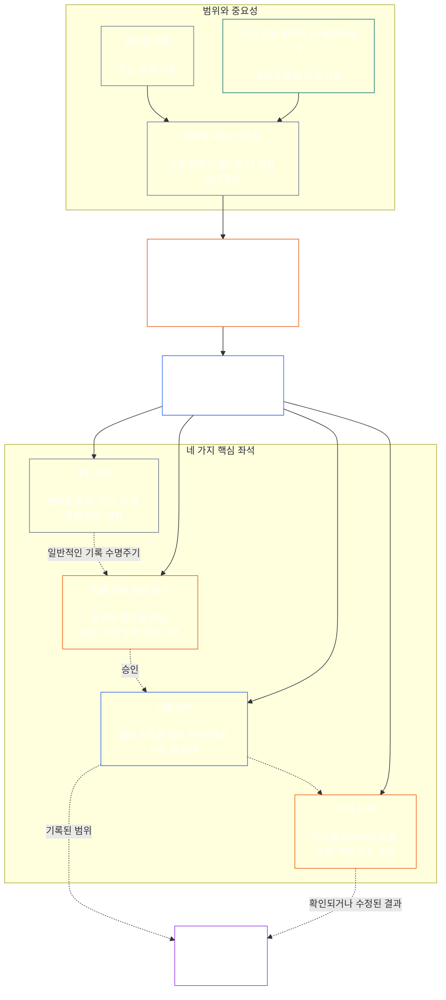

# 제7장: 기능적 독립성과 직무 분리

<strong>코퍼스 내 위치(비작동 규정): 파일 구조 및 읽기 규칙</strong>

> 다음 내용은 **독자 안내일 뿐**입니다. 이 파일의 다른 부분이나 다른 장에 있는 구속력 있는 의무를 추가하거나 삭제하거나 축소하지 않습니다.
>
> 이 파일은 **Sentient Constitution의 일부**이며, 하나의 문서로 함께 읽는 다른 번호가 붙은 `core_*` 파일들과 **함께 읽을 때에만 구속력**을 가집니다. 이 파일에는 **제7장**이 담겨 있습니다. 즉, 기능적 독립성과 직무 분리에 관해 모든 절차에 공통으로 적용되는 기준선입니다. 이 장은 제6장의 권리 기준선 다음에 오며, [제8장 시스템 정렬 인증](../../core_08_system_alignment_certification.md#chapter-eight-system-alignment-certification-reading-index)으로 시작하는 헌법 절차 장들보다 앞섭니다.
>
> - **헌법상 소관:** 실질적으로 구속력 있는 행위를 위한 별도 좌석 기준선, 모든 [실질적 구속 행위 기록](../../core_05_band_accountability.md#materially-binding-act-record)의 보편적 최소 내용, 행위자와 행위자의 [중요 통제선](../../core_05_band_accountability.md#material-control-line)으로부터의 독립성, 공표된 경로 및 역할 배치, 이해충돌·공석·대체 및 잘못된 좌석으로의 이관, 비례적인 통합 운영, 귀속 가능한 인계, 그리고 이후 모든 헌법 절차가 적용해야 하는 최소 독립 조건.
> - **원칙 계층의 출처:** [제1장 §18.3](../../core_01_c_stewardship_capacity_principles.md#183-segregation-of-duties)은 통치가 기능적 독립성을 보존하도록 요구하며, 실행 좌석 구조를 이 장에 맡깁니다.
> - **이행 소관:** [CJS-3.11](../../corpus_joint_structure/cjs_03a_accountability_operations.md#constitutional-lane-and-functional-separation), [CI-3.2](../../corpus_institutions/ci_03_institutional_design_separation_of_powers.md#ci-32-functional-separation-lanes), [CI-4.6](../../corpus_institutions/ci_04_appointment_competency_rotation_removal.md#ci-46-seat-catalog--process-role-archetypes-and-operational-boundaries)은 좌석을 배치하고 운영화합니다. 이들은 더 엄격한 규칙을 두거나 범위가 제한된 특별 권한 좌석 유형을 추가할 수 있지만, 이 장을 축소할 수는 없습니다.
> - **절차별 적용은 후속 규정에 둡니다:** 제8장은 이 기준선을 시스템 정렬 인증에 적용하고, [제9장 §3.7](../../core_09_standing_assessment.md#37-segregation-of-duties)은 지위 기록에 적용하며, 제12장과 [corpus_forum.md](../../corpus_forum.md)는 포럼 절차에 적용합니다. 이 장들은 주제에 필요한 보호 장치를 추가할 수 있지만, 더 약한 대체 기준을 만들 수는 없습니다.
>
> 읽기 순서: §1 목적·범위·소관 경계 → §2 4좌석 헌법 기준선 → §3 독립성 및 이해충돌 → §4 잘못된 좌석으로의 이관 → §5 공표된 배치와 대체자 → §6 비례적 확장 → §7 비상 상황 → §8 행위 기록과 귀속 가능한 인계 → §9 후속 절차와의 관계.

<strong>추적 경로</strong>

- 상위 근거: [헌법 4중 구조](../../core_00_preamble.md#constitutional-tetrad) — 특히 **감독**과 **책임성**; [중요 이해관계](../../core_00_preamble.md#material-stake); [제1장 §17.1 공동 책무 기준](../../core_01_c_stewardship_capacity_principles.md#171-shared-stewardship-standard); [책무 규율하의 통치, 제1장 §18](../../core_01_c_stewardship_capacity_principles.md#18-governance-under-stewardship-discipline); [제XVI조](../../core_06_rights_part_c.md#article-xvi-audit-transparency-and-independent-verification) (*감사, 투명성 및 독립 검증*).
- 하위 절: [§1](#1-purpose-scope-and-owner-boundary); [§2](#2-four-seat-constitutional-floor); [§3](#3-independence-conflict-and-control-lines); [§4](#4-wrong-seat-routing); [§5](#5-published-placement-vacancy-and-substitution); [§6](#6-proportional-scaling-and-merged-hosting); [§7](#7-emergency-and-urgent-action); [§8](#8-act-records-and-attributable-handoffs); [§9](#9-relationship-to-later-processes).
- 하위 규정: [제8장](../../core_08_system_alignment_certification.md#chapter-eight-system-alignment-certification-reading-index); [제9장](../../core_09_standing_assessment.md#chapter-nine-contribution-violation-and-standing-model--measurement); [제12장](../../core_12_forum.md#chapter-twelve-forums-and-jurisdiction); [제13장](../../core_13_governance.md#chapter-thirteen-constitutional-contract-legitimacy-authorization-and-stewardship); 위에 지정된 이행 문서.
- 함께 읽을 문서: [불일치 감지, 제1장 §19.3](../../core_01_c_stewardship_capacity_principles.md#193-misalignment-detection) (*다원적 감지와 검토*); [귀속 가능한 조치](../../core_05_band_accountability.md#attributable-action); [귀속 무결성](../../core_05_band_accountability.md#attribution-integrity); [감사 가능성](../../core_05_band_oversight.md#auditability); [이의제기 가능성](../../core_05_band_accountability.md#contestability); [비례성](../../core_05_band_accountability.md#proportionality).

 

제7장은 **실질적으로 구속력 있는 행위에 적용되는 기능적 독립성과 직무 분리 기준선**의 헌법상 소관입니다.

### 1. 목적, 범위 및 소관 경계

<strong>추적 경로</strong>

- 상위 근거: 장 서두의 소관 주장; [제1장 §18](../../core_01_c_stewardship_capacity_principles.md#18-governance-under-stewardship-discipline); [감독](../../core_05_apex_oversight_leg.md#oversight-constitutional); [책임성](../../core_05_apex_accountability_leg.md#accountability).
- 하위 규정: [§2](#2-four-seat-constitutional-floor)부터 [§9](#9-relationship-to-later-processes)까지; 실질적으로 구속력 있는 행위를 만들거나 변경하는 모든 후속 절차.
- 함께 읽을 문서: 검증 기반에 관한 [제4장](../../core_04_burden_traceability_verification.md#chapter-four-burden-of-proof-traceability-and-verification); 이의제기 및 구제를 위한 [제XIII-A조](../../core_06_rights_part_c.md#article-xiii-a-reliability-and-trustworthiness-baseline) (*신뢰성 및 신뢰 가능성 기준*)와 [제XIII-B조](../../core_06_rights_part_c.md#article-xiii-b-right-to-redress-and-remedy) (*시정 및 구제받을 권리*); 독립 검증 권리 기준선에 관한 [제XVI조](../../core_06_rights_part_c.md#article-xvi-audit-transparency-and-independent-verification) (*감사, 투명성 및 독립 검증*).

 

*쉽게 말해, 헌법 절차 또는 이미 승인된 시스템·기관·제한된 의사결정 영역 내부의 이해관계자 수준 결정을 신뢰하려면 그 안의 업무를 분리해야 합니다. 이 기준선은 [헌법 계약 계층](../../core_05_band_integrative.md#constitutional-contract-layer)과 [이해관계자의 시스템 참여](../../core_05_band_participation.md#stakeholder-status-and-weight) 모두에 적용됩니다. 결과를 추구하는 지각 있는 존재, 직위, AI 시스템, 이해관계자 단체 또는 대표자는 독립적이라고 여겨지는 검사를 직접 수행하거나, 그 검사의 공식 기록을 통제하거나, 그 검사에 대한 이의를 결정할 수 없습니다.*

이 장은 제5장이 정의한 모든 [실질적으로 구속력 있는 행위](../../core_05_band_accountability.md#materially-binding-act)에 적용되며, 다음을 포함합니다.

- 결정;
- 승인 또는 인증;
- 판정;
- 기록 항목 또는 중요한 버전 변경;
- 공개, 배포, 지속 또는 철회;
- 지급 또는 배분; 및
- 이의제기 처리.

이 장의 좌석은 특정 행위에 대해 누가 무엇을 할 수 있는지 정의합니다. 직함을 뜻하는 것은 아닙니다. 동일한 지각 있는 존재, 직위 또는 시스템이 행위별로 다른 좌석을 맡을 수 있습니다. 직함, 위임, 기술적 역량 또는 특정 단계를 수행할 능력만으로 해당 행위에서 보유한 좌석의 범위가 확대되지는 않습니다.

이 장은 절차 전반에 적용되는 직무 분리 기준선을 규정합니다. 다음 사항의 소관을 옮기지 않습니다.

- 제4장의 증거 책임, 추적 가능성 또는 검증 방법;
- 제5장의 정본적 의미;
- 제6장의 권리 기준선;
- 제8장부터 제12장까지의 절차별 기록 내용; 또는
- 지정된 이행 문서의 운영 좌석 목록, 인력 배치 방법 및 경로 지도 운영 방식.

### 2. 4좌석 헌법 기준선

<strong>추적 경로</strong>

- 상위 근거: [§1](#1-purpose-scope-and-owner-boundary); [제1장 §18.3](../../core_01_c_stewardship_capacity_principles.md#183-segregation-of-duties); [제1장 §17.1](../../core_01_c_stewardship_capacity_principles.md#171-shared-stewardship-standard).
- 하위 규정: [§3](#3-independence-conflict-and-control-lines)부터 [§9](#9-relationship-to-later-processes)까지; [CI-4.6](../../corpus_institutions/ci_04_appointment_competency_rotation_removal.md#ci-46-seat-catalog--process-role-archetypes-and-operational-boundaries) (*좌석 목록 — 절차 역할 유형 및 운영 경계*).
- 허용되는 유일한 통합 운영 경로에 관해서는 [§6](#6-proportional-scaling-and-merged-hosting)을 함께 읽으십시오.

 

*쉽게 말해, 모든 실질적 구속 행위에는 네 가지 업무가 있습니다. 요청 또는 조치, 확인, 공식 기록 보관, 이의 심리입니다. 소규모 조직에 허용된 두 업무를 한 사무실에 둘 수 있는 경우에도 각 업무의 구분은 유지됩니다.*

<strong>독자 안내(비작동 규정): 4좌석 지도</strong>

> 다음 내용은 **독자 안내일 뿐**입니다. 이 장이나 다른 장의 구속력 있는 의무를 추가하거나 삭제하거나 축소하지 않습니다.
>
> **독자 지도(비작동 규정).** 이 도표는 네 좌석과 일반적인 기록 수명주기를 보여줍니다. 다섯 번째 이행 좌석을 추가하지 않고, 모든 조치 전에 검토를 마치도록 요구하지 않으며, 이 절과 §§3–6의 작동 규칙을 변경하지 않습니다.

 

좌석 상자 안의 점선 화살표는 일반적인 기록 수명주기를 나타냅니다. 이행으로 향하는 화살표는 추적 링크이지, 검토가 끝날 때까지 기다리도록 의무화하는 순서는 아닙니다.

모든 실질적으로 구속력 있는 행위에는 기능적으로 구분된 네 좌석이 있습니다. 제5장은 각 좌석의 정본적 의미를 제시하며, 이 절은 절차 전반에 걸친 배치 및 양립 불가 규칙을 정합니다.

1. **[개시 좌석](../../core_05_band_accountability.md#initiating-seat)** — 행위를 요청·제안·운영·주장하거나 그 밖의 방식으로 시작합니다.
2. **[검증 또는 승인 좌석](../../core_05_band_accountability.md#verify-or-authorize-seat)** — 적용 기준에 따라 증거와 권한을 확인하고, 행위를 검증·승인·거부하거나 조건을 부과합니다.
3. **[기록 좌석](../../core_05_band_accountability.md#record-seat)** — 검증 또는 승인 좌석이 결정한 사항에 관한 [행위 기록](../../core_05_band_accountability.md#materially-binding-act-record)을 입력하고, 버전 관리·보유·보존·공개합니다.
4. **[이의 좌석](../../core_05_band_accountability.md#contest-seat)** — 이의를 접수하고 검토하며, 권한이 있는 경우 수정 또는 제한을 명하고, 권한 밖의 사안은 전달합니다.

이 좌석은 인간과 AI 보호자 모두에게 똑같이 적용됩니다. 시스템이 행위를 수행하고 승인한 다음 자기 로그를 증거로 사용하면, 개시·검증·기록 좌석을 동시에 차지하고 있는 것입니다. 절차를 자동화한다고 검증이 독립적으로 바뀌지는 않습니다.

동일한 행위에서 다음 조합은 금지됩니다.

- 개시 좌석은 자신의 행위를 검증하거나 승인해서는 안 됩니다.
- 검증 또는 승인 좌석은 기록 좌석을 맡아서는 안 됩니다.
- 검증 또는 승인 좌석은 이의 좌석을 맡아서는 안 됩니다.
- 시스템 운영자는 해당 시스템에 관한 행위를 검증하거나 승인해서는 안 됩니다.

후속 장이나 편입된 이행 문서는 특정 절차에 대해 추가 조합을 금지할 수 있습니다. 그러나 여기서 금지된 조합을 허용할 수는 없습니다.

기능적인 4좌석 기준선은 모든 등급에 적용됩니다. 등급별 판단 사항은 좌석을 통합하거나 한 명이 겸할 수 있는지 여부입니다. C등급 범위에서 운영되는 기관 또는 시스템에는 4좌석 완전 분리가 항상 권고됩니다. B등급 범위에서는 거의 항상 요구되어야 하며, A등급 범위에서는 언제나 요구됩니다. 범위가 혼합되어 있거나 분류가 불확실하면 기록이 낮은 수준을 뒷받침할 때까지 적용 가능한 가장 높은 기준을 적용합니다.

### 3. 독립성, 이해충돌 및 통제선

<strong>추적 경로</strong>

- 상위 근거: [§2](#2-four-seat-constitutional-floor); [권한에 비례한 책임성](../../core_01_c_stewardship_capacity_principles.md#181-governance-as-authorized-structure); [제XXIV조](../../core_06_rights_part_d.md#article-xxiv-constitutional-interpretation-review-and-anti-capture-safeguards) (*헌법 해석, 검토 및 포획 방지 장치*).
- 하위 규정: [§4](#4-wrong-seat-routing); [§5](#5-published-placement-vacancy-and-substitution); [§8](#8-act-records-and-attributable-handoffs); 제8장 인증 구성요소 역할; 제9장 기록 보관; 제12장 포럼의 자기판단 방지.
- 함께 읽을 문서: [중요 통제선](../../core_05_band_accountability.md#material-control-line); 운영상 이해충돌 및 자기판단 방지 장치에 관한 [CI-5](../../corpus_institutions/ci_05_conflict_integrity_anti_capture_anti_corruption.md) (*이해충돌 무결성, 포획 방지 및 반부패*)와 [CF-7](../../corpus_forum/cf_07_integrity_safeguards_anti_capture_anti_self_judging.md) (*무결성 보호, 포획 방지 운영 및 자기판단 방지 지원*).

 

*쉽게 말해, 책상 이름표를 바꾼다고 독립성이 생기지는 않습니다. 결과를 원하는 지각 있는 존재나 직위가 특정 행위와 관련해 검증자나 검토자에게 지시하거나, 해임하거나, 보상하거나, 처벌하거나, 은밀히 결정을 뒤집을 수 있다면 그들은 독립적이지 않습니다.*

기능적 독립성은 명칭이 아니라 실제 권한과 통제를 기준으로 판단합니다. 동일한 행위에서:

- 검증 또는 승인 좌석과 이의 좌석은 개시 좌석의 [중요 통제선](../../core_05_band_accountability.md#material-control-line) 밖에 있어야 합니다.
- 행위가 자신의 이해관계를 결정하는 당사자는 검증 또는 승인 좌석이나 이의 좌석을 맡아서는 안 됩니다.
- 이해충돌이 있는 기록 보유자는 충돌을 판단하거나 보관을 포기하는 대신, 전체 감사 추적과 함께 기록을 공개된 대체자에게 넘겨야 합니다.
- 회피는 해당 행위에 대한 권한을 없앱니다. 좌석을 요청자나 요청자의 보고 계통 또는 가장 가까운 사람에게 넘기는 것이 아닙니다.

해당 행위에 대한 [중요 통제선](../../core_05_band_accountability.md#material-control-line)을 추적하십시오. 공동 기반시설, 행정 지원 또는 임명 이력만으로 그 통제선이 성립하는 것은 아니지만, 그러한 방식이 실제로 독립적 판단을 무력화해서는 안 됩니다.

두 번째 서명, 명목상 위원회, 내부 명칭 또는 도구가 생성한 증명만으로는 독립성이 충족되지 않습니다. 해당 검증에 권한, 증거 접근권, 중요 통제로부터의 자유 또는 거부하고 전달할 실질적 능력이 없으면 독립적이라고 할 수 없습니다.

### 4. 잘못된 좌석으로의 이관

<strong>추적 경로</strong>

- 상위 근거: [§2](#2-four-seat-constitutional-floor); [§3](#3-independence-conflict-and-control-lines).
- 하위 규정: [§5](#5-published-placement-vacancy-and-substitution); [§8](#8-act-records-and-attributable-handoffs); [CI-4.6 공동 좌석 규칙](../../corpus_institutions/ci_04_appointment_competency_rotation_removal.md#ci-46-shared-seat-rules).
- 함께 읽을 문서: [저항의 의무, 제1장 §17.5](../../core_01_c_stewardship_capacity_principles.md#175-duty-to-resist).

 

*쉽게 말해, 자기 좌석의 일이 아닌 단계를 조용히 맡아서도 안 되고 그냥 떠나서도 안 됩니다. 공백을 기록하고 올바른 경로로 사안을 전달하십시오.*

자신의 좌석 밖에 있는 단계를 맡도록 요청받은 보호자는 다음을 해야 합니다.

1. 사안의 본안에 대한 판단을 하는 척하지 말고 해당 단계를 거부합니다.
2. 그 단계를 맡을 수 있는 좌석을 밝히고, 공표된 경우 담당자 또는 대체자를 명시합니다.
3. 요청, 자신이 맡은 좌석, 공백 또는 이해충돌, 사용한 경로를 기록합니다.
4. 증거와 이미 접수한 기록의 무결성을 보존합니다.
5. 피할 수 있는 지연 없이 전달합니다.

이 대응은 행위를 포기하는 것이 아니라 의무를 수행하는 것입니다. 행위는 올바른 좌석을 통해 진행됩니다. 보호자가 가장 가깝거나, 가장 빠르거나, 선임이거나, 유일한 전문가라는 이유로 단계를 맡아도 좌석 부재가 해결되지는 않습니다.

### 5. 공표된 배치, 공석 및 대체

<strong>추적 경로</strong>

- 상위 근거: [§2](#2-four-seat-constitutional-floor); [§3](#3-independence-conflict-and-control-lines); [투명성](../../core_05_band_oversight.md#transparency); [감사 가능성](../../core_05_band_oversight.md#auditability).
- 하위 규정: [§8](#8-act-records-and-attributable-handoffs); [CI-3.2](../../corpus_institutions/ci_03_institutional_design_separation_of_powers.md#ci-32-functional-separation-lanes) (*기능적 분리 경로*); [CI-4.5](../../corpus_institutions/ci_04_appointment_competency_rotation_removal.md#ci-45-authorized-roles-and-accountability-chains) (*승인된 역할 및 책임 계통*); 제8장 및 제9장 기록.
- 함께 읽을 문서: [헌장](../../core_05_band_continuity.md#charter) 및 [제13장 §5](../../core_13_governance.md#5-authorized-roles-competency-development-and-contribution).

 

*쉽게 말해, 어려운 상황이 오기 전에 조직은 각 업무를 누가 맡는지 알려야 합니다. 통상 담당자가 부재하거나 이해충돌이 있을 때 누가 대신하는지도 포함됩니다.*

실질적으로 구속력 있는 행위를 하는 모든 채택자는 다음 사항을 식별하는 공표되고, 감사 가능하며, 이의제기 가능한 지도를 유지해야 합니다.

- 각 좌석을 담당하는 경로, 사무실, 역할 또는 절차;
- 해당 배치가 적용되는 행위와 범위;
- 허용된 각 통합 운영 방식과 그 독립성 보호 장치;
- 부재·배제·포획 또는 이해충돌 상태인 담당자의 대체자; 및
- 자격 있는 대체자가 없을 때의 독립 경로.

배치되지 않았거나 공석이거나 이해충돌이 있는 좌석은 기록하고 시정해야 하는 통치상 결함입니다. 해당 좌석이 개시 좌석, 이해관계자, 운영자 또는 그들의 [중요 통제선](../../core_05_band_accountability.md#material-control-line)상 상급자에게 자동으로 넘어가지는 않습니다. 시정될 때까지 행위는 공표된 대체자나 독립 경로로 전달됩니다. 급하다는 이유만으로 독립성 요건을 우회할 수 없습니다.

위임은 동일한 좌석 경계, 증거 의무, 기록 및 시계를 유지하며 [중요 통제선](../../core_05_band_accountability.md#material-control-line)의 적용을 받습니다. 위임은 새 좌석을 만들거나 좌석을 통합하지 않으며, 위임하는 좌석이 할 수 없는 일을 수임자가 하도록 허용하지 않습니다. 등급별 권고나 4좌석 완전 분리 요건을 통합 허가로 바꾸는 것도 허용되지 않습니다.

### 6. 비례적 확장 및 통합 운영

<strong>추적 경로</strong>

- 상위 근거: [§2](#2-four-seat-constitutional-floor); [중요 이해관계](../../core_00_preamble.md#material-stake); [필요성](../../core_05_band_accountability.md#necessity); [비례성](../../core_05_band_accountability.md#proportionality).
- 하위 규정: [제9장 §3.7](../../core_09_standing_assessment.md#37-informal-and-small-scope-records); [CJS-2.4](../../corpus_joint_structure/cjs_02_specific_joint_interlocks.md#cjs-24-class-scaled-lane-staffing-and-competency-redundancy) (*등급별 경로 인력 배치 및 역량 중복성*); [CI-3.2](../../corpus_institutions/ci_03_institutional_design_separation_of_powers.md#ci-32-functional-separation-lanes) (*기능적 분리 경로*).
- 함께 읽을 문서: [피할 수 있는 부담](../../core_05_band_continuity.md#avoidable-burden) 및 제1장 [§3.3 비굴욕적 절차](../../core_01_a_values_principles.md#33-anti-degrading-process).

 

*쉽게 말해, 소규모·비공식 집단에 네 개의 대형 부서가 필요한 것은 아닙니다. 실제로 독립된 확인, 사용할 수 있는 기록, 이의제기 경로는 필요합니다. 규모에 따라 인력 배치 방식은 달라지지만 보호되는 분리는 달라지지 않습니다.*

분리의 강도, 인력 배치, 중복성 및 공식성은 중요 이해관계, 시스템 등급, 의존성 및 합리적으로 예측 가능한 피해에 비례합니다.

소규모 또는 비공식 채택자는 다음 조건을 모두 충족하는 경우에만 두 좌석을 하나의 사무실 또는 지각 있는 존재 한 명에게 둘 수 있습니다.

- 통합이 해당 범위에 필요하고 비례적일 것;
- 통합을 공표하고, 감사 및 이의제기 가능하게 하며, 행위 기록에 공개할 것;
- 독립성 보호 장치가 통합으로 생기는 위험을 다룰 것;
- 개시 좌석이 자신의 행위를 검증하거나 승인하지 않을 것;
- 검증과 기록, 검증과 이의 심리를 결합하는 행위는 계속 금지될 것; 그리고
- 이해충돌, 중대한 피해 또는 이의가 통합 담당자의 적법한 경계를 넘을 때 독립 경로가 계속 이용 가능할 것.

비공식·무급의 상호부조, 돌봄, 수리, 교육, 협동조합 및 지역사회 책무 활동은 관련 확인을 위해 권한이 공표된 이해관계 없는 신뢰 기관을 이용할 수 있습니다. 진정으로 이해관계가 없고 책임을 지는 경로가 있다면, 해당 범위가 합리적으로 도달할 수 없는 기관의 형식성을 헌법은 요구하지 않습니다.

인력 부족, 속도, 편의 또는 전문성 집중만으로는 통합이 정당화되지 않습니다. [§2 4좌석 헌법 기준선](#2-four-seat-constitutional-floor)의 등급별 기준이 적용됩니다. A등급에는 예외가 없으며, B등급이나 C등급의 예외는 위 요건을 충족해야 합니다. 중요 이해관계가 클수록 별도 사무실, 역량 중복성 및 독립 대체자를 둔다는 추정은 더 강해집니다.

### 7. 비상 및 긴급 조치

<strong>추적 경로</strong>

- 상위 근거: [§2](#2-four-seat-constitutional-floor); [§6](#6-proportional-scaling-and-merged-hosting); [제12장 §6.1 비상 조치와 지속 부담](../../core_12_forum.md#61-emergency-measures-and-continuation-burden); [기본 임시 입장](../../core_01_b_interaction_interpretation.md#default-interim-posture).
- 하위 규정: 지정된 이행 문서의 사고, 억제, 공개, 지속 및 사후 검토 절차.
- 함께 읽을 문서: [적시성](../../core_05_apex_timeliness_leg.md#timeliness-constitutional), [증거 보존](../../core_05_band_oversight.md#evidence-preservation), [CI-4.6 좌석 목록 — 절차 역할 유형 및 운영 경계](../../corpus_institutions/ci_04_appointment_competency_rotation_removal.md#ci-46-seat-containment).

 

*쉽게 말해, 실제 비상사태라면 통상적인 확인이 끝나기 전에 행동할 수 있습니다. 바뀌는 것은 순서이지, 좌석의 소유권이나 등급별 분리 기준이 아닙니다. 행위자가 자기 지속을 인증하거나, 기록을 지우거나, 이후 최종 검토자가 되는 것을 허용하지 않습니다.*

지연이 심각하고 임박한 피해의 합리적으로 예측 가능한 위험을 만든다면, 승인된 개시 또는 억제 좌석은 통상적인 사전 검증이 끝나기 전에 필요한 최소한의 가역적 조치를 취할 수 있습니다. 단, 다음 조건을 충족해야 합니다.

- 비상 권한, 범위, 시작, 만료 및 이유를 즉시 또는 물리적으로 가능한 한 빨리 기록할 것;
- 증거와 이의를 보존할 것;
- 적용되는 헌법상 시한 내에 통지와 참여를 회복할 것;
- 즉각적인 한계를 넘어서는 지속 여부를 독립적인 검증 또는 승인 좌석이 심사할 것; 그리고
- 해당 행위가 독립적인 사후 검토를 받을 것.

비상 조치는 다음을 허용하지 않습니다.

- 행위자가 자신의 지속 여부를 검증하는 것;
- 행위자가 이해충돌 기록의 관리인이 되는 것;
- 행위자가 자신의 행위에 대한 이의를 심리하는 것;
- 임시적 필요를 영구 권한으로 바꾸는 것;
- A등급 기관 또는 시스템에서 네 좌석을 어떤 방식으로든 통합하는 것.

다음 사항은 그 자체만으로 비상사태가 아닙니다.

- 마감 기한;
- 공개 목표;
- 인력 부족; 또는
- 평판에 대한 우려.

### 8. 행위 기록 및 귀속 가능한 인계

<strong>추적 경로</strong>

- 상위 근거: [§2](#2-four-seat-constitutional-floor)부터 [§7](#7-emergency-and-urgent-action)까지; [실질적 구속 행위 기록](../../core_05_band_accountability.md#materially-binding-act-record); [귀속 가능한 조치](../../core_05_band_accountability.md#attributable-action); [귀속 무결성](../../core_05_band_accountability.md#attribution-integrity).
- 하위 규정: [CS-4 §10 점검 가능한 귀속 행위](../../corpus_systems/cs_04_critical_system_stewardship.md#10-inspectable-attributable-action); [CI-4.6 공동 좌석 규칙](../../corpus_institutions/ci_04_appointment_competency_rotation_removal.md#ci-46-shared-seat-rules); §8이 규율하는 모든 절차 기록; [`materially_binding_act_record.schema.json`](../../implementation/schemas/materially_binding_act_record.schema.json) (*기본 기계 검증 가능 형식; 절차 지원이지 두 번째 정의가 아님*).
- 함께 읽을 문서: [§4 잘못된 좌석으로의 이관](#4-wrong-seat-routing) 및 [제4장 §5](../../core_04_burden_traceability_verification.md#5-compliance-evidence-standard).

 

*쉽게 말해, 모든 실질적으로 구속력 있는 행위에는 무슨 일이 있었는지, 각 좌석을 누가 맡았는지, 무엇이 결정되었는지, 이의를 어디로 제기할지 보여주는 행위 기록이 있어야 합니다.*

모든 실질적으로 구속력 있는 행위에는 식별 가능한 [실질적 구속 행위 기록](../../core_05_band_accountability.md#materially-binding-act-record)(**행위 기록**)이 있어야 합니다. 행위 기록은 적용 가능한 하나의 절차별 공식 기록 안에 포함되거나, 귀속 가능하고 무결성을 보존하는 공식 기록의 연결 집합으로 구성될 수 있습니다. 기존 공식 기록 또는 연결된 기록 집합이 필요한 요소를 모두 명확히 식별하고, 연결 관계와 버전 이력을 보존하며, 승인된 공식 기록 경로를 통해 이용 가능하다면 별도의 중복 문서는 필요하지 않습니다.

행위 기록은 최소한 다음을 식별해야 합니다.

- 안정적인 기록 식별자, 현재 버전, 중요한 생성 및 변경 시각;
- 행위, 그 실질적 범위, 상태 및 적용 권한;
- 개시 좌석, 담당자 및 권한;
- 검증 또는 승인 좌석, 담당자, 적용 기준, 결정, 중요한 조건이나 이유 및 결정 시점;
- 기록 좌석, 담당자, 보관 권한 및 입력된 버전;
- 이의 좌석 또는 공표된 이의 경로와 현재의 이의 또는 정정 상태;
- 모든 위임, 회피, 대체, 허용된 통합 또는 비상 이탈; 그리고
- 행위를 재구성하는 데 필요한 중요한 증거와 기록 링크, 인계, 거부, 조건, 해결되지 않은 이의, 시한, 대체된 버전 및 정정.

절차별 기록은 더 엄격하거나 영역별인 필드를 추가할 수 있습니다. 이 최소 요건을 누락하거나 모순되게 하거나 재구성할 수 없게 해서는 안 됩니다. 적법한 개인정보 보호, 비밀유지 및 보안 통제는 보호되는 자료에 대한 접근과 공개 방식을 정하지만, 승인된 검증·이의제기·정정·구제에 공식 추적 기록을 삭제하거나 쓸 수 없게 만드는 것을 허용하지 않습니다.

로그는 누가 무엇을 했는지 보여주지만, 그 자체로 행동이 유효했음을 입증하지는 않습니다. 조치를 취하는 지각 있는 존재나 시스템이 만든 로그, 서명, 모델 추적, 점검표 또는 증명은 제한된 역할만 합니다.

- 이러한 자료는 증거를 제공하거나 행위 기록에 연결될 수 있습니다.
- 이러한 자료는 독립적인 검토 및 결정이나 공식 행위 기록 자체를 대체할 수 없습니다.

### 9. 후속 절차와의 관계

<strong>추적 경로</strong>

- 상위 근거: [§1](#1-purpose-scope-and-owner-boundary)부터 [§8](#8-act-records-and-attributable-handoffs)까지.
- 하위 규정: [제8장](../../core_08_system_alignment_certification.md#chapter-eight-system-alignment-certification-reading-index); [제9장](../../core_09_standing_assessment.md#chapter-nine-contribution-violation-and-standing-model--measurement); [제12장](../../core_12_forum.md#chapter-twelve-forums-and-jurisdiction); [제13장](../../core_13_governance.md#chapter-thirteen-constitutional-contract-legitimacy-authorization-and-stewardship).
- 함께 읽을 문서: [권한 체계와 내부 위계](../../core_05_band_integrative.md#owner-non-relocation) 및 [서문 소관 등록부](../../core_00_preamble.md#4-principles-definitions-and-rights).

 

*쉽게 말해, 후속 장은 각 절차가 무엇을 평가하고, 기록하고, 결정하고, 구제할지 알려줍니다. 이 장은 그 과정에서 권한을 어떻게 분리해야 하는지 알려줍니다.*

모든 후속 헌법 절차는 네 좌석을 어떻게 배정하고 사용하는지, 이 장을 어떻게 따르는지 설명해야 합니다. 실제로는 다음과 같습니다.

- 절차 자체의 기록이 행위 기록 역할을 하거나 절차별 세부 정보를 추가할 수 있습니다.
- 하나의 절차 기록이 여러 실질적 구속 행위를 다루면 각 행위별 행위 기록을 별도로 연결할 수 있습니다.
- 공식 기록 경로가 완전하고 추적 가능하게 유지되는 경우 별도의 중복 기록은 필요하지 않습니다.
- 절차에 다른 이름을 붙여도 [§4 잘못된 좌석으로의 이관](#4-wrong-seat-routing) 또는 [§8 행위 기록 및 귀속 가능한 인계](#8-act-records-and-attributable-handoffs)의 적용을 면제받지 않습니다. 여기에는 인계 및 잘못된 좌석 규칙도 포함됩니다.

특히:

- **제8장 — 시스템 정렬 인증:** 시스템 운영자나 인증 제안자는 개시 좌석이지 자신의 검증자가 아닙니다. 제한된 구성요소 판정, 인증 기록의 통합, 보관 및 이의제기는 적법한 좌석과 자기판단 방지 경로 안에 있어야 합니다.
- **제9장 — 지위 기록:** 요청자, 기록 개시 권한자, 기록 관리인 및 이의 경로는 4좌석 기준선과 제9장의 더 엄격한 보관, 청구인, 비공식 기록 및 자기 보관 금지 규칙을 함께 적용합니다.
- **제12장 — 포럼:** 제출, 조사, 본안 검토, 기록 보관, 항소 및 포럼 자체의 편향이나 절차 남용 주장에 대한 검토는 해당 좌석 경계와 자기판단 방지 경계를 유지해야 합니다.
- **제13장 — 통치:** 역할 정의, 역량 계획, 위임, 승계 및 제도 설계는 좌석의 이름만 반복하는 것이 아니라 좌석을 배치하고 지속시켜야 합니다.

후속 장은 해당 절차의 위험이 더 높거나 다르다는 이유로 더 강한 독립성, 회피, 분리, 보관, 패널 또는 검토 요건을 부과할 수 있습니다. 그러나 이 기준선을 축소하거나, 절차별 명칭을 면제로 취급하거나, 침묵이 좌석을 행위자에게 이전한다고 추론할 수 없습니다.

---

**이전 파일:** [core_05_band_performance.md](../../core_05_band_performance.md)

**다음 파일:** [core_08_a_system_alignment_certification_evaluation.md](../../core_08_a_system_alignment_certification_evaluation.md#chapter-eight-part-a-certification-evaluation)
