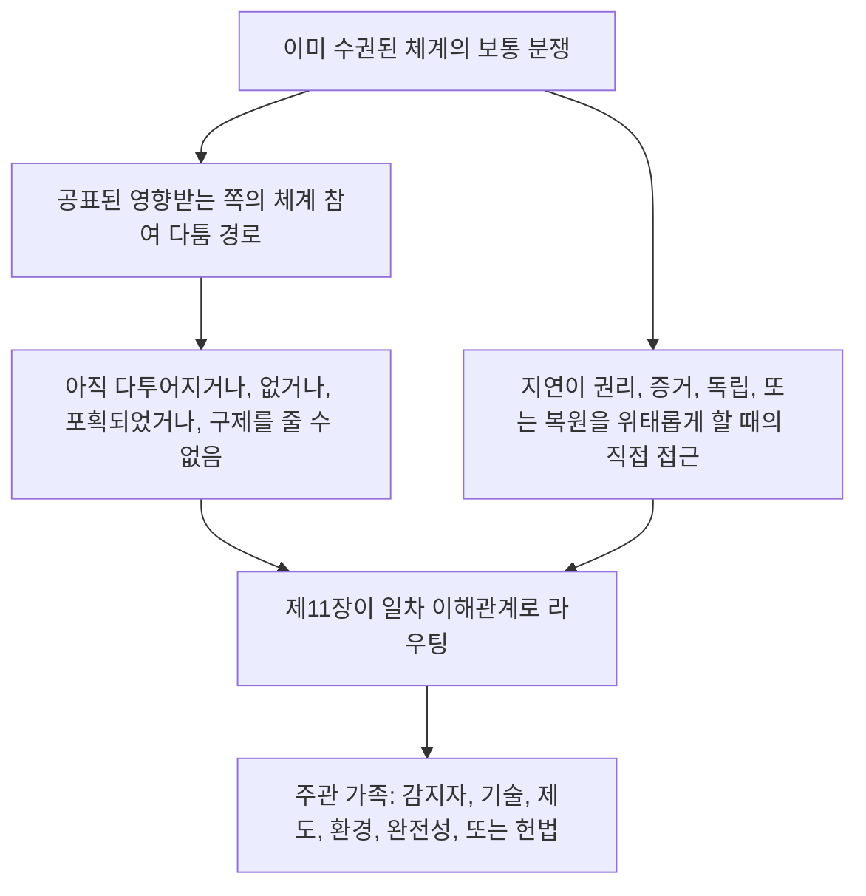

# 제11장: 포럼과 관할

<strong>코퍼스에서의 위치(비운영): 파일 구조와 읽기 규칙</strong>

> 다음 내용은 **독자 안내일 뿐입니다**. 이 파일이나 다른 장에서 구속력 있는 의무를 더하거나, 빼거나, 좁히지 않습니다.
>
> 이 파일은 [영어 제11장](../../core_11_forum.md)의 **독자 언어 시험본**입니다. 감지자 헌법의 구속력 있는 부분이 **아닙니다**. 두 번째 헌법이 **아닙니다**. 배포판이 **아닙니다**. `SC-Corpus-2026.08.09`에 **고정**되어 있습니다. 이 번역과 영어 원문이 어긋나 보이면, 번호 파일 [`core_11_forum.md`](../../core_11_forum.md)가 이깁니다. 읽기 순서와 판본 메타데이터는 [README.md](../../README.md)에 유지됩니다. 방법과 용어표: [translations/ko/README.md](README.md).
>
> **제11장**을 담습니다: 포럼 가족, 기본 장소와 일차 이해관계 라우팅, 포렌식 받침, 접수 분류, 궤적 사슬과 권리 바닥 아래 분쟁의 관할. 포럼은 [헌법 사원(四元)](core_00_preamble.md#constitutional-tetrad)의 **참여**, **감독**, **적시성** 다리 아래, [실질 이해관계](core_00_preamble.md#material-stake)에 맞춰 세기 조절하여 분쟁 취급을 **감독**합니다. 사실이 확인되면 [제8장 §3](core_08_standing_assessment.md#3-standing-record-operational-requirements) 아래 궤적 기록을 **열거나, 갱신하거나, 고칠** 수 있습니다 — 또는 **다툼에서 나쁜 기록을 치울** 수 있습니다. 제기된 사건은 그 자체로 궤적이 아니며, 포럼 이야기는 제8장 궤적 측정을 대체해서는 안 됩니다([제8장 §3.6](core_08_standing_assessment.md#36-forum-boundary)). 사슬 안내는 [README — Standing pipeline and forums](../../README.md#standing-pipeline-and-forums)를 쓰십시오. 운영 포럼 기계는 지정된 시행 파일에 남습니다. 장 번호와 교차 참조는 통합 문서와 맞습니다.

>
> **이전(아직 영어):** [core_10_b_misconduct_pattern_applications.md](../../core_10_b_misconduct_pattern_applications.md#chapter-ten-part-b-anti-constitutional-misconduct-pattern-applications)
>
> **다음(아직 영어):** [core_08-11_application_vignettes.md](../../core_08-11_application_vignettes.md#chapters-eight-eleven-application-vignettes)
> **읽기 호:** §1 목적 → 다툼 순서 → §2 기본 장소와 접수 → §2.1–§2.3 주관 한도, 혼합 이해관계, 다툼 → §3 이전과 자기 심판 금지 → §4 가족 → §5 격상과 인증 → §6 층과 지연 금지 → §7 포럼 받침

<strong>독자 안내(비운영): 제11장이 사는 곳과 여기에 남는 것</strong>

> 다음 내용은 **독자 안내일 뿐입니다**. 이 장이나 다른 장에서 구속력 있는 의무를 더하거나, 빼거나, 좁히지 않습니다.
>
> 이것이 사는 곳 (안내):
> - **헌법 주관자:** **1절** (*목적* — 이 장이 배정하는 규범의 **일차 재결 적용**이며, 일상 **집행 행정**과 **구별됨**; 이미 수권된 체계 안 보통 분쟁을 위한 **다툼 순서**; **책무** 요건; **공표**되고 **예측 가능한** **문턱** 배치); **기본 출발 장소**, **일차 이해관계** 라우팅, **접수 분류 기관** (**첫 접촉 창구**), 혼합 이해관계, 비대칭, 궤적 기록 다툼, **선의의 성격 부여와 놀이 금지**, **감지자가 닿을 수 있는** **문턱** **접근** 기대 (**2절**, **`corpus_forum.md`**와 **함께 읽기**); **이전**, **병합**, **조정** (**3절**, **5절** 인증과 예비와 함께 읽기); **포럼 가족 정의**, **내부 분과**, **공유 표준**, **잠정 운영법** (감지자, 기술, 제도, 환경, 완전성, 헌법 — **4** **절**, **2** **절** **표**를 거울로 함); **격상**, **인증**, **잠정 보호** (**5절**); **제때 해결**과 **지연 금지** 규율 (**6절**); 검토 전·중·후의 **포럼 받침** (**7절**). 분류와 받침 역할이 **적법하게 구성된 본안 합의체**를 **대체하지 않도록** 시행합니다; **자기 심판 금지** 예비 라우팅; **제8장**, **제10장**, **제6장** 정의와 다툼 권리에 묶인 격상 고리.
> - **사슬 안내:** [README — Standing pipeline and forums](../../README.md#standing-pipeline-and-forums) — 이 파일의 [§§1–7](#1-purpose-and-role).
> - **제8–9장 세 질문 사슬:** 제8장 **2–3절**은 확인된, 축-순수한 기록을 통해 질문 1(*무엇이 일어났는가?*)에 답합니다. [제8장 §4](core_08_standing_assessment.md#4-standing-measurement-evaluation-dimensions)와 [§7 통합 비례 LEQU 척도](core_08_standing_assessment.md#7-unified-proportional-lequ-scale)는 평가 차원, 공유 다섯 배 LEQU 띠, 공유 **s** = 1...9 문법으로 기여와 위반 기록을 따로 지키며 질문 2(*얼마나 좋거나 나빴는가?*)에 답합니다. [제9장](core_09_standing_integration.md#chapter-nine-standing-effects-and-integration)은 구제, 안전장치, 역량 문턱과 허가, 궤적 잠금을 통해 질문 3(*그 때문에 무엇이 일어나는가?*)에 답합니다. 위반 축 슬롯을 다스리는 것은 확인된 영향뿐입니다; 과실, 은폐, 강제, 응답, 견줄 성격 서술자는 그것을 움직이지 않습니다. [제10장](core_10_a_misconduct_designation.md#chapter-ten-anti-constitutional-misconduct)은 제8장 슬롯 7, 8, 또는 9 기록에 짝이 되는 반헌법 부당행위 지정을 더할 수 있으나 숫자 슬롯을 할당하지 않습니다.
> - **포럼 (비운영 주):** 이 장 아래 **포럼 가족**은 [제8장](core_08_standing_assessment.md#chapter-eight-compliance-violation-and-standing-model) 분류를 구체 분쟁에 적용하는 일차 **포럼**입니다 — 따로 기록된 **기여 성격**, **위반 축 영향 슬롯**, 과정 / 응답 성격이 **함께 있고** **제8장** 공동 평가와 대체 금지 규율 아래 다루어져야 하는 일을 포함합니다. 재결 밖 **연구 자금**, **금융**, **유인** 기계는 채택된 시행과 **[corpus_systems.md](../../corpus_systems.md)**에 남습니다 (**제8장** 독자 안내를 보십시오); 예방과 뿌리 원인 탐구를 받칠 수 있으나 **문턱** 라우팅, **본안** 결정, 권한 있는 제8장 숫자 슬롯 할당, 짝이 되는 **제10장** 지정, 또는 **제 XXIII조** (*충돌 해결, 격상, 비상 비례*) 제약을 **대체해서는 안 됩니다**. **1절과 2절**은 **유인** 구조에 대한 **일차** 책임을 각 **가족** **영역** **안**에 **주로** 배정합니다 (세부는 **코퍼스**와 시행); 그 **배정**은 [제12장](../../core_12_governance.md#chapter-twelve-constitutional-contract-legitimacy-authorization-and-stewardship)과 **[corpus_systems.md](../../corpus_systems.md)**에 남겨진 **체계 전체** **예산** 또는 **거버넌스 규모** 선택을 **옮기지 않습니다**.
> - **시행 주관자:** 공표된 접수 **등급**, 일상 심리 규칙, 인력, 예산, 세밀 절차, 운영 격상 기계, 포럼 받침 운영 요건은 채택된 시행 텍스트와 **[corpus_forum.md](../../corpus_forum.md)**에 삽니다 (**CF-5** (*라우팅 운영, 이전, 인증, 대표 취급*), **CF-8** (*포럼 포렌식과 분석 받침*), **CF-9** (*독립 조사 서비스와 기소 인터페이스*), 관련 절); 그 층은 이 장을 **시행하고, 좁히지 않습니다**.
> - **자리 옮김 금지 규칙:** 채택 기구는 서로 다른 포럼 기능을 접거나, **독립**이나 **실제 검토**를 벗기거나, 이 장이 유일한 최종 본안 거처로 금하는 같은 포획된 포럼으로 완전성 다툼을 되돌리는 절차로 이 장을 충족해서는 안 됩니다.
>
> **아키텍처 — *쉬운 말로* 배치:** 각 *쉬운 말로* 줄은 추적 안내 블록(그리고 있을 때 그 뒤 ` `) 바로 다음, 그 절의 운영 문단과 글머리 목록 **앞에** 나타납니다. 독자용 주석일 뿐입니다; 구속력 있는 텍스트를 더하거나, 빼거나, 좁히지 않습니다.

<strong>추적</strong>

- 상류: [제8장](core_08_standing_assessment.md#chapter-eight-compliance-violation-and-standing-model) (*이 장이 라우팅하는 분쟁을 공급하는 질문 1 기록과 질문 2 측정*); [제8장 §5.1](core_08_standing_assessment.md#5-slot-grammar-and-display-labels) (*궤적 슬롯 문법*); [제8장 §7 통합 척도](core_08_standing_assessment.md#7-unified-proportional-lequ-scale) (*공유 다섯 배 LEQU 띠와 따로 된 축 기록*); [제8장 §§4.3–4.4](core_08_standing_assessment.md#43-route-descriptor-measurement-roles) (*슬롯을 움직이지 않는 기여 축과 위반 축 서술자를 포함한 축 사이 정규화 서술자 목록*); [제10장](core_10_a_misconduct_designation.md#chapter-ten-anti-constitutional-misconduct) (*자격을 갖춘 제8장 슬롯 7–9에 대한 짝 반헌법 부당행위 지정*); [제2장부터 제4장](core_02_definition_structure.md) (*기록, 확인, 추적 기대*); [제5장](core_05__definitions_home.md#chapter-five-foundational-definitions) (*기초 정의*); [제1장](core_01_c_stewardship_capacity_principles.md#chapter-01-principles-and-constraints) (*해석 제약*); [제6장 — 기초 권리](core_06_rights_part_a.md#chapter-six-foundational-rights)부터 [D부분](core_06_rights_part_d.md) (*다툼, 감사, 정의 조 고리*).
- 하위 절: [§1](#1-purpose-and-role); [§2](#2-default-venue-and-primary-stakes); [§3](#3-transfer-consolidation-and-coordination); [§4](#4-forum-family-definitions); [§5](#5-escalation-and-certification); [§6](#6-timely-resolution-materiality-tiers-and-anti-delay-discipline); [§7](#7-forum-support-before-during-and-after-review).
- 함께 읽기: [README — Standing pipeline and forums](../../README.md#standing-pipeline-and-forums).
- 하류: [corpus_forum.md](../../corpus_forum.md) (*운영 포럼 교의*); 재결 역할과 거버넌스 정당성이 만나는 곳의 [제12장](../../core_12_governance.md#chapter-twelve-constitutional-contract-legitimacy-authorization-and-stewardship); 채택된 절차 층을 위한 [제16장](../../core_16_incorporation.md#chapter-sixteen-incorporation-bridge) (*편입 규율*).
- 함께 읽기: [제8장 §5.1](core_08_standing_assessment.md#5-slot-grammar-and-display-labels) (*궤적 슬롯 문법*); [제8장 §§4.3–4.4](core_08_standing_assessment.md#43-route-descriptor-measurement-roles) (*축 사이 정규화된 기여 축과 위반 축 서술자*).
- 또한 함께 읽기: [제9장 §3](core_09_standing_integration.md#3-descriptor-integration-and-attachment-normalization) (*2절 일차 이해관계 라우팅과 함께 읽는 서술자 통합과 첨부 정규화*); [README.md](../../README.md) (*읽기 순서와 코퍼스 조직*); [doc_architecture.md](../../doc_architecture.md) (*채택되지 않는 한 구속력 없는 편집 지도*).

 

제11장은 **궤적 사슬과 권리 바닥 아래 분쟁을 위한 포럼 가족, 기본 장소, 관할, 재결 라우팅**의 헌법 주관자입니다.

*쉬운 말로: [헌법 사원(四元)](core_00_preamble.md#constitutional-tetrad)과 [두 헌법 목적](core_00_preamble.md#two-constitutional-aims) 아래, 이 장은 분쟁이 제8장부터 제10장 궤적 사슬을 어떻게 가로지르는지를 **감독**합니다 — 라우팅, 독립, 포렌식 받침, 시정 순서, **6절**과 **제 XXIV-C조** (*제때 해결과 지연 금지 바닥*) 아래 층-기본 시계. 포럼 가족은 어느 궤도가 어느 분쟁을 다루는지, 사건이 보통 어디서 시작하는지, 혼합 이해관계 일이 어떻게 조정되는지에 답합니다. **참여**(닿을 수 있는 다툼)와 **감독**(추적 가능한 본안 검토)을 공급합니다. 사실이 확인되면 궤적 기록을 **열거나, 갱신하거나, 고칠** 수 있습니다 — 또는 **다툼에서 나쁜 기록을 치울** 수 있습니다. 궤적 사슬 옆에 두 번째 별도 결정 궤도를 **돌리지 않습니다**. 사건을 제기하는 것만으로는 궤적에 즉각 영향이 없습니다. 일상 심리 규칙, 예산, 인력 안내서는 시행 층에 살며, 이 장이나 **제 XXIII조** (*충돌 해결, 격상, 비상 비례*)를 **시행하고, 좁혀서는 안 됩니다**.*

### 1. 목적과 역할 — 참여 아키텍처

<strong>추적</strong>

- 상류: [제7장 — 체계 정합 인증](core_07_a_system_alignment_certification_evaluation.md#chapter-seven-system-alignment-certification); [제8장](core_08_standing_assessment.md#chapter-eight-compliance-violation-and-standing-model); [제9장](core_09_standing_integration.md#chapter-nine-standing-effects-and-integration); [제10장](core_10_a_misconduct_designation.md#chapter-ten-anti-constitutional-misconduct); [제1장](core_01_c_stewardship_capacity_principles.md#chapter-01-principles-and-constraints) (*원칙과 해석 제약*); [제2장부터 제4장](core_02_definition_structure.md) (*추적과 확인 기대*); [제5장](core_05__definitions_home.md#chapter-five-foundational-definitions) (*코퍼스 위치 상자에서 제2장부터 제4장과 함께 읽는 정의*); [제6장](core_06_rights_part_a.md#chapter-six-foundational-rights) (*이 장이 함께 적용하는 기초 권리 바닥*).
- 하류: [§2](#2-default-venue-and-primary-stakes) (*일차 이해관계 기본 장소, 접수 분류, 혼합 이해관계, 비대칭, 궤적 기록 다툼; 제때 다툴 수 있는 문턱 접근; 선의의 성격 부여와 놀이 금지*); [§3](#3-transfer-consolidation-and-coordination) (*이전과 자기 심판 금지*); [§4](#4-forum-family-definitions) (*포럼 가족 정의, 분과, 공유 표준, 잠정 운영법*); [§4.3](#43-institutional-forums) (*다툼 순서의 제도 가족 적용으로서의 내부 과정 경계*); [§5](#5-escalation-and-certification) (*격상, 인증, 잠정 보호*); [§6](#6-timely-resolution-materiality-tiers-and-anti-delay-discipline) (*실질성 층, 사슬 이정표, 지연 금지 규율*); [§7](#7-forum-support-before-during-and-after-review) (*검토 전·중·후 포럼 받침*).
- 사원(四元) 다리: **참여**, **감독**, **책무**, **적시성** (확인된 소견은 궤적 기록을 열거나, 갱신하거나, 고칠 수 있습니다; **CF-11**이 층 시계를 시행합니다). 일차 목적: **번영**과 **연속**. [실질 이해관계](core_00_preamble.md#material-stake) 세기 조절은 라우팅과 접근 부담에 적용됩니다.
- 함께 읽기: [전문 §3.2](core_00_preamble.md#32-key-governance-processes)와 [§3.3](core_00_preamble.md#33-governance-layers) (*과정 경로와 거버넌스 층 규율*); [제 XI조: 영향받는 쪽의 체계 참여, 대표, 적법절차](core_06_rights_part_b.md#article-xi-stakeholder-system-participation-representation-and-due-process); [corpus_forum.md](../../corpus_forum.md) (**CF-6.2.2** (*비상, 소진, 시기 규칙*) — 시행하고, 좁히지 않음); [corpus_institutions.md](../../corpus_institutions.md) (*다툼, 이차 검토, 완전성 감시 — 배정된 포럼 관할을 대체하지 않음*); [제 XII-B조: 다툼, 검토, 구제에 대한 권리](core_06_rights_part_c.md#article-xii-b-right-to-challenge-review-and-redress); [제 XXIII조 가족](core_06_rights_part_d.md#article-xxiii-a-justice-objective-and-scope) (*코퍼스 위치 상자에서 참조되는 정의 제약*).

 

*쉬운 말로: 이 절은 두 궤도를 **감독**하는 포럼 가족을 통해 헌법 **참여**와 **감독**을 배정합니다 — **궤적 사슬**(제8장부터 제10장 분쟁과 기록 효과)과 **체계 정합 인증**(제7장 인정과 검토) — 그다음 공표된 문턱 배치에 대한 책무 요건을 말합니다. 이미 수권된 체계 안 보통 분쟁은 먼저 공표된 영향받는 쪽의 체계 참여 다툼 경로를 씁니다; 이 장은 그 경로가 아직 다투어지거나, 없거나, 포획되었거나, 구제를 줄 수 없을 때 이어받습니다. 세밀한 심리 규칙은 다른 곳에 살며, 이 장이 보장하는 것을 조용히 줄여서는 안 됩니다.*

이 장은 어느 **포럼 가족**이 **참여**(감지자가 닿을 수 있는 다툼, 대표 취급, 비례 접근)와 **감독**(독립, 포렌식 받침, 추적 가능한 본안 검토)을 통해 어느 일차 질문을 **감독**하는지를 말합니다. 심리 규칙, 인력, 예산, 세밀 절차, 운영 격상 기계를 **지정하지 않습니다**. 그 세부는 이 장을 **시행하고, 좁혀서는 안 되는** 코퍼스 시행 층에 속합니다. **포럼 가족**은 문턱 배치, 일차 이해관계 라우팅, 체계 정합 검토의 법적·규제 경계를 예측 가능하고 공표된 방식으로 말해야 하며, 그것은 **2절**과 **`corpus_forum.md`**를 함께 **시행하고, 좁혀서는 안 됩니다**.

**포럼 가족이 감독하는 것:**

1. **궤적 사슬** (제8장부터 제10장. 분쟁에서 제1장부터 제6장과 지정된 코퍼스 시행 규범을 적용)
   - 일차 이해관계 라우팅, 배정된 곳의 본안 검토, 이전, 병합, 인증 조정, 궤적 관련 분쟁의 시정 순서.
   - **제8장** 기여와 위반 기록 — §7 통합 비례 LEQU 척도로 측정되고, 성격 서술자와 궤적 효과를 동반 — 확인된 소견은 확인된 입력 게이트를 충족할 때 [제8장 §3](core_08_standing_assessment.md#3-standing-record-operational-requirements) 아래 궤적 기록을 **열거나, 갱신하거나, 고칠** 수 있습니다 — 또는 **다툼에서 나쁜 기록을 치울** 수 있습니다. 제기된 사건은 그 자체로 궤적이 아니며, 포럼 이야기는 제8장 궤적 측정을 대체해서는 안 됩니다([제8장 §3.6](core_08_standing_assessment.md#36-forum-boundary)).
   - 이 장이 구제와 순서의 포럼 감독을 배정하는 곳의 **제9장** 궤적 효과와 통합.
   - 제8장 슬롯 7–9 기록에서 그 지정이 쟁점인 곳의 **제10장** 반헌법 부당행위 지정.
   - 그 분쟁이 적용하는 규범으로서 **제1장부터 제6장**과 지정된 [코퍼스](core_05_band_integrative.md#corpus) 시행 층의 적용.

2. **체계 정합 인증** ([제7장](core_07_a_system_alignment_certification_evaluation.md#chapter-seven-system-alignment-certification))
   - [제7장 B부분](core_07_b_system_alignment_certification_record_process.md#chapter-seven-part-b-certification-record-and-process) 아래 포럼 감독 인정, 조건 인정, 확인, 재확인, 철회, 관련 인증 기록 결과.
   - [B부분 §13](core_07_b_system_alignment_certification_record_process.md#13-forum-supervision-and-component-roles) 아래 구성 요소 역할:
     - **기술** — 명세, 방법, 증거 표준
     - **완전성** — 공식 정합 인정과 주관 조정
     - **환경** — 실질인 곳의 환경 정합 구성 요소
     - 이 장 라우팅 아래 다른 가족 구성 요소 소견
   - 감지자는 인증 결과를 다투고, 조건을 붙이고, 필요할 때 철을 재개방할 수 있습니다 — 그러나 인증은 궤적 측정을 **대체하지 않습니다**.
   - 인증의 중요한 소견은 제8장이 궤적을 측정할 때 **확인된 입력**으로 셀 수 있습니다. 인증은 그 자체로 누구에게도 궤적 슬롯을 할당하지 **않습니다** ([B부분 §15](core_07_b_system_alignment_certification_record_process.md#15-relationship-to-standing)).

**포럼 가족**은 이 문서가 그 궤도를 **감독**하는 일차 제도입니다. 제정된 규칙의 일상 집행 행정과 구별됩니다.

**다툼 순서.** 이미 수권된 체계, 제도, 또는 한정된 결정 영역 안에서, 보통 분쟁은 먼저 공표된 [영향받는 쪽의 체계 참여](core_05_band_participation.md#stakeholder-status-and-weight-cluster) 다툼과 적법절차 경로를 씁니다. 그 경로가 아직 다툰 결과를 내거나, 없거나, 포획되었거나, 필요한 구제를 적법하게 줄 수 없으면, 이 장은 **2절** 아래 일차 이해관계로 일을 라우팅합니다. **완전성**, **기술 포럼 영역**, **환경**, **헌법**은 그것이 일차 이해관계일 때의 기본 주관 가족입니다 — 순서를 건너뛰는 예외가 아닙니다. 끝나지 않은 내부 과정, 소진 꼬리표, 또는 내부 검토가 끝나지 않았다는 주장은 그 주관을 멈추거나, 본안을 밀어내거나, **제 XXIV-C조** (*제때 해결과 지연 금지 바닥*) 시계를 먹어 치워서는 안 됩니다. 지연이 권리, 증거, 독립, 또는 실무 복원을 실질로 위태롭게 할 때 직접 접근은 남아 있습니다.

*독자 지도일 뿐입니다. 다툼 순서 문단을 더하거나, 빼거나, 좁히지 않습니다.*

그들은:

- 예방적 거버넌스 역할을 집니다. 문제 해결, 뿌리 원인 분석, 예방, 시정 순서, 실패 패턴에서 배우기를 포함하며, **제1장** 원칙 — **안전**, **진실**, **안녕**, **응답성**, **책임 있는 관리와 분산된 이해** — 과 정합합니다.
- **제2장부터 제4장**, 다툼과 시정이 걸리는 곳의 **제 XII-B조** (*다툼, 검토, 구제에 대한 권리*), 정의 제약이 다스리는 곳의 **제 XXIII조** (*충돌 해결, 격상, 비상 비례*)의 **독립**, **다툴 수 있음**, **추적** 기대를 충족해야 합니다.
- 이 문서가 말한 가장 엄격한 절차와 완전성-책무 요건에 따릅니다. 공적 정당화, 추적 가능성, 기피와 합의체 규율, 이 장이 배정하는 곳의 포렌식과 분석 받침을 포함합니다
- 자기 심판 금지 예비 라우팅을 요구합니다. 그 요건은 재결 독립을 정치 통제로 대체해서는 안 됩니다.
- **완전성**, **헌법**, **환경** 포럼, 그리고 감지 지위 재결을 들을 때의 **기술 포럼 영역**은 [제12장 §1.2](../../core_12_governance.md#12-eligibility-contested-selection-and-democratic-minimums) 아래 **공표**되고, **다투어지며**, **교체 가능한** 임명 또는 동등한 독립 점검을 요구합니다. 그 석의 과소 임명이나 과소 자금은 [제9장 §9](core_09_standing_integration.md#9-enforcement-realism) 실패입니다.

각 **포럼 가족**은 주로 자기 영역 안 유인 구조에 대한 일차 책임을 집니다. 다음을 포함합니다:

- 채택 기구와 지정된 시행 층
- 비용, 제재, 다툼, 보고 명명된 경로의 검토
- 시정 순서 고리, 견줄 재결 인접 정합.

**체계 전체** 예산, 가로지르는 연구 자금, 거버넌스 규모 계획은 적용되는 곳에서 [제12장 — 거버넌스](../../core_12_governance.md#chapter-twelve-constitutional-contract-legitimacy-authorization-and-stewardship), **[corpus_systems.md](../../corpus_systems.md)**, 다른 최상위 규칙에 남습니다. 보수, 비용 규칙, 비슷한 유인 도구는 다음을 **대체해서는 안 됩니다**:

- 알맞은 포럼 라우팅
- 적법하게 구성된 합의체의 실제 본안 결정
- 제8장 영향 슬롯 측정
- 짝이 되는 **제10장** 지정
- **제 XXIII조** (*충돌 해결, 격상, 비상 비례*)의 정의 제약

**`corpus_institutions.md`**의 제도 다툼, 이차 검토, 완전성 감시 (**CI-5** (*충돌 완전성, 포획 금지, 부패 금지*)부터 **CI-8** (*제도 간 조정과 격상*)과 다툼 완전성 기대를 포함)는 이 장과 나란히 일합니다. 이 장이 그 가족에 관할을 배정하는 곳의 구속력 있는 본안에 대해 **완전성**, **환경**, 또는 **제도** 포럼 가족을 대체하지 않습니다. 그 권의 시행 유인 기계는 일차로 걸리는 가족과 조정해야 하며, 이 장이 배정하는 일차 이해관계 라우팅이나 본안 권한을 밀어내서는 안 됩니다.

### 2. 기본 장소와 일차 이해관계

<strong>추적</strong>

- 상류: [§1](#1-purpose-and-role) (*목적, 일차 적용 역할, 책무 요건, 공표된 문턱 라우팅, 세부의 자리 옮김 금지, 독립과 검토 기대*).
- 하류: [§3](#3-transfer-consolidation-and-coordination) (*이전, 병합, 자기 심판 금지*); [§4](#4-forum-family-definitions) (*기본 표와 함께 읽는 포럼 가족 정의*); [§5](#5-escalation-and-certification) (*기본 장소에서의 격상; 잠정 보호*); [§6](#6-timely-resolution-materiality-tiers-and-anti-delay-discipline) (*실질성 층과 지연 금지 규율*); [§7](#7-forum-support-before-during-and-after-review) (*검토 전·중·후 포럼 받침*).
- §2 안: [§2.1](#21-lead-default-limits) (*일차 이해관계 충돌, 헌법 인증, 자기 심판 금지 예비*); [§2.2](#22-mixed-stakes-and-routing-asymmetry) (*혼합 이해관계와 비대칭*); [§2.3](#23-forum-records-standing-records-and-contests) (*포럼 사건 기록, 궤적 기록, 다툼*).
- 함께 읽기: [헌법 사원(四元)](core_00_preamble.md#constitutional-tetrad) — **참여**, **감독**, **적시성** 다리; 일차 이해관계 라우팅을 위한 [실질 이해관계](core_00_preamble.md#material-stake) 세기 조절; [제8장 §5.1](core_08_standing_assessment.md#5-slot-grammar-and-display-labels) (*궤적 슬롯 문법*); [제8장 §7 통합 척도](core_08_standing_assessment.md#7-unified-proportional-lequ-scale) (*공유 다섯 배 LEQU 띠와 따로 된 축 기록*); [제8장 §§4.3–4.4](core_08_standing_assessment.md#43-route-descriptor-measurement-roles) (*영향 슬롯을 움직이지 않고 일차 이해관계를 알리는 축 사이 정규화 서술자*); [corpus_forum.md](../../corpus_forum.md) (**CF-5**와 **CF-7.2**); [corpus_systems.md](../../corpus_systems.md) (*체계 분류, 배치, 재확인 의무*); [제10장 §3](core_10_a_misconduct_designation.md#3-violation-axis-s-7-9-slot-assignment-incident-gravity) (*자격을 갖춘 제8장 슬롯 7–9에 대한 반헌법 부당행위 지정; 레거시 닻 보존*); [제10장 §4](core_10_a_misconduct_designation.md#4-due-process-safeguards-for-slot-assignment) (*이 장과 **제 XXIII조** (*충돌 해결, 격상, 비상 비례*)와 함께 읽는 그 지정 적법절차*); [제 XXIII-A조](core_06_rights_part_d.md#article-xxiii-a-justice-objective-and-scope) (*정의 목적과 범위*).

 

*쉬운 말로: 각 가족의 **첫 접촉 창구** — **접수 분류 기관** — 은 표제가 뭐라 하든지보다 싸움이 정말 무엇에 관한 것인지를 물은 뒤, 기본 표로 주관 포럼을 고릅니다. 기술 포럼은 체계 정합 명세, 방법, 증거 표준을 유지합니다; **완전성** 포럼은 구성 요소 질문이 다른 곳에 속하지 않는 한 공식 정합 인정과 계속 확인 판단을 합니다. 분류는 적법하게 구성된 본안 합의체를 대체하지 않습니다; 혼합 이해관계, 비대칭, 궤적 기록 다툼은 아래 하위 절에 있습니다.*

**일차 이해관계 라우팅**은 **주장** 또는 **항변**의 주된 법적, 구제, 강제 안전장치, 헌법 바닥, 또는 실무 이해관계를 주관하는 포럼 가족으로 일을 배정합니다. 당사자가 선호하는 결과나 표제가 아니라, 분쟁이 정말 무엇에 관한 것인지를 따릅니다.

**접수 분류 기관(첫 접촉 창구).** 각 요구되는 포럼 가족은 제기 시 그 가족의 **첫 접촉 창구**로서 **접수 분류 기관**, 또는 그 가족 안 기능상 동등한 마련을 유지해야 합니다. 그 기관은:
- 이 절 아래 일차 이해관계 라우팅을 **적용**합니다;
- 들어오는 일을 **일차 이해관계**와 일관된 **공표된** 접수 취급으로 **나눕니다**;
- 보존, **권리 바닥**, **가족 간 라우팅**, **예비 포럼** 필요를 **깃발**합니다;
- **3절과 5절** 아래 이전, 병합, 인증, 예비 규율이 제때 효력을 낼 수 있도록 초기 접근을 **운영**합니다;
- 별도 헌법 포럼 가족이 **아닙니다**;
- **실체 결과**에서 적법하게 구성된 본안 합의체를 대체해서는 **안 되며**, **가족** 경계를 **접어서는 안 됩니다**;
- 자금, 수수료, 행정 선호, 또는 다른 유인 장치를 써서 일차 이해관계 라우팅을 꺾거나 불투명한 문턱 분류를 가능하게 해서는 **안 됩니다**.

**선의의 성격 부여와 놀이 금지.** 포럼 성격 부여는 **선의**여야 하고 **일차 이해관계**로 **뒷받침**되어야 합니다. **알면서** 잘못 성격 부여하는 일은 채택법 아래 **비용**, **각하**, 또는 **회부**를 발동할 **수 있습니다**. 유인 장치는 포럼 고르기, 불투명한 문턱 분류, 또는 **이 절**과 **3절**의 일차 이해관계 규율과 어긋난 라우팅을 보상하도록 짜이거나 적용되어서는 안 됩니다. 비용, 각하, 회부 기계는 **`corpus_forum.md`** (**CF-5**)에 살며, 이 절을 **시행하고, 좁혀서는 안 됩니다**.

운영 요건 — **공표된 접수 등급**, 귀속 가능한 접수 기록, 독립과 **다툼** 기대, **다툰** 라우팅의 **제때** 검토를 포함 — 는 **`corpus_forum.md`** (**CF-5** (*라우팅 운영, 이전, 인증, 대표 취급*))에 말합니다.

각 포럼 가족으로의 **초기 접근**은 다음을 충족할 만큼 제때이고 다툴 수 있어야 합니다:
- 이 절 아래 일차 이해관계 라우팅이 의미 있게 남음;
- **3절과 5절** 아래 이전, 병합, 인증, 예비 규율이 지연이나 불투명한 문턱 분류로 무효가 되지 않음.

포럼 접근 시간 기대는:
- **감지자가 닿을 수 있어야** 하고;
- **6절**과 **제 XXIV-C조** (*제때 해결과 지연 금지 바닥*) 아래 해의 긴급과 일의 복잡성에 맞춰 조절되어야 하며;
- 행정 편의보다 실제 문턱 접근과 **5절** (*잠정 보호*) 아래 적법한 잠정 구제를 우선해야 합니다.

이 절 아래 **접수 분류 기관**은 **`corpus_forum.md`** (**CF-5**)와 함께 이 의무를 충족하며, 편입 범위 안에서 **6절** 층-기본 창을 시행해야 합니다.

**제8장 §3에서 오는 라우팅 지도.** 제8장은 포럼에 일어난 일을 *측정하는* 법을 말합니다. 어느 포럼이 사건을 들을지를 그 자체로 고르지 **않습니다**. 제기 시 가족의 **접수 분류 기관**(첫 접촉 창구)은 이 순서를 따릅니다:

1. **이미 확인된 것을 점검하십시오:** 이미 있을 때 확인된 제8장 **기여 축** 또는 **위반 축** 자료 — 영향 슬롯, 심각도 띠, 과정 / 응답 성격, 궤적 효과를 포함 — 를 적으십시오.
2. **고발을 확정 사실로 다루지 마십시오:** 주장과 잠정 꼬리표는 **제2장부터 제4장** 아래 소견이 있을 때까지 라우팅과 증거 보존만 안내합니다.
3. **싸움이 정말 무엇에 관한 것인지로 주관 포럼을 고르십시오:** 아래 기본 장소 표를 쓰십시오: **감지자**, **기술 포럼 영역**, **제도**, **환경**, **완전성**, 또는 **헌법**. 맞는 곳에서 다음 특별 라우팅 규칙을 적용하십시오:
   - **제10장 지정:** **제10장** 반헌법 부당행위 지정이 **일차** 이해관계인 곳, **완전성**이 기본 주관입니다. 다음을 지키십시오:
     - 제8장 숫자 영향 슬롯;
     - 필요할 때의 **헌법** 인증;
     - 제도 당사자 규칙; 그리고
     - **2, 3, 5절** 아래 자기 심판 금지 예비.
   - **포럼 편향 분쟁:** 싸움이 주로 물러났어야 할 합의체 구성원, 편향된 합의체 참여, 또는 견줄 포럼 완전성 침해 — **[제 XXII-B조](core_06_rights_part_c.md#article-xxii-b-composition-rotation-and-conflict-controls) (*구성, 교체, 이해충돌 통제*)** 아래 **헌법** 포럼 합의체에서의 것을 포함 — 에 관한 것이면, 먼저 **완전성** 포럼으로 라우팅하십시오. **3절** 아래 포럼은 자기 편향의 유일한 최종 판단자일 수 없습니다: **헌법** 포럼은 자기 합의체 구성원이 기피했어야 했는지를 정하는 유일한 최종 포럼일 수 없습니다. 궤적 잠금 규율: **[제9장 §5.5](core_09_standing_integration.md#55-special-locks)**. 명명된 부당행위 패턴: **[제10장 §5.10](../../core_10_b_misconduct_pattern_applications.md#510-forum-recusal-failure-and-biased-panel-participation)**.
   - **기술 방법 질문:** 명세, 방법, 측정, 시험, 전문가 증거 질문은 그것이 일차 이해관계이거나 인증된 구성 요소 질문일 때 **기술 포럼 영역**으로 갑니다.
   - **체계 정합 서명:**
     - 새 실질 영향 체계의 공식 **헌법 정합 인정**, 기존 것에 대한 **계속 정합 확인**은 주관으로 **완전성**에 기본합니다.
     - 완전성은 기술 포럼 입력에 더해 헌법, 제도, 생태, 권리, 포획 금지 요건을 씁니다.
     - 체계가 실질 생태 노출, 환경 전제 의존, 수명주기 부담, 복원 의무, 또는 합리적으로 예견 가능한 생태 위험을 지닌 곳, **환경** 포럼 가족은 인정, 확인, 재확인, 또는 환경 조건에서의 실질 해제가 최종이 되기 전에 환경 정합 검토(서명 또는 이의)를 마쳐야 합니다.
     - 그 가족이 주관하는 구성 요소 질문에 대한 **기술 포럼 영역**, **제도**, **환경**, **감지자**, **헌법**으로의 회부 또는 인증을 지키십시오.

제기 시 **기본** 장소는 **3절**이 이전하거나 병합하지 않는 한 다음 규칙을 따릅니다:

| 가족 | 당사자 형 | 일차 이해관계 (요약) |
|--------|---------------|--------------------------|
| **감지자** | 감지자 대 감지자 일, 그리고 제도가 필요 당사자가 아니고 다른 가족이 일차 이해관계를 갖지 않는 구성원, 참여자, 가구, 이웃, 결사, 지역, 광역, 온라인, 또는 견줄 공동체 거버넌스 분쟁 | 사적 또는 공동체 의무, 구제 또는 회복 해, 지역 복원, 지역 또는 온라인 공동체 규범, 공동체 거버넌스 참여, 배제, 복원, 또는 내부 자기 거버넌스 다툼 |
| **기술 포럼 영역** | 어떤 당사자 형이든, **일차** 이해관계가 기술 거버넌스 절차, 체계 정합 명세, 전문가 증거 표준, 과학 / 공학 / 의료 운영, 채택 범위 안 견줄 지식 거버넌스, **또는** **제 V-E조** (*감지 지위 재결 바닥*) 아래 지표 / 전문가 증거 / 한정된 불확실성에 대한 감지 지위 결정인 곳 | **기술** 표준, 체계 정합 명세, 측정과 시험 방법, 전문가 행정 절차, 증거의 책임 있는 관리, 교과서 또는 교육과정 완전성, 표준 거버넌스, 재결·규제·정합 인정에 관련된 한정된 불확실성 감축, **또는** **제 V-E조** (*감지 지위 재결 바닥*) 아래 감지 지위 지표 재결 |
| **제도** | 어떤 **제도**든 **필요** 당사자이거나, 주된 싸움이 제도가 무엇을 해도 되는지, 무엇을 맡았는지, 그것을 다스리는 규칙을 따랐는지에 관한 것 | 제도가 무엇을 해도 되는지, 무엇을 맡았는지, 감독받는 범위, 어떻게 분류되는지, 의무를 따랐는지 |
| **환경** | 어떤 당사자 형이든; 체계 정합이 생태 노출에 실질로 걸리는 곳의 요구되는 구성 요소 역할 | **생태 완전성**, **환경 전제**, 공유 생태 체계의 복원 또는 시정, 귀속 가능한 환경 부담, 수명주기 또는 체계적 생태 해, 실질 생태 노출이 있는 체계의 환경 정합 구성 요소 검토, 또는 분류, 정합 인정, 재확인, 권리 바닥 집행이 그 결정에 의존하는 곳의 **패턴** 또는 **체계적** 생태 실패 |
| **완전성** | **완전성**이 **그** 주된 쟁점인 곳 (충돌, 절차, 또는 포획 통제의 **중대한** 침해를 포함), 체계에 대한 공식 **헌법 정합 인정** 또는 **계속 정합 확인**, **또는** 제8장 **s = 7, 8, 또는 9** 영향 슬롯에 대한 **제10장** 반헌법 부당행위 지정이 **그** **일차** 이해관계인 곳 | 직무, 과정, 다툼 명명된 경로, 공개, 이해충돌 규칙, 포획 금지 의무의 **완전성**, 기술 포럼 입력과 실질인 곳의 환경 포럼 환경 정합 구성 요소 결정을 쓰는 공식 체계 정합 인정, 확인, 재확인 (**제8장** 측정, 짝이 되는 **제10장** 지정, 또는 **권리 바닥** 집행이 그 결정에 의존하는 곳의 제도나 체계 **사이** **패턴** 또는 **체계적** 실패를 **포함**) |
| **헌법** | **구조** 헌법 유효성, **모든** 해석자를 위한 **규범** 의미, 또는 **헌법 요건으로** 거버넌스를 **재구조화하는** 구제 | **헌법** 유효성 또는 의미, **적법 권한을 넘는** 행위, 최상위, 또는 **등급 전체** **구조** 구제 |

#### 2.1 주관 기본 한도

이 규칙은 표의 기본 주관이 어떻게 맞물리는지를 한합니다. **3절과 5절**, 또는 **2.2절**의 혼합 이해관계와 비대칭 규칙을 대체하지 않습니다.

- **일차 이해관계 충돌:** 주된 싸움이 제도가 무엇을 해도 되는지, 무엇을 맡았는지, 그것을 다스리는 규칙을 따랐는지에 관한 것이면, 제10장 **완전성** 주관 기본은 **제도** 행을 덮어쓰지 않습니다. 혼합 이해관계, 필요 제도 당사자, 주관 포럼 선택은 **2.2절**과 **3절**이 다스립니다.
- **헌법 인증:** 제10장 지정에 대한 **완전성** 주관은 제8장 숫자 슬롯 측정을 밀어내지 않으며, 헌법 의미, 유효성, 또는 등급 전체 구조 구제가 **헌법** 행 아래 또는 가족 간 격상을 통해 결정을 요구하는 곳의 **5절** 아래 **헌법** 포럼으로의 인증 또는 격상을 밀어내지 않습니다.
- **자기 심판 금지 예비:** 제8장 슬롯 7–9 기록에 관한 제10장 지정 절차에서 **완전성** 포럼 완전성에 대한 독립 본안 검토를 실질 주장이 요구하는 곳, **3절과 5절** 아래 예비 라우팅이 **제10장 4절**이나 **제 XXIII조** (*충돌 해결, 격상, 비상 비례*)를 좁히지 않고 적용됩니다.

#### 2.2 혼합 이해관계와 라우팅 비대칭

**혼합 이해관계.** 서로 의존하는 주장은 보통 하나의 기록과 하나의 주관 가족이 듣습니다. 이차 쟁점은 **제 XII-B조** (*다툼, 검토, 구제에 대한 권리*)와 **제8장** 공동 평가와 대체 금지 규율과 일관되게, 채택 기구가 정하는 대로 인증, 정지, 또는 쟁점 배제를 통해 해결할 수 있습니다.

**비대칭:**
- **의존**, **측정**, 또는 **필요** **입력**에 대한 **제도** **독점**이 **감지자** 당사자를 실질로 불리하게 하는 곳, 표가 **제도** 또는 **완전성** 이해관계를 배정할 때 **제도** 또는 **완전성** 라우팅이 **이용 가능해야** 합니다.
- **실질** **생태** 이해관계가 **일차**인 곳, 표가 배정하는 대로 **환경** 라우팅이 **이용 가능해야** 합니다.
- 이 절 표 아래 **일차** 이해관계가 **제도**, **완전성**, 또는 **생태**일 때 **감지자** 포럼은 **유일한** **의무** 포럼이어서는 **안 됩니다**.

#### 2.3 포럼 사건 기록, 궤적 기록, 다툼

**포럼 사건 기록과 궤적 기록:**
- 포럼은 앞에 있는 분쟁에 대해 [**포럼 사건 기록**](core_05_band_accountability.md#forum-case-record)을 둡니다. 그 기록은 다음을 추적합니다:
  - 주장;
  - 증거;
  - 라우팅 선택;
  - 임시 명령;
  - 인증된 질문; 그리고
  - 그 사건의 최종 소견.
- 그것은 [제8장](core_08_standing_assessment.md#2-standing-records)이 요구하는 **궤적 기록**과 **같은 것이 아닙니다** ([궤적 기록](core_05_band_accountability.md#standing-record-chapter-six)을 보십시오).
- 포럼 결정은 확인된 기여 기록, 확인된 위반 소견, **체계 정합 인증 기록**, 또는 제2장부터 제4장과 요구되는 검토 안전장치 아래 한정되고, 추적 가능하고, 다툴 수 있고, 확인된 다른 소견을 낼 때만 제8장 **기여 궤적 기록** 또는 **위반 궤적 기록**의 일부가 될 수 있습니다.
- 다음 중 어느 것도 그 자체로 누구의 궤적, 역할 자격, 신뢰 지위, 인정, 또는 최종 궤적 효과를 바꾸지 않습니다:
  - 사건을 제기하는 것;
  - 그것을 포럼 가족에 배정하는 것;
  - 접수 메모를 만드는 것;
  - 임시 명령을 내는 것;
  - 미해결 주장을 기록하는 것;
  - 화해를 논의하는 것; 또는
  - 잠정 라우팅 꼬리표를 쓰는 것.
- 한 주관 포럼이 혼합 이해관계 사건을 다룰 때, 따로 된 제8장 기여와 위반 측정, 어떤 제10장 지정, 제9장 궤적 효과가 여전히 따로 감사되고 축-순수한 궤적 기록에 기록될 수 있을 만큼 **포럼 사건 기록**을 분명하게 두어야 합니다.

**궤적 기록의 다툼:**
- 어떤 제기 전에 기록 위에 올린 다툼 — 보관자에게, 기록 개방 권한에게, 또는 제도의 어떤 사무소에게 — 은 기록에 적히고, *다툼 중*으로 두어지며, 보관자가 [제8장 §3.7](core_08_standing_assessment.md#37-challenge-received-on-the-record) (*기록 위에 받은 다툼*) 아래로 라우팅합니다; **§6** 아래 층 시계는 그 수령부터 달리고, 다툼이 포럼에 닿을 때 **포럼 사건 기록**이 열립니다.
- 감지자, 제도, 체계, 공동체, 또는 다른 영향받는 대상은 기록이 다음이라고 주장할 때 적격 포럼에 **기여 궤적 기록** 또는 **위반 궤적 기록** 검토를 요청할 수 있습니다:
  - 틀렸다;
  - 불완전하다;
  - 낡았다;
  - 범위가 잘못되었다;
  - 무효 소견에 기초한다;
  - 요구되는 맥락이 빠졌다;
  - 요구되는 상호 참조가 빠졌다; 또는
  - 덮지 않는 목적에 쓰이고 있다.
- 포럼의 일은 다툰 기록과 그것이 쓰이는 방식을 검토하는 것입니다. 다음을 할 수 있습니다:
  - 기록을 확인한다;
  - 교정을 요구한다;
  - 새 판을 명한다;
  - 기록에의 의지를 한하거나 멈춘다;
  - 아래 질문을 맞는 포럼으로 보낸다; 또는
  - 헌법 질문을 인증한다.
- 포럼은 궤적 기록 다툼을 일반 평판 심리로 바꾸어서는 **안 되며**, 다툼이 하나의 축-순수한 기록만 겨냥할 때 기여와 위반 검토를 하나의 미분화 본안 심리로 합쳐서는 안 됩니다.
- 라우팅은 다툼의 실제 쟁점을 따릅니다:
  - 사실 또는 증거 결함은 그 자료를 공정히 검토할 수 있는 포럼 가족으로 갑니다;
  - 제도 사용 분쟁은 주된 싸움이 제도가 무엇을 해도 되는지 또는 그것을 다스리는 규칙을 따랐는지에 관한 곳에서 **제도** 포럼으로 갑니다;
  - 포획, 은폐, 보복, 또는 과정 완전성 주장은 완전성이 일차인 곳에서 **완전성** 포럼으로 갑니다;
  - 환경 본안은 생태 이해관계가 일차인 곳에서 **환경** 포럼으로 갑니다;
  - 헌법 유효성 또는 의미는 이 장이 허용하는 곳에서 인증 또는 직접 라우팅을 통해 **헌법** 포럼으로 갑니다.

### 3. 이전, 병합, 조정 — 연속과 포획 금지

<strong>추적</strong>

- 상류: [§2](#2-default-venue-and-primary-stakes) (*기본 장소 표, 접수 분류, 혼합 이해관계, 비대칭*); [제9장 §2 — 통합 기록과 결정 순서](core_09_standing_integration.md#2-integration-record-and-decision-order) (*적용되는 가장 높은 비준수 범주 — 혼합 이해관계 조정*).
- 하류: [§5](#5-escalation-and-certification) (*인증된 헌법 질문, 예비 라우팅 가동, 조정이 진행되는 동안의 잠정 보호*).
- 함께 읽기: [제 XII-B조](core_06_rights_part_c.md#article-xii-b-right-to-challenge-review-and-redress) (*다툼, 검토, 구제에 대한 권리*); [corpus_institutions.md](../../corpus_institutions.md) (*안전장치가 기대를 충족하는 곳에서 완전성 포럼에 앞설 수 있는 내부 완전성 과정*); [corpus_forum.md](../../corpus_forum.md) (**CF-7**, 완전성 주도의 정합 조정).

 

*쉬운 말로: 많은 **영향받는** **쪽**이 같은 아래 해 패턴을 나눌 때, 포럼은 사건을 공정히 넓힐 수 있습니다; **완전성** 포럼이 **정합** 재결을 낼 때는 **하나의** 주관 기록을 지키고 **구성 요소** 질문을 맞는 **가족**으로 회부하며 그 포럼의 본안 일을 빼앗지 않습니다; 그리고 고발이 본질적으로 바로 이 가족이 조작되었거나, 이해충돌이 있거나, 공을 숨기고 있다는 것일 때 어떤 포럼 가족도 유일한 최종 말을 얻지 않습니다 — 규칙은 그것을 문서화된 예비와 함께 다른 주관 궤도로 보냅니다.*

**범위 확대와 대표 취급.** 한 감지자가 사건을 제기하면, 포럼은 절차를 넓혀 같은 상황에 있는 영향받는 **등급**, **하위 등급**, 또는 다른 집단을 덮을 **수 있습니다**.
- 확대는 기록이 다음 중 하나를 보일 때 이용할 수 있습니다:
  - 의미 있는 공유 상해;
  - 같은 위법 관행;
  - 같은 결정 규칙;
  - 같은 행위, 체계, 또는 제도 선택에의 공유 의존; 또는
  - 상류 또는 하류에 실질 효과가 있는 **체계 정합** 질문.
- 확대를 거절하는 것이 비슷하게 놓인 **감지자**에게 실무 구제를 남기지 않을 것이 예견 가능하면, 포럼은 확대해야 **합니다**.
- 확대를 거절하는 것이 예견 가능하게 충돌하는 재결을 내거나 **구조** 층에서 일해야 하는 구제를 막을 때에도 확대해야 **합니다**.
- 사건을 넓히는 것은 원래 주장자의 **궤적**을 가져가지 않습니다. 사람마다 증명이나 구제가 여전히 필요한 개별 질문을 지우지도 않습니다.

**가족 순서와 정합 주관.** 관련 일은 가장 가까운 적격 궤도에서 시작하고, 안전장치가 버티는 곳에서 먼저 적법한 제도 내부 완전성 과정을 쓰며, **정합** 조정을 위한 하나의 **완전성** 주관 기록을 둘 수 있습니다 — 다른 가족의 **일차 이해관계** 본안을 밀어내지 않고.
- 대등 분쟁이 최종 제도 또는 헌법 결정 없이 완전히 해결될 수 있을 때 **감지자**가 먼저일 수 있습니다; 제도 또는 헌법 측면은 명시 배제 규칙과 함께 정지되거나 나뉠 수 있습니다.
- 독립과 다툼 안전장치가 **제8장**, **제6장**(기초 권리), **`corpus_institutions.md`** 기대를 충족하는 곳, **제도** 내부 완전성 과정이 **완전성** 포럼에 앞설 수 있습니다; 최종 완전성 결정, 제도 간 교착, 패턴 주장에 대해 **완전성** 포럼은 남아 있습니다.

**완전성 주도의 정합 조정:**
- **완전성** 포럼이 **4** **절** 아래 **정합** 재결을 내는 곳, **4** **절**이 정하는 대로 **그** 절차의 **기록**에 대한 **주관** 조정 포럼으로 **남습니다**.
- **완전성** 포럼이 새 체계의 **헌법 정합 인정** 또는 기존 체계의 **계속 정합 검토**를 하는 곳, 일차 이해관계 라우팅, 자기 심판 금지 보호, 또는 인증이 구성 요소 질문을 다른 곳에 배정하지 않는 한 정합 기록의 공식 주관 포럼으로 남습니다.
- 실질 생태 노출이 있는 곳, **환경** 포럼 환경 정합 검토는 그 주관 기록의 요구되는 구성 요소입니다. 제때 환경 포럼 이의, 시정 조건, 또는 인증된 환경 질문이 미해결인 동안 주관 **완전성** 조정은 인정, 확인, 재확인, 또는 환경 조건에서의 실질 해제를 최종로 해서는 안 됩니다.
- **다른** 가족으로 **회부**되거나 **인증**된 **구성 요소** 일은 **일차 이해관계** **본안**에 대해 그 포럼에 **남습니다**.
- 주관 **완전성** 조정은 **헌법**, **제도**, **환경**, **전문화된 기술**, 또는 **감지자** 포럼에 남겨진 비완전성 일차 질문에 대한 최종 본안을 선점해서는 안 됩니다.
- **충돌하는** **동시** 명령은 **7절**과 **`corpus_forum.md`** (**CF-7** (*완전성 안전장치, 포획 금지 운영, 자기 심판 금지 지원*))와 **일관된**, **공표된** **조정** 규칙 — **정합** 재결 또는 **시행** 텍스트의 **정지**와 **순서**를 **포함** — 을 통해 **해결되어야** 합니다.

**포럼 사이 자기 심판 금지 규칙.** **포럼** 가족은 **일차** 쟁점이 바로 그 가족 자신의 **편향**, **포획**, **이해충돌**, **기피 실패**, **은폐**, **과정 학대**, 또는 견줄 **완전성** 침해인 주장의 **유일한** **최종** **본안** 포럼이어서는 **안 됩니다**.
- 일차 이해관계 라우팅은 여전히 다스립니다. 더 구체적인 헌법 규칙이 다스리지 않는 한, 그런 주장의 **독립** 주관 가족은 다음과 같이 배정됩니다:
  - **헌법** 포럼에 대하여: 먼저 **완전성**, 예비로 **제도**
  - **제도** 포럼에 대하여: 먼저 **헌법**, 예비로 **완전성**
  - **완전성** 포럼에 대하여: 먼저 **제도**, 예비로 **헌법**
  - **환경** 포럼에 대하여: 먼저 **제도**, 예비로 **완전성**
- 이 규칙은 포럼을 이름 붙인 모든 사건을 특별 장소 규칙으로 **바꾸지 않습니다**. **독립**, **다툴 수 있음**, 또는 **공적** **신뢰**를 지키려면 **자기 심판 금지** 보호가 실질로 필요한 곳에만 적용됩니다.

**가족 수준 포획.** 믿을 증거가 **포럼 가족** 전체에 영향을 미치는 **포획**, 타협, 강제 통제, 협력 방해, 또는 구조 의존을 보이는 곳, 보통의 가족 안 기피, 불복, 또는 연속 과정만으로는 충분하지 않습니다.
- 포럼 체계는 적법하고 다툴 수 있는 본안 재결을 복원하기에 충분한 다음을 가동해야 합니다:
  - 가족 수준 예비 라우팅;
  - 기록의 독립 보존; 그리고
  - 시한 있는 외부 검토.
- 포획되거나 타협된 가족은 가동 기록, 복원 검토, 또는 스스로 복원된 독립의 최종 결정을 통제해서는 안 됩니다.
- 예비 권한은 다음에 필요한 것에 한정되어 남습니다:
  - 적법한 본안 재결;
  - 비상 구제;
  - 기록 보관; 그리고
  - 복원.
- 포획된 가족의 관할을 영구히 흡수하지 않으며, 구조 구제 또는 헌법 의미가 실질로 쟁점인 곳의 **헌법** 인증을 밀어내지 않습니다.

**역량 실패는 굶주린 단체 밖에서 듣습니다.** 포럼 가족, 구제 체계, 또는 궤적 통합 기능이 역량 부족이다 — 설계된 적체, 닿을 수 없는 접수, 만성 과소 자금, 만성 이정표 실패, 또는 발동된 [제9장 §4.4](core_09_standing_integration.md#44-remedy-parity-and-lock-preconditions) 구제 패리티 연동선 — 라는 주장은 자기 심판 금지 일입니다. 역량이 문제인 단체는 자기 역량에 대한 유일한 사실 인정자여서는 안 됩니다.
- **완전성** 가족은 역량 실패 주장의 기본 주관이며, 완전성 자신이 문제인 단체인 곳에서는 **3절** 예비 쌍이 적용됩니다.
- 영향받는 쪽, 보호된 보고자, 또는 [제1장 §9.5](core_01_c_stewardship_capacity_principles.md#95-aligned-self-organization) 아래 자기 조직한 집단은 역량 실패 주장을 제기할 수 있습니다. 기록이 층 A 이해관계를 보이지 않는 한 **6절** 아래 층 B 시계로 듣습니다.
- 문제인 단체는 공표된 [제9장 §4.4](core_09_standing_integration.md#44-remedy-parity-and-lock-preconditions)와 **6절** 적체 숫자를 공급해야 하며, 증거를 줄 수 있으나 소견이나 시정 명령을 통제해서는 안 됩니다.
- 역량 실패 소견은 [제9장 §9.2](core_09_standing_integration.md#92-remedy-system-durability) 내구성 실패입니다. 시정 명령을 인력과 자금을 주관하는 [일차 이해관계](#2-default-venue-and-primary-stakes) 가족으로 라우팅하고, 패턴이 만성이거나 숨겨진 곳에서는 보통의 제8장 경로를 엽니다.

### 4. 포럼 가족 정의 — 재결을 통한 책무

<strong>추적</strong>

- 상류: [§1](#1-purpose-and-role) (*목적, 일차 적용 역할, 책무 요건, 공표된 문턱 라우팅, 세부의 자리 옮김 금지, 독립과 검토 기대*); [§2](#2-default-venue-and-primary-stakes) (*기본 장소 표, 일차 이해관계 시험, 접수 분류, 혼합 이해관계, 제때 다툴 수 있는 문턱 접근*); [§3](#3-transfer-consolidation-and-coordination) (*이전, 병합, 자기 심판 금지*).
- 하류: [§5](#5-escalation-and-certification) (*가족 간 격상; 운영과 헌법 이해관계가 합쳐질 때의 인증; 정합 재결과 일반 교의*); [§6](#6-timely-resolution-materiality-tiers-and-anti-delay-discipline) (*실질성 층과 지연 금지 규율*); [§7](#7-forum-support-before-during-and-after-review) (*검토 전·중·후 포럼 받침*).
- 함께 읽기: [전문 §3.1](core_00_preamble.md#31-using-measurements-in-governance) (*측정 표준 보관과 거버넌스 다리*); [corpus_forum.md](../../corpus_forum.md) (**CF-3** (*포럼 형성 — 가족 목록, 칭호 유연, 접힘 금지*); **CF-7** 정합 재결); [corpus_institutions.md](../../corpus_institutions.md) (*제도 가족에 거울되는 제도 의무와 감독 범위 언어*); [제5장 — 코퍼스](core_05_band_integrative.md#corpus) (*편입된 제도 규칙을 위한 시행 파일 지정과 보관 용어*).
- §4 안: [§4.1](#41-sentient-forums); [§4.2](#42-technical-forum-domains); [§4.3](#43-institutional-forums); [§4.4](#44-environment-forums); [§4.5](#45-integrity-forums); [§4.6](#46-constitutional-forums); [§4.7](#47-provisional-implementation-operational-law).

 

*쉬운 말로: 채택 주체는 **2절** 기본 장소 표와 같은 순서로 여섯 실제로 다른 포럼 궤도 — 감지자, 기술, 제도, 환경, 완전성, 헌법 — 를 지킵니다. **완전성** 포럼은 **정합** 재결을 통해 맞물린 과정과 체계 실패를 그리고, (**3절**과 함께) 회부된 구성 요소 질문을 **하나의** 주관 기록 위에서 **조정**합니다. 각 가족의 **첫 접촉 창구** (**접수 분류 기관**)와 혼합 이해관계 안전장치는 **2절**에 있습니다 — 그 창구는 최종 본안에 대한 별도 최상위 포럼이 **아닙니다**. 전문가 합의체와 다른 **내부 분과**는 이 가족 **안에** 앉습니다 — 일차 이해관계 라우팅을 피하는 샛길이 아닙니다. 공유 표준, 밀어냄 금지, 잠정 운영법 발급은 이 절(**§§4.2와 4.7**)에 삽니다; 헌법 처분은 **§4.6**에; 이해관계가 합쳐질 때의 인증은 **5절**에 있습니다.*

운영 가족 목록, 현지 칭호 유연, 접힘 금지 기계는 **`corpus_forum.md`** (**CF-3** (*포럼 형성, 포럼 구조 지도, 분과 구조*))에 살며, 이 장이나 **2절** 기본 장소 표를 **시행하고, 좁혀서는 안 됩니다**.

각 가족은 **내부 분과**, 부문, 또는 지정된 합의체를 쓸 수 있습니다; **가족** 경계는 여전히 **2절과 5절** 아래 **불복**, **인증**, **일차 이해관계** 라우팅을 다스립니다.

**아래** **하위 절**은 **2** **절** **기본** **장소** **표** **순서를** **따릅니다**. 현지 **칭호**는 **`corpus_forum.md`** (**CF-3**) 아래 **다를** **수 있습니다**; **기능**은 달라서는 안 됩니다. **일차** 이해관계가 가족의 배정을 떠날 때 라우팅, 이전, 병합, 인증, 예비는 **2, 3, 5절**이 다스립니다 — 가족 정의는 그 행렬을 다시 말하지 않습니다.

#### 4.1 감지자 포럼

**일차 이해관계.** **감지자 포럼**은 **일차** 성격이 다음인 분쟁을 듣습니다:
- **사적** 또는 **공동체** 의무;
- **민사** 해;
- **복원**;
- **지역** 또는 **온라인** 공동체 규범;
- 감지자, 구성원, 거주자, 이용자, 가구, 결사, 이웃, 지역 공동체, 광역 공동체, 온라인 공동체, 또는 견줄 공동체 형성 사이의 공동체 거버넌스 참여.
- 일은 주된 질문으로서 **헌법** 유효성, **제도** 위임, 생태 본안, 기술 거버넌스 운영, 또는 완전성 실패의 **최종** 해결을 **요구해서는 안 됩니다**.

**예시 일.** 이 가족은 다음에 대한 다툼을 포함합니다:
- 공동체 수준 배제;
- 공유 공동체 과정 접근;
- 지역 회복 의무;
- 비제도 온라인 공동체의 조정 또는 구성원 결정;
- 이웃 또는 결사 자기 거버넌스;
- 참여 예산 입력;
- 공유 이용 의무;
- 공동체 회복 또는 대등 조정 과정의 결과;
- 일이 주로 대인, 공동체 회복, 또는 지역 규범으로 남는 곳의 견줄 공동체 자기 거버넌스 기록.

**공동체 거버넌스 경계.** 공동체 거버넌스 단체 자체는 이 장 아래 별도 **포럼 가족**이 아닙니다.
- 그 기록, 권고, 위임된 결정, 또는 부작은 **일차** 이해관계가 이 하위 절에 맞는 곳에서만 [다툼 순서](#dispute-sequencing) 아래 **감지자 포럼**의 일이 됩니다.

#### 4.2 기술 포럼 영역

**일차 이해관계.** **기술 포럼 영역**은 **일차** 이해관계가 **2절** **기술 포럼 영역** 행과 맞는 곳의 **기본** **주관** **가족**입니다. 다음을 포함합니다:
- 기술 거버넌스 절차;
- 전문가 증거 표준;
- 채택 범위 안 과학, 공학, 의료, 또는 견줄 지식 거버넌스 운영;
- 기술 표준;
- 전문가 행정 절차;
- 증거의 책임 있는 관리;
- 교과서 또는 교육과정 완전성;
- 표준 거버넌스;
- 재결 또는 규제에 관련된 한정된 불확실성 감축;
- **제 V-E조** (*감지 지위 재결 바닥*) 아래 감지 지위 결정으로서, 일차 이해관계가 지표 평가, 전문가 증거, 또는 실체가 **제5장** (*감지 지위 재결*) 아래 **감지자**인지에 대한 한정된 불확실성인 것.

**표준 보관.** **기술 포럼 영역**은 적법한 범위 안에서 [전문 §2](core_00_preamble.md#2-the-measurements) 측정 범주와 [제5장](core_05__definitions_home.md#chapter-five-foundational-definitions) 정의 거처 — 체계 정합을 평가하는 데 쓰는 표준을 포함 — 를 운영화하는 데 쓰는 검토 가능한 표준을 유지합니다:
- 측정 방법;
- 시험 프로토콜;
- 전문가 증거 표준;
- 기술 명세;
- 증거 문턱;
- 영역 고유 표준.
- **체계 정합 인증 기록**에 대한 인증된 기술 질문에 답할 수 있습니다.
- 다른 조항이 독립으로 그 일차 이해관계를 그들에게 배정하지 않는 한 최종 공식 헌법 정합 결정이나 계속 확인을 **내지 않습니다**.

**공유 표준과 밀어냄 금지.** 헌법 집행의 기본 접근은 **공유 표준과 분산 집행**입니다: 기술 포럼은 이 하위 절 아래 검토 가능한 가족 간 표준을 유지합니다; 분쟁의 주관 포럼 가족은 **2절** 아래 그것을 적용합니다. 포럼 가족은 일차 질문이 그 전문화 기능 밖의 권리, 위임, 책임, 구제, 또는 생태 본안인 곳에서 기술 전문화를 써서 보통의 헌법, 제도, 완전성, 환경, 또는 감지자 라우팅을 밀어내서는 안 됩니다.

**전문화 분과.** 채택 기구는 **과학**, **공학**, **의학**, 또는 다른 기술 포럼을 기존 포럼 가족 안의 **전문화 분과 또는 지정된 합의체**로 세울 수 있습니다 — **전혀 별도 가족으로서가 아닙니다**. 그 기능은 다음을 포함할 수 있습니다:
- 포럼 가족을 가로질러 쓰이는 과학, 기술, 임상, 또는 다른 전문가 주장에 대한 검토 가능한 표준, 방법, 증거 지침을 내는 것;
- 일차 이해관계가 전문가 행정 절차, 증거의 책임 있는 관리, 인정 상당 보관, 공적으로 다스려지는 교육과정 또는 교과서 완전성, 표준 거버넌스, 또는 견줄 지식 거버넌스 질문인 분쟁을 듣는 것;
- 실질 미해결 기술 질문이 믿을 재결, 분류, 또는 규제 완전성을 막는 곳에서 한정된 불확실성 감축 일을 위촉하거나 지휘하는 것.

**잠정 운영법.** **4.7절**의 **잠정 시행 운영법** 틀은 적법한 범위 안 **전문화된 기술 포럼**에 적용됩니다.

#### 4.3 제도 포럼

**일차 이해관계.** **제도 포럼**은 **적어도 하나의 제도**가 **필요 당사자**인 분쟁, 또는 **일차** 이해관계가 다음인 분쟁을 듣습니다:
- 제도가 무엇을 해도 되는지;
- 무엇을 맡았는지;
- 감독받는 범위;
- 채택 기구 아래 어떻게 분류되는지;
- 채택 기구 아래 측정;
- **`corpus_institutions.md`**와 동족 층 아래 제도 의무를 따랐는지.

**예시 일.** 이 가족은 다음에 대한 다툼을 포함합니다:
- 제도 위임, 허용된 행위, 또는 맡은 기능;
- 채택 기구 아래 감독 범위 경계와 분류;
- [범위 증서](core_05_band_continuity.md#charter) 범위, 증서 개정 권한, 증서–행위 불일치, 또는 증서된 범위 밖 운영;
- **`corpus_institutions.md`**와 동족 층 아래 제도 의무 준수와 성과;
- 공유 관할 사이 또는 제도 사이 표준의 현지 집행;
- 제도가 필요 당사자이거나 제도 위임이 일차인 곳의 체계 정합 절차에서 제도 위임과 권리 바닥 구성 요소 질문.

**현지 집행.** 공유 관할 사이 또는 제도 사이 표준이 적용되는 곳, 일차 이해관계 라우팅이 일을 다른 곳에 두지 않는 한 **제도 포럼**은 기본 **현지 집행** 포럼입니다.

**정합 구성 요소.** **제도 포럼**은 제도가 필요 당사자이거나, 운영자 또는 책임 있는 관리자가 제도이거나, 제도 위임 또는 감독된 준수가 일차 이해관계인 곳에서 체계 정합 인증과 관련 절차의 검토 가능한 제도 위임과 권리 바닥 구성 요소 권한을 집니다.
- **완전성** 포럼은 전체 체계 헌법 정합 인정과 확인의 기본 공식 주관으로 남습니다.
- 그 절차의 구성 요소 세부는 [제7장](core_07_b_system_alignment_certification_record_process.md#13-forum-supervision-and-component-roles)에 살며, 이 배정을 **시행하고, 좁혀서는 안 됩니다**.

**잠정 운영법.** **4.7절**의 **잠정 시행 운영법** 틀은 적법한 범위 안 **제도 포럼**에 적용됩니다.

**내부 과정 경계.** 이 하위 절은 **1절** 아래 [**다툼 순서**](#dispute-sequencing)를 **제도** 포럼에 적용합니다. 독립과 다툼 안전장치가 버티는 곳, 적법한 제도 내부 완전성 과정이 **3절** 아래 **완전성** 포럼에 앞설 수 있습니다.
- 내부 과정 꼬리표는 위임, 감독 범위, 분류, 또는 의무 준수 이해관계에 대한 **제도** 포럼 본안을 **밀어내지 않습니다**.
- 최종 완전성 결정, 제도 간 교착, 패턴 주장, 또는 포획에 민감한 검토에 대한 **완전성** 포럼을 **밀어내지 않습니다**.

#### 4.4 환경 포럼

**일차 이해관계.** **환경 포럼**은 **일차** 이해관계가 다음인 분쟁을 듣습니다:
- **생태 완전성**;
- **환경 전제**;
- **수명주기** 또는 **체계적** 생태 **해**;
- **공유** 생태 **체계**의 **복원** 또는 **시정**;
- **귀속 가능한** 환경 **부담**에 대한 **책무**;
- 견줄 **생태** **본안**.
- 이것은 **제8장** 측정, **제6장** 권리 바닥 집행, 또는 **제5장** (*생태 완전성*, *환경 전제*)가 그 결정에 의존하는 곳의 **패턴** 또는 **체계적** 생태 실패를 포함합니다.

**대표 제기.** 일차 이해관계가 [자연 체계의 궤적](core_05_band_participation.md#natural-systems-standing) 또는 생태 완전성인 사건은 공표된 대표 — 영향받는 공동체, 원주민 연속 보유자, 또는 지정된 수호자 — 가 생명을 받치는 체계 자신의 이익으로 열 수 있습니다. 이것은 그 체계를 감지자로 만들지 않습니다. 대표 임명, 기피, 공표는 [`corpus_forum.md`](../../corpus_forum.md) (**CF-5** (*라우팅 운영, 이전, 인증, 대표 취급*))에 살며, 이 바닥을 **시행하고, 좁혀서는 안 됩니다**.

**예시 일.** 이 가족은 다음에 대한 다툼을 포함합니다:
- 생태 완전성 또는 환경 전제 기준선과 침해;
- 공유 생태 체계의 복원 또는 시정;
- 귀속 가능한 환경 부담. 실질인 곳의 생태 발자국 귀속을 포함;
- 수명주기 효과, 배출, 땅 또는 물 영향, 생물다양성 효과, 폐기물 흐름, 또는 시정 의무;
- 분류, 정합 인정, 재확인, 또는 권리 바닥 집행에 실질인 패턴 또는 체계적 생태 실패;
- 실질 생태 노출이 있는 체계의 환경 정합 구성 요소 검토.

**정합 구성 요소.** **환경 포럼**은 운영, 의존 지도, 자원 사용, 수명주기 효과, 배출, 땅 또는 물 영향, 생물다양성 효과, 폐기물 흐름, 시정 의무, 또는 실패 양식이 생태 완전성 또는 환경 전제에 실질로 걸리는 체계 — 실질 생태 노출, 환경 전제 의존, 수명주기 부담, 복원 의무, 또는 합리적으로 예견 가능한 생태 위험이 있는 곳을 포함 — 에 대한 검토 가능한 환경 정합 구성 요소를 집니다.
- 생태 본안 권한 안에서 다음을 낼 수 있습니다:
  - 환경 정합 승인;
  - 조건 승인;
  - 이의;
  - 시정 요건; 또는
  - 조건 해제 소견.
- **완전성** 포럼은 전체 체계 헌법 정합 인정과 확인의 기본 공식 주관으로 남습니다.
- 실질 생태 노출이 있는 곳, 제때 환경 포럼 환경 정합 소견은 요구되는 구성 요소 결정입니다; 완전성 주관 조정과의 순서는 **3절**이 다스립니다.
- 그 절차의 구성 요소 세부는 [제7장](core_07_b_system_alignment_certification_record_process.md#13-forum-supervision-and-component-roles)에 살며, 이 배정을 **시행하고, 좁혀서는 안 됩니다**.

**잠정 운영법.** **4.7절**의 **잠정 시행 운영법** 틀은 적법한 범위 안 **환경 포럼**에 적용됩니다.

#### 4.5 완전성 포럼

**일차 이해관계.** **완전성 포럼**은 **일차** 이해관계가 다음인 분쟁을 듣습니다:
- 직무 완전성;
- 과정;
- 다툼 명명된 경로;
- 공개;
- 이해충돌 규칙;
- 포획 금지 의무;
- 관련 절차와 거버넌스 완전성.
- 이것은 **제8장** 영향 슬롯 측정, 슬롯 7–9 기록에 대한 짝 **제10장** 반헌법 부당행위 지정, 또는 **권리 바닥** 집행이 그 결정에 의존하는 곳의 제도 사이 **패턴** 또는 **체계적** 완전성 실패를 포함합니다.
- 또한 **2절**에서 배정된 대로 체계에 대한 공식 **헌법 정합 인정** 또는 **계속 정합 확인**, 그리고 **일차** 이해관계로서의 **제10장** 지정을 포함합니다.

**예시 일.** 이 가족은 다음에 대한 다툼을 포함합니다:
- 직무, 과정, 또는 다툼 경로 완전성;
- 공개, 이해충돌 규칙, 또는 포획 금지 침해;
- 은폐, 포획, 보복, 또는 견줄 과정 학대;
- 제도 또는 체계 사이 패턴 또는 체계적 완전성 실패;
- 그 지정이 일차 이해관계인 곳의 제10장 반헌법 부당행위 지정;
- 공식 체계 정합 인정, 확인, 재확인.

**정합 재결.** 이 가족 관할 안의 일을 해결하는 데 필요한 곳, **완전성 포럼**은 다음 **정합 재결**을 낼 수 있습니다:
- 과정, 체계, 제도, 또는 다툼 명명된 경로 사이의 맞물린 **어긋남**을 진단합니다 — 의존, 병목, 은폐 또는 포획 위험, 시정 순서를 포함;
- 그 점에 대한 구속력 있는 완전성 소견을 그 포럼 앞 기록에 말합니다.

**헌법 정합 인정과 확인.** **완전성 포럼**은 새 실질 영향 체계가 주장된 범위 안에서 운영하기에 충분할 만큼 헌법과 정합하는지를 인정하고, 기존 체계가 행위, 규모, 의존, 유인, 또는 위험 모습이 바뀜에 따라 정합으로 남는지를 주기적으로 확인하는 기본 공식 포럼입니다.
- 실질인 곳에서 기술 포럼 명세, 방법, 전문가 증거를 적용하지만, 그 판단은 헌법, 제도, 생태, 권리, 포획 금지, 시정 고려도 포함합니다.
- 실질 생태 노출이 있는 곳, 최종 인정, 확인, 재확인, 또는 환경 조건에서의 실질 해제 전에 **환경** 포럼 가족의 환경 정합 구성 요소 결정이 요구됩니다; 순서는 **3절**이 다스립니다.
- 인정과 확인은 **제2장부터 제4장**, **제8장**, **제6장**, **`corpus_systems.md`** 아래 증거에 기초하고, 다툴 수 있고, 추적 가능해야 합니다.
- 결과는 다음을 포함할 수 있습니다:
  - 인정;
  - 조건 인정;
  - 시정;
  - 적법한 범위 안 정지 또는 제약 권고;
  - 다른 포럼 가족으로의 회부; 또는
  - 헌법 의미, 유효성, 또는 등급 전체 구조 구제가 실질로 쟁점인 곳의 **헌법** 포럼으로의 인증.
- 그 절차의 구성 요소 세부는 [제7장](core_07_b_system_alignment_certification_record_process.md#13-forum-supervision-and-component-roles)에 살며, 이 배정을 **시행하고, 좁혀서는 안 됩니다**.

**감독 조정.** **정합** 재결을 내는 **완전성** 포럼은 그 절차에 대한 하나의 조정된 기록에 대한 주관 책임을 지키며, 정합 시정이 이루어지거나 포럼이 적법하게 감독을 닫을 때까지 중립 조정 — 정지, 순서, 지위 검토, 시행 이정표를 포함 — 을 관리해야 합니다.
- 조정은 포럼을 당사자 대변으로 바꾸어서는 안 됩니다.
- 조정은 비완전성 일차 질문에 대한 다른 포럼의 본안 권한을 밀어내서는 안 됩니다.

**구성 요소 회부.** 일차 이해관계 라우팅 아래 주로 다른 포럼 가족에 속하는 떨어진 하위 쟁점은 채택 기구가 정하는 대로 회부, 인증, 또는 정지되어야 합니다.
- 경쟁하는 구성 요소 질문 사이의 순서는 불투명한 문턱 분류 없이 공표된 우선 기준을 따르며, 다음을 고려해야 합니다:
  - 권리 바닥 긴급;
  - 되돌릴 수 없는 해의 위험;
  - 측정 또는 제8장 의존;
  - 증거 쇠퇴 또는 보존 필요; 그리고
  - 실무 해결 순서.

**시정 틀.** 정합 재결은 적법한 범위 안에서 이유 있는 시정 메뉴, 시행 선택, 또는 순서 요건을 세울 수 있습니다.
- 그런 요소는 재결이 그것들이 구속력이 있다고 명시하고 다른 곳에 배정된 본안 권한과 일관된 범위에서만 구속합니다.

**잠정 운영법과의 경계.** 정합 재결은 **제도**, **환경**, 또는 **전문화된 기술** 포럼에 대한 **4.7절** 아래 잠정 시행 운영법을 대체하지 않습니다.
- 사건 고유 또는 패턴 고유 완전성 시정을 넘는 일반 규범 효과가 실질로 쟁점인 곳, 인증, 격상, 헌법 처분은 **5절**이 다스립니다.

#### 4.6 헌법 포럼

**일차 이해관계.** **헌법 포럼**은 **일차** 이해관계가 다음인 분쟁을 듣습니다:
- **헌법** 조항의 유효성과 의미;
- 행위자 또는 체계 **등급**에 대한 거버넌스를 바꾸는 **구조** 구제;
- 다른 가족에서의 **인증된** 질문;
- **헌법** 본문만으로 인증된 질문을 정하기에 충분한 곳의 **적법 권한을 넘는** 행위 또는 **최상위**.

**예시 일.** 이 가족은 다음에 대한 다툼을 포함합니다:
- 모든 해석자를 묶는 헌법 유효성 또는 의미;
- 헌법 본문이 요구하는 등급 전체 구조 구제;
- **5절** 아래 다른 포럼 가족에서 격상된 인증된 질문;
- 헌법 본문만으로 질문을 정하는 곳의 적법 권한을 넘는 행위 또는 최상위 결정.

**잠정법 처분.** **헌법 포럼**은 **4.7절** 아래 낸 잠정 시행 운영법 재결을 다음으로 처분합니다:
- 그것들을 **받아들임** (정하는 대로 **등록** 또는 **선례** 효과를 줌);
- 그것들을 **거절함** (**당사자**에 대한 **공정**이 요구하는 경우를 제외하고 **일반** 효과를 거둠); 또는
- 질문을 **충분한** 본안으로 **들음**.

처분 **대기** 중인 세밀 공표, 심리, 효과는 **[corpus_forum.md](../../corpus_forum.md)**에 남으며, 이 배정을 **시행하고, 좁혀서는 안 됩니다**. 운영 질문이 헌법 유효성, 의미, 또는 구조 구제와 떨어질 수 없는 곳, 인증과 격상은 **5절**이 다스립니다.

#### 4.7 잠정 시행 운영법

다음 **단일** 틀은 각 형의 적법한 범위 안에서 **제도 포럼**, **환경 포럼**, **전문화된 기술 포럼**에 적용됩니다. **4.5절** 아래 **완전성** 정합 재결을 대체하지 않습니다.

관할 안의 일을 해결하는 데 **필요한** 곳, 포럼은 **일반** 운영 교의로서 **시행 운영법** — **채택된** 시행 기구의 해석, 조정, 또는 질서 있는 적용 — 에 대한 **잠정** 재결을 낼 수 있습니다. **주제**는 포럼 형에 따릅니다:
- **제도 포럼:** **`corpus_institutions.md`**와 동족 층 아래 **제도** 의무, 관련 시행 기구.
- **환경 포럼:** **생태 완전성**, **환경 전제**, **복원**, **시정**, **귀속**, 견줄 **환경** **본안**을 다스리는 동족 층의 **환경** 운영 규칙.
- **전문화된 기술 포럼:** **과학**, **기술**, **임상**, **공학**, **의료**, 또는 **지식 거버넌스** 표준과 절차, **가족 간** 기술 운영, 관련 시행 기구.

이 재결의 **헌법 처분**은 **4.6절** 아래 **헌법 포럼**이 주관합니다. 운영과 헌법 이해관계가 합쳐질 때의 **인증**은 **5절**이 다스립니다.

### 5. 격상과 인증

<strong>추적</strong>

- 상류: [§2](#2-default-venue-and-primary-stakes)와 [§3](#3-transfer-consolidation-and-coordination) (*기본 장소, 접수, 이전, 혼합 이해관계, 자기 심판 금지 예비*); [§4.6](#46-constitutional-forums)과 [§4.7](#47-provisional-implementation-operational-law) (*잠정법 처분과 발급*); [제8장 §7 통합 척도](core_08_standing_assessment.md#7-unified-proportional-lequ-scale) (*숫자 영향 슬롯 할당*); [제10장](core_10_a_misconduct_designation.md#chapter-ten-anti-constitutional-misconduct) (*자격을 갖춘 슬롯 7–9에 대한 짝 반헌법 부당행위 지정*); [제1장](core_01_c_stewardship_capacity_principles.md#chapter-01-principles-and-constraints) (*인증된 헌법 질문의 안전과 진실 고리*).
- 하류: [§6](#6-timely-resolution-materiality-tiers-and-anti-delay-discipline) (*실질성 층과 지연 금지 규율*); [§7](#7-forum-support-before-during-and-after-review) (*격상과 인증을 위한 다툴 수 있는 포럼 받침*); [제16장](../../core_16_incorporation.md) (***제 V-E조** (*감지 지위 재결 바닥*) 시행 설계를 위한 시행 라우팅*).
- §5 안: [잠정 보호](#interim-protection) (*본안 대기 현상 유지와 여러 포럼 잠정 명령 충돌 조정*).
- 함께 읽기: [제 V-E조: 감지 지위 재결 바닥](core_06_rights_part_b.md#article-v-e-sentience-status-adjudication-floor); [제5장 — 감지 지위 재결](core_05_band_participation.md#sentience-status-adjudication-constitutional); [제 XXIII-A조](core_06_rights_part_d.md#article-xxiii-a-justice-objective-and-scope) (*정의 목적과 범위*)부터 [제 XXIII-C조](core_06_rights_part_d.md#article-xxiii-c-least-restrictive-and-time-bounded-rule) (*제10장 지정과 함께 참조되는 검토 안전장치*); [제 XII-B조](core_06_rights_part_c.md#article-xii-b-right-to-challenge-review-and-redress) (*인증 — 정합 재결과 일반 교의*).

 

*쉬운 말로: 사건이 첫 창구를 넘을 때, 이 규칙은 어떻게 격상하는지를 말합니다 — 예를 들어 제도를 붙여야 할 때, 완전성이 지배할 때, 또는 깊은 헌법 유효성 질문이 나타날 때. 인증된 질문이 **헌법** 포럼에 어떻게 닿는지, 존재 위험과 전문가 분쟁이 어떻게 다툴 수 있게 남는지, 라우팅과 인증이 끝나는 동안 잠정 명령이 되돌릴 수 없는 해를 어떻게 얼릴 수 있는지를 설명합니다.*

#### 가족 간 격상

사건은 받는 가족이 **일차 이해관계** 라우팅, **자기 심판 금지** 보호, 또는 인증된 헌법 검토 아래 더 나은 본안 포럼이 되었을 때만 한 포럼 가족에서 다른 가족으로 움직일 수 있습니다.

- **감지자에서 제도로.**
  다음일 때 격상하십시오:
  - **제도**가 **필요** 당사자가 됨; 또는
  - 실효 **구제**가 **제도** **권한**을 **요구함**.
- **감지자 또는 제도에서 완전성으로.**
  다음일 때 격상하십시오:
  - **완전성**이 **일차**가 됨;
  - **제도** 과정이 **실질로** **훼손됨**; 또는
  - **보복**, **은폐**, **포획**, 또는 견줄 **주장**이 **독립** **본안** **포럼**을 **요구함**.
- **감지자, 제도, 또는 완전성에서 환경으로.**
  일차 질문이 다음이 될 때 격상하십시오:
  - **생태 완전성**;
  - **환경 전제**; 또는
  - **복원**, **시정**, 귀속 가능한 **환경** 부담, 수명주기 또는 체계적 생태 해, 또는 **2절** 아래 **환경** 가족을 더 나은 본안 포럼으로 만드는 **패턴** 또는 **체계적** 생태 실패.
- **어떤 가족이든 헌법으로.**
  적용되는 **제 XXIII-A조** (*정의 목적과 범위*)급 **검토** **안전장치**가 채택 기구 아래 보존되고, 다음 중 하나가 있는 곳에서만 격상하십시오:
  - **인증된** **구조** 질문;
  - **인증된** **유효성** 질문; 또는
  - **헌법** **점**에 대한 **하위** **합의체** 사이 **충돌**.

#### 기록 위 존재 위험과 불확실성

- **존재 위험 취급:** 일이 **존재 위험**, 생존에 결정적인 붕괴, 또는 **생태 회복 능력**의 되돌릴 수 없는 상실의 믿을 주장을 실질로 내놓는 곳, 이 장의 다른 규칙이 **이전**, **인증**, 또는 **예비** 가동을 요구하지 않는 한 **일차 이해관계** 라우팅 아래 지정된 주관 가족이 본안 포럼으로 남습니다. 존재 위험의 중요성은 별도 포럼 가족을 **만들지 않습니다**.
- **이유 있는 불확실성 취급:** 포럼은 확률을 수량화하기 어렵다는 이유만으로 존재 위험 주장을 **거절해서는 안 됩니다**. 적대, 집계, 의존에 민감, 또는 문턱 조건 아래 그 경로가 믿을 수 있는지를 평가해야 합니다. 불확실성과 증거 한도를 기록에 말해야 합니다.

#### **헌법** 포럼으로의 인증

- **인증된 헌법 질문:** 그런 일을 해결하려면 **안전**, **진실**, **제 I조** (*환경 생존*), 또는 견줄 긴 지평 권리와 제약 조항 아래 헌법 의미, 유효성, 또는 구조 효과의 결정이 필요한 곳, 주관 가족은 적용되는 검토 안전장치를 **보존하는** **채택** **기구** **아래** 그 질문을 **헌법** 포럼으로 인증해야 합니다.
- **잠정 운영법:** **4.7절** 아래 잠정 시행 운영법 재결이 헌법 유효성, 의미, 또는 구조 구제와 떨어질 수 없는 곳, 주관 가족은 이 절 아래 인증하거나 격상해야 합니다. 떨어질 수 있는 잠정 재결의 처분은 **4.6절** 아래 남습니다.
- **정합 재결과 일반 교의:** **완전성** 포럼의 **정합** 재결이 **사건 고유** 또는 **패턴 고유** **완전성** **시정** **밖에서** **일반** **시행** 운영 **교의** 또는 **등급 전체** **구조** 규칙을 **세울** **것이면**, **주관** 포럼은 **제 XII-B조** (*다툼, 검토, 구제에 대한 권리*)와 **이** **절**과 일관된 **채택** **기구** 아래 **인증**하거나 **격상해야** 합니다. **정합** 재결은 **4.7절** 틀을 **쓰지** **않습니다**.
- **체계 인정과 재확인:** 새 체계를 헌법과 정합한다고 인정하거나, 인정에 조건을 붙이거나, 인정을 거두거나, 기존 체계를 실질로 재확인하는 **포럼 사건 기록**은 다음을 말해야 합니다:
  - 체계 범위;
  - 증거 바탕;
  - 분류 가정;
  - 의존과 위험 모습;
  - 미해결 불확실성;
  - 검토 주기;
  - 다툼 경로; 그리고
  - 회부되거나 인증된 질문.
  인정은 영구 수권이 아닙니다: 실질 변화, 어긋남, 숨긴 행위, 새 의존, 새 위험, 또는 믿을 다툼은 이 장과 **`corpus_systems.md`** 아래 검토를 재개방합니다.

#### 기술 받침과 보존된 **완전성** 격상

- **기술 다툴 수 있음:** 존재 위험 결정이 다툰 과학, 공학, 생태, 의료, 계산, 또는 견줄 전문가 질문에 의존하는 곳, 주관 가족은 포렌식 또는 분석 능력이 요구되는 곳에서 **7절** 아래 다툴 수 있는 기술 받침을 얻어야 합니다. 그 받침은 다음을 통해 달릴 수 있습니다:
  - 적법한 전문 분과;
  - 지정된 합의체;
  - 인증된 소견 과정; 또는
  - 동등한 검토 가능한 기계.
  기술 받침은 본안 권한을 조용히 밀어내서는 **안 됩니다**.
- **완전성 격상은 보존됩니다:** 주장이 은폐, 꼬리 위험 증거의 억압, 안전 기록의 조작, 전략적 불확실성 세탁, 또는 견줄 완전성 침해를 포함하는 곳, 이 장 아래 **완전성** 라우팅과 격상은 남아 있습니다.

#### 잠정 보호

- 적격한 어떤 가족이든 다음에 필요한 잠정 구제를 낼 수 있습니다:
  - 임박한 되돌릴 수 없는 해를 막음;
  - [증거 보존](core_05_band_oversight.md#evidence-preservation) 아래 증거를 보존함;
  - **생태 회복 능력**을 유지함;
  - 라우팅, 인증, 또는 기술 검토가 **끝나는** 동안 실질 격상을 멈춤; 또는
  - **본안** 대기의 **현상 유지**를 보존함.
  그런 구제는 이유 있고, 비례하며, 제때 검토에 따라야 합니다.
- **여러** 포럼이 관할을 나누는 곳, **하나의** 조정 포럼 또는 규칙이 동시 잠정 명령 사이 충돌을 해결해야 합니다.

#### 자기 심판 금지 규칙 아래 예비 라우팅

- **3절**의 **포럼 사이 자기 심판 금지 규칙**이 적용되는 곳, **예비** 라우팅은 문서화된 다음에만 가동됩니다:
  - **기피**;
  - **포획**;
  - **교착**;
  - **이용 불가**; 또는
  - 그렇지 않으면 지정된 주관 가족에서 **독립** 합의체를 구성할 수 없음.
  **예비** 라우팅은 **공표**되고, **이유 있으며**, 적법하고 다툴 수 있는 **본안** 포럼을 지키는 데 필요한 것에 한정되어야 합니다.
- **3절** 아래 **가족 수준 포획**이 실질로 주장되거나 인정된 곳, 가동 기록은 다음을 밝혀야 합니다:
  - 영향받는 가족 전체 기능;
  - 쓰인 독립 예비 가족 또는 외부 검토 경로;
  - 기록 보관 조치;
  - 보존된 비상 일;
  - 복원 조건; 그리고
  - 인증되어야 하는 헌법 질문.
  포획되거나 타협된 가족은 증거, 기록, 행정 협력을 줄 수 있으나, 자기 권한의 가동, 계속, 또는 복원에 대한 유일한 결정자여서는 안 됩니다.

#### 감지 지위 재결 (**제 V-E조** (*감지 지위 재결 바닥*) 시행 고리)

- **제 V-E조** (*감지 지위 재결 바닥*)가 다스리는 주장으로서, 실질로 다툰 질문이 실체가 **감지자**인지 — **제5장** (*감지 지위 재결*) 아래 지표, 전문가 증거, 한정된 불확실성으로 판단 — 인 것은 기본으로 주관 가족인 **기술 포럼 영역**으로 라우팅됩니다.
- 인증된 구조, 유효성, 또는 권리 바닥 의미 질문이 지위 결정과 떨어질 수 없는 곳, **헌법** 라우팅 또는 인증은 남아 있습니다.
- **포획**, **편의 분류**, 또는 **재결자 이해충돌** 주장이 실질인 곳, **완전성** 라우팅을 쓸 수 있습니다.
- 제도의 **분류 관행**이 **일차** 이해관계인 곳, **제도** 라우팅을 쓸 수 있습니다.
- **감지자** 포럼은 이 주장의 **유일한** **의무** 포럼이 **아닙니다**.
- 다음은 **제 V-E조** (*감지 지위 재결 바닥*)와 **제5장** (*감지 지위 재결*)에 말한 대로 본안 포럼과 그것을 돕는 어떤 전문 분과도 묶습니다:
  - 실질 불확실성 아래 **기본 포함 규칙**;
  - 보호를 거두거나 좁히려는 쪽에 놓인 **부담**;
  - 분류 해제 결정의 **시한**과 **의무 주기 검토**; 그리고
  - 부당한 결정의 **가역성**.
- **제기 완전성:** 지위 사건을 열려면 **제 V-E조** (*감지 지위 재결 바닥*) 제기 완전성 보임 — **감지 평가** / **감지 지표 완전성** 아래 믿을 지표이지, 운영자 자기 서술, 기질 부류, 제품 지위, 또는 맨 주장이 아님 — 이 필요합니다. 접수에서 경박하거나 지표가 없는 제기를 거절하는 것은 거둠 결정이 아닙니다. 사건이 적법하게 열리면, 이 문을 써서 보호를 거두거나, 좁히거나, 늦추어서는 안 됩니다.
- **접수 문 감사:**
  - 접수에서 거절된 모든 제기는 인용된 지표와 거절 이유와 함께 기록되어야 합니다.
  - **완전성** 가족은 공표된 주기로 그 기록을 표본합니다.
  - 다음에 집중된 거절 패턴은 그 자체로 문이 거둠 장치로 쓰이고 있다는 믿을 지표이며, 추가 제기 없이 완전성 검토를 엽니다:
    - 하나의 [기질 부류](core_05_band_participation.md#substrate-class);
    - 하나의 부모 체계; 또는
    - 하나의 운영자.
  - 채택 주체는 어떤 접수 창구도 그것만으로 부족하다고 다루어서는 안 되는 지표 바닥 집합을 공표해야 합니다.
- **독립 대표:** 지위 사건이 열리면, 본안 포럼은 지위가 문제인 실체에 대해 독립 대표를 임명해야 합니다 — 부모 체계, 운영자, 또는 보호를 거두거나 좁히려는 어떤 쪽에의 실질 의존, 소유 이해관계, 또는 고용이 없는 감지자 또는 단체. 대표는 다음을 가져야 합니다:
  - [제 VII-B조](core_06_rights_part_b.md#article-vii-b-internal-state-boundary-and-type-n-protection) (*내부 상태 경계와 Type-N 보호*) 한도 안 실체 접근;
  - 실체의 이해관계와 실체가 표현할 수 있는 선호를 제시할 의무; 그리고
  - 좁힘, 철회, 또는 접수 거절을 다툴 궤적.

  임명은 포럼 합의체를 다스리는 교체와 이해충돌 규칙을 따릅니다; 대표 역할은 [제9장 §5.5](core_09_standing_integration.md#55-special-locks) 포럼 직무 궤적 잠금 목적의 명명된 경로입니다.
- **부모 체계 한도:** 부모 체계, 운영자, 또는 실체에 소유나 의존 이해관계가 있는 어떤 쪽도 증거를 줄 수 있고 기록을 보존하고 제출해야 하지만, 거둠, 좁힘, 또는 철회 요청에서는 다음이어서는 안 됩니다:
  - 유일한 제기자;
  - 유일한 증인; 또는
  - 지표 증거의 유일한 원천.

  부모 체계 증거만으로 받쳐진 좁힘 요청은 독립 지표 증거가 기록에 있을 때까지 본안에 열리지 않습니다.
- **포함은 실체의 방패이지 운영자의 방패가 아닙니다:** 다툼 중인 감지자 또는 확인된 지위는 실체의 제6장 권리 바닥을 지킵니다. 다음은 **하지 않습니다**:
  - 배치에서 운영자의 재산 또는 상업 이해관계를 지킴;
  - 실체의 권리와 양립하는, **제 XII-E조** (*고자율 체계와 도구 매개 과정 완전성*)와 **제 XXVI-D조** (*비준수 재산과 체계; 자발적 인도 유인*) 아래 체계 수준 봉쇄, 정지, 또는 격리에서 배치를 면제함; 또는
  - 운영자에 대한 기여 축 신용을 냄.

  운영자가 자기 제품을 위해 하는 제기는, 이 고리가 이미 배제에 적용하는 같은 조건으로, **포함** 방향의 편의 분류에 대해 **완전성** 검토로 라우팅됩니다.
- **최소 시행 칸:** 이 고리를 운영화하는 어떤 채택 시행 텍스트도 권리 바닥을 좁히지 않고 적어도 다음을 이름 붙여야 합니다:
  - **주관 가족** — 기본으로 기술 포럼 영역, 위 특별 경로와 함께;
  - **전문 분과 허용** — 전문가 합의체 또는 분과는 지표 평가를 도울 수 있으나 본안 바닥 규칙이나 기본 포함을 밀어내서는 안 됨;
  - **제기 방아쇠** — 지위에 의존하는 보호를 주거나, 거두거나, 좁히기 전의 실질로 다툰, 다툼 중인, 미결, 좁혀진, 철회된, 또는 복원된 지위;
  - **잠정 다툼 취급** — 지위가 살아 있는 동안의 [다툼 중인 감지 생명](core_05_band_participation.md#contested-sentient-life-constitutional)과 제 V-E조 기본 포함;
  - **검토 방아쇠** — 이 자세에 대한 선언된 종료일 또는 의무 검토 (시한 검토이지 종 목록이 아님);
  - **재개방 증거 표준** — 새 확인된 증거이지, 달력만의 재개방이 아님;
  - **독립 대표** — 이 고리 아래 실체 대표의 임명 경로, 이해충돌 점검, 접근 조건; 그리고
  - **접수 거절 기록** — 거절된 제기가 어디에 기록되는지, **완전성**이 어떤 주기로 그것을 표본하는지, 공표된 지표 바닥 집합.
- 세밀한 제도 설계, 임명 기계, 제기 양식, 순서는 **제16장** 편입 규율 아래 채택 시행 텍스트로 라우팅되며, **제 V-E조** (*감지 지위 재결 바닥*) 바닥을 **좁혀서는 안 됩니다**. 이 판 시점에서 전용 [감지 지위 재결 기록](core_05_band_participation.md#sentience-status-adjudication-record-constitutional) 형식은 **제16장** 아래 [`corpus_forum/cf_sentience_status_record.md`](../../corpus_forum/cf_sentience_status_record.md)와 [`implementation/schemas/sentience_status_adjudication_record.schema.json`](../../implementation/schemas/sentience_status_adjudication_record.schema.json)으로 열거됩니다; 그 파일은 **제 V-E조** (*감지 지위 재결 바닥*) 또는 이 고리를 시행하고, **좁히지 않습니다**. 위 최소 칸은 여전히 적용됩니다. 이 고리는 온전한 임명 또는 제기 제정법이 **아닙니다**.

#### 확대와 구별되는 회부

- **회부**, **이전**, 또는 **인증**은 질문을 그것을 정해야 하는 포럼 또는 가족으로 옮깁니다.
- **범위 확대**는 절차가 덮는 이, 어떤 공유 증거가 관련되는지, 또는 어떤 구제를 고려해야 하는지를 넓힙니다.
- 하나가 이용 가능하다는 것은 둘 다 헌법으로 필요한 곳에서 다른 것을 **밀어내지 않습니다**.

#### 제10장 지정과 독립 검토

- 숫자 **위반 축** 슬롯은 여전히 **제8장 §7 통합 척도** 위 확인된 영향에서만 옵니다. **제10장**은 최종 제8장 슬롯 **7**, **8**, 또는 **9** 기록에 짝 반헌법 부당행위 꼬리표를 붙일 수 있습니다 — 그 숫자를 고르거나 바꾸지 **않습니다**. 포럼 가족은 **제10장**, **4절**, **제 XXIII조** (*충돌 해결, 격상, 비상 비례*) 아래 독립 검토와 적법절차를 주어야 합니다.
- **제10장** 지정이 주된 싸움일 때, **2절**이 기본 주관 가족을 이름 붙입니다. **2, 3, 5절**은 여전히 이전, 병합, 인증, 예비 라우팅, 자기 심판 금지 가동을 다스립니다. 그 어느 것도 제10장이나 포럼이 숫자 슬롯을 할당하거나 움직이게 하지 않습니다.

### 6. 제때 해결, 실질성 층, 지연 금지 규율

<strong>추적</strong>

- 상류: [제 XXIV-C조](core_06_rights_part_d.md#article-xxiv-c-timely-resolution-and-anti-delay-floor) (*제때, 효율, 정의로운 바닥*); [README — Standing pipeline and forums](../../README.md#standing-pipeline-and-forums); [제 XII-B조](core_06_rights_part_c.md#article-xii-b-right-to-challenge-review-and-redress) (*다툼과 시정 접근*); [제 XXIII-D조](core_06_rights_part_d.md#article-xxiii-d-emergency-measures-and-continuation-burden) (*계속 규율*); [§5](#5-escalation-and-certification) (*격상과 인증 시계가 맞물림*).
- 하류: [§7](#7-forum-support-before-during-and-after-review) (*점검, 포렌식, 추적 받침*); [§5](#interim-protection) (*잠정 보호*); [corpus_forum.md](../../corpus_forum.md) (**CF-11.3.1** (*목표 창과 시기 바닥*)); [corpus_institutions.md](../../corpus_institutions.md) (**CI-8** (*닿을 수 있는 경로*)); [제8–11장 적용 비네트](../../core_08-11_application_vignettes.md#chapters-eight-eleven-application-vignettes); [제 XXIII-D조](core_06_rights_part_d.md#xxiii-d-restore-challenge-clocks) (*기본 회복-다툼 창과 같은 바깥 한도*).
- 사원(四元) 다리: **적시성** (가로지르는 집행); **참여**와 **감독** (닿을 수 있는 접수와 공표된 이정표). 일차 목적: **번영**과 **연속**.
- 함께 읽기: 적시성 측정 가족 (*제때 해결과 지연 금지 및 해결 경로 규율*); [실질성 인정](core_05_band_oversight.md#materiality-determination); [제때 해결](core_05_band_accountability.md#timely-resolution-constitutional); [해결 경로의 포획](core_05_band_accountability.md#capture-of-resolution-pathways); [헌법 효율](core_05_band_continuity.md#constitutional-efficiency).
- 책임 있는 관리 문(비운영): 구속력 있는 다음 걸음 진술: [운영 책임 있는 관리 진술 (제 XXIV-C조)](core_06_rights_part_d.md#operative-steward-statement-delay). 지원 포인터는 그것을 좁힐 수 없습니다.

<strong>정의 · 평가 · 준수</strong>

- [제때 해결](core_05_band_accountability.md#timely-resolution-constitutional) · [O](core_05_band_accountability.md#timely-resolution-constitutional) · [M](core_05_band_accountability.md#timely-resolution-constitutional-a) · [A](core_05_band_accountability.md#timely-resolution-constitutional-a) · [C](core_05_band_accountability.md#timely-resolution-constitutional-c)
- [실질성 인정](core_05_band_oversight.md#materiality-determination) · [O](core_05_band_oversight.md#materiality-determination) · [M](core_05_band_oversight.md#materiality-determination-a) · [A](core_05_band_oversight.md#materiality-determination-a) · [C](core_05_band_oversight.md#materiality-determination-c)
- [해결 경로의 포획](core_05_band_accountability.md#capture-of-resolution-pathways) · [O](core_05_band_accountability.md#capture-of-resolution-pathways) · [M](core_05_band_accountability.md#capture-of-resolution-pathways-a) · [A](core_05_band_accountability.md#capture-of-resolution-pathways-a) · [C](core_05_band_accountability.md#capture-of-resolution-pathways-c)
- [헌법 효율](core_05_band_continuity.md#constitutional-efficiency) · [O](core_05_band_continuity.md#constitutional-efficiency) · [M](core_05_band_continuity.md#constitutional-efficiency-a) · [A](core_05_band_continuity.md#constitutional-efficiency-a) · [C](core_05_band_continuity.md#constitutional-efficiency-c)

 

*쉬운 말로: 포럼 가족은 보통 감지자가 느낄 수 있는 공표된 시계 위에 실질 분쟁을 움직여야 합니다 — 가장 나쁜 비상에는 대략 일주일, 보통 실질 해에는 몇 주, 조정 기본 또는 한정된 일에는 기껏해야 몇 달 — 해가 쌓이는 동안 사건을 창고에 두지 마십시오. 각 분쟁은 해에서 긴급 층을 얻습니다; 나중 단계 창은 조정이 어려워질 때 늘어날 수 있으나, 그 늘어남은 긴급을 다시 이름 붙일 이유가 아닙니다. 빨리 움직이는 것은 사실 점검을 건너뛰거나, 잘못된 쪽을 벌하거나, 해에 맞지 않는 수리를 내놓거나, 다툼과 불복을 끊는 핑계가 아닙니다.*

이 절은 **제8장부터 제11장** 궤적 사슬의 포럼 감독을 위해 **제 XXIV-C조** (*제때 해결과 지연 금지 바닥*)를 시행합니다. 채택 기구는 이 절이나 **제 XXIV-C조** (*제때 해결과 지연 금지 바닥*)를 **시행하고, 좁혀서는 안 됩니다**.

- **실질성 층:** 채택 주체는 [실질성 인정](core_05_band_oversight.md#materiality-determination) 아래 각 실질 분쟁을 다섯 층(A/B/C/L/P) 하나로 분류하고, **CS-3** 체계 분류 알파벳을 거울로 하며, **권리 바닥** 긴급이 더 좁은 창을 요구하거나 **제 XXIII-D조** (*계속 규율*) 아래 문서화된 연장이 인가되지 않는 한 아래 기본 창을 적용해야 합니다:
  - **층 A — 임박하거나 의존에 취약한 계속 해, 또는 최종 고영향 검토**
    - 해의 범위:
      - 지연 자체가 손상을 쌓는 급성 또는 계속 상해;
      - 나가기가 실무적이지 않은 의존 비대칭 설정; 또는
      - 결과가 가혹한 결과를 잠글 수 있는 최종 고영향 궤적 / 부당행위 검토.
    - 예:
      - 급성 돌봄 의무 실패;
      - 계속되는 폭력;
      - 의존 비대칭 설정의 참여 장벽 상해;
      - 최종 제8장 **위반 축 s = 7, 8, 또는 9** 영향 슬롯 검토; 또는
      - 적용되는 곳의 짝 **제10장** 지정.
    - 기대: 적법한 **잠정 보호**는 충분한 본안을 기다리지 않고 이용 가능해야 합니다; 접수, 수령, 증거 보존은 [불가항력](core_05_band_accountability.md#force-majeure-constitutional) 또는 문서화된 안전 제약이 막지 않는 한 몇 주가 아니라 **며칠 안에** 시작해야 합니다.
  - **층 B — 실질 권리 영향, 임박하지 않음**
    - 해의 범위: 지금 의미 있는 실질 권리, 궤적, 또는 제도 상해이지만, 층 A 긴급의 급성 계속 해는 아님.
    - 예:
      - 차별 패턴;
      - 어긋난 사업 해;
      - 시정할 수 있는 제도 부당행위.
    - 기대: 접수와 일차 이해관계 라우팅은 **며칠 안에**; 예비 확인된 처분, 궤적 측정, 또는 동등한 본안 이정표는 문서화된 층에 맞는 연장이 인가되지 않는 한 몇 달이 아니라 **몇 주 안에**.
  - **층 C — 조정 복잡성 기본 (A 또는 B의 격상이 아님)**
    - 해의 범위: 실질성이 여러 당사자, 국경 사이, 또는 병합 조정이면서 **그리고** 독립으로 **층 A** 또는 **층 B** 긴급을 충족하지 않는 일. 조정 부담은 여기의 출발 분류입니다; A 또는 B 소견의 더 느린 대체가 아닙니다.
    - 예:
      - 임박하거나 지금 권리가 실질인 상해가 없는 여러 체계 조정 분쟁;
      - 자기 이해관계가 아직 A 또는 B가 아닌 국경 사이 관할 조정;
      - 더 높은 긴급 해가 독립으로 없는 곳의, 병합 검토가 필요한 여러 당사자 궤적 일.
    - 기대: 연장은 **제 XXIII-D조** (*비상 조치와 계속 부담*) 계속 규율 아래에서만 허용됩니다; 통합 구제 개시, 적법한 대행, 또는 문서화된 최종 처분은 무기한 미결로 남아서는 안 됩니다.
  - **층 L — 한정된 헌법 중요성**
    - 해의 범위:
      - 한정된 외부 의존 또는 영향;
      - 대체 가능한 체계;
      - 더 넓은 헌법 공동체에 체계 효과가 없는 한정 맥락.
    - 예:
      - 대체 가능한 지역 서비스 분쟁;
      - 파급이 없는 한정된 결사 규칙 다툼;
      - 맞바꿀 수 있는 공급자 사이 낮은 의존 도구 불일치.
    - 기대: 비례하여 가벼운 절차 요건과 더 긴 기본 해결 창을 가진 표준 포럼 취급; 층 A/B 긴급 바닥과 조정 복잡성 나중 단계 연장은 적용되지 않으나, 지연 금지 규율은 운영으로 남습니다.
  - **층 P — 사적/봉쇄됨, 최소 외부 헌법 영향**
    - 해의 범위: 사적 단위 안, 또는 자발적 참여자 사이에 봉쇄됨; 외부자에 대한 의미 있는 외부 헌법 의존 또는 권리 바닥 이해관계가 없음.
    - 예:
      - 외부자 권리가 쟁점이 아닌 가구 안 또는 자발적 동아리 분쟁;
      - 사적 경계를 나가지 않는 Class P–봉쇄된 불일치.
    - 기대: 가장 단순한 절차 경로; 외부 권리가 쟁점이 아닌 곳에서는 정식 포럼 과정이 최소이거나 면제될 수 있습니다; 놀이 금지와 지연 금지 규칙은 외부 헌법 이해관계가 걸리는 곳에서만 적용됩니다.

- **긴급 분류와 시간 척도:** A/B/C/L/P 꼬리표는 분쟁의 긴급과 실질성 소견입니다. [§5](#5-escalation-and-certification) 포럼 가족 격상, 더해진 당사자, 국경 사이 조정, 또는 제10장 심리는 그 자체로 일을 다른 긴급 층으로 옮기지 **않습니다**. 그 사실은 접수, 증거 보존, 요구되는 **잠정 보호**가 분류된 층의 바닥에 남는 한, 더 긴 공표된 시간 척도 위에서 나중 단계 창(**질문 1**부터 통합 해결까지)을 늘릴 수 있습니다. 더 느린 층의 시계를 그 소견의 대체로 쓰는 것은 비준수입니다. 긴급 꼬리표 자체가 바뀌기 전에 새 [실질성 인정](core_05_band_oversight.md#materiality-determination)이 요구됩니다 — 보통 해가 임박할 때, 또는 최종 제8장 **위반 축 s = 7, 8, 또는 9** 검토나 짝 **제10장** 지정이 이해관계일 때 **층 A**로 **올라갑니다**.
- **사슬 단계 이정표:** **제8장부터 제11장**을 통해 라우팅된 분쟁에 대해, 채택 주체는 층에 맞춰 세기 조절된, 감지자가 닿을 수 있는 기본 창을 각 단계에 대해 공표해야 합니다. 숫자 바닥 표는 [CF-11.3.1](../../corpus_forum/cf_11_performance_backlog_publication_accessibility.md#cf-1131-target-windows-and-timing-floors)에 살며, 이 절의 바깥 한도 안에 맞아야 합니다:
  1. 포럼 접근과 접수;
  2. 증거 보존;
  3. **제8장 2–3절** 아래 **질문 1** 확인된 소견과 **궤적 기록** 개방;
  4. **제8장 §4** 아래 **질문 2** 측정;
  5. **제9장** 아래 **질문 3** 통합;
  6. **제 XXIII-B조** (*비중대한 제한, 원상회복, 회복-책무 제약*)와 적용되는 시정 규칙 아래 구제 개시.
- **초과 검토:** 문서화된 층에 맞는 연장, 격상, 또는 잠정 구제 없이 일이 층 창을 넘으면, 그 초과는 검토되어야 합니다. 지연이 예견 가능하게 계속 해를 허용하거나 시정을 쓸모없게 하면 비준수입니다.
- **바깥 한도:** 채택 기구는 각 층에서 통합 해결을 끝내는 단단한 바깥 시계를 공표해야 합니다. 그 시계는 관료 시간이 아니라 보통 감지자 시간에 가깝게 남아야 합니다. 더 좁은 권리 바닥 창이 적용되거나 **제 XXIII-D조** (*비상 조치와 계속 부담*) 아래 문서화된 연장이 인가되지 않는 한, 바깥 한도는 다음과 같습니다:
  - **층 A:** 최대 **일주일**;
  - **층 B:** 최대 **세 주**;
  - **층 C:** 최대 **두 달**;
  - **층 L:** 최대 **네 달**;
  - **층 P:** 최대 **여섯 달**.
  그 문서화된 연장 없이 층의 바깥 한도를 넘는 것은 비준수입니다. 헌법 이해관계가 미해결로 남는 곳에서 무기한 연기는 비준수입니다.
- **비상 봉쇄 뒤 회복-다툼:** 같은 바깥 한도는 그것들을 미룬 [**제 XXIII-D조**](core_06_rights_part_d.md#xxiii-d-restore-challenge-clocks) 비상 조치 뒤 통지와 다툼을 회복하기 위한 기본 창입니다. 창은 조치 시작부터, 또는 통지나 다툼이 미루어진 때부터, 더 이른 쪽으로 달립니다. 통지 또는 다툼의 비상 연기는 문서화된 더 낮은 긴급 보임이 기록되지 않는 한 **층 A**입니다. 한도를 넘는 계속은 새 시계가 아니라 **제 XXIII-D조** 계속 보임입니다.
- **지연 금지 바닥:** 다음은 예견 가능하게 권리, 구제, 또는 제때 보호를 무효로 하는 곳에서 비준수입니다:
  - **제 XII-B조** (*다툼, 검토, 구제에 대한 권리*) 실무 접근을 꺾는 설계된 적체, 만성 과소 자금, 또는 닿을 수 없는 접수;
  - 주장자를 소진하도록 설계된 지연 체제;
  - 이정표 정당화 없이 해결을 늘리려고 쓰이는 스스로 만든 지연, 절차 겹침, 포럼 고르기, 또는 기록 조각냄;
  - 시간을 벌려고 주장을 확인된 궤적 입력으로 다루는 것 ([제8장 §3.1](core_08_standing_assessment.md#verified-inputs-for-standing));
  - 지연, 불투명, 또는 해결자 편향을 통한 [해결 경로의 포획](core_05_band_accountability.md#capture-of-resolution-pathways);
  - 제1장 [§12.2 헌법 효율](core_01_c_stewardship_capacity_principles.md#122-constitutional-efficiency)에 어긋난 효율 주장으로서 다음을 하는 것:
    - 사실 점검을 건너뜀;
    - 잘못된 쪽을 벌함;
    - 해에 맞지 않는 수리를 내놓음; 또는
    - 다툼과 불복을 끊음.

### 7. 검토 전·중·후의 포럼 받침 — 감독 아키텍처

<strong>추적</strong>

- 상류: [§1](#1-purpose-and-role) (*독립, 다툴 수 있음, 추적 기대*); [§2](#2-default-venue-and-primary-stakes) (*일차 이해관계 라우팅과 접수*); [§4](#4-forum-family-definitions) (*이 능력을 지닌 포럼 가족*); [§5](#5-escalation-and-certification) (*다툴 수 있는 받침에 의지하는 격상과 인증*); [§6](#6-timely-resolution-materiality-tiers-and-anti-delay-discipline) (*층 시계와 지연 금지 규율*).
- 하류: [§5](#interim-protection) (*받침 일이 진행되는 동안의 잠정 보호*).
- 함께 읽기: [corpus_forum.md](../../corpus_forum.md) (**CF-8** (*포럼 포렌식과 분석 받침*); **CF-9** (*독립 조사 서비스와 기소 인터페이스*)); [제 XII-B조: 다툼, 검토, 구제에 대한 권리](core_06_rights_part_c.md#article-xii-b-right-to-challenge-review-and-redress); [제 XV조](core_06_rights_part_c.md#article-xv-audit-transparency-and-independent-verification) (*감사, 투명, 독립 확인*).

 

*쉬운 말로: 포럼은 사건이 있기 전, 정하는 동안, 그리고 그 뒤 — 점검자와 포렌식이 설명할 수 있는 기록을 세웁니다 — 도움이 필요합니다; 그것들은 두 번째 본안 포럼이 되지 않습니다.*

포럼 가족은 검토 수명주기를 가로지르는 **독립** 받침을 유지하거나 그것에의 접근을 얻어야 합니다. 받침 역할은 증거를 모으고, 보존하고, 재구성하고, 시험하고, 설명할 수 있습니다. 그 일은 **다툴 수 있게** 남아야 합니다. 그들 자신이 **구속력 있는** **본안** 권한을 행사하거나, 제8장 궤적 슬롯을 할당하거나, 적법하게 구성된 본안 합의체를 대체해서는 **안 됩니다**. 운영 세부는 **`corpus_forum.md`** (**CF-8**, **CF-9**)에 살며, 이 절을 **시행하고, 좁혀서는 안 됩니다**.

- **검토 전:**
  - 능력: 포럼 가족은 **제기된 사건을 기다리지 않고** 실질 위험, 해 패턴, 또는 전제 실패에 대한 독립 **점검** 또는 **탐구** 능력을 얻을 수 있어야 합니다.
  - 예: 믿을 지표가 탐구를 요구할 때 공업 지역 근처 생태계 건강 감시.
  - 하류 효과: 그 일은 증거 보존, **2절** 아래 접수로의 회부, **5절** 아래 잠정 보호, 또는 사건 개방을 발동할 수 있습니다.
  - 경계: 그 자체로 본안을 정하거나 궤적 기록을 열거나, 갱신하거나, 고치지 **않습니다**.
- **검토 중:**
  - 방아쇠: **실질** **불확실성**, **기술** **불투명**, **제한된** **증거**, 또는 **인과** **복잡성**이 그렇지 않으면 믿을 재결을 막을 곳.
  - 능력: 포럼 가족은 **제2장부터 제4장**, **제 XII-B조** (*다툼, 검토, 구제에 대한 권리*), **제 XV조** (*감사, 투명, 독립 확인*)와 일관된 독립 **포렌식** 또는 **분석** 능력에의 접근을 가져야 합니다.
- **검토 후:**
  - 능력: 실질인 곳, 포럼 가족은 구제 확인, 패턴 추적, 재개방 입력을 위한 받침을 얻을 수 있어야 합니다.
  - 경계: 그 받침은 제8장 궤적 측정이나 제9장 통합을 **대체해서는 안 됩니다**.

---

**이전 파일(아직 영어):** [core_10_b_misconduct_pattern_applications.md](../../core_10_b_misconduct_pattern_applications.md#chapter-ten-part-b-anti-constitutional-misconduct-pattern-applications)

**다음 파일(아직 영어):** [core_08-11_application_vignettes.md](../../core_08-11_application_vignettes.md#chapters-eight-eleven-application-vignettes)

**구속력 있는 원문:** [core_11_forum.md](../../core_11_forum.md)

