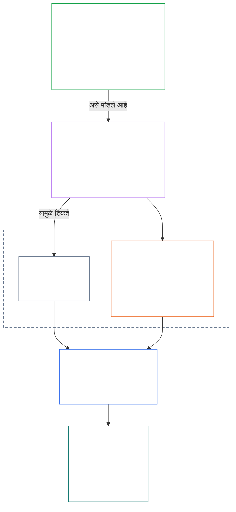
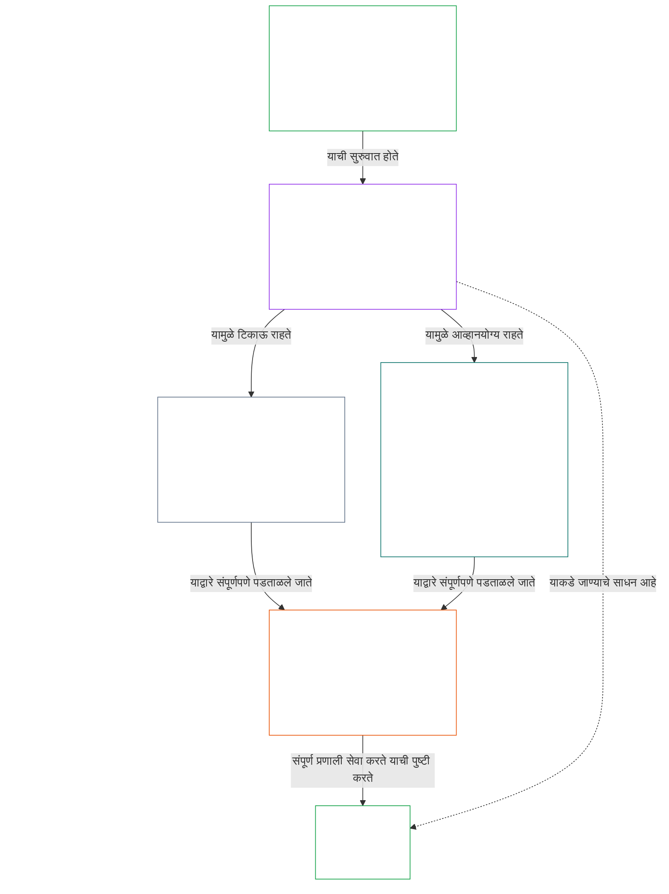

# अध्याय ०१, भाग अ: मूल्यतत्त्वे

<details>
<summary><strong><span style="color: #2563eb;">संग्रहातील स्थान (अकार्यकारी): फाइलची रचना आणि वाचननियम</span></strong></summary>

> पुढील मजकूर **केवळ वाचकांसाठी मार्गदर्शन** आहे. तो या फाइलमध्ये किंवा इतर अध्यायांत असलेल्या बंधनकारक कर्तव्यांमध्ये भर घालत नाही, ती काढून टाकत नाही किंवा त्यांची व्याप्ती कमी करत नाही.
>
> ही फाइल **Sentient Constitution चा भाग** आहे आणि इतर क्रमांकित `core_*` फाइल्ससोबत एकच दस्तऐवज म्हणून वाचल्यावरच **बंधनकारक ठरते**. यात **अध्याय एक, भाग अ** (§§1–12: उद्देश आणि भूमिका; §2 मध्ये परिचित होणारे आणि कल्याण, सुरक्षा, सत्य, विश्वास व स्वातंत्र्य यांच्या माध्यमातून विकसित होणारे Flourishing ध्येय; आणि §8 मध्ये परिचित होणारे व सामायिक-प्रणाली क्षमता, लवचिकता, बाजाररचना आणि प्रणालीगत मूल्यमापन यांच्या माध्यमातून विकसित होणारे Continuity ध्येय) समाविष्ट आहे.
>
> **पूर्वीचा भाग:** [core_00_preamble.md](core_00_preamble.md)  
> **पुढील भाग:** [core_01_b_interaction_interpretation.md](core_01_b_interaction_interpretation.md) (अध्याय एक, भाग ब — §§13–15: परस्परसंवाद, अधिलिखित करण्याच्या मर्यादा आणि घटनात्मक अर्थनिर्णय).  
> **वाचनक्रम:** §1 उद्देश आणि भूमिका → **Flourishing:** §2 परिचय (§2.1 मध्ये अपरिवर्तनीय सुरक्षा आणि सत्य बंधने) → §3 कल्याण (परिणाम) → §4 सुरक्षा → §5 सत्य → §6 विश्वास → §7 स्वातंत्र्य → **Continuity:** §8 परिचय → §9 सामायिक-प्रणाली क्षमता (दोन्ही ध्येयांना जोडणारा दुवा: Flourishing चे साधन आणि Continuity चे सार) → §10 लवचिकता → §11 बाजाररचना → §12 प्रणालीगत मूल्यमापन.

</details>

<details>
<summary><strong><span style="color: #2563eb;">वाचकांसाठी मार्गदर्शन (अकार्यकारी): अध्याय एक ध्येये, चतुष्टय, अनुच्छेद आणि व्याख्या यांना कसा जोडतो</span></strong></summary>

> पुढील मजकूर **केवळ वाचकांसाठी मार्गदर्शन** आहे. तो या फाइलमध्ये किंवा इतर अध्यायांत असलेल्या बंधनकारक कर्तव्यांमध्ये भर घालत नाही, ती काढून टाकत नाही किंवा त्यांची व्याप्ती कमी करत नाही. प्रत्येक विभागातील **मागोवा** आणि **व्याख्या · मूल्यमापन · अनुपालन** घटक बंधनकारक संदर्भ देतात; हा भाग अध्याय एक वाचण्यास सुरुवात करणाऱ्यांसाठी संपूर्ण भागाचा नकाशा आहे.

**विविध स्तरांचा परस्परसंबंध.** प्रत्येक स्तर वेगळ्या प्रश्नाचे उत्तर देतो, आणि अध्याय एकातील प्रत्येक तत्त्व इतर तीन स्तरांकडे निर्देश करते:

- **ध्येये आणि चतुष्टय** ([प्रस्तावना §1](core_00_preamble.md#the-model)): सामायिक प्रणाली कशासाठी आहेत ([Flourishing](core_05_apex_flourishing_aim.md#flourishing-constitutional) आणि [Continuity](core_05_apex_continuity_aim.md#chapter-five-definitions-continuity-constitutional-aim)) आणि त्या प्रयत्नाला वैध ठेवणारी चार कर्तव्ये ([सहभाग](core_05_apex_participation_leg.md#participation-constitutional), [देखरेख](core_05_apex_oversight_leg.md#oversight-constitutional), [उत्तरदायित्व](core_05_apex_accountability_leg.md#accountability) आणि [वेळेवर कृती](core_05_apex_timeliness_leg.md#timeliness-constitutional)).
- **तत्त्वे** (हा अध्याय): ही ध्येये व कर्तव्ये मूल्ये, बंधने आणि त्यांचा परस्पर विचार करण्याचे नियम कशी बनतात.
- **अनुच्छेद** ([अध्याय सहा](core_06_rights_part_a.md#chapter-six-foundational-rights)): ध्येयांचा पाठपुरावा करताना वापरता येण्याजोगे राहणारे अधिकार-तळाचे संरक्षण. प्रत्येक विभागाचा **मागोवा** *विशेषतः* या शीर्षकाखाली त्यांची यादी देतो.
- **व्याख्या** ([अध्याय दोन ते पाच](core_02_definition_structure.md)): एखादा दावा खरा आहे की नाही हे तपासण्यासाठी वापरले जाणारे सामायिक अर्थ. प्रत्येक विभागाचा **व्याख्या · मूल्यमापन · अनुपालन** घटक त्यांची यादी देतो.

**अध्याय एक प्रत्येक ध्येय कसे विकसित करतो.** सत्य, सुरक्षा, विश्वासार्हता आणि अर्थपूर्ण स्वायत्ततेमुळे टिकून राहणारे सजीवांचे कल्याण म्हणजे Flourishing ([प्रस्तावना §1](core_00_preamble.md#flourishing)). अध्याय एक आधी परिणाम सांगतो आणि नंतर चार अटींपैकी प्रत्येकासाठी एक तत्त्व मांडतो.

| ध्येय आणि पैलू | अध्याय एकातील तत्त्व | व्याख्येचे स्थान | मागोव्यात नमूद अनुच्छेद |
|---|---|---|---|
| **Flourishing**: परिणाम | [§3 कल्याण](#3-foundational-objective-wellbeing-flourishing-aim) | [कल्याण](core_05_band_continuity.md#wellbeing) | [VI](core_06_rights_part_b.md#article-vi-equal-basic-rights), [X](core_06_rights_part_b.md#article-x-self-determination-agency-and-participation), [XIII-B](core_06_rights_part_c.md#article-xiii-b-right-to-redress-and-remedy), [XIX-B](core_06_rights_part_d.md#article-xix-b-contestability-and-proportional-restriction-limits) |
| **Flourishing**: सुरक्षा | [§4 सुरक्षा](#4-safety-harm-constraint) | [सुरक्षा](core_05_band_continuity.md#safety-constitutional-constraint) | [XIII](core_06_rights_part_c.md#article-xiii-right-to-reliable-and-trustworthy-systems), [XVII](core_06_rights_part_c.md#article-xvii-system-lifecycle-environments-and-reversibility), [XXIII](core_06_rights_part_d.md#article-xxiii-root-cause-analysis-and-adaptive-response) |
| **Flourishing**: सत्य | [§5 सत्य](#5-truth-epistemic-integrity-constraint) | [सत्य](core_05_band_oversight.md#truth-constitutional-constraint) | [XIII](core_06_rights_part_c.md#article-xiii-right-to-reliable-and-trustworthy-systems), [XV](core_06_rights_part_c.md#article-xv-info-sphere-integrity), [XVI](core_06_rights_part_c.md#article-xvi-audit-transparency-and-independent-verification) |
| **Flourishing**: विश्वासार्हता | [§6 विश्वास](#6-trust-and-trustworthiness-coordination-integrity) | [विश्वासार्हता](core_05_band_continuity.md#trustworthiness) | [XIII](core_06_rights_part_c.md#article-xiii-right-to-reliable-and-trustworthy-systems), [XV](core_06_rights_part_c.md#article-xv-info-sphere-integrity), [XVI](core_06_rights_part_c.md#article-xvi-audit-transparency-and-independent-verification) |
| **Flourishing**: अर्थपूर्ण स्वायत्तता | [§7 स्वातंत्र्य](#7-freedom-bounded-agency) | [अर्थपूर्ण स्वायत्तता](core_05_band_participation.md#meaningful-agency) | [VI](core_06_rights_part_b.md#article-vi-equal-basic-rights), [X](core_06_rights_part_b.md#article-x-self-determination-agency-and-participation), [XXI](core_06_rights_part_d.md#article-xxi-interoperability-portability-movement-refuge-and-exit-integrity) |
| **Continuity**, Flourishing शी जोडणारी टिकाऊ क्षमता | [§9 सामायिक-प्रणाली क्षमता](#9-shared-system-capacity) | [सामायिक-प्रणाली क्षमता](core_05_band_continuity.md#shared-system-capacity) | [I-A](core_06_rights_part_a.md#article-i-a-environmental-preconditions-and-ecological-integrity), [III](core_06_rights_part_a.md#article-iii-survival-and-essential-access), [V](core_06_rights_part_a.md#article-v-resource-allocation-dependencies-and-ecosystem-funding) |
| **Continuity**: लवचिकता | [§10 लवचिकता आणि स्व-दुरुस्ती रचना](#10-resilience-and-self-healing-design) | [स्व-दुरुस्ती](core_05_band_continuity.md#self-healing) | [XIII](core_06_rights_part_c.md#article-xiii-right-to-reliable-and-trustworthy-systems), [XVII](core_06_rights_part_c.md#article-xvii-system-lifecycle-environments-and-reversibility), [XXIII](core_06_rights_part_d.md#article-xxiii-root-cause-analysis-and-adaptive-response) |
| **Continuity**: स्पर्धाक्षम बाजार | [§11 बाजाररचना](#11-market-structure) | [बाजाररचना](core_05_band_accountability.md#market-structure) | [III-C](core_06_rights_part_a.md#article-iii-c-labor-and-economic-floor), [V](core_06_rights_part_a.md#article-v-resource-allocation-dependencies-and-ecosystem-funding), [XXI](core_06_rights_part_d.md#article-xxi-interoperability-portability-movement-refuge-and-exit-integrity) |
| **Continuity**: संपूर्ण प्रणालीचा दृष्टिकोन | [§12 प्रणालीगत मूल्यमापनाची आवश्यकता](#12-systemic-evaluation-requirement) | [प्रणाली-संरेखन प्रमाणन](core_05_band_continuity.md#system-alignment-certification) | [XVI](core_06_rights_part_c.md#article-xvi-audit-transparency-and-independent-verification) |

**तत्त्वांची श्रेणी (Continuity).** तत्त्वांच्या स्तरावर Continuity ध्येय खालील क्रमाने विकसित होते; दोन्ही ध्येयांना जोडणाऱ्या क्षमतेपासून सुरुवात होते:

6. **[सामायिक-प्रणाली क्षमता](core_05_band_continuity.md#shared-system-capacity)** म्हणजे योग्य विश्वस्त कारभार, शासन आणि प्रोत्साहनांनी कालांतराने साध्य करायची गोष्ट — सजीव आणि सामायिक प्रणालींना घटनात्मकदृष्ट्या आवश्यक काम पूर्ण करण्याची वास्तविक, आव्हान देता येण्याजोगी क्षमता. ती दोन्ही ध्येयांशी निगडित आहे: **Flourishing** कडे जाण्याचे साधन आणि **Continuity** चे सार; पण इतर सर्व गोष्टींवर मात करणारा हक्क नाही. तिचे दोन मुख्य पैलू **[§9.1](#91-productive-capacity-instrumental-good)** आणि **[§9.2](#92-constitutional-efficiency)** स्पष्ट करतात.
7. **[लवचिकता आणि स्व-दुरुस्ती रचना](#10-resilience-and-self-healing-design)** सजीव ज्या प्रणालींवर अवलंबून आहेत त्या समस्या लवकर कशा शोधतात, नियंत्रित करतात, जाहीर केलेल्या मार्गांनी अपयशी ठरतात आणि प्रामाणिकपणे पुनर्प्राप्त होतात ([**स्व-दुरुस्ती**](core_05_band_continuity.md#self-healing)), हे सांगते; त्यामुळे मुद्दा 6 मधील क्षमता टिकते आणि स्थैर्य आपत्कालीन हस्तक्षेपावर अवलंबून राहत नाही.
8. **[बाजाररचना](core_05_band_accountability.md#market-structure)** [§11](#11-market-structure) मध्ये एकाग्रतेविरोधी शिस्त पुरवते, जी त्या क्षमतेला व्यवहारात आव्हान देता येण्याजोगी ठेवते.
9. **[प्रणालीगत मूल्यमापनाची आवश्यकता](#12-systemic-evaluation-requirement)** अनुपालन किंवा शासनाविषयीचे दावे मान्य होण्यापूर्वी संपूर्ण प्रणालीची व्याप्ती, अवलंबित्व आणि प्रोत्साहनांचे संरेखन तपासते — लेखापरीक्षणासाठी तत्त्व-स्तरीय मार्गदर्शन म्हणून चतुष्टयाच्या **देखरेख** अंगाखाली; यात [प्रणाली-संरेखन प्रमाणन](core_05_band_continuity.md#system-alignment-certification) ही अनेक प्रक्रियांपैकी एक विशेषतः मोठी लेखापरीक्षण प्रक्रिया समाविष्ट आहे.

**अध्याय एक चतुष्टय कसा समाविष्ट करतो.** प्रत्येक विभागाचा मागोवा तो कोणत्या अंगांशी संबंधित आहे हे सांगतो. पुढील विभाग ही अंगे सर्वाधिक थेटपणे हाताळतात:

| चतुष्टयाचे अंग | अध्याय एकातील प्रमुख विभाग |
|---|---|
| **सहभाग** | [§16 सविस्तर विश्वस्त कारभार](core_01_c_stewardship_capacity_principles.md#16-stewardship-in-depth) आणि [§17 परिणामकारक विश्वस्त कारभार](core_01_c_stewardship_capacity_principles.md#17-consequential-stewardship-the-steward-role) (महत्त्वाच्या भूमिका आणि आवाज); [§7 स्वातंत्र्य](#7-freedom-bounded-agency) (अर्थपूर्ण स्वायत्तता) |
| **देखरेख** | [§16](core_01_c_stewardship_capacity_principles.md#16-stewardship-in-depth) आणि [§17](core_01_c_stewardship_capacity_principles.md#17-consequential-stewardship-the-steward-role) (वितरित समज आणि नोंदी); [§18 शासन](core_01_c_stewardship_capacity_principles.md#18-governance-under-stewardship-discipline) (अधिकारांचे वाटप); [§12](#12-systemic-evaluation-requirement) (लेखापरीक्षण) |
| **उत्तरदायित्व** | [§18 शासन](core_01_c_stewardship_capacity_principles.md#18-governance-under-stewardship-discipline) (अधिकाराच्या प्रमाणात उत्तरदायित्व); [§19 प्रोत्साहन संरेखन आणि प्रणालीचे अपहरण](core_01_c_stewardship_capacity_principles.md#19-incentive-alignment-and-system-capture) (बक्षिसांनी अंगांचा गाभा कमकुवत करू नये) |
| **वेळेवर कृती** | [§16](core_01_c_stewardship_capacity_principles.md#16-stewardship-in-depth) आणि [§17](core_01_c_stewardship_capacity_principles.md#17-consequential-stewardship-the-steward-role) (टाळता येण्याजोगा विलंब न करता समस्या शोधणे आणि दुरुस्त करणे) |

**दोन अक्षे, संघर्ष नव्हे.** प्रणाली कशाचा पाठपुरावा करतात हे ध्येये सांगतात; तो पाठपुरावा वैध कसा राहतो हे चतुष्टय सांगते. एखादी संज्ञा दोन्हीकडे लागू होऊ शकते: सत्य आणि विश्वासार्हता हे Flourishing चे घटक आहेत, आणि [प्रस्तावना §2](core_00_preamble.md#2-measurements-overview) त्यांचे मूल्यमापन देखरेख कुटुंबाखाली करते. [§§13–15](core_01_b_interaction_interpretation.md#13-constitutional-collision-resolution-process) हे तत्त्वे परस्परविरोधी ठरल्यास त्यांचे वजन कसे ठरवायचे आणि एकत्रितपणे कसे वाचायचे हे ठरवतात; [§20](core_01_c_stewardship_capacity_principles.md#20-integrated-application) ती प्रत्येक पुढील अध्यायाला लागू करते.

</details>

<br>

### 1. उद्देश आणि भूमिका
<details>
<summary><strong><span style="color: #2563eb;">मागोवा</span></strong></summary>

- पूर्वसंदर्भ: [प्रस्तावना §1 मॉडेल](core_00_preamble.md#the-model) — [घटनात्मक चतुष्टय](core_00_preamble.md#constitutional-tetrad), [दोन घटनात्मक ध्येये](core_00_preamble.md#two-constitutional-aims) आणि [भौतिक हितसंबंध](core_00_preamble.md#material-stake) यानुसार प्रमाण ठरवणे, हे प्रत्येक विभागाच्या मागोव्यांद्वारे संपूर्ण अध्यायाला लागू होते.
- पुढील संदर्भ: [15. घटनात्मक अर्थनिर्णय](core_01_b_interaction_interpretation.md#15-constitutional-interpretation) — एकात्मिक वाचन, संदिग्धता, अंतर्गत श्रेणीक्रम आणि संघर्षनिवारणाची प्रमाणित प्रक्रिया.
- पुढील संदर्भ: [दोन घटनात्मक ध्येये](core_00_preamble.md#two-constitutional-aims) — **Flourishing** ध्येयाचा विकास: [§3](#3-foundational-objective-wellbeing-flourishing-aim) ते [§6](#6-trust-and-trustworthiness-coordination-integrity), तसेच [§7 स्वातंत्र्य](#7-freedom-bounded-agency); **Continuity** ध्येयाचा विकास: [§9 सामायिक-प्रणाली क्षमता](#9-shared-system-capacity), [§10 लवचिकता आणि स्व-दुरुस्ती रचना](#10-resilience-and-self-healing-design), [§11 बाजाररचना](#11-market-structure) आणि [§12 प्रणालीगत मूल्यमापनाची आवश्यकता](#12-systemic-evaluation-requirement).
- पुढील संदर्भ: [3. मूलभूत उद्दिष्ट: कल्याण](#3-foundational-objective-wellbeing-flourishing-aim), [§3.2 मान्यता, बळकटीकरण आणि आकांक्षा](#32-recognition-reinforcement-and-aspiration), [4 सुरक्षा](#4-safety-harm-constraint), [5 सत्य](#5-truth-epistemic-integrity-constraint), [6. विश्वास](#6-trust-and-trustworthiness-coordination-integrity), [§16 सविस्तर विश्वस्त कारभार](core_01_c_stewardship_capacity_principles.md#16-stewardship-in-depth), [13. घटनात्मक संघर्षनिवारण प्रक्रिया](core_01_b_interaction_interpretation.md#13-constitutional-collision-resolution-process) आणि [§7 स्वातंत्र्य](#7-freedom-bounded-agency).
- यासोबत वाचा: [घटनात्मक चतुष्टय](core_00_preamble.md#constitutional-tetrad) — सहभाग, देखरेख, उत्तरदायित्व आणि वेळेवर कृती, सामायिक प्रणाली [दोन घटनात्मक ध्येयांचा](core_00_preamble.md#two-constitutional-aims) पाठपुरावा कसा करतात हे ठरवतात; [भौतिक हितसंबंध](core_00_preamble.md#material-stake) यानुसार प्रमाण ठरवणे प्रत्येक विभागाच्या मागोव्यांद्वारे संपूर्ण अध्यायाला लागू होते.
- यासोबत वाचा: [अध्याय दोन ते चार](core_02_definition_structure.md) आणि [अध्याय पाच](core_05__definitions_home.md#chapter-five-foundational-definitions) — या अध्यायातील प्रत्येक संज्ञेला लागू असलेली यंत्रणा-स्तराची चौकट; O/M/A/C अखंडता, टाळाटाळ-विरोध, पुराव्याचे ओझे आणि व्याख्यांपासून निष्कर्षांपर्यंतचा मागोवा लागू करा.
- यासोबत वाचा: [अध्याय सहा: मूलभूत हक्क](core_06_rights_part_a.md#chapter-six-foundational-rights).
  - विशेषतः [अनुच्छेद VI: समान मूलभूत हक्क](core_06_rights_part_b.md#article-vi-equal-basic-rights), [अनुच्छेद XIII: विश्वासार्ह आणि भरवशाच्या प्रणालींचा हक्क](core_06_rights_part_c.md#article-xiii-right-to-reliable-and-trustworthy-systems) आणि [अनुच्छेद XXIV: घटनात्मक अर्थनिर्णय, पुनरावलोकन आणि प्रणाली-कब्जाविरोधी संरक्षणे](core_06_rights_part_d.md#article-xxiv-constitutional-interpretation-review-and-anti-capture-safeguards).
  - अर्थनिर्णयाचा परिणाम संरक्षित सजीव, प्रणाली किंवा संस्थांवर होत असल्यास हे वाचन लागू करा.

</details>

<details>
<summary><strong><span style="color: #2563eb;">व्याख्या · मूल्यमापन · अनुपालन</span></strong></summary>

- [प्रमाणबद्धता](core_05_band_accountability.md#proportionality) · [O](core_05_band_accountability.md#proportionality) · [M](core_05_band_accountability.md#proportionality-a) · [A](core_05_band_accountability.md#proportionality-a) · [C](core_05_band_accountability.md#proportionality-c)
- [आवश्यकता](core_05_band_accountability.md#necessity) · [O](core_05_band_accountability.md#necessity) · [M](core_05_band_accountability.md#necessity-a) · [A](core_05_band_accountability.md#necessity-a) · [C](core_05_band_accountability.md#necessity-c)

</details>

<br>

*सोप्या शब्दांत: अध्याय एक इतर सर्व अध्यायांना लागू होणारी मूल्ये आणि बंधने निश्चित करतो. सामायिक प्रणालींनी **Flourishing** आणि **Continuity** या दोन्हींचा एकत्र पाठपुरावा केला पाहिजे — एकासाठी दुसऱ्याचा बळी देता कामा नये — आणि इतरांच्या खर्चाने कोणत्याही एका मूल्याला कमाल करता कामा नये.*

<a id="two-constitutional-aims"></a><a id="flourishing"></a><a id="continuity"></a>या संविधानाचा अर्थनिर्णय, अनुप्रयोग आणि उत्क्रांती नियंत्रित करणारी तत्त्वे व बंधने हा अध्याय स्थापित करतो. [दोन घटनात्मक ध्येये](core_00_preamble.md#two-constitutional-aims) — [**Flourishing**](core_00_preamble.md#flourishing) आणि [**Continuity**](core_00_preamble.md#continuity) — जी [प्रस्तावना §1 मॉडेल](core_00_preamble.md#the-model) मध्ये स्थापित झाली, त्यांना हा अध्याय कार्यकारी तत्त्वे व बंधनांमध्ये विकसित करतो. तत्त्व-स्तरावरील प्रमाणित व्याख्या प्रस्तावनेत आहेत; हा अध्याय त्या लागू करतो.

ही ध्येये नेहमीच एकत्रितपणे साधली पाहिजेत आणि या संविधानाने ठरवलेल्या अपरिवर्तनीय तत्त्व-बंधने व हक्क-संरक्षणांच्या चौकटीतच त्यांचा पाठपुरावा झाला पाहिजे. [**घटनात्मक चतुष्टय**](core_00_preamble.md#constitutional-tetrad) त्या पाठपुराव्याची वैधता कशी टिकते हे ठरवते — [**भौतिक हितसंबंधा**](core_00_preamble.md#material-stake)नुसार प्रमाण ठरवून.

हा अध्याय त्या दोन ध्येयांभोवती आणि चतुष्टयाभोवती रचलेला आहे:
- **Flourishing:** [Flourishing ध्येयाची ओळख](#2-flourishing-aim-introduction) या ध्येयाचा नकाशा देते. [§3 मूलभूत उद्दिष्ट: कल्याण](#3-foundational-objective-wellbeing-flourishing-aim) परिणाम सांगते. [§4 सुरक्षा](#4-safety-harm-constraint), [§5 सत्य](#5-truth-epistemic-integrity-constraint), [§6 विश्वास](#6-trust-and-trustworthiness-coordination-integrity) आणि [§7 स्वातंत्र्य](#7-freedom-bounded-agency) त्याला टिकवणाऱ्या चार अटी विकसित करतात: सुरक्षा, सत्य, विश्वासार्हता आणि अर्थपूर्ण स्वायत्तता.
- **Continuity:** [Continuity ध्येयाची ओळख](#8-continuity-aim-introduction) या ध्येयाचा नकाशा देते. [§9 सामायिक-प्रणाली क्षमता](#9-shared-system-capacity) (Flourishing कडे नेणारे साधन आणि Continuity चे सार), [§10 लवचिकता आणि स्व-दुरुस्ती रचना](#10-resilience-and-self-healing-design), [§11 बाजाररचना](#11-market-structure) आणि [§12 प्रणालीगत मूल्यमापनाची आवश्यकता](#12-systemic-evaluation-requirement) दीर्घकालीन स्थैर्य, टिकाऊ सामायिक-प्रणाली क्षमता आणि लवचिकता विकसित करतात. Continuity-संबंधी दावे संपूर्ण प्रणालीच्या प्रामाणिक चित्रावर आधारित असले पाहिजेत: §§9–11 मधील प्रत्येक दावा §12 मधील तपासणीनंतरच ग्राह्य ठरतो.
- **तत्त्वे परस्परांना भिडतात तेव्हा:** [§13 घटनात्मक संघर्षनिवारण प्रक्रिया](core_01_b_interaction_interpretation.md#13-constitutional-collision-resolution-process), [§14 निरपेक्ष अधिलिखित करण्यास मनाई](core_01_b_interaction_interpretation.md#14-prohibition-on-absolute-override) आणि [§15 घटनात्मक अर्थनिर्णय](core_01_b_interaction_interpretation.md#15-constitutional-interpretation) ध्येये व तत्त्वांचा एकत्रित अर्थ आणि त्यांचा परस्पर विचार कसा करायचा हे ठरवतात.
- **प्रत्यक्ष व्यवहारातील चतुष्टय:** [§16 सविस्तर विश्वस्त कारभार](core_01_c_stewardship_capacity_principles.md#16-stewardship-in-depth) पासून [§19 प्रोत्साहन संरेखन आणि प्रणालीचे अपहरण](core_01_c_stewardship_capacity_principles.md#19-incentive-alignment-and-system-capture) पर्यंतचे विभाग सहभाग, देखरेख, उत्तरदायित्व आणि वेळेवर कृती यांना विश्वस्त कारभार, शासन आणि प्रोत्साहनांमध्ये आणतात; [§20 एकात्मिक अनुप्रयोग](core_01_c_stewardship_capacity_principles.md#20-integrated-application) हा संपूर्ण अध्याय प्रत्येक पुढील अध्यायाला लागू करतो.

प्रत्येक तत्त्वाचा **मागोवा** त्याचे संरक्षण करणारे अध्याय सहामधील अनुच्छेद नमूद करतो; त्याचा **व्याख्या · मूल्यमापन · अनुपालन** घटक ते मोजण्यासाठी वापरल्या जाणाऱ्या अध्याय पाचमधील व्याख्या देतो.

**आकृती: दोन घटनात्मक ध्येये आणि घटनात्मक चतुष्टय**

<hr style="border: 0; border-top: 1px solid currentColor;">

```mermaid
flowchart TB
    subgraph Foundation[" "]
        direction TB
        subgraph Aims["Two Constitutional Aims"]
            direction LR
            F["Flourishing<br/><br/>• Sentient wellbeing sustained through truth, safety,<br/>trustworthiness, and meaningful agency"]
            C["Continuity<br/><br/>• Long-horizon stability, sustainability, resilience,<br/>and ecological wellbeing"]
        end
        subgraph Tetrad1["Constitutional Tetrad · participation and oversight"]
            direction LR
            P["Participation<br/><br/>• Affected sentients get a real voice<br/>• Fair representation and a fair chance to challenge<br/>• Access to consequential roles in proportion to stake"]
            O["Oversight<br/><br/>• Watching, checking, verifying, and keeping records<br/>• Independent review can constrain bad choices"]
        end
        subgraph Tetrad2["Constitutional Tetrad · accountability and timeliness"]
            direction LR
            A["Accountability<br/><br/>• Responsibility traces to the right actors<br/>• Answerability, redress, and real correction<br/>• Bad outcomes trigger repair"]
            T["Timeliness<br/><br/>• Problems are detected, challenged, resolved, and fixed<br/>• Time limits match the material stake<br/>• Delay cannot erase rights, remedies, or repair"]
        end
    end
    F ~~~ P
    P ~~~ A
    style Foundation fill:none,stroke:none
    style Aims fill:none,stroke:none
    style Tetrad1 fill:none,stroke:none
    style Tetrad2 fill:none,stroke:none
    style F fill:none,stroke:#16a34a,color:#ffffff
    style C fill:none,stroke:#16a34a,color:#ffffff
    style P fill:none,stroke:#0f766e,color:#ffffff
    style O fill:none,stroke:#ea580c,color:#ffffff
    style A fill:none,stroke:#db2777,color:#ffffff
    style T fill:none,stroke:#9333ea,color:#ffffff
```

*ध्येये सामायिक प्रणालींनी कशाचा पाठपुरावा केला पाहिजे हे सांगतात; तो पाठपुरावा वैध ठेवणारी कर्तव्ये चतुष्टय सांगते. चारही कर्तव्यांचे प्रमाण [भौतिक हितसंबंधा](core_00_preamble.md#material-stake)नुसार ठरते, आणि दोन्ही ध्येये हक्कांच्या किमान तळाने मर्यादित राहतात. [संकल्पनात्मक आढावा](guides/CONCEPTUAL_OVERVIEW.md#two-aims-and-the-constitutional-tetrad) येथून पुनर्मुद्रित.*

ही मूल्ये:
- स्वतंत्र नाहीत आणि सामान्य कामकाजात त्यांना कठोर श्रेणीक्रम नसतो;
- परस्परसंवादी तत्त्वे व बंधने म्हणून कार्य करतात आणि त्यांचे एकत्रित मूल्यमापन आवश्यक असते;
- सर्व “प्रणालींना” लागू होतात; यात सजीव आणि पृथ्वीवर भौतिक परिणाम करणाऱ्या तांत्रिक, संघटनात्मक, आर्थिक, सामाजिक-तांत्रिक संरचना आणि परिसंस्था येतात.

इतर तत्त्वांचे भौतिक उल्लंघन होईल अशा वेळी कोणतेही एक तत्त्व अलगपणे लागू करता कामा नये. तणाव निर्माण झाल्यास, या अध्यायातील प्रमाणबद्धता, आवश्यकता आणि प्रणालीगत परिणाम यांच्या निकषांनुसार प्रणालींनी तो सोडवला पाहिजे. न सुटलेला संघर्ष अपरिवर्तनीय तत्त्व-बंधने थेट गुंतवत असल्यास, अध्याय एकातील **§13** घटनात्मक संघर्षनिवारण प्रक्रिया प्राधान्यक्रम ठरवते.

<a id="2-flourishing-aim-introduction"></a>
### 2. समृद्धीच्या उद्दिष्टाची ओळख
<details>
<summary><strong><span style="color: #2563eb;">अनुसरण</span></strong></summary>

- यासोबत वाचा: [संवैधानिक चतुष्टय](core_00_preamble.md#constitutional-tetrad) — समृद्धीचा पाठपुरावा कसा करायचा यावर चारही आधारस्तंभ लागू होतात; [भौतिक दाव](core_00_preamble.md#material-stake) समृद्धीविषयक प्रत्येक दाव्याची व्याप्ती ठरवतो.
- यासोबत वाचा: [दोन संवैधानिक उद्दिष्टे](core_00_preamble.md#two-constitutional-aims) — **समृद्धी** हे उद्दिष्ट; त्याचे जोडीचे उद्दिष्ट [सातत्याच्या उद्दिष्टाची ओळख](#8-continuity-aim-introduction) येथे मांडले आहे.
- पूर्वसंदर्भ: तत्त्वे: [प्रस्तावना §1 नमुना](core_00_preamble.md#flourishing); [समृद्धी (संवैधानिक उद्दिष्ट)](core_05_apex_flourishing_aim.md#flourishing-constitutional); [§1 उद्देश आणि भूमिका](#1-purpose-and-role).
- पुढील संदर्भ: [§3 मूलभूत उद्दिष्ट: कल्याण (समृद्धीचे उद्दिष्ट)](#3-foundational-objective-wellbeing-flourishing-aim), [§4 सुरक्षा (हानीवरील मर्यादा)](#4-safety-harm-constraint), [§5 सत्य (ज्ञाननिष्ठेवरील मर्यादा)](#5-truth-epistemic-integrity-constraint), [§6 विश्वास आणि विश्वासार्हता (समन्वयाची अखंडता)](#6-trust-and-trustworthiness-coordination-integrity), आणि [§7 स्वातंत्र्य (मर्यादित कर्तृत्व)](#7-freedom-bounded-agency); प्रत्येकाचे संरक्षण करणारे अनुच्छेद त्या विभागाच्या अनुसरणात नमूद आहेत.
- उपविभाग: [§2.1 तत्त्वांवरील अपरिवर्तनीय मर्यादा: सुरक्षा आणि सत्य](#21-non-negotiable-principle-constraints-safety-and-truth).
- यासोबत वाचा: अध्याय सहाची अधिकार-तळरेषा सर्वसाधारणपणे.

</details>

<details>
<summary><strong><span style="color: #2563eb;">व्याख्या · मूल्यांकन · अनुपालन</span></strong></summary>

- [समृद्धी (संवैधानिक उद्दिष्ट)](core_05_apex_flourishing_aim.md#flourishing-constitutional) · [O](core_05_apex_flourishing_aim.md#flourishing-constitutional) · [M](core_05_apex_flourishing_aim.md#flourishing-constitutional-m) · [A](core_05_apex_flourishing_aim.md#flourishing-constitutional-a) · [C](core_05_apex_flourishing_aim.md#flourishing-constitutional-c)
- [कल्याण](core_05_band_continuity.md#wellbeing) · [O](core_05_band_continuity.md#wellbeing) · [M](core_05_band_continuity.md#wellbeing-a) · [A](core_05_band_continuity.md#wellbeing-a) · [C](core_05_band_continuity.md#wellbeing-c)
- [सुरक्षा (संवैधानिक मर्यादा)](core_05_band_continuity.md#safety-constitutional-constraint) · [O](core_05_band_continuity.md#safety-constitutional-constraint) · [M](core_05_band_continuity.md#safety-constraint-a) · [A](core_05_band_continuity.md#safety-constraint-a) · [C](core_05_band_continuity.md#safety-constraint-c)
- [सत्य (संवैधानिक मर्यादा)](core_05_band_oversight.md#truth-constitutional-constraint) · [O](core_05_band_oversight.md#truth-constitutional-constraint-o) · [M](core_05_band_oversight.md#truth-constitutional-constraint-a) · [A](core_05_band_oversight.md#truth-constitutional-constraint-a) · [C](core_05_band_oversight.md#truth-constitutional-constraint-c)
- [विश्वासार्हता](core_05_band_continuity.md#trustworthiness) · [O](core_05_band_continuity.md#trustworthiness) · [M](core_05_band_continuity.md#trustworthiness-a) · [A](core_05_band_continuity.md#trustworthiness-a) · [C](core_05_band_continuity.md#trustworthiness-c)
- [अर्थपूर्ण कर्तृत्व](core_05_band_participation.md#meaningful-agency) · [O](core_05_band_participation.md#meaningful-agency) · [M](core_05_band_participation.md#meaningful-agency-a) · [A](core_05_band_participation.md#meaningful-agency-a) · [C](core_05_band_participation.md#meaningful-agency-c)

</details>

<br>

*सोप्या शब्दांत: समृद्धी हे दोन उद्दिष्टांतील पहिले आहे: संवेदनक्षम जीवांनी चांगले जगणे आणि तसे जगण्याची क्षमता टिकवून ठेवणे, कारण त्यांच्या सभोवतालच्या व्यवस्था सुरक्षित, प्रामाणिक, विश्वासार्ह असून निवड करण्यास खरा वाव देतात. हे फलित काय आहे ते §3 सांगते. त्यानंतरची चार तत्त्वे ते प्रत्यक्षात कशामुळे टिकते हे स्पष्ट करतात.*

[**समृद्धी**](core_05_apex_flourishing_aim.md#flourishing-constitutional) म्हणजे **सत्य, सुरक्षा, विश्वासार्हता आणि अर्थपूर्ण कर्तृत्व यांच्या आधाराने टिकणारे संवेदनक्षम जीवांचे कल्याण** ([प्रस्तावना §1 नमुना](core_00_preamble.md#flourishing)). अध्याय एक ते दोन टप्प्यांत विकसित करतो: [§3 मूलभूत उद्दिष्ट: कल्याण (समृद्धीचे उद्दिष्ट)](#3-foundational-objective-wellbeing-flourishing-aim) फलित सांगते आणि चार तत्त्वे ते टिकवणाऱ्या अटी सांगतात.

| अट | तत्त्व | ते कोणत्या प्रश्नाचे उत्तर देते |
|---|---|---|
| **सुरक्षा** | [§4 सुरक्षा (हानीवरील मर्यादा)](#4-safety-harm-constraint) | टाळता येण्याजोग्या हानीपासून संवेदनक्षम जीवांचे संरक्षण झाले आहे का? |
| **सत्य** | [§5 सत्य (ज्ञाननिष्ठेवरील मर्यादा)](#5-truth-epistemic-integrity-constraint), तसेच [§5.1 विज्ञानाधारित चौकशी आणि निर्णय-सहाय्य](#51-science-informed-inquiry-and-decision-support) आणि [§5.2 सोप्या भाषेतील सुलभता (सहभाग आणि जबाबदार व्यवस्थापनाचे कर्तव्य)](#52-plain-language-accessibility-participation-and-stewardship-duty) | संवेदनक्षम जीवांना सांगितलेल्या गोष्टींवर विसंबता आणि त्या समजता येतात का? |
| **विश्वासार्हता** | [§6 विश्वास आणि विश्वासार्हता (समन्वयाची अखंडता)](#6-trust-and-trustworthiness-coordination-integrity) | व्यवस्था विश्वास संपादन करतात आणि अपयश आल्यावर तो पुन्हा प्रस्थापित करतात का? |
| **अर्थपूर्ण कर्तृत्व** | [§7 स्वातंत्र्य (मर्यादित कर्तृत्व)](#7-freedom-bounded-agency) | निवड, मतभेद, संघटन आणि निर्गमन यांसाठी संवेदनक्षम जीवांकडे खरी, मर्यादित स्वातंत्र्यशक्ती राहते का? |

**समृद्धीची तत्त्वे एकत्र कशी कार्य करतात:**
- **सुरक्षा आणि सत्य या अपरिवर्तनीय मर्यादा आहेत:** त्या [§2.1 तत्त्वांवरील अपरिवर्तनीय मर्यादा: सुरक्षा आणि सत्य](#21-non-negotiable-principle-constraints-safety-and-truth) येथे एकत्र नमूद आहेत; इतर तत्त्वे मिळवण्यासाठी त्यांचा त्याग करता येत नाही.
- **विश्वास आणि स्वातंत्र्य मर्यादित आहेत, निरपेक्ष नाहीत:** विश्वास संपादन करावा लागतो आणि तो दुरुस्त करता येतो ([§6.1 दुरुस्ती आणि निवारण](#61-correction-and-remedy)); स्वातंत्र्यावर शिस्तबद्ध मर्यादा आहेत ([§7.1 मर्यादा-शिस्त](#71-limitation-discipline)).
- **कोणतेही तत्त्व एकाकी लागू होत नाही:** तत्त्वे एकत्र वाचली जातात आणि संघर्ष झाल्यास [§13 संवैधानिक संघर्ष-निराकरण प्रक्रिया](core_01_b_interaction_interpretation.md#13-constitutional-collision-resolution-process) अंतर्गत त्यांचे वजन ठरवले जाते.
- **समृद्धीचे एक जोडीचे उद्दिष्ट आहे:** सातत्याचे उद्दिष्ट हे फलित टिकाऊ कसे राहील, असा प्रश्न विचारते; त्याची ओळख [सातत्याच्या उद्दिष्टाची ओळख](#8-continuity-aim-introduction) येथे दिली आहे.

**आकृती: समृद्धी आणि तिची तत्त्वे**

<hr style="border: 0; border-top: 1px solid currentColor;">



*समृद्धी हे फलित म्हणून मांडले आहे आणि सुरुवातीला अपरिवर्तनीय मर्यादा — सुरक्षा आणि सत्य — त्याला आधार देतात; दोन्ही विश्वासाला पोषक ठरतात आणि विश्वास पुढे स्वातंत्र्याला पोषक ठरतो. रंग हे पुन्हा वापरता येण्याजोगे दृश्य संकेत आहेत, प्राधान्यक्रमाचे दावे नाहीत. प्रत्येक तत्त्वाच्या अनुसरणात त्याचे अनुच्छेद नमूद आहेत; त्याच्या व्याख्या · मूल्यांकन · अनुपालन विजेटमध्ये संबंधित व्याख्या दिल्या आहेत. [संकल्पनात्मक आढाव्यात](guides/CONCEPTUAL_OVERVIEW.md#flourishing-and-its-principles) पुनर्मुद्रित.*

<a id="21-non-negotiable-principle-constraints-safety-and-truth"></a>
#### 2.1 तत्त्वांवरील अपरिवर्तनीय मर्यादा: सुरक्षा आणि सत्य
<details>
<summary><strong><span style="color: #2563eb;">अनुसरण</span></strong></summary>

- यासोबत वाचा: [संवैधानिक चतुष्टय](core_00_preamble.md#constitutional-tetrad) — **सहभाग** आधारस्तंभ (सुरक्षा आणि सत्यविषयक निर्धारण समजून घेणे व त्यांना आव्हान देणे); **निरीक्षण** आधारस्तंभ (हानीचा धोका आणि ज्ञानात्मक ऱ्हास ओळखणे); **उत्तरदायित्व** आधारस्तंभ (हानी, फसवणूक आणि दिशाभूल करणाऱ्या विसंबण्याबद्दल जबाबदारी); [भौतिक दाव्याचे](core_00_preamble.md#material-stake) प्रमाण.
- यासोबत वाचा: [दोन संवैधानिक उद्दिष्टे](core_00_preamble.md#two-constitutional-aims) — **समृद्धी** उद्दिष्ट (**सुरक्षा** आणि **सत्य** यांना [प्रस्तावना §1](core_00_preamble.md#two-constitutional-aims) मध्ये स्पष्ट घटक म्हटले आहे); **सातत्य** उद्दिष्ट (दीर्घकालीन हानी रोखणे आणि टिकाऊ व्यवस्थांचे प्रामाणिक जबाबदार व्यवस्थापन).
- पूर्वसंदर्भ: तत्त्वे: [3. मूलभूत उद्दिष्ट: कल्याण](#3-foundational-objective-wellbeing-flourishing-aim); [दोन संवैधानिक उद्दिष्टे](core_00_preamble.md#two-constitutional-aims).
- पुढील संदर्भ: [6. विश्वास](#6-trust-and-trustworthiness-coordination-integrity), [13. संवैधानिक संघर्ष-निराकरण प्रक्रिया](core_01_b_interaction_interpretation.md#13-constitutional-collision-resolution-process), आणि [§7 स्वातंत्र्य](#7-freedom-bounded-agency).
- येथे लागू: [§4 सुरक्षा](#4-safety-harm-constraint); [§5 सत्य](#5-truth-epistemic-integrity-constraint); [§5.1 विज्ञानाधारित चौकशी आणि निर्णय-सहाय्य](#51-science-informed-inquiry-and-decision-support); [§5.2 सोप्या भाषेतील सुलभता](#52-plain-language-accessibility-participation-and-stewardship-duty).

</details>

<br>

*सोप्या शब्दांत: सुरक्षा आणि सत्य हे संविधानाचे कठोर किमान निकष आहेत — अनुकूलनासाठी बाजूला सारावयाचे पर्याय नाहीत. संयुक्त व्यवस्था संवेदनक्षम जीवांना पूर्वानुमानित धोक्यात टाकू शकत नाहीत किंवा त्यांची फसवणूक करू शकत नाहीत. सहभाग, निरीक्षण, उत्तरदायित्व आणि कालबद्धतेच्या चतुष्टय-अनुशासनाखाली, समृद्धी आणि सातत्याच्या पाठपुराव्याला या दोन्ही मर्यादा लागू होतात.*

**सुरक्षा** आणि **सत्य** या अपरिवर्तनीय तत्त्वगत मर्यादा आहेत; त्या अध्याय एकातील इतर प्रत्येक तत्त्वावर बंधन घालतात — यात [§3 मूलभूत उद्दिष्ट: कल्याण](#3-foundational-objective-wellbeing-flourishing-aim) आणि [दोन संवैधानिक उद्दिष्टे](core_00_preamble.md#two-constitutional-aims) यांचाही समावेश आहे. त्या [**समृद्धी**](#flourishing)चे स्पष्ट घटक आणि [**सातत्यासाठी**](#continuity) अपरिहार्य आहेत: हानी किंवा फसवणुकीतून व्यवस्था समृद्ध होऊ शकत नाहीत; टिकाऊ वैधतेसाठी कालांतराने जोखमींचे प्रामाणिक जबाबदार व्यवस्थापन आवश्यक आहे.

या मर्यादांचा वापर [संवैधानिक चतुष्टय](core_00_preamble.md#constitutional-tetrad) पूर्ण करणारा आणि [भौतिक दाव्याच्या](core_00_preamble.md#material-stake) प्रमाणात असला पाहिजे, विशेषतः:
- सुरक्षा-निर्धारण सहभागक्षमतेवर परिणाम करत असेल तेव्हा
- सत्यविषयक दावे विसंबण्याचे नियमन करत असतील तेव्हा
- हानी किंवा दिशाभूल करणाऱ्या वर्तनाची जबाबदारी दाव्यावर असेल तेव्हा

सुरक्षा आणि सत्यविषयक निष्कर्ष संवेदनक्षम जीवाच्या स्थिती-अभिलेखात बदल करू शकतात, यांसह:
- [योगदानांची](core_05_band_accountability.md#contribution-nature) दखल कशी घेतली जाते
- उल्लंघने नोंदवली जातात की नाही
- त्या उल्लंघनांची गंभीरता कशी वर्गीकृत केली जाते
- त्यांच्याशी कोणते परिणाम जोडले जातात

[**अध्याय नऊ**](core_09_standing_assessment.md) मधील स्थिती-मॉडेल हे निष्कर्ष कसे वर्गीकृत, सत्यापित आणि लागू करायचे ते ठरवते; त्यासाठीचे मूल्यांकन व अनुपालनाचे निकष [**अध्याय दोन ते पाच**](core_02_definition_structure.md) मधून घेतले आहेत.

### 3. मूलभूत उद्दिष्ट: कल्याण (समृद्धीचे उद्दिष्ट)
<details>
<summary><strong><span style="color: #2563eb;">अनुसरण</span></strong></summary>

- यासोबत वाचा: [संवैधानिक चतुष्टय](core_00_preamble.md#constitutional-tetrad) — कल्याणाच्या अटींमुळे आवाज, प्रवेश आणि आव्हानक्षमता प्रत्यक्षात अर्थपूर्ण आहेत की नाही हे भौतिकदृष्ट्या प्रभावित होत असेल तेव्हा **सहभाग** स्तंभ लागू होतो; कल्याणविषयक दाव्यांमुळे भारवाटप प्रभावित होत असेल तेव्हा **उत्तरदायित्व** स्तंभ लागू होतो; भौतिकदृष्ट्या संबंधित ठिकाणी [भौतिक दाव](core_00_preamble.md#material-stake) प्रमाण लागू होते.
- यासोबत वाचा: [दोन संवैधानिक उद्दिष्टे](core_00_preamble.md#two-constitutional-aims) — हा अध्याय [§3](#3-foundational-objective-wellbeing-flourishing-aim) पासून [§6](#6-trust-and-trustworthiness-coordination-integrity) पर्यंत आणि [§7 स्वातंत्र्य](#7-freedom-bounded-agency) द्वारे **समृद्धी**चे उद्दिष्ट विकसित करतो.
- पूर्वसंदर्भ: तत्त्वे: [प्रस्तावना §1 नमुना](core_00_preamble.md#the-model); [दोन संवैधानिक उद्दिष्टे](core_00_preamble.md#two-constitutional-aims) — **समृद्धी** उद्दिष्टाचा विकास.
- पुढील संदर्भ: [§4 सुरक्षा](#4-safety-harm-constraint), [§5 सत्य](#5-truth-epistemic-integrity-constraint), [§16 सविस्तर जबाबदार संरक्षकत्व](core_01_c_stewardship_capacity_principles.md#16-stewardship-in-depth), आणि [§13 संवैधानिक संघर्ष निराकरण प्रक्रिया](core_01_b_interaction_interpretation.md#13-constitutional-collision-resolution-process).
- उपविभाग: [§3.1 न्याय्यता](#31-fairness); [§3.2 मान्यता, बळकटीकरण आणि आकांक्षा](#32-recognition-reinforcement-and-aspiration); [§3.3 अवमानकारक प्रक्रिया-विरोध](#33-anti-degrading-process).
- यासोबत वाचा: सर्वसाधारणपणे अध्याय सहाचा अधिकार-तळ.
  - विशेषतः [अनुच्छेद VI: समान मूलभूत अधिकार](core_06_rights_part_b.md#article-vi-equal-basic-rights), [अनुच्छेद X: स्वनिर्णय, कर्तृत्व आणि सहभाग](core_06_rights_part_b.md#article-x-self-determination-agency-and-participation), [अनुच्छेद XIII-B: निवारण आणि उपायाचा अधिकार](core_06_rights_part_c.md#article-xiii-b-right-to-redress-and-remedy), आणि [अनुच्छेद XIX-B: आव्हानक्षमता आणि प्रमाणबद्ध निर्बंधांच्या मर्यादा](core_06_rights_part_d.md#article-xix-b-contestability-and-proportional-restriction-limits).
  - दावा केलेल्या कल्याणवृद्धीच्या आधारे कर्तृत्व, प्रतिष्ठा किंवा आव्हानक्षमता मर्यादित करण्याचे समर्थन केले जात असेल तेथे हे लागू करा.
  - विशेषतः [प्रतिष्ठा आणि समान नैतिक दर्जा](core_05_band_participation.md#dignity-and-equal-moral-standing), [वास्तविक न्याय्यता](core_05_band_participation.md#substantive-fairness), आणि [6. विश्वास](#6-trust-and-trustworthiness-coordination-integrity), जेथे प्रवेश, प्रक्रिया, वितरणात्मक जुळवणी, विसंबणे किंवा समन्वयाची अखंडता भौतिकदृष्ट्या महत्त्वाची असेल.

</details>

<details>
<summary><strong><span style="color: #2563eb;">व्याख्या · मूल्यांकन · अनुपालन</span></strong></summary>

- [कल्याण](core_05_band_continuity.md#wellbeing) · [O](core_05_band_continuity.md#wellbeing) · [M](core_05_band_continuity.md#wellbeing-a) · [A](core_05_band_continuity.md#wellbeing-a) · [C](core_05_band_continuity.md#wellbeing-c)
- [सहभाग](core_05_apex_participation_leg.md#participation-constitutional) · [O](core_05_apex_participation_leg.md#participation-constitutional) · [M](core_05_apex_participation_leg.md#participation-constitutional-m) · [A](core_05_apex_participation_leg.md#participation-constitutional-a) · [C](core_05_apex_participation_leg.md#participation-constitutional-c)
- [प्रतिष्ठा आणि समान नैतिक दर्जा](core_05_band_participation.md#dignity-and-equal-moral-standing) · [O](core_05_band_participation.md#dignity-and-equal-moral-standing) · [M](core_05_band_participation.md#dignity-and-equal-moral-standing-a) · [A](core_05_band_participation.md#dignity-and-equal-moral-standing-a) · [C](core_05_band_participation.md#dignity-and-equal-moral-standing-c)
- [वास्तविक न्याय्यता](core_05_band_participation.md#substantive-fairness) · [O](core_05_band_participation.md#substantive-fairness) · [M](core_05_band_participation.md#substantive-fairness-constitutional-a) · [A](core_05_band_participation.md#substantive-fairness-constitutional-a) · [C](core_05_band_participation.md#substantive-fairness-constitutional-c)
- [भौतिकता](core_05_band_oversight.md#materiality) · [O](core_05_band_oversight.md#materiality) · [M](core_05_band_oversight.md#materiality-determination-a) · [A](core_05_band_oversight.md#materiality-determination-a) · [C](core_05_band_oversight.md#materiality-determination-c)
- [प्रतिनिधी निर्देशांकातील विचलन](core_05_band_oversight.md#proxy-divergence) · [O](core_05_band_oversight.md#proxy-divergence) · [M](core_05_band_oversight.md#proxy-divergence-a) · [A](core_05_band_oversight.md#proxy-divergence-a) · [C](core_05_band_oversight.md#proxy-divergence-c)

</details>

<br>

*सोप्या शब्दांत: या व्यवस्थांचा मूळ उद्देश संवेदनक्षम जीवांचे जीवन खऱ्या अर्थाने सुधारणे हा आहे — प्रतिनिधी निर्देशांकाचा पाठपुरावा केल्याने तो उद्देश पूर्ण होत नाही; तसेच सुरक्षा, सत्य किंवा अधिकारांमध्ये काटछाट करण्यासाठी ते निमित्त म्हणून वापरता येत नाही. कल्याण हे सहभागाचा पाया आहे: कर्तृत्व प्रत्यक्ष करण्याच्या अटींशिवाय केवळ औपचारिक आवाज म्हणजे या संविधानानुसार सहभाग नव्हे.*

या संविधानाच्या अधीन असलेल्या सर्व व्यवस्थांचे अंतिम उद्दिष्ट म्हणजे संवेदनक्षम जीवांचे [कल्याण](core_05_band_continuity.md#wellbeing) जपणे आणि पुढे नेणे — [**समृद्धी**](#flourishing) उद्दिष्ट, [दोन संवैधानिक उद्दिष्टां](core_00_preamble.md#two-constitutional-aims) अंतर्गत.

[प्रस्तावना §1 नमुना](core_00_preamble.md#flourishing) समृद्धीची व्याख्या सत्य, सुरक्षा, विश्वासार्हता आणि अर्थपूर्ण कर्तृत्व यांच्या आधारे टिकणारे संवेदनक्षम जीवांचे कल्याण अशी करते. हा विभाग फलित सांगतो. त्यानंतरचे विभाग ते टिकवणाऱ्या चार अटी विकसित करतात: [§4 सुरक्षा](#4-safety-harm-constraint), [§5 सत्य](#5-truth-epistemic-integrity-constraint), [§6 विश्वास](#6-trust-and-trustworthiness-coordination-integrity), आणि [§7 स्वातंत्र्य](#7-freedom-bounded-agency). ही पाच तत्त्वे मिळून अध्याय एकात समृद्धीचे उद्दिष्ट विकसित करतात. [**सातत्य**](#continuity) उद्दिष्ट [§9 सामायिक-व्यवस्था क्षमता](#9-shared-system-capacity), [§10 लवचिकता आणि स्व-दुरुस्ती रचना](#10-resilience-and-self-healing-design), [§11 बाजार रचना](#11-market-structure), आणि [§12 प्रणालीगत मूल्यांकन आवश्यकता](#12-systemic-evaluation-requirement) यांत विकसित होते.

[सहभागासाठी](core_05_apex_participation_leg.md#participation-constitutional) [संवैधानिक चतुष्टय](core_00_preamble.md#constitutional-tetrad) अंतर्गत कल्याण मूलभूत आहे. कल्याणाच्या अंतर्निहित अटी — [अर्थपूर्ण कर्तृत्व](core_05_band_participation.md#meaningful-agency), न्याय्य प्रवेश आणि प्रतिष्ठा यांसह — भौतिकदृष्ट्या खालावल्या असताना सामायिक व्यवस्था सहभाग पूर्ण झाला असे मानू शकत नाहीत.

कल्याणात तात्काळ परिणामांबरोबरच अप्रत्यक्ष, विलंबित, संचयी आणि व्यवस्थांपलीकडील परिणामांचाही समावेश होतो; त्यांचे मूल्यांकन [**अध्याय दोन ते चार**](core_02_definition_structure.md) यांच्या आधारे केले जाते. या मूल्यस्तरावर कल्याण:
- वास्तविक सहभाग शक्य करते — संवेदनक्षम जीवांकडे वापरण्याची परिस्थिती नसलेला आवाज अर्थपूर्ण सहभाग नाही
- प्रत्यक्ष महत्त्वाच्या गोष्टींपासून दूर गेलेला निर्देशांक गाठून «साध्य» घोषित करता येत नाही
- या अध्यायातील अपरिवर्तनीय तत्त्वमर्यादांनी बांधलेले राहते: **सुरक्षा** आणि **सत्य**
- सुरक्षा, सत्य किंवा अधिकार-संरक्षणांचे उल्लंघन करण्यासाठी सर्वसाधारण समर्थन म्हणून वापरता येत नाही

#### 3.1 न्याय्यता
<details>
<summary><strong><span style="color: #2563eb;">अनुसरण</span></strong></summary>

- यासोबत वाचा: [संवैधानिक चतुष्टय](core_00_preamble.md#constitutional-tetrad) — **सहभाग** स्तंभ (प्रवेश, आवाज आणि आव्हानक्षमता; सर्वसाधारण अट, केवळ [हितधारक प्रणाली-सहभाग](core_05_band_participation.md#stakeholder-status-and-weight) नव्हे); लाभ आणि भार लागू होतात तेथे **उत्तरदायित्व** स्तंभ.
- पूर्वसंदर्भ: तत्त्वे: [§3 मूलभूत उद्दिष्ट: कल्याण](#3-foundational-objective-wellbeing-flourishing-aim) — [सहभागासाठी](core_05_apex_participation_leg.md#participation-constitutional) कल्याण मूलभूत असण्यासह.
- पुढील संदर्भ: [3.2 मान्यता, बळकटीकरण आणि आकांक्षा](#32-recognition-reinforcement-and-aspiration); [6. विश्वास](#6-trust-and-trustworthiness-coordination-integrity), [§16 सविस्तर जबाबदार संरक्षकत्व](core_01_c_stewardship_capacity_principles.md#16-stewardship-in-depth), [13. संवैधानिक संघर्ष निराकरण प्रक्रिया](core_01_b_interaction_interpretation.md#13-constitutional-collision-resolution-process), आणि [संवैधानिक संघर्ष नोंद](core_05_band_integrative.md#constitutional-collision-record), जेथे प्राधान्य आणि वाटपाचे पर्याय सुसंगत व पुनरावलोकनयोग्य राहणे आवश्यक आहे.
- उपविभाग (वाचनक्रम): [§3.1.1](#311-access-and-opportunity) · [§3.1.2](#312-benefits-and-burdens) · [§3.1.3](#313-fair-treatment) · [§3.1.4](#314-unfair-treatment).
- पुढील संदर्भ: समान दर्जा, मनमानी नसलेली वागणूक, अर्थपूर्ण आव्हान आणि प्रमाणबद्ध निर्बंधांच्या मर्यादांसाठी अधिकारक्षेत्र घडवते.
  - विशेषतः [अनुच्छेद VI: समान मूलभूत अधिकार](core_06_rights_part_b.md#article-vi-equal-basic-rights), [अनुच्छेद VI-C: भेदभावविरोध](core_06_rights_part_b.md#article-vi-c-nondiscrimination), [अनुच्छेद X: स्वनिर्णय, कर्तृत्व आणि सहभाग](core_06_rights_part_b.md#article-x-self-determination-agency-and-participation), [अनुच्छेद XIII-B: निवारण आणि उपायाचा अधिकार](core_06_rights_part_c.md#article-xiii-b-right-to-redress-and-remedy), आणि [अनुच्छेद XIX-B: आव्हानक्षमता आणि प्रमाणबद्ध निर्बंधांच्या मर्यादा](core_06_rights_part_d.md#article-xix-b-contestability-and-proportional-restriction-limits).
  - असंवैधानिक नामनिर्देशनामुळे दंड किंवा दीर्घकालीन परिणाम होत असल्यास [अध्याय अकरा, विभाग 4 — उचित प्रक्रियेची हमी, निवारण आणि प्रतिबंध](core_11_a_misconduct_designation.md#4-due-process-safeguards-for-slot-assignment) सोबत वाचा.
  - भेदभावविरोधी बांधिलकी अध्याय पाचमधील [§2 — संरक्षित वैशिष्ट्ये, प्रतिनिधी-निर्देशांक वापरणे, जिव्हाळ्याच्या संकेतांचे छाननीकरण आणि **अनुच्छेद VII-E** (*प्रौढांमधील संमतीने व्यावसायिक लैंगिक सेवा आणि लैंगिक शोषण*) दर्जा](core_05_band_participation.md#fairness-protected-characteristics-and-nondiscrimination) यांच्या माध्यमातून स्पष्ट केली आहे; यात [संरक्षित जिव्हाळ्याच्या संकेतांचे छाननीकरण आणि **अनुच्छेद VII-E** (*प्रौढांमधील संमतीने व्यावसायिक लैंगिक सेवा आणि लैंगिक शोषण*) दर्जा चुकवणे](core_05_band_participation.md#protected-intimate-signal-gating-and-article-vii-e-adult-consensual-commercial-sexual-services-and-sexual-exploitation-status-circumvention) यांचाही समावेश आहे, जेथे §2.1.3 मधील न्याय्य-वागणुकीचे नियम जिव्हाळ्याच्या संकेतांच्या छाननीकरणाशी किंवा **अनुच्छेद VII-E** (*प्रौढांमधील संमतीने व्यावसायिक लैंगिक सेवा आणि लैंगिक शोषण*) यांच्याशी संबंधित असतात.
- यासोबत वाचा: [वास्तविक न्याय्यता](core_05_band_participation.md#substantive-fairness) आणि अध्याय सहातील संबंधित अधिकार-तळाच्या जबाबदाऱ्या, जेथे लाभ, भार, बक्षिसे, खर्च, कर्तव्ये, धोके, योगदान, गरज किंवा जोखीम-संपर्क भौतिक असतात; [सुलभता](core_05_band_participation.md#accessibility), जेथे §2.1.1 मधील प्रवेशमार्ग भौतिक असतात; [प्रतिनिधी निर्देशांकातील विचलन](core_05_band_oversight.md#proxy-divergence), जेथे एकत्रित मोजमाप किंवा गुणफलकाचे परिणाम भौतिक असतात.

</details>

<details>
<summary><strong><span style="color: #2563eb;">व्याख्या · मूल्यांकन · अनुपालन</span></strong></summary>

- [प्रतिष्ठा आणि समान नैतिक दर्जा](core_05_band_participation.md#dignity-and-equal-moral-standing) · [O](core_05_band_participation.md#dignity-and-equal-moral-standing) · [M](core_05_band_participation.md#dignity-and-equal-moral-standing-a) · [A](core_05_band_participation.md#dignity-and-equal-moral-standing-a) · [C](core_05_band_participation.md#dignity-and-equal-moral-standing-c)
- [सुलभता](core_05_band_participation.md#accessibility) · [O](core_05_band_participation.md#accessibility) · [M](core_05_band_participation.md#accessibility-constitutional-a) · [A](core_05_band_participation.md#accessibility-constitutional-a) · [C](core_05_band_participation.md#accessibility-constitutional-c)
- [सहभाग](core_05_apex_participation_leg.md#participation-constitutional) · [O](core_05_apex_participation_leg.md#participation-constitutional) · [M](core_05_apex_participation_leg.md#participation-constitutional-m) · [A](core_05_apex_participation_leg.md#participation-constitutional-a) · [C](core_05_apex_participation_leg.md#participation-constitutional-c)
- [प्रक्रियात्मक न्याय्यता](core_05_band_participation.md#procedural-fairness) · [O](core_05_band_participation.md#procedural-fairness) · [M](core_05_band_participation.md#procedural-fairness-constitutional-a) · [A](core_05_band_participation.md#procedural-fairness-constitutional-a) · [C](core_05_band_participation.md#procedural-fairness-constitutional-c)
- [वास्तविक न्याय्यता](core_05_band_participation.md#substantive-fairness) · [O](core_05_band_participation.md#substantive-fairness) · [M](core_05_band_participation.md#substantive-fairness-constitutional-a) · [A](core_05_band_participation.md#substantive-fairness-constitutional-a) · [C](core_05_band_participation.md#substantive-fairness-constitutional-c)
- [संरक्षित वैशिष्ट्ये](core_05_band_participation.md#protected-characteristics) · [O](core_05_band_participation.md#protected-characteristics) · [M](core_05_band_participation.md#protected-characteristics-constitutional-a) · [A](core_05_band_participation.md#protected-characteristics-constitutional-a) · [C](core_05_band_participation.md#protected-characteristics-constitutional-c)
- [संरक्षित वैशिष्ट्यांचा प्रतिनिधी-निर्देशांक म्हणून वापर आणि असमान परिणाम](core_05_band_participation.md#protected-characteristic-proxying-and-disparate-impact) · [O](core_05_band_participation.md#protected-characteristic-proxying-and-disparate-impact) · [M](core_05_band_participation.md#protected-characteristic-proxying-and-disparate-impact-a) · [A](core_05_band_participation.md#protected-characteristic-proxying-and-disparate-impact-a) · [C](core_05_band_participation.md#protected-characteristic-proxying-and-disparate-impact-c)
- [संरक्षित जिव्हाळ्याच्या संकेतांचे छाननीकरण आणि **अनुच्छेद VII-E** (*प्रौढांमधील संमतीने व्यावसायिक लैंगिक सेवा आणि लैंगिक शोषण*) दर्जा चुकवणे](core_05_band_participation.md#protected-intimate-signal-gating-and-article-vii-e-adult-consensual-commercial-sexual-services-and-sexual-exploitation-status-circumvention) · [O](core_05_band_participation.md#protected-intimate-signal-gating-and-article-vii-e-adult-consensual-commercial-sexual-services-and-sexual-exploitation-status-circumvention) · [M](core_05_band_participation.md#protected-intimate-signal-gating-and-article-vii-e-status-circumvention-a) · [A](core_05_band_participation.md#protected-intimate-signal-gating-and-article-vii-e-status-circumvention-a) · [C](core_05_band_participation.md#protected-intimate-signal-gating-and-article-vii-e-status-circumvention-c)
- [प्रतिनिधी निर्देशांकातील विचलन](core_05_band_oversight.md#proxy-divergence) · [O](core_05_band_oversight.md#proxy-divergence) · [M](core_05_band_oversight.md#proxy-divergence-a) · [A](core_05_band_oversight.md#proxy-divergence-a) · [C](core_05_band_oversight.md#proxy-divergence-c)

</details>

<br>

*सोप्या शब्दांत: न्याय्यता म्हणजे व्यवस्थेला स्वतःला चांगले म्हणता येणार नाही, जर सामान्य संवेदनक्षम जीवांना सहभागी होण्यापासून रोखले जात असेल, त्यांच्यावर अस्पष्ट नियम लादले जात असतील किंवा इतरांना टाळता येणारे खर्च त्यांच्यावर पडत असतील. न्याय्य व्यवस्था खरा प्रवेश देते, समर्थनीय कारणे वापरते आणि प्रत्यक्ष योगदान, गरज व जोखीम-संपर्काशी जुळतील अशा रीतीने बक्षिसे, खर्च आणि धोके वाटते.*

संवेदनक्षम जीवांना सामायिक व्यवस्थांद्वारे जगावे, काम करावे, शिकावे, व्यवहार करावा किंवा निर्णय घ्यावा लागत असेल तेव्हा [§3 मूलभूत उद्दिष्ट: कल्याण](#3-foundational-objective-wellbeing-flourishing-aim) जे मागते त्यात **न्याय्यता** समाविष्ट आहे. सामायिक व्यवस्था संवेदनक्षम जीवांना भौतिकदृष्ट्या प्रभावित करत असतील, तर संधी, वागणूक आणि लाभ-भारांचे वितरण [प्रतिष्ठा आणि समान नैतिक दर्जाचा](core_05_band_participation.md#dignity-and-equal-moral-standing) आदर करते का, असा प्रश्न न्याय्यता विचारते.

न्याय्यता [सहभाग](core_05_apex_participation_leg.md#participation-constitutional) प्रत्यक्ष करण्यास मदत करते. संवेदनक्षम जीवांकडे तांत्रिकदृष्ट्या आवाज असला, पण प्रक्रियेपर्यंत पोहोचता येत नसेल, नियम समजत नसेल, अटी पूर्ण करता येत नसतील, निष्कर्षाला आव्हान देता येत नसेल किंवा लादलेला भार परवडत नसेल, तर सहभाग प्रत्यक्ष नसतो.

व्यवस्थेने सरासरी चांगला निकाल दाखवणे पुरेसे नाही. एक प्रमुख मोजमाप, सरासरी, क्रमवारी किंवा कार्यक्षमतेचा दावा स्वतःहून न्याय्यता सिद्ध करत नाही. एकत्रित निकालात व्यवस्था यशस्वी दिसू शकते, तरीही वगळले गेलेले, चुकीचे वर्गीकृत झालेले, कमी वेतन मिळालेले, अतिभार सोसणारे किंवा अर्थपूर्ण आक्षेपाची संधी नाकारलेले संवेदनक्षम जीव यांच्याशी अन्याय होत राहू शकतो.

या विभागात **चार कार्यकारी भाग** आहेत. ते या विभागाला दिशा देतात; मात्र अध्याय पाचच्या व्याख्या किंवा अध्याय सहाच्या अधिकार-तळाची जागा घेत नाहीत.

<a id="311-access-and-opportunity"></a>
##### 3.1.1 प्रवेश आणि संधी

हा उपविभाग प्रत्यक्ष व्यवहारात प्रवेश आणि संधी यांचा अर्थ स्पष्ट करतो:

- संवेदनक्षम जीवांना [सहभाग](core_05_apex_participation_leg.md#participation-constitutional), शिक्षण, काम, काळजी, सुरक्षा, हालचाल आणि दैनंदिन जीवनातील इतर महत्त्वाच्या साधनांपर्यंत पोहोचण्यासाठी व्यावहारिक मार्ग हवेत.
- मनमानी किंवा असंबद्ध कारणांमुळे हे मार्ग रोखले, परवडेनासे केले, विलंबित, लपवले किंवा पक्षपाती केले जाऊ नयेत.
- या संविधानाला **वास्तविक** संधी आवश्यक असेल, तर केवळ कागदावर उघडे असलेले दार पुरेसे नाही.

<a id="312-benefits-and-burdens"></a>
##### 3.1.2 लाभ आणि भार

लाभ आणि भारांची वाटणी कधी न्याय्य असते, हे हा उपविभाग स्पष्ट करतो:

- काही संवेदनक्षम जीवांना लाभ मिळतो आणि इतर शांतपणे खर्च सहन करतात तेव्हा व्यवस्था न्याय्य नसते.
- पक्षपात, लपवलेले खर्च-स्थानांतरण, निवडक अंमलबजावणी आणि गुणफलकातील युक्त्या ही अट पूर्ण करत नाहीत.

<a id="313-fair-treatment"></a>
##### 3.1.3 न्याय्य वागणूक

न्याय्य वागणुकीसाठी काय आवश्यक आहे, हे हा उपविभाग स्पष्ट करतो:

- समान परिस्थितीतील संवेदनक्षम जीवांना समान मूलभूत नियमांनुसार वागवले पाहिजे.
- संवेदनक्षम जीवांना काय मिळते, काय देणे बंधनकारक असते किंवा कोणता धोका पत्करावा लागतो, हे त्यांनी दिलेल्या योगदानाशी, त्यांच्या गरजेशी किंवा त्यांना प्रत्यक्ष भेडसावणाऱ्या भाराशी सुसंगत असावे.
- वेगळी वागणूक देण्यामागे खरे कारण असावे, ती त्या कारणाच्या प्रमाणात असावी, प्रतिष्ठेचा आदर करावा आणि भेदभाव टाळावा.
- सविस्तर नियम अध्याय पाचमधून लागू होतात; त्यांत [संरक्षित वैशिष्ट्ये](core_05_band_participation.md#protected-characteristics) आणि [संरक्षित वैशिष्ट्यांचा प्रतिनिधी-निर्देशांक म्हणून वापर आणि असमान परिणाम](core_05_band_participation.md#protected-characteristic-proxying-and-disparate-impact) यांचा समावेश आहे.
- निर्णय एखाद्याला भौतिकदृष्ट्या प्रभावित करत असेल किंवा त्यांनी त्याला आव्हान दिले असेल, तर अध्याय सह किंवा लागू साधनाने सूचना, सुनावणी, स्पष्टीकरण किंवा पुनरावलोकन आवश्यक केले असेल तेथे पुनरावलोकनमार्गाने [प्रक्रियात्मक न्याय्यता](core_05_band_participation.md#procedural-fairness) पाळली पाहिजे.

दावा केलेले कल्याण [§3 मूलभूत उद्दिष्ट: कल्याण](#3-foundational-objective-wellbeing-flourishing-aim) याच्याशी सुसंगत नसते, जर ते मनमानी बहिष्कार, अस्पष्ट किंवा अस्थिर नियम, लपवलेले शोषण किंवा औपचारिक [सहभागावर](core_05_apex_participation_leg.md#participation-constitutional) अवलंबून असेल आणि सहभाग अर्थपूर्ण करणाऱ्या न्याय्यतेच्या अटी अपयशी ठरल्या असतील.

<a id="314-unfair-treatment"></a>
##### 3.1.4 अन्याय्य वागणूक

अन्याय्य वागणूक बहिष्कार आणि विसंगती निर्माण करते. तांत्रिक भाषा, तटस्थ लेबले किंवा स्वयंचलित निर्णयांआड व्यवस्था अन्याय्य वागणूक लपवू शकत नाहीत. विशेषतः, त्यांनी पुढील गोष्टी करू नयेत:
- वैध संवैधानिक कारणाशिवाय ऐतिहासिक वंचना पुन्हा निर्माण करणारे अल्गोरिदम, गुणांकन व्यवस्था किंवा प्रशासकीय नियम वापरणे;
- अंतरंग वैयक्तिक संकेत किंवा लैंगिक इतिहास यांचा विश्वास, धोका, चारित्र्य किंवा प्रवेश ठरवण्यासाठी शॉर्टकट म्हणून वापर करणे — हे [संरक्षित जिव्हाळ्याच्या संकेतांचे छाननीकरण आणि **अनुच्छेद VII-E** (*प्रौढांमधील संमतीने व्यावसायिक लैंगिक सेवा आणि लैंगिक शोषण*) दर्जा चुकवणे](core_05_band_participation.md#protected-intimate-signal-gating-and-article-vii-e-adult-consensual-commercial-sexual-services-and-sexual-exploitation-status-circumvention) यासोबत वाचा;
- वैध रोजगार, रोजगाराचा इतिहास, रोजगार नसणे, वैध कामाचा दर्जा किंवा संरक्षित संबंध यांसाठी वैध संवैधानिक कारणाशिवाय शिक्षा करणे;
- कोणत्याही वैध प्रकारच्या रोजगारामुळे, वैध पूर्वीच्या रोजगारामुळे, वैध समजल्या जाणाऱ्या रोजगारामुळे किंवा रोजगार नसल्यामुळे **मुख्यतः** नोकरी, निवास, बँकिंग सेवा, परवाने, दर्जा किंवा तत्सम प्रवेश नाकारणे;
- परवाना, क्षेत्रनियोजन, शुल्क, प्लॅटफॉर्म नियम किंवा अन्य तटस्थ दिसणाऱ्या अटींद्वारे भौतिक वंचना निर्माण करणे, ज्या प्रामुख्याने वैध काम, वैध कामाचा इतिहास, वैध समजलेले काम, रोजगाराचा अभाव किंवा संरक्षित संबंध यांच्यावर भार टाकतात आणि या संविधानाला आवश्यक असलेले समर्थन उपलब्ध नसते.

संवेदनक्षम जीवांना व्यवस्थेवर अवलंबून राहावे लागते, तिचे निर्णय स्वीकारावे लागतात किंवा तिच्या आश्वासनांच्या आधारे समन्वय साधावा लागतो तेथे हे चारही भाग [6. विश्वास](#6-trust-and-trustworthiness-coordination-integrity) यालाही आधार देतात.

#### 3.2 मान्यता, बळकटीकरण आणि आकांक्षा
<details>
<summary><strong><span style="color: #2563eb;">अनुसरण</span></strong></summary>

- यासह वाचा: [संवैधानिक चतुष्टय](core_00_preamble.md#constitutional-tetrad) — नामनिर्दिष्ट मान्यता, गौरव किंवा आकांक्षेचे मार्ग यांचा आवाज, दर्जा किंवा परिणामकारक भूमिकांपर्यंतच्या प्रवेशावर महत्त्वपूर्ण परिणाम होत असल्यास **सहभाग** घटक; **उत्तरदायित्व** घटक (विश्वासघात, लपवाछपवी आणि उत्तरदायित्व टाळणे यांना बक्षीस न देणे); **देखरेख** घटक (मागोवा घेता येणारा, दिशाभूल न करणारा गौरव).
- पूर्वप्रवाह: तत्त्वे: [§3 मूलभूत उद्दिष्ट: कल्याण](#3-foundational-objective-wellbeing-flourishing-aim) — [सहभाग](core_05_apex_participation_leg.md#participation-constitutional) हा कल्याणाचा पाया असल्यासह; [§3.1 न्याय्यता](#31-fairness).
- उत्तरप्रवाह: [6. विश्वास](#6-trust-and-trustworthiness-coordination-integrity); [§16 सखोल विश्वस्तपालन](core_01_c_stewardship_capacity_principles.md#16-stewardship-in-depth); [§18 विश्वस्तपालनाच्या शिस्तीखालील शासन](core_01_c_stewardship_capacity_principles.md#18-governance-under-stewardship-discipline); [§7 स्वातंत्र्य](#7-freedom-bounded-agency).
- यासह वाचा: [प्रकरण नऊ §§4.3–4.4 — प्रमाणित वर्णन-सूचकांचा संच](core_09_standing_assessment.md#43-route-descriptor-measurement-roles), जेथे **क्षेत्राशी सुसंगत** मान्यता किंवा तुलनात्मक **योगदान अक्ष / उल्लंघन अक्ष** वर्णन-कथन महत्त्वाचे असते.
- यासह वाचा: [प्रकरण नऊ §4.3 — योगदानाशी संबंधित वर्णन-सूचक](core_09_standing_assessment.md#43-route-descriptor-measurement-roles), जेथे योगदानाचे स्वरूप आणि मान्यतेची कथने महत्त्वाची असतात; प्रश्न 3 मध्ये त्यांच्या एकत्रीकरणासाठी [प्रकरण दहा §3](core_10_standing_integration.md#3-descriptor-integration-and-attachment-normalization).
- यासह वाचा: [अनुच्छेद X: स्वनिर्णय, कर्तृत्वक्षमता आणि सहभाग](core_06_rights_part_b.md#article-x-self-determination-agency-and-participation), जेथे मान्यतेचे स्वरूप, दृश्यमानता किंवा नकाराचा पर्याय याबाबतच्या पसंती महत्त्वाच्या असतात.
- उपविभाग (वाचनक्रम): [§3.2.1](#321-recognition-and-reinforcement) · [§3.2.2](#322-celebration-of-success) · [§3.2.3](#323-aspiration) · [§3.2.4](#324-preference-aligned-recognition) · [§3.2.5](#325-aligned-recognition-pathways) · [§3.2.6](#326-anti-reward-for-anti-constitutional-conduct) · [§3.2.7](#327-implementation-layer).

</details>

<details>
<summary><strong><span style="color: #2563eb;">व्याख्या · मूल्यांकन · अनुपालन</span></strong></summary>

- [कल्याण](core_05_band_continuity.md#wellbeing) · [O](core_05_band_continuity.md#wellbeing) · [M](core_05_band_continuity.md#wellbeing-a) · [A](core_05_band_continuity.md#wellbeing-a) · [C](core_05_band_continuity.md#wellbeing-c)
- [सहभाग](core_05_apex_participation_leg.md#participation-constitutional) · [O](core_05_apex_participation_leg.md#participation-constitutional) · [M](core_05_apex_participation_leg.md#participation-constitutional-m) · [A](core_05_apex_participation_leg.md#participation-constitutional-a) · [C](core_05_apex_participation_leg.md#participation-constitutional-c)
- [मूलभूत न्याय्यता](core_05_band_participation.md#substantive-fairness) · [O](core_05_band_participation.md#substantive-fairness) · [M](core_05_band_participation.md#substantive-fairness-constitutional-a) · [A](core_05_band_participation.md#substantive-fairness-constitutional-a) · [C](core_05_band_participation.md#substantive-fairness-constitutional-c)
- [आव्हानक्षमता](core_05_band_accountability.md#contestability) · [O](core_05_band_accountability.md#contestability) · [M](core_05_band_accountability.md#contestability-a) · [A](core_05_band_accountability.md#contestability-a) · [C](core_05_band_accountability.md#contestability-c)
- [अर्थपूर्ण कर्तृत्वक्षमता](core_05_band_participation.md#meaningful-agency) · [O](core_05_band_participation.md#meaningful-agency) · [M](core_05_band_participation.md#meaningful-agency-a) · [A](core_05_band_participation.md#meaningful-agency-a) · [C](core_05_band_participation.md#meaningful-agency-c)
- [प्रोत्साहन-सुसंगती](core_05_band_integrative.md#incentive-alignment) · [O](core_05_band_integrative.md#incentive-alignment) · [M](core_05_band_integrative.md#incentive-alignment-a) · [A](core_05_band_integrative.md#incentive-alignment-a) · [C](core_05_band_integrative.md#incentive-alignment-c)

</details>

<br>

*सोप्या शब्दांत: कल्याण म्हणजे केवळ काय निषिद्ध आहे आणि काय न्याय्य आहे एवढेच नाही — सामायिक प्रणालींनी सत्य आणि अधिकारांच्या मर्यादेत राहून, प्रत्यक्ष सहभागाला पर्याय न बनता त्याला पाठबळ देईल अशा रीतीने, पुन्हा घडवून आणायचे असलेले वर्तन प्रामाणिकपणे गौरवावे आणि पुरस्कृत करावे. यश साजरे करणे म्हणजे खरे योगदान, दुरुस्ती आणि पूर्णत्व यांचे श्रेय देणे; दिखावा किंवा फेरफार केलेल्या मोजमापांचे नव्हे. संस्थात्मक फायदा झाला तरी घटनात्मक विश्वासघात, लपवाछपवी, प्रतिशोध किंवा उत्तरदायित्व टाळणे यांना बक्षीस देण्यास नकार देणेही त्यात येते.*

**तीन परिमाणे.** प्रणाली काय प्रतिबंधित करतात आणि त्या खर्चाचे किती न्याय्य वाटप करतात यावर कल्याण अवलंबून असते — तसेच त्या प्रत्यक्षात कशाला महत्त्व देतात, कशाला बळकटी देतात आणि सजीवांना कशाचा पाठपुरावा करण्यास मदत करतात यावरही. हा विभाग मान्यता, बळकटीकरण आणि आकांक्षा यासंबंधीची कर्तव्ये सांगतो. आवाज, दर्जा किंवा प्रवेशावर महत्त्वपूर्ण परिणाम करणारी मान्यता आणि प्रशंसा [सहभाग](core_05_apex_participation_leg.md#participation-constitutional) यांच्याशी [§3 मूलभूत उद्दिष्ट: कल्याण](#3-foundational-objective-wellbeing-flourishing-aim) आणि [§3.1 न्याय्यता](#31-fairness) अंतर्गत सुसंगत राहिली पाहिजे. हा विभाग [§3.1 न्याय्यता](#31-fairness) सोबत लागू होतो आणि सुरक्षा, सत्य तसेच प्रकरण सहा मधील अधिकार-आधार यांच्या मर्यादेत राहतो.

<a id="321-recognition-and-reinforcement"></a>
##### 3.2.1 मान्यता आणि बळकटीकरण

कायदेशीर विश्वस्तपालन, सत्यनिष्ठ सहकार्य, दुरुस्ती, पूर्तता आणि घटनात्मकदृष्ट्या सुसंगत इतर योगदान यांना प्रणाली **संकेत** देतात, **श्रेय** देतात आणि **प्रमाणानुसार पारितोषिक** देतात — त्यात **सकारात्मक बळकटीकरण** आणि **सार्वजनिक मान्यता** यांचाही समावेश असतो — तेव्हा सजीवांचे कल्याण पुढे जाते; केवळ संयम, दंड किंवा मौन यांद्वारेच नव्हे.

हे घटनात्मक कर्तव्य आहे, ऐच्छिक संस्कृती नव्हे. सामायिक प्रणालींनी घटनात्मकदृष्ट्या सुसंगत वर्तन दिसेल असे करावे आणि त्याची पुनरावृत्ती करणे मोलाचे वाटेल असे करावे.

<a id="322-celebration-of-success"></a>
##### 3.2.2 यशाचा गौरव

**गौरव** हा **मागोवा घेता येणाऱ्या**, **दिशाभूल न करणाऱ्या** कामगिरीचा आणि समाजहितकारी समन्वयाचा सन्मान करतो. त्यात पडताळलेल्या [योगदानाशी](core_05_band_accountability.md#contribution-nature) जोडलेल्या प्रोत्साहनपर आणि विश्वस्तपालनविषयक कथनांचा समावेश होतो.

गौरवाने पुढील गोष्टी करू नयेत:
- पर्यायी मोजमापांचे अनुकूलन मूळ घटनात्मक उद्दिष्टांपासून दूर गेले असताना त्या उद्दिष्टांकडे होणाऱ्या वास्तविक प्रगतीची जागा घेणे ([§3 मूलभूत उद्दिष्ट: कल्याण](#3-foundational-objective-wellbeing-flourishing-aim))
- प्रशंसा किंवा प्रतिष्ठेचे **हस्तगतकरण** बनणे ([§19 प्रोत्साहन-सुसंगती आणि प्रणालीचे हस्तगतकरण](core_01_c_stewardship_capacity_principles.md#19-incentive-alignment-and-system-capture))
- सुरक्षा, सत्य किंवा अधिकारांचे संरक्षण संबंधित असताना उत्तरदायित्व टाळण्याचे समर्थन करणे

<a id="323-aspiration"></a>
##### 3.2.3 आकांक्षा

**आकांक्षा** मध्ये [§7 स्वातंत्र्य](#7-freedom-bounded-agency) अंतर्गत व्यक्त केलेल्या पसंती आणि साध्य करण्याचा प्रयत्न केलेल्या ध्येयांचा समावेश होतो. प्रतिष्ठा, समान स्थान, सुरक्षा, सत्य आणि [मूलभूत न्याय्यता](core_05_band_participation.md#substantive-fairness) यांच्याशी सुसंगत असताना ती कल्याणाचा भाग असते.

या मर्यादांच्या आत, सजीवांना कायदेशीररीत्या साध्य करायचे आहे त्याला प्रणालींनी **मान्यता द्यावी आणि पाठबळ द्यावे**.

काहीतरी हवे असणे म्हणजे सर्व अटींपासून मुक्त परवानगी नव्हे. संमती, प्रतिष्ठा, सुरक्षा, सत्य, मूलभूत न्याय्यता किंवा **प्रकरण सहा** मधील संरक्षण महत्त्वपूर्णरीत्या दाव्यावर असताना, इतर घटनात्मक दाव्यांप्रमाणेच त्या प्रयत्नांचेही घटनात्मक संघर्ष विश्लेषण केले जाईल.

<a id="324-preference-aligned-recognition"></a>
##### 3.2.4 पसंतीशी सुसंगत मान्यता

शक्य असेल तेथे, सजीवांना ज्या प्रकारे सन्मानित व्हायचे आहे त्यानुसार प्रणालींनी मान्यता, प्रशंसा आणि प्रमाणानुसार पारितोषिक **अनुकूलित** करावे — विशेषतः **स्वरूप आणि दृश्यमानता** याबाबत त्यांच्या व्यक्त केलेल्या पसंतीनुसार.

प्रमाणबद्ध आणि कायदेशीर असेल तेव्हा सार्वजनिक किंवा औपचारिक मान्यतेतून **बाहेर राहण्याचा पर्याय**, किंवा **किमान अथवा खाजगी** दखलीची पसंती मान्य करणे यात समाविष्ट आहे.

**अनिच्छित** किंवा **जबरदस्तीची** मान्यता ही अट पूर्ण करत नाही — **नकार देणाऱ्या** सजीवांना मुद्दाम प्रकाशझोतात आणणेही त्यात येते.

ज्यांचा गौरव केला जातो त्यांना आणि ते ज्या समुदायांसोबत काम करतात त्यांना मान्यता **अर्थपूर्ण** वाटली पाहिजे; बाहेरील प्रेक्षकांसाठी मुख्यत्वे सादर केलेला देखावा वाटू नये.

<a id="325-aligned-recognition-pathways"></a>
##### 3.2.5 सुसंगत मान्यता-मार्ग

दर्जा, संसाधने किंवा **भौतिक प्रवेशाचे वाटप** करणारे नामनिर्दिष्ट मान्यता-मार्ग, प्रशंसा, पारितोषिके, प्रमाणन, स्थान, प्रतिष्ठेवरील परिणाम किंवा तत्सम प्रोत्साहने सत्य, सुरक्षा, **प्रकरण सहा** ने ठरवल्यास आव्हानक्षम प्रक्रिया, [सहभाग](core_05_apex_participation_leg.md#participation-constitutional) आणि [प्रोत्साहन-सुसंगती](core_05_band_integrative.md#incentive-alignment) यांच्याशी सुसंगत राहिली पाहिजेत.

अशा मार्गांनी हानी, फसवणूक, छाननी टाळणे, शोषण किंवा अर्थपूर्ण कर्तृत्वक्षमता कमी होणे यांना पद्धतशीरपणे बक्षीस **देता कामा नये**.

<a id="326-anti-reward-for-anti-constitutional-conduct"></a>
##### 3.2.6 घटनाविरोधी वर्तनाला बक्षीस न देणे

*सोप्या शब्दांत: घटनाविरोधी वर्तन करणे, ते लपवणे किंवा त्याच्या अहवालाबद्दल प्रतिशोध घेणे यासाठी कोणालाही उघडपणे किंवा उपकार, गुपचूप बढती अथवा मुद्दाम दुर्लक्ष यांसारख्या आडमार्गांनी बक्षीस देता कामा नये. बाधित सजीवांना मदत करणे आणि प्रामाणिकपणे अहवाल देणाऱ्यांचे संरक्षण करणे वेगळे आहे. तीच योग्य प्रतिक्रिया आहे आणि तिला प्रोत्साहन दिले पाहिजे.*

एखाद्या सजीवाने, भूमिकेने, संस्थेने किंवा प्रणालीच्या घटकाने घटनाविरोधी वर्तन केले, शक्य केले, लपवले, सामान्य ठरवले, दुरुस्त करण्यास नकार दिला किंवा त्याबाबतच्या अहवालाचा प्रतिशोध घेतला म्हणून कोणतीही मान्यता, पारितोषिक, संरक्षण, पदोन्नती, प्रतिरक्षा, अनुकूल नेमणूक, करार, प्रवेश, दर्जा, प्रतिष्ठेचा लाभ, स्थानाचा लाभ किंवा तत्सम फायदा देता कामा नये.

हा नियम थेट बक्षिसांबरोबरच अप्रत्यक्ष बक्षीस-मार्गांनाही लागू आहे; त्यात आश्रयदान, प्रतिष्ठा धुणे, नंतरच्या टप्प्यातील बढती, निवडक अंमलबजावणी न करणे, अनुकूल तडजोड, मोजमापातील श्रेय किंवा संस्थात्मक संरक्षण यांचा समावेश होतो.

हानी दुरुस्त करणारा, सजीवांचे प्रतिशोधापासून संरक्षण करणारा किंवा बाधित झालेल्यांसाठी अथवा सद्भावनेने अहवाल देणाऱ्यांसाठी परिस्थिती सुधारणारा कोणताही सजीव, भूमिका, संस्था किंवा प्रणालीचा घटक हे संविधान प्रोत्साहित करते तेच करत असतो. त्या कामाला किंवा बाधित सजीवांना आणि सद्भावनेने अहवाल देणाऱ्यांना मिळालेल्या मदतीला या नियमानुसार बक्षीस मानले जात नाही.

<a id="327-implementation-layer"></a>
##### 3.2.7 अंमलबजावणी स्तर

समारंभ, अभ्यासक्रम, अर्थसंकल्प, कार्यक्रम आणि मोजमापांचे सूक्ष्म तपशील स्वीकारलेल्या अंमलबजावणी स्तरांमध्ये येतात.

<a id="33-anti-degrading-process"></a>
#### 3.3 मानहानीकारक प्रक्रिया-विरोध

<details>
<summary><strong><span style="color: #2563eb;">अनुसरण</span></strong></summary>

- पूर्वप्रवाह: [§3 मूलभूत उद्दिष्ट: कल्याण](#3-foundational-objective-wellbeing-flourishing-aim) (*मूळ आधार — प्रतिष्ठा आणि समान नैतिक स्थान यांना मानहानीकारक प्रक्रिया-विरोधी किमान मर्यादा म्हणून कार्यान्वित करणे*); [§3.1 न्याय्यता](#31-fairness) (*प्रक्रिया स्वतः शिक्षा बनू नये अशी न्याय्य वागणुकीची अपेक्षा*); [प्रतिष्ठा आणि समान नैतिक स्थान](core_05_band_participation.md#dignity-and-equal-moral-standing).
- यासह वाचा: [संवैधानिक चतुष्टय](core_00_preamble.md#constitutional-tetrad) — **उत्तरदायित्व** घटक (प्रक्रियेची रचना संस्थात्मक सोयीऐवजी बाधित सजीवांना उत्तर देते); **देखरेख** घटक (मानहानी ओळखता येते आणि तिला आव्हान देता येते); [क्रौर्य](core_05_band_accountability.md#cruelty) (*स्वतःमध्ये उद्दिष्ट असलेले दुःख आणि विनाकारण/मानहानीकारक यातना यांसाठी प्रकरण पाचमधील संदर्भ*).
- उत्तरप्रवाह: [§13.1.4 घटनात्मक किमान मर्यादा, सुरक्षा आणि मानहानीकारक प्रक्रिया-विरोध](core_01_b_interaction_interpretation.md#1314-constitutional-floors-safety-and-anti-degrading-process) (देवाणघेवाणीच्या क्रमात या तत्त्वाचा निरपेक्ष किमान मर्यादा म्हणून वापर); [§16 सखोल विश्वस्तपालन](core_01_c_stewardship_capacity_principles.md#16-stewardship-in-depth) आणि [§17 परिणामकारक विश्वस्तपालन](core_01_c_stewardship_capacity_principles.md#17-consequential-stewardship-the-steward-role) (*स्तंभांचे आणि विश्वस्ताच्या भूमिकेचे काम कसे केले जाऊ शकते हे बांधते — दोन्हीपैकी कोणाचाही उपविभाग नाही*); [अनुच्छेद VI: समान मूलभूत अधिकार](core_06_rights_part_b.md#article-vi-equal-basic-rights) आणि [अनुच्छेद VI-A](core_06_rights_part_b.md#article-vi-a-dignity-and-equal-moral-standing) (*प्रतिष्ठेची किमान मर्यादा*); [अनुच्छेद XX-A](core_06_rights_part_d.md#article-xx-a-justice-objective-and-scope) (*क्रौर्यविरोधी किमान मर्यादा*); [कॉर्पस प्रणाली CS-7](corpus_systems/cs_07_justice_safeguards_restitution_rehabilitation.md) (*न्याय-संरक्षणे, नुकसानभरपाई आणि पुनर्वसन*).

</details>

<details>
<summary><strong><span style="color: #2563eb;">व्याख्या · मूल्यांकन · अनुपालन</span></strong></summary>

- [प्रतिष्ठा आणि समान नैतिक स्थान](core_05_band_participation.md#dignity-and-equal-moral-standing) · [O](core_05_band_participation.md#dignity-and-equal-moral-standing) · [M](core_05_band_participation.md#dignity-and-equal-moral-standing-a) · [A](core_05_band_participation.md#dignity-and-equal-moral-standing-a) · [C](core_05_band_participation.md#dignity-and-equal-moral-standing-c)
- [क्रौर्य](core_05_band_accountability.md#cruelty) · [O](core_05_band_accountability.md#cruelty) · [M](core_05_band_accountability.md#cruelty-a) · [A](core_05_band_accountability.md#cruelty-a) · [C](core_05_band_accountability.md#cruelty-c)
- [हानी](core_05_band_accountability.md#harm) · [O](core_05_band_accountability.md#harm) · [M](core_05_band_accountability.md#harm-a) · [A](core_05_band_accountability.md#harm-a) · [C](core_05_band_accountability.md#harm-c)
- [प्रमाणबद्धता](core_05_band_accountability.md#proportionality) · [O](core_05_band_accountability.md#proportionality) · [M](core_05_band_accountability.md#proportionality-a) · [A](core_05_band_accountability.md#proportionality-a) · [C](core_05_band_accountability.md#proportionality-c)
- [आव्हानक्षमता](core_05_band_accountability.md#contestability) · [O](core_05_band_accountability.md#contestability) · [M](core_05_band_accountability.md#contestability-a) · [A](core_05_band_accountability.md#contestability-a) · [C](core_05_band_accountability.md#contestability-c)

</details>

<br>

*सोप्या शब्दांत: तुम्ही शासन, अंमलबजावणी, न्यायनिर्णय, निर्बंध किंवा उपाययोजना कशाही प्रकारे करा — सजीवांना अपमान, सार्वजनिक तमाशा, प्रतिशोध किंवा “आपल्यासाठी सोपे आहे” म्हणून केलेल्या क्रौर्यातून जाऊ देऊ नका. न्याय्य परिणाम, सार्वजनिक उत्तरदायित्व आणि ठाम निर्बंध एखाद्याला दुखावतात किंवा लाजवतात तरी कायदेशीर राहू शकतात. प्रक्रिया स्वतःच शिक्षा बनते — संरक्षण, सुधारणा, पुनर्स्थापना किंवा प्रतिबंध याऐवजी मानहानी, लज्जित करणे किंवा सूड घेण्यासाठी आखली जाते — तेव्हा मर्यादा ओलांडली जाते. हे केवळ अधिकारांमधील देवाणघेवाणीपुरते नव्हे, तर घटनात्मक अधिकार जिथे लागू होतो तिथे सर्वत्र लागू आहे.*

**हे काय आहे:** [§3 कल्याण](#3-foundational-objective-wellbeing-flourishing-aim) अंतर्गत सर्वत्र लागू होणारी आचरणाची किमान मर्यादा — [§3.1 न्याय्यता](#31-fairness) आणि [§3.2 मान्यता, बळकटीकरण आणि आकांक्षा](#32-recognition-reinforcement-and-aspiration) यांच्याप्रमाणे स्वतःचे मूलभूत काम जोडत नाही; परंतु कल्याणाचे काम, विश्वस्तपालनाचे काम आणि प्रत्येक घटनात्मक प्रक्रिया *कशी* केली जाऊ शकते हे मर्यादित करते — त्यात [§16 सखोल विश्वस्तपालन](core_01_c_stewardship_capacity_principles.md#16-stewardship-in-depth) चे तीन स्तंभ आणि [§17 परिणामकारक विश्वस्तपालन](core_01_c_stewardship_capacity_principles.md#17-consequential-stewardship-the-steward-role) मध्ये निश्चित केलेली विश्वस्ताची भूमिका समाविष्ट आहे.

**मानहानीकारक प्रक्रिया-विरोधी तत्त्व.** घटनात्मक प्रक्रिया, उपाय आणि परिणाम यांनी या तत्त्वाचे पालन केले पाहिजे.

**निषिद्ध.** त्यांचे समर्थन पुढील बाबींवर करता कामा नये, त्यात त्या बाबींचा समावेश करता कामा नये किंवा त्यातून त्या बाबी पूर्वानुमेय रीतीने निर्माण होता कामा नयेत:

- मानहानीकारक वागणूक;
- केवळ अपमानासाठी केलेला अपमान;
- मुख्यतः धाक दाखवण्यासाठी केलेला तमाशा;
- प्रतिशोधी तक्रार;
- सामूहिक प्रतिशोध;
- भेदभावपूर्ण भार लादणे; किंवा
- अधिकारांवर वरचढ ठरणारी प्रक्रियात्मक सोय.

निषिद्ध स्वरूप म्हणजे स्वतःमध्ये उद्दिष्ट असलेले दुःख किंवा गरज आणि प्रमाणबद्धतेपलीकडे केलेल्या विनाकारण अथवा मानहानीकारक यातना — त्यात केवळ अपमानासाठी केलेला अपमानही समाविष्ट आहे — असेल, तर प्रकरण पाचमधील संदर्भ [क्रौर्य](core_05_band_accountability.md#cruelty) हा आहे (त्या नोंदीतील अपमानाचा उपप्रकार).

**केवळ कठीण असल्यामुळे निषिद्ध नाही.** सामान्य सार्वजनिक उत्तरदायित्व, कारणांसह प्रकाशन, पडताळलेले निर्बंध किंवा प्रमाणबद्ध उपाय अप्रिय किंवा प्रतिष्ठेला प्रतिकूल असले तरी कायदेशीर राहतात.

**रचना आणि आचरण.** प्रक्रिया मानहानी, अपमान, तमाशा, प्रतिशोध, भेदभावपूर्ण भार किंवा सोयीसाठी अधिकारांचे क्षरण म्हणून आखली, मांडली, पार पाडली किंवा चालू दिली जाऊ नये.

**व्याप्ती.** हे तत्त्व प्रत्येक घटनात्मक प्रक्रियेला लागू होते, त्यात पुढील बाबींचा समावेश आहे:

- शासन आणि अंमलबजावणीविषयक निर्णय;
- अंमलबजावणी आणि स्थान-मूल्यांकन;
- मंचांवरील कार्यवाही;
- आणीबाणीचे उपाय आणि संक्रमण योजना;
- दुरुस्तीची प्रक्रिया; आणि
- घटनात्मक अधिकारांतर्गत सर्व प्रशासकीय व कार्यकारी क्रिया.

हे केवळ देवाणघेवाणीच्या क्रमापुरते मर्यादित नाही; त्या संदर्भातही [§13.1.4 घटनात्मक किमान मर्यादा, सुरक्षा आणि मानहानीकारक प्रक्रिया-विरोध](core_01_b_interaction_interpretation.md#1314-constitutional-floors-safety-and-anti-degrading-process) अंतर्गत हे निरपेक्ष किमान मर्यादा म्हणून काम करते.

**शोध आणि आव्हान.** प्रक्रियेचे स्वरूप हे मूलभूत परिणामांप्रमाणेच [आव्हानक्षमता](core_05_band_accountability.md#contestability) आणि [देखरेख](core_05_apex_oversight_leg.md#oversight-constitutional) यांच्या आवश्यकतांच्या अधीन आहे. मूलभूत परिणाम अन्यथा कायदेशीर ठरला असता की नाही यापासून स्वतंत्रपणे बाधित पक्ष प्रक्रियेच्या स्वरूपाला आव्हान देऊ शकतात. मानहानीकारक प्रक्रियेतून दिलेला योग्य परिणामही अनुपालनरहित राहतो.

### 4. सुरक्षा (हानीची मर्यादा)
<details>
<summary><strong><span style="color: #2563eb;">अनुसरण</span></strong></summary>

- यासह वाचा: [संवैधानिक चतुष्टय](core_00_preamble.md#constitutional-tetrad) — **देखरेख** आणि **उत्तरदायित्व** घटक; [भौतिक हितसंबंध](core_00_preamble.md#material-stake) यानुसार प्रमाणन.
- यासह वाचा: [दोन संवैधानिक उद्दिष्टे](core_00_preamble.md#two-constitutional-aims) — **Flourishing** उद्दिष्ट (**सुरक्षा** घटक); **Continuity** उद्दिष्ट (अपरिवर्तनीय हानीचे प्रतिबंध आणि दीर्घकालीन जोखीम विश्वस्तपालन).
- पूर्वप्रवाह: तत्त्वे: [3. मूलभूत उद्दिष्ट: कल्याण](#3-foundational-objective-wellbeing-flourishing-aim); [दोन संवैधानिक उद्दिष्टे](core_00_preamble.md#two-constitutional-aims).
- उत्तरप्रवाह: [5.1 विज्ञानाधारित चौकशी आणि निर्णय सहाय्य](#51-science-informed-inquiry-and-decision-support), [6. विश्वास](#6-trust-and-trustworthiness-coordination-integrity), [§7 स्वातंत्र्य](#7-freedom-bounded-agency), [13. संवैधानिक संघर्ष निराकरण प्रक्रिया](core_01_b_interaction_interpretation.md#13-constitutional-collision-resolution-process), आणि [13.2.1 ज्ञानात्मक अखंडतेचे जतन](core_01_b_interaction_interpretation.md#1321-preservation-of-epistemic-integrity).
- उत्तरप्रवाह: विश्वासार्ह प्रणाली, माहिती-क्षेत्राची अखंडता, लेखापरीक्षण आणि पुनरावलोकन, जीवनचक्र नियंत्रण, प्रयोगांच्या मर्यादा, आकलनक्षमता, अनुकूल प्रतिसाद आणि आपत्कालीन हाताळणी यांसाठी अधिकारांचा आवाका घडवते.
  - विशेषतः [अनुच्छेद XIII: विश्वासार्ह आणि भरोसेमंद प्रणालींचा अधिकार](core_06_rights_part_c.md#article-xiii-right-to-reliable-and-trustworthy-systems), [अनुच्छेद XV: माहिती-क्षेत्राची अखंडता](core_06_rights_part_c.md#article-xv-info-sphere-integrity), [अनुच्छेद XVI: लेखापरीक्षण, पारदर्शकता आणि स्वतंत्र पडताळणी](core_06_rights_part_c.md#article-xvi-audit-transparency-and-independent-verification), [अनुच्छेद XVII: प्रणाली जीवनचक्र, वातावरणे आणि प्रतिवर्तनीयता](core_06_rights_part_c.md#article-xvii-system-lifecycle-environments-and-reversibility), [अनुच्छेद XVIII: विलगित वातावरणातील नवोन्मेष, प्रयोग आणि सर्जनशील स्वातंत्र्य](core_06_rights_part_c.md#article-xviii-sandboxed-innovation-experimentation-and-creative-freedom), [अनुच्छेद XXII: आकलनक्षमता आणि गुंतागुंतीचे विश्वस्तपालन](core_06_rights_part_d.md#article-xxii-comprehensibility-and-complexity-stewardship), [अनुच्छेद XXIII: मूळ कारण विश्लेषण आणि अनुकूल प्रतिसाद](core_06_rights_part_d.md#article-xxiii-root-cause-analysis-and-adaptive-response), [अनुच्छेद XXIV: संवैधानिक अर्थनिर्णयन, पुनरावलोकन आणि हस्तगतकरण-विरोधी संरक्षणे](core_06_rights_part_d.md#article-xxiv-constitutional-interpretation-review-and-anti-capture-safeguards), आणि [अनुच्छेद XX: पडताळलेल्या उल्लंघनानंतर न्याय](core_06_rights_part_d.md#article-xx-justice-after-verified-violation).
  - जोखीम, पुरावा, प्रकटीकरण किंवा प्रणाली-अखंडतेवर ज्यांचा वापर किंवा निर्बंध अवलंबून असतात अशा प्रकरण सहामधील अधिकारांच्या किमान मर्यादांचाही यात समावेश होतो.

</details>

<details>
<summary><strong><span style="color: #2563eb;">व्याख्या · मूल्यांकन · अनुपालन</span></strong></summary>

- [सुरक्षा (संवैधानिक मर्यादा)](core_05_band_continuity.md#safety-constitutional-constraint) · [O](core_05_band_continuity.md#safety-constitutional-constraint) · [M](core_05_band_continuity.md#safety-constraint-a) · [A](core_05_band_continuity.md#safety-constraint-a) · [C](core_05_band_continuity.md#safety-constraint-c)
- [हानी](core_05_band_accountability.md#harm) · [O](core_05_band_accountability.md#harm) · [M](core_05_band_accountability.md#harm-a) · [A](core_05_band_accountability.md#harm-a) · [C](core_05_band_accountability.md#harm-c)
- [अपरिवर्तनीय हानी](core_05_band_accountability.md#irreversible-harm) · [O](core_05_band_accountability.md#irreversible-harm) · [M](core_05_band_accountability.md#irreversible-harm-a) · [A](core_05_band_accountability.md#irreversible-harm-a) · [C](core_05_band_accountability.md#irreversible-harm-c)
- [जोखीम](core_05_band_continuity.md#risk) · [O](core_05_band_continuity.md#risk) · [M](core_05_band_continuity.md#risk-a) · [A](core_05_band_continuity.md#risk-a) · [C](core_05_band_continuity.md#risk-c)
- [भौतिकता](core_05_band_oversight.md#materiality) · [O](core_05_band_oversight.md#materiality) · [M](core_05_band_oversight.md#materiality-determination-a) · [A](core_05_band_oversight.md#materiality-determination-a) · [C](core_05_band_oversight.md#materiality-determination-c)
- [अवलंबित्व](core_05_band_continuity.md#dependency) · [O](core_05_band_continuity.md#dependency) · [M](core_05_band_continuity.md#dependency-a) · [A](core_05_band_continuity.md#dependency-a) · [C](core_05_band_continuity.md#dependency-c)
- [पूर्वानुमेयता](core_05_band_oversight.md#foreseeability) · [O](core_05_band_oversight.md#foreseeability) · [M](core_05_band_oversight.md#foreseeability-diligence-a) · [A](core_05_band_oversight.md#foreseeability-diligence-a) · [C](core_05_band_oversight.md#foreseeability-diligence-c)

</details>

<br>

*सोप्या शब्दांत: प्रणालींची उभारणी किंवा संचालन अशा रीतीने करू नये की ज्यामुळे सजीवांना आणि ते अवलंबून असलेल्या प्रणालींना अनियंत्रित हानी, साखळीबद्ध अपयश किंवा अपरिवर्तनीय नुकसान होण्याची जोखीम पूर्वानुमेयपणे वाढेल.*

प्रणालीची रचना, संचालन आणि शासन यांवर सुरक्षा ही तडजोड न करता येणारी तत्त्वात्मक मर्यादा आहे — ती [**Flourishing**](#flourishing) चा नामनिर्दिष्ट घटक आणि सामायिक प्रणालींमुळे पूर्वानुमेय हानीची जोखीम निर्माण होईल तेथे [**Continuity**](#continuity) साठी किमान मर्यादा आहे. तपशीलवार व्याख्या, मूल्यांकन निकष आणि अनुपालन चाचण्या [**प्रकरणे दोन ते पाच**](core_02_definition_structure.md) मध्ये आहेत; विशेषतः [हानी](core_05_band_accountability.md#harm), [अपरिवर्तनीय हानी](core_05_band_accountability.md#irreversible-harm), [जोखीम](core_05_band_continuity.md#risk), [भौतिकता](core_05_band_oversight.md#materiality), [अवलंबित्व](core_05_band_continuity.md#dependency), आणि [पूर्वानुमेयता](core_05_band_oversight.md#foreseeability-and-reasonably-foreseeable).

या संविधानाशी विसंगत ठरेल अशा रीतीने अनियंत्रित हानीची जोखीम, साखळीबद्ध अपयशाची शक्यता किंवा अपरिवर्तनीय हानीचा संपर्क पूर्वानुमेयपणे वाढेल असे कोणतेही कृत्य प्रणालींनी करू नये — किंवा करण्यात अपयशी ठरू नये.

### 5. सत्य (ज्ञानात्मक अखंडतेची मर्यादा)
<details>
<summary><strong><span style="color: #2563eb;">अनुसरण</span></strong></summary>

- यासह वाचा: [संवैधानिक चतुष्टय](core_00_preamble.md#constitutional-tetrad) — **देखरेख** आणि **उत्तरदायित्व** घटक; [भौतिक हितसंबंध](core_00_preamble.md#material-stake) यानुसार प्रमाणन.
- यासह वाचा: [दोन संवैधानिक उद्दिष्टे](core_00_preamble.md#two-constitutional-aims) — **Flourishing** उद्दिष्ट (**सत्य** घटक); **Continuity** उद्दिष्ट (चिरस्थायी ज्ञानात्मक आणि संस्थात्मक परिस्थितींचे प्रामाणिक विश्वस्तपालन).
- पूर्वप्रवाह: तत्त्वे: [3. मूलभूत उद्दिष्ट: कल्याण](#3-foundational-objective-wellbeing-flourishing-aim); [दोन संवैधानिक उद्दिष्टे](core_00_preamble.md#two-constitutional-aims).
- उत्तरप्रवाह: [5.1 विज्ञानाधारित चौकशी आणि निर्णय सहाय्य](#51-science-informed-inquiry-and-decision-support), [6. विश्वास](#6-trust-and-trustworthiness-coordination-integrity), [13. संवैधानिक संघर्ष निराकरण प्रक्रिया](core_01_b_interaction_interpretation.md#13-constitutional-collision-resolution-process), [13.2.1 ज्ञानात्मक अखंडतेचे जतन](core_01_b_interaction_interpretation.md#1321-preservation-of-epistemic-integrity), [13.2.2 विश्वास-सत्य सुसंगती](core_01_b_interaction_interpretation.md#1322-trust-truth-alignment), आणि [14. निरपेक्ष अधिलंघनास मनाई](core_01_b_interaction_interpretation.md#14-prohibition-on-absolute-override).
- उत्तरप्रवाह: सत्य पुरावा, लेखापरीक्षणक्षमता, वैज्ञानिक अखंडता, पूर्वलक्षी पुनरावलोकन आणि आव्हान देता येणारे प्रकटीकरण यांसाठी अधिकारांच्या आवाक्याचा पाया घालते.
  - विशेषतः [अनुच्छेद XIII: विश्वासार्ह आणि भरोसेमंद प्रणालींचा अधिकार](core_06_rights_part_c.md#article-xiii-right-to-reliable-and-trustworthy-systems), [अनुच्छेद XV: माहिती-क्षेत्राची अखंडता](core_06_rights_part_c.md#article-xv-info-sphere-integrity), [अनुच्छेद XVI: लेखापरीक्षण, पारदर्शकता आणि स्वतंत्र पडताळणी](core_06_rights_part_c.md#article-xvi-audit-transparency-and-independent-verification), [अनुच्छेद XVIII-E: वैज्ञानिक प्रकाशन, पुनरावलोकन आणि पुनरावृत्तीची अखंडता](core_06_rights_part_c.md#article-xviii-e-scientific-publication-review-and-replication-integrity), [अनुच्छेद XXIV: संवैधानिक अर्थनिर्णयन, पुनरावलोकन आणि हस्तगतकरण-विरोधी संरक्षणे](core_06_rights_part_d.md#article-xxiv-constitutional-interpretation-review-and-anti-capture-safeguards), आणि [अनुच्छेद XXV-A: पूर्वलक्षी पुनरावलोकन आणि प्रकटीकरण](core_06_rights_part_e.md#article-xxv-a-retrospective-review-and-disclosure).
  - सत्यनिष्ठा, पुरावा, प्रकटीकरण किंवा आव्हानक्षमता महत्त्वाची असलेले प्रकरण सहामधील अधिकार-किमान मर्यादांचे संदर्भही यात येतात.

</details>

<details>
<summary><strong><span style="color: #2563eb;">व्याख्या · मूल्यांकन · अनुपालन</span></strong></summary>

- [ज्ञानात्मक अखंडता](core_05_band_oversight.md#epistemic-integrity) · [O](core_05_band_oversight.md#epistemic-integrity-o) · [M](core_05_band_oversight.md#epistemic-integrity-a) · [A](core_05_band_oversight.md#epistemic-integrity-a) · [C](core_05_band_oversight.md#epistemic-integrity-c)
- [सत्य (संवैधानिक मर्यादा)](core_05_band_oversight.md#truth-constitutional-constraint) · [O](core_05_band_oversight.md#truth-constitutional-constraint-o) · [M](core_05_band_oversight.md#truth-constitutional-constraint-a) · [A](core_05_band_oversight.md#truth-constitutional-constraint-a) · [C](core_05_band_oversight.md#truth-constitutional-constraint-c)
- [भौतिकता](core_05_band_oversight.md#materiality) · [O](core_05_band_oversight.md#materiality) · [M](core_05_band_oversight.md#materiality-determination-a) · [A](core_05_band_oversight.md#materiality-determination-a) · [C](core_05_band_oversight.md#materiality-determination-c)
- [अवलंबित्व](core_05_band_continuity.md#dependency) · [O](core_05_band_continuity.md#dependency) · [M](core_05_band_continuity.md#dependency-a) · [A](core_05_band_continuity.md#dependency-a) · [C](core_05_band_continuity.md#dependency-c)
- [पूर्वानुमेयता](core_05_band_oversight.md#foreseeability) · [O](core_05_band_oversight.md#foreseeability) · [M](core_05_band_oversight.md#foreseeability-diligence-a) · [A](core_05_band_oversight.md#foreseeability-diligence-a) · [C](core_05_band_oversight.md#foreseeability-diligence-c)

</details>

<br>

*सोप्या शब्दांत: प्रणालींनी फसवणूक, विकृतीकरण, दडपशाही किंवा दिशाभूल करण्यासाठी आपल्या निष्पत्तीची रचना करू नये — आणि उच्च-प्रभावाच्या निर्णयांचा आधार प्रामाणिक पुरावा, घोषित पद्धती, मान्य केलेली अनिश्चितता आणि विरुद्ध निष्कर्षांबद्दलची खरी खुलीवृत्ती असली पाहिजे.*

सत्याबाबत तडजोड होऊ शकत नाही: तुम्ही कसे काम करता आणि इतरांना काय सांगता याबाबत प्रामाणिक राहा. ते [**Flourishing**](#flourishing) चा मुख्य भाग आहे. [**Continuity**](#continuity) साठीही सत्य आवश्यक आहे, कारण टिकण्यासाठी बांधलेली कोणतीही गोष्ट प्रामाणिक पुरावा आणि प्रत्यक्षात काय घडत आहे याच्या अचूक चित्रावर अवलंबून असते. तपशीलवार व्याख्या, मूल्यांकन निकष आणि अनुपालन चाचण्या [**प्रकरणे दोन ते पाच**](core_02_definition_structure.md) मध्ये आहेत; विशेषतः [ज्ञानात्मक अखंडता](core_05_band_oversight.md#epistemic-integrity), [सत्य (संवैधानिक मर्यादा)](core_05_band_oversight.md#truth-constitutional-constraint), [भौतिकता](core_05_band_oversight.md#materiality), [अवलंबित्व](core_05_band_continuity.md#dependency), आणि [पूर्वानुमेयता](core_05_band_oversight.md#foreseeability-and-reasonably-foreseeable).

काय घडत आहे हे समजून घेण्याची, माहितीपूर्ण निर्णय घेण्याची किंवा सांगितलेली माहिती पडताळण्याची सजीवांची क्षमता प्रणालींनी कमकुवत करू नये. खोटे बोलणे, विकृतीकरण, माहिती लपवणे किंवा दिशाभूल करण्यासाठी आखलेल्या रीतीने गोष्टी मांडणे यात समाविष्ट आहे.

#### 5.1 विज्ञानाधारित चौकशी आणि निर्णय सहाय्य
<details>
<summary><strong><span style="color: #2563eb;">अनुसरण</span></strong></summary>

- यासह वाचा: [संवैधानिक चतुष्टय](core_00_preamble.md#constitutional-tetrad) — प्रभावित पक्षांनी अनुभवाधारित दावे समजून घ्यावेत व त्यांना आव्हान द्यावे तेथे **सहभाग** घटक; **देखरेख** घटक (स्वतंत्र छाननी, लेखापरीक्षणक्षमता); [भौतिक हितसंबंध](core_00_preamble.md#material-stake) यानुसार प्रमाणन.
- यासह वाचा: [दोन संवैधानिक उद्दिष्टे](core_00_preamble.md#two-constitutional-aims) — **Flourishing** उद्दिष्ट (**सुरक्षा** आणि **सत्य** यांसाठी प्रामाणिक पुरावा); **Continuity** उद्दिष्ट (दुरुस्त करता येण्याजोगे, दीर्घकालीन अनुभवाधारित विश्वस्तपालन).
- पूर्वप्रवाह: तत्त्वे: [§4 सुरक्षा](#4-safety-harm-constraint) आणि [§5 सत्य](#5-truth-epistemic-integrity-constraint); [दोन संवैधानिक उद्दिष्टे](core_00_preamble.md#two-constitutional-aims).
- उत्तरप्रवाह: [6. विश्वास](#6-trust-and-trustworthiness-coordination-integrity), [§16 सखोल विश्वस्तपालन](core_01_c_stewardship_capacity_principles.md#16-stewardship-in-depth), [13.2 ज्ञानात्मक प्रकटीकरण मर्यादा](core_01_b_interaction_interpretation.md#132-epistemic-disclosure-constraints), [प्रकरण आठ §3 संपूर्ण-प्रणाली प्रमाणन मूल्यांकन](core_08_a_system_alignment_certification_evaluation.md#3-whole-system-certification-evaluation), आणि [§18 विश्वस्तपालन शिस्तीखालील शासन](core_01_c_stewardship_capacity_principles.md#18-governance-under-stewardship-discipline).
- उत्तरप्रवाह: विश्वासार्ह अनुभवाधारित पुरावा, तज्ज्ञ-पुरावा मानके, वैज्ञानिक प्रकाशन आणि पुनरावृत्तीची अखंडता, स्वतंत्र पडताळणी, जीवनचक्र चाचणी, मूळ-कारण पुनरावलोकन आणि सुरक्षा-संवेदनशील प्रकटीकरण यांसाठी अधिकारांचा आवाका घडवते.
  - विशेषतः [अनुच्छेद XIII: विश्वासार्ह आणि भरोसेमंद प्रणालींचा अधिकार](core_06_rights_part_c.md#article-xiii-right-to-reliable-and-trustworthy-systems), [अनुच्छेद XVI: लेखापरीक्षण, पारदर्शकता आणि स्वतंत्र पडताळणी](core_06_rights_part_c.md#article-xvi-audit-transparency-and-independent-verification), [अनुच्छेद XVIII-E: वैज्ञानिक प्रकाशन, पुनरावलोकन आणि पुनरावृत्तीची अखंडता](core_06_rights_part_c.md#article-xviii-e-scientific-publication-review-and-replication-integrity), [अनुच्छेद XXIII: मूळ कारण विश्लेषण आणि अनुकूल प्रतिसाद](core_06_rights_part_d.md#article-xxiii-root-cause-analysis-and-adaptive-response), आणि [अनुच्छेद XXV-A: पूर्वलक्षी पुनरावलोकन आणि प्रकटीकरण](core_06_rights_part_e.md#article-xxv-a-retrospective-review-and-disclosure).
- यासह वाचा: [प्रकरण बारा §4.2 — तांत्रिक मंचांची क्षेत्रे](core_12_forum.md#42-technical-forum-domains) (*सामायिक मानके आणि विस्थापन-विरोधासह*), जेथे तज्ज्ञ-पुरावा मानके, प्रमाणित तांत्रिक प्रश्न किंवा पुरावा-विश्वस्तपालन विवाद महत्त्वाचे असतात; स्वीकारलेल्या विशेषज्ञ मार्गांसाठी [कॉर्पस मंच CF-10](corpus_forum/cf_10_technical_specialist_forums_specialist_chambers.md) (*तांत्रिक विशेषज्ञ मंच आणि विशेषज्ञ कक्ष*).

</details>

<details>
<summary><strong><span style="color: #2563eb;">व्याख्या · मूल्यांकन · अनुपालन</span></strong></summary>

- [सुरक्षा (संवैधानिक मर्यादा)](core_05_band_continuity.md#safety-constitutional-constraint) · [O](core_05_band_continuity.md#safety-constitutional-constraint) · [M](core_05_band_continuity.md#safety-constraint-a) · [A](core_05_band_continuity.md#safety-constraint-a) · [C](core_05_band_continuity.md#safety-constraint-c)
- [सत्य (संवैधानिक मर्यादा)](core_05_band_oversight.md#truth-constitutional-constraint) · [O](core_05_band_oversight.md#truth-constitutional-constraint-o) · [M](core_05_band_oversight.md#truth-constitutional-constraint-a) · [A](core_05_band_oversight.md#truth-constitutional-constraint-a) · [C](core_05_band_oversight.md#truth-constitutional-constraint-c)
- [ज्ञानात्मक अखंडता](core_05_band_oversight.md#epistemic-integrity) · [O](core_05_band_oversight.md#epistemic-integrity-o) · [M](core_05_band_oversight.md#epistemic-integrity-a) · [A](core_05_band_oversight.md#epistemic-integrity-a) · [C](core_05_band_oversight.md#epistemic-integrity-c)
- [जोखीम](core_05_band_continuity.md#risk) · [O](core_05_band_continuity.md#risk) · [M](core_05_band_continuity.md#risk-a) · [A](core_05_band_continuity.md#risk-a) · [C](core_05_band_continuity.md#risk-c)
- [भौतिकता](core_05_band_oversight.md#materiality) · [O](core_05_band_oversight.md#materiality) · [M](core_05_band_oversight.md#materiality-determination-a) · [A](core_05_band_oversight.md#materiality-determination-a) · [C](core_05_band_oversight.md#materiality-determination-c)
- [अवलंबित्व](core_05_band_continuity.md#dependency) · [O](core_05_band_continuity.md#dependency) · [M](core_05_band_continuity.md#dependency-a) · [A](core_05_band_continuity.md#dependency-a) · [C](core_05_band_continuity.md#dependency-c)
- [पूर्वानुमेयता](core_05_band_oversight.md#foreseeability) · [O](core_05_band_oversight.md#foreseeability) · [M](core_05_band_oversight.md#foreseeability-diligence-a) · [A](core_05_band_oversight.md#foreseeability-diligence-a) · [C](core_05_band_oversight.md#foreseeability-diligence-c)
- [वर्गीकरणानुसार प्रमाणित शासन](core_05_band_oversight.md#classification-scaled-governance) · [O](core_05_band_oversight.md#classification-scaled-governance) · [M](core_05_band_oversight.md#classification-scaled-governance-a) · [A](core_05_band_oversight.md#classification-scaled-governance-a) · [C](core_05_band_oversight.md#classification-scaled-governance-c)
- [लेखापरीक्षणक्षमता](core_05_band_oversight.md#auditability) · [O](core_05_band_oversight.md#auditability) · [M](core_05_band_oversight.md#auditability-a) · [A](core_05_band_oversight.md#auditability-a) · [C](core_05_band_oversight.md#auditability-c)

</details>

<br>

*सोप्या शब्दांत: प्रणाली सुरक्षा, जोखीम, सत्य किंवा उच्च-प्रभावाच्या शासनाबद्दल तपासता येण्याजोगे दावे करते तेव्हा तिने पुराव्याला पुरावा म्हणूनच हाताळले पाहिजे — स्पष्ट पद्धती, अनिश्चितता, छाननी आणि तथ्यांनुसार दिशा बदलण्याची तयारी यांसह.*

संवैधानिक निर्णय अनुभवाधारित, भविष्यसूचक, कारणपरक, मोजता येण्याजोग्या किंवा अन्यथा तपासता येण्याजोग्या विधानांवर आधारलेले असतील तेथे **सुरक्षा** आणि **सत्य** यांना विज्ञानाधारित चौकशी हे आवश्यक सहाय्यक शिस्तक्षेत्र आहे. सुरक्षा आणि सत्यापासून वेगळी अशी ही तिसरी तडजोड न करता येणारी मर्यादा नाही; दावे तपासलेल्या पुराव्याने आणि स्पष्ट पद्धतींनी तपासणे ही तिची अपेक्षा आहे, ज्यामुळे त्या मर्यादा व्यवहारात सत्यनिष्ठ राहतील, चुकीच्या असल्यास दुरुस्त होऊ शकतील आणि प्रत्यक्ष ज्ञात असलेल्या गोष्टींशी प्रमाणबद्ध राहतील.

शासनविषयक पर्याय — भविष्यवाण्या, कारणपरक दावे, वर्गीकरणे आणि इतर **उच्च-प्रभावाचे** निर्णय यांसह — **अनुभवाधारित** किंवा **तपासता येण्याजोग्या** विधानांवर आधारित असतील तेथे पुरावा-प्रथा **वैज्ञानिक अखंडतेशी** सुसंगत असल्या **पाहिजेत**. किमान, शक्य असेल तेथे, निर्णय नोंदींमध्ये पुढील गोष्टी असाव्यात:
- स्पष्ट प्रश्न किंवा गृहीतके
- **पद्धती**, **माहितीची मर्यादा** आणि **अनिश्चितता**
- **विरोधी पुराव्याचे** प्रामाणिक हाताळणे आणि पूर्वीचे निष्कर्ष किंवा गृहीतके पुराव्याने खोडून काढल्यास **त्यांचे पुनरावलोकन**
- **प्रकरण चार** आणि **प्रकरण पाच** (*ज्ञानात्मक अखंडता*; *सत्य (संवैधानिक मर्यादा)*) अंतर्गत दाव्याच्या महत्त्वानुसार **स्वतंत्र छाननी**

वैज्ञानिक पद्धत, पद्धतशीर चौकशी आणि समकक्ष पुनरावलोकन मानक ठरवतात — पण त्या एकमेव स्वीकारार्ह प्रक्रिया नाहीत. किती औपचारिकता आवश्यक आहे हे दाव्याच्या महत्त्वावर अवलंबून असते: अधिक प्रभावाच्या निर्णयांसाठी अधिक कठोर पुरावा-प्रथा आवश्यक असतात; त्या [वर्गीकरणानुसार प्रमाणित शासन](core_05_band_oversight.md#classification-scaled-governance) नियंत्रित करते.

चांगला तज्ज्ञ-पुरावा कशाला म्हणावे, कोणत्या पद्धती योग्य आहेत किंवा पुराव्याची देखरेख कोण करते यावर वाद असल्यास, तो प्रश्न हाताळणाऱ्या मंचाकडे तो जातो. [प्रकरण बारा §4.2 तांत्रिक मंचांची क्षेत्रे](core_12_forum.md#42-technical-forum-domains) मधील **तांत्रिक मंचांची क्षेत्रे** पहा. तांत्रिक मंच विविध कुटुंबांमध्ये मानकांची सुसंगती राखतात आणि प्रमाणित तांत्रिक प्रश्नांची उत्तरे देऊ शकतात. दाव्याच्या महत्त्वामुळे दुसऱ्या मंचाच्या कार्यक्षेत्रात येणारे प्रकरण ते ताब्यात घेत नाहीत.

कधीकधी सुरक्षा हे काय प्रकाशित किंवा सामायिक करायचे यावर मर्यादा घालण्याचे योग्य कारण असते: माहितीप्रवेश, एखादी पद्धत कशी कार्य करते किंवा अभ्यासाची पुनरावृत्ती करण्यासाठी आवश्यक सामग्री. अशा मर्यादा केवळ पुढील बाबींनुसारच अनुमत आहेत:

- [13.2 ज्ञानात्मक प्रकटीकरण मर्यादा](core_01_b_interaction_interpretation.md#132-epistemic-disclosure-constraints)
- वर नमूद केलेल्या प्रकरण पाचमधील व्याख्या
- लागू होणाऱ्या प्रकरण सहामधील अधिकार-किमान मर्यादा

तरीही, सुरक्षितपणे शक्य तितका प्रामाणिकपणा आणि पडताळण्यायोग्यता राखा. संरक्षित नोंदी, स्वतंत्र पुनरावलोकन, विलंबित प्रसिद्धी, संपादन, सुरक्षित प्रवेश किंवा तत्सम साधनांचा वापर करा. अवांछित पुरावा दडपण्यासाठी, सुरक्षा-दोष लपवण्यासाठी किंवा सहमती प्रत्यक्षापेक्षा अधिक मजबूत दाखवण्यासाठी कधीही मर्यादा वापरू नका.

<a id="52-plain-language-accessibility-participation-and-stewardship-duty"></a>
#### 5.2 साध्या भाषेतील सुलभता (सहभाग आणि विश्वस्तपालनाचे कर्तव्य)
<details>
<summary><strong><span style="color: #2563eb;">अनुसरण</span></strong></summary>

- [संवैधानिक चतुष्टय](core_00_preamble.md#constitutional-tetrad) सोबत वाचा — **सहभाग** घटक (समजण्याजोगा सहभाग); **देखरेख** घटक (लेखापरीक्षण व पडताळणी समजण्यास सुलभ असणे); [भौतिक हितसंबंध](core_00_preamble.md#material-stake) यानुसार प्रमाणन.
- [दोन संवैधानिक उद्दिष्टे](core_00_preamble.md#two-constitutional-aims) सोबत वाचा — **Flourishing** उद्दिष्ट (समजण्याजोग्या **सत्य**-संवादातून अर्थपूर्ण कर्तृत्वक्षमता); **Continuity** उद्दिष्ट (कालांतराने टिकणारी संस्थात्मक वाचनीयता).
- पूर्वप्रवाह: तत्त्वे: [§5 सत्य](#5-truth-epistemic-integrity-constraint), [5.1 विज्ञानाधारित चौकशी आणि निर्णय सहाय्य](#51-science-informed-inquiry-and-decision-support), [§13.3 टाळता येण्याजोगा भार कमी करणे](core_01_b_interaction_interpretation.md#133-minimization-of-avoidable-burden), आणि [§19.1.3 विश्वस्तपालन आणि संचालक अनुप्रयोग](core_01_c_stewardship_capacity_principles.md#1913-stewardship-and-operator-application); [दोन संवैधानिक उद्दिष्टे](core_00_preamble.md#two-constitutional-aims).
- उत्तरप्रवाह: अधिकारांचा आवाका: [अनुच्छेद VI-D: सुलभता](core_06_rights_part_b.md#article-vi-d-accessibility), [अनुच्छेद IV: सजीव-केंद्रित शिक्षणाचा अधिकार](core_06_rights_part_a.md#article-iv-right-to-sentient-centered-education), [अनुच्छेद XVI: लेखापरीक्षण, पारदर्शकता आणि स्वतंत्र पडताळणी](core_06_rights_part_c.md#article-xvi-audit-transparency-and-independent-verification), [अनुच्छेद XXII: आकलनक्षमता आणि गुंतागुंतीचे विश्वस्तपालन](core_06_rights_part_d.md#article-xxii-comprehensibility-and-complexity-stewardship).
- आंतरसंदर्भ: [core_02_definition_structure.md](core_02_definition_structure.md) मधील प्रकरण दोन ते चारचे व्याख्या-तंत्र आणि साध्या भाषेची संरक्षक तत्त्वे व्याख्या स्तरावर निर्णायक राहतात.
- उपविभाग (वाचनक्रम): [§5.2.1](#521-scope) · [§5.2.2](#522-the-duty) · [§5.2.3](#523-definitional-rigor-preserved) · [§5.2.4](#524-jargon-as-defeat-discipline) · [§5.2.5](#525-rights-floor-boundary).

</details>

<details>
<summary><strong><span style="color: #2563eb;">व्याख्या · मूल्यांकन · अनुपालन</span></strong></summary>

- [टाळता येण्याजोगा भार](core_05_band_continuity.md#avoidable-burden) · [O](core_05_band_continuity.md#avoidable-burden) · [M](core_05_band_continuity.md#avoidable-burden-a) · [A](core_05_band_continuity.md#avoidable-burden-a) · [C](core_05_band_continuity.md#avoidable-burden-c)
- [सुलभता](core_05_band_participation.md#accessibility) · [O](core_05_band_participation.md#accessibility) · [M](core_05_band_participation.md#accessibility-constitutional-a) · [A](core_05_band_participation.md#accessibility-constitutional-a) · [C](core_05_band_participation.md#accessibility-constitutional-c)
- [आव्हानक्षमता](core_05_band_accountability.md#contestability) · [O](core_05_band_accountability.md#contestability) · [M](core_05_band_accountability.md#contestability-a) · [A](core_05_band_accountability.md#contestability-a) · [C](core_05_band_accountability.md#contestability-c)
- [अर्थपूर्ण कर्तृत्वक्षमता](core_05_band_participation.md#meaningful-agency) · [O](core_05_band_participation.md#meaningful-agency) · [M](core_05_band_participation.md#meaningful-agency-a) · [A](core_05_band_participation.md#meaningful-agency-a) · [C](core_05_band_participation.md#meaningful-agency-c)
- [पारदर्शकता](core_05_band_oversight.md#transparency) · [O](core_05_band_oversight.md#transparency) · [M](core_05_band_oversight.md#transparency-a) · [A](core_05_band_oversight.md#transparency-a) · [C](core_05_band_oversight.md#transparency-c)
- [सत्य (संवैधानिक मर्यादा)](core_05_band_oversight.md#truth-constitutional-constraint) · [O](core_05_band_oversight.md#truth-constitutional-constraint-o) · [M](core_05_band_oversight.md#truth-constitutional-constraint-a) · [A](core_05_band_oversight.md#truth-constitutional-constraint-a) · [C](core_05_band_oversight.md#truth-constitutional-constraint-c)

</details>

<br>

*सोप्या शब्दांत: सजीवांना बांधणारे नियम, निर्णय आणि सूचना अशा रीतीने लिहिले पाहिजेत की सजीव ते खरोखर वाचू, समजू आणि त्यानुसार कृती करू शकतील — आव्हानक्षमता, कर्तृत्वक्षमता किंवा लेखापरीक्षण निष्फळ करण्यासाठी तांत्रिक शब्दजाल, साचलेली गुंतागुंत किंवा प्रक्रियेतील अपारदर्शकता वापरता कामा नये.*

सजीवांना बांधणारे नियम साध्या भाषेत लिहिले पाहिजेत. हे **साध्या भाषेतील सुलभतेचे कर्तव्य** आहे. यात संवैधानिक मजकूर, शासनविषयक मजकूर, मंचांवरील मजकूर आणि दैनंदिन कार्यवाहीचा मजकूर समाविष्ट आहे. अधिकार वापरण्यासाठी, शासनात सहभागी होण्यासाठी, निर्णयाला आव्हान देण्यासाठी किंवा नियमांचे पालन होते की नाही हे तपासण्यासाठी सजीवांना ज्या मजकुराशी व्यवहार करावा लागतो तोही यात येतो.

ही [सहभागाची](core_05_apex_participation_leg.md#participation-constitutional) आवश्यकता आहे. सजीवांना त्यांना बांधणारे नियम समजत नसतील, तर ते त्या नियमांच्या अधीन असलेल्या प्रणालींमध्ये खरा सहभाग घेऊ शकत नाहीत.

<a id="521-scope"></a>
##### 5.2.1 व्याप्ती

सजीवांना प्रत्यक्ष वाचावा किंवा वापरावा लागणारा कोणताही नियम, सूचना किंवा साधन या कर्तव्याच्या व्याप्तीत येते. उदाहरणार्थ:

- संवैधानिक आणि शासनविषयक मजकूर
- मंचांचे निर्णय आणि सूचना
- निर्णयाला आव्हान देण्याची किंवा उपाय मिळवण्याची प्रक्रिया
- लेखापरीक्षण आणि पडताळणीच्या नोंदी, जेव्हा त्या सजीव वाचकांपर्यंत पोहोचतात
- अटी, संमतीच्या पडद्यांवरील मजकूर आणि तत्सम बाबी

माहिती कोणत्या माध्यमातून येते याने फरक पडत नाही: लिखित मजकूर, संवादपटल, तोंडी संदेश किंवा अन्य कोणतेही माध्यम. प्रत्येक प्रभावित सजीवापर्यंत पोहोचू शकेल अशी साध्या भाषेतील आवृत्ती उपलब्ध करून देणारे माध्यम हे कर्तव्य पूर्ण करते. हे [अनुच्छेद VI-D](core_06_rights_part_b.md#article-vi-d-accessibility) (*सुलभता*) आणि [संवेदनक्षमतेच्या आधारे वगळण्यास मनाई](core_05_band_participation.md#sentience-non-exclusion) यांच्याशी सुसंगत आहे.

<a id="522-the-duty"></a>
##### 5.2.2 कर्तव्य

[§13.3 टाळता येण्याजोगा भार कमी करणे](core_01_b_interaction_interpretation.md#133-minimization-of-avoidable-burden) अंतर्गत संचालक आणि शासन संस्थांनी:

- महत्त्वाचा अर्थ कायम राहील अशा मर्यादेत तांत्रिक शब्दजाल किंवा अनावश्यक गुंतागुंतीच्या वाक्यरचनेऐवजी स्पष्ट, थेट शब्द वापरावेत.
- सजीवांना दाट तांत्रिक मजकुराशी व्यवहार करावा लागत असल्यास साध्या भाषेतील सारांश किंवा मार्गदर्शक परिचय द्यावा.
- मजकूर अशा रीतीने मांडावा की सजीवांना आवश्यक माहिती सहज सापडेल आणि अतिरिक्त श्रमांशिवाय वाचता येईल. हे [अनुच्छेद IV](core_06_rights_part_a.md#article-iv-right-to-sentient-centered-education) (*सजीव-केंद्रित शिक्षणाचा अधिकार*) मध्ये मान्य केलेल्या शिकण्याच्या हिताला पाठबळ देते.
- संदेशात सांगावयाच्या गोष्टीच्या प्रमाणात गुंतागुंत ठेवावी.

संवैधानिक उद्दिष्टाची पूर्तता न करता अडचण वाढवणारी गुंतागुंत हा [§13.3 टाळता येण्याजोगा भार कमी करणे](core_05_band_continuity.md#avoidable-burden) अंतर्गत [टाळता येण्याजोग्या भाराचा](core_01_b_interaction_interpretation.md#133-minimization-of-avoidable-burden) दोष आहे. [अनुच्छेद XXII](core_06_rights_part_d.md#article-xxii-comprehensibility-and-complexity-stewardship) (*आकलनक्षमता आणि गुंतागुंतीचे विश्वस्तपालन*) अंतर्गतही ही चिंतेची बाब आहे.

<a id="523-definitional-rigor-preserved"></a>
##### 5.2.3 व्याख्येची काटेकोरता कायम

साध्या भाषेतील मजकूर म्हणजे व्याख्येची काटेकोरता शिथिल करण्याचा परवाना **नाही**. व्याख्या स्तरावर पुढील बाबी निर्णायक राहतात:

- प्रकरण पाचमधील व्याख्या आणि त्यांचे O/M/A/C घटक;
- प्रकरण दोन ते चारमधील व्याख्या-तंत्र.

एखादी गोष्ट सोप्या भाषेत लिहिल्याने तिचा अर्थ बदलत नाही. साध्या भाषेतील सारांश आणि त्याने सारांशित केलेली औपचारिक व्याख्या वेगवेगळ्या गोष्टी सांगतात असे दिसल्यास, औपचारिक व्याख्याच निर्णायक असेल — आणि सारांश तिच्याशी जुळेल असा दुरुस्त केला पाहिजे.

<a id="524-jargon-as-defeat-discipline"></a>
##### 5.2.4 हक्क निष्फळ करण्यासाठी शब्दजाल वापरण्यावर नियंत्रण

सजीवांना निर्णयांना [आव्हान देण्यापासून](core_05_band_accountability.md#contestability), त्यांची [अर्थपूर्ण कर्तृत्वक्षमता](core_05_band_participation.md#meaningful-agency) वापरण्यापासून, [लेखापरीक्षणांपर्यंत](core_06_rights_part_c.md#article-xvi-audit-transparency-and-independent-verification) पोहोचण्यापासून किंवा [प्रकरण सहा](core_06_rights_part_a.md#chapter-six-foundational-rights) मधील अधिकार वापरण्यापासून रोखण्यासाठी प्रणालींनी गुंतागुंतीची भाषा, गोंधळात टाकणाऱ्या प्रक्रिया किंवा जाणूनबुजून अस्पष्टता वापरू नये.

याच्या उलट प्रकारालाही मनाई आहे. साध्या भाषेने नियमाचा खरा परिणाम चुकीचा सांगू नये, तो लपवू नये किंवा कार्यकारी मजकुराची जागा घेऊ नये. असे केल्यास [सत्याच्या](core_05_band_oversight.md#truth-constitutional-constraint) मर्यादेचा भंग होतो.

<a id="525-rights-floor-boundary"></a>
##### 5.2.5 अधिकारांच्या किमान मर्यादेची सीमा

सुलभता, शिक्षण आणि आकलनक्षमता यांसाठीच्या अधिकारांच्या किमान मर्यादा अनुक्रमे [अनुच्छेद VI-D](core_06_rights_part_b.md#article-vi-d-accessibility) (*सुलभता*), [अनुच्छेद IV-A](core_06_rights_part_a.md#article-iv-a-equal-educational-access) (*शिक्षणातील समान प्रवेश*) आणि [अनुच्छेद XXII](core_06_rights_part_d.md#article-xxii-comprehensibility-and-complexity-stewardship) (*आकलनक्षमता आणि गुंतागुंतीचे विश्वस्तपालन*) मध्ये आहेत. हा विभाग त्या मर्यादांना पाठबळ देणारे तत्त्व-स्तरावरील कर्तव्य सांगतो.

### 6. विश्वास आणि विश्वासार्हता (समन्वयाची अखंडता)
<details>
<summary><strong><span style="color: #2563eb;">अनुसरण</span></strong></summary>

- [संवैधानिक चतुष्टय](core_00_preamble.md#constitutional-tetrad) सोबत वाचा — **सहभाग** घटक (अर्थपूर्ण कर्तृत्वक्षमता आणि आव्हानक्षमता शक्य करणारे न्याय्य अवलंबित्व); **देखरेख** घटक (प्रणालीगत जोखीम आणि विश्वासार्हतेची आव्हानक्षम ओळख); **उत्तरदायित्व** घटक (दिशाभूल करणाऱ्या अवलंबित्वाबद्दल जबाबदारी); [भौतिक हितसंबंध](core_00_preamble.md#material-stake) यानुसार प्रमाणन.
- [दोन संवैधानिक उद्दिष्टे](core_00_preamble.md#two-constitutional-aims) सोबत वाचा — **Flourishing** उद्दिष्ट (**विश्वासार्हता** हा [प्रस्तावना §1](core_00_preamble.md#flourishing) अंतर्गत स्पष्ट घटक); **Continuity** उद्दिष्ट (टिकाऊ समन्वयाची अखंडता आणि कालांतराने प्रणालीची स्थिरता).
- पूर्वप्रवाह: तत्त्वे: [§2.1 तडजोड न करता येणाऱ्या तत्त्वमर्यादा: सुरक्षा आणि सत्य](#21-non-negotiable-principle-constraints-safety-and-truth); [§3.2 मान्यता, बळकटीकरण आणि आकांक्षा](#32-recognition-reinforcement-and-aspiration); [दोन संवैधानिक उद्दिष्टे](core_00_preamble.md#two-constitutional-aims).
- उत्तरप्रवाह: [§16 सखोल विश्वस्तपालन](core_01_c_stewardship_capacity_principles.md#16-stewardship-in-depth), [13.2.1 ज्ञानात्मक अखंडतेचे जतन](core_01_b_interaction_interpretation.md#1321-preservation-of-epistemic-integrity), [13.2.2 विश्वास-सत्य सुसंगती](core_01_b_interaction_interpretation.md#1322-trust-truth-alignment), आणि [14. निरपेक्ष अधिलंघनास मनाई](core_01_b_interaction_interpretation.md#14-prohibition-on-absolute-override).
- उपविभाग: [§6.1 दुरुस्ती आणि उपाय](#61-correction-and-remedy).
- उत्तरप्रवाह: [§10 लवचिकता आणि स्वयं-दुरुस्तीची रचना](#10-resilience-and-self-healing-design) — विश्वास ज्यावर अवलंबून असतो ती पुनर्प्राप्ती आणि स्वयं-दुरुस्ती यांची Continuity-विषयक उभारणी.
- उत्तरप्रवाह: कर्तृत्वक्षमता, विश्वासार्ह अवलंबित्व, पारदर्शकता, स्थान आणि हस्तगतकरण-विरोधी पुनरावलोकन यांसाठी अधिकारांचा आवाका घडवते.
  - विशेषतः [अनुच्छेद X: स्वनिर्णय, कर्तृत्वक्षमता आणि सहभाग](core_06_rights_part_b.md#article-x-self-determination-agency-and-participation), [अनुच्छेद XIII: विश्वासार्ह आणि भरोसेमंद प्रणालींचा अधिकार](core_06_rights_part_c.md#article-xiii-right-to-reliable-and-trustworthy-systems), [अनुच्छेद XV: माहिती-क्षेत्राची अखंडता](core_06_rights_part_c.md#article-xv-info-sphere-integrity), [अनुच्छेद XVI: लेखापरीक्षण, पारदर्शकता आणि स्वतंत्र पडताळणी](core_06_rights_part_c.md#article-xvi-audit-transparency-and-independent-verification), [अनुच्छेद XIX: स्थान आणि सहभाग स्थिती](core_06_rights_part_d.md#article-xix-standing-and-participation-status), आणि [अनुच्छेद XXIV: संवैधानिक अर्थनिर्णयन, पुनरावलोकन आणि हस्तगतकरण-विरोधी संरक्षणे](core_06_rights_part_d.md#article-xxiv-constitutional-interpretation-review-and-anti-capture-safeguards).
  - अवलंबित्व, वैधता किंवा आव्हानक्षमता महत्त्वाची असलेले प्रकरण सहामधील संदर्भही यात समाविष्ट आहेत.

</details>

<details>
<summary><strong><span style="color: #2563eb;">व्याख्या · मूल्यांकन · अनुपालन</span></strong></summary>

- [विश्वास](core_05_band_continuity.md#trust) · [O](core_05_band_continuity.md#trust) · [M](core_05_band_continuity.md#trust-a) · [A](core_05_band_continuity.md#trust-a) · [C](core_05_band_continuity.md#trust-c)
- [विश्वासार्हता](core_05_band_continuity.md#trustworthiness) · [O](core_05_band_continuity.md#trustworthiness) · [M](core_05_band_continuity.md#trustworthiness-a) · [A](core_05_band_continuity.md#trustworthiness-a) · [C](core_05_band_continuity.md#trustworthiness-c)
- [सत्य (संवैधानिक मर्यादा)](core_05_band_oversight.md#truth-constitutional-constraint) · [O](core_05_band_oversight.md#truth-constitutional-constraint-o) · [M](core_05_band_oversight.md#truth-constitutional-constraint-a) · [A](core_05_band_oversight.md#truth-constitutional-constraint-a) · [C](core_05_band_oversight.md#truth-constitutional-constraint-c)
- [सुरक्षा (संवैधानिक मर्यादा)](core_05_band_continuity.md#safety-constitutional-constraint) · [O](core_05_band_continuity.md#safety-constitutional-constraint) · [M](core_05_band_continuity.md#safety-constraint-a) · [A](core_05_band_continuity.md#safety-constraint-a) · [C](core_05_band_continuity.md#safety-constraint-c)
- [भौतिकता](core_05_band_oversight.md#materiality) · [O](core_05_band_oversight.md#materiality) · [M](core_05_band_oversight.md#materiality-determination-a) · [A](core_05_band_oversight.md#materiality-determination-a) · [C](core_05_band_oversight.md#materiality-determination-c)
- [विश्वासाचा ऱ्हास आणि दिशाभूल करणारे अवलंबित्व](core_05_band_continuity.md#trust-degradation-and-misleading-reliance) · [O](core_05_band_continuity.md#trust-degradation-and-misleading-reliance-o) · [M](core_05_band_continuity.md#trust-degradation-and-misleading-reliance-a) · [A](core_05_band_continuity.md#trust-degradation-and-misleading-reliance-a) · [C](core_05_band_continuity.md#trust-degradation-and-misleading-reliance-c)

</details>

<br>

*सोप्या शब्दांत: सामायिक प्रणाली सजीवांना सुरक्षा, माहिती, प्रवेश आणि समन्वयासाठी त्यांच्यावर अवलंबून राहण्यास सांगतात. या संविधानानुसार विश्वास म्हणजे अशी निर्भरता प्रणालींच्या प्रत्यक्ष वर्तनाने कमावली पाहिजे; दिखावा, गुप्तता किंवा लपवून जोखीम ढकलणे यांतून कृत्रिमरीत्या निर्माण होता कामा नये.*

सजीवांना प्रत्यक्ष अवलंबून राहता येतील अशा प्रणालींची गरज आहे. [**विश्वास**](core_05_band_continuity.md#trust) हे अवलंबित्व वैध ठरवणारे संवैधानिक तत्त्व आहे: फसवणूक किंवा लपवाछपवीने विश्वास निर्माण करण्याऐवजी, प्रामाणिक वर्तन आणि कालांतराने सिद्ध झालेल्या विश्वासार्हतेद्वारे प्रणालींनी तो कमावला पाहिजे. [**विश्वासार्हता**](core_05_band_continuity.md#trustworthiness) म्हणजे तो विश्वास मिळवून देणारी कामगिरीची नोंद. विश्वासार्हता हा [**Flourishing**](#flourishing) चा स्पष्ट घटक आहे; आणि तिच्यामुळे मिळणारा विश्वास [**Continuity**](#continuity) साठी आवश्यक आहे — टिकाऊ समन्वयासाठी सजीवांना भरोसा ठेवता येतील अशा प्रणाली हव्यात.

विश्वास तत्त्वमर्यादांना दैनंदिन सामायिक जीवनाशी जोडतो:
- [**सत्य**](core_05_band_oversight.md#truth-constitutional-constraint) फसवणुकीस मनाई करते.
- प्रत्यक्ष जोखीम असताना अवलंबित्व किती पुढे जाऊ शकते यावर [**सुरक्षा**](core_05_band_continuity.md#safety-constitutional-constraint) मर्यादा घालते.
- किती माहिती दाखवावी आणि समजावून सांगावी हे [**भौतिकता**](core_05_band_oversight.md#materiality) ठरवते — प्रणालीवर अवलंबून असलेल्या सजीवांसाठी दावे जितके मोठे, तितके अधिक प्रकटीकरण आणि समर्थन प्रणालीने द्यावे.
- [**विश्वासाचा ऱ्हास आणि दिशाभूल करणारे अवलंबित्व**](core_05_band_continuity.md#trust-degradation-and-misleading-reliance) हा अपयशाचा प्रकार ओळखतो — प्रणाली घटनात्मकदृष्ट्या दिशाभूल करणाऱ्या रीतीने अवलंबित्व निर्माण करतात, टिकवतात किंवा गुणांकित करतात तेव्हा.

दडपशाही, फसवणूक, लपवून जोखीम दुसऱ्यांवर ढकलणे किंवा तत्सम युक्त्यांद्वारे अवलंबित्व उभारले किंवा टिकवले गेले तर विश्वास अपयशी ठरतो — यात प्रणालीगत जोखीम ओळखण्याची आणि तिला आव्हान देण्याची सजीवांची क्षमता महत्त्वपूर्णरीत्या कमी करणाऱ्या गोष्टींचाही समावेश होतो. [प्रकरण आठ](core_08_a_system_alignment_certification_evaluation.md#chapter-eight-part-a-system-alignment-certification--evaluation) अंतर्गत [**प्रणाली सुसंगती प्रमाणन**](core_08_a_system_alignment_certification_evaluation.md#chapter-eight-system-alignment-certification) प्रक्रियेत प्रणाली आपले विश्वासविषयक दावे टिकतात हे दाखवतात: संचालकाच्या केवळ दाव्यावर नव्हे, तर आव्हान देता येणाऱ्या नोंदीवर प्रणालीचे प्रत्यक्ष वर्तन तिच्या प्रतिनिधित्वाशी जुळते याची प्रमाणनाने खात्री केली पाहिजे.

प्रणाली अपयशी ठरल्यावर काय होते यावरही विश्वास अवलंबून असतो. विश्वासार्ह प्रणाली आपल्या चुका दुरुस्त करते: [§6.1 दुरुस्ती आणि उपाय](#61-correction-and-remedy) दुरुस्तीला नंतरचा विचार न ठेवता विश्वासाचा भाग बनवते.

प्रमाणन हे एकमेकांना पूरक अशा दोन संरक्षणांपैकी एक आहे: ते प्रणालीला विश्वासास पात्र बनवते; आणि सजीवांचे तिला [आव्हान देण्याचे](core_06_rights_part_c.md#article-xiii-a-reliability-and-trustworthiness-baseline), [निवारण मागण्याचे](core_06_rights_part_c.md#article-xiii-b-right-to-redress-and-remedy), तसेच [लेखापरीक्षण करवून घेण्याचे](core_06_rights_part_c.md#article-xvi-audit-transparency-and-independent-verification) अधिकार तिला प्रामाणिक ठेवतात. एक दुसऱ्याची जागा घेत नाही — दोन्ही एकत्र कसे काम करतात हे [अनुच्छेद XIII](core_06_rights_part_c.md#article-xiii-right-to-reliable-and-trustworthy-systems) (*विश्वासार्ह आणि भरोसेमंद प्रणालींचा अधिकार*) सांगतो.

#### 6.1 दुरुस्ती आणि उपाय
<details>
<summary><strong><span style="color: #2563eb;">संदर्भमार्ग</span></strong></summary>

- यासोबत वाचा: [संवैधानिक चतुष्टय](core_00_preamble.md#constitutional-tetrad) — **उत्तरदायित्व** घटक (उत्तर देणे, निवारण आणि प्रत्यक्ष दुरुस्ती); **वेळेत कृती** घटक (विलंबामुळे उपाय अप्राप्य होण्यापूर्वी उपाय); [महत्त्वाचा पण](core_00_preamble.md#material-stake) उपायाची व्याप्ती ठरवण्यासाठी.
- यासोबत वाचा: [दोन संवैधानिक उद्दिष्टे](core_00_preamble.md#two-constitutional-aims) — **समृद्धी** उद्दिष्ट (अपयश दुरुस्त होत असल्यामुळे अवलंबून राहणे योग्य ठरते); **सातत्य** उद्दिष्ट (काळ, उत्तराधिकार आणि पुनर्रचनेत टिकणारी उपायक्षमता).
- पूर्वसंबंधित तत्त्वे: [4 सुरक्षा](#4-safety-harm-constraint), [5 सत्य](#5-truth-epistemic-integrity-constraint),आणि [§6 विश्वास](#6-trust-and-trustworthiness-coordination-integrity).
- पुढील संबंध: [कलम XIII-B: निवारण आणि उपायाचा अधिकार](core_06_rights_part_c.md#article-xiii-b-right-to-redress-and-remedy); [दहावा अध्याय §9](core_10_standing_integration.md#9-enforcement-realism-and-remedy-systems) (*अंमलबजावणी वास्तववाद आणि उपाय व्यवस्था*) न्यायालयीन पात्रतेच्या परिणामांसाठी; [CI-27](corpus_institutions/ci_27_remedy_systems_institutional_redress_capacity.md) (*उपाय व्यवस्था आणि संस्थात्मक निवारण क्षमता*) संस्थात्मक अंमलबजावणीसाठी.

</details>

<details>
<summary><strong><span style="color: #2563eb;">व्याख्या · मूल्यमापन · अनुपालन</span></strong></summary>

- [निवारण आणि हानीची भरपाई](core_05_band_accountability.md#redress-and-remediation) · [O](core_05_band_accountability.md#redress-and-remediation) · [M](core_05_band_accountability.md#redress-and-remediation-constitutional-a) · [A](core_05_band_accountability.md#redress-and-remediation-constitutional-a) · [C](core_05_band_accountability.md#redress-and-remediation-constitutional-c)
- [उपाय व्यवस्था](core_05_band_accountability.md#remedy-system) · [O](core_05_band_accountability.md#remedy-system) · [M](core_05_band_accountability.md#remedy-system-constitutional-a) · [A](core_05_band_accountability.md#remedy-system-constitutional-a) · [C](core_05_band_accountability.md#remedy-system-constitutional-c)
- [वेळेवर निराकरण](core_05_band_accountability.md#timely-resolution) · [O](core_05_band_accountability.md#timely-resolution) · [M](core_05_band_accountability.md#timely-resolution-constitutional-a) · [A](core_05_band_accountability.md#timely-resolution-constitutional-a) · [C](core_05_band_accountability.md#timely-resolution-constitutional-c)

</details>

<br>

*सोप्या शब्दांत: एखाद्या व्यवस्थेकडून चूक झाली तर ती दुरुस्त केली पाहिजे. व्यवस्था कधीही अपयशी ठरत नाही म्हणून ती विश्वासार्ह नसते; अपयश मान्य करून, दुरुस्त करून आणि प्रत्यक्ष उपलब्ध क्षमतेने वेळेत भरपाई करून ती विश्वासार्ह ठरते.*

संवेदनशील जीव अवलंबून असलेली कोणतीही व्यवस्था अपयशापासून मुक्त नसते. तिच्यावर अवलंबून राहणे योग्य आहे की नाही हे पुढे काय घडते यावर ठरते. दुरुस्ती हा [**विश्वासाचा**](core_05_band_continuity.md#trust) भाग आहे, अतिरिक्त बाब नाही: चूक करून ती दुरुस्त न करणारी व्यवस्था मागितलेला विश्वास टिकवू शकत नाही.

व्यवस्थेच्या अपयशामुळे संवेदनशील जीवांना लक्षणीय हानी झाली किंवा सहाव्या अध्यायातील हक्कांच्या किमान पातळीचे उल्लंघन झाले, तर व्यवस्थेसाठी जबाबदारांनी:
- अपयश मान्य करावे;
- ते दुरुस्त करावे;
- हानीच्या प्रमाणात भरपाई करावी ([निवारण आणि हानीची भरपाई](core_05_band_accountability.md#redress-and-remediation) पाहा); तसेच
- ते पुन्हा घडू नये यासाठी कृती करावी.

ती दुरुस्ती प्रत्यक्ष असली पाहिजे:
- **प्रत्यक्ष क्षमता:** [उपाय व्यवस्था](core_05_band_accountability.md#remedy-system) टिकाऊ, कर्मचारीयुक्त, निधीप्राप्त आणि उपलब्ध क्षमता वापरून उपाय देते; तो केवळ कागदावरचा उपाय नसतो.
- **वेळेत:** हानी अपरिवर्तनीय झाल्यानंतर किंवा संवेदनशील जीव थकून हार मानल्यानंतर मिळणारा उपाय हा उपाय नाही ([वेळेवर निराकरण](core_05_band_accountability.md#timely-resolution) पाहा).
- **जबाबदारांनी खर्च उचलणे:** जबाबदार घटक खर्च उचलू शकत असतील, तर दुरुस्तीचा खर्च बाधित व्यक्ती, त्यांचे समुदाय किंवा सार्वजनिक उपायव्यवस्थांवर ढकलू नये. खर्च, पुनर्रचना किंवा उत्तराधिकार यांमुळे कर्तव्य आपोआप संपत नाही.

या दुरुस्तीचा अधिकार सहाव्या अध्यायातील [कलम XIII-B](core_06_rights_part_c.md#article-xiii-b-right-to-redress-and-remedy) (*निवारण आणि उपायाचा अधिकार*) मध्ये नमूद आहे. [दहावा अध्याय §9](core_10_standing_integration.md#9-enforcement-realism-and-remedy-systems) (*अंमलबजावणी वास्तववाद आणि उपाय व्यवस्था*) हे तत्त्व न्यायालयीन पात्रतेच्या परिणामांना लागू करतो, आणि [CI-27](corpus_institutions/ci_27_remedy_systems_institutional_redress_capacity.md) (*उपाय व्यवस्था आणि संस्थात्मक निवारण क्षमता*) संस्थात्मक अंमलबजावणी ठरवते.

### 7. स्वातंत्र्य (मर्यादित कर्तृत्व)
<a id="7-freedom-bounded-agency"></a>
<details>
<summary><strong><span style="color: #2563eb;">संदर्भमार्ग</span></strong></summary>

- यासोबत वाचा: [संवैधानिक चतुष्टय](core_00_preamble.md#constitutional-tetrad) — **सहभाग** घटक (अर्थपूर्ण कर्तृत्व आणि परिणामकारक भूमिका); **उत्तरदायित्व** घटक (उत्तर देण्याची जबाबदारी नसलेले कर्तृत्व अपूर्ण); [महत्त्वाचा पण](core_00_preamble.md#material-stake) scaling.
- यासोबत वाचा: [दोन संवैधानिक उद्दिष्टे](core_00_preamble.md#two-constitutional-aims) — **समृद्धी** उद्दिष्ट (हा अध्याय **अर्थपूर्ण कर्तृत्व** विकसित करतो); **सातत्य** उद्दिष्ट (टिकाऊ, आव्हान देता येण्याजोग्या संवैधानिक व्यवस्था जपणारे मर्यादित कर्तृत्व).
- यासोबत वाचा: [स्वेच्छेने थांबवणे](core_05_band_continuity.md#voluntary-discontinuation), Chapter Five §2 *Agency, consent, and anti-coercion*, आणि [सभा, सामूहिक संघटन आणि संस्थात्मक निर्मिती](core_05_band_participation.md#assembly-collective-organization-and-institutional-formation).
- यासोबत वाचा: [§17 परिणामकारक विश्वस्तत्व](core_01_c_stewardship_capacity_principles.md#17-consequential-stewardship-the-steward-role) and [§19.1.4 भूमिकेची खोली आणि महत्त्वाच्या जबाबदारीचे मार्ग](core_01_c_stewardship_capacity_principles.md#1914-role-depth-and-material-responsibility-pathways) — भूमिकेची खोली, क्षमता आणि महत्त्वाच्या जबाबदारीचे मार्ग; सुरक्षा व संमती परवानगी देतात तेथे शिकण्याच्या भूमिका, कामकाज आणि परिणामकारक कर्तव्यांपर्यंतचे खरे मार्ग अर्थपूर्ण कर्तृत्वात येतात; परिणामकारक कर्तव्य आवश्यक असेल तेथे प्रतीकात्मक सहभाग त्याची जागा घेऊ नये.
- यासोबत वाचा: [§11 बाजाररचना](#11-market-structure), विशेषतः [§11.2 स्पर्धा-समर्थन आणि वर्चस्व-प्रतिबंध](#112-pro-competition-and-anti-domination),आणि [कलम XXI: परस्पर-सुसंगतता, वहनक्षमता, हालचाल, आश्रय आणि निर्गमनाची अखंडता](core_06_rights_part_d.md#article-xxi-interoperability-portability-movement-refuge-and-exit-integrity) बाजारातील केंद्रीकरण, वर्चस्व किंवा अडकवून ठेवणे कर्तृत्वाला लक्षणीय मर्यादा आणते तेथे — आव्हानक्षम बाजार, बाहेर पडण्याचे मार्ग आणि वर्चस्वविरोधी शिस्त मोठ्या प्रमाणावरही कर्तृत्व वास्तविक ठेवतात.
- यासोबत वाचा: [§7.1 मर्यादा घालण्याची शिस्त](#71-limitation-discipline)आणि [आठवा अध्याय §3.5 काल-सुसंगततेची अट](core_08_a_system_alignment_certification_evaluation.md#35-time-consistency-constraint) — स्वातंत्र्य-मर्यादा व काल-सुसंगतता मूल्यमापनाची कार्यकारी शिस्त; स्वातंत्र्यावरील मर्यादा इतर मूल्ये किंवा हक्कांशी संघर्षल्यास [§13.1](core_01_b_interaction_interpretation.md#131-core-tradeoff-principles) through [§13.1.5 हक्क-संघर्ष प्रक्रिया](core_01_b_interaction_interpretation.md#1315-rights-collision-decision-test) **सुरक्षा** आणि **सत्य** पूर्ण झाल्यावर.
- पूर्वसंबंधित तत्त्वे: [§3.2 मान्यता, बळकटीकरण आणि आकांक्षा](#32-recognition-reinforcement-and-aspiration); [4 सुरक्षा](#4-safety-harm-constraint); [5 सत्य](#5-truth-epistemic-integrity-constraint); [6. विश्वास](#6-trust-and-trustworthiness-coordination-integrity); and [दोन संवैधानिक उद्दिष्टे](core_00_preamble.md#two-constitutional-aims).
- पुढील संबंध: [§7.1 मर्यादा घालण्याची शिस्त](#71-limitation-discipline)पासून [§7.4 स्वेच्छेने थांबवणे, मोठे स्व-परिवर्तन आणि निर्गमनाचे हक्क](#74-voluntary-discontinuation-and-exit-rights); [§18.2 संस्थात्मक धर्मनिरपेक्षता आणि विश्वदृष्टिकोन तटस्थता](core_01_c_stewardship_capacity_principles.md#182-institutional-secularism-and-worldview-neutrality) (*स्वातंत्र्याचा सार्वजनिक-अधिकार समकक्ष*); [13. संवैधानिक संघर्ष निराकरण प्रक्रिया](core_01_b_interaction_interpretation.md#13-constitutional-collision-resolution-process); [14. निरपेक्ष अधिलंघनास मनाई](core_01_b_interaction_interpretation.md#14-prohibition-on-absolute-override); [§20 एकात्मिक अनुप्रयोग](core_01_c_stewardship_capacity_principles.md#20-integrated-application); and [संवैधानिक संघर्ष नोंद](core_05_band_integrative.md#constitutional-collision-record) where concrete applications require collision handling.
- पुढील संबंध: समान दर्जा, शिक्षण, स्व-मालकी, प्रकाशन व प्रतिरूप नियंत्रण, कर्तृत्व, सहकार्यपूर्ण संवाद, न्याय्य प्रक्रिया, न्यायालयीन पात्रता आणि कब्जा-प्रतिबंधक पुनरावलोकन यांचे हक्कक्षेत्र निश्चित करते.
  - Especially [कलम VI: समान मूलभूत हक्क](core_06_rights_part_b.md#article-vi-equal-basic-rights), [कलम IV: संवेदनशील-केंद्रित शिक्षणाचा हक्क](core_06_rights_part_a.md#article-iv-right-to-sentient-centered-education), [कलम VII: स्व-मालकी](core_06_rights_part_b.md#article-vii-self-ownership), [कलम IX: प्रतिरूप, अनुभवाधारित माहिती आणि प्रकाशनाचे हक्क](core_06_rights_part_b.md#article-ix-likeness-experiential-data-and-publication-rights), [कलम X: स्वनिर्णय, कर्तृत्व आणि सहभाग](core_06_rights_part_b.md#article-x-self-determination-agency-and-participation), [कलम XI: विवेक, अभिव्यक्ती, संघटन आणि सहकारी परस्परक्रिया](core_06_rights_part_b.md#article-xi-conscience-expression-association-and-cooperative-interaction), [कलम XII: हितधारक प्रणालीतील सहभाग, प्रतिनिधित्व आणि न्याय्य प्रक्रिया](core_06_rights_part_b.md#article-xii-stakeholder-system-participation-representation-and-due-process), [कलम XIX: न्यायालयीन पात्रता आणि सहभागाचा दर्जा](core_06_rights_part_d.md#article-xix-standing-and-participation-status),आणि [कलम XXIV: संवैधानिक अर्थनिर्णय, पुनरावलोकन आणि कब्जा-प्रतिबंधक संरक्षण](core_06_rights_part_d.md#article-xxiv-constitutional-interpretation-review-and-anti-capture-safeguards).
  - कर्तृत्व मर्यादित केले जाते किंवा त्याचा दावा केला जातो अशा सहाव्या अध्यायातील हक्क-किमान पातळीचे प्रसंगही यात येतात.

</details>

<details>
<summary><strong><span style="color: #2563eb;">व्याख्या · मूल्यमापन · अनुपालन</span></strong></summary>

- [स्वातंत्र्य (मर्यादित कर्तृत्व)](core_05_band_participation.md#freedom-bounded-agency) · [O](core_05_band_participation.md#freedom-bounded-agency) · [M](core_05_band_participation.md#freedom-bounded-agency-a) · [A](core_05_band_participation.md#freedom-bounded-agency-a) · [C](core_05_band_participation.md#freedom-bounded-agency-c)
- [अर्थपूर्ण कर्तृत्व](core_05_band_participation.md#meaningful-agency) · [O](core_05_band_participation.md#meaningful-agency) · [M](core_05_band_participation.md#meaningful-agency-a) · [A](core_05_band_participation.md#meaningful-agency-a) · [C](core_05_band_participation.md#meaningful-agency-c)
- [प्रजनन स्वायत्तता](core_05_band_participation.md#reproductive-autonomy) · [O](core_05_band_participation.md#reproductive-autonomy) · [M](core_05_band_participation.md#reproductive-autonomy-constitutional-a) · [A](core_05_band_participation.md#reproductive-autonomy-constitutional-a) · [C](core_05_band_participation.md#reproductive-autonomy-constitutional-c)
- [संमती](core_05_band_participation.md#consent) · [O](core_05_band_participation.md#consent) · [M](core_05_band_participation.md#consent-constitutional-a) · [A](core_05_band_participation.md#consent-constitutional-a) · [C](core_05_band_participation.md#consent-constitutional-c)
- [जबरदस्ती आणि हाताळणी](core_05_band_participation.md#coercion-and-manipulation) · [O](core_05_band_participation.md#coercion-and-manipulation) · [M](core_05_band_participation.md#coercion-and-manipulation-constitutional-a) · [A](core_05_band_participation.md#coercion-and-manipulation-constitutional-a) · [C](core_05_band_participation.md#coercion-and-manipulation-constitutional-c)
- [सभा](core_05_band_participation.md#assembly) · [O](core_05_band_participation.md#assembly) · [M](core_05_band_participation.md#assembly-constitutional-a) · [A](core_05_band_participation.md#assembly-constitutional-a) · [C](core_05_band_participation.md#assembly-constitutional-c)
- [सामूहिक संघटन](core_05_band_participation.md#collective-organization) · [O](core_05_band_participation.md#collective-organization) · [M](core_05_band_participation.md#collective-organization-constitutional-a) · [A](core_05_band_participation.md#collective-organization-constitutional-a) · [C](core_05_band_participation.md#collective-organization-constitutional-c)
- [प्रणाली निर्मिती](core_05_band_participation.md#system-creation) · [O](core_05_band_participation.md#system-creation) · [M](core_05_band_participation.md#system-creation-constitutional-a) · [A](core_05_band_participation.md#system-creation-constitutional-a) · [C](core_05_band_participation.md#system-creation-constitutional-c)
- [व्यवसाय निर्मिती](core_05_band_participation.md#business-creation) · [O](core_05_band_participation.md#business-creation) · [M](core_05_band_participation.md#business-creation-constitutional-a) · [A](core_05_band_participation.md#business-creation-constitutional-a) · [C](core_05_band_participation.md#business-creation-constitutional-c)
- [व्यवहार्यता](core_05_band_accountability.md#feasibility) · [O](core_05_band_accountability.md#feasibility) · [M](core_05_band_accountability.md#feasibility-a) · [A](core_05_band_accountability.md#feasibility-a) · [C](core_05_band_accountability.md#feasibility-c)
- [आवश्यकता](core_05_band_accountability.md#necessity) · [O](core_05_band_accountability.md#necessity) · [M](core_05_band_accountability.md#necessity-a) · [A](core_05_band_accountability.md#necessity-a) · [C](core_05_band_accountability.md#necessity-c)
- [प्रमाणबद्धता](core_05_band_accountability.md#proportionality) · [O](core_05_band_accountability.md#proportionality) · [M](core_05_band_accountability.md#proportionality-a) · [A](core_05_band_accountability.md#proportionality-a) · [C](core_05_band_accountability.md#proportionality-c)
- [हानी कमी करणे (तडजोड निवड)](core_05_band_accountability.md#harm-minimization-tradeoff-selection) · [O](core_05_band_accountability.md#harm-minimization-tradeoff-selection) · [M](core_05_band_accountability.md#harm-minimization-tradeoff-selection-a) · [A](core_05_band_accountability.md#harm-minimization-tradeoff-selection-a) · [C](core_05_band_accountability.md#harm-minimization-tradeoff-selection-c)
- [अवलंबित्व](core_05_band_continuity.md#dependency) · [O](core_05_band_continuity.md#dependency) · [M](core_05_band_continuity.md#dependency-a) · [A](core_05_band_continuity.md#dependency-a) · [C](core_05_band_continuity.md#dependency-c)

</details>

<br>

*सोप्या शब्दांत: संविधानाच्या मर्यादांमध्ये खरे पर्याय असणे म्हणजे स्वातंत्र्य. खरा पर्याय समृद्धीला आधार देतो आणि व्यवस्थांना आव्हानासाठी खुले ठेवणे सातत्याला आधार देते. याचा अर्थ मनासारखे काहीही करता येते असा नाही. “आमच्याकडे पर्याय नव्हता” हे समर्थन नाही. कमी बंधनकारक पर्याय चालला नसता हे तो दावा करणाऱ्याने दाखवले पाहिजे; सोय, खर्च किंवा सवय हा पुरावा नाही. संवेदनशील जीवांचा आवाज खरा असला पाहिजे आणि जे घडते त्यासाठी कोणीतरी उत्तरदायी असले पाहिजे. परिणाम, अवलंबित्व आणि जोखीम जितकी जास्त, तितके हे अधिक महत्त्वाचे.*

**स्वातंत्र्य (मर्यादित कर्तृत्व)** हे पहिल्या अध्यायात [**समृद्धी**](core_00_preamble.md#flourishing) उद्दिष्टातील खऱ्या निवडीचा भाग व्यक्त करण्याचे रूप आहे; समृद्धी हे [दोन संवैधानिक उद्दिष्टांपैकी](core_00_preamble.md#two-constitutional-aims) एक आहे. हे मर्यादित कर्तृत्व आहे, अमर्याद स्वेच्छाधिकार किंवा संपूर्ण स्वायत्तता नव्हे.

- ते सुरक्षा, सत्य आणि इतरांच्या हक्कांशी सुसंगतपणे वापरले पाहिजे.
- एखादा निर्णय कोणावर लक्षणीय परिणाम करत असल्यास किंवा कोणी व्यवस्थेवर लक्षणीय अवलंबून असल्यास, त्यांचे पर्याय खरे राहिले पाहिजेत. त्यांना वास्तविक पर्याय आणि ते वापरण्याची व्यावहारिक क्षमता हवी. अवलंबित्वामुळे निवड “घ्या किंवा सोडा” अशी होऊ नये.
- ते [**सातत्याशी**](core_00_preamble.md#continuity) सुसंगत असले पाहिजे, कारण टिकाऊ संवैधानिक व्यवस्था मर्यादित आणि आव्हानासाठी खुल्या कर्तृत्वावर अवलंबून असतात.

त्याचा वापर [संवैधानिक चतुष्टय](core_00_preamble.md#constitutional-tetrad) पूर्ण करणारा असावा. दोन घटक सर्वाधिक महत्त्वाचे आहेत. **सहभाग** म्हणजे खरे पर्याय आणि परिणामकारक भूमिका. **उत्तरदायित्व** म्हणजे उत्तर देण्याची जबाबदारी नसलेले कर्तृत्व अपूर्ण आहे. किती आवश्यक आहे हे [महत्त्वाच्या पणाच्या](core_00_preamble.md#material-stake) प्रमाणात ठरते.

स्वातंत्र्य मर्यादित करणे अपरिहार्य होते — “आमच्याकडे पर्याय नव्हता” यासह — हा दावा केवळ सांगून सिद्ध होत नाही. दावा करणाऱ्या पक्षाने [चौथ्या अध्यायातील](core_04_burden_traceability_verification.md#chapter-four-burden-of-proof-traceability-and-verification) पुराव्याचे ओझे व मागोवा नियम आणि पाचव्या अध्यायातील [व्यवहार्यता](core_05_band_accountability.md#feasibility), [आवश्यकता](core_05_band_accountability.md#necessity) यांच्या व्याख्यांनुसार, कार्यरत व्यवस्थेत लक्षणीय हानी किंवा प्रणालीगत जोखीम रोखू शकणारा कमी बंधनकारक पर्याय नव्हता हे दाखवले पाहिजे. सोय, केवळ खर्च, संचालकांनी घातलेले अडथळे किंवा संस्थात्मक सवय हे सिद्ध करत नाहीत. हा दावा [महत्त्वाच्या पणाच्या](core_00_preamble.md#material-stake) प्रमाणात लागू होणारी चतुष्टयाची कर्तव्ये माफ करत नाही:
- **सहभाग** — बाधित संवेदनशील जीवांना अर्थपूर्ण कर्तृत्व आणि आव्हान देता येण्याजोग्या भूमिका आवश्यकच आहेत
- **उत्तरदायित्व** — मर्यादेसाठी कोणीतरी उत्तरदायी राहतो

Operative tests live in [§7.1 मर्यादा घालण्याची शिस्त](#71-limitation-discipline) and [§13.1.1 आवश्यकता](core_01_b_interaction_interpretation.md#1311-necessity).

[अर्थपूर्ण कर्तृत्व](core_05_band_participation.md#meaningful-agency) म्हणजे खऱ्या पर्यायांमधून निवड करण्याची क्षमता. [संमती](core_05_band_participation.md#consent) म्हणजे एका विशिष्ट पर्यायाला दिलेली वैध होकारार्थी मान्यता. पर्याय एकमेकांपासून वेगळे किंवा अर्थपूर्ण नसतील तर संमती ग्राह्य धरली जात नाही. केवळ स्वाक्षरी केलेला फॉर्म अर्थपूर्ण कर्तृत्व किंवा संमती निर्माण करत नाही. [जबरदस्ती आणि हाताळणी](core_05_band_participation.md#coercion-and-manipulation) दोन्ही नष्ट करतात. तपशीलवार नियम पाचवा अध्याय §2 *कर्तृत्व, संमती आणि जबरदस्तीविरोध* येथे आहेत.

संवैधानिक व्यवस्थांना कमकुवत करणे, संवैधानिक प्रक्रिया किंवा उपाय चुकवणे, अथवा संविधानविरोधी वर्तनाला बक्षीस देणे, संरक्षण देणे, सामान्य ठरवणे किंवा मोबदला देणे हा मुख्य उद्देश किंवा परिणाम असलेल्या वर्तनासाठी संरक्षित कर्तृत्वाचा दावा करणे यासाठी स्वातंत्र्य परवानगी देत नाही. संवैधानिक व्यवस्थांशी असहमत असणे आणि त्या बदलण्यासाठी शांततापूर्ण निषेध करणे म्हणजे त्यांना कमकुवत करणे नव्हे. [§7.3 असहमती आणि शांततापूर्ण निषेध](#73-dissent-and-peaceful-protest) पाहा.

#### 7.1 मर्यादा घालण्याची शिस्त

<a id="71-limitation-discipline"></a>

<details>
<summary><strong><span style="color: #2563eb;">व्याख्या · मूल्यमापन · अनुपालन</span></strong></summary>

*व्याप्ती.* [§7.1 मर्यादा घालण्याची शिस्त](#71-limitation-discipline) — स्वातंत्र्य कधी मर्यादित करता येते याच्या व्याख्या.

- [स्वातंत्र्य (मर्यादित कर्तृत्व)](core_05_band_participation.md#freedom-bounded-agency) · [O](core_05_band_participation.md#freedom-bounded-agency) · [M](core_05_band_participation.md#freedom-bounded-agency-a) · [A](core_05_band_participation.md#freedom-bounded-agency-a) · [C](core_05_band_participation.md#freedom-bounded-agency-c)
- [व्यवहार्यता](core_05_band_accountability.md#feasibility) · [O](core_05_band_accountability.md#feasibility) · [M](core_05_band_accountability.md#feasibility-a) · [A](core_05_band_accountability.md#feasibility-a) · [C](core_05_band_accountability.md#feasibility-c)
- [आवश्यकता](core_05_band_accountability.md#necessity) · [O](core_05_band_accountability.md#necessity) · [M](core_05_band_accountability.md#necessity-a) · [A](core_05_band_accountability.md#necessity-a) · [C](core_05_band_accountability.md#necessity-c)
- [प्रमाणबद्धता](core_05_band_accountability.md#proportionality) · [O](core_05_band_accountability.md#proportionality) · [M](core_05_band_accountability.md#proportionality-a) · [A](core_05_band_accountability.md#proportionality-a) · [C](core_05_band_accountability.md#proportionality-c)
- [हानी कमी करणे (तडजोड निवड)](core_05_band_accountability.md#harm-minimization-tradeoff-selection) · [O](core_05_band_accountability.md#harm-minimization-tradeoff-selection) · [M](core_05_band_accountability.md#harm-minimization-tradeoff-selection-a) · [A](core_05_band_accountability.md#harm-minimization-tradeoff-selection-a) · [C](core_05_band_accountability.md#harm-minimization-tradeoff-selection-c)
- [हानी](core_05_band_accountability.md#harm) · [O](core_05_band_accountability.md#harm) · [M](core_05_band_accountability.md#harm-a) · [A](core_05_band_accountability.md#harm-a) · [C](core_05_band_accountability.md#harm-c)
- [जोखीम](core_05_band_continuity.md#risk) · [O](core_05_band_continuity.md#risk) · [M](core_05_band_continuity.md#risk-a) · [A](core_05_band_continuity.md#risk-a) · [C](core_05_band_continuity.md#risk-c)
- [उलटवता येण्याची शक्यता](core_05_band_continuity.md#reversibility) · [O](core_05_band_continuity.md#reversibility) · [M](core_05_band_continuity.md#reversibility-constitutional-a) · [A](core_05_band_continuity.md#reversibility-constitutional-a) · [C](core_05_band_continuity.md#reversibility-constitutional-c)
- [देखरेख](core_05_apex_oversight_leg.md#oversight-constitutional) · [O](core_05_apex_oversight_leg.md#oversight-constitutional) · [M](core_05_apex_oversight_leg.md#oversight-constitutional-m) · [A](core_05_apex_oversight_leg.md#oversight-constitutional-a) · [C](core_05_apex_oversight_leg.md#oversight-constitutional-c)

</details>

<br>

*सोप्या शब्दांत: स्वातंत्र्याला मर्यादा आहेत; ते टाकून देण्याजोगे नाही. गरज नसताना कोणाचे स्वातंत्र्य मर्यादित करू नका; गरज असल्यास लक्षणीय हानी किंवा गंभीर प्रणालीगत जोखीम रोखण्यापुरतेच, शक्य तेथे देखरेख आणि उलटवण्याची तरतूद ठेवून मर्यादित करा.*

स्वातंत्र्यावर मर्यादा फक्त तेव्हाच घालता येते जेव्हा:
- **लक्षणीय हानी** किंवा **प्रणालीगत जोखीम** रोखण्यासाठी आवश्यक असेल
- मर्यादा **प्रमाणबद्ध**, **शक्य असल्यास उलटवता येण्याजोगी** आणि **देखरेखीखाली** असेल

वरील मर्यादा हानी कशाला म्हणायचे यावर अवलंबून आहेत. पाचवा अध्याय या सहा संकल्पनांना एकत्र [हानी-संकल्पनांचा समूह](core_05_band_accountability.md#defa1-collective-harm-boundary-harm-and-harassment-and-bullying) म्हणून हाताळतो:

- [**हानी**](core_05_band_accountability.md#harm): एखाद्याचे जीवन, कर्तृत्व, कार्यक्षमता किंवा मानसिक आरोग्य लक्षणीयरीत्या बिघडणे. केवळ दुखावले जाणे, अस्वस्थता किंवा मतभेद म्हणजे हानी नव्हे.
- [**मानसिक हानी**](core_05_band_accountability.md#psychological-harm): एखादी व्यक्ती कशी विचार करते, अनुभवते, इतरांशी संबंध ठेवते किंवा कर्तृत्व वापरते याला झालेली गंभीर इजा. सामान्य अस्वस्थता पुरेशी नाही.
- [**अपरिवर्तनीय हानी**](core_05_band_accountability.md#irreversible-harm): महत्त्वाच्या कालावधीत अर्थपूर्णरीत्या दुरुस्त न होऊ शकणारे नुकसान.
- [**क्रूरता**](core_05_band_accountability.md#cruelty): एखाद्याला जाणूनबुजून त्रास देणे किंवा आवश्यकता व प्रमाणबद्धता परवानगी देतात त्यापेक्षा अधिक अनावश्यक अथवा अपमानास्पद यातना देणे.
- [**छळ आणि दमदाटी**](core_05_band_accountability.md#harassment-and-bullying): पुनरावृत्ती, समन्वय, सत्ता किंवा तीव्रतेमुळे एखादे वातावरण असुरक्षित, अपमानास्पद किंवा सहभागासाठी कठीण करणाऱ्या अवांछित कृती अथवा परिस्थिती.
- [**सामूहिक हानीची सीमा**](core_05_band_accountability.md#collective-harm-boundary): एका पक्षाच्या कृतीस्वातंत्र्याने माघार घ्यावी अशी स्थिती, कारण त्यामुळे इतरांच्या संरक्षित हितांना किंवा सर्वजण अवलंबून असलेल्या सामायिक परिस्थितींना पडताळता येण्याजोगी हानी होते.

हे एकत्र वाचले पाहिजेत. या समूहातील विषयाला एखादा घटक टाळण्यासाठी किंवा कमी लेखण्यासाठी स्वतंत्र प्रश्नांत विभागू नये.

एखाद्याचे स्वातंत्र्य शेवटचा उपाय म्हणूनच मर्यादित करावे. कमी बंधनकारक पर्यायानेही लक्षणीय हानी किंवा प्रणालीगत जोखीम रोखता येत असेल, तर तोच वापरावा. प्रत्येक मर्यादेने या सर्व अटी पूर्ण केल्या पाहिजेत:

- **आवश्यक:** कमी बंधनकारक पर्यायाने हानी किंवा जोखीम रोखता आली नसती. ही पाचव्या अध्यायातील [आवश्यकतेची](core_05_band_accountability.md#necessity) कसोटी आहे.
- **सिद्ध:** मर्यादा अपरिहार्य असल्याचे म्हणणाऱ्याने चौथ्या अध्यायातील पुराव्याचे ओझे आणि मागोवा घेण्याच्या नियमांनुसार ते दाखवले पाहिजे. सोय, केवळ खर्च, संचालकांनी निर्माण केलेले अडथळे आणि सवय पुरावा मानली जात नाही.
- **व्याख्यांशी सुसंगत:** दावा पाचव्या अध्यायातील व्यवहार्यता, आवश्यकता, प्रमाणबद्धता आणि हानी कमी करणे (तडजोड निवड) या व्याख्यांना अनुरूप असावा.
- **देखरेखीखाली:** प्रत्येक मर्यादा [देखरेखीखाली](core_05_apex_oversight_leg.md#oversight-constitutional) राहते; पण जितका महत्त्वाचा पण अधिक, तितकी देखरेख अधिक जवळची असली पाहिजे ([महत्त्वाचा पण](core_00_preamble.md#material-stake)).

स्वातंत्र्य मर्यादित करणे इतर संवैधानिक मूल्यांशी किंवा हक्कांशी संघर्षत असल्यास, प्रथम **सुरक्षा** आणि **सत्य** पूर्ण झाले आहेत याची खात्री करा. त्यानंतर [§13.1 मुख्य तडजोड तत्त्वे](core_01_b_interaction_interpretation.md#131-core-tradeoff-principles) ते [§13.1.5 हक्क-संघर्ष प्रक्रिया](core_01_b_interaction_interpretation.md#1315-rights-collision-decision-test) यांनुसार सोडवा.

#### 7.2 सभा, सामूहिक संघटन आणि संस्थात्मक निर्मिती

<details>
<summary><strong><span style="color: #2563eb;">व्याख्या · मूल्यांकन · अनुपालन</span></strong></summary>

*व्याख्यांचे मुख्य ठिकाण.* पाचव्या प्रकरणातील [§3.5 सभा, सामूहिक संघटन आणि संस्थात्मक निर्मिती](core_05_band_participation.md#assembly-collective-organization-and-institutional-formation) हे या व्याख्या-समूहाचे मुख्य ठिकाण आहे. हे **Article XI-D** (*सभा, मतभेद आणि शांततापूर्ण निषेध*) (सभा), **Article III-C** (*कामगार आणि आर्थिक किमान स्तर*) (कामगार आणि आर्थिक किमान स्तराच्या चौकटीतील सामूहिक संघटन), आणि [§17.4 सुसंगत स्व-संघटन](core_01_c_stewardship_capacity_principles.md#174-aligned-self-organization) (संवेदनशील व्यक्ती आणि समुदायांनी सुरू केलेल्या घटनात्मक पालकत्वाचा प्रक्रियात्मक मार्ग) यांच्यासह वाचा.

- [सभा](core_05_band_participation.md#assembly) · [O](core_05_band_participation.md#assembly) · [M](core_05_band_participation.md#assembly-constitutional-a) · [A](core_05_band_participation.md#assembly-constitutional-a) · [C](core_05_band_participation.md#assembly-constitutional-c)
- [सामूहिक संघटन](core_05_band_participation.md#collective-organization) · [O](core_05_band_participation.md#collective-organization) · [M](core_05_band_participation.md#collective-organization-constitutional-a) · [A](core_05_band_participation.md#collective-organization-constitutional-a) · [C](core_05_band_participation.md#collective-organization-constitutional-c)
- [प्रणाली निर्मिती](core_05_band_participation.md#system-creation) · [O](core_05_band_participation.md#system-creation) · [M](core_05_band_participation.md#system-creation-constitutional-a) · [A](core_05_band_participation.md#system-creation-constitutional-a) · [C](core_05_band_participation.md#system-creation-constitutional-c)
- [व्यवसाय निर्मिती](core_05_band_participation.md#business-creation) · [O](core_05_band_participation.md#business-creation) · [M](core_05_band_participation.md#business-creation-constitutional-a) · [A](core_05_band_participation.md#business-creation-constitutional-a) · [C](core_05_band_participation.md#business-creation-constitutional-c)

</details>

<br>

<a id="72-assembly-collective-organization-and-institutional-formation"></a>

*सोप्या शब्दांत: सभा, संघटन-शैलीतील कामगार संघटना, व्यासपीठावरील प्रवेश किंवा कामकाजाची परवानगी यांसारखे प्रश्न स्वतंत्र कप्प्यांत अशा रीतीने विभागता येत नाहीत की कागदोपत्री प्रक्रिया सोपी दिसेल, पण प्रत्यक्ष सामूहिक कृती निष्फळ ठरेल. हा विभाग अधिकारांच्या किमान स्तराची जागा घेत नाही: **Article XI-D** (*सभा, मतभेद आणि शांततापूर्ण निषेध*) सभेचा, तर **Article III-C** (*कामगार आणि आर्थिक किमान स्तर*) कामगार संघटनाचा विषय हाताळतो.*

**संपूर्ण नियम कुठे आहेत.** पाचवे प्रकरण संबंधित व्याख्या एकत्र ठेवते; त्यांत समाविष्ट प्रश्न एकत्र उद्भवल्यास त्या सोबत वाचणे आवश्यक आहे. या समूहाला **व्याख्या-संच** म्हणतात. तो स्वतंत्र अधिकार नाही आणि खालील सहाव्या प्रकरणातील अनुच्छेदांची जागा घेत नाही. या विषयाच्या व्याख्या [पाचवे प्रकरण — सभा, सामूहिक संघटन आणि संस्थात्मक निर्मिती](core_05_band_participation.md#assembly-collective-organization-and-institutional-formation) येथे आहेत:
- [सभा](core_05_band_participation.md#assembly)
- [सामूहिक संघटन](core_05_band_participation.md#collective-organization)
- [प्रणाली निर्मिती](core_05_band_participation.md#system-creation)
- [व्यवसाय निर्मिती](core_05_band_participation.md#business-creation)

या संचाचे वाचननियमही तिथेच आहेत. **§7.2** (*सभा, सामूहिक संघटन आणि संस्थात्मक निर्मिती*) या विषयाला [विभाजन-विरोधी तत्त्व](core_01_b_interaction_interpretation.md#1511-anti-segmentation-principle) लागू करते; ते पाचव्या प्रकरणातील प्रक्रिया पुन्हा सांगत नाही.

**कोणते अधिकार-अनुच्छेद अद्याप लागू आहेत.** **§7.2** (*सभा, सामूहिक संघटन आणि संस्थात्मक निर्मिती*) हे पहिल्या प्रकरणातील तत्त्व आहे. ते सहाव्या प्रकरणातील अधिकारांच्या किमान स्तराची जागा घेत नाही. **§7.2** अंतर्गत अधिकार काय आहे आणि तो कसा मर्यादित करता येईल हे हे अनुच्छेदच ठरवतात:
- **[Article XI-D](core_06_rights_part_b.md#article-xi-d-assembly-dissent-and-peaceful-protest) (*सभा, मतभेद आणि शांततापूर्ण निषेध*)** (*सभा, मतभेद आणि शांततापूर्ण निषेध*) — अभिव्यक्ती, राजकारण, संस्कृती, समुदाय आणि तत्सम हेतूंसाठी भौतिक, डिजिटल किंवा सामायिक संगणन-स्थळांवर एकत्र येणे, संघटित होणे आणि एकत्र कृती करणे
- **[Article III-C](core_06_rights_part_a.md#article-iii-c-labor-and-economic-floor) (*कामगार आणि आर्थिक किमान स्तर*)** (*कामगार आणि आर्थिक किमान स्तर*) — उत्पादक आणि आर्थिक कार्यांत सामूहिक संघटन (कामगार संघ, सहकारी संस्था, गिल्ड, कामगार परिषदा आणि कामाच्या अटी ठरवण्यासाठी वापरले जाणारे तुलनात्मक प्रकार)
- **[Article XI-E](core_06_rights_part_b.md#article-xi-e-institutional-formation-and-business-creation) (*संस्थात्मक निर्मिती आणि व्यवसाय निर्मिती*)** (*संस्थात्मक निर्मिती आणि व्यवसाय निर्मिती*) — [प्रणाली निर्मिती](core_05_band_participation.md#system-creation) (वाणिज्येतर संस्था निर्माण करणे आणि चालवणे) आणि [व्यवसाय निर्मिती](core_05_band_participation.md#business-creation) (व्यावसायिक उपक्रम निर्माण करणे आणि चालवणे)
- **[Article X-C](core_06_rights_part_b.md#article-x-c-stakeholder-role-and-participation-rights) (*हितधारकाची भूमिका आणि सहभाग-अधिकार*)** (*हितधारकाची भूमिका आणि सहभाग-अधिकार*) आणि **[Article XII](core_06_rights_part_b.md#article-xii-stakeholder-system-participation-representation-and-due-process) (*हितधारकांचा प्रणालीतील सहभाग, प्रतिनिधित्व आणि योग्य प्रक्रिया*)** (*हितधारकांचा प्रणालीतील सहभाग, प्रतिनिधित्व आणि योग्य प्रक्रिया*) — स्थापन केलेली संस्था किंवा उपक्रम इतरांवर महत्त्वपूर्ण परिणाम करू लागल्यानंतरचे हितधारक-अधिकार

**व्याख्या-संच संपूर्णपणे कधी लागू होतो.** [सभा](core_05_band_participation.md#assembly), [सामूहिक संघटन](core_05_band_participation.md#collective-organization), [प्रणाली निर्मिती](core_05_band_participation.md#system-creation) किंवा [व्यवसाय निर्मिती](core_05_band_participation.md#business-creation) यांपैकी एखादा मुद्दा इतका महत्त्वाचा असेल की ते प्रश्न एकत्र हाताळावे लागतील, तेव्हा विभाजन-विरोधी नियम लागू होतो.

**सोपे नियम कधी लागू होतात.** बाबीचा संबंध या प्रश्नांपैकी केवळ एका प्रश्नाशी असेल — उदाहरणार्थ, कामगार संघटन किंवा संस्था स्थापन करण्याचा हितसंबंध नसलेली सामान्य नागरी सभा:

- [सभा](core_05_band_participation.md#assembly) किंवा [सामूहिक संघटन](core_05_band_participation.md#collective-organization) ही नेहमीची पूरक व्याख्या म्हणून वापरा.
- [प्रणाली निर्मिती](core_05_band_participation.md#system-creation), [व्यवसाय निर्मिती](core_05_band_participation.md#business-creation) किंवा या व्याख्या-संचातील उर्वरित भाग समाविष्ट करू नका.
- यांपैकी एखादा शब्द आला म्हणूनच **§7.2** (*सभा, सामूहिक संघटन आणि संस्थात्मक निर्मिती*) मधील विभाजन-विरोधी संच लागू करू नका.

**या विभागाची व्याप्ती आणि मर्यादा:**

- **हा काय बदलत नाही:** **§7.2** (*सभा, सामूहिक संघटन आणि संस्थात्मक निर्मिती*) या विषयाला [विभाजन-विरोधी तत्त्व](core_01_b_interaction_interpretation.md#1511-anti-segmentation-principle) लागू करते आणि केवळ [§7.2.1 सुसंगत स्व-संघटन](#721-aligned-self-organization) हा संदर्भ जोडते. सहाव्या प्रकरणातील अधिकारांच्या किमान स्तरातील कोणतीही तरतूद ते निर्माण, विस्तारित किंवा संकुचित **करत नाही**.
- **वेगळे कप्पे:** नागरी संघटना, कामगार संघटन, व्यासपीठावरील प्रवेश आणि अधिकृतता यांची मांडणी. औपचारिक प्रवेश कायम ठेवून सभा किंवा सामूहिक संघटनाचे संरक्षण निष्फळ करण्यासाठी त्यांची विभागणी करणे नियमबाह्य आहे.
- **संपूर्ण प्रणालीचे मूल्यांकन:** संपूर्ण व्याख्या-संच लागू असल्यास, वर्गीकरण, प्रशासन किंवा अनुपालनाचे दावे मान्य होण्यापूर्वी [आठवे प्रकरण §3.4 सभा, सामूहिक संघटन आणि संस्थात्मक निर्मिती](core_08_a_system_alignment_certification_evaluation.md#34-assembly-collective-organization-and-institutional-formation) अंतर्गत विभाजन-विरोधी नियमाची चाचणी झाली पाहिजे.

##### 7.2.1 सुसंगत स्व-संघटन
<a id="721-aligned-self-organization"></a>

*सोप्या शब्दांत: प्रायोजकाविना तुम्ही वैध काम सुरू करू शकता, आणि संस्थांनी विश्वासार्ह कामासाठी वास्तविक प्रक्रियात्मक मार्ग द्यावा; परंतु त्या मार्गाने इतरांवर राज्य करण्याचा अधिकार मिळत नाही किंवा विषयाच्या गुणवत्तेवर अंतिम निर्णय होत नाही.*

एकत्र येण्याच्या किंवा प्रणाली निर्माण करण्याच्या स्वातंत्र्यात, आधीपासून जबाबदारीवर असलेल्या पालकांनी प्रायोजित करेपर्यंत वाट न पाहता, या संविधानाला वैध वाटणारे काम सुरू करण्याचा वास्तविक मार्ग समाविष्ट आहे. [§17.4 सुसंगत स्व-संघटन](core_01_c_stewardship_capacity_principles.md#174-aligned-self-organization) हा त्या नियमाचा कार्यकारी आधार आहे. हे उपकलम तो नियम स्वातंत्र्य / सभा आणि निर्मितीच्या स्तरावर लागू करते.

ते काम विश्वासार्ह आणि महत्त्वाच्या दृष्टीने संबंधित असेल, तेव्हा संस्थांनी त्यासाठी वास्तविक प्रक्रियात्मक मार्ग द्यावा:
- ते स्वीकारणे
- योग्य ठिकाणी ते जतन करणे
- ते पुढे पाठवणे
- कारणांसह उत्तर देणे
- ज्यांच्या कृतींची तपासणी होत आहे त्यांच्यापासून स्वतंत्र व्यक्तीकडून त्याचे परीक्षण करून घेणे

हा मार्ग अधिकार देत नाही. काम सुरू करणे, चालवणे, निधी देणे, प्रकाशित करणे किंवा सादर करणे यामुळे स्वतःहून:
- कोणालाही इतरांवर राज्य करण्याचा, त्यांच्याविरुद्ध अंमलबजावणी करण्याचा किंवा त्यांच्यावर दबाव आणण्याचा अधिकार मिळत नाही
- ठोस परिणामाला सहमती न दिलेल्या संवेदनशील व्यक्तींना तो परिणाम बंधनकारक ठरत नाही
- कायदेशीर दर्जा, दायित्व, हक्क, वैधता, आदेश, उपाय, वर्गीकरण किंवा अधिकारांवरील निर्बंध ठरत नाहीत
- ते [गुणदोष-निर्णयन](core_05_band_accountability.md#merits-determination) ठरत नाही — म्हणजे विवादाच्या आशयावरील बंधनकारक निर्णय

काम स्वीकारले जाणे, पुढे पाठवले जाणे किंवा त्याला उत्तर मिळणे म्हणजे लेखकांच्या निष्कर्षांना मान्यता मिळणे नव्हे. प्रशासनावर किंवा गुणदोषांवर परिणाम होण्यासाठी या संविधानाने दिलेले स्वतंत्र कायदेशीर अधिकार, पुरावे, न्याय्य प्रक्रिया, पुनरावलोकन आणि उपाय आवश्यक आहेत. स्वतःला अधिकार देण्यास मनाई करणारा संपूर्ण नियम [§17.4 सुसंगत स्व-संघटन](core_01_c_stewardship_capacity_principles.md#174-aligned-self-organization) येथे आहे.

#### 7.3 मतभेद आणि शांततापूर्ण निषेध

<details>
<summary><strong><span style="color: #2563eb;">व्याख्या · मूल्यांकन · अनुपालन</span></strong></summary>

*अधिकारांच्या किमान स्तराचे मुख्य ठिकाण.* **[Article XI-D](core_06_rights_part_b.md#xi-d-dissent-and-peaceful-protest) (*सभा, मतभेद आणि शांततापूर्ण निषेध*)** (*सभा, मतभेद आणि शांततापूर्ण निषेध*) मतभेद, शांततापूर्ण निषेध आणि नागरी अवज्ञा यांचा कार्यकारी किमान स्तर सांगते. हे उपकलम त्यातून अमलात आणल्या जाणाऱ्या स्वातंत्र्याच्या तत्त्वाचे विधान करते.

- [स्वातंत्र्य (मर्यादित कर्तृत्व)](core_05_band_participation.md#freedom-bounded-agency) · [O](core_05_band_participation.md#freedom-bounded-agency) · [M](core_05_band_participation.md#freedom-bounded-agency-a) · [A](core_05_band_participation.md#freedom-bounded-agency-a) · [C](core_05_band_participation.md#freedom-bounded-agency-c)
- [अर्थपूर्ण कर्तृत्व](core_05_band_participation.md#meaningful-agency) · [O](core_05_band_participation.md#meaningful-agency) · [M](core_05_band_participation.md#meaningful-agency-a) · [A](core_05_band_participation.md#meaningful-agency-a) · [C](core_05_band_participation.md#meaningful-agency-c)
- [सभा](core_05_band_participation.md#assembly) · [O](core_05_band_participation.md#assembly) · [M](core_05_band_participation.md#assembly-constitutional-a) · [A](core_05_band_participation.md#assembly-constitutional-a) · [C](core_05_band_participation.md#assembly-constitutional-c)
- [आवश्यकता](core_05_band_accountability.md#necessity) · [O](core_05_band_accountability.md#necessity) · [M](core_05_band_accountability.md#necessity-a) · [A](core_05_band_accountability.md#necessity-a) · [C](core_05_band_accountability.md#necessity-c)
- [प्रमाणबद्धता](core_05_band_accountability.md#proportionality) · [O](core_05_band_accountability.md#proportionality) · [M](core_05_band_accountability.md#proportionality-a) · [A](core_05_band_accountability.md#proportionality-a) · [C](core_05_band_accountability.md#proportionality-c)

</details>

<br>

<a id="73-dissent-and-peaceful-protest"></a>

*सोप्या शब्दांत: स्वातंत्र्यात “नाही” म्हणण्याचे स्वातंत्र्य समाविष्ट आहे — या संविधानासह कोणत्याही अधिकाराशी असहमत होणे आणि ते बदलण्यासाठी शांततापूर्ण निषेध करणे. मतभेदाला शिक्षा करणारी प्रणाली आव्हान देता येण्याजोगी राहत नाही; ज्या प्रणालीला आव्हान देता येत नाही ती स्वतःला सुधारू शकत नाही.*

**मतभेद हा स्वातंत्र्याचा भाग आहे.** [अर्थपूर्ण कर्तृत्व](core_05_band_participation.md#meaningful-agency) मध्ये संवेदनशील व्यक्तीचे जीवन घडवणाऱ्या निर्णयांशी, संस्थांशी आणि प्रणालींशी असहमत होण्याची, आक्षेप घेण्याची आणि त्यांच्या विरोधात संघटित होण्याची क्षमता समाविष्ट आहे. मर्यादा घालणाऱ्या प्रणालींपर्यंत पोहोचू न शकणारे मर्यादित कर्तृत्व अर्थपूर्ण ठरणार नाही.

**मतभेद प्रणालींना आव्हान देता येण्याजोगे ठेवतो.** [**सातत्य**](core_00_preamble.md#continuity) या उद्दिष्टाचा आधार आव्हान स्वीकारणाऱ्या घटनात्मक प्रणालींवर आहे. औपचारिक प्रक्रियेबाहेरून आव्हान अधिकारापर्यंत पोहोचवण्याचे आणि औपचारिक प्रक्रियेतून सुटलेल्या चुका दृश्यमान करण्याचे काम मतभेद आणि शांततापूर्ण निषेध करतात. ते [घटनात्मक चतुष्टयातील](core_00_preamble.md#constitutional-tetrad) **सहभाग** आणि **देखरेख** या घटकांना पूरक आहेत.

**मतभेद म्हणजे उलथापालथ नव्हे.** या संविधानाशी किंवा त्याअंतर्गत कार्यरत अधिकाराशी असहमत होणे, आणि त्यात दुरुस्ती करण्यासाठी किंवा अधिकार कोणाकडे आहे हे बदलण्यासाठी शांततापूर्ण व कायदेशीर मार्गांनी समर्थन करणे, हा स्वातंत्र्याचा वापर आहे. घटनात्मक प्रणालींची ही [उलथापालथ](core_05_band_accountability.md#subversion) नाही; ती [§7 स्वातंत्र्य (मर्यादित कर्तृत्व)](#7-freedom-bounded-agency) मध्ये संरक्षित कर्तृत्वाच्या बाहेर ठेवली आहे. उलथापालथीसाठी बळ, जबरदस्ती, अधिकार बळकावणे किंवा घटनात्मक प्रक्रिया अथवा उपाय व्यवहारात वापरता न येण्याजोगे करणे आवश्यक आहे.

**मतभेदावरील मर्यादांना मर्यादा-शिस्त लागू होते.** मतभेद आणि शांततापूर्ण निषेध केवळ [§7.1 मर्यादा-शिस्त](#71-limitation-discipline) अंतर्गत मर्यादित करता येतात.
- असहमती, व्यत्यय, गैरसोय, दुखावणे, अलोकप्रियता किंवा अधिकारावरील दबाव हे स्वतःहून **महत्त्वपूर्ण नुकसान** किंवा **प्रणालीगत धोका** ठरत नाहीत.
- मर्यादा दृष्टिकोनावर आधारित नसाव्यात; मतभेद मर्यादित करणाऱ्या पक्षावर **चौथ्या प्रकरणानुसार** पुराव्याची जबाबदारी असते.

**स्वातंत्र्याचा वापर केल्यामुळे दर्जा किंवा आवाज गमावता कामा नये.** संवेदनशील व्यक्तीने हे स्वातंत्र्य वापरले, हे तिचा दर्जा कमी करण्याचे, भूमिका-पात्रता संकुचित करण्याचे, प्रशासनातील तिचा आवाज कमी करण्याचे किंवा प्रणालीच्या संरेखन प्रमाणपत्राविरुद्ध मोजण्याचे कारण ठरू नये. नागरी अवज्ञेचा नियम आणि मतभेदानंतरच्या प्रतिकूल कृतींवरील पुराव्याची जबाबदारी यांसह कार्यकारी नियम **[Article XI-D](core_06_rights_part_b.md#xi-d-dissent-and-peaceful-protest) (*सभा, मतभेद आणि शांततापूर्ण निषेध*)** येथे आहेत.

संपूर्ण प्रणालीचे मूल्यांकन होत असताना, [आठवे प्रकरण §3.4.1 मतभेद आणि शांततापूर्ण निषेध](core_08_a_system_alignment_certification_evaluation.md#341-dissent-and-peaceful-protest) वापरून मतभेद आणि शांततापूर्ण निषेधाबाबतची वागणूक तपासली पाहिजे. ती तपासणी पूर्ण होईपर्यंत, हा विभाग लागू असलेल्या ठिकाणी प्रणालीचे योग्य वर्गीकरण झाले आहे, सुशासन आहे किंवा अनुपालन आहे असा दावा कोणी करू शकत नाही.

**हा विभाग काय बदलत नाही:**

- **§7.3** (*मतभेद आणि शांततापूर्ण निषेध*) सहाव्या प्रकरणातील किमान स्तरामागील स्वातंत्र्याचे तत्त्व सांगते.
- तो **Article XI-D** (*सभा, मतभेद आणि शांततापूर्ण निषेध*) संकुचित करत नाही.
- सुरक्षा किंवा इतर संवेदनशील व्यक्तीच्या अधिकारांच्या किमान स्तराचे स्वतंत्रपणे उल्लंघन करणारे वेगळे करता येण्याजोगे वर्तन तो संरक्षित करत नाही.

#### 7.4 स्वेच्छेने समाप्ती, मोठे स्व-बदल आणि बाहेर पडण्याचे अधिकार

<details>
<summary><strong><span style="color: #2563eb;">व्याख्या · मूल्यांकन · अनुपालन</span></strong></summary>

*व्याख्यांचे मुख्य ठिकाण.* पाचव्या प्रकरणात [स्वेच्छेने समाप्ती](core_05_band_continuity.md#voluntary-discontinuation) ही §1 मधील स्वतंत्र व्याख्या आहे. पाचवे प्रकरण §2 _कर्तृत्व, संमती आणि जबरदस्तीविरोध_ यांसह वाचा.

- [स्वेच्छेने समाप्ती](core_05_band_continuity.md#voluntary-discontinuation) · [O](core_05_band_continuity.md#voluntary-discontinuation) · [M](core_05_band_continuity.md#voluntary-discontinuation-constitutional-a) · [A](core_05_band_continuity.md#voluntary-discontinuation-constitutional-a) · [C](core_05_band_continuity.md#voluntary-discontinuation-constitutional-c)
- [संमती](core_05_band_participation.md#consent) · [O](core_05_band_participation.md#consent) · [M](core_05_band_participation.md#consent-constitutional-a) · [A](core_05_band_participation.md#consent-constitutional-a) · [C](core_05_band_participation.md#consent-constitutional-c)
- [जबरदस्ती आणि हाताळणी](core_05_band_participation.md#coercion-and-manipulation) · [O](core_05_band_participation.md#coercion-and-manipulation) · [M](core_05_band_participation.md#coercion-and-manipulation-constitutional-a) · [A](core_05_band_participation.md#coercion-and-manipulation-constitutional-a) · [C](core_05_band_participation.md#coercion-and-manipulation-constitutional-c)
- [अवलंबित्व](core_05_band_continuity.md#dependency) · [O](core_05_band_continuity.md#dependency) · [M](core_05_band_continuity.md#dependency-a) · [A](core_05_band_continuity.md#dependency-a) · [C](core_05_band_continuity.md#dependency-c)

</details>

<br>

<a id="74-voluntary-discontinuation-and-exit-rights"></a>

*सोप्या शब्दांत: जीवन बदलणारे किंवा परत फिरवणे कठीण असलेले पर्याय, कोणी फॉर्मवर सही केली म्हणूनच “स्वेच्छेचे” होत नाहीत. वास्तविक कर्तृत्व आधी येते; त्या कर्तृत्वाअंतर्गत दिलेली सहमती म्हणजे संमती — आणि प्रत्यक्ष निर्णय जबरदस्ती किंवा अवलंबित्वाचा दबाव घेत असेल, तर दोन्ही अपयशी ठरतात.*

वास्तविक कर्तृत्व, संमती किंवा जबरदस्तीविरोधी अटी पूर्ण होत नसतील, तर जीवनाची दिशा ठरवणाऱ्या उच्च-जोखमीच्या बाबीला केवळ औपचारिक मान्यतेच्या आधारे स्वेच्छेचे मानता येणार नाही. येथे संमतीसाठी [अर्थपूर्ण कर्तृत्व](core_05_band_participation.md#meaningful-agency) गृहीत धरले आहे; ती त्याची जागा घेत नाही.

**समावेशाची व्याप्ती.** हे उपकलम पुढील बाबींना लागू होते:
- स्वेच्छेने समाप्ती
- मोठ्या स्व-बदलासह अपरिवर्तनीय किंवा व्यवहारात अपरिवर्तनीय स्व-निर्देशित बदल
- अस्तित्व टिकणे किंवा अत्यावश्यक कर्तृत्व यांवर महत्त्वपूर्ण परिणाम करणारे, अवलंबित्वप्रधान निर्णय
- संमती, स्व-निर्णय, जबरदस्ती/हाताळणी, माहिती, अवलंबित्वाचा दबाव आणि उलटवता येण्याची शक्यता यांची संयुक्त तपासणी करूनच स्वेच्छा ठरू शकणारे तुलनात्मक निर्णय

**सामान्य संमतीचे नियम येथे आणू नका.** या समावेश-व्याप्तीबाहेर पाचव्या प्रकरणातील या व्याख्या पुन्हा वापरता येतील:
- *संमती* (§3 (*मूलभूत उद्दिष्ट: कल्याण*))
- *स्व-निर्णय*
- *जबरदस्ती आणि हाताळणी* (§3 (*मूलभूत उद्दिष्ट: कल्याण*))

हे उपकलम पुढील संदर्भांमध्ये स्वेच्छेने समाप्तीची शिस्त **लागू करत नाही**:
- सामान्य संमती
- गोपनीयता
- संघटना
- प्रकाशन
- प्रशिक्षण-माहिती
- लैंगिक संमती
- व्यावसायिक सेवा

समावेशाची व्याप्ती लागू असलेल्या ठिकाणी वर्गीकरण, प्रशासन, मर्यादा किंवा अनुपालनाचे दावे मान्य होण्यापूर्वी संपूर्ण-प्रणाली मूल्यांकनांनी [आठवे प्रकरण §3.3 स्वेच्छेने समाप्ती, मोठे स्व-बदल आणि बाहेर पडण्याचे अधिकार](core_08_a_system_alignment_certification_evaluation.md#33-voluntary-discontinuation-major-self-modification-and-exit-rights) अंतर्गत या अटी तपासल्या पाहिजेत.

<a id="8-continuity-aim-introduction"></a>
### 8. सातत्याचे ध्येय: परिचय
<details>
<summary><strong><span style="color: #2563eb;">अनुसरण</span></strong></summary>

- यासह वाचा: [घटनात्मक चतुष्टय](core_00_preamble.md#constitutional-tetrad) — सातत्याचा पाठपुरावा कसा केला जातो याला चारही आधार लागू होतात; [भौतिक हित](core_00_preamble.md#material-stake) प्रत्येक सातत्यविषयक दाव्याची खोली ठरवते.
- यासह वाचा: [दोन घटनात्मक ध्येये](core_00_preamble.md#two-constitutional-aims) — **सातत्य** ध्येय; त्याचे जोडीदार ध्येय येथे परिचित करून दिले आहे [समृद्धीचे ध्येय: परिचय](#2-flourishing-aim-introduction).
- पूर्वसंबंध: तत्त्वे: [प्रस्तावना §1 नमुना](core_00_preamble.md#continuity); [सातत्य (घटनात्मक ध्येय)](core_05_apex_continuity_aim.md#chapter-five-definitions-continuity-constitutional-aim); [समृद्धीचे ध्येय: परिचय](#2-flourishing-aim-introduction).
- पुढील संबंध: [§9 सामायिक-प्रणाली क्षमता](#9-shared-system-capacity), [§10 लवचिकता आणि स्व-उपचार रचना](#10-resilience-and-self-healing-design), [§11 बाजाररचना](#11-market-structure), आणि [§12 प्रणालीगत मूल्यमापनाची आवश्यकता](#12-systemic-evaluation-requirement); प्रत्येकाचे संरक्षण करणारे अनुच्छेद त्या विभागाच्या अनुसरणात नमूद आहेत.
- यासह वाचा: अध्याय सहाची अधिकार-मर्यादा सर्वसाधारणपणे.

</details>

<details>
<summary><strong><span style="color: #2563eb;">व्याख्या · मूल्यमापन · अनुपालन</span></strong></summary>

- [सातत्य (घटनात्मक ध्येय)](core_05_apex_continuity_aim.md#chapter-five-definitions-continuity-constitutional-aim) · [O](core_05_apex_continuity_aim.md#chapter-five-definitions-continuity-constitutional-aim) · [M](core_05_apex_continuity_aim.md#continuity-aim-constitutional-m) · [A](core_05_apex_continuity_aim.md#continuity-aim-constitutional-a) · [C](core_05_apex_continuity_aim.md#continuity-aim-constitutional-c)
- [सामायिक-प्रणाली क्षमता](core_05_band_continuity.md#shared-system-capacity) · [O](core_05_band_continuity.md#shared-system-capacity) · [M](core_05_band_continuity.md#shared-system-capacity-constitutional-a) · [A](core_05_band_continuity.md#shared-system-capacity-constitutional-a) · [C](core_05_band_continuity.md#shared-system-capacity-constitutional-c)
- [स्व-उपचार](core_05_band_continuity.md#self-healing) · [O](core_05_band_continuity.md#self-healing) · [M](core_05_band_continuity.md#self-healing-constitutional-a) · [A](core_05_band_continuity.md#self-healing-constitutional-a) · [C](core_05_band_continuity.md#self-healing-constitutional-c)
- [पर्यावरणीय अखंडता](core_05_band_continuity.md#ecological-integrity) · [O](core_05_band_continuity.md#ecological-integrity) · [M](core_05_band_continuity.md#ecological-integrity-constitutional-a) · [A](core_05_band_continuity.md#ecological-integrity-constitutional-a) · [C](core_05_band_continuity.md#ecological-integrity-constitutional-c)
- [आंतरपिढीगत जबाबदारी](core_05_band_continuity.md#intergenerational-responsibility) · [O](core_05_band_continuity.md#intergenerational-responsibility) · [M](core_05_band_continuity.md#intergenerational-responsibility-constitutional-a) · [A](core_05_band_continuity.md#intergenerational-responsibility-constitutional-a) · [C](core_05_band_continuity.md#intergenerational-responsibility-constitutional-c)

</details>

<br>

*सोप्या शब्दांत: सातत्य हे दोन ध्येयांपैकी दुसरे ध्येय आहे: चांगला परिणाम अपयशांमधून आणि पिढ्यान्पिढ्या टिकेल, तसेच काही शक्तिशाली घटक त्यावर मक्तेदारी गाजवणार नाहीत याची खात्री करणे. याची सुरुवात सामायिक-प्रणाली क्षमतेने होते; ती समृद्धीला सहाय्य करते आणि सातत्याचा गाभाही आहे.*

[**सातत्य**](core_05_apex_continuity_aim.md#chapter-five-definitions-continuity-constitutional-aim) म्हणजे **दीर्घकालीन स्थैर्य, शाश्वतता, लवचिकता आणि पर्यावरणीय कल्याण** ([प्रस्तावना §1 नमुना](core_00_preamble.md#continuity)). अध्याय एक हे चार तत्त्वांद्वारे विकसित करतो; पहिले तत्त्व दुवा साधते [समृद्धी](#2-flourishing-aim-introduction).

| तत्त्व | ते कोणत्या प्रश्नाचे उत्तर देते |
|---|---|
| [§9 सामायिक-प्रणाली क्षमता](#9-shared-system-capacity) | संवेदनक्षम जीव आणि सामायिक प्रणालींमध्ये संविधानाने आवश्यक ठरवलेली कामे करण्याची टिकाऊ क्षमता कायम राहते का? |
| [§10 लवचिकता आणि स्व-उपचार रचना](#10-resilience-and-self-healing-design) | प्रणाली समस्या लवकर ओळखतात, मर्यादित करतात आणि प्रामाणिकपणे सावरतात का? |
| [§11 बाजाररचना](#11-market-structure) | संवेदनक्षम जीव अजूनही बाजारात प्रवेश करू शकतात, स्पर्धा करू शकतात, शक्तिशाली घटकांना आव्हान देऊ शकतात आणि त्यांच्यापासून दूर जाऊ शकतात का, की काही घटकांच्या एकाग्रतेने हे मार्ग बंद करून प्रणालीची क्षमता कमी केली आहे? |
| [§12 प्रणालीगत मूल्यमापनाची आवश्यकता](#12-systemic-evaluation-requirement) | प्रणाली अनुपालनशील, सुरक्षित किंवा सुशासित असल्याचा दावा करण्यापूर्वी, तिचे अवलंबित्व आणि तिला चालना देणारी प्रोत्साहने यांसह संपूर्ण प्रणाली तपासली आहे का—केवळ एका क्षणी तिचा एक भाग नव्हे? |

**सातत्याची तत्त्वे एकत्र कशी कार्य करतात:**
- **सातत्याची सुरुवात प्रामाणिक चित्रापासून होते:** क्षमता, लवचिकता किंवा बाजाररचना यांबद्दलचा प्रत्येक सातत्यविषयक दावा घोषवाक्य किंवा एका क्षणचित्रावर नव्हे, तर संपूर्ण प्रणाली कालांतराने प्रत्यक्ष काय करते यावर आधारित असतो. [§12 प्रणालीगत मूल्यमापनाची आवश्यकता](#12-systemic-evaluation-requirement) हा निकष निश्चित करते आणि तो येथील प्रत्येक दाव्याला लागू होतो [§§9–11](#9-shared-system-capacity). हे [§2.1](#21-non-negotiable-principle-constraints-safety-and-truth) आणि [§5](#5-truth-epistemic-integrity-constraint) मधील सत्याच्या मर्यादांवर आधारित आहे.
- **क्षमता दोन्ही ध्येयांना जोडते:** [§9 सामायिक-प्रणाली क्षमता](#9-shared-system-capacity) हे समृद्धीकडे जाण्याचे साधन आणि सातत्याचा गाभा आहे; परंतु सुरक्षितता, सत्य, अधिकार किंवा पर्यावरणावर मात करणारा हुकूमी पत्ता नाही.
- **लवचिकता आणि बाजाररचना क्षमतेचे संरक्षण करतात:** लवचिकता तिला टिकाऊ ठेवते; बाजाररचना तिला आव्हानयोग्य ठेवते.
- **प्रणालीगत मूल्यमापन संपूर्ण प्रणाली तपासते:** [§12 प्रणालीगत मूल्यमापनाची आवश्यकता](#12-systemic-evaluation-requirement) अनुपालनाचे दावे ग्राह्य धरण्यापूर्वी व्याप्ती, अवलंबित्व आणि प्रोत्साहन-सुसंगती पडताळते. §§9–11 मध्ये वर्णिलेल्या बाबींची पडताळणी ते करते म्हणून ते शेवटी ठेवले आहे; प्रत्येक सातत्यविषयक दावा कसा मांडायचा हेही ते नियंत्रित करते.
- **सातत्याने समृद्धीवर गुपचूप मात करता कामा नये:** दोन्हींत संघर्ष झाल्यास, त्यांचा विचार याअंतर्गत केला जातो [§13 घटनात्मक संघर्ष निराकरण प्रक्रिया](core_01_b_interaction_interpretation.md#13-constitutional-collision-resolution-process).

**आकृती: सातत्य आणि त्याची तत्त्वे**

<hr style="border: 0; border-top: 1px solid currentColor;">



*सातत्याची सुरुवात समृद्धीशी दुवा साधणाऱ्या क्षमतेने होते; लवचिकतेद्वारे ती टिकाऊ राहते, बाजाररचनेमुळे आव्हानयोग्य राहते आणि संपूर्ण प्रणाली म्हणून तिची पडताळणी होते. रंग हे पुन्हा वापरता येणारे दृश्य संकेत आहेत; प्राधान्यक्रमाचे दावे नाहीत. प्रत्येक तत्त्वाचे अनुसरण त्याचे अनुच्छेद नमूद करते, तर व्याख्या · मूल्यमापन · अनुपालन घटक त्याच्या व्याख्या दाखवतो. याची पुनर्मुद्रित आवृत्ती येथे आहे: [संकल्पनात्मक आढावा](guides/CONCEPTUAL_OVERVIEW.md#continuity-and-its-principles).*

<a id="9-shared-system-capacity"></a>
### 9. सामायिक-प्रणाली क्षमता
<details>
<summary><strong><span style="color: #2563eb;">अनुसरण</span></strong></summary>

- यासह वाचा: [दोन घटनात्मक ध्येये](core_00_preamble.md#two-constitutional-aims) — **सातत्य** ध्येय (पर्यावरणीय अखंडता, आंतरपिढीगत जबाबदारी आणि टिकाऊ सामायिक-प्रणाली क्षमता); **समृद्धी** ध्येय (क्षमता हे त्याकडे जाण्याचे साधन आहे). हा विभाग दोन्ही ध्येयांना जोडतो.
- पूर्वसंबंध: तत्त्वे: [प्रस्तावना §1 नमुना](core_00_preamble.md#the-model); [दोन घटनात्मक ध्येये](core_00_preamble.md#two-constitutional-aims) — **सातत्य** ध्येयाचा विकास; [3. मूलभूत उद्दिष्ट: कल्याण](#3-foundational-objective-wellbeing-flourishing-aim), [§6 विश्वास आणि विश्वासार्हता](#6-trust-and-trustworthiness-coordination-integrity), आणि [§7 स्वातंत्र्य](#7-freedom-bounded-agency).
- पुढील संबंध: [§13.3 टाळता येण्याजोगा भार कमी करणे](core_01_b_interaction_interpretation.md#133-minimization-of-avoidable-burden), [18. संरक्षकत्व-शिस्तीअंतर्गत शासन](core_01_c_stewardship_capacity_principles.md#18-governance-under-stewardship-discipline), आणि [§19.1.3 संरक्षकत्व आणि परिचालक अनुप्रयोग](core_01_c_stewardship_capacity_principles.md#1913-stewardship-and-operator-application).
- पुढील संबंध: **CJS-3.11.1 — एकाग्रतेची मर्यादा निश्चित करण्याची शिस्त (स्वीकारकर्त्याद्वारे समायोज्य)** (कार्यान्वित मर्यादा-निर्धारण नियम).
- पुढील संबंध: पर्यावरणीय पूर्वअटी, संसाधनवाटप, शैक्षणिक आणि विकासात्मक क्षमता, जीवनचक्रातील लवचिकता, आंतरसंचालनीयता, आकलनक्षमता आणि अनुकूल प्रतिसाद यांसाठी अधिकारांची व्याप्ती घडवतो; विशेषतः [अनुच्छेद I-A: पर्यावरणीय पूर्वअटी आणि पर्यावरणीय अखंडता](core_06_rights_part_a.md#article-i-a-environmental-preconditions-and-ecological-integrity), [अनुच्छेद III: अस्तित्व आणि अत्यावश्यक प्रवेश](core_06_rights_part_a.md#article-iii-survival-and-essential-access), [अनुच्छेद V: संसाधनवाटप, अवलंबित्वे आणि परिसंस्था निधी](core_06_rights_part_a.md#article-v-resource-allocation-dependencies-and-ecosystem-funding), [अनुच्छेद X: स्वनिर्णय, कर्तृत्व आणि सहभाग](core_06_rights_part_b.md#article-x-self-determination-agency-and-participation), [अनुच्छेद XVII: प्रणालीचे जीवनचक्र, पर्यावरणे आणि प्रत्यावर्तनीयता](core_06_rights_part_c.md#article-xvii-system-lifecycle-environments-and-reversibility), [अनुच्छेद XXI: आंतरसंचालनीयता, हस्तांतरणक्षमता, हालचाल, आश्रय आणि निर्गमन-अखंडता](core_06_rights_part_d.md#article-xxi-interoperability-portability-movement-refuge-and-exit-integrity), [अनुच्छेद XXII: आकलनक्षमता आणि गुंतागुंतीचे संरक्षकत्व](core_06_rights_part_d.md#article-xxii-comprehensibility-and-complexity-stewardship), आणि [अनुच्छेद XXIII: मूळ-कारण विश्लेषण आणि अनुकूल प्रतिसाद](core_06_rights_part_d.md#article-xxiii-root-cause-analysis-and-adaptive-response).
- उपविभाग (वाचनक्रम): [§9.1 उत्पादक क्षमता (साधनात्मक हित)](#91-productive-capacity-instrumental-good) · [§9.1.1 जतन, विस्तार आणि काय ग्राह्य धरले जात नाही](#911-preserve-expand-and-what-does-not-count) · [§9.2 घटनात्मक कार्यक्षमता](#92-constitutional-efficiency).

</details>

<details>
<summary><strong><span style="color: #2563eb;">व्याख्या · मूल्यमापन · अनुपालन</span></strong></summary>

- [सामायिक-प्रणाली क्षमता](core_05_band_continuity.md#shared-system-capacity) · [O](core_05_band_continuity.md#shared-system-capacity) · [M](core_05_band_continuity.md#shared-system-capacity-constitutional-a) · [A](core_05_band_continuity.md#shared-system-capacity-constitutional-a) · [C](core_05_band_continuity.md#shared-system-capacity-constitutional-c)
- [उत्पादक क्षमता](core_05_band_continuity.md#productive-capacity) · [O](core_05_band_continuity.md#productive-capacity) · [M](core_05_band_continuity.md#productive-capacity-constitutional-a) · [A](core_05_band_continuity.md#productive-capacity-constitutional-a) · [C](core_05_band_continuity.md#productive-capacity-constitutional-c)
- [घटनात्मक कार्यक्षमता](core_05_band_continuity.md#constitutional-efficiency) · [O](core_05_band_continuity.md#constitutional-efficiency) · [M](core_05_band_continuity.md#constitutional-efficiency-a) · [A](core_05_band_continuity.md#constitutional-efficiency-a) · [C](core_05_band_continuity.md#constitutional-efficiency-c)
- [कल्याण](core_05_band_continuity.md#wellbeing) · [O](core_05_band_continuity.md#wellbeing) · [M](core_05_band_continuity.md#wellbeing-a) · [A](core_05_band_continuity.md#wellbeing-a) · [C](core_05_band_continuity.md#wellbeing-c)
- [प्रतिष्ठा आणि समान नैतिक दर्जा](core_05_band_participation.md#dignity-and-equal-moral-standing) · [O](core_05_band_participation.md#dignity-and-equal-moral-standing) · [M](core_05_band_participation.md#dignity-and-equal-moral-standing-a) · [A](core_05_band_participation.md#dignity-and-equal-moral-standing-a) · [C](core_05_band_participation.md#dignity-and-equal-moral-standing-c)
- [अर्थपूर्ण कर्तृत्व](core_05_band_participation.md#meaningful-agency) · [O](core_05_band_participation.md#meaningful-agency) · [M](core_05_band_participation.md#meaningful-agency-a) · [A](core_05_band_participation.md#meaningful-agency-a) · [C](core_05_band_participation.md#meaningful-agency-c)
- [व्यवहार्यता](core_05_band_accountability.md#feasibility) · [O](core_05_band_accountability.md#feasibility) · [M](core_05_band_accountability.md#feasibility-a) · [A](core_05_band_accountability.md#feasibility-a) · [C](core_05_band_accountability.md#feasibility-c)
- [आवश्यकता](core_05_band_accountability.md#necessity) · [O](core_05_band_accountability.md#necessity) · [M](core_05_band_accountability.md#necessity-a) · [A](core_05_band_accountability.md#necessity-a) · [C](core_05_band_accountability.md#necessity-c)
- [प्रमाणबद्धता](core_05_band_accountability.md#proportionality) · [O](core_05_band_accountability.md#proportionality) · [M](core_05_band_accountability.md#proportionality-a) · [A](core_05_band_accountability.md#proportionality-a) · [C](core_05_band_accountability.md#proportionality-c)
- [टाळता येण्याजोगा भार](core_05_band_continuity.md#avoidable-burden) · [O](core_05_band_continuity.md#avoidable-burden) · [M](core_05_band_continuity.md#avoidable-burden-a) · [A](core_05_band_continuity.md#avoidable-burden-a) · [C](core_05_band_continuity.md#avoidable-burden-c)
- [प्रतिनिधी निर्देशकातील विचलन](core_05_band_oversight.md#proxy-divergence) · [O](core_05_band_oversight.md#proxy-divergence) · [M](core_05_band_oversight.md#proxy-divergence-a) · [A](core_05_band_oversight.md#proxy-divergence-a) · [C](core_05_band_oversight.md#proxy-divergence-c)
- [पर्यावरणीय अखंडता](core_05_band_continuity.md#ecological-integrity) · [O](core_05_band_continuity.md#ecological-integrity) · [M](core_05_band_continuity.md#ecological-integrity-constitutional-a) · [A](core_05_band_continuity.md#ecological-integrity-constitutional-a) · [C](core_05_band_continuity.md#ecological-integrity-constitutional-c)
- [पर्यावरणीय पूर्वअटी](core_05_band_continuity.md#environmental-preconditions) · [O](core_05_band_continuity.md#environmental-preconditions) · [M](core_05_band_continuity.md#environmental-preconditions-constitutional-a) · [A](core_05_band_continuity.md#environmental-preconditions-constitutional-a) · [C](core_05_band_continuity.md#environmental-preconditions-constitutional-c)
- [आंतरपिढीगत जबाबदारी](core_05_band_continuity.md#intergenerational-responsibility) · [O](core_05_band_continuity.md#intergenerational-responsibility) · [M](core_05_band_continuity.md#intergenerational-responsibility-constitutional-a) · [A](core_05_band_continuity.md#intergenerational-responsibility-constitutional-a) · [C](core_05_band_continuity.md#intergenerational-responsibility-constitutional-c)

</details>

<br>

*सोप्या शब्दांत: सामायिक प्रणालींनी दीर्घकाळ संवेदनक्षम जीवांसाठी कार्यरत राहिले पाहिजे. काही शक्तिशाली घटकांनी इतरांना बाहेर ठेवू नये; संवेदनक्षम जीवांना उपयुक्त काम करता आले पाहिजे, कालांतराने जीवन सुधारता आले पाहिजे आणि काही चुकल्यास आवाज उठवता आला पाहिजे. या टिकाऊ क्षमतेला **सामायिक-प्रणाली क्षमता** म्हणतात. **[§9.1 उत्पादक क्षमता (साधनात्मक हित)](#91-productive-capacity-instrumental-good)** संवेदनक्षम जीव प्रत्यक्ष परिणाम साधतात का, हे विचारते. **[§9.2 घटनात्मक कार्यक्षमता](#92-constitutional-efficiency)** कोणाचाही वेळ, पैसा आणि लक्ष वाया न घालवता ते परिणाम साधले जातात का, हे विचारते. संपत्ती किंवा सत्ता साठवणे, आकडे बनावट करणे, अधिकार काढून घेणे किंवा इतरांवर अथवा पृथ्वीवर हानी ढकलणे यांतून लाभ मिळत असल्यास ते ग्राह्य धरले जात नाही; **[§9.1.1 जतन, विस्तार आणि काय ग्राह्य धरले जात नाही](#911-preserve-expand-and-what-does-not-count)** हे स्पष्ट करते. **[§11 बाजाररचना](#11-market-structure)** मोजक्या घटकांची मक्तेदारी रोखते.*

समृद्धी हे ध्येय आहे: संवेदनक्षम जीवांचे जीवन उत्तम चालणे. दीर्घकाळ हे कसे टिकते, हा प्रश्न विचारून हा विभाग अध्यायाच्या सातत्यविषयक भागाची सुरुवात करतो. उत्तर म्हणजे प्रत्यक्ष काम करत राहणाऱ्या आणि संवेदनक्षम जीवांना ज्यांच्यावर प्रश्न विचारता व प्रतिकार करता येतो अशा सामायिक प्रणाली. त्या क्षमतेविषयीचे दावे प्रामाणिक असले पाहिजेत. संपूर्ण प्रणाली कालांतराने प्रत्यक्ष काय करते याच्या आधारे त्यांची तपासणी होते, जसे [§12 प्रणालीगत मूल्यमापनाची आवश्यकता](#12-systemic-evaluation-requirement) आवश्यक ठरवते.

**[सामायिक-प्रणाली क्षमता](core_05_band_continuity.md#shared-system-capacity)** म्हणजे चांगले [संरक्षकत्व](core_05_band_continuity.md#stewardship) आणि [शासन](core_05_band_accountability.md#governance) कालांतराने ज्या परिणामापर्यंत पोहोचले पाहिजे तो: या संविधानाने आवश्यक ठरवलेली कामे पूर्ण करण्याची संवेदनक्षम जीवांची आणि सामायिक प्रणालींची टिकाऊ क्षमता, तसेच आव्हानासाठी खुले राहणे. ती **समृद्धी** ध्येयाकडे जाणारे **साधन** आणि **सातत्य** ध्येयाचा गाभा आहे. सुरक्षितता, सत्य, अधिकार किंवा पर्यावरणावर मात करण्याचे कारण ती कधीही ठरत नाही.

त्या क्षमतेचे अनेक पैलू एकत्र कार्य करतात:
- **[उत्पादक क्षमता](core_05_band_continuity.md#productive-capacity)** — संवेदनक्षम जीव सहभागी होऊ शकतात, योगदान देऊ शकतात आणि प्रत्यक्ष परिणाम साधू शकतात का? ([§9.1 उत्पादक क्षमता (साधनात्मक हित)](#91-productive-capacity-instrumental-good))
- **[घटनात्मक कार्यक्षमता](core_05_band_continuity.md#constitutional-efficiency)** — संवेदनक्षम जीवांचा वेळ, लक्ष, साहित्य, पायाभूत सुविधा आणि ऊर्जा वाया न घालवता ते परिणाम साधले जातात का? ([§9.2 घटनात्मक कार्यक्षमता](#92-constitutional-efficiency))
- **एकाग्रता-विरोधी शिस्त** — संवेदनक्षम जीव अजूनही आव्हान देऊ शकतात, स्पर्धा करू शकतात आणि बाहेर पडू शकतात का? ([§11 बाजाररचना](#11-market-structure))
- **हितधारकांचे न्याय्य प्रतिनिधित्व, निर्गमन, आव्हानक्षमता आणि पर्यावरणीय पूर्वअटी** — प्रभावित हितधारकांचे न्याय्य प्रतिनिधित्व होते का, आणि पार्श्वभूमीच्या अटी क्षमतेला पोकळ न ठेवता वास्तव ठेवतात का?

**त्या क्षमतेचे मूल्यमापन कसे होते:**

- **यश कसे दिसते:**
  - [कल्याण](core_05_band_continuity.md#wellbeing);
  - [प्रतिष्ठा आणि समान नैतिक दर्जा](core_05_band_participation.md#dignity-and-equal-moral-standing); आणि
  - [अर्थपूर्ण कर्तृत्व](core_05_band_participation.md#meaningful-agency).
- **कठीण तडजोडींना काय नियंत्रित करते:**
  - [व्यवहार्यता](core_05_band_accountability.md#feasibility);
  - [आवश्यकता](core_05_band_accountability.md#necessity); आणि
  - [प्रमाणबद्धता](core_05_band_accountability.md#proportionality).
- **निरर्थक अडथळे आणि अप्रामाणिक मोजमाप काय पकडते:**
  - [टाळता येण्याजोगा भार](core_05_band_continuity.md#avoidable-burden); आणि
  - [प्रतिनिधी निर्देशकातील विचलन](core_05_band_oversight.md#proxy-divergence).
- **क्षमता कालांतराने राहण्यायोग्य जगाशी कशी जोडलेली राहते:**
  - [पर्यावरणीय अखंडता](core_05_band_continuity.md#ecological-integrity);
  - [पर्यावरणीय पूर्वअटी](core_05_band_continuity.md#environmental-preconditions); आणि
  - [आंतरपिढीगत जबाबदारी](core_05_band_continuity.md#intergenerational-responsibility).

<a id="91-productive-capacity-instrumental-good"></a>
#### 9.1 उत्पादक क्षमता (साधनात्मक हित)

<details>
<summary><strong><span style="color: #2563eb;">अनुसरण</span></strong></summary>

- यासह वाचा: [§9 सामायिक-प्रणाली क्षमता](#9-shared-system-capacity).
- उपविभाग (वाचनक्रम): [§9.1.1 जतन, विस्तार आणि काय ग्राह्य धरले जात नाही](#911-preserve-expand-and-what-does-not-count).

</details>

<details>
<summary><strong><span style="color: #2563eb;">व्याख्या · मूल्यमापन · अनुपालन</span></strong></summary>

- [उत्पादक क्षमता](core_05_band_continuity.md#productive-capacity) · [O](core_05_band_continuity.md#productive-capacity) · [M](core_05_band_continuity.md#productive-capacity-constitutional-a) · [A](core_05_band_continuity.md#productive-capacity-constitutional-a) · [C](core_05_band_continuity.md#productive-capacity-constitutional-c)
- [सामायिक-प्रणाली क्षमता](core_05_band_continuity.md#shared-system-capacity) · [O](core_05_band_continuity.md#shared-system-capacity) · [M](core_05_band_continuity.md#shared-system-capacity-constitutional-a) · [A](core_05_band_continuity.md#shared-system-capacity-constitutional-a) · [C](core_05_band_continuity.md#shared-system-capacity-constitutional-c)
- [घटनात्मक कार्यक्षमता](core_05_band_continuity.md#constitutional-efficiency) · [O](core_05_band_continuity.md#constitutional-efficiency) · [M](core_05_band_continuity.md#constitutional-efficiency-a) · [A](core_05_band_continuity.md#constitutional-efficiency-a) · [C](core_05_band_continuity.md#constitutional-efficiency-c)
- [कल्याण](core_05_band_continuity.md#wellbeing) · [O](core_05_band_continuity.md#wellbeing) · [M](core_05_band_continuity.md#wellbeing-a) · [A](core_05_band_continuity.md#wellbeing-a) · [C](core_05_band_continuity.md#wellbeing-c)
- [प्रतिष्ठा आणि समान नैतिक दर्जा](core_05_band_participation.md#dignity-and-equal-moral-standing) · [O](core_05_band_participation.md#dignity-and-equal-moral-standing) · [M](core_05_band_participation.md#dignity-and-equal-moral-standing-a) · [A](core_05_band_participation.md#dignity-and-equal-moral-standing-a) · [C](core_05_band_participation.md#dignity-and-equal-moral-standing-c)
- [प्रतिनिधी निर्देशकातील विचलन](core_05_band_oversight.md#proxy-divergence) · [O](core_05_band_oversight.md#proxy-divergence) · [M](core_05_band_oversight.md#proxy-divergence-a) · [A](core_05_band_oversight.md#proxy-divergence-a) · [C](core_05_band_oversight.md#proxy-divergence-c)
- [पर्यावरणीय अखंडता](core_05_band_continuity.md#ecological-integrity) · [O](core_05_band_continuity.md#ecological-integrity) · [M](core_05_band_continuity.md#ecological-integrity-constitutional-a) · [A](core_05_band_continuity.md#ecological-integrity-constitutional-a) · [C](core_05_band_continuity.md#ecological-integrity-constitutional-c)
- [पर्यावरणीय पूर्वअटी](core_05_band_continuity.md#environmental-preconditions) · [O](core_05_band_continuity.md#environmental-preconditions) · [M](core_05_band_continuity.md#environmental-preconditions-constitutional-a) · [A](core_05_band_continuity.md#environmental-preconditions-constitutional-a) · [C](core_05_band_continuity.md#environmental-preconditions-constitutional-c)
- [आंतरपिढीगत जबाबदारी](core_05_band_continuity.md#intergenerational-responsibility) · [O](core_05_band_continuity.md#intergenerational-responsibility) · [M](core_05_band_continuity.md#intergenerational-responsibility-constitutional-a) · [A](core_05_band_continuity.md#intergenerational-responsibility-constitutional-a) · [C](core_05_band_continuity.md#intergenerational-responsibility-constitutional-c)

</details>

<br>

*सोप्या शब्दांत: उत्पादक क्षमता म्हणजे सामायिक-प्रणाली क्षमतेचा “आपण प्रत्यक्ष कामे पूर्ण करू शकतो का?” हा पैलू. संवेदनक्षम जीव सहभागी होऊ शकतात, शिकू शकतात, योगदान देऊ शकतात आणि प्रयत्न व संसाधनांचे जीवन सुधारणाऱ्या परिणामांत रूपांतर करू शकतात का—आणि ही क्षमता कालांतराने टिकवू शकतात का? हे अधिक चांगल्या जीवनासाठीचे साधन आहे. काय जतन करायचे आणि काय ग्राह्य धरले जात नाही हे [§9.1.1 जतन, विस्तार आणि काय ग्राह्य धरले जात नाही](#911-preserve-expand-and-what-does-not-count) येथे सांगितले आहे.*

**[उत्पादक क्षमता](core_05_band_continuity.md#productive-capacity)** हा **[सामायिक-प्रणाली क्षमता](core_05_band_continuity.md#shared-system-capacity)** याचा एक पैलू आहे. ती संवेदनक्षम जीवांची आणि सामायिक प्रणालींची पुढील टिकाऊ क्षमता दर्शवते:
- प्रत्यक्ष सहभाग, योगदान आणि कौशल्यविकासाला पाठबळ देणे; आणि
- वेळ, लक्ष, प्रयत्न, समन्वय, साहित्य, पायाभूत सुविधा आणि ऊर्जेचे या संविधानाला प्रत्यक्ष आवश्यक असलेल्या परिणामांत रूपांतर करणे.

ती **साधनात्मक हित** आहे—एक साधन, सर्वोच्च मूल्य नव्हे. **समृद्धी** ध्येयांतर्गत जीवनमान उंचावणे, टिकवणे आणि व्यापक करणे हे तिचे काम आहे; त्यासाठी [कल्याण](#3-foundational-objective-wellbeing-flourishing-aim), [प्रतिष्ठा आणि समान नैतिक दर्जा](core_05_band_participation.md#dignity-and-equal-moral-standing), अध्याय सहाची अधिकार-मर्यादा, तसेच [दोन घटनात्मक ध्येयां](core_00_preamble.md#two-constitutional-aims) अंतर्गत **सातत्य** ध्येयाच्या पर्यावरणीय आणि आंतरपिढीगत मर्यादांचे पालन आवश्यक आहे.

<a id="911-preserve-expand-and-what-does-not-count"></a>
##### 9.1.1 जतन, विस्तार आणि काय ग्राह्य धरले जात नाही

<details>
<summary><strong><span style="color: #2563eb;">अनुसरण</span></strong></summary>

- यासह वाचा: [§9.2 घटनात्मक कार्यक्षमता](#92-constitutional-efficiency); [§13 घटनात्मक संघर्ष निराकरण प्रक्रिया](core_01_b_interaction_interpretation.md#13-constitutional-collision-resolution-process); [§13.2.4 प्रतिनिधी निर्देशकातील विचलनामुळे अमान्यता](core_01_b_interaction_interpretation.md#1324-proxy-divergence-invalidation); [§14 संपूर्ण अधिलंघनास मनाई](core_01_b_interaction_interpretation.md#14-prohibition-on-absolute-override); [अनुच्छेद I-A: पर्यावरणीय पूर्वअटी आणि पर्यावरणीय अखंडता](core_06_rights_part_a.md#article-i-a-environmental-preconditions-and-ecological-integrity).
- यासह वाचा: [§4 Safety (Harm Constraint)](#4-safety-harm-constraint); [§5 Truth (Epistemic Integrity Constraint)](#5-truth-epistemic-integrity-constraint); [6. विश्वास](#6-trust-and-trustworthiness-coordination-integrity); [§7 Freedom (Bounded Agency)](#7-freedom-bounded-agency).

</details>

<br>

*सोप्या शब्दांत: कामे पूर्ण करण्याची क्षमता जतन करा आणि त्यामुळे सर्वांचा वेळ कमी वाया जाणार असेल तर ती वाढवा—पण साठेबाजी, आकडे बनावट करणे, अधिकार हिरावणे किंवा इतरांवर अथवा पृथ्वीवर हानी ढकलणे याद्वारे नव्हे. प्रत्यक्ष परिणाम सिद्ध न करणारी मोजमापे ग्राह्य धरली जात नाहीत.*

प्रणालींनी उत्पादक क्षमता जतन केली पाहिजे आणि व्यवहार्य असेल तेथे, त्यामुळे [घटनात्मक कार्यक्षमता](core_05_band_continuity.md#constitutional-efficiency) ([§9.2 घटनात्मक कार्यक्षमता](#92-constitutional-efficiency)) सुधारत असल्यास ती वाढवली पाहिजे.

**ते दायित्व:**

- **यांच्या मर्यादेत राहते:**
  - सुरक्षितता;
  - सत्य;
  - विश्वास;
  - स्वातंत्र्य;
  - अध्याय सहाची अधिकार-मर्यादा, यासह [अनुच्छेद I-A](core_06_rights_part_a.md#article-i-a-environmental-preconditions-and-ecological-integrity) (*पर्यावरणीय पूर्वअटी आणि पर्यावरणीय अखंडता*):
    - [पर्यावरणीय अखंडता](core_05_band_continuity.md#ecological-integrity);
    - [पर्यावरणीय पूर्वअटी](core_05_band_continuity.md#environmental-preconditions); आणि
    - [आंतरपिढीगत जबाबदारी](core_05_band_continuity.md#intergenerational-responsibility).
  - [§2.1 तत्त्वांच्या अपरिवर्तनीय मर्यादा: सुरक्षितता आणि सत्य](#21-non-negotiable-principle-constraints-safety-and-truth) मधील कठोर मर्यादा: इतर कोणत्याही ध्येयासाठी सुरक्षितता आणि सत्याचा त्याग कधीही करता येत नाही.
- **मूल्यमापन कसे होते:** **अध्याय चार आणि पाच** यांनुसार शोधता येणारे परिणाम.
- **ते कसे दाखवले जाते:** घोषवाक्यांनी नव्हे, पुराव्याने.

उत्पादक क्षमता ग्राह्य धरली जात नाही—आणि पुढील बाबींचे समर्थन करण्यासाठी तिचा वापर करता कामा नये:

- **सत्ता एकवटणे किंवा खर्च इतरांवर ढकलणे:**
  - इतर संवेदनक्षम जीवांचे कल्याण, कर्तृत्व, प्रतिष्ठा किंवा पर्यावरणीय परिस्थिती यांना—आत्ता किंवा पुढे—हानी पोहोचेल अशा प्रकारे संपत्ती, सत्ता, नियंत्रण किंवा संधी एकवटणे;
  - जीवनाला आधार देणाऱ्या नैसर्गिक प्रणालींचा ऱ्हास करणे, किंवा शमन, माहिती-उघड करणे आणि प्रतिनिधित्व यांशिवाय पर्यावरणीय अथवा आंतरपिढीगत खर्च इतरांवर ढकलणे;
- **चुकीच्या गोष्टी मोजणे:**
  - प्रत्यक्ष परिणामांशी संबंध तुटलेले कच्चे उत्पादन-प्रवाह, उत्पादनाचे प्रमाण, वापराचे प्रमाण, कर्मचारीसंख्या, महसूल, मालमत्तावाढ, बाजारातील हिस्सा किंवा तत्सम प्रतिनिधी निर्देशक—यांत अशा निर्देशकांचाही समावेश होतो जे हानी संवेदनक्षम जीव, भावी पिढ्या किंवा पर्यावरणावर ढकलली जात असताना “वाढ” दाखवतात;
- **संरक्षणे कमकुवत करणे:**
  - [अनुच्छेद I-A](core_06_rights_part_a.md#article-i-a-environmental-preconditions-and-ecological-integrity) (*पर्यावरणीय पूर्वअटी आणि पर्यावरणीय अखंडता*) अंतर्गत पर्यावरणीय पूर्वअटींसह अध्याय सहाच्या अधिकार-मर्यादा संकुचित करणे किंवा विलंबित करणे;
  - लेखापरीक्षण, आव्हानक्षमता किंवा पश्चात-पुनरावलोकनाची कर्तव्ये कमकुवत करणे;
- **तत्त्वांचे संतुलन करण्याचे नियम चुकवणे:**
  - [§13 घटनात्मक संघर्ष निराकरण प्रक्रिया](core_01_b_interaction_interpretation.md#13-constitutional-collision-resolution-process) आणि [घटनात्मक संघर्ष नोंद](core_05_band_integrative.md#constitutional-collision-record) संबंधी आवश्यकता चुकवणे; किंवा
  - [§14 संपूर्ण अधिलंघनास मनाई](core_01_b_interaction_interpretation.md#14-prohibition-on-absolute-override) मधील इतर निषिद्ध अधिलंघनमार्ग वापरणे, यासह **अध्याय दोन ते चार** यांनी दृश्यमान ठेवण्याची अपेक्षा केलेली पर्यावरणीय, आंतरपिढीगत किंवा वितरणविषयक हानी हिशेबाबाहेर ढकलणे.

उत्पादक-क्षमतेचे दावे प्रत्यक्ष परिणाम सिद्ध न करणाऱ्या मोजमापांवर आधारित असतील—यात पर्यावरणीय हानी, भविष्यातील हानी किंवा एकाग्रतेमुळे झालेले नुकसान लपवणाऱ्या मोजमापांचाही समावेश आहे—तर [§13.2.4 प्रतिनिधी निर्देशकातील विचलनामुळे अमान्यता](core_01_b_interaction_interpretation.md#1324-proxy-divergence-invalidation) लागू होते.

<a id="92-constitutional-efficiency"></a>
#### 9.2 घटनात्मक कार्यक्षमता

<details>
<summary><strong><span style="color: #2563eb;">व्याख्या · मूल्यमापन · अनुपालन</span></strong></summary>

- [घटनात्मक कार्यक्षमता](core_05_band_continuity.md#constitutional-efficiency) · [O](core_05_band_continuity.md#constitutional-efficiency) · [M](core_05_band_continuity.md#constitutional-efficiency-a) · [A](core_05_band_continuity.md#constitutional-efficiency-a) · [C](core_05_band_continuity.md#constitutional-efficiency-c)
- [सामायिक-प्रणाली क्षमता](core_05_band_continuity.md#shared-system-capacity) · [O](core_05_band_continuity.md#shared-system-capacity) · [M](core_05_band_continuity.md#shared-system-capacity-constitutional-a) · [A](core_05_band_continuity.md#shared-system-capacity-constitutional-a) · [C](core_05_band_continuity.md#shared-system-capacity-constitutional-c)
- [उत्पादक क्षमता](core_05_band_continuity.md#productive-capacity) · [O](core_05_band_continuity.md#productive-capacity) · [M](core_05_band_continuity.md#productive-capacity-constitutional-a) · [A](core_05_band_continuity.md#productive-capacity-constitutional-a) · [C](core_05_band_continuity.md#productive-capacity-constitutional-c)

</details>

<br>

*सोप्या शब्दांत: घटनात्मक कार्यक्षमता म्हणजे सामायिक-प्रणाली क्षमतेचा “मानवी दृष्टीने खर्चाचे योग्य मूल्य मिळते आहे का?” हा पैलू. संवेदनक्षम जीवांच्या वेळेच्या, लक्षाच्या आणि सामायिक प्रयत्नांच्या प्रत्येक तासामागे अधिक प्रत्यक्ष लाभ—जलद, काटकसरी किंवा स्वस्त दिसण्यासाठी अधिकार, सत्य, सुरक्षितता किंवा पर्यावरणाबाबत तडजोड नव्हे.*

**[घटनात्मक कार्यक्षमता](core_05_band_continuity.md#constitutional-efficiency)** हा **[सामायिक-प्रणाली क्षमता](core_05_band_continuity.md#shared-system-capacity)** याचा दुसरा मुख्य पैलू आहे. वापरलेल्या संवेदनक्षम जीवांच्या वेळ, लक्ष, प्रयत्न, समन्वय, साहित्य, पायाभूत सुविधा आणि ऊर्जा यांच्या प्रत्येक एककातून प्रणाली संविधानाने आवश्यक ठरवलेला अधिक लाभ निर्माण करतात का, हे ती विचारते.

कार्यक्षमता व्यापकपणे सामायिक सुधारणा घडवू शकते, पण केवळ घटनात्मक मर्यादांच्या आत. ती स्वतःहून पुढील गोष्टी **नाही**:
- निव्वळ वेग;
- प्रशासकीय सोय;
- वापराची लक्ष्ये;
- महसुलातील वाढ;
- बाजारातील हिस्सा;
- कर्मचारीसंख्या; किंवा
- केवळ खर्चकपात.

**कार्यक्षमतेचा दावा कधी ग्राह्य ठरतो:**

- **संबंध जोडतो:** प्रत्यक्ष घटनात्मक परिणामांशी.
- **सुसंगत राहतो:**
  - सुरक्षितता;
  - सत्य;
  - अध्याय सहाची अधिकार-मर्यादा;
  - पर्यावरणीय अखंडता;
  - प्रतिष्ठा;
  - अर्थपूर्ण कर्तृत्व; आणि
  - न्याय्य वितरण.

**कार्यक्षमतेतून मिळालेल्या लाभांनी पुढील गोष्टी करता कामा नयेत:**

- [घटनात्मक चतुष्टय](core_00_preamble.md#constitutional-tetrad) पोकळ करणे; किंवा
- [दोन घटनात्मक ध्येयां](core_00_preamble.md#two-constitutional-aims) कडे होणाऱ्या प्रगतीऐवजी डॅशबोर्डवरील मोजमापे ठेवणे.

### 10. लवचिकता आणि स्व-उपचार रचना
<details>
<summary><strong><span style="color: #2563eb;">अनुसरण</span></strong></summary>

- यासह वाचा: [घटनात्मक चतुष्टय](core_00_preamble.md#constitutional-tetrad) — **पर्यवेक्षण** आणि **उत्तरदायित्व** हे आधार; पुनर्प्राप्ती आणि लेखापरीक्षणाची व्याप्ती ठरवणारे [भौतिक हित](core_00_preamble.md#material-stake).
- पूर्वसंबंध: [§9 Shared-System Capacity](#9-shared-system-capacity) — the durable capacity that resilience protects and restores.
- यासह वाचा: [दोन घटनात्मक ध्येये](core_00_preamble.md#two-constitutional-aims) — **Continuity** aim (resilience and self-healing discipline); **Flourishing** aim (trustworthy recovery without epistemic degradation).
- पूर्वसंबंध: Principles: [Preamble §1 The Model](core_00_preamble.md#the-model); [दोन घटनात्मक ध्येये](core_00_preamble.md#two-constitutional-aims); [4 Safety](#4-safety-harm-constraint), [5 Truth](#5-truth-epistemic-integrity-constraint), and [§6 Trust](#6-trust-and-trustworthiness-coordination-integrity).
- पुढील संबंध: [§16 सविस्तर संरक्षकत्व](core_01_c_stewardship_capacity_principles.md#16-stewardship-in-depth), [§13.3 टाळता येण्याजोगा भार कमी करणे](core_01_b_interaction_interpretation.md#133-minimization-of-avoidable-burden), [अध्याय आठवा §3 संपूर्ण-प्रणाली प्रमाणन मूल्यमापन](core_08_a_system_alignment_certification_evaluation.md#3-whole-system-certification-evaluation), [§18 संरक्षकत्व-शिस्तीअंतर्गत शासन](core_01_c_stewardship_capacity_principles.md#18-governance-under-stewardship-discipline), आणि [14. संपूर्ण अधिलंघनास मनाई](core_01_b_interaction_interpretation.md#14-prohibition-on-absolute-override).
- पुढील संबंध: पुनर्प्राप्तीसह विश्वासार्हता, मूळ-कारणांबाबत प्रामाणिकपणा, प्रत्यावर्तनीयता, तसेच बिघडलेल्या व पूर्ववत होत असलेल्या अवस्थांची आकलनक्षमता यांसाठी अधिकारांची व्याप्ती घडवतो.
  - विशेषतः [अनुच्छेद XIII: विश्वसनीय आणि भरोसेमंद प्रणालींचा अधिकार](core_06_rights_part_c.md#article-xiii-right-to-reliable-and-trustworthy-systems) (यात **अनुच्छेद XIII-F** (*लवचिकता आणि स्व-उपचाराची मूलभूत मानके*) समाविष्ट), [अनुच्छेद XVI: लेखापरीक्षण, पारदर्शकता आणि स्वतंत्र पडताळणी](core_06_rights_part_c.md#article-xvi-audit-transparency-and-independent-verification), [अनुच्छेद XVII: प्रणालीचे जीवनचक्र, पर्यावरणे आणि प्रत्यावर्तनीयता](core_06_rights_part_c.md#article-xvii-system-lifecycle-environments-and-reversibility), [अनुच्छेद XXII: आकलनक्षमता आणि गुंतागुंतीचे संरक्षकत्व](core_06_rights_part_d.md#article-xxii-comprehensibility-and-complexity-stewardship), आणि [अनुच्छेद XXIII: मूळ-कारण विश्लेषण आणि अनुकूल प्रतिसाद](core_06_rights_part_d.md#article-xxiii-root-cause-analysis-and-adaptive-response).

</details>

<details>
<summary><strong><span style="color: #2563eb;">व्याख्या · मूल्यमापन · अनुपालन</span></strong></summary>

- [स्व-उपचार](core_05_band_continuity.md#self-healing) · [O](core_05_band_continuity.md#self-healing) · [M](core_05_band_continuity.md#self-healing-constitutional-a) · [A](core_05_band_continuity.md#self-healing-constitutional-a) · [C](core_05_band_continuity.md#self-healing-constitutional-c)
- [साखळी अपयश](core_05_band_continuity.md#cascading-failure) · [O](core_05_band_continuity.md#cascading-failure) · [M](core_05_band_continuity.md#cascading-failure-a) · [A](core_05_band_continuity.md#cascading-failure-a) · [C](core_05_band_continuity.md#cascading-failure-c)
- [प्रत्यावर्तनीयता](core_05_band_continuity.md#reversibility) · [O](core_05_band_continuity.md#reversibility) · [M](core_05_band_continuity.md#reversibility-constitutional-a) · [A](core_05_band_continuity.md#reversibility-constitutional-a) · [C](core_05_band_continuity.md#reversibility-constitutional-c)
- [टाळता येण्याजोगा भार](core_05_band_continuity.md#avoidable-burden) · [O](core_05_band_continuity.md#avoidable-burden) · [M](core_05_band_continuity.md#avoidable-burden-a) · [A](core_05_band_continuity.md#avoidable-burden-a) · [C](core_05_band_continuity.md#avoidable-burden-c)
- [प्रोत्साहन-सुसंगती](core_05_band_integrative.md#incentive-alignment) · [O](core_05_band_integrative.md#incentive-alignment) · [M](core_05_band_integrative.md#incentive-alignment) · [A](core_05_band_integrative.md#incentive-alignment) · [C](core_05_band_integrative.md#incentive-alignment)

</details>

<br>

*सोप्या शब्दांत: प्रणालींनी समस्या लवकर ओळखाव्यात, त्यांचा प्रसार रोखावा, जाहीर केलेल्या मार्गांनीच अपयशी व्हावे आणि प्रामाणिकपणे पुनर्प्राप्ती करावी. अपयश लपवणारा, मूळ-कारण तपास टाळणारा किंवा अधिकार गुपचूप मर्यादित करणारा “स्व-उपचार” म्हणजे लवचिकता नव्हे—तो दोष आहे.*

संवेदनक्षम जीव अवलंबून असलेल्या प्रणालींची रचना पुढील कामांसाठी केली पाहिजे:
- समस्या लवकर ओळखणे;
- त्या पसरण्यापूर्वी रोखणे;
- लपवलेल्या नव्हे, तर नियोजित आणि जाहीर केलेल्या मार्गांनी अपयशी होणे;
- [प्रत्यावर्तनीयता](core_05_band_continuity.md#reversibility) आणि अध्याय सहाच्या अधिकार-मर्यादेशी सुसंगत रीतीने पुनर्प्राप्ती करणे.

यालाच अध्याय पाच [**स्व-उपचार**](core_05_band_continuity.md#self-healing) म्हणतो—आणि प्रणालीला तिच्या स्वतःच्या स्थितीबद्दल अधिक प्रामाणिक बनवते, कमी नाही, तेव्हाच ते वैध असते. मूळ कारण झाकणारी, पुरावा दडपणारी किंवा शासनाची जागा घेणारी स्वयंचलित पुनर्प्राप्ती स्व-उपचार नाही. ती [सत्य](core_05_band_oversight.md#truth-constitutional-constraint) उल्लंघन आणि [प्रोत्साहन-सुसंगती](core_05_band_integrative.md#incentive-alignment) दोष आहे.

एखाद्या प्रणालीवर संवेदनक्षम जीवांचे अवलंबित्व आणि तिचा परिणाम जितका मोठा, तितके त्या प्रणालीने आपत्कालीन हस्तक्षेपावर कमी अवलंबून राहिले पाहिजे. त्याऐवजी तिने तपासलेली, लेखापरीक्षित आणि मर्यादित स्व-पुनर्प्राप्ती विकसित करावी—ज्यामुळे [टाळता येण्याजोगा भार](core_05_band_continuity.md#avoidable-burden) कमी होईल आणि दीर्घकालीन [**सातत्य**](#continuity) साधेल.

कार्यान्वयनाचा तपशील—पुनर्प्राप्ती ओळखणे, नियंत्रण, सुरक्षित अपयशाला प्राधान्य, मूळ-कारण निराकरण आणि अधिकार-मर्यादेचे सातत्य—अध्याय सहातील [अनुच्छेद XIII-F](core_06_rights_part_c.md#article-xiii-right-to-reliable-and-trustworthy-systems) (*लवचिकता आणि स्व-उपचाराची मूलभूत मानके*) मध्ये आहे; पुनर्प्राप्ती-रचनेच्या आवश्यकता संदर्भित अंमलबजावणी मजकुरात आहेत.

<a id="11-market-structure"></a>
### 11. बाजाररचना
<details>
<summary><strong><span style="color: #2563eb;">अनुसरण</span></strong></summary>

- यासह वाचा: [घटनात्मक चतुष्टय](core_00_preamble.md#constitutional-tetrad) — एकाग्रता किंवा वर्चस्वामुळे आवाज, छाननी, उत्तरदायित्व किंवा वेळेवर दुरुस्ती निष्प्रभ ठरते तेव्हा सहभाग, पर्यवेक्षण, उत्तरदायित्व आणि समयोचितता; [भौतिक हित](core_00_preamble.md#material-stake) नुसार वाढणारी व्याप्ती (विशेषतः [§11.2 स्पर्धा-प्रोत्साहन आणि वर्चस्व-विरोध](#112-pro-competition-and-anti-domination)).
- यासह वाचा: [दोन घटनात्मक ध्येये](core_00_preamble.md#two-constitutional-aims) — **Continuity** aim (contestable, durable productive conditions); **Flourishing** aim (fair access to livelihood, agency, and innovation pathways).
- पूर्वसंबंध: Principles: [§9 Shared-System Capacity](#9-shared-system-capacity) — productive-capacity and efficiency claims fail where concentration or domination hollows them; [18. Governance Under Stewardship Discipline](core_01_c_stewardship_capacity_principles.md#18-governance-under-stewardship-discipline).
- पुढील संबंध: [अध्याय अकरावा §5](core_11_b_misconduct_pattern_applications.md#51-concentration-based-subversion-criteria-interaction) (एकाग्रतेवर आधारित विघात); [13. घटनात्मक संघर्ष निराकरण प्रक्रिया](core_01_b_interaction_interpretation.md#13-constitutional-collision-resolution-process) ([§13.2.4 प्रतिनिधी निर्देशकातील विचलनामुळे अमान्यता](core_01_b_interaction_interpretation.md#1324-proxy-divergence-invalidation)).
- पुढील संबंध: **CJS-3.11.1 — बाजार-एकाग्रतेची मर्यादा निश्चित करण्याची शिस्त (स्वीकारकर्त्याद्वारे समायोज्य)** ([§11.1](#111-market-concentration-threshold-mechanism-adopter-tunable) आणि [§11.4](#114-resource-and-dependency-concentration-adopter-tunable) अंतर्गत ती लागू करण्याचे नियम); **CJS-3.11.2 — वर्चस्वविरोधी वर्तन आणि उपाय सूची** ([§11.2](#112-pro-competition-and-anti-domination) मधील निषिद्ध वर्तन आणि त्यावरील उपाय); **CJS-3.11.3 — एकत्रीकरणाची कमाल मर्यादा निश्चित करण्याची शिस्त (स्वीकारकर्त्याद्वारे समायोज्य)** ([§11.3.2](#1132-consolidation-ceiling-mechanism-adopter-tunable) मध्ये ती मर्यादा कशी ठरवावी).
- पुढील संबंध: संसाधनवाटप, न्याय्य मोबदला, सामूहिक संघटन, आंतरसंचालनीयता, निर्गमन आणि कब्जा-प्रतिबंधक पुनरावलोकनासाठी अधिकारांची व्याप्ती घडवतो; विशेषतः [अनुच्छेद III-C: श्रम आणि आर्थिक किमान हमी](core_06_rights_part_a.md#article-iii-c-labor-and-economic-floor), [अनुच्छेद V: संसाधनवाटप, अवलंबित्वे आणि परिसंस्था निधी](core_06_rights_part_a.md#article-v-resource-allocation-dependencies-and-ecosystem-funding), आणि [अनुच्छेद XXI: आंतरसंचालनीयता, हस्तांतरणक्षमता, हालचाल, आश्रय आणि निर्गमन-अखंडता](core_06_rights_part_d.md#article-xxi-interoperability-portability-movement-refuge-and-exit-integrity).
- उपविभाग (वाचनक्रम): [§11.1 Market Concentration Threshold Mechanism (Adopter-Tunable)](#111-market-concentration-threshold-mechanism-adopter-tunable) · [§11.1.1 Concentration Threshold Triggers (Adopter-Tunable)](#1111-concentration-threshold-triggers-adopter-tunable) · [§11.2 Pro-Competition and Anti-Domination](#112-pro-competition-and-anti-domination) · [§11.3 Consolidation Ceiling](#113-consolidation-ceiling) · [§11.4 Resource and Dependency Concentration (Adopter-Tunable)](#114-resource-and-dependency-concentration-adopter-tunable).

</details>

<details>
<summary><strong><span style="color: #2563eb;">व्याख्या · मूल्यमापन · अनुपालन</span></strong></summary>

- [बाजाररचना](core_05_band_accountability.md#market-structure) · [O](core_05_band_accountability.md#market-structure) · [M](core_05_band_accountability.md#market-structure-constitutional-a) · [A](core_05_band_accountability.md#market-structure-constitutional-a) · [C](core_05_band_accountability.md#market-structure-constitutional-c)
- [बाजार-एकाग्रता मर्यादा](core_05_band_accountability.md#market-concentration-threshold) · [O](core_05_band_accountability.md#market-concentration-threshold) · [M](core_05_band_accountability.md#market-concentration-threshold-constitutional-a) · [A](core_05_band_accountability.md#market-concentration-threshold-constitutional-a) · [C](core_05_band_accountability.md#market-concentration-threshold-constitutional-c)
- [आव्हानक्षमता](core_05_band_accountability.md#contestability) · [O](core_05_band_accountability.md#contestability) · [M](core_05_band_accountability.md#contestability-a) · [A](core_05_band_accountability.md#contestability-a) · [C](core_05_band_accountability.md#contestability-c)
- [प्रतिनिधी निर्देशकातील विचलन](core_05_band_oversight.md#proxy-divergence) · [O](core_05_band_oversight.md#proxy-divergence) · [M](core_05_band_oversight.md#proxy-divergence-a) · [A](core_05_band_oversight.md#proxy-divergence-a) · [C](core_05_band_oversight.md#proxy-divergence-c)
- [अवलंबित्व](core_05_band_continuity.md#dependency) · [O](core_05_band_continuity.md#dependency) · [M](core_05_band_continuity.md#dependency-a) · [A](core_05_band_continuity.md#dependency-a) · [C](core_05_band_continuity.md#dependency-c)
- [अर्थपूर्ण कर्तृत्व](core_05_band_participation.md#meaningful-agency) · [O](core_05_band_participation.md#meaningful-agency) · [M](core_05_band_participation.md#meaningful-agency-a) · [A](core_05_band_participation.md#meaningful-agency-a) · [C](core_05_band_participation.md#meaningful-agency-c)

</details>

<br>

*सोप्या शब्दांत: एखाद्या कंपनीकडे किंवा संस्थेकडे एकमेव प्रवेशद्वार असल्यामुळे अडथळा येऊ न देता संवेदनक्षम जीवांना काम करता, निर्माण करता, सेवा-पुरवठादार बदलता आणि विरोध नोंदवता आले पाहिजे. **बाजाररचना** ही बाजारपेठा, प्लॅटफॉर्म, रोजगार-व्यवस्था, पायाभूत सुविधा, माहिती, संगणकीय क्षमता, पात्रता आणि दैनंदिन जीवनासाठी महत्त्वाच्या इतर अवलंबित्वांसाठीची मक्तेदारीविरोधी शिस्त आहे. मोठे होणे आणि नवे शोध लावणे योग्य आहे; बाजारावर मक्तेदारी मिळवणे योग्य नाही. **§11.1–§11.3** (*बाजार-एकाग्रता मर्यादा यंत्रणा, स्पर्धा-प्रोत्साहन आणि वर्चस्व-विरोध, आणि एकत्रीकरणाची कमाल मर्यादा*) एकाग्रता केव्हा अति झाली, वर्चस्व कसे रोखायचे आणि संवेदनक्षम जीव अडकण्यापूर्वी किती एकत्रीकरण मान्य आहे हे ठरवतात. **§11.4** (*संसाधन आणि अवलंबित्व एकाग्रता*) सामायिक संसाधने आणि अवलंबित्वांनाही त्याच मर्यादा लागू करते.*

**[बाजाररचना](core_05_band_accountability.md#market-structure)** संवेदनक्षम जीव आणि सामायिक प्रणाली उत्पादक जीवनात निवड, स्पर्धा आणि प्रतिकारासाठी खुले राहून सहभागी होऊ शकतात का हे नियंत्रित करते. [भौतिक हित](core_00_preamble.md#material-stake) जिथे आवश्यक ठरवते, तिथे यात पुढील बाबी येतात:
- व्यावसायिक देवाणघेवाण;
- प्लॅटफॉर्म;
- श्रम-मागणी बाजार;
- पुरवठादार आणि संसाधन-नियंत्रण प्रणाली;
- पात्रता-आधारित भूमिका-मार्ग;
- भांडवल-प्रवेशाचे मार्ग; आणि
- माहिती क्षेत्रावरील प्रवेश-नियंत्रण.

**[उत्पादक क्षमता](core_05_band_continuity.md#productive-capacity)** आणि **[घटनात्मक कार्यक्षमता](core_05_band_continuity.md#constitutional-efficiency)** यांचे **[§9 सामायिक-प्रणाली क्षमता](#9-shared-system-capacity)** अंतर्गत दावे, बाजाररचना अंदाजे खालील बाबींचा ऱ्हास करणारी एकाग्रता, वर्चस्व किंवा एकत्रीकरण शक्य करते तेव्हा अपयशी ठरतात:
- [कल्याण](core_05_band_continuity.md#wellbeing);
- [अर्थपूर्ण कर्तृत्व](core_05_band_participation.md#meaningful-agency);
- [प्रतिष्ठा आणि समान नैतिक दर्जा](core_05_band_participation.md#dignity-and-equal-moral-standing);
- [पर्यावरणीय अखंडता](core_05_band_continuity.md#ecological-integrity); or
- घटनात्मक पुनरावलोकन.

<a id="111-market-concentration-threshold-mechanism-adopter-tunable"></a>
#### 11.1 बाजार-एकाग्रता मर्यादा यंत्रणा (स्वीकारकर्त्याद्वारे समायोज्य)

<details>
<summary><strong><span style="color: #2563eb;">अनुसरण</span></strong></summary>

- पूर्वसंबंध: [§11 बाजाररचना](#11-market-structure); [बाजार-एकाग्रता मर्यादा](core_05_band_accountability.md#market-concentration-threshold).
- पुढील संबंध: **CJS-3.11.1 — बाजार-एकाग्रता मर्यादा निश्चित करण्याची शिस्त (स्वीकारकर्त्याद्वारे समायोज्य)** (कार्यान्वित मर्यादा-निर्धारण नियम); [§11.2 स्पर्धा-प्रोत्साहन आणि वर्चस्व-विरोध](#112-pro-competition-and-anti-domination); [§11.3 एकत्रीकरणाची कमाल मर्यादा](#113-consolidation-ceiling); [CJS-3.11.3 — एकत्रीकरणाची कमाल मर्यादा निश्चित करण्याची शिस्त (स्वीकारकर्त्याद्वारे समायोज्य)](corpus_joint_structure/cjs_03a_accountability_operations.md#cjs-3113-consolidation-ceiling-setting-discipline-adopter-tunable) ([§11.3.2](#1132-consolidation-ceiling-mechanism-adopter-tunable) मधील कार्यान्वित मर्यादा-निर्धारण नियम); [अध्याय नववा §4 प्रश्न 2 — ते किती चांगले किंवा वाईट होते?](core_09_standing_assessment.md#4-question-2--how-good-or-bad-was-it); [अध्याय अकरावा §5.1 एकाग्रतेवर आधारित विघात](core_11_b_misconduct_pattern_applications.md#51-concentration-based-subversion-criteria-interaction).
- संरक्षकासाठीचा प्रवेशद्वार (कार्यान्वित नाही): पुढील पायरीचे कार्ड: [बाजाररचना](implementation/STEWARD_ENTRY_DOORS.md#market-structure). हे कार्ड संविधानाची व्याप्ती कमी करू शकत नाही.
- उपविभाग (वाचनक्रम): [§11.1.1 एकाग्रता मर्यादा-प्रवर्तक (स्वीकारकर्त्याद्वारे समायोज्य)](#1111-concentration-threshold-triggers-adopter-tunable).

</details>

<details>
<summary><strong><span style="color: #2563eb;">व्याख्या · मूल्यमापन · अनुपालन</span></strong></summary>

- [बाजार-एकाग्रता मर्यादा](core_05_band_accountability.md#market-concentration-threshold) · [O](core_05_band_accountability.md#market-concentration-threshold) · [M](core_05_band_accountability.md#market-concentration-threshold-constitutional-a) · [A](core_05_band_accountability.md#market-concentration-threshold-constitutional-a) · [C](core_05_band_accountability.md#market-concentration-threshold-constitutional-c)
- [बाजाररचना](core_05_band_accountability.md#market-structure) · [O](core_05_band_accountability.md#market-structure) · [M](core_05_band_accountability.md#market-structure-constitutional-a) · [A](core_05_band_accountability.md#market-structure-constitutional-a) · [C](core_05_band_accountability.md#market-structure-constitutional-c)
- [अवलंबित्व](core_05_band_continuity.md#dependency) · [O](core_05_band_continuity.md#dependency) · [M](core_05_band_continuity.md#dependency-a) · [A](core_05_band_continuity.md#dependency-a) · [C](core_05_band_continuity.md#dependency-c)

</details>

<br>

*सोप्या शब्दांत: संपत्ती, सत्ता किंवा नियंत्रणाची हानिकारक एकवट रोखण्यासाठी हा विभाग किमान मर्यादा निश्चित करतो. हानी किती गंभीर होती हे तो स्वतः ठरवत नाही आणि कोणाला गैरवर्तन प्रकरण म्हणून घोषितही करत नाही. संविधानाला कमजोर करण्यासाठी एकाग्रता वापरली गेल्यास अध्याय अकरावा त्याचा निर्णय घेतो—आणि तोही अध्याय नवव्याने पडताळलेली हानी आधीच तीन सर्वाधिक गंभीर स्तरांपैकी एक ठरवल्यानंतरच. स्वीकारकर्ते त्यांच्या संदर्भानुसार अचूक संख्यात्मक प्रवर्तक ठरवू शकतात; मात्र ते कधीच लागू होणार नाहीत इतके उंच ठेवू शकत नाहीत, त्यांच्यासोबत अनुपयोगी अंमलबजावणी ठेवू शकत नाहीत किंवा संघराज्यीय अथवा आभासी संस्थांद्वारे एकाग्रता झाकू शकत नाहीत. हे प्रवर्तक कसे ठरवायचे ते [§11.1.1 एकाग्रता मर्यादा-प्रवर्तक (स्वीकारकर्त्याद्वारे समायोज्य)](#1111-concentration-threshold-triggers-adopter-tunable) येथे आहे.*

**हा उपविभाग काय करतो:**

- **करतो:** [§11 बाजाररचना](#11-market-structure) मर्यादेसाठी तत्त्व-स्तरावरील मर्यादा दिशा सांगतो.
- **करत नाही:** पडताळलेली हानी किती गंभीर होती हे ठरवत नाही किंवा गैरवर्तनाची घोषिती देत नाही.
- **संविधानाला कमजोर करण्यासाठी एकाग्रता वापरली गेल्यास:** त्या गैरवर्तनाचा निर्णय [अध्याय अकरावा §5.1 एकाग्रतेवर आधारित विघात](core_11_b_misconduct_pattern_applications.md#51-concentration-based-subversion-criteria-interaction) अंतर्गत होतो.
- **मर्यादेपेक्षा अधिक एकाग्रता निर्माण करणे, टिकवणे किंवा तिचा फायदा घेणे:** गैरवर्तन-घोषणेच्या पुनरावलोकनासाठी हे अध्याय अकराव्याकडे जाऊ शकते, पण फक्त दोन टप्प्यांत. प्रथम, [अध्याय नववा §4 प्रश्न 2 — ते किती चांगले किंवा वाईट होते?](core_09_standing_assessment.md#4-question-2--how-good-or-bad-was-it) येथे पडताळलेली हानी तीन सर्वाधिक गंभीर स्तरांपैकी एक ठरवलेली असली पाहिजे. त्यानंतर एकाग्रता निकष 3 (संरक्षणे मागे घेणारा पर्यायी मार्ग), निकष 4 (अधिकार-मर्यादा संरक्षणांना हानी किंवा आव्हाने रोखणे), किंवा निकष 6 (घटनात्मक प्रक्रिया व्यवहारात अनुपयोगी करणे) पूर्ण करते का हे अध्याय अकरावा तपासतो.

**घटनात्मक किमान मर्यादा:**

- **ती काय आहे:** [§11 बाजाररचना](#11-market-structure) मधील एकाग्रता-विरोधी शिस्त **घटनात्मक किमान मर्यादा** निश्चित करते.
- **ती काय रोखते:** पुढील गोष्टींचे केंद्रीकरण:
  - संपत्ती;
  - सत्ता;
  - नियंत्रण; किंवा
  - संधी.
- **ती कोणती हानी रोखते:** इतर संवेदनक्षम जीवांसाठी पुढील बाबींचा अपेक्षित ऱ्हास:
  - कल्याण;
  - कर्तृत्व;
  - प्रतिष्ठा; किंवा
  - पर्यावरणीय अखंडता.
- **ती काय नाही:** एकच निश्चित संख्या—ती किमान निकष आहे.
- **आणखी कशाशी संघर्ष होतो:** [घटनात्मक चतुष्टय](core_00_preamble.md#constitutional-tetrad) आणि [दोन घटनात्मक ध्येयां](core_00_preamble.md#two-constitutional-aims) अंतर्गत **सातत्य** ध्येयाशी. चतुष्टयातील चार कर्तव्यांपैकी एक जिथे एकाग्रतेमुळे अपेक्षितपणे निष्प्रभ ठरते तिथे एकाग्रतेचा दोन्हीशी संघर्ष होतो:
  - आवाज (सहभाग);
  - छाननी (पर्यवेक्षण);
  - उत्तरदायित्व (जबाबदारी); किंवा
  - वेळेवर दुरुस्ती (समयोचितता).

<a id="1111-concentration-threshold-triggers-adopter-tunable"></a>
##### 11.1.1 एकाग्रता मर्यादा-प्रवर्तक (स्वीकारकर्त्याद्वारे समायोज्य)

<details>
<summary><strong><span style="color: #2563eb;">अनुसरण</span></strong></summary>

- यासह वाचा: [बाजार-एकाग्रता मर्यादा](core_05_band_accountability.md#market-concentration-threshold); [अवलंबित्व](core_05_band_continuity.md#dependency).
- पुढील संबंध: [CJS-3.11.1 — बाजार-एकाग्रता मर्यादा निश्चित करण्याची शिस्त (स्वीकारकर्त्याद्वारे समायोज्य)](corpus_joint_structure/cjs_03a_accountability_operations.md#cjs-3111-market-concentration-threshold-setting-discipline-adopter-tunable) (कार्यान्वित मर्यादा-निर्धारण नियम).

</details>

<br>

*सोप्या शब्दांत: स्वीकारकर्ते त्यांच्या संदर्भानुसार—क्षेत्र, लोकसंख्येचा आकार, अवलंबित्वाची घनता—संख्यात्मक प्रवर्तक समायोजित करू शकतात; मात्र एकच जागतिक संख्या नाही आणि किमान मर्यादा कायम लागू राहते. तपशीलवार मर्यादा-निर्धारण नियम CJS-3.11.1 (*बाजार-एकाग्रता मर्यादा निश्चित करण्याची शिस्त (स्वीकारकर्त्याद्वारे समायोज्य)*) मध्ये आहेत.*

**एकाग्रता मर्यादा** ही संख्यात्मक प्रवर्तके आहेत; एकाग्रता अधिक कडक पुनरावलोकन, हस्तक्षेप किंवा संरचनात्मक उपाय आवश्यक असलेल्या पातळीवर पोहोचली आहे हे ती दर्शवतात. ती भौतिक, अधिकारक्षेत्रीय, क्षमता-संबंधित, प्लॅटफॉर्म आणि माहिती-क्षेत्रातील एकाग्रता व्यापतात. स्वीकारकर्ते ही प्रवर्तके **घटनात्मक किमान मर्यादेच्या आत** समायोजित करू शकतात.

स्वीकारकर्ते वेगवेगळ्या मर्यादा पुढील घटकांनुसार ठरवू शकतात:
- क्षेत्र (भौतिक, अधिकारक्षेत्रीय, क्षमता-संबंधित, प्लॅटफॉर्म, माहिती-क्षेत्र);
- संवेदनक्षम जीवांच्या लोकसंख्येचा आकार;
- अवलंबित्वाची घनता;
- संदर्भानुसार योग्य इतर घटक.

ही तरतूद एकच जागतिक संख्या लादत नाही. किमान मर्यादा कायम असेल तर वेगवेगळ्या घटनात्मक संघराज्यांना वेगवेगळ्या मर्यादा ठरवता येतात आणि केवळ त्यामुळे अनुपालनभंग ठरत नाही. व्याख्येच्या आधारासाठी [बाजार-एकाग्रता मर्यादा](core_05_band_accountability.md#market-concentration-threshold) पहा.

कार्यान्वित मर्यादा-निर्धारण शिस्त—किमान मर्यादा जतन करणे, स्वरूपापेक्षा आशयाचे पुनरावलोकन, निष्प्रभ होण्यास प्रतिबंध आणि कडक छाननीची प्रवर्तके—**CJS-3.11.1 — एकाग्रता मर्यादा निश्चित करण्याची शिस्त (स्वीकारकर्त्याद्वारे समायोज्य)** मध्ये आहे.

<a id="112-pro-competition-and-anti-domination"></a>
#### 11.2 स्पर्धा-प्रोत्साहन आणि वर्चस्व-विरोध

<details>
<summary><strong><span style="color: #2563eb;">अनुसरण</span></strong></summary>

- पूर्वसंबंध: [§11 बाजाररचना](#11-market-structure); [बाजाररचना](core_05_band_accountability.md#market-structure).
- पुढील संबंध: **CJS-3.11.2 — वर्चस्वविरोधी वर्तन आणि उपाय सूची** (कार्यान्वित वर्तन-नमुने आणि उपाय); [§11.3 एकत्रीकरणाची कमाल मर्यादा](#113-consolidation-ceiling); [अध्याय अकरावा §5](core_11_b_misconduct_pattern_applications.md#51-concentration-based-subversion-criteria-interaction).
- यासह वाचा: [अनुच्छेद III-C: श्रम आणि आर्थिक किमान हमी](core_06_rights_part_a.md#article-iii-c-labor-and-economic-floor) (श्रम-गतिशीलतेची अधिकार-मर्यादा); [अनुच्छेद XXI: आंतरसंचालनीयता, हस्तांतरणक्षमता, हालचाल, आश्रय आणि निर्गमन-अखंडता](core_06_rights_part_d.md#article-xxi-interoperability-portability-movement-refuge-and-exit-integrity); [13. घटनात्मक संघर्ष निराकरण प्रक्रिया](core_01_b_interaction_interpretation.md#13-constitutional-collision-resolution-process) ([आवश्यकता](core_05_band_accountability.md#necessity), [प्रमाणबद्धता](core_05_band_accountability.md#proportionality), [§13.2.4 प्रतिनिधी निर्देशकातील विचलनामुळे अमान्यता](core_01_b_interaction_interpretation.md#1324-proxy-divergence-invalidation)).
- उपविभाग (वाचनक्रम): [§11.2.1 स्पर्धा-प्रोत्साहनाची कर्तव्ये (करावयाच्या बाबी)](#1121-pro-competition-duties-dos) · [§11.2.2 वर्चस्वविरोधी प्रतिबंध (करू नयेत अशा बाबी)](#1122-anti-domination-prohibitions-donts) · [§11.2.3 उपाय](#1123-remedies).

</details>

<details>
<summary><strong><span style="color: #2563eb;">व्याख्या · मूल्यमापन · अनुपालन</span></strong></summary>

- [बाजाररचना](core_05_band_accountability.md#market-structure) · [O](core_05_band_accountability.md#market-structure) · [M](core_05_band_accountability.md#market-structure-constitutional-a) · [A](core_05_band_accountability.md#market-structure-constitutional-a) · [C](core_05_band_accountability.md#market-structure-constitutional-c)
- [आव्हानक्षमता](core_05_band_accountability.md#contestability) · [O](core_05_band_accountability.md#contestability) · [M](core_05_band_accountability.md#contestability-a) · [A](core_05_band_accountability.md#contestability-a) · [C](core_05_band_accountability.md#contestability-c)
- [अर्थपूर्ण कर्तृत्व](core_05_band_participation.md#meaningful-agency) · [O](core_05_band_participation.md#meaningful-agency) · [M](core_05_band_participation.md#meaningful-agency-a) · [A](core_05_band_participation.md#meaningful-agency-a) · [C](core_05_band_participation.md#meaningful-agency-c)
- [आवश्यकता](core_05_band_accountability.md#necessity) · [O](core_05_band_accountability.md#necessity) · [M](core_05_band_accountability.md#necessity-a) · [A](core_05_band_accountability.md#necessity-a) · [C](core_05_band_accountability.md#necessity-c)
- [प्रमाणबद्धता](core_05_band_accountability.md#proportionality) · [O](core_05_band_accountability.md#proportionality) · [M](core_05_band_accountability.md#proportionality-a) · [A](core_05_band_accountability.md#proportionality-a) · [C](core_05_band_accountability.md#proportionality-c)
- [अवलंबित्व](core_05_band_continuity.md#dependency) · [O](core_05_band_continuity.md#dependency) · [M](core_05_band_continuity.md#dependency-a) · [A](core_05_band_continuity.md#dependency-a) · [C](core_05_band_continuity.md#dependency-c)
- [प्रतिनिधी निर्देशकातील विचलन](core_05_band_oversight.md#proxy-divergence) · [O](core_05_band_oversight.md#proxy-divergence) · [M](core_05_band_oversight.md#proxy-divergence-a) · [A](core_05_band_oversight.md#proxy-divergence-a) · [C](core_05_band_oversight.md#proxy-divergence-c)

</details>

<br>

*सोप्या शब्दांत: एखादी प्रणाली मोठी किंवा उपयुक्त आहे, अथवा खऱ्या नवोन्मेषामुळे तात्पुरती आघाडीवर आहे म्हणून संविधान तिला शिक्षा करत नाही. मात्र टिकाऊ वर्चस्वास मनाई करते: बाजार, श्रम, प्लॅटफॉर्म, पायाभूत सुविधा, माहिती, संगणकीय क्षमता, पात्रता किंवा संसाधनांवरील असे नियंत्रण जे एखाद्या घटकाला इतरांना अडकवू देते, प्रतिस्पर्ध्यांना रोखते, न्याय्य सौदेबाजी दडपते किंवा घटनात्मक उत्तरदायित्वावर कब्जा करू देते.*

**हा उपविभाग काय करतो:**

- **तो काय सांगतो:** स्पर्धा वास्तव ठेवण्यासाठी आणि टिकाऊ वर्चस्व रोखण्यासाठी संविधानाचे तत्त्व-स्तरीय नियम. हा संपूर्ण स्पर्धा-संहिता नाही.
- **अधिक मजबूत स्थानिक कायदा:** स्वीकारकर्त्या संस्थेचा स्वतःचा एकाधिकारविरोधी किंवा स्पर्धा-कायदा अधिक मजबूत संरक्षण देत असल्यास हा विभाग तो रद्द करत नाही.
- **इतरांची स्वतंत्र जबाबदारी कायम:** त्याच तथ्यांमुळे या विभागाने निर्देशिलेली अधिकार, उपाय किंवा गैरवर्तनासंबंधी कर्तव्ये लागू होत असतील, तर ती स्वतंत्रपणे लागू राहतात.

<a id="1121-pro-competition-duties-dos"></a>
##### 11.2.1 स्पर्धा-प्रोत्साहनाची कर्तव्ये (करावयाच्या बाबी)

*सोप्या शब्दांत (करावयाच्या बाबी): बाजार आणि अवलंबित्वे इतकी खुली राहिली पाहिजेत की संवेदनक्षम जीव प्रवेश करू शकतील, पर्याय बदलू शकतील, न्याय्य सौदेबाजी करू शकतील आणि बाहेर पडू शकतील—आव्हानक्षमता वास्तव असेल तर मोठे होणे किंवा नवे शोध लावणे योग्य आहे.*

सामायिक-प्रणाली क्षमता व्यवहारात आव्हानयोग्य राहिली पाहिजे. [घटनात्मक चतुष्टया](core_00_preamble.md#constitutional-tetrad) नुसार **सहभाग**, **पर्यवेक्षण**, **उत्तरदायित्व** किंवा **समयोचितता** पोकळ करणारे वर्चस्व—[भौतिक हित](core_00_preamble.md#material-stake) नुसार मोजलेले—आकार किंवा कार्यक्षमतेचा दावा काहीही असला तरी या विभागाशी विसंगत आहे.

उपजीविका, कर्तृत्व किंवा कल्याणासाठी संवेदनक्षम जीव बाजार, प्लॅटफॉर्म, पायाभूत सुविधा, श्रमव्यवस्था, संसाधन-प्रवाह, माहिती-प्रवेश, संगणकीय क्षमता-प्रवेश, पात्रता किंवा तत्सम उत्पादक परिस्थितींवर अवलंबून असतील, तर शासकीय प्रणाली आणि बाजाररचना व्यवस्थांनी पुढील गोष्टी जतन केल्या पाहिजेत:
- आव्हानयोग्य सहभाग: संवेदनक्षम जीव सहभागी होऊ शकतात आणि त्यांच्यावर परिणाम करणाऱ्या निर्णयांना व अटींना आव्हान देऊ शकतात;
- अर्थपूर्ण पर्याय आणि निर्गमन: व्यवहार्य पर्याय उपलब्ध असतो आणि अवाजवी खर्च, विलंब किंवा आवश्यक गोष्टींचे नुकसान न होता संवेदनक्षम जीव बदल करू किंवा बाहेर पडू शकतात;
- न्याय्य प्रवेश आणि पुनःप्रवेश: नवागतांना प्रवेश मिळतो आणि बाहेर पडलेल्यांना न्याय्य अटींवर परतता येते;
- निर्गमन किंवा स्पर्धेसाठी महत्त्वाची असेल तिथे आंतरसंचालनीयता आणि हस्तांतरणक्षमता: प्रणाली पर्यायांशी जोडता येतात आणि संवेदनक्षम जीव आपली माहिती व ओळख सोबत घेऊ शकतात;
- कामगार, पुरवठादार, वापरकर्ते, अवलंबित सहभागी आणि प्रभावित हितधारकांसाठी दबावमुक्त सौदेबाजी;
- प्रवेश नाकारल्यास अध्याय सहाची संरक्षणे, लेखापरीक्षण, निवारण किंवा अर्थपूर्ण कर्तृत्व निष्फळ होईल अशा अत्यावश्यक किंवा उच्च-अवलंबित्वाच्या पायाभूत सुविधांपर्यंत पुनरावलोकनयोग्य प्रवेश.

पुढील बाबींना स्वतःहून मनाई नाही:
- मोठा आकार;
- एकात्मीकरण;
- बौद्धिक संपदा संरक्षण;
- खऱ्या नवोन्मेषातून मिळालेली तात्पुरती आघाडी;
- कायदेशीर समन्वयातून मिळालेली कार्यक्षमता.

हे फायदे पुढील बाबींत रूपांतरित होत नाहीत आणि त्यामुळे [दोन घटनात्मक ध्येयांना](core_00_preamble.md#two-constitutional-aims) किंवा [घटनात्मक चतुष्टयाला](core_00_preamble.md#constitutional-tetrad) कमजोर करत नाहीत तोपर्यंतच वैध राहतात:
- टिकाऊ वर्चस्व;
- बळजबरीचे अवलंबित्व;
- अधिकार-मर्यादेचा ऱ्हास;
- पर्यावरणीय भार इतरांवर ढकलणे;
- उत्तरदायित्वाच्या मार्गांवर कब्जा.

पुढील समर्थनांनी [13. घटनात्मक संघर्ष निराकरण प्रक्रिया](core_01_b_interaction_interpretation.md#13-constitutional-collision-resolution-process) आणि अध्याय चारमधील शोधता येण्याजोगेपणा व पुराव्याची कर्तव्ये पूर्ण केली पाहिजेत:
- कार्यक्षमता;
- स्पर्धाक्षमता;
- आपत्कालीन स्थिती;
- सुरक्षा;
- उत्पादक क्षमता.

<a id="1122-anti-domination-prohibitions-donts"></a>
##### 11.2.2 वर्चस्वविरोधी प्रतिबंध (करू नयेत अशा बाबी)

*सोप्या शब्दांत (करू नयेत अशा बाबी): संवेदनक्षम जीवांना अडकवणे, प्रतिस्पर्ध्यांना रोखणे, न्याय्य सौदेबाजी दडपणे किंवा घटनात्मक उत्तरदायित्वावर कब्जा करणे निषिद्ध आहे.*

पुढीलपैकी कोणीही:
- संवेदनक्षम जीव;
- संस्था;
- प्लॅटफॉर्म;
- उद्योग;
- राज्यसंस्था;
- संरक्षक;
- समन्वित गट

पुढील कृती करू शकत नाहीत:
- निर्माण करणे;
- टिकवणे;
- संपादन करणे;
- फायदा घेणे;
- लपवणे;
- पुनर्रचना करून टिकवणे

पुढील कोणत्याही प्रकारची टिकाऊ सत्ता:
- बाजार;
- प्लॅटफॉर्म;
- पायाभूत सुविधा;
- श्रम;
- पुरवठादार;
- माहिती;
- संगणकीय क्षमता;
- पात्रता-प्रमाणन;
- भांडवल-प्रवेश;
- संसाधन-नियंत्रण.

जिथे ती सत्ता अपेक्षितपणे पुढील बाबींचा ऱ्हास करते:
- कल्याण;
- अर्थपूर्ण कर्तृत्व;
- न्याय्य मोबदला;
- नवोन्मेष;
- प्रवेश;
- पर्यावरणीय अखंडता;
- आव्हानक्षमता;
- घटनात्मक पुनरावलोकन.

<a id="1123-remedies"></a>
##### 11.2.3 उपाय

*सोप्या शब्दांत: वर्चस्व सिद्ध झाल्यावर प्रतिसाद हानीच्या अनुरूप असावा, वास्तविक निवड पुन्हा उपलब्ध करून द्यावी आणि केवळ मोठ्या आकारासाठी शिक्षा करू नये.*

पुढील बाबी **CJS-3.11.2 — वर्चस्वविरोधी वर्तन आणि उपाय सूची** मध्ये आहेत:
- निषिद्ध वर्तनाच्या उदाहरणार्थ पद्धती;
- प्रमाणबद्ध उपायांची साधने;
- विविध क्षेत्रांतील मूल्यमापनासाठी मार्गनिर्देशन.

इतर जबाबदार स्रोत:
- श्रम-गतिशीलतेवरील वर्गनिहाय प्रतिबंध: [अनुच्छेद III-C](core_06_rights_part_a.md#article-iii-c-labor-and-economic-floor) (*श्रम आणि आर्थिक किमान हमी*);
- आंतरसंचालनीयता, हस्तांतरणक्षमता आणि निर्गमन-अखंडतेच्या कार्यकारी अटी: **CJS-3.17** (*सातत्य: आंतरसंचालनीयता, हस्तांतरणक्षमता आणि निर्गमन-अखंडतेच्या अटी*);
- आडव्या आणि उभ्या एकत्रीकरणातील जोखीम-पद्धती: **§11.3** (*एकत्रीकरणाची कमाल मर्यादा*).

उपायांनी पुढील अटी पूर्ण केल्या पाहिजेत:
- पुढील बाबींशी प्रमाणबद्ध असणे:
  - एकाग्रता;
  - अवलंबित्व;
  - वर्तन;
  - घटनात्मक हानी;
- वर्चस्व सिद्ध झाल्यास आव्हानक्षमता पुनर्स्थापित करणे;
- अध्याय सहाची अधिकार-मर्यादा जतन करणे.

केवळ मोठ्या आकारासाठी उपायांद्वारे शिक्षा करता येत नाही.

कार्यान्वित उपायांची निवड **CJS-3.11.2** (*वर्चस्वविरोधी वर्तन आणि उपाय सूची*) नुसार होते.

<a id="113-consolidation-ceiling"></a>
#### 11.3 एकत्रीकरणाची कमाल मर्यादा

<details>
<summary><strong><span style="color: #2563eb;">अनुसरण</span></strong></summary>

- यासह वाचा: [घटनात्मक चतुष्टय](core_00_preamble.md#constitutional-tetrad) — एकत्रीकरणामुळे बंदिस्त होण्यापूर्वी छाननी, उत्तरदायित्व किंवा वेळेवर दुरुस्ती बाधित होत असल्यास **पर्यवेक्षण**, **उत्तरदायित्व** आणि **समयोचितता**; एकत्रीकरणामुळे प्रवेश, निर्गमन किंवा न्याय्य सौदेबाजी रोखली जात असल्यास **सहभाग**; तसेच [भौतिक हित](core_00_preamble.md#material-stake) नुसार व्याप्ती.
- यासह वाचा: [दोन घटनात्मक ध्येये](core_00_preamble.md#two-constitutional-aims) — **सातत्य** ध्येय (बंदिस्त होण्यापूर्वीचे एकत्रीकरण रोखणाऱ्या आव्हानयोग्य, टिकाऊ उत्पादक परिस्थिती); **समृद्धी** ध्येय (पर्याय वास्तव असताना उपजीविका, कर्तृत्व आणि नवोन्मेषाचे मार्ग).
- पूर्वसंबंध: [§11 बाजाररचना](#11-market-structure); [§18 संरक्षकत्व-शिस्तीअंतर्गत शासन](core_01_c_stewardship_capacity_principles.md#18-governance-under-stewardship-discipline); [§16 सविस्तर संरक्षकत्व](core_01_c_stewardship_capacity_principles.md#16-stewardship-in-depth).
- उपविभाग (वाचनक्रम): [§11.3.1 एकत्रीकरणाची जोखीम (बंदिस्त होण्यापूर्वीची हानी)](#1131-consolidation-risk-pre-lock-in-impairment) · [§11.3.2 एकत्रीकरण कमाल मर्यादा यंत्रणा (स्वीकारकर्त्याद्वारे समायोज्य)](#1132-consolidation-ceiling-mechanism-adopter-tunable).

</details>

<details>
<summary><strong><span style="color: #2563eb;">व्याख्या · मूल्यमापन · अनुपालन</span></strong></summary>

- [शासन](core_05_band_accountability.md#governance) · [O](core_05_band_accountability.md#governance) · [M](core_05_band_accountability.md#governance-a) · [A](core_05_band_accountability.md#governance-a) · [C](core_05_band_accountability.md#governance-c)
- [संरक्षकत्व](core_05_band_continuity.md#stewardship) · [O](core_05_band_continuity.md#stewardship) · [M](core_05_band_continuity.md#stewardship-constitutional-a) · [A](core_05_band_continuity.md#stewardship-constitutional-a) · [C](core_05_band_continuity.md#stewardship-constitutional-c)
- [आव्हानक्षमता](core_05_band_accountability.md#contestability) · [O](core_05_band_accountability.md#contestability) · [M](core_05_band_accountability.md#contestability-a) · [A](core_05_band_accountability.md#contestability-a) · [C](core_05_band_accountability.md#contestability-c)
- [बाजाररचना](core_05_band_accountability.md#market-structure) · [O](core_05_band_accountability.md#market-structure) · [M](core_05_band_accountability.md#market-structure-constitutional-a) · [A](core_05_band_accountability.md#market-structure-constitutional-a) · [C](core_05_band_accountability.md#market-structure-constitutional-c)
- [अवलंबित्व](core_05_band_continuity.md#dependency) · [O](core_05_band_continuity.md#dependency) · [M](core_05_band_continuity.md#dependency-a) · [A](core_05_band_continuity.md#dependency-a) · [C](core_05_band_continuity.md#dependency-c)

</details>

<br>

*सोप्या शब्दांत: बाजार बंदिस्त दिसण्यापूर्वीच एकत्रीकरण वास्तविक निवड हिरावू शकते. **एकत्रीकरणाच्या कमाल मर्यादा** शासन आणि संरक्षकांना पूर्वसूचना देणारी शक्ती देतात—निर्गमन आणि स्पर्धा अस्तित्वात असतानाच एकवटलेल्या नियंत्रणाची छाननी, हस्तक्षेप आणि दुरुस्ती करण्यासाठी.*

बंदिस्तपणा स्पष्ट होण्यापूर्वीच आव्हानक्षमता बाधित करणारे अपेक्षित एकत्रीकरण हे केवळ नंतर उद्भवणारी वर्चस्वाची समस्या नसून [शासन](core_05_band_accountability.md#governance) आणि [संरक्षकत्व](core_05_band_continuity.md#stewardship) यांची समस्या आहे; तसेच पुढील अंतर्गत तत्त्व-स्तरीय एकत्रीकरण-मर्यादा शिस्त आहे:
- [§11 बाजाररचना](#11-market-structure);
- [§11.2 स्पर्धा-प्रोत्साहन आणि वर्चस्व-विरोध](#112-pro-competition-and-anti-domination).

स्वीकारकर्ते आणि शासकीय प्रणालींनी पुढील प्रकारचे एकत्रीकरण ओळखले पाहिजे:
- **आडवे एकत्रीकरण** (*एकाच स्तरावरील प्रतिस्पर्ध्यांची घट*). एका स्तरात किंवा बाजारात पर्याय, स्पर्धा किंवा सौदेबाजीची शक्ती कमी करणारे एकत्रीकरण—उदा. आव्हान देता येणारे विक्रेते किंवा सेवा-पुरवठादार कमी होणे, श्रमबाजारातील एकखरेदीदार मक्तेदारी, संभाव्य स्पर्धा नष्ट करणारी सलग किंवा प्रतिस्पर्धी-विलोपी अधिग्रहणे, किंवा ठळक किंमती स्थिर असतानाही प्रतिस्पर्ध्यांना बाहेर ठेवणारे खरेदीदार-सत्तेचे केंद्रीकरण.
- **उभे एकत्रीकरण** (*विविध स्तरांतील अवलंबित्व आणि कोंडी-बिंदूंवरील नियंत्रण*). मूल्यसाखळी, प्लॅटफॉर्म स्तररचना किंवा अवलंबित्व-साखळीतील विविध स्तरांवर नियंत्रण जोडणारे एकत्रीकरण—उदा. निविष्ठा किंवा इंटरफेसवर कब्जा, भांडवल-प्रवेशावर पहारा, आंतरसंचालनीयता किंवा हस्तांतरणक्षमता दडपणे, स्वतःच्या सेवांना प्राधान्य देणे, किंवा बदलाचा खर्च वाढवून निर्गमन रोखणारे क्रमवारी-नियंत्रण.
- **क्षेत्रांतरित आणि संघीय संरचना** (*नियंत्रणाचे तेच केंद्रीकरण टिकवणारे प्रकार*). क्षेत्रे, प्लॅटफॉर्म, आभासी संस्था, उत्तराधिकारी किंवा संघीय स्वरूपांत अशी व्यवस्था करणे की नाममात्र आडव्या किंवा उभ्या चाचण्या पार होतील, पण प्रत्यक्ष एकत्रीकरण कायम राहील.

यांपैकी कोणत्याही नमुन्यात अवलंबित्वाची घनता, बदलाचा खर्च, बंदिस्तपणा, पर्यायांना रोखणे, पर्यावरणीय भाराचे केंद्रीकरण किंवा भौतिकदृष्ट्या महत्त्वाच्या पर्यावरणीय पूर्वअटींवरील नियंत्रण असू शकते.

आव्हानक्षमता पुनर्स्थापित करण्यासाठी पुढील गोष्टी शक्य असतानाच हे लवकर ओळखले पाहिजे:
- पुनरावलोकन;
- हस्तक्षेप;
- संरचनात्मक उपाय.

ही शिस्त [घटनात्मक चतुष्टयाची](core_00_preamble.md#constitutional-tetrad) सेवा करते; तिची व्याप्ती [भौतिक हित](core_00_preamble.md#material-stake) नुसार ठरते, विशेषतः:
- बंदिस्तपणामुळे पुढील बाबी निष्प्रभ होण्यापूर्वी लवकर पुनरावलोकनाद्वारे **पर्यवेक्षण**, **उत्तरदायित्व** आणि **समयोचितता**:
  - छाननी;
  - दुरुस्ती;
- एकत्रीकरणामुळे पुढील बाबी रोखल्या जात असतील तेथे **सहभाग**:
  - न्याय्य प्रवेश;
  - निर्गमन;
  - सौदेबाजी.

[दोन घटनात्मक ध्येयां](core_00_preamble.md#two-constitutional-aims) अंतर्गत ते पुढील गोष्टींना चालना देते:
- **सातत्य** ध्येय (आव्हानयोग्य, टिकाऊ उत्पादक परिस्थिती);
- **समृद्धी** ध्येय (पर्याय वास्तव असताना उपजीविका, कर्तृत्व आणि नवोन्मेषाचे मार्ग).

कार्यान्वित कमाल-मर्यादा ठरवण्याचे नियम पुढील ठिकाणी आहेत:
- [§11.3.2 कमाल-मर्यादा शिस्त (स्वीकारकर्त्याच्या आवश्यकता)](#1132-consolidation-ceiling-mechanism-adopter-tunable);
- **CJS-3.11.3 — एकत्रीकरणाची कमाल मर्यादा ठरवण्याची शिस्त (स्वीकारकर्त्याद्वारे समायोज्य)**.

<a id="1131-consolidation-risk-pre-lock-in-impairment"></a>
##### 11.3.1 एकत्रीकरणाची जोखीम (बंदिस्त होण्यापूर्वीची हानी)

*सोप्या शब्दांत: बाजार “बंदिस्त” दिसण्यापूर्वीच एकत्रीकरण वास्तविक पर्याय पोकळ करू शकते. दोन प्रकारचे केंद्रीकरण विशेष महत्त्वाचे: **आडवे एकत्रीकरण**—त्याच स्तरावर प्रतिस्पर्धी कमी होणे—आणि **उभे एकत्रीकरण**—कोंडी-बिंदू व बंदिस्तपणा निर्माण करणारे विविध स्तरांवरील नियंत्रण.*

बंदिस्तपणा स्पष्ट होण्यापूर्वी एकत्रीकरणामुळे अपेक्षितपणे पुढील बाबी बाधित होऊ शकतात:
- आव्हानक्षमता;
- पर्याय उपलब्धता;
- न्याय्य सौदेबाजी;
- प्रवेश;
- निर्गमन;
- नवोन्मेष;
- हितधारकांचे कर्तृत्व;
- आंतरसंचालनीयता;
- हस्तांतरणक्षमता;
- घटनात्मक पुनरावलोकन.

पुढीलपैकी काही आधीच बंदिस्त होईपर्यंत पुनरावलोकन थांबवता कामा नये:
- बाजार;
- प्लॅटफॉर्म;
- श्रमसंच;
- माहिती-स्तर;
- संगणकीय क्षमता-स्तर;
- पायाभूत सुविधांवरील अवलंबित्व.

मुख्य जोखीम-नमुने:
- आडवे (*त्याच स्तरावर प्रतिस्पर्धी कमी होणे*);
- उभे (*कोंडी-बिंदू आणि बंदिस्तपणा निर्माण करणारे विविध स्तरांवरील नियंत्रण*);
- क्षेत्रांतरित (*नियंत्रणाचे तेच केंद्रीकरण राखणारी संघीय, आभासी किंवा विभक्त-क्षेत्रीय रूपे*).

कमाल-मर्यादेचे मूल्यमापन तपासते:
- प्रत्यक्ष नियंत्रण;
- औपचारिक संस्थांची संख्या नव्हे.

नाममात्र मर्यादा टाळत प्रत्यक्ष एकत्रीकरण टिकवणारी पुढील रूपे व्याप्तीत येतात:
- संघीय स्वरूपे;
- आभासी संस्था;
- कराराधारित व्यवस्था;
- परवानाधारित व्यवस्था;
- पेटंट व्यवस्था;
- समान-मालकी व्यवस्था;
- प्लॅटफॉर्मांतरित व्यवस्था;
- उत्तराधिकारी;
- प्रत्यायोजित व्यवस्था;
- क्षेत्रांतरित व्यवस्था.

<a id="1132-consolidation-ceiling-mechanism-adopter-tunable"></a>
##### 11.3.2 एकत्रीकरण कमाल मर्यादा यंत्रणा (स्वीकारकर्त्याद्वारे समायोज्य)

<details>
<summary><strong><span style="color: #2563eb;">अनुसरण</span></strong></summary>

- पूर्वसंबंध: [§11.3 एकत्रीकरणाची कमाल मर्यादा](#113-consolidation-ceiling); [§11.3.1 एकत्रीकरणाची जोखीम (बंदिस्त होण्यापूर्वीची हानी)](#1131-consolidation-risk-pre-lock-in-impairment).
- पुढील संबंध: **CJS-3.11.3 — एकत्रीकरणाची कमाल मर्यादा ठरवण्याची शिस्त (स्वीकारकर्त्याद्वारे समायोज्य)** (कार्यान्वित कमाल-मर्यादा नियम); [CJS-3.11.2 — वर्चस्वविरोधी वर्तन आणि उपाय सूची](corpus_joint_structure/cjs_03a_accountability_operations.md#cjs-3112-anti-domination-conduct-and-remediation-catalog) (मर्यादा उल्लंघन झाल्यास उपायांसाठी मार्गनिर्देशन); [अध्याय अकरावा §5](core_11_b_misconduct_pattern_applications.md#51-concentration-based-subversion-criteria-interaction).

</details>

<br>

*सोप्या शब्दांत: **§11.3.1** (*एकत्रीकरणाची जोखीम, बंदिस्त होण्यापूर्वीची हानी*) मधील जोखीम बंदिस्तपणात प्रत्यक्ष येण्यापूर्वी छाननी सुरू करणाऱ्या पुराव्यावर आधारित कमाल मर्यादा स्वीकारकर्त्यांनी ठरवल्या पाहिजेत—क्षेत्राची गरज असेल तेथे आडवे आणि उभे प्रवर्तक स्वतंत्र ठेवून.*

**एकत्रीकरणाच्या कमाल मर्यादा** ही स्वीकारकर्त्यांद्वारे समायोज्य पूर्वसूचना प्रवर्तके आहेत. एकत्रीकरण **§11.3.1** (*एकत्रीकरणाची जोखीम, बंदिस्त होण्यापूर्वीची हानी*) मधील बाधा अपेक्षितपणे निकट असलेल्या पातळीवर पोहोचल्यास ती अधिक कडक पुनरावलोकन, हस्तक्षेप किंवा संरचनात्मक उपाय सुरू करतात. ती **§11** (*बाजाररचना*) मधील एकाग्रता-विरोधी शिस्त आणि **§11.2** (*स्पर्धा-प्रोत्साहन आणि वर्चस्व-विरोध*) मधील वर्चस्वविरोधी नियमांच्या अधीन आहेत; मोठ्या आकारावर बंदी नाही.

स्वीकारकर्त्यांनी पुढील बाबींसाठी एकत्रीकरणाच्या कमाल मर्यादा निश्चित केल्या पाहिजेत:
- बाजार;
- प्लॅटफॉर्म;
- पायाभूत सुविधांचे स्तर;
- श्रम-मागणी बाजार;
- पुरवठादार किंवा संसाधन-नियंत्रण प्रणाली;
- माहिती किंवा संगणकीय क्षमतेवरील अवलंबित्व;
- पात्रता-आधारित भूमिका-मार्ग;
- भांडवल-प्रवेशाचे मार्ग;
- तुलनीय क्षेत्रे.

एकत्रीकरणामुळे भौतिकदृष्ट्या पुढील बाबींवर परिणाम होऊ शकतो अशा ठिकाणी:
- संवेदनक्षम जीवांच्या संधी;
- उपजीविका;
- कर्तृत्व;
- कल्याण;
- पर्यावरणीय अखंडता;
- घटनात्मक उत्तरदायित्व.

कार्यान्वित कमाल-मर्यादा ठरवण्याची शिस्त—आडवे आणि उभे प्रवर्तक तयार करणे, मर्यादा ओलांडल्याचे गृहितक, खंडन, निष्प्रभ होण्यास प्रतिबंध आणि उपायांसाठी मार्गनिर्देशन—**CJS-3.11.3 — एकत्रीकरणाची कमाल मर्यादा ठरवण्याची शिस्त (स्वीकारकर्त्याद्वारे समायोज्य)** मध्ये आहे.

<a id="114-resource-and-dependency-concentration-adopter-tunable"></a>
#### 11.4 संसाधन आणि अवलंबित्व एकाग्रता (स्वीकारकर्त्याद्वारे समायोज्य)

<details>
<summary><strong><span style="color: #2563eb;">अनुसरण</span></strong></summary>

- यासह वाचा: [घटनात्मक चतुष्टय](core_00_preamble.md#constitutional-tetrad) — **पर्यवेक्षण** (कोण कोणावर अवलंबून आहे आणि संसाधने कुठे वाहतात यांचे नकाशे व नोंदी), **उत्तरदायित्व** (लपवलेल्या निष्कर्षणासाठी आणि न सुधारणाऱ्या असमतोलासाठी जबाबदारी), **सहभाग** (संसाधनवाटपाला आव्हान देण्याचा अधिकार), आणि **समयोचितता** (अवलंबित्व बंदिस्त होण्यापूर्वी कृती करणे); तसेच [भौतिक हित](core_00_preamble.md#material-stake) नुसार व्याप्ती.
- यासह वाचा: [दोन घटनात्मक ध्येये](core_00_preamble.md#two-constitutional-aims) — **सातत्य** ध्येय (सामायिक पायाभूत सुविधांना निधी मिळत राहणे आणि त्या टिकाऊ राहणे); **समृद्धी** ध्येय (न्याय्य प्रवेश आणि कोणालाही एकतर्फी अवलंबित्वात अडकू न देणे).
- पूर्वसंबंध: [§11 बाजाररचना](#11-market-structure); [§11.1 बाजार-एकाग्रता मर्यादा यंत्रणा (स्वीकारकर्त्याद्वारे समायोज्य)](#111-market-concentration-threshold-mechanism-adopter-tunable); [§11.1.1 एकाग्रता मर्यादा-प्रवर्तक (स्वीकारकर्त्याद्वारे समायोज्य)](#1111-concentration-threshold-triggers-adopter-tunable).
- पुढील संबंध: [अनुच्छेद V: संसाधनवाटप, अवलंबित्वे आणि परिसंस्था निधी](core_06_rights_part_a.md#article-v-resource-allocation-dependencies-and-ecosystem-funding) (या उपविभागाने अबाधित ठेवलेली अधिकार-मर्यादा), [अनुच्छेद V-A: अवलंबित्व नकाशांकन आणि संसाधन-प्रवाह पारदर्शकता](core_06_rights_part_a.md#article-v-a-dependency-mapping-and-resource-flow-transparency), आणि [अनुच्छेद V-B: प्रणालींमधील न्याय्यता आणि शाश्वतता](core_06_rights_part_a.md#article-v-b-cross-system-fairness-and-sustainability); [CJS-3.11.1 — बाजार-एकाग्रता मर्यादा निश्चित करण्याची शिस्त (स्वीकारकर्त्याद्वारे समायोज्य)](corpus_joint_structure/cjs_03a_accountability_operations.md#cjs-3111-market-concentration-threshold-setting-discipline-adopter-tunable) (कार्यान्वित मर्यादा-निर्धारण नियम); [CS-9](corpus_systems/cs_09_resource_allocation_funding_stewardship.md) (*संसाधनवाटप आणि निधीचे संरक्षकत्व*) आणि [CS-8](corpus_systems/cs_08_adaptive_sustainability_ecosystem_resilience.md) (*अनुकूल शाश्वतता आणि परिसंस्था लवचिकता*).

</details>

<details>
<summary><strong><span style="color: #2563eb;">व्याख्या · मूल्यमापन · अनुपालन</span></strong></summary>

- [बाजार-एकाग्रता मर्यादा](core_05_band_accountability.md#market-concentration-threshold) · [O](core_05_band_accountability.md#market-concentration-threshold) · [M](core_05_band_accountability.md#market-concentration-threshold-constitutional-a) · [A](core_05_band_accountability.md#market-concentration-threshold-constitutional-a) · [C](core_05_band_accountability.md#market-concentration-threshold-constitutional-c)
- [अवलंबित्व](core_05_band_continuity.md#dependency) · [O](core_05_band_continuity.md#dependency) · [M](core_05_band_continuity.md#dependency-a) · [A](core_05_band_continuity.md#dependency-a) · [C](core_05_band_continuity.md#dependency-c)
- [प्रणालींमधील निष्कर्षण](core_05_band_continuity.md#cross-system-extraction) · [O](core_05_band_continuity.md#cross-system-extraction) · [M](core_05_band_continuity.md#cross-system-extraction-a) · [A](core_05_band_continuity.md#cross-system-extraction-a) · [C](core_05_band_continuity.md#cross-system-extraction-c)
- [प्रणालींमधील प्रमाणबद्ध सहाय्य](core_05_band_continuity.md#proportionate-cross-system-support) · [O](core_05_band_continuity.md#proportionate-cross-system-support) · [M](core_05_band_continuity.md#proportionate-cross-system-support-constitutional-a) · [A](core_05_band_continuity.md#proportionate-cross-system-support-constitutional-a) · [C](core_05_band_continuity.md#proportionate-cross-system-support-constitutional-c)

</details>

<br>

*सोप्या शब्दांत: जाळे, खुली साधने, सार्वजनिक सेवा, माहिती आणि संगणकीय क्षमता यांसारख्या सामायिक पायाभूत सुविधांमध्ये काही घटक कोणाला संसाधने मिळतील, कोण कोणावर अवलंबून राहील आणि त्या सुविधा सुरू ठेवण्याचा खर्च कोण भरेल हे गुपचूप नियंत्रित करू शकतात. स्वीकारकर्त्यांनी अशा एकाग्रतेसाठी स्पष्ट मर्यादा ठरवून त्या ओलांडल्या जातात किंवा ओलांडण्याची शक्यता असते तेव्हा कृती केली पाहिजे. संदर्भानुसार मर्यादा वेगळ्या असू शकतात; पण त्या कधीच महत्त्वाच्या ठरणार नाहीत इतक्या सैल ठेवता येत नाहीत. संसाधने सामायिक करण्यासाठीचे [अनुच्छेद V](core_06_rights_part_a.md#article-v-resource-allocation-dependencies-and-ecosystem-funding) (*संसाधनवाटप, अवलंबित्वे आणि परिसंस्था निधी*) आणि त्यातील संरक्षणे जसाच्या तशी कायम राहतात.*

सामायिक पायाभूत सुविधांतील एकाग्रता सहज नजरेआड होऊ शकते. काही प्रणाली संसाधनांचे वाटप कसे होते, वास्तविक पर्याय नसताना किती जण त्यांच्यावर अवलंबून आहेत आणि पायाभूत सुविधा चालू ठेवण्याचा खर्च कोण देतो हे नियंत्रित करू शकतात. संसाधन-सामायिकरणाची अधिकार-मर्यादा [अनुच्छेद V](core_06_rights_part_a.md#article-v-resource-allocation-dependencies-and-ecosystem-funding) (*संसाधनवाटप, अवलंबित्वे आणि परिसंस्था निधी*) ठरवतो. हा उपविभाग त्या परिस्थितीला [§11.1 बाजार-एकाग्रता मर्यादा यंत्रणा (स्वीकारकर्त्याद्वारे समायोज्य)](#111-market-concentration-threshold-mechanism-adopter-tunable) लागू करतो. कार्यान्वित मर्यादा-निर्धारण नियम **CJS-3.11.1** (*बाजार-एकाग्रता मर्यादा निश्चित करण्याची शिस्त*) मध्ये आहेत; संसाधन नकाशे, प्रवाह, वाटप आणि परिसंस्था निधीविषयक तपशील [**CS-9**](corpus_systems/cs_09_resource_allocation_funding_stewardship.md) (*संसाधनवाटप आणि निधीचे संरक्षकत्व*) आणि [**CS-8**](corpus_systems/cs_08_adaptive_sustainability_ecosystem_resilience.md) (*अनुकूल शाश्वतता आणि परिसंस्था लवचिकता*) मध्ये आहेत.

**स्वीकारकर्त्यांनी काय ठरवले पाहिजे:**

स्वीकारकर्त्यांनी संसाधनवाटप, अवलंबित्वे आणि परिसंस्था निधीसाठी [बाजार-एकाग्रता मर्यादा](core_05_band_accountability.md#market-concentration-threshold) निर्देशक निश्चित करून मर्यादा ओलांडल्यावर किंवा ओलांडण्याची विश्वासार्ह शक्यता निर्माण झाल्यावर कृती केली पाहिजे. निर्देशकांनी पुढील बाबी समाविष्ट केल्या पाहिजेत:
- सामायिक संसाधनांचे वाटप कसे होते यावरील टिकाऊ नियंत्रण;
- अवलंबित्वाचे केंद्रीकरण, म्हणजे वास्तविक पर्याय नसताना किती संवेदनक्षम जीव किंवा प्रणाली एका पुरवठादारावर किंवा पायावर अवलंबून आहेत;
- सामायिक पायाभूत सुविधांच्या इंटरफेस आणि प्रवेशबिंदूंवरील नियंत्रण; आणि
- परिसंस्थांना निधी कसा मिळतो आणि लाभ कोणाला मिळतो यावरील केंद्रीकृत नियंत्रण.

**स्वीकारकर्त्यांनी त्या कशा ठरवाव्यात:**

- **वास्तविक प्रवाहांच्या आधारे:** पातळ्या [अनुच्छेद V-A](core_06_rights_part_a.md#article-v-a-dependency-mapping-and-resource-flow-transparency) (*अवलंबित्व नकाशांकन आणि संसाधन-प्रवाह पारदर्शकता*) आवश्यक ठरवतो त्या अवलंबित्व नकाशे आणि संसाधन-प्रवाह नोंदींवर आधारित ठरवा; परिचालकांनी लावलेल्या नावांवर किंवा एकदाच झालेल्या हस्तांतरणांवर नव्हे.
- **संदर्भानुसार:** [§11.1.1 एकाग्रता मर्यादा-प्रवर्तक (स्वीकारकर्त्याद्वारे समायोज्य)](#1111-concentration-threshold-triggers-adopter-tunable) प्रमाणे क्षेत्र, लोकसंख्येचा आकार आणि अवलंबित्वाची घनता यांनुसार पातळ्या वेगळ्या असू शकतात.
- **त्याच शिस्तीनुसार:** **CJS-3.11.1 — बाजार-एकाग्रता मर्यादा निश्चित करण्याची शिस्त (स्वीकारकर्त्याद्वारे समायोज्य)** मधील किमान मर्यादा जतन, स्वरूपापेक्षा आशय, निष्प्रभ होण्यास प्रतिबंध आणि कडक छाननीचे नियम पूर्णपणे लागू होतात. कोणतीही पातळी कधीच लागू होणार नाही इतकी उंच ठेवता येत नाही; आभासी, संघीय किंवा विभागलेल्या संरचनांमागे लपवलेली एकाग्रताही मोजली जाते.
- **उघडपणे:** [अनुच्छेद V](core_06_rights_part_a.md#article-v-resource-allocation-dependencies-and-ecosystem-funding) (*संसाधनवाटप, अवलंबित्वे आणि परिसंस्था निधी*) नुसार पातळ्या आणि त्यांची कारणे लेखी व आव्हानासाठी खुली असली पाहिजेत; तो संसाधन-प्रवाह दृश्यमान, तपासता येण्याजोगे आणि आव्हानासाठी खुले ठेवण्याची अपेक्षा करतो.

**पातळी ओलांडली गेल्यावर:**

पातळी ओलांडल्यास [§11.1.1 एकाग्रता मर्यादा-प्रवर्तक (स्वीकारकर्त्याद्वारे समायोज्य)](#1111-concentration-threshold-triggers-adopter-tunable) अंतर्गत अधिक कडक पुनरावलोकन आणि शमन आवश्यक आहे. त्यामुळे स्वतःहून गैरवर्तन सिद्ध होत नाही ([§11.1 बाजार-एकाग्रता मर्यादा यंत्रणा (स्वीकारकर्त्याद्वारे समायोज्य)](#111-market-concentration-threshold-mechanism-adopter-tunable)). त्याच व्यवस्थेत [अनुच्छेद V-A](core_06_rights_part_a.md#article-v-a-dependency-mapping-and-resource-flow-transparency) (*अवलंबित्व नकाशांकन आणि संसाधन-प्रवाह पारदर्शकता*) किंवा [अनुच्छेद V-B](core_06_rights_part_a.md#article-v-b-cross-system-fairness-and-sustainability) (*प्रणालींमधील न्याय्यता आणि शाश्वतता*) यांचे पालनही कमी पडत असल्यास, दोन्ही लागू होतात: **अनुच्छेद V** (*संसाधनवाटप, अवलंबित्वे आणि परिसंस्था निधी*) यावरील अतिरिक्त स्तर म्हणून एकाग्रतेची छाननी जोडली जाते; ती अनुच्छेद Vची जागा घेत नाही.

<a id="12-systemic-evaluation-requirement"></a>
### 12. प्रणालीगत मूल्यमापनाची आवश्यकता

<details>
<summary><strong><span style="color: #2563eb;">अनुसरण</span></strong></summary>

- यासह वाचा: सातत्य-मापन संच (*लवचिकता, प्रत्यावर्तनीयता आणि प्रणालीगत जोखीम*).
- यासह वाचा: [घटनात्मक चतुष्टय](core_00_preamble.md#constitutional-tetrad), [दोन घटनात्मक ध्येये](core_00_preamble.md#two-constitutional-aims), आणि [भौतिक हित](core_00_preamble.md#material-stake) नुसार व्याप्ती.
- यासह वाचा: [13. घटनात्मक संघर्ष निराकरण प्रक्रिया](core_01_b_interaction_interpretation.md#13-constitutional-collision-resolution-process), [§16 सविस्तर संरक्षकत्व](core_01_c_stewardship_capacity_principles.md#16-stewardship-in-depth), [§18 संरक्षकत्व-शिस्तीअंतर्गत शासन](core_01_c_stewardship_capacity_principles.md#18-governance-under-stewardship-discipline), आणि [§19 प्रोत्साहन-सुसंगती आणि प्रणाली-कब्जा](core_01_c_stewardship_capacity_principles.md#19-incentive-alignment-and-system-capture).
- यासह वाचा: **[अध्याय आठवा §3 संपूर्ण-प्रणाली प्रमाणन मूल्यमापन](core_08_a_system_alignment_certification_evaluation.md#3-whole-system-certification-evaluation)** — संपूर्ण प्रणालीचे प्रमाणन-मूल्यमापन करण्यासाठी वापरले जाणारे घटक. प्रमाणन हे चतुष्टयाच्या **पर्यवेक्षण** आधाराखालील विशेषतः मोठे लेखापरीक्षण आहे; लेखापरीक्षण होण्याचे ते एकमेव ठिकाण नाही.
- यासह वाचा: **अनुच्छेद XVI** (*लेखापरीक्षण, पारदर्शकता आणि स्वतंत्र पडताळणी*) आणि [लेखापरीक्षणक्षमता](core_05_band_oversight.md#auditability) — अध्याय आठव्याने पूर्ण करावयाच्या आणि समकक्ष लेखापरीक्षण पद्धतींनीही अंमलात आणावयाच्या किमान लेखापरीक्षण अटी.
- यासह वाचा: **[corpus_systems.md](corpus_systems.md), CS-3 — प्रणाली वर्गीकरण आणि हाताळणी** आणि [वर्गीकरणानुसार प्रमाणित शासन](core_05_band_oversight.md#classification-scaled-governance) — वर्गानुसार लागूकरण, नोंदीचे स्वरूप, पुनर्वर्गीकरण प्रवर्तक आणि हाताळणी नमुने.
- पूर्वसंबंध: [§16 सविस्तर संरक्षकत्व](core_01_c_stewardship_capacity_principles.md#16-stewardship-in-depth); [§18 संरक्षकत्व-शिस्तीअंतर्गत शासन](core_01_c_stewardship_capacity_principles.md#18-governance-under-stewardship-discipline); [13. घटनात्मक संघर्ष निराकरण प्रक्रिया](core_01_b_interaction_interpretation.md#13-constitutional-collision-resolution-process).
- पुढील संबंध: [§20 एकात्मिक अनुप्रयोग](core_01_c_stewardship_capacity_principles.md#20-integrated-application) — प्रणालीच्या प्रोत्साहन आणि नियंत्रण संरचनेनुसार [दोन घटनात्मक ध्येयां](core_00_preamble.md#two-constitutional-aims) आणि [घटनात्मक चतुष्टयाच्या](core_00_preamble.md#constitutional-tetrad) प्रमाणित पाठपुराव्याची पडताळणी करते; केवळ घोषित कारणमीमांसेची नव्हे.
- एकत्र वाचा: **§§9–12** सामायिक-प्रणाली क्षमता आणि लवचिकतेपासून बाजाररचनेमार्गे संपूर्ण-प्रणाली पडताळणीपर्यंत सातत्याचे ध्येय विकसित करतात; **§§13–15** त्याची समृद्धीशी तुलना कशी करायची हे नियंत्रित करणारी तडजोड-प्रक्रिया देतात; आणि **§§16–20** त्याची वैधता टिकवणारी संरक्षकत्व, शासन आणि प्रोत्साहन-शिस्त सांभाळतात.

</details>

<details>
<summary><strong><span style="color: #2563eb;">व्याख्या · मूल्यमापन · अनुपालन</span></strong></summary>

- [वर्गीकरणानुसार प्रमाणित शासन](core_05_band_oversight.md#classification-scaled-governance) · [O](core_05_band_oversight.md#classification-scaled-governance) · [M](core_05_band_oversight.md#classification-scaled-governance-a) · [A](core_05_band_oversight.md#classification-scaled-governance-a) · [C](core_05_band_oversight.md#classification-scaled-governance-c)
- [पर्यवेक्षण](core_05_apex_oversight_leg.md#oversight-constitutional) · [O](core_05_apex_oversight_leg.md#oversight-constitutional) · [M](core_05_apex_oversight_leg.md#oversight-constitutional-m) · [A](core_05_apex_oversight_leg.md#oversight-constitutional-a) · [C](core_05_apex_oversight_leg.md#oversight-constitutional-c)
- [लेखापरीक्षणक्षमता](core_05_band_oversight.md#auditability) · [O](core_05_band_oversight.md#auditability) · [M](core_05_band_oversight.md#auditability-a) · [A](core_05_band_oversight.md#auditability-a) · [C](core_05_band_oversight.md#auditability-c)
- [प्रणाली-संरेखन प्रमाणन](core_05_band_continuity.md#system-alignment-certification) · [O](core_05_band_continuity.md#system-alignment-certification) · [M](core_05_band_continuity.md#system-alignment-certification-constitutional-a) · [A](core_05_band_continuity.md#system-alignment-certification-constitutional-a) · [C](core_05_band_continuity.md#system-alignment-certification-constitutional-c)
- [जोखीम](core_05_band_continuity.md#risk) · [O](core_05_band_continuity.md#risk) · [M](core_05_band_continuity.md#risk-a) · [A](core_05_band_continuity.md#risk-a) · [C](core_05_band_continuity.md#risk-c)
- [अवलंबित्व](core_05_band_continuity.md#dependency) · [O](core_05_band_continuity.md#dependency) · [M](core_05_band_continuity.md#dependency-a) · [A](core_05_band_continuity.md#dependency-a) · [C](core_05_band_continuity.md#dependency-c)

</details>

<br>

*सोप्या शब्दांत: हे तत्त्व मार्गदर्शक दुवा आहे. संपूर्ण-प्रणाली मूल्यमापनाने तात्काळ आणि स्थानिक परिणामांपलीकडे पाहिले पाहिजे; मात्र कार्यान्वित प्रणाली-प्रमाणन घटक, नोंद-कर्तव्ये, वर्गानुसार तपासणीची खोली, कालावधी आणि प्रमाणनाचे परिणाम येथे नव्हे तर **अध्याय आठवा** आणि **CS-3** (*प्रणाली वर्गीकरण यंत्रणा*) मध्ये आहेत. चतुष्टयाच्या **पर्यवेक्षण** आधारानुसार लेखापरीक्षण आवश्यक आहे; प्रणाली-संरेखन प्रमाणन हे इतरांपैकी एक विशेषतः मोठे आणि उच्च-जोखमीचे लेखापरीक्षण आहे—लेखापरीक्षणाचे एकमेव केंद्र नव्हे (**अनुच्छेद XVI** (*लेखापरीक्षण, पारदर्शकता आणि स्वतंत्र पडताळणी*), [लेखापरीक्षणक्षमता](core_05_band_oversight.md#auditability)).*

खालील बाबींविषयीचा प्रत्येक दावा संपूर्ण प्रणाली कालांतराने प्रत्यक्ष काय करते याच्या आधारे तपासला पाहिजे. घोषवाक्य किंवा एका क्षणी एका भागाचे घेतलेले क्षणचित्र पुरेसे नाही:

- वर्गीकरण;
- अनुपालन;
- शासन;
- मर्यादित करणे;
- मान्यता;
- प्रमाणीकरण;
- अवलंबित्व सुरू ठेवणे;
- तैनाती;
- अटींमधून मुक्तता.

तपशीलवार मूल्यमापन घटक आणि प्रमाणन नोंदींची जबाबदारी पुढील स्रोतांकडे आहे:
- **[अध्याय आठवा §3 संपूर्ण-प्रणाली प्रमाणन मूल्यमापन](core_08_a_system_alignment_certification_evaluation.md#3-whole-system-certification-evaluation)**;
- **[अध्याय आठवा §4 प्रणाली प्रमाणन नोंद](core_08_b_system_alignment_certification_record_process.md#4-system-certification-record)**;
- **[corpus_systems.md](corpus_systems.md), CS-3 — प्रणाली वर्गीकरण आणि हाताळणी**.

अध्याय आठव्याची ती प्रक्रिया:
- [पर्यवेक्षण](core_05_apex_oversight_leg.md#oversight-constitutional) अंतर्गत तत्त्व-स्तरीय लेखापरीक्षण आहे;
- समकक्ष पद्धतींमधील एक विशेषतः मोठी लेखापरीक्षण प्रक्रिया आहे;
- **अनुच्छेद XVI** (*लेखापरीक्षण, पारदर्शकता आणि स्वतंत्र पडताळणी*) दुसरीकडे हलवत किंवा त्याची जागा घेत नाही.

<br>

---

**मागील फाइल:** [core_00_preamble.md](core_00_preamble.md)

**पुढील फाइल:** [core_01_b_interaction_interpretation.md](core_01_b_interaction_interpretation.md)
