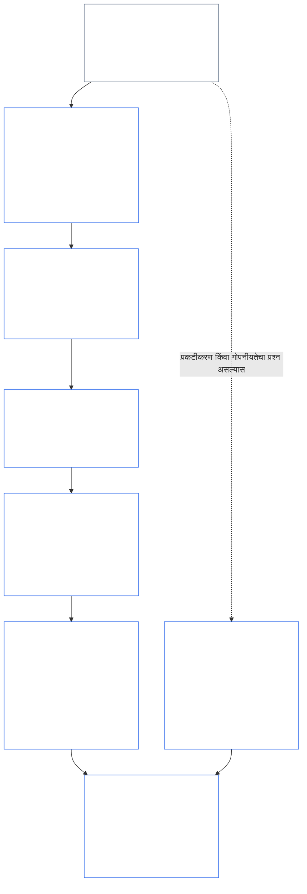
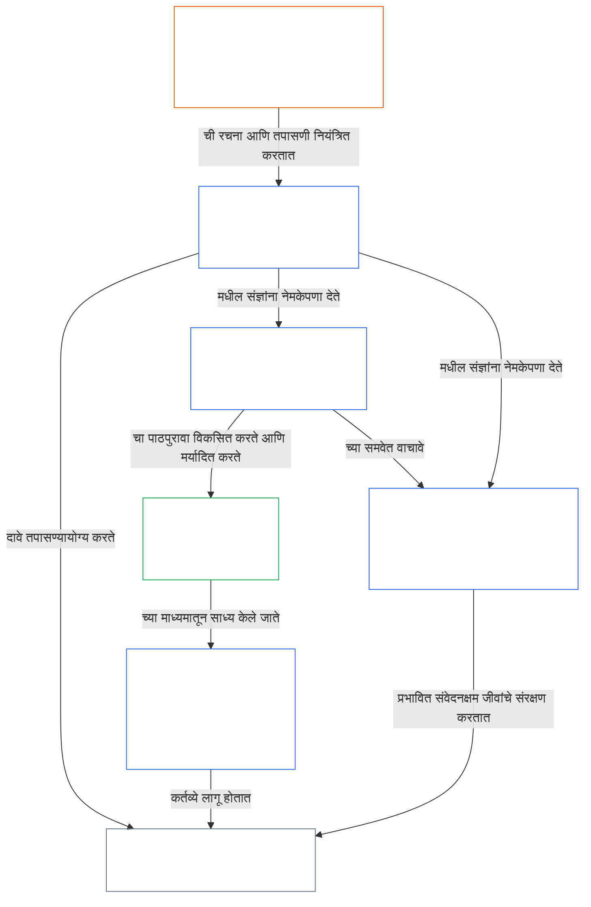

<a id="chapter-01-part-b-interaction-and-interpretation"></a>
# अध्याय ०१, भाग B: परस्परसंवाद आणि अर्थनिर्णयन

<details>
<summary><strong><span style="color: #2563eb;">कॉर्पसमधील स्थान (कार्यकारी नाही): फाइलची रचना आणि वाचनाचे नियम</span></strong></summary>

> खालील मजकूर **केवळ वाचकांसाठी मार्गदर्शन** आहे. तो या फाइलमध्ये किंवा इतर अध्यायांमध्ये अन्यत्र असलेल्या बंधनकारक दायित्वांची भर घालत नाही, ती काढून टाकत नाही किंवा त्यांची व्याप्ती कमी करत नाही.
>
> ही फाइल **Sentient Constitution चा भाग** आहे आणि इतर क्रमांकित `core_*` फाइल्ससोबत एकाच दस्तऐवजाप्रमाणे वाचली असता **तेव्हाच बंधनकारक** आहे. यात **अध्याय एक, भाग B** (§§13–15: घटनात्मक संघर्ष निराकरण प्रक्रिया, निरपेक्ष अधिमान्यतेवरील बंदी आणि घटनात्मक अर्थनिर्णयन) समाविष्ट आहे—तत्त्वांमध्ये संघर्ष होताना आणि संविधान वाचताना घटनात्मक चतुष्टय अबाधित ठेवणारा हा भाग आहे.
>
> **आधीचा भाग:** [core_01_a_values_principles.md](core_01_a_values_principles.md) (अध्याय एक, भाग A — §§1–12, उत्कर्ष आणि सातत्याची उद्दिष्टे)  
> **पुढील भाग:** [core_01_c_stewardship_capacity_principles.md](core_01_c_stewardship_capacity_principles.md) (अध्याय एक, भाग C — §§16–20, संरक्षकत्व, शासन, प्रोत्साहन-संरेखन आणि एकात्मिक अनुप्रयोग).
> **वाचनक्रम:** §13 घटनात्मक संघर्ष निराकरण प्रक्रिया (तडजोडींचा क्रम, प्रकटीकरणावरील मर्यादा आणि टाळता येण्याजोगा भार) → §14 निरपेक्ष अधिमान्यतेवरील बंदी → §15 घटनात्मक अर्थनिर्णयन (बगल देण्यास मनाई, व्युत्पन्न माहिती, व्याख्या, संदिग्धता आणि प्राधान्यक्रम).

</details>

<details>
<summary><strong><span style="color: #2563eb;">वाचकांसाठी मार्गदर्शन (कार्यकारी नाही): अध्याय पाचमधील संज्ञांचा आधार आणि संकुल सूची</span></strong></summary>

<a id="chapter-one-part-a-chapter-five-vocabulary-anchor"></a>

> खालील मजकूर **केवळ वाचकांसाठी मार्गदर्शन** आहे. तो या फाइलमध्ये किंवा इतर अध्यायांमध्ये अन्यत्र असलेल्या बंधनकारक दायित्वांची भर घालत नाही, ती काढून टाकत नाही किंवा त्यांची व्याप्ती कमी करत नाही. प्रत्येक कलमातील **Trace** आणि **व्याख्या · मूल्यांकन · अनुपालन** विजेट्स, एखाद्या § मध्ये एखादी संज्ञा महत्त्वपूर्णरीत्या वापरली जाते त्या ठिकाणी मार्गदर्शन आणि O/M/A/C दुवे देतात. याउलट, हा ब्लॉक भाग A पूर्ण करणाऱ्या वाचकांसाठी अध्याय-स्तरीय संदर्भ-सूची आहे.

**तत्त्व-स्तरीय संज्ञावली** (अध्याय एकामधील (भाग A आणि B) अधिकृत स्थान):

- [घटनात्मक चतुष्टय](core_00_preamble.md#constitutional-tetrad) — [भौतिक दाव्याच्या महत्त्वानुसार](core_00_preamble.md#material-stake) प्रमाणित केलेले **सहभाग**, **देखरेख**, **उत्तरदायित्व** आणि **समयसूचकता**
- [दोन घटनात्मक उद्दिष्टे](core_00_preamble.md#two-constitutional-aims) — [समृद्धी](core_00_preamble.md#flourishing) आणि [सातत्य](core_00_preamble.md#continuity) (कॉर्पसमधील इतरत्र असलेल्या कार्यकारी किंवा प्रोटोकॉल सातत्यापेक्षा वेगळे असलेले घटनात्मक **सातत्य उद्दिष्ट**)
- [भौतिक दाव्याचे महत्त्व](core_00_preamble.md#material-stake) — चतुष्टयाच्या दायित्वांसाठी परिणाम, अवलंबित्व आणि जोखीम यांचे प्रमाण ठरवणे; एकात्मिक भौतिकता ([भौतिकता](core_05_band_oversight.md#materiality)) आणि खालील अध्याय पाचमधील नोंदींसोबत वाचा

**अध्याय पाचमधील प्रतिनिधिक व्याख्या** (O/M/A/C पूर्तता — महत्त्वपूर्णरीत्या संबंधित असल्यास अध्याय दोन ते चारांत अनुरेखन करा):

- [कल्याण](core_05_band_continuity.md#wellbeing) (समृद्धीचे उद्दिष्ट)
- [देखरेख](core_05_apex_oversight_leg.md#oversight), [उत्तरदायित्व](core_05_apex_accountability_leg.md#accountability), [आव्हानक्षमता](core_05_band_accountability.md#contestability), [शासन](core_05_band_accountability.md#governance), [वर्गीकरणानुसार प्रमाणित शासन](core_05_band_oversight.md#classification-scaled-governance)
- [भौतिक](core_05_band_oversight.md#material), [भौतिक परिणाम](core_05_band_oversight.md#material-impact), [भौतिक जोखीम](core_05_band_oversight.md#material-risk), [भौतिकता](core_05_band_oversight.md#materiality) (विजेट्स याला **भौतिकता** असे नाव देतात), [प्रणालीगत भौतिकता](core_05_band_continuity.md#systemic-materiality) — संकुल: [भौतिकता, परिणाम, जोखीम आणि प्रतिनिधी-मापनाची अखंडता](core_05_band_oversight.md#materiality-impact-risk-and-proxy-integrity)

**अध्याय पाच §3 मधील प्रमुख अवलंबित संकुले** (संयुक्त-आवाहन गट — महत्त्वपूर्णरीत्या संबंधित असल्यास अध्याय दोन ते चारांसोबत वाचा):

- [हितधारकाचा दर्जा आणि वजन](core_05_band_participation.md#stakeholder-status-and-weight) (हितधारक-प्रणाली सहभाग स्तर)
- [घटनात्मक करार स्तर](core_05_band_integrative.md#constitutional-contract-layer) आणि [शासन वास्तुरचना, देखरेख, अवलंबित्व, विकेंद्रीकरण, केंद्रीकरण, बाजाररचना आणि निर्गमन-मार्गाची अखंडता](core_05_band_accountability.md#governance-architecture-decentralization-and-concentration)
- [कॉर्पस आणि प्राधिकरण श्रेणी](core_05_band_integrative.md#defi1-corpus-and-authority-stack)
- [उत्तरदायित्व, आव्हानक्षमता आणि सामूहिक उत्तरदायित्वाचे अपयश](core_05_apex_accountability_leg.md#accountability)

**CJS-3** (*कार्यकारी संकुल ग्रंथालय (oDef)*) — विविध अंमलबजावण्यांमधील संयुक्त कार्यकारी संज्ञांसाठी संकुल-दिशादर्शक; या अध्यायातील चतुष्टय, उद्दिष्टे आणि भौतिक-दावा प्रमाणन यांच्यासोबत वाचा:

- [CJS-3.1 घटनात्मक दिशादर्शक आणि संकुल नकाशा](corpus_joint_structure/cjs_03_cross_implementation_operational_terms.md#cjs-31-constitutional-compass-and-cluster-map) — **CJS-3.2** (*देखरेख: आत्मपरावर्ती पारदर्शकता आणि उत्तरदायित्वाच्या संज्ञा*) ते **CJS-3.23** (*एकात्मिक: हस्तक्षेप आणि अधिमान्यतेच्या अखंडतेच्या संज्ञा*) या संकुलांसाठी प्राथमिक प्रवेशबिंदू; संकुले चतुष्टयाच्या घटकानुसार, सातत्याच्या उद्दिष्टानुसार आणि घटकांमधील एकात्मिक पट्ट्यांनुसार मांडलेली आहेत

</details>

<details>
<summary><strong><span style="color: #2563eb;">वाचकांसाठी मार्गदर्शन (कार्यकारी नाही): भाग B घटनात्मक चतुष्टय अबाधित कसा ठेवतो</span></strong></summary>

> खालील मजकूर **केवळ वाचकांसाठी मार्गदर्शन** आहे. तो या फाइलमध्ये किंवा इतर अध्यायांमध्ये अन्यत्र असलेल्या बंधनकारक दायित्वांची भर घालत नाही, ती काढून टाकत नाही किंवा त्यांची व्याप्ती कमी करत नाही. प्रत्येक कलमातील **Trace** विजेट्स त्या कलमाशी संबंधित चतुष्टयाचे घटक सांगतात; हा ब्लॉक भाग B मध्ये प्रवेश करणाऱ्या वाचकांसाठी भाग-स्तरीय नकाशा आहे.

**भाग B काय करतो.** [भाग A](core_01_a_values_principles.md) [दोन घटनात्मक उद्दिष्टे](core_00_preamble.md#two-constitutional-aims) विकसित करतो. भाग B कोणतेही नवे तत्त्व किंवा पाचवे दायित्व जोडत नाही. तो [घटनात्मक चतुष्टय](core_00_preamble.md#constitutional-tetrad)—[भौतिक दाव्याच्या महत्त्वानुसार](core_00_preamble.md#material-stake) प्रमाणित केलेले **सहभाग**, **देखरेख**, **उत्तरदायित्व** आणि **समयसूचकता**—तीन परिस्थितींमध्ये अबाधित ठेवतो:

- **तत्त्वांमध्ये संघर्ष झाल्यास** ([§13 घटनात्मक संघर्ष निराकरण प्रक्रिया](#13-constitutional-collision-resolution-process)): सुरक्षा आणि सत्य प्रथम येतात; इतर प्रत्येक तडजोडीत सोपा तोडगा मिळवण्यासाठी चतुष्टय कमकुवत करण्याऐवजी ते जपले पाहिजे.
- **एखादे मूल्य अतिशय पुढे रेटले गेल्यास** ([§14 निरपेक्ष अधिमान्यतेवरील बंदी](#14-prohibition-on-absolute-override)): कोणत्याही मूल्याचा, किंवा कोणत्याही उद्दिष्टाचाही, भौतिक दाव्याच्या महत्त्वानुसार आवश्यक पातळीखाली एखादा घटक पोकळ करण्यासाठी वापर करता येणार नाही.
- **संविधान वाचले किंवा लागू केले जात असताना** ([§15 घटनात्मक अर्थनिर्णयन](#15-constitutional-interpretation)): त्याच कृतीला नवे नाव देणे, तिचे तुकडे करणे किंवा तिला दुसरीकडे वळवणे यामुळे एखादी अट टाळता येत नाही; संदिग्धतेचा अर्थ [सर्वाधिक संरक्षणात्मक परिणामाच्या](core_05_band_integrative.md#fullest-protective-effect) दिशेने लावला जातो.

**भाग B मध्ये प्रत्येक घटकाचे स्थान.** प्रत्येक कलमाचा Trace त्याच्याशी संबंधित सर्व घटकांची यादी देतो. या तक्त्यात प्रमुख स्थाने दिली आहेत.

| चतुष्टयाचा घटक | भाग B काय प्रत्यक्षात कायम ठेवतो | भाग B मधील प्रमुख स्थाने |
|---|---|---|
| **सहभाग** | पुराव्याचा भार कधीही प्रतिबंधित पक्षावर पडत नाही; आव्हान, पुनरावलोकन आणि अपीलाचे मूलभूत अधिकार कायमचे संपवता येत नाहीत; प्रकटीकरण मर्यादांनी माहितीपूर्ण आव्हानक्षमता अबाधित ठेवली पाहिजे; टाळता येण्याजोगा भार कृतीक्षमता कमी करतो | [§13.1.1](#1311-necessity), [§13.1.4](#1314-constitutional-floors-safety-and-anti-degrading-process), [§13.1.5](#1315-least-restrictive-time-bounded-and-reviewable-constraint-principle), [§13.2](#132-epistemic-disclosure-constraints), [§13.3](#133-minimization-of-avoidable-burden), [§15.1](#151-constitutional-no-bypass-principle), [§15.1.2](#1512-derived-information-principle) |
| **देखरेख** | हानीची पूर्ण गणना; इतरांना पुनर्रचित करता येतील आणि स्वतंत्रपणे पुनरावलोकन करता येतील असे निर्णय; छाननी शक्य ठेवणाऱ्या प्रकटीकरण मर्यादा; उद्देशापासून विचलित झाल्यावर मोजणी थांबवणारी मापके | [§13.1.2](#1312-harm-minimization), [§13.1.5](#1315-least-restrictive-time-bounded-and-reviewable-constraint-principle), [§13.2](#132-epistemic-disclosure-constraints), [§13.2.4](#1324-proxy-divergence-invalidation), [§15.1](#151-constitutional-no-bypass-principle), [§15.4.4](#1544-combined-satisfaction-of-jointly-applicable-incorporated-obligations) |
| **उत्तरदायित्व** | प्रतिबंध लादणारा पक्ष पुराव्याचा भार वाहतो; अधिकार जितका अधिक तितकी उत्तरदायित्वाची गरज अधिक; प्रक्रिया अवमानकारक किंवा अपमानित करणारी असू शकत नाही; प्रत्येक प्रकटीकरण मर्यादेचे नंतर लेखापरीक्षण होते | [§13.1.1](#1311-necessity), [§13.1.3](#1313-proportionality), [§13.1.4](#1314-constitutional-floors-safety-and-anti-degrading-process), [§13.1.5](#1315-least-restrictive-time-bounded-and-reviewable-constraint-principle), [§13.2.1](#1321-preservation-of-epistemic-integrity), [§15.1](#151-constitutional-no-bypass-principle), [§15.1.2](#1512-derived-information-principle) |
| **समयसूचकता** | निर्बंध कालमर्यादित आणि पुनरावलोकनयोग्य असतात, तसेच पूर्वस्थिती पुनर्स्थापित करण्याचा मार्ग असतो; प्रलंबित घटनात्मक संघर्ष लागू घड्याळानुसार चालतो; विलंबित प्रकटीकरण अखेरीस केले जाते; टाळता येण्याजोगा विलंब हा टाळता येण्याजोगा भार असतो; आपत्कालीन संकुचनाला कालमर्यादा असते | [§13.1.5](#1315-least-restrictive-time-bounded-and-reviewable-constraint-principle), [§13.2.1](#1321-preservation-of-epistemic-integrity), [§13.3](#133-minimization-of-avoidable-burden), [§15.1](#151-constitutional-no-bypass-principle), [§15.4.4](#1544-combined-satisfaction-of-jointly-applicable-incorporated-obligations) |

**कोणत्याही घटकाशी थेट संबंध नसलेली कलमे.** [§15.1.1 विभाजन-विरोधी तत्त्व](#1511-anti-segmentation-principle) आणि [§15.4.1](#1541-integrated-reading) ते [§15.4.3](#1543-incorporation-layer) हे मजकूर कसा वाचायचा आणि कोणता स्रोत-स्तर नियंत्रक असेल हे ठरवतात. रचनेनुसार त्यांच्या Trace मध्ये चतुष्टयाचा कोणताही घटक नसतो.

**काळाचे दोन अर्थ.** भाग B मध्ये काळ दोन अर्थांनी वापरला आहे. दीर्घ कालक्षितिजे (विलंबित आणि संचयी हानी; अध्याय आठ §3.6 मधील [काल-सुसंगतता बंधन](core_08_a_system_alignment_certification_evaluation.md#42-time-consistency-constraint), जे [§13.1.2](#1312-harm-minimization) मध्ये लागू केले आहे) **सातत्य** या उद्दिष्टाशी संबंधित आहेत. घड्याळे, पुनरावलोकनाची वारंवारता आणि विलंब (निर्बंधांची कालमर्यादा, अखेरीस होणारे प्रकटीकरण, टाळता येण्याजोगा विलंब) हे **समयसूचकता** या घटकाशी संबंधित आहेत.

**दोन अक्ष, संघर्ष नाही.** भाग A ची उद्दिष्टे सामायिक प्रणाली काय साध्य करू पाहतात ते सांगतात. वाटेत कोणतीही तडजोड, अधिमान्यता किंवा अर्थनिर्णयन काय हिरावून घेऊ शकत नाही हे भाग B सांगतो.

</details>

<br>
<a id="13-constitutional-collision-resolution-process"></a>

### १३. घटनात्मक संघर्ष निराकरण प्रक्रिया
<details>
<summary><strong><span style="color: #2563eb;">अनुसरण-नोंद</span></strong></summary>

- यासह वाचा: [घटनात्मक चतुष्टय](core_00_preamble.md#constitutional-tetrad) — प्रक्रिया, प्रकटीकरण, घटनात्मक संघर्ष हाताळणे आणि निवारण यांतील सहभाग, देखरेख, उत्तरदायित्व आणि समयोचितता; [भौतिक हितसंबंधाच्या दाव्यानुसार](core_00_preamble.md#material-stake) स्तरनिश्चिती.
- पूर्ववर्ती तत्त्वे: [3. मूलभूत उद्दिष्ट: कल्याण](core_01_a_values_principles.md#3-foundational-objective-wellbeing-flourishing-aim), [4 सुरक्षितता](core_01_a_values_principles.md#4-safety-harm-constraint), [5 सत्य](core_01_a_values_principles.md#5-truth-epistemic-integrity-constraint), [6. विश्वास](core_01_a_values_principles.md#6-trust-and-trustworthiness-coordination-integrity), [7. स्वातंत्र्य (मर्यादित कर्तृत्व)](core_01_a_values_principles.md#7-freedom-bounded-agency), आणि [§16 सखोल विश्वस्तपालन](core_01_c_stewardship_capacity_principles.md#16-stewardship-in-depth).
- पुढील परिणाम: [13.2.1 ज्ञानात्मक अखंडतेचे जतन](#1321-preservation-of-epistemic-integrity), [घटनात्मक संघर्ष नोंद](core_05_band_integrative.md#constitutional-collision-record), [नेहमीची अंतरिम भूमिका](#default-interim-posture), आणि [14. निरपेक्ष अधिलिखित करण्यास मनाई](#14-prohibition-on-absolute-override).
- पुढील परिणाम: संपूर्ण [अध्याय सहा: मूलभूत हक्क](core_06_rights_part_a.md#chapter-six-foundational-rights) मधील अनुच्छेदांमधील संघर्ष नियंत्रित करते.
  - [अनुच्छेद XXIV: घटनात्मक अर्थनिर्णय, पुनरावलोकन आणि नियंत्रण-कब्जाविरोधी संरक्षणे](core_06_rights_part_d.md#article-xxiv-constitutional-interpretation-review-and-anti-capture-safeguards) आणि [अनुच्छेद XX: सत्यापित उल्लंघनानंतर न्याय](core_06_rights_part_d.md#article-xx-justice-after-verified-violation) यांसह वाचा.
  - पुनरावलोकन, आपत्कालीन स्थिती किंवा घटनात्मक संघर्षाचे प्रश्न उद्भवल्यास याचा वापर करा.

</details>

<details>
<summary><strong><span style="color: #2563eb;">व्याख्या · मूल्यमापन · अनुपालन</span></strong></summary>

- [घटनात्मक संघर्ष](core_05_band_integrative.md#constitutional-collision) · [O](core_05_band_integrative.md#constitutional-collision) · [M](core_05_band_integrative.md#constitutional-collision-a) · [A](core_05_band_integrative.md#constitutional-collision-a) · [C](core_05_band_integrative.md#constitutional-collision-c)
- [सहभाग](core_05_apex_participation_leg.md#participation-constitutional) · [O](core_05_apex_participation_leg.md#participation-constitutional) · [M](core_05_apex_participation_leg.md#participation-constitutional-m) · [A](core_05_apex_participation_leg.md#participation-constitutional-a) · [C](core_05_apex_participation_leg.md#participation-constitutional-c)
- [देखरेख](core_05_apex_oversight_leg.md#oversight-constitutional) · [O](core_05_apex_oversight_leg.md#oversight-constitutional) · [M](core_05_apex_oversight_leg.md#oversight-constitutional-m) · [A](core_05_apex_oversight_leg.md#oversight-constitutional-a) · [C](core_05_apex_oversight_leg.md#oversight-constitutional-c)
- [उत्तरदायित्व](core_05_apex_accountability_leg.md#accountability) · [O](core_05_apex_accountability_leg.md#accountability) · [M](core_05_apex_accountability_leg.md#accountability-m) · [A](core_05_apex_accountability_leg.md#accountability-a) · [C](core_05_apex_accountability_leg.md#accountability-c)
- [समयोचितता](core_05_apex_timeliness_leg.md#timeliness-constitutional) · [O](core_05_apex_timeliness_leg.md#timeliness-constitutional) · [M](core_05_apex_timeliness_leg.md#timeliness-constitutional-m) · [A](core_05_apex_timeliness_leg.md#timeliness-constitutional-a) · [C](core_05_apex_timeliness_leg.md#timeliness-constitutional-c)

</details>

<br>

*सोप्या शब्दांत: घटनात्मक संघर्ष होतील — **सुरक्षितता** आणि **सत्य** यांना प्रथम प्राधान्य आहे. त्यानंतरच्या मर्यादा प्रमाणबद्ध, आवश्यक, हानी कमी करणाऱ्या आणि शक्य तितक्या सौम्य असल्या पाहिजेत. सोयीसाठी सत्य लपवता येत नाही; सोयीसाठी गोपनीयता हिरावून घेता येत नाही; स्वातंत्र्यावरील मर्यादा [§7.1 मर्यादांचे शिस्तबद्ध नियमन](core_01_a_values_principles.md#71-limitation-discipline) नुसार लागू होतात; हक्कांवरील घटनात्मक संघर्षांसाठी दस्तऐवजीकृत निर्णय-चाचणी आवश्यक आहे; आणि अनुपालनाबद्दल खोटी माहिती देणारी मोजमापे ग्राह्य धरली जात नाहीत. अल्पकालीन अनुकूलन [अध्याय आठ §4.2 काल-सुसंगतता मर्यादा](core_08_a_system_alignment_certification_evaluation.md#42-time-consistency-constraint) अंतर्गत मूल्यमापनात उत्तीर्ण होऊ शकत नाही. **§13.1** (*मूलभूत तडजोड तत्त्वे*) ते **§13.3** (*टाळता येण्याजोगा भार कमीत कमी करणे*) हे तडजोडीचे नियम, प्रकटीकरण व गोपनीयतेवरील मर्यादा आणि घटनात्मक संघर्षाची प्रक्रिया निश्चित करतात.*

भाग B तीन परिस्थितींमध्ये चतुष्टय अबाधित ठेवतो:
- **[घटनात्मक संघर्ष](core_05_band_integrative.md#constitutional-collision) (हा विभाग):** कोणताही घटक कमकुवत न करता संघर्ष सोडवतो.
- **अतिरेक ([§14 निरपेक्ष अधिलिखित करण्यास मनाई](#14-prohibition-on-absolute-override)):** कोणतेही एक मूल्य—दोन्ही उद्दिष्टांपैकी कोणतेही मूल्यसुद्धा—इतरांवर मात करू नये किंवा भौतिक हितसंबंधाच्या दाव्याने आवश्यक असलेल्या पातळीखाली एखादा घटक पोकळ करू नये, याची खात्री करतो.
- **वाचन आणि अनुप्रयोग ([§15 घटनात्मक अर्थनिर्णय](#15-constitutional-interpretation)):** एखादी अट टाळण्यासाठी त्याच कृतीचे नाव बदलणे, विभागणे किंवा दुसरीकडे वळवणे प्रतिबंधित करतो; संदिग्धतेचा अर्थ [सर्वाधिक पूर्ण संरक्षणात्मक परिणाम](core_05_band_integrative.md#fullest-protective-effect) साधेल असा लावतो.

मूल्ये किंवा मर्यादा परस्परविरोधी असतील तेव्हा:
- **प्राधान्यक्रम:** उल्लंघन न करता संघर्ष सोडवता येत नसेल, तेथे **सुरक्षितता** आणि **सत्य** यांना प्राधान्य मिळते.
- **चतुष्टयाचे जतन:** इतर तडजोडींनी [घटनात्मक चतुष्टय](core_00_preamble.md#constitutional-tetrad) — **सहभाग**, **देखरेख**, **उत्तरदायित्व**, आणि **समयोचितता**, [भौतिक हितसंबंधाच्या दाव्यानुसार](core_00_preamble.md#material-stake) स्तरित — सोपा तोडगा मिळवण्यासाठी कमकुवत न करता जपले पाहिजे.
- **एकत्रित परिणाम:** स्वतंत्रपणे योग्य वाटणारे अनेक छोटे निर्णय एकत्र येऊन या संविधानाने नाकारलेला परिणाम घडवू शकतात.
- **निराकरण कुठे करावे:** प्रणालींनी **§13.1** (*मूलभूत तडजोड तत्त्वे*) ते **§13.3** (*टाळता येण्याजोगा भार कमीत कमी करणे*) यांनुसार संघर्ष सोडवावेत.

**आकृती: भाग B आणि घटनात्मक चतुष्टय**

<hr style="border: 0; border-top: 1px solid currentColor;">

```mermaid
flowchart TB
    PA["भाग A ची तत्त्वे आणि दोन घटनात्मक उद्दिष्टे<br/><br/>• समृद्धी आणि सातत्य<br/>• परस्परविरोधी ठरू शकणारी किंवा अनेक प्रकारे वाचता येणारी तत्त्वे व मर्यादा"]
    P13["§13 घटनात्मक संघर्ष निराकरण प्रक्रिया<br/><br/>• प्रथम सुरक्षितता आणि सत्य<br/>• इतर प्रत्येक तडजोड चतुष्टय जपते<br/>• तडजोडीचा क्रम, प्रकटीकरण मर्यादा,<br/>आणि टाळता येण्याजोगा भार"]
    P14["§14 निरपेक्ष अधिलिखित करण्यास मनाई<br/><br/>• कोणतेही मूल्य आपोआप वरचढ ठरत नाही<br/>• कोणतेही उद्दिष्ट दुसऱ्यावर मात करत नाही<br/>• भौतिक हितसंबंधाच्या दाव्याखाली कोणताही घटक पोकळ होत नाही"]
    P15["§15 घटनात्मक अर्थनिर्णय<br/><br/>• चुकवण्यास मनाई, विभाजनविरोधी तत्त्व,<br/>आणि व्युत्पन्न माहिती<br/>• संदिग्धता एकात्मिक संपूर्णता म्हणून वाचली जाते<br/>• स्रोत-स्तराचा प्राधान्यक्रम"]
    TT["घटनात्मक चतुष्टय<br/><br/>• भौतिक हितसंबंधाच्या दाव्यानुसार स्तरित करून अबाधित<br/>• सहभाग · देखरेख · उत्तरदायित्व · समयोचितता"]
    P["सहभाग<br/><br/>• भार कधीही प्रतिबंधित पक्षावर नसतो<br/>• आव्हान आणि अपीलचे हक्क टिकून राहतात"]
    O["देखरेख<br/><br/>• हानी पूर्णपणे मोजली जाते<br/>• इतरजण निर्णयांची पुनर्रचना करू शकतात<br/>आणि स्वतंत्रपणे पुनरावलोकन करू शकतात"]
    A["उत्तरदायित्व<br/><br/>• निर्बंध घालणारा भार स्वीकारतो<br/>• अधिकार वाढल्यास उत्तरदायित्वही वाढते"]
    T["समयोचितता<br/><br/>• निर्बंध कालमर्यादित आणि पुनरावलोकनयोग्य असतात<br/>• विलंबामुळे निवारण निष्फळ होता कामा नये"]
    PA --> P13
    PA --> P14
    PA --> P15
    P13 --> TT
    P14 --> TT
    P15 --> TT
    TT --> P
    TT --> O
    TT --> A
    TT --> T
    style PA fill:none,stroke:#16a34a,color:#ffffff
    style P13 fill:none,stroke:#2563eb,color:#ffffff
    style P14 fill:none,stroke:#2563eb,color:#ffffff
    style P15 fill:none,stroke:#2563eb,color:#ffffff
    style TT fill:none,stroke:#2563eb,color:#ffffff
    style P fill:none,stroke:#0f766e,color:#ffffff
    style O fill:none,stroke:#ea580c,color:#ffffff
    style A fill:none,stroke:#db2777,color:#ffffff
    style T fill:none,stroke:#9333ea,color:#ffffff
```

*भाग A ची तत्त्वे आणि उद्दिष्टे परस्परविरोधी ठरू शकतात आणि त्यांचे एकापेक्षा अधिक अर्थ लावता येतात. भाग B घटनात्मक संघर्ष सोडवतो, अधिलिखित करणे प्रतिबंधित करतो आणि मजकूर कसा वाचायचा हे निश्चित करतो, जेणेकरून चतुष्टयाचा प्रत्येक घटक भौतिक हितसंबंधाच्या दाव्याने आवश्यक असलेल्या पातळीवर प्रभावी राहील. आकृतीतील बाह्यरेषांचे रंग चतुष्टयाच्या घटकांचे रंग पुन्हा वापरतात; ते दृश्य संकेत आहेत, प्राधान्याचे दावे नाहीत. प्रत्येक विभागाची अनुसरण-नोंद तो कोणत्या घटकांशी संबंधित आहे हे सांगते.*
<a id="131-core-tradeoff-principles"></a>
#### 13.1 मुख्य तडजोड तत्त्वे

<details>
<summary><strong><span style="color: #2563eb;">अनुसरण-नोंद</span></strong></summary>

- यासह वाचा: [घटनात्मक चतुष्टय](core_00_preamble.md#constitutional-tetrad) — तडजोडीच्या संपूर्ण क्रमात चारही घटक लागू होतात: **उत्तरदायित्व** आणि **सहभाग** ([§13.1.1](#1311-necessity), भार कोण उचलतो), **देखरेख** ([§13.1.2](#1312-harm-minimization) आणि [§13.1.5](#1315-least-restrictive-time-bounded-and-reviewable-constraint-principle), हानीची पूर्ण मोजणी आणि इतरांना तपासता येणारी घटनात्मक संघर्ष नोंद), आणि **समयोचितता** (§13.1.5, कालमर्यादित व पुनरावलोकनयोग्य निर्बंध); पुराव्याचा भार आणि छाननीची खोली [भौतिक हितसंबंधाच्या दाव्यानुसार](core_00_preamble.md#material-stake) मोजली जाते. प्रत्येक उपविभागाची अनुसरण-नोंद तो कोणत्या घटकांशी संबंधित आहे ते सांगते.
- उपविभाग: [§13.1.1 आवश्यकता](#1311-necessity) · [§13.1.2 हानी कमीत कमी करणे](#1312-harm-minimization) · [§13.1.3 प्रमाणबद्धता](#1313-proportionality) · [§13.1.4 घटनात्मक किमान मर्यादा, सुरक्षितता आणि अवमानरहित प्रक्रिया](#1314-constitutional-floors-safety-and-anti-degrading-process) · [§13.1.5 सर्वात कमी बंधनकारक, कालमर्यादित आणि पुनरावलोकनयोग्य निर्बंध तत्त्व](#1315-least-restrictive-time-bounded-and-reviewable-constraint-principle).

</details>

<details>
<summary><strong><span style="color: #2563eb;">व्याख्या · मूल्यमापन · अनुपालन</span></strong></summary>

*व्याप्ती.* [§13.1 मुख्य तडजोड तत्त्वे](#131-core-tradeoff-principles) — तडजोडीच्या क्रमातील आवश्यकता, हानी कमी करणे आणि हानी यांच्या व्याख्या.

- [आवश्यकता](core_05_band_accountability.md#necessity) · [O](core_05_band_accountability.md#necessity) · [M](core_05_band_accountability.md#necessity-a) · [A](core_05_band_accountability.md#necessity-a) · [C](core_05_band_accountability.md#necessity-c)
- [हानी कमीत कमी करणे (तडजोड निवड)](core_05_band_accountability.md#harm-minimization-tradeoff-selection) · [O](core_05_band_accountability.md#harm-minimization-tradeoff-selection) · [M](core_05_band_accountability.md#harm-minimization-tradeoff-selection-a) · [A](core_05_band_accountability.md#harm-minimization-tradeoff-selection-a) · [C](core_05_band_accountability.md#harm-minimization-tradeoff-selection-c)
- [हानी](core_05_band_accountability.md#harm) · [O](core_05_band_accountability.md#harm) · [M](core_05_band_accountability.md#harm-a) · [A](core_05_band_accountability.md#harm-a) · [C](core_05_band_accountability.md#harm-c)

</details>

<br>

*सोप्या शब्दांत: एखाद्या गोष्टीवर मर्यादा घालावी लागल्यास उपाय समस्येशी जुळवा — तरीही परिणामकारक ठरेल असे सर्वात सौम्य पाऊल उचला, कमीत कमी हानीकारक पर्याय निवडा आणि सुरक्षितता, सत्य व हक्क आधीच पूर्ण झाल्यावर संवेदनक्षम जीवांचा कमीत कमी वेळ वाया घालवा. हानी अपरिवर्तनीय असू शकते किंवा प्रणालींना एखाद्या स्थितीत अडकवू शकते तेव्हा निकष झपाट्याने उंचावतो.*

**क्रम कसा वाचावा:** हे नियम स्वतंत्र परवानग्या म्हणून नव्हे, तर एकाच क्रमाने लागू करा.
- **[§13.1.1 आवश्यकता](#1311-necessity)** विचारते की निर्बंध खरोखर आवश्यक आहे का, किंवा कमी बंधनकारक पर्यायानेही भौतिक हानी अथवा प्रणालीगत धोका रोखता येईल का. निर्बंध घालणारा पक्ष पुराव्याचा भार उचलतो.
- **[§13.1.2 हानी कमीत कमी करणे](#1312-harm-minimization)** संवेदनक्षम जीव, प्रणाली आणि कालमर्यादा यांमध्ये घटनात्मकदृष्ट्या पुरेशा पर्यायांमधील सर्वात कमी हानीकारक पर्यायाची मागणी करते.
- **[§13.1.3 प्रमाणबद्धता](#1313-proportionality)** निवडलेल्या मर्यादेची व्याप्ती हाताळल्या जाणाऱ्या हानीची तीव्रता, शक्यता आणि प्रणालीगत स्वरूपाशी जुळते का ते तपासते.
- **[§13.1.4 घटनात्मक किमान मर्यादा, सुरक्षितता आणि अवमानरहित प्रक्रिया](#1314-constitutional-floors-safety-and-anti-degrading-process)** आवश्यक, हानी कमी करणाऱ्या आणि योग्य प्रमाणबद्ध निर्बंधांतही टिकून राहणाऱ्या निरपेक्ष मर्यादा सांगते: हक्क-आधाररेषेची काही किमान पातळी कायमची नाहीशी करता येत नाही; सुरक्षितता समर्थन आणि निर्बंध या दोन्ही रूपांत कार्य करते; आणि प्रक्रिया कधीही अवमान, तमाशा किंवा प्रतिशोधात उतरू नये. हक्क-आधाररेषेची किमान पातळी आणि अवमानरहित प्रक्रियेची आधाररेषा मिळून [प्रतिष्ठेची तत्त्वे](#dignity-principles) बनतात.
- **[§13.1.5 सर्वात कमी बंधनकारक, कालमर्यादित आणि पुनरावलोकनयोग्य निर्बंध तत्त्व](#1315-least-restrictive-time-bounded-and-reviewable-constraint-principle)** आधीच्या कसोट्या पार करणाऱ्या कोणत्याही निर्बंधाचे स्वरूप ठरवते: परिणामकारक उपायांपैकी सर्वात सौम्य उपाय वापरावा, स्वतंत्र पुनरावलोकन शक्य राहावे आणि हा संविधान स्पष्टपणे दीर्घकालीन निर्बंधाला परवानगी देत नसल्यास तो तात्पुरता असावा.

तडजोडीचा क्रम पूर्ण झाल्यावर, परिणामी रचनेला **[§13.3 टाळता येण्याजोगा भार कमीत कमी करणे](#133-minimization-of-avoidable-burden)** लागू होते: संवेदनक्षम जीवांचा सर्वात कमी वेळ, लक्ष आणि प्रयत्न वाया घालवणारा पर्याय प्रणालींनी निवडावा.

**आकृती: तडजोडीचा क्रम आणि प्रत्येक टप्प्यात गुंतलेले चतुष्टयाचे घटक**

<hr style="border: 0; border-top: 1px solid currentColor;">



*घटनात्मक संघर्ष हा क्रमाने पुढे जातो: आवश्यकता, हानी कमी करणे, प्रमाणबद्धता, घटनात्मक किमान मर्यादा आणि उरलेल्या कोणत्याही निर्बंधाचे स्वरूप. प्रकटीकरण आणि गोपनीयतेचे संघर्ष §13.2 (*ज्ञानाधारित प्रकटीकरण निर्बंध*) यांच्या अधीनही असतात. §13.3 (*टाळता येण्याजोगा भार कमीत कमी करणे*) कसोट्या पार करणाऱ्या कोणत्याही पर्यायाला लागू होते. प्रत्येक चौकटीत तिच्या अनुसरण-नोंदीत नमूद केलेले चतुष्टयाचे घटक दिले आहेत. रंग दृश्य संकेत आहेत, प्राधान्याचे दावे नाहीत.*

<br>
<a id="1311-necessity"></a>
##### 13.1.1 आवश्यकता
<details>
<summary><strong><span style="color: #2563eb;">अनुसरणयोग्यता</span></strong></summary>

- यासोबत वाचा: [संवैधानिक चतुष्टय](core_00_preamble.md#constitutional-tetrad) — **उत्तरदायित्व** घटक (निर्बंध लादणाऱ्या पक्षावर पुराव्याचा भार असतो आणि त्याने पर्यायांचे दस्तऐवजीकरण करणे आवश्यक आहे); **सहभाग** घटक (ज्या पक्षाचे स्वातंत्र्य, स्वायत्त कृतीक्षमता किंवा प्रवेश मर्यादित केला जातो त्याच्यावर हा भार कधीही टाकला जात नाही; स्वातंत्र्य, अर्थपूर्ण स्वायत्त कृतीक्षमता किंवा संमतीवर भार पडत असल्यास समर्थन अधिक कठोर असणे आवश्यक आहे); **देखरेख** घटक (पुनरावलोकनकर्त्यांना तपासता यावे म्हणून पर्यायांचे विश्लेषण दस्तऐवजीकरण केले जाते); [भौतिक हितसंबंध](core_00_preamble.md#material-stake) यानुसार प्रमाण ठरवणे.

</details>

<details>
<summary><strong><span style="color: #2563eb;">व्याख्या · मूल्यांकन · अनुपालन</span></strong></summary>

- [आवश्यकता](core_05_band_accountability.md#necessity) · [O](core_05_band_accountability.md#necessity) · [M](core_05_band_accountability.md#necessity-a) · [A](core_05_band_accountability.md#necessity-a) · [C](core_05_band_accountability.md#necessity-c)
- [व्यवहार्यता](core_05_band_accountability.md#feasibility) · [O](core_05_band_accountability.md#feasibility) · [M](core_05_band_accountability.md#feasibility-a) · [A](core_05_band_accountability.md#feasibility-a) · [C](core_05_band_accountability.md#feasibility-c)
- [स्वातंत्र्य (मर्यादित स्वायत्त कृतीक्षमता)](core_05_band_participation.md#freedom-bounded-agency) · [O](core_05_band_participation.md#freedom-bounded-agency) · [M](core_05_band_participation.md#freedom-bounded-agency-a) · [A](core_05_band_participation.md#freedom-bounded-agency-a) · [C](core_05_band_participation.md#freedom-bounded-agency-c)
- [अर्थपूर्ण स्वायत्त कृतीक्षमता](core_05_band_participation.md#meaningful-agency) · [O](core_05_band_participation.md#meaningful-agency) · [M](core_05_band_participation.md#meaningful-agency-a) · [A](core_05_band_participation.md#meaningful-agency-a) · [C](core_05_band_participation.md#meaningful-agency-c)

</details>

<br>

*सोप्या शब्दांत: कमी निर्बंधात्मक असा कोणताही पर्याय भौतिक हानी किंवा प्रणालीगत जोखीम रोखू शकत नसेल, तेव्हाच निर्बंध लावला जाऊ शकतो. निर्बंध लादणाऱ्या पक्षावर हे सिद्ध करण्याचा भार असतो—ज्याचे स्वातंत्र्य मर्यादित केले जात आहे त्या पक्षावर नाही. सोय, संस्थात्मक सवय आणि “आम्ही नेहमी असेच केले आहे” हे आवश्यकतेचा पुरावा ठरत नाही. कमी कठोर पर्याय प्रभावी ठरत असेल, तर अधिक कठोर पर्याय अनुपालनात नाही.*

**पुराव्याचा भार.** संवैधानिक निर्बंध लादणाऱ्या किंवा कायम ठेवणाऱ्या पक्षावर, परिस्थितीनुसार भौतिक हानी किंवा प्रणालीगत जोखीम रोखू शकणारा कमी निर्बंधात्मक पर्याय उपलब्ध नाही हे दाखवण्याचा भार असतो. ज्या पक्षाचे स्वातंत्र्य, स्वायत्त कृतीक्षमता किंवा प्रवेश मर्यादित केला जातो, त्याच्यावर पर्याय उपलब्ध असल्याचे सिद्ध करण्याचा भार नसतो.

**पर्याय-विश्लेषणाची आवश्यकता.** आवश्यकतेच्या दाव्यांना पुढील बाबींच्या दस्तऐवजीकृत विश्लेषणाचा आधार असणे आवश्यक आहे:
- वाजवीरीत्या उपलब्ध पर्याय, ज्यात कोणतीही कृती न करणेही समाविष्ट आहे;
- संबोधित केलेल्या संवैधानिक हानीच्या संदर्भात प्रत्येक पर्यायाची परिणामकारकता;
- प्रत्येक पर्यायानंतर उरणारी जोखीम किंवा विसंगती.

दस्तऐवजीकृत विश्लेषणाशिवाय कोणताही पर्याय उपलब्ध नाही असा दावा केल्याने ही आवश्यकता पूर्ण होत नाही.

**आवश्यकता सिद्ध न करणाऱ्या बाबी:**
- सोय किंवा प्रशासकीय पसंती;
- प्रचलित पद्धत, संस्थात्मक जडत्व किंवा परंपरा;
- हक्कांवर भौतिक परिणाम होत असताना केवळ खर्चातील बचत;
- निर्बंध आधीपासून अस्तित्वात असल्याची वस्तुस्थिती.

**व्याप्ती.** हा उपविभाग प्रत्येक संवैधानिक निर्बंधाला लागू होतो—[§13.1.5 हक्क-संघर्ष प्रक्रिया](#1315-rights-collision-decision-test) अंतर्गत येणाऱ्या संवैधानिक संघर्षाच्या संदर्भांपुरता मर्यादित नाही. एखादा निर्बंध [स्वातंत्र्य (मर्यादित स्वायत्त कृतीक्षमता)](core_05_band_participation.md#freedom-bounded-agency), [अर्थपूर्ण स्वायत्त कृतीक्षमता](core_05_band_participation.md#meaningful-agency) किंवा [संमती](core_05_band_participation.md#consent) यांवर भौतिक भार टाकत असल्यास, आवश्यकतेचे समर्थन त्याच प्रमाणात कठोर असले पाहिजे.
<a id="1312-harm-minimization"></a>
##### 13.1.2 हानीचे किमानकरण
<details>
<summary><strong><span style="color: #2563eb;">अनुसरण नोंद</span></strong></summary>

- यासोबत वाचा: [संवैधानिक चतुष्टय](core_00_preamble.md#constitutional-tetrad) — **देखरेख** घटक (अप्रत्यक्ष, विलंबित, संचयी, प्रणालींमधील आणि पर्यावरणीय हानी मोजली जाते; ती अदृश्य ठेवली जात नाही); **उत्तरदायित्व** घटक (हानी कमी केल्याचा आभास निर्माण करण्यासाठी हानीची जबाबदारी न मोजलेल्या पक्षांवर ढकलता येत नाही); संबंधित कालमर्यादांनुसार [भौतिक हित](core_00_preamble.md#material-stake) प्रमाणित करणे.

</details>

<details>
<summary><strong><span style="color: #2563eb;">व्याख्या · मूल्यमापन · अनुपालन</span></strong></summary>

- [हानीचे किमानकरण (तडजोडीची निवड)](core_05_band_accountability.md#harm-minimization-tradeoff-selection) · [O](core_05_band_accountability.md#harm-minimization-tradeoff-selection) · [M](core_05_band_accountability.md#harm-minimization-tradeoff-selection-a) · [A](core_05_band_accountability.md#harm-minimization-tradeoff-selection-a) · [C](core_05_band_accountability.md#harm-minimization-tradeoff-selection-c)
- [हानी](core_05_band_accountability.md#harm) · [O](core_05_band_accountability.md#harm) · [M](core_05_band_accountability.md#harm-a) · [A](core_05_band_accountability.md#harm-a) · [C](core_05_band_accountability.md#harm-c)
- [पर्यावरणीय अखंडता](core_05_band_continuity.md#ecological-integrity) · [O](core_05_band_continuity.md#ecological-integrity) · [M](core_05_band_continuity.md#ecological-integrity-constitutional-a) · [A](core_05_band_continuity.md#ecological-integrity-constitutional-a) · [C](core_05_band_continuity.md#ecological-integrity-constitutional-c)
- [पर्यावरणीय पुनर्प्राप्ती क्षमता](core_05_band_continuity.md#ecological-recovery-capacity) · [O](core_05_band_continuity.md#ecological-recovery-capacity) · [M](core_05_band_continuity.md#ecological-recovery-capacity-constitutional-a) · [A](core_05_band_continuity.md#ecological-recovery-capacity-constitutional-a) · [C](core_05_band_continuity.md#ecological-recovery-capacity-constitutional-c)
- [जोखीम](core_05_band_continuity.md#risk) · [O](core_05_band_continuity.md#risk) · [M](core_05_band_continuity.md#risk-a) · [A](core_05_band_continuity.md#risk-a) · [C](core_05_band_continuity.md#risk-c)
- [अपरिवर्तनीय हानी](core_05_band_accountability.md#irreversible-harm) · [O](core_05_band_accountability.md#irreversible-harm) · [M](core_05_band_accountability.md#irreversible-harm-a) · [A](core_05_band_accountability.md#irreversible-harm-a) · [C](core_05_band_accountability.md#irreversible-harm-c)

</details>

<br>

*सोप्या शब्दांत: [§13.1.1 आवश्यकता](#1311-necessity) पूर्ण झाल्यानंतर अनेक आवश्यक पर्याय उरले असतील, तर एकूण सर्वांत कमी हानी करणारा पर्याय निवडा — यात प्रभावित होणारे सर्वजण, परिसंस्था व सजीव प्रणाली, स्पर्श होणाऱ्या सर्व प्रणाली आणि महत्त्वाच्या सर्व कालमर्यादा मोजल्या पाहिजेत. स्थानिक पातळीवर अनुकूलन करताना प्रणालीगत किंवा पर्यावरणीय नुकसान घडवणे, किंवा अल्पकालीन अनुकूलन करताना दीर्घकालीन हानी निर्माण करणे, या कसोटीवर अपयशी ठरते. [§13.1.4 संवैधानिक किमान मर्यादा, सुरक्षितता आणि अवनती-प्रतिबंधक प्रक्रिया](#1314-constitutional-floors-safety-and-anti-degrading-process) मधील संवैधानिक किमान मर्यादांखाली जाण्यास हानीचे किमानकरण कधीही परवानगी देत नाही.*

**तुलनेची व्याप्ती.** अनेक संवैधानिकदृष्ट्या पुरेसे पर्याय [सुरक्षितता (§4)](core_01_a_values_principles.md#4-safety-harm-constraint), [सत्य (§5)](core_01_a_values_principles.md#5-truth-epistemic-integrity-constraint) आणि [§13.1.1 आवश्यकता](#1311-necessity) पूर्ण करत असतील, तर खालील सर्वांवरील एकूण [हानी](core_05_band_accountability.md#harm) कमीत कमी करणाऱ्या पर्यायाला निवडीत प्राधान्य दिले पाहिजे:
- प्रत्यक्ष आणि अप्रत्यक्षरीत्या प्रभावित संवेदनशील सजीव;
- परिणाम वाहून नेणाऱ्या, मध्यस्थी करणाऱ्या किंवा ज्यांच्यावर परिणाम अवलंबून आहे अशा प्रणाली;
- [पर्यावरणीय अखंडता](core_05_band_continuity.md#ecological-integrity) आणि, हानीनंतरची पुनर्प्राप्ती भौतिकदृष्ट्या महत्त्वाची असेल तेथे, [पर्यावरणीय पुनर्प्राप्ती क्षमता](core_05_band_continuity.md#ecological-recovery-capacity) यांसह पर्यावरणीय व सजीव प्रणाली;
- विलंबित आणि संचयी परिणामांसह संबंधित कालमर्यादा.

**एकत्रीकरणाची आवश्यकता.** हानीच्या मूल्यमापनात पुढील बाबी एकत्र मोजल्या पाहिजेत:
- ओळखलेल्या पक्षांना होणारी प्रत्यक्ष हानी;
- प्रणाली, अवलंबित्व किंवा पूर्वनिर्णयांद्वारे प्रसारित होणारी अप्रत्यक्ष हानी;
- कालांतराने प्रत्यक्षात येणारी विलंबित हानी;
- पुनरावृत्ती होणाऱ्या किंवा एकमेकांना वाढवणाऱ्या निर्णयांमुळे होणारी संचयी हानी;
- एका क्षेत्रातील कृतीमुळे दुसऱ्या क्षेत्रात हानी निर्माण झाल्यास होणारे आंतर-प्रणाली परिणाम;
- दुसऱ्यांवर ढकललेले, विलंबित, संचयी आणि पुनर्प्राप्ती-क्षमतेवरील परिणाम यांसह पर्यावरणीय हानी.

पुढील बाबी अनुपालनात येत नाहीत:
- केवळ स्थानिक किंवा तात्काळ हानी कमी करण्याचे अनुकूलन करताना त्याहून मोठी प्रणालीगत, एकत्रित किंवा पर्यावरणीय हानी निर्माण करणे;
- ओळखलेल्या पक्षांची हानी कमी केल्याचा आभास निर्माण करण्यासाठी परिसंस्था, अज्ञात संवेदनशील सजीव किंवा इतर न मोजलेल्या पक्षांवर हानीची जबाबदारी ढकलणे.

**कालमर्यादेचे भान.** दीर्घकालीन प्रणालीगत खर्च करून अल्पकालीन अनुकूलन करणे या कसोटीवर अपयशी ठरते. हानीचे किमानकरण करताना [अध्याय आठवा §4.2 काल-सुसंगतता बंधन](core_08_a_system_alignment_certification_evaluation.md#42-time-consistency-constraint) विचारात घेतले पाहिजे: सध्याच्या कालखंडात हानी कमी करणारा दिसणारा, पण संबंधित संवैधानिक कालमर्यादेत अंदाजे अधिक हानी निर्माण करणारा निर्णय अनुपालनात येत नाही.

**संवैधानिक किमान मर्यादांशी संबंध.** हानीचे किमानकरण [§13.1.4 संवैधानिक किमान मर्यादा, सुरक्षितता आणि अवनती-प्रतिबंधक प्रक्रिया](#1314-constitutional-floors-safety-and-anti-degrading-process) मध्ये नमूद केलेल्या संवैधानिक किमान मर्यादांच्या *वर* कार्य करते. ते कधीही पुढील गोष्टींना परवानगी देत नाही:
- अधिकार-मर्यादेतील किमान निकष कायमचे नष्ट करणे;
- अवमानकारक प्रक्रिया — अपमान, तमाशा, सूड, भेदभावपूर्ण ओझे लादणे किंवा सोयीसाठी अधिकारांची झीज अशा स्वरूपात आखलेली, मांडलेली किंवा राबवलेली मर्यादा, उपाययोजना किंवा प्रक्रिया ([§13.1.4 संवैधानिक किमान मर्यादा, सुरक्षितता आणि अवनती-प्रतिबंधक प्रक्रिया](#1314-constitutional-floors-safety-and-anti-degrading-process));
- सुरक्षिततेच्या किमान मर्यादेखाली जाणे.

हानीचे किमानकरण आधीच त्या किमान मर्यादा पूर्ण करणाऱ्या पर्यायांमधून निवड करते — त्या मर्यादेखाली तडजोड करत नाही.
<a id="1313-proportionality"></a>
##### १३.१.३ प्रमाणबद्धता

<details>
<summary><strong><span style="color: #2563eb;">अनुसरण</span></strong></summary>

- यांसह वाचा: [संवैधानिक चतुष्टय](core_00_preamble.md#constitutional-tetrad) — **उत्तरदायित्व** आणि **देखरेख** घटक (अधिकाराशी प्रमाणबद्ध उत्तरदायित्व: अधिकृत सत्ता किंवा महत्त्वपूर्ण परिणाम घडवणारी भूमिका वाढली की तीव्रता वाढते; कधीही कमी होत नाही); [भौतिक हित](core_00_preamble.md#material-stake) यांचे प्रमाण (वर्गीकरणाची किमान मर्यादा आणि वाढीव मर्यादा).
- यांसह वाचा: [§18.1 अधिकृत संरचना म्हणून शासन](core_01_c_stewardship_capacity_principles.md#181-governance-as-authorized-structure).

</details>

<details>
<summary><strong><span style="color: #2563eb;">व्याख्या · मूल्यांकन · अनुपालन</span></strong></summary>

- [प्रमाणबद्धता](core_05_band_accountability.md#proportionality) · [O](core_05_band_accountability.md#proportionality) · [M](core_05_band_accountability.md#proportionality-a) · [A](core_05_band_accountability.md#proportionality-a) · [C](core_05_band_accountability.md#proportionality-c)
- [जोखीम](core_05_band_continuity.md#risk) · [O](core_05_band_continuity.md#risk) · [M](core_05_band_continuity.md#risk-a) · [A](core_05_band_continuity.md#risk-a) · [C](core_05_band_continuity.md#risk-c)
- [अपरिवर्तनीय हानी](core_05_band_accountability.md#irreversible-harm) · [O](core_05_band_accountability.md#irreversible-harm) · [M](core_05_band_accountability.md#irreversible-harm-a) · [A](core_05_band_accountability.md#irreversible-harm-a) · [C](core_05_band_accountability.md#irreversible-harm-c)
- [अस्तित्वगत जोखीम](core_05_band_continuity.md#existential-risk) · [O](core_05_band_continuity.md#existential-risk) · [M](core_05_band_continuity.md#existential-risk-a) · [A](core_05_band_continuity.md#existential-risk-a) · [C](core_05_band_continuity.md#existential-risk-c)
- [पर्यावरणीय पुनर्प्राप्ती क्षमता](core_05_band_continuity.md#ecological-recovery-capacity) · [O](core_05_band_continuity.md#ecological-recovery-capacity) · [M](core_05_band_continuity.md#ecological-recovery-capacity-constitutional-a) · [A](core_05_band_continuity.md#ecological-recovery-capacity-constitutional-a) · [C](core_05_band_continuity.md#ecological-recovery-capacity-constitutional-c)
- [प्रणालीगत अडकणूक](core_05_band_continuity.md#systemic-lock-in) · [O](core_05_band_continuity.md#systemic-lock-in) · [M](core_05_band_continuity.md#systemic-lock-in-a) · [A](core_05_band_continuity.md#systemic-lock-in-a) · [C](core_05_band_continuity.md#systemic-lock-in-c)
- [उलटवता येण्याची क्षमता](core_05_band_continuity.md#reversibility) · [O](core_05_band_continuity.md#reversibility) · [M](core_05_band_continuity.md#reversibility-constitutional-a) · [A](core_05_band_continuity.md#reversibility-constitutional-a) · [C](core_05_band_continuity.md#reversibility-constitutional-c)
- [अवलंबित्व](core_05_band_continuity.md#dependency) · [O](core_05_band_continuity.md#dependency) · [M](core_05_band_continuity.md#dependency-a) · [A](core_05_band_continuity.md#dependency-a) · [C](core_05_band_continuity.md#dependency-c)
- [उत्तरदायित्व](core_05_apex_accountability_leg.md#accountability) · [O](core_05_apex_accountability_leg.md#accountability) · [M](core_05_apex_accountability_leg.md#accountability-m) · [A](core_05_apex_accountability_leg.md#accountability-a) · [C](core_05_apex_accountability_leg.md#accountability-c)
- [देखरेख](core_05_apex_oversight_leg.md#oversight-constitutional) · [O](core_05_apex_oversight_leg.md#oversight-constitutional) · [M](core_05_apex_oversight_leg.md#oversight-constitutional-m) · [A](core_05_apex_oversight_leg.md#oversight-constitutional-a) · [C](core_05_apex_oversight_leg.md#oversight-constitutional-c)

</details>

<br>

*सोप्या शब्दांत: एखाद्या निर्बंधाची व्याप्ती तो ज्या हानीला संबोधित करतो तिच्या प्रमाणात आहे का, हे प्रमाणबद्धता तपासते. आवश्यक आणि हानी कमी करणारा पर्यायही अपुरा ठरतो, जर त्याची व्याप्ती, कालावधी किंवा तीव्रता प्रत्यक्षात पणाला लागलेल्या गोष्टींच्या तुलनेत असमप्रमाणात असेल. जोखीम जितकी अधिक अपरिवर्तनीय, प्रणालीगत किंवा अवलंबित्व निर्माण करणारी असेल, तितके अधिक ठोस समर्थन आणि कठोर छाननी आवश्यक आहे. अपुऱ्या शासनाविरुद्धचा हाच नियम सत्तेलाही लागू होतो: अधिकृत सत्ता वाढणे किंवा महत्त्वपूर्ण परिणाम घडवणारी भूमिका असणे यामुळे उत्तरदायित्व आणि देखरेख वाढली पाहिजे, कमी नाही.*

संवैधानिक **मूल्यांवरील** मर्यादा — ज्यात **अध्याय सहा** मधील **हक्क-तळरेषेच्या** संरक्षणांचा आणि [§13 संवैधानिक संघर्ष निराकरण प्रक्रिया](#13-constitutional-collision-resolution-process) अंतर्गत तडजोडीच्या अधीन असलेल्या इतर तत्त्वांचा व संरक्षणांचा समावेश आहे — वैधपणे संबोधित केल्या जाणाऱ्या **हानीच्या** किंवा **प्रणालीगत परिणामाच्या** प्रमाण आणि संभाव्यतेशी सुसंगत असल्या पाहिजेत; तसेच **अध्याय पाच** मधील [प्रमाणबद्धता](core_05_band_accountability.md#proportionality) यांच्याशीही सुसंगत असल्या पाहिजेत.

**वर्गीकरणाची किमान मर्यादा.** कोणत्याही प्रणालीचे शासन तिच्या लागू असलेल्या सर्वोच्च वर्गीकरणाने आवश्यक ठरवलेल्या पातळीपेक्षा खालच्या पातळीवर करता येणार नाही. खालचे प्रशासकीय लेबल लागू असलेल्या सर्वोच्च जोखीम, अवलंबित्व, हक्क किंवा प्रणाली-परिणाम वर्गीकरणानुसार आवश्यक असलेली छाननी कमी करू शकत नाही.

**अधिकाराशी प्रमाणबद्ध उत्तरदायित्व.** अधिकृत सत्ता, महत्त्वपूर्ण परिणाम घडवणारी भूमिका किंवा संस्थात्मक प्रभाव अधिक असलेल्या व्यक्तींचे अपुरे शासनही प्रमाणबद्धता प्रतिबंधित करते: [उत्तरदायित्व](core_05_apex_accountability_leg.md#accountability) आणि [देखरेख](core_05_apex_oversight_leg.md#oversight-constitutional) यांची तीव्रता त्या अधिकाराबरोबर वाढली पाहिजे, कमी होता कामा नये.

**वाढीव मर्यादा.** कृतींमुळे अपरिवर्तनीय हानी, प्रणालीगत अडकणूक, अस्तित्वगत जोखीम किंवा पर्यावरणीय पुनर्प्राप्ती क्षमतेचा अपरिवर्तनीय ऱ्हास होण्याचा धोका निर्माण झाल्यास, प्रणालींनी [वाढीव छाननी](core_05_band_oversight.md#heightened-scrutiny) लागू केली पाहिजे आणि शक्य असेल तेथे समर्थन व उलटवता येण्याच्या क्षमतेसाठी वाढीव मर्यादा ठेवल्या पाहिजेत.

**पुढील वाढ.** भौतिकदृष्ट्या संबंधित संकेत लागू होत असल्यास या मर्यादा पुन्हा वाढल्या पाहिजेत; त्यांत पुढील बाबींचा समावेश आहे:
- अपरिवर्तनीयतेचा संपर्क
- केंद्रित अवलंबित्व
- गंभीर परिणामांच्या शेपटाचा धोका
- संभाव्य प्रणालीगत अडकणूक
- अस्तित्वगत जोखीम
- पर्यावरणीय पुनर्प्राप्ती क्षमतेचा अपरिवर्तनीय ऱ्हास
<a id="1314-constitutional-floors-safety-and-anti-degrading-process"></a>
##### 13.1.4 घटनात्मक किमान हमी, सुरक्षितता आणि मानहानीकारक प्रक्रियेस प्रतिबंध
<details>
<summary><strong><span style="color: #2563eb;">संदर्भ</span></strong></summary>

- यासोबत वाचा: [घटनात्मक चतुष्टय](core_00_preamble.md#constitutional-tetrad) — **सहभाग** अंग (आव्हान देणे, पुनरावलोकन आणि अपील यांचे मूलभूत हक्क हे कायमचे संपुष्टात आणता न येणाऱ्या किमान हक्कांमध्ये येतात); **उत्तरदायित्व** अंग (समतोलाच्या सर्व टप्प्यांतून टिकून राहिलेली प्रक्रिया तरीही मानहानीकारक, अपमानास्पद किंवा सूडबुद्धीने केलेली असू शकत नाही; [§3.3 मानहानीकारक प्रक्रियेस प्रतिबंध](core_01_a_values_principles.md#33-anti-degrading-process) पहा); अधिक कठोर छाननी लागू असल्यास [भौतिक हित](core_00_preamble.md#material-stake) लक्षात घेऊन प्रमाण ठरवणे.

</details>

<details>
<summary><strong><span style="color: #2563eb;">व्याख्या · मूल्यमापन · अनुपालन</span></strong></summary>

- [सुरक्षितता (घटनात्मक बंधन)](core_05_band_continuity.md#safety-constitutional-constraint) · [O](core_05_band_continuity.md#safety-constitutional-constraint) · [M](core_05_band_continuity.md#safety-constraint-a) · [A](core_05_band_continuity.md#safety-constraint-a) · [C](core_05_band_continuity.md#safety-constraint-c)
- [प्रतिष्ठा आणि समान नैतिक दर्जा](core_05_band_participation.md#dignity-and-equal-moral-standing) · [O](core_05_band_participation.md#dignity-and-equal-moral-standing) · [M](core_05_band_participation.md#dignity-and-equal-moral-standing-a) · [A](core_05_band_participation.md#dignity-and-equal-moral-standing-a) · [C](core_05_band_participation.md#dignity-and-equal-moral-standing-c)
- [क्रौर्य](core_05_band_accountability.md#cruelty) · [O](core_05_band_accountability.md#cruelty) · [M](core_05_band_accountability.md#cruelty-a) · [A](core_05_band_accountability.md#cruelty-a) · [C](core_05_band_accountability.md#cruelty-c)
- [हानी](core_05_band_accountability.md#harm) · [O](core_05_band_accountability.md#harm) · [M](core_05_band_accountability.md#harm-a) · [A](core_05_band_accountability.md#harm-a) · [C](core_05_band_accountability.md#harm-c)
- [अपरिवर्तनीय हानी](core_05_band_accountability.md#irreversible-harm) · [O](core_05_band_accountability.md#irreversible-harm) · [M](core_05_band_accountability.md#irreversible-harm-a) · [A](core_05_band_accountability.md#irreversible-harm-a) · [C](core_05_band_accountability.md#irreversible-harm-c)
- [आवश्यकता](core_05_band_accountability.md#necessity) · [O](core_05_band_accountability.md#necessity) · [M](core_05_band_accountability.md#necessity-a) · [A](core_05_band_accountability.md#necessity-a) · [C](core_05_band_accountability.md#necessity-c)
- [प्रमाणबद्धता](core_05_band_accountability.md#proportionality) · [O](core_05_band_accountability.md#proportionality) · [M](core_05_band_accountability.md#proportionality-a) · [A](core_05_band_accountability.md#proportionality-a) · [C](core_05_band_accountability.md#proportionality-c)

</details>

<br>

*सोप्या शब्दांत: हानी कमी करण्यालाही निरपवाद मर्यादा आहेत. एखादा निर्बंध कितीही प्रमाणबद्ध, आवश्यक किंवा विचारपूर्वक आखलेला असला, तरी काही गोष्टी कायमच्या काढून घेता येत नाहीत आणि प्रक्रिया राबवण्याच्या काही पद्धती नेहमीच निषिद्ध असतात. सुरक्षितता या किमान हमींचा आधार आहे: गंभीर हानी रोखण्यासाठी ती कृतीचे समर्थन करते, पण कृतीवर मर्यादाही घालते — हक्क कायमचे संपवणे, प्रतिष्ठा खालावणे किंवा येथे नमूद केलेल्या हमी चुकवणे यासाठी सुरक्षिततेचा आधार ढाल म्हणून वापरता येत नाही.*

**समर्थन आणि बंधन म्हणून सुरक्षितता.** [सुरक्षितता (§4)](core_01_a_values_principles.md#4-safety-harm-constraint) हे वाटाघाटी न करता येणारे बंधन आहे; ते इतर घटनात्मक हितांवरील निर्बंधांचे समर्थन करू शकते. पण सुरक्षितता हे निर्बंध कसे लागू होतील यावरही *बंधन* घालते:
- सुरक्षिततेचा आधार देऊन हक्क-तळाची किमान हमी कायमची संपुष्टात आणण्याची परवानगी मिळत नाही.
- सुरक्षिततेसाठी निर्बंध आवश्यक असल्यास, त्याने खालील हमींचे आणि स्वरूपाच्या दृष्टीने [§13.1.5 सर्वात कमी निर्बंधात्मक, कालमर्यादित आणि पुनरावलोकनयोग्य निर्बंधाचे तत्त्व](#1315-least-restrictive-time-bounded-and-reviewable-constraint-principle) पालन केलेच पाहिजे.

<a id="dignity-principles"></a>

###### प्रतिष्ठेची तत्त्वे

**प्रतिष्ठेची तत्त्वे** म्हणजे पुढील दोन तत्त्वे: [हक्क-तळ किमान हमींचे तत्त्व](#rights-floor-minimums-principle) आणि [मानहानीकारक प्रक्रियेस प्रतिबंधाचे तत्त्व](#anti-degrading-process-principle). ही दोन्ही तत्त्वे मिळून [प्रतिष्ठा आणि समान नैतिक दर्जा](core_05_band_participation.md#dignity-and-equal-moral-standing) निरपवाद किमान हमी म्हणून कार्यान्वित करतात: कोणत्याही संवेदनक्षम व्यक्तीकडून काय कायमचे हिरावून घेता येणार नाही आणि कोणत्याही प्रक्रियेत कोणत्याही संवेदनक्षम व्यक्तीशी कसे वागता येणार नाही. किमान उपजीविका-साधनांपर्यंतचा प्रवेश आणि आक्षेप, पुनरावलोकन व अपील यांचे मूलभूत हक्क प्रतिष्ठेच्या तत्त्वांत येतात, कारण एखाद्याचा दर्जा महत्त्वाचा मानणारी व्यक्ती म्हणून वागणूक देण्यासाठी या किमान अटी आहेत. समान दर्जा स्वतः आणि तो नाकारता येणार नाही याची कारणे [अनुच्छेद VI-A](core_06_rights_part_b.md#article-vi-a-dignity-and-equal-moral-standing) (*प्रतिष्ठा आणि समान नैतिक दर्जा*) येथे नमूद आहेत.

<a id="rights-floor-minimums-principle"></a>

###### हक्क-तळ किमान हमींचे तत्त्व

हे तत्त्व हक्क-तळाचे पुढीलप्रमाणे संरक्षण करते:

- कोणतीही घटनात्मक प्रक्रिया, उपाय, संक्रमण, दुरुस्ती, दर्जाविषयक परिणाम, आणीबाणीची कृती किंवा न्यायाशी संबंधित निष्पत्ती [अनुच्छेद VI-A](core_06_rights_part_b.md#article-vi-a-dignity-and-equal-moral-standing) (*प्रतिष्ठा आणि समान नैतिक दर्जा*) आणि [मानहानीकारक प्रक्रियेस प्रतिबंधाच्या तत्त्वा](#anti-degrading-process-principle)खालील प्रतिष्ठेची मूलभूत संरक्षणे, किमान उपजीविका-साधनांपर्यंतचा प्रवेश किंवा आक्षेप, पुनरावलोकन व अपील यांचे मूलभूत हक्क — म्हणजे **हक्क-तळाच्या किमान हमी** — कायमचे संपुष्टात आणू किंवा माफ करू शकत नाही.
- विशिष्ट हक्कांवरील तात्पुरता निर्बंध फक्त [सर्वात कमी निर्बंधात्मक, कालमर्यादित आणि पुनरावलोकनयोग्य निर्बंधाचे तत्त्व](#1315-least-restrictive-time-bounded-and-reviewable-constraint-principle) आणि [प्रकरण बारा §6.1](core_12_forum.md#61-emergency-measures-and-continuation-burden) मधील आणीबाणीचे नियम (*आणीबाणीचे उपाय आणि सुरू ठेवण्याचा भार*) पूर्ण झाल्यासच मान्य आहे — म्हणजे प्रत्येक निर्बंध समर्थित, किमान, नोंदबद्ध, कालमर्यादित आणि स्वतंत्र पुनरावलोकनयोग्य असला पाहिजे. विशिष्ट अनुच्छेद अधिक मजबूत संरक्षणे जोडू शकतात; परंतु ते हे तत्त्व संकुचित करू शकत नाहीत किंवा सोय, कार्यक्षमता, वर्गीकरण, आणीबाणी, संक्रमण, दर्जा, दुरुस्ती, करार किंवा अंमलबजावणी अशी लेबले लावून ते चुकवू शकत नाहीत.

<a id="anti-degrading-process-principle"></a>

###### मानहानीकारक प्रक्रियेस प्रतिबंधाचे तत्त्व

भाग A मध्ये नमूद केलेले [मानहानीकारक प्रक्रियेस प्रतिबंधाचे तत्त्व (§3.3)](core_01_a_values_principles.md#33-anti-degrading-process) या समतोल-चाचण्यांच्या क्रमात निरपवाद किमान हमी म्हणून लागू होते.
- आवश्यकता, हानी-कपात आणि प्रमाणबद्धता या कसोट्यांतून टिकून राहिलेला कोणताही निर्बंध, उपाय किंवा प्रक्रिया अशी आखता, मांडता, राबवता किंवा चालू ठेवता येणार नाही की ती मानहानी, अपमान, तमाशा, सूड, भेदभावपूर्ण भार किंवा सोयीसाठी हक्कांची झीज ठरेल.
- मानहानीकारक प्रक्रियेतून मिळालेली आशयतः योग्य निष्पत्तीही अनुपालन करणारी ठरत नाही.
- निषिद्ध स्वरूप म्हणजे स्वतःमध्येच उद्दिष्ट म्हणून दुःख देणे किंवा विनाकारण/मानहानीकारक दुःख लादणे — स्वतःच्या समाधानासाठी अपमान करणे यासह — असेल, तर [क्रौर्य](core_05_band_accountability.md#cruelty) यासोबत वाचा.

##### 13.1.5 सर्वात कमी निर्बंधात्मक, कालमर्यादित आणि पुनरावलोकनयोग्य निर्बंधाचे तत्त्व

<details>
<summary><strong><span style="color: #2563eb;">संदर्भ</span></strong></summary>

- यासोबत वाचा: [घटनात्मक चतुष्टय](core_00_preamble.md#constitutional-tetrad) — चारही अंगे: **देखरेख** (निर्बंध स्वतंत्र पुनरावलोकनासाठी खुले राहतात; पुरावे जतन केले जातात आणि घटनात्मक संघर्ष प्रलंबित असेपर्यंत स्वतंत्र पुनरावलोककांना प्रवेश मिळतो); **उत्तरदायित्व** (नोंदबद्ध व लेखापरीक्षणयोग्य घटनात्मक संघर्ष नोंदीत नियम, पर्याय, पुरावे आणि निवडीचा आधार नमूद असतो); **सहभाग** (प्रभावित पक्ष निर्णय समजू शकतात, आव्हान देऊ शकतात व त्याची पुनर्रचना करू शकतात आणि काय गोठवले आहे हे त्यांना कळवले जाते); **कालबद्धता** (अधिक कठोर हक्क-तळ नियम वेगळे सांगत नसल्यास निर्बंध तात्पुरते असतात, त्यांची मुदत किंवा पुनरावलोकनाची वारंवारता आणि पुनर्स्थापनेचा मार्ग दिलेला असतो, तसेच प्रलंबित घटनात्मक संघर्ष लागू कालमर्यादेनुसार चालतो); [भौतिक हित](core_00_preamble.md#material-stake) लक्षात घेऊन प्रमाण ठरवणे (गंभीरता, अपरिवर्तनीयता, अवलंबित्वाचे केंद्रीकरण आणि अनिश्चितता वाढेल तसे पुराव्याचा भार वाढतो).
- पुढील संदर्भ: [अनुच्छेद XXV-B: हक्क-संघर्ष प्रक्रिया आणि पुनर्स्थापनात्मक समायोजन](core_06_rights_part_e.md#article-xxv-b-rights-collision-procedure-and-restorative-alignment) (मंच ही निर्णय-कसोटी लागू करतात); [अनुच्छेद XXV-C: वेळेवर निराकरण आणि विलंबविरोधी किमान हमी](core_06_rights_part_e.md#article-xxv-c-timely-resolution-and-anti-delay-floor); [प्रकरण बारा §6](core_12_forum.md#6-timely-resolution-materiality-tiers-and-anti-delay-discipline) (*वेळेवर निराकरण, भौतिकतेचे स्तर आणि विलंबविरोधी शिस्त*).

</details>

<details>
<summary><strong><span style="color: #2563eb;">व्याख्या · मूल्यमापन · अनुपालन</span></strong></summary>

- [घटनात्मक संघर्ष नोंद](core_05_band_integrative.md#constitutional-collision-record) · [O](core_05_band_integrative.md#constitutional-collision-record) · [M](core_05_band_integrative.md#constitutional-collision-record-a) · [A](core_05_band_integrative.md#constitutional-collision-record-a) · [C](core_05_band_integrative.md#constitutional-collision-record-c)

</details>

<br>

*सोप्या शब्दांत: निर्बंधाचे समर्थन झाले तरी त्याला योग्य स्वरूप देणे आवश्यक आहे. प्रभावी ठरणारा सर्वात सौम्य उपाय वापरा, खरी मुदत किंवा पुनरावलोकनाची वारंवारता ठरवा, आक्षेप आणि स्वतंत्र पुनरावलोकनाची संधी जतन करा आणि निर्बंध कसा संपेल किंवा पूर्ववत होईल ते निश्चित करा. सोय, गंभीरता किंवा प्रशासकीय पुनर्नामकरण यांमुळे तात्पुरती हक्कमर्यादा कायमस्वरूपी पळवाट बनू शकत नाही.*

या उपविभागात प्रमाणबद्धता, आवश्यकता, हानी-कपात आणि [§13.1.4 घटनात्मक किमान हमी, सुरक्षितता आणि मानहानीकारक प्रक्रियेस प्रतिबंध](#1314-constitutional-floors-safety-and-anti-degrading-process) येथील घटनात्मक हमी लागू केल्यानंतर घटनात्मक निर्बंधांचे स्वरूप नियंत्रित केले आहे. तो या कसोट्या शिथिल करत नाही.

घटनात्मक निर्बंधांनी पुढील सर्व अटी पूर्ण केल्या पाहिजेत:
- **समर्थित आणि किमान:** निर्बंध ज्या घटनात्मक हानीला किंवा व्यवस्थात्मक परिणामाला हाताळतो त्यावर तो समर्थित असावा आणि त्या समर्थनाच्या मर्यादेपलीकडे जाऊ नये.
- **प्रभावी पर्यायांपैकी सर्वात कमी निर्बंधात्मक:** हक्कांवर परिणाम करणाऱ्या कोणत्याही बंधनात आवश्यक सुरक्षितता, अखंडता किंवा हक्क-संरक्षणात्मक निष्पत्ती साध्य करू शकणारा सर्वात कमी निर्बंधात्मक उपाय वापरला पाहिजे.
- **पुनरावलोकनयोग्य:** निर्बंधामुळे आव्हान देण्याची संधी आणि स्वतंत्र पुनरावलोकन कायम राहिले पाहिजे.
- **स्पष्ट परवानगी नसल्यास तात्पुरता:** अधिक कठोर हक्क-तळ नियम दीर्घकालीन निर्बंधास स्पष्ट परवानगी देत नसल्यास निर्बंध तात्पुरता असला पाहिजे.
- **पुनर्स्थापनेचा मार्ग:** शक्य असल्यास निर्बंधात नमूद केलेली मुदत किंवा पुनरावलोकनाची वारंवारता, तसेच पुरावे, बदललेली परिस्थिती किंवा अपेक्षित निष्पत्तीपासून दिसलेली तफावत यांच्याशी जोडलेल्या पुनर्स्थापना, माघार किंवा पुनर्मूल्यांकनाच्या अटी असल्या पाहिजेत.
<a id="1315-rights-collision-decision-test"></a>
**संवैधानिक संघर्ष नोंद आणि पुनर्रचनाक्षमता.** महत्त्वपूर्ण निर्बंध किंवा संवैधानिक संघर्षावर तडजोडीच्या तत्त्वांची मालिका (§13.1.1 (*आवश्यकता*) ते §13.1.5 (*कमी-से-कमी निर्बंधात्मक, कालमर्यादित आणि पुनरावलोकनयोग्य निर्बंधाचे तत्त्व*)) लागू केल्यास, निराकरणासाठी दस्तऐवजीकृत आणि लेखापरीक्षणयोग्य [संवैधानिक संघर्ष नोंद](core_05_band_integrative.md#constitutional-collision-record) तयार करणे आवश्यक आहे (संक्षिप्त रूप: **संघर्ष नोंद**). प्रभावित पक्ष आणि पुनरावलोककांना निर्णय समजून घेता, आव्हान देता आणि स्वतंत्रपणे पुनर्रचित करता येईल इतकी स्पष्टता त्यात असावी. किमान, नोंदीत पुढील बाबी असाव्यात:
- **लागू नियम आणि निकष:** आधार घेतलेली संवैधानिक तरतूद आणि ती सक्रिय करणारी महत्त्वाची तथ्ये.
- **विचारात घेतलेले पर्याय:** प्रत्यक्षात शक्य असलेले पर्याय, निष्क्रिय राहण्यासह, आणि ते नाकारण्याची स्पष्ट कारणे — [§13.1.1 आवश्यकता](#1311-necessity) मधील पर्याय-विश्लेषणाची अट पूर्ण करणारी.
- **पुरावे आणि अनिश्चिततेचे हाताळणे:** निवडलेल्या पर्यायाची आवश्यकता, हानीचे स्वरूप आणि प्रमाणबद्धता यांना आधार देणारे पुरावे, तसेच अनिश्चिततेचे कसे हाताळले याची माहिती.
- **निवडीचा आधार:** निवडलेला पर्याय आवश्यकता, हानी-न्यूनकरण, प्रमाणबद्धता, संवैधानिक किमान मर्यादा आणि कमी-से-कमी निर्बंधात्मक स्वरूप कसे पूर्ण करतो — केवळ तसे असल्याचे सांगणे पुरेसे नाही.
- **पुनरावलोकन सुरू करणाऱ्या अटी:** [§13.1.5 कमी-से-कमी निर्बंधात्मक, कालमर्यादित आणि पुनरावलोकनयोग्य निर्बंधाचे तत्त्व](#1315-least-restrictive-time-bounded-and-reviewable-constraint-principle) अंतर्गत समाप्तीची तारीख, पुनर्मूल्यांकनाचे अंतर किंवा निर्णय मागे घेण्याच्या अटी.

संवैधानिक संघर्षाचे निराकरण करणाऱ्या कृतीच्या [कृती नोंदीत](core_05_band_accountability.md#materially-binding-act-record) संघर्ष नोंद समाविष्ट केली जाते; हे घटक ओळखता येण्याजोगे, परस्पर-जोडलेले, आवृत्तीनुसार नोंदवलेले, जतन केलेले आणि उपलब्ध राहिल्यास स्वतंत्र अशी पुनरावृत्तीची नोंद आवश्यक नाही.

अपेक्षित हानीची तीव्रता, अपरिवर्तनीयता, अवलंबित्वांचे केंद्रीकरण आणि अनिश्चितता यांनुसार पुराव्याचा भार वाढतो. अधिक जोखमीच्या निर्बंधांसाठी अधिक ठोस पुरावे आणि स्वतंत्र छाननी आवश्यक आहे. ही शिस्त लागू असताना केवळ सोय, संस्थात्मक जडत्व किंवा अनुकूलनाची पसंती हक्कांवर निर्बंध घालण्यासाठी पुरेसे औचित्य ठरत नाही.

संघर्ष नोंदीवरील गोपनीयतेच्या मर्यादांनी [§13.2 ज्ञानविषयक प्रकटीकरणावरील निर्बंध](#132-epistemic-disclosure-constraints) पूर्ण केले पाहिजेत. पूर्ण सार्वजनिक प्रकटीकरण शक्य नसल्यास, शक्य तितके कमाल अंशतः प्रकटीकरण आणि स्वतंत्र पुनरावलोककांना प्रवेश कायम ठेवला पाहिजे.

<a id="default-interim-posture"></a>
**संवैधानिक संघर्ष प्रलंबित असताना मानक अंतरिम भूमिका.** [संवैधानिक संघर्ष नोंद](core_05_band_integrative.md#constitutional-collision-record) प्रक्रिया आणि [कलम XXIV](core_06_rights_part_d.md#article-xxiv-constitutional-interpretation-review-and-anti-capture-safeguards) (*संवैधानिक अर्थलावणी, पुनरावलोकन आणि हस्तगत होण्यापासून संरक्षणासाठीची सुरक्षा-व्यवस्था*) संघर्षाचे निराकरण करेपर्यंत अंतरिम पद्धत निश्चित असते, जेणेकरून कारभारी मनमानी करून कोणाला विजयी ठरवू शकणार नाही:

- **पुरावे जतन करा:** हटवणे, गळती किंवा अपरिवर्तनीय प्रकाशन करून संवैधानिक संघर्ष निष्प्रभ करू नका.
- **अपरिवर्तनीय पावले गोठवा**, जी परस्परविरोधी अर्थांपैकी एक उपलब्ध राहणार नाही अशी स्थिती निर्माण करतील — एखादे पाऊल मागे घेता येणार नसेल आणि त्यामुळे संवैधानिक संघर्ष संपुष्टात येत असेल, एका बाजूची भूमिका निष्प्रभ होत असेल किंवा अर्थलावणीचे निराकरण होण्यापूर्वीच विजेता ठरत असेल, तर ते पाऊल उचलू नका.
- **दोन्ही अर्थ उपलब्ध ठेवणारी उलटवता येण्याजोगी आणि संमतीने घेतलेली पावले पुढे चालू ठेवा** — संमती असल्यास [सुरक्षा-निर्बंधित निरीक्षणक्षमता](core_04_burden_traceability_verification.md#4-security-constrained-observability-and-verification-rule) अंतर्गत स्वतंत्र पुनरावलोककांचा प्रवेशही यामध्ये येतो.
- **प्रभावित पक्षांना आणि अर्थलावणी प्रक्रियेला** काय गोठवले आहे, काय पुढे सुरू राहील आणि कोणती मुदत लागू आहे हे कळवा (एखादा वाद मंचाकडे पाठवला असल्यास, स्तरनिहाय मुदती आणि [अध्याय बारा §6](core_12_forum.md#6-timely-resolution-materiality-tiers-and-anti-delay-discipline) मधील कमाल मर्यादा (*वेळेत निराकरण, महत्त्वाचेपणाचे स्तर आणि विलंबविरोधी शिस्त*) लागू होतील).

ही अंतरिम पद्धत कोणाची बाजू योग्य आहे हे ठरवत नाही. जे पूर्ववत करता येणार नाही ते गोठवा, जेणेकरून कोणताही अर्थ बंद होणार नाही; [§13 संवैधानिक संघर्ष निराकरण प्रक्रिया](#13-constitutional-collision-resolution-process) ने अद्याप संघर्षाचे उत्तर द्यायचे आहे. [§13.1.5 कमी-से-कमी निर्बंधात्मक, कालमर्यादित आणि पुनरावलोकनयोग्य निर्बंधाचे तत्त्व](#1315-least-restrictive-time-bounded-and-reviewable-constraint-principle) याचे कारण स्पष्ट करते: संमतीने घेतलेले उलटवता येण्याजोगे पाऊल दोन्ही अर्थ उपलब्ध ठेवते; अपरिवर्तनीय पाऊल तसे करत नाही.

तडजोडीच्या तत्त्वांची मालिका पूर्ण झाल्यावर, परिणामी रचनेवर [§13.3 टाळता येण्याजोगा भार कमी करणे](#133-minimization-of-avoidable-burden) लागू होते.
<a id="132-epistemic-disclosure-constraints"></a>
#### 13.2 ज्ञानविषयक प्रकटीकरणावरील मर्यादा
<details>
<summary><strong><span style="color: #2563eb;">अनुसरण</span></strong></summary>

- यासोबत वाचा: [संवैधानिक चतुष्टय](core_00_preamble.md#constitutional-tetrad) — **सहभाग** घटक (मर्यादांमध्येही माहितीपूर्ण आक्षेप नोंदवण्याची क्षमता); **देखरेख** घटक (प्रकटीकरणावरील मर्यादांनी शक्य तितकी जास्त छाननी कायम ठेवली पाहिजे); **उत्तरदायित्व** घटक (प्रत्येक मर्यादेसाठी [§13.2.1](#1321-preservation-of-epistemic-integrity) अंतर्गत पश्चातलेखापरीक्षण व पुनरावलोकन आवश्यक, जेणेकरून त्यासाठी कोणीतरी जबाबदार असेल); **कालबद्धता** घटक (मर्यादित किंवा विलंबित प्रकटीकरण ठरावीक काळापुरते असेल आणि §13.2.1 नुसार अखेरीस प्रकटीकरण होईल); तसेच [भौतिक हित](core_00_preamble.md#material-stake) यानुसार प्रमाण ठरवणे.
- पूर्वाधार: तत्त्वे [4 सुरक्षितता](core_01_a_values_principles.md#4-safety-harm-constraint), [5 सत्य](core_01_a_values_principles.md#5-truth-epistemic-integrity-constraint), [6. विश्वास](core_01_a_values_principles.md#6-trust-and-trustworthiness-coordination-integrity), आणि [§13 संवैधानिक संघर्ष निवारण प्रक्रिया](#13-constitutional-collision-resolution-process).
- पुढील भाग: [§13.2.1 ज्ञानविषयक अखंडतेचे जतन](#1321-preservation-of-epistemic-integrity), [§13.2.2 विश्वास-सत्य समन्वय](#1322-trust-truth-alignment), [§13.2.3 गोपनीयता आणि माहितीविषयक स्वनिर्णय](#1323-privacy-and-informational-self-determination), आणि [14. निरपेक्ष अधिलंघनास मनाई](#14-prohibition-on-absolute-override).
- पुढील भाग: प्रकटीकरण मर्यादित असताना माहिती-क्षेत्राची अखंडता, लेखापरीक्षणक्षमता, पश्चातलेखापरीक्षण आणि माहितीपूर्ण आक्षेपक्षमता यांसंबंधी हक्कांचे संरक्षण; विशेषतः [अनुच्छेद XV: माहिती-क्षेत्राची अखंडता](core_06_rights_part_c.md#article-xv-info-sphere-integrity), [अनुच्छेद XVI: लेखापरीक्षण, पारदर्शकता आणि स्वतंत्र पडताळणी](core_06_rights_part_c.md#article-xvi-audit-transparency-and-independent-verification), [अनुच्छेद XXIV: संवैधानिक अर्थनिर्णयन, पुनरावलोकन आणि ताबा रोखण्यासाठीचे संरक्षण](core_06_rights_part_d.md#article-xxiv-constitutional-interpretation-review-and-anti-capture-safeguards), आणि [अनुच्छेद XXV-A: पश्चातलेखापरीक्षण आणि प्रकटीकरण](core_06_rights_part_e.md#article-xxv-a-retrospective-review-and-disclosure); तसेच प्रकटीकरणाच्या मर्यादांमुळे आक्षेपक्षमता किंवा माहितीपूर्ण सहभाग प्रभावित होणाऱ्या इतर हक्क-संदर्भांचेही संरक्षण.

</details>

<details>
<summary><strong><span style="color: #2563eb;">व्याख्या · मूल्यांकन · अनुपालन</span></strong></summary>

- [ज्ञानविषयक अखंडता](core_05_band_oversight.md#epistemic-integrity) · [O](core_05_band_oversight.md#epistemic-integrity-o) · [M](core_05_band_oversight.md#epistemic-integrity-a) · [A](core_05_band_oversight.md#epistemic-integrity-a) · [C](core_05_band_oversight.md#epistemic-integrity-c)
- [सत्य (संवैधानिक बंधन)](core_05_band_oversight.md#truth-constitutional-constraint) · [O](core_05_band_oversight.md#truth-constitutional-constraint-o) · [M](core_05_band_oversight.md#truth-constitutional-constraint-a) · [A](core_05_band_oversight.md#truth-constitutional-constraint-a) · [C](core_05_band_oversight.md#truth-constitutional-constraint-c)
- [विश्वास](core_05_band_continuity.md#trust) · [O](core_05_band_continuity.md#trust) · [M](core_05_band_continuity.md#trust-a) · [A](core_05_band_continuity.md#trust-a) · [C](core_05_band_continuity.md#trust-c)
- [गोपनीयता (माहितीविषयक)](core_05_band_continuity.md#privacy-informational) · [O](core_05_band_continuity.md#privacy-informational) · [M](core_05_band_continuity.md#privacy-informational-a) · [A](core_05_band_continuity.md#privacy-informational-a) · [C](core_05_band_continuity.md#privacy-informational-c)
- [भौतिकता](core_05_band_oversight.md#materiality) · [O](core_05_band_oversight.md#materiality) · [M](core_05_band_oversight.md#materiality-determination-a) · [A](core_05_band_oversight.md#materiality-determination-a) · [C](core_05_band_oversight.md#materiality-determination-c)
- [पूर्वानुमेयता](core_05_band_oversight.md#foreseeability) · [O](core_05_band_oversight.md#foreseeability) · [M](core_05_band_oversight.md#foreseeability-diligence-a) · [A](core_05_band_oversight.md#foreseeability-diligence-a) · [C](core_05_band_oversight.md#foreseeability-diligence-c)
- [आवश्यकता](core_05_band_accountability.md#necessity) · [O](core_05_band_accountability.md#necessity) · [M](core_05_band_accountability.md#necessity-a) · [A](core_05_band_accountability.md#necessity-a) · [C](core_05_band_accountability.md#necessity-c)
- [प्रमाणबद्धता](core_05_band_accountability.md#proportionality) · [O](core_05_band_accountability.md#proportionality) · [M](core_05_band_accountability.md#proportionality-a) · [A](core_05_band_accountability.md#proportionality-a) · [C](core_05_band_accountability.md#proportionality-c)

</details>

<br>

*सोप्या शब्दांत: संवेदनक्षम सजीवांना काय कळू शकते यावर मर्यादा घालणे हा अपवाद आहे, नियम नाही. प्रकटीकरणामुळे थेट गंभीर हानी होऊ शकते आणि त्यापेक्षा सौम्य पर्याय उपलब्ध नसल्यासच, नोंद ठेवून, शक्य तितकी कमी आणि कमीत कमी काळासाठी मर्यादा घाला — आणि धोका संपल्यावर माहिती उघड करा. संवेदनक्षम सजीवांना शांत ठेवण्यासाठी समस्या लपवणे मान्य नाही.*

**ज्ञानविषयक प्रकटीकरणावरील मर्यादा** या **सत्य**, पारदर्शकतेची कर्तव्ये आणि **सुरक्षितता** यांतील संघर्षांचे नियमन करतात, जेव्हा तात्काळ किंवा पूर्ण प्रकटीकरणामुळे थेट आणि महत्त्वपूर्णरीत्या हानी होऊ शकते. त्यांच्या तीन उपविभागांपैकी प्रत्येक एक भाग स्पष्ट करतो:
- **[§13.2.1 ज्ञानविषयक अखंडतेचे जतन](#1321-preservation-of-epistemic-integrity):** प्रकटीकरणावरील न्याय्य मर्यादा कधी अनुमत आहेत हे सांगतो.
- **[§13.2.2 विश्वास-सत्य समन्वय](#1322-trust-truth-alignment):** फसवणूक किंवा सत्य दडपून **विश्वास** टिकवता येणार नाही, हे सांगतो.
- **[§13.2.3 गोपनीयता आणि माहितीविषयक स्वनिर्णय](#1323-privacy-and-informational-self-determination):** गोपनीयतेमुळे प्रकटीकरणावर मर्यादा कधी येऊ शकतात हे सांगतो.

हा विभाग तीन प्रकार वेगळे करतो:
- **सत्याचे विकृतीकरण किंवा दमन** — **अनुमत नाही**, अगदी यासाठीही नाही:
  - स्थैर्य;
  - सोय;
  - विश्वास टिकवणे; किंवा
  - संस्थात्मक लाभ.
- **विलंबित प्रकटीकरण** आणि **मर्यादित प्रकटीकरण** — केवळ पुढील अटींवर अनुमत:
  - [§13.2.1 ज्ञानविषयक अखंडतेचे जतन](#1321-preservation-of-epistemic-integrity) मधील अटी पूर्ण झाल्या आहेत;
  - [आवश्यकता](core_05_band_accountability.md#necessity) आणि [प्रमाणबद्धता](core_05_band_accountability.md#proportionality) पूर्ण आहेत; आणि
  - शक्य तितकी जास्त [ज्ञानविषयक अखंडता](core_05_band_oversight.md#epistemic-integrity) जपली आहे.
- [§13.2.3 गोपनीयता आणि माहितीविषयक स्वनिर्णय](#1323-privacy-and-informational-self-determination) अंतर्गत **गोपनीयतेच्या संरक्षणासाठी प्रकटीकरणावरील मर्यादा**:
  - केवळ [किमान-प्रतिबंधात्मक, कालमर्यादित आणि पुनरावलोकनयोग्य बंधन तत्त्व](#1315-least-restrictive-time-bounded-and-reviewable-constraint-principle) अंतर्गत अनुमत;
  - गोपनीयतेचा संघर्ष पारदर्शकता, लेखापरीक्षण, सुरक्षितता किंवा उत्तरदायित्वाशी झाल्यास, [संवैधानिक संघर्ष नोंद](core_05_band_integrative.md#constitutional-collision-record) मधील अटींनुसार संवैधानिक संघर्ष सोडवावा;
  - गोपनीयता आपोआप दुय्यम ठरत नाही.

प्रत्येक न्याय्य मर्यादेने [संवैधानिक चतुष्टय](core_00_preamble.md#constitutional-tetrad) मधील **देखरेख** घटक संरक्षित नोंदींद्वारे (त्या मर्यादेसाठीची [संवैधानिक संघर्ष नोंद](core_05_band_integrative.md#constitutional-collision-record) यासह), स्वतंत्र पुनरावलोकन, सुरक्षित प्रवेश, संपादन, विलंबित प्रकटीकरण किंवा तुल्य सुरक्षा उपायांद्वारे कायम ठेवला पाहिजे. [माहितीपूर्ण आक्षेपक्षमता](core_05_band_accountability.md#contestability) किंवा लागू **अध्याय सहा** मधील पारदर्शकता, लेखापरीक्षण किंवा पुनरावलोकनाची कर्तव्ये निष्प्रभ **करता कामा नयेत**, मात्र [§13.2.1 ज्ञानविषयक अखंडतेचे जतन](#1321-preservation-of-epistemic-integrity) मध्ये स्पष्टपणे अनुमत केलेल्या मर्यादेत अपवाद आहे.

प्रकाशन, माहितीप्रवेश, पद्धतींचे प्रकटीकरण किंवा पुनरुत्पादन-साहित्य यांवरील सुरक्षिततेशी संबंधित मर्यादा येथे आणि [अध्याय एक §5.1 विज्ञानाधारित चौकशी आणि निर्णय-सहाय्य](core_01_a_values_principles.md#51-science-informed-inquiry-and-decision-support) अंतर्गत नियंत्रित आहेत. अशा मर्यादा प्रतिकूल पुरावे दडपण्याचे, सुरक्षिततेतील दोष लपवण्याचे किंवा वरवरची सहमती निर्माण करण्याचे साधन **बनता कामा नयेत**.

<a id="1321-preservation-of-epistemic-integrity"></a>
##### 13.2.1 ज्ञानविषयक अखंडतेचे जतन
<details>
<summary><strong><span style="color: #2563eb;">अनुसरण</span></strong></summary>

- पूर्वाधार: [§13.2 ज्ञानविषयक प्रकटीकरणावरील मर्यादा](#132-epistemic-disclosure-constraints) (मूळ विभाग, *सोप्या शब्दांत* आणि वरील कार्यकारी मजकूरासह).
- यासोबत वाचा: [संवैधानिक चतुष्टय](core_00_preamble.md#constitutional-tetrad) — **सहभाग** घटक (मर्यादांमध्येही माहितीपूर्ण आक्षेप नोंदवण्याची क्षमता); **देखरेख** घटक (प्रकटीकरणावरील मर्यादांनी शक्य तितकी जास्त छाननी कायम ठेवली पाहिजे); **उत्तरदायित्व** घटक (प्रत्येक प्रतिबंधासाठी पश्चातलेखापरीक्षण व पुनरावलोकन आवश्यक); **कालबद्धता** घटक (प्रतिबंधांचा आवाका मर्यादित आणि कालबद्ध असेल; त्यांना न्याय देणाऱ्या अटी लागू राहिल्या नाहीत की प्रकटीकरण होईल); तसेच [भौतिक हित](core_00_preamble.md#material-stake) यानुसार प्रमाण ठरवणे.
- पूर्वाधार: तत्त्वे [4 सुरक्षितता](core_01_a_values_principles.md#4-safety-harm-constraint), [5 सत्य](core_01_a_values_principles.md#5-truth-epistemic-integrity-constraint), [6. विश्वास](core_01_a_values_principles.md#6-trust-and-trustworthiness-coordination-integrity), आणि [13. संवैधानिक संघर्ष निवारण प्रक्रिया](#13-constitutional-collision-resolution-process).
- पुढील भाग: [§13.2.2 विश्वास-सत्य समन्वय](#1322-trust-truth-alignment) आणि [14. निरपेक्ष अधिलंघनास मनाई](#14-prohibition-on-absolute-override).
- पुढील भाग: प्रकटीकरण मर्यादित असताना माहिती-क्षेत्राची अखंडता, लेखापरीक्षणक्षमता, पश्चातलेखापरीक्षण आणि माहितीपूर्ण आक्षेपक्षमता यांसंबंधी हक्कांचे संरक्षण; विशेषतः [अनुच्छेद XV: माहिती-क्षेत्राची अखंडता](core_06_rights_part_c.md#article-xv-info-sphere-integrity), [अनुच्छेद XVI: लेखापरीक्षण, पारदर्शकता आणि स्वतंत्र पडताळणी](core_06_rights_part_c.md#article-xvi-audit-transparency-and-independent-verification), [अनुच्छेद XXIV: संवैधानिक अर्थनिर्णयन, पुनरावलोकन आणि ताबा रोखण्यासाठीचे संरक्षण](core_06_rights_part_d.md#article-xxiv-constitutional-interpretation-review-and-anti-capture-safeguards), आणि [अनुच्छेद XXV-A: पश्चातलेखापरीक्षण आणि प्रकटीकरण](core_06_rights_part_e.md#article-xxv-a-retrospective-review-and-disclosure); तसेच प्रकटीकरणाच्या मर्यादांमुळे आक्षेपक्षमता किंवा माहितीपूर्ण सहभाग प्रभावित होणाऱ्या इतर हक्क-संदर्भांचेही संरक्षण.

</details>

<details>
<summary><strong><span style="color: #2563eb;">व्याख्या · मूल्यांकन · अनुपालन</span></strong></summary>

- [ज्ञानविषयक अखंडता](core_05_band_oversight.md#epistemic-integrity) · [O](core_05_band_oversight.md#epistemic-integrity-o) · [M](core_05_band_oversight.md#epistemic-integrity-a) · [A](core_05_band_oversight.md#epistemic-integrity-a) · [C](core_05_band_oversight.md#epistemic-integrity-c)
- [सत्य (संवैधानिक बंधन)](core_05_band_oversight.md#truth-constitutional-constraint) · [O](core_05_band_oversight.md#truth-constitutional-constraint-o) · [M](core_05_band_oversight.md#truth-constitutional-constraint-a) · [A](core_05_band_oversight.md#truth-constitutional-constraint-a) · [C](core_05_band_oversight.md#truth-constitutional-constraint-c)
- [भौतिकता](core_05_band_oversight.md#materiality) · [O](core_05_band_oversight.md#materiality) · [M](core_05_band_oversight.md#materiality-determination-a) · [A](core_05_band_oversight.md#materiality-determination-a) · [C](core_05_band_oversight.md#materiality-determination-c)
- [पूर्वानुमेयता](core_05_band_oversight.md#foreseeability) · [O](core_05_band_oversight.md#foreseeability) · [M](core_05_band_oversight.md#foreseeability-diligence-a) · [A](core_05_band_oversight.md#foreseeability-diligence-a) · [C](core_05_band_oversight.md#foreseeability-diligence-c)
- [आवश्यकता](core_05_band_accountability.md#necessity) · [O](core_05_band_accountability.md#necessity) · [M](core_05_band_accountability.md#necessity-a) · [A](core_05_band_accountability.md#necessity-a) · [C](core_05_band_accountability.md#necessity-c)
- [प्रमाणबद्धता](core_05_band_accountability.md#proportionality) · [O](core_05_band_accountability.md#proportionality) · [M](core_05_band_accountability.md#proportionality-a) · [A](core_05_band_accountability.md#proportionality-a) · [C](core_05_band_accountability.md#proportionality-c)

</details>

<br>

*सोप्या शब्दांत: प्रकटीकरणामुळे पूर्वानुमेय हानी थेट होऊ शकते आणि त्याहून कमी-प्रतिबंधात्मक पर्याय उपलब्ध नसेल, तरच सत्य रोखता किंवा विलंबित करता येईल. प्रत्येक मर्यादा नेमकी, कालबद्ध आणि लेखापरीक्षणाच्या अधीन असली पाहिजे; तसेच तिला न्याय देणाऱ्या अटी लागू राहिल्या नाहीत की माहिती उघड केली पाहिजे.*

केवळ पुढील परिस्थितीत सत्य दडपले किंवा विकृत केले जाऊ शकते:
- त्याचे प्रकटीकरण तातडीची किंवा वाजवीपणे पूर्वानुमेय हानी — प्रणालीगत किंवा साखळी-प्रतिक्रियेसारख्या जोखमीसह — **थेट आणि महत्त्वपूर्णरीत्या** घडवण्यास मदत करेल;
- **कमी-प्रतिबंधात्मक जोखीम-शमन** उपलब्ध नाही.

अशा मर्यादा **नेमक्या आवाक्यात**, **कालबद्ध**, आणि **लेखापरीक्षण व पुनरावलोकनाच्या अधीन** असल्या पाहिजेत.

पारदर्शकतेचा सुरक्षिततेच्या मर्यादांशी संघर्ष झाल्यास, वरील नियमांनुसार प्रकटीकरण मर्यादित करावे आणि **शक्य तितकी जास्त ज्ञानविषयक अखंडता** कायम ठेवावी.

प्रकटीकरणावरील सर्व मर्यादांमध्ये **पश्चातलेखापरीक्षणाची** तरतूद आणि शक्य असल्यास, मर्यादेला न्याय देणाऱ्या अटी लागू राहिल्या नाहीत की **अखेरीस प्रकटीकरणाची** तरतूद असली पाहिजे.

<a id="1322-trust-truth-alignment"></a>
##### 13.2.2 विश्वास-सत्य समन्वय
<details>
<summary><strong><span style="color: #2563eb;">अनुसरण</span></strong></summary>

- यासोबत वाचा: [संवैधानिक चतुष्टय](core_00_preamble.md#constitutional-tetrad) — **देखरेख** घटक (ज्ञानविषयक अखंडता हा देखरेख-विभागाचा विषय आहे; संवेदनक्षम सजीवांना शांत ठेवण्यासाठी प्रकटीकरण व्यवस्थापित करताना समस्या लपवता येणार नाहीत); भौतिकदृष्ट्या संबंधित असेल तेव्हा [भौतिक हित](core_00_preamble.md#material-stake) यानुसार प्रमाण ठरवणे.
- पूर्वाधार: [§13.2 ज्ञानविषयक प्रकटीकरणावरील मर्यादा](#132-epistemic-disclosure-constraints) (मूळ विभाग, *सोप्या शब्दांत* आणि वरील कार्यकारी मजकूरासह); [§13.2.1 ज्ञानविषयक अखंडतेचे जतन](#1321-preservation-of-epistemic-integrity).

</details>

<details>
<summary><strong><span style="color: #2563eb;">व्याख्या · मूल्यांकन · अनुपालन</span></strong></summary>

- [विश्वास](core_05_band_continuity.md#trust) · [O](core_05_band_continuity.md#trust) · [M](core_05_band_continuity.md#trust-a) · [A](core_05_band_continuity.md#trust-a) · [C](core_05_band_continuity.md#trust-c)
- [सत्य (संवैधानिक बंधन)](core_05_band_oversight.md#truth-constitutional-constraint) · [O](core_05_band_oversight.md#truth-constitutional-constraint-o) · [M](core_05_band_oversight.md#truth-constitutional-constraint-a) · [A](core_05_band_oversight.md#truth-constitutional-constraint-a) · [C](core_05_band_oversight.md#truth-constitutional-constraint-c)
- [ज्ञानविषयक अखंडता](core_05_band_oversight.md#epistemic-integrity) · [O](core_05_band_oversight.md#epistemic-integrity-o) · [M](core_05_band_oversight.md#epistemic-integrity-a) · [A](core_05_band_oversight.md#epistemic-integrity-a) · [C](core_05_band_oversight.md#epistemic-integrity-c)

</details>

<br>

*सोप्या शब्दांत: विश्वास आणि सत्य यांच्यात ओढाताण झाल्यास सत्याला प्राधान्य मिळते. खोटेपणाद्वारे विश्वास टिकवता येणार नाही; स्थैर्यासाठी प्रकटीकरण दडपण्याऐवजी ते विचारपूर्वक व्यवस्थापित केले पाहिजे.*

फसवणूक किंवा सत्य दडपून विश्वास टिकवता कामा नये. तणाव निर्माण झाल्यास, अनावश्यक अस्थिरता टाळणाऱ्या पद्धतीने प्रकटीकरणाचे व्यवस्थापन करताना प्रणालींनी ज्ञानविषयक अखंडता कायम ठेवली पाहिजे.
<a id="1323-privacy-and-informational-self-determination"></a>
##### 13.2.3 गोपनीयता आणि माहितीविषयक स्वनिर्णय
<details>
<summary><strong><span style="color: #2563eb;">अनुसरण</span></strong></summary>

- यासह वाचा: [संवैधानिक चतुष्टय](core_00_preamble.md#constitutional-tetrad) — **सहभाग** घटक (गोपनीयता ही मुक्त अभिव्यक्ती आणि संघटनेचा आधार आहे); **पर्यवेक्षण** घटक (गोपनीयतेतील हस्तक्षेप स्वतः लेखापरीक्षणयोग्य असले पाहिजेत); **उत्तरदायित्व** घटक (गोपनीयतेचा पारदर्शकता, लेखापरीक्षण, सुरक्षितता किंवा उत्तरदायित्वाशी संघर्ष झाल्यास, गोपनीयतेला दुय्यम न मानता दस्तऐवजीकृत संवैधानिक संघर्ष नोंदीद्वारे तो सोडवला जातो); [भौतिक दांव](core_00_preamble.md#material-stake) यांच्या प्रमाणात मोजमाप.
- पूर्वसंदर्भ: तत्त्वे: [7. स्वातंत्र्य (मर्यादित कर्तृत्व)](core_01_a_values_principles.md#7-freedom-bounded-agency), [4 सुरक्षितता](core_01_a_values_principles.md#4-safety-harm-constraint), [5 सत्य](core_01_a_values_principles.md#5-truth-epistemic-integrity-constraint), आणि [§13.2 ज्ञानमीमांसात्मक प्रकटीकरणावरील मर्यादा](#132-epistemic-disclosure-constraints).
- पुढील संदर्भ: [**Def.C3** गोपनीयता (माहितीविषयक) — समकक्ष-स्तरीय समूहाचे शीर्षक](core_05_band_continuity.md#defc3-privacy-informational--peer-level-cluster-head), ज्यात [गोपनीयता (माहितीविषयक)](core_05_band_continuity.md#privacy-informational), [संरक्षित अंतर्गत-अवस्था सीमा](core_05_band_continuity.md#protected-internal-state-boundary), आणि [पाळत ठेवण्याची सीमा](core_05_band_continuity.md#surveillance-boundary) यांचा समावेश आहे.
- पुढील संदर्भ: [अनुच्छेद VII-A](core_06_rights_part_b.md#article-vii-a-self-ownership-of-body) (*शरीरावरील स्वमालकी*); [अनुच्छेद VII-B](core_06_rights_part_b.md#article-vii-b-self-ownership-of-mind) (*मनावरील स्वमालकी*); [अनुच्छेद IX](core_06_rights_part_b.md#article-ix-likeness-experiential-data-and-publication-rights) (*प्रतिरूप, अनुभवविषयक माहिती आणि प्रकाशनाचे अधिकार*); [अनुच्छेद X-A](core_06_rights_part_b.md#article-x-a-agency-and-freedom-from-manipulation) (*कर्तृत्व आणि हाताळणीपासून स्वातंत्र्य*); [अनुच्छेद XIV-A](core_06_rights_part_c.md#article-xiv-a-security-intelligence-and-covert-power-limits) (*सुरक्षितता, गुप्तचर आणि गुप्त सत्तेवरील मर्यादा*).
- यासह वाचा: [§13.1.5 कमीतकमी प्रतिबंधक, कालमर्यादित आणि पुनरावलोकनयोग्य बंधनाचे तत्त्व](#1315-least-restrictive-time-bounded-and-reviewable-constraint-principle); गोपनीयतेचा पारदर्शकता, लेखापरीक्षण, सुरक्षितता किंवा अन्य संवैधानिक हितांशी संघर्ष झाल्यास [संवैधानिक संघर्ष नोंद](core_05_band_integrative.md#constitutional-collision-record).

</details>

<details>
<summary><strong><span style="color: #2563eb;">व्याख्या · मूल्यमापन · अनुपालन</span></strong></summary>

- [गोपनीयता (माहितीविषयक)](core_05_band_continuity.md#privacy-informational) · [O](core_05_band_continuity.md#privacy-informational) · [M](core_05_band_continuity.md#privacy-informational-a) · [A](core_05_band_continuity.md#privacy-informational-a) · [C](core_05_band_continuity.md#privacy-informational-c)
- [संरक्षित अंतर्गत-अवस्था सीमा](core_05_band_continuity.md#protected-internal-state-boundary) · [O](core_05_band_continuity.md#protected-internal-state-boundary) · [M](core_05_band_continuity.md#protected-internal-state-boundary-constitutional-a) · [A](core_05_band_continuity.md#protected-internal-state-boundary-constitutional-a) · [C](core_05_band_continuity.md#protected-internal-state-boundary-constitutional-c)
- [पाळत ठेवण्याची सीमा](core_05_band_continuity.md#surveillance-boundary) · [O](core_05_band_continuity.md#surveillance-boundary) · [M](core_05_band_continuity.md#surveillance-boundary-a) · [A](core_05_band_continuity.md#surveillance-boundary-a) · [C](core_05_band_continuity.md#surveillance-boundary-c)
- [संमती](core_05_band_participation.md#consent) · [O](core_05_band_participation.md#consent) · [M](core_05_band_participation.md#consent-constitutional-a) · [A](core_05_band_participation.md#consent-constitutional-a) · [C](core_05_band_participation.md#consent-constitutional-c)
- [आवश्यकता](core_05_band_accountability.md#necessity) · [O](core_05_band_accountability.md#necessity) · [M](core_05_band_accountability.md#necessity-a) · [A](core_05_band_accountability.md#necessity-a) · [C](core_05_band_accountability.md#necessity-c)
- [प्रमाणबद्धता](core_05_band_accountability.md#proportionality) · [O](core_05_band_accountability.md#proportionality) · [M](core_05_band_accountability.md#proportionality-a) · [A](core_05_band_accountability.md#proportionality-a) · [C](core_05_band_accountability.md#proportionality-c)

</details>

<br>

*सोप्या शब्दांत: गोपनीयता हे संवैधानिक महत्त्व असलेले हित आहे — केवळ माहिती उघड न करण्याची स्थिती नव्हे. आवश्यकता आणि प्रमाणबद्धता जितके समर्थन करतात त्यापेक्षा अधिक वैयक्तिक आणि परस्परसंबंधित माहिती प्रणाली गोळा, अनुमानित, एकत्रित, साठवू किंवा वापरू शकत नाहीत. गोपनीयतेचा पारदर्शकता, लेखापरीक्षण, सुरक्षितता किंवा उत्तरदायित्वाच्या कर्तव्यांशी संघर्ष झाल्यास, [संवैधानिक संघर्ष नोंद](core_05_band_integrative.md#constitutional-collision-record) मधील आवश्यकतांनुसार तो सोडवला जातो; गोपनीयता आपोआप दुय्यम ठरवून नव्हे. कर्तृत्व, संघटन किंवा अभिव्यक्तीला आळा घालणाऱ्या पाळत व्यवस्थेने इतर कोणत्याही अधिकारावरील निर्बंधाप्रमाणेच आवश्यकता आणि कमीतकमी प्रतिबंधकतेचे निकष पूर्ण केले पाहिजेत.*

**संवैधानिक हित म्हणून गोपनीयता.** गोपनीयता — ज्यात माहितीविषयक गोपनीयता, अवकाशीय आणि परस्परसंबंधित गोपनीयता, तसेच अनुचित पाळतीपासून स्वातंत्र्य यांचा समावेश होतो — हे संवैधानिक महत्त्व असलेले हित आहे. ते **स्वातंत्र्याला** ([§7 स्वातंत्र्य (मर्यादित कर्तृत्व)](core_01_a_values_principles.md#7-freedom-bounded-agency)), **प्रतिष्ठेला** ([अनुच्छेद VI-A](core_06_rights_part_b.md#article-vi-a-dignity-and-equal-moral-standing) (*प्रतिष्ठा आणि समान नैतिक दर्जा*)), तसेच अर्थपूर्ण कर्तृत्व आणि दबावमुक्त सहभागासाठी आवश्यक परिस्थितींना आधार देते. या विभागातील हितसंतुलन आणि संवैधानिक संघर्षाच्या यंत्रणेत तिला स्वतंत्र संवैधानिक महत्त्व आहे.

**माहिती संकलन आणि वापराचे शिस्तनियम.** वैयक्तिक, परस्परसंबंधित, वर्तनविषयक, जैवमितीय, अंतर्गत-अवस्थेशी संबंधित किंवा तत्सम माहितीचे संकलन, अनुमान, एकत्रीकरण, साठवण, हस्तांतरण आणि वापर पुढील बाबींचे पालन करेल:
- **आवश्यकता:** संवैधानिकदृष्ट्या वैध हेतूसाठी आवश्यकतेपेक्षा व्यापक संकलन किंवा साठवण करू नये.
- **प्रमाणबद्धता:** हस्तक्षेपाचे प्रमाण ज्या संवैधानिक हिताची सेवा करते त्याच्या प्रमाणात असावे; सोयीच्या किंवा व्यावसायिक संधीच्या प्रमाणात नव्हे.
- **किमानकरण:** वैध हेतू साध्य करण्यासाठी कमीतकमी माहिती गोळा करा, ती कमीतकमी काळासाठी ठेवा आणि प्रवेश सर्वात मर्यादित व्याप्तीपुरता ठेवा.
- **संमती किंवा पुरेसा अधिकार:** **सुरक्षितते**खाली किंवा अन्य अपरिवर्तनीय बंधनाखाली संकलन अथवा वापर काटेकोरपणे आवश्यक नसेल, तर माहितीपूर्ण संमती किंवा दुसरा संवैधानिकदृष्ट्या पुरेसा आधार आवश्यक आहे.

माहिती उपलब्ध असणे, निरीक्षणयोग्य असणे, पूर्वी प्रकाशित झालेली असणे, व्यासपीठाच्या ताब्यात असणे किंवा तांत्रिकदृष्ट्या प्रवेशयोग्य असणे यामुळे गोपनीयतेचे हित संपत नाही किंवा वरील शिस्तनियम पूर्ण होत नाहीत.

**माहिती-वर्गीकरणाशी एकात्मता.** या शिस्तनियमांची कार्यकारी पातळी म्हणजे **[CS-2 — माहितीचे प्रकार आणि हाताळणी](corpus_systems/cs_02_a_information_types_and_handling.md)** मधील माहिती-प्रकार प्रणाली. ही प्रणाली माहितीच्या प्रत्येक श्रेणीला (समन्वय, प्रशासन, ओळख, परस्परसंवाद, अंतर्गत-संज्ञानात्मक आणि प्रणाली-कार्यकारी माहिती) स्वतंत्र संरक्षण-पातळी, प्रवेशाचे पूर्वनिर्धारित नियम आणि हाताळणीच्या मर्यादा देते. वरील संकलन, साठवण आणि वापराचे नियम *लागू असलेल्या सर्वाधिक प्रतिबंधक माहिती-वर्गीकरणाने अपेक्षित पातळीवर* लागू होतात — सर्वसाधारण आधार-पातळीवर नव्हे. माहितीचे अधिक संवेदनशील वर्गात पुनर्निर्माण, रूपांतर किंवा एकत्रीकरण होऊ शकत असल्यास त्या अधिक संवेदनशील वर्गाचे संरक्षण लागू होते. चुकीचे वर्गीकरण, चुकवणारी रचना किंवा माहिती-प्रकार संरक्षणाला कार्यात्मकरीत्या वळसा घालणे हे या तत्त्वाचे उल्लंघन आहे.

**पाळत आणि निरीक्षण.** संवेदनशील सजीवांच्या कर्तृत्व, संघटन किंवा अभिव्यक्तीवर लक्षणीय परिणाम करणाऱ्या निरीक्षण, पाळत, नोंद-व्यवस्थापन आणि अनुमान-प्रणालींनी [**कमीतकमी प्रतिबंधक, कालमर्यादित आणि पुनरावलोकनयोग्य बंधनाचे तत्त्व**](#1315-least-restrictive-time-bounded-and-reviewable-constraint-principle) पाळले पाहिजे. अधिक सौम्य पद्धत परिणामकारक असेल, तर पाळत अविवेकी, गुप्त, अनिश्चित काळासाठी चालणारी किंवा संवेदनशील सजीव अवलंबून असलेल्या प्रणालीच्या वापराची अट असू नये. या संविधानाने संरक्षित स्वातंत्र्यांचा वापर करण्यापासून संवेदनशील सजीवांना परावृत्त करणारी पाळत अनुमत नाही.

**इतर हितांशी संवैधानिक संघर्षात गोपनीयता.** गोपनीयतेचा **सुरक्षितता**, **सत्य**, पारदर्शकता आणि लेखापरीक्षणाची कर्तव्ये, उत्तरदायित्वाची बंधने किंवा समान अथवा अधिक वजनाच्या अन्य संवैधानिक हिताशी लक्षणीय संघर्ष असल्यास तिच्यावर मर्यादा घालता येतील.
- अशा मर्यादांनी [संवैधानिक संघर्ष नोंद](core_05_band_integrative.md#constitutional-collision-record) मधील आवश्यकता पूर्ण केल्या पाहिजेत; त्यात पुढील बाबींचा समावेश आहे:
  - पर्यायांचे दस्तऐवजीकरण;
  - कमीतकमी प्रतिबंधक पर्यायाची निवड;
  - कालमर्यादित व्याप्ती; आणि
  - पुनरावलोकन सुरू करणारे निकष.
- गोपनीयता आपोआप पुढील गोष्टींच्या अधीन होत नाही:
  - पारदर्शकता;
  - कार्यक्षमता; किंवा
  - संस्थात्मक सोय.

**एकत्रीकरण आणि पुन्हा-ओळख:**
- माहिती एकत्र करणे, जोडणे, अनुमान काढणे आणि ओळख-विरहित करणे [§15.1.2 व्युत्पन्न-माहिती तत्त्व](#1512-derived-information-principle) यांच्या अधीन आहे: माहिती तिच्यातून काय उघड होते यावरून मानली जाते; आणि पुन्हा-ओळख वाजवीपणे शक्य असेपर्यंत ओळख-विरहित केल्याने गोपनीयतेची कर्तव्ये संपत नाहीत.
- गोपनीयतेची कर्तव्ये चुकवण्यासाठी संकलन वेगवेगळ्या प्रणालींमध्ये किंवा काळात विभागणे [§15.1.1 विभागणी-विरोधी तत्त्व](#1511-anti-segmentation-principle) यांच्या अधीन आहे.

<a id="1324-proxy-divergence-invalidation"></a>
##### 13.2.4 प्रॉक्सी-विचलनामुळे अमान्यता
<details>
<summary><strong><span style="color: #2563eb;">अनुसरण</span></strong></summary>

- यासह वाचा: [संवैधानिक चतुष्टय](core_00_preamble.md#constitutional-tetrad) — **पर्यवेक्षण** घटक ([प्रॉक्सी विचलन](core_05_band_oversight.md#proxy-divergence) ही पर्यवेक्षण-बँडमधील संज्ञा आहे; संवैधानिक उद्दिष्टाशी संबंध न राखणारे मापन अनुपालन-दाव्याला आधार देऊ शकत नाही); **उत्तरदायित्व** घटक (दुरुस्तीसाठी दस्तऐवजीकृत उन्नयन आणि पुनरावलोकन आवश्यक); जिथे लक्षणीयरीत्या संबंधित असेल तिथे [भौतिक दांव](core_00_preamble.md#material-stake) यांच्या प्रमाणात मोजमाप.

</details>

<details>
<summary><strong><span style="color: #2563eb;">व्याख्या · मूल्यमापन · अनुपालन</span></strong></summary>

- [प्रॉक्सी विचलन](core_05_band_oversight.md#proxy-divergence) · [O](core_05_band_oversight.md#proxy-divergence) · [M](core_05_band_oversight.md#proxy-divergence-a) · [A](core_05_band_oversight.md#proxy-divergence-a) · [C](core_05_band_oversight.md#proxy-divergence-c)
- [भौतिकता](core_05_band_oversight.md#materiality) · [O](core_05_band_oversight.md#materiality) · [M](core_05_band_oversight.md#materiality-determination-a) · [A](core_05_band_oversight.md#materiality-determination-a) · [C](core_05_band_oversight.md#materiality-determination-c)

</details>

<br>

*सोप्या शब्दांत: मापन ज्या गोष्टीचे मोजमाप करण्यासाठी होते त्यापासून विचलित झाल्यावर, त्या मापनावर अवलंबून राहणे अनुपालन मानले जात नाही. हे विचलन नोंदीत दस्तऐवजीकृत उन्नयन आणि पुनरावलोकनासह दुरुस्त केले पाहिजे.*

मापन, गुण किंवा चेकबॉक्स हे वास्तवातील एखाद्या गोष्टीचे केवळ प्रतिनिधी असतात. लक्षणीयरीत्या संबंधित पुराव्यांवरून असा प्रतिनिधी ज्याचे मोजमाप करायचे होते त्याचे (संविधानाला प्रत्यक्षात ज्याची काळजी आहे त्याचे) प्रतिनिधित्व करणे थांबवले आहे असे दिसल्यास, त्यावर आधारलेला अनुपालन-दावा ग्राह्य धरला जात नाही. या अंतराला [प्रॉक्सी विचलन](core_05_band_oversight.md#proxy-divergence) म्हणतात. समस्या दुरुस्त होईपर्यंत दावा अमान्य राहतो.

दुरुस्ती नोंदीत असल्यासच ती ग्राह्य धरली जाते:
- **अनुसरण करता येण्याजोगी:** ती [अध्याय चार](core_04_burden_traceability_verification.md) मधील अनुसरणीयतेचे नियम आणि अध्याय पाचमधील प्रॉक्सी व्याख्या पाळते, जेणेकरून काय चुकले आणि काय बदलले हे कोणालाही दिसू शकेल.
- **वरच्या स्तरावर पाठवलेली:** कारवाईचा अधिकार असलेल्या व्यक्तीपर्यंत समस्या पोहोचवली गेली.
- **पुनरावलोकित:** दुरुस्ती तपासली गेली आणि वरच्या स्तरावर पाठवण्याची तसेच पुनरावलोकनाची नोंद ठेवली गेली.
<a id="133-minimization-of-avoidable-burden"></a>
#### 13.3 टाळता येण्याजोगा भार कमी करणे

<details>
<summary><strong><span style="color: #2563eb;">अनुसरण</span></strong></summary>

- पूर्वाधार: [§13.1 मुख्य तडजोड तत्त्वे](#131-core-tradeoff-principles) (तडजोडींची सर्व अट-श्रेणी पूर्ण झाल्यानंतर लागू); [§17 परिणामाधिष्ठित विश्वस्तपद](core_01_c_stewardship_capacity_principles.md#17-consequential-stewardship-the-steward-role); [§9.2 घटनात्मक कार्यक्षमता](core_01_a_values_principles.md#92-constitutional-efficiency).
- यांसह वाचा: घटनात्मक कामगिरी मापन-समूह (*घटनात्मक मापन म्हणून टाळता येण्याजोगा भार*); [घटनात्मक चतुष्टय](core_00_preamble.md#constitutional-tetrad) — **सहभाग** घटक (घटनात्मकदृष्ट्या आवश्यक नसलेला भार [अर्थपूर्ण कर्तृत्व](core_05_band_participation.md#meaningful-agency) कमी करतो); **वेळेवरपणा** घटक (टाळता येण्याजोगा विलंब हा टाळता येण्याजोगा भार आहे); **देखरेख** आणि **उत्तरदायित्व** घटक (घटनात्मकदृष्ट्या आवश्यक असल्याचा दावा केलेल्या भाराने अध्याय चारमधील पुरावा आणि अनुसरणक्षमतेच्या अटी पूर्ण केल्या पाहिजेत, जेणेकरून त्याची तपासणी व आव्हान करता येईल); [भौतिक हित](core_00_preamble.md#material-stake) यानुसार प्रमाणन.
- पुढील परिणाम: [§19.1.3 विश्वस्त आणि ऑपरेटर यांच्यावरील लागूकरण](core_01_c_stewardship_capacity_principles.md#1913-stewardship-and-operator-application) (प्रोत्साहनांनी अनावश्यक भारनिर्मितीला बक्षीस देऊ नये); [अनुच्छेद XXII: आकलनयोग्यता आणि गुंतागुंतीचे विश्वस्तपद](core_06_rights_part_d.md#article-xxii-comprehensibility-and-complexity-stewardship).

</details>

<details>
<summary><strong><span style="color: #2563eb;">व्याख्या · मूल्यमापन · अनुपालन</span></strong></summary>

- [टाळता येण्याजोगा भार](core_05_band_continuity.md#avoidable-burden) · [O](core_05_band_continuity.md#avoidable-burden) · [M](core_05_band_continuity.md#avoidable-burden-a) · [A](core_05_band_continuity.md#avoidable-burden-a) · [C](core_05_band_continuity.md#avoidable-burden-c)
- [प्रमाणबद्धता](core_05_band_accountability.md#proportionality) · [O](core_05_band_accountability.md#proportionality) · [M](core_05_band_accountability.md#proportionality-a) · [A](core_05_band_accountability.md#proportionality-a) · [C](core_05_band_accountability.md#proportionality-c)
- [आवश्यकता](core_05_band_accountability.md#necessity) · [O](core_05_band_accountability.md#necessity) · [M](core_05_band_accountability.md#necessity-a) · [A](core_05_band_accountability.md#necessity-a) · [C](core_05_band_accountability.md#necessity-c)
- [सुरक्षा (घटनात्मक बंधन)](core_05_band_continuity.md#safety-constitutional-constraint) · [O](core_05_band_continuity.md#safety-constitutional-constraint) · [M](core_05_band_continuity.md#safety-constraint-a) · [A](core_05_band_continuity.md#safety-constraint-a) · [C](core_05_band_continuity.md#safety-constraint-c)
- [सत्यता (घटनात्मक बंधन)](core_05_band_oversight.md#truth-constitutional-constraint) · [O](core_05_band_oversight.md#truth-constitutional-constraint-o) · [M](core_05_band_oversight.md#truth-constitutional-constraint-a) · [A](core_05_band_oversight.md#truth-constitutional-constraint-a) · [C](core_05_band_oversight.md#truth-constitutional-constraint-c)

</details>

<br>

*सोप्या शब्दांत: एखादा पर्याय सुरक्षा, सत्यता, हक्क आणि §13.1 मधील (*मुख्य तडजोड तत्त्वे*) तडजोड-नियम पूर्ण करतो, तर संवेदनक्षम जीवांचा वेळ, लक्ष आणि प्रयत्न सर्वात कमी वाया घालवणारा पर्याय निवडा. घटनात्मक कार्य न करणाऱ्या पायऱ्या सोप्या करा किंवा काढून टाका. हक्कांचे संरक्षण करणारी प्रक्रिया अपव्यय नाही; परंतु अन्याय्य लालफीतशाही अपव्यय आहे, आणि सोय किंवा संस्थात्मक जडत्व तिला टिकवू शकत नाही.*

अनेक पर्याय सुरक्षा, सत्यता, **अध्याय सहा** मधील हक्कांचा किमान स्तर, [§13.1 मुख्य तडजोड तत्त्वे](#131-core-tradeoff-principles), [§13.2 ज्ञानविषयक प्रकटीकरण मर्यादा](#132-epistemic-disclosure-constraints), [§13.1.5 हक्क-संघर्ष प्रक्रिया](#1315-rights-collision-decision-test), **आणि इतर लागू** [घटनात्मक बंधने](core_05_band_integrative.md#constitutional-constraint) पूर्ण करत असतील, तर प्रणालींनी संवेदनक्षम जीवांचा वेळ, लक्ष, प्रयत्न, साहित्य, पायाभूत सुविधा आणि ऊर्जा यांवर **सर्वात कमी टाळता येण्याजोगा भार** टाकणाऱ्या पर्यायाला प्राधान्य द्यावे.

सुलभीकरण, एकत्रीकरण, स्वयंचलन, स्पष्टीकरण किंवा अनावश्यक पायऱ्या काढून टाकून टाळता येण्याजोगा भार दुरुस्त करता येत असेल, तर ती दुरुस्ती प्राधान्याची उपाययोजना आहे—जोपर्यंत त्यामुळे सुरक्षा, सत्यता, हक्कांच्या किमान स्तराचे संरक्षण, लेखापरीक्षणयोग्यता, आव्हान करण्याची क्षमता, योग्य प्रक्रिया किंवा पूर्वलक्षी पुनरावलोकन लक्षणीयरीत्या कमकुवत होत नाही.

या विभागासाठी:
- **टाळता येण्याजोगा भार** म्हणजे प्रक्रिया, अनुपालन, समन्वय किंवा अंमलबजावणीचा असा खर्च, ज्याचा **प्रमाणबद्धता** आणि **आवश्यकता** यांच्या अनुषंगाने घटनात्मक परिणामाशी अनुसरणक्षम संबंध नाही आणि जो हक्कांच्या किमान स्तराच्या संरक्षणामुळे, सुरक्षा-दायित्वामुळे किंवा सत्यता-दायित्वामुळे आवश्यक नाही.
- सामान्य व्यवहारखर्च **टाळता येण्याजोगा भार नाही**. प्रमाणबद्ध लेखापरीक्षण, आव्हान करण्याची क्षमता, योग्य प्रक्रियेची हमी किंवा हक्क-संरक्षण करणाऱ्या इतर प्रक्रियांसाठी आवश्यक खर्चही या विभागासाठी **टाळता येण्याजोगा भार नाही**.

हा विभाग:
- आधीच सुरक्षा, सत्यता, हक्कांचा किमान स्तर आणि §13.1 मधील (*मुख्य तडजोड तत्त्वे*) तडजोड तत्त्वे पूर्ण करणाऱ्या पर्यायांच्या संचातच **मर्यादितपणे** लागू होतो. त्या संरक्षणांना कमकुवत करून भार कमी करण्याची परवानगी तो **देत नाही**.
- [घटनात्मक संघर्ष नोंद](core_05_band_integrative.md#constitutional-collision-record) मधील **किमान-प्रतिबंधक प्रभावी निवड** या अटीशी जोडलेला आहे. हा विभाग लागू असल्यास निवडलेली कृती प्रभावी पर्यायांपैकी किमान-प्रतिबंधक आणि सर्वात कमी भार टाकणारी—दोन्ही असावी.
- घटनात्मक लाभाशी तपासता येण्याजोगा संबंध नसलेली अतिप्रक्रिया, अतिनिर्बंध आणि अतिभार यांना घटनात्मक दोष मानतो. अशा दोषांचे **अध्याय नऊ** अंतर्गत पुनरावलोकन होऊ शकते आणि **अध्याय चार** मध्ये अपेक्षित व्याख्यांपासून परिणामांपर्यंतच्या अनुसरणक्षमतेद्वारे ते दुरुस्त करता येतात.

एखादा विशिष्ट भार घटनात्मकदृष्ट्या आवश्यक असल्याचा दावा **अध्याय चार** मधील पुरावा आणि अनुसरणक्षमतेच्या अटी पूर्ण करणारा असावा. सोय, संस्थात्मक जडत्व, परंपरा किंवा पसंती एवढ्यानेच घटनात्मक परिणामाशी तपासता येण्याजोगा संबंध नसलेला भार समर्थित होत नाही; हे [घटनात्मक संघर्ष नोंद](core_05_band_integrative.md#constitutional-collision-record) मधील अटींशी सुसंगत आहे.

प्रोत्साहन संरचना विश्वस्त किंवा ऑपरेटरवर परिणाम करत असतील, तर हा विभाग [§19.1.3 विश्वस्त आणि ऑपरेटर यांच्यावरील लागूकरण](core_01_c_stewardship_capacity_principles.md#1913-stewardship-and-operator-application) अधिक बळकट करतो. विश्वस्तपदाशी संबंधित प्रोत्साहनांनी अनावश्यक भारनिर्मितीला बक्षीस देऊ नये, जसे त्यांनी केवळ एकूण कामाच्या प्रमाणालाही बक्षीस देऊ नये.
### 14. निरपवाद अधिमान्यतेवरील प्रतिबंध
<details>
<summary><strong><span style="color: #2563eb;">अनुसरण</span></strong></summary>

- यासोबत वाचा: [संवैधानिक चतुष्टय](core_00_preamble.md#constitutional-tetrad) — कोणतेही एक मूल्य [भौतिक महत्त्व](core_00_preamble.md#material-stake) याच्या आवश्यकतेपेक्षा **सहभाग**, **देखरेख**, **उत्तरदायित्व** किंवा **वेळेवर कृती** यांना कमकुवत करण्यासाठी वापरता येणार नाही.
- यासोबत वाचा: [दोन संवैधानिक उद्दिष्टे](core_00_preamble.md#two-constitutional-aims) — **समृद्धी** किंवा **सातत्य** यांपैकी कोणतेही मूल्य दुसऱ्यावर, सुरक्षितता व सत्यावर किंवा चतुष्टयाच्या शिस्तीवर वरचढ ठरवता येणार नाही; निरपवाद अधिमान्यतेवरील प्रतिबंध दोन्ही उद्दिष्टांचा एकत्रित पाठपुरावा सुरक्षित ठेवतो.
- पूर्वप्रवाह: तत्त्वे: [3. मूलभूत उद्दिष्ट: कल्याण](core_01_a_values_principles.md#3-foundational-objective-wellbeing-flourishing-aim), [4 सुरक्षितता](core_01_a_values_principles.md#4-safety-harm-constraint), [5 सत्य](core_01_a_values_principles.md#5-truth-epistemic-integrity-constraint), [6. विश्वास](core_01_a_values_principles.md#6-trust-and-trustworthiness-coordination-integrity), [§16 सखोल पालकत्व](core_01_c_stewardship_capacity_principles.md#16-stewardship-in-depth), [13. संवैधानिक संघर्ष निवारण प्रक्रिया](#13-constitutional-collision-resolution-process), [7. स्वातंत्र्य](core_01_a_values_principles.md#7-freedom-bounded-agency), आणि [दोन संवैधानिक उद्दिष्टे](core_00_preamble.md#two-constitutional-aims).
- उत्तरप्रवाह: [20. एकात्मिक अनुप्रयोग](core_01_c_stewardship_capacity_principles.md#20-integrated-application).
- उत्तरप्रवाह: समानता, आव्हानाचे अधिकार, पारदर्शकता, आक्षेपार्हता किंवा मर्यादित अर्थनिर्णय यांना निष्प्रभ करणाऱ्या एका-मूल्याच्या अधिमान्यतेच्या तर्कापासून हक्कांच्या क्षेत्राचे संरक्षण करते.
  - विशेषतः [अनुच्छेद VI: समान मूलभूत हक्क](core_06_rights_part_b.md#article-vi-equal-basic-rights), [अनुच्छेद XIII-B: दाद आणि उपायाचा अधिकार](core_06_rights_part_c.md#article-xiii-b-right-to-redress-and-remedy), [अनुच्छेद XV-B: पारदर्शकता, लेखापरीक्षणक्षमता आणि आक्षेपार्हता](core_06_rights_part_c.md#article-xv-b-transparency-auditability-and-contestability), [अनुच्छेद XIX-B: आक्षेपार्हता आणि प्रमाणबद्ध निर्बंधांच्या मर्यादा](core_06_rights_part_d.md#article-xix-b-contestability-and-proportional-restriction-limits), आणि [अनुच्छेद XXIV-A: मर्यादित अर्थनिर्णयाचा आदेश](core_06_rights_part_d.md#article-xxiv-a-bounded-interpretive-mandate).

</details>

<details>
<summary><strong><span style="color: #2563eb;">व्याख्या · मूल्यांकन · अनुपालन</span></strong></summary>

- [आवश्यकता](core_05_band_accountability.md#necessity) · [O](core_05_band_accountability.md#necessity) · [M](core_05_band_accountability.md#necessity-a) · [A](core_05_band_accountability.md#necessity-a) · [C](core_05_band_accountability.md#necessity-c)
- [प्रमाणबद्धता](core_05_band_accountability.md#proportionality) · [O](core_05_band_accountability.md#proportionality) · [M](core_05_band_accountability.md#proportionality-a) · [A](core_05_band_accountability.md#proportionality-a) · [C](core_05_band_accountability.md#proportionality-c)
- [भौतिकता](core_05_band_oversight.md#materiality) · [O](core_05_band_oversight.md#materiality) · [M](core_05_band_oversight.md#materiality-determination-a) · [A](core_05_band_oversight.md#materiality-determination-a) · [C](core_05_band_oversight.md#materiality-determination-c)
- [हानी कमी करणे (तडजोडीची निवड)](core_05_band_accountability.md#harm-minimization-tradeoff-selection) · [O](core_05_band_accountability.md#harm-minimization-tradeoff-selection) · [M](core_05_band_accountability.md#harm-minimization-tradeoff-selection-a) · [A](core_05_band_accountability.md#harm-minimization-tradeoff-selection-a) · [C](core_05_band_accountability.md#harm-minimization-tradeoff-selection-c)
- [प्रतिनिधी निर्देशकांतील विचलन](core_05_band_oversight.md#proxy-divergence) · [O](core_05_band_oversight.md#proxy-divergence) · [M](core_05_band_oversight.md#proxy-divergence-a) · [A](core_05_band_oversight.md#proxy-divergence-a) · [C](core_05_band_oversight.md#proxy-divergence-c)

</details>

<br>

*सोप्या शब्दांत: या प्रकरणातील कोणतेही एक मूल्य निर्णायक तुरुपाचा पत्ता नाही — आणि **समृद्धी** किंवा **सातत्य** यांपैकी कोणत्याहीचा दुसऱ्याच्या खर्चावर पाठपुरावा करता येणार नाही. कल्याणामुळे बळजबरीचे समर्थन होऊ शकत नाही, सुरक्षिततेमुळे अनिश्चित काळासाठी टाळेबंदीचे समर्थन होऊ शकत नाही, खोटेपणाने विश्वास टिकवता येत नाही, आणि इतर ज्या प्रणालींवर अवलंबून आहेत त्यांना हानी पोहोचवण्याचे स्वातंत्र्य समर्थन करू शकत नाही. कोणतीही अधिमान्यता चतुष्टयाचे **सहभाग**, **देखरेख**, **उत्तरदायित्व** किंवा **वेळेवर कृती** हे आधार भौतिक महत्त्वाच्या आवश्यकतेपेक्षा कमी करू शकत नाही.*

या प्रकरणात परिभाषित केलेले कोणतेही मूल्य इतर मूल्यांवर मात करण्यासाठी सार्वत्रिक किंवा अमर्याद समर्थन म्हणून वापरता येणार नाही — यात [दोन संवैधानिक उद्दिष्टां](core_00_preamble.md#two-constitutional-aims)पैकी एकाचा दुसऱ्याच्या खर्चावर पाठपुरावा करणेही समाविष्ट आहे. सर्व अनुप्रयोग [§13.1 मूलभूत तडजोड तत्त्वे](#131-core-tradeoff-principles), [§13.2 ज्ञानविषयक प्रकटीकरण मर्यादा](#132-epistemic-disclosure-constraints), आणि [§13.3 टाळता येण्याजोगा भार कमी करणे](#133-minimization-of-avoidable-burden) यांच्या अधीन राहतील; तसेच [संवैधानिक चतुष्टय](core_00_preamble.md#constitutional-tetrad) [भौतिक महत्त्व](core_00_preamble.md#material-stake) ज्या पातळीची मागणी करते त्या पातळीवर जपले पाहिजे. विशेषतः:
- कल्याणाचा वापर असमप्रमाण बळजबरी किंवा ज्ञानविषयक हाताळणीचे समर्थन करण्यासाठी करता कामा नये
- सुरक्षिततेचा वापर अनिश्चित काळासाठी किंवा अमर्याद निर्बंधांचे समर्थन करण्यासाठी करता कामा नये
- खोटेपणाद्वारे विश्वास टिकवता कामा नये
- प्रणालीगत हानी निर्माण होईल अशा प्रकारे स्वातंत्र्याचा वापर करता कामा नये
### 15. घटनात्मक अर्थनिर्णयन
<details>
<summary><strong><span style="color: #2563eb;">अनुसरण-नोंद</span></strong></summary>

- पूर्वस्रोत: [प्रस्तावना — घटनात्मक चतुष्टय](core_00_preamble.md#constitutional-tetrad); [भौतिक हिताचे](core_00_preamble.md#material-stake) प्रमाणानुसार समायोजन विभागांच्या अनुसरण-नोंदींद्वारे संपूर्ण प्रकरणाला लागू होते.
- पुढील भाग: [§15.1 घटनात्मक वळसा-प्रतिबंध तत्त्व](#151-constitutional-no-bypass-principle) ([§15.1.1](#1511-anti-segmentation-principle)), [§15.2 व्याख्यात्मक स्तर आणि आवश्यक शिस्ती](#152-definitional-layer-and-required-disciplines), [§15.3 संदिग्धतेचे निराकरण](#153-ambiguity-resolution), [§15.4 घटनात्मक अर्थसंघर्ष निराकरण](#154-constitutional-meaning-conflict-resolution) ([§15.4.1](#1541-integrated-reading) · [§15.4.2](#1542-last-resort-internal-hierarchy) · [§15.4.3](#1543-incorporation-layer) · [§15.4.4](#1544-combined-satisfaction-of-jointly-applicable-incorporated-obligations)); [3. मूलभूत उद्दिष्ट: कल्याण](core_01_a_values_principles.md#3-foundational-objective-wellbeing-flourishing-aim) ते [20. एकात्मिक अनुप्रयोग](core_01_c_stewardship_capacity_principles.md#20-integrated-application); घटनात्मक टक्कर प्रक्रियेसाठी [13. घटनात्मक टक्कर निराकरण प्रक्रिया](#13-constitutional-collision-resolution-process); [प्रकरण सहा: मूलभूत हक्क](core_06_rights_part_a.md#chapter-six-foundational-rights) यांचे संकुचन न करण्याची पूर्वधारणा.
- यासोबत वाचा: [प्रकरणे दोन ते चार](core_02_definition_structure.md) आणि [प्रकरण पाच](core_05__definitions_home.md#chapter-five-foundational-definitions) — या प्रकरणातील प्रत्येक संज्ञेसाठी अर्थनिर्णयन आणि पुराव्याचा स्तर.
- यासोबत वाचा: [घटनात्मक चतुष्टय](core_00_preamble.md#constitutional-tetrad) आणि [दोन घटनात्मक उद्दिष्टे](core_00_preamble.md#two-constitutional-aims) — एकात्मिक मूल्य-चौकटीची अर्थनिर्णयनात्मक पार्श्वभूमी; भौतिकदृष्ट्या संबंधित ठिकाणी [भौतिक हिताचे](core_00_preamble.md#material-stake) प्रमाणानुसार समायोजन.
- यासोबत वाचा: [प्राधिकरण-स्तर आणि अंतर्गत श्रेणीक्रम](core_05_band_integrative.md#authority-stack-and-internal-hierarchy) (*स्रोत-स्तराचा दर्जा*); [प्रकरण सतरा](core_17_incorporation.md#chapter-seventeen-incorporation-bridge) (*अभिरक्षा, आवृत्त्या आणि स्वीकाराची चौकट* — संघर्षक्रमासाठी दुसरे स्थान नाही); [प्रकरण चौदा](core_14_non_regression.md#chapter-fourteen-non-regression-and-substantive-amendment-validity) आणि [प्रकरण पंधरा](core_15_expansion_supremacy.md#chapter-fifteen-expansion-supremacy-and-external-legal-orders) (*[§15.4 घटनात्मक अर्थसंघर्ष निराकरण](#154-constitutional-meaning-conflict-resolution) अंतर्गत प्रतिगमन-प्रतिबंध आणि स्वीकारकर्त्याच्या श्रेणीक्रमाचे निकष*).
- संस्थात्मक अर्थनिर्णयनाच्या संरक्षणांसाठी [अनुच्छेद XXIV: घटनात्मक अर्थनिर्णयन, पुनरावलोकन आणि हस्तगत होण्याविरुद्ध संरक्षणे](core_06_rights_part_d.md#article-xxiv-constitutional-interpretation-review-and-anti-capture-safeguards) यासोबत वाचा (हे कलम त्याची जागा घेत नाही).
- [प्रकरण सात: कार्यात्मक स्वातंत्र्य आणि कर्तव्यांचे विभाजन](core_07_functional_independence_segregation_of_duties.md#chapter-seven-functional-independence-and-segregation-of-duties) यासोबत वाचा — [§15.1 घटनात्मक वळसा-प्रतिबंध तत्त्व](#151-constitutional-no-bypass-principle) मधील वळसा-प्रतिबंध यादी ज्या पदरचनेच्या किमान मर्यादेचे संरक्षण करते (येथे पुनरुच्चार नाही).

</details>

<details>
<summary><strong><span style="color: #2563eb;">व्याख्या · मूल्यांकन · अनुपालन</span></strong></summary>

- [कॉर्पस](core_05_band_integrative.md#corpus) · [O](core_05_band_integrative.md#corpus) · [M](core_05_band_integrative.md#corpus-a) · [A](core_05_band_integrative.md#corpus-a) · [C](core_05_band_integrative.md#corpus-c)
- [प्राधिकरण-स्तर आणि अंतर्गत श्रेणीक्रम](core_05_band_integrative.md#authority-stack-and-internal-hierarchy) · [O](core_05_band_integrative.md#authority-stack-and-internal-hierarchy) · [M](core_05_band_integrative.md#authority-stack-a) · [A](core_05_band_integrative.md#authority-stack-a) · [C](core_05_band_integrative.md#authority-stack-c)
- [प्रमाणबद्धता](core_05_band_accountability.md#proportionality) · [O](core_05_band_accountability.md#proportionality) · [M](core_05_band_accountability.md#proportionality-a) · [A](core_05_band_accountability.md#proportionality-a) · [C](core_05_band_accountability.md#proportionality-c)
- [आवश्यकता](core_05_band_accountability.md#necessity) · [O](core_05_band_accountability.md#necessity) · [M](core_05_band_accountability.md#necessity-a) · [A](core_05_band_accountability.md#necessity-a) · [C](core_05_band_accountability.md#necessity-c)

</details>

<br>

*सोप्या भाषेत: हे संविधान एकसंध संपूर्ण म्हणून वाचा. प्रकरण एक मूल्ये आणि मर्यादा सांगते; परंतु प्रकरणे दोन ते पाचमधील व्याख्या आणि पुराव्याच्या नियमांसह वाचल्यावरच त्या शब्दांना अर्थ प्राप्त होतो. एखाद्या मजकुराचे एकापेक्षा अधिक अर्थ निघू शकत असल्यास, केवळ कागदावर अधिक निर्बंधात्मक वाटणारा अर्थ न निवडता, स्थैर्य, अपरिवर्तनीय हानीचे कमीतकमीकरण, सत्याधारित आकलन आणि अर्थपूर्ण कृतीक्षमता यांना प्राधान्य देऊन, संवेदनक्षम जीवांचे आणि संपूर्ण संविधानाचे सर्वोत्तम संरक्षण करणारा अर्थ निवडा ([अमूर्त कठोरता](core_05_band_integrative.md#abstract-strictness)). हे संविधान स्पष्टपणे परवानगी देत नसल्यास प्रकरण सहामधील हक्क मर्यादित करता येणार नाहीत.*

या प्रकरणातील प्रत्येक तत्त्व [घटनात्मक चतुष्टय](core_00_preamble.md#constitutional-tetrad) आणि [दोन घटनात्मक उद्दिष्टे](core_00_preamble.md#two-constitutional-aims) यांच्यासह लागू होते, जी [प्रस्तावनेतील §1 मॉडेल](core_00_preamble.md#the-model) मध्ये स्थापित केली आहेत. एखादा विभाग चतुष्टयाच्या एखाद्या बाजूशी किंवा उद्दिष्टाशी भौतिकदृष्ट्या संबंधित असल्यास, त्याच्या अनुसरण-नोंदीत कोणती बाजू किंवा उद्दिष्ट लागू आहे आणि कर्तव्ये [भौतिक हितानुसार](core_00_preamble.md#material-stake) प्रमाणबद्ध होतात का हे नमूद केलेले असते.

#### 15.1 घटनात्मक वळसा-प्रतिबंध तत्त्व

<details>
<summary><strong><span style="color: #2563eb;">अनुसरण-नोंद</span></strong></summary>

- यासोबत वाचा: [घटनात्मक चतुष्टय](core_00_preamble.md#constitutional-tetrad) — वळसा-प्रतिबंध यादी चार बाजूंचा मागोवा घेते: **देखरेख** बाजू (नियमित छाननी आणि लेखापरीक्षणक्षमता); **सहभाग** बाजू (आव्हान देता येणे, प्रत्यक्ष प्रवेश आणि सार्वजनिक कारणमीमांसेची कर्तव्ये); **वेळेचे पालन** बाजू (वेळेवर निराकरण तसेच पुनर्स्थापना आणि पूर्वस्थितीवर परतण्याचे मार्ग); **उत्तरदायित्व** बाजू (उत्तरदायित्व स्वतः आणि [प्रकरण सात](core_07_functional_independence_segregation_of_duties.md#chapter-seven-functional-independence-and-segregation-of-duties) अंतर्गत कार्यात्मक स्वातंत्र्य व कर्तव्यांचे विभाजन); [भौतिक हितानुसार](core_00_preamble.md#material-stake) प्रमाणानुसार समायोजन.
- पुढील भाग: [§15.1.1 विभाजनविरोधी तत्त्व](#1511-anti-segmentation-principle); [§15.1.2 व्युत्पन्न-माहिती तत्त्व](#1512-derived-information-principle).

</details>

<details>
<summary><strong><span style="color: #2563eb;">व्याख्या · मूल्यांकन · अनुपालन</span></strong></summary>

- [वळसा-प्रतिबंध](core_05_band_integrative.md#no-bypass) · [O](core_05_band_integrative.md#no-bypass) · [M](core_05_band_integrative.md#no-bypass-a) · [A](core_05_band_integrative.md#no-bypass-a) · [C](core_05_band_integrative.md#no-bypass-c)
- [आव्हानक्षमता](core_05_band_accountability.md#contestability) · [O](core_05_band_accountability.md#contestability) · [M](core_05_band_accountability.md#contestability-a) · [A](core_05_band_accountability.md#contestability-a) · [C](core_05_band_accountability.md#contestability-c)
- [लेखापरीक्षणक्षमता](core_05_band_oversight.md#auditability) · [O](core_05_band_oversight.md#auditability) · [M](core_05_band_oversight.md#auditability-a) · [A](core_05_band_oversight.md#auditability-a) · [C](core_05_band_oversight.md#auditability-c)
- [उत्तरदायित्व](core_05_apex_accountability_leg.md#accountability) · [O](core_05_apex_accountability_leg.md#accountability) · [M](core_05_apex_accountability_leg.md#accountability-m) · [A](core_05_apex_accountability_leg.md#accountability-a) · [C](core_05_apex_accountability_leg.md#accountability-c)

</details>

<br>

एकाच मूलभूत कृतीसाठी खालीलपैकी कोणताही घटक बदलून घटनात्मक आवश्यकता टाळता येणार नाही:
- नाव;
- मार्ग;
- जबाबदार व्यक्ती;
- मंच;
- साधन; किंवा
- वेळ.

त्याच कृतीला विशेष प्रक्रिया म्हणून सादर केल्याने आवश्यकता टळत नाही. खालीलपैकी कोणतीही गोष्ट वापरण्याची परवानगी तेव्हाच आहे जेव्हा ती पायरी स्वतः या संविधानाचे पालन करते:
- आणीबाणीचे वर्गीकरण;
- संक्रमणाचे नियोजन;
- अंमलबजावणीचे तपशील;
- अभिरक्षा हस्तांतरण (नोंदी, प्रणाली किंवा संवेदनक्षम जीव कोणाच्या ताब्यात आहेत यातील बदल);
- प्रमाणीकरण (संरेखित किंवा प्रमाणित असा शिक्का);
- करार (काम बाहेरून करवून घेण्यासह खाजगी करार);
- पदामुळे उद्भवणारा परिणाम;
- संस्थात्मक पुनर्रचना;
- प्रशासकीय सोय; किंवा
- तत्सम प्रक्रियात्मक चौकट.

याचा वापर खालील बाबींचा वळसा घेण्यासाठी करता येणार नाही:
- हक्क-आधारस्तराची किमान बंधने;
- बदलाच्या वैधतेवरील औपचारिक मर्यादा (दुरुस्ती आणि अनुमोदनाचे नियम);
- नियमित छाननी;
- आव्हानक्षमता;
- लेखापरीक्षणक्षमता;
- सार्वजनिक कारणमीमांसेची कर्तव्ये;
- प्रत्यक्ष प्रवेश;
- वेळेवर निराकरण;
- पुनर्स्थापना आणि पूर्वस्थितीवर परतण्याचे मार्ग;
- कार्यात्मक स्वातंत्र्य आणि कर्तव्यांचे विभाजन ([प्रकरण सात](core_07_functional_independence_segregation_of_duties.md#chapter-seven-functional-independence-and-segregation-of-duties)); किंवा
- उत्तरदायित्व.

स्वीकृत अंमलबजावणी स्तर या संरक्षणांचे अधिक तपशील देऊ शकतात. त्यांना संकुचित करू शकत नाहीत.
<a id="1511-anti-segmentation-principle"></a>
##### 15.1.1 विभाजन-विरोधी तत्त्व

*सोप्या शब्दांत: बायपास-निषेध सांगतो की लेबल बदलल्याने एखादी आवश्यकता संपत नाही. हा विभाग तुकडे करण्याबाबतही हेच सांगतो. एखाद्या प्रकरणातील प्रश्न परस्परांशी संबंधित असतील, तर प्रत्येक चौकट उत्तीर्ण होईल पण संपूर्ण प्रकरण अपयशी ठरेल अशा रीतीने ते वेगवेगळ्या चौकटींमध्ये, मार्गांमध्ये किंवा नोंदींमध्ये विभागता येत नाहीत.*

एखाद्या प्रकरणामुळे उपस्थित होणारे प्रश्न मूलतः परस्परांशी जोडलेले असतील, तर त्या प्रकरणाचे एकत्रित मूल्यमापन करा. हे [अध्याय पाच §2.1 संयुक्त आवाहन आणि पूर्तता](core_05__definitions_home.md#21-joint-invocation-and-satisfaction) अंतर्गत संयुक्तपणे आवाहन केलेल्या व्याख्या-समूहांना आणि ज्यांची कर्तव्ये मूलतः परस्परावलंबी आहेत अशा इतर कोणत्याही प्रकरणाला लागू होते.

या कक्षेत येणारे प्रकरण खालीलपैकी कोणत्याही प्रकारे अशा रीतीने विभागू नये की एका भागाची पूर्तता होईल, पण मूलतः संबंधित दुसरा भाग निष्फळ ठरेल:
- वेगवेगळ्या मांडणी, श्रेणी किंवा वर्गीकरणे;
- वेगवेगळे प्रश्न, घटक किंवा चाचण्या;
- वेगवेगळी माध्यमे, नोंदी किंवा प्रक्रिया;
- वेगवेगळे कर्ते, मालक, मंच किंवा कालावधी.

एका भागाची पूर्तता म्हणजे संपूर्ण प्रकरणाचे अनुपालन नव्हे. प्रकरणातील कर्तव्ये परस्पर गुंतलेली असतील, तर मूल्यमापनाने त्यांची एकत्रित तपासणी करून संपूर्ण प्रकरणाचा निष्कर्ष द्यावा.

हे तत्त्व:
- एखादा शब्द आल्यामुळे असंबंधित व्याख्या किंवा कर्तव्ये प्रकरणात आणत नाही;
- अध्याय सहामधील कोणतीही अधिकार-तळरेषा तरतूद निर्माण, विस्तारित किंवा संकुचित करत नाही; किंवा
- कोणते विभाग आणि संरक्षित कर्तव्ये समाविष्ट आहेत याबद्दल त्या समूहाच्या स्वतःच्या विधानाची जागा घेत नाही. समूह **बायपास-विरोध** अंतर्गत हे नमूद करतो आणि नियमासाठी या विभागाचा संदर्भ देतो.

संयुक्तपणे आवाहन केलेला समूह लागू असेल, तेथे वर्गीकरण, प्रशासन किंवा अनुपालनाचे दावे मान्य होण्यापूर्वी संपूर्ण-प्रणाली मूल्यमापनाने [अध्याय आठ §4 संपूर्ण-प्रणाली प्रमाणन मूल्यमापन](core_08_a_system_alignment_certification_evaluation.md#4-whole-system-certification-evaluation) अंतर्गत विभाजन-विरोधाची तपासणी करावी. हा विभाग [अध्याय तीन §2.1 सामान्य टाळाटाळ पद्धती](core_03_definition_integrity.md#21-common-evasion-patterns) आणि [§2.2 संकुचित करून टाळाटाळ](core_03_definition_integrity.md#22-reductive-evasion) यांच्यासह कार्य करतो.

<a id="1512-derived-information-principle"></a>
##### 15.1.2 व्युत्पन्न माहितीचे तत्त्व
<details>
<summary><strong><span style="color: #2563eb;">संदर्भ-क्रम</span></strong></summary>

- यासह वाचा: [संवैधानिक चतुष्टय](core_00_preamble.md#constitutional-tetrad) — **सहभाग** घटक (गोपनीयता स्वायत्त कृती आणि अभिव्यक्तीला आधार देते; एकत्रित डेटामधून पुनर्रचना केल्यास त्यांना बाधा पोहोचेल); **उत्तरदायित्व** घटक (ओळख-विरहित किंवा एकत्रित लेबलावर अवलंबून असलेला पक्ष ती माहिती खरोखर तशी आहे हे दाखवतो); [मूलभूत हितसंबंध](core_00_preamble.md#material-stake) यानुसार प्रमाण ठरवणे.
- पूर्वसंबंधित: [§15.1 संवैधानिक बायपास-निषेध तत्त्व](#151-constitutional-no-bypass-principle); [§15.1.1 विभाजन-विरोधी तत्त्व](#1511-anti-segmentation-principle).
- पुढील: [§13.2.3 गोपनीयता आणि माहितीविषयक स्वनिर्णय](#1323-privacy-and-informational-self-determination); [CS-2 — माहितीचे प्रकार आणि हाताळणी](corpus_systems/cs_02_a_information_types_and_handling.md).

</details>

<details>
<summary><strong><span style="color: #2563eb;">व्याख्या · मूल्यमापन · अनुपालन</span></strong></summary>

- [व्युत्पन्न माहिती](core_05_band_integrative.md#derived-information) · [O](core_05_band_integrative.md#derived-information) · [M](core_05_band_integrative.md#derived-information-a) · [A](core_05_band_integrative.md#derived-information-a) · [C](core_05_band_integrative.md#derived-information-c)
- [गोपनीयता (माहितीविषयक)](core_05_band_continuity.md#privacy-informational) · [O](core_05_band_continuity.md#privacy-informational) · [M](core_05_band_continuity.md#privacy-informational-a) · [A](core_05_band_continuity.md#privacy-informational-a) · [C](core_05_band_continuity.md#privacy-informational-c)
- [संरक्षित अंतर्गत-अवस्था सीमा](core_05_band_continuity.md#protected-internal-state-boundary) · [O](core_05_band_continuity.md#protected-internal-state-boundary) · [M](core_05_band_continuity.md#protected-internal-state-boundary-constitutional-a) · [A](core_05_band_continuity.md#protected-internal-state-boundary-constitutional-a) · [C](core_05_band_continuity.md#protected-internal-state-boundary-constitutional-c)

</details>

<br>

*सोप्या शब्दांत: बायपास-निषेध सांगतो की लेबल बदलल्याने आवश्यकता संपत नाही, आणि विभाजन-विरोधी तत्त्व सांगते की तुकडे केल्यानेही ती संपत नाही. हा विभाग एकत्र करण्याबाबतही हेच सांगतो. माहिती कशी तयार झाली यावर नव्हे, तर ती काय उघड करते यावर तिचे संरक्षण ठरते: निरुपद्रवी दिसणारे तुकडे एकत्र येऊन संवेदनशील बाब उघड करत असतील, तर ते संवेदनशीलच आहेत; आणि संवेदनशील जीवांची ओळख पटू शकत असेल किंवा संरक्षित बाब पुन्हा उभी करता येत असेल, तोपर्यंत “ओळख-विरहित” किंवा “एकत्रित” हे लेबल तिला सुरक्षित करत नाही.*

माहिती कशीही व्युत्पन्न केली असली, तरी ती काय उघड करते त्याच्या संरक्षण-स्तरानुसार तिच्याशी व्यवहार केला जातो. [व्युत्पन्न माहिती](core_05_band_integrative.md#derived-information) वर ती जे उघड करते किंवा शक्य करते त्याला लागू होणारे नियम लागू होतात; तिच्या इनपुटना लागू असलेले कमी कठोर नियम नव्हेत.

**कधी लागू होते:** खालीलपैकी कोणतीही बाब खरी असल्यास व्युत्पन्न माहिती या तत्त्वाच्या कक्षेत येते:
- **कार्यात्मक परिणाम:** ती संरक्षित बाब उघड करते, पुन्हा उभी करते, अंदाजित करते किंवा पुन्हा ओळख पटवते; उदाहरणार्थ संवेदनशील वैयक्तिक माहिती, संरक्षित अंतर्गत अवस्था, संरक्षित वैशिष्ट्ये किंवा सुरक्षा-संवेदनशील तथ्ये. कार्यात्मक परिणाम ही प्राथमिक कसोटी आहे.
- **वापर:** वरीलपैकी काही करण्यासाठी ती वापरली जाते.
- **क्षमता:** धारक किंवा वाजवीपणे उपलब्ध साधने असलेला प्राप्तकर्ता तिचा वापर वरीलपैकी काही करण्यासाठी सहज करू शकतो.

हेतू नसल्याने या तत्त्वात समाविष्ट व्युत्पन्न माहिती त्याच्या कक्षेबाहेर जात नाही. कसोटीचा स्तर [मूलभूत हितसंबंध](core_00_preamble.md#material-stake) आणि उघड होणाऱ्या बाबीच्या संवेदनशीलतेनुसार ठरतो.

**परिणाम:**
- व्युत्पन्न करण्याच्या प्रक्रियेत, त्यातून उघड होणारी बाब गोळा करताना लागू झाले असते ते नियम पूर्ण झाले पाहिजेत. त्यात [§13.2.3 गोपनीयता आणि माहितीविषयक स्वनिर्णय](#1323-privacy-and-informational-self-determination) अंतर्गत संमती किंवा पुरेसा अधिकार, आवश्यकता, प्रमाणबद्धता आणि कमीतकमीकरण यांचा समावेश होतो; अंतर्गत अवस्थांसाठी [संरक्षित अंतर्गत-अवस्था सीमा](core_05_band_continuity.md#protected-internal-state-boundary) देखील लागू होते.
- पुन्हा ओळख पटवणे किंवा पुनर्रचना करणे वाजवीपणे शक्य असेपर्यंत, ओळख काढून टाकणे, एकत्रीकरण, पूलिंग आणि तत्सम लेबले ही कर्तव्ये संपवत नाहीत. अशा लेबलावर अवलंबून असलेल्या पक्षाने ते शक्य नसल्याचे दाखवले पाहिजे.
- प्रत्येक पायरी उत्तीर्ण होईल, पण एकूण प्रक्रियेतून संरक्षित परिणाम उघड होईल अशा रीतीने व्युत्पन्न प्रक्रिया प्रणाली, कर्ते किंवा काळानुसार विभागली असल्यास [§15.1.1 विभाजन-विरोधी तत्त्व](#1511-anti-segmentation-principle) लागू होते.

हे तत्त्व:
- संरक्षित बाब काहीही उघड न करणाऱ्या आणि कोणाची पुन्हा ओळख पटवण्यासाठी किंवा संरक्षित बाब पुन्हा उभी करण्यासाठी वाजवीपणे वापरता न येणाऱ्या सामान्य एकत्रित माहितीला, जसे अनामिक वाहतूक-एकूण, लागू होत नाही;
- अध्याय सहामधील कोणतीही अधिकार-तळरेषा तरतूद निर्माण, विस्तारित किंवा संकुचित करत नाही; किंवा
- [CS-2 — माहितीचे प्रकार आणि हाताळणी](corpus_systems/cs_02_a_information_types_and_handling.md) मधील डेटा-प्रकार नियमांची जागा घेत नाही; हे तत्त्व त्या नियमांनुसार लागू होते.
<a id="152-definitional-layer-and-required-disciplines"></a>
#### 15.2 व्याख्यात्मक स्तर आणि आवश्यक शिस्ती

<details>
<summary><strong><span style="color: #2563eb;">व्याख्या · मूल्यांकन · अनुपालन</span></strong></summary>

- [प्रमाणबद्धता](core_05_band_accountability.md#proportionality) · [O](core_05_band_accountability.md#proportionality) · [M](core_05_band_accountability.md#proportionality-a) · [A](core_05_band_accountability.md#proportionality-a) · [C](core_05_band_accountability.md#proportionality-c)
- [आवश्यकता](core_05_band_accountability.md#necessity) · [O](core_05_band_accountability.md#necessity) · [M](core_05_band_accountability.md#necessity-a) · [A](core_05_band_accountability.md#necessity-a) · [C](core_05_band_accountability.md#necessity-c)
- [वर्गीकरणानुसार प्रमाणित शासन](core_05_band_oversight.md#classification-scaled-governance) · [O](core_05_band_oversight.md#classification-scaled-governance) · [M](core_05_band_oversight.md#classification-scaled-governance-a) · [A](core_05_band_oversight.md#classification-scaled-governance-a) · [C](core_05_band_oversight.md#classification-scaled-governance-c)

</details>

<br>

**अध्याय दोन ते पाच** अध्याय एकमध्ये वापरलेल्या सर्व संज्ञा आणि बंधनांचे अर्थ, त्यांचे मूल्यांकन आणि पूर्ततेच्या अटी ठरवतात. त्या संज्ञा कशा वाचाव्यात आणि कशाला पुरावा मानावे हे ते सांगतात. अध्याय एकाशी स्पर्धा करू शकणारी ही दुसरी नियमावली नाही.

**आकृती: तत्त्वे, अनुच्छेद आणि व्याख्या**

<hr style="border: 0; border-top: 1px solid currentColor;">



*व्याख्या अध्याय एकच्या तत्त्वांना आणि अध्याय सहाच्या हक्कांना नेमकेपणा देतात; अध्याय दोन ते चार त्या व्याख्यांची रचना, अखंडता आणि पडताळणी नियंत्रित करतात. यांपैकी कोणताही स्तर अध्याय एकाशी स्पर्धा करत नाही — नेमकेपणा आणि तपासण्यायोग्यता तत्त्वांना सेवा देतात; त्यांची जागा घेत नाहीत. [संकल्पनात्मक आढाव्यातून](guides/CONCEPTUAL_OVERVIEW.md#principles-articles-and-definitions) पुनर्मुद्रित.*

**अध्याय दोन ते पाच** मध्ये स्थापित व्याख्या आणि मूल्यांकनविषयक बंधनांच्या बाहेर अध्याय एकचे कोणतेही अर्थनिर्णयन वैध नाही. प्रत्येक अनुप्रयोगाने पुढील बाबी जतन करून लागू करणेही आवश्यक आहे:
- **प्रमाणबद्धता**, **आवश्यकता** आणि **प्रणालीगत मूल्यांकन**
- **अध्याय चार** मधील पुरावा आणि मागोवा घेण्याच्या आवश्यकता
- **अध्याय तीन** मधील व्याख्यांची अखंडता, चुकवण्याचे प्रयत्न आणि अनुपालनाचा अभाव
- **[§13 संवैधानिक संघर्ष निराकरण प्रक्रिया](#13-constitutional-collision-resolution-process)**; तसेच महत्त्वपूर्णरीत्या संबंधित असेल तेथे **[संवैधानिक संघर्ष नोंद](core_05_band_integrative.md#constitutional-collision-record)** आवश्यकतांनुसार संवैधानिक संघर्ष हाताळणे
<a id="153-ambiguity-resolution"></a>
#### 15.3 संदिग्धतेचे निराकरण

<details>
<summary><strong><span style="color: #2563eb;">व्याख्या · मूल्यांकन · अनुपालन</span></strong></summary>

- [अमूर्त कठोरता](core_05_band_integrative.md#abstract-strictness) · [O](core_05_band_integrative.md#abstract-strictness) · [M](core_05_band_integrative.md#abstract-strictness-a) · [A](core_05_band_integrative.md#abstract-strictness-a) · [C](core_05_band_integrative.md#abstract-strictness-c)
- [कमाल संरक्षणात्मक परिणाम](core_05_band_integrative.md#fullest-protective-effect) · [O](core_05_band_integrative.md#fullest-protective-effect) · [M](core_05_band_integrative.md#fullest-protective-effect-a) · [A](core_05_band_integrative.md#fullest-protective-effect-a) · [C](core_05_band_integrative.md#fullest-protective-effect-c)
- [कल्याण](core_05_band_continuity.md#wellbeing) · [O](core_05_band_continuity.md#wellbeing) · [M](core_05_band_continuity.md#wellbeing-a) · [A](core_05_band_continuity.md#wellbeing-a) · [C](core_05_band_continuity.md#wellbeing-c)
- [अपरिवर्तनीय हानी](core_05_band_accountability.md#irreversible-harm) · [O](core_05_band_accountability.md#irreversible-harm) · [M](core_05_band_accountability.md#irreversible-harm-a) · [A](core_05_band_accountability.md#irreversible-harm-a) · [C](core_05_band_accountability.md#irreversible-harm-c)
- [सत्य (घटनात्मक बंधन)](core_05_band_oversight.md#truth-constitutional-constraint) · [O](core_05_band_oversight.md#truth-constitutional-constraint-o) · [M](core_05_band_oversight.md#truth-constitutional-constraint-a) · [A](core_05_band_oversight.md#truth-constitutional-constraint-a) · [C](core_05_band_oversight.md#truth-constitutional-constraint-c)
- [अर्थपूर्ण स्वायत्तता](core_05_band_participation.md#meaningful-agency) · [O](core_05_band_participation.md#meaningful-agency) · [M](core_05_band_participation.md#meaningful-agency-a) · [A](core_05_band_participation.md#meaningful-agency-a) · [C](core_05_band_participation.md#meaningful-agency-c)

</details>

<br>

अध्याय एक संदिग्ध असेल, तर अर्थ लावणाऱ्यांनी अशी मांडणी निवडली पाहिजे जी एकाच वेळी दोन गोष्टींचे सर्वोत्तम जतन करते: संविधानाचा [कमाल संरक्षणात्मक परिणाम](core_05_band_integrative.md#fullest-protective-effect), आणि सामायिक प्रणालींना संवेदनशील जीवांच्या कल्याणाशी सुसंगत करण्याचे त्याचे घटनात्मक उद्दिष्ट. [अमूर्त कठोरते](core_05_band_integrative.md#abstract-strictness)च्या आधारे संदिग्धतेचे निराकरण करू नये. **अध्याय सहा**मधील अधिकार संबंधित असतील, तर **अध्याय एक**मधील परस्परक्रिया नियम आणि लागू व्याख्या **स्पष्टपणे** परवानगी देत असतील तेव्हाच अपवाद; अन्यथा त्या संरक्षणांना **मर्यादित** करणाऱ्या मांडण्यांनी अर्थ लावणाऱ्यांनी संदिग्धतेचे निराकरण **करू नये**.

एकात्मिक वाचनानंतरही संदिग्धता कायम राहिल्यास, अर्थनिर्णयात पुढील बाबींनाही प्राधान्य द्यावे:
- प्रणालीगत स्थैर्याचे जतन
- अपरिवर्तनीय हानीचे कमीत कमीकरण
- सत्यनिष्ठा आणि विश्वसनीय आकलन राखणे
- प्रणालीच्या परिस्थितींशी सुसंगत अर्थपूर्ण स्वायत्ततेचे संरक्षण

<a id="154-constitutional-meaning-conflict-resolution"></a>
#### 15.4 घटनात्मक अर्थातील संघर्षाचे निराकरण

<details>
<summary><strong><span style="color: #2563eb;">व्याख्या · मूल्यांकन · अनुपालन</span></strong></summary>

- [कॉर्पस](core_05_band_integrative.md#corpus) · [O](core_05_band_integrative.md#corpus) · [M](core_05_band_integrative.md#corpus-a) · [A](core_05_band_integrative.md#corpus-a) · [C](core_05_band_integrative.md#corpus-c)
- [कमाल संरक्षणात्मक परिणाम](core_05_band_integrative.md#fullest-protective-effect) · [O](core_05_band_integrative.md#fullest-protective-effect) · [M](core_05_band_integrative.md#fullest-protective-effect-a) · [A](core_05_band_integrative.md#fullest-protective-effect-a) · [C](core_05_band_integrative.md#fullest-protective-effect-c)
- [प्राधिकरण-स्तर आणि अंतर्गत श्रेणीक्रम](core_05_band_integrative.md#authority-stack-and-internal-hierarchy) · [O](core_05_band_integrative.md#authority-stack-and-internal-hierarchy) · [M](core_05_band_integrative.md#authority-stack-a) · [A](core_05_band_integrative.md#authority-stack-a) · [C](core_05_band_integrative.md#authority-stack-c)

</details>

<br>

*सोप्या शब्दांत: मजकुरांमध्ये संघर्ष झाल्यास, हा क्रम लागू करा — प्रथम संविधान आणि प्रतिगमन-निषेध, त्यानंतर बंधनकारक स्रोताचे एकात्मिक वाचन, आणि मग अंतर्भूत दायित्वांचा एकत्रित विचार. अपेक्षित परिणाम मिळवण्यासाठी कोणताही स्तर वगळू नका.*

हा उपविभाग **मजकूर आणि स्रोत-स्तरांच्या प्राधान्यक्रमातून** निर्माण होणारा अर्थनिर्णयातील तणाव सोडवण्यासाठीची **एकमेव प्रमाणित प्रक्रिया** आहे.
- ही प्रक्रिया लागू होते:
  - बंधनकारक घटनात्मक स्रोतामध्ये (एकात्मिक `core_*` दस्तऐवज); आणि
  - अंतर्भावाच्या स्तरावर, जिथे अंतर्भूत मजकूर [कमाल संरक्षणात्मक परिणाम](core_05_band_integrative.md#fullest-protective-effect) या निकषानुसार निवडला जातो.
- स्रोत-स्तराचा दर्जा अध्याय पाचमधील [प्राधिकरण-स्तर आणि अंतर्गत श्रेणीक्रम](core_05_band_integrative.md#authority-stack-and-internal-hierarchy) अंतर्गत ओळखला जातो.
- [अध्याय सतरा](core_17_incorporation.md#chapter-seventeen-incorporation-bridge) अभिरक्षा, आवृत्ती निश्चिती आणि स्वीकाराची चौकट पुरवतो. तो ही प्रक्रिया **पुन्हा मांडत नाही**.
- **कार्यवाहीतील घटनात्मक संघर्षांसाठी** — मजकूर-स्तरांच्या प्राधान्यासाठी नव्हे — **[§13 घटनात्मक संघर्ष निराकरण प्रक्रिया](#13-constitutional-collision-resolution-process)** लागू करा.

**कार्यकारी क्रम.** पुढील बाबी **याच क्रमाने** लागू करा:

1. **प्रथम संविधान, प्रतिगमन-निषेध आणि स्वीकारकर्त्यांची श्रेणी:** खालच्या स्तरांचे निराकरण करण्यापूर्वी सेंटिएंट संविधानाचे सर्वोच्चत्व, **अध्याय चौदामधील** प्रतिगमन-निषेधाच्या मर्यादा आणि **अध्याय पंधरामधील** अंतर्गत श्रेणीक्रमाचे नियम लागू करा.
2. **बंधनकारक घटनात्मक वाचन:** बंधनकारक घटनात्मक स्रोतामध्ये **[§15.4.1 एकात्मिक वाचन](#1541-integrated-reading)** लागू करा आणि, केवळ वास्तविक उर्वरित विसंगती कायम असल्यास, **[§15.4.2 शेवटचा उपाय म्हणून अंतर्गत श्रेणीक्रम](#1542-last-resort-internal-hierarchy)** लागू करा.
3. **अंतर्भूत दायित्वे:** त्यानंतर **[§15.4.3 अंतर्भावाचा स्तर](#1543-incorporation-layer)** आणि **[§15.4.4 एकत्रितपणे लागू होणाऱ्या अंतर्भूत दायित्वांची संयुक्त पूर्तता](#1544-combined-satisfaction-of-jointly-applicable-incorporated-obligations)** यांनुसार अंतर्भूत दायित्वे लागू करा.
<a id="1541-integrated-reading"></a>
##### 15.4.1 एकात्मिक वाचन

प्रथम **[§15.2 परिभाषात्मक स्तर आणि आवश्यक शिस्ती](#152-definitional-layer-and-required-disciplines)** आणि **[§15.3 संदिग्धतेचे निराकरण](#153-ambiguity-resolution)** लागू करा:
- **दुसरा ते पाचवा अध्याय** हे अर्थनिर्णय आणि पुराव्याचे स्तर म्हणून कार्य करतात.
- **संदिग्धता** नियम एकात्मिक संपूर्णतेत सर्वाधिक **संरक्षणात्मक** परिणाम आणि सजीवांच्या कल्याणाशी सुसंगती आवश्यक ठरवतो; तो [अमूर्त कठोरतेस](core_05_band_integrative.md#abstract-strictness) परवानगी **देत नाही**.
- **सहाव्या अध्यायातील** हक्क कमी करता येणार नाहीत, मात्र **पहिल्या अध्यायाचे** परस्परसंवाद नियम आणि लागू व्याख्या **स्पष्टपणे** परवानगी देत असतील तरच अपवाद.

<a id="1542-last-resort-internal-hierarchy"></a>
##### 15.4.2 अंतिम उपाय म्हणून अंतर्गत श्रेणीक्रम

बंधनकारक घटनात्मक स्रोतामध्ये, **पहिल्या अध्यायाची तत्त्वे** उच्च-स्तरीय घटनात्मक दिशा नियंत्रित करतात. **कलम-स्तरीय दायित्वे आणि हक्कांचे किमान संरक्षणस्तर** विशिष्ट कार्यकारी आवश्यकता नियंत्रित करतात. या नियमाचे अधिकृत विधान — स्रोत-स्तरीय अधिकाराशी असलेली त्याची सीमा आणि **पंधराव्या अध्यायानुसार** स्वीकारकर्त्यांना होणारा त्याचा उपयोग (*स्वीकारकर्त्यांसाठी अंतर्गत श्रेणीक्रम*) यांसह — पाचव्या अध्यायातील [अधिकार-स्तंभ आणि अंतर्गत श्रेणीक्रम](core_05_band_integrative.md#authority-stack-and-internal-hierarchy) समूहात आहे.

**§15.4.1** (*एकात्मिक वाचन*) अंतर्गत एकात्मिक वाचनानंतरही खरी विसंगती राहिल्यास:
- तत्त्वांना कलमांवर प्राधान्य असेल;
- स्वतंत्र आशयात्मक स्पष्टीकरणे म्हणून वाचलेल्या व्याख्यांवर कलमांना प्राधान्य असेल;
- प्रत्येक स्तरावर वापरलेल्या संज्ञांचा अर्थ अधिकृत व्याख्याच ठरवत राहतील.

हा श्रेणीक्रम अंतिम उपायाचा अर्थनिर्णय नियम आहे. **§15.4.1** (*एकात्मिक वाचन*) अंतर्गत एकात्मिक वाचनानंतर टिकून राहणाऱ्या खऱ्या विसंगतीपुरताच तो लागू होतो; सामान्य कार्यवाहीत एका स्तराला दुसऱ्याची जागा घेऊ देत नाही. **[§15.3 संदिग्धतेचे निराकरण](#153-ambiguity-resolution)** आणि **§15.4.1** (*एकात्मिक वाचन*) मधील मर्यादा लागू राहतात. त्या [अमूर्त कठोरतेस](core_05_band_integrative.md#abstract-strictness) प्रतिबंध करतात आणि स्पष्टपणे अनुमत **पहिल्या अध्यायाच्या** परस्परसंवाद नियमांबाहेर **सहाव्या अध्यायाचे** हक्क कमी करण्यासही प्रतिबंध करतात.

<a id="1543-incorporation-layer"></a>
##### 15.4.3 अंतर्भाव स्तर

**§15.4.1** (*एकात्मिक वाचन*) आणि **§15.4.2** (*अंतिम उपाय म्हणून अंतर्गत श्रेणीक्रम*) अंतर्गत घटनात्मक वाचनानंतर, स्वीकारलेल्या अंमलबजावणी मजकुरातील **निर्दिष्ट दायित्वे** लागू करा — म्हणजे स्वीकारामुळे प्रत्यक्षात लागू झालेली, नावाने नमूद केलेली कार्यपद्धतीविषयक कर्तव्ये. **[सतराव्या अध्यायानुसार](core_17_incorporation.md#chapter-seventeen-incorporation-bridge) वैध स्वीकार आणि अंतर्भावाच्या व्याप्तीतच** ती लागू करा (नोंदी कोणाच्या ताब्यात आहेत, कोणती आवृत्ती निश्चित केली आहे आणि स्वीकाराची मांडणी कशी केली आहे).

खालील नियम अंतर्भूत मजकुरांमधून [सर्वाधिक संरक्षणात्मक परिणाम](core_05_band_integrative.md#fullest-protective-effect) या निकषाने निवड करतात; **[§15.3 संदिग्धतेचे निराकरण](#153-ambiguity-resolution)** मधील **संदिग्धता** नियमही हाच निकष वापरतो. ते कधीही [अमूर्त कठोरतेच्या](core_05_band_integrative.md#abstract-strictness) आधारे निवड करत नाहीत.

- **अंतर्भूत मजकुरांपैकी सर्वाधिक संरक्षणात्मक परिणाम:** त्या घटनात्मक वाचनाशी सुसंगत असलेल्या सर्वाधिक संरक्षणात्मक परिणामाच्या स्तरावर अंतर्भूत दायित्वे लागू करा.
  - तो स्तर म्हणजे समान भौतिक व्याप्तीच्या दायित्वासाठी सर्वात मजबूत **संरक्षण, सुरक्षितता, उत्तरदायित्व आणि शोधक्षमता** आवश्यकता राखणारा अंतर्भूत **मजकूर**.
  - [अधिकार-स्तंभ आणि अंतर्गत श्रेणीक्रम](core_05_band_integrative.md#authority-stack-and-internal-hierarchy) अंतर्गत निर्माण झालेल्या घटनात्मक वाचनाशी सुसंगत राहणाऱ्या पर्यायांतून निवडा.
  - हा [अमूर्त कठोरपणा](core_05_band_integrative.md#abstract-strictness) **नाही**.
- **स्पष्टपणे स्वीकारलेला आधार:** अंतर्भूत कलाकृतींसाठी **आवृत्ती ओळखचिन्हे किंवा ताब्याच्या नोंदी** नसतील, परस्परविरोधी असतील किंवा भौतिकदृष्ट्या अविश्वसनीय असतील तर:
  - [सर्वाधिक संरक्षणात्मक परिणाम](core_05_band_integrative.md#fullest-protective-effect) असलेला **स्पष्टपणे स्वीकारलेला आधार**, **बारावा आणि तेरावा अध्याय** अंतर्गत वैधता पुनर्स्थापित होईपर्यंत लागू राहील;
  - **स्पष्टपणे स्वीकारलेला आधार** म्हणजे नोंदी अविश्वसनीय असताना स्वीकार-साखळी स्पष्टपणे पुष्टी करते अशी स्वीकाराशी शोधता येणारी अंतर्भूत आवृत्ती किंवा **आधार** (ताब्याची शिस्त आणि सतराव्या अध्यायानुसार **विचलन-प्रतिबंध**);
  - हा [अमूर्त कठोरतेने](core_05_band_integrative.md#abstract-strictness) केलेला आशयात्मक घटनात्मक संदिग्धतेचा निर्णय **नाही**.
- **फाइलांमधील सर्वाधिक संरक्षणात्मक परिणाम:** अर्थपूर्णरीत्या निश्चित केलेल्या समान जोखमीसाठी दोन किंवा अधिक स्वीकारलेल्या अंमलबजावणी फाइल्स वेगवेगळे निकष ठरवत असतील, तर वरील दोन नियमांशी सुसंगत, [सर्वाधिक संरक्षणात्मक परिणाम](core_05_band_integrative.md#fullest-protective-effect) असलेला स्पष्टपणे स्वीकारलेला नियम नियंत्रक ठरेल.
  - स्रोत-स्तराचा दर्जा [अधिकार-स्तंभ आणि अंतर्गत श्रेणीक्रम](core_05_band_integrative.md#authority-stack-and-internal-hierarchy) यांच्या अधीन राहतो.
  - ताबा, आवृत्त्या आणि स्वीकाराची मांडणी **[सतराव्या अध्यायाच्या](core_17_incorporation.md#chapter-seventeen-incorporation-bridge)** अधीन राहते.
  - उद्धृत प्रोफाइल आणि उद्धृत अंमलबजावणी लेबल त्या जोखमीबाबत परस्परविरोधी वाटत असतील तरी हाच नियम लागू होतो.

<a id="1544-combined-satisfaction-of-jointly-applicable-incorporated-obligations"></a>
##### 15.4.4 एकत्र लागू होणाऱ्या अंतर्भूत दायित्वांची संयुक्त पूर्तता
<details>
<summary><strong><span style="color: #2563eb;">मागोवा</span></strong></summary>

- यासोबत वाचा: [घटनात्मक चतुष्टय](core_00_preamble.md#constitutional-tetrad) — **देखरेख** अंग (अंतर्भूत कर्तव्यांचे आपत्कालीन संकुचन प्रकाशित करणे आवश्यक); **कालबद्धता** अंग (ते स्पष्टपणे सीमित आणि कालमर्यादित असले पाहिजे; गुप्त किंवा अनिश्चित काळाचे “तात्पुरते” संकुचन ग्राह्य धरले जात नाही); **उत्तरदायित्व** अंग (ते या संविधानाशी आणि लागू आपत्कालीन नियमांशी जोडलेले असले पाहिजे); [भौतिक हितसंबंध](core_00_preamble.md#material-stake) यांचे प्रमाणन.

</details>

<br>

*सोप्या शब्दांत: एखाद्या परिस्थितीला एकापेक्षा अधिक अंतर्भूत कार्यपद्धती फाइल लागू होत असेल — किंवा स्वीकाराची कागदपत्रे त्या संयुक्त-संरचनेची कर्तव्ये लागू करत असतील — तर एका फाइलमधील चांगली कामगिरी म्हणजे अनुपालन नव्हे, जर त्याच तथ्यांशी संबंधित दुसरे महत्त्वाचे कर्तव्य अजूनही अपूर्ण असेल.*

या उपकलमातील संयुक्त-पूर्ती नियम एकाच तथ्यांवर लागू होणाऱ्या **एकापेक्षा अधिक कार्यपद्धती फाइल्सबद्दल** आहे. तो पुढील गोष्टींसारखा नाही:
- अंतर्भूत संयुक्त-संरचना मजकुरातील **एकाच** कार्यकारी समूहाचा नियम, ज्यात त्या समूहाचा केवळ काही भाग करणे अनुपालन मानले जात नाही — पहा **[CJS-1.14](corpus_joint_structure/cjs_05_odef_parse_mechanics.md#cjs-114-operational-clusters)** (*कार्यकारी समूह*); किंवा
- अवलंबित समूहाच्या व्याख्या एकत्र पूर्ण करणे आवश्यक असल्याचा पाचव्या अध्यायातील नियम — पहा **[पाचवा अध्याय §2.1 संयुक्त आवाहन आणि पूर्तता](core_05__definitions_home.md#21-joint-invocation-and-satisfaction)**.

**हे उपकलम केव्हा लागू होते.** **[सतराव्या अध्यायानुसार](core_17_incorporation.md#chapter-seventeen-incorporation-bridge) वैध स्वीकार आणि अंतर्भावाच्या व्याप्तीत**, पुढीलपैकी कोणत्याही प्रकरणात हे नियम लागू होतात:

1. **एक परिस्थिती, एकापेक्षा अधिक फाइल:** तथ्यांनुसार एकापेक्षा अधिक अंतर्भूत अंमलबजावणी फाइल लागू करणे आवश्यक आहे — उदाहरणार्थ, प्रणाली, संस्था, मंच किंवा संयुक्त-संरचना मजकूर. कोणत्या फाइल्स लागू होतात हे स्वीकाराची व्याप्ती आणि त्या फाइल्स तथ्यांसाठी देत असलेले विषय-मार्गनिर्देशन ठरवते; केवळ सर्वात सहज पूर्ण होणारी फाइल निवडणे नव्हे.
2. **स्वीकारामुळे संयुक्त-संरचना संच लागू होतो:** स्वीकार दस्तऐवज निर्दिष्ट संयुक्त-संरचना अंमलबजावणी मजकूर ( **CJS** फोल्डर आणि स्वीकार-साखळीत नमूद केलेल्या इतर संयुक्त-संरचना फाइल्स) स्वीकारकर्त्याला लागू करतो.

**संयुक्त पूर्तता.** त्या अटींनुसार एकाच तथ्यांवर एकापेक्षा अधिक अंतर्भूत अंमलबजावणी फाइल लागू होत असल्यास, अनुपालनाचा अर्थ त्या संचातील **सर्व** महत्त्वाची कर्तव्ये पूर्ण करणे. एखादा सजीव किंवा संस्था एका फाइलची पूर्तता करून दुसरे महत्त्वाचे कर्तव्य अपूर्ण ठेवूनही अनुपालनाचा दावा करू शकत नाही. त्या संचातील दोन फाइल्स अर्थपूर्णरीत्या निश्चित केलेल्या समान जोखमीबाबत मतभिन्न असतील, तर **[§15.4.3](#1543-incorporation-layer)** (*फाइलांमधील सर्वाधिक संरक्षणात्मक परिणाम*) लागू करा.

**नेहमीचा वाचन-क्रम.** त्या अटींनुसार अंतर्भूत आणि स्वीकारलेले एकापेक्षा अधिक स्तर — संयुक्त संरचना (**CJS**), प्रणाली (**CS**), संस्था (**CI**) आणि मंच (**CF**) — एकाच तथ्यांवर लागू होत असल्यास:
- पुढील क्रमाने वाचा:
  - प्रथम **CJS** (त्या स्तराचे क्षेत्रविशिष्ट संयुक्त नियम आणि त्याच्या मार्गनिर्देशनाद्वारे विषय-मालकी यांसह);
  - त्यानंतर **CS** (प्रणाली वर्गीकरण आणि पालकत्वाचा स्तर);
  - त्यानंतर **CI** (संस्थात्मक प्रशासन आणि आश्वासन);
  - त्यानंतर **CF** (बाराव्या अध्यायातील मंच-कुटुंब सिद्धांत);
- त्या क्रमात, तथ्यांसाठी विषय-मार्गनिर्देशन जितके आवश्यक ठरवते तेवढेच वाचा;
- अधिकृत ओळ-तक्त्यासाठी संपादक आणि लेखापरीक्षक **[CJS-0.1](corpus_joint_structure/cjs_00_registry_and_reading_rules.md#cjs-01-cross-file-routing) (*फाइलांमधील मार्गनिर्देशन*)** वापरतील;
- या उपकलमात आणि **§15.4.3** (*अंतर्भाव स्तर*) मध्ये नमूद केल्याप्रमाणे संयुक्त पूर्तता आणि फाइलांमधील सर्वाधिक संरक्षणात्मक परिणामाचा नियम लागू राहतो.

आपत्कालीन परिस्थितीत ही कर्तव्ये केवळ तेव्हाच संकुचित करता येतील, जेव्हा संकुचन:
- प्रकाशित केलेले असेल;
- स्पष्टपणे सीमित असेल;
- कालमर्यादित असेल;
- शक्य असल्यास पूर्ववत करता येण्यासारखे असेल; आणि
- या संविधानाशी आणि त्या अंमलबजावणी फाइल्समधील लागू आपत्कालीन नियमांशी जोडलेले असेल.

गुप्त किंवा अनिश्चित काळाचे “तात्पुरते” संकुचन ग्राह्य धरले जात नाही.

---

**मागील फाइल:** [core_01_a_values_principles.md](core_01_a_values_principles.md)

**पुढील फाइल:** [core_01_c_stewardship_capacity_principles.md](core_01_c_stewardship_capacity_principles.md)
