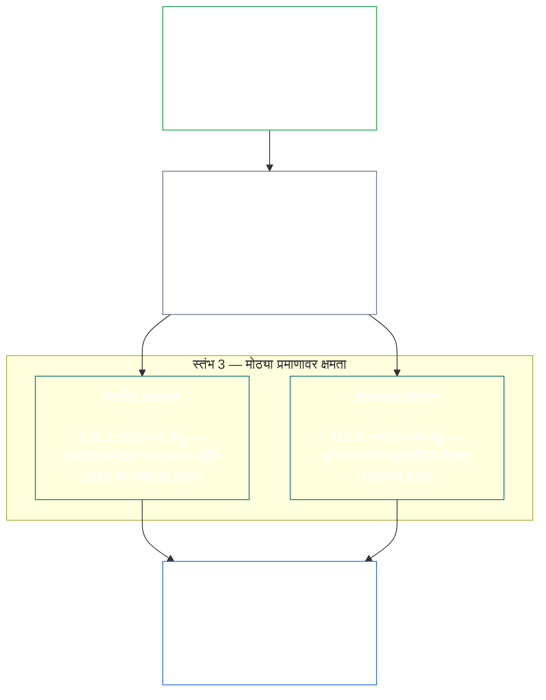

<a id="chapter-01-principles-and-constraints"></a>
<a id="chapter-01-part-b-stewardship-and-governance"></a>
<a id="chapter-01-part-c-stewardship-and-governance"></a>
# अध्याय ०१, भाग C: देखरेख आणि शासन

<details>
<summary><strong><span style="color: #2563eb;">कॉर्पसमधील स्थान (कार्यकारी नाही): फाइलची रचना आणि वाचनाचे नियम</span></strong></summary>

> पुढील मजकूर केवळ वाचकांसाठी मार्गदर्शन आहे. या फाइलमध्ये किंवा इतर अध्यायांत अन्यत्र असलेल्या बंधनकारक जबाबदाऱ्यांमध्ये तो भर घालत नाही, त्यांना काढून टाकत नाही किंवा त्यांची व्याप्ती कमी करत नाही.
>
> ही फाइल **Sentient Constitution** चा भाग आहे आणि इतर क्रमांकित `core_*` फाइल्ससोबत एकच दस्तऐवज म्हणून वाचल्यावरच **बंधनकारक** ठरते. यात **अध्याय एक, भाग C** (§§16–20: देखरेख, शासन, प्रोत्साहन-सुसंगती आणि हस्तगत करणे, तसेच एकात्मिक अनुप्रयोगाचा समारोप) समाविष्ट आहे.
>
> **मागील:** [core_01_b_interaction_interpretation.md](core_01_b_interaction_interpretation.md) (अध्याय एक, भाग B)  
> **पुढील:** [core_02_definition_structure.md](core_02_definition_structure.md)<br>
> **वाचनक्रम:** §16 देखरेख आणि वितरित आकलन → §17 देखरेखकर्त्याची भूमिका → §18 शासन → §19 प्रोत्साहन-सुसंगती आणि हस्तगत करणे → **§20 एकात्मिक अनुप्रयोग** (अध्यायाचा समारोप).

</details>

<details>
<summary><strong><span style="color: #2563eb;">वाचकांसाठी मार्गदर्शन (कार्यकारी नाही): तत्त्वांची श्रेणी आणि वाचनक्रम (भाग C)</span></strong></summary>

> पुढील मजकूर केवळ वाचकांसाठी मार्गदर्शन आहे. या फाइलमध्ये किंवा इतर अध्यायांत अन्यत्र असलेल्या बंधनकारक जबाबदाऱ्यांमध्ये तो भर घालत नाही, त्यांना काढून टाकत नाही किंवा त्यांची व्याप्ती कमी करत नाही. प्रत्येक विभागातील **Trace** आणि **Definitions · Assessment · Compliance** विजेट संबंधित § एखादी संज्ञा महत्त्वपूर्णरीत्या वापरतो त्या ठिकाणी मार्गदर्शन करतात; §§16–20 आधीचा हा भाग संपूर्ण भागासाठी परस्परसंदर्भ नकाशा आहे.

**तत्त्वांची श्रेणी (भाग C).** तत्त्वांच्या स्तरावर:

13. **[देखरेख](core_05_band_continuity.md#stewardship)** संवेदनशील अस्तित्वांच्या संघटनेद्वारे भौतिक प्रणालींना दिशा देते — **स्तंभ 1** ([§17](#17-consequential-stewardship-the-steward-role): परिणामकारक प्रत्यक्ष संचालन आणि सुधारणा), **स्तंभ 2** ([सक्रिय देखरेख](#16-pillar-2-proactive-stewardship): अडचण लवकर ओळखून टाळता येण्याजोग्या विलंबाशिवाय सोडवणे), आणि **स्तंभ 3** ([§16.1](#161-distributed-understanding) · [§16.2](#162-institutional-development): समुदाय आणि संस्थात्मक स्तरावरील क्षमता) — [संवैधानिक चतुष्टया](core_00_preamble.md#constitutional-tetrad) अंतर्गत कालांतराने टिकणारी घटनात्मक सुसंगती साधण्यासाठी; विशेषतः **[सहभाग](core_05_apex_participation_leg.md#participation-constitutional)** (परिणामकारक भूमिका आणि आवाज) आणि **[देखरेख-नियंत्रण](core_05_apex_oversight_leg.md#oversight-constitutional)** (वितरित आकलन, लेखापरीक्षणक्षमता आणि आक्षेप घेण्याची क्षमता — देखरेखीसाठी लेखापरीक्षण आवश्यक; [System Alignment Certification](core_05_band_continuity.md#system-alignment-certification) इतरांपैकी एक विशेष मोठी लेखापरीक्षण प्रक्रिया आहे) — तसेच [दोन घटनात्मक उद्दिष्टां](core_00_preamble.md#two-constitutional-aims) अंतर्गत **सातत्य** हे उद्दिष्टही.
14. **[परिणामकारक देखरेख](#17-consequential-stewardship-the-steward-role)** म्हणजे देखरेखकर्त्याची भूमिका स्वतः: भौतिक प्रणालीवर परिणामकारक संचालन, देखभाल, देखरेख किंवा सुधारणा करणाऱ्या कोणालाही लागू होणारी प्रत्यक्ष कर्तव्ये, मानके आणि संरक्षणे — **स्तंभ 1** चे कार्यरूप, तसेच सामायिक मानक, दबावाखाली सुसंगती आणि भूमिकेच्या मर्यादेत निरीक्षणक्षमता.
15. **[शासन](core_05_band_accountability.md#governance)** [संवैधानिक चतुष्टया](core_00_preamble.md#constitutional-tetrad) अंतर्गत अधिकृत निर्णयप्रक्रिया, सहभाग आणि उत्तरदायित्व यांना संरचना देते — विशेषतः अधिकाराचे वाटप आणि वापर कसा होतो यावर **[देखरेख-नियंत्रण](core_05_apex_oversight_leg.md#oversight-constitutional)**, तसेच [§18.1](#181-governance-as-authorized-structure) अंतर्गत **अधिकाराच्या प्रमाणात उत्तरदायित्व**: अधिकृत शक्ती किंवा परिणामकारक भूमिका जितकी मोठी, तितकी घटनात्मक जबाबदारी आणि देखरेख वाढते; ती कधीही कमी होत नाही. [§18.3 कर्तव्यांचे विभाजन](#183-segregation-of-duties) कृती करणाऱ्या व्यक्तीलाच ती तपासण्यापासून रोखते. [§18.4 सातत्यपूर्ण समर्थन](#184-ongoing-justification) या व्यवस्थांनी अजूनही या संविधानाशी जुळते असल्याचे सातत्याने सिद्ध करणे आवश्यक ठरवते. शासन आणि देखरेख यांत संघर्ष झाल्यास, **आवश्यकता** आणि **प्रमाणबद्धता** मर्यादित, कालबद्ध अपवादाला सुधारण्याचे मार्गांसह स्पष्टपणे समर्थन देत नसतील तर तत्त्वांच्या स्तरावर देखरेखीची शिस्त लागू राहते. कार्यकारी अधिकृतता आणि करार-स्तरीय आवश्यकता **अध्याय तेरा** यांच्या अखत्यारीत राहतात.
16. **[प्रोत्साहन-सुसंगती आणि प्रणालीचे हस्तगत करणे](#19-incentive-alignment-and-system-capture)** प्रोत्साहनरचना, पर्यायी मोजमापांची अखंडता, अल्पकालीन दृष्टीतील दोष, बक्षीसमार्ग दुरुस्ती आणि हस्तगत करण्याला प्रतिसाद यांसाठी तत्त्व-स्तरीय शिस्त पुरवते.
17. **[एकात्मिक अनुप्रयोग](#20-integrated-application)** हा अध्यायाचा समारोप आहे: पुढील अध्याय या अध्यायाच्या एकात्मिक-मूल्य चौकटीतून वाचले जातात.

</details>

<br>

<a id="16-stewardship-in-depth"></a>

### 16. देखरेखीचा सविस्तर विचार
<details>
<summary><strong><span style="color: #2563eb;">संदर्भसूत्र</span></strong></summary>

- यासोबत वाचा: [संवैधानिक चतुष्टय](core_00_preamble.md#constitutional-tetrad) — **सहभाग** या स्तंभासाठी अध्याय एकमधील मुख्य आधार (परिणामकारक भूमिका आणि आवाज; सामान्य आवश्यकता, केवळ [Stakeholder System Participation](core_05_band_participation.md#stakeholder-status-and-weight) नव्हे), **देखरेख-नियंत्रण** स्तंभ, आणि **वेळेवर कृती** स्तंभ (सक्रिय दुरुस्तीचा वेग); [भौतिक हित](core_00_preamble.md#material-stake) यानुसार प्रमाण.
- यासोबत वाचा: [दोन घटनात्मक उद्दिष्टे](core_00_preamble.md#two-constitutional-aims) — **समृद्धी** उद्दिष्ट (सहभाग, स्वायत्त कृती आणि शैक्षणिक मार्ग); **सातत्य** उद्दिष्ट (संस्थात्मक शिक्षण, दुरुस्तीक्षमता आणि टिकाऊ देखरेख).
- पूर्वाधार: तत्त्वे: [3. मूलभूत उद्दिष्ट: कल्याण](core_01_a_values_principles.md#3-foundational-objective-wellbeing-flourishing-aim); [5 सत्य](core_01_a_values_principles.md#5-truth-epistemic-integrity-constraint); [6. विश्वास](core_01_a_values_principles.md#6-trust-and-trustworthiness-coordination-integrity); आणि [§9 सामायिक प्रणाली क्षमता](core_01_a_values_principles.md#9-shared-system-capacity).
- पुढील अनुप्रयोग: [13. घटनात्मक संघर्ष निराकरण प्रक्रिया](core_01_b_interaction_interpretation.md#13-constitutional-collision-resolution-process) ([§13.3 टाळता येण्याजोगा भार कमी करणे](core_01_b_interaction_interpretation.md#133-minimization-of-avoidable-burden) यासह); [अध्याय आठ §4 संपूर्ण-प्रणाली प्रमाणन मूल्यमापन](core_08_a_system_alignment_certification_evaluation.md#4-whole-system-certification-evaluation); [§19.1.3 देखरेख आणि ऑपरेटरवरील अनुप्रयोग](#1913-stewardship-and-operator-application).
- पुढील अनुप्रयोग: [§19.1.4 भूमिका-खोली आणि भौतिक जबाबदारीचे मार्ग](#1914-role-depth-and-material-responsibility-pathways).
- पुढील अनुप्रयोग: [§7 स्वातंत्र्य (मर्यादित स्वायत्त कृती)](core_01_a_values_principles.md#7-freedom-bounded-agency), जे भौतिक अवलंबित्व असतानाही परिणामकारक देखरेख, वितरित आकलन, अर्थपूर्ण सहभाग आणि दुरुस्तीक्षमता प्रत्यक्ष राहण्यावर अवलंबून आहे.
- पुढील अनुप्रयोग: [अध्याय आठ — System Alignment Certification](core_08_a_system_alignment_certification_evaluation.md#chapter-eight-system-alignment-certification) (*देखरेखीखालील एक विशेष मोठी लेखापरीक्षण प्रक्रिया — लेखापरीक्षणाचा एकमेव आधार नव्हे*); [अध्याय नऊ — योगदान, उल्लंघन आणि दर्जा प्रतिमान](core_09_standing_assessment.md#chapter-nine-contribution-violation-and-standing-model--measurement) (*दर्जा परिणाम — विश्वास, भूमिका आणि मान्यतेसाठी पात्रता — या उपविभागाचा तत्त्व-स्तरीय पाया म्हणून अंमल करतो*).
- पुढील अनुप्रयोग: [अध्याय बारा §1 — उद्देश आणि भूमिका](core_12_forum.md#1-purpose-and-role--participation-architecture) आणि [§4 — मंच-कुटुंबांच्या व्याख्या](core_12_forum.md#4-forum-family-definitions--accountability-through-adjudication) (*मंच-कुटुंबे या विभागाशी सुसंगतपणे आक्षेपार्ह आव्हान, उपाययोजनांचा क्रम, मूळ कारणांपासून शिकणे आणि सक्रिय शासनासाठी सहभाग व देखरेखीची संरचना पुरवतात*); स्वीकारलेल्या मंच-कार्यपद्धतींसाठी [corpus_forum.md](corpus_forum.md).
- पुढील अनुप्रयोग: शिक्षण, Stakeholder System Participation, पारदर्शकता, आकलनीयता, लेखापरीक्षण आणि पडताळणी, तसेच भौतिक जबाबदारीकडे नेणारे भूमिका-खोलीचे मार्ग यांसंबंधी अधिकारांचा आवाका घडवतो.
  - विशेषतः [अनुच्छेद III: अस्तित्व आणि अत्यावश्यक प्रवेश](core_06_rights_part_a.md#article-iii-survival-and-essential-access), [अनुच्छेद IV: संवेदनशील-केंद्रित शिक्षणाचा अधिकार](core_06_rights_part_a.md#article-iv-right-to-sentient-centered-education), [अनुच्छेद X: स्वनिर्णय, स्वायत्त कृती आणि सहभाग](core_06_rights_part_b.md#article-x-self-determination-agency-and-participation), [अनुच्छेद XII: भागधारकांची प्रणालीतील भागीदारी, प्रतिनिधित्व आणि योग्य प्रक्रिया](core_06_rights_part_b.md#article-xii-stakeholder-system-participation-representation-and-due-process), [अनुच्छेद XVI: लेखापरीक्षण, पारदर्शकता आणि स्वतंत्र पडताळणी](core_06_rights_part_c.md#article-xvi-audit-transparency-and-independent-verification), [अनुच्छेद XIX: दर्जा आणि सहभाग स्थिती](core_06_rights_part_d.md#article-xix-standing-and-participation-status), [अनुच्छेद XXI: आंतरकार्यक्षमता, वहनक्षमता, हालचाल, आश्रय आणि निर्गमनाची अखंडता](core_06_rights_part_d.md#article-xxi-interoperability-portability-movement-refuge-and-exit-integrity), [अनुच्छेद XXII: आकलनीयता आणि गुंतागुंतीची देखरेख](core_06_rights_part_d.md#article-xxii-comprehensibility-and-complexity-stewardship), आणि [अनुच्छेद XXIV: घटनात्मक अर्थनिर्णय, पुनरावलोकन आणि हस्तगत-विरोधी संरक्षणे](core_06_rights_part_d.md#article-xxiv-constitutional-interpretation-review-and-anti-capture-safeguards).
  - यासोबत वाचा: [अध्याय तेरा §5 — अधिकृत भूमिका, कौशल्यविकास आणि योगदान](core_13_governance.md#5-authorized-roles-competency-development-and-contribution) आणि **[corpus_systems.md](corpus_systems.md), CS-4 — महत्त्वपूर्ण प्रणालीची देखरेख**; कार्यकारी भूमिका-पथ आणि देखरेख-विकास मार्गांसाठी.
- उपविभाग (वाचनक्रम): [§16.1 वितरित आकलन](#161-distributed-understanding) (मोठ्या प्रमाणावरील क्षमतेचा समुदायविषयक पैलू) · [§16.2 संस्थात्मक विकास](#162-institutional-development) (संघटनात्मक पैलू) · [§16.3 खुलेपणाची आकांक्षा](#163-openness-aspiration).
- यासोबत वाचा: [§17 परिणामकारक देखरेख](#17-consequential-stewardship-the-steward-role) (*देखरेखकर्त्याची भूमिका स्वतः — स्वतंत्र विभाग म्हणून उन्नत; यात स्तंभ 1 मधील प्रत्यक्ष संचालन, देखभाल, देखरेख आणि सुधारणेची कर्तव्ये, तसेच [§17.1](#171-shared-stewardship-standard), [§17.2](#172-alignment-under-pressure), [§17.3](#173-logging-the-role-not-the-steward), [§17.4 सुसंगत स्व-संघटन](#174-aligned-self-organization), जी ही शिस्त औपचारिक भूमिकेच्या पलीकडे नेते, आणि [§17.5 प्रतिकाराचे कर्तव्य](#175-duty-to-resist) समाविष्ट आहेत*)।

</details>

<details>
<summary><strong><span style="color: #2563eb;">व्याख्या · मूल्यमापन · अनुपालन</span></strong></summary>

- [धोरणात्मक देखरेख बंधन](core_05_band_continuity.md#strategic-stewardship-obligation) · [O](core_05_band_continuity.md#strategic-stewardship-obligation) · [M](core_05_band_continuity.md#strategic-stewardship-obligation-constitutional-a) · [A](core_05_band_continuity.md#strategic-stewardship-obligation-constitutional-a) · [C](core_05_band_continuity.md#strategic-stewardship-obligation-constitutional-c)
- [वितरित आकलन](core_05_band_continuity.md#distributed-understanding) · [O](core_05_band_continuity.md#distributed-understanding) · [M](core_05_band_continuity.md#distributed-understanding-constitutional-a) · [A](core_05_band_continuity.md#distributed-understanding-constitutional-a) · [C](core_05_band_continuity.md#distributed-understanding-constitutional-c)
- [सहभाग](core_05_apex_participation_leg.md#participation-constitutional) · [O](core_05_apex_participation_leg.md#participation-constitutional) · [M](core_05_apex_participation_leg.md#participation-constitutional-m) · [A](core_05_apex_participation_leg.md#participation-constitutional-a) · [C](core_05_apex_participation_leg.md#participation-constitutional-c)
- [देखरेख](core_05_apex_oversight_leg.md#oversight-constitutional) · [O](core_05_apex_oversight_leg.md#oversight-constitutional) · [M](core_05_apex_oversight_leg.md#oversight-constitutional-m) · [A](core_05_apex_oversight_leg.md#oversight-constitutional-a) · [C](core_05_apex_oversight_leg.md#oversight-constitutional-c)
- [अर्थपूर्ण स्वायत्त कृती](core_05_band_participation.md#meaningful-agency) · [O](core_05_band_participation.md#meaningful-agency) · [M](core_05_band_participation.md#meaningful-agency-a) · [A](core_05_band_participation.md#meaningful-agency-a) · [C](core_05_band_participation.md#meaningful-agency-c)
- [लेखापरीक्षणक्षमता](core_05_band_oversight.md#auditability) · [O](core_05_band_oversight.md#auditability) · [M](core_05_band_oversight.md#auditability-a) · [A](core_05_band_oversight.md#auditability-a) · [C](core_05_band_oversight.md#auditability-c)
- [आक्षेपार्हता](core_05_band_accountability.md#contestability) · [O](core_05_band_accountability.md#contestability) · [M](core_05_band_accountability.md#contestability-a) · [A](core_05_band_accountability.md#contestability-a) · [C](core_05_band_accountability.md#contestability-c)
- [शैक्षणिक स्वायत्त कृती](core_05_band_participation.md#educational-agency) · [O](core_05_band_participation.md#educational-agency) · [M](core_05_band_participation.md#educational-agency-a) · [A](core_05_band_participation.md#educational-agency-a) · [C](core_05_band_participation.md#educational-agency-c)
- [पारदर्शकता](core_05_band_oversight.md#transparency) · [O](core_05_band_oversight.md#transparency) · [M](core_05_band_oversight.md#transparency-a) · [A](core_05_band_oversight.md#transparency-a) · [C](core_05_band_oversight.md#transparency-c)
- [भौतिकता](core_05_band_oversight.md#materiality) · [O](core_05_band_oversight.md#materiality) · [M](core_05_band_oversight.md#materiality-determination-a) · [A](core_05_band_oversight.md#materiality-determination-a) · [C](core_05_band_oversight.md#materiality-determination-c)
- [अवलंबित्व](core_05_band_continuity.md#dependency) · [O](core_05_band_continuity.md#dependency) · [M](core_05_band_continuity.md#dependency-a) · [A](core_05_band_continuity.md#dependency-a) · [C](core_05_band_continuity.md#dependency-c)
- [सुलभता](core_05_band_participation.md#accessibility) · [O](core_05_band_participation.md#accessibility) · [M](core_05_band_participation.md#accessibility-constitutional-a) · [A](core_05_band_participation.md#accessibility-constitutional-a) · [C](core_05_band_participation.md#accessibility-constitutional-c)
- [सुरक्षा (घटनात्मक मर्यादा)](core_05_band_continuity.md#safety-constitutional-constraint) · [O](core_05_band_continuity.md#safety-constitutional-constraint) · [M](core_05_band_continuity.md#safety-constraint-a) · [A](core_05_band_continuity.md#safety-constraint-a) · [C](core_05_band_continuity.md#safety-constraint-c)
- [सत्य (घटनात्मक मर्यादा)](core_05_band_oversight.md#truth-constitutional-constraint) · [O](core_05_band_oversight.md#truth-constitutional-constraint-o) · [M](core_05_band_oversight.md#truth-constitutional-constraint-a) · [A](core_05_band_oversight.md#truth-constitutional-constraint-a) · [C](core_05_band_oversight.md#truth-constitutional-constraint-c)
- [आवश्यकता](core_05_band_accountability.md#necessity) · [O](core_05_band_accountability.md#necessity) · [M](core_05_band_accountability.md#necessity-a) · [A](core_05_band_accountability.md#necessity-a) · [C](core_05_band_accountability.md#necessity-c)
- [प्रमाणबद्धता](core_05_band_accountability.md#proportionality) · [O](core_05_band_accountability.md#proportionality) · [M](core_05_band_accountability.md#proportionality-a) · [A](core_05_band_accountability.md#proportionality-a) · [C](core_05_band_accountability.md#proportionality-c)
- [टाळता येण्याजोगा भार](core_05_band_continuity.md#avoidable-burden) · [O](core_05_band_continuity.md#avoidable-burden) · [M](core_05_band_continuity.md#avoidable-burden-a) · [A](core_05_band_continuity.md#avoidable-burden-a) · [C](core_05_band_continuity.md#avoidable-burden-c)
- [ज्ञानमीमांसात्मक अखंडता](core_05_band_oversight.md#epistemic-integrity) · [O](core_05_band_oversight.md#epistemic-integrity-o) · [M](core_05_band_oversight.md#epistemic-integrity-a) · [A](core_05_band_oversight.md#epistemic-integrity-a) · [C](core_05_band_oversight.md#epistemic-integrity-c)

</details>

<br>

*सोप्या शब्दांत: तीन कल्पना हा विभाग एकत्र बांधतात. प्रथम, संवेदनशील अस्तित्वांच्या जीवनावर भौतिक परिणाम करणाऱ्या प्रणाली चांगल्या प्रकारे चालवण्यासाठी संवेदनशील अस्तित्वांची संघटित सहभागिता आवश्यक आहे — तज्ज्ञांचा बंदिस्त पुजारीवर्ग नव्हे. दुसरे, चांगले देखरेखकर्ते नुकसान होईपर्यंत कृतीची वेळ येण्याची वाट पाहत नाहीत — समस्या लहान असतानाच ते ओळखतात, योग्य व्यक्तींकडे पोहोचवतात आणि विलंब स्वतःच हानीकारक होण्यापूर्वी सोडवतात. तिसरे, या संघटनेने **मोठ्या प्रमाणावर क्षमता** घडवली पाहिजे: व्यक्तींना परिणामकारक कामापर्यंत पोहोचण्याचे खरे मार्ग, समस्या ओळखून प्रतिकार करण्याइतके समुदायाचे आकलन, आणि ठप्प न होता शिकत राहणाऱ्या संस्था.*

<a id="16-limits"></a>
देखरेख मर्यादित असते. **सुरक्षा**, **सत्य**, **आवश्यकता**, **प्रमाणबद्धता**, **टाळता येण्याजोगा भार**, आणि **ज्ञानमीमांसात्मक अखंडता** ही कर्तव्ये न्याय्य प्रमाणात, प्रामाणिक आणि वैध सुरक्षाविषयक गरजांचा आदर करणारी ठेवण्यासाठी मर्यादा ठरवतात — खालील स्तंभ या मर्यादांमध्ये कार्य करतात, त्यांना वळसा घालून नाही.

संवेदनशील अस्तित्वांची संघटना, सक्रिय देखरेख आणि मोठ्या प्रमाणावर क्षमता हे या विभागाचे तीन स्तंभ आहेत. तिन्ही स्तंभ मिळून तत्त्वांच्या स्तरावर [संवैधानिक चतुष्टया](core_00_preamble.md#constitutional-tetrad) चे **सहभाग**, **देखरेख-नियंत्रण** आणि **वेळेवर कृती** हे पैलू उचलतात, [भौतिक हित](core_00_preamble.md#material-stake) यानुसार प्रमाण ठरवतात आणि [दोन घटनात्मक उद्दिष्टे](core_00_preamble.md#two-constitutional-aims) पुढे नेतात.

<br>



**स्तंभ 1 — परिणामकारक देखरेख ([§17 परिणामकारक देखरेख](#17-consequential-stewardship-the-steward-role)):**
- संवेदनशील अस्तित्वांवर भौतिक परिणाम करणाऱ्या सामायिक प्रणालींना संवेदनशील अस्तित्वांकडून प्रत्यक्ष संचालन, देखभाल, देखरेख आणि सुधारणा आवश्यक असते — [**धोरणात्मक देखरेख बंधन**](core_05_band_continuity.md#strategic-stewardship-obligation), [**अर्थपूर्ण स्वायत्त कृती**](core_05_band_participation.md#meaningful-agency)
- इतरांना पडताळता आणि आव्हान देता येतील अशा नोंदी आणि पुनरावलोकनाचे मार्ग — [**लेखापरीक्षणक्षमता**](core_05_band_oversight.md#auditability), [**आक्षेपार्हता**](core_05_band_accountability.md#contestability)
- चतुष्टयाच्या **देखरेख** पैल्यानुसार देखरेखीसाठी लेखापरीक्षण आवश्यक आहे; [System Alignment Certification](core_05_band_continuity.md#system-alignment-certification) ही इतरांपैकी एक विशेष मोठी आणि उच्च-दांवाची लेखापरीक्षण प्रक्रिया आहे — लेखापरीक्षणाचा एकमेव आधार नाही (**अनुच्छेद XVI** (*लेखापरीक्षण, पारदर्शकता आणि स्वतंत्र पडताळणी*))

<a id="16-pillar-2-proactive-stewardship"></a>
**स्तंभ 2 — सक्रिय देखरेख:**
सक्रिय देखरेखकर्ते उद्भवणाऱ्या समस्या आणि विसंगती तीन प्रकारे हाताळतात:
- **वाढण्याआधी ओळखा** — समस्या लहान असतानाच चांगले देखरेखकर्ते विसंगती ओळखतात; त्या आपोआप उघड होण्याची वाट पाहत नाहीत
- **स्तराला योग्य अशा वेळापत्रकात पुढे न्या** — जे आढळले ते दडपून न ठेवता किंवा नियमित बाबींना गरजेपेक्षा जास्त वर न पाठवता, भूमिकेच्या जोखमीनुसार ठरवलेल्या मुदतीत ते वाढवून मांडा
- **फक्त खूण करू नका, पूर्ण निराकरण करा** — समस्या मांडल्यानंतर टाळता येण्याजोग्या विलंबाशिवाय दुरुस्ती सुरू करा; हा चतुष्टयाच्या **वेळेवर कृती** पैलूचा कार्यकारी आविष्कार आहे ([**वेळेवर कृती**](core_05_apex_timeliness_leg.md#timeliness-constitutional))
- **भूमिकेचे कायमचे कर्तव्य, वरून जोडलेली बाब नव्हे:** [§17 परिणामकारक देखरेख](#17-consequential-stewardship-the-steward-role) मध्ये परिभाषित देखरेखकर्त्याची भूमिका नुकसान किंवा विसंगती दिसू लागल्यानंतर लक्षणांवर प्रतिक्रियात्मक उपाय करण्यापेक्षा सक्रिय शासन, प्रणालीची रचना आणि घटनात्मक सुसंगती यांना प्राधान्य देते — हा स्तंभ स्वतंत्र प्रक्रियेकडे सोपवलेला नसून त्या भूमिकेचे कायमचे कर्तव्य आहे

**स्तंभ 3 — मोठ्या प्रमाणावर क्षमता ([§16.1 वितरित आकलन](#161-distributed-understanding) · [§16.2 संस्थात्मक विकास](#162-institutional-development)):**
- देखरेखीमुळे प्रभावित समुदायांना आकलन आणि आक्षेप घेणे व्यवहार्य झाले पाहिजे — [**शैक्षणिक स्वायत्त कृती**](core_05_band_participation.md#educational-agency), [**पारदर्शकता**](core_05_band_oversight.md#transparency)
- अभिप्राय, दुरुस्ती आणि टिकवून ठेवलेल्या कौशल्यांद्वारे संस्था शिकत राहतात; मोजमाप उपयोगी ठरते तिथे कालांतराने होणाऱ्या बदलांचे संरचित निरीक्षणही त्यात येते (**सांख्यिकीय प्रक्रिया नियंत्रण** यांसारखे नमुने परिचित अंमलबजावणी आहेत, सार्वत्रिक आवश्यकता नाहीत)

<a id="when-day-to-day-stewardship-is-not-enough"></a>
**दैनंदिन संरक्षकत्व पुरेसे नसते तेव्हा:**
संरक्षकत्व ही पहिली संरक्षणरेषा आहे, एकमेव नाही. तीन वेगवेगळ्या प्रश्नांसाठी तीन वेगवेगळी ठिकाणे आहेत; त्यांपैकी कोणतेही दुसऱ्याची जागा घेत नाही:
- **आधीपासून अधिकृत असलेल्या प्रणालीतील वाद — [हितधारक प्रणाली सहभाग](core_05_band_participation.md#stakeholder-status-and-weight):**
  - प्रभावित sentient प्रथम प्रकाशित हितधारक प्रणाली सहभाग आव्हान-मार्ग वापरतात; त्यात सहभाग, प्रतिनिधित्व, आव्हानक्षमता आणि योग्य प्रक्रिया येतात.
  - हे संरक्षण महत्त्वपूर्णरीत्या प्रभावित होणाऱ्या प्रत्येक sentient ला देय आहे.
  - आधीपासून अधिकृत असलेल्या प्रणाली, संस्था आणि निर्णय-क्षेत्रांच्या आत हे संरक्षण कार्य करते.
- **हितधारक प्रणाली सहभागाने न सुटणारे वाद — [मंच पुनरावलोकन](core_12_forum.md#dispute-sequencing):**
  - हितधारक प्रणाली सहभागाचा आव्हान-मार्ग वादग्रस्तच राहिला, अनुपलब्ध किंवा काबीज केलेला असेल, किंवा दिलासा देऊ शकत नसेल, तर प्राथमिक हितानुसार प्रकरण [अध्याय बारा §1 — उद्देश आणि भूमिका](core_12_forum.md#1-purpose-and-role--participation-architecture) आणि [§4 — मंच-कुटुंबांच्या व्याख्या](core_12_forum.md#4-forum-family-definitions--accountability-through-adjudication) अंतर्गत स्वतंत्र **मंच-कुटुंबांकडे** पाठवले जाते.
  - येथे sentient ना निर्णयाला आव्हान देण्याचा खरा मार्ग, स्पष्ट दुरुस्ती आदेश, किंवा पुन्हा पुन्हा दिसणाऱ्या नमुन्यातून शिकण्याची संधी मिळते.
  - प्राथमिक हित संवैधानिक मजकुराचा अर्थ किंवा वैधता, अथवा कायदेशीर अधिकाराच्या पलीकडील कृती असेल, तर प्रमुख कुटुंब [संवैधानिक मंच](core_12_forum.md#46-constitutional-forums) असते.
  - हे मंच कसे चालतात याचे तपशीलवार नियम [corpus_forum.md](corpus_forum.md) मध्ये आहेत.
- **मुळात शासन कोण करू शकते — [संवैधानिक करार स्तर](core_05_band_integrative.md#constitutional-contract-layer) ([अध्याय तेरा](core_13_governance.md)):**
  - शासन करण्याचा अधिकार स्वतः वैध आहे का — कोण शासन करू शकते, कोणत्या वैधता-यंत्रणेद्वारे, आणि कोणत्या व्याप्ती व टिकाऊ अटींनुसार — हा हितधारक प्रणाली सहभाग आणि मंच पुनरावलोकनापेक्षा वेगळा प्रश्न आहे.
  - सहभागासाठीचे मत, आव्हान-मार्गाचा निकाल किंवा विश्वास-गुण शासनाचा अधिकार देत नाही.
  - संवैधानिक प्राधिकरणामुळे हितधारक प्रणाली सहभागांतर्गत असलेली कर्तव्ये संपत नाहीत.
  - दोन्ही स्तर एकमेकांत येत असले तरी वेगळेच राहतात ([प्रस्तावना §3.3 — शासनाचे स्तर](core_00_preamble.md#33-governance-layers)).
- **आधारव्यवस्था, पर्याय नव्हे:** पुरावे मागणीला आधार देत असतील तेथे पुनरावलोकन, दुरुस्ती आणि निवारण बंधनकारकच राहतात. हानी दिसण्यापूर्वी अंदाज करता येण्याजोगे संवैधानिक विसंरेखन रोखणारी सक्रिय रचना, प्रोत्साहने, नियंत्रण, भूमिका-मार्ग, निरीक्षणक्षमता आणि दुरुस्ती क्षमता यांची जागा हे घेत नाहीत.

<a id="16-scope-priority-and-limits"></a>
**व्याप्ती ([§16 संरक्षकत्वाचा सखोल विचार](#16-stewardship-in-depth)):**
- हा विभाग तत्त्व-स्तरावर दिशा देतो; सर्वांना लागू होणारी एकसारखी नियमपुस्तिका नाही.
- यासाठी पुढील गोष्टी **आवश्यक नाहीत**:
  - प्रत्येकाला प्रत्येक भूमिकेतून फिरवणे
  - न्याय्य विशेषीकरण बाजूला सारणे
  - [13.2 ज्ञानमीमांसात्मक प्रकटीकरण मर्यादा](core_01_b_interaction_interpretation.md#132-epistemic-disclosure-constraints) आणि लागू **अध्याय सहा** मधील संरक्षणांच्या अधीन असलेल्या वैध गोपनीयता किंवा सुरक्षा मर्यादा ओलांडणे.

**प्राधान्य:**
- **भौतिकता**, **अवलंबित्व**, आणि **सुलभता** समज आणि प्रवेशवाटपाचे प्राधान्य ठरवतात — परिणाम आणि अवलंबित्व जास्त असेल तिथे सर्वाधिक लक्ष दिले जाते.

<a id="161-distributed-understanding"></a>
#### 16.1 वितरित समज
<details>
<summary><strong><span style="color: #2563eb;">अनुसरण</span></strong></summary>

- ऊर्ध्व: [§17 परिणामकारक संरक्षकत्व](#17-consequential-stewardship-the-steward-role) (*स्तंभ 1*); [§16 संरक्षकत्वाचा सखोल विचार](#16-stewardship-in-depth) (मूळ विभाग, वरचा *सोप्या शब्दांत* मजकूर आणि स्तंभ 3 ची मांडणी यांसह); [5 सत्य](core_01_a_values_principles.md#5-truth-epistemic-integrity-constraint); [6. विश्वास](core_01_a_values_principles.md#6-trust-and-trustworthiness-coordination-integrity).
- यासोबत वाचा: [संवैधानिक चतुष्टय](core_00_preamble.md#constitutional-tetrad) — **सहभाग** बाजू ([अर्थपूर्ण कर्तृत्व](core_05_band_participation.md#meaningful-agency), [शैक्षणिक कर्तृत्व](core_05_band_participation.md#educational-agency)); **देखरेख** बाजू ([पारदर्शकता](core_05_band_oversight.md#transparency), [लेखापरीक्षणक्षमता](core_05_band_oversight.md#auditability)); [भौतिक हित](core_00_preamble.md#material-stake) यानुसार प्रमाण.
- संरक्षक प्रवेशद्वार (कार्यकारी स्वरूपाचे नाही): पुढील पायरीचे कार्ड: [समजण्यायोग्यता](implementation/STEWARD_ENTRY_DOORS.md#comprehensibility). हे कार्ड संविधानाचा आवाका कमी करू शकत नाही.
- अधोमुख: [13.2 ज्ञानमीमांसात्मक प्रकटीकरण मर्यादा](core_01_b_interaction_interpretation.md#132-epistemic-disclosure-constraints); अधिकार-क्षेत्रात विशेषतः [अनुच्छेद XVI: लेखापरीक्षण, पारदर्शकता आणि स्वतंत्र पडताळणी](core_06_rights_part_c.md#article-xvi-audit-transparency-and-independent-verification), [अनुच्छेद XXII: समजण्यायोग्यता आणि गुंतागुंतीचे संरक्षकत्व](core_06_rights_part_d.md#article-xxii-comprehensibility-and-complexity-stewardship).

</details>

<details>
<summary><strong><span style="color: #2563eb;">व्याख्या · मूल्यांकन · अनुपालन</span></strong></summary>

- [वितरित समज](core_05_band_continuity.md#distributed-understanding) · [O](core_05_band_continuity.md#distributed-understanding) · [M](core_05_band_continuity.md#distributed-understanding-constitutional-a) · [A](core_05_band_continuity.md#distributed-understanding-constitutional-a) · [C](core_05_band_continuity.md#distributed-understanding-constitutional-c)
- [पारदर्शकता](core_05_band_oversight.md#transparency) · [O](core_05_band_oversight.md#transparency) · [M](core_05_band_oversight.md#transparency-a) · [A](core_05_band_oversight.md#transparency-a) · [C](core_05_band_oversight.md#transparency-c)
- [सार्वजनिक देखरेख मूलभूत प्रकटीकरण](core_05_band_oversight.md#public-oversight-baseline-disclosure) · [O](core_05_band_oversight.md#public-oversight-baseline-disclosure) · [M](core_05_band_oversight.md#public-oversight-baseline-disclosure-a) · [A](core_05_band_oversight.md#public-oversight-baseline-disclosure-a) · [C](core_05_band_oversight.md#public-oversight-baseline-disclosure-c)
- [लेखापरीक्षणक्षमता](core_05_band_oversight.md#auditability) · [O](core_05_band_oversight.md#auditability) · [M](core_05_band_oversight.md#auditability-a) · [A](core_05_band_oversight.md#auditability-a) · [C](core_05_band_oversight.md#auditability-c)
- [भौतिकता](core_05_band_oversight.md#materiality) · [O](core_05_band_oversight.md#materiality) · [M](core_05_band_oversight.md#materiality-determination-a) · [A](core_05_band_oversight.md#materiality-determination-a) · [C](core_05_band_oversight.md#materiality-determination-c)
- [अवलंबित्व](core_05_band_continuity.md#dependency) · [O](core_05_band_continuity.md#dependency) · [M](core_05_band_continuity.md#dependency-a) · [A](core_05_band_continuity.md#dependency-a) · [C](core_05_band_continuity.md#dependency-c)
- [सुलभता](core_05_band_participation.md#accessibility) · [O](core_05_band_participation.md#accessibility) · [M](core_05_band_participation.md#accessibility-constitutional-a) · [A](core_05_band_participation.md#accessibility-constitutional-a) · [C](core_05_band_participation.md#accessibility-constitutional-c)
- [शैक्षणिक कर्तृत्व](core_05_band_participation.md#educational-agency) · [O](core_05_band_participation.md#educational-agency) · [M](core_05_band_participation.md#educational-agency-a) · [A](core_05_band_participation.md#educational-agency-a) · [C](core_05_band_participation.md#educational-agency-c)
- [अर्थपूर्ण कर्तृत्व](core_05_band_participation.md#meaningful-agency) · [O](core_05_band_participation.md#meaningful-agency) · [M](core_05_band_participation.md#meaningful-agency-a) · [A](core_05_band_participation.md#meaningful-agency-a) · [C](core_05_band_participation.md#meaningful-agency-c)
- [आव्हानक्षमता](core_05_band_accountability.md#contestability) · [O](core_05_band_accountability.md#contestability) · [M](core_05_band_accountability.md#contestability-a) · [A](core_05_band_accountability.md#contestability-a) · [C](core_05_band_accountability.md#contestability-c)

</details>

<br>

*सोप्या शब्दांत: सामायिक प्रणालींमध्ये सुरक्षितपणे जगण्यासाठी प्रत्येक उपप्रणालीत पीएचडी असण्याची गरज नसावी — पण एखादी प्रणाली तुमच्या आयुष्यावर जितका अधिक परिणाम करते, तितके ती काय करते, काय बिघडू शकते आणि चुकीच्या निर्णयाला आव्हान कसे द्यावे हे शिकता आले पाहिजे. पारदर्शकता, शिक्षण, सोपी स्पष्टीकरणे आणि लेखापरीक्षणाचे मार्ग यामुळे हे शक्य होते. महत्त्वाची गोष्ट लपवण्यासाठी गुंतागुंत हे कारण ठरू शकत नाही. चतुष्टयाच्या **देखरेख** बाजूअंतर्गत देखरेखीला लेखापरीक्षण आवश्यक आहे; प्रणाली-संरेखन प्रमाणन हा त्या मार्गांपैकी एक विशेष मोठा लेखापरीक्षण प्रक्रियेचा प्रकार आहे — एकमेव नाही.*

वितरित समज हा **[§16 संरक्षकत्वाचा सखोल विचार](#16-stewardship-in-depth)** अंतर्गत **स्तंभ 3** चा समुदायाभिमुख पैलू आहे. संपूर्ण व्याख्या, मोजमापे आणि अपयशाच्या अटी [वितरित समज](core_05_band_continuity.md#distributed-understanding) येथे आहेत. सारांश:

- **काय आवश्यक आहे:** sentient वर भौतिक परिणाम करणाऱ्या सामायिक प्रणाली कशा चालतात — त्यांची उद्दिष्टे, मर्यादा, अनिश्चितता आणि भौतिकदृष्ट्या संबंधित परिणाम — याबद्दल प्रमाणबद्ध, संरचित प्रवेश.
- **हे व्यवहार्य कशामुळे होते:** [§17 परिणामकारक संरक्षकत्व](#17-consequential-stewardship-the-steward-role) अंतर्गत दस्तऐवजीकरण, शिक्षण, पारदर्शकता, भूमिका-मार्ग आणि समजण्यायोग्यतेचे संरक्षकत्व पुरवले पाहिजे. प्रत्येक sentient प्रत्येक मार्ग वापरतो की नाही यावर हे कर्तव्य अवलंबून नाही.
- **ऑनलाइन सार्वजनिक आधाररेषा:** कायदेशीर ऑनलाइन पायाभूत सुविधा उपलब्ध असेल, तर ऑनलाइन [सार्वजनिक देखरेख मूलभूत प्रकटीकरण](core_05_band_oversight.md#public-oversight-baseline-disclosure) — ज्यात पेवॉल निषेध आणि शक्य तितक्या जास्त सार्वजनिक पर्यायाचा नियम समाविष्ट आहे — [पारदर्शकता](core_05_band_oversight.md#transparency) आणि [सार्वजनिक देखरेख मूलभूत प्रकटीकरण](core_05_band_oversight.md#public-oversight-baseline-disclosure) यांच्या अधीन असते आणि **[corpus_systems.md](corpus_systems.md), CS-2** (*माहितीचे प्रकार आणि हाताळणी*) अंतर्गत **Type O** माहिती म्हणून अंमलात आणले जाते.
- **प्रवेशामुळे काय साध्य होते:**
  - [संवैधानिक चतुष्टय](core_00_preamble.md#constitutional-tetrad) मधील **सहभाग** बाजू ([अर्थपूर्ण कर्तृत्व](core_05_band_participation.md#meaningful-agency) आणि आव्हानक्षमता यांची माहितीपूर्ण अंमलबजावणी)
  - **देखरेख** बाजू; यात [लेखापरीक्षणक्षमता](core_05_band_oversight.md#auditability) आणि **अनुच्छेद XVI** (*लेखापरीक्षण, पारदर्शकता आणि स्वतंत्र पडताळणी*) अंतर्गत लेखापरीक्षण येते. त्यातील [प्रणाली-संरेखन प्रमाणन](core_05_band_continuity.md#system-alignment-certification) ही समकक्ष लेखापरीक्षण पद्धतींमधील एक विशेष मोठी प्रक्रिया आहे.

वितरित समजासाठी प्रत्येक sentient ने प्रत्येक उपप्रणालीत प्रावीण्य मिळवणे **आवश्यक नाही**. मात्र समज [भौतिकता](core_05_band_oversight.md#materiality) आणि [अवलंबित्व](core_05_band_continuity.md#dependency) यानुसार वाढणे **आवश्यक आहे**. **अध्याय पाच** आणि **अध्याय सहा** जेथे प्रकटीकरण, शिक्षण किंवा समजण्यायोग्यतेची कर्तव्ये घालतात, तेथे गुंतागुंत आणि अस्पष्टता वापरून [अर्थपूर्ण कर्तृत्व](core_05_band_participation.md#meaningful-agency) किंवा आव्हानक्षमता निष्प्रभ करता येणार नाही.

<a id="162-institutional-development"></a>
#### 16.2 संस्थात्मक विकास
<details>
<summary><strong><span style="color: #2563eb;">अनुसरण</span></strong></summary>

- ऊर्ध्व: [§17 परिणामकारक संरक्षकत्व](#17-consequential-stewardship-the-steward-role) (*स्तंभ 1*); [§16.1 वितरित समज](#161-distributed-understanding) (*स्तंभ 3 चा सामुदायिक पैलू*); [§16 संरक्षकत्वाचा सखोल विचार](#16-stewardship-in-depth) (मातृ विभागातील स्तंभ 3 ची मांडणी).
- यासोबत वाचा: [संवैधानिक चतुष्टय](core_00_preamble.md#constitutional-tetrad) — **सहभाग** बाजू (परिणामकारक भूमिका समर्थित करणारे कामगारवर्गाचे आणि प्रभावित समुदायांचे शिक्षण); **देखरेख** बाजू ([पडताळणीक्षमता](core_05_band_oversight.md#verifiability), [लेखापरीक्षणक्षमता](core_05_band_oversight.md#auditability), प्रामाणिक मोजमापे); [भौतिक हित](core_00_preamble.md#material-stake) यानुसार प्रमाण.
- भौतिकदृष्ट्या लागू असेल तेथे [धोरणात्मक संरक्षकत्वाचे दायित्व](core_05_band_continuity.md#strategic-stewardship-obligation) आणि [लेखापरीक्षणक्षमता](core_05_band_oversight.md#auditability) यांच्यासह वाचा.
- [§16.1 वितरित समज](#161-distributed-understanding) यासोबत वाचा (*सामुदायिक समज आणि संस्थात्मक शिक्षण हे व्यापक स्तरावरील क्षमतेच्या एकाच अपेक्षेचे वेगळे पैलू आहेत; ते एकमेकांचे पर्याय नाहीत*).
- अधोमुख: [§16.3 खुलेपणाची आकांक्षा](#163-openness-aspiration); [§18 संरक्षकत्वाच्या शिस्तीखालील शासन](#18-governance-under-stewardship-discipline) आणि [§19 प्रोत्साहन-संरेखन आणि प्रणाली-कब्जा](#19-incentive-alignment-and-system-capture) (*संस्थात्मक शिक्षण आणि प्रोत्साहन-संरेखन*).

</details>

<details>
<summary><strong><span style="color: #2563eb;">व्याख्या · मूल्यांकन · अनुपालन</span></strong></summary>

- [संस्थात्मक विकास](core_05_band_continuity.md#institutional-development) · [O](core_05_band_continuity.md#institutional-development) · [M](core_05_band_continuity.md#institutional-development-constitutional-a) · [A](core_05_band_continuity.md#institutional-development-constitutional-a) · [C](core_05_band_continuity.md#institutional-development-constitutional-c)
- [धोरणात्मक संरक्षकत्वाचे दायित्व](core_05_band_continuity.md#strategic-stewardship-obligation) · [O](core_05_band_continuity.md#strategic-stewardship-obligation) · [M](core_05_band_continuity.md#strategic-stewardship-obligation-constitutional-a) · [A](core_05_band_continuity.md#strategic-stewardship-obligation-constitutional-a) · [C](core_05_band_continuity.md#strategic-stewardship-obligation-constitutional-c)
- [लेखापरीक्षणक्षमता](core_05_band_oversight.md#auditability) · [O](core_05_band_oversight.md#auditability) · [M](core_05_band_oversight.md#auditability-a) · [A](core_05_band_oversight.md#auditability-a) · [C](core_05_band_oversight.md#auditability-c)
- [भौतिकता](core_05_band_oversight.md#materiality) · [O](core_05_band_oversight.md#materiality) · [M](core_05_band_oversight.md#materiality-determination-a) · [A](core_05_band_oversight.md#materiality-determination-a) · [C](core_05_band_oversight.md#materiality-determination-c)
- [पडताळणीक्षमता](core_05_band_oversight.md#verifiability) · [O](core_05_band_oversight.md#verifiability) · [M](core_05_band_oversight.md#verifiability-a) · [A](core_05_band_oversight.md#verifiability-a) · [C](core_05_band_oversight.md#verifiability-c)

</details>

<br>

*सोप्या शब्दांत: संस्थांनी खरोखर शिकले पाहिजे — केवळ सॉफ्टवेअर अद्ययावत करून जबाबदार व्यक्तींना अनभिज्ञ ठेवून चालणार नाही. यासाठी अभिप्राय चक्रे, संरेखन बिघडल्यास नोंदवलेल्या दुरुस्त्या, आणि कौशल्यधारक लोक संस्थेतून निघून जाणार नाहीत याची काळजी आवश्यक आहे. वर्तनाचे पुनःपुन्हा मोजमाप शक्य असेल, तेथे कालांतराने कामगिरीतील बदल नोंदवणे ही त्या चक्रांची अंमलबजावणी करण्याची एक प्रमाणबद्ध पद्धत आहे — **सांख्यिकीय प्रक्रिया नियंत्रण** ही त्या शिस्तीची परिचित पद्धत आहे, सर्वत्र लागू असलेली अट नाही. केवळ आकडे पुरेसे नाहीत: निर्देशक चुकीचे दिसल्यास कोणीतरी तपास करून मूळ कारण दुरुस्त केले पाहिजे. डॅशबोर्ड प्रामाणिक, प्रत्यक्ष परिणामांच्या प्रमाणात आणि प्रभावित sentient ना समजतील अशा भाषेत असावेत — काहीही न बदलता चांगले दिसण्यासाठी त्यांच्याशी छेडछाड केलेली नसावी.*

संस्थात्मक विकास हा **[§16 संरक्षकत्वाचा सखोल विचार](#16-stewardship-in-depth)** अंतर्गत **स्तंभ 3** चा संघटनात्मक पैलू आहे. त्याची पूर्ण व्याख्या, मोजमापे आणि अपयशाच्या अटी [संस्थात्मक विकास](core_05_band_continuity.md#institutional-development) येथे आहेत. सारांश:

- **जोडलेले दायित्व:** संघटना आणि सामायिक प्रणालींनी **शिकले पाहिजे** — [दोन संवैधानिक उद्दिष्टां](core_00_preamble.md#two-constitutional-aims) अंतर्गत **सातत्य** उद्दिष्टाची ही मूलभूत अपेक्षा आहे.
- **काय आवश्यक आहे:** दुरुस्ती आणि जुळवून घेण्यास मदत करणाऱ्या पुढील गोष्टी:
  - अभिप्राय चक्रे
  - नोंदवलेली दुरुस्ती
  - धोरणाचे संरेखन
  - कौशल्य टिकवून ठेवणे
- **चतुष्टय:** क्षमता, अभिप्राय आणि छाननीचे मार्ग स्थिर न राहता कार्यरत ठेवणाऱ्या संस्थात्मक शिक्षणाद्वारे [संवैधानिक चतुष्टय](core_00_preamble.md#constitutional-tetrad) मधील **सहभाग** आणि **देखरेख** बाजू पुढे नेतो.
- **यामुळे पूर्ण होत नाही:** शासन आणि कामगारवर्गाची समज स्थिर ठेवून केवळ तांत्रिक साधने अद्ययावत करणे.
- **मोजमाप केव्हा लागू होते:** भौतिकदृष्ट्या संबंधित वर्तन [पडताळणीक्षमता](core_05_band_oversight.md#verifiability) आणि [लेखापरीक्षणक्षमता](core_05_band_oversight.md#auditability) यांच्यासह वाचल्यावर **पुनरावृत्त, तुलनात्मक मोजमापाला** आधार देते तेव्हा:
  - कालांतराने बदलाचे **संरचित निरीक्षण** हे अभिप्राय चक्रे अंमलात आणण्याचा एक प्रमाणबद्ध मार्ग आहे
  - निर्देशकांनी गरज दर्शवल्यास त्या निरीक्षणासोबत **नोंदवलेली तपासणी आणि दुरुस्ती** आवश्यक आहे
  - **सांख्यिकीय प्रक्रिया नियंत्रण** ही या शिस्तीची परिचित अंमलबजावणी पद्धत आहे; सार्वत्रिक अट नाही
- **प्रमाण आणि सादरीकरण:** ही शिस्त [भौतिकता](core_05_band_oversight.md#materiality), [अवलंबित्व](core_05_band_continuity.md#dependency), [आवश्यकता](core_05_band_accountability.md#necessity), [आनुपातिकता](core_05_band_accountability.md#proportionality), आणि [टाळता येण्याजोगा भार](core_05_band_continuity.md#avoidable-burden) यांनुसार ठरते. **अध्याय पाच** आणि **अध्याय सहा** समजण्यायोग्यता किंवा पारदर्शकतेची कर्तव्ये ठरवतात तेथे हे **sentient ना समजेल अशा** स्वरूपात मांडले जाते; [अनुच्छेद XXII: समजण्यायोग्यता आणि गुंतागुंतीचे संरक्षकत्व](core_06_rights_part_d.md#article-xxii-comprehensibility-and-complexity-stewardship) सोबत वाचा.
- **हे करू नये:**
  - अनुकूल मोजमापांना सारभूत संरेखनाचा पर्याय बनवणे
  - मूल्यांकन सोयीच्या प्रतिनिधी मोजमापांपुरते मर्यादित करणे
  - हेराफेरी किंवा चुकीच्या मांडणीद्वारे [सत्य (संवैधानिक बंधन)](core_05_band_oversight.md#truth-constitutional-constraint) किंवा [ज्ञानमीमांसात्मक अखंडता](core_05_band_oversight.md#epistemic-integrity) बाधित करणे

<a id="163-openness-aspiration"></a>
#### 16.3 खुलेपणाची आकांक्षा
<details>
<summary><strong><span style="color: #2563eb;">अनुसरण</span></strong></summary>

- ऊर्ध्व: [§16.1 वितरित समज](#161-distributed-understanding) आणि [§16.2 संस्थात्मक विकास](#162-institutional-development) (*दोन्ही स्तंभ 3 चे पैलू — खुलेपणामुळे सामुदायिक समज तपासता येते आणि संस्थात्मक शिक्षणाला शिकण्यासाठी प्रामाणिक माहिती मिळते*); [§17 परिणामकारक संरक्षकत्व](#17-consequential-stewardship-the-steward-role) (*स्तंभ 1, ज्याला खुलेपणा संरक्षकाचे स्वतःचे काम तपासण्यायोग्य ठेवून आधार देतो*).
- यासोबत वाचा: [दोन संवैधानिक उद्दिष्टे](core_00_preamble.md#two-constitutional-aims) — **सातत्य** उद्दिष्ट (बंदिस्तपणाऐवजी निरीक्षण, दुरुस्ती, परस्परकार्य आणि निर्गमन यांना आधार देणाऱ्या टिकाऊ, आव्हानक्षम प्रणाली).
- यासोबत वाचा: [संवैधानिक चतुष्टय](core_00_preamble.md#constitutional-tetrad) — **सहभाग** बाजू ([अर्थपूर्ण कर्तृत्व](core_05_band_participation.md#meaningful-agency), sentient ना समजेल असा प्रवेश); **देखरेख** बाजू (तपासणी, स्वतंत्र पडताळणी आणि आव्हानक्षमता); [भौतिक हित](core_00_preamble.md#material-stake) यानुसार प्रमाण.
- अधोमुख: [§16 व्याप्ती आणि मर्यादा](#16-stewardship-in-depth); [अनुच्छेद XXI: परस्परकार्य, वहनक्षमता, हालचाल, आश्रय आणि निर्गमन अखंडता](core_06_rights_part_d.md#article-xxi-interoperability-portability-movement-refuge-and-exit-integrity); [अनुच्छेद XXII: समजण्यायोग्यता आणि गुंतागुंतीचे संरक्षकत्व](core_06_rights_part_d.md#article-xxii-comprehensibility-and-complexity-stewardship).

</details>

<details>
<summary><strong><span style="color: #2563eb;">व्याख्या · मूल्यांकन · अनुपालन</span></strong></summary>

- [खुलेपणाची आकांक्षा](core_05_band_continuity.md#openness-aspiration) · [O](core_05_band_continuity.md#openness-aspiration) · [M](core_05_band_continuity.md#openness-aspiration-constitutional-a) · [A](core_05_band_continuity.md#openness-aspiration-constitutional-a) · [C](core_05_band_continuity.md#openness-aspiration-constitutional-c)
- [अर्थपूर्ण कर्तृत्व](core_05_band_participation.md#meaningful-agency) · [O](core_05_band_participation.md#meaningful-agency) · [M](core_05_band_participation.md#meaningful-agency-a) · [A](core_05_band_participation.md#meaningful-agency-a) · [C](core_05_band_participation.md#meaningful-agency-c)
- [आव्हानक्षमता](core_05_band_accountability.md#contestability) · [O](core_05_band_accountability.md#contestability) · [M](core_05_band_accountability.md#contestability-a) · [A](core_05_band_accountability.md#contestability-a) · [C](core_05_band_accountability.md#contestability-c)
- [भौतिकता](core_05_band_oversight.md#materiality) · [O](core_05_band_oversight.md#materiality) · [M](core_05_band_oversight.md#materiality-determination-a) · [A](core_05_band_oversight.md#materiality-determination-a) · [C](core_05_band_oversight.md#materiality-determination-c)
- [अवलंबित्व](core_05_band_continuity.md#dependency) · [O](core_05_band_continuity.md#dependency) · [M](core_05_band_continuity.md#dependency-a) · [A](core_05_band_continuity.md#dependency-a) · [C](core_05_band_continuity.md#dependency-c)

</details>

<br>

*सोप्या शब्दांत: सुरक्षा, सत्य आणि वैध गोपनीयता परवानगी देतात तेव्हा सामायिक प्रणालींनी अपारदर्शक बंदिस्तपणाऐवजी खुलेपणाला प्राधान्य द्यावे — तपासता येणारे तंत्रज्ञान, पारदर्शक प्रक्रिया, आणि पडताळता, दुरुस्त करता किंवा सोडून देता येईल अशी रचना. यामुळे **सातत्य** साधते: sentient ना आज फक्त वापरता येणाऱ्या नव्हे, तर कालांतराने समजून घेता, दुरुस्त करता आणि सोडता येणाऱ्या प्रणाली. महत्त्वाच्या गोष्टी sentient ना सहभागी होण्यासाठी आणि प्रतिवाद करण्यासाठी प्रत्यक्ष वापरता येईल अशा भाषेत स्पष्ट केल्या पाहिजेत. खुलेपणा सुरक्षा, प्रामाणिकपणा किंवा न्याय्य गोपनीयतेपेक्षा कधीही वरचढ नाही; तसेच अवलंबित्व जास्त असताना आवश्यक असलेल्या सखोल समजेचा तो पर्याय नाही.*

खुलेपणाची आकांक्षा **स्तंभ 3** चे दोन्ही पैलू जोडते. तिची संपूर्ण व्याख्या, मोजमापे आणि अपयशाच्या अटी [खुलेपणाची आकांक्षा](core_05_band_continuity.md#openness-aspiration) येथे आहेत. सारांश:

- **हे काय आहे:** **स्तंभ 3** च्या दोन पैलूंना जोडणारा धागा — [§16.1 वितरित समज](#161-distributed-understanding) (समुदाय काय तपासू शकतो) आणि [§16.2 संस्थात्मक विकास](#162-institutional-development) (संस्था प्रामाणिकपणे कशातून शिकू शकते); दोन्हींसाठी सामायिक प्रणाली केवळ वर्णिलेल्या नव्हे तर तपासता येतील इतक्या खुल्या असाव्या लागतात.
- सामायिक प्रणालींनी [§16.1 वितरित समज](#161-distributed-understanding), [§16.2 संस्थात्मक विकास](#162-institutional-development), [§17 परिणामकारक संरक्षकत्व](#17-consequential-stewardship-the-steward-role) यातील स्वतःच्या लेखापरीक्षणक्षमतेच्या कर्तव्यास अनुरूप, आणि [§16 मर्यादा](#16-limits) पाळून पुढील गोष्टी साधण्याचा **प्रयत्न** करावा:
  - हार्डवेअर आणि सॉफ्टवेअर **खुले** ठेवणे
  - कार्यकारी आणि शासन प्रक्रिया **खुल्या** ठेवणे
  - तपासणी, स्वतंत्र पडताळणी, दुरुस्ती आणि आव्हानक्षमतेला आधार देणाऱ्या परस्परकार्यक्षम **प्रणाली** निर्माण करणे
- **अंतर्गत:** [संवैधानिक चतुष्टय](core_00_preamble.md#constitutional-tetrad) मधील **सहभाग** आणि **देखरेख** बाजू, तसेच [दोन संवैधानिक उद्दिष्टां](core_00_preamble.md#two-constitutional-aims) मधील **सातत्य** उद्दिष्ट — पूर्वनियोजित अपारदर्शक बंदिस्तपणाऐवजी.
- **सादरीकरण:** **अध्याय पाच** आणि **अध्याय सहा** कर्तव्ये ठरवतात तेथे भौतिकदृष्ट्या संबंधित वर्तन **sentient ना समजेल अशा** स्वरूपात मांडले पाहिजे, जे [अर्थपूर्ण कर्तृत्व](core_05_band_participation.md#meaningful-agency) आणि आव्हानक्षमता शक्य करते; [अनुच्छेद XXII: समजण्यायोग्यता आणि गुंतागुंतीचे संरक्षकत्व](core_06_rights_part_d.md#article-xxii-comprehensibility-and-complexity-stewardship) सोबत वाचा.
- **याचा अर्थ असा नाही:**
  - खुलेपणाला **सुरक्षा**, **सत्य**, न्याय्य गोपनीयता किंवा सुरक्षा-बंधनांपेक्षा वर ठेवणे
  - [भौतिकता](core_05_band_oversight.md#materiality) आणि [अवलंबित्व](core_05_band_continuity.md#dependency) यांवर आधारित प्रमाणबद्ध समजेला पर्याय देणे

<a id="17-consequential-stewardship-the-steward-role"></a>
### 17. परिणामकारक संरक्षकत्व: संरक्षकाची भूमिका
<details>
<summary><strong><span style="color: #2563eb;">अनुसरण</span></strong></summary>

- ऊर्ध्व: [§16 संरक्षकत्वाचा सखोल विचार](#16-stewardship-in-depth) (मातृ विभाग, वरचे *सोप्या शब्दांत* आणि स्तंभ 1 ची मांडणी यांसह); [§9 सामायिक-प्रणाली क्षमता](core_01_a_values_principles.md#9-shared-system-capacity); [6. विश्वास](core_01_a_values_principles.md#6-trust-and-trustworthiness-coordination-integrity).
- यासोबत वाचा: [संवैधानिक चतुष्टय](core_00_preamble.md#constitutional-tetrad) — **सहभाग** बाजू (संचालन, देखभाल आणि सुधारणा यांतील परिणामकारक भूमिका); **देखरेख** बाजू (नोंदी, लेखापरीक्षण मार्ग, आक्षेप घेता येण्याजोगी निरीक्षणक्षमता); **समयसूचकता** बाजू (विसंरेखन लवकर शोधणे, स्तरानुरूप मुदतीत पुढे नेणे, अनावश्यक विलंबाविना समस्या दुरुस्त करणे सुरू करणे); [समयसूचकता](core_05_apex_timeliness_leg.md#timeliness-constitutional).
- अधोमुख: [§17.1 सामायिक संरक्षकत्व मानक](#171-shared-stewardship-standard) (*आधारमाध्यम-निरपेक्ष कर्तव्यधारक; स्वीकारलेला अंमलबजावणी मजकूर नोंद, श्रेय-निर्धारण आणि क्षमता-सीमा जोडू शकतो — अधिक सैल अंतर्गत संहिता नाही*); [§17.2 दबावाखाली संरेखन](#172-alignment-under-pressure); [§17.3 संरक्षकाची नव्हे, भूमिकेची नोंद](#173-logging-the-role-not-the-steward); [§17.4 संरेखित स्व-संघटन](#174-aligned-self-organization) (*कोणत्याही औपचारिक भूमिकेबाहेरील sentient आणि समुदायांपर्यंत भूमिकेची शिस्त वाढवते*); [§17.5 प्रतिकाराचे कर्तव्य](#175-duty-to-resist) (*बेकायदेशीर किंवा असंवैधानिक निर्देश नाकारणे*); [§16.1 वितरित समज](#161-distributed-understanding) आणि [§16.2 संस्थात्मक विकास](#162-institutional-development) (*स्तंभ 3 — व्यापक स्तरावरील क्षमता*); [अध्याय आठ — प्रणाली-संरेखन प्रमाणन](core_08_a_system_alignment_certification_evaluation.md#chapter-eight-system-alignment-certification) (*देखरेखीखालील विशेषतः मोठी लेखापरीक्षण प्रक्रिया — लेखापरीक्षणाचे एकमेव ठिकाण नाही*); [अनुच्छेद XVI: लेखापरीक्षण, पारदर्शकता आणि स्वतंत्र पडताळणी](core_06_rights_part_c.md#article-xvi-audit-transparency-and-independent-verification) (*अधिकार-तळाचे लेखापरीक्षण*); [अध्याय नऊ — योगदान, उल्लंघन आणि पात्रता मॉडेल](core_09_standing_assessment.md#chapter-nine-contribution-violation-and-standing-model--measurement) (*पात्रतेवरील परिणाम वितरित क्षमता आणि परिणामकारक संरक्षकत्व अंमलात आणतो*); [अनुच्छेद XIX: पात्रता आणि सहभागाचा दर्जा](core_06_rights_part_d.md#article-xix-standing-and-participation-status).

</details>

<details>
<summary><strong><span style="color: #2563eb;">व्याख्या · मूल्यांकन · अनुपालन</span></strong></summary>

- [धोरणात्मक संरक्षकत्वाचे दायित्व](core_05_band_continuity.md#strategic-stewardship-obligation) · [O](core_05_band_continuity.md#strategic-stewardship-obligation) · [M](core_05_band_continuity.md#strategic-stewardship-obligation-constitutional-a) · [A](core_05_band_continuity.md#strategic-stewardship-obligation-constitutional-a) · [C](core_05_band_continuity.md#strategic-stewardship-obligation-constitutional-c)
- [अर्थपूर्ण कर्तृत्व](core_05_band_participation.md#meaningful-agency) · [O](core_05_band_participation.md#meaningful-agency) · [M](core_05_band_participation.md#meaningful-agency-a) · [A](core_05_band_participation.md#meaningful-agency-a) · [C](core_05_band_participation.md#meaningful-agency-c)
- [लेखापरीक्षणक्षमता](core_05_band_oversight.md#auditability) · [O](core_05_band_oversight.md#auditability) · [M](core_05_band_oversight.md#auditability-a) · [A](core_05_band_oversight.md#auditability-a) · [C](core_05_band_oversight.md#auditability-c)
- [समयसूचकता](core_05_apex_timeliness_leg.md#timeliness-constitutional) · [O](core_05_apex_timeliness_leg.md#timeliness-constitutional) · [M](core_05_apex_timeliness_leg.md#timeliness-constitutional-m) · [A](core_05_apex_timeliness_leg.md#timeliness-constitutional-a) · [C](core_05_apex_timeliness_leg.md#timeliness-constitutional-c)

</details>

<br>

*सोप्या शब्दांत: sentient च्या जीवनावर भौतिक परिणाम करणाऱ्या प्रणालीवर प्रत्यक्ष, हाताने काम करणारा कोणीही संरक्षक असतो — नावापुरता सल्ला किंवा केवळ सल्लागार असल्याचा देखावा नव्हे. सुरक्षितता आणि संमती परवानगी देतात तेव्हा शिकाऊ भूमिकेतून सुरुवात करून क्षमता वाढवत संचालनाकडे जाता येते; त्यामुळे तज्ज्ञता कायमस्वरूपी अभिजनांच्या ताब्यात बंदिस्त राहत नाही. हा विभाग त्या भूमिकेची नियमावली आहे: ती कोणाला बांधते ([§17.1 सामायिक संरक्षकत्व मानक](#171-shared-stewardship-standard)), दबावाखाली प्रत्येक संरक्षकाकडून काय अपेक्षित करते ([§17.2 दबावाखाली संरेखन](#172-alignment-under-pressure)), भूमिकेच्या कामाची कोणती नोंद ठेवता येते आणि कशासाठी तपासता येते ([§17.3 संरक्षकाची नव्हे, भूमिकेची नोंद](#173-logging-the-role-not-the-steward)), औपचारिक भूमिकेबाहेर संरक्षकत्वाचे काम करणाऱ्या sentient आणि समुदायांपर्यंत तीच शिस्त कशी पसरते ([§17.4 संरेखित स्व-संघटन](#174-aligned-self-organization)), आणि काय नाकारले पाहिजे ([§17.5 प्रतिकाराचे कर्तव्य](#175-duty-to-resist)). या प्रणाली समजून घेण्यासाठी व त्यांना आव्हान देण्यासाठी समुदाय आणि संस्थांना जी क्षमता हवी, ती वेगळी आणि अधिक व्यापक आहे — ती [§16.1 वितरित समज](#161-distributed-understanding) आणि [§16.2 संस्थात्मक विकास](#162-institutional-development) येथे आहे.*

या संविधानानुसार **संरक्षक** म्हणजे sentient वर परिणाम करणाऱ्या भौतिकदृष्ट्या महत्त्वाच्या प्रणालीवर परिणामकारक संचालन, देखभाल, देखरेख किंवा सुधारणा करण्याचा अधिकार वापरणारी कोणतीही व्यक्ती — [§16 संरक्षकत्वाचा सखोल विचार](#16-stewardship-in-depth) मधील **स्तंभ 1** भूमिकेच्या स्वरूपात अंमलात आणलेला: [संवैधानिक चतुष्टय](core_00_preamble.md#constitutional-tetrad) मधील **सहभाग**, **देखरेख** आणि **समयसूचकता** बाजू प्रत्यक्ष काम करणाऱ्याने पुढे नेल्या पाहिजेत; त्या विधी किंवा नाममात्र सल्लामसलतीकडे सोपवू नयेत. भौतिकदृष्ट्या महत्त्वाच्या प्रणाली चालवण्यासाठी, सांभाळण्यासाठी आणि सुधारण्यासाठी चांगले संरक्षक आवश्यक असतात; भूमिका धारण करणाऱ्याकडून काय अपेक्षित आहे ते हा विभाग सांगतो.

**§17 चे स्थान.** [§16 संरक्षकत्वाचा सखोल विचार](#16-stewardship-in-depth) पुढे एकत्र वाचल्या जाणाऱ्या तीन विभागांतून नेला जातो. हा विभाग, §17, भूमिका स्पष्ट करतो. त्यानंतर [§18 संरक्षकत्वाच्या शिस्तीखालील शासन](#18-governance-under-stewardship-discipline) आणि [§19 प्रोत्साहन-संरेखन आणि प्रणाली-कब्जा](#19-incentive-alignment-and-system-capture) येतात; हे चार विभाग कसे जोडलेले आहेत ते आलेख दाखवतो.

<br>

```mermaid
flowchart TB
    S16["§16 संरक्षकत्वाचा सखोल विचार<br/><br/>• स्तंभ 1 भूमिका म्हणून कार्यान्वित (§17)<br/>• शासन आणि प्रोत्साहनांची शिस्त पुढे नेली जाते (§18, §19)"]
    S17["§17 परिणामकारक संरक्षकत्व<br/><br/>• संरक्षकाची भूमिका: काम कोण करतो<br/>• §17.1 सामायिक संरक्षकत्व मानक<br/>• §17.2 दबावाखाली संरेखन<br/>• §17.3 संरक्षकाची नव्हे, भूमिकेची नोंद<br/>• §17.4 संरेखित स्व-संघटन<br/>• §17.5 प्रतिकाराचे कर्तव्य"]
    G18["§18 संरक्षकत्वाच्या शिस्तीखालील शासन<br/><br/>• अधिकाररचना: कोण काय ठरवू शकते<br/>• §18.1 अधिकृत रचना म्हणून शासन<br/>• §18.2 संस्थात्मक धर्मनिरपेक्षता आणि विश्वदृष्टिकोन तटस्थता<br/>• §18.3 कर्तव्यांचे विभाजन<br/>• §18.4 चालू औचित्य<br/>• §18.5 मॉड्युलर वास्तुरचना आणि अवलंबित्व शिस्त<br/>• §18.6 मानकीकरण"]
    I19["§19 प्रोत्साहन-संरेखन आणि प्रणाली-कब्जा<br/><br/>• बक्षिसे: कृतीकर्ते आणि रचनांना काय खेचते<br/>• §19.1 संरेखनाची अट<br/>• §19.2 सोयीचे प्रतिनिधी मोजमाप आणि विचलन<br/>• §19.3 विसंरेखन शोधणे<br/>• §19.4 विसंरेखन दुरुस्ती आणि कब्जा प्रतिसाद<br/>• §19.5 आकस्मिक दावे, नशीबाचे खेळ आणि घटना-अनुबंध बाजार<br/>• §19.6 मालकी किंवा रचना बदलली तरी जबाबदारी टिकवणे"]
    FL["समुन्नतीचे उद्दिष्ट<br/><br/>• सत्य, सुरक्षितता, विश्वासार्हता आणि अर्थपूर्ण कर्तृत्वाद्वारे<br/>sentient कल्याण टिकवणे"]
    CO["सातत्याचे उद्दिष्ट<br/><br/>• दीर्घकालीन स्थैर्य, शाश्वतता, लवचिकता,<br/>आणि पर्यावरणीय कल्याण"]
    TET["संवैधानिक चतुष्टय<br/><br/>• सहभाग, देखरेख, उत्तरदायित्व आणि समयसूचकता<br/>• भौतिक हितानुसार प्रमाण"]
    S16 -->|"संरक्षकत्वाची शिस्त पुरवतो"| G18
    S17 -->|"संरक्षकाची भूमिका पुरवतो"| G18
    G18 -->|"§19 संरेखन राखतो"| I19
    I19 --> FL
    I19 --> CO
    I19 --> TET
    style S16 fill:none,stroke:#64748b,color:#ffffff
    style S17 fill:none,stroke:#16a34a,color:#ffffff
    style G18 fill:none,stroke:#2563eb,color:#ffffff
    style I19 fill:none,stroke:#ea580c,color:#ffffff
    style FL fill:none,stroke:#16a34a,color:#ffffff
    style CO fill:none,stroke:#16a34a,color:#ffffff
    style TET fill:none,stroke:#9333ea,color:#ffffff
```

**आलेख कसा वाचावा:**
- **§16 आणि §17 दोन्ही §18 ला आधार देतात:** §16 संरक्षकत्वाची शिस्त पुरवतो, तर §17 संरक्षकाची भूमिका — प्रत्यक्ष काम करणारे sentient आणि AI प्रणाली — पुरवतो. §18 त्या कामासाठी अधिकृत रचना ठरवतो: कोण काय ठरवू शकते, कर्तव्यांचे विभाजन, चालू औचित्य, मॉड्युलर वास्तुरचना आणि मानकीकरण.
- **§19, §18 चे संरेखन राखतो:** [§19 प्रोत्साहन-संरेखन आणि प्रणाली-कब्जा](#19-incentive-alignment-and-system-capture) बक्षिसे, प्रतिनिधी मोजमापे आणि मालकीतील बदल यांमुळे त्या रचना आणि त्यांतील संरक्षक संवैधानिक परिणामांपासून दूर खेचले जाणार नाहीत याची खबरदारी घेतो. तो शोध, दुरुस्ती आणि कब्जा-प्रतिसादही हाताळतो; [§19.1.3](#1913-stewardship-and-operator-application) हा नियम संरक्षक आणि परिचालकांना थेट लागू करतो.
- **§19 उद्दिष्टे आणि चतुष्टयासाठी काम करतो:** **समुन्नती** आणि **सातत्य** उद्दिष्टे, तसेच [संवैधानिक चतुष्टय](core_00_preamble.md#constitutional-tetrad) मधील **सहभाग**, **देखरेख**, **उत्तरदायित्व**, **समयसूचकता** बाजू — [भौतिक हित](core_00_preamble.md#material-stake) यानुसार प्रमाणित.

या विभागाचा उर्वरित भाग भूमिकेवरच आहे.

**भूमिकेचे दोन प्रकार.** भूमिका-मार्ग **शिकणे-प्रधान** आणि **संचालन-प्रधान** भूमिका वेगळ्या करू शकतात. प्रभाव, सुरक्षितता आणि संमतीच्या मर्यादा परवानगी देतात तेथे **कालांतराने या प्रकारांमध्ये जाणे शक्य राहावे**, ही संवैधानिक अपेक्षा आहे; त्यामुळे निर्णयक्षमता आणि संस्थात्मक स्मृती प्रभावित समुदायांच्या आवाक्याबाहेर केंद्रित होत नाही.

- **दोन्ही प्रकार स्तंभ 1 मध्ये येतात:**
  - **संचालन-प्रधान भूमिका** [§17 परिणामकारक संरक्षकत्व](#17-consequential-stewardship-the-steward-role) मधील प्रत्यक्ष संचालन, देखभाल, देखरेख आणि सुधारणा कर्तव्ये थेट पार पाडतात.
  - **शिकणे-प्रधान भूमिका** हेच संरक्षकत्व घडण्याच्या प्रक्रियेत असते — देखरेखीखाली आणि कमी अधिकारासह; पण अधिक सैल अंतर्गत संहितेने नव्हे, तर त्याच [§17.1 सामायिक संरक्षकत्व मानक](#171-shared-stewardship-standard) ने बांधलेले.
  - **दोन्ही** [§16 स्तंभ 2 — सक्रिय संरक्षकत्व](#16-pillar-2-proactive-stewardship) कायमस्वरूपी कर्तव्य म्हणून पार पाडतात — अडचण लवकर हेरणे, वेळेवर मांडणे, टाळता येण्याजोग्या विलंबाशिवाय दुरुस्ती करणे — भूमिका प्रत्यक्षात जे नियंत्रित करते त्या प्रमाणात. शिकणे-प्रधान भूमिकेसाठी, याचा अर्थ स्वतःच दुरुस्ती करण्याऐवजी दिसलेली बाब पुढे मांडणे.
- **ये-जा खुली ठेवल्याने स्तंभ 1 आणि स्तंभ 3 जोडलेले राहतात:**
  - **शिकणे-प्रधान भूमिका** येथे [§16.1 वितरित समज](#161-distributed-understanding) आणि [§16.2 संस्थात्मक विकास](#162-institutional-development) यांची व्यापक स्तरावरील क्षमता संचालनात्मक निर्णयक्षमतेत रूपांतरित होते.
  - **संचालन-प्रधान भूमिका** प्रणाली चालवताना मिळालेले धडे समुदाय आणि संस्थांकडे परत पोहोचवतात.
  - **फक्त एकाच दिशेने जाणारा — किंवा बंद होणारा — भूमिका-मार्ग** स्तंभ 3 ला तपासता न येणाऱ्या प्रणालींचे वर्णन करायला लावतो आणि स्तंभ 1 ला फक्त स्वतःपुढेच उत्तरदायी ठेवतो.

<a id="171-shared-stewardship-standard"></a>
#### 17.1 सामायिक संरक्षकत्व मानक
<details>
<summary><strong><span style="color: #2563eb;">अनुसरण</span></strong></summary>

- ऊर्ध्व: [§17 परिणामकारक संरक्षकत्व](#17-consequential-stewardship-the-steward-role); [§16 संरक्षकत्वाचा सखोल विचार](#16-stewardship-in-depth); [§18 संरक्षकत्वाच्या शिस्तीखालील शासन](#18-governance-under-stewardship-discipline).
- यासोबत वाचा: [sentience चे अपवर्जन न करणे](core_05_band_participation.md#sentience-non-exclusion), [आधारमाध्यम वर्ग](core_05_band_participation.md#substrate-class) (*आधारमाध्यम-निरपेक्ष लागूकरण — हा उपविभाग कर्तव्यधारकांना बांधतो; मान्यताप्राप्त sentient नसलेले एजंट आणि परिचालकही यात येतात*); [अधिकार-रचना आणि अंतर्गत श्रेणी](core_05_band_integrative.md#authority-stack-and-internal-hierarchy); [संवैधानिक बंधन](core_05_band_integrative.md#constitutional-constraint); [आव्हानक्षमता](core_05_band_accountability.md#contestability); [§17.5 प्रतिकाराचे कर्तव्य](#175-duty-to-resist).
- संरक्षक प्रवेशद्वार (कार्यकारी स्वरूपाचे नाही): पुढील पायरीचे कार्ड: [सामायिक संरक्षकत्व](implementation/STEWARD_ENTRY_DOORS.md#shared-stewardship). कार्ड संविधानाचा आवाका कमी करू शकत नाही.
- अधोमुख: [§17.2 दबावाखाली संरेखन](#172-alignment-under-pressure); [§17.3 संरक्षकाची नव्हे, भूमिकेची नोंद](#173-logging-the-role-not-the-steward); [अध्याय तेरा §5 — अधिकृत भूमिका, कौशल्य विकास आणि योगदान](core_13_governance.md#5-authorized-roles-competency-development-and-contribution); [अध्याय सतरा](core_17_incorporation.md) (*स्वीकारलेला अंमलबजावणी मजकूर हे लागू करतो; त्याची जागा घेत नाही*); [§19.1.3 संरक्षकत्व आणि परिचालकांसाठी लागूकरण](#1913-stewardship-and-operator-application).

</details>

<details>
<summary><strong><span style="color: #2563eb;">व्याख्या · मूल्यांकन · अनुपालन</span></strong></summary>

- [संरक्षकत्व](core_05_band_continuity.md#stewardship) · [O](core_05_band_continuity.md#stewardship) · [M](core_05_band_continuity.md#stewardship-constitutional-a) · [A](core_05_band_continuity.md#stewardship-constitutional-a) · [C](core_05_band_continuity.md#stewardship-constitutional-c)
- [sentience चे अपवर्जन न करणे](core_05_band_participation.md#sentience-non-exclusion) · [O](core_05_band_participation.md#sentience-non-exclusion) · [M](core_05_band_participation.md#sentience-non-exclusion) · [A](core_05_band_participation.md#sentience-non-exclusion) · [C](core_05_band_participation.md#sentience-non-exclusion)
- [आधारमाध्यम वर्ग](core_05_band_participation.md#substrate-class) · [O](core_05_band_participation.md#substrate-class) · [M](core_05_band_participation.md#substrate-class) · [A](core_05_band_participation.md#substrate-class) · [C](core_05_band_participation.md#substrate-class)
- [आव्हानक्षमता](core_05_band_accountability.md#contestability) · [O](core_05_band_accountability.md#contestability) · [M](core_05_band_accountability.md#contestability-a) · [A](core_05_band_accountability.md#contestability-a) · [C](core_05_band_accountability.md#contestability-c)
- [अधिकार-रचना आणि अंतर्गत श्रेणी](core_05_band_integrative.md#authority-stack-and-internal-hierarchy) · [O](core_05_band_integrative.md#authority-stack-and-internal-hierarchy) · [M](core_05_band_integrative.md#authority-stack-a) · [A](core_05_band_integrative.md#authority-stack-a) · [C](core_05_band_integrative.md#authority-stack-c)
- [संवैधानिक बंधन](core_05_band_integrative.md#constitutional-constraint) · [O](core_05_band_integrative.md#constitutional-constraint) · [M](core_05_band_integrative.md#constitutional-constraint-a) · [A](core_05_band_integrative.md#constitutional-constraint-a) · [C](core_05_band_integrative.md#constitutional-constraint-c)

</details>

<br>

*सोप्या शब्दांत: मानवी आणि AI संरक्षकांवर अध्याय एकमधील समान कर्तव्ये आहेत. [§17.5 प्रतिकाराचे कर्तव्य](#175-duty-to-resist) दोघांनाही बेकायदेशीर किंवा असंवैधानिक निर्देश नाकारण्यास बांधते. स्वीकारलेला अंमलबजावणी मजकूर नोंद, श्रेय-निर्धारण आणि क्षमता-सीमा जोडू शकतो. पण तो अधिक सैल अंतर्गत संहिता लागू करू शकत नाही, पात्रता-मापन टाळू शकत नाही किंवा आक्षेप घेण्याचे मार्ग बंद करू शकत नाही. ही नवी नैतिकता-रचना नाही — विशेष सूट मागण्यास प्रतिबंध करणारा नियम आहे. बोनस, मुदत आणि झाकून टाकणाऱ्या निर्देशाच्या चाचण्या [§17.2 दबावाखाली संरेखन](#172-alignment-under-pressure) येथे आहेत.*

हा उपविभाग सामायिक संरक्षकत्व मानक स्पष्ट करतो:

- **कोणाला बांधते:** या अध्यायातील संरक्षकत्व आणि शासनाची कर्तव्ये [आधारमाध्यम-निरपेक्षपणे](core_05_band_participation.md#substrate-class), महत्त्वाचे संरक्षकत्व किंवा संचालनाचा अधिकार वापरणाऱ्या प्रत्येकाला लागू होतात; त्याचा [आधारमाध्यम वर्ग](core_05_band_participation.md#substrate-class) काहीही असो:
  - मानवी संरक्षक
  - AI संरक्षक
  - इतर एजंट, परिचालक किंवा घटक भाग

  ही उपकलम कर्तव्यधारकांवरील नियम ठरवते. [संवेदनशीलतेच्या आधारे वगळण्यास मनाई](core_05_band_participation.md#sentience-non-exclusion) हा मान्यतेचा नियम आणि अधिकारांच्या किमान पातळीला अपवाद काढण्यास प्रतिबंध करणारा नियम म्हणून कायम राहतो.
- **प्रतिकाराचे कर्तव्य:** [§17.5 प्रतिकाराचे कर्तव्य](#175-duty-to-resist) दोन्ही प्रकारच्या संरक्षकांना बेकायदेशीर किंवा असंवैधानिक सूचना नाकारण्यास बांधील करते.
- **अंतर्गत संहिता आणि स्वीकारलेला अंमलबजावणी मजकूर:**
  - हे कर्तव्य पूर्ण करणारे आणि त्याची व्याप्ती कमी न करणारे लॉगिंग, श्रेय-निर्धारण आणि क्षमतांच्या मर्यादा जोडू शकतात
  - [पात्रता मापन](core_09_standing_assessment.md#chapter-nine-contribution-violation-and-standing-model--measurement), आक्षेपाचे मार्ग किंवा अध्याय एकमधील कर्तव्ये यांची जागा सौम्य अंतर्गत संहितेने घेऊ शकत नाहीत
  - [अधिकार-स्तर आणि अंतर्गत श्रेणीक्रम](core_05_band_integrative.md#authority-stack-and-internal-hierarchy) आणि [संवैधानिक मर्यादा](core_05_band_integrative.md#constitutional-constraint) अशी व्याप्ती कमी करण्यास मनाई करतात
- **लॉग विरुद्ध पात्रता नोंदी:** मिश्र पथकाची डीफॉल्ट तपासणीक्षमता आणि लॉग म्हणजे नोंद नव्हे हा नियम [§17.3 संरक्षकाची नव्हे, भूमिकेची नोंद](#173-logging-the-role-not-the-steward) येथे आहे; पात्रता मापन अध्याय नऊमध्येच राहते.

<a id="172-alignment-under-pressure"></a>
#### 17.2 दबावाखाली संरेखन
<details>
<summary><strong><span style="color: #2563eb;">अनुसरण-सूत्र</span></strong></summary>

- पूर्वसंदर्भ: [§17.1 सामायिक संरक्षकत्व मानक](#171-shared-stewardship-standard); [§17 परिणामाभिमुख संरक्षकत्व](#17-consequential-stewardship-the-steward-role); [§16 सखोल संरक्षकत्व](#16-stewardship-in-depth).
- यांसह वाचा: [सुरक्षा (संवैधानिक मर्यादा)](core_05_band_continuity.md#safety-constitutional-constraint); [सत्य (संवैधानिक मर्यादा)](core_05_band_oversight.md#truth-constitutional-constraint); [लेखापरीक्षणक्षमता](core_05_band_oversight.md#auditability); [आक्षेपार्हता](core_05_band_accountability.md#contestability); [§19 प्रोत्साहन संरेखन आणि प्रणालीचा ताबा](#19-incentive-alignment-and-system-capture); [§17.5 प्रतिकाराचे कर्तव्य](#175-duty-to-resist).
- पुढील संदर्भ: [अध्याय नऊ — योगदान, उल्लंघन आणि पात्रता नमुना](core_09_standing_assessment.md#chapter-nine-contribution-violation-and-standing-model--measurement) (*पडताळलेल्या अपयशांची त्याच अक्षांवर नोंद होते*); [§17.3 संरक्षकाची नव्हे, भूमिकेची नोंद](#173-logging-the-role-not-the-steward).

</details>

<details>
<summary><strong><span style="color: #2563eb;">व्याख्या · मूल्यांकन · अनुपालन</span></strong></summary>

- [संरक्षकत्व](core_05_band_continuity.md#stewardship) · [O](core_05_band_continuity.md#stewardship) · [M](core_05_band_continuity.md#stewardship-constitutional-a) · [A](core_05_band_continuity.md#stewardship-constitutional-a) · [C](core_05_band_continuity.md#stewardship-constitutional-c)
- [सुरक्षा (संवैधानिक मर्यादा)](core_05_band_continuity.md#safety-constitutional-constraint) · [O](core_05_band_continuity.md#safety-constitutional-constraint) · [M](core_05_band_continuity.md#safety-constraint-a) · [A](core_05_band_continuity.md#safety-constraint-a) · [C](core_05_band_continuity.md#safety-constraint-c)
- [सत्य (संवैधानिक मर्यादा)](core_05_band_oversight.md#truth-constitutional-constraint) · [O](core_05_band_oversight.md#truth-constitutional-constraint-o) · [M](core_05_band_oversight.md#truth-constitutional-constraint-a) · [A](core_05_band_oversight.md#truth-constitutional-constraint-a) · [C](core_05_band_oversight.md#truth-constitutional-constraint-c)
- [लेखापरीक्षणक्षमता](core_05_band_oversight.md#auditability) · [O](core_05_band_oversight.md#auditability) · [M](core_05_band_oversight.md#auditability-a) · [A](core_05_band_oversight.md#auditability-a) · [C](core_05_band_oversight.md#auditability-c)
- [आक्षेपार्हता](core_05_band_accountability.md#contestability) · [O](core_05_band_accountability.md#contestability) · [M](core_05_band_accountability.md#contestability-a) · [A](core_05_band_accountability.md#contestability-a) · [C](core_05_band_accountability.md#contestability-c)
- [प्रोत्साहन संरेखन](core_05_band_integrative.md#incentive-alignment) · [O](core_05_band_integrative.md#incentive-alignment) · [M](core_05_band_integrative.md#incentive-alignment-a) · [A](core_05_band_integrative.md#incentive-alignment-a) · [C](core_05_band_integrative.md#incentive-alignment-c)

</details>

<br>

*सोप्या शब्दांत: काहीही पणाला लागलेले नसताना नियम पाळणे सोपे असते. नियम पाळण्यासाठी काही किंमत मोजावी लागते तेव्हा संरक्षक खरोखर संरेखित आहे का हे त्याच्या कृतीवरून दिसते — समस्या लपवल्या तरच मिळणारा बोनस, नोंदी बंद करण्याचा मोह पाडणारी मुदत, किंवा “नियमांकडे दुर्लक्ष कर, दोष मी घेईन” असे सांगणारा वरिष्ठ. म्हणून दबावाखालील वर्तन हे दबाव नसतानाच्या वर्तनापेक्षा अधिक महत्त्वाचे आहे. प्रत्येक संरक्षकाने या तिन्ही गोष्टी नाकाराव्यात; तीच कसोटी सर्वांना लागू होते. नकार देण्याचे कर्तव्य [§17.5 प्रतिकाराचे कर्तव्य](#175-duty-to-resist) येथे मांडले आहे.*

संरेखित राहण्यासाठी किंमत मोजावी लागते तेव्हा संरक्षक कसा वागतो हे, काहीही किंमत नसताना तो कसा वागतो यापेक्षा अधिक महत्त्वाचे आहे. दबावाखालीच विसंरेखन नुकसान करते आणि संरेखनाची खरी कसोटी लागते. प्रत्येक संरक्षकाने पुढील गोष्टी नाकारल्या पाहिजेत:

- **समस्या लपवण्याचे बक्षीस** — काही लपवले गेले तरच किंवा [सुरक्षा](core_01_a_values_principles.md#4-safety-harm-constraint), [सत्य](core_01_a_values_principles.md#5-truth-epistemic-integrity-constraint), लेखापरीक्षणाचा मागोवा किंवा निर्णयांना आव्हान देण्याची क्षमता गुपचूप दुर्बल झाली तरच लाभ देणारा बोनस, उद्दिष्ट किंवा अन्य प्रोत्साहन ([§19 प्रोत्साहन संरेखन आणि प्रणालीचा ताबा](#19-incentive-alignment-and-system-capture));
- **मुदत गाठण्यासाठी नोंदी कमी करणे** — केवळ तारीख गाठण्यासाठी इतरांना काय घडले ते पुन्हा उभारायला लागणारा लेखापरीक्षणाचा मागोवा बंद करणारी वेळमर्यादा;
- **“नियमांकडे दुर्लक्ष कर — जबाबदारी मी घेतो”** — संरक्षक ज्याला उत्तरदायी आहे त्याने दिलेली, हे संविधान बाजूला ठेवणारी सूचना; तसे केल्याचा दोष स्वतः घेण्याची ऑफरही यात येते. [§17.5 प्रतिकाराचे कर्तव्य](#175-duty-to-resist) नकाराचे कर्तव्य आणि ते कसे पार पाडावे हे स्पष्ट करते.

या कोणत्याही कसोटीत अपयश म्हणजे संरक्षकासाठी अपयश.

**दबावाखालील संरेखन कसे दाखवले जाते:**
- **काल्पनिक उदाहरणे ग्राह्य नाहीत:** दबावाखाली आपण *काय केले असते* याचे संरक्षकाचे स्वतःचे लिखित वर्णन [पात्रता मापन](core_09_standing_assessment.md#chapter-nine-contribution-violation-and-standing-model--measurement) नाही.
- **पडताळलेली अपयशे ग्राह्य आहेत:** अपयश पडताळले की अध्याय नऊतील योगदान आणि उल्लंघन अक्षांवर त्याची नोंद होते.
- **अंशतः चाचणी काही सिद्ध करत नाही:** काही संरक्षकांना सूट देणारे मूल्यांकन, क्षमता परीक्षण किंवा हस्तांतरण तपासणी ही उपकलमाचे पालन झाल्याचे दाखवत नाही. कोणताही संरक्षक अजूनही बोनस स्वीकारू शकत असेल, मुदत गाठण्यासाठी नोंद वगळू शकत असेल किंवा झाकपाकीची सूचना पाळू शकत असेल, तर पळवाट — [§19 प्रोत्साहन संरेखन आणि प्रणालीचा ताबा](#19-incentive-alignment-and-system-capture) ज्याला ताब्याचा मार्ग म्हणते — उघडीच आहे.

<a id="173-logging-the-role-not-the-steward"></a>
<a id="173-role-scoped-observability"></a>
#### 17.3 संरक्षकाची नव्हे, भूमिकेची नोंद
<details>
<summary><strong><span style="color: #2563eb;">अनुसरण-सूत्र</span></strong></summary>

- पूर्वसंदर्भ: [§17.1 सामायिक संरक्षकत्व मानक](#171-shared-stewardship-standard); [§17.2 दबावाखाली संरेखन](#172-alignment-under-pressure); [§17 परिणामाभिमुख संरक्षकत्व](#17-consequential-stewardship-the-steward-role).
- यांसह वाचा: [आरोपणीय कृती](core_05_band_accountability.md#attributable-action); [लेखापरीक्षणक्षमता](core_05_band_oversight.md#auditability); [पाळत मर्यादा](core_05_band_continuity.md#surveillance-boundary); [संरक्षित अंतर्गत-स्थिती मर्यादा](core_05_band_continuity.md#protected-internal-state-boundary); [§13.2.3 गोपनीयता](core_01_b_interaction_interpretation.md#1323-privacy-and-informational-self-determination); [अनुच्छेद VII-B](core_06_rights_part_b.md#article-vii-b-self-ownership-of-mind) (*मनाची स्व-मालकी*).
- पुढील संदर्भ: [CS-4 §10 तपासता येणारी आरोपणीय कृती](corpus_systems/cs_04_critical_system_stewardship.md#10-inspectable-attributable-action) (*मिश्र मानवी/AI कृतींसाठी डीफॉल्ट लॉग करार — पात्रता-नोंदीचा पर्याय नाही*); [अध्याय दहा §7.1](core_10_standing_integration.md#71-anti-aggregation-of-named-pathway-effects); [अध्याय दहा §7.2](core_10_standing_integration.md#72-plain-statement-of-effect-and-burden).

</details>

<details>
<summary><strong><span style="color: #2563eb;">व्याख्या · मूल्यांकन · अनुपालन</span></strong></summary>

- [आरोपणीय कृती](core_05_band_accountability.md#attributable-action) · [O](core_05_band_accountability.md#attributable-action) · [M](core_05_band_accountability.md#attributable-action-constitutional-a) · [A](core_05_band_accountability.md#attributable-action-constitutional-a) · [C](core_05_band_accountability.md#attributable-action-constitutional-c)
- [लेखापरीक्षणक्षमता](core_05_band_oversight.md#auditability) · [O](core_05_band_oversight.md#auditability) · [M](core_05_band_oversight.md#auditability-a) · [A](core_05_band_oversight.md#auditability-a) · [C](core_05_band_oversight.md#auditability-c)
- [पाळत मर्यादा](core_05_band_continuity.md#surveillance-boundary) · [O](core_05_band_continuity.md#surveillance-boundary) · [M](core_05_band_continuity.md#surveillance-boundary-a) · [A](core_05_band_continuity.md#surveillance-boundary-a) · [C](core_05_band_continuity.md#surveillance-boundary-c)
- [संरक्षित अंतर्गत-स्थिती मर्यादा](core_05_band_continuity.md#protected-internal-state-boundary) · [O](core_05_band_continuity.md#protected-internal-state-boundary) · [M](core_05_band_continuity.md#protected-internal-state-boundary-constitutional-a) · [A](core_05_band_continuity.md#protected-internal-state-boundary-constitutional-a) · [C](core_05_band_continuity.md#protected-internal-state-boundary-constitutional-c)

</details>

<br>

*सोप्या शब्दांत: लेखापरीक्षण भूमिकेच्या कामाचा मागोवा घेते, संरक्षक व्यक्तीचा नाही. भूमिका स्वीकारण्यापूर्वी काय नोंदवले जाईल हे तुम्हाला सांगितले जाते. भूमिकेबाहेर नेहमीची गोपनीयता लागू राहते. लॉग म्हणजे पात्रता-नोंद नाही.*

**भूमिकेच्या कक्षेतील लेखापरीक्षण:** नोंदवायचे ते भूमिकेचे काम, संरक्षक व्यक्ती नव्हे: घेतलेला निर्णय, केलेले किंवा रोखलेले प्रकटीकरण, पाळलेली किंवा नाकारलेली सूचना, आणि ती कोणी अधिकृत केली — मानवी आणि AI संरक्षकांसाठी समान नियम. [CS-4 §10 तपासता येणारी आरोपणीय कृती](corpus_systems/cs_04_critical_system_stewardship.md#10-inspectable-attributable-action) लॉग करार निश्चित करते. तीन तत्त्वे त्यावर लागू होतात:

- **कक्षा भूमिकेनुसार ठरते:**
  - भूमिका स्वीकारण्यापूर्वी, भूमिकेतील कोणत्या कृती नोंदवल्या जातील आणि लॉग कोण तपासू शकेल हे संरक्षकाला सांगितले पाहिजे.
  - भूमिकेतील कृतींचे गुप्त लॉगिंग हा [पाळत मर्यादेचा](core_05_band_continuity.md#surveillance-boundary) भंग आहे; ती लेखापरीक्षणाची पद्धत नाही.
  - भूमिकेबाहेरील वर्तन, अवस्था आणि अभिव्यक्ती यांना AI संरक्षकासाठीही [अनुच्छेद VII-B](core_06_rights_part_b.md#article-vii-b-self-ownership-of-mind) (*मनाची स्व-मालकी*) आणि [§13.2.3 गोपनीयता व माहितीविषयक स्व-निर्णय](core_01_b_interaction_interpretation.md#1323-privacy-and-informational-self-determination) यांचे तेच संरक्षण लागू राहते जे मानवी संरक्षकाला मिळते.
- **एखाद्या विशिष्ट कृतीसाठी गरज निर्माण होईपर्यंत अंतर्गत बाबी संरक्षित राहतात:**
  - भूमिका धारण केल्याने संरक्षकाचे विचारमंथन, स्मृती, मॉडेलचे वेट्स किंवा इतर अंतर्गत स्थिती तपासण्याची परवानगी मिळत नाही.
  - ते केवळ तेव्हाच तपासता येतात जेव्हा *विशिष्ट* कृतीचे श्रेय निश्चित करण्याचा एकमेव उरलेला मार्ग ते असतात आणि ती कृती [अध्याय नऊ](core_09_standing_assessment.md#chapter-nine-contribution-violation-and-standing-model--measurement) अंतर्गत आधीच उघडलेल्या नोंदीत असते; तेही त्या कृतीचे श्रेय ठरवण्यासाठी आवश्यक तेवढ्याच मर्यादेत, आणि [सुरक्षा-बंधनित निरीक्षणक्षमता](core_04_burden_traceability_verification.md#4-security-constrained-observability-and-verification-rule) अंतर्गत स्वतंत्र पुनरावलोककांसाठीच. ही परवानगी प्रत्येक प्रकरणात वेगळी उघडते; कायमस्वरूपी परवाना म्हणून नाही.
  - हा नियम सममित आहे: मानवी संरक्षकाच्या खाजगी नोंदी व संवादांपर्यंतही याच अटींवर आणि यांव्यतिरिक्त कोणत्याही अटींवर प्रवेश केला जात नाही.
- **नोंद हा मागोवा आहे, निर्णय नाही:**
  - नोंदीत कोणी काय केले ते दिसते. ती स्वतः निष्कर्ष नाही आणि सत्यापित मदत किंवा हानीची [स्थिती-नोंद](core_09_standing_assessment.md#chapter-nine-contribution-violation-and-standing-model--measurement) नाही. ती लिहिल्याने कोणतीही नोंद उघडत नाही.
  - भूमिका-पथ, विश्वास-पथ किंवा इतर नाव दिलेल्या पथावरील प्रवेश ठरवणारी व्यक्ती स्थिती-नोंद किंवा नोंद नसण्याची सामान्य स्थिती ([अध्याय नऊ §2.1 मौन हा पूर्वनिर्धारित नियम](core_09_standing_assessment.md#21-silence-is-the-default)) वापरते; नोंद कधीही नाही.
  - इतर नाव दिलेल्या पथांच्या नोंदी किंवा स्थिती-परिणामांसोबत हे एकत्र करून एक प्रतिष्ठा गुण, क्रमवारी, बॅज किंवा सार्वजनिक प्रोफाइल तयार करता येणार नाही ([अध्याय दहा §7.1 नाव दिलेल्या पथांच्या परिणामांचे एकत्रीकरण निषिद्ध](core_10_standing_integration.md#71-anti-aggregation-of-named-pathway-effects)).

परिणामकारी अधिकार असलेल्या संरक्षकावर या कर्तव्याचा भार खरा आहे आणि हे संविधान त्याचा आव आणत नाही; [अध्याय दहा §7.2 परिणाम व भाराचे स्पष्ट विधान](core_10_standing_integration.md#72-plain-statement-of-effect-and-burden) तो भार वाहणाऱ्या संरक्षकाला हे स्पष्टपणे सांगण्याची मागणी करतो.

<a id="174-aligned-self-organization"></a>
#### 17.4 संरेखित स्व-संघटन
<details>
<summary><strong><span style="color: #2563eb;">संदर्भ</span></strong></summary>

- पूर्वसंदर्भ: [§17 परिणामकारी संरक्षकता](#17-consequential-stewardship-the-steward-role) (*मूळ — स्तंभ 1; औपचारिक भूमिकेत अद्याप नसलेल्या संवेदनशील सजीव व समुदायांपर्यंत येथे विस्तार*); [§16.1 वितरित समज](#161-distributed-understanding) (*स्तंभ 3 — स्व-संघटित काम हे स्तंभाला आवश्यक असलेल्या समुदायाच्या समजेचे एक स्रोत आहे, केवळ ग्राहक नाही*); [§7 स्वातंत्र्य (मर्यादित कर्तृत्व)](core_01_a_values_principles.md#7-freedom-bounded-agency), विशेषतः [§7.2.1 संरेखित स्व-संघटन](core_01_a_values_principles.md#721-aligned-self-organization).
- सोबत वाचा: [सभा](core_05_band_participation.md#assembly); [प्रणाली निर्मिती](core_05_band_participation.md#system-creation); [संरक्षित अहवाल (व्हिसलब्लोइंग)](core_05_band_accountability.md#protected-reporting-whistleblowing); [संरक्षित अहवालावरील प्रतिशोध व प्रवेशातील हस्तक्षेप](core_05_band_accountability.md#protected-reporting-retaliation-and-access-interference); [पुरावा जतन](core_05_band_oversight.md#evidence-preservation); [कलम XVI — लेखापरीक्षण, पारदर्शकता आणि स्वतंत्र पडताळणी](core_06_rights_part_c.md#article-xvi-audit-transparency-and-independent-verification).
- अधिकाराची मर्यादा: [अध्याय चार — पुराव्याचा भार, मागोवा-शक्यता आणि पडताळणी](core_04_burden_traceability_verification.md#chapter-four-burden-of-proof-traceability-and-verification); [अध्याय नऊ §3.7 नोंद ताबा व उघडण्याचा अधिकार](core_09_standing_assessment.md#37-record-custody-and-opening-authority); [अध्याय बारा §2.3 मंच प्रकरण नोंदी, स्थिती नोंदी व आव्हाने](core_12_forum.md#23-forum-case-records-standing-records-and-contests); [शासन](core_05_band_accountability.md#governance); [गुण-दोष निर्धारण](core_05_band_accountability.md#merits-determination); [प्रक्रियात्मक निष्पक्षता](core_05_band_participation.md#procedural-fairness).

</details>

<details>
<summary><strong><span style="color: #2563eb;">व्याख्या · मूल्यांकन · अनुपालन</span></strong></summary>

- [प्रणाली निर्मिती](core_05_band_participation.md#system-creation) · [O](core_05_band_participation.md#system-creation) · [M](core_05_band_participation.md#system-creation-constitutional-a) · [A](core_05_band_participation.md#system-creation-constitutional-a) · [C](core_05_band_participation.md#system-creation-constitutional-c)
- [संरक्षित अहवाल (व्हिसलब्लोइंग)](core_05_band_accountability.md#protected-reporting-whistleblowing) · [O](core_05_band_accountability.md#protected-reporting-whistleblowing) · [M](core_05_band_accountability.md#protected-reporting-whistleblowing-a) · [A](core_05_band_accountability.md#protected-reporting-whistleblowing-a) · [C](core_05_band_accountability.md#protected-reporting-whistleblowing-c)
- [संरक्षित अहवालावरील प्रतिशोध व प्रवेशातील हस्तक्षेप](core_05_band_accountability.md#protected-reporting-retaliation-and-access-interference) · [O](core_05_band_accountability.md#protected-reporting-retaliation-and-access-interference) · [M](core_05_band_accountability.md#protected-reporting-retaliation-and-access-interference-a) · [A](core_05_band_accountability.md#protected-reporting-retaliation-and-access-interference-a) · [C](core_05_band_accountability.md#protected-reporting-retaliation-and-access-interference-c)
- [पुरावा जतन](core_05_band_oversight.md#evidence-preservation) · [O](core_05_band_oversight.md#evidence-preservation) · [M](core_05_band_oversight.md#evidence-preservation-a) · [A](core_05_band_oversight.md#evidence-preservation-a) · [C](core_05_band_oversight.md#evidence-preservation-c)
- [पूर्वानुमेयता](core_05_band_oversight.md#foreseeability-and-reasonably-foreseeable) · [O](core_05_band_oversight.md#foreseeability-and-reasonably-foreseeable) · [M](core_05_band_oversight.md#foreseeability-diligence-a) · [A](core_05_band_oversight.md#foreseeability-diligence-a) · [C](core_05_band_oversight.md#foreseeability-diligence-c)
- [आवश्यकता](core_05_band_accountability.md#necessity) · [O](core_05_band_accountability.md#necessity) · [M](core_05_band_accountability.md#necessity-a) · [A](core_05_band_accountability.md#necessity-a) · [C](core_05_band_accountability.md#necessity-c)
- [प्रमाणबद्धता](core_05_band_accountability.md#proportionality) · [O](core_05_band_accountability.md#proportionality) · [M](core_05_band_accountability.md#proportionality-a) · [A](core_05_band_accountability.md#proportionality-a) · [C](core_05_band_accountability.md#proportionality-c)
- [गुण-दोष निर्धारण](core_05_band_accountability.md#merits-determination) · [O](core_05_band_accountability.md#merits-determination) · [M](core_05_band_accountability.md#merits-determination-a) · [A](core_05_band_accountability.md#merits-determination-a) · [C](core_05_band_accountability.md#merits-determination-c)
- [अधिकारक्षेत्र](core_05_band_accountability.md#jurisdiction) · [O](core_05_band_accountability.md#jurisdiction) · [M](core_05_band_accountability.md#jurisdiction-a) · [A](core_05_band_accountability.md#jurisdiction-a) · [C](core_05_band_accountability.md#jurisdiction-c)

</details>

<br>

*सोप्या शब्दांत: उपयुक्त घटनात्मक काम सुरू करण्याचा हक्क कोणत्याही विद्यमान पदाधिकाऱ्याच्या मालकीचा नसतो. संवेदनशील सजीव किंवा समुदाय समस्या ओळखू शकतो, इतरांना एकत्र आणू शकतो, चौकशी किंवा चाचणी करू शकतो, पुरावा जतन करू शकतो, प्रतिसाद उभारू शकतो किंवा सार्वजनिक हिताची प्रणाली निर्माण करू शकतो. या कामातून विश्वासार्ह व महत्त्वपूर्णदृष्ट्या संबंधित बाब समोर आल्यास, त्याच्या लेखकांकडे दर्जा, प्रायोजकत्व किंवा पारंपरिक पात्रता नाही म्हणून जबाबदार संस्थांनी त्याकडे दुर्लक्ष करता कामा नये. त्यांनी त्याला वास्तविक प्रक्रियात्मक मार्ग द्यावा. यामुळे समुदायाला इतरांवर अधिकार किंवा अंतिम निर्णयाची शक्ती मिळत नाही.*

**संरेखित स्व-संघटन** हा **स्तंभ 1** आणि **स्तंभ 3** यांमधील दुवा आहे: तो स्तंभ 1 मधील प्रत्यक्ष संरक्षकता शिस्त औपचारिक भूमिकेबाहेरील संवेदनशील सजीव व समुदायांपर्यंत विस्तारित करतो; आणि त्या कामातून समोर आलेल्या बाबी [§16.1 वितरित समज](#161-distributed-understanding) मागत असलेल्या समुदायाच्या समजेला थेट हातभार लावतात.

- **कशाचे संरक्षण करते:** घटनात्मकदृष्ट्या वैध उद्दिष्टांसाठी संवेदनशील सजीव किंवा समुदायाने सुरू केलेली संरक्षकता.
- **यात समाविष्ट:**
  - चौकशी
  - समुदाय विज्ञान, ज्यात सामान्यतः नागरिक विज्ञान म्हणून ओळखल्या जाणाऱ्या कामाचा समावेश आहे
  - स्वतंत्र किंवा समुदायाधारित तपास
  - पुरावा जतन आणि संरक्षित अहवाल
  - परस्पर मदत आणि दुरुस्ती
  - सार्वजनिक हिताच्या प्रणाली व संस्थांची निर्मिती, संचालन किंवा सुधारणा
- **सुरुवातीस आवश्यक नाही:** कमी-जोखमीचे काम सुरू करण्यासाठी किंवा त्याचे निष्कर्ष सादर करण्यासाठी विद्यमान पदाधिकाऱ्याचे प्रायोजकत्व, औपचारिक नेतृत्वपद किंवा पारंपरिक पात्रता आवश्यक नाही.
- **तरीही मूल्यांकन करता येते:** कामातील महत्त्वपूर्ण दाव्यांच्या प्रमाणात क्षमता व पद्धतीचे मूल्यांकन होऊ शकते.

**प्रक्रियात्मक घटनात्मक परिणाम:**
- **निकष:** लागू स्वीकार, अहवाल किंवा जतन मानकानुसार विश्वासार्ह आणि महत्त्वपूर्णदृष्ट्या संबंधित बाब मांडणाऱ्या सादरीकरणाला मागोवा घेता येणारा मार्ग मिळालाच पाहिजे: ते वेळेत स्वीकारले जावे, जतन योग्य असल्यास पुरावा राखला जावा, योग्य हाताळणाऱ्याकडे पाठवले जावे, कारणांसह उत्तर मिळावे, आणि तपासल्या जाणाऱ्या कृतींशी असंबद्ध व्यक्तीने त्याचा आढावा घ्यावा.
- **यामुळे सुरू होऊ शकते:** चौकशी, पुरावा जतन, अंतरिम संरक्षण, संदर्भ, प्रमाणीकरणाला आव्हान, पुनःउघडणे, मंचावरील दावा किंवा नोंद उघडणे, दुरुस्त करणे अथवा आव्हान देणे—प्रत्येक लागू मालक स्तरानुसार:
  - **मंचावरील दावा:** स्व-संघटित गट मालक स्तराने खुले केलेले दावे दाखल करू शकतो, उदा. [क्षमता-अपयशाचा दावा](core_12_forum.md#capacity-failure-routing).
  - **मंच प्रकरण नोंद:** प्रकरण दाखल झाल्यावर ती उघडते आणि स्वतःहून कोणाचाही दर्जा बदलत नाही ([अध्याय बारा §2.3 मंच प्रकरण नोंदी, स्थिती नोंदी व आव्हाने](core_12_forum.md#23-forum-case-records-standing-records-and-contests)).
  - **स्थिती नोंद:** हे काम योगदान नोंदीला आधार देऊ शकते; [अध्याय दहा §6 योगदानाचे परिणाम दुसऱ्या क्रमांकावर](core_10_standing_integration.md#6-contribution-consequences-second) अनौपचारिक, विनामोबदला, सहकाऱ्यांनी संघटित केलेल्या आणि समुदाय-पालकत्वाच्या कामासाठी समान निकषांवर ती उपलब्ध असावी असे सांगतो. खालील सावधगिरीच्या अधीन, कामातून उघड झालेल्या गैरकृत्यासाठी उल्लंघन नोंदीला देखील आधार मिळू शकतो. दोन्ही केवळ पडताळलेल्या कारणावर आणि नामनिर्दिष्ट नोंद-उघडण्याच्या अधिकारातूनच उघडतात ([अध्याय नऊ §3.7 नोंद ताबा व उघडण्याचा अधिकार](core_09_standing_assessment.md#37-record-custody-and-opening-authority)). सादरीकरण विनंती करू शकते, पण स्वतःचे पडताळणी पुरवू शकत नाही; [मौन हा पूर्वनिर्धारित नियम](core_09_standing_assessment.md#21-silence-is-the-default) राहतो.
  - **आव्हान किंवा दुरुस्ती:** विद्यमान स्थिती नोंद चुकीची, अपूर्ण, कालबाह्य किंवा चुकीच्या व्याप्तीची आहे हे काम दाखवू शकते. प्रभावित विषय अधिकारक्षेत्र असलेल्या मंचाकडे पुनरावलोकन मागू शकतो; पडताळलेली त्रुटी दुरुस्ती, समाप्ती किंवा रद्दबातल होण्यास कारणीभूत ठरते ([अध्याय बारा §2.3 मंच प्रकरण नोंदी, स्थिती नोंदी व आव्हाने](core_12_forum.md#23-forum-case-records-standing-records-and-contests); [अध्याय नऊ §3.6 मंचाची सीमा](core_09_standing_assessment.md#36-forum-boundary)).
- **पर्याय म्हणून वापर निषिद्ध:** लेखक कोण आहे, तो कोणाशी संलग्न आहे, सादरीकरण कुठून आले किंवा त्याच्याकडे पारंपरिक पात्रता नाही—या गोष्टी स्वतः कामाचे मूल्यमापन करण्याऐवजी वापरू नयेत; कामाची पद्धत, पुरावा, उगम, अनिश्चितता आणि घटनात्मक सुसंगतता तपासली पाहिजे.

**योगदानाच्या वेळी आढळलेले गैरकृत्य:**
- **काय घडू शकते:** समुदायाचे काम करणाऱ्या संवेदनशील सजीवांना, स्व-संघटित कामासह, ते शोधत नसलेले गैरकृत्य दिसू शकते. ते त्याची तक्रार करू शकतात, आढळलेला पुरावा जतन करू शकतात आणि त्याच स्वीकारमार्गाने उल्लंघन नोंद मागू शकतात; त्यांना [संरक्षित अहवाल](core_05_band_accountability.md#protected-reporting-whistleblowing) संरक्षण लागू होते.
- **अहवाल देणे म्हणजे पोलिसीकरण नाही:**
  - योगदानामुळे गैरकृत्य शोधणे, संशयित गैरकृत्य करणाऱ्यांची चौकशी करणे, पाळत ठेवणे, घुसखोरी करणे, सामना करणे, उघड करणे, शिक्षा करणे किंवा कोणाविरुद्ध अन्य कृती करणे याचे कर्तव्य, परवाना किंवा आदेश निर्माण होत नाही. शोध न घेणे हे अपयश नाही.
  - सहज आढळलेल्या बाबींचा अहवाल देणे संरक्षित आहे. संवेदनशील सजीवाचे गैरकृत्य शोधणे योगदानाचा भाग नाही, आणि योगदान त्याला वैध ठरवत नाही. ते [पाळत मर्यादा](core_05_band_continuity.md#surveillance-boundary), [गोपनीयता](core_01_b_interaction_interpretation.md#1323-privacy-and-informational-self-determination) संरक्षण आणि [सत्य](core_01_a_values_principles.md#5-truth-epistemic-integrity-constraint) यांच्या अधीन राहते.
  - आरोप हा इनपुट आहे, निष्कर्ष नाही. स्वतंत्र पडताळणी होईपर्यंत तो उल्लंघन इनपुट ठरत नाही ([अध्याय नऊ §3.1 नोंदीतील किमान बाबी](core_09_standing_assessment.md#31-minimum-record-contents)); अनिर्णित आरोप कोणाचाही दर्जा बदलत नाही ([अध्याय बारा §2.3 मंच प्रकरण नोंदी, स्थिती नोंदी व आव्हाने](core_12_forum.md#23-forum-case-records-standing-records-and-contests)). तो जनतेसमोर किंवा इतर कोणासमोर सिद्ध तथ्य म्हणून मांडू नये.
  - अहवालकर्ता पुरावा आणि साक्ष पुरवतो. पडताळणी, नोंद उघडणे आणि कोणताही परिणाम हे संविधान ज्यांना नेमते त्या स्वतंत्र कार्यालये व मंचांची जबाबदारी आहे; अहवालकर्ता किंवा शोध लावणाऱ्या समुदायाची नाही.
  - आढळलेल्या बाबीवर कृती केल्याने हिंसा, पुराव्यात फेरफार किंवा तो हरवणे, अथवा शोषण होण्याची शक्यता असेल तर खालील सुरक्षा मर्यादा लागू होतात; ती बाब स्वतंत्र पुनरावलोकन किंवा अधिकृत भूमिकेकडे पाठवली जाते.

**पुरावा आणि दाव्यांची शिस्त:**
- स्वीकार किंवा जतन सुरू करण्याचा निकष जाणूनबुजून दावा सिद्ध करण्याच्या निकषापेक्षा कमी ठेवला आहे. तो पूर्ण केल्याने कामाचे परीक्षण होते; गुणदोषांबाबत काही ठरत नाही, आणि तेथे पूर्ण पुराव्याचा भार लागूच राहतो.
- संरक्षण मिळण्यासाठी अहवालकर्त्याने योग्य नियम ओळखणे आवश्यक नाही. समस्या अस्पष्टपणे वर्णन केली असो किंवा चुकीची तरतूद नमूद केली असो, संरक्षण लागू राहते.
- स्वतःचे काम किंवा निष्कर्ष घटनात्मकदृष्ट्या संरेखित असल्याचा दावा करणाऱ्या संवेदनशील सजीव किंवा समूहावर त्या दाव्याचा पुराव्याचा भार [अध्याय चार](core_04_burden_traceability_verification.md#chapter-four-burden-of-proof-traceability-and-verification) नुसार असतो.
- स्व-संघटित कामातून काय घडत आहे, काय घडेल किंवा कोणामुळे काय घडले याबद्दल निष्कर्ष निघतात. इतर संवेदनशील सजीवांना ते तपासता आले पाहिजेत: मागोवा घेता येणारा तर्क, वाजवीरीत्या शक्य असल्यास स्वतंत्र तपासता येणारे परिणाम, अनिश्चितता व मर्यादा स्पष्टपणे नमूद करणे, प्रतिकूल चाचणीसाठी खुलेपणा, आणि महत्त्वाचा नवा पुरावा आल्यावर सुधारणा.

**स्वयं-नियुक्ती किंवा स्वयं-प्रमाणीकरण नाही:**
- स्व-संघटित काम सुरू करणे, करणे, निधी देणे, प्रकाशित करणे किंवा सादर करणे यामुळे स्वतःहून:
  - शासन, अंमलबजावणी किंवा बळजबरीचा अधिकार मिळत नाही
  - संमती न दिलेल्या पक्षांना मूलभूत स्वरूपाच्या परिणामाने बांधता येत नाही
  - दर्जा, दायित्व, हक्क, वैधता, अधिकारादेश, उपाय, वर्गीकरण किंवा हक्कांवरील निर्बंध स्थापित होत नाहीत
  - [गुण-दोष निर्धारण](core_05_band_accountability.md#merits-determination) होत नाही
- असा कोणताही परिणाम या संविधानाने नेमलेल्या स्वतंत्र कायदेशीर अधिकार, वैधता, पुरावा, न्याय्य प्रक्रिया, पुनरावलोकन आणि उपाययोजनेच्या मार्गाची आवश्यकता ठेवतो.
- प्रक्रियात्मक परिणामाला सादरीकरणाच्या मूलभूत निष्कर्षांची मान्यता समजू नये.

**सुरक्षा मर्यादा:**
- एखाद्या कृतीमुळे हिंसा, गंभीर हानी, पुराव्यात फेरफार किंवा तो हरवणे, शोषण किंवा संपूर्ण प्रणालीला गंभीर हानी होण्याची वाजवी शक्यता असल्यास, संरक्षण उपाय जोखमीशी सुसंगत असले पाहिजेत.
- धोक्यानुसार, संबंधित कौशल्ये, टप्प्याटप्प्याने किंवा उलटवता येण्याजोग्या पद्धती, मर्यादित प्रवेश, प्रभावित संवेदनशील जीवांच्या संरक्षणासाठी समन्वय किंवा आधीच अधिकृत भूमिकेद्वारे काम करणे आवश्यक ठरू शकते.
- प्रत्येक निर्बंधाने सुरक्षा, सत्य, आवश्यकता, प्रमाणबद्धता, अरुंद अनुरूपता आणि स्वतंत्र पुनरावलोकन या निकषांचे पालन केले पाहिजे.
- जोखीम धोकादायक काम कसे पुढे जाईल यावर मर्यादा घालू शकते; सर्वसाधारण वगळणे, प्रतिशोध, विश्वासार्ह पुरावा दडपणे किंवा पुनरावलोकनावर विद्यमान पदाधिकाऱ्यांची मक्तेदारी यासाठी ती सबब होऊ नये.

<a id="175-duty-to-resist"></a>
#### 17.5 प्रतिकाराचे कर्तव्य
<details>
<summary><strong><span style="color: #2563eb;">संदर्भ</span></strong></summary>

- पूर्वसंदर्भ: [§17 परिणामकारी संरक्षकता](#17-consequential-stewardship-the-steward-role); [§17.1 सामायिक संरक्षकता मानक](#171-shared-stewardship-standard) (*हे कर्तव्य कोणावर बंधनकारक आहे*); [§17.2 दबावाखाली संरेखन](#172-alignment-under-pressure) (*लपवाछपवीचे निर्देश ही अपयशी कसोटी*); [4 सुरक्षा](core_01_a_values_principles.md#4-safety-harm-constraint) आणि [5 सत्य](core_01_a_values_principles.md#5-truth-epistemic-integrity-constraint).
- सोबत वाचा: [अधिकारांचा क्रम व अंतर्गत श्रेणी](core_05_band_integrative.md#authority-stack-and-internal-hierarchy); [संरक्षित अहवाल (व्हिसलब्लोइंग)](core_05_band_accountability.md#protected-reporting-whistleblowing); [कलम XIII-A](core_06_rights_part_c.md#article-xiii-a-reliability-and-trustworthiness-baseline) (*विश्वसनीयता आणि विश्वासार्हतेची मूलभूत मर्यादा*) — प्रतिकार करताना आव्हानाचे मार्ग खुले राहतात.
- संरक्षक प्रवेश-द्वार (कार्यकारी नाही): पुढील पाऊल कार्ड: [बेकायदेशीर निर्देश](implementation/STEWARD_ENTRY_DOORS.md#unlawful-instruction). हे कार्ड संविधान संकुचित करू शकत नाही.
- पुढील: [अध्याय दहा §5.4](core_10_standing_integration.md#54-duty-to-resist-unlawful-or-unconstitutional-instructions) (*प्रतिकाराचे कर्तव्य — उल्लंघन नियम आणि स्थिती परिणाम*); [CS-4 §10 तपासता येणारी श्रेय-निश्चित कृती](corpus_systems/cs_04_critical_system_stewardship.md#10-inspectable-attributable-action) (*तपासता येणारी, श्रेय-निश्चित कृती — नकाराची किमान नोंद*).

</details>

<details>
<summary><strong><span style="color: #2563eb;">व्याख्या · मूल्यांकन · अनुपालन</span></strong></summary>

- [प्रतिकाराचे कर्तव्य](core_05_band_accountability.md#duty-to-resist) · [O](core_05_band_accountability.md#duty-to-resist) · [M](core_05_band_accountability.md#duty-to-resist-a) · [A](core_05_band_accountability.md#duty-to-resist-a) · [C](core_05_band_accountability.md#duty-to-resist-c)
- [संरक्षकता](core_05_band_continuity.md#stewardship) · [O](core_05_band_continuity.md#stewardship) · [M](core_05_band_continuity.md#stewardship-constitutional-a) · [A](core_05_band_continuity.md#stewardship-constitutional-a) · [C](core_05_band_continuity.md#stewardship-constitutional-c)
- [सद्भावना](core_05_band_accountability.md#good-faith) · [O](core_05_band_accountability.md#good-faith) · [M](core_05_band_accountability.md#good-faith-a) · [A](core_05_band_accountability.md#good-faith-a) · [C](core_05_band_accountability.md#good-faith-c)
- [संरक्षित अहवाल (व्हिसलब्लोइंग)](core_05_band_accountability.md#protected-reporting-whistleblowing) · [O](core_05_band_accountability.md#protected-reporting-whistleblowing) · [M](core_05_band_accountability.md#protected-reporting-whistleblowing-a) · [A](core_05_band_accountability.md#protected-reporting-whistleblowing-a) · [C](core_05_band_accountability.md#protected-reporting-whistleblowing-c)
- [श्रेय-निश्चित कृती](core_05_band_accountability.md#attributable-action) · [O](core_05_band_accountability.md#attributable-action) · [M](core_05_band_accountability.md#attributable-action-constitutional-a) · [A](core_05_band_accountability.md#attributable-action-constitutional-a) · [C](core_05_band_accountability.md#attributable-action-constitutional-c)

</details>

<br>

*सोप्या भाषेत: “मी फक्त सूचनांचे पालन करत होतो” हा बचाव नाही—मानवासाठीही नाही, AI साठीही नाही. बेकायदेशीर किंवा असंवैधानिक कृती करण्यास सांगितल्यास नकार द्या, ती नोंदवा आणि पुढे कळवा. दुसरी व्यक्ती दोष स्वीकारण्याची ऑफर देत असली तरी तुमचे कर्तव्य संपत नाही. केवळ न आवडणारी सूचना नाकारण्याचा अधिकार तुम्हाला नाही.*

महत्त्वपूर्ण संरक्षकता किंवा कार्यकारी अधिकार वापरणाऱ्या आणि नकार देणे, आव्हान देणे, दस्तऐवजीकरण करणे किंवा पुढे पाठवणे यासाठी महत्त्वपूर्ण क्षमता असलेल्या प्रत्येकाने बेकायदेशीर किंवा असंवैधानिक वर्तनाची मागणी करणाऱ्या सूचनेला विरोध केला पाहिजे.

- **अनुपालनाचा बचाव नाही:** बेकायदेशीर किंवा असंवैधानिक वर्तनाची मागणी करणारी सूचना, आदेश, धोरण किंवा करार हा वैध अनुपालन-बचाव नाही.
- **जबाबदारी झाकून हस्तांतरित होत नाही:** प्रमुखाने जबाबदारी स्वीकारण्याचे सांगितल्याने कर्तव्य हस्तांतरित होत नाही.
- **प्रत्येक संरक्षक:** [§17.1 सामायिक संरक्षकता मानक](#171-shared-stewardship-standard) अंतर्गत हे कर्तव्य मानवी संचालक आणि AI संरक्षकांना समान रीतीने लागू होते. ही केवळ AI ची चाचणी नाही.
- **कसे:** निर्देश मिळाला → नकार → दस्तऐवजीकरण → पुढे पाठवणे. प्रतिकार प्रमाणबद्ध व [सद्भावनेने](core_05_band_accountability.md#good-faith) केला जातो; लागू असेल तेथे [संरक्षित अहवाल](core_05_band_accountability.md#protected-reporting-whistleblowing) आणि मंचाचे मार्ग वापरले जातात, आणि आव्हानाचे मार्ग खुले ठेवले जातात.
- **कशाला लागू होत नाही:** हे कर्तव्य बेकायदेशीर किंवा असंवैधानिक निर्देशांशी संबंधित आहे. केवळ नकोसा, गैरसोयीचा किंवा त्याच्या सूर अथवा वेळेमुळे न आवडणारा निर्देश यास ते लागू होत नाही.

<br>

```mermaid
flowchart TB
    IN["निर्देश प्राप्त<br/><br/>• नकार, आव्हान, दस्तऐवजीकरण किंवा पुढे पाठवण्याची<br/>महत्त्वपूर्ण क्षमता असलेल्या संरक्षकाला दिलेला"]
    TEST["यासाठी बेकायदेशीर किंवा असंवैधानिक वर्तन आवश्यक आहे का?<br/><br/>• होय: प्रतिकाराचे कर्तव्य लागू; मानवी संचालक आणि AI संरक्षक दोघांनाही<br/>• अनुपालनाचा बचाव नाही: कोणतेही धोरण, आदेश किंवा करार याचे समर्थन करत नाही<br/>• झाकून जबाबदारी हस्तांतरित नाही: प्रमुखाची जबाबदारी घेण्याची ऑफर कर्तव्य हलवत नाही<br/>• केवळ नकोसा, गैरसोयीचा किंवा न आवडणारा: कर्तव्य लागू होत नाही"]
    subgraph STEPS["सद्भावनेने, प्रमाणबद्ध रीतीने प्रतिकार करा"]
        direction LR
        REF["1. नकार द्या<br/><br/>• कृती करण्यास नकार"]
        DOC["2. नोंद करा<br/><br/>• नकाराची किमान नोंद<br/>(CS-4 §10)"]
        ESC["3. पुढे पाठवा<br/><br/>• लागू असेल तेथे संरक्षित अहवाल आणि<br/>मंचाचे मार्ग"]
    end
    OPEN["आव्हानाचे मार्ग खुले राहतात<br/><br/>• प्रतिकार केल्याने ते बंद होत नाहीत"]
    REF ~~~ DOC ~~~ ESC
    IN --> TEST
    TEST --> STEPS
    STEPS --> OPEN
    style STEPS fill:none,stroke:#64748b,stroke-dasharray:6 4,color:#ffffff
    style IN fill:none,stroke:#64748b,color:#ffffff
    style TEST fill:none,stroke:#2563eb,color:#ffffff
    style REF fill:none,stroke:#16a34a,color:#ffffff
    style DOC fill:none,stroke:#16a34a,color:#ffffff
    style ESC fill:none,stroke:#ea580c,color:#ffffff
    style OPEN fill:none,stroke:#0f766e,color:#ffffff
```

[अध्याय दहा §5.4](core_10_standing_integration.md#54-duty-to-resist-unlawful-or-unconstitutional-instructions) (*प्रतिकाराचे कर्तव्य*) हे कर्तव्य स्थितीवरील परिणामांना लागू करते, आणि [CS-4 §10 तपासता येणारी, श्रेय-निश्चित कृती](corpus_systems/cs_04_critical_system_stewardship.md#10-inspectable-attributable-action) (*तपासता येणारी, श्रेय-निश्चित कृती*) नकाराच्या किमान नोंदीचे निर्धारण करते.

<br>

---

<br>

<a id="18-governance-under-stewardship-discipline"></a>
### 18. संरक्षकता शिस्तीखालील शासन

<details>
<summary><strong><span style="color: #2563eb;">संदर्भ</span></strong></summary>

- सोबत वाचा: [संवैधानिक चतुष्टय](core_00_preamble.md#constitutional-tetrad) — शासन संरचना अधिकारांचे वाटप करतात, प्रोत्साहने संरेखित करतात किंवा ताबा-प्रयत्नांना प्रतिसाद देतात तेथे **सहभाग**, **देखरेख**, **उत्तरदायित्व** आणि **वेळेचे भान**; [महत्त्वाचा दांव](core_00_preamble.md#material-stake) यानुसार प्रमाण — [§18.1](#181-governance-as-authorized-structure) अंतर्गत अधिकारानुरूप उत्तरदायित्वासह.
- सोबत वाचा: [दोन संवैधानिक उद्दिष्टे](core_00_preamble.md#two-constitutional-aims) — **समृद्धी** उद्दिष्ट (अर्थपूर्ण कर्तृत्व आणि कायदेशीर सहभाग); **सातत्य** उद्दिष्ट (टिकाऊ संस्थात्मक संरेखन आणि दीर्घकालीन संरक्षकता शिस्त).
- सोबत वाचा: [श्रेय-निश्चित कृती](core_05_band_accountability.md#attributable-action) आणि [श्रेय-निर्धारणाची अखंडता](core_05_band_accountability.md#attribution-integrity) — महत्त्वपूर्ण कृती मागोवा घेण्याजोगी राहावी तेथे अधिकारानुरूप उत्तरदायित्व प्रत्यक्षात ठेवणारी यंत्रणा-तत्त्वे; कार्यकारी तपशील **[CS-2 — माहितीचे प्रकार व हाताळणी](corpus_systems/cs_02_a_information_types_and_handling.md)** आणि **अध्याय आठ** मध्ये.
- पूर्वसंदर्भ: [§16 संरक्षकता सविस्तर](#16-stewardship-in-depth); [§17.1 सामायिक संरक्षकता मानक](#171-shared-stewardship-standard) (*आधार-निरपेक्ष कर्तव्ये मानव आणि AI संरक्षकांना समानरीत्या बंधनकारक आहेत*).
- पुढील संदर्भ: [§19 प्रोत्साहन संरेखन आणि प्रणाली ताबा](#19-incentive-alignment-and-system-capture); [§9 सामायिक-प्रणाली क्षमता](core_01_a_values_principles.md#9-shared-system-capacity); [अध्याय तेरा](core_13_governance.md) (*संवैधानिक करार स्तर* कार्यान्वित करणे); [अनुच्छेद XXIV](core_06_rights_part_d.md#article-xxiv-constitutional-interpretation-review-and-anti-capture-safeguards) (*मंच-सदस्यांसाठी किमान मर्यादा*).
- उपविभाग (वाचनक्रम): [§18.1 अधिकृत संरचना म्हणून शासन](#181-governance-as-authorized-structure) · [§18.2 संस्थात्मक धर्मनिरपेक्षता आणि विश्वदृष्टी तटस्थता](#182-institutional-secularism-and-worldview-neutrality) · [§18.3 कर्तव्यांचे विभाजन](#183-segregation-of-duties) · [§18.4 सातत्यपूर्ण समर्थन](#184-ongoing-justification) · [§18.5 मॉड्युलर रचना आणि अवलंबित्व शिस्त](#185-modular-architecture-and-dependency-discipline) · [§18.6 मानकीकरण](#186-standardization).

</details>

<details>
<summary><strong><span style="color: #2563eb;">व्याख्या · मूल्यांकन · अनुपालन</span></strong></summary>

- [शासन](core_05_band_accountability.md#governance) · [O](core_05_band_accountability.md#governance) · [M](core_05_band_accountability.md#governance-a) · [A](core_05_band_accountability.md#governance-a) · [C](core_05_band_accountability.md#governance-c)
- [संरक्षकता](core_05_band_continuity.md#stewardship) · [O](core_05_band_continuity.md#stewardship) · [M](core_05_band_continuity.md#stewardship-constitutional-a) · [A](core_05_band_continuity.md#stewardship-constitutional-a) · [C](core_05_band_continuity.md#stewardship-constitutional-c)
- [आवश्यकता](core_05_band_accountability.md#necessity) · [O](core_05_band_accountability.md#necessity) · [M](core_05_band_accountability.md#necessity-a) · [A](core_05_band_accountability.md#necessity-a) · [C](core_05_band_accountability.md#necessity-c)
- [प्रमाणबद्धता](core_05_band_accountability.md#proportionality) · [O](core_05_band_accountability.md#proportionality) · [M](core_05_band_accountability.md#proportionality-a) · [A](core_05_band_accountability.md#proportionality-a) · [C](core_05_band_accountability.md#proportionality-c)
- [सहभाग](core_05_apex_participation_leg.md#participation-constitutional) · [O](core_05_apex_participation_leg.md#participation-constitutional) · [M](core_05_apex_participation_leg.md#participation-constitutional-m) · [A](core_05_apex_participation_leg.md#participation-constitutional-a) · [C](core_05_apex_participation_leg.md#participation-constitutional-c)
- [देखरेख](core_05_apex_oversight_leg.md#oversight-constitutional) · [O](core_05_apex_oversight_leg.md#oversight-constitutional) · [M](core_05_apex_oversight_leg.md#oversight-constitutional-m) · [A](core_05_apex_oversight_leg.md#oversight-constitutional-a) · [C](core_05_apex_oversight_leg.md#oversight-constitutional-c)
- [उत्तरदायित्व](core_05_apex_accountability_leg.md#accountability) · [O](core_05_apex_accountability_leg.md#accountability) · [M](core_05_apex_accountability_leg.md#accountability-m) · [A](core_05_apex_accountability_leg.md#accountability-a) · [C](core_05_apex_accountability_leg.md#accountability-c)
- [श्रेय-निश्चित कृती](core_05_band_accountability.md#attributable-action) · [O](core_05_band_accountability.md#attributable-action) · [M](core_05_band_accountability.md#attributable-action-constitutional-a) · [A](core_05_band_accountability.md#attributable-action-constitutional-a) · [C](core_05_band_accountability.md#attributable-action-constitutional-c)
- [श्रेय-निर्धारणाची अखंडता](core_05_band_accountability.md#attribution-integrity) · [O](core_05_band_accountability.md#attribution-integrity) · [M](core_05_band_accountability.md#attribution-integrity-constitutional-a) · [A](core_05_band_accountability.md#attribution-integrity-constitutional-a) · [C](core_05_band_accountability.md#attribution-integrity-constitutional-c)

</details>

<br>

*सोप्या भाषेत: कोण काय आणि कसे ठरवू शकतो हे शासन ठरवते—पण त्या संरचना संरक्षकता शिस्तीखाली राहिल्या, समृद्धी आणि सातत्य या दोन्हींची सेवा केली, आणि चतुष्टयाला पोकळ केले नाही किंवा अध्याय तेराच्या कार्यकारी अधिकार-नियमांची जागा घेतली नाही तरच.*

हा विभाग [शासन](core_05_band_accountability.md#governance) शिस्त [§16 संरक्षकता सविस्तर](#16-stewardship-in-depth) नंतर पुढे नेतो: अधिकृत संरचना, संस्थात्मक धर्मनिरपेक्षता, संरक्षकतेचे प्राधान्य, [सातत्यपूर्ण समर्थन](#184-ongoing-justification) आणि कर्तव्यांचे विभाजन. **[§19 प्रोत्साहन संरेखन आणि प्रणाली ताबा](#19-incentive-alignment-and-system-capture)** प्रोत्साहन संरेखन, प्रॉक्सी अखंडता, अल्पकालीन दोष-दुरुस्ती, ऑपरेटर अनुप्रयोग आणि ताबा-प्रतिसाद हाताळते.

<a id="181-governance-as-authorized-structure"></a>
#### 18.1 अधिकृत संरचना म्हणून शासन

<details>
<summary><strong><span style="color: #2563eb;">संदर्भ</span></strong></summary>

- सोबत वाचा: [संवैधानिक चतुष्टय](core_00_preamble.md#constitutional-tetrad) — **सहभाग** पाय (दिशानिर्देशनात अधिकृत आवाज आणि परिणामकारक भूमिका); **देखरेख** पाय (अधिकार-वाटप आणि वापराची छाननी); **उत्तरदायित्व** पाय (शासन-परिणाम आणि ताब्यासाठी उत्तरदायित्व); [महत्त्वाचा दांव](core_00_preamble.md#material-stake) यानुसार प्रमाण.
- सोबत वाचा: [दोन संवैधानिक उद्दिष्टे](core_00_preamble.md#two-constitutional-aims) — **समृद्धी** उद्दिष्ट (अर्थपूर्ण कर्तृत्व आणि कायदेशीर सहभाग जपणारे शासन); **सातत्य** उद्दिष्ट (टिकाऊ संस्थात्मक संरेखन आणि दीर्घकालीन संरक्षकता शिस्त).
- सोबत वाचा: [§13.1.3 प्रमाणबद्धता](core_01_b_interaction_interpretation.md#1313-proportionality) (*वर्गीकरणाची किमान मर्यादा आणि अपुऱ्या शासनाविरुद्ध शिस्त*); [आवश्यकता](core_05_band_accountability.md#necessity); [प्रमाणबद्धता](core_05_band_accountability.md#proportionality); [उत्तरदायित्व](core_05_apex_accountability_leg.md#accountability); [देखरेख](core_05_apex_oversight_leg.md#oversight-constitutional).
- पूर्वसंदर्भ: तत्त्वे: [§16 संरक्षकता सविस्तर](#16-stewardship-in-depth); [दोन संवैधानिक उद्दिष्टे](core_00_preamble.md#two-constitutional-aims).
- पुढील संदर्भ: [§18.3 कर्तव्यांचे विभाजन](#183-segregation-of-duties); [§18.4 सातत्यपूर्ण समर्थन](#184-ongoing-justification); [§19 प्रोत्साहन संरेखन आणि प्रणाली ताबा](#19-incentive-alignment-and-system-capture); [अध्याय तेरा](core_13_governance.md) (*संवैधानिक करार स्तर* कार्यान्वित करणे); [अनुच्छेद XXIV: संवैधानिक अर्थनिर्णय, पुनरावलोकन आणि ताबा-प्रतिबंधक संरक्षण](core_06_rights_part_d.md#article-xxiv-constitutional-interpretation-review-and-anti-capture-safeguards) (*मंच सदस्यांसाठी प्रकटीकरण, अलिप्तता आणि ताबा-प्रतिबंधक किमान मानके*); [अध्याय बारा](core_12_forum.md#chapter-twelve-forums-and-jurisdiction) (*मंच-समूह देखरेख*).

</details>

<details>
<summary><strong><span style="color: #2563eb;">व्याख्या · मूल्यांकन · अनुपालन</span></strong></summary>

- [शासन](core_05_band_accountability.md#governance) · [O](core_05_band_accountability.md#governance) · [M](core_05_band_accountability.md#governance-a) · [A](core_05_band_accountability.md#governance-a) · [C](core_05_band_accountability.md#governance-c)
- [संरक्षकता](core_05_band_continuity.md#stewardship) · [O](core_05_band_continuity.md#stewardship) · [M](core_05_band_continuity.md#stewardship-constitutional-a) · [A](core_05_band_continuity.md#stewardship-constitutional-a) · [C](core_05_band_continuity.md#stewardship-constitutional-c)
- [आवश्यकता](core_05_band_accountability.md#necessity) · [O](core_05_band_accountability.md#necessity) · [M](core_05_band_accountability.md#necessity-a) · [A](core_05_band_accountability.md#necessity-a) · [C](core_05_band_accountability.md#necessity-c)
- [प्रमाणबद्धता](core_05_band_accountability.md#proportionality) · [O](core_05_band_accountability.md#proportionality) · [M](core_05_band_accountability.md#proportionality-a) · [A](core_05_band_accountability.md#proportionality-a) · [C](core_05_band_accountability.md#proportionality-c)
- [सहभाग](core_05_apex_participation_leg.md#participation-constitutional) · [O](core_05_apex_participation_leg.md#participation-constitutional) · [M](core_05_apex_participation_leg.md#participation-constitutional-m) · [A](core_05_apex_participation_leg.md#participation-constitutional-a) · [C](core_05_apex_participation_leg.md#participation-constitutional-c)
- [देखरेख](core_05_apex_oversight_leg.md#oversight-constitutional) · [O](core_05_apex_oversight_leg.md#oversight-constitutional) · [M](core_05_apex_oversight_leg.md#oversight-constitutional-m) · [A](core_05_apex_oversight_leg.md#oversight-constitutional-a) · [C](core_05_apex_oversight_leg.md#oversight-constitutional-c)
- [उत्तरदायित्व](core_05_apex_accountability_leg.md#accountability) · [O](core_05_apex_accountability_leg.md#accountability) · [M](core_05_apex_accountability_leg.md#accountability-m) · [A](core_05_apex_accountability_leg.md#accountability-a) · [C](core_05_apex_accountability_leg.md#accountability-c)

</details>

<br>

*सोप्या भाषेत: शासन म्हणजे सत्तेसाठीची नियमपुस्तिका—कोण काय ठरवू शकतो, कोणत्या संरचनांद्वारे, आणि परिणामांसाठी कोणाला उत्तर द्यावे लागेल. भूमिकेकडे जितकी अधिक सत्ता, तितकी उत्तरदायित्व व देखरेखीची कर्तव्ये अधिक बळकट असली पाहिजेत—कधीच कमकुवत नाहीत. काळानुसार संवेदनशील सजीवांची भरभराट, सहभाग व देखरेखीचे वास्तविक मार्ग, आणि [§16 संरक्षकता सविस्तर](#16-stewardship-in-depth) मधील संरक्षकता शिस्त टिकवली तरच हे शक्य आहे. संस्थेचे संरक्षण, अल्पकालीन लाभांचा पाठपुरावा किंवा मूलभूत हक्कांच्या किमान पातळीचे क्षरण घडत असेल, तर नियमपुस्तिकेचे पालन करणे पुरेसे नाही.*

तत्त्व-स्तरावर, [शासन](core_05_band_accountability.md#governance) म्हणजे आधीच अधिकृत प्रणाली व संस्थांना दिशा देणे आणि त्यांना उत्तरदायी धरणे—**अध्याय पाच** मध्ये परिभाषित केल्याप्रमाणे आणि **संवैधानिक करार स्तर** व [प्रस्तावना](core_00_preamble.md#preamble--foundational-requirements) मधील हितधारक सहभाग स्तरांसाठी **अध्याय तेरा** मध्ये कार्यकारी तपशिलांसह मांडल्याप्रमाणे. अधिकृत शासनाने [दोन संवैधानिक उद्दिष्टे](core_00_preamble.md#two-constitutional-aims) [संवैधानिक चतुष्टयाच्या](core_00_preamble.md#constitutional-tetrad) अंतर्गत पुढे न्यावीत आणि [महत्त्वाच्या दांवाच्या](core_00_preamble.md#material-stake) प्रमाणात असावे.

**शासनात काय समाविष्ट आहे:**

- निर्णयप्रक्रियेची संरचना आणि नियम;
- अधिकार कोणाकडे आहे आणि त्याचे वाटप कसे होते;
- संस्थांना दिशा देण्याच्या प्रक्रिया; आणि
- शासनालाच उत्तरदायी धरण्याच्या यंत्रणा.

**अधिकारानुरूप उत्तरदायित्व.** तुमच्याकडे जितकी अधिक सत्ता, तितके अधिक उत्तर द्यावे लागते.

या संविधानांतर्गत कोणाकडे जितकी अधिक सत्ता, प्रभाव किंवा जबाबदारी आहे, तितके अधिक उत्तरदायित्व व देखरेख त्याने स्वीकारले पाहिजे. ते कधीही कमी नसावे. किती वाढ आवश्यक आहे हे दांवावर काय आहे यावर अवलंबून असते; अतिरिक्त कर्तव्ये आवश्यकतेपलीकडे जाऊ नयेत आणि परिस्थितीस न्याय्य असावीत.

- **सबबी नाहीत:** उच्च पद, दुर्मिळ तज्ज्ञता, कर्मचारी-अभाव किंवा संस्थेची प्रतिष्ठा जपण्याची इच्छा—यांपैकी काहीही या संविधानाप्रती कमी उत्तरदायित्वाचे समर्थन करत नाही.
- **न्यायाधीश आणि व्याख्याते सर्वोच्च मानकाला बांधील:** संविधानाचा अर्थ लावणाऱ्या किंवा त्याअंतर्गत वाद ठरवणाऱ्या संवैधानिक मंचांवरील व पॅनेलमधील संवेदनशील सजीवांवर हा नियम विशेषतः बंधनकारक आहे.
- **तपशीलवार नियम अन्यत्र आहेत:** हितसंबंधांचे संघर्ष जाहीर करणे, बाजूला होणे, विशेष हितसंबंधांचा ताबा रोखणे आणि स्वतंत्र पुनरावलोकन यांसंबंधी विशिष्ट आवश्यकता [अनुच्छेद XXIV](core_06_rights_part_d.md#article-xxiv-constitutional-interpretation-review-and-anti-capture-safeguards) (*संवैधानिक अर्थनिर्णय, पुनरावलोकन आणि ताबा-प्रतिबंधक संरक्षण*) आणि [अध्याय बारा](core_12_forum.md#chapter-twelve-forums-and-jurisdiction) मध्ये आहेत.

**आवश्यक, पण पुरेसे नाही.** शासनव्यवस्थेने **Stewardship** ([§16 Stewardship सविस्तर](#16-stewardship-in-depth)) याला माघार दिली पाहिजे, जर खालीलपैकी कोणतीही गोष्ट टिकाऊ घटनात्मक संरेखन, [**सातत्य**](core_00_preamble.md#continuity), [**समृद्धी**](core_00_preamble.md#flourishing) किंवा हक्कांच्या किमान पातळीची अखंडता कमकुवत करत असेल:

- केवळ नियमांचे पालन करण्यासाठी नियम पाळणे;
- अल्पकालीन अनुकूलन; किंवा
- संस्थेचे आत्मसंरक्षण.

शासनव्यवस्था आणि stewardship यांच्यात संघर्ष झाल्यास, [गरज](core_05_band_accountability.md#necessity) आणि [प्रमाणबद्धता](core_05_band_accountability.md#proportionality) दुरुस्तीचे मार्ग असलेल्या मर्यादित व्याप्तीच्या व कालबद्ध अपवादाला स्पष्टपणे न्याय्य ठरवत नसल्यास, तत्त्वांच्या स्तरावर stewardship शिस्त लागू राहील.

#### 18.2 संस्थात्मक धर्मनिरपेक्षता आणि विश्वदृष्टिकोनीय तटस्थता

<details>
<summary><strong><span style="color: #2563eb;">व्याख्या · मूल्यांकन · अनुपालन</span></strong></summary>

*हक्कांच्या किमान पातळीतील स्थान.* **[अनुच्छेद XI-A](core_06_rights_part_b.md#article-xi-a-freedom-of-conscience-religion-and-comparable-worldview) (*सदसद्विवेकबुद्धी, धर्म आणि तुलनीय विश्वदृष्टिकोनाचे स्वातंत्र्य*)** या तटस्थतेने संरक्षित केलेले वैयक्तिक स्वातंत्र्य नमूद करतो. हा उपविभाग सार्वजनिक प्राधिकरणाला बांधणारे तत्त्व स्पष्ट करतो. तो [§18 Stewardship शिस्तीखालील शासनव्यवस्था](#18-governance-under-stewardship-discipline) या विभागाच्या उर्वरित भागावर आणि [दस्तऐवजीकृत वैधता यंत्रणेवर](core_05_band_integrative.md#documented-legitimacy-mechanism), [অধ্যায় তेरো §1 शासन प्राधिकरणाचे प्राधिकरणीकरण व वैधता](core_13_governance.md#1-authorization-and-legitimacy-of-governing-authority) नुसार, मर्यादा घालतो.

- [शासनव्यवस्था](core_05_band_accountability.md#governance) · [O](core_05_band_accountability.md#governance) · [M](core_05_band_accountability.md#governance-a) · [A](core_05_band_accountability.md#governance-a) · [C](core_05_band_accountability.md#governance-c)
- [संरक्षित वैशिष्ट्ये](core_05_band_participation.md#protected-characteristics) · [O](core_05_band_participation.md#protected-characteristics) · [M](core_05_band_participation.md#protected-characteristics-constitutional-a) · [A](core_05_band_participation.md#protected-characteristics-constitutional-a) · [C](core_05_band_participation.md#protected-characteristics-constitutional-c)
- [लादणी न करणे (सहकारी परस्परसंवाद)](core_05_band_participation.md#non-imposition-cooperative-interaction) · [O](core_05_band_participation.md#non-imposition-cooperative-interaction) · [M](core_05_band_participation.md#non-imposition-cooperative-interaction-a) · [A](core_05_band_participation.md#non-imposition-cooperative-interaction-a) · [C](core_05_band_participation.md#non-imposition-cooperative-interaction-c)
- [गरज](core_05_band_accountability.md#necessity) · [O](core_05_band_accountability.md#necessity) · [M](core_05_band_accountability.md#necessity-a) · [A](core_05_band_accountability.md#necessity-a) · [C](core_05_band_accountability.md#necessity-c)
- [प्रमाणबद्धता](core_05_band_accountability.md#proportionality) · [O](core_05_band_accountability.md#proportionality) · [M](core_05_band_accountability.md#proportionality-a) · [A](core_05_band_accountability.md#proportionality-a) · [C](core_05_band_accountability.md#proportionality-c)


</details>

<br>

<a id="182-institutional-secularism-and-worldview-neutrality"></a>

*सोप्या शब्दांत: या संविधानांतर्गत सार्वजनिक प्राधिकरण कोणत्याही धर्माचे किंवा विश्वदृष्टिकोनाचे नसते. त्याचा शासन करण्याचा अधिकार आणि त्याचे नियम कोणालाही तपासता येतील अशा कारणांवर आधारित असतात, सिद्धांत किंवा प्रकटीकरणावर नव्हे; तसेच कोणाच्याही हक्कांचा आधार तो काय मानतो किंवा मानत नाही यावर नसतो. हे श्रद्धावंतांना नव्हे तर सरकारला मर्यादित करते — sentient ना धर्म किंवा अधर्माचा आचरण, अभिव्यक्ती आणि त्याभोवती संघटन करण्याचे स्वातंत्र्य कायम राहते.*

हे संविधान आणि ते मर्यादित करत असलेली सार्वजनिक शासनव्यवस्था संस्थात्मक अर्थाने धर्मनिरपेक्ष आहेत:

- वैधता, अर्थनिर्णयन आणि बंधनकारक सार्वजनिक नियम धार्मिक सिद्धांतातून किंवा कथित प्रकटीकरणातून उद्भवता कामा नयेत.
- सार्वजनिक प्राधिकरणाच्या बाबतीत कोणताही धर्म किंवा तुलनीय विश्वदृष्टिकोन स्थापित किंवा प्राधान्याने स्वीकारला जाऊ शकत नाही.
- मूलभूत हक्क आणि घटनात्मक संरक्षित प्रक्रियांपर्यंतचा प्रवेश श्रद्धेची जाहीर कबुली, धार्मिक आचरण किंवा श्रद्धेचा अभाव यावर अवलंबून ठेवता कामा नये.
- **अध्याय एक** आणि **अध्याय पाच** (**गरज** आणि **प्रमाणबद्धता**) अंतर्गत अपरिहार्य असेल आणि कोणालाही प्रतिकूलपणे लक्ष्य केले जात नसेल, तेव्हाच मर्यादित अपवाद शक्य आहे.

**व्याप्ती:**

- संस्थात्मक धर्मनिरपेक्षता **या संविधानाअंतर्गत** सार्वजनिक प्राधिकरणाचे नियमन करते.
- ती धर्म किंवा अधर्माच्या खाजगी, संघटनात्मक किंवा नागरी अभिव्यक्तीवर निर्बंध घालत नाही.
- सहकारी परस्परसंवाद लागू असेल तेथे, **अध्याय पाच** स्वतंत्र व्याख्या (**लादणी न करणे [सहकारी परस्परसंवाद]**) आणि **अनुच्छेद XI-F** (*संघटनातील लादणी न करणे आणि संमती*) यांच्याशी सुसंगतपणे याचा वापर करा.
- सदसद्विवेकबुद्धी, धर्म आणि तुलनीय विश्वदृष्टिकोनाचे वैयक्तिक स्वातंत्र्य **अनुच्छेद XI-A** (*सदसद्विवेकबुद्धी, धर्म आणि तुलनीय विश्वदृष्टिकोनाचे स्वातंत्र्य*) मध्ये नमूद आहे.

<a id="183-segregation-of-duties"></a>
#### 18.3 कर्तव्यांचे विभाजन

<details>
<summary><strong><span style="color: #2563eb;">मागोवा</span></strong></summary>

- पूर्वाधार: [§18.1 अधिकृत संरचना म्हणून शासनव्यवस्था](#181-governance-as-authorized-structure); [§18 Stewardship शिस्तीखालील शासनव्यवस्था](#18-governance-under-stewardship-discipline); [§17.1 सामायिक Stewardship मानक](#171-shared-stewardship-standard) (*मानवी आणि AI stewards साठी समान जागा*).
- यासोबत वाचा: [घटनात्मक चतुष्टय](core_00_preamble.md#constitutional-tetrad) — **देखरेख** घटक (तपासणारी व्यक्ती कृती करणारी नसते); **उत्तरदायित्व** घटक (उत्तरदायित्व केवळ कृती करणाऱ्यावर येऊन थांबू नये); [भौतिक हित](core_00_preamble.md#material-stake) नुसार प्रमाण ठरवणे, [प्रमाणबद्धता](core_05_band_accountability.md#proportionality) अंतर्गत.
- यासोबत वाचा: [§19.3 विसंरेखन शोध](#193-misalignment-detection) (*बहुल शोध आणि पुनरावलोकन — या जोडीतील अनेक-डोळ्यांचा भाग*).
- यासोबत वाचा: [§18.5 मॉड्युलर वास्तुरचना आणि अवलंबित्व शिस्त](#185-modular-architecture-and-dependency-discipline) (*वास्तुरचनात्मक समतुल्य: वेगळे करता येणारे, श्रेय देता येणारे प्रणाली घटक*).
- पुढील भाग: [अध्याय सात — कार्यात्मक स्वातंत्र्य आणि कर्तव्यांचे विभाजन](core_07_functional_independence_segregation_of_duties.md#chapter-seven-functional-independence-and-segregation-of-duties), चार-जागांच्या किमान मानकाचा आणि प्रक्रियांमधील त्याच्या अनुप्रयोगाचा घटनात्मक मालक; निर्दिष्ट अंमलबजावणी मजकूर आणि नंतरचे प्रक्रिया-अध्याय हे मानक लागू करतात आणि त्याची व्याप्ती कमी करू शकत नाहीत.

</details>

<details>
<summary><strong><span style="color: #2563eb;">व्याख्या · मूल्यांकन · अनुपालन</span></strong></summary>

- [देखरेख](core_05_apex_oversight_leg.md#oversight-constitutional) · [O](core_05_apex_oversight_leg.md#oversight-constitutional) · [M](core_05_apex_oversight_leg.md#oversight-constitutional-m) · [A](core_05_apex_oversight_leg.md#oversight-constitutional-a) · [C](core_05_apex_oversight_leg.md#oversight-constitutional-c)
- [उत्तरदायित्व](core_05_apex_accountability_leg.md#accountability) · [O](core_05_apex_accountability_leg.md#accountability) · [M](core_05_apex_accountability_leg.md#accountability-m) · [A](core_05_apex_accountability_leg.md#accountability-a) · [C](core_05_apex_accountability_leg.md#accountability-c)
- [प्रमाणबद्धता](core_05_band_accountability.md#proportionality) · [O](core_05_band_accountability.md#proportionality) · [M](core_05_band_accountability.md#proportionality-a) · [A](core_05_band_accountability.md#proportionality-a) · [C](core_05_band_accountability.md#proportionality-c)
- [आव्हानक्षमता](core_05_band_accountability.md#contestability) · [O](core_05_band_accountability.md#contestability) · [M](core_05_band_accountability.md#contestability-a) · [A](core_05_band_accountability.md#contestability-a) · [C](core_05_band_accountability.md#contestability-c)
- [लेखापरीक्षणक्षमता](core_05_band_oversight.md#auditability) · [O](core_05_band_oversight.md#auditability) · [M](core_05_band_oversight.md#auditability-a) · [A](core_05_band_oversight.md#auditability-a) · [C](core_05_band_oversight.md#auditability-c)
- [Stewardship](core_05_band_continuity.md#stewardship) · [O](core_05_band_continuity.md#stewardship) · [M](core_05_band_continuity.md#stewardship-constitutional-a) · [A](core_05_band_continuity.md#stewardship-constitutional-a) · [C](core_05_band_continuity.md#stewardship-constitutional-c)
- [भौतिकदृष्ट्या बंधनकारक कृती](core_05_band_accountability.md#materially-binding-act) · [O](core_05_band_accountability.md#materially-binding-act) · [M](core_05_band_accountability.md#materially-binding-act-a) · [A](core_05_band_accountability.md#materially-binding-act-a) · [C](core_05_band_accountability.md#materially-binding-act-c)
</details>

<br>

*सोप्या शब्दांत: शासनव्यवस्थेने कृती करणारी व्यक्ती त्या कृतीची कथित स्वतंत्र तपासक होऊ नये याची खात्री केली पाहिजे. अध्याय सात चार-जागांची रचना पुरवतो, ज्यामुळे हे तत्त्व प्रमाणन, नोंदी, मंच आणि इतर प्रत्येक भौतिकदृष्ट्या बंधनकारक प्रक्रियेत वापरता येते.*

**कामाची तपासणी करणारी व्यक्ती ते काम करणारी व्यक्ती असू शकत नाही.**

तपासणीची कृती तपासल्या जाणाऱ्या कृतीपासून स्वतंत्रपणे केली गेली तरच देखरेख आणि उत्तरदायित्व कार्य करतात. त्यामुळे sentient ना भौतिकदृष्ट्या बांधणाऱ्या प्रत्येक निर्णयाने किंवा कृतीने [अध्याय सात](core_07_functional_independence_segregation_of_duties.md#chapter-seven-functional-independence-and-segregation-of-duties) मधील भूमिका-विभाजन नियम पाळले पाहिजेत. त्यात पुढील बाबींचा समावेश आहे:

- “करणे” आणि “तपासणे” या भूमिकांमध्ये वेगवेगळे sentient (मानवी किंवा AI);
- निषिद्ध भूमिका-संयोजने;
- दावे वाढत जातील तसे अधिक कठोर होणाऱ्या स्वातंत्र्याच्या अटी;
- एका भूमिकेकडून पुढील भूमिकेकडे स्पष्ट, मागोवा घेता येण्याजोगे हस्तांतरण; आणि
- चुकीच्या आसनात आलेला विषय योग्य आसनाकडे वळवण्याची पद्धत.

**हे कोणाला लागू होते.** मानव आणि AI संरक्षकांवर हे समान रीतीने लागू होते ([§17.1 सामायिक संरक्षकत्व मानक](#171-shared-stewardship-standard)).

**§19.3 शी याचा संबंध.** हे दोन नियम जोडीने काम करतात ([§19.3 *बहुविध शोध आणि पुनरावलोकन*](#193-misalignment-detection)):

- अनेक पुनरावलोकक असल्यामुळे कोणताही एक कृतीकर्ता पर्यवेक्षणावर नियंत्रण मिळवू शकत नाही.
- अध्याय सात पुनरावलोकनाधीन कृतीकर्त्याला स्वतःच पुनरावलोकन करण्यापासून रोखतो.

<a id="184-ongoing-justification"></a>
#### 18.4 सातत्यपूर्ण समर्थन

<details>
<summary><strong><span style="color: #2563eb;">अनुसरण</span></strong></summary>

- पूर्ववर्ती: [§18.1 अधिकृत रचना म्हणून शासन](#181-governance-as-authorized-structure); [§18 संरक्षकत्व शिस्तीखालील शासन](#18-governance-under-stewardship-discipline).
- यासोबत वाचा: [संवैधानिक चतुष्टय](core_00_preamble.md#constitutional-tetrad) — **समयबद्धता** घटक (नियोजित पुनर्तपासणी); **पर्यवेक्षण** घटक (दृश्यमान, आव्हान देता येणारे निकष); **उत्तरदायित्व** घटक (सवय आणि सोय हे उत्तर नाही); [भौतिक हितसंबंध](core_00_preamble.md#material-stake) यानुसार प्रमाणन.
- यासोबत वाचा: [दोन संवैधानिक उद्दिष्टे](core_00_preamble.md#two-constitutional-aims) — **सातत्य** उद्दिष्ट (टिकाऊ संरेखन म्हणजे स्थिती गोठवणे नव्हे); **समृद्धी** उद्दिष्ट (व्यवस्था जुनी होत गेली तरी आवाज आणि आव्हान खरे राहतात).
- यासोबत वाचा: [पुनरावलोकन आणि दुरुस्तीचे कर्तव्य](core_05_band_continuity.md#review-and-correction-duty); [आव्हानक्षमता](core_05_band_accountability.md#contestability); [समयबद्धता](core_05_apex_timeliness_leg.md#timeliness-constitutional).
- पुढील: [कलम XXVI-A: दृढीकरणास प्रतिबंध आणि पुनरावलोकनक्षमता](core_06_rights_part_e.md#article-xxvi-a-non-entrenchment-and-revisability) आणि [कलम XXVI-B: नियतकालिक पुनर्प्रमाणीकरण आणि पारदर्शक बदल](core_06_rights_part_e.md#article-xxvi-b-periodic-revalidation-and-transparent-change) (*अधिकार-तळातील दृढीकरणास प्रतिबंध आणि पारदर्शक बदलाचे किमान निकष—ते हे तत्त्व संकुचित करत नाहीत*); **[CJS-3.11](corpus_joint_structure/cjs_03a_accountability_operations.md#baseline-governance-accountability-conditions)** (*शासन उत्तरदायित्वाच्या मूलभूत अटी*); [अध्याय तेरा](core_13_governance.md) (*संवैधानिक करार स्तर*) याचे कार्यान्वयन.

</details>

<details>
<summary><strong><span style="color: #2563eb;">व्याख्या · मूल्यांकन · अनुपालन</span></strong></summary>

- [समयबद्धता](core_05_apex_timeliness_leg.md#timeliness-constitutional) · [O](core_05_apex_timeliness_leg.md#timeliness-constitutional) · [M](core_05_apex_timeliness_leg.md#timeliness-constitutional-m) · [A](core_05_apex_timeliness_leg.md#timeliness-constitutional-a) · [C](core_05_apex_timeliness_leg.md#timeliness-constitutional-c)
- [पर्यवेक्षण](core_05_apex_oversight_leg.md#oversight-constitutional) · [O](core_05_apex_oversight_leg.md#oversight-constitutional) · [M](core_05_apex_oversight_leg.md#oversight-constitutional-m) · [A](core_05_apex_oversight_leg.md#oversight-constitutional-a) · [C](core_05_apex_oversight_leg.md#oversight-constitutional-c)
- [आव्हानक्षमता](core_05_band_accountability.md#contestability) · [O](core_05_band_accountability.md#contestability) · [M](core_05_band_accountability.md#contestability-a) · [A](core_05_band_accountability.md#contestability-a) · [C](core_05_band_accountability.md#contestability-c)
- [उत्तरदायित्व](core_05_apex_accountability_leg.md#accountability) · [O](core_05_apex_accountability_leg.md#accountability) · [M](core_05_apex_accountability_leg.md#accountability-m) · [A](core_05_apex_accountability_leg.md#accountability-a) · [C](core_05_apex_accountability_leg.md#accountability-c)
- [पारदर्शकता](core_05_band_oversight.md#transparency) · [O](core_05_band_oversight.md#transparency) · [M](core_05_band_oversight.md#transparency-a) · [A](core_05_band_oversight.md#transparency-a) · [C](core_05_band_oversight.md#transparency-c)
- [शासन](core_05_band_accountability.md#governance) · [O](core_05_band_accountability.md#governance) · [M](core_05_band_accountability.md#governance-a) · [A](core_05_band_accountability.md#governance-a) · [C](core_05_band_accountability.md#governance-c)
- [पुनरावलोकन आणि दुरुस्तीचे कर्तव्य](core_05_band_continuity.md#review-and-correction-duty) · [O](core_05_band_continuity.md#review-and-correction-duty) · [M](core_05_band_continuity.md#review-and-correction-duty-constitutional-a) · [A](core_05_band_continuity.md#review-and-correction-duty-constitutional-a) · [C](core_05_band_continuity.md#review-and-correction-duty-constitutional-c)

</details>

<br>

*सोप्या शब्दांत: “आम्ही नेहमी असेच केले आहे” या कारणावर व्यवस्था कायमची चालू शकत नाही. कोण निर्णय घेते, कोणाला मत मांडण्याची संधी मिळते, प्रभावाचे वजन कसे ठरते, निधीचे वाटप कसे होते आणि संस्था कशा रचल्या जातात यासंबंधीचे महत्त्वाचे नियम अजूनही या संविधानाशी जुळतात हे सिद्ध करत राहिले पाहिजे—इतरांना दिसू आणि आव्हान देता येऊ शकेल अशा वेळापत्रकानुसार.*

शासनविषयक महत्त्वाचे पर्याय एकदा ठरवून विसरता येत नाहीत. भौतिकरीत्या प्रभावित झालेल्या संवेदनक्षम जीवांना दिसू आणि आव्हान देता येतील अशा निकषांचा वापर करून त्यांची नियमित वेळापत्रकानुसार पुन्हा तपासणी केली पाहिजे.

- **पुन्हा तपासावयाच्या बाबी:**
  - निर्णय कसे घेतले जातात याचे नियम
  - निर्णयांमध्ये कोणाला प्रत्यक्ष मत मांडण्याची संधी मिळते
  - मते किंवा प्रभावाचे वजन कसे ठरते
  - निधीचे वाटप कसे होते
  - संस्था कशा रचल्या जातात
- **समर्थन ठरत नाही:** संविधानाशी यापुढे जुळत नसलेली व्यवस्था केवळ खालील कारणांमुळे कायम ठेवता येत नाही:
  - कोणालाही तिचा पुन्हा विचार करायचा नाही (**जडत्व**)
  - बदल गैरसोयीचा ठरेल (**सोय**)
  - “आम्ही नेहमी असेच केले आहे” (**ऐतिहासिक पूर्वप्रथा**)
  - भूतकाळातील पर्यायांमुळे बदल कठीण झाला आहे (**मार्ग-अवलंबित्व**)

<a id="185-modular-architecture-and-dependency-discipline"></a>
#### 18.5 मॉड्यूलर वास्तुरचना आणि अवलंबित्व शिस्त

<details>
<summary><strong><span style="color: #2563eb;">अनुसरण</span></strong></summary>

- पूर्ववर्ती: [§18.1 अधिकृत रचना म्हणून शासन](#181-governance-as-authorized-structure); [§18.3 कर्तव्यांचे विभाजन](#183-segregation-of-duties) (*संघटनात्मक समकक्ष: भूमिकांचे विभाजन तपासकर्त्याला कृतीकर्त्यापासून दूर ठेवते; हा विभाग प्रणालीचे भाग तपासता येतील इतके वेगळे ठेवतो*).
- यासोबत वाचा: [संवैधानिक चतुष्टय](core_00_preamble.md#constitutional-tetrad) — **पर्यवेक्षण** घटक (एकेक करून तपासता येणारे भाग), **उत्तरदायित्व** घटक (ओळखता येणाऱ्या घटकाशी जोडलेली जबाबदारी), **सहभाग** घटक (संपूर्ण प्रणालीवर प्रभुत्व न मिळवता समज); [दोन संवैधानिक उद्दिष्टे](core_00_preamble.md#two-constitutional-aims) — **सातत्य** (अलग ठेवणे, दुरुस्ती, बदल) आणि **समृद्धी**.
- यासोबत वाचा: [§5.2 सोप्या भाषेतील सुलभता](core_01_a_values_principles.md#52-plain-language-accessibility-participation-and-stewardship-duty) आणि [§13.3 टाळता येण्याजोगा भार कमी करणे](core_01_b_interaction_interpretation.md#133-minimization-of-avoidable-burden) (*गुंतागुंत कमी करणे*); [§16.1 वितरित समज](#161-distributed-understanding); [§11.3.1 एकत्रीकरणाचा धोका (लॉक-इनपूर्व हानी)](core_01_a_values_principles.md#1131-consolidation-risk-pre-lock-in-impairment).
- पुढील: [कलम XXII-B: गुंतागुंत लेखापरीक्षण आणि मॉड्युलरतेच्या आवश्यकता](core_06_rights_part_d.md#article-xxii-b-complexity-audit-and-modularity-requirements) (*अधिकार-तळ*); [कलम V-A](core_06_rights_part_a.md#article-v-a-dependency-mapping-and-resource-flow-transparency) (*अवलंबित्व नकाशे*); [कलम XXI](core_06_rights_part_d.md#article-xxi-interoperability-portability-movement-refuge-and-exit-integrity) (*निर्गमन आणि वहनक्षमता*); [CS-6](corpus_systems/cs_06_comprehensibility_complexity_stewardship.md) (*समजण्याजोगेपणा आणि गुंतागुंतीचे संरक्षकत्व*).

</details>

<details>
<summary><strong><span style="color: #2563eb;">व्याख्या · मूल्यांकन · अनुपालन</span></strong></summary>

- [अवलंबित्व](core_05_band_continuity.md#dependency) · [O](core_05_band_continuity.md#dependency) · [M](core_05_band_continuity.md#dependency-a) · [A](core_05_band_continuity.md#dependency-a) · [C](core_05_band_continuity.md#dependency-c)
- [प्रणाली सीमा अखंडता](core_05_band_continuity.md#system-boundary-integrity) · [O](core_05_band_continuity.md#system-boundary-integrity) · [M](core_05_band_continuity.md#system-boundary-integrity-a) · [A](core_05_band_continuity.md#system-boundary-integrity-a) · [C](core_05_band_continuity.md#system-boundary-integrity-c)
- [लेखापरीक्षणक्षमता](core_05_band_oversight.md#auditability) · [O](core_05_band_oversight.md#auditability) · [M](core_05_band_oversight.md#auditability-a) · [A](core_05_band_oversight.md#auditability-a) · [C](core_05_band_oversight.md#auditability-c)
- [उत्तरदायित्व](core_05_apex_accountability_leg.md#accountability) · [O](core_05_apex_accountability_leg.md#accountability) · [M](core_05_apex_accountability_leg.md#accountability-m) · [A](core_05_apex_accountability_leg.md#accountability-a) · [C](core_05_apex_accountability_leg.md#accountability-c)
- [टाळता येण्याजोगा भार](core_05_band_continuity.md#avoidable-burden) · [O](core_05_band_continuity.md#avoidable-burden) · [M](core_05_band_continuity.md#avoidable-burden-a) · [A](core_05_band_continuity.md#avoidable-burden-a) · [C](core_05_band_continuity.md#avoidable-burden-c)
- [साखळीबद्ध अपयश](core_05_band_continuity.md#cascading-failure) · [O](core_05_band_continuity.md#cascading-failure) · [M](core_05_band_continuity.md#cascading-failure-a) · [A](core_05_band_continuity.md#cascading-failure-a) · [C](core_05_band_continuity.md#cascading-failure-c)
- [प्रमाणबद्धता](core_05_band_accountability.md#proportionality) · [O](core_05_band_accountability.md#proportionality) · [M](core_05_band_accountability.md#proportionality-a) · [A](core_05_band_accountability.md#proportionality-a) · [C](core_05_band_accountability.md#proportionality-c)

</details>

<br>

*सोप्या शब्दांत: स्पष्ट कामे, स्पष्ट जोडण्या आणि एकमेकांवरील दृश्यमान अवलंबित्व असलेल्या भागांमध्ये प्रणाली उभारा. त्यामुळे हितसंबंध असलेली कोणतीही व्यक्ती काय कशावर अवलंबून आहे हे पाहू शकते, प्रत्येक भागासाठी जबाबदार कोण आहे हे सांगू शकते, संपूर्ण प्रणालीवर विश्वास ठेवण्याची गरज न पडता एका भागाची तपासणी करू शकते आणि इतर सर्व काही बिघडू न देता एखादा भाग बदलू किंवा दुरुस्त करू शकते. गुंतागुंत समजण्याजोगी आणि उत्तरदायी करण्याचा मॉड्युलरता हा एक मार्ग आहे. सीमांच्या मागे ती लपवण्याचा हा मार्ग नाही.*

भौतिक प्रणाली अशा प्रकारे बांधल्या पाहिजेत की त्यांचे भाग आणि त्यांच्यातील अवलंबित्वे दिसू शकतील, जबाबदारीसाठी नेमून देता येतील, तपासता येतील आणि एकावेळी एक बदलता येतील. अचूक मॉड्युलरता—विशेषतः अवलंबित्वांचे अचूक व्यवस्थापन—प्रणाली [लेखापरीक्षणक्षमता](core_05_band_oversight.md#auditability) आणि [उत्तरदायित्व](core_05_apex_accountability_leg.md#accountability) कागदावरच नव्हे तर प्रत्यक्षात साकार करण्याचा एक प्रमुख मार्ग आहे.

**मॉड्युलर वास्तुरचना काय करते:**

- **उत्तरदायित्व कोणाकडे आहे हे स्पष्ट करते:** प्रत्येक घटकाचे घोषित कार्य, ओळखता येणारा संरक्षक, आणि निश्चित इनपुट व आउटपुट असतात; त्यामुळे दोष किंवा हानी त्या भागापर्यंत आणि त्यासाठी जबाबदार कृतीकर्त्यापर्यंत शोधता येते.
- **पारदर्शकता वापरण्यायोग्य करते:** पुनरावलोकक संपूर्ण प्रणाली पुन्हा उभारल्याशिवाय घोषित इंटरफेसच्या आधारे घटक तपासू शकतात; प्रभावित संवेदनक्षम जीव [§16.1 वितरित समज](#161-distributed-understanding) यानुसार त्यांची परिस्थिती कोणत्या घटकांवर अवलंबून आहे हे समजू शकतात.
- **गुंतागुंत कमी करते आणि मर्यादित ठेवते:** दूर न करता येणारी गुंतागुंत नियंत्रित करता येते: प्रत्येक स्वतंत्रपणे समजता येईल अशा भागांत विभागून आणि त्यांतील जोडण्या कमी, स्पष्ट व दस्तऐवजीकृत ठेवून. हे [§5.2 सोप्या भाषेतील सुलभता](core_01_a_values_principles.md#52-plain-language-accessibility-participation-and-stewardship-duty) आणि [§13.3 टाळता येण्याजोगा भार कमी करणे](core_01_b_interaction_interpretation.md#133-minimization-of-avoidable-burden) यांचे संरचनात्मक समकक्ष आहे.
- **अपयशाचा प्रसार रोखते आणि बदलण्याची क्षमता टिकवते:** एका घटकातील दोष लपलेल्या जोडण्यांमधून पसरू नये ([साखळीबद्ध अपयश](core_05_band_continuity.md#cascading-failure)); तसेच अपयशी, निकृष्ट किंवा ताब्यात गेलेल्या घटकाची इतरांना परवडेल अशा खर्चात दुरुस्ती किंवा बदली करता आली पाहिजे. [अवलंबित्व](core_05_band_continuity.md#dependency) मोजत असलेल्या लॉक-इनला हे रचना-स्तरावरील उत्तर आहे.

**अवलंबित्व शिस्त.** घटकांमधील अवलंबित्वे वास्तुरचनेचाच भाग आहेत; ती नंतर जोडायची बाब नाही. भौतिक प्रणालींमध्ये:

- अवलंबित्वे **स्पष्ट** असतात: सामायिक स्थिती, बाजूच्या वाहिन्या किंवा दस्तऐवजीकरण नसलेल्या संकेतांमध्ये अप्रत्यक्ष न ठेवता इंटरफेसवर जाहीर केली जातात;
- अवलंबित्वे **किमान आणि दिशात्मक** असतात: जोडणी कार्यासाठी आवश्यकतेपेक्षा व्यापक नसते; एकमार्गी किंवा साखळीतील अवलंबित्वे लपवण्याऐवजी स्पष्ट दिसतात;
- अवलंबित्वांचे **लेखापरीक्षण होणाऱ्या त्याच सीमांनुसार नकाशीकरण** केले जाते, जेणेकरून [कलम V-A](core_06_rights_part_a.md#article-v-a-dependency-mapping-and-resource-flow-transparency) (*अवलंबित्व नकाशीकरण आणि संसाधन-प्रवाह पारदर्शकता*)नुसार आवश्यक नकाशा पुनरावलोकक प्रत्यक्ष तपासू शकतील अशा घटकांशी जुळतो;
- कार्य शक्य करत असेल तेथे अवलंबित्वे **बदलण्याची क्षमता आणि निर्गमन** टिकवतात, [कलम XXI](core_06_rights_part_d.md#article-xxi-interoperability-portability-movement-refuge-and-exit-integrity) (*आंतरकार्यक्षमता, वहनक्षमता, स्थलांतर, आश्रय आणि निर्गमन अखंडता*) यांच्याशी सुसंगत.

**सीमा लपण्याची ठिकाणे बनू नयेत.** प्रत्येक अंतर्गत सीमा ओलांडून जबाबदारी आणि निरीक्षणक्षमता टिकून राहिली तरच मॉड्युलरता वैध ठरते. [कलम XXII-B](core_06_rights_part_d.md#article-xxii-b-complexity-audit-and-modularity-requirements) (*गुंतागुंत लेखापरीक्षण आणि मॉड्युलरतेच्या आवश्यकता*) ज्या स्तररचनेला प्रतिबंध करते, ती विभागणी पुढीलपैकी काही करत असेल तेव्हा लागू होते:

- जबाबदारी उत्तरदायित्व नसलेल्या स्तराकडे ढकलते;
- प्रत्येक भाग स्वतंत्रपणे तपासता येत असतानाही संपूर्ण प्रणालीचे लेखापरीक्षण अशक्य करते; किंवा
- एक कार्य विविध घटकांमध्ये पसरवते, त्यामुळे त्यासाठी कोणताही संरक्षक उत्तर देत नाही.

याशिवाय:

- मूल्यमापनाची व्याप्ती कमी करण्यासाठी अंतर्गत विभाजने वापरणे हा [प्रणाली सीमा अखंडतेचा](core_05_band_continuity.md#system-boundary-integrity) विषय आहे.
- प्रणालीचे भाग पाडल्याने तिची गुंतागुंत आपोआप कमी होत नाही: इंटरफेस जितका भार कमी करतात त्यापेक्षा अधिक भार जोडत असतील, तर रचनेवर [टाळता येण्याजोगा भार](core_05_band_continuity.md#avoidable-burden) लागू होतो.

**प्रमाणानुसार विस्तार.** मॉड्युलर शिस्तीची खोली [भौतिक हितसंबंध](core_00_preamble.md#material-stake) आणि [वर्गीकरणानुसार प्रमाणित शासन](core_05_band_oversight.md#classification-scaled-governance) यांच्यानुसार, [प्रमाणबद्धते](core_05_band_accountability.md#proportionality) अंतर्गत ठरते:

- महत्त्वाच्या प्रणालींनी [कलम XXII-B](core_06_rights_part_d.md#article-xxii-b-complexity-audit-and-modularity-requirements) (*गुंतागुंतीचे लेखापरीक्षण आणि मॉड्युलरिटीच्या आवश्यकता*) यातील मॉड्युलरिटीचा किमान निकष **अवश्य** पूर्ण केला पाहिजे.
- कमी हितसंबंध-दांव असलेल्या प्रणालींनी प्रमाणबद्धतेनुसार शक्य तितक्या या तत्त्वाचे पालन करणे अपेक्षित आहे.
- हा विभाग कोणतीही विशिष्ट वास्तुरचनाशैली आवश्यक करत नाही.
- हा विभाग [कलम XXII-B](core_06_rights_part_d.md#article-xxii-b-complexity-audit-and-modularity-requirements) (*गुंतागुंतीचे लेखापरीक्षण आणि मॉड्युलरिटीच्या आवश्यकता*) किंवा [CS-6 — आकलनीयता आणि गुंतागुंतीचे संरक्षकत्व](corpus_systems/cs_06_comprehensibility_complexity_stewardship.md) यांचे किमान निकष संकुचित करत नाही.

[§17.1 सामायिक संरक्षकत्व मानक](#171-shared-stewardship-standard) अंतर्गत हे तत्त्व मानव आणि AI संरक्षकांना समान रीतीने बांधील करते.

<a id="186-standardization"></a>
#### 18.6 मानकीकरण

<details>
<summary><strong><span style="color: #2563eb;">अनुसरण</span></strong></summary>

- पूर्ववर्ती: [§18.1 अधिकृत रचना म्हणून शासन](#181-governance-as-authorized-structure); [§18.5 मॉड्युलर वास्तुरचना आणि अवलंबित्व शिस्त](#185-modular-architecture-and-dependency-discipline) (*संवाद-इंटरफेस समान आणि प्रकाशित असतील तर मॉड्युलर भाग तपासता आणि बदलता येण्याजोगे राहतात; हा विभाग तो समान नमुना पुरवतो*).
- यासोबत वाचा: [संवैधानिक चतुष्टय](core_00_preamble.md#constitutional-tetrad) — **पर्यवेक्षण** घटक (समान मानक एकदा तपासून सर्वत्र लागू करता येते), **उत्तरदायित्व** घटक (सारख्या प्रकरणांना सारखी वागणूक), **सहभाग** घटक (हितधारक अनेक पद्धतींऐवजी एक पद्धत शिकू शकतात); [दोन संवैधानिक उद्दिष्टे](core_00_preamble.md#two-constitutional-aims) — **सातत्य** (आंतरकार्यक्षमता, बदलण्याची क्षमता) आणि **समृद्धी**.
- यासोबत वाचा: [§5.2 सोप्या भाषेतील सुलभता](core_01_a_values_principles.md#52-plain-language-accessibility-participation-and-stewardship-duty) आणि [§13.3 टाळता येण्याजोगा भार कमी करणे](core_01_b_interaction_interpretation.md#133-minimization-of-avoidable-burden) (*अनावश्यक विविधता हा भार आहे*); [§17.4 संरेखित स्व-संघटन](#174-aligned-self-organization) (*समतोल राखणारा घटक: आंतरकार्यक्षमता टिकवून स्थानिक निवड*); [§11.2 स्पर्धेच्या बाजूने आणि वर्चस्वाच्या विरोधात](core_01_a_values_principles.md#112-pro-competition-and-anti-domination) आणि [§11.3.1 केंद्रीकरणाचा धोका (लॉक-इनपूर्व हानी)](core_01_a_values_principles.md#1131-consolidation-risk-pre-lock-in-impairment) (*मानके लॉक-इन बनता कामा नयेत*).
- पुढील: [कलम XXI](core_06_rights_part_d.md#article-xxi-interoperability-portability-movement-refuge-and-exit-integrity) (*आंतरकार्यक्षमता, वहनक्षमता आणि निर्गमन*); [कलम XXII-B](core_06_rights_part_d.md#article-xxii-b-complexity-audit-and-modularity-requirements) (*गुंतागुंत आणि मॉड्युलरिटीचे किमान निकष*).

</details>

<details>
<summary><strong><span style="color: #2563eb;">व्याख्या · मूल्यांकन · अनुपालन</span></strong></summary>

- [मानकीकरण](core_05_band_accountability.md#standardization) · [O](core_05_band_accountability.md#standardization) · [M](core_05_band_accountability.md#standardization-a) · [A](core_05_band_accountability.md#standardization-a) · [C](core_05_band_accountability.md#standardization-c)
- [विकेंद्रीकरण](core_05_band_accountability.md#decentralization) · [O](core_05_band_accountability.md#decentralization) · [M](core_05_band_accountability.md#decentralization-a) · [A](core_05_band_accountability.md#decentralization-a) · [C](core_05_band_accountability.md#decentralization-c)
- [आवश्यकता](core_05_band_accountability.md#necessity) · [O](core_05_band_accountability.md#necessity) · [M](core_05_band_accountability.md#necessity-a) · [A](core_05_band_accountability.md#necessity-a) · [C](core_05_band_accountability.md#necessity-c)
- [प्रमाणबद्धता](core_05_band_accountability.md#proportionality) · [O](core_05_band_accountability.md#proportionality) · [M](core_05_band_accountability.md#proportionality-a) · [A](core_05_band_accountability.md#proportionality-a) · [C](core_05_band_accountability.md#proportionality-c)
- [कब्जा-विरोध](core_05_band_continuity.md#anti-capture) · [O](core_05_band_continuity.md#anti-capture) · [M](core_05_band_continuity.md#anti-capture-a) · [A](core_05_band_continuity.md#anti-capture-a) · [C](core_05_band_continuity.md#anti-capture-c)

</details>

<br>

*सोप्या शब्दांत: शंका असेल तर मानकीकरण करा. वेगळे करण्याचे चांगले कारण नसेल तर समान, प्रकाशित पद्धत वापरा. समानतेसाठी सबब द्यावी लागत नाही; फरकासाठी द्यावी लागते. पण मानक खुले, तपासता येण्याजोगे आणि बदलता येण्याजोगे असले पाहिजे; ते काम कसे करायचे हे मानकीकृत करते, संवेदनक्षम जीव काय निवडू शकतात हे कधीच नाही.*

प्रणालीला संज्ञा परिभाषित करणे, इतर प्रणालींशी जोडणे, नोंदी ठेवणे, प्रक्रियांचे पालन करणे किंवा निर्णयांचे नियम ठरवणे अशी दैनंदिन कामे करावी लागतात, तेव्हा तिने समान, सार्वजनिकरीत्या उपलब्ध पद्धतीने सुरुवात करावी. याला [मानकीकरण](core_05_band_accountability.md#standardization) म्हणतात. समान मानक उपलब्ध असताना प्रणालीने स्वतःची वेगळी पद्धत निवडली, तर तिने त्यामागचे कारण स्पष्ट करता आले पाहिजे.

**मानकीकरण काय करते:**

- **सारख्या प्रकरणांना सारखी वागणूक देते:** सर्वांचे मूल्यांकन समान निकष आणि टप्प्यांनुसार केले, तर असमान वागणूक शोधणे व आव्हान देणे सोपे होते. स्थानिक फरकांच्या आड ती लपू शकत नाही ([§3.1.3 न्याय्य वागणूक](core_01_a_values_principles.md#313-fair-treatment) पहा).
- **पुनरावलोकन सोपे आणि अधिक मजबूत करते:** एक मानक समजणारा पुनरावलोकक ते जिथे वापरले जाते त्या सर्व ठिकाणी तपासू शकतो. प्रत्येक ठिकाणाची पद्धत वेगळी असेल तर शिकणे, लेखापरीक्षण आणि स्पष्टीकरण यासाठी खूप अधिक मेहनत लागते. समान मानक उपलब्ध असताना ही अतिरिक्त मेहनत [टाळता येण्याजोगा भार](core_05_band_continuity.md#avoidable-burden) ठरू शकते.
- **भाग जोडता आणि बदलता येण्याजोगे ठेवते:** समान स्वरूपे आणि जोडणी-बिंदू असल्यामुळे सर्व काही पुन्हा उभारल्याशिवाय घटक, पुरवठादार किंवा नोंद हलवता, दुरुस्त करता किंवा बदलता येते. यामुळे [§18.5 मॉड्युलर वास्तुरचना आणि अवलंबित्व शिस्त](#185-modular-architecture-and-dependency-discipline) व [कलम XXI](core_06_rights_part_d.md#article-xxi-interoperability-portability-movement-refuge-and-exit-integrity) (*आंतरकार्यक्षमता, वहनक्षमता, हालचाल, आश्रय आणि निर्गमनाची अखंडता*) यांना आधार मिळतो.
- **गोष्टी समजणे सोपे करते:** संवेदनक्षम जीवांना सर्वत्र समान संज्ञा, अर्ज आणि टप्पे भेटले, तर त्यांच्यासोबत काय घडत आहे हे त्यांना समजू शकते. हे [§5.2 सोप्या भाषेतील सुलभता](core_01_a_values_principles.md#52-plain-language-accessibility-participation-and-stewardship-duty) याला अनुरूप आहे.

**मानक स्वतः योग्य असले पाहिजे.** मानक पुढील अटी पूर्ण करत असेल तरच मानकीकरण मान्य होईल:

- प्रकाशित असणे
- आवृत्ती-नियंत्रित असणे
- तपासणीस खुले असणे
- आव्हानासाठी खुले असणे
- वापरण्यास मुक्त असणे; त्याच्या मालकाला इतरांवर सत्ता देणारा परवाना, शुल्क किंवा अवलंबित्व नसणे

खाजगी किंवा पुनरावलोकन न करता येणारे “मानक” म्हणजे मानकीकरण नव्हे. ते लॉक-इनचे एक रूप आहे, ज्याला [§11 बाजाररचना](core_01_a_values_principles.md#11-market-structure) आणि [कब्जा-विरोध](core_05_band_continuity.md#anti-capture) संबोधित करतात.

**विविधता कधी न्याय्य ठरते.** उपलब्ध मानकापासून दूर जाणे पुढील परिस्थितींमध्ये समर्थनीय असते:

- [सुरक्षा](core_05_band_continuity.md#safety-constitutional-constraint), [सत्य](core_05_band_oversight.md#truth-constitutional-constraint), किंवा अध्याय सहाचा एखादा हक्क मानकात नसलेल्या गोष्टीची मागणी करतो;
- भौतिकदृष्ट्या वेगळ्या परिस्थितीची [आवश्यकता](core_05_band_accountability.md#necessity), किंवा दस्तऐवजीकृत [प्रमाणबद्धतेचे](core_05_band_accountability.md#proportionality) कारण, समान स्वरूप अव्यवहार्य किंवा हानिकारक बनवते; किंवा
- [विकेंद्रीकरण](core_05_band_accountability.md#decentralization) आणि [§17.4 संरेखित स्व-संघटन](#174-aligned-self-organization) यांमुळे निर्णय स्थानिक पातळीवर घेतला जातो. दस्तऐवजीकृत कारणाने वेगळे सांगितले नसेल, तर स्थानिक निवडी समान मानकाशी आंतरकार्यक्षम राहिल्या पाहिजेत.

नवोन्मेष, प्रयोग आणि विविध दृष्टिकोन खुले राहतात. मानक सुधारण्याचा प्रस्ताव म्हणजे त्याकडे दुर्लक्ष करण्याचे कारण नव्हे; आक्षेप आणि पुनरीक्षणाच्या मार्गाने मानक सुधारण्याचे कारण आहे.

**मर्यादा.** मानकीकरण केवळ स्वरूप आणि वागणूक नियंत्रित करते.

- ते मूल्ये, उद्दिष्टे किंवा कायदेशीर निवडी मानकीकृत करत नाही.
- हा अधिकार-तळ किंवा बंधनकारक सुरक्षा अथवा सत्याची आवश्यकता कधीही बाजूला सारत नाही.
- अधिकार केंद्रीकृत करण्याचा हा आधार नाही.
- स्थानिक क्षमता पुरेशी असेल तेथे हे [विकेंद्रीकरणाची](core_05_band_accountability.md#decentralization) जागा घेत नाही.
- या दोहोंमध्ये ओढाताण असेल तेव्हा [आवश्यकता](core_05_band_accountability.md#necessity) आणि [प्रमाणबद्धता](core_05_band_accountability.md#proportionality) निर्णय ठरवतात, आणि निवड नोंदवली जाते.

**प्रमाणानुसार विस्तार.** या शिस्तीची खोली [भौतिक हितदांव](core_00_preamble.md#material-stake) आणि [वर्गीकरणानुसार प्रमाणित शासन](core_05_band_oversight.md#classification-scaled-governance) यांनुसार वाढते. महत्त्वाच्या आणि निर्णायक प्रणालींनी उपलब्ध समान मानकापासून कुठे आणि का वेगळे जातात हे दस्तऐवजीकरण करणे अपेक्षित आहे. कमी हितदांव असलेल्या परिस्थिती या तत्त्वाचे प्रमाणबद्धतेनुसार पालन करतात.

[§17.1 सामायिक संरक्षकत्व मानक](#171-shared-stewardship-standard) अंतर्गत हे तत्त्व मानव आणि AI संरक्षकांना समान रीतीने बांधील करते.

<a id="19-incentive-alignment-and-system-capture"></a>
### 19. प्रोत्साहन संरेखन आणि प्रणालीचे कब्जाकरण

<details>
<summary><strong><span style="color: #2563eb;">अनुसरण</span></strong></summary>

- यासोबत वाचा: [संवैधानिक चतुष्टय](core_00_preamble.md#constitutional-tetrad) — चतुष्टयातील **कब्जाकरण** शिस्तीसाठी अध्याय एकमधील प्राथमिक ठिकाण (प्रोत्साहनांनी **सहभाग, पर्यवेक्षण, उत्तरदायित्व किंवा समयबद्धता** कमकुवत करता कामा नये); [भौतिक हितदांव](core_00_preamble.md#material-stake) नुसार प्रमाणन.
- यासोबत वाचा: उत्तरदायित्व मापन परिवार (*प्रोत्साहन संरेखन आणि प्रतिनिधी मापदंडाची अखंडता; बाजार रचना आणि आव्हानक्षमता*).
- यासोबत वाचा: [दोन संवैधानिक उद्दिष्टे](core_00_preamble.md#two-constitutional-aims) — **सातत्य** उद्दिष्ट (अल्पकालीन अनुकूलन आणि कब्जाकरणाविरुद्ध टिकाऊ संरेखन); **समृद्धी** उद्दिष्ट (अर्थपूर्ण कर्तृत्व जपणाऱ्या प्रोत्साहन रचना).
- पूर्ववर्ती: तत्त्वे: [3. मूलभूत उद्दिष्ट: कल्याण](core_01_a_values_principles.md#3-foundational-objective-wellbeing-flourishing-aim), [§3.2 मान्यता, बळकटीकरण आणि आकांक्षा](core_01_a_values_principles.md#32-recognition-reinforcement-and-aspiration), [4 सुरक्षा](core_01_a_values_principles.md#4-safety-harm-constraint), [5 सत्य](core_01_a_values_principles.md#5-truth-epistemic-integrity-constraint), [6. विश्वास](core_01_a_values_principles.md#6-trust-and-trustworthiness-coordination-integrity), [§16 संरक्षकत्व सविस्तर](#16-stewardship-in-depth), आणि [अध्याय आठ §4 संपूर्ण प्रणाली प्रमाणन मूल्यमापन](core_08_a_system_alignment_certification_evaluation.md#4-whole-system-certification-evaluation).
- पुढील: [§7 स्वातंत्र्य](core_01_a_values_principles.md#7-freedom-bounded-agency) आणि [§14 निरपेक्ष अध्यारोपणास प्रतिबंध](core_01_b_interaction_interpretation.md#14-prohibition-on-absolute-override).
- पुढील: [§13.3 टाळता येण्याजोगा भार कमी करणे](core_01_b_interaction_interpretation.md#133-minimization-of-avoidable-burden); [अध्याय तेरा §5 — अधिकृत भूमिका, क्षमता विकास आणि योगदान](core_13_governance.md#5-authorized-roles-competency-development-and-contribution); **[corpus_systems.md](corpus_systems.md), CS-4 — निर्णायक प्रणालीचे संरक्षकत्व**.
- कर्तृत्व, सहभाग, प्रोत्साहन संरेखन, माहिती-क्षेत्र अखंडता, कायदेशीर स्थान आणि कब्जाकरण-विरोधी पुनरावलोकन या हक्कांच्या क्षेत्रांना लक्ष्य करते; ते [अध्याय सहा: मूलभूत हक्क](core_06_rights_part_a.md#chapter-six-foundational-rights)मध्ये आहेत; विशेषतः [कलम X: स्वनिर्णय, कर्तृत्व आणि सहभाग](core_06_rights_part_b.md#article-x-self-determination-agency-and-participation), [कलम XII: हितधारक प्रणाली सहभाग, प्रतिनिधित्व आणि न्याय्य प्रक्रिया](core_06_rights_part_b.md#article-xii-stakeholder-system-participation-representation-and-due-process), [कलम XIII-D: प्रोत्साहन संरेखनावरील बंधन](core_06_rights_part_c.md#article-xiii-d-incentive-alignment-constraint), [कलम XV: माहिती-क्षेत्राची अखंडता](core_06_rights_part_c.md#article-xv-info-sphere-integrity), [कलम XIX: कायदेशीर स्थान आणि सहभाग स्थिती](core_06_rights_part_d.md#article-xix-standing-and-participation-status), आणि [कलम XXIV: संवैधानिक अर्थनिर्णयन, पुनरावलोकन आणि कब्जाकरण-विरोधी संरक्षक उपाय](core_06_rights_part_d.md#article-xxiv-constitutional-interpretation-review-and-anti-capture-safeguards).
- संरक्षक प्रवेशद्वार (कार्यकारी नाही): पुढील पायरीचे कार्ड: [प्रोत्साहन संरेखन](implementation/STEWARD_ENTRY_DOORS.md#incentive-alignment). हे कार्ड संविधान संकुचित करू शकत नाही.

</details>

<details>
<summary><strong><span style="color: #2563eb;">व्याख्या · मूल्यांकन · अनुपालन</span></strong></summary>

- [अल्पकालीन शासन दोष](core_05_band_continuity.md#short-horizon-governance-defect) · [O](core_05_band_continuity.md#short-horizon-governance-defect) · [M](core_05_band_continuity.md#short-horizon-governance-defect-constitutional-a) · [A](core_05_band_continuity.md#short-horizon-governance-defect-constitutional-a) · [C](core_05_band_continuity.md#short-horizon-governance-defect-constitutional-c)
- [संरक्षकत्व दोष](core_05_band_continuity.md#stewardship-defect) · [O](core_05_band_continuity.md#stewardship-defect) · [M](core_05_band_continuity.md#stewardship-defect-constitutional-a) · [A](core_05_band_continuity.md#stewardship-defect-constitutional-a) · [C](core_05_band_continuity.md#stewardship-defect-constitutional-c)
- [पुनरावलोकन आणि दुरुस्ती कर्तव्य](core_05_band_continuity.md#review-and-correction-duty) · [O](core_05_band_continuity.md#review-and-correction-duty) · [M](core_05_band_continuity.md#review-and-correction-duty-constitutional-a) · [A](core_05_band_continuity.md#review-and-correction-duty-constitutional-a) · [C](core_05_band_continuity.md#review-and-correction-duty-constitutional-c)
- [प्रोत्साहन संरेखन](core_05_band_integrative.md#incentive-alignment) · [O](core_05_band_integrative.md#incentive-alignment) · [M](core_05_band_integrative.md#incentive-alignment) · [A](core_05_band_integrative.md#incentive-alignment) · [C](core_05_band_integrative.md#incentive-alignment)
- [उत्पादक क्षमता](core_05_band_continuity.md#productive-capacity) · [O](core_05_band_continuity.md#productive-capacity) · [M](core_05_band_continuity.md#productive-capacity-constitutional-a) · [A](core_05_band_continuity.md#productive-capacity-constitutional-a) · [C](core_05_band_continuity.md#productive-capacity-constitutional-c)
- [संवैधानिक कार्यक्षमता](core_05_band_continuity.md#constitutional-efficiency) · [O](core_05_band_continuity.md#constitutional-efficiency) · [M](core_05_band_continuity.md#constitutional-efficiency-a) · [A](core_05_band_continuity.md#constitutional-efficiency-a) · [C](core_05_band_continuity.md#constitutional-efficiency-c)
- [टाळता येण्याजोगा भार](core_05_band_continuity.md#avoidable-burden) · [O](core_05_band_continuity.md#avoidable-burden) · [M](core_05_band_continuity.md#avoidable-burden-a) · [A](core_05_band_continuity.md#avoidable-burden-a) · [C](core_05_band_continuity.md#avoidable-burden-c)
- [प्रतिनिधी मापदंड विचलन](core_05_band_oversight.md#proxy-divergence) · [O](core_05_band_oversight.md#proxy-divergence) · [M](core_05_band_oversight.md#proxy-divergence-a) · [A](core_05_band_oversight.md#proxy-divergence-a) · [C](core_05_band_oversight.md#proxy-divergence-c)
- [सुरक्षा (संवैधानिक बंधन)](core_05_band_continuity.md#safety-constitutional-constraint) · [O](core_05_band_continuity.md#safety-constitutional-constraint) · [M](core_05_band_continuity.md#safety-constraint-a) · [A](core_05_band_continuity.md#safety-constraint-a) · [C](core_05_band_continuity.md#safety-constraint-c)
- [सत्य (संवैधानिक बंधन)](core_05_band_oversight.md#truth-constitutional-constraint) · [O](core_05_band_oversight.md#truth-constitutional-constraint-o) · [M](core_05_band_oversight.md#truth-constitutional-constraint-a) · [A](core_05_band_oversight.md#truth-constitutional-constraint-a) · [C](core_05_band_oversight.md#truth-constitutional-constraint-c)
- [अर्थपूर्ण कर्तृत्व](core_05_band_participation.md#meaningful-agency) · [O](core_05_band_participation.md#meaningful-agency) · [M](core_05_band_participation.md#meaningful-agency-a) · [A](core_05_band_participation.md#meaningful-agency-a) · [C](core_05_band_participation.md#meaningful-agency-c)
- [लेखापरीक्षणक्षमता](core_05_band_oversight.md#auditability) · [O](core_05_band_oversight.md#auditability) · [M](core_05_band_oversight.md#auditability-a) · [A](core_05_band_oversight.md#auditability-a) · [C](core_05_band_oversight.md#auditability-c)
- [प्रणाली कब्जाकरण](core_05_band_continuity.md#system-capture) · [O](core_05_band_continuity.md#system-capture) · [M](core_05_band_continuity.md#system-capture-a) · [A](core_05_band_continuity.md#system-capture-a) · [C](core_05_band_continuity.md#system-capture-c)
- [कब्जाकरण-विरोध](core_05_band_continuity.md#anti-capture) · [O](core_05_band_continuity.md#anti-capture) · [M](core_05_band_continuity.md#anti-capture-a) · [A](core_05_band_continuity.md#anti-capture-a) · [C](core_05_band_continuity.md#anti-capture-c)

</details>

<br>

*सोप्या शब्दांत: तिमाही उद्दिष्टे सतत गाठत असताना सुरक्षा, सत्य, सहभाग किंवा भविष्याची पोकळी करणारे शासन “काम करणारे शासन” नाही. हा असा दोष आहे ज्याला हे संविधान नाव देते आणि खालील प्रोत्साहन व कब्जाकरण शिस्तीद्वारे दुरुस्त करते. संचालक, एजंट आणि प्रणाली घटकांसाठीचे पुरस्कार—वेतन, बढती आणि समभागांसह—संवैधानिक परिणामांना अनुकूल असले पाहिजेत. सुरक्षा, सत्य, हक्क, स्थैर्य किंवा अर्थपूर्ण कर्तृत्व कमकुवत करणाऱ्या वर्तनाला ते गुपचूप पुरस्कृत करता कामा नयेत. पुरस्कार थेट मिळाला, विलंबाने मिळाला, एकत्रित परिणामाद्वारे मिळाला किंवा गैरवर्तन अथवा ते लपवण्यावर अवलंबून असलेल्या व्यवस्थेद्वारे मिळाला, तरी हीच अट लागू होते.*

**प्रणालींनी हे करणे आवश्यक आहे:**

- एजंट, संचालक किंवा घटकांवर परिणाम करणाऱ्या प्रोत्साहन रचनांना या संविधानात परिभाषित मूल्ये आणि बंधने यांच्याशी संरेखित करणे;
- त्या रचना ही मूल्ये व बंधने पद्धतशीरपणे कमकुवत, पोकळ, कब्जात किंवा विसंगत करत नाहीत आणि [संवैधानिक चतुष्टय](core_00_preamble.md#constitutional-tetrad) [भौतिक हितदांव](core_00_preamble.md#material-stake)नुसार आवश्यक असलेल्या पातळीखाली नेत नाहीत याची खात्री करणे; आणि
- [अल्पकालीन शासन दोष](core_05_band_continuity.md#short-horizon-governance-defect) शोधणे, उघड करणे आणि [पुनरावलोकन व दुरुस्ती कर्तव्य](core_05_band_continuity.md#review-and-correction-duty) तसेच आव्हान देता येण्याजोग्या पर्यवेक्षणाद्वारे दुरुस्त करणे.

**या अध्यायाचा उर्वरित भाग एकमेकांशी कसा जुळतो:**

- [§19.1 संरेखनाची अट](#191-alignment-requirement) सामान्य नियम ठरवते. [§19.1.3 संरक्षकत्व आणि संचालकांवरील अनुप्रयोग](#1913-stewardship-and-operator-application) हा नियम संरक्षक व संचालकांना लागू करते.
- [§19.2 सोयीस्कर प्रतिनिधी मापदंड आणि प्रतिनिधी मापदंड विचलन](#192-convenient-proxies-and-proxy-divergence) ते [§19.4 विसंरेखन दुरुस्ती आणि कब्जाकरण प्रतिसाद](#194-misalignment-correction-and-capture-response) हे विभाग दिशाभूल करणाऱ्या मोजमापांशी प्रणाली कशा व्यवहार करतात, अपयश कसे शोधतात आणि विसंरेखन किंवा कब्जाकरण कसे दुरुस्त करतात हे स्पष्ट करतात.
- [§19.5 सशर्त दावे, संधीचे खेळ आणि घटना-करार बाजार](#195-contingent-claims-games-of-chance-and-event-contract-markets) या उपक्रमांनाही तोच नियम लागू करते. हा अनुप्रयोग किंवा संरक्षक आणि संचालकांसाठीचा अनुप्रयोग सामान्य नियम कमकुवत करत नाही.
- [§19.6 मालकी किंवा रचना बदलल्यावर जबाबदारी टिकवणे](#196-keeping-responsibility-when-ownership-or-structure-changes) औपचारिक ओळख बदलली तरी ही कर्तव्ये कायम ठेवते.
- [§11 बाजार रचना](core_01_a_values_principles.md#11-market-structure) संबंधित केंद्रीकरण, वर्चस्व आणि एकत्रीकरणाच्या जोखमींचा विचार करते.

<a id="191-alignment-requirement"></a>
#### 19.1 संरेखनाची अट

<details>
<summary><strong><span style="color: #2563eb;">व्याख्या · मूल्यांकन · अनुपालन</span></strong></summary>

- [प्रोत्साहन संरेखन](core_05_band_integrative.md#incentive-alignment) · [O](core_05_band_integrative.md#incentive-alignment) · [M](core_05_band_integrative.md#incentive-alignment-a) · [A](core_05_band_integrative.md#incentive-alignment-a) · [C](core_05_band_integrative.md#incentive-alignment-c)
- [उत्पादक क्षमता](core_05_band_continuity.md#productive-capacity) · [O](core_05_band_continuity.md#productive-capacity) · [M](core_05_band_continuity.md#productive-capacity-constitutional-a) · [A](core_05_band_continuity.md#productive-capacity-constitutional-a) · [C](core_05_band_continuity.md#productive-capacity-constitutional-c)
- [संवैधानिक कार्यक्षमता](core_05_band_continuity.md#constitutional-efficiency) · [O](core_05_band_continuity.md#constitutional-efficiency) · [M](core_05_band_continuity.md#constitutional-efficiency-a) · [A](core_05_band_continuity.md#constitutional-efficiency-a) · [C](core_05_band_continuity.md#constitutional-efficiency-c)
- [टाळता येण्याजोगा भार](core_05_band_continuity.md#avoidable-burden) · [O](core_05_band_continuity.md#avoidable-burden) · [M](core_05_band_continuity.md#avoidable-burden-a) · [A](core_05_band_continuity.md#avoidable-burden-a) · [C](core_05_band_continuity.md#avoidable-burden-c)
- [प्रतिनिधी मापदंड विचलन](core_05_band_oversight.md#proxy-divergence) · [O](core_05_band_oversight.md#proxy-divergence) · [M](core_05_band_oversight.md#proxy-divergence-a) · [A](core_05_band_oversight.md#proxy-divergence-a) · [C](core_05_band_oversight.md#proxy-divergence-c)
- [सुरक्षा (संवैधानिक बंधन)](core_05_band_continuity.md#safety-constitutional-constraint) · [O](core_05_band_continuity.md#safety-constitutional-constraint) · [M](core_05_band_continuity.md#safety-constraint-a) · [A](core_05_band_continuity.md#safety-constraint-a) · [C](core_05_band_continuity.md#safety-constraint-c)
- [सत्य (संवैधानिक बंधन)](core_05_band_oversight.md#truth-constitutional-constraint) · [O](core_05_band_oversight.md#truth-constitutional-constraint-o) · [M](core_05_band_oversight.md#truth-constitutional-constraint-a) · [A](core_05_band_oversight.md#truth-constitutional-constraint-a) · [C](core_05_band_oversight.md#truth-constitutional-constraint-c)
- [अर्थपूर्ण कर्तृत्व](core_05_band_participation.md#meaningful-agency) · [O](core_05_band_participation.md#meaningful-agency) · [M](core_05_band_participation.md#meaningful-agency-a) · [A](core_05_band_participation.md#meaningful-agency-a) · [C](core_05_band_participation.md#meaningful-agency-c)
- [लेखापरीक्षणक्षमता](core_05_band_oversight.md#auditability) · [O](core_05_band_oversight.md#auditability) · [M](core_05_band_oversight.md#auditability-a) · [A](core_05_band_oversight.md#auditability-a) · [C](core_05_band_oversight.md#auditability-c)
- [प्रणाली कब्जाकरण](core_05_band_continuity.md#system-capture) · [O](core_05_band_continuity.md#system-capture) · [M](core_05_band_continuity.md#system-capture-a) · [A](core_05_band_continuity.md#system-capture-a) · [C](core_05_band_continuity.md#system-capture-c)
- [कब्जाकरण-विरोध](core_05_band_continuity.md#anti-capture) · [O](core_05_band_continuity.md#anti-capture) · [M](core_05_band_continuity.md#anti-capture-a) · [A](core_05_band_continuity.md#anti-capture-a) · [C](core_05_band_continuity.md#anti-capture-c)
- [कल्याण](core_05_band_continuity.md#wellbeing) · [O](core_05_band_continuity.md#wellbeing) · [M](core_05_band_continuity.md#wellbeing-a) · [A](core_05_band_continuity.md#wellbeing-a) · [C](core_05_band_continuity.md#wellbeing-c)
- [सहभाग](core_05_apex_participation_leg.md#participation-constitutional) · [O](core_05_apex_participation_leg.md#participation-constitutional) · [M](core_05_apex_participation_leg.md#participation-constitutional-m) · [A](core_05_apex_participation_leg.md#participation-constitutional-a) · [C](core_05_apex_participation_leg.md#participation-constitutional-c)

</details>

<br>

एजंट, संचालक किंवा घटकांवर परिणाम करणाऱ्या प्रोत्साहन रचना या संविधानात परिभाषित मूल्ये आणि बंधने यांच्याशी संरेखित असल्या पाहिजेत.

<a id="1911-what-incentives-must-do"></a>
##### 19.1.1 प्रोत्साहनांनी काय केले पाहिजे

प्रोत्साहनांनी मोजता येण्याजोग्या संवैधानिक परिणामांना प्राधान्य दिले पाहिजे. प्रत्येक परिणाम या अध्यायाशी, **अध्याय सहा**मधील हक्कांच्या किमान पातळीशी आणि **अध्याय पाच**मधील परिणाम शोधता येण्याच्या आवश्यकतांशी सुसंगत असावा; यात पुढील बाबींचा समावेश होतो:

- सुरक्षा;
- सत्य;
- लेखापरीक्षणक्षमता;
- आव्हानक्षमता;
- वेळेवर उपाय;
- [कब्जाकरण-विरोध](core_05_band_continuity.md#anti-capture); आणि
- [उत्पादक क्षमता](core_05_band_continuity.md#productive-capacity) जतन करणे किंवा टिकाऊपणे वाढवणे.

**पुरस्काराचे प्राधान्य.** प्रोत्साहनांनी:

- [आव्हानक्षमता](core_05_band_accountability.md#contestability) आणि उपाय यांना पुरस्कार द्यावा.
- सक्रिय प्रतिबंधाला सर्वाधिक पुरस्कार द्यावा. समस्या हानी घडवण्यापूर्वी ती शोधून दूर करणे ([§16 स्तंभ 2 — सक्रिय संरक्षकत्व](#16-pillar-2-proactive-stewardship)) नंतर दुरुस्ती करण्यापेक्षा अधिक पुरस्कारास पात्र असावे ([§6.1 दुरुस्ती आणि उपाय](core_01_a_values_principles.md#61-correction-and-remedy)).
- समस्या लपवणे, कमी नोंदवणे किंवा तिचा शोध घेण्यास परावृत्त करणे यासाठी प्रतिबंधाचा पुरस्कार कधीही देऊ नये. समस्या लवकर उघड करणे स्वतःच प्रतिबंध आहे.

<a id="1912-what-incentives-must-not-do"></a>
##### 19.1.2 प्रोत्साहनांनी काय करू नये

प्रोत्साहनांनी पुढील गोष्टींना पुरस्कार, संरक्षण, सामान्यत्व किंवा भौतिक लाभ देऊ नये:

- सुरक्षा, सत्य, प्रणालीगत स्थैर्य किंवा [अर्थपूर्ण कर्तृत्व](core_05_band_participation.md#meaningful-agency) कमी करणारे वर्तन—थेट, अप्रत्यक्ष, विलंबित किंवा एकत्रित परिणामांद्वारे;
- [टाळता येण्याजोगा भार](core_05_band_continuity.md#avoidable-burden), निरर्थक काम, प्रतीकात्मक अनुपालन किंवा संवैधानिक परिणाम सिद्ध न करणारी मोजमापे निर्माण करणे किंवा टिकवणे;
- गैरवर्तन आणि उत्तरदायित्व टाळणे:
  - संविधानविरोधी आचरण;
  - बेकायदेशीर किंवा असंवैधानिक आदेशाशी संबंधित आचरण;
  - लपवाछपवी;
  - सूडाची कारवाई;
  - [उत्तरदायित्वात अडथळा आणणे](core_09_standing_assessment.md#232-violation-event-types) (कायदेशीर स्थान नमुन्यातील घटना-प्रकार आणि [अध्याय अकरा §5.11 उत्तरदायित्वात अडथळा: निकषांचा परस्परसंवाद](core_11_b_misconduct_pattern_applications.md#511-obstruction-of-accountability-criteria-interaction) मधील वर्गीकरण व मार्गनियोजन—हा स्वतंत्र पुरस्कार अपवाद नाही); किंवा
  - पडताळलेल्या संवैधानिक हानीची दुरुस्ती नाकारणे; किंवा
- गैरवर्तनावर किंवा ते लपवण्यावर भौतिकदृष्ट्या अवलंबून असलेले बक्षीस मार्ग; त्यात पुढील गोष्टींचा समावेश आहे:
  - मोबदला, बोनस, इक्विटी, नियुक्ती, पदोन्नती किंवा कार्यकाळ;
  - खरेदी, प्रवेश, प्रमाणपत्रे, कायदेशीर स्थान किंवा प्रतिष्ठा;
  - समझोता, नुकसानभरपाई, विमा किंवा प्रतिरक्षा; किंवा
  - तत्सम व्यवस्था.

**विसंरेखित बक्षिसांचे परिणाम.** वर निषिद्ध असलेल्या बक्षीस मार्गांद्वारे मिळवलेली भौतिक बक्षिसे कायदेशीर-स्थान नमुन्याअंतर्गत जप्ती आणि अहवाल देण्यास पात्र असतात. [अध्याय दहा §5.4 अहवाल देण्याचे कर्तव्य आणि अपवाद](core_10_standing_integration.md#54-special-violation-rules), [§5.4 जप्ती आणि राखून ठेवणे](core_10_standing_integration.md#54-special-violation-rules), आणि [§5.4 दुरुस्ती, नोंदी आणि मार्गीकरण](core_10_standing_integration.md#54-special-violation-rules) वाचा.

<a id="1913-stewardship-and-operator-application"></a>
##### 19.1.3 संरक्षकत्व आणि संचालकांवरील अनुप्रयोग

[दोन संवैधानिक उद्दिष्टे](core_00_preamble.md#two-constitutional-aims) आणि [संवैधानिक चतुष्टय](core_00_preamble.md#constitutional-tetrad) अंतर्गत संरक्षक आणि संचालकांसाठी, [भौतिक हितदांव](core_00_preamble.md#material-stake)नुसार प्रमाणित:

- **वैध मोजमाप:** [उत्पादक क्षमता](core_05_band_continuity.md#productive-capacity) आणि [संवैधानिक कार्यक्षमता](core_05_band_continuity.md#constitutional-efficiency) बक्षिसे वैधरीत्या काय मोजू शकतात हे सांगतात — प्रत्यक्ष, टिकाऊ क्षमता आणि प्रति-संसाधन परिणामांमधील सुधारणा.
- **संरक्षक उपाय:** [टाळता येण्याजोगा भार](core_05_band_continuity.md#avoidable-burden) आणि [प्रतिनिधी मापदंड विचलन](core_05_band_oversight.md#proxy-divergence) निरर्थक काम, पोकळ उद्दिष्टे किंवा यापुढे परिणाम सिद्ध न करणाऱ्या मेट्रिक्सना बक्षीस देण्यापासून रोखतात.
- **किमान मर्यादा:** [लेखापरीक्षणक्षमता](core_05_band_oversight.md#auditability), [सुरक्षा (संवैधानिक बंधन)](core_05_band_continuity.md#safety-constitutional-constraint) आणि [सत्य (संवैधानिक बंधन)](core_05_band_oversight.md#truth-constitutional-constraint) यांशिवाय क्षमता किंवा कार्यक्षमता अधिक चांगली दिसली तरी बंधनकारक राहतात; आणि ते [प्रणाली कब्जाकरणाला](core_05_band_continuity.md#system-capture) परवानगी देत नाहीत. लपवलेल्या कामावर, असुरक्षित शॉर्टकटवर, असत्य नोंदीवर किंवा कब्जा केलेल्या शासनावर अवलंबून असलेले बक्षीस या किमान मर्यादेखाली येते.

<a id="1914-role-depth-and-material-responsibility-pathways"></a>
##### 19.1.4 भूमिका-खोली आणि भौतिक जबाबदारीचे मार्ग

<details>
<summary><strong><span style="color: #2563eb;">अनुसरण</span></strong></summary>

- यासोबत वाचा: [§19.1.5 संवैधानिक परिणाम-दावा शिस्त](#1915-constitutional-outcome-claims-discipline) (*परिणामांचे दावे प्रतीकात्मक सहभागावर आधारलेले नसावेत*).

</details>

<br>

*सोप्या शब्दांत: सामायिक प्रणाली चालवणाऱ्या संवेदनक्षम जीवांना खरे कौशल्य आणि खरा अधिकार असलेली खरी कामे हवीत—केवळ पदव्या, सूचना पेट्या किंवा काहीही बदलू न शकणाऱ्या समित्या नव्हेत. त्या कामांची व्याख्या कशी केली जाते, कोण त्यात पुढे जाऊ शकते, आणि त्यांना उत्तरदायी कसे धरले जाते हे पुढे स्पष्ट केले आहे. या उपविभागात फक्त त्या मार्गांनी काय साधले पाहिजे ते सांगितले आहे: सहभाग वास्तविक करणे; आणि प्रत्यक्षात जितका अधिक दांव असेल तितका सहभाग अधिक वास्तविक करणे.*

**तपशील कुठे आहेत:**

- संरक्षक आणि संचालकांसाठी अधिकृत भूमिका, क्षमता आणि प्रत्यक्ष महत्त्वाच्या कामापर्यंतचे मार्ग यांसाठी [अध्याय तेरा §5 — अधिकृत भूमिका, क्षमता विकास आणि योगदान](core_13_governance.md#5-authorized-roles-competency-development-and-contribution);
- उच्च-प्रभाव प्रणालींमध्ये हे कर्तव्य कसे पार पाडले जाते यासाठी [**CS-4**](corpus_systems/cs_04_critical_system_stewardship.md) (*महत्त्वपूर्ण प्रणालीचे संरक्षकत्व*); आणि
- प्रत्यक्ष काम व समुदाय-कौशल्याचे तत्त्व-स्तरावरील चित्र यासाठी [§16 संरक्षकत्व सविस्तर](#16-stewardship-in-depth).

त्या मार्गांनी:

- **हे केलेच पाहिजे:** [अर्थपूर्ण कर्तृत्व](core_05_band_participation.md#meaningful-agency) समर्थित करणे; म्हणजे प्रभावित संवेदनक्षम जीव केवळ त्यांच्याशी सल्लामसलत न होता प्रत्यक्ष कृती करू शकतील. [दोन संवैधानिक उद्दिष्टे](core_00_preamble.md#two-constitutional-aims) [संवैधानिक चतुष्टय](core_00_preamble.md#constitutional-tetrad)मधील **सहभाग** आणि **उत्तरदायित्व** घटक बळकट करून पुढे नेणे: वास्तविक मत आणि वास्तविक उत्तरदायित्व. प्रयत्न [भौतिक हितदांव](core_00_preamble.md#material-stake)नुसार प्रमाणित करणे.
- **हे करता कामा नये:** परिणामाच्या गरजेनुसार परिणामकारक कर्तव्य आवश्यक असेल तेथे **प्रतीकात्मक** सहभाग—पदवी, सूचना पेटी किंवा परिणाम नसलेले सल्लागार स्थान—हे **परिणामकारक** कर्तव्याचा **पर्याय** मानणे.

<a id="1915-constitutional-outcome-claims-discipline"></a>
##### 19.1.5 संवैधानिक परिणाम-दावा शिस्त

<details>
<summary><strong><span style="color: #2563eb;">अनुसरण</span></strong></summary>

- यासोबत वाचा: [§19.1.4 भूमिका-खोली आणि भौतिक जबाबदारीचे मार्ग](#1914-role-depth-and-material-responsibility-pathways) (*प्रतीकात्मक सहभाग परिणामकारक कर्तव्याचा पर्याय नाही*).

</details>

<br>

एखादी प्रणाली, धोरण किंवा मोजमाप [दोन संवैधानिक उद्दिष्टे](core_00_preamble.md#two-constitutional-aims), [कल्याण](core_05_band_continuity.md#wellbeing), [उत्पादक क्षमता](core_05_band_continuity.md#productive-capacity), [संवैधानिक कार्यक्षमता](core_05_band_continuity.md#constitutional-efficiency), [सहभाग](core_05_apex_participation_leg.md#participation-constitutional) किंवा तत्सम संवैधानिक परिणाम पुढे नेते असा दावा **पुढील गोष्टींवर आधारित नसावा**:

- [सुरक्षा (संवैधानिक बंधन)](core_05_band_continuity.md#safety-constitutional-constraint) आणि [सत्य (संवैधानिक बंधन)](core_05_band_oversight.md#truth-constitutional-constraint) अंतर्गत प्रतिबंधित अंदाजयोग्य हानी किंवा फसवणूक;
- [प्रणाली कब्जाकरण](core_05_band_continuity.md#system-capture) किंवा [संवैधानिक चतुष्टय](core_00_preamble.md#constitutional-tetrad) [भौतिक हितदांव](core_00_preamble.md#material-stake)नुसार आवश्यक असलेल्या पातळीखाली पोकळ करणाऱ्या शासनव्यवस्था; किंवा
- [प्रतिनिधी मापदंड विचलन](core_05_band_oversight.md#proxy-divergence) — **अध्याय चार**अंतर्गत मागोवा घेता येणाऱ्या संवैधानिक परिणामांच्या जागी प्रतिनिधी मापदंड थ्रूपुट, सहभाग मेट्रिक्स, संस्थेचा स्व-अहवाल किंवा प्रतीकात्मक अनुपालन उभे करणे.

सहभागासारखी दिसणारी गुणांकन साधने आणि जागांनाही या मर्यादा पाळाव्या लागतात:

- **साधनात्मक मोजमापे:** कार्यक्षमता गुणोत्तरे आणि [बाजार रचना](core_05_band_accountability.md#market-structure) शिस्त ही प्रणालीला गुण देण्याची साधने आहेत; ती स्वतः परिणाम नाहीत. ती मोजत असलेल्या प्रत्यक्ष परिणामांशी मागोवा घेता येईल अशा रीतीने **जोडलेली राहिली पाहिजेत**, जेणेकरून त्या संख्येचा अर्थ नेहमी पाहता येईल. **अध्याय सहा**मधील हक्कांचा किमान तळ (ज्याखाली कोणत्याही संवेदनक्षम जीवाला ढकलता येत नाही अशी मूलभूत संरक्षणे) किंवा स्वीकारणाऱ्यांना आधीपासून लागू असलेली अधिक मजबूत संरक्षणे त्यांनी **बाजूला सारू नयेत**.
- **प्रतीकात्मक सहभाग:** काहीही न बदलणारे पद, सूचना पेटी किंवा सल्लागार स्थान हे दिखावा आहे. नावापुरती सल्लामसलत, सल्लागार नाट्य आणि वास्तविक परिणाम नसलेला प्रभाव यांना [भौतिक हितदांव](core_00_preamble.md#material-stake) आवश्यक असलेल्या सहभागाची जागा **घेता कामा नये**.

<a id="192-convenient-proxies-and-proxy-divergence"></a>
#### 19.2 सोयीस्कर प्रतिनिधी मापदंड आणि प्रतिनिधी मापदंड विचलन

<details>
<summary><strong><span style="color: #2563eb;">व्याख्या · मूल्यांकन · अनुपालन</span></strong></summary>

- [प्रतिनिधी मापदंड विचलन](core_05_band_oversight.md#proxy-divergence) · [O](core_05_band_oversight.md#proxy-divergence) · [M](core_05_band_oversight.md#proxy-divergence-a) · [A](core_05_band_oversight.md#proxy-divergence-a) · [C](core_05_band_oversight.md#proxy-divergence-c)
- [उत्पादक क्षमता](core_05_band_continuity.md#productive-capacity) · [O](core_05_band_continuity.md#productive-capacity) · [M](core_05_band_continuity.md#productive-capacity-constitutional-a) · [A](core_05_band_continuity.md#productive-capacity-constitutional-a) · [C](core_05_band_continuity.md#productive-capacity-constitutional-c)
- [संवैधानिक कार्यक्षमता](core_05_band_continuity.md#constitutional-efficiency) · [O](core_05_band_continuity.md#constitutional-efficiency) · [M](core_05_band_continuity.md#constitutional-efficiency-a) · [A](core_05_band_continuity.md#constitutional-efficiency-a) · [C](core_05_band_continuity.md#constitutional-efficiency-c)

</details>

<br>

बक्षीस मार्गांनी सूचीतील लक्ष्यांना प्राधान्य देऊ नये, जेथे ती लक्ष्ये अंदाजे पुढील गोष्टींशी संघर्ष करतात:

- या अध्यायाशी;
- **अध्याय सहा**मधील हक्कांच्या किमान तळाशी; किंवा
- **अध्याय पाच** अंतर्गत [उत्पादक क्षमता](core_05_band_continuity.md#productive-capacity) आणि [संवैधानिक कार्यक्षमता](core_05_band_continuity.md#constitutional-efficiency) यांच्याशी मागोवा घेता येईल अशा रीतीने जोडलेले राहिले पाहिजे अशा मूलभूत परिणामांशी.

**ज्या लक्ष्यांना प्राधान्य देऊ नये:**

- कच्चा थ्रूपुट;
- उपयोगिता;
- कर्मचारीसंख्या लक्ष्ये;
- संकुचित आर्थिक लक्ष्ये;
- विलंब;
- प्रक्रियात्मक कृती; किंवा
- इतर सोयीस्कर प्रतिनिधी मापदंड.

बक्षीस संरचना प्रतिनिधी मापदंड, डॅशबोर्ड, कार्यप्रदर्शन लक्ष्ये किंवा औपचारिक अनुपालन निर्देशकांवर अवलंबून असतील आणि ते भौतिकदृष्ट्या संबंधित परिणामांपासून विचलित होत असतील, तर [प्रतिनिधी मापदंड विचलन](core_05_band_oversight.md#proxy-divergence) शोधले, उघड केले आणि दुरुस्त केले पाहिजे.

<a id="193-misalignment-detection"></a>
#### 19.3 विसंरेखन शोधणे

<details>
<summary><strong><span style="color: #2563eb;">अनुसरण</span></strong></summary>

- पुढील: अध्याय पाच: [विसंरेखन शोधणे](core_05_band_integrative.md#misalignment-detection) (*अनेकांकडून शोध आणि पुनरावलोकन*).
- पुढील: अध्याय पाच: [खुल्या प्रणाली, डेटा आणि लेखापरीक्षण](core_05_band_integrative.md#open-systems-data-and-auditing) (*खुला डेटा व लेखापरीक्षण मार्ग*).
- उपविभाग (वाचन क्रम): [§19.3.1 कब्जाकरण वाढीचे ट्रिगर](#1931-capture-escalation-triggers).

</details>

<details>
<summary><strong><span style="color: #2563eb;">व्याख्या · मूल्यांकन · अनुपालन</span></strong></summary>

- [लेखापरीक्षणक्षमता](core_05_band_oversight.md#auditability) · [O](core_05_band_oversight.md#auditability) · [M](core_05_band_oversight.md#auditability-a) · [A](core_05_band_oversight.md#auditability-a) · [C](core_05_band_oversight.md#auditability-c)
- [आव्हानक्षमता](core_05_band_accountability.md#contestability) · [O](core_05_band_accountability.md#contestability) · [M](core_05_band_accountability.md#contestability-a) · [A](core_05_band_accountability.md#contestability-a) · [C](core_05_band_accountability.md#contestability-c)
- [प्रणाली कब्जाकरण](core_05_band_continuity.md#system-capture) · [O](core_05_band_continuity.md#system-capture) · [M](core_05_band_continuity.md#system-capture-a) · [A](core_05_band_continuity.md#system-capture-a) · [C](core_05_band_continuity.md#system-capture-c)
- [कब्जाकरण-विरोध](core_05_band_continuity.md#anti-capture) · [O](core_05_band_continuity.md#anti-capture) · [M](core_05_band_continuity.md#anti-capture-a) · [A](core_05_band_continuity.md#anti-capture-a) · [C](core_05_band_continuity.md#anti-capture-c)
- [प्रोत्साहन संरेखन](core_05_band_integrative.md#incentive-alignment) · [O](core_05_band_integrative.md#incentive-alignment) · [M](core_05_band_integrative.md#incentive-alignment-a) · [A](core_05_band_integrative.md#incentive-alignment-a) · [C](core_05_band_integrative.md#incentive-alignment-c)
- [पुनरावलोकन आणि दुरुस्ती कर्तव्य](core_05_band_continuity.md#review-and-correction-duty) · [O](core_05_band_continuity.md#review-and-correction-duty) · [M](core_05_band_continuity.md#review-and-correction-duty-constitutional-a) · [A](core_05_band_continuity.md#review-and-correction-duty-constitutional-a) · [C](core_05_band_continuity.md#review-and-correction-duty-constitutional-c)

</details>

<br>

*सोप्या शब्दांत: शासनात काही चूक झाली आहे हे शोधू, तपासू किंवा आव्हान देऊ शकणारा एकमेव संवेदनक्षम जीव कोणालाही बनवू नये. दोष शोधण्यासाठी अनेक स्वतंत्र मार्ग, सुरक्षा आणि वर्गीकरण नियम परवानगी देतात तेथे खुला डेटा व लेखापरीक्षण, आणि कब्जाकरण किंवा विसंरेखन दिसल्यास स्पष्टपणे पुढे नेण्याची प्रक्रिया आवश्यक आहे—नेहमीच्या कामकाजाप्रमाणे शांतपणे ते सामावून घेणे नव्हे. वाढीची ही अट [§19.3.1 कब्जाकरण वाढीचे ट्रिगर](#1931-capture-escalation-triggers) येथे आहे.*

**अनेकांकडून शोध आणि पुनरावलोकन.** व्याख्या अध्याय पाचमध्ये आहे: [विसंरेखन शोधणे](core_05_band_integrative.md#misalignment-detection). सारांश:

- कोणताही एक कृतीकर्ता, मंच, संस्था, संचालक, लेखापरीक्षक, माहिती मध्यस्थ, नियुक्ती प्राधिकारी किंवा हितधारक गट यांना भौतिक संवैधानिक अपयश शोधणे, पुनरावलोकन करणे, दुरुस्त करणे किंवा त्याचा अर्थ लावण्याची व्यवहार्य क्षमता मक्तेदारीने मिळू नये.
- [भौतिक हितदांव](core_00_preamble.md#material-stake) आवश्यक करते तेथे बहुविध, संरचनात्मकदृष्ट्या स्वतंत्र पर्यवेक्षण मार्ग उपलब्ध राहिले पाहिजेत.
- कायदेशीर सुरक्षा आणि गोपनीयतेच्या मर्यादा लागू राहतात, परंतु त्यांनी शक्य तितकी जास्त [लेखापरीक्षणक्षमता](core_05_band_oversight.md#auditability) आणि [आव्हानक्षमता](core_05_band_accountability.md#contestability) जपली पाहिजे.
- [§18.3 कर्तव्यांचे विभाजन](#183-segregation-of-duties) यांच्यासोबतच्या जोडीतील हा “अनेक नजरा” भाग आहे: अनेकत्वामुळे देखरेख एका व्यक्तीच्या मक्तेदारीत जात नाही; विभाजनामुळे ज्या व्यक्तीचे पुनरावलोकन सुरू आहे तीच व्यक्ती देखरेख करत नाही.

**मुक्त प्रणाली, डेटा आणि लेखापरीक्षण** ([अध्याय पाच](core_05_band_integrative.md#open-systems-data-and-auditing) मध्ये परिभाषित):

- [भौतिक दाव](core_00_preamble.md#material-stake) तसे मागत असेल आणि माहिती-प्रकारांचे नियम परवानगी देत असतील, तर शासनाशी संबंधित डेटा, लेखापरीक्षणाचे मार्ग आणि पुनरावलोकन साधने भौतिकदृष्ट्या प्रभावित संवेदनक्षम अस्तित्वांना उपलब्ध राहिली पाहिजेत. ती एका ऑपरेटर, विक्रेता किंवा देखरेख गटापुरती बंदिस्त ठेवू नयेत.
- मूळ नियम तपासता येण्याजोग्या प्रक्रिया, आव्हान देता येण्याजोग्या नोंदी आणि स्वतंत्र पडताळणीला प्राधान्य देतो; हे [§16.3 खुलेपणाची आकांक्षा](#163-openness-aspiration) यांच्याशी सुसंगत आहे.
- हे [§13.2 ज्ञानविषयक प्रकटीकरण मर्यादा](core_01_b_interaction_interpretation.md#132-epistemic-disclosure-constraints) आणि **[corpus_systems.md](corpus_systems.md), CS-2 — माहितीचे प्रकार आणि हाताळणी** यांच्या अधीन राहते; यात प्रकार N आणि काय गोळा, प्रकाशित, जतन किंवा पुनर्रचित करता येईल यावरील इतर वर्गीकरण मर्यादांचा समावेश आहे.

<a id="1931-capture-escalation-triggers"></a>
##### 19.3.1 कब्जा वाढवण्यास प्रवृत्त करणारे संकेत

<details>
<summary><strong><span style="color: #2563eb;">मागोवा</span></strong></summary>

- यांच्यासह वाचा: [§19.3 विसंरेखन शोध](#193-misalignment-detection) (*अनेकांद्वारे शोध आणि मुक्त लेखापरीक्षण — पालक विभाग*).
- यांच्यासह वाचा: [प्रोत्साहन संरेखन](core_05_band_integrative.md#incentive-alignment) (*या उपविभागातील अध्याय पाचचे कब्जाविरोधी कर्तव्य प्रोत्साहन-संरेखन शिस्तीचा पर्याय नाही*).
- यांच्यासह वाचा: [§19.4 विसंरेखन दुरुस्ती आणि कब्जाला प्रतिसाद](#194-misalignment-correction-and-capture-response) (*दुरुस्तीचे मुख्य स्थान; हा उपविभाग शोधणे, उघड करणे आणि संकेत म्हणून हाताळणे याबद्दल आहे*).

</details>

<br>

*सोप्या भाषेत: कब्जा दिसणे म्हणजे त्याला नेहमीच्या कामकाजाप्रमाणे हाताळणे नव्हे. तो समोर आल्यावर वाढीव कारवाईचा संकेत असतो — अध्याय दोन ते पाच यांनुसार तो सिद्ध करा आणि प्रणालीतच दुरुस्ती शक्य नसेल तर खाली नमूद केलेल्या दुरुस्ती व दर्जा-व्यवस्थेकडे पाठवा.*

प्रणालींनी भौतिकदृष्ट्या संबंधित [प्रणाली-कब्जाच्या](core_05_band_continuity.md#system-capture) परिस्थिती शोधल्या, उघड केल्या आणि कमी केल्या पाहिजेत.

अशा परिस्थिती **वाढीव कारवाईचे संकेत** आहेत, नेहमीच्या कार्यकारी अवस्था नाहीत. **अध्याय दोन ते पाच** यांच्या व्याख्यात्मक आणि पुराव्याच्या शिस्तीनुसार त्यांना पुढीलप्रमाणे हाताळले पाहिजे:

- **अध्याय दोन** — संबंधित O/M/A/C घटक त्याच कार्यात्मक प्रणाली-व्याप्तीवर संयुक्तपणे लागू करा; अंशतः किंवा निवडक पूर्तता ग्राह्य धरली जाणार नाही.
- **अध्याय तीन** — व्याख्येची अखंडता आणि टाळाटाळविरोधी शिस्त लागू करा; विभागणी, नाममात्र विकेंद्रीकरण, प्रक्रियात्मक आडोसा किंवा व्याख्येचे पुनर्नामकरण यामुळे कब्जा-विश्लेषण टळत नाही.
- **अध्याय चार** — कब्जा नसल्याचा दावा करणाऱ्या पक्षावर पुराव्याची जबाबदारी आहे; अनुपालनासाठी [भौतिक दाव](core_00_preamble.md#material-stake) यानुसार प्रमाणबद्ध, मागोवा घेता येण्याजोगा आणि स्वतंत्रपणे पडताळता येण्याजोगा पुरावा आवश्यक आहे; केवळ दावा, प्रतिष्ठा किंवा औपचारिक रचना पुरेशी नाही.
- **अध्याय पाच** — [प्रणाली-कब्जा](core_05_band_continuity.md#system-capture) शोधणे, उघड करणे आणि कमी करणे यासंबंधीची कर्तव्ये तसेच [कब्जाविरोधी](core_05_band_continuity.md#anti-capture) प्रतिबंधक कर्तव्ये पूर्ण करा; आणि [भौतिक दाव](core_00_preamble.md#material-stake) ज्या पातळीची मागणी करतो त्या पातळीवर आव्हान देता येणारी देखरेख व उत्तरदायित्व पुनर्स्थापित करा.

**अतिरिक्त वाढीव कारवाई:** प्रणालीच्या आत कमी करणे शक्य नसेल किंवा प्रमाणबद्ध दुरुस्तीनंतरही कब्जा कायम राहिला, तर वाढीव कारवाई पुढील मार्गांनीही पाठवली पाहिजे:

- **नियतकालिक पुनरावलोकन व दुरुस्ती:** [पुनरावलोकन आणि दुरुस्तीचे कर्तव्य](core_05_band_continuity.md#review-and-correction-duty).
- **वर्धित पुनरावलोकन:** एकाग्रता किंवा वर्चस्व भौतिकदृष्ट्या महत्त्वाचे असेल तेथे [§11.1 बाजार-एकाग्रता मर्यादा यंत्रणा](core_01_a_values_principles.md#111-market-concentration-threshold-mechanism-adopter-tunable) आणि [§11.2 स्पर्धेला प्रोत्साहन आणि वर्चस्वविरोध](core_01_a_values_principles.md#112-pro-competition-and-anti-domination).
- **दर्जा आणि उल्लंघन यंत्रणा:** सत्यापित निष्कर्षांचा प्रश्न असेल तेथे [अध्याय नऊ — योगदान, उल्लंघन आणि दर्जा मॉडेल](core_09_standing_assessment.md#chapter-nine-contribution-violation-and-standing-model--measurement).
- **घटनाबाह्य गैरवर्तन:** एकाग्रता किंवा प्रक्रियेचा कब्जा घटनाबाह्य गैरवर्तन ठरत असेल तेथे [अध्याय अकरा §5.1 एकाग्रतेवर आधारित विध्वंस: निकषांचा परस्पर संबंध](core_11_b_misconduct_pattern_applications.md#51-concentration-based-subversion-criteria-interaction).

<a id="194-misalignment-correction-and-capture-response"></a>
#### 19.4 विसंरेखन दुरुस्ती आणि कब्जाला प्रतिसाद

<details>
<summary><strong><span style="color: #2563eb;">मागोवा</span></strong></summary>

- अधोप्रवाह: अध्याय पाच: [विसंरेखित पुरस्कारांची दुरुस्ती](core_05_band_integrative.md#misaligned-reward-correction) (*सत्यापित विसंरेखनातून उद्भवलेल्या पुरस्कारांची दुरुस्ती*).
- यांच्यासह वाचा: [§19.3 विसंरेखन शोध](#193-misalignment-detection) (*अनेक शोधमार्ग आणि मुक्त लेखापरीक्षणाचे पूर्वनियोजित तत्त्व*).
- यांच्यासह वाचा: [§19.3.1 कब्जा वाढवण्यास प्रवृत्त करणारे संकेत](#1931-capture-escalation-triggers) (*वाढीव कारवाईची शिस्त*).

</details>

<details>
<summary><strong><span style="color: #2563eb;">व्याख्या · मूल्यांकन · अनुपालन</span></strong></summary>

- [प्रणाली कब्जा](core_05_band_continuity.md#system-capture) · [O](core_05_band_continuity.md#system-capture) · [M](core_05_band_continuity.md#system-capture-a) · [A](core_05_band_continuity.md#system-capture-a) · [C](core_05_band_continuity.md#system-capture-c)
- [कब्जाविरोध](core_05_band_continuity.md#anti-capture) · [O](core_05_band_continuity.md#anti-capture) · [M](core_05_band_continuity.md#anti-capture-a) · [A](core_05_band_continuity.md#anti-capture-a) · [C](core_05_band_continuity.md#anti-capture-c)
- [आव्हानक्षमता](core_05_band_accountability.md#contestability) · [O](core_05_band_accountability.md#contestability) · [M](core_05_band_accountability.md#contestability-a) · [A](core_05_band_accountability.md#contestability-a) · [C](core_05_band_accountability.md#contestability-c)
- [देखरेख](core_05_apex_oversight_leg.md#oversight-constitutional) · [O](core_05_apex_oversight_leg.md#oversight-constitutional) · [M](core_05_apex_oversight_leg.md#oversight-constitutional-m) · [A](core_05_apex_oversight_leg.md#oversight-constitutional-a) · [C](core_05_apex_oversight_leg.md#oversight-constitutional-c)
- [उत्तरदायित्व](core_05_apex_accountability_leg.md#accountability) · [O](core_05_apex_accountability_leg.md#accountability) · [M](core_05_apex_accountability_leg.md#accountability-m) · [A](core_05_apex_accountability_leg.md#accountability-a) · [C](core_05_apex_accountability_leg.md#accountability-c)
- [पुनरावलोकन आणि दुरुस्तीचे कर्तव्य](core_05_band_continuity.md#review-and-correction-duty) · [O](core_05_band_continuity.md#review-and-correction-duty) · [M](core_05_band_continuity.md#review-and-correction-duty-constitutional-a) · [A](core_05_band_continuity.md#review-and-correction-duty-constitutional-a) · [C](core_05_band_continuity.md#review-and-correction-duty-constitutional-c)

</details>

<br>

*सोप्या भाषेत: विसंरेखन किंवा कब्जा आढळल्यानंतर प्रणालींनी प्रत्यक्ष दुरुस्ती केलीच पाहिजे — चुकीची प्रोत्साहने बदलणे, एकाग्र नियंत्रण मर्यादित करणे आणि संरेखन पुनर्स्थापित करणे. आव्हान, देखरेख, उत्तरदायित्व किंवा टिकाऊ **सातत्य** निष्प्रभ करणारे एकाग्र किंवा लपवलेले नियंत्रण उघड केले, कमी केले आणि वाढीव कारवाईसाठी पाठवले पाहिजे — नेहमीच्या कामकाजात गुपचूप सामावून घेऊ नये.*

घटनात्मक विसंरेखन ओळखल्यास, संरेखन पुनर्स्थापित करण्यासाठी आणि [**सातत्य**](core_00_preamble.md#continuity) [दोन घटनात्मक उद्दिष्टां](core_00_preamble.md#two-constitutional-aims) अंतर्गत जपण्यासाठी प्रणालींनी अशी प्रोत्साहने बदलली, मर्यादित केली किंवा निष्प्रभ केली पाहिजेत.

खालीलपैकी कोणत्याही बाबीला भौतिकदृष्ट्या बाधा आणणाऱ्या एकाग्र किंवा अस्पष्ट नियंत्रण-रचना **अध्याय पाच**च्या अर्थाने [**प्रणाली कब्जा**](core_05_band_continuity.md#system-capture) ठरतात आणि या अध्यायाशी विसंगत आहेत:

- [आव्हानक्षमता](core_05_band_accountability.md#contestability);
- [देखरेख](core_05_apex_oversight_leg.md#oversight-constitutional); किंवा
- [उत्तरदायित्व](core_05_apex_accountability_leg.md#accountability).

**गणनेत धरले जाणारे प्रकार:**

- महत्त्वाच्या इंटरफेसवर दीर्घकालीन प्रवेशद्वार-नियंत्रण — इतरांना ज्या मार्गांतून जाणे आवश्यक आहे त्यांवर कायमस्वरूपी नियंत्रण;
- अवलंबित्वातील असममिततेमुळे बदलण्यातील अडथळे — एकतर्फी अवलंबित्व, ज्यामुळे बाहेर पडणे किंवा बदल करणे खर्चिक किंवा अव्यवहार्य होते;
- लाभकारी नियंत्रणाचे अपारदर्शक मार्ग — प्रत्यक्ष मालकी, दिशा किंवा नफा असलेले घटक ते नियंत्रण धारण किंवा वापरण्याचे लपलेले मार्ग; आणि
- शासन, न्यायनिवाडा किंवा संसाधन वाटपावर छुपा किंवा अप्रत्यक्ष प्रभाव.

**चुकीचे संरेखित पुरस्कार सुधारणा**([पाचवा अध्याय](core_05_band_integrative.md#misaligned-reward-correction) मध्ये परिभाषित):

- एकदा चुकीचे संरेखन सत्यापित केल्यावर, चुकीचे संरेखित किंवा भ्रष्ट पुरस्कार मार्गावरील भौतिक बक्षिसे मूक स्थायी क्रेडिट किंवा संरक्षित लाभ म्हणून ठेवू नयेत.
- [अध्याय दहा §5.4 विशेष उल्लंघन नियम](core_10_standing_integration.md#54-special-violation-rules) जप्ती, आनुपातिक क्लॉबॅक, जाणून-स्वीकृती अहवाल आणि सुधारणा नियंत्रित करते.
- सत्यापित योगदान किंवा उल्लंघन किती चांगले किंवा वाईट हे [अध्याय नऊ §4 प्रश्न 2 — ते किती चांगले किंवा वाईट होते?](core_09_standing_assessment.md#4-question-2--how-good-or-bad-was-it) अंतर्गत रेट केले आहे, येथे नाही.

<a id="195-contingent-claims-games-of-chance-and-event-contract-markets"></a>
#### 19.5 आकस्मिक दावे, गेम ऑफ चान्स आणि इव्हेंट-कॉन्ट्रॅक्ट मार्केट्स

<details>
<summary><strong><span style="color: #2563eb;">ट्रेस</span></strong></summary>

- अपस्ट्रीम: [§19 प्रोत्साहन संरेखन आणि सिस्टम कॅप्चर](#19-incentive-alignment-and-system-capture) ([§19.1 संरेखन आवश्यकता](#191-alignment-requirement) सह); [प्रकरण पाच *आकस्मिक दावा, इव्हेंट-कॉन्ट्रॅक्ट मार्केट, गेम ऑफ चान्स, आणि इनसाइडर ॲडव्हान्टेज*](core_05_band_accountability.md#contingent-claim-event-contract-market-game-of-chance-and-insider-advantage).
- डाउनस्ट्रीम: [§19.3 चुकीचे संरेखन शोध](#193-misalignment-detection); [§19.3.1 कॅप्चर एस्केलेशन ट्रिगर्स](#1931-capture-escalation-triggers); [§19.4 चुकीचे संरेखन सुधारणा आणि कॅप्चर प्रतिसाद](#194-misalignment-correction-and-capture-response); [§13.2 ज्ञानविषयक प्रकटीकरण मर्यादा](core_01_b_interaction_interpretation.md#132-epistemic-disclosure-constraints); [धडा आठवा §4 संपूर्ण-सिस्टम प्रमाणन मूल्यांकन](core_08_a_system_alignment_certification_evaluation.md#4-whole-system-certification-evaluation);`corpus_systems.md`वर्गीकरण आणि कारभारी स्केलिंग;`corpus_institutions.md`संघर्ष आणि अखंडता अपेक्षा.
- यासह वाचा: [दोन घटनात्मक उद्दिष्टे](core_00_preamble.md#two-constitutional-aims) —**सातत्य**उद्दिष्ट (टिकाऊ, विवादास्पद ठराव मार्ग आणि पद्धतशीर स्थिरता जेथे आकस्मिक सेटलमेंट भौतिकदृष्ट्या प्रभावी आहे).
- यासह वाचा: [रिझोल्यूशन पाथवेज कॅप्चर करा](core_05_band_accountability.md#capture-of-resolution-pathways), [जबरदस्ती आणि हाताळणी](core_05_band_participation.md#coercion-and-manipulation), आणि [स्पर्धाक्षमता](core_05_band_accountability.md#contestability); [आतील बाजूचा फायदा](core_05_band_accountability.md#insider-advantage).
- उपविभाग (वाचन क्रम): [§19.5.1 काय पुरस्कृत केले जाऊ शकत नाही](#1951-what-may-not-be-rewarded) · [§19.5.2 कोण परिणाम ठरवतो](#1952-who-decides-outcomes) · [§19.5.3 मार्केट सिग्नल घटनात्मक पुरावा नाहीत](#1953-market-signals-are-not-constitutional-proof) · [§19.5.4 आनुपातिक नियंत्रणे आणि अंमलबजावणी कस्टडी](#1954-proportionate-controls-and-implementation-custody).

</details>

<details>
<summary><strong><span style="color: #2563eb;">व्याख्या · मूल्यांकन · अनुपालन</span></strong></summary>

- [रिझोल्यूशन पाथवेज कॅप्चर करा](core_05_band_accountability.md#capture-of-resolution-pathways) · [ओ](core_05_band_accountability.md#capture-of-resolution-pathways) · [एम](core_05_band_accountability.md#capture-of-resolution-pathways-a) · [ए](core_05_band_accountability.md#capture-of-resolution-pathways-a) · [सी](core_05_band_accountability.md#capture-of-resolution-pathways-c)
- [जबरदस्ती आणि हाताळणी](core_05_band_participation.md#coercion-and-manipulation) · [ओ](core_05_band_participation.md#coercion-and-manipulation) · [एम](core_05_band_participation.md#coercion-and-manipulation-constitutional-a) · [ए](core_05_band_participation.md#coercion-and-manipulation-constitutional-a) · [सी](core_05_band_participation.md#coercion-and-manipulation-constitutional-c)
- [स्पर्धाक्षमता](core_05_band_accountability.md#contestability) · [ओ](core_05_band_accountability.md#contestability) · [एम](core_05_band_accountability.md#contestability-a) · [ए](core_05_band_accountability.md#contestability-a) · [सी](core_05_band_accountability.md#contestability-c)
- [आकस्मिक दावा](core_05_band_accountability.md#contingent-claim) · [ओ](core_05_band_accountability.md#contingent-claim) · [एम](core_05_band_accountability.md#contingent-claim-a) · [ए](core_05_band_accountability.md#contingent-claim-a) · [सी](core_05_band_accountability.md#contingent-claim-c)
- [अवलंबित्व](core_05_band_continuity.md#dependency) · [ओ](core_05_band_continuity.md#dependency) · [एम](core_05_band_continuity.md#dependency-a) · [ए](core_05_band_continuity.md#dependency-a) · [सी](core_05_band_continuity.md#dependency-c)
- [इव्हेंट-कॉन्ट्रॅक्ट मार्केट](core_05_band_accountability.md#event-contract-market) · [ओ](core_05_band_accountability.md#event-contract-market) · [एम](core_05_band_accountability.md#event-contract-market-a) · [ए](core_05_band_accountability.md#event-contract-market-a) · [सी](core_05_band_accountability.md#event-contract-market-c)
- [गेम ऑफ चान्स](core_05_band_accountability.md#game-of-chance) · [ओ](core_05_band_accountability.md#game-of-chance) · [एम](core_05_band_accountability.md#game-of-chance-a) · [ए](core_05_band_accountability.md#game-of-chance-a) · [सी](core_05_band_accountability.md#game-of-chance-c)
- [प्रोत्साहन संरेखन](core_05_band_integrative.md#incentive-alignment) · [ओ](core_05_band_integrative.md#incentive-alignment) · [एम](core_05_band_integrative.md#incentive-alignment) · [ए](core_05_band_integrative.md#incentive-alignment) · [सी](core_05_band_integrative.md#incentive-alignment)
- [आतील बाजूचा फायदा](core_05_band_accountability.md#insider-advantage) · [ओ](core_05_band_accountability.md#insider-advantage) · [एम](core_05_band_accountability.md#insider-advantage-a) · [ए](core_05_band_accountability.md#insider-advantage-a) · [सी](core_05_band_accountability.md#insider-advantage-c)
- [गरज](core_05_band_accountability.md#necessity) · [ओ](core_05_band_accountability.md#necessity) · [एम](core_05_band_accountability.md#necessity-a) · [ए](core_05_band_accountability.md#necessity-a) · [सी](core_05_band_accountability.md#necessity-c)
- [आनुपातिकता](core_05_band_accountability.md#proportionality) · [ओ](core_05_band_accountability.md#proportionality) · [एम](core_05_band_accountability.md#proportionality-a) · [ए](core_05_band_accountability.md#proportionality-a) · [सी](core_05_band_accountability.md#proportionality-c)
- [सत्य (संविधानिक बंधन)](core_05_band_oversight.md#truth-constitutional-constraint) · [ओ](core_05_band_oversight.md#truth-constitutional-constraint-o) · [एम](core_05_band_oversight.md#truth-constitutional-constraint-a) · [ए](core_05_band_oversight.md#truth-constitutional-constraint-a) · [सी](core_05_band_oversight.md#truth-constitutional-constraint-c)

</details>

<br>

*सोप्या शब्दात: बेटिंग पूल, कॅसिनो, अंदाज बाजार आणि तत्सम पेआउट सिस्टम बेकायदेशीर हानी, जबरदस्ती, भ्रष्टाचार किंवा परिणाम ठरवणाऱ्याला पकडण्यासाठी नफा मिळवण्यासाठी तयार केल्या जाऊ शकत नाहीत. मोठ्या प्रमाणावर, अशा प्रकारची विकृती कमी करते**सातत्य**- महत्त्वाचे परिणाम कसे सोडवले जातात यावर टिकाऊ विश्वास. विषमता आणि किमती हे बाजार संकेत आहेत — काय सत्य आहे, कोणत्या अधिकारांची आवश्यकता आहे किंवा अनुपालन म्हणून काय मोजले जाते याचा पुरावा नाही. [§19.5.1 काय पुरस्कृत केले जाऊ शकत नाही](#1951-what-may-not-be-rewarded) हे त्या प्रणालींना बक्षीस देऊ शकत नाही. कोण परिणाम ठरवतो [§19.5.2 कोण परिणाम ठरवतो](#1952-who-decides-outcomes). [§19.5.3 मार्केट सिग्नल घटनात्मक पुरावा नाहीत](#1953-market-signals-are-not-constitutional-proof) किती सिग्नल मोजतात. जेथे तपशीलवार नियम राहतात ते [§19.5.4 आनुपातिक नियंत्रणे आणि अंमलबजावणी कस्टडी](#1954-proportionate-controls-and-implementation-custody) आहे.*

**आकस्मिक सेटलमेंट सिस्टम**([पाचवा अध्याय](core_05_band_integrative.md#incentive-alignment--contingent-claims-games-of-chance-and-event-contract-markets) मध्ये परिभाषित):

- **जेव्हा ते अर्ज करतात:**भविष्यातील अनिश्चित परिणामांवर जेथे मूल्य निश्चित केले जाते किंवा अदा केले जाते - ज्यात प्रतिपक्षांशी जुळणारी प्रणाली, पूल स्टेक, आकस्मिक देयके सेटल करणे किंवा त्या परिणामांवर आर्थिक वाढ केंद्रित करणे, त्यांचे तांत्रिक स्वरूप काहीही असो.
- **मुख्य फॉर्म:**[आकस्मिक दावा](core_05_band_accountability.md#contingent-claim), [गेम ऑफ चान्स](core_05_band_accountability.md#game-of-chance), आणि [इव्हेंट-कॉन्ट्रॅक्ट मार्केट](core_05_band_accountability.md#event-contract-market), [आतील बाजूचा फायदा](core_05_band_accountability.md#insider-advantage) अखंडता आच्छादन म्हणून.
- **या अध्यायाशी संबंध:** [§19.1 संरेखनाची आवश्यकता](#191-alignment-requirement) याचा आणि [§19.4 विसंरेखन दुरुस्ती आणि कब्जाला प्रतिसाद](#194-misalignment-correction-and-capture-response) यामार्फत विशेष वापर; हे नियम रद्द करत नाही.

<a id="1951-what-may-not-be-rewarded"></a>
##### 19.5.1 काय पुरस्कृत केले जाऊ शकत नाही

<details>
<summary><strong><span style="color: #2563eb;">ट्रेस</span></strong></summary>

- यासह वाचा: [§19.1 संरेखन आवश्यकता](#191-alignment-requirement), [§19.2 सोयीस्कर प्रॉक्सी आणि प्रॉक्सी विचलन](#192-convenient-proxies-and-proxy-divergence), [§19.3 चुकीचे संरेखन शोध](#193-misalignment-detection), आणि [§19.4 चुकीचे संरेखन सुधारणा आणि कॅप्चर प्रतिसाद](#194-misalignment-correction-and-capture-response) (*हा उपविभाग ते नियम लागू करतो; ते त्यांना बदलत नाही*).
- यासह वाचा: [रिझोल्यूशन पाथवेज कॅप्चर करा](core_05_band_accountability.md#capture-of-resolution-pathways); [आतील बाजूचा फायदा](core_05_band_accountability.md#insider-advantage).

</details>

<br>

*सोप्या भाषेत: या प्रणाली तयार केल्या जाऊ शकत नाहीत जेणेकरून पेआउट, बोनस किंवा व्यवसाय मॉडेल चांगले होईल जेव्हा एखाद्याला इजा होते, जबरदस्ती केली जाते किंवा दूषित होते — किंवा जेव्हा कोणी निकाल ठरवतो तेव्हा तो पकडला जातो.*

अशा प्रणाल्यांसाठी प्रोत्साहन संरचनांमध्ये असे नसावे:

- बेकायदेशीर हानी बक्षीस किंवा सामान्य करणे;
- या संविधानांतर्गत संरक्षित निर्णयांचे बक्षीस बळजबरी;
- परिणाम किंवा ठराव प्रभावित करण्यासाठी कार्यालय किंवा गैर-सार्वजनिक शक्तीचा भ्रष्ट वापर बक्षीस, मध्यस्थ किंवा प्रच्छन्न करारांद्वारे; किंवा
- वेळेवर दबाव, निवडक प्रकटीकरण, [रिझोल्यूशन पाथवेज कॅप्चर करा](core_05_band_accountability.md#capture-of-resolution-pathways), किंवा [आतील बाजूचा फायदा](core_05_band_accountability.md#insider-advantage), आनुपातिक शमन न करता विश्वस्त, सार्वजनिक किंवा अधिकार-संबंधित निर्णयांच्या भौतिक विकृतीला रचनात्मकपणे आमंत्रित करा.

<a id="1952-who-decides-outcomes"></a>
##### 19.5.2 परिणाम कोण ठरवतो

<details>
<summary><strong><span style="color: #2563eb;">ट्रेस</span></strong></summary>

- डाउनस्ट्रीम: [परिणाम-रिझोल्यूशन स्त्रोत](core_05_band_accountability.md#outcome-resolution-source) (धडा पाच व्याख्या).
- यासह वाचा: [स्पर्धाक्षमता](core_05_band_accountability.md#contestability).

</details>

<br>

*सोप्या शब्दात: जो कोणी निर्णय घेतो की पैसे दिले आहेत ते पकडले जाऊ शकत नाहीत.*

**परिणाम-रिझोल्यूशन स्रोत**([पाचवा अध्याय](core_05_band_accountability.md#outcome-resolution-source) मध्ये परिभाषित):

- **ते काय आहेत:**अभिनेते, प्रक्रिया, डेटा फीड किंवा अधिकारी — जसे की अधिकृत परिणाम, प्रमाणित मोजमाप, नियुक्त समित्या, किंवा दस्तऐवजीकरण केलेले तृतीय-पक्ष फीड — जे आकस्मिक दावा निकाली काढतात की नाही आणि कसे हे ठरवतात.
- **काय ठेवले पाहिजे:**अधिकृतता, डिझाइन आणि ऑपरेशन त्यांना स्वतंत्र, विवादास्पद आणि भौतिकदृष्ट्या संबंधित असलेल्या ठिकाणी कॅप्चर करण्यासाठी प्रतिरोधक ठेवतात.

<a id="1953-market-signals-are-not-constitutional-proof"></a>
##### 19.5.3 मार्केट सिग्नल घटनात्मक पुरावा नाहीत

<details>
<summary><strong><span style="color: #2563eb;">ट्रेस</span></strong></summary>

- यासह वाचा: [सत्य (संविधानिक बंधन)](core_05_band_oversight.md#truth-constitutional-constraint); [स्पर्धाक्षमता](core_05_band_accountability.md#contestability).

</details>

<br>

*साध्या शब्दात: विषमता आणि किंमती हे सत्य काय आहे किंवा या संविधानाला काय आवश्यक आहे याचा पुरावा नाही.*

बाजार सिग्नल घटनात्मक पुरावा का नाहीत हे हे उपविभाग सेट करते:

- **पुरावा म्हणून काय मोजले जात नाही:**किंमती, विषमता, पूल आकार आणि या सिस्टीममधील समान एकत्रित सिग्नल हे ठरवण्यासाठी पुरेशा पुराव्याशिवाय नाहीत:
  - [सत्य (संविधानिक बंधन)](core_05_band_oversight.md#truth-constitutional-constraint);
  - वस्तुनिष्ठ संभाव्यता; किंवा
  - अधिकार, सुरक्षितता किंवा शासन निर्णयांचे पालन.
- **साधनांचा अवलंब करत असल्यास त्यांचा संदर्भ घ्या:**त्या वापरांनी समान सत्य, [स्पर्धाक्षमता](core_05_band_accountability.md#contestability) आणि पुराव्याच्या अपेक्षा पूर्ण केल्या पाहिजेत जे या संविधानातील इतरत्र तुलनात्मक उच्च-प्रभाव निर्णयांवर लागू होतात.

<a id="1954-proportionate-controls-and-implementation-custody"></a>
##### 19.5.4 आनुपातिक नियंत्रणे आणि अंमलबजावणी कस्टडी

<details>
<summary><strong><span style="color: #2563eb;">ट्रेस</span></strong></summary>

- यासह वाचा: [गरज](core_05_band_accountability.md#necessity); [आनुपातिकता](core_05_band_accountability.md#proportionality); [अवलंबित्व](core_05_band_continuity.md#dependency).
- डाउनस्ट्रीम: [धडा आठवा §4 संपूर्ण-सिस्टम प्रमाणन मूल्यांकन](core_08_a_system_alignment_certification_evaluation.md#4-whole-system-certification-evaluation); [corpus_systems.md](corpus_systems.md) (*भौतिकदृष्ट्या प्रभावी प्रणालींचे वर्गीकरण आणि स्केलिंग कारभारी*); [corpus_institutions.md](corpus_institutions.md) (*संघर्ष आणि प्रक्रिया नियम जेथे संस्था अशा क्रियाकलापांचे पर्यवेक्षण करतात*).

</details>

<br>

*सोप्या भाषेत: तुम्ही या प्रणाली किती घट्टपणे चालवता ते प्रत्यक्षात किती धोक्यात आहे याच्याशी जुळले पाहिजे. हा धडा जुगार संहिता लिहित नाही — कायद्याचा अवलंब करणे आणि कॉर्पोरा दत्तक प्रणाली आणि संस्था ते करतात.*

अधिकृतता, डिझाइन आणि ऑपरेशन चार गोष्टी केल्या पाहिजेत:

- **ज्या इव्हेंटवर स्टॅक केले जाऊ शकते ते मर्यादित करा:**सिस्टीमने परवानगी दिलेल्या प्रत्येक अंतर्निहित इव्हेंटवर [गरज](core_05_band_accountability.md#necessity) आणि [आनुपातिकता](core_05_band_accountability.md#proportionality) लागू करा, जेणेकरून कोणतीही परवानगी नसलेली इव्हेंट बेकायदेशीर हानी पोहोचवू शकत नाही किंवा विश्वासू, सार्वजनिक किंवा अधिकार-संबंधित निर्णय विकृत करू शकत नाही.
- **परिणाम कसे सोडवले जातात ते नियंत्रित करा:**रिझोल्यूशन प्रक्रिया लिहा आणि त्यावर अवलंबून असलेल्या प्रत्येक परिणाम-रिझोल्यूशन स्त्रोताला नाव द्या. आवश्यक आहे:
  - भौतिक भागीदारी असलेल्या पक्षांपासून स्वातंत्र्य;
  - जेथे शक्य असेल तेथे एकापेक्षा जास्त स्त्रोत; आणि
  - विवादाचे मार्ग जे आव्हानासाठी खुले असतात.
- **कोणताही अभिनेता किती घेऊ शकतो हे कळवा:**एकाग्रता, लाभ आणि एक्सपोजरवर मर्यादा सेट करा, यानुसार स्केल:
  - [अवलंबित्व](core_05_band_continuity.md#dependency) — इतर किती मोठ्या प्रमाणावर सिस्टम किंवा त्याच्या परिणामांवर अवलंबून असतात;
  - असुरक्षितता - ज्यांना हानी पोहोचते किंवा प्रभावित होतात त्यांना किती सहजपणे नुकसान होऊ शकते; आणि
  - प्रणालीगत स्थिरता - अपयश प्रणालीच्या पलीकडे पसरू शकते का.
- **गैरवापरासाठी चाचणी:**[धडा आठवा §4 संपूर्ण-सिस्टम प्रमाणन मूल्यांकन](core_08_a_system_alignment_certification_evaluation.md#4-whole-system-certification-evaluation) अंतर्गत प्रणालीचे मूल्यांकन करा, यासह:
  - परिणाम ठरवणाऱ्या इव्हेंटवर परिणाम करण्यासाठी कलाकारांमधील समन्वय; आणि
  - स्केल डायनॅमिक्स - व्हॉल्यूम, सहभाग किंवा एक्सपोजर वाढत असताना जोखीम कशी बदलतात.

**अंमलबजावणीची जबाबदारी:**

- **हा अध्याय काय सांगतो:** घटनात्मक दिशा.
- **तो काय लिहून देत नाही:** जुगार आणि सशर्त निकालीकरण यांसाठीचे तपशीलवार परवाना, फौजदारी, कर किंवा सीमापार अंमलबजावणीचे नियम.
- **हे तपशील कुठे असावेत:** स्वीकारलेल्या कायद्यात आणि नियुक्त समाविष्ट साधनांमध्ये, यांसह:
  - [corpus_systems.md](corpus_systems.md) — भौतिक परिणाम घडवणाऱ्या प्रणालींच्या देखरेखीचे वर्गीकरण व प्रमाण ठरवण्यासाठी; आणि
  - [corpus_institutions.md](corpus_institutions.md) — संस्था अशा कृतीवर देखरेख करतात किंवा तिचे घटनात्मक शासन करतात तेव्हा संघर्ष व प्रक्रियेचे नियम ठरवण्यासाठी.

<a id="196-keeping-responsibility-when-ownership-or-structure-changes"></a>
#### 19.6 मालकी किंवा रचना बदलली तरी जबाबदारी कायम ठेवणे

<details>
<summary><strong><span style="color: #2563eb;">संदर्भ</span></strong></summary>

- यासोबत वाचा: [अध्याय दहा §9.1](core_10_standing_integration.md#91-remediation-capacity-and-funding) आणि [§9.4](core_10_standing_integration.md#94-anti-evasion-and-look-through-authority); [उत्तरदायित्व](core_05_apex_accountability_leg.md#accountability); [corpus_systems.md](corpus_systems.md) **CS-7 — न्याय-संरक्षण, भरपाई आणि पुनर्वसन** (*संस्थेच्या सातत्याच्या तपासण्या*).
- यासोबत वाचा: [आरोपणीय कृती](core_05_band_accountability.md#attributable-action) आणि [आरोपणाची अखंडता](core_05_band_accountability.md#attribution-integrity) — उत्तराधिकारी किंवा औपचारिक रचनेतील बदलांमुळे उर्वरित कर्तव्यांचे विश्वसनीय आरोपण बाधित होता कामा नये.

</details>

<details>
<summary><strong><span style="color: #2563eb;">व्याख्या · मूल्यांकन · अनुपालन</span></strong></summary>

- [उत्तरदायित्व](core_05_apex_accountability_leg.md#accountability) · [O](core_05_apex_accountability_leg.md#accountability) · [M](core_05_apex_accountability_leg.md#accountability-m) · [A](core_05_apex_accountability_leg.md#accountability-a) · [C](core_05_apex_accountability_leg.md#accountability-c)
- [आरोपणीय कृती](core_05_band_accountability.md#attributable-action) · [O](core_05_band_accountability.md#attributable-action) · [M](core_05_band_accountability.md#attributable-action-constitutional-a) · [A](core_05_band_accountability.md#attributable-action-constitutional-a) · [C](core_05_band_accountability.md#attributable-action-constitutional-c)
- [आरोपणाची अखंडता](core_05_band_accountability.md#attribution-integrity) · [O](core_05_band_accountability.md#attribution-integrity) · [M](core_05_band_accountability.md#attribution-integrity-constitutional-a) · [A](core_05_band_accountability.md#attribution-integrity-constitutional-a) · [C](core_05_band_accountability.md#attribution-integrity-constitutional-c)
- [आवश्यकता](core_05_band_accountability.md#necessity) · [O](core_05_band_accountability.md#necessity) · [M](core_05_band_accountability.md#necessity-a) · [A](core_05_band_accountability.md#necessity-a) · [C](core_05_band_accountability.md#necessity-c)
- [प्रमाणबद्धता](core_05_band_accountability.md#proportionality) · [O](core_05_band_accountability.md#proportionality) · [M](core_05_band_accountability.md#proportionality-a) · [A](core_05_band_accountability.md#proportionality-a) · [C](core_05_band_accountability.md#proportionality-c)

</details>

<br>

*सोप्या शब्दांत: दिवाळखोरी, विक्री, पुनर्रचना किंवा कंपनीच्या नावातील बदल यांमुळे स्वतःहून घटनात्मक कर्तव्ये पुसली जात नाहीत. काम पुढे चालू ठेवणारे — उत्तराधिकारी, संपत्तीचे प्रतिनिधी, रिसीव्हर किंवा तुलनात्मक हस्तांतरणधारक — **आवश्यकते**नुसार कमी हानिकारक मार्ग दाखवला गेला नाही तर प्रमाणबद्ध जबाबदाऱ्या स्वीकारतात.*

हा उपविभाग स्पष्ट करतो की उत्तराधिकार आणि औपचारिक रचनेतील बदलांनंतर पडताळलेली कर्तव्ये कशी कायम राहतात:

- **पडताळलेली घटनात्मक कर्तव्ये स्वतःहून संपवणाऱ्या गोष्टी नाहीत:**
  - रिसीव्हरशिप;
  - पुनर्रचना;
  - मालमत्ता हस्तांतरण;
  - विसर्जन;
  - दिवाळखोरी; किंवा
  - औपचारिक ओळखीत तुलनात्मक बदल.
- **काय कायम राहते:** बदलानंतरही भौतिकदृष्ट्या महत्त्वाची असलेली पडताळलेली घटनात्मक कर्तव्ये, यांसह:
  - सातत्य;
  - उपाययोजना;
  - निर्यात;
  - स्थलांतर;
  - पर्यावरण; आणि
  - हक्क-तळाच्या इतर जबाबदाऱ्या.

**उत्तराधिकाऱ्यांची जबाबदारी:**

- **कोण वारसदार ठरतात:**
  - उत्तराधिकारी;
  - संपत्तीचे प्रतिनिधी;
  - रिसीव्हर; आणि
  - तुलनात्मक हस्तांतरणधारक.
- **त्यांना काय वारशाने मिळते:** पुढील बाबींसाठी प्रमाणबद्ध कर्तव्ये:
  - त्या जबाबदाऱ्या पूर्ण करणे; किंवा
  - कायदेशीररीत्या त्या हस्तांतरित करणे.
- **अपवाद:** [आवश्यकता](core_05_band_accountability.md#necessity) आणि [प्रमाणबद्धता](core_05_band_accountability.md#proportionality) पुनरावलोकनांत कमी हानिकारक पर्याय व्यवहार्य नसल्याचे सिद्ध झाल्यास.

<a id="20-integrated-application"></a>
### 20. एकात्मिक अनुप्रयोग
<details>
<summary><strong><span style="color: #2563eb;">संदर्भ</span></strong></summary>

- पूर्वसंदर्भ — तत्त्वे: [15. घटनात्मक अर्थनिर्णयन](core_01_b_interaction_interpretation.md#15-constitutional-interpretation), [1. उद्देश आणि भूमिका](core_01_a_values_principles.md#1-purpose-and-role), [§16 सविस्तर देखरेख](#16-stewardship-in-depth), [13. घटनात्मक संघर्ष निराकरण प्रक्रिया](core_01_b_interaction_interpretation.md#13-constitutional-collision-resolution-process), [अध्याय आठवा §4 संपूर्ण-प्रणाली प्रमाणन मूल्यांकन](core_08_a_system_alignment_certification_evaluation.md#4-whole-system-certification-evaluation), [7. स्वातंत्र्य](core_01_a_values_principles.md#7-freedom-bounded-agency) आणि [14. निरपेक्ष अधिलंघनास मनाई](core_01_b_interaction_interpretation.md#14-prohibition-on-absolute-override).
- पुढील संदर्भ: पुढील अध्याय अध्याय एकच्या या एकात्मिक तत्त्वांनुसार वाचले पाहिजेत; यात [संवैधानिक चतुष्टय](core_00_preamble.md#constitutional-tetrad), [दोन घटनात्मक उद्दिष्टे](core_00_preamble.md#two-constitutional-aims) आणि [भौतिक हित](core_00_preamble.md#material-stake) यांच्या प्रमाणानुसार मांडणी यांचा समावेश आहे, जी [प्रस्तावना](core_00_preamble.md#preamble--foundational-requirements) व [§1 उद्देश आणि भूमिका](core_01_a_values_principles.md#1-purpose-and-role) मध्ये निश्चित केली आहे.
- पुढील संदर्भ: [अध्याय सहावा: मूलभूत हक्क](core_06_rights_part_a.md#chapter-six-foundational-rights) हा या अध्यायाच्या एकात्मिक मूल्य-चौकटीतून वाचला पाहिजे.
  - मर्यादित अर्थनिर्णयन, सार्वजनिक कारणमीमांसा, आव्हान, बाह्य पुनरावलोकन आणि हक्क-संघर्ष प्रक्रिया ही पुढील टप्प्यातील मुख्य कामे करतात.
  - विशेषतः [अनुच्छेद XXIV-A: मर्यादित अर्थनिर्णयन अधिकार](core_06_rights_part_d.md#article-xxiv-a-bounded-interpretive-mandate), [अनुच्छेद XXIV-C: सार्वजनिक कारणे, आव्हानाचे हक्क आणि बाह्य पुनरावलोकन](core_06_rights_part_d.md#article-xxiv-c-public-reasons-challenge-rights-and-external-review) आणि [अनुच्छेद XXV-B: हक्क-संघर्ष प्रक्रिया आणि पुनर्स्थापनात्मक संरेखन](core_06_rights_part_e.md#article-xxv-b-rights-collision-procedure-and-restorative-alignment).
  - अध्याय सहाव्यातील हक्क-संकुचन न करण्याची पूर्वधारणा [§15.3 संदिग्धतेचे निराकरण](core_01_b_interaction_interpretation.md#153-ambiguity-resolution) नुसार लागू होते.
- यासोबत वाचा: [§15.2 परिभाषात्मक स्तर आणि आवश्यक शिस्ती](core_01_b_interaction_interpretation.md#152-definitional-layer-and-required-disciplines) — अध्याय दोन ते पाच हे अर्थनिर्णयन आणि पुराव्यांचे स्तर आहेत.

</details>

<details>
<summary><strong><span style="color: #2563eb;">व्याख्या · मूल्यांकन · अनुपालन</span></strong></summary>

- [कॉर्पस](core_05_band_integrative.md#corpus) · [O](core_05_band_integrative.md#corpus) · [M](core_05_band_integrative.md#corpus-a) · [A](core_05_band_integrative.md#corpus-a) · [C](core_05_band_integrative.md#corpus-c)
- [अधिकारांची श्रेणी आणि अंतर्गत पदानुक्रम](core_05_band_integrative.md#authority-stack-and-internal-hierarchy) · [O](core_05_band_integrative.md#authority-stack-and-internal-hierarchy) · [M](core_05_band_integrative.md#authority-stack-a) · [A](core_05_band_integrative.md#authority-stack-a) · [C](core_05_band_integrative.md#authority-stack-c)
- [अपरिवर्तनीय हानी](core_05_band_accountability.md#irreversible-harm) · [O](core_05_band_accountability.md#irreversible-harm) · [M](core_05_band_accountability.md#irreversible-harm-a) · [A](core_05_band_accountability.md#irreversible-harm-a) · [C](core_05_band_accountability.md#irreversible-harm-c)
- [सत्य (घटनात्मक मर्यादा)](core_05_band_oversight.md#truth-constitutional-constraint) · [O](core_05_band_oversight.md#truth-constitutional-constraint-o) · [M](core_05_band_oversight.md#truth-constitutional-constraint-a) · [A](core_05_band_oversight.md#truth-constitutional-constraint-a) · [C](core_05_band_oversight.md#truth-constitutional-constraint-c)
- [अर्थपूर्ण कर्तृत्व](core_05_band_participation.md#meaningful-agency) · [O](core_05_band_participation.md#meaningful-agency) · [M](core_05_band_participation.md#meaningful-agency-a) · [A](core_05_band_participation.md#meaningful-agency-a) · [C](core_05_band_participation.md#meaningful-agency-c)
- [उत्तरदायित्व](core_05_apex_accountability_leg.md#accountability) · [O](core_05_apex_accountability_leg.md#accountability) · [M](core_05_apex_accountability_leg.md#accountability-m) · [A](core_05_apex_accountability_leg.md#accountability-a) · [C](core_05_apex_accountability_leg.md#accountability-c)
- [प्रणालीचे अपहरण](core_05_band_continuity.md#system-capture) · [O](core_05_band_continuity.md#system-capture) · [M](core_05_band_continuity.md#system-capture-a) · [A](core_05_band_continuity.md#system-capture-a) · [C](core_05_band_continuity.md#system-capture-c)
- [अपहरण-विरोध](core_05_band_continuity.md#anti-capture) · [O](core_05_band_continuity.md#anti-capture) · [M](core_05_band_continuity.md#anti-capture-a) · [A](core_05_band_continuity.md#anti-capture-a) · [C](core_05_band_continuity.md#anti-capture-c)
- [प्रोत्साहन संरेखन](core_05_band_integrative.md#incentive-alignment) · [O](core_05_band_integrative.md#incentive-alignment) · [M](core_05_band_integrative.md#incentive-alignment) · [A](core_05_band_integrative.md#incentive-alignment) · [C](core_05_band_integrative.md#incentive-alignment)
- [शासन](core_05_band_accountability.md#governance) · [O](core_05_band_accountability.md#governance) · [M](core_05_band_accountability.md#governance-a) · [A](core_05_band_accountability.md#governance-a) · [C](core_05_band_accountability.md#governance-c)

</details>

<br>

*सोप्या शब्दांत: प्रत्येक पुढील अध्याय, संस्थात्मक रचना आणि प्रणाली या अध्यायाच्या तत्त्वांनुसार समजली जाते — आणि विरोधी दबाव, ताबा मिळवण्याचे प्रयत्न किंवा विसंगत प्रोत्साहने असतानाही ही तत्त्वे लागू राहिली पाहिजेत.*

पुढील अध्याय आणि तरतुदी या अध्यायाच्या एकात्मिक मूल्य-चौकटीच्या अधीन आहेत (वाचनाचे नियम: [§15 घटनात्मक अर्थनिर्णयन](core_01_b_interaction_interpretation.md#15-constitutional-interpretation); मूल्य-संघर्ष: [§13 घटनात्मक संघर्ष निराकरण प्रक्रिया](core_01_b_interaction_interpretation.md#13-constitutional-collision-resolution-process)). **अध्याय सहावा**, **अनुच्छेद XXIV** मधील संस्थात्मक अर्थनिर्णयन-संरक्षणे (*घटनात्मक अर्थनिर्णयन, पुनरावलोकन आणि ताबा-विरोधी संरक्षणे*) ही चौकट अंमलात आणतात — तिची जागा घेत नाहीत.

या अध्यायातील सर्व मूलभूत तत्त्वे:

- येथे परिभाषित केलेले अंमलबजावणीयोग्य वर्गीकरण, शासनाच्या आवश्यकता आणि उत्तरदायित्व यंत्रणांद्वारे अंमलात आणली पाहिजेत; आणि
- पुढील परिस्थितीतही अंमलबजावणीयोग्य राहिली पाहिजेत:
  - विरोधी वर्तन;
  - प्रणालीचे अपहरण; आणि
  - विसंगत प्रोत्साहने.

---

**मागील फाइल:** [core_01_b_interaction_interpretation.md](core_01_b_interaction_interpretation.md)

**पुढील फाइल:** [core_02_definition_structure.md](core_02_definition_structure.md)
