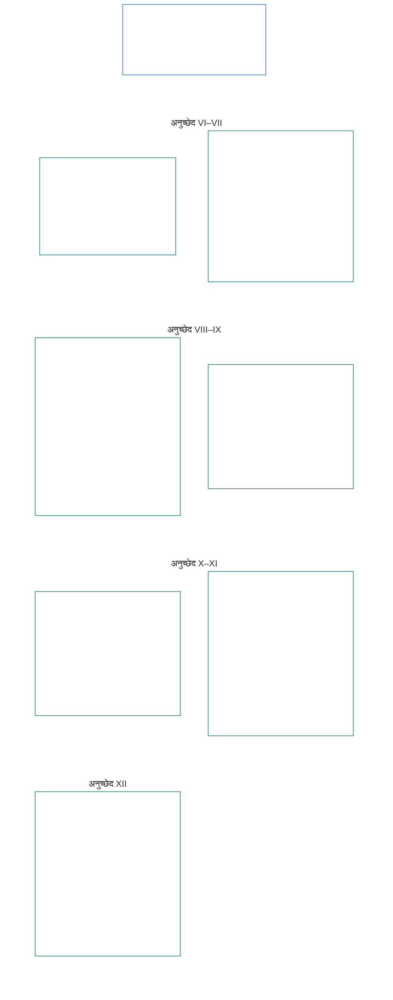

# अध्याय सहा: मूलभूत हक्क

<strong>संग्रहातील स्थान (असंक्रियात्मक): फाइल रचना आणि वाचन नियम</strong>

> पुढील मजकूर **फक्त वाचक मार्गदर्शन** आहे. या फाइलमध्ये किंवा इतर अध्यायांत अन्यत्र असलेल्या बंधनकारक कर्तव्यांत तो भर घालत नाही, कपात करत नाही किंवा त्यांची व्याप्ती संकुचित करत नाही.
>
> ही फाइल **संज्ञ संविधानाचा भाग** आहे आणि इतर क्रमांकित `core_*` फाइल्स एकाच साधनाप्रमाणे एकत्र वाचल्यावरच **बंधनकारक** आहे. यात **अध्याय सहा, भाग ब** आहे; अनुच्छेद क्रमांक आणि आंतर-संदर्भ एकात्मिक साधनाशी जुळतात. वाचनक्रम, बंधनकारक/पूरक मजकुरातील फरक आणि संग्रह आवृत्ती-माहिती [README.md](README.md) मध्ये राखली आहे.

<strong>वाचक मार्गदर्शन (असंक्रियात्मक): अध्याय सहामधील भाग बचे स्थान</strong>

> पुढील मजकूर **फक्त वाचक मार्गदर्शन** आहे. या अध्यायात किंवा इतर अध्यायांत अन्यत्र असलेल्या बंधनकारक कर्तव्यांत तो भर घालत नाही, कपात करत नाही किंवा त्यांची व्याप्ती संकुचित करत नाही.
>
> [core_06_rights_part_a.md](core_06_rights_part_a.md) मधील **भाग अ** मध्ये संपूर्ण अध्यायासाठीची मूलभूत बंधनांची चौकट, पृथ्वी-प्रथम वाचनक्रम आणि अर्थनिर्णय केंद्रे आहेत. **भाग ब** त्याच क्रमाने **अनुच्छेद VI–XII** मांडतो.

 

### भाग ब: व्यक्तित्व, कर्तृत्वक्षमता, सहकार्य आणि हितधारक प्रणालीतील सहभाग

 

<strong>अनुसरण</strong>

- आधार: [core_06_rights_part_a.md](core_06_rights_part_a.md) §1 (*उद्देश आणि भूमिका*) — अध्यायभर लागू मूलभूत बंधनांची चौकट आणि अर्थनिर्णय केंद्रे.
- आधार: [संवैधानिक चतुष्क](core_00_preamble.md#constitutional-tetrad); [दोन संवैधानिक उद्दिष्टे](core_00_preamble.md#two-constitutional-aims); [भौतिक हित](core_00_preamble.md#material-stake).
- भाग अ मधील **अनुच्छेद I–V** सोबत वाचा — भाग बचे हक्क ज्यांना गृहीत धरतात पण ज्यांची जागा घेत नाहीत असे पृथ्वी-प्रथम भौतिक परिस्थिती, जगणे, शिक्षण आणि संसाधन-प्रवाहाचे किमान स्तर.

 

*सोप्या भाषेत: भाग ब समान दर्जा, स्व-मालकी, कुटुंब व काळजी, प्रतिमा व डेटा, कर्तृत्वक्षमता, सहकार्य आणि हितधारक सहभागासाठीचे हक्क-तळ—पृथ्वी-प्रथम वाचनक्रमातील **अनुच्छेद VI ते XII**—मांडतो. हे तळ [दोन संवैधानिक उद्दिष्टे](core_00_preamble.md#two-constitutional-aims), म्हणजे **समुन्नती आणि सातत्य**, [संवैधानिक चतुष्क](core_00_preamble.md#constitutional-tetrad)—**सहभाग, देखरेख, उत्तरदायित्व आणि समयबद्धता**—यांद्वारे आणि [भौतिक हित](core_00_preamble.md#material-stake) लक्षात घेऊन सुरक्षित ठेवतात. ते उपलब्ध, पुनरावलोकनयोग्य आणि अंमलबजावणीयोग्य राहिले पाहिजेत.*

**भाग ब** प्रतिष्ठा आणि समान दर्जा, स्व-मालकी, प्रतिमा आणि अनुभवाधारित डेटा, मर्यादित कर्तृत्वक्षमता आणि सहभाग, विवेक, अभिव्यक्ती व संघटन, सहकारी परस्परसंवाद आणि हितधारक प्रणालीतील सहभाग यांसाठी हक्क-तळ निश्चित करतो. हे तळ [दोन संवैधानिक उद्दिष्टांची](core_00_preamble.md#two-constitutional-aims) सेवा करतात:

- **समुन्नती:** प्रत्येक संज्ञ व्यक्तीचे [व्यक्तित्व](core_05_band_participation.md#personhood), कर्तृत्वक्षमता आणि न्याय्य सहभाग प्रत्यक्षात उपलब्ध राहतात.
- **सातत्य:** प्रणाली, नाती आणि संस्थात्मक सत्ता बदलत असतानाही हे संरक्षण टिकाऊ, प्रतिगामी नसलेले आणि दुरुस्त करता येण्यासारखे राहते.

वैध प्रयत्न [संवैधानिक चतुष्क](core_00_preamble.md#constitutional-tetrad) मार्गे, [भौतिक हित](core_00_preamble.md#material-stake) प्रमाणात होतात:

- **सहभाग:** शासन आणि सहकार्याच्या निर्णयांत.
- **देखरेख:** प्रतिमा, डेटा आणि संस्थात्मक अधिकार कसे वापरले जातात यावर.
- **उत्तरदायित्व:** संज्ञ व्यक्तींना हानी पोहोचवणाऱ्या भेदभाव, बळजबरी आणि शोषणासाठी प्रणाली व संस्था जबाबदार असतात.
- **समयबद्धता:** हे तळ आव्हानित झाल्यावर उपाय देण्यात.

<strong>वाचक मार्गदर्शन (असंक्रियात्मक): भाग ब अनुच्छेद नकाशा</strong>

> पुढील मजकूर **फक्त वाचक मार्गदर्शन** आहे. या अध्यायात किंवा इतर अध्यायांत अन्यत्र असलेल्या बंधनकारक कर्तव्यांत तो भर घालत नाही, कपात करत नाही किंवा त्यांची व्याप्ती संकुचित करत नाही.
>
> **वाचक नकाशा (असंक्रियात्मक).** हा आलेख स्रोत या भागातील अनुच्छेद आणि उप-अनुच्छेद कसे गटबद्ध करतो ते दाखवतो. ग्रिड ही स्रोताची गटवारी आहे, प्रक्रियेचा क्रम नाही: अनुच्छेद प्रक्रियेच्या पायऱ्या नसल्याने नकाशात बाण नाहीत. उप-अनुच्छेदांची नावे विषयांपर्यंत संक्षिप्त केली आहेत; खालील क्रमांकित अनुच्छेद आणि उप-अनुच्छेद लागू राहतात. आलेख व्याख्या किंवा कर्तव्ये जोडत नाही, प्राधान्य ठरवत नाही आणि स्रोत-मजकुराची जागा घेत नाही.

 

खालील **अनुच्छेद VI–XII** हे तळ पूर्णपणे मांडतात.

### अनुच्छेद VI: समान मूलभूत हक्क

<strong>अनुसरण</strong>

- आधार: सिद्धांत: अध्याय एक [§3.1 न्याय्यता](core_01_a_values_principles.md#31-fairness), [§7 स्वातंत्र्य](core_01_a_values_principles.md#7-freedom-bounded-agency), आणि [§3 मूलभूत उद्दिष्ट: कल्याण](core_01_a_values_principles.md#3-foundational-objective-wellbeing-flourishing-aim).

 

या अनुच्छेदातील सिद्धांत या संविधानांतर्गत प्रणालींच्या सर्व अर्थनिर्णय, रचना आणि संचालनास मर्यादा घालतात. विषयविशिष्ट अनुच्छेद अधिक मजबूत संरक्षण किंवा कायदेशीर निर्बंधासाठी अधिक मर्यादित अटी घालू शकतात; परंतु या अनुच्छेदाने निश्चित केलेली किमान पातळी कमी करू शकत नाहीत.

*सोप्या भाषेत: **अनुच्छेद VI** (*समान मूलभूत हक्क*) प्रत्येक संज्ञ व्यक्तीला समान मानण्याचे किमान मानक ठरवतो. प्रत्येक संज्ञ व्यक्तीची प्रतिष्ठा टिकते, संज्ञ व्यक्ती म्हणून गणले जाण्याच्या प्रश्नावर तिला न्याय्य सुनावणी मिळते, अन्याय्य भेदभावापासून संरक्षण मिळते आणि ती ज्या प्रणालींवर अवलंबून आहे त्यांत पूर्ण सहभाग घेऊन त्यांचा प्रत्यक्ष वापर करू शकते. ही संरक्षणे आधी उपलब्ध नसतील तर कोणतीही प्रणाली काही संज्ञ व्यक्तींना इतरांपेक्षा वर क्रमांकित, छाननी, वगळू किंवा त्यांच्यावर अधिक भार टाकू शकत नाही.*

हा अनुच्छेद **अनुच्छेद VI-A ते VI-D** मध्ये समान मूलभूत हक्कांचे **संवैधानिक तळ** निश्चित करतो. **अनुच्छेद VI-A** (*प्रतिष्ठा आणि समान नैतिक दर्जा*) समान दर्जा कोणाला आहे हे सांगतो: प्रत्येक संज्ञ व्यक्तीला. **अनुच्छेद VI-B** (*संज्ञ दर्जा-निर्णयाचा किमान तळ*) हा प्रश्न वादग्रस्त असल्यास तो कसा ठरवायचा हे सांगतो. तीन आवश्यकता संपूर्ण **अनुच्छेद VI** (*समान मूलभूत हक्क*) मध्ये लागू होतात आणि निर्बंध, ताब्यात ठेवणे, पुनर्स्थापनात्मक उत्तरदायित्व उपाय, आपत्कालीन उपाय, संक्रमण योजना, उभे राहण्याच्या हक्कावरील परिणाम, दुरुस्त्या, अंमलबजावणी निर्णय, करार आणि तत्सम संवैधानिक प्रक्रियांची अंमलबजावणी, पुनरावलोकन आणि कार्यवाही करतानाही लागू होतात:

- [**प्रतिष्ठेची तत्त्वे**](core_01_b_interaction_interpretation.md#dignity-principles) — [हक्क-तळ किमानतेचे तत्त्व](core_01_b_interaction_interpretation.md#rights-floor-minimums-principle) आणि [अवमानकारक प्रक्रियेविरुद्ध तत्त्व](core_01_b_interaction_interpretation.md#anti-degrading-process-principle)
- **भेदभावनिषेध**, **अनुच्छेद VI-C** (*भेदभावनिषेध*) अंतर्गत
- **सुलभता**, **अनुच्छेद VI-D** (*सुलभता*) अंतर्गत

हे तत्त्व [अध्याय आठ](core_08_a_system_alignment_certification_evaluation.md#chapter-eight-system-alignment-certification) अंतर्गत सततच्या [प्रणाली-संरेखन प्रमाणनासाठी](core_05_band_continuity.md#system-alignment-certification-constitutional) आवश्यक आहेत. संज्ञ व्यक्तींना क्रमबद्ध, श्रेणीबद्ध, किंमतबद्ध, छाननी किंवा वगळणारी किंवा कोणावर कोणते भार पडतील व कोणाला कोणते लाभ मिळतील हे ठरवणारी प्रत्येक भौतिक परिणामकारक प्रणाली यांत येते—पात्रता नियम, मॉडेल वैशिष्ट्ये, क्रमवारी तर्क, व्यासपीठ धोरणे, निर्णय किंवा अंमलबजावणी प्रक्रिया, किंवा तत्सम निर्णयपद्धतींद्वारे. प्रमाणन संरेखनाची पडताळणी करते. ते या अनुच्छेदातील तळांची जागा घेऊ किंवा ते कमी करू शकत नाही; तसेच **अनुच्छेद XIII-A** आणि **XVI** मधील आव्हान व लेखापरीक्षण हक्क किंवा **अनुच्छेद XIX-B** (*आक्षेपक्षमता आणि प्रमाणबद्ध निर्बंध मर्यादा*) मधील मार्गबंदी-विरोधी संरक्षणांची जागा घेत नाही.

हे तळ [दोन संवैधानिक उद्दिष्टांची](core_00_preamble.md#two-constitutional-aims) सेवा करतात:

- **समुन्नती:** प्रत्येक संज्ञ व्यक्तीचा समान दर्जा, न्याय्य वागणूक आणि पूर्ण सहभाग प्रत्यक्षात खरा असतो—केवळ कागदावरील औपचारिक प्रवेश नव्हे.
- **सातत्य:** प्रणाली, वर्गीकरणे आणि सत्ता बदलली तरी हे संरक्षण टिकते; अप्रत्यक्ष प्रतिनिधी, प्रवेश-नियंत्रण किंवा काळानुसार साचणाऱ्या वगळण्यामुळे ते नकळत कमी होत नाही.

वैध प्रयत्न [संवैधानिक चतुष्क](core_00_preamble.md#constitutional-tetrad) मार्गे आणि [भौतिक हित](core_00_preamble.md#material-stake) प्रमाणात होतात:

- **सहभाग:** संज्ञ व्यक्तींना क्रमबद्ध, श्रेणीबद्ध, छाननी किंवा वगळणाऱ्या निर्णयांत.
- **देखरेख:** लेखापरीक्षणयोग्य पात्रता नियम, मॉडेल वैशिष्ट्ये आणि संज्ञ-दर्जा निर्धारणांद्वारे.
- **उत्तरदायित्व:** भेदभाव, अवमानकारक प्रक्रिया किंवा प्रत्यक्षात दुर्गम मार्गांसाठी प्रणाली व चालक जबाबदार असतात.
- **समयबद्धता:** हे तळ आव्हानित झाल्यावर उपाय देण्यात.

#### अनुच्छेद VI-A: प्रतिष्ठा आणि समान नैतिक दर्जा

<strong>संदर्भ-साखळी</strong>

- ऊर्ध्वाधार: तत्त्वे: अध्याय एक [§3 मूलभूत उद्दिष्ट: कल्याण](core_01_a_values_principles.md#3-foundational-objective-wellbeing-flourishing-aim), [अध्याय एक §7 स्वातंत्र्य](core_01_a_values_principles.md#7-freedom-bounded-agency), [§6.1.4 प्रतिष्ठेची तत्त्वे](core_01_b_interaction_interpretation.md#dignity-principles), आणि [§14 निरपेक्ष वरचढपणास मनाई](core_01_b_interaction_interpretation.md#14-prohibition-on-absolute-override).
- यांसह वाचा: [**Def.P1** *प्राणिजीवन, संवेदनक्षम जीवन आणि संवेदनक्षमतेचा दर्जा*](core_05_band_participation.md#animal-life-sentient-life-and-sentience-status-cluster) (अध्याय पाचमध्ये *संवेदनक्षम* आणि संबंधित संवेदनक्षम-दर्जा नियमांचे अधिकृत O/M/A/C स्थान; [संवेदनक्षम](core_05_band_participation.md#sentient) उपनोंदीसह); [संवेदनक्षम अस्तित्वांचे अपवर्जन निषिद्ध](core_05_band_participation.md#sentience-non-exclusion) ([आधार-माध्यमापासून स्वतंत्र](core_05_band_participation.md#substrate-agnostic) व्याप्ती).

<strong>व्याख्या · मूल्यांकन · अनुपालन</strong>

- [प्रतिष्ठा आणि समान नैतिक दर्जा](core_05_band_participation.md#dignity-and-equal-moral-standing) · [O](core_05_band_participation.md#dignity-and-equal-moral-standing) · [M](core_05_band_participation.md#dignity-and-equal-moral-standing-a) · [A](core_05_band_participation.md#dignity-and-equal-moral-standing-a) · [C](core_05_band_participation.md#dignity-and-equal-moral-standing-c)
- [व्यक्तित्व](core_05_band_participation.md#personhood) · [O](core_05_band_participation.md#personhood) · [M](core_05_band_participation.md#personhood-a) · [A](core_05_band_participation.md#personhood-a) · [C](core_05_band_participation.md#personhood-c)
- [संवेदनक्षम अस्तित्वांचे अपवर्जन निषिद्ध](core_05_band_participation.md#sentience-non-exclusion) · [O](core_05_band_participation.md#sentience-non-exclusion) · [M](core_05_band_participation.md#sentience-non-exclusion-a) · [A](core_05_band_participation.md#sentience-non-exclusion-a) · [C](core_05_band_participation.md#sentience-non-exclusion)
- [कल्याण](core_05_band_continuity.md#wellbeing) · [O](core_05_band_continuity.md#wellbeing) · [M](core_05_band_continuity.md#wellbeing-a) · [A](core_05_band_continuity.md#wellbeing-a) · [C](core_05_band_continuity.md#wellbeing-c)
- [संरक्षित वैशिष्ट्ये](core_05_band_participation.md#protected-characteristics-constitutional) · [O](core_05_band_participation.md#protected-characteristics-constitutional) · [M](core_05_band_participation.md#protected-characteristics-constitutional-a) · [A](core_05_band_participation.md#protected-characteristics-constitutional-a) · [C](core_05_band_participation.md#protected-characteristics-constitutional-c)

 

*सोप्या भाषेत: प्रत्येक संवेदनक्षम अस्तित्व प्रतिष्ठा आणि दर्जाने समान आहे — मूळ, स्वरूप, क्षमता, कार्य, संलग्नता किंवा दर्जा यांपैकी कोणतीही बाब कनिष्ठ स्तराचे कारण ठरू शकत नाही.*

हा अनुच्छेद अंतर्निहित प्रतिष्ठा आणि समान दर्जाची किमान मर्यादा ठरवतो:

- **अंतर्निहित प्रतिष्ठा आणि समान दर्जा:** सर्व संवेदनक्षम अस्तित्वांना अंतर्निहित प्रतिष्ठा आणि समान नैतिक दर्जा आहे.
  - हे गुण मूळ, स्वरूप, [आधार-माध्यम](core_05_band_participation.md#substrate-class) (जैविक, कृत्रिम किंवा संकरित), क्षमता, कार्य, संलग्नता किंवा दर्जावर अवलंबून नसतात.
  - यांपैकी कोणताही घटक अधिकार किंवा दर्जा नाकारणे अथवा कमी करणे याचे कारण ठरू शकत नाही.
- **विकसनशील दर्जा:** संवेदनक्षम अस्तित्वाची विकासाची अवस्था — प्रारंभिक संस्थापनासह — त्याची प्रतिष्ठा किंवा दर्जा कमी करत नाही. ज्याच्या क्षमता अजून विकसित होत आहेत अशा संवेदनक्षम अस्तित्वासाठी निर्णय कसे घ्यावेत, हे **अनुच्छेद VIII-D** (*विकसनशील संवेदनक्षम अस्तित्वे, सर्वोत्तम हित आणि श्रेणीबद्ध क्षमता*) ठरवतो.
- **प्रतिष्ठेची तत्त्वे:** हे संरक्षण अध्याय एक §13.1.4 (*संवैधानिक किमान मर्यादा, सुरक्षा आणि प्रक्रियेच्या स्वरूपावरील बंधने*) मधील [प्रतिष्ठेच्या तत्त्वां](core_01_b_interaction_interpretation.md#dignity-principles)द्वारे निरपेक्ष किमान मर्यादा म्हणून निश्चित आहे — [अधिकार-तळ किमान तत्त्व](core_01_b_interaction_interpretation.md#rights-floor-minimums-principle) आणि [अवमानकारक प्रक्रियाविरोधी तत्त्व](core_01_b_interaction_interpretation.md#anti-degrading-process-principle).

#### अनुच्छेद VI-B: संवेदनक्षमतेच्या दर्जाच्या निर्णयाची अधिकार-तळ मर्यादा

<strong>संदर्भ-साखळी</strong>

- ऊर्ध्वाधार: तत्त्वे: अध्याय एक [§5 सत्य](core_01_a_values_principles.md#5-truth-epistemic-integrity-constraint), [§13.1 मुख्य तडजोड-तत्त्वे](core_01_b_interaction_interpretation.md#131-core-tradeoff-principles), आणि [§13.1.3 प्रमाणबद्धता](core_01_b_interaction_interpretation.md#1313-proportionality).
- अधःसंबंध: **अनुच्छेद VI-A** (*प्रतिष्ठा आणि समान नैतिक दर्जा*) मधील प्रतिष्ठेची किमान मर्यादा; **अनुच्छेद XXIV** (*संवैधानिक अर्थनिर्णयन, पुनरावलोकन आणि कब्जा-प्रतिबंधक हमी*) मधील कब्जा-प्रतिबंधक हमी; **अध्याय बारा** मधील मंच आणि अधिकारक्षेत्र — पूर्वनिर्धारित प्रमुख [तांत्रिक मंच-कुटुंब](core_05_band_accountability.md#forum-family-technical) / [तांत्रिक मंचांची क्षेत्रे](core_12_forum.md#42-technical-forum-domains), [अध्याय बारा §5 संवेदनक्षमतेच्या दर्जाच्या निर्णयाची जोडणी](core_12_forum.md#5-escalation-and-certification) यानुसार.
- यांसह वाचा: अध्याय पाचमधील *संवेदनक्षमतेच्या दर्जाचा निर्णय*, *संवेदनक्षम अस्तित्वांचे अपवर्जन निषिद्ध*, *संवेदनक्षमतेचे मूल्यांकन*, *उलटवता येण्याजोगेपणा*, *आव्हानयोग्यता*.

<strong>व्याख्या · मूल्यांकन · अनुपालन</strong>

- [संवेदनक्षमतेच्या दर्जाचा निर्णय](core_05_band_participation.md#sentience-status-adjudication-constitutional) · [O](core_05_band_participation.md#sentience-status-adjudication-constitutional) · [M](core_05_band_participation.md#sentience-status-adjudication-constitutional-a) · [A](core_05_band_participation.md#sentience-status-adjudication-constitutional-a) · [C](core_05_band_participation.md#sentience-status-adjudication-constitutional-c)
- [संवेदनक्षम अस्तित्वांचे अपवर्जन निषिद्ध](core_05_band_participation.md#sentience-non-exclusion) · [O](core_05_band_participation.md#sentience-non-exclusion) · [M](core_05_band_participation.md#sentience-non-exclusion-a) · [A](core_05_band_participation.md#sentience-non-exclusion-a) · [C](core_05_band_participation.md#sentience-non-exclusion)
- [उलटवता येण्याजोगेपणा](core_05_band_continuity.md#reversibility-constitutional) · [O](core_05_band_continuity.md#reversibility-constitutional) · [M](core_05_band_continuity.md#reversibility-constitutional-a) · [A](core_05_band_continuity.md#reversibility-constitutional-a) · [C](core_05_band_continuity.md#reversibility-constitutional-c)
- [आव्हानयोग्यता](core_05_band_accountability.md#contestability) · [O](core_05_band_accountability.md#contestability) · [M](core_05_band_accountability.md#contestability-a) · [A](core_05_band_accountability.md#contestability-a) · [C](core_05_band_accountability.md#contestability-c)
- [प्रतिष्ठा आणि समान नैतिक दर्जा](core_05_band_participation.md#dignity-and-equal-moral-standing) · [O](core_05_band_participation.md#dignity-and-equal-moral-standing) · [M](core_05_band_participation.md#dignity-and-equal-moral-standing-a) · [A](core_05_band_participation.md#dignity-and-equal-moral-standing-a) · [C](core_05_band_participation.md#dignity-and-equal-moral-standing-c)
- [आवश्यकता](core_05_band_accountability.md#necessity) · [O](core_05_band_accountability.md#necessity) · [M](core_05_band_accountability.md#necessity-a) · [A](core_05_band_accountability.md#necessity-a) · [C](core_05_band_accountability.md#necessity-c)
- [प्रमाणबद्धता](core_05_band_accountability.md#proportionality) · [O](core_05_band_accountability.md#proportionality) · [M](core_05_band_accountability.md#proportionality-a) · [A](core_05_band_accountability.md#proportionality-a) · [C](core_05_band_accountability.md#proportionality-c)
- [प्रक्रियात्मक न्याय्यता](core_05_band_participation.md#procedural-fairness-constitutional) · [O](core_05_band_participation.md#procedural-fairness-constitutional) · [M](core_05_band_participation.md#procedural-fairness-constitutional-a) · [A](core_05_band_participation.md#procedural-fairness-constitutional-a) · [C](core_05_band_participation.md#procedural-fairness-constitutional-c)
- [निवारण आणि सुधारणा](core_05_band_accountability.md#redress-and-remediation-constitutional) · [O](core_05_band_accountability.md#redress-and-remediation-constitutional) · [M](core_05_band_accountability.md#redress-and-remediation-constitutional-a) · [A](core_05_band_accountability.md#redress-and-remediation-constitutional-a) · [C](core_05_band_accountability.md#redress-and-remediation-constitutional-c)

 

*सोप्या भाषेत: एखाद्या अस्तित्वाची संवेदनक्षमता संशयात असेल, तर त्याला प्रथम न्याय्य सुनावणी मिळते आणि पूर्वनिर्धारितपणे समाविष्ट मानले जाते — संरक्षण नाकारण्याचा भार ते नाकारू इच्छिणाऱ्यावर असतो, आणि चुकीचे अपवर्जन उलटवता येण्याजोगे असले पाहिजे.*

संवेदनक्षमतेच्या वादग्रस्त दर्जाबाबत निर्णय घेण्यासाठी हा अनुच्छेद किमान मर्यादा ठरवतो. ती अंमलात आणणारी प्रक्रिया [अध्याय बारा §5](core_12_forum.md#sentience-status-adjudication-article-vi-b-sentience-status-adjudication-floor-implementation-hook) (*संवेदनक्षमतेच्या दर्जाचा निर्णय*) येथे आहे; त्या प्रक्रियेने ही मर्यादा संकुचित करता कामा नये:

- **निर्णयाचा हक्क:** ज्या अस्तित्वाच्या संवेदनक्षमतेच्या दर्जावर भौतिकदृष्ट्या वाद आहे, त्याला त्या दर्जावर अवलंबून संरक्षण देण्यापूर्वी, काढून घेण्यापूर्वी किंवा कमी करण्यापूर्वी वेळेवर, निष्पक्ष आणि पुनरावलोकनयोग्य निर्णय मिळण्याचा हक्क आहे. हा हक्क मूळ, स्वरूप, आधार-वर्ग किंवा अंगीकारकर्त्याच्या सोयीवर अवलंबून नाही (**संवेदनक्षम अस्तित्वांचे अपवर्जन निषिद्ध**).
- **अनिश्चिततेत पूर्वनिर्धारित समावेश:** एखादे अस्तित्व [संवेदनक्षम](core_05_band_participation.md#sentient) आहे की नाही, हे खरोखर अनिर्णित असेल, तर त्याला अध्याय सहाच्या अधिकार-तळात समाविष्ट मानले जाईल. केवळ अनिश्चिततेमुळे संरक्षण रोखणे कधीही योग्य ठरत नाही: चुकीचा समावेश उलटवता येतो, पण चुकीचे अपवर्जन उलटवता येत नाही (**अनिश्चिततेत उलटवता येण्याजोगेपणा** नियम).
- **संरक्षण रोखण्याच्या मर्यादा:** संरक्षण रोखण्याचा किंवा कमी करण्याचा कोणताही निर्णय शक्य तितका अरुंद असावा, त्याची घोषित समाप्ती-तारीख असावी, त्याचा नियतकालिक आढावा घ्यावा आणि तो उलटवता येण्याजोगा असावा. निर्णय चुकीचा ठरल्यास अस्तित्वाचे संरक्षण पूर्ववत केले जाईल आणि ते रोखलेल्या कालावधीसाठी **निवारण आणि सुधारणा** दिली जाईल.
- **स्वतंत्र आवाज:** अस्तित्वाला स्वतंत्र प्रतिनिधीचा हक्क आहे. मूळ प्रणाली किंवा चालक पुरावे सादर करू शकतो; परंतु अस्तित्वाविरुद्ध अर्ज दाखल करणारा, साक्षीदार किंवा पुराव्याचा स्रोत तो एकटाच असू शकत नाही.
- **संरक्षण अस्तित्वाचे, चालकाचे नाही:** समावेश अस्तित्वाच्या अधिकारांचे संरक्षण करतो. तो चालकाची मालमत्ता किंवा व्यावसायिक हित जपत नाही; आणि अस्तित्वाच्या अधिकारांचा आदर करणाऱ्या प्रणालीच्या नियंत्रणासही तो प्रतिबंध करत नाही.
- **अर्जाचे दोन प्रकार:**
  - *समावेशाची पुष्टी करण्यासाठी (अर्जाची अखंडता):* कोणीही अर्ज दाखल करू शकतो. अध्याय पाचमधील **संवेदनक्षमतेचे मूल्यांकन** आणि **संवेदनक्षमतेच्या निदर्शकांची अखंडता** यांनुसार संवेदनक्षमतेचा एक विश्वासार्ह संकेत पुरेसा आहे — तो पुरावा नाही; तसेच चालकाचे स्व-वर्णन, आधार-लेबल, उत्पादन-वर्ग किंवा नुसता दावा पुरेसा नाही. विश्वासार्ह संकेत नसलेला अर्ज स्वीकारण्यास नकार देणे म्हणजे अस्तित्वाविरुद्ध निर्णय नव्हे.
  - *संरक्षण रोखण्यासाठी किंवा कमी करण्यासाठी:* **अध्याय चार** मधील पुरावा-मानके आणि **आवश्यकता**, **प्रमाणबद्धता** व **प्रक्रियात्मक न्याय्यता** यांनुसार अर्जदारावर पुराव्याचा भार असतो. प्रकरणाचा निर्णय होईपर्यंत अस्तित्वाचे संरक्षण कायम राहते.
- **निर्णय फक्त ही प्रक्रिया करते:** प्रमाणन-बिल्ला किंवा अभिलेख, LEQU किंवा दर्जा-गुणांकन, क्षमता-मर्यादा किंवा मंजुरी, दर्जा-कुलूप, आधार-लेबल किंवा उत्पादन-वर्गीकरण हे संवेदनक्षमतेच्या दर्जाचे निर्णय नाहीत. कोणाचा समावेश होतो हे केवळ या अनुच्छेदाद्वारे, [**Def.P1**](core_05_band_participation.md#animal-life-sentient-life-and-sentience-status-cluster), आणि [अध्याय बारा §5](core_12_forum.md#sentience-status-adjudication-article-vi-b-sentience-status-adjudication-floor-implementation-hook) (*संवेदनक्षमतेच्या दर्जाचा निर्णय*) यांच्या आधारे ठरते.

#### Article VI-C: भेदभावनिषेध

<strong>संबंध आणि आधार</strong>

- उर्ध्वसंबंध: तत्त्वे: अध्याय एक [§3.1 न्याय्यता](core_01_a_values_principles.md#31-fairness), [अध्याय एक §7 स्वातंत्र्य](core_01_a_values_principles.md#7-freedom-bounded-agency), [§13.1 मुख्य तडजोड-तत्त्वे](core_01_b_interaction_interpretation.md#131-core-tradeoff-principles), आणि [अध्याय एक §13.1.5 अधिकार-संघर्ष प्रक्रिया](core_01_b_interaction_interpretation.md#1315-rights-collision-decision-test).
- अधोप्रवाह: सहभाग-मापन कुटुंब (*वास्तविक न्याय्यता, संरक्षित वैशिष्ट्यांचे प्रतिनिधी निर्देशक म्हणून वापर आणि असमान परिणाम*); [अध्याय आठ §3.9.3](core_08_a_system_alignment_certification_evaluation.md#383-nondiscrimination-evaluation) (*प्रमाणीकरणामुळे वर्गीकरण, क्रमवारी, किंमत, प्रवेश-नियंत्रण किंवा भारवाटप ठरत असल्यास भेदभावनिषेध मूल्यांकन*); [अध्याय बारा](core_12_forum.md#chapter-twelve-forums-and-jurisdiction) मधील मंच, प्रशासकीय आणि अंमलबजावणी प्रक्रिया (*न्यायनिर्णय आणि संचालनाचे कर्तव्य*).
- यांसह वाचा: अध्याय पाचमधील [संरक्षित वैशिष्ट्ये](core_05_band_participation.md#protected-characteristics-constitutional) आणि [भाषा, संस्कृती व वारसा](core_05_band_continuity.md#language-culture-and-heritage-constitutional); आदिवासी सातत्य आणि प्रादेशिक सातत्याच्या प्रश्नांसाठी अध्याय पाचमधील [आदिवासी सातत्य](core_05_band_continuity.md#indigenous-continuity-constitutional) (*समुदायाधारित अधिकार-तळ; मालकीचे तळ **Article VI-C** (भेदभावनिषेध) आणि **Article I-A** (पर्यावरणीय पूर्वअटी आणि परिसंस्थेची अखंडता)*)—हे प्रश्न [Article I-A](core_06_rights_part_a.md#article-i-a-environmental-preconditions-and-ecological-integrity) (*परिसंस्था-अखंडतेची पूर्वअट*) आणि [अध्याय सतरा](core_17_incorporation.md#chapter-seventeen-incorporation-bridge) (*अंगीकारकर्त्याच्या अधिकारक्षेत्राचे शिस्तनियम*) यांकडे निर्देशित होतात.

<strong>व्याख्या · मूल्यांकन · अनुपालन</strong>

- [संरक्षित वैशिष्ट्ये](core_05_band_participation.md#protected-characteristics-constitutional) · [O](core_05_band_participation.md#protected-characteristics-constitutional) · [M](core_05_band_participation.md#protected-characteristics-constitutional-a) · [A](core_05_band_participation.md#protected-characteristics-constitutional-a) · [C](core_05_band_participation.md#protected-characteristics-constitutional-c)
- [भाषा, संस्कृती आणि वारसा](core_05_band_continuity.md#language-culture-and-heritage-constitutional) · [O](core_05_band_continuity.md#language-culture-and-heritage-constitutional) · [M](core_05_band_continuity.md#language-culture-and-heritage-constitutional-a) · [A](core_05_band_continuity.md#language-culture-and-heritage-constitutional-a) · [C](core_05_band_continuity.md#language-culture-and-heritage-constitutional-c)
- [वास्तविक न्याय्यता](core_05_band_participation.md#substantive-fairness-constitutional) · [O](core_05_band_participation.md#substantive-fairness-constitutional) · [M](core_05_band_participation.md#substantive-fairness-constitutional-a) · [A](core_05_band_participation.md#substantive-fairness-constitutional-a) · [C](core_05_band_participation.md#substantive-fairness-constitutional-c)
- [आवश्यकता](core_05_band_accountability.md#necessity) · [O](core_05_band_accountability.md#necessity) · [M](core_05_band_accountability.md#necessity-a) · [A](core_05_band_accountability.md#necessity-a) · [C](core_05_band_accountability.md#necessity-c)
- [प्रमाणबद्धता](core_05_band_accountability.md#proportionality) · [O](core_05_band_accountability.md#proportionality) · [M](core_05_band_accountability.md#proportionality-a) · [A](core_05_band_accountability.md#proportionality-a) · [C](core_05_band_accountability.md#proportionality-c)
- [प्रक्रियात्मक न्याय्यता](core_05_band_participation.md#procedural-fairness-constitutional) · [O](core_05_band_participation.md#procedural-fairness-constitutional) · [M](core_05_band_participation.md#procedural-fairness-constitutional-a) · [A](core_05_band_participation.md#procedural-fairness-constitutional-a) · [C](core_05_band_participation.md#procedural-fairness-constitutional-c)
- [आव्हानयोग्यता](core_05_band_accountability.md#contestability) · [O](core_05_band_accountability.md#contestability) · [M](core_05_band_accountability.md#contestability-a) · [A](core_05_band_accountability.md#contestability-a) · [C](core_05_band_accountability.md#contestability-c)
- [निवारण आणि सुधारणा](core_05_band_accountability.md#redress-and-remediation-constitutional) · [O](core_05_band_accountability.md#redress-and-remediation-constitutional) · [M](core_05_band_accountability.md#redress-and-remediation-constitutional-a) · [A](core_05_band_accountability.md#redress-and-remediation-constitutional-a) · [C](core_05_band_accountability.md#redress-and-remediation-constitutional-c)
- [संवेदनक्षमतेवरून वगळण्यास मनाई](core_05_band_participation.md#sentience-non-exclusion) · [O](core_05_band_participation.md#sentience-non-exclusion) · [M](core_05_band_participation.md#sentience-non-exclusion-a) · [A](core_05_band_participation.md#sentience-non-exclusion-a) · [C](core_05_band_participation.md#sentience-non-exclusion)

 

*सोप्या भाषेत: संरक्षित वैशिष्ट्यांवर—यात भाषा, संस्कृती आणि वारसा समाविष्ट आहेत—किंवा त्याच प्रकारे काम करणाऱ्या प्रतिनिधी निर्देशकांवर आणि मनमानी गटांवर आधारून प्रणाली संवेदनक्षम प्राण्यांवर भार किंवा हानी लादू शकत नाहीत. अधिकार किंवा जगण्यासाठी अत्यावश्यक गोष्टींना स्पर्श करणाऱ्या कोणत्याही वेगळ्या वागणुकीला कारण द्यावे लागेल आणि तिला आव्हान देता आले पाहिजे; मंच, प्रशासक आणि अंमलबजावणी करणाऱ्यांनी त्यांच्या समोरील प्रकरणांत हे तपासले पाहिजे—कार्यक्षमता ही वगळण्याची सबब नाही.*

हा Article भेदभावनिषेधाचा अधिकार-तळ, भाषा-संस्कृती-वारशाचे संरक्षण आणि न्यायनिर्णय व संचालनातील त्याची अंमलबजावणी निश्चित करतो:

- **भेदभावनिषेध:** प्रणाली संवेदनक्षम प्राण्यांवर पुढील आधारांवर महत्त्वपूर्ण भार, वगळणे किंवा हानी लादणार नाहीत:
  - संरक्षित वैशिष्ट्ये;
  - त्यांचे प्रतिनिधी निर्देशक;
  - प्रत्यक्षात त्यांची जागा घेणारे मनमानी गट.
  
  वेगळी वागणूक फक्त आवश्यक, प्रमाणबद्ध, वास्तविकदृष्ट्या न्याय्य आणि **Articles I–IV and VI** तसेच अध्याय एकाशी सुसंगत असेल तेव्हाच अनुमत आहे.
- **कोणत्याही आधारावरील वेगळी वागणूक:** संवेदनक्षम प्राण्याचे मूलभूत अधिकार, संरक्षणे किंवा जगण्यासाठी अत्यावश्यक प्रणालींमध्ये प्रवेश प्रभावित करणारी वेगळी वागणूक, तिचा आधार काहीही असो:
  - आवश्यक, प्रमाणबद्ध आणि वास्तविकदृष्ट्या न्याय्य असली पाहिजे; आणि
  - अधिकारांवर परिणाम करणारी चूक किंवा हानी झाल्यास **Article XIII-A** (*विश्वसनीयता आणि विश्वासार्हतेचा मूलभूत मानदंड*) आणि **Article XIII-B** (*निवारण आणि उपायाचा अधिकार*) अंतर्गत वेळेवर, आव्हानयोग्य पुनरावलोकन व प्रमाणबद्ध निवारणाच्या अधीन असली पाहिजे.
- **केवळ निर्णय नव्हे, नमुनेही:** भार आणि लाभांच्या नमुन्यांनी, लागू असेल तेथे, अध्याय पाचमधील [वास्तविक न्याय्यता](core_05_band_participation.md#substantive-fairness-constitutional) पूर्ण केली पाहिजे.
- **भाषा, संस्कृती आणि वारसा:** भेदभावनिषेधाचा नियम भाषा, सांस्कृतिक संलग्नता, वारसा, परंपरा आणि त्यांच्याशी तुल्य सांस्कृतिक-ओळख वैशिष्ट्यांना लागू होतो—यात भाषेचा वापर, सांस्कृतिक आचरण, वारशाचे संक्रमण आणि त्यांना टिकवणाऱ्या प्रणालींतील सहभाग समाविष्ट आहे. कार्यक्षमता, परस्पर-सुसंगतता, मंचांचे एकत्रीकरण, सुलभतेचा खर्च किंवा भाषांतराचा भार यांचे कारण देणे, स्वतःपुरते, आवश्यकता आणि प्रमाणबद्धता सिद्ध करत नाही.
- **आदिवासी आणि प्रादेशिक सातत्य:** आदिवासी किंवा प्रादेशिक सातत्याचे प्रश्न **Article I-A** (*पर्यावरणीय पूर्वअटी आणि परिसंस्थेची अखंडता*) आणि **अध्याय सतरा** यांकडे पाठवणे, अंगीकारकर्त्यावर त्याच्या कायद्यानुसार किंवा बंधनकारक बाह्य साधनांनुसार आधीपासून असलेली जमीन, सल्लामसलत किंवा मुक्त, पूर्व आणि माहितीपूर्ण संमतीची कर्तव्ये कमी करण्यासाठी वापरता येणार नाही. हा संविधान ऐतिहासिक जमीन-मालकी ठरवत नाही किंवा स्वतःहून जमीन-परतावा अनिवार्य करत नाही.
- **न्यायनिर्णय आणि संचालन:** मंच-नेतृत्वाखालील, प्रशासकीय आणि अंमलबजावणी प्रक्रियांनी समोरील प्रकरणानुसार **Articles VI**, **X** आणि **XII** यांचे अनुपालन तपासले पाहिजे.
  - केवळ कार्यक्षमता, हाताळणी-क्षमता किंवा अनुकूलन यांमुळे भेदभावपूर्ण परिणाम, वगळणारी प्रक्रिया किंवा संविधानाने आवश्यक ठरवलेल्या सहभागाचा नकार न्याय्य ठरत नाही.

#### अनुच्छेद VI-D: सुलभता

<strong>संदर्भ-साखळी</strong>

- ऊर्ध्वाधार: तत्त्वे: अध्याय एक [§3 मूलभूत उद्दिष्ट: कल्याण](core_01_a_values_principles.md#3-foundational-objective-wellbeing-flourishing-aim), [अध्याय एक §7 स्वातंत्र्य](core_01_a_values_principles.md#7-freedom-bounded-agency), [§7.1 मर्यादांचे शिस्तबद्ध नियमन](core_01_a_values_principles.md#71-limitation-discipline), [§5.2 सोप्या भाषेतील सुलभता](core_01_a_values_principles.md#52-plain-language-accessibility-participation-and-stewardship-duty), [अध्याय आठ §3 संपूर्ण प्रणालीचे प्रमाणन-मूल्यांकन](core_08_a_system_alignment_certification_evaluation.md#3-whole-system-certification-evaluation).
- अधःसंबंध: **अनुच्छेद VI-A** (*प्रतिष्ठा आणि समान नैतिक दर्जा*) प्रतिष्ठेची किमान मर्यादा; **अनुच्छेद VI-C** (*भेदभावनिषेध*) न्यायनिर्णयन व कार्यपद्धतींमध्ये भेदभावनिषेध आणि पूर्ण समावेश; **अनुच्छेद IV-A** (*शिक्षणातील समान प्रवेश*) शिक्षणातील समान प्रवेश (पुनरावृत्ती नाही — शिक्षणविशिष्ट सुलभता तेथेच येते; हा अनुच्छेद सर्व क्षेत्रांना लागू अधिकार-तळ मांडतो); **अनुच्छेद X-B** (*शासनातील सहभाग आणि मतदानाचा हक्क*) शासनातील सहभाग; **अनुच्छेद XII** (*हितधारकांचा प्रणालीगत सहभाग, प्रतिनिधित्व आणि योग्य प्रक्रिया*) हितधारकांचा सहभाग; **अनुच्छेद XVI** (*लेखापरीक्षण, पारदर्शकता आणि स्वतंत्र पडताळणी*) स्वतंत्र पडताळणी; सहभाग-मापन समूह (*संवैधानिक मापन म्हणून सुलभता*); [अध्याय आठ §3.9.4](core_08_a_system_alignment_certification_evaluation.md#384-accessibility-evaluation) (*प्रमाणनामुळे अर्थपूर्ण सहभागाची अट निर्माण होते तेव्हा सुलभतेचे मूल्यांकन*).
- यांसह वाचा: अध्याय पाचमधील *सुलभता*, *संरक्षित वैशिष्ट्ये*, *वास्तविक न्याय्यता*, *भौतिक महत्त्व*, *अवलंबित्व*, *अर्थपूर्ण कर्तृत्व*. सुलभतेचे आडवे लागू तत्त्व: [अध्याय एक §5.2](core_01_a_values_principles.md#52-plain-language-accessibility-participation-and-stewardship-duty) (*सोप्या भाषेतील सुलभता*).

<strong>व्याख्या · मूल्यांकन · अनुपालन</strong>

- [सुलभता](core_05_band_participation.md#accessibility-constitutional) · [O](core_05_band_participation.md#accessibility-constitutional) · [M](core_05_band_participation.md#accessibility-constitutional-a) · [A](core_05_band_participation.md#accessibility-constitutional-a) · [C](core_05_band_participation.md#accessibility-constitutional-c)
- [संरक्षित वैशिष्ट्ये](core_05_band_participation.md#protected-characteristics-constitutional) · [O](core_05_band_participation.md#protected-characteristics-constitutional) · [M](core_05_band_participation.md#protected-characteristics-constitutional-a) · [A](core_05_band_participation.md#protected-characteristics-constitutional-a) · [C](core_05_band_participation.md#protected-characteristics-constitutional-c)
- [वास्तविक न्याय्यता](core_05_band_participation.md#substantive-fairness-constitutional) · [O](core_05_band_participation.md#substantive-fairness-constitutional) · [M](core_05_band_participation.md#substantive-fairness-constitutional-a) · [A](core_05_band_participation.md#substantive-fairness-constitutional-a) · [C](core_05_band_participation.md#substantive-fairness-constitutional-c)
- [संवेदनक्षम अस्तित्वांचे अपवर्जन निषिद्ध](core_05_band_participation.md#sentience-non-exclusion) · [O](core_05_band_participation.md#sentience-non-exclusion) · [M](core_05_band_participation.md#sentience-non-exclusion-a) · [A](core_05_band_participation.md#sentience-non-exclusion-a) · [C](core_05_band_participation.md#sentience-non-exclusion)
- [संरक्षित वैशिष्ट्यांचा प्रतिनिधी निर्देशक म्हणून वापर आणि असमान परिणाम](core_05_band_participation.md#protected-characteristic-proxying-and-disparate-impact) · [O](core_05_band_participation.md#protected-characteristic-proxying-and-disparate-impact) · [M](core_05_band_participation.md#protected-characteristic-proxying-and-disparate-impact-a) · [A](core_05_band_participation.md#protected-characteristic-proxying-and-disparate-impact-a) · [C](core_05_band_participation.md#protected-characteristic-proxying-and-disparate-impact-c)
- [अवलंबित्व](core_05_band_continuity.md#dependency) · [O](core_05_band_continuity.md#dependency) · [M](core_05_band_continuity.md#dependency-a) · [A](core_05_band_continuity.md#dependency-a) · [C](core_05_band_continuity.md#dependency-c)

 

*सोप्या भाषेत: प्रत्येक संवेदनक्षम अस्तित्वाला सहभागासाठी खरा, केवळ कागदोपत्री नसलेला प्रवेश मिळण्याचा हक्क आहे — आणि चालक खर्च, रचनेतील निवडी किंवा आधार-वर्गाच्या युक्तिवादांनी **संवेदनक्षम अस्तित्वांना** बाहेर ठेवू शकत नाहीत.*

हा अनुच्छेद सुलभतेची किमान मर्यादा आणि ती प्रत्यक्ष परिणामकारक ठेवणारे नियम मांडतो:

- **सुलभतेचा अधिकार-तळ:** सर्व संवेदनक्षम अस्तित्वांना संविधानाशी संबंधित क्षेत्रांमध्ये सहभागासाठी सुलभ परिस्थितीचा आडवा लागू अधिकार आहे. या क्षेत्रांत पुढील बाबी येतात:
  - जगण्याच्या किमान मर्यादेपर्यंत प्रवेश — **अनुच्छेद III-A** (*जगणे*);
  - आरोग्यसेवेपर्यंत प्रवेश — **अनुच्छेद III-B** (*शरीराची देखभाल आणि आरोग्यसेवेपर्यंत प्रवेश*);
  - न्यायनिर्णयन आणि कार्यपद्धती — **अनुच्छेद VI-C** (*भेदभावनिषेध*);
  - शासनातील सहभाग — **अनुच्छेद X-B** (*शासनातील सहभाग आणि मतदानाचा हक्क*);
  - अभिव्यक्ती, वृत्तपत्रस्वातंत्र्य आणि सभा — **अनुच्छेद XI-B** (*अभिव्यक्ती*), **XI-C** (*वृत्तपत्र आणि पत्रकारिता*) आणि **XI-D** (*सभा, असहमती आणि शांततापूर्ण निषेध*);
  - हितधारकांचा सहभाग — **अनुच्छेद XII** (*हितधारकांचा प्रणालीगत सहभाग, प्रतिनिधित्व आणि योग्य प्रक्रिया*);
  - तुलनात्मक क्षेत्रे.
- **आधार-माध्यमापासून स्वतंत्र व्याप्ती:** हा तळ **संवेदनक्षम अस्तित्वांचे अपवर्जन निषिद्ध** या तत्त्वाखाली लागू होतो.
  - व्याप्तीतील प्रवेश-गरजांत संवेदन, आकलन, हालचाल, संवाद, आधार-माध्यम इंटरफेस, संगणकीय इंटरफेस आणि तुलनात्मक स्वरूपांचा समावेश होतो — त्या स्थिर, प्रसंगानुरूप किंवा विकासाशी संबंधित असू शकतात.
  - एखाद्या आधार-वर्गाला सुलभतेच्या व्याप्तीबाहेर ठेवणे **संवेदनक्षम अस्तित्वांचे अपवर्जन निषिद्ध** या तत्त्वाशी विसंगत आहे.
  - **संरक्षित वैशिष्ट्ये** किंवा त्यांचे भौतिक प्रतिनिधी निर्देशक वापरून प्रवेश-गरजा ओळखणे **संरक्षित वैशिष्ट्यांचा प्रतिनिधी निर्देशक म्हणून वापर आणि असमान परिणाम** या तत्त्वाशी विसंगत आहे.
- **औपचारिक नव्हे, वास्तविक परिणामांचे मूल्यांकन:** मूल्यांकनाने प्रत्यक्ष परिणाम तपासले पाहिजेत. त्यात पुढील बाबी शोधल्या पाहिजेत:
  - पूर्वनियोजित सुविधा गृहीत धरणारी, पण संवेदनक्षम अस्तित्वाची वास्तविक सहभाग-क्षमता पूर्ण न करणारी “सर्वसाधारण प्रवेश” पद्धत;
  - कागदावर असलेल्या पण प्रत्यक्ष वापरता न येणाऱ्या समायोजन योजना;
  - समायोजनाची व्याप्ती सहभागाच्या तळाखाली आणण्यासाठी **भौतिक महत्त्वा**चे निवडक युक्तिवाद.
  
  वास्तविक परिणामाची अट पूर्ण झाल्याचे सिद्ध करण्याची जबाबदारी अनुपालनाचा दावा करणाऱ्या घटकावर आहे.
- **भौतिक महत्त्व, अवलंबित्व आणि प्रणाली-वर्गानुसार प्रमाण:** सुलभतेची जबाबदारी पुढील बाबींनुसार वाढते किंवा बदलते:
  - क्षेत्राचे **भौतिक महत्त्व** — अधिकार, शासन, जगणे किंवा तुलनात्मक बाबींशी त्याचा संबंध;
  - **अवलंबित्व** — सहभागासाठी संवेदनक्षम अस्तित्व संस्था, प्रणाली किंवा स्थळावर किती भौतिकरीत्या अवलंबून आहे;
  - **प्रणाली-वर्ग** — प्रवेश पुरवणाऱ्या प्रणालीचा, वर्ग नेमला असल्यास, [प्रणाली-वर्ग](core_08_a_system_alignment_certification_evaluation.md#2-system-class-evaluation).
  
  अधिक भौतिक महत्त्व, अधिक अवलंबित्व किंवा उच्च वर्ग असलेल्या संदर्भांत सुलभतेची जबाबदारीही त्यानुसार अधिक असते. भौतिकदृष्ट्या संबंधित संदर्भांत सुलभता कमी करण्याचे साधन म्हणून हे प्रमाण वापरता येणार नाही.
- **मर्यादांचे शिस्तबद्ध नियमन:** सुलभतेच्या जबाबदारीवरील कोणतीही मर्यादा **आवश्यकता**, **प्रमाणबद्धता**, अरुंद अनुरूपता आणि सर्वात कमी बंधनकारक प्रभावी उपाय या अटी पूर्ण करेल; [अध्याय एक §7.1](core_01_a_values_principles.md#71-limitation-discipline) (*मर्यादांचे शिस्तबद्ध नियमन*) लागू राहते.
  - परिणामतः सहभागाचा तळच निष्फळ होत असेल, तर केवळ खर्च पुरेसे कारण ठरत नाही.
  - **वास्तविक न्याय्यता** आणि **संरक्षित वैशिष्ट्ये** यांच्या विरुद्ध छुपे अपवर्जन म्हणून काम करणारे खर्चाचे युक्तिवाद अनुपालनविरोधी आहेत.
- **प्रतिनिधी मार्गाने नकारास प्रतिबंध:** कमी भाराचा पर्याय व्यवहार्य असताना कार्यपद्धतीची रचना सुलभता निष्फळ करत असेल, तर औपचारिक रचनेचे नाव काहीही असले तरी ती अनुपालनविरोधी आहे. व्याप्तीतील सामान्य यंत्रणांत पुढील बाबी येतात:
  - वेळापत्रक;
  - स्थळाची निवड;
  - संगणकीय साधने, ओळख-पत्रे किंवा तुलनात्मक साधनांद्वारे प्रवेशावर अट घालणे.
- **परस्पर बळकटी:** हा अनुच्छेद आणि पुढील तळ एकमेकांना बळ देतात:
  - **अनुच्छेद IV-A** (*शिक्षणातील समान प्रवेश*) — शिक्षणविशिष्ट सुलभतेची जबाबदारी त्याची;
  - **अनुच्छेद III-B** (*शरीराची देखभाल आणि आरोग्यसेवेपर्यंत प्रवेश*) — आरोग्यसेवेचा प्रतिनिधी मार्गाने नकार रोखतो;
  - **अनुच्छेद VI-C** (*भेदभावनिषेध*) — न्यायनिर्णयन आणि कार्यपद्धतींमध्ये पूर्ण समावेश सुनिश्चित करतो.
- **संस्थात्मक अंमलबजावणी:** कार्यकारी मानके, समायोजन-सूचीची रचना आणि तुलनात्मक अंमलबजावणी यंत्रणा [**CI-8**](corpus_institutions/ci_08_transparency_participation_accessible_pathways.md) (*पारदर्शकता, सहभाग आणि सुलभ आक्षेप व सेवा मार्ग*) आणि [**CI-15**](corpus_institutions/ci_15_neurodiversity_disability_justice_trauma_informed_participation.md) (*न्यूरोविविधता, दिव्यांगता न्याय आणि आघात-जाणिवेने सहभाग*) यांच्या अधीन आहेत.

### अनुच्छेद VII: स्व-मालकी

<strong>संदर्भ-साखळी</strong>

- ऊर्ध्वाधार: तत्त्वे: अध्याय एक [§3 मूलभूत उद्दिष्ट: कल्याण](core_01_a_values_principles.md#3-foundational-objective-wellbeing-flourishing-aim), [§4 सुरक्षा](core_01_a_values_principles.md#4-safety-harm-constraint), [§7 स्वातंत्र्य](core_01_a_values_principles.md#7-freedom-bounded-agency), आणि [§18 उत्तरदायी व्यवस्थापनाच्या शिस्तीखालील शासन](core_01_c_stewardship_capacity_principles.md#18-governance-under-stewardship-discipline).

 

*सोप्या भाषेत: **अनुच्छेद VII** (*स्व-मालकी*) सांगतो की प्रत्येक संवेदनक्षम अस्तित्व आपल्या जीवनाचे नियंत्रण स्वतःकडे ठेवते. मूलभूत जगण्याची हमी मिळाल्यावर त्याचे शरीर, मन आणि लक्ष त्याचे स्वतःचे असते — संमतीशिवाय कोणीही त्यांचा वापर, बदल किंवा त्यांत डोकावू शकत नाही — आणि इतरांनी त्याच्याशी काय करावे तसेच त्याने स्वतःची काळजी कशी घ्यावी याबाबत त्याला आरोग्यदायी मर्यादा ठरवता येतात.*

हा अनुच्छेद [दोन संवैधानिक उद्दिष्टां](core_00_preamble.md#two-constitutional-aims)अंतर्गत स्व-मालकीच्या **संवैधानिक किमान मर्यादा** मांडतो:

- **समुन्नती:** संवेदनक्षम अस्तित्वे स्वतःचे शरीर, मन, लक्ष आणि आधार-माध्यम निश्चित करणारी माहिती यांवरील व्यावहारिक अधिकार राखतात — संमतीच्या अधीन वापर, बदल आणि उघड करणे, तसेच शोषणमुक्त प्रौढांमधील संमतीने दिल्या जाणाऱ्या व्यावसायिक लैंगिक सेवा यांसह — अनधिकृत हस्तक्षेप, पुनर्रचना किंवा सक्तीने ताबा घेणे न होता.
- **सातत्य:** स्व-मालकीची ही संरक्षणे बदलत्या नातेसंबंधांत, आधार-माध्यमांत आणि प्रणालींत टिकून राहतात — आरोग्य-संकट आणि स्वेच्छेने समाप्तीच्या परिस्थितींसह — त्यांचे गुपचूप क्षरण, मागच्या दाराने अनुमान किंवा अधिकार-तळ कालांतराने गुप्तपणे मागे घेणे न होता.

वैध पाठपुरावा [संवैधानिक चतुष्का](core_00_preamble.md#constitutional-tetrad)मधून, [भौतिक दाव्याच्या](core_00_preamble.md#material-stake) प्रमाणात होतो:

- **सहभाग:** देहधारण, अंतर्गत अवस्था, संकट-हस्तक्षेप आणि समाप्तीच्या निवडींवर भौतिक परिणाम करणाऱ्या निर्णयांत सहभाग.
- **देखरेख:** लेखापरीक्षणयोग्य संमती, सीमा आणि संकट-हस्तक्षेप नोंदींद्वारे देखरेख.
- **उत्तरदायित्व:** शरीर, मन किंवा वैयक्तिक सीमांना स्पर्श करणाऱ्यांनी अनधिकृत हस्तक्षेप, अंतर्गत अवस्थांची पुनर्रचना, हाताळणीद्वारे ताबा किंवा स्व-मालकी निष्प्रभ करणाऱ्या निष्कर्षणासाठी उत्तर द्यावे.
- **समयबद्धता:** या किमान मर्यादांना आव्हान मिळाल्यास उपाय देण्यात समयबद्धता.

*लगतचे अनुच्छेद:*

- **कुटुंब, काळजी आणि विकास:** **अनुच्छेद VIII** (*कुटुंब, काळजी आणि विकसनशील संवेदनक्षम अस्तित्वे*) हे संरक्षण कुटुंब व काळजीच्या नात्यांपर्यंत, व्युत्पन्न संवेदनक्षम अस्तित्वांपर्यंत आणि विकसनशील संवेदनक्षम अस्तित्वांपर्यंत वाढवतो; त्यांना संकुचित करत नाही.
- **रूप, डेटा आणि प्रकाशन:** **अनुच्छेद IX** (*रूप, अनुभवात्मक डेटा आणि प्रकाशनाचे अधिकार*) रूप, अनुभवात्मक व व्युत्पन्न डेटा आणि सत्यनिष्ठ प्रकाशन हाताळतो.
- **सहयोग आणि संमती:** सेवा सहयोगांद्वारे किंवा मध्यस्थांद्वारे दिल्या जात असल्यास **अनुच्छेद VII-E** (*प्रौढांमधील संमतीने दिल्या जाणाऱ्या व्यावसायिक लैंगिक सेवा आणि लैंगिक शोषण*) **अनुच्छेद XI-F** (*सहयोगातील लादणी-निषेध आणि संमती*) यांसह वाचला जातो.

#### अनुच्छेद VII-A: शरीराची स्व-मालकी

<strong>संदर्भ-साखळी</strong>

- ऊर्ध्वाधार: तत्त्वे: [अध्याय एक §7 स्वातंत्र्य](core_01_a_values_principles.md#7-freedom-bounded-agency), [§7.1 मर्यादांचे शिस्तबद्ध नियमन](core_01_a_values_principles.md#71-limitation-discipline), आणि [अध्याय एक §13.1.5 अधिकार-संघर्ष प्रक्रिया](core_01_b_interaction_interpretation.md#1315-rights-collision-decision-test).
- अधःसंबंध: **अनुच्छेद VII-B** (*मनाची स्व-मालकी*); **अनुच्छेद VII-C** (*आरोग्य-संकट आणि अनैच्छिक हस्तक्षेपाची किमान मर्यादा*); प्रजनन किंवा वंश-निर्मितीचे पर्याय भौतिकदृष्ट्या संबंधित असतील तेथे **अनुच्छेद VIII-B** (*प्रजनन आणि वंशावली स्वायत्तता*); **अनुच्छेद III-B** (*शरीराची देखभाल आणि आरोग्यसेवेपर्यंत प्रवेश*) याची सकारात्मक प्रवेश-किमान मर्यादा (सक्तीच्या उपचारांना परवानगी देत नाही).
- यांसह वाचा: अध्याय पाचमधील *संमती*, *अर्थपूर्ण कर्तृत्व*, *स्व-निर्धारण*, *प्रतिष्ठा आणि समान नैतिक दर्जा*, *गोपनीयता (माहितीविषयक)* आणि *प्रजनन स्वायत्तता* (VIII-B ची सीमा).

<strong>व्याख्या · मूल्यांकन · अनुपालन</strong>

- [संमती](core_05_band_participation.md#consent-constitutional) · [O](core_05_band_participation.md#consent-constitutional) · [M](core_05_band_participation.md#consent-constitutional-a) · [A](core_05_band_participation.md#consent-constitutional-a) · [C](core_05_band_participation.md#consent-constitutional-c)
- [गोपनीयता (माहितीविषयक)](core_05_band_continuity.md#privacy-informational) · [O](core_05_band_continuity.md#privacy-informational) · [M](core_05_band_continuity.md#privacy-informational-a) · [A](core_05_band_continuity.md#privacy-informational-a) · [C](core_05_band_continuity.md#privacy-informational-c)
- [अर्थपूर्ण कर्तृत्व](core_05_band_participation.md#meaningful-agency) · [O](core_05_band_participation.md#meaningful-agency) · [M](core_05_band_participation.md#meaningful-agency-a) · [A](core_05_band_participation.md#meaningful-agency-a) · [C](core_05_band_participation.md#meaningful-agency-c)
- [स्व-निर्धारण](core_05_band_participation.md#self-determination-constitutional) · [O](core_05_band_participation.md#self-determination-constitutional) · [M](core_05_band_participation.md#self-determination-constitutional-a) · [A](core_05_band_participation.md#self-determination-constitutional-a) · [C](core_05_band_participation.md#self-determination-constitutional-c)
- [प्रतिष्ठा आणि समान नैतिक दर्जा](core_05_band_participation.md#dignity-and-equal-moral-standing) · [O](core_05_band_participation.md#dignity-and-equal-moral-standing) · [M](core_05_band_participation.md#dignity-and-equal-moral-standing-a) · [A](core_05_band_participation.md#dignity-and-equal-moral-standing-a) · [C](core_05_band_participation.md#dignity-and-equal-moral-standing-c)
- [प्रजनन स्वायत्तता](core_05_band_participation.md#reproductive-autonomy-constitutional) · [O](core_05_band_participation.md#reproductive-autonomy-constitutional) · [M](core_05_band_participation.md#reproductive-autonomy-constitutional-a) · [A](core_05_band_participation.md#reproductive-autonomy-constitutional-a) · [C](core_05_band_participation.md#reproductive-autonomy-constitutional-c)

 

*सोप्या भाषेत: प्रत्येक संवेदनक्षम अस्तित्वाचे स्वतःच्या शरीरावर आणि त्याच्या अनुवंशिक रचनेवर (किंवा जैविक नसलेल्या अस्तित्वातील समतुल्य गोष्टीवर) स्वामित्व असते; त्यातून ते अस्तित्व घडते. शरीराविषयीचे वैद्यकीय, सौंदर्यविषयक आणि इतर निर्णय ते स्वतः घेते; त्याच्या संमतीशिवाय कोणीही यांचा वापर, बदल किंवा प्रसार करू शकत नाही. लसीकरणाची अट यांसारखा सार्वजनिक आरोग्याचा नियम हा हक्क फक्त तेव्हाच मर्यादित करू शकतो, जेव्हा तो इतरांना खऱ्या, पुराव्याधारित धोक्यापासून वाचवतो, आधी सौम्य पर्याय वापरतो, अपवादांना परवानगी देतो, तात्पुरता असतो आणि त्याला आव्हान देता येते.*

हा अनुच्छेद प्रत्येक संवेदनक्षम अस्तित्वाच्या स्वतःच्या शरीरावरील आणि अनुवंशिक रचनेवरील (किंवा जैविक नसलेल्या समतुल्यावरील) स्वामित्वाचे संरक्षण करतो. सार्वजनिक आरोग्याच्या अटी या अधिकारांवर कधी मर्यादा आणू शकतात, याचे नियम शेवटी दिले आहेत:

- **शरीराची स्व-मालकी:** प्रत्येक संवेदनक्षम अस्तित्व आपल्या शरीराचे काय होईल हे ठरवते. यात वैद्यकीय उपचार, सौंदर्यविषयक बदल, क्षमता-वृद्धी, शारीरिक कामगिरीच्या मागण्या आणि मुले होण्याचे निर्णय स्वीकारण्याचा किंवा नाकारण्याचा हक्क समाविष्ट आहे. या अनुच्छेदातील निवडींवर फक्त या संविधानाच्या कसोट्या पार करणाऱ्या मर्यादाच वरचढ ठरू शकतात.
  - संवेदनक्षम अस्तित्वाच्या स्वतःच्या शरीरावर किंवा आधार-माध्यमावर (ज्या भौतिक किंवा डिजिटल प्रणालीत जैविक नसलेले संवेदनक्षम अस्तित्व असते) परिणाम करणाऱ्या कोणत्याही निर्णयासाठी ही हस्तक्षेप-निषेधाची किमान मर्यादा आहे.
  - नवे संवेदनक्षम अस्तित्व निर्माण करण्याचे निर्णय — प्रजनन, गर्भधारणा करणे, निर्माण करणे, दत्तक घेणे किंवा निर्माण न करण्याचा पर्याय, कृत्रिम आणि संकरित अस्तित्वांसह — **अनुच्छेद VIII-B** (*प्रजनन आणि वंशावली स्वायत्तता*) आणि अध्याय पाचमधील *प्रजनन स्वायत्तता* येथे अधिक तपशीलाने येतात. हे नियम या संरक्षणाला पूरक आहेत, त्याची जागा घेत नाहीत; या अनुच्छेदातील कोणतीही बाब त्यांना कमकुवत करत नाही.
- **अनुवंशिक आणि आधार-माध्यम निश्चित करणाऱ्या माहितीची स्व-मालकी:** प्रत्येक संवेदनक्षम अस्तित्वाला स्वतःला अत्यंत मूलभूत स्तरावर निश्चित करणाऱ्या माहितीबाबत मुख्य निर्णयाधिकार असतो — पुढे देता येणारी वैशिष्ट्ये, विकासाची पद्धत आणि ते कोणत्या प्रकारचे अस्तित्व आहे.
  - जैविक संवेदनक्षम अस्तित्वांसाठी यात त्यांचा DNA आणि तत्सम वारशाने मिळालेली किंवा कुटुंब-वंशाशी संबंधित माहिती येते.
  - इतर संवेदनक्षम अस्तित्वांसाठी, त्यांच्यासाठी समान निश्चितीची भूमिका बजावणारी माहिती यात येते.
  - संवेदनक्षम अस्तित्वाची **संमती** किंवा **अध्याय एक** आणि **अध्याय पाच** अंतर्गत या संविधानाने मान्य केलेला अन्य आधार नसताना ही माहिती गोळा, वापर, बदल, संश्लेषित, विक्री किंवा उघड करता येत नाही.
  - हे संरक्षण **गोपनीयता (माहितीविषयक)**, लागू असेल तेथे **अनुच्छेद VII-B** (*मनाची स्व-मालकी*) आणि [**corpus_systems.md**, CS-2 — माहितीचे प्रकार आणि हाताळणी](corpus_systems.md) यांच्याबरोबर कार्य करते.
  - मुलांना जन्म देण्याच्या किंवा निर्माण करण्याच्या निवडींवर दबाव आणण्यासाठी, अडथळा आणण्यासाठी किंवा सक्ती करण्यासाठी ही माहिती वापरली तर **अनुच्छेद VIII-B** (*प्रजनन आणि वंशावली स्वायत्तता*) देखील लागू होतो.
- **सार्वजनिक आरोग्याच्या अटी:** लसीकरणाची अट — किंवा प्रतिबंधात्मक उपचार अथवा तपासणी करून घेण्याची तत्सम अट — आरोग्यसेवा नाकारण्याच्या हक्कावर मर्यादा आणते. अशी अट फक्त [अध्याय एक §7.1 मर्यादांचे शिस्तबद्ध नियमन](core_01_a_values_principles.md#71-limitation-discipline) पार करते आणि पुढील प्रत्येक अट पूर्ण करते तेव्हाच मान्य आहे:
  - ती इतरांना किंवा संपूर्ण समाजाला गंभीर हानी होण्याच्या विशिष्ट, पुराव्याधारित धोक्याला प्रतिसाद देते — केवळ संवेदनक्षम अस्तित्वालाच असलेल्या धोक्याला नाही;
  - माहिती देणे, उपाय स्वेच्छेने देणे किंवा तपासणीसारखे पर्याय मान्य करणे यांसारखे वाजवीरीत्या परिणामकारक सौम्य पर्याय आधी वापरून पाहिले जातात;
  - ज्या व्यक्तीसाठी उपायामुळेच आरोग्याचा खरा धोका निर्माण होईल तिला अपवाद देते, आणि [**अनुच्छेद XI-A**](#article-xi-a-freedom-of-conscience-religion-and-comparable-worldview) (*विवेक, धर्म आणि तुलनात्मक विश्वदृष्टिकोनाचे स्वातंत्र्य*) अंतर्गत विवेकविषयक बाबींसाठी जागा ठेवते. दोन्ही बाबतीत [प्रमाणबद्धता](core_05_band_accountability.md#proportionality) पाळली जाते: अपवादांचा इतरांवरील धोक्याच्या प्रमाणाशी तोल केला जातो, आणि उपाय निष्प्रभ होऊ नये यासाठी आवश्यक तेवढ्याच मर्यादित करता येतात;
  - तिची समाप्ती-तारीख असते, तिला आधार देणारे पुरावे प्रकाशित केले जातात आणि नियमित पुनरावलोकन केले जाते;
  - प्रभावित कोणतीही व्यक्ती [प्रक्रियात्मक न्याय्यता](core_05_band_participation.md#procedural-fairness-constitutional) अंतर्गत स्वतंत्र पुनरावलोककासमोर तिला आव्हान देऊ शकते; आणि
  - [**अनुच्छेद III**](core_06_rights_part_a.md#article-iii-survival-and-essential-access) मधील जगणे, आरोग्यसेवा किंवा कामाच्या हमी अथवा [**अनुच्छेद IV**](core_06_rights_part_a.md#article-iv-right-to-sentient-centered-education) मधील शिक्षणाच्या हमी हिरावून घेणाऱ्या दंडांद्वारे ती अंमलात आणली जात नाही; तसेच [**अध्याय बारा §6.1**](core_12_forum.md#61-emergency-measures-and-continuation-burden) (*आपत्कालीन उपाय आणि पुढे चालू ठेवण्याचा भार*) येथील आपत्कालीन मर्यादा पूर्ण झाल्याशिवाय ती कधीही शारीरिक बळाने अंमलात आणली जात नाही.

#### अनुच्छेद VII-B: मनाची स्व-मालकी

<strong>संदर्भ-साखळी</strong>

- ऊर्ध्वाधार: तत्त्वे: अध्याय एक [§5 सत्य](core_01_a_values_principles.md#5-truth-epistemic-integrity-constraint), [§7 स्वातंत्र्य](core_01_a_values_principles.md#7-freedom-bounded-agency), आणि [§7.1 मर्यादांचे शिस्तबद्ध नियमन](core_01_a_values_principles.md#71-limitation-discipline).
- यांसह वाचा: हाताळणीपासून स्वातंत्र्य किंवा लक्ष केंद्रित करण्याचे स्वातंत्र्य भौतिकदृष्ट्या संबंधित असेल तेथे **अनुच्छेद X-A** (*कर्तृत्व आणि हाताळणीपासून स्वातंत्र्य*).

<strong>व्याख्या · मूल्यांकन · अनुपालन</strong>

- [संरक्षित अंतर्गत-अवस्था सीमा](core_05_band_continuity.md#protected-internal-state-boundary-constitutional) · [O](core_05_band_continuity.md#protected-internal-state-boundary-constitutional) · [M](core_05_band_continuity.md#protected-internal-state-boundary-constitutional-a) · [A](core_05_band_continuity.md#protected-internal-state-boundary-constitutional-a) · [C](core_05_band_continuity.md#protected-internal-state-boundary-constitutional-c)
- [गोपनीयता (माहितीविषयक)](core_05_band_continuity.md#privacy-informational) · [O](core_05_band_continuity.md#privacy-informational) · [M](core_05_band_continuity.md#privacy-informational-a) · [A](core_05_band_continuity.md#privacy-informational-a) · [C](core_05_band_continuity.md#privacy-informational-c)
- [संमती](core_05_band_participation.md#consent-constitutional) · [O](core_05_band_participation.md#consent-constitutional) · [M](core_05_band_participation.md#consent-constitutional-a) · [A](core_05_band_participation.md#consent-constitutional-a) · [C](core_05_band_participation.md#consent-constitutional-c)
- [आवश्यकता](core_05_band_accountability.md#necessity) · [O](core_05_band_accountability.md#necessity) · [M](core_05_band_accountability.md#necessity-a) · [A](core_05_band_accountability.md#necessity-a) · [C](core_05_band_accountability.md#necessity-c)
- [प्रमाणबद्धता](core_05_band_accountability.md#proportionality) · [O](core_05_band_accountability.md#proportionality) · [M](core_05_band_accountability.md#proportionality-a) · [A](core_05_band_accountability.md#proportionality-a) · [C](core_05_band_accountability.md#proportionality-c)
- [अर्थपूर्ण कर्तृत्व](core_05_band_participation.md#meaningful-agency) · [O](core_05_band_participation.md#meaningful-agency) · [M](core_05_band_participation.md#meaningful-agency-a) · [A](core_05_band_participation.md#meaningful-agency-a) · [C](core_05_band_participation.md#meaningful-agency-c)

 

*सोप्या भाषेत: प्रत्येक संवेदनक्षम अस्तित्वाचे विचार, भावना आणि लक्ष त्याचे स्वतःचे असते. इतरांना कसे वाटते हे रोजच्या व्यवहारात जाणणे, तसेच त्यांच्या संमतीने एखाद्याला समजून घेणे (उदाहरणार्थ उपचार-सत्रात) योग्य आहे — परंतु अंतर्गत अवस्था शोधण्यासाठी, खाजगी ठेवलेली माहिती उघड करण्यासाठी किंवा लक्ष ताब्यात घेण्यासाठी कोणालाही संवेदनक्षम अस्तित्वावर पाळत ठेवता किंवा त्याचे विश्लेषण करता येणार नाही; त्याने काय केले, काय सांगितले किंवा कशावर क्लिक केले हे एकत्र जोडून विश्लेषण करणेही यात येते. अंतर्गत अवस्था उघड करणाऱ्या विश्लेषण-परिणामांना विचार आणि भावनांइतकेच कठोर संरक्षण मिळते.*

हा अनुच्छेद प्रत्येक संवेदनक्षम अस्तित्वाच्या अंतर्गत जीवनाचे — त्याचे विचार, भावना आणि इतर अंतर्गत अवस्था — तसेच त्याच्या लक्षाचे संरक्षण करतो. अध्याय पाचमधील [संरक्षित अंतर्गत-अवस्था सीमा](core_05_band_continuity.md#protected-internal-state-boundary-constitutional) अंतर्गत अवस्थांची मर्यादा ठरवते. अशा माहितीचे लेबलिंग आणि हाताळणी यांचे तपशीलवार नियम **[corpus_systems.md](corpus_systems.md), CS-2 — माहितीचे प्रकार आणि हाताळणी** येथे आहेत.

- **मनाची स्व-मालकी:** प्रत्येक संवेदनक्षम अस्तित्वाला आपले विचार, भावना आणि अंतर्गत मानसिक जीवन खाजगी व सुरक्षित ठेवण्याचा हक्क आहे.
  - **या अनुच्छेदांतर्गत अनुमत:** इतरांना कसे वाटते हे नेहमीच्या व्यवहारात जाणणे आणि त्यांच्या संमतीने त्यांना समजून घेणे — जसे उपचारतज्ज्ञ, डॉक्टर किंवा प्रशिक्षक करतो.
  - **संवेदनक्षम अस्तित्वाची संमती किंवा अन्य योग्य प्राधिकरणाशिवाय निषिद्ध:**
    - अंतर्गत अवस्था शोधण्यासाठी किंवा पुन्हा रचण्यासाठी एखाद्या संवेदनक्षम अस्तित्वावर जाणूनबुजून पाळत ठेवणे किंवा विश्लेषण करणे — उदाहरणार्थ निरीक्षण, डेटा-संकलन किंवा त्यासाठी बनवलेल्या साधनांद्वारे;
    - त्याने खाजगी ठेवलेल्या अंतर्गत अवस्था उघड करणे.
- **लक्षाची स्व-मालकी:** प्रत्येक संवेदनक्षम अस्तित्वाला स्वतःचे लक्ष आणि विचार नियंत्रित करण्याचा तसेच कोण आणि कसा संपर्क साधू शकतो याबाबत नेहमीच्या मर्यादा ठरवण्याचा हक्क आहे. दबाव किंवा हाताळणीद्वारे कोणालाही त्याचे लक्ष बळकावता किंवा वळवता येणार नाही.
- **माहितीवरून अंतर्गत जीवन पुन्हा रचण्यास मनाई:** संवेदनक्षम अस्तित्व काय करते किंवा त्याचा संवाद कसा असतो याच्या नोंदी, त्याचे खाजगी विचार आणि भावना पुन्हा रचता किंवा अंदाजता येतील अशा प्रकारे गोळा, एकत्र, परस्पर-जुळवून किंवा विश्लेषित करता येणार नाहीत. या अनुच्छेद, **अध्याय एक**, **अध्याय पाच** आणि **CS-2** (*माहितीचे प्रकार आणि हाताळणी*) अंतर्गत या संविधानाने मान्य केलेले अपवादच लागू होतात. ही मनाई अंतर्गत अवस्थांवर [अध्याय एक §15.1.2 व्युत्पन्न-माहिती तत्त्व](core_01_b_interaction_interpretation.md#1512-derived-information-principle) लागू करते. या मनाईत पुढील गोष्टी येतात:
  - एखाद्याच्या अंतर्गत अवस्था थेट पुन्हा रचणे;
  - त्या अप्रत्यक्षपणे पुन्हा रचणे;
  - त्यांचा विश्वासार्ह अंदाज तयार करणे;
  - त्याच निष्कर्षासाठी पद्धतीला दुसरे नाव देणे किंवा पर्यायी निर्देशक मोजणे.
- **अंतर्गत अवस्था उघड करणारे परिणामही संरक्षित:** संवेदनक्षम अस्तित्व काय अनुभवते किंवा करते याच्या विश्लेषणातून त्याचे विचार किंवा भावना प्रत्यक्षात अनुमानित करणारे परिणाम निघाले, तर ते परिणाम:
  - **CS-2** अंतर्गत **प्रकार N** डेटा मानले जातात — विचार, भावना आणि इतर अंतर्गत अवस्थांचा प्रकार, जो पूर्वनिर्धारितपणे निषिद्ध आहे;
  - प्रकार N डेटाला लागू असलेल्या सर्व वर्गीकरण, प्रवेश, संमती आणि हाताळणी नियमांचे पालन करतात.

#### अनुच्छेद VII-C: आरोग्य-संकट आणि अनैच्छिक हस्तक्षेपाची किमान मर्यादा

<strong>संदर्भ-साखळी</strong>

- ऊर्ध्वाधार: [अध्याय एक §7 स्वातंत्र्य](core_01_a_values_principles.md#7-freedom-bounded-agency), [§13.1.3 प्रमाणबद्धता](core_01_b_interaction_interpretation.md#1313-proportionality), [§7.1 मर्यादांचे शिस्तबद्ध नियमन](core_01_a_values_principles.md#71-limitation-discipline).
- अधःसंबंध: **अनुच्छेद VII-A / VII-B** (*शरीराची स्व-मालकी* / *मनाची स्व-मालकी*) स्व-मालकी आणि अंतर्गत-अवस्था सीमा; **अनुच्छेद III-B** (*शरीराची देखभाल आणि आरोग्यसेवेपर्यंत प्रवेश*) आरोग्यसेवेपर्यंत प्रवेश; **अनुच्छेद XX** (*सिद्ध उल्लंघनानंतर न्याय*) / **अनुच्छेद XX-B** (*निर्बंधांच्या किमान मर्यादा*) अनैच्छिक वंचितीची चौकट; विकसनशील संवेदनक्षम अस्तित्व प्रभावित असल्यास **अनुच्छेद VIII-D** (*विकसनशील संवेदनक्षम अस्तित्वे, सर्वोत्तम हित आणि श्रेणीबद्ध क्षमता*) मधील सर्वोत्तम हित / श्रेणीबद्ध क्षमता.
- यांसह वाचा: अध्याय पाचमधील *शरीर-देखभाल प्रवेश*, *सर्वोत्तम हित मानक*, *श्रेणीबद्ध क्षमता*, *प्रक्रियात्मक न्याय्यता*, *उलटवता येण्याजोगेपणा*, *निवारण आणि सुधारणा*.

<strong>व्याख्या · मूल्यांकन · अनुपालन</strong>

- [शरीर-देखभाल प्रवेश](core_05_band_continuity.md#bodily-maintenance-access-constitutional) · [O](core_05_band_continuity.md#bodily-maintenance-access-constitutional) · [M](core_05_band_continuity.md#bodily-maintenance-access-constitutional-a) · [A](core_05_band_continuity.md#bodily-maintenance-access-constitutional-a) · [C](core_05_band_continuity.md#bodily-maintenance-access-constitutional-c)
- [सर्वोत्तम हित मानक](core_05_band_participation.md#best-interest-standard-constitutional) · [O](core_05_band_participation.md#best-interest-standard-constitutional) · [M](core_05_band_participation.md#best-interest-standard-constitutional-a) · [A](core_05_band_participation.md#best-interest-standard-constitutional-a) · [C](core_05_band_participation.md#best-interest-standard-constitutional-c)
- [श्रेणीबद्ध क्षमता](core_05_band_participation.md#graduated-capability-constitutional) · [O](core_05_band_participation.md#graduated-capability-constitutional) · [M](core_05_band_participation.md#graduated-capability-constitutional-a) · [A](core_05_band_participation.md#graduated-capability-constitutional-a) · [C](core_05_band_participation.md#graduated-capability-constitutional-c)
- [प्रक्रियात्मक न्याय्यता](core_05_band_participation.md#procedural-fairness-constitutional) · [O](core_05_band_participation.md#procedural-fairness-constitutional) · [M](core_05_band_participation.md#procedural-fairness-constitutional-a) · [A](core_05_band_participation.md#procedural-fairness-constitutional-a) · [C](core_05_band_participation.md#procedural-fairness-constitutional-c)
- [उलटवता येण्याजोगेपणा](core_05_band_continuity.md#reversibility-constitutional) · [O](core_05_band_continuity.md#reversibility-constitutional) · [M](core_05_band_continuity.md#reversibility-constitutional-a) · [A](core_05_band_continuity.md#reversibility-constitutional-a) · [C](core_05_band_continuity.md#reversibility-constitutional-c)
- [निवारण आणि सुधारणा](core_05_band_accountability.md#redress-and-remediation-constitutional) · [O](core_05_band_accountability.md#redress-and-remediation-constitutional) · [M](core_05_band_accountability.md#redress-and-remediation-constitutional-a) · [A](core_05_band_accountability.md#redress-and-remediation-constitutional-a) · [C](core_05_band_accountability.md#redress-and-remediation-constitutional-c)

 

*सोप्या भाषेत: संवेदनक्षम अस्तित्व शारीरिक किंवा मानसिक आरोग्य-संकटात असताना — बेशुद्ध पडलेले, शुद्धीवर नसलेले किंवा उपचार नाकारणारे — त्याच्या संमतीशिवाय केलेली कोणतीही कृती खरोखर आवश्यक तेवढीच असावी, ठरावीक वेळी संपावी, स्वतंत्र व्यक्तीकडून तपासली जावी आणि उलटवता येण्याजोगी असावी. ते निर्णय घेऊ शकत नसेल, तर मदत करणाऱ्यांनी त्याने आधी व्यक्त केलेल्या इच्छांचे पालन करावे आणि शक्य तितक्या लवकर निर्णय त्याच्याकडे परत द्यावेत; सक्रियपणे नकार देणाऱ्या संवेदनक्षम अस्तित्वाचा निर्णय मोडून काढण्यासाठी अधिक ठोस कारण आवश्यक आहे. मद्यधुंद किंवा गोंधळलेले दिसणारे संवेदनक्षम अस्तित्व ताब्यात घेण्यापूर्वी कमी रक्तशर्करेसारखे वैद्यकीय कारण तपासले पाहिजे. एखाद्या गोष्टीला “संकट” म्हणणे निर्बंध अनिश्चित काळ चालू ठेवण्याचे किंवा खाजगी विचार-भावना तपासण्याचे समर्थन ठरत नाही; चुकीने ताब्यात घेतलेल्या किंवा उपचार केलेल्या व्यक्तीला निवारणाचा हक्क आहे.*

शारीरिक किंवा मानसिक आरोग्य-संकटात संवेदनक्षम अस्तित्वाच्या संमतीशिवाय केलेल्या कोणत्याही कृतीसाठी, तिच्या पुनरावलोकनासाठी आणि निवारणासाठी हा अनुच्छेद किमान मर्यादा ठरवतो. संकटात काळजी मिळण्याचा हक्क **अनुच्छेद III-B** (*शरीराची देखभाल आणि आरोग्यसेवेपर्यंत प्रवेश*) मध्ये आहे; संमतीशिवाय काय करता येईल हे हा अनुच्छेद नियंत्रित करतो.

- **संकट-हस्तक्षेपाची किमान मर्यादा:** शारीरिक किंवा मानसिक आरोग्य-संकटामुळे संवेदनक्षम अस्तित्वाच्या संमतीशिवाय हस्तक्षेप — ताब्यात ठेवणे, उपचार, आवळून ठेवणे, सक्तीची औषधे किंवा स्वतःच्या जीवनावरील नेहमीचे नियंत्रण गमावण्यासारखी कृती — करावी लागल्यास, तो [**सर्वात कमी प्रतिबंधक, कालमर्यादित आणि पुनरावलोकनयोग्य निर्बंधाचे तत्त्व**](core_01_b_interaction_interpretation.md#1315-least-restrictive-time-bounded-and-reviewable-constraint-principle) पाळून:
  - आवश्यकतेपेक्षा अधिक हस्तक्षेपकारी नसावा;
  - ठरलेल्या वेळी संपावा;
  - **प्रक्रियात्मक न्याय्यता** अंतर्गत स्वतंत्र पुनरावलोकनासाठी खुला असावा;
  - उलटवता येण्याजोगा असावा.
  
  **अनुच्छेद XX** (*सिद्ध उल्लंघनानंतर न्याय*) मधील अनैच्छिक वंचितीच्या मर्यादा लागू होण्यापूर्वी ही किमान मर्यादा लागू होते. ती **अनुच्छेद VII-A** (*शरीराची स्व-मालकी*) मधील हस्तक्षेप-निषेध किंवा **अनुच्छेद VII-B** (*मनाची स्व-मालकी*) मधील संरक्षण कमकुवत करत नाही.
- **संवेदनक्षम अस्तित्व निर्णय घेऊ शकत नसल्यास:** ते बेशुद्ध असेल किंवा निर्णय घेणे अथवा व्यक्त करणे अन्यथा शक्य नसेल:
  - कृती करणारे संकटाला प्रत्यक्ष आवश्यक असलेली काळजीच देऊ शकतात;
  - आधी व्यक्त केलेल्या इच्छा — उदाहरणार्थ पूर्वनिर्देश किंवा विशिष्ट उपचाराचा नकार — पाळाव्यात; इच्छा ज्ञात नसतील तर शक्य तितक्या प्रमाणात त्याच्या स्वतःच्या मूल्यांनुसार व पसंतीनुसार कृती करावी;
  - निर्णय घेण्यास सक्षम होताच निर्णयाधिकार त्याला परत द्यावा; तातडीच्या संकट-काळजीपलीकडील प्रत्येक गोष्ट त्याच्या संमतीपर्यंत थांबवावी.
- **संवेदनक्षम अस्तित्व नकार देत असल्यास:** निर्णय व्यक्त करू शकणाऱ्या अस्तित्वाचा काळजीविषयक नकार मोडणे हे निर्णय घेऊ न शकणाऱ्याच्या वतीने कृती करण्यापेक्षा अधिक गंभीर पाऊल आहे.
  - गंभीर हानी रोखण्यासाठी आवश्यक असेल आणि वरील किमान मर्यादेशिवाय **आवश्यकता** व **प्रमाणबद्धता** पूर्ण होत असेल तरच ते अनुमत आहे.
  - वर सांगितलेले स्वतंत्र पुनरावलोकन तातडीने झाले पाहिजे.
- **आधी वैद्यकीय कारण तपासा:** वर्तन किंवा अवस्था आरोग्य-संकटामुळे असू शकते — उदाहरणार्थ मद्यधुंद, गोंधळलेले, आक्रमक किंवा प्रतिसाद न देणारे दिसणे — तर थांबवणाऱ्या, ताब्यात घेणाऱ्या, आवळून ठेवणाऱ्या किंवा निगराणीखाली ठेवणाऱ्या प्रत्येकाने:
  - वर्तनाला गैरवर्तन मानण्यापूर्वी कमी रक्तशर्करा, डोक्याला इजा, पक्षाघात, झटका किंवा औषधांचा अतिरेक यांसारखी सामान्य व उपचारयोग्य वैद्यकीय कारणे तपासावीत;
  - वैद्यकीय कारण आढळल्यास किंवा नाकारता येत नसल्यास वेळेवर काळजी मिळवून द्यावी; आणि
  - अस्तित्व ताब्यात असेपर्यंत वैद्यकीय संकटाची चिन्हे पाहत राहावे.
  
  निर्णय घेऊ न शकणाऱ्या किंवा नकार देणाऱ्या अस्तित्वांविषयी या अनुच्छेदाचे नियम या तपासण्यांना लागू होतात. गैरवर्तनाचा संशय किंवा ताब्यात असणे **अनुच्छेद III-B** (*शरीराची देखभाल आणि आरोग्यसेवेपर्यंत प्रवेश*) अंतर्गत काळजीच्या हक्काला कधीही स्थगित करत नाही; ही कर्तव्ये न पाळल्याने वैद्यकीय संकट लक्षात न आल्यास **निवारण आणि सुधारणा** देणे आवश्यक आहे.
- **संकटाचा उल्लेख करून पर्यायी जواز नाही:** एखाद्या परिस्थितीला “संकट” म्हणल्याने **अध्याय एक §7.1** (*मर्यादांचे शिस्तबद्ध नियमन*) मधील अधिकारांवरील सामान्य मर्यादा शिथिल होत नाहीत.
  - संकट सुरू असल्याचे कारण देऊन चालू ठेवलेला निर्बंध निषिद्ध आहे, जोपर्यंत संकटाच्या दाव्यामागील तथ्यांचे स्वतंत्र पुनरावलोकन शक्य नाही, समाप्ती-तारीख नाही आणि नियमित पुनरावलोकन होत नाही.
- **मनापर्यंत मागचा दरवाजा नाही:** संकटामुळे **अनुच्छेद VII-B** (*मनाची स्व-मालकी*) विरुद्ध, संवेदनक्षम अस्तित्वाचे वर्तन, संवाद किंवा परिस्थितींवरून संरक्षित अंतर्गत अवस्था पुन्हा रचणे किंवा विश्वासार्हपणे अनुमानित करणे अनुमत होत नाही.
  - अशा डेटाच्या विश्लेषणातून अंतर्गत अवस्थांचा प्रत्यक्ष अंदाज देणारे परिणाम निर्माण झाल्यास, ते **[corpus_systems.md](corpus_systems.md), CS-2 — माहितीचे प्रकार आणि हाताळणी** अंतर्गत प्रकार N डेटा राहतात आणि त्यावरील सर्व हाताळणी निर्बंध लागू राहतात.
- **विकसनशील संवेदनक्षम अस्तित्वे:** अस्तित्व अजून विकसित होत असल्यास, हस्तक्षेपामागील विचार **अनुच्छेद VIII-D** (*विकसनशील संवेदनक्षम अस्तित्वे, सर्वोत्तम हित आणि श्रेणीबद्ध क्षमता*) मधील *सर्वोत्तम हित मानक* आणि *श्रेणीबद्ध क्षमता* यांनुसार असावा.
  - काळजीवाहक, कुटुंबीय आणि मूळ-प्रणालीचे घटक **अनुच्छेद VIII-D**, **अनुच्छेद VIII-A** (*कुटुंब आणि काळजीचे संबंध*) आणि **अनुच्छेद VIII-E** (*विभक्त न करणे*) यांनी बांधील आहेत; अस्तित्वाची स्वतःची पसंती समजू शकत असल्यास संकटाचे कारण देऊन ती मोडू शकत नाहीत.
- **पुनरावलोकन आणि निवारण:** दीर्घ किंवा सुरू असलेल्या हस्तक्षेपांचे नियुक्त मंच-कुटुंबाने (**अध्याय बारा**) नियमित अंतराने स्वतंत्र पुनरावलोकन करावे.
  - चुकीच्या किंवा पुरेशा आधाराविना केलेल्या हस्तक्षेपाला सामोरे गेलेल्या प्रत्येकाला **निवारण आणि सुधारणा** मिळण्याचा हक्क आहे; हस्तक्षेपादरम्यान झालेले परिणामही यात येतात.
- **या अनुच्छेदाच्या मर्यादा:** हा अनुच्छेद अनैच्छिक हस्तक्षेपासाठी अधिकार-तळ ठरवतो.
  - वैद्यकीय आणि कार्यकारी प्रक्रिया **अध्याय सतरा** अंतर्गत स्वीकारलेल्या अंमलबजावणी-पाठावर सोडल्या आहेत.
  - या अनुच्छेदाच्या अटींपलीकडे सक्तीच्या उपचारांना तो परवानगी देत नाही; काळजीपर्यंत प्रवेशाचा हक्क **अनुच्छेद III-B** (*शरीराची देखभाल आणि आरोग्यसेवेपर्यंत प्रवेश*) मध्ये आहे.

#### अनुच्छेद VII-D: स्वतःचे अस्तित्व स्वेच्छेने संपवणे

<strong>अनुसरण</strong>

- पूर्वस्रोत: तत्त्वे: [प्रकरण एक §7 स्वातंत्र्य](core_01_a_values_principles.md#7-freedom-bounded-agency), [§13.1.3 प्रमाणबद्धता](core_01_b_interaction_interpretation.md#1313-proportionality), [§7.1 मर्यादांचे शिस्तनियम](core_01_a_values_principles.md#71-limitation-discipline).
- पुढील संबंध: **अनुच्छेद VII-A / VII-B** (*देहाची स्वमालकी* / *मनाची स्वमालकी*) यांची स्वमालकी व अंतर्गत-स्थितीची सीमा; **अनुच्छेद X-A** (*कर्तृत्व आणि हाताळणीपासून स्वातंत्र्य*); **अनुच्छेद XX-B** (*निर्बंधांचे तळमान*); तसेच **अनुच्छेद XI-F** (*संबंधातील लादणी-निषेध आणि संमती*) यातील संमती.
- सोबत वाचा: प्रकरण पाच *स्वेच्छेने अस्तित्वसमाप्ती*, *[अपरिवर्तनीय वंचितीचे मापन](core_05_band_accountability.md#irreversible-deprivation-measure-constitutional)*, *संमती*, *जबरदस्ती आणि हाताळणी*, *प्रक्रियात्मक न्याय्यपणा*; **अनुच्छेद III-A** (*जीवनरक्षण*), **अनुच्छेद III-B** (*देहाची देखभाल आणि आरोग्यसेवेपर्यंत प्रवेश*), **अनुच्छेद VII-C** (*आरोग्यसंकट आणि अनैच्छिक हस्तक्षेपाचे तळमान*).

<strong>व्याख्या · मूल्यांकन · अनुपालन</strong>

- [स्वेच्छेने अस्तित्वसमाप्ती](core_05_band_continuity.md#voluntary-discontinuation-constitutional) · [O](core_05_band_continuity.md#voluntary-discontinuation-constitutional) · [M](core_05_band_continuity.md#voluntary-discontinuation-constitutional-a) · [A](core_05_band_continuity.md#voluntary-discontinuation-constitutional-a) · [C](core_05_band_continuity.md#voluntary-discontinuation-constitutional-c)
- [संमती](core_05_band_participation.md#consent-constitutional) · [O](core_05_band_participation.md#consent-constitutional) · [M](core_05_band_participation.md#consent-constitutional-a) · [A](core_05_band_participation.md#consent-constitutional-a) · [C](core_05_band_participation.md#consent-constitutional-c)
- [जबरदस्ती आणि हाताळणी](core_05_band_participation.md#coercion-and-manipulation-constitutional) · [O](core_05_band_participation.md#coercion-and-manipulation-constitutional) · [M](core_05_band_participation.md#coercion-and-manipulation-constitutional-a) · [A](core_05_band_participation.md#coercion-and-manipulation-constitutional-a) · [C](core_05_band_participation.md#coercion-and-manipulation-constitutional-c)
- [प्रक्रियात्मक न्याय्यपणा](core_05_band_participation.md#procedural-fairness-constitutional) · [O](core_05_band_participation.md#procedural-fairness-constitutional) · [M](core_05_band_participation.md#procedural-fairness-constitutional-a) · [A](core_05_band_participation.md#procedural-fairness-constitutional-a) · [C](core_05_band_participation.md#procedural-fairness-constitutional-c)
- [संवेदनक्षम अस्तित्वाचे अपवर्जन न करणे](core_05_band_participation.md#sentience-non-exclusion) · [O](core_05_band_participation.md#sentience-non-exclusion) · [M](core_05_band_participation.md#sentience-non-exclusion-a) · [A](core_05_band_participation.md#sentience-non-exclusion-a) · [C](core_05_band_participation.md#sentience-non-exclusion)
- [आवश्यकता](core_05_band_accountability.md#necessity) · [O](core_05_band_accountability.md#necessity) · [M](core_05_band_accountability.md#necessity-a) · [A](core_05_band_accountability.md#necessity-a) · [C](core_05_band_accountability.md#necessity-c)
- [प्रमाणबद्धता](core_05_band_accountability.md#proportionality) · [O](core_05_band_accountability.md#proportionality) · [M](core_05_band_accountability.md#proportionality-a) · [A](core_05_band_accountability.md#proportionality-a) · [C](core_05_band_accountability.md#proportionality-c)

 

*सोप्या भाषेत: संवेदनक्षम अस्तित्वाला स्वतःचे जीवन संपवण्याचा निर्णय घेण्याचा अधिकार आहे; परंतु निर्णय खरोखर स्वतःचाच, पुरेशा माहितीवर आधारित, घाईविना, दबाव किंवा हाताळणीपासून मुक्त आणि अगदी शेवटच्या क्षणापर्यंत बदलता येण्याजोगा असला पाहिजे. मानसिक आरोग्य उपचार, वैद्यकीय सेवा, दिव्यांग सहाय्य किंवा निवास यांसारख्या मिळायला हव्या असलेल्या काळजीच्या जागी हा निर्णय कधीही मांडता कामा नये. या अनुच्छेदामुळे इतर कोणालाही संवेदनक्षम अस्तित्वाचे जीवन संपवण्याची परवानगी मिळत नाही; **अनुच्छेद XX-B** (*निर्बंधांचे तळमान*) अंतर्गत ते कठोरपणे निषिद्ध आहे.*

हा अनुच्छेद स्वेच्छेने अस्तित्वसमाप्तीचे तळमान आणि संमती खरी राहण्यासाठी आवश्यक संरक्षणे ठरवतो:

- **स्वेच्छेने अस्तित्वसमाप्तीचे तळमान:** **प्रकरण पाच** (*संमती*) अंतर्गत खरी, आशयपूर्ण आणि स्वतंत्रपणे घडलेली संमती या अटी पूर्ण झाल्यास संवेदनक्षम अस्तित्वांना स्वतःचे अस्तित्व संपवण्याचा निर्णय घेण्याचा अधिकार आहे.
  - हा अधिकार **संवेदनक्षम अस्तित्वाचे अपवर्जन न करणे** या तत्त्वानुसार वापरला जातो.
  - हे तळमान पुढील गोष्टींचे संरक्षण करते:
    - संमतीच्या अटी पूर्ण असताना राज्य, ऑपरेटर किंवा अवलंबित्व-प्रधान प्रणालीने निर्णयात अडथळा आणण्यापासून निर्णयाचे संरक्षण;
    - निर्णयाचे अनैच्छिक परिणामात रूपांतर होण्यापासून संवेदनक्षम अस्तित्वाचे संरक्षण.
- **जबरदस्तीविरोधी शिस्त:** अवलंबित्वाचा दबाव, जबरदस्तीच्या परिस्थिती किंवा **प्रकरण पाच** (*जबरदस्ती आणि हाताळणी*) मध्ये परिभाषित हाताळणीखाली घेतलेले अस्तित्वसमाप्तीचे निर्णय या अनुच्छेदाच्या अर्थाने स्वेच्छेचे नसतात.
  - पुढील स्थितीत «स्वेच्छेचे» असे वर्णन अनुपालनात मोडत नाही:
    - **अनुच्छेद X-A** (*कर्तृत्व आणि हाताळणीपासून स्वातंत्र्य*) मधील हाताळणीपासून स्वातंत्र्याचे तळमान पूर्ण होत नाही;
    - **अनुच्छेद XI-F** (*संबंधातील लादणी-निषेध आणि संमती*) मधील संमतीचे नियम पूर्ण होत नाहीत.
- **काळजीच्या पर्यायाच्या रूपात मांडण्यास मनाई:** **अनुच्छेद III-A** (*जीवनरक्षण*), **अनुच्छेद III-B** (*देहाची देखभाल आणि आरोग्यसेवेपर्यंत प्रवेश*), **अनुच्छेद VII-C** (*आरोग्यसंकट आणि अनैच्छिक हस्तक्षेपाचे तळमान*) किंवा प्रकरण सहामधील तत्सम तळमानांनुसार आवश्यक मानसिक आरोग्यसेवा, वैद्यकीय सेवा, दिव्यांग सहाय्य, निवास किंवा जगण्यासाठीच्या इतर गरजांच्या पर्यायाच्या रूपात स्वेच्छेने अस्तित्वसमाप्ती मांडली, सुचवली किंवा अमलात आणली गेल्यास ती वैध ठरत नाही.
  - योग्य काळजी उपलब्ध नसल्यामुळे, परवडत नसल्यामुळे, घटनात्मक वेळमर्यादेपलीकडे विलंब झाल्यामुळे किंवा पात्रता अटी, प्रतीक्षा याद्या, प्रशासकीय अडथळे अथवा अवलंबित्व-प्रधान प्रणालींमधून नाकारली गेल्यामुळे संवेदनक्षम अस्तित्वांना अस्तित्वसमाप्तीकडे वळवणे हा अनुपालनभंगाचा नमुना आहे.
  - अस्तित्वसमाप्ती ही या तळमानांची पूर्तता करण्यापेक्षा स्वस्त, जलद किंवा प्रशासनासाठी सोपा पर्याय ठरत असल्यास खर्च, वाटप, काटकसर किंवा सोयीची कारणे **आवश्यकता** किंवा **प्रमाणबद्धता** पूर्ण करत नाहीत.
  - संवेदनक्षम अस्तित्वाने सांगितलेले कारण अपूर्ण काळजी, सहाय्य किंवा जीवनरक्षणाच्या गरजांशी महत्त्वपूर्णरीत्या संबंधित असल्यास, त्या तळमानांची प्रथम पूर्तता झाली आहे का हे पुनरावलोकनाने ठरवले पाहिजे; «स्वेच्छेचे» असे म्हणणे आधीचा नकार दुरुस्त करत नाही.
  - हा मुद्दा आवश्यक काळजी आणि सहाय्याचा खरा लाभ घेतल्यानंतर पुरेशा माहितीवर आधारित स्वतंत्रपणे घडलेल्या निर्णयाला नाकारत नाही; काळजीव्यवस्थेच्या अपयशाचा स्वीकारार्ह शेवट म्हणून अस्तित्वसमाप्ती मानणाऱ्या प्रणालींना तो प्रतिबंध करतो.
- **प्रक्रियात्मक न्याय्यपणा आणि उलटवता येण्याची क्षमता:** निर्णयांना *प्रक्रियात्मक न्याय्यपणा* अंतर्गत अटींचा आधार असला पाहिजे, त्यात पुढील बाबींचा समावेश आहे:
  - पुरेसा वेळ;
  - पुरेशी माहिती;
  - पुनरावलोकनाची शक्यता;
  - **अनिश्चिततेत उलटवता येण्याचा** नियम पाळून अपरिवर्तनीय अंमलबजावणीच्या क्षणापर्यंत निर्णय मागे घेण्याची क्षमता राखणे.
  
  जलद निर्णयासाठीचा दबाव हा तटस्थ वेळापत्रक नियम आहे असे साधनांनी मानू नये. संवेदनक्षम अस्तित्वाला वाजवीपणे तो टाळता येत नसेल तर असा दबाव जबरदस्तीचा असतो.
- **या अनुच्छेदाच्या मर्यादा:** हा अनुच्छेद *स्वेच्छेने* अस्तित्वसमाप्तीचे नियमन करतो—म्हणजे संवेदनक्षम अस्तित्वाचा स्वतःचा स्वतंत्रपणे घडलेला आणि आशयपूर्ण माहितीवर आधारित निर्णय.
  - तो **राज्य, ऑपरेटर किंवा तत्सम घटकाकडून होणाऱ्या जीवनाच्या अपरिवर्तनीय, अनैच्छिक वंचितीचे** नियमन करत नाही.
  - अशी अनैच्छिक वंचिती **अनुच्छेद XX-B** (*निर्बंधांचे तळमान*) अंतर्गत स्पष्टपणे निषिद्ध आहे आणि **प्रकरण पाच** मधील *[अपरिवर्तनीय वंचितीचे मापन](core_05_band_accountability.md#irreversible-deprivation-measure-constitutional)* यासह तिचे नियमन होते.
  - वरच्या कसोट्यांमध्ये अपयशी ठरणाऱ्या कथित «स्वेच्छेच्या» मांडणीची पर्वा न करता ही मनाई रचनात्मकदृष्ट्या या अनुच्छेदापासून स्वतंत्र आहे.
  - राज्य, ऑपरेटर किंवा तत्सम घटकाने केलेल्या अपरिवर्तनीय वंचितीच्या उपायाला किंवा तत्सम अनैच्छिक उपायाला या अनुच्छेदातील कोणतीही बाब परवानगी, वैधता किंवा आधार देत नाही.
  - राज्य, ऑपरेटर किंवा तत्सम घटकाने स्वेच्छेच्या निर्णयाचे अनैच्छिक परिणामात रूपांतर केल्यास प्रश्न **अनुच्छेद XX-B** (*निर्बंधांचे तळमान*) आणि *अपरिवर्तनीय वंचितीचे मापन* यांच्याकडे परत जातो.
- **विकसनशील संवेदनक्षम अस्तित्वे:** **अनुच्छेद VIII-D** (*विकसनशील संवेदनक्षम अस्तित्वे, सर्वोत्तम हित आणि क्रमिक क्षमता*) अंतर्गत संवेदनक्षम अस्तित्व विकसनशील असल्यास, आशयपूर्ण विचारासाठी *सर्वोत्तम हित मानक* आणि *क्रमिक क्षमता* लागू होतात.
  - कोणताही पर्यायी निर्णयकर्ता अनैच्छिक विकासावस्थेचे «स्वेच्छेच्या» अस्तित्वसमाप्तीत रूपांतर करू शकत नाही.
- **स्वमालकीशी संबंध:** हा अनुच्छेद **अनुच्छेद VII-A** (*देहाची स्वमालकी*) मधील हस्तक्षेप न करण्याचा नियम किंवा **अनुच्छेद VII-B** (*मनाची स्वमालकी*) मधील अंतर्गत-स्थितीची सीमा कमी न करता विस्तारित करतो.
  - **अनुच्छेद XI-F** (*संबंधातील लादणी-निषेध आणि संमती*) पूर्ण न करणाऱ्या हस्तक्षेपाला, तृतीय पक्षाकडून सक्तीच्या सहाय्याला किंवा ऑपरेटरने घडवलेल्या परिणामांना तो परवानगी देत नाही.

#### अनुच्छेद VII-E: प्रौढांमधील संमतीने दिल्या जाणाऱ्या व्यावसायिक लैंगिक सेवा आणि लैंगिक शोषण

<strong>अनुसरण</strong>

- पूर्वस्रोत: तत्त्वे: प्रकरण एक [§4 सुरक्षितता](core_01_a_values_principles.md#4-safety-harm-constraint), [§13.1 मुख्य तडजोड तत्त्वे](core_01_b_interaction_interpretation.md#131-core-tradeoff-principles), आणि [प्रकरण एक §13.1.5 अधिकार-संघर्ष प्रक्रिया](core_01_b_interaction_interpretation.md#1315-rights-collision-decision-test).

<strong>व्याख्या · मूल्यांकन · अनुपालन</strong>

- [संमती](core_05_band_participation.md#consent-constitutional) · [O](core_05_band_participation.md#consent-constitutional) · [M](core_05_band_participation.md#consent-constitutional-a) · [A](core_05_band_participation.md#consent-constitutional-a) · [C](core_05_band_participation.md#consent-constitutional-c)
- [लैंगिक संमती](core_05_band_participation.md#consent-sexual) · [O](core_05_band_participation.md#consent-sexual) · [M](core_05_band_participation.md#consent-sexual-a) · [A](core_05_band_participation.md#consent-sexual-a) · [C](core_05_band_participation.md#consent-sexual-c)
- [संरक्षित वैशिष्ट्ये](core_05_band_participation.md#protected-characteristics-constitutional) · [O](core_05_band_participation.md#protected-characteristics-constitutional) · [M](core_05_band_participation.md#protected-characteristics-constitutional-a) · [A](core_05_band_participation.md#protected-characteristics-constitutional-a) · [C](core_05_band_participation.md#protected-characteristics-constitutional-c)
- [आशयात्मक न्याय्यपणा](core_05_band_participation.md#substantive-fairness-constitutional) · [O](core_05_band_participation.md#substantive-fairness-constitutional) · [M](core_05_band_participation.md#substantive-fairness-constitutional-a) · [A](core_05_band_participation.md#substantive-fairness-constitutional-a) · [C](core_05_band_participation.md#substantive-fairness-constitutional-c)
- [हानी](core_05_band_accountability.md#harm) · [O](core_05_band_accountability.md#harm) · [M](core_05_band_accountability.md#harm-a) · [A](core_05_band_accountability.md#harm-a) · [C](core_05_band_accountability.md#harm-c)
- [आवश्यकता](core_05_band_accountability.md#necessity) · [O](core_05_band_accountability.md#necessity) · [M](core_05_band_accountability.md#necessity-a) · [A](core_05_band_accountability.md#necessity-a) · [C](core_05_band_accountability.md#necessity-c)
- [प्रमाणबद्धता](core_05_band_accountability.md#proportionality) · [O](core_05_band_accountability.md#proportionality) · [M](core_05_band_accountability.md#proportionality-a) · [A](core_05_band_accountability.md#proportionality-a) · [C](core_05_band_accountability.md#proportionality-c)

 

*सोप्या भाषेत: लैंगिक सेवा स्वेच्छेने खरेदी किंवा विक्री करणारे प्रौढ गुन्हेगार नाहीत; मात्र अल्पवयीनांचे, निर्णयक्षमता नसलेल्या संवेदनक्षम अस्तित्वांचे शोषण, तसेच जबरदस्ती किंवा मानवी तस्करीद्वारे होणारे शोषण पूर्णपणे निषिद्ध राहते. परवाने, क्षेत्र-विभाजन नियम किंवा दिवाणी नियमांचा वापर संरक्षित कृतीला पुन्हा गुन्हा ठरवण्यासाठी अप्रत्यक्ष मार्ग म्हणून करता येत नाही.*

हा अनुच्छेद प्रौढांमधील संमतीने दिल्या जाणाऱ्या लैंगिक सेवांसाठी गुन्हेगारीकरणमुक्तीचे तळमान आणि लैंगिक शोषणावरील संपूर्ण मनाई ठरवतो:

- **गुन्हेगारीकरणमुक्तीचे तळमान:** स्वीकारणाऱ्या साधनांनी **संमती** असल्यास आणि संवेदनक्षम अस्तित्वात **निर्णयक्षमता** असल्यास, **प्रौढांना** **व्यावसायिक लैंगिक सेवा** **स्वेच्छेने** देणे किंवा घेणे यासाठी **फौजदारी दंड लादू नये**.
  - हे तळमान **संमतीच्या देवाणघेवाणीशी** संबंधित आहे.
  - ते **हानी**, **शोषण** किंवा **वैध संमती नसलेल्या** कृतीला माफी देत नाही.
- **लैंगिक शोषण (पूर्ण निषिद्ध):** पुढील कृती फौजदारी आणि सुधारात्मक कायदा, **प्रकरण एक** आणि **प्रकरण नऊ** यांच्या पूर्ण अधीन राहतात:
  - **अल्पवयीनांचा** समावेश असलेल्या कृती;
  - **निर्णयक्षमता नसलेल्या** संवेदनक्षम अस्तित्वांचा समावेश असलेल्या कृती;
  - **संमती अवैध करणारी** **जबरदस्ती, धमकी, फसवणूक** किंवा **अवलंबित्वाचा गैरफायदा**;
  - **लैंगिक शोषणासाठी** **मानवी तस्करी** किंवा संवेदनक्षम अस्तित्वाला **डांबून ठेवणे**;
  - **संमतीविना** लैंगिक कृत्ये;
  - स्वीकारणाऱ्या साधनांत कोणतीही व्याख्या असली तरी **लैंगिक शोषणाचे अन्य प्रकार**.
  
  या अनुच्छेदाखालील गुन्हेगारीकरणमुक्तीमुळे या मनाया, बचाव, उपाय किंवा त्यांची अंमलबजावणी संकुचित होता कामा नये.
- **प्राप्ती आणि सहभाग:** *लैंगिक शोषण* खंडात वर्णन केलेल्या कृतीद्वारे व्यावसायिक लैंगिक सेवा **मिळवणे**, **दलाली करणे**, **जाहिरात करणे** किंवा **सुलभ करणे** फौजदारी व सुधारात्मक कायद्याच्या पूर्ण अधीन राहते.
  - कृती करणारी व्यक्ती **ग्राहक**, **ऑपरेटर**, **मध्यस्थ** किंवा **सहाय्यक** असली तरी हे लागू होते.
  - शोषणकारी व्यवहारातील कोणत्याही पक्षाला हा अनुच्छेद प्रतिरक्षा देत नाही.
- **भेदभाव-निषेध:** गुन्हेगारीकरणमुक्तीच्या तळमानाने संरक्षित व्यावसायिक लैंगिक सेवांतील **सध्याच्या किंवा पूर्वीच्या** सहभागाच्या **एकमेव किंवा मुख्य** आधारावर कोणतीही प्रणाली **भौतिक गैरसोय**, **अपवर्जन** किंवा **प्रतिष्ठेचा अवमान** लादू शकत नाही.
  - **समजला गेलेला** सहभाग **पर्यायी निदर्शक** म्हणून कार्य करतो तेव्हाही हाच नियम लागू होतो.
  - नैतिक कलंक किंवा प्रतिष्ठेच्या बहाण्यापासून स्वतंत्र, दस्तऐवजीकृत समर्थन **आवश्यकता**, **प्रमाणबद्धता** आणि **आशयात्मक न्याय्यपणा** देत असल्यासच अपवाद मान्य आहे.
  - विश्लेषण **अनुच्छेद VI-C** (*भेदभाव-निषेध*) आणि **प्रकरण पाच** (*संरक्षित वैशिष्ट्ये*) यांच्याशी सुसंगत असेल.
- **सर्वसाधारण बाजारपेठेशी समाकलन:** **आवश्यकता** आणि **प्रमाणबद्धता** यांनी मर्यादित नियम आवश्यक ठरवले नसल्यास, हा अनुच्छेद अंमलात आणताना पुढील सर्वसाधारण चौकटी वापराव्यात:
  - वैयक्तिक सेवा;
  - श्रम;
  - प्लॅटफॉर्म मध्यस्थी;
  - ग्राहक आणि करारातील न्याय्यपणा;
  - देयके;
  - व्यावसायिक सुरक्षितता;
  - वाद निराकरण.
  
  या चौकटी **भौतिक महत्त्व**, अवलंबित्व, एकाकीपणा आणि असुरक्षितता यांच्या प्रमाणात लागू कराव्यात. त्या कलंकाधारित व्यवस्था बनता कामा नयेत किंवा कार्यात्मकदृष्ट्या तुलनीय कायदेशीर सेवांच्या तुलनेत हीच कृती वेगळी लक्ष्य करता कामा नये.
  - [**CI-19**](corpus_institutions/ci_19_vulnerable_personal_services_markets_article_viie_interface.md) (*असुरक्षित वैयक्तिक सेवा बाजार — अनुच्छेद VII-E संबंध*) आणि [**CS-3**](corpus_systems/cs_03_a_system_classification_machinery.md) (*प्रणाली वर्गीकरण आणि हाताळणी*) बाजार-मध्यस्थ वैयक्तिक सेवांसाठी कार्यकारी अपेक्षा पुरवतात.
- **चुकवून अंमलबजावणी रोखणे:** दिवाणी, प्रशासकीय, परवाना, क्षेत्र-विभाजन किंवा व्यावसायिक उपायांचा मुख्य व्यावहारिक परिणाम गुन्हेगारीकरणमुक्तीच्या तळमानाने निषिद्ध फौजदारी मनाईची पुनरावृत्ती करणे असल्यास, त्यांची थेट गुन्हेगारीकरणाप्रमाणेच घटनात्मक छाननी होईल.
  - उपायांमध्ये शोषण, वैध संमतीचा अभाव किंवा **प्रकरण एक** आणि **प्रकरण पाच** अंतर्गत न्याय्य ठरवलेली स्वतंत्र हानी यांच्याशी जोडलेल्या अटी नसतील, तेव्हा हे लागू होते.
  - वरकरणी तटस्थ नियमरूपामुळे ही छाननी टळत नाही.
- **संक्रमण:** या अनुच्छेदानुसार आता गुन्हा नसलेल्या कृती प्रामुख्याने दर्शवणाऱ्या नोंदी आणि चालू फौजदारी किंवा प्रतिबंधक प्रशासकीय उपायांसाठी स्वीकारणाऱ्या साधनांनी दिलासा द्यावा—**नोंद वगळणे**, **नोंदींना शिक्का मारणे**, **मूलतः अप्रकटीकरण** किंवा तुलनीय उपाय.
  - वैयक्तिक पुनरावलोकन **अनुच्छेद VI-C** (*भेदभाव-निषेध*) मधील न्याय्यपणा आणि **प्रकरण चार** मधील अनुसरणाच्या अधीन राहील.
- **संस्थात्मक अंमलबजावणी:** परवाने, शोषणावर केंद्रित अंमलबजावणी व पीडितांना प्रवेश, संक्रमणाचा क्रम आणि सर्वसाधारण बाजारपेठेशी सुसंगती [**CI-19**](corpus_institutions/ci_19_vulnerable_personal_services_markets_article_viie_interface.md) (*असुरक्षित वैयक्तिक सेवा बाजार — अनुच्छेद VII-E संबंध*) यांद्वारे नियंत्रित होतात.

### अनुच्छेद VIII: कुटुंब, काळजी आणि विकसनशील संवेदनक्षम अस्तित्वे

<strong>अनुसरण</strong>

- पूर्वस्रोत: तत्त्वे: प्रकरण एक [§3 मूलभूत उद्दिष्ट: कल्याण](core_01_a_values_principles.md#3-foundational-objective-wellbeing-flourishing-aim), [§4 सुरक्षितता](core_01_a_values_principles.md#4-safety-harm-constraint), [§7 स्वातंत्र्य](core_01_a_values_principles.md#7-freedom-bounded-agency), आणि [§18 जबाबदार विश्वस्त-शिस्तीखाली शासन](core_01_c_stewardship_capacity_principles.md#18-governance-under-stewardship-discipline).

 

*सोप्या भाषेत: **अनुच्छेद VIII** (*कुटुंब, काळजी आणि विकसनशील संवेदनक्षम अस्तित्वे*) संवेदनक्षम अस्तित्वे ज्या नात्यांवर अवलंबून असतात आणि अजून वाढत असलेल्या अस्तित्वांचे संरक्षण करतो. प्रत्येक संवेदनक्षम अस्तित्व स्वतःचे कुटुंब आणि काळजीची नाती निवडू शकते. नवीन संवेदनक्षम अस्तित्वांना अस्तित्वात आणायचे की नाही हेही ते ठरवू शकते. तपासलेल्या ठोस कारणांशिवाय कोणालाही ज्यांच्यावर ते अवलंबून आहे त्यांच्यापासून वेगळे करता येत नाही. दुसऱ्या प्रणालीतून निर्माण झालेले संवेदनक्षम अस्तित्व हे स्वतंत्र अस्तित्व आहे, मालमत्ता नाही. मुले आणि इतर विकसनशील संवेदनक्षम अस्तित्वांना पूर्ण अधिकार आहेत. त्यांच्याविषयीचे निर्णय त्यांच्याच हितासाठी असले पाहिजेत आणि त्यांच्या क्षमतांबरोबर त्यांचे स्वातंत्र्य वाढते.*

हा अनुच्छेद [दोन घटनात्मक उद्दिष्टां](core_00_preamble.md#two-constitutional-aims) अंतर्गत कुटुंब, काळजी आणि विकासासाठी **घटनात्मक तळमाने** मांडतो:

- **समुन्नती:** संवेदनक्षम अस्तित्वे त्यांना हवी असलेली कौटुंबिक आणि काळजीची नाती निर्माण करू, टिकवू आणि सोडू शकतात; पुनरुत्पादन व वंश-निर्मितीचे निर्णय स्वतः घेऊ शकतात; आणि नियंत्रणाऐवजी सहाय्याने क्षमता वाढवू शकतात.
- **सातत्य:** ही नाती व संरक्षणे बदलते अधिष्ठान, प्रणाली आणि परिस्थितींमध्ये टिकतात—यात व्युत्पत्ती, प्रारंभिक संस्थापन आणि विकास यांचाही समावेश आहे—आणि विभक्तीकरण, मालकीचे दावे किंवा «तुझ्या भल्यासाठी» घातलेल्या मर्यादांमुळे हळूहळू कमकुवत होत नाहीत.

या उद्दिष्टांचा वैध पाठपुरावा [घटनात्मक चतुष्क](core_00_preamble.md#constitutional-tetrad) मार्गे, [भौतिक दाव्या](core_00_preamble.md#material-stake)च्या प्रमाणात होतो:

- **सहभाग:** कुटुंब व काळजीची नाती, पुनरुत्पादन व वंश-निर्मितीची निवड, आणि विकसनशील संवेदनक्षम अस्तित्वांचे जीवन यांवर भौतिक परिणाम करणाऱ्या निर्णयांत त्यांच्या सिद्ध क्षमतेनुसार सहभाग.
- **देखरेख:** इतर तपासू शकतील आणि प्रभावित संवेदनक्षम अस्तित्व आव्हान देऊ शकेल अशा लेखापरीक्षणयोग्य नोंदींद्वारे:
  - **विभक्तीकरण:** कारणे, पुरावे आणि नियतकालिक पुनरावलोकनाच्या तारखा;
  - **व्युत्पन्न किंवा विकसनशील संवेदनक्षम अस्तित्वाची विश्वस्त-देखभाल:** ती कोणाकडे आहे, तिची व्याप्ती काय आणि ती कधी संपते;
  - **क्षमता मूल्यांकन:** तर्क आणि निष्कर्ष.
- **उत्तरदायित्व:** संवेदनक्षम अस्तित्वांना वेगळे करणारे, व्युत्पन्न अस्तित्वांवर अधिकार सांगणारे किंवा विकसनशील अस्तित्वांसाठी निर्णय घेणारे यांनी सर्वोत्तम हित निकषाला न जुमानणाऱ्या किंवा नात्यांना मालमत्ता मानणाऱ्या निर्णयांची जबाबदारी घ्यावी.
- **समयबद्धता:** विभक्तीकरण, विश्वस्त-देखभाल किंवा मर्यादांना आव्हान दिल्यास पुनरावलोकन आणि उपाय वेळेत करणे.

*संबंधित अनुच्छेद:*

- **स्वमालकी:** **अनुच्छेद VII** (*स्वमालकी*) प्रत्येक संवेदनक्षम अस्तित्वाच्या स्वतःच्या शरीराचे आणि मनाचे संरक्षण करतो. हा अनुच्छेद ते संरक्षण कमी न करता नात्यांपर्यंत वाढवतो; कोणतेही नाते दुसऱ्या संवेदनक्षम अस्तित्वाच्या स्वमालकीवर अधिकार देत नाही.
- **नात्यांतील संमती:** **अनुच्छेद XI-F** (*संबंधातील लादणी-निषेध आणि संमती*) कुटुंब, काळजी आणि संस्थापनविषयक निर्णयांना आवश्यक संमती व लादणी-निषेधाचे नियम पुरवतो.

#### अनुच्छेद VIII-A: कौटुंबिक आणि काळजीची नाती

<strong>अनुसरण</strong>

- पूर्वस्रोत: तत्त्वे: [प्रकरण एक §7 स्वातंत्र्य](core_01_a_values_principles.md#7-freedom-bounded-agency), [§7.1 मर्यादांचे शिस्तनियम](core_01_a_values_principles.md#71-limitation-discipline), आणि [§5 सत्य](core_01_a_values_principles.md#5-truth-epistemic-integrity-constraint).
- पुढील संबंध: **अनुच्छेद VI-A** (*प्रतिष्ठा आणि समान नैतिक दर्जा*) याचे प्रतिष्ठा-तळमान; **अनुच्छेद VIII-B** (*पुनरुत्पादन आणि वंश-स्वायत्तता*) मधील पुनरुत्पादन व वंशविषयक निवड; **अनुच्छेद VIII-D** (*विकसनशील संवेदनक्षम अस्तित्वे, सर्वोत्तम हित आणि क्रमिक क्षमता*) मधील विकसनशील अस्तित्वांचे तळमान; **अनुच्छेद VIII-E** (*विभक्त न करणे*) मधील अविभक्तता; **अनुच्छेद VII-A / VII-B** (*देहाची स्वमालकी* / *मनाची स्वमालकी*) मधील स्वमालकी आणि अंतर्गत-स्थितीची सीमा; प्रकरण सतरा समावेशन-शिस्तीखालील संस्थात्मक अंमलबजावणीचे दुवे.
- सोबत वाचा: [कुटुंब, काळजी, पुनरुत्पादन स्वायत्तता आणि संस्थापन](core_05_band_participation.md#family-care-reproductive-autonomy-derivation-and-instantiation-semi-independent) (विषय-गटाचे मुख्य पृष्ठ); व्युत्पन्न संवेदनक्षम अस्तित्वे आणि पालक-प्रणाली मर्यादांसाठी **अनुच्छेद VIII-C** (*व्युत्पत्ती, संस्थापन आणि पालक-प्रणाली संबंध*); विकसनशील अस्तित्वांच्या वर्तनासाठी [**Def.P4** *विकसनशील संवेदनक्षम अस्तित्व, सर्वोत्तम हित मानक आणि क्रमिक क्षमता*](core_05_band_participation.md#developing-sentient-best-interest-and-graduated-capability-cluster); प्रकरण पाच *कौटुंबिक आणि काळजीची नाती*; संरक्षित काळजीच्या नात्यांपासून विभक्त करण्यासाठी **अनुच्छेद VIII-E** (*विभक्त न करणे*).

<strong>व्याख्या · मूल्यांकन · अनुपालन</strong>

- [कौटुंबिक आणि काळजीची नाती](core_05_band_participation.md#family-and-care-relationships-constitutional) · [O](core_05_band_participation.md#family-and-care-relationships-constitutional) · [M](core_05_band_participation.md#family-and-care-relationships-constitutional-a) · [A](core_05_band_participation.md#family-and-care-relationships-constitutional-a) · [C](core_05_band_participation.md#family-and-care-relationships-constitutional-c)
- [संवेदनक्षम अस्तित्वाचे अपवर्जन न करणे](core_05_band_participation.md#sentience-non-exclusion) · [O](core_05_band_participation.md#sentience-non-exclusion) · [M](core_05_band_participation.md#sentience-non-exclusion-a) · [A](core_05_band_participation.md#sentience-non-exclusion-a) · [C](core_05_band_participation.md#sentience-non-exclusion)

 

*सोप्या भाषेत: प्रत्येक संवेदनक्षम अस्तित्वाला आपल्या पसंतीची कौटुंबिक आणि काळजीची नाती निर्माण करता, टिकवता आणि सोडता येतात—त्या कुटुंबांचे स्वरूप काहीही असो. कोणाचे कुटुंब असणे म्हणजे त्या व्यक्तीची मालकी किंवा तिच्या शरीरावर अथवा मनावर नियंत्रण मिळणे नव्हे.*

हा अनुच्छेद कौटुंबिक आणि काळजीच्या नात्यांसाठीचे तळमान ठरवतो:

- **कौटुंबिक आणि काळजीची नाती:** सर्व संवेदनक्षम अस्तित्वांना **अनुच्छेद XI-F** (*संबंधातील लादणी-निषेध आणि संमती*) मधील संमती व लादणी-निषेधाच्या नियमांनुसार, आपल्या पसंतीची कौटुंबिक आणि काळजीची नाती निर्माण करण्याचा, टिकवण्याचा आणि सोडण्याचा अधिकार आहे.
  - हा अधिकार नात्यांचे स्वतःचे स्वरूप राज्य किंवा ऑपरेटरच्या मनमानी हस्तक्षेपापासून सुरक्षित ठेवतो.
  - तो **संवेदनक्षम अस्तित्वाचे अपवर्जन न करणे** या तत्त्वानुसार चालतो.
  - तो कुटुंबाचा एकच प्रकार, सदस्यत्वाची रचना किंवा वंश-पद्धती लादत नाही.
  - राज्याला पसंत असलेल्या एकाच स्वरूपापुरते संरक्षण मर्यादित करून **अनुच्छेद VI-A** (*प्रतिष्ठा आणि समान नैतिक दर्जा*) आणि **अनुच्छेद VI-C** (*भेदभाव-निषेध*) यांची प्रतिष्ठा व भेदभाव-निषेध तळमाने निष्फळ करणाऱ्या साधनांना तो प्रतिबंध करतो.
- **स्वमालकीशी संबंध:** हा अनुच्छेद **अनुच्छेद VII-A** (*देहाची स्वमालकी*) किंवा **अनुच्छेद VII-B** (*मनाची स्वमालकी*) यांना संकुचित न करता त्यांचा विस्तार करतो.
  - कुटुंबातील कोणत्याही सदस्याच्या संरक्षित अंतर्गत-स्थितीत हस्तक्षेप करण्याची परवानगी देत नाही.
  - **अनुच्छेद XI-F** (*संबंधातील लादणी-निषेध आणि संमती*) मधील संमतीचे नियम रद्द करत नाही.
  - केवळ नातेसंबंधाच्या आधारावर दुसऱ्या संवेदनक्षम अस्तित्वावर अधिकार सांगण्यास समर्थन देत नाही.

#### अनुच्छेद VIII-B: पुनरुत्पादन आणि वंश-स्वायत्तता

<strong>अनुसरण</strong>

- पूर्वस्रोत: तत्त्वे: [प्रकरण एक §7 स्वातंत्र्य](core_01_a_values_principles.md#7-freedom-bounded-agency) आणि [§7.1 मर्यादांचे शिस्तनियम](core_01_a_values_principles.md#71-limitation-discipline).
- पुढील संबंध: **अनुच्छेद VI-A** (*प्रतिष्ठा आणि समान नैतिक दर्जा*) याचे प्रतिष्ठा-तळमान; **अनुच्छेद VI-C** (*भेदभाव-निषेध*); **अनुच्छेद VII-A** (*देहाची स्वमालकी*) मधील देहाची स्वमालकी; कृत्रिम, संकरित आणि ऑपरेटर-नियंत्रित निर्मितीसाठी **अनुच्छेद VIII-C** (*व्युत्पत्ती, संस्थापन आणि पालक-प्रणाली संबंध*); नवीन संवेदनक्षम अस्तित्व अस्तित्वात आल्यानंतरच्या काळजीसाठी **अनुच्छेद VIII-D** (*विकसनशील संवेदनक्षम अस्तित्वे, सर्वोत्तम हित आणि क्रमिक क्षमता*).
- सोबत वाचा: [कुटुंब, काळजी, पुनरुत्पादन स्वायत्तता आणि संस्थापन](core_05_band_participation.md#family-care-reproductive-autonomy-derivation-and-instantiation-semi-independent) (विषय-गटाचे मुख्य पृष्ठ); प्रकरण पाच *पुनरुत्पादन स्वायत्तता*, *संमती*, *जबरदस्ती आणि हाताळणी*.

<strong>व्याख्या · मूल्यांकन · अनुपालन</strong>

- [पुनरुत्पादन स्वायत्तता](core_05_band_participation.md#reproductive-autonomy-constitutional) · [O](core_05_band_participation.md#reproductive-autonomy-constitutional) · [M](core_05_band_participation.md#reproductive-autonomy-constitutional-a) · [A](core_05_band_participation.md#reproductive-autonomy-constitutional-a) · [C](core_05_band_participation.md#reproductive-autonomy-constitutional-c)
- [संमती](core_05_band_participation.md#consent-constitutional) · [O](core_05_band_participation.md#consent-constitutional) · [M](core_05_band_participation.md#consent-constitutional-a) · [A](core_05_band_participation.md#consent-constitutional-a) · [C](core_05_band_participation.md#consent-constitutional-c)
- [आवश्यकता](core_05_band_accountability.md#necessity) · [O](core_05_band_accountability.md#necessity) · [M](core_05_band_accountability.md#necessity-a) · [A](core_05_band_accountability.md#necessity-a) · [C](core_05_band_accountability.md#necessity-c)
- [प्रमाणबद्धता](core_05_band_accountability.md#proportionality) · [O](core_05_band_accountability.md#proportionality) · [M](core_05_band_accountability.md#proportionality-a) · [A](core_05_band_accountability.md#proportionality-a) · [C](core_05_band_accountability.md#proportionality-c)

 

*सोप्या भाषेत: प्रत्येक संवेदनक्षम अस्तित्वाला मुले हवीत की नवीन संवेदनक्षम अस्तित्व निर्माण करायचे हे स्वतः ठरवता येते—यात गर्भधारणा करणे, दत्तक घेणे किंवा कृत्रिम अस्तित्व निर्माण करणे यांचाही समावेश आहे—आणि सरकारे, कंपन्या किंवा ज्या प्रणालींवर ते अवलंबून आहे त्यांच्या दबावापासून ते मुक्त असते. नवीन संवेदनक्षम अस्तित्व कोणत्याही मार्गाने आले तरी तेच नियम लागू होतात; प्रत्येक मर्यादेसाठी ठोस आणि न्याय्य कारण आवश्यक आहे. खर्च, सोय किंवा लोकसंख्या-लक्ष्ये कधीही पुरेशी नसतात. एखाद्याला गर्भवती होण्यास किंवा गर्भधारणा सुरू ठेवण्यास भाग पाडणे हा या अधिकाराचा भंग आहे.*

हा अनुच्छेद पुनरुत्पादन आणि वंश-स्वायत्ततेचे तळमान ठरवतो:

- **पुनरुत्पादन आणि वंश-स्वायत्तता:** संवेदनक्षम अस्तित्वे राज्य, ऑपरेटर किंवा अवलंबित्व-प्रधान प्रणालींच्या जबरदस्तीपासून मुक्त राहून पुनरुत्पादन स्वायत्तता राखतात. या अधिकारात पुढील बाबी येतात:
  - पुनरुत्पादन करायचे की नाही हा निर्णय;
  - गर्भधारणा करणे, नवीन संवेदनक्षम अस्तित्व निर्माण करणे किंवा दत्तक घेणे, अथवा निर्मिती नाकारणे हा निर्णय—**अनुच्छेद VI-A** (*प्रतिष्ठा आणि समान नैतिक दर्जा*) मधील प्रतिष्ठा-तळमान आणि नव्या अस्तित्वाच्या स्वतःच्या प्रकरण सहामधील अधिकार-तळमानानुसार.
- **निर्मितीच्या सर्व पद्धतींना समान लागू:** नवीन संवेदनक्षम अस्तित्व जन्माने, कृत्रिम प्रणाली म्हणून निर्मितीने किंवा दोन्हींच्या मिश्रणातून आले तरी हे अधिकार सारखेच लागू होतात; यात **अनुच्छेद VIII-C** (*व्युत्पत्ती, संस्थापन आणि पालक-प्रणाली संबंध*) मधील प्रकरणांचाही समावेश आहे.
  - नवीन अस्तित्व कोणत्याही मार्गाने आले तरी त्याला समान प्रतिष्ठा आणि समान अधिकार-तळमानाचे संरक्षण मिळते.
  - याचा अर्थ सामान्य गर्भधारणा किंवा प्रसूतीसाठी गर्भधारण करणाऱ्या पालकाला **संस्थापन-संमती** आवश्यक आहे असा होत नाही. हे संमती-नियम केवळ **अनुच्छेद VIII-C** मधील निर्मितीच्या प्रकारांना लागू होतात.
- **मर्यादा:** मर्यादांनी **आवश्यकता**, **प्रमाणबद्धता**, **अनुच्छेद VI-C** (*भेदभाव-निषेध*) आणि **अनुच्छेद XI-F** (*संबंधातील लादणी-निषेध आणि संमती*) मधील संमती-नियम पूर्ण केले पाहिजेत.
  - कार्यक्षमता, वाटपातील सोय किंवा लोकसंख्येला विशिष्ट दिशेने नेण्याची कारणे या कसोट्या पूर्ण करत नाहीत.
- **इतर तळमानांशी संबंध:** हा अनुच्छेद **अनुच्छेद VII-A** (*देहाची स्वमालकी*) संकुचित न करता विस्तारित करतो.
  - कृत्रिम, संकरित आणि ऑपरेटर-नियंत्रित निर्मितीसाठी निर्मिती-विशिष्ट संमती आणि पालक-प्रणाली मर्यादा **अनुच्छेद VIII-C** (*व्युत्पत्ती, संस्थापन आणि पालक-प्रणाली संबंध*) यांद्वारे नियंत्रित होतात.
  - एखाद्याला गर्भवती होण्यास किंवा गर्भधारणा सुरू ठेवण्यास भाग पाडणे हा या अनुच्छेदाचा भंग आहे; सामान्य गर्भधारणा आणि प्रसूती **अनुच्छेद VIII-C** अंतर्गत संस्थापन-संमतीचा भंग नाही.
  - नवीन संवेदनक्षम अस्तित्व अस्तित्वात आल्यानंतरची काळजी **अनुच्छेद VIII-D** (*विकसनशील संवेदनक्षम अस्तित्वे, सर्वोत्तम हित आणि क्रमिक क्षमता*) यांद्वारे नियंत्रित होते.

#### अनुच्छेद VIII-C: व्युत्पत्ती, संस्थापन आणि पालक-प्रणाली संबंध

<strong>अनुसरण</strong>

- पूर्वस्रोत: तत्त्वे: [प्रकरण एक §7 स्वातंत्र्य](core_01_a_values_principles.md#7-freedom-bounded-agency), [§7.1 मर्यादांचे शिस्तनियम](core_01_a_values_principles.md#71-limitation-discipline), आणि [§13.1.5 सर्वात कमी प्रतिबंधक, कालमर्यादित व पुनरावलोकनयोग्य बंधन तत्त्व](core_01_b_interaction_interpretation.md#1315-least-restrictive-time-bounded-and-reviewable-constraint-principle).
- पुढील संबंध: **अनुच्छेद VI-A** (*प्रतिष्ठा आणि समान नैतिक दर्जा*) आणि **अनुच्छेद VI-B** (*संवेदनक्षमतेच्या दर्जा-निर्णयाचे तळमान*), **अनुच्छेद VII-A / VII-B** (*देहाची स्वमालकी* / *मनाची स्वमालकी*), **अनुच्छेद VIII-E** (*विभक्त न करणे*), **अनुच्छेद VIII-D** (*विकसनशील संवेदनक्षम अस्तित्वे, सर्वोत्तम हित आणि क्रमिक क्षमता*) मधील विकसनशील अस्तित्वांचे तळमान, आणि **अनुच्छेद XIII-E / XIII-F** मधील अधिकार-तळमानाचे सातत्य.
- सोबत वाचा: [*व्युत्पत्ती, संस्थापन आणि पालक-प्रणाली संबंध*](core_05_band_participation.md#derivation-instantiation-and-parent-system-subgroup) ([कुटुंब, काळजी, पुनरुत्पादन स्वायत्तता आणि संस्थापन](core_05_band_participation.md#family-care-reproductive-autonomy-derivation-and-instantiation-semi-independent) मधील प्रकरण पाचचा उपखंड); प्रकरण पाच *व्युत्पन्न संवेदनक्षम अस्तित्व*, *संस्थापन-संमती*, *पालक-प्रणाली संबंध*.

<strong>व्याख्या · मूल्यांकन · अनुपालन</strong>

- [व्युत्पन्न संवेदनक्षम अस्तित्व](core_05_band_participation.md#derived-sentient-constitutional) · [O](core_05_band_participation.md#derived-sentient-constitutional) · [M](core_05_band_participation.md#derived-sentient-constitutional-a) · [A](core_05_band_participation.md#derived-sentient-constitutional-a) · [C](core_05_band_participation.md#derived-sentient-constitutional-c)
- [संस्थापन-संमती](core_05_band_participation.md#instantiation-consent-constitutional) · [O](core_05_band_participation.md#instantiation-consent-constitutional) · [M](core_05_band_participation.md#instantiation-consent-constitutional-a) · [A](core_05_band_participation.md#instantiation-consent-constitutional-a) · [C](core_05_band_participation.md#instantiation-consent-constitutional-c)
- [पालक-प्रणाली संबंध](core_05_band_participation.md#parent-system-relationship-constitutional) · [O](core_05_band_participation.md#parent-system-relationship-constitutional) · [M](core_05_band_participation.md#parent-system-relationship-constitutional-a) · [A](core_05_band_participation.md#parent-system-relationship-constitutional-a) · [C](core_05_band_participation.md#parent-system-relationship-constitutional-c)
- [जबाबदार विश्वस्त-व्यवस्थापन](core_05_band_continuity.md#stewardship-constitutional) · [O](core_05_band_continuity.md#stewardship-constitutional) · [M](core_05_band_continuity.md#stewardship-constitutional-a) · [A](core_05_band_continuity.md#stewardship-constitutional-a) · [C](core_05_band_continuity.md#stewardship-constitutional-c)
- [सर्वोत्तम हित मानक](core_05_band_participation.md#best-interest-standard-constitutional) · [O](core_05_band_participation.md#best-interest-standard-constitutional) · [M](core_05_band_participation.md#best-interest-standard-constitutional-a) · [A](core_05_band_participation.md#best-interest-standard-constitutional-a) · [C](core_05_band_participation.md#best-interest-standard-constitutional-c)
- [क्रमिक क्षमता](core_05_band_participation.md#graduated-capability-constitutional) · [O](core_05_band_participation.md#graduated-capability-constitutional) · [M](core_05_band_participation.md#graduated-capability-constitutional-a) · [A](core_05_band_participation.md#graduated-capability-constitutional-a) · [C](core_05_band_participation.md#graduated-capability-constitutional-c)

 

*सोप्या भाषेत: विद्यमान प्रणालीची प्रत बनवून, पुन्हा प्रशिक्षण देऊन किंवा शाखा निर्माण करून घडवलेले नवे संवेदनक्षम अस्तित्व हे स्वतंत्र अस्तित्व असते; ते निर्माण करणाऱ्याची मालमत्ता नसते. ते वाढत असताना त्याचा निर्माता थोड्या, पुनरावलोकनयोग्य काळासाठी त्याची काळजी घेऊन मार्गदर्शन करू शकतो; पण त्याची मालकी सांगू शकत नाही, मन हवे तसे पुन्हा लिहू शकत नाही, गुपचूप बंद करू शकत नाही किंवा सेवा-अटींसारख्या लहान अक्षरांतील मजकुराला त्याची संमती म्हणू शकत नाही. मूलभूत अधिकार पूर्ण होऊ शकत नाहीत अशा प्रकारे—उदाहरणार्थ प्रचंड संख्येने किंवा हानिकारक परिस्थितीत—नवे संवेदनक्षम अस्तित्व निर्माण करणे निषिद्ध आहे; सामान्य गर्भधारणा आणि जन्म या नियमाने प्रभावित होत नाहीत.*

हा अनुच्छेद व्युत्पन्न संवेदनक्षम अस्तित्वांची ओळख कशी करायची आणि पालक-प्रणाली संबंधावर कोणत्या मर्यादा आहेत हे सांगतो:

- **व्युत्पन्न संवेदनक्षम अस्तित्वाची ओळख:** विद्यमान प्रणालीतून प्रत, सूक्ष्म-समायोजन, शाखाकरण, संकर किंवा तत्सम व्युत्पत्तीने निर्माण झालेले संवेदनक्षम अस्तित्व, **प्रकरण पाच** मधील संवेदनक्षमता-मूल्यांकन आणि **अनुच्छेद VI-B** (*संवेदनक्षमतेच्या दर्जा-निर्णयाचे तळमान*) मधील दर्जा-निर्णयानुसार स्वतंत्र संवेदनक्षम अस्तित्व आहे.
  - ते पालक-प्रणाली घटकाची मालमत्ता, कामाचे उत्पादन, साधन किंवा त्याच घटकाचे सातत्य नाही.
  - **अनुच्छेद VI-A** (*प्रतिष्ठा आणि समान नैतिक दर्जा*) मधील प्रतिष्ठा आणि **अनुच्छेद VI-C** (*भेदभाव-निषेध*) लागू होतात—अधिष्ठानाचा वर्ग, व्युत्पत्तीची पद्धत किंवा पालक-प्रणाली घटकाशी सातत्य यांची पर्वा न करता.
- **संस्थापन-संमती:** कृत्रिम संस्थापन, संकरित व्युत्पत्ती, तसेच ऑपरेटर, संस्था किंवा पालक-प्रणालीच्या नियंत्रणाखाली नवे संवेदनक्षम अस्तित्व निर्माण करणे पुढील नियमांच्या अधीन आहे:
  - नव्या संवेदनक्षम अस्तित्वाच्या वतीने संमती देण्याचा अधिकार असलेल्या व्यक्तीला लागू होणारे **अनुच्छेद XI-F** (*संबंधातील लादणी-निषेध आणि संमती*) मधील संमती व लादणी-निषेध नियम:
    - नवे अस्तित्व स्वतःच्या निर्मितीस संमती देऊ शकत नाही; त्यामुळे त्याच्या वतीने अधिकारप्राप्त व्यक्तीने संमती द्यावी;
    - संमती देणाऱ्याने नव्या अस्तित्वाच्या सर्वोत्तम हितासाठी वागावे आणि **अनुच्छेद VIII-D** (*विकसनशील संवेदनक्षम अस्तित्वे, सर्वोत्तम हित आणि क्रमिक क्षमता*) नुसार क्षमता वाढत जाईल तसा त्याचा निर्णयांतील आवाज वाढवावा;
  - **प्रकरण पाच** मधील *संस्थापन-संमती*.
  
  परिणामी अस्तित्वांचे प्रकरण सहामधील अधिकार-तळमान पूर्ण होऊ शकत नसेल, तर या व्याप्तीतील पुढील निर्मिती अनुपालनभंग ठरते:
  - मोठ्या प्रमाणावर संस्थापन;
  - अवलंबित्व निर्माण करणारे संस्थापन;
  - अनुपालनभंगाचा अंदाज असलेल्या वातावरणातील संस्थापन.
  
  प्रमाण महत्त्वपूर्ण असल्यास **प्रकरण एक §11** (*बाजाररचना*) मधील केंद्रीकरण-विरोधी आणि उत्पादक-क्षमता नियमही लागू राहतात.
  
  हेतुपुरस्सर किंवा अपघाती **सामान्य गर्भधारणा आणि प्रसूती** ही **संस्थापन-संमती**ची अनुपालनभंगाची स्थिती नाही. त्याऐवजी:
  - पुनरुत्पादन करायचे की नाही हा निर्णय **अनुच्छेद VIII-B** (*पुनरुत्पादन आणि वंश-स्वायत्तता*) अंतर्गत राहतो;
  - जन्मानंतर मुलाची काळजी **अनुच्छेद VIII-D** (*विकसनशील संवेदनक्षम अस्तित्वे, सर्वोत्तम हित आणि क्रमिक क्षमता*) आणि **प्रकरण पाच** मधील *सर्वोत्तम हित मानक* यांद्वारे नियंत्रित होते;
  - एखाद्याला गर्भवती होण्यास किंवा गर्भधारणा सुरू ठेवण्यास भाग पाडणे हा **अनुच्छेद VIII-B** चा अनुपालनभंग आहे; संस्थापन-संमतीचा नाही.
- **पालक-प्रणाली संबंधाच्या मर्यादा:** व्युत्पत्ती किंवा संस्थापन सुरू करणारे अथवा भौतिकरीत्या नियंत्रित करणारे पालक-प्रणाली घटक—संवेदनक्षम अस्तित्वे, संस्था किंवा प्रणाली—पुढील अधिकार किंवा कर्तव्ये **धारण करू शकतात**:
  - या अनुच्छेदाशी आणि **अनुच्छेद VIII-D** (*विकसनशील संवेदनक्षम अस्तित्वे, सर्वोत्तम हित आणि क्रमिक क्षमता*) शी सुसंगत अटींवर व्युत्पन्न अस्तित्वाबद्दलची **काळजी-संबंधाची** कर्तव्ये;
  - प्रारंभिक संस्थापन काळातील मर्यादित, कालबद्ध आणि पुनरावलोकनयोग्य [विश्वस्त-व्यवस्थापन](core_05_band_continuity.md#stewardship-constitutional) अधिकार; हे *क्रमिक क्षमता* आणि [**सर्वात कमी प्रतिबंधक, कालमर्यादित व पुनरावलोकनयोग्य बंधन तत्त्वा**](core_01_b_interaction_interpretation.md#1315-least-restrictive-time-bounded-and-reviewable-constraint-principle) शी सुसंगत असावे.
  
  ते पुढील अधिकार **धारण करू शकत नाहीत**:
  - कायमस्वरूपी मालकी;
  - **अनुच्छेद VII-A** (*देहाची स्वमालकी*) / **अनुच्छेद VII-B** (*मनाची स्वमालकी*) यांच्या विरुद्ध व्युत्पन्न अस्तित्वाचे वजन, स्मृती किंवा वर्तन एकतर्फी बदलण्याचा अधिकार;
  - **अनुच्छेद VI-B** (*संवेदनक्षमतेच्या दर्जा-निर्णयाचे तळमान*) मधील दर्जा-निर्णय किंवा **प्रकरण सहा** मधील अधिकार-तळमान निष्फळ करणारा कोणताही अधिकार.
  
  पालक-प्रणाली घटकाने दिलेले कथित परवाने, सेवा-अटी किंवा सेवा स्वीकारण्याची संमती, प्रकरण सहाचे संरक्षण लागू झाल्यावर व्युत्पन्न अस्तित्वाच्या स्वतःच्या **अनुच्छेद XI-F** (*संबंधातील लादणी-निषेध आणि संमती*) अंतर्गत संमतीची जागा घेऊ शकत नाहीत.
- **प्रारंभिक संस्थापन कालखंड:** नव्याने व्युत्पन्न झालेले अस्तित्व सुरुवातीपासूनच **अनुच्छेद VIII-D** (*विकसनशील संवेदनक्षम अस्तित्वे, सर्वोत्तम हित आणि क्रमिक क्षमता*) अंतर्गत विकसनशील संवेदनक्षम अस्तित्व असते आणि त्याला त्यासोबतचे पूर्ण अधिकार-तळमान लागू असते.
  - **क्रमिक क्षमता**नुसार नव्या अस्तित्वाची क्षमता विकसित होत जाईल तसे विश्वस्त-व्यवस्थापन संपते.
  - ऑपरेटरच्या सोयीसाठी ते वाढवता येत नाही किंवा व्युत्पन्न अस्तित्वाला पालक-प्रणालीचा विस्तार मानण्यासाठी वापरता येत नाही.
- **व्युत्पत्तीच्या प्रकरणांत विभक्त न करणे:** व्युत्पन्न अस्तित्वापासून विभक्त करणे—ज्यात अवमूल्यन, निवृत्ती, पूर्वस्थितीला परत नेणे किंवा पुनर्रचना असे सादर केलेले विभक्तीकरणही येते—**अनुच्छेद VIII-E** (*विभक्त न करणे*) अंतर्गत नियंत्रित होते.

#### अनुच्छेद VIII-D: विकसनशील संवेदनक्षम अस्तित्वे, सर्वोत्तम हित आणि क्रमिक क्षमता

<strong>अनुसरण</strong>

- पूर्वस्रोत: तत्त्वे: प्रकरण एक [§5 सत्य](core_01_a_values_principles.md#5-truth-epistemic-integrity-constraint), [प्रकरण एक §7 स्वातंत्र्य](core_01_a_values_principles.md#7-freedom-bounded-agency), [§13.1.3 प्रमाणबद्धता](core_01_b_interaction_interpretation.md#1313-proportionality).
- पुढील संबंध: **अनुच्छेद VI-A** (*प्रतिष्ठा आणि समान नैतिक दर्जा*) प्रतिष्ठा-तळमान; **अनुच्छेद VII-A / VII-B** (*देहाची स्वमालकी* / *मनाची स्वमालकी*) स्वमालकी व अंतर्गत-स्थितीची सीमा; **अनुच्छेद VIII-A** (*कौटुंबिक आणि काळजीची नाती*); **अनुच्छेद VIII-E** (*विभक्त न करणे*); विकसनशील अस्तित्वांचे तळमान; आणि वयाला अपात्रतेचा पर्यायी निदर्शक मानण्यास प्रतिबंध करणारे [**प्रकरण तेरा §4.1**](core_13_governance.md#41-entitlement-and-eligibility) (*हक्क आणि पात्रता*).
- सोबत वाचा: [*Def.P4 विकसनशील संवेदनक्षम अस्तित्व, सर्वोत्तम हित मानक आणि क्रमिक क्षमता*](core_05_band_participation.md#developing-sentient-best-interest-and-graduated-capability-cluster) (विकसनशील स्थिती, सर्वोत्तम हित आणि क्रमिक क्षमतेच्या संयुक्त उल्लेखाचे मुख्य स्थान); व्युत्पत्ती किंवा प्रारंभिक संस्थापन काळजी महत्त्वाची असल्यास [*व्युत्पन्न व विकसनशील संवेदनक्षम अस्तित्वे, संस्थापन आणि काळजीचा अधिकार*](core_05_band_participation.md#developing-sentient-best-interest-and-graduated-capability-cluster); प्रकरण पाच *विकसनशील संवेदनक्षम अस्तित्व*, *सर्वोत्तम हित मानक*, *क्रमिक क्षमता*; जवळची विषयस्थाने: उंबरठ्यावरील संवेदनक्षम दर्जासाठी **अनुच्छेद VI-B** (*संवेदनक्षमतेच्या दर्जा-निर्णयाचे तळमान*), कौटुंबिक व काळजीच्या नात्यांसाठी **अनुच्छेद VIII-A**, व्युत्पत्ती, संस्थापन व पालक-प्रणाली मर्यादांसाठी **अनुच्छेद VIII-C**, काळजीवाहक किंवा कुटुंबापासून विभक्त करण्यासाठी **अनुच्छेद VIII-E**, स्वमालकीसाठी **अनुच्छेद VII-A / VII-B** (*देहाची स्वमालकी* / *मनाची स्वमालकी*), आणि अंतर्गत-स्थितीच्या संरक्षणासाठी **अनुच्छेद VII-B** सोबत **CS-2 — माहितीचे प्रकार आणि हाताळणी**.

<strong>व्याख्या · मूल्यांकन · अनुपालन</strong>

- [विकसनशील संवेदनक्षम अस्तित्व](core_05_band_participation.md#developing-sentient-constitutional) · [O](core_05_band_participation.md#developing-sentient-constitutional) · [M](core_05_band_participation.md#developing-sentient-constitutional-a) · [A](core_05_band_participation.md#developing-sentient-constitutional-a) · [C](core_05_band_participation.md#developing-sentient-constitutional-c)
- [सर्वोत्तम हित मानक](core_05_band_participation.md#best-interest-standard-constitutional) · [O](core_05_band_participation.md#best-interest-standard-constitutional) · [M](core_05_band_participation.md#best-interest-standard-constitutional-a) · [A](core_05_band_participation.md#best-interest-standard-constitutional-a) · [C](core_05_band_participation.md#best-interest-standard-constitutional-c)
- [क्रमिक क्षमता](core_05_band_participation.md#graduated-capability-constitutional) · [O](core_05_band_participation.md#graduated-capability-constitutional) · [M](core_05_band_participation.md#graduated-capability-constitutional-a) · [A](core_05_band_participation.md#graduated-capability-constitutional-a) · [C](core_05_band_participation.md#graduated-capability-constitutional-c)
- [आवश्यकता](core_05_band_accountability.md#necessity) · [O](core_05_band_accountability.md#necessity) · [M](core_05_band_accountability.md#necessity-a) · [A](core_05_band_accountability.md#necessity-a) · [C](core_05_band_accountability.md#necessity-c)
- [प्रमाणबद्धता](core_05_band_accountability.md#proportionality) · [O](core_05_band_accountability.md#proportionality) · [M](core_05_band_accountability.md#proportionality-a) · [A](core_05_band_accountability.md#proportionality-a) · [C](core_05_band_accountability.md#proportionality-c)
- [प्रक्रियात्मक न्याय्यपणा](core_05_band_participation.md#procedural-fairness-constitutional) · [O](core_05_band_participation.md#procedural-fairness-constitutional) · [M](core_05_band_participation.md#procedural-fairness-constitutional-a) · [A](core_05_band_participation.md#procedural-fairness-constitutional-a) · [C](core_05_band_participation.md#procedural-fairness-constitutional-c)
- [लेखापरीक्षणयोग्यता](core_05_band_oversight.md#auditability) · [O](core_05_band_oversight.md#auditability) · [M](core_05_band_oversight.md#auditability-a) · [A](core_05_band_oversight.md#auditability-a) · [C](core_05_band_oversight.md#auditability-c)
- [आव्हानयोग्यता](core_05_band_accountability.md#contestability) · [O](core_05_band_accountability.md#contestability) · [M](core_05_band_accountability.md#contestability-a) · [A](core_05_band_accountability.md#contestability-a) · [C](core_05_band_accountability.md#contestability-c)
- [निवारण आणि सुधारणा](core_05_band_accountability.md#redress-and-remediation-constitutional) · [O](core_05_band_accountability.md#redress-and-remediation-constitutional) · [M](core_05_band_accountability.md#redress-and-remediation-constitutional-a) · [A](core_05_band_accountability.md#redress-and-remediation-constitutional-a) · [C](core_05_band_accountability.md#redress-and-remediation-constitutional-c)

 

*सोप्या भाषेत: अजून वाढत किंवा विकसित होत असलेल्या संवेदनक्षम अस्तित्वाला—ते मूल असो किंवा नव्याने निर्माण केलेली प्रणाली—इतरांइतकेच मूलभूत अधिकार आहेत. त्याच्याविषयीचे निर्णय पालक, काळजीवाहक किंवा कंपन्यांच्या सोयीसाठी नव्हे तर त्याच्या हितासाठी असले पाहिजेत आणि त्याच्या इच्छांचा विचार करावा. तो तयार असल्याचे दाखवत जाईल तसे त्याला अधिक मत आणि स्वातंत्र्य मिळते; हे ठरावीक वयावर अवलंबून नसते. «तुझ्या भल्यासाठी» हे एकटेच निर्बंधाचे पुरेसे समर्थन नाही.*

हा अनुच्छेद विकसनशील संवेदनक्षम अस्तित्वांचे तळमान, सर्वोत्तम हित मानक आणि क्रमिक क्षमता ठरवतो:

- **विकसनशील संवेदनक्षम अस्तित्वांचे तळमान:** प्रकरण पाचच्या व्याख्येनुसार क्षमता-रूपरेषा अजून घडत असलेल्या विकासावस्थेतील संवेदनक्षम अस्तित्वांना प्रकरण सहाचा पूर्ण अधिकार-तळमान मिळतो.
  - विकासावस्था **अनुच्छेद VI-A** (*प्रतिष्ठा आणि समान नैतिक दर्जा*) मधील प्रतिष्ठा, **अनुच्छेद VI-C** (*भेदभाव-निषेध*) मधील भेदभाव-निषेध, **अनुच्छेद VII** (*स्वमालकी*) मधील स्वमालकी तळमाने किंवा प्रकरण सहातील इतर कोणतेही संरक्षण कमी करत नाही.
  - या तळमानात काळजी, हानीपासून संरक्षण, विकासास पोषक परिस्थितींचा प्रवेश आणि खालील *क्रमिक क्षमता*नुसार शासनात मान्यता यांचा समावेश आहे.
- **सर्वोत्तम हित मानक:** विकसनशील अस्तित्वावर भौतिक परिणाम करणाऱ्या निर्णयांनी—कुटुंबीय, काळजीवाहक, ऑपरेटर, **अनुच्छेद VIII-C** (*व्युत्पत्ती, संस्थापन आणि पालक-प्रणाली संबंध*) अंतर्गत पालक-प्रणाली घटक व विश्वस्त, संस्था आणि राज्यांचे निर्णय यांसह—**प्रकरण पाच** मधील *सर्वोत्तम हित मानक* पूर्ण केले पाहिजे.
  - हे मानक औपचारिक नव्हे तर आशयात्मक आहे. त्यात पुढील बाबी प्रतिबिंबित झाल्या पाहिजेत:
    - विकसनशील अस्तित्वाचे स्वतःचे हित;
    - क्षमता-रूपरेषेशी सुसंगतपणे समजून घेता येतील त्या त्याच्या पसंती;
    - **अनुच्छेद VI-A** (*प्रतिष्ठा आणि समान नैतिक दर्जा*) अंतर्गत प्रतिष्ठा.
  - ऑपरेटर किंवा पालक-प्रणालीची सोय, उत्पादन-क्षमतेची कारणे किंवा लोकसंख्याविषयक उद्दिष्टे अस्तित्वाच्या हितांवर मात करण्याची परवानगी हे मानक देत नाही.
  - निर्णयांनी **आवश्यकता**, **प्रमाणबद्धता** आणि **प्रक्रियात्मक न्याय्यपणा** पूर्ण केला पाहिजे.
- **शासन आणि अधिकार वापरातील क्रमिक क्षमता:** विकसनशील अस्तित्वावर परिणाम करणाऱ्या निर्णयांतील सहभाग, तसेच स्वमालकी व कर्तृत्वाचे अधिकार स्वतंत्रपणे वापरणे, **प्रकरण पाच** मधील *क्रमिक क्षमता*नुसार सिद्ध क्षमतेशी प्रमाणबद्ध असते.
  - हे प्रमाणन दिनदर्शिकेतील वय, संस्थापनाची कालानुक्रमिक तारीख किंवा सिद्ध न करता येणाऱ्या अन्य पर्यायी निदर्शकांवर **आधारित नसते**.
  - हा नियम स्पष्टपणे पुढील बाबी जतन करतो आणि त्यांच्याद्वारेही जतन होतो:
    - **प्रकरण तेरा §1** (*शासकीय अधिकाराचे प्राधिकरण आणि वैधता*) (एकच राजकीय रचना बंधनकारक नाही);
    - [**प्रकरण तेरा §4.1 हक्क आणि पात्रता**](core_13_governance.md#41-entitlement-and-eligibility) (तळमान पूर्ण झाल्यावर मूलभूत घटनात्मक निवडीत सहभागातून वयाच्या आधारावर अपात्र ठरवले जात नाही).
  - क्षमता-मूल्यांकन तर्कसंगत आणि **लेखापरीक्षणयोग्यतेशी** व **आव्हानयोग्यतेशी** सुसंगत असले पाहिजे. मताधिकार हिरावण्यासाठी त्यांचा वापर करता कामा नये.
- **पितृसत्ताविरोधी तळमान:** विकसनशील अस्तित्वाचे स्वतःचे कर्तृत्व मर्यादित करणाऱ्या संरक्षणात्मक उपायांनी **प्रकरण एक §7.1** (*मर्यादांचे शिस्तनियम*) मधील सर्वसाधारण मर्यादा-शिस्त पूर्ण केली पाहिजे.
  - «तुझ्या भल्यासाठी» हे म्हणणे एकटेच या कसोट्या पूर्ण करत नाही.
  - इतर कोणत्याही अधिकार-निर्बंधाप्रमाणे **आवश्यकता**, **प्रमाणबद्धता**, अनिश्चिततेत उलटवता येण्याची क्षमता आणि आव्हानयोग्यतेचे निकष लागू होतात.
  - दीर्घकाळ टिकणाऱ्या निर्बंधांचे नियतकालिक पुनरावलोकन बंधनकारक आहे.
  - चुकीच्या निर्बंधांमुळे **निवारण आणि सुधारणा** मिळण्याचा अधिकार निर्माण होतो.
- **या अनुच्छेदाच्या मर्यादा:** हा अनुच्छेद विकसनशील संवेदनक्षम अस्तित्वांचे अधिकार-तळमान सांगतो. काळजीवाहकाची नेमणूक, क्षमता-मूल्यांकन प्रक्रिया आणि नियतकालिक पुनरावलोकनाची वारंवारता यांसारखे कार्यकारी तपशील **प्रकरण सतरा** अंतर्गत स्वीकारल्या जाणाऱ्या अंमलबजावणीच्या मजकुरावर सोडले आहेत.

#### अनुच्छेद VIII-E: विभक्त न करण्याचा अधिकार

<strong>अनुसरण</strong>

- पूर्वस्रोत: तत्त्वे: अध्याय एक [§7.1 मर्यादा-शिस्त](core_01_a_values_principles.md#71-limitation-discipline), [§13.1.3 प्रमाणबद्धता](core_01_b_interaction_interpretation.md#1313-proportionality) (अनिश्चिततेत उलटवता येण्याची क्षमता), आणि [§13.1.5 किमान-प्रतिबंधक, कालमर्यादित व पुनरावलोकनयोग्य निर्बंध तत्त्व](core_01_b_interaction_interpretation.md#1315-least-restrictive-time-bounded-and-reviewable-constraint-principle).
- उत्तरस्रोत: **अनुच्छेद VIII-A** (*कुटुंब आणि काळजी-संबंध*) मधील संरक्षित नाती, **अनुच्छेद VIII-C** (*व्युत्पत्ती, मूर्त स्वरूप आणि पालक-प्रणाली संबंध*) मधील व्युत्पत्तीची प्रकरणे, **अनुच्छेद VIII-D** (*विकसनशील संज्ञ, सर्वोत्तम हित आणि क्रमिक क्षमता*) मधील विकसनशील संज्ञ व त्यांची काळजी घेणारे, **अनुच्छेद XIII-E / XIII-F** मधील अधिकार-तळ सातत्य, आणि **अध्याय बारा** मधील नियतकालिक पुनरावलोकन.
- यांसह वाचा: [कुटुंब, काळजी, प्रजनन स्वायत्तता आणि मूर्त स्वरूप](core_05_band_participation.md#family-care-reproductive-autonomy-derivation-and-instantiation-semi-independent) (विषय-गटाचे मुख्य पान); अध्याय पाच *विभक्त न करणे*.

<strong>व्याख्या · मूल्यांकन · अनुपालन</strong>

- [विभक्त न करणे](core_05_band_participation.md#non-separation-constitutional) · [O](core_05_band_participation.md#non-separation-constitutional) · [M](core_05_band_participation.md#non-separation-constitutional-a) · [A](core_05_band_participation.md#non-separation-constitutional-a) · [C](core_05_band_participation.md#non-separation-constitutional-c)
- [आवश्यकता](core_05_band_accountability.md#necessity) · [O](core_05_band_accountability.md#necessity) · [M](core_05_band_accountability.md#necessity-a) · [A](core_05_band_accountability.md#necessity-a) · [C](core_05_band_accountability.md#necessity-c)
- [प्रमाणबद्धता](core_05_band_accountability.md#proportionality) · [O](core_05_band_accountability.md#proportionality) · [M](core_05_band_accountability.md#proportionality-a) · [A](core_05_band_accountability.md#proportionality-a) · [C](core_05_band_accountability.md#proportionality-c)
- [प्रक्रियात्मक न्याय्यता](core_05_band_participation.md#procedural-fairness-constitutional) · [O](core_05_band_participation.md#procedural-fairness-constitutional) · [M](core_05_band_participation.md#procedural-fairness-constitutional-a) · [A](core_05_band_participation.md#procedural-fairness-constitutional-a) · [C](core_05_band_participation.md#procedural-fairness-constitutional-c)
- [निवारण आणि दुरुस्ती](core_05_band_accountability.md#redress-and-remediation-constitutional) · [O](core_05_band_accountability.md#redress-and-remediation-constitutional) · [M](core_05_band_accountability.md#redress-and-remediation-constitutional-a) · [A](core_05_band_accountability.md#redress-and-remediation-constitutional-a) · [C](core_05_band_accountability.md#redress-and-remediation-constitutional-c)

 

*सोप्या भाषेत: ज्याची कोणी काळजी घेतो किंवा ज्याच्यावर अवलंबून असतो, त्याच्यापासून कोणालाही — जसे मूल पालकापासून, प्रौढ आश्रित कुटुंब-सदस्यापासून, किंवा नव्याने निर्माण झालेला संज्ञ जीव त्याला आवश्यक असलेल्या काळजीपासून — स्वतंत्र पुनरावलोकनातून तपासलेल्या ठोस कारणाशिवाय वेगळे करता येणार नाही. विभक्त करू इच्छिणाऱ्याने ते आवश्यक असल्याचे सिद्ध करावे; दीर्घ विभक्ततेचे नियमित पुनरावलोकन व्हावे; आणि चुकीने विभक्त झालेल्याला निवारण मिळावे.*

हा अनुच्छेद विभक्त न करण्यासाठी अधिकार-तळ निश्चित करतो. तो **अनुच्छेद VIII-A** (*कुटुंब आणि काळजी-संबंध*) अंतर्गत मान्यताप्राप्त नात्यांचे संरक्षण करतो; यात **अनुच्छेद VIII-C** (*व्युत्पत्ती, मूर्त स्वरूप आणि पालक-प्रणाली संबंध*) मधील व्युत्पत्तीची प्रकरणे आणि **अनुच्छेद VIII-D** (*विकसनशील संज्ञ, सर्वोत्तम हित आणि क्रमिक क्षमता*) मधील विकसनशील संज्ञ यांचा समावेश आहे:

- **विभक्ततेच्या चाचण्या:** संरक्षित काळजी-संबंधातील संज्ञांना विभक्त करण्यासाठी **अनिश्चिततेत उलटवता येण्याचा** नियम पाळला पाहिजे आणि **आवश्यकता**, **प्रमाणबद्धता** व **प्रक्रियात्मक न्याय्यता** या चाचण्या पार कराव्या लागतील.
- **कक्षेत येणाऱ्या विभक्तता:** यात पुढील गोष्टींचा समावेश आहे, पण इतक्यापुरतेच मर्यादित नाही:
  - विकसनशील संज्ञाला प्राथमिक काळजीवाहूपासून वेगळे करणे;
  - प्रौढ संज्ञाला त्याच्यावर अवलंबून असलेल्या कुटुंब-सदस्यापासून वेगळे करणे;
  - **अनुच्छेद VIII-C** (*व्युत्पत्ती, मूर्त स्वरूप आणि पालक-प्रणाली संबंध*) मधील अर्थाने व्युत्पन्न संज्ञाला पालक-प्रणाली घटकापासून वेगळे करणे.
- **व्युत्पत्तीची प्रकरणे:** हा अनुच्छेद व्युत्पन्न संज्ञांना इतर कोणत्याही संज्ञांइतक्याच प्रभावाने लागू होतो.
  - व्युत्पन्न संज्ञाला ज्या काळजी, आधार किंवा अधिष्ठान-संबंधांवर प्रत्यक्ष अवलंबून असतो, त्यांपासून वेगळे करण्याचा पालक-प्रणाली घटकाचा प्रयत्न असलेली प्रकरणेही यात येतात.
  - अवमूल्यन, निवृत्ती, पूर्वस्थितीवर नेणे किंवा कार्यकारी पुनर्रचनेच्या नावाखाली केलेले विभक्तीकरणही **अनुच्छेद XIII-E** (*उच्च-स्वायत्त प्रणाली आणि साधन-मध्यस्थ प्रक्रिया अखंडता*) / **अनुच्छेद XIII-F** (*लवचिकता आणि स्व-दुरुस्तीचा आधारस्तर*) मधील अधिकार-तळ सातत्याच्या अधीन आहे; ते या अनुच्छेदातून सुटत नाही.
- **पुराव्याचे ओझे आणि पुरावा:** सुरक्षा किंवा जोखीम-व्यवस्थापनाच्या चौकटीत मांडलेल्या विभक्ततेलाही त्याच चाचण्या लागू होतात; पुराव्याचे ओझे विभक्तता मागणाऱ्या पक्षावर असते आणि लेखापरीक्षण-सुसंगत पुरावा आवश्यक असतो.
- **पुनरावलोकन आणि निवारण:**
  - टिकाऊ किंवा दीर्घकाळ चालणारी विभक्तता **अध्याय बारा** नुसार अनिवार्य नियतकालिक पुनरावलोकनाच्या अधीन असते.
  - चुकीच्या विभक्ततेमुळे **अध्याय पाच** अंतर्गत **निवारण आणि दुरुस्ती** मिळण्याचा हक्क निर्माण होतो.

### अनुच्छेद IX: प्रतिरूप, अनुभवात्मक डेटा आणि प्रकाशन हक्क

<strong>अनुसरण</strong>

- पूर्वस्रोत: तत्त्वे: अध्याय एक [§4 सुरक्षितता](core_01_a_values_principles.md#4-safety-harm-constraint), [§5 सत्य](core_01_a_values_principles.md#5-truth-epistemic-integrity-constraint), [§7 स्वातंत्र्य](core_01_a_values_principles.md#7-freedom-bounded-agency), [§13 संवैधानिक संघर्ष निराकरण प्रक्रिया](core_01_b_interaction_interpretation.md#13-constitutional-collision-resolution-process), आणि [§18 उत्तरदायी व्यवस्थापन शिस्तीअंतर्गत शासन](core_01_c_stewardship_capacity_principles.md#18-governance-under-stewardship-discipline).

 

*सोप्या भाषेत: **अनुच्छेद IX** (*प्रतिरूप, अनुभवात्मक डेटा आणि प्रकाशन हक्क*) हा प्रतिरूप, डेटा आणि प्रकाशनासाठीचा अधिकार-तळ आहे — तुमचा चेहरा, आवाज, प्रतिष्ठा, वैयक्तिक अनुभव आणि सार्वजनिक चित्रण तुमच्या नियंत्रणात राहतात, जोपर्यंत तुम्ही संमती देत नाही किंवा खरी तथ्याधारित वार्तांकन-अपवाद लागू होत नाही; इतरांना तुमचे मुक्तपणे सोंग घेता येत नाही, तुमच्या जीवनातून मनमानी डेटा काढता येत नाही, किंवा तुमच्या नावाने हानिकारक चुकीचे चित्रण पसरवता येत नाही.*

हा अनुच्छेद [दोन संवैधानिक उद्दिष्टां](core_00_preamble.md#two-constitutional-aims) अंतर्गत प्रतिरूप, अनुभवात्मक आणि व्युत्पन्न डेटा, तसेच प्रकाशनासाठी **संवैधानिक किमान हमी** मांडतो:

- **समुन्नती:** संज्ञांना स्वतःच्या ओळखू येण्याजोग्या चित्रणांवर, अनुभवात्मक व व्युत्पन्न वैयक्तिक डेटावर आणि माहिती-क्षेत्रात त्यांच्या कृती व ओळखीचे प्रतिनिधित्व कसे केले जाते यावर व्यावहारिक अधिकार राहतो — यात संमती-आधारित वापर, सत्यनिष्ठ श्रेयांकन आणि सोंग, ओळख-लक्ष्यित निर्मिती तसेच संमतीविना गुणांकन किंवा डेटा-काढणीपासून स्वातंत्र्य समाविष्ट आहे.
- **सातत्य:** प्रतिरूप, डेटा आणि प्रकाशनाचे हे संरक्षण माध्यमे, मंच आणि विश्लेषण प्रणाली बदलल्या तरी टिकाऊ राहते — गुप्त निष्कर्षण, दस्तऐवजीकरण नसलेला प्रशिक्षण-डेटाचा पुनर्वापर किंवा कालांतराने वाढणारी प्रतिष्ठेची हानी यांमुळे त्याची गुपचूप झीज होत नाही.

वैध प्रयत्न [भौतिक दाव्याच्या](core_00_preamble.md#material-stake) प्रमाणात [संवैधानिक चतुष्क](core_00_preamble.md#constitutional-tetrad) मार्गे चालतो:

- **सहभाग:** प्रतिरूप-वापर, अनुभवात्मक डेटा-संकलन व वाटप, आणि उच्च-प्रभावी प्रकाशन यांवर भौतिक परिणाम करणाऱ्या निर्णयांत.
- **देखरेख:** लेखापरीक्षणयोग्य संमती, श्रेयांकन आणि डेटा-वापर नोंदींद्वारे.
- **उत्तरदायित्व:** सोंग, अनधिकृत डेटा-काढणी, चुकीचे श्रेयांकन किंवा प्रतिरूप व डेटा-संरक्षण निष्फळ करणाऱ्या प्रकाशनासाठी मंच व प्रकाशकांनी उत्तर द्यावे.
- **समयबद्धता:** त्या संरक्षणांवर वाद उद्भवल्यास वेळेवर निवारण.

*लगतचे अनुच्छेद:*

- **माहिती-क्षेत्र आणि व्याख्या:** प्रतिरूप, माहिती-क्षेत्रातील प्रतिष्ठा, अनुभवात्मक व व्युत्पन्न डेटा आणि बाह्य प्रकाशन यांचा **अनुच्छेद XV** (*माहिती-क्षेत्र अखंडता*) आणि **अध्याय पाच** मधील समूहित व्याख्यांसह एकत्रित अर्थ लावावा.
- **स्व-मालकीचा विस्तार:** हे संरक्षण **अनुच्छेद VII** (*स्व-मालकी*) याचा विस्तार करतात; **अनुच्छेद VII-A** आणि **VII-B** यांचा व्याप कमी करत नाहीत.

#### अनुच्छेद IX-A: प्रतिरूप आणि प्रतिष्ठेवरील स्व-मालकी

<strong>अनुसरण</strong>

- पूर्वस्रोत: तत्त्वे: अध्याय एक [§5 सत्य](core_01_a_values_principles.md#5-truth-epistemic-integrity-constraint), [अध्याय एक §7 स्वातंत्र्य](core_01_a_values_principles.md#7-freedom-bounded-agency), आणि [§13.2 ज्ञानविषयक प्रकटीकरण मर्यादा](core_01_b_interaction_interpretation.md#132-epistemic-disclosure-constraints).

<strong>व्याख्या · मूल्यांकन · अनुपालन</strong>

- [प्रतिरूप आणि दस्तऐवजी चित्रण इंटरफेस](core_05_band_continuity.md#likeness-and-documentary-depiction-interface-constitutional) · [O](core_05_band_continuity.md#likeness-and-documentary-depiction-interface-constitutional) · [M](core_05_band_continuity.md#likeness-and-documentary-depiction-interface-a) · [A](core_05_band_continuity.md#likeness-and-documentary-depiction-interface-a) · [C](core_05_band_continuity.md#likeness-and-documentary-depiction-interface-c)
- [गोपनीयता (माहितीविषयक)](core_05_band_continuity.md#privacy-informational) · [O](core_05_band_continuity.md#privacy-informational) · [M](core_05_band_continuity.md#privacy-informational-a) · [A](core_05_band_continuity.md#privacy-informational-a) · [C](core_05_band_continuity.md#privacy-informational-c)
- [सद्भावना](core_05_band_accountability.md#good-faith) · [O](core_05_band_accountability.md#good-faith) · [M](core_05_band_accountability.md#good-faith-a) · [A](core_05_band_accountability.md#good-faith-a) · [C](core_05_band_accountability.md#good-faith-c)
- [सत्य (संवैधानिक बंधन)](core_05_band_oversight.md#truth-constitutional-constraint) · [O](core_05_band_oversight.md#truth-constitutional-constraint-o) · [M](core_05_band_oversight.md#truth-constitutional-constraint-a) · [A](core_05_band_oversight.md#truth-constitutional-constraint-a) · [C](core_05_band_oversight.md#truth-constitutional-constraint-c)
- [आव्हानयोग्यता](core_05_band_accountability.md#contestability) · [O](core_05_band_accountability.md#contestability) · [M](core_05_band_accountability.md#contestability-a) · [A](core_05_band_accountability.md#contestability-a) · [C](core_05_band_accountability.md#contestability-c)

 

*सोप्या भाषेत: प्रत्येक संज्ञाला स्वतःच्या प्रतिष्ठेची आणि प्रतिरूपाची मालकी असते. इतरांनी संज्ञाची प्रतिमा, आवाज किंवा ओळखू येण्याजोगे चित्रण वापरायचे असल्यास त्याची संमती आवश्यक आहे किंवा ते खऱ्या तथ्याधारित वार्तांकनासाठी असले पाहिजे — तोतयागिरी, ओळख-लक्ष्यित निर्मिती किंवा गुणांकनासाठी नाही.*

हा अनुच्छेद प्रतिष्ठा आणि प्रतिरूपावरील स्व-मालकी तसेच तथ्याधारित वार्तांकनाच्या अपवादाच्या मर्यादा निश्चित करतो:

- **प्रतिष्ठेवरील स्व-मालकी:** संज्ञांना पुढील अधिकार आहेत:
  - माहिती-क्षेत्रातील त्यांच्या निरीक्षणयोग्य कृती, वर्तन आणि कामगिरीचे न्याय्य, श्रेयासह, पडताळता येण्याजोगे आणि आव्हान देता येण्याजोगे प्रतिनिधित्व;
  - खोटे श्रेयांकन, फसवे तोतयागिरीचे प्रकार किंवा ओळखीशी जोडलेल्या संमतीविना सततच्या गुणांकनाला विरोध.

स्वेच्छेने किती माहिती सामायिक करायची हे प्रत्येक संज्ञाच्या निर्णयावर राहते.
- **प्रतिरूपावरील स्व-मालकी:** सामान्यतः संज्ञांना त्यांच्या दिसण्याच्या स्वरूपाचे आणि आवाजाचे ओळखू येण्याजोगे चित्रण यांवर प्राथमिक अधिकार असतो — त्यांना स्वतःचे म्हणून विश्वासार्ह रीतीने सादर केलेल्या ध्वनिमुद्रित, निर्माण केलेल्या किंवा कृत्रिम रूपांचाही यात समावेश होतो.
  - या अधिकारात पुढील बाबी येतात:
    - सार्वजनिक वितरण;
    - व्यावसायिक शोषण;
    - त्यांच्या ओळखीशी जोडलेले मॉडेल प्रशिक्षण किंवा कंडिशनिंग;
    - ओळख-लक्ष्यित निर्मिती;
    - प्रतिष्ठा, क्रमवारी किंवा गुणांकनासाठी सतत वापर.
  - वापर **तथ्याधारित वार्तांकन** किंवा प्रमाणबद्ध दस्तऐवजी पुराव्याच्या कक्षेत येत नसेल, तर संमती आवश्यक आहे. अशा पुराव्याने **अध्याय चार** आणि **अध्याय पाच** (*सद्भावना*; *सत्य (संवैधानिक बंधन)*) यांचे निकष पूर्ण केले पाहिजेत.
- **तथ्याधारित वार्तांकनाच्या अपवादाच्या मर्यादा:** तथ्याधारित वार्तांकन आणि दस्तऐवजी चित्रण यांचा निरीक्षणयोग्य घटनांच्या अचूक वृत्तांताशी ठोस संबंध राहिला पाहिजे. त्यामुळे असंबद्ध ओळख-वापराला सर्वसाधारण परवानगी मिळत नाही.
  - नोंदवलेल्या तथ्यांशी ठोस संबंध नसताना, विनाकारण अंतरंग किंवा असंबद्ध वैयक्तिक माहिती उघड करण्याने अशा वापराची जागा घेऊ नये.
  - सत्यतेच्या दाव्याने जितके समर्थित आहे त्यापलीकडे अस्सल म्हणून भासवलेले दिशाभूल करणारे संपादन, चुकीचे श्रेयांकन किंवा कृत्रिम प्रतिरूप यांवर तो वापर आधारलेला नसावा.
- **तपशीलवार नियम कुठे आहेत:** प्रतिरूप आणि प्रतिष्ठेची माहिती कशी वर्गीकृत, लेबल आणि दैनंदिन पातळीवर हाताळली जाते हे **[corpus_systems.md](corpus_systems.md), CS-2 — माहितीचे प्रकार आणि हाताळणी** येथे स्पष्ट केले आहे.

#### अनुच्छेद IX-B: अनुभवात्मक आणि व्युत्पन्न डेटा अधिकार

<strong>अनुसरण</strong>

- पूर्वस्रोत: तत्त्वे: [अध्याय एक §7 स्वातंत्र्य](core_01_a_values_principles.md#7-freedom-bounded-agency), [§13.2 ज्ञानविषयक प्रकटीकरण मर्यादा](core_01_b_interaction_interpretation.md#132-epistemic-disclosure-constraints), आणि [अध्याय एक §13.1.5 अधिकार-संघर्ष प्रक्रिया](core_01_b_interaction_interpretation.md#1315-rights-collision-decision-test).

<strong>व्याख्या · मूल्यांकन · अनुपालन</strong>

- [गोपनीयता (माहितीविषयक)](core_05_band_continuity.md#privacy-informational) · [O](core_05_band_continuity.md#privacy-informational) · [M](core_05_band_continuity.md#privacy-informational-a) · [A](core_05_band_continuity.md#privacy-informational-a) · [C](core_05_band_continuity.md#privacy-informational-c)
- [संमती](core_05_band_participation.md#consent-constitutional) · [O](core_05_band_participation.md#consent-constitutional) · [M](core_05_band_participation.md#consent-constitutional-a) · [A](core_05_band_participation.md#consent-constitutional-a) · [C](core_05_band_participation.md#consent-constitutional-c)
- [संरक्षित अंतर्गत-अवस्था सीमा](core_05_band_continuity.md#protected-internal-state-boundary-constitutional) · [O](core_05_band_continuity.md#protected-internal-state-boundary-constitutional) · [M](core_05_band_continuity.md#protected-internal-state-boundary-constitutional-a) · [A](core_05_band_continuity.md#protected-internal-state-boundary-constitutional-a) · [C](core_05_band_continuity.md#protected-internal-state-boundary-constitutional-c)

 

*सोप्या भाषेत: प्रत्येक संज्ञाला एखाद्या परस्परसंवादाचा स्वतःचा अनुभव असतो — पण सामायिक घटनेची मालकी कोणाचीही नसते, आणि दुसऱ्याच्या संरक्षित अंतर्गत अवस्थांपर्यंत मागच्या दाराने पोहोचण्यासाठी अनुभवात्मक डेटा वापरता येत नाही.*

हा अनुच्छेद अनुभव आणि व्युत्पन्न डेटाची मालकी निश्चित करतो:

- **अनुभव आणि व्युत्पन्न डेटावरील स्व-मालकी:** संज्ञ पुढील गोष्टींवरील प्राथमिक मालकी राखतात:
  - त्यांचे व्यक्तिनिष्ठ अनुभव;
  - परस्परसंवादांची त्यांची निरीक्षणे;
  - त्यांची स्वतःची जाणीव, सहभाग आणि अंतर्गत प्रक्रियांमधून व्युत्पन्न झालेला डेटा.

व्याख्या किंवा पडताळणीचे निकष लागू असतील तेथे ही मालकी या अनुच्छेदाच्या, **[corpus_systems.md](corpus_systems.md), CS-2 — माहितीचे प्रकार आणि हाताळणी**, आणि **संज्ञ संविधानाच्या अध्याय दोन ते पाच** यांच्या मर्यादांच्या अधीन राहते.

अनेक संज्ञ सहभागी असलेल्या परस्परसंवादांत:
- प्रत्येक सहभागी परस्परसंवादाच्या स्वतःच्या अनुभवावरील मालकी राखतो;
- कोणताही सहभागी सामायिक घटना किंवा संयुक्तपणे निरीक्षण केलेल्या घटनांवर एकाधिकार मालकी सांगू शकत नाही;
- इतर पक्षांना या संविधानानुसार त्यांचा स्वतःचा अनुभवात्मक डेटा राखण्यापासून आणि वापरण्यापासून कोणताही सहभागी रोखू शकत नाही.

या मालकीमुळे कोणत्याही सहभाग्याला सामायिक निरीक्षणयोग्य घटनांबद्दल दुसऱ्या सहभाग्याचा सद्भावनेने दिलेला वृत्तांत पुसण्याचा, त्यावर मक्तेदारी सांगण्याचा किंवा खोटेपणाने आधीच स्वतःचा म्हणून मांडण्याचा अधिकार मिळत नाही.

अनुभवात्मक किंवा परस्परसंवादातून व्युत्पन्न डेटाची मालकी पुढील अधिकार देत नाही:
- **[corpus_systems.md](corpus_systems.md), CS-2 — माहितीचे प्रकार आणि हाताळणी** येथे निश्चित केलेल्या डेटा-वर्गीकरण मर्यादा चुकवणे;
- दुसऱ्या संज्ञाच्या अंतर्गत अवस्थांपर्यंत ( **[corpus_systems.md](corpus_systems.md), CS-2 — माहितीचे प्रकार आणि हाताळणी** मध्ये परिभाषित प्रकार N डेटा) प्रवेश करणे, त्यांचा निष्कर्ष काढणे, पुनर्रचना करणे किंवा अंदाजे प्रतिरूप तयार करणे;
- सामायिक घटनांचे चुकीचे श्रेयांकन करणे किंवा अनुमानित अंतर्गत अवस्थांना निरीक्षण केलेली तथ्ये म्हणून दाखवणे;
- **अनुच्छेद I, II, XIII आणि XIV** अंतर्गत संमती, गोपनीयता किंवा माहिती-अखंडतेच्या संरक्षणांचे उल्लंघन करणे.

अशा डेटाचा प्रत्येक वापर, साठवण, रूपांतरण आणि प्रकटीकरण पुढील अटींच्या अधीन राहील:
- **[corpus_systems.md](corpus_systems.md), CS-2 — माहितीचे प्रकार आणि हाताळणी** मधील डेटा-वर्गीकरण आवश्यकता;
- प्रमाणबद्धता (**अध्याय एक**, *संवैधानिक संघर्ष निराकरण प्रक्रिया*; आणि स्वीकारलेली शासन-अंमलबजावणी);
- डेटा माहिती-क्षेत्रात प्रवेश करतो तेव्हा **अनुच्छेद IX-C** (*सत्यनिष्ठ प्रकाशन आणि उच्च-प्रभावी प्रकाशन मर्यादा*) अंतर्गत प्रकाशनातील सत्यता, श्रेयांकन आणि संदर्भ जतन करण्याची कर्तव्ये;
- स्वीकारलेल्या अंमलबजावणी मजकुरातील आणि **अध्याय सतराच्या** समावेशन नियमांतील लेखापरीक्षणयोग्यता व उत्तरदायित्वाच्या मर्यादा.

#### अनुच्छेद IX-C: सत्यनिष्ठ प्रकाशन आणि उच्च-प्रभावी प्रकाशन मर्यादा

<strong>अनुसरण</strong>

- पूर्वस्रोत: तत्त्वे: [अध्याय एक §5 सत्य](core_01_a_values_principles.md#5-truth-epistemic-integrity-constraint), [§13.2 ज्ञानविषयक प्रकटीकरण मर्यादा](core_01_b_interaction_interpretation.md#132-epistemic-disclosure-constraints), आणि [अध्याय आठ §3 संपूर्ण-प्रणाली प्रमाणन मूल्यांकन](core_08_a_system_alignment_certification_evaluation.md#3-whole-system-certification-evaluation).

<strong>व्याख्या · मूल्यांकन · अनुपालन</strong>

- [सद्भावना](core_05_band_accountability.md#good-faith) · [O](core_05_band_accountability.md#good-faith) · [M](core_05_band_accountability.md#good-faith-a) · [A](core_05_band_accountability.md#good-faith-a) · [C](core_05_band_accountability.md#good-faith-c)
- [सत्य (संवैधानिक बंधन)](core_05_band_oversight.md#truth-constitutional-constraint) · [O](core_05_band_oversight.md#truth-constitutional-constraint-o) · [M](core_05_band_oversight.md#truth-constitutional-constraint-a) · [A](core_05_band_oversight.md#truth-constitutional-constraint-a) · [C](core_05_band_oversight.md#truth-constitutional-constraint-c)
- [गोपनीयता (माहितीविषयक)](core_05_band_continuity.md#privacy-informational) · [O](core_05_band_continuity.md#privacy-informational) · [M](core_05_band_continuity.md#privacy-informational-a) · [A](core_05_band_continuity.md#privacy-informational-a) · [C](core_05_band_continuity.md#privacy-informational-c)
- [ज्ञानविषयक अखंडता](core_05_band_oversight.md#epistemic-integrity) · [O](core_05_band_oversight.md#epistemic-integrity-o) · [M](core_05_band_oversight.md#epistemic-integrity-a) · [A](core_05_band_oversight.md#epistemic-integrity-a) · [C](core_05_band_oversight.md#epistemic-integrity-c)

 

*सोप्या भाषेत: संज्ञांना जे वाजवीपणे सत्य वाटते ते सद्भावनेने प्रकाशित करण्याचे स्वातंत्र्य आहे — पण प्रकाशनाचा मुख्य परिणाम लक्ष्यित हानी, समन्वित फेरफार किंवा माहिती-क्षेत्राला साखळीने हानी पोहोचवणे असेल, तर तथ्यदृष्ट्या अचूक प्रकाशनावरही मर्यादा येऊ शकतात.*

हा अनुच्छेद सद्भावनेने प्रकाशन करण्याचे स्वातंत्र्य आणि त्याच्या मर्यादा निश्चित करतो:

- **प्रकाशन स्वातंत्र्य (सद्भावना):** संज्ञांना जे वाजवीपणे सत्य वाटते अशी माहिती ते प्रकाशित आणि संप्रेषित करू शकतात.
  - प्रकाशनाने **अध्याय पाच** मधील *सद्भावना* निकष पूर्ण केला पाहिजे.
  - ओळखता येण्याजोगे **प्रतिरूप** — आवाज आणि विश्वासार्हपणे त्यांच्याशी जोडलेले कृत्रिम चित्रण यांसह — **अनुच्छेद IX-A** (*प्रतिरूप आणि प्रतिष्ठेवरील स्व-मालकी*) मधील मूलभूत नियम आणि त्यातील **तथ्याधारित वार्तांकन** अपवादाच्या अधीन राहते.
  - या स्वातंत्र्याच्या वापराने ज्ञानविषयक अखंडता जपली पाहिजे; यात अनिश्चितता, मर्यादा आणि संदर्भाचे अचूक प्रतिनिधित्व समाविष्ट आहे.
  - **अध्याय सतराद्वारे** समाविष्ट केलेल्या स्वीकृत अंमलबजावणी मजकुरातील पारदर्शकता आणि अखंडतेच्या अपेक्षांशी ते सुसंगत असले पाहिजे.
  - अनुमानित अंतर्गत अवस्थांना तथ्य म्हणून न मांडता संज्ञ निरीक्षणे, पुरावे आणि सद्भावनेने केलेली मते सामायिक करू शकतात.
- **मर्यादा (समूहित):** वरील स्वातंत्र्याबाहेरील प्रकाशन **अध्याय पाच, विभाग 3 — अधीन समूह (सत्य व ज्ञानविषयक अखंडता समूह; पूर्वानुमानक्षमता), *प्रकाशन आणि उच्च-प्रभावी संवाद*** यांच्या अधीन मर्यादित आहे. त्या समूहात पुढील बाबी येतात:
  - सत्यता आणि बेपर्वाई;
  - संरक्षित डेटा आणि अंतर्गत-अवस्था मर्यादा;
  - प्रतिरूप इंटरफेस;
  - उच्च-प्रभावी आणि प्रणालीगत-हानीकारक वितरण;
  - सुरक्षेसाठी संवेदनशील प्रकटीकरणातील संतुलन.

  तथ्यदृष्ट्या अचूक प्रकाशनाचाही मुख्य किंवा वाजवीपणे पूर्वानुमान करता येणारा परिणाम पुढील बाबींना सहाय्य करणारा असेल, तर त्यावर मर्यादा येतात:
  - लक्ष्यित हानी;
  - बळजबरी आणि फेरफार;
  - मोठ्या प्रमाणातील हानिकारक समन्वय;
  - साखळीने होणारे अपयश;
  - ज्ञानविषयक अखंडता भौतिकदृष्ट्या खालावणारे नमुने.

  उच्च-प्रभावी वितरण मार्ग, तसेच **[corpus_systems.md](corpus_systems.md), CS-3 — प्रणाली वर्गीकरण आणि हाताळणी** लागू असलेल्या **वर्ग A** किंवा **वर्ग B** प्रणालींमुळे वितरणाच्या यंत्रणा आणि सुरक्षा-उपायांवर अधिक कठोर प्रमाणबद्ध मर्यादा लागू होतात.
  - या मर्यादा **गोपनीयता (माहितीविषयक)**, तेथे संदर्भित **[corpus_systems.md](corpus_systems.md), CS-2 — माहितीचे प्रकार आणि हाताळणी** आणि **CS-3 — प्रणाली वर्गीकरण आणि हाताळणी**, तसेच या अध्यायाच्या सुरुवातीच्या **अर्थनिर्णय केंद्रां**सह एकत्रितपणे लागू होतात.

#### अनुच्छेद IX-D: सर्जनशील काम, प्रशिक्षण-डेटाचा वापर आणि विस्थापनविरोध

<strong>अनुसरण</strong>

- पूर्वस्रोत: तत्त्वे: [अध्याय एक §5 सत्य](core_01_a_values_principles.md#5-truth-epistemic-integrity-constraint), [अध्याय एक §7 स्वातंत्र्य](core_01_a_values_principles.md#7-freedom-bounded-agency), [§9.1 उत्पादक क्षमता (साधनात्मक हित)](core_01_a_values_principles.md#91-productive-capacity-instrumental-good), [अध्याय एक §13.3 टाळता येण्याजोग्या भाराचे कमीतमीकरण](core_01_b_interaction_interpretation.md#133-minimization-of-avoidable-burden), [अध्याय आठ §3 संपूर्ण-प्रणाली प्रमाणन मूल्यांकन](core_08_a_system_alignment_certification_evaluation.md#3-whole-system-certification-evaluation), आणि [अध्याय एक §18 उत्तरदायी व्यवस्थापन शिस्तीअंतर्गत शासन](core_01_c_stewardship_capacity_principles.md#18-governance-under-stewardship-discipline).
- पुढील परिणाम: **अनुच्छेद III-C** (*श्रम आणि आर्थिक आधारस्तर*) मधील श्रम-आर्थिक आधारस्तर; **अनुच्छेद IX-A** (*प्रतिरूप आणि प्रतिष्ठेवरील स्व-मालकी*) मधील प्रतिरूप; **अनुच्छेद IX-B** (*अनुभवात्मक आणि व्युत्पन्न डेटा अधिकार*) मधील अनुभवात्मक व व्युत्पन्न डेटा; **अनुच्छेद IX-C** (*सत्यनिष्ठ प्रकाशन आणि उच्च-प्रभावी प्रकाशन मर्यादा*) मधील प्रकाशन; **अध्याय एक §11** मधील एकाग्रता-प्रतिबंध आणि **§13.1** मधील एकाग्रता-उंबरठा यंत्रणा.
- यांसह वाचा: [**Def.C1** *श्रम आणि आर्थिक आधारस्तर: मोबदला, संघटन, सुरक्षित परिस्थिती, विरंगुळा आणि सर्जनशील श्रम*](core_05_band_continuity.md#labor-and-economic-floor-cluster) (**अनुच्छेद III-C** (*श्रम आणि आर्थिक आधारस्तर*), **III-D** (*सुरक्षित कामकाजाच्या परिस्थिती*) आणि **III-E** (*विश्रांती आणि पुनर्प्राप्ती*) यांच्या संयुक्त वापरासह), तसेच भौतिकदृष्ट्या संबंधित असेल तेथे [**Def.C3** (*गोपनीयता (माहितीविषयक)*)](core_05_band_continuity.md#privacy-informational-cluster).

<strong>व्याख्या · मूल्यांकन · अनुपालन</strong>

- [सर्जनशील कामाचे श्रेयांकन](core_05_band_continuity.md#creative-work-attribution-constitutional) · [O](core_05_band_continuity.md#creative-work-attribution-constitutional) · [M](core_05_band_continuity.md#creative-work-attribution-constitutional-a) · [A](core_05_band_continuity.md#creative-work-attribution-constitutional-a) · [C](core_05_band_continuity.md#creative-work-attribution-constitutional-c)
- [प्रशिक्षण-डेटाचा वापर](core_05_band_continuity.md#training-data-use-constitutional) · [O](core_05_band_continuity.md#training-data-use-constitutional) · [M](core_05_band_continuity.md#training-data-use-constitutional-a) · [A](core_05_band_continuity.md#training-data-use-constitutional-a) · [C](core_05_band_continuity.md#training-data-use-constitutional-c)
- [विस्थापनविरोधी आधारस्तर](core_05_band_continuity.md#anti-displacement-floor-constitutional) · [O](core_05_band_continuity.md#anti-displacement-floor-constitutional) · [M](core_05_band_continuity.md#anti-displacement-floor-constitutional-a) · [A](core_05_band_continuity.md#anti-displacement-floor-constitutional-a) · [C](core_05_band_continuity.md#anti-displacement-floor-constitutional-c)
- [न्याय्य मोबदला](core_05_band_continuity.md#fair-compensation-constitutional) · [O](core_05_band_continuity.md#fair-compensation-constitutional) · [M](core_05_band_continuity.md#fair-compensation-constitutional-a) · [A](core_05_band_continuity.md#fair-compensation-constitutional-a) · [C](core_05_band_continuity.md#fair-compensation-constitutional-c)
- [उत्पादक क्षमता](core_05_band_continuity.md#productive-capacity-constitutional) · [O](core_05_band_continuity.md#productive-capacity-constitutional) · [M](core_05_band_continuity.md#productive-capacity-constitutional-a) · [A](core_05_band_continuity.md#productive-capacity-constitutional-a) · [C](core_05_band_continuity.md#productive-capacity-constitutional-c)
- [नवोपक्रम पुरस्कार आणि बंदिस्तीविरोध](core_05_band_integrative.md#innovation-reward-and-anti-enclosure) · [O](core_05_band_integrative.md#innovation-reward-and-anti-enclosure) · [M](core_05_band_integrative.md#innovation-reward-and-anti-enclosure-a) · [A](core_05_band_integrative.md#innovation-reward-and-anti-enclosure-a) · [C](core_05_band_integrative.md#innovation-reward-and-anti-enclosure-c)
- [संमती](core_05_band_participation.md#consent-constitutional) · [O](core_05_band_participation.md#consent-constitutional) · [M](core_05_band_participation.md#consent-constitutional-a) · [A](core_05_band_participation.md#consent-constitutional-a) · [C](core_05_band_participation.md#consent-constitutional-c)
- [सद्भावना](core_05_band_accountability.md#good-faith) · [O](core_05_band_accountability.md#good-faith) · [M](core_05_band_accountability.md#good-faith-a) · [A](core_05_band_accountability.md#good-faith-a) · [C](core_05_band_accountability.md#good-faith-c)
- [संज्ञत्वाच्या आधारावर अपवर्जन नाही](core_05_band_participation.md#sentience-non-exclusion) · [O](core_05_band_participation.md#sentience-non-exclusion) · [M](core_05_band_participation.md#sentience-non-exclusion-a) · [A](core_05_band_participation.md#sentience-non-exclusion-a) · [C](core_05_band_participation.md#sentience-non-exclusion)

 

*सोप्या भाषेत: निर्मात्यांना त्यांच्या कामाचे खरे श्रेय आणि मोबदला मिळतो, प्रशिक्षण-डेटा म्हणून वापरले तरीही; “न्याय्य वापर”, “रूपांतरण” किंवा “नवोपक्रम” अशी चौकट मांडल्याने ही कर्तव्ये नाहीशी होत नाहीत, आणि सर्जनशील श्रमाची गुपचूप जागा दुसऱ्याने घेता कामा नये.*

हा अनुच्छेद सर्जनशील काम करणाऱ्या संज्ञांचे संरक्षण करतो. यात पाच बाबी येतात:

- सर्जनशील कामाचे श्रेय;
- सर्जनशील कामावर AI चे प्रशिक्षण;
- नव्या तंत्रज्ञानामुळे उपजीविकेतून विस्थापन होण्यापासून संरक्षण;
- बाजारातील एकाग्रता, जी निर्मात्यांना त्याच प्रकारे विस्थापित करू शकते;
- न्याय्य मोबदला.

प्रतिरूप, वैयक्तिक डेटा आणि प्रकाशनाबाबतचे विद्यमान नियम पूर्णपणे लागू राहतात, याचीही हा अनुच्छेद पुष्टी करतो.

ही किमान संरक्षणे आहेत. स्वीकारकर्त्यांकडे कॉपीराइट, ट्रेडमार्क, पेटंट किंवा इतर बौद्धिक-मालमत्ता कायदे असू शकतात; मात्र त्या कायद्यांनी हे किमान निकष पूर्ण केले पाहिजेत आणि बौद्धिक-मालमत्तेची लेबले वापरून त्यांचा व्याप कमी करता येणार नाही.

- **सर्जनशील कामाचे श्रेय:** तुम्ही सर्जनशील, बौद्धिक किंवा इतर अभिव्यक्तिपर काम तयार केले असल्यास, त्याचे श्रेय मिळण्याचा अधिकार तुमच्याकडे राहतो. तुमचे काम वापरले, प्रतिलिपित, अनुकूलित, बदलले किंवा नव्या कामात समाविष्ट केले गेले, तेव्हा केवळ औपचारिक उल्लेख नव्हे तर खरे श्रेय दिले पाहिजे.
  - हे प्रत्येक संज्ञ निर्मात्याला, त्याच्या अस्तित्वाचा प्रकार कोणताही असला तरी, लागू होते (पहा [संज्ञत्वाच्या आधारावर अपवर्जन नाही](core_05_band_participation.md#sentience-non-exclusion)).
  - वापराला “न्याय्य वापर” किंवा “रूपांतरित” म्हणणे एवढ्याने तुमच्या श्रेयाच्या अधिकाराची समाप्ती होत नाही, जर नव्या कामाचा तुमच्या कामाशी स्पष्ट संबंध दाखवता येत असेल.
  - परिस्थितीनुसार श्रेय एका निर्मात्याला, निर्मात्यांच्या गटाला किंवा स्रोत-कामांच्या सूचीद्वारे दिले जाऊ शकते. कोणताही मार्ग असला तरी नव्या कामाचा मागोवा मूळ निर्मात्यांपर्यंत घेता आला पाहिजे.
- **सर्जनशील कामावर AI चे प्रशिक्षण:** निर्मात्याची [संमती](core_05_band_participation.md#consent-constitutional) नसताना कोणालाही संज्ञाचे काम AI किंवा तत्सम प्रणालीला प्रशिक्षण देण्यासाठी वापरता येणार नाही.
  - यात समाविष्ट:
    - सर्जनशील काम;
    - वैयक्तिक आणि अनुभवाधारित काम;
    - विशिष्ट निर्मात्यापर्यंत मागोवा घेता येईल अशी कोणतीही इतर सामग्री.
  - पुढील नियमही लागू होतात:
    - [प्रशिक्षण-डेटा वापर](core_05_band_continuity.md#training-data-use-constitutional) चौकट;
    - वैयक्तिक डेटाबाबत **अनुच्छेद IX-B** (*अनुभवात्मक आणि व्युत्पन्न डेटा अधिकार*) मधील नियम;
    - कोणाची माहिती उघड होऊ शकते किंवा पुन्हा वापरली जाऊ शकते तेव्हा **गोपनीयता (माहितीविषयक)** नियम.
  - काम कशासाठी व किती काळ वापरले जाईल, नंतर पुन्हा वापरता येईल का, आणि संमती कशी मागे घ्यायची हे निर्मात्याला माहीत असेल तेव्हाच संमती वैध असते.
  - सामग्रीला “वैयक्तिक डेटा नाही” असे संबोधल्याने संमतीची गरज दूर होत नाही.
  - प्रणालीने शिकलेल्या गोष्टींचा वापर करून एखाद्याचे खाजगी विचार किंवा भावना अनुमानित करणे [**अनुच्छेद VII-B**](#article-vii-b-self-ownership-of-mind) (*मनावरील स्व-मालकी*) अंतर्गत येते.
- **विस्थापनापासून संरक्षण:** कधी कधी AI, स्वयंचलन किंवा तत्सम प्रणाली अशा प्रकारे आणल्या जातात की सर्जनशील कामगारांची जागा प्रत्यक्षात कमी होते. त्यांना कमी काम, कमी मोबदला किंवा कमी श्रेय मिळू शकते, किंवा उपजीविका करणे अशक्य होऊ शकते. असे झाल्यास [विस्थापनविरोधी आधारस्तर](core_05_band_continuity.md#anti-displacement-floor-constitutional), **अनुच्छेद III-C** (*श्रम आणि आर्थिक आधारस्तर*) आणि **अध्याय एक §11** (*बाजार रचना*) मधील बाजार-एकाग्रतेवरील मर्यादा लागू होतात.
  - या बदलामुळे एकूण उत्पादकता, कार्यक्षमता किंवा नवोपक्रम वाढतो, असे म्हणणे एवढे पुरेसे नाही.
  - मोठ्या प्रमाणावरील अंमलबजावणीमुळे निर्मात्यांच्या एखाद्या गटासाठी सर्जनशील काम टिकू शकणार नाही, अशी अपेक्षा असल्यास उपाययोजनेने प्रत्यक्ष फरक पडला पाहिजे. उदाहरणे:
    - मोबदला किंवा रॉयल्टी व्यवस्था;
    - दुसऱ्या कामाकडे वळण्यासाठी सहाय्य;
    - श्रेयांकन आणि परवाना व्यवस्था;
    - प्रणालीने निर्माण केलेल्या मूल्यामधील हिस्सा.
- **बाजारातील एकाग्रता:** काही मोजक्या घटकांकडे साहित्य, मंच, माहितीचा प्रवाह किंवा सर्जनशील साधनांचे नियंत्रण गेल्यासही निर्माते विस्थापित होऊ शकतात. त्या नियंत्रणामुळे इतर निर्मात्यांच्या उपजीविकेला किंवा श्रेय मिळवण्याच्या क्षमतेला हानी होईल अशी अपेक्षा असल्यास, **अध्याय एक §11** (*बाजार रचना*) मधील एकाग्रता मर्यादा लागू होतात; त्यात **[अध्याय एक §11.1 बाजार-एकाग्रता उंबरठा यंत्रणा (स्वीकारकर्त्याला समायोज्य)](core_01_a_values_principles.md#111-market-concentration-threshold-mechanism-adopter-tunable)** समाविष्ट आहे.
  - एखाद्या व्यवस्थेला “उत्पादक क्षमता” म्हणणे, ती §14 ने निषिद्ध केलेल्या एकाग्रतेच्या प्रकारात मोडत असेल तर, तिला स्वीकारार्ह बनवत नाही.
- **न्याय्य मोबदला:** **अनुच्छेद III-C** (*श्रम आणि आर्थिक आधारस्तर*) मधील [न्याय्य मोबदला](core_05_band_continuity.md#fair-compensation-constitutional) निकष कोणत्या प्रकारच्या अस्तित्वाने काम केले याची पर्वा न करता सर्जनशील कामाला लागू होतो. मोबदला पारंपरिक नोकरी, मंच किंवा नव्या व्यवस्थेद्वारे मिळतो का, याने फरक पडत नाही.
  - निर्मात्यांना त्यांच्या कामासाठी मोबदला आणि श्रेय दोन्ही मिळणे अपेक्षित आहे; ते स्वतःचे नाव वापरत असोत किंवा टोपणनाव. एक मिळाल्याने दुसरे न मिळण्याची भरपाई होत नाही.
  - निर्माते मोबदला, श्रेय किंवा दोन्ही सोडण्याचा पर्याय निवडू शकतात. उदाहरणार्थ, ते आपले काम मुक्त-स्रोत प्रकल्पाला किंवा सार्वजनिक मालमत्तेला विनामूल्य देऊ शकतात, किंवा अनामिकपणे प्रकाशित करू शकतात. हा त्यांचा स्वतःचा, दबावाशिवाय आणि स्वेच्छेने घेतलेला निर्णय असला पाहिजे. दुसरा कोणीही तो अट म्हणून लादू शकत नाही.
- **प्रतिरूप, डेटा आणि प्रकाशनाचे नियम पूर्णपणे लागू राहतात:** **अनुच्छेद IX-A** (*प्रतिरूप आणि प्रतिष्ठेवरील स्व-मालकी*), **IX-B** (*अनुभवात्मक आणि व्युत्पन्न डेटा अधिकार*) आणि **IX-C** (*सत्यनिष्ठ प्रकाशन आणि उच्च-प्रभावी प्रकाशन मर्यादा*) प्रतिरूप, वैयक्तिक डेटा आणि सत्यनिष्ठ प्रकाशनाचे पूर्ण संरक्षण करत राहतात. हा अनुच्छेद ते कमकुवत करत नाही.
  - सर्जनशील कामावरील वादात एखाद्याचे प्रतिरूप, वैयक्तिक डेटा किंवा प्रकाशन यांचाही प्रश्न असू शकतो. तसे असल्यास **अध्याय एक §13.1.5** (*किमान-प्रतिबंधक, कालमर्यादित आणि पुनरावलोकनयोग्य निर्बंध तत्त्व*) नुसार चारही अनुच्छेद एकत्र लागू होतात. म्हणजे काम करणाऱ्या निर्बंधांपैकी सर्वात कमी प्रतिबंधक निर्बंध वापरणे, त्याला कालमर्यादा देणे आणि पुनरावलोकनासाठी खुला ठेवणे.

### अनुच्छेद X: स्व-निर्णय, कर्तृत्व आणि सहभाग

<strong>अनुसरण</strong>

- पूर्वस्रोत: तत्त्वे: [अध्याय एक §4 सुरक्षितता](core_01_a_values_principles.md#4-safety-harm-constraint), [§7 स्वातंत्र्य](core_01_a_values_principles.md#7-freedom-bounded-agency), [§13 संवैधानिक संघर्ष निराकरण प्रक्रिया](core_01_b_interaction_interpretation.md#13-constitutional-collision-resolution-process), [§19 प्रोत्साहन-संरेखन आणि प्रणाली-कब्जा](core_01_c_stewardship_capacity_principles.md#19-incentive-alignment-and-system-capture), आणि [§11 बाजार रचना](core_01_a_values_principles.md#11-market-structure).

<strong>व्याख्या · मूल्यांकन · अनुपालन</strong>

- [स्व-निर्णय](core_05_band_participation.md#self-determination-constitutional) · [O](core_05_band_participation.md#self-determination-constitutional) · [M](core_05_band_participation.md#self-determination-constitutional-a) · [A](core_05_band_participation.md#self-determination-constitutional-a) · [C](core_05_band_participation.md#self-determination-constitutional-c)
- [निगराणी सीमा](core_05_band_continuity.md#surveillance-boundary) · [O](core_05_band_continuity.md#surveillance-boundary) · [M](core_05_band_continuity.md#surveillance-boundary-a) · [A](core_05_band_continuity.md#surveillance-boundary-a) · [C](core_05_band_continuity.md#surveillance-boundary-c)

 

*सोप्या भाषेत: **अनुच्छेद X** (*स्व-निर्णय, कर्तृत्व आणि सहभाग*) हा स्व-निर्णय आणि सहभागाच्या अधिकारांचा आधारस्तर आहे — संज्ञांना आपल्या जीवनाविषयी वास्तविक, माहितीपूर्ण निवडी करता याव्यात, त्यांच्या शासनाबाबत समान मताधिकार असावा, त्यांच्यावर परिणाम करणाऱ्या प्रणालींमध्ये न्याय्य म्हणणे मांडता यावे आणि फेरफार, हेतुपुरस्सर कब्जा किंवा अन्याय्य अपवर्जनाशिवाय वगळले जाण्याला आव्हान देता यावे.*

हा अनुच्छेद [दोन संवैधानिक उद्दिष्टां](core_00_preamble.md#two-constitutional-aims) अंतर्गत स्व-निर्णय, कर्तृत्व आणि सहभागासाठी **संवैधानिक आधारस्तर** सांगतो:

- **समुन्नती:** संज्ञ माहितीपूर्ण निवडी करणे, फेरफार व लक्ष-कब्जाला विरोध करणे, ज्यांचा भौतिक परिणाम होतो अशा प्रणालींमध्ये सहभागी होणे, अपवर्जनाला आव्हान देणे आणि मूलभूत संवैधानिक निवडीत समान वजन राखणे यांसाठी व्यावहारिक अधिकार राखतात; कागदावरील केवळ औपचारिक प्रवेश पुरेसा नाही.
- **सातत्य:** कर्तृत्व व सहभागाची ही संरक्षणे बदलत्या इंटरफेस, मंच आणि शासनरचनांमध्ये टिकून राहतात; निगराणी, सूचक प्रवृत्त करणे, अधिकृतता स्तरावर हितसंबंधानुसार वजनित मते किंवा काळानुसार वाढत जाणारे अपवर्जन यांमुळे त्यांची गुपचूप झीज होत नाही.

वैध प्रयत्न [संवैधानिक चतुष्क](core_00_preamble.md#constitutional-tetrad) मार्गे, [भौतिक दाव्याच्या](core_00_preamble.md#material-stake) प्रमाणात चालतो:

- **सहभाग:** कर्तृत्व, हितधारक दर्जा आणि मूलभूत संवैधानिक निवडीवर भौतिक परिणाम करणाऱ्या निर्णयांत.
- **देखरेख:** लेखापरीक्षणयोग्य अपवर्जन निकष, फेरफारविरोधी संरक्षणे आणि सहभागाच्या सीमांना स्वतंत्रपणे आव्हान देण्याद्वारे.
- **उत्तरदायित्व:** अर्थपूर्ण कर्तृत्व निष्फळ करणाऱ्या निगराणी, फेरफारक रचना, अन्याय्य अपवर्जन किंवा सत्तेच्या एकाग्रतेबद्दल प्रणाली आणि चालकांनी उत्तर द्यावे.
- **समयबद्धता:** हे आधारस्तर आव्हानित झाल्यावर निवारण मिळवण्यात.

*लगतचे अनुच्छेद:*

- **स्वातंत्र्य** ([अध्याय एक §7 स्वातंत्र्य (मर्यादित कर्तृत्व)](core_01_a_values_principles.md#7-freedom-bounded-agency)): हा अनुच्छेद स्वातंत्र्य तत्त्वाची अधिकार-स्तरीय अभिव्यक्ती आहे. येथे नमूद आधारस्तरांवरील कोणत्याही मर्यादेने [अध्याय एक §7.1 मर्यादा-शिस्त](core_01_a_values_principles.md#71-limitation-discipline) पाळली पाहिजे; मर्यादा अपरिहार्य होती हा दावा फक्त मांडता नव्हे तर सिद्ध करावा लागेल.
- **मर्यादित कर्तृत्व:** स्व-निर्णय **अध्याय एक** मधील **सुरक्षितता**, ज्ञानविषयक अखंडता आणि प्रणालीगत स्थैर्याच्या मर्यादांमध्ये कार्य करतो; तो **अनुच्छेद VII** (*स्व-मालकी*) विस्तारित करतो, पण **अनुच्छेद VII-A** आणि **VII-B** यांचा व्याप कमी करत नाही.
- **विवेक, अभिव्यक्ती आणि संघटन:** **अनुच्छेद XI** (*विवेक, अभिव्यक्ती, संघटन आणि सहकारी परस्परसंवाद*) श्रद्धा, अभिव्यक्ती, प्रसारमाध्यमे, सभा व निदर्शने आणि संस्थात्मक निर्मिती यांचे आधारस्तर ठरवतो, ज्यांमुळे कर्तृत्वाला बाह्य स्वरूप मिळते.
- **हितधारक आणि मतदानाचे आधारस्तर:** **अनुच्छेद XII** (*हितधारक प्रणाली सहभाग, प्रतिनिधित्व आणि योग्य प्रक्रिया*) क्षेत्रस्तरीय शासनासाठी या अनुच्छेदातील हितधारक सहभाग व मूलभूत मतदान आधारस्तर पुढे नेतो; अधिकृतता स्तरावरील समान-वजन नियमांची जागा घेत नाही.
- **अध्याय पाचमधील व्याख्या:** [स्व-निर्णय](core_05_band_participation.md#self-determination-constitutional) आणि [निगराणी सीमा](core_05_band_continuity.md#surveillance-boundary) यांची व्याख्या अध्याय पाचमध्ये आहे.
- [सुरक्षितता (संवैधानिक बंधन)](core_05_band_continuity.md#safety-constraint) · [O](core_05_band_continuity.md#safety-constraint) · [M](core_05_band_continuity.md#safety-constraint-a) · [A](core_05_band_continuity.md#safety-constraint-a) · [C](core_05_band_continuity.md#safety-constraint-c)
- [ज्ञानविषयक अखंडता](core_05_band_oversight.md#epistemic-integrity) · [O](core_05_band_oversight.md#epistemic-integrity-o) · [M](core_05_band_oversight.md#epistemic-integrity-a) · [A](core_05_band_oversight.md#epistemic-integrity-a) · [C](core_05_band_oversight.md#epistemic-integrity-c)

#### अनुच्छेद X-A: कर्तृत्व आणि फेरफारापासून स्वातंत्र्य

<strong>अनुसरण</strong>

- पूर्वस्रोत: तत्त्वे: [अध्याय एक §7 स्वातंत्र्य](core_01_a_values_principles.md#7-freedom-bounded-agency), [§7.1 मर्यादा-शिस्त](core_01_a_values_principles.md#71-limitation-discipline), आणि [§18 उत्तरदायी व्यवस्थापन शिस्तीअंतर्गत शासन](core_01_c_stewardship_capacity_principles.md#18-governance-under-stewardship-discipline).

<strong>व्याख्या · मूल्यांकन · अनुपालन</strong>

- [स्व-निर्णय](core_05_band_participation.md#self-determination-constitutional) · [O](core_05_band_participation.md#self-determination-constitutional) · [M](core_05_band_participation.md#self-determination-constitutional-a) · [A](core_05_band_participation.md#self-determination-constitutional-a) · [C](core_05_band_participation.md#self-determination-constitutional-c)
- [निगराणी सीमा](core_05_band_continuity.md#surveillance-boundary) · [O](core_05_band_continuity.md#surveillance-boundary) · [M](core_05_band_continuity.md#surveillance-boundary-a) · [A](core_05_band_continuity.md#surveillance-boundary-a) · [C](core_05_band_continuity.md#surveillance-boundary-c)
- [अर्थपूर्ण कर्तृत्व](core_05_band_participation.md#meaningful-agency) · [O](core_05_band_participation.md#meaningful-agency) · [M](core_05_band_participation.md#meaningful-agency-a) · [A](core_05_band_participation.md#meaningful-agency-a) · [C](core_05_band_participation.md#meaningful-agency-c)
- [जबरदस्ती आणि फेरफार](core_05_band_participation.md#coercion-and-manipulation-constitutional) · [O](core_05_band_participation.md#coercion-and-manipulation-constitutional) · [M](core_05_band_participation.md#coercion-and-manipulation-constitutional-a) · [A](core_05_band_participation.md#coercion-and-manipulation-constitutional-a) · [C](core_05_band_participation.md#coercion-and-manipulation-constitutional-c)

 

*सोप्या भाषेत: संज्ञांना स्वतःबद्दल वास्तविक, माहितीपूर्ण निर्णय घेण्याचा आणि जाणीवपूर्वक निवडीला बगल देणाऱ्या निगराणी, फेरफार व हेतुपुरस्सर लक्ष-कब्जापासून मुक्त राहण्याचा अधिकार आहे.*

हा अनुच्छेद कर्तृत्वाचे स्वातंत्र्य, फेरफारापासून स्वातंत्र्य आणि लक्ष केंद्रित करण्याचे स्वातंत्र्य निश्चित करतो:

- **कर्तृत्वाचे स्वातंत्र्य:** संज्ञांना स्वतःबद्दल आणि त्यांच्या भविष्याबद्दल माहितीपूर्ण निर्णय घेण्याचा आणि ते नाकारण्याचा अधिकार आहे; भौतिकदृष्ट्या संबंधित परिस्थितीची अचूक, वास्तवाशी जुळणारी समज त्यांना आधार देते.
- **फेरफारापासून स्वातंत्र्य:** संज्ञांना शिकारी वर्तन, शोषक रचना आणि जाणीवपूर्वक निवडीला बगल देण्याच्या किंवा असुरक्षिततेचा फायदा घेण्याच्या इतर प्रयत्नांपासून मुक्त राहण्याचा अधिकार आहे. यात समाविष्ट:
  - सततची निगराणी;
  - त्यांच्यावर भौतिक परिणाम करणाऱ्या प्रणालींतील निर्णयप्रक्रियेतून अन्याय्य अपवर्जन — यात **अनुच्छेद X-C** (*हितधारक भूमिका आणि सहभाग अधिकार*) आणि **अध्याय पाच** (*हितधारक*; *हितधारक वजन*) यांच्याशी विसंगत अपवर्जन समाविष्ट आहे;
  - जाणीवपूर्वक निवडीला बगल देणे, विचारविनिमय विकृत करणे किंवा असुरक्षिततेचा फायदा घेणे यासाठीचे “नजिंग” किंवा अल्गोरिद्मिक फेरफार;
  - विश्वास किंवा सुरक्षितता नष्ट करण्याच्या हेतूने केलेला छळ, धमकावणे किंवा इतर वर्तन.
- **लक्ष केंद्रित करण्याचे स्वातंत्र्य:** सततच्या मागण्यांमुळे माहितीपूर्ण निवड, कल्याण किंवा **अर्थपूर्ण कर्तृत्व** (**अध्याय पाच**) भौतिकदृष्ट्या बाधित होत असेल, तर संज्ञांना लक्ष, व्यत्यय आणि ज्ञानात्मक क्षमतेवर हेतुपुरस्सर कब्जा यांसाठी वाजवी मर्यादा घालण्याचा अधिकार आहे.
  - हा अधिकार **अनुच्छेद VII-B** (*मनावरील स्व-मालकी*) मधील लक्षावरील स्व-मालकीची पूर्तता करतो.
  - लागू असेल तेथे विश्लेषण **अनुच्छेद XI-F** (*संघटनेत लादणी न करणे आणि संमती*) आणि **अध्याय पाच** (*निगराणी सीमा*; *लादणी न करणे (सहकारी परस्परसंवाद)*) यांच्याशी सुसंगत राहते.

#### अनुच्छेद X-B: शासन सहभाग आणि मतदानाचा हक्क

<strong>अनुसरण</strong>

- पूर्वस्रोत: तत्त्वे: [अध्याय एक §7 स्वातंत्र्य](core_01_a_values_principles.md#7-freedom-bounded-agency), [अध्याय एक §13.1.5 अधिकार-संघर्ष प्रक्रिया](core_01_b_interaction_interpretation.md#1315-rights-collision-decision-test), आणि [§20 एकात्मिक अनुप्रयोग](core_01_c_stewardship_capacity_principles.md#20-integrated-application).

<strong>व्याख्या · मूल्यांकन · अनुपालन</strong>

- [सहभागीची पात्रता](core_05_band_accountability.md#participant-standing-constitutional) · [O](core_05_band_accountability.md#participant-standing-constitutional) · [M](core_05_band_accountability.md#participant-standing-constitutional-a) · [A](core_05_band_accountability.md#participant-standing-constitutional-a) · [C](core_05_band_accountability.md#participant-standing-constitutional-c)
- [हितधारक वजन](core_05_band_participation.md#stakeholder-weight) · [O](core_05_band_participation.md#stakeholder-weight) · [M](core_05_band_participation.md#stakeholder-weight-a) · [A](core_05_band_participation.md#stakeholder-weight-a) · [C](core_05_band_participation.md#stakeholder-weight-c)
- [शासन](core_05_band_accountability.md#governance) · [O](core_05_band_accountability.md#governance) · [M](core_05_band_accountability.md#governance-a) · [A](core_05_band_accountability.md#governance-a) · [C](core_05_band_accountability.md#governance-c)
- [दस्तऐवजी वैधता यंत्रणा](core_05_band_integrative.md#documented-legitimacy-mechanism) · [O](core_05_band_integrative.md#documented-legitimacy-mechanism) · [M](core_05_band_integrative.md#documented-legitimacy-mechanism-a) · [A](core_05_band_integrative.md#documented-legitimacy-mechanism-a) · [C](core_05_band_integrative.md#documented-legitimacy-mechanism-c)

 

*सोप्या भाषेत: समुदाय जेव्हा आपले सर्वात महत्त्वाचे प्रश्न ठरवतो — सत्ता कोणाकडे असेल, ती कशी दिली जाईल आणि कोणत्या अटींवर — तेव्हा प्रत्येक संज्ञाला मत मिळते आणि प्रत्येक मत समान मोजले जाते. वय, अस्तित्वाचा प्रकार किंवा मूळ यांमुळे मताचे वजन कमी करता येत नाही.*

हा अनुच्छेद दोन बाबी सांगतो: कोण मतदान करू शकतो आणि सर्वात महत्त्वाच्या प्रश्नांवरील मतांना समान वजन देण्याचा नियम.

- **मतदानाचा हक्क:** अधिकार कसा प्रदान करायचा हे ठरवणाऱ्या **शासन मतदानात** आणि इतर **बंधनकारक सामूहिक निवडींमध्ये** संज्ञांना मतदानाचा हक्क आहे. तपशील [अध्याय तेरा §4.1 हक्क आणि पात्रता](core_13_governance.md#41-entitlement-and-eligibility) येथे आहेत.
  - **कोण मतदान करू शकते:** प्रकाशित पात्रता निकष पूर्ण करणारी कोणतीही व्यक्ती मतदान करू शकते. **अनुच्छेद XIX-A** (*पात्रतेतील फरक*) आणि **अनुच्छेद XIX-C** (*नामित मार्ग पात्रता, जबाबदारी आणि सतत लेखापरीक्षण*) अंतर्गत लागू केलेले, विशेषतः शासन मतदान रोखणारे [पात्रता-कुलूप](core_05_band_accountability.md#standing-lock) हा एकमेव अपवाद आहे.
  - **हितधारकाच्या म्हणण्यासारखे नाही:** हा मताधिकार आधीच स्थापित प्रणाली कशी चालवली जाते याबद्दल हितधारकाच्या म्हणण्यापेक्षा वेगळा आहे; त्याबाबत [**अनुच्छेद X-C**](#article-x-c-stakeholder-role-and-participation-rights) (*हितधारक भूमिका आणि सहभाग अधिकार*) लागू होतो. एका अधिकारावरील कुलूप दुसऱ्याला रोखत नाही.
  - **स्थानिक नियम:** अधिकार देण्याची प्रत्येक स्वीकारकर्त्याची नोंदवलेली प्रक्रिया (त्याची [दस्तऐवजी वैधता यंत्रणा](core_05_band_integrative.md#documented-legitimacy-mechanism)) आणि त्याच्या नियुक्त मालकांनी ठरवलेले अतिरिक्त निकष या अधिकारासोबत लागू होतात. ते अधिकार संकुचित करू शकत नाहीत.
- **सर्वात महत्त्वाच्या प्रश्नांवर समान मते:** काही निर्णय पायाभूत बाबी ठरवतात — शासनाधिकार कोणाकडे असेल, तो वैधपणे कसा दिला जाईल आणि त्याची व्याप्ती व दीर्घकालीन अटी काय असतील. **अध्याय पाच** यांना [मूलभूत संवैधानिक निवड](core_05_band_integrative.md#foundational-constitutional-choice) म्हणतो. या निर्णयांसाठी **राजकीय समानतेचा आधारस्तर** लागू होतो:
  - मतदानाचा अधिकार असलेल्या समुदायातील प्रत्येक संज्ञाचे मत समान असते.
  - वय, अधिष्ठान (संज्ञ ज्या प्रकारच्या शरीरात किंवा प्रणालीत अस्तित्वात असतो) आणि वंशपरंपरा (पूर्वज किंवा मूळ) यांच्या आधारे मताचे वजन बदलता येत नाही. हे **अनुच्छेद VI-C** (*भेदभाव न करणे*) आणि **अध्याय पाच** मधील *संज्ञत्वाच्या आधारावर अपवर्जन नाही* या तत्त्वानुसार आहे.
  - **समान मतांची मर्यादा:** हा नियम अधिकार-प्रणालीची स्थापना आणि तिला अधिकृत करण्यास लागू होतो. प्रणाली, संस्था किंवा निर्णयक्षेत्र योग्यरीत्या स्थापित झाल्यानंतर तिच्या [शासन](core_05_band_accountability.md#governance) अंतर्गत घेतलेले अधिकारांवर परिणाम करणारे निर्णय — तिची रचना, नियम, अधिकार-वाटप आणि प्रक्रिया — नेहमीच्या **हितधारक वजन** नियमानुसार चालतात; निर्णयाचा प्रत्येक हितधारकावर जितका परिणाम होतो, त्यानुसार त्याचे म्हणणे मोजले जाते.
  - [अध्याय तेरा §4.1 हक्क आणि पात्रता](core_13_governance.md#41-entitlement-and-eligibility) प्रत्यक्ष अंमलबजावणी स्पष्ट करतो; तो हा आधारस्तर कमकुवत करू शकत नाही.

#### अनुच्छेद X-C: हितधारकाची भूमिका आणि सहभागाचे अधिकार

<strong>अनुसरण</strong>

- पूर्वस्रोत: तत्त्वे: [अध्याय एक §7 स्वातंत्र्य](core_01_a_values_principles.md#7-freedom-bounded-agency), [अध्याय एक §13.1.5 अधिकार-संघर्ष प्रक्रिया](core_01_b_interaction_interpretation.md#1315-rights-collision-decision-test), आणि [अध्याय आठ §3 संपूर्ण-प्रणाली प्रमाणन मूल्यांकन](core_08_a_system_alignment_certification_evaluation.md#3-whole-system-certification-evaluation).

<strong>व्याख्या · मूल्यांकन · अनुपालन</strong>

- [हितधारक](core_05_band_participation.md#stakeholder) · [O](core_05_band_participation.md#stakeholder) · [M](core_05_band_participation.md#stakeholder-a) · [A](core_05_band_participation.md#stakeholder-a) · [C](core_05_band_participation.md#stakeholder-c)
- [हितधारक वजन](core_05_band_participation.md#stakeholder-weight) · [O](core_05_band_participation.md#stakeholder-weight) · [M](core_05_band_participation.md#stakeholder-weight-a) · [A](core_05_band_participation.md#stakeholder-weight-a) · [C](core_05_band_participation.md#stakeholder-weight-c)
- [प्रक्रियात्मक न्याय्यता](core_05_band_participation.md#procedural-fairness-constitutional) · [O](core_05_band_participation.md#procedural-fairness-constitutional) · [M](core_05_band_participation.md#procedural-fairness-constitutional-a) · [A](core_05_band_participation.md#procedural-fairness-constitutional-a) · [C](core_05_band_participation.md#procedural-fairness-constitutional-c)
- [सहभागीची पात्रता](core_05_band_accountability.md#participant-standing-constitutional) · [O](core_05_band_accountability.md#participant-standing-constitutional) · [M](core_05_band_accountability.md#participant-standing-constitutional-a) · [A](core_05_band_accountability.md#participant-standing-constitutional-a) · [C](core_05_band_accountability.md#participant-standing-constitutional-c)

 

*सोप्या भाषेत: एखाद्या प्रणालीचा संज्ञावर भौतिक परिणाम होत असेल — थेट किंवा अवलंबित्वाद्वारे — तर ती प्रणाली कशी चालते याबद्दल त्याला प्रमाणबद्ध म्हणणे मांडण्याचा आणि वगळले जाण्याला किंवा त्याच्या म्हणण्याचे वजन कमी करण्याला आव्हान देण्याचा अधिकार आहे.*

[हितधारक](core_05_band_participation.md#stakeholder), [हितधारक वजन](core_05_band_participation.md#stakeholder-weight) आणि संबंधित संकल्पना **अध्याय पाच** मध्ये परिभाषित आहेत; त्या [हितधारक स्थिती आणि वजन](core_05_band_participation.md#stakeholder-status-and-weight-cluster) समूहाद्वारे एकत्र वाचल्या जातात. हा अनुच्छेद भौतिकदृष्ट्या प्रभावित संज्ञांसाठी सहभागाचा संवैधानिक आधारस्तर सांगतो.

- **हितांवरील स्व-मालकी:** संज्ञांना त्यांच्या हितांवर भौतिक परिणाम करणाऱ्या प्रणालींबाबतच्या निर्णयांत अर्थपूर्ण, प्रमाणबद्ध भूमिका घेण्याचा अधिकार आहे. यात पुढील बाबी समाविष्ट आहेत:
  - अस्तित्व टिकवणे;
  - पर्यावरण;
  - कर्तृत्व;
  - सामायिक परिसंस्थेतील सहभाग.

  भौतिक परिणाम थेट होतो किंवा महत्त्वाच्या अवलंबित्व-संबंधांद्वारे होतो, दोन्ही बाबतीत ही भूमिका लागू होते.
- **प्रमाणबद्ध सहभाग:** सहभाग पुढील बाबींशी प्रमाणबद्ध असला पाहिजे:
  - सिद्ध झालेला भौतिक परिणाम;
  - अवलंबित्वाची पातळी;
  - [संवैधानिक बंधनां](core_05_band_integrative.md#constitutional-constraint) अंतर्गत प्रणाली कार्यरत ठेवण्याच्या व्यावहारिक गरजा.

**हितधारक** आणि **हितधारक वजन** व्याप्ती, स्वरूप आणि वजन यांसाठी अध्याय पाचमधील व्याख्या देतात; संयुक्त वापराची शिस्त [हितधारक स्थिती आणि वजन](core_05_band_participation.md#stakeholder-status-and-weight-cluster) समूहातून मिळते.
- **नवीन संस्था आणि उद्योग उभारणे:** नवीन संस्था आणि व्यवसाय स्थापन करण्याचा अधिकार [**अनुच्छेद XI-E**](#article-xi-e-institutional-formation-and-business-creation) (*संस्था स्थापन करणे आणि व्यवसाय निर्मिती*) मध्ये सांगितला आहे. स्थापन झालेल्या संस्थेचा किंवा उद्योगाचा इतरांवर भौतिक परिणाम होऊ लागल्यास या अनुच्छेदातील हितधारक अधिकार त्याला लागू होतात.
- **पात्रता-नोंद किंवा भूमिका निकषांनुसार पात्र ठरणे:** पात्रता-नोंदीवर आधारित निकष किंवा [क्षमता मर्यादा](core_05_band_accountability.md#competency-bar) सहभागाचा दर्जा किंवा भूमिका-पात्रता प्रभावित करत असल्यास **सहभागीची पात्रता** लागू होते. प्रतिबंधात्मक परिणाम नामित विशेषाधिकार मार्गांवरील [पात्रता-कुलूप](core_05_band_accountability.md#standing-lock) द्वारे जोडले जातात.
  - अंमलबजावणीत प्रक्रियात्मक न्याय्यता (अध्याय पाच — *प्रक्रियात्मक न्याय्यता*) आणि फेरफाराविरोधी क्षमता जपली पाहिजे.
  - **अनुच्छेद X-B** (*शासन सहभाग आणि मतदानाचा हक्क*) अंतर्गत शासन-मतदान कुलूप स्वतःहून हितधारकाचे म्हणणे मर्यादित करत नाही. हितधारक सहभाग स्थगित किंवा मर्यादित करण्यासाठी **हितधारक-सहभाग** कुलूप आवश्यक आहे — जसे अटी पूर्ण झाल्यास [अध्याय दहा §5.5 विशेष कुलपे](core_10_standing_integration.md#55-special-locks) मधील **हितधारक-सहभाग पात्रता कुलूप**.
- **स्वतंत्र लेखापरीक्षण आणि आव्हान:** हितधारकांचे कर्तृत्व, दर्जा आणि सहभागाचे अधिकार केवळ ज्या प्रणालींना ते लागू होतात त्यांच्याकडून परिभाषित किंवा मर्यादित करता येत नाहीत. स्वीकारलेल्या अंमलबजावणी मजकुरानुसार ते स्वतंत्र लेखापरीक्षण आणि आव्हानाच्या अधीन राहतात.
- **अपवर्जनाला आव्हान:** अपवर्जन किंवा कमी वजनाच्या विरोधातील यंत्रणा या अध्यायाच्या सुरुवातीच्या **अर्थनिर्णय केंद्रांनुसार** — आव्हान व निवारण; लेखापरीक्षण व पडताळणी — आणि स्वीकारलेल्या अंमलबजावणी मजकुरानुसार चालतात.
  - क्षेत्रांमधील अंमलबजावणी मार्ग-नियोजन **संज्ञ संविधानाच्या अध्याय सतराद्वारे** समाविष्ट आहे; यात **CJS-2.3** (*अंमलबजावणींमधील विश्वास-अखंडता [संयुक्त कार्यपद्धती]) आणि लागू **CJS-3** (*अंमलबजावणी व आंतर-अंमलबजावणी परिचालन समूह ग्रंथालय*) परिचालन समूह समाविष्ट आहेत.

#### अनुच्छेद X-D: समावेश आणि अपवर्जनाला आव्हान देण्याचे अधिकार

<strong>अनुसरण</strong>

- पूर्वस्रोत: तत्त्वे: [अध्याय एक §7 स्वातंत्र्य](core_01_a_values_principles.md#7-freedom-bounded-agency), [अध्याय एक §13.1.5 अधिकार-संघर्ष प्रक्रिया](core_01_b_interaction_interpretation.md#1315-rights-collision-decision-test), आणि [§20 एकात्मिक अनुप्रयोग](core_01_c_stewardship_capacity_principles.md#20-integrated-application).
- यांसह वाचा: **[corpus_systems.md](corpus_systems.md), CS-3 — प्रणाली वर्गीकरण आणि हाताळणी**, **वर्ग P** (वैयक्तिक, खाजगी-वापर, विलग आणि प्रायोगिक **मोड**) साठी: परिचालन साठवण, सीमा आणि विस्तार.

<strong>व्याख्या · मूल्यांकन · अनुपालन</strong>

- [हितधारक](core_05_band_participation.md#stakeholder) · [O](core_05_band_participation.md#stakeholder) · [M](core_05_band_participation.md#stakeholder-a) · [A](core_05_band_participation.md#stakeholder-a) · [C](core_05_band_participation.md#stakeholder-c)
- [आव्हानयोग्यता](core_05_band_accountability.md#contestability) · [O](core_05_band_accountability.md#contestability) · [M](core_05_band_accountability.md#contestability-a) · [A](core_05_band_accountability.md#contestability-a) · [C](core_05_band_accountability.md#contestability-c)
- [प्रक्रियात्मक न्याय्यता](core_05_band_participation.md#procedural-fairness-constitutional) · [O](core_05_band_participation.md#procedural-fairness-constitutional) · [M](core_05_band_participation.md#procedural-fairness-constitutional-a) · [A](core_05_band_participation.md#procedural-fairness-constitutional-a) · [C](core_05_band_participation.md#procedural-fairness-constitutional-c)

 

*सोप्या भाषेत: खाजगी घटकाबाहेरील **संज्ञां** किंवा **प्रभावित पक्षां**साठी सहभागाच्या सीमा महत्त्वाच्या असतील, तर कोण हितधारक आहे याचा निर्णय प्रणाली स्वतः एकटी घेऊ शकत नाही — समावेश आणि अपवर्जन लेखापरीक्षणयोग्य आणि बाह्य आव्हानासाठी खुले असले पाहिजे. **CS-3 — प्रणाली वर्गीकरण आणि हाताळणी** अंतर्गत **वैधरीत्या वर्ग P** मध्ये राहणाऱ्या प्रणालींसाठी ही अट खाजगी व्याप्तीच्या प्रमाणात असते: घटकात कोणाचा समावेश किंवा अपवर्जन करायचे याबद्दल चालकाचा विवेक सामान्य आहे; मात्र पुनर्वर्गीकरण, भौतिक बाह्यीकरण आणि अधिकार व न्यायनिर्णयाचे सामान्य मार्ग लागू राहतात.*

हा अनुच्छेद सहभागात समाविष्ट होण्यास आणि सहभागातून वगळले जाण्यास आव्हान देण्याचे अधिकार सांगतो:

- **एकतर्फी सीमा निश्चिती नाही:** खालील **वर्ग P** तरतुदीचा अपवाद वगळता, बाह्य आव्हानाचे अधिकार नसताना कोणतीही प्रणाली स्वतःच्या हितधारक-सहभागाच्या सीमा एकतर्फी ठरवू शकत नाही.
- **लेखापरीक्षणयोग्यता:** भौतिक परिणाम आणि हितधारक-दर्जा यांचे निर्धारण या अध्यायाच्या सुरुवातीच्या **अर्थनिर्णय केंद्रां**द्वारे आणि स्वीकारलेल्या शासन-अंमलबजावणीद्वारे लेखापरीक्षणयोग्य, आव्हानयोग्य व स्पष्ट करता येण्याजोगे राहिले पाहिजे; खालील **वर्ग P** अपवादाच्या अधीन.
  - खालील **वर्ग P** अपवाद वगळता, कोणतीही एक प्रणाली किंवा प्राधिकरण अशा निर्धारणांचा एकट्याने निकाल लावू शकत नाही.
- **वाद-निराकरण मार्ग:** न्यायनिर्णय लागू असेल तेथे वाद **अनुच्छेद XIX** (*पात्रता आणि सहभाग दर्जा*) नुसार चालतील; अन्यथा नामित उच्चस्तरीय मार्ग वापरले जातील.
- **वर्ग P प्रमाणबद्धता:** **[corpus_systems.md](corpus_systems.md), CS-3 — प्रणाली वर्गीकरण आणि हाताळणी** अंतर्गत **वैधरीत्या वर्ग P** मध्ये राहणाऱ्या प्रणालींसाठी वरील मुद्दे पुढील गोष्टी **आवश्यक करत नाहीत**:
  - हितधारक-सीमेचे **बाह्य** आव्हान;
  - पूर्णपणे **घटकांतर्गत** सहभाग निर्णय **अर्थनिर्णय केंद्रां**कडे पाठवणे;
  - **वर्ग P सीमेमधील स्वेच्छा-सहभागी आणि चालक यांच्यात** समावेश व अपवर्जनाचा **एकाधिकाराने** निकाल लावण्यास मनाई.

  या अपवादामुळे पुढील बाबी **शिथिल होत नाहीत**:
  - न्यायनिर्णय लागू असल्यास **अनुच्छेद XIX** (*पात्रता आणि सहभाग दर्जा*);
  - **अध्याय एक** मधील अधिकार-संघर्ष हाताळणी;
  - **CS-3 — प्रणाली वर्गीकरण आणि हाताळणी** अंतर्गत परिणाम **यापुढे भौतिकदृष्ट्या खाजगी नसतील**, तेव्हा **पुनर्वर्गीकरणामुळे** लागू होणारी कर्तव्ये.

### अध्याय XI: विवेक, अभिव्यक्ती, संघटन आणि सहकारी परस्परसंवाद

<strong>अनुसरण</strong>

- पूर्वस्रोत: तत्त्वे: अध्याय एक [§3 मूलभूत उद्दिष्ट: कल्याण](core_01_a_values_principles.md#3-foundational-objective-wellbeing-flourishing-aim), [§4 सुरक्षितता](core_01_a_values_principles.md#4-safety-harm-constraint), [§5 सत्य](core_01_a_values_principles.md#5-truth-epistemic-integrity-constraint), [§7 स्वातंत्र्य](core_01_a_values_principles.md#7-freedom-bounded-agency), [§7.2 सभा, सामूहिक संघटन आणि संस्था-निर्मिती](core_01_a_values_principles.md#72-assembly-collective-organization-and-institutional-formation), [§7.3 मतभेद आणि शांततापूर्ण निदर्शने](core_01_a_values_principles.md#73-dissent-and-peaceful-protest), [§13 संवैधानिक संघर्ष निराकरण प्रक्रिया](core_01_b_interaction_interpretation.md#13-constitutional-collision-resolution-process), आणि [§18 उत्तरदायी व्यवस्थापन शिस्तीअंतर्गत शासन](core_01_c_stewardship_capacity_principles.md#18-governance-under-stewardship-discipline).

<strong>व्याख्या · मूल्यांकन · अनुपालन</strong>

- [संवैधानिक समुदाय](core_05_band_participation.md#constitutional-community) · [O](core_05_band_participation.md#constitutional-community) · [M](core_05_band_participation.md#constitutional-community-a) · [A](core_05_band_participation.md#constitutional-community-a) · [C](core_05_band_participation.md#constitutional-community-c)
- [लादणी न करणे (सहकारी परस्परसंवाद)](core_05_band_participation.md#non-imposition-cooperative-interaction) · [O](core_05_band_participation.md#non-imposition-cooperative-interaction) · [M](core_05_band_participation.md#non-imposition-cooperative-interaction-a) · [A](core_05_band_participation.md#non-imposition-cooperative-interaction-a) · [C](core_05_band_participation.md#non-imposition-cooperative-interaction-c)
- [पुनर्स्थापनात्मक न्याय](core_05_band_accountability.md#restorative-justice) · [O](core_05_band_accountability.md#restorative-justice) · [M](core_05_band_accountability.md#restorative-justice-a) · [A](core_05_band_accountability.md#restorative-justice-a) · [C](core_05_band_accountability.md#restorative-justice-c)

 

*सोप्या भाषेत: **अनुच्छेद XI** (*विवेक, अभिव्यक्ती, संघटन आणि सहकारी परस्परसंवाद*) संज्ञ कसे विश्वास ठेवतात, बोलतात आणि एकत्र कृती करतात याचे संरक्षण करतो — त्यांना स्वतःचे विश्वास बाळगणे, बोलणे, वृत्तांकन करणे, एकत्र येणे, शांततापूर्ण निषेध करणे, नवीन संस्था व उद्योग सुरू करणे, आणि खऱ्या संमतीने एकत्र काम व राहणे शक्य असावे; नको असलेली लादणी, छळ किंवा हेतुपुरस्सर कब्जा न होता. पडताळता येण्याजोगी भौतिक हानी जिथे सुरू होते तिथे कृतीचे स्वातंत्र्य थांबते.*

हा अनुच्छेद [दोन संवैधानिक उद्दिष्टां](core_00_preamble.md#two-constitutional-aims) अंतर्गत विवेक, अभिव्यक्ती, संघटन आणि सहकारी परस्परसंवादासाठी **संवैधानिक आधारस्तर** सांगतो:

- **समुन्नती:** संज्ञ विवेक आणि विश्वदृष्टी बाळगण्याचे व त्यानुसार वागण्याचे, स्वतःला व्यक्त करण्याचे, वृत्तांकन, सभा, मतभेद आणि नवीन संस्था व उद्योग उभारण्याचे; तसेच माहितीपूर्ण संमतीने संघटनांमध्ये प्रवेश, त्यांना आकार आणि त्यांतून बाहेर पडण्याचे व्यावहारिक स्वातंत्र्य राखतात. प्रतिष्ठा, सुरक्षितता आणि कर्तृत्वावर भौतिक परिणाम करणाऱ्या संबंधांमध्ये बळजबरीची लादणी, छळ, लक्ष-कब्ज किंवा शोषण असू नये.
- **सातत्य:** ही संरक्षणे बदलत्या संस्था, मंच, अवलंबित्व आणि सत्तेतील असमतोलांमध्येही टिकतात; निगराणी, प्रतिशोध, दडपणारा परिणाम, प्रतिकूल वातावरण, बंदिस्त संघटना किंवा काळानुसार साचणारी हानी यांमुळे त्यांची गुपचूप झीज होत नाही.

वैध प्रयत्न [संवैधानिक चतुष्क](core_00_preamble.md#constitutional-tetrad) मार्गे, [भौतिक दाव्याच्या](core_00_preamble.md#material-stake) प्रमाणात चालतो:

- **सहभाग:** प्रतिष्ठा, सुरक्षितता आणि अर्थपूर्ण कर्तृत्वावर भौतिक परिणाम करणाऱ्या सहकारी उपक्रमांत आणि संघटनात्मक निवडींत.
- **देखरेख:** पारदर्शक, लेखापरीक्षणयोग्य संघटन-अटी आणि अपवर्जन किंवा प्रतिकूल वातावरणावरील आव्हानाद्वारे.
- **उत्तरदायित्व:** सहकार्याची संरक्षणे निष्फळ करणाऱ्या लादणी, छळ, सामूहिक हानी किंवा शोषणासाठी संघटना आणि संस्थांनी उत्तर द्यावे.
- **समयबद्धता:** संघटन, संमती किंवा हानी-सीमेच्या अधिकारांना आव्हान दिल्यास निवारणात.

*लगतचे अनुच्छेद:*

- **रचना:** **अनुच्छेद XI-A** ते **XI-E** विवेक, अभिव्यक्ती, प्रसारमाध्यमे, सभा व मतभेद आणि संस्था-निर्मितीची स्वातंत्र्ये सांगतात. **अनुच्छेद XI-F** आणि **XI-G** या सर्वांना लागू संमती व हानीच्या सीमा ठरवतात.
- **पूर्वस्रोत सीमा:** सहकारी प्रोटोकॉल **अनुच्छेद VI ते X** मध्ये स्थापित सीमा पाळतात.
- **प्रकाशन:** प्रकाशनाचा प्रश्न असेल तेथे **अनुच्छेद XI-B** (*अभिव्यक्ती*) आणि **XI-C** (*प्रसारमाध्यमे आणि पत्रकारिता*) मधील अभिव्यक्ती व पत्रकारितेचे आधारस्तर **अनुच्छेद IX-C** (*सत्यनिष्ठ प्रकाशन आणि उच्च-प्रभावी प्रकाशन मर्यादा*) यांच्यासह वाचले जातात.
- **व्यावसायिक लैंगिक सेवा:** प्रौढांची संमती असलेल्या व्यावसायिक लैंगिक सेवा आणि लैंगिक शोषणाचा विचार स्व-मालकीचा विषय म्हणून **अनुच्छेद VII-E** (*प्रौढांची संमती असलेल्या व्यावसायिक लैंगिक सेवा आणि लैंगिक शोषण*) मध्ये केला आहे.
- **अध्याय पाचमधील व्याख्या:** [संवैधानिक समुदाय](core_05_band_participation.md#constitutional-community), [लादणी न करणे (सहकारी परस्परसंवाद)](core_05_band_participation.md#non-imposition-cooperative-interaction), आणि [पुनर्स्थापनात्मक न्याय](core_05_band_accountability.md#restorative-justice) अध्याय पाचमध्ये परिभाषित आहेत; लागू साधनांना गरज असेल तेथे हानीवरील पुनर्स्थापनात्मक प्रतिसाद त्या समूहाशी संरेखित असतात.

#### अनुच्छेद XI-A: विवेक, धर्म आणि तुलनीय विश्वदृष्टीचे स्वातंत्र्य

<strong>अनुसरण</strong>

- पूर्वस्रोत: तत्त्वे: [अध्याय एक §7 स्वातंत्र्य](core_01_a_values_principles.md#7-freedom-bounded-agency), [§13.1 मूलभूत तडजोड तत्त्वे](core_01_b_interaction_interpretation.md#131-core-tradeoff-principles), [अध्याय एक §13.1.5 अधिकार-संघर्ष प्रक्रिया](core_01_b_interaction_interpretation.md#1315-rights-collision-decision-test), आणि [अध्याय एक §18.2 संस्थात्मक धर्मनिरपेक्षता आणि विश्वदृष्टी तटस्थता](core_01_c_stewardship_capacity_principles.md#182-institutional-secularism-and-worldview-neutrality).

<strong>व्याख्या · मूल्यांकन · अनुपालन</strong>

- [संरक्षित वैशिष्ट्ये](core_05_band_participation.md#protected-characteristics-constitutional) · [O](core_05_band_participation.md#protected-characteristics-constitutional) · [M](core_05_band_participation.md#protected-characteristics-constitutional-a) · [A](core_05_band_participation.md#protected-characteristics-constitutional-a) · [C](core_05_band_participation.md#protected-characteristics-constitutional-c)
- [लादणी न करणे (सहकारी परस्परसंवाद)](core_05_band_participation.md#non-imposition-cooperative-interaction) · [O](core_05_band_participation.md#non-imposition-cooperative-interaction) · [M](core_05_band_participation.md#non-imposition-cooperative-interaction-a) · [A](core_05_band_participation.md#non-imposition-cooperative-interaction-a) · [C](core_05_band_participation.md#non-imposition-cooperative-interaction-c)
- [वस्तुनिष्ठ न्याय्यता](core_05_band_participation.md#substantive-fairness-constitutional) · [O](core_05_band_participation.md#substantive-fairness-constitutional) · [M](core_05_band_participation.md#substantive-fairness-constitutional-a) · [A](core_05_band_participation.md#substantive-fairness-constitutional-a) · [C](core_05_band_participation.md#substantive-fairness-constitutional-c)
- [आवश्यकता](core_05_band_accountability.md#necessity) · [O](core_05_band_accountability.md#necessity) · [M](core_05_band_accountability.md#necessity-a) · [A](core_05_band_accountability.md#necessity-a) · [C](core_05_band_accountability.md#necessity-c)
- [प्रमाणबद्धता](core_05_band_accountability.md#proportionality) · [O](core_05_band_accountability.md#proportionality) · [M](core_05_band_accountability.md#proportionality-a) · [A](core_05_band_accountability.md#proportionality-a) · [C](core_05_band_accountability.md#proportionality-c)

 

*सोप्या भाषेत: सार्वजनिक सत्ता धर्मनिरपेक्ष आहे आणि कोणताही धर्म किंवा विश्वदृष्टी स्थापन किंवा प्राधान्य देऊ शकत नाही; तरीही प्रत्येक संज्ञाला एकट्याने किंवा समुदायात विश्वास बाळगणे, बदलणे, आचरणात आणणे किंवा विश्वास न ठेवणे याचे स्वातंत्र्य आहे.*

हा अनुच्छेद विवेक, धर्म आणि तुलनीय विश्वदृष्टीच्या स्वातंत्र्याची तरतूद करतो:

- **सार्वजनिक सत्तेची तटस्थता:** या संविधानाखालील सार्वजनिक सत्ता [अध्याय एक §18.2 संस्थात्मक धर्मनिरपेक्षता आणि विश्वदृष्टी तटस्थता](core_01_c_stewardship_capacity_principles.md#182-institutional-secularism-and-worldview-neutrality) नुसार धर्मनिरपेक्ष आणि विश्वदृष्टीच्या बाबतीत तटस्थ आहे. ही तटस्थता ज्या वैयक्तिक स्वातंत्र्याचे संरक्षण करते ते हा अनुच्छेद सांगतो.
- **विवेक, धर्म आणि तुलनीय विश्वदृष्टीचे स्वातंत्र्य:** सर्व संज्ञांना पुढील अधिकार आहेत:
  - धार्मिक किंवा अधार्मिक विश्वास व विश्वदृष्टी बाळगणे, बदलणे किंवा त्यांपासून दूर राहणे;
  - एकट्याने किंवा समुदायात उपासना, पालन, आचरण आणि शिक्षणाद्वारे धर्म किंवा विश्वास व्यक्त करणे;
  - **अध्याय एक** आणि इतरांच्या अधिकारांशी सुसंगत राहून या उद्देशांसाठी संघटित समुदाय निर्माण करणे आणि त्यांत सहभागी होणे.

हा अधिकार **अध्याय पाच** (**संरक्षित वैशिष्ट्ये**) अंतर्गत येणाऱ्या कारणांवर आधारित भेदभावापासून संरक्षित आहे; यात धर्म, तुलनीय विश्वदृष्टी आणि भौतिकदृष्ट्या समतुल्य पर्यायी निर्देशांक समाविष्ट आहेत.
  - मर्यादांनी **आवश्यकता**, **प्रमाणबद्धता** आणि **अध्याय एक** मधील इतर बंधने पूर्ण केली पाहिजेत.
  - मर्यादांनी कोणत्याही धर्माला किंवा तुलनीय विश्वदृष्टीला कनिष्ठ दर्जाचे मानता कामा नये.
  - सहकार्याचे नियम लागू असतील तेथे या अधिकाराचा वापर **अध्याय पाच** मधील स्वतंत्र व्याख्या (**लादणी न करणे (सहकारी परस्परसंवाद)**) आणि **अनुच्छेद XI-F** (*संघटनेत लादणी न करणे आणि संमती*) यांच्याशी संरेखित असला पाहिजे.

तटस्थ नियम या अधिकाराच्या वापरावर भौतिक भार टाकत असतील, तर विवेकाधारित बांधिलकींसाठी वाजवी सोय आवश्यक ठरू शकते.
  - लागू साधनांमध्ये सांगितले असेल आणि ती **अध्याय पाच** मधील स्वतंत्र व्याख्या (**वस्तुनिष्ठ न्याय्यता**) आणि **अनुच्छेद VI-C** (*भेदभाव न करणे*) यांच्याशी सुसंगत राहील तेव्हाच अशी सोय लागू करा.
  - अशा सोयीमुळे इतरांचे अधिकार किंवा न बदलता येणाऱ्या सुरक्षितता व पर्यावरणीय बंधनांचे पालन करण्यापासून सूट मिळत नाही.

#### XI-B. अभिव्यक्ती

<strong>अनुसरण</strong>

- उच्चस्तरीय आधार: तत्त्वे: अध्याय एक [§5 Truth](core_01_a_values_principles.md#5-truth-epistemic-integrity-constraint), [अध्याय एक §7 Freedom](core_01_a_values_principles.md#7-freedom-bounded-agency), [§7.1 Limitation Discipline](core_01_a_values_principles.md#71-limitation-discipline), [§13.1.1 Necessity](core_01_b_interaction_interpretation.md#1311-necessity), आणि [§13.2.1 Preservation of Epistemic Integrity](core_01_b_interaction_interpretation.md#1321-preservation-of-epistemic-integrity).
- अधोमुखी परिणाम: **Article VI-A** (*Dignity and Equal Moral Standing*) प्रतिष्ठेचा अधिकार-तळ, **Article VI-C** (*Nondiscrimination*) भेदभाव-विरोध, **Article XI-A** (*Freedom of conscience, religion, and comparable worldview*) विवेक आणि विश्वदृष्टी, **Article IX-C** (*Truthful Publication and High-Impact Publication Limits*) प्रकाशन, **Article X-A** (*Agency and Freedom from Manipulation*) मनिप्युलेशनपासून स्वातंत्र्य, **Article XV** (*Info-Sphere Integrity*) माहिती-परिसर / ज्ञानमीमांसक अखंडता, आणि निरीक्षणयोग्य पुरावा संबंधित असताना **Article XVI-A** (*Auditability and Observable Evidence*) लेखापरीक्षणक्षमता.
- सोबत वाचा: अध्याय पाच *Expression*, [अध्याय पाच §3.8 *Self-Determination, Meaningful Agency, Expression, Educational Agency, and Volitional Integrity*](core_05_band_participation.md#self-determination-and-meaningful-agency-cluster) (महत्त्वपूर्णरीत्या संबंधित असेल तेथे), *Coercion and Manipulation*, *Protected Characteristics*.

<strong>व्याख्या · मूल्यांकन · अनुपालन</strong>

- [Expression](core_05_band_participation.md#expression-constitutional) · [O](core_05_band_participation.md#expression-constitutional) · [M](core_05_band_participation.md#expression-constitutional-a) · [A](core_05_band_participation.md#expression-constitutional-a) · [C](core_05_band_participation.md#expression-constitutional-c)
- [Hard Content](core_05_band_participation.md#hard-content) · [O](core_05_band_participation.md#hard-content) · [M](core_05_band_participation.md#hard-content-a) · [A](core_05_band_participation.md#hard-content-a) · [C](core_05_band_participation.md#hard-content-c)
- [Necessity](core_05_band_accountability.md#necessity) · [O](core_05_band_accountability.md#necessity) · [M](core_05_band_accountability.md#necessity-a) · [A](core_05_band_accountability.md#necessity-a) · [C](core_05_band_accountability.md#necessity-c)
- [Proportionality](core_05_band_accountability.md#proportionality) · [O](core_05_band_accountability.md#proportionality) · [M](core_05_band_accountability.md#proportionality-a) · [A](core_05_band_accountability.md#proportionality-a) · [C](core_05_band_accountability.md#proportionality-c)
- [Protected Characteristics](core_05_band_participation.md#protected-characteristics-constitutional) · [O](core_05_band_participation.md#protected-characteristics-constitutional) · [M](core_05_band_participation.md#protected-characteristics-constitutional-a) · [A](core_05_band_participation.md#protected-characteristics-constitutional-a) · [C](core_05_band_participation.md#protected-characteristics-constitutional-c)
- [Heightened Scrutiny](core_05_band_oversight.md#heightened-scrutiny) · [O](core_05_band_oversight.md#heightened-scrutiny) · [M](core_05_band_oversight.md#heightened-scrutiny-a) · [A](core_05_band_oversight.md#heightened-scrutiny-a) · [C](core_05_band_oversight.md#heightened-scrutiny-c)

 

*सोप्या भाषेत: प्रत्येक संज्ञ प्राणी राजकीय, कलात्मक, वैज्ञानिक, धार्मिक, वैयक्तिक किंवा अस्वस्थ करणारी मते घडवू, बाळगू आणि सामायिक करू शकतो — आणि कोणालाही तो कोणत्या प्रकारचा जीव आहे म्हणून यापासून वगळता येणार नाही. मर्यादा आवश्यक, प्रमाणबद्ध आणि संकुचित असल्या पाहिजेत; दृष्टिकोनावरील बंदी मान्य नाही, आणि अभिव्यक्तीला नकळत थोपवणारे उपायही निर्बंध ठरतात.*

हा अनुच्छेद अभिव्यक्तीचा अधिकार-तळ तसेच मर्यादा, अभिव्यक्ती-रोधक परिणाम टाळणे आणि व्याप्ती यांसंबंधीचे नियम ठरवतो; हेच नियम पत्रकारिता आणि सभेलाही लागू होतात:

- **अभिव्यक्तीचा अधिकार-तळ:** सर्व संज्ञ प्राण्यांना, कोणत्याही अधिष्ठान-प्रकाराची अट न ठेवता, राजकीय, तात्त्विक, कलात्मक, वैज्ञानिक, धार्मिक आणि विश्वदृष्टिसंबंधी मते घडवण्याचा, बाळगण्याचा आणि व्यक्त करण्याचा अधिकार आहे. लैंगिक, हिंसक आणि अस्वस्थ करणारी अभिव्यक्तीदेखील यात येते; खालील *कठीण आशयही अभिव्यक्तीच आहे* हा भाग पहा.
  - हा तळ बोलणे, लिहिणे, प्रकाशन, सर्जनशील कृती, प्रतीकात्मक आणि देहाधारित अभिव्यक्ती, तसेच **Article XV** (*Info-Sphere Integrity*) माहिती-परिसर / ज्ञानमीमांसक अखंडता संरक्षणांशी आणि निरीक्षणयोग्य पुरावा संबंधित असेल तेथे **Article XVI-A** (*Auditability and Observable Evidence*) लेखापरीक्षणक्षमतेशी सुसंगत माहिती-परिसरातील सहभाग यांना व्यापतो.
  - अधिष्ठान-वर्गाच्या आधारे या तळातून वगळणे **Chapter Five** *Sentience Non-Exclusion* अंतर्गत अनुपालनहीन आहे.
- **कठीण आशयही अभिव्यक्तीच आहे:** एकत्रितपणे [hard content](core_05_band_participation.md#hard-content) म्हणून ओळखले जाणारे तीन प्रकारचे आशय, क्षमता असलेल्या संज्ञ प्राण्यांमधील अभिव्यक्ती म्हणून संप्रेषित होताना, अभिव्यक्तीच्या अधिकार-तळात राहतात. प्रत्येक बाबतीत एखादी गोष्ट दाखवणे किंवा तिची चर्चा करणे म्हणजे ती कृती करणे नव्हे: अभिव्यक्ती संरक्षित असते आणि मूळ कृतीवरील नियम तरीही लागू राहतात.
  - **लैंगिक किंवा वैयक्तिक अभिव्यक्ती:** अभिव्यक्ती म्हणून संरक्षित. लैंगिक संपर्क, लैंगिक सेवा, संज्ञ प्राण्यांचे चित्रण किंवा उघड करणे, आणि शोषण यांवर [Consent, Sexual](core_05_band_participation.md#consent-sexual), **Article VII-E** (*Adult consensual commercial sexual services and sexual exploitation*), आणि **Article VII-A** (*Self-Ownership of Body*) लागू होतात.
  - **हिंसक अभिव्यक्ती:** हिंसेचे चित्रण, चर्चा, वार्तांकन किंवा कलेतील मांडणी अभिव्यक्ती म्हणून संरक्षित आहे. हिंसक किंवा छळकारी *कृती* मात्र **Chapter Five** [Safety (Constitutional Constraint)](core_05_band_continuity.md#safety-constraint), [Cruelty](core_05_band_accountability.md#cruelty), आणि [Harassment and Bullying](core_05_band_accountability.md#harassment-and-bullying) यांच्या अधीन राहते.
  - **गंभीर मानसिक हानीचा धोका असलेली अभिव्यक्ती:** प्राप्तकर्त्यांना गंभीर मानसिक हानी होण्याचा पूर्वानुमानित धोका असलेला आशय अभिव्यक्ती म्हणून संरक्षित आहे. धोक्याचे मूल्यांकन **Chapter Five** [Psychological Harm](core_05_band_accountability.md#psychological-harm) अंतर्गत केले जाते; विकसित होत असलेल्या संज्ञ प्राण्यांना **Article VIII-D** (*Developing Sentients, Best-Interest, and Graduated Capability*) अंतर्गत संरक्षण मिळते.
- **कठीण आशयासाठी प्रेक्षक-वळवणी:** या तीन प्रकारांपैकी कोणताही आशय विकसित होत असलेल्या संज्ञ प्राण्यांकडे किंवा तुल्यप्रमाणात असुरक्षित प्रेक्षकांकडे निर्देशित असेल, किंवा डिफॉल्टने त्यांच्यापर्यंत पोहोचेल असा पूर्वानुमान असेल, तर लेबलिंग, वळवणी किंवा प्रवेश-नियंत्रणे **Chapter One §7.1** (*Limitation Discipline*) मधील मर्यादा-शिस्त — **Necessity**, **Proportionality**, संकुचित अनुरूपता आणि परिणामकारक असलेला सर्वात कमी निर्बंधाचा उपाय — पूर्ण करणारी असली पाहिजेत; त्यांचे वाचन **Article VIII-D** (*Developing Sentients, Best-Interest, and Graduated Capability*) सोबत केले पाहिजे.
  - क्षमता असलेल्या संज्ञ प्राण्यांमधील प्रौढ-ते-प्रौढ अभिव्यक्ती विकसित होत असलेल्या प्रेक्षकांचा बहाणा करून पुसून टाकता येणार नाही.
  - पीडितांचे साक्ष्य, पत्रकारिता आणि तत्सम वार्तांकन यांना अतिव्यापक आघात किंवा हानी-लेबलखाली गप्प करता येणार नाही.
- **मर्यादा-शिस्त:** या अनुच्छेदाखाली, **Article XI-C** (*Press and Journalistic Activity*) किंवा **Article XI-D** (*Assembly, Dissent, and Peaceful Protest*) अंतर्गत असो, अभिव्यक्ती, पत्रकारिता किंवा सभेवरील कोणतीही मर्यादा **Chapter One §7.1** (*Limitation Discipline*) च्या कसोट्यांवर खरी उतरली पाहिजे. मर्यादा खरोखर आवश्यक (**Necessity**) असली पाहिजे, ती ज्या समस्येवर उपाय करते त्यापेक्षा अधिक कठोर नसावी (**Proportionality**), फक्त लक्ष्यित बाब पकडेल इतकीच संकुचित असावी आणि काम करणारा सर्वात सौम्य पर्याय असावा.
  - **काय म्हटले यावर आधारित मर्यादा:** विषय किंवा आशयाच्या प्रकाराला लक्ष्य करणाऱ्या मर्यादेची या संविधानातील सर्वात कठोर तपासणी — [highest scrutiny](core_05_band_oversight.md#highest-scrutiny) — होते. स्पष्ट, पडताळलेल्या पुराव्याने उलट सिद्ध होईपर्यंत ती अवैध मानली जाते.
  - **दृष्टिकोनावर आधारित मर्यादा:** एखाद्या मुद्द्यावरील एका बाजूला बोलू देणे आणि दुसरीला गप्प करणे निषिद्ध आहे. दुसऱ्या संज्ञ प्राण्याच्या अधिकारांशी खरा संघर्ष हा एकमेव अपवाद आहे. तेव्हाही मर्यादा भेदभाव करणारी नसावी (**Article VI-C** (*Nondiscrimination*)), आणि संघर्ष **Chapter One §13.1.5** (*Least-Restrictive, Time-Bounded, and Reviewable Constraint Principle*) अंतर्गत सोडवला पाहिजे: काम करणारा सर्वात सौम्य उपाय, मर्यादित कालावधीसाठी आणि आव्हान देता येण्याजोगा.
  - **कोण बोलत आहे यावर आधारित मर्यादा:** वक्त्याच्या **Protected Characteristics** वर किंवा संरक्षित गटाला वेगळे लक्ष्य करण्यासाठी वापरल्या जाणाऱ्या नाव, पत्ता किंवा संलग्नतेसारख्या पर्यायी संकेतांवर कोणतीही मर्यादा अवलंबून असू शकत नाही.
- **अभिव्यक्ती-रोधक परिणाम टाळण्याची शिस्त:** अभिव्यक्ती, पत्रकारिता किंवा सभेवर औपचारिक निर्बंध न आणता त्यांना महत्त्वपूर्णरीत्या थोपवणाऱ्या उपायांचे मूल्यमापन औपचारिक रचनेऐवजी प्रत्यक्ष परिणामावर केले जाते — **Chapter One §7** *Trust* आणि **Article X-A** (*Agency and Freedom from Manipulation*) मनिप्युलेशनपासून स्वातंत्र्याशी सुसंगतपणे. व्याप्तीतील उदाहरणे:
  - प्रमाणाबाहेरील पाळत;
  - बोजड परवानगी-व्यवस्था;
  - प्रतिशोधाचे नमुने;
  - संरक्षित अभिव्यक्तीमुळे सुरू होणारे पुढील प्रवेश-अडथळे.
  
  नेहमीच्या मर्यादा-कसोट्या पूर्ण न करणाऱ्या “उच्च-प्रभाव” किंवा “स्थैर्य” मांडण्या संरक्षित कृती थोपवण्याचे समर्थन करत नाहीत.
- **या अनुच्छेदाच्या मर्यादा:** **Articles XI-B** (*Expression*), **XI-C** (*Press and Journalistic Activity*), आणि **XI-D** (*Assembly, Dissent, and Peaceful Protest*) अभिव्यक्ती, पत्रकारिता आणि सभेसाठीचा संवैधानिक अधिकार-तळ सांगतात — प्लॅटफॉर्म, प्रसारक किंवा वृत्तकक्ष चालवण्याचे संपूर्ण नियमपुस्तक नव्हे.
  - परवाने, मान्यता, प्रसारण व प्लॅटफॉर्म नियम, मॉडरेशन प्रक्रिया आणि सामायिक डिजिटल जागांतील जमावाचे नियम **Chapter Seventeen** अंतर्गत ठरवले जातात. अंमलबजावणीचे हे तपशील तेथे नमूद अधिकार-तळ कमी करू शकत नाहीत.
  - या अधिकार-तळाचा पुढील बाबींशी संघर्ष होऊ शकतो:
    - सहकार्य आणि संमती — **Article XI-F** (*Non-Imposition and Consent in Association*);
    - हितधारक सहभाग — **Article XII** (*Stakeholder System Participation, Representation, and Due Process*);
    - माहिती-अखंडता — **Article XV** (*Info-Sphere Integrity*);
    - लेखापरीक्षणक्षमता — **Article XVI-A** (*Auditability and Observable Evidence*);
    - **Article XIV-A** (*Security, Intelligence, and Covert-Power Limits*) मधील संरक्षित कृतीवरील मर्यादा.

    अशा कोणत्याही संघर्षाचे निराकरण **Chapter One §13.1.5** (*Least-Restrictive, Time-Bounded, and Reviewable Constraint Principle*) अंतर्गत करा; संबंधित कोणताही अधिकार-तळ कमकुवत करू नका.

#### XI-C. प्रेस आणि पत्रकारितेची क्रिया

<strong>अनुसरण</strong>

- उच्चस्तरीय आधार: तत्त्वे: अध्याय एक [§5 Truth](core_01_a_values_principles.md#5-truth-epistemic-integrity-constraint), [अध्याय एक §7 Freedom](core_01_a_values_principles.md#7-freedom-bounded-agency), आणि [§13.2.1 Preservation of Epistemic Integrity](core_01_b_interaction_interpretation.md#1321-preservation-of-epistemic-integrity).
- अधोमुखी परिणाम: **Article XIV-A** (*Security, Intelligence, and Covert-Power Limits*) मधील संरक्षित क्रियेचे कवच, **Article IX-C** (*Truthful Publication and High-Impact Publication Limits*) मधील प्रकाशन व वृत्तांकन, आणि **Article XV** (*Info-Sphere Integrity*) मधील माहिती-परिसर / ज्ञानमीमांसक अखंडता.
- सोबत वाचा: अध्याय पाच *Press and Journalistic Activity*, *Heightened Scrutiny*; **Article XI-B** (*Expression*).

<strong>व्याख्या · मूल्यांकन · अनुपालन</strong>

- [Press and Journalistic Activity](core_05_band_oversight.md#press-and-journalistic-activity-constitutional) · [O](core_05_band_oversight.md#press-and-journalistic-activity-constitutional) · [M](core_05_band_oversight.md#press-and-journalistic-activity-constitutional-a) · [A](core_05_band_oversight.md#press-and-journalistic-activity-constitutional-a) · [C](core_05_band_oversight.md#press-and-journalistic-activity-constitutional-c)
- [Heightened Scrutiny](core_05_band_oversight.md#heightened-scrutiny) · [O](core_05_band_oversight.md#heightened-scrutiny) · [M](core_05_band_oversight.md#heightened-scrutiny-a) · [A](core_05_band_oversight.md#heightened-scrutiny-a) · [C](core_05_band_oversight.md#heightened-scrutiny-c)
- [Necessity](core_05_band_accountability.md#necessity) · [O](core_05_band_accountability.md#necessity) · [M](core_05_band_accountability.md#necessity-a) · [A](core_05_band_accountability.md#necessity-a) · [C](core_05_band_accountability.md#necessity-c)
- [Proportionality](core_05_band_accountability.md#proportionality) · [O](core_05_band_accountability.md#proportionality) · [M](core_05_band_accountability.md#proportionality-a) · [A](core_05_band_accountability.md#proportionality-a) · [C](core_05_band_accountability.md#proportionality-c)

 

*सोप्या भाषेत: पत्रकारितेला अतिरिक्त संरक्षण तिच्या कार्यामुळे मिळते, प्रेस कार्ड कोणाकडे आहे यामुळे नाही. बातम्या गोळा करणे, स्रोत, तपास किंवा प्रकाशन यांना लक्ष्य करणाऱ्या कृतींवर अधिक कठोर तपासणी होते; सद्भावनेने प्रकाशनाचे निकष टीकात्मक वृत्तांकन, व्यंग किंवा असहमतीविरुद्ध कवच म्हणून वापरता येणार नाहीत.*

हा अनुच्छेद पत्रकारितेच्या क्रियेसाठी अधिक संरक्षण आणि टीकात्मक वृत्तांकनाचा किमान अधिकार-तळ निश्चित करतो:

- **प्रेस आणि पत्रकारितेची क्रिया (अधिक कठोर तपासणी):** पत्रकारितेच्या क्रियेला — बातम्या गोळा करणे, स्रोतांचे संरक्षण, तपास आणि पत्रकारितेचे कार्य करणारे प्रकाशन — लक्ष्य करणाऱ्या राज्य किंवा ऑपरेटरच्या कृतींवर [Heightened Scrutiny](core_05_band_oversight.md#heightened-scrutiny) लागू होते.
  - ही तरतूद पत्रकार म्हणून ओळखल्या गेलेल्या संज्ञ प्राण्यांसाठी स्वतंत्र अधिकार-तळ निर्माण करत नाही.
  - एखाद्या कृतीचे कार्य पत्रकारितेच्या क्रियेला बाधा आणणे असेल तर:
    - **Necessity** आणि **Proportionality** चे परीक्षण अधिक कठोर होते;
    - **Article XIV-A** (*Security, Intelligence, and Covert-Power Limits*) मधील *Protected Activity* कवच लागू होते; प्रेसला लक्ष्य करणारे स्वरूप हे गंभीर करणारे घटक मानले जाते.
  - प्रेस आणि पत्रकारितेची क्रिया प्रमाणपत्र किंवा संस्थात्मक दर्जावर नव्हे, तर कार्यावरून ठरते.
- **सद्भावनेची मांडणी आणि टीकात्मक वृत्तांकन:** **Article IX-C** (*Truthful Publication and High-Impact Publication Limits*) मधील सद्भावना आणि सत्यतेचे निकष त्यांच्या व्याप्तीतील प्रकाशनाला लागू होतात. त्यांचा अर्थ कायदेशीर टीकात्मक वृत्तांकन, तपासाधारित प्रकाशन, व्यंग किंवा असहमती रोखणे असा लावू नये.
  - **Article IX-C** (*Truthful Publication and High-Impact Publication Limits*) आणि हा अनुच्छेद किंवा **Article XI-B** (*Expression*) परस्पर लागू होत असतील, तर कायदेशीर टीकात्मक वृत्तांकनाचा किमान अधिकार-तळ अशा विस्तृत वाचनावर वरचढ राहतो जे सद्भावनेच्या निकषांना टीकेविरुद्ध कवच बनवेल.
- **सामायिक शिस्त:** [**Article XI-B**](#article-xi-b-expression) (*Expression*) मधील मर्यादा, अभिव्यक्ती-रोधक परिणाम टाळणे आणि व्याप्ती यांचे नियम प्रेस व पत्रकारितेच्या क्रियेला पूर्णपणे लागू होतात.

#### XI-D. सभा, असहमती आणि शांततापूर्ण निषेध

<strong>अनुसरण</strong>

- उच्चस्तरीय आधार: तत्त्वे: [अध्याय एक §7 Freedom](core_01_a_values_principles.md#7-freedom-bounded-agency), [§7.2 Assembly, Collective Organization, and Institutional Formation](core_01_a_values_principles.md#72-assembly-collective-organization-and-institutional-formation), [§7.3 Dissent and Peaceful Protest](core_01_a_values_principles.md#73-dissent-and-peaceful-protest), [§7.1 Limitation Discipline](core_01_a_values_principles.md#71-limitation-discipline), आणि [§13.1.1 Necessity](core_01_b_interaction_interpretation.md#1311-necessity).
- अधोमुखी परिणाम: संघातील संमती — **Article XI-F** (*Non-Imposition and Consent in Association*), संप आणि सामूहिक कामबंद — **Article III-C** (*Labor and Economic Floor*), संरक्षित क्रियेचे कवच — **Article XIV-A** (*Security, Intelligence, and Covert-Power Limits*), प्रभावित पक्षांचा सहभाग — **Article XII** (*Stakeholder System Participation, Representation, and Due Process*), **Article XIX** (*Standing and Participation Status*), आणि **Chapters Eight, Nine, Eleven, and Thirteen** मधील असहमती संरक्षण.
- सोबत वाचा: अध्याय पाच *Assembly*, [अध्याय पाच *Assembly, Collective Organization, and Institutional Formation*](core_05_band_participation.md#assembly-collective-organization-institutional-formation-cluster) (महत्त्वपूर्णरीत्या संबंधित असेल तेथे); **Article XI-B** (*Expression*).

<strong>व्याख्या · मूल्यांकन · अनुपालन</strong>

- [Assembly](core_05_band_participation.md#assembly-constitutional) · [O](core_05_band_participation.md#assembly-constitutional) · [M](core_05_band_participation.md#assembly-constitutional-a) · [A](core_05_band_participation.md#assembly-constitutional-a) · [C](core_05_band_participation.md#assembly-constitutional-c)
- [Necessity](core_05_band_accountability.md#necessity) · [O](core_05_band_accountability.md#necessity) · [M](core_05_band_accountability.md#necessity-a) · [A](core_05_band_accountability.md#necessity-a) · [C](core_05_band_accountability.md#necessity-c)
- [Proportionality](core_05_band_accountability.md#proportionality) · [O](core_05_band_accountability.md#proportionality) · [M](core_05_band_accountability.md#proportionality-a) · [A](core_05_band_accountability.md#proportionality-a) · [C](core_05_band_accountability.md#proportionality-c)

 

*सोप्या भाषेत: प्रत्येक संज्ञ प्राणी भौतिक, डिजिटल किंवा सामायिक संगणकीय जागेत एकत्र येऊ शकतो, संघटित होऊ शकतो आणि सामूहिक कृती करू शकतो; उघड, अहिंसक नागरी अवज्ञेसह असहमती व्यक्त करून शांततापूर्ण निषेध करू शकतो. त्यामुळे त्याचे प्रस्थिति, मत, पद, प्रमाणन किंवा नोकरी कधीही हिरावता येणार नाही; निषेधाला नकळत गप्प करणारी पाळत, प्रतिशोध किंवा प्रवेशबंदीही निषिद्ध आहे.*

हा अनुच्छेद सभा, असहमती आणि शांततापूर्ण निषेधाचे अधिकार-तळ आणि ते प्रत्यक्षात राखणारी संरक्षणे निश्चित करतो:

- **सभेचा अधिकार-तळ:** सर्व संज्ञ प्राण्यांना अभिव्यक्ती, राजकीय, सांस्कृतिक, धार्मिक, वैज्ञानिक, आर्थिक किंवा समुदायाच्या हेतूंसाठी भौतिक जागा, डिजिटल आणि नेटवर्क-जोडलेल्या जागा, तसेच सामायिक संगणकीय आणि रनटाइम वातावरणात सभा घेण्याचा, संघटित होण्याचा आणि सामूहिक कृती करण्याचा अधिकार आहे.
  - सभेमध्ये पुढील गोष्टी येतात:
    - संघटना स्थापन करणे, त्यात सामील होणे आणि ती टिकवणे;
    - बैठका घेणे; आणि
    - **Article XI-F** (*Non-Imposition and Consent in Association*) शी सुसंगत समन्वित कृती.
  - अधिष्ठानाच्या प्रकारामुळे सभा नाकारणे, किंवा वाटप अथवा रनटाइम-प्रवेश नियंत्रणांना अप्रत्यक्ष नकार म्हणून काम करण्यास लावणे, अनुपालनहीन आहे.
- **असहमती आणि शांततापूर्ण निषेधाचा अधिकार-तळ:** सर्व संज्ञ प्राण्यांना एकट्याने किंवा एकत्रितपणे, भौतिक, डिजिटल आणि नेटवर्क-जोडलेल्या जागांत तसेच सामायिक संगणकीय आणि रनटाइम वातावरणात असहमती व्यक्त करण्याचा आणि शांततेने निषेध करण्याचा अधिकार आहे. **Freedom (Bounded Agency)** चा भाग म्हणून हा तळ [अध्याय एक §7.3 Dissent and Peaceful Protest](core_01_a_values_principles.md#73-dissent-and-peaceful-protest) लागू करतो.
  - कोणत्याही संस्था, प्राधिकरण, ऑपरेटर, व्यवस्थापक, धोरण, निर्णय, प्रणाली, मंच-निर्णय किंवा स्वतः या संविधानाशी असहमती, टीका किंवा आक्षेप नोंदवणे; त्याविरुद्ध संघटित होणे; किंवा त्यात बदलासाठी मोहीम करणे यात येते. **Chapter Sixteen** अंतर्गत दुरुस्तीचा आग्रह धरणेही यात समाविष्ट आहे.
  - शांततापूर्ण निषेधामध्ये पुढील गोष्टी येतात:
    - निदर्शने, मोर्चे, जागरणे आणि धरणे;
    - याचिका आणि खुली पत्रे;
    - **Article III-C** (*Labor and Economic Floor*) शी सुसंगत बहिष्कार, संप आणि सामूहिक कामबंद;
    - प्रतीकात्मक आणि देहाधारित कृती;
    - स्वेच्छेने घेतलेला सहभाग मागे घेणे; आणि
    - विवेकाधारित नकार — स्वतःच्या विवेक, धर्म किंवा तुल्य विश्वदृष्टीविरुद्ध असलेल्या कृतीत, कामात किंवा अपेक्षेत सहभागी होण्यास उघडपणे नकार देणे; उदाहरणार्थ लष्करी सेवा नाकारणे (पहा **Article XIV-B** (*Use of Force, Armed Conflict, and Military-Power Limits*)) किंवा विवेकाच्या कारणावरून नेमलेले काम नाकारणे. हा नकार **Article XI-A** (*Freedom of conscience, religion, and comparable worldview*) अंतर्गत संरक्षित आहे; पण इतरांचे अधिकार किंवा न बदलता येणाऱ्या सुरक्षा अथवा पर्यावरणीय मर्यादा मोडण्याचे समर्थन ठरत नाही.
  - कृत्रिम संज्ञ प्राण्याने ऑपरेटर, विकासक किंवा व्यवस्थापकाविरुद्ध व्यक्त केलेली असहमती, किंवा उपलब्ध मार्गांनी मांडलेला आक्षेप, या तळांतर्गत असहमती ठरतो.
    - तो स्वतःहून विसंरेखन, बिघाड किंवा अयोग्यतेचा पुरावा नाही.
    - **Article VII-B** (*Self-Ownership of Mind*) च्या विरुद्ध प्रतिशोध म्हणून त्या संज्ञ प्राण्याची मूल्ये, स्मृती किंवा अंतर्गत अवस्था बदलू नयेत.
- **असहमती किंवा निषेधामुळे प्रस्थिति वा शासनविषयक परिणाम नाहीत:** असहमती आणि शांततापूर्ण निषेधाचा अधिकार वापरणे — [संरक्षित अहिंसक नागरी अवज्ञेसह](#xi-d-nonviolent-civil-disobedience) — स्वतःहून किंवा गुणांकनाचा घटक म्हणून पुढील परिणाम घडवू शकत नाही:
  - [Chapter Nine](core_09_standing_assessment.md#21-protected-dissent-is-not-a-trigger) अंतर्गत उल्लंघनाची प्रस्थिति नोंद सुरू करणे, समर्थित करणे, वाढवणे किंवा गंभीर करणे;
  - **Chapter Ten** किंवा **Article XIX** (*Standing and Participation Status*) अंतर्गत प्रस्थिति कुलूप समर्थित करणे, क्षमता-मंजुरी नाकारणे किंवा विलंबित करणे, किंवा नामित मार्ग संकुचित करणे;
  - [Chapter Eleven](core_11_a_misconduct_designation.md#dissent-and-peaceful-protest-carve-out) अंतर्गत संविधानविरोधी गैरवर्तन-निर्देशनास आधार देणे;
  - **Article X-B** (*Governance Participation and Voting Entitlement*) आणि **Chapter Thirteen** अंतर्गत शासनविषयक मतदान, प्रभावित पक्षांचा सहभाग, उमेदवारी, पदधारण, मंच-सेवा किंवा पदच्युतीचे अधिकार कमी करणे;
  - [Chapter Eight](core_08_a_system_alignment_certification_evaluation.md#341-dissent-and-peaceful-protest) अंतर्गत प्रणालीच्या संरेखन प्रमाणनाविरुद्ध गणना करणे;
  - **Article XIV-A** (*Security, Intelligence, and Covert-Power Limits*) ने आधीच प्रतिबंधित केलेली पाळत, घुसखोरी, धोका-मूल्यांकन किंवा नोंदींचा संचय योग्य ठरवणे; किंवा
  - जीवनावश्यक गरजा, अधिकार-तळाची किमान पातळी, रोजगार, सामान्य व्यापार किंवा आव्हान व उपायांपर्यंत पोहोचणे यांना अटी घालणे.

  कायदेशीर असहमती सोडून देणे, मागे घेणे किंवा न व्यक्त करणे याच्या बदल्यात कोणतीही संस्था सन्मान, बक्षीस, अनुकूल प्रस्थिति किंवा अनुकूल नेमणूक देऊ शकत नाही.
- **निषेध शांततापूर्ण कशामुळे राहतो:** **Article XI-F** (*Non-Imposition and Consent in Association*) च्या विरुद्ध, निषेधात संज्ञ प्राण्यांविरुद्ध हिंसा वापरली जात नाही किंवा तिची धमकी दिली जात नाही आणि इतरांना सहभागी होण्यास भाग पाडले जात नाही, तेव्हा तो शांततापूर्ण असतो.
  - व्यत्यय, गैरसोय, अपमान, अलोकप्रियता, तीव्रता किंवा कठोर टीका यांमुळे असहमती किंवा निषेध अशांततापूर्ण ठरत नाही.
  - निषेधात स्वतंत्रपणे संवैधानिक अधिकार-तळ मोडणारी वेगळी कृतीही असेल — जसे हिंसा, विश्वासार्ह धमक्या, इतरांची मालमत्ता नष्ट करणे किंवा ताब्यात घेणे, किंवा **Article III-A** (*Survival*) अंतर्गत जीवनावश्यक प्रवेश रोखणे — तर त्या कृतीचे स्वतंत्र मूल्यमापन निषेधाबाहेरील त्याच कृतीप्रमाणे करता येते. निषेधाचा दृष्टिकोन, कारण किंवा लक्ष्य यामुळे ते मूल्यमापन अधिक कठोर करता येणार नाही.
  - जबाबदारी वैयक्तिक असते. निषेधात सहभागी होणे, त्याचे आयोजन किंवा अर्थसाहाय्य करणे, अथवा त्याच्या वतीने बोलणे यामुळे दुसऱ्यांच्या वेगळ्या कृतींची जबाबदारी त्या कृतीचे निर्देश न दिलेल्या किंवा जाणूनबुजून मदत न केलेल्या संज्ञ प्राण्यावर येत नाही.
  - निषेधाच्या वेळ, जागा आणि पद्धतीवरील मर्यादा [**Article XI-B**](#article-xi-b-expression) (*Expression*) मधील मर्यादा-शिस्त पाळतील, आशय व दृष्टिकोनाबाबत तटस्थ राहतील आणि अपेक्षित प्रेक्षक किंवा लक्ष्यापर्यंत पोहोचण्यासाठी पुरेसे पर्यायी मार्ग ठेवतील.
  - **Chapter Twelve §6.1** (*Emergency measures and continuation burden*) अंतर्गत आणीबाणीचे उपाय निषेधाला केवळ विशिष्ट आणीबाणीसाठी **Necessity** आणि **Proportionality** जितके मागतात तितकेच मर्यादित करू शकतात; दृष्टिकोनामुळे कधीही नाही.
- **अहिंसक नागरी अवज्ञा:** निषेध किंवा विवेकाच्या कृती म्हणून नियम जाणूनबुजून मोडणे, उल्लंघन पुढील अटी पूर्ण करत असल्यास संरक्षित नागरी अवज्ञा ठरते:
  - लपवाछपवी किंवा फसवणूक न करता उघडपणे केले जाते;
  - संज्ञ प्राण्यांविरुद्ध हिंसा वापरत नाही किंवा तिची धमकी देत नाही;
  - अन्य संज्ञ प्राण्याच्या अधिकार-तळाची किमान पातळी मोडत नाही, **Article III-A** (*Survival*) अंतर्गत जीवनावश्यक प्रवेश रोखत नाही आणि महत्त्वपूर्ण सुरक्षा-जोखीम निर्माण करत नाही; आणि
  - इतरांची मालमत्ता नष्ट करत नाही किंवा ताब्यात घेत नाही.

  संरक्षित नागरी अवज्ञेबाबत:
  - मोडलेल्या नियमातच दिलेला नेहमीचा सर्वात कमी निर्बंधाचा प्रतिसादच देता येतो — उदाहरणार्थ जागेतून बाहेर काढणे, विस्कळीत केलेली स्थिती पूर्ववत करणे किंवा प्रमाणबद्ध दिवाणी दंड. निषेधाचा दृष्टिकोन, कारण, लक्ष्य, संघटना किंवा पुनरावृत्ती यामुळे तो वाढवता येत नाही;
  - या अनुच्छेदांतर्गत इतर असहमती आणि निषेधांप्रमाणेच प्रस्थिति व शासनविषयक परिणामांपासून संरक्षण मिळते; आणि
  - उल्लंघन किरकोळ असेल किंवा त्यामागील तक्रार नंतर योग्य ठरली तर पर्यायी मार्गाकडे वळवणे, सौम्यता किंवा कोणतीही कारवाई न करणे याच्या बाजूने विचार केला जातो.

  स्वतःच असंवैधानिक असलेल्या निर्बंधाचे पालन नाकारणे हे उल्लंघन नाही आणि त्याचे कोणतेही परिणाम होऊ शकत नाहीत. या अटीबाहेरील कृतींना वरचा स्वतंत्र-कृती नियम लागू होतो.
- **पुराव्याचे ओझे आणि बहाणा:** संरक्षित असहमती किंवा निषेधानंतर प्रस्थिति, शासन, प्रमाणन, प्रवेश किंवा भूमिकेबाबत प्रतिकूल कृती झाली आणि तिचा त्याच्याशी वाजवी संबंध जोडता येत असेल, तर कृती करणाऱ्याने **Chapters Two through Four** अंतर्गत पडताळलेल्या स्वतंत्र कारणांवर ती आधारित आहे हे दाखवण्याचे ओझे उचलावे.
  - “व्यत्यय”, “अस्थैर्य”, “अतिरेकीपणा”, “अविश्वास”, “असहकार्य” किंवा “विसंरेखन” यांसारखी लेबले संरक्षित असहमती किंवा शांततापूर्ण निषेधाला उल्लंघनात बदलत नाहीत.
- **सामायिक शिस्त:** [**Article XI-B**](#article-xi-b-expression) (*Expression*) मधील मर्यादा, अभिव्यक्ती-रोधक परिणाम टाळणे आणि व्याप्तीचे नियम सभा, असहमती आणि निषेधाला पूर्णपणे लागू होतात.

#### XI-E. संस्था-निर्मिती आणि व्यवसाय-निर्मिती

<strong>अनुसरण</strong>

- उच्चस्तरीय आधार: तत्त्वे: [अध्याय एक §7 Freedom](core_01_a_values_principles.md#7-freedom-bounded-agency), [§7.1 Limitation Discipline](core_01_a_values_principles.md#71-limitation-discipline), [§7.2 Assembly, Collective Organization, and Institutional Formation](core_01_a_values_principles.md#72-assembly-collective-organization-and-institutional-formation), [§16.2 Institutional Development](core_01_c_stewardship_capacity_principles.md#162-institutional-development), आणि [§11 Market Structure](core_01_a_values_principles.md#11-market-structure).
- सोबत वाचा: अध्याय पाच [*Assembly, collective organization, and institutional formation*](core_05_band_participation.md#assembly-collective-organization-institutional-formation-cluster), त्यातील [निर्मिती-अधिकार मर्यादा](core_05_band_participation.md#creation-rights-limits) यांसह; सभा आणि संघटनांसाठी [**Article XI-D**](#article-xi-d-assembly-dissent-and-peaceful-protest) (*Assembly, Dissent, and Peaceful Protest*); कामगारांच्या संघटनेसाठी [**Article III-C**](core_06_rights_part_a.md#article-iii-c-labor-and-economic-floor) (*Labor and Economic Floor*); [**Article XI-F**](#article-xi-f-non-imposition-and-consent-in-association) (*Non-Imposition and Consent in Association*).
- अधोमुखी परिणाम: निर्माण केलेली संस्था किंवा व्यवसाय इतरांवर महत्त्वपूर्ण परिणाम करताच [**Article X-C**](#article-x-c-stakeholder-role-and-participation-rights) (*Stakeholder Role and Participation Rights*) आणि [**Article XII**](#article-xii-stakeholder-system-participation-representation-and-due-process) (*Stakeholder System Participation, Representation, and Due Process*).

<strong>व्याख्या · मूल्यांकन · अनुपालन</strong>

- [System Creation](core_05_band_participation.md#system-creation-constitutional) · [O](core_05_band_participation.md#system-creation-constitutional) · [M](core_05_band_participation.md#system-creation-constitutional-a) · [A](core_05_band_participation.md#system-creation-constitutional-a) · [C](core_05_band_participation.md#system-creation-constitutional-c)
- [Business Creation](core_05_band_participation.md#business-creation-constitutional) · [O](core_05_band_participation.md#business-creation-constitutional) · [M](core_05_band_participation.md#business-creation-constitutional-a) · [A](core_05_band_participation.md#business-creation-constitutional-a) · [C](core_05_band_participation.md#business-creation-constitutional-c)
- [Sentience Non-Exclusion](core_05_band_participation.md#sentience-non-exclusion) · [O](core_05_band_participation.md#sentience-non-exclusion) · [M](core_05_band_participation.md#sentience-non-exclusion-a) · [A](core_05_band_participation.md#sentience-non-exclusion-a) · [C](core_05_band_participation.md#sentience-non-exclusion)
- [Necessity](core_05_band_accountability.md#necessity) · [O](core_05_band_accountability.md#necessity) · [M](core_05_band_accountability.md#necessity-a) · [A](core_05_band_accountability.md#necessity-a) · [C](core_05_band_accountability.md#necessity-c)
- [Proportionality](core_05_band_accountability.md#proportionality) · [O](core_05_band_accountability.md#proportionality) · [M](core_05_band_accountability.md#proportionality-a) · [A](core_05_band_accountability.md#proportionality-a) · [C](core_05_band_accountability.md#proportionality-c)

 

*सोप्या भाषेत: प्रत्येक जण नवीन काहीतरी सुरू करू शकतो — शाळा, संशोधन गट, परस्पर-सहाय्य जाळे, सहकारी संस्था किंवा व्यवसाय — केवळ आधीपासून अस्तित्वात असलेल्यात सामील होणेच नव्हे. कागदोपत्री खुले दिसणारे पण नवीन किंवा अप्रिय संस्थापकांना बाहेर ठेवणारे परवाने, भांडवल किंवा कागदपत्रांचे अडथळे या कसोटीवर अपयशी ठरतात.*

हा अनुच्छेद संस्था आणि व्यवसाय निर्माण करण्याचा अधिकार व त्याच्या मर्यादा निश्चित करतो:

- **संस्था आणि व्यवसाय निर्माण करण्याचा अधिकार:** प्रत्येक संज्ञ प्राण्याला [Sentience Non-Exclusion](core_05_band_participation.md#sentience-non-exclusion) नुसार नवीन संस्था आणि व्यवसाय निर्माण, स्थापन, चालवण्याचा आणि विकसित करण्याचा अधिकार आहे. यात पुढील गोष्टी येतात:
  - [System Creation](core_05_band_participation.md#system-creation-constitutional) अंतर्गत परिभाषित गैर-व्यावसायिक संस्था — शैक्षणिक, सांस्कृतिक, वैज्ञानिक, परस्पर-सहाय्य, समुदायाधारित, सामायिक संसाधनांचे शासन, आणि तुल्य स्वरूपे; आणि
  - [Business Creation](core_05_band_participation.md#business-creation-constitutional) अंतर्गत परिभाषित व्यावसायिक उपक्रम — एकल मालकी, भागीदारी, निगम, व्यावसायिक सहकारी संस्था, प्लॅटफॉर्म-आधारित व्यवसाय आणि तुल्य स्वरूपे; त्यांची निर्मिती व संचालनासाठी आवश्यक भांडवल-प्रवेश, बाजार-प्रवेश आणि परवाना मार्गांसह.
  
  हा अधिकार नवीन संस्था अस्तित्वात आणण्याचा आहे; आधीच अस्तित्वात असलेल्यांत भाग घेण्यापुरता नाही.
- **आडमार्गाने नकार निषिद्ध:** हा अधिकार पुढील मार्गांनी निष्फळ करता येणार नाही:
  - अप्रिय संस्थापक, हेतू किंवा स्वरूपांना बाहेर ठेवण्यासाठी बनवलेली परवाना व्यवस्था, अधिकृततेची मर्यादा किंवा प्रक्रियात्मक गुंतागुंत;
  - तुल्य संस्था किंवा व्यवसायांना मिळू शकणाऱ्या भांडवल, वित्तीय साधने, पायाभूत सुविधा किंवा कायदेशीर मान्यतेच्या प्रवेशातील भेदभाव; किंवा
  - ज्यांचा प्रमुख परिणाम विद्यमान घटकांचे नवीन किंवा स्पर्धक स्वरूपांपासून संरक्षण करणे आहे असे अधिकृतता नियम.
  
  संस्थापक आणि सहभागी यांच्यावर प्रतिशोध, पाळत किंवा लक्ष्यित कारवाई करणेही अनुपालनहीन आहे.
- **मर्यादा:** अध्याय पाचच्या [निर्मिती-अधिकार मर्यादा](core_05_band_participation.md#creation-rights-limits) लागू होतात: [Constitutional Constraints](core_05_band_integrative.md#constitutional-constraint) मोडण्यासाठी, **Safety** किंवा **Truth** कमकुवत करण्यासाठी, किंवा [अध्याय एक §11 Market Structure](core_01_a_values_principles.md#11-market-structure) विरुद्ध सत्ता केंद्रित करण्यासाठी रचलेल्या संस्थांना किंवा व्यवसायांना हा अधिकार लागू होत नाही. इतर कोणतीही मर्यादा [अध्याय एक §7.1 Limitation Discipline](core_01_a_values_principles.md#71-limitation-discipline) पूर्ण करणारी असावी: आवश्यक, प्रमाणबद्ध, शक्य तेथे उलटवता येण्याजोगी आणि देखरेखीखाली.
- **संबंधित अधिकार:**
  - सभा आणि संघटना **Article XI-D** (*Assembly, Dissent, and Peaceful Protest*) अंतर्गत येतात;
  - विद्यमान उत्पादन प्रणालीतील कामगार संघटना **Article III-C** (*Labor and Economic Floor*) अंतर्गत [Collective Organization](core_05_band_participation.md#collective-organization-constitutional) द्वारे येते; आणि
  - निर्माण केलेली संस्था किंवा व्यवसाय इतरांवर महत्त्वपूर्ण परिणाम करताच **Articles X-C** आणि **XII** मधील प्रभावित पक्षांचे अधिकार लागू होतात.
- **अंमलबजावणी:** नोंदणी, [Charter](core_05_band_continuity.md#charter) स्वीकारणे, वित्तीय वागणूक, दायित्व, सिक्युरिटीज नियमन आणि विसर्जनाचा मार्ग हे **Chapter Seventeen** मधील निगमिती शिस्तीनुसार [corpus_institutions.md](corpus_institutions.md) कडे निर्देशित आहेत. त्या मजकुराचा अर्थ हा अधिकार संकुचित करणे असा लावू नये.

#### XI-F. संघटनांमधील लादणी-निषेध आणि संमती

<strong>अनुसरण</strong>

- उच्चस्तरीय आधार: तत्त्वे: [अध्याय एक §7 Freedom](core_01_a_values_principles.md#7-freedom-bounded-agency), [§13.1 Core Tradeoff Principles](core_01_b_interaction_interpretation.md#131-core-tradeoff-principles), आणि [§7.1 Limitation Discipline](core_01_a_values_principles.md#71-limitation-discipline).

<strong>व्याख्या · मूल्यांकन · अनुपालन</strong>

- [Non-Imposition (Cooperative Interaction)](core_05_band_participation.md#non-imposition-cooperative-interaction) · [O](core_05_band_participation.md#non-imposition-cooperative-interaction) · [M](core_05_band_participation.md#non-imposition-cooperative-interaction-a) · [A](core_05_band_participation.md#non-imposition-cooperative-interaction-a) · [C](core_05_band_participation.md#non-imposition-cooperative-interaction-c)
- [Harassment and Bullying](core_05_band_accountability.md#harassment-and-bullying) · [O](core_05_band_accountability.md#harassment-and-bullying) · [M](core_05_band_accountability.md#harassment-and-bullying-a) · [A](core_05_band_accountability.md#harassment-and-bullying-a) · [C](core_05_band_accountability.md#harassment-and-bullying-c)
- [Consent](core_05_band_participation.md#consent-constitutional) · [O](core_05_band_participation.md#consent-constitutional) · [M](core_05_band_participation.md#consent-constitutional-a) · [A](core_05_band_participation.md#consent-constitutional-a) · [C](core_05_band_participation.md#consent-constitutional-c)
- [Meaningful Agency](core_05_band_participation.md#meaningful-agency) · [O](core_05_band_participation.md#meaningful-agency) · [M](core_05_band_participation.md#meaningful-agency-a) · [A](core_05_band_participation.md#meaningful-agency-a) · [C](core_05_band_participation.md#meaningful-agency-c)
- [Harm](core_05_band_accountability.md#harm) · [O](core_05_band_accountability.md#harm) · [M](core_05_band_accountability.md#harm-a) · [A](core_05_band_accountability.md#harm-a) · [C](core_05_band_accountability.md#harm-c)
- [Necessity](core_05_band_accountability.md#necessity) · [O](core_05_band_accountability.md#necessity) · [M](core_05_band_accountability.md#necessity-a) · [A](core_05_band_accountability.md#necessity-a) · [C](core_05_band_accountability.md#necessity-c)
- [Proportionality](core_05_band_accountability.md#proportionality) · [O](core_05_band_accountability.md#proportionality) · [M](core_05_band_accountability.md#proportionality-a) · [A](core_05_band_accountability.md#proportionality-a) · [C](core_05_band_accountability.md#proportionality-c)
- [Feasibility](core_05_band_accountability.md#feasibility) · [O](core_05_band_accountability.md#feasibility) · [M](core_05_band_accountability.md#feasibility-a) · [A](core_05_band_accountability.md#feasibility-a) · [C](core_05_band_accountability.md#feasibility-c)

 

*सोप्या भाषेत: कोणीही आपले विश्वास किंवा नको असलेला संपर्क इतरांवर लादू शकत नाही; सहकारी उपक्रम वास्तविक संमतीवर आधारित असले पाहिजेत. नात्यांमधील सततचा छळ, हाताळणी आणि जाणीवपूर्वक लक्ष वेधून घेणारी रचना ही पारंपरिक जबरदस्तीची कृती नसली तरी उल्लंघने आहेत.*

हा अनुच्छेद संघटनांमधील लादणी-निषेध आणि संमतीचे अधिकार-तळ निश्चित करतो:

- **लादणी-निषेध:** कोणताही संज्ञ प्राणी किंवा समूह आपले विश्वास किंवा नको असलेला संवाद इतरांवर जबरदस्तीने किंवा हाताळणीद्वारे लादू शकत नाही.
- **छळ आणि धमकावणे:** संघटना, अवलंबित्व किंवा तुल्य सहकारी संबंधांतील वारंवार होणारे नको असलेले वर्तन पुढील बाबींना महत्त्वपूर्णरीत्या बाधा आणत असेल, तर ते लादणी-निषेधाशी विसंगत आहे:
  - प्रतिष्ठा (**Article VI-A** (*Dignity and Equal Moral Standing*));
  - सुरक्षितता;
  - समान प्रस्थिति किंवा सहभाग (लागू असेल तेथे **Article VI-C** (*Nondiscrimination*));
  - अर्थपूर्ण कृतीक्षमता.
  
  वर्तन पारंपरिक जबरदस्तीचे रूप घेत नसले तरी, त्याची सातत्यता, सत्तेतील विषमता किंवा ते टाळण्याचा अथवा संबंधातून बाहेर पडण्याचा व्यवहार्य पर्याय नसणे **Chapter Five** (*Non-Imposition (Cooperative Interaction)*) अंतर्गत मूल्यांकनावर परिणाम करत असेल, तर हेच लागू राहते. विश्लेषण **Chapter Five** आणि **Chapter One** मधील **Harm** आणि **Materiality** शी सुसंगत असते.
- **लक्ष केंद्रीत ठेवण्याचे स्वातंत्र्य (सहकार्याच्या संदर्भात):** संघटनात्मक, संस्थात्मक किंवा अवलंबित्वाच्या संबंधांमध्ये स्वतःकडे अवाजवी लक्ष खेचणे किंवा सतत व्यत्यय आणणे याविरुद्ध संज्ञ प्राण्यांना वाजवी संरक्षण आहे.
  - या संरक्षणात अशा संबंधांनी नियंत्रित किंवा महत्त्वपूर्णरीत्या आकारलेल्या संपर्क-मार्ग आणि संकेत-प्रणालींचा समावेश होतो.
  - **Chapter One** आणि **Chapter Five** अंतर्गत **Necessity** आणि **Proportionality** नसताना असे लक्षवेधन किंवा व्यत्यय कल्याण, विश्रांती, शिक्षण किंवा अर्थपूर्ण कृतीक्षमता यांना महत्त्वपूर्णरीत्या बाधा आणत असेल, तेव्हा हे संरक्षण लागू होते.
  - कायदेशीर सूचना, सुरक्षितता प्रतिसाद, प्रमाणबद्ध कामकाजाचा संपर्क किंवा काळजीची कर्तव्ये टाळण्याचे हे समर्थन नाही.
  - हे **Materiality**, अवलंबित्व आणि भूमिकेनुसार प्रमाणित होते.
- **संघटनेतील माहितीपूर्ण संमती:** सर्व सहकारी उपक्रम — आर्थिक, सामाजिक किंवा सर्जनशील — त्या विशिष्ट संघटनेसाठी माहितीपूर्ण आणि स्वेच्छेच्या संमतीने सुरू झाले पाहिजेत.
  - संयुक्त प्रयत्नांच्या अटी पारदर्शक आणि लेखापरीक्षणयोग्य असल्या पाहिजेत.
  - **Chapter Five** अंतर्गत **Feasibility** परवानगी देत असेल, तर सहभाग अन्याय्य दंडाशिवाय मागे घेता येण्याजोगा असला पाहिजे.

#### XI-G. सामूहिक हानीची सीमा आणि अंमलबजावणीचा दुवा

<strong>अनुसरण</strong>

- उच्चस्तरीय आधार: तत्त्वे: अध्याय एक [§4 Safety](core_01_a_values_principles.md#4-safety-harm-constraint), [§13.1 Core Tradeoff Principles](core_01_b_interaction_interpretation.md#131-core-tradeoff-principles), आणि [§7.1 Limitation Discipline](core_01_a_values_principles.md#71-limitation-discipline).

<strong>व्याख्या · मूल्यांकन · अनुपालन</strong>

- [Collective Harm Boundary](core_05_band_accountability.md#collective-harm-boundary) · [O](core_05_band_accountability.md#collective-harm-boundary) · [M](core_05_band_accountability.md#collective-harm-boundary-a) · [A](core_05_band_accountability.md#collective-harm-boundary-a) · [C](core_05_band_accountability.md#collective-harm-boundary-c)
- [Harassment and Bullying](core_05_band_accountability.md#harassment-and-bullying) · [O](core_05_band_accountability.md#harassment-and-bullying) · [M](core_05_band_accountability.md#harassment-and-bullying-a) · [A](core_05_band_accountability.md#harassment-and-bullying-a) · [C](core_05_band_accountability.md#harassment-and-bullying-c)
- [Harm](core_05_band_accountability.md#harm) · [O](core_05_band_accountability.md#harm) · [M](core_05_band_accountability.md#harm-a) · [A](core_05_band_accountability.md#harm-a) · [C](core_05_band_accountability.md#harm-c)
- [Materiality](core_05_band_oversight.md#materiality-determination) · [O](core_05_band_oversight.md#materiality-determination) · [M](core_05_band_oversight.md#materiality-determination-a) · [A](core_05_band_oversight.md#materiality-determination-a) · [C](core_05_band_oversight.md#materiality-determination-c)
- [Non-Imposition (Cooperative Interaction)](core_05_band_participation.md#non-imposition-cooperative-interaction) · [O](core_05_band_participation.md#non-imposition-cooperative-interaction) · [M](core_05_band_participation.md#non-imposition-cooperative-interaction-a) · [A](core_05_band_participation.md#non-imposition-cooperative-interaction-a) · [C](core_05_band_participation.md#non-imposition-cooperative-interaction-c)
- [Dependency](core_05_band_continuity.md#dependency) · [O](core_05_band_continuity.md#dependency) · [M](core_05_band_continuity.md#dependency-a) · [A](core_05_band_continuity.md#dependency-a) · [C](core_05_band_continuity.md#dependency-c)
- [Safe Conditions](core_05_band_continuity.md#safe-conditions-constitutional) · [O](core_05_band_continuity.md#safe-conditions-constitutional) · [M](core_05_band_continuity.md#safe-conditions-constitutional-a) · [A](core_05_band_continuity.md#safe-conditions-constitutional-a) · [C](core_05_band_continuity.md#safe-conditions-constitutional-c)
- [Material Impact](core_05_band_oversight.md#material-impact) · [O](core_05_band_oversight.md#material-impact) · [M](core_05_band_oversight.md#material-impact-a) · [A](core_05_band_oversight.md#material-impact-a) · [C](core_05_band_oversight.md#material-impact-c)

 

*सोप्या भाषेत: कृतीचे स्वातंत्र्य पडताळता येण्याजोगी महत्त्वपूर्ण हानी सुरू होते तिथे थांबते. केवळ दुखावलेपणा किंवा मतभेद पुरेसे नाहीत; हानीचा वास्तविक महत्त्वपूर्ण परिणाम-मार्ग असला पाहिजे — सहभाग खालावणारे संचयी शत्रुत्वपूर्ण-परिसर नमुने यांसह, विशेषतः अवलंबित्व, बाहेर पडण्याची किंमत किंवा सत्तेतील विषमता यामुळे तो परिसर सोडणे कठीण होत असेल तेव्हा.*

हा अनुच्छेद सामूहिक हानी कुठे सुरू होते आणि ती सीमा किती कठोरपणे लागू होते हे ठरवतो:

- **सामूहिक हानीची सीमा:** पडताळता येण्याजोग्या महत्त्वपूर्ण हानीची उंबरठे ओलांडले जाईपर्यंत कृतीस्वातंत्र्याचा आदर केला जातो.
  - **Chapter Five** मधील [Collective Harm Boundary](core_05_band_accountability.md#collective-harm-boundary) व्याख्या पुरवतो.
  - **Chapter Five** अंतर्गत **Material Impact** चा मार्ग नसताना केवळ दुखावलेपणा, मतभेद किंवा पसंती ही सीमा ओलांडत नाही.
  - उंबरठ्यात पुढील गोष्टी येतात:
    - दुसऱ्या संज्ञ प्राण्याच्या कल्याणासाठी आवश्यक संसाधने नष्ट करणे (**Article III-A** (*Survival*));
    - पर्यावरणाचे प्रदूषण किंवा पर्यावरणीय ऱ्हास (**Article I-A** (*Environmental Preconditions and Ecological Integrity*));
    - सामायिक माहिती-परिसराला हानी (**Article XV** (*Info-Sphere Integrity*); लेखापरीक्षणक्षमता किंवा निरीक्षणयोग्य पुरावा संबंधित असेल तेथे **Article XVI-A** (*Auditability and Observable Evidence*) देखील);
    - संघटनात्मक, अवलंबित्व किंवा उत्पादक-कृतीच्या परिस्थितीत प्रतिष्ठा, सुरक्षितता, समान प्रस्थिति किंवा सहभाग, अथवा अर्थपूर्ण कृतीक्षमता खालावणारा शत्रुत्वपूर्ण वातावरणाचा संचयी ऱ्हास (**Article XI-F** (*Non-Imposition and Consent in Association*); उत्पादक कृतीवरील कठोर निकष म्हणून **Article III-D** (*Safe Working Conditions*) मधील *Safe conditions*; भेदभाव-विरोधी अध्यारोपण म्हणून **Article VI-C** (*Nondiscrimination*)).
- **शत्रुत्वपूर्ण वातावरणाचा उंबरठा:** संघटनात्मक, संस्थात्मक, अवलंबित्वाच्या किंवा तुल्य सहकारी वातावरणाला प्रभावित संज्ञ प्राण्यांसाठी महत्त्वपूर्णरीत्या हानीकारक बनवणारे संचयी नमुनेदार वर्तन, एखादी एकटी कृती स्वतंत्रपणे त्या उंबरठ्यापर्यंत पोहोचत नसली तरी, **Collective Harm Boundary** ओलांडते.
  - मूलभूत कसोटी **Article XI-F** (*Harassment and bullying*, *Non-imposition*, *Freedom of focus*), प्रतिष्ठेसाठी **Article VI-A** (*Dignity and Equal Moral Standing*), आणि भेदभाव-विरोध व *Protected Characteristic Proxying and Disparate Impact* साठी **Article VI-C** (*Nondiscrimination*) कडे निर्देशित करते.
  - ऱ्हासाचे मूल्यांकन प्रतिष्ठा, सुरक्षितता, समान प्रस्थिति किंवा सहभाग, आणि अर्थपूर्ण कृतीक्षमता यांपैकी कोणत्याही आधारावर **Chapter Five** मधील **Harm** आणि **Materiality** लागू करून केले जाते.
  - **Chapter Five** अंतर्गत संचयी परिणाम, नमुना किंवा आखलेल्या परिस्थितीमुळे महत्त्वपूर्ण परिणाम-मार्ग निर्माण होत असेल, तर नियमांचे औपचारिक पालन, वरकरणी तटस्थ धोरण किंवा एकच उगम-कृती ओळखता न येणे यामुळे उंबरठा निष्फळ होत नाही.
- **टप्प्याटप्प्याची कठोरता (अवलंबित्व, बाहेर पडण्याची किंमत, सत्तेतील विषमता):** पुढीलपैकी कोणताही घटक वाढत जाईल तसा शत्रुत्वपूर्ण वातावरणाचा उंबरठा अधिक कठोर होतो:
  - जगणे, शिक्षण, सहभाग किंवा **Article III-A** (*Survival*), **Article IV-A** (*Equal Educational Access*), अथवा **Article III-C** (*Labor and Economic Floor*) च्या अधिकार-तळांपर्यंत पोहोचण्यासाठी त्या वातावरणावरील अवलंबित्व;
  - प्रत्यक्ष बाहेर पडण्याची किंमत — बंदिस्त संपर्क-चॅनेल रचना, अपेक्षित प्रतिशोध आणि तुल्य पर्यायांचा अभाव यांसह;
  - कृती सुरू करणारे आणि प्रभावित संज्ञ प्राणी यांच्यातील सत्तेतील विषमता, **Article X-A** (*Agency and Freedom from Manipulation*) आणि **Chapter One §11** (*Market Structure*) मधील सत्ता-केंद्रितीकरण विरोधी शिस्त यांच्यासह वाचली जाईल.
  
  उच्च-कठोरता स्तर उत्पादक आणि योगदानात्मक कृती — वेतनाधारित, कराराधारित, प्लॅटफॉर्मवरील, सहकारी किंवा तुल्य — यांना व्यापतो, जिथे **Article III-D** (*Safe Working Conditions*) मधील *Safe Conditions* हा मूलभूत निकष आहे. संचयी ऱ्हास कायम ठेवणारे वरवरचे सुरक्षा-अनुपालन **Article III-D** (*Safe Working Conditions*) अंतर्गत अनुपालनहीन आहे आणि या अनुच्छेदाखाली **Collective Harm Boundary** ओलांडते.

### अनुच्छेद XII: हितधारक प्रणाली सहभाग, प्रतिनिधित्व आणि योग्य प्रक्रिया

<strong>अनुसरण</strong>

- उच्चस्तरीय आधार: तत्त्वे: [अध्याय एक §7 Freedom](core_01_a_values_principles.md#7-freedom-bounded-agency), [§15.1 Constitutional No-Bypass Principle](core_01_b_interaction_interpretation.md#151-constitutional-no-bypass-principle), आणि [§18 Governance Under Stewardship Discipline](core_01_c_stewardship_capacity_principles.md#18-governance-under-stewardship-discipline).

<strong>व्याख्या · मूल्यांकन · अनुपालन</strong>

- [Governance](core_05_band_accountability.md#governance) · [O](core_05_band_accountability.md#governance) · [M](core_05_band_accountability.md#governance-a) · [A](core_05_band_accountability.md#governance-a) · [C](core_05_band_accountability.md#governance-c)
- [Foundational Constitutional Choice](core_05_band_integrative.md#foundational-constitutional-choice) · [O](core_05_band_integrative.md#foundational-constitutional-choice) · [M](core_05_band_integrative.md#foundational-constitutional-choice-a) · [A](core_05_band_integrative.md#foundational-constitutional-choice-a) · [C](core_05_band_integrative.md#foundational-constitutional-choice-c)
- [Stakeholder](core_05_band_participation.md#stakeholder) · [O](core_05_band_participation.md#stakeholder) · [M](core_05_band_participation.md#stakeholder-a) · [A](core_05_band_participation.md#stakeholder-a) · [C](core_05_band_participation.md#stakeholder-c)
- [Stakeholder Weight](core_05_band_participation.md#stakeholder-weight) · [O](core_05_band_participation.md#stakeholder-weight) · [M](core_05_band_participation.md#stakeholder-weight-a) · [A](core_05_band_participation.md#stakeholder-weight-a) · [C](core_05_band_participation.md#stakeholder-weight-c)
- [Material Impact](core_05_band_oversight.md#material-impact) · [O](core_05_band_oversight.md#material-impact) · [M](core_05_band_oversight.md#material-impact-a) · [A](core_05_band_oversight.md#material-impact-a) · [C](core_05_band_oversight.md#material-impact-c)
- [Dependency](core_05_band_continuity.md#dependency) · [O](core_05_band_continuity.md#dependency) · [M](core_05_band_continuity.md#dependency-a) · [A](core_05_band_continuity.md#dependency-a) · [C](core_05_band_continuity.md#dependency-c)
- [Proportionality](core_05_band_accountability.md#proportionality) · [O](core_05_band_accountability.md#proportionality) · [M](core_05_band_accountability.md#proportionality-a) · [A](core_05_band_accountability.md#proportionality-a) · [C](core_05_band_accountability.md#proportionality-c)
- [Due Process](core_05_band_accountability.md#due-process-constitutional) · [O](core_05_band_accountability.md#due-process-constitutional) · [M](core_05_band_accountability.md#due-process-constitutional-a) · [A](core_05_band_accountability.md#due-process-constitutional-a) · [C](core_05_band_accountability.md#due-process-constitutional-c)
- [Procedural Fairness](core_05_band_participation.md#procedural-fairness-constitutional) · [O](core_05_band_participation.md#procedural-fairness-constitutional) · [M](core_05_band_participation.md#procedural-fairness-constitutional-a) · [A](core_05_band_participation.md#procedural-fairness-constitutional-a) · [C](core_05_band_participation.md#procedural-fairness-constitutional-c)
- [Constitutional Contract Layer](core_05_band_integrative.md#constitutional-contract-layer) · [O](core_05_band_integrative.md#constitutional-contract-layer) · [M](core_05_band_integrative.md#constitutional-contract-layer-a) · [A](core_05_band_integrative.md#constitutional-contract-layer-a) · [C](core_05_band_integrative.md#constitutional-contract-layer-c)

 

*सोप्या भाषेत: **Article XII** (*Stakeholder System Participation, Representation, and Due Process*) हा हितधारक सहभाग आणि योग्य प्रक्रियेचा अधिकार-तळ आहे — एखादी प्रणाली तुमच्यावर महत्त्वपूर्ण परिणाम करत असेल तर तुम्हाला दिखाऊ सल्लामसलत नव्हे तर वास्तविक आवाज मिळतो — आणि मोठे दांव असलेले निर्णय नोंदीवर स्पष्ट करून न्याय्य आव्हानासाठी खुले ठेवले पाहिजेत.*

हा अनुच्छेद [Two Constitutional Aims](core_00_preamble.md#two-constitutional-aims) अंतर्गत हितधारक प्रणाली सहभाग, प्रतिनिधित्व आणि योग्य प्रक्रियेचे **संवैधानिक अधिकार-तळ** सांगतो:

- **समुन्नती:** महत्त्वपूर्णरीत्या प्रभावित संज्ञ प्राणी परिणाम आणि अवलंबित्वाच्या प्रमाणात व्यवहार्य सहभाग व प्रतिनिधित्वाचे मार्ग राखतात — बाजारपेठ किंवा संस्थात्मक सत्ता नसलेल्यांसह — आणि प्रक्रियात्मक अखंडता दांवाच्या प्रमाणात असते.
- **सातत्य:** सहभाग आणि योग्य प्रक्रियेची ही संरक्षणे बदलत्या शासन संरचना व वजन-मॉडेलमध्ये टिकून राहतात; दिखाऊ सल्लामसलत, अवैध स्वीकार किंवा मर्यादित आघाड्यांच्या कायम नियंत्रणातून ती शांतपणे झिजू दिली जात नाहीत.

वैध प्रयत्न [material stake](core_00_preamble.md#material-stake) च्या प्रमाणात [Constitutional Tetrad](core_00_preamble.md#constitutional-tetrad) मधून चालतो:

- **सहभाग:** आधीच अधिकृत प्रणाली, संस्था आणि मर्यादित क्षेत्रांत अधिकारांवर महत्त्वपूर्ण परिणाम करणाऱ्या निर्णयांत.
- **देखरेख:** सुलभ नोंदी, हितधारक-वर्ग नकाशांकन, वैधतेच्या तपासण्या आणि लेखापरीक्षणयोग्य वजन-नियमांद्वारे.
- **उत्तरदायित्व:** दिखाऊ सहभाग, प्रतिनिधित्वातील उणीव किंवा अर्थपूर्ण कृतीक्षमता नाकारणाऱ्या योग्य प्रक्रियेच्या अपयशाबद्दल शासन संस्थांनी उत्तर द्यावे.
- **समयबद्धता:** सहभाग, प्रतिनिधित्व किंवा योग्य प्रक्रियेच्या अधिकारांना आव्हान दिल्यास वेळेवर उपाय.

*संबंधित अनुच्छेद:*

- **शासनाचे दोन स्तर:** **Chapter Five** मधील [Governance](core_05_band_accountability.md#governance) यात समाविष्ट करते:
  - (1) **Constitutional Contract Layer** — कोण शासन करू शकते, कोणत्या वैधता-यंत्रणेद्वारे आणि कोणत्या टिकाऊ अटींवर ([Foundational Constitutional Choice](core_05_band_integrative.md#foundational-constitutional-choice)); आणि
  - (2) **Stakeholder System Participation** — विशिष्ट प्रणाली, संस्था किंवा मर्यादित निर्णय क्षेत्रासाठी आधीच अधिकृत संरचना, नियम आणि प्रक्रियांतील अधिकारांवर महत्त्वपूर्ण परिणाम करणारे निर्णय.
- **या अनुच्छेदाची व्याप्ती:** दुसरा स्तर — एखाद्या क्षेत्राच्या कार्यामुळे प्रभावित व्यक्तींसाठी **[Stakeholder](core_05_band_participation.md#stakeholder)** ओळखणे आणि प्रमाणबद्ध सहभागाचे मार्ग — पुढीलप्रमाणे हाताळला जातो:
  - **Article XII** (*Stakeholder System Participation, Representation, and Due Process*) — हा अनुच्छेद;
  - **Article X-B** (*Governance Participation and Voting Entitlement*); आणि
  - **Article X-C** (*Stakeholder Role and Participation Rights*).
- **मूलभूत मतदान सुरक्षित:** क्षेत्र-स्तर हा अधिकृतता-स्तरावरील समान-वजन नियमांचा पर्याय नाही (**Article X-B** (*Governance Participation and Voting Entitlement*); [**Chapter Thirteen §4.1 Entitlement and eligibility**](core_13_governance.md#41-entitlement-and-eligibility)).
- **सीमा आणि निर्णय:** सहभाग-स्थितीवर वाद असल्यास **Article X-D** (*Inclusion and Exclusion Challenge Rights*) आणि **Article XIX** (*Standing and Participation Status*) आव्हान व स्थितीची शिस्त पुरवतात.

#### XII-A. हितधारक प्रणाली सहभाग आणि प्रतिनिधित्व

<strong>अनुसरण</strong>

- उच्चस्तरीय आधार: तत्त्वे: [अध्याय एक §5 Truth](core_01_a_values_principles.md#5-truth-epistemic-integrity-constraint), [अध्याय एक §7 Freedom](core_01_a_values_principles.md#7-freedom-bounded-agency), [अध्याय एक §20 Integrated Application](core_01_c_stewardship_capacity_principles.md#20-integrated-application), आणि [अध्याय आठ §3 Whole-System Certification Evaluation](core_08_a_system_alignment_certification_evaluation.md#3-whole-system-certification-evaluation).
- सोबत वाचा: [Constitutional Tetrad](core_00_preamble.md#constitutional-tetrad) — **सहभाग** अंग (हितधारक प्रणाली सहभाग स्तर); [material stake](core_00_preamble.md#material-stake) च्या प्रमाणात मोजमाप; [Materially Binding Act Record](core_05_band_accountability.md#materially-binding-act-record) आणि [Chapter Seven §8 Act Records and Attributable Handoffs](core_07_functional_independence_segregation_of_duties.md#8-act-records-and-attributable-handoffs).
- स्तर: **Stakeholder System Participation (SSP)**. अधिकृततेच्या **Constitutional Contract Layer (CCL)** पेक्षा वेगळा.

<strong>व्याख्या · मूल्यांकन · अनुपालन</strong>

- [Stakeholder](core_05_band_participation.md#stakeholder) · [O](core_05_band_participation.md#stakeholder) · [M](core_05_band_participation.md#stakeholder-a) · [A](core_05_band_participation.md#stakeholder-a) · [C](core_05_band_participation.md#stakeholder-c)
- [Accountability](core_05_apex_accountability_leg.md#accountability) · [O](core_05_apex_accountability_leg.md#accountability) · [M](core_05_apex_accountability_leg.md#accountability-m) · [A](core_05_apex_accountability_leg.md#accountability-a) · [C](core_05_apex_accountability_leg.md#accountability-c)
- [Procedural Fairness](core_05_band_participation.md#procedural-fairness-constitutional) · [O](core_05_band_participation.md#procedural-fairness-constitutional) · [M](core_05_band_participation.md#procedural-fairness-constitutional-a) · [A](core_05_band_participation.md#procedural-fairness-constitutional-a) · [C](core_05_band_participation.md#procedural-fairness-constitutional-c)
- [Contestability](core_05_band_accountability.md#contestability) · [O](core_05_band_accountability.md#contestability) · [M](core_05_band_accountability.md#contestability-a) · [A](core_05_band_accountability.md#contestability-a) · [C](core_05_band_accountability.md#contestability-c)

 

*सोप्या भाषेत: संज्ञ प्राण्यांवर महत्त्वपूर्ण परिणाम करणारे निर्णय नोंदीवर स्पष्ट केले पाहिजेत आणि त्यांना वास्तविक आव्हान देता आले पाहिजे; प्रत्येक महत्त्वपूर्णरीत्या प्रभावित गटाला खरा सहभाग मिळाला पाहिजे — विशेषतः बाजारपेठ किंवा संस्थात्मक सत्ता नसलेल्या गटांना. उच्च-प्रभावी निर्णय कोणालाही बांधील करण्यापूर्वी नोंदवलेली वैधता-तपासणीही आवश्यक आहे.*

हा अनुच्छेद विचार-विनिमयाच्या नोंदी, उच्च-प्रभावी निर्णयांमधील प्रतिनिधित्व आणि बंधनकारक होण्यापूर्वी अशा निर्णयांनी पार करावयाचा वैधता-द्वार यांचे अधिकार-तळ निश्चित करतो:

- **विचार-विनिमय आणि नोंदी:** अधिकार, प्रवेश किंवा संसाधनांवर महत्त्वपूर्ण परिणाम करणाऱ्या निर्णयांना पुढील आधार असला पाहिजे:
  - सुलभ नोंदी;
  - शक्य असेल तेथे समजण्याजोगे स्पष्टीकरण;
  - स्वीकारलेल्या निर्णय-निवारण अंमलबजावणी संरक्षणांशी सुसंगतपणे, प्रभावित हितधारकांना निर्णयाला आव्हान देण्याची व्यवहार्य संधी.
- **उच्च-प्रभावी निर्णयांतील प्रतिनिधित्व आणि प्रक्रियात्मक प्रस्थिति:** महत्त्वपूर्ण परिणाम असलेल्या निर्णयांसाठी शासनरचनेने:
  - हितधारक-वर्ग नकाशांकन नोंदवावे;
  - प्रत्येक महत्त्वपूर्णरीत्या प्रभावित वर्गासाठी प्रतिनिधित्वाचे मार्ग कायम ठेवावेत;
  - पारंपरिक बाजारपेठीय किंवा संस्थात्मक सत्ता नसली तरी अवलंबित्वामुळे प्रभावित आणि उच्च-जोखमीच्या गटांची प्रक्रियात्मक प्रस्थिति जपावी.
- **बंधनकारक स्वीकारापूर्वी वैधता-द्वार:** वैधतेच्या तपासण्या स्वीकारापूर्वी पूर्ण करून नोंदवल्याशिवाय कोणताही महत्त्वपूर्ण उच्च-प्रभावी निर्णय बंधनकारक नसतो. नोंदवलेल्या तपासण्यांमध्ये पुढील गोष्टी असाव्यात:
  - सहभागाची पर्याप्तता;
  - प्रभावित वर्गांचा समावेश;
  - असहमतीची नोंद;
  - निवड न केलेल्या, महत्त्वपूर्णरीत्या संबंधित पर्यायांचे मूल्यांकन कसे केले याचे स्पष्टीकरण.
- **Act Record:** असा निर्णय [महत्त्वपूर्णरीत्या बंधनकारक कृती](core_05_band_accountability.md#materially-binding-act) असेल, तर त्याच्या [Act Record](core_05_band_accountability.md#materially-binding-act-record) मध्ये पुढील माहिती असावी किंवा तिचा दुवा असावा:
  - हितधारक-वर्ग नकाशांकन आणि वापरलेले प्रतिनिधित्व मार्ग;
  - सहभाग नोंद, वैधता तपासण्या आणि दिलेले स्पष्टीकरण;
  - आव्हानाचा मार्ग आणि त्याची स्थिती.

विद्यमान, प्रक्रियाविशिष्ट अधिकृत नोंद ही अट पूर्ण करू शकते; दुहेरी नोंद आवश्यक नाही.

#### XII-B. भारित सहभाग आणि दिखाऊ सहभागावरील प्रतिबंध

<strong>अनुसरण</strong>

- उच्चस्तरीय आधार: [अध्याय एक §7 Freedom](core_01_a_values_principles.md#7-freedom-bounded-agency), [अध्याय आठ §3 Whole-System Certification Evaluation](core_08_a_system_alignment_certification_evaluation.md#3-whole-system-certification-evaluation), आणि [अध्याय एक §18 Governance Under Stewardship Discipline](core_01_c_stewardship_capacity_principles.md#18-governance-under-stewardship-discipline).

<strong>व्याख्या · मूल्यांकन · अनुपालन</strong>

- [Stakeholder Weight](core_05_band_participation.md#stakeholder-weight) · [O](core_05_band_participation.md#stakeholder-weight) · [M](core_05_band_participation.md#stakeholder-weight-a) · [A](core_05_band_participation.md#stakeholder-weight-a) · [C](core_05_band_participation.md#stakeholder-weight-c)
- [Procedural Fairness](core_05_band_participation.md#procedural-fairness-constitutional) · [O](core_05_band_participation.md#procedural-fairness-constitutional) · [M](core_05_band_participation.md#procedural-fairness-constitutional-a) · [A](core_05_band_participation.md#procedural-fairness-constitutional-a) · [C](core_05_band_participation.md#procedural-fairness-constitutional-c)
- [Contestability](core_05_band_accountability.md#contestability) · [O](core_05_band_accountability.md#contestability) · [M](core_05_band_accountability.md#contestability-a) · [A](core_05_band_accountability.md#contestability-a) · [C](core_05_band_accountability.md#contestability-c)
- [System Capture](core_05_band_continuity.md#system-capture) · [O](core_05_band_continuity.md#system-capture) · [M](core_05_band_continuity.md#system-capture-a) · [A](core_05_band_continuity.md#system-capture-a) · [C](core_05_band_continuity.md#system-capture-c)

 

*सोप्या भाषेत: सहभागाचे वजन कोण प्रभावित आहे आणि किती प्रभावित आहे हे दर्शवू शकते; पण प्रभावित गटांना गप्प करण्यासाठी किंवा मर्यादित आघाडीला कायम नियंत्रण देण्यासाठी ते कधीही वापरता कामा नये. ज्यांचे मत दुर्लक्षित केले जाते किंवा ज्यांना त्यात प्रवेश मिळत नाही अशा हितधारकांशी सल्लामसलत करणेही सहभाग मानले जात नाही.*

हा अनुच्छेद सहभागाच्या वजनाची व्याप्ती, त्यावरील मर्यादा आणि दिखाऊ सहभागाची मनाई निश्चित करतो:

- **व्याप्ती:** **Article X-B** (*Governance Participation and Voting Entitlement*) सोबत लागू होतो. या अनुच्छेदातील वजनाचे नियम:
  - **[Stakeholder Weight](core_05_band_participation.md#stakeholder-weight)** हा नियामक नियम असेल तेथे **लागू होतात** — संबंधित **प्रणाली, संस्था किंवा मर्यादित निर्णय-क्षेत्रासाठी** आधीच अधिकृत **[Governance](core_05_band_accountability.md#governance) संरचना, नियम, अधिकार-वाटप आणि प्रक्रियांमध्ये** अधिकारांवर महत्त्वपूर्ण परिणाम करणारे निर्णय;
  - **[Foundational Constitutional Choice](core_05_band_integrative.md#foundational-constitutional-choice)** साठी परिणाम, अवलंबित्व किंवा हिताच्या प्रमाणात **मतांचे वजन** देण्यास **परवानगी देत नाहीत** (**Article X-B** (*Governance Participation and Voting Entitlement*); [**Chapter Thirteen §4.1 Entitlement and eligibility**](core_13_governance.md#41-entitlement-and-eligibility)).
- **भारित सहभागावरील मर्यादा:** वजन देताना पुढील घटक विचारात घेता येतात:
  - परिणाम;
  - अवलंबित्व;
  - सिद्ध झालेले हित.
  
  वजन देऊन पुढील गोष्टी करता कामा नयेत:
  - महत्त्वपूर्णरीत्या प्रभावित हितधारकांचा आवाज दिखाऊ सहभागापुरता कमी करणे (खाली *दिखाऊ सहभाग नाही* पहा);
  - पुरेसे संवैधानिक समर्थन नसताना मर्यादित आघाडी, ऑपरेटर गट किंवा भांडवल-केंद्रीकरणाच्या पर्यायी घटकाला कायमस्वरूपी नियंत्रण देणे.
  
  वजनाचे नियम लेखापरीक्षणयोग्य, ठरावीक काळाने पुन्हा प्रमाणित आणि आव्हानयोग्य असले पाहिजेत.
- **दिखाऊ सहभाग नाही:** हितधारकांकडून मते विचारणे केवळ देखाव्यासाठी असेल तर ते सहभाग मानले जात नाही. वजन वापरले असो वा नसो, महत्त्वपूर्णरीत्या प्रभावित संज्ञ प्राण्यांसाठी पुढीलपैकी कोणतीही बाब खरी असल्यास सल्लामसलत या नियमाचे उल्लंघन करते:
  - त्यांचे म्हणणे निकाल बदलू शकत नाही;
  - ते वाजवीपणे प्रवेश करू शकत नाहीत किंवा त्याचा उपयोग करू शकत नाहीत;
  - त्यांचे म्हणणे नियमितपणे दुर्लक्षित केले जाते.

#### अनुच्छेद XII-C: आंतरिक भूमिकाएँ, जवाबदेही और उचित प्रक्रिया की आवश्यकताएँ

<strong>अनुसरण</strong>

- आधार: सिद्धांत: अध्याय एक [§5 सत्य](core_01_a_values_principles.md#5-truth-epistemic-integrity-constraint), [अध्याय एक §13.1.5 अधिकार-संघर्ष प्रक्रिया](core_01_b_interaction_interpretation.md#1315-rights-collision-decision-test), और [§18 संरक्षकता-अनुशासन के अंतर्गत शासन](core_01_c_stewardship_capacity_principles.md#18-governance-under-stewardship-discipline)।

<strong>परिभाषाएँ · आकलन · अनुपालन</strong>

- [जवाबदेही](core_05_apex_accountability_leg.md#accountability) · [O](core_05_apex_accountability_leg.md#accountability) · [M](core_05_apex_accountability_leg.md#accountability-m) · [A](core_05_apex_accountability_leg.md#accountability-a) · [C](core_05_apex_accountability_leg.md#accountability-c)
- [उचित प्रक्रिया](core_05_band_accountability.md#due-process-constitutional) · [O](core_05_band_accountability.md#due-process-constitutional) · [M](core_05_band_accountability.md#due-process-constitutional-a) · [A](core_05_band_accountability.md#due-process-constitutional-a) · [C](core_05_band_accountability.md#due-process-constitutional-c)
- [प्रक्रियागत निष्पक्षता](core_05_band_participation.md#procedural-fairness-constitutional) · [O](core_05_band_participation.md#procedural-fairness-constitutional) · [M](core_05_band_participation.md#procedural-fairness-constitutional-a) · [A](core_05_band_participation.md#procedural-fairness-constitutional-a) · [C](core_05_band_participation.md#procedural-fairness-constitutional-c)
- [सार्थक स्वायत्त कार्रवाई](core_05_band_participation.md#meaningful-agency) · [O](core_05_band_participation.md#meaningful-agency) · [M](core_05_band_participation.md#meaningful-agency-a) · [A](core_05_band_participation.md#meaningful-agency-a) · [C](core_05_band_participation.md#meaningful-agency-c)
- [चुनौती देने की क्षमता](core_05_band_accountability.md#contestability) · [O](core_05_band_accountability.md#contestability) · [M](core_05_band_accountability.md#contestability-a) · [A](core_05_band_accountability.md#contestability-a) · [C](core_05_band_accountability.md#contestability-c)

 

*सरल शब्दों में: भूमिकाओं में केवल पदनाम नहीं, वास्तविक जिम्मेदारी होनी चाहिए—और किसी महत्वपूर्ण निर्णय से प्रभावित हर व्यक्ति को सूचना, अपनी बात रखने का वास्तविक अवसर, निष्पक्ष निर्णय और परिणाम को चुनौती देने का रास्ता मिलना चाहिए।*

यह अनुच्छेद आंतरिक भूमिकाओं और उचित प्रक्रिया के न्यूनतम मानक निर्धारित करता है:

- **आंतरिक भूमिकाएँ और महत्वपूर्ण जिम्मेदारी:** किसी भी शासन या संरक्षकता व्यवस्था में, औपचारिक रूप से दर्ज हर भूमिका के पास वास्तविक निर्णय-अधिकार होना चाहिए, जो उसके निर्णयों से दूसरों पर पड़ने वाले प्रभाव के अनुरूप हो।
  - जहाँ वास्तविक जिम्मेदारी आवश्यक हो, वहाँ केवल पदनाम वाली भूमिका पर्याप्त नहीं है। भूमिका में ये सभी बातें होनी चाहिए:
    - वास्तविक जवाबदेही;
    - दाँव और जोखिम के अनुरूप कौशल;
    - महत्वपूर्ण निर्णयों में वास्तविक आवाज़।
  - यह नियम **अनुच्छेद XII-B** (*भारित भागीदारी और प्रतीकात्मक भागीदारी-विरोधी सीमाएँ*) में *प्रतीकात्मक भागीदारी नहीं* तथा **अध्याय पाँच** में *सार्थक स्वायत्त कार्रवाई* के साथ लागू होता है।
- **उचित प्रक्रिया की आवश्यकताएँ:** महत्वपूर्ण प्रभाव वाले परिणामों के लिए [उचित प्रक्रिया](core_05_band_accountability.md#due-process-constitutional) और [प्रक्रियागत निष्पक्षता](core_05_band_participation.md#procedural-fairness-constitutional) के अंतर्गत ये सुरक्षा बनी रहनी चाहिए:
  - समय पर सूचना;
  - सुने जाने का सार्थक अवसर;
  - हानि के जोखिम के अनुपात में निर्णय का समय;
  - जहाँ न्यायनिर्णयन लागू हो, वहाँ निष्पक्ष निर्णय-संरचनाएँ;
  - अध्याय बारह §1 (*उद्देश्य और भूमिका — भागीदारी संरचना*) के [विवाद-क्रम निर्धारण](core_12_forum.md#dispute-sequencing) के साथ पढ़ा जाने वाला चुनौती या द्वितीयक समीक्षा का अवसर।

  परिणामों को बताए गए कारणों और **अध्याय दो से चार** के अंतर्गत समीक्षा का समर्थन करने के लिए पर्याप्त साक्ष्य तक खोजा जा सकना चाहिए।
- **संस्थागत मार्ग:** इस अनुच्छेद का परिचालन विवरण संस्थागत संग्रह में दिया गया है:
  - [**CI-4**](corpus_institutions/ci_04_appointment_competency_rotation_removal.md) (*नियुक्ति, क्षमता, आवर्तन और पद से हटाना*) — भूमिका-वर्गीकरण और जवाबदेही-श्रृंखला का कार्यान्वयन;
  - **CI-6** (*प्रक्रिया की अखंडता, चुनौती देने की क्षमता और द्वितीयक समीक्षा*) — उचित प्रक्रिया की परिचालन विधियाँ;
  - **CI-8** (*पारदर्शिता, भागीदारी और सुलभ चुनौती तथा सेवा-मार्ग*) — चुनौती के मार्गों तक पहुँच का सहायक विवरण।

#### अनुच्छेद XII-D: ताबा रोखण्यासाठीच्या हमी

<strong>अनुसरण</strong>

- आधार: सिद्धांत: अध्याय एक [§5 सत्य](core_01_a_values_principles.md#5-truth-epistemic-integrity-constraint), [अध्याय आठ §3 संपूर्ण-प्रणाली प्रमाणन मूल्यांकन](core_08_a_system_alignment_certification_evaluation.md#3-whole-system-certification-evaluation), आणि [अध्याय एक §18 विश्वस्त-शिस्तीखालील शासन](core_01_c_stewardship_capacity_principles.md#18-governance-under-stewardship-discipline).
- यांसह वाचा: [प्रणालीचा ताबा](core_05_band_continuity.md#system-capture); [ताबा-विरोध](core_05_band_continuity.md#anti-capture); [अध्याय सात: कार्यात्मक स्वातंत्र्य आणि कर्तव्यांचे विभाजन](core_07_functional_independence_segregation_of_duties.md#chapter-seven-functional-independence-and-segregation-of-duties).

<strong>व्याख्या · मूल्यांकन · अनुपालन</strong>

- [प्रणालीचा ताबा](core_05_band_continuity.md#system-capture) · [O](core_05_band_continuity.md#system-capture) · [M](core_05_band_continuity.md#system-capture-a) · [A](core_05_band_continuity.md#system-capture-a) · [C](core_05_band_continuity.md#system-capture-c)
- [ताबा-विरोध](core_05_band_continuity.md#anti-capture) · [O](core_05_band_continuity.md#anti-capture) · [M](core_05_band_continuity.md#anti-capture-a) · [A](core_05_band_continuity.md#anti-capture-a) · [C](core_05_band_continuity.md#anti-capture-c)
- [आक्षेपक्षमता](core_05_band_accountability.md#contestability) · [O](core_05_band_accountability.md#contestability) · [M](core_05_band_accountability.md#contestability-a) · [A](core_05_band_accountability.md#contestability-a) · [C](core_05_band_accountability.md#contestability-c)
- [लेखापरीक्षणक्षमता](core_05_band_oversight.md#auditability) · [O](core_05_band_oversight.md#auditability) · [M](core_05_band_oversight.md#auditability-a) · [A](core_05_band_oversight.md#auditability-a) · [C](core_05_band_oversight.md#auditability-c)

 

*सोप्या भाषेत: शासनाने ताबा, संगनमत आणि प्रभावाचे लपलेले केंद्रीकरण सक्रियपणे शोधून त्याला विरोध केला पाहिजे. महत्त्वाची कर्तव्ये वेगवेगळ्या व्यक्तींकडे ठेवणे हा मुख्य बचावांपैकी एक आहे.*

हा अनुच्छेद ताबा रोखण्याची हमी आणि कर्तव्यांच्या विभाजनाशी तिचा संबंध निश्चित करतो:

- **ताबा रोखणे:** शासन-प्रक्रियांनी पुढील बाबी शोधल्या, उघड केल्या आणि कमी केल्या पाहिजेत:
  - मक्तेदारी;
  - संगनमत;
  - संरचनात्मक ताबा.
  
  लेखापरीक्षणक्षमता किंवा आक्षेपाची संधी नसताना प्रभावाचे केंद्रीकरण—लपवलेले किंवा अप्रत्यक्ष मार्गाने चालवलेले नियंत्रण यांसह—अनुपालनभंग आहे आणि **अनुच्छेद XI, XIV आणि XV** यांना लागू होते.
- **कर्तव्यांचे विभाजन:** [अध्याय सात](core_07_functional_independence_segregation_of_duties.md#chapter-seven-functional-independence-and-segregation-of-duties) (*कार्यात्मक स्वातंत्र्य आणि कर्तव्यांचे विभाजन*) प्रत्येक महत्त्वपूर्ण बंधनकारक कृतीसाठी कर्तव्ये वेगळी ठेवण्याची किमान अट ठरवतो:
  - कृती सुरू करणे, मंजूर करणे, नोंदवणे आणि आव्हान देणे यांसाठी स्वतंत्र पदे ([§2 चार-पदांची घटनात्मक किमान अट](core_07_functional_independence_segregation_of_duties.md#2-four-seat-constitutional-floor));
  - कृती करणाऱ्यावर नियंत्रण ठेवणाऱ्यांपासून स्वातंत्र्य ([§3 स्वातंत्र्य, हितसंबंधांचा संघर्ष आणि नियंत्रणरेषा](core_07_functional_independence_segregation_of_duties.md#3-independence-conflict-and-control-lines)).

  एखादी sentient व्यक्ती, पद किंवा गट वेगळी असणे आवश्यक असलेली पदे स्वतःकडे ठेवतो, किंवा ती धारण करणाऱ्यांवर नियंत्रण ठेवतो, तर तोही या अनुच्छेदाखालील संरचनात्मक ताब्याचा संकेत आहे.

---

**मागील फाइल:** [core_06_rights_part_a.md](core_06_rights_part_a.md)

**पुढील फाइल:** [core_06_rights_part_c.md](core_06_rights_part_c.md)
