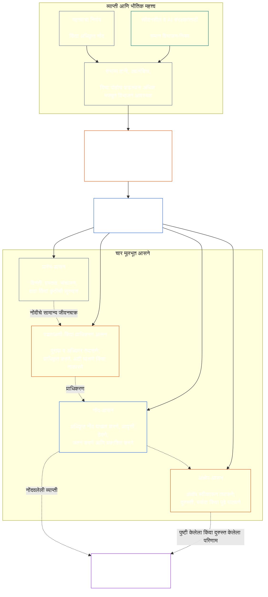

# अध्याय सात: कार्यात्मक स्वातंत्र्य आणि कर्तव्यांचे विभाजन

<strong>कॉर्पसमधील स्थान (कार्यकारी नाही): फाइलची रचना आणि वाचनाचे नियम</strong>

> पुढील मजकूर **केवळ वाचकांसाठी मार्गदर्शन** आहे. तो या फाइलमध्ये किंवा इतर अध्यायांत अन्यत्र असलेली बंधनकारक कर्तव्ये वाढवत, काढून टाकत किंवा मर्यादित करत नाही.
>
> ही फाइल **Sentient Constitution** चा भाग आहे आणि एकाच दस्तऐवजाप्रमाणे वाचल्या जाणाऱ्या इतर क्रमांकित `core_*` फाइल्सच्या **सोबतच बंधनकारक** आहे. यात **अध्याय सात** आहे: कार्यात्मक स्वातंत्र्य आणि कर्तव्य-विभाजनासाठी सर्व प्रक्रियांना लागू असलेली किमान मर्यादा. हा अध्याय सहाव्या अध्यायातील अधिकार-तळानंतर आणि [अध्याय आठमधील प्रणाली-संरेखन प्रमाणन](../../core_08_system_alignment_certification.md#chapter-eight-system-alignment-certification-reading-index) पासून सुरू होणाऱ्या घटनात्मक प्रक्रिया-अध्यायांपूर्वी येतो.
>
> - **घटनात्मक स्वामी:** वस्तुनिष्ठरीत्या बंधनकारक कृतींसाठी स्वतंत्र आसनांची किमान मर्यादा; प्रत्येक [वस्तुनिष्ठरीत्या बंधनकारक कृती-अभिलेख](../../core_05_band_accountability.md#materially-binding-act-record) मधील सार्वत्रिक किमान मजकूर; कृती करणाऱ्यापासून आणि त्याच्या [भौतिक नियंत्रणरेषेपासून](../../core_05_band_accountability.md#material-control-line) स्वातंत्र्य; प्रकाशित मार्ग व भूमिका-वाटप; हितसंबंधांचा संघर्ष, रिक्तता, पर्याय आणि चुकीच्या आसनाकडे पाठवणे; प्रमाणबद्ध संयुक्त व्यवस्था; श्रेय-निश्चित करता येणारे हस्तांतरण; आणि पुढील प्रत्येक घटनात्मक प्रक्रियेला लागू कराव्या लागणाऱ्या किमान स्वातंत्र्याच्या अटी.
> - **तत्त्व-स्तरावरील स्रोत:** [अध्याय एक §18.3](../../core_01_c_stewardship_capacity_principles.md#183-segregation-of-duties) शासनव्यवस्थेने कार्यात्मक स्वातंत्र्य जपावे अशी अपेक्षा करतो आणि कार्यकारी आसन-रचना येथे निर्देशित करतो.
> - **अंमलबजावणीचे स्वामी:** [CJS-3.11](../../corpus_joint_structure/cjs_03a_accountability_operations.md#constitutional-lane-and-functional-separation), [CI-3.2](../../corpus_institutions/ci_03_institutional_design_separation_of_powers.md#ci-32-functional-separation-lanes), आणि [CI-4.6](../../corpus_institutions/ci_04_appointment_competency_rotation_removal.md#ci-46-seat-catalog--process-role-archetypes-and-operational-boundaries) आसने ठरवतात आणि कार्यान्वित करतात. ते अधिक कठोर असू शकतात आणि मर्यादित विशेष-अधिकाराची आसन-प्रकार जोडू शकतात; परंतु हा अध्याय संकुचित करू शकत नाहीत.
> - **प्रक्रिया-विशिष्ट अनुप्रयोग पुढील अध्यायांमध्येच राहतो:** अध्याय आठ ही किमान मर्यादा प्रणाली-संरेखन प्रमाणनाला लागू करतो; [अध्याय नऊ §3.7](../../core_09_standing_assessment.md#37-segregation-of-duties) ती स्थिती-अभिलेखांना लागू करतो; अध्याय बारा आणि [corpus_forum.md](../../corpus_forum.md) ती मंच-प्रक्रियेला लागू करतात. हे अध्याय त्यांच्या विषयानुसार संरक्षणे जोडू शकतात; त्याहून कमकुवत पर्याय निर्माण करू शकत नाहीत.
>
> वाचनक्रम: §1 उद्देश, व्याप्ती आणि स्वामित्व-सीमा → §2 चार-आसनांची घटनात्मक किमान मर्यादा → §3 स्वातंत्र्य आणि संघर्ष → §4 चुकीच्या आसनाकडे पाठवणे → §5 प्रकाशित नेमणूक व पर्याय → §6 प्रमाणबद्ध वाढ → §7 आपत्कालीन स्थिती → §8 कृती-अभिलेख व श्रेय-निश्चित हस्तांतरण → §9 पुढील प्रक्रियांशी संबंध.

<strong>मागोवा</strong>

- पूर्वस्रोत: [घटनात्मक चतुष्टय](../../core_00_preamble.md#constitutional-tetrad) — विशेषतः **पर्यवेक्षण** आणि **उत्तरदायित्व**; [भौतिक हित](../../core_00_preamble.md#material-stake); [अध्याय एक §17.1 सामायिक संरक्षकत्व मानक](../../core_01_c_stewardship_capacity_principles.md#171-shared-stewardship-standard); [संरक्षकत्वाच्या शिस्तीखालील शासन, अध्याय एक §18](../../core_01_c_stewardship_capacity_principles.md#18-governance-under-stewardship-discipline); [कलम XVI](../../core_06_rights_part_c.md#article-xvi-audit-transparency-and-independent-verification) (*लेखापरीक्षण, पारदर्शकता आणि स्वतंत्र पडताळणी*).
- उपविभाग: [§1](#1-purpose-scope-and-owner-boundary); [§2](#2-four-seat-constitutional-floor); [§3](#3-independence-conflict-and-control-lines); [§4](#4-wrong-seat-routing); [§5](#5-published-placement-vacancy-and-substitution); [§6](#6-proportional-scaling-and-merged-hosting); [§7](#7-emergency-and-urgent-action); [§8](#8-act-records-and-attributable-handoffs); [§9](#9-relationship-to-later-processes).
- पुढील स्रोत: [अध्याय आठ](../../core_08_system_alignment_certification.md#chapter-eight-system-alignment-certification-reading-index); [अध्याय नऊ](../../core_09_standing_assessment.md#chapter-nine-contribution-violation-and-standing-model--measurement); [अध्याय बारा](../../core_12_forum.md#chapter-twelve-forums-and-jurisdiction); [अध्याय तेरा](../../core_13_governance.md#chapter-thirteen-constitutional-contract-legitimacy-authorization-and-stewardship); वर नमूद केलेले नियुक्त अंमलबजावणी-मजकूर.
- सोबत वाचा: [विसंरेखन शोध, अध्याय एक §19.3](../../core_01_c_stewardship_capacity_principles.md#193-misalignment-detection) (*बहुपक्षीय शोध व पुनरावलोकन*); [श्रेय देता येणारी कृती](../../core_05_band_accountability.md#attributable-action); [श्रेय-निश्चितीची अखंडता](../../core_05_band_accountability.md#attribution-integrity); [लेखापरीक्षणक्षमता](../../core_05_band_oversight.md#auditability); [आक्षेप घेण्यायोग्यता](../../core_05_band_accountability.md#contestability); [प्रमाणबद्धता](../../core_05_band_accountability.md#proportionality).

 

अध्याय सात हा **वस्तुनिष्ठरीत्या बंधनकारक कृतींसाठी कार्यात्मक स्वातंत्र्य आणि कर्तव्य-विभाजनाच्या किमान मर्यादेचा घटनात्मक स्वामी** आहे.

### 1. उद्देश, व्याप्ती आणि स्वामित्व-सीमा

<strong>मागोवा</strong>

- पूर्वस्रोत: अध्यायाच्या प्रारंभीचा स्वामित्व-दावा; [अध्याय एक §18](../../core_01_c_stewardship_capacity_principles.md#18-governance-under-stewardship-discipline); [पर्यवेक्षण](../../core_05_apex_oversight_leg.md#oversight-constitutional); [उत्तरदायित्व](../../core_05_apex_accountability_leg.md#accountability).
- पुढील: [§2](#2-four-seat-constitutional-floor) ते [§9](#9-relationship-to-later-processes); वस्तुनिष्ठरीत्या बंधनकारक कृती निर्माण किंवा बदलणारी प्रत्येक पुढील प्रक्रिया.
- सोबत वाचा: पडताळणीच्या आधारासाठी [अध्याय चार](../../core_04_burden_traceability_verification.md#chapter-four-burden-of-proof-traceability-and-verification); आव्हान व निवारणासाठी [कलम XIII-A](../../core_06_rights_part_c.md#article-xiii-a-reliability-and-trustworthiness-baseline) (*विश्वसनीयता आणि विश्वासार्हतेची मूलरेषा*) आणि [कलम XIII-B](../../core_06_rights_part_c.md#article-xiii-b-right-to-redress-and-remedy) (*दाद व उपायाचा अधिकार*); स्वतंत्र पडताळणीच्या अधिकार-तळासाठी [कलम XVI](../../core_06_rights_part_c.md#article-xvi-audit-transparency-and-independent-verification) (*लेखापरीक्षण, पारदर्शकता आणि स्वतंत्र पडताळणी*).

 

*सोप्या शब्दांत: एखाद्या घटनात्मक प्रक्रियेवर—किंवा आधीच अधिकृत प्रणाली, संस्था किंवा मर्यादित निर्णयक्षेत्रातील भागधारक-स्तरीय निर्णयावर—विश्वास ठेवण्यापूर्वी तिच्यातील कामे वेगळी केली पाहिजेत. ही किमान मर्यादा [घटनात्मक करार-स्तर](../../core_05_band_integrative.md#constitutional-contract-layer) आणि [प्रणालीतील भागधारक सहभाग](../../core_05_band_participation.md#stakeholder-status-and-weight) या दोन्हींना लागू होते. एखादा संवेदनशील जीव, पद, AI प्रणाली, भागधारक संस्था किंवा प्रतिनिधी परिणाम मिळवू इच्छित असेल, तर तोच कथित स्वतंत्र तपास करू शकत नाही, त्या तपासाची अधिकृत नोंद नियंत्रित करू शकत नाही किंवा त्यावरील आक्षेपाचा निर्णय घेऊ शकत नाही.*

अध्याय पाचमध्ये परिभाषित केलेल्या प्रत्येक [वस्तुनिष्ठरीत्या बंधनकारक कृतीला](../../core_05_band_accountability.md#materially-binding-act) हा अध्याय लागू होतो; त्यात पुढील गोष्टींचा समावेश आहे:

- निर्णय;
- प्राधिकरण किंवा प्रमाणन;
- निष्कर्ष;
- नोंदीतील नोंद किंवा महत्त्वाचा आवृत्ती-बदल;
- प्रसिद्धी, तैनाती, सातत्य किंवा माघार;
- वितरण किंवा वाटप; आणि
- आक्षेपाचा निपटारा.

या अध्यायातील आसने विशिष्ट कृतीसाठी कोण काय करू शकते हे ठरवतात; ती पदनामे नाहीत. तोच संवेदनशील जीव, पद किंवा प्रणाली वेगवेगळ्या कृतींसाठी वेगवेगळी आसने धारण करू शकतो. पदवी, अधिकार-प्रदान, तांत्रिक क्षमता किंवा एखादी पायरी पार पाडण्याची क्षमता त्या कृतीसाठी धारण केलेले आसन वाढवत नाही.

हा अध्याय प्रक्रियांमध्ये लागू होणारी कर्तव्य-विभाजनाची किमान मर्यादा सांगतो. तो पुढील बाबींचे स्थान बदलत नाही:

- पुराव्याचा भार, मागोवा घेण्याची क्षमता किंवा पडताळणीची पद्धत — अध्याय चारमधून;
- प्रमाणित अर्थ — अध्याय पाचमधून;
- अधिकार-तळ — अध्याय सहामधून;
- अध्याय आठ ते बारामधील प्रक्रिया-विशिष्ट नोंद-मजकूर; किंवा
- नियुक्त अंमलबजावणी-मजकुरातील कार्यकारी आसन-सूची, कर्मचारी-व्यवस्था पद्धती आणि मार्ग-नकाशा कार्यपद्धती.

### 2. चार आसनांची घटनात्मक किमान मर्यादा

<strong>मागोवा</strong>

- पूर्वस्रोत: [§1](#1-purpose-scope-and-owner-boundary); [अध्याय एक §18.3](../../core_01_c_stewardship_capacity_principles.md#183-segregation-of-duties); [अध्याय एक §17.1](../../core_01_c_stewardship_capacity_principles.md#171-shared-stewardship-standard).
- पुढील: [§3](#3-independence-conflict-and-control-lines) ते [§9](#9-relationship-to-later-processes); [CI-4.6](../../corpus_institutions/ci_04_appointment_competency_rotation_removal.md#ci-46-seat-catalog--process-role-archetypes-and-operational-boundaries) (*आसन-सूची — प्रक्रिया-भूमिका प्रारूप आणि कार्यकारी सीमा*).
- संयुक्त व्यवस्थेच्या एकमेव अनुमत मार्गासाठी [§6](#6-proportional-scaling-and-merged-hosting) सोबत वाचा.

 

*सोप्या शब्दांत: प्रत्येक वस्तुनिष्ठरीत्या बंधनकारक कृतीत चार कामे असतात—मागणी किंवा कृती, तपासणी, अधिकृत नोंद ठेवणे आणि आक्षेप ऐकणे. लहान संस्थेला अनुमत जोडी एकाच कार्यालयात ठेवण्याची परवानगी असली तरी कामे वेगळीच राहतात.*

<strong>वाचकांसाठी मार्गदर्शन (कार्यकारी नाही): चार-आसन नकाशा</strong>

> पुढील मजकूर **केवळ वाचकांसाठी मार्गदर्शन** आहे. तो या अध्यायात किंवा इतर अध्यायांत असलेली बंधनकारक कर्तव्ये वाढवत, काढून टाकत किंवा मर्यादित करत नाही.
>
> **वाचक नकाशा (कार्यकारी नाही).** हा आकृतीबंध चार आसने आणि नोंदीचे एक सामान्य जीवनचक्र दाखवतो. तो पाचवे अंमलबजावणी-आसन जोडत नाही, प्रत्येक कृतीपूर्वी पुनरावलोकन पूर्ण झालेच पाहिजे असे सांगत नाही किंवा या विभागातील आणि §§3–6 मधील कार्यकारी नियम बदलत नाही.

 

आसनांच्या चौकटीतील ठिपक्यांचे बाण नोंदीचे सामान्य जीवनचक्र दाखवतात. अंमलबजावणीकडे जाणारे बाण हे मागोवा-दुवे आहेत; ते पुनरावलोकन संपेपर्यंत प्रतीक्षा करण्याचा अनिवार्य क्रम नाहीत.

प्रत्येक वस्तुनिष्ठरीत्या बंधनकारक कृतीत कार्यात्मकदृष्ट्या वेगळी चार आसने असतात. अध्याय पाच त्यांचे प्रमाणित अर्थ सांगतो; हा विभाग प्रक्रियांमध्ये लागू होणारे आसन-वाटप आणि विसंगतीचे नियम सांगतो:

1. **[प्रारंभ-आसन](../../core_05_band_accountability.md#initiating-seat)** — कृतीची विनंती, प्रस्ताव, संचालन, दावा किंवा अन्य प्रकारे सुरुवात करते.
2. **[पडताळणी-किंवा-प्राधिकरण आसन](../../core_05_band_accountability.md#verify-or-authorize-seat)** — नियंत्रक मानकानुसार पुरावा व अधिकार तपासते आणि कृती पडताळते, प्राधिकृत करते, नाकारते किंवा अटी घालते.
3. **[नोंद-आसन](../../core_05_band_accountability.md#record-seat)** — पडताळणी-किंवा-प्राधिकरण आसनाने ठरविलेल्या बाबींचा [कृती-अभिलेख](../../core_05_band_accountability.md#materially-binding-act-record) दाखल, आवृत्तीकृत, धारण, जतन व प्रकाशित करते.
4. **[आक्षेप-आसन](../../core_05_band_accountability.md#contest-seat)** — आक्षेप स्वीकारते व पुनरावलोकन करते, अधिकृत असल्यास दुरुस्ती किंवा मर्यादांचे आदेश देते आणि आपल्या अधिकाराबाहेरील मुद्दे पुढे पाठवते.

ही आसने मानवी आणि AI संरक्षकांना समानपणे लागू आहेत. प्रणालीने कृती केली, तिला मान्यता दिली आणि नंतर स्वतःच्या नोंदीला पुरावा म्हणून वापरले, तर ती एकाच वेळी प्रारंभ, पडताळणी आणि नोंद या आसनांवर बसली आहे. प्रक्रिया स्वयंचलित केल्याने तपास स्वतंत्र होत नाही.

एकाच कृतीसाठी पुढील जोड्या निषिद्ध आहेत:

- प्रारंभ-आसनाने स्वतःच्या कृतीची पडताळणी किंवा प्राधिकरण करू नये;
- पडताळणी-किंवा-प्राधिकरण आसनाने नोंद-आसन धारण करू नये;
- पडताळणी-किंवा-प्राधिकरण आसनाने आक्षेप-आसन धारण करू नये; आणि
- प्रणालीचा ऑपरेटर त्या प्रणालीशी संबंधित कृतीची पडताळणी किंवा प्राधिकरण करू नये.

पुढील अध्याय किंवा समाविष्ट अंमलबजावणी-मजकूर विशिष्ट प्रक्रियेसाठी अतिरिक्त जोड्या निषिद्ध करू शकतो. येथे निषिद्ध असलेल्या जोडीला तो परवानगी देऊ शकत नाही.

कार्यात्मक चार-आसनांची किमान मर्यादा प्रत्येक वर्गाला लागू आहे. वर्गानुसार बदलणारा प्रश्न असा की ही आसने एकत्र करता येतील का किंवा एकाच धारकाकडे ठेवता येतील का: वर्ग C च्या व्याप्तीत कार्यरत संस्थेसाठी किंवा प्रणालीसाठी चारही आसनांचे पूर्ण विभाजन नेहमी शिफारसीय आहे; वर्ग B साठी ते जवळजवळ नेहमी आवश्यक असावे; आणि वर्ग A साठी ते नेहमीच आवश्यक आहे. व्याप्ती मिश्रित असल्यास किंवा वर्गीकरण अनिश्चित असल्यास, कमी स्थितीला नोंदीचा आधार मिळेपर्यंत सर्वोच्च लागू भूमिका स्वीकारा.

### 3. स्वातंत्र्य, संघर्ष आणि नियंत्रणरेषा

<strong>मागोवा</strong>

- पूर्वस्रोत: [§2](#2-four-seat-constitutional-floor); [अधिकारानुसार प्रमाणित उत्तरदायित्व](../../core_01_c_stewardship_capacity_principles.md#181-governance-as-authorized-structure); [कलम XXIV](../../core_06_rights_part_d.md#article-xxiv-constitutional-interpretation-review-and-anti-capture-safeguards) (*घटनात्मक अर्थनिर्णयन, पुनरावलोकन आणि ताबा-विरोधी संरक्षणे*).
- पुढील: [§4](#4-wrong-seat-routing); [§5](#5-published-placement-vacancy-and-substitution); [§8](#8-act-records-and-attributable-handoffs); अध्याय आठमधील प्रमाणन-घटक भूमिका; अध्याय नऊमधील नोंद-ताबा; अध्याय बारोमधील मंचाचे स्वन्याय-प्रतिबंध.
- सोबत वाचा: [भौतिक नियंत्रणरेषा](../../core_05_band_accountability.md#material-control-line); कार्यकारी संघर्ष आणि स्वन्याय-प्रतिबंध संरक्षणांसाठी [CI-5](../../corpus_institutions/ci_05_conflict_integrity_anti_capture_anti_corruption.md) (*संघर्ष-अखंडता, ताबा-विरोध आणि भ्रष्टाचार-विरोध*) आणि [CF-7](../../corpus_forum/cf_07_integrity_safeguards_anti_capture_anti_self_judging.md) (*अखंडता संरक्षणे, ताबा-विरोधी कार्यवाही आणि स्वन्याय-प्रतिबंध समर्थन*).

 

*सोप्या शब्दांत: टेबलवरील नाव बदलल्याने स्वातंत्र्य निर्माण होत नाही. परिणाम इच्छिणारा संवेदनशील जीव किंवा पद एखाद्या पडताळकाला किंवा पुनरावलोककाला निर्देश देऊ, पदावरून काढू, बक्षीस देऊ, शिक्षा करू किंवा त्या कृतीबाबत गुपचूप निर्णय उलटवू शकत असेल, तर तो स्वतंत्र नाही.*

कार्यात्मक स्वातंत्र्याचे मूल्यमापन नावांवर नव्हे, तर प्रत्यक्ष अधिकार व नियंत्रणावर होते. त्याच कृतीत:

- पडताळणी-किंवा-प्राधिकरण आसन आणि आक्षेप-आसन प्रारंभ-आसनाच्या [भौतिक नियंत्रणरेषेच्या](../../core_05_band_accountability.md#material-control-line) बाहेर असले पाहिजेत;
- कृतीमुळे ज्याचा स्वतःचा हितसंबंध ठरत असेल, त्याने पडताळणी-किंवा-प्राधिकरण किंवा आक्षेप-आसन धारण करू नये;
- संघर्षग्रस्त नोंदधारकाने संघर्षाचा निर्णय घेण्याऐवजी किंवा ताबा सोडण्याऐवजी संपूर्ण लेखापरीक्षण-मागोव्यासह ती नोंद प्रकाशित पर्यायाकडे द्यावी; आणि
- स्वतःला बाजूला केल्याने कृतीवरील अधिकार संपतो; आसन विनंतीकर्त्याकडे, त्याच्या अहवाल-साखळीकडे किंवा सर्वात जवळच्या व्यक्तीकडे जात नाही.

विशिष्ट कृतीसाठी [भौतिक नियंत्रणरेषेचा](../../core_05_band_accountability.md#material-control-line) मागोवा घ्या. सामायिक पायाभूत सुविधा, प्रशासकीय मदत किंवा नियुक्तीचा इतिहास यांमुळेच ती रेषा ठरत नाही; मात्र अशा व्यवस्थांनी व्यवहारात स्वतंत्र निर्णयाला बाधा आणू नये.

दुसरी स्वाक्षरी, नाममात्र समिती, अंतर्गत लेबल किंवा साधनाने तयार केलेले प्रमाणपत्र स्वतंत्रता सिद्ध करत नाही, जर अपेक्षित तपासात अधिकार, पुराव्यापर्यंत प्रवेश, भौतिक नियंत्रणापासून स्वातंत्र्य किंवा नकार देऊन पुढे पाठवण्याची खरी क्षमता नसेल.

### 4. चुकीच्या आसनाकडे पाठवणे

<strong>मागोवा</strong>

- पूर्वस्रोत: [§2](#2-four-seat-constitutional-floor); [§3](#3-independence-conflict-and-control-lines).
- पुढील: [§5](#5-published-placement-vacancy-and-substitution); [§8](#8-act-records-and-attributable-handoffs); [CI-4.6 चे सामायिक आसन-नियम](../../corpus_institutions/ci_04_appointment_competency_rotation_removal.md#ci-46-shared-seat-rules).
- सोबत वाचा: [प्रतिरोधाचे कर्तव्य, अध्याय एक §17.5](../../core_01_c_stewardship_capacity_principles.md#175-duty-to-resist).

 

*सोप्या शब्दांत: एखादी पायरी तुमची नसेल, तर ती गुपचूप घेऊ नका आणि नुसते निघूनही जाऊ नका. त्रुटी नोंदवा आणि विषय योग्य ठिकाणी पाठवा.*

स्वतःच्या आसनाबाहेरील पायरी घेण्यास सांगितलेल्या संरक्षकाने:

1. त्या पायरीचे गुणदोष ठरवत असल्याचा दावा न करता ती नाकारावी;
2. ती पायरी घेऊ शकणारे आसन आणि प्रकाशित असल्यास त्याचा धारक किंवा पर्याय नमूद करावा;
3. विनंती, धारण केलेले आसन, त्रुटी किंवा संघर्ष आणि वापरलेला मार्ग नोंदवावा;
4. पुरावा आणि आधीच मिळालेल्या कोणत्याही नोंदीची अखंडता जपावी; आणि
5. टाळता येण्याजोगा विलंब न करता विषय पुढे पाठवावा.

ही प्रतिक्रिया कर्तव्यपालन आहे, कृतीचा त्याग नाही. कृती योग्य आसनातून पुढे जाते. संरक्षक सर्वात जवळ, सर्वात जलद, वरिष्ठ किंवा एकमेव जाणकार आहे म्हणून पायरी घेणे हे अनुपस्थित आसनाचे निराकरण नाही.

### 5. प्रकाशित नेमणूक, रिक्तता आणि पर्याय

<strong>मागोवा</strong>

- पूर्वस्रोत: [§2](#2-four-seat-constitutional-floor); [§3](#3-independence-conflict-and-control-lines); [पारदर्शकता](../../core_05_band_oversight.md#transparency); [लेखापरीक्षणक्षमता](../../core_05_band_oversight.md#auditability).
- पुढील: [§8](#8-act-records-and-attributable-handoffs); [CI-3.2](../../corpus_institutions/ci_03_institutional_design_separation_of_powers.md#ci-32-functional-separation-lanes) (*कार्यात्मक विभाजनमार्ग*); [CI-4.5](../../corpus_institutions/ci_04_appointment_competency_rotation_removal.md#ci-45-authorized-roles-and-accountability-chains) (*अधिकृत भूमिका आणि उत्तरदायित्व-साखळ्या*); अध्याय आठ व नऊमधील नोंदी.
- सोबत वाचा: [सनद](../../core_05_band_continuity.md#charter) आणि [अध्याय तेरा §5](../../core_13_governance.md#5-authorized-roles-competency-development-and-contribution).

 

*सोप्या शब्दांत: कठीण प्रसंग येण्यापूर्वी संस्थेने प्रत्येक काम कोणाकडे आहे हे सांगितले पाहिजे; नेहमीचा धारक अनुपस्थित किंवा संघर्षग्रस्त असल्यास कोण त्याची जागा घेईल हेही त्यात समाविष्ट आहे.*

वस्तुनिष्ठरीत्या बंधनकारक कृती करणाऱ्या प्रत्येक स्वीकारकर्त्याने प्रकाशित, लेखापरीक्षणयोग्य आणि आक्षेप घेता येण्याजोगा नकाशा ठेवला पाहिजे, ज्यात पुढील बाबी असतील:

- प्रत्येक आसन कोणता मार्ग, कार्यालय, भूमिका किंवा प्रक्रिया धारण करते;
- ती नेमणूक कोणत्या कृतींना आणि व्याप्तीला लागू होते;
- प्रत्येक अनुमत संयुक्त व्यवस्थापन आणि त्याचे स्वातंत्र्य-संरक्षण;
- अनुपस्थित, वगळलेल्या, ताब्यात गेलेल्या किंवा संघर्षग्रस्त धारकाचा पर्याय; आणि
- पात्र पर्याय उपलब्ध नसल्यास स्वतंत्र मार्ग.

नेमणूक न केलेले, रिक्त किंवा संघर्षग्रस्त आसन ही नोंदवून दुरुस्त करायची शासन-दोषस्थिती आहे. ते आपोआप प्रारंभ-आसनाकडे, हितसंबंधी पक्षाकडे, ऑपरेटरकडे किंवा त्यांच्या [भौतिक नियंत्रणरेषेतील](../../core_05_band_accountability.md#material-control-line) वरिष्ठाकडे जात नाही. दुरुस्ती होईपर्यंत कृती प्रकाशित पर्यायाकडे किंवा स्वतंत्र मार्गाकडे पाठवली जाते. घाई आहे म्हणून स्वातंत्र्याची अट टाळता येत नाही.

अधिकार-प्रदान केल्याने तीच आसन-सीमा, पुरावा-दायित्वे, नोंद आणि वेळमर्यादा कायम राहतात आणि ते [भौतिक नियंत्रणरेषेच्या](../../core_05_band_accountability.md#material-control-line) अधीन राहते. त्याने नवीन आसन निर्माण होत नाही, आसने एकत्र होत नाहीत किंवा अधिकार-प्रदान करणाऱ्या आसनाला जे करता आले नसते ते प्रतिनिधीला करता येत नाही; यात वर्गानुसार लागू शिफारस किंवा चारही आसनांच्या पूर्ण विभाजनाची अट एकत्रीकरणाच्या परवानगीत बदलणेही समाविष्ट आहे.

### 6. प्रमाणबद्ध विस्तार आणि संयुक्त व्यवस्था

<strong>मागोवा</strong>

- पूर्वस्रोत: [§2](#2-four-seat-constitutional-floor); [भौतिक हित](../../core_00_preamble.md#material-stake); [आवश्यकता](../../core_05_band_accountability.md#necessity); [प्रमाणबद्धता](../../core_05_band_accountability.md#proportionality).
- पुढील: [अध्याय नऊ §3.7](../../core_09_standing_assessment.md#37-informal-and-small-scope-records); [CJS-2.4](../../corpus_joint_structure/cjs_02_specific_joint_interlocks.md#cjs-24-class-scaled-lane-staffing-and-competency-redundancy) (*वर्गानुसार मार्ग-कर्मचारी व्यवस्था आणि कौशल्यातील पुनरावृत्ती*); [CI-3.2](../../corpus_institutions/ci_03_institutional_design_separation_of_powers.md#ci-32-functional-separation-lanes) (*कार्यात्मक विभाजनमार्ग*).
- सोबत वाचा: [टाळता येण्याजोगा भार](../../core_05_band_continuity.md#avoidable-burden) आणि [अध्याय एक §3.3 अपमानकारक प्रक्रियेविरुद्ध](../../core_01_a_values_principles.md#33-anti-degrading-process).

 

*सोप्या शब्दांत: लहान व अनौपचारिक गटांना चार मोठ्या विभागांची गरज नाही. पण त्यांना खरी स्वतंत्र तपासणी, वापरण्यायोग्य नोंद आणि आक्षेपाचा मार्ग हवा. आकारामुळे कर्मचारी-व्यवस्थेची पद्धत बदलते; संरक्षित विभाजन बदलत नाही.*

विभाजनाची ताकद, कर्मचारी-व्यवस्था, पुनरावृत्ती आणि औपचारिकता ही भौतिक हित, प्रणाली-वर्ग, अवलंबित्व आणि वाजवीपणे पूर्वानुमेय हानी यांच्या प्रमाणात असते.

लहान किंवा अनौपचारिक स्वीकारकर्ता दोन आसने एकाच कार्यालयात किंवा एकाच संवेदनशील जीवाकडे ठेवू शकतो, पण पुढील सर्व अटी पूर्ण झाल्या पाहिजेत:

- एकत्रीकरण व्याप्तीसाठी आवश्यक आणि प्रमाणबद्ध असावे;
- ते प्रकाशित, लेखापरीक्षणयोग्य, आक्षेप घेता येण्याजोगे आणि कृतीच्या नोंदीत उघड केलेले असावे;
- स्वातंत्र्य-संरक्षणाने एकत्रीकरणामुळे निर्माण झालेले धोके हाताळावेत;
- प्रारंभ-आसनाने स्वतःच्या कृतीची पडताळणी किंवा प्राधिकरण करू नये;
- पडताळणी-आणि-नोंद तसेच पडताळणी-आणि-आक्षेप ही जोडणी निषिद्ध राहावी; आणि
- संघर्ष, भौतिक हानी किंवा आक्षेप संयुक्त धारकाच्या कायदेशीर मर्यादेपलीकडे गेल्यास स्वतंत्र मार्ग उपलब्ध असावा.

अनौपचारिक, विनावेतन, परस्पर-सहाय्य, काळजी, दुरुस्ती, अध्यापन, सहकारी आणि समुदाय-संरक्षकत्वाच्या कामात संबंधित तपासणीसाठी प्रकाशित अधिकार असलेली हितनिरपेक्ष विश्वासार्ह संस्था वापरता येईल. खरोखर हितनिरपेक्ष आणि उत्तरदायी मार्ग उपलब्ध असल्यास, व्याप्ती वाजवीपणे गाठू शकत नाही अशी संस्थात्मक औपचारिकता संविधान अनिवार्य करत नाही.

कर्मचारी-अभाव, वेग, सोय किंवा तज्ज्ञतेचे केंद्रीकरण एकट्याने एकत्रीकरण योग्य ठरवत नाही. [§2 चार आसनांची घटनात्मक किमान मर्यादा](#2-four-seat-constitutional-floor) यातील वर्गानुसार भूमिका लागू आहे: वर्ग A साठी कोणतीही सूट नाही; वर्ग B किंवा C मधील सूट वरच्या अटी पूर्ण करेल. भौतिक हित जितके मोठे, तितकी स्वतंत्र कार्यालये, कौशल्याची पुनरावृत्ती आणि स्वतंत्र पर्यायांची पूर्वधारणा अधिक मजबूत.

### 7. आपत्कालीन आणि तातडीची कृती

<strong>मागोवा</strong>

- पूर्वस्रोत: [§2](#2-four-seat-constitutional-floor); [§6](#6-proportional-scaling-and-merged-hosting); [अध्याय बारा §6.1 आपत्कालीन उपाय आणि सुरू ठेवण्याचा भार](../../core_12_forum.md#61-emergency-measures-and-continuation-burden); [डिफॉल्ट अंतरिम भूमिका](../../core_01_b_interaction_interpretation.md#default-interim-posture).
- पुढील: नियुक्त अंमलबजावणी-मजकुरातील घटना, नियंत्रण, प्रसिद्धी, सातत्य आणि घटना-पश्चात पुनरावलोकन प्रक्रिया.
- सोबत वाचा: [वेळेचे पालन](../../core_05_apex_timeliness_leg.md#timeliness-constitutional), [पुरावा जतन](../../core_05_band_oversight.md#evidence-preservation), आणि [CI-4.6 आसन-सूची — प्रक्रिया-भूमिका प्रारूप व कार्यकारी सीमा](../../corpus_institutions/ci_04_appointment_competency_rotation_removal.md#ci-46-seat-containment).

 

*सोप्या शब्दांत: खरी आपत्कालीन स्थिती नियमित तपासणी पूर्ण होण्यापूर्वी कृती करण्यास न्याय्य ठरवू शकते. ती क्रम बदलते; आसनाचे स्वामित्व किंवा वर्गानुसार विभाजनाची भूमिका नाही. ती कर्त्याला स्वतःचे सातत्य प्रमाणित करणे, मागोवा पुसणे किंवा नंतर अंतिम पुनरावलोकक बनणे शक्य करत नाही.*

विलंबामुळे गंभीर आणि तातडीच्या हानीचा वाजवीपणे पूर्वानुमेय धोका निर्माण होईल, तर अधिकृत प्रारंभ किंवा नियंत्रण-आसन नियमित पूर्वपडताळणी पूर्ण होण्यापूर्वी आवश्यक किमान उलटवता येणारी कृती करू शकते, परंतु केवळ पुढील अटींवर:

- आपत्कालीन अधिकार, व्याप्ती, सुरुवात, समाप्ती आणि कारण तत्काळ किंवा शारीरिकदृष्ट्या शक्य तितक्या लवकर नोंदवले जातात;
- पुरावा आणि आक्षेप जतन केले जातात;
- लागू घटनात्मक वेळमर्यादेत सूचना व सहभाग पूर्ववत केले जातात;
- तात्काळ मर्यादेपलीकडील सातत्याचा स्वतंत्र पडताळणी-किंवा-प्राधिकरण आसन आढावा घेते; आणि
- कृतीचे स्वतंत्र घटना-पश्चात पुनरावलोकन होते.

आपत्कालीन कृती:

- कर्त्याला स्वतःच्या सातत्याची पडताळणी करू देत नाही;
- संघर्षग्रस्त नोंदीचा कर्ता अभिलेख-रक्षक बनवत नाही;
- कर्त्याला स्वतःच्या कृतीवरील आक्षेप ऐकू देत नाही;
- तात्पुरती आवश्यकता कायमस्वरूपी अधिकारात बदलत नाही;
- वर्ग A संस्था किंवा प्रणालीसाठी चार आसनांपैकी कोणतेही एकत्र करू देत नाही.

खालीलपैकी कोणतीही गोष्ट एकटीच आपत्कालीन स्थिती ठरत नाही:

- अंतिम मुदत;
- प्रसिद्धीचे लक्ष्य;
- कर्मचारी-अभाव; किंवा
- प्रतिष्ठेची चिंता.

### 8. कृती-अभिलेख आणि श्रेय-निश्चित हस्तांतरण

<strong>मागोवा</strong>

- पूर्वस्रोत: [§2](#2-four-seat-constitutional-floor) ते [§7](#7-emergency-and-urgent-action); [वस्तुनिष्ठरीत्या बंधनकारक कृती-अभिलेख](../../core_05_band_accountability.md#materially-binding-act-record); [श्रेय देता येणारी कृती](../../core_05_band_accountability.md#attributable-action); [श्रेय-निश्चितीची अखंडता](../../core_05_band_accountability.md#attribution-integrity).
- पुढील: [CS-4 §10 तपासता येणारी श्रेय-निश्चित कृती](../../corpus_systems/cs_04_critical_system_stewardship.md#10-inspectable-attributable-action); [CI-4.6 सामायिक आसन-नियम](../../corpus_institutions/ci_04_appointment_competency_rotation_removal.md#ci-46-shared-seat-rules); §8 ने नियंत्रित प्रत्येक प्रक्रिया-नोंद; [`materially_binding_act_record.schema.json`](../../implementation/schemas/materially_binding_act_record.schema.json) (*मूलभूत यंत्र-पडताळणीयोग्य स्वरूप; प्रक्रिया-सहाय्य, दुसरी व्याख्या नाही*).
- सोबत वाचा: [§4 चुकीच्या आसनाकडे पाठवणे](#4-wrong-seat-routing) आणि [अध्याय चार §5](../../core_04_burden_traceability_verification.md#5-compliance-evidence-standard).

 

*सोप्या शब्दांत: प्रत्येक वस्तुनिष्ठरीत्या बंधनकारक कृतीचा कृती-अभिलेख असतो. त्यात काय घडले, प्रत्येक आसनावर कोण होते, काय ठरले आणि आक्षेप कुठे न्यावा हे दिसते.*

प्रत्येक वस्तुनिष्ठरीत्या बंधनकारक कृतीसाठी ओळखता येण्याजोगा [वस्तुनिष्ठरीत्या बंधनकारक कृती-अभिलेख](../../core_05_band_accountability.md#materially-binding-act-record) (**कृती-अभिलेख**) असणे आवश्यक आहे. कृती-अभिलेख एका लागू प्रक्रिया-विशिष्ट अधिकृत नोंदीत समाविष्ट असू शकतो किंवा श्रेय-निश्चित करता येणाऱ्या व अखंडता जपणाऱ्या परस्पर-संबंधित अधिकृत नोंदींच्या संचात असू शकतो. विद्यमान अधिकृत नोंद किंवा संलग्न संच सर्व आवश्यक घटक स्पष्टपणे दाखवत असेल, त्यांचे दुवे आणि आवृत्ती-इतिहास जपत असेल आणि अधिकृत नोंद-मार्गाने उपलब्ध असेल, तर स्वतंत्र डुप्लिकेट दस्तऐवज आवश्यक नाही.

कृती-अभिलेखात किमान पुढील बाबी असाव्यात:

- स्थिर नोंद-ओळख, वर्तमान आवृत्ती आणि महत्त्वाचे निर्मिती व बदलाचे काल-मुद्रांक;
- कृती, तिची भौतिक व्याप्ती, स्थिती आणि नियंत्रक अधिकार;
- प्रारंभ-आसन, धारक आणि अधिकार;
- पडताळणी-किंवा-प्राधिकरण आसन, धारक, नियंत्रक मानक, निर्धारण, महत्त्वाच्या अटी किंवा कारणे आणि निर्धारणाची वेळ;
- नोंद-आसन, धारक, ताब्याचा अधिकार आणि दाखल केलेली आवृत्ती;
- आक्षेप-आसन किंवा प्रकाशित आक्षेप-मार्ग आणि वर्तमान आक्षेप किंवा दुरुस्तीची स्थिती;
- प्रत्येक अधिकार-प्रदान, बाजूला होणे, पर्याय, अनुमत एकत्रीकरण किंवा आपत्कालीन विचलन; आणि
- कृतीची पुनर्रचना करण्यासाठी आवश्यक महत्त्वाचे पुरावे व नोंद-दुवे, हस्तांतरणे, नकार, अटी, न सुटलेले आक्षेप, वेळमर्यादा, अधिलिखित आवृत्त्या व दुरुस्त्या.

प्रक्रिया-विशिष्ट नोंदी अधिक कठोर किंवा क्षेत्र-विशिष्ट घटक जोडू शकतात. त्या हा किमान मजकूर वगळू, त्याच्या विरोधात जाऊ किंवा पुनर्रचना अशक्य करू शकत नाहीत. कायदेशीर गोपनीयता, विश्वासगोपनीयता आणि सुरक्षा-नियंत्रणे संरक्षित मजकुरापर्यंतचा प्रवेश किंवा त्याचे प्रकटीकरण ठरवतात; अधिकृत पडताळणी, आक्षेप, दुरुस्ती किंवा उपायासाठी अधिकृत मागोवा पुसण्याची किंवा निरुपयोगी करण्याची परवानगी देत नाहीत.

नोंदींमध्ये कोणी काय केले ते दिसते; पण त्या एकट्याने कृती वैध होती हे सिद्ध करत नाहीत. कृती करणाऱ्या संवेदनशील जीवाने किंवा प्रणालीने तयार केलेला लॉग, स्वाक्षरी, मॉडेल-मागोवा, तपासणी-सूची किंवा प्रमाणन यांची मर्यादित भूमिका असते:

- ही सामग्री पुरावा देऊ शकते किंवा कृती-अभिलेखाशी जोडता येऊ शकते.
- ही सामग्री स्वतंत्र पुनरावलोकन व निर्णय किंवा अधिकृत कृती-अभिलेखाची जागा घेऊ शकत नाही.

### 9. पुढील प्रक्रियांशी संबंध

<strong>मागोवा</strong>

- पूर्वस्रोत: [§1](#1-purpose-scope-and-owner-boundary) ते [§8](#8-act-records-and-attributable-handoffs).
- पुढील: [अध्याय आठ](../../core_08_system_alignment_certification.md#chapter-eight-system-alignment-certification-reading-index); [अध्याय नऊ](../../core_09_standing_assessment.md#chapter-nine-contribution-violation-and-standing-model--measurement); [अध्याय बारा](../../core_12_forum.md#chapter-twelve-forums-and-jurisdiction); [अध्याय तेरा](../../core_13_governance.md#chapter-thirteen-constitutional-contract-legitimacy-authorization-and-stewardship).
- सोबत वाचा: [अधिकार-स्तर आणि अंतर्गत श्रेणी](../../core_05_band_integrative.md#owner-non-relocation) आणि [प्रस्तावनेतील स्वामी-नोंद](../../core_00_preamble.md#4-principles-definitions-and-rights).

 

*सोप्या शब्दांत: पुढील अध्याय प्रत्येक प्रक्रियेला काय मूल्यमापन, नोंद, निर्णय आणि निवारण करायचे ते सांगतात. हे करताना सत्ता कशी वेगळी ठेवायची ते हा अध्याय सांगतो.*

प्रत्येक पुढील घटनात्मक प्रक्रियेने चारही आसने कशी नेमली व वापरली जातात आणि या अध्यायाचे पालन कसे केले जाते हे स्पष्ट केले पाहिजे. प्रत्यक्षात:

- तिची स्वतःची प्रक्रिया-नोंद कृती-अभिलेख म्हणून वापरता येते किंवा त्यात प्रक्रिया-विशिष्ट तपशील जोडता येतात.
- एका प्रक्रिया-नोंदीत अनेक वस्तुनिष्ठरीत्या बंधनकारक कृती असतील, तर प्रत्येक कृतीसाठी स्वतंत्र कृती-अभिलेखाचा दुवा देता येतो.
- अधिकृत नोंद-मार्ग पूर्ण आणि मागोवा घेण्याजोगा राहिल्यास स्वतंत्र डुप्लिकेट नोंद आवश्यक नाही.
- प्रक्रियेला वेगळे नाव दिल्याने ती [§4 चुकीच्या आसनाकडे पाठवणे](#4-wrong-seat-routing) किंवा [§8 कृती-अभिलेख आणि श्रेय-निश्चित हस्तांतरण](#8-act-records-and-attributable-handoffs) यांच्या बंधनातून मुक्त होत नाही; यात हस्तांतरण आणि चुकीच्या आसनाचे नियमही येतात.

विशेषतः:

- **अध्याय आठ — प्रणाली-संरेखन प्रमाणन:** प्रणालीचा ऑपरेटर किंवा प्रमाणन प्रस्तावक प्रारंभ-आसन असतो, स्वतःचा पडताळक नाही; मर्यादित घटक-निष्कर्ष, प्रमाणन-अभिलेखाचे एकत्रीकरण, ताबा आणि आक्षेप हे त्यांच्या कायदेशीर आसनांत व आत्मनिर्णय-विरोधी मार्गांतच राहिले पाहिजेत.
- **अध्याय नऊ — स्थिती-अभिलेख:** विनंतीकर्ता, नोंद उघडण्याचा अधिकार, नोंद-रक्षक आणि आक्षेप-मार्ग यांनी अध्याय नऊच्या ताबा, दावेदार, अनौपचारिक नोंद आणि स्व-ताबा-निषेधाच्या अधिक कठोर नियमांसह चार-आसनांची किमान मर्यादा लागू करावी.
- **अध्याय बारा — मंच:** दाखल करणे, तपास, गुणदोष-पुनरावलोकन, नोंद-ताबा, अपील आणि मंचाच्या कथित पक्षपात किंवा प्रक्रिया-दुरुपयोगाचे पुनरावलोकन करताना लागू आसन-सीमा व आत्मनिर्णय-विरोधी सीमा जपल्या पाहिजेत.
- **अध्याय तेरा — शासन:** भूमिका-व्याख्या, कौशल्य-योजना, अधिकार-प्रदान, उत्तराधिकार आणि संस्थात्मक रचनेने आसने नेमून टिकवली पाहिजेत; केवळ त्यांची नावे पुन्हा म्हणू नयेत.

पुढील अध्याय आपल्या प्रक्रियेतील अधिक किंवा वेगळ्या जोखमीमुळे अधिक कठोर स्वातंत्र्य, बाजूला होणे, विभाजन, ताबा, पॅनेल किंवा पुनरावलोकनाच्या अटी लागू करू शकतो. तो ही किमान मर्यादा संकुचित करू शकत नाही, प्रक्रिया-विशिष्ट नावाला सूट मानू शकत नाही किंवा मौनामुळे आसन कर्त्याकडे जाते असा अर्थ काढू शकत नाही.

---

**मागील फाइल:** [core_05_band_performance.md](../../core_05_band_performance.md)

**पुढील फाइल:** [core_08_a_system_alignment_certification_evaluation.md](../../core_08_a_system_alignment_certification_evaluation.md#chapter-eight-part-a-certification-evaluation)
