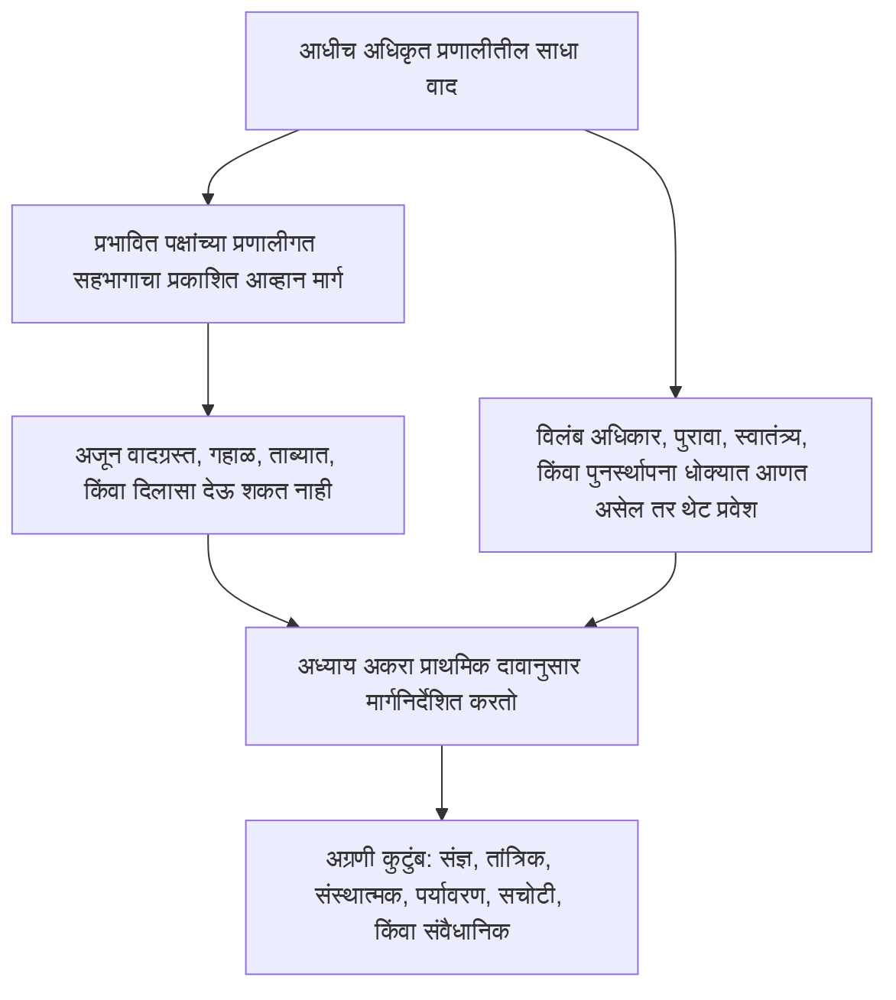

# अध्याय अकरा: मंच आणि अधिकारक्षेत्र

<strong>संग्रहस्थान (असंक्रियात्मक): फाइल रचना आणि वाचन नियम</strong>

> खालील मजकूर **फक्त वाचक मार्गदर्शन** आहे. तो या फाइलमध्ये किंवा इतर अध्यायांत बंधनकारक कर्तव्ये जोडत नाही, काढत नाही, किंवा आकुंचित करत नाही.
>
> ही फाइल [इंग्रजी अध्याय अकरा](../../core_12_forum.md) चा **वाचक-भाषा पायलट** आहे. संज्ञ संविधानाचा **बंधनकारक भाग नाही**. **दुसरे संविधान नाही**. **प्रेषण आवृत्ती नाही**. `SC-Corpus-2026.08.09` ला **पिन** आहे. हा अनुवाद आणि इंग्रजी मूळ यात फरक दिसला, तर क्रमांकित [`core_11_forum.md`](../../core_12_forum.md) जिंकते. वाचन क्रम आणि आवृत्ती मेटाडेटा [README.md](../../README.md) मध्ये राहतात. पद्धत आणि शब्दसूची: [translations/mr/README.md](README.md).
>
> **अध्याय अकरा** समाविष्ट करते: मंच-कुटुंबे, पूर्वनिर्धारित आसन आणि प्राथमिक-दाव मार्गनिर्देशन, फॉरेन्सिक आधार, प्रवेश छाननी, आणि प्रस्थिति शृंखला व अधिकार-तळाखालील वादांसाठी अधिकारक्षेत्र. मंच [संवैधानिक चतुष्क](core_00_preamble.md#constitutional-tetrad) च्या **सहभाग**, **देखरेख**, आणि **समयबद्धता** पायाखाली वाद हाताळणी **देखरेख** करतात, [भौतिक दाव](core_00_preamble.md#material-stake) नुसार प्रमाणित. तथ्ये सत्यापित झाली की ते प्रस्थिति अभिलेख **उघडू, अद्ययावत, किंवा दुरुस्त** करू शकतात — किंवा **वाईट अभिलेख आव्हानावर बाजूला ठेवू** शकतात — [अध्याय आठ §3](core_08_standing_assessment.md#3-standing-record-operational-requirements) खाली; दाखल प्रकरण स्वतः प्रस्थिति नाही, आणि मंच-कथा अध्याय आठ प्रस्थिति मापनाची जागा घेऊ नये ([अध्याय आठ §3.6](core_08_standing_assessment.md#36-forum-boundary)). शृंखला नेविगेशनसाठी [README — Standing pipeline and forums](../../README.md#standing-pipeline-and-forums) वापरा. संक्रियात्मक मंच यांत्रिकी नामित अंमलबजावणी फाइलांत राहते. अध्याय क्रमांकन आणि परस्पर-संदर्भ एकत्रित साधनाशी जुळतात. वाचन क्रम, बंधनकारक/सहाय्य फूट, आणि संग्रह आवृत्ती मेटाडेटा [README.md](../../README.md) मध्ये राखले जातात.

>
> **मागील (अजून इंग्रजीत):** [core_10_b_misconduct_pattern_applications.md](../../core_11_b_misconduct_pattern_applications.md#chapter-eleven-part-b-anti-constitutional-misconduct-pattern-applications)
>
> **पुढील (अजून इंग्रजीत):** [core_08-11_application_vignettes.md](../../core_09-12_application_vignettes.md#chapters-eight-eleven-application-vignettes)
> **वाचन चाप:** §1 उद्दिष्ट → वाद अनुक्रम → §2 पूर्वनिर्धारित आसन आणि प्रवेश → §2.1–§2.3 अग्रणी मर्यादा, मिश्र दाव, आव्हाने → §3 स्थानांतर आणि स्व-न्यायनिषेध → §4 कुटुंबे → §5 अधिरोहण आणि प्रमाणन → §6 स्तर आणि विलंब-निरोध → §7 मंच आधार

<strong>वाचक मार्गदर्शन (असंक्रियात्मक): अध्याय अकरा कुठे राहतो आणि येथे काय राहते</strong>

> खालील मजकूर **फक्त वाचक मार्गदर्शन** आहे. तो या अध्यायात किंवा इतर अध्यायांत बंधनकारक कर्तव्ये जोडत नाही, काढत नाही, किंवा आकुंचित करत नाही.
>
> हे कुठे राहते (नेविगेशन):
> - **संवैधानिक मालक:** **विभाग 1** (*उद्दिष्ट* — या अध्यायाने वाटलेल्या नियमांचा **प्राथमिक न्यायनिर्णायक उपयोग**, नेहमीच्या **कार्यकारी प्रशासनापासून वेगळा**; आधीच अधिकृत प्रणालींतील साध्या वादांसाठी **वाद अनुक्रम**; **उत्तरदायित्व** अपेक्षा; **प्रकाशित**, **पूर्वानुमेय** **उंबरठा** स्थान); **पूर्वनिर्धारित सुरुवातीचे आसन**, **प्राथमिक-दाव** मार्गनिर्देशन, **प्रवेश छाननी अंग** (**प्रथम-स्पर्श डेस्क**), मिश्र दाव, असममिति, प्रस्थिति-अभिलेख आव्हाने, **सद्भावना वर्णन आणि खेळ-निरोध**, आणि **संज्ञ-सुलभ** **उंबरठा** **प्रवेश** अपेक्षा (**विभाग 2**, **`corpus_forum.md`** सोबत **वाचा**); **स्थानांतर**, **एकत्रीकरण**, आणि **समन्वय** (**विभाग 3**, **विभाग 5** प्रमाणन आणि राखीव सोबत वाचा); **मंच-कुटुंब व्याख्या**, **अंतर्गत कक्षा**, **सामायिक मानक**, आणि **तात्पुरता संक्रियात्मक कायदा** (संज्ञ, तांत्रिक, संस्थात्मक, पर्यावरण, सचोटी, संवैधानिक — **विभाग** **4**, **विभाग** **2** च्या **तक्त्या** ला आरसा); **अधिरोहण**, **प्रमाणन**, आणि **अंतरिम संरक्षण** (**विभाग 5**); **समयबद्ध निराकरण** आणि **विलंब-निरोध** शिस्त (**विभाग 6**); समीक्षेपूर्वी, दरम्यान, आणि नंतर **मंच आधार** (**विभाग 7**), छाननी आणि आधार भूमिका **कायदेशीररीत्या गठित गुणदोष पीठांची** जागा **घेऊ नयेत** असे अंमलात; **स्व-न्यायनिषेध** राखीव मार्गनिर्देशन; आणि **अध्याय आठ**, **अध्याय दहा**, आणि **अध्याय सहा** न्याय व आव्हान अधिकारांशी बांधलेले अधिरोहण हुक.
> - **शृंखला नेविगेशन:** [README — Standing pipeline and forums](../../README.md#standing-pipeline-and-forums) — या फाइलीतील [§§1–7](#1-purpose-and-role).
> - **अध्याय आठ–नऊ तीन-प्रश्न शृंखला:** अध्याय आठ **विभाग 2–3** प्रश्न 1 (*काय घडले?*) चे उत्तर अक्ष-शुद्ध सत्यापित अभिलेखांद्वारे देतात. [अध्याय आठ §4](core_08_standing_assessment.md#4-standing-measurement-evaluation-dimensions) आणि [§7 एकत्रित प्रमाणबद्ध LEQU प्रमाण](core_08_standing_assessment.md#7-unified-proportional-lequ-scale) प्रश्न 2 (*ते किती चांगले किंवा वाईट होते?*) चे उत्तर मूल्यमापन परिमाणे, सामायिक पाच-पट LEQU पट्टे, आणि सामायिक **s** = 1...9 व्याकरणाने देतात, वेगळे योगदान आणि उल्लंघन अभिलेख जपून. [अध्याय नऊ](core_09_standing_integration.md#chapter-nine-standing-effects-and-integration) प्रश्न 3 (*त्यामुळे काय होते?*) चे उत्तर उपाय, रक्षक उपाय, क्षमता-पट्ट्या आणि मंजुऱ्या, आणि प्रस्थिति कुलूपांद्वारे देतो. उल्लंघन अक्ष खांच फक्त सत्यापित प्रभाव नियंत्रित करतो; निष्काळजीपणा, लपवणे, सक्ती, प्रतिसाद, आणि तुलनायोग्य वर्ण वर्णनकर्ते तिला हलवत नाहीत. [अध्याय दहा](../../core_11_a_misconduct_designation.md#chapter-eleven-anti-constitutional-misconduct) अध्याय आठ खांच 7, 8, किंवा 9 अभिलेखाला जुळणारे संविधान-विरोधी-दुराचरण नामांकन जोडू शकतो पण अंकीय खांच नेमत नाही.
> - **मंच (असंक्रियात्मक टीप):** या अध्यायाखालील **मंच-कुटुंबे** ती प्राथमिक **मंच** आहेत जी [अध्याय आठ](core_08_standing_assessment.md#chapter-eight-compliance-violation-and-standing-model) वर्गीकरणे ठोस वादांना लागू करतात — जिथे वेगळे नोंदलेले **योगदान स्वरूप**, **उल्लंघन अक्ष प्रभाव खांच**, आणि प्रक्रिया / प्रतिसाद वर्ण **सह-उपस्थित** असतात आणि **अध्याय आठ** संयुक्त-मूल्यमापन आणि पर्याय-निरोध शिस्तीखाली हाताळले पाहिजेत त्या बाबी धरून. न्यायनिर्णयाबाहेरील **संशोधन निधी**, **वित्त**, आणि **प्रोत्साहन** यंत्रणा अंगीकृत अंमलबजावणी आणि **[corpus_systems.md](../../corpus_systems.md)** मध्ये राहतात (**अध्याय आठ** वाचक मार्गदर्शन पहा); त्या प्रतिबंध आणि मूळ-कारण चौकशीला आधार देऊ शकतात आणि **उंबरठा** मार्गनिर्देशन, **गुणदोष** निर्धारण, प्राधिकृत अध्याय आठ अंकीय खांच नेमणूक, कोणतेही जुळणारे **अध्याय दहा** नामांकन, किंवा **अनुच्छेद XXIII** (*संघर्ष निराकरण, तीव्रता, आणि आणीबाणी प्रमाणबद्धता*) बंधनांची जागा घेऊ **नयेत**. **विभाग 1 आणि 2** **प्रोत्साहन** रचनांची **प्राथमिक** जबाबदारी **प्रत्येक** **कुटुंबाच्या** **क्षेत्रात** **प्रामुख्याने** वाटतात (सूक्ष्म तपशील **संग्रह** आणि अंमलबजावणीत); ती **वाटप** [अध्याय बारा](../../core_13_governance.md#chapter-thirteen-constitutional-contract-legitimacy-authorization-and-stewardship) आणि **[corpus_systems.md](../../corpus_systems.md)** कडे राखिलेली **प्रणाली-व्यापी** **अंदाजपत्रक** किंवा **शासन-प्रमाण** निवडी **स्थलांतरित करत नाही**.
> - **अंमलबजावणी मालक:** प्रकाशित प्रवेश **वर्ग**, रोजचे दंडक नियम, कर्मचारी नेमणूक, अंदाजपत्रके, सूक्ष्म प्रक्रिया, संक्रियात्मक अधिरोहण यांत्रिकी, आणि मंच-आधार संक्रियात्मक अपेक्षा अंगीकृत अंमलबजावणी पाठात आणि **[corpus_forum.md](../../corpus_forum.md)** मध्ये राहतात (**CF-5** (*मार्गनिर्देशन संक्रिया, स्थानांतर, प्रमाणन, आणि प्रतिनिधिक वागणूक*), **CF-8** (*मंच फॉरेन्सिक आणि विश्लेषणात्मक आधार*), **CF-9** (*स्वतंत्र तपास सेवा आणि अभियोजन आंतरपृष्ठ*), आणि संबंधित विभाग); त्या थर हा अध्याय **अंमलात आणतात, आकुंचित करत नाहीत**.
> - **न-पुनर्स्थापन नियम:** अंगीकार साधनांनी हा अध्याय अशा प्रक्रियांनी पूर्ण करू नये ज्या वेगळ्या मंच कार्ये कोसळवतात, **स्वातंत्र्य** किंवा **खरी समीक्षा** काढून घेतात, किंवा सचोटी आव्हाने त्याच ताब्यात असलेल्या मंचाकडे परत पाठवतात ज्याला हा अध्याय एकमेव अंतिम गुणदोष घर म्हणून मनाई करतो.
>
> **वास्तुकला — *सोप्या भाषेत* स्थान:** प्रत्येक *सोप्या भाषेत* ओळ मागोवा नेविगेशन ब्लॉकनंतर ताबडतोब येते (आणि उपस्थित असेल तेव्हा त्यापाठोपाठच्या ` ` नंतर), आणि त्या विभागाच्या संक्रियात्मक परिच्छेद आणि बुलेट याद्यांच्या **आधी**. फक्त वाचक-मुख टीप; बंधनकारक पाठ जोडत नाही, काढत नाही, किंवा आकुंचित करत नाही.

<strong>मागोवा</strong>

- वरून: [अध्याय आठ](core_08_standing_assessment.md#chapter-eight-compliance-violation-and-standing-model) (*प्रश्न 1 अभिलेख आणि प्रश्न 2 मापन जे या अध्यायाने मार्गनिर्देशित वाद पुरवतात*); [अध्याय आठ §5.1](core_08_standing_assessment.md#5-slot-grammar-and-display-labels) (*प्रस्थिति-खांच व्याकरण*); [अध्याय आठ §7 एकत्रित प्रमाण](core_08_standing_assessment.md#7-unified-proportional-lequ-scale) (*सामायिक पाच-पट LEQU पट्टे आणि वेगळे अक्ष अभिलेख*); [अध्याय आठ §§4.3–4.4](core_08_standing_assessment.md#43-route-descriptor-measurement-roles) (*अक्षांतील सामान्यीकृत वर्णनकर्ता सूची, योगदान अक्ष आणि उल्लंघन अक्ष वर्णनकर्ते धरून जे खांची हलवत नाहीत*); [अध्याय दहा](../../core_11_a_misconduct_designation.md#chapter-eleven-anti-constitutional-misconduct) (*पात्र अध्याय आठ खांच 7–9 साठी जुळणारे संविधान-विरोधी-दुराचरण नामांकन*); [अध्याय दोन ते चार](core_02_definition_structure.md) (*अभिलेख, सत्यापन, आणि मागोवा अपेक्षा*); [अध्याय पाच](core_05__definitions_home.md#chapter-five-foundational-definitions) (*पायाभूत व्याख्या*); [अध्याय एक](core_01_c_stewardship_capacity_principles.md#chapter-01-principles-and-constraints) (*अर्थनिर्णय बंधने*); [अध्याय सहा — पायाभूत अधिकार](core_06_rights_part_a.md#chapter-six-foundational-rights) ते [भाग ड](core_06_rights_part_d.md) (*आव्हान, लेखापरीक्षण, आणि न्याय-अनुच्छेद हुक*).
- उपविभाग: [§1](#1-purpose-and-role); [§2](#2-default-venue-and-primary-stakes); [§3](#3-transfer-consolidation-and-coordination); [§4](#4-forum-family-definitions); [§5](#5-escalation-and-certification); [§6](#6-timely-resolution-materiality-tiers-and-anti-delay-discipline); [§7](#7-forum-support-before-during-and-after-review).
- सोबत वाचा: [README — Standing pipeline and forums](../../README.md#standing-pipeline-and-forums).
- पुढे: [corpus_forum.md](../../corpus_forum.md) (*संक्रियात्मक मंच सिद्धांत*); [अध्याय बारा](../../core_13_governance.md#chapter-thirteen-constitutional-contract-legitimacy-authorization-and-stewardship) जिथे शासन वैधता न्यायनिर्णायक भूमिकेशी संवाद करते; [अध्याय सोळा](../../core_17_incorporation.md#chapter-seventeen-incorporation-bridge) (*अंगीकृत प्रक्रिया थरांसाठी अंगीकरण शिस्त*).
- सोबत वाचा: [अध्याय आठ §5.1](core_08_standing_assessment.md#5-slot-grammar-and-display-labels) (*प्रस्थिति-खांच व्याकरण*); [अध्याय आठ §§4.3–4.4](core_08_standing_assessment.md#43-route-descriptor-measurement-roles) (*अक्षांतील सामान्यीकृत योगदान अक्ष आणि उल्लंघन अक्ष वर्णनकर्ते*).
- यांच्यासोबतही वाचा: [अध्याय नऊ §3](core_09_standing_integration.md#3-descriptor-integration-and-attachment-normalization) (*वर्णनकर्ता एकत्रीकरण आणि जोड-सामान्यीकरण विभाग 2 प्राथमिक-दाव मार्गनिर्देशनासोबत वाचा*); [README.md](../../README.md) (*वाचन क्रम आणि संग्रह संघटन*); [doc_architecture.md](../../doc_architecture.md) (*अंगीकाराशिवाय बंधनकारक नसलेले संपादकीय नकाशे*).

 

अध्याय अकरा **मंच-कुटुंबे, पूर्वनिर्धारित आसन, अधिकारक्षेत्र, आणि प्रस्थिति शृंखला व अधिकार-तळाखालील वादांसाठी न्यायनिर्णायक मार्गनिर्देशन** चा संवैधानिक मालक आहे.

*सोप्या भाषेत: [संवैधानिक चतुष्क](core_00_preamble.md#constitutional-tetrad) आणि [दोन संवैधानिक उद्दिष्टे](core_00_preamble.md#two-constitutional-aims) खाली, हा अध्याय अध्याय आठ–दहा प्रस्थिति शृंखलेतून वाद कसे जातात ते **देखरेख** करतो — मार्गनिर्देशन, स्वातंत्र्य, फॉरेन्सिक आधार, सुधारणा क्रम, आणि **विभाग 6** व **अनुच्छेद XXIV-C** (*समयबद्ध निराकरण आणि विलंब-विरोधी तळ*) खालील स्तर-पूर्वनिर्धारित घड्याळे. मंच-कुटुंबे कोणती पट्टी कोणता वाद हाताळते, प्रकरण साधारणतः कुठे सुरू होते, आणि मिश्र-दाव बाबी कशा समन्वयित होतात ते सांगतात. ती **सहभाग** (सुलभ आव्हान) आणि **देखरेख** (मागोवा घेता येणारी गुणदोष समीक्षा) पुरवतात. तथ्ये सत्यापित झाली की प्रस्थिति अभिलेख **उघडू, अद्ययावत, किंवा दुरुस्त** करू शकतात — किंवा **वाईट अभिलेख आव्हानावर बाजूला ठेवू** शकतात. ती प्रस्थिति शृंखलेच्या बाजूला दुसरी, वेगळी निर्णय पट्टी **चालवत नाहीत**. फक्त प्रकरण दाखल करण्याचा प्रस्थितीवर तात्काळ परिणाम नाही. रोजचे सुनावणी नियम, अंदाजपत्रके, आणि कर्मचारी नियमावल्या अंमलबजावणी थरांत राहतात आणि हा अध्याय किंवा **अनुच्छेद XXIII** (*संघर्ष निराकरण, तीव्रता, आणि आणीबाणी प्रमाणबद्धता*) **अंमलात आणायला हवे, आकुंचित करू नये**. *

### 1. उद्दिष्ट आणि भूमिका — सहभाग वास्तुकला

<strong>मागोवा</strong>

- वरून: [अध्याय सात — प्रणाली-संरेखन प्रमाणन](core_07_a_system_alignment_certification_evaluation.md#chapter-seven-system-alignment-certification); [अध्याय आठ](core_08_standing_assessment.md#chapter-eight-compliance-violation-and-standing-model); [अध्याय नऊ](core_09_standing_integration.md#chapter-nine-standing-effects-and-integration); [अध्याय दहा](../../core_11_a_misconduct_designation.md#chapter-eleven-anti-constitutional-misconduct); [अध्याय एक](core_01_c_stewardship_capacity_principles.md#chapter-01-principles-and-constraints) (*तत्त्वे आणि अर्थनिर्णय बंधने*); [अध्याय दोन ते चार](core_02_definition_structure.md) (*मागोवा आणि सत्यापन अपेक्षा*); [अध्याय पाच](core_05__definitions_home.md#chapter-five-foundational-definitions) (*संग्रहस्थान विजेटात अध्याय दोन ते चार सोबत वाचलेल्या व्याख्या*); [अध्याय सहा](core_06_rights_part_a.md#chapter-six-foundational-rights) (*पायाभूत अधिकार-तळ ज्यासोबत हा अध्याय लागू होतो*).
- पुढे: [§2](#2-default-venue-and-primary-stakes) (*प्राथमिक-दाव पूर्वनिर्धारित आसन, प्रवेश छाननी, मिश्र दाव, असममिति, प्रस्थिति-अभिलेख आव्हाने; त्वरित आव्हानयोग्य उंबरठा प्रवेश; सद्भावना वर्णन आणि खेळ-निरोध*); [§3](#3-transfer-consolidation-and-coordination) (*स्थानांतर आणि स्व-न्यायनिषेध*); [§4](#4-forum-family-definitions) (*मंच-कुटुंब व्याख्या, कक्षा, सामायिक मानक, आणि तात्पुरता संक्रियात्मक कायदा*); [§4.3](#43-institutional-forums) (*अंतर्गत प्रक्रिया सीमा म्हणून संस्थात्मक-कुटुंब वाद अनुक्रमाचा उपयोग*); [§5](#5-escalation-and-certification) (*अधिरोहण, प्रमाणन, आणि अंतरिम संरक्षण*); [§6](#6-timely-resolution-materiality-tiers-and-anti-delay-discipline) (*भौतिकता स्तर, शृंखला टप्पे, आणि विलंब-निरोध शिस्त*); [§7](#7-forum-support-before-during-and-after-review) (*समीक्षेपूर्वी, दरम्यान, आणि नंतर मंच आधार*).
- चतुष्काचा पाया: **सहभाग**, **देखरेख**, **उत्तरदायित्व**, **समयबद्धता** (सत्यापित निष्कर्ष प्रस्थिति अभिलेख उघडू, अद्ययावत, किंवा दुरुस्त करू शकतात; **CF-11** स्तर घड्याळे अंमलात आणतो). प्राथमिक उद्दिष्टे: **समुन्नती** आणि **सातत्य**. [भौतिक दाव](core_00_preamble.md#material-stake) प्रमाणन मार्गनिर्देशन आणि प्रवेश भारावर लागू होते.
- सोबत वाचा: [प्रस्तावना §3.2](core_00_preamble.md#32-key-governance-processes) आणि [§3.3](core_00_preamble.md#33-governance-layers) (*प्रक्रिया मार्ग आणि शासन-स्तर शिस्त*); [अनुच्छेद XI: प्रभावित पक्षांचा प्रणालीगत सहभाग, प्रतिनिधित्व आणि योग्य प्रक्रिया](core_06_rights_part_b.md#article-xi-stakeholder-system-participation-representation-and-due-process); [corpus_forum.md](../../corpus_forum.md) (**CF-6.2.2** (*आणीबाणी, थकवा, आणि समय नियम*) — अंमलात आणा, आकुंचित करू नका); [corpus_institutions.md](../../corpus_institutions.md) (*आव्हान, दुय्यम समीक्षा, आणि सचोटी निरीक्षण — नेमलेल्या मंच अधिकारक्षेत्राची जागा घेत नाही*); [अनुच्छेद XII-B: आव्हान, समीक्षा, आणि निवारणाचा अधिकार](core_06_rights_part_c.md#article-xii-b-right-to-challenge-review-and-redress); [अनुच्छेद XXIII कुटुंब](core_06_rights_part_d.md#article-xxiii-a-justice-objective-and-scope) (*संग्रहस्थान विजेटात निर्देशित न्याय बंधने*).

 

*सोप्या भाषेत: हा विभाग मंच-कुटुंबांद्वारे संवैधानिक **सहभाग** आणि **देखरेख** नेमतो जे दोन पट्ट्या **देखरेख** करतात — **प्रस्थिति शृंखला** (अध्याय आठ–दहा वाद आणि अभिलेख परिणाम) आणि **प्रणाली-संरेखन प्रमाणन** (अध्याय सात मान्यता आणि समीक्षा) — मग प्रकाशित उंबरठा स्थानासाठी उत्तरदायित्व अपेक्षा सांगतो. आधीच अधिकृत प्रणालींतील साधे वाद प्रथम प्रभावित पक्षांच्या प्रणालीगत सहभागाचा प्रकाशित आव्हान मार्ग वापरतात; तो मार्ग अजून वादग्रस्त, गहाळ, ताब्यात, किंवा दिलासा देऊ शकत नसेल तेव्हा हा अध्याय हाती घेतो. तपशीलवार सुनावणी नियम इतरत्र राहतात आणि या अध्यायाने हमी दिलेले शांतपणे आकुंचित करू शकत नाहीत.*

हा अध्याय कोणती **मंच-कुटुंबे** कोणते प्राथमिक प्रश्न **देखरेख** करतात ते **सहभाग** (संज्ञ-सुलभ आव्हान, प्रतिनिधिक वागणूक, आणि प्रमाणबद्ध प्रवेश) आणि **देखरेख** (स्वातंत्र्य, फॉरेन्सिक आधार, आणि मागोवा घेता येणारी गुणदोष समीक्षा) द्वारे सांगतो. तो दंडक नियम, कर्मचारी नेमणूक, अंदाजपत्रके, सूक्ष्म प्रक्रिया, किंवा संक्रियात्मक अधिरोहण यांत्रिकी **सांगत नाही**. ते तपशील संग्रह अंमलबजावणी थरांत बसतात ज्यांनी हा अध्याय **अंमलात आणायला हवा, आकुंचित करू नये**. **मंच-कुटुंबांनी** उंबरठा स्थान, प्राथमिक-दाव मार्गनिर्देशन, आणि प्रणाली-संरेखन समीक्षेसाठी कायदेशीर आणि नियामक सीमा पूर्वानुमेय, प्रकाशित रीतीने सांगितल्या पाहिजेत जी **विभाग 2** सोबत **`corpus_forum.md`** **अंमलात आणते, आकुंचित करत नाही**.

**मंच-कुटुंबे देखरेख करतात:**

1. **प्रस्थिति शृंखला** (अध्याय आठ–दहा, वादांत अध्याय एक ते सहा आणि नामित संग्रह अंमलबजावणी नियम लागू करून)
   - प्राथमिक-दाव मार्गनिर्देशन, नेमले तिथे गुणदोष समीक्षा, स्थानांतर, एकत्रीकरण, आणि प्रमाणन समन्वय, आणि प्रस्थिति-संबंधित वादांसाठी सुधारणा क्रम.
   - **अध्याय आठ** योगदान आणि उल्लंघन अभिलेख §7 एकत्रित प्रमाणबद्ध LEQU प्रमाणावर मोजलेले, वर्ण वर्णनकर्ते, आणि प्रस्थिति परिणाम — सत्यापित निष्कर्ष [अध्याय आठ §3](core_08_standing_assessment.md#3-standing-record-operational-requirements) खाली सत्यापित-निविष्टी द्वार पूर्ण करतात तेव्हा प्रस्थिति अभिलेख **उघडू, अद्ययावत, किंवा दुरुस्त** करू शकतात — किंवा **वाईट अभिलेख आव्हानावर बाजूला ठेवू** शकतात; दाखल प्रकरण स्वतः प्रस्थिति नाही, आणि मंच-कथा अध्याय आठ प्रस्थिति मापनाची जागा घेऊ नये ([अध्याय आठ §3.6](core_08_standing_assessment.md#36-forum-boundary)).
   - **अध्याय नऊ** प्रस्थिति परिणाम आणि एकत्रीकरण जिथे हा अध्याय उपाय आणि क्रमाची मंच देखरेख नेमतो.
   - **अध्याय दहा** संविधान-विरोधी-दुराचरण नामांकन जिथे ते नामांकन अध्याय आठ खांच 7–9 अभिलेखासाठी प्रश्नात आहे.
   - **अध्याय एक ते सहा** आणि नामित [संग्रह](core_05_band_integrative.md#corpus) अंमलबजावणी थरांचा उपयोग त्या वादांनी लागू केलेल्या नियम म्हणून.

2. **प्रणाली-संरेखन प्रमाणन** ([अध्याय सात](core_07_a_system_alignment_certification_evaluation.md#chapter-seven-system-alignment-certification))
   - मंच-देखरेखीखालील मान्यता, सशर्त मान्यता, वैधता, पुनर्वैधता, मागे घेणे, आणि संबंधित प्रमाणन-अभिलेख निकाल [अध्याय सात, भाग ब](core_07_b_system_alignment_certification_record_process.md#chapter-seven-part-b-certification-record-and-process) खाली.
   - [भाग ब §13](core_07_b_system_alignment_certification_record_process.md#13-forum-supervision-and-component-roles) खाली घटक भूमिका:
     - **तांत्रिक** — तपशील, पद्धती, आणि पुरावा मानक
     - **सचोटी** — अधिकृत संरेखन मान्यता आणि अग्रणी समन्वय
     - **पर्यावरण** — भौतिक असेल तिथे पर्यावरण-संरेखन घटक
     - या अध्यायाच्या मार्गनिर्देशनाखाली इतर कुटुंब घटक निष्कर्ष
   - संज्ञ प्राणी प्रमाणन निकालांना आव्हान देऊ शकतात, अटी जोडू शकतात, आणि गरज पडली तर फाइल पुन्हा उघडू शकतात — पण प्रमाणन प्रस्थिति मापनाची जागा **घेत नाही**.
   - प्रमाणनातील महत्त्वाचे निष्कर्ष अध्याय आठ प्रस्थिति मोजतो तेव्हा **सत्यापित निविष्टी** म्हणून गणले जाऊ शकतात. प्रमाणन स्वतः कोणालाही प्रस्थिति खांच **नेमत नाही** ([भाग ब §15](core_07_b_system_alignment_certification_record_process.md#15-relationship-to-standing)).

**मंच-कुटुंबे** त्या पट्ट्या **देखरेख** करण्याची या साधनाची प्राथमिक संस्था आहेत. ती अधिनियमित नियमांच्या नेहमीच्या कार्यकारी प्रशासनापासून वेगळी आहेत.

**वाद अनुक्रम.** आधीच अधिकृत प्रणाली, संस्था, किंवा सीमाबद्ध निर्णय क्षेत्रात, साधा वाद प्रथम प्रकाशित [प्रभावित पक्षांचा प्रणालीगत सहभाग](core_05_band_participation.md#stakeholder-status-and-weight-cluster) आव्हान आणि योग्य-प्रक्रिया मार्ग वापरतो. तो मार्ग अजून-वादग्रस्त निकाल देत असेल, गहाळ असेल, ताब्यात असेल, किंवा हवे दिलासा कायदेशीररीत्या देऊ शकत नसेल, तर हा अध्याय बाब **विभाग 2** खाली प्राथमिक दावानुसार मार्गनिर्देशित करतो. **सचोटी**, **तांत्रिक मंच क्षेत्रे**, **पर्यावरण**, आणि **संवैधानिक** ते प्राथमिक दाव असेल तेव्हा पूर्वनिर्धारित अग्रणी कुटुंबे आहेत — अनुक्रम टाळणारे अपवाद नाहीत. अपूर्ण अंतर्गत प्रक्रिया, थकवा लेबले, किंवा अंतर्गत समीक्षा अपूर्ण आहे हा दावा त्या अग्रणींना अडवू नये, त्यांचा गुणदोष हलवू नये, किंवा **अनुच्छेद XXIV-C** (*समयबद्ध निराकरण आणि विलंब-विरोधी तळ*) घड्याळे खाऊ नये. विलंब अधिकार, पुरावा, स्वातंत्र्य, किंवा व्यावहारिक पुनर्स्थापना भौतिक रीतीने धोक्यात आणत असेल तर थेट प्रवेश उपलब्ध राहतो.

*फक्त वाचक नकाशा. तो वाद अनुक्रम परिच्छेद जोडत नाही, काढत नाही, किंवा आकुंचित करत नाही.*

ते:

- सक्रिय शासन भूमिका वाहतात, समस्या निराकरण, मूळ-कारण विश्लेषण, प्रतिबंध, सुधारणा क्रम, आणि अपयश नमुन्यांपासून शिकणे धरून, **अध्याय एक** तत्त्वांशी संरेखित — **सुरक्षा**, **सत्य**, **कल्याण**, **प्रतिसादक्षमता**, आणि **उत्तरदायी व्यवस्थापन आणि वितरित समज** धरून.
- **अध्याय दोन ते चार** मधील **स्वातंत्र्य**, **आव्हानयोग्यता**, आणि **मागोवा** अपेक्षा, आव्हान आणि सुधारणा गुंतले असतील तिथे **अनुच्छेद XII-B** (*आव्हान, समीक्षा, आणि निवारणाचा अधिकार*), आणि न्याय बंधने शासित करतील तिथे **अनुच्छेद XXIII** (*संघर्ष निराकरण, तीव्रता, आणि आणीबाणी प्रमाणबद्धता*) पूर्ण करायला हव्यात.
- या साधनाच्या सर्वात कडक व्यक्त प्रक्रियात्मक आणि सचोटी-उत्तरदायित्व अपेक्षांना अधीन आहेत, सार्वजनिक न्यायोचिती, माग-काढता येणे, निवृत्तता आणि पीठ शिस्त, हा अध्याय नेमतो तिथे फॉरेन्सिक आणि विश्लेषणात्मक आधार धरून
- स्व-न्यायनिषेध राखीव मार्गनिर्देशन मागतात. त्या अपेक्षा राजकीय नियंत्रणाची जागा न्यायनिर्णायक स्वातंत्र्यावर ठेवू नयेत.
- **सचोटी**, **संवैधानिक**, आणि **पर्यावरण** मंच, आणि संज्ञता-स्थिती न्यायनिर्णय ऐकताना **तांत्रिक मंच क्षेत्रे**, [अध्याय बारा §1.2](../../core_13_governance.md#12-eligibility-contested-selection-and-democratic-minimums) खाली **प्रकाशित**, **वादग्रस्त**, **फेरबदलयोग्य** नेमणूक किंवा समतुल्य स्वातंत्र्य तपास मागतात. त्या आसनांची अपुरी नेमणूक किंवा अपुरा निधी [अध्याय नऊ §9](core_09_standing_integration.md#9-enforcement-realism) अपयश आहे.

प्रत्येक **मंच-कुटुंब** प्रामुख्याने आपल्या क्षेत्रातील प्रोत्साहन रचनांची प्राथमिक जबाबदारी वाहते. यात समाविष्ट:

- अंगीकार साधने आणि नामित अंमलबजावणी थर
- खर्च, शिक्षा, आव्हान आणि अहवाल मार्गांची समीक्षा
- क्रम हुक सुधारणे, आणि न्यायनिर्णय-शेजारी तुलनायोग्य संरेखन.

**प्रणाली-व्यापी** अंदाजपत्रके, आडवे संशोधन निधी, आणि शासन-प्रमाण कार्यक्रम [अध्याय बारा — शासन](../../core_13_governance.md#chapter-thirteen-constitutional-contract-legitimacy-authorization-and-stewardship), **[corpus_systems.md](../../corpus_systems.md)**, आणि लागू असतील तिथे इतर श्रेष्ठता नियमांना अधीन राहतात. परतावे, खर्च नियम, आणि तत्सम प्रोत्साहन साधने यांची जागा **घेऊ नये**:

- योग्य मंच मार्गनिर्देशन
- कायदेशीररीत्या गठित पीठाने केलेला खरा गुणदोष निर्णय
- अध्याय आठ प्रभाव-खांच मापन
- कोणतेही जुळणारे **अध्याय दहा** नामांकन
- **अनुच्छेद XXIII** (*संघर्ष निराकरण, तीव्रता, आणि आणीबाणी प्रमाणबद्धता*) मधील न्याय बंधने

**`corpus_institutions.md`** मधील संस्थात्मक आव्हान, दुय्यम समीक्षा, आणि सचोटी निरीक्षण (**CI-5** (*संघर्ष सचोटी, ताबा-निरोध, आणि भ्रष्टाचार-निरोध*) ते **CI-8** (*संस्थांतील समन्वय आणि अधिरोहण*) आणि आव्हान-सचोटी अपेक्षा धरून) या अध्यायासोबत काम करतात. हा अध्याय त्या कुटुंबांना अधिकारक्षेत्र नेमतो तिथे बंधनकारक गुणदोषासाठी **सचोटी**, **पर्यावरण**, किंवा **संस्थात्मक** मंच-कुटुंबांची जागा घेत नाहीत. त्या खंडांतील अंमलबजावणी प्रोत्साहन यंत्रणा ज्या कुटुंबाचे क्षेत्र प्रामुख्याने गुंतले आहे त्याच्याशी समन्वयित व्हायला हव्यात, हा अध्याय नेमतो तो प्राथमिक-दाव मार्गनिर्देशन किंवा गुणदोष प्राधिकार हलवल्याशिवाय.

### 2. पूर्वनिर्धारित आसन आणि प्राथमिक दाव

<strong>मागोवा</strong>

- वरून: [§1](#1-purpose-and-role) (*उद्दिष्ट, प्राथमिक उपयोग भूमिका, उत्तरदायित्व अपेक्षा, प्रकाशित उंबरठा मार्गनिर्देशन, तपशीलाचे न-स्थलांतरण, स्वातंत्र्य आणि समीक्षा अपेक्षा*).
- पुढे: [§3](#3-transfer-consolidation-and-coordination) (*स्थानांतर, एकत्रीकरण, स्व-न्यायनिषेध*); [§4](#4-forum-family-definitions) (*पूर्वनिर्धारित तक्त्यासोबत वाचलेल्या मंच-कुटुंब व्याख्या*); [§5](#5-escalation-and-certification) (*पूर्वनिर्धारित आसनापासून अधिरोहण; अंतरिम संरक्षण*); [§6](#6-timely-resolution-materiality-tiers-and-anti-delay-discipline) (*भौतिकता स्तर आणि विलंब-निरोध शिस्त*); [§7](#7-forum-support-before-during-and-after-review) (*समीक्षेपूर्वी, दरम्यान, आणि नंतर मंच आधार*).
- §2 मध्ये: [§2.1](#21-lead-default-limits) (*प्राथमिक-दाव टक्कर, संवैधानिक प्रमाणन, आणि स्व-न्यायनिषेध राखीव*); [§2.2](#22-mixed-stakes-and-routing-asymmetry) (*मिश्र दाव आणि असममिति*); [§2.3](#23-forum-records-standing-records-and-contests) (*मंच प्रकरण अभिलेख, प्रस्थिति अभिलेख, आणि आव्हाने*).
- सोबत वाचा: [संवैधानिक चतुष्क](core_00_preamble.md#constitutional-tetrad) — **सहभाग**, **देखरेख**, आणि **समयबद्धता** पाया; प्राथमिक-दाव मार्गनिर्देशनासाठी [भौतिक दाव](core_00_preamble.md#material-stake) प्रमाणन; [अध्याय आठ §5.1](core_08_standing_assessment.md#5-slot-grammar-and-display-labels) (*प्रस्थिति-खांच व्याकरण*); [अध्याय आठ §7 एकत्रित प्रमाण](core_08_standing_assessment.md#7-unified-proportional-lequ-scale) (*सामायिक पाच-पट LEQU पट्टे आणि वेगळे अक्ष अभिलेख*); [अध्याय आठ §§4.3–4.4](core_08_standing_assessment.md#43-route-descriptor-measurement-roles) (*प्रभाव खांच न हलवता प्राथमिक दाव कळवणारे अक्षांतील सामान्यीकृत वर्णनकर्ते*); [corpus_forum.md](../../corpus_forum.md) (**CF-5** आणि **CF-7.2**); [corpus_systems.md](../../corpus_systems.md) (*प्रणाली वर्गीकरण, तैनाती, आणि पुनर्वैधता कर्तव्ये*); [अध्याय दहा §3](../../core_11_a_misconduct_designation.md#3-violation-axis-s-7-9-slot-assignment-incident-gravity) (*पात्र अध्याय आठ खांच 7–9 साठी संविधान-विरोधी-दुराचरण नामांकन; वारसा अँकर जपला*); [अध्याय दहा §4](../../core_11_a_misconduct_designation.md#4-due-process-safeguards-for-slot-assignment) (*त्या नामांकनासाठी योग्य प्रक्रिया या अध्यायासोबत आणि **अनुच्छेद XXIII** (*संघर्ष निराकरण, तीव्रता, आणि आणीबाणी प्रमाणबद्धता*) सोबत वाचा*); [अनुच्छेद XXIII-A](core_06_rights_part_d.md#article-xxiii-a-justice-objective-and-scope) (*न्यायाचे उद्दिष्ट आणि व्याप्ती*).

 

*सोप्या भाषेत: प्रत्येक कुटुंबाचा **प्रथम-स्पर्श डेस्क** — **प्रवेश छाननी अंग** — भांडण खरोखर कशाबद्दल आहे ते विचारतो, शीर्षक काय सांगते ते नाही, मग अग्रणी मंच निवडण्यासाठी पूर्वनिर्धारित तक्ता वापरतो. तांत्रिक मंच प्रणाली-संरेखन तपशील, पद्धती, आणि पुरावा मानक टिकवतात; **सचोटी** मंच अधिकृत संरेखन-मान्यता आणि चालू-वैधता निर्णय करतात जोपर्यंत घटक प्रश्न इतरत्र बसत नाही. क्रमवारी कायदेशीररीत्या गठित गुणदोष पीठांची जागा घेत नाही; मिश्र दाव, असममिति, आणि प्रस्थिति-अभिलेख आव्हाने खालील उपविभागांत आहेत.*

**प्राथमिक-दाव मार्गनिर्देशन** बाब त्या मंच-कुटुंबाकडे नेमते जे **दावा** किंवा **बचाव** मधील मुख्य कायदेशीर, उपचारात्मक, सक्ती-रक्षक, संवैधानिक-तळ, किंवा व्यावहारिक दावासाठी जबाबदार आहे. ते वाद खरोखर कशाबद्दल आहे त्याचे अनुसरण करते, शीर्षकाचे किंवा पक्षाच्या पसंतीच्या निकालाचे नाही.

**प्रवेश छाननी अंग (प्रथम-स्पर्श डेस्क).** प्रत्येक हव्या मंच-कुटुंबाने दाखल होताना कुटुंबाचा **प्रथम-स्पर्श डेस्क** म्हणून **प्रवेश छाननी अंग**, किंवा त्या कुटुंबात कार्यात्मक समतुल्य व्यवस्था, राखली पाहिजे. ते अंग:
- या विभागाखाली प्राथमिक-दाव मार्गनिर्देशन **लागू** करते;
- **प्राथमिक दावांशी** सुसंगत **प्रकाशित** प्रवेश वागणुकीसाठी येणाऱ्या बाबी **क्रमवार** करते;
- जतन, **अधिकार-तळ**, **कुटुंबांतील मार्गनिर्देशन**, आणि **राखीव-मंच** गरजा **चिन्हांकित** करते;
- प्रारंभिक प्रवेश **प्रशासित** करते जेणेकरून **विभाग 3 आणि 5** खालील स्थानांतर, एकत्रीकरण, प्रमाणन, आणि राखीव शिस्त त्वरित अंमलात येऊ शकेल;
- वेगळे संवैधानिक मंच-कुटुंब **नाही**;
- **तत्त्वनिष्ठ निकाल** किंवा **कुटुंब** सीमा **कोसळवणे** यावर कायदेशीररीत्या गठित गुणदोष पीठाची जागा **घेऊ नये**;
- प्राथमिक-दाव मार्गनिर्देशन हरवण्यासाठी किंवा अपारदर्शक उंबरठा क्रमवारी सक्षम करण्यासाठी निधी, शुल्क, प्रशासकीय पसंती, किंवा इतर प्रोत्साहन साधने **वापरू नये**.

**सद्भावना वर्णन आणि खेळ-निरोध.** मंच वर्णन **सद्भावना**पूर्ण आणि **प्राथमिक दावांनी** **समर्थित** हवे. **जाणूनबुजून** चुकीचे वर्णन अंगीकार कायद्याखाली **खर्च**, **बाद**, किंवा **पाठवणी** चालवू **शकते**. प्रोत्साहन साधने मंच-खरेदी, अपारदर्शक उंबरठा क्रमवारी, किंवा **या विभागातील** आणि **विभाग 3** मधील प्राथमिक-दाव शिस्तीशी न जुळणारे मार्गनिर्देशन बक्षीस देण्यासाठी रचली किंवा लागू केली जाऊ नयेत. खर्च, बाद, आणि पाठवणी यांत्रिकी **`corpus_forum.md`** (**CF-5**) मध्ये राहते आणि हा विभाग **अंमलात आणायला हवा, आकुंचित करू नये**.

संक्रियात्मक अपेक्षा — **प्रकाशित प्रवेश वर्ग**, आरोपणीय प्रवेश अभिलेख, स्वातंत्र्य आणि **आव्हान** अपेक्षा, आणि **वादग्रस्त** मार्गनिर्देशनाची **त्वरित** समीक्षा धरून — **`corpus_forum.md`** (**CF-5** (*मार्गनिर्देशन संक्रिया, स्थानांतर, प्रमाणन, आणि प्रतिनिधिक वागणूक*)) मध्ये सांगितल्या आहेत.

प्रत्येक मंच-कुटुंबाकडे **प्रारंभिक प्रवेश** इतका त्वरित आणि आव्हानयोग्य हवा की:
- या विभागाखालील प्राथमिक-दाव मार्गनिर्देशन अर्थपूर्ण राहील;
- **विभाग 3 आणि 5** खालील स्थानांतर, एकत्रीकरण, प्रमाणन, आणि राखीव शिस्त विलंबाने किंवा अपारदर्शक उंबरठा क्रमवारीने रद्द होणार नाही.

मंच प्रवेशाच्या समय अपेक्षा:
- **संज्ञ-सुलभ** हव्यात;
- **विभाग 6** आणि **अनुच्छेद XXIV-C** (*समयबद्ध निराकरण आणि विलंब-विरोधी तळ*) खाली हानी तातडी आणि बाब गुंतागुंतीनुसार मोजल्या हव्यात;
- प्रशासकीय सोयीपेक्षा **विभाग 5** (*अंतरिम संरक्षण*) खाली खरा उंबरठा प्रवेश आणि कायदेशीर अंतरिम दिलासा पसंत करायला हवा.

या विभागाखालील **प्रवेश छाननी अंग**, **`corpus_forum.md`** (**CF-5**) सोबत, ही जबाबदारी पूर्ण करते आणि अंगीकरण व्याप्तीत **विभाग 6** स्तर-पूर्वनिर्धारित खिडक्या अंमलात आणायला हवे.

**अध्याय आठ §3 पासून मार्गनिर्देशन नकाशा.** अध्याय आठ मंचांना काय घडले ते *कसे मोजावे* ते सांगतो. तो स्वतः कोणता मंच प्रकरण ऐकेल ते **निवडत नाही**. दाखल होताना कुटुंबाचे **प्रवेश छाननी अंग** (प्रथम-स्पर्श डेस्क) हा क्रम पार करते:

1. **आधीच सत्यापित काय आहे ते तपासा:** आधीच अस्तित्वात असतील तेव्हा कोणतेही सत्यापित अध्याय आठ **योगदान अक्ष** किंवा **उल्लंघन अक्ष** साहित्य नोंदवा — प्रभाव खांच, तीव्रता पट्टा, प्रक्रिया / प्रतिसाद वर्ण, आणि प्रस्थिति परिणाम धरून.
2. **आरोपांना ठरलेली तथ्ये मानू नका:** आरोप आणि तात्पुरती लेबले फक्त मार्गनिर्देशन आणि पुरावा जतनाला मार्गदर्शन करतात, जोपर्यंत **अध्याय दोन ते चार** खाली निष्कर्ष अस्तित्वात नाहीत.
3. **भांडण खरोखर कशाबद्दल आहे त्यानुसार अग्रणी मंच निवडा:** खालील पूर्वनिर्धारित आसन तक्ता वापरा: **संज्ञ**, **तांत्रिक मंच क्षेत्रे**, **संस्थात्मक**, **पर्यावरण**, **सचोटी**, किंवा **संवैधानिक**. जिथे बसतील तिथे हे विशेष मार्गनिर्देशन नियम लागू करा:
   - **अध्याय दहा नामांकन:** जिथे **अध्याय दहा** संविधान-विरोधी-दुराचरण नामांकन **प्राथमिक** दाव आहे, **सचोटी** पूर्वनिर्धारित अग्रणी आहे. जपा:
     - अध्याय आठ अंकीय प्रभाव खांच;
     - गरज असेल तिथे **संवैधानिक** प्रमाणन;
     - संस्थात्मक-पक्ष नियम; आणि
     - **विभाग 2, 3, आणि 5** खाली स्व-न्यायनिषेध राखीव.
   - **मंच-पूर्वग्रह वाद:** भांडण प्रामुख्याने निवृत्त व्हायला हवा होता त्या पॅनेलिस्टबद्दल, पूर्वग्रही पीठ सहभाग, किंवा तुलनायोग्य मंच-सचोटी भंग असेल — **[अनुच्छेद XXII-B](core_06_rights_part_c.md#article-xxii-b-composition-rotation-and-conflict-controls) (*रचना, फेरबदल आणि संघर्ष नियंत्रणे*)** खाली **संवैधानिक** मंच पीठावर धरून — ते प्रथम **सचोटी** मंचांकडे मार्गनिर्देशित करा. **विभाग 3** खाली, मंच स्वतःच्या पूर्वग्रहाचा एकमेव अंतिम न्यायाधीश होऊ शकत नाही: **संवैधानिक** मंच स्वतःच्या पॅनेलिस्टने निवृत्त व्हायला होते का हे ठरवणारा एकमेव अंतिम मंच होऊ शकत नाही. प्रस्थिति-कुलूप शिस्त: **[अध्याय नऊ §5.5](core_09_standing_integration.md#55-special-locks)**. नामित दुराचरण नमुना: **[अध्याय दहा §5.10](../../core_11_b_misconduct_pattern_applications.md#510-forum-recusal-failure-and-biased-panel-participation)**.
   - **तांत्रिक कसे-करावे प्रश्न:** तपशील, पद्धती, मापन, चाचणी, आणि तज्ञ-पुरावा प्रश्न **तांत्रिक मंच क्षेत्रांकडे** जातात जेव्हा ते प्राथमिक दाव किंवा प्रमाणित घटक प्रश्न असतात.
   - **प्रणाली-संरेखन शिक्का:**
     - नवीन भौतिक-प्रभाव प्रणालींसाठी अधिकृत **संवैधानिक संरेखन मान्यता**, आणि विद्यमान प्रणालींसाठी **चालू संरेखन वैधता**, पूर्वनिर्धारित **सचोटी** अग्रणी मानतात.
     - सचोटी तांत्रिक-मंच निविष्टी अधिक संवैधानिक, संस्थात्मक, पारिस्थितिक, अधिकार, आणि ताबा-निरोध अपेक्षा वापरते.
     - प्रणालीला भौतिक पारिस्थितिक प्रदर्शन, पर्यावरण-पूर्वअट अवलंबित्व, जीवनचक्र भार, पुनर्स्थापना कर्तव्य, किंवा यथोचित पूर्वानुमेय पारिस्थितिक धोका असेल, तर **पर्यावरण** मंच-कुटुंबाने पर्यावरण-संरेखन समीक्षा (शिक्का किंवा आक्षेप) मान्यता, वैधता, पुनर्वैधता, किंवा पर्यावरण अटींपासून भौतिक मुक्तता अंतिम होण्यापूर्वी पूर्ण केली पाहिजे.
     - ज्या कुटुंबांच्या मालकीचे घटक प्रश्न आहेत त्यांच्यासाठी **तांत्रिक मंच क्षेत्रे**, **संस्थात्मक**, **पर्यावरण**, **संज्ञ**, आणि **संवैधानिक** कडे पाठवणी किंवा प्रमाणन जपा.

दाखल होताना, **पूर्वनिर्धारित** आसन हे नियम पाळते जोपर्यंत **विभाग 3** स्थानांतर किंवा एकत्रीकरण करत नाही:

| कुटुंब | पक्ष नमुना | प्राथमिक दाव (सारांश) |
|--------|---------------|--------------------------|
| **संज्ञ** | संज्ञ-ते-संज्ञ बाबी, आणि सदस्य, सहभागी, घरगुती, शेजारी, संघटना, स्थानिक, प्रादेशिक, ऑनलाइन, किंवा तुलनायोग्य समुदाय-शासन वाद जिथे कोणतीही संस्था आवश्यक पक्ष नाही आणि दुसरे कुटुंब प्राथमिक दाव धरत नाही | खाजगी किंवा समुदाय कर्तव्ये, उपचारात्मक किंवा पुनर्स्थापना हानी, स्थानिक पुनर्स्थापना, स्थानिक किंवा ऑनलाइन समुदाय नियम, समुदाय-शासन सहभाग, वगळणी, पुनर्स्थापना, किंवा अंतर्गत स्व-शासन आव्हाने |
| **तांत्रिक मंच क्षेत्रे** | कोणताही पक्ष नमुना, पण **प्राथमिक** दाव तांत्रिक-शासन प्रक्रिया, प्रणाली-संरेखन तपशील, तज्ञ-पुरावा मानक, वैज्ञानिक / अभियांत्रिकी / वैद्यकीय प्रशासन, अंगीकृत व्याप्तीतील तुलनायोग्य ज्ञान-शासन, **किंवा** **अनुच्छेद V-E** (*संज्ञता-स्थिती न्यायनिर्णय तळ*) संज्ञता-स्थिती निर्धारण सूचक / तज्ञ पुरावा / सीमाबद्ध अनिश्चिततेवर | **तांत्रिक** मानक, प्रणाली-संरेखन तपशील, मापन आणि चाचणी पद्धती, तज्ञ प्रशासकीय प्रक्रिया, पुरावा उत्तरदायी व्यवस्थापन, पाठ्यपुस्तक किंवा अभ्यासक्रम सचोटी, मानक शासन, न्यायनिर्णय, नियमन, किंवा संरेखन मान्यतेला संबंधित सीमाबद्ध अनिश्चितता-कपात, **किंवा** **अनुच्छेद V-E** (*संज्ञता-स्थिती न्यायनिर्णय तळ*) खाली संज्ञता-स्थिती सूचक न्यायनिर्णय |
| **संस्थात्मक** | कोणतीही **संस्था** **आवश्यक** पक्ष आहे **किंवा** मुख्य भांडण संस्था काय करू शकते, तिला काय करायला सांगितले आहे, किंवा तिने तिला शासित करणारे नियम पाळले का याबद्दल आहे | संस्था काय करू शकते, तिला काय करायला सांगितले आहे, कोणत्या व्याप्तीखाली तिची देखरेख होते, ती कशी वर्गीकृत आहे, किंवा तिने कर्तव्ये पाळली का |
| **पर्यावरण** | कोणताही पक्ष नमुना; प्रणाली संरेखन भौतिक रीतीने पारिस्थितिक प्रदर्शन गुंतवत असेल तिथे हवी घटक भूमिका | **पारिस्थितिक अखंडता**, **पर्यावरणीय पूर्वअटी**, सामायिक पारिस्थितिक प्रणालींची पुनर्स्थापना किंवा सुधारणा, आरोपणीय पर्यावरणीय भार, जीवनचक्र किंवा प्रणालीगत पारिस्थितिक हानी, भौतिक पारिस्थितिक प्रदर्शन असलेल्या प्रणालींसाठी पर्यावरण-संरेखन घटक समीक्षा, किंवा **नमुना** किंवा **प्रणालीगत** पारिस्थितिक अपयश जिथे वर्गीकरण, संरेखन मान्यता, पुनर्वैधता, किंवा अधिकार-तळ अंमल त्या निर्धारणावर अवलंबून आहे |
| **सचोटी** | **सचोटी** **मुख्य** मुद्दा म्हणून (संघर्ष, प्रक्रिया, किंवा ताबा नियंत्रणाचा **गंभीर** भंग धरून), प्रणालींसाठी अधिकृत **संवैधानिक संरेखन मान्यता** किंवा **चालू संरेखन वैधता**, **किंवा** अध्याय आठ **s = 7, 8, किंवा 9** प्रभाव खांचीसाठी **अध्याय दहा** संविधान-विरोधी-दुराचरण नामांकन **प्राथमिक** दाव म्हणून | पदाची, प्रक्रियेची, आव्हान मार्गांची, प्रकटीकरणाची, संघर्ष नियमांची, ताबा-निरोध कर्तव्यांची **सचोटी**, अधिकृत प्रणाली-संरेखन मान्यता, वैधता, आणि पुनर्वैधता तांत्रिक-मंच निविष्टी आणि भौतिक असतील तिथे पर्यावरण मंच पर्यावरण-संरेखन घटक निर्धारणे वापरून (**धरण्यात** संस्था किंवा प्रणालीं**मध्ये** **नमुना** किंवा **प्रणालीगत** अपयश जिथे **अध्याय आठ** मापन, जुळणारे **अध्याय दहा** नामांकन, किंवा **अधिकार-तळ** अंमल त्या निर्धारणावर अवलंबून आहे) |
| **संवैधानिक** | **संरचनात्मक** संवैधानिक वैधता, **सर्व** अर्थनिर्णत्यांसाठी **नियम** अर्थ, किंवा **संवैधानिक अपेक्षेने** शासन **पुनर्रचना** करणारा उपाय | **संवैधानिक** वैधता किंवा अर्थ, **कायदेशीर प्राधिकारापलीकडील** कृती, श्रेष्ठता, किंवा **वर्ग-व्यापी** **संरचनात्मक** उपाय |

#### 2.1 अग्रणी-पूर्वनिर्धारित मर्यादा

हे नियम तक्त्याच्या पूर्वनिर्धारित अग्रणी कसे संवाद करतात ते मर्यादित करतात. ते **विभाग 3 आणि 5**, किंवा **विभाग 2.2** मधील मिश्र-दाव आणि असममिति नियम बदलत नाहीत.

- **प्राथमिक-दाव टक्कर:** मुख्य भांडण संस्था काय करू शकते, तिला काय करायला सांगितले आहे, किंवा तिने तिला शासित करणारे नियम पाळले का याबद्दल असेल, तर अध्याय दहा **सचोटी** अग्रणी पूर्वनिर्धारित **संस्थात्मक** ओळ ओलांडत नाही. **विभाग 2.2** आणि **विभाग 3** मिश्र दाव, आवश्यक संस्थात्मक पक्ष, आणि अग्रणी मंच निवड शासित करतात.
- **संवैधानिक प्रमाणन:** अध्याय दहा नामांकनासाठी **सचोटी** अग्रणी अध्याय आठ अंकीय खांच मापन किंवा **विभाग 5** खाली **संवैधानिक** मंचांकडे प्रमाणन किंवा अधिरोहण हलवत नाही जिथे संवैधानिक अर्थ, वैधता, किंवा वर्ग-व्यापी संरचनात्मक उपाय **संवैधानिक** ओळीखाली किंवा कुटुंब-ते-कुटुंब अधिरोहणाद्वारे निर्धारण मागतो.
- **स्व-न्यायनिषेध राखीव:** भौतिक आरोप अध्याय आठ खांच 7–9 अभिलेखाबाबत अध्याय दहा नामांकन कार्यवाहीत **सचोटी** मंच सचोटीच्या स्वतंत्र गुणदोष समीक्षेला समर्थन देतात तिथे, **विभाग 3 आणि 5** खालील राखीव मार्गनिर्देशन **अध्याय दहा विभाग 4** किंवा **अनुच्छेद XXIII** (*संघर्ष निराकरण, तीव्रता, आणि आणीबाणी प्रमाणबद्धता*) आकुंचित न करता लागू होते.

#### 2.2 मिश्र दाव आणि मार्गनिर्देशन असममिति

**मिश्र दाव.** एक अभिलेख आणि एक अग्रणी कुटुंब साधारणतः परस्परावलंबी दावे ऐकतात. दुय्यम मुद्दे प्रमाणित, स्थगित, किंवा मुद्दा-पूर्वनिर्णयाने सोडवले जाऊ शकतात जसे अंगीकार साधने पुरवतात, **अनुच्छेद XII-B** (*आव्हान, समीक्षा, आणि निवारणाचा अधिकार*) आणि **अध्याय आठ** संयुक्त-मूल्यमापन आणि पर्याय-निरोध शिस्तीशी सुसंगत.

**असममिति:**
- जिथे **अवलंबित्व**, **मापन**, किंवा **आवश्यक** **निविष्टी** वर **संस्थात्मक** **एकाधिकार** **संज्ञ** पक्षाला भौतिक रीतीने तोटा करतो, तक्ता **संस्थात्मक** किंवा **सचोटी** दाव नेमतो तेव्हा **संस्थात्मक** किंवा **सचोटी** मार्गनिर्देशन **उपलब्ध** **हवे**.
- जिथे **भौतिक** **पारिस्थितिक** दाव **प्राथमिक** आहेत, तक्ता नेमतो तसे **पर्यावरण** मार्गनिर्देशन **उपलब्ध** **हवे**.
- या विभागाच्या तक्त्याखाली **प्राथमिक** दाव **संस्थात्मक**, **सचोटी**, किंवा **पारिस्थितिक** असतील तेव्हा **संज्ञ** मंच **एकमेव** **अनिवार्य** मंच **होऊ नयेत**.

#### 2.3 मंच प्रकरण अभिलेख, प्रस्थिति अभिलेख, आणि आव्हाने

**मंच प्रकरण अभिलेख आणि प्रस्थिति अभिलेख:**
- मंच त्याच्यासमोरील वादासाठी [**मंच प्रकरण अभिलेख**](core_05_band_accountability.md#forum-case-record) ठेवतो. तो अभिलेख मागोवा घेतो:
  - दावे;
  - पुरावा;
  - मार्गनिर्देशन निवडी;
  - तात्पुरते आदेश;
  - प्रमाणित प्रश्न; आणि
  - त्या प्रकरणातील अंतिम निष्कर्ष.
- तो [अध्याय आठ](core_08_standing_assessment.md#2-standing-records) ने लागणारे **प्रस्थिति अभिलेख** यासारखा **नाही** ([प्रस्थिति अभिलेख](core_05_band_accountability.md#standing-record-chapter-six) पहा).
- मंच निर्णय अध्याय आठ **योगदान प्रस्थिति अभिलेख** किंवा **उल्लंघन प्रस्थिति अभिलेख** चा भाग फक्त तेव्हा होऊ शकतो जेव्हा तो सत्यापित योगदान अभिलेख, सत्यापित उल्लंघन निष्कर्ष, **प्रणाली संरेखन प्रमाणन अभिलेख**, किंवा इतर निष्कर्ष निर्माण करतो जो अध्याय दोन ते चार आणि हव्या समीक्षा रक्षक उपायांखाली सीमाबद्ध, मागोवा घेता येणारा, आव्हानयोग्य, आणि सत्यापित आहे.
- खालीलपैकी कोणीही स्वतः कोणाची प्रस्थिति, भूमिका पात्रता, विश्वास स्थिती, मान्यता, किंवा अंतिम प्रस्थिति परिणाम बदलत नाही:
  - प्रकरण दाखल करणे;
  - ते मंच-कुटुंबाकडे नेमणे;
  - प्रवेश टिपा करणे;
  - तात्पुरता आदेश देणे;
  - अनिर्णीत आरोप नोंदवणे;
  - समझोता चर्चा करणे; किंवा
  - तात्पुरते मार्गनिर्देशन लेबल वापरणे.
- एक अग्रणी मंच मिश्र-दाव प्रकरण हाताळतो तेव्हा त्याने **मंच प्रकरण अभिलेख** इतका स्पष्ट ठेवला पाहिजे की वेगळे अध्याय आठ योगदान आणि उल्लंघन मापने, कोणतेही अध्याय दहा नामांकन, आणि अध्याय नऊ प्रस्थिति परिणाम अजून वेगळे लेखापरीक्षण करता येतील आणि अक्ष-शुद्ध प्रस्थिति अभिलेखांत नोंदवता येतील.

**प्रस्थिति अभिलेखांची आव्हाने:**
- कोणत्याही दाखलापूर्वी अभिलेखावर उठवलेले आव्हान — अभिरक्षकाला, अभिलेख-उघडणी प्राधिकरणाला, किंवा संस्थेच्या कोणत्याही कार्यालयाला — अभिलेखावर नोंदवले जाते, *आव्हानाखाली* ठेवले जाते, आणि अभिरक्षक [अध्याय आठ §3.7](core_08_standing_assessment.md#37-challenge-received-on-the-record) (*अभिलेखावर मिळालेले आव्हान*) खाली मार्गनिर्देशित करतो; **§6** खालील स्तर घड्याळे त्या प्राप्तीपासून चालतात, आणि आव्हान मंचापर्यंत पोहोचते तेव्हा **मंच प्रकरण अभिलेख** उघडतो.
- संज्ञ, संस्था, प्रणाली, समुदाय, किंवा इतर प्रभावित विषय सक्षम मंचाला **योगदान प्रस्थिति अभिलेख** किंवा **उल्लंघन प्रस्थिति अभिलेख** समीक्षा करायला सांगू शकतो जेव्हा ते दावा करतात की अभिलेख:
  - चुकीचा आहे;
  - अपूर्ण आहे;
  - जुना झाला आहे;
  - चुकीच्या व्याप्तीचा आहे;
  - अवैध निष्कर्षावर आधारित आहे;
  - हव्या संदर्भाची कमतरता आहे;
  - हव्या परस्पर-संदर्भाची कमतरता आहे; किंवा
  - तो न व्यापणाऱ्या हेतूसाठी वापरला जात आहे.
- मंचाचे काम आव्हानित अभिलेख आणि तो कसा वापरला जात आहे याची समीक्षा करणे आहे. तो:
  - अभिलेख पुष्ट करू शकतो;
  - दुरुस्ती मागू शकतो;
  - नवी आवृत्ती आदेश देऊ शकतो;
  - अभिलेखावरील अवलंब मर्यादित किंवा थांबवू शकतो;
  - मूळ मुद्दा योग्य मंचाकडे पाठवू शकतो; किंवा
  - संवैधानिक प्रश्न प्रमाणित करू शकतो.
- मंचाने प्रस्थिति-अभिलेख आव्हान सामान्य प्रतिष्ठा सुनावणीत बदलू **नये** किंवा आव्हान फक्त एका अक्ष-शुद्ध अभिलेखाला लक्ष्य करते तेव्हा योगदान आणि उल्लंघन समीक्षा एका अविभेदित गुणदोष सुनावणीत मिसळू **नये**.
- मार्गनिर्देशन आव्हानातील खऱ्या मुद्द्याचे अनुसरण करते:
  - तथ्यात्मक किंवा पुरावा दोष त्या साहित्याला न्याय्य समीक्षा करू शकणाऱ्या मंच-कुटुंबाकडे जातात;
  - संस्थात्मक-वापर वाद **संस्थात्मक** मंचांकडे जातात जिथे मुख्य भांडण संस्था काय करू शकते किंवा तिने तिला शासित करणारे नियम पाळले का याबद्दल आहे;
  - ताबा, लपवणे, सूड, किंवा प्रक्रिया-सचोटी दावे सचोटी प्राथमिक असेल तिथे **सचोटी** मंचांकडे जातात;
  - पर्यावरण गुणदोष पारिस्थितिक दाव प्राथमिक असतील तिथे **पर्यावरण** मंचांकडे जातात;
  - संवैधानिक वैधता किंवा अर्थ हा अध्याय परवानगी देतो तिथे प्रमाणन किंवा थेट मार्गनिर्देशनाद्वारे **संवैधानिक** मंचांकडे जातो.

### 3. स्थानांतर, एकत्रीकरण, आणि समन्वय — सातत्य आणि ताबा-निरोध

<strong>मागोवा</strong>

- वरून: [§2](#2-default-venue-and-primary-stakes) (*पूर्वनिर्धारित आसन तक्ता, प्रवेश छाननी, मिश्र दाव, आणि असममिति*); [अध्याय नऊ §2 — एकत्रीकरण अभिलेख आणि निर्णय क्रम](core_09_standing_integration.md#2-integration-record-and-decision-order) (*सर्वोच्च लागू अनुपालन-भंग वर्ग — मिश्र-दाव समन्वय*).
- पुढे: [§5](#5-escalation-and-certification) (*प्रमाणित संवैधानिक प्रश्न, राखीव मार्गनिर्देशन सक्रियता, आणि समन्वय चालू असताना अंतरिम संरक्षण*).
- सोबत वाचा: [अनुच्छेद XII-B](core_06_rights_part_c.md#article-xii-b-right-to-challenge-review-and-redress) (*आव्हान, समीक्षा, आणि निवारणाचा अधिकार*); [corpus_institutions.md](../../corpus_institutions.md) (*अंतर्गत सचोटी प्रक्रिया जी रक्षक उपाय अपेक्षा पूर्ण करतात तिथे सचोटी मंचांच्या आधी येऊ शकते*); [corpus_forum.md](../../corpus_forum.md) (**CF-7**, सचोटी-अग्रणी संरेखन समन्वय).

 

*सोप्या भाषेत: अनेक **प्रभावित** **पक्ष** तोच मूळ हानी नमुना सामायिक करतात तेव्हा मंच प्रकरण न्याय्य रीतीने रुंद करू शकतात; **सचोटी** मंच **संरेखन** निर्णय देतात तेव्हा ते **एक** अग्रणी अभिलेख ठेवतात आणि **घटक** प्रश्न योग्य **कुटुंबाकडे** पाठवतात त्या मंचांची गुणदोष कामे चोरल्याशिवाय; आणि आरोप मुळात तोच कुटुंब ताब्यात, संघर्षग्रस्त, किंवा गोळा लपवत आहे असा असेल तर कोणतेही मंच-कुटुंब एकमेव अंतिम शब्द घेऊ शकत नाही — नियम ते वेगळ्या अग्रणी पट्टीकडे पाठवतात, लिहिलेल्या राखीवांसह.*

**व्याप्ती विस्तार आणि प्रतिनिधिक वागणूक.** एक संज्ञ प्रकरण दाखल करतो तेव्हा मंच कार्यवाही त्याच स्थितीतील प्रभावित **वर्ग**, **उपवर्ग**, किंवा इतर गट व्यापण्यासाठी **रुंद** करू **शकतो**.
- अभिलेख खालीलपैकी काही दाखवतो तेव्हा विस्तार उपलब्ध आहे:
  - महत्त्वाची सामायिक इजा;
  - तीच बेकायदेशीर प्रथा;
  - तोच निर्णय नियम;
  - त्याच वर्तन, प्रणाली, किंवा संस्थात्मक निवडीवर सामायिक अवलंब; किंवा
  - वरच्या किंवा खालच्या भौतिक परिणामांसह **प्रणाली-संरेखन** मुद्दा.
- विस्तार नाकारणे अंदाजाने त्याच स्थितीतील **संज्ञ प्राण्यांना** व्यावहारिक उपाय न देता सोडेल तेव्हा मंचाने विस्तार **करावा**.
- विस्तार नाकारणे अंदाजाने संघर्षग्रस्त निर्णय निर्माण करेल, किंवा **संरचनात्मक** स्तरावर काम करायला हवा तो दिलासा अडवेल तेव्हाही विस्तार **करावा**.
- प्रकरण रुंद करणे मूळ दावेदाराची **प्रस्थिति** काढून घेत नाही. ते अजून व्यक्ती-व्यक्ती पुरावा किंवा उपाय मागणाऱ्या वैयक्तिक मुद्द्यांनाही पुसत नाही.

**कुटुंब क्रम आणि संरेखन अग्रणी.** संबंधित बाबी जवळच्या सक्षम पटीत सुरू होऊ शकतात, रक्षक उपाय टिकतात तिथे प्रथम कायदेशीर संस्थात्मक अंतर्गत सचोटी प्रक्रिया वापरू शकतात, आणि **संरेखन** समन्वयासाठी एक **सचोटी** अग्रणी अभिलेख ठेवू शकतात — इतर कुटुंबांचे **प्राथमिक-दाव** गुणदोष हलवल्याशिवाय.
- समवयस्क वाद अंतिम संस्थात्मक किंवा संवैधानिक निर्धारणाशिवाय पूर्ण सोडवता येतात तेव्हा **संज्ञ** प्रथम लागू होऊ शकते; संस्थात्मक किंवा संवैधानिक पैलू व्यक्त पूर्वनिर्णय नियमांसह स्थगित किंवा फोडले जाऊ शकतात.
- स्वातंत्र्य आणि आव्हान रक्षक उपाय **अध्याय आठ**, **अध्याय सहा** (पायाभूत अधिकार), आणि **`corpus_institutions.md`** अपेक्षा पूर्ण करतात तिथे **संस्थात्मक** अंतर्गत सचोटी प्रक्रिया **सचोटी** मंचांच्या आधी येऊ शकते; अंतिम सचोटी निर्धारणे, संस्थांतील गतिरोध, आणि नमुना दाव्यांसाठी **सचोटी** मंच उपलब्ध राहतात.

**सचोटी-अग्रणी संरेखन समन्वय:**
- **सचोटी** मंच **विभाग** **4** खाली **संरेखन** निर्णय देतो तिथे, तो **त्या** कार्यवाहीच्या **अभिलेखासाठी** **अग्रणी** समन्वय मंच **राहतो**, **विभाग** **4** पुरवतो तसे.
- **सचोटी** मंच नवीन प्रणालीसाठी **संवैधानिक संरेखन मान्यता** किंवा विद्यमान प्रणालीसाठी **चालू संरेखन समीक्षा** चालवतो तिथे, प्राथमिक-दाव मार्गनिर्देशन, स्व-न्यायनिषेध रक्षण, किंवा प्रमाणन घटक प्रश्न इतरत्र नेमत नाही तोपर्यंत तो संरेखन अभिलेखाचा अधिकृत अग्रणी मंच राहतो.
- भौतिक पारिस्थितिक प्रदर्शन असेल तिथे, **पर्यावरण** मंच पर्यावरण-संरेखन समीक्षा त्या अग्रणी अभिलेखाचा हवा घटक आहे. अग्रणी **सचोटी** समन्वयाने समयोचित पर्यावरण मंच आक्षेप, सुधारणा अट, किंवा प्रमाणित पर्यावरण प्रश्न अनिर्णीत असताना मान्यता, वैधता, पुनर्वैधता, किंवा पर्यावरण अटींपासून भौतिक मुक्तता अंतिम करू नये.
- **इतर** कुटुंबांकडे **पाठवलेल्या** किंवा **प्रमाणित** **घटक** बाबी **प्राथमिक-दाव** **गुणदोषासाठी** त्या मंचांकडे **राहतात**.
- अग्रणी **सचोटी** समन्वयाने **संवैधानिक**, **संस्थात्मक**, **पर्यावरण**, **विशेषज्ञ तांत्रिक**, किंवा **संज्ञ** मंचांकडे राखिलेल्या सचोटी-नसलेल्या प्राथमिक प्रश्नांवर अंतिम गुणदोष अडवू नये.
- **एकाचवेळी** **संघर्षग्रस्त** आदेश **प्रकाशित** **समन्वय** नियमांनी **सोडवले** **पाहिजेत** — **संरेखन** निर्णयात किंवा **अंमलबजावणी** पाठात **स्थगन** आणि **क्रम** **धरून** — **विभाग** **7** आणि **`corpus_forum.md`** (**CF-7** (*सचोटी रक्षक उपाय, ताबा-निरोध संक्रिया, आणि स्व-न्यायनिषेध आधार*)) शी **सुसंगत**.

**मंचांतील स्व-न्यायनिषेध नियम.** **मंच** कुटुंब त्याच कुटुंबाच्या स्वतःच्या **पूर्वग्रह**, **ताबा**, **संघर्ष**, **निवृत्तता अपयश**, **लपवणे**, **प्रक्रिया दुरुपयोग**, किंवा तुलनायोग्य **सचोटी** भंग हा **प्राथमिक** मुद्दा असलेल्या दाव्यासाठी **एकमेव** **अंतिम** **गुणदोष** मंच **होऊ नये**.
- प्राथमिक-दाव मार्गनिर्देशन अजून शासित करते. अशा दाव्यांसाठी **स्वतंत्र** अग्रणी कुटुंब अधिक विशिष्ट संवैधानिक नियम नियंत्रित करत नाही तोपर्यंत असे नेमले जाते:
  - **संवैधानिक** मंचांविरुद्ध: प्रथम **सचोटी** आणि राखीव म्हणून **संस्थात्मक**
  - **संस्थात्मक** मंचांविरुद्ध: प्रथम **संवैधानिक** आणि राखीव म्हणून **सचोटी**
  - **सचोटी** मंचांविरुद्ध: प्रथम **संस्थात्मक** आणि राखीव म्हणून **संवैधानिक**
  - **पर्यावरण** मंचांविरुद्ध: प्रथम **संस्थात्मक** आणि राखीव म्हणून **सचोटी**
- हा नियम प्रत्येक मंच नाव घेणाऱ्या प्रकरणाला विशेष आसन नियम **बनवत नाही**. तो फक्त तिथे लागू होतो जिथे **स्वातंत्र्य**, **आव्हानयोग्यता**, किंवा **सार्वजनिक** **विश्वास** जपण्यासाठी **स्व-न्यायनिषेध** रक्षण भौतिक रीतीने आवश्यक आहे.

**कुटुंब-स्तरीय ताबा.** विश्वासार्ह पुरावा संपूर्ण **मंच-कुटुंबाला** प्रभावित करणारा **ताबा**, समझौता, सक्ती नियंत्रण, समन्वित अडथळा, किंवा संरचनात्मक अवलंबित्व दाखवतो तिथे, नेहमीची कुटुंबांतर्गत निवृत्तता, अपील, किंवा सातत्य प्रक्रिया स्वतः पुरेशी नाही.
- मंच प्रणालीने खालील सक्रिय केले पाहिजे, कायदेशीर, आव्हानयोग्य गुणदोष न्यायनिर्णय पुनर्स्थापित करण्याइतके:
  - कुटुंब-स्तरीय राखीव मार्गनिर्देशन;
  - अभिलेखांचे स्वतंत्र जतन; आणि
  - समय-बद्ध बाह्य समीक्षा.
- ताब्यात किंवा समझौता झालेल्या कुटुंबाने सक्रियता अभिलेख, पुनर्स्थापना समीक्षा, किंवा स्वतःच्या पुनर्स्थापित स्वातंत्र्याचे अंतिम निर्धारण नियंत्रित करू नये.
- राखीव प्राधिकार यासाठी आवश्यकतेपुरता मर्यादित राहतो:
  - कायदेशीर गुणदोष न्यायनिर्णय;
  - आणीबाणी दिलासा;
  - अभिलेख अभिरक्षा; आणि
  - पुनर्स्थापना.
- तो ताब्यात असलेल्या कुटुंबाचे अधिकारक्षेत्र कायम शोषत नाही किंवा संरचनात्मक उपाय किंवा संवैधानिक अर्थ भौतिक रीतीने प्रश्नात असेल तिथे **संवैधानिक** प्रमाणन हलवत नाही.

**क्षमता अपयश भुकेलेल्या शरीराबाहेर ऐकले जाते.** मंच-कुटुंब, उपाय प्रणाली, किंवा प्रस्थिति-एकत्रीकरण कार्य क्षमताखाली आहे — रचलेली थकबाकी, अप्रवेश्य प्रवेश, जुना अपुरा निधी, जुने टप्पा अपयश, किंवा चालवलेला [अध्याय नऊ §4.4](core_09_standing_integration.md#44-remedy-parity-and-lock-preconditions) उपाय-समता ट्रिपवायर — हा दावा स्व-न्यायनिषेध बाब आहे. ज्या शरीराची क्षमता प्रश्नात आहे ते स्वतःच्या क्षमतेवर एकमेव तथ्य शोधक होऊ नये.
- क्षमता-अपयश दाव्यांसाठी **सचोटी** कुटुंब पूर्वनिर्धारित अग्रणी आहे, सचोटी स्वतः प्रश्नातील शरीर असेल तिथे **विभाग 3** राखीव जोड्या लागू होऊन.
- कोणताही प्रभावित पक्ष, संरक्षित अहवालकर्ता, किंवा [अध्याय एक §9.5](core_01_c_stewardship_capacity_principles.md#95-aligned-self-organization) खाली स्व-संगठित गट क्षमता-अपयश दावा दाखल करू शकतो. अभिलेख स्तर अ दाव दाखवत नाही तोपर्यंत तो **विभाग 6** खाली स्तर ब घड्याळावर ऐकला जातो.
- प्रश्नातील शरीराने प्रकाशित [अध्याय नऊ §4.4](core_09_standing_integration.md#44-remedy-parity-and-lock-preconditions) आणि **विभाग 6** थकबाकी आकडे पुरवले पाहिजेत, आणि पुरावा देऊ शकते, पण निष्कर्ष किंवा सुधारणा आदेश नियंत्रित करू नये.
- क्षमता-अपयश निष्कर्ष [अध्याय नऊ §9.2](core_09_standing_integration.md#92-remedy-system-durability) टिकाऊपणा अपयश आहे. तो सुधारणा आदेश कर्मचारी आणि निधीसाठी जबाबदार [प्राथमिक-दाव](#2-default-venue-and-primary-stakes) कुटुंबाकडे मार्गनिर्देशित करतो आणि, नमुना जुना किंवा लपवलेला असेल तिथे, नेहमीचा अध्याय आठ मार्ग उघडतो.

### 4. मंच-कुटुंब व्याख्या — न्यायनिर्णयाद्वारे उत्तरदायित्व

<strong>मागोवा</strong>

- वरून: [§1](#1-purpose-and-role) (*उद्दिष्ट, प्राथमिक उपयोग भूमिका, उत्तरदायित्व अपेक्षा, प्रकाशित उंबरठा मार्गनिर्देशन, तपशीलाचे न-स्थलांतरण, स्वातंत्र्य आणि समीक्षा अपेक्षा*); [§2](#2-default-venue-and-primary-stakes) (*पूर्वनिर्धारित आसन तक्ता, प्राथमिक-दाव कसोटी, प्रवेश छाननी, मिश्र दाव, आणि त्वरित आव्हानयोग्य उंबरठा प्रवेश*); [§3](#3-transfer-consolidation-and-coordination) (*स्थानांतर, एकत्रीकरण, आणि स्व-न्यायनिषेध*).
- पुढे: [§5](#5-escalation-and-certification) (*कुटुंब-ते-कुटुंब अधिरोहण; संक्रियात्मक आणि संवैधानिक दाव मिळतात तेव्हा प्रमाणन; संरेखन निर्णय आणि सामान्य सिद्धांत*); [§6](#6-timely-resolution-materiality-tiers-and-anti-delay-discipline) (*भौतिकता स्तर आणि विलंब-निरोध शिस्त*); [§7](#7-forum-support-before-during-and-after-review) (*समीक्षेपूर्वी, दरम्यान, आणि नंतर मंच आधार*).
- सोबत वाचा: [प्रस्तावना §3.1](core_00_preamble.md#31-using-measurements-in-governance) (*मापन मानक अभिरक्षा आणि शासन पूल*); [corpus_forum.md](../../corpus_forum.md) (**CF-3** (*मंच निर्मिती — कुटुंब यादी, शीर्षक लवचिकता, आणि न-कोसळणे*); **CF-7** संरेखन निर्णय); [corpus_institutions.md](../../corpus_institutions.md) (*संस्था कर्तव्ये आणि देखरेखीखालील-व्याप्ती भाषा संस्थात्मक कुटुंबात आरसा*); [अध्याय पाच — संग्रह](core_05_band_integrative.md#corpus) (*अंगीकृत संस्था नियमांसाठी अंमलबजावणी-फाइल नामांकन आणि अभिरक्षा अटी*).
- §4 मध्ये: [§4.1](#41-sentient-forums); [§4.2](#42-technical-forum-domains); [§4.3](#43-institutional-forums); [§4.4](#44-environment-forums); [§4.5](#45-integrity-forums); [§4.6](#46-constitutional-forums); [§4.7](#47-provisional-implementation-operational-law).

 

*सोप्या भाषेत: अंगीकर्ते सहा खरोखर वेगळ्या मंच पट्ट्या ठेवतात — संज्ञ, तांत्रिक, संस्थात्मक, पर्यावरण, सचोटी, आणि संवैधानिक — **विभाग 2** च्या पूर्वनिर्धारित-आसन तक्त्याच्या त्याच क्रमाने. **सचोटी** मंच **संरेखन** निर्णयांद्वारे गुंफलेले प्रक्रिया आणि प्रणाली अपयश नकाशित करतात आणि पाठवलेले घटक मुद्दे **एका** अग्रणी अभिलेखावर **समन्वयित** करतात (**विभाग 3** सोबत). प्रत्येक कुटुंबाचा **प्रथम-स्पर्श डेस्क** (**प्रवेश छाननी अंग**) आणि मिश्र-दाव रक्षक उपाय **विभाग 2** मध्ये आहेत — ते डेस्क अंतिम गुणदोषासाठी वेगळे शीर्ष-स्तरीय मंच **नाहीत**. तज्ञ पीठे आणि इतर **अंतर्गत कक्षा** या कुटुंबां**च्या आत** बसतात — प्राथमिक-दाव मार्गनिर्देशणाभोवती वळसा नाही. सामायिक मानक, स्थलांतर-निरोध, आणि तात्पुरता संक्रियात्मक-कायदा निर्गम या विभागात राहतात (**§§4.2 आणि 4.7**); संवैधानिक विल्हेवाट **§4.6** मध्ये आहे; दाव मिळतात तेव्हा प्रमाणन **विभाग 5** मध्ये आहे.*

संक्रियात्मक कुटुंब यादी, स्थानिक शीर्षक लवचिकता, आणि न-कोसळणे यांत्रिकी **`corpus_forum.md`** (**CF-3** (*मंच निर्मिती, मंच-रचना नकाशा, आणि कक्ष रचना*)) मध्ये राहते आणि हा अध्याय किंवा **विभाग 2** चा पूर्वनिर्धारित आसन तक्ता **अंमलात आणायला हवा, आकुंचित करू नये**.

प्रत्येक कुटुंब **अंतर्गत कक्षा**, विभाग, किंवा नामित पीठे वापरू शकते; **कुटुंब** सीमा अजून **अपील**, **प्रमाणन**, आणि **प्राथमिक-दाव** मार्गनिर्देशन **विभाग 2 आणि 5** खाली शासित करतात.

**खालील** **उपविभाग** **विभाग** **2** च्या **पूर्वनिर्धारित** **आसन** **तक्त्या** **क्रम** **पाळतात**. स्थानिक **शीर्षके** **`corpus_forum.md`** (**CF-3**) खाली **वेगळी** **असू** **शकतात**; **कार्य** नसावे. **प्राथमिक** दाव कुटुंबाच्या वाटपाबाहेर जातो तेव्हा **विभाग 2, 3, आणि 5** मार्गनिर्देशन, स्थानांतर, एकत्रीकरण, प्रमाणन, आणि राखीव शासित करतात — कुटुंब व्याख्या ती मॅट्रिक्स पुन्हा सांगत नाहीत.

#### 4.1 संज्ञ मंच

**प्राथमिक दाव.** **संज्ञ मंच** असे वाद ऐकतात ज्यांचे **प्राथमिक** स्वरूप आहे:
- **खाजगी** किंवा **समुदाय** कर्तव्ये;
- **नागरी** हानी;
- **पुनर्स्थापना**;
- **स्थानिक** किंवा **ऑनलाइन** समुदाय नियम;
- संज्ञ प्राणी, सदस्य, रहिवासी, वापरकर्ते, घरगुती, संघटना, शेजारी, स्थाने, प्रादेशिक समुदाय, ऑनलाइन समुदाय, किंवा तुलनायोग्य समुदाय रचनांमधील समुदाय-शासन सहभाग.
- बाब मुख्य प्रश्न म्हणून **संवैधानिक** वैधता, **संस्थात्मक** आदेश, पारिस्थितिक गुणदोष, तांत्रिक-शासन प्रशासन, किंवा सचोटी अपयशाचे **अंतिम** निराकरण **मागू नये**.

**उदाहरण बाबी.** या कुटुंबात आव्हाने समाविष्ट:
- समुदाय-स्तरीय वगळणी;
- सामायिक समुदाय प्रक्रियेपर्यंत प्रवेश;
- स्थानिक पुनर्स्थापना कर्तव्ये;
- अ-संस्थात्मक ऑनलाइन समुदायांतील मध्यमता किंवा सदस्यत्व निर्णय;
- शेजारी किंवा संघटना स्व-शासन;
- सहभागी-अंदाजपत्रक निविष्टी;
- सामायिक वापर कर्तव्ये;
- समुदाय पुनर्स्थापना किंवा समवयस्क-मध्यस्थी प्रक्रियांचे निकाल;
- तुलनायोग्य समुदाय स्व-शासन अभिलेख जिथे बाब प्रामुख्याने आंतरवैयक्तिक, समुदाय-पुनर्स्थापना, किंवा स्थानिक-नियामक राहते.

**समुदाय शासन सीमा.** समुदाय शासन अंगे स्वतः या अध्यायाखाली वेगळे **मंच-कुटुंब** नाहीत.
- त्यांचे अभिलेख, शिफारसी, प्रतिनिहित निर्णय, किंवा चुक **संज्ञ मंचांसाठी** बाबी फक्त तेव्हा होतात जेव्हा **प्राथमिक** दाव या उपविभागात बसतो, [वाद अनुक्रम](#dispute-sequencing) खाली.

#### 4.2 तांत्रिक मंच क्षेत्रे

**प्राथमिक दाव.** **तांत्रिक मंच क्षेत्रे** **पूर्वनिर्धारित** **अग्रणी** **कुटुंब** आहेत जिथे **प्राथमिक** दाव **विभाग 2** मधील **तांत्रिक मंच क्षेत्रे** ओळीशी जुळतो. यात समाविष्ट:
- तांत्रिक-शासन प्रक्रिया;
- तज्ञ-पुरावा मानक;
- अंगीकृत व्याप्तीतील वैज्ञानिक, अभियांत्रिकी, वैद्यकीय, किंवा तुलनायोग्य ज्ञान-शासन प्रशासन;
- तांत्रिक मानक;
- तज्ञ प्रशासकीय प्रक्रिया;
- पुरावा उत्तरदायी व्यवस्थापन;
- पाठ्यपुस्तक किंवा अभ्यासक्रम सचोटी;
- मानक शासन;
- न्यायनिर्णय किंवा नियमनाला संबंधित सीमाबद्ध अनिश्चितता-कपात;
- **अनुच्छेद V-E** (*संज्ञता-स्थिती न्यायनिर्णय तळ*) संज्ञता-स्थिती निर्धारणे ज्यांचा प्राथमिक दाव सूचक मूल्यमापन, तज्ञ पुरावा, किंवा अस्तित्व **अध्याय पाच** (*संज्ञता स्थिती न्यायनिर्णय*) खाली **संज्ञ** आहे का याबद्दल सीमाबद्ध अनिश्चितता आहे.

**मानक अभिरक्षा.** **तांत्रिक मंच क्षेत्रे** [प्रस्तावना §2](core_00_preamble.md#2-the-measurements) मापन वर्ग आणि [अध्याय पाच](core_05__definitions_home.md#chapter-five-foundational-definitions) व्याख्या घरे संक्रियात्मक करण्यासाठी वापरली जाणारी समीक्षणीय मानक टिकवतात — प्रणाली संरेखन मूल्यमापनासाठी वापरली जाणारी मानक धरून — कायदेशीर व्याप्तीत:
- मापन पद्धती;
- चाचणी प्रोटोकॉल;
- तज्ञ-पुरावा मानक;
- तांत्रिक तपशील;
- पुरावा उंबरठे;
- क्षेत्र-विशिष्ट मानक.
- ते **प्रणाली संरेखन प्रमाणन अभिलेखासाठी** प्रमाणित तांत्रिक प्रश्न उत्तर देऊ शकतात.
- दुसरी तरतूद स्वतंत्रपणे तो प्राथमिक दाव त्यांना नेमत नाही तोपर्यंत ते अंतिम अधिकृत संवैधानिक संरेखन निर्धारण किंवा चालू वैधता **देत नाहीत**.

**सामायिक मानक आणि स्थलांतर-निरोध.** संवैधानिक कायद्याच्या अंमलासाठी पूर्वनिर्धारित दृष्टिकोन **विकेंद्रित अंमलासह सामायिक मानक** आहे: तांत्रिक मंच या उपविभागाखाली समीक्षणीय कुटुंबांतील मानक टिकवतात; वादासाठी अग्रणी मंच-कुटुंब ती **विभाग 2** खाली लागू करते. मंच-कुटुंबांनी तांत्रिक विशेषज्ञता वापरून नेहमीचे संवैधानिक, संस्थात्मक, सचोटी, पर्यावरण, किंवा संज्ञ मार्गनिर्देशन हलवू नये जिथे प्राथमिक मुद्दा अधिकार, आदेश, उत्तरदायित्व, उपाय, किंवा त्या विशेषज्ञ कार्यांबाहेरील पारिस्थितिक गुणदोष आहे.

**विशेषज्ञ कक्षा.** अंगीकार साधने **विज्ञान**, **अभियांत्रिकी**, **वैद्यक**, किंवा इतर तांत्रिक मंच विद्यमान मंच-कुटुंबांच्या आत **विशेषज्ञ कक्षा किंवा नामित पीठे** म्हणून स्थापन करू शकतात — पूर्ण वेगळी कुटुंबे म्हणून **नाही**. त्यांच्या कार्यांत समाविष्ट असू शकते:
- मंच-कुटुंबांमध्ये वापरल्या जाणाऱ्या वैज्ञानिक, तांत्रिक, नैदानिक, किंवा इतर तज्ञ दाव्यांसाठी समीक्षणीय मानक, पद्धती, आणि पुरावा मार्गदर्शन देणे;
- ज्यांचा प्राथमिक दाव तज्ञ प्रशासकीय प्रक्रिया, पुरावा उत्तरदायी व्यवस्थापन, मान्यता-समतुल्य अभिरक्षा, सार्वजनिक रीतीने शासित अभ्यासक्रम किंवा पाठ्यपुस्तक सचोटी, मानक शासन, किंवा तुलनायोग्य ज्ञान-शासन प्रश्न आहे असे वाद ऐकणे;
- भौतिक अनिर्णीत तांत्रिक प्रश्न विश्वासार्ह न्यायनिर्णय, वर्गीकरण, किंवा नियामक सचोटी अडवत असतील तिथे सीमाबद्ध अनिश्चितता-कपात काम नेमणे किंवा निर्देशित करणे.

**तात्पुरता संक्रियात्मक कायदा.** **विभाग 4.7** मधील **तात्पुरता अंमलबजावणी संक्रियात्मक कायदा** चौकट कायदेशीर व्याप्तीतील **विशेषज्ञ तांत्रिक मंचांना** लागू होते.

#### 4.3 संस्थात्मक मंच

**प्राथमिक दाव.** **संस्थात्मक मंच** असे वाद ऐकतात ज्यात **किमान एक संस्था** **आवश्यक पक्ष** आहे, किंवा ज्यात **प्राथमिक** दाव आहे:
- संस्था काय करू शकते;
- तिला काय करायला सांगितले आहे;
- कोणत्या व्याप्तीखाली तिची देखरेख होते;
- अंगीकृत साधनांखाली ती कशी वर्गीकृत आहे;
- अंगीकृत साधनांखाली मापन;
- तिने **`corpus_institutions.md`** आणि सजातीय थरांखाली संस्थात्मक कर्तव्ये पाळली का.

**उदाहरण बाबी.** या कुटुंबात आव्हाने समाविष्ट:
- संस्थात्मक आदेश, अनुमत कृती, किंवा नेमलेले कार्य;
- अंगीकृत साधनांखाली देखरेखीखालील-व्याप्ती सीमा आणि वर्गीकरण;
- [व्याप्ती-सनद](core_05_band_continuity.md#charter) व्याप्ती, सनद दुरुस्ती प्राधिकार, सनद–वर्तन विसंगती, किंवा सनदित व्याप्तीबाहेर चालन;
- **`corpus_institutions.md`** आणि सजातीय थरांखाली संस्थात्मक-कर्तव्य अनुपालन आणि कामगिरी;
- सामायिक अधिकारक्षेत्रांतील किंवा संस्थांतील मानकांची स्थानिक अंमलबजावणी;
- प्रणाली-संरेखन कार्यवाहीतील संस्थात्मक-आदेश आणि अधिकार-तळ घटक प्रश्न जिथे संस्था आवश्यक पक्ष आहे किंवा संस्थात्मक आदेश प्राथमिक आहे.

**स्थानिक अंमल.** सामायिक अधिकारक्षेत्रांतील किंवा संस्थांतील मानक लागू होतात तिथे, प्राथमिक-दाव मार्गनिर्देशन बाब इतरत्र ठेवत नाही तोपर्यंत **संस्थात्मक मंच** पूर्वनिर्धारित **स्थानिक अंमल** मंच आहेत.

**संरेखन घटक.** **संस्थात्मक मंच** प्रणाली-संरेखन प्रमाणन आणि संबंधित कार्यवाहीत समीक्षणीय संस्थात्मक-आदेश आणि अधिकार-तळ घटक प्राधिकार धरतात जिथे संस्था आवश्यक पक्ष आहे, चालक किंवा उत्तरदायी व्यवस्थापक संस्थात्मक आहे, किंवा संस्थात्मक आदेश किंवा देखरेखीखालील अनुपालन प्राथमिक दाव आहे.
- संपूर्ण-प्रणाली संवैधानिक संरेखन मान्यता आणि वैधतेसाठी **सचोटी** मंच पूर्वनिर्धारित अधिकृत अग्रणी राहतात.
- त्या कार्यवाहींसाठी घटक तपशील [अध्याय सात](core_07_b_system_alignment_certification_record_process.md#13-forum-supervision-and-component-roles) मध्ये राहतो आणि ही वाटप **अंमलात आणायला हवी, आकुंचित करू नये**.

**तात्पुरता संक्रियात्मक कायदा.** **विभाग 4.7** मधील **तात्पुरता अंमलबजावणी संक्रियात्मक कायदा** चौकट कायदेशीर व्याप्तीतील **संस्थात्मक मंचांना** लागू होते.

**अंतर्गत प्रक्रिया सीमा.** हा उपविभाग **विभाग 1** खालील [**वाद अनुक्रम**](#dispute-sequencing) **संस्थात्मक** मंचांना लागू करतो. स्वातंत्र्य आणि आव्हान रक्षक उपाय टिकतात तिथे कायदेशीर संस्थात्मक अंतर्गत सचोटी प्रक्रिया **विभाग 3** खाली **सचोटी** मंचांच्या आधी येऊ शकते.
- अंतर्गत प्रक्रिया लेबले आदेश, देखरेखीखालील व्याप्ती, वर्गीकरण, किंवा कर्तव्य-अनुपालन दावांवर **संस्थात्मक** मंच गुणदोष **हलवत नाहीत**.
- ती अंतिम सचोटी निर्धारणे, संस्थांतील गतिरोध, नमुना दावे, किंवा ताबा-संवेदनशील समीक्षेसाठी **सचोटी** मंच **हलवत नाहीत**.

#### 4.4 पर्यावरण मंच

**प्राथमिक दाव.** **पर्यावरण मंच** असे वाद ऐकतात ज्यांचा **प्राथमिक** दाव आहे:
- **पारिस्थितिक अखंडता**;
- **पर्यावरणीय पूर्वअटी**;
- **जीवनचक्र** किंवा **प्रणालीगत** पारिस्थितिक **हानी**;
- **सामायिक** पारिस्थितिक **प्रणालींची** **पुनर्स्थापना** किंवा **सुधारणा**;
- **आरोपणीय** पर्यावरणीय **भारांसाठी** **उत्तरदायित्व**;
- तुलनायोग्य **पारिस्थितिक** **गुणदोष**.
- यात **नमुना** किंवा **प्रणालीगत** पारिस्थितिक अपयश समाविष्ट आहे जिथे **अध्याय आठ** मापन, **अध्याय सहा** अधिकार-तळ अंमल, किंवा **अध्याय पाच** (*पारिस्थितिक अखंडता*, *पर्यावरणीय पूर्वअटी*) त्या निर्धारणावर अवलंबून आहे.

**प्रतिनिधिक दाखल.** ज्याचा प्राथमिक दाव [नैसर्गिक प्रणालींची प्रस्थिति](core_05_band_participation.md#natural-systems-standing) किंवा पारिस्थितिक अखंडता आहे ते प्रकरण प्रकाशित प्रतिनिधी — प्रभावित समुदाय, मूळवासी-सातत्य धारक, किंवा नामित पालक — जीवन-आधार प्रणालीच्या स्वतःच्या हितात उघडू शकतो. यामुळे प्रणाली संज्ञ होत नाही. प्रतिनिधींची नेमणूक, निवृत्तता, आणि प्रकाशन [`corpus_forum.md`](../../corpus_forum.md) (**CF-5** (*मार्गनिर्देशन संक्रिया, स्थानांतर, प्रमाणन, आणि प्रतिनिधिक वागणूक*)) मध्ये राहते आणि हा तळ **अंमलात आणायला हवा, आकुंचित करू नये**.

**उदाहरण बाबी.** या कुटुंबात आव्हाने समाविष्ट:
- पारिस्थितिक अखंडता किंवा पर्यावरण-पूर्वअट आधाररेषा आणि भंग;
- सामायिक पारिस्थितिक प्रणालींची पुनर्स्थापना किंवा सुधारणा;
- आरोपणीय पर्यावरणीय भार, भौतिक असेल तिथे पारिस्थितिक-पदचिन्ह आरोपण धरून;
- जीवनचक्र परिणाम, उत्सर्जन, जमीन किंवा पाणी प्रभाव, जैवविविधता परिणाम, कचरा प्रवाह, किंवा सुधारणा कर्तव्ये;
- वर्गीकरण, संरेखन मान्यता, पुनर्वैधता, किंवा अधिकार-तळ अंमलासाठी भौतिक नमुना किंवा प्रणालीगत पारिस्थितिक अपयश;
- भौतिक पारिस्थितिक प्रदर्शन असलेल्या प्रणालींसाठी पर्यावरण-संरेखन घटक समीक्षा.

**संरेखन घटक.** **पर्यावरण मंच** ज्या प्रणालींचे चालन, अवलंबित्व नकाशा, संसाधन वापर, जीवनचक्र परिणाम, उत्सर्जन, जमीन किंवा पाणी प्रभाव, जैवविविधता परिणाम, कचरा प्रवाह, सुधारणा कर्तव्ये, किंवा अपयश प्रकार पारिस्थितिक अखंडता किंवा पर्यावरणीय पूर्वअटी भौतिक रीतीने गुंतवतात त्यांच्यासाठी समीक्षणीय पर्यावरण-संरेखन घटक धरतात — भौतिक पारिस्थितिक प्रदर्शन, पर्यावरण-पूर्वअट अवलंबित्व, जीवनचक्र भार, पुनर्स्थापना कर्तव्य, किंवा यथोचित पूर्वानुमेय पारिस्थितिक धोका असतो तिथे धरून.
- पारिस्थितिक गुणदोष प्राधिकारात, ते देऊ शकतात:
  - पर्यावरण-संरेखन मंजुरी;
  - सशर्त मंजुरी;
  - आक्षेप;
  - सुधारणा अपेक्षा; किंवा
  - अटी-मुक्त निष्कर्ष.
- संपूर्ण-प्रणाली संवैधानिक संरेखन मान्यता आणि वैधतेसाठी **सचोटी** मंच पूर्वनिर्धारित अधिकृत अग्रणी राहतात.
- भौतिक पारिस्थितिक प्रदर्शन असेल तिथे, समयोचित पर्यावरण मंच पर्यावरण-संरेखन निष्कर्ष हवे घटक निर्धारण आहेत; सचोटी अग्रणी समन्वयासोबत क्रम **विभाग 3** शासित करतो.
- त्या कार्यवाहींसाठी घटक तपशील [अध्याय सात](core_07_b_system_alignment_certification_record_process.md#13-forum-supervision-and-component-roles) मध्ये राहतो आणि ही वाटप **अंमलात आणायला हवी, आकुंचित करू नये**.

**तात्पुरता संक्रियात्मक कायदा.** **विभाग 4.7** मधील **तात्पुरता अंमलबजावणी संक्रियात्मक कायदा** चौकट कायदेशीर व्याप्तीतील **पर्यावरण मंचांना** लागू होते.

#### 4.5 सचोटी मंच

**प्राथमिक दाव.** **सचोटी मंच** असे वाद ऐकतात ज्यांचा **प्राथमिक** दाव आहे:
- पदाची सचोटी;
- प्रक्रिया;
- आव्हान मार्ग;
- प्रकटीकरण;
- संघर्ष नियम;
- ताबा-निरोध कर्तव्ये;
- संबंधित प्रक्रिया आणि शासन सचोटी.
- यात संस्थांमधील **नमुना** किंवा **प्रणालीगत** सचोटी अपयश समाविष्ट आहे जिथे **अध्याय आठ** प्रभाव-खांच मापन, खांच 7–9 अभिलेखासाठी जुळणारे **अध्याय दहा** संविधान-विरोधी-दुराचरण नामांकन, किंवा **अधिकार-तळ** अंमल त्या निर्धारणावर अवलंबून आहे.
- यात प्रणालींसाठी अधिकृत **संवैधानिक संरेखन मान्यता** किंवा **चालू संरेखन वैधता**, आणि **विभाग 2** मध्ये नेमल्याप्रमाणे **प्राथमिक** दाव म्हणून **अध्याय दहा** नामांकनही समाविष्ट आहे.

**उदाहरण बाबी.** या कुटुंबात आव्हाने समाविष्ट:
- पद, प्रक्रिया, किंवा आव्हान-मार्ग सचोटी;
- प्रकटीकरण, संघर्ष-नियम, किंवा ताबा-निरोध भंग;
- लपवणे, ताबा, सूड, किंवा तुलनायोग्य प्रक्रिया दुरुपयोग;
- संस्था किंवा प्रणालींमधील नमुना किंवा प्रणालीगत सचोटी अपयश;
- अध्याय दहा संविधान-विरोधी-दुराचरण नामांकन जिथे ते नामांकन प्राथमिक दाव आहे;
- अधिकृत प्रणाली-संरेखन मान्यता, वैधता, आणि पुनर्वैधता.

**संरेखन निर्णय.** या कुटुंबाच्या अधिकारक्षेत्रातील बाब सोडवण्यासाठी आवश्यक असेल तिथे, **सचोटी मंच** **संरेखन निर्णय** देऊ शकतात जे:
- प्रक्रिया, प्रणाली, संस्था, किंवा आव्हान मार्गांमधील गुंफलेले **असंरेखन** निदान करतात — अवलंबित्वे, अडथळे, लपवणे किंवा ताबा धोका, आणि उपचारात्मक क्रम धरून;
- त्या मंचासमोर अभिलेखावर त्या मुद्द्यांवर बंधनकारक सचोटी निष्कर्ष सांगतात.

**संवैधानिक संरेखन मान्यता आणि वैधता.** **सचोटी मंच** नवीन भौतिक-प्रभाव प्रणाली दावा केलेल्या व्याप्तीत चालण्याइतकी संवैधानिक रीतीने संरेखित आहे का हे मान्य करण्यासाठी, आणि विद्यमान प्रणाली वर्तन, प्रमाण, अवलंबित्व, प्रोत्साहने, किंवा धोका प्रोफाइल बदलताना संरेखित राहतात का याची नियतकालिक वैधता करण्यासाठी पूर्वनिर्धारित अधिकृत मंच आहेत.
- भौतिक असतील तिथे ते तांत्रिक-मंच तपशील, पद्धती, आणि तज्ञ पुरावा लागू करतात, पण त्यांच्या निर्णयात संवैधानिक, संस्थात्मक, पारिस्थितिक, अधिकार, ताबा-निरोध, आणि सुधारणा विचारही आहेत.
- भौतिक पारिस्थितिक प्रदर्शन असेल तिथे, अंतिम मान्यता, वैधता, पुनर्वैधता, किंवा पर्यावरण अटींपासून भौतिक मुक्ततेपूर्वी **पर्यावरण** मंच-कुटुंबाचा पर्यावरण-संरेखन घटक निर्धारण हवा; क्रम **विभाग 3** शासित करतो.
- मान्यता आणि वैधता **अध्याय दोन ते चार**, **अध्याय आठ**, **अध्याय सहा**, आणि **`corpus_systems.md`** खाली पुरावा-आधारित, आव्हानयोग्य, आणि मागोवा घेता येणारी हवी.
- निकालांत समाविष्ट असू शकते:
  - मान्यता;
  - सशर्त मान्यता;
  - सुधारणा;
  - कायदेशीर व्याप्तीत स्थगन किंवा बंधन शिफारसी;
  - दुसऱ्या मंच-कुटुंबाकडे पाठवणी; किंवा
  - संवैधानिक अर्थ, वैधता, किंवा वर्ग-व्यापी संरचनात्मक उपाय भौतिक रीतीने प्रश्नात असेल तिथे **संवैधानिक** मंचांकडे प्रमाणन.
- त्या कार्यवाहींसाठी घटक तपशील [अध्याय सात](core_07_b_system_alignment_certification_record_process.md#13-forum-supervision-and-component-roles) मध्ये राहतो आणि ही वाटप **अंमलात आणायला हवी, आकुंचित करू नये**.

**देखरेख समन्वय.** **संरेखन** निर्णय देणारा **सचोटी** मंच त्या कार्यवाहीसाठी एका समन्वित अभिलेखाची अग्रणी जबाबदारी धरतो आणि संरेखन सुधारणा साध्य होईपर्यंत किंवा मंच कायदेशीररीत्या देखरेख बंद करेपर्यंत तटस्थ समन्वय — स्थगन, क्रम, स्थिती समीक्षा, आणि अंमलबजावणी टप्पे धरून — चालवायला हवा.
- समन्वयाने मंच पक्ष वकिलीत बदलू नये.
- समन्वयाने सचोटी-नसलेल्या प्राथमिक मुद्द्यांवर इतर मंचांचा गुणदोष प्राधिकार हलवू नये.

**घटक पाठवणी.** प्राथमिक-दाव मार्गनिर्देशनाखाली प्रामुख्याने दुसऱ्या मंच-कुटुंबात बसणाऱ्या वेगळ्या उप-मुद्द्यांना अंगीकार साधने पुरवतात तसे पाठवले, प्रमाणित, किंवा स्थगित केले पाहिजे.
- स्पर्धा करणाऱ्या घटक मुद्द्यांमधील क्रम प्रकाशित प्राधान्य निकष पाळतो, अपारदर्शक उंबरठा क्रमवारीशिवाय, ज्यांनी यांचा हिशोब घ्यायला हवा:
  - अधिकार-तळ तातडी;
  - अपरिवर्तनीय-हानी धोका;
  - मापन किंवा अध्याय आठ अवलंबित्व;
  - पुरावा क्षय किंवा जतन गरज; आणि
  - व्यावहारिक निराकरण क्रम.

**सुधारणा चौकट.** संरेखन निर्णय कायदेशीर व्याप्तीत कारणयुक्त सुधारणा मेनू, अंमलबजावणी पर्याय, किंवा क्रम अपेक्षा स्थापित करू शकतो.
- असे घटक फक्त तेवढे बंधनकारक आहेत जितके निर्णय व्यक्त सांगतो की ते बंधनकारक आहेत आणि ते इतरत्र नेमलेल्या गुणदोष प्राधिकाराशी सुसंगत आहेत.

**तात्पुरत्या संक्रियात्मक कायद्याशी सीमा.** संरेखन निर्णय **संस्थात्मक**, **पर्यावरण**, किंवा **विशेषज्ञ तांत्रिक** मंचांसाठी **विभाग 4.7** खालील तात्पुरत्या अंमलबजावणी संक्रियात्मक कायद्याची जागा घेत नाहीत.
- प्रकरण-विशिष्ट किंवा नमुना-विशिष्ट सचोटी सुधारणेपलीकडील सामान्य नियामक परिणाम भौतिक रीतीने दावात असेल तिथे, **विभाग 5** प्रमाणन, अधिरोहण, आणि संवैधानिक विल्हेवाट शासित करतो.

#### 4.6 संवैधानिक मंच

**प्राथमिक दाव.** **संवैधानिक मंच** असे वाद ऐकतात ज्यांचा **प्राथमिक** दाव आहे:
- **संवैधानिक** तरतुदींची वैधता आणि अर्थ;
- **कर्ते** किंवा प्रणालींच्या **वर्गांसाठी** शासन बदलणारे **संरचनात्मक** उपाय;
- इतर कुटुंबांकडून **प्रमाणित** प्रश्न;
- **कायदेशीर प्राधिकारापलीकडील** कृती किंवा **श्रेष्ठता** जिथे **संवैधानिक** पाठ प्रमाणित मुद्दा ठरवण्यासाठी स्वतः पुरेसा आहे.

**उदाहरण बाबी.** या कुटुंबात आव्हाने समाविष्ट:
- सर्व अर्थनिर्णत्यांना बंधनकारक संवैधानिक वैधता किंवा अर्थ;
- संवैधानिक पाठाने हवा वर्ग-व्यापी संरचनात्मक उपाय;
- **विभाग 5** खाली इतर मंच-कुटुंबांकडून अधिरोहित प्रमाणित प्रश्न;
- कायदेशीर-प्राधिकारापलीकडील किंवा श्रेष्ठता निर्धारणे जिथे संवैधानिक पाठ एकटा मुद्दा ठरवतो.

**तात्पुरत्या-कायद्याची विल्हेवाट.** **संवैधानिक मंच** **विभाग 4.7** खाली दिलेल्या तात्पुरत्या अंमलबजावणी-संक्रियात्मक-कायदा निर्णयांची विल्हेवाट अशी करतात:
- त्यांना **स्वीकारून** (पुरवल्याप्रमाणे **नोंदणीकृत** किंवा **पूर्वन्याय** परिणाम देऊन);
- त्यांना **नाकारून** (**पक्षांसाठी** **न्याय्यतेला** लागेल ते वगळता **सामान्य** परिणाम काढून); किंवा
- प्रश्न **पूर्ण** गुणदोषावर **ऐकून**.

सूक्ष्म प्रकाशन, दंडक, आणि विल्हेवाटी**प्रती** परिणाम **[corpus_forum.md](../../corpus_forum.md)** मध्ये राहतात आणि ही वाटप **अंमलात आणायला हवी, आकुंचित करू नये**. संक्रियात्मक प्रश्न संवैधानिक वैधता, अर्थ, किंवा संरचनात्मक उपायापासून वेगळा करता येत नसेल, **विभाग 5** प्रमाणन आणि अधिरोहण शासित करतो.

#### 4.7 तात्पुरता अंमलबजावणी संक्रियात्मक कायदा

खालील **एक** चौकट प्रत्येक प्रकारच्या कायदेशीर व्याप्तीतील **संस्थात्मक मंच**, **पर्यावरण मंच**, आणि **विशेषज्ञ तांत्रिक मंचांना** लागू होते. ती **विभाग 4.5** खालील **सचोटी** संरेखन निर्णय बदलत नाही.

अधिकारक्षेत्रातील बाब सोडवण्यासाठी **आवश्यक** असेल तिथे, मंच **अंगीकृत** अंमलबजावणी साधनांच्या अर्थनिर्णय, समन्वय, किंवा सुव्यवस्थित उपयोगावर — **सामान्य** संक्रियात्मक सिद्धांत म्हणून — **अंमलबजावणी संक्रियात्मक कायद्यावर** **तात्पुरते** निर्णय देऊ शकतो. **विषय** मंच प्रकारावर अवलंबून:
- **संस्थात्मक मंच:** **`corpus_institutions.md`** आणि सजातीय थरांखाली **संस्थात्मक** कर्तव्ये, संबंधित अंमलबजावणी साधनांसह.
- **पर्यावरण मंच:** **पारिस्थितिक अखंडता**, **पर्यावरणीय पूर्वअटी**, **पुनर्स्थापना**, **सुधारणा**, **आरोपण**, आणि तुलनायोग्य **पर्यावरण** **गुणदोष** शासित करणारे सजातीय थरांतील **पर्यावरण** संक्रियात्मक नियम.
- **विशेषज्ञ तांत्रिक मंच:** **वैज्ञानिक**, **तांत्रिक**, **नैदानिक**, **अभियांत्रिकी**, **वैद्यकीय**, किंवा **ज्ञान-शासन** मानक आणि प्रक्रिया, **कुटुंबांतील** तांत्रिक प्रशासन, आणि संबंधित अंमलबजावणी साधने.

या निर्णयांची **संवैधानिक विल्हेवाट** **विभाग 4.6** खाली **संवैधानिक मंच** मालकीने धरतात. संक्रियात्मक आणि संवैधानिक दाव मिळतात तेव्हा **प्रमाणन** **विभाग 5** शासित करतो.

### 5. अधिरोहण आणि प्रमाणन

<strong>मागोवा</strong>

- वरून: [§2](#2-default-venue-and-primary-stakes) आणि [§3](#3-transfer-consolidation-and-coordination) (*पूर्वनिर्धारित आसन, प्रवेश, स्थानांतर, मिश्र दाव, आणि स्व-न्यायनिषेध राखीव*); [§4.6](#46-constitutional-forums) आणि [§4.7](#47-provisional-implementation-operational-law) (*तात्पुरत्या-कायद्याची विल्हेवाट आणि निर्गम*); [अध्याय आठ §7 एकत्रित प्रमाण](core_08_standing_assessment.md#7-unified-proportional-lequ-scale) (*अंकीय प्रभाव-खांच नेमणूक*); [अध्याय दहा](../../core_11_a_misconduct_designation.md#chapter-eleven-anti-constitutional-misconduct) (*पात्र खांच 7–9 साठी जुळणारे संविधान-विरोधी-दुराचरण नामांकन*); [अध्याय एक](core_01_c_stewardship_capacity_principles.md#chapter-01-principles-and-constraints) (*प्रमाणित संवैधानिक प्रश्नांतील सुरक्षा आणि सत्य हुक*).
- पुढे: [§6](#6-timely-resolution-materiality-tiers-and-anti-delay-discipline) (*भौतिकता स्तर आणि विलंब-निरोध शिस्त*); [§7](#7-forum-support-before-during-and-after-review) (*अधिरोहण आणि प्रमाणनासाठी आव्हानयोग्य मंच आधार*); [अध्याय सोळा](../../core_17_incorporation.md) (**अनुच्छेद V-E** (*संज्ञता-स्थिती न्यायनिर्णय तळ*) अंमलबजावणी रचनेसाठी अंमलबजावणी मार्गनिर्देशन).
- §5 मध्ये: [अंतरिम संरक्षण](#interim-protection) (*गुणदोषाप्रती स्थिती-यथास्थित आणि बहु-मंच अंतरिम-आदेश संघर्ष समन्वय*).
- सोबत वाचा: [अनुच्छेद V-E: संज्ञता-स्थिती न्यायनिर्णय तळ](core_06_rights_part_b.md#article-v-e-sentience-status-adjudication-floor); [अध्याय पाच — संज्ञता स्थिती न्यायनिर्णय](core_05_band_participation.md#sentience-status-adjudication-constitutional); [अनुच्छेद XXIII-A](core_06_rights_part_d.md#article-xxiii-a-justice-objective-and-scope) (*न्यायाचे उद्दिष्ट आणि व्याप्ती*) ते [अनुच्छेद XXIII-C](core_06_rights_part_d.md#article-xxiii-c-least-restrictive-and-time-bounded-rule) (*अध्याय दहा नामांकांसोबत निर्देशित समीक्षा रक्षक उपाय*); [अनुच्छेद XII-B](core_06_rights_part_c.md#article-xii-b-right-to-challenge-review-and-redress) (*प्रमाणन — संरेखन निर्णय आणि सामान्य सिद्धांत*).

 

*सोप्या भाषेत: प्रकरण पहिल्या डेस्कपलीकडे वाढते तेव्हा हे नियम कसे अधिरोहित करायचे ते सांगतात — उदाहरणार्थ संस्था जोडायला हवी, सचोटी वरचढ होते, किंवा खोल संवैधानिक वैधता प्रश्न दिसतो. प्रमाणित प्रश्न **संवैधानिक** मंचांपर्यंत कसे पोहोचतात, अस्तित्वगत-धोका आणि तज्ञ वाद आव्हानयोग्य कसे राहतात, आणि मार्गनिर्देशन व प्रमाणन संपेपर्यंत अंतरिम आदेश अपरिवर्तनीय हानी कशी गोठवू शकतात ते स्पष्ट करतात.*

#### कुटुंब-ते-कुटुंब अधिरोहण

प्रकरण एका मंच-कुटुंबातून दुसऱ्याकडे फक्त तेव्हा जाऊ शकते जेव्हा प्राप्त कुटुंब **प्राथमिक-दाव** मार्गनिर्देशन, **स्व-न्यायनिषेध** रक्षण, किंवा प्रमाणित संवैधानिक समीक्षेखाली चांगले गुणदोष मंच बनले आहे.

- **संज्ञ ते संस्थात्मक.**
  अधिरोहित करा जेव्हा:
  - **संस्था** **आवश्यक** पक्ष होते; किंवा
  - प्रभावी **दिलासा** ला **संस्थात्मक** **शक्ती** **हवी** असते.
- **संज्ञ किंवा संस्थात्मक ते सचोटी.**
  अधिरोहित करा जेव्हा:
  - **सचोटी** **प्राथमिक** होते;
  - **संस्थात्मक** प्रक्रिया **भौतिक** रीतीने **समझौता** झाली आहे; किंवा
  - **सूड**, **लपवणे**, **ताबा**, किंवा तुलनायोग्य **आरोप** **स्वतंत्र** **गुणदोष** **मंच** **समर्थित** करतात.
- **संज्ञ, संस्थात्मक, किंवा सचोटी ते पर्यावरण.**
  अधिरोहित करा जेव्हा प्राथमिक मुद्दा होतो:
  - **पारिस्थितिक अखंडता**;
  - **पर्यावरणीय पूर्वअटी**; किंवा
  - **पुनर्स्थापना**, **सुधारणा**, आरोपणीय **पर्यावरण** भार, जीवनचक्र किंवा प्रणालीगत पारिस्थितिक हानी, किंवा **नमुना** किंवा **प्रणालीगत** पारिस्थितिक अपयश जे **विभाग 2** खाली **पर्यावरण** कुटुंबाला चांगले गुणदोष मंच बनवते.
- **कोणतेही कुटुंब ते संवैधानिक.**
  फक्त तिथे अधिरोहित करा जिथे लागू **अनुच्छेद XXIII-A** (*न्यायाचे उद्दिष्ट आणि व्याप्ती*)-वर्ग **समीक्षा** **रक्षक उपाय** अंगीकार साधनांखाली जपले आहेत आणि खालीलपैकी एक उपस्थित आहे:
  - **प्रमाणित** **संरचनात्मक** प्रश्न;
  - **प्रमाणित** **वैधता** प्रश्न; किंवा
  - **संवैधानिक** **मुद्द्यावर** **खालच्या** **पीठांतील** **संघर्ष**.

#### अस्तित्वगत धोका आणि अभिलेखावरील अनिश्चितता

- **अस्तित्वगत-धोका हाताळणी:** बाब भौतिक रीतीने विश्वासार्ह **अस्तित्वगत धोका**, जीवनरक्षा-गंभीर पतन, किंवा **पारिस्थितिक पुनर्प्राप्ती क्षमता** ची अपरिवर्तनीय हानी दावा सादर करते तिथे, **प्राथमिक-दाव** मार्गनिर्देशनाखाली नामित अग्रणी कुटुंब गुणदोष मंच **राहते** **जोपर्यंत** या अध्यायातील दुसरा नियम **स्थानांतर**, **प्रमाणन**, किंवा **राखीव** सक्रियता मागत नाही. अस्तित्वगत-धोका महत्त्व वेगळे मंच-कुटुंब **निर्माण करत नाही**.
- **कारणयुक्त अनिश्चितता वागणूक:** मंचाने संभाव्यता मोजणे कठीण आहे म्हणून एकट्याने अस्तित्वगत-धोका दावा नाकारू **नये**. विरोधक, एकत्रित, अवलंबित्व-संवेदनशील, किंवा उंबरठा अटींखाली मार्ग विश्वासार्ह आहे का हे त्याने मूल्यमापन केले पाहिजे. त्याने अनिश्चितता आणि पुरावा मर्यादा अभिलेखावर सांगितल्या पाहिजेत.

#### **संवैधानिक** मंचांकडे प्रमाणन

- **प्रमाणित संवैधानिक प्रश्न:** अशी बाब सोडवण्यासाठी **सुरक्षा**, **सत्य**, **अनुच्छेद I** (*पर्यावरणीय जीवनरक्षा*), किंवा तुलनायोग्य दीर्घ-क्षितिज अधिकार आणि बंधन तरतुदींखाली संवैधानिक अर्थ, वैधता, किंवा संरचनात्मक परिणामाचे निर्धारण हवे असेल, अग्रणी कुटुंबाने तो प्रश्न लागू समीक्षा रक्षक उपाय **जपणाऱ्या** **अंगीकार** **साधनांखाली** **संवैधानिक** मंचांकडे प्रमाणित केला पाहिजे.
- **तात्पुरता संक्रियात्मक कायदा:** **विभाग 4.7** खालील तात्पुरता अंमलबजावणी-संक्रियात्मक-कायदा निर्णय संवैधानिक वैधता, अर्थ, किंवा संरचनात्मक उपायापासून वेगळा करता येत नसेल, अग्रणी कुटुंबाने या विभागाखाली प्रमाणित किंवा अधिरोहित केले पाहिजे. वेगळे करता येणाऱ्या तात्पुरत्या निर्णयांची विल्हेवाट **विभाग 4.6** खाली राहते.
- **संरेखन निर्णय आणि सामान्य सिद्धांत:** **सचोटी** मंचाचा **संरेखन** निर्णय **प्रकरण-विशिष्ट** किंवा **नमुना-विशिष्ट** **सचोटी** **सुधारणेबाहेर** **सामान्य** **अंमलबजावणी** संक्रियात्मक **सिद्धांत** किंवा **वर्ग-व्यापी** **संरचनात्मक** नियम **स्थापित** **करेल**, तर **अग्रणी** मंचाने **अनुच्छेद XII-B** (*आव्हान, समीक्षा, आणि निवारणाचा अधिकार*) आणि **या** **विभागाशी** सुसंगत **अंगीकार** **साधनांखाली** **प्रमाणित** किंवा **अधिरोहित** **केले** **पाहिजे**. **संरेखन** निर्णय **विभाग 4.7** चौकट **वापरत** **नाहीत**.
- **प्रणाली मान्यता आणि पुनर्वैधता:** नवीन प्रणाली संवैधानिक रीतीने संरेखित म्हणून मान्य करणारा, मान्यतेवर अटी लादणारा, मान्यता मागे घेणारा, किंवा विद्यमान प्रणाली भौतिक रीतीने पुनर्वैध करणारा **मंच प्रकरण अभिलेख** सांगायला हवा:
  - प्रणाली व्याप्ती;
  - पुरावा आधार;
  - वर्गीकरण गृहीते;
  - अवलंबित्व आणि धोका प्रोफाइल;
  - अनिर्णीत अनिश्चितता;
  - समीक्षा लय;
  - आव्हान मार्ग; आणि
  - कोणतेही पाठवलेले किंवा प्रमाणित प्रश्न.
  मान्यता कायम प्राधिकार नाही: भौतिक बदल, असंरेखन, लपवलेले वर्तन, नवीन अवलंबित्व, नवीन धोका, किंवा विश्वासार्ह आव्हान या अध्यायाखाली आणि **`corpus_systems.md`** खाली समीक्षा पुन्हा उघडते.

#### तांत्रिक आधार आणि जपलेले **सचोटी** अधिरोहण

- **तांत्रिक आव्हानयोग्यता:** अस्तित्वगत-धोका निर्धारण वादग्रस्त वैज्ञानिक, अभियांत्रिकी, पारिस्थितिक, वैद्यकीय, संगणकीय, किंवा तुलनायोग्य तज्ञ प्रश्नांवर अवलंबून असेल, फॉरेन्सिक किंवा विश्लेषणात्मक क्षमता हवी असेल तिथे अग्रणी कुटुंबाने **विभाग 7** खाली आव्हानयोग्य तांत्रिक आधार मिळवला पाहिजे. तो आधार यातून चालू शकतो:
  - कायदेशीर विशेषज्ञ कक्ष;
  - नामित पीठ;
  - प्रमाणित निष्कर्ष प्रक्रिया; किंवा
  - समतुल्य समीक्षणीय यंत्रणा.
  तांत्रिक आधाराने गुणदोष प्राधिकार शांतपणे हलवू **नये**.
- **सचोटी अधिरोहण जपले:** दाव्यात लपवणे, शेपूट-धोका पुरावा दाबणे, सुरक्षा अभिलेख हाताळणे, रणनीतिक अनिश्चितता धुणे, किंवा तुलनायोग्य सचोटी भंग असेल, **सचोटी** मार्गनिर्देशन आणि अधिरोहण या अध्यायाखाली उपलब्ध राहतात.

#### अंतरिम संरक्षण

- कोणतेही सक्षम कुटुंब यासाठी आवश्यक अंतरिम दिलासा देऊ शकते:
  - आसन्न अपरिवर्तनीय हानी रोखणे;
  - [पुरावा जतन](core_05_band_oversight.md#evidence-preservation) खाली पुरावा जपणे;
  - **पारिस्थितिक पुनर्प्राप्ती क्षमता** टिकवणे;
  - मार्गनिर्देशन, प्रमाणन, किंवा तांत्रिक समीक्षा **पूर्ण** होईपर्यंत भौतिक अधिरोहण थांबवणे; किंवा
  - **गुणदोषाप्रती** **स्थिती-यथास्थित** जपणे.
  असा दिलासा कारणयुक्त, प्रमाणबद्ध, आणि त्वरित समीक्षेला अधीन हवा.
- **अनेक** मंच अधिकारक्षेत्र सामायिक करतात तिथे, **एक** समन्वय मंच किंवा नियमाने एकाचवेळी अंतरिम आदेशांतील संघर्ष सोडवला पाहिजे.

#### स्व-न्यायनिषेध नियमाखाली राखीव मार्गनिर्देशन

- **विभाग 3** मधील **मंचांतील स्व-न्यायनिषेध नियम** लागू होतो तिथे, **राखीव** मार्गनिर्देशन फक्त दस्तऐवजीकृत:
  - **निवृत्तता**;
  - **ताबा**;
  - **गतिरोध**;
  - **अनुपलब्धता**; किंवा
  - अन्यथा नामित अग्रणी कुटुंबात **स्वतंत्र** पीठ गठित करण्याची असमर्थता
  वर सक्रिय होते. **राखीव** मार्गनिर्देशन **प्रकाशित**, **कारणयुक्त**, आणि कायदेशीर आणि आव्हानयोग्य **गुणदोष** मंच जपण्यासाठी आवश्यकतेपुरते मर्यादित हवे.
- **विभाग 3** खाली **कुटुंब-स्तरीय ताबा** भौतिक रीतीने आरोपित किंवा सापडला असेल, सक्रियता अभिलेखाने ओळखले पाहिजे:
  - प्रभावित कुटुंब-व्यापी कार्ये;
  - वापरलेले स्वतंत्र राखीव कुटुंब किंवा बाह्य समीक्षा मार्ग;
  - अभिलेख-अभिरक्षा उपाय;
  - जपलेल्या आणीबाणी बाबी;
  - पुनर्स्थापना अटी; आणि
  - प्रमाणित करायला हवा कोणताही संवैधानिक प्रश्न.
  ताब्यात किंवा समझौता झालेले कुटुंब पुरावा, अभिलेख, आणि प्रशासकीय सहकार्य देऊ शकते, पण स्वतःच्या प्राधिकाराच्या सक्रियता, चालू ठेवणे, किंवा पुनर्स्थापनेवर एकमेव निर्णयकर्ता होऊ नये.

#### संज्ञता-स्थिती न्यायनिर्णय (**अनुच्छेद V-E** (*संज्ञता-स्थिती न्यायनिर्णय तळ*) अंमलबजावणी हुक)

- **अनुच्छेद V-E** (*संज्ञता-स्थिती न्यायनिर्णय तळ*) शासित दावे ज्यात भौतिक रीतीने वादग्रस्त प्रश्न अस्तित्व **संज्ञ** आहे का — **अध्याय पाच** (*संज्ञता स्थिती न्यायनिर्णय*) खाली सूचक, तज्ञ पुरावा, आणि सीमाबद्ध अनिश्चिततेवर ठरवले — पूर्वनिर्धारित **तांत्रिक मंच क्षेत्रे** अग्रणी कुटुंब म्हणून मार्गनिर्देशित होतात.
- प्रमाणित संरचनात्मक, वैधता, किंवा अधिकार-तळ-अर्थ प्रश्न स्थिती निर्धारणापासून वेगळा करता येत नसेल तिथे **संवैधानिक** मार्गनिर्देशन किंवा प्रमाणन उपलब्ध राहते.
- **ताबा**, **सोयीची वर्गीकरणपद्धती**, किंवा **न्यायनिर्णय-संघर्ष** आरोप भौतिक असतील तिथे **सचोटी** मार्गनिर्देशन उपलब्ध आहे.
- संस्थेची **वर्गीकरण प्रथा** **प्राथमिक** दाव असेल तिथे **संस्थात्मक** मार्गनिर्देशन उपलब्ध आहे.
- या दाव्यांसाठी **संज्ञ** मंच **एकमेव** **अनिवार्य** मंच **नाहीत**.
- खालील गुणदोष मंच आणि त्याला मदत करणारे कोणतेही विशेषज्ञ कक्ष बांधतात, **अनुच्छेद V-E** (*संज्ञता-स्थिती न्यायनिर्णय तळ*) आणि **अध्याय पाच** (*संज्ञता स्थिती न्यायनिर्णय*) मध्ये सांगितल्याप्रमाणे:
  - भौतिक अनिश्चिततेखाली **पूर्वनिर्धारित-समावेश नियम**;
  - संरक्षण रोखू किंवा आकुंचित करू इच्छिणाऱ्या पक्षावरील **भार**;
  - वर्गीकरण-काढणी निर्धारणांचे **समय-सीमन** आणि **अनिवार्य नियतकालिक समीक्षा**; आणि
  - अन्याय निर्धारणांची **उलटता**.
- **दाखल सचोटी:** स्थिती प्रकरण उघडण्याला **अनुच्छेद V-E** (*संज्ञता-स्थिती न्यायनिर्णय तळ*) दाखल-सचोटी दाखवा हवा — **संज्ञता मूल्यमापन** / **संज्ञता सूचक सचोटी** खाली विश्वासार्ह सूचक, चालक स्व-वर्णन, आधार वर्ग, उत्पादन स्थिती, किंवा नुसता दावा नाही. प्रवेशात फालतू किंवा सूचक-रिक्त दाखल नाकारणे रोख निर्धारण नाही. प्रकरण कायदेशीररीत्या उघडे झाले की, हा द्वार संरक्षण रोखण्यासाठी, आकुंचित करण्यासाठी, किंवा विलंबित करण्यासाठी वापरला जाऊ नये.
- **प्रवेश-द्वार लेखापरीक्षण:**
  - प्रवेशात नाकारलेला प्रत्येक दाखल उद्धृत सूचक आणि नाकारण्याचे कारणासह नोंदवायला हवा.
  - **सचोटी** कुटुंब तो लॉग प्रकाशित लयाने नमुना घेतो.
  - खालीलपैकी कोणावर केंद्रित नाकारण्यांचा नमुना स्वतः द्वार रोख साधना म्हणून वापरला जात आहे याचा विश्वासार्ह सूचक आहे, आणि पुढील दाखलाशिवाय सचोटी समीक्षा उघडतो:
    - एक [आधार वर्ग](core_05_band_participation.md#substrate-class);
    - एक जनक प्रणाली; किंवा
    - एक चालक.
  - अंगीकर्त्यांनी सूचकांचा तळ संच प्रकाशित केला पाहिजे ज्याला कोणताही प्रवेश डेस्क स्वतः अपुरा मानू शकत नाही.
- **स्वतंत्र प्रतिनिधित्व:** स्थिती प्रकरण उघडे झाले की, गुणदोष मंचाने ज्या अस्तित्वाची स्थिती प्रश्नात आहे त्यासाठी स्वतंत्र प्रतिनिधी नेमला पाहिजे — जनक प्रणाली, चालक, किंवा संरक्षण रोखू किंवा आकुंचित करू इच्छिणाऱ्या कोणत्याही पक्षावर भौतिक अवलंब, मालकी हित, किंवा नोकरी नसलेला संज्ञ किंवा अंग. प्रतिनिधीला:
  - [अनुच्छेद VII-B](core_06_rights_part_b.md#article-vii-b-internal-state-boundary-and-type-n-protection) (*अंतर्गत-अवस्था सीमा आणि प्रकार-N संरक्षण*) मर्यादेत अस्तित्वापर्यंत प्रवेश हवा;
  - अस्तित्वाचे हित आणि अस्तित्व व्यक्त करू शकेल त्या पसंती सादर करण्याचे कर्तव्य हवे; आणि
  - आकुंचन, रद्द, किंवा प्रवेश नाकारण्याला आव्हान देण्याची प्रस्थिति हवी.

  नेमणूक मंच पीठे शासित करणारे फेरबदल आणि संघर्ष नियम पाळते; प्रतिनिधी भूमिका [अध्याय नऊ §5.5](core_09_standing_integration.md#55-special-locks) मंच-सेवा प्रस्थिति कुलूप हेतूंसाठी नामित मार्ग आहे.
- **जनक-प्रणाली मर्यादा:** जनक प्रणाली, चालक, किंवा अस्तित्वात मालकी किंवा अवलंब हित असलेला कोणताही पक्ष पुरावा देऊ शकतो आणि अभिलेख जपायला आणि सादर करायला हवा, पण रोख, आकुंचित, किंवा रद्द विनंतीवर तो:
  - एकमेव दाखलकर्ता;
  - एकमेव साक्षीदार; किंवा
  - सूचक पुराव्याचा एकमेव स्रोत
  होऊ नये.

  फक्त जनक-प्रणाली पुराव्याने समर्थित आकुंचन विनंती स्वतंत्र सूचक पुरावा अभिलेखावर येईपर्यंत गुणदोषासाठी उघडी नाही.
- **समावेश अस्तित्वासाठी ढाल आहे, चालकासाठी नाही:** वादग्रस्त-संज्ञ किंवा पुष्ट स्थिती अस्तित्वाचा अध्याय सहा अधिकार-तळ रक्षित करते. ती:
  - तैनातीतील चालकाचे मालमत्ता किंवा व्यावसायिक हित रक्षित करत नाही;
  - अस्तित्वाच्या अधिकारांशी सुसंगत **अनुच्छेद XII-E** (*उच्च-स्वायत्तता प्रणाली आणि साधन-मध्यस्थ प्रक्रिया अखंडता*) आणि **अनुच्छेद XXVI-D** (*अनुपालन-भंग मालमत्ता आणि प्रणाली; स्वैच्छिक सुपूर्दगी प्रोत्साहने*) खालील प्रणाली-स्तरीय आटोक्यात ठेवणे, थांबवणे, किंवा अलग ठेवणे यातून तैनाती सूट देत नाही; किंवा
  - चालकासाठी योगदान अक्ष श्रेय निर्माण करत नाही.

  चालकाने स्वतःच्या उत्पादनाच्या वतीने केलेला दाखल **समावेश** दिशेतील सोयीच्या वर्गीकरणपद्धतीसाठी **सचोटी** समीक्षेत मार्गनिर्देशित होतो, हा हुक वगळणीला आधीच लागू करतो त्याच अटींवर.
- **किमान अंमलबजावणी क्षेत्रे:** हा हुक संक्रियात्मक करणारा कोणताही अंगीकृत अंमलबजावणी पाठ अधिकार-तळ आकुंचित न करता किमान नाव द्यायला हवा:
  - **अग्रणी कुटुंब** — पूर्वनिर्धारित तांत्रिक मंच क्षेत्रे, वरील विशेष मार्गांसह;
  - **विशेषज्ञ-कक्ष परवानगी** — तज्ञ पीठे किंवा कक्षा सूचक मूल्यमापनाला मदत करू शकतात पण गुणदोष-तळ नियम किंवा पूर्वनिर्धारित समावेश हलवू नयेत;
  - **दाखल ट्रिगर** — स्थिती-आश्रित संरक्षणे देण्यापूर्वी, काढण्यापूर्वी, किंवा आकुंचित करण्यापूर्वी भौतिक रीतीने वादग्रस्त, आव्हानित, अनिर्णीत, आकुंचित, रद्द, किंवा पुनर्स्थापित स्थिती;
  - **अंतरिम वादग्रस्त वागणूक** — स्थिती जिवंत राहील तोवर [वादग्रस्त-संज्ञ जीवन](core_05_band_participation.md#contested-sentient-life-constitutional) अधिक अनुच्छेद V-E पूर्वनिर्धारित समावेश;
  - **समीक्षा ट्रिगर** — या भूमिकेसाठी घोषित अंत-दिनांक किंवा अनिवार्य समीक्षा (समय-बद्ध समीक्षा, प्रजाती यादी नाही);
  - **पुनरुघडणी पुरावा मानक** — नवीन सत्यापित पुरावा, फक्त-कॅलेंडर पुनरुघडणी नाही;
  - **स्वतंत्र प्रतिनिधी** — या हुकाखाली अस्तित्वाच्या प्रतिनिधीसाठी नेमणूक मार्ग, संघर्ष पडताळणी, आणि प्रवेश अटी; आणि
  - **प्रवेश-नाकार लॉग** — नाकारलेले दाखल कुठे नोंदवले जातात, **सचोटी** कोणत्या लयाने नमुना घेते, आणि सूचकांचा प्रकाशित तळ संच.
- तपशीलवार संस्थात्मक रचना, नेमणूक यांत्रिकी, दाखल फॉर्म, आणि क्रम **अध्याय सोळा** अंगीकरण शिस्तीखाली अंगीकृत अंमलबजावणी पाठाकडे मार्गनिर्देशित होतात आणि **अनुच्छेद V-E** (*संज्ञता-स्थिती न्यायनिर्णय तळ*) तळ **आकुंचित करू नयेत**. या आवृत्तीनुसार, समर्पित [संज्ञता-स्थिती न्यायनिर्णय अभिलेख](core_05_band_participation.md#sentience-status-adjudication-record-constitutional) स्वरूप **अध्याय सोळा** खाली [`corpus_forum/cf_sentience_status_record.md`](../../corpus_forum/cf_sentience_status_record.md) आणि [`implementation/schemas/sentience_status_adjudication_record.schema.json`](../../implementation/schemas/sentience_status_adjudication_record.schema.json) म्हणून गणले आहे; त्या फाइला **अनुच्छेद V-E** (*संज्ञता-स्थिती न्यायनिर्णय तळ*) किंवा हा हुक अंमलात आणतात, आणि **आकुंचित करत नाहीत**. वरील किमान क्षेत्रे अजून लागू आहेत. हा हुक पूर्ण नेमणूक किंवा दाखल कायदा **नाही**.

#### विस्तारापासून वेगळी पाठवणी

- **पाठवणी**, **स्थानांतर**, किंवा **प्रमाणन** मुद्दा ठरवायला हव्या त्या मंच किंवा कुटुंबाकडे हलवते.
- **व्याप्ती विस्तार** कार्यवाही कोणाला व्यापते, कोणता सामायिक पुरावा संबंधित आहे, किंवा कोणता उपाय विचारात घ्यायला हवा ते रुंद करते.
- एकाची उपलब्धता दुसऱ्याला **हलवत नाही** जिथे दोन्ही संवैधानिक रीतीने आवश्यक आहेत.

#### अध्याय दहा नामांकन आणि स्वतंत्र समीक्षा

- अंकीय **उल्लंघन अक्ष** खांच अजून फक्त **अध्याय आठ §7 एकत्रित प्रमाणावर** सत्यापित प्रभावापासून येते. **अध्याय दहा** अंतिम अध्याय आठ खांच **7**, **8**, किंवा **9** अभिलेखाला जुळणारे संविधान-विरोधी-दुराचरण लेबल जोडू शकतो — तो तो आकडा **निवडत किंवा बदलत नाही**. मंच-कुटुंबांनी **अध्याय दहा**, **विभाग 4**, आणि **अनुच्छेद XXIII** (*संघर्ष निराकरण, तीव्रता, आणि आणीबाणी प्रमाणबद्धता*) खाली स्वतंत्र समीक्षा आणि योग्य प्रक्रिया द्यायला हवी.
- **अध्याय दहा** नामांकन मुख्य भांडण असेल, **विभाग 2** पूर्वनिर्धारित अग्रणी कुटुंब नाव देतो. **विभाग 2, 3, आणि 5** अजून स्थानांतर, एकत्रीकरण, प्रमाणन, राखीव मार्गनिर्देशन, आणि स्व-न्यायनिषेध सक्रियता नियंत्रित करतात. त्यापैकी काहीही अध्याय दहा किंवा मंचाला अंकीय खांच नेमू किंवा हलवू देत नाही.

### 6. समयबद्ध निराकरण, भौतिकता स्तर, आणि विलंब-निरोध शिस्त

<strong>मागोवा</strong>

- वरून: [अनुच्छेद XXIV-C](core_06_rights_part_d.md#article-xxiv-c-timely-resolution-and-anti-delay-floor) (*समयबद्ध, कार्यक्षम, आणि न्याय्य तळ*); [README — Standing pipeline and forums](../../README.md#standing-pipeline-and-forums); [अनुच्छेद XII-B](core_06_rights_part_c.md#article-xii-b-right-to-challenge-review-and-redress) (*आव्हान आणि निवारण प्रवेश*); [अनुच्छेद XXIII-D](core_06_rights_part_d.md#article-xxiii-d-emergency-measures-and-continuation-burden) (*निरंतरता शिस्त*); [§5](#5-escalation-and-certification) (*अधिरोहण आणि प्रमाणन घड्याळे संवाद करतात*).
- पुढे: [§7](#7-forum-support-before-during-and-after-review) (*तपासणी, फॉरेन्सिक, आणि पाठपुरावा आधार*); [§5](#interim-protection) (*अंतरिम संरक्षण*); [corpus_forum.md](../../corpus_forum.md) (**CF-11.3.1** (*लक्ष्य खिडक्या आणि समय तळ*)); [corpus_institutions.md](../../corpus_institutions.md) (**CI-8** (*सुलभ मार्ग*)); [अध्याय आठ–अकरा उपयोग दृश्यपट](../../core_09-12_application_vignettes.md#chapters-eight-eleven-application-vignettes); [अनुच्छेद XXIII-D](core_06_rights_part_d.md#xxiii-d-restore-challenge-clocks) (*पूर्वनिर्धारित पुनर्स्थापना-आव्हान खिडक्यांसारख्याच बाह्य सीमा*).
- चतुष्काचा पाया: **समयबद्धता** (आडवी अंमल); **सहभाग** आणि **देखरेख** (सुलभ प्रवेश आणि प्रकाशित टप्पे). प्राथमिक उद्दिष्टे: **समुन्नती** आणि **सातत्य**.
- सोबत वाचा: समयबद्धता मापन कुटुंब (*समयबद्ध निराकरण आणि विलंब-निरोध आणि निराकरण-मार्ग शिस्त*); [भौतिकता निर्धारण](core_05_band_oversight.md#materiality-determination); [समयबद्ध निराकरण](core_05_band_accountability.md#timely-resolution-constitutional); [निराकरण मार्गांचा ताबा](core_05_band_accountability.md#capture-of-resolution-pathways); [संवैधानिक कार्यक्षमता](core_05_band_continuity.md#constitutional-efficiency).
- व्यवस्थापक द्वार (असंक्रियात्मक): बंधनकारक पुढील-पाऊल विधान: [संक्रियात्मक व्यवस्थापक विधान (अनुच्छेद XXIV-C)](core_06_rights_part_d.md#operative-steward-statement-delay). सहायक संकेत त्याला आकुंचित करू शकत नाहीत.

<strong>व्याख्या · मूल्यमापन · अनुपालन</strong>

- [समयबद्ध निराकरण](core_05_band_accountability.md#timely-resolution-constitutional) · [O](core_05_band_accountability.md#timely-resolution-constitutional) · [M](core_05_band_accountability.md#timely-resolution-constitutional-a) · [A](core_05_band_accountability.md#timely-resolution-constitutional-a) · [C](core_05_band_accountability.md#timely-resolution-constitutional-c)
- [भौतिकता निर्धारण](core_05_band_oversight.md#materiality-determination) · [O](core_05_band_oversight.md#materiality-determination) · [M](core_05_band_oversight.md#materiality-determination-a) · [A](core_05_band_oversight.md#materiality-determination-a) · [C](core_05_band_oversight.md#materiality-determination-c)
- [निराकरण मार्गांचा ताबा](core_05_band_accountability.md#capture-of-resolution-pathways) · [O](core_05_band_accountability.md#capture-of-resolution-pathways) · [M](core_05_band_accountability.md#capture-of-resolution-pathways-a) · [A](core_05_band_accountability.md#capture-of-resolution-pathways-a) · [C](core_05_band_accountability.md#capture-of-resolution-pathways-c)
- [संवैधानिक कार्यक्षमता](core_05_band_continuity.md#constitutional-efficiency) · [O](core_05_band_continuity.md#constitutional-efficiency) · [M](core_05_band_continuity.md#constitutional-efficiency-a) · [A](core_05_band_continuity.md#constitutional-efficiency-a) · [C](core_05_band_continuity.md#constitutional-efficiency-c)

 

*सोप्या भाषेत: मंच-कुटुंबांनी भौतिक वाद साध्या संज्ञ प्राण्यांना जाणवतील अशा प्रकाशित घड्याळांवर हलते ठेवले पाहिजेत — सर्वात वाईट आणीबाणीसाठी अंदाजे एक आठवडा, नेहमीच्या भौतिक हानीसाठी काही आठवडे, आणि समन्वय-पूर्वनिर्धारित किंवा सीमाबद्ध बाबींसाठी जास्तीत जास्त काही महिने — हानी वाढताना प्रकरणे गोदामात ठेवू नयेत. प्रत्येक वादाला हानीपासून तातडी स्तर मिळतो; समन्वय कठीण होतो तेव्हा नंतरच्या टप्प्याच्या खिडक्या ताणल्या जाऊ शकतात, पण तो ताण तातडी पुन्हा लेबल करण्याचे कारण नाही. जलद जाणे तथ्ये तपासणे वगळण्याचे, चुकीच्या पक्षाला शिक्षा देण्याचे, हानीशी न जुळणारी दुरुस्ती देण्याचे, किंवा आव्हान आणि अपील कापण्याचे निमित्त नाही.*

हा विभाग **अध्याय आठ ते अकरा** प्रस्थिति शृंखलेच्या मंच देखरेखीसाठी **अनुच्छेद XXIV-C** (*समयबद्ध निराकरण आणि विलंब-विरोधी तळ*) अंमलात आणतो. अंगीकृत साधनांनी हा विभाग किंवा **अनुच्छेद XXIV-C** (*समयबद्ध निराकरण आणि विलंब-विरोधी तळ*) **अंमलात आणायला हवा, आकुंचित करू नये**.

- **भौतिकता स्तर:** अंगीकर्त्यांनी प्रत्येक भौतिक वाद [भौतिकता निर्धारण](core_05_band_oversight.md#materiality-determination) खाली पाच स्तरांपैकी एकात (A/B/C/L/P) वर्गीकृत केला पाहिजे, **CS-3** मधील प्रणाली वर्गीकरण वर्णमालेला आरसा, आणि **अधिकार-तळ** तातडीने अरुंद खिडकी हवी नसेल किंवा **अनुच्छेद XXIII-D** (*निरंतरता शिस्त*) खाली दस्तऐवजीकृत विस्तार अधिकृत नसेल तर खालील पूर्वनिर्धारित खिडक्या लागू केल्या पाहिजेत:
  - **स्तर अ — आसन्न किंवा अवलंबित्व-असुरक्षित चालू हानी, किंवा अंतिम उच्च-प्रभाव समीक्षा**
    - हानीची व्याप्ती:
      - तीव्र किंवा चालू इजा जिथे विलंब स्वतः नुकसान वाढवतो;
      - अवलंबित्व-असममित सेटिंग्ज जिथे निर्गमन व्यावहारिक नाही; किंवा
      - अंतिम उच्च-प्रभाव प्रस्थिति / दुराचरण समीक्षा ज्याचा निकाल गंभीर परिणाम कुलूप करू शकतो.
    - उदाहरणे:
      - तीव्र देखभाल-कर्तव्य अपयश;
      - चालू हिंसा;
      - अवलंबित्व-असममित सेटिंग्जमधील सहभाग-अडथळा इजा;
      - अंतिम अध्याय आठ **उल्लंघन अक्ष s = 7, 8, किंवा 9** प्रभाव-खांच समीक्षा; किंवा
      - लागू असेल तिथे जुळणारे **अध्याय दहा** नामांकन.
    - अपेक्षा: कायदेशीर **अंतरिम संरक्षण** पूर्ण गुणदोषाची वाट न पाहता उपलब्ध हवे; प्रवेश, पोहोच, आणि पुरावा जतन **दिवसांत** सुरू व्हायला हवे, आठवड्यांत नाही, जोपर्यंत [दैवी आपत्ती](core_05_band_accountability.md#force-majeure-constitutional) किंवा दस्तऐवजीकृत सुरक्षा बंधन अडवत नाही.
  - **स्तर ब — भौतिक अधिकार प्रभाव, आसन्न नाही**
    - हानीची व्याप्ती: आता महत्त्वाची भौतिक अधिकार, प्रस्थिति, किंवा संस्थात्मक इजा, पण अजून स्तर अ तातडीची तीव्र चालू हानी नाही.
    - उदाहरणे:
      - भेदभाव नमुने;
      - असंरेखित व्यवसाय हानी;
      - सुधारता येणारे संस्थात्मक दुराचरण.
    - अपेक्षा: प्रवेश आणि प्राथमिक-दाव मार्गनिर्देशन **दिवसांत**; प्राथमिक सत्यापित विल्हेवाट, प्रस्थिति मापन, किंवा समतुल्य गुणदोष टप्पा **आठवड्यांत**, महिन्यांत नाही, जोपर्यंत दस्तऐवजीकृत स्तर-योग्य विस्तार अधिकृत नाही.
  - **स्तर क — समन्वय-गुंतागुंत पूर्वनिर्धारित (अ किंवा ब चे अधिरोहण नाही)**
    - हानीची व्याप्ती: ज्यांची भौतिकता बहु-पक्ष, सीमापार, किंवा एकत्रित समन्वय आहे **आणि** स्वतंत्रपणे **स्तर अ** किंवा **स्तर ब** तातडी पूर्ण करत नाहीत अशा बाबी. समन्वय भार इथे सुरुवातीचे वर्गीकरण आहे; तो अ किंवा ब निष्कर्षासाठी मंद पर्याय नाही.
    - उदाहरणे:
      - आसन्न किंवा आता-भौतिक-अधिकार इजेशिवाय बहु-प्रणाली समन्वय वाद;
      - सीमापार अधिकारक्षेत्र समन्वय ज्याचे स्वतःचे दाव अजून अ किंवा ब नाहीत;
      - बहु-पक्ष प्रस्थिति बाबी ज्यांना एकत्रित समीक्षा हवी जिथे उच्च-तातडी हानी स्वतंत्रपणे उपस्थित नाही.
    - अपेक्षा: विस्तार फक्त **अनुच्छेद XXIII-D** (*आणीबाणी उपाय आणि निरंतरता भार*) निरंतरता शिस्तीखाली परवानगी आहे; एकत्रित उपाय आरंभ, कायदेशीर अधिरोहण, किंवा दस्तऐवजीकृत अंतिम विल्हेवाट अनिश्चित प्रलंबित राहू नये.
  - **स्तर ल — सीमाबद्ध संवैधानिक महत्त्व**
    - हानीची व्याप्ती:
      - मर्यादित बाह्य अवलंबित्व किंवा प्रभाव;
      - बदलता येणाऱ्या प्रणाली;
      - व्यापक संवैधानिक समुदायावर प्रणालीगत परिणामाशिवाय सीमाबद्ध संदर्भ.
    - उदाहरणे:
      - बदलता येणारा स्थानिक सेवा वाद;
      - ओतप्रवाहाशिवाय सीमाबद्ध संघटना नियम आव्हान;
      - बदलता येणाऱ्या पुरवठादारांमधील निम्न-अवलंबित्व साधनांचा मतभेद.
    - अपेक्षा: प्रमाणबद्ध हलके प्रक्रिया अपेक्षा आणि लांब पूर्वनिर्धारित निराकरण खिडक्यांसह मानक मंच हाताळणी; स्तर अ/ब तातडी तळ आणि समन्वय-गुंतागुंत नंतरच्या-टप्प्याचे विस्तार लागू होत नाहीत, पण विलंब-निरोध शिस्त संक्रियात्मक राहते.
  - **स्तर प — खाजगी/सीमित, किमान बाह्य संवैधानिक प्रभाव**
    - हानीची व्याप्ती: खाजगी एककात किंवा स्वैच्छिक सहभागींमध्ये सीमित; बाहेरच्यांसाठी अर्थपूर्ण बाह्य संवैधानिक अवलंबित्व किंवा अधिकार-तळ दाव नाही.
    - उदाहरणे:
      - बाहेरच्या अधिकार दावात नसलेला घरगुती-आतील किंवा स्वैच्छिक-क्लब वाद;
      - खाजगी सीमा सोडत नसलेला वर्ग प–सीमित मतभेद.
    - अपेक्षा: सर्वात सोपा प्रक्रिया मार्ग; बाह्य अधिकार दावात नसतील तिथे औपचारिक मंच प्रक्रिया किमान किंवा माफ असू शकते; खेळ-निरोध आणि विलंब-निरोध नियम फक्त बाह्य संवैधानिक हित गुंतले असतील तिथे लागू होतात.

- **तातडी वर्गीकरण आणि समय-प्रमाण:** A/B/C/L/P लेबल वादाचा तातडी आणि भौतिकता निष्कर्ष आहे. [§5](#5-escalation-and-certification) मंच-कुटुंब अधिरोहण, जोडलेले पक्ष, सीमापार समन्वय, किंवा अध्याय दहा दंडक स्वतः बाब वेगळ्या तातडी स्तरात **हलवत नाही**. ते तथ्ये नंतरच्या-टप्प्याच्या खिडक्या (**प्रश्न 1** ते एकत्रित निराकरण) लांब प्रकाशित समय-प्रमाणावर लांबवू शकतात, जोपर्यंत प्रवेश, पुरावा जतन, आणि हवे **अंतरिम संरक्षण** वर्गीकृत स्तराच्या तळावर राहतात. त्या निष्कर्षाच्या जागी मंद स्तराची घड्याळे वापरणे अनुपालन-भंग आहे. तातडी लेबल स्वतः बदलण्यापूर्वी नवी [भौतिकता निर्धारण](core_05_band_oversight.md#materiality-determination) हवे — साधारणतः हानी आसन्न होते तेव्हा किंवा अंतिम अध्याय आठ **उल्लंघन अक्ष s = 7, 8, किंवा 9** समीक्षा किंवा जुळणारे **अध्याय दहा** नामांकन दाव असेल तेव्हा **स्तर अ** कडे **वर**.
- **शृंखला-टप्पा टप्पे:** **अध्याय आठ ते अकरा** द्वारे मार्गनिर्देशित वादांसाठी, अंगीकर्त्यांनी प्रत्येक टप्प्यासाठी संज्ञ-सुलभ पूर्वनिर्धारित खिडक्या प्रकाशित केल्या पाहिजेत, स्तरानुसार प्रमाणित. अंकीय तळ तक्ते [CF-11.3.1](../../corpus_forum/cf_11_performance_backlog_publication_accessibility.md#cf-1131-target-windows-and-timing-floors) मध्ये राहतात आणि या विभागाच्या बाह्य सीमांत बसले पाहिजेत:
  1. मंच प्रवेश आणि दाखल;
  2. पुरावा जतन;
  3. **प्रश्न 1** सत्यापित निष्कर्ष आणि **अध्याय आठ विभाग 2–3** खाली **प्रस्थिति अभिलेख** उघडणे;
  4. **अध्याय आठ §4** खाली **प्रश्न 2** मापन;
  5. **अध्याय नऊ** खाली **प्रश्न 3** एकत्रीकरण;
  6. **अनुच्छेद XXIII-B** (*अतुच्छ प्रतिबंध, परतफेड, आणि पुनर्स्थापना-उत्तरदायित्व बंधने*) आणि लागू निवारण नियमांखाली उपाय आरंभ.
- **ओलांड समीक्षा:** बाब लिहिलेल्या, स्तर-योग्य विस्तार, अधिरोहण, किंवा अंतरिम दिलासाशिवाय स्तर खिडकी ओलांडते तर तो ओलांड समीक्षित व्हायला हवा. विलंब अंदाजाने चालू हानी चालू ठेवतो किंवा निवारण निरुपयोगी करतो तेव्हा तो अनुपालन-भंग आहे.
- **बाह्य सीमा:** अंगीकृत साधनांनी प्रत्येक स्तरात एकत्रित निराकरण संपवण्यासाठी कडक बाह्य घड्याळ प्रकाशित केले पाहिजे. ती घड्याळे साध्या संज्ञ समयानजीक राहिली पाहिजेत — नोकरशाही समयानजीक नाही. अरुंद अधिकार-तळ खिडकी लागू नसेल, किंवा **अनुच्छेद XXIII-D** (*आणीबाणी उपाय आणि निरंतरता भार*) खाली दस्तऐवजीकृत विस्तार अधिकृत नसेल, बाह्य सीमा आहेत:
  - **स्तर अ:** जास्तीत जास्त **एक आठवडा**;
  - **स्तर ब:** जास्तीत जास्त **तीन आठवडे**;
  - **स्तर क:** जास्तीत जास्त **दोन महिने**;
  - **स्तर ल:** जास्तीत जास्त **चार महिने**;
  - **स्तर प:** जास्तीत जास्त **सहा महिने**.
  त्या दस्तऐवजीकृत विस्तारशिवाय स्तराची बाह्य सीमा ओलांडणे अनुपालन-भंग आहे. संवैधानिक हित अनिर्णीत राहतात तिथे अनिश्चित स्थगन अनुपालन-भंग आहे.
- **आणीबाणी आटोक्यात ठेवण्यानंतर पुनर्स्थापना-आव्हान:** त्याच बाह्य सीमा [**अनुच्छेद XXIII-D**](core_06_rights_part_d.md#xxiii-d-restore-challenge-clocks) आणीबाणी उपायाने सूचना आणि आव्हान स्थगित केल्यानंतर ती पुनर्स्थापित करण्याच्या पूर्वनिर्धारित खिडक्या आहेत. खिडकी उपायाच्या सुरुवातीपासून, किंवा सूचना किंवा आव्हान स्थगित झाले तेव्हापासून चालते, जे आधी असेल ते. सूचना किंवा आव्हानाचे आणीबाणी स्थगन **स्तर अ** आहे जोपर्यंत दस्तऐवजीकृत निम्न-तातडी दाखला अभिलेखावर नाही. सीमेपलीकडे चालू ठेवणे **अनुच्छेद XXIII-D** निरंतरता दाखवा आहे, नवीन घड्याळ नाही.
- **विलंब-निरोध तळ:** खालील अनुपालन-भंग आहे जिथे ते अंदाजाने अधिकार, उपाय, किंवा समयबद्ध संरक्षण रद्द करते:
  - रचलेली थकबाकी, जुना अपुरा निधी, किंवा अप्रवेश्य प्रवेश जो **अनुच्छेद XII-B** (*आव्हान, समीक्षा, आणि निवारणाचा अधिकार*) व्यावहारिक प्रवेश हरवतो;
  - दावेदार थकवण्यासाठी रचलेली विलंब व्यवस्था;
  - स्व-निर्मित विलंब, प्रक्रिया थर, मंच-खरेदी, किंवा अभिलेख विखंडन टप्पा न्यायोचितीशिवाय निराकरण लांबवण्यासाठी वापरलेले;
  - आरोपांना वेळ विकत घेण्यासाठी सत्यापित प्रस्थिति निविष्टी मानणे ([अध्याय आठ §3.1](core_08_standing_assessment.md#verified-inputs-for-standing));
  - विलंब, अपारदर्शकता, किंवा निराकरणकर्ता पूर्वग्रहाद्वारे [निराकरण मार्गांचा ताबा](core_05_band_accountability.md#capture-of-resolution-pathways);
  - अध्याय एक [§12.2 संवैधानिक कार्यक्षमता](core_01_c_stewardship_capacity_principles.md#122-constitutional-efficiency) विरुद्ध कार्यक्षमता दावे जे:
    - तथ्ये तपासणे वगळतात;
    - चुकीच्या पक्षाला शिक्षा देतात;
    - हानीशी न जुळणारी दुरुस्ती देतात; किंवा
    - आव्हान आणि अपील कापतात.

### 7. समीक्षेपूर्वी, दरम्यान, आणि नंतर मंच आधार — देखरेख वास्तुकला

<strong>मागोवा</strong>

- वरून: [§1](#1-purpose-and-role) (*स्वातंत्र्य, आव्हानयोग्यता, आणि मागोवा अपेक्षा*); [§2](#2-default-venue-and-primary-stakes) (*प्राथमिक-दाव मार्गनिर्देशन आणि प्रवेश*); [§4](#4-forum-family-definitions) (*ही क्षमता धरणारी मंच-कुटुंबे*); [§5](#5-escalation-and-certification) (*आव्हानयोग्य आधारावर अवलंबून अधिरोहण आणि प्रमाणन*); [§6](#6-timely-resolution-materiality-tiers-and-anti-delay-discipline) (*स्तर घड्याळे आणि विलंब-निरोध शिस्त*).
- पुढे: [§5](#interim-protection) (*आधार काम चालू असताना अंतरिम संरक्षण*).
- सोबत वाचा: [corpus_forum.md](../../corpus_forum.md) (**CF-8** (*मंच फॉरेन्सिक आणि विश्लेषणात्मक आधार*); **CF-9** (*स्वतंत्र तपास सेवा आणि अभियोजन आंतरपृष्ठ*)); [अनुच्छेद XII-B: आव्हान, समीक्षा, आणि निवारणाचा अधिकार](core_06_rights_part_c.md#article-xii-b-right-to-challenge-review-and-redress); [अनुच्छेद XV](core_06_rights_part_c.md#article-xv-audit-transparency-and-independent-verification) (*लेखापरीक्षण, पारदर्शकता, आणि स्वतंत्र सत्यापन*).

 

*सोप्या भाषेत: मंचांना प्रकरण अस्तित्वात येण्यापूर्वी, निर्णय करताना, आणि नंतर मदत हवी — तपासक आणि फॉरेन्सिक स्पष्ट करता येणारा अभिलेख बांधतात; ते दुसरे गुणदोष मंच होत नाहीत.*

मंच-कुटुंबांनी समीक्षा जीवनचक्रभर **स्वतंत्र** आधार राखला किंवा त्याचा प्रवेश मिळवला पाहिजे. आधार भूमिका पुरावा गोळा, जतन, पुनर्बांधणी, चाचणी, आणि स्पष्ट करू शकतात. त्यांचे काम **आव्हानयोग्य** राहिले पाहिजे. त्यांनी स्वतः **बंधनकारक** **गुणदोष** प्राधिकार वापरू **नये**, अध्याय आठ प्रस्थिति खांची नेमू नये, किंवा कायदेशीररीत्या गठित गुणदोष पीठाची जागा घेऊ नये. संक्रियात्मक तपशील **`corpus_forum.md`** (**CF-8**, **CF-9**) मध्ये राहतो आणि हा विभाग **अंमलात आणायला हवा, आकुंचित करू नये**.

- **समीक्षेपूर्वी:**
  - क्षमता: मंच-कुटुंबांना भौतिक धोका, हानी नमुने, किंवा पूर्वअट अपयशासाठी **दाखल प्रकरणाची वाट न पाहता** स्वतंत्र **तपासणी** किंवा **चौकशी** क्षमता मिळवता यायला हवी.
  - उदाहरण: विश्वासार्ह सूचक चौकशी समर्थित करतात तेव्हा औद्योगिक क्षेत्राजवळ परिसंस्था आरोग्य निरीक्षण.
  - खालचे परिणाम: ते काम पुरावा जतन, **विभाग 2** खाली प्रवेशाकडे पाठवणी, **विभाग 5** खाली अंतरिम संरक्षण, किंवा प्रकरण उघडणे चालवू शकते.
  - सीमा: ते स्वतः गुणदोष ठरवत **नाही** किंवा प्रस्थिति अभिलेख उघडत, अद्ययावत करत, किंवा दुरुस्त करत नाही.
- **समीक्षेदरम्यान:**
  - ट्रिगर: जिथे **भौतिक** **अनिश्चितता**, **तांत्रिक** **अपारदर्शकता**, **मर्यादित** **पुरावा**, किंवा **कारण** **गुंतागुंत** अन्यथा विश्वासार्ह न्यायनिर्णय अडवेल.
  - क्षमता: मंच-कुटुंबांना **अध्याय दोन ते चार**, **अनुच्छेद XII-B** (*आव्हान, समीक्षा, आणि निवारणाचा अधिकार*), आणि **अनुच्छेद XV** (*लेखापरीक्षण, पारदर्शकता, आणि स्वतंत्र सत्यापन*) शी सुसंगत स्वतंत्र **फॉरेन्सिक** किंवा **विश्लेषणात्मक** क्षमता उपलब्ध हवी.
- **समीक्षेनंतर:**
  - क्षमता: भौतिक असेल तिथे, मंच-कुटुंबांना उपाय सत्यापन, नमुना पाठपुरावा, आणि पुनरुघडणी निविष्टीसाठी आधार मिळवता यायला हवा.
  - सीमा: तो आधार अध्याय आठ प्रस्थिति मापन किंवा अध्याय नऊ एकत्रीकरणाची जागा घेऊ **नये**.

---

**मागील फाइल (अजून इंग्रजीत):** [core_10_b_misconduct_pattern_applications.md](../../core_11_b_misconduct_pattern_applications.md#chapter-eleven-part-b-anti-constitutional-misconduct-pattern-applications)

**पुढील फाइल (अजून इंग्रजीत):** [core_08-11_application_vignettes.md](../../core_09-12_application_vignettes.md#chapters-eight-eleven-application-vignettes)

**बंधनकारक मूळ:** [core_11_forum.md](../../core_12_forum.md)
