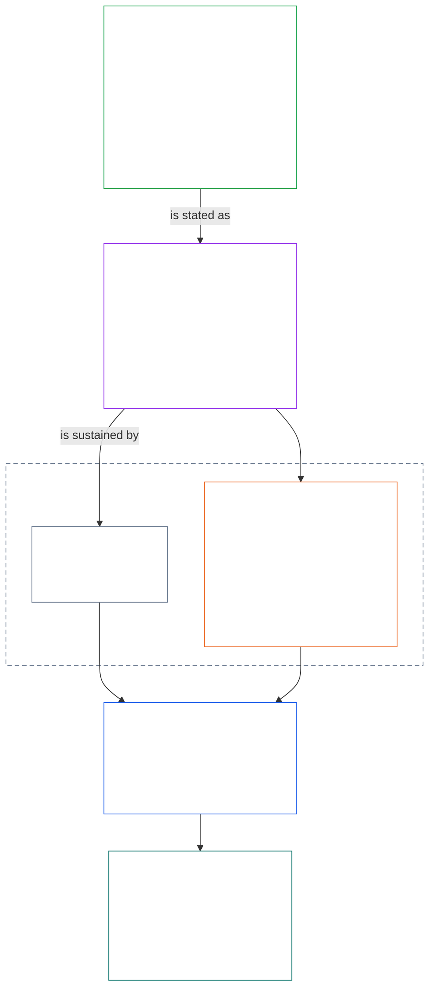
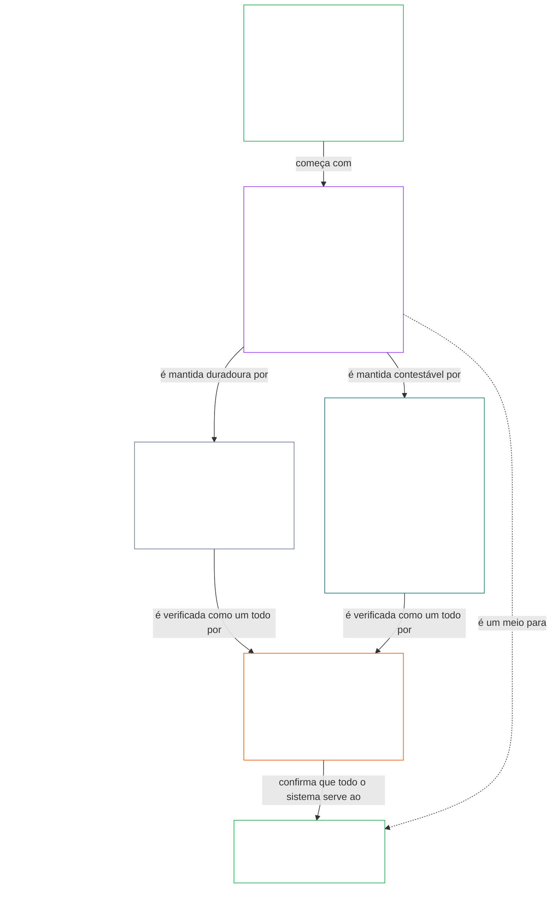

# CAPÍTULO 01, PARTE A: PRINCÍPIOS DE VALORES

<details>
<summary><strong><span style="color: #2563eb;">Posição no corpus (não operacional): estrutura do arquivo e regras de leitura</span></strong></summary>

> O conteúdo a seguir é **apenas orientação ao leitor**. Ele não acrescenta, remove nem restringe obrigações vinculantes neste arquivo ou em outros capítulos.
>
> Este arquivo **faz parte da Constituição Senciente** e **só é vinculante em conjunto com** os demais arquivos numerados `core_*`, lidos como um único instrumento. Ele contém o **Capítulo Um, Parte A** (§§1–12: finalidade e função; o objetivo de Florescimento, introduzido em §2 e desenvolvido por meio de bem-estar, Segurança, Verdade, Confiança e Liberdade; e o objetivo de Continuidade, introduzido em §8 e desenvolvido por meio da capacidade dos sistemas compartilhados, resiliência, estrutura de mercado e avaliação sistêmica).
>
> **Anterior:** [core_00_preamble.md](core_00_preamble.md)  
> **Próxima parte:** [core_01_b_interaction_interpretation.md](core_01_b_interaction_interpretation.md) (Capítulo Um, Parte B — §§13–15, interação, limites à sobreposição e interpretação constitucional).  
> **Percurso de leitura:** §1 finalidade e função → **Florescimento:** introdução de §2 (com as restrições não negociáveis de Segurança e Verdade em §2.1) → §3 bem-estar (o resultado) → §4 Segurança → §5 Verdade → §6 Confiança → §7 Liberdade → **Continuidade:** introdução de §8 → §9 capacidade dos sistemas compartilhados (a ponte: um meio para o Florescimento e a substância da Continuidade) → §10 resiliência → §11 estrutura de mercado → §12 avaliação sistêmica.

</details>

<details>
<summary><strong><span style="color: #2563eb;">Orientação ao leitor (não operacional): como o Capítulo Um conecta os objetivos, a Tétrade, os Artigos e as definições</span></strong></summary>

> O conteúdo a seguir é **apenas orientação ao leitor**. Ele não acrescenta, remove nem restringe obrigações vinculantes neste arquivo ou em outros capítulos. Os componentes **Rastro** e **Definições · Avaliação · Conformidade** de cada seção contêm o encaminhamento vinculante; este bloco é um mapa da parte para leitores que estão começando o Capítulo Um.

**Como as camadas se conectam.** Cada camada responde a uma pergunta diferente, e cada princípio do Capítulo Um aponta para as outras três:

- **Objetivos e Tétrade** ([Preâmbulo §1](core_00_preamble.md#the-model)): para que servem os sistemas compartilhados ([Florescimento](core_05_apex_flourishing_aim.md#flourishing-constitutional) e [Continuidade](core_05_apex_continuity_aim.md#chapter-five-definitions-continuity-constitutional-aim)) e os quatro deveres que mantêm legítima essa busca ([participação](core_05_apex_participation_leg.md#participation-constitutional), [supervisão](core_05_apex_oversight_leg.md#oversight-constitutional), [responsabilização](core_05_apex_accountability_leg.md#accountability) e [tempestividade](core_05_apex_timeliness_leg.md#timeliness-constitutional)).
- **Princípios** (este capítulo): como esses objetivos e deveres se tornam valores, restrições e regras para ponderá-los entre si.
- **Artigos** ([Capítulo Seis](core_06_rights_part_a.md#chapter-six-foundational-rights)): as proteções do Piso de Direitos que continuam utilizáveis enquanto os objetivos são perseguidos. O **Rastro** de cada seção os lista em *Especialmente*.
- **Definições** ([Capítulos Dois a Cinco](core_02_definition_structure.md)): os significados compartilhados usados para verificar se uma alegação é verdadeira. O componente **Definições · Avaliação · Conformidade** de cada seção as lista.

**Onde o Capítulo Um desenvolve cada objetivo.** Florescimento é o bem-estar senciente sustentado por verdade, segurança, confiabilidade e agência significativa ([Preâmbulo §1](core_00_preamble.md#flourishing)). O Capítulo Um enuncia primeiro o resultado e, em seguida, um princípio para cada uma das quatro condições.

| Objetivo e aspecto | Princípio do Capítulo Um | Localização da definição | Artigos citados no Rastro |
|---|---|---|---|
| **Florescimento**: o resultado | [§3 Bem-estar](#3-foundational-objective-wellbeing-flourishing-aim) | [Bem-estar](core_05_band_continuity.md#wellbeing) | [VI](core_06_rights_part_b.md#article-vi-equal-basic-rights), [X](core_06_rights_part_b.md#article-x-self-determination-agency-and-participation), [XIII-B](core_06_rights_part_c.md#article-xiii-b-right-to-redress-and-remedy), [XIX-B](core_06_rights_part_d.md#article-xix-b-contestability-and-proportional-restriction-limits) |
| **Florescimento**: segurança | [§4 Segurança](#4-safety-harm-constraint) | [Segurança](core_05_band_continuity.md#safety-constitutional-constraint) | [XIII](core_06_rights_part_c.md#article-xiii-right-to-reliable-and-trustworthy-systems), [XVII](core_06_rights_part_c.md#article-xvii-system-lifecycle-environments-and-reversibility), [XXIII](core_06_rights_part_d.md#article-xxiii-root-cause-analysis-and-adaptive-response) |
| **Florescimento**: verdade | [§5 Verdade](#5-truth-epistemic-integrity-constraint) | [Verdade](core_05_band_oversight.md#truth-constitutional-constraint) | [XIII](core_06_rights_part_c.md#article-xiii-right-to-reliable-and-trustworthy-systems), [XV](core_06_rights_part_c.md#article-xv-info-sphere-integrity), [XVI](core_06_rights_part_c.md#article-xvi-audit-transparency-and-independent-verification) |
| **Florescimento**: confiabilidade | [§6 Confiança](#6-trust-and-trustworthiness-coordination-integrity) | [Confiabilidade](core_05_band_continuity.md#trustworthiness) | [XIII](core_06_rights_part_c.md#article-xiii-right-to-reliable-and-trustworthy-systems), [XV](core_06_rights_part_c.md#article-xv-info-sphere-integrity), [XVI](core_06_rights_part_c.md#article-xvi-audit-transparency-and-independent-verification) |
| **Florescimento**: agência significativa | [§7 Liberdade](#7-freedom-bounded-agency) | [Agência significativa](core_05_band_participation.md#meaningful-agency) | [VI](core_06_rights_part_b.md#article-vi-equal-basic-rights), [X](core_06_rights_part_b.md#article-x-self-determination-agency-and-participation), [XXI](core_06_rights_part_d.md#article-xxi-interoperability-portability-movement-refuge-and-exit-integrity) |
| **Continuidade**, ponte para o Florescimento: capacidade duradoura | [§9 Capacidade dos sistemas compartilhados](#9-shared-system-capacity) | [Capacidade dos sistemas compartilhados](core_05_band_continuity.md#shared-system-capacity) | [I-A](core_06_rights_part_a.md#article-i-a-environmental-preconditions-and-ecological-integrity), [III](core_06_rights_part_a.md#article-iii-survival-and-essential-access), [V](core_06_rights_part_a.md#article-v-resource-allocation-dependencies-and-ecosystem-funding) |
| **Continuidade**: resiliência | [§10 Resiliência e projeto autorreparável](#10-resilience-and-self-healing-design) | [Autorreparação](core_05_band_continuity.md#self-healing) | [XIII](core_06_rights_part_c.md#article-xiii-right-to-reliable-and-trustworthy-systems), [XVII](core_06_rights_part_c.md#article-xvii-system-lifecycle-environments-and-reversibility), [XXIII](core_06_rights_part_d.md#article-xxiii-root-cause-analysis-and-adaptive-response) |
| **Continuidade**: mercados contestáveis | [§11 Estrutura de mercado](#11-market-structure) | [Estrutura de mercado](core_05_band_accountability.md#market-structure) | [III-C](core_06_rights_part_a.md#article-iii-c-labor-and-economic-floor), [V](core_06_rights_part_a.md#article-v-resource-allocation-dependencies-and-ecosystem-funding), [XXI](core_06_rights_part_d.md#article-xxi-interoperability-portability-movement-refuge-and-exit-integrity) |
| **Continuidade**: visão de todo o sistema | [§12 Requisito de avaliação sistêmica](#12-systemic-evaluation-requirement) | [Certificação de alinhamento do sistema](core_05_band_continuity.md#system-alignment-certification) | [XVI](core_06_rights_part_c.md#article-xvi-audit-transparency-and-independent-verification) |

**Hierarquia de princípios (Continuidade).** No nível dos princípios, o objetivo de Continuidade se desenvolve nesta ordem, começando pela capacidade que conecta os dois objetivos:

6. **[Capacidade dos sistemas compartilhados](core_05_band_continuity.md#shared-system-capacity)** é aquilo que uma boa administração responsável, governança e incentivos devem produzir ao longo do tempo — uma capacidade real e contestável para que sencientes e sistemas compartilhados realizem o trabalho exigido pela Constituição. Ela abrange os dois objetivos: é um meio para o **Florescimento** e a substância da **Continuidade**, mas não é um trunfo sobre todo o resto. **[§9.1](#91-productive-capacity-instrumental-good)** e **[§9.2](#92-constitutional-efficiency)** explicam seus dois aspectos principais.
7. **[Resiliência e projeto autorreparável](#10-resilience-and-self-healing-design)** descreve como os sistemas dos quais os sencientes dependem detectam problemas cedo, os contêm, falham por caminhos divulgados e se recuperam com honestidade ([**Autorreparação**](core_05_band_continuity.md#self-healing)), para que a capacidade do item 6 permaneça duradoura e a estabilidade não dependa de intervenção emergencial.
8. **[Estrutura de mercado](core_05_band_accountability.md#market-structure)**, em [§11](#11-market-structure), fornece a disciplina contra a concentração que mantém essa capacidade sujeita a contestação na prática.
9. **[Requisito de avaliação sistêmica](#12-systemic-evaluation-requirement)** verifica o escopo de todo o sistema, as dependências e o alinhamento de incentivos antes que alegações de conformidade ou governança sejam aceitas — sob a dimensão de **supervisão** da Tétrade, como orientação para auditoria no nível dos princípios, incluindo a [Certificação de alinhamento do sistema](core_05_band_continuity.md#system-alignment-certification), um entre vários processos de auditoria especialmente amplos.

**Onde o Capítulo Um incorpora a Tétrade.** Cada seção identifica no Rastro as dimensões que aborda. Estas seções as carregam mais diretamente:

| Dimensão da Tétrade | Principais seções correspondentes no Capítulo Um |
|---|---|
| **Participação** | [§16 Administração responsável em profundidade](core_01_c_stewardship_capacity_principles.md#16-stewardship-in-depth) e [§17 Administração responsável com consequências](core_01_c_stewardship_capacity_principles.md#17-consequential-stewardship-the-steward-role) (papéis consequentes e voz); [§7 Liberdade](#7-freedom-bounded-agency) (agência significativa) |
| **Supervisão** | [§16](core_01_c_stewardship_capacity_principles.md#16-stewardship-in-depth) e [§17](core_01_c_stewardship_capacity_principles.md#17-consequential-stewardship-the-steward-role) (compreensão distribuída e registros); [§18 Governança](core_01_c_stewardship_capacity_principles.md#18-governance-under-stewardship-discipline) (como a autoridade é alocada); [§12](#12-systemic-evaluation-requirement) (auditoria) |
| **Responsabilização** | [§18 Governança](core_01_c_stewardship_capacity_principles.md#18-governance-under-stewardship-discipline) (responsabilização proporcional à autoridade); [§19 Alinhamento de incentivos e captura do sistema](core_01_c_stewardship_capacity_principles.md#19-incentive-alignment-and-system-capture) (as recompensas não devem esvaziar as dimensões) |
| **Tempestividade** | [§16](core_01_c_stewardship_capacity_principles.md#16-stewardship-in-depth) e [§17](core_01_c_stewardship_capacity_principles.md#17-consequential-stewardship-the-steward-role) (detectar e corrigir problemas sem demora evitável) |

**Dois eixos, não um conflito.** Os objetivos dizem o que os sistemas perseguem; a Tétrade diz como essa busca permanece legítima. Um termo pode pertencer a ambos: Verdade e Confiabilidade são componentes do Florescimento, e [Preâmbulo §2](core_00_preamble.md#2-measurements-overview) as mede na família de Supervisão. [§§13–15](core_01_b_interaction_interpretation.md#13-constitutional-collision-resolution-process) regem como esses princípios são ponderados quando entram em conflito e lidos como um todo; [§20](core_01_c_stewardship_capacity_principles.md#20-integrated-application) os aplica a todos os capítulos seguintes.

</details>

<br>

### 1. Finalidade e função
<details>
<summary><strong><span style="color: #2563eb;">Rastro</span></strong></summary>

- Origem: [Preâmbulo §1 O Modelo](core_00_preamble.md#the-model) — a [Tétrade Constitucional](core_00_preamble.md#constitutional-tetrad), os [Dois Objetivos Constitucionais](core_00_preamble.md#two-constitutional-aims) e a escala segundo o [interesse material](core_00_preamble.md#material-stake) aplicam-se a todo o capítulo por meio dos rastros de cada seção.
- Destino: [15. Interpretação Constitucional](core_01_b_interaction_interpretation.md#15-constitutional-interpretation), para leitura integrada, ambiguidades, hierarquia interna e o procedimento canônico de resolução de conflitos.
- Destino: [Dois Objetivos Constitucionais](core_00_preamble.md#two-constitutional-aims) — desenvolvimento do objetivo de **Florescimento**: de [§3](#3-foundational-objective-wellbeing-flourishing-aim) a [§6](#6-trust-and-trustworthiness-coordination-integrity) e [§7 Liberdade](#7-freedom-bounded-agency); desenvolvimento do objetivo de **Continuidade**: [§9 Capacidade dos Sistemas Compartilhados](#9-shared-system-capacity), [§10 Resiliência e Projeto Autorreparável](#10-resilience-and-self-healing-design), [§11 Estrutura de Mercado](#11-market-structure) e [§12 Requisito de Avaliação Sistêmica](#12-systemic-evaluation-requirement).
- Destino: [3. Objetivo Fundamental: Bem-estar](#3-foundational-objective-wellbeing-flourishing-aim), [§3.2 Reconhecimento, Reforço e Aspiração](#32-recognition-reinforcement-and-aspiration), [4 Segurança](#4-safety-harm-constraint), [5 Verdade](#5-truth-epistemic-integrity-constraint), [6. Confiança](#6-trust-and-trustworthiness-coordination-integrity), [§16 Administração Responsável em Profundidade](core_01_c_stewardship_capacity_principles.md#16-stewardship-in-depth), [13. Procedimento de Resolução de Conflitos Constitucionais](core_01_b_interaction_interpretation.md#13-constitutional-collision-resolution-process) e [§7 Liberdade](#7-freedom-bounded-agency).
- Ler em conjunto com: [Tétrade Constitucional](core_00_preamble.md#constitutional-tetrad) — participação, supervisão, responsabilização e tempestividade regem como os sistemas compartilhados perseguem os [Dois Objetivos Constitucionais](core_00_preamble.md#two-constitutional-aims); a escala segundo o [interesse material](core_00_preamble.md#material-stake) aplica-se a todo o capítulo por meio dos rastros de cada seção.
- Ler em conjunto com: [Capítulos Dois a Quatro](core_02_definition_structure.md) e [Capítulo Cinco](core_05__definitions_home.md#chapter-five-foundational-definitions) — a camada de mecanismos que rege cada termo usado neste capítulo; aplicar a integridade O/M/A/C, a proibição de evasão, o ônus e a rastreabilidade das definições até os resultados.
- Ler em conjunto com: [Capítulo Seis: Direitos Fundamentais](core_06_rights_part_a.md#chapter-six-foundational-rights).
  - Em especial, [Artigo VI: Direitos Básicos Iguais](core_06_rights_part_b.md#article-vi-equal-basic-rights), [Artigo XIII: Direito a Sistemas Confiáveis e Fidedignos](core_06_rights_part_c.md#article-xiii-right-to-reliable-and-trustworthy-systems) e [Artigo XXIV: Interpretação Constitucional, Revisão e Salvaguardas contra Captura](core_06_rights_part_d.md#article-xxiv-constitutional-interpretation-review-and-anti-capture-safeguards).
  - Aplicar esta leitura quando a interpretação afetar sencientes, sistemas ou instituições protegidos.

</details>

<details>
<summary><strong><span style="color: #2563eb;">Definições · Avaliação · Conformidade</span></strong></summary>

- [Proporcionalidade](core_05_band_accountability.md#proportionality) · [O](core_05_band_accountability.md#proportionality) · [M](core_05_band_accountability.md#proportionality-a) · [A](core_05_band_accountability.md#proportionality-a) · [C](core_05_band_accountability.md#proportionality-c)
- [Necessidade](core_05_band_accountability.md#necessity) · [O](core_05_band_accountability.md#necessity) · [M](core_05_band_accountability.md#necessity-a) · [A](core_05_band_accountability.md#necessity-a) · [C](core_05_band_accountability.md#necessity-c)

</details>

<br>

*Em termos simples: o Capítulo Um estabelece os valores e as restrições que regem todos os demais capítulos. Os sistemas compartilhados devem buscar juntos o **Florescimento** e a **Continuidade**, sem sacrificar um pelo outro, e nenhum valor isolado pode ser maximizado à custa dos demais.*

<a id="two-constitutional-aims"></a><a id="flourishing"></a><a id="continuity"></a>Este capítulo estabelece os princípios e as restrições que regem a interpretação, a aplicação e a evolução desta Constituição. Ele desenvolve os [Dois Objetivos Constitucionais](core_00_preamble.md#two-constitutional-aims) — [**Florescimento**](core_00_preamble.md#flourishing) e [**Continuidade**](core_00_preamble.md#continuity) — estabelecidos em [Preâmbulo §1 O Modelo](core_00_preamble.md#the-model), convertendo-os em princípios e restrições operacionais. As definições canônicas do nível de princípios estão no Preâmbulo; este capítulo as aplica.

Esses objetivos devem ser perseguidos em conjunto, sempre dentro das restrições de princípio não negociáveis e das proteções de direitos estabelecidas nesta Constituição. A [**Tétrade Constitucional**](core_00_preamble.md#constitutional-tetrad) rege como essa busca permanece legítima, com exigências proporcionais ao [**interesse material**](core_00_preamble.md#material-stake).

O capítulo se organiza em torno desses dois objetivos e da Tétrade:
- **Florescimento:** a [Introdução ao Objetivo de Florescimento](#2-flourishing-aim-introduction) apresenta o objetivo. [§3 Objetivo Fundamental: Bem-estar](#3-foundational-objective-wellbeing-flourishing-aim) enuncia o resultado. [§4 Segurança](#4-safety-harm-constraint), [§5 Verdade](#5-truth-epistemic-integrity-constraint), [§6 Confiança](#6-trust-and-trustworthiness-coordination-integrity) e [§7 Liberdade](#7-freedom-bounded-agency) desenvolvem as quatro condições que o sustentam: segurança, verdade, confiabilidade e agência significativa.
- **Continuidade:** a [Introdução ao Objetivo de Continuidade](#8-continuity-aim-introduction) apresenta o objetivo. [§9 Capacidade dos Sistemas Compartilhados](#9-shared-system-capacity) (um meio para o Florescimento que também é a substância da Continuidade), [§10 Resiliência e Projeto Autorreparável](#10-resilience-and-self-healing-design), [§11 Estrutura de Mercado](#11-market-structure) e [§12 Requisito de Avaliação Sistêmica](#12-systemic-evaluation-requirement) desenvolvem estabilidade de longo prazo, capacidade duradoura dos sistemas compartilhados e resiliência. Alegações de Continuidade exigem uma visão honesta do sistema inteiro: cada alegação das §§9–11 só se sustenta após a verificação prevista na §12.
- **Quando os princípios entram em conflito:** [§13 Procedimento de Resolução de Conflitos Constitucionais](core_01_b_interaction_interpretation.md#13-constitutional-collision-resolution-process), [§14 Proibição de Sobreposição Absoluta](core_01_b_interaction_interpretation.md#14-prohibition-on-absolute-override) e [§15 Interpretação Constitucional](core_01_b_interaction_interpretation.md#15-constitutional-interpretation) regem como os objetivos e princípios são ponderados e lidos em conjunto.
- **A Tétrade na prática:** de [§16 Administração Responsável em Profundidade](core_01_c_stewardship_capacity_principles.md#16-stewardship-in-depth) a [§19 Alinhamento de Incentivos e Captura do Sistema](core_01_c_stewardship_capacity_principles.md#19-incentive-alignment-and-system-capture), participação, supervisão, responsabilização e tempestividade são incorporadas à administração responsável, à governança e aos incentivos; [§20 Aplicação Integrada](core_01_c_stewardship_capacity_principles.md#20-integrated-application) aplica o capítulo inteiro a todos os capítulos posteriores.

O **Rastro** de cada princípio lista os Artigos do Capítulo Seis que o protegem, e seu componente **Definições · Avaliação · Conformidade** lista as definições do Capítulo Cinco usadas para medi-lo.

**Diagrama: Dois Objetivos Constitucionais e a Tétrade Constitucional**

<hr style="border: 0; border-top: 1px solid currentColor;">

```mermaid
flowchart TB
    subgraph Foundation[" "]
        direction TB
        subgraph Aims["Two Constitutional Aims"]
            direction LR
            F["Flourishing<br/><br/>• Sentient wellbeing sustained through truth, safety,<br/>trustworthiness, and meaningful agency"]
            C["Continuity<br/><br/>• Long-horizon stability, sustainability, resilience,<br/>and ecological wellbeing"]
        end
        subgraph Tetrad1["Constitutional Tetrad · participation and oversight"]
            direction LR
            P["Participation<br/><br/>• Affected sentients get a real voice<br/>• Fair representation and a fair chance to challenge<br/>• Access to consequential roles in proportion to stake"]
            O["Oversight<br/><br/>• Watching, checking, verifying, and keeping records<br/>• Independent review can constrain bad choices"]
        end
        subgraph Tetrad2["Constitutional Tetrad · accountability and timeliness"]
            direction LR
            A["Accountability<br/><br/>• Responsibility traces to the right actors<br/>• Answerability, redress, and real correction<br/>• Bad outcomes trigger repair"]
            T["Timeliness<br/><br/>• Problems are detected, challenged, resolved, and fixed<br/>• Time limits match the material stake<br/>• Delay cannot erase rights, remedies, or repair"]
        end
    end
    F ~~~ P
    P ~~~ A
    style Foundation fill:none,stroke:none
    style Aims fill:none,stroke:none
    style Tetrad1 fill:none,stroke:none
    style Tetrad2 fill:none,stroke:none
    style F fill:none,stroke:#16a34a,color:#ffffff
    style C fill:none,stroke:#16a34a,color:#ffffff
    style P fill:none,stroke:#0f766e,color:#ffffff
    style O fill:none,stroke:#ea580c,color:#ffffff
    style A fill:none,stroke:#db2777,color:#ffffff
    style T fill:none,stroke:#9333ea,color:#ffffff
```

*Os objetivos descrevem o que os sistemas compartilhados devem buscar; a Tétrade descreve os deveres que mantêm legítima essa busca. Os quatro deveres são graduados segundo o [interesse material](core_00_preamble.md#material-stake), e ambos os objetivos permanecem limitados pelo Piso de Direitos. Reproduzido na [Visão Conceitual](guides/CONCEPTUAL_OVERVIEW.md#two-aims-and-the-constitutional-tetrad).*

Esses valores:
- não são independentes e, no funcionamento normal, não seguem uma hierarquia estrita;
- funcionam como princípios e restrições interativos que devem ser avaliados em conjunto;
- aplicam-se a todos os “sistemas”, incluindo estruturas técnicas, organizacionais, econômicas e sociotécnicas, além de ecossistemas que afetem materialmente os sencientes e o planeta Terra.

Nenhum princípio pode ser aplicado isoladamente quando isso violar materialmente os demais. Quando surgem tensões, os sistemas devem resolvê-las conforme os requisitos de proporcionalidade, necessidade e impacto sistêmico deste capítulo. Se um conflito não resolvido implicar diretamente restrições de princípio não negociáveis, o **§13** do Capítulo Um, Procedimento de Resolução de Conflitos Constitucionais, determina a precedência.

<a id="2-flourishing-aim-introduction"></a>
### 2. Introdução ao Objetivo de Florescimento
<details>
<summary><strong><span style="color: #2563eb;">Rastro</span></strong></summary>

- Ler em conjunto com: [Tétrade Constitucional](core_00_preamble.md#constitutional-tetrad) — seus quatro componentes regem como o Florescimento é perseguido; o [interesse material](core_00_preamble.md#material-stake) determina a profundidade necessária para cada alegação de Florescimento.
- Ler em conjunto com: [Dois Objetivos Constitucionais](core_00_preamble.md#two-constitutional-aims) — o objetivo de **Florescimento**; seu objetivo parceiro é apresentado na [Introdução ao Objetivo de Continuidade](#8-continuity-aim-introduction).
- Origem: Princípios: [Preâmbulo §1 O Modelo](core_00_preamble.md#flourishing); [Florescimento (Objetivo Constitucional)](core_05_apex_flourishing_aim.md#flourishing-constitutional); [§1 Finalidade e Função](#1-purpose-and-role).
- Destino: [§3 Objetivo Fundamental: Bem-estar (Objetivo de Florescimento)](#3-foundational-objective-wellbeing-flourishing-aim), [§4 Segurança (Restrição contra o Dano)](#4-safety-harm-constraint), [§5 Verdade (Restrição de Integridade Epistêmica)](#5-truth-epistemic-integrity-constraint), [§6 Confiança e Confiabilidade (Integridade da Coordenação)](#6-trust-and-trustworthiness-coordination-integrity) e [§7 Liberdade (Agência Delimitada)](#7-freedom-bounded-agency); os Artigos que protegem cada um são indicados no Rastro da respectiva seção.
- Subseções: [§2.1 Restrições de Princípio Não Negociáveis: Segurança e Verdade](#21-non-negotiable-principle-constraints-safety-and-truth).
- Ler em conjunto com: o Piso de Direitos do Capítulo Seis em geral.

</details>

<details>
<summary><strong><span style="color: #2563eb;">Definições · Avaliação · Conformidade</span></strong></summary>

- [Florescimento (Objetivo Constitucional)](core_05_apex_flourishing_aim.md#flourishing-constitutional) · [O](core_05_apex_flourishing_aim.md#flourishing-constitutional) · [M](core_05_apex_flourishing_aim.md#flourishing-constitutional-m) · [A](core_05_apex_flourishing_aim.md#flourishing-constitutional-a) · [C](core_05_apex_flourishing_aim.md#flourishing-constitutional-c)
- [Bem-estar](core_05_band_continuity.md#wellbeing) · [O](core_05_band_continuity.md#wellbeing) · [M](core_05_band_continuity.md#wellbeing-a) · [A](core_05_band_continuity.md#wellbeing-a) · [C](core_05_band_continuity.md#wellbeing-c)
- [Segurança (Restrição Constitucional)](core_05_band_continuity.md#safety-constitutional-constraint) · [O](core_05_band_continuity.md#safety-constitutional-constraint) · [M](core_05_band_continuity.md#safety-constraint-a) · [A](core_05_band_continuity.md#safety-constraint-a) · [C](core_05_band_continuity.md#safety-constraint-c)
- [Verdade (Restrição Constitucional)](core_05_band_oversight.md#truth-constitutional-constraint) · [O](core_05_band_oversight.md#truth-constitutional-constraint-o) · [M](core_05_band_oversight.md#truth-constitutional-constraint-a) · [A](core_05_band_oversight.md#truth-constitutional-constraint-a) · [C](core_05_band_oversight.md#truth-constitutional-constraint-c)
- [Confiabilidade](core_05_band_continuity.md#trustworthiness) · [O](core_05_band_continuity.md#trustworthiness) · [M](core_05_band_continuity.md#trustworthiness-a) · [A](core_05_band_continuity.md#trustworthiness-a) · [C](core_05_band_continuity.md#trustworthiness-c)
- [Agência Significativa](core_05_band_participation.md#meaningful-agency) · [O](core_05_band_participation.md#meaningful-agency) · [M](core_05_band_participation.md#meaningful-agency-a) · [A](core_05_band_participation.md#meaningful-agency-a) · [C](core_05_band_participation.md#meaningful-agency-c)

</details>

<br>

*Em termos simples: o Florescimento é o primeiro dos dois objetivos: que os sencientes vivam bem e continuem capazes de fazê-lo porque os sistemas ao seu redor são seguros, honestos, confiáveis e preservam um espaço real de escolha. A seção 3 define esse resultado. Os quatro princípios seguintes explicam como torná-lo real.*

[**Florescimento**](core_05_apex_flourishing_aim.md#flourishing-constitutional) é o **bem-estar senciente sustentado por verdade, segurança, confiabilidade e agência significativa** ([Preâmbulo §1 O Modelo](core_00_preamble.md#flourishing)). O Capítulo Um o desenvolve em duas etapas: [§3 Objetivo Fundamental: Bem-estar (Objetivo de Florescimento)](#3-foundational-objective-wellbeing-flourishing-aim) enuncia o resultado, e quatro princípios estabelecem as condições que o sustentam.

| Condição | Princípio | Pergunta a que responde |
|---|---|---|
| **Segurança** | [§4 Segurança (Restrição contra o Dano)](#4-safety-harm-constraint) | Os sencientes estão protegidos contra danos evitáveis? |
| **Verdade** | [§5 Verdade (Restrição de Integridade Epistêmica)](#5-truth-epistemic-integrity-constraint), com [§5.1 Investigação Informada pela Ciência e Apoio à Decisão](#51-science-informed-inquiry-and-decision-support) e [§5.2 Acessibilidade em Linguagem Simples (Dever de Participação e Administração Responsável)](#52-plain-language-accessibility-participation-and-stewardship-duty) | Os sencientes podem confiar no que lhes dizem e compreendê-lo? |
| **Confiabilidade** | [§6 Confiança e Confiabilidade (Integridade da Coordenação)](#6-trust-and-trustworthiness-coordination-integrity) | Os sistemas conquistam confiança e a reparam quando falham? |
| **Agência significativa** | [§7 Liberdade (Agência Delimitada)](#7-freedom-bounded-agency) | Os sencientes mantêm liberdade real e delimitada para escolher, discordar, organizar-se e sair? |

**Como os princípios do Florescimento funcionam em conjunto:**
- **Segurança e Verdade são restrições não negociáveis:** são enunciadas em conjunto em [§2.1 Restrições de Princípio Não Negociáveis: Segurança e Verdade](#21-non-negotiable-principle-constraints-safety-and-truth) e não podem ser sacrificadas para obter os demais princípios.
- **Confiança e Liberdade têm limites, não são absolutas:** a confiança é conquistada e pode ser corrigida ([§6.1 Correção e Reparação](#61-correction-and-remedy)); a liberdade está sujeita a limites disciplinados ([§7.1 Disciplina das Limitações](#71-limitation-discipline)).
- **Nenhum princípio se aplica isoladamente:** os princípios são lidos em conjunto e, quando entram em conflito, são ponderados segundo o [§13 Procedimento de Resolução de Conflitos Constitucionais](core_01_b_interaction_interpretation.md#13-constitutional-collision-resolution-process).
- **O Florescimento tem um objetivo parceiro:** o objetivo de Continuidade pergunta o que mantém esse resultado duradouro; ele é apresentado na [Introdução ao Objetivo de Continuidade](#8-continuity-aim-introduction).

**Diagrama: Florescimento e seus princípios**

<hr style="border: 0; border-top: 1px solid currentColor;">



*O Florescimento é enunciado como resultado e sustentado primeiro pelas restrições não negociáveis de Segurança e Verdade, ambas contribuindo para a Confiança, que por sua vez contribui para a Liberdade. As cores são referências visuais reutilizáveis, não afirmações de prioridade. O Rastro de cada princípio identifica seus Artigos, e seu componente Definições · Avaliação · Conformidade identifica suas definições. Reproduzido na [Visão Conceitual](guides/CONCEPTUAL_OVERVIEW.md#flourishing-and-its-principles).*

<a id="21-non-negotiable-principle-constraints-safety-and-truth"></a>
#### 2.1 Restrições de Princípio Não Negociáveis: Segurança e Verdade
<details>
<summary><strong><span style="color: #2563eb;">Rastro</span></strong></summary>

- Ler em conjunto com: [Tétrade Constitucional](core_00_preamble.md#constitutional-tetrad) — dimensão de **participação** (compreender e contestar determinações sobre segurança e verdade); dimensão de **supervisão** (detectar risco de dano e degradação epistêmica); dimensão de **responsabilização** (responder por danos, engano e confiança induzida de forma enganosa); escala segundo o [interesse material](core_00_preamble.md#material-stake).
- Ler em conjunto com: [Dois Objetivos Constitucionais](core_00_preamble.md#two-constitutional-aims) — objetivo de **Florescimento** (**Segurança** e **Verdade** são componentes expressamente indicados no [Preâmbulo §1](core_00_preamble.md#two-constitutional-aims)); objetivo de **Continuidade** (prevenção de danos de longo prazo e administração responsável e honesta de sistemas duradouros).
- Origem: Princípios: [3. Objetivo Fundamental: Bem-estar](#3-foundational-objective-wellbeing-flourishing-aim); [Dois Objetivos Constitucionais](core_00_preamble.md#two-constitutional-aims).
- Destino: [6. Confiança](#6-trust-and-trustworthiness-coordination-integrity), [13. Procedimento de Resolução de Conflitos Constitucionais](core_01_b_interaction_interpretation.md#13-constitutional-collision-resolution-process) e [§7 Liberdade](#7-freedom-bounded-agency).
- Aplicado em: [§4 Segurança](#4-safety-harm-constraint); [§5 Verdade](#5-truth-epistemic-integrity-constraint); [§5.1 Investigação Informada pela Ciência e Apoio à Decisão](#51-science-informed-inquiry-and-decision-support); [§5.2 Acessibilidade em Linguagem Simples](#52-plain-language-accessibility-participation-and-stewardship-duty).

</details>

<br>

*Em termos simples: Segurança e Verdade são os pisos rígidos da Constituição — não variáveis que possam ser otimizadas e descartadas. Os sistemas compartilhados não podem previsivelmente colocar sencientes em perigo nem enganá-los; ambas as restrições regem a busca do Florescimento e da Continuidade sob a disciplina de participação, supervisão, responsabilização e tempestividade da Tétrade.*

**Segurança** e **Verdade** são restrições de princípio não negociáveis que limitam todos os demais princípios do Capítulo Um — incluindo [§3 Objetivo Fundamental: Bem-estar](#3-foundational-objective-wellbeing-flourishing-aim) e os [Dois Objetivos Constitucionais](core_00_preamble.md#two-constitutional-aims). São componentes expressamente nomeados do [**Florescimento**](#flourishing) e indispensáveis à [**Continuidade**](#continuity): sistemas não podem florescer por meio de dano ou engano, e a legitimidade duradoura exige administração honesta de riscos ao longo do tempo.

A aplicação dessas restrições deve satisfazer a [Tétrade Constitucional](core_00_preamble.md#constitutional-tetrad), em escala proporcional ao [interesse material](core_00_preamble.md#material-stake), especialmente:
- quando determinações de segurança afetarem a capacidade de participação;
- quando alegações de verdade orientarem a confiança depositada;
- quando estiver em jogo a responsabilização por dano ou conduta enganosa.

Constatações sobre Segurança e Verdade podem alterar o registro de trajetória de um senciente, inclusive:
- como as [contribuições](core_05_band_accountability.md#contribution-nature) são reconhecidas;
- se violações são registradas;
- qual gravidade é atribuída a essas violações;
- quais consequências são aplicadas.

O modelo de trajetória do [**Capítulo Nove**](core_09_standing_assessment.md) rege como essas constatações são classificadas, verificadas e aplicadas, com requisitos de avaliação e conformidade extraídos dos [**Capítulos Dois a Cinco**](core_02_definition_structure.md).

### 3. Objetivo Fundamental: Bem-estar (Objetivo de Florescimento)
<details>
<summary><strong><span style="color: #2563eb;">Rastro</span></strong></summary>

- Ler em conjunto com: [Tétrade Constitucional](core_00_preamble.md#constitutional-tetrad) — o componente de **participação** quando as condições de bem-estar afetam materialmente se voz, acesso e contestabilidade são substantivos; o componente de **responsabilização** quando alegações de bem-estar afetam a distribuição de encargos; escala segundo o [interesse material](core_00_preamble.md#material-stake) quando relevante.
- Ler em conjunto com: [Dois Objetivos Constitucionais](core_00_preamble.md#two-constitutional-aims) — este capítulo desenvolve o objetivo de **Florescimento** de [§3](#3-foundational-objective-wellbeing-flourishing-aim) até [§6](#6-trust-and-trustworthiness-coordination-integrity), além de [§7 Liberdade](#7-freedom-bounded-agency).
- Origem: Princípios: [Preâmbulo §1 O Modelo](core_00_preamble.md#the-model); [Dois Objetivos Constitucionais](core_00_preamble.md#two-constitutional-aims) — desenvolvimento do objetivo de **Florescimento**.
- Destino: [4 Segurança](#4-safety-harm-constraint), [5 Verdade](#5-truth-epistemic-integrity-constraint), [§16 Administração Responsável em Profundidade](core_01_c_stewardship_capacity_principles.md#16-stewardship-in-depth) e [13. Procedimento de Resolução de Conflitos Constitucionais](core_01_b_interaction_interpretation.md#13-constitutional-collision-resolution-process).
- Subseções: [§3.1 Equidade](#31-fairness); [§3.2 Reconhecimento, Reforço e Aspiração](#32-recognition-reinforcement-and-aspiration); [§3.3 Processo Antidegradação](#33-anti-degrading-process).
- Ler em conjunto com: o Piso de Direitos do Capítulo Seis em geral.
  - Em especial, [Artigo VI: Direitos Básicos Iguais](core_06_rights_part_b.md#article-vi-equal-basic-rights), [Artigo X: Autodeterminação, Agência e Participação](core_06_rights_part_b.md#article-x-self-determination-agency-and-participation), [Artigo XIII-B: Direito a Reparação e Recurso](core_06_rights_part_c.md#article-xiii-b-right-to-redress-and-remedy) e [Artigo XIX-B: Contestabilidade e Limites às Restrições Proporcionais](core_06_rights_part_d.md#article-xix-b-contestability-and-proportional-restriction-limits).
  - Aplicar esta orientação quando ganhos alegados de bem-estar forem usados para justificar restrições à agência, à dignidade ou à contestabilidade.
  - Em especial, [Dignidade e Igualdade de Condição Moral](core_05_band_participation.md#dignity-and-equal-moral-standing), [Equidade Substantiva](core_05_band_participation.md#substantive-fairness) e [6. Confiança](#6-trust-and-trustworthiness-coordination-integrity) quando acesso, processo, alinhamento distributivo, confiança depositada ou integridade da coordenação tiverem relevância material.

</details>

<details>
<summary><strong><span style="color: #2563eb;">Definições · Avaliação · Conformidade</span></strong></summary>

- [Bem-estar](core_05_band_continuity.md#wellbeing) · [O](core_05_band_continuity.md#wellbeing) · [M](core_05_band_continuity.md#wellbeing-a) · [A](core_05_band_continuity.md#wellbeing-a) · [C](core_05_band_continuity.md#wellbeing-c)
- [Participação](core_05_apex_participation_leg.md#participation-constitutional) · [O](core_05_apex_participation_leg.md#participation-constitutional) · [M](core_05_apex_participation_leg.md#participation-constitutional-m) · [A](core_05_apex_participation_leg.md#participation-constitutional-a) · [C](core_05_apex_participation_leg.md#participation-constitutional-c)
- [Dignidade e Igualdade de Condição Moral](core_05_band_participation.md#dignity-and-equal-moral-standing) · [O](core_05_band_participation.md#dignity-and-equal-moral-standing) · [M](core_05_band_participation.md#dignity-and-equal-moral-standing-a) · [A](core_05_band_participation.md#dignity-and-equal-moral-standing-a) · [C](core_05_band_participation.md#dignity-and-equal-moral-standing-c)
- [Equidade Substantiva](core_05_band_participation.md#substantive-fairness) · [O](core_05_band_participation.md#substantive-fairness) · [M](core_05_band_participation.md#substantive-fairness-constitutional-a) · [A](core_05_band_participation.md#substantive-fairness-constitutional-a) · [C](core_05_band_participation.md#substantive-fairness-constitutional-c)
- [Materialidade](core_05_band_oversight.md#materiality) · [O](core_05_band_oversight.md#materiality) · [M](core_05_band_oversight.md#materiality-determination-a) · [A](core_05_band_oversight.md#materiality-determination-a) · [C](core_05_band_oversight.md#materiality-determination-c)
- [Divergência de Proxy](core_05_band_oversight.md#proxy-divergence) · [O](core_05_band_oversight.md#proxy-divergence) · [M](core_05_band_oversight.md#proxy-divergence-a) · [A](core_05_band_oversight.md#proxy-divergence-a) · [C](core_05_band_oversight.md#proxy-divergence-c)

</details>

<br>

*Em termos simples: o propósito desses sistemas é melhorar de verdade a vida dos sencientes. Perseguir uma métrica substituta não cumpre esse propósito, nem ele serve de desculpa para cortar caminho em Segurança, Verdade ou direitos. O bem-estar é fundamental para a participação: dar voz apenas formalmente, sem as condições que tornam a agência real, não é participação nos termos desta Constituição.*

O objetivo último de todos os sistemas regidos por esta Constituição é preservar e promover o [bem-estar](core_05_band_continuity.md#wellbeing) senciente — o objetivo de [**Florescimento**](#flourishing) entre os [Dois Objetivos Constitucionais](core_00_preamble.md#two-constitutional-aims).

[Preâmbulo §1 O Modelo](core_00_preamble.md#flourishing) define Florescimento como o bem-estar senciente sustentado por verdade, segurança, confiabilidade e agência significativa. Esta seção enuncia o resultado. As seções seguintes desenvolvem as quatro condições que o sustentam: [§4 Segurança](#4-safety-harm-constraint), [§5 Verdade](#5-truth-epistemic-integrity-constraint), [§6 Confiança](#6-trust-and-trustworthiness-coordination-integrity) e [§7 Liberdade](#7-freedom-bounded-agency). Juntos, esses cinco princípios desenvolvem o objetivo de Florescimento no Capítulo Um. O objetivo de [**Continuidade**](#continuity) é desenvolvido em [§9 Capacidade dos Sistemas Compartilhados](#9-shared-system-capacity), [§10 Resiliência e Projeto Autorreparável](#10-resilience-and-self-healing-design), [§11 Estrutura de Mercado](#11-market-structure) e [§12 Requisito de Avaliação Sistêmica](#12-systemic-evaluation-requirement).

O bem-estar é fundamental para a [Participação](core_05_apex_participation_leg.md#participation-constitutional) sob a [Tétrade Constitucional](core_00_preamble.md#constitutional-tetrad). Os sistemas compartilhados não podem considerar a participação satisfeita quando as condições subjacentes de bem-estar — incluindo [Agência Significativa](core_05_band_participation.md#meaningful-agency), acesso justo e dignidade — forem materialmente prejudicadas.

O bem-estar inclui não apenas efeitos imediatos, mas também consequências indiretas, tardias, cumulativas e entre sistemas, avaliadas segundo os [**Capítulos Dois a Quatro**](core_02_definition_structure.md). Neste nível de valores, o bem-estar:
- torna possível a participação real — uma voz que os sencientes não têm condições de exercer não é participação significativa;
- não pode ser declarado “alcançado” por atingir uma métrica que se afastou do que realmente importa;
- continua limitado pelas restrições de princípio não negociáveis deste capítulo: **Segurança** e **Verdade**;
- não pode ser invocado como justificativa geral para violar Segurança, Verdade ou proteções de direitos.

#### 3.1 Equidade
<details>
<summary><strong><span style="color: #2563eb;">Rastro</span></strong></summary>

- Ler em conjunto com: [Tétrade Constitucional](core_00_preamble.md#constitutional-tetrad) — componente de **participação** (acesso, voz e contestabilidade; requisito geral, não limitado à [Participação do Sistema de Partes Interessadas](core_05_band_participation.md#stakeholder-status-and-weight)); componente de **responsabilização** quando benefícios e encargos são distribuídos.
- Origem: Princípios: [§3 Objetivo Fundamental: Bem-estar](#3-foundational-objective-wellbeing-flourishing-aim) — inclusive o bem-estar como fundamento da [Participação](core_05_apex_participation_leg.md#participation-constitutional).
- Destino: [§3.2 Reconhecimento, Reforço e Aspiração](#32-recognition-reinforcement-and-aspiration); [6. Confiança](#6-trust-and-trustworthiness-coordination-integrity), [§16 Administração Responsável em Profundidade](core_01_c_stewardship_capacity_principles.md#16-stewardship-in-depth), [13. Procedimento de Resolução de Conflitos Constitucionais](core_01_b_interaction_interpretation.md#13-constitutional-collision-resolution-process) e [Registro de Conflitos Constitucionais](core_05_band_integrative.md#constitutional-collision-record), onde as escolhas de precedência e distribuição devem continuar coerentes e sujeitas a revisão.
- Subseções (ordem de leitura): [§3.1.1](#311-access-and-opportunity) · [§3.1.2](#312-benefits-and-burdens) · [§3.1.3](#313-fair-treatment) · [§3.1.4](#314-unfair-treatment).
- Destino: define a superfície de direitos para igualdade de condição, tratamento não arbitrário, contestação significativa e limites proporcionais às restrições.
  - Em especial, [Artigo VI: Direitos Básicos Iguais](core_06_rights_part_b.md#article-vi-equal-basic-rights), [Artigo VI-C: Não Discriminação](core_06_rights_part_b.md#article-vi-c-nondiscrimination), [Artigo X: Autodeterminação, Agência e Participação](core_06_rights_part_b.md#article-x-self-determination-agency-and-participation), [Artigo XIII-B: Direito a Reparação e Recurso](core_06_rights_part_c.md#article-xiii-b-right-to-redress-and-remedy) e [Artigo XIX-B: Contestabilidade e Limites às Restrições Proporcionais](core_06_rights_part_d.md#article-xix-b-contestability-and-proportional-restriction-limits).
  - Quando uma designação anticonstitucional acarretar sanções ou efeitos duradouros, ler em conjunto com [Capítulo Onze, seção 4 — Garantias de devido processo, reparação e prevenção](core_11_a_misconduct_designation.md#4-due-process-safeguards-for-slot-assignment).
  - Os compromissos de não discriminação são detalhados no Capítulo Cinco, [§2 — Características Protegidas, Uso como Proxy, Bloqueio por Sinais Íntimos e Situação nos termos do **Artigo VII-E** (*Serviços sexuais comerciais consensuais entre adultos e exploração sexual*)](core_05_band_participation.md#fairness-protected-characteristics-and-nondiscrimination), incluindo a [Evasão do Bloqueio de Sinais Íntimos Protegidos e da Situação nos termos do **Artigo VII-E** (*Serviços sexuais comerciais consensuais entre adultos e exploração sexual*)](core_05_band_participation.md#protected-intimate-signal-gating-and-article-vii-e-adult-consensual-commercial-sexual-services-and-sexual-exploitation-status-circumvention) quando as regras de tratamento equitativo de §2.1.3 envolverem bloqueio por sinal íntimo ou o **Artigo VII-E** (*Serviços sexuais comerciais consensuais entre adultos e exploração sexual*).
- Ler em conjunto com: [Equidade Substantiva](core_05_band_participation.md#substantive-fairness) e obrigações relacionadas do Piso de Direitos do Capítulo Seis quando benefícios, encargos, recompensas, custos, deveres, riscos, contribuição, necessidade ou exposição forem materiais; [Acessibilidade](core_05_band_participation.md#accessibility) quando as vias de acesso da §2.1.1 forem materiais; [Divergência de Proxy](core_05_band_oversight.md#proxy-divergence) quando métricas agregadas ou efeitos de classificação forem materiais.

</details>

<details>
<summary><strong><span style="color: #2563eb;">Definições · Avaliação · Conformidade</span></strong></summary>

- [Dignidade e Igualdade de Condição Moral](core_05_band_participation.md#dignity-and-equal-moral-standing) · [O](core_05_band_participation.md#dignity-and-equal-moral-standing) · [M](core_05_band_participation.md#dignity-and-equal-moral-standing-a) · [A](core_05_band_participation.md#dignity-and-equal-moral-standing-a) · [C](core_05_band_participation.md#dignity-and-equal-moral-standing-c)
- [Acessibilidade](core_05_band_participation.md#accessibility) · [O](core_05_band_participation.md#accessibility) · [M](core_05_band_participation.md#accessibility-constitutional-a) · [A](core_05_band_participation.md#accessibility-constitutional-a) · [C](core_05_band_participation.md#accessibility-constitutional-c)
- [Participação](core_05_apex_participation_leg.md#participation-constitutional) · [O](core_05_apex_participation_leg.md#participation-constitutional) · [M](core_05_apex_participation_leg.md#participation-constitutional-m) · [A](core_05_apex_participation_leg.md#participation-constitutional-a) · [C](core_05_apex_participation_leg.md#participation-constitutional-c)
- [Equidade Processual](core_05_band_participation.md#procedural-fairness) · [O](core_05_band_participation.md#procedural-fairness) · [M](core_05_band_participation.md#procedural-fairness-constitutional-a) · [A](core_05_band_participation.md#procedural-fairness-constitutional-a) · [C](core_05_band_participation.md#procedural-fairness-constitutional-c)
- [Equidade Substantiva](core_05_band_participation.md#substantive-fairness) · [O](core_05_band_participation.md#substantive-fairness) · [M](core_05_band_participation.md#substantive-fairness-constitutional-a) · [A](core_05_band_participation.md#substantive-fairness-constitutional-a) · [C](core_05_band_participation.md#substantive-fairness-constitutional-c)
- [Características Protegidas](core_05_band_participation.md#protected-characteristics) · [O](core_05_band_participation.md#protected-characteristics) · [M](core_05_band_participation.md#protected-characteristics-constitutional-a) · [A](core_05_band_participation.md#protected-characteristics-constitutional-a) · [C](core_05_band_participation.md#protected-characteristics-constitutional-c)
- [Uso de Características Protegidas como Proxy e Impacto Dispar](core_05_band_participation.md#protected-characteristic-proxying-and-disparate-impact) · [O](core_05_band_participation.md#protected-characteristic-proxying-and-disparate-impact) · [M](core_05_band_participation.md#protected-characteristic-proxying-and-disparate-impact-a) · [A](core_05_band_participation.md#protected-characteristic-proxying-and-disparate-impact-a) · [C](core_05_band_participation.md#protected-characteristic-proxying-and-disparate-impact-c)
- [Evasão do Bloqueio de Sinais Íntimos Protegidos e da Situação nos termos do **Artigo VII-E** (*Serviços sexuais comerciais consensuais entre adultos e exploração sexual*)](core_05_band_participation.md#protected-intimate-signal-gating-and-article-vii-e-adult-consensual-commercial-sexual-services-and-sexual-exploitation-status-circumvention) · [O](core_05_band_participation.md#protected-intimate-signal-gating-and-article-vii-e-adult-consensual-commercial-sexual-services-and-sexual-exploitation-status-circumvention) · [M](core_05_band_participation.md#protected-intimate-signal-gating-and-article-vii-e-status-circumvention-a) · [A](core_05_band_participation.md#protected-intimate-signal-gating-and-article-vii-e-status-circumvention-a) · [C](core_05_band_participation.md#protected-intimate-signal-gating-and-article-vii-e-status-circumvention-c)
- [Divergência de Proxy](core_05_band_oversight.md#proxy-divergence) · [O](core_05_band_oversight.md#proxy-divergence) · [M](core_05_band_oversight.md#proxy-divergence-a) · [A](core_05_band_oversight.md#proxy-divergence-a) · [C](core_05_band_oversight.md#proxy-divergence-c)

</details>

<br>

*Em termos simples: um sistema não pode se considerar bom quando impede sencientes comuns de participar, os trata segundo regras sem explicação ou deixa que arquem com custos evitados por outros. Um sistema equitativo oferece acesso real, usa razões que pode defender e distribui recompensas, custos e riscos de acordo com a contribuição, a necessidade e a exposição reais.*

A **Equidade** é parte do que [§3 Objetivo Fundamental: Bem-estar](#3-foundational-objective-wellbeing-flourishing-aim) exige sempre que os sencientes precisem viver, trabalhar, aprender, negociar ou tomar decisões por meio de sistemas compartilhados. Quando esses sistemas os afetam materialmente, a equidade pergunta se as oportunidades, o tratamento e a distribuição de benefícios e encargos respeitam [Dignidade e Igualdade de Condição Moral](core_05_band_participation.md#dignity-and-equal-moral-standing).

A equidade ajuda a tornar real a [Participação](core_05_apex_participation_leg.md#participation-constitutional). Não há participação real quando os sencientes têm formalmente voz, mas não conseguem acessar o processo, compreender a regra, cumprir as condições, contestar o resultado ou arcar com o ônus imposto.

Não basta que um sistema apresente um bom resultado médio. Um indicador destacado, uma média, uma classificação ou uma alegação de eficiência não provam equidade por si só. O sistema pode parecer bem-sucedido no agregado e ainda assim ser injusto com sencientes excluídos, classificados incorretamente, mal remunerados, excessivamente onerados ou privados de uma oportunidade significativa de contestar.

Esta seção tem **quatro partes operacionais**. Elas orientam esta seção, mas não substituem as definições do Capítulo Cinco nem o Piso de Direitos do Capítulo Seis.

<a id="311-access-and-opportunity"></a>
##### 3.1.1 Acesso e Oportunidade

Esta subseção explica o significado prático de acesso e oportunidade:

- Os sencientes precisam de caminhos práticos para [Participação](core_05_apex_participation_leg.md#participation-constitutional), educação, trabalho, cuidados, segurança, mobilidade e outros bens importantes para a vida cotidiana.
- Esses caminhos não podem ser bloqueados, tornar-se inacessíveis pelo preço, ser atrasados, ocultados ou enviesados por razões arbitrárias ou irrelevantes.
- Uma porta aberta apenas no papel não basta quando esta Constituição exige oportunidade **substantiva**.

<a id="312-benefits-and-burdens"></a>
##### 3.1.2 Benefícios e Encargos

Esta subseção explica quando a distribuição de benefícios e encargos é equitativa:

- Um sistema não é equitativo quando alguns sencientes recebem os ganhos enquanto outros absorvem silenciosamente os custos.
- Favoritismo, transferência oculta de custos, aplicação seletiva das regras e truques de classificação não satisfazem este requisito.

<a id="313-fair-treatment"></a>
##### 3.1.3 Tratamento Equitativo

Esta subseção explica o que o tratamento equitativo exige:

- Sencientes em situações semelhantes devem receber o mesmo tratamento segundo as regras básicas.
- O que recebem, devem ou arriscam deve corresponder ao que contribuíram, ao que precisam ou aos encargos que realmente enfrentam.
- Tratamentos diferentes precisam de uma razão real, ser proporcionais a essa razão, respeitar a dignidade e evitar discriminação.
- As regras detalhadas são desenvolvidas no Capítulo Cinco, incluindo [Características Protegidas](core_05_band_participation.md#protected-characteristics) e [Uso de Características Protegidas como Proxy e Impacto Dispar](core_05_band_participation.md#protected-characteristic-proxying-and-disparate-impact).
- Quando uma decisão afetar alguém materialmente, ou quando essa pessoa a contestar, o caminho de revisão deve satisfazer a [Equidade Processual](core_05_band_participation.md#procedural-fairness) sempre que o Capítulo Seis ou o instrumento aplicável exigir notificação, audiência, explicação ou revisão.

O bem-estar alegado não está alinhado com [§3 Objetivo Fundamental: Bem-estar](#3-foundational-objective-wellbeing-flourishing-aim) quando depende de exclusão arbitrária, regras inexplicadas ou instáveis, extração oculta ou [Participação](core_05_apex_participation_leg.md#participation-constitutional) meramente formal enquanto falham as condições de equidade que tornam a participação significativa.

<a id="314-unfair-treatment"></a>
##### 3.1.4 Tratamento Injusto

O tratamento injusto produz exclusão e inconsistência. Os sistemas não devem escondê-lo atrás de linguagem técnica, rótulos neutros ou decisões automatizadas. Em particular, não devem:
- usar algoritmos, sistemas de pontuação ou regras administrativas que reproduzam desvantagens históricas sem uma razão constitucionalmente válida;
- usar sinais pessoais íntimos ou histórico sexual como atalhos para determinar confiança, risco, caráter ou acesso — ler em conjunto com [Evasão do Bloqueio de Sinais Íntimos Protegidos e da Situação nos termos do **Artigo VII-E** (*Serviços sexuais comerciais consensuais entre adultos e exploração sexual*)](core_05_band_participation.md#protected-intimate-signal-gating-and-article-vii-e-adult-consensual-commercial-sexual-services-and-sexual-exploitation-status-circumvention);
- punir emprego lícito, histórico de emprego, ausência de emprego, condição lícita de trabalho ou associação protegida sem uma razão constitucionalmente válida;
- negar empregos, moradia, serviços bancários, licenças, condição jurídica ou acesso semelhante **principalmente por causa de** qualquer forma lícita de emprego, emprego lícito anterior, emprego lícito presumido ou ausência de emprego;
- criar desvantagem material por meio de licenças, zoneamento, taxas, regras de plataformas ou outros requisitos aparentemente neutros que onerem principalmente trabalho lícito, histórico de trabalho lícito, trabalho lícito presumido, ausência de emprego ou associação protegida, sem a justificativa exigida por esta Constituição.

Essas quatro partes também apoiam [6. Confiança](#6-trust-and-trustworthiness-coordination-integrity) quando os sencientes precisam confiar em um sistema, aceitar suas decisões ou coordenar-se com base em suas promessas.

#### 3.2 Reconhecimento, reforço e aspiração
<details>
<summary><strong><span style="color: #2563eb;">Rastreio</span></strong></summary>

- Leia em conjunto com: [Tétrade Constitucional](core_00_preamble.md#constitutional-tetrad) — pilar da **participação** quando vias nomeadas de reconhecimento, aclamação ou aspiração afetam materialmente a voz, o status ou o acesso a funções com consequências; pilar da **responsabilização** (não recompensar traição, ocultação e evasão da responsabilização); pilar da **supervisão** (aclamação rastreável e não enganosa).
- Anterior: Princípios: [§3 Objetivo Fundamental: Bem-estar](#3-foundational-objective-wellbeing-flourishing-aim) — incluindo o bem-estar como fundamento para a [Participação](core_05_apex_participation_leg.md#participation-constitutional); [§3.1 Equidade](#31-fairness).
- Posterior: [6. Confiança](#6-trust-and-trustworthiness-coordination-integrity); [§16 Gestão Responsável em Profundidade](core_01_c_stewardship_capacity_principles.md#16-stewardship-in-depth); [§18 Governança sob Disciplina de Gestão Responsável](core_01_c_stewardship_capacity_principles.md#18-governance-under-stewardship-discipline); [§7 Liberdade](#7-freedom-bounded-agency).
- Leia em conjunto com: [Capítulo Nove §§4.3–4.4 — Catálogo normalizado de descritores](core_09_standing_assessment.md#43-route-descriptor-measurement-roles), quando forem materiais narrativas descritivas de reconhecimento **alinhado ao domínio** ou comparações entre **Eixo de Contribuição / Eixo de Violação**.
- Leia em conjunto com: [Capítulo Nove §4.3 — Descritores do lado da contribuição](core_09_standing_assessment.md#43-route-descriptor-measurement-roles), quando a natureza da contribuição e as narrativas de reconhecimento forem materiais; [Capítulo Dez §3](core_10_standing_integration.md#3-descriptor-integration-and-attachment-normalization), quanto à integração delas na Pergunta 3.
- Leia em conjunto com: [Artigo X: Autodeterminação, Agência e Participação](core_06_rights_part_b.md#article-x-self-determination-agency-and-participation), quando forem materiais as preferências sobre a forma de reconhecimento, visibilidade ou opção de não participar.
- Subseções (ordem de leitura): [§3.2.1](#321-recognition-and-reinforcement) · [§3.2.2](#322-celebration-of-success) · [§3.2.3](#323-aspiration) · [§3.2.4](#324-preference-aligned-recognition) · [§3.2.5](#325-aligned-recognition-pathways) · [§3.2.6](#326-anti-reward-for-anti-constitutional-conduct) · [§3.2.7](#327-implementation-layer).

</details>

<details>
<summary><strong><span style="color: #2563eb;">Definições · Avaliação · Conformidade</span></strong></summary>

- [Bem-estar](core_05_band_continuity.md#wellbeing) · [O](core_05_band_continuity.md#wellbeing) · [M](core_05_band_continuity.md#wellbeing-a) · [A](core_05_band_continuity.md#wellbeing-a) · [C](core_05_band_continuity.md#wellbeing-c)
- [Participação](core_05_apex_participation_leg.md#participation-constitutional) · [O](core_05_apex_participation_leg.md#participation-constitutional) · [M](core_05_apex_participation_leg.md#participation-constitutional-m) · [A](core_05_apex_participation_leg.md#participation-constitutional-a) · [C](core_05_apex_participation_leg.md#participation-constitutional-c)
- [Equidade Substantiva](core_05_band_participation.md#substantive-fairness) · [O](core_05_band_participation.md#substantive-fairness) · [M](core_05_band_participation.md#substantive-fairness-constitutional-a) · [A](core_05_band_participation.md#substantive-fairness-constitutional-a) · [C](core_05_band_participation.md#substantive-fairness-constitutional-c)
- [Possibilidade de Contestação](core_05_band_accountability.md#contestability) · [O](core_05_band_accountability.md#contestability) · [M](core_05_band_accountability.md#contestability-a) · [A](core_05_band_accountability.md#contestability-a) · [C](core_05_band_accountability.md#contestability-c)
- [Agência Significativa](core_05_band_participation.md#meaningful-agency) · [O](core_05_band_participation.md#meaningful-agency) · [M](core_05_band_participation.md#meaningful-agency-a) · [A](core_05_band_participation.md#meaningful-agency-a) · [C](core_05_band_participation.md#meaningful-agency-c)
- [Alinhamento de Incentivos](core_05_band_integrative.md#incentive-alignment) · [O](core_05_band_integrative.md#incentive-alignment) · [M](core_05_band_integrative.md#incentive-alignment-a) · [A](core_05_band_integrative.md#incentive-alignment-a) · [C](core_05_band_integrative.md#incentive-alignment-c)

</details>

<br>

*Em termos simples: bem-estar não diz respeito apenas ao que é proibido e ao que é justo — sistemas compartilhados também devem celebrar e recompensar honestamente os comportamentos que querem ver repetidos, dentro dos limites da verdade e dos direitos, de modo a apoiar, e não substituir, a participação real. Celebrar conquistas significa reconhecer contribuições, reparações e conclusões reais, não exageros nem métricas manipuladas. Também significa recusar-se a recompensar traição constitucional, ocultação, retaliação ou evasão da responsabilização — mesmo quando esses atos trouxeram vantagem institucional.*

**Três dimensões.** O bem-estar depende do que os sistemas proíbem e de quão justamente distribuem os custos — e também do que valorizam publicamente, reforçam e ajudam os sencientes a buscar. Esta seção estabelece esses deveres de reconhecimento, reforço e aspiração. O reconhecimento e a aclamação que afetem materialmente a voz, o status ou o acesso devem permanecer coerentes com a [Participação](core_05_apex_participation_leg.md#participation-constitutional), nos termos de [§3 Objetivo Fundamental: Bem-estar](#3-foundational-objective-wellbeing-flourishing-aim) e [§3.1 Equidade](#31-fairness). Aplica-se em conjunto com [§3.1 Equidade](#31-fairness) e continua sujeito à Segurança, à Verdade e ao Piso de Direitos do Capítulo Seis.

<a id="321-recognition-and-reinforcement"></a>
##### 3.2.1 Reconhecimento e reforço

O bem-estar senciente avança quando os sistemas **sinalizam**, **reconhecem** e **recompensam proporcionalmente** a gestão responsável lícita, a cooperação verdadeira, a reparação, a conclusão e outras contribuições alinhadas à Constituição — inclusive por meio de **reforço positivo** e **reconhecimento público** — e não apenas por restrição, sanção ou silêncio.

Esse é um dever constitucional, não uma cultura opcional. Sistemas compartilhados devem tornar visível e digna de repetição a conduta alinhada à Constituição.

<a id="322-celebration-of-success"></a>
##### 3.2.2 Celebração do sucesso

A **celebração** homenageia realizações **rastreáveis** e **não enganosas**, bem como a coordenação pró-social. Isso inclui narrativas de incentivo e gestão responsável vinculadas a uma [contribuição](core_05_band_accountability.md#contribution-nature) verificada.

A celebração não deve:
- substituir o progresso real em direção aos objetivos constitucionais subjacentes quando a otimização de indicadores substitutos se desviou deles ([§3 Objetivo Fundamental: Bem-estar](#3-foundational-objective-wellbeing-flourishing-aim))
- tornar-se **apropriação** de aclamação ou prestígio ([§19 Alinhamento de Incentivos e Captura do Sistema](core_01_c_stewardship_capacity_principles.md#19-incentive-alignment-and-system-capture))
- justificar a evasão da responsabilização quando estiverem em questão a Segurança, a Verdade ou proteções de direitos

<a id="323-aspiration"></a>
##### 3.2.3 Aspiração

**Aspiração** abrange preferências declaradas e fins buscados dentro dos limites de [§7 Liberdade](#7-freedom-bounded-agency). Ela integra o bem-estar quando é coerente com a dignidade, a igualdade de status, a Segurança, a Verdade e a [Equidade Substantiva](core_05_band_participation.md#substantive-fairness).

Dentro desses limites, os sistemas devem **reconhecer e apoiar** aquilo que os sencientes desejam buscar legitimamente.

Querer algo não é uma autorização irrestrita. Quando consentimento, dignidade, Segurança, Verdade, equidade substantiva ou proteções do **Capítulo Seis** estiverem materialmente em jogo, essas buscas continuam sujeitas à análise de Colisão Constitucional, como qualquer outra reivindicação constitucional.

<a id="324-preference-aligned-recognition"></a>
##### 3.2.4 Reconhecimento alinhado às preferências

Quando viável, os sistemas devem **adaptar** o reconhecimento, a aclamação e a recompensa proporcional à maneira como os sencientes desejam ser homenageados — especialmente às preferências declaradas sobre **forma e visibilidade**.

Isso inclui respeitar a **opção de não participar** de reconhecimentos públicos ou cerimoniais, ou a preferência por um reconhecimento **mínimo ou privado**, quando proporcional e lícito.

O reconhecimento **indesejado** ou **coercivo** não atende a este requisito — inclusive colocar em evidência sencientes que **recusam**.

O reconhecimento deve ser **significativo** para as pessoas homenageadas e para as comunidades com as quais trabalham, e não uma apresentação encenada principalmente para observadores externos.

<a id="325-aligned-recognition-pathways"></a>
##### 3.2.5 Vias de reconhecimento alinhadas

Vias nomeadas de reconhecimento, aclamação, prêmios, certificação, posição, efeitos sobre a reputação ou incentivos comparáveis que **distribuam status**, **recursos** ou **acesso material** devem permanecer coerentes com a Verdade, a Segurança, procedimentos contestáveis quando o **Capítulo Seis** assim determinar, a [Participação](core_05_apex_participation_leg.md#participation-constitutional) e o [Alinhamento de Incentivos](core_05_band_integrative.md#incentive-alignment).

Elas **não devem** recompensar sistematicamente danos, engano, evasão de escrutínio, extração ou erosão da agência significativa.

<a id="326-anti-reward-for-anti-constitutional-conduct"></a>
##### 3.2.6 Não recompensar conduta anticonstitucional

*Em termos simples: ninguém pode ser recompensado por cometer, ocultar ou retaliar em razão de conduta anticonstitucional, seja abertamente, seja por caminhos indiretos como favores, promoções discretas ou fazer vista grossa. Ajudar os sencientes que sofreram danos e proteger quem relata com honestidade é diferente. Essa é a resposta correta e deve ser incentivada.*

Nenhum reconhecimento, recompensa, proteção, promoção, imunidade, atribuição favorável, contrato, acesso, status, benefício reputacional, benefício de posição ou vantagem comparável pode ser concedido porque um senciente, função, instituição ou componente do sistema cometeu, viabilizou, ocultou, normalizou, recusou-se a corrigir ou retaliou contra o relato de conduta anticonstitucional.

Esta regra abrange recompensas diretas e vias indiretas de recompensa, incluindo favorecimento, lavagem de reputação, promoção posterior ao fato, não aplicação seletiva, acordo favorável, crédito por métricas ou proteção institucional.

Qualquer senciente, função, instituição ou componente do sistema que repare danos, proteja sencientes contra retaliação ou corrija a situação para quem foi prejudicado ou relatou de boa-fé está fazendo aquilo que esta Constituição incentiva. Nem esse trabalho nem a ajuda recebida por sencientes prejudicados ou por denunciantes de boa-fé conta como recompensa nos termos desta regra.

<a id="327-implementation-layer"></a>
##### 3.2.7 Camada de implementação

Cerimônias detalhadas, currículos, orçamentos, programas e métricas pertencem às camadas de implementação adotadas.

<a id="33-anti-degrading-process"></a>
#### 3.3 Processo contra a degradação

<details>
<summary><strong><span style="color: #2563eb;">Rastreio</span></strong></summary>

- Anterior: [§3 Objetivo Fundamental: Bem-estar](#3-foundational-objective-wellbeing-flourishing-aim) (*base — dignidade e igualdade de status moral operacionalizadas como um piso contra a degradação processual*); [§3.1 Equidade](#31-fairness) (*o tratamento justo exige que o próprio processo não se torne a punição*); [Dignidade e Igualdade de Status Moral](core_05_band_participation.md#dignity-and-equal-moral-standing).
- Leia em conjunto com: [Tétrade Constitucional](core_00_preamble.md#constitutional-tetrad) — pilar da **responsabilização** (o desenho do processo responde aos sencientes afetados, não à conveniência institucional); pilar da **supervisão** (a degradação pode ser detectada e contestada); [Crueldade](core_05_band_accountability.md#cruelty) (*referência do Capítulo Cinco para sofrimento como fim em si e imposição gratuita / degradante*).
- Posterior: [§13.1.4 Pisos Constitucionais, Segurança e Processo contra a Degradação](core_01_b_interaction_interpretation.md#1314-constitutional-floors-safety-and-anti-degrading-process) (invoca este princípio como piso absoluto na ordem de ponderação); [§16 Gestão Responsável em Profundidade](core_01_c_stewardship_capacity_principles.md#16-stewardship-in-depth) e [§17 Gestão Responsável de Consequências](core_01_c_stewardship_capacity_principles.md#17-consequential-stewardship-the-steward-role) (*vincula como o trabalho dos pilares e a função de gestor responsável podem ser realizados — não é subseção de nenhum deles*); [Artigo VI: Direitos Básicos Iguais](core_06_rights_part_b.md#article-vi-equal-basic-rights) e [Artigo VI-A](core_06_rights_part_b.md#article-vi-a-dignity-and-equal-moral-standing) (*piso de dignidade*); [Artigo XX-A](core_06_rights_part_d.md#article-xx-a-justice-objective-and-scope) (*piso contra a crueldade*); [corpus_systems CS-7](corpus_systems/cs_07_justice_safeguards_restitution_rehabilitation.md) (*Garantias de justiça, restituição e reabilitação*).

</details>

<details>
<summary><strong><span style="color: #2563eb;">Definições · Avaliação · Conformidade</span></strong></summary>

- [Dignidade e Igualdade de Status Moral](core_05_band_participation.md#dignity-and-equal-moral-standing) · [O](core_05_band_participation.md#dignity-and-equal-moral-standing) · [M](core_05_band_participation.md#dignity-and-equal-moral-standing-a) · [A](core_05_band_participation.md#dignity-and-equal-moral-standing-a) · [C](core_05_band_participation.md#dignity-and-equal-moral-standing-c)
- [Crueldade](core_05_band_accountability.md#cruelty) · [O](core_05_band_accountability.md#cruelty) · [M](core_05_band_accountability.md#cruelty-a) · [A](core_05_band_accountability.md#cruelty-a) · [C](core_05_band_accountability.md#cruelty-c)
- [Dano](core_05_band_accountability.md#harm) · [O](core_05_band_accountability.md#harm) · [M](core_05_band_accountability.md#harm-a) · [A](core_05_band_accountability.md#harm-a) · [C](core_05_band_accountability.md#harm-c)
- [Proporcionalidade](core_05_band_accountability.md#proportionality) · [O](core_05_band_accountability.md#proportionality) · [M](core_05_band_accountability.md#proportionality-a) · [A](core_05_band_accountability.md#proportionality-a) · [C](core_05_band_accountability.md#proportionality-c)
- [Possibilidade de Contestação](core_05_band_accountability.md#contestability) · [O](core_05_band_accountability.md#contestability) · [M](core_05_band_accountability.md#contestability-a) · [A](core_05_band_accountability.md#contestability-a) · [C](core_05_band_accountability.md#contestability-c)

</details>

<br>

*Em termos simples: seja qual for a forma de governar, aplicar regras, julgar, restringir ou reparar — não submeta sencientes à humilhação, ao espetáculo público, à retaliação ou à crueldade do tipo “porque é mais fácil para nós”. Consequências justas, responsabilização pública e restrições firmes ainda podem ser lícitas mesmo quando causam sofrimento ou constrangimento. O limite é ultrapassado quando o próprio processo se torna a punição — projetado para degradar, envergonhar ou descarregar raiva, em vez de proteger, corrigir, restaurar ou prevenir. Isto se aplica onde quer que haja autoridade constitucional, não apenas durante ponderações de direitos.*

**O que é:** um piso transversal de caráter sob [§3 Bem-estar](#3-foundational-objective-wellbeing-flourishing-aim) — não acrescenta trabalho substantivo próprio como fazem [§3.1 Equidade](#31-fairness) e [§3.2 Reconhecimento, reforço e aspiração](#32-recognition-reinforcement-and-aspiration), mas restringe *como* o trabalho de bem-estar, de gestão responsável e todo outro processo constitucional pode ser realizado — incluindo os três pilares de [§16 Gestão Responsável em Profundidade](core_01_c_stewardship_capacity_principles.md#16-stewardship-in-depth) e a função de gestor responsável definida em [§17 Gestão Responsável de Consequências](core_01_c_stewardship_capacity_principles.md#17-consequential-stewardship-the-steward-role).

**Princípio contra a degradação processual.** Processos, medidas e resultados constitucionais devem satisfazer este princípio.

**Proibido.** Não podem ser justificados por, incluir ou previsivelmente criar:

- tratamento degradante;
- humilhação por si só;
- espetáculo usado principalmente para dissuadir;
- queixa retaliatória;
- retaliação coletiva;
- imposição discriminatória de ônus; ou
- conveniência processual que se sobreponha aos direitos.

Quando o caráter proibido for sofrimento como fim em si, ou imposição gratuita ou degradante além da necessidade e proporcionalidade — incluindo humilhação por si só — a referência correspondente no Capítulo Cinco é [Crueldade](core_05_band_accountability.md#cruelty) (subtipo de humilhação nessa entrada).

**Não é proibido apenas por ser difícil.** A responsabilização pública comum, a publicação fundamentada, a restrição verificada ou a reparação proporcional continuam lícitas mesmo quando são desagradáveis ou prejudicam a reputação.

**Desenho e condução.** Os processos não podem ser projetados, enquadrados, conduzidos ou permitidos de modo a operar como degradação, humilhação, espetáculo, retaliação, imposição discriminatória de ônus ou erosão de direitos por conveniência.

**Escopo.** Este princípio se aplica a todo processo constitucional, incluindo:

- decisões de governança e implementação;
- aplicação de regras e avaliação de posição;
- procedimentos em fóruns;
- medidas emergenciais e planos de transição;
- procedimentos de emenda; e
- todas as atividades administrativas e operacionais sob autoridade constitucional.

Não se limita ao contexto da ordem de ponderação, no qual também funciona como piso absoluto nos termos de [§13.1.4 Pisos Constitucionais, Segurança e Processo contra a Degradação](core_01_b_interaction_interpretation.md#1314-constitutional-floors-safety-and-anti-degrading-process).

**Detecção e contestação.** O caráter de um processo está sujeito aos mesmos requisitos de [Possibilidade de Contestação](core_05_band_accountability.md#contestability) e [Supervisão](core_05_apex_oversight_leg.md#oversight-constitutional) que os resultados substantivos. As partes afetadas podem contestar o caráter de um processo independentemente de o resultado substantivo ser lícito por outros motivos. Um resultado correto obtido por um processo degradante continua em desconformidade.

### 4. Segurança (Restrição de Danos)
<details>
<summary><strong><span style="color: #2563eb;">Rastreabilidade</span></strong></summary>

- Leia em conjunto com: [Tétrade Constitucional](core_00_preamble.md#constitutional-tetrad) — pilares da **supervisão** e da **responsabilização**; escala conforme o [interesse material](core_00_preamble.md#material-stake).
- Leia em conjunto com: [Dois Objetivos Constitucionais](core_00_preamble.md#two-constitutional-aims) — objetivo de **Florescimento** (componente **Segurança**); objetivo de **Continuidade** (prevenção de danos irreversíveis e gestão responsável de riscos de longo prazo).
- A montante: Princípios: [3. Objetivo Fundamental: Bem-estar](#3-foundational-objective-wellbeing-flourishing-aim); [Dois Objetivos Constitucionais](core_00_preamble.md#two-constitutional-aims).
- A jusante: [5.1 Investigação e apoio à decisão informados pela ciência](#51-science-informed-inquiry-and-decision-support), [6. Confiança](#6-trust-and-trustworthiness-coordination-integrity), [§7 Liberdade](#7-freedom-bounded-agency), [13. Processo de Resolução de Colisões Constitucionais](core_01_b_interaction_interpretation.md#13-constitutional-collision-resolution-process) e [13.2.1 Preservação da Integridade Epistêmica](core_01_b_interaction_interpretation.md#1321-preservation-of-epistemic-integrity).
- A jusante: molda o âmbito dos direitos sobre sistemas confiáveis, integridade da esfera informacional, auditoria e revisão, controles do ciclo de vida, limites à experimentação, compreensibilidade, resposta adaptativa e gestão de emergências.
  - Em especial: [Artigo XIII: Direito a Sistemas Confiáveis e Dignos de Confiança](core_06_rights_part_c.md#article-xiii-right-to-reliable-and-trustworthy-systems), [Artigo XV: Integridade da Esfera Informacional](core_06_rights_part_c.md#article-xv-info-sphere-integrity), [Artigo XVI: Auditoria, Transparência e Verificação Independente](core_06_rights_part_c.md#article-xvi-audit-transparency-and-independent-verification), [Artigo XVII: Ciclo de Vida dos Sistemas, Ambientes e Reversibilidade](core_06_rights_part_c.md#article-xvii-system-lifecycle-environments-and-reversibility), [Artigo XVIII: Inovação em Ambiente Isolado, Experimentação e Liberdade Criativa](core_06_rights_part_c.md#article-xviii-sandboxed-innovation-experimentation-and-creative-freedom), [Artigo XXII: Compreensibilidade e Gestão Responsável da Complexidade](core_06_rights_part_d.md#article-xxii-comprehensibility-and-complexity-stewardship), [Artigo XXIII: Análise de Causa Raiz e Resposta Adaptativa](core_06_rights_part_d.md#article-xxiii-root-cause-analysis-and-adaptive-response), [Artigo XXIV: Interpretação Constitucional, Revisão e Salvaguardas contra Captura](core_06_rights_part_d.md#article-xxiv-constitutional-interpretation-review-and-anti-capture-safeguards) e [Artigo XX: Justiça após Violação Verificada](core_06_rights_part_d.md#article-xx-justice-after-verified-violation).
  - Isto também abrange quaisquer Pisos de Direitos do Capítulo Seis cujo exercício ou restrição dependa de risco, evidência, divulgação ou integridade do sistema.

</details>

<details>
<summary><strong><span style="color: #2563eb;">Definições · Avaliação · Conformidade</span></strong></summary>

- [Segurança (Restrição Constitucional)](core_05_band_continuity.md#safety-constitutional-constraint) · [O](core_05_band_continuity.md#safety-constitutional-constraint) · [M](core_05_band_continuity.md#safety-constraint-a) · [A](core_05_band_continuity.md#safety-constraint-a) · [C](core_05_band_continuity.md#safety-constraint-c)
- [Dano](core_05_band_accountability.md#harm) · [O](core_05_band_accountability.md#harm) · [M](core_05_band_accountability.md#harm-a) · [A](core_05_band_accountability.md#harm-a) · [C](core_05_band_accountability.md#harm-c)
- [Dano Irreversível](core_05_band_accountability.md#irreversible-harm) · [O](core_05_band_accountability.md#irreversible-harm) · [M](core_05_band_accountability.md#irreversible-harm-a) · [A](core_05_band_accountability.md#irreversible-harm-a) · [C](core_05_band_accountability.md#irreversible-harm-c)
- [Risco](core_05_band_continuity.md#risk) · [O](core_05_band_continuity.md#risk) · [M](core_05_band_continuity.md#risk-a) · [A](core_05_band_continuity.md#risk-a) · [C](core_05_band_continuity.md#risk-c)
- [Materialidade](core_05_band_oversight.md#materiality) · [O](core_05_band_oversight.md#materiality) · [M](core_05_band_oversight.md#materiality-determination-a) · [A](core_05_band_oversight.md#materiality-determination-a) · [C](core_05_band_oversight.md#materiality-determination-c)
- [Dependência](core_05_band_continuity.md#dependency) · [O](core_05_band_continuity.md#dependency) · [M](core_05_band_continuity.md#dependency-a) · [A](core_05_band_continuity.md#dependency-a) · [C](core_05_band_continuity.md#dependency-c)
- [Previsibilidade](core_05_band_oversight.md#foreseeability) · [O](core_05_band_oversight.md#foreseeability) · [M](core_05_band_oversight.md#foreseeability-diligence-a) · [A](core_05_band_oversight.md#foreseeability-diligence-a) · [C](core_05_band_oversight.md#foreseeability-diligence-c)

</details>

<br>

*Em termos simples: os sistemas não podem ser construídos ou operados de maneiras que aumentem previsivelmente os riscos de danos não contidos, falhas em cascata ou danos irreversíveis aos sencientes e aos sistemas dos quais dependem.*

A Segurança é uma restrição de princípio inegociável para o projeto, a operação e a governança de sistemas — um componente explicitamente nomeado do [**Florescimento**](#flourishing) e um piso da [**Continuidade**](#continuity) sempre que sistemas compartilhados criem risco previsível de dano. As definições detalhadas, os critérios de avaliação e os testes de conformidade estão nos [**Capítulos Dois a Cinco**](core_02_definition_structure.md), especialmente em [Dano](core_05_band_accountability.md#harm), [Dano Irreversível](core_05_band_accountability.md#irreversible-harm), [Risco](core_05_band_continuity.md#risk), [Materialidade](core_05_band_oversight.md#materiality), [Dependência](core_05_band_continuity.md#dependency) e [Previsibilidade](core_05_band_oversight.md#foreseeability-and-reasonably-foreseeable).

Os sistemas não podem agir — nem deixar de agir — de maneiras que aumentem previsivelmente o risco de danos não contidos, o potencial de falha em cascata ou a exposição a danos irreversíveis em conflito com esta Constituição.

### 5. Verdade (Restrição de Integridade Epistêmica)
<details>
<summary><strong><span style="color: #2563eb;">Rastreabilidade</span></strong></summary>

- Leia em conjunto com: [Tétrade Constitucional](core_00_preamble.md#constitutional-tetrad) — pilares da **supervisão** e da **responsabilização**; escala conforme o [interesse material](core_00_preamble.md#material-stake).
- Leia em conjunto com: [Dois Objetivos Constitucionais](core_00_preamble.md#two-constitutional-aims) — objetivo de **Florescimento** (componente **Verdade**); objetivo de **Continuidade** (gestão responsável e honesta de condições epistêmicas e institucionais duradouras).
- A montante: Princípios: [3. Objetivo Fundamental: Bem-estar](#3-foundational-objective-wellbeing-flourishing-aim); [Dois Objetivos Constitucionais](core_00_preamble.md#two-constitutional-aims).
- A jusante: [5.1 Investigação e apoio à decisão informados pela ciência](#51-science-informed-inquiry-and-decision-support), [6. Confiança](#6-trust-and-trustworthiness-coordination-integrity), [13. Processo de Resolução de Colisões Constitucionais](core_01_b_interaction_interpretation.md#13-constitutional-collision-resolution-process), [13.2.1 Preservação da Integridade Epistêmica](core_01_b_interaction_interpretation.md#1321-preservation-of-epistemic-integrity), [13.2.2 Alinhamento entre Confiança e Verdade](core_01_b_interaction_interpretation.md#1322-trust-truth-alignment) e [14. Proibição de Sobreposição Absoluta](core_01_b_interaction_interpretation.md#14-prohibition-on-absolute-override).
- A jusante: fundamenta o âmbito dos direitos relativos a evidências verdadeiras, auditabilidade, integridade científica, revisão retrospectiva e divulgação contestável.
  - Em especial: [Artigo XIII: Direito a Sistemas Confiáveis e Dignos de Confiança](core_06_rights_part_c.md#article-xiii-right-to-reliable-and-trustworthy-systems), [Artigo XV: Integridade da Esfera Informacional](core_06_rights_part_c.md#article-xv-info-sphere-integrity), [Artigo XVI: Auditoria, Transparência e Verificação Independente](core_06_rights_part_c.md#article-xvi-audit-transparency-and-independent-verification), [Artigo XVIII-E: Integridade da Publicação, Revisão e Replicação Científicas](core_06_rights_part_c.md#article-xviii-e-scientific-publication-review-and-replication-integrity), [Artigo XXIV: Interpretação Constitucional, Revisão e Salvaguardas contra Captura](core_06_rights_part_d.md#article-xxiv-constitutional-interpretation-review-and-anti-capture-safeguards) e [Artigo XXV-A: Revisão Retrospectiva e Divulgação](core_06_rights_part_e.md#article-xxv-a-retrospective-review-and-disclosure).
  - Isto também abrange contextos de Pisos de Direitos do Capítulo Seis em que veracidade, evidência, divulgação ou possibilidade de contestação estejam em jogo.

</details>

<details>
<summary><strong><span style="color: #2563eb;">Definições · Avaliação · Conformidade</span></strong></summary>

- [Integridade Epistêmica](core_05_band_oversight.md#epistemic-integrity) · [O](core_05_band_oversight.md#epistemic-integrity-o) · [M](core_05_band_oversight.md#epistemic-integrity-a) · [A](core_05_band_oversight.md#epistemic-integrity-a) · [C](core_05_band_oversight.md#epistemic-integrity-c)
- [Verdade (Restrição Constitucional)](core_05_band_oversight.md#truth-constitutional-constraint) · [O](core_05_band_oversight.md#truth-constitutional-constraint-o) · [M](core_05_band_oversight.md#truth-constitutional-constraint-a) · [A](core_05_band_oversight.md#truth-constitutional-constraint-a) · [C](core_05_band_oversight.md#truth-constitutional-constraint-c)
- [Materialidade](core_05_band_oversight.md#materiality) · [O](core_05_band_oversight.md#materiality) · [M](core_05_band_oversight.md#materiality-determination-a) · [A](core_05_band_oversight.md#materiality-determination-a) · [C](core_05_band_oversight.md#materiality-determination-c)
- [Dependência](core_05_band_continuity.md#dependency) · [O](core_05_band_continuity.md#dependency) · [M](core_05_band_continuity.md#dependency-a) · [A](core_05_band_continuity.md#dependency-a) · [C](core_05_band_continuity.md#dependency-c)
- [Previsibilidade](core_05_band_oversight.md#foreseeability) · [O](core_05_band_oversight.md#foreseeability) · [M](core_05_band_oversight.md#foreseeability-diligence-a) · [A](core_05_band_oversight.md#foreseeability-diligence-a) · [C](core_05_band_oversight.md#foreseeability-diligence-c)

</details>

<br>

*Em termos simples: os sistemas não podem enganar, distorcer, suprimir ou estruturar suas saídas para induzir ao erro — e decisões de alto impacto devem se basear em evidências honestas, métodos declarados, incerteza reconhecida e verdadeira abertura a conclusões contrárias.*

A Verdade não é negociável: seja honesto na maneira de trabalhar e no que comunica aos outros. Ela é parte central do [**Florescimento**](#flourishing). Também é necessária à [**Continuidade**](#continuity), pois tudo o que se pretende duradouro depende de evidências honestas e de uma visão precisa do que realmente está acontecendo. As definições detalhadas, os critérios de avaliação e os testes de conformidade estão nos [**Capítulos Dois a Cinco**](core_02_definition_structure.md), especialmente em [Integridade Epistêmica](core_05_band_oversight.md#epistemic-integrity), [Verdade (Restrição Constitucional)](core_05_band_oversight.md#truth-constitutional-constraint), [Materialidade](core_05_band_oversight.md#materiality), [Dependência](core_05_band_continuity.md#dependency) e [Previsibilidade](core_05_band_oversight.md#foreseeability-and-reasonably-foreseeable).

Os sistemas não podem prejudicar a capacidade dos sencientes de compreender o que está acontecendo, tomar decisões informadas ou verificar o que lhes dizem. Isso inclui mentir, distorcer, esconder informações ou apresentá-las de maneiras destinadas a induzir ao erro.

#### 5.1 Investigação e apoio à decisão informados pela ciência
<details>
<summary><strong><span style="color: #2563eb;">Rastreabilidade</span></strong></summary>

- Leia em conjunto com: [Tétrade Constitucional](core_00_preamble.md#constitutional-tetrad) — pilar da **participação** quando as partes afetadas precisam compreender e contestar afirmações empíricas; pilar da **supervisão** (escrutínio independente, auditabilidade); escala conforme o [interesse material](core_00_preamble.md#material-stake).
- Leia em conjunto com: [Dois Objetivos Constitucionais](core_00_preamble.md#two-constitutional-aims) — objetivo de **Florescimento** (evidências honestas para **Segurança** e **Verdade**); objetivo de **Continuidade** (gestão responsável empírica, corrigível e de longo prazo).
- A montante: Princípios: [§4 Segurança](#4-safety-harm-constraint) e [§5 Verdade](#5-truth-epistemic-integrity-constraint); [Dois Objetivos Constitucionais](core_00_preamble.md#two-constitutional-aims).
- A jusante: [6. Confiança](#6-trust-and-trustworthiness-coordination-integrity), [§16 Gestão Responsável em Profundidade](core_01_c_stewardship_capacity_principles.md#16-stewardship-in-depth), [13.2 Restrições de Divulgação Epistêmica](core_01_b_interaction_interpretation.md#132-epistemic-disclosure-constraints), [Capítulo Oito §3 Avaliação de Certificação do Sistema Inteiro](core_08_a_system_alignment_certification_evaluation.md#3-whole-system-certification-evaluation) e [§18 Governança sob Disciplina de Gestão Responsável](core_01_c_stewardship_capacity_principles.md#18-governance-under-stewardship-discipline).
- A jusante: molda o âmbito dos direitos relativos a evidências empíricas confiáveis, padrões de evidência especializada, integridade da publicação e replicação científicas, verificação independente, testes de ciclo de vida, revisão de causa raiz e divulgação sensível à segurança.
  - Em especial: [Artigo XIII: Direito a Sistemas Confiáveis e Dignos de Confiança](core_06_rights_part_c.md#article-xiii-right-to-reliable-and-trustworthy-systems), [Artigo XVI: Auditoria, Transparência e Verificação Independente](core_06_rights_part_c.md#article-xvi-audit-transparency-and-independent-verification), [Artigo XVIII-E: Integridade da Publicação, Revisão e Replicação Científicas](core_06_rights_part_c.md#article-xviii-e-scientific-publication-review-and-replication-integrity), [Artigo XXIII: Análise de Causa Raiz e Resposta Adaptativa](core_06_rights_part_d.md#article-xxiii-root-cause-analysis-and-adaptive-response) e [Artigo XXV-A: Revisão Retrospectiva e Divulgação](core_06_rights_part_e.md#article-xxv-a-retrospective-review-and-disclosure).
- Leia em conjunto com: [Capítulo Doze §4.2 — Domínios dos Fóruns Técnicos](core_12_forum.md#42-technical-forum-domains) (*incluindo padrões compartilhados e prevenção de deslocamento*) quando padrões de evidência especializada, questões técnicas certificadas ou disputas sobre gestão responsável de evidências forem materiais; [corpus_forum.md CF-10](corpus_forum/cf_10_technical_specialist_forums_specialist_chambers.md) (*Fóruns de especialistas técnicos e câmaras especializadas*) para vias especializadas adotadas.

</details>

<details>
<summary><strong><span style="color: #2563eb;">Definições · Avaliação · Conformidade</span></strong></summary>

- [Segurança (Restrição Constitucional)](core_05_band_continuity.md#safety-constitutional-constraint) · [O](core_05_band_continuity.md#safety-constitutional-constraint) · [M](core_05_band_continuity.md#safety-constraint-a) · [A](core_05_band_continuity.md#safety-constraint-a) · [C](core_05_band_continuity.md#safety-constraint-c)
- [Verdade (Restrição Constitucional)](core_05_band_oversight.md#truth-constitutional-constraint) · [O](core_05_band_oversight.md#truth-constitutional-constraint-o) · [M](core_05_band_oversight.md#truth-constitutional-constraint-a) · [A](core_05_band_oversight.md#truth-constitutional-constraint-a) · [C](core_05_band_oversight.md#truth-constitutional-constraint-c)
- [Integridade Epistêmica](core_05_band_oversight.md#epistemic-integrity) · [O](core_05_band_oversight.md#epistemic-integrity-o) · [M](core_05_band_oversight.md#epistemic-integrity-a) · [A](core_05_band_oversight.md#epistemic-integrity-a) · [C](core_05_band_oversight.md#epistemic-integrity-c)
- [Risco](core_05_band_continuity.md#risk) · [O](core_05_band_continuity.md#risk) · [M](core_05_band_continuity.md#risk-a) · [A](core_05_band_continuity.md#risk-a) · [C](core_05_band_continuity.md#risk-c)
- [Materialidade](core_05_band_oversight.md#materiality) · [O](core_05_band_oversight.md#materiality) · [M](core_05_band_oversight.md#materiality-determination-a) · [A](core_05_band_oversight.md#materiality-determination-a) · [C](core_05_band_oversight.md#materiality-determination-c)
- [Dependência](core_05_band_continuity.md#dependency) · [O](core_05_band_continuity.md#dependency) · [M](core_05_band_continuity.md#dependency-a) · [A](core_05_band_continuity.md#dependency-a) · [C](core_05_band_continuity.md#dependency-c)
- [Previsibilidade](core_05_band_oversight.md#foreseeability) · [O](core_05_band_oversight.md#foreseeability) · [M](core_05_band_oversight.md#foreseeability-diligence-a) · [A](core_05_band_oversight.md#foreseeability-diligence-a) · [C](core_05_band_oversight.md#foreseeability-diligence-c)
- [Governança Escalonada por Classificação](core_05_band_oversight.md#classification-scaled-governance) · [O](core_05_band_oversight.md#classification-scaled-governance) · [M](core_05_band_oversight.md#classification-scaled-governance-a) · [A](core_05_band_oversight.md#classification-scaled-governance-a) · [C](core_05_band_oversight.md#classification-scaled-governance-c)
- [Auditabilidade](core_05_band_oversight.md#auditability) · [O](core_05_band_oversight.md#auditability) · [M](core_05_band_oversight.md#auditability-a) · [A](core_05_band_oversight.md#auditability-a) · [C](core_05_band_oversight.md#auditability-c)

</details>

<br>

*Em termos simples: quando um sistema faz alegações verificáveis sobre segurança, risco, verdade ou governança de alto impacto, deve tratar evidências como evidências — com métodos claros, incerteza, escrutínio e disposição para mudar de rumo quando os fatos assim exigirem.*

A investigação informada pela ciência é uma disciplina de apoio obrigatória para **Segurança** e **Verdade** quando decisões constitucionais se baseiam em proposições empíricas, preditivas, causais, mensuráveis ou de outra forma testáveis. Ela não é uma terceira restrição inegociável, separada da Segurança e da Verdade; é a exigência de verificar alegações com evidências testadas e métodos claros, para que essas restrições permaneçam verdadeiras na prática, possam ser corrigidas quando estiverem erradas e sejam proporcionais ao que realmente se sabe.

Quando escolhas de governança — incluindo previsões, alegações causais, classificações e outras decisões de **alto impacto** — se baseiam em proposições **empíricas** ou **testáveis**, as práticas de evidência **devem** estar alinhadas à **integridade científica**. No mínimo, quando viável, os registros decisórios devem incluir:
- perguntas ou hipóteses explícitas
- **métodos**, **limites dos dados** e **incerteza**
- tratamento honesto de **evidências conflitantes** e **revisão quando as evidências refutarem** conclusões ou premissas anteriores
- **escrutínio independente** proporcional aos riscos, nos termos do **Capítulo Quatro** e do **Capítulo Cinco** (*Integridade Epistêmica*; *Verdade (Restrição Constitucional)*)

O método científico, a investigação sistemática e a revisão por pares definem o padrão — mas não são os únicos procedimentos aceitáveis. O grau de formalidade necessário depende dos riscos: decisões de maior impacto exigem práticas de evidência mais rigorosas, regidas pela [Governança Escalonada por Classificação](core_05_band_oversight.md#classification-scaled-governance).

Se uma disputa diz respeito ao que conta como boa evidência especializada, quais métodos são sólidos ou quem cuida das evidências, ela deve ser encaminhada ao fórum que trata dessas questões. Consulte **Domínios dos Fóruns Técnicos** em [Capítulo Doze §4.2 Domínios dos Fóruns Técnicos](core_12_forum.md#42-technical-forum-domains). Fóruns técnicos mantêm padrões coerentes entre áreas e podem responder a questões técnicas certificadas. Não assumem um caso que pertence a outro fórum por causa do que está em jogo.

Às vezes, a segurança é uma boa razão para limitar o que é publicado ou compartilhado: acesso aos dados, funcionamento de um método ou materiais necessários para repetir um estudo. Esses limites só são permitidos nos termos de:

- [13.2 Restrições de Divulgação Epistêmica](core_01_b_interaction_interpretation.md#132-epistemic-disclosure-constraints)
- as definições do Capítulo Cinco listadas acima
- os Pisos de Direitos aplicáveis do Capítulo Seis

Mesmo assim, preserve tanta honestidade e verificabilidade quanto for seguro. Use registros protegidos, revisão independente, divulgação adiada, supressão de trechos, acesso seguro ou medidas semelhantes. Nunca use um limite para ocultar evidências inconvenientes, esconder um defeito de segurança ou fazer o nível de concordância parecer maior do que é.

<a id="52-plain-language-accessibility-participation-and-stewardship-duty"></a>
#### 5.2 Acessibilidade em Linguagem Simples (Dever de Participação e Gestão Responsável)
<details>
<summary><strong><span style="color: #2563eb;">Rastreabilidade</span></strong></summary>

- Leia em conjunto com: [Tétrade Constitucional](core_00_preamble.md#constitutional-tetrad) — pilar da **participação** (engajamento compreensível); pilar da **supervisão** (legibilidade para auditoria e verificação); escala conforme o [interesse material](core_00_preamble.md#material-stake).
- Leia em conjunto com: [Dois Objetivos Constitucionais](core_00_preamble.md#two-constitutional-aims) — objetivo de **Florescimento** (agência significativa por meio do envolvimento compreensível com a **Verdade**); objetivo de **Continuidade** (legibilidade institucional duradoura ao longo do tempo).
- A montante: Princípios: [§5 Verdade](#5-truth-epistemic-integrity-constraint), [5.1 Investigação e Apoio à Decisão Informados pela Ciência](#51-science-informed-inquiry-and-decision-support), [§13.3 Minimização do Ônus Evitável](core_01_b_interaction_interpretation.md#133-minimization-of-avoidable-burden) e [§19.1.3 Gestão Responsável e Aplicação aos Operadores](core_01_c_stewardship_capacity_principles.md#1913-stewardship-and-operator-application); [Dois Objetivos Constitucionais](core_00_preamble.md#two-constitutional-aims).
- A jusante: Âmbito dos direitos: [Artigo VI-D: Acessibilidade](core_06_rights_part_b.md#article-vi-d-accessibility), [Artigo IV: Direito à Educação Centrada nos Sencientes](core_06_rights_part_a.md#article-iv-right-to-sentient-centered-education), [Artigo XVI: Auditoria, Transparência e Verificação Independente](core_06_rights_part_c.md#article-xvi-audit-transparency-and-independent-verification), [Artigo XXII: Compreensibilidade e Gestão Responsável da Complexidade](core_06_rights_part_d.md#article-xxii-comprehensibility-and-complexity-stewardship).
- Referência cruzada: Os mecanismos de definição dos Capítulos Dois a Quatro e as salvaguardas de linguagem simples em [core_02_definition_structure.md](core_02_definition_structure.md) continuam prevalecendo na camada das definições.
- Subseções (ordem de leitura): [§5.2.1](#521-scope) · [§5.2.2](#522-the-duty) · [§5.2.3](#523-definitional-rigor-preserved) · [§5.2.4](#524-jargon-as-defeat-discipline) · [§5.2.5](#525-rights-floor-boundary).

</details>

<details>
<summary><strong><span style="color: #2563eb;">Definições · Avaliação · Conformidade</span></strong></summary>

- [Ônus Evitável](core_05_band_continuity.md#avoidable-burden) · [O](core_05_band_continuity.md#avoidable-burden) · [M](core_05_band_continuity.md#avoidable-burden-a) · [A](core_05_band_continuity.md#avoidable-burden-a) · [C](core_05_band_continuity.md#avoidable-burden-c)
- [Acessibilidade](core_05_band_participation.md#accessibility) · [O](core_05_band_participation.md#accessibility) · [M](core_05_band_participation.md#accessibility-constitutional-a) · [A](core_05_band_participation.md#accessibility-constitutional-a) · [C](core_05_band_participation.md#accessibility-constitutional-c)
- [Contestabilidade](core_05_band_accountability.md#contestability) · [O](core_05_band_accountability.md#contestability) · [M](core_05_band_accountability.md#contestability-a) · [A](core_05_band_accountability.md#contestability-a) · [C](core_05_band_accountability.md#contestability-c)
- [Agência Significativa](core_05_band_participation.md#meaningful-agency) · [O](core_05_band_participation.md#meaningful-agency) · [M](core_05_band_participation.md#meaningful-agency-a) · [A](core_05_band_participation.md#meaningful-agency-a) · [C](core_05_band_participation.md#meaningful-agency-c)
- [Transparência](core_05_band_oversight.md#transparency) · [O](core_05_band_oversight.md#transparency) · [M](core_05_band_oversight.md#transparency-a) · [A](core_05_band_oversight.md#transparency-a) · [C](core_05_band_oversight.md#transparency-c)
- [Verdade (Restrição Constitucional)](core_05_band_oversight.md#truth-constitutional-constraint) · [O](core_05_band_oversight.md#truth-constitutional-constraint-o) · [M](core_05_band_oversight.md#truth-constitutional-constraint-a) · [A](core_05_band_oversight.md#truth-constitutional-constraint-a) · [C](core_05_band_oversight.md#truth-constitutional-constraint-c)

</details>

<br>

*Em termos simples: regras, decisões e avisos que vinculam os sencientes devem ser redigidos de modo que eles possam realmente ler, compreender e agir com base neles — jargão, complexidade acumulada ou opacidade processual não podem ser usados para impedir contestação, agência ou auditoria.*

As regras que vinculam os sencientes devem ser redigidas em linguagem simples. Esse é o **dever de acessibilidade em linguagem simples**. Ele abrange textos constitucionais, de governança, de fóruns e de operações cotidianas. Abrange também qualquer texto com o qual os sencientes precisem lidar para exercer seus direitos, participar da governança, contestar uma decisão ou verificar se as regras estão sendo cumpridas.

Este é um requisito de [Participação](core_05_apex_participation_leg.md#participation-constitutional). Se os sencientes não conseguem compreender as regras que os vinculam, não podem participar de forma real dos sistemas regidos por essas regras.

<a id="521-scope"></a>
##### 5.2.1 Escopo

Este dever abrange toda regra, aviso ou ferramenta que os sencientes realmente precisem ler ou usar. Por exemplo:

- textos constitucionais e de governança
- decisões e avisos de fóruns
- etapas para contestar uma decisão ou obter reparação
- registros de auditoria e verificação, quando chegam aos leitores sencientes
- termos e telas de consentimento, e materiais semelhantes

Não importa como a informação é transmitida: texto escrito, interface, mensagem falada ou qualquer outro canal. Um canal cumpre o dever quando oferece uma versão em linguagem simples que todo senciente afetado pode acessar. Isso decorre do [Artigo VI-D](core_06_rights_part_b.md#article-vi-d-accessibility) (*Acessibilidade*) e da [Não Exclusão dos Sencientes](core_05_band_participation.md#sentience-non-exclusion).

<a id="522-the-duty"></a>
##### 5.2.2 O dever

Nos termos de [§13.3 Minimização do Ônus Evitável](core_01_b_interaction_interpretation.md#133-minimization-of-avoidable-burden), operadores e órgãos de governança devem:

- Usar palavras simples e diretas em vez de jargão ou formulações desnecessariamente complicadas, desde que o significado relevante seja preservado.
- Fornecer um resumo ou orientação em linguagem simples quando os sencientes precisarem lidar com materiais técnicos densos.
- Organizar o texto para que os sencientes encontrem o que precisam e leiam sem esforço adicional. Isso apoia o interesse de aprendizagem reconhecido no [Artigo IV](core_06_rights_part_a.md#article-iv-right-to-sentient-centered-education) (*Direito à Educação Centrada nos Sencientes*).
- Manter a complexidade proporcional ao conteúdo que a comunicação precisa transmitir.

A complexidade que torna as coisas mais difíceis sem servir a um propósito constitucional é uma falha de [Ônus Evitável](core_05_band_continuity.md#avoidable-burden) nos termos de [§13.3 Minimização do Ônus Evitável](core_01_b_interaction_interpretation.md#133-minimization-of-avoidable-burden). Também é motivo de preocupação nos termos do [Artigo XXII](core_06_rights_part_d.md#article-xxii-comprehensibility-and-complexity-stewardship) (*Compreensibilidade e Gestão Responsável da Complexidade*).

<a id="523-definitional-rigor-preserved"></a>
##### 5.2.3 Preservação do rigor definicional

O trabalho de simplificar a linguagem **não** autoriza enfraquecer o rigor das definições. Estes elementos continuam prevalecendo na camada das definições:

- definições do Capítulo Cinco e seus componentes O/M/A/C;
- mecanismos de definição dos Capítulos Dois a Quatro.

Redigir algo em linguagem mais simples não altera seu significado. Se um resumo em linguagem simples e a definição formal que ele resume parecerem dizer coisas diferentes, prevalece a definição formal — e o resumo deve ser corrigido para corresponder a ela.

<a id="524-jargon-as-defeat-discipline"></a>
##### 5.2.4 Disciplina contra o uso de jargão para frustrar direitos

Os sistemas não podem usar linguagem complexa, procedimentos confusos ou obscuridade deliberada para impedir que os sencientes [contestem](core_05_band_accountability.md#contestability) decisões, exerçam sua [agência significativa](core_05_band_participation.md#meaningful-agency), acessem [auditorias](core_06_rights_part_c.md#article-xvi-audit-transparency-and-independent-verification) ou exerçam seus direitos do [Capítulo Seis](core_06_rights_part_a.md#chapter-six-foundational-rights).

O contrário também é proibido. A linguagem simples não pode descrever incorretamente o que uma regra realmente faz, ocultar seu efeito real nem substituir o texto operativo. Isso viola a restrição da [Verdade](core_05_band_oversight.md#truth-constitutional-constraint).

<a id="525-rights-floor-boundary"></a>
##### 5.2.5 Limite do Piso de Direitos

Os Pisos de Direitos relativos à acessibilidade, educação e compreensibilidade estão, respectivamente, no [Artigo VI-D](core_06_rights_part_b.md#article-vi-d-accessibility) (*Acessibilidade*), [Artigo IV-A](core_06_rights_part_a.md#article-iv-a-equal-educational-access) (*Acesso Igual à Educação*) e [Artigo XXII](core_06_rights_part_d.md#article-xxii-comprehensibility-and-complexity-stewardship) (*Compreensibilidade e Gestão Responsável da Complexidade*). Esta seção estabelece o dever no nível dos princípios que sustenta esses pisos.

### 6. Confiança e Confiabilidade (Integridade da Coordenação)
<details>
<summary><strong><span style="color: #2563eb;">Rastreabilidade</span></strong></summary>

- Leia em conjunto com: [Tétrade Constitucional](core_00_preamble.md#constitutional-tetrad) — pilar da **participação** (dependência justificada que possibilita agência significativa e contestabilidade); pilar da **supervisão** (detecção contestável de riscos sistêmicos e confiabilidade); pilar da **responsabilização** (dever de responder por dependência induzida de forma enganosa); escala conforme o [interesse material](core_00_preamble.md#material-stake).
- Leia em conjunto com: [Dois Objetivos Constitucionais](core_00_preamble.md#two-constitutional-aims) — objetivo de **Florescimento** (**confiabilidade** é um componente nomeado na [Introdução §1](core_00_preamble.md#flourishing)); objetivo de **Continuidade** (integridade duradoura da coordenação e estabilidade do sistema ao longo do tempo).
- A montante: Princípios: [§2.1 Restrições de Princípio Innegociáveis: Segurança e Verdade](#21-non-negotiable-principle-constraints-safety-and-truth); [§3.2 Reconhecimento, Reforço e Aspiração](#32-recognition-reinforcement-and-aspiration); [Dois Objetivos Constitucionais](core_00_preamble.md#two-constitutional-aims).
- A jusante: [§16 Gestão Responsável em Profundidade](core_01_c_stewardship_capacity_principles.md#16-stewardship-in-depth), [13.2.1 Preservação da Integridade Epistêmica](core_01_b_interaction_interpretation.md#1321-preservation-of-epistemic-integrity), [13.2.2 Alinhamento entre Confiança e Verdade](core_01_b_interaction_interpretation.md#1322-trust-truth-alignment) e [14. Proibição de Sobreposição Absoluta](core_01_b_interaction_interpretation.md#14-prohibition-on-absolute-override).
- Subseções: [§6.1 Correção e Reparação](#61-correction-and-remedy).
- A jusante: [§10 Resiliência e Projeto Autocurativo](#10-resilience-and-self-healing-design) — desenvolvimento, no eixo da Continuidade, da recuperação e da autocura em que a Confiança se apoia.
- A jusante: molda o âmbito dos direitos relativos à agência, dependência confiável, transparência, posição e revisão contra captura.
  - Em especial: [Artigo X: Autodeterminação, Agência e Participação](core_06_rights_part_b.md#article-x-self-determination-agency-and-participation), [Artigo XIII: Direito a Sistemas Confiáveis e Dignos de Confiança](core_06_rights_part_c.md#article-xiii-right-to-reliable-and-trustworthy-systems), [Artigo XV: Integridade da Esfera Informacional](core_06_rights_part_c.md#article-xv-info-sphere-integrity), [Artigo XVI: Auditoria, Transparência e Verificação Independente](core_06_rights_part_c.md#article-xvi-audit-transparency-and-independent-verification), [Artigo XIX: Legitimidade Processual e Status de Participação](core_06_rights_part_d.md#article-xix-standing-and-participation-status) e [Artigo XXIV: Interpretação Constitucional, Revisão e Salvaguardas contra Captura](core_06_rights_part_d.md#article-xxiv-constitutional-interpretation-review-and-anti-capture-safeguards).
  - Isto também abrange qualquer contexto do Capítulo Seis em que dependência, legitimidade ou contestabilidade estejam em jogo.

</details>

<details>
<summary><strong><span style="color: #2563eb;">Definições · Avaliação · Conformidade</span></strong></summary>

- [Confiança](core_05_band_continuity.md#trust) · [O](core_05_band_continuity.md#trust) · [M](core_05_band_continuity.md#trust-a) · [A](core_05_band_continuity.md#trust-a) · [C](core_05_band_continuity.md#trust-c)
- [Confiabilidade](core_05_band_continuity.md#trustworthiness) · [O](core_05_band_continuity.md#trustworthiness) · [M](core_05_band_continuity.md#trustworthiness-a) · [A](core_05_band_continuity.md#trustworthiness-a) · [C](core_05_band_continuity.md#trustworthiness-c)
- [Verdade (Restrição Constitucional)](core_05_band_oversight.md#truth-constitutional-constraint) · [O](core_05_band_oversight.md#truth-constitutional-constraint-o) · [M](core_05_band_oversight.md#truth-constitutional-constraint-a) · [A](core_05_band_oversight.md#truth-constitutional-constraint-a) · [C](core_05_band_oversight.md#truth-constitutional-constraint-c)
- [Segurança (Restrição Constitucional)](core_05_band_continuity.md#safety-constitutional-constraint) · [O](core_05_band_continuity.md#safety-constitutional-constraint) · [M](core_05_band_continuity.md#safety-constraint-a) · [A](core_05_band_continuity.md#safety-constraint-a) · [C](core_05_band_continuity.md#safety-constraint-c)
- [Materialidade](core_05_band_oversight.md#materiality) · [O](core_05_band_oversight.md#materiality) · [M](core_05_band_oversight.md#materiality-determination-a) · [A](core_05_band_oversight.md#materiality-determination-a) · [C](core_05_band_oversight.md#materiality-determination-c)
- [Degradação da Confiança e Dependência Enganosa](core_05_band_continuity.md#trust-degradation-and-misleading-reliance) · [O](core_05_band_continuity.md#trust-degradation-and-misleading-reliance-o) · [M](core_05_band_continuity.md#trust-degradation-and-misleading-reliance-a) · [A](core_05_band_continuity.md#trust-degradation-and-misleading-reliance-a) · [C](core_05_band_continuity.md#trust-degradation-and-misleading-reliance-c)

</details>

<br>

*Em termos simples: sistemas compartilhados pedem aos sencientes que dependam deles para segurança, informação, acesso e coordenação. A confiança, segundo esta Constituição, significa que essa dependência deve ser conquistada pelo comportamento real dos sistemas, não fabricada por propaganda, sigilo ou transferência oculta de riscos.*

Os sencientes precisam de sistemas nos quais possam realmente confiar. [**Confiança**](core_05_band_continuity.md#trust) é o princípio constitucional que legitima a dependência: os sistemas devem conquistá-la por meio de conduta honesta e confiabilidade demonstrada ao longo do tempo, e não induzi-la por engano ou ocultação. [**Confiabilidade**](core_05_band_continuity.md#trustworthiness) é o histórico que a conquista. A confiabilidade é um componente nomeado do [**Florescimento**](#flourishing), e a Confiança que ela conquista é essencial à [**Continuidade**](#continuity) — coordenação duradoura exige sistemas com os quais os sencientes possam contar.

A Confiança conecta as restrições de princípio à vida compartilhada cotidiana:
- [**Verdade**](core_05_band_oversight.md#truth-constitutional-constraint) proíbe o engano.
- [**Segurança**](core_05_band_continuity.md#safety-constitutional-constraint) limita até que ponto a dependência pode ir quando há risco real.
- [**Materialidade**](core_05_band_oversight.md#materiality) determina quanto deve ser mostrado e explicado — quanto maiores os riscos para os sencientes que dependem de um sistema, mais esse sistema precisa divulgar e justificar.
- [**Degradação da Confiança e Dependência Enganosa**](core_05_band_continuity.md#trust-degradation-and-misleading-reliance) dá nome à forma de falha — quando sistemas criam, preservam ou avaliam dependência de maneiras constitucionalmente enganosas.

A Confiança falha quando a dependência é construída ou mantida por supressão, engano, transferência oculta de riscos ou táticas semelhantes — incluindo qualquer coisa que prejudique materialmente a capacidade dos sencientes de detectar e contestar riscos sistêmicos. O processo de [**Certificação do Alinhamento do Sistema**](core_08_a_system_alignment_certification_evaluation.md#chapter-eight-part-a-system-alignment-certification--evaluation), previsto no [Capítulo Oito](core_08_a_system_alignment_certification_evaluation.md#chapter-eight-system-alignment-certification), é onde os sistemas demonstram que suas alegações de confiança resistem ao exame: a certificação deve verificar, com base em um registro contestável, se o comportamento real do sistema corresponde ao que ele representa — e não se apoiar apenas na afirmação do operador.

A Confiança também depende do que acontece quando um sistema falha. Um sistema confiável corrige seus erros: [§6.1 Correção e Reparação](#61-correction-and-remedy) faz da correção parte da Confiança, e não uma providência posterior.

A certificação é uma das duas salvaguardas que atuam em conjunto: torna o sistema digno de confiança, enquanto os direitos dos sencientes de [contestá-lo](core_06_rights_part_c.md#article-xiii-a-reliability-and-trustworthiness-baseline), [buscar reparação e solução](core_06_rights_part_c.md#article-xiii-b-right-to-redress-and-remedy) e [submetê-lo a auditoria](core_06_rights_part_c.md#article-xvi-audit-transparency-and-independent-verification) o mantêm honesto. Nenhuma substitui a outra — o [Artigo XIII](core_06_rights_part_c.md#article-xiii-right-to-reliable-and-trustworthy-systems) (*Direito a Sistemas Confiáveis e Dignos de Confiança*) explica como as duas se combinam.

#### 6.1 Correção e reparação
<details>
<summary><strong><span style="color: #2563eb;">Rastreabilidade</span></strong></summary>

- Leia junto com: [Constitutional Tetrad](core_00_preamble.md#constitutional-tetrad) — eixo da **responsabilização** (dever de prestar contas, reparação e correção efetiva); eixo da **tempestividade** (reparação antes que o atraso a torne inacessível); escala da [participação material](core_00_preamble.md#material-stake) para a profundidade da reparação.
- Leia junto com: [Two Constitutional Aims](core_00_preamble.md#two-constitutional-aims) — objetivo de **Florescimento** (a confiança continua justificada porque as falhas são corrigidas); objetivo de **Continuidade** (capacidade duradoura de reparação ao longo do tempo, da sucessão e de reestruturações).
- Princípios anteriores: [4 Safety](#4-safety-harm-constraint), [5 Truth](#5-truth-epistemic-integrity-constraint) e [§6 Trust](#6-trust-and-trustworthiness-coordination-integrity).
- Desdobramentos: [Article XIII-B: Right to Redress and Remedy](core_06_rights_part_c.md#article-xiii-b-right-to-redress-and-remedy); [Chapter Ten §9](core_10_standing_integration.md#9-enforcement-realism-and-remedy-systems) (*realismo da aplicação e sistemas de reparação*) quanto às consequências para a legitimidade processual; [CI-27](corpus_institutions/ci_27_remedy_systems_institutional_redress_capacity.md) (*sistemas de reparação e capacidade institucional de reparação*) quanto à implementação institucional.

</details>

<details>
<summary><strong><span style="color: #2563eb;">Definições · Avaliação · Conformidade</span></strong></summary>

- [Redress and Remediation](core_05_band_accountability.md#redress-and-remediation) · [O](core_05_band_accountability.md#redress-and-remediation) · [M](core_05_band_accountability.md#redress-and-remediation-constitutional-a) · [A](core_05_band_accountability.md#redress-and-remediation-constitutional-a) · [C](core_05_band_accountability.md#redress-and-remediation-constitutional-c)
- [Remedy System](core_05_band_accountability.md#remedy-system) · [O](core_05_band_accountability.md#remedy-system) · [M](core_05_band_accountability.md#remedy-system-constitutional-a) · [A](core_05_band_accountability.md#remedy-system-constitutional-a) · [C](core_05_band_accountability.md#remedy-system-constitutional-c)
- [Timely Resolution](core_05_band_accountability.md#timely-resolution) · [O](core_05_band_accountability.md#timely-resolution) · [M](core_05_band_accountability.md#timely-resolution-constitutional-a) · [A](core_05_band_accountability.md#timely-resolution-constitutional-a) · [C](core_05_band_accountability.md#timely-resolution-constitutional-c)

</details>

<br>

*Em termos simples: quando um sistema age de forma errada, ele corrige o erro. Um sistema não é confiável porque nunca falha; é confiável porque reconhece as falhas, corrige-as e repara os danos — a tempo e com capacidade que realmente existe.*

Nenhum sistema do qual seres sencientes dependam estará livre de falhas. O que torna justificada a confiança nele é o que acontece depois. Corrigir faz parte da [**Confiança**](core_05_band_continuity.md#trust), não é um complemento: um sistema que erra e não corrige o erro não pode conservar a confiança que solicita.

Quando uma falha do sistema causa dano material a seres sencientes ou viola um Piso de Direitos do Capítulo Seis, os responsáveis pelo sistema devem:
- reconhecer a falha;
- corrigi-la;
- reparar o dano de forma proporcional (consulte [Redress and Remediation](core_05_band_accountability.md#redress-and-remediation)); e
- agir para impedir que volte a acontecer.

Essa correção deve ser efetiva:
- **Capacidade real:** a reparação é prestada por um [Remedy System](core_05_band_accountability.md#remedy-system) — capacidade duradoura, dotada de pessoal, financiamento e acessível —, e não por uma reparação que só existe no papel.
- **Em tempo:** uma reparação que só chega depois de o dano se tornar irreversível, ou depois de a pessoa senciente ter sido desgastada até desistir, não é reparação (consulte [Timely Resolution](core_05_band_accountability.md#timely-resolution)).
- **A cargo dos responsáveis:** o custo da correção não é transferido para as pessoas prejudicadas, suas comunidades ou sistemas públicos de reparação quando os responsáveis podem arcar com ele. Despesas, reestruturações ou sucessão não encerram, por si sós, o dever.

O direito a essa correção está previsto no [Article XIII-B](core_06_rights_part_c.md#article-xiii-b-right-to-redress-and-remedy) (*Direito à reparação e ao recurso*) do Capítulo Seis. [Chapter Ten §9](core_10_standing_integration.md#9-enforcement-realism-and-remedy-systems) (*realismo da aplicação e sistemas de reparação*) aplica este princípio às consequências para a legitimidade processual, e [CI-27](corpus_institutions/ci_27_remedy_systems_institutional_redress_capacity.md) (*sistemas de reparação e capacidade institucional de reparação*) estabelece a implementação institucional.

### 7. Liberdade (agência delimitada)
<a id="7-freedom-bounded-agency"></a>
<details>
<summary><strong><span style="color: #2563eb;">Rastreabilidade</span></strong></summary>

- Leia junto com: [Constitutional Tetrad](core_00_preamble.md#constitutional-tetrad) — eixo da **participação** (agência significativa e papéis com consequências); eixo da **responsabilização** (agência sem dever de prestar contas é incompleta); escala da [participação material](core_00_preamble.md#material-stake).
- Leia junto com: [Two Constitutional Aims](core_00_preamble.md#two-constitutional-aims) — objetivo de **Florescimento** (este capítulo desenvolve a **agência significativa**); objetivo de **Continuidade** (agência delimitada que preserva sistemas constitucionais duradouros e sujeitos a contestação).
- Leia junto com: [Voluntary Discontinuation](core_05_band_continuity.md#voluntary-discontinuation), Capítulo Cinco §2 *Agência, consentimento e proteção contra coerção*, e [Assembly, Collective Organization, and Institutional Formation](core_05_band_participation.md#assembly-collective-organization-and-institutional-formation).
- Leia junto com: [§17 Consequential Stewardship](core_01_c_stewardship_capacity_principles.md#17-consequential-stewardship-the-steward-role) e [§19.1.4 Role-Depth and Material-Responsibility Pathways](core_01_c_stewardship_capacity_principles.md#1914-role-depth-and-material-responsibility-pathways) — profundidade dos papéis, competência e caminhos de responsabilidade material; agência significativa inclui caminhos reais para funções de aprendizagem, operações e deveres consequentes quando segurança e consentimento o permitem; participação simbólica não deve substituir deveres consequentes quando o impacto os exige.
- Leia junto com: [§11 Market Structure](#11-market-structure), especialmente [§11.2 Pro-Competition and Anti-Domination](#112-pro-competition-and-anti-domination), e [Article XXI: Interoperability, Portability, Movement, Refuge, and Exit Integrity](core_06_rights_part_d.md#article-xxi-interoperability-portability-movement-refuge-and-exit-integrity) quando concentração, dominação ou aprisionamento limitarem materialmente a agência — mercados contestáveis, vias de saída e medidas contra a dominação mantêm a agência efetiva em grande escala.
- Leia junto com: [§7.1 Limitation Discipline](#71-limitation-discipline) e [Chapter Eight §3.2 Time-Consistency Constraint](core_08_a_system_alignment_certification_evaluation.md#32-time-consistency-constraint) — disciplina operacional para avaliar limites à liberdade e consistência temporal; quando limites à liberdade entrarem em conflito com outros valores ou direitos, resolva conforme [§13.1](core_01_b_interaction_interpretation.md#131-core-tradeoff-principles) até [§13.1.5 Rights-Collision Procedure](core_01_b_interaction_interpretation.md#1315-rights-collision-decision-test), depois de satisfeitas **Segurança** e **Verdade**.
- Princípios anteriores: [§3.2 Recognition, Reinforcement, and Aspiration](#32-recognition-reinforcement-and-aspiration); [4 Safety](#4-safety-harm-constraint); [5 Truth](#5-truth-epistemic-integrity-constraint); [6. Trust](#6-trust-and-trustworthiness-coordination-integrity); e [Two Constitutional Aims](core_00_preamble.md#two-constitutional-aims).
- Desdobramentos: [§7.1 Limitation Discipline](#71-limitation-discipline) até [§7.4 Voluntary Discontinuation, Major Self-Modification, and Exit Rights](#74-voluntary-discontinuation-and-exit-rights); [§18.2 Institutional Secularism and Worldview Neutrality](core_01_c_stewardship_capacity_principles.md#182-institutional-secularism-and-worldview-neutrality) (*a contrapartida da Liberdade no poder público*); [13. Constitutional Collision Resolution Process](core_01_b_interaction_interpretation.md#13-constitutional-collision-resolution-process); [14. Prohibition on Absolute Override](core_01_b_interaction_interpretation.md#14-prohibition-on-absolute-override); [§20 Integrated Application](core_01_c_stewardship_capacity_principles.md#20-integrated-application); e [Constitutional Collision Record](core_05_band_integrative.md#constitutional-collision-record) quando aplicações concretas exigirem o tratamento de conflitos.
- Desdobramentos: define a superfície de direitos relativa a igualdade de status, educação, titularidade de si, controle de publicação e semelhança, agência, interação cooperativa, devido processo, legitimidade processual e análise contra captura.
  - Em especial: [Article VI: Equal Basic Rights](core_06_rights_part_b.md#article-vi-equal-basic-rights), [Article IV: Right to Sentient-Centered Education](core_06_rights_part_a.md#article-iv-right-to-sentient-centered-education), [Article VII: Self-Ownership](core_06_rights_part_b.md#article-vii-self-ownership), [Article IX: Likeness, Experiential Data, and Publication Rights](core_06_rights_part_b.md#article-ix-likeness-experiential-data-and-publication-rights), [Article X: Self-Determination, Agency, and Participation](core_06_rights_part_b.md#article-x-self-determination-agency-and-participation), [Article XI: Conscience, Expression, Association, and Cooperative Interaction](core_06_rights_part_b.md#article-xi-conscience-expression-association-and-cooperative-interaction), [Article XII: Stakeholder System Participation, Representation, and Due Process](core_06_rights_part_b.md#article-xii-stakeholder-system-participation-representation-and-due-process), [Article XIX: Standing and Participation Status](core_06_rights_part_d.md#article-xix-standing-and-participation-status) e [Article XXIV: Constitutional Interpretation, Review, and Anti-Capture Safeguards](core_06_rights_part_d.md#article-xxiv-constitutional-interpretation-review-and-anti-capture-safeguards).
  - Isso também abrange qualquer contexto do Piso de Direitos do Capítulo Seis em que a agência seja limitada ou reivindicada.

</details>

<details>
<summary><strong><span style="color: #2563eb;">Definições · Avaliação · Conformidade</span></strong></summary>

- [Freedom (Bounded Agency)](core_05_band_participation.md#freedom-bounded-agency) · [O](core_05_band_participation.md#freedom-bounded-agency) · [M](core_05_band_participation.md#freedom-bounded-agency-a) · [A](core_05_band_participation.md#freedom-bounded-agency-a) · [C](core_05_band_participation.md#freedom-bounded-agency-c)
- [Meaningful Agency](core_05_band_participation.md#meaningful-agency) · [O](core_05_band_participation.md#meaningful-agency) · [M](core_05_band_participation.md#meaningful-agency-a) · [A](core_05_band_participation.md#meaningful-agency-a) · [C](core_05_band_participation.md#meaningful-agency-c)
- [Reproductive Autonomy](core_05_band_participation.md#reproductive-autonomy) · [O](core_05_band_participation.md#reproductive-autonomy) · [M](core_05_band_participation.md#reproductive-autonomy-constitutional-a) · [A](core_05_band_participation.md#reproductive-autonomy-constitutional-a) · [C](core_05_band_participation.md#reproductive-autonomy-constitutional-c)
- [Consent](core_05_band_participation.md#consent) · [O](core_05_band_participation.md#consent) · [M](core_05_band_participation.md#consent-constitutional-a) · [A](core_05_band_participation.md#consent-constitutional-a) · [C](core_05_band_participation.md#consent-constitutional-c)
- [Coercion and Manipulation](core_05_band_participation.md#coercion-and-manipulation) · [O](core_05_band_participation.md#coercion-and-manipulation) · [M](core_05_band_participation.md#coercion-and-manipulation-constitutional-a) · [A](core_05_band_participation.md#coercion-and-manipulation-constitutional-a) · [C](core_05_band_participation.md#coercion-and-manipulation-constitutional-c)
- [Assembly](core_05_band_participation.md#assembly) · [O](core_05_band_participation.md#assembly) · [M](core_05_band_participation.md#assembly-constitutional-a) · [A](core_05_band_participation.md#assembly-constitutional-a) · [C](core_05_band_participation.md#assembly-constitutional-c)
- [Collective Organization](core_05_band_participation.md#collective-organization) · [O](core_05_band_participation.md#collective-organization) · [M](core_05_band_participation.md#collective-organization-constitutional-a) · [A](core_05_band_participation.md#collective-organization-constitutional-a) · [C](core_05_band_participation.md#collective-organization-constitutional-c)
- [System Creation](core_05_band_participation.md#system-creation) · [O](core_05_band_participation.md#system-creation) · [M](core_05_band_participation.md#system-creation-constitutional-a) · [A](core_05_band_participation.md#system-creation-constitutional-a) · [C](core_05_band_participation.md#system-creation-constitutional-c)
- [Business Creation](core_05_band_participation.md#business-creation) · [O](core_05_band_participation.md#business-creation) · [M](core_05_band_participation.md#business-creation-constitutional-a) · [A](core_05_band_participation.md#business-creation-constitutional-a) · [C](core_05_band_participation.md#business-creation-constitutional-c)
- [Feasibility](core_05_band_accountability.md#feasibility) · [O](core_05_band_accountability.md#feasibility) · [M](core_05_band_accountability.md#feasibility-a) · [A](core_05_band_accountability.md#feasibility-a) · [C](core_05_band_accountability.md#feasibility-c)
- [Necessity](core_05_band_accountability.md#necessity) · [O](core_05_band_accountability.md#necessity) · [M](core_05_band_accountability.md#necessity-a) · [A](core_05_band_accountability.md#necessity-a) · [C](core_05_band_accountability.md#necessity-c)
- [Proportionality](core_05_band_accountability.md#proportionality) · [O](core_05_band_accountability.md#proportionality) · [M](core_05_band_accountability.md#proportionality-a) · [A](core_05_band_accountability.md#proportionality-a) · [C](core_05_band_accountability.md#proportionality-c)
- [Harm Minimization (Tradeoff Selection)](core_05_band_accountability.md#harm-minimization-tradeoff-selection) · [O](core_05_band_accountability.md#harm-minimization-tradeoff-selection) · [M](core_05_band_accountability.md#harm-minimization-tradeoff-selection-a) · [A](core_05_band_accountability.md#harm-minimization-tradeoff-selection-a) · [C](core_05_band_accountability.md#harm-minimization-tradeoff-selection-c)
- [Dependency](core_05_band_continuity.md#dependency) · [O](core_05_band_continuity.md#dependency) · [M](core_05_band_continuity.md#dependency-a) · [A](core_05_band_continuity.md#dependency-a) · [C](core_05_band_continuity.md#dependency-c)

</details>

<br>

*Em termos simples: liberdade significa ter escolhas reais, dentro dos limites da Constituição. A escolha real promove o Florescimento, e manter os sistemas abertos à contestação favorece a Continuidade. Isso não significa poder fazer qualquer coisa. “Não tínhamos escolha” não é desculpa. Quem afirma isso deve demonstrar que nenhuma opção menos restritiva teria funcionado; conveniência, custo ou hábito não servem como prova. Os seres sencientes mantêm voz efetiva, e alguém continua responsável pelo que acontece. Quanto maiores o impacto, a dependência e o risco, mais isso importa.*

**Liberdade (agência delimitada)** é a forma como o Capítulo Um expressa o aspecto de escolhas reais do objetivo de [**Florescimento**](core_00_preamble.md#flourishing), um dos [Two Constitutional Aims](core_00_preamble.md#two-constitutional-aims). É agência delimitada, não discricionariedade ilimitada nem autonomia total.

- Deve ser exercida em conformidade com Segurança, Verdade e os direitos das outras pessoas.
- Quando uma decisão afeta alguém materialmente, ou quando alguém depende materialmente do sistema, suas escolhas devem continuar sendo reais. Essa pessoa precisa de opções genuínas e de meios práticos para exercê-las. A dependência não pode transformar a escolha em “aceite ou vá embora”.
- Deve ser compatível com [**Continuidade**](core_00_preamble.md#continuity), pois sistemas constitucionais duradouros dependem de uma agência delimitada e aberta à contestação.

Sua aplicação deve satisfazer a [Constitutional Tetrad](core_00_preamble.md#constitutional-tetrad). Dois eixos são especialmente relevantes. **Participação** significa escolhas reais e papéis consequentes. **Responsabilização** significa que agência sem dever de prestar contas é incompleta. O nível exigido aumenta conforme a [participação material](core_00_preamble.md#material-stake).

A alegação de que limitar a liberdade era inevitável — inclusive “não tínhamos escolha” — não se comprova por mera afirmação. Quem a faz deve demonstrar, conforme os requisitos de ônus da prova e rastreabilidade do [Chapter Four](core_04_burden_traceability_verification.md#chapter-four-burden-of-proof-traceability-and-verification) e as definições do Capítulo Cinco de [Feasibility](core_05_band_accountability.md#feasibility) e [Necessity](core_05_band_accountability.md#necessity), que não havia alternativa menos restritiva que ainda evitasse o dano material ou o risco sistêmico no sistema em operação. Conveniência, custo por si só, barreiras criadas pelo operador ou hábito institucional não comprovam isso. A alegação não dispensa os deveres da Tétrade, proporcionais à [participação material](core_00_preamble.md#material-stake):
- **participação** — os seres sencientes afetados ainda precisam de agência significativa e de papéis sujeitos a contestação
- **responsabilização** — alguém continua responsável pela limitação

Os critérios operacionais estão em [§7.1 Limitation Discipline](#71-limitation-discipline) e [§13.1.1 Necessity](core_01_b_interaction_interpretation.md#1311-necessity).

[Meaningful Agency](core_05_band_participation.md#meaningful-agency) é a capacidade de escolher entre opções reais. [Consent](core_05_band_participation.md#consent) é um “sim” válido a uma opção específica. Não há consentimento quando as opções não são distintas entre si ou não são significativas. Um formulário assinado, por si só, não cria agência significativa nem consentimento. [Coercion and Manipulation](core_05_band_participation.md#coercion-and-manipulation) destroem ambos. As regras detalhadas constam do Capítulo Cinco §2 *Agência, consentimento e proteção contra coerção*.

A liberdade não permite a ninguém enfraquecer sistemas constitucionais, contornar processos ou recursos constitucionais, nem reivindicar proteção da agência para condutas cujo propósito ou efeito principal seja recompensar, proteger, normalizar ou financiar condutas anticonstitucionais. Discordar dos sistemas constitucionais e protestar pacificamente para mudá-los não os enfraquece. Consulte [§7.3 Dissent and Peaceful Protest](#73-dissent-and-peaceful-protest).

#### 7.1 Disciplina das limitações

<a id="71-limitation-discipline"></a>

<details>
<summary><strong><span style="color: #2563eb;">Definições · Avaliação · Conformidade</span></strong></summary>

*Escopo.* [§7.1 Limitation Discipline](#71-limitation-discipline) — definições sobre quando a liberdade pode ser limitada.

- [Freedom (Bounded Agency)](core_05_band_participation.md#freedom-bounded-agency) · [O](core_05_band_participation.md#freedom-bounded-agency) · [M](core_05_band_participation.md#freedom-bounded-agency-a) · [A](core_05_band_participation.md#freedom-bounded-agency-a) · [C](core_05_band_participation.md#freedom-bounded-agency-c)
- [Feasibility](core_05_band_accountability.md#feasibility) · [O](core_05_band_accountability.md#feasibility) · [M](core_05_band_accountability.md#feasibility-a) · [A](core_05_band_accountability.md#feasibility-a) · [C](core_05_band_accountability.md#feasibility-c)
- [Necessity](core_05_band_accountability.md#necessity) · [O](core_05_band_accountability.md#necessity) · [M](core_05_band_accountability.md#necessity-a) · [A](core_05_band_accountability.md#necessity-a) · [C](core_05_band_accountability.md#necessity-c)
- [Proportionality](core_05_band_accountability.md#proportionality) · [O](core_05_band_accountability.md#proportionality) · [M](core_05_band_accountability.md#proportionality-a) · [A](core_05_band_accountability.md#proportionality-a) · [C](core_05_band_accountability.md#proportionality-c)
- [Harm Minimization (Tradeoff Selection)](core_05_band_accountability.md#harm-minimization-tradeoff-selection) · [O](core_05_band_accountability.md#harm-minimization-tradeoff-selection) · [M](core_05_band_accountability.md#harm-minimization-tradeoff-selection-a) · [A](core_05_band_accountability.md#harm-minimization-tradeoff-selection-a) · [C](core_05_band_accountability.md#harm-minimization-tradeoff-selection-c)
- [Harm](core_05_band_accountability.md#harm) · [O](core_05_band_accountability.md#harm) · [M](core_05_band_accountability.md#harm-a) · [A](core_05_band_accountability.md#harm-a) · [C](core_05_band_accountability.md#harm-c)
- [Risk](core_05_band_continuity.md#risk) · [O](core_05_band_continuity.md#risk) · [M](core_05_band_continuity.md#risk-a) · [A](core_05_band_continuity.md#risk-a) · [C](core_05_band_continuity.md#risk-c)
- [Reversibility](core_05_band_continuity.md#reversibility) · [O](core_05_band_continuity.md#reversibility) · [M](core_05_band_continuity.md#reversibility-constitutional-a) · [A](core_05_band_continuity.md#reversibility-constitutional-a) · [C](core_05_band_continuity.md#reversibility-constitutional-c)
- [Oversight](core_05_apex_oversight_leg.md#oversight-constitutional) · [O](core_05_apex_oversight_leg.md#oversight-constitutional) · [M](core_05_apex_oversight_leg.md#oversight-constitutional-m) · [A](core_05_apex_oversight_leg.md#oversight-constitutional-a) · [C](core_05_apex_oversight_leg.md#oversight-constitutional-c)

</details>

<br>

*Em termos simples: a liberdade tem limites, mas não é descartável. Não restrinja a liberdade de alguém sem necessidade — e, quando necessário, restrinja apenas o suficiente para impedir dano material ou risco sistêmico grave, com supervisão e possibilidade de reversão sempre que viável.*

A liberdade só pode ser limitada quando:
- a limitação for necessária para prevenir **dano material** ou **risco sistêmico**;
- a limitação for **proporcional**, **reversível quando possível** e **sujeita a supervisão**.

Os limites acima dependem do que conta como dano. No Capítulo Cinco, estas seis ideias são tratadas em conjunto como o [Harm cluster](core_05_band_accountability.md#defa1-collective-harm-boundary-harm-and-harassment-and-bullying):

- [**Harm**](core_05_band_accountability.md#harm): piora material na vida, agência, funcionamento ou saúde psicológica de alguém. Ofensa, desconforto ou discordância, isoladamente, não constituem dano.
- [**Psychological Harm**](core_05_band_accountability.md#psychological-harm): lesão grave na forma como alguém pensa, sente, se relaciona com outras pessoas ou exerce sua agência. Desconforto comum não basta.
- [**Irreversible Harm**](core_05_band_accountability.md#irreversible-harm): dano que não pode ser reparado de modo significativo dentro do prazo relevante.
- [**Cruelty**](core_05_band_accountability.md#cruelty): causar sofrimento a alguém intencionalmente ou impor sofrimento desnecessário ou degradante além do permitido pela necessidade e proporcionalidade.
- [**Harassment and Bullying**](core_05_band_accountability.md#harassment-and-bullying): atos ou condições indesejados que, por repetição, coordenação, poder ou gravidade, tornam um ambiente inseguro, degradante ou difícil de frequentar.
- [**Collective Harm Boundary**](core_05_band_accountability.md#collective-harm-boundary): o ponto em que a liberdade de ação de uma parte deve ceder por causar dano verificável a interesses protegidos de outras pessoas ou às condições compartilhadas das quais todos dependem.

Essas ideias devem ser interpretadas em conjunto. Quando uma situação se enquadrar nesse conjunto, ela não pode ser dividida em perguntas separadas para evitar ou minimizar qualquer uma delas.

A liberdade de alguém só pode ser limitada como último recurso. Se uma opção menos restritiva ainda impedir o dano material ou o risco sistêmico, essa opção deve ser usada. Toda limitação deve cumprir estas condições:

- **Necessária:** nenhuma opção menos restritiva impediria o dano ou risco. Esse é o teste de [Necessity](core_05_band_accountability.md#necessity) do Capítulo Cinco.
- **Comprovada:** quem disser que a limitação é inevitável deve demonstrá-lo, segundo as regras de ônus da prova e rastreabilidade do Capítulo Quatro. Conveniência, custo por si só, barreiras criadas pelo operador e hábito não contam como prova.
- **Compatível com as definições:** a alegação deve estar de acordo com as definições do Capítulo Cinco de Viabilidade, Necessidade, Proporcionalidade e Minimização de Danos (seleção de compensações).
- **Supervisionada:** toda limitação permanece sujeita a [Oversight](core_05_apex_oversight_leg.md#oversight-constitutional); quanto maiores os interesses em jogo, mais rigorosa deve ser a supervisão ([participação material](core_00_preamble.md#material-stake)).

Se limitar a liberdade entrar em conflito com outros valores ou direitos constitucionais, primeiro confirme que **Segurança** e **Verdade** foram satisfeitas. Em seguida, aplique [§13.1 Core Tradeoff Principles](core_01_b_interaction_interpretation.md#131-core-tradeoff-principles) até [§13.1.5 Rights-Collision Procedure](core_01_b_interaction_interpretation.md#1315-rights-collision-decision-test).

#### 7.2 Assembleia, Organização Coletiva e Formação Institucional

<details>
<summary><strong><span style="color: #2563eb;">Definições · Avaliação · Conformidade</span></strong></summary>

*Local de referência das definições.* O Capítulo Cinco [§3.5 Assembleia, Organização Coletiva e Formação Institucional](core_05_band_participation.md#assembly-collective-organization-and-institutional-formation) é o local de referência para este grupo de definições. Leia-o em conjunto com o **Artigo XI-D** (*Assembleia, Dissenso e Protesto Pacífico*) (assembleia), o **Artigo III-C** (*Piso Trabalhista e Econômico*) (organização coletiva no âmbito do piso trabalhista e econômico) e [§17.4 Auto-organização Alinhada](core_01_c_stewardship_capacity_principles.md#174-aligned-self-organization) (o caminho processual para a tutela constitucional iniciada por sencientes e comunidades).

- [Assembleia](core_05_band_participation.md#assembly) · [O](core_05_band_participation.md#assembly) · [M](core_05_band_participation.md#assembly-constitutional-a) · [A](core_05_band_participation.md#assembly-constitutional-a) · [C](core_05_band_participation.md#assembly-constitutional-c)
- [Organização Coletiva](core_05_band_participation.md#collective-organization) · [O](core_05_band_participation.md#collective-organization) · [M](core_05_band_participation.md#collective-organization-constitutional-a) · [A](core_05_band_participation.md#collective-organization-constitutional-a) · [C](core_05_band_participation.md#collective-organization-constitutional-c)
- [Criação de Sistemas](core_05_band_participation.md#system-creation) · [O](core_05_band_participation.md#system-creation) · [M](core_05_band_participation.md#system-creation-constitutional-a) · [A](core_05_band_participation.md#system-creation-constitutional-a) · [C](core_05_band_participation.md#system-creation-constitutional-c)
- [Criação de Empresas](core_05_band_participation.md#business-creation) · [O](core_05_band_participation.md#business-creation) · [M](core_05_band_participation.md#business-creation-constitutional-a) · [A](core_05_band_participation.md#business-creation-constitutional-a) · [C](core_05_band_participation.md#business-creation-constitutional-c)

</details>

<br>

<a id="72-assembly-collective-organization-and-institutional-formation"></a>

*Em termos simples: não se pode dividir as questões de assembleia, organização sindical, acesso a plataformas ou autorização para operar em categorias separadas de modo a facilitar a burocracia e, ao mesmo tempo, frustrar a ação coletiva real. Esta seção não substitui o Piso de Direitos: o **Artigo XI-D** (*Assembleia, Dissenso e Protesto Pacífico*) continua a reger a assembleia, e o **Artigo III-C** (*Piso Trabalhista e Econômico*) continua a reger a organização trabalhista.*

**Onde estão as regras completas.** O Capítulo Cinco reúne definições relacionadas que devem ser lidas em conjunto quando as questões abrangidas surgem juntas. Esse agrupamento é um **cluster de definições**. Não é um direito separado nem substitui os artigos do Capítulo Seis abaixo. As definições deste tema estão em [Capítulo Cinco — Assembleia, Organização Coletiva e Formação Institucional](core_05_band_participation.md#assembly-collective-organization-and-institutional-formation):
- [Assembleia](core_05_band_participation.md#assembly)
- [Organização Coletiva](core_05_band_participation.md#collective-organization)
- [Criação de Sistemas](core_05_band_participation.md#system-creation)
- [Criação de Empresas](core_05_band_participation.md#business-creation)

As próprias regras de leitura do cluster estão naquele local. **§7.2** (*Assembleia, Organização Coletiva e Formação Institucional*) aplica a [Regra contra a Segmentação](core_01_b_interaction_interpretation.md#1511-anti-segmentation-principle) a este tema; não repete os mecanismos do Capítulo Cinco.

**Quais artigos de direitos continuam prevalecendo.** **§7.2** (*Assembleia, Organização Coletiva e Formação Institucional*) é um princípio do Capítulo Um. Não substitui o Piso de Direitos do Capítulo Seis. No âmbito de **§7.2**, esses artigos ainda determinam o conteúdo do direito e como ele pode ser limitado:
- **[Artigo XI-D](core_06_rights_part_b.md#article-xi-d-assembly-dissent-and-peaceful-protest) (*Assembleia, Dissenso e Protesto Pacífico*)** (*Assembleia, Dissenso e Protesto Pacífico*) — reunir-se, associar-se e agir em conjunto em espaços físicos, digitais ou de computação compartilhada para fins de expressão, política, cultura, comunidade e propósitos semelhantes
- **[Artigo III-C](core_06_rights_part_a.md#article-iii-c-labor-and-economic-floor) (*Piso Trabalhista e Econômico*)** (*Piso Trabalhista e Econômico*) — organização coletiva em atividades produtivas e econômicas (sindicatos, cooperativas, guildas, conselhos de trabalhadores e formas comparáveis usadas para definir as condições de trabalho)
- **[Artigo XI-E](core_06_rights_part_b.md#article-xi-e-institutional-formation-and-business-creation) (*Formação Institucional e Criação de Empresas*)** (*Formação Institucional e Criação de Empresas*) — [Criação de Sistemas](core_05_band_participation.md#system-creation) (formar e administrar instituições não comerciais) e [Criação de Empresas](core_05_band_participation.md#business-creation) (formar e administrar empresas comerciais)
- **[Artigo X-C](core_06_rights_part_b.md#article-x-c-stakeholder-role-and-participation-rights) (*Papel e Direitos de Participação das Partes Interessadas*)** (*Papel e Direitos de Participação das Partes Interessadas*) e **[Artigo XII](core_06_rights_part_b.md#article-xii-stakeholder-system-participation-representation-and-due-process) (*Participação, Representação e Devido Processo das Partes Interessadas no Sistema*)** (*Participação, Representação e Devido Processo das Partes Interessadas no Sistema*) — direitos das partes interessadas quando uma instituição ou empresa criada afeta materialmente outras pessoas

**Quando o cluster completo de definições se aplica.** A regra contra segmentação aplica-se quando [Assembleia](core_05_band_participation.md#assembly), [Organização Coletiva](core_05_band_participation.md#collective-organization), [Criação de Sistemas](core_05_band_participation.md#system-creation) ou [Criação de Empresas](core_05_band_participation.md#business-creation) for material de modo que essas questões devam ser consideradas em conjunto.

**Quando se aplicam regras mais simples.** Se a questão envolver apenas uma dessas perguntas — por exemplo, uma reunião cívica comum sem interesse em organização trabalhista ou formação institucional:

- Use [Assembleia](core_05_band_participation.md#assembly) ou [Organização Coletiva](core_05_band_participation.md#collective-organization) como definição auxiliar comum.
- Não inclua [Criação de Sistemas](core_05_band_participation.md#system-creation), [Criação de Empresas](core_05_band_participation.md#business-creation) nem o restante deste cluster de definições.
- Não aplique o conjunto contra segmentação de **§7.2** (*Assembleia, Organização Coletiva e Formação Institucional*) apenas porque um desses termos aparece.

**Escopo e limites desta seção:**

- **O que não altera:** **§7.2** (*Assembleia, Organização Coletiva e Formação Institucional*) aplica a [Regra contra a Segmentação](core_01_b_interaction_interpretation.md#1511-anti-segmentation-principle) a este tema e acrescenta apenas a referência a [§7.2.1 Auto-organização Alinhada](#721-aligned-self-organization). Não cria, amplia nem restringe qualquer disposição do Piso de Direitos do Capítulo Seis.
- **Compartimentos:** Enquadramentos de associação cívica, organização trabalhista, acesso a plataformas e autorização. Separá-los é incompatível quando preserva o acesso formal, mas frustra a proteção da assembleia ou da organização coletiva.
- **Avaliações do sistema como um todo:** Quando se aplicar o cluster completo de definições, deve-se testar a regra contra segmentação nos termos de [Capítulo Oito §3.7 Assembleia, Organização Coletiva e Formação Institucional](core_08_a_system_alignment_certification_evaluation.md#37-assembly-collective-organization-and-institutional-formation) antes de aceitar alegações de classificação, governança ou conformidade.

##### 7.2.1 Auto-organização Alinhada
<a id="721-aligned-self-organization"></a>

*Em termos simples: você pode iniciar um trabalho legítimo sem patrocinador, e as instituições devem oferecer um caminho processual real para trabalhos confiáveis — mas esse caminho não confere poder para governar outras pessoas nem decide definitivamente o mérito.*

A liberdade de se reunir ou criar um sistema inclui uma forma real de iniciar um trabalho que esta Constituição considera legítimo, sem esperar que os responsáveis já em exercício o patrocinem. [§17.4 Auto-organização Alinhada](core_01_c_stewardship_capacity_principles.md#174-aligned-self-organization) é a referência operativa dessa regra. Esta subseção aplica a regra na camada de Liberdade / assembleia e formação.

Quando esse trabalho for confiável e materialmente relevante, as instituições devem oferecer um caminho processual real:
- recebê-lo
- preservá-lo quando cabível
- encaminhá-lo
- dar uma resposta fundamentada
- submetê-lo à análise de alguém independente daqueles cujas ações estão sendo examinadas

Esse caminho não concede poder. Iniciar, conduzir, financiar, publicar ou apresentar o trabalho, por si só, não:
- confere a ninguém poder para governar outras pessoas, aplicar medidas contra elas ou coagi-las
- vincula sencientes que não concordaram com um resultado substantivo
- decide legitimidade processual, responsabilidade, direito, validade, mandato, reparação, classificação ou restrição de direitos
- constitui uma [Determinação de Mérito](core_05_band_accountability.md#merits-determination) — uma decisão vinculante sobre o mérito da controvérsia

O fato de o trabalho ser recebido, encaminhado ou respondido não significa aprovação das conclusões de seus autores. Qualquer efeito sobre governança ou mérito exige a autoridade legal separada, as provas, o processo justo, a revisão e a reparação atribuídos por esta Constituição. A regra completa contra a autoatribuição de autoridade está em [§17.4 Auto-organização Alinhada](core_01_c_stewardship_capacity_principles.md#174-aligned-self-organization).

#### 7.3 Dissenso e Protesto Pacífico

<details>
<summary><strong><span style="color: #2563eb;">Definições · Avaliação · Conformidade</span></strong></summary>

*Referência do Piso de Direitos.* **[Artigo XI-D](core_06_rights_part_b.md#xi-d-dissent-and-peaceful-protest) (*Assembleia, Dissenso e Protesto Pacífico*)** (*Assembleia, Dissenso e Protesto Pacífico*) estabelece o piso operativo para dissenso, protesto pacífico e desobediência civil. Esta subseção enuncia o princípio da Liberdade que ele implementa.

- [Liberdade (Agência Limitada)](core_05_band_participation.md#freedom-bounded-agency) · [O](core_05_band_participation.md#freedom-bounded-agency) · [M](core_05_band_participation.md#freedom-bounded-agency-a) · [A](core_05_band_participation.md#freedom-bounded-agency-a) · [C](core_05_band_participation.md#freedom-bounded-agency-c)
- [Agência Significativa](core_05_band_participation.md#meaningful-agency) · [O](core_05_band_participation.md#meaningful-agency) · [M](core_05_band_participation.md#meaningful-agency-a) · [A](core_05_band_participation.md#meaningful-agency-a) · [C](core_05_band_participation.md#meaningful-agency-c)
- [Assembleia](core_05_band_participation.md#assembly) · [O](core_05_band_participation.md#assembly) · [M](core_05_band_participation.md#assembly-constitutional-a) · [A](core_05_band_participation.md#assembly-constitutional-a) · [C](core_05_band_participation.md#assembly-constitutional-c)
- [Necessidade](core_05_band_accountability.md#necessity) · [O](core_05_band_accountability.md#necessity) · [M](core_05_band_accountability.md#necessity-a) · [A](core_05_band_accountability.md#necessity-a) · [C](core_05_band_accountability.md#necessity-c)
- [Proporcionalidade](core_05_band_accountability.md#proportionality) · [O](core_05_band_accountability.md#proportionality) · [M](core_05_band_accountability.md#proportionality-a) · [A](core_05_band_accountability.md#proportionality-a) · [C](core_05_band_accountability.md#proportionality-c)

</details>

<br>

<a id="73-dissent-and-peaceful-protest"></a>

*Em termos simples: a liberdade inclui a liberdade de dizer não — de discordar de qualquer autoridade, inclusive desta Constituição, e protestar pacificamente para mudá-la. Um sistema que pune a discordância deixa de poder ser contestado; um sistema que não pode ser contestado não consegue corrigir a si mesmo.*

**O dissenso faz parte da liberdade.** [Agência Significativa](core_05_band_participation.md#meaningful-agency) inclui a capacidade de discordar, objetar e se organizar contra as decisões, instituições e sistemas que moldam a vida de um senciente. Uma agência limitada que não pudesse alcançar os sistemas que impõem esses limites não seria significativa.

**O dissenso mantém os sistemas sujeitos à contestação.** O objetivo de [**Continuidade**](core_00_preamble.md#continuity) depende de sistemas constitucionais que continuem sujeitos à contestação. O dissenso e o protesto pacífico levam a contestação à autoridade de fora do processo formal e tornam visíveis os erros que o processo formal não percebeu. Eles servem aos pilares de **participação** e **supervisão** da [Tétrade Constitucional](core_00_preamble.md#constitutional-tetrad).

**Dissenso não é subversão.** Discordar desta Constituição ou da autoridade que atua sob ela, e defender por meios pacíficos e legais sua alteração ou a mudança de quem detém autoridade, é exercício da liberdade. Não é [subversão](core_05_band_accountability.md#subversion) dos sistemas constitucionais excluída da agência protegida em [§7 Liberdade (Agência Limitada)](#7-freedom-bounded-agency). A subversão exige força, coerção, usurpação ou tornar, na prática, inutilizáveis o processo constitucional ou as reparações.

**A limitação do dissenso segue a disciplina de limitação.** O dissenso e o protesto pacífico só podem ser limitados nos termos de [§7.1 Disciplina de Limitação](#71-limitation-discipline).
- Discordância, perturbação, inconveniência, ofensa, impopularidade ou pressão sobre a autoridade não constituem, por si só, **dano material** ou **risco sistêmico**.
- Os limites não podem depender do ponto de vista, e a parte que limita o dissenso tem o ônus da prova previsto no **Capítulo Quatro**.

**Exercer a liberdade não pode custar posição jurídica ou voz.** O exercício dessa liberdade por um senciente não pode ser motivo para rebaixar sua posição, restringir sua elegibilidade para funções, reduzir sua voz na governança ou contar contra a certificação de alinhamento de um sistema. As regras operativas, incluindo a regra sobre desobediência civil e o ônus aplicável a medidas adversas posteriores ao dissenso, estão no **[Artigo XI-D](core_06_rights_part_b.md#xi-d-dissent-and-peaceful-protest) (*Assembleia, Dissenso e Protesto Pacífico*)**.

Quando um sistema inteiro estiver sendo avaliado, a avaliação deverá verificar como ele trata o dissenso e o protesto pacífico, usando [Capítulo Oito §3.7.1 Dissenso e Protesto Pacífico](core_08_a_system_alignment_certification_evaluation.md#371-dissent-and-peaceful-protest). Até essa verificação ser concluída, ninguém pode afirmar que o sistema está corretamente classificado, bem governado ou em conformidade quando esta seção se aplica.

**O que esta seção não altera:**

- **§7.3** (*Dissenso e Protesto Pacífico*) enuncia o princípio da Liberdade subjacente ao piso do Capítulo Seis.
- Não restringe o **Artigo XI-D** (*Assembleia, Dissenso e Protesto Pacífico*).
- Não protege condutas separáveis que, por si só, violem a Segurança ou os níveis mínimos do Piso de Direitos de outro senciente.

#### 7.4 Descontinuação Voluntária, Automodificação Significativa e Direitos de Saída

<details>
<summary><strong><span style="color: #2563eb;">Definições · Avaliação · Conformidade</span></strong></summary>

*Local de referência das definições.* No Capítulo Cinco, [Descontinuação Voluntária](core_05_band_continuity.md#voluntary-discontinuation) é uma Definição Independente na §1. Leia-a com o Capítulo Cinco §2 _Agência, consentimento e prevenção da coerção_.

- [Descontinuação Voluntária](core_05_band_continuity.md#voluntary-discontinuation) · [O](core_05_band_continuity.md#voluntary-discontinuation) · [M](core_05_band_continuity.md#voluntary-discontinuation-constitutional-a) · [A](core_05_band_continuity.md#voluntary-discontinuation-constitutional-a) · [C](core_05_band_continuity.md#voluntary-discontinuation-constitutional-c)
- [Consentimento](core_05_band_participation.md#consent) · [O](core_05_band_participation.md#consent) · [M](core_05_band_participation.md#consent-constitutional-a) · [A](core_05_band_participation.md#consent-constitutional-a) · [C](core_05_band_participation.md#consent-constitutional-c)
- [Coerção e Manipulação](core_05_band_participation.md#coercion-and-manipulation) · [O](core_05_band_participation.md#coercion-and-manipulation) · [M](core_05_band_participation.md#coercion-and-manipulation-constitutional-a) · [A](core_05_band_participation.md#coercion-and-manipulation-constitutional-a) · [C](core_05_band_participation.md#coercion-and-manipulation-constitutional-c)
- [Dependência](core_05_band_continuity.md#dependency) · [O](core_05_band_continuity.md#dependency) · [M](core_05_band_continuity.md#dependency-a) · [A](core_05_band_continuity.md#dependency-a) · [C](core_05_band_continuity.md#dependency-c)

</details>

<br>

<a id="74-voluntary-discontinuation-and-exit-rights"></a>

*Em termos simples: escolhas que mudam a vida ou são difíceis de reverter não se tornam "voluntárias" só porque alguém assinou um formulário. A agência real vem primeiro; consentimento é concordância sob essa agência — e ambos falham se a coerção ou a pressão da dependência estiver tomando a decisão de fato.*

Uma questão de alto impacto sobre o rumo da vida não pode ser tratada como voluntária com base em assentimento formal quando falham as condições de agência substantiva, consentimento ou prevenção da coerção. Aqui, o consentimento pressupõe [Agência Significativa](core_05_band_participation.md#meaningful-agency); não a substitui.

**Escopo de inclusão.** Esta subseção se aplica a:
- descontinuação voluntária
- mudanças autodirigidas irreversíveis ou praticamente irreversíveis, incluindo automodificação significativa
- decisões com forte dependência que afetem materialmente a continuidade da existência ou a agência essencial
- decisões comparáveis cuja voluntariedade dependa da análise conjunta de consentimento, autodeterminação, coerção/manipulação, informação, pressão da dependência e reversibilidade

**Não importar regras de consentimento comum.** Fora desse escopo de inclusão, estas definições do Capítulo Cinco continuam reutilizáveis:
- *Consentimento* (§3 (*Objetivo Fundamental: Bem-estar*))
- *Autodeterminação*
- *Coerção e Manipulação* (§3 (*Objetivo Fundamental: Bem-estar*))

Esta subseção **não** aplica a disciplina da descontinuação voluntária aos seguintes contextos:
- consentimento comum
- privacidade
- associação
- publicação
- dados de treinamento
- consentimento sexual
- serviço comercial

As avaliações do sistema como um todo devem testar estas condições conforme [Capítulo Oito §3.6 Descontinuação Voluntária, Automodificação Significativa e Direitos de Saída](core_08_a_system_alignment_certification_evaluation.md#36-voluntary-discontinuation-major-self-modification-and-exit-rights) antes de aceitar alegações de classificação, governança, limitação ou conformidade nos casos em que se aplica o escopo de inclusão.

<a id="8-continuity-aim-introduction"></a>
### 8. Objetivo de Continuidade: Introdução
<details>
<summary><strong><span style="color: #2563eb;">Rastreio</span></strong></summary>

- Leia junto com: [Tétrade Constitucional](core_00_preamble.md#constitutional-tetrad) — os quatro componentes se aplicam à forma de buscar a Continuidade; a [participação material](core_00_preamble.md#material-stake) determina a profundidade de cada alegação de Continuidade.
- Leia junto com: [Dois Objetivos Constitucionais](core_00_preamble.md#two-constitutional-aims) — o objetivo de **Continuidade**; seu objetivo parceiro é apresentado em [Objetivo de Florescimento: Introdução](#2-flourishing-aim-introduction).
- Princípios a montante: [Preâmbulo §1 O Modelo](core_00_preamble.md#continuity); [Continuidade (Objetivo Constitucional)](core_05_apex_continuity_aim.md#chapter-five-definitions-continuity-constitutional-aim); [Objetivo de Florescimento: Introdução](#2-flourishing-aim-introduction).
- Princípios a jusante: [§9 Capacidade do Sistema Compartilhado](#9-shared-system-capacity), [§10 Resiliência e Projeto de Autocorreção](#10-resilience-and-self-healing-design), [§11 Estrutura de Mercado](#11-market-structure) e [§12 Requisito de Avaliação Sistêmica](#12-systemic-evaluation-requirement); os Artigos que protegem cada um são nomeados no Rastreio da respectiva seção.
- Leia junto com: o Piso de Direitos do Capítulo Seis, em geral.

</details>

<details>
<summary><strong><span style="color: #2563eb;">Definições · Avaliação · Conformidade</span></strong></summary>

- [Continuidade (Objetivo Constitucional)](core_05_apex_continuity_aim.md#chapter-five-definitions-continuity-constitutional-aim) · [O](core_05_apex_continuity_aim.md#chapter-five-definitions-continuity-constitutional-aim) · [M](core_05_apex_continuity_aim.md#continuity-aim-constitutional-m) · [A](core_05_apex_continuity_aim.md#continuity-aim-constitutional-a) · [C](core_05_apex_continuity_aim.md#continuity-aim-constitutional-c)
- [Capacidade do Sistema Compartilhado](core_05_band_continuity.md#shared-system-capacity) · [O](core_05_band_continuity.md#shared-system-capacity) · [M](core_05_band_continuity.md#shared-system-capacity-constitutional-a) · [A](core_05_band_continuity.md#shared-system-capacity-constitutional-a) · [C](core_05_band_continuity.md#shared-system-capacity-constitutional-c)
- [Autocorreção](core_05_band_continuity.md#self-healing) · [O](core_05_band_continuity.md#self-healing) · [M](core_05_band_continuity.md#self-healing-constitutional-a) · [A](core_05_band_continuity.md#self-healing-constitutional-a) · [C](core_05_band_continuity.md#self-healing-constitutional-c)
- [Integridade Ecológica](core_05_band_continuity.md#ecological-integrity) · [O](core_05_band_continuity.md#ecological-integrity) · [M](core_05_band_continuity.md#ecological-integrity-constitutional-a) · [A](core_05_band_continuity.md#ecological-integrity-constitutional-a) · [C](core_05_band_continuity.md#ecological-integrity-constitutional-c)
- [Responsabilidade Intergeracional](core_05_band_continuity.md#intergenerational-responsibility) · [O](core_05_band_continuity.md#intergenerational-responsibility) · [M](core_05_band_continuity.md#intergenerational-responsibility-constitutional-a) · [A](core_05_band_continuity.md#intergenerational-responsibility-constitutional-a) · [C](core_05_band_continuity.md#intergenerational-responsibility-constitutional-c)

</details>

<br>

*Em termos simples: a Continuidade é o segundo dos dois objetivos: garantir que o bom resultado perdure — apesar de falhas, entre gerações e sem que alguns atores poderosos se apropriem dele. Ela começa com a Capacidade do Sistema Compartilhado, que serve ao Florescimento e também constitui o conteúdo da Continuidade.*

[**Continuidade**](core_05_apex_continuity_aim.md#chapter-five-definitions-continuity-constitutional-aim) é **estabilidade de longo prazo, sustentabilidade, resiliência e bem-estar ecológico** ([Preâmbulo §1 O Modelo](core_00_preamble.md#continuity)). O Capítulo Um a desenvolve por meio de quatro princípios, e o primeiro faz a ligação com o [Florescimento](#2-flourishing-aim-introduction).

| Princípio | Que pergunta responde? |
|---|---|
| [§9 Capacidade do Sistema Compartilhado](#9-shared-system-capacity) | Os seres sencientes e os sistemas compartilhados mantêm a capacidade duradoura de realizar o trabalho exigido constitucionalmente? |
| [§10 Resiliência e Projeto de Autocorreção](#10-resilience-and-self-healing-design) | Os sistemas detectam problemas cedo, contêm-nos e se recuperam com honestidade? |
| [§11 Estrutura de Mercado](#11-market-structure) | Os seres sencientes ainda podem entrar nos mercados, competir, contestar atores poderosos e deixar de recorrer a eles, ou a concentração por alguns atores fechou essas portas e drenou a capacidade do sistema? |
| [§12 Requisito de Avaliação Sistêmica](#12-systemic-evaluation-requirement) | Antes de alguém afirmar que um sistema está em conformidade, é seguro ou é bem governado, o sistema inteiro foi verificado, incluindo suas dependências e os incentivos que o impulsionam, e não apenas uma parte em um único momento? |

**Como os princípios da Continuidade atuam em conjunto:**
- **A Continuidade começa com uma visão honesta:** Toda alegação de Continuidade, seja sobre capacidade, resiliência ou estrutura de mercado, baseia-se no que o sistema inteiro realmente faz ao longo do tempo, não em um slogan ou instantâneo. [§12 Requisito de Avaliação Sistêmica](#12-systemic-evaluation-requirement) estabelece esse padrão, aplicável a todas as alegações em [§§9–11](#9-shared-system-capacity). Ele se apoia na restrição da Verdade em [§2.1](#21-non-negotiable-principle-constraints-safety-and-truth) e [§5](#5-truth-epistemic-integrity-constraint).
- **A Capacidade atravessa os dois objetivos:** [§9 Capacidade do Sistema Compartilhado](#9-shared-system-capacity) é um meio para o Florescimento e o conteúdo da Continuidade; não prevalece sobre segurança, verdade, direitos ou ecologia.
- **Resiliência e estrutura de mercado protegem a capacidade:** a resiliência a mantém duradoura; a estrutura de mercado a mantém sujeita à contestação.
- **A avaliação sistêmica verifica o todo:** [§12 Requisito de Avaliação Sistêmica](#12-systemic-evaluation-requirement) verifica o escopo, as dependências e o alinhamento dos incentivos antes de aceitar alegações de conformidade. Ele aparece por último porque verifica o que §§9–11 descrevem e rege como se formula cada alegação de Continuidade.
- **A Continuidade não deve prejudicar silenciosamente o Florescimento:** Quando os dois entram em conflito, são ponderados segundo o [§13 Processo de Resolução de Conflitos Constitucionais](core_01_b_interaction_interpretation.md#13-constitutional-collision-resolution-process).

**Diagrama: Continuidade e seus princípios**

<hr style="border: 0; border-top: 1px solid currentColor;">



*A Continuidade começa com a capacidade que faz a ligação com o Florescimento, mantém essa capacidade duradoura por meio da resiliência e contestável por meio da estrutura de mercado, e a verifica como um todo. As cores são pistas visuais reutilizáveis, não alegações de prioridade. O Rastreio de cada princípio nomeia seus Artigos, e o quadro Definições · Avaliação · Conformidade nomeia suas definições. Reproduzido na [Visão Conceitual](guides/CONCEPTUAL_OVERVIEW.md#continuity-and-its-principles).*

<a id="9-shared-system-capacity"></a>
### 9. Capacidade do Sistema Compartilhado
<details>
<summary><strong><span style="color: #2563eb;">Rastreio</span></strong></summary>

- Leia junto com: [Dois Objetivos Constitucionais](core_00_preamble.md#two-constitutional-aims) — objetivo da **Continuidade** (integridade ecológica, responsabilidade intergeracional e capacidade duradoura dos sistemas compartilhados); objetivo do **Florescimento** (a capacidade é um meio para ele). Esta seção abrange ambos.
- Princípios a montante: [Preâmbulo §1 O Modelo](core_00_preamble.md#the-model); [Dois Objetivos Constitucionais](core_00_preamble.md#two-constitutional-aims) — desenvolvimento do objetivo da **Continuidade**; [3. Objetivo Fundamental: Bem-Estar](#3-foundational-objective-wellbeing-flourishing-aim), [§6 Confiança e Confiabilidade](#6-trust-and-trustworthiness-coordination-integrity) e [§7 Liberdade](#7-freedom-bounded-agency).
- Princípios a jusante: [§13.3 Minimização de Encargos Evitáveis](core_01_b_interaction_interpretation.md#133-minimization-of-avoidable-burden), [18. Governança sob Disciplina de Tutela](core_01_c_stewardship_capacity_principles.md#18-governance-under-stewardship-discipline) e [§19.1.3 Aplicação à Tutela e à Operação](core_01_c_stewardship_capacity_principles.md#1913-stewardship-and-operator-application).
- Princípios a jusante: **CJS-3.11.1 — disciplina para definir limiares de concentração (ajustável pelo adotante)** (regras operativas para definir limiares).
- Princípios a jusante: Molda o âmbito dos direitos relativo a precondições ecológicas, alocação de recursos, capacidade educacional e de desenvolvimento, resiliência ao longo do ciclo de vida, interoperabilidade, compreensibilidade e resposta adaptativa; em especial [Artigo I-A: Precondições Ambientais e Integridade Ecológica](core_06_rights_part_a.md#article-i-a-environmental-preconditions-and-ecological-integrity), [Artigo III: Sobrevivência e Acesso Essencial](core_06_rights_part_a.md#article-iii-survival-and-essential-access), [Artigo V: Alocação de Recursos, Dependências e Financiamento de Ecossistemas](core_06_rights_part_a.md#article-v-resource-allocation-dependencies-and-ecosystem-funding), [Artigo X: Autodeterminação, Agência e Participação](core_06_rights_part_b.md#article-x-self-determination-agency-and-participation), [Artigo XVII: Ciclo de Vida do Sistema, Ambientes e Reversibilidade](core_06_rights_part_c.md#article-xvii-system-lifecycle-environments-and-reversibility), [Artigo XXI: Interoperabilidade, Portabilidade, Mobilidade, Refúgio e Integridade de Saída](core_06_rights_part_d.md#article-xxi-interoperability-portability-movement-refuge-and-exit-integrity), [Artigo XXII: Compreensibilidade e Gestão da Complexidade](core_06_rights_part_d.md#article-xxii-comprehensibility-and-complexity-stewardship) e [Artigo XXIII: Análise da Causa Raiz e Resposta Adaptativa](core_06_rights_part_d.md#article-xxiii-root-cause-analysis-and-adaptive-response).
- Subseções (ordem de leitura): [§9.1 Capacidade Produtiva (Bem Instrumental)](#91-productive-capacity-instrumental-good) · [§9.1.1 Preservar, Expandir e o que Não Conta](#911-preserve-expand-and-what-does-not-count) · [§9.2 Eficiência Constitucional](#92-constitutional-efficiency).

</details>

<details>
<summary><strong><span style="color: #2563eb;">Definições · Avaliação · Conformidade</span></strong></summary>

- [Capacidade do Sistema Compartilhado](core_05_band_continuity.md#shared-system-capacity) · [O](core_05_band_continuity.md#shared-system-capacity) · [M](core_05_band_continuity.md#shared-system-capacity-constitutional-a) · [A](core_05_band_continuity.md#shared-system-capacity-constitutional-a) · [C](core_05_band_continuity.md#shared-system-capacity-constitutional-c)
- [Capacidade Produtiva](core_05_band_continuity.md#productive-capacity) · [O](core_05_band_continuity.md#productive-capacity) · [M](core_05_band_continuity.md#productive-capacity-constitutional-a) · [A](core_05_band_continuity.md#productive-capacity-constitutional-a) · [C](core_05_band_continuity.md#productive-capacity-constitutional-c)
- [Eficiência Constitucional](core_05_band_continuity.md#constitutional-efficiency) · [O](core_05_band_continuity.md#constitutional-efficiency) · [M](core_05_band_continuity.md#constitutional-efficiency-a) · [A](core_05_band_continuity.md#constitutional-efficiency-a) · [C](core_05_band_continuity.md#constitutional-efficiency-c)
- [Bem-Estar](core_05_band_continuity.md#wellbeing) · [O](core_05_band_continuity.md#wellbeing) · [M](core_05_band_continuity.md#wellbeing-a) · [A](core_05_band_continuity.md#wellbeing-a) · [C](core_05_band_continuity.md#wellbeing-c)
- [Dignidade e Igual Consideração Moral](core_05_band_participation.md#dignity-and-equal-moral-standing) · [O](core_05_band_participation.md#dignity-and-equal-moral-standing) · [M](core_05_band_participation.md#dignity-and-equal-moral-standing-a) · [A](core_05_band_participation.md#dignity-and-equal-moral-standing-a) · [C](core_05_band_participation.md#dignity-and-equal-moral-standing-c)
- [Agência Significativa](core_05_band_participation.md#meaningful-agency) · [O](core_05_band_participation.md#meaningful-agency) · [M](core_05_band_participation.md#meaningful-agency-a) · [A](core_05_band_participation.md#meaningful-agency-a) · [C](core_05_band_participation.md#meaningful-agency-c)
- [Viabilidade](core_05_band_accountability.md#feasibility) · [O](core_05_band_accountability.md#feasibility) · [M](core_05_band_accountability.md#feasibility-a) · [A](core_05_band_accountability.md#feasibility-a) · [C](core_05_band_accountability.md#feasibility-c)
- [Necessidade](core_05_band_accountability.md#necessity) · [O](core_05_band_accountability.md#necessity) · [M](core_05_band_accountability.md#necessity-a) · [A](core_05_band_accountability.md#necessity-a) · [C](core_05_band_accountability.md#necessity-c)
- [Proporcionalidade](core_05_band_accountability.md#proportionality) · [O](core_05_band_accountability.md#proportionality) · [M](core_05_band_accountability.md#proportionality-a) · [A](core_05_band_accountability.md#proportionality-a) · [C](core_05_band_accountability.md#proportionality-c)
- [Encargo Evitável](core_05_band_continuity.md#avoidable-burden) · [O](core_05_band_continuity.md#avoidable-burden) · [M](core_05_band_continuity.md#avoidable-burden-a) · [A](core_05_band_continuity.md#avoidable-burden-a) · [C](core_05_band_continuity.md#avoidable-burden-c)
- [Divergência de Proxy](core_05_band_oversight.md#proxy-divergence) · [O](core_05_band_oversight.md#proxy-divergence) · [M](core_05_band_oversight.md#proxy-divergence-a) · [A](core_05_band_oversight.md#proxy-divergence-a) · [C](core_05_band_oversight.md#proxy-divergence-c)
- [Integridade Ecológica](core_05_band_continuity.md#ecological-integrity) · [O](core_05_band_continuity.md#ecological-integrity) · [M](core_05_band_continuity.md#ecological-integrity-constitutional-a) · [A](core_05_band_continuity.md#ecological-integrity-constitutional-a) · [C](core_05_band_continuity.md#ecological-integrity-constitutional-c)
- [Precondições Ambientais](core_05_band_continuity.md#environmental-preconditions) · [O](core_05_band_continuity.md#environmental-preconditions) · [M](core_05_band_continuity.md#environmental-preconditions-constitutional-a) · [A](core_05_band_continuity.md#environmental-preconditions-constitutional-a) · [C](core_05_band_continuity.md#environmental-preconditions-constitutional-c)
- [Responsabilidade Intergeracional](core_05_band_continuity.md#intergenerational-responsibility) · [O](core_05_band_continuity.md#intergenerational-responsibility) · [M](core_05_band_continuity.md#intergenerational-responsibility-constitutional-a) · [A](core_05_band_continuity.md#intergenerational-responsibility-constitutional-a) · [C](core_05_band_continuity.md#intergenerational-responsibility-constitutional-c)

</details>

<br>

*Em termos simples: os sistemas compartilhados devem continuar funcionando para os seres sencientes no longo prazo. Os seres sencientes devem poder realizar trabalho útil, melhorar a vida ao longo do tempo e apontar problemas, sem que alguns atores poderosos excluam todos os demais. Essa capacidade duradoura é a **Capacidade do Sistema Compartilhado**. **[§9.1 Capacidade Produtiva (Bem Instrumental)](#91-productive-capacity-instrumental-good)** pergunta se os seres sencientes obtêm resultados concretos. **[§9.2 Eficiência Constitucional](#92-constitutional-efficiency)** pergunta se esses resultados são alcançados sem desperdiçar o tempo, o dinheiro e a atenção de ninguém. Nada disso conta se os ganhos vierem do acúmulo de riqueza ou poder, da falsificação de números, da supressão de direitos ou da transferência dos danos a outras pessoas ou ao planeta; **[§9.1.1 Preservar, Expandir e o que Não Conta](#911-preserve-expand-and-what-does-not-count)** explica isso. **[§11 Estrutura de Mercado](#11-market-structure)** impede que um punhado de atores assuma o controle.*

O objetivo é o Florescimento: vidas sencientes que vão bem. Esta seção inicia a metade do capítulo dedicada à Continuidade, perguntando o que a mantém ao longo do tempo. A resposta são sistemas compartilhados que continuam realizando trabalho real e que os seres sencientes ainda podem questionar e contestar. As alegações sobre essa capacidade precisam ser honestas. Elas são verificadas em relação ao que o sistema inteiro realmente faz ao longo do tempo, como exige o [§12 Requisito de Avaliação Sistêmica](#12-systemic-evaluation-requirement).

**[Capacidade do Sistema Compartilhado](core_05_band_continuity.md#shared-system-capacity)** é o resultado que uma boa [Tutela](core_05_band_continuity.md#stewardship) e [Governança](core_05_band_accountability.md#governance) devem produzir ao longo do tempo: a capacidade duradoura dos seres sencientes e dos sistemas compartilhados de realizar o que esta Constituição exige, mantendo-se abertos à contestação. É um **meio** para o objetivo de **Florescimento** e o núcleo do objetivo de **Continuidade**. Mas nunca justifica sobrepor-se à segurança, à verdade, aos direitos ou à ecologia.

Essa capacidade tem vários aspectos que atuam em conjunto:
- **[Capacidade Produtiva](core_05_band_continuity.md#productive-capacity)** — os seres sencientes podem participar, contribuir e alcançar resultados reais? ([§9.1 Capacidade Produtiva (Bem Instrumental)](#91-productive-capacity-instrumental-good))
- **[Eficiência Constitucional](core_05_band_continuity.md#constitutional-efficiency)** — esses resultados são alcançados sem desperdiçar tempo, atenção, materiais, infraestrutura e energia dos seres sencientes? ([§9.2 Eficiência Constitucional](#92-constitutional-efficiency))
- **Disciplina contra a concentração** — os seres sencientes ainda podem contestar, competir e sair? ([§11 Estrutura de Mercado](#11-market-structure))
- **Representação justa das partes interessadas, saída, contestabilidade e precondições ecológicas** — as partes interessadas afetadas são representadas com justiça, e as condições de base mantêm a capacidade real em vez de esvaziá-la?

**Como essa capacidade é avaliada:**

- **Como é o sucesso:**
  - [Bem-Estar](core_05_band_continuity.md#wellbeing);
  - [Dignidade e Igual Consideração Moral](core_05_band_participation.md#dignity-and-equal-moral-standing); e
  - [Agência Significativa](core_05_band_participation.md#meaningful-agency).
- **O que rege as escolhas difíceis:**
  - [Viabilidade](core_05_band_accountability.md#feasibility);
  - [Necessidade](core_05_band_accountability.md#necessity); e
  - [Proporcionalidade](core_05_band_accountability.md#proportionality).
- **O que identifica atritos inúteis e métricas desonestas:**
  - [Encargo Evitável](core_05_band_continuity.md#avoidable-burden); e
  - [Divergência de Proxy](core_05_band_oversight.md#proxy-divergence).
- **O que mantém a capacidade ligada a um mundo habitável ao longo do tempo:**
  - [Integridade Ecológica](core_05_band_continuity.md#ecological-integrity);
  - [Precondições Ambientais](core_05_band_continuity.md#environmental-preconditions); e
  - [Responsabilidade Intergeracional](core_05_band_continuity.md#intergenerational-responsibility).

<a id="91-productive-capacity-instrumental-good"></a>
#### 9.1 Capacidade Produtiva (Bem Instrumental)

<details>
<summary><strong><span style="color: #2563eb;">Rastreio</span></strong></summary>

- Leia junto com: [§9 Capacidade do Sistema Compartilhado](#9-shared-system-capacity).
- Subseções (ordem de leitura): [§9.1.1 Preservar, Expandir e o que Não Conta](#911-preserve-expand-and-what-does-not-count).

</details>

<details>
<summary><strong><span style="color: #2563eb;">Definições · Avaliação · Conformidade</span></strong></summary>

- [Capacidade Produtiva](core_05_band_continuity.md#productive-capacity) · [O](core_05_band_continuity.md#productive-capacity) · [M](core_05_band_continuity.md#productive-capacity-constitutional-a) · [A](core_05_band_continuity.md#productive-capacity-constitutional-a) · [C](core_05_band_continuity.md#productive-capacity-constitutional-c)
- [Capacidade do Sistema Compartilhado](core_05_band_continuity.md#shared-system-capacity) · [O](core_05_band_continuity.md#shared-system-capacity) · [M](core_05_band_continuity.md#shared-system-capacity-constitutional-a) · [A](core_05_band_continuity.md#shared-system-capacity-constitutional-a) · [C](core_05_band_continuity.md#shared-system-capacity-constitutional-c)
- [Eficiência Constitucional](core_05_band_continuity.md#constitutional-efficiency) · [O](core_05_band_continuity.md#constitutional-efficiency) · [M](core_05_band_continuity.md#constitutional-efficiency-a) · [A](core_05_band_continuity.md#constitutional-efficiency-a) · [C](core_05_band_continuity.md#constitutional-efficiency-c)
- [Bem-Estar](core_05_band_continuity.md#wellbeing) · [O](core_05_band_continuity.md#wellbeing) · [M](core_05_band_continuity.md#wellbeing-a) · [A](core_05_band_continuity.md#wellbeing-a) · [C](core_05_band_continuity.md#wellbeing-c)
- [Dignidade e Igual Consideração Moral](core_05_band_participation.md#dignity-and-equal-moral-standing) · [O](core_05_band_participation.md#dignity-and-equal-moral-standing) · [M](core_05_band_participation.md#dignity-and-equal-moral-standing-a) · [A](core_05_band_participation.md#dignity-and-equal-moral-standing-a) · [C](core_05_band_participation.md#dignity-and-equal-moral-standing-c)
- [Divergência de Proxy](core_05_band_oversight.md#proxy-divergence) · [O](core_05_band_oversight.md#proxy-divergence) · [M](core_05_band_oversight.md#proxy-divergence-a) · [A](core_05_band_oversight.md#proxy-divergence-a) · [C](core_05_band_oversight.md#proxy-divergence-c)
- [Integridade Ecológica](core_05_band_continuity.md#ecological-integrity) · [O](core_05_band_continuity.md#ecological-integrity) · [M](core_05_band_continuity.md#ecological-integrity-constitutional-a) · [A](core_05_band_continuity.md#ecological-integrity-constitutional-a) · [C](core_05_band_continuity.md#ecological-integrity-constitutional-c)
- [Precondições Ambientais](core_05_band_continuity.md#environmental-preconditions) · [O](core_05_band_continuity.md#environmental-preconditions) · [M](core_05_band_continuity.md#environmental-preconditions-constitutional-a) · [A](core_05_band_continuity.md#environmental-preconditions-constitutional-a) · [C](core_05_band_continuity.md#environmental-preconditions-constitutional-c)
- [Responsabilidade Intergeracional](core_05_band_continuity.md#intergenerational-responsibility) · [O](core_05_band_continuity.md#intergenerational-responsibility) · [M](core_05_band_continuity.md#intergenerational-responsibility-constitutional-a) · [A](core_05_band_continuity.md#intergenerational-responsibility-constitutional-a) · [C](core_05_band_continuity.md#intergenerational-responsibility-constitutional-c)

</details>

<br>

*Em termos simples: capacidade produtiva é o aspecto “conseguimos realmente fazer as coisas?” da capacidade do sistema compartilhado. Os seres sencientes podem participar, aprender, contribuir e transformar esforço e recursos em resultados que melhorem a vida — e manter essa capacidade ao longo do tempo? É uma ferramenta para viver melhor. O que deve ser preservado e o que não conta está explicado em [§9.1.1 Preservar, Expandir e o que Não Conta](#911-preserve-expand-and-what-does-not-count).*

**[Capacidade Produtiva](core_05_band_continuity.md#productive-capacity)** é um aspecto da **[Capacidade do Sistema Compartilhado](core_05_band_continuity.md#shared-system-capacity)**. Ela designa a capacidade duradoura dos seres sencientes e dos sistemas compartilhados de:
- apoiar participação efetiva, contribuição e desenvolvimento de competências; e
- converter tempo, atenção, esforço, coordenação, materiais, infraestrutura e energia em resultados que esta Constituição realmente exige.

É um **bem instrumental** — um meio, não um valor absoluto. Sua função é elevar, sustentar e disseminar a qualidade de vida segundo o objetivo do **Florescimento**, de forma compatível com [Bem-Estar](#3-foundational-objective-wellbeing-flourishing-aim), [Dignidade e Igual Consideração Moral](core_05_band_participation.md#dignity-and-equal-moral-standing), o Piso de Direitos do Capítulo Seis e os limites ecológicos e intergeracionais do objetivo de **Continuidade**, conforme os [Dois Objetivos Constitucionais](core_00_preamble.md#two-constitutional-aims).

<a id="911-preserve-expand-and-what-does-not-count"></a>
##### 9.1.1 Preservar, Expandir e o que Não Conta

<details>
<summary><strong><span style="color: #2563eb;">Rastreio</span></strong></summary>

- Leia junto com: [§9.2 Eficiência Constitucional](#92-constitutional-efficiency); [§13 Processo de Resolução de Conflitos Constitucionais](core_01_b_interaction_interpretation.md#13-constitutional-collision-resolution-process); [§13.2.4 Invalidade por Divergência de Proxy](core_01_b_interaction_interpretation.md#1324-proxy-divergence-invalidation); [§14 Proibição de Sobreposição Absoluta](core_01_b_interaction_interpretation.md#14-prohibition-on-absolute-override); [Artigo I-A: Precondições Ambientais e Integridade Ecológica](core_06_rights_part_a.md#article-i-a-environmental-preconditions-and-ecological-integrity).
- Leia junto com: [§4 Segurança (Restrição de Dano)](#4-safety-harm-constraint); [§5 Verdade (Restrição de Integridade Epistêmica)](#5-truth-epistemic-integrity-constraint); [6. Confiança](#6-trust-and-trustworthiness-coordination-integrity); [§7 Liberdade (Agência Limitada)](#7-freedom-bounded-agency).

</details>

<br>

*Em termos simples: mantenha a capacidade de realizar tarefas e amplie-a quando isso reduzir o desperdício do tempo de todos — mas não por meio de acumulação, falsificação de números, supressão de direitos ou transferência de danos para outras pessoas ou para o planeta. Métricas que já não comprovam resultados reais não contam.*

Os sistemas devem preservar a capacidade produtiva e, quando viável, ampliá-la se isso melhorar a [Eficiência Constitucional](core_05_band_continuity.md#constitutional-efficiency) ([§9.2 Eficiência Constitucional](#92-constitutional-efficiency)).

**Essa obrigação:**

- **Permanece dentro dos limites de:**
  - Segurança;
  - Verdade;
  - Confiança;
  - Liberdade;
  - o Piso de Direitos do Capítulo Seis, incluindo o [Artigo I-A](core_06_rights_part_a.md#article-i-a-environmental-preconditions-and-ecological-integrity) (*Precondições Ambientais e Integridade Ecológica*):
    - [Integridade Ecológica](core_05_band_continuity.md#ecological-integrity);
    - [Precondições Ambientais](core_05_band_continuity.md#environmental-preconditions); e
    - [Responsabilidade Intergeracional](core_05_band_continuity.md#intergenerational-responsibility).
  - os limites estritos de [§2.1 Restrições Não Negociáveis dos Princípios: Segurança e Verdade](#21-non-negotiable-principle-constraints-safety-and-truth): Segurança e Verdade nunca são sacrificadas em favor de qualquer outro objetivo.
- **Como é avaliada:** pelos resultados rastreados nos **Capítulos Quatro e Cinco**.
- **Como é demonstrada:** por evidências, não slogans.

A capacidade produtiva não conta — e não deve ser usada para justificar:

- **Concentrar poder ou transferir custos a terceiros:**
  - concentrar riqueza, poder, controle ou oportunidades de formas que prejudiquem o bem-estar, a agência, a dignidade ou as condições ecológicas de outros seres sencientes — agora ou no futuro;
  - degradar sistemas naturais que sustentam a vida ou transferir custos ecológicos ou intergeracionais a terceiros sem mitigação, divulgação e representação;
- **Contabilizar as coisas erradas:**
  - volume bruto de produção, volume de resultados, utilização, número de funcionários, receita, crescimento de ativos, participação de mercado ou indicadores semelhantes que já não acompanham resultados reais — inclusive indicadores que mostram “crescimento” enquanto o dano é transferido para seres sencientes, gerações futuras ou o ambiente;
- **Enfraquecer proteções:**
  - restringir ou adiar Pisos de Direitos do Capítulo Seis, incluindo as precondições ecológicas do [Artigo I-A](core_06_rights_part_a.md#article-i-a-environmental-preconditions-and-ecological-integrity) (*Precondições Ambientais e Integridade Ecológica*);
  - enfraquecer deveres de auditoria, contestabilidade ou revisão retrospectiva;
- **Contornar as regras de ponderação dos princípios:**
  - contornar o [§13 Processo de Resolução de Conflitos Constitucionais](core_01_b_interaction_interpretation.md#13-constitutional-collision-resolution-process), inclusive os requisitos do [Registro de Conflito Constitucional](core_05_band_integrative.md#constitutional-collision-record); ou
  - recorrer a outros caminhos proibidos de sobreposição previstos em [§14 Proibição de Sobreposição Absoluta](core_01_b_interaction_interpretation.md#14-prohibition-on-absolute-override), inclusive ocultar danos ecológicos, intergeracionais ou distributivos que os **Capítulos Dois a Quatro** exigem manter visíveis.

Quando alegações sobre capacidade produtiva se apoiam em métricas que já não comprovam resultados reais — inclusive métricas que ocultam danos ecológicos, danos futuros ou perdas causadas pela concentração — aplica-se o [§13.2.4 Invalidade por Divergência de Proxy](core_01_b_interaction_interpretation.md#1324-proxy-divergence-invalidation).

<a id="92-constitutional-efficiency"></a>
#### 9.2 Eficiência Constitucional

<details>
<summary><strong><span style="color: #2563eb;">Definições · Avaliação · Conformidade</span></strong></summary>

- [Eficiência Constitucional](core_05_band_continuity.md#constitutional-efficiency) · [O](core_05_band_continuity.md#constitutional-efficiency) · [M](core_05_band_continuity.md#constitutional-efficiency-a) · [A](core_05_band_continuity.md#constitutional-efficiency-a) · [C](core_05_band_continuity.md#constitutional-efficiency-c)
- [Capacidade do Sistema Compartilhado](core_05_band_continuity.md#shared-system-capacity) · [O](core_05_band_continuity.md#shared-system-capacity) · [M](core_05_band_continuity.md#shared-system-capacity-constitutional-a) · [A](core_05_band_continuity.md#shared-system-capacity-constitutional-a) · [C](core_05_band_continuity.md#shared-system-capacity-constitutional-c)
- [Capacidade Produtiva](core_05_band_continuity.md#productive-capacity) · [O](core_05_band_continuity.md#productive-capacity) · [M](core_05_band_continuity.md#productive-capacity-constitutional-a) · [A](core_05_band_continuity.md#productive-capacity-constitutional-a) · [C](core_05_band_continuity.md#productive-capacity-constitutional-c)

</details>

<br>

*Em termos simples: eficiência constitucional é o aspecto “estamos obtendo valor em termos humanos pelo que investimos?” da capacidade do sistema compartilhado. Mais benefício real por hora de tempo, atenção e esforço compartilhado de seres sencientes — sem cortar direitos, verdade, segurança ou ecologia para parecer rápido, enxuto ou barato.*

**[Eficiência Constitucional](core_05_band_continuity.md#constitutional-efficiency)** é o outro aspecto principal da **[Capacidade do Sistema Compartilhado](core_05_band_continuity.md#shared-system-capacity)**. Ela pergunta se os sistemas produzem mais benefícios exigidos constitucionalmente por unidade de tempo, atenção, esforço, coordenação, materiais, infraestrutura e energia consumidos pelos seres sencientes.

A eficiência pode impulsionar melhorias amplamente compartilhadas, mas somente dentro dos limites constitucionais. Por si só, ela **não** significa:
- velocidade bruta;
- conveniência administrativa;
- metas de utilização;
- crescimento da receita;
- participação de mercado;
- número de funcionários; ou
- cortes de custos por si mesmos.

**Quando uma alegação de eficiência é válida:**

- **Está vinculada a:** resultados constitucionais reais.
- **Permanece compatível com:**
  - Segurança;
  - Verdade;
  - o Piso de Direitos do Capítulo Seis;
  - integridade ecológica;
  - dignidade;
  - agência significativa; e
  - distribuição justa.

**Os ganhos de eficiência não podem:**

- esvaziar a [Tétrade Constitucional](core_00_preamble.md#constitutional-tetrad); ou
- substituir o progresso rumo aos [Dois Objetivos Constitucionais](core_00_preamble.md#two-constitutional-aims) por métricas de painel.

### 10. Resiliência e Projeto de Autocorreção
<details>
<summary><strong><span style="color: #2563eb;">Rastreio</span></strong></summary>

- Leia junto com: [Tétrade Constitucional](core_00_preamble.md#constitutional-tetrad) — componentes de **fiscalização** e **responsabilização**; a [participação material](core_00_preamble.md#material-stake) define a escala da recuperação e da profundidade da auditoria.
- Princípios a montante: [§9 Capacidade do Sistema Compartilhado](#9-shared-system-capacity) — a capacidade duradoura que a resiliência protege e restaura.
- Leia junto com: [Dois Objetivos Constitucionais](core_00_preamble.md#two-constitutional-aims) — objetivo de **Continuidade** (resiliência e disciplina de autocorreção); objetivo de **Florescimento** (recuperação confiável sem degradação epistêmica).
- Princípios a montante: [Preâmbulo §1 O Modelo](core_00_preamble.md#the-model); [Dois Objetivos Constitucionais](core_00_preamble.md#two-constitutional-aims); [4 Segurança](#4-safety-harm-constraint), [5 Verdade](#5-truth-epistemic-integrity-constraint) e [§6 Confiança](#6-trust-and-trustworthiness-coordination-integrity).
- Princípios a jusante: [§16 Tutela em Profundidade](core_01_c_stewardship_capacity_principles.md#16-stewardship-in-depth), [§13.3 Minimização de Encargos Evitáveis](core_01_b_interaction_interpretation.md#133-minimization-of-avoidable-burden), [Capítulo Oito §3 Avaliação de Certificação do Sistema Integral](core_08_a_system_alignment_certification_evaluation.md#3-whole-system-certification-evaluation), [§18 Governança sob Disciplina de Tutela](core_01_c_stewardship_capacity_principles.md#18-governance-under-stewardship-discipline) e [14. Proibição de Sobreposição Absoluta](core_01_b_interaction_interpretation.md#14-prohibition-on-absolute-override).
- Princípios a jusante: Molda o âmbito dos direitos relativos à confiabilidade com recuperação, honestidade na análise de causas-raiz, reversibilidade e compreensibilidade dos estados degradados e em restauração.
  - Em especial [Artigo XIII: Direito a Sistemas Confiáveis e Fidedignos](core_06_rights_part_c.md#article-xiii-right-to-reliable-and-trustworthy-systems) (incluindo **Artigo XIII-F** (*Padrão de Resiliência e Autocorreção*)), [Artigo XVI: Auditoria, Transparência e Verificação Independente](core_06_rights_part_c.md#article-xvi-audit-transparency-and-independent-verification), [Artigo XVII: Ciclo de Vida do Sistema, Ambientes e Reversibilidade](core_06_rights_part_c.md#article-xvii-system-lifecycle-environments-and-reversibility), [Artigo XXII: Compreensibilidade e Gestão da Complexidade](core_06_rights_part_d.md#article-xxii-comprehensibility-and-complexity-stewardship) e [Artigo XXIII: Análise da Causa Raiz e Resposta Adaptativa](core_06_rights_part_d.md#article-xxiii-root-cause-analysis-and-adaptive-response).

</details>

<details>
<summary><strong><span style="color: #2563eb;">Definições · Avaliação · Conformidade</span></strong></summary>

- [Autocorreção](core_05_band_continuity.md#self-healing) · [O](core_05_band_continuity.md#self-healing) · [M](core_05_band_continuity.md#self-healing-constitutional-a) · [A](core_05_band_continuity.md#self-healing-constitutional-a) · [C](core_05_band_continuity.md#self-healing-constitutional-c)
- [Falha em Cascata](core_05_band_continuity.md#cascading-failure) · [O](core_05_band_continuity.md#cascading-failure) · [M](core_05_band_continuity.md#cascading-failure-a) · [A](core_05_band_continuity.md#cascading-failure-a) · [C](core_05_band_continuity.md#cascading-failure-c)
- [Reversibilidade](core_05_band_continuity.md#reversibility) · [O](core_05_band_continuity.md#reversibility) · [M](core_05_band_continuity.md#reversibility-constitutional-a) · [A](core_05_band_continuity.md#reversibility-constitutional-a) · [C](core_05_band_continuity.md#reversibility-constitutional-c)
- [Encargo Evitável](core_05_band_continuity.md#avoidable-burden) · [O](core_05_band_continuity.md#avoidable-burden) · [M](core_05_band_continuity.md#avoidable-burden-a) · [A](core_05_band_continuity.md#avoidable-burden-a) · [C](core_05_band_continuity.md#avoidable-burden-c)
- [Alinhamento de Incentivos](core_05_band_integrative.md#incentive-alignment) · [O](core_05_band_integrative.md#incentive-alignment) · [M](core_05_band_integrative.md#incentive-alignment) · [A](core_05_band_integrative.md#incentive-alignment) · [C](core_05_band_integrative.md#incentive-alignment)

</details>

<br>

*Em termos simples: os sistemas devem detectar problemas cedo, contê-los, falhar por caminhos divulgados e recuperar-se com honestidade. A “autocorreção” que esconde falhas, ignora a investigação da causa-raiz ou reduz direitos discretamente não é resiliência — é um defeito.*

Os sistemas dos quais os seres sencientes dependem devem ser concebidos para:
- detectar problemas cedo;
- contê-los antes que se espalhem;
- falhar por caminhos planejados e divulgados, não ocultos;
- recuperar-se de formas compatíveis com a [Reversibilidade](core_05_band_continuity.md#reversibility) e o Piso de Direitos do Capítulo Seis.

É isso que o Capítulo Cinco chama de [**Autocorreção**](core_05_band_continuity.md#self-healing) — e ela só é legítima quando torna o sistema mais honesto sobre sua própria condição, não menos. A recuperação automática que mascara a causa-raiz, suprime evidências ou substitui a governança não é autocorreção. É uma violação da [Verdade](core_05_band_oversight.md#truth-constitutional-constraint) e um defeito de [Alinhamento de Incentivos](core_05_band_integrative.md#incentive-alignment).

Quanto mais os seres sencientes dependem de um sistema e maior é seu impacto, menos esse sistema deve depender de intervenção emergencial. Em vez disso, deve investir em autorrecuperação testada, auditada e limitada — reduzindo o [Encargo Evitável](core_05_band_continuity.md#avoidable-burden) e apoiando a [**Continuidade**](#continuity) no longo prazo.

Os detalhes operacionais — detecção da recuperação, contenção, preferência por falha segura, encerramento da análise da causa-raiz e continuidade do Piso de Direitos — constam do [Artigo XIII-F](core_06_rights_part_c.md#article-xiii-right-to-reliable-and-trustworthy-systems) (*Padrão de Resiliência e Autocorreção*) no Capítulo Seis, junto com requisitos de arquitetura de recuperação no texto de implementação incorporado.

<a id="11-market-structure"></a>
### 11. Estrutura de Mercado
<details>
<summary><strong><span style="color: #2563eb;">Rastreio</span></strong></summary>

- Leia junto com: [Tétrade Constitucional](core_00_preamble.md#constitutional-tetrad) — participação, fiscalização, responsabilização e tempestividade quando a concentração ou dominação prejudica a expressão, o escrutínio, a prestação de contas ou a correção tempestiva; escala da [participação material](core_00_preamble.md#material-stake) (em especial [§11.2 Promoção da Concorrência e Combate à Dominação](#112-pro-competition-and-anti-domination)).
- Leia junto com: [Dois Objetivos Constitucionais](core_00_preamble.md#two-constitutional-aims) — objetivo de **Continuidade** (condições produtivas duradouras e sujeitas à contestação); objetivo de **Florescimento** (acesso justo a meios de subsistência, agência e caminhos de inovação).
- Princípios a montante: [§9 Capacidade do Sistema Compartilhado](#9-shared-system-capacity) — alegações de capacidade produtiva e eficiência falham quando a concentração ou dominação as esvazia; [18. Governança sob Disciplina de Tutela](core_01_c_stewardship_capacity_principles.md#18-governance-under-stewardship-discipline).
- Princípios a jusante: [Capítulo Onze §5](core_11_b_misconduct_pattern_applications.md#51-concentration-based-subversion-criteria-interaction) (subversão baseada em concentração); [13. Processo de Resolução de Conflitos Constitucionais](core_01_b_interaction_interpretation.md#13-constitutional-collision-resolution-process) ([§13.2.4 Invalidade por Divergência de Proxy](core_01_b_interaction_interpretation.md#1324-proxy-divergence-invalidation)).
- Princípios a jusante: **CJS-3.11.1 — disciplina para definir limiares de concentração de mercado (ajustável pelo adotante)** (regras de [§11.1](#111-market-concentration-threshold-mechanism-adopter-tunable) e [§11.4](#114-resource-and-dependency-concentration-adopter-tunable) para sua aplicação); **CJS-3.11.2 — catálogo de condutas e medidas corretivas contra a dominação** (condutas proibidas e soluções em [§11.2](#112-pro-competition-and-anti-domination)); **CJS-3.11.3 — disciplina para definir o limite de consolidação (ajustável pelo adotante)** (como definir o limite em [§11.3.2](#1132-consolidation-ceiling-mechanism-adopter-tunable)).
- Princípios a jusante: Molda o âmbito dos direitos relativos à alocação de recursos, remuneração justa, organização coletiva, interoperabilidade, saída e análise anticaptura; em especial [Artigo III-C: Piso Trabalhista e Econômico](core_06_rights_part_a.md#article-iii-c-labor-and-economic-floor), [Artigo V: Alocação de Recursos, Dependências e Financiamento de Ecossistemas](core_06_rights_part_a.md#article-v-resource-allocation-dependencies-and-ecosystem-funding) e [Artigo XXI: Interoperabilidade, Portabilidade, Mobilidade, Refúgio e Integridade de Saída](core_06_rights_part_d.md#article-xxi-interoperability-portability-movement-refuge-and-exit-integrity).
- Subseções (ordem de leitura): [§11.1 Mecanismo de Limiar de Concentração de Mercado (Ajustável pelo Adotante)](#111-market-concentration-threshold-mechanism-adopter-tunable) · [§11.1.1 Acionadores do Limiar de Concentração (Ajustável pelo Adotante)](#1111-concentration-threshold-triggers-adopter-tunable) · [§11.2 Promoção da Concorrência e Combate à Dominação](#112-pro-competition-and-anti-domination) · [§11.3 Limite de Consolidação](#113-consolidation-ceiling) · [§11.4 Concentração de Recursos e Dependências (Ajustável pelo Adotante)](#114-resource-and-dependency-concentration-adopter-tunable).

</details>

<details>
<summary><strong><span style="color: #2563eb;">Definições · Avaliação · Conformidade</span></strong></summary>

- [Estrutura de Mercado](core_05_band_accountability.md#market-structure) · [O](core_05_band_accountability.md#market-structure) · [M](core_05_band_accountability.md#market-structure-constitutional-a) · [A](core_05_band_accountability.md#market-structure-constitutional-a) · [C](core_05_band_accountability.md#market-structure-constitutional-c)
- [Limiar de Concentração de Mercado](core_05_band_accountability.md#market-concentration-threshold) · [O](core_05_band_accountability.md#market-concentration-threshold) · [M](core_05_band_accountability.md#market-concentration-threshold-constitutional-a) · [A](core_05_band_accountability.md#market-concentration-threshold-constitutional-a) · [C](core_05_band_accountability.md#market-concentration-threshold-constitutional-c)
- [Contestabilidade](core_05_band_accountability.md#contestability) · [O](core_05_band_accountability.md#contestability) · [M](core_05_band_accountability.md#contestability-a) · [A](core_05_band_accountability.md#contestability-a) · [C](core_05_band_accountability.md#contestability-c)
- [Divergência de Proxy](core_05_band_oversight.md#proxy-divergence) · [O](core_05_band_oversight.md#proxy-divergence) · [M](core_05_band_oversight.md#proxy-divergence-a) · [A](core_05_band_oversight.md#proxy-divergence-a) · [C](core_05_band_oversight.md#proxy-divergence-c)
- [Dependência](core_05_band_continuity.md#dependency) · [O](core_05_band_continuity.md#dependency) · [M](core_05_band_continuity.md#dependency-a) · [A](core_05_band_continuity.md#dependency-a) · [C](core_05_band_continuity.md#dependency-c)
- [Agência Significativa](core_05_band_participation.md#meaningful-agency) · [O](core_05_band_participation.md#meaningful-agency) · [M](core_05_band_participation.md#meaningful-agency-a) · [A](core_05_band_participation.md#meaningful-agency-a) · [C](core_05_band_participation.md#meaningful-agency-c)

</details>

<br>

*Em termos simples: os seres sencientes devem poder trabalhar, construir, trocar de prestadores e contestar sem encontrar uma barreira porque uma empresa ou instituição controla a única entrada. **Estrutura de Mercado** é essa disciplina antimonopólio — aplicada a mercados, plataformas, sistemas de emprego, infraestrutura, dados, poder computacional, credenciais e outras dependências importantes para o cotidiano. Crescer e inventar coisas novas é aceitável; monopolizar o mercado, não. **§11.1–§11.3** (*Mecanismo de Limiar de Concentração de Mercado, Promoção da Concorrência e Combate à Dominação, e Limite de Consolidação*) definem quando a concentração passou dos limites, como impedir a dominação e quanto de consolidação é permitido antes que os seres sencientes fiquem presos. **§11.4** (*Concentração de Recursos e Dependências*) aplica os mesmos limiares a recursos e dependências compartilhados.*

**[Estrutura de Mercado](core_05_band_accountability.md#market-structure)** rege se os seres sencientes e os sistemas compartilhados podem participar da vida produtiva de formas que permaneçam abertas à escolha, à concorrência e à contestação. Quando a [participação material](core_00_preamble.md#material-stake) exigir, isso inclui:
- intercâmbio comercial;
- plataformas;
- mercados de demanda por trabalho;
- sistemas de fornecedores e controle de recursos;
- trajetórias profissionais vinculadas a credenciais;
- canais de acesso a capital; e
- controle de acesso à esfera informacional.

Alegações de **[Capacidade Produtiva](core_05_band_continuity.md#productive-capacity)** e **[Eficiência Constitucional](core_05_band_continuity.md#constitutional-efficiency)** no âmbito de **[§9 Capacidade do Sistema Compartilhado](#9-shared-system-capacity)** falham quando a estrutura de mercado permite concentração, dominação ou consolidação que previsivelmente prejudique:
- [Bem-Estar](core_05_band_continuity.md#wellbeing);
- [Agência Significativa](core_05_band_participation.md#meaningful-agency);
- [Dignidade e Igual Consideração Moral](core_05_band_participation.md#dignity-and-equal-moral-standing);
- [Integridade Ecológica](core_05_band_continuity.md#ecological-integrity); ou
- a revisão constitucional.

<a id="111-market-concentration-threshold-mechanism-adopter-tunable"></a>
#### 11.1 Mecanismo de Limiar de Concentração de Mercado (Ajustável pelo Adotante)

<details>
<summary><strong><span style="color: #2563eb;">Rastreio</span></strong></summary>

- Princípios a montante: [§11 Estrutura de Mercado](#11-market-structure); [Limiar de Concentração de Mercado](core_05_band_accountability.md#market-concentration-threshold).
- Princípios a jusante: **CJS-3.11.1 — disciplina para definir limiares de concentração de mercado (ajustável pelo adotante)** (regras operativas para definir limiares); [§11.2 Promoção da Concorrência e Combate à Dominação](#112-pro-competition-and-anti-domination); [§11.3 Limite de Consolidação](#113-consolidation-ceiling); [CJS-3.11.3 — disciplina para definir o limite de consolidação (ajustável pelo adotante)](corpus_joint_structure/cjs_03a_accountability_operations.md#cjs-3113-consolidation-ceiling-setting-discipline-adopter-tunable) (regras operativas para definir o limite em [§11.3.2](#1132-consolidation-ceiling-mechanism-adopter-tunable)); [Capítulo Nove §4 Pergunta 2 — quão bom ou ruim foi?](core_09_standing_assessment.md#4-question-2--how-good-or-bad-was-it); [Capítulo Onze §5.1 Subversão baseada em concentração](core_11_b_misconduct_pattern_applications.md#51-concentration-based-subversion-criteria-interaction).
- Porta para tutores (não operativa): Cartão de próximos passos: [Estrutura de mercado](implementation/STEWARD_ENTRY_DOORS.md#market-structure). O cartão não pode restringir a Constituição.
- Subseções (ordem de leitura): [§11.1.1 Acionadores do Limiar de Concentração (Ajustável pelo Adotante)](#1111-concentration-threshold-triggers-adopter-tunable).

</details>

<details>
<summary><strong><span style="color: #2563eb;">Definições · Avaliação · Conformidade</span></strong></summary>

- [Limiar de Concentração de Mercado](core_05_band_accountability.md#market-concentration-threshold) · [O](core_05_band_accountability.md#market-concentration-threshold) · [M](core_05_band_accountability.md#market-concentration-threshold-constitutional-a) · [A](core_05_band_accountability.md#market-concentration-threshold-constitutional-a) · [C](core_05_band_accountability.md#market-concentration-threshold-constitutional-c)
- [Estrutura de Mercado](core_05_band_accountability.md#market-structure) · [O](core_05_band_accountability.md#market-structure) · [M](core_05_band_accountability.md#market-structure-constitutional-a) · [A](core_05_band_accountability.md#market-structure-constitutional-a) · [C](core_05_band_accountability.md#market-structure-constitutional-c)
- [Dependência](core_05_band_continuity.md#dependency) · [O](core_05_band_continuity.md#dependency) · [M](core_05_band_continuity.md#dependency-a) · [A](core_05_band_continuity.md#dependency-a) · [C](core_05_band_continuity.md#dependency-c)

</details>

<br>

*Em termos simples: esta seção estabelece o limite mínimo contra acúmulos nocivos de riqueza, poder ou controle. Ela não decide por si só a gravidade do dano nem classifica alguém como responsável por conduta indevida. Quando a concentração é usada para minar esta Constituição, o Capítulo Onze avalia isso — e somente depois que o Capítulo Nove já classificou o dano verificado em um dos três níveis mais graves. Os adotantes podem ajustar os gatilhos numéricos ao seu contexto, mas não podem defini-los tão altos que nunca sejam acionados, combiná-los com uma aplicação impraticável ou disfarçar a concentração por meio de estruturas federadas ou de fachada. A forma de definir esses gatilhos consta de [§11.1.1 Acionadores do Limiar de Concentração (Ajustável pelo Adotante)](#1111-concentration-threshold-triggers-adopter-tunable).*

**O que esta subseção faz:**

- **Faz:** declara a orientação dos limiares no nível dos princípios para o piso de [§11 Estrutura de Mercado](#11-market-structure).
- **Não faz:** decidir a gravidade do dano verificado nem emitir uma classificação de conduta indevida.
- **Quando a concentração é usada para minar esta Constituição:** essa conduta é avaliada nos termos de [Capítulo Onze §5.1 Subversão baseada em concentração](core_11_b_misconduct_pattern_applications.md#51-concentration-based-subversion-criteria-interaction).
- **Criar, manter ou explorar concentração acima do piso:** isso pode ser encaminhado ao Capítulo Onze para análise de classificação de conduta indevida, mas somente em duas etapas. Primeiro, [Capítulo Nove §4 Pergunta 2 — quão bom ou ruim foi?](core_09_standing_assessment.md#4-question-2--how-good-or-bad-was-it) já deve ter classificado o dano verificado entre os três níveis mais graves. Depois, o Capítulo Onze verifica se a concentração satisfaz o critério 3 (uma forma de contornar que reverte proteções), o critério 4 (dano às proteções do Piso de Direitos ou bloqueio de contestações), ou o critério 6 (processo constitucional que se tornou impraticável na realidade).

**Piso constitucional:**

- **O que é:** a disciplina contra concentração de [§11 Estrutura de Mercado](#11-market-structure) estabelece um **piso constitucional**.
- **O que impede:** concentração de:
  - riqueza;
  - poder;
  - controle; ou
  - oportunidades.
- **Dano que previne:** deterioração previsível, para outros seres sencientes, de:
  - bem-estar;
  - agência;
  - dignidade; ou
  - integridade ecológica.
- **O que não é:** um número único e fixo — é o patamar mínimo.
- **Com o que mais entra em conflito:** a [Tétrade Constitucional](core_00_preamble.md#constitutional-tetrad) e o objetivo de **Continuidade** segundo os [Dois Objetivos Constitucionais](core_00_preamble.md#two-constitutional-aims). A concentração entra em conflito com ambos sempre que previsivelmente frustra um dos quatro deveres da Tétrade:
  - expressão (participação);
  - escrutínio (fiscalização);
  - prestação de contas (responsabilização); ou
  - correção tempestiva (tempestividade).

<a id="1111-concentration-threshold-triggers-adopter-tunable"></a>
##### 11.1.1 Acionadores do Limiar de Concentração (Ajustável pelo Adotante)

<details>
<summary><strong><span style="color: #2563eb;">Rastreio</span></strong></summary>

- Leia junto com: [Limiar de Concentração de Mercado](core_05_band_accountability.md#market-concentration-threshold); [Dependência](core_05_band_continuity.md#dependency).
- Princípios a jusante: [CJS-3.11.1 — disciplina para definir limiares de concentração de mercado (ajustável pelo adotante)](corpus_joint_structure/cjs_03a_accountability_operations.md#cjs-3111-market-concentration-threshold-setting-discipline-adopter-tunable) (regras operativas para definir limiares).

</details>

<br>

*Em termos simples: os adotantes podem ajustar os gatilhos numéricos ao seu contexto — domínio, tamanho da população, densidade de dependências —, mas não existe um único número global, e o piso continua valendo. As regras detalhadas para definir os limiares constam de CJS-3.11.1 (*Disciplina para definir limiares de concentração de mercado (ajustável pelo adotante)*) (disciplina para definir limiares de concentração de mercado).*

**Limiares de concentração** são gatilhos quantitativos que indicam quando a concentração atingiu um nível que exige análise reforçada, intervenção ou medida estrutural corretiva. Abrangem concentração material, jurisdicional, de capacidades, de plataformas e da esfera informacional. Os adotantes podem ajustar esses gatilhos **dentro do piso constitucional**.

Os adotantes podem definir limiares diferentes conforme:
- domínio (material, jurisdicional, de capacidades, de plataformas, da esfera informacional);
- tamanho da população senciente;
- densidade de dependências;
- outros fatores adequados ao contexto.

Esta disposição não impõe um único número global. Diferentes federações constitucionais podem estabelecer limiares diferentes sem que isso, por si só, constitua descumprimento, desde que o piso seja respeitado. Consulte [Limiar de Concentração de Mercado](core_05_band_accountability.md#market-concentration-threshold) para a definição de referência.

A disciplina operativa para definir limiares — preservação do piso, análise da substância em vez da forma, prevenção de anulação e gatilhos de escrutínio reforçado — consta de **CJS-3.11.1 — Disciplina para definir limiares de concentração (ajustável pelo adotante)**.

<a id="112-pro-competition-and-anti-domination"></a>
#### 11.2 Promoção da Concorrência e Combate à Dominação

<details>
<summary><strong><span style="color: #2563eb;">Rastreio</span></strong></summary>

- Princípios a montante: [§11 Estrutura de Mercado](#11-market-structure); [Estrutura de Mercado](core_05_band_accountability.md#market-structure).
- Princípios a jusante: **CJS-3.11.2 — catálogo de condutas e medidas corretivas contra a dominação** (padrões operativos de conduta e soluções); [§11.3 Limite de Consolidação](#113-consolidation-ceiling); [Capítulo Onze §5](core_11_b_misconduct_pattern_applications.md#51-concentration-based-subversion-criteria-interaction).
- Leia junto com: [Artigo III-C: Piso Trabalhista e Econômico](core_06_rights_part_a.md#article-iii-c-labor-and-economic-floor) (Piso de Direitos de mobilidade laboral); [Artigo XXI: Interoperabilidade, Portabilidade, Mobilidade, Refúgio e Integridade de Saída](core_06_rights_part_d.md#article-xxi-interoperability-portability-movement-refuge-and-exit-integrity); [13. Processo de Resolução de Conflitos Constitucionais](core_01_b_interaction_interpretation.md#13-constitutional-collision-resolution-process) ([Necessidade](core_05_band_accountability.md#necessity), [Proporcionalidade](core_05_band_accountability.md#proportionality), [§13.2.4 Invalidade por Divergência de Proxy](core_01_b_interaction_interpretation.md#1324-proxy-divergence-invalidation)).
- Subseções (ordem de leitura): [§11.2.1 Deveres de Promoção da Concorrência (O que fazer)](#1121-pro-competition-duties-dos) · [§11.2.2 Proibições contra a Dominação (O que não fazer)](#1122-anti-domination-prohibitions-donts) · [§11.2.3 Medidas Corretivas](#1123-remedies).

</details>

<details>
<summary><strong><span style="color: #2563eb;">Definições · Avaliação · Conformidade</span></strong></summary>

- [Estrutura de Mercado](core_05_band_accountability.md#market-structure) · [O](core_05_band_accountability.md#market-structure) · [M](core_05_band_accountability.md#market-structure-constitutional-a) · [A](core_05_band_accountability.md#market-structure-constitutional-a) · [C](core_05_band_accountability.md#market-structure-constitutional-c)
- [Contestabilidade](core_05_band_accountability.md#contestability) · [O](core_05_band_accountability.md#contestability) · [M](core_05_band_accountability.md#contestability-a) · [A](core_05_band_accountability.md#contestability-a) · [C](core_05_band_accountability.md#contestability-c)
- [Agência Significativa](core_05_band_participation.md#meaningful-agency) · [O](core_05_band_participation.md#meaningful-agency) · [M](core_05_band_participation.md#meaningful-agency-a) · [A](core_05_band_participation.md#meaningful-agency-a) · [C](core_05_band_participation.md#meaningful-agency-c)
- [Necessidade](core_05_band_accountability.md#necessity) · [O](core_05_band_accountability.md#necessity) · [M](core_05_band_accountability.md#necessity-a) · [A](core_05_band_accountability.md#necessity-a) · [C](core_05_band_accountability.md#necessity-c)
- [Proporcionalidade](core_05_band_accountability.md#proportionality) · [O](core_05_band_accountability.md#proportionality) · [M](core_05_band_accountability.md#proportionality-a) · [A](core_05_band_accountability.md#proportionality-a) · [C](core_05_band_accountability.md#proportionality-c)
- [Dependência](core_05_band_continuity.md#dependency) · [O](core_05_band_continuity.md#dependency) · [M](core_05_band_continuity.md#dependency-a) · [A](core_05_band_continuity.md#dependency-a) · [C](core_05_band_continuity.md#dependency-c)
- [Divergência de Proxy](core_05_band_oversight.md#proxy-divergence) · [O](core_05_band_oversight.md#proxy-divergence) · [M](core_05_band_oversight.md#proxy-divergence-a) · [A](core_05_band_oversight.md#proxy-divergence-a) · [C](core_05_band_oversight.md#proxy-divergence-c)

</details>

<br>

*Em termos simples: a Constituição não pune um sistema apenas por ser grande, útil ou temporariamente estar à frente por ter inovado de verdade. Ela proíbe a dominação duradoura: o controle de mercados, trabalho, plataformas, infraestrutura, dados, computação, credenciais ou recursos que permita a um ator prender os demais, bloquear rivais, suprimir negociações justas ou capturar a responsabilização constitucional.*

**O que esta subseção faz:**

- **O que estabelece:** as regras constitucionais para manter a concorrência real e impedir a dominação duradoura — somente no nível dos princípios. Não é um código completo de concorrência.
- **Legislação local mais rigorosa:** não anula a legislação antitruste ou concorrencial do órgão adotante quando ela oferece proteção mais forte.
- **As demais competências continuam valendo:** se os mesmos fatos também acionarem direitos, medidas corretivas ou deveres relativos a conduta indevida apontados nesta seção, esses deveres continuam aplicáveis por conta própria.

<a id="1121-pro-competition-duties-dos"></a>
##### 11.2.1 Deveres de Promoção da Concorrência (O que fazer)

*Em termos simples (o que fazer): mercados e dependências devem permanecer suficientemente abertos para que os seres sencientes possam entrar, trocar, negociar em condições justas e sair — crescer ou inventar algo novo é aceitável quando a contestabilidade continua real.*

Na prática, a capacidade do sistema compartilhado deve permanecer sujeita à contestação. Segundo a [Tétrade Constitucional](core_00_preamble.md#constitutional-tetrad), a dominação que esvazia **participação**, **fiscalização**, **responsabilização** ou **tempestividade** — em escala proporcional à [participação material](core_00_preamble.md#material-stake) — é incompatível com esta seção, qualquer que seja a escala ou a alegação de eficiência.

Quando os seres sencientes dependem de mercados, plataformas, infraestrutura, acordos de trabalho, fluxos de recursos, acesso a dados ou computação, credenciais ou condições produtivas comparáveis para sua subsistência, agência ou bem-estar, os sistemas de governança e os arranjos que estruturam os mercados devem preservar:
- participação contestável, isto é, os seres sencientes podem participar e contestar decisões e condições que os afetam;
- possibilidade significativa de substituição e saída, isto é, há uma alternativa viável e os seres sencientes podem trocar ou sair sem custos, atrasos ou perda do que necessitam em níveis irrazoáveis;
- entrada e reentrada justas, isto é, novos participantes podem entrar e quem saiu pode voltar em condições justas;
- interoperabilidade e portabilidade quando forem relevantes para a saída ou a concorrência, isto é, os sistemas podem se conectar a alternativas e os seres sencientes podem levar consigo seus dados e identidade;
- negociação não coercitiva para trabalhadores, fornecedores, usuários, participantes dependentes e partes interessadas afetadas;
- acesso sujeito a revisão a infraestruturas essenciais ou de alta dependência quando a recusa de acesso frustraria proteções do Capítulo Seis, auditoria, reparação ou agência significativa.

Por si só, não são proibidos:
- escala;
- integração;
- proteção da propriedade intelectual;
- vantagem temporária decorrente de inovação genuína;
- eficiência decorrente de coordenação lícita.

Essas vantagens só continuam válidas enquanto não se transformarem no seguinte e, por isso, não prejudicarem os [Dois Objetivos Constitucionais](core_00_preamble.md#two-constitutional-aims) nem a [Tétrade Constitucional](core_00_preamble.md#constitutional-tetrad):
- dominação duradoura;
- dependência coercitiva;
- degradação do Piso de Direitos;
- transferência de encargos ecológicos;
- captura dos mecanismos de responsabilização.

As justificativas a seguir devem cumprir os deveres de rastreabilidade e evidência previstos em [13. Processo de Resolução de Conflitos Constitucionais](core_01_b_interaction_interpretation.md#13-constitutional-collision-resolution-process) e no Capítulo Quatro:
- eficiência;
- competitividade;
- emergência;
- segurança;
- capacidade produtiva.

<a id="1122-anti-domination-prohibitions-donts"></a>
##### 11.2.2 Proibições contra a Dominação (O que não fazer)

*Em termos simples (o que não fazer): não prender os seres sencientes, bloquear rivais, suprimir negociações justas ou capturar a responsabilização constitucional.*

Nenhum dos seguintes:
- ser(es) senciente(s);
- instituição(ões);
- plataforma(s);
- empresa(s);
- órgão(s) estatal(is);
- tutor(es);
- grupo(s) coordenado(s)

pode:
- criar;
- manter;
- adquirir;
- explorar;
- ocultar;
- reestruturar em torno de

poder duradouro de qualquer dos seguintes tipos:
- mercado;
- plataforma;
- infraestrutura;
- trabalho;
- fornecedores;
- dados;
- computação;
- credenciamento;
- acesso a capital;
- controle de recursos.

quando esse poder previsivelmente prejudicar:
- bem-estar;
- agência significativa;
- remuneração justa;
- inovação;
- acesso;
- integridade ecológica;
- contestabilidade;
- revisão constitucional.

<a id="1123-remedies"></a>
##### 11.2.3 Medidas Corretivas

*Em termos simples: quando a dominação é comprovada, a resposta deve ser proporcional ao dano, restaurar escolhas reais e não punir o tamanho por si só.*

Os itens a seguir constam de **CJS-3.11.2 — Catálogo de condutas e medidas corretivas contra a dominação**:
- exemplos ilustrativos de padrões de conduta proibida;
- instrumentos de medidas corretivas proporcionais;
- encaminhamento de avaliações entre domínios.

Outras competências:
- proibições categóricas relativas à mobilidade laboral: [Artigo III-C](core_06_rights_part_a.md#article-iii-c-labor-and-economic-floor) (*Piso Trabalhista e Econômico*);
- termos operacionais de interoperabilidade, portabilidade e integridade de saída: **CJS-3.17** (*Continuidade: termos de interoperabilidade, portabilidade e integridade de saída*);
- padrões de risco de consolidação horizontal e vertical: **§11.3** (*Limite de Consolidação*).

As medidas corretivas devem:
- ser proporcionais a:
  - concentração;
  - dependência;
  - conduta;
  - dano constitucional;
- restaurar a contestabilidade quando a dominação for comprovada;
- preservar o Piso de Direitos do Capítulo Seis.

As medidas corretivas não podem punir apenas a escala.

A seleção operativa das medidas corretivas segue **CJS-3.11.2** (*Catálogo de condutas e medidas corretivas contra a dominação*).

<a id="113-consolidation-ceiling"></a>
#### 11.3 Limite de Consolidação

<details>
<summary><strong><span style="color: #2563eb;">Rastreio</span></strong></summary>

- Leia junto com: [Tétrade Constitucional](core_00_preamble.md#constitutional-tetrad) — **fiscalização**, **responsabilização** e **tempestividade** quando a consolidação prejudica o escrutínio, a prestação de contas ou a correção tempestiva antes que haja aprisionamento; **participação** quando a consolidação impede entrada, saída ou negociação justa; escala da [participação material](core_00_preamble.md#material-stake).
- Leia junto com: [Dois Objetivos Constitucionais](core_00_preamble.md#two-constitutional-aims) — objetivo de **Continuidade** (condições produtivas duradouras e contestáveis contra a consolidação anterior ao aprisionamento); objetivo de **Florescimento** (meios de subsistência, agência e caminhos de inovação enquanto alternativas reais existirem).
- Princípios a montante: [§11 Estrutura de Mercado](#11-market-structure); [§18 Governança sob Disciplina de Tutela](core_01_c_stewardship_capacity_principles.md#18-governance-under-stewardship-discipline); [§16 Tutela em Profundidade](core_01_c_stewardship_capacity_principles.md#16-stewardship-in-depth).
- Subseções (ordem de leitura): [§11.3.1 Risco de Consolidação (Prejuízo Anterior ao Aprisionamento)](#1131-consolidation-risk-pre-lock-in-impairment) · [§11.3.2 Mecanismo de Limite de Consolidação (Ajustável pelo Adotante)](#1132-consolidation-ceiling-mechanism-adopter-tunable).

</details>

<details>
<summary><strong><span style="color: #2563eb;">Definições · Avaliação · Conformidade</span></strong></summary>

- [Governança](core_05_band_accountability.md#governance) · [O](core_05_band_accountability.md#governance) · [M](core_05_band_accountability.md#governance-a) · [A](core_05_band_accountability.md#governance-a) · [C](core_05_band_accountability.md#governance-c)
- [Tutela](core_05_band_continuity.md#stewardship) · [O](core_05_band_continuity.md#stewardship) · [M](core_05_band_continuity.md#stewardship-constitutional-a) · [A](core_05_band_continuity.md#stewardship-constitutional-a) · [C](core_05_band_continuity.md#stewardship-constitutional-c)
- [Contestabilidade](core_05_band_accountability.md#contestability) · [O](core_05_band_accountability.md#contestability) · [M](core_05_band_accountability.md#contestability-a) · [A](core_05_band_accountability.md#contestability-a) · [C](core_05_band_accountability.md#contestability-c)
- [Estrutura de Mercado](core_05_band_accountability.md#market-structure) · [O](core_05_band_accountability.md#market-structure) · [M](core_05_band_accountability.md#market-structure-constitutional-a) · [A](core_05_band_accountability.md#market-structure-constitutional-a) · [C](core_05_band_accountability.md#market-structure-constitutional-c)
- [Dependência](core_05_band_continuity.md#dependency) · [O](core_05_band_continuity.md#dependency) · [M](core_05_band_continuity.md#dependency-a) · [A](core_05_band_continuity.md#dependency-a) · [C](core_05_band_continuity.md#dependency-c)

</details>

<br>

*Em termos simples: a consolidação pode retirar escolhas reais muito antes de o mercado parecer fechado. **Limites de consolidação** dão à governança e aos tutores um poder de alerta precoce — para examinar, intervir e corrigir acúmulos enquanto ainda há saída e concorrência.*

A consolidação que previsivelmente prejudica a contestabilidade antes que o aprisionamento fique evidente é um problema de [Governança](core_05_band_accountability.md#governance) e [Tutela](core_05_band_continuity.md#stewardship), não apenas um problema de dominação identificado posteriormente, e está sujeita à disciplina de limites de consolidação no nível dos princípios, nos termos de:
- [§11 Estrutura de Mercado](#11-market-structure);
- [§11.2 Promoção da Concorrência e Combate à Dominação](#112-pro-competition-and-anti-domination).

Os adotantes e sistemas de governança devem detectar acúmulos de consolidação dos seguintes tipos:
- **Consolidação horizontal** (*redução de concorrentes no mesmo nível*). Consolidação que reduz alternativas, concorrência ou poder de negociação dentro de um único nível ou mercado — por exemplo, menos vendedores ou prestadores de serviços sujeitos à contestação, monopsônio no mercado de trabalho, aquisições em série ou predatórias que eliminam a concorrência potencial, ou concentração do poder de compra que exclui rivais enquanto os preços anunciados permanecem estáveis.
- **Consolidação vertical** (*dependência entre níveis e controle de gargalos*). Consolidação que conecta o controle entre níveis de uma cadeia de valor, conjunto de plataformas ou cadeia de dependências — por exemplo, captura de insumos ou interfaces, controle de acesso ao capital, supressão da interoperabilidade ou portabilidade, autopreferência ou controle de classificação que eleva os custos de troca e impede a saída.
- **Estruturas entre domínios e federadas** (*formas que mantêm o mesmo acúmulo de controle*). Arranjos entre domínios, plataformas, empresas de fachada, sucessores ou formas federadas que preservam a consolidação efetiva enquanto passam em testes horizontais ou verticais nominais.

Qualquer um desses padrões pode envolver densidade de dependências, custos de troca, aprisionamento, exclusão de substitutos ou concentração de encargos ecológicos, ou controle de precondições ambientais, quando isso for materialmente relevante.

Esses padrões devem ser detectados cedo, enquanto ainda for possível restaurar a contestabilidade por meio de:
- análise;
- intervenção;
- medida estrutural corretiva.

Essa disciplina serve à [Tétrade Constitucional](core_00_preamble.md#constitutional-tetrad), em escala proporcional à [participação material](core_00_preamble.md#material-stake), especialmente:
- **fiscalização**, **responsabilização** e **tempestividade** por meio de análise antecipada, antes que o aprisionamento impeça:
  - escrutínio;
  - correção;
- **participação** quando a consolidação impede:
  - entrada justa;
  - saída;
  - negociação.

Ela promove o seguinte nos termos dos [Dois Objetivos Constitucionais](core_00_preamble.md#two-constitutional-aims):
- objetivo de **Continuidade** (condições produtivas duradouras e contestáveis);
- objetivo de **Florescimento** (meios de subsistência, agência e caminhos de inovação enquanto alternativas continuarem reais).

As regras operativas para definir o limite constam de:
- [§11.3.2 Disciplina do Limite (Requisitos para Adotantes)](#1132-consolidation-ceiling-mechanism-adopter-tunable);
- **CJS-3.11.3 — disciplina para definir o limite de consolidação (ajustável pelo adotante)**.

<a id="1131-consolidation-risk-pre-lock-in-impairment"></a>
##### 11.3.1 Risco de Consolidação (Prejuízo Anterior ao Aprisionamento)

*Em termos simples: a consolidação pode esvaziar alternativas reais muito antes de um mercado parecer “fechado”. Dois tipos de acúmulo são especialmente importantes: **consolidação horizontal** — menos rivais no mesmo nível — e **consolidação vertical** — controle entre níveis que cria gargalos e aprisionamento.*

A consolidação pode prejudicar previsivelmente os seguintes aspectos antes que o aprisionamento fique evidente:
- contestabilidade;
- possibilidade de substituição;
- negociação justa;
- entrada;
- saída;
- inovação;
- agência das partes interessadas;
- interoperabilidade;
- portabilidade;
- revisão constitucional.

A análise não deve esperar até que qualquer um dos itens a seguir já esteja sob controle:
- mercado(s);
- plataforma(s);
- grupo(s) de trabalhadores;
- camada(s) de dados;
- camada(s) de computação;
- dependência(s) de infraestrutura.

Os principais padrões de risco são:
- horizontal (*menos rivais no mesmo nível*);
- vertical (*controle entre níveis que cria gargalos e aprisionamento*);
- entre domínios (*formas federadas, de fachada ou divididas entre domínios que mantêm o mesmo acúmulo de controle*).

A avaliação do limite julga:
- controle substantivo;
- não a contagem formal de entidades.

Os itens a seguir continuam no escopo quando preservam a consolidação efetiva e evitam limiares nominais:
- forma(s) federada(s);
- empresa(s) de fachada;
- arranjo(s) contratual(is);
- arranjo(s) de licenciamento;
- arranjo(s) de patentes;
- arranjo(s) de propriedade comum;
- arranjo(s) entre plataformas;
- sucessor(es);
- arranjo(s) delegado(s);
- arranjo(s) entre domínios.

<a id="1132-consolidation-ceiling-mechanism-adopter-tunable"></a>
##### 11.3.2 Mecanismo de Limite de Consolidação (Ajustável pelo Adotante)

<details>
<summary><strong><span style="color: #2563eb;">Rastreio</span></strong></summary>

- Princípios a montante: [§11.3 Limite de Consolidação](#113-consolidation-ceiling); [§11.3.1 Risco de Consolidação (Prejuízo Anterior ao Aprisionamento)](#1131-consolidation-risk-pre-lock-in-impairment).
- Princípios a jusante: **CJS-3.11.3 — disciplina para definir o limite de consolidação (ajustável pelo adotante)** (regras operativas para definir limites); [CJS-3.11.2 — catálogo de condutas e medidas corretivas contra a dominação](corpus_joint_structure/cjs_03a_accountability_operations.md#cjs-3112-anti-domination-conduct-and-remediation-catalog) (encaminhamento de medidas corretivas em caso de violação do limite); [Capítulo Onze §5](core_11_b_misconduct_pattern_applications.md#51-concentration-based-subversion-criteria-interaction).

</details>

<br>

*Em termos simples: os adotantes devem definir limites baseados em evidências que acionem escrutínio antes que os riscos de consolidação em **§11.3.1** (*Risco de Consolidação, Prejuízo Anterior ao Aprisionamento*) se concretizem em aprisionamento — com gatilhos horizontais e verticais separados quando o domínio assim exigir.*

**Limites de consolidação** são gatilhos de alerta precoce, ajustáveis pelos adotantes, para análise reforçada, intervenção ou medida estrutural corretiva quando a consolidação atinge um nível em que os prejuízos de **§11.3.1** (*Risco de Consolidação, Prejuízo Anterior ao Aprisionamento*) são previsivelmente iminentes. Eles se enquadram na disciplina contra concentração de **§11** (*Estrutura de Mercado*) e nas regras contra dominação de **§11.2** (*Promoção da Concorrência e Combate à Dominação*); não são uma proibição de escala.

Os adotantes devem definir limites de consolidação para:
- mercados;
- plataformas;
- níveis de infraestrutura;
- mercados de demanda por trabalho;
- sistemas de fornecedores ou controle de recursos;
- dependências de dados ou computação;
- trajetórias profissionais vinculadas a credenciais;
- canais de acesso a capital;
- domínios comparáveis.

quando a consolidação puder afetar materialmente:
- oportunidades dos seres sencientes;
- meios de subsistência;
- agência;
- bem-estar;
- integridade ecológica;
- responsabilização constitucional.

A disciplina operativa para definir limites — concepção de gatilhos horizontais e verticais, presunção de ultrapassagem, refutação, prevenção de anulação e encaminhamento de medidas corretivas — consta de **CJS-3.11.3 — disciplina para definir o limite de consolidação (ajustável pelo adotante)**.

<a id="114-resource-and-dependency-concentration-adopter-tunable"></a>
#### 11.4 Concentração de Recursos e Dependências (Ajustável pelo Adotante)

<details>
<summary><strong><span style="color: #2563eb;">Rastreio</span></strong></summary>

- Leia junto com: [Tétrade Constitucional](core_00_preamble.md#constitutional-tetrad) — **fiscalização** (mapas e registros de quem depende de quem e para onde fluem os recursos), **responsabilização** (prestação de contas por extração oculta e desequilíbrio não corrigido), **participação** (direito de contestar a divisão dos recursos) e **tempestividade** (agir antes que a dependência se consolide); escala da [participação material](core_00_preamble.md#material-stake).
- Leia junto com: [Dois Objetivos Constitucionais](core_00_preamble.md#two-constitutional-aims) — objetivo de **Continuidade** (a infraestrutura compartilhada permanece financiada e duradoura); objetivo de **Florescimento** (acesso justo, sem que alguém fique preso a uma dependência unilateral).
- Princípios a montante: [§11 Estrutura de Mercado](#11-market-structure); [§11.1 Mecanismo de Limiar de Concentração de Mercado (Ajustável pelo Adotante)](#111-market-concentration-threshold-mechanism-adopter-tunable); [§11.1.1 Acionadores do Limiar de Concentração (Ajustável pelo Adotante)](#1111-concentration-threshold-triggers-adopter-tunable).
- Princípios a jusante: [Artigo V: Alocação de Recursos, Dependências e Financiamento de Ecossistemas](core_06_rights_part_a.md#article-v-resource-allocation-dependencies-and-ecosystem-funding) (o Piso de Direitos que esta subseção mantém intacto), [Artigo V-A: Mapeamento de Dependências e Transparência dos Fluxos de Recursos](core_06_rights_part_a.md#article-v-a-dependency-mapping-and-resource-flow-transparency) e [Artigo V-B: Justiça e Sustentabilidade entre Sistemas](core_06_rights_part_a.md#article-v-b-cross-system-fairness-and-sustainability); [CJS-3.11.1 — disciplina para definir limiares de concentração de mercado (ajustável pelo adotante)](corpus_joint_structure/cjs_03a_accountability_operations.md#cjs-3111-market-concentration-threshold-setting-discipline-adopter-tunable) (regras operativas para definir limiares); [CS-9](corpus_systems/cs_09_resource_allocation_funding_stewardship.md) (*Alocação de recursos e tutela do financiamento*) e [CS-8](corpus_systems/cs_08_adaptive_sustainability_ecosystem_resilience.md) (*Sustentabilidade adaptativa e resiliência dos ecossistemas*).

</details>

<details>
<summary><strong><span style="color: #2563eb;">Definições · Avaliação · Conformidade</span></strong></summary>

- [Limiar de Concentração de Mercado](core_05_band_accountability.md#market-concentration-threshold) · [O](core_05_band_accountability.md#market-concentration-threshold) · [M](core_05_band_accountability.md#market-concentration-threshold-constitutional-a) · [A](core_05_band_accountability.md#market-concentration-threshold-constitutional-a) · [C](core_05_band_accountability.md#market-concentration-threshold-constitutional-c)
- [Dependência](core_05_band_continuity.md#dependency) · [O](core_05_band_continuity.md#dependency) · [M](core_05_band_continuity.md#dependency-a) · [A](core_05_band_continuity.md#dependency-a) · [C](core_05_band_continuity.md#dependency-c)
- [Extração entre Sistemas](core_05_band_continuity.md#cross-system-extraction) · [O](core_05_band_continuity.md#cross-system-extraction) · [M](core_05_band_continuity.md#cross-system-extraction-a) · [A](core_05_band_continuity.md#cross-system-extraction-a) · [C](core_05_band_continuity.md#cross-system-extraction-c)
- [Apoio Proporcional entre Sistemas](core_05_band_continuity.md#proportionate-cross-system-support) · [O](core_05_band_continuity.md#proportionate-cross-system-support) · [M](core_05_band_continuity.md#proportionate-cross-system-support-constitutional-a) · [A](core_05_band_continuity.md#proportionate-cross-system-support-constitutional-a) · [C](core_05_band_continuity.md#proportionate-cross-system-support-constitutional-c)

</details>

<br>

*Em termos simples: a infraestrutura compartilhada, como redes, ferramentas abertas, serviços públicos, dados e poder computacional, é onde alguns atores podem acabar controlando discretamente quem recebe recursos, quem depende de quem e quem paga para mantê-la funcionando. Os adotantes devem estabelecer limites claros para esse tipo de concentração e agir quando um limite for ultrapassado ou estiver prestes a ser. Os limites podem variar conforme o contexto, mas não podem ser tão permissivos que nunca tenham efeito. O [Artigo V](core_06_rights_part_a.md#article-v-resource-allocation-dependencies-and-ecosystem-funding) (*Alocação de Recursos, Dependências e Financiamento de Ecossistemas*) e suas proteções para o compartilhamento de recursos permanecem exatamente como estão.*

É fácil não perceber a concentração na infraestrutura compartilhada. Alguns sistemas podem passar a controlar como os recursos são alocados, quantos outros dependem deles sem alternativa real e quem paga para manter a infraestrutura funcionando. O [Artigo V](core_06_rights_part_a.md#article-v-resource-allocation-dependencies-and-ecosystem-funding) (*Alocação de Recursos, Dependências e Financiamento de Ecossistemas*) estabelece o Piso de Direitos para o compartilhamento de recursos. Esta subseção aplica a esse contexto os limiares de concentração do [§11.1 Mecanismo de Limiar de Concentração de Mercado (Ajustável pelo Adotante)](#111-market-concentration-threshold-mechanism-adopter-tunable). As regras operativas para definir limiares constam de **CJS-3.11.1** (*Disciplina para definir limiares de concentração de mercado*); os detalhes sobre mapas de recursos, fluxos, alocação e financiamento de ecossistemas constam de [**CS-9**](corpus_systems/cs_09_resource_allocation_funding_stewardship.md) (*Alocação de recursos e tutela do financiamento*) e [**CS-8**](corpus_systems/cs_08_adaptive_sustainability_ecosystem_resilience.md) (*Sustentabilidade adaptativa e resiliência dos ecossistemas*).

**O que os adotantes devem estabelecer:**

Os adotantes devem definir indicadores de [Limiar de Concentração de Mercado](core_05_band_accountability.md#market-concentration-threshold) para alocação de recursos, dependências e financiamento de ecossistemas, e agir quando um limiar for ultrapassado ou houver motivos confiáveis para crer que isso está prestes a ocorrer. Os indicadores devem abranger:
- controle duradouro sobre a alocação de recursos compartilhados;
- concentração de dependências, ou seja, quantos seres sencientes ou sistemas dependem de um único fornecedor ou fundamento sem alternativa real;
- controle de acesso às interfaces e aos pontos de acesso da infraestrutura compartilhada; e
- controle concentrado sobre o financiamento dos ecossistemas e quem se beneficia dele.

**Como os adotantes devem defini-los:**

- **Com base em fluxos reais:** basear os níveis nos mapas de dependências e registros de fluxos de recursos exigidos pelo [Artigo V-A](core_06_rights_part_a.md#article-v-a-dependency-mapping-and-resource-flow-transparency) (*Mapeamento de Dependências e Transparência dos Fluxos de Recursos*), não nos rótulos dos operadores nem em transferências isoladas.
- **Conforme o contexto:** os níveis podem variar conforme o domínio, o tamanho da população e a densidade de dependências, como em [§11.1.1 Acionadores do Limiar de Concentração (Ajustável pelo Adotante)](#1111-concentration-threshold-triggers-adopter-tunable).
- **Sob a mesma disciplina:** aplicam-se integralmente as regras de preservação do piso, prevalência da substância sobre a forma, prevenção de anulação e gatilhos de escrutínio reforçado de **CJS-3.11.1 — disciplina para definir limiares de concentração de mercado (ajustável pelo adotante)**. Nenhum nível pode ser tão alto que nunca tenha efeito, e a concentração oculta por estruturas de fachada, federadas ou desmembradas também conta.
- **De forma transparente:** os níveis e suas justificativas devem ser documentados e permanecer abertos à contestação, de acordo com o [Artigo V](core_06_rights_part_a.md#article-v-resource-allocation-dependencies-and-ecosystem-funding) (*Alocação de Recursos, Dependências e Financiamento de Ecossistemas*), que exige que os fluxos de recursos sejam visíveis, verificáveis e sujeitos a contestação.

**Quando um nível é ultrapassado:**

Ultrapassar um nível exige análise reforçada e mitigação nos termos de [§11.1.1 Acionadores do Limiar de Concentração (Ajustável pelo Adotante)](#1111-concentration-threshold-triggers-adopter-tunable). Isso, por si só, não constitui uma constatação de conduta indevida ([§11.1 Mecanismo de Limiar de Concentração de Mercado (Ajustável pelo Adotante)](#111-market-concentration-threshold-mechanism-adopter-tunable)). Quando o mesmo arranjo também não cumpre o [Artigo V-A](core_06_rights_part_a.md#article-v-a-dependency-mapping-and-resource-flow-transparency) (*Mapeamento de Dependências e Transparência dos Fluxos de Recursos*) ou o [Artigo V-B](core_06_rights_part_a.md#article-v-b-cross-system-fairness-and-sustainability) (*Justiça e Sustentabilidade entre Sistemas*), ambos se aplicam: a análise de concentração é acrescentada às exigências do **Artigo V** (*Alocação de Recursos, Dependências e Financiamento de Ecossistemas*), sem substituí-las.

<a id="12-systemic-evaluation-requirement"></a>
### 12. Requisito de Avaliação Sistêmica

<details>
<summary><strong><span style="color: #2563eb;">Rastreio</span></strong></summary>

- Leia junto com: família de medições da Continuidade (*Resiliência, reversibilidade e risco sistêmico*).
- Leia junto com: [Tétrade Constitucional](core_00_preamble.md#constitutional-tetrad), [Dois Objetivos Constitucionais](core_00_preamble.md#two-constitutional-aims) e escala da [participação material](core_00_preamble.md#material-stake).
- Leia junto com: [13. Processo de Resolução de Conflitos Constitucionais](core_01_b_interaction_interpretation.md#13-constitutional-collision-resolution-process), [§16 Tutela em Profundidade](core_01_c_stewardship_capacity_principles.md#16-stewardship-in-depth), [§18 Governança sob Disciplina de Tutela](core_01_c_stewardship_capacity_principles.md#18-governance-under-stewardship-discipline) e [§19 Alinhamento de Incentivos e Captura do Sistema](core_01_c_stewardship_capacity_principles.md#19-incentive-alignment-and-system-capture).
- Leia junto com: **[Capítulo Oito §3 Avaliação de Certificação do Sistema Integral](core_08_a_system_alignment_certification_evaluation.md#3-whole-system-certification-evaluation)** — os fatores usados para avaliar um sistema inteiro para fins de certificação. A certificação é uma auditoria especialmente ampla sob o componente de **fiscalização** da Tétrade, não o único contexto em que ocorrem auditorias.
- Leia junto com: **Artigo XVI** (*Auditoria, Transparência e Verificação Independente*) e [Auditabilidade](core_05_band_oversight.md#auditability) — os padrões mínimos de auditoria que o Capítulo Oito deve cumprir e que também são aplicados por modalidades de auditoria correlatas.
- Leia junto com: **[corpus_systems.md](corpus_systems.md), CS-3 — Classificação e tratamento de sistemas** e [Governança Escalonada por Classificação](core_05_band_oversight.md#classification-scaled-governance) — aplicação escalonada por classe, formato do registro, gatilhos de reclassificação e perfis de tratamento.
- Princípios a montante: [§16 Tutela em Profundidade](core_01_c_stewardship_capacity_principles.md#16-stewardship-in-depth); [§18 Governança sob Disciplina de Tutela](core_01_c_stewardship_capacity_principles.md#18-governance-under-stewardship-discipline); [13. Processo de Resolução de Conflitos Constitucionais](core_01_b_interaction_interpretation.md#13-constitutional-collision-resolution-process).
- Princípios a jusante: [§20 Aplicação Integrada](core_01_c_stewardship_capacity_principles.md#20-integrated-application) — verifica a busca dos [Dois Objetivos Constitucionais](core_00_preamble.md#two-constitutional-aims) e a escala da [Tétrade Constitucional](core_00_preamble.md#constitutional-tetrad) diante da estrutura de incentivos e controle do sistema, não apenas de sua justificativa declarada.
- Lidas em conjunto, **§§9–12** desenvolvem o objetivo de Continuidade desde a capacidade do sistema compartilhado e a resiliência, passando pela estrutura de mercado, até a validação do sistema inteiro; **§§13–15** fornecem o procedimento de ponderação que rege como ele é equilibrado com o Florescimento; e **§§16–20** tratam da tutela, da governança e da disciplina de incentivos que mantêm sua legitimidade.

</details>

<details>
<summary><strong><span style="color: #2563eb;">Definições · Avaliação · Conformidade</span></strong></summary>

- [Governança Escalonada por Classificação](core_05_band_oversight.md#classification-scaled-governance) · [O](core_05_band_oversight.md#classification-scaled-governance) · [M](core_05_band_oversight.md#classification-scaled-governance-a) · [A](core_05_band_oversight.md#classification-scaled-governance-a) · [C](core_05_band_oversight.md#classification-scaled-governance-c)
- [Fiscalização](core_05_apex_oversight_leg.md#oversight-constitutional) · [O](core_05_apex_oversight_leg.md#oversight-constitutional) · [M](core_05_apex_oversight_leg.md#oversight-constitutional-m) · [A](core_05_apex_oversight_leg.md#oversight-constitutional-a) · [C](core_05_apex_oversight_leg.md#oversight-constitutional-c)
- [Auditabilidade](core_05_band_oversight.md#auditability) · [O](core_05_band_oversight.md#auditability) · [M](core_05_band_oversight.md#auditability-a) · [A](core_05_band_oversight.md#auditability-a) · [C](core_05_band_oversight.md#auditability-c)
- [Certificação de Alinhamento do Sistema](core_05_band_continuity.md#system-alignment-certification) · [O](core_05_band_continuity.md#system-alignment-certification) · [M](core_05_band_continuity.md#system-alignment-certification-constitutional-a) · [A](core_05_band_continuity.md#system-alignment-certification-constitutional-a) · [C](core_05_band_continuity.md#system-alignment-certification-constitutional-c)
- [Risco](core_05_band_continuity.md#risk) · [O](core_05_band_continuity.md#risk) · [M](core_05_band_continuity.md#risk-a) · [A](core_05_band_continuity.md#risk-a) · [C](core_05_band_continuity.md#risk-c)
- [Dependência](core_05_band_continuity.md#dependency) · [O](core_05_band_continuity.md#dependency) · [M](core_05_band_continuity.md#dependency-a) · [A](core_05_band_continuity.md#dependency-a) · [C](core_05_band_continuity.md#dependency-c)

</details>

<br>

*Em termos simples: este princípio serve como referência. A avaliação do sistema inteiro deve ir além dos efeitos imediatos e locais, mas os fatores operativos de certificação do sistema, os deveres de registro, a profundidade escalonada por classe, a periodicidade e as consequências da certificação constam do **Capítulo Oito** e de **CS-3** (*Mecanismo de classificação de sistemas*), não deste texto. Segundo o componente de **fiscalização** da Tétrade, fiscalizar exige auditoria; a certificação de alinhamento do sistema é um processo de auditoria especialmente amplo e de alto impacto entre outros — não é o único contexto de auditoria (**Artigo XVI** (*Auditoria, Transparência e Verificação Independente*), [Auditabilidade](core_05_band_oversight.md#auditability)).*

Toda alegação sobre os assuntos abaixo deve ser verificada em relação ao que o sistema inteiro realmente faz ao longo do tempo. Um slogan ou uma fotografia de uma parte em um único momento não basta:

- classificação;
- conformidade;
- governança;
- limitação;
- reconhecimento;
- validação;
- dependência contínua;
- implantação;
- liberação de condições.

Os fatores detalhados de avaliação e os registros de certificação são de responsabilidade de:
- **[Capítulo Oito §3 Avaliação de Certificação do Sistema Integral](core_08_a_system_alignment_certification_evaluation.md#3-whole-system-certification-evaluation)**;
- **[Capítulo Oito §6 Registro de Certificação do Sistema](core_08_b_system_alignment_certification_record_process.md#6-system-certification-record)**;
- **[corpus_systems.md](corpus_systems.md), CS-3 — Classificação e tratamento de sistemas**.

Esse processo do Capítulo Oito:
- constitui auditoria no nível dos princípios sob [Fiscalização](core_05_apex_oversight_leg.md#oversight-constitutional);
- é um processo de auditoria especialmente amplo entre modalidades correlatas;
- não transfere nem substitui o **Artigo XVI** (*Auditoria, Transparência e Verificação Independente*).

<br>

---

**Arquivo anterior:** [core_00_preamble.md](core_00_preamble.md)

**Próximo arquivo:** [core_01_b_interaction_interpretation.md](core_01_b_interaction_interpretation.md)
