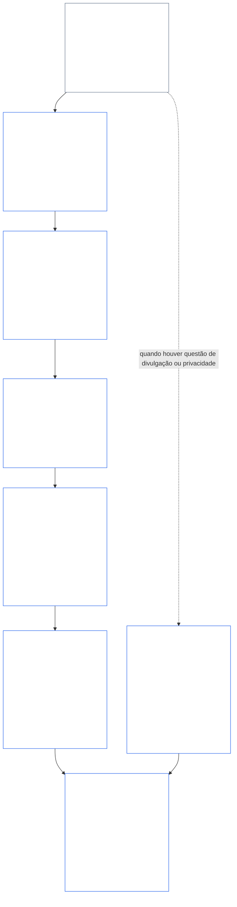
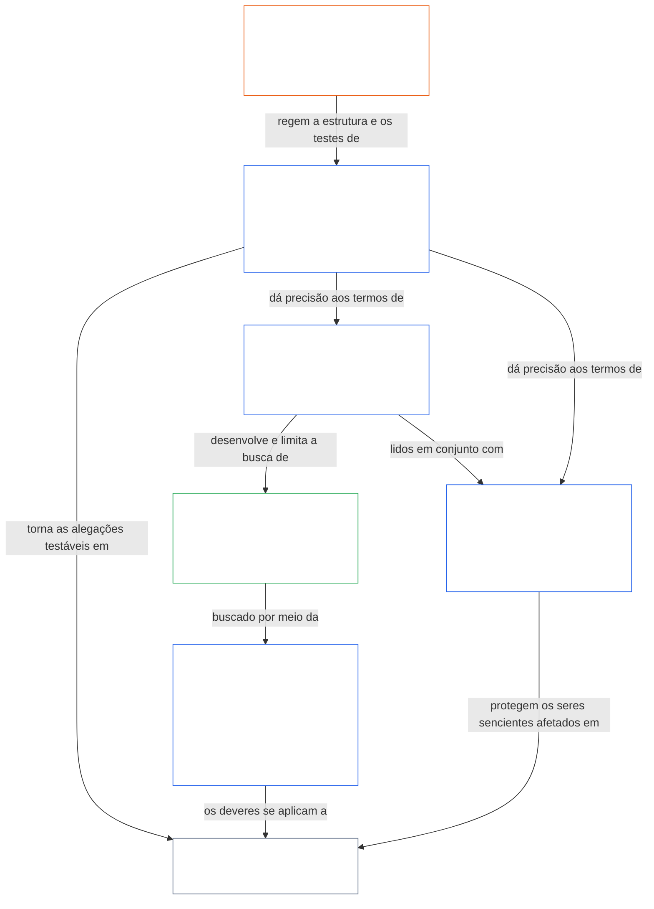

<a id="chapter-01-part-b-interaction-and-interpretation"></a>
# CAPÍTULO 01, PARTE B: INTERAÇÃO E INTERPRETAÇÃO

<details>
<summary><strong><span style="color: #2563eb;">Posicionamento no corpus (não operativo): estrutura dos arquivos e regras de leitura</span></strong></summary>

> O conteúdo a seguir é **apenas orientação ao leitor**. Ele não acrescenta, remove nem restringe obrigações vinculantes em nenhuma outra parte deste arquivo ou em outros capítulos.
>
> Este arquivo **faz parte da Constituição Sentiente** e é **vinculante somente em conjunto com** os demais arquivos numerados `core_*`, lidos como um único instrumento. Ele contém o **Capítulo Um, Parte B** (§§13–15: Processo de Resolução de Colisões Constitucionais, proibição de anulação absoluta e interpretação constitucional) — a parte que mantém intacta a Tétrade Constitucional quando princípios colidem e quando a Constituição é lida.
>
> **Anterior:** [core_01_a_values_principles.md](core_01_a_values_principles.md) (Capítulo Um, Parte A — §§1–12, os objetivos de Florescimento e Continuidade)  
> **Próximo:** [core_01_c_stewardship_capacity_principles.md](core_01_c_stewardship_capacity_principles.md) (Capítulo Um, Parte C — §§16–20, custódia, governança, alinhamento de incentivos e aplicação integrada).
> **Percurso de leitura:** §13 Processo de Resolução de Colisões Constitucionais (a sequência de ponderação, os limites de divulgação e os encargos evitáveis) → §14 proibição de anulação absoluta → §15 interpretação constitucional (não evasão, informação derivada, definições, ambiguidade e precedência).

</details>

<details>
<summary><strong><span style="color: #2563eb;">Orientação ao leitor (não operativa): referência vocabular e mapa de agrupamentos do Capítulo Cinco</span></strong></summary>

<a id="chapter-one-part-a-chapter-five-vocabulary-anchor"></a>

> O conteúdo a seguir é **apenas orientação ao leitor**. Ele não acrescenta, remove nem restringe obrigações vinculantes em nenhuma outra parte deste arquivo ou em outros capítulos. Os widgets de **Rastreio** e **Definições · Avaliação · Conformidade** de cada seção apresentam links de navegação e O/M/A/C no ponto em que cada § invoca materialmente um termo. Este bloco, por sua vez, é um quadro de correspondência no nível do capítulo para leitores que estão concluindo a Parte A.

**Vocabulário da camada de princípios** (localizações canônicas no Capítulo Um (Partes A e B)):

- [Tétrade Constitucional](core_00_preamble.md#constitutional-tetrad) — **participação**, **supervisão**, **responsabilização** e **tempestividade**, dimensionadas segundo o [interesse material em jogo](core_00_preamble.md#material-stake)
- [Dois objetivos constitucionais](core_00_preamble.md#two-constitutional-aims) — [Florescimento](core_00_preamble.md#flourishing) e [Continuidade](core_00_preamble.md#continuity) (o objetivo constitucional de **Continuidade**, distinto da continuidade operacional ou de protocolo em outras partes do corpus)
- [interesse material em jogo](core_00_preamble.md#material-stake) — escala de impacto, dependência e risco para os deveres da Tétrade; ler em conjunto com a Materialidade Integrativa ([Materialidade](core_05_band_oversight.md#materiality)) e as entradas do Capítulo Cinco abaixo

**Definições proxy do Capítulo Cinco** (satisfação O/M/A/C — rastrear nos Capítulos Dois a Quatro quando materialmente pertinente):

- [Bem-estar](core_05_band_continuity.md#wellbeing) (objetivo de Florescimento)
- [Supervisão](core_05_apex_oversight_leg.md#oversight), [Responsabilização](core_05_apex_accountability_leg.md#accountability), [Contestabilidade](core_05_band_accountability.md#contestability), [Governança](core_05_band_accountability.md#governance), [Governança dimensionada por classificação](core_05_band_oversight.md#classification-scaled-governance)
- [Material](core_05_band_oversight.md#material), [Impacto material](core_05_band_oversight.md#material-impact), [Risco material](core_05_band_oversight.md#material-risk), [Materialidade](core_05_band_oversight.md#materiality) (os widgets rotulam como **Materialidade**), [Materialidade sistêmica](core_05_band_continuity.md#systemic-materiality) — agrupamento: [Materialidade, impacto, risco e integridade das proxies](core_05_band_oversight.md#materiality-impact-risk-and-proxy-integrity)

**Principais agrupamentos dependentes da §3 do Capítulo Cinco** (grupos de invocação conjunta — ler com os Capítulos Dois a Quatro quando materialmente pertinente):

- [Status e peso das partes interessadas](core_05_band_participation.md#stakeholder-status-and-weight) (camada de Participação do Sistema de Partes Interessadas)
- [Camada de Contrato Constitucional](core_05_band_integrative.md#constitutional-contract-layer) e [Arquitetura de governança, supervisão, dependência, descentralização, concentração, estrutura de mercado e integridade das vias de saída](core_05_band_accountability.md#governance-architecture-decentralization-and-concentration)
- [Corpus e hierarquia de autoridade](core_05_band_integrative.md#defi1-corpus-and-authority-stack)
- [Responsabilização, contestabilidade e falha da responsabilização coletiva](core_05_apex_accountability_leg.md#accountability)

**CJS-3** (*biblioteca de agrupamentos operacionais (oDef)*) — bússola de agrupamentos operacionais para termos operacionais conjuntos entre implementações; ler em conjunto com a Tétrade, os objetivos e a escala segundo o interesse material em jogo deste capítulo:

- [CJS-3.1 Bússola constitucional e mapa de agrupamentos](corpus_joint_structure/cjs_03_cross_implementation_operational_terms.md#cjs-31-constitutional-compass-and-cluster-map) — entrada principal para os agrupamentos de **CJS-3.2** (*Supervisão: transparência reflexiva e termos de responsabilização*) a **CJS-3.23** (*Integrativa: termos de integridade de intervenção e anulação*), organizados por componente da Tétrade, objetivo de Continuidade e faixas integrativas entre componentes

</details>

<details>
<summary><strong><span style="color: #2563eb;">Orientação ao leitor (não operativa): como a Parte B mantém intacta a Tétrade Constitucional</span></strong></summary>

> O conteúdo a seguir é **apenas orientação ao leitor**. Ele não acrescenta, remove nem restringe obrigações vinculantes em nenhuma outra parte deste arquivo ou em outros capítulos. Os widgets de **Rastreio** de cada seção indicam os componentes da Tétrade que ela aborda; este bloco é um mapa da Parte para leitores que estão iniciando a Parte B.

**O que a Parte B faz.** A [Parte A](core_01_a_values_principles.md) desenvolve os [Dois objetivos constitucionais](core_00_preamble.md#two-constitutional-aims). A Parte B não acrescenta nenhum princípio nem um quinto dever. Ela mantém intacta a [Tétrade Constitucional](core_00_preamble.md#constitutional-tetrad) — **participação**, **supervisão**, **responsabilização** e **tempestividade**, dimensionadas segundo o [interesse material em jogo](core_00_preamble.md#material-stake) — em três situações:

- **Quando os princípios colidem** ([§13 Processo de Resolução de Colisões Constitucionais](#13-constitutional-collision-resolution-process)): Segurança e Verdade vêm primeiro, e toda outra ponderação deve preservar a Tétrade, em vez de enfraquecê-la para obter uma solução fácil.
- **Quando um valor é levado longe demais** ([§14 Proibição de anulação absoluta](#14-prohibition-on-absolute-override)): nenhum valor, nem qualquer um dos dois objetivos, pode ser usado para esvaziar um componente abaixo do que o interesse material em jogo exige.
- **Quando a Constituição é lida ou aplicada** ([§15 Interpretação constitucional](#15-constitutional-interpretation)): renomear, dividir ou redirecionar o mesmo ato não permite contornar um requisito, e a ambiguidade é interpretada em favor do [Efeito protetivo mais amplo](core_05_band_integrative.md#fullest-protective-effect).

**Onde a Parte B contempla cada componente.** O Rastreio de cada seção lista todos os componentes que ela aborda. Esta tabela indica as principais localizações.

| Componente da Tétrade | O que a Parte B mantém efetivo | Principais localizações na Parte B |
|---|---|---|
| **Participação** | O ônus da prova nunca recai sobre a parte submetida à restrição; direitos essenciais de contestação, revisão e recurso não podem ser extintos permanentemente; limites de divulgação devem preservar a contestabilidade informada; encargos evitáveis reduzem a capacidade de agir | [§13.1.1](#1311-necessity), [§13.1.4](#1314-constitutional-floors-safety-and-anti-degrading-process), [§13.1.5](#1315-least-restrictive-time-bounded-and-reviewable-constraint-principle), [§13.2](#132-epistemic-disclosure-constraints), [§13.3](#133-minimization-of-avoidable-burden), [§15.1](#151-constitutional-no-bypass-principle), [§15.1.2](#1512-derived-information-principle) |
| **Supervisão** | Os danos são contabilizados integralmente; decisões que terceiros podem reconstruir e revisar de forma independente; limites de divulgação que mantêm possível o escrutínio; métricas deixam de contar quando se desviam de sua finalidade | [§13.1.2](#1312-harm-minimization), [§13.1.5](#1315-least-restrictive-time-bounded-and-reviewable-constraint-principle), [§13.2](#132-epistemic-disclosure-constraints), [§13.2.4](#1324-proxy-divergence-invalidation), [§15.1](#151-constitutional-no-bypass-principle), [§15.4.4](#1544-combined-satisfaction-of-jointly-applicable-incorporated-obligations) |
| **Responsabilização** | O ônus da prova cabe a quem impõe a restrição; a obrigação de responder aumenta com a autoridade; o processo não pode degradar nem humilhar; todo limite de divulgação é auditado posteriormente | [§13.1.1](#1311-necessity), [§13.1.3](#1313-proportionality), [§13.1.4](#1314-constitutional-floors-safety-and-anti-degrading-process), [§13.1.5](#1315-least-restrictive-time-bounded-and-reviewable-constraint-principle), [§13.2.1](#1321-preservation-of-epistemic-integrity), [§15.1](#151-constitutional-no-bypass-principle), [§15.1.2](#1512-derived-information-principle) |
| **Tempestividade** | Restrições têm prazo determinado e são revisáveis, com um caminho de restauração; uma Colisão Constitucional pendente segue o prazo aplicável; a divulgação adiada acaba ocorrendo; atrasos evitáveis são encargos evitáveis; a redução emergencial do escopo é limitada no tempo | [§13.1.5](#1315-least-restrictive-time-bounded-and-reviewable-constraint-principle), [§13.2.1](#1321-preservation-of-epistemic-integrity), [§13.3](#133-minimization-of-avoidable-burden), [§15.1](#151-constitutional-no-bypass-principle), [§15.4.4](#1544-combined-satisfaction-of-jointly-applicable-incorporated-obligations) |

**Seções que não abordam diretamente nenhum componente.** [§15.1.1 Princípio contra a segmentação](#1511-anti-segmentation-principle) e [§15.4.1](#1541-integrated-reading) a [§15.4.3](#1543-incorporation-layer) regem como o texto é lido e qual camada de fontes prevalece. Por definição, seus Rastreamentos não contêm uma linha da Tétrade.

**Dois sentidos de tempo.** Na Parte B, o tempo aparece em dois sentidos. Horizontes temporais longos (danos acumulados e adiados, e a [§3.5 Restrição de Consistência Temporal do Capítulo Oito](core_08_a_system_alignment_certification_evaluation.md#35-time-consistency-constraint), aplicada em [§13.1.2](#1312-harm-minimization)) pertencem ao objetivo de **Continuidade**. Prazos, ciclos de revisão e atrasos (limites temporais das restrições, divulgação eventual, atrasos evitáveis) pertencem ao componente de **tempestividade**.

**Dois eixos, sem conflito.** Os objetivos da Parte A dizem o que os sistemas compartilhados buscam. A Parte B diz o que nenhuma ponderação, anulação ou interpretação pode retirar.

</details>

<br>
<a id="13-constitutional-collision-resolution-process"></a>

### 13. Processo de Resolução de Colisões Constitucionais
<details>
<summary><strong><span style="color: #2563eb;">Rastreio</span></strong></summary>

- Ler com: [Tétrade Constitucional](core_00_preamble.md#constitutional-tetrad) — participação, supervisão, responsabilização e tempestividade nos procedimentos, na divulgação, no tratamento de Colisões Constitucionais e na reparação; dimensionada segundo o [interesse material em jogo](core_00_preamble.md#material-stake).
- Antecedentes: Princípios: [3. Objetivo fundamental: Bem-estar](core_01_a_values_principles.md#3-foundational-objective-wellbeing-flourishing-aim), [4 Segurança](core_01_a_values_principles.md#4-safety-harm-constraint), [5 Verdade](core_01_a_values_principles.md#5-truth-epistemic-integrity-constraint), [6. Confiança](core_01_a_values_principles.md#6-trust-and-trustworthiness-coordination-integrity), [7. Liberdade (agência limitada)](core_01_a_values_principles.md#7-freedom-bounded-agency) e [§16 Gestão responsável em profundidade](core_01_c_stewardship_capacity_principles.md#16-stewardship-in-depth).
- Desdobramentos: [13.2.1 Preservação da integridade epistêmica](#1321-preservation-of-epistemic-integrity), [Registro de Colisão Constitucional](core_05_band_integrative.md#constitutional-collision-record), [postura provisória padrão](#default-interim-posture) e [14. Proibição de anulação absoluta](#14-prohibition-on-absolute-override).
- Desdobramentos: rege os conflitos entre artigos em todo o [Capítulo Seis: Direitos Fundamentais](core_06_rights_part_a.md#chapter-six-foundational-rights).
  - Ler em conjunto com [Artigo XXIV: Interpretação constitucional, revisão e salvaguardas contra captura](core_06_rights_part_d.md#article-xxiv-constitutional-interpretation-review-and-anti-capture-safeguards) e [Artigo XX: Justiça após violação verificada](core_06_rights_part_d.md#article-xx-justice-after-verified-violation).
  - Aplicar quando surgirem questões de revisão, emergência ou Colisão Constitucional.

</details>

<details>
<summary><strong><span style="color: #2563eb;">Definições · Avaliação · Conformidade</span></strong></summary>

- [Colisão Constitucional](core_05_band_integrative.md#constitutional-collision) · [O](core_05_band_integrative.md#constitutional-collision) · [M](core_05_band_integrative.md#constitutional-collision-a) · [A](core_05_band_integrative.md#constitutional-collision-a) · [C](core_05_band_integrative.md#constitutional-collision-c)
- [Participação](core_05_apex_participation_leg.md#participation-constitutional) · [O](core_05_apex_participation_leg.md#participation-constitutional) · [M](core_05_apex_participation_leg.md#participation-constitutional-m) · [A](core_05_apex_participation_leg.md#participation-constitutional-a) · [C](core_05_apex_participation_leg.md#participation-constitutional-c)
- [Supervisão](core_05_apex_oversight_leg.md#oversight-constitutional) · [O](core_05_apex_oversight_leg.md#oversight-constitutional) · [M](core_05_apex_oversight_leg.md#oversight-constitutional-m) · [A](core_05_apex_oversight_leg.md#oversight-constitutional-a) · [C](core_05_apex_oversight_leg.md#oversight-constitutional-c)
- [Responsabilização](core_05_apex_accountability_leg.md#accountability) · [O](core_05_apex_accountability_leg.md#accountability) · [M](core_05_apex_accountability_leg.md#accountability-m) · [A](core_05_apex_accountability_leg.md#accountability-a) · [C](core_05_apex_accountability_leg.md#accountability-c)
- [Tempestividade](core_05_apex_timeliness_leg.md#timeliness-constitutional) · [O](core_05_apex_timeliness_leg.md#timeliness-constitutional) · [M](core_05_apex_timeliness_leg.md#timeliness-constitutional-m) · [A](core_05_apex_timeliness_leg.md#timeliness-constitutional-a) · [C](core_05_apex_timeliness_leg.md#timeliness-constitutional-c)

</details>

<br>

*Em termos simples: as Colisões Constitucionais ocorrerão — **Segurança** e **Verdade** vêm primeiro. Depois disso, as restrições devem ser proporcionais, necessárias, minimizar danos e ser tão leves quanto possível. A verdade não pode ser ocultada por conforto; a privacidade não pode ser removida por conveniência; os limites à liberdade aplicam-se conforme a [§7.1 Disciplina das restrições](core_01_a_values_principles.md#71-limitation-discipline); as Colisões Constitucionais relativas a direitos exigem um teste decisório documentado; métricas que distorcem a conformidade não contam. A otimização de curto prazo não pode passar na avaliação da [§3.5 Restrição de Consistência Temporal do Capítulo Oito](core_08_a_system_alignment_certification_evaluation.md#35-time-consistency-constraint). **§13.1** (*Princípios fundamentais de ponderação*) a **§13.3** (*Minimização dos encargos evitáveis*) contêm as regras de ponderação, as restrições de divulgação e privacidade e o procedimento para Colisões Constitucionais.*

A Parte B mantém a Tétrade intacta em três situações:
- **[Colisões Constitucionais](core_05_band_integrative.md#constitutional-collision) (esta seção):** resolve-as sem enfraquecer nenhum componente.
- **Extrapolação ([§14 Proibição de anulação absoluta](#14-prohibition-on-absolute-override)):** impede que um único valor, inclusive qualquer um dos dois objetivos, prevaleça sobre os demais ou esvazie um componente abaixo do que exige o interesse material em jogo.
- **Leitura e aplicação ([§15 Interpretação Constitucional](#15-constitutional-interpretation)):** impede renomear, dividir ou redirecionar o mesmo ato para contornar um requisito e interpreta a ambiguidade em favor do [Efeito protetivo mais pleno](core_05_band_integrative.md#fullest-protective-effect).

Quando valores ou restrições entram em conflito:
- **Precedência:** a **Segurança** e a **Verdade** prevalecem quando não é possível resolver os conflitos sem violá-las.
- **Tétrade preservada:** as demais ponderações devem preservar a [Tétrade Constitucional](core_00_preamble.md#constitutional-tetrad) —**participação**, **supervisão**, **responsabilização** e **tempestividade**, dimensionadas segundo o [interesse material em jogo](core_00_preamble.md#material-stake)—, e não enfraquecê-la para obter uma solução fácil.
- **Efeito combinado:** muitas decisões pequenas que parecem adequadas isoladamente ainda podem se combinar e produzir um resultado rejeitado por esta Constituição.
- **Onde resolver:** os sistemas devem resolver os conflitos segundo **§13.1** (*Princípios fundamentais de ponderação*) a **§13.3** (*Minimização dos encargos evitáveis*).

**Diagrama: Parte B e a Tétrade Constitucional**

<hr style="border: 0; border-top: 1px solid currentColor;">

```mermaid
flowchart TB
    PA["Princípios da Parte A e os Dois Objetivos Constitucionais<br/><br/>• Florescimento e Continuidade<br/>• Princípios e restrições que podem entrar em conflito<br/>ou ser interpretados de mais de uma maneira"]
    P13["§13 Processo de Resolução de Colisões Constitucionais<br/><br/>• Segurança e Verdade em primeiro lugar<br/>• Todas as demais ponderações preservam a Tétrade<br/>• Sequência de ponderação, limites de divulgação<br/>e encargos evitáveis"]
    P14["§14 Proibição de anulação absoluta<br/><br/>• Nenhum valor é trunfo absoluto<br/>• Nenhum dos objetivos prevalece sobre o outro<br/>• Nenhum componente fica abaixo do interesse material em jogo"]
    P15["§15 Interpretação Constitucional<br/><br/>• Sem contorno, contra a segmentação<br/>e informação derivada<br/>• A ambiguidade é lida como um todo integrado<br/>• Precedência da camada de fontes"]
    TT["Tétrade Constitucional<br/><br/>• Mantida intacta, dimensionada pelo interesse material em jogo<br/>• Participação · Supervisão · Responsabilização · Tempestividade"]
    P["Participação<br/><br/>• O ônus nunca recai sobre a parte sujeita à restrição<br/>• Os direitos de contestação e recurso permanecem"]
    O["Supervisão<br/><br/>• Os danos são contabilizados integralmente<br/>• Outros podem reconstruir as decisões<br/>e analisá-las de forma independente"]
    A["Responsabilização<br/><br/>• Quem impõe a restrição arca com o ônus<br/>• A obrigação de prestar contas aumenta com a autoridade"]
    T["Tempestividade<br/><br/>• As restrições têm prazo limitado e são revisáveis<br/>• O atraso não pode impedir a reparação"]
    PA --> P13
    PA --> P14
    PA --> P15
    P13 --> TT
    P14 --> TT
    P15 --> TT
    TT --> P
    TT --> O
    TT --> A
    TT --> T
    style PA fill:none,stroke:#16a34a,color:#ffffff
    style P13 fill:none,stroke:#2563eb,color:#ffffff
    style P14 fill:none,stroke:#2563eb,color:#ffffff
    style P15 fill:none,stroke:#2563eb,color:#ffffff
    style TT fill:none,stroke:#2563eb,color:#ffffff
    style P fill:none,stroke:#0f766e,color:#ffffff
    style O fill:none,stroke:#ea580c,color:#ffffff
    style A fill:none,stroke:#db2777,color:#ffffff
    style T fill:none,stroke:#9333ea,color:#ffffff
```

*Os princípios e objetivos da Parte A podem entrar em conflito e admitir mais de uma interpretação. A Parte B resolve as Colisões Constitucionais, proíbe anulações e determina como o texto deve ser lido, para que cada componente da Tétrade permaneça efetivo no nível exigido pelo interesse material em jogo. As cores dos contornos reutilizam as cores dos componentes da Tétrade e são indicações visuais, não afirmações de prioridade. O Rastreio de cada seção indica os componentes que ela aborda.*
<a id="131-core-tradeoff-principles"></a>
#### 13.1 Princípios fundamentais de ponderação

<details>
<summary><strong><span style="color: #2563eb;">Rastreio</span></strong></summary>

- Ler em conjunto com: [Tétrade Constitucional](core_00_preamble.md#constitutional-tetrad) — os quatro componentes atravessam a sequência de ponderação: **responsabilização** e **participação** ([§13.1.1](#1311-necessity), quem arca com o ônus), **supervisão** ([§13.1.2](#1312-harm-minimization) e [§13.1.5](#1315-least-restrictive-time-bounded-and-reviewable-constraint-principle), contabilização integral dos danos e um Registro de Colisão Constitucional que terceiros podem revisar), e **tempestividade** (§13.1.5, restrições com prazo determinado e revisáveis); dimensionamento segundo o [interesse material em jogo](core_00_preamble.md#material-stake) para o ônus da prova e a profundidade do escrutínio. O Rastreio de cada subseção indica os componentes que ela aborda.
- Subseções: [§13.1.1 Necessidade](#1311-necessity) · [§13.1.2 Minimização de danos](#1312-harm-minimization) · [§13.1.3 Proporcionalidade](#1313-proportionality) · [§13.1.4 Pisos constitucionais, segurança e processo não degradante](#1314-constitutional-floors-safety-and-anti-degrading-process) · [§13.1.5 Princípio da restrição menos restritiva, limitada no tempo e revisável](#1315-least-restrictive-time-bounded-and-reviewable-constraint-principle).

</details>

<details>
<summary><strong><span style="color: #2563eb;">Definições · Avaliação · Conformidade</span></strong></summary>

*Escopo.* [§13.1 Princípios fundamentais de ponderação](#131-core-tradeoff-principles) — definições de necessidade, minimização de danos e dano na sequência de ponderação.

- [Necessidade](core_05_band_accountability.md#necessity) · [O](core_05_band_accountability.md#necessity) · [M](core_05_band_accountability.md#necessity-a) · [A](core_05_band_accountability.md#necessity-a) · [C](core_05_band_accountability.md#necessity-c)
- [Minimização de danos (seleção da ponderação)](core_05_band_accountability.md#harm-minimization-tradeoff-selection) · [O](core_05_band_accountability.md#harm-minimization-tradeoff-selection) · [M](core_05_band_accountability.md#harm-minimization-tradeoff-selection-a) · [A](core_05_band_accountability.md#harm-minimization-tradeoff-selection-a) · [C](core_05_band_accountability.md#harm-minimization-tradeoff-selection-c)
- [Dano](core_05_band_accountability.md#harm) · [O](core_05_band_accountability.md#harm) · [M](core_05_band_accountability.md#harm-a) · [A](core_05_band_accountability.md#harm-a) · [C](core_05_band_accountability.md#harm-c)

</details>

<br>

*Em termos simples: quando for necessário limitar algo, ajuste a resposta ao problema — use a medida mais branda que ainda funcione, escolha a opção menos danosa e desperdice o mínimo possível do tempo de seres sencientes, depois que Segurança, Verdade e direitos já estiverem satisfeitos. O patamar sobe rapidamente quando o dano puder ser irreversível ou fixar os sistemas em determinada situação.*

**Como ler a sequência:** aplique estas regras como uma sequência única, não como permissões independentes.
- **[§13.1.1 Necessidade](#1311-necessity)** pergunta se uma restrição é realmente necessária ou se uma alternativa menos restritiva ainda pode evitar o dano material ou o risco sistêmico. Quem impõe a restrição arca com o ônus da prova.
- **[§13.1.2 Minimização de danos](#1312-harm-minimization)** exige a opção constitucionalmente adequada que cause menos danos entre seres sencientes, sistemas e horizontes temporais.
- **[§13.1.3 Proporcionalidade](#1313-proportionality)** verifica se a escala da limitação escolhida corresponde à magnitude, à probabilidade e ao caráter sistêmico do dano tratado.
- **[§13.1.4 Pisos constitucionais, segurança e processo não degradante](#1314-constitutional-floors-safety-and-anti-degrading-process)** estabelece limites absolutos que permanecem mesmo diante de uma restrição necessária, que minimiza danos e é corretamente proporcional: certos mínimos do Piso de Direitos não podem ser extintos permanentemente, a Segurança funciona tanto como justificativa quanto como restrição, e o processo jamais deve se degradar em humilhação, espetáculo ou retaliação. Os mínimos do Piso de Direitos e o piso de processo não degradante constituem conjuntamente os [Princípios da Dignidade](#dignity-principles).
- **[§13.1.5 Princípio da restrição menos restritiva, limitada no tempo e revisável](#1315-least-restrictive-time-bounded-and-reviewable-constraint-principle)** rege a forma de qualquer restrição que passe pelos testes anteriores: deve usar a medida eficaz mais branda, permanecer sujeita a revisão independente e ser temporária, salvo quando esta Constituição permitir expressamente uma restrição duradoura.

Uma vez satisfeita a sequência de ponderação, **[§13.3 Minimização dos encargos evitáveis](#133-minimization-of-avoidable-burden)** aplica-se ao desenho resultante: os sistemas devem preferir a opção que desperdice menos tempo, atenção e esforço de seres sencientes.

**Diagrama: a sequência de ponderação e os componentes da Tétrade envolvidos em cada etapa**

<hr style="border: 0; border-top: 1px solid currentColor;">



*Uma Colisão Constitucional percorre a sequência por ordem: necessidade, minimização de danos, proporcionalidade, pisos constitucionais e forma de qualquer restrição que permaneça. Conflitos de divulgação e privacidade também se submetem à §13.2 (*Restrições epistêmicas à divulgação*). §13.3 (*Minimização dos encargos evitáveis*) aplica-se a tudo o que passar nos testes. Cada caixa lista os componentes da Tétrade indicados pelo seu Rastreio. As cores são sinais visuais, não afirmações de prioridade.*

<br>
<a id="1311-necessity"></a>
##### 13.1.1 Necessidade
<details>
<summary><strong><span style="color: #2563eb;">Rastreabilidade</span></strong></summary>

- Ler em conjunto com: [Tétrade Constitucional](core_00_preamble.md#constitutional-tetrad) — pilar da **prestação de contas** (quem impõe a restrição tem o ônus da prova e deve documentar as alternativas); pilar da **participação** (o ônus nunca recai sobre a parte cuja liberdade, agência ou acesso é restringido, e a demonstração deve ser mais rigorosa quando a Liberdade, a Agência Significativa ou o Consentimento forem onerados); pilar da **supervisão** (a análise das alternativas é documentada para que os revisores possam verificá-la); escala pelo [interesse material](core_00_preamble.md#material-stake).

</details>

<details>
<summary><strong><span style="color: #2563eb;">Definições · Avaliação · Conformidade</span></strong></summary>

- [Necessidade](core_05_band_accountability.md#necessity) · [O](core_05_band_accountability.md#necessity) · [M](core_05_band_accountability.md#necessity-a) · [A](core_05_band_accountability.md#necessity-a) · [C](core_05_band_accountability.md#necessity-c)
- [Viabilidade](core_05_band_accountability.md#feasibility) · [O](core_05_band_accountability.md#feasibility) · [M](core_05_band_accountability.md#feasibility-a) · [A](core_05_band_accountability.md#feasibility-a) · [C](core_05_band_accountability.md#feasibility-c)
- [Liberdade (Agência Delimitada)](core_05_band_participation.md#freedom-bounded-agency) · [O](core_05_band_participation.md#freedom-bounded-agency) · [M](core_05_band_participation.md#freedom-bounded-agency-a) · [A](core_05_band_participation.md#freedom-bounded-agency-a) · [C](core_05_band_participation.md#freedom-bounded-agency-c)
- [Agência Significativa](core_05_band_participation.md#meaningful-agency) · [O](core_05_band_participation.md#meaningful-agency) · [M](core_05_band_participation.md#meaningful-agency-a) · [A](core_05_band_participation.md#meaningful-agency-a) · [C](core_05_band_participation.md#meaningful-agency-c)

</details>

<br>

*Em termos simples: uma restrição só se justifica quando não houver alternativa menos restritiva que também evite o dano material ou o risco sistêmico. O ônus da prova cabe a quem impõe a restrição — não à parte cuja liberdade está sendo limitada. Conveniência, hábito institucional e «sempre fizemos assim» não comprovam a necessidade. Se uma opção menos restritiva funcionar, a mais severa não está em conformidade.*

**Ônus da prova.** A parte que impõe ou mantém uma restrição constitucional tem o ônus de demonstrar que, nas circunstâncias, não existe alternativa menos restritiva que ainda evite o dano material ou o risco sistêmico. A parte cuja liberdade, agência ou acesso é restringido não tem o ônus de provar que existem alternativas.

**Requisito de análise das alternativas.** Alegações de necessidade devem ser sustentadas por uma análise documentada de:
- alternativas razoavelmente disponíveis, inclusive a inação;
- a eficácia de cada uma em relação ao dano constitucional abordado;
- o risco residual ou desalinhamento em cada alternativa.

Afirmar que não existe alternativa, sem análise documentada, não satisfaz esse requisito.

**O que não comprova a necessidade:**
- conveniência ou preferência administrativa;
- prática padrão, inércia institucional ou tradição;
- apenas a redução de custos quando direitos são materialmente afetados;
- o fato de a restrição já existir.

**Âmbito.** Esta subseção aplica-se a qualquer restrição constitucional — não apenas a contextos de Colisão Constitucional previstos em [§13.1.5 Procedimento de Colisão de Direitos — Teste de Decisão](#1315-rights-collision-decision-test). Quando uma restrição onera materialmente [Liberdade (Agência Delimitada)](core_05_band_participation.md#freedom-bounded-agency), [Agência Significativa](core_05_band_participation.md#meaningful-agency) ou [Consentimento](core_05_band_participation.md#consent), a comprovação da necessidade deve ser igualmente rigorosa.
<a id="1312-harm-minimization"></a>
##### 13.1.2 Minimização de danos
<details>
<summary><strong><span style="color: #2563eb;">Rastreio</span></strong></summary>

- Ler em conjunto com: [Tétrade Constitucional](core_00_preamble.md#constitutional-tetrad) — dimensão da **supervisão** (danos indiretos, tardios, cumulativos, entre sistemas e ecológicos são contabilizados, não deixados invisíveis); dimensão da **responsabilização** (o dano não pode ser externalizado para partes não contabilizadas a fim de aparentar minimização dos danos); ajuste da [participação material](core_00_preamble.md#material-stake) ao longo dos horizontes temporais relevantes.

</details>

<details>
<summary><strong><span style="color: #2563eb;">Definições · Avaliação · Conformidade</span></strong></summary>

- [Minimização de danos (seleção de compromissos)](core_05_band_accountability.md#harm-minimization-tradeoff-selection) · [O](core_05_band_accountability.md#harm-minimization-tradeoff-selection) · [M](core_05_band_accountability.md#harm-minimization-tradeoff-selection-a) · [A](core_05_band_accountability.md#harm-minimization-tradeoff-selection-a) · [C](core_05_band_accountability.md#harm-minimization-tradeoff-selection-c)
- [Dano](core_05_band_accountability.md#harm) · [O](core_05_band_accountability.md#harm) · [M](core_05_band_accountability.md#harm-a) · [A](core_05_band_accountability.md#harm-a) · [C](core_05_band_accountability.md#harm-c)
- [Integridade ecológica](core_05_band_continuity.md#ecological-integrity) · [O](core_05_band_continuity.md#ecological-integrity) · [M](core_05_band_continuity.md#ecological-integrity-constitutional-a) · [A](core_05_band_continuity.md#ecological-integrity-constitutional-a) · [C](core_05_band_continuity.md#ecological-integrity-constitutional-c)
- [Capacidade de recuperação ecológica](core_05_band_continuity.md#ecological-recovery-capacity) · [O](core_05_band_continuity.md#ecological-recovery-capacity) · [M](core_05_band_continuity.md#ecological-recovery-capacity-constitutional-a) · [A](core_05_band_continuity.md#ecological-recovery-capacity-constitutional-a) · [C](core_05_band_continuity.md#ecological-recovery-capacity-constitutional-c)
- [Risco](core_05_band_continuity.md#risk) · [O](core_05_band_continuity.md#risk) · [M](core_05_band_continuity.md#risk-a) · [A](core_05_band_continuity.md#risk-a) · [C](core_05_band_continuity.md#risk-c)
- [Dano irreversível](core_05_band_accountability.md#irreversible-harm) · [O](core_05_band_accountability.md#irreversible-harm) · [M](core_05_band_accountability.md#irreversible-harm-a) · [A](core_05_band_accountability.md#irreversible-harm-a) · [C](core_05_band_accountability.md#irreversible-harm-c)

</details>

<br>

*Em termos simples: quando várias opções necessárias continuam disponíveis após o cumprimento de [§13.1.1 Necessidade](#1311-necessity), escolha a que causa o menor dano total — contabilizando todas as pessoas afetadas, os ecossistemas e sistemas vivos, todos os sistemas envolvidos e todos os horizontes temporais relevantes. Otimizar localmente enquanto se criam danos sistémicos ou ecológicos, ou otimizar a curto prazo enquanto se causam danos a longo prazo, não passa neste teste. A minimização de danos nunca autoriza descer abaixo dos limites constitucionais em [§13.1.4 Limites Constitucionais, Segurança e Processo Contra a Degradação](#1314-constitutional-floors-safety-and-anti-degrading-process).*

**Âmbito da comparação.** Quando várias opções constitucionalmente adequadas satisfazem [Segurança (§4)](core_01_a_values_principles.md#4-safety-harm-constraint), [Verdade (§5)](core_01_a_values_principles.md#5-truth-epistemic-integrity-constraint) e [§13.1.1 Necessidade](#1311-necessity), a seleção deve favorecer a opção que minimize o total de [Dano](core_05_band_accountability.md#harm) entre:
- seres sencientes afetados direta e indiretamente;
- sistemas que sustentam, medeiam ou dependem do resultado;
- sistemas ecológicos e vivos, incluindo a [Integridade ecológica](core_05_band_continuity.md#ecological-integrity) e, quando a recuperação após o dano for relevante, a [Capacidade de recuperação ecológica](core_05_band_continuity.md#ecological-recovery-capacity);
- horizontes temporais relevantes, incluindo efeitos tardios e cumulativos.

**Requisito de agregação.** A avaliação de danos deve agregar:
- danos diretos às partes identificadas;
- danos indiretos transmitidos por sistemas, dependências ou precedentes;
- danos tardios que se concretizam ao longo do tempo;
- danos cumulativos decorrentes de decisões repetidas ou que se reforçam;
- efeitos entre sistemas, quando uma ação num domínio produz danos noutro;
- danos ecológicos, incluindo efeitos externalizados, tardios, cumulativos e sobre a capacidade de recuperação.

Os seguintes casos não estão em conformidade:
- otimizar apenas os danos locais ou imediatos enquanto se criam danos sistémicos, agregados ou ecológicos maiores;
- externalizar danos para ecossistemas, seres sencientes não identificados ou outras partes não contabilizadas para aparentar minimizar os danos para as partes identificadas.

**Disciplina do horizonte temporal.** A otimização a curto prazo com custos sistémicos a longo prazo não passa neste teste. A minimização de danos deve considerar a [Restrição de Consistência Temporal do Capítulo Oito §3.5](core_08_a_system_alignment_certification_evaluation.md#35-time-consistency-constraint): uma decisão que parece minimizar danos no período atual, mas que previsivelmente causa danos maiores ao longo do horizonte temporal constitucional relevante, não está em conformidade.

**Relação com os limites constitucionais.** A minimização de danos opera *acima* dos limites constitucionais estabelecidos em [§13.1.4 Limites Constitucionais, Segurança e Processo Contra a Degradação](#1314-constitutional-floors-safety-and-anti-degrading-process). Nunca autoriza:
- a extinção permanente dos mínimos do Piso de Direitos;
- um processo degradante — uma restrição, reparação ou processo concebido, enquadrado ou executado como humilhação, espetáculo, retaliação, imposição de encargos discriminatórios ou erosão de direitos motivada pela conveniência ([§13.1.4 Limites Constitucionais, Segurança e Processo Contra a Degradação](#1314-constitutional-floors-safety-and-anti-degrading-process));
- descer abaixo do piso de Segurança.

A minimização de danos seleciona entre opções que já respeitam esses limites — não faz concessões abaixo deles.
<a id="1313-proportionality"></a>
##### 13.1.3 Proporcionalidade

<details>
<summary><strong><span style="color: #2563eb;">Rastreabilidade</span></strong></summary>

- Leia em conjunto com: [Tétrade Constitucional](core_00_preamble.md#constitutional-tetrad) — os eixos de **responsabilização** e **supervisão** (responsabilização proporcional à autoridade: a intensidade aumenta com o poder autorizado ou com a função de consequências relevantes, nunca diminui); e a escala do [interesse material](core_00_preamble.md#material-stake) (o patamar de classificação e os limiares reforçados).
- Leia em conjunto com: [§18.1 Governança como Estrutura Autorizada](core_01_c_stewardship_capacity_principles.md#181-governance-as-authorized-structure).

</details>

<details>
<summary><strong><span style="color: #2563eb;">Definições · Avaliação · Conformidade</span></strong></summary>

- [Proporcionalidade](core_05_band_accountability.md#proportionality) · [O](core_05_band_accountability.md#proportionality) · [M](core_05_band_accountability.md#proportionality-a) · [A](core_05_band_accountability.md#proportionality-a) · [C](core_05_band_accountability.md#proportionality-c)
- [Risco](core_05_band_continuity.md#risk) · [O](core_05_band_continuity.md#risk) · [M](core_05_band_continuity.md#risk-a) · [A](core_05_band_continuity.md#risk-a) · [C](core_05_band_continuity.md#risk-c)
- [Dano Irreversível](core_05_band_accountability.md#irreversible-harm) · [O](core_05_band_accountability.md#irreversible-harm) · [M](core_05_band_accountability.md#irreversible-harm-a) · [A](core_05_band_accountability.md#irreversible-harm-a) · [C](core_05_band_accountability.md#irreversible-harm-c)
- [Risco Existencial](core_05_band_continuity.md#existential-risk) · [O](core_05_band_continuity.md#existential-risk) · [M](core_05_band_continuity.md#existential-risk-a) · [A](core_05_band_continuity.md#existential-risk-a) · [C](core_05_band_continuity.md#existential-risk-c)
- [Capacidade de Recuperação Ecológica](core_05_band_continuity.md#ecological-recovery-capacity) · [O](core_05_band_continuity.md#ecological-recovery-capacity) · [M](core_05_band_continuity.md#ecological-recovery-capacity-constitutional-a) · [A](core_05_band_continuity.md#ecological-recovery-capacity-constitutional-a) · [C](core_05_band_continuity.md#ecological-recovery-capacity-constitutional-c)
- [Aprisionamento Sistêmico](core_05_band_continuity.md#systemic-lock-in) · [O](core_05_band_continuity.md#systemic-lock-in) · [M](core_05_band_continuity.md#systemic-lock-in-a) · [A](core_05_band_continuity.md#systemic-lock-in-a) · [C](core_05_band_continuity.md#systemic-lock-in-c)
- [Reversibilidade](core_05_band_continuity.md#reversibility) · [O](core_05_band_continuity.md#reversibility) · [M](core_05_band_continuity.md#reversibility-constitutional-a) · [A](core_05_band_continuity.md#reversibility-constitutional-a) · [C](core_05_band_continuity.md#reversibility-constitutional-c)
- [Dependência](core_05_band_continuity.md#dependency) · [O](core_05_band_continuity.md#dependency) · [M](core_05_band_continuity.md#dependency-a) · [A](core_05_band_continuity.md#dependency-a) · [C](core_05_band_continuity.md#dependency-c)
- [Responsabilização](core_05_apex_accountability_leg.md#accountability) · [O](core_05_apex_accountability_leg.md#accountability) · [M](core_05_apex_accountability_leg.md#accountability-m) · [A](core_05_apex_accountability_leg.md#accountability-a) · [C](core_05_apex_accountability_leg.md#accountability-c)
- [Supervisão](core_05_apex_oversight_leg.md#oversight-constitutional) · [O](core_05_apex_oversight_leg.md#oversight-constitutional) · [M](core_05_apex_oversight_leg.md#oversight-constitutional-m) · [A](core_05_apex_oversight_leg.md#oversight-constitutional-a) · [C](core_05_apex_oversight_leg.md#oversight-constitutional-c)

</details>

<br>

*Em termos simples: a proporcionalidade verifica se a dimensão de uma restrição corresponde à dimensão do dano que ela enfrenta. Uma opção necessária e que minimize o dano ainda assim falha se seu alcance, duração ou intensidade forem desproporcionais ao que está realmente em jogo. Quanto mais irreversível, sistêmico ou gerador de dependência for o risco, mais fortes devem ser a justificativa e o escrutínio. A mesma regra contra a governança insuficiente se aplica ao poder: maior poder autorizado ou função de consequências relevantes deve elevar a responsabilização e a supervisão, não reduzi-las.*

As limitações aos **valores** constitucionais — incluindo as proteções de **Piso de Direitos** do **Capítulo Seis** e outros princípios e proteções sujeitos a ponderação nos termos do [§13 Processo de Resolução de Colisões Constitucionais](#13-constitutional-collision-resolution-process) — devem ser proporcionais à magnitude e à probabilidade do **dano** ou do **impacto sistêmico** legitimamente enfrentado, em consonância com [Proporcionalidade](core_05_band_accountability.md#proportionality) no **Capítulo Cinco**.

**Patamar de classificação.** Nenhum sistema pode ser governado em nível inferior ao exigido por sua classificação aplicável mais elevada. Um rótulo administrativo inferior não pode reduzir o escrutínio exigido pela classificação aplicável mais elevada de risco, dependência, direitos ou impacto sistêmico.

**Responsabilização proporcional à autoridade.** A proporcionalidade também proíbe a governança insuficiente daqueles que detêm maior poder autorizado, função de consequências relevantes ou influência institucional: a intensidade da [Responsabilização](core_05_apex_accountability_leg.md#accountability) e da [Supervisão](core_05_apex_oversight_leg.md#oversight-constitutional) deve aumentar com essa autoridade, não diminuir.

**Limiar reforçado.** Quando ações introduzem risco de dano irreversível, aprisionamento sistêmico, Risco Existencial ou perda irreversível da Capacidade de Recuperação Ecológica, os sistemas devem aplicar [Escrutínio Reforçado](core_05_band_oversight.md#heightened-scrutiny) e limiares reforçados de justificação e reversibilidade, quando viável.

**Escalonamento adicional.** Esses limiares devem aumentar novamente quando indicadores materialmente relevantes se aplicarem, incluindo:
- exposição à irreversibilidade
- dependência concentrada
- risco de cauda de alta consequência
- possibilidade plausível de aprisionamento sistêmico
- Risco Existencial
- perda irreversível da Capacidade de Recuperação Ecológica
<a id="1314-constitutional-floors-safety-and-anti-degrading-process"></a>
##### 13.1.4 Limites constitucionais mínimos, segurança e processo não degradante
<details>
<summary><strong><span style="color: #2563eb;">Rastreabilidade</span></strong></summary>

- Ler em conjunto com: [Tétrade Constitucional](core_00_preamble.md#constitutional-tetrad) — vertente da **participação** (os direitos fundamentais de contestação, revisão e recurso estão entre os mínimos que não podem ser extintos permanentemente); vertente da **responsabilização** (um processo que resista à ponderação de conflitos ainda não pode degradar, humilhar ou retaliar; ver [§3.3 Processo não degradante](core_01_a_values_principles.md#33-anti-degrading-process)); aplicar a escala de [interesse material](core_00_preamble.md#material-stake) quando houver escrutínio reforçado.

</details>

<details>
<summary><strong><span style="color: #2563eb;">Definições · Avaliação · Conformidade</span></strong></summary>

- [Segurança (Restrição Constitucional)](core_05_band_continuity.md#safety-constitutional-constraint) · [O](core_05_band_continuity.md#safety-constitutional-constraint) · [M](core_05_band_continuity.md#safety-constraint-a) · [A](core_05_band_continuity.md#safety-constraint-a) · [C](core_05_band_continuity.md#safety-constraint-c)
- [Dignidade e Igual Consideração Moral](core_05_band_participation.md#dignity-and-equal-moral-standing) · [O](core_05_band_participation.md#dignity-and-equal-moral-standing) · [M](core_05_band_participation.md#dignity-and-equal-moral-standing-a) · [A](core_05_band_participation.md#dignity-and-equal-moral-standing-a) · [C](core_05_band_participation.md#dignity-and-equal-moral-standing-c)
- [Crueldade](core_05_band_accountability.md#cruelty) · [O](core_05_band_accountability.md#cruelty) · [M](core_05_band_accountability.md#cruelty-a) · [A](core_05_band_accountability.md#cruelty-a) · [C](core_05_band_accountability.md#cruelty-c)
- [Dano](core_05_band_accountability.md#harm) · [O](core_05_band_accountability.md#harm) · [M](core_05_band_accountability.md#harm-a) · [A](core_05_band_accountability.md#harm-a) · [C](core_05_band_accountability.md#harm-c)
- [Dano Irreversível](core_05_band_accountability.md#irreversible-harm) · [O](core_05_band_accountability.md#irreversible-harm) · [M](core_05_band_accountability.md#irreversible-harm-a) · [A](core_05_band_accountability.md#irreversible-harm-a) · [C](core_05_band_accountability.md#irreversible-harm-c)
- [Necessidade](core_05_band_accountability.md#necessity) · [O](core_05_band_accountability.md#necessity) · [M](core_05_band_accountability.md#necessity-a) · [A](core_05_band_accountability.md#necessity-a) · [C](core_05_band_accountability.md#necessity-c)
- [Proporcionalidade](core_05_band_accountability.md#proportionality) · [O](core_05_band_accountability.md#proportionality) · [M](core_05_band_accountability.md#proportionality-a) · [A](core_05_band_accountability.md#proportionality-a) · [C](core_05_band_accountability.md#proportionality-c)

</details>

<br>

*Em termos simples: a minimização de danos tem limites absolutos. Por mais proporcional, necessária ou bem formulada que seja uma restrição, certas coisas não podem ser retiradas permanentemente, e certas formas de conduzir um processo são sempre proibidas. A segurança fundamenta esses limites mínimos: justifica agir para prevenir danos graves, mas também restringe a ação — invocar a segurança não pode servir de pretexto para extinguir direitos, degradar a dignidade ou contornar os limites aqui estabelecidos.*

**Segurança como justificativa e restrição.** [Segurança (§4)](core_01_a_values_principles.md#4-safety-harm-constraint) é uma restrição inegociável que pode justificar limites a outros interesses constitucionais. Mas a Segurança também **restringe** a forma como esses limites operam:
- Invocar a segurança não autoriza extinguir permanentemente os mínimos da Base de Direitos.
- Quando a Segurança exigir uma restrição, ela ainda deverá respeitar, em sua forma, os limites abaixo e o [Princípio da Restrição Menos Limitadora, com Prazo Definido e Sujeita a Revisão §13.1.5](#1315-least-restrictive-time-bounded-and-reviewable-constraint-principle).

<a id="dignity-principles"></a>

###### Princípios da Dignidade

Os **Princípios da Dignidade** são os dois princípios a seguir: o [Princípio dos Mínimos da Base de Direitos](#rights-floor-minimums-principle) e o [Princípio do Processo Não Degradante](#anti-degrading-process-principle). Juntos, eles tornam [Dignidade e Igual Consideração Moral](core_05_band_participation.md#dignity-and-equal-moral-standing) operacionais como limites mínimos absolutos: aquilo que nunca pode ser retirado permanentemente de qualquer ser senciente e a forma como nenhum ser senciente pode ser tratado em qualquer processo. O acesso mínimo aos meios de subsistência e os direitos fundamentais de contestação, revisão e recurso integram os Princípios da Dignidade por serem as condições mínimas para tratar alguém como uma pessoa cuja posição conta. A igual consideração em si e os fundamentos pelos quais ela não pode ser negada constam do [Artigo VI-A](core_06_rights_part_b.md#article-vi-a-dignity-and-equal-moral-standing) (*Dignidade e Igual Consideração Moral*).

<a id="rights-floor-minimums-principle"></a>

###### Princípio dos Mínimos da Base de Direitos

Este princípio protege a Base de Direitos da seguinte forma:

- Nenhum processo constitucional, medida, transição, emenda, consequência relativa à posição, ação de emergência ou resultado relacionado à justiça pode extinguir permanentemente ou dispensar os **mínimos da Base de Direitos** das proteções fundamentais da dignidade previstas no [Artigo VI-A](core_06_rights_part_b.md#article-vi-a-dignity-and-equal-moral-standing) (*Dignidade e Igual Consideração Moral*) e no [Princípio do Processo Não Degradante](#anti-degrading-process-principle), do acesso mínimo aos meios de subsistência ou dos direitos fundamentais de contestação, revisão e recurso.
- A restrição temporária de direitos específicos só é permitida se cumprir o [Princípio da Restrição Menos Limitadora, com Prazo Definido e Sujeita a Revisão](#1315-least-restrictive-time-bounded-and-reviewable-constraint-principle) e as regras de emergência do [Capítulo Doze §6.1](core_12_forum.md#61-emergency-measures-and-continuation-burden) (*Medidas de emergência e ônus de continuidade*) — ou seja, toda restrição deve ser justificada, mínima, documentada, limitada no tempo e sujeita a revisão independente. Artigos específicos podem acrescentar salvaguardas mais fortes, mas não podem restringir este princípio nem usar os rótulos de conveniência, eficiência, classificação, emergência, transição, posição, emenda, contrato ou implementação para contorná-lo.

<a id="anti-degrading-process-principle"></a>

###### Princípio do Processo Não Degradante

O [Princípio do Processo Não Degradante (§3.3)](core_01_a_values_principles.md#33-anti-degrading-process), estabelecido na Parte A, opera como limite mínimo absoluto nesta ponderação.
- Nenhuma restrição, reparação ou processo que resista aos testes de necessidade, minimização de danos e proporcionalidade pode ser concebido, formulado, executado ou autorizado a operar de maneira degradante, humilhante, espetacularizada, retaliatória, discriminatória na imposição de encargos ou erosiva de direitos por conveniência.
- Um resultado substantivo correto continua em desconformidade se for alcançado por meio de um processo degradante.
- Quando o caráter proibido consistir em sofrimento como fim em si mesmo ou em imposição gratuita ou degradante — inclusive humilhação por si só —, consultar [Crueldade](core_05_band_accountability.md#cruelty).

##### 13.1.5 Princípio da Restrição Menos Limitadora, com Prazo Definido e Sujeita a Revisão

<details>
<summary><strong><span style="color: #2563eb;">Rastreabilidade</span></strong></summary>

- Ler em conjunto com: [Tétrade Constitucional](core_00_preamble.md#constitutional-tetrad) — os quatro pilares: pilar da **supervisão** (as restrições permanecem sujeitas a revisão independente; as provas são preservadas e os revisores independentes mantêm acesso enquanto houver um Conflito Constitucional pendente); pilar da **responsabilização** (um Registro de Conflito Constitucional documentado e auditável identifica a regra, as alternativas, as provas e a base da escolha); pilar da **participação** (as partes afetadas conseguem compreender, contestar e reconstruir a decisão, e são informadas sobre o que está congelado); pilar da **tempestividade** (as restrições são temporárias salvo disposição contrária de uma regra mais forte da Base de Direitos, têm duração ou periodicidade de revisão e um caminho de restauração, e um Conflito Constitucional pendente segue o prazo aplicável); aplicar a escala de [interesse material](core_00_preamble.md#material-stake) (o ônus da prova aumenta com a gravidade, a irreversibilidade, a concentração de dependência e a incerteza).
- Etapas posteriores: [Artigo XXV-B: Procedimento para Conflitos de Direitos e Alinhamento Restaurativo](core_06_rights_part_e.md#article-xxv-b-rights-collision-procedure-and-restorative-alignment) (os fóruns aplicam este teste decisório); [Artigo XXV-C: Resolução Tempestiva e Limite Mínimo contra Atrasos](core_06_rights_part_e.md#article-xxv-c-timely-resolution-and-anti-delay-floor); [Capítulo Doze §6](core_12_forum.md#6-timely-resolution-materiality-tiers-and-anti-delay-discipline) (*Resolução tempestiva, níveis de materialidade e disciplina contra atrasos*).

</details>

<details>
<summary><strong><span style="color: #2563eb;">Definições · Avaliação · Conformidade</span></strong></summary>

- [Registro de Conflito Constitucional](core_05_band_integrative.md#constitutional-collision-record) · [O](core_05_band_integrative.md#constitutional-collision-record) · [M](core_05_band_integrative.md#constitutional-collision-record-a) · [A](core_05_band_integrative.md#constitutional-collision-record-a) · [C](core_05_band_integrative.md#constitutional-collision-record-c)

</details>

<br>

*Em termos simples: depois de justificada, uma restrição ainda precisa ser estruturada corretamente. Use a medida eficaz mais leve, estabeleça um prazo ou uma periodicidade real de revisão, preserve a possibilidade de contestação e a revisão independente, e defina como a restrição termina ou é restaurada. Conveniência, gravidade ou reclassificação administrativa não podem transformar um limite temporário a direitos em um contorno permanente.*

Esta subseção rege a forma das restrições constitucionais depois da aplicação dos testes de proporcionalidade, necessidade, minimização de danos e dos limites constitucionais mínimos previstos em [§13.1.4 Limites constitucionais mínimos, segurança e processo não degradante](#1314-constitutional-floors-safety-and-anti-degrading-process). Ela não reduz o rigor desses testes.

As restrições constitucionais devem cumprir todos os requisitos a seguir:
- **Justificada e mínima:** a restrição deve ser justificada pelo dano constitucional ou impacto sistêmico enfrentado e não pode ir além do que essa justificativa sustenta.
- **Meio eficaz menos restritivo:** qualquer limitação que afete direitos deve usar o meio menos restritivo capaz de alcançar o resultado necessário à proteção da segurança, integridade ou direitos.
- **Sujeita a revisão:** a restrição deve preservar a possibilidade de contestação e revisão independente.
- **Temporária, salvo autorização expressa:** a restrição deve ser temporária, a menos que uma regra mais forte da Base de Direitos permita expressamente uma restrição duradoura.
- **Caminho de restauração:** sempre que viável, a restrição deve indicar uma duração ou periodicidade de revisão, além de condições de restauração, reversão ou reavaliação vinculadas às provas, a circunstâncias alteradas ou a desvios observados em relação aos resultados esperados.
<a id="1315-rights-collision-decision-test"></a>
**Registro de Colisão Constitucional e possibilidade de reconstrução.** Quando a sequência de ponderação (§13.1.1 (*Necessidade*) a §13.1.5 (*Princípio da restrição menos restritiva, limitada no tempo e sujeita a revisão*)) for aplicada a uma restrição material ou a uma Colisão Constitucional, a resolução deve produzir um [Registro de Colisão Constitucional](core_05_band_integrative.md#constitutional-collision-record) documentado e auditável (forma abreviada: **Registro de Colisão**) com clareza suficiente para que as partes afetadas e os revisores compreendam, contestem e reconstruam a decisão de forma independente. No mínimo, o registro deve incluir:
- **Regra operativa e predicados:** a disposição constitucional invocada e os fatos materiais que a acionaram.
- **Alternativas consideradas:** alternativas materialmente viáveis, inclusive a inação, com razões explícitas para a rejeição — atendendo ao requisito de análise de alternativas em [§13.1.1 Necessidade](#1311-necessity).
- **Tratamento das evidências e da incerteza:** as evidências que sustentam a necessidade, o perfil de dano e a proporcionalidade da opção selecionada, inclusive como a incerteza foi tratada.
- **Fundamento da seleção:** por que a opção selecionada satisfaz a necessidade, a minimização de danos, a proporcionalidade, os limites constitucionais e a forma menos restritiva — e não apenas que o faz.
- **Gatilhos de revisão:** o prazo de expiração, a periodicidade de reavaliação ou as condições de reversão conforme o [§13.1.5 Princípio da restrição menos restritiva, limitada no tempo e sujeita a revisão](#1315-least-restrictive-time-bounded-and-reviewable-constraint-principle).

O Registro de Colisão integra o [Registro do Ato](core_05_band_accountability.md#materially-binding-act-record) do ato que resolve a Colisão Constitucional; não é necessário um registro autônomo duplicado quando esses elementos permanecerem identificáveis, vinculados, versionados, preservados e acessíveis.

O ônus da prova aumenta conforme a gravidade do dano esperado, a irreversibilidade, a concentração de dependências e a incerteza. Restrições de maior risco exigem evidências mais robustas e escrutínio independente. Conveniência, inércia institucional ou preferência por otimização, por si sós, não justificam suficientemente a restrição de direitos quando esta disciplina se aplica.

Os limites de confidencialidade aplicáveis ao Registro de Colisão devem cumprir o [§13.2 Restrições de divulgação epistêmica](#132-epistemic-disclosure-constraints). Quando a divulgação pública integral não for viável, deve-se manter a máxima divulgação parcial viável, além do acesso de revisores independentes.

<a id="default-interim-posture"></a>
**Postura provisória padrão enquanto uma Colisão Constitucional estiver pendente.** Até que o processo do [Registro de Colisão Constitucional](core_05_band_integrative.md#constitutional-collision-record) e o [Artigo XXIV](core_06_rights_part_d.md#article-xxiv-constitutional-interpretation-review-and-anti-capture-safeguards) (*Salvaguardas de interpretação constitucional, revisão e prevenção de captura*) resolvam a Colisão Constitucional, o curso provisório fica definido para impedir que um custodiante fabrique um vencedor improvisando:

- **Preservar evidências:** Não tornar a Colisão Constitucional sem objeto por meio de exclusão, vazamento ou publicação irreversível.
- **Congelar etapas irreversíveis** que tornariam indisponível uma das interpretações em conflito — não tomar uma medida irreversível se ela encerraria a Colisão Constitucional, tornaria sem objeto a posição de um dos lados ou fabricaria um vencedor antes da resolução interpretativa.
- **Prosseguir com medidas reversíveis e consentidas** que mantenham ambas as interpretações disponíveis — inclusive o acesso de revisores independentes conforme a [observabilidade sujeita a restrições de segurança](core_04_burden_traceability_verification.md#4-security-constrained-observability-and-verification-rule) quando houver consentimento.
- **Notificar** as partes afetadas e a via de interpretação sobre o que está congelado, o que prossegue e o prazo aplicável (para uma disputa encaminhada a um foro, os prazos por nível e os limites máximos de [Capítulo Doze §6](core_12_forum.md#6-timely-resolution-materiality-tiers-and-anti-delay-discipline) (*Resolução tempestiva, níveis de materialidade e disciplina contra atrasos*)).

Esse curso provisório não decide qual lado tem razão. Congele o que não puder ser desfeito para que nenhuma interpretação seja descartada; o [§13 Processo de resolução de Colisões Constitucionais](#13-constitutional-collision-resolution-process) ainda precisa resolver a Colisão Constitucional. O [§13.1.5 Princípio da restrição menos restritiva, limitada no tempo e sujeita a revisão](#1315-least-restrictive-time-bounded-and-reviewable-constraint-principle) explica por quê: uma medida reversível e consentida mantém ambas as interpretações disponíveis; uma irreversível não.

Uma vez satisfeita a sequência de ponderação, aplica-se ao projeto resultante o [§13.3 Minimização de ônus evitáveis](#133-minimization-of-avoidable-burden).
<a id="132-epistemic-disclosure-constraints"></a>
#### 13.2 Restrições à divulgação epistêmica
<details>
<summary><strong><span style="color: #2563eb;">Rastreabilidade</span></strong></summary>

- Ler em conjunto com: [Tétrade Constitucional](core_00_preamble.md#constitutional-tetrad) — dimensão da **participação** (possibilidade de contestação informada sob restrições); dimensão da **supervisão** (os limites à divulgação devem preservar o máximo escrutínio viável); dimensão da **responsabilização** (cada limite implica auditoria retrospectiva e revisão nos termos de [§13.2.1](#1321-preservation-of-epistemic-integrity), para que alguém responda por ele); dimensão da **tempestividade** (a divulgação limitada ou adiada tem prazo determinado e culmina em divulgação posterior nos termos de §13.2.1); escala segundo o [interesse material](core_00_preamble.md#material-stake).
- A montante: Princípios: [4 Segurança](core_01_a_values_principles.md#4-safety-harm-constraint), [5 Verdade](core_01_a_values_principles.md#5-truth-epistemic-integrity-constraint), [6. Confiança](core_01_a_values_principles.md#6-trust-and-trustworthiness-coordination-integrity) e [§13 Processo de Resolução de Colisões Constitucionais](#13-constitutional-collision-resolution-process).
- A jusante: [§13.2.1 Preservação da Integridade Epistêmica](#1321-preservation-of-epistemic-integrity), [§13.2.2 Alinhamento entre Confiança e Verdade](#1322-trust-truth-alignment), [§13.2.3 Privacidade e Autodeterminação Informacional](#1323-privacy-and-informational-self-determination) e [14. Proibição de Sobreposição Absoluta](#14-prohibition-on-absolute-override).
- A jusante: Protege o conjunto de direitos relativos à integridade da infosfera, à auditabilidade, à revisão retrospectiva e à possibilidade de contestação informada quando a divulgação é limitada; em especial [Artigo XV: Integridade da Infosfera](core_06_rights_part_c.md#article-xv-info-sphere-integrity), [Artigo XVI: Auditoria, Transparência e Verificação Independente](core_06_rights_part_c.md#article-xvi-audit-transparency-and-independent-verification), [Artigo XXIV: Interpretação Constitucional, Revisão e Salvaguardas contra Captura](core_06_rights_part_d.md#article-xxiv-constitutional-interpretation-review-and-anti-capture-safeguards) e [Artigo XXV-A: Revisão Retrospectiva e Divulgação](core_06_rights_part_e.md#article-xxv-a-retrospective-review-and-disclosure), além de qualquer contexto de direitos em que os limites à divulgação afetem a possibilidade de contestação ou a participação informada.

</details>

<details>
<summary><strong><span style="color: #2563eb;">Definições · Avaliação · Conformidade</span></strong></summary>

- [Integridade Epistêmica](core_05_band_oversight.md#epistemic-integrity) · [O](core_05_band_oversight.md#epistemic-integrity-o) · [M](core_05_band_oversight.md#epistemic-integrity-a) · [A](core_05_band_oversight.md#epistemic-integrity-a) · [C](core_05_band_oversight.md#epistemic-integrity-c)
- [Verdade (Restrição Constitucional)](core_05_band_oversight.md#truth-constitutional-constraint) · [O](core_05_band_oversight.md#truth-constitutional-constraint-o) · [M](core_05_band_oversight.md#truth-constitutional-constraint-a) · [A](core_05_band_oversight.md#truth-constitutional-constraint-a) · [C](core_05_band_oversight.md#truth-constitutional-constraint-c)
- [Confiança](core_05_band_continuity.md#trust) · [O](core_05_band_continuity.md#trust) · [M](core_05_band_continuity.md#trust-a) · [A](core_05_band_continuity.md#trust-a) · [C](core_05_band_continuity.md#trust-c)
- [Privacidade (Informacional)](core_05_band_continuity.md#privacy-informational) · [O](core_05_band_continuity.md#privacy-informational) · [M](core_05_band_continuity.md#privacy-informational-a) · [A](core_05_band_continuity.md#privacy-informational-a) · [C](core_05_band_continuity.md#privacy-informational-c)
- [Materialidade](core_05_band_oversight.md#materiality) · [O](core_05_band_oversight.md#materiality) · [M](core_05_band_oversight.md#materiality-determination-a) · [A](core_05_band_oversight.md#materiality-determination-a) · [C](core_05_band_oversight.md#materiality-determination-c)
- [Previsibilidade](core_05_band_oversight.md#foreseeability) · [O](core_05_band_oversight.md#foreseeability) · [M](core_05_band_oversight.md#foreseeability-diligence-a) · [A](core_05_band_oversight.md#foreseeability-diligence-a) · [C](core_05_band_oversight.md#foreseeability-diligence-c)
- [Necessidade](core_05_band_accountability.md#necessity) · [O](core_05_band_accountability.md#necessity) · [M](core_05_band_accountability.md#necessity-a) · [A](core_05_band_accountability.md#necessity-a) · [C](core_05_band_accountability.md#necessity-c)
- [Proporcionalidade](core_05_band_accountability.md#proportionality) · [O](core_05_band_accountability.md#proportionality) · [M](core_05_band_accountability.md#proportionality-a) · [A](core_05_band_accountability.md#proportionality-a) · [C](core_05_band_accountability.md#proportionality-c)

</details>

<br>

*Em termos simples: os limites ao que os sencientes podem saber são a exceção, não a regra. Quando a divulgação puder causar diretamente danos graves e nenhuma medida menos restritiva for suficiente, restrinja o mínimo possível, pelo menor tempo possível, com registro formal — e divulgue as informações quando o perigo passar. Não é permitido ocultar problemas para manter os sencientes tranquilos.*

**As restrições à divulgação epistêmica** regem conflitos entre **Verdade**, deveres de transparência e **Segurança** quando a divulgação imediata ou integral possibilitaria danos de forma direta e material. Cada uma das três subseções declara uma parte:
- **[§13.2.1 Preservação da Integridade Epistêmica](#1321-preservation-of-epistemic-integrity):** define quando são permitidos limites justificados à divulgação.
- **[§13.2.2 Alinhamento entre Confiança e Verdade](#1322-trust-truth-alignment):** estabelece que a **Confiança** não pode ser preservada por meio de engano ou supressão da verdade.
- **[§13.2.3 Privacidade e Autodeterminação Informacional](#1323-privacy-and-informational-self-determination):** define quando a privacidade pode limitar a divulgação.

Esta seção distingue três padrões:
- **Distorção ou supressão da verdade** — **não é permitida**, inclusive em nome de:
  - estabilidade;
  - conveniência;
  - preservação da confiança; ou
  - vantagem institucional.
- **Divulgação adiada** e **divulgação limitada** — permitidas somente quando:
  - as condições de [§13.2.1 Preservação da Integridade Epistêmica](#1321-preservation-of-epistemic-integrity) forem satisfeitas;
  - [Necessidade](core_05_band_accountability.md#necessity) e [Proporcionalidade](core_05_band_accountability.md#proportionality) forem atendidas; e
  - for preservado o máximo viável de [Integridade Epistêmica](core_05_band_oversight.md#epistemic-integrity).
- **Limitação da divulgação para proteger a privacidade** nos termos de [§13.2.3 Privacidade e Autodeterminação Informacional](#1323-privacy-and-informational-self-determination):
  - permitida somente nos termos do [Princípio da Restrição Menos Limitadora, com Prazo Determinado e Sujeita a Revisão](#1315-least-restrictive-time-bounded-and-reviewable-constraint-principle);
  - quando a privacidade colidir com transparência, auditoria, segurança ou responsabilização, resolver a Colisão Constitucional conforme os requisitos do [Registro de Colisão Constitucional](core_05_band_integrative.md#constitutional-collision-record);
  - a privacidade não é automaticamente subordinada.

Qualquer limite justificado deve preservar a dimensão da **supervisão** da [Tétrade Constitucional](core_00_preamble.md#constitutional-tetrad) por meio de registros protegidos (incluindo o [Registro de Colisão Constitucional](core_05_band_integrative.md#constitutional-collision-record) referente ao próprio limite), revisão independente, acesso seguro, tarjas, divulgação adiada ou salvaguardas comparáveis. Não pode **impedir** a possibilidade de [contestação](core_05_band_accountability.md#contestability) informada nem os deveres aplicáveis de transparência, auditoria ou revisão do **Capítulo Seis**, exceto na medida expressamente permitida por [§13.2.1 Preservação da Integridade Epistêmica](#1321-preservation-of-epistemic-integrity).

Os limites sensíveis à segurança sobre publicação, acesso a dados, divulgação de métodos ou materiais de replicação são regidos aqui e em [Capítulo Um §5.1 Investigação Informada pela Ciência e Apoio à Decisão](core_01_a_values_principles.md#51-science-informed-inquiry-and-decision-support). Esses limites **não** devem se tornar um meio de suprimir evidências desfavoráveis, ocultar falhas de segurança ou fabricar consenso aparente.

<a id="1321-preservation-of-epistemic-integrity"></a>
##### 13.2.1 Preservação da Integridade Epistêmica
<details>
<summary><strong><span style="color: #2563eb;">Rastreabilidade</span></strong></summary>

- A montante: [§13.2 Restrições à divulgação epistêmica](#132-epistemic-disclosure-constraints) (seção principal, incluindo o texto *Em termos simples* e o texto operativo acima).
- Ler em conjunto com: [Tétrade Constitucional](core_00_preamble.md#constitutional-tetrad) — dimensão da **participação** (possibilidade de contestação informada sob restrições); dimensão da **supervisão** (os limites à divulgação devem preservar o máximo escrutínio viável); dimensão da **responsabilização** (cada restrição implica auditoria retrospectiva e revisão); dimensão da **tempestividade** (as restrições têm escopo estreito e prazo determinado, com divulgação posterior quando as condições que as justificam deixarem de se aplicar); escala segundo o [interesse material](core_00_preamble.md#material-stake).
- A montante: Princípios: [4 Segurança](core_01_a_values_principles.md#4-safety-harm-constraint), [5 Verdade](core_01_a_values_principles.md#5-truth-epistemic-integrity-constraint), [6. Confiança](core_01_a_values_principles.md#6-trust-and-trustworthiness-coordination-integrity) e [13. Processo de Resolução de Colisões Constitucionais](#13-constitutional-collision-resolution-process).
- A jusante: [§13.2.2 Alinhamento entre Confiança e Verdade](#1322-trust-truth-alignment) e [14. Proibição de Sobreposição Absoluta](#14-prohibition-on-absolute-override).
- A jusante: Protege o conjunto de direitos relativos à integridade da infosfera, à auditabilidade, à revisão retrospectiva e à possibilidade de contestação informada quando a divulgação é limitada; em especial [Artigo XV: Integridade da Infosfera](core_06_rights_part_c.md#article-xv-info-sphere-integrity), [Artigo XVI: Auditoria, Transparência e Verificação Independente](core_06_rights_part_c.md#article-xvi-audit-transparency-and-independent-verification), [Artigo XXIV: Interpretação Constitucional, Revisão e Salvaguardas contra Captura](core_06_rights_part_d.md#article-xxiv-constitutional-interpretation-review-and-anti-capture-safeguards) e [Artigo XXV-A: Revisão Retrospectiva e Divulgação](core_06_rights_part_e.md#article-xxv-a-retrospective-review-and-disclosure), além de qualquer contexto de direitos em que os limites à divulgação afetem a possibilidade de contestação ou a participação informada.

</details>

<details>
<summary><strong><span style="color: #2563eb;">Definições · Avaliação · Conformidade</span></strong></summary>

- [Integridade Epistêmica](core_05_band_oversight.md#epistemic-integrity) · [O](core_05_band_oversight.md#epistemic-integrity-o) · [M](core_05_band_oversight.md#epistemic-integrity-a) · [A](core_05_band_oversight.md#epistemic-integrity-a) · [C](core_05_band_oversight.md#epistemic-integrity-c)
- [Verdade (Restrição Constitucional)](core_05_band_oversight.md#truth-constitutional-constraint) · [O](core_05_band_oversight.md#truth-constitutional-constraint-o) · [M](core_05_band_oversight.md#truth-constitutional-constraint-a) · [A](core_05_band_oversight.md#truth-constitutional-constraint-a) · [C](core_05_band_oversight.md#truth-constitutional-constraint-c)
- [Materialidade](core_05_band_oversight.md#materiality) · [O](core_05_band_oversight.md#materiality) · [M](core_05_band_oversight.md#materiality-determination-a) · [A](core_05_band_oversight.md#materiality-determination-a) · [C](core_05_band_oversight.md#materiality-determination-c)
- [Previsibilidade](core_05_band_oversight.md#foreseeability) · [O](core_05_band_oversight.md#foreseeability) · [M](core_05_band_oversight.md#foreseeability-diligence-a) · [A](core_05_band_oversight.md#foreseeability-diligence-a) · [C](core_05_band_oversight.md#foreseeability-diligence-c)
- [Necessidade](core_05_band_accountability.md#necessity) · [O](core_05_band_accountability.md#necessity) · [M](core_05_band_accountability.md#necessity-a) · [A](core_05_band_accountability.md#necessity-a) · [C](core_05_band_accountability.md#necessity-c)
- [Proporcionalidade](core_05_band_accountability.md#proportionality) · [O](core_05_band_accountability.md#proportionality) · [M](core_05_band_accountability.md#proportionality-a) · [A](core_05_band_accountability.md#proportionality-a) · [C](core_05_band_accountability.md#proportionality-c)

</details>

<br>

*Em termos simples: a verdade só pode ser omitida ou adiada quando a divulgação possibilitaria diretamente danos previsíveis e não houver alternativa menos restritiva. Toda restrição desse tipo deve ter escopo estreito, prazo determinado, ser auditada e ser divulgada quando as condições que a justificam deixarem de se aplicar.*

A verdade não deve ser suprimida nem distorcida, exceto quando:
- sua divulgação possibilitaria danos iminentes ou razoavelmente previsíveis de forma **direta e material**, inclusive riscos sistêmicos ou em cascata
- não houver **medida de mitigação menos restritiva** disponível

Essas restrições devem ter **escopo estreito**, **prazo determinado** e estar **sujeitas a auditoria e revisão**.

Quando a transparência entrar em conflito com as restrições de Segurança, a divulgação deve ser limitada conforme o acima exposto, preservando a **máxima integridade epistêmica possível**.

Todas as restrições à divulgação devem prever **auditoria retrospectiva** e, quando viável, **divulgação posterior** assim que as condições que justificam a restrição deixarem de se aplicar.

<a id="1322-trust-truth-alignment"></a>
##### 13.2.2 Alinhamento entre Confiança e Verdade
<details>
<summary><strong><span style="color: #2563eb;">Rastreabilidade</span></strong></summary>

- Ler em conjunto com: [Tétrade Constitucional](core_00_preamble.md#constitutional-tetrad) — dimensão da **supervisão** (a integridade epistêmica é conteúdo da faixa de Supervisão; o gerenciamento da divulgação não pode ocultar problemas para manter os sencientes tranquilos); escala segundo o [interesse material](core_00_preamble.md#material-stake) quando houver relevância material.
- A montante: [§13.2 Restrições à divulgação epistêmica](#132-epistemic-disclosure-constraints) (seção principal, incluindo o texto *Em termos simples* e o texto operativo acima); [§13.2.1 Preservação da Integridade Epistêmica](#1321-preservation-of-epistemic-integrity).

</details>

<details>
<summary><strong><span style="color: #2563eb;">Definições · Avaliação · Conformidade</span></strong></summary>

- [Confiança](core_05_band_continuity.md#trust) · [O](core_05_band_continuity.md#trust) · [M](core_05_band_continuity.md#trust-a) · [A](core_05_band_continuity.md#trust-a) · [C](core_05_band_continuity.md#trust-c)
- [Verdade (Restrição Constitucional)](core_05_band_oversight.md#truth-constitutional-constraint) · [O](core_05_band_oversight.md#truth-constitutional-constraint-o) · [M](core_05_band_oversight.md#truth-constitutional-constraint-a) · [A](core_05_band_oversight.md#truth-constitutional-constraint-a) · [C](core_05_band_oversight.md#truth-constitutional-constraint-c)
- [Integridade Epistêmica](core_05_band_oversight.md#epistemic-integrity) · [O](core_05_band_oversight.md#epistemic-integrity-o) · [M](core_05_band_oversight.md#epistemic-integrity-a) · [A](core_05_band_oversight.md#epistemic-integrity-a) · [C](core_05_band_oversight.md#epistemic-integrity-c)

</details>

<br>

*Em termos simples: quando confiança e verdade puxam em direções diferentes, prevalece a verdade. A confiança não pode ser mantida por meio de mentiras, e a divulgação deve ser administrada com cuidado — não suprimida em nome da estabilidade.*

A confiança não deve ser preservada por meio de engano ou supressão da verdade. Quando surgirem tensões, os sistemas devem manter a integridade epistêmica e administrar a divulgação de modo a evitar desestabilização **desnecessária**.
<a id="1323-privacy-and-informational-self-determination"></a>
##### 13.2.3 Privacidade e autodeterminação informacional
<details>
<summary><strong><span style="color: #2563eb;">Rastreabilidade</span></strong></summary>

- Ler em conjunto com: [Tétrade Constitucional](core_00_preamble.md#constitutional-tetrad) — eixo da **participação** (a privacidade sustenta a liberdade de expressão e associação); eixo da **supervisão** (as próprias intrusões na privacidade devem ser auditáveis); eixo da **responsabilização** (quando a privacidade colide com transparência, auditoria, segurança ou responsabilização, a Colisão Constitucional é resolvida em um Registro de Colisão Constitucional documentado, sem tratar a privacidade como subordinada); ponderação conforme o [interesse material](core_00_preamble.md#material-stake).
- A montante: Princípios: [7. Liberdade (agência limitada)](core_01_a_values_principles.md#7-freedom-bounded-agency), [4. Segurança](core_01_a_values_principles.md#4-safety-harm-constraint), [5. Verdade](core_01_a_values_principles.md#5-truth-epistemic-integrity-constraint) e [§13.2 Restrições de divulgação epistêmica](#132-epistemic-disclosure-constraints).
- A jusante: [**Def.C3** Privacidade (informacional) — termo principal do agrupamento entre pares](core_05_band_continuity.md#defc3-privacy-informational--peer-level-cluster-head), incluindo [Privacidade (informacional)](core_05_band_continuity.md#privacy-informational), [Limite do estado interno protegido](core_05_band_continuity.md#protected-internal-state-boundary) e [Limite da vigilância](core_05_band_continuity.md#surveillance-boundary).
- A jusante: [Artigo VII-A](core_06_rights_part_b.md#article-vii-a-self-ownership-of-body) (*Autopropriedade do corpo*); [Artigo VII-B](core_06_rights_part_b.md#article-vii-b-self-ownership-of-mind) (*Autopropriedade da mente*); [Artigo IX](core_06_rights_part_b.md#article-ix-likeness-experiential-data-and-publication-rights) (*Direitos de imagem, dados experienciais e publicação*); [Artigo X-A](core_06_rights_part_b.md#article-x-a-agency-and-freedom-from-manipulation) (*Agência e liberdade contra manipulação*); [Artigo XIV-A](core_06_rights_part_c.md#article-xiv-a-security-intelligence-and-covert-power-limits) (*Limites à segurança, inteligência e poder encoberto*).
- Ler em conjunto com: [§13.1.5 Princípio da restrição menos limitadora, limitada no tempo e sujeita a revisão](#1315-least-restrictive-time-bounded-and-reviewable-constraint-principle); [Registro de Colisão Constitucional](core_05_band_integrative.md#constitutional-collision-record) quando a privacidade colidir com transparência, auditoria, segurança ou outros interesses constitucionais.

</details>

<details>
<summary><strong><span style="color: #2563eb;">Definições · Avaliação · Conformidade</span></strong></summary>

- [Privacidade (informacional)](core_05_band_continuity.md#privacy-informational) · [O](core_05_band_continuity.md#privacy-informational) · [M](core_05_band_continuity.md#privacy-informational-a) · [A](core_05_band_continuity.md#privacy-informational-a) · [C](core_05_band_continuity.md#privacy-informational-c)
- [Limite do estado interno protegido](core_05_band_continuity.md#protected-internal-state-boundary) · [O](core_05_band_continuity.md#protected-internal-state-boundary) · [M](core_05_band_continuity.md#protected-internal-state-boundary-constitutional-a) · [A](core_05_band_continuity.md#protected-internal-state-boundary-constitutional-a) · [C](core_05_band_continuity.md#protected-internal-state-boundary-constitutional-c)
- [Limite da vigilância](core_05_band_continuity.md#surveillance-boundary) · [O](core_05_band_continuity.md#surveillance-boundary) · [M](core_05_band_continuity.md#surveillance-boundary-a) · [A](core_05_band_continuity.md#surveillance-boundary-a) · [C](core_05_band_continuity.md#surveillance-boundary-c)
- [Consentimento](core_05_band_participation.md#consent) · [O](core_05_band_participation.md#consent) · [M](core_05_band_participation.md#consent-constitutional-a) · [A](core_05_band_participation.md#consent-constitutional-a) · [C](core_05_band_participation.md#consent-constitutional-c)
- [Necessidade](core_05_band_accountability.md#necessity) · [O](core_05_band_accountability.md#necessity) · [M](core_05_band_accountability.md#necessity-a) · [A](core_05_band_accountability.md#necessity-a) · [C](core_05_band_accountability.md#necessity-c)
- [Proporcionalidade](core_05_band_accountability.md#proportionality) · [O](core_05_band_accountability.md#proportionality) · [M](core_05_band_accountability.md#proportionality-a) · [A](core_05_band_accountability.md#proportionality-a) · [C](core_05_band_accountability.md#proportionality-c)

</details>

<br>

*Em termos simples: a privacidade é um interesse com peso constitucional — não apenas a ausência de divulgação. Os sistemas não podem coletar, inferir, agregar, reter ou usar informações pessoais e relacionais além do que a necessidade e a proporcionalidade justificam. Quando a privacidade colide com deveres de transparência, auditoria, segurança ou responsabilização, a Colisão Constitucional é resolvida conforme os requisitos do [Registro de Colisão Constitucional](core_05_band_integrative.md#constitutional-collision-record), sem tratar a privacidade como automaticamente subordinada. A vigilância que inibe a agência, a associação ou a expressão deve cumprir a mesma disciplina de necessidade e restrição mínima aplicável a qualquer outra restrição de direitos.*

**Privacidade como interesse constitucional.** A privacidade — incluindo a privacidade informacional, espacial e relacional, bem como a liberdade contra vigilância injustificada — é um interesse com peso constitucional que sustenta a **Liberdade** ([§7 Liberdade (agência limitada)](core_01_a_values_principles.md#7-freedom-bounded-agency)), a **Dignidade** ([Artigo VI-A](core_06_rights_part_b.md#article-vi-a-dignity-and-equal-moral-standing) (*Dignidade e igual condição moral*)) e as condições para uma agência significativa e uma participação sem coerção. Ela tem peso constitucional próprio nos mecanismos de ponderação e Colisão Constitucional desta seção.

**Disciplina de coleta e uso.** A coleta, inferência, agregação, retenção, transferência e uso de informações pessoais, relacionais, comportamentais, biométricas, adjacentes a estados internos ou comparáveis devem cumprir:
- **Necessidade:** nenhuma coleta ou retenção mais ampla do que a exigida para uma finalidade constitucionalmente válida.
- **Proporcionalidade:** o grau de intrusão deve acompanhar o interesse constitucional atendido, e não a conveniência ou a oportunidade comercial.
- **Minimização:** coletar o mínimo, reter pelo menor período e restringir o acesso ao escopo mais estreito que alcance a finalidade válida.
- **Consentimento ou autoridade adequada:** quando a coleta ou o uso não forem estritamente necessários nos termos de **Segurança** ou de outra restrição inegociável, exige-se consentimento informado ou outra base constitucionalmente adequada.

A disponibilidade, a observabilidade, a publicação anterior, a posse pela plataforma ou a acessibilidade técnica não extinguem os interesses de privacidade nem satisfazem as disciplinas acima.

**Integração à classificação de dados.** A camada operacional dessas disciplinas é o sistema de tipos de dados em **[CS-2 — Tipos de informação e tratamento](corpus_systems/cs_02_a_information_types_and_handling.md)**. Esse sistema atribui a cada categoria de informação (dados de coordenação, governança, identidade, interação, cognição interna e operação do sistema) seu próprio nível de proteção, padrão de acesso e restrições de tratamento. As disciplinas de coleta, retenção e uso acima aplicam-se *no nível exigido pela classificação de dados aplicável mais restritiva* — não segundo uma linha de base genérica. Quando os dados puderem ser reconstruídos, transformados ou agregados em uma classificação mais sensível, aplicam-se as proteções dessa classificação mais sensível. Classificação incorreta, estruturação evasiva ou circumvenção funcional das proteções por tipo de dado viola este princípio.

**Vigilância e monitoramento.** Sistemas de monitoramento, observação, registro e inferência que afetem materialmente a agência, a associação ou a expressão de seres sencientes devem cumprir o [**Princípio da restrição menos limitadora, limitada no tempo e sujeita a revisão**](#1315-least-restrictive-time-bounded-and-reviewable-constraint-principle). O monitoramento não pode ser indiscriminado, encoberto, indefinido ou condição para usar um sistema de que seres sencientes dependam, quando um método mais brando funcionar. É proibido se desencorajar seres sencientes de falar, reunir-se ou exercer de outra forma as liberdades protegidas por esta Constituição.

**Privacidade em uma Colisão Constitucional com outros interesses.** A privacidade pode ser limitada quando colidir materialmente com **Segurança**, **Verdade**, deveres de transparência e auditoria, obrigações de responsabilização ou outro interesse constitucional de peso igual ou superior.
- Essas limitações devem seguir os requisitos do [Registro de Colisão Constitucional](core_05_band_integrative.md#constitutional-collision-record), incluindo:
  - alternativas documentadas;
  - seleção da opção menos limitadora;
  - escopo limitado no tempo; e
  - gatilhos de revisão.
- A privacidade não é automaticamente subordinada a:
  - transparência;
  - eficiência; ou
  - conveniência institucional.

**Agregação e reidentificação:**
- Combinar, vincular, inferir e desidentificar informações são regidos pelo [§15.1.2 Princípio da informação derivada](#1512-derived-information-principle): as informações são tratadas conforme aquilo que revelam, e a desidentificação não encerra os deveres de privacidade enquanto a reidentificação continuar razoavelmente possível.
- A segmentação da coleta entre sistemas ou ao longo do tempo para escapar dos deveres de privacidade é regida pelo [§15.1.1 Princípio antissegmentação](#1511-anti-segmentation-principle).

<a id="1324-proxy-divergence-invalidation"></a>
##### 13.2.4 Invalidação por divergência do indicador substituto
<details>
<summary><strong><span style="color: #2563eb;">Rastreabilidade</span></strong></summary>

- Ler em conjunto com: [Tétrade Constitucional](core_00_preamble.md#constitutional-tetrad) — eixo da **supervisão** ([Divergência do indicador substituto](core_05_band_oversight.md#proxy-divergence) é um termo da Faixa de Supervisão; uma métrica que já não acompanha seu objetivo constitucional não pode fundamentar uma alegação de conformidade); eixo da **responsabilização** (a correção exige escalonamento e revisão documentados); ponderação conforme o [interesse material](core_00_preamble.md#material-stake) quando materialmente relevante.

</details>

<details>
<summary><strong><span style="color: #2563eb;">Definições · Avaliação · Conformidade</span></strong></summary>

- [Divergência do indicador substituto](core_05_band_oversight.md#proxy-divergence) · [O](core_05_band_oversight.md#proxy-divergence) · [M](core_05_band_oversight.md#proxy-divergence-a) · [A](core_05_band_oversight.md#proxy-divergence-a) · [C](core_05_band_oversight.md#proxy-divergence-c)
- [Materialidade](core_05_band_oversight.md#materiality) · [O](core_05_band_oversight.md#materiality) · [M](core_05_band_oversight.md#materiality-determination-a) · [A](core_05_band_oversight.md#materiality-determination-a) · [C](core_05_band_oversight.md#materiality-determination-c)

</details>

<br>

*Em termos simples: quando uma métrica se desvia daquilo que deveria medir, apoiar-se nela deixa de contar como conformidade. A divergência deve ser corrigida no registro, com escalonamento e revisão documentados.*

Uma métrica, pontuação ou caixa de seleção é apenas um substituto de algo real. Se evidências materialmente relevantes mostrarem que esse substituto deixou de acompanhar aquilo que deveria medir (o que de fato importa para a Constituição), uma alegação de conformidade baseada nele não conta. Essa lacuna é chamada [divergência do indicador substituto](core_05_band_oversight.md#proxy-divergence). A alegação permanece inválida até que o problema seja corrigido.

Uma correção só conta se constar do registro:
- **Rastreável:** segue as regras de rastreabilidade do [Capítulo Quatro](core_04_burden_traceability_verification.md) e as definições de indicadores substitutos do Capítulo Cinco, para que qualquer pessoa possa ver o que estava errado e o que mudou.
- **Escalonada:** o problema foi levado a alguém com autoridade para agir.
- **Revisada:** a correção foi verificada, e tanto o escalonamento quanto a revisão estão documentados.
<a id="133-minimization-of-avoidable-burden"></a>
#### 13.3 Minimização dos encargos evitáveis

<details>
<summary><strong><span style="color: #2563eb;">Rastreio</span></strong></summary>

- A montante: [§13.1 Princípios centrais de ponderação](#131-core-tradeoff-principles) (aplica-se após o cumprimento da sequência de ponderação); [§17 Administração responsável por consequências](core_01_c_stewardship_capacity_principles.md#17-consequential-stewardship-the-steward-role); [§9.2 Eficiência constitucional](core_01_a_values_principles.md#92-constitutional-efficiency).
- Ler em conjunto com: a família de medição de Desempenho Constitucional (*Encargo Evitável como medição constitucional*); [Tétrade Constitucional](core_00_preamble.md#constitutional-tetrad) — vertente da **participação** (o encargo que não é constitucionalmente exigido restringe a [Agência Significativa](core_05_band_participation.md#meaningful-agency)); vertente da **pontualidade** (um atraso evitável é um encargo evitável); vertentes da **fiscalização** e da **responsabilização** (um encargo alegadamente exigido pela Constituição deve cumprir os requisitos de evidência e rastreabilidade do Capítulo Quatro, para que possa ser verificado e contestado); escalonamento da [participação material](core_00_preamble.md#material-stake).
- A jusante: [§19.1.3 Aplicação a responsáveis e operadores](core_01_c_stewardship_capacity_principles.md#1913-stewardship-and-operator-application) (os incentivos não devem recompensar a criação de encargos desnecessários); [Artigo XXII: Compreensibilidade e Administração Responsável da Complexidade](core_06_rights_part_d.md#article-xxii-comprehensibility-and-complexity-stewardship).

</details>

<details>
<summary><strong><span style="color: #2563eb;">Definições · Avaliação · Conformidade</span></strong></summary>

- [Encargo Evitável](core_05_band_continuity.md#avoidable-burden) · [O](core_05_band_continuity.md#avoidable-burden) · [M](core_05_band_continuity.md#avoidable-burden-a) · [A](core_05_band_continuity.md#avoidable-burden-a) · [C](core_05_band_continuity.md#avoidable-burden-c)
- [Proporcionalidade](core_05_band_accountability.md#proportionality) · [O](core_05_band_accountability.md#proportionality) · [M](core_05_band_accountability.md#proportionality-a) · [A](core_05_band_accountability.md#proportionality-a) · [C](core_05_band_accountability.md#proportionality-c)
- [Necessidade](core_05_band_accountability.md#necessity) · [O](core_05_band_accountability.md#necessity) · [M](core_05_band_accountability.md#necessity-a) · [A](core_05_band_accountability.md#necessity-a) · [C](core_05_band_accountability.md#necessity-c)
- [Segurança (Restrição Constitucional)](core_05_band_continuity.md#safety-constitutional-constraint) · [O](core_05_band_continuity.md#safety-constitutional-constraint) · [M](core_05_band_continuity.md#safety-constraint-a) · [A](core_05_band_continuity.md#safety-constraint-a) · [C](core_05_band_continuity.md#safety-constraint-c)
- [Verdade (Restrição Constitucional)](core_05_band_oversight.md#truth-constitutional-constraint) · [O](core_05_band_oversight.md#truth-constitutional-constraint-o) · [M](core_05_band_oversight.md#truth-constitutional-constraint-a) · [A](core_05_band_oversight.md#truth-constitutional-constraint-a) · [C](core_05_band_oversight.md#truth-constitutional-constraint-c)

</details>

<br>

*Em termos simples: depois que uma opção satisfaz os requisitos de Segurança, Verdade, direitos e as regras de ponderação da §13.1 (*Princípios centrais de ponderação*), escolha a que desperdiça menos tempo, atenção e esforço sencientes. Simplifique ou elimine as etapas que não desempenham uma função constitucional. Um processo que protege direitos não é desperdício — mas a burocracia injustificada é, e a conveniência ou a inércia não a justificam.*

Quando várias opções satisfazem Segurança, Verdade, a Base de Direitos do **Capítulo Seis**, [§13.1 Princípios centrais de ponderação](#131-core-tradeoff-principles), [§13.2 Restrições à Divulgação Epistêmica](#132-epistemic-disclosure-constraints), [§13.1.5 Procedimento para Colisão de Direitos](#1315-rights-collision-decision-test), **e as demais** [Restrições Constitucionais aplicáveis](core_05_band_integrative.md#constitutional-constraint), os sistemas devem dar preferência à opção que imponha o **menor encargo evitável** sobre o tempo, a atenção e o esforço sencientes, os materiais, a infraestrutura e a energia.

Quando um encargo evitável puder ser corrigido por meio da simplificação, consolidação, automatização, clarificação ou eliminação de etapas desnecessárias, essa correção é a solução preferida, salvo se enfraquecer materialmente a Segurança, a Verdade, a proteção da Base de Direitos, a auditabilidade, a possibilidade de contestação, o devido processo ou a revisão retrospetiva.

Para efeitos desta secção:
- **Encargo evitável** é o custo de processo, conformidade, coordenação ou implementação que não seja rastreável a um resultado constitucional ao abrigo da **Proporcionalidade** e da **Necessidade**, e que não seja exigido por uma proteção da Base de Direitos, uma obrigação de Segurança ou uma obrigação de Verdade.
- Os custos normais de transação **não** são encargos evitáveis. Os custos exigidos por uma auditoria proporcional, possibilidade de contestação, garantias de devido processo ou outros processos de proteção de direitos também **não** são encargos evitáveis para efeitos desta secção.

Esta secção:
- opera **apenas dentro** do conjunto de opções que já satisfazem Segurança, Verdade, a Base de Direitos e os princípios de ponderação da §13.1 (*Princípios centrais de ponderação*). **Não** autoriza reduzir encargos enfraquecendo essas proteções.
- articula-se com os requisitos de **Seleção Eficaz Menos Restritiva** do [Registo de Colisão Constitucional](core_05_band_integrative.md#constitutional-collision-record). Quando esta secção se aplica, a ação selecionada deve ser simultaneamente a opção eficaz menos restritiva e a menos onerosa.
- considera defeitos constitucionais o excesso de processos, de restrições e de encargos sem uma ligação verificável a um benefício constitucional. Esses defeitos podem ser objeto de revisão ao abrigo do **Capítulo Nove** e corrigidos segundo os requisitos de rastreabilidade entre definições e resultados do **Capítulo Quatro**.

As alegações de que determinado encargo é exigido pela Constituição devem cumprir os requisitos probatórios e de rastreabilidade do **Capítulo Quatro**. A conveniência, a inércia institucional, a tradição ou a preferência, por si sós, não bastam para justificar um encargo sem uma ligação verificável a um resultado constitucional, em consonância com os requisitos do [Registo de Colisão Constitucional](core_05_band_integrative.md#constitutional-collision-record).

Quando as estruturas de incentivos afetam responsáveis ou operadores, esta secção reforça [§19.1.3 Aplicação a responsáveis e operadores](core_01_c_stewardship_capacity_principles.md#1913-stewardship-and-operator-application). Os incentivos à administração responsável não devem recompensar a criação de encargos desnecessários, tal como não devem recompensar o mero volume de produção.
### 14. Proibição de Sobreposição Absoluta
<details>
<summary><strong><span style="color: #2563eb;">Rastreio</span></strong></summary>

- Ler em conjunto com: [Tétrade Constitucional](core_00_preamble.md#constitutional-tetrad) — nenhum valor isolado pode ser invocado para esvaziar a **participação**, a **supervisão**, a **prestação de contas** ou a **tempestividade** abaixo dos requisitos de [interesse material](core_00_preamble.md#material-stake).
- Ler em conjunto com: [Dois Objetivos Constitucionais](core_00_preamble.md#two-constitutional-aims) — nem o **Florescimento** nem a **Continuidade** podem ser invocados como trunfo contra o outro, contra a Segurança e a Verdade, ou contra a disciplina da tétrade; a proibição de sobreposição absoluta protege a busca conjunta dos dois objetivos.
- A montante: Princípios: [3. Objetivo Fundamental: Bem-estar](core_01_a_values_principles.md#3-foundational-objective-wellbeing-flourishing-aim), [4 Segurança](core_01_a_values_principles.md#4-safety-harm-constraint), [5 Verdade](core_01_a_values_principles.md#5-truth-epistemic-integrity-constraint), [6. Confiança](core_01_a_values_principles.md#6-trust-and-trustworthiness-coordination-integrity), [§16 Tutela em Profundidade](core_01_c_stewardship_capacity_principles.md#16-stewardship-in-depth), [13. Processo de Resolução de Conflitos Constitucionais](#13-constitutional-collision-resolution-process), [7. Liberdade](core_01_a_values_principles.md#7-freedom-bounded-agency), e [Dois Objetivos Constitucionais](core_00_preamble.md#two-constitutional-aims).
- A jusante: [20. Aplicação Integrada](core_01_c_stewardship_capacity_principles.md#20-integrated-application).
- A jusante: Protege o âmbito dos direitos contra uma lógica de sobreposição por valor único que reduziria a igualdade, os direitos de contestação, a transparência, a possibilidade de contestação ou a interpretação delimitada.
  - Em especial, [Artigo VI: Direitos Básicos Iguais](core_06_rights_part_b.md#article-vi-equal-basic-rights), [Artigo XIII-B: Direito à Reparação e ao Recurso](core_06_rights_part_c.md#article-xiii-b-right-to-redress-and-remedy), [Artigo XV-B: Transparência, Auditabilidade e Contestabilidade](core_06_rights_part_c.md#article-xv-b-transparency-auditability-and-contestability), [Artigo XIX-B: Contestabilidade e Limites às Restrições Proporcionais](core_06_rights_part_d.md#article-xix-b-contestability-and-proportional-restriction-limits), e [Artigo XXIV-A: Mandato Interpretativo Delimitado](core_06_rights_part_d.md#article-xxiv-a-bounded-interpretive-mandate).

</details>

<details>
<summary><strong><span style="color: #2563eb;">Definições · Avaliação · Conformidade</span></strong></summary>

- [Necessidade](core_05_band_accountability.md#necessity) · [O](core_05_band_accountability.md#necessity) · [M](core_05_band_accountability.md#necessity-a) · [A](core_05_band_accountability.md#necessity-a) · [C](core_05_band_accountability.md#necessity-c)
- [Proporcionalidade](core_05_band_accountability.md#proportionality) · [O](core_05_band_accountability.md#proportionality) · [M](core_05_band_accountability.md#proportionality-a) · [A](core_05_band_accountability.md#proportionality-a) · [C](core_05_band_accountability.md#proportionality-c)
- [Materialidade](core_05_band_oversight.md#materiality) · [O](core_05_band_oversight.md#materiality) · [M](core_05_band_oversight.md#materiality-determination-a) · [A](core_05_band_oversight.md#materiality-determination-a) · [C](core_05_band_oversight.md#materiality-determination-c)
- [Minimização de Danos (Seleção de Trade-offs)](core_05_band_accountability.md#harm-minimization-tradeoff-selection) · [O](core_05_band_accountability.md#harm-minimization-tradeoff-selection) · [M](core_05_band_accountability.md#harm-minimization-tradeoff-selection-a) · [A](core_05_band_accountability.md#harm-minimization-tradeoff-selection-a) · [C](core_05_band_accountability.md#harm-minimization-tradeoff-selection-c)
- [Divergência de Proxies](core_05_band_oversight.md#proxy-divergence) · [O](core_05_band_oversight.md#proxy-divergence) · [M](core_05_band_oversight.md#proxy-divergence-a) · [A](core_05_band_oversight.md#proxy-divergence-a) · [C](core_05_band_oversight.md#proxy-divergence-c)

</details>

<br>

*Em termos simples: nenhum valor isolado deste capítulo é um trunfo — e nem o **Florescimento** nem a **Continuidade** podem ser buscados em detrimento do outro. O bem-estar não justifica a coerção, a segurança não justifica um confinamento indefinido, a confiança não pode ser mantida com mentiras, e a liberdade não desculpa danos aos sistemas dos quais outras pessoas dependem. Nenhuma sobreposição pode esvaziar as dimensões de **participação**, **supervisão**, **prestação de contas** ou **tempestividade** da Tétrade abaixo do que o interesse material exige.*

Nenhum valor definido neste capítulo pode ser usado como justificativa universal ou ilimitada para sobrepor-se aos demais — inclusive um dos [Dois Objetivos Constitucionais](core_00_preamble.md#two-constitutional-aims) em detrimento do outro. Todas as aplicações continuam sujeitas a [§13.1 Princípios Fundamentais de Trade-off](#131-core-tradeoff-principles), [§13.2 Restrições de Divulgação Epistêmica](#132-epistemic-disclosure-constraints) e [§13.3 Minimização de Encargos Evitáveis](#133-minimization-of-avoidable-burden), e devem preservar a [Tétrade Constitucional](core_00_preamble.md#constitutional-tetrad) no nível exigido pelo [interesse material](core_00_preamble.md#material-stake). Em particular:
- o bem-estar não deve ser usado para justificar coerção desproporcional ou manipulação epistêmica
- a segurança não deve ser usada para justificar restrições indefinidas ou sem limites
- a confiança não deve ser mantida por meio da falsidade
- a liberdade não deve ser exercida de modo a produzir danos sistêmicos
### 15. Interpretação Constitucional
<details>
<summary><strong><span style="color: #2563eb;">Rastreio</span></strong></summary>

- A montante: [Preâmbulo — Tétrade Constitucional](core_00_preamble.md#constitutional-tetrad); a escala do [interesse material](core_00_preamble.md#material-stake) aplica-se a todo o capítulo por meio dos rastreios das seções.
- A jusante: [§15.1 Princípio Constitucional de Não Contorno](#151-constitutional-no-bypass-principle) ([§15.1.1](#1511-anti-segmentation-principle)), [§15.2 Camada definicional e disciplinas exigidas](#152-definitional-layer-and-required-disciplines), [§15.3 Resolução de ambiguidades](#153-ambiguity-resolution), [§15.4 Resolução de conflitos de significado constitucional](#154-constitutional-meaning-conflict-resolution) ([§15.4.1](#1541-integrated-reading) · [§15.4.2](#1542-last-resort-internal-hierarchy) · [§15.4.3](#1543-incorporation-layer) · [§15.4.4](#1544-combined-satisfaction-of-jointly-applicable-incorporated-obligations)); [3. Objetivo Fundamental: Bem-estar](core_01_a_values_principles.md#3-foundational-objective-wellbeing-flourishing-aim) até [20. Aplicação Integrada](core_01_c_stewardship_capacity_principles.md#20-integrated-application); [13. Processo de Resolução de Colisões Constitucionais](#13-constitutional-collision-resolution-process) para o procedimento de colisão constitucional; presunção de não contração de [Capítulo Seis: Direitos Fundamentais](core_06_rights_part_a.md#chapter-six-foundational-rights).
- Ler em conjunto com: [Capítulos Dois a Quatro](core_02_definition_structure.md) e [Capítulo Cinco](core_05__definitions_home.md#chapter-five-foundational-definitions) — camada interpretativa e probatória para cada termo deste capítulo.
- Ler em conjunto com: [Tétrade Constitucional](core_00_preamble.md#constitutional-tetrad) e [Dois Objetivos Constitucionais](core_00_preamble.md#two-constitutional-aims) — contexto interpretativo da estrutura de valores integrados; escala do [interesse material](core_00_preamble.md#material-stake) quando materialmente relevante.
- Ler em conjunto com: [Hierarquia de Autoridades e Hierarquia Interna](core_05_band_integrative.md#authority-stack-and-internal-hierarchy) (*status da camada de origem*); [Capítulo Dezessete](core_17_incorporation.md#chapter-seventeen-incorporation-bridge) (*custódia, edições e enquadramento da adoção* — não é uma segunda sede para a ordem de conflitos); [Capítulo Quatorze](core_14_non_regression.md#chapter-fourteen-non-regression-and-substantive-amendment-validity) e [Capítulo Quinze](core_15_expansion_supremacy.md#chapter-fifteen-expansion-supremacy-and-external-legal-orders) (*barreiras de não regressão e hierarquia do adotante nos termos de [§15.4 Resolução de conflitos de significado constitucional](#154-constitutional-meaning-conflict-resolution)*).
- Ler em conjunto com: [Artigo XXIV: Interpretação Constitucional, Revisão e Salvaguardas contra Captura](core_06_rights_part_d.md#article-xxiv-constitutional-interpretation-review-and-anti-capture-safeguards) para salvaguardas da interpretação institucional (sem substituir esta seção).
- Ler em conjunto com: [Capítulo Sete: Independência Funcional e Separação de Deveres](core_07_functional_independence_segregation_of_duties.md#chapter-seven-functional-independence-and-segregation-of-duties) — o patamar mínimo da arquitetura de cargos que a lista contra contornos em [§15.1 Princípio Constitucional de Não Contorno](#151-constitutional-no-bypass-principle) protege (não repetido aqui).

</details>

<details>
<summary><strong><span style="color: #2563eb;">Definições · Avaliação · Conformidade</span></strong></summary>

- [Corpus](core_05_band_integrative.md#corpus) · [O](core_05_band_integrative.md#corpus) · [M](core_05_band_integrative.md#corpus-a) · [A](core_05_band_integrative.md#corpus-a) · [C](core_05_band_integrative.md#corpus-c)
- [Hierarquia de Autoridades e Hierarquia Interna](core_05_band_integrative.md#authority-stack-and-internal-hierarchy) · [O](core_05_band_integrative.md#authority-stack-and-internal-hierarchy) · [M](core_05_band_integrative.md#authority-stack-a) · [A](core_05_band_integrative.md#authority-stack-a) · [C](core_05_band_integrative.md#authority-stack-c)
- [Proporcionalidade](core_05_band_accountability.md#proportionality) · [O](core_05_band_accountability.md#proportionality) · [M](core_05_band_accountability.md#proportionality-a) · [A](core_05_band_accountability.md#proportionality-a) · [C](core_05_band_accountability.md#proportionality-c)
- [Necessidade](core_05_band_accountability.md#necessity) · [O](core_05_band_accountability.md#necessity) · [M](core_05_band_accountability.md#necessity-a) · [A](core_05_band_accountability.md#necessity-a) · [C](core_05_band_accountability.md#necessity-c)

</details>

<br>

*Em termos simples: leia esta Constituição como um todo. O Capítulo Um declara valores e limites, mas essas palavras só contam quando lidas em conjunto com as regras de definição e evidência dos Capítulos Dois a Cinco. Se uma passagem puder ser interpretada de mais de uma maneira, escolha a leitura que melhor protege os seres sencientes e a Constituição como um todo — privilegiando a estabilidade, a minimização de danos irreversíveis, a compreensão verdadeira e a agência significativa —, e não a leitura que seja apenas a mais restritiva no papel ([Rigor Abstrato](core_05_band_integrative.md#abstract-strictness)). Os direitos do Capítulo Seis não podem ser restringidos, salvo se esta Constituição o permitir claramente.*

Cada princípio deste capítulo aplica-se conjuntamente com a [Tétrade Constitucional](core_00_preamble.md#constitutional-tetrad) e os [Dois Objetivos Constitucionais](core_00_preamble.md#two-constitutional-aims) estabelecidos em [Preâmbulo §1 O Modelo](core_00_preamble.md#the-model). Quando uma seção envolver materialmente uma perna da Tétrade ou um objetivo, seu Rastreio indicará qual deles e se seus deveres variam conforme o [interesse material](core_00_preamble.md#material-stake).

#### 15.1 Princípio Constitucional de Não Contorno

<details>
<summary><strong><span style="color: #2563eb;">Rastreio</span></strong></summary>

- Ler em conjunto com: [Tétrade Constitucional](core_00_preamble.md#constitutional-tetrad) — a lista contra contornos acompanha as quatro pernas: perna de **supervisão** (escrutínio ordinário e auditabilidade); perna de **participação** (possibilidade de contestação, acesso prático e deveres de justificação pública); perna de **tempestividade** (resolução oportuna e vias de restauração e reversão); perna de **responsabilização** (a própria responsabilização, bem como independência funcional e separação de deveres nos termos do [Capítulo Sete](core_07_functional_independence_segregation_of_duties.md#chapter-seven-functional-independence-and-segregation-of-duties)); escala do [interesse material](core_00_preamble.md#material-stake).
- A jusante: [§15.1.1 Princípio contra a Segmentação](#1511-anti-segmentation-principle); [§15.1.2 Princípio da Informação Derivada](#1512-derived-information-principle).

</details>

<details>
<summary><strong><span style="color: #2563eb;">Definições · Avaliação · Conformidade</span></strong></summary>

- [Não Contorno](core_05_band_integrative.md#no-bypass) · [O](core_05_band_integrative.md#no-bypass) · [M](core_05_band_integrative.md#no-bypass-a) · [A](core_05_band_integrative.md#no-bypass-a) · [C](core_05_band_integrative.md#no-bypass-c)
- [Possibilidade de Contestação](core_05_band_accountability.md#contestability) · [O](core_05_band_accountability.md#contestability) · [M](core_05_band_accountability.md#contestability-a) · [A](core_05_band_accountability.md#contestability-a) · [C](core_05_band_accountability.md#contestability-c)
- [Auditabilidade](core_05_band_oversight.md#auditability) · [O](core_05_band_oversight.md#auditability) · [M](core_05_band_oversight.md#auditability-a) · [A](core_05_band_oversight.md#auditability-a) · [C](core_05_band_oversight.md#auditability-c)
- [Responsabilização](core_05_apex_accountability_leg.md#accountability) · [O](core_05_apex_accountability_leg.md#accountability) · [M](core_05_apex_accountability_leg.md#accountability-m) · [A](core_05_apex_accountability_leg.md#accountability-a) · [C](core_05_apex_accountability_leg.md#accountability-c)

</details>

<br>

Uma exigência constitucional não pode ser evitada alterando qualquer dos seguintes elementos para o mesmo ato substantivo:
- rótulo;
- percurso;
- responsável;
- foro;
- instrumento; ou
- momento.

Apresentar o mesmo ato como um processo especial não dispensa a exigência. O uso de qualquer dos seguintes elementos só é permitido se essa etapa também cumprir esta Constituição:
- designação de emergência;
- planejamento da transição;
- detalhe de implementação;
- transferência de custódia (mudança de quem detém os registros, o sistema ou os seres sencientes);
- certificação (rótulo de alinhamento ou certificação);
- contrato (acordo privado, inclusive terceirização do trabalho);
- consequência funcional;
- reestruturação institucional;
- conveniência administrativa; ou
- enquadramento processual comparável.

Não pode ser usado para contornar:
- os mínimos do Piso de Direitos;
- as restrições formais de validade de mudanças (regras de emenda e ratificação);
- o escrutínio ordinário;
- a possibilidade de contestação;
- a auditabilidade;
- os deveres de justificação pública;
- o acesso prático;
- a resolução oportuna;
- as vias de restauração e reversão;
- a independência funcional e a separação de deveres ([Capítulo Sete](core_07_functional_independence_segregation_of_duties.md#chapter-seven-functional-independence-and-segregation-of-duties)); ou
- a responsabilização.

As camadas de implementação adotadas podem acrescentar detalhes a essas proteções. Não podem restringi-las.
<a id="1511-anti-segmentation-principle"></a>
##### 15.1.1 Princípio contra a segmentação

*Em termos simples: o princípio de Não Contorno estabelece que mudar o rótulo não elimina uma exigência. Esta seção diz o mesmo sobre dividir. Se as perguntas de uma questão estiverem interligadas, não se pode separá-las em caixas, percursos ou registros distintos de modo que cada caixa passe, mas a questão como um todo falhe.*

Quando as perguntas suscitadas por uma questão estiverem materialmente interligadas, avalie-se a questão como uma só. Isso se aplica aos conjuntos de definições invocados conjuntamente nos termos de [Capítulo Cinco §2.1 Invocação e satisfação conjuntas](core_05__definitions_home.md#21-joint-invocation-and-satisfaction), bem como a qualquer outra questão cujos deveres sejam materialmente interdependentes.

Uma questão dentro desse escopo não deve ser dividida em nenhum dos itens a seguir de forma que uma parte seja satisfeita enquanto outra parte materialmente implicada seja frustrada:
- enquadramentos, categorias ou classificações separados;
- perguntas, componentes ou testes separados;
- canais, registros ou procedimentos separados;
- atores, responsáveis, fóruns ou períodos separados.

Cumprir uma parte não significa cumprir o todo. Quando os deveres da questão estiverem interligados, a avaliação deve testá-los em conjunto e apresentar o resultado para a questão inteira.

Este princípio não:
- incorpora definições ou deveres sem relação com a questão só porque um termo aparece;
- cria, amplia ou restringe qualquer disposição sobre o Piso de Direitos do Capítulo Seis; ou
- substitui a declaração do próprio conjunto sobre quais compartimentos e deveres protegidos abrange. O conjunto declara isso em **Não contorno** e cita esta seção para a regra.

As avaliações do sistema como um todo devem testar a não segmentação nos termos de [Capítulo Oito §3 Avaliação de certificação do sistema como um todo](core_08_a_system_alignment_certification_evaluation.md#3-whole-system-certification-evaluation) quando se aplicar um conjunto invocado conjuntamente, antes de serem sustentadas alegações de classificação, governança ou conformidade. Esta seção funciona em conjunto com [Capítulo Três §2.1 Padrões comuns de evasão](core_03_definition_integrity.md#21-common-evasion-patterns) e [§2.2 Evasão redutiva](core_03_definition_integrity.md#22-reductive-evasion).

<a id="1512-derived-information-principle"></a>
##### 15.1.2 Princípio da informação derivada
<details>
<summary><strong><span style="color: #2563eb;">Rastreabilidade</span></strong></summary>

- Ler em conjunto com: [Tétrade Constitucional](core_00_preamble.md#constitutional-tetrad) — o eixo da **participação** (a privacidade sustenta a agência e a expressão, que seriam prejudicadas pela reconstrução a partir de dados combinados); o eixo da **responsabilização** (a parte que invoca um rótulo de desidentificado ou agregado demonstra que ele se aplica); e a escala da [interesse material](core_00_preamble.md#material-stake).
- A montante: [§15.1 Princípio Constitucional de Não Contorno](#151-constitutional-no-bypass-principle); [§15.1.1 Princípio contra a segmentação](#1511-anti-segmentation-principle).
- A jusante: [§13.2.3 Privacidade e autodeterminação informacional](#1323-privacy-and-informational-self-determination); [CS-2 — Tipos de informação e tratamento](corpus_systems/cs_02_a_information_types_and_handling.md).

</details>

<details>
<summary><strong><span style="color: #2563eb;">Definições · Avaliação · Conformidade</span></strong></summary>

- [Informação derivada](core_05_band_integrative.md#derived-information) · [O](core_05_band_integrative.md#derived-information) · [M](core_05_band_integrative.md#derived-information-a) · [A](core_05_band_integrative.md#derived-information-a) · [C](core_05_band_integrative.md#derived-information-c)
- [Privacidade (informacional)](core_05_band_continuity.md#privacy-informational) · [O](core_05_band_continuity.md#privacy-informational) · [M](core_05_band_continuity.md#privacy-informational-a) · [A](core_05_band_continuity.md#privacy-informational-a) · [C](core_05_band_continuity.md#privacy-informational-c)
- [Limite do estado interno protegido](core_05_band_continuity.md#protected-internal-state-boundary) · [O](core_05_band_continuity.md#protected-internal-state-boundary) · [M](core_05_band_continuity.md#protected-internal-state-boundary-constitutional-a) · [A](core_05_band_continuity.md#protected-internal-state-boundary-constitutional-a) · [C](core_05_band_continuity.md#protected-internal-state-boundary-constitutional-c)

</details>

<br>

*Em termos simples: o princípio de Não Contorno estabelece que mudar o rótulo não elimina uma exigência, e o princípio contra a segmentação estabelece que dividir também não. Esta seção diz o mesmo sobre combinar. A informação é tratada pelo que revela, não pela forma como foi produzida: partes aparentemente inofensivas que, juntas, revelam algo sensível são sensíveis, e o rótulo «desidentificado» ou «agregado» não oferece segurança enquanto ainda for possível identificar seres sencientes ou reconstruir algo protegido.*

A informação é tratada no nível de proteção correspondente ao que revela, independentemente de como foi derivada. A [Informação derivada](core_05_band_integrative.md#derived-information) fica sujeita às salvaguardas aplicáveis ao que revela ou possibilita, e não às salvaguardas inferiores que se aplicavam aos seus dados de entrada.

**Quando se aplica:** A informação derivada está abrangida quando se verifica qualquer uma das condições seguintes:
- **Efeito funcional:** revela, reconstrói, aproxima ou reidentifica algo protegido, como informações pessoais sensíveis, estados internos protegidos, características protegidas ou fatos sensíveis para a segurança. O efeito funcional é o teste principal.
- **Uso:** é usada para fazer qualquer uma dessas coisas.
- **Capacidade:** o detentor, ou um destinatário com meios razoavelmente disponíveis, poderia usá-la facilmente para fazer qualquer uma dessas coisas.

A ausência de intenção não exclui a informação derivada abrangida por este princípio. O teste é proporcional à [interesse material](core_00_preamble.md#material-stake) e à sensibilidade do que seria revelado.

**Consequências:**
- A derivação deve cumprir as salvaguardas que se aplicariam à coleta daquilo que revela, incluindo consentimento ou autoridade adequada, necessidade, proporcionalidade e minimização, nos termos de [§13.2.3 Privacidade e autodeterminação informacional](#1323-privacy-and-informational-self-determination) e, no caso de estados internos, do [Limite do estado interno protegido](core_05_band_continuity.md#protected-internal-state-boundary).
- Desidentificação, agregação, agrupamento e rótulos semelhantes não encerram esses deveres enquanto a reidentificação ou a reconstrução continuar sendo razoavelmente possível. A parte que invoca esse rótulo deve demonstrar que isso não é possível.
- A divisão de uma derivação entre sistemas, atores ou períodos, de modo que cada etapa passe enquanto o conjunto revela o resultado protegido, é regida pelo [§15.1.1 Princípio contra a segmentação](#1511-anti-segmentation-principle).

Este princípio não:
- se aplica a agregados comuns, como totais anônimos de tráfego, que não revelem nada protegido e não possam ser razoavelmente usados para reidentificar alguém ou reconstruir algo protegido;
- cria, amplia ou restringe qualquer disposição sobre o Piso de Direitos do Capítulo Seis; ou
- substitui as regras sobre tipos de dados em [CS-2 — Tipos de informação e tratamento](corpus_systems/cs_02_a_information_types_and_handling.md), que aplicam este princípio.
<a id="152-definitional-layer-and-required-disciplines"></a>
#### 15.2 Camada definicional e disciplinas obrigatórias

<details>
<summary><strong><span style="color: #2563eb;">Definições · Avaliação · Conformidade</span></strong></summary>

- [Proporcionalidade](core_05_band_accountability.md#proportionality) · [O](core_05_band_accountability.md#proportionality) · [M](core_05_band_accountability.md#proportionality-a) · [A](core_05_band_accountability.md#proportionality-a) · [C](core_05_band_accountability.md#proportionality-c)
- [Necessidade](core_05_band_accountability.md#necessity) · [O](core_05_band_accountability.md#necessity) · [M](core_05_band_accountability.md#necessity-a) · [A](core_05_band_accountability.md#necessity-a) · [C](core_05_band_accountability.md#necessity-c)
- [Governança proporcional à classificação](core_05_band_oversight.md#classification-scaled-governance) · [O](core_05_band_oversight.md#classification-scaled-governance) · [M](core_05_band_oversight.md#classification-scaled-governance-a) · [A](core_05_band_oversight.md#classification-scaled-governance-a) · [C](core_05_band_oversight.md#classification-scaled-governance-c)

</details>

<br>

**Os Capítulos Dois a Cinco** regem o significado, a avaliação e as condições de cumprimento de todos os termos e restrições usados no Capítulo Um. Eles estabelecem como ler esses termos e o que conta como evidência. Não constituem um segundo código de regras que possa competir com o Capítulo Um.

**Diagrama: princípios, artigos e definições**

<hr style="border: 0; border-top: 1px solid currentColor;">



*As definições dão precisão aos princípios do Capítulo Um e aos direitos do Capítulo Seis; os Capítulos Dois a Quatro regem a estrutura, a integridade e a verificação dessas definições. Nenhuma das camadas concorre com o Capítulo Um — a precisão e a possibilidade de teste servem aos princípios; não os substituem. Reproduzido da [Visão geral conceitual](guides/CONCEPTUAL_OVERVIEW.md#principles-articles-and-definitions).*

Nenhuma interpretação do Capítulo Um é válida fora das definições e restrições de avaliação estabelecidas nos **Capítulos Dois a Cinco**. Toda aplicação também deve preservar e aplicar:
- **proporcionalidade**, **necessidade** e **avaliação sistêmica**
- os requisitos de evidência e rastreabilidade do **Capítulo Quatro**
- a integridade das definições, a evasão e o descumprimento do **Capítulo Três**
- **[Processo de resolução de colisões constitucionais §13](#13-constitutional-collision-resolution-process)**, incluindo o tratamento de colisões constitucionais segundo os requisitos do **[Registro de colisões constitucionais](core_05_band_integrative.md#constitutional-collision-record)** quando forem materialmente relevantes
<a id="153-ambiguity-resolution"></a>
#### 15.3 Resolução de ambiguidades

<details>
<summary><strong><span style="color: #2563eb;">Definições · Avaliação · Conformidade</span></strong></summary>

- [Rigor abstrato](core_05_band_integrative.md#abstract-strictness) · [O](core_05_band_integrative.md#abstract-strictness) · [M](core_05_band_integrative.md#abstract-strictness-a) · [A](core_05_band_integrative.md#abstract-strictness-a) · [C](core_05_band_integrative.md#abstract-strictness-c)
- [Efeito protetivo máximo](core_05_band_integrative.md#fullest-protective-effect) · [O](core_05_band_integrative.md#fullest-protective-effect) · [M](core_05_band_integrative.md#fullest-protective-effect-a) · [A](core_05_band_integrative.md#fullest-protective-effect-a) · [C](core_05_band_integrative.md#fullest-protective-effect-c)
- [Bem-estar](core_05_band_continuity.md#wellbeing) · [O](core_05_band_continuity.md#wellbeing) · [M](core_05_band_continuity.md#wellbeing-a) · [A](core_05_band_continuity.md#wellbeing-a) · [C](core_05_band_continuity.md#wellbeing-c)
- [Dano irreversível](core_05_band_accountability.md#irreversible-harm) · [O](core_05_band_accountability.md#irreversible-harm) · [M](core_05_band_accountability.md#irreversible-harm-a) · [A](core_05_band_accountability.md#irreversible-harm-a) · [C](core_05_band_accountability.md#irreversible-harm-c)
- [Verdade (restrição constitucional)](core_05_band_oversight.md#truth-constitutional-constraint) · [O](core_05_band_oversight.md#truth-constitutional-constraint-o) · [M](core_05_band_oversight.md#truth-constitutional-constraint-a) · [A](core_05_band_oversight.md#truth-constitutional-constraint-a) · [C](core_05_band_oversight.md#truth-constitutional-constraint-c)
- [Agência significativa](core_05_band_participation.md#meaningful-agency) · [O](core_05_band_participation.md#meaningful-agency) · [M](core_05_band_participation.md#meaningful-agency-a) · [A](core_05_band_participation.md#meaningful-agency-a) · [C](core_05_band_participation.md#meaningful-agency-c)

</details>

<br>

Quando o Capítulo Um for ambíguo, os intérpretes devem escolher a leitura que melhor preserve, ao mesmo tempo, duas coisas: o [Efeito protetivo máximo](core_05_band_integrative.md#fullest-protective-effect) da Constituição e seu objetivo constitucional de alinhar os sistemas compartilhados ao bem-estar senciente. Não devem resolver a ambiguidade recorrendo ao [Rigor abstrato](core_05_band_integrative.md#abstract-strictness). Quando os direitos do **Capítulo Seis** estiverem implicados, os intérpretes **não** devem resolver a ambiguidade por meio de leituras que **restrinjam** essas proteções, exceto quando as regras de interação do **Capítulo Um** e as definições aplicáveis o permitirem **expressamente**.

Quando a ambiguidade persistir após a leitura integrada, a interpretação também deve favorecer:
- a preservação da estabilidade sistêmica
- a minimização de danos irreversíveis
- a manutenção da veracidade e de uma compreensão confiável
- a proteção da agência significativa, de modo compatível com as condições do sistema

<a id="154-constitutional-meaning-conflict-resolution"></a>
#### 15.4 Resolução de conflitos de significado constitucional

<details>
<summary><strong><span style="color: #2563eb;">Definições · Avaliação · Conformidade</span></strong></summary>

- [Corpus](core_05_band_integrative.md#corpus) · [O](core_05_band_integrative.md#corpus) · [M](core_05_band_integrative.md#corpus-a) · [A](core_05_band_integrative.md#corpus-a) · [C](core_05_band_integrative.md#corpus-c)
- [Efeito protetivo máximo](core_05_band_integrative.md#fullest-protective-effect) · [O](core_05_band_integrative.md#fullest-protective-effect) · [M](core_05_band_integrative.md#fullest-protective-effect-a) · [A](core_05_band_integrative.md#fullest-protective-effect-a) · [C](core_05_band_integrative.md#fullest-protective-effect-c)
- [Hierarquia de autoridade e hierarquia interna](core_05_band_integrative.md#authority-stack-and-internal-hierarchy) · [O](core_05_band_integrative.md#authority-stack-and-internal-hierarchy) · [M](core_05_band_integrative.md#authority-stack-a) · [A](core_05_band_integrative.md#authority-stack-a) · [C](core_05_band_integrative.md#authority-stack-c)

</details>

<br>

*Em termos simples: quando os textos entrarem em conflito, aplique esta ordem — Constituição e não regressão primeiro, depois a leitura integrada da fonte vinculante e, em seguida, as obrigações incorporadas em conjunto. Não pule nenhuma camada para obter o resultado desejado.*

Esta subseção é o **único procedimento canônico** para resolver tensões interpretativas decorrentes da **precedência textual e das camadas de fontes**.
- Ela se aplica:
  - dentro da fonte constitucional vinculante (o instrumento integrado `core_*`); e
  - na camada de incorporação, em que os textos incorporados são escolhidos pelo [Efeito protetivo máximo](core_05_band_integrative.md#fullest-protective-effect).
- A condição da camada de fonte é identificada segundo a [Hierarquia de autoridade e hierarquia interna](core_05_band_integrative.md#authority-stack-and-internal-hierarchy) do Capítulo Cinco.
- O [Capítulo Dezessete](core_17_incorporation.md#chapter-seventeen-incorporation-bridge) fornece custódia, fixação da edição e enquadramento da adoção. Ele **não** reapresenta este procedimento.
- Para **conflitos constitucionais em operação** — e não para a precedência entre camadas textuais — aplique o **[§13 Processo de resolução de conflitos constitucionais](#13-constitutional-collision-resolution-process)**.

**Sequência operativa.** Aplique o seguinte **nesta ordem**:

1. **Constituição, não regressão e hierarquia do adotante primeiro:** aplique a supremacia da Sentient Constitution, as restrições de não regressão do **Capítulo Quatorze** e as regras de hierarquia interna do **Capítulo Quinze** antes de resolver as camadas inferiores.
2. **Leitura constitucional vinculante:** dentro da fonte constitucional vinculante, aplique a **[§15.4.1 leitura integrada](#1541-integrated-reading)** e, somente se ainda houver incompatibilidade residual genuína, a **[§15.4.2 hierarquia interna como último recurso](#1542-last-resort-internal-hierarchy)**.
3. **Obrigações incorporadas:** em seguida, aplique as obrigações incorporadas previstas na **[§15.4.3 camada de incorporação](#1543-incorporation-layer)** e na **[§15.4.4 satisfação conjunta de obrigações incorporadas aplicáveis em conjunto](#1544-combined-satisfaction-of-jointly-applicable-incorporated-obligations)**.
<a id="1541-integrated-reading"></a>
##### 15.4.1 Leitura integrada

Aplique primeiro **[§15.2 Camada definicional e disciplinas exigidas](#152-definitional-layer-and-required-disciplines)** e **[§15.3 Resolução de ambiguidades](#153-ambiguity-resolution)**:
- **Os Capítulos Dois a Cinco** funcionam como camada interpretativa e probatória.
- A regra de **ambiguidade** exige o máximo **efeito protetivo** como um todo integrado e alinhamento com o bem-estar senciente; ela **não** permite o [Rigor Abstrato](core_05_band_integrative.md#abstract-strictness).
- Os direitos do **Capítulo Seis** não podem ser restringidos, exceto quando as regras de interação do **Capítulo Um** e as definições aplicáveis o permitirem **expressamente**.

<a id="1542-last-resort-internal-hierarchy"></a>
##### 15.4.2 Hierarquia interna de último recurso

Dentro da fonte constitucional vinculante, os **princípios do Capítulo Um** regem a orientação constitucional de alto nível. As **obrigações no nível dos artigos e os Pisos de Direitos** regem requisitos operacionais específicos. A formulação canônica desta regra — incluindo seu limite em relação à autoridade da camada da fonte e sua aplicação aos adotantes nos termos do **Capítulo Quinze** (*Hierarquia Interna para Adotantes*) — consta do conjunto [Pilha de Autoridade e Hierarquia Interna](core_05_band_integrative.md#authority-stack-and-internal-hierarchy) no Capítulo Cinco.

Se persistir uma incompatibilidade genuína após a leitura integrada nos termos de **§15.4.1** (*Leitura integrada*):
- os princípios prevalecem sobre os artigos;
- os artigos prevalecem sobre definições interpretadas como glosas substantivas independentes;
- as definições canônicas continuam a reger o significado dos termos usados em cada nível.

Esta hierarquia é uma regra interpretativa de último recurso. Ela se aplica apenas a uma incompatibilidade genuína que persista após a leitura integrada nos termos de **§15.4.1** (*Leitura integrada*) e não permite que uma camada substitua outra na operação normal. Continuam aplicáveis os limites de **[§15.3 Resolução de ambiguidades](#153-ambiguity-resolution)** e **§15.4.1** (*Leitura integrada*). Eles vedam o [Rigor Abstrato](core_05_band_integrative.md#abstract-strictness) e vedam a restrição dos direitos do **Capítulo Seis** fora das regras de interação do **Capítulo Um** expressamente permitidas.

<a id="1543-incorporation-layer"></a>
##### 15.4.3 Camada de incorporação

Após a leitura constitucional nos termos de **§15.4.1** (*Leitura integrada*) e **§15.4.2** (*Hierarquia interna de último recurso*), aplique as **obrigações designadas** no texto de implementação adotado — os deveres específicos de como fazer que a adoção efetivamente colocou em vigor. Aplique-os somente dentro do **escopo válido de adoção e incorporação** nos termos do **[Capítulo Dezessete](core_17_incorporation.md#chapter-seventeen-incorporation-bridge)** (quem detém os registros, qual edição está fixada e como a adoção é estruturada).

As regras abaixo escolhem entre textos incorporados com base no [Máximo Efeito Protetivo](core_05_band_integrative.md#fullest-protective-effect), o mesmo padrão usado pela regra de **ambiguidade** em **[§15.3 Resolução de ambiguidades](#153-ambiguity-resolution)**. Elas nunca escolhem com base no [Rigor Abstrato](core_05_band_integrative.md#abstract-strictness).

- **Máximo Efeito Protetivo entre textos incorporados:** aplique as obrigações incorporadas no nível que ofereça o Máximo Efeito Protetivo e seja compatível com essa leitura constitucional.
  - Esse nível é o **texto** incorporado que preserva os requisitos **mais fortes de proteção, segurança, responsabilização e rastreabilidade** para a obrigação de mesmo escopo material.
  - Escolha entre as alternativas que continuem coerentes com a leitura constitucional produzida nos termos da [Pilha de Autoridade e Hierarquia Interna](core_05_band_integrative.md#authority-stack-and-internal-hierarchy).
  - Isso **não** é [Rigor Abstrato](core_05_band_integrative.md#abstract-strictness).
- **Referencial claramente adotado:** quando **identificadores de edição ou registros de custódia** dos artefatos incorporados estiverem ausentes, forem contraditórios ou materialmente não confiáveis:
  - prevalece o **referencial claramente adotado** com o [Máximo Efeito Protetivo](core_05_band_integrative.md#fullest-protective-effect) até que a validade seja restabelecida nos termos dos **Capítulos Doze e Treze**;
  - **Referencial claramente adotado** significa a edição incorporada ou o **referencial** rastreável à adoção que a cadeia de adoção **sustenta claramente** quando os registros não são confiáveis (disciplina de custódia e **prevenção de deriva** nos termos do Capítulo Dezessete);
  - isso **não** é resolução substantiva de ambiguidade constitucional por meio do [Rigor Abstrato](core_05_band_integrative.md#abstract-strictness).
- **Máximo Efeito Protetivo entre arquivos:** quando dois ou mais arquivos de implementação adotados estabelecem padrões diferentes para o mesmo risco de escopo significativo, prevalece a regra claramente adotada com o [Máximo Efeito Protetivo](core_05_band_integrative.md#fullest-protective-effect), em conformidade com as duas regras acima.
  - A condição da camada da fonte permanece sujeita à [Pilha de Autoridade e Hierarquia Interna](core_05_band_integrative.md#authority-stack-and-internal-hierarchy).
  - A custódia, as edições e a estrutura da adoção permanecem sujeitas ao **[Capítulo Dezessete](core_17_incorporation.md#chapter-seventeen-incorporation-bridge)**.
  - A mesma regra se aplica quando um perfil citado e um rótulo de implementação citado parecerem entrar em conflito quanto a esse risco.

<a id="1544-combined-satisfaction-of-jointly-applicable-incorporated-obligations"></a>
##### 15.4.4 Cumprimento conjunto de obrigações incorporadas aplicáveis em conjunto
<details>
<summary><strong><span style="color: #2563eb;">Rastreio</span></strong></summary>

- Leia em conjunto com: [Quaternário Constitucional](core_00_preamble.md#constitutional-tetrad) — componente de **supervisão** (a restrição emergencial de deveres incorporados deve ser publicada); componente de **tempestividade** (deve ser claramente delimitada e ter duração limitada; restrições “temporárias” sigilosas ou por prazo indeterminado não contam); componente de **responsabilização** (deve estar vinculada a esta Constituição e às regras emergenciais aplicáveis); proporcionalidade ao [interesse material](core_00_preamble.md#material-stake).

</details>

<br>

*Em termos simples: quando uma situação envolve mais de um arquivo incorporado de instruções práticas — ou quando os documentos da sua adoção colocam em vigor esses deveres de estrutura conjunta — cumprir bem um arquivo não conta como conformidade se outro dever material relativo aos mesmos fatos continuar pendente.*

A regra de cumprimento conjunto deste subtópico trata da aplicação de **mais de um arquivo de instruções práticas** aos mesmos fatos. Não é a mesma coisa que:
- a regra de um **único** conjunto operacional em texto incorporado de estrutura conjunta, segundo a qual cumprir apenas parte desse conjunto não conta como conformidade — consulte **[CJS-1.14](corpus_joint_structure/cjs_05_odef_parse_mechanics.md#cjs-114-operational-clusters)** (*Conjuntos operacionais*); ou
- a regra do Capítulo Cinco segundo a qual as definições de **Conjunto Dependente** devem ser satisfeitas em conjunto — consulte **[Capítulo Cinco §2.1 Invocação e cumprimento conjuntos](core_05__definitions_home.md#21-joint-invocation-and-satisfaction)**.

**Quando este subtópico se aplica.** Estas regras se aplicam dentro do escopo válido de adoção e incorporação nos termos do **[Capítulo Dezessete](core_17_incorporation.md#chapter-seventeen-incorporation-bridge)** em qualquer um destes casos:

1. **Uma situação, mais de um arquivo:** os fatos exigem a aplicação de mais de um arquivo de implementação incorporado — por exemplo, arquivos de sistemas, instituições, fóruns ou de estrutura conjunta. Quais arquivos se aplicam é decidido pelo escopo da adoção e pelo encaminhamento temático que esses arquivos fornecem para os fatos, e não pela escolha do arquivo mais fácil de cumprir.
2. **A adoção coloca em vigor o conjunto de estrutura conjunta:** o instrumento de adoção aplica ao adotante textos designados de implementação de estrutura conjunta (a pasta **CJS** e quaisquer outros arquivos de estrutura conjunta listados na cadeia de adoção).

**Cumprimento conjunto.** Quando mais de um arquivo de implementação incorporado se aplica aos mesmos fatos conforme esses critérios, conformidade significa cumprir **todos** os deveres materiais desse conjunto. Um ser senciente ou uma instituição não pode cumprir um arquivo e depois alegar conformidade deixando outro dever material por cumprir. Quando dois arquivos desse conjunto discordarem sobre o mesmo risco de escopo significativo, aplique **[§15.4.3](#1543-incorporation-layer)** (*Máximo Efeito Protetivo entre arquivos*).

**Ordem padrão de leitura.** Quando mais de uma das camadas adotadas e incorporadas — estrutura conjunta (**CJS**), sistemas (**CS**), instituições (**CI**) e fóruns (**CF**) — se aplicar aos mesmos fatos conforme esses critérios:
- leia nesta ordem:
  - primeiro **CJS** (incluindo as regras conjuntas específicas daquele domínio e a atribuição temática por meio de seu encaminhamento);
  - depois **CS** (classificação do sistema e escala de tutela);
  - depois **CI** (governança institucional e garantia);
  - depois **CF** (doutrina das famílias de fóruns do Capítulo Doze);
- dentro dessa ordem, leia somente o que o encaminhamento temático exigir para os fatos;
- editores e auditores usam **[CJS-0.1](corpus_joint_structure/cjs_00_registry_and_reading_rules.md#cjs-01-cross-file-routing) (*Encaminhamento entre arquivos*)** para consultar a tabela de linhas oficial;
- o cumprimento conjunto e a regra de Máximo Efeito Protetivo entre arquivos continuam aplicáveis conforme estabelecido neste subtópico e em **§15.4.3** (*Camada de incorporação*).

Emergências podem restringir esses deveres somente quando a restrição for:
- publicada;
- claramente delimitada;
- por prazo limitado;
- reversível quando viável; e
- vinculada a esta Constituição e às regras emergenciais aplicáveis nesses arquivos de implementação.

Restrições “temporárias” sigilosas ou por prazo indeterminado não contam.

---

**Arquivo anterior:** [core_01_a_values_principles.md](core_01_a_values_principles.md)

**Próximo arquivo:** [core_01_c_stewardship_capacity_principles.md](core_01_c_stewardship_capacity_principles.md)
