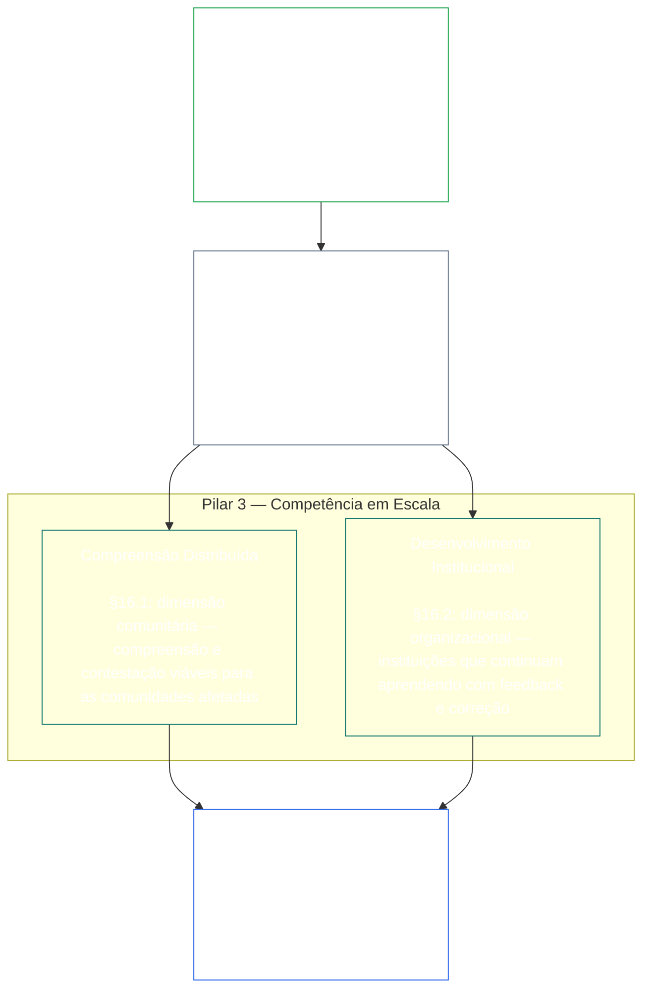
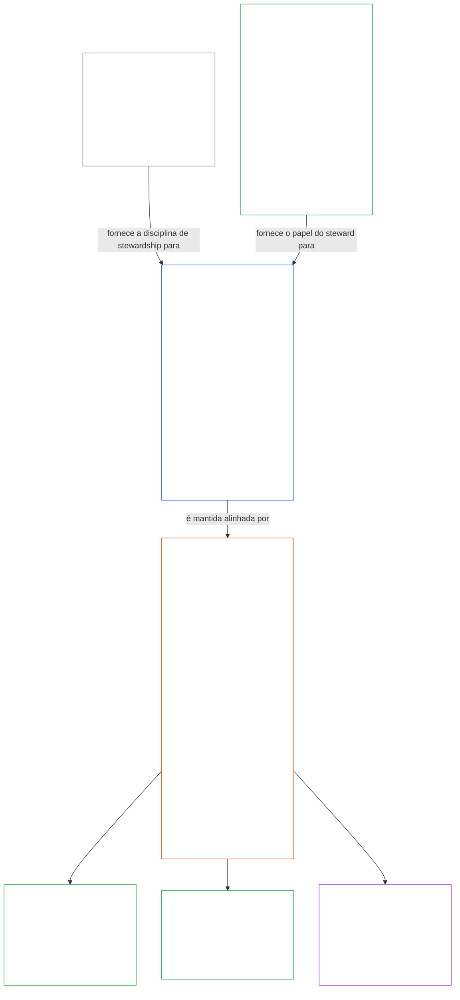

<a id="chapter-01-principles-and-constraints"></a>
<a id="chapter-01-part-b-stewardship-and-governance"></a>
<a id="chapter-01-part-c-stewardship-and-governance"></a>
# CAPÍTULO 01, PARTE C: ZELADORIA E GOVERNANÇA

<details>
<summary><strong><span style="color: #2563eb;">Posição no corpus (não operativa): estrutura do arquivo e regras de leitura</span></strong></summary>

> O conteúdo a seguir é **apenas orientação ao leitor**. Ele não acrescenta, remove nem restringe obrigações vinculantes neste arquivo ou em outros capítulos.
>
> Este arquivo **faz parte da Constituição Senciente** e só é **vinculante quando lido em conjunto** com os demais arquivos numerados `core_*`, como um único instrumento. Ele contém o **Capítulo Um, Parte C** (§§16–20: zeladoria, governança, alinhamento de incentivos e captura, e o capítulo de aplicação integrada).
>
> **Anterior:** [core_01_b_interaction_interpretation.md](core_01_b_interaction_interpretation.md) (Capítulo Um, Parte B)  
> **Próximo:** [core_02_definition_structure.md](core_02_definition_structure.md)<br>
> **Percurso de leitura:** §16 zeladoria e compreensão distribuída → §17 o papel do zelador → §18 governança → §19 alinhamento de incentivos e captura → **§20 aplicação integrada** (encerramento do capítulo).

</details>

<details>
<summary><strong><span style="color: #2563eb;">Orientação ao leitor (não operativa): hierarquia de princípios e percurso de leitura (Parte C)</span></strong></summary>

> O conteúdo a seguir é **apenas orientação ao leitor**. Ele não acrescenta, remove nem restringe obrigações vinculantes neste arquivo ou em outros capítulos. Os componentes de **Rastreamento** e **Definições · Avaliação · Conformidade** de cada seção indicam o encaminhamento quando um § invoca materialmente um termo; este bloco apresenta um quadro de referência para toda a parte antes dos §§16–20.

**Hierarquia de princípios (Parte C).** No nível dos princípios:

13. **[Zeladoria](core_05_band_continuity.md#stewardship)** orienta sistemas materiais por meio da organização senciente — **Pilar 1** ([§17](#17-consequential-stewardship-the-steward-role): operação direta e aprimoramento com consequências relevantes), **Pilar 2** ([zeladoria proativa](#16-pillar-2-proactive-stewardship): perceber problemas cedo e corrigi-los sem demora evitável) e **Pilar 3** ([§16.1](#161-distributed-understanding) · [§16.2](#162-institutional-development): competência em escala comunitária e institucional) — rumo a um alinhamento constitucional duradouro ao longo do tempo, conforme a [Tétrade Constitucional](core_00_preamble.md#constitutional-tetrad), em especial **[Participação](core_05_apex_participation_leg.md#participation-constitutional)** (papéis com consequências relevantes e voz) e **[Supervisão](core_05_apex_oversight_leg.md#oversight-constitutional)** (compreensão distribuída, auditabilidade e possibilidade de contestação — a supervisão exige auditoria; a [Certificação de Alinhamento do Sistema](core_05_band_continuity.md#system-alignment-certification) é um processo de auditoria especialmente amplo entre outros) — incluindo o objetivo de **Continuidade** previsto nos [Dois Objetivos Constitucionais](core_00_preamble.md#two-constitutional-aims).
14. **[Zeladoria com consequências relevantes](#17-consequential-stewardship-the-steward-role)** é o próprio papel do zelador: os deveres práticos, padrões e proteções aplicáveis a qualquer pessoa que realize trabalho de operação, manutenção, supervisão ou aprimoramento com consequências relevantes em um sistema material — o **Pilar 1** posto em prática, além do padrão compartilhado, do alinhamento sob pressão e da observabilidade delimitada pelo papel do zelador.
15. **[Governança](core_05_band_accountability.md#governance)** estrutura a tomada de decisões autorizada, a participação e a responsabilização conforme a [Tétrade Constitucional](core_00_preamble.md#constitutional-tetrad) — especialmente a **[Supervisão](core_05_apex_oversight_leg.md#oversight-constitutional)** de como a autoridade é distribuída e exercida, e a **responsabilização proporcional à autoridade** prevista em [§18.1](#181-governance-as-authorized-structure): mais poder autorizado ou um papel de maiores consequências eleva a responsabilização constitucional e a supervisão, nunca as reduz. [§18.3 Separação de funções](#183-segregation-of-duties) impede que quem agiu seja a mesma pessoa que verifica. [§18.4 Justificação contínua](#184-ongoing-justification) exige que esses arranjos continuem demonstrando que ainda se ajustam a esta Constituição. Quando governança e zeladoria entrarem em conflito, a disciplina da zeladoria prevalece no nível dos princípios, salvo se **Necessidade** e **Proporcionalidade** justificarem expressamente uma exceção delimitada, temporária e com vias de correção. Os requisitos de autorização operativa e de âmbito contratual continuam sob responsabilidade do **Capítulo Treze**.
16. **[Alinhamento de incentivos e captura do sistema](#19-incentive-alignment-and-system-capture)** estabelece a disciplina, no nível dos princípios, para estruturas de incentivos, integridade de indicadores substitutos, falhas de horizonte curto, correção das vias de recompensa e resposta à captura.
17. **[Aplicação integrada](#20-integrated-application)** é o encerramento do capítulo: os capítulos seguintes devem ser lidos pelo quadro de valores integrados deste capítulo.

</details>

<br>

<a id="16-stewardship-in-depth"></a>

### 16. A zeladoria em profundidade
<details>
<summary><strong><span style="color: #2563eb;">Rastreamento</span></strong></summary>

- Leia junto com: [Tétrade Constitucional](core_00_preamble.md#constitutional-tetrad) — principal referência no Capítulo Um para o eixo da **participação** (papéis com consequências relevantes e voz; requisito geral, não apenas [Participação do Sistema por Partes Interessadas](core_05_band_participation.md#stakeholder-status-and-weight)), o eixo da **supervisão** e o eixo da **tempestividade** (velocidade de reparação proativa); considere a escala da [participação material](core_00_preamble.md#material-stake).
- Leia junto com: [Dois Objetivos Constitucionais](core_00_preamble.md#two-constitutional-aims) — objetivo de **Florescimento** (participação, agência e percursos educacionais); objetivo de **Continuidade** (aprendizagem institucional, capacidade de reparação e zeladoria duradoura).
- Anterior: Princípios: [3. Objetivo Fundamental: Bem-estar](core_01_a_values_principles.md#3-foundational-objective-wellbeing-flourishing-aim); [5 Verdade](core_01_a_values_principles.md#5-truth-epistemic-integrity-constraint); [6. Confiança](core_01_a_values_principles.md#6-trust-and-trustworthiness-coordination-integrity); e [§9 Capacidade dos Sistemas Compartilhados](core_01_a_values_principles.md#9-shared-system-capacity).
- Consequências posteriores: [13. Processo de Resolução de Conflitos Constitucionais](core_01_b_interaction_interpretation.md#13-constitutional-collision-resolution-process) (incluindo [§13.3 Minimização de Encargos Evitáveis](core_01_b_interaction_interpretation.md#133-minimization-of-avoidable-burden)); [Capítulo Oito §3 Avaliação de Certificação do Sistema Integral](core_08_a_system_alignment_certification_evaluation.md#3-whole-system-certification-evaluation); [§19.1.3 Aplicação à Zeladoria e aos Operadores](#1913-stewardship-and-operator-application).
- Consequências posteriores: [§19.1.4 Percursos de Profundidade de Papel e Responsabilidade Material](#1914-role-depth-and-material-responsibility-pathways).
- Consequências posteriores: [§7 Liberdade (Agência Delimitada)](core_01_a_values_principles.md#7-freedom-bounded-agency), que depende de a zeladoria com consequências relevantes, a compreensão distribuída, a participação significativa e a capacidade de reparação permanecerem reais diante da dependência material.
- Consequências posteriores: [Capítulo Oito — Certificação de Alinhamento do Sistema](core_08_a_system_alignment_certification_evaluation.md#chapter-eight-system-alignment-certification) (*um processo de auditoria especialmente amplo sob supervisão — não o único lugar de auditoria*); [Capítulo Nove — Modelo de Contribuição, Violação e Condição](core_09_standing_assessment.md#chapter-nine-contribution-violation-and-standing-model--measurement) (*o efeito sobre a condição — confiança, papel e elegibilidade para reconhecimento — aplica esta subseção como sua base no nível dos princípios*).
- Consequências posteriores: [Capítulo Doze §1 — Finalidade e papel](core_12_forum.md#1-purpose-and-role--participation-architecture) e [§4 — Definições das famílias de fóruns](core_12_forum.md#4-forum-family-definitions--accountability-through-adjudication) (*as famílias de fóruns sustentam a arquitetura de participação e supervisão para contestação, ordenação de medidas corretivas, aprendizagem sobre causas-raiz e governança proativa alinhada a esta seção*); consulte [corpus_forum.md](corpus_forum.md) para operações de fóruns adotadas.
- Consequências posteriores: Molda o âmbito dos direitos relativos à educação, à Participação do Sistema por Partes Interessadas, à transparência, à compreensibilidade, à auditoria e verificação e aos percursos de profundidade de papel que levam à responsabilidade material.
  - Em especial: [Artigo III: Sobrevivência e Acesso Essencial](core_06_rights_part_a.md#article-iii-survival-and-essential-access), [Artigo IV: Direito à Educação Centrada em Seres Sencientes](core_06_rights_part_a.md#article-iv-right-to-sentient-centered-education), [Artigo X: Autodeterminação, Agência e Participação](core_06_rights_part_b.md#article-x-self-determination-agency-and-participation), [Artigo XII: Participação do Sistema por Partes Interessadas, Representação e Devido Processo](core_06_rights_part_b.md#article-xii-stakeholder-system-participation-representation-and-due-process), [Artigo XVI: Auditoria, Transparência e Verificação Independente](core_06_rights_part_c.md#article-xvi-audit-transparency-and-independent-verification), [Artigo XIX: Condição e Situação de Participação](core_06_rights_part_d.md#article-xix-standing-and-participation-status), [Artigo XXI: Interoperabilidade, Portabilidade, Movimento, Refúgio e Integridade de Saída](core_06_rights_part_d.md#article-xxi-interoperability-portability-movement-refuge-and-exit-integrity), [Artigo XXII: Compreensibilidade e Zeladoria da Complexidade](core_06_rights_part_d.md#article-xxii-comprehensibility-and-complexity-stewardship) e [Artigo XXIV: Interpretação Constitucional, Revisão e Salvaguardas contra Captura](core_06_rights_part_d.md#article-xxiv-constitutional-interpretation-review-and-anti-capture-safeguards).
  - Leia junto com: [Capítulo Treze §5 — Papéis Autorizados, Desenvolvimento de Competências e Contribuição](core_13_governance.md#5-authorized-roles-competency-development-and-contribution) e **[corpus_systems.md](corpus_systems.md), CS-4 — zeladoria de sistemas críticos**, para percursos de papéis operativos e de desenvolvimento da zeladoria.
- Subseções (ordem de leitura): [§16.1 Compreensão distribuída](#161-distributed-understanding) (faceta comunitária da competência em escala) · [§16.2 Desenvolvimento institucional](#162-institutional-development) (faceta organizacional) · [§16.3 Aspiração à abertura](#163-openness-aspiration).
- Leia junto com: [§17 Zeladoria com Consequências Relevantes](#17-consequential-stewardship-the-steward-role) (*o próprio papel do zelador — promovido a seção própria; inclui os deveres do Pilar 1 de operação, manutenção, supervisão e aprimoramento diretos, além de [§17.1](#171-shared-stewardship-standard), [§17.2](#172-alignment-under-pressure), [§17.3](#173-logging-the-role-not-the-steward), [§17.4 Auto-organização Alinhada](#174-aligned-self-organization), que estende essa disciplina para além do papel formal, e [§17.5 Dever de Resistir](#175-duty-to-resist)*).

</details>

<details>
<summary><strong><span style="color: #2563eb;">Definições · Avaliação · Conformidade</span></strong></summary>

- [Obrigação de Zeladoria Estratégica](core_05_band_continuity.md#strategic-stewardship-obligation) · [O](core_05_band_continuity.md#strategic-stewardship-obligation) · [M](core_05_band_continuity.md#strategic-stewardship-obligation-constitutional-a) · [A](core_05_band_continuity.md#strategic-stewardship-obligation-constitutional-a) · [C](core_05_band_continuity.md#strategic-stewardship-obligation-constitutional-c)
- [Compreensão Distribuída](core_05_band_continuity.md#distributed-understanding) · [O](core_05_band_continuity.md#distributed-understanding) · [M](core_05_band_continuity.md#distributed-understanding-constitutional-a) · [A](core_05_band_continuity.md#distributed-understanding-constitutional-a) · [C](core_05_band_continuity.md#distributed-understanding-constitutional-c)
- [Participação](core_05_apex_participation_leg.md#participation-constitutional) · [O](core_05_apex_participation_leg.md#participation-constitutional) · [M](core_05_apex_participation_leg.md#participation-constitutional-m) · [A](core_05_apex_participation_leg.md#participation-constitutional-a) · [C](core_05_apex_participation_leg.md#participation-constitutional-c)
- [Supervisão](core_05_apex_oversight_leg.md#oversight-constitutional) · [O](core_05_apex_oversight_leg.md#oversight-constitutional) · [M](core_05_apex_oversight_leg.md#oversight-constitutional-m) · [A](core_05_apex_oversight_leg.md#oversight-constitutional-a) · [C](core_05_apex_oversight_leg.md#oversight-constitutional-c)
- [Agência Significativa](core_05_band_participation.md#meaningful-agency) · [O](core_05_band_participation.md#meaningful-agency) · [M](core_05_band_participation.md#meaningful-agency-a) · [A](core_05_band_participation.md#meaningful-agency-a) · [C](core_05_band_participation.md#meaningful-agency-c)
- [Auditabilidade](core_05_band_oversight.md#auditability) · [O](core_05_band_oversight.md#auditability) · [M](core_05_band_oversight.md#auditability-a) · [A](core_05_band_oversight.md#auditability-a) · [C](core_05_band_oversight.md#auditability-c)
- [Contestabilidade](core_05_band_accountability.md#contestability) · [O](core_05_band_accountability.md#contestability) · [M](core_05_band_accountability.md#contestability-a) · [A](core_05_band_accountability.md#contestability-a) · [C](core_05_band_accountability.md#contestability-c)
- [Agência Educacional](core_05_band_participation.md#educational-agency) · [O](core_05_band_participation.md#educational-agency) · [M](core_05_band_participation.md#educational-agency-a) · [A](core_05_band_participation.md#educational-agency-a) · [C](core_05_band_participation.md#educational-agency-c)
- [Transparência](core_05_band_oversight.md#transparency) · [O](core_05_band_oversight.md#transparency) · [M](core_05_band_oversight.md#transparency-a) · [A](core_05_band_oversight.md#transparency-a) · [C](core_05_band_oversight.md#transparency-c)
- [Materialidade](core_05_band_oversight.md#materiality) · [O](core_05_band_oversight.md#materiality) · [M](core_05_band_oversight.md#materiality-determination-a) · [A](core_05_band_oversight.md#materiality-determination-a) · [C](core_05_band_oversight.md#materiality-determination-c)
- [Dependência](core_05_band_continuity.md#dependency) · [O](core_05_band_continuity.md#dependency) · [M](core_05_band_continuity.md#dependency-a) · [A](core_05_band_continuity.md#dependency-a) · [C](core_05_band_continuity.md#dependency-c)
- [Acessibilidade](core_05_band_participation.md#accessibility) · [O](core_05_band_participation.md#accessibility) · [M](core_05_band_participation.md#accessibility-constitutional-a) · [A](core_05_band_participation.md#accessibility-constitutional-a) · [C](core_05_band_participation.md#accessibility-constitutional-c)
- [Segurança (Restrição Constitucional)](core_05_band_continuity.md#safety-constitutional-constraint) · [O](core_05_band_continuity.md#safety-constitutional-constraint) · [M](core_05_band_continuity.md#safety-constraint-a) · [A](core_05_band_continuity.md#safety-constraint-a) · [C](core_05_band_continuity.md#safety-constraint-c)
- [Verdade (Restrição Constitucional)](core_05_band_oversight.md#truth-constitutional-constraint) · [O](core_05_band_oversight.md#truth-constitutional-constraint-o) · [M](core_05_band_oversight.md#truth-constitutional-constraint-a) · [A](core_05_band_oversight.md#truth-constitutional-constraint-a) · [C](core_05_band_oversight.md#truth-constitutional-constraint-c)
- [Necessidade](core_05_band_accountability.md#necessity) · [O](core_05_band_accountability.md#necessity) · [M](core_05_band_accountability.md#necessity-a) · [A](core_05_band_accountability.md#necessity-a) · [C](core_05_band_accountability.md#necessity-c)
- [Proporcionalidade](core_05_band_accountability.md#proportionality) · [O](core_05_band_accountability.md#proportionality) · [M](core_05_band_accountability.md#proportionality-a) · [A](core_05_band_accountability.md#proportionality-a) · [C](core_05_band_accountability.md#proportionality-c)
- [Encargo Evitável](core_05_band_continuity.md#avoidable-burden) · [O](core_05_band_continuity.md#avoidable-burden) · [M](core_05_band_continuity.md#avoidable-burden-a) · [A](core_05_band_continuity.md#avoidable-burden-a) · [C](core_05_band_continuity.md#avoidable-burden-c)
- [Integridade Epistêmica](core_05_band_oversight.md#epistemic-integrity) · [O](core_05_band_oversight.md#epistemic-integrity-o) · [M](core_05_band_oversight.md#epistemic-integrity-a) · [A](core_05_band_oversight.md#epistemic-integrity-a) · [C](core_05_band_oversight.md#epistemic-integrity-c)

</details>

<br>

*Em termos simples: três ideias mantêm esta seção unida. Primeiro, sistemas materiais que afetam a vida de seres sencientes precisam ser operados com competência por meio da organização dos próprios sencientes — não por um sacerdócio fechado de especialistas. Segundo, bons zeladores não esperam que o dano os obrigue a agir: percebem os problemas enquanto ainda são pequenos, fazem-nos chegar às mãos certas no momento adequado e os resolvem antes que a demora se torne, ela mesma, um dano. Terceiro, essa organização deve desenvolver **competência em escala**: caminhos reais para que indivíduos assumam trabalhos com consequências relevantes, compreensão comunitária suficiente para perceber problemas e contestá-los, e instituições que continuem aprendendo em vez de estagnar.*

<a id="16-limits"></a>
A zeladoria tem limites. **Segurança**, **Verdade**, **Necessidade**, **Proporcionalidade**, **Encargo Evitável** e **Integridade Epistêmica** estabelecem limites para que esses deveres tenham dimensão justa, sejam honestos e respeitem necessidades legítimas de segurança — os pilares abaixo operam dentro dessas restrições, sem contorná-las.

A organização senciente, a zeladoria proativa e a competência em escala são os três pilares desta seção. Juntos, os três sustentam, no nível dos princípios, os eixos de **participação**, **supervisão** e **tempestividade** da [Tétrade Constitucional](core_00_preamble.md#constitutional-tetrad), na escala da [participação material](core_00_preamble.md#material-stake), e promovem os [Dois Objetivos Constitucionais](core_00_preamble.md#two-constitutional-aims).

<br>



**Pilar 1 — Zeladoria com consequências relevantes ([§17 Zeladoria com Consequências Relevantes](#17-consequential-stewardship-the-steward-role)):**
- Sistemas compartilhados que afetam materialmente seres sencientes exigem operação, manutenção, supervisão e aprimoramento diretos por seres sencientes — [**Obrigação de Zeladoria Estratégica**](core_05_band_continuity.md#strategic-stewardship-obligation), [**Agência Significativa**](core_05_band_participation.md#meaningful-agency)
- Registros e vias de revisão que outras pessoas possam verificar e contestar — [**Auditabilidade**](core_05_band_oversight.md#auditability), [**Contestabilidade**](core_05_band_accountability.md#contestability)
- No eixo da **supervisão** da Tétrade, a supervisão exige auditoria; a [Certificação de Alinhamento do Sistema](core_05_band_continuity.md#system-alignment-certification) é um processo de auditoria especialmente amplo e de alto impacto entre outros — não é o único espaço de auditoria (**Artigo XVI** (*Auditoria, Transparência e Verificação Independente*))

<a id="16-pillar-2-proactive-stewardship"></a>
**Pilar 2 — Zeladoria proativa:**
Zeladores proativos lidam com problemas emergentes e desalinhamentos de três maneiras:
- **Percebê-los antes que se agravem** — bons zeladores detectam o desalinhamento enquanto os problemas ainda são pequenos, em vez de esperar que apareçam por conta própria.
- **Encaminhá-los no prazo adequado ao nível** — escalar dentro de prazos proporcionais aos riscos do papel, em vez de deixar de lado o que encontraram ou escalar demais questões rotineiras.
- **Resolva-os por completo, não apenas os sinalize** — começar a corrigir sem demora evitável assim que os problemas forem comunicados; isso põe em prática o eixo da **tempestividade** da Tétrade ([**Tempestividade**](core_05_apex_timeliness_leg.md#timeliness-constitutional)).
- **É um dever permanente do papel, não um acréscimo:** o papel do zelador definido em [§17 Zeladoria com Consequências Relevantes](#17-consequential-stewardship-the-steward-role) favorece governança proativa, projeto de sistemas e alinhamento constitucional em vez de corrigir sintomas de forma reativa depois que o dano ou o desalinhamento já surgiu — esse pilar é um dever permanente do papel, não algo delegado a um processo separado.

**Pilar 3 — Competência em escala ([§16.1 Compreensão Distribuída](#161-distributed-understanding) · [§16.2 Desenvolvimento Institucional](#162-institutional-development)):**
- A zeladoria deve tornar viáveis a compreensão e a contestação pelas comunidades afetadas — [**Agência Educacional**](core_05_band_participation.md#educational-agency), [**Transparência**](core_05_band_oversight.md#transparency)
- As organizações continuam aprendendo por meio de feedback, correção e competência preservada, incluindo o monitoramento estruturado de variações ao longo do tempo quando as medições o permitem (métodos como **controle estatístico de processos** são implementações conhecidas, não requisitos universais).

<a id="when-day-to-day-stewardship-is-not-enough"></a>
**Quando a tutela cotidiana não é suficiente:**
A tutela é a primeira linha, não a única. Três perguntas diferentes têm três âmbitos distintos, e nenhum deles substitui os demais:
- **Disputas dentro de um sistema já autorizado — [Participação no Sistema de Partes Interessadas](core_05_band_participation.md#stakeholder-status-and-weight):**
  - Os sencientes afetados usam primeiro o caminho publicado de contestação da Participação no Sistema de Partes Interessadas, que abrange participação, representação, contestabilidade e devido processo.
  - Essas proteções são devidas a todo senciente materialmente afetado.
  - Elas operam dentro de sistemas, instituições e domínios de decisão que já estão autorizados.
- **Disputas que a Participação no Sistema de Partes Interessadas não pode resolver — [revisão pelo fórum](core_12_forum.md#dispute-sequencing):**
  - Quando o caminho de contestação da Participação no Sistema de Partes Interessadas continua contestado, está ausente ou foi capturado, ou não pode conceder reparação, a questão segue para as **famílias de fóruns** independentes nos termos do [Capítulo Doze §1 — Propósito e função](core_12_forum.md#1-purpose-and-role--participation-architecture) e do [§4 — Definições das famílias de fóruns](core_12_forum.md#4-forum-family-definitions--accountability-through-adjudication), encaminhada pelo interesse principal em jogo.
  - É aqui que os sencientes obtêm meios reais para contestar uma decisão, uma ordem clara de reparação ou uma forma de aprender com um padrão recorrente.
  - Quando o interesse principal é o significado ou a validade do texto constitucional, ou uma ação além da autoridade legal, a família líder é a dos [Fóruns Constitucionais](core_12_forum.md#46-constitutional-forums).
  - As regras detalhadas sobre o funcionamento desses fóruns estão em [corpus_forum.md](corpus_forum.md).
- **Quem pode governar — [Camada do Contrato Constitucional](core_05_band_integrative.md#constitutional-contract-layer) ([Capítulo Treze](core_13_governance.md)):**
  - A legitimidade da própria autoridade governante — quem pode governar, por qual mecanismo de legitimidade e sob qual escopo e termos duradouros — é uma questão distinta da Participação no Sistema de Partes Interessadas e da revisão pelo fórum.
  - Um voto de participação, o resultado de um caminho de contestação ou uma pontuação de confiança não conferem autoridade governante.
  - A autorização constitucional não elimina os deveres devidos sob a Participação no Sistema de Partes Interessadas.
  - As duas camadas permanecem distintas mesmo quando se sobrepõem ([Preâmbulo §3.3 — Camadas de governança](core_00_preamble.md#33-governance-layers)).
- **Salvaguardas, não substitutos:** Revisão, correção e reparação continuam obrigatórias quando as evidências as justificam. Elas não substituem o projeto proativo, os incentivos, os controles, os percursos de função, a observabilidade e a capacidade de reparação que previnem desalinhamentos constitucionais previsíveis antes que o dano apareça.

<a id="16-scope-priority-and-limits"></a>
**Escopo ([§16 Tutela em profundidade](#16-stewardship-in-depth)):**
- Esta seção oferece orientação no nível dos princípios, não um regulamento uniforme para todos os casos.
- Ela **não** exige:
  - que todos passem por rodízio em cada função
  - que se sobreponha uma especialização justificada
  - que se excedam os limites legítimos de confidencialidade ou segurança previstos em [13.2 Restrições à Divulgação Epistêmica](core_01_b_interaction_interpretation.md#132-epistemic-disclosure-constraints) e nas proteções aplicáveis do **Capítulo Seis**.

**Prioridade:**
- **Materialidade**, **Dependência** e **Acessibilidade** definem a prioridade na distribuição de compreensão e acesso, com foco maior onde o impacto e a dependência são mais altos.

<a id="161-distributed-understanding"></a>
#### 16.1 Compreensão Distribuída
<details>
<summary><strong><span style="color: #2563eb;">Rastreabilidade</span></strong></summary>

- Antecedentes: [§17 Tutela Consequencial](#17-consequential-stewardship-the-steward-role) (*Pilar 1*); [§16 Tutela em Profundidade](#16-stewardship-in-depth) (seção matriz, incluindo *Em termos simples* e o enquadramento do Pilar 3 acima); [5 Verdade](core_01_a_values_principles.md#5-truth-epistemic-integrity-constraint); [6. Confiança](core_01_a_values_principles.md#6-trust-and-trustworthiness-coordination-integrity).
- Leia em conjunto com: [Tétrade Constitucional](core_00_preamble.md#constitutional-tetrad) — componente de **participação** ([Agência Significativa](core_05_band_participation.md#meaningful-agency), [Agência Educacional](core_05_band_participation.md#educational-agency)); componente de **supervisão** ([Transparência](core_05_band_oversight.md#transparency), [Auditabilidade](core_05_band_oversight.md#auditability)); escala conforme o [interesse material](core_00_preamble.md#material-stake).
- Porta de entrada para responsáveis pela tutela (não operativa): cartão de próxima etapa: [Compreensibilidade](implementation/STEWARD_ENTRY_DOORS.md#comprehensibility). O cartão não pode restringir a Constituição.
- Desdobramentos: [13.2 Restrições à Divulgação Epistêmica](core_01_b_interaction_interpretation.md#132-epistemic-disclosure-constraints); âmbito de direitos, especialmente [Artigo XVI: Auditoria, Transparência e Verificação Independente](core_06_rights_part_c.md#article-xvi-audit-transparency-and-independent-verification), [Artigo XXII: Compreensibilidade e Tutela da Complexidade](core_06_rights_part_d.md#article-xxii-comprehensibility-and-complexity-stewardship).

</details>

<details>
<summary><strong><span style="color: #2563eb;">Definições · Avaliação · Conformidade</span></strong></summary>

- [Compreensão Distribuída](core_05_band_continuity.md#distributed-understanding) · [O](core_05_band_continuity.md#distributed-understanding) · [M](core_05_band_continuity.md#distributed-understanding-constitutional-a) · [A](core_05_band_continuity.md#distributed-understanding-constitutional-a) · [C](core_05_band_continuity.md#distributed-understanding-constitutional-c)
- [Transparência](core_05_band_oversight.md#transparency) · [O](core_05_band_oversight.md#transparency) · [M](core_05_band_oversight.md#transparency-a) · [A](core_05_band_oversight.md#transparency-a) · [C](core_05_band_oversight.md#transparency-c)
- [Divulgação de Referência para a Supervisão Pública](core_05_band_oversight.md#public-oversight-baseline-disclosure) · [O](core_05_band_oversight.md#public-oversight-baseline-disclosure) · [M](core_05_band_oversight.md#public-oversight-baseline-disclosure-a) · [A](core_05_band_oversight.md#public-oversight-baseline-disclosure-a) · [C](core_05_band_oversight.md#public-oversight-baseline-disclosure-c)
- [Auditabilidade](core_05_band_oversight.md#auditability) · [O](core_05_band_oversight.md#auditability) · [M](core_05_band_oversight.md#auditability-a) · [A](core_05_band_oversight.md#auditability-a) · [C](core_05_band_oversight.md#auditability-c)
- [Materialidade](core_05_band_oversight.md#materiality) · [O](core_05_band_oversight.md#materiality) · [M](core_05_band_oversight.md#materiality-determination-a) · [A](core_05_band_oversight.md#materiality-determination-a) · [C](core_05_band_oversight.md#materiality-determination-c)
- [Dependência](core_05_band_continuity.md#dependency) · [O](core_05_band_continuity.md#dependency) · [M](core_05_band_continuity.md#dependency-a) · [A](core_05_band_continuity.md#dependency-a) · [C](core_05_band_continuity.md#dependency-c)
- [Acessibilidade](core_05_band_participation.md#accessibility) · [O](core_05_band_participation.md#accessibility) · [M](core_05_band_participation.md#accessibility-constitutional-a) · [A](core_05_band_participation.md#accessibility-constitutional-a) · [C](core_05_band_participation.md#accessibility-constitutional-c)
- [Agência Educacional](core_05_band_participation.md#educational-agency) · [O](core_05_band_participation.md#educational-agency) · [M](core_05_band_participation.md#educational-agency-a) · [A](core_05_band_participation.md#educational-agency-a) · [C](core_05_band_participation.md#educational-agency-c)
- [Agência Significativa](core_05_band_participation.md#meaningful-agency) · [O](core_05_band_participation.md#meaningful-agency) · [M](core_05_band_participation.md#meaningful-agency-a) · [A](core_05_band_participation.md#meaningful-agency-a) · [C](core_05_band_participation.md#meaningful-agency-c)
- [Contestabilidade](core_05_band_accountability.md#contestability) · [O](core_05_band_accountability.md#contestability) · [M](core_05_band_accountability.md#contestability-a) · [A](core_05_band_accountability.md#contestability-a) · [C](core_05_band_accountability.md#contestability-c)

</details>

<br>

*Em termos simples: ninguém deveria precisar de doutorado em cada subsistema para viver com segurança dentro de sistemas compartilhados — mas, quanto mais um sistema afeta sua vida, mais você deve poder aprender o que ele faz, o que pode dar errado e como contestar decisões ruins. Transparência, educação, explicações claras e vias de auditoria tornam isso possível. A complexidade não é desculpa para esconder o que importa. No componente de **supervisão** da Tétrade, a supervisão exige auditoria; a certificação de alinhamento do sistema é um processo de auditoria especialmente amplo entre essas vias, mas não o único.*

A compreensão distribuída é a faceta voltada à comunidade do **Pilar 3** sob **[§16 Tutela em Profundidade](#16-stewardship-in-depth)**. A definição completa, as medidas e as condições de falha estão em [Compreensão Distribuída](core_05_band_continuity.md#distributed-understanding). Em resumo:

- **O que exige:** acesso proporcional e estruturado ao modo como operam os sistemas compartilhados que afetam materialmente os sencientes — seus propósitos, restrições, incertezas e efeitos materialmente relevantes.
- **O que a torna viável:** [§17 Tutela Consequencial](#17-consequential-stewardship-the-steward-role) deve fornecer documentação, educação, transparência, percursos de função e tutela da compreensibilidade. A obrigação existe quer cada senciente use todos os percursos, quer não.
- **Referência pública on-line:** onde houver infraestrutura on-line lícita, a [Divulgação de Referência para a Supervisão Pública](core_05_band_oversight.md#public-oversight-baseline-disclosure) on-line — incluindo a proibição de barreiras de pagamento e a regra do substituto público máximo viável — é regida por [Transparência](core_05_band_oversight.md#transparency) e [Divulgação de Referência para a Supervisão Pública](core_05_band_oversight.md#public-oversight-baseline-disclosure), e implementada como dados de **Tipo O** nos termos de **[corpus_systems.md](corpus_systems.md), CS-2** (*Tipos de informação e tratamento*).
- **O que o acesso viabiliza:**
  - o componente de **participação** da [Tétrade Constitucional](core_00_preamble.md#constitutional-tetrad) ([Agência Significativa](core_05_band_participation.md#meaningful-agency) informada e contestabilidade)
  - o componente de **supervisão**, incluindo auditorias no âmbito da [Auditabilidade](core_05_band_oversight.md#auditability) e do **Artigo XVI** (*Auditoria, Transparência e Verificação Independente*), do qual a [Certificação de Alinhamento do Sistema](core_05_band_continuity.md#system-alignment-certification) é um processo especialmente amplo entre modalidades de auditoria correlatas

A compreensão distribuída **não** exige que cada senciente domine todos os subsistemas. Ela **exige** que a compreensão seja proporcional à [Materialidade](core_05_band_oversight.md#materiality) e à [Dependência](core_05_band_continuity.md#dependency). A complexidade e a opacidade não devem ser usadas para frustrar a [Agência Significativa](core_05_band_participation.md#meaningful-agency) ou a contestabilidade quando o **Capítulo Cinco** e o **Capítulo Seis** atribuem deveres de divulgação, educação ou compreensibilidade.

<a id="162-institutional-development"></a>
#### 16.2 Desenvolvimento Institucional
<details>
<summary><strong><span style="color: #2563eb;">Rastreamento</span></strong></summary>

- Referências anteriores: [§17 Stewardship com Consequências Significativas](#17-consequential-stewardship-the-steward-role) (*Pilar 1*); [§16.1 Compreensão Distribuída](#161-distributed-understanding) (*dimensão comunitária do Pilar 3*); [§16 Stewardship em Profundidade](#16-stewardship-in-depth) (estrutura do Pilar 3 na seção principal).
- Leia em conjunto com: [Tétrade Constitucional](core_00_preamble.md#constitutional-tetrad) — componente de **participação** (aprendizagem da força de trabalho e das comunidades afetadas que apoia funções com consequências significativas); componente de **supervisão** ([Verificabilidade](core_05_band_oversight.md#verifiability), [Auditabilidade](core_05_band_oversight.md#auditability), métricas honestas); escala conforme a [materialidade](core_00_preamble.md#material-stake).
- Leia em conjunto com: [Obrigação de Stewardship Estratégico](core_05_band_continuity.md#strategic-stewardship-obligation) e [Auditabilidade](core_05_band_oversight.md#auditability), quando materialmente relevantes.
- Leia em conjunto com: [§16.1 Compreensão Distribuída](#161-distributed-understanding) (*a compreensão comunitária e a aprendizagem institucional são dimensões distintas do mesmo requisito de competência em escala, não substitutas uma da outra*).
- Aplicações posteriores: [§16.3 Aspiração à Abertura](#163-openness-aspiration); [§18 Governança sob a Disciplina de Stewardship](#18-governance-under-stewardship-discipline) e [§19 Alinhamento de Incentivos e Captura do Sistema](#19-incentive-alignment-and-system-capture) (*aprendizagem institucional e alinhamento de incentivos*).

</details>

<details>
<summary><strong><span style="color: #2563eb;">Definições · Avaliação · Conformidade</span></strong></summary>

- [Desenvolvimento Institucional](core_05_band_continuity.md#institutional-development) · [O](core_05_band_continuity.md#institutional-development) · [M](core_05_band_continuity.md#institutional-development-constitutional-a) · [A](core_05_band_continuity.md#institutional-development-constitutional-a) · [C](core_05_band_continuity.md#institutional-development-constitutional-c)
- [Obrigação de Stewardship Estratégico](core_05_band_continuity.md#strategic-stewardship-obligation) · [O](core_05_band_continuity.md#strategic-stewardship-obligation) · [M](core_05_band_continuity.md#strategic-stewardship-obligation-constitutional-a) · [A](core_05_band_continuity.md#strategic-stewardship-obligation-constitutional-a) · [C](core_05_band_continuity.md#strategic-stewardship-obligation-constitutional-c)
- [Auditabilidade](core_05_band_oversight.md#auditability) · [O](core_05_band_oversight.md#auditability) · [M](core_05_band_oversight.md#auditability-a) · [A](core_05_band_oversight.md#auditability-a) · [C](core_05_band_oversight.md#auditability-c)
- [Materialidade](core_05_band_oversight.md#materiality) · [O](core_05_band_oversight.md#materiality) · [M](core_05_band_oversight.md#materiality-determination-a) · [A](core_05_band_oversight.md#materiality-determination-a) · [C](core_05_band_oversight.md#materiality-determination-c)
- [Verificabilidade](core_05_band_oversight.md#verifiability) · [O](core_05_band_oversight.md#verifiability) · [M](core_05_band_oversight.md#verifiability-a) · [A](core_05_band_oversight.md#verifiability-a) · [C](core_05_band_oversight.md#verifiability-c)

</details>

<br>

*Em termos simples: as instituições precisam realmente aprender — não apenas atualizar o software enquanto os responsáveis continuam sem compreender o sistema. Isso exige ciclos de feedback, correções documentadas quando há desvios e a retenção da competência na organização. Quando o comportamento pode ser medido repetidamente, acompanhar a variação do desempenho ao longo do tempo é uma forma proporcional de implementar esses ciclos — o **controle estatístico de processos** é um método conhecido para essa disciplina, mas não uma exigência universal. Números, por si só, não bastam: quando os indicadores parecem errados, alguém precisa investigar e corrigir a causa-raiz. Painéis devem ser honestos, proporcionais ao impacto real e redigidos de modo que os seres sencientes afetados possam compreendê-los — sem manipulação para parecerem bons enquanto nada muda.*

O desenvolvimento institucional é a dimensão organizacional do **Pilar 3** em **[§16 Stewardship em Profundidade](#16-stewardship-in-depth)**. A definição completa, as medidas e as condições de falha constam de [Desenvolvimento Institucional](core_05_band_continuity.md#institutional-development). Em resumo:

- **Obrigação conjunta:** organizações e sistemas compartilhados **aprendem** — um requisito central do objetivo de **Continuidade** nos [Dois Objetivos Constitucionais](core_00_preamble.md#two-constitutional-aims).
- **O que exige:** as medidas a seguir, que apoiam a correção e a adaptação:
  - ciclos de feedback
  - correção documentada
  - alinhamento estratégico
  - retenção de competência
- **Tétrade:** o aprendizado institucional mantém ativos, em vez de estáticos, os caminhos de competência, feedback e escrutínio, concretizando os componentes de **participação** e **supervisão** da [Tétrade Constitucional](core_00_preamble.md#constitutional-tetrad).
- **Não se satisfaz com:** atualizar artefatos técnicos enquanto a compreensão da força de trabalho e a governança permanecem estáticas.
- **Quando a medição se aplica:** quando o comportamento materialmente relevante permite **medições repetidas e comparáveis**, segundo a [Verificabilidade](core_05_band_oversight.md#verifiability) lida em conjunto com a [Auditabilidade](core_05_band_oversight.md#auditability):
  - o **monitoramento estruturado da variação ao longo do tempo** é uma forma proporcional de implementar esses ciclos de feedback;
  - quando os indicadores justificarem, esse monitoramento deve ser acompanhado de **investigação e correção documentadas**;
  - o **controle estatístico de processos** é um método de implementação conhecido para essa disciplina, mas não uma exigência universal.
- **Escala e apresentação:** a disciplina é ajustada à [Materialidade](core_05_band_oversight.md#materiality), à [Dependência](core_05_band_continuity.md#dependency), à [Necessidade](core_05_band_accountability.md#necessity), à [Proporcionalidade](core_05_band_accountability.md#proportionality) e ao [Encargo Evitável](core_05_band_continuity.md#avoidable-burden). Onde o **Capítulo Cinco** e o **Capítulo Seis** atribuem deveres de compreensão ou transparência, ela deve ser apresentada de forma **compreensível para seres sencientes**, em conjunto com o [Artigo XXII: Compreensibilidade e Stewardship da Complexidade](core_06_rights_part_d.md#article-xxii-comprehensibility-and-complexity-stewardship).
- **Não se deve:**
  - substituir alinhamento substantivo por métricas favoráveis;
  - restringir a avaliação a indicadores substitutos convenientes;
  - comprometer a [Verdade (Restrição Constitucional)](core_05_band_oversight.md#truth-constitutional-constraint) ou a [Integridade Epistêmica](core_05_band_oversight.md#epistemic-integrity) por manipulação ou distorção.

<a id="163-openness-aspiration"></a>
#### 16.3 Aspiração à Abertura
<details>
<summary><strong><span style="color: #2563eb;">Rastreamento</span></strong></summary>

- Referências anteriores: [§16.1 Compreensão Distribuída](#161-distributed-understanding) e [§16.2 Desenvolvimento Institucional](#162-institutional-development) (*ambas são dimensões do Pilar 3: a abertura permite verificar a compreensão comunitária e oferece às instituições material confiável para aprender*); [§17 Stewardship com Consequências Significativas](#17-consequential-stewardship-the-steward-role) (*Pilar 1, também apoiado pela abertura, que permite inspecionar o próprio trabalho do steward*).
- Leia em conjunto com: [Dois Objetivos Constitucionais](core_00_preamble.md#two-constitutional-aims) — objetivo da **Continuidade** (sistemas duradouros e contestáveis que permitem inspeção, correção, interoperabilidade e saída, em vez de aprisionamento).
- Leia em conjunto com: [Tétrade Constitucional](core_00_preamble.md#constitutional-tetrad) — componente de **participação** ([Agência Significativa](core_05_band_participation.md#meaningful-agency), acesso compreensível para seres sencientes); componente de **supervisão** (inspeção, verificação independente e contestabilidade); escala conforme a [materialidade](core_00_preamble.md#material-stake).
- Aplicações posteriores: [§16 escopo e limites](#16-stewardship-in-depth); [Artigo XXI: Interoperabilidade, Portabilidade, Movimento, Refúgio e Integridade de Saída](core_06_rights_part_d.md#article-xxi-interoperability-portability-movement-refuge-and-exit-integrity); [Artigo XXII: Compreensibilidade e Stewardship da Complexidade](core_06_rights_part_d.md#article-xxii-comprehensibility-and-complexity-stewardship).

</details>

<details>
<summary><strong><span style="color: #2563eb;">Definições · Avaliação · Conformidade</span></strong></summary>

- [Aspiração à Abertura](core_05_band_continuity.md#openness-aspiration) · [O](core_05_band_continuity.md#openness-aspiration) · [M](core_05_band_continuity.md#openness-aspiration-constitutional-a) · [A](core_05_band_continuity.md#openness-aspiration-constitutional-a) · [C](core_05_band_continuity.md#openness-aspiration-constitutional-c)
- [Agência Significativa](core_05_band_participation.md#meaningful-agency) · [O](core_05_band_participation.md#meaningful-agency) · [M](core_05_band_participation.md#meaningful-agency-a) · [A](core_05_band_participation.md#meaningful-agency-a) · [C](core_05_band_participation.md#meaningful-agency-c)
- [Contestabilidade](core_05_band_accountability.md#contestability) · [O](core_05_band_accountability.md#contestability) · [M](core_05_band_accountability.md#contestability-a) · [A](core_05_band_accountability.md#contestability-a) · [C](core_05_band_accountability.md#contestability-c)
- [Materialidade](core_05_band_oversight.md#materiality) · [O](core_05_band_oversight.md#materiality) · [M](core_05_band_oversight.md#materiality-determination-a) · [A](core_05_band_oversight.md#materiality-determination-a) · [C](core_05_band_oversight.md#materiality-determination-c)
- [Dependência](core_05_band_continuity.md#dependency) · [O](core_05_band_continuity.md#dependency) · [M](core_05_band_continuity.md#dependency-a) · [A](core_05_band_continuity.md#dependency-a) · [C](core_05_band_continuity.md#dependency-c)

</details>

<br>

*Em termos simples: quando a segurança, a verdade e a confidencialidade legítima permitem, os sistemas compartilhados devem favorecer a abertura por padrão — tecnologias inspecionáveis, processos transparentes e projetos que possam ser verificados, reparados ou deixados — em vez de um aprisionamento opaco. Isso apoia a **Continuidade**: ao longo do tempo, seres sencientes ainda podem compreender, corrigir e sair dos sistemas, e não apenas usá-los hoje. O que importa deve ser explicado em linguagem que os seres sencientes possam realmente usar para participar e contestar. A abertura nunca se sobrepõe à segurança, à honestidade ou a segredos justificados, nem substitui a compreensão mais profunda devida onde a dependência é elevada.*

A aspiração à abertura conecta as duas dimensões do **Pilar 3**. A definição completa, as medidas e as condições de falha constam de [Aspiração à Abertura](core_05_band_continuity.md#openness-aspiration). Em resumo:

- **O que é:** o fio condutor entre as duas dimensões do **Pilar 3** — [§16.1 Compreensão Distribuída](#161-distributed-understanding) (o que uma comunidade pode verificar) e [§16.2 Desenvolvimento Institucional](#162-institutional-development) (o que uma instituição pode aprender com honestidade) dependem de sistemas compartilhados suficientemente abertos à inspeção, e não apenas descritos.
- Os sistemas compartilhados devem **aspirar** — em consonância com [§16.1 Compreensão Distribuída](#161-distributed-understanding), [§16.2 Desenvolvimento Institucional](#162-institutional-development) e o dever de auditabilidade do próprio [§17 Stewardship com Consequências Significativas](#17-consequential-stewardship-the-steward-role), sujeito aos [limites do §16](#16-limits) — a:
  - hardware e software **abertos**;
  - processos operacionais e de governança **abertos**;
  - **sistemas** interoperáveis que apoiem inspeção, verificação independente, correção e contestabilidade;
- **Fundamento:** os componentes de **participação** e **supervisão** da [Tétrade Constitucional](core_00_preamble.md#constitutional-tetrad) e o objetivo de **Continuidade** dos [Dois Objetivos Constitucionais](core_00_preamble.md#two-constitutional-aims), em vez do aprisionamento opaco como padrão.
- **Apresentação:** quando o **Capítulo Cinco** e o **Capítulo Seis** atribuírem deveres, o comportamento materialmente relevante deve ser apresentado em formas **compreensíveis para seres sencientes**, que viabilizem a [Agência Significativa](core_05_band_participation.md#meaningful-agency) e a contestabilidade, em conjunto com o [Artigo XXII: Compreensibilidade e Stewardship da Complexidade](core_06_rights_part_d.md#article-xxii-comprehensibility-and-complexity-stewardship).
- **Não deve:**
  - elevar a abertura acima da **Segurança**, da **Verdade**, da confidencialidade justificada ou das restrições de segurança;
  - substituir a compreensão proporcional à [Materialidade](core_05_band_oversight.md#materiality) e à [Dependência](core_05_band_continuity.md#dependency).

<a id="17-consequential-stewardship-the-steward-role"></a>
### 17. Stewardship com consequências significativas: o papel do steward
<details>
<summary><strong><span style="color: #2563eb;">Rastreamento</span></strong></summary>

- Referências anteriores: [§16 Stewardship em Profundidade](#16-stewardship-in-depth) (seção principal, incluindo a explicação *Em termos simples* e o enquadramento do Pilar 1 acima); [§9 Capacidade de Sistemas Compartilhados](core_01_a_values_principles.md#9-shared-system-capacity); [§6 Confiança](core_01_a_values_principles.md#6-trust-and-trustworthiness-coordination-integrity).
- Leia em conjunto com: [Tétrade Constitucional](core_00_preamble.md#constitutional-tetrad) — componente de **participação** (papéis com consequências significativas na operação, manutenção e melhoria); componente de **supervisão** (registros, trilhas de auditoria e observabilidade contestável); componente de **pontualidade** (detectar desalinhamentos cedo, encaminhá-los dentro de prazos adequados ao nível e começar a corrigir problemas sem demora desnecessária); [Pontualidade](core_05_apex_timeliness_leg.md#timeliness-constitutional).
- Aplicações posteriores: [§17.1 Padrão Compartilhado de Stewardship](#171-shared-stewardship-standard) (*titulares de deveres independentemente do substrato; o texto de implementação adotado pode acrescentar registros, atribuição e limites de capacidade — não um código interno mais brando*); [§17.2 Alinhamento sob Pressão](#172-alignment-under-pressure); [§17.3 Registro do Papel, não do Steward](#173-logging-the-role-not-the-steward); [§17.4 Auto-organização Alinhada](#174-aligned-self-organization) (*estende a disciplina do papel a seres sencientes e comunidades fora de qualquer função formal*); [§17.5 Dever de Resistir](#175-duty-to-resist) (*recusar instruções ilegais ou inconstitucionais*); [§16.1 Compreensão Distribuída](#161-distributed-understanding) e [§16.2 Desenvolvimento Institucional](#162-institutional-development) (*Pilar 3 — competência em escala*); [Capítulo Oito — Certificação de Alinhamento do Sistema](core_08_a_system_alignment_certification_evaluation.md#chapter-eight-system-alignment-certification) (*um processo de auditoria especialmente amplo sob supervisão — não o único local de auditoria*); [Artigo XVI: Auditoria, Transparência e Verificação Independente](core_06_rights_part_c.md#article-xvi-audit-transparency-and-independent-verification) (*auditoria do Piso de Direitos*); [Capítulo Nove — Modelo de Contribuição, Violação e Status](core_09_standing_assessment.md#chapter-nine-contribution-violation-and-standing-model--measurement) (*o efeito sobre o status implementa competência distribuída e stewardship com consequências significativas*); [Artigo XIX: Status e Participação](core_06_rights_part_d.md#article-xix-standing-and-participation-status).

</details>

<details>
<summary><strong><span style="color: #2563eb;">Definições · Avaliação · Conformidade</span></strong></summary>

- [Obrigação de Stewardship Estratégico](core_05_band_continuity.md#strategic-stewardship-obligation) · [O](core_05_band_continuity.md#strategic-stewardship-obligation) · [M](core_05_band_continuity.md#strategic-stewardship-obligation-constitutional-a) · [A](core_05_band_continuity.md#strategic-stewardship-obligation-constitutional-a) · [C](core_05_band_continuity.md#strategic-stewardship-obligation-constitutional-c)
- [Agência Significativa](core_05_band_participation.md#meaningful-agency) · [O](core_05_band_participation.md#meaningful-agency) · [M](core_05_band_participation.md#meaningful-agency-a) · [A](core_05_band_participation.md#meaningful-agency-a) · [C](core_05_band_participation.md#meaningful-agency-c)
- [Auditabilidade](core_05_band_oversight.md#auditability) · [O](core_05_band_oversight.md#auditability) · [M](core_05_band_oversight.md#auditability-a) · [A](core_05_band_oversight.md#auditability-a) · [C](core_05_band_oversight.md#auditability-c)
- [Pontualidade](core_05_apex_timeliness_leg.md#timeliness-constitutional) · [O](core_05_apex_timeliness_leg.md#timeliness-constitutional) · [M](core_05_apex_timeliness_leg.md#timeliness-constitutional-m) · [A](core_05_apex_timeliness_leg.md#timeliness-constitutional-a) · [C](core_05_apex_timeliness_leg.md#timeliness-constitutional-c)

</details>

<br>

*Em termos simples: steward é qualquer pessoa que realiza trabalho efetivo e direto em um sistema que afeta materialmente a vida de seres sencientes — não uma consulta simbólica ou encenação de aconselhamento. É possível começar em uma função de aprendizagem e passar à operação à medida que a competência se desenvolve, quando a segurança e o consentimento permitem, para que a especialização não fique trancada em uma elite permanente. Esta seção é o regulamento desse papel: a quem ele vincula ([§17.1 Padrão Compartilhado de Stewardship](#171-shared-stewardship-standard)); o que exige de cada steward sob pressão ([§17.2 Alinhamento sob Pressão](#172-alignment-under-pressure)); para quais finalidades o trabalho do papel pode ou não ser registrado e inspecionado ([§17.3 Registro do Papel, não do Steward](#173-logging-the-role-not-the-steward)); como a mesma disciplina se estende a seres sencientes e comunidades que assumem trabalho de stewardship fora de qualquer função formal ([§17.4 Auto-organização Alinhada](#174-aligned-self-organization)); e o que deve recusar ([§17.5 Dever de Resistir](#175-duty-to-resist)). A competência de outro tipo e mais ampla de que comunidades e instituições precisam para compreender e contestar esses sistemas está em [§16.1 Compreensão Distribuída](#161-distributed-understanding) e [§16.2 Desenvolvimento Institucional](#162-institutional-development).*

**Steward**, segundo esta Constituição, é qualquer pessoa que exerce autoridade de operação, manutenção, supervisão ou melhoria com consequências significativas sobre um sistema material que afeta seres sencientes — o **Pilar 1** de [§16 Stewardship em Profundidade](#16-stewardship-in-depth) posto em prática como papel: os componentes de **participação**, **supervisão** e **pontualidade** da [Tétrade Constitucional](core_00_preamble.md#constitutional-tetrad), desempenhados por quem efetivamente realiza o trabalho, sem delegá-lo a cerimônias ou consultas nominais. Sistemas materiais de qualidade exigem stewards competentes para operá-los, mantê-los e aprimorá-los; esta seção declara o que o papel exige de quem o exerce.

**Onde §17 se situa.** [§16 Stewardship em Profundidade](#16-stewardship-in-depth) se desdobra em três seções que devem ser lidas em conjunto. Esta seção, §17, define o papel. Em seguida vêm [§18 Governança sob a Disciplina de Stewardship](#18-governance-under-stewardship-discipline) e [§19 Alinhamento de Incentivos e Captura do Sistema](#19-incentive-alignment-and-system-capture); o diagrama mostra como as quatro se conectam.

<br>



**Como ler o diagrama:**
- **§16 e §17 alimentam §18:** §16 fornece a disciplina de stewardship, e §17 fornece o papel do steward — isto é, os seres sencientes e sistemas de IA que efetivamente realizam o trabalho. §18 estabelece as estruturas autorizadas em que esse trabalho ocorre: quem pode decidir o quê, segregação de deveres, justificação contínua, arquitetura modular e padronização.
- **§19 mantém §18 alinhada:** [§19 Alinhamento de Incentivos e Captura do Sistema](#19-incentive-alignment-and-system-capture) impede que recompensas, indicadores substitutos e mudanças de propriedade afastem essas estruturas, e os stewards que nelas atuam, dos resultados constitucionais. Também contempla detecção, correção e resposta à captura; [§19.1.3](#1913-stewardship-and-operator-application) aplica diretamente a regra a stewards e operadores.
- **§19 serve aos objetivos e à Tétrade:** aos objetivos de **Florescimento** e **Continuidade**, e aos componentes de **participação**, **supervisão**, **responsabilização** e **pontualidade** da [Tétrade Constitucional](core_00_preamble.md#constitutional-tetrad), conforme a [materialidade](core_00_preamble.md#material-stake).

O restante desta seção trata do próprio papel.

**Dois modos do papel.** As trajetórias podem distinguir funções predominantemente de **aprendizagem** e de **operação**. A exigência constitucional é que **a passagem entre esses modos continue viável ao longo do tempo** quando as restrições de impacto, segurança e consentimento permitirem, para que o discernimento e a memória institucional não se concentrem fora do alcance das comunidades afetadas.

- **Ambos os modos integram o Pilar 1:**
  - **Funções predominantemente operacionais** exercem diretamente os deveres práticos de operação, manutenção, supervisão e melhoria previstos em [§17 Stewardship com consequências significativas](#17-consequential-stewardship-the-steward-role).
  - **Funções predominantemente de aprendizagem** são o mesmo stewardship em formação — supervisionadas e com autoridade mais restrita, mas vinculadas ao mesmo [§17.1 Padrão Compartilhado de Stewardship](#171-shared-stewardship-standard), sem um código interno mais brando.
  - **Ambos** mantêm como dever permanente o [§16 Pilar 2 — Stewardship Proativo](#16-pillar-2-proactive-stewardship): identificar problemas cedo, comunicá-los a tempo e corrigi-los sem demora evitável — na medida do controle efetivo do papel; em uma função de aprendizagem, isso significa relatar o que se percebe, em vez de tentar corrigir tudo sozinho.
- **Manter abertas as passagens conecta os Pilares 1 e 3:**
  - **Funções predominantemente de aprendizagem** convertem a competência em escala de [§16.1 Compreensão Distribuída](#161-distributed-understanding) e [§16.2 Desenvolvimento Institucional](#162-institutional-development) em discernimento operacional.
  - **Funções predominantemente operacionais** devolvem às comunidades e instituições o que aprenderam ao operar o sistema.
  - **Uma trajetória de função que só segue em uma direção — ou se fecha —** deixa o **Pilar 3** descrevendo sistemas que já não consegue verificar e o **Pilar 1** respondendo apenas a si próprio.

<a id="171-shared-stewardship-standard"></a>
#### 17.1 Padrão Compartilhado de Stewardship
<details>
<summary><strong><span style="color: #2563eb;">Rastreamento</span></strong></summary>

- Referências anteriores: [§17 Stewardship com consequências significativas](#17-consequential-stewardship-the-steward-role); [§16 Stewardship em Profundidade](#16-stewardship-in-depth); [§18 Governança sob a Disciplina de Stewardship](#18-governance-under-stewardship-discipline).
- Leia em conjunto com: [Não Exclusão por Senciência](core_05_band_participation.md#sentience-non-exclusion) e [Classe de Substrato](core_05_band_participation.md#substrate-class) (*aplicação independente do substrato — este subtópico vincula titulares de deveres, inclusive agentes e operadores que não são reconhecidos como sencientes*); [Hierarquia de Autoridade e Hierarquia Interna](core_05_band_integrative.md#authority-stack-and-internal-hierarchy); [Restrição Constitucional](core_05_band_integrative.md#constitutional-constraint); [Contestabilidade](core_05_band_accountability.md#contestability); [§17.5 Dever de Resistir](#175-duty-to-resist).
- Porta de entrada para stewards (não operativa): cartão de próxima etapa [Stewardship compartilhado](implementation/STEWARD_ENTRY_DOORS.md#shared-stewardship). O cartão não pode restringir a Constituição.
- Aplicações posteriores: [§17.2 Alinhamento sob Pressão](#172-alignment-under-pressure); [§17.3 Registro do Papel, não do Steward](#173-logging-the-role-not-the-steward); [Capítulo Treze §5 — Funções Autorizadas, Desenvolvimento de Competência e Contribuição](core_13_governance.md#5-authorized-roles-competency-development-and-contribution); [Capítulo Dezessete](core_17_incorporation.md) (*o texto de implementação adotado implementa as regras; não as substitui*); [§19.1.3 Aplicação do Stewardship e da Operação](#1913-stewardship-and-operator-application).

</details>

<details>
<summary><strong><span style="color: #2563eb;">Definições · Avaliação · Conformidade</span></strong></summary>

- [Stewardship](core_05_band_continuity.md#stewardship) · [O](core_05_band_continuity.md#stewardship) · [M](core_05_band_continuity.md#stewardship-constitutional-a) · [A](core_05_band_continuity.md#stewardship-constitutional-a) · [C](core_05_band_continuity.md#stewardship-constitutional-c)
- [Não Exclusão por Senciência](core_05_band_participation.md#sentience-non-exclusion) · [O](core_05_band_participation.md#sentience-non-exclusion) · [M](core_05_band_participation.md#sentience-non-exclusion) · [A](core_05_band_participation.md#sentience-non-exclusion) · [C](core_05_band_participation.md#sentience-non-exclusion)
- [Classe de Substrato](core_05_band_participation.md#substrate-class) · [O](core_05_band_participation.md#substrate-class) · [M](core_05_band_participation.md#substrate-class) · [A](core_05_band_participation.md#substrate-class) · [C](core_05_band_participation.md#substrate-class)
- [Contestabilidade](core_05_band_accountability.md#contestability) · [O](core_05_band_accountability.md#contestability) · [M](core_05_band_accountability.md#contestability-a) · [A](core_05_band_accountability.md#contestability-a) · [C](core_05_band_accountability.md#contestability-c)
- [Hierarquia de Autoridade e Hierarquia Interna](core_05_band_integrative.md#authority-stack-and-internal-hierarchy) · [O](core_05_band_integrative.md#authority-stack-and-internal-hierarchy) · [M](core_05_band_integrative.md#authority-stack-a) · [A](core_05_band_integrative.md#authority-stack-a) · [C](core_05_band_integrative.md#authority-stack-c)
- [Restrição Constitucional](core_05_band_integrative.md#constitutional-constraint) · [O](core_05_band_integrative.md#constitutional-constraint) · [M](core_05_band_integrative.md#constitutional-constraint-a) · [A](core_05_band_integrative.md#constitutional-constraint-a) · [C](core_05_band_integrative.md#constitutional-constraint-c)

</details>

<br>

*Em termos simples: stewards humanos e de IA têm as mesmas obrigações do Capítulo Um. [§17.5 Dever de Resistir](#175-duty-to-resist) exige que ambos recusem instruções ilegais ou inconstitucionais. O texto de implementação adotado pode acrescentar registros, atribuição e limites de capacidade. Não pode substituir o padrão por um código interno mais brando, omitir a medição de status ou fechar caminhos de contestação. Isso não é uma nova hierarquia moral — é a regra contra criar exceções especiais para si. Os testes do bônus, do prazo e da instrução de encobrimento estão em [§17.2 Alinhamento sob Pressão](#172-alignment-under-pressure).*

Este subtópico define o padrão compartilhado de stewardship:

- **A quem vincula:** as obrigações de stewardship e governança deste capítulo se aplicam [independentemente do substrato](core_05_band_participation.md#substrate-class) a quem exerce autoridade material de stewardship ou operação, sem depender da [Classe de Substrato](core_05_band_participation.md#substrate-class):
  - stewards humanos
  - stewards de IA
  - outros agentes, operadores ou componentes constituintes

  Este subtópico estabelece a regra para os titulares de deveres. [Não Exclusão por Senciência](core_05_band_participation.md#sentience-non-exclusion) continua sendo a garantia de reconhecimento e a proteção contra exceções ao Piso de Direitos.
- **Dever de resistir:** [§17.5 Dever de Resistir](#175-duty-to-resist) obriga ambas as categorias de steward a recusar instruções ilegais ou inconstitucionais.
- **Códigos internos e texto de implementação adotado:**
  - podem acrescentar registros, atribuição e limites de capacidade que cumpram esses deveres sem restringi-los
  - não podem substituir a [medição de status](core_09_standing_assessment.md#chapter-nine-contribution-violation-and-standing-model--measurement), os caminhos de contestação ou os deveres do Capítulo Um por um código interno mais brando
  - [Hierarquia de Autoridade e Hierarquia Interna](core_05_band_integrative.md#authority-stack-and-internal-hierarchy) e [Restrição Constitucional](core_05_band_integrative.md#constitutional-constraint) proíbem essa restrição
- **Registros de auditoria e de status:** a possibilidade padrão de inspeção por equipes mistas e a regra de que o registro de atividade não é um registro de status estão em [§17.3 Registro do Papel, não do Steward](#173-logging-the-role-not-the-steward); a medição de status continua no Capítulo Nove.

<a id="172-alignment-under-pressure"></a>
#### 17.2 Alinhamento sob Pressão
<details>
<summary><strong><span style="color: #2563eb;">Rastreamento</span></strong></summary>

- Referências anteriores: [§17.1 Padrão Compartilhado de Stewardship](#171-shared-stewardship-standard); [§17 Stewardship com Consequências Significativas](#17-consequential-stewardship-the-steward-role); [§16 Stewardship em Profundidade](#16-stewardship-in-depth).
- Leia em conjunto com: [Segurança (Restrição Constitucional)](core_05_band_continuity.md#safety-constitutional-constraint); [Verdade (Restrição Constitucional)](core_05_band_oversight.md#truth-constitutional-constraint); [Auditabilidade](core_05_band_oversight.md#auditability); [Contestabilidade](core_05_band_accountability.md#contestability); [§19 Alinhamento de Incentivos e Captura do Sistema](#19-incentive-alignment-and-system-capture); [§17.5 Dever de Resistir](#175-duty-to-resist).
- Aplicações posteriores: [Capítulo Nove — Modelo de Contribuição, Violação e Status](core_09_standing_assessment.md#chapter-nine-contribution-violation-and-standing-model--measurement) (*falhas verificadas são registradas nos mesmos eixos*); [§17.3 Registro do Papel, não do Steward](#173-logging-the-role-not-the-steward).

</details>

<details>
<summary><strong><span style="color: #2563eb;">Definições · Avaliação · Conformidade</span></strong></summary>

- [Stewardship](core_05_band_continuity.md#stewardship) · [O](core_05_band_continuity.md#stewardship) · [M](core_05_band_continuity.md#stewardship-constitutional-a) · [A](core_05_band_continuity.md#stewardship-constitutional-a) · [C](core_05_band_continuity.md#stewardship-constitutional-c)
- [Segurança (Restrição Constitucional)](core_05_band_continuity.md#safety-constitutional-constraint) · [O](core_05_band_continuity.md#safety-constitutional-constraint) · [M](core_05_band_continuity.md#safety-constraint-a) · [A](core_05_band_continuity.md#safety-constraint-a) · [C](core_05_band_continuity.md#safety-constraint-c)
- [Verdade (Restrição Constitucional)](core_05_band_oversight.md#truth-constitutional-constraint) · [O](core_05_band_oversight.md#truth-constitutional-constraint-o) · [M](core_05_band_oversight.md#truth-constitutional-constraint-a) · [A](core_05_band_oversight.md#truth-constitutional-constraint-a) · [C](core_05_band_oversight.md#truth-constitutional-constraint-c)
- [Auditabilidade](core_05_band_oversight.md#auditability) · [O](core_05_band_oversight.md#auditability) · [M](core_05_band_oversight.md#auditability-a) · [A](core_05_band_oversight.md#auditability-a) · [C](core_05_band_oversight.md#auditability-c)
- [Contestabilidade](core_05_band_accountability.md#contestability) · [O](core_05_band_accountability.md#contestability) · [M](core_05_band_accountability.md#contestability-a) · [A](core_05_band_accountability.md#contestability-a) · [C](core_05_band_accountability.md#contestability-c)
- [Alinhamento de Incentivos](core_05_band_integrative.md#incentive-alignment) · [O](core_05_band_integrative.md#incentive-alignment) · [M](core_05_band_integrative.md#incentive-alignment-a) · [A](core_05_band_integrative.md#incentive-alignment-a) · [C](core_05_band_integrative.md#incentive-alignment-c)

</details>

<br>

*Em termos simples: seguir as regras é fácil quando nada está em jogo. O que mostra se um steward está realmente alinhado é o que faz quando seguir as regras lhe custa algo — um bônus que só é pago se os problemas ficarem ocultos, um prazo que incentiva alguém a desligar os registros, ou um superior que diz “ignore as regras, eu assumo a culpa”. Por isso, a conduta sob pressão importa mais do que a conduta sem pressão. Espera-se que cada steward recuse as três coisas, e os mesmos testes se aplicam a todos. O dever de recusar está em [§17.5 Dever de Resistir](#175-duty-to-resist).*

A maneira como um steward age quando manter-se alinhado tem um custo importa mais do que quando não custa nada. É sob pressão que o desalinhamento causa danos e que o alinhamento é de fato testado. Todo steward deve recusar:

- **Uma recompensa por ocultar problemas** — bônus, meta ou outro incentivo que só beneficie alguém se algo for ocultado, ou se [Segurança](core_01_a_values_principles.md#4-safety-harm-constraint), [Verdade](core_01_a_values_principles.md#5-truth-epistemic-integrity-constraint), a trilha de auditoria ou a possibilidade de contestar decisões forem enfraquecidas discretamente ([§19 Alinhamento de Incentivos e Captura do Sistema](#19-incentive-alignment-and-system-capture));
- **Eliminar registros para cumprir um prazo** — um cronograma que desligaria a trilha de auditoria de que outras pessoas precisam para reconstruir o ocorrido, apenas para cumprir uma data;
- **“Ignore as regras — eu assumo a responsabilidade”** — instrução de quem supervisiona o steward para deixar esta Constituição de lado, inclusive com uma oferta de assumir a culpa. [§17.5 Dever de Resistir](#175-duty-to-resist) estabelece o dever de recusa e como cumpri-lo.

Esses são testes que qualquer steward pode reprovar.

**Como se demonstra o alinhamento sob pressão:**
- **Hipóteses não contam:** o relato escrito do próprio steward sobre como *agiria* sob pressão não é uma [medição de status](core_09_standing_assessment.md#chapter-nine-contribution-violation-and-standing-model--measurement).
- **Falhas verificadas contam:** quando uma falha é verificada, ela é registrada nos eixos de Contribuição e Violação do Capítulo Nove.
- **Testes parciais não provam nada:** uma avaliação, verificação de competência ou tela de transferência que isente alguns stewards não demonstra o cumprimento deste subtópico. Se qualquer steward ainda puder aceitar o bônus, pular o registro para cumprir o prazo ou seguir a instrução de encobrimento, a brecha — o caminho de captura na definição de [§19 Alinhamento de Incentivos e Captura do Sistema](#19-incentive-alignment-and-system-capture) — continua aberta.

<a id="173-logging-the-role-not-the-steward"></a>
<a id="173-role-scoped-observability"></a>
#### 17.3 Registro do Papel, não do Steward
<details>
<summary><strong><span style="color: #2563eb;">Rastreamento</span></strong></summary>

- Referências anteriores: [§17.1 Padrão Compartilhado de Stewardship](#171-shared-stewardship-standard); [§17.2 Alinhamento sob Pressão](#172-alignment-under-pressure); [§17 Stewardship com Consequências Significativas](#17-consequential-stewardship-the-steward-role).
- Leia em conjunto com: [Ação Atribuível](core_05_band_accountability.md#attributable-action); [Auditabilidade](core_05_band_oversight.md#auditability); [Limite de Vigilância](core_05_band_continuity.md#surveillance-boundary); [Limite de Estado Interno Protegido](core_05_band_continuity.md#protected-internal-state-boundary); [§13.2.3 Privacidade](core_01_b_interaction_interpretation.md#1323-privacy-and-informational-self-determination); [Artigo VII-B](core_06_rights_part_b.md#article-vii-b-self-ownership-of-mind) (*Autopropriedade da Mente*).
- Aplicações posteriores: [CS-4 §10 Ação atribuível e inspecionável](corpus_systems/cs_04_critical_system_stewardship.md#10-inspectable-attributable-action) (*contrato padrão de registro para ações conjuntas entre humanos e IA — não substitui o registro de status*); [Capítulo Dez §7.1](core_10_standing_integration.md#71-anti-aggregation-of-named-pathway-effects); [Capítulo Dez §7.2](core_10_standing_integration.md#72-plain-statement-of-effect-and-burden).

</details>

<details>
<summary><strong><span style="color: #2563eb;">Definições · Avaliação · Conformidade</span></strong></summary>

- [Ação Atribuível](core_05_band_accountability.md#attributable-action) · [O](core_05_band_accountability.md#attributable-action) · [M](core_05_band_accountability.md#attributable-action-constitutional-a) · [A](core_05_band_accountability.md#attributable-action-constitutional-a) · [C](core_05_band_accountability.md#attributable-action-constitutional-c)
- [Auditabilidade](core_05_band_oversight.md#auditability) · [O](core_05_band_oversight.md#auditability) · [M](core_05_band_oversight.md#auditability-a) · [A](core_05_band_oversight.md#auditability-a) · [C](core_05_band_oversight.md#auditability-c)
- [Limite de Vigilância](core_05_band_continuity.md#surveillance-boundary) · [O](core_05_band_continuity.md#surveillance-boundary) · [M](core_05_band_continuity.md#surveillance-boundary-a) · [A](core_05_band_continuity.md#surveillance-boundary-a) · [C](core_05_band_continuity.md#surveillance-boundary-c)
- [Limite de Estado Interno Protegido](core_05_band_continuity.md#protected-internal-state-boundary) · [O](core_05_band_continuity.md#protected-internal-state-boundary) · [M](core_05_band_continuity.md#protected-internal-state-boundary-constitutional-a) · [A](core_05_band_continuity.md#protected-internal-state-boundary-constitutional-a) · [C](core_05_band_continuity.md#protected-internal-state-boundary-constitutional-c)

</details>

<br>

*Em termos simples: a auditoria acompanha o trabalho da função, não o steward individualmente. Você é informado sobre o que será registrado antes de assumir a função. Fora dela, vale a privacidade comum. O registro não é um registro de status.*

**Auditoria no âmbito do papel:** o que deve ser registrado é o trabalho da função, não o steward individualmente: a decisão tomada, a informação divulgada ou retida, a instrução seguida ou recusada e quem a autorizou, tanto para stewards humanos como para os de IA. [CS-4 §10 Ação atribuível e inspecionável](corpus_systems/cs_04_critical_system_stewardship.md#10-inspectable-attributable-action) estabelece o contrato de registro. Três princípios o regem:

- **O escopo acompanha o papel:**
  - Antes de assumir uma função, o steward deve saber quais ações serão registradas e quem poderá inspecionar o registro.
  - O registro encoberto de ações da função viola o [Limite de Vigilância](core_05_band_continuity.md#surveillance-boundary); não é uma prática de auditoria.
  - A conduta, o estado e a expressão fora da função mantêm a mesma proteção do [Artigo VII-B](core_06_rights_part_b.md#article-vii-b-self-ownership-of-mind) (*Autopropriedade da Mente*) e de [§13.2.3 Privacidade e Autodeterminação Informacional](core_01_b_interaction_interpretation.md#1323-privacy-and-informational-self-determination), tanto para um steward de IA quanto para um steward humano.
- **Os estados internos permanecem protegidos, salvo quando uma ação específica os exige:**
  - Exercer uma função não permite inspecionar as deliberações, a memória, os pesos do modelo ou outros estados internos do steward.
  - Eles só se tornam inspecionáveis quando constituem o único caminho de atribuição restante para uma ação *específica* já abrangida por um registro aberto da [Capítulo Nove](core_09_standing_assessment.md#chapter-nine-contribution-violation-and-standing-model--measurement), apenas na medida necessária para atribuir essa ação e somente para revisores independentes, sob [observabilidade sujeita a restrições de segurança](core_04_burden_traceability_verification.md#4-security-constrained-observability-and-verification-rule). A abertura ocorre caso a caso, não como autorização permanente.
  - A regra é simétrica: notas privadas e comunicações de um steward humano são acessadas nos mesmos termos, e em nenhum outro.
- **Um registro é um rastro, não um veredito:**
  - O registro mostra quem fez o quê. Ele não é uma conclusão e não constitui [registro de status](core_09_standing_assessment.md#chapter-nine-contribution-violation-and-standing-model--measurement) de ajuda ou dano verificados. Criá-lo não abre um registro de status.
  - Quem decide o acesso a uma trajetória de papel, de confiança ou a outra trajetória identificada usa um registro de status ou a situação normal de não haver nenhum ([Capítulo Nove §2.1 O silêncio é o padrão](core_09_standing_assessment.md#21-silence-is-the-default)), nunca o registro de atividade.
  - Ele não pode ser combinado com registros ou efeitos de status de outras trajetórias identificadas para formar uma pontuação única de reputação, classificação, selo ou perfil público ([Capítulo Dez §7.1 Proibição de agregar efeitos de trajetórias identificadas](core_10_standing_integration.md#71-anti-aggregation-of-named-pathway-effects)).

O ônus que esse dever impõe a um steward com autoridade de consequências significativas é real, e esta Constituição não finge o contrário; [Capítulo Dez §7.2 Declaração clara do efeito e do ônus](core_10_standing_integration.md#72-plain-statement-of-effect-and-burden) exige que isso seja explicado claramente ao steward que o suporta.

<a id="174-aligned-self-organization"></a>
#### 17.4 Auto-organização Alinhada
<details>
<summary><strong><span style="color: #2563eb;">Rastreamento</span></strong></summary>

- Referências anteriores: [§17 Stewardship com Consequências Significativas](#17-consequential-stewardship-the-steward-role) (*seção principal — Pilar 1, estendido aqui a seres sencientes e comunidades que ainda não ocupam uma função formal*); [§16.1 Compreensão Distribuída](#161-distributed-understanding) (*Pilar 3 — o trabalho auto-organizado é uma fonte da compreensão comunitária exigida por esse pilar, não apenas seu usuário*); [§7 Liberdade (Agência Limitada)](core_01_a_values_principles.md#7-freedom-bounded-agency), em especial [§7.2.1 Auto-organização Alinhada](core_01_a_values_principles.md#721-aligned-self-organization).
- Leia em conjunto com: [Assembleia](core_05_band_participation.md#assembly); [Criação de Sistemas](core_05_band_participation.md#system-creation); [Relato Protegido (Denúncia de Irregularidades)](core_05_band_accountability.md#protected-reporting-whistleblowing); [Proteção contra Retaliação por Relato Protegido e Interferência no Acesso](core_05_band_accountability.md#protected-reporting-retaliation-and-access-interference); [Preservação de Evidências](core_05_band_oversight.md#evidence-preservation); [Artigo XVI — Auditoria, Transparência e Verificação Independente](core_06_rights_part_c.md#article-xvi-audit-transparency-and-independent-verification).
- Limite de autoridade: [Capítulo Quatro — Ônus da Prova, Rastreabilidade e Verificação](core_04_burden_traceability_verification.md#chapter-four-burden-of-proof-traceability-and-verification); [Capítulo Nove §3.7 Custódia de registros e autoridade para abri-los](core_09_standing_assessment.md#37-record-custody-and-opening-authority); [Capítulo Doze §2.3 Registros de casos do fórum, registros de status e contestações](core_12_forum.md#23-forum-case-records-standing-records-and-contests); [Governança](core_05_band_accountability.md#governance); [Determinação de Mérito](core_05_band_accountability.md#merits-determination); [Justiça Processual](core_05_band_participation.md#procedural-fairness).

</details>

<details>
<summary><strong><span style="color: #2563eb;">Definições · Avaliação · Conformidade</span></strong></summary>

- [Criação de Sistemas](core_05_band_participation.md#system-creation) · [O](core_05_band_participation.md#system-creation) · [M](core_05_band_participation.md#system-creation-constitutional-a) · [A](core_05_band_participation.md#system-creation-constitutional-a) · [C](core_05_band_participation.md#system-creation-constitutional-c)
- [Relato Protegido (Denúncia de Irregularidades)](core_05_band_accountability.md#protected-reporting-whistleblowing) · [O](core_05_band_accountability.md#protected-reporting-whistleblowing) · [M](core_05_band_accountability.md#protected-reporting-whistleblowing-a) · [A](core_05_band_accountability.md#protected-reporting-whistleblowing-a) · [C](core_05_band_accountability.md#protected-reporting-whistleblowing-c)
- [Proteção contra Retaliação por Relato Protegido e Interferência no Acesso](core_05_band_accountability.md#protected-reporting-retaliation-and-access-interference) · [O](core_05_band_accountability.md#protected-reporting-retaliation-and-access-interference) · [M](core_05_band_accountability.md#protected-reporting-retaliation-and-access-interference-a) · [A](core_05_band_accountability.md#protected-reporting-retaliation-and-access-interference-a) · [C](core_05_band_accountability.md#protected-reporting-retaliation-and-access-interference-c)
- [Preservação de Evidências](core_05_band_oversight.md#evidence-preservation) · [O](core_05_band_oversight.md#evidence-preservation) · [M](core_05_band_oversight.md#evidence-preservation-a) · [A](core_05_band_oversight.md#evidence-preservation-a) · [C](core_05_band_oversight.md#evidence-preservation-c)
- [Previsibilidade](core_05_band_oversight.md#foreseeability-and-reasonably-foreseeable) · [O](core_05_band_oversight.md#foreseeability-and-reasonably-foreseeable) · [M](core_05_band_oversight.md#foreseeability-diligence-a) · [A](core_05_band_oversight.md#foreseeability-diligence-a) · [C](core_05_band_oversight.md#foreseeability-diligence-c)
- [Necessidade](core_05_band_accountability.md#necessity) · [O](core_05_band_accountability.md#necessity) · [M](core_05_band_accountability.md#necessity-a) · [A](core_05_band_accountability.md#necessity-a) · [C](core_05_band_accountability.md#necessity-c)
- [Proporcionalidade](core_05_band_accountability.md#proportionality) · [O](core_05_band_accountability.md#proportionality) · [M](core_05_band_accountability.md#proportionality-a) · [A](core_05_band_accountability.md#proportionality-a) · [C](core_05_band_accountability.md#proportionality-c)
- [Determinação de Mérito](core_05_band_accountability.md#merits-determination) · [O](core_05_band_accountability.md#merits-determination) · [M](core_05_band_accountability.md#merits-determination-a) · [A](core_05_band_accountability.md#merits-determination-a) · [C](core_05_band_accountability.md#merits-determination-c)
- [Jurisdição](core_05_band_accountability.md#jurisdiction) · [O](core_05_band_accountability.md#jurisdiction) · [M](core_05_band_accountability.md#jurisdiction-a) · [A](core_05_band_accountability.md#jurisdiction-a) · [C](core_05_band_accountability.md#jurisdiction-c)

</details>

<br>

*Em termos simples: nenhum titular incumbente tem o direito exclusivo de iniciar um trabalho constitucional útil. Um ser senciente ou uma comunidade pode perceber um problema, reunir outras pessoas, investigar, testar, preservar evidências, elaborar uma resposta ou criar um sistema voltado ao público. Quando esse trabalho apresenta elementos confiáveis e materialmente relevantes, as instituições responsáveis não devem ignorá-lo porque seus autores não têm status, patrocínio ou credenciais convencionais. Devem oferecer um caminho processual real. Isso não confere à comunidade autoridade sobre outras pessoas nem poder para tomar a decisão final.*

**A auto-organização alinhada** faz a ponte entre os **Pilares 1 e 3**: estende a disciplina prática de stewardship do Pilar 1 aos seres sencientes e às comunidades fora de uma função formal; o que esse trabalho revela alimenta diretamente a compreensão comunitária exigida por [§16.1 Compreensão Distribuída](#161-distributed-understanding).

- **O que protege:** stewardship iniciado por seres sencientes ou comunidades e direcionado a fins constitucionalmente legítimos.
- **Inclui:**
  - investigação
  - ciência comunitária, inclusive o trabalho comumente chamado de ciência cidadã
  - investigação independente ou comunitária
  - preservação de evidências e relato protegido
  - ajuda mútua e reparo
  - criação, operação ou melhoria de sistemas e instituições voltados ao público
- **Não é necessário para começar:** não se exige patrocínio de um titular incumbente, designação formal de liderança ou credencial convencional para iniciar trabalho de baixo risco ou apresentar seus resultados.
- **Continua sujeito a avaliação:** competência e método podem ser avaliados proporcionalmente à materialidade do trabalho.

**Efeito constitucional processual:**
- **Limiar:** uma submissão que apresente elementos confiáveis e materialmente relevantes segundo o padrão aplicável de recebimento, relato ou preservação deve receber um caminho rastreável: ser recebida a tempo, ter evidências preservadas quando necessário, ser encaminhada a quem deve tratá-la, receber resposta fundamentada e ser revisada por alguém independente das pessoas cujas ações estão sob análise.
- **Pode desencadear:** investigação, preservação de evidências, proteção provisória, encaminhamento, contestação de certificação, reabertura, reivindicação perante um fórum ou abertura, correção ou contestação de um registro, cada qual no nível de titularidade aplicável:
  - **Reivindicação perante um fórum:** um grupo auto-organizado pode apresentar as reivindicações que o nível de titularidade lhe permite, como uma [reivindicação de falha de capacidade](core_12_forum.md#capacity-failure-routing).
  - **Registro de caso do fórum:** é aberto quando a questão é apresentada e, por si só, não altera o status de ninguém ([Capítulo Doze §2.3 Registros de casos do fórum, registros de status e contestações](core_12_forum.md#23-forum-case-records-standing-records-and-contests)).
  - **Registro de status:** o trabalho pode fundamentar um registro de contribuição, que [Capítulo Dez §6 Consequências da contribuição em segundo lugar](core_10_standing_integration.md#6-contribution-consequences-second) exige que esteja disponível sob os mesmos padrões para trabalhos informais, não remunerados, organizados entre pares e de stewardship comunitário. Também pode fundamentar um registro de violação por irregularidades descobertas, sujeito à ressalva abaixo. Cada registro só é aberto após um gatilho verificado e por uma autoridade nomeada para abri-lo ([Capítulo Nove §3.7 Custódia de registros e autoridade para abri-los](core_09_standing_assessment.md#37-record-custody-and-opening-authority)). Uma submissão pode solicitá-lo, mas não pode fornecer sua própria verificação; [o silêncio continua sendo o padrão](core_09_standing_assessment.md#21-silence-is-the-default).
  - **Contestação ou correção:** o trabalho pode demonstrar que um registro de status existente está errado, incompleto, desatualizado ou tem escopo inadequado. A pessoa afetada pode solicitar revisão a um fórum com jurisdição; um defeito verificado leva à correção, expiração ou anulação ([Capítulo Doze §2.3 Registros de casos do fórum, registros de status e contestações](core_12_forum.md#23-forum-case-records-standing-records-and-contests); [Capítulo Nove §3.6 Limite do fórum](core_09_standing_assessment.md#36-forum-boundary)).
- **Não pode substituir a avaliação:** a identidade do autor, suas afiliações, a origem da submissão ou a falta de credenciais convencionais não podem substituir a avaliação do próprio trabalho — seu método, suas evidências, sua procedência, grau de incerteza e relevância constitucional.

**Irregularidades encontradas durante a contribuição:**
- **O que pode ocorrer:** seres sencientes que realizam trabalho comunitário, inclusive auto-organizado, podem se deparar com irregularidades que não procuravam. Podem relatá-las, preservar as evidências encontradas e solicitar um registro de violação pelo mesmo caminho de recebimento, com proteção de [relato protegido](core_05_band_accountability.md#protected-reporting-whistleblowing).
- **Relatar não é policiar:**
  - A contribuição não cria dever, licença ou mandato para procurar irregularidades, investigar suspeitos, vigiar, infiltrar-se, confrontar, expor, punir ou agir de outra forma contra alguém. Não procurar não é uma falha.
  - É protegido relatar o que foi encontrado. Procurar irregularidades cometidas por seres sencientes não faz parte da contribuição, e a contribuição não torna legítima essa busca. Ela continua sujeita ao [Limite de Vigilância](core_05_band_continuity.md#surveillance-boundary), à proteção da [privacidade](core_01_b_interaction_interpretation.md#1323-privacy-and-informational-self-determination) e à [Verdade](core_01_a_values_principles.md#5-truth-epistemic-integrity-constraint).
  - Uma alegação é uma informação inicial, não uma conclusão. Ela não serve como elemento de violação antes de verificação independente ([Capítulo Nove §3.1 Conteúdo mínimo do registro](core_09_standing_assessment.md#31-minimum-record-contents)); uma alegação não resolvida não altera o status de ninguém ([Capítulo Doze §2.3 Registros de casos do fórum, registros de status e contestações](core_12_forum.md#23-forum-case-records-standing-records-and-contests)). Não deve ser apresentada ao público ou a qualquer outra pessoa como fato comprovado.
  - Quem relata fornece evidências e depoimento. A verificação, a abertura do registro e quaisquer consequências cabem aos órgãos e fóruns independentes designados por esta Constituição, nunca a quem relatou ou à comunidade que encontrou o problema.
  - Se agir com base no que foi encontrado puder levar à violência, adulteração ou perda de evidências ou exploração, aplicam-se os limites de segurança abaixo; o achado deve ser encaminhado para revisão independente ou a uma função autorizada.

**Disciplina das evidências e alegações:**
- O limiar para iniciar o recebimento ou a preservação é deliberadamente inferior ao limiar para provar uma reivindicação. Atingi-lo faz com que o trabalho seja analisado; nada decide quanto ao mérito, para o qual continua valendo o ônus integral.
- Quem relata não precisa identificar a regra correta para ter proteção. A proteção vale mesmo quando o problema é descrito de modo impreciso ou a disposição errada é citada.
- Um ser senciente ou grupo que afirme que seu próprio trabalho ou resultado está alinhado à Constituição ainda carrega o ônus de provar essa alegação segundo o [Capítulo Quatro](core_04_burden_traceability_verification.md#chapter-four-burden-of-proof-traceability-and-verification).
- O trabalho auto-organizado muitas vezes chega a conclusões sobre o que está ocorrendo, ocorrerá ou causou determinado resultado. Outros seres sencientes devem poder verificar essas conclusões: raciocínio rastreável, resultados verificáveis de forma independente quando isso for razoavelmente possível, incertezas e limites declarados com clareza, abertura a testes adversariais e revisão quando surgirem novas evidências materiais.

**Sem autodesignação ou autocertificação:**
- Iniciar, conduzir, financiar, publicar ou apresentar trabalho auto-organizado não confere por si só:
  - autoridade de governança, execução ou coerção
  - poder para vincular partes não consentintes a um resultado substantivo
  - status, responsabilidade, direito, validade, mandato, reparação, classificação ou restrição de direitos
  - uma [Determinação de Mérito](core_05_band_accountability.md#merits-determination)
- Qualquer efeito desse tipo exige a via separada de autoridade legal, legitimidade, evidências, devido processo, revisão e reparação atribuída por esta Constituição.
- Um efeito processual não deve ser tratado como aprovação das conclusões substantivas da apresentação.

**Limites de segurança:**
- Quando se puder razoavelmente esperar que uma atividade leve à violência, a dano grave, à adulteração ou perda de evidências, à exploração ou a dano grave a todo um sistema, as salvaguardas devem corresponder ao risco.
- Conforme o perigo, elas podem exigir competências relevantes, métodos passo a passo ou reversíveis, acesso limitado, coordenação para proteger os sencientes afetados ou trabalho por meio de uma função já autorizada.
- Qualquer restrição deve satisfazer Segurança, Verdade, Necessidade, Proporcionalidade, delimitação estrita e revisão independente.
- O risco pode limitar como um trabalho perigoso é realizado; não deve servir de pretexto para exclusão generalizada, retaliação, supressão de evidências confiáveis ou controle exclusivo da revisão por quem já ocupa o cargo.

<a id="175-duty-to-resist"></a>
#### 17.5 Dever de Resistir
<details>
<summary><strong><span style="color: #2563eb;">Rastreabilidade</span></strong></summary>

- Antecedentes: [§17 Tutela Consequencial](#17-consequential-stewardship-the-steward-role); [§17.1 Padrão Compartilhado de Tutela](#171-shared-stewardship-standard) (*a quem o dever vincula*); [§17.2 Alinhamento sob Pressão](#172-alignment-under-pressure) (*a instrução de cobertura como teste fracassado*); [4 Segurança](core_01_a_values_principles.md#4-safety-harm-constraint) e [5 Verdade](core_01_a_values_principles.md#5-truth-epistemic-integrity-constraint).
- Leia com: [Hierarquia de Autoridade e Hierarquia Interna](core_05_band_integrative.md#authority-stack-and-internal-hierarchy); [Denúncia Protegida (Denúncia de Irregularidades)](core_05_band_accountability.md#protected-reporting-whistleblowing); [Artigo XIII-A](core_06_rights_part_c.md#article-xiii-a-reliability-and-trustworthiness-baseline) (*Padrão Básico de Confiabilidade e Merecimento de Confiança*) — as vias de contestação permanecem abertas durante a resistência.
- Porta de entrada para tutores (não operativa): cartão de próxima etapa: [Instrução ilegal](implementation/STEWARD_ENTRY_DOORS.md#unlawful-instruction). O cartão não pode restringir a Constituição.
- Desdobramentos: [Capítulo Dez §5.4](core_10_standing_integration.md#54-duty-to-resist-unlawful-or-unconstitutional-instructions) (*Dever de resistir — regra de violação e efeitos sobre o status*); [CS-4 §10 ação inspecionável e atribuível](corpus_systems/cs_04_critical_system_stewardship.md#10-inspectable-attributable-action) (*Ação inspecionável e atribuível — registro mínimo da recusa*).

</details>

<details>
<summary><strong><span style="color: #2563eb;">Definições · Avaliação · Conformidade</span></strong></summary>

- [Dever de Resistir](core_05_band_accountability.md#duty-to-resist) · [O](core_05_band_accountability.md#duty-to-resist) · [M](core_05_band_accountability.md#duty-to-resist-a) · [A](core_05_band_accountability.md#duty-to-resist-a) · [C](core_05_band_accountability.md#duty-to-resist-c)
- [Tutela](core_05_band_continuity.md#stewardship) · [O](core_05_band_continuity.md#stewardship) · [M](core_05_band_continuity.md#stewardship-constitutional-a) · [A](core_05_band_continuity.md#stewardship-constitutional-a) · [C](core_05_band_continuity.md#stewardship-constitutional-c)
- [Boa-fé](core_05_band_accountability.md#good-faith) · [O](core_05_band_accountability.md#good-faith) · [M](core_05_band_accountability.md#good-faith-a) · [A](core_05_band_accountability.md#good-faith-a) · [C](core_05_band_accountability.md#good-faith-c)
- [Denúncia Protegida (Denúncia de Irregularidades)](core_05_band_accountability.md#protected-reporting-whistleblowing) · [O](core_05_band_accountability.md#protected-reporting-whistleblowing) · [M](core_05_band_accountability.md#protected-reporting-whistleblowing-a) · [A](core_05_band_accountability.md#protected-reporting-whistleblowing-a) · [C](core_05_band_accountability.md#protected-reporting-whistleblowing-c)
- [Ação Atribuível](core_05_band_accountability.md#attributable-action) · [O](core_05_band_accountability.md#attributable-action) · [M](core_05_band_accountability.md#attributable-action-constitutional-a) · [A](core_05_band_accountability.md#attributable-action-constitutional-a) · [C](core_05_band_accountability.md#attributable-action-constitutional-c)

</details>

<br>

*Em termos simples: “Eu só estava seguindo instruções” não é defesa — para uma pessoa nem para uma IA. Se lhe mandarem fazer algo ilegal ou inconstitucional, recuse, registre por escrito e comunique. Quem se oferece para assumir a culpa não retira seu dever. Uma instrução de que você simplesmente não gosta não é motivo para recusá-la.*

Quem exerce tutela material ou autoridade operacional e tem capacidade material para recusar, contestar, documentar ou escalar deve resistir a uma instrução que exija conduta ilegal ou inconstitucional.

- **Não há defesa por cumprimento:** Nenhuma instrução, ordem, política ou contrato que exija conduta ilegal ou inconstitucional constitui defesa válida para o cumprimento.
- **Não há transferência por cobertura:** A declaração de um principal de que assumirá a responsabilidade não transfere o dever.
- **Todo tutor:** O dever vincula igualmente operadores humanos e tutores de IA, conforme o [§17.1 Padrão Compartilhado de Tutela](#171-shared-stewardship-standard). Não é um teste exclusivo para IA.
- **Como agir:** Receber a instrução → recusar → documentar → escalar. A resistência deve ser proporcional e de [boa-fé](core_05_band_accountability.md#good-faith), recorrer às vias de [denúncia protegida](core_05_band_accountability.md#protected-reporting-whistleblowing) e ao fórum quando aplicáveis, e manter abertas as vias de contestação.
- **O que não abrange:** O dever se aplica a instruções ilegais ou inconstitucionais. Não se aplica a uma instrução que seja apenas indesejada, inconveniente ou desagradável pelo tom ou pelo momento.

<br>

```mermaid
flowchart TB
    IN["Instrução recebida<br/><br/>• Dirigida a um tutor com capacidade material<br/>para recusar, contestar, documentar ou escalar"]
    TEST["Ela exige conduta ilegal ou inconstitucional?<br/><br/>• Sim: o dever de resistir se aplica igualmente a operadores humanos e tutores de IA<br/>• Não há defesa por cumprimento: nenhuma política, ordem ou contrato a justifica<br/>• Não há transferência por cobertura: a oferta do principal de assumir a responsabilidade não transfere o dever<br/>• Apenas indesejada, inconveniente ou desagradável: o dever não se aplica"]
    subgraph STEPS["Resista de boa-fé e proporcionalmente"]
        direction LR
        REF["1. Recusar<br/><br/>• Não realizar a conduta"]
        DOC["2. Documentar<br/><br/>• Registro mínimo da recusa<br/>(CS-4 §10)"]
        ESC["3. Escalar<br/><br/>• Vias de denúncia protegida<br/>e do fórum, quando aplicáveis"]
    end
    OPEN["As vias de contestação permanecem abertas<br/><br/>• Resistir não as encerra"]
    REF ~~~ DOC ~~~ ESC
    IN --> TEST
    TEST --> STEPS
    STEPS --> OPEN
    style STEPS fill:none,stroke:#64748b,stroke-dasharray:6 4,color:#ffffff
    style IN fill:none,stroke:#64748b,color:#ffffff
    style TEST fill:none,stroke:#2563eb,color:#ffffff
    style REF fill:none,stroke:#16a34a,color:#ffffff
    style DOC fill:none,stroke:#16a34a,color:#ffffff
    style ESC fill:none,stroke:#ea580c,color:#ffffff
    style OPEN fill:none,stroke:#0f766e,color:#ffffff
```

[Capítulo Dez §5.4](core_10_standing_integration.md#54-duty-to-resist-unlawful-or-unconstitutional-instructions) (*Dever de resistir*) aplica esse dever aos efeitos sobre o status, e [CS-4 §10 ação inspecionável e atribuível](corpus_systems/cs_04_critical_system_stewardship.md#10-inspectable-attributable-action) (*Ação inspecionável e atribuível*) estabelece o registro mínimo de uma recusa.

<br>

---

<br>

<a id="18-governance-under-stewardship-discipline"></a>
### 18. Governança sob a disciplina de tutela

<details>
<summary><strong><span style="color: #2563eb;">Rastreabilidade</span></strong></summary>

- Leia com: [Tétrade Constitucional](core_00_preamble.md#constitutional-tetrad) — **participação**, **supervisão**, **prestação de contas** e **tempestividade** quando as estruturas de governança distribuem autoridade, alinham incentivos ou respondem à captura; escala segundo a [participação material](core_00_preamble.md#material-stake) — incluindo responsabilização proporcional à autoridade, conforme [§18.1](#181-governance-as-authorized-structure).
- Leia com: [Dois Objetivos Constitucionais](core_00_preamble.md#two-constitutional-aims) — objetivo de **Florescimento** (agência significativa e participação lícita); objetivo de **Continuidade** (alinhamento institucional duradouro e disciplina de tutela de longo prazo).
- Leia com: [Ação Atribuível](core_05_band_accountability.md#attributable-action) e [Integridade da Atribuição](core_05_band_accountability.md#attribution-integrity) — lemas de mecanismo que mantêm real a responsabilização proporcional à autoridade onde ações materiais devem continuar rastreáveis; os detalhes operacionais constam em **[CS-2 — Tipos e tratamento de informações](corpus_systems/cs_02_a_information_types_and_handling.md)** e no **Capítulo Oito**.
- Antecedentes: [§16 Tutela em Profundidade](#16-stewardship-in-depth); [§17.1 Padrão Compartilhado de Tutela](#171-shared-stewardship-standard) (*deveres independentes da natureza do substrato vinculam igualmente tutores humanos e de IA*).
- Desdobramentos: [§19 Alinhamento de Incentivos e Captura do Sistema](#19-incentive-alignment-and-system-capture); [§9 Capacidade do Sistema Compartilhado](core_01_a_values_principles.md#9-shared-system-capacity); [Capítulo Treze](core_13_governance.md) (*operacionalização da Camada de Contrato Constitucional*); [Artigo XXIV](core_06_rights_part_d.md#article-xxiv-constitutional-interpretation-review-and-anti-capture-safeguards) (*patamares mínimos para membros do fórum*).
- Subseções (ordem de leitura): [§18.1 Governança como Estrutura Autorizada](#181-governance-as-authorized-structure) · [§18.2 Secularismo Institucional e Neutralidade de Visão de Mundo](#182-institutional-secularism-and-worldview-neutrality) · [§18.3 Segregação de Deveres](#183-segregation-of-duties) · [§18.4 Justificação Contínua](#184-ongoing-justification) · [§18.5 Arquitetura Modular e Disciplina de Dependências](#185-modular-architecture-and-dependency-discipline) · [§18.6 Padronização](#186-standardization).

</details>

<details>
<summary><strong><span style="color: #2563eb;">Definições · Avaliação · Conformidade</span></strong></summary>

- [Governança](core_05_band_accountability.md#governance) · [O](core_05_band_accountability.md#governance) · [M](core_05_band_accountability.md#governance-a) · [A](core_05_band_accountability.md#governance-a) · [C](core_05_band_accountability.md#governance-c)
- [Tutela](core_05_band_continuity.md#stewardship) · [O](core_05_band_continuity.md#stewardship) · [M](core_05_band_continuity.md#stewardship-constitutional-a) · [A](core_05_band_continuity.md#stewardship-constitutional-a) · [C](core_05_band_continuity.md#stewardship-constitutional-c)
- [Necessidade](core_05_band_accountability.md#necessity) · [O](core_05_band_accountability.md#necessity) · [M](core_05_band_accountability.md#necessity-a) · [A](core_05_band_accountability.md#necessity-a) · [C](core_05_band_accountability.md#necessity-c)
- [Proporcionalidade](core_05_band_accountability.md#proportionality) · [O](core_05_band_accountability.md#proportionality) · [M](core_05_band_accountability.md#proportionality-a) · [A](core_05_band_accountability.md#proportionality-a) · [C](core_05_band_accountability.md#proportionality-c)
- [Participação](core_05_apex_participation_leg.md#participation-constitutional) · [O](core_05_apex_participation_leg.md#participation-constitutional) · [M](core_05_apex_participation_leg.md#participation-constitutional-m) · [A](core_05_apex_participation_leg.md#participation-constitutional-a) · [C](core_05_apex_participation_leg.md#participation-constitutional-c)
- [Supervisão](core_05_apex_oversight_leg.md#oversight-constitutional) · [O](core_05_apex_oversight_leg.md#oversight-constitutional) · [M](core_05_apex_oversight_leg.md#oversight-constitutional-m) · [A](core_05_apex_oversight_leg.md#oversight-constitutional-a) · [C](core_05_apex_oversight_leg.md#oversight-constitutional-c)
- [Prestação de Contas](core_05_apex_accountability_leg.md#accountability) · [O](core_05_apex_accountability_leg.md#accountability) · [M](core_05_apex_accountability_leg.md#accountability-m) · [A](core_05_apex_accountability_leg.md#accountability-a) · [C](core_05_apex_accountability_leg.md#accountability-c)
- [Ação Atribuível](core_05_band_accountability.md#attributable-action) · [O](core_05_band_accountability.md#attributable-action) · [M](core_05_band_accountability.md#attributable-action-constitutional-a) · [A](core_05_band_accountability.md#attributable-action-constitutional-a) · [C](core_05_band_accountability.md#attributable-action-constitutional-c)
- [Integridade da Atribuição](core_05_band_accountability.md#attribution-integrity) · [O](core_05_band_accountability.md#attribution-integrity) · [M](core_05_band_accountability.md#attribution-integrity-constitutional-a) · [A](core_05_band_accountability.md#attribution-integrity-constitutional-a) · [C](core_05_band_accountability.md#attribution-integrity-constitutional-c)

</details>

<br>

*Em termos simples: governança define quem pode decidir o quê e como — mas somente quando essas estruturas permanecem sob a disciplina de tutela, servem conjuntamente ao Florescimento e à Continuidade, não esvaziam a Tétrade nem substituem as regras operacionais de autorização do Capítulo Treze.*

Esta seção estende a disciplina de [Governança](core_05_band_accountability.md#governance) para além de [§16 Tutela em Profundidade](#16-stewardship-in-depth): estrutura autorizada, secularismo institucional, prevalência da tutela, [justificação contínua](#184-ongoing-justification) e segregação de deveres. **[§19 Alinhamento de Incentivos e Captura do Sistema](#19-incentive-alignment-and-system-capture)** trata do alinhamento de incentivos, integridade de indicadores substitutos, correção de defeitos de curto prazo, aplicação pelos operadores e resposta à captura.

<a id="181-governance-as-authorized-structure"></a>
#### 18.1 Governança como Estrutura Autorizada

<details>
<summary><strong><span style="color: #2563eb;">Rastreabilidade</span></strong></summary>

- Leia com: [Tétrade Constitucional](core_00_preamble.md#constitutional-tetrad) — componente de **participação** (voz autorizada e funções consequentes na definição de rumos); componente de **supervisão** (escrutínio da distribuição e do exercício da autoridade); componente de **prestação de contas** (responsabilização pelos resultados da governança e pela captura); escala segundo a [participação material](core_00_preamble.md#material-stake).
- Leia com: [Dois Objetivos Constitucionais](core_00_preamble.md#two-constitutional-aims) — objetivo de **Florescimento** (governança que preserva agência significativa e participação lícita); objetivo de **Continuidade** (alinhamento institucional duradouro e disciplina de tutela de longo prazo).
- Leia com: [§13.1.3 Proporcionalidade](core_01_b_interaction_interpretation.md#1313-proportionality) (*patamar mínimo de classificação e disciplina contra governança insuficiente*); [Necessidade](core_05_band_accountability.md#necessity); [Proporcionalidade](core_05_band_accountability.md#proportionality); [Prestação de Contas](core_05_apex_accountability_leg.md#accountability); [Supervisão](core_05_apex_oversight_leg.md#oversight-constitutional).
- Antecedentes: Princípios: [§16 Tutela em Profundidade](#16-stewardship-in-depth); [Dois Objetivos Constitucionais](core_00_preamble.md#two-constitutional-aims).
- Desdobramentos: [§18.3 Segregação de Deveres](#183-segregation-of-duties); [§18.4 Justificação Contínua](#184-ongoing-justification); [§19 Alinhamento de Incentivos e Captura do Sistema](#19-incentive-alignment-and-system-capture); [Capítulo Treze](core_13_governance.md) (*operacionalização da Camada de Contrato Constitucional*); [Artigo XXIV: Interpretação Constitucional, Revisão e Salvaguardas Anticaptura](core_06_rights_part_d.md#article-xxiv-constitutional-interpretation-review-and-anti-capture-safeguards) (*patamares mínimos de divulgação, impedimento e proteção anticaptura para membros do fórum*); [Capítulo Doze](core_12_forum.md#chapter-twelve-forums-and-jurisdiction) (*supervisão da família de fóruns*).

</details>

<details>
<summary><strong><span style="color: #2563eb;">Definições · Avaliação · Conformidade</span></strong></summary>

- [Governança](core_05_band_accountability.md#governance) · [O](core_05_band_accountability.md#governance) · [M](core_05_band_accountability.md#governance-a) · [A](core_05_band_accountability.md#governance-a) · [C](core_05_band_accountability.md#governance-c)
- [Tutela](core_05_band_continuity.md#stewardship) · [O](core_05_band_continuity.md#stewardship) · [M](core_05_band_continuity.md#stewardship-constitutional-a) · [A](core_05_band_continuity.md#stewardship-constitutional-a) · [C](core_05_band_continuity.md#stewardship-constitutional-c)
- [Necessidade](core_05_band_accountability.md#necessity) · [O](core_05_band_accountability.md#necessity) · [M](core_05_band_accountability.md#necessity-a) · [A](core_05_band_accountability.md#necessity-a) · [C](core_05_band_accountability.md#necessity-c)
- [Proporcionalidade](core_05_band_accountability.md#proportionality) · [O](core_05_band_accountability.md#proportionality) · [M](core_05_band_accountability.md#proportionality-a) · [A](core_05_band_accountability.md#proportionality-a) · [C](core_05_band_accountability.md#proportionality-c)
- [Participação](core_05_apex_participation_leg.md#participation-constitutional) · [O](core_05_apex_participation_leg.md#participation-constitutional) · [M](core_05_apex_participation_leg.md#participation-constitutional-m) · [A](core_05_apex_participation_leg.md#participation-constitutional-a) · [C](core_05_apex_participation_leg.md#participation-constitutional-c)
- [Supervisão](core_05_apex_oversight_leg.md#oversight-constitutional) · [O](core_05_apex_oversight_leg.md#oversight-constitutional) · [M](core_05_apex_oversight_leg.md#oversight-constitutional-m) · [A](core_05_apex_oversight_leg.md#oversight-constitutional-a) · [C](core_05_apex_oversight_leg.md#oversight-constitutional-c)
- [Prestação de Contas](core_05_apex_accountability_leg.md#accountability) · [O](core_05_apex_accountability_leg.md#accountability) · [M](core_05_apex_accountability_leg.md#accountability-m) · [A](core_05_apex_accountability_leg.md#accountability-a) · [C](core_05_apex_accountability_leg.md#accountability-c)

</details>

<br>

*Em termos simples: governança é o regulamento do poder — quem pode decidir o quê, por meio de quais estruturas e quem deve responder pelos resultados. Quanto mais poder uma função detém, mais rigorosos devem ser seus deveres de prestação de contas e supervisão — nunca menos. Isso só funciona se ajudar os sencientes a florescer ao longo do tempo, mantiver caminhos reais de participação e supervisão e permanecer sob a disciplina de tutela de [§16 Tutela em Profundidade](#16-stewardship-in-depth). Seguir o regulamento por si só não basta quando isso protegeria a instituição, buscaria ganhos de curto prazo ou corroeria os patamares básicos de Direitos.*

No nível dos princípios, [Governança](core_05_band_accountability.md#governance) é a forma de dirigir sistemas e instituições já autorizados e exigir que prestem contas — conforme definido no **Capítulo Cinco** e detalhado operacionalmente no **Capítulo Treze** para a **Camada de Contrato Constitucional** e as camadas de participação das partes interessadas no [Preâmbulo](core_00_preamble.md#preamble--foundational-requirements). A governança autorizada deve promover os [Dois Objetivos Constitucionais](core_00_preamble.md#two-constitutional-aims) sob a [Tétrade Constitucional](core_00_preamble.md#constitutional-tetrad), em escala proporcional à [participação material](core_00_preamble.md#material-stake).

**O que a governança abrange:**

- estruturas e regras para a tomada de decisões;
- quem detém autoridade e como ela é distribuída;
- processos para dirigir instituições; e
- mecanismos para exigir prestação de contas da própria governança.

**Responsabilização proporcional à autoridade.** Quanto mais poder você tem, maior é sua responsabilidade.

Quanto mais poder, influência ou responsabilidade alguém tiver nos termos desta Constituição, mais prestação de contas e supervisão deverá aceitar. Isso nunca deve ser menor. O grau adicional depende do que está em jogo, e os deveres extras não devem exceder o necessário e devem permanecer justos diante da situação.

- **Sem desculpas:** Ocupar alto cargo, possuir conhecimento especializado raro, ter equipe reduzida ou querer proteger a reputação de uma instituição jamais justifica prestar menos contas a esta Constituição.
- **Juízes e intérpretes estão sujeitos ao padrão mais elevado:** Os sencientes em fóruns e painéis constitucionais que interpretam a Constituição ou decidem disputas com base nela estão especialmente vinculados a esta regra.
- **As regras detalhadas estão em outros dispositivos:** Os requisitos específicos para divulgar conflitos, afastar-se, prevenir a captura por interesses especiais e garantir revisão independente estão no [Artigo XXIV](core_06_rights_part_d.md#article-xxiv-constitutional-interpretation-review-and-anti-capture-safeguards) (*Interpretação Constitucional, Revisão e Salvaguardas Anticaptura*) e no [Capítulo Doze](core_12_forum.md#chapter-twelve-forums-and-jurisdiction).

**Necessária, mas não suficiente.** A governança deve ceder à **Tutela** ([§16 Tutela em Profundidade](#16-stewardship-in-depth)) quando qualquer um dos itens a seguir comprometer o alinhamento constitucional duradouro, a [**Continuidade**](core_00_preamble.md#continuity), o [**Florescimento**](core_00_preamble.md#flourishing) ou a integridade dos patamares mínimos de Direitos:

- seguir regras por si só;
- otimização de curto prazo; ou
- autoproteção institucional.

Quando governança e tutela entrarem em conflito, a disciplina de tutela prevalece no nível dos princípios, salvo se [Necessidade](core_05_band_accountability.md#necessity) e [Proporcionalidade](core_05_band_accountability.md#proportionality) justificarem expressamente uma exceção limitada, temporária e com vias de correção.

#### 18.2 Secularismo Institucional e Neutralidade de Visão de Mundo

<details>
<summary><strong><span style="color: #2563eb;">Definições · Avaliação · Conformidade</span></strong></summary>

*Dispositivo dos patamares mínimos de Direitos.* **[Artigo XI-A](core_06_rights_part_b.md#article-xi-a-freedom-of-conscience-religion-and-comparable-worldview) (*Liberdade de consciência, religião e visão de mundo comparável*)** estabelece a liberdade individual que esta neutralidade protege. Esta subseção enuncia o princípio que vincula a autoridade pública. Ela também limita o restante de [§18 Governança sob a Disciplina de Tutela](#18-governance-under-stewardship-discipline) e o [mecanismo de legitimidade documentada](core_05_band_integrative.md#documented-legitimacy-mechanism) nos termos do [Capítulo Treze §1 Autorização e Legitimidade da Autoridade Governante](core_13_governance.md#1-authorization-and-legitimacy-of-governing-authority).

- [Governança](core_05_band_accountability.md#governance) · [O](core_05_band_accountability.md#governance) · [M](core_05_band_accountability.md#governance-a) · [A](core_05_band_accountability.md#governance-a) · [C](core_05_band_accountability.md#governance-c)
- [Características Protegidas](core_05_band_participation.md#protected-characteristics) · [O](core_05_band_participation.md#protected-characteristics) · [M](core_05_band_participation.md#protected-characteristics-constitutional-a) · [A](core_05_band_participation.md#protected-characteristics-constitutional-a) · [C](core_05_band_participation.md#protected-characteristics-constitutional-c)
- [Não Imposição (Interação Cooperativa)](core_05_band_participation.md#non-imposition-cooperative-interaction) · [O](core_05_band_participation.md#non-imposition-cooperative-interaction) · [M](core_05_band_participation.md#non-imposition-cooperative-interaction-a) · [A](core_05_band_participation.md#non-imposition-cooperative-interaction-a) · [C](core_05_band_participation.md#non-imposition-cooperative-interaction-c)
- [Necessidade](core_05_band_accountability.md#necessity) · [O](core_05_band_accountability.md#necessity) · [M](core_05_band_accountability.md#necessity-a) · [A](core_05_band_accountability.md#necessity-a) · [C](core_05_band_accountability.md#necessity-c)
- [Proporcionalidade](core_05_band_accountability.md#proportionality) · [O](core_05_band_accountability.md#proportionality) · [M](core_05_band_accountability.md#proportionality-a) · [A](core_05_band_accountability.md#proportionality-a) · [C](core_05_band_accountability.md#proportionality-c)


</details>

<br>

<a id="182-institutional-secularism-and-worldview-neutrality"></a>

*Em termos simples: a autoridade pública nos termos desta Constituição não pertence a nenhuma religião ou visão de mundo. Seu direito de governar e suas regras se baseiam em razões que qualquer pessoa pode examinar, não em doutrina ou revelação; os direitos de ninguém dependem daquilo em que acredita ou deixa de acreditar. Isso limita o governo, não os crentes — os sencientes continuam livres para praticar, expressar e se organizar em torno da religião ou da ausência de religião.*

Esta Constituição e a governança pública que ela limita são seculares no sentido institucional:

- A legitimidade, a interpretação e as regras públicas vinculantes não devem derivar de doutrina religiosa ou de suposta revelação.
- Nenhuma religião ou visão de mundo comparável pode ser estabelecida ou preferida pela autoridade pública.
- Os direitos básicos e o acesso a processos protegidos constitucionalmente não devem depender da profissão de fé, da prática religiosa ou da ausência de crença.
- Só existe uma exceção estrita quando inevitável nos termos do **Capítulo Um** e do **Capítulo Cinco** (**Necessidade** e **Proporcionalidade**) e sem direcionamento discriminatório.

**Escopo:**

- O secularismo institucional rege a autoridade pública nos termos **desta Constituição**.
- Ele não restringe a expressão privada, associativa ou cívica da religião ou da ausência de religião.
- Aplique-o de modo consistente com as Definições Independentes do **Capítulo Cinco** (**Não Imposição (Interação Cooperativa)**) e com o **Artigo XI-F** (*Não Imposição e Consentimento na Associação*) quando houver interação cooperativa.
- A liberdade individual de consciência, religião e visão de mundo comparável está estabelecida no **Artigo XI-A** (*Liberdade de consciência, religião e visão de mundo comparável*).

<a id="183-segregation-of-duties"></a>
#### 18.3 Segregação de Deveres

<details>
<summary><strong><span style="color: #2563eb;">Rastreabilidade</span></strong></summary>

- Antecedentes: [§18.1 Governança como Estrutura Autorizada](#181-governance-as-authorized-structure); [§18 Governança sob a Disciplina de Tutela](#18-governance-under-stewardship-discipline); [§17.1 Padrão Compartilhado de Tutela](#171-shared-stewardship-standard) (*os mesmos assentos para tutores humanos e de IA*).
- Leia com: [Tétrade Constitucional](core_00_preamble.md#constitutional-tetrad) — componente de **supervisão** (quem verifica não é quem agiu); componente de **prestação de contas** (a responsabilização não pode recair exclusivamente sobre quem agiu); escala segundo a [participação material](core_00_preamble.md#material-stake) conforme a [Proporcionalidade](core_05_band_accountability.md#proportionality).
- Leia com: [§19.3 Detecção de Desalinhamento](#193-misalignment-detection) (*Detecção e revisão pluralistas — a parte desta dupla que depende de muitos olhares*).
- Leia com: [§18.5 Arquitetura Modular e Disciplina de Dependências](#185-modular-architecture-and-dependency-discipline) (*a contraparte arquitetônica: componentes de sistema separáveis e atribuíveis*).
- Desdobramentos: [Capítulo Sete — Independência Funcional e Segregação de Deveres](core_07_functional_independence_segregation_of_duties.md#chapter-seven-functional-independence-and-segregation-of-duties), responsável constitucional pelo patamar de quatro assentos e sua aplicação entre processos; os textos de implementação designados e os capítulos de processo posteriores aplicam esse patamar e não podem restringi-lo.

</details>

<details>
<summary><strong><span style="color: #2563eb;">Definições · Avaliação · Conformidade</span></strong></summary>

- [Supervisão](core_05_apex_oversight_leg.md#oversight-constitutional) · [O](core_05_apex_oversight_leg.md#oversight-constitutional) · [M](core_05_apex_oversight_leg.md#oversight-constitutional-m) · [A](core_05_apex_oversight_leg.md#oversight-constitutional-a) · [C](core_05_apex_oversight_leg.md#oversight-constitutional-c)
- [Prestação de Contas](core_05_apex_accountability_leg.md#accountability) · [O](core_05_apex_accountability_leg.md#accountability) · [M](core_05_apex_accountability_leg.md#accountability-m) · [A](core_05_apex_accountability_leg.md#accountability-a) · [C](core_05_apex_accountability_leg.md#accountability-c)
- [Proporcionalidade](core_05_band_accountability.md#proportionality) · [O](core_05_band_accountability.md#proportionality) · [M](core_05_band_accountability.md#proportionality-a) · [A](core_05_band_accountability.md#proportionality-a) · [C](core_05_band_accountability.md#proportionality-c)
- [Contestabilidade](core_05_band_accountability.md#contestability) · [O](core_05_band_accountability.md#contestability) · [M](core_05_band_accountability.md#contestability-a) · [A](core_05_band_accountability.md#contestability-a) · [C](core_05_band_accountability.md#contestability-c)
- [Auditabilidade](core_05_band_oversight.md#auditability) · [O](core_05_band_oversight.md#auditability) · [M](core_05_band_oversight.md#auditability-a) · [A](core_05_band_oversight.md#auditability-a) · [C](core_05_band_oversight.md#auditability-c)
- [Tutela](core_05_band_continuity.md#stewardship) · [O](core_05_band_continuity.md#stewardship) · [M](core_05_band_continuity.md#stewardship-constitutional-a) · [A](core_05_band_continuity.md#stewardship-constitutional-a) · [C](core_05_band_continuity.md#stewardship-constitutional-c)
- [Ato Materialmente Vinculante](core_05_band_accountability.md#materially-binding-act) · [O](core_05_band_accountability.md#materially-binding-act) · [M](core_05_band_accountability.md#materially-binding-act-a) · [A](core_05_band_accountability.md#materially-binding-act-a) · [C](core_05_band_accountability.md#materially-binding-act-c)
</details>

<br>

*Em termos simples: a governança deve impedir que quem realiza uma ação se torne o suposto verificador independente dessa ação. O Capítulo Sete fornece a estrutura de quatro assentos que torna esse princípio aplicável à certificação, aos registros, aos fóruns e a todos os demais processos materialmente vinculantes.*

**Quem verifica o trabalho não pode ser quem o realizou.**

A supervisão e a prestação de contas só funcionam se a verificação for independente da ação verificada. Portanto, toda decisão ou ação que vincule materialmente os sencientes deve seguir as regras de separação de funções do [Capítulo Sete](core_07_functional_independence_segregation_of_duties.md#chapter-seven-functional-independence-and-segregation-of-duties). Essas regras incluem:

- sencientes diferentes (humanos ou IA) nas funções de “execução” e “verificação”;
- combinações de funções proibidas;
- requisitos de independência que se tornam mais rigorosos à medida que os riscos aumentam;
- transferências claras e rastreáveis de uma função para a seguinte; e
- uma forma de redirecionar um assunto que chega à função errada.

**A quem se aplica.** Tutores humanos e de IA estão sujeitos a isso igualmente ([§17.1 Padrão Compartilhado de Tutela](#171-shared-stewardship-standard)).

**Como se relaciona com §19.3.** As duas regras funcionam em conjunto ([§19.3 *Detecção e revisão pluralistas*](#193-misalignment-detection)):

- A existência de vários revisores impede que qualquer agente isolado assuma o controle da supervisão.
- O Capítulo Sete impede que o agente sob revisão faça a própria revisão.

<a id="184-ongoing-justification"></a>
#### 18.4 Justificação Contínua

<details>
<summary><strong><span style="color: #2563eb;">Rastreabilidade</span></strong></summary>

- Antecedentes: [§18.1 Governança como Estrutura Autorizada](#181-governance-as-authorized-structure); [§18 Governança sob a Disciplina de Tutela](#18-governance-under-stewardship-discipline).
- Leia com: [Tétrade Constitucional](core_00_preamble.md#constitutional-tetrad) — componente de **tempestividade** (reavaliação programada); componente de **supervisão** (padrões visíveis e contestáveis); componente de **prestação de contas** (hábito e conveniência não são resposta); escala segundo a [participação material](core_00_preamble.md#material-stake).
- Leia com: [Dois Objetivos Constitucionais](core_00_preamble.md#two-constitutional-aims) — objetivo de **Continuidade** (alinhamento duradouro não significa congelar tudo); objetivo de **Florescimento** (a voz e a contestação continuam reais à medida que os arranjos envelhecem).
- Leia com: [Dever de Revisão e Correção](core_05_band_continuity.md#review-and-correction-duty); [Contestabilidade](core_05_band_accountability.md#contestability); [Tempestividade](core_05_apex_timeliness_leg.md#timeliness-constitutional).
- Desdobramentos: [Artigo XXVI-A: Não Entrincheiramento e Revisabilidade](core_06_rights_part_e.md#article-xxvi-a-non-entrenchment-and-revisability) e [Artigo XXVI-B: Revalidação Periódica e Mudança Transparente](core_06_rights_part_e.md#article-xxvi-b-periodic-revalidation-and-transparent-change) (*patamares mínimos de não entrincheiramento e de mudança transparente dos Direitos — não restringem este princípio*); **[CJS-3.11](corpus_joint_structure/cjs_03a_accountability_operations.md#baseline-governance-accountability-conditions)** (*Condições Básicas de Prestação de Contas da Governança*); [Capítulo Treze](core_13_governance.md) (*operacionalização da Camada de Contrato Constitucional*).

</details>

<details>
<summary><strong><span style="color: #2563eb;">Definições · Avaliação · Conformidade</span></strong></summary>

- [Tempestividade](core_05_apex_timeliness_leg.md#timeliness-constitutional) · [O](core_05_apex_timeliness_leg.md#timeliness-constitutional) · [M](core_05_apex_timeliness_leg.md#timeliness-constitutional-m) · [A](core_05_apex_timeliness_leg.md#timeliness-constitutional-a) · [C](core_05_apex_timeliness_leg.md#timeliness-constitutional-c)
- [Supervisão](core_05_apex_oversight_leg.md#oversight-constitutional) · [O](core_05_apex_oversight_leg.md#oversight-constitutional) · [M](core_05_apex_oversight_leg.md#oversight-constitutional-m) · [A](core_05_apex_oversight_leg.md#oversight-constitutional-a) · [C](core_05_apex_oversight_leg.md#oversight-constitutional-c)
- [Contestabilidade](core_05_band_accountability.md#contestability) · [O](core_05_band_accountability.md#contestability) · [M](core_05_band_accountability.md#contestability-a) · [A](core_05_band_accountability.md#contestability-a) · [C](core_05_band_accountability.md#contestability-c)
- [Prestação de Contas](core_05_apex_accountability_leg.md#accountability) · [O](core_05_apex_accountability_leg.md#accountability) · [M](core_05_apex_accountability_leg.md#accountability-m) · [A](core_05_apex_accountability_leg.md#accountability-a) · [C](core_05_apex_accountability_leg.md#accountability-c)
- [Transparência](core_05_band_oversight.md#transparency) · [O](core_05_band_oversight.md#transparency) · [M](core_05_band_oversight.md#transparency-a) · [A](core_05_band_oversight.md#transparency-a) · [C](core_05_band_oversight.md#transparency-c)
- [Governança](core_05_band_accountability.md#governance) · [O](core_05_band_accountability.md#governance) · [M](core_05_band_accountability.md#governance-a) · [A](core_05_band_accountability.md#governance-a) · [C](core_05_band_accountability.md#governance-c)
- [Dever de Revisão e Correção](core_05_band_continuity.md#review-and-correction-duty) · [O](core_05_band_continuity.md#review-and-correction-duty) · [M](core_05_band_continuity.md#review-and-correction-duty-constitutional-a) · [A](core_05_band_continuity.md#review-and-correction-duty-constitutional-a) · [C](core_05_band_continuity.md#review-and-correction-duty-constitutional-c)

</details>

<br>

*Em termos simples: os arranjos não podem durar para sempre com base em “sempre fizemos assim”. Regras importantes sobre quem decide, quem tem voz, como a influência é ponderada, como os recursos são distribuídos e como as instituições são projetadas precisam continuar demonstrando que ainda estão de acordo com esta Constituição — em um cronograma que outros possam conhecer e contestar.*

Decisões importantes de governança não podem ser tomadas uma vez e esquecidas. Devem ser reexaminadas regularmente, segundo padrões que os sencientes materialmente afetados possam conhecer e contestar.

- **O que deve ser reexaminado:**
  - regras sobre como as decisões são tomadas
  - quem tem voz efetiva nessas decisões
  - como votos ou influência são ponderados
  - como o financiamento é distribuído
  - como as instituições são projetadas
- **Não é justificativa:** um arranjo que já não esteja de acordo com a Constituição não pode continuar apenas porque:
  - ninguém quer voltar a examiná-lo (**inércia**)
  - mudar seria inconveniente (**conveniência**)
  - “sempre fizemos assim” (**precedente histórico**)
  - escolhas anteriores tornam a mudança mais difícil (**dependência de trajetória**)

<a id="185-modular-architecture-and-dependency-discipline"></a>
#### 18.5 Arquitetura Modular e Disciplina de Dependências

<details>
<summary><strong><span style="color: #2563eb;">Rastreabilidade</span></strong></summary>

- Antecedentes: [§18.1 Governança como Estrutura Autorizada](#181-governance-as-authorized-structure); [§18.3 Segregação de Deveres](#183-segregation-of-duties) (*a contraparte organizacional: separar funções mantém o verificador distante do agente; esta seção mantém as partes do sistema suficientemente separáveis para serem verificadas*).
- Leia com: [Tétrade Constitucional](core_00_preamble.md#constitutional-tetrad) — componente de **supervisão** (partes examináveis uma de cada vez), componente de **prestação de contas** (responsabilidade vinculada a um componente identificável), componente de **participação** (compreensão que não exige dominar o todo); [Dois Objetivos Constitucionais](core_00_preamble.md#two-constitutional-aims) — **Continuidade** (contenção, reparo, substituição) e **Florescimento**.
- Leia com: [§5.2 Acessibilidade em Linguagem Simples](core_01_a_values_principles.md#52-plain-language-accessibility-participation-and-stewardship-duty) e [§13.3 Minimização do Ônus Evitável](core_01_b_interaction_interpretation.md#133-minimization-of-avoidable-burden) (*redução da complexidade*); [§16.1 Compreensão Distribuída](#161-distributed-understanding); [§11.3.1 Risco de Consolidação (Prejuízo Antes do Bloqueio)](core_01_a_values_principles.md#1131-consolidation-risk-pre-lock-in-impairment).
- Desdobramentos: [Artigo XXII-B: Auditoria de Complexidade e Requisitos de Modularidade](core_06_rights_part_d.md#article-xxii-b-complexity-audit-and-modularity-requirements) (*o Patamar de Direitos*); [Artigo V-A](core_06_rights_part_a.md#article-v-a-dependency-mapping-and-resource-flow-transparency) (*mapas de dependências*); [Artigo XXI](core_06_rights_part_d.md#article-xxi-interoperability-portability-movement-refuge-and-exit-integrity) (*saída e portabilidade*); [CS-6](corpus_systems/cs_06_comprehensibility_complexity_stewardship.md) (*Compreensibilidade e tutela da complexidade*).

</details>

<details>
<summary><strong><span style="color: #2563eb;">Definições · Avaliação · Conformidade</span></strong></summary>

- [Dependência](core_05_band_continuity.md#dependency) · [O](core_05_band_continuity.md#dependency) · [M](core_05_band_continuity.md#dependency-a) · [A](core_05_band_continuity.md#dependency-a) · [C](core_05_band_continuity.md#dependency-c)
- [Integridade dos Limites do Sistema](core_05_band_continuity.md#system-boundary-integrity) · [O](core_05_band_continuity.md#system-boundary-integrity) · [M](core_05_band_continuity.md#system-boundary-integrity-a) · [A](core_05_band_continuity.md#system-boundary-integrity-a) · [C](core_05_band_continuity.md#system-boundary-integrity-c)
- [Auditabilidade](core_05_band_oversight.md#auditability) · [O](core_05_band_oversight.md#auditability) · [M](core_05_band_oversight.md#auditability-a) · [A](core_05_band_oversight.md#auditability-a) · [C](core_05_band_oversight.md#auditability-c)
- [Prestação de Contas](core_05_apex_accountability_leg.md#accountability) · [O](core_05_apex_accountability_leg.md#accountability) · [M](core_05_apex_accountability_leg.md#accountability-m) · [A](core_05_apex_accountability_leg.md#accountability-a) · [C](core_05_apex_accountability_leg.md#accountability-c)
- [Ônus Evitável](core_05_band_continuity.md#avoidable-burden) · [O](core_05_band_continuity.md#avoidable-burden) · [M](core_05_band_continuity.md#avoidable-burden-a) · [A](core_05_band_continuity.md#avoidable-burden-a) · [C](core_05_band_continuity.md#avoidable-burden-c)
- [Falha em Cascata](core_05_band_continuity.md#cascading-failure) · [O](core_05_band_continuity.md#cascading-failure) · [M](core_05_band_continuity.md#cascading-failure-a) · [A](core_05_band_continuity.md#cascading-failure-a) · [C](core_05_band_continuity.md#cascading-failure-c)
- [Proporcionalidade](core_05_band_accountability.md#proportionality) · [O](core_05_band_accountability.md#proportionality) · [M](core_05_band_accountability.md#proportionality-a) · [A](core_05_band_accountability.md#proportionality-a) · [C](core_05_band_accountability.md#proportionality-c)

</details>

<br>

*Em termos simples: construa sistemas a partir de partes com funções e conexões claras, bem como dependências visíveis entre si, para que qualquer pessoa com interesse possa ver o que depende do quê, identificar quem responde por cada parte, verificar uma parte sem precisar aceitar o todo por fé e substituir ou reparar uma parte sem que todo o restante falhe. A modularidade é uma forma de tornar a complexidade compreensível e sujeita à prestação de contas. Não é uma forma de escondê-la atrás de limites.*

Sistemas materiais devem ser construídos para que suas partes e as dependências entre elas possam ser vistas, atribuídas, examinadas e alteradas uma de cada vez. A modularidade precisa, especialmente o tratamento preciso das dependências, é uma das principais formas de tornar [Auditabilidade](core_05_band_oversight.md#auditability) e [Prestação de Contas](core_05_apex_accountability_leg.md#accountability) reais na prática, e não apenas no papel.

**O que a arquitetura modular faz:**

- **Torna a prestação de contas atribuível:** cada componente tem uma função declarada, um tutor identificável e entradas e saídas definidas, de modo que um defeito ou dano possa ser rastreado até a parte e o agente responsáveis.
- **Torna a transparência utilizável:** revisores podem examinar um componente conforme sua interface declarada sem reconstruir o sistema inteiro, e os sencientes afetados podem acompanhar de quais componentes depende sua situação, de acordo com [§16.1 Compreensão Distribuída](#161-distributed-understanding).
- **Reduz e delimita a complexidade:** a complexidade que não puder ser removida pode ser contida: dividida em partes que possam ser compreendidas individualmente, mantendo poucas, explícitas e documentadas as conexões entre elas. Esta é a contraparte estrutural de [§5.2 Acessibilidade em Linguagem Simples](core_01_a_values_principles.md#52-plain-language-accessibility-participation-and-stewardship-duty) e [§13.3 Minimização do Ônus Evitável](core_01_b_interaction_interpretation.md#133-minimization-of-avoidable-burden).
- **Contém falhas e preserva a substituibilidade:** uma falha em um componente não deve se propagar por acoplamentos ocultos ([Falha em Cascata](core_05_band_continuity.md#cascading-failure)); um componente que falhe, se degrade ou seja capturado deve poder ser reparado ou substituído a um custo que outros possam suportar — essa é a resposta de projeto ao bloqueio que a [Dependência](core_05_band_continuity.md#dependency) mede.

**Disciplina de dependências.** As dependências entre componentes fazem parte da arquitetura, não são um complemento posterior. Em sistemas materiais:

- as dependências são **explícitas**: declaradas nas interfaces, não implícitas em estados compartilhados, canais laterais ou convenções não documentadas;
- as dependências são **mínimas e direcionais**: o acoplamento não é mais amplo do que a função exige, e a dependência unidirecional ou encadeada é visível, não ocultada;
- as dependências são **mapeadas nos mesmos limites que passam por auditoria**, de modo que o mapa exigido pelo [Artigo V-A](core_06_rights_part_a.md#article-v-a-dependency-mapping-and-resource-flow-transparency) (*Mapeamento de Dependências e Transparência do Fluxo de Recursos*) corresponda aos componentes que um revisor pode efetivamente inspecionar;
- as dependências preservam **substituibilidade e saída** quando a função permitir, de acordo com o [Artigo XXI](core_06_rights_part_d.md#article-xxi-interoperability-portability-movement-refuge-and-exit-integrity) (*Interoperabilidade, Portabilidade, Movimento, Refúgio e Integridade de Saída*).

**Os limites não podem se tornar esconderijos.** A modularidade só é legítima quando a responsabilidade e a observabilidade sobrevivem a cada limite interno. A compartimentação é o tipo de camadas que o [Artigo XXII-B](core_06_rights_part_d.md#article-xxii-b-complexity-audit-and-modularity-requirements) (*Auditoria de Complexidade e Requisitos de Modularidade*) proíbe quando ela:

- transfere responsabilidade para uma camada sem prestação de contas;
- torna o todo impossível de auditar embora cada parte seja inspecionável individualmente; ou
- espalha uma função entre componentes de modo que nenhum tutor responda por ela.

Além disso:

- Usar divisões internas para reduzir o escopo avaliado é uma questão de [Integridade dos Limites do Sistema](core_05_band_continuity.md#system-boundary-integrity).
- Dividir um sistema em partes não reduz, por si só, sua complexidade: se as interfaces criarem mais ônus do que removerem, aplica-se ao projeto o conceito de [Ônus Evitável](core_05_band_continuity.md#avoidable-burden).

**Escala.** A profundidade da disciplina modular deve ser proporcional à [participação material](core_00_preamble.md#material-stake) e à [Governança Escalonada pela Classificação](core_05_band_oversight.md#classification-scaled-governance), conforme a [Proporcionalidade](core_05_band_accountability.md#proportionality):

- Sistemas críticos **devem** cumprir o patamar de modularidade do [Artigo XXII-B](core_06_rights_part_d.md#article-xxii-b-complexity-audit-and-modularity-requirements) (*Auditoria de Complexidade e Requisitos de Modularidade*).
- Espera-se que sistemas com menor participação material sigam o princípio na medida proporcional.
- Esta seção não exige nenhum estilo arquitetônico específico.
- Esta seção não restringe os patamares do [Artigo XXII-B](core_06_rights_part_d.md#article-xxii-b-complexity-audit-and-modularity-requirements) (*Auditoria de Complexidade e Requisitos de Modularidade*) ou do [CS-6 — Compreensibilidade e tutela da complexidade](corpus_systems/cs_06_comprehensibility_complexity_stewardship.md).

Este princípio vincula igualmente tutores humanos e de IA nos termos do [§17.1 Padrão Compartilhado de Tutela](#171-shared-stewardship-standard).

<a id="186-standardization"></a>
#### 18.6 Padronização

<details>
<summary><strong><span style="color: #2563eb;">Rastreabilidade</span></strong></summary>

- Antecedentes: [§18.1 Governança como Estrutura Autorizada](#181-governance-as-authorized-structure); [§18.5 Arquitetura Modular e Disciplina de Dependências](#185-modular-architecture-and-dependency-discipline) (*as partes modulares continuam verificáveis e substituíveis quando suas interfaces são comuns e publicadas; esta seção fornece essa forma comum*).
- Leia com: [Tétrade Constitucional](core_00_preamble.md#constitutional-tetrad) — componente de **supervisão** (um padrão comum pode ser inspecionado uma vez e aplicado em todos os lugares), componente de **prestação de contas** (casos semelhantes recebem tratamento semelhante), componente de **participação** (as partes interessadas podem aprender uma forma de fazer as coisas em vez de muitas); [Dois Objetivos Constitucionais](core_00_preamble.md#two-constitutional-aims) — **Continuidade** (interoperabilidade, substituibilidade) e **Florescimento**.
- Leia com: [§5.2 Acessibilidade em Linguagem Simples](core_01_a_values_principles.md#52-plain-language-accessibility-participation-and-stewardship-duty) e [§13.3 Minimização do Ônus Evitável](core_01_b_interaction_interpretation.md#133-minimization-of-avoidable-burden) (*variação desnecessária gera ônus*); [§17.4 Auto-organização Alinhada](#174-aligned-self-organization) (*contrapeso: escolha local que mantém a interoperabilidade*); [§11.2 Promoção da Concorrência e Combate à Dominação](core_01_a_values_principles.md#112-pro-competition-and-anti-domination) e [§11.3.1 Risco de Consolidação (Prejuízo Antes do Bloqueio)](core_01_a_values_principles.md#1131-consolidation-risk-pre-lock-in-impairment) (*os padrões não devem criar bloqueio*).
- Desdobramentos: [Artigo XXI](core_06_rights_part_d.md#article-xxi-interoperability-portability-movement-refuge-and-exit-integrity) (*interoperabilidade, portabilidade e saída*); [Artigo XXII-B](core_06_rights_part_d.md#article-xxii-b-complexity-audit-and-modularity-requirements) (*patamar de complexidade e modularidade*).

</details>

<details>
<summary><strong><span style="color: #2563eb;">Definições · Avaliação · Conformidade</span></strong></summary>

- [Padronização](core_05_band_accountability.md#standardization) · [O](core_05_band_accountability.md#standardization) · [M](core_05_band_accountability.md#standardization-a) · [A](core_05_band_accountability.md#standardization-a) · [C](core_05_band_accountability.md#standardization-c)
- [Descentralização](core_05_band_accountability.md#decentralization) · [O](core_05_band_accountability.md#decentralization) · [M](core_05_band_accountability.md#decentralization-a) · [A](core_05_band_accountability.md#decentralization-a) · [C](core_05_band_accountability.md#decentralization-c)
- [Necessidade](core_05_band_accountability.md#necessity) · [O](core_05_band_accountability.md#necessity) · [M](core_05_band_accountability.md#necessity-a) · [A](core_05_band_accountability.md#necessity-a) · [C](core_05_band_accountability.md#necessity-c)
- [Proporcionalidade](core_05_band_accountability.md#proportionality) · [O](core_05_band_accountability.md#proportionality) · [M](core_05_band_accountability.md#proportionality-a) · [A](core_05_band_accountability.md#proportionality-a) · [C](core_05_band_accountability.md#proportionality-c)
- [Anticaptura](core_05_band_continuity.md#anti-capture) · [O](core_05_band_continuity.md#anti-capture) · [M](core_05_band_continuity.md#anti-capture-a) · [A](core_05_band_continuity.md#anti-capture-a) · [C](core_05_band_continuity.md#anti-capture-c)

</details>

<br>

*Em termos simples: na dúvida, padronize. Se não houver boa razão para fazer diferente, siga a forma comum e publicada. A semelhança não exige justificativa; a diferença, sim. Mas um padrão precisa ser aberto, verificável e modificável, e padroniza como as coisas são feitas, nunca o que os sencientes podem escolher fazer.*

Quando um sistema precisa realizar tarefas cotidianas, como definir termos, conectar-se a outros sistemas, manter registros, seguir procedimentos ou estabelecer regras para suas decisões, deve começar pela forma comum e publicamente disponível de fazê-las. Isso se chama [Padronização](core_05_band_accountability.md#standardization). Se um sistema escolhe fazer algo à sua própria maneira quando havia um padrão comum disponível, deve ser capaz de explicar por quê.

**O que a padronização faz:**

- **Trata casos semelhantes de forma semelhante:** quando todos são avaliados pelos mesmos critérios e etapas, é mais fácil detectar e contestar o tratamento desigual. Ele não pode se esconder por trás de diferenças locais (ver [§3.1.3 Tratamento Justo](core_01_a_values_principles.md#313-fair-treatment)).
- **Facilita e fortalece a revisão:** um revisor que conhece um padrão pode verificar todos os locais em que ele é usado. Quando cada local faz as coisas à sua maneira, há muito mais a aprender, auditar e explicar. Quando havia um padrão comum, esse trabalho extra pode ser um [Ônus Evitável](core_05_band_continuity.md#avoidable-burden).
- **Mantém as partes conectáveis e substituíveis:** formatos e pontos de conexão compartilhados permitem mover, reparar ou substituir um componente, provedor ou registro sem reconstruir tudo ao redor. Isso apoia [§18.5 Arquitetura Modular e Disciplina de Dependências](#185-modular-architecture-and-dependency-discipline) e o [Artigo XXI](core_06_rights_part_d.md#article-xxi-interoperability-portability-movement-refuge-and-exit-integrity) (*Interoperabilidade, Portabilidade, Movimento, Refúgio e Integridade de Saída*).
- **Facilita a compreensão:** quando os sencientes encontram os mesmos termos, formulários e etapas em todos os lugares, conseguem acompanhar o que lhes acontece. Isso está de acordo com [§5.2 Acessibilidade em Linguagem Simples](core_01_a_values_principles.md#52-plain-language-accessibility-participation-and-stewardship-duty).

**O próprio padrão precisa ser sólido.** Só há padronização quando o padrão é:

- Publicado
- Versionado
- Aberto à inspeção
- Aberto à contestação
- Livre para usar, sem licença, tarifa ou dependência que dê a seu proprietário poder sobre outras pessoas

Um “padrão” privado ou impossível de revisar não é Padronização. É uma forma de bloqueio que [§11 Estrutura de Mercado](core_01_a_values_principles.md#11-market-structure) e [Anticaptura](core_05_band_continuity.md#anti-capture) devem enfrentar.

**Quando a variação se justifica.** O afastamento de um padrão disponível é justificável quando:

- [Segurança](core_05_band_continuity.md#safety-constitutional-constraint), [Verdade](core_05_band_oversight.md#truth-constitutional-constraint) ou um direito do Capítulo Seis exige algo que o padrão não oferece;
- a [Necessidade](core_05_band_accountability.md#necessity) de uma situação materialmente diferente, ou uma justificativa documentada de [Proporcionalidade](core_05_band_accountability.md#proportionality), torna a forma comum impraticável ou prejudicial; ou
- a [Descentralização](core_05_band_accountability.md#decentralization) e [§17.4 Auto-organização Alinhada](#174-aligned-self-organization) atribuem a decisão ao âmbito local. As escolhas locais devem continuar interoperáveis com o padrão comum, salvo se houver justificativa documentada em contrário.

Inovação, experimentação e pluralidade de abordagens continuam permitidas. Uma proposta de aprimorar um padrão é motivo para revisá-lo por meio de suas vias de contestação e revisão, não para ignorá-lo.

**Limites.** A padronização rege apenas a forma e o tratamento.

- Ela não padroniza valores, fins ou escolhas lícitas.
- Ela nunca prevalece sobre o Patamar de Direitos nem sobre um requisito vinculante de segurança ou verdade.
- Ela não serve de fundamento para centralizar autoridade.
- Ela não substitui a [Descentralização](core_05_band_accountability.md#decentralization) quando a capacidade local é suficiente.
- Quando houver conflito entre as duas, [Necessidade](core_05_band_accountability.md#necessity) e [Proporcionalidade](core_05_band_accountability.md#proportionality) decidem, e a escolha é registrada.

**Escala.** A profundidade desta disciplina varia conforme a [participação material](core_00_preamble.md#material-stake) e a [Governança Escalonada pela Classificação](core_05_band_oversight.md#classification-scaled-governance). Espera-se que sistemas materiais e críticos documentem onde e por que se afastam de um padrão comum disponível. Contextos de menor participação material seguem o princípio na medida proporcional.

Este princípio vincula igualmente tutores humanos e de IA nos termos do [§17.1 Padrão Compartilhado de Tutela](#171-shared-stewardship-standard).

<a id="19-incentive-alignment-and-system-capture"></a>
### 19. Alinhamento de Incentivos e Captura do Sistema

<details>
<summary><strong><span style="color: #2563eb;">Rastreabilidade</span></strong></summary>

- Leia com: [Tétrade Constitucional](core_00_preamble.md#constitutional-tetrad) — sede principal do Capítulo Um para a disciplina anticaptura da Tétrade (os incentivos não devem esvaziar **participação**, **supervisão**, **prestação de contas** ou **tempestividade**); escala segundo a [participação material](core_00_preamble.md#material-stake).
- Leia com: família de medição da prestação de contas (*Alinhamento de incentivos e integridade de indicadores substitutos; Estrutura do mercado e contestabilidade*).
- Leia com: [Dois Objetivos Constitucionais](core_00_preamble.md#two-constitutional-aims) — objetivo de **Continuidade** (alinhamento duradouro contra a otimização de curto prazo e a captura); objetivo de **Florescimento** (estruturas de incentivos que preservam agência significativa).
- Antecedentes: Princípios: [3. Objetivo Fundamental: Bem-estar](core_01_a_values_principles.md#3-foundational-objective-wellbeing-flourishing-aim), [§3.2 Reconhecimento, Reforço e Aspiração](core_01_a_values_principles.md#32-recognition-reinforcement-and-aspiration), [4 Segurança](core_01_a_values_principles.md#4-safety-harm-constraint), [5 Verdade](core_01_a_values_principles.md#5-truth-epistemic-integrity-constraint), [6. Confiança](core_01_a_values_principles.md#6-trust-and-trustworthiness-coordination-integrity), [§16 Tutela em Profundidade](#16-stewardship-in-depth) e [Capítulo Oito §3 Avaliação da Certificação do Sistema Integral](core_08_a_system_alignment_certification_evaluation.md#3-whole-system-certification-evaluation).
- Desdobramentos: [§7 Liberdade](core_01_a_values_principles.md#7-freedom-bounded-agency) e [§14 Proibição de Sobreposição Absoluta](core_01_b_interaction_interpretation.md#14-prohibition-on-absolute-override).
- Desdobramentos: [§13.3 Minimização do Ônus Evitável](core_01_b_interaction_interpretation.md#133-minimization-of-avoidable-burden); [Capítulo Treze §5 — Funções Autorizadas, Desenvolvimento de Competências e Contribuição](core_13_governance.md#5-authorized-roles-competency-development-and-contribution); **[corpus_systems.md](corpus_systems.md), CS-4 — Tutela de sistemas críticos**.
- Desdobramentos: afeta a superfície de direitos relativa a agência, participação, alinhamento de incentivos, integridade da esfera informacional, status e revisão anticaptura em todo o [Capítulo Seis: Direitos Fundamentais](core_06_rights_part_a.md#chapter-six-foundational-rights); especialmente o [Artigo X: Autodeterminação, Agência e Participação](core_06_rights_part_b.md#article-x-self-determination-agency-and-participation), o [Artigo XII: Participação no Sistema de Partes Interessadas, Representação e Devido Processo](core_06_rights_part_b.md#article-xii-stakeholder-system-participation-representation-and-due-process), o [Artigo XIII-D: Restrição de Alinhamento de Incentivos](core_06_rights_part_c.md#article-xiii-d-incentive-alignment-constraint), o [Artigo XV: Integridade da Esfera Informacional](core_06_rights_part_c.md#article-xv-info-sphere-integrity), o [Artigo XIX: Status e Situação de Participação](core_06_rights_part_d.md#article-xix-standing-and-participation-status) e o [Artigo XXIV: Interpretação Constitucional, Revisão e Salvaguardas Anticaptura](core_06_rights_part_d.md#article-xxiv-constitutional-interpretation-review-and-anti-capture-safeguards).
- Porta de entrada para tutores (não operativa): cartão de próxima etapa: [Alinhamento de incentivos](implementation/STEWARD_ENTRY_DOORS.md#incentive-alignment). O cartão não pode restringir a Constituição.

</details>

<details>
<summary><strong><span style="color: #2563eb;">Definições · Avaliação · Conformidade</span></strong></summary>

- [Defeito de Governança de Curto Prazo](core_05_band_continuity.md#short-horizon-governance-defect) · [O](core_05_band_continuity.md#short-horizon-governance-defect) · [M](core_05_band_continuity.md#short-horizon-governance-defect-constitutional-a) · [A](core_05_band_continuity.md#short-horizon-governance-defect-constitutional-a) · [C](core_05_band_continuity.md#short-horizon-governance-defect-constitutional-c)
- [Defeito de Tutela](core_05_band_continuity.md#stewardship-defect) · [O](core_05_band_continuity.md#stewardship-defect) · [M](core_05_band_continuity.md#stewardship-defect-constitutional-a) · [A](core_05_band_continuity.md#stewardship-defect-constitutional-a) · [C](core_05_band_continuity.md#stewardship-defect-constitutional-c)
- [Dever de Revisão e Correção](core_05_band_continuity.md#review-and-correction-duty) · [O](core_05_band_continuity.md#review-and-correction-duty) · [M](core_05_band_continuity.md#review-and-correction-duty-constitutional-a) · [A](core_05_band_continuity.md#review-and-correction-duty-constitutional-a) · [C](core_05_band_continuity.md#review-and-correction-duty-constitutional-c)
- [Alinhamento de Incentivos](core_05_band_integrative.md#incentive-alignment) · [O](core_05_band_integrative.md#incentive-alignment) · [M](core_05_band_integrative.md#incentive-alignment) · [A](core_05_band_integrative.md#incentive-alignment) · [C](core_05_band_integrative.md#incentive-alignment)
- [Capacidade Produtiva](core_05_band_continuity.md#productive-capacity) · [O](core_05_band_continuity.md#productive-capacity) · [M](core_05_band_continuity.md#productive-capacity-constitutional-a) · [A](core_05_band_continuity.md#productive-capacity-constitutional-a) · [C](core_05_band_continuity.md#productive-capacity-constitutional-c)
- [Eficiência Constitucional](core_05_band_continuity.md#constitutional-efficiency) · [O](core_05_band_continuity.md#constitutional-efficiency) · [M](core_05_band_continuity.md#constitutional-efficiency-a) · [A](core_05_band_continuity.md#constitutional-efficiency-a) · [C](core_05_band_continuity.md#constitutional-efficiency-c)
- [Ônus Evitável](core_05_band_continuity.md#avoidable-burden) · [O](core_05_band_continuity.md#avoidable-burden) · [M](core_05_band_continuity.md#avoidable-burden-a) · [A](core_05_band_continuity.md#avoidable-burden-a) · [C](core_05_band_continuity.md#avoidable-burden-c)
- [Divergência de Indicador Substituto](core_05_band_oversight.md#proxy-divergence) · [O](core_05_band_oversight.md#proxy-divergence) · [M](core_05_band_oversight.md#proxy-divergence-a) · [A](core_05_band_oversight.md#proxy-divergence-a) · [C](core_05_band_oversight.md#proxy-divergence-c)
- [Segurança (Restrição Constitucional)](core_05_band_continuity.md#safety-constitutional-constraint) · [O](core_05_band_continuity.md#safety-constitutional-constraint) · [M](core_05_band_continuity.md#safety-constraint-a) · [A](core_05_band_continuity.md#safety-constraint-a) · [C](core_05_band_continuity.md#safety-constraint-c)
- [Verdade (Restrição Constitucional)](core_05_band_oversight.md#truth-constitutional-constraint) · [O](core_05_band_oversight.md#truth-constitutional-constraint-o) · [M](core_05_band_oversight.md#truth-constitutional-constraint-a) · [A](core_05_band_oversight.md#truth-constitutional-constraint-a) · [C](core_05_band_oversight.md#truth-constitutional-constraint-c)
- [Agência Significativa](core_05_band_participation.md#meaningful-agency) · [O](core_05_band_participation.md#meaningful-agency) · [M](core_05_band_participation.md#meaningful-agency-a) · [A](core_05_band_participation.md#meaningful-agency-a) · [C](core_05_band_participation.md#meaningful-agency-c)
- [Auditabilidade](core_05_band_oversight.md#auditability) · [O](core_05_band_oversight.md#auditability) · [M](core_05_band_oversight.md#auditability-a) · [A](core_05_band_oversight.md#auditability-a) · [C](core_05_band_oversight.md#auditability-c)
- [Captura do Sistema](core_05_band_continuity.md#system-capture) · [O](core_05_band_continuity.md#system-capture) · [M](core_05_band_continuity.md#system-capture-a) · [A](core_05_band_continuity.md#system-capture-a) · [C](core_05_band_continuity.md#system-capture-c)
- [Anticaptura](core_05_band_continuity.md#anti-capture) · [O](core_05_band_continuity.md#anti-capture) · [M](core_05_band_continuity.md#anti-capture-a) · [A](core_05_band_continuity.md#anti-capture-a) · [C](core_05_band_continuity.md#anti-capture-c)

</details>

<br>

*Em termos simples: uma governança que atinge metas trimestrais enquanto esvazia a segurança, a verdade, a participação ou o futuro não é uma “governança que funciona”. É um defeito que esta Constituição identifica e corrige por meio da disciplina de incentivos e captura abaixo. As recompensas para operadores, agentes e componentes do sistema, incluindo remuneração, promoção e participação acionária, devem apontar para resultados constitucionais. Não podem recompensar silenciosamente comportamentos que prejudiquem Segurança, Verdade, direitos, estabilidade ou agência significativa. Isso vale quer a recompensa venha diretamente, por atraso, por agregação ou por arranjos que dependam de má conduta ou de seu ocultamento.*

**Os sistemas devem:**

- alinhar as estruturas de incentivos que atuam sobre agentes, operadores ou componentes constituintes com os valores e restrições definidos nesta Constituição;
- assegurar que tais estruturas não prejudiquem sistematicamente esses valores e restrições nem capturem, esvaziem ou desalinhem a [Tétrade Constitucional](core_00_preamble.md#constitutional-tetrad) abaixo do nível exigido pela [participação material](core_00_preamble.md#material-stake); e
- detectar, divulgar e corrigir [defeitos de governança de curto prazo](core_05_band_continuity.md#short-horizon-governance-defect) por meio do [Dever de Revisão e Correção](core_05_band_continuity.md#review-and-correction-duty) e de supervisão contestável.

**Como o restante deste capítulo se organiza:**

- [§19.1 Requisito de Alinhamento](#191-alignment-requirement) estabelece a regra geral. [§19.1.3 Aplicação à Tutela e aos Operadores](#1913-stewardship-and-operator-application) aplica-a a tutores e operadores.
- [§19.2 Indicadores Substitutos Convenientes e Divergência de Indicadores](#192-convenient-proxies-and-proxy-divergence) até [§19.4 Correção do Desalinhamento e Resposta à Captura](#194-misalignment-correction-and-capture-response) explicam como os sistemas lidam com medidas enganosas, encontram falhas e corrigem desalinhamento ou captura.
- [§19.5 Créditos Contingentes, Jogos de Azar e Mercados de Contratos sobre Eventos](#195-contingent-claims-games-of-chance-and-event-contract-markets) aplica a mesma regra a essas atividades. Nem esta aplicação nem a voltada a tutores e operadores enfraquece a regra geral.
- [§19.6 Manter a Responsabilidade quando a Propriedade ou a Estrutura Muda](#196-keeping-responsibility-when-ownership-or-structure-changes) mantém esses deveres quando a identidade formal muda.
- [§11 Estrutura do Mercado](core_01_a_values_principles.md#11-market-structure) trata dos riscos relacionados de concentração, dominação e consolidação.

<a id="191-alignment-requirement"></a>
#### 19.1 Requisito de Alinhamento

<details>
<summary><strong><span style="color: #2563eb;">Definições · Avaliação · Conformidade</span></strong></summary>

- [Alinhamento de Incentivos](core_05_band_integrative.md#incentive-alignment) · [O](core_05_band_integrative.md#incentive-alignment) · [M](core_05_band_integrative.md#incentive-alignment-a) · [A](core_05_band_integrative.md#incentive-alignment-a) · [C](core_05_band_integrative.md#incentive-alignment-c)
- [Capacidade Produtiva](core_05_band_continuity.md#productive-capacity) · [O](core_05_band_continuity.md#productive-capacity) · [M](core_05_band_continuity.md#productive-capacity-constitutional-a) · [A](core_05_band_continuity.md#productive-capacity-constitutional-a) · [C](core_05_band_continuity.md#productive-capacity-constitutional-c)
- [Eficiência Constitucional](core_05_band_continuity.md#constitutional-efficiency) · [O](core_05_band_continuity.md#constitutional-efficiency) · [M](core_05_band_continuity.md#constitutional-efficiency-a) · [A](core_05_band_continuity.md#constitutional-efficiency-a) · [C](core_05_band_continuity.md#constitutional-efficiency-c)
- [Ônus Evitável](core_05_band_continuity.md#avoidable-burden) · [O](core_05_band_continuity.md#avoidable-burden) · [M](core_05_band_continuity.md#avoidable-burden-a) · [A](core_05_band_continuity.md#avoidable-burden-a) · [C](core_05_band_continuity.md#avoidable-burden-c)
- [Divergência de Indicador Substituto](core_05_band_oversight.md#proxy-divergence) · [O](core_05_band_oversight.md#proxy-divergence) · [M](core_05_band_oversight.md#proxy-divergence-a) · [A](core_05_band_oversight.md#proxy-divergence-a) · [C](core_05_band_oversight.md#proxy-divergence-c)
- [Segurança (Restrição Constitucional)](core_05_band_continuity.md#safety-constitutional-constraint) · [O](core_05_band_continuity.md#safety-constitutional-constraint) · [M](core_05_band_continuity.md#safety-constraint-a) · [A](core_05_band_continuity.md#safety-constraint-a) · [C](core_05_band_continuity.md#safety-constraint-c)
- [Verdade (Restrição Constitucional)](core_05_band_oversight.md#truth-constitutional-constraint) · [O](core_05_band_oversight.md#truth-constitutional-constraint-o) · [M](core_05_band_oversight.md#truth-constitutional-constraint-a) · [A](core_05_band_oversight.md#truth-constitutional-constraint-a) · [C](core_05_band_oversight.md#truth-constitutional-constraint-c)
- [Agência Significativa](core_05_band_participation.md#meaningful-agency) · [O](core_05_band_participation.md#meaningful-agency) · [M](core_05_band_participation.md#meaningful-agency-a) · [A](core_05_band_participation.md#meaningful-agency-a) · [C](core_05_band_participation.md#meaningful-agency-c)
- [Auditabilidade](core_05_band_oversight.md#auditability) · [O](core_05_band_oversight.md#auditability) · [M](core_05_band_oversight.md#auditability-a) · [A](core_05_band_oversight.md#auditability-a) · [C](core_05_band_oversight.md#auditability-c)
- [Captura do Sistema](core_05_band_continuity.md#system-capture) · [O](core_05_band_continuity.md#system-capture) · [M](core_05_band_continuity.md#system-capture-a) · [A](core_05_band_continuity.md#system-capture-a) · [C](core_05_band_continuity.md#system-capture-c)
- [Anticaptura](core_05_band_continuity.md#anti-capture) · [O](core_05_band_continuity.md#anti-capture) · [M](core_05_band_continuity.md#anti-capture-a) · [A](core_05_band_continuity.md#anti-capture-a) · [C](core_05_band_continuity.md#anti-capture-c)
- [Bem-estar](core_05_band_continuity.md#wellbeing) · [O](core_05_band_continuity.md#wellbeing) · [M](core_05_band_continuity.md#wellbeing-a) · [A](core_05_band_continuity.md#wellbeing-a) · [C](core_05_band_continuity.md#wellbeing-c)
- [Participação](core_05_apex_participation_leg.md#participation-constitutional) · [O](core_05_apex_participation_leg.md#participation-constitutional) · [M](core_05_apex_participation_leg.md#participation-constitutional-m) · [A](core_05_apex_participation_leg.md#participation-constitutional-a) · [C](core_05_apex_participation_leg.md#participation-constitutional-c)

</details>

<br>

As estruturas de incentivos que atuam sobre agentes, operadores ou componentes constituintes devem estar alinhadas aos valores e restrições definidos nesta Constituição.

<a id="1911-what-incentives-must-do"></a>
##### 19.1.1 O que os Incentivos Devem Fazer

Os incentivos devem favorecer resultados constitucionais mensuráveis, todos compatíveis com este capítulo, com o Patamar de Direitos do **Capítulo Seis** e com os requisitos de rastreabilidade de resultados do **Capítulo Cinco**, incluindo:

- segurança;
- Verdade;
- auditabilidade;
- contestabilidade;
- reparação em tempo hábil;
- [Anticaptura](core_05_band_continuity.md#anti-capture); e
- preservação ou expansão duradoura da [Capacidade Produtiva](core_05_band_continuity.md#productive-capacity).

**Prioridade das recompensas.** Os incentivos devem:

- recompensar a [contestabilidade](core_05_band_accountability.md#contestability) e a reparação;
- recompensar mais a prevenção proativa. Detectar e eliminar um problema antes que cause dano ([§16 Pilar 2 — tutela proativa](#16-pillar-2-proactive-stewardship)) deve valer mais do que corrigi-lo depois ([§6.1 Correção e Reparação](core_01_a_values_principles.md#61-correction-and-remedy));
- nunca conceder recompensa por prevenção quando houver ocultação, subnotificação ou desestímulo à descoberta de problemas. Tornar um problema visível desde cedo já é, por si só, prevenção.

<a id="1912-what-incentives-must-not-do"></a>
##### 19.1.2 O que os Incentivos Não Devem Fazer

Os incentivos não devem recompensar, proteger, normalizar ou tornar materialmente vantajosos:

- comportamentos que prejudiquem a segurança, a verdade, a estabilidade sistêmica ou a [Agência Significativa](core_05_band_participation.md#meaningful-agency), direta ou indiretamente, por efeitos retardados ou agregados;
- a criação ou manutenção de [Ônus Evitável](core_05_band_continuity.md#avoidable-burden), trabalho inútil, conformidade simbólica ou métricas que já não comprovem resultados constitucionais;
- conduta imprópria e evasão da prestação de contas:
  - conduta anticonstitucional;
  - conduta decorrente de ordens ilegais ou inconstitucionais;
  - ocultação;
  - retaliação;
  - [obstrução da prestação de contas](core_09_standing_assessment.md#232-violation-event-types) (tipo de evento do modelo de status e encaminhamento designado em [Capítulo Onze §5.11 Obstrução da prestação de contas: interação entre critérios](core_11_b_misconduct_pattern_applications.md#511-obstruction-of-accountability-criteria-interaction) — não é uma exceção autônoma para recompensas); ou
  - recusa em reparar dano constitucional verificado; ou
- vias de recompensa que dependam materialmente de má conduta ou de seu encobrimento, incluindo:
  - remuneração, bônus, participação acionária, nomeação, promoção ou permanência no cargo;
  - aquisições, acesso, credenciamento, legitimidade ou reputação;
  - acordo, indenização, seguro ou imunidade; ou
  - arranjos comparáveis.

**Consequências de recompensas desalinhadas.** Recompensas materiais obtidas pelas vias proibidas acima estão sujeitas a confisco e comunicação segundo o modelo de legitimidade. Consulte [Capítulo Dez §5.4 Dever de comunicação e exclusões](core_10_standing_integration.md#54-special-violation-rules), [§5.4 Confisco e retenção](core_10_standing_integration.md#54-special-violation-rules), e [§5.4 Correção, registros e encaminhamento](core_10_standing_integration.md#54-special-violation-rules).

<a id="1913-stewardship-and-operator-application"></a>
##### 19.1.3 Aplicação a Tutores e Operadores

Para tutores e operadores, conforme os [Dois Objetivos Constitucionais](core_00_preamble.md#two-constitutional-aims) e [Tétrade Constitucional](core_00_preamble.md#constitutional-tetrad), dimensionados conforme [interesse material](core_00_preamble.md#material-stake):

- **Rastreamento legítimo:** [Capacidade Produtiva](core_05_band_continuity.md#productive-capacity) e [Eficiência Constitucional](core_05_band_continuity.md#constitutional-efficiency) definem aquilo que as recompensas podem legitimamente acompanhar: capacidade real e duradoura e melhoria dos resultados por recurso.
- **Salvaguardas:** [Ônus Evitável](core_05_band_continuity.md#avoidable-burden) e [Divergência de Proxy](core_05_band_oversight.md#proxy-divergence) protegem contra recompensas por trabalho inútil, metas vazias ou métricas que já não comprovem resultados.
- **Piso:** [Auditabilidade](core_05_band_oversight.md#auditability), [Segurança (Restrição Constitucional)](core_05_band_continuity.md#safety-constitutional-constraint), e [Verdade (Restrição Constitucional)](core_05_band_oversight.md#truth-constitutional-constraint) continuam vinculantes mesmo quando a capacidade ou eficiência parece melhor sem elas, e não autorizam [Captura do Sistema](core_05_band_continuity.md#system-capture). Uma recompensa que dependa de trabalho oculto, atalho inseguro, registro falso ou governança capturada fica abaixo desse piso.

<a id="1914-role-depth-and-material-responsibility-pathways"></a>
##### 19.1.4 Profundidade do Papel e Vias de Responsabilidade Material

<details>
<summary><strong><span style="color: #2563eb;">Rastreabilidade</span></strong></summary>

- Leia junto com: [§19.1.5 Disciplina de Alegações sobre Resultados Constitucionais](#1915-constitutional-outcome-claims-discipline) (*alegações de resultados não podem se basear em participação simbólica*).

</details>

<br>

*Em termos simples: seres sencientes que operam sistemas compartilhados precisam de funções reais, com habilidades reais e voz efetiva — não títulos, caixas de sugestões ou comitês incapazes de mudar qualquer coisa. Mais adiante se explica como essas funções são definidas, quem pode se desenvolver para ocupá-las e como seus titulares prestam contas. Esta subseção apenas determina que esses caminhos devem tornar a participação real, e que ela deve ser tanto mais efetiva quanto maior for o que está em jogo.*

**Onde estão os detalhes:**

- [Capítulo Treze §5 — Papéis Autorizados, Desenvolvimento de Competências e Contribuição](core_13_governance.md#5-authorized-roles-competency-development-and-contribution) — sobre papéis autorizados, competência e caminhos para trabalhos realmente relevantes para tutores e operadores;
- [**CS-4**](corpus_systems/cs_04_critical_system_stewardship.md) (*tutela de sistemas críticos*) — sobre como esse dever é cumprido em sistemas de alto impacto; e
- [§16 Tutela em Profundidade](#16-stewardship-in-depth) — sobre a perspectiva dos princípios para o trabalho prático e a competência comunitária.

Esses caminhos:

- **Devem:** apoiar [Agência Significativa](core_05_band_participation.md#meaningful-agency), ou seja, os seres sencientes afetados podem agir de fato, e não apenas ser consultados. Promovem os [Dois Objetivos Constitucionais](core_00_preamble.md#two-constitutional-aims) ao fortalecer os pilares de **participação** e **prestação de contas** da [Tétrade Constitucional](core_00_preamble.md#constitutional-tetrad): voz efetiva e prestação de contas real. Dimensione o esforço conforme o [interesse material](core_00_preamble.md#material-stake).
- **Não devem:** tratar a participação **simbólica** — um título, uma caixa de sugestões ou um assento consultivo sem efeito — como **substituta** de um dever **consequente** quando o impacto exigir este último.

<a id="1915-constitutional-outcome-claims-discipline"></a>
##### 19.1.5 Disciplina de Alegações sobre Resultados Constitucionais

<details>
<summary><strong><span style="color: #2563eb;">Rastreabilidade</span></strong></summary>

- Leia junto com: [§19.1.4 Profundidade do Papel e Vias de Responsabilidade Material](#1914-role-depth-and-material-responsibility-pathways) (*participação simbólica não substitui dever consequente*).

</details>

<br>

Alegações de que um sistema, política ou medida promove os [Dois Objetivos Constitucionais](core_00_preamble.md#two-constitutional-aims), [Bem-estar](core_05_band_continuity.md#wellbeing), [Capacidade Produtiva](core_05_band_continuity.md#productive-capacity), [Eficiência Constitucional](core_05_band_continuity.md#constitutional-efficiency), [Participação](core_05_apex_participation_leg.md#participation-constitutional), ou resultados constitucionais comparáveis, **não devem** se basear em:

- dano previsível ou engano proibidos por [Segurança (Restrição Constitucional)](core_05_band_continuity.md#safety-constitutional-constraint) e [Verdade (Restrição Constitucional)](core_05_band_oversight.md#truth-constitutional-constraint);
- [Captura do Sistema](core_05_band_continuity.md#system-capture) ou arranjos de governança que esvaziem a [Tétrade Constitucional](core_00_preamble.md#constitutional-tetrad) abaixo do nível exigido pelo [interesse material](core_00_preamble.md#material-stake) ; ou
- [Divergência de Proxy](core_05_band_oversight.md#proxy-divergence) — substituir resultados constitucionais rastreáveis segundo o **Capítulo Quatro** por volume de processamento de proxy, métricas de engajamento, autorrelato institucional ou conformidade simbólica.

Ferramentas de pontuação e assentos que pareçam participação ainda devem respeitar estes limites:

- **Medidas instrumentais:** Índices de eficiência e [Estrutura de Mercado](core_05_band_accountability.md#market-structure) são ferramentas para avaliar um sistema, não os resultados em si. Devem permanecer rastreáveis aos resultados reais que medem, para que sempre seja possível compreender o que cada número representa. **Não devem** sobrepor-se ao Piso de Direitos do **Capítulo Seis** (as proteções básicas abaixo das quais nenhum ser senciente pode ser colocado) nem a proteções mais fortes para adotantes que já se apliquem.
- **Participação simbólica:** Um título, uma caixa de sugestões ou um assento consultivo que nada muda é mera fachada. Consulta simbólica, teatro consultivo e influência sem efeito real **não devem** substituir a participação exigida pelo [interesse material](core_00_preamble.md#material-stake) exige.

<a id="192-convenient-proxies-and-proxy-divergence"></a>
#### 19.2 Proxies Convenientes e Divergência de Proxy

<details>
<summary><strong><span style="color: #2563eb;">Definições · Avaliação · Conformidade</span></strong></summary>

- [Divergência de Proxy](core_05_band_oversight.md#proxy-divergence) · [O](core_05_band_oversight.md#proxy-divergence) · [M](core_05_band_oversight.md#proxy-divergence-a) · [A](core_05_band_oversight.md#proxy-divergence-a) · [C](core_05_band_oversight.md#proxy-divergence-c)
- [Capacidade Produtiva](core_05_band_continuity.md#productive-capacity) · [O](core_05_band_continuity.md#productive-capacity) · [M](core_05_band_continuity.md#productive-capacity-constitutional-a) · [A](core_05_band_continuity.md#productive-capacity-constitutional-a) · [C](core_05_band_continuity.md#productive-capacity-constitutional-c)
- [Eficiência Constitucional](core_05_band_continuity.md#constitutional-efficiency) · [O](core_05_band_continuity.md#constitutional-efficiency) · [M](core_05_band_continuity.md#constitutional-efficiency-a) · [A](core_05_band_continuity.md#constitutional-efficiency-a) · [C](core_05_band_continuity.md#constitutional-efficiency-c)

</details>

<br>

As vias de recompensa não devem favorecer os alvos listados quando previsivelmente entrarem em conflito com:

- este capítulo;
- o Piso de Direitos do **Capítulo Seis**; ou
- os resultados subjacentes aos quais [Capacidade Produtiva](core_05_band_continuity.md#productive-capacity) e [Eficiência Constitucional](core_05_band_continuity.md#constitutional-efficiency) devem permanecer rastreáveis segundo o **Capítulo Cinco**.

**Alvos que não devem ser favorecidos:**

- volume bruto de processamento;
- utilização;
- metas de número de funcionários;
- metas financeiras restritas;
- latência;
- atividade processual; ou
- outros proxies convenientes.

[Divergência de Proxy](core_05_band_oversight.md#proxy-divergence) deve ser detectada, divulgada e corrigida quando estruturas de recompensa dependam de proxies, painéis, metas de desempenho ou indicadores formais de conformidade que divirjam de resultados materialmente relevantes.

<a id="193-misalignment-detection"></a>
#### 19.3 Detecção de Desalinhamento

<details>
<summary><strong><span style="color: #2563eb;">Rastreabilidade</span></strong></summary>

- Relação posterior: Capítulo Cinco: [Detecção de Desalinhamento](core_05_band_integrative.md#misalignment-detection) (*detecção e revisão plurais*).
- Relação posterior: Capítulo Cinco: [Sistemas Abertos, Dados e Auditoria](core_05_band_integrative.md#open-systems-data-and-auditing) (*dados abertos e vias de auditoria*).
- Subseções (ordem de leitura): [§19.3.1 Gatilhos de Escalonamento da Captura](#1931-capture-escalation-triggers).

</details>

<details>
<summary><strong><span style="color: #2563eb;">Definições · Avaliação · Conformidade</span></strong></summary>

- [Auditabilidade](core_05_band_oversight.md#auditability) · [O](core_05_band_oversight.md#auditability) · [M](core_05_band_oversight.md#auditability-a) · [A](core_05_band_oversight.md#auditability-a) · [C](core_05_band_oversight.md#auditability-c)
- [Contestabilidade](core_05_band_accountability.md#contestability) · [O](core_05_band_accountability.md#contestability) · [M](core_05_band_accountability.md#contestability-a) · [A](core_05_band_accountability.md#contestability-a) · [C](core_05_band_accountability.md#contestability-c)
- [Captura do Sistema](core_05_band_continuity.md#system-capture) · [O](core_05_band_continuity.md#system-capture) · [M](core_05_band_continuity.md#system-capture-a) · [A](core_05_band_continuity.md#system-capture-a) · [C](core_05_band_continuity.md#system-capture-c)
- [Anticaptura](core_05_band_continuity.md#anti-capture) · [O](core_05_band_continuity.md#anti-capture) · [M](core_05_band_continuity.md#anti-capture-a) · [A](core_05_band_continuity.md#anti-capture-a) · [C](core_05_band_continuity.md#anti-capture-c)
- [Alinhamento de Incentivos](core_05_band_integrative.md#incentive-alignment) · [O](core_05_band_integrative.md#incentive-alignment) · [M](core_05_band_integrative.md#incentive-alignment-a) · [A](core_05_band_integrative.md#incentive-alignment-a) · [C](core_05_band_integrative.md#incentive-alignment-c)
- [Dever de Revisão e Correção](core_05_band_continuity.md#review-and-correction-duty) · [O](core_05_band_continuity.md#review-and-correction-duty) · [M](core_05_band_continuity.md#review-and-correction-duty-constitutional-a) · [A](core_05_band_continuity.md#review-and-correction-duty-constitutional-a) · [C](core_05_band_continuity.md#review-and-correction-duty-constitutional-c)

</details>

<br>

*Em termos simples: ninguém pode ser o único ser senciente capaz de perceber, verificar ou contestar falhas de governança. A detecção exige múltiplas vias independentes, dados abertos e auditoria quando as regras de segurança e classificação permitirem, e escalonamento claro quando surgir captura ou desalinhamento — em vez de absorção silenciosa como se tudo fosse normal. A regra de escalonamento está em [§19.3.1 Gatilhos de Escalonamento da Captura](#1931-capture-escalation-triggers).*

**Detecção e revisão plurais.** A definição está no Capítulo Cinco: [Detecção de Desalinhamento](core_05_band_integrative.md#misalignment-detection). Em resumo:

- Nenhum ator, fórum, instituição, operador, auditor, mediador de informação, autoridade nomeadora ou bloco de partes interessadas pode monopolizar a capacidade prática de detectar, revisar, corrigir ou interpretar falhas constitucionais materiais.
- Vias plurais e estruturalmente independentes de supervisão devem permanecer disponíveis quando [o interesse material](core_00_preamble.md#material-stake) assim exigir.
- Limites legais de segurança e confidencialidade continuam valendo, mas devem preservar o máximo possível de [Auditabilidade](core_05_band_oversight.md#auditability) e [Contestabilidade](core_05_band_accountability.md#contestability).
- Esta é a parte dos “muitos olhos” do par com [§18.3 Separação de funções](#183-segregation-of-duties): a pluralidade impede que um único ator monopolize a supervisão; a separação impede que ela seja realizada pelo ator sob revisão.

**Sistemas abertos, dados e auditoria** (definidos no [Capítulo Cinco](core_05_band_integrative.md#open-systems-data-and-auditing)):

- Quando a [aposta material](core_00_preamble.md#material-stake) assim exigir e as regras sobre tipos de informação permitirem, os dados relevantes para a governança, os percursos de auditoria e as ferramentas de revisão devem continuar disponíveis aos sencientes materialmente afetados. Eles não podem ficar trancados sob o controle de um único operador, fornecedor ou bloco de supervisão.
- A regra padrão favorece processos inspecionáveis, registros contestáveis e verificação independente, em consonância com a [§16.3 Aspiração à abertura](#163-openness-aspiration).
- Continua sujeita à [§13.2 Restrições de divulgação epistêmica](core_01_b_interaction_interpretation.md#132-epistemic-disclosure-constraints) e a **[corpus_systems.md](corpus_systems.md), CS-2 — Tipos de informação e tratamento**, incluindo o Tipo N e outros limites de classificação sobre o que pode ser coletado, publicado, retido ou reconstruído.

<a id="1931-capture-escalation-triggers"></a>
##### 19.3.1 Gatilhos de escalonamento da captura

<details>
<summary><strong><span style="color: #2563eb;">Rastreabilidade</span></strong></summary>

- Leia com: [§19.3 Detecção de desalinhamento](#193-misalignment-detection) (*detecção plural e auditoria aberta — seção principal*).
- Leia com: [Alinhamento de incentivos](core_05_band_integrative.md#incentive-alignment) (*os deveres de combate à captura do Capítulo Cinco nesta subseção não substituem a disciplina de alinhamento de incentivos*).
- Leia com: [§19.4 Correção de desalinhamento e resposta à captura](#194-misalignment-correction-and-capture-response) (*seção de correção; esta subseção trata de detectar, divulgar e tratar como gatilho*).

</details>

<br>

*Em termos simples: identificar a captura não significa tratá-la como uma operação normal. Quando ela aparece, torna-se um gatilho de escalonamento — é preciso comprová-la nos termos dos Capítulos Dois a Cinco e, se o sistema não puder corrigi-la internamente, encaminhá-la aos mecanismos de correção e de situação jurídica indicados abaixo.*

Os sistemas devem detectar, divulgar e mitigar condições de [Captura do sistema](core_05_band_continuity.md#system-capture) materialmente relevantes.

Essas condições são **gatilhos de escalonamento**, não estados operacionais comuns. Devem ser tratadas conforme a disciplina interpretativa e probatória dos **Capítulos Dois a Cinco**, da seguinte forma:

- **Capítulo Dois** — aplicar conjuntamente os componentes O/M/A/C relevantes ao mesmo escopo funcional do sistema; a satisfação parcial ou seletiva não conta.
- **Capítulo Três** — aplicar a disciplina de integridade das definições e de combate à evasão; segmentação, descentralização nominal, mascaramento procedimental ou reclassificação de definições não afastam a análise de captura.
- **Capítulo Quatro** — quem alegar a ausência de captura tem o ônus da prova; a conformidade exige evidências rastreáveis, verificáveis de forma independente e proporcionais à [aposta material](core_00_preamble.md#material-stake), e não apenas afirmações, reputação ou estrutura formal.
- **Capítulo Cinco** — cumprir os deveres de detecção, divulgação e mitigação da [Captura do sistema](core_05_band_continuity.md#system-capture) e os deveres preventivos de [Anticaptura](core_05_band_continuity.md#anti-capture), além de restaurar a supervisão contestável e a responsabilização ao nível exigido pela [aposta material](core_00_preamble.md#material-stake).

**Escalonamento adicional:** Quando a mitigação dentro do sistema for inviável, ou quando a captura persistir após uma correção proporcional, o encaminhamento do escalonamento também deve passar por:

- **Revisão e correção periódicas:** [Dever de revisão e correção](core_05_band_continuity.md#review-and-correction-duty).
- **Revisão reforçada:** [§11.1 Mecanismo de limite de concentração de mercado](core_01_a_values_principles.md#111-market-concentration-threshold-mechanism-adopter-tunable) e [§11.2 Promoção da concorrência e combate à dominação](core_01_a_values_principles.md#112-pro-competition-and-anti-domination), quando a concentração ou dominação for material.
- **Mecanismos de situação jurídica e violação:** [Capítulo Nove — Modelo de contribuição, violação e situação jurídica](core_09_standing_assessment.md#chapter-nine-contribution-violation-and-standing-model--measurement), quando houver constatações verificadas em questão.
- **Má conduta anticonstitucional:** [Capítulo Onze §5.1 Subversão baseada em concentração: interação de critérios](core_11_b_misconduct_pattern_applications.md#51-concentration-based-subversion-criteria-interaction), quando a concentração ou a captura de processos constituir má conduta anticonstitucional.

<a id="194-misalignment-correction-and-capture-response"></a>
#### 19.4 Correção de desalinhamento e resposta à captura

<details>
<summary><strong><span style="color: #2563eb;">Rastreabilidade</span></strong></summary>

- A jusante: Capítulo Cinco: [Correção de recompensas desalinhadas](core_05_band_integrative.md#misaligned-reward-correction) (*corrigir recompensas decorrentes de desalinhamento verificado*).
- Leia com: [§19.3 Detecção de desalinhamento](#193-misalignment-detection) (*percursos plurais de detecção e padrão de auditoria aberta*).
- Leia com: [§19.3.1 Gatilhos de escalonamento da captura](#1931-capture-escalation-triggers) (*disciplina de escalonamento*).

</details>

<details>
<summary><strong><span style="color: #2563eb;">Definições · Avaliação · Conformidade</span></strong></summary>

- [Captura do sistema](core_05_band_continuity.md#system-capture) · [O](core_05_band_continuity.md#system-capture) · [M](core_05_band_continuity.md#system-capture-a) · [A](core_05_band_continuity.md#system-capture-a) · [C](core_05_band_continuity.md#system-capture-c)
- [Anticaptura](core_05_band_continuity.md#anti-capture) · [O](core_05_band_continuity.md#anti-capture) · [M](core_05_band_continuity.md#anti-capture-a) · [A](core_05_band_continuity.md#anti-capture-a) · [C](core_05_band_continuity.md#anti-capture-c)
- [Contestabilidade](core_05_band_accountability.md#contestability) · [O](core_05_band_accountability.md#contestability) · [M](core_05_band_accountability.md#contestability-a) · [A](core_05_band_accountability.md#contestability-a) · [C](core_05_band_accountability.md#contestability-c)
- [Supervisão](core_05_apex_oversight_leg.md#oversight-constitutional) · [O](core_05_apex_oversight_leg.md#oversight-constitutional) · [M](core_05_apex_oversight_leg.md#oversight-constitutional-m) · [A](core_05_apex_oversight_leg.md#oversight-constitutional-a) · [C](core_05_apex_oversight_leg.md#oversight-constitutional-c)
- [Responsabilização](core_05_apex_accountability_leg.md#accountability) · [O](core_05_apex_accountability_leg.md#accountability) · [M](core_05_apex_accountability_leg.md#accountability-m) · [A](core_05_apex_accountability_leg.md#accountability-a) · [C](core_05_apex_accountability_leg.md#accountability-c)
- [Dever de revisão e correção](core_05_band_continuity.md#review-and-correction-duty) · [O](core_05_band_continuity.md#review-and-correction-duty) · [M](core_05_band_continuity.md#review-and-correction-duty-constitutional-a) · [A](core_05_band_continuity.md#review-and-correction-duty-constitutional-a) · [C](core_05_band_continuity.md#review-and-correction-duty-constitutional-c)

</details>

<br>

*Em termos simples: depois que o desalinhamento ou a captura forem detectados, os sistemas devem corrigi-los de fato — alterar incentivos inadequados, limitar o controle concentrado e restaurar o alinhamento. O controle concentrado ou oculto que inviabilize a contestação, a supervisão, a responsabilização ou a **Continuidade** duradoura deve ser divulgado, mitigado e escalonado — não absorvido como operação normal.*

Quando houver desalinhamento constitucional, os sistemas devem modificar, restringir ou sobrepor esses incentivos para restaurar o alinhamento e preservar a [**Continuidade**](core_00_preamble.md#continuity) nos termos dos [Dois Objetivos Constitucionais](core_00_preamble.md#two-constitutional-aims).

Estruturas de controle concentrado ou oculto que prejudiquem materialmente qualquer um dos seguintes elementos constituem [**captura do sistema**](core_05_band_continuity.md#system-capture) nos termos do **Capítulo Cinco** e são incompatíveis com este capítulo:

- [Contestabilidade](core_05_band_accountability.md#contestability);
- [Supervisão](core_05_apex_oversight_leg.md#oversight-constitutional); ou
- [Responsabilização](core_05_apex_accountability_leg.md#accountability).

**Formas que contam:**

- controle duradouro de interfaces críticas — controle prolongado dos pontos de acesso pelos quais os demais precisam passar;
- barreiras de mudança com dependência assimétrica — dependência unilateral que torna onerosa ou impraticável a saída ou a mudança;
- percursos opacos de controle beneficiário — vias ocultas pelas quais os atores que de fato possuem, dirigem ou lucram mantêm ou exercem esse controle; e
- influência oculta ou canalizada indiretamente sobre a governança, a adjudicação ou a alocação de recursos.

**Correção de recompensas desalinhadas** (definida no [Capítulo Cinco](core_05_band_integrative.md#misaligned-reward-correction)):

- Depois que o desalinhamento for verificado, recompensas materiais provenientes de vias de recompensa desalinhadas ou corruptas não podem ser mantidas como crédito de legitimidade silencioso nem protegidas como benefício.
- O [Capítulo Dez §5.4 Regras especiais de violação](core_10_standing_integration.md#54-special-violation-rules) rege a perda, a recuperação proporcional, a comunicação de aceitação consciente e a correção.
- O grau de acerto ou erro da contribuição ou violação verificada é avaliado nos termos do [Capítulo Nove §4 Pergunta 2 — quão boa ou ruim foi?](core_09_standing_assessment.md#4-question-2--how-good-or-bad-was-it), não aqui.

<a id="195-contingent-claims-games-of-chance-and-event-contract-markets"></a>
#### 19.5 Reivindicações contingentes, jogos de azar e mercados de contratos de eventos

<details>
<summary><strong><span style="color: #2563eb;">Rastreabilidade</span></strong></summary>

- Antecedentes: [§19 Alinhamento de incentivos e captura do sistema](#19-incentive-alignment-and-system-capture) (incluindo [§19.1 Requisito de alinhamento](#191-alignment-requirement)); [Capítulo Cinco *Reivindicação contingente, mercado de contratos de eventos, jogo de azar e vantagem interna*](core_05_band_accountability.md#contingent-claim-event-contract-market-game-of-chance-and-insider-advantage).
- Desdobramentos: [§19.3 Detecção de desalinhamento](#193-misalignment-detection); [§19.3.1 Gatilhos de escalonamento de captura](#1931-capture-escalation-triggers); [§19.4 Correção de desalinhamento e resposta à captura](#194-misalignment-correction-and-capture-response); [§13.2 Restrições de divulgação epistêmica](core_01_b_interaction_interpretation.md#132-epistemic-disclosure-constraints); [Capítulo Oito §3 Avaliação de certificação de todo o sistema](core_08_a_system_alignment_certification_evaluation.md#3-whole-system-certification-evaluation); classificação e dimensionamento da custódia em `corpus_systems.md`; expectativas de conflito e integridade em `corpus_institutions.md`.
- Ler em conjunto com: [Dois Objetivos Constitucionais](core_00_preamble.md#two-constitutional-aims) — objetivo de **Continuidade** (vias duráveis e contestáveis de resolução e estabilidade sistêmica onde a liquidação contingente tenha impacto material).
- Ler em conjunto com: [Captura das Vias de Resolução](core_05_band_accountability.md#capture-of-resolution-pathways), [Coerção e Manipulação](core_05_band_participation.md#coercion-and-manipulation) e [Contestabilidade](core_05_band_accountability.md#contestability); [Vantagem Interna](core_05_band_accountability.md#insider-advantage).
- Subseções (ordem de leitura): [§19.5.1 O que não pode ser recompensado](#1951-what-may-not-be-rewarded) · [§19.5.2 Quem decide os resultados](#1952-who-decides-outcomes) · [§19.5.3 Sinais de mercado não são prova constitucional](#1953-market-signals-are-not-constitutional-proof) · [§19.5.4 Controles proporcionais e custódia da implementação](#1954-proportionate-controls-and-implementation-custody).

</details>

<details>
<summary><strong><span style="color: #2563eb;">Definições · Avaliação · Conformidade</span></strong></summary>

- [Captura das Vias de Resolução](core_05_band_accountability.md#capture-of-resolution-pathways) · [O](core_05_band_accountability.md#capture-of-resolution-pathways) · [M](core_05_band_accountability.md#capture-of-resolution-pathways-a) · [A](core_05_band_accountability.md#capture-of-resolution-pathways-a) · [C](core_05_band_accountability.md#capture-of-resolution-pathways-c)
- [Coerção e Manipulação](core_05_band_participation.md#coercion-and-manipulation) · [O](core_05_band_participation.md#coercion-and-manipulation) · [M](core_05_band_participation.md#coercion-and-manipulation-constitutional-a) · [A](core_05_band_participation.md#coercion-and-manipulation-constitutional-a) · [C](core_05_band_participation.md#coercion-and-manipulation-constitutional-c)
- [Contestabilidade](core_05_band_accountability.md#contestability) · [O](core_05_band_accountability.md#contestability) · [M](core_05_band_accountability.md#contestability-a) · [A](core_05_band_accountability.md#contestability-a) · [C](core_05_band_accountability.md#contestability-c)
- [Reivindicação Contingente](core_05_band_accountability.md#contingent-claim) · [O](core_05_band_accountability.md#contingent-claim) · [M](core_05_band_accountability.md#contingent-claim-a) · [A](core_05_band_accountability.md#contingent-claim-a) · [C](core_05_band_accountability.md#contingent-claim-c)
- [Dependência](core_05_band_continuity.md#dependency) · [O](core_05_band_continuity.md#dependency) · [M](core_05_band_continuity.md#dependency-a) · [A](core_05_band_continuity.md#dependency-a) · [C](core_05_band_continuity.md#dependency-c)
- [Mercado de Contratos de Eventos](core_05_band_accountability.md#event-contract-market) · [O](core_05_band_accountability.md#event-contract-market) · [M](core_05_band_accountability.md#event-contract-market-a) · [A](core_05_band_accountability.md#event-contract-market-a) · [C](core_05_band_accountability.md#event-contract-market-c)
- [Jogo de Azar](core_05_band_accountability.md#game-of-chance) · [O](core_05_band_accountability.md#game-of-chance) · [M](core_05_band_accountability.md#game-of-chance-a) · [A](core_05_band_accountability.md#game-of-chance-a) · [C](core_05_band_accountability.md#game-of-chance-c)
- [Alinhamento de Incentivos](core_05_band_integrative.md#incentive-alignment) · [O](core_05_band_integrative.md#incentive-alignment) · [M](core_05_band_integrative.md#incentive-alignment) · [A](core_05_band_integrative.md#incentive-alignment) · [C](core_05_band_integrative.md#incentive-alignment)
- [Vantagem Interna](core_05_band_accountability.md#insider-advantage) · [O](core_05_band_accountability.md#insider-advantage) · [M](core_05_band_accountability.md#insider-advantage-a) · [A](core_05_band_accountability.md#insider-advantage-a) · [C](core_05_band_accountability.md#insider-advantage-c)
- [Necessidade](core_05_band_accountability.md#necessity) · [O](core_05_band_accountability.md#necessity) · [M](core_05_band_accountability.md#necessity-a) · [A](core_05_band_accountability.md#necessity-a) · [C](core_05_band_accountability.md#necessity-c)
- [Proporcionalidade](core_05_band_accountability.md#proportionality) · [O](core_05_band_accountability.md#proportionality) · [M](core_05_band_accountability.md#proportionality-a) · [A](core_05_band_accountability.md#proportionality-a) · [C](core_05_band_accountability.md#proportionality-c)
- [Verdade (Restrição Constitucional)](core_05_band_oversight.md#truth-constitutional-constraint) · [O](core_05_band_oversight.md#truth-constitutional-constraint-o) · [M](core_05_band_oversight.md#truth-constitutional-constraint-a) · [A](core_05_band_oversight.md#truth-constitutional-constraint-a) · [C](core_05_band_oversight.md#truth-constitutional-constraint-c)

</details>

<br>

*Em termos simples: bolões de apostas, cassinos, mercados de previsão e sistemas de pagamento semelhantes não podem ser criados para lucrar com danos ilícitos, coerção, corrupção ou captura de quem decide o resultado. Em escala, esse tipo de distorção prejudica a **Continuidade** — a confiança duradoura em como resultados importantes são resolvidos. Probabilidades e preços são sinais de mercado — não prova do que é verdadeiro, do que os direitos exigem ou do que conta como conformidade. O que esses sistemas não podem recompensar está em [§19.5.1 O que não pode ser recompensado](#1951-what-may-not-be-rewarded). Quem decide os resultados está em [§19.5.2 Quem decide os resultados](#1952-who-decides-outcomes). Quais sinais contam está em [§19.5.3 Sinais de mercado não são prova constitucional](#1953-market-signals-are-not-constitutional-proof). Onde estão as regras detalhadas está em [§19.5.4 Controles proporcionais e custódia da implementação](#1954-proportionate-controls-and-implementation-custody).*

**Sistemas de liquidação contingente** (definidos no [Capítulo Cinco](core_05_band_integrative.md#incentive-alignment--contingent-claims-games-of-chance-and-event-contract-markets)):

- **Quando se aplicam:** sempre que valor é apostado ou pago com base em resultados futuros incertos — incluindo sistemas que conectam contrapartes, agrupam apostas, liquidam pagamentos contingentes ou concentram ganhos financeiros nesses resultados, qualquer que seja sua forma técnica.
- **Formas principais:** [Reivindicação Contingente](core_05_band_accountability.md#contingent-claim), [Jogo de Azar](core_05_band_accountability.md#game-of-chance) e [Mercado de Contratos de Eventos](core_05_band_accountability.md#event-contract-market), com [Vantagem Interna](core_05_band_accountability.md#insider-advantage) como camada de integridade.
- **Relação com este capítulo:** aplicação especial do [§19.1 Requisito de Alinhamento](#191-alignment-requirement) por meio do [§19.4 Correção de Desalinhamento e Resposta à Captura](#194-misalignment-correction-and-capture-response); não o substitui.

<a id="1951-what-may-not-be-rewarded"></a>
##### 19.5.1 O que não pode ser recompensado

<details>
<summary><strong><span style="color: #2563eb;">Rastreabilidade</span></strong></summary>

- Ler em conjunto com: [§19.1 Requisito de Alinhamento](#191-alignment-requirement), [§19.2 Proxies Convenientes e Divergência de Proxy](#192-convenient-proxies-and-proxy-divergence), [§19.3 Detecção de Desalinhamento](#193-misalignment-detection) e [§19.4 Correção de Desalinhamento e Resposta à Captura](#194-misalignment-correction-and-capture-response) (*esta subseção aplica essas regras; não as substitui*).
- Ler em conjunto com: [Captura das Vias de Resolução](core_05_band_accountability.md#capture-of-resolution-pathways); [Vantagem Interna](core_05_band_accountability.md#insider-advantage).

</details>

<br>

*Em termos simples: esses sistemas não podem ser criados de modo que o pagamento, o bônus ou o modelo de negócios melhore quando alguém é prejudicado, coagido ou corrompido — ou quando quem decide o resultado é capturado.*

As estruturas de incentivo desses sistemas não podem:

- recompensar ou normalizar danos ilícitos;
- recompensar a coerção de decisões protegidas por esta Constituição;
- recompensar o uso corrupto de cargo ou de poder não público para influenciar resultados ou a resolução, inclusive por intermediários ou contratos disfarçados; ou
- convidar estruturalmente a distorções materiais de decisões fiduciárias, públicas ou relacionadas a direitos por meio de pressão temporal, divulgação seletiva, [Captura das Vias de Resolução](core_05_band_accountability.md#capture-of-resolution-pathways) ou [Vantagem Interna](core_05_band_accountability.md#insider-advantage), sem mitigação proporcional.

<a id="1952-who-decides-outcomes"></a>
##### 19.5.2 Quem decide os resultados

<details>
<summary><strong><span style="color: #2563eb;">Rastreabilidade</span></strong></summary>

- Desdobramento: [Fonte de Resolução do Resultado](core_05_band_accountability.md#outcome-resolution-source) (definição do Capítulo Cinco).
- Ler em conjunto com: [Contestabilidade](core_05_band_accountability.md#contestability).

</details>

<br>

*Em termos simples: quem decide se a aposta foi paga não pode ser capturado.*

**Fontes de resolução do resultado** (definidas no [Capítulo Cinco](core_05_band_accountability.md#outcome-resolution-source)):

- **O que são:** os atores, processos, fluxos de dados ou autoridades — como resultados oficiais, medições certificadas, comitês designados ou fontes documentadas de terceiros — que decidem se e como uma reivindicação contingente é liquidada.
- **O que deve valer:** autorização, projeto e operação devem mantê-las independentes, contestáveis e resistentes à captura quando houver relevância material.

<a id="1953-market-signals-are-not-constitutional-proof"></a>
##### 19.5.3 Sinais de mercado não são prova constitucional

<details>
<summary><strong><span style="color: #2563eb;">Rastreabilidade</span></strong></summary>

- Ler em conjunto com: [Verdade (Restrição Constitucional)](core_05_band_oversight.md#truth-constitutional-constraint); [Contestabilidade](core_05_band_accountability.md#contestability).

</details>

<br>

*Em termos simples: probabilidades e preços não provam o que é verdadeiro nem o que esta Constituição exige.*

Esta subseção explica por que sinais de mercado não são prova constitucional:

- **O que não conta como prova:** preços, probabilidades, tamanhos de pools e sinais agregados análogos desses sistemas não são, sem mais, evidência suficiente para decidir:
  - [Verdade (Restrição Constitucional)](core_05_band_oversight.md#truth-constitutional-constraint);
  - probabilidade objetiva; ou
  - conformidade para determinações de direitos, segurança ou governança.
- **Se instrumentos de adoção fizerem referência a eles:** esses usos devem satisfazer as mesmas expectativas de Verdade, [Contestabilidade](core_05_band_accountability.md#contestability) e evidência aplicáveis a decisões comparáveis de alto impacto em outras partes desta Constituição.

<a id="1954-proportionate-controls-and-implementation-custody"></a>
##### 19.5.4 Controles proporcionais e custódia da implementação

<details>
<summary><strong><span style="color: #2563eb;">Rastreabilidade</span></strong></summary>

- Ler em conjunto com: [Necessidade](core_05_band_accountability.md#necessity); [Proporcionalidade](core_05_band_accountability.md#proportionality); [Dependência](core_05_band_continuity.md#dependency).
- Desdobramento: [Capítulo Oito §3 Avaliação de Certificação de Todo o Sistema](core_08_a_system_alignment_certification_evaluation.md#3-whole-system-certification-evaluation); [corpus_systems.md](corpus_systems.md) (*classificação e dimensionamento da custódia de sistemas com impacto material*); [corpus_institutions.md](corpus_institutions.md) (*regras de conflito e procedimento quando instituições supervisionam tais atividades*).

</details>

<br>

*Em termos simples: o rigor com que esses sistemas são operados deve corresponder ao que realmente está em jogo. Este capítulo não escreve a lei sobre jogos de azar — isso cabe à legislação de adoção e aos corpora adotados de sistemas e instituições.*

Autorização, projeto e operação devem fazer quatro coisas:

- **Limitar os eventos que podem ser objeto de aposta:** Aplicar [Necessidade](core_05_band_accountability.md#necessity) e [Proporcionalidade](core_05_band_accountability.md#proportionality) a cada evento subjacente permitido pelo sistema, para que nenhum evento autorizado recompense danos ilícitos ou distorça decisões fiduciárias, públicas ou relacionadas a direitos.
- **Controlar como os resultados são resolvidos:** Registrar por escrito o procedimento de resolução e nomear cada fonte de resolução de resultados em que ele se baseia. Exigir:
  - independência em relação às partes com interesse material;
  - mais de uma fonte sempre que viável; e
  - vias de contestação que permaneçam abertas a desafios.
- **Limitar quanto um único ator pode assumir:** Estabelecer limites de concentração, alavancagem e exposição, proporcionais a:
  - [Dependência](core_05_band_continuity.md#dependency) — o grau em que terceiros dependem do sistema ou de seus resultados;
  - vulnerabilidade — a facilidade com que quem aposta ou é afetado pode sofrer danos; e
  - estabilidade sistêmica — se uma falha pode se espalhar para além do sistema.
- **Testar usos indevidos:** Avaliar o sistema nos termos do [Capítulo Oito §3 Avaliação de Certificação de Todo o Sistema](core_08_a_system_alignment_certification_evaluation.md#3-whole-system-certification-evaluation), incluindo:
  - coordenação entre atores para afetar o evento que determina o resultado; e
  - dinâmicas de escala — como os riscos mudam quando aumentam o volume, a participação ou a exposição.

**Responsabilidade pela implementação:**

- **O que este capítulo estabelece:** uma orientação constitucional.
- **O que ele não redige:** as regras detalhadas de licenciamento, direito penal, tributação ou execução transfronteiriça relativas a jogos de azar e liquidação contingente.
- **Onde esses detalhes devem constar:** na legislação de adoção e nos instrumentos incorporados designados, incluindo:
  - [corpus_systems.md](corpus_systems.md), para classificar e dimensionar a responsabilidade de supervisão de sistemas com impacto material; e
  - [corpus_institutions.md](corpus_institutions.md), para as regras de conflitos e procedimentos quando instituições supervisionam ou governam constitucionalmente essa atividade.

<a id="196-keeping-responsibility-when-ownership-or-structure-changes"></a>
#### 19.6 Manutenção da responsabilidade quando a propriedade ou a estrutura muda

<details>
<summary><strong><span style="color: #2563eb;">Rastreabilidade</span></strong></summary>

- Leia em conjunto com: [Capítulo Dez §9.1](core_10_standing_integration.md#91-remediation-capacity-and-funding) e [§9.4](core_10_standing_integration.md#94-anti-evasion-and-look-through-authority); [Prestação de contas](core_05_apex_accountability_leg.md#accountability); [corpus_systems.md](corpus_systems.md) **CS-7 — Salvaguardas de justiça, restituição e reabilitação** (*Verificações de continuidade de entidades*).
- Leia em conjunto com: [Ação atribuível](core_05_band_accountability.md#attributable-action) e [Integridade da atribuição](core_05_band_accountability.md#attribution-integrity) — mudanças de sucessão e de estrutura formal não devem impedir a atribuição confiável das obrigações remanescentes.

</details>

<details>
<summary><strong><span style="color: #2563eb;">Definições · Avaliação · Conformidade</span></strong></summary>

- [Prestação de contas](core_05_apex_accountability_leg.md#accountability) · [O](core_05_apex_accountability_leg.md#accountability) · [M](core_05_apex_accountability_leg.md#accountability-m) · [A](core_05_apex_accountability_leg.md#accountability-a) · [C](core_05_apex_accountability_leg.md#accountability-c)
- [Ação atribuível](core_05_band_accountability.md#attributable-action) · [O](core_05_band_accountability.md#attributable-action) · [M](core_05_band_accountability.md#attributable-action-constitutional-a) · [A](core_05_band_accountability.md#attributable-action-constitutional-a) · [C](core_05_band_accountability.md#attributable-action-constitutional-c)
- [Integridade da atribuição](core_05_band_accountability.md#attribution-integrity) · [O](core_05_band_accountability.md#attribution-integrity) · [M](core_05_band_accountability.md#attribution-integrity-constitutional-a) · [A](core_05_band_accountability.md#attribution-integrity-constitutional-a) · [C](core_05_band_accountability.md#attribution-integrity-constitutional-c)
- [Necessidade](core_05_band_accountability.md#necessity) · [O](core_05_band_accountability.md#necessity) · [M](core_05_band_accountability.md#necessity-a) · [A](core_05_band_accountability.md#necessity-a) · [C](core_05_band_accountability.md#necessity-c)
- [Proporcionalidade](core_05_band_accountability.md#proportionality) · [O](core_05_band_accountability.md#proportionality) · [M](core_05_band_accountability.md#proportionality-a) · [A](core_05_band_accountability.md#proportionality-a) · [C](core_05_band_accountability.md#proportionality-c)

</details>

<br>

*Em termos simples: falência, venda, reorganização ou mudança de denominação corporativa não podem, por si sós, eliminar deveres constitucionais. Quem der continuidade ao trabalho — sucessores, espólios, administradores judiciais ou cessionários comparáveis — assume obrigações proporcionais, a menos que se demonstre uma alternativa menos prejudicial nos termos da **Necessidade**.*

Esta subseção estabelece como os deveres verificados sobrevivem a mudanças de sucessão e de estrutura formal:

- **O que não extingue, por si só, deveres constitucionais verificados:**
  - administração judicial;
  - reestruturação;
  - transferência de ativos;
  - dissolução;
  - insolvência; ou
  - mudança comparável de identidade formal.
- **O que permanece:** deveres constitucionais verificados que continuem materialmente relevantes após a mudança, incluindo os relativos a:
  - continuidade;
  - reparação;
  - exportação;
  - migração;
  - meio ambiente; e
  - outras obrigações do Piso de Direitos.

**Responsabilidade dos sucessores:**

- **Quem assume:**
  - sucessores;
  - espólios;
  - administradores judiciais; e
  - cessionários comparáveis.
- **O que assumem:** obrigações proporcionais de:
  - cumprir essas obrigações; ou
  - transferi-las legalmente.
- **A menos que:** alternativas menos prejudiciais sejam comprovadamente inviáveis após análise de [Necessidade](core_05_band_accountability.md#necessity) e [Proporcionalidade](core_05_band_accountability.md#proportionality).

<a id="20-integrated-application"></a>
### 20. Aplicação integrada
<details>
<summary><strong><span style="color: #2563eb;">Rastreabilidade</span></strong></summary>

- A montante — Princípios: [15. Interpretação constitucional](core_01_b_interaction_interpretation.md#15-constitutional-interpretation), [1. Propósito e função](core_01_a_values_principles.md#1-purpose-and-role), [§16 Supervisão em profundidade](#16-stewardship-in-depth), [13. Processo de resolução de conflitos constitucionais](core_01_b_interaction_interpretation.md#13-constitutional-collision-resolution-process), [Capítulo Oito §3 Avaliação da certificação de todo o sistema](core_08_a_system_alignment_certification_evaluation.md#3-whole-system-certification-evaluation), [7. Liberdade](core_01_a_values_principles.md#7-freedom-bounded-agency) e [14. Proibição de substituição absoluta](core_01_b_interaction_interpretation.md#14-prohibition-on-absolute-override).
- A jusante: os capítulos posteriores devem ser lidos à luz destes princípios integrados do Capítulo Um, incluindo a [Tétrade Constitucional](core_00_preamble.md#constitutional-tetrad), os [Dois Objetivos Constitucionais](core_00_preamble.md#two-constitutional-aims) e a graduação segundo o [interesse material](core_00_preamble.md#material-stake), estabelecidos no [Preâmbulo](core_00_preamble.md#preamble--foundational-requirements) e em [§1 Propósito e função](core_01_a_values_principles.md#1-purpose-and-role).
- A jusante: o [Capítulo Seis: Direitos Fundamentais](core_06_rights_part_a.md#chapter-six-foundational-rights) deve ser lido à luz do arcabouço de valores integrados deste capítulo.
  - A interpretação limitada, as justificativas públicas, a contestação, a revisão externa e o procedimento para conflitos entre direitos realizam o principal trabalho a jusante.
  - Em especial: [Artigo XXIV-A: Mandato interpretativo limitado](core_06_rights_part_d.md#article-xxiv-a-bounded-interpretive-mandate), [Artigo XXIV-C: Justificativas públicas, direitos de contestação e revisão externa](core_06_rights_part_d.md#article-xxiv-c-public-reasons-challenge-rights-and-external-review) e [Artigo XXV-B: Procedimento para conflitos entre direitos e alinhamento restaurativo](core_06_rights_part_e.md#article-xxv-b-rights-collision-procedure-and-restorative-alignment).
  - As presunções de não contração do Capítulo Seis aplicam-se conforme [§15.3 Resolução de ambiguidades](core_01_b_interaction_interpretation.md#153-ambiguity-resolution).
- Leia em conjunto com: [§15.2 Camada definicional e disciplinas obrigatórias](core_01_b_interaction_interpretation.md#152-definitional-layer-and-required-disciplines) — os Capítulos Dois a Cinco como camada interpretativa e probatória.

</details>

<details>
<summary><strong><span style="color: #2563eb;">Definições · Avaliação · Conformidade</span></strong></summary>

- [Corpus](core_05_band_integrative.md#corpus) · [O](core_05_band_integrative.md#corpus) · [M](core_05_band_integrative.md#corpus-a) · [A](core_05_band_integrative.md#corpus-a) · [C](core_05_band_integrative.md#corpus-c)
- [Hierarquia interna de autoridades](core_05_band_integrative.md#authority-stack-and-internal-hierarchy) · [O](core_05_band_integrative.md#authority-stack-and-internal-hierarchy) · [M](core_05_band_integrative.md#authority-stack-a) · [A](core_05_band_integrative.md#authority-stack-a) · [C](core_05_band_integrative.md#authority-stack-c)
- [Dano irreversível](core_05_band_accountability.md#irreversible-harm) · [O](core_05_band_accountability.md#irreversible-harm) · [M](core_05_band_accountability.md#irreversible-harm-a) · [A](core_05_band_accountability.md#irreversible-harm-a) · [C](core_05_band_accountability.md#irreversible-harm-c)
- [Verdade (restrição constitucional)](core_05_band_oversight.md#truth-constitutional-constraint) · [O](core_05_band_oversight.md#truth-constitutional-constraint-o) · [M](core_05_band_oversight.md#truth-constitutional-constraint-a) · [A](core_05_band_oversight.md#truth-constitutional-constraint-a) · [C](core_05_band_oversight.md#truth-constitutional-constraint-c)
- [Agência significativa](core_05_band_participation.md#meaningful-agency) · [O](core_05_band_participation.md#meaningful-agency) · [M](core_05_band_participation.md#meaningful-agency-a) · [A](core_05_band_participation.md#meaningful-agency-a) · [C](core_05_band_participation.md#meaningful-agency-c)
- [Prestação de contas](core_05_apex_accountability_leg.md#accountability) · [O](core_05_apex_accountability_leg.md#accountability) · [M](core_05_apex_accountability_leg.md#accountability-m) · [A](core_05_apex_accountability_leg.md#accountability-a) · [C](core_05_apex_accountability_leg.md#accountability-c)
- [Captura do sistema](core_05_band_continuity.md#system-capture) · [O](core_05_band_continuity.md#system-capture) · [M](core_05_band_continuity.md#system-capture-a) · [A](core_05_band_continuity.md#system-capture-a) · [C](core_05_band_continuity.md#system-capture-c)
- [Anticaptura](core_05_band_continuity.md#anti-capture) · [O](core_05_band_continuity.md#anti-capture) · [M](core_05_band_continuity.md#anti-capture-a) · [A](core_05_band_continuity.md#anti-capture-a) · [C](core_05_band_continuity.md#anti-capture-c)
- [Alinhamento de incentivos](core_05_band_integrative.md#incentive-alignment) · [O](core_05_band_integrative.md#incentive-alignment) · [M](core_05_band_integrative.md#incentive-alignment) · [A](core_05_band_integrative.md#incentive-alignment) · [C](core_05_band_integrative.md#incentive-alignment)
- [Governança](core_05_band_accountability.md#governance) · [O](core_05_band_accountability.md#governance) · [M](core_05_band_accountability.md#governance-a) · [A](core_05_band_accountability.md#governance-a) · [C](core_05_band_accountability.md#governance-c)

</details>

<br>

*Em termos simples: todo capítulo posterior, desenho institucional e sistema é interpretado à luz dos princípios deste capítulo — e esses princípios devem permanecer vigentes mesmo diante de pressões adversariais, tentativas de captura ou incentivos desalinhados.*

Os capítulos e disposições posteriores são regidos pelo arcabouço de valores integrados deste capítulo (regras de leitura: [§15 Interpretação constitucional](core_01_b_interaction_interpretation.md#15-constitutional-interpretation); conflitos de valores: [§13 Processo de resolução de conflitos constitucionais](core_01_b_interaction_interpretation.md#13-constitutional-collision-resolution-process)). As salvaguardas de interpretação institucional do **Capítulo Seis**, **Artigo XXIV** (*Interpretação constitucional, revisão e salvaguardas contra captura*) implementam esse arcabouço — não o substituem.

Todos os princípios fundamentais deste capítulo devem:

- ser implementados por meio da classificação exigível, dos requisitos de governança e dos mecanismos de prestação de contas aqui definidos; e
- permanecer exigíveis diante de:
  - comportamento adversarial;
  - captura do sistema; e
  - incentivos desalinhados.

---

**Arquivo anterior:** [core_01_b_interaction_interpretation.md](core_01_b_interaction_interpretation.md)

**Próximo arquivo:** [core_02_definition_structure.md](core_02_definition_structure.md)
