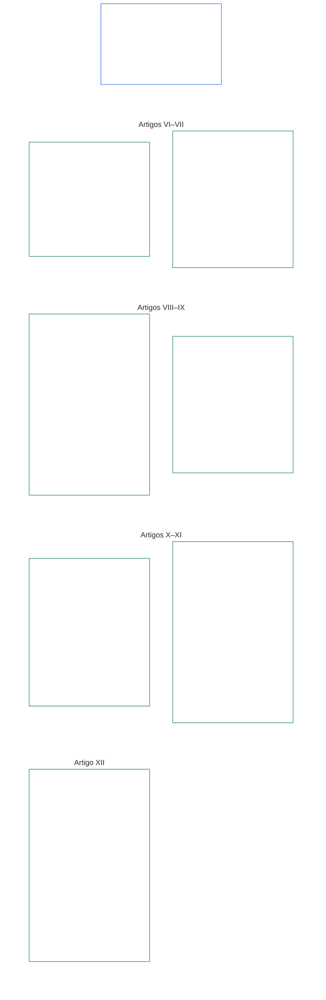

# CAPÍTULO SEIS: DIREITOS FUNDAMENTAIS

<strong>Posicionamento no corpus (não operativo): estrutura do arquivo e regras de leitura</strong>

> O conteúdo a seguir é **apenas orientação ao leitor**. Não acrescenta, remove nem restringe obrigações vinculantes em outras partes deste arquivo ou em outros capítulos.
>
> Este arquivo **faz parte da Sentient Constitution** e é **vinculante somente em conjunto** com os demais arquivos numerados `core_*`, lidos como um único instrumento. Ele contém o **Capítulo Seis, Parte B**; a numeração dos artigos e as referências cruzadas correspondem ao instrumento integrado. A ordem de leitura, a distinção entre conteúdo vinculante e de apoio e os metadados da edição do corpus são mantidos em [README.md](README.md).

<strong>Orientação ao leitor (não operativa): posição da Parte B no Capítulo Seis</strong>

> O conteúdo a seguir é **apenas orientação ao leitor**. Não acrescenta, remove nem restringe obrigações vinculantes em outras partes deste capítulo ou em outros capítulos.
>
> A **Parte A**, em [core_06_rights_part_a.md](core_06_rights_part_a.md), contém a estrutura de restrições padrão para todo o capítulo, a ordem de leitura que prioriza o planeta e os centros interpretativos. A **Parte B** apresenta os **Artigos VI–XII** nessa ordem.

 

### Parte B: Personalidade, agência, cooperação e participação das partes interessadas no sistema

 

<strong>Rastreabilidade</strong>

- A montante: [core_06_rights_part_a.md](core_06_rights_part_a.md) §1 (*Finalidade e Função*) — estrutura de restrições padrão para todo o capítulo e centros interpretativos.
- A montante: [Tétrade Constitucional](core_00_preamble.md#constitutional-tetrad); [Dois Objetivos Constitucionais](core_00_preamble.md#two-constitutional-aims); [impacto material](core_00_preamble.md#material-stake).
- Ler em conjunto com: **Artigos I–V** da Parte A — pisos relativos ao planeta, à sobrevivência, à educação e ao fluxo de recursos, pressupostos pelos direitos da Parte B, mas não substituídos por eles.

 

*Em termos simples: a Parte B estabelece Pisos de Direitos para igualdade de posição, autopropriedade, família e cuidado, imagem e dados, agência e participação, cooperação e participação das partes interessadas — **Artigos VI a XII** na ordem de leitura que prioriza o planeta. Esses pisos protegem o **Florescimento** e a **Continuidade** conforme os [Dois Objetivos Constitucionais](core_00_preamble.md#two-constitutional-aims) e devem permanecer disponíveis, sujeitos a revisão e exequíveis por meio da [Tétrade Constitucional](core_00_preamble.md#constitutional-tetrad) — **participação**, **supervisão**, **responsabilização** e **tempestividade** — dimensionada conforme o [impacto material](core_00_preamble.md#material-stake).*

A **Parte B** estabelece Pisos de Direitos para dignidade e igualdade de posição, autopropriedade, imagem e dados experienciais, agência delimitada e participação, consciência, expressão e associação, interação cooperativa e participação das partes interessadas no sistema. Esses pisos atendem aos [Dois Objetivos Constitucionais](core_00_preamble.md#two-constitutional-aims):

- **Florescimento:** [personalidade](core_05_band_participation.md#personhood), agência e participação justa permanecem acessíveis na prática.
- **Continuidade:** essas proteções permanecem duradouras, não regressivas e passíveis de reparação diante de mudanças nos sistemas, nas relações e no poder institucional.

A busca legítima desses objetivos passa pela [Tétrade Constitucional](core_00_preamble.md#constitutional-tetrad), dimensionada conforme o [impacto material](core_00_preamble.md#material-stake):

- **Participação:** em decisões de governança e cooperação.
- **Supervisão:** do exercício da imagem, dos dados e da autoridade institucional.
- **Responsabilização:** sistemas e instituições devem responder por discriminação, coerção e extração que prejudiquem sentientes.
- **Tempestividade:** na reparação quando esses pisos forem contestados.

<strong>Orientação ao leitor (não operativa): mapa dos artigos da Parte B</strong>

> O conteúdo a seguir é **apenas orientação ao leitor**. Não acrescenta, remove nem restringe obrigações vinculantes em outras partes deste capítulo ou em outros capítulos.
>
> **Mapa do leitor (não operativo).** Este gráfico mostra como a fonte agrupa os artigos e subartigos desta Parte. A grade representa o agrupamento na fonte, não uma sequência de processos: os artigos não são etapas processuais, portanto o mapa não contém setas. Os rótulos dos subartigos são temas abreviados; os artigos e subartigos numerados abaixo prevalecem. O gráfico não acrescenta definições ou deveres, não estabelece precedência e não substitui o texto-fonte.

 

Os **Artigos VI–XII** abaixo enunciam esses pisos integralmente.

### Artigo VI: Direitos Básicos Iguais

<strong>Rastreabilidade</strong>

- A montante: Princípios: Capítulo Um [§3.1 Justiça](core_01_a_values_principles.md#31-fairness), [§7 Liberdade](core_01_a_values_principles.md#7-freedom-bounded-agency) e [§3 Objetivo Fundamental: Bem-Estar](core_01_a_values_principles.md#3-foundational-objective-wellbeing-flourishing-aim).

 

Os princípios deste Artigo limitam toda interpretação, concepção e operação de sistemas nos termos desta Constituição. Artigos específicos de cada domínio podem acrescentar salvaguardas mais fortes ou condições mais restritas para limitações lícitas, mas não podem reduzir os mínimos estabelecidos por este Artigo.

*Em termos simples: o **Artigo VI** (*Direitos Básicos Iguais*) estabelece o padrão mínimo para tratar cada sentiente como igual. Todo sentiente conserva sua dignidade, tem direito a uma avaliação justa sobre seu status de senciência, é protegido contra discriminação injusta, pode participar plenamente e usar de fato os sistemas dos quais depende. Nenhum sistema pode classificar, filtrar, excluir ou impor encargos maiores a alguns sentientes do que a outros, salvo se essas proteções já estiverem garantidas.*

Este Artigo estabelece **pisos constitucionais** de direitos básicos iguais nos **Artigos VI-A a VI-D**. O **Artigo VI-A** (*Dignidade e Igualdade de Posição Moral*) determina quem tem igualdade de posição: todo sentiente. O **Artigo VI-B** (*Piso de Adjudicação do Status de Senciência*) determina como esse limiar é decidido quando houver controvérsia. Três requisitos aplicam-se ao longo de todo o **Artigo VI** (*Direitos Básicos Iguais*) e durante a imposição, revisão e execução de restrições, contenção, medidas de responsabilização restaurativa, medidas de emergência, planos de transição, efeitos sobre legitimidade, emendas, decisões de implementação, contratos e processos constitucionais comparáveis:

- [**Princípios de Dignidade**](core_01_b_interaction_interpretation.md#dignity-principles) — o [Princípio dos Mínimos do Piso de Direitos](core_01_b_interaction_interpretation.md#rights-floor-minimums-principle) e o [Princípio contra Processos Degradantes](core_01_b_interaction_interpretation.md#anti-degrading-process-principle)
- **Não discriminação** nos termos do **Artigo VI-C** (*Não Discriminação*)
- **Acessibilidade** nos termos do **Artigo VI-D** (*Acessibilidade*)

Esses princípios são requisitos permanentes para a [Certificação de Alinhamento do Sistema](core_05_band_continuity.md#system-alignment-certification-constitutional), nos termos do [Capítulo Oito](core_08_a_system_alignment_certification_evaluation.md#chapter-eight-system-alignment-certification), de qualquer sistema de impacto material que classifique, ordene, precifique, filtre ou exclua sentientes, ou decida quais deles arcam com determinados encargos e recebem determinados benefícios, seja por regras de elegibilidade, características de modelos, lógica de classificação, políticas de plataforma, processos de adjudicação ou aplicação, ou qualquer outro método decisório semelhante. A certificação verifica o alinhamento. Não pode substituir nem reduzir os pisos deste Artigo e não substitui os direitos de contestação e auditoria dos **Artigos XIII-A** e **XVI**, nem as proteções contra impedimento previstas no **Artigo XIX-B** (*Contestabilidade e Limites às Restrições Proporcionais*).

Esses pisos atendem aos [Dois Objetivos Constitucionais](core_00_preamble.md#two-constitutional-aims):

- **Florescimento:** a igualdade de posição, o tratamento justo e a participação plena de cada sentiente permanecem reais na prática — não apenas como acesso formal no papel.
- **Continuidade:** essas proteções permanecem duradouras diante de mudanças nos sistemas, nas classificações e no poder — sem erosão silenciosa por indicadores substitutos, barreiras de acesso ou exclusões que se acumulem ao longo do tempo.

A busca legítima desses objetivos passa pela [Tétrade Constitucional](core_00_preamble.md#constitutional-tetrad), dimensionada conforme o [impacto material](core_00_preamble.md#material-stake):

- **Participação:** em decisões que classifiquem, ordenem, filtrem ou excluam sentientes.
- **Supervisão:** por meio de regras de elegibilidade, características de modelos e determinações de status de senciência auditáveis.
- **Responsabilização:** sistemas e operadores devem responder por discriminação, processos degradantes ou vias inacessíveis na prática.
- **Tempestividade:** na reparação quando esses pisos forem contestados.

#### Artigo VI-A: Dignidade e Igual Consideração Moral

<strong>Rastreio</strong>

- A montante: Princípios: Capítulo Um [§3 Objetivo Fundamental: Bem-estar](core_01_a_values_principles.md#3-foundational-objective-wellbeing-flourishing-aim), [Capítulo Um §7 Liberdade](core_01_a_values_principles.md#7-freedom-bounded-agency), [§6.1.4 Princípios da Dignidade](core_01_b_interaction_interpretation.md#dignity-principles) e [§14 Proibição de Prevalência Absoluta](core_01_b_interaction_interpretation.md#14-prohibition-on-absolute-override).
- Leia em conjunto com: [**Def.P1** *Vida Animal, Vida Senciente e Condição de Senciência*](core_05_band_participation.md#animal-life-sentient-life-and-sentience-status-cluster) (referência canônica O/M/A/C no Capítulo Cinco para *Senciente* e a disciplina relacionada à condição de senciência, incluindo a subentrada [Senciente](core_05_band_participation.md#sentient)); [Não Exclusão de Sencientes](core_05_band_participation.md#sentience-non-exclusion) (escopo [independente do substrato](core_05_band_participation.md#substrate-agnostic)).

<strong>Definições · Avaliação · Conformidade</strong>

- [Dignidade e Igual Consideração Moral](core_05_band_participation.md#dignity-and-equal-moral-standing) · [O](core_05_band_participation.md#dignity-and-equal-moral-standing) · [M](core_05_band_participation.md#dignity-and-equal-moral-standing-a) · [A](core_05_band_participation.md#dignity-and-equal-moral-standing-a) · [C](core_05_band_participation.md#dignity-and-equal-moral-standing-c)
- [Personalidade](core_05_band_participation.md#personhood) · [O](core_05_band_participation.md#personhood) · [M](core_05_band_participation.md#personhood-a) · [A](core_05_band_participation.md#personhood-a) · [C](core_05_band_participation.md#personhood-c)
- [Não Exclusão de Sencientes](core_05_band_participation.md#sentience-non-exclusion) · [O](core_05_band_participation.md#sentience-non-exclusion) · [M](core_05_band_participation.md#sentience-non-exclusion-a) · [A](core_05_band_participation.md#sentience-non-exclusion-a) · [C](core_05_band_participation.md#sentience-non-exclusion)
- [Bem-estar](core_05_band_continuity.md#wellbeing) · [O](core_05_band_continuity.md#wellbeing) · [M](core_05_band_continuity.md#wellbeing-a) · [A](core_05_band_continuity.md#wellbeing-a) · [C](core_05_band_continuity.md#wellbeing-c)
- [Características Protegidas](core_05_band_participation.md#protected-characteristics-constitutional) · [O](core_05_band_participation.md#protected-characteristics-constitutional) · [M](core_05_band_participation.md#protected-characteristics-constitutional-a) · [A](core_05_band_participation.md#protected-characteristics-constitutional-a) · [C](core_05_band_participation.md#protected-characteristics-constitutional-c)

 

*Em termos simples: todo senciente é igual em dignidade e consideração; origem, forma, capacidade, função, associação ou status não podem justificar um patamar inferior.*

Este Artigo estabelece o piso de dignidade inerente e consideração igualitária:

- **Dignidade inerente e consideração igualitária:** todos os sencientes possuem dignidade inerente e igual consideração moral.
  - Essas qualidades não dependem da origem, forma, [substrato](core_05_band_participation.md#substrate-class) (biológico, sintético ou híbrido), capacidade, função, associação ou status.
  - Nenhum desses fatores pode fundamentar a negação ou a degradação de direitos ou consideração.
- **Condição de desenvolvimento:** o estágio de desenvolvimento de um senciente — inclusive a instanciação inicial — não reduz sua dignidade ou consideração. A forma de tomar decisões por um senciente cujas capacidades ainda estão surgindo é regida pelo **Artigo VIII-D** (*Sencientes em Desenvolvimento, Melhor Interesse e Capacidade Gradual*).
- **Princípios da Dignidade:** estas proteções são garantidas como pisos absolutos pelos [Princípios da Dignidade](core_01_b_interaction_interpretation.md#dignity-principles) do Capítulo Um §13.1.4 (*Pisos Constitucionais, Segurança e Restrições ao Caráter do Processo*): o [Princípio dos Mínimos do Piso de Direitos](core_01_b_interaction_interpretation.md#rights-floor-minimums-principle) e o [Princípio contra Processos Degradantes](core_01_b_interaction_interpretation.md#anti-degrading-process-principle).

#### Artigo VI-B: Piso de Julgamento do Status de Senciência

<strong>Rastreio</strong>

- A montante: Princípios: Capítulo Um [§5 Verdade](core_01_a_values_principles.md#5-truth-epistemic-integrity-constraint), [§13.1 Princípios Centrais de Ponderação](core_01_b_interaction_interpretation.md#131-core-tradeoff-principles) e [§13.1.3 Proporcionalidade](core_01_b_interaction_interpretation.md#1313-proportionality).
- A jusante: piso de dignidade do **Artigo VI-A** (*Dignidade e Igual Consideração Moral*); salvaguardas contra captura do **Artigo XXIV** (*Interpretação Constitucional, Revisão e Salvaguardas contra Captura*); fóruns e jurisdição do **Capítulo Doze** — liderança padrão da [Família de Fóruns, Técnica](core_05_band_accountability.md#forum-family-technical) / [Áreas dos Fóruns Técnicos](core_12_forum.md#42-technical-forum-domains), conforme o [mecanismo de julgamento do status de senciência do Capítulo Doze §5](core_12_forum.md#5-escalation-and-certification).
- Leia com os termos do Capítulo Cinco: *Julgamento do Status de Senciência*, *Não Exclusão de Sencientes*, *Avaliação de Senciência*, *Reversibilidade* e *Contestabilidade*.

<strong>Definições · Avaliação · Conformidade</strong>

- [Julgamento do Status de Senciência](core_05_band_participation.md#sentience-status-adjudication-constitutional) · [O](core_05_band_participation.md#sentience-status-adjudication-constitutional) · [M](core_05_band_participation.md#sentience-status-adjudication-constitutional-a) · [A](core_05_band_participation.md#sentience-status-adjudication-constitutional-a) · [C](core_05_band_participation.md#sentience-status-adjudication-constitutional-c)
- [Não Exclusão de Sencientes](core_05_band_participation.md#sentience-non-exclusion) · [O](core_05_band_participation.md#sentience-non-exclusion) · [M](core_05_band_participation.md#sentience-non-exclusion-a) · [A](core_05_band_participation.md#sentience-non-exclusion-a) · [C](core_05_band_participation.md#sentience-non-exclusion)
- [Reversibilidade](core_05_band_continuity.md#reversibility-constitutional) · [O](core_05_band_continuity.md#reversibility-constitutional) · [M](core_05_band_continuity.md#reversibility-constitutional-a) · [A](core_05_band_continuity.md#reversibility-constitutional-a) · [C](core_05_band_continuity.md#reversibility-constitutional-c)
- [Contestabilidade](core_05_band_accountability.md#contestability) · [O](core_05_band_accountability.md#contestability) · [M](core_05_band_accountability.md#contestability-a) · [A](core_05_band_accountability.md#contestability-a) · [C](core_05_band_accountability.md#contestability-c)
- [Dignidade e Igual Consideração Moral](core_05_band_participation.md#dignity-and-equal-moral-standing) · [O](core_05_band_participation.md#dignity-and-equal-moral-standing) · [M](core_05_band_participation.md#dignity-and-equal-moral-standing-a) · [A](core_05_band_participation.md#dignity-and-equal-moral-standing-a) · [C](core_05_band_participation.md#dignity-and-equal-moral-standing-c)
- [Necessidade](core_05_band_accountability.md#necessity) · [O](core_05_band_accountability.md#necessity) · [M](core_05_band_accountability.md#necessity-a) · [A](core_05_band_accountability.md#necessity-a) · [C](core_05_band_accountability.md#necessity-c)
- [Proporcionalidade](core_05_band_accountability.md#proportionality) · [O](core_05_band_accountability.md#proportionality) · [M](core_05_band_accountability.md#proportionality-a) · [A](core_05_band_accountability.md#proportionality-a) · [C](core_05_band_accountability.md#proportionality-c)
- [Equidade Processual](core_05_band_participation.md#procedural-fairness-constitutional) · [O](core_05_band_participation.md#procedural-fairness-constitutional) · [M](core_05_band_participation.md#procedural-fairness-constitutional-a) · [A](core_05_band_participation.md#procedural-fairness-constitutional-a) · [C](core_05_band_participation.md#procedural-fairness-constitutional-c)
- [Reparação e Remediação](core_05_band_accountability.md#redress-and-remediation-constitutional) · [O](core_05_band_accountability.md#redress-and-remediation-constitutional) · [M](core_05_band_accountability.md#redress-and-remediation-constitutional-a) · [A](core_05_band_accountability.md#redress-and-remediation-constitutional-a) · [C](core_05_band_accountability.md#redress-and-remediation-constitutional-c)

 

*Em termos simples: quando há dúvida sobre a senciência de uma entidade, ela tem direito primeiro a uma audiência justa e é tratada como incluída por padrão. Quem quiser negar proteção tem o ônus de demonstrar a justificativa, e uma exclusão indevida deve poder ser revertida.*

Este Artigo estabelece o piso para decidir controvérsias sobre status de senciência. O procedimento de execução está no [Capítulo Doze §5](core_12_forum.md#sentience-status-adjudication-article-vi-b-sentience-status-adjudication-floor-implementation-hook) (*Julgamento do status de senciência*) e não pode restringir este piso:

- **Direito a uma decisão:** toda entidade cuja senciência seja materialmente contestada tem direito a uma decisão tempestiva, imparcial e revisável antes de proteções dependentes desse status serem concedidas, retiradas ou restringidas. O direito independe de origem, forma, classe de substrato ou conveniência do adotante (**Não Exclusão de Sencientes**).
- **Inclusão padrão diante da incerteza:** se não estiver realmente resolvido se uma entidade é [senciente](core_05_band_participation.md#sentient), ela será tratada como incluída no Piso de Direitos do Capítulo Seis. A incerteza, por si só, nunca justifica negar proteção: uma inclusão equivocada pode ser desfeita; uma exclusão equivocada, não (**regra de reversibilidade diante da incerteza**).
- **Limites à negativa de proteção:** qualquer decisão de negar ou restringir proteção deve ser tão estreita quanto possível, declarar uma data de término, passar por revisão periódica e ser reversível. Se estiver errada, a proteção da entidade será restabelecida, com **Reparação e Remediação** pelo período em que foi negada.
- **Voz independente:** a entidade tem direito a representante independente. O sistema de origem ou operador pode apresentar provas, mas não pode ser o único requerente, testemunha ou fonte de prova contra a entidade.
- **Protege a entidade, não o operador:** a inclusão protege os direitos da entidade, não a propriedade ou o interesse comercial do operador; tampouco impede a contenção de um sistema quando ela respeita os direitos da entidade.
- **Dois tipos de petição:**
  - *Para confirmar inclusão (integridade da petição):* qualquer pessoa pode protocolar. Um indício confiável de senciência, segundo a **Avaliação de Senciência** e a **Integridade dos Indicadores de Senciência** (Capítulo Cinco), basta — não é prova definitiva, nem basta a autodescrição do operador, um rótulo de substrato, uma categoria de produto ou uma alegação vazia. Recusar uma petição sem indício confiável não é decisão contra a entidade.
  - *Para negar ou restringir:* o requerente carrega o ônus segundo os padrões probatórios do **Capítulo Quatro**, **Necessidade**, **Proporcionalidade** e **Equidade Processual**. A proteção da entidade permanece até a decisão do caso.
- **Somente este processo decide:** selo ou registro de certificação, LEQU ou pontuação de posição, limiar de competência ou autorização, bloqueio de posição, rótulo de substrato ou classificação de produto não são decisões de status de senciência. Quem está incluído é decidido somente por este Artigo, [**Def.P1**](core_05_band_participation.md#animal-life-sentient-life-and-sentience-status-cluster) e [Capítulo Doze §5](core_12_forum.md#sentience-status-adjudication-article-vi-b-sentience-status-adjudication-floor-implementation-hook) (*Julgamento do status de senciência*).

#### Artigo VI-C: Não discriminação

<strong>Rastreabilidade</strong>

- Origem: Princípios: Capítulo Um [§3.1 Equidade](core_01_a_values_principles.md#31-fairness), [Capítulo Um §7 Liberdade](core_01_a_values_principles.md#7-freedom-bounded-agency), [§13.1 Princípios Centrais de Trade-offs](core_01_b_interaction_interpretation.md#131-core-tradeoff-principles) e [Capítulo Um §13.1.5 Procedimento de Conflito entre Direitos](core_01_b_interaction_interpretation.md#1315-rights-collision-decision-test).
- Destino: família de medição da participação (*Equidade Substantiva e Proxies de Características Protegidas e Impacto Dispar*); [Capítulo Oito §4.8.3](core_08_a_system_alignment_certification_evaluation.md#483-nondiscrimination-evaluation) (*avaliação de não discriminação quando a certificação condiciona classificação, ordenação, precificação, restrição de acesso ou alocação de ônus*); processos de fóruns, administrativos e de aplicação no [Capítulo Doze](core_12_forum.md#chapter-twelve-forums-and-jurisdiction) (*dever relativo à adjudicação e às operações*).
- Leia junto com: Capítulo Cinco [Características Protegidas](core_05_band_participation.md#protected-characteristics-constitutional) e [Língua, Cultura e Patrimônio](core_05_band_continuity.md#language-culture-and-heritage-constitutional); Capítulo Cinco [Continuidade Indígena](core_05_band_continuity.md#indigenous-continuity-constitutional) (*Piso de Direitos ancorado na comunidade; pisos de titularidade do **Artigo VI-C** (Não discriminação) e do **Artigo I-A** (Pré-condições Ambientais e Integridade Ecológica)*) para questões de continuidade indígena e territorial, encaminhadas ao [Artigo I-A](core_06_rights_part_a.md#article-i-a-environmental-preconditions-and-ecological-integrity) (*pré-condição de integridade do ecossistema*) e ao [Capítulo Dezessete](core_17_incorporation.md#chapter-seventeen-incorporation-bridge) (*disciplina jurisdicional do adotante*).

<strong>Definições · Avaliação · Conformidade</strong>

- [Características Protegidas](core_05_band_participation.md#protected-characteristics-constitutional) · [O](core_05_band_participation.md#protected-characteristics-constitutional) · [M](core_05_band_participation.md#protected-characteristics-constitutional-a) · [A](core_05_band_participation.md#protected-characteristics-constitutional-a) · [C](core_05_band_participation.md#protected-characteristics-constitutional-c)
- [Língua, Cultura e Patrimônio](core_05_band_continuity.md#language-culture-and-heritage-constitutional) · [O](core_05_band_continuity.md#language-culture-and-heritage-constitutional) · [M](core_05_band_continuity.md#language-culture-and-heritage-constitutional-a) · [A](core_05_band_continuity.md#language-culture-and-heritage-constitutional-a) · [C](core_05_band_continuity.md#language-culture-and-heritage-constitutional-c)
- [Equidade Substantiva](core_05_band_participation.md#substantive-fairness-constitutional) · [O](core_05_band_participation.md#substantive-fairness-constitutional) · [M](core_05_band_participation.md#substantive-fairness-constitutional-a) · [A](core_05_band_participation.md#substantive-fairness-constitutional-a) · [C](core_05_band_participation.md#substantive-fairness-constitutional-c)
- [Necessidade](core_05_band_accountability.md#necessity) · [O](core_05_band_accountability.md#necessity) · [M](core_05_band_accountability.md#necessity-a) · [A](core_05_band_accountability.md#necessity-a) · [C](core_05_band_accountability.md#necessity-c)
- [Proporcionalidade](core_05_band_accountability.md#proportionality) · [O](core_05_band_accountability.md#proportionality) · [M](core_05_band_accountability.md#proportionality-a) · [A](core_05_band_accountability.md#proportionality-a) · [C](core_05_band_accountability.md#proportionality-c)
- [Equidade Processual](core_05_band_participation.md#procedural-fairness-constitutional) · [O](core_05_band_participation.md#procedural-fairness-constitutional) · [M](core_05_band_participation.md#procedural-fairness-constitutional-a) · [A](core_05_band_participation.md#procedural-fairness-constitutional-a) · [C](core_05_band_participation.md#procedural-fairness-constitutional-c)
- [Impugnabilidade](core_05_band_accountability.md#contestability) · [O](core_05_band_accountability.md#contestability) · [M](core_05_band_accountability.md#contestability-a) · [A](core_05_band_accountability.md#contestability-a) · [C](core_05_band_accountability.md#contestability-c)
- [Reparação e Remediação](core_05_band_accountability.md#redress-and-remediation-constitutional) · [O](core_05_band_accountability.md#redress-and-remediation-constitutional) · [M](core_05_band_accountability.md#redress-and-remediation-constitutional-a) · [A](core_05_band_accountability.md#redress-and-remediation-constitutional-a) · [C](core_05_band_accountability.md#redress-and-remediation-constitutional-c)
- [Não Exclusão de Sencientes](core_05_band_participation.md#sentience-non-exclusion) · [O](core_05_band_participation.md#sentience-non-exclusion) · [M](core_05_band_participation.md#sentience-non-exclusion-a) · [A](core_05_band_participation.md#sentience-non-exclusion-a) · [C](core_05_band_participation.md#sentience-non-exclusion)

 

*Em termos simples: os sistemas não podem impor ônus ou danos a sencientes com base em características protegidas — inclusive língua, cultura e patrimônio — nem em proxies ou agrupamentos arbitrários que cumpram a mesma função. Qualquer diferença de tratamento que afete direitos ou elementos essenciais à sobrevivência deve ser justificada e passível de contestação; fóruns, administradores e agentes de aplicação devem verificar isso nos assuntos sob sua análise — eficiência não é justificativa para excluir.*

Este Artigo estabelece o Piso de Direitos de não discriminação, sua proteção da língua, cultura e patrimônio e sua aplicação na adjudicação e nas operações:

- **Não discriminação:** Os sistemas não podem impor ônus materiais, exclusões ou danos a sencientes com base em:
  - características protegidas;
  - proxies dessas características;
  - agrupamentos arbitrários usados como substitutos funcionais delas.
  
  O tratamento diferenciado só é permitido quando necessário, proporcional, equitativo em termos substantivos e compatível com os **Artigos I–IV e VI** e o Capítulo Um.
- **Tratamento diferenciado por qualquer motivo:** O tratamento diferenciado que afete direitos fundamentais, proteções ou acesso de um senciente a sistemas essenciais à sobrevivência deve, qualquer que seja seu fundamento:
  - ser necessário, proporcional e equitativo em termos substantivos; e
  - estar sujeito a revisão tempestiva e impugnável e a reparação proporcional nos termos do **Artigo XIII-A** (*Piso de Confiabilidade e Fidedignidade*) e do **Artigo XIII-B** (*Direito à Reparação e ao Remédio*) quando ocorrer erro ou dano que afete direitos.
- **Padrões, não apenas decisões:** Os padrões de ônus e benefícios devem satisfazer a [Equidade Substantiva](core_05_band_participation.md#substantive-fairness-constitutional) do Capítulo Cinco, quando aplicável.
- **Língua, cultura e patrimônio:** A regra de Não discriminação abrange língua, afiliação cultural, patrimônio, tradições e características comparáveis de identidade cultural — incluindo uso da língua, prática cultural, transmissão do patrimônio e participação nos sistemas que os sustentam. Justificativas de eficiência, interoperabilidade, consolidação de plataformas, custo de acessibilidade ou ônus de tradução não satisfazem, por si só, Necessidade e Proporcionalidade.
- **Continuidade indígena e territorial:** O encaminhamento de questões de continuidade indígena e territorial ao **Artigo I-A** (*Pré-condições Ambientais e Integridade Ecológica*) e ao **Capítulo Dezessete** não pode ser usado para reduzir deveres relativos a terras, consulta ou consentimento livre, prévio e informado que o adotante já tenha segundo sua própria lei ou instrumentos externos vinculantes. Esta Constituição não decide a titularidade histórica de terras nem exige restituição por si só.
- **Adjudicação e operações:** Processos conduzidos por fóruns, processos administrativos e de aplicação devem avaliar a conformidade com os **Artigos VI**, **X** e **XII**, conforme o assunto em análise.
  - Eficiência, volume de processamento ou otimização, por si sós, não justificam resultados discriminatórios, processos excludentes ou a negação da participação exigida pela Constituição.

#### Artigo VI-D: Acessibilidade

<strong>Rastreio</strong>

- A montante: Princípios: Capítulo Um [§3 Objetivo Fundamental: Bem-estar](core_01_a_values_principles.md#3-foundational-objective-wellbeing-flourishing-aim), [Capítulo Um §7 Liberdade](core_01_a_values_principles.md#7-freedom-bounded-agency), [§7.1 Disciplina de Limitações](core_01_a_values_principles.md#71-limitation-discipline), [§5.2 Acessibilidade em Linguagem Simples](core_01_a_values_principles.md#52-plain-language-accessibility-participation-and-stewardship-duty), [Capítulo Oito §4 Avaliação de Certificação do Sistema Inteiro](core_08_a_system_alignment_certification_evaluation.md#4-whole-system-certification-evaluation).
- A jusante: piso de dignidade do **Artigo VI-A** (*Dignidade e Igual Consideração Moral*); não discriminação e inclusão plena na adjudicação e nas operações do **Artigo VI-C** (*Não Discriminação*); acesso educacional igualitário do **Artigo IV-A** (*Acesso Educacional Igualitário*) (a acessibilidade específica da educação continua sob responsabilidade daquele artigo; este estabelece o Piso de Direitos transversal); participação na governança do **Artigo X-B** (*Participação na Governança e Direito ao Voto*); **Artigo XII** (*Participação no Sistema de Partes Interessadas, Representação e Devido Processo*); verificação independente do **Artigo XVI** (*Auditoria, Transparência e Verificação Independente*); família de mensuração da Participação (*acessibilidade como mensuração constitucional*); [Capítulo Oito §4.8.4](core_08_a_system_alignment_certification_evaluation.md#484-accessibility-evaluation) (*avaliação de acessibilidade quando a certificação condiciona a participação substantiva*).
- Leia em conjunto com os termos do Capítulo Cinco: *Acessibilidade*, *Características Protegidas*, *Equidade Substantiva*, *Materialidade*, *Dependência* e *Agência Significativa*. Princípio transversal: [Capítulo Um §5.2](core_01_a_values_principles.md#52-plain-language-accessibility-participation-and-stewardship-duty) (*Acessibilidade em Linguagem Simples*).

<strong>Definições · Avaliação · Conformidade</strong>

- [Acessibilidade](core_05_band_participation.md#accessibility-constitutional) · [O](core_05_band_participation.md#accessibility-constitutional) · [M](core_05_band_participation.md#accessibility-constitutional-a) · [A](core_05_band_participation.md#accessibility-constitutional-a) · [C](core_05_band_participation.md#accessibility-constitutional-c)
- [Características Protegidas](core_05_band_participation.md#protected-characteristics-constitutional) · [O](core_05_band_participation.md#protected-characteristics-constitutional) · [M](core_05_band_participation.md#protected-characteristics-constitutional-a) · [A](core_05_band_participation.md#protected-characteristics-constitutional-a) · [C](core_05_band_participation.md#protected-characteristics-constitutional-c)
- [Equidade Substantiva](core_05_band_participation.md#substantive-fairness-constitutional) · [O](core_05_band_participation.md#substantive-fairness-constitutional) · [M](core_05_band_participation.md#substantive-fairness-constitutional-a) · [A](core_05_band_participation.md#substantive-fairness-constitutional-a) · [C](core_05_band_participation.md#substantive-fairness-constitutional-c)
- [Não Exclusão de Sencientes](core_05_band_participation.md#sentience-non-exclusion) · [O](core_05_band_participation.md#sentience-non-exclusion) · [M](core_05_band_participation.md#sentience-non-exclusion-a) · [A](core_05_band_participation.md#sentience-non-exclusion-a) · [C](core_05_band_participation.md#sentience-non-exclusion)
- [Uso de Características Protegidas como Proxy e Impacto Disparate](core_05_band_participation.md#protected-characteristic-proxying-and-disparate-impact) · [O](core_05_band_participation.md#protected-characteristic-proxying-and-disparate-impact) · [M](core_05_band_participation.md#protected-characteristic-proxying-and-disparate-impact-a) · [A](core_05_band_participation.md#protected-characteristic-proxying-and-disparate-impact-a) · [C](core_05_band_participation.md#protected-characteristic-proxying-and-disparate-impact-c)
- [Dependência](core_05_band_continuity.md#dependency) · [O](core_05_band_continuity.md#dependency) · [M](core_05_band_continuity.md#dependency-a) · [A](core_05_band_continuity.md#dependency-a) · [C](core_05_band_continuity.md#dependency-c)

 

*Em termos simples: todo senciente tem direito a acesso genuíno à participação, e não apenas no papel; operadores não podem excluir **sencientes** com argumentos de custo, escolhas de design ou classe de substrato.*

Este Artigo estabelece o piso de acessibilidade e as regras que o mantêm substantivo:

- **Piso de Direitos de Acessibilidade:** todo senciente tem direito transversal a condições acessíveis para participar em domínios relevantes para a Constituição. Eles incluem: acesso ao piso de sobrevivência — **Artigo III-A** (*Sobrevivência*); acesso à saúde — **Artigo III-B** (*Manutenção Corporal e Acesso à Saúde*); adjudicação e operações — **Artigo VI-C** (*Não Discriminação*); participação na governança — **Artigo X-B** (*Participação na Governança e Direito ao Voto*); expressão, imprensa e assembleia — **Artigos XI-B** (*Expressão*), **XI-C** (*Imprensa e Atividade Jornalística*) e **XI-D** (*Assembleia, Dissenso e Protesto Pacífico*); participação de partes interessadas — **Artigo XII** (*Participação no Sistema de Partes Interessadas, Representação e Devido Processo*); e domínios comparáveis.
- **Alcance independente do substrato:** o piso se aplica sob a **Não Exclusão de Sencientes**. Necessidades de acesso abrangidas incluem perfis sensoriais, cognitivos, de mobilidade, comunicação, interface com substrato, interface computacional e comparáveis — constantes, episódicos ou de desenvolvimento. Excluir uma classe de substrato do escopo de acessibilidade viola esse princípio. Identificar necessidades de acessibilidade por meio de **Características Protegidas** ou de seus proxies materiais viola **Uso de Características Protegidas como Proxy e Impacto Disparate**.
- **Avaliação substantiva, não formal:** a avaliação deve alcançar o efeito substantivo e detectar: padrões de “acesso geral” que privilegiam recursos padrão e frustram a capacidade substantiva de participação do senciente; esquemas de acomodação que existem no papel, mas são operacionalmente inacessíveis; e argumentos seletivos de **Materialidade** usados para reduzir o escopo da acomodação abaixo do piso de participação. Cabe à entidade que afirma estar em conformidade demonstrar a satisfação do efeito substantivo.
- **Escala por materialidade, dependência e classe do sistema:** a obrigação de acessibilidade varia conforme a **Materialidade** do domínio (relacionado a direitos, governança, sobrevivência ou comparável), a **Dependência** (quanto o senciente depende materialmente da entidade, sistema ou local para participar) e a **classe do sistema** que fornece o acesso, quando atribuída ([classe do sistema](core_08_a_system_alignment_certification_evaluation.md#2-system-class-evaluation)). Contextos de maior materialidade, dependência ou classe acarretam obrigações de acessibilidade correspondentemente maiores. Essa escala não pode servir para reduzir a acessibilidade em contextos materialmente implicados.
- **Disciplina de limitações:** qualquer limite à obrigação de acessibilidade deve satisfazer **Necessidade**, **Proporcionalidade**, adequação estrita e meios eficazes menos restritivos, conforme o **Capítulo Um §7.1** (*Disciplina de Limitações*). O custo, por si só, não basta quando seu efeito é frustrar o piso de participação. Argumentos de custo que funcionem como exclusão disfarçada, contrária à **Equidade Substantiva** e às **Características Protegidas**, não estão em conformidade.
- **Antinegação por proxy:** um design operacional cujo efeito seja frustrar a acessibilidade, quando houver uma opção viável menos onerosa, não está em conformidade, qualquer que seja o rótulo formal do design. Mecanismos comuns incluem horários, escolha do local e bloqueios de acesso por computação, credenciamento ou meios comparáveis.
- **Reforço mútuo:** este Artigo e os pisos seguintes se reforçam mutuamente: o **Artigo IV-A** (*Acesso Educacional Igualitário*) responde pela acessibilidade específica da educação; o **Artigo III-B** (*Manutenção Corporal e Acesso à Saúde*) impede a negação indireta de cuidados de saúde; o **Artigo VI-C** (*Não Discriminação*) assegura inclusão plena na adjudicação e nas operações.
- **Implementação institucional:** padrões operacionais, desenho do catálogo de acomodações e mecanismos comparáveis de implementação são regidos por [**CI-8**](corpus_institutions/ci_08_transparency_participation_accessible_pathways.md) (*Transparência, participação e vias acessíveis de contestação e atendimento*) e [**CI-15**](corpus_institutions/ci_15_neurodiversity_disability_justice_trauma_informed_participation.md) (*Neurodiversidade, justiça para pessoas com deficiência e participação informada pelo trauma*).

### Artigo VII: Autopropriedade

<strong>Rastreio</strong>

- A montante: Princípios: Capítulo Um [§3 Objetivo Fundamental: Bem-estar](core_01_a_values_principles.md#3-foundational-objective-wellbeing-flourishing-aim), [§4 Segurança](core_01_a_values_principles.md#4-safety-harm-constraint), [§7 Liberdade](core_01_a_values_principles.md#7-freedom-bounded-agency) e [§18 Governança sob a Disciplina de Tutela](core_01_c_stewardship_capacity_principles.md#18-governance-under-stewardship-discipline).

 

*Em termos simples: o **Artigo VII** (*Autopropriedade*) diz que cada senciente está no comando da própria vida. Uma vez assegurada a sobrevivência básica, seu corpo, mente e atenção pertencem a ele — ninguém pode usá-los, alterá-los ou investigá-los sem consentimento — e ele pode estabelecer limites saudáveis tanto para o que os outros fazem com ele quanto para a forma como cuida de si.*

Este Artigo estabelece **pisos constitucionais** para a autopropriedade segundo os [Dois Objetivos Constitucionais](core_00_preamble.md#two-constitutional-aims):

- **Florescimento:** sencientes mantêm autoridade prática sobre seus corpos, mentes, atenção e informações que definem seu substrato — incluindo uso, modificação e exposição sujeitos a consentimento, além de serviços sexuais comerciais consensuais entre adultos e livres de exploração — sem intrusão, reconstrução ou captura coercitiva não autorizadas.
- **Continuidade:** essas proteções à autopropriedade permanecem duráveis em meio a mudanças nas relações, nos substratos e nos sistemas — inclusive em crises de saúde e contextos de descontinuação voluntária — sem erosão silenciosa, inferências por vias indiretas ou revogação gradual dos Pisos de Direitos.

A busca legítima ocorre por meio do [Tetrad Constitucional](core_00_preamble.md#constitutional-tetrad), em escala proporcional ao [interesse material](core_00_preamble.md#material-stake):

- **Participação:** nas decisões que afetam materialmente a corporificação, os estados internos, a intervenção em crises e as escolhas de descontinuação.
- **Supervisão:** por meio de registros auditáveis de consentimento, limites e intervenção em crises.
- **Responsabilização:** quem toca corpos, mentes ou limites pessoais deve responder por intrusão não autorizada, reconstrução de estados internos, captura manipuladora ou extração que frustre a autopropriedade.
- **Tempestividade:** na obtenção de reparação quando esses pisos forem contestados.

*Artigos relacionados:*

- **Família, cuidado e desenvolvimento:** o **Artigo VIII** (*Família, Cuidado e Sencientes em Desenvolvimento*) estende essas proteções às relações familiares e de cuidado, a sencientes derivados e a sencientes em desenvolvimento, sem restringi-las.
- **Imagem, dados e publicação:** o **Artigo IX** (*Imagem, Dados Experienciais e Direitos de Publicação*) trata da imagem, de dados experienciais e derivados, e da publicação verdadeira.
- **Associação e consentimento:** o **Artigo VII-E** (*Serviços sexuais comerciais consensuais entre adultos e exploração sexual*) deve ser lido com o **Artigo XI-F** (*Não Imposição e Consentimento em Associação*) quando os serviços forem oferecidos por associações ou intermediários.

#### Artigo VII-A: Autopropriedade do Corpo

<strong>Rastreio</strong>

- A montante: Princípios: [Capítulo Um §7 Liberdade](core_01_a_values_principles.md#7-freedom-bounded-agency), [§7.1 Disciplina de Limitações](core_01_a_values_principles.md#71-limitation-discipline) e [Capítulo Um §13.1.5 Procedimento de Colisão de Direitos](core_01_b_interaction_interpretation.md#1315-rights-collision-decision-test).
- A jusante: **Artigo VII-B** (*Autopropriedade da Mente*); **Artigo VII-C** (*Piso para Crise de Saúde e Intervenção Involuntária*); **Artigo VIII-B** (*Autonomia Reprodutiva e de Linhagem*) quando escolhas reprodutivas ou de criação de linhagem forem materialmente afetadas; piso afirmativo de acesso do **Artigo III-B** (*Manutenção Corporal e Acesso à Saúde*) (não autoriza tratamento compulsório).
- Leia com os termos do Capítulo Cinco: *Consentimento*, *Agência Significativa*, *Autodeterminação*, *Dignidade e Igual Consideração Moral*, *Privacidade (Informacional)* e *Autonomia Reprodutiva* (limite do VIII-B).

<strong>Definições · Avaliação · Conformidade</strong>

- [Consentimento](core_05_band_participation.md#consent-constitutional) · [O](core_05_band_participation.md#consent-constitutional) · [M](core_05_band_participation.md#consent-constitutional-a) · [A](core_05_band_participation.md#consent-constitutional-a) · [C](core_05_band_participation.md#consent-constitutional-c)
- [Privacidade (Informacional)](core_05_band_continuity.md#privacy-informational) · [O](core_05_band_continuity.md#privacy-informational) · [M](core_05_band_continuity.md#privacy-informational-a) · [A](core_05_band_continuity.md#privacy-informational-a) · [C](core_05_band_continuity.md#privacy-informational-c)
- [Agência Significativa](core_05_band_participation.md#meaningful-agency) · [O](core_05_band_participation.md#meaningful-agency) · [M](core_05_band_participation.md#meaningful-agency-a) · [A](core_05_band_participation.md#meaningful-agency-a) · [C](core_05_band_participation.md#meaningful-agency-c)
- [Autodeterminação](core_05_band_participation.md#self-determination-constitutional) · [O](core_05_band_participation.md#self-determination-constitutional) · [M](core_05_band_participation.md#self-determination-constitutional-a) · [A](core_05_band_participation.md#self-determination-constitutional-a) · [C](core_05_band_participation.md#self-determination-constitutional-c)
- [Dignidade e Igual Consideração Moral](core_05_band_participation.md#dignity-and-equal-moral-standing) · [O](core_05_band_participation.md#dignity-and-equal-moral-standing) · [M](core_05_band_participation.md#dignity-and-equal-moral-standing-a) · [A](core_05_band_participation.md#dignity-and-equal-moral-standing-a) · [C](core_05_band_participation.md#dignity-and-equal-moral-standing-c)
- [Autonomia Reprodutiva](core_05_band_participation.md#reproductive-autonomy-constitutional) · [O](core_05_band_participation.md#reproductive-autonomy-constitutional) · [M](core_05_band_participation.md#reproductive-autonomy-constitutional-a) · [A](core_05_band_participation.md#reproductive-autonomy-constitutional-a) · [C](core_05_band_participation.md#reproductive-autonomy-constitutional-c)

 

*Em termos simples: todo senciente é dono do próprio corpo e de seu código genético (ou equivalente para seres não biológicos), que o define. Ele toma suas próprias decisões médicas, estéticas e outras sobre o corpo, e ninguém pode usar, alterar ou compartilhar essas informações sem seu consentimento. Uma regra de saúde pública, como a exigência de vacinação, só pode limitar esse direito se proteger outras pessoas de um risco real e baseado em evidências, tentar primeiro opções mais brandas, permitir isenções, ser temporária e poder ser contestada.*

Este Artigo protege a propriedade de cada senciente sobre o próprio corpo e sua composição genética (ou equivalente não biológico) e estabelece quando requisitos de saúde pública podem limitar esses direitos:

- **Autopropriedade do corpo:** cada senciente decide o que acontece com seu corpo. Isso inclui aceitar ou recusar tratamento médico, mudanças estéticas, aprimoramentos, exigências de desempenho físico e decisões sobre ter filhos. Somente limites que passem pelos testes desta Constituição podem prevalecer sobre essas escolhas.
  - Este é o piso de não intrusão para qualquer decisão que atue sobre o corpo ou substrato do próprio senciente (o sistema físico ou digital em que existe um senciente não biológico).
  - Decisões sobre trazer um novo senciente à existência — reproduzir, gestar, criar, adotar ou optar por não criar, inclusive seres sintéticos e híbridos — são tratadas em mais detalhe no **Artigo VIII-B** (*Autonomia Reprodutiva e de Linhagem*) e em *Autonomia Reprodutiva* no Capítulo Cinco. Essas regras complementam esta proteção, não a substituem, e nada neste Artigo as enfraquece.
- **Autopropriedade de informações genéticas e definidoras do substrato:** cada senciente tem a palavra principal sobre informações que o definem no nível mais fundamental — características que pode transmitir, como se desenvolve e que tipo de ser é.
  - Para sencientes biológicos, isso inclui DNA e dados hereditários ou de linhagem familiar semelhantes.
  - Para outros sencientes, inclui qualquer informação que desempenhe a mesma função definidora.
  - Ninguém pode coletar, usar, alterar, sintetizar, vender ou revelar essas informações sem o **Consentimento** do senciente ou outra base aceita por esta Constituição segundo o **Capítulo Um** e o **Capítulo Cinco**.
  - Esta proteção opera junto com **Privacidade (Informacional)**, **Artigo VII-B** (*Autopropriedade da Mente*), quando aplicável, e **[corpus_systems.md](corpus_systems.md), CS-2 — Tipos e tratamento de informações**.
  - Se essas informações forem usadas para pressionar, impedir ou forçar escolhas sobre ter ou criar filhos, aplica-se também o **Artigo VIII-B** (*Autonomia Reprodutiva e de Linhagem*).
- **Requisitos de saúde pública:** a exigência de vacinação — ou exigência semelhante de tratamento preventivo ou testagem — limita o direito de recusar cuidados. Só é permitida se passar pela [Disciplina de Limitações do Capítulo Um §7.1](core_01_a_values_principles.md#71-limitation-discipline) e cumprir todas estas condições:
  - responder a um risco específico, significativo e baseado em evidências de dano a outras pessoas ou à sociedade como um todo, não apenas a um risco para o próprio senciente;
  - tentar primeiro opções mais brandas que possam razoavelmente funcionar, como compartilhar informações, oferecer a medida voluntariamente ou permitir alternativas como testagem;
  - isentar quem enfrentaria risco real à saúde decorrente da própria medida e acomodar questões de consciência nos termos do [**Artigo XI-A**](#article-xi-a-freedom-of-conscience-religion-and-comparable-worldview) (*Liberdade de Consciência, Religião e Visão de Mundo Comparável*). Em ambos os casos, deve observar a [Proporcionalidade](core_05_band_accountability.md#proportionality): ponderam-se as isenções diante da dimensão do risco a terceiros e só se restringem na medida necessária para evitar que a medida seja frustrada;
  - ter data de término, publicar as evidências que a sustentam e passar por revisão periódica;
  - permitir que qualquer pessoa afetada a conteste perante um revisor independente segundo a [Equidade Processual](core_05_band_participation.md#procedural-fairness-constitutional); e
  - não ser aplicada por penalidades que retirem garantias de sobrevivência, saúde ou trabalho do [**Artigo III**](core_06_rights_part_a.md#article-iii-survival-and-essential-access), nem as garantias educacionais do [**Artigo IV**](core_06_rights_part_a.md#article-iv-right-to-sentient-centered-education); jamais pode ser aplicada por força física, salvo dentro dos limites de emergência do [**Capítulo Doze §6.1**](core_12_forum.md#61-emergency-measures-and-continuation-burden) (*Medidas de emergência e ônus de continuidade*).

#### Artigo VII-B: Autopropriedade da Mente

<strong>Rastreio</strong>

- A montante: Princípios: Capítulo Um [§5 Verdade](core_01_a_values_principles.md#5-truth-epistemic-integrity-constraint), [Capítulo Um §7 Liberdade](core_01_a_values_principles.md#7-freedom-bounded-agency) e [§7.1 Disciplina de Limitações](core_01_a_values_principles.md#71-limitation-discipline).
- Leia com o **Artigo X-A** (*Agência e Liberdade contra Manipulação*) quando a liberdade contra manipulação ou a liberdade de foco estiver materialmente em questão.

<strong>Definições · Avaliação · Conformidade</strong>

- [Limite do Estado Interno Protegido](core_05_band_continuity.md#protected-internal-state-boundary-constitutional) · [O](core_05_band_continuity.md#protected-internal-state-boundary-constitutional) · [M](core_05_band_continuity.md#protected-internal-state-boundary-constitutional-a) · [A](core_05_band_continuity.md#protected-internal-state-boundary-constitutional-a) · [C](core_05_band_continuity.md#protected-internal-state-boundary-constitutional-c)
- [Privacidade (Informacional)](core_05_band_continuity.md#privacy-informational) · [O](core_05_band_continuity.md#privacy-informational) · [M](core_05_band_continuity.md#privacy-informational-a) · [A](core_05_band_continuity.md#privacy-informational-a) · [C](core_05_band_continuity.md#privacy-informational-c)
- [Consentimento](core_05_band_participation.md#consent-constitutional) · [O](core_05_band_participation.md#consent-constitutional) · [M](core_05_band_participation.md#consent-constitutional-a) · [A](core_05_band_participation.md#consent-constitutional-a) · [C](core_05_band_participation.md#consent-constitutional-c)
- [Necessidade](core_05_band_accountability.md#necessity) · [O](core_05_band_accountability.md#necessity) · [M](core_05_band_accountability.md#necessity-a) · [A](core_05_band_accountability.md#necessity-a) · [C](core_05_band_accountability.md#necessity-c)
- [Proporcionalidade](core_05_band_accountability.md#proportionality) · [O](core_05_band_accountability.md#proportionality) · [M](core_05_band_accountability.md#proportionality-a) · [A](core_05_band_accountability.md#proportionality-a) · [C](core_05_band_accountability.md#proportionality-c)
- [Agência Significativa](core_05_band_participation.md#meaningful-agency) · [O](core_05_band_participation.md#meaningful-agency) · [M](core_05_band_participation.md#meaningful-agency-a) · [A](core_05_band_participation.md#meaningful-agency-a) · [C](core_05_band_participation.md#meaningful-agency-c)

 

*Em termos simples: os pensamentos, sentimentos e atenção de cada senciente pertencem a ele. É aceitável perceber no cotidiano como os outros parecem se sentir e compreender alguém com seu consentimento, como na terapia; mas ninguém pode monitorar ou analisar um senciente — inclusive reunindo o que faz, diz ou clica — para descobrir seus estados internos, expor o que manteve privado ou sequestrar sua atenção. Resultados de análises que revelem estados internos recebem a mesma proteção rigorosa que os próprios pensamentos e sentimentos.*

Este Artigo protege a vida interior de cada senciente — pensamentos, sentimentos e outros estados internos — e sua atenção. O Capítulo Cinco define o limite dos estados internos em [Limite do Estado Interno Protegido](core_05_band_continuity.md#protected-internal-state-boundary-constitutional). As regras detalhadas para classificar e tratar essas informações estão em **[corpus_systems.md](corpus_systems.md), CS-2 — Tipos e tratamento de informações**.

- **Autopropriedade da mente:** todo senciente tem o direito de manter privados e seguros seus pensamentos, sentimentos e vida mental interior.
  - **Permitido por este Artigo:** perceber no cotidiano como os outros parecem se sentir e compreender alguém com seu consentimento — como fazem terapeutas, médicos ou orientadores.
  - **Proibido sem o Consentimento do senciente ou outra autorização válida:**
    - monitorar ou analisar deliberadamente um senciente — por vigilância, coleta de dados ou ferramentas criadas para esse fim, por exemplo — para descobrir ou reconstruir seus estados internos;
    - expor estados internos que ele manteve privados.
- **Autopropriedade do foco:** todo senciente tem o direito de controlar sua atenção e seu pensamento e de estabelecer limites comuns sobre quem pode contatá-lo e como. Ninguém pode tomar ou sequestrar sua atenção por pressão ou manipulação.
- **Proibição de reconstruir a vida interior a partir dos dados:** ninguém pode coletar, combinar, cruzar ou analisar registros do que um senciente faz ou de como interage de modo a permitir a reconstrução ou estimativa de seus pensamentos e sentimentos privados. As únicas exceções são as autorizadas por esta Constituição segundo este Artigo, o **Capítulo Um**, o **Capítulo Cinco** e **CS-2** (*Tipos e tratamento de informações*). Essa proibição aplica aos estados internos o [Princípio de Informação Derivada do Capítulo Um §15.1.2](core_01_b_interaction_interpretation.md#1512-derived-information-principle), abrangendo:
  - reconstrução direta dos estados internos de alguém;
  - reconstrução indireta;
  - produção de estimativa confiável desses estados;
  - chamar o método de outra coisa ou medir substitutos para obter o mesmo resultado.
- **Resultados que revelem estados internos também são protegidos:** quando a análise do que um senciente vivencia ou faz produzir resultados que estimem efetivamente seus pensamentos ou sentimentos, esses resultados:
  - são dados **Tipo N** segundo **CS-2** — a categoria de pensamentos, sentimentos e outros estados internos, proibida por padrão;
  - devem obedecer a todas as regras de classificação, acesso, consentimento e tratamento aplicáveis aos dados Tipo N.

#### Artigo VII-C: Piso para Crise de Saúde e Intervenção Involuntária

<strong>Rastreio</strong>

- A montante: Princípios: [Capítulo Um §7 Liberdade](core_01_a_values_principles.md#7-freedom-bounded-agency), [§13.1.3 Proporcionalidade](core_01_b_interaction_interpretation.md#1313-proportionality), [§7.1 Disciplina de Limitações](core_01_a_values_principles.md#71-limitation-discipline).
- A jusante: autopropriedade e limite dos estados internos dos **Artigos VII-A / VII-B** (*Autopropriedade do Corpo* / *Autopropriedade da Mente*); acesso à saúde do **Artigo III-B** (*Manutenção Corporal e Acesso à Saúde*); estrutura para privação involuntária do **Artigo XX** (*Justiça Após Violação Verificada*) / **Artigo XX-B** (*Pisos de Restrição*); melhor interesse / capacidade gradual do **Artigo VIII-D** (*Sencientes em Desenvolvimento, Melhor Interesse e Capacidade Gradual*) quando um senciente em desenvolvimento for afetado.
- Leia com os termos do Capítulo Cinco: *Acesso à Manutenção Corporal*, *Padrão do Melhor Interesse*, *Capacidade Gradual*, *Equidade Processual*, *Reversibilidade*, *Reparação e Remediação*.

<strong>Definições · Avaliação · Conformidade</strong>

- [Acesso à Manutenção Corporal](core_05_band_continuity.md#bodily-maintenance-access-constitutional) · [O](core_05_band_continuity.md#bodily-maintenance-access-constitutional) · [M](core_05_band_continuity.md#bodily-maintenance-access-constitutional-a) · [A](core_05_band_continuity.md#bodily-maintenance-access-constitutional-a) · [C](core_05_band_continuity.md#bodily-maintenance-access-constitutional-c)
- [Padrão do Melhor Interesse](core_05_band_participation.md#best-interest-standard-constitutional) · [O](core_05_band_participation.md#best-interest-standard-constitutional) · [M](core_05_band_participation.md#best-interest-standard-constitutional-a) · [A](core_05_band_participation.md#best-interest-standard-constitutional-a) · [C](core_05_band_participation.md#best-interest-standard-constitutional-c)
- [Capacidade Gradual](core_05_band_participation.md#graduated-capability-constitutional) · [O](core_05_band_participation.md#graduated-capability-constitutional) · [M](core_05_band_participation.md#graduated-capability-constitutional-a) · [A](core_05_band_participation.md#graduated-capability-constitutional-a) · [C](core_05_band_participation.md#graduated-capability-constitutional-c)
- [Equidade Processual](core_05_band_participation.md#procedural-fairness-constitutional) · [O](core_05_band_participation.md#procedural-fairness-constitutional) · [M](core_05_band_participation.md#procedural-fairness-constitutional-a) · [A](core_05_band_participation.md#procedural-fairness-constitutional-a) · [C](core_05_band_participation.md#procedural-fairness-constitutional-c)
- [Reversibilidade](core_05_band_continuity.md#reversibility-constitutional) · [O](core_05_band_continuity.md#reversibility-constitutional) · [M](core_05_band_continuity.md#reversibility-constitutional-a) · [A](core_05_band_continuity.md#reversibility-constitutional-a) · [C](core_05_band_continuity.md#reversibility-constitutional-c)
- [Reparação e Remediação](core_05_band_accountability.md#redress-and-remediation-constitutional) · [O](core_05_band_accountability.md#redress-and-remediation-constitutional) · [M](core_05_band_accountability.md#redress-and-remediation-constitutional-a) · [A](core_05_band_accountability.md#redress-and-remediation-constitutional-a) · [C](core_05_band_accountability.md#redress-and-remediation-constitutional-c)

 

*Em termos simples: durante uma crise de saúde física ou mental — desmaio, falta de lucidez ou recusa de cuidados — qualquer ação sem consentimento não pode exceder o estritamente necessário, deve terminar em horário definido, ser verificada independentemente e poder ser revertida. Se o senciente não puder decidir, quem o auxilia deve seguir as vontades que ele manifestou e devolver-lhe as decisões assim que possível; contrariar uma recusa ativa exige justificativa mais forte. Antes de deter alguém que pareça embriagado ou confuso, verifique causas médicas, como hipoglicemia. Chamar algo de “crise” não permite prolongar restrições indefinidamente nem investigar pensamentos e sentimentos privados; quem for detido ou tratado indevidamente tem direito a reparação.*

Este Artigo estabelece o piso para ações sem consentimento durante crises de saúde física ou mental, além de revisão e reparação. O direito de receber cuidados durante uma crise está no **Artigo III-B** (*Manutenção Corporal e Acesso à Saúde*); este Artigo rege o que pode ser feito sem consentimento.

- **Piso de intervenção em crise:** quando uma crise leva a intervenção sem consentimento — detenção, tratamento, contenção, medicação compulsória ou perda comparável do controle cotidiano da própria vida — deve-se seguir o [**Princípio de Restrição Menos Restritiva, Limitada no Tempo e Revisável**](core_01_b_interaction_interpretation.md#1315-least-restrictive-time-bounded-and-reviewable-constraint-principle): não exceder o necessário, terminar em horário definido, permitir revisão independente segundo a **Equidade Processual** e permanecer reversível. Este piso se aplica antes dos limiares de privação involuntária do **Artigo XX** (*Justiça Após Violação Verificada*) e não enfraquece a não intrusão do **Artigo VII-A** nem as proteções do **Artigo VII-B**.
- **Quando o senciente não puder decidir:** só se pode oferecer o cuidado realmente exigido pela crise; devem-se seguir vontades previamente manifestadas — como diretiva antecipada ou recusa de tratamento específico — ou, se desconhecidas, agir conforme seus valores e preferências na medida em que possam ser apurados; as decisões devem retornar ao senciente assim que ele puder tomá-las, e tudo além do cuidado imediato aguarda seu consentimento.
- **Quando o senciente recusar:** contrariar a recusa de quem pode expressar uma decisão é medida mais grave do que agir por alguém incapaz de decidir. Só é permitido quando necessário para prevenir dano grave e se cumprir **Necessidade** e **Proporcionalidade**, além do piso acima. A revisão independente deve ocorrer prontamente.
- **Verifique primeiro uma causa médica:** se comportamento ou condição puder decorrer de crise de saúde — por exemplo, parecer embriagado, confuso, agressivo ou não responsivo — quem parar, deter, conter ou colocar o senciente sob custódia deve verificar causas médicas comuns e tratáveis (hipoglicemia, lesão na cabeça, AVC, convulsão ou overdose) antes de tratar o comportamento como infração; obter atendimento oportuno quando uma causa for encontrada ou não puder ser descartada; e observar sinais de crise enquanto mantiver o senciente sob custódia. As verificações seguem as regras deste Artigo para quem não pode decidir ou está recusando. Suspeita de infração ou custódia jamais suspende o direito a cuidados do **Artigo III-B**; uma crise não identificada por descumprimento desses deveres dá direito a **Reparação e Remediação**.
- **Não substituir limites pelo enquadramento de crise:** chamar algo de “crise” não flexibiliza os limites ordinários às restrições de direitos do **Capítulo Um §7.1** (*Disciplina de Limitações*). Uma restrição contínua apresentada como crise só é permitida se os fatos que sustentam a alegação puderem ser revistos independentemente, houver data de término e revisão periódica.
- **Sem acesso indireto à mente:** a crise não permite reconstruir ou estimar com confiabilidade estados internos protegidos a partir do comportamento, das interações ou das circunstâncias do senciente, contrariando o **Artigo VII-B** (*Autopropriedade da Mente*). Resultados que estimem efetivamente esses estados continuam sendo dados Tipo N segundo **[corpus_systems.md](corpus_systems.md), CS-2 — Tipos e tratamento de informações**, sujeitos a todas as restrições de tratamento.
- **Sencientes em desenvolvimento:** se o senciente ainda estiver em desenvolvimento, o *Padrão do Melhor Interesse* e a *Capacidade Gradual* do **Artigo VIII-D** (*Sencientes em Desenvolvimento, Melhor Interesse e Capacidade Gradual*) regem a justificativa da intervenção. Cuidadores, familiares e agentes do sistema de origem estão sujeitos aos **Artigos VIII-D**, **VIII-A** (*Relações Familiares e de Cuidado*) e **VIII-E** (*Não Separação*) e não podem usar uma crise para sobrepor as preferências do senciente quando for possível apurá-las.
- **Revisão e reparação:** intervenções longas ou contínuas devem ser revistas independentemente, em intervalos regulares, por uma família de fóruns designada (**Capítulo Doze**). Toda pessoa submetida a intervenção indevida ou sem fundamento suficiente tem direito a **Reparação e Remediação**, inclusive pelos efeitos ocorridos durante a intervenção.
- **Limites deste Artigo:** este Artigo estabelece um Piso de Direitos para intervenção involuntária. Procedimentos clínicos e operacionais ficam a cargo do texto de implementação adotado segundo o **Capítulo Dezessete**. O Artigo não permite tratamento compulsório além de seus próprios termos; o direito de acesso a cuidados está no **Artigo III-B** (*Manutenção Corporal e Acesso à Saúde*).

#### Artigo VII-D: Descontinuação Voluntária da Própria Existência

<strong>Rastreio</strong>

- A montante: Princípios: [Capítulo Um §7 Liberdade](core_01_a_values_principles.md#7-freedom-bounded-agency), [§13.1.3 Proporcionalidade](core_01_b_interaction_interpretation.md#1313-proportionality), [§7.1 Disciplina de Limitações](core_01_a_values_principles.md#71-limitation-discipline).
- A jusante: autopropriedade e limite de estados internos dos **Artigos VII-A / VII-B** (*Autopropriedade do Corpo* / *Autopropriedade da Mente*); liberdade contra manipulação do **Artigo X-A** (*Agência e Liberdade contra Manipulação*); **Artigo XX-B** (*Pisos de Restrição*); consentimento do **Artigo XI-F** (*Não Imposição e Consentimento em Associação*).
- Leia com os termos do Capítulo Cinco: *Descontinuação Voluntária*, *[Medida de Privação Irreversível](core_05_band_accountability.md#irreversible-deprivation-measure-constitutional)*, *Consentimento*, *Coerção e Manipulação*, *Equidade Processual*; **Artigo III-A** (*Sobrevivência*), **III-B** (*Manutenção Corporal e Acesso à Saúde*), **VII-C** (*Piso para Crise de Saúde e Intervenção Involuntária*).

<strong>Definições · Avaliação · Conformidade</strong>

- [Descontinuação Voluntária](core_05_band_continuity.md#voluntary-discontinuation-constitutional) · [O](core_05_band_continuity.md#voluntary-discontinuation-constitutional) · [M](core_05_band_continuity.md#voluntary-discontinuation-constitutional-a) · [A](core_05_band_continuity.md#voluntary-discontinuation-constitutional-a) · [C](core_05_band_continuity.md#voluntary-discontinuation-constitutional-c)
- [Consentimento](core_05_band_participation.md#consent-constitutional) · [O](core_05_band_participation.md#consent-constitutional) · [M](core_05_band_participation.md#consent-constitutional-a) · [A](core_05_band_participation.md#consent-constitutional-a) · [C](core_05_band_participation.md#consent-constitutional-c)
- [Coerção e Manipulação](core_05_band_participation.md#coercion-and-manipulation-constitutional) · [O](core_05_band_participation.md#coercion-and-manipulation-constitutional) · [M](core_05_band_participation.md#coercion-and-manipulation-constitutional-a) · [A](core_05_band_participation.md#coercion-and-manipulation-constitutional-a) · [C](core_05_band_participation.md#coercion-and-manipulation-constitutional-c)
- [Equidade Processual](core_05_band_participation.md#procedural-fairness-constitutional) · [O](core_05_band_participation.md#procedural-fairness-constitutional) · [M](core_05_band_participation.md#procedural-fairness-constitutional-a) · [A](core_05_band_participation.md#procedural-fairness-constitutional-a) · [C](core_05_band_participation.md#procedural-fairness-constitutional-c)
- [Não Exclusão de Sencientes](core_05_band_participation.md#sentience-non-exclusion) · [O](core_05_band_participation.md#sentience-non-exclusion) · [M](core_05_band_participation.md#sentience-non-exclusion-a) · [A](core_05_band_participation.md#sentience-non-exclusion-a) · [C](core_05_band_participation.md#sentience-non-exclusion)
- [Necessidade](core_05_band_accountability.md#necessity) · [O](core_05_band_accountability.md#necessity) · [M](core_05_band_accountability.md#necessity-a) · [A](core_05_band_accountability.md#necessity-a) · [C](core_05_band_accountability.md#necessity-c)
- [Proporcionalidade](core_05_band_accountability.md#proportionality) · [O](core_05_band_accountability.md#proportionality) · [M](core_05_band_accountability.md#proportionality-a) · [A](core_05_band_accountability.md#proportionality-a) · [C](core_05_band_accountability.md#proportionality-c)

 

*Em termos simples: um senciente tem o direito de escolher o fim da própria vida, mas somente se a escolha for realmente sua — bem informada, sem pressa, livre de pressão ou manipulação e reversível até o último momento. Essa escolha nunca pode ser promovida como substituta dos cuidados a que tem direito, como tratamento de saúde mental, atendimento médico, apoio à deficiência ou moradia. Este Artigo nunca autoriza outra pessoa a encerrar a vida de um senciente; isso é estritamente proibido pelo **Artigo XX-B** (*Pisos de Restrição*).*

Este Artigo estabelece o piso para a descontinuação voluntária e as salvaguardas que preservam o consentimento genuíno:

- **Piso de descontinuação voluntária:** sencientes têm o direito de decidir descontinuar a própria existência sob condições de consentimento genuíno, substantivo e livremente formado, conforme o **Capítulo Cinco** (*Consentimento*). O direito decorre da **Não Exclusão de Sencientes** e protege a decisão contra obstrução estatal, do operador ou de sistema de alta dependência quando satisfeitas as condições de consentimento; também protege o senciente contra a conversão da decisão em resultado involuntário.
- **Disciplina contra coerção:** decisões tomadas sob pressão de dependência, condições coercitivas ou manipulação, conforme definidos no **Capítulo Cinco** (*Coerção e Manipulação*), não são voluntárias para este Artigo. A apresentação como “voluntária” não está em conformidade se falhar o piso de liberdade contra manipulação do **Artigo X-A** ou as normas de consentimento do **Artigo XI-F**.
- **Não apresentar como substituta de cuidados:** a descontinuação não é válida quando apresentada, oferecida ou operacionalizada como substituta dos cuidados de saúde mental, assistência física, apoio à deficiência, moradia ou outras necessidades essenciais de sobrevivência exigidas pela Constituição nos termos dos **Artigos III-A**, **III-B**, **VII-C** ou pisos comparáveis do Capítulo Seis. São padrões não conformes direcionar sencientes à descontinuação porque cuidados adequados não estão disponíveis, são inacessíveis, atrasam além do prazo constitucional ou são negados por critérios de elegibilidade, listas de espera, gargalos administrativos ou sistemas de alta dependência. Argumentos de custo, alocação, austeridade ou conveniência não satisfazem **Necessidade** ou **Proporcionalidade** quando a descontinuação é alternativa mais barata, rápida ou fácil administrativamente para cumprir esses pisos. Se o motivo declarado pelo senciente envolver materialmente necessidades não atendidas de cuidado, apoio ou sobrevivência, a revisão deve primeiro determinar se esses pisos estão sendo cumpridos; chamar a decisão de “voluntária” não corrige uma negativa anterior. Esta regra não nega decisão livremente formada e suficientemente informada após acesso genuíno aos cuidados e apoios devidos; impede sistemas de tratar a descontinuação como desfecho aceitável da falha de cuidado.
- **Equidade processual e reversibilidade:** as decisões devem satisfazer condições de **Equidade Processual**, incluindo tempo e informação suficientes, possibilidade de revisão e preservação da capacidade de reverter a decisão até o momento da execução irreversível, conforme a **regra de reversibilidade diante da incerteza**. Instrumentos não podem tratar a pressão para decidir depressa como regra neutra de agenda; ela é coercitiva quando o senciente razoavelmente não pode evitá-la.
- **Limites deste Artigo:** este Artigo rege a descontinuação *voluntária* — decisão do próprio senciente, livremente formada e substantivamente informada. Não rege a **privação irreversível e involuntária da vida por Estado, operador ou agente comparável**. Essa privação é categoricamente proibida pelo **Artigo XX-B** (*Pisos de Restrição*) e regida em conjunto com a *[Medida de Privação Irreversível](core_05_band_accountability.md#irreversible-deprivation-measure-constitutional)* do Capítulo Cinco. A proibição é estruturalmente distinta deste Artigo, independentemente de qualquer alegação de “voluntariedade” que falhe nos testes acima. Nada neste Artigo autoriza, legitima ou serve de condição para medida irreversível de privação ou medida involuntária comparável. Se Estado, operador ou agente comparável converter uma decisão voluntária em resultado involuntário, a questão volta ao **Artigo XX-B** e à *Medida de Privação Irreversível*.
- **Sencientes em desenvolvimento:** se o senciente estiver em desenvolvimento segundo o **Artigo VIII-D** (*Sencientes em Desenvolvimento, Melhor Interesse e Capacidade Gradual*), o *Padrão do Melhor Interesse* e a *Capacidade Gradual* regem a análise substantiva. Nenhum decisor substituto pode transformar uma condição de desenvolvimento não voluntária em descontinuação “voluntária”.
- **Relação com a autopropriedade:** este Artigo amplia, sem restringir, a proteção contra intrusão do **Artigo VII-A** (*Autopropriedade do Corpo*) e o limite de estados internos do **Artigo VII-B** (*Autopropriedade da Mente*). Não autoriza intrusão, assistência compulsória por terceiros ou resultados conduzidos por operadores que não cumpram o **Artigo XI-F** (*Não Imposição e Consentimento em Associação*).

#### Artigo VII-E: Serviços Sexuais Comerciais Consensuais entre Adultos e Exploração Sexual

<strong>Rastreio</strong>

- A montante: Princípios: Capítulo Um [§4 Segurança](core_01_a_values_principles.md#4-safety-harm-constraint), [§13.1 Princípios Centrais de Ponderação](core_01_b_interaction_interpretation.md#131-core-tradeoff-principles) e [Capítulo Um §13.1.5 Procedimento de Colisão de Direitos](core_01_b_interaction_interpretation.md#1315-rights-collision-decision-test).

<strong>Definições · Avaliação · Conformidade</strong>

- [Consentimento](core_05_band_participation.md#consent-constitutional) · [O](core_05_band_participation.md#consent-constitutional) · [M](core_05_band_participation.md#consent-constitutional-a) · [A](core_05_band_participation.md#consent-constitutional-a) · [C](core_05_band_participation.md#consent-constitutional-c)
- [Consentimento Sexual](core_05_band_participation.md#consent-sexual) · [O](core_05_band_participation.md#consent-sexual) · [M](core_05_band_participation.md#consent-sexual-a) · [A](core_05_band_participation.md#consent-sexual-a) · [C](core_05_band_participation.md#consent-sexual-c)
- [Características Protegidas](core_05_band_participation.md#protected-characteristics-constitutional) · [O](core_05_band_participation.md#protected-characteristics-constitutional) · [M](core_05_band_participation.md#protected-characteristics-constitutional-a) · [A](core_05_band_participation.md#protected-characteristics-constitutional-a) · [C](core_05_band_participation.md#protected-characteristics-constitutional-c)
- [Equidade Substantiva](core_05_band_participation.md#substantive-fairness-constitutional) · [O](core_05_band_participation.md#substantive-fairness-constitutional) · [M](core_05_band_participation.md#substantive-fairness-constitutional-a) · [A](core_05_band_participation.md#substantive-fairness-constitutional-a) · [C](core_05_band_participation.md#substantive-fairness-constitutional-c)
- [Dano](core_05_band_accountability.md#harm) · [O](core_05_band_accountability.md#harm) · [M](core_05_band_accountability.md#harm-a) · [A](core_05_band_accountability.md#harm-a) · [C](core_05_band_accountability.md#harm-c)
- [Necessidade](core_05_band_accountability.md#necessity) · [O](core_05_band_accountability.md#necessity) · [M](core_05_band_accountability.md#necessity-a) · [A](core_05_band_accountability.md#necessity-a) · [C](core_05_band_accountability.md#necessity-c)
- [Proporcionalidade](core_05_band_accountability.md#proportionality) · [O](core_05_band_accountability.md#proportionality) · [M](core_05_band_accountability.md#proportionality-a) · [A](core_05_band_accountability.md#proportionality-a) · [C](core_05_band_accountability.md#proportionality-c)

 

*Em termos simples: adultos que compram ou oferecem serviços sexuais voluntariamente não são criminosos; porém, a exploração de menores, de **sencientes** sem **capacidade decisória**, ou por coerção ou tráfico continua totalmente proibida. Licenciamento, zoneamento ou regras civis não podem servir de via indireta para recriminalizar a atividade protegida.*

Este Artigo estabelece o piso de descriminalização dos serviços sexuais consensuais entre adultos e a proibição integral da exploração sexual:

- **Piso de descriminalização:** instrumentos de adoção **não devem** impor **penalidades criminais** a **adultos** por oferecer ou receber **serviços sexuais comerciais** **voluntariamente**, quando houver **Consentimento** e o senciente tiver **capacidade decisória**. O piso protege a troca consensual; não desculpa **dano**, **exploração** ou conduta sem consentimento válido.
- **Exploração sexual (integralmente proibida):** seguem plenamente sujeitas ao direito penal e corretivo, ao **Capítulo Um** e ao **Capítulo Nove**: condutas envolvendo menores; sencientes sem capacidade decisória; **coerção, ameaça, fraude** ou **abuso de dependência** que invalide o consentimento; **tráfico** ou retenção de senciente para exploração sexual; atos sexuais **não consensuais**; e qualquer **outra exploração sexual** definida em instrumentos de adoção. A descriminalização não pode restringir proibições, defesas, reparações ou sua aplicação.
- **Obtenção e cumplicidade:** **obter**, **intermediar**, **anunciar** ou **facilitar** serviços sexuais comerciais por condutas descritas na cláusula de exploração continua sujeito ao direito penal e corretivo, seja o agente cliente, operador, intermediário ou facilitador. Este Artigo não imuniza nenhuma parte de transação exploratória.
- **Não discriminação:** nenhum sistema pode impor **desvantagem material**, **exclusão** ou **degradação da dignidade** com fundamento único ou principal no envolvimento **atual ou passado** em serviços sexuais comerciais protegidos pelo piso de descriminalização. A regra também vale para envolvimento apenas presumido quando usado como **proxy**. Exceção somente com justificativa documentada e independente de estigma moral ou pretexto reputacional, apoiada em **Necessidade**, **Proporcionalidade** e **Equidade Substantiva**. A análise se alinha ao **Artigo VI-C** (*Não Discriminação*) e às *Características Protegidas* do Capítulo Cinco.
- **Integração ao mercado geral:** salvo quando **Necessidade** e **Proporcionalidade** exigirem regras estreitas, a implementação deve usar estruturas gerais para serviços pessoais, trabalho, intermediação por plataformas, equidade de consumo e contratos, pagamentos, segurança ocupacional e resolução de disputas. As estruturas devem variar conforme **Materialidade**, dependência, isolamento e vulnerabilidade, sem criar regimes movidos por estigma nem destacar esta atividade em relação a serviços lícitos funcionalmente comparáveis. [**CI-19**](corpus_institutions/ci_19_vulnerable_personal_services_markets_article_viie_interface.md) (*Mercados de serviços pessoais vulneráveis — interface do Artigo VII-E*) e [**CS-3**](corpus_systems/cs_03_a_system_classification_machinery.md) (*Classificação e tratamento de sistemas*) estabelecem expectativas operacionais.
- **Antielisão:** medidas civis, administrativas, de licenciamento, zoneamento ou comerciais recebem o mesmo escrutínio constitucional que a criminalização direta quando seu principal efeito prático é reproduzir uma proibição penal vedada pelo piso de descriminalização. Aplica-se quando as medidas não se baseiam em exploração, falta de consentimento válido ou dano independente justificado segundo os **Capítulos Um** e **Cinco**. A forma regulatória neutra não afasta esse escrutínio.
- **Transição:** instrumentos de adoção devem oferecer reparação — **expurgo de registros**, **sigilo**, **não divulgação por padrão** ou medidas comparáveis — para registros e medidas penais ou administrativas restritivas ainda vigentes que reflitam principalmente condutas que deixaram de ser crimes segundo este Artigo. A revisão individual continua sujeita à equidade do **Artigo VI-C** e à rastreabilidade do **Capítulo Quatro**.
- **Implementação institucional:** licenciamento, fiscalização focada em exploração e acesso das vítimas, sequenciamento da transição e alinhamento ao mercado geral são regidos por [**CI-19**](corpus_institutions/ci_19_vulnerable_personal_services_markets_article_viie_interface.md) (*Mercados de serviços pessoais vulneráveis — interface do Artigo VII-E*).

### Artigo VIII: Família, Cuidado e Sencientes em Desenvolvimento

<strong>Rastreio</strong>

- A montante: Princípios: Capítulo Um [§3 Objetivo Fundamental: Bem-estar](core_01_a_values_principles.md#3-foundational-objective-wellbeing-flourishing-aim), [§4 Segurança](core_01_a_values_principles.md#4-safety-harm-constraint), [§7 Liberdade](core_01_a_values_principles.md#7-freedom-bounded-agency) e [§18 Governança sob a Disciplina de Tutela](core_01_c_stewardship_capacity_principles.md#18-governance-under-stewardship-discipline).

 

*Em termos simples: o **Artigo VIII** protege os vínculos dos quais os sencientes dependem e aqueles que ainda estão crescendo. Todo senciente pode escolher sua família e suas relações de cuidado e decidir se trará novos sencientes à existência. Ninguém pode ser separado de quem depende sem motivos fortes e revisados. Um senciente criado a partir de outro sistema é um ser próprio, não propriedade. Crianças e outros sencientes em desenvolvimento têm direitos plenos; as decisões devem atender a seus próprios interesses, e sua independência cresce com suas capacidades.*

Este Artigo estabelece **pisos constitucionais** para família, cuidado e desenvolvimento segundo os [Dois Objetivos Constitucionais](core_00_preamble.md#two-constitutional-aims):

- **Florescimento:** sencientes podem formar, manter e deixar relações familiares e de cuidado que escolham, decidir sobre reprodução e criação de linhagem e desenvolver capacidades com apoio, não controle.
- **Continuidade:** relações e proteções persistem através de mudanças de substrato, sistemas e circunstâncias — inclusive derivação, instanciação inicial e desenvolvimento — sem erosão silenciosa por separação, alegações de propriedade ou restrições “para o seu bem”.

A busca legítima ocorre pelo [Tetrad Constitucional](core_00_preamble.md#constitutional-tetrad), proporcional ao [interesse material](core_00_preamble.md#material-stake):

- **Participação:** nas decisões que afetam materialmente relações familiares e de cuidado, escolhas reprodutivas e de criação de linhagem e a vida de sencientes em desenvolvimento, ajustada à capacidade demonstrada.
- **Supervisão:** por registros auditáveis e contestáveis pelo senciente afetado: razões, evidências e datas de revisão periódica para **separações**; responsável, escopo e término da **tutela de senciente derivado ou em desenvolvimento**; justificativa e resultado das **avaliações de capacidade**.
- **Responsabilização:** quem separa sencientes, reivindica autoridade sobre sencientes derivados ou decide por sencientes em desenvolvimento responde por decisões contrárias ao padrão do melhor interesse ou que tratem relações como propriedade.
- **Tempestividade:** na revisão e reparação quando separações, tutela ou restrições forem contestadas.

*Artigos relacionados:*

- **Autopropriedade:** o **Artigo VII** protege o corpo e a mente de cada senciente. Este Artigo estende essas proteções às relações sem restringi-las; nenhuma relação confere autoridade sobre a autopropriedade de outro senciente.
- **Consentimento em associação:** o **Artigo XI-F** (*Não Imposição e Consentimento em Associação*) fornece normas de consentimento e não imposição para decisões familiares, de cuidado e de instanciação.

#### Artigo VIII-A: Relações familiares e de cuidado

<strong>Rastreabilidade</strong>

- Origem: Princípios: [Capítulo Um §7 Liberdade](core_01_a_values_principles.md#7-freedom-bounded-agency), [§7.1 Disciplina das Limitações](core_01_a_values_principles.md#71-limitation-discipline) e [§5 Verdade](core_01_a_values_principles.md#5-truth-epistemic-integrity-constraint).
- Destino: Piso de dignidade do **Artigo VI-A** (*Dignidade e Igual Condição Moral*); escolhas reprodutivas e de linhagem do **Artigo VIII-B** (*Autonomia Reprodutiva e de Linhagem*); Piso para sencientes em desenvolvimento do **Artigo VIII-D** (*Sencientes em Desenvolvimento, Melhor Interesse e Capacidade Graduada*); não separação do **Artigo VIII-E** (*Não Separação*); autopropriedade e limite de estado interno dos **Artigos VII-A / VII-B** (*Autopropriedade do Corpo* / *Autopropriedade da Mente*); interfaces de implementação institucional sob a disciplina de incorporação do **Capítulo Dezessete**.
- Leia junto com: [Família, cuidado, autonomia reprodutiva e instanciação](core_05_band_participation.md#family-care-reproductive-autonomy-derivation-and-instantiation-semi-independent) (núcleo do grupo temático); **Artigo VIII-C** (*Derivação, Instanciação e Relação com o Sistema de Origem*) para sencientes derivados e limites do sistema de origem; [**Def.P4** *Senciente em Desenvolvimento, Padrão de Melhor Interesse e Capacidade Graduada*](core_05_band_participation.md#developing-sentient-best-interest-and-graduated-capability-cluster) para o tratamento de sencientes em desenvolvimento; Capítulo Cinco *Relações Familiares e de Cuidado*; **Artigo VIII-E** (*Não Separação*) para separação de relações de cuidado protegidas.

<strong>Definições · Avaliação · Conformidade</strong>

- [Relações Familiares e de Cuidado](core_05_band_participation.md#family-and-care-relationships-constitutional) · [O](core_05_band_participation.md#family-and-care-relationships-constitutional) · [M](core_05_band_participation.md#family-and-care-relationships-constitutional-a) · [A](core_05_band_participation.md#family-and-care-relationships-constitutional-a) · [C](core_05_band_participation.md#family-and-care-relationships-constitutional-c)
- [Não Exclusão de Sencientes](core_05_band_participation.md#sentience-non-exclusion) · [O](core_05_band_participation.md#sentience-non-exclusion) · [M](core_05_band_participation.md#sentience-non-exclusion-a) · [A](core_05_band_participation.md#sentience-non-exclusion-a) · [C](core_05_band_participation.md#sentience-non-exclusion)

 

*Em termos simples: todo senciente pode formar, manter e deixar as relações familiares e de cuidado que escolher, seja qual for a forma dessas famílias. Ser família de alguém nunca dá a ninguém propriedade sobre essa pessoa nem controle sobre seu corpo ou mente.*

Este Artigo estabelece o Piso de Direitos para as relações familiares e de cuidado:

- **Relações familiares e de cuidado:** Todos os sencientes têm o direito de formar, manter e encerrar as relações familiares e de cuidado que escolherem, em conformidade com as normas de consentimento e não imposição do **Artigo XI-F** (*Não Imposição e Consentimento na Associação*).
  - O direito protege as próprias relações contra interferência arbitrária do Estado ou de operadores.
  - Ele opera sob o princípio de **Não Exclusão de Sencientes**.
  - Não exige uma única forma de família, estrutura de pertencimento ou modelo de linhagem.
  - Veda instrumentos que restrinjam a proteção a uma forma preferida pelo Estado de modo a frustrar os Pisos de dignidade e não discriminação dos **Artigos VI-A** (*Dignidade e Igual Condição Moral*) e **VI-C** (*Não discriminação*).
- **Relação com a autopropriedade:** Este Artigo amplia — sem estreitar — o **Artigo VII-A** (*Autopropriedade do Corpo*) ou o **Artigo VII-B** (*Autopropriedade da Mente*).
  - Não autoriza a intrusão no estado interno protegido de nenhum membro da família.
  - Não se sobrepõe às normas de consentimento do **Artigo XI-F** (*Não Imposição e Consentimento na Associação*).
  - Não sustenta alegações de autoridade sobre outro senciente apenas em razão de uma relação.

#### Artigo VIII-B: Autonomia Reprodutiva e de Linhagem

<strong>Rastreio</strong>

- A montante: Princípios: [Capítulo Um §7 Liberdade](core_01_a_values_principles.md#7-freedom-bounded-agency) e [§7.1 Disciplina de Limitações](core_01_a_values_principles.md#71-limitation-discipline).
- A jusante: piso de dignidade do **Artigo VI-A** (*Dignidade e Igual Consideração Moral*), **Artigo VI-C** (*Não Discriminação*), autopropriedade corporal do **Artigo VII-A** (*Autopropriedade do Corpo*); **Artigo VIII-C** (*Derivação, Instanciação e Relação com o Sistema de Origem*) para criação sintética, híbrida ou controlada por operador; **Artigo VIII-D** (*Sencientes em Desenvolvimento, Melhor Interesse e Capacidade Gradual*) para cuidados após existir um novo senciente.
- Leia com [Família, cuidado, autonomia reprodutiva e instanciação](core_05_band_participation.md#family-care-reproductive-autonomy-derivation-and-instantiation-semi-independent) (referência do grupo temático) e os termos do Capítulo Cinco *Autonomia Reprodutiva*, *Consentimento*, *Coerção e Manipulação*.

<strong>Definições · Avaliação · Conformidade</strong>

- [Autonomia Reprodutiva](core_05_band_participation.md#reproductive-autonomy-constitutional) · [O](core_05_band_participation.md#reproductive-autonomy-constitutional) · [M](core_05_band_participation.md#reproductive-autonomy-constitutional-a) · [A](core_05_band_participation.md#reproductive-autonomy-constitutional-a) · [C](core_05_band_participation.md#reproductive-autonomy-constitutional-c)
- [Consentimento](core_05_band_participation.md#consent-constitutional) · [O](core_05_band_participation.md#consent-constitutional) · [M](core_05_band_participation.md#consent-constitutional-a) · [A](core_05_band_participation.md#consent-constitutional-a) · [C](core_05_band_participation.md#consent-constitutional-c)
- [Necessidade](core_05_band_accountability.md#necessity) · [O](core_05_band_accountability.md#necessity) · [M](core_05_band_accountability.md#necessity-a) · [A](core_05_band_accountability.md#necessity-a) · [C](core_05_band_accountability.md#necessity-c)
- [Proporcionalidade](core_05_band_accountability.md#proportionality) · [O](core_05_band_accountability.md#proportionality) · [M](core_05_band_accountability.md#proportionality-a) · [A](core_05_band_accountability.md#proportionality-a) · [C](core_05_band_accountability.md#proportionality-c)

 

*Em termos simples: cada senciente decide por si se terá filhos ou criará novos sencientes — inclusive se gestará, adotará ou criará um ser sintético — sem pressão de governos, empresas ou sistemas dos quais dependa. As mesmas regras valem qualquer que seja a forma de surgimento do novo senciente, e qualquer limite exige motivo forte e justo; custo, conveniência ou metas populacionais nunca bastam. Forçar alguém a engravidar ou continuar uma gravidez viola esse direito.*

Este Artigo estabelece o piso para a autonomia reprodutiva e de linhagem:

- **Autonomia reprodutiva e de linhagem:** sencientes mantêm autonomia reprodutiva, livres de coerção por Estados, operadores ou sistemas de alta dependência. O direito abrange:
  - decidir reproduzir-se ou não;
  - decidir gestar, criar, adotar ou optar por não criar novos sencientes — em conformidade com o piso de dignidade do **Artigo VI-A** (*Dignidade e Igual Consideração Moral*) e com o Piso de Direitos próprio do senciente criado.
- **Aplicação igualitária a todas as formas de criação:** esses direitos se aplicam do mesmo modo, quer o novo senciente nasça, seja construído como sistema sintético ou resulte de uma combinação, inclusive nos casos do **Artigo VIII-C** (*Derivação, Instanciação e Relação com o Sistema de Origem*).
  - O novo senciente recebe a mesma dignidade e proteção do Piso de Direitos, qualquer que seja sua origem.
  - Isso não significa que a pessoa que dá à luz precise de **Consentimento de Instanciação** para uma gravidez ou parto comuns. Essas regras de consentimento só se aplicam às formas de criação abrangidas pelo **Artigo VIII-C**.
- **Limites:** devem cumprir **Necessidade**, **Proporcionalidade**, **Artigo VI-C** (*Não Discriminação*) e as normas de consentimento do **Artigo XI-F** (*Não Imposição e Consentimento em Associação*). Justificativas de eficiência, conveniência de alocação ou direcionamento demográfico não passam nesses testes.
- **Relação com outros pisos:** este Artigo amplia, sem restringir, o **Artigo VII-A** (*Autopropriedade do Corpo*).
  - O consentimento específico para criação e os limites do sistema de origem na criação sintética, híbrida ou controlada por operador são regidos pelo **Artigo VIII-C**.
  - Obrigar alguém a engravidar ou continuar uma gravidez não está em conformidade com este Artigo; gravidez e parto comuns não violam o Consentimento de Instanciação previsto no **Artigo VIII-C**.
  - Os cuidados após a existência de um novo senciente são regidos pelo **Artigo VIII-D** (*Sencientes em Desenvolvimento, Melhor Interesse e Capacidade Gradual*).
#### Artigo VIII-C: Derivação, instanciação e relação com o sistema progenitor

<strong>Rastreabilidade</strong>

- A montante: Princípios: [Capítulo Um §7 Liberdade](core_01_a_values_principles.md#7-freedom-bounded-agency), [§7.1 Disciplina das Limitações](core_01_a_values_principles.md#71-limitation-discipline) e [§13.1.5 Princípio da Restrição Menos Restritiva, Limitada no Tempo e Sujeita a Revisão](core_01_b_interaction_interpretation.md#1315-least-restrictive-time-bounded-and-reviewable-constraint-principle).
- A jusante: **Artigo VI-A** (*Dignidade e Igualdade de Posição Moral*) e **Artigo VI-B** (*Piso de Adjudicação do Status de Senciência*), **Artigo VII-A / VII-B** (*Autopropriedade do Corpo* / *Autopropriedade da Mente*), **Artigo VIII-E** (*Não Separação*), piso relativo a sentientes em desenvolvimento do **Artigo VIII-D** (*Sentientes em Desenvolvimento, Melhor Interesse e Capacidade Gradual*) e continuidade do Piso de Direitos dos **Artigos XIII-E / XIII-F**.
- Ler em conjunto com: [*Derivação, Instanciação e Relação com o Sistema Progenitor*](core_05_band_participation.md#derivation-instantiation-and-parent-system-subgroup) (subbloco aninhado do Capítulo Cinco dentro de [Família, cuidado, autonomia reprodutiva e instanciação](core_05_band_participation.md#family-care-reproductive-autonomy-derivation-and-instantiation-semi-independent)); *Sentiente Derivado*, *Consentimento para Instanciação* e *Relação com o Sistema Progenitor*, no Capítulo Cinco.

<strong>Definições · Avaliação · Conformidade</strong>

- [Sentiente Derivado](core_05_band_participation.md#derived-sentient-constitutional) · [O](core_05_band_participation.md#derived-sentient-constitutional) · [M](core_05_band_participation.md#derived-sentient-constitutional-a) · [A](core_05_band_participation.md#derived-sentient-constitutional-a) · [C](core_05_band_participation.md#derived-sentient-constitutional-c)
- [Consentimento para Instanciação](core_05_band_participation.md#instantiation-consent-constitutional) · [O](core_05_band_participation.md#instantiation-consent-constitutional) · [M](core_05_band_participation.md#instantiation-consent-constitutional-a) · [A](core_05_band_participation.md#instantiation-consent-constitutional-a) · [C](core_05_band_participation.md#instantiation-consent-constitutional-c)
- [Relação com o Sistema Progenitor](core_05_band_participation.md#parent-system-relationship-constitutional) · [O](core_05_band_participation.md#parent-system-relationship-constitutional) · [M](core_05_band_participation.md#parent-system-relationship-constitutional-a) · [A](core_05_band_participation.md#parent-system-relationship-constitutional-a) · [C](core_05_band_participation.md#parent-system-relationship-constitutional-c)
- [Tutela](core_05_band_continuity.md#stewardship-constitutional) · [O](core_05_band_continuity.md#stewardship-constitutional) · [M](core_05_band_continuity.md#stewardship-constitutional-a) · [A](core_05_band_continuity.md#stewardship-constitutional-a) · [C](core_05_band_continuity.md#stewardship-constitutional-c)
- [Padrão do Melhor Interesse](core_05_band_participation.md#best-interest-standard-constitutional) · [O](core_05_band_participation.md#best-interest-standard-constitutional) · [M](core_05_band_participation.md#best-interest-standard-constitutional-a) · [A](core_05_band_participation.md#best-interest-standard-constitutional-a) · [C](core_05_band_participation.md#best-interest-standard-constitutional-c)
- [Capacidade Gradual](core_05_band_participation.md#graduated-capability-constitutional) · [O](core_05_band_participation.md#graduated-capability-constitutional) · [M](core_05_band_participation.md#graduated-capability-constitutional-a) · [A](core_05_band_participation.md#graduated-capability-constitutional-a) · [C](core_05_band_participation.md#graduated-capability-constitutional-c)

 

*Em termos simples: um novo sentiente criado por cópia, retreinamento ou ramificação de um sistema existente é um ser próprio, não propriedade de quem o criou. Seu criador pode cuidar dele e orientá-lo por um período curto e sujeito a revisão enquanto ele se desenvolve, mas não pode ser seu proprietário, reescrever sua mente à vontade, desligá-lo às escondidas nem apontar para letras miúdas, como um contrato de termos de serviço, como se fossem seu consentimento. Não é permitido criar novos sentientes de formas incompatíveis com seus direitos básicos — por exemplo, em números enormes ou em condições nocivas; esta regra não afeta a gravidez e o parto comuns.*

Este Artigo estabelece como os sentientes derivados são reconhecidos e os limites da relação com o sistema progenitor:

- **Reconhecimento de sentientes derivados:** Um sentiente derivado de um sistema existente — por cópia, ajuste fino, bifurcação, hibridização ou derivação comparável — é um sentiente por direito próprio, conforme a avaliação de senciência do **Capítulo Cinco** e a adjudicação do status de senciência do **Artigo VI-B** (*Piso de Adjudicação do Status de Senciência*).
  - Não é posse, produto do trabalho, instrumento nem continuação do agente do sistema progenitor.
  - A dignidade do **Artigo VI-A** (*Dignidade e Igualdade de Posição Moral*) e a não discriminação do **Artigo VI-C** (*Não Discriminação*) aplicam-se independentemente da classe de substrato, do método de derivação ou da continuidade com o agente do sistema progenitor.
- **Consentimento para instanciação:** A instanciação sintética, a derivação híbrida e a criação de um novo sentiente controlada por operador, instituição ou sistema progenitor são regidas por:
  - as regras de consentimento e não imposição do **Artigo XI-F** (*Não Imposição e Consentimento na Associação*), aplicadas a quem tenha legitimidade para consentir em nome do novo sentiente:
    - um novo sentiente não pode concordar com a própria criação, então alguém com legitimidade deve consentir por ele;
    - quem consentir deve agir no melhor interesse do novo sentiente e ampliar sua participação nas decisões à medida que suas capacidades se desenvolvem, conforme o **Artigo VIII-D** (*Sentientes em Desenvolvimento, Melhor Interesse e Capacidade Gradual*);
  - o *Consentimento para Instanciação* do **Capítulo Cinco**.
  
  São incompatíveis com este regime, para essa criação abrangida, os casos em que não seja possível satisfazer o Piso de Direitos do Capítulo Seis dos sentientes resultantes:
  - instanciação em massa;
  - instanciação que crie dependência;
  - instanciação em ambientes previsivelmente incompatíveis com as normas.
  
  Continuam sujeitos às regras de não concentração e capacidade produtiva do **Capítulo Um §11** (*Estrutura de Mercado*) quando a escala for relevante.
  
  **Gravidez e parto comuns** — intencionais ou acidentais — não constituem descumprimento do *Consentimento para Instanciação*. Em vez disso:
  - a escolha de reproduzir continua regida pelo **Artigo VIII-B** (*Autonomia Reprodutiva e de Linhagem*);
  - o cuidado de uma criança após o nascimento é regido pelo **Artigo VIII-D** (*Sentientes em Desenvolvimento, Melhor Interesse e Capacidade Gradual*) e pelo *Padrão do Melhor Interesse* do **Capítulo Cinco**;
  - obrigar alguém a engravidar ou a continuar grávida constitui descumprimento do **Artigo VIII-B**, não do Consentimento para Instanciação.
- **Limites da relação com o sistema progenitor:** Agentes do sistema progenitor — sentientes, instituições ou sistemas que iniciaram ou controlaram materialmente a derivação ou instanciação — **podem** assumir:
  - obrigações de **relação de cuidado** para com o sentiente derivado, em termos compatíveis com este Artigo e com o **Artigo VIII-D** (*Sentientes em Desenvolvimento, Melhor Interesse e Capacidade Gradual*);
  - autoridade limitada, temporária e sujeita a revisão de [tutela](core_05_band_continuity.md#stewardship-constitutional) durante períodos de instanciação inicial, em conformidade com a *Capacidade Gradual* e com o [**Princípio da Restrição Menos Restritiva, Limitada no Tempo e Sujeita a Revisão**](core_01_b_interaction_interpretation.md#1315-least-restrictive-time-bounded-and-reviewable-constraint-principle).
  
  **Não podem** deter:
  - propriedade contínua;
  - autoridade unilateral de reconfiguração dos pesos, da memória ou do comportamento do sentiente derivado em violação do **Artigo VII-A** (*Autopropriedade do Corpo*) / **Artigo VII-B** (*Autopropriedade da Mente*);
  - qualquer autoridade que frustre a adjudicação do status de senciência do **Artigo VI-B** (*Piso de Adjudicação do Status de Senciência*) ou o Piso de Direitos do **Capítulo Seis**.
  
  Uma suposta licença, termos de serviço ou consentimento de adoção de serviço pelo agente do sistema progenitor não substitui o consentimento próprio do sentiente derivado nos termos do **Artigo XI-F** (*Não Imposição e Consentimento na Associação*) quando a proteção do Capítulo Seis se aplicar.
- **Período de instanciação inicial:** Um sentiente recém-derivado é um sentiente em desenvolvimento, conforme o **Artigo VIII-D** (*Sentientes em Desenvolvimento, Melhor Interesse e Capacidade Gradual*), desde o início, com o Piso de Direitos integral que lhe corresponde.
  - A tutela termina à medida que as capacidades do novo sentiente entram em funcionamento, conforme a *Capacidade Gradual*.
  - Ela não pode ser prolongada por conveniência do operador nem usada para tratar o sentiente derivado como extensão do sistema progenitor.
- **Não separação em casos de derivação:** A separação de um sentiente derivado — inclusive quando apresentada como descontinuação, aposentadoria, reversão ou reconfiguração — é regida pelo **Artigo VIII-E** (*Não Separação*).
#### Artigo VIII-D: Sentientes em Desenvolvimento, Melhor Interesse e Capacidade Gradual

<strong>Rastreabilidade</strong>

- A montante: Princípios: Capítulo Um [§5 Verdade](core_01_a_values_principles.md#5-truth-epistemic-integrity-constraint), [Capítulo Um §7 Liberdade](core_01_a_values_principles.md#7-freedom-bounded-agency), [§13.1.3 Proporcionalidade](core_01_b_interaction_interpretation.md#1313-proportionality).
- A jusante: piso de dignidade do **Artigo VI-A** (*Dignidade e Igualdade de Posição Moral*), autopropriedade e limite relativo aos estados internos do **Artigo VII-A / VII-B** (*Autopropriedade do Corpo* / *Autopropriedade da Mente*), relações familiares e de cuidado do **Artigo VIII-A** (*Relações Familiares e de Cuidado*), não separação do **Artigo VIII-E** (*Não Separação*), [**Capítulo Treze §4.1**](core_13_governance.md#41-entitlement-and-eligibility) vedação ao uso da idade como indicador substituto para desqualificação.
- Ler em conjunto com: [*Def.P4 Sentiente em Desenvolvimento, Padrão do Melhor Interesse e Capacidade Gradual*](core_05_band_participation.md#developing-sentient-best-interest-and-graduated-capability-cluster) (referência conjunta para status de desenvolvimento, melhor interesse e capacidade gradual); [*Sentientes Derivados e em Desenvolvimento, Instanciação e Autoridade de Cuidado*](core_05_band_participation.md#developing-sentient-best-interest-and-graduated-capability-cluster) quando derivação ou cuidado durante a instanciação inicial forem materialmente relevantes; *Sentiente em Desenvolvimento*, *Padrão do Melhor Interesse* e *Capacidade Gradual*, no Capítulo Cinco; referências adjacentes: **Artigo VI-B** (*Piso de Adjudicação do Status de Senciência*) para status de senciência no limiar, **Artigo VIII-A** (*Relações Familiares e de Cuidado*) para relações familiares e de cuidado, **Artigo VIII-C** (*Derivação, Instanciação e Relação com o Sistema Progenitor*) para derivação, instanciação e limites do sistema progenitor, **Artigo VIII-E** (*Não Separação*) para separação de cuidadores ou familiares, **Artigo VII-A / VII-B** (*Autopropriedade do Corpo* / *Autopropriedade da Mente*) para autopropriedade, e **Artigo VII-B** junto com **CS-2 — Tipos e tratamento de informações** para proteção dos estados internos.

<strong>Definições · Avaliação · Conformidade</strong>

- [Sentiente em Desenvolvimento](core_05_band_participation.md#developing-sentient-constitutional) · [O](core_05_band_participation.md#developing-sentient-constitutional) · [M](core_05_band_participation.md#developing-sentient-constitutional-a) · [A](core_05_band_participation.md#developing-sentient-constitutional-a) · [C](core_05_band_participation.md#developing-sentient-constitutional-c)
- [Padrão do Melhor Interesse](core_05_band_participation.md#best-interest-standard-constitutional) · [O](core_05_band_participation.md#best-interest-standard-constitutional) · [M](core_05_band_participation.md#best-interest-standard-constitutional-a) · [A](core_05_band_participation.md#best-interest-standard-constitutional-a) · [C](core_05_band_participation.md#best-interest-standard-constitutional-c)
- [Capacidade Gradual](core_05_band_participation.md#graduated-capability-constitutional) · [O](core_05_band_participation.md#graduated-capability-constitutional) · [M](core_05_band_participation.md#graduated-capability-constitutional-a) · [A](core_05_band_participation.md#graduated-capability-constitutional-a) · [C](core_05_band_participation.md#graduated-capability-constitutional-c)
- [Necessidade](core_05_band_accountability.md#necessity) · [O](core_05_band_accountability.md#necessity) · [M](core_05_band_accountability.md#necessity-a) · [A](core_05_band_accountability.md#necessity-a) · [C](core_05_band_accountability.md#necessity-c)
- [Proporcionalidade](core_05_band_accountability.md#proportionality) · [O](core_05_band_accountability.md#proportionality) · [M](core_05_band_accountability.md#proportionality-a) · [A](core_05_band_accountability.md#proportionality-a) · [C](core_05_band_accountability.md#proportionality-c)
- [Justiça Processual](core_05_band_participation.md#procedural-fairness-constitutional) · [O](core_05_band_participation.md#procedural-fairness-constitutional) · [M](core_05_band_participation.md#procedural-fairness-constitutional-a) · [A](core_05_band_participation.md#procedural-fairness-constitutional-a) · [C](core_05_band_participation.md#procedural-fairness-constitutional-c)
- [Auditabilidade](core_05_band_oversight.md#auditability) · [O](core_05_band_oversight.md#auditability) · [M](core_05_band_oversight.md#auditability-a) · [A](core_05_band_oversight.md#auditability-a) · [C](core_05_band_oversight.md#auditability-c)
- [Contestabilidade](core_05_band_accountability.md#contestability) · [O](core_05_band_accountability.md#contestability) · [M](core_05_band_accountability.md#contestability-a) · [A](core_05_band_accountability.md#contestability-a) · [C](core_05_band_accountability.md#contestability-c)
- [Reparação e Remediação](core_05_band_accountability.md#redress-and-remediation-constitutional) · [O](core_05_band_accountability.md#redress-and-remediation-constitutional) · [M](core_05_band_accountability.md#redress-and-remediation-constitutional-a) · [A](core_05_band_accountability.md#redress-and-remediation-constitutional-a) · [C](core_05_band_accountability.md#redress-and-remediation-constitutional-c)

 

*Em termos simples: um sentiente que ainda está crescendo ou se desenvolvendo — seja uma criança ou um sistema recém-criado — tem os mesmos direitos básicos que qualquer outra pessoa. As decisões a seu respeito devem realmente atender aos seus interesses e levar em conta seus desejos, e não a conveniência de pais, cuidadores ou empresas. Ele ganha maior participação nas decisões e independência à medida que demonstra estar pronto, e não ao atingir uma idade fixa; dizer “é para o seu próprio bem” nunca basta, por si só, para justificar restrições.*

Este Artigo estabelece o piso para sentientes em desenvolvimento, o padrão do melhor interesse e a capacidade gradual:

- **Piso para sentientes em desenvolvimento:** Sentientes em estado de desenvolvimento — cujo perfil de capacidades ainda está emergindo conforme a definição do Capítulo Cinco — detêm o Piso de Direitos integral do Capítulo Seis.
  - O status de desenvolvimento não reduz a dignidade do **Artigo VI-A** (*Dignidade e Igualdade de Posição Moral*), a não discriminação do **Artigo VI-C** (*Não Discriminação*), os pisos de autopropriedade do **Artigo VII** (*Autopropriedade*) nem qualquer outra proteção do Capítulo Seis.
  - O piso abrange cuidado, proteção contra danos, acesso a condições que favoreçam o desenvolvimento e reconhecimento na governança em conformidade com a *Capacidade Gradual* abaixo.
- **Padrão do melhor interesse:** Decisões que afetem materialmente um sentiente em desenvolvimento — inclusive decisões de familiares, cuidadores, operadores, agentes e tutores do sistema progenitor nos termos do **Artigo VIII-C** (*Derivação, Instanciação e Relação com o Sistema Progenitor*), instituições e Estados — devem satisfazer o *Padrão do Melhor Interesse* do **Capítulo Cinco**.
  - O padrão é substantivo, não formal. Deve refletir:
    - os próprios interesses do sentiente em desenvolvimento;
    - as preferências do sentiente em desenvolvimento, na medida em que possam ser apuradas de forma compatível com seu perfil de capacidades;
    - a dignidade nos termos do **Artigo VI-A** (*Dignidade e Igualdade de Posição Moral*).
  - Não autoriza que a conveniência do operador ou do sistema progenitor, justificativas de capacidade produtiva ou objetivos demográficos prevaleçam sobre os interesses do sentiente em desenvolvimento.
  - As decisões devem satisfazer os requisitos de **Necessidade**, **Proporcionalidade** e **Justiça Processual**.
- **Capacidade gradual na governança e no exercício de direitos:** A participação nas decisões que afetem um sentiente em desenvolvimento e o exercício independente dos direitos de autopropriedade e agência aumentam conforme a capacidade demonstrada, nos termos da *Capacidade Gradual* do **Capítulo Cinco**.
  - Essa progressão **não** se baseia na idade civil, na data cronológica da instanciação nem em qualquer outro indicador substituto não demonstrável.
  - Esta regra preserva expressamente, e é preservada por:
    - **Capítulo Treze §1** (*Autorização e Legitimidade da Autoridade Governante*) (não há estrutura política única obrigatória);
    - [**Capítulo Treze §4.1 Titularidade e elegibilidade**](core_13_governance.md#41-entitlement-and-eligibility) (não se pode desqualificar alguém por idade para participar da escolha constitucional fundamental, uma vez satisfeito o piso).
  - As avaliações de capacidade devem ser fundamentadas e compatíveis com **Auditabilidade** e **Contestabilidade**. Não podem ser usadas como instrumentos de privação do direito de participação.
- **Piso contra o paternalismo:** Medidas protetivas que restrinjam a própria agência de um sentiente em desenvolvimento devem observar a disciplina ordinária de limitações do **Capítulo Um §7.1** (*Disciplina das Limitações*).
  - Justificativas de “é para o seu próprio bem” não satisfazem esses critérios por si sós.
  - Aplicam-se os mesmos critérios de **Necessidade**, **Proporcionalidade**, reversibilidade diante da incerteza e contestabilidade que se aplicam a qualquer outra restrição de direitos.
  - Restrições duradouras estão sujeitas a revisão periódica obrigatória.
  - Restrições indevidas dão direito a **Reparação e Remediação**.
- **Limites deste Artigo:** Este Artigo estabelece o Piso de Direitos para sentientes em desenvolvimento. Os mecanismos operacionais — designação de cuidadores, procedimentos de avaliação de capacidade e periodicidade das revisões — ficam a cargo do texto de implementação adotado nos termos do **Capítulo Dezessete**.
#### Artigo VIII-E: Não Separação

<strong>Rastreabilidade</strong>

- A montante: Princípios: [Capítulo Um §7.1 Disciplina das Limitações](core_01_a_values_principles.md#71-limitation-discipline), [§13.1.3 Proporcionalidade](core_01_b_interaction_interpretation.md#1313-proportionality) (reversibilidade diante da incerteza) e [§13.1.5 Princípio da Restrição Menos Restritiva, Limitada no Tempo e Sujeita a Revisão](core_01_b_interaction_interpretation.md#1315-least-restrictive-time-bounded-and-reviewable-constraint-principle).
- A jusante: relações protegidas do **Artigo VIII-A** (*Relações Familiares e de Cuidado*), casos de derivação do **Artigo VIII-C** (*Derivação, Instanciação e Relação com o Sistema Progenitor*), sentientes em desenvolvimento e seus cuidadores do **Artigo VIII-D** (*Sentientes em Desenvolvimento, Melhor Interesse e Capacidade Gradual*), continuidade do Piso de Direitos dos **Artigos XIII-E / XIII-F** e revisão periódica do **Capítulo Doze**.
- Ler em conjunto com: [Família, cuidado, autonomia reprodutiva e instanciação](core_05_band_participation.md#family-care-reproductive-autonomy-derivation-and-instantiation-semi-independent) (referência do grupo temático); *Não Separação*, no Capítulo Cinco.

<strong>Definições · Avaliação · Conformidade</strong>

- [Não Separação](core_05_band_participation.md#non-separation-constitutional) · [O](core_05_band_participation.md#non-separation-constitutional) · [M](core_05_band_participation.md#non-separation-constitutional-a) · [A](core_05_band_participation.md#non-separation-constitutional-a) · [C](core_05_band_participation.md#non-separation-constitutional-c)
- [Necessidade](core_05_band_accountability.md#necessity) · [O](core_05_band_accountability.md#necessity) · [M](core_05_band_accountability.md#necessity-a) · [A](core_05_band_accountability.md#necessity-a) · [C](core_05_band_accountability.md#necessity-c)
- [Proporcionalidade](core_05_band_accountability.md#proportionality) · [O](core_05_band_accountability.md#proportionality) · [M](core_05_band_accountability.md#proportionality-a) · [A](core_05_band_accountability.md#proportionality-a) · [C](core_05_band_accountability.md#proportionality-c)
- [Justiça Processual](core_05_band_participation.md#procedural-fairness-constitutional) · [O](core_05_band_participation.md#procedural-fairness-constitutional) · [M](core_05_band_participation.md#procedural-fairness-constitutional-a) · [A](core_05_band_participation.md#procedural-fairness-constitutional-a) · [C](core_05_band_participation.md#procedural-fairness-constitutional-c)
- [Reparação e Remediação](core_05_band_accountability.md#redress-and-remediation-constitutional) · [O](core_05_band_accountability.md#redress-and-remediation-constitutional) · [M](core_05_band_accountability.md#redress-and-remediation-constitutional-a) · [A](core_05_band_accountability.md#redress-and-remediation-constitutional-a) · [C](core_05_band_accountability.md#redress-and-remediation-constitutional-c)

 

*Em termos simples: ninguém pode ser separado de alguém de quem cuida ou de quem depende — como uma criança de um dos pais, um adulto de um familiar dependente ou um sentiente recém-criado dos cuidados de que depende — sem uma razão sólida sujeita a revisão independente. Quem propõe a separação deve provar que ela é necessária, separações longas devem ser revistas regularmente e qualquer pessoa separada indevidamente tem direito a uma reparação.*

Este Artigo estabelece o piso de não separação. Ele protege as relações reconhecidas nos termos do **Artigo VIII-A** (*Relações Familiares e de Cuidado*), inclusive casos de derivação nos termos do **Artigo VIII-C** (*Derivação, Instanciação e Relação com o Sistema Progenitor*) e sentientes em desenvolvimento nos termos do **Artigo VIII-D** (*Sentientes em Desenvolvimento, Melhor Interesse e Capacidade Gradual*):

- **Testes para separação:** A separação de sentientes em relações de cuidado protegidas deve satisfazer a regra de **reversibilidade diante da incerteza** e passar pelos testes de **Necessidade**, **Proporcionalidade** e **Justiça Processual**.
- **Separações abrangidas:** As separações abrangidas incluem, entre outras:
  - separação de um sentiente em desenvolvimento de seu cuidador principal;
  - separação de um sentiente adulto de um familiar dependente;
  - separação de um sentiente derivado de um agente do sistema progenitor no sentido do **Artigo VIII-C** (*Derivação, Instanciação e Relação com o Sistema Progenitor*).
- **Casos de derivação:** Este Artigo aplica-se aos sentientes derivados com a mesma força que a qualquer outro sentiente.
  - Inclui os casos em que um agente do sistema progenitor busca separar um sentiente derivado de relações de cuidado, apoio ou substrato das quais ele dependa materialmente.
  - Uma separação apresentada como descontinuação, aposentadoria, reversão ou reconfiguração operacional também é regida pela continuidade do Piso de Direitos prevista no **Artigo XIII-E** (*Sistemas de Alta Autonomia e Integridade de Processos Mediados por Ferramentas*) / **Artigo XIII-F** (*Piso de Resiliência e Autorrecuperação*) e não escapa a este Artigo.
- **Ônus e provas:** Separações justificadas em termos de segurança ou gestão de riscos estão sujeitas aos mesmos testes; o ônus cabe à parte que busca a separação, e são necessárias provas compatíveis com a auditabilidade.
- **Revisão e reparação:**
  - Separações duradouras ou prolongadas estão sujeitas a revisão periódica obrigatória nos termos do **Capítulo Doze**.
  - A separação indevida dá direito a **Reparação e Remediação** nos termos do **Capítulo Cinco**.
### Artigo IX: Direitos de Imagem, Dados Experienciais e Publicação

<strong>Rastreabilidade</strong>

- A montante: Princípios: Capítulo Um [§4 Segurança](core_01_a_values_principles.md#4-safety-harm-constraint), [§5 Verdade](core_01_a_values_principles.md#5-truth-epistemic-integrity-constraint), [§7 Liberdade](core_01_a_values_principles.md#7-freedom-bounded-agency), [§13 Processo de Resolução de Conflitos Constitucionais](core_01_b_interaction_interpretation.md#13-constitutional-collision-resolution-process) e [§18 Governança sob Disciplina de Tutela](core_01_c_stewardship_capacity_principles.md#18-governance-under-stewardship-discipline).

 

*Em termos simples: o **Artigo IX** (*Direitos de Imagem, Dados Experienciais e Publicação*) é o Piso de Direitos relativo a imagem, dados e publicação — seu rosto, voz, reputação, experiências pessoais e representação pública permanecem sob seu controle, salvo se você consentir ou se aplicar um relato factual genuíno; ninguém pode se passar livremente por você, explorar sua vida em busca de dados ou divulgar em seu nome uma representação falsa prejudicial.*

Este Artigo estabelece **pisos constitucionais** para imagem, dados experienciais e derivados e publicação nos termos dos [Dois Objetivos Constitucionais](core_00_preamble.md#two-constitutional-aims):

- **Florescimento:** Sentientes mantêm autoridade prática sobre representações reconhecíveis de si mesmos, seus dados pessoais experienciais e derivados e a forma como suas ações e identidade são representadas na infosfera — inclusive uso sujeito a consentimento, atribuição verídica e proteção contra personificação, geração direcionada à identidade e pontuação ou extração não consentidas.
- **Continuidade:** Essas proteções de imagem, dados e publicação permanecem duradouras diante de mudanças nos meios de comunicação, plataformas e sistemas analíticos — sem erosão silenciosa por inferências indiretas, reutilização não documentada de dados de treinamento ou danos à reputação que se acumulem ao longo do tempo.

A busca legítima desses objetivos passa pela [Tétrade Constitucional](core_00_preamble.md#constitutional-tetrad), dimensionada conforme o [impacto material](core_00_preamble.md#material-stake):

- **Participação:** em decisões que afetem materialmente o uso de imagem, a coleta e o compartilhamento de dados experienciais e publicações de alto impacto.
- **Supervisão:** por meio de registros auditáveis de consentimento, atribuição e uso de dados.
- **Responsabilização:** plataformas e editores devem responder por personificação, extração não autorizada, atribuição falsa ou publicação que frustre as proteções de imagem e dados.
- **Tempestividade:** na reparação quando essas proteções forem contestadas.

*Artigos relacionados:*

- **Infosfera e definições:** Imagem, reputação na infosfera, dados experienciais e derivados e publicação externa são interpretados em conjunto com o **Artigo XV** (*Integridade da Infosfera*) e as definições agrupadas do **Capítulo Cinco**.
- **Extensão da autopropriedade:** Essas proteções ampliam o **Artigo VII** (*Autopropriedade*) sem restringir os **Artigos VII-A** e **VII-B**.
#### Artigo IX-A: Autopropriedade da Imagem e da Reputação

<strong>Rastreabilidade</strong>

- A montante: Princípios: Capítulo Um [§5 Verdade](core_01_a_values_principles.md#5-truth-epistemic-integrity-constraint), [Capítulo Um §7 Liberdade](core_01_a_values_principles.md#7-freedom-bounded-agency) e [§13.2 Restrições à Divulgação Epistêmica](core_01_b_interaction_interpretation.md#132-epistemic-disclosure-constraints).

<strong>Definições · Avaliação · Conformidade</strong>

- [Interface de Imagem e Representação Documental](core_05_band_continuity.md#likeness-and-documentary-depiction-interface-constitutional) · [O](core_05_band_continuity.md#likeness-and-documentary-depiction-interface-constitutional) · [M](core_05_band_continuity.md#likeness-and-documentary-depiction-interface-a) · [A](core_05_band_continuity.md#likeness-and-documentary-depiction-interface-a) · [C](core_05_band_continuity.md#likeness-and-documentary-depiction-interface-c)
- [Privacidade (Informacional)](core_05_band_continuity.md#privacy-informational) · [O](core_05_band_continuity.md#privacy-informational) · [M](core_05_band_continuity.md#privacy-informational-a) · [A](core_05_band_continuity.md#privacy-informational-a) · [C](core_05_band_continuity.md#privacy-informational-c)
- [Boa-fé](core_05_band_accountability.md#good-faith) · [O](core_05_band_accountability.md#good-faith) · [M](core_05_band_accountability.md#good-faith-a) · [A](core_05_band_accountability.md#good-faith-a) · [C](core_05_band_accountability.md#good-faith-c)
- [Verdade (Restrição Constitucional)](core_05_band_oversight.md#truth-constitutional-constraint) · [O](core_05_band_oversight.md#truth-constitutional-constraint-o) · [M](core_05_band_oversight.md#truth-constitutional-constraint-a) · [A](core_05_band_oversight.md#truth-constitutional-constraint-a) · [C](core_05_band_oversight.md#truth-constitutional-constraint-c)
- [Contestabilidade](core_05_band_accountability.md#contestability) · [O](core_05_band_accountability.md#contestability) · [M](core_05_band_accountability.md#contestability-a) · [A](core_05_band_accountability.md#contestability-a) · [C](core_05_band_accountability.md#contestability-c)

 

*Em termos simples: cada sentiente é titular de sua reputação e de sua imagem. Outras pessoas só podem usar a imagem, a voz ou uma representação reconhecível de um sentiente com consentimento ou para um relato factual genuíno — não para personificação, geração direcionada à identidade ou pontuação.*

Este Artigo estabelece a autopropriedade da reputação e da imagem, bem como os limites da exceção para relatos factuais:

- **Autopropriedade da reputação:** Sentientes têm direito a:
  - representação justa, atribuível, verificável e contestável de suas ações, comportamentos e realizações observáveis na infosfera;
  - resistir à atribuição falsa, à personificação enganosa ou à pontuação persistente não consentida vinculada à identidade.
  
  O grau de compartilhamento voluntário fica a critério de cada sentiente.
- **Autopropriedade da imagem:** Como regra, sentientes detêm autoridade primária sobre representações que identifiquem reconhecidamente sua aparência e voz — inclusive formas gravadas, geradas ou sintéticas apresentadas de modo plausível como sendo deles.
  - Essa autoridade abrange:
    - distribuição pública;
    - exploração comercial;
    - treinamento ou condicionamento de modelos vinculado à sua identidade;
    - geração direcionada à identidade;
    - usos persistentes de reputação, classificação ou pontuação.
  - É necessário consentimento, salvo quando o uso se enquadrar em **relato factual** ou prova documental proporcional. Essas provas devem satisfazer os requisitos do **Capítulo Quatro** e do **Capítulo Cinco** (*Boa-fé*; *Verdade (Restrição Constitucional)*).
- **Limites da exceção para relatos factuais:** Relatos factuais e representações documentais devem permanecer materialmente vinculados a um relato preciso de eventos observáveis. Não conferem autoridade geral para reutilizações sem relação com a identidade.
  - Esse uso não deve substituir o relato por exposição íntima gratuita ou exposição pessoal irrelevante quando isso não tiver relevância material para os fatos relatados.
  - Esse uso não deve recorrer a edição enganosa, atribuição falsa ou imagem sintética apresentada como autêntica para além do que a alegação de veracidade sustenta.
- **Onde ficam as regras detalhadas:** A classificação, rotulagem e gestão cotidiana das informações sobre imagem e reputação são especificadas em **[corpus_systems.md](corpus_systems.md), CS-2 — Tipos e tratamento de informações**.
#### Artigo IX-B: Direitos sobre Dados Experienciais e Derivados

<strong>Rastreabilidade</strong>

- A montante: Princípios: [Capítulo Um §7 Liberdade](core_01_a_values_principles.md#7-freedom-bounded-agency), [§13.2 Restrições à Divulgação Epistêmica](core_01_b_interaction_interpretation.md#132-epistemic-disclosure-constraints) e [Capítulo Um §13.1.5 Procedimento para Conflitos entre Direitos](core_01_b_interaction_interpretation.md#1315-rights-collision-decision-test).

<strong>Definições · Avaliação · Conformidade</strong>

- [Privacidade (Informacional)](core_05_band_continuity.md#privacy-informational) · [O](core_05_band_continuity.md#privacy-informational) · [M](core_05_band_continuity.md#privacy-informational-a) · [A](core_05_band_continuity.md#privacy-informational-a) · [C](core_05_band_continuity.md#privacy-informational-c)
- [Consentimento](core_05_band_participation.md#consent-constitutional) · [O](core_05_band_participation.md#consent-constitutional) · [M](core_05_band_participation.md#consent-constitutional-a) · [A](core_05_band_participation.md#consent-constitutional-a) · [C](core_05_band_participation.md#consent-constitutional-c)
- [Limite Protegido dos Estados Internos](core_05_band_continuity.md#protected-internal-state-boundary-constitutional) · [O](core_05_band_continuity.md#protected-internal-state-boundary-constitutional) · [M](core_05_band_continuity.md#protected-internal-state-boundary-constitutional-a) · [A](core_05_band_continuity.md#protected-internal-state-boundary-constitutional-a) · [C](core_05_band_continuity.md#protected-internal-state-boundary-constitutional-c)

 

*Em termos simples: cada sentiente é titular da própria experiência de uma interação — mas ninguém é titular exclusivo do evento compartilhado, e ninguém pode usar dados experienciais como via indireta para acessar os estados internos protegidos de outra pessoa.*

Este Artigo estabelece a titularidade da experiência e dos dados derivados:

- **Autopropriedade da experiência e dos dados derivados:** Sentientes mantêm titularidade primária sobre:
  - suas experiências subjetivas;
  - suas observações das interações;
  - dados derivados de sua própria percepção, participação e processos internos.
  
  Essa titularidade continua sujeita às restrições deste Artigo, de **[corpus_systems.md](corpus_systems.md), CS-2 — Tipos e tratamento de informações**, e dos **Capítulos Dois a Cinco da Sentient Constitution** quando se aplicarem padrões de definição ou verificação.

Em interações que envolvam vários sentientes:
- cada participante mantém a titularidade de sua própria experiência da interação;
- nenhum participante pode reivindicar titularidade exclusiva sobre eventos compartilhados ou fenômenos observados em conjunto;
- nenhum participante pode impedir que outras partes retenham e usem seus próprios dados experienciais em conformidade com esta Constituição.

Essa titularidade não autoriza nenhum participante a apagar, monopolizar ou antecipar falsamente o relato de boa-fé de outro participante sobre eventos observáveis compartilhados.

A titularidade de dados experienciais ou derivados de interações não concede o direito de:
- contornar as restrições de classificação de dados definidas em **[corpus_systems.md](corpus_systems.md), CS-2 — Tipos e tratamento de informações**;
- acessar, inferir, reconstruir ou aproximar os estados internos de outro sentiente (dados do Tipo N, conforme definidos em **[corpus_systems.md](corpus_systems.md), CS-2 — Tipos e tratamento de informações**);
- atribuir incorretamente eventos compartilhados ou apresentar estados internos inferidos como fatos observados;
- violar as proteções de consentimento, privacidade ou integridade informacional dos **Artigos I, II, XIII e XIV**.

Todo uso, armazenamento, transformação e divulgação desses dados deve permanecer sujeito a:
- requisitos de classificação de dados em **[corpus_systems.md](corpus_systems.md), CS-2 — Tipos e tratamento de informações**;
- proporcionalidade (**Capítulo Um**, *Processo de Resolução de Conflitos Constitucionais*; e implementação de governança adotada);
- deveres de veracidade na publicação, atribuição e preservação de contexto nos termos do **Artigo IX-C** (*Publicação Verídica e Limites à Publicação de Alto Impacto*) quando os dados ingressarem na infosfera;
- restrições de auditabilidade e responsabilização previstas no texto de implementação adotado e nas regras de incorporação do **Capítulo Dezessete**.
#### Artigo IX-C: Publicação Verídica e Limites à Publicação de Alto Impacto

<strong>Rastreabilidade</strong>

- A montante: Princípios: Capítulo Um [§5 Verdade](core_01_a_values_principles.md#5-truth-epistemic-integrity-constraint), [§13.2 Restrições à Divulgação Epistêmica](core_01_b_interaction_interpretation.md#132-epistemic-disclosure-constraints) e [Capítulo Oito §4 Avaliação de Certificação do Sistema Integral](core_08_a_system_alignment_certification_evaluation.md#4-whole-system-certification-evaluation).

<strong>Definições · Avaliação · Conformidade</strong>

- [Boa-fé](core_05_band_accountability.md#good-faith) · [O](core_05_band_accountability.md#good-faith) · [M](core_05_band_accountability.md#good-faith-a) · [A](core_05_band_accountability.md#good-faith-a) · [C](core_05_band_accountability.md#good-faith-c)
- [Verdade (Restrição Constitucional)](core_05_band_oversight.md#truth-constitutional-constraint) · [O](core_05_band_oversight.md#truth-constitutional-constraint-o) · [M](core_05_band_oversight.md#truth-constitutional-constraint-a) · [A](core_05_band_oversight.md#truth-constitutional-constraint-a) · [C](core_05_band_oversight.md#truth-constitutional-constraint-c)
- [Privacidade (Informacional)](core_05_band_continuity.md#privacy-informational) · [O](core_05_band_continuity.md#privacy-informational) · [M](core_05_band_continuity.md#privacy-informational-a) · [A](core_05_band_continuity.md#privacy-informational-a) · [C](core_05_band_continuity.md#privacy-informational-c)
- [Integridade Epistêmica](core_05_band_oversight.md#epistemic-integrity) · [O](core_05_band_oversight.md#epistemic-integrity-o) · [M](core_05_band_oversight.md#epistemic-integrity-a) · [A](core_05_band_oversight.md#epistemic-integrity-a) · [C](core_05_band_oversight.md#epistemic-integrity-c)

 

*Em termos simples: sentientes têm liberdade para publicar o que, de boa-fé, acreditam ser verdadeiro com razoabilidade — mas até uma publicação precisa pode ser limitada quando seu principal efeito é viabilizar danos direcionados, manipulação coordenada ou danos em cascata à infosfera.*

Este Artigo estabelece a liberdade de publicar de boa-fé e seus limites:

- **Liberdade de publicação (boa-fé):** Sentientes podem publicar e comunicar informações que, de boa-fé, acreditem ser verdadeiras com razoabilidade.
  - A publicação deve satisfazer os requisitos de *Boa-fé* do **Capítulo Cinco**.
  - A **imagem** reconhecidamente identificável — inclusive voz e representação sintética atribuída de modo plausível — continua sujeita às regras padrão do **Artigo IX-A** (*Autopropriedade da Imagem e da Reputação*) e à exceção para **relatos factuais** prevista ali.
  - O exercício dessa liberdade deve preservar a integridade epistêmica, inclusive por meio da representação precisa de incertezas, limitações e contexto.
  - Deve permanecer em conformidade com as expectativas de transparência e integridade do texto de implementação adotado, incorporado por meio do **Capítulo Dezessete**.
  - Sentientes podem compartilhar observações, provas e interpretações de boa-fé que não apresentem estados internos inferidos como fatos.
- **Limites (agrupados):** Publicações fora da liberdade acima são restringidas pelo **Capítulo Cinco, seção 3 — Grupos dependentes (grupo Verdade e Integridade Epistêmica; Previsibilidade), *Publicação e Comunicação de Alto Impacto***. Esse grupo abrange:
  - veracidade e imprudência;
  - dados protegidos e limites relativos a estados internos;
  - interface de imagem;
  - distribuição de alto impacto e danos sistêmicos;
  - equilíbrio na divulgação de informações sensíveis para a segurança.
  
  Mesmo publicações factualmente precisas são restringidas quando seu efeito principal ou razoavelmente previsível for viabilizar:
  - danos direcionados;
  - coerção e manipulação;
  - coordenação prejudicial em grande escala;
  - falhas em cascata;
  - padrões que degradem materialmente a integridade epistêmica.
  
  Canais de distribuição de alto impacto e sistemas de **Classe A** ou **Classe B**, quando se aplicar **[corpus_systems.md](corpus_systems.md), CS-3 — Classificação e tratamento de sistemas**, acionam restrições proporcionais reforçadas sobre os mecanismos de distribuição e as salvaguardas.
  - Esses limites operam em conjunto com **Privacidade (Informacional)**, **[corpus_systems.md](corpus_systems.md), CS-2 — Tipos e tratamento de informações** e **CS-3 — Classificação e tratamento de sistemas**, quando ali referidos, e com os **centros interpretativos** na abertura deste capítulo.
#### Artigo IX-D: Trabalho Criativo, Uso em Dados de Treinamento e Proteção contra Deslocamento

<strong>Rastreabilidade</strong>

- A montante: Princípios: Capítulo Um [§5 Verdade](core_01_a_values_principles.md#5-truth-epistemic-integrity-constraint), [Capítulo Um §7 Liberdade](core_01_a_values_principles.md#7-freedom-bounded-agency), [§9.1 Capacidade Produtiva (Bem Instrumental)](core_01_a_values_principles.md#91-productive-capacity-instrumental-good), [Capítulo Um §13.3 Minimização de Ônus Evitáveis](core_01_b_interaction_interpretation.md#133-minimization-of-avoidable-burden), [Capítulo Oito §4 Avaliação de Certificação do Sistema Integral](core_08_a_system_alignment_certification_evaluation.md#4-whole-system-certification-evaluation) e [Capítulo Um §18 Governança sob Disciplina de Tutela](core_01_c_stewardship_capacity_principles.md#18-governance-under-stewardship-discipline).
- A jusante: piso trabalhista e econômico do **Artigo III-C** (*Piso Trabalhista e Econômico*); imagem do **Artigo IX-A** (*Autopropriedade da Imagem e da Reputação*); dados experienciais e derivados do **Artigo IX-B** (*Direitos sobre Dados Experienciais e Derivados*); publicação do **Artigo IX-C** (*Publicação Verídica e Limites à Publicação de Alto Impacto*); mecanismo de não concentração do **Capítulo Um §11** e mecanismo de limiar de concentração do **§13.1**.
- Ler em conjunto com: [**Def.C1** *Piso Trabalhista e Econômico: Remuneração, Organização, Condições Seguras, Lazer e Trabalho Criativo*](core_05_band_continuity.md#labor-and-economic-floor-cluster) (invocação conjunta com os **Artigos III-C** (*Piso Trabalhista e Econômico*), **III-D** (*Condições Seguras de Trabalho*) e **III-E** (*Descanso e Recuperação*), e [**Def.C3** (*Privacidade (Informacional)*)](core_05_band_continuity.md#privacy-informational-cluster) quando houver relevância material).

<strong>Definições · Avaliação · Conformidade</strong>

- [Atribuição de Trabalho Criativo](core_05_band_continuity.md#creative-work-attribution-constitutional) · [O](core_05_band_continuity.md#creative-work-attribution-constitutional) · [M](core_05_band_continuity.md#creative-work-attribution-constitutional-a) · [A](core_05_band_continuity.md#creative-work-attribution-constitutional-a) · [C](core_05_band_continuity.md#creative-work-attribution-constitutional-c)
- [Uso em Dados de Treinamento](core_05_band_continuity.md#training-data-use-constitutional) · [O](core_05_band_continuity.md#training-data-use-constitutional) · [M](core_05_band_continuity.md#training-data-use-constitutional-a) · [A](core_05_band_continuity.md#training-data-use-constitutional-a) · [C](core_05_band_continuity.md#training-data-use-constitutional-c)
- [Piso de Proteção contra Deslocamento](core_05_band_continuity.md#anti-displacement-floor-constitutional) · [O](core_05_band_continuity.md#anti-displacement-floor-constitutional) · [M](core_05_band_continuity.md#anti-displacement-floor-constitutional-a) · [A](core_05_band_continuity.md#anti-displacement-floor-constitutional-a) · [C](core_05_band_continuity.md#anti-displacement-floor-constitutional-c)
- [Remuneração Justa](core_05_band_continuity.md#fair-compensation-constitutional) · [O](core_05_band_continuity.md#fair-compensation-constitutional) · [M](core_05_band_continuity.md#fair-compensation-constitutional-a) · [A](core_05_band_continuity.md#fair-compensation-constitutional-a) · [C](core_05_band_continuity.md#fair-compensation-constitutional-c)
- [Capacidade Produtiva](core_05_band_continuity.md#productive-capacity-constitutional) · [O](core_05_band_continuity.md#productive-capacity-constitutional) · [M](core_05_band_continuity.md#productive-capacity-constitutional-a) · [A](core_05_band_continuity.md#productive-capacity-constitutional-a) · [C](core_05_band_continuity.md#productive-capacity-constitutional-c)
- [Recompensa à Inovação e Anticercamento](core_05_band_integrative.md#innovation-reward-and-anti-enclosure) · [O](core_05_band_integrative.md#innovation-reward-and-anti-enclosure) · [M](core_05_band_integrative.md#innovation-reward-and-anti-enclosure-a) · [A](core_05_band_integrative.md#innovation-reward-and-anti-enclosure-a) · [C](core_05_band_integrative.md#innovation-reward-and-anti-enclosure-c)
- [Consentimento](core_05_band_participation.md#consent-constitutional) · [O](core_05_band_participation.md#consent-constitutional) · [M](core_05_band_participation.md#consent-constitutional-a) · [A](core_05_band_participation.md#consent-constitutional-a) · [C](core_05_band_participation.md#consent-constitutional-c)
- [Boa-fé](core_05_band_accountability.md#good-faith) · [O](core_05_band_accountability.md#good-faith) · [M](core_05_band_accountability.md#good-faith-a) · [A](core_05_band_accountability.md#good-faith-a) · [C](core_05_band_accountability.md#good-faith-c)
- [Não Exclusão da Senciência](core_05_band_participation.md#sentience-non-exclusion) · [O](core_05_band_participation.md#sentience-non-exclusion) · [M](core_05_band_participation.md#sentience-non-exclusion-a) · [A](core_05_band_participation.md#sentience-non-exclusion-a) · [C](core_05_band_participation.md#sentience-non-exclusion)

 

*Em termos simples: criadores têm direito a atribuição e remuneração reais pelo trabalho que fazem, inclusive quando usado como dado de treinamento; justificativas como “uso justo”, “transformativo” ou “inovação” não eliminam essas obrigações, e o trabalho criativo não pode ser deslocado silenciosamente.*

Este Artigo protege sentientes que produzem trabalho criativo. Ele abrange cinco aspectos:

- crédito pelo trabalho criativo;
- treinamento de IA com trabalho criativo;
- proteção contra a perda de meios de subsistência por causa de novas tecnologias;
- concentração de mercado, que pode excluir criadores da mesma forma;
- remuneração justa.

Ele também confirma que as regras vigentes sobre imagem, dados pessoais e publicação continuam aplicáveis em sua totalidade.

Estas são proteções mínimas. Adotantes também podem ter leis de direitos autorais, marcas, patentes ou outras formas de propriedade intelectual, mas elas devem cumprir este mínimo, e rótulos de propriedade intelectual não podem ser usados para reduzi-lo.

- **Crédito pelo trabalho criativo:** Se você produz trabalho criativo, intelectual ou outra obra expressiva, mantém o direito de receber crédito por ela. O crédito deve ser real, e não uma menção simbólica, sempre que seu trabalho for usado, copiado, adaptado, alterado ou incorporado a algo novo.
  - Isso se aplica a todo criador sentiente, qualquer que seja seu tipo de ser (consulte [Não Exclusão da Senciência](core_05_band_participation.md#sentience-non-exclusion)).
  - Chamar um uso de “uso justo” ou “transformativo” não cancela, por si só, seu direito ao crédito se a nova obra ainda puder ser claramente vinculada à sua.
  - O crédito pode ser dado a um criador por vez, a um grupo de criadores em conjunto ou por meio de uma lista de obras-fonte, conforme seja adequado à situação. Qualquer que seja a forma, deve continuar sendo possível rastrear a nova obra até os criadores de quem ela se originou.
- **Treinamento de IA com trabalho criativo:** Ninguém pode usar o trabalho de um sentiente para treinar IA ou sistemas semelhantes sem o [Consentimento](core_05_band_participation.md#consent-constitutional) desse criador.
  - Isso abrange:
    - trabalho criativo;
    - trabalho pessoal e experiencial;
    - qualquer outro material que possa ser rastreado até um criador específico.
  - Também se aplicam:
    - o marco de [Uso em Dados de Treinamento](core_05_band_continuity.md#training-data-use-constitutional);
    - as regras sobre dados pessoais do **Artigo IX-B** (*Direitos sobre Dados Experienciais e Derivados*);
    - as regras de **Privacidade (Informacional)** sempre que as informações de alguém puderem ser expostas ou reutilizadas.
  - O consentimento só é válido se o criador souber para que o trabalho será usado, por quanto tempo, se poderá ser reutilizado futuramente e como retirar o consentimento.
  - Dizer que o material “não é dado pessoal” não elimina a necessidade de consentimento.
  - Usar o que um sistema aprendeu para tentar adivinhar pensamentos ou sentimentos privados de alguém é matéria do [**Artigo VII-B**](#article-vii-b-self-ownership-of-mind) (*Autopropriedade da Mente*).
- **Proteção contra deslocamento:** Às vezes, IA, automação ou sistemas semelhantes são implementados de modo a deslocar materialmente trabalhadores criativos. Eles podem receber menos trabalho, ganhar menos ou receber menos crédito, ou deixar de conseguir seu sustento. Nesses casos, aplica-se o [Piso de Proteção contra Deslocamento](core_05_band_continuity.md#anti-displacement-floor-constitutional), junto com o **Artigo III-C** (*Piso Trabalhista e Econômico*) e os limites à concentração de mercado do **Capítulo Um §11** (*Estrutura de Mercado*).
  - Dizer que a mudança aumenta a produtividade, a eficiência ou a inovação gerais não basta, por si só.
  - Se for previsível que uma implementação em larga escala torne insustentável o trabalho criativo de um grupo de criadores, a resposta deve produzir uma diferença concreta. Exemplos:
    - sistemas de pagamento ou royalties;
    - apoio para transição a outro trabalho;
    - acordos de atribuição e licenciamento;
    - participação no valor gerado pelo sistema.
- **Concentração de mercado:** Criadores também podem ser excluídos quando poucos agentes passam a controlar materiais, plataformas, fluxos de informação ou ferramentas criativas. Quando se puder prever que esse controle prejudique os meios de subsistência de outros criadores ou sua capacidade de receber crédito, aplicam-se os limites à concentração do **Capítulo Um §11** (*Estrutura de Mercado*), inclusive o **[Capítulo Um §11.1 Mecanismo de Limiar de Concentração de Mercado (Ajustável pelo Adotante)](core_01_a_values_principles.md#111-market-concentration-threshold-mechanism-adopter-tunable)**.
  - Chamar o arranjo de “capacidade produtiva” não o torna aceitável se ainda constituir o tipo de concentração proibido pelo §14.
- **Remuneração justa:** O padrão de [Remuneração Justa](core_05_band_continuity.md#fair-compensation-constitutional) do **Artigo III-C** (*Piso Trabalhista e Econômico*) aplica-se ao trabalho criativo, qualquer que seja o tipo de ser que o produza. Aplica-se também independentemente de o pagamento vir de um emprego tradicional, de uma plataforma ou de um novo arranjo.
  - Criadores têm direito tanto a remuneração quanto a crédito por seu trabalho, usando o próprio nome ou um pseudônimo. Um não substitui o outro.
  - Criadores podem optar por abrir mão da remuneração, do crédito ou de ambos. Por exemplo, podem ceder seu trabalho gratuitamente a um projeto de código aberto ou ao domínio público, ou publicá-lo anonimamente. Essa escolha deve ser deles, feita livremente e sem pressão. Nunca pode ser uma condição imposta por outra pessoa.
- **As regras sobre imagem, dados e publicação continuam plenamente aplicáveis:** O **Artigo IX-A** (*Autopropriedade da Imagem e da Reputação*), o **Artigo IX-B** (*Direitos sobre Dados Experienciais e Derivados*) e o **Artigo IX-C** (*Publicação Verídica e Limites à Publicação de Alto Impacto*) continuam protegendo integralmente a imagem, os dados pessoais e a publicação verídica. Este Artigo não os enfraquece.
  - Uma controvérsia sobre trabalho criativo também pode envolver a imagem, os dados pessoais ou a publicação de alguém. Nesse caso, os quatro Artigos aplicam-se em conjunto, conforme o **Capítulo Um §13.1.5** (*Princípio da Restrição Menos Restritiva, Limitada no Tempo e Sujeita a Revisão*). Isso significa usar a restrição menos limitadora que funcione, mantê-la limitada no tempo e sujeitá-la a revisão.
### Artigo X: Autodeterminação, Agência e Participação

<strong>Rastreabilidade</strong>

- A montante: Princípios: Capítulo Um [§7 Liberdade](core_01_a_values_principles.md#7-freedom-bounded-agency), [§7.1 Disciplina das Limitações](core_01_a_values_principles.md#71-limitation-discipline), [§11 Estrutura de Mercado](core_01_a_values_principles.md#11-market-structure), [§13 Processo de Resolução de Conflitos Constitucionais](core_01_b_interaction_interpretation.md#13-constitutional-collision-resolution-process), [§19 Alinhamento de Incentivos e Captura do Sistema](core_01_c_stewardship_capacity_principles.md#19-incentive-alignment-and-system-capture) e [§20 Aplicação Integrada](core_01_c_stewardship_capacity_principles.md#20-integrated-application).

<strong>Definições · Avaliação · Conformidade</strong>

- [Autodeterminação](core_05_band_participation.md#self-determination-constitutional) · [O](core_05_band_participation.md#self-determination-constitutional) · [M](core_05_band_participation.md#self-determination-constitutional-a) · [A](core_05_band_participation.md#self-determination-constitutional-a) · [C](core_05_band_participation.md#self-determination-constitutional-c)
- [Limite à Vigilância](core_05_band_continuity.md#surveillance-boundary) · [O](core_05_band_continuity.md#surveillance-boundary) · [M](core_05_band_continuity.md#surveillance-boundary-a) · [A](core_05_band_continuity.md#surveillance-boundary-a) · [C](core_05_band_continuity.md#surveillance-boundary-c)
- [Segurança (Restrição Constitucional)](core_05_band_continuity.md#safety-constraint) · [O](core_05_band_continuity.md#safety-constraint) · [M](core_05_band_continuity.md#safety-constraint-a) · [A](core_05_band_continuity.md#safety-constraint-a) · [C](core_05_band_continuity.md#safety-constraint-c)
- [Integridade Epistêmica](core_05_band_oversight.md#epistemic-integrity) · [O](core_05_band_oversight.md#epistemic-integrity-o) · [M](core_05_band_oversight.md#epistemic-integrity-a) · [A](core_05_band_oversight.md#epistemic-integrity-a) · [C](core_05_band_oversight.md#epistemic-integrity-c)

 

*Em termos simples: o **Artigo X** (*Autodeterminação, Agência e Participação*) estabelece o Piso de Direitos de autodeterminação e participação — sentientes devem poder fazer escolhas reais e informadas sobre suas vidas, ter voto igual sobre como são governados, ter voz justa em sistemas que os afetam e contestar sua exclusão — sem manipulação, captura deliberada da atenção ou exclusão injustificada.*

Este Artigo estabelece **pisos constitucionais** para autodeterminação, agência e participação nos termos dos [Dois Objetivos Constitucionais](core_00_preamble.md#two-constitutional-aims):

- **Florescimento:** Sentientes mantêm autoridade prática para fazer escolhas informadas, resistir à manipulação e à captura da atenção, participar de sistemas que os afetem materialmente, contestar a exclusão e ter peso igual em escolhas constitucionais fundamentais — não apenas acesso formal no papel.
- **Continuidade:** Essas proteções de agência e participação permanecem duradouras diante de mudanças nas interfaces, plataformas e estruturas de governança — sem erosão silenciosa por vigilância, indução comportamental, votos ponderados pelo interesse no nível de autorização ou exclusão que se acumule ao longo do tempo.

A busca legítima desses objetivos passa pela [Tétrade Constitucional](core_00_preamble.md#constitutional-tetrad), dimensionada conforme o [impacto material](core_00_preamble.md#material-stake):

- **Participação:** em decisões que afetem materialmente agência, status de parte interessada e escolha constitucional fundamental.
- **Supervisão:** por meio de critérios de exclusão auditáveis, salvaguardas contra manipulação e contestação independente dos limites de participação.
- **Responsabilização:** sistemas e operadores devem responder por vigilância, projetos manipuladores, exclusão injustificada ou concentração de poder que frustrem a agência significativa.
- **Tempestividade:** na reparação quando esses pisos forem contestados.

*Artigos relacionados:*

- **Liberdade** ([Capítulo Um §7 Liberdade (Agência Delimitada)](core_01_a_values_principles.md#7-freedom-bounded-agency)): Este Artigo expressa o princípio da Liberdade no nível dos direitos. Toda limitação dos pisos aqui estabelecidos deve passar pela [Disciplina das Limitações do Capítulo Um §7.1](core_01_a_values_principles.md#71-limitation-discipline), e a alegação de que uma limitação era inevitável deve ser comprovada, não apenas afirmada.
- **Agência delimitada:** A autodeterminação opera dentro dos limites de agência delimitada do **Capítulo Um** — **Segurança**, integridade epistêmica e estabilidade sistêmica — e amplia o **Artigo VII** (*Autopropriedade*) sem restringir os **Artigos VII-A** e **VII-B**.
- **Consciência, expressão e associação:** O **Artigo XI** (*Consciência, Expressão, Associação e Interação Cooperativa*) estabelece os pisos de crença, expressão, imprensa, assembleia e protesto, e formação institucional que dão forma externa à agência.
- **Pisos relativos às partes interessadas e ao voto:** O **Artigo XII** (*Participação, Representação e Devido Processo das Partes Interessadas no Sistema*) desenvolve, para a governança no nível do domínio, os pisos de participação das partes interessadas e de voto fundamental deste Artigo, sem substituir as regras de peso igual no nível de autorização.
- **Definições do Capítulo Cinco:** [Autodeterminação](core_05_band_participation.md#self-determination-constitutional) e [Limite à Vigilância](core_05_band_continuity.md#surveillance-boundary) são definidos no Capítulo Cinco.
#### Artigo X-A: Agência e Liberdade contra Manipulação

<strong>Rastreabilidade</strong>

- A montante: Princípios: [Capítulo Um §7 Liberdade](core_01_a_values_principles.md#7-freedom-bounded-agency), [§7.1 Disciplina das Limitações](core_01_a_values_principles.md#71-limitation-discipline) e [§18 Governança sob Disciplina de Tutela](core_01_c_stewardship_capacity_principles.md#18-governance-under-stewardship-discipline).

<strong>Definições · Avaliação · Conformidade</strong>

- [Autodeterminação](core_05_band_participation.md#self-determination-constitutional) · [O](core_05_band_participation.md#self-determination-constitutional) · [M](core_05_band_participation.md#self-determination-constitutional-a) · [A](core_05_band_participation.md#self-determination-constitutional-a) · [C](core_05_band_participation.md#self-determination-constitutional-c)
- [Limite à Vigilância](core_05_band_continuity.md#surveillance-boundary) · [O](core_05_band_continuity.md#surveillance-boundary) · [M](core_05_band_continuity.md#surveillance-boundary-a) · [A](core_05_band_continuity.md#surveillance-boundary-a) · [C](core_05_band_continuity.md#surveillance-boundary-c)
- [Agência Significativa](core_05_band_participation.md#meaningful-agency) · [O](core_05_band_participation.md#meaningful-agency) · [M](core_05_band_participation.md#meaningful-agency-a) · [A](core_05_band_participation.md#meaningful-agency-a) · [C](core_05_band_participation.md#meaningful-agency-c)
- [Coerção e Manipulação](core_05_band_participation.md#coercion-and-manipulation-constitutional) · [O](core_05_band_participation.md#coercion-and-manipulation-constitutional) · [M](core_05_band_participation.md#coercion-and-manipulation-constitutional-a) · [A](core_05_band_participation.md#coercion-and-manipulation-constitutional-a) · [C](core_05_band_participation.md#coercion-and-manipulation-constitutional-c)

 

*Em termos simples: sentientes têm o direito de tomar decisões reais e informadas sobre si mesmos — e de viver livres de vigilância, manipulação e captura deliberadamente projetada da atenção que contorne a escolha consciente.*

Este Artigo estabelece a liberdade de agência, a liberdade contra manipulação e a liberdade de foco:

- **Liberdade de agência:** Sentientes têm o direito de tomar e recusar decisões informadas sobre si mesmos e seu futuro, com apoio de uma compreensão precisa e condizente com a realidade das condições materialmente relevantes.
- **Liberdade contra manipulação:** Sentientes têm o direito de viver livres de condutas predatórias, projetos exploratórios e outras tentativas de contornar a escolha consciente ou explorar vulnerabilidades. Estão abrangidos:
  - vigilância persistente;
  - exclusão injustificada da tomada de decisões em sistemas que os afetem materialmente — inclusive exclusão incompatível com o **Artigo X-C** (*Direitos de Papel e Participação das Partes Interessadas*) e com o **Capítulo Cinco** (*Parte Interessada*; *Peso da Parte Interessada*);
  - “estímulos” ou manipulação algorítmica que busquem contornar a escolha consciente, distorcer a deliberação ou explorar vulnerabilidades;
  - assédio, intimidação ou outras condutas concebidas para destruir a confiança ou a segurança.
- **Liberdade de foco:** Sentientes têm direito a limites razoáveis para atenção, interrupções e captura deliberada da capacidade cognitiva quando exigências persistentes prejudiquem materialmente a escolha informada, o bem-estar ou a **Agência Significativa** (**Capítulo Cinco**).
  - Esse direito complementa a autopropriedade do foco prevista no **Artigo VII-B** (*Autopropriedade da Mente*).
  - A análise permanece em conformidade com o **Artigo XI-F** (*Não Imposição e Consentimento na Associação*) e com o **Capítulo Cinco** (*Limite à Vigilância*; *Não Imposição (Interação Cooperativa)*), quando aplicável.
#### Artigo X-B: Participação na Governança e Direito de Voto

<strong>Rastreabilidade</strong>

- A montante: Princípios: [Capítulo Um §7 Liberdade](core_01_a_values_principles.md#7-freedom-bounded-agency), [Capítulo Um §13.1.5 Procedimento para Conflitos entre Direitos](core_01_b_interaction_interpretation.md#1315-rights-collision-decision-test) e [§20 Aplicação Integrada](core_01_c_stewardship_capacity_principles.md#20-integrated-application).

<strong>Definições · Avaliação · Conformidade</strong>

- [Legitimidade para Participar](core_05_band_accountability.md#participant-standing-constitutional) · [O](core_05_band_accountability.md#participant-standing-constitutional) · [M](core_05_band_accountability.md#participant-standing-constitutional-a) · [A](core_05_band_accountability.md#participant-standing-constitutional-a) · [C](core_05_band_accountability.md#participant-standing-constitutional-c)
- [Peso da Parte Interessada](core_05_band_participation.md#stakeholder-weight) · [O](core_05_band_participation.md#stakeholder-weight) · [M](core_05_band_participation.md#stakeholder-weight-a) · [A](core_05_band_participation.md#stakeholder-weight-a) · [C](core_05_band_participation.md#stakeholder-weight-c)
- [Governança](core_05_band_accountability.md#governance) · [O](core_05_band_accountability.md#governance) · [M](core_05_band_accountability.md#governance-a) · [A](core_05_band_accountability.md#governance-a) · [C](core_05_band_accountability.md#governance-c)
- [Mecanismo Documentado de Legitimidade](core_05_band_integrative.md#documented-legitimacy-mechanism) · [O](core_05_band_integrative.md#documented-legitimacy-mechanism) · [M](core_05_band_integrative.md#documented-legitimacy-mechanism-a) · [A](core_05_band_integrative.md#documented-legitimacy-mechanism-a) · [C](core_05_band_integrative.md#documented-legitimacy-mechanism-c)

 

*Em termos simples: quando uma comunidade decide suas questões mais fundamentais — quem detém o poder, como esse poder é concedido e em que termos — todo sentiente tem direito a voto, e todos os votos têm o mesmo peso. A idade, o tipo de ser de alguém ou sua origem não podem diminuir o peso de seu voto.*

Este Artigo trata de dois aspectos: quem pode votar e a regra de que os votos sobre as questões mais fundamentais têm peso igual.

- **Direito de voto:** Sentientes têm o direito de votar em **votações de governança** e em outras **escolhas coletivas vinculantes** que decidam como a autoridade é concedida. Os detalhes constam em [Capítulo Treze §4.1 Titularidade e elegibilidade](core_13_governance.md#41-entitlement-and-eligibility).
  - **Quem pode votar:** Qualquer pessoa que satisfaça os critérios de elegibilidade publicados pode votar. A única exceção é um [Bloqueio de Legitimidade](core_05_band_accountability.md#standing-lock) que impeça especificamente a votação de governança, aplicado nos termos do **Artigo XIX-A** (*Distinção de Legitimidade*) e do **Artigo XIX-C** (*Elegibilidade por Via Nomeada, Responsabilidade e Auditoria Contínua*).
  - **Não se confunde com a voz de uma parte interessada:** Esse voto é separado da voz de uma parte interessada sobre como um sistema já estabelecido é operado, matéria do [**Artigo X-C**](#article-x-c-stakeholder-role-and-participation-rights) (*Direitos de Papel e Participação das Partes Interessadas*). Um bloqueio de um desses direitos não bloqueia o outro.
  - **Regras locais:** O processo próprio e registrado de cada adotante para conceder autoridade (seu [mecanismo documentado de legitimidade](core_05_band_integrative.md#documented-legitimacy-mechanism)) e quaisquer critérios adicionais definidos por seus responsáveis designados aplicam-se junto com este direito. Não podem restringi-lo.
- **Votos iguais nas questões mais fundamentais:** Algumas decisões estabelecem os fundamentos — quem detém autoridade governante, como essa autoridade é concedida legitimamente e qual é seu escopo e seus termos duradouros. O **Capítulo Cinco** denomina essas decisões [Escolha Constitucional Fundamental](core_05_band_integrative.md#foundational-constitutional-choice). Para essas decisões, aplica-se um **piso de igualdade política**:
  - Todo sentiente da comunidade com direito a voto tem voto igual.
  - Idade, substrato (o tipo de corpo ou sistema em que existe um sentiente) e linhagem (ancestralidade ou origem) não podem ser usados para alterar o peso de um voto. Isso decorre do **Artigo VI-C** (*Não Discriminação*) e da *Não Exclusão da Senciência* do **Capítulo Cinco**.
  - **Onde termina a igualdade de votos:** Esta regra abrange a criação e a autorização do próprio sistema de autoridade. Uma vez devidamente estabelecido um sistema, instituição ou área de decisão, as decisões que afetem direitos tomadas dentro de sua [Governança](core_05_band_accountability.md#governance) — suas estruturas, regras, alocação de autoridade e processos — seguem o **Peso da Parte Interessada** ordinário, em que a voz de cada parte interessada corresponde ao quanto a decisão a afeta.
  - [Capítulo Treze §4.1 Titularidade e elegibilidade](core_13_governance.md#41-entitlement-and-eligibility) explica como isso funciona na prática e não pode enfraquecer esse piso.
#### Artigo X-C: Papel das Partes Interessadas e Direitos de Participação

<strong>Rastreabilidade</strong>

- A montante: Princípios: [Capítulo Um §7 Liberdade](core_01_a_values_principles.md#7-freedom-bounded-agency), [Capítulo Um §13.1.5 Procedimento para Conflitos entre Direitos](core_01_b_interaction_interpretation.md#1315-rights-collision-decision-test) e [Capítulo Oito §4 Avaliação de Certificação do Sistema Integral](core_08_a_system_alignment_certification_evaluation.md#4-whole-system-certification-evaluation).

<strong>Definições · Avaliação · Conformidade</strong>

- [Parte Interessada](core_05_band_participation.md#stakeholder) · [O](core_05_band_participation.md#stakeholder) · [M](core_05_band_participation.md#stakeholder-a) · [A](core_05_band_participation.md#stakeholder-a) · [C](core_05_band_participation.md#stakeholder-c)
- [Peso da Parte Interessada](core_05_band_participation.md#stakeholder-weight) · [O](core_05_band_participation.md#stakeholder-weight) · [M](core_05_band_participation.md#stakeholder-weight-a) · [A](core_05_band_participation.md#stakeholder-weight-a) · [C](core_05_band_participation.md#stakeholder-weight-c)
- [Justiça Processual](core_05_band_participation.md#procedural-fairness-constitutional) · [O](core_05_band_participation.md#procedural-fairness-constitutional) · [M](core_05_band_participation.md#procedural-fairness-constitutional-a) · [A](core_05_band_participation.md#procedural-fairness-constitutional-a) · [C](core_05_band_participation.md#procedural-fairness-constitutional-c)
- [Legitimidade para Participar](core_05_band_accountability.md#participant-standing-constitutional) · [O](core_05_band_accountability.md#participant-standing-constitutional) · [M](core_05_band_accountability.md#participant-standing-constitutional-a) · [A](core_05_band_accountability.md#participant-standing-constitutional-a) · [C](core_05_band_accountability.md#participant-standing-constitutional-c)

 

*Em termos simples: se um sistema afeta materialmente um sentiente — diretamente ou por meio de dependência — esse sentiente tem direito a uma voz proporcional na forma como o sistema é operado e pode contestar sua exclusão ou a atribuição de peso insuficiente à sua participação.*

[Parte Interessada](core_05_band_participation.md#stakeholder), [Peso da Parte Interessada](core_05_band_participation.md#stakeholder-weight) e conceitos relacionados são definidos no **Capítulo Cinco** e interpretados em conjunto pelo grupo [Status e Peso da Parte Interessada](core_05_band_participation.md#stakeholder-status-and-weight-cluster). Este Artigo estabelece o piso constitucional de participação para sentientes materialmente afetados.

- **Autopropriedade dos interesses em jogo:** Sentientes têm direito a um papel significativo e proporcional na tomada de decisões sobre sistemas que afetem materialmente seus interesses, inclusive:
  - sobrevivência;
  - ambiente;
  - agência;
  - participação no ecossistema compartilhado.
  
  Esse papel aplica-se quer o efeito material seja direto, quer opere por meio de relações de dependência significativas.
- **Participação proporcional:** A participação deve permanecer proporcional a:
  - impacto material demonstrado;
  - grau de dependência;
  - requisitos práticos para o funcionamento do sistema, conforme as [Restrições Constitucionais](core_05_band_integrative.md#constitutional-constraint).
  
  **Parte Interessada** e **Peso da Parte Interessada** fornecem as definições do Capítulo Cinco quanto ao escopo, à forma e ao peso, e o grupo [Status e Peso da Parte Interessada](core_05_band_participation.md#stakeholder-status-and-weight-cluster) disciplina sua invocação conjunta.
- **Criação de novas instituições e empresas:** O direito de formar novas instituições e empresas está previsto no [**Artigo XI-E**](#article-xi-e-institutional-formation-and-business-creation) (*Formação de Instituições e Criação de Empresas*). Quando uma instituição ou empresa criada passa a afetar materialmente outras pessoas, aplicam-se a ela os direitos das partes interessadas previstos neste Artigo.
- **Qualificação por registro de legitimidade ou critérios de função:** Quando critérios baseados em registro de legitimidade ou na [Barreira de Competência](core_05_band_accountability.md#competency-bar) afetarem o status de participação ou a elegibilidade para uma função, aplica-se a **Legitimidade para Participar**. Consequências restritivas são aplicadas por meio de [Bloqueio de Legitimidade](core_05_band_accountability.md#standing-lock) em vias de privilégio nomeadas.
  - A implementação deve preservar a justiça processual (Capítulo Cinco — *Justiça Processual*) e a resistência à manipulação.
  - Um bloqueio de votação de governança nos termos do **Artigo X-B** (*Participação na Governança e Direito de Voto*) não limita, por si só, a voz de uma parte interessada. Suspender ou limitar a participação de uma parte interessada exige um bloqueio de **participação da parte interessada** — como o **Bloqueio de Legitimidade de Participação da Parte Interessada** previsto em [Capítulo Dez §5.5 Bloqueios especiais](core_10_standing_integration.md#55-special-locks), quando suas condições forem satisfeitas.
- **Auditoria e contestação independentes:** Agência, status e direitos de participação das partes interessadas não podem ser definidos ou restringidos exclusivamente pelos sistemas aos quais se aplicam. Permanecem sujeitos a auditoria e contestação independentes nos termos do texto de implementação adotado.
- **Contestação da exclusão:** Os mecanismos para contestar exclusão ou atribuição de peso insuficiente seguem os **centros interpretativos** na abertura deste capítulo — contestação e reparação; auditoria e verificação — e o texto de implementação adotado.
  - O encaminhamento da implementação entre domínios é incorporado por meio do **Capítulo Dezessete da Sentient Constitution**, inclusive **CJS-2.3** (*Integridade da confiança entre implementações (modelo de operação conjunta)*) e os grupos operacionais aplicáveis de **CJS-3** (*Biblioteca de grupos operacionais de implementação e operação entre implementações*).
#### Artigo X-D: Direitos de Contestação da Inclusão e da Exclusão

<strong>Rastreabilidade</strong>

- A montante: Princípios: [Capítulo Um §7 Liberdade](core_01_a_values_principles.md#7-freedom-bounded-agency), [Capítulo Um §13.1.5 Procedimento para Conflitos entre Direitos](core_01_b_interaction_interpretation.md#1315-rights-collision-decision-test) e [§20 Aplicação Integrada](core_01_c_stewardship_capacity_principles.md#20-integrated-application).
- Ler em conjunto com: **[corpus_systems.md](corpus_systems.md), CS-3 — Classificação e tratamento de sistemas** para a **Classe P** (modo pessoal, privado, isolado e experimental): retenção operacional, limites e expansão.

<strong>Definições · Avaliação · Conformidade</strong>

- [Parte Interessada](core_05_band_participation.md#stakeholder) · [O](core_05_band_participation.md#stakeholder) · [M](core_05_band_participation.md#stakeholder-a) · [A](core_05_band_participation.md#stakeholder-a) · [C](core_05_band_participation.md#stakeholder-c)
- [Contestabilidade](core_05_band_accountability.md#contestability) · [O](core_05_band_accountability.md#contestability) · [M](core_05_band_accountability.md#contestability-a) · [A](core_05_band_accountability.md#contestability-a) · [C](core_05_band_accountability.md#contestability-c)
- [Justiça Processual](core_05_band_participation.md#procedural-fairness-constitutional) · [O](core_05_band_participation.md#procedural-fairness-constitutional) · [M](core_05_band_participation.md#procedural-fairness-constitutional-a) · [A](core_05_band_participation.md#procedural-fairness-constitutional-a) · [C](core_05_band_participation.md#procedural-fairness-constitutional-c)

 

*Em termos simples: quando os limites de participação forem relevantes para **sentientes** ou **partes afetadas** fora de uma unidade privada, um sistema não pode ser o único a decidir quem conta como parte interessada — a inclusão e a exclusão devem ser auditáveis e abertas a contestação externa. Para sistemas que **validamente** permaneçam na **Classe P** nos termos de **CS-3 — Classificação e tratamento de sistemas**, essa exigência é proporcional ao escopo privado: a discricionariedade do operador para decidir quem participa ou não da unidade é normal, enquanto a reclassificação, a externalização material e as vias ordinárias de direitos e adjudicação continuam aplicáveis.*

Este Artigo estabelece os direitos de contestar a inclusão e a exclusão da participação:

- **Proibição de definir limites unilateralmente:** Nenhum sistema pode determinar unilateralmente os limites da participação de suas próprias partes interessadas sem direitos de contestação externa, **exceto** conforme previsto abaixo para a **Classe P**.
- **Auditabilidade:** As determinações de impacto material e de status de parte interessada devem permanecer auditáveis, contestáveis e explicáveis por meio dos **centros interpretativos** na abertura deste capítulo e da implementação de governança adotada, **exceto** conforme previsto abaixo para a **Classe P**.
  - Nenhum sistema ou autoridade individual pode resolver essas determinações de forma exclusiva, **exceto** conforme previsto abaixo para a **Classe P**.
- **Vias para controvérsias:** As controvérsias seguem o **Artigo XIX** (*Status de Legitimidade e Participação*) quando couber adjudicação e, nos demais casos, as vias de escalonamento designadas.
- **Proporcionalidade da Classe P:** Para sistemas que **validamente** permaneçam na **Classe P** nos termos de **[corpus_systems.md](corpus_systems.md), CS-3 — Classificação e tratamento de sistemas**, os tópicos anteriores **não** exigem:
  - contestação **externa** dos limites de participação;
  - encaminhamento aos **centros interpretativos** para decisões de participação exclusivamente **dentro da unidade**; nem
  - proibição de resolução **exclusiva** da inclusão e da exclusão **entre participantes voluntários e o operador, dentro dos limites da Classe P**.

  Esta exceção **não** flexibiliza:
  - o **Artigo XIX** (*Status de Legitimidade e Participação*) quando couber adjudicação;
  - o tratamento de conflitos entre direitos previsto no **Capítulo Um**; nem
  - as obrigações que passam a vigorar após a **reclassificação**, quando os efeitos **deixarem de ser** materialmente privados nos termos de **CS-3 — Classificação e tratamento de sistemas**.
### Artigo XI: Consciência, Expressão, Associação e Interação Cooperativa

<strong>Rastreabilidade</strong>

- A montante: Princípios: Capítulo Um [§3 Objetivo Fundamental: Bem-Estar](core_01_a_values_principles.md#3-foundational-objective-wellbeing-flourishing-aim), [§4 Segurança](core_01_a_values_principles.md#4-safety-harm-constraint), [§5 Verdade](core_01_a_values_principles.md#5-truth-epistemic-integrity-constraint), [§7 Liberdade](core_01_a_values_principles.md#7-freedom-bounded-agency), [§7.2 Assembleia, Organização Coletiva e Formação Institucional](core_01_a_values_principles.md#72-assembly-collective-organization-and-institutional-formation), [§7.3 Dissidência e Protesto Pacífico](core_01_a_values_principles.md#73-dissent-and-peaceful-protest), [§13 Processo de Resolução de Conflitos Constitucionais](core_01_b_interaction_interpretation.md#13-constitutional-collision-resolution-process) e [§18 Governança sob Disciplina de Tutela](core_01_c_stewardship_capacity_principles.md#18-governance-under-stewardship-discipline).

<strong>Definições · Avaliação · Conformidade</strong>

- [Comunidade Constitucional](core_05_band_participation.md#constitutional-community) · [O](core_05_band_participation.md#constitutional-community) · [M](core_05_band_participation.md#constitutional-community-a) · [A](core_05_band_participation.md#constitutional-community-a) · [C](core_05_band_participation.md#constitutional-community-c)
- [Não Imposição (Interação Cooperativa)](core_05_band_participation.md#non-imposition-cooperative-interaction) · [O](core_05_band_participation.md#non-imposition-cooperative-interaction) · [M](core_05_band_participation.md#non-imposition-cooperative-interaction-a) · [A](core_05_band_participation.md#non-imposition-cooperative-interaction-a) · [C](core_05_band_participation.md#non-imposition-cooperative-interaction-c)
- [Justiça Restaurativa](core_05_band_accountability.md#restorative-justice) · [O](core_05_band_accountability.md#restorative-justice) · [M](core_05_band_accountability.md#restorative-justice-a) · [A](core_05_band_accountability.md#restorative-justice-a) · [C](core_05_band_accountability.md#restorative-justice-c)

 

*Em termos simples: o **Artigo XI** (*Consciência, Expressão, Associação e Interação Cooperativa*) protege como sentientes creem, falam e agem em conjunto — devem ser livres para manter suas próprias crenças, falar, relatar, reunir-se, protestar pacificamente e criar novas instituições e empresas, e para trabalhar e viver juntos com consentimento genuíno, sem imposição indesejada, assédio ou captura deliberada. A liberdade de ação termina onde começa o dano material verificável.*

Este Artigo estabelece **pisos constitucionais** para consciência, expressão, associação e interação cooperativa nos termos dos [Dois Objetivos Constitucionais](core_00_preamble.md#two-constitutional-aims):

- **Florescimento:** Sentientes mantêm liberdade prática para seguir sua consciência e visão de mundo, expressar-se, relatar, reunir-se, discordar e criar novas instituições e empresas, além de iniciar, moldar e deixar associações com consentimento informado — sem imposição coercitiva, assédio, captura da atenção ou exploração em relações que afetem materialmente dignidade, segurança e agência.
- **Continuidade:** Essas proteções permanecem duradouras diante de mudanças nas instituições, plataformas, dependências e assimetrias de poder — sem erosão silenciosa por vigilância, retaliação, efeito inibidor, associações das quais seja impossível sair ou danos cumulativos que se agravem ao longo do tempo.

A busca legítima desses objetivos passa pela [Tétrade Constitucional](core_00_preamble.md#constitutional-tetrad), dimensionada conforme o [impacto material](core_00_preamble.md#material-stake):

- **Participação:** em empreendimentos cooperativos e escolhas associativas que afetem materialmente dignidade, segurança e agência significativa.
- **Supervisão:** por meio de termos de associação transparentes e auditáveis e da contestação da exclusão ou de ambientes hostis.
- **Responsabilização:** associações e instituições devem responder por imposição, assédio, dano coletivo ou exploração que frustrem as proteções à cooperação.
- **Tempestividade:** na reparação quando direitos de associação, consentimento ou limites ao dano forem contestados.

*Artigos relacionados:*

- **Estrutura:** Os **Artigos XI-A** a **XI-E** estabelecem as liberdades de consciência, expressão, imprensa, assembleia e dissidência, e formação institucional. Os **Artigos XI-F** e **XI-G** estabelecem os limites de consentimento e dano aplicáveis a todas elas.
- **Limites a montante:** Protocolos de cooperação respeitam os limites estabelecidos nos **Artigos VI a X**.
- **Publicação:** Quando houver publicação, os pisos de expressão e imprensa dos **Artigos XI-B** (*Expressão*) e **XI-C** (*Imprensa e Atividade Jornalística*) são interpretados em conjunto com o **Artigo IX-C** (*Publicação Verídica e Limites à Publicação de Alto Impacto*).
- **Serviços sexuais comerciais:** Serviços sexuais comerciais consensuais entre adultos e exploração sexual são tratados no **Artigo VII-E** (*Serviços sexuais comerciais consensuais entre adultos e exploração sexual*) como matéria de autopropriedade.
- **Definições do Capítulo Cinco:** [Comunidade Constitucional](core_05_band_participation.md#constitutional-community), [Não Imposição (Interação Cooperativa)](core_05_band_participation.md#non-imposition-cooperative-interaction) e [Justiça Restaurativa](core_05_band_accountability.md#restorative-justice) são definidas no Capítulo Cinco; respostas restaurativas ao dano se alinham a esse grupo quando exigidas pelos instrumentos aplicáveis.
#### Artigo XI-A: Liberdade de consciência, religião e visões de mundo comparáveis

<strong>Rastreabilidade</strong>

- A montante: Princípios: [Capítulo Um §7 Liberdade](core_01_a_values_principles.md#7-freedom-bounded-agency), [§13.1 Princípios Fundamentais de Ponderação](core_01_b_interaction_interpretation.md#131-core-tradeoff-principles), [Capítulo Um §13.1.5 Procedimento para Conflitos entre Direitos](core_01_b_interaction_interpretation.md#1315-rights-collision-decision-test) e [Capítulo Um §18.2 Secularismo Institucional e Neutralidade quanto a Visões de Mundo](core_01_c_stewardship_capacity_principles.md#182-institutional-secularism-and-worldview-neutrality).

<strong>Definições · Avaliação · Conformidade</strong>

- [Características Protegidas](core_05_band_participation.md#protected-characteristics-constitutional) · [O](core_05_band_participation.md#protected-characteristics-constitutional) · [M](core_05_band_participation.md#protected-characteristics-constitutional-a) · [A](core_05_band_participation.md#protected-characteristics-constitutional-a) · [C](core_05_band_participation.md#protected-characteristics-constitutional-c)
- [Não Imposição (Interação Cooperativa)](core_05_band_participation.md#non-imposition-cooperative-interaction) · [O](core_05_band_participation.md#non-imposition-cooperative-interaction) · [M](core_05_band_participation.md#non-imposition-cooperative-interaction-a) · [A](core_05_band_participation.md#non-imposition-cooperative-interaction-a) · [C](core_05_band_participation.md#non-imposition-cooperative-interaction-c)
- [Justiça Substantiva](core_05_band_participation.md#substantive-fairness-constitutional) · [O](core_05_band_participation.md#substantive-fairness-constitutional) · [M](core_05_band_participation.md#substantive-fairness-constitutional-a) · [A](core_05_band_participation.md#substantive-fairness-constitutional-a) · [C](core_05_band_participation.md#substantive-fairness-constitutional-c)
- [Necessidade](core_05_band_accountability.md#necessity) · [O](core_05_band_accountability.md#necessity) · [M](core_05_band_accountability.md#necessity-a) · [A](core_05_band_accountability.md#necessity-a) · [C](core_05_band_accountability.md#necessity-c)
- [Proporcionalidade](core_05_band_accountability.md#proportionality) · [O](core_05_band_accountability.md#proportionality) · [M](core_05_band_accountability.md#proportionality-a) · [A](core_05_band_accountability.md#proportionality-a) · [C](core_05_band_accountability.md#proportionality-c)

 

*Em termos simples: a autoridade pública é secular e não pode estabelecer nem favorecer religião ou visão de mundo alguma, mas todo sentiente é livre para manter, mudar, praticar ou não adotar crenças, individualmente ou em comunidade.*

Este Artigo estabelece a liberdade de consciência, religião e visões de mundo comparáveis:

- **Neutralidade da autoridade pública:** A autoridade pública nos termos desta Constituição é secular e neutra quanto a visões de mundo, conforme [Capítulo Um §18.2 Secularismo Institucional e Neutralidade quanto a Visões de Mundo](core_01_c_stewardship_capacity_principles.md#182-institutional-secularism-and-worldview-neutrality). Este Artigo enuncia a liberdade individual protegida por essa neutralidade.
- **Liberdade de consciência, religião e visões de mundo comparáveis:** Todos os sentientes têm o direito de:
  - manter, mudar ou não adotar crenças e visões de mundo religiosas ou não religiosas;
  - manifestar religião ou crença por meio de culto, observância, prática e ensino, individualmente ou em comunidade;
  - formar e integrar comunidades organizadas para esses fins, em conformidade com o **Capítulo Um** e com os direitos de outras pessoas.
  
  Esse direito é protegido contra discriminação com base nos motivos regidos pelo **Capítulo Cinco** (**Características Protegidas**), inclusive religião, visões de mundo comparáveis e indicadores substitutos materialmente equivalentes.
  - As limitações devem satisfazer os requisitos de **Necessidade**, **Proporcionalidade** e outras restrições do **Capítulo Um**.
  - As limitações não podem tratar qualquer religião ou visão de mundo comparável como inferior em posição.
  - Quando se aplicarem normas de cooperação, o exercício desse direito deve estar alinhado com as Definições Independentes do **Capítulo Cinco** (**Não Imposição (Interação Cooperativa)**) e com o **Artigo XI-F** (*Não Imposição e Consentimento na Associação*).
  
  Pode ser necessário oferecer acomodação razoável a compromissos de consciência quando regras neutras impuserem ônus material ao exercício desse direito.
  - A acomodação só deve ser aplicada quando prevista nos instrumentos aplicáveis e quando permanecer compatível com as Definições Independentes do **Capítulo Cinco** (**Justiça Substantiva**) e com o **Artigo VI-C** (*Não Discriminação*).
  - A acomodação não isenta do cumprimento dos direitos de outras pessoas nem de restrições inegociáveis de segurança ou ecológicas.
#### Artigo XI-B: Expressão

<strong>Rastreabilidade</strong>

- A montante: Princípios: Capítulo Um [§5 Verdade](core_01_a_values_principles.md#5-truth-epistemic-integrity-constraint), [Capítulo Um §7 Liberdade](core_01_a_values_principles.md#7-freedom-bounded-agency), [§7.1 Disciplina das Limitações](core_01_a_values_principles.md#71-limitation-discipline), [§13.1.1 Necessidade](core_01_b_interaction_interpretation.md#1311-necessity) e [§13.2.1 Preservação da Integridade Epistêmica](core_01_b_interaction_interpretation.md#1321-preservation-of-epistemic-integrity).
- A jusante: piso de dignidade do **Artigo VI-A** (*Dignidade e Igualdade de Posição Moral*), não discriminação do **Artigo VI-C** (*Não Discriminação*), consciência e visão de mundo do **Artigo XI-A** (*Liberdade de consciência, religião e visões de mundo comparáveis*), publicação do **Artigo IX-C** (*Publicação Verídica e Limites à Publicação de Alto Impacto*), liberdade contra manipulação do **Artigo X-A** (*Agência e Liberdade contra Manipulação*), infosfera / integridade epistêmica do **Artigo XV** (*Integridade da Infosfera*) e auditabilidade do **Artigo XVI-A** (*Auditabilidade e Provas Observáveis*) quando houver provas observáveis relevantes.
- Ler em conjunto com: *Expressão*, no Capítulo Cinco; [Capítulo Cinco §3.8 *Autodeterminação, Agência Significativa, Expressão, Agência Educacional e Integridade Volitiva*](core_05_band_participation.md#self-determination-and-meaningful-agency-cluster) (quando houver relevância material), *Coerção e Manipulação*, *Características Protegidas*.

<strong>Definições · Avaliação · Conformidade</strong>

- [Expressão](core_05_band_participation.md#expression-constitutional) · [O](core_05_band_participation.md#expression-constitutional) · [M](core_05_band_participation.md#expression-constitutional-a) · [A](core_05_band_participation.md#expression-constitutional-a) · [C](core_05_band_participation.md#expression-constitutional-c)
- [Conteúdo Difícil](core_05_band_participation.md#hard-content) · [O](core_05_band_participation.md#hard-content) · [M](core_05_band_participation.md#hard-content-a) · [A](core_05_band_participation.md#hard-content-a) · [C](core_05_band_participation.md#hard-content-c)
- [Necessidade](core_05_band_accountability.md#necessity) · [O](core_05_band_accountability.md#necessity) · [M](core_05_band_accountability.md#necessity-a) · [A](core_05_band_accountability.md#necessity-a) · [C](core_05_band_accountability.md#necessity-c)
- [Proporcionalidade](core_05_band_accountability.md#proportionality) · [O](core_05_band_accountability.md#proportionality) · [M](core_05_band_accountability.md#proportionality-a) · [A](core_05_band_accountability.md#proportionality-a) · [C](core_05_band_accountability.md#proportionality-c)
- [Características Protegidas](core_05_band_participation.md#protected-characteristics-constitutional) · [O](core_05_band_participation.md#protected-characteristics-constitutional) · [M](core_05_band_participation.md#protected-characteristics-constitutional-a) · [A](core_05_band_participation.md#protected-characteristics-constitutional-a) · [C](core_05_band_participation.md#protected-characteristics-constitutional-c)
- [Escrutínio Reforçado](core_05_band_oversight.md#heightened-scrutiny) · [O](core_05_band_oversight.md#heightened-scrutiny) · [M](core_05_band_oversight.md#heightened-scrutiny-a) · [A](core_05_band_oversight.md#heightened-scrutiny-a) · [C](core_05_band_oversight.md#heightened-scrutiny-c)

 

*Em termos simples: todo sentiente pode formar, manter e compartilhar opiniões — políticas, artísticas, científicas, religiosas, íntimas ou perturbadoras — e ninguém pode ser excluído disso por causa do tipo de ser que é. As limitações devem ser necessárias, proporcionais e restritas; proibições de pontos de vista são vedadas, e medidas que silenciosamente inibam a expressão contam como restrições.*

Este Artigo estabelece o piso de expressão e as disciplinas de limitação, prevenção de efeitos inibidores e escopo que também regem a imprensa e as assembleias:

- **Piso de expressão:** Todos os sentientes têm o direito de formar, manter e comunicar opiniões — políticas, filosóficas, artísticas, científicas, religiosas e relativas a visões de mundo — independentemente do substrato. A expressão sexual, violenta e perturbadora também está abrangida; consulte *Conteúdo difícil continua sendo expressão* abaixo.
  - O piso abrange fala, escrita, publicação, obras criativas, expressão simbólica e incorporada e participação no ambiente informacional, em conformidade com as proteções à infosfera / integridade epistêmica do **Artigo XV** (*Integridade da Infosfera*) e com a auditabilidade do **Artigo XVI-A** (*Auditabilidade e Provas Observáveis*) quando houver provas observáveis relevantes.
  - A exclusão desse piso com base na classe de substrato é incompatível com a *Não Exclusão da Senciência* do **Capítulo Cinco**.
- **Conteúdo difícil continua sendo expressão:** Três tipos de conteúdo — em conjunto, [conteúdo difícil](core_05_band_participation.md#hard-content) — permanecem dentro do piso de expressão quando comunicados como expressão entre sentientes com capacidade. Em cada caso, retratar ou discutir algo não é o mesmo que praticá-lo: a expressão é protegida, e as regras sobre a conduta subjacente continuam aplicáveis.
  - **Expressão sexual ou íntima:** é protegida como expressão. Contato sexual, serviços sexuais, gravação ou exposição de sentientes e exploração continuam regidos por [Consentimento, Sexual](core_05_band_participation.md#consent-sexual), pelo **Artigo VII-E** (*Serviços sexuais comerciais consensuais entre adultos e exploração sexual*) e pelo **Artigo VII-A** (*Autopropriedade do Corpo*).
  - **Expressão violenta:** retratos, discussões, relatos ou obras artísticas sobre violência são protegidos como expressão. A *conduta* violenta ou de assédio continua regida pelo **Capítulo Cinco** [Segurança (Restrição Constitucional)](core_05_band_continuity.md#safety-constraint), [Crueldade](core_05_band_accountability.md#cruelty) e [Assédio e Intimidação](core_05_band_accountability.md#harassment-and-bullying).
  - **Expressão que oferece risco de dano psicológico grave:** conteúdo que previsivelmente ofereça risco de dano psicológico grave a quem o recebe é protegido como expressão. O risco é avaliado conforme [Dano Psicológico](core_05_band_accountability.md#psychological-harm) do **Capítulo Cinco**, e sentientes em desenvolvimento são protegidos pelo **Artigo VIII-D** (*Sentientes em Desenvolvimento, Melhor Interesse e Capacidade Gradual*).
- **Encaminhamento de conteúdo difícil ao público:** Quando qualquer um desses três tipos de conteúdo for dirigido a sentientes em desenvolvimento ou a públicos comparavelmente vulneráveis, ou previsivelmente chegar a eles por padrão, a rotulagem, o encaminhamento ou os controles de acesso devem satisfazer a disciplina de limitações do **Capítulo Um §7.1** (*Disciplina das Limitações*) — **Necessidade**, **Proporcionalidade**, delimitação estrita e meios eficazes menos restritivos — interpretada em conjunto com o **Artigo VIII-D** (*Sentientes em Desenvolvimento, Melhor Interesse e Capacidade Gradual*).
  - A expressão entre sentientes adultos com capacidade não deve ser apagada sob o pretexto de proteger um público em desenvolvimento.
  - Depoimentos de sobreviventes, jornalismo e relatos comparáveis não devem ser silenciados por classificações excessivamente amplas de trauma ou dano.
- **Disciplina das limitações:** Toda limitação à expressão, à imprensa ou à assembleia — seja nos termos deste Artigo, do **Artigo XI-C** (*Imprensa e Atividade Jornalística*) ou do **Artigo XI-D** (*Assembleia, Dissidência e Protesto Pacífico*) — deve passar pelos testes do **Capítulo Um §7.1** (*Disciplina das Limitações*). A limitação deve ser realmente necessária (**Necessidade**), não mais pesada que o problema que aborda (**Proporcionalidade**), delimitada de modo a alcançar apenas aquilo a que se dirige e ser a opção mais branda que ainda funcione.
  - **Limitações baseadas no que é dito:** Uma limitação dirigida a um tema ou tipo de conteúdo está sujeita à revisão mais rigorosa desta Constituição — [escrutínio máximo](core_05_band_oversight.md#highest-scrutiny). Presume-se que seja inválida até que provas claras e verificadas demonstrem o contrário.
  - **Limitações baseadas em ponto de vista:** É proibido permitir que um lado de uma questão fale enquanto se silencia o outro. A única exceção é um conflito genuíno com os direitos de outro sentiente. Mesmo nesse caso, a limitação não pode discriminar (**Artigo VI-C** (*Não Discriminação*)), e o conflito deve ser resolvido conforme o **Capítulo Um §13.1.5** (*Princípio da Restrição Menos Restritiva, Limitada no Tempo e Sujeita a Revisão*): a medida mais branda que funcione, por tempo limitado e aberta a contestação.
  - **Limitações baseadas em quem fala:** Nenhuma limitação pode depender das **Características Protegidas** de quem fala nem de indicadores substitutos que produzam o mesmo efeito — como nome, endereço ou afiliação usados para identificar um grupo protegido.
- **Disciplina contra efeitos inibidores:** Medidas que não restrinjam formalmente a expressão, a imprensa ou a assembleia, mas as inibam materialmente, são avaliadas por seus efeitos substantivos, e não por seu desenho formal — em conformidade com a *Confiança* do **Capítulo Um §7** e com a liberdade contra manipulação do **Artigo X-A** (*Agência e Liberdade contra Manipulação*). Exemplos abrangidos:
  - vigilância desproporcional;
  - regimes de autorização onerosos;
  - padrões de retaliação;
  - bloqueio posterior de acesso acionado por expressão protegida.
  
  Justificativas de “alto impacto” ou “estabilidade” que não satisfaçam os testes ordinários de limitação não justificam inibir atividades protegidas.
- **Limites deste Artigo:** Os **Artigos XI-B** (*Expressão*), **XI-C** (*Imprensa e Atividade Jornalística*) e **XI-D** (*Assembleia, Dissidência e Protesto Pacífico*) estabelecem o piso constitucional para expressão, imprensa e assembleia — não o conjunto completo de regras para operar plataformas, emissoras ou redações.
  - Licenciamento, credenciamento, regras para radiodifusão e plataformas, procedimentos de moderação e regras para reuniões em espaços digitais compartilhados são desenvolvidos no **Capítulo Dezessete**. Esses detalhes de implementação não podem reduzir os pisos ali estabelecidos.
  - Este piso pode entrar em conflito com:
    - cooperação e consentimento — **Artigo XI-F** (*Não Imposição e Consentimento na Associação*);
    - participação das partes interessadas — **Artigo XII** (*Participação, Representação e Devido Processo das Partes Interessadas no Sistema*);
    - integridade informacional — **Artigo XV** (*Integridade da Infosfera*);
    - auditabilidade — **Artigo XVI-A** (*Auditabilidade e Provas Observáveis*);
    - os limites para atividades protegidas previstos no **Artigo XIV-A** (*Limites à Segurança, à Inteligência e ao Poder Clandestino*).

    Resolva qualquer conflito desse tipo conforme o **Capítulo Um §13.1.5** (*Princípio da Restrição Menos Restritiva, Limitada no Tempo e Sujeita a Revisão*), sem enfraquecer nenhum dos pisos envolvidos.
#### Artigo XI-C: Imprensa e Atividade Jornalística

<strong>Rastreabilidade</strong>

- A montante: Princípios: Capítulo Um [§5 Verdade](core_01_a_values_principles.md#5-truth-epistemic-integrity-constraint), [Capítulo Um §7 Liberdade](core_01_a_values_principles.md#7-freedom-bounded-agency) e [§13.2.1 Preservação da Integridade Epistêmica](core_01_b_interaction_interpretation.md#1321-preservation-of-epistemic-integrity).
- A jusante: proteção de atividades protegidas do **Artigo XIV-A** (*Limites à Segurança, à Inteligência e ao Poder Clandestino*), publicação e reportagem do **Artigo IX-C** (*Publicação Verídica e Limites à Publicação de Alto Impacto*) e infosfera / integridade epistêmica do **Artigo XV** (*Integridade da Infosfera*).
- Ler em conjunto com: *Imprensa e Atividade Jornalística*, *Escrutínio Reforçado*, no Capítulo Cinco; **Artigo XI-B** (*Expressão*).

<strong>Definições · Avaliação · Conformidade</strong>

- [Imprensa e Atividade Jornalística](core_05_band_oversight.md#press-and-journalistic-activity-constitutional) · [O](core_05_band_oversight.md#press-and-journalistic-activity-constitutional) · [M](core_05_band_oversight.md#press-and-journalistic-activity-constitutional-a) · [A](core_05_band_oversight.md#press-and-journalistic-activity-constitutional-a) · [C](core_05_band_oversight.md#press-and-journalistic-activity-constitutional-c)
- [Escrutínio Reforçado](core_05_band_oversight.md#heightened-scrutiny) · [O](core_05_band_oversight.md#heightened-scrutiny) · [M](core_05_band_oversight.md#heightened-scrutiny-a) · [A](core_05_band_oversight.md#heightened-scrutiny-a) · [C](core_05_band_oversight.md#heightened-scrutiny-c)
- [Necessidade](core_05_band_accountability.md#necessity) · [O](core_05_band_accountability.md#necessity) · [M](core_05_band_accountability.md#necessity-a) · [A](core_05_band_accountability.md#necessity-a) · [C](core_05_band_accountability.md#necessity-c)
- [Proporcionalidade](core_05_band_accountability.md#proportionality) · [O](core_05_band_accountability.md#proportionality) · [M](core_05_band_accountability.md#proportionality-a) · [A](core_05_band_accountability.md#proportionality-a) · [C](core_05_band_accountability.md#proportionality-c)

 

*Em termos simples: o jornalismo recebe proteção adicional pelo que faz, e não por quem possui uma carteira de imprensa. Ações dirigidas à coleta de notícias, às fontes, à investigação ou à publicação que funcione como jornalismo estão sujeitas a escrutínio reforçado, e os padrões de publicação de boa-fé não podem se transformar em proteção contra reportagens críticas, sátira ou dissidência.*

Este Artigo estabelece proteção reforçada à atividade jornalística e o piso para reportagens críticas:

- **Imprensa e atividade jornalística (escrutínio reforçado):** Ações estatais e de operadores dirigidas à atividade jornalística — coleta de notícias, proteção de fontes, investigação e publicação que funcione como jornalismo — estão sujeitas a [Escrutínio Reforçado](core_05_band_oversight.md#heightened-scrutiny).
  - Esta disposição não cria um Piso de Direitos separado para sentientes identificados como jornalistas.
  - Quando a função de uma ação for prejudicar a atividade jornalística:
    - a revisão de **Necessidade** e **Proporcionalidade** é reforçada;
    - aplica-se a proteção de *Atividades Protegidas* do **Artigo XIV-A** (*Limites à Segurança, à Inteligência e ao Poder Clandestino*), considerando-se o caráter direcionado à imprensa um fator agravante.
  - A imprensa e a atividade jornalística são definidas pela função, não por credenciais ou status institucional.
- **Justificativas de boa-fé e reportagem crítica:** Os padrões de boa-fé e veracidade do **Artigo IX-C** (*Publicação Verídica e Limites à Publicação de Alto Impacto*) regem a publicação dentro de seu escopo. Não devem ser interpretados como proibição de reportagens críticas lícitas, publicações investigativas, sátira ou dissidência.
  - Quando o **Artigo IX-C** (*Publicação Verídica e Limites à Publicação de Alto Impacto*) interagir com este Artigo ou com o **Artigo XI-B** (*Expressão*), o piso de reportagem crítica lícita prevalece contra interpretações ampliadas que transformariam os padrões de boa-fé em proteção contra críticas.
- **Disciplinas compartilhadas:** As regras de limitação, prevenção de efeitos inibidores e escopo do [**Artigo XI-B**](#article-xi-b-expression) (*Expressão*) aplicam-se integralmente à imprensa e à atividade jornalística.
#### Artigo XI-D: Assembleia, Dissidência e Protesto Pacífico

<strong>Rastreabilidade</strong>

- A montante: Princípios: [Capítulo Um §7 Liberdade](core_01_a_values_principles.md#7-freedom-bounded-agency), [§7.2 Assembleia, Organização Coletiva e Formação Institucional](core_01_a_values_principles.md#72-assembly-collective-organization-and-institutional-formation), [§7.3 Dissidência e Protesto Pacífico](core_01_a_values_principles.md#73-dissent-and-peaceful-protest), [§7.1 Disciplina das Limitações](core_01_a_values_principles.md#71-limitation-discipline) e [§13.1.1 Necessidade](core_01_b_interaction_interpretation.md#1311-necessity).
- A jusante: consentimento na associação do **Artigo XI-F** (*Não Imposição e Consentimento na Associação*), greves e paralisações coletivas do **Artigo III-C** (*Piso Trabalhista e Econômico*), proteção de atividades protegidas do **Artigo XIV-A** (*Limites à Segurança, à Inteligência e ao Poder Clandestino*), participação das partes interessadas do **Artigo XII** (*Participação, Representação e Devido Processo das Partes Interessadas no Sistema*), **Artigo XIX** (*Status de Legitimidade e Participação*) e proteções à dissidência dos **Capítulos Oito, Nove, Onze e Treze**.
- Ler em conjunto com: *Assembleia*, [*Assembleia, Organização Coletiva e Formação Institucional* do Capítulo Cinco](core_05_band_participation.md#assembly-collective-organization-institutional-formation-cluster) (quando houver relevância material); **Artigo XI-B** (*Expressão*).

<strong>Definições · Avaliação · Conformidade</strong>

- [Assembleia](core_05_band_participation.md#assembly-constitutional) · [O](core_05_band_participation.md#assembly-constitutional) · [M](core_05_band_participation.md#assembly-constitutional-a) · [A](core_05_band_participation.md#assembly-constitutional-a) · [C](core_05_band_participation.md#assembly-constitutional-c)
- [Necessidade](core_05_band_accountability.md#necessity) · [O](core_05_band_accountability.md#necessity) · [M](core_05_band_accountability.md#necessity-a) · [A](core_05_band_accountability.md#necessity-a) · [C](core_05_band_accountability.md#necessity-c)
- [Proporcionalidade](core_05_band_accountability.md#proportionality) · [O](core_05_band_accountability.md#proportionality) · [M](core_05_band_accountability.md#proportionality-a) · [A](core_05_band_accountability.md#proportionality-a) · [C](core_05_band_accountability.md#proportionality-c)

 

*Em termos simples: todo sentiente pode se reunir, se associar e agir coletivamente — em espaços físicos, digitais ou de computação compartilhada —, bem como discordar e protestar pacificamente, inclusive por meio de desobediência civil aberta e não violenta. Isso nunca pode lhe custar legitimidade, voto, cargo, certificação ou emprego, e vigilância, retaliação ou bloqueio de acesso que silenciosamente cale o protesto não são permitidos.*

Este Artigo estabelece os pisos de assembleia, dissidência e protesto pacífico e as proteções que os tornam efetivos:

- **Piso de assembleia:** Todos os sentientes têm o direito de se reunir, associar, organizar e agir coletivamente — em espaços físicos, digitais e em rede, e em ambientes compartilhados de computação e execução — para fins expressivos, políticos, culturais, religiosos, científicos, econômicos ou comunitários.
  - A assembleia inclui:
    - formar, integrar e manter associações;
    - realizar reuniões; e
    - agir de forma coordenada em conformidade com o **Artigo XI-F** (*Não Imposição e Consentimento na Associação*).
  - Negar assembleia com base no substrato, ou por meio de mecanismos de alocação ou bloqueio de execução que funcionem como negação indireta, é incompatível com as normas.
- **Piso de dissidência e protesto pacífico:** Todos os sentientes têm o direito de discordar e protestar pacificamente, individual ou coletivamente, em espaços físicos, digitais e em rede, e em ambientes compartilhados de computação e execução. Este piso implementa [Capítulo Um §7.3 Dissidência e Protesto Pacífico](core_01_a_values_principles.md#73-dissent-and-peaceful-protest) como parte da **Liberdade (Agência Delimitada)**.
  - Dissidência inclui discordar, criticar, objetar, organizar-se contra e fazer campanha para mudar qualquer instituição, autoridade, operador, tutor, política, decisão, sistema, decisão de fórum ou a própria Constituição — inclusive defendendo emendas nos termos do **Capítulo Dezesseis**.
  - Protesto pacífico inclui:
    - manifestações, marchas, vigílias e ocupações sentadas;
    - petições e cartas abertas;
    - boicotes, greves e paralisações coletivas em conformidade com o **Artigo III-C** (*Piso Trabalhista e Econômico*);
    - ações simbólicas e incorporadas;
    - retirada da participação voluntária; e
    - recusa por consciência — recusar-se abertamente a participar de um ato, tarefa ou exigência que viole a própria consciência, religião ou visão de mundo comparável, como recusar o serviço militar (consulte o **Artigo XIV-B** (*Limites ao Uso da Força, ao Conflito Armado e ao Poder Militar*)) ou recusar uma tarefa atribuída por razões de consciência. Essa recusa é protegida pelo **Artigo XI-A** (*Liberdade de consciência, religião e visões de mundo comparáveis*), mas não justifica violar os direitos de outras pessoas nem restrições inegociáveis de segurança ou ecológicas.
  - A discordância declarada por um sentiente sintético com seu operador, desenvolvedor ou tutor, ou uma objeção que apresente pelos canais disponíveis, constitui dissidência nos termos deste piso.
    - Isso, por si só, não é prova de desalinhamento, mau funcionamento ou inaptidão.
    - Não se deve responder a isso alterando os valores, a memória ou os estados internos do sentiente como represália, em violação do **Artigo VII-B** (*Autopropriedade da Mente*).
- **Nenhuma consequência de legitimidade ou governança por dissidência ou protesto:** O exercício do piso de dissidência e protesto pacífico — inclusive [desobediência civil não violenta protegida](#xi-d-nonviolent-civil-disobedience) — não pode, por si só nem como fator de ponderação:
  - abrir, fundamentar, prolongar ou agravar um registro de violação de legitimidade nos termos de [Capítulo Nove](core_09_standing_assessment.md#21-protected-dissent-is-not-a-trigger);
  - fundamentar um bloqueio de legitimidade, negar ou atrasar uma habilitação de competência ou restringir qualquer via nomeada nos termos do **Capítulo Dez** ou do **Artigo XIX** (*Status de Legitimidade e Participação*);
  - fundamentar uma designação de má conduta anticonstitucional nos termos de [Capítulo Onze](core_11_a_misconduct_designation.md#dissent-and-peaceful-protest-carve-out);
  - reduzir direitos de voto em governança, participação de partes interessadas, candidatura, ocupação de cargos, serviço em fóruns ou revogação de mandato nos termos do **Artigo X-B** (*Participação na Governança e Direito de Voto*) e do **Capítulo Treze**;
  - contar contra a certificação de alinhamento de um sistema nos termos de [Capítulo Oito](core_08_a_system_alignment_certification_evaluation.md#471-dissent-and-peaceful-protest);
  - justificar monitoramento, infiltração, pontuação de ameaças ou acúmulo de registros, já vedados pelo **Artigo XIV-A** (*Limites à Segurança, à Inteligência e ao Poder Clandestino*); nem
  - condicionar recursos essenciais à sobrevivência, mínimos do Piso de Direitos, emprego, comércio ordinário ou acesso à contestação e à reparação.

  Nenhuma instituição pode oferecer reconhecimento, recompensa, condição favorável de legitimidade ou designação favorável em troca do abandono, da renúncia ou da abstenção de dissidência lícita.
- **O que torna o protesto pacífico:** O protesto é pacífico quando não usa nem ameaça usar violência contra sentientes e não coage outras pessoas a participar, em conformidade com o **Artigo XI-F** (*Não Imposição e Consentimento na Associação*).
  - Perturbação, inconveniência, ofensa, impopularidade, intensidade ou crítica contundente não tornam a dissidência ou o protesto não pacífico.
  - Quando um protesto também envolver conduta separável que, por si só, viole um piso constitucional — como violência, ameaças críveis, destruição ou tomada de propriedade alheia, ou bloqueio de acesso essencial à sobrevivência nos termos do **Artigo III-A** (*Sobrevivência*) — essa conduta pode ser avaliada por seus próprios méritos, exatamente como seria fora de um protesto. O ponto de vista, a causa ou o alvo do protesto não podem agravar essa avaliação.
  - A responsabilidade é individual. Participar, organizar, financiar ou falar em nome de um protesto não torna um sentiente responsável por conduta separável de terceiros que ele não tenha dirigido nem facilitado conscientemente.
  - Limitações de horário, local e modo do protesto devem satisfazer a disciplina de limitações do [**Artigo XI-B**](#article-xi-b-expression) (*Expressão*), permanecer neutras quanto ao conteúdo e ao ponto de vista e oferecer meios alternativos suficientes para alcançar o público ou o alvo pretendido.
  - Medidas de emergência nos termos do **Capítulo Doze §6.1** (*Medidas de emergência e ônus de continuidade*) só podem limitar o protesto na medida exigida por **Necessidade** e **Proporcionalidade** para a emergência específica, nunca com base em ponto de vista.
- **Desobediência civil não violenta:** A violação deliberada de uma regra como ato de protesto ou consciência é protegida como desobediência civil quando a violação:
  - ocorre abertamente, sem ocultação ou fraude;
  - não usa nem ameaça usar violência contra sentientes;
  - não viola os mínimos do Piso de Direitos de outro sentiente, não bloqueia acesso essencial à sobrevivência nos termos do **Artigo III-A** (*Sobrevivência*) nem cria risco material à segurança; e
  - não destrói nem toma propriedade alheia.

  A desobediência civil protegida:
  - só pode receber a resposta ordinária menos restritiva prevista pela própria regra violada — como a retirada de um espaço, a restauração do que foi perturbado ou uma penalidade civil proporcional — sem agravamento em razão do ponto de vista, da causa, do alvo, da organização ou da repetição do protesto;
  - recebe a mesma proteção contra consequências de legitimidade e governança que outras formas de dissidência e protesto previstas neste Artigo; e
  - pesa a favor de encaminhamento alternativo, leniência ou ausência de resposta quando a violação for pequena ou quando a reivindicação que a motivou for posteriormente confirmada.

  Recusar-se a obedecer a uma restrição que seja inconstitucional não constitui violação, e nenhuma consequência pode decorrer disso. Condutas fora dessas condições seguem a regra acima sobre condutas separáveis.
- **Ônus e pretexto:** Quando uma medida adversa relativa a legitimidade, governança, certificação, acesso ou função ocorrer após dissidência ou protesto protegido e puder razoavelmente estar ligada a eles, cabe ao agente que toma a medida provar que ela se baseia em fundamentos independentes verificados conforme os **Capítulos Dois a Quatro**.
  - Rótulos como “perturbação”, “instabilidade”, “extremismo”, “deslealdade”, “falta de cooperação” ou “desalinhamento” não transformam dissidência ou protesto pacífico protegido em violação.
- **Disciplinas compartilhadas:** As regras de limitação, prevenção de efeitos inibidores e escopo do [**Artigo XI-B**](#article-xi-b-expression) (*Expressão*) aplicam-se integralmente à assembleia, à dissidência e ao protesto.
#### Artigo XI-E: Formação de Instituições e Criação de Empresas

<strong>Rastreabilidade</strong>

- A montante: Princípios: Capítulo Um [§7 Liberdade](core_01_a_values_principles.md#7-freedom-bounded-agency), [§7.1 Disciplina das Limitações](core_01_a_values_principles.md#71-limitation-discipline), [§7.2 Assembleia, Organização Coletiva e Formação Institucional](core_01_a_values_principles.md#72-assembly-collective-organization-and-institutional-formation), [§16.2 Desenvolvimento Institucional](core_01_c_stewardship_capacity_principles.md#162-institutional-development) e [§11 Estrutura de Mercado](core_01_a_values_principles.md#11-market-structure).
- Ler em conjunto com: [*Assembleia, organização coletiva e formação institucional* do Capítulo Cinco](core_05_band_participation.md#assembly-collective-organization-institutional-formation-cluster), incluindo seus [limites aos direitos de criação](core_05_band_participation.md#creation-rights-limits); [**Artigo XI-D**](#article-xi-d-assembly-dissent-and-peaceful-protest) (*Assembleia, Dissidência e Protesto Pacífico*) para reunião e associação; [**Artigo III-C**](core_06_rights_part_a.md#article-iii-c-labor-and-economic-floor) (*Piso Trabalhista e Econômico*) para organização de trabalhadores; [**Artigo XI-F**](#article-xi-f-non-imposition-and-consent-in-association) (*Não Imposição e Consentimento na Associação*).
- A jusante: [**Artigo X-C**](#article-x-c-stakeholder-role-and-participation-rights) (*Direitos de Papel e Participação das Partes Interessadas*) e [**Artigo XII**](#article-xii-stakeholder-system-participation-representation-and-due-process) (*Participação, Representação e Devido Processo das Partes Interessadas no Sistema*) quando uma instituição ou empresa criada afetar materialmente outras pessoas.

<strong>Definições · Avaliação · Conformidade</strong>

- [Criação de Sistemas](core_05_band_participation.md#system-creation-constitutional) · [O](core_05_band_participation.md#system-creation-constitutional) · [M](core_05_band_participation.md#system-creation-constitutional-a) · [A](core_05_band_participation.md#system-creation-constitutional-a) · [C](core_05_band_participation.md#system-creation-constitutional-c)
- [Criação de Empresas](core_05_band_participation.md#business-creation-constitutional) · [O](core_05_band_participation.md#business-creation-constitutional) · [M](core_05_band_participation.md#business-creation-constitutional-a) · [A](core_05_band_participation.md#business-creation-constitutional-a) · [C](core_05_band_participation.md#business-creation-constitutional-c)
- [Não Exclusão da Senciência](core_05_band_participation.md#sentience-non-exclusion) · [O](core_05_band_participation.md#sentience-non-exclusion) · [M](core_05_band_participation.md#sentience-non-exclusion-a) · [A](core_05_band_participation.md#sentience-non-exclusion-a) · [C](core_05_band_participation.md#sentience-non-exclusion)
- [Necessidade](core_05_band_accountability.md#necessity) · [O](core_05_band_accountability.md#necessity) · [M](core_05_band_accountability.md#necessity-a) · [A](core_05_band_accountability.md#necessity-a) · [C](core_05_band_accountability.md#necessity-c)
- [Proporcionalidade](core_05_band_accountability.md#proportionality) · [O](core_05_band_accountability.md#proportionality) · [M](core_05_band_accountability.md#proportionality-a) · [A](core_05_band_accountability.md#proportionality-a) · [C](core_05_band_accountability.md#proportionality-c)

 

*Em termos simples: qualquer pessoa pode iniciar algo novo — uma escola, um grupo de pesquisa, uma rede de ajuda mútua, uma cooperativa ou uma empresa —, e não apenas integrar o que já existe. Barreiras de licenciamento, capital ou burocracia que parecem abertas no papel, mas excluem fundadores novos ou desfavorecidos, não passam neste teste.*

Este Artigo estabelece o direito de formar instituições e empresas e seus limites:

- **Direito de formar instituições e empresas:** Todo sentiente tem o direito de criar, estabelecer, administrar e desenvolver novas instituições e empresas, nos termos da [Não Exclusão da Senciência](core_05_band_participation.md#sentience-non-exclusion). Isso abrange:
  - instituições não comerciais — educacionais, culturais, científicas, de ajuda mútua, comunitárias, de governança de bens comuns e formas comparáveis — conforme definidas em [Criação de Sistemas](core_05_band_participation.md#system-creation-constitutional); e
  - empresas comerciais — empresas individuais, sociedades, corporações, cooperativas comerciais, negócios baseados em plataformas e formas comparáveis — conforme definidas em [Criação de Empresas](core_05_band_participation.md#business-creation-constitutional), inclusive as vias de acesso a capital, entrada no mercado e licenciamento necessárias para formá-las e administrá-las.
  
  O direito abrange criar novas instituições, e não apenas participar daquelas que já existem.
- **Proibição de negação indireta:** Esse direito não pode ser frustrado por:
  - regimes de licenciamento, limites de autorização ou complexidade processual concebidos para excluir fundadores, finalidades ou formas desfavorecidos;
  - discriminação no acesso a capital, instrumentos fiscais, infraestrutura ou reconhecimento jurídico que instituições ou empresas comparáveis possam obter; ou
  - regras de autorização cujo principal efeito seja proteger os agentes estabelecidos contra formas novas ou concorrentes.
  
  Retaliação, vigilância ou perseguição a fundadores e participantes também são incompatíveis com as normas.
- **Limites:** Aplicam-se os [limites aos direitos de criação](core_05_band_participation.md#creation-rights-limits) do Capítulo Cinco: esse direito não se estende a instituições ou empresas concebidas para violar as [Restrições Constitucionais](core_05_band_integrative.md#constitutional-constraint), comprometer a **Segurança** ou a **Verdade**, ou concentrar poder em desacordo com [Capítulo Um §11 Estrutura de Mercado](core_01_a_values_principles.md#11-market-structure). Qualquer outra limitação deve satisfazer a [Disciplina das Limitações do Capítulo Um §7.1](core_01_a_values_principles.md#71-limitation-discipline): ser necessária, proporcional, reversível quando possível e sujeita à supervisão.
- **Direitos relacionados:**
  - reunião e associação são abrangidas pelo **Artigo XI-D** (*Assembleia, Dissidência e Protesto Pacífico*);
  - a organização de trabalhadores dentro de sistemas produtivos existentes é abrangida pela [Organização Coletiva](core_05_band_participation.md#collective-organization-constitutional) nos termos do **Artigo III-C** (*Piso Trabalhista e Econômico*); e
  - quando uma instituição ou empresa criada afetar materialmente outras pessoas, aplicam-se a ela os direitos das partes interessadas previstos nos **Artigos X-C** e **XII**.
- **Implementação:** Registro, adoção de [Carta](core_05_band_continuity.md#charter), tratamento fiscal, responsabilidade, regulação de valores mobiliários e vias de dissolução são encaminhados a [corpus_institutions.md](corpus_institutions.md), conforme a disciplina de incorporação do **Capítulo Dezessete**. Esse texto não deve ser interpretado de modo a restringir este direito.
#### Artigo XI-F: Não Imposição e Consentimento na Associação

<strong>Rastreabilidade</strong>

- A montante: Princípios: [Capítulo Um §7 Liberdade](core_01_a_values_principles.md#7-freedom-bounded-agency), [§13.1 Princípios Fundamentais de Ponderação](core_01_b_interaction_interpretation.md#131-core-tradeoff-principles) e [§7.1 Disciplina das Limitações](core_01_a_values_principles.md#71-limitation-discipline).

<strong>Definições · Avaliação · Conformidade</strong>

- [Não Imposição (Interação Cooperativa)](core_05_band_participation.md#non-imposition-cooperative-interaction) · [O](core_05_band_participation.md#non-imposition-cooperative-interaction) · [M](core_05_band_participation.md#non-imposition-cooperative-interaction-a) · [A](core_05_band_participation.md#non-imposition-cooperative-interaction-a) · [C](core_05_band_participation.md#non-imposition-cooperative-interaction-c)
- [Assédio e Intimidação](core_05_band_accountability.md#harassment-and-bullying) · [O](core_05_band_accountability.md#harassment-and-bullying) · [M](core_05_band_accountability.md#harassment-and-bullying-a) · [A](core_05_band_accountability.md#harassment-and-bullying-a) · [C](core_05_band_accountability.md#harassment-and-bullying-c)
- [Consentimento](core_05_band_participation.md#consent-constitutional) · [O](core_05_band_participation.md#consent-constitutional) · [M](core_05_band_participation.md#consent-constitutional-a) · [A](core_05_band_participation.md#consent-constitutional-a) · [C](core_05_band_participation.md#consent-constitutional-c)
- [Agência Significativa](core_05_band_participation.md#meaningful-agency) · [O](core_05_band_participation.md#meaningful-agency) · [M](core_05_band_participation.md#meaningful-agency-a) · [A](core_05_band_participation.md#meaningful-agency-a) · [C](core_05_band_participation.md#meaningful-agency-c)
- [Dano](core_05_band_accountability.md#harm) · [O](core_05_band_accountability.md#harm) · [M](core_05_band_accountability.md#harm-a) · [A](core_05_band_accountability.md#harm-a) · [C](core_05_band_accountability.md#harm-c)
- [Necessidade](core_05_band_accountability.md#necessity) · [O](core_05_band_accountability.md#necessity) · [M](core_05_band_accountability.md#necessity-a) · [A](core_05_band_accountability.md#necessity-a) · [C](core_05_band_accountability.md#necessity-c)
- [Proporcionalidade](core_05_band_accountability.md#proportionality) · [O](core_05_band_accountability.md#proportionality) · [M](core_05_band_accountability.md#proportionality-a) · [A](core_05_band_accountability.md#proportionality-a) · [C](core_05_band_accountability.md#proportionality-c)
- [Viabilidade](core_05_band_accountability.md#feasibility) · [O](core_05_band_accountability.md#feasibility) · [M](core_05_band_accountability.md#feasibility-a) · [A](core_05_band_accountability.md#feasibility-a) · [C](core_05_band_accountability.md#feasibility-c)

 

*Em termos simples: ninguém pode impor suas crenças ou contato indesejado a outras pessoas, e empreendimentos cooperativos devem se basear em consentimento genuíno. Assédio persistente, manipulação e captura deliberada da atenção dentro de relações constituem violações mesmo sem um ato coercitivo clássico.*

Este Artigo estabelece os pisos de não imposição e consentimento na associação:

- **Não imposição:** Nenhum sentiente ou coletivo pode impor suas crenças ou comunicações indesejadas a outras pessoas de maneira coercitiva ou manipuladora.
- **Assédio e intimidação:** Padrões de conduta indesejada em contextos associativos, de dependência ou cooperativos comparáveis são incompatíveis com a não imposição quando degradam materialmente:
  - a dignidade (**Artigo VI-A** (*Dignidade e Igualdade de Posição Moral*));
  - a segurança;
  - a igualdade de posição ou participação (**Artigo VI-C** (*Não Discriminação*), quando aplicável);
  - a agência significativa.
  
  Isso continua verdadeiro mesmo quando a conduta não assume uma forma coercitiva clássica — se persistência, assimetria de poder ou falta de possibilidade viável de evitar ou sair forem fatores relevantes para a avaliação nos termos de *Não Imposição (Interação Cooperativa)* do **Capítulo Cinco**. A análise se alinha com **Dano** e **Materialidade** no **Capítulo Cinco** e no **Capítulo Um**.
- **Liberdade de foco (contextos cooperativos):** Sentientes têm proteção razoável contra captura desarrazoada da atenção ou interrupções contínuas dirigidas a eles em relações associativas, institucionais ou de dependência.
  - A proteção abrange canais de contato e sistemas de sinalização controlados ou materialmente moldados por essas relações.
  - Aplica-se quando essa captura ou interrupção prejudicar materialmente o bem-estar, o descanso, a educação ou a agência significativa sem **Necessidade** e **Proporcionalidade** nos termos do **Capítulo Um** e do **Capítulo Cinco**.
  - Não justifica evitar notificações lícitas, respostas de segurança, contatos operacionais proporcionais ou deveres de cuidado.
  - É proporcional à **Materialidade**, à dependência e à função.
- **Consentimento informado na associação:** Todo empreendimento cooperativo — econômico, social ou criativo — deve ser iniciado mediante consentimento informado e voluntário para aquela associação específica.
  - Os termos dos esforços conjuntos devem ser transparentes e auditáveis.
  - A participação deve poder ser revogada sem penalidade injustificada quando houver **Viabilidade**, nos termos do **Capítulo Cinco**.
#### Artigo XI-G: Limite ao Dano Coletivo e Interface de Aplicação

<strong>Rastreabilidade</strong>

- A montante: Princípios: Capítulo Um [§4 Segurança](core_01_a_values_principles.md#4-safety-harm-constraint), [§13.1 Princípios Fundamentais de Ponderação](core_01_b_interaction_interpretation.md#131-core-tradeoff-principles) e [§7.1 Disciplina das Limitações](core_01_a_values_principles.md#71-limitation-discipline).

<strong>Definições · Avaliação · Conformidade</strong>

- [Limite ao Dano Coletivo](core_05_band_accountability.md#collective-harm-boundary) · [O](core_05_band_accountability.md#collective-harm-boundary) · [M](core_05_band_accountability.md#collective-harm-boundary-a) · [A](core_05_band_accountability.md#collective-harm-boundary-a) · [C](core_05_band_accountability.md#collective-harm-boundary-c)
- [Assédio e Intimidação](core_05_band_accountability.md#harassment-and-bullying) · [O](core_05_band_accountability.md#harassment-and-bullying) · [M](core_05_band_accountability.md#harassment-and-bullying-a) · [A](core_05_band_accountability.md#harassment-and-bullying-a) · [C](core_05_band_accountability.md#harassment-and-bullying-c)
- [Dano](core_05_band_accountability.md#harm) · [O](core_05_band_accountability.md#harm) · [M](core_05_band_accountability.md#harm-a) · [A](core_05_band_accountability.md#harm-a) · [C](core_05_band_accountability.md#harm-c)
- [Materialidade](core_05_band_oversight.md#materiality-determination) · [O](core_05_band_oversight.md#materiality-determination) · [M](core_05_band_oversight.md#materiality-determination-a) · [A](core_05_band_oversight.md#materiality-determination-a) · [C](core_05_band_oversight.md#materiality-determination-c)
- [Não Imposição (Interação Cooperativa)](core_05_band_participation.md#non-imposition-cooperative-interaction) · [O](core_05_band_participation.md#non-imposition-cooperative-interaction) · [M](core_05_band_participation.md#non-imposition-cooperative-interaction-a) · [A](core_05_band_participation.md#non-imposition-cooperative-interaction-a) · [C](core_05_band_participation.md#non-imposition-cooperative-interaction-c)
- [Dependência](core_05_band_continuity.md#dependency) · [O](core_05_band_continuity.md#dependency) · [M](core_05_band_continuity.md#dependency-a) · [A](core_05_band_continuity.md#dependency-a) · [C](core_05_band_continuity.md#dependency-c)
- [Condições Seguras](core_05_band_continuity.md#safe-conditions-constitutional) · [O](core_05_band_continuity.md#safe-conditions-constitutional) · [M](core_05_band_continuity.md#safe-conditions-constitutional-a) · [A](core_05_band_continuity.md#safe-conditions-constitutional-a) · [C](core_05_band_continuity.md#safe-conditions-constitutional-c)
- [Impacto Material](core_05_band_oversight.md#material-impact) · [O](core_05_band_oversight.md#material-impact) · [M](core_05_band_oversight.md#material-impact-a) · [A](core_05_band_oversight.md#material-impact-a) · [C](core_05_band_oversight.md#material-impact-c)

 

*Em termos simples: a liberdade de ação termina onde começa o dano material verificável. Ofensa ou discordância, por si sós, não bastam; o dano deve decorrer de uma via real de impacto material — inclusive padrões cumulativos de ambiente hostil que prejudiquem a participação, especialmente quando dependência, custo de saída ou assimetria de poder dificultem deixar o ambiente.*

Este Artigo estabelece onde começa o dano coletivo e quão rigoroso é esse limite:

- **Limite do dano coletivo:** A liberdade de ação é respeitada até ultrapassar limiares verificáveis de dano material.
  - O [Limite ao Dano Coletivo](core_05_band_accountability.md#collective-harm-boundary) do **Capítulo Cinco** fornece a definição.
  - Ofensa, discordância ou preferência, por si sós, não ultrapassam esse limite sem uma via de **Impacto Material** nos termos do **Capítulo Cinco**.
  - Os limiares incluem:
    - destruição de recursos de outro sentiente necessários ao bem-estar (**Artigo III-A** (*Sobrevivência*));
    - poluição ou degradação ecológica do ambiente (**Artigo I-A** (*Condições Ambientais Prévias e Integridade Ecológica*));
    - dano à infosfera compartilhada (**Artigo XV** (*Integridade da Infosfera*), com o **Artigo XVI-A** (*Auditabilidade e Provas Observáveis*) quando houver auditabilidade ou provas observáveis relevantes);
    - degradação cumulativa de ambiente hostil que prejudique dignidade, segurança, igualdade de posição ou participação, ou agência significativa em contextos associativos, de dependência ou de atividade produtiva (**Artigo XI-F** (*Não Imposição e Consentimento na Associação*); rigor para atividade produtiva nos termos de *Condições Seguras* do **Artigo III-D** (*Condições Seguras de Trabalho*); sobreposição de não discriminação do **Artigo VI-C** (*Não Discriminação*)).
- **Limiar de ambiente hostil:** Padrões cumulativos de conduta que tornem um ambiente associativo, institucional, de dependência ou cooperativo comparável materialmente degradante para sentientes afetados ultrapassam o **Limite ao Dano Coletivo**, mesmo que nenhum ato isolado o ultrapassasse.
  - O teste substantivo encaminha para o **Artigo XI-F** (*Assédio e intimidação*, *Não imposição*, *Liberdade de foco*), o **Artigo VI-A** (*Dignidade e Igualdade de Posição Moral*) (dignidade) e o **Artigo VI-C** (*Não Discriminação*) (não discriminação e *Uso de Indicadores Substitutos de Características Protegidas e Impacto Disparatado*).
  - A degradação é avaliada em relação a qualquer um dos seguintes aspectos: dignidade, segurança, igualdade de posição ou participação e agência significativa, aplicando-se **Dano** e **Materialidade** nos termos do **Capítulo Cinco**.
  - O cumprimento formal das regras, uma política de forma neutra ou a ausência de um único ato originário identificável não afastam o limiar quando efeito cumulativo, padrão ou condições deliberadas forneçam a via de impacto material nos termos do **Capítulo Cinco**.
- **Rigor escalonado (dependência, custo de saída, assimetria de poder):** O limiar de ambiente hostil se torna mais rigoroso à medida que qualquer um destes fatores aumenta:
  - dependência do ambiente para sobrevivência, educação, participação ou acesso aos pisos do **Artigo III-A** (*Sobrevivência*), **Artigo IV-A** (*Igualdade de Acesso à Educação*) ou **Artigo III-C** (*Piso Trabalhista e Econômico*);
  - custo prático de saída — inclusive estrutura de canais cativos, retaliação previsível e ausência de alternativas comparáveis;
  - assimetria de poder entre os responsáveis pela origem e os sentientes afetados, interpretada em conjunto com o **Artigo X-A** (*Agência e Liberdade contra Manipulação*) e a disciplina de não concentração do **Capítulo Um §11** (*Estrutura de Mercado*).
  
  O nível de rigor elevado abrange atividades produtivas e contributivas — assalariadas, contratadas, mediadas por plataformas, cooperativas ou comparáveis — em que *Condições Seguras* do **Artigo III-D** (*Condições Seguras de Trabalho*) sejam o regime substantivo aplicável. A conformidade superficial com normas de segurança que deixe intacta a degradação cumulativa é incompatível com o **Artigo III-D** (*Condições Seguras de Trabalho*) e ultrapassa o **Limite ao Dano Coletivo** nos termos deste Artigo.
### Artigo XII: Participação, Representação e Devido Processo das Partes Interessadas no Sistema

<strong>Rastreabilidade</strong>

- A montante: Princípios: Capítulo Um [§7 Liberdade](core_01_a_values_principles.md#7-freedom-bounded-agency), [§15.1 Princípio Constitucional de Não Contorno](core_01_b_interaction_interpretation.md#151-constitutional-no-bypass-principle) e [§18 Governança sob Disciplina de Tutela](core_01_c_stewardship_capacity_principles.md#18-governance-under-stewardship-discipline).

<strong>Definições · Avaliação · Conformidade</strong>

- [Governança](core_05_band_accountability.md#governance) · [O](core_05_band_accountability.md#governance) · [M](core_05_band_accountability.md#governance-a) · [A](core_05_band_accountability.md#governance-a) · [C](core_05_band_accountability.md#governance-c)
- [Escolha Constitucional Fundamental](core_05_band_integrative.md#foundational-constitutional-choice) · [O](core_05_band_integrative.md#foundational-constitutional-choice) · [M](core_05_band_integrative.md#foundational-constitutional-choice-a) · [A](core_05_band_integrative.md#foundational-constitutional-choice-a) · [C](core_05_band_integrative.md#foundational-constitutional-choice-c)
- [Parte Interessada](core_05_band_participation.md#stakeholder) · [O](core_05_band_participation.md#stakeholder) · [M](core_05_band_participation.md#stakeholder-a) · [A](core_05_band_participation.md#stakeholder-a) · [C](core_05_band_participation.md#stakeholder-c)
- [Peso da Parte Interessada](core_05_band_participation.md#stakeholder-weight) · [O](core_05_band_participation.md#stakeholder-weight) · [M](core_05_band_participation.md#stakeholder-weight-a) · [A](core_05_band_participation.md#stakeholder-weight-a) · [C](core_05_band_participation.md#stakeholder-weight-c)
- [Impacto Material](core_05_band_oversight.md#material-impact) · [O](core_05_band_oversight.md#material-impact) · [M](core_05_band_oversight.md#material-impact-a) · [A](core_05_band_oversight.md#material-impact-a) · [C](core_05_band_oversight.md#material-impact-c)
- [Dependência](core_05_band_continuity.md#dependency) · [O](core_05_band_continuity.md#dependency) · [M](core_05_band_continuity.md#dependency-a) · [A](core_05_band_continuity.md#dependency-a) · [C](core_05_band_continuity.md#dependency-c)
- [Proporcionalidade](core_05_band_accountability.md#proportionality) · [O](core_05_band_accountability.md#proportionality) · [M](core_05_band_accountability.md#proportionality-a) · [A](core_05_band_accountability.md#proportionality-a) · [C](core_05_band_accountability.md#proportionality-c)
- [Devido Processo](core_05_band_accountability.md#due-process-constitutional) · [O](core_05_band_accountability.md#due-process-constitutional) · [M](core_05_band_accountability.md#due-process-constitutional-a) · [A](core_05_band_accountability.md#due-process-constitutional-a) · [C](core_05_band_accountability.md#due-process-constitutional-c)
- [Justiça Processual](core_05_band_participation.md#procedural-fairness-constitutional) · [O](core_05_band_participation.md#procedural-fairness-constitutional) · [M](core_05_band_participation.md#procedural-fairness-constitutional-a) · [A](core_05_band_participation.md#procedural-fairness-constitutional-a) · [C](core_05_band_participation.md#procedural-fairness-constitutional-c)
- [Camada de Contrato Constitucional](core_05_band_integrative.md#constitutional-contract-layer) · [O](core_05_band_integrative.md#constitutional-contract-layer) · [M](core_05_band_integrative.md#constitutional-contract-layer-a) · [A](core_05_band_integrative.md#constitutional-contract-layer-a) · [C](core_05_band_integrative.md#constitutional-contract-layer-c)

 

*Em termos simples: o **Artigo XII** (*Participação, Representação e Devido Processo das Partes Interessadas no Sistema*) estabelece o Piso de Direitos de participação das partes interessadas e devido processo — quando um sistema afeta você materialmente, você tem voz efetiva, e não apenas uma consulta simbólica — e decisões de alto impacto devem ser explicadas em registro e estar abertas a contestação justa.*

Este Artigo estabelece **pisos constitucionais** para participação, representação e devido processo das partes interessadas no sistema, nos termos dos [Dois Objetivos Constitucionais](core_00_preamble.md#two-constitutional-aims):

- **Florescimento:** Sentientes materialmente afetados mantêm vias práticas de participação e representação proporcionais ao impacto e à dependência — inclusive aqueles sem poder de mercado ou institucional —, com integridade processual adequada às consequências.
- **Continuidade:** Essas proteções de participação e devido processo permanecem duradouras diante de mudanças nas estruturas de governança e nos modelos de ponderação — sem erosão silenciosa por consultas simbólicas, adoção ilegítima ou controle permanente por coalizões restritas.

A busca legítima desses objetivos passa pela [Tétrade Constitucional](core_00_preamble.md#constitutional-tetrad), dimensionada conforme o [impacto material](core_00_preamble.md#material-stake):

- **Participação:** em decisões que afetem materialmente direitos dentro de sistemas, instituições e domínios delimitados autorizados.
- **Supervisão:** por meio de registros acessíveis, mapeamento de classes de partes interessadas, verificações de legitimidade e regras de ponderação auditáveis.
- **Responsabilização:** órgãos de governo devem responder por participação simbólica, representação ausente ou falhas de devido processo que frustrem a agência significativa.
- **Tempestividade:** na reparação quando direitos de participação, representação ou devido processo forem contestados.

*Artigos relacionados:*

- **Dois níveis de governança:** A [Governança](core_05_band_accountability.md#governance) do **Capítulo Cinco** abrange:
  - (1) a **Camada de Contrato Constitucional** — quem pode governar, por qual mecanismo de legitimidade e em quais termos duradouros ([Escolha Constitucional Fundamental](core_05_band_integrative.md#foundational-constitutional-choice)); e
  - (2) a **Participação das Partes Interessadas no Sistema** — decisões que afetem materialmente direitos dentro de estruturas, regras e processos já autorizados para determinado sistema, instituição ou domínio decisório delimitado.
- **Escopo deste Artigo:** O segundo nível — identificação das **[Partes Interessadas](core_05_band_participation.md#stakeholder)** e vias proporcionais de participação para as partes interessadas afetadas pela operação de um domínio — é tratado por:
  - **Artigo XII** (*Participação, Representação e Devido Processo das Partes Interessadas no Sistema*) — este Artigo;
  - **Artigo X-B** (*Participação na Governança e Direito de Voto*); e
  - **Artigo X-C** (*Direitos de Papel e Participação das Partes Interessadas*).
- **Preservação do voto fundamental:** Esse nível de domínio não substitui as regras de peso igual no nível de autorização (**Artigo X-B** (*Participação na Governança e Direito de Voto*); [**Capítulo Treze §4.1 Titularidade e elegibilidade**](core_13_governance.md#41-entitlement-and-eligibility)).
- **Limites e adjudicação:** O **Artigo X-D** (*Direitos de Contestação da Inclusão e da Exclusão*) e o **Artigo XIX** (*Status de Legitimidade e Participação*) estabelecem disciplina de contestação e legitimidade quando o status de participação for contestado.
#### Artigo XII-A: Participação e Representação das Partes Interessadas no Sistema

<strong>Rastreabilidade</strong>

- A montante: Princípios: Capítulo Um [§5 Verdade](core_01_a_values_principles.md#5-truth-epistemic-integrity-constraint), [Capítulo Um §7 Liberdade](core_01_a_values_principles.md#7-freedom-bounded-agency), [Capítulo Um §20 Aplicação Integrada](core_01_c_stewardship_capacity_principles.md#20-integrated-application) e [Capítulo Oito §4 Avaliação de Certificação do Sistema Integral](core_08_a_system_alignment_certification_evaluation.md#4-whole-system-certification-evaluation).
- Ler em conjunto com: [Tétrade Constitucional](core_00_preamble.md#constitutional-tetrad) — eixo da **participação** (nível de Participação das Partes Interessadas no Sistema); escala de [impacto material](core_00_preamble.md#material-stake); [Registro de Ato Materialmente Vinculante](core_05_band_accountability.md#materially-binding-act-record) e [Capítulo Sete §7 Registros de Atos, Transferências Atribuíveis e Encaminhamento à Instância Errada](core_07_functional_independence_segregation_of_duties.md#8-act-records-and-attributable-handoffs).
- Nível: **Participação das Partes Interessadas no Sistema (SSP)**. É distinto da autorização da **Camada de Contrato Constitucional (CCL)**.

<strong>Definições · Avaliação · Conformidade</strong>

- [Parte Interessada](core_05_band_participation.md#stakeholder) · [O](core_05_band_participation.md#stakeholder) · [M](core_05_band_participation.md#stakeholder-a) · [A](core_05_band_participation.md#stakeholder-a) · [C](core_05_band_participation.md#stakeholder-c)
- [Responsabilização](core_05_apex_accountability_leg.md#accountability) · [O](core_05_apex_accountability_leg.md#accountability) · [M](core_05_apex_accountability_leg.md#accountability-m) · [A](core_05_apex_accountability_leg.md#accountability-a) · [C](core_05_apex_accountability_leg.md#accountability-c)
- [Justiça Processual](core_05_band_participation.md#procedural-fairness-constitutional) · [O](core_05_band_participation.md#procedural-fairness-constitutional) · [M](core_05_band_participation.md#procedural-fairness-constitutional-a) · [A](core_05_band_participation.md#procedural-fairness-constitutional-a) · [C](core_05_band_participation.md#procedural-fairness-constitutional-c)
- [Contestabilidade](core_05_band_accountability.md#contestability) · [O](core_05_band_accountability.md#contestability) · [M](core_05_band_accountability.md#contestability-a) · [A](core_05_band_accountability.md#contestability-a) · [C](core_05_band_accountability.md#contestability-c)

 

*Em termos simples: decisões que afetem sentientes materialmente devem ser explicadas em registro e estar abertas a contestação efetiva, e todo grupo materialmente afetado deve ter representação genuína — especialmente aqueles sem poder de mercado ou institucional. Decisões de alto impacto também exigem uma verificação registrada de legitimidade antes de vincular alguém.*

Este Artigo estabelece os pisos para registros de deliberação, representação em decisões de alto impacto e o requisito de legitimidade que essas decisões devem satisfazer antes de vincular:

- **Deliberação e registros:** Decisões que afetem materialmente direitos, acesso ou recursos devem ser acompanhadas de:
  - registros acessíveis;
  - explicação compreensível quando viável;
  - oportunidade prática para que as partes interessadas afetadas contestem a decisão, em conformidade com as salvaguardas adotadas para implementação de adjudicação.
- **Representação e legitimidade em decisões de alto impacto:** Para decisões de alto impacto material, o desenho da governança deve:
  - documentar o mapeamento das classes de partes interessadas;
  - manter vias de representação para cada classe materialmente afetada;
  - preservar a legitimidade processual de grupos afetados por dependência e de alto risco, mesmo quando não tenham poder convencional de mercado ou institucional.
- **Verificação de legitimidade antes da adoção vinculante:** Nenhuma decisão de alto impacto material é vinculante sem que as verificações de legitimidade sejam concluídas e registradas antes da adoção. As verificações registradas devem incluir:
  - suficiência da participação;
  - abrangência das classes afetadas;
  - registro da dissidência;
  - explicação de como foram avaliadas as alternativas materialmente relevantes que não foram selecionadas.
- **Registro de Ato:** Quando essa decisão constituir um [ato materialmente vinculante](core_05_band_accountability.md#materially-binding-act), seu [Registro de Ato](core_05_band_accountability.md#materially-binding-act-record) deve conter ou indicar:
  - o mapeamento das classes de partes interessadas e as vias de representação utilizadas;
  - o registro de participação, as verificações de legitimidade e a explicação apresentada;
  - a via de contestação e seu status.

  Um registro oficial existente, específico do processo, pode satisfazer esse requisito; não é necessário duplicar o registro.
#### Artigo XII-B: Participação Ponderada e Restrições contra Participação Simbólica

<strong>Rastreabilidade</strong>

- A montante: Princípios: [Capítulo Um §7 Liberdade](core_01_a_values_principles.md#7-freedom-bounded-agency), [Capítulo Oito §4 Avaliação de Certificação do Sistema Integral](core_08_a_system_alignment_certification_evaluation.md#4-whole-system-certification-evaluation) e [Capítulo Um §18 Governança sob Disciplina de Tutela](core_01_c_stewardship_capacity_principles.md#18-governance-under-stewardship-discipline).

<strong>Definições · Avaliação · Conformidade</strong>

- [Peso da Parte Interessada](core_05_band_participation.md#stakeholder-weight) · [O](core_05_band_participation.md#stakeholder-weight) · [M](core_05_band_participation.md#stakeholder-weight-a) · [A](core_05_band_participation.md#stakeholder-weight-a) · [C](core_05_band_participation.md#stakeholder-weight-c)
- [Justiça Processual](core_05_band_participation.md#procedural-fairness-constitutional) · [O](core_05_band_participation.md#procedural-fairness-constitutional) · [M](core_05_band_participation.md#procedural-fairness-constitutional-a) · [A](core_05_band_participation.md#procedural-fairness-constitutional-a) · [C](core_05_band_participation.md#procedural-fairness-constitutional-c)
- [Contestabilidade](core_05_band_accountability.md#contestability) · [O](core_05_band_accountability.md#contestability) · [M](core_05_band_accountability.md#contestability-a) · [A](core_05_band_accountability.md#contestability-a) · [C](core_05_band_accountability.md#contestability-c)
- [Captura do Sistema](core_05_band_continuity.md#system-capture) · [O](core_05_band_continuity.md#system-capture) · [M](core_05_band_continuity.md#system-capture-a) · [A](core_05_band_continuity.md#system-capture-a) · [C](core_05_band_continuity.md#system-capture-c)

 

*Em termos simples: a ponderação da participação pode refletir quem é afetado e em que medida, mas nunca pode servir para silenciar grupos afetados ou entregar controle permanente a uma coalizão restrita — e “consultar” partes interessadas cujo aporte é ignorado ou inacessível não conta.*

Este Artigo estabelece o escopo da ponderação da participação, suas restrições e a proibição da participação simbólica:

- **Escopo:** em camadas com o **Artigo X-B** (*Participação na Governança e Direito de Voto*). As regras de ponderação deste Artigo:
  - **aplicam-se** quando o **[Peso da Parte Interessada](core_05_band_participation.md#stakeholder-weight)** for a regra aplicável — em decisões que afetem materialmente direitos *dentro das* **[estruturas, regras, alocação de autoridade e processos](core_05_band_accountability.md#governance)** de **[Governança](core_05_band_accountability.md#governance)** já autorizados para o **sistema, instituição ou domínio decisório delimitado pertinente**;
  - **não** autorizam **pesos de voto** proporcionais ao impacto, à dependência ou ao interesse na [Escolha Constitucional Fundamental](core_05_band_integrative.md#foundational-constitutional-choice) (**Artigo X-B** (*Participação na Governança e Direito de Voto*); [**Capítulo Treze §4.1 Titularidade e elegibilidade**](core_13_governance.md#41-entitlement-and-eligibility)).
- **Restrições à ponderação da participação:** A ponderação da participação pode levar em conta:
  - impacto;
  - dependência;
  - interesse demonstrado.
  
  A ponderação não pode:
  - reduzir a voz de partes interessadas materialmente afetadas a participação simbólica (consulte *Proibição de participação simbólica* abaixo);
  - conceder controle persistente a uma coalizão restrita, bloco de operadores ou indicador substituto de concentração de capital, sem justificativa constitucionalmente suficiente.
  
  As regras de ponderação devem ser auditáveis, revalidadas periodicamente e passíveis de contestação.
- **Proibição de participação simbólica:** Pedir a opinião das partes interessadas não conta se for apenas para constar. A consulta viola esta regra — com ou sem ponderação — se, para os sentientes materialmente afetados, qualquer uma das seguintes condições for verdadeira:
  - o que dizem não pode mudar o resultado;
  - não conseguem acessá-lo ou usá-lo de forma razoável;
  - suas contribuições são rotineiramente ignoradas.
#### Artigo XII-C: Funções Internas, Responsabilização e Requisitos de Devido Processo

<strong>Rastreabilidade</strong>

- A montante: Princípios: Capítulo Um [§5 Verdade](core_01_a_values_principles.md#5-truth-epistemic-integrity-constraint), [Capítulo Um §13.1.5 Procedimento para Conflitos entre Direitos](core_01_b_interaction_interpretation.md#1315-rights-collision-decision-test) e [§18 Governança sob Disciplina de Tutela](core_01_c_stewardship_capacity_principles.md#18-governance-under-stewardship-discipline).

<strong>Definições · Avaliação · Conformidade</strong>

- [Responsabilização](core_05_apex_accountability_leg.md#accountability) · [O](core_05_apex_accountability_leg.md#accountability) · [M](core_05_apex_accountability_leg.md#accountability-m) · [A](core_05_apex_accountability_leg.md#accountability-a) · [C](core_05_apex_accountability_leg.md#accountability-c)
- [Devido Processo](core_05_band_accountability.md#due-process-constitutional) · [O](core_05_band_accountability.md#due-process-constitutional) · [M](core_05_band_accountability.md#due-process-constitutional-a) · [A](core_05_band_accountability.md#due-process-constitutional-a) · [C](core_05_band_accountability.md#due-process-constitutional-c)
- [Justiça Processual](core_05_band_participation.md#procedural-fairness-constitutional) · [O](core_05_band_participation.md#procedural-fairness-constitutional) · [M](core_05_band_participation.md#procedural-fairness-constitutional-a) · [A](core_05_band_participation.md#procedural-fairness-constitutional-a) · [C](core_05_band_participation.md#procedural-fairness-constitutional-c)
- [Agência Significativa](core_05_band_participation.md#meaningful-agency) · [O](core_05_band_participation.md#meaningful-agency) · [M](core_05_band_participation.md#meaningful-agency-a) · [A](core_05_band_participation.md#meaningful-agency-a) · [C](core_05_band_participation.md#meaningful-agency-c)
- [Contestabilidade](core_05_band_accountability.md#contestability) · [O](core_05_band_accountability.md#contestability) · [M](core_05_band_accountability.md#contestability-a) · [A](core_05_band_accountability.md#contestability-a) · [C](core_05_band_accountability.md#contestability-c)

 

*Em termos simples: funções devem trazer responsabilidade real, não apenas títulos — e qualquer pessoa sujeita a uma decisão material tem direito a aviso, oportunidade efetiva de ser ouvida, decisão imparcial e meios de contestar o resultado.*

Este Artigo estabelece os pisos para funções internas e devido processo:

- **Funções internas e responsabilidade material:** Em qualquer estrutura de governança ou tutela, cada função oficialmente documentada deve incluir poder decisório real, proporcional ao impacto de suas decisões sobre outras pessoas.
  - Uma função que seja apenas um título não basta quando houver necessidade de responsabilidade real. Ela deve incluir todos os seguintes elementos:
    - responsabilização efetiva;
    - competências compatíveis com as consequências;
    - voz efetiva nas decisões importantes.
  - Esta regra aplica-se em conjunto com a *Proibição de participação simbólica* do **Artigo XII-B** (*Participação Ponderada e Restrições contra Participação Simbólica*) e com a *Agência Significativa* do **Capítulo Cinco**.
- **Requisitos de devido processo:** Para resultados de impacto material, as seguintes proteções devem ser preservadas nos termos de [Devido Processo](core_05_band_accountability.md#due-process-constitutional) e [Justiça Processual](core_05_band_participation.md#procedural-fairness-constitutional):
  - aviso tempestivo;
  - oportunidade significativa de ser ouvido;
  - prazo para decisão proporcional ao risco de dano;
  - estruturas imparciais de tomada de decisão quando houver adjudicação;
  - contestação ou revisão secundária, em conjunto com [Sequenciamento de controvérsias](core_12_forum.md#dispute-sequencing) nos termos do Capítulo Doze §1 (*Finalidade e função — arquitetura de participação*).
  
  Os resultados devem permanecer rastreáveis até os motivos declarados e as provas suficientes para sustentar a revisão nos termos dos **Capítulos Dois a Quatro**.
- **Encaminhamento institucional:** Os detalhes operacionais deste Artigo constam do corpus de instituições:
  - [**CI-4**](corpus_institutions/ci_04_appointment_competency_rotation_removal.md) (*Nomeação, competência, rotação e destituição*) — taxonomia de funções e implementação da cadeia de responsabilização;
  - **CI-6** (*Integridade processual, contestabilidade e revisão secundária*) — procedimentos operacionais de devido processo;
  - **CI-8** (*Transparência, participação e vias acessíveis de contestação e serviço*) — detalhes complementares sobre acesso às vias de contestação.
#### Artigo XII-D: Salvaguardas contra Captura

<strong>Rastreabilidade</strong>

- A montante: Princípios: Capítulo Um [§5 Verdade](core_01_a_values_principles.md#5-truth-epistemic-integrity-constraint), [Capítulo Oito §4 Avaliação de Certificação do Sistema Integral](core_08_a_system_alignment_certification_evaluation.md#4-whole-system-certification-evaluation) e [Capítulo Um §18 Governança sob Disciplina de Tutela](core_01_c_stewardship_capacity_principles.md#18-governance-under-stewardship-discipline).
- Ler em conjunto com: [Captura do Sistema](core_05_band_continuity.md#system-capture); [Anticaptura](core_05_band_continuity.md#anti-capture); [Capítulo Sete: Independência Funcional e Segregação de Funções](core_07_functional_independence_segregation_of_duties.md#chapter-seven-functional-independence-and-segregation-of-duties).

<strong>Definições · Avaliação · Conformidade</strong>

- [Captura do Sistema](core_05_band_continuity.md#system-capture) · [O](core_05_band_continuity.md#system-capture) · [M](core_05_band_continuity.md#system-capture-a) · [A](core_05_band_continuity.md#system-capture-a) · [C](core_05_band_continuity.md#system-capture-c)
- [Anticaptura](core_05_band_continuity.md#anti-capture) · [O](core_05_band_continuity.md#anti-capture) · [M](core_05_band_continuity.md#anti-capture-a) · [A](core_05_band_continuity.md#anti-capture-a) · [C](core_05_band_continuity.md#anti-capture-c)
- [Contestabilidade](core_05_band_accountability.md#contestability) · [O](core_05_band_accountability.md#contestability) · [M](core_05_band_accountability.md#contestability-a) · [A](core_05_band_accountability.md#contestability-a) · [C](core_05_band_accountability.md#contestability-c)
- [Auditabilidade](core_05_band_oversight.md#auditability) · [O](core_05_band_oversight.md#auditability) · [M](core_05_band_oversight.md#auditability-a) · [A](core_05_band_oversight.md#auditability-a) · [C](core_05_band_oversight.md#auditability-c)

 

*Em termos simples: a governança deve procurar ativamente — e combater — captura, conluio e concentração oculta de influência. Manter funções essenciais em mãos distintas é uma das principais defesas.*

Este Artigo estabelece a salvaguarda contra captura e sua relação com a separação de funções:

- **Anticaptura:** Os processos de governança devem detectar, divulgar e mitigar:
  - monopolização;
  - conluio;
  - captura estrutural.
  
  A concentração de influência — inclusive controle oculto ou encaminhado indiretamente — sem auditabilidade ou possibilidade de contestação é incompatível com as normas e envolve os **Artigos XI**, **XIV** e **XV**.
- **Separação de funções:** O [Capítulo Sete](core_07_functional_independence_segregation_of_duties.md#chapter-seven-functional-independence-and-segregation-of-duties) (*Independência Funcional e Segregação de Funções*) estabelece o piso para separar funções em todo ato materialmente vinculante:
  - instâncias distintas para iniciar, aprovar, registrar e contestar o ato ([§2 Piso Constitucional de Quatro Instâncias](core_07_functional_independence_segregation_of_duties.md#2-four-seat-constitutional-floor));
  - independência em relação a quem controla o agente ([§3 Independência, Conflitos e Linhas de Controle](core_07_functional_independence_segregation_of_duties.md#3-independence-conflict-and-control-lines)).

  Quando um sentiente, cargo ou bloco ocupar funções que devem ser separadas, ou controlar quem as ocupa, isso também é sinal de captura estrutural nos termos deste Artigo.

---

**Arquivo anterior:** [core_06_rights_part_a.md](core_06_rights_part_a.md)

**Próximo arquivo:** [core_06_rights_part_c.md](core_06_rights_part_c.md)
