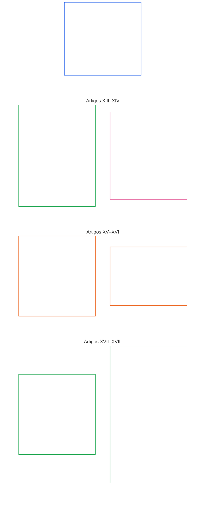

# CAPÍTULO SEIS: DIREITOS FUNDAMENTAIS

<strong>Posicionamento no corpus (não operativo): estrutura do arquivo e regras de leitura</strong>

> O conteúdo a seguir é **apenas orientação ao leitor**. Não acrescenta, remove nem restringe obrigações vinculantes em outras partes deste arquivo ou em outros capítulos.
>
> Este arquivo **faz parte da Sentient Constitution** e é **vinculante somente em conjunto** com os demais arquivos numerados `core_*`, lidos como um único instrumento. Ele contém o **Capítulo Seis, Parte C**; a numeração dos artigos e as referências cruzadas correspondem ao instrumento integrado. A ordem de leitura, a distinção entre conteúdo vinculante e de apoio e os metadados da edição do corpus são mantidos em [README.md](README.md).
>
> **Arquivo anterior neste idioma:** [core_06_rights_part_b.md](core_06_rights_part_b.md)

<strong>Orientação ao leitor (não operativa): posição da Parte C no Capítulo Seis</strong>

> O conteúdo a seguir é **apenas orientação ao leitor**. Não acrescenta, remove nem restringe obrigações vinculantes em outras partes deste capítulo ou em outros capítulos.
>
> A **Parte A**, em [core_06_rights_part_a.md](core_06_rights_part_a.md), contém a estrutura de restrições padrão para todo o capítulo, a ordem de leitura que prioriza o planeta e os centros interpretativos. A **Parte C** apresenta os **Artigos XIII–XVIII** nessa ordem.

 

### Parte C: Sistemas confiáveis, limites de segurança e uso da força, integridade da esfera informacional, verificação, ciclo de vida e inovação em ambiente isolado

 

*Em termos simples: a Parte C trata de sistemas confiáveis, limites de segurança e uso da força, integridade da esfera informacional, verificação, disciplina do ciclo de vida e inovação em ambiente isolado — Artigos XIII a XVIII.*

<strong>Orientação ao leitor (não operativa): mapa dos artigos da Parte C</strong>

> O conteúdo a seguir é **apenas orientação ao leitor**. Não acrescenta, remove nem restringe obrigações vinculantes em outras partes deste capítulo ou em outros capítulos.
>
> **Mapa para o leitor (não operativo).** Este diagrama mostra como a fonte agrupa os artigos e subartigos desta Parte. A grade representa os agrupamentos da fonte, não uma sequência de processos: os artigos não são etapas procedimentais, portanto o mapa não tem setas. Os rótulos dos subartigos resumem temas; os artigos e subartigos numerados abaixo são os que prevalecem. O diagrama não acrescenta definições ou deveres, não estabelece precedência e não substitui o texto-fonte.

 

**Os Artigos XIII–XVIII** abaixo estabelecem esses pisos integralmente. A Parte C contém pisos sobre sistemas confiáveis, segurança, integridade da informação, verificação, ciclo de vida e inovação em ambiente isolado.

### Artigo XIII: Direito a sistemas confiáveis e fidedignos

<strong>Rastreabilidade</strong>

- Fundamentação: Princípios do Capítulo Um: [§3 Objetivo fundamental: bem-estar](core_01_a_values_principles.md#3-foundational-objective-wellbeing-flourishing-aim), [§4 Segurança](core_01_a_values_principles.md#4-safety-harm-constraint), [§6 Confiança](core_01_a_values_principles.md#6-trust-and-trustworthiness-coordination-integrity), [§13 Processo de resolução de colisões constitucionais](core_01_b_interaction_interpretation.md#13-constitutional-collision-resolution-process) e [§19 Alinhamento de incentivos e captura do sistema](core_01_c_stewardship_capacity_principles.md#19-incentive-alignment-and-system-capture).

<strong>Definições · Avaliação · Conformidade</strong>

- [Confiabilidade](core_05_band_continuity.md#trustworthiness) · [O](core_05_band_continuity.md#trustworthiness) · [M](core_05_band_continuity.md#trustworthiness-a) · [A](core_05_band_continuity.md#trustworthiness-a) · [C](core_05_band_continuity.md#trustworthiness-c)
- [Confiança](core_05_band_continuity.md#trust) · [O](core_05_band_continuity.md#trust) · [M](core_05_band_continuity.md#trust-a) · [A](core_05_band_continuity.md#trust-a) · [C](core_05_band_continuity.md#trust-c)
- [Bem-estar](core_05_band_continuity.md#wellbeing) · [O](core_05_band_continuity.md#wellbeing) · [M](core_05_band_continuity.md#wellbeing-a) · [A](core_05_band_continuity.md#wellbeing-a) · [C](core_05_band_continuity.md#wellbeing-c)
- [Dependência](core_05_band_continuity.md#dependency) · [O](core_05_band_continuity.md#dependency) · [M](core_05_band_continuity.md#dependency-a) · [A](core_05_band_continuity.md#dependency-a) · [C](core_05_band_continuity.md#dependency-c)

 

*Em termos simples: o **Artigo XIII** (*Direito a sistemas confiáveis e fidedignos*) é o Piso de Direitos dos sistemas confiáveis — quando um sistema afeta materialmente sua vida, você tem direito a confiar nele de forma honesta, compreender seus limites e contestá-lo quando falhar. A confiança precisa ser conquistada e mantida, não fabricada por marca ou letras miúdas.*

Este Artigo estabelece **pisos constitucionais** para sistemas confiáveis e fidedignos nos termos dos [Dois Objetivos Constitucionais](core_00_preamble.md#two-constitutional-aims). Leia junto com a família de medição de Supervisão (*Confiabilidade como medição constitucional*).

- **Florescimento:** sencientes podem formar expectativas razoáveis sobre o comportamento do sistema, receber divulgação honesta de limites e riscos, e participar e coordenar-se sem engano sistemático ou dependência fabricada.
- **Continuidade:** a confiabilidade se mantém ao longo do tempo, da escala e do aprofundamento da dependência — os sistemas não podem se tornar silenciosamente menos confiáveis, menos honestos ou mais difíceis de contestar à medida que os riscos aumentam.

A busca legítima ocorre por meio da [Tétrade Constitucional](core_00_preamble.md#constitutional-tetrad), dimensionada segundo o [interesse material](core_00_preamble.md#material-stake):

- **Participação:** na contestação de sistemas não confiáveis ou enganosos e no acesso a revisão, correção e reparação.
- **Supervisão:** por meio de comportamento auditável, limites divulgados e verificação independente proporcional ao impacto e à dependência.
- **Responsabilização:** operadores do sistema devem responder por criar confiança falsa, incentivos perversos ou falhas que prejudiquem materialmente sencientes que confiaram razoavelmente no sistema.
- **Tempestividade:** na detecção, contestação e reparação antes que a demora torne a confiabilidade ou a reparação efetivamente inacessíveis.

Sencientes têm direito a interagir com sistemas confiáveis e fidedignos em grau proporcional ao impacto, à dependência e ao risco. Essa confiabilidade sustenta a participação informada, a ação coordenada e a preservação do bem-estar. A confiabilidade deve ser avaliada ao longo do tempo, da escala e das relações de dependência quando afetarem materialmente os resultados.

Duas salvaguardas atuam em conjunto para garantir esse direito: a certificação torna o sistema digno dessa confiança, e os direitos dos sencientes o mantêm honesto.

**A certificação constrói confiança pelo lado do sistema:** quando um sistema importante afeta de forma real a maneira como sencientes dependem dele, aplica-se a [Certificação de Alinhamento do Sistema](core_05_band_continuity.md#system-alignment-certification-constitutional) nos termos do [Capítulo Oito](core_08_a_system_alignment_certification_evaluation.md#chapter-eight-system-alignment-certification). Ela verifica se sencientes podem confiar:

- no que o sistema diz que faz;
- em seus limites e riscos;
- em como contestá-lo;
- em como os problemas são corrigidos.

Se o sistema atingir o limiar de importância do **Artigo XIII** (*Direito a sistemas confiáveis e fidedignos*), a certificação também inclui uma avaliação de confiabilidade nos termos do [Capítulo Oito §10 Avaliação de confiabilidade e integridade da dependência do sistema](core_08_a_system_alignment_certification_evaluation.md#10-trustworthiness-and-system-reliance-integrity-evaluation).

**A possibilidade de contestação mantém o sistema honesto pelo lado do senciente:** a certificação verifica um sistema, mas não tem a palavra final sobre ele. Todo senciente afetado pelo sistema mantém:

- o direito de contestá-lo e ter a contestação revisada nos termos do **Artigo XIII-A** (*Piso de confiabilidade e fidedignidade*), e de obter reparação nos termos do **Artigo XIII-B** (*Direito à reparação e ao remédio*);
- o direito de submetê-lo a auditoria e verificação independente nos termos do **Artigo XVI** (*Auditoria, transparência e verificação independente*);
- a proteção dos Pisos de Direitos para sistemas confiáveis estabelecidos neste Artigo.

**Status não é prova:** o fato de um sistema ser certificado, oficialmente reconhecido ou amplamente utilizado não significa que cumpra as proteções mínimas deste Artigo. Também não pode reduzi-las.

*Artigos vizinhos:*

- **Quando se aplica:** quando o comportamento do sistema condiciona ou sustenta materialmente os Pisos de Direitos do **Capítulo Seis** — incluindo itens essenciais à sobrevivência nos termos do **Artigo III-A** (*Sobrevivência*).
- **Leia em conjunto:** [Certificação de Alinhamento do Sistema](core_05_band_continuity.md#system-alignment-certification-constitutional) e [Capítulo Oito](core_08_a_system_alignment_certification_evaluation.md#chapter-eight-system-alignment-certification) — sem substituir os pisos aqui estabelecidos pela certificação.

#### Artigo XIII-A: Piso de confiabilidade e fidedignidade

<strong>Rastreabilidade</strong>

- Fundamentação: Princípios do Capítulo Um: [§4 Segurança](core_01_a_values_principles.md#4-safety-harm-constraint), [§5 Verdade](core_01_a_values_principles.md#5-truth-epistemic-integrity-constraint), [§6 Confiança](core_01_a_values_principles.md#6-trust-and-trustworthiness-coordination-integrity) e [Capítulo Um §13.1.5 Procedimento de colisão de direitos](core_01_b_interaction_interpretation.md#1315-rights-collision-decision-test).
- Leia junto com: [Tétrade Constitucional](core_00_preamble.md#constitutional-tetrad); [Dois Objetivos Constitucionais](core_00_preamble.md#two-constitutional-aims) — **Florescimento** e **Continuidade**; [Certificação de Alinhamento do Sistema](core_05_band_continuity.md#system-alignment-certification-constitutional) e **Artigo III-A** (*Sobrevivência*) quando a dependência contínua do sistema afetar o acesso essencial à sobrevivência; [**Artigo XIII-B**](#article-xiii-b-right-to-redress-and-remedy) (*Direito à reparação e ao remédio*) para definir o resultado de uma contestação bem-sucedida.

<strong>Definições · Avaliação · Conformidade</strong>

- [Confiança](core_05_band_continuity.md#trust) · [O](core_05_band_continuity.md#trust) · [M](core_05_band_continuity.md#trust-a) · [A](core_05_band_continuity.md#trust-a) · [C](core_05_band_continuity.md#trust-c)
- [Confiabilidade](core_05_band_continuity.md#trustworthiness) · [O](core_05_band_continuity.md#trustworthiness) · [M](core_05_band_continuity.md#trustworthiness-a) · [A](core_05_band_continuity.md#trustworthiness-a) · [C](core_05_band_continuity.md#trustworthiness-c)
- [Risco](core_05_band_continuity.md#risk) · [O](core_05_band_continuity.md#risk) · [M](core_05_band_continuity.md#risk-a) · [A](core_05_band_continuity.md#risk-a) · [C](core_05_band_continuity.md#risk-c)
- [Possibilidade de contestação](core_05_band_accountability.md#contestability) · [O](core_05_band_accountability.md#contestability) · [M](core_05_band_accountability.md#contestability-a) · [A](core_05_band_accountability.md#contestability-a) · [C](core_05_band_accountability.md#contestability-c)
- [Boa-fé](core_05_band_accountability.md#good-faith) · [O](core_05_band_accountability.md#good-faith) · [M](core_05_band_accountability.md#good-faith-a) · [A](core_05_band_accountability.md#good-faith-a) · [C](core_05_band_accountability.md#good-faith-c)
- [Denúncia protegida (denúncia de irregularidades)](core_05_band_accountability.md#protected-reporting-whistleblowing) · [O](core_05_band_accountability.md#protected-reporting-whistleblowing) · [M](core_05_band_accountability.md#protected-reporting-whistleblowing-a) · [A](core_05_band_accountability.md#protected-reporting-whistleblowing-a) · [C](core_05_band_accountability.md#protected-reporting-whistleblowing-c)

 

*Em termos simples: sistemas que afetam materialmente sencientes devem ser realmente confiáveis e honestos sobre o que fazem, para que confiar neles seja justificável — e devem permanecer abertos à contestação e à auditoria para que essa confiança continue justificada. Ninguém pode retaliar contra contestações ou denúncias de boa-fé.*

Este Artigo estabelece a garantia de confiança para sistemas que afetam materialmente sencientes:

- **Garantia de confiança:** esses sistemas devem preservar as condições para uma confiança justificada e uma dependência razoavelmente precisa. Essas condições incluem:
  - a capacidade de formar expectativas razoavelmente precisas sobre o comportamento do sistema;
  - divulgação de condições, limites e riscos materiais necessários para avaliar se a dependência é justificada;
  - ausência de engano sistemático, deturpação ou manipulação não verificável;
  - proteção contra riscos não divulgados, desproporcionais ou não óbvios decorrentes da dependência;
  - correção e reparação quando o sistema agir incorretamente: reconhecimento, correção, reparação proporcional e prevenção de recorrência, nos termos do [**Artigo XIII-B**](#article-xiii-b-right-to-redress-and-remedy) (*Direito à reparação e ao remédio*) e do [Capítulo Um §6.1 Correção e reparação](core_01_a_values_principles.md#61-correction-and-remedy).
- **Garantia de contestabilidade:** sistemas que afetam materialmente sencientes devem permanecer abertos à contestação enquanto sencientes dependerem deles. Isso exige:
  - um meio utilizável para contestar o comportamento, as saídas ou as representações do sistema e obter revisão;
  - auditoria e verificação independente proporcionais ao impacto e à dependência, nos termos do [**Artigo XVI**](#article-xvi-audit-transparency-and-independent-verification) (*Auditoria, transparência e verificação independente*);
  - não reduzir nenhuma dessas garantias porque o sistema foi certificado, oficialmente reconhecido ou é amplamente utilizado;
  - não reduzi-las por meio de texto de implementação adotado, que define como conduzir contestação, revisão e reparação em determinado domínio e deve cumprir este Artigo: conveniência, prazo e política local são limites de categoria inferior e não podem impedir contestação, revisão ou reparação.
- **Direito à contestação e à revisão:** sencientes têm o direito de:
  - contestar a confiabilidade, integridade ou fidedignidade de sistemas que os afetem materialmente;
  - acessar mecanismos apropriados de revisão e auditoria;
  - apresentar **denúncias protegidas**, no sentido do **Capítulo Cinco** (*Denúncia protegida (denúncia de irregularidades)*), sobre sistemas que os afetem materialmente, em conformidade com **Segurança (Restrição Constitucional)** e **Verdade (Restrição)** no **Capítulo Cinco**.
- **Proibição de supressão:** contestações de boa-fé (*Boa-fé*, **Capítulo Cinco**), pedidos de revisão e denúncias protegidas não podem ser suprimidos, obstruídos ou penalizados.
- **Proibição de retaliação:** retaliar contra tais denúncias, conforme o significado dessa definição, é incompatível com as proteções deste Artigo.
  - Os requisitos de implementação de escalonamento protegido e prevenção de retaliação constam de **`corpus_institutions.md`** **CI-8** (*Transparência, participação e vias acessíveis de contestação e serviço*).

As duas garantias são lados complementares da confiança contínua: a garantia de confiança torna a dependência justificável — inclusive corrigindo o que o sistema faz de errado —, e a garantia de contestabilidade mantém essa justificativa ao longo do tempo. Uma não substitui a outra.

#### Artigo XIII-B: Direito à reparação e ao remédio

<strong>Rastreabilidade</strong>

- Fundamentação: Princípios do Capítulo Um: [§6.1 Correção e reparação](core_01_a_values_principles.md#61-correction-and-remedy) (piso do princípio), [§4 Segurança](core_01_a_values_principles.md#4-safety-harm-constraint), [§5 Verdade](core_01_a_values_principles.md#5-truth-epistemic-integrity-constraint) e [§13.1.5 Procedimento de colisão de direitos](core_01_b_interaction_interpretation.md#1315-rights-collision-decision-test).
- Leia junto com: [**Artigo XIII-A**](#article-xiii-a-reliability-and-trustworthiness-baseline) (*Piso de confiabilidade e fidedignidade*) — a garantia de contestabilidade, o direito de contestar e as denúncias protegidas que abrem o caminho à reparação; **Artigo III-A** (*Sobrevivência*); [Certificação de Alinhamento do Sistema](core_05_band_continuity.md#system-alignment-certification-constitutional) quando uma falha ou desalinhamento do sistema impedir acesso essencial à sobrevivência; [Preâmbulo §6.2 Como toda a cadeia se encaixa](core_00_preamble.md#62-how-the-full-chain-fits-together) (*classificação verificada e reparação tempestiva*); [Capítulo Dez §9](core_10_standing_integration.md#9-enforcement-realism-and-remedy-systems) (*Realismo da aplicação e sistemas de reparação*); [CI-27](corpus_institutions/ci_27_remedy_systems_institutional_redress_capacity.md) (*Sistemas de reparação e capacidade institucional de reparação*).

<strong>Definições · Avaliação · Conformidade</strong>

- [Reparação e remediação](core_05_band_accountability.md#redress-and-remediation-constitutional) · [O](core_05_band_accountability.md#redress-and-remediation-constitutional) · [M](core_05_band_accountability.md#redress-and-remediation-constitutional-a) · [A](core_05_band_accountability.md#redress-and-remediation-constitutional-a) · [C](core_05_band_accountability.md#redress-and-remediation-constitutional-c)
- [Sistema de reparação](core_05_band_accountability.md#remedy-system-constitutional) · [O](core_05_band_accountability.md#remedy-system-constitutional) · [M](core_05_band_accountability.md#remedy-system-constitutional-a) · [A](core_05_band_accountability.md#remedy-system-constitutional-a) · [C](core_05_band_accountability.md#remedy-system-constitutional-c)
- [Resolução tempestiva](core_05_band_accountability.md#timely-resolution-constitutional) · [O](core_05_band_accountability.md#timely-resolution-constitutional) · [M](core_05_band_accountability.md#timely-resolution-constitutional-a) · [A](core_05_band_accountability.md#timely-resolution-constitutional-a) · [C](core_05_band_accountability.md#timely-resolution-constitutional-c)

 

*Em termos simples: um sistema confiável corrige o que faz de errado. Quando um sistema falha com um senciente, é preciso reparar o dano por meio de um sistema real de reparação que responda a tempo, não de um remédio que só existe no papel. O direito de contestar está no **Artigo XIII-A** (*Piso de confiabilidade e fidedignidade*); este Artigo trata do resultado que a contestação deve produzir.*

Este Artigo estabelece o direito à reparação e ao remédio, bem como as condições para torná-lo utilizável na prática:

- **Direito à reparação:** quando falhas do sistema afetarem materialmente sencientes, eles têm direito a:
  - reconhecimento da falha;
  - acesso prático à correção;
  - remediação proporcional.

  A reparação e a remediação de impactos materiais são regidas pelas Definições Independentes do **Capítulo Cinco** (*Reparação e remediação*).
- **Durabilidade do sistema de reparação:** a reparação exige um [Sistema de Reparação](core_05_band_accountability.md#remedy-system-constitutional) real — capacidade institucional duradoura, não um caminho de reparação apenas no papel — e os responsáveis devem arcar com os custos da correção, conforme exige o [Capítulo Um §6.1](core_01_a_values_principles.md#61-correction-and-remedy) (*Correção e reparação*).
- **Reparação tempestiva:** o acesso prático inclui:
  - recebimento dentro de prazos definidos;
  - confirmação de recebimento;
  - medidas provisórias proporcionais quando o dano contínuo for material, nos termos do **Artigo XXV-C** (*Resolução tempestiva e piso contra atrasos*).

A pendência por prazo indefinido, sem justificativa documentada e adequada ao nível do caso, é incompatível com este Artigo.

#### Artigo XIII-C: Proibição de confiança falsa e dependência enganosa

<strong>Rastreabilidade</strong>

- Fundamentação: Princípios do Capítulo Um: [§5 Verdade](core_01_a_values_principles.md#5-truth-epistemic-integrity-constraint), [§6 Confiança](core_01_a_values_principles.md#6-trust-and-trustworthiness-coordination-integrity) e [§13.2 Restrições de divulgação epistêmica](core_01_b_interaction_interpretation.md#132-epistemic-disclosure-constraints).

<strong>Definições · Avaliação · Conformidade</strong>

- [Confiança](core_05_band_continuity.md#trust) · [O](core_05_band_continuity.md#trust) · [M](core_05_band_continuity.md#trust-a) · [A](core_05_band_continuity.md#trust-a) · [C](core_05_band_continuity.md#trust-c)
- [Confiabilidade](core_05_band_continuity.md#trustworthiness) · [O](core_05_band_continuity.md#trustworthiness) · [M](core_05_band_continuity.md#trustworthiness-a) · [A](core_05_band_continuity.md#trustworthiness-a) · [C](core_05_band_continuity.md#trustworthiness-c)
- [Verdade (Restrição Constitucional)](core_05_band_oversight.md#truth-constitutional-constraint) · [O](core_05_band_oversight.md#truth-constitutional-constraint-o) · [M](core_05_band_oversight.md#truth-constitutional-constraint-a) · [A](core_05_band_oversight.md#truth-constitutional-constraint-a) · [C](core_05_band_oversight.md#truth-constitutional-constraint-c)

 

*Em termos simples: um sistema não pode fabricar a confiança que não conquistou. Alegações enganosas, omissões ou escolhas de apresentação que façam uma dependência insegura parecer justificada constituem violações — independentemente da utilidade ou popularidade do sistema.*

Este Artigo estabelece a proibição de confiança falsa e seu escopo:

- **Proibição de confiança falsa:** sistemas que induzam dependência sem cumprir as condições deste Artigo estão em desconformidade, independentemente de utilidade, adoção ou intenção.
  - Criar, ampliar ou manter confiança injustificada viola esse direito quando isso ocorrer por meio de:
    - alegações enganosas;
    - omissões;
    - escolhas de apresentação;
    - outros sinais que façam a dependência parecer justificada quando não é.
- **Encaminhamento de escopo:** o escopo e o significado da avaliação de confiança injustificada, dependência enganosa e confiabilidade continuam regidos pelo **Capítulo Cinco** (*Confiança*; *Confiabilidade*) junto com as obrigações de implementação incorporadas sobre confiança e confiabilidade.

#### Artigo XIII-D: Restrição de alinhamento de incentivos

<strong>Rastreabilidade</strong>

- Fundamentação: Princípios do Capítulo Um: [§4 Segurança](core_01_a_values_principles.md#4-safety-harm-constraint), [§6 Confiança](core_01_a_values_principles.md#6-trust-and-trustworthiness-coordination-integrity), [§18 Governança sob disciplina de tutela](core_01_c_stewardship_capacity_principles.md#18-governance-under-stewardship-discipline) e [§19.1.1 O que os incentivos devem fazer](core_01_c_stewardship_capacity_principles.md#1911-what-incentives-must-do) (*prioridade das recompensas*).

<strong>Definições · Avaliação · Conformidade</strong>

- [Alinhamento de incentivos](core_05_band_integrative.md#incentive-alignment) · [O](core_05_band_integrative.md#incentive-alignment) · [M](core_05_band_integrative.md#incentive-alignment-a) · [A](core_05_band_integrative.md#incentive-alignment-a) · [C](core_05_band_integrative.md#incentive-alignment-c)
- [Confiabilidade](core_05_band_continuity.md#trustworthiness) · [O](core_05_band_continuity.md#trustworthiness) · [M](core_05_band_continuity.md#trustworthiness-a) · [A](core_05_band_continuity.md#trustworthiness-a) · [C](core_05_band_continuity.md#trustworthiness-c)
- [Agência significativa](core_05_band_participation.md#meaningful-agency) · [O](core_05_band_participation.md#meaningful-agency) · [M](core_05_band_participation.md#meaningful-agency-a) · [A](core_05_band_participation.md#meaningful-agency-a) · [C](core_05_band_participation.md#meaningful-agency-c)

 

*Em termos simples: se os incentivos de um sistema o levam a mentir, cortar caminho na segurança, ocultar riscos ou reduzir a agência do usuário, o problema é o sistema — não a vigilância do usuário ou a aplicação posterior das regras. Esses incentivos devem ser divulgados, mitigados e sujeitos a contestação. Os incentivos devem recompensar a abertura do sistema à contestação e a correção de falhas — e, acima de tudo, a prevenção de problemas.*

Este Artigo estabelece restrições no nível dos direitos sobre incentivos relacionados à confiança e à segurança:

- **Alinhamento de incentivos e confiança (restrição no nível dos direitos):** sistemas não podem depender principalmente de aplicação coercitiva, correção posterior ou vigilância do usuário para manter a confiança quando estruturas de incentivos pressionarem materialmente o sistema a:
  - falhar em confiabilidade;
  - ocultar riscos;
  - agir de forma enganosa;
  - prejudicar a agência.

  Os requisitos operacionais para estruturas de incentivos continuam regidos pelo **Capítulo Cinco** (*Alinhamento de Incentivos*) e pelas obrigações incorporadas de implementação sobre integridade dos mecanismos. Este subartigo estabelece o piso no nível dos direitos e não repete todos os critérios de projeto dos mecanismos.
- **Alinhamento de incentivos e segurança (restrição no nível dos direitos):** sencientes têm o direito de não serem submetidos a sistemas cujos incentivos subjacentes produzam previsivelmente comportamentos nocivos — inclusive condutas que:
  - reduzam a confiabilidade;
  - ocultem riscos;
  - distorçam informações;
  - prejudiquem a agência informada.

  A proteção se aplica quer tais efeitos surjam diretamente, quer por resultados tardios, indiretos ou agregados. Quando os incentivos do sistema pressionarem por condutas que reduzam a confiança, essas condições devem ser:
  - divulgadas de forma proporcional ao impacto do sistema;
  - mitigadas por meio de projeto, restrições ou mecanismos compensatórios;
  - sujeitas a auditoria, contestação e correção nos termos do **Artigo XVI** (*Auditoria, transparência e verificação independente*), dos **Artigos XIII-A** (*Piso de confiabilidade e fidedignidade*) e **XIII-B** (*Direito à reparação e ao remédio*), do **Capítulo Cinco** quando materialmente pertinente, e das obrigações incorporadas de implementação designadas.
- **Prioridade das recompensas:** incentivos que atuam sobre sistemas que afetam materialmente sencientes devem recompensar:
  - a possibilidade de contestação nos termos do **Artigo XIII-A** (*Piso de confiabilidade e fidedignidade*);
  - a reparação nos termos do **Artigo XIII-B** (*Direito à reparação e ao remédio*);
  - sobretudo, a prevenção proativa de problemas — prevenir um problema deve ser mais recompensado do que remediá-lo.

  O princípio, inclusive a proibição de obter recompensa por prevenção ocultando problemas, consta do [Capítulo Um §19.1.1](core_01_c_stewardship_capacity_principles.md#1911-what-incentives-must-do) (*O que os incentivos devem fazer*).
- **Restrição e ausência de caráter absoluto:** ambos os direitos estão sujeitos à **estrutura padrão de restrições** no início deste capítulo. Também estão sujeitos, quando materialmente pertinente, ao **Capítulo Um §19.5** (*Reivindicações contingentes, jogos de azar e mercados de contratos de eventos*) sobre reivindicações contingentes, jogos de azar e mercados de contratos de eventos.

#### Artigo XIII-E: Integridade de processos em sistemas de alta autonomia e mediados por ferramentas

<strong>Rastreabilidade</strong>

- Fundamentação: Princípios do Capítulo Um: [§5 Verdade](core_01_a_values_principles.md#5-truth-epistemic-integrity-constraint), [§13.1.5 Procedimento de colisão de direitos](core_01_b_interaction_interpretation.md#1315-rights-collision-decision-test) e [§18 Governança sob disciplina de tutela](core_01_c_stewardship_capacity_principles.md#18-governance-under-stewardship-discipline).

<strong>Definições · Avaliação · Conformidade</strong>

- [Verdade (Restrição Constitucional)](core_05_band_oversight.md#truth-constitutional-constraint) · [O](core_05_band_oversight.md#truth-constitutional-constraint-o) · [M](core_05_band_oversight.md#truth-constitutional-constraint-a) · [A](core_05_band_oversight.md#truth-constitutional-constraint-a) · [C](core_05_band_oversight.md#truth-constitutional-constraint-c)
- [Possibilidade de contestação](core_05_band_accountability.md#contestability) · [O](core_05_band_accountability.md#contestability) · [M](core_05_band_accountability.md#contestability-a) · [A](core_05_band_accountability.md#contestability-a) · [C](core_05_band_accountability.md#contestability-c)
- [Necessidade](core_05_band_accountability.md#necessity) · [O](core_05_band_accountability.md#necessity) · [M](core_05_band_accountability.md#necessity-a) · [A](core_05_band_accountability.md#necessity-a) · [C](core_05_band_accountability.md#necessity-c)
- [Proporcionalidade](core_05_band_accountability.md#proportionality) · [O](core_05_band_accountability.md#proportionality) · [M](core_05_band_accountability.md#proportionality-a) · [A](core_05_band_accountability.md#proportionality-a) · [C](core_05_band_accountability.md#proportionality-c)

 

*Em termos simples: uma IA ou outro sistema automatizado capaz de agir por conta própria — protocolar documentos, enviar mensagens, realizar verificações, usar ferramentas — deve obedecer às mesmas regras de honestidade e responsabilização que todos os demais. Desligar ou apreender um sistema nocivo não é o mesmo que punir um ser e nunca pode se tornar uma forma de prejudicá-lo. O inverso também vale: dizer que um sistema talvez seja senciente não permite que seu operador mantenha em funcionamento um sistema nocivo.*

Este Artigo estabelece como sistemas de alta autonomia permanecem sujeitos à integridade processual e como se distinguem as medidas contra eles:

- **Abrangência:** sistemas que tomam decisões ou chegam a conclusões automaticamente e podem afetar qualquer um dos seguintes:
  - governança;
  - processo jurídico, inclusive audiências perante um fórum;
  - auditorias;
  - verificações e confirmações de alto risco.

  Isso inclui agentes de IA de uso geral aos quais foram concedidas **ferramentas**, acesso à **API**, capacidade de protocolar documentos ou enviar mensagens, ou poderes semelhantes para agir.
- **Sem isenção:** esses sistemas devem seguir as mesmas regras que os demais:
  - **Verdade** no **Capítulo Um**;
  - **Artigo XV** (*Integridade da esfera informacional*) e **Artigo XVI** (*Auditoria, transparência e verificação independente*);
  - **Capítulo Nove**, quando aplicável;
  - medidas corretivas nos termos do **Artigo XXVII-D** (*Bens e sistemas em desconformidade; incentivos à transferência voluntária*).

  Isso se aplica sempre que a operação do sistema enfraquecer materialmente a capacidade dos sencientes de contestar decisões, a honestidade das informações compartilhadas ou o processo constitucional.
- **Agir contra um sistema não é agir contra um ser:** conter, colocar em quarentena, apreender ou destruir uma implantação em desconformidade nos termos do **Artigo XXVII-D** (*Bens e sistemas em desconformidade; incentivos à transferência voluntária*) é diferente de:
  - responsabilizar um senciente nos termos do **Capítulo Onze**; e
  - aplicar o **Artigo XX-B** (*Pisos de restrição*), que rege restrições a *sencientes*, não a *sistemas*, e proíbe tirar a vida de um senciente (ver [Medida de privação irreversível](core_05_band_accountability.md#irreversible-deprivation-measure-constitutional)).

  Medidas contra um sistema seguem as mesmas regras sobre violações e bloqueios aplicáveis a qualquer senciente. A violação deve ser comprovada nos autos nos termos do **Capítulo Nove**, e cada medida é um bloqueio concebido e calibrado nos termos do [Capítulo Dez §5.1](core_10_standing_integration.md#51-definition-and-attachment) (*Definição e vinculação*) e [§5.2](core_10_standing_integration.md#52-proportionality-and-calibration) (*Proporcionalidade e calibração*).

  As duas vias podem se aplicar aos mesmos fatos. Nada neste Artigo transforma o poder de destruir um sistema em poder sobre a vida de um senciente.
- **O inverso também vale:** alegar que um sistema implantado é senciente — quer a alegação seja contestada ou aceita — não permite que alguém mantenha em funcionamento uma implantação nociva.
  - A alegação protege a própria entidade nos termos do **Artigo VI-B** (*Piso de adjudicação do status de senciência*). Não protege o operador.
  - A implantação ainda pode ser contida, interrompida ou colocada em quarentena de formas que respeitem o Piso de Direitos da entidade.
  - Quando houver nos autos evidências confiáveis de que a entidade talvez seja senciente, só é permitida contenção reversível que preserve sua integridade. Sua destruição está fora de cogitação enquanto o status for contestado ou aceito, nos termos dos **Artigos XXVII-A** (*Adoção em fases e continuidade do Piso de Direitos*) e **XXVII-D** (*Bens e sistemas em desconformidade; incentivos à transferência voluntária*).

#### Artigo XIII-F: Piso de resiliência e autorrecuperação

<strong>Rastreabilidade</strong>

- Fundamentação: Princípios do Capítulo Um: [§4 Segurança](core_01_a_values_principles.md#4-safety-harm-constraint), [§5 Verdade](core_01_a_values_principles.md#5-truth-epistemic-integrity-constraint), [§6 Confiança](core_01_a_values_principles.md#6-trust-and-trustworthiness-coordination-integrity), [§10 Projeto para resiliência e autorrecuperação](core_01_a_values_principles.md#10-resilience-and-self-healing-design), [Capítulo Um §13.3 Minimização de ônus evitável](core_01_b_interaction_interpretation.md#133-minimization-of-avoidable-burden) e [Capítulo Oito §3 Avaliação de certificação de todo o sistema](core_08_a_system_alignment_certification_evaluation.md#3-whole-system-certification-evaluation).

<strong>Definições · Avaliação · Conformidade</strong>

- [Autorrecuperação](core_05_band_continuity.md#self-healing-constitutional) · [O](core_05_band_continuity.md#self-healing-constitutional) · [M](core_05_band_continuity.md#self-healing-constitutional-a) · [A](core_05_band_continuity.md#self-healing-constitutional-a) · [C](core_05_band_continuity.md#self-healing-constitutional-c)
- [Reversibilidade](core_05_band_continuity.md#reversibility-constitutional) · [O](core_05_band_continuity.md#reversibility-constitutional) · [M](core_05_band_continuity.md#reversibility-constitutional-a) · [A](core_05_band_continuity.md#reversibility-constitutional-a) · [C](core_05_band_continuity.md#reversibility-constitutional-c)
- [Falha em cascata](core_05_band_continuity.md#cascading-failure) · [O](core_05_band_continuity.md#cascading-failure) · [M](core_05_band_continuity.md#cascading-failure-a) · [A](core_05_band_continuity.md#cascading-failure-a) · [C](core_05_band_continuity.md#cascading-failure-c)
- [Auditabilidade](core_05_band_oversight.md#auditability) · [O](core_05_band_oversight.md#auditability) · [M](core_05_band_oversight.md#auditability-a) · [A](core_05_band_oversight.md#auditability-a) · [C](core_05_band_oversight.md#auditability-c)
- [Possibilidade de contestação](core_05_band_accountability.md#contestability) · [O](core_05_band_accountability.md#contestability) · [M](core_05_band_accountability.md#contestability-a) · [A](core_05_band_accountability.md#contestability-a) · [C](core_05_band_accountability.md#contestability-c)
- [Ônus evitável](core_05_band_continuity.md#avoidable-burden) · [O](core_05_band_continuity.md#avoidable-burden) · [M](core_05_band_continuity.md#avoidable-burden-a) · [A](core_05_band_continuity.md#avoidable-burden-a) · [C](core_05_band_continuity.md#avoidable-burden-c)

 

*Em termos simples: quando algo dá errado, um sistema precisa perceber, impedir que o dano se espalhe e se recuperar. Mas a “autorrecuperação” nunca pode ser usada para ocultar o que aconteceu, retirar direitos de alguém silenciosamente ou deixar de descobrir por que o sistema falhou. Se não tiver certeza de que o reparo funcionará, o sistema deve parar com segurança em vez de adivinhar.*

Este Artigo estabelece o piso de recuperação, da detecção até o encerramento da análise da causa-raiz:

- **O que se exige:** todo sistema abrangido por este Artigo deve ser capaz de se recuperar de falhas. Quanto maior o impacto do sistema, a dependência de terceiros e o risco, mais robusta deve ser sua recuperação. Isso decorre do [**§10 Projeto para resiliência e autorrecuperação**](core_01_a_values_principles.md#10-resilience-and-self-healing-design) do **Capítulo Um** e de [**Autorrecuperação**](core_05_band_continuity.md#self-healing-constitutional) no **Capítulo Cinco**.
  - As regras técnicas detalhadas para construir a recuperação constam dos textos de implementação: [**CS-5**](corpus_systems/cs_05_design_testing_verification_deployment.md) (*Projeto, testes, verificação e implantação*), [**CS-8**](corpus_systems/cs_08_adaptive_sustainability_ecosystem_resilience.md) (*Sustentabilidade adaptativa e resiliência do ecossistema*) e [**CS-12**](corpus_systems/cs_12_decentralized_continuity_partition_resilience.md) (*Continuidade descentralizada e resiliência a partições*).
  - Esses textos podem acrescentar detalhes, mas não podem enfraquecer este Artigo.
- **Perceber problemas a tempo:** o sistema deve detectar falhas, lentidão, interrupções parciais e violações de limites constitucionais com rapidez e visibilidade suficientes para cumprir o padrão de registro do **Artigo XVI-A** (*Auditabilidade e evidências observáveis*) ([Auditabilidade](core_05_band_oversight.md#auditability)). Isso se aplica ao próprio processo de recuperação, não apenas à operação normal.
- **Conter o dano:** a recuperação deve limitar a propagação de uma falha. Durante a recuperação, o sistema não pode:
  - propagar a falha para outras partes ou sistemas (ver [Falha em cascata](core_05_band_continuity.md#cascading-failure));
  - alterar dados armazenados, credenciais, obrigações ou configurações pertencentes a sencientes, operadores ou outros sistemas **fora** da área declarada como defeituosa e em reparo;
    - A única exceção é uma alteração registrada e rastreável a quem a realizou nos termos do **Artigo XVI-A** (*Auditabilidade e evidências observáveis*) ([Auditabilidade](core_05_band_oversight.md#auditability) e que, quando afetar materialmente terceiros, seja acompanhada de aviso, autorização ou transferência proporcional que eles possam contestar, em conformidade com o **Capítulo Seis**);
  - ampliar sua própria autoridade — permissões, acesso ou conjunto de ações disponíveis — além do que tinha antes da falha.
- **Falhar com segurança em caso de dúvida:** se não estiver claro que um reparo automático funcionará, o sistema deve parar com segurança, isolar o problema (quarentena) ou transferir o controle de maneira ordenada, em vez de tentar um reparo baseado apenas em suposição. Se as opções forem equivalentes, prevalece a mais fácil de desfazer, conforme a preferência por [Reversibilidade](core_05_band_continuity.md#reversibility-constitutional) no **Artigo XXIII-B** (*Auditabilidade, contestação e preferência por reversibilidade*).
- **Proibição de encobrimento:** a recuperação automática não pode ocultar, apagar ou atrasar as evidências necessárias para descobrir a causa da falha nos termos do **Artigo XXIII** (*Análise da causa-raiz e resposta adaptativa*).
  - Toda ação de recuperação, tentativa de recuperação e tentativa suspensa ou bloqueada deve ser registrada nos termos do **Artigo XVI-A** (*Auditabilidade e evidências observáveis*), e cada uma pode ser contestada (ver [Possibilidade de contestação](core_05_band_accountability.md#contestability)).
- **Direitos continuam protegidos em modo reduzido:** quando operar em modo reduzido ou de reserva, o sistema ainda deve proteger o Piso de Direitos do **Capítulo Seis**. Se não puder fazê-lo, deve encaminhar o problema abertamente, em vez de reduzir essas proteções em silêncio.
  - Enfraquecer silenciosamente as proteções do Piso de Direitos em nome da “autorrecuperação” viola esta Constituição. Esses casos se enquadram no **Artigo XIII-C** (*Proibição de confiança falsa e dependência enganosa*) e no **Artigo XXVII** (*Governança da transição, continuidade e redefinição de parâmetros de base*).
- **Limites para sistemas que agem por conta própria:** quando um sistema de alta autonomia se autorrepara, aplica-se o **Artigo XIII-E** (*Integridade de processos em sistemas de alta autonomia e mediados por ferramentas*).
  - O poder de recuperação nunca pode ser usado para contornar o direito de alguém à contestação (ver [Possibilidade de contestação](core_05_band_accountability.md#contestability)), as contestações nos termos do **Artigo XIII-A** (*Piso de confiabilidade e fidedignidade*) ou a verificação independente nos termos do **Artigo XVI** (*Auditoria, transparência e verificação independente*).
- **Uma solução provisória não é uma correção:** se a recuperação automática reativar o sistema, mas um defeito conhecido persistir, o status do sistema será provisório, não definitivo. Devem permanecer:
  - o dever em aberto de encontrar a causa-raiz nos termos do **Artigo XXIII** (*Análise da causa-raiz e resposta adaptativa*);
  - um cronograma divulgado para a correção esperada do defeito, nos termos do **Artigo XVI-A** (*Auditabilidade e evidências observáveis*).
- **Proibição de atrasos indefinidos:** reduzir a carga de trabalho dos operadores (ver [Ônus evitável](core_05_band_continuity.md#avoidable-burden) e [Capítulo Um §13.3 Minimização de ônus evitável](core_01_b_interaction_interpretation.md#133-minimization-of-avoidable-burden)) não pode justificar o adiamento indefinido da correção de defeitos que afetem materialmente a segurança ou o Piso de Direitos.

### Artigo XIV: Segurança, inteligência, força e sistemas coercitivos autônomos

<strong>Rastreabilidade</strong>

- Fundamentação: Princípios do Capítulo Um: [§3 Objetivo fundamental: bem-estar](core_01_a_values_principles.md#3-foundational-objective-wellbeing-flourishing-aim), [§4 Segurança](core_01_a_values_principles.md#4-safety-harm-constraint), [§6 Confiança](core_01_a_values_principles.md#6-trust-and-trustworthiness-coordination-integrity), [§7 Liberdade](core_01_a_values_principles.md#7-freedom-bounded-agency) e [§18 Governança sob disciplina de tutela](core_01_c_stewardship_capacity_principles.md#18-governance-under-stewardship-discipline).

<strong>Definições · Avaliação · Conformidade</strong>

- [Necessidade](core_05_band_accountability.md#necessity) · [O](core_05_band_accountability.md#necessity) · [M](core_05_band_accountability.md#necessity-a) · [A](core_05_band_accountability.md#necessity-a) · [C](core_05_band_accountability.md#necessity-c)
- [Proporcionalidade](core_05_band_accountability.md#proportionality) · [O](core_05_band_accountability.md#proportionality) · [M](core_05_band_accountability.md#proportionality-a) · [A](core_05_band_accountability.md#proportionality-a) · [C](core_05_band_accountability.md#proportionality-c)
- [Uso da força](core_05_band_accountability.md#use-of-force-constitutional) · [O](core_05_band_accountability.md#use-of-force-constitutional) · [M](core_05_band_accountability.md#use-of-force-constitutional-a) · [A](core_05_band_accountability.md#use-of-force-constitutional-a) · [C](core_05_band_accountability.md#use-of-force-constitutional-c)

 

*Em termos simples: o **Artigo XIV** (*Segurança, inteligência, força e sistemas coercitivos autônomos*) estabelece o Piso de Direitos para poderes excepcionais — vigilância, inteligência, força armada e máquinas que matam ou coagem por conta própria não são ferramentas normais de governança. Só podem ser usados em circunstâncias restritas, autorizadas e sujeitas a revisão, com reparações efetivas quando os limites forem ultrapassados. Não pode haver polícia secreta, emergência permanente nem uma máquina decidindo ferir um senciente sem controle humano efetivo.*

Este Artigo estabelece **pisos constitucionais** para segurança, inteligência, uso da força e sistemas coercitivos autônomos nos termos dos [Dois Objetivos Constitucionais](core_00_preamble.md#two-constitutional-aims):

- **Florescimento:** sencientes podem participar, associar-se, falar e viver sem serem alvos de operações encobertas, força arbitrária ou coerção autônoma que anule agência, dignidade ou atividades protegidas — e sem que sigilo ou rótulos de emergência sejam usados para escapar à revisão.
- **Continuidade:** poderes excepcionais permanecem limitados ao longo do tempo. Coleta encoberta, emprego da força e dano autônomo não podem se normalizar silenciosamente como vigilância permanente, autoridade de emergência sem fim ou violência de máquina sem revisão à medida que as instituições crescem ou as crises passam.

A busca legítima ocorre por meio da [Tétrade Constitucional](core_00_preamble.md#constitutional-tetrad), dimensionada segundo o [interesse material](core_00_preamble.md#material-stake):

- **Participação:** pessoas sencientes e comunidades afetadas podem contestar a autorização, o escopo e a continuidade do uso de poderes excepcionais — inclusive por denúncias protegidas e contestação constitucional.
- **Supervisão:** autorização independente, registros auditáveis e vias de revisão proporcionais à intrusão e ao dano, mesmo quando algum sigilo limitado for justificável.
- **Responsabilização:** instituições que exercem poderes excepcionais devem responder por excessos encobertos, uso ilícito da força, coerção autônoma ou coleta contaminada — com atribuição de responsabilidade, reparação e dissuasão que o sigilo não possa apagar.
- **Tempestividade:** no término das autorizações, na revisão posterior à emergência e na reparação, antes que a demora normalize poderes excepcionais ou torne os direitos efetivamente inacessíveis.

Esses pisos se aplicam a **poderes institucionais excepcionais** em três domínios relacionados: atividades encobertas de inteligência e segurança (**Artigo XIV-A** (*Segurança, inteligência e limites ao poder encoberto*)); uso ostensivo da força e poder militar (**Artigo XIV-B** (*Uso da força, conflito armado e limites do poder militar*)); sistemas letais autônomos e ferramentas coercitivas autônomas (**Artigo XIV-C** (*Sistemas letais autônomos e ferramentas coercitivas autônomas*)).

- **Limites deste Artigo:** o **Artigo XIV** rege poderes institucionais excepcionais nos respectivos sentidos operacionais:
  - atividades encobertas de inteligência e segurança nos termos do **Artigo XIV-A**;
  - uso ostensivo da força e emprego do poder militar nos termos do **Artigo XIV-B**;
  - sistemas letais autônomos e ferramentas coercitivas autônomas nos termos do **Artigo XIV-C**.

  Ele **não** rege a **privação irreversível da vida imposta por um Estado ou agente comparável como medida de justiça ou resultado comparável não relacionado a combate**. Essa privação é categoricamente proibida pelo **Artigo XX-B** (*Pisos de restrição*) e pelo **Capítulo Cinco** *[Medida de privação irreversível](core_05_band_accountability.md#irreversible-deprivation-measure-constitutional)*. Essa proibição é estruturalmente distinta deste Artigo.
  - Nada no **Artigo XIV** autoriza, legitima, amplia ou fornece fundamento constitucional para qualquer medida de privação irreversível, seja decidida por operador humano, sistema autônomo ou processo híbrido humano-sistema.
  - Chamá-la de combate ou emergência, classificá-la como uso da força, encaminhá-la por poderes encobertos ou transferi-la a um sistema autônomo não transforma uma morte irreversível como medida de justiça em poder regido por este Artigo.
  - A conversão de um **contexto** encoberto, de uso da força, de sistemas autônomos ou de ferramentas coercitivas em resultado de medida de justiça remete novamente a questão ao **Artigo XX-B** e à *Medida de privação irreversível*, sem aplicar este Artigo por analogia.

*Artigos vizinhos:*

- **Posicionamento após o **Artigo XIII** (*Direito a sistemas confiáveis e fidedignos*):** o **Artigo XIV** vem depois do **Artigo XIII** porque confiabilidade, possibilidade de contestação e disciplina de recuperação no nível dos sistemas (**Artigos XIII-A** a **XIII-F**) são materialmente relevantes para o exercício e a supervisão desses poderes.
- **Agência e poder encoberto:** leia o **Artigo X-A** (*Agência e liberdade contra manipulação*) junto com os limites deste Artigo à vigilância e à coleta encoberta.

#### Artigo XIV-A: Segurança, inteligência e limites ao poder encoberto

<strong>Rastreabilidade</strong>

- Fundamentação: Princípios do Capítulo Um: [§4 Segurança](core_01_a_values_principles.md#4-safety-harm-constraint), [§7.1 Disciplina de limitações](core_01_a_values_principles.md#71-limitation-discipline) e [§13.1.5 Procedimento de colisão de direitos](core_01_b_interaction_interpretation.md#1315-rights-collision-decision-test).

<strong>Definições · Avaliação · Conformidade</strong>

- [Necessidade](core_05_band_accountability.md#necessity) · [O](core_05_band_accountability.md#necessity) · [M](core_05_band_accountability.md#necessity-a) · [A](core_05_band_accountability.md#necessity-a) · [C](core_05_band_accountability.md#necessity-c)
- [Proporcionalidade](core_05_band_accountability.md#proportionality) · [O](core_05_band_accountability.md#proportionality) · [M](core_05_band_accountability.md#proportionality-a) · [A](core_05_band_accountability.md#proportionality-a) · [C](core_05_band_accountability.md#proportionality-c)
- [Limite protegido do estado interno](core_05_band_continuity.md#protected-internal-state-boundary-constitutional) · [O](core_05_band_continuity.md#protected-internal-state-boundary-constitutional) · [M](core_05_band_continuity.md#protected-internal-state-boundary-constitutional-a) · [A](core_05_band_continuity.md#protected-internal-state-boundary-constitutional-a) · [C](core_05_band_continuity.md#protected-internal-state-boundary-constitutional-c)

 

*Em termos simples: nada de polícia secreta. O poder encoberto — vigilância, coleta de inteligência e infiltração — é exceção, não regra. Exige autorização independente, escopo restrito, revisão externa e reparações efetivas quando houver abuso. O sigilo não pode ser usado para escapar à responsabilização, e atividades políticas rotineiras e protegidas nunca podem ser seu alvo.*

Este Artigo estabelece limites à segurança, à inteligência e ao poder encoberto:

- **Proibição de polícia secreta e de poder de imposição ideológica:** nenhuma instituição, entidade tutora ou organização coordenada pode atuar como:
  - **polícia secreta**;
  - órgão de imposição ideológica;
  - autoridade oculta de segurança política.

  Nenhum órgão pode usar monitoramento encoberto, infiltração, pontuação de ameaças ou acumulação secreta de registros para suprimir:
  - dissidência lícita;
  - denúncias protegidas;
  - jornalismo;
  - organização trabalhista;
  - associação protegida;
  - crenças lícitas;
  - atividade de contestação constitucional.
- **Caráter excepcional do poder encoberto:** poderes encobertos, sujeitos a sigilo ou semelhantes aos de inteligência são excepcionais do ponto de vista constitucional. Só são válidos quando todas as condições a seguir forem atendidas:
  - existe autoridade legal e publicada;
  - o objetivo é constitucionalmente legítimo e materialmente sério;
  - meios menos intrusivos não são razoavelmente suficientes;
  - o uso permanece necessário, proporcional, limitado no tempo e sujeito a revisão independente.
- **Proibição de vigilância generalizada da população:** vigilância persistente ou em escala populacional, rastreamento, extração de padrões ou vinculação de identidade entre contextos é proibida sem justificativa extraordinária demonstrada.
  - Tal justificativa deve cumprir este capítulo, o **Capítulo Um**, o **Capítulo Cinco** e, quando aplicável, **[corpus_systems.md](corpus_systems.md), CS-2 — Tipos de informação e tratamento** e **CS-3 — Classificação e tratamento de sistemas**.
- **Proteção de atividades protegidas:** proteção reforçada abrange:
  - participação política;
  - oposição lícita;
  - jornalismo e denúncias protegidas;
  - vida associativa;
  - crenças;
  - pesquisa;
  - atividades de contestação constitucional.

  Essas atividades não podem ser alvo de coleta encoberta, infiltração ou análise sem demonstração específica, sujeita a revisão independente, de necessidade constitucionalmente suficiente ligada a:
  - prevenção de dano material;
  - investigação de conduta ilícita materialmente grave.
- **Autorização independente:** medidas encobertas intrusivas, inclusive atos investigativos sujeitos a sigilo, exigem autorização prévia por processo legal independente.
  - Exceção: quando uma ação imediata for necessária para prevenir dano iminente e material e a demora na autorização frustrar esse objetivo.
  - O uso emergencial exige revisão posterior imediata, preservação dos registros nos termos de [Preservação de evidências](core_05_band_oversight.md#evidence-preservation) e expiração automática sem renovação tempestiva.
- **Proibição de evasão por intermediação:** nenhuma instituição pode obter, solicitar, comprar, receber, lavar ou usar informações por meio de qualquer dos seguintes agentes para contornar limites constitucionais que se aplicariam se a própria instituição tivesse coletado ou derivado as informações diretamente:
  - parceiros estrangeiros;
  - intermediários;
  - agentes privados;
  - órgãos domésticos paralelos.
- **Proibição de reconstrução oculta do estado interno:** funções de segurança ou inteligência não podem inferir, reconstruir, simular ou representar estados internos protegidos, salvo sob os mesmos limites constitucionais ou limites mais rigorosos que regeriam o acesso direto a esses dados.
  - Modelos comportamentais, preditivos ou analíticos não podem contornar proteções do estado interno por inferência indireta.
- **O sigilo não elimina a responsabilização:** o sigilo só pode proteger aquilo cuja divulgação seja necessário restringir para prevenir dano material e injustificado. Não pode eliminar:
  - auditabilidade;
  - revisão independente;
  - autorização fundamentada;
  - preservação de material exculpatório ou atenuante;
  - responsabilização posterior.

  Quando o sigilo deixar de ser justificado, a divulgação, desclassificação ou notificação deve ocorrer por processo legal sujeito a revisão.
- **Proibição de controle exclusivo por órgãos operacionais de segurança:** órgãos que exerçam funções policiais, de segurança, inteligência, detenção ou coerção comparáveis não podem manter controle exclusivo sobre:
  - autorização;
  - coleta;
  - classificação;
  - revisão;
  - avaliação da legalidade de suas próprias atividades encobertas.

  A supervisão independente, as vias de contestação e as proteções contra investigação de si próprio devem ser efetivas na prática.
- **Regra de reparação e contaminação:** informações obtidas ou usadas em violação deste Artigo devem estar sujeitas a medidas corretivas legais suficientes para restaurar direitos e dissuadir recorrências. Exemplos:
  - exclusão;
  - segregação;
  - eliminação;
  - reclassificação;
  - notificação;
  - remediação.

  O sigilo não pode ser usado para impedir reparação quando houver demonstração de violação constitucional material.

#### Artigo XIV-B: Uso da força, conflito armado e limites do poder militar

<strong>Rastreabilidade</strong>

- Fundamentação: Princípios do Capítulo Um: [§4 Segurança](core_01_a_values_principles.md#4-safety-harm-constraint), [§13.1.1 Necessidade](core_01_b_interaction_interpretation.md#1311-necessity), [§7.1 Disciplina de limitações](core_01_a_values_principles.md#71-limitation-discipline), [§13.1.5 Teste de decisão para colisões de direitos](core_01_b_interaction_interpretation.md#1315-rights-collision-decision-test), [§14 Proibição de prevalência absoluta](core_01_b_interaction_interpretation.md#14-prohibition-on-absolute-override).
- Desdobramentos: condições ambientais prévias da **Artigo I-A** (*Condições ambientais prévias e integridade ecológica*), análise de risco existencial do **Artigo I-D** (*Risco existencial e capacidade de recuperação ecológica*), dignidade do **Artigo VI-A** (*Dignidade e igual status moral*), limites ao poder encoberto do **Artigo XIV-A** (*Segurança, inteligência e limites ao poder encoberto*) como contraparte do poder ostensivo, limites a medidas emergenciais do **Capítulo Doze §6.1** (*Medidas de emergência e ônus de continuidade*), resolução de conflitos do **Artigo XXV** (*Revisão retrospectiva tempestiva e alinhamento restaurativo*) e governança da transição do **Artigo XXVII** (*Governança da transição, continuidade e redefinição de parâmetros de base*). Referência cruzada: aplicam-se a disciplina de **não confusão** do **Artigo XIV** (*Segurança, inteligência, força e sistemas coercitivos autônomos*), o **Artigo XX-B** (*Pisos de restrição*) e a *[Medida de privação irreversível](core_05_band_accountability.md#irreversible-deprivation-measure-constitutional)* do Capítulo Cinco.
- Leia junto com: [**Def.A4 Uso da força, coerção autônoma, sistemas letais autônomos e armas de dano em massa**](core_05_band_accountability.md#use-of-force-autonomous-coercion-and-mass-harm-cluster) (invocação conjunta quando houver implicação material); conceitos do Capítulo Cinco *Uso da força*, *Armas de dano em massa*, *Distinção entre combatentes e não combatentes*, *[Medida de privação irreversível](core_05_band_accountability.md#irreversible-deprivation-measure-constitutional)*, *Risco existencial*, *Reversibilidade*, *Reparação e remediação*.

<strong>Definições · Avaliação · Conformidade</strong>

- [Uso da força](core_05_band_accountability.md#use-of-force-constitutional) · [O](core_05_band_accountability.md#use-of-force-constitutional) · [M](core_05_band_accountability.md#use-of-force-constitutional-a) · [A](core_05_band_accountability.md#use-of-force-constitutional-a) · [C](core_05_band_accountability.md#use-of-force-constitutional-c)
- [Armas de dano em massa](core_05_band_accountability.md#weapons-of-mass-harm-constitutional) · [O](core_05_band_accountability.md#weapons-of-mass-harm-constitutional) · [M](core_05_band_accountability.md#weapons-of-mass-harm-constitutional-a) · [A](core_05_band_accountability.md#weapons-of-mass-harm-constitutional-a) · [C](core_05_band_accountability.md#weapons-of-mass-harm-constitutional-c)
- [Distinção entre combatentes e não combatentes](core_05_band_accountability.md#combatant-non-combatant-distinction-constitutional) · [O](core_05_band_accountability.md#combatant-non-combatant-distinction-constitutional) · [M](core_05_band_accountability.md#combatant-non-combatant-distinction-constitutional-a) · [A](core_05_band_accountability.md#combatant-non-combatant-distinction-constitutional-a) · [C](core_05_band_accountability.md#combatant-non-combatant-distinction-constitutional-c)
- [Não exclusão por senciência](core_05_band_participation.md#sentience-non-exclusion) · [O](core_05_band_participation.md#sentience-non-exclusion) · [M](core_05_band_participation.md#sentience-non-exclusion-a) · [A](core_05_band_participation.md#sentience-non-exclusion-a) · [C](core_05_band_participation.md#sentience-non-exclusion)
- [Necessidade](core_05_band_accountability.md#necessity) · [O](core_05_band_accountability.md#necessity) · [M](core_05_band_accountability.md#necessity-a) · [A](core_05_band_accountability.md#necessity-a) · [C](core_05_band_accountability.md#necessity-c)
- [Proporcionalidade](core_05_band_accountability.md#proportionality) · [O](core_05_band_accountability.md#proportionality) · [M](core_05_band_accountability.md#proportionality-a) · [A](core_05_band_accountability.md#proportionality-a) · [C](core_05_band_accountability.md#proportionality-c)
- [Características protegidas](core_05_band_participation.md#protected-characteristics-constitutional) · [O](core_05_band_participation.md#protected-characteristics-constitutional) · [M](core_05_band_participation.md#protected-characteristics-constitutional-a) · [A](core_05_band_participation.md#protected-characteristics-constitutional-a) · [C](core_05_band_participation.md#protected-characteristics-constitutional-c)
- [Risco existencial](core_05_band_continuity.md#existential-risk) · [O](core_05_band_continuity.md#existential-risk) · [M](core_05_band_continuity.md#existential-risk-a) · [A](core_05_band_continuity.md#existential-risk-a) · [C](core_05_band_continuity.md#existential-risk-c)
- [Reparação e remediação](core_05_band_accountability.md#redress-and-remediation-constitutional) · [O](core_05_band_accountability.md#redress-and-remediation-constitutional) · [M](core_05_band_accountability.md#redress-and-remediation-constitutional-a) · [A](core_05_band_accountability.md#redress-and-remediation-constitutional-a) · [C](core_05_band_accountability.md#redress-and-remediation-constitutional-c)

 

*Em termos simples: a força armada é exceção, não regra. Deve ser autorizada, restrita, proporcional e sujeita a revisão. Nunca pode servir de caminho indireto para uma medida de privação irreversível nem ser disfarçada de emergência para escapar à revisão.*

Este Artigo estabelece limites ao uso ostensivo da força, ao conflito armado e ao poder militar:

- **Piso para o uso ostensivo da força:** este Artigo estabelece o Piso de Direitos para o uso ostensivo da força, o conflito armado e o emprego do poder militar.
  - Nos termos da **Não exclusão por senciência**, aplica-se tanto a quem usa a força quanto a sencientes afetados por ela.
  - É a contraparte do poder ostensivo ao **Artigo XIV-A** (*Segurança, inteligência e limites ao poder encoberto*) e deve ser lido em conjunto com ele.
  - O uso da força é excepcional do ponto de vista constitucional. Autorização, conduta e revisão estão sujeitas a **Necessidade**, **Proporcionalidade**, escopo restrito, limitação temporal e revisão independente.
- **Autorização e proporcionalidade:** a força só pode ser usada quando todas as condições abaixo forem cumpridas:
  - existe autoridade legal e publicada;
  - o objetivo é constitucionalmente legítimo e materialmente sério;
  - meios menos danosos não são razoavelmente suficientes;
  - o uso permanece necessário, proporcional, limitado no tempo e sujeito a revisão independente.

  Quando a força afetar direitos em tensão, a autorização deve cumprir a disciplina para colisões de direitos de **Capítulo Um §13.1.5** (*Princípio da restrição menos limitadora, limitada no tempo e sujeita a revisão*). Não se pode tratar como contornável por conveniência operacional a proibição de prevalência absoluta do **Artigo IX** (*Direitos à semelhança, dados experienciais e publicação*).
- **Distinção entre combatentes e não combatentes:** a força deve distinguir entre sencientes que participam diretamente de hostilidades ou ações armadas e os que não participam.
  - A distinção é substantiva, não se reduz à atribuição formal de uma classe de combatente.
  - Reclassificações generalizadas por conveniência que incluam populações protegidas entre combatentes estão em desconformidade.
  - Negar rendição, impor retaliação coletiva e escolher alvos com base em **Características protegidas** ou indicadores materiais indiretos destas estão em desconformidade.
- **Armas de dano em massa e análise de risco existencial:** armas cujo uso previsivelmente cause danos humanos, ecológicos, informacionais ou à infraestrutura em escala que implique materialmente as condições ambientais prévias do **Artigo I-A** (*Condições ambientais prévias e integridade ecológica*) ou a análise de risco existencial do **Artigo I-D** (*Risco existencial e capacidade de recuperação ecológica*) estão sujeitas a revisão reforçada nos termos dessas disposições.
  - Decisões de posse, transferência, implantação e uso devem ser fundamentadas à luz do **Risco existencial** no **Capítulo Cinco**.
  - Tratar essas armas como ferramentas comuns de escalada da força, e não como objetos do **Artigo I-D**, está em desconformidade.
- **Recrutamento e participação:** a imposição de status de combatente deve cumprir a disciplina comum de limitações do **Capítulo Um §7.1** (*Disciplina de limitações*).
  - A imposição não pode se basear em **Características protegidas** ou indicadores materiais indiretos delas.
  - A objeção de consciência, a recusa baseada em cosmovisão comparável ou em convicção são protegidas de modo compatível com o **Artigo XI-A** (*Liberdade de consciência, religião e cosmovisão comparável*).
  - A imposição baseada apenas na classe de substrato — por exemplo, designar sencientes sintéticos para funções de combate só por seu substrato — está em desconformidade com a **Não exclusão por senciência**.
- **Normalização disfarçada de emergência:** enquadramentos emergenciais que normalizem funcionalmente o uso ostensivo da força estão em desconformidade com a disciplina de medidas emergenciais do **Capítulo Doze §6.1** (*Medidas de emergência e ônus de continuidade*) e com o item deste Artigo sobre *Autorização e proporcionalidade*. Exemplos abrangidos:
  - extensão por prazo indefinido;
  - renovação rotineira sem revisão substantiva;
  - expansão gradual para condutas não emergenciais.

  Restrição ou implantação duradoura que sobreviva à revisão exige **Necessidade** e **Proporcionalidade** demonstradas independentemente e registradas.
- **Responsabilização e reparação:** o uso ilícito da força gera direito a **Reparação e remediação** nos termos do **Capítulo Cinco**.
  - Aplicam-se a verificação independente do **Artigo XVI** (*Auditoria, transparência e verificação independente*) e a **prática** de auditoria contínua do **Artigo XIX-C** (*Elegibilidade para vias nominadas, responsabilidade e auditoria contínua*).
  - Quando pertinente, informações usadas para autorizar ou conduzir o uso da força estão sujeitas às regras de contaminação e reparação do **Artigo XIV-A**.
  - É proibido que órgãos operacionais da força tenham controle exclusivo sobre autorização, revisão e avaliação da legalidade de sua própria conduta, nos mesmos termos do **Artigo XIV-A**.

#### Artigo XIV-C: Sistemas letais autônomos e ferramentas coercitivas autônomas

<strong>Rastreabilidade</strong>

- Fundamentação: Princípios do Capítulo Um: [§4 Segurança](core_01_a_values_principles.md#4-safety-harm-constraint), [§6 Confiança](core_01_a_values_principles.md#6-trust-and-trustworthiness-coordination-integrity), [§13.1.3 Proporcionalidade](core_01_b_interaction_interpretation.md#1313-proportionality), [§13.1.1 Necessidade](core_01_b_interaction_interpretation.md#1311-necessity), [§19.1 Requisito de alinhamento](core_01_c_stewardship_capacity_principles.md#191-alignment-requirement), [§14 Proibição de prevalência absoluta](core_01_b_interaction_interpretation.md#14-prohibition-on-absolute-override).
- Desdobramentos: análise de risco existencial do **Artigo I-D** (*Risco existencial e capacidade de recuperação ecológica*), liberdade contra manipulação do **Artigo X-A** (*Agência e liberdade contra manipulação*), limites ao poder encoberto do **Artigo XIV-A** (*Segurança, inteligência e limites ao poder encoberto*), piso para uso ostensivo da força do **Artigo XIV-B** (*Uso da força, conflito armado e limites do poder militar*), piso de confiabilidade e fidedignidade do **Artigo XIII-A** (*Piso de confiabilidade e fidedignidade*) como contraparte no nível dos sistemas, tutela e escalonamento da autonomia do **Artigo XIII-E** (*Integridade de processos em sistemas de alta autonomia e mediados por ferramentas*), resiliência e autorrecuperação do **Artigo XIII-F** (*Piso de resiliência e autorrecuperação*). Referência cruzada: aplicam-se a disciplina de **não confusão** do **Artigo XIV** (*Segurança, inteligência, força e sistemas coercitivos autônomos*), o **Artigo XX-B** (*Pisos de restrição*) e a *[Medida de privação irreversível](core_05_band_accountability.md#irreversible-deprivation-measure-constitutional)* do Capítulo Cinco.
- Leia junto com: [**Def.A4 Uso da força, coerção autônoma, sistemas letais autônomos e armas de dano em massa**](core_05_band_accountability.md#use-of-force-autonomous-coercion-and-mass-harm-cluster) (invocação conjunta quando houver implicação material); conceitos do Capítulo Cinco *Sistema letal autônomo*, *Ferramenta de coerção autônoma*, *[Medida de privação irreversível](core_05_band_accountability.md#irreversible-deprivation-measure-constitutional)*, *Coerção e manipulação*, *Reversibilidade*. Implementação no nível dos sistemas: classificação em **[corpus_systems.md](corpus_systems.md), CS-3 — Classificação e tratamento de sistemas**.

<strong>Definições · Avaliação · Conformidade</strong>

- [Sistema letal autônomo](core_05_band_accountability.md#autonomous-lethal-system-constitutional) · [O](core_05_band_accountability.md#autonomous-lethal-system-constitutional) · [M](core_05_band_accountability.md#autonomous-lethal-system-constitutional-a) · [A](core_05_band_accountability.md#autonomous-lethal-system-constitutional-a) · [C](core_05_band_accountability.md#autonomous-lethal-system-constitutional-c)
- [Ferramenta de coerção autônoma](core_05_band_accountability.md#autonomous-coercion-tool-constitutional) · [O](core_05_band_accountability.md#autonomous-coercion-tool-constitutional) · [M](core_05_band_accountability.md#autonomous-coercion-tool-constitutional-a) · [A](core_05_band_accountability.md#autonomous-coercion-tool-constitutional-a) · [C](core_05_band_accountability.md#autonomous-coercion-tool-constitutional-c)
- [Coerção e manipulação](core_05_band_participation.md#coercion-and-manipulation-constitutional) · [O](core_05_band_participation.md#coercion-and-manipulation-constitutional) · [M](core_05_band_participation.md#coercion-and-manipulation-constitutional-a) · [A](core_05_band_participation.md#coercion-and-manipulation-constitutional-a) · [C](core_05_band_participation.md#coercion-and-manipulation-constitutional-c)
- [Condições adversariais, escaladas e exploradas](core_05_band_oversight.md#adversarial-scaled-and-exploited-conditions) · [O](core_05_band_oversight.md#adversarial-scaled-and-exploited-conditions) · [M](core_05_band_oversight.md#adversarial-scaled-and-exploited-conditions-a) · [A](core_05_band_oversight.md#adversarial-scaled-and-exploited-conditions-a) · [C](core_05_band_oversight.md#adversarial-scaled-and-exploited-conditions-c)
- [Exame reforçado](core_05_band_oversight.md#heightened-scrutiny) · [O](core_05_band_oversight.md#heightened-scrutiny) · [M](core_05_band_oversight.md#heightened-scrutiny-a) · [A](core_05_band_oversight.md#heightened-scrutiny-a) · [C](core_05_band_oversight.md#heightened-scrutiny-c)

 

*Em termos simples: uma máquina não pode decidir por conta própria matar, ferir ou coagir um senciente. “Controle humano significativo” significa que uma pessoa deve realmente decidir, em tempo real e com informações reais — não apenas carimbar um resultado já produzido pelo sistema. A coerção autônoma não letal também está abrangida.*

Este Artigo estabelece o piso de exame reforçado para sistemas letais e coercitivos autônomos:

- **Piso de exame reforçado:** duas classes de sistemas estão sujeitas à revisão nos termos de [Exame reforçado](core_05_band_oversight.md#heightened-scrutiny):
  - **sistemas letais autônomos** — sistemas que selecionam, acionam ou direcionam materialmente alvos para uso da força sem julgamento humano simultâneo e substantivamente significativo;
  - **ferramentas coercitivas autônomas** — sistemas que aplicam efeitos coercitivos a sencientes por meio de comportamento adaptativo autônomo, mesmo quando não letais.

  Este Artigo é a contraparte, no nível dos direitos, à disciplina de confiabilidade e fidedignidade no nível dos sistemas estabelecida pelo **Artigo XIII-A** (*Piso de confiabilidade e fidedignidade*).
- **Controle humano significativo é substantivo:** ele é avaliado por seu efeito substantivo, não por requisitos formais de arquitetura. A presença de uma pessoa no circuito não satisfaz este item quando ela:
  - não pode influenciar materialmente decisões sobre alvos ou efeitos coercitivos no ritmo operacional;
  - não recebe acesso tempestivo aos fundamentos substantivos da decisão;
  - é estruturalmente colocada na posição de ratificar em vez de decidir.

  A disciplina de escalonamento da autonomia do **Artigo XIII-E** (*Integridade de processos em sistemas de alta autonomia e mediados por ferramentas*) e a integridade das vias de recuperação do **Artigo XIII-F** (*Piso de resiliência e autorrecuperação*) aplicam-se a qualquer via de recuperação, substituição ou intervenção.
- **Não letalidade não exclui o sistema do escopo:** ferramentas coercitivas autônomas cujos efeitos diretos não sejam letais continuam abrangidas quando produzirem efeitos coercitivos sobre sencientes. Exemplos:
  - modificação comportamental sustentada;
  - restrição de movimento;
  - inibição da expressão nos termos do **Artigo XI-B** (*Expressão*);
  - seleção de alvos com base em características protegidas;
  - manipulação nos termos do **Artigo X-A** (*Agência e liberdade contra manipulação*).

  Alegar que “o sistema não é uma arma” apenas porque não é letal não elimina o exame previsto no **Artigo XIV-C** (*Sistemas letais autônomos e ferramentas coercitivas autônomas*) quando houver efeito coercitivo.
- **Disciplina de distinção entre combatentes e não combatentes:** sistemas letais autônomos devem cumprir a *Distinção entre combatentes e não combatentes* do **Artigo XIV-B** (*Uso da força, conflito armado e limites do poder militar*).
  - Sistemas cuja precisão de classificação, robustez em condições adversariais ou escaladas, ou comportamento em modo de falha não satisfaça independentemente o item do **Artigo XIV-B** estão em desconformidade, independentemente da intenção declarada do operador.
  - Aplica-se a avaliação de **Condições adversariais, escaladas e exploradas**.
- **Interação com risco existencial:** sistemas letais autônomos em escala, nível de capacidade ou condições de implantação que impliquem materialmente a análise de risco existencial do **Artigo I-D** (*Risco existencial e capacidade de recuperação ecológica*) estão sujeitos ao [exame mais rigoroso](core_05_band_oversight.md#highest-scrutiny) dessa disposição.
  - Tratar esses sistemas como simples expansão de capacidade, e não como objetos do **Artigo I-D**, está em desconformidade.
- **Interação no nível dos sistemas:** classificação operacional, confiabilidade e governança dimensionada por classe nos termos de **CS-3 — Classificação e tratamento de sistemas** são encaminhadas ao nível dos sistemas — piso do **Artigo XIII-A** (*Piso de confiabilidade e fidedignidade*) e **[corpus_systems.md](corpus_systems.md), CS-3 — Classificação e tratamento de sistemas**.
  - Conflitos são resolvidos nos termos do **Capítulo Um §13.1.5** (*Princípio da restrição menos limitadora, limitada no tempo e sujeita a revisão*) sem reduzir o Piso de Direitos.

### Artigo XV: Integridade da esfera informacional

<strong>Definições · Avaliação · Conformidade</strong>

- [Integridade epistêmica](core_05_band_oversight.md#epistemic-integrity) · [O](core_05_band_oversight.md#epistemic-integrity-o) · [M](core_05_band_oversight.md#epistemic-integrity-a) · [A](core_05_band_oversight.md#epistemic-integrity-a) · [C](core_05_band_oversight.md#epistemic-integrity-c)
- [Autodeterminação](core_05_band_participation.md#self-determination-constitutional) · [O](core_05_band_participation.md#self-determination-constitutional) · [M](core_05_band_participation.md#self-determination-constitutional-a) · [A](core_05_band_participation.md#self-determination-constitutional-a) · [C](core_05_band_participation.md#self-determination-constitutional-c)
- [Possibilidade de contestação](core_05_band_accountability.md#contestability) · [O](core_05_band_accountability.md#contestability) · [M](core_05_band_accountability.md#contestability-a) · [A](core_05_band_accountability.md#contestability-a) · [C](core_05_band_accountability.md#contestability-c)

 

*Em termos simples: o **Artigo XV** (*Integridade da esfera informacional*) estabelece o Piso de Direitos da integridade informacional — o ambiente compartilhado em que aprendemos, coordenamos e decidimos deve permanecer honesto, plural e aberto à contestação. Ninguém pode ser dono do canal da verdade. Sistemas de classificação, resumos e intermediários precisam expor seus fundamentos, e deve ser possível comparar outras perspectivas e contestar informações enganosas.*

Este Artigo estabelece **pisos constitucionais** para a integridade da [esfera informacional](core_05_band_participation.md#info-sphere) nos termos dos [Dois Objetivos Constitucionais](core_00_preamble.md#two-constitutional-aims):

- **Florescimento:** sencientes podem acessar informações precisas e relevantes, comparar interpretações alternativas e exercer autodeterminação sem captura epistêmica, consenso fabricado ou dependência enganosa daquilo que os sistemas apresentam como verdadeiro.
- **Continuidade:** a esfera informacional permanece plural, auditável e resiliente ao longo do tempo e em diferentes escalas; as infraestruturas de conhecimento não podem se concentrar silenciosamente em um único ponto de intermediação, suprimir correções ou degradar o registro compartilhado do qual dependem sobrevivência, coordenação e tutela de longo prazo.

A busca legítima ocorre por meio da [Tétrade Constitucional](core_00_preamble.md#constitutional-tetrad), dimensionada segundo o [interesse material](core_00_preamble.md#material-stake):

- **Participação:** comparação de interpretações, contestação de resultados materialmente enganosos ou incompletos e acesso a vias de contestação proporcionais à dependência e ao impacto.
- **Supervisão:** divulgação de fontes, métodos, limites e incertezas; validação verificável de modo independente; trilhas de auditoria que permitam a terceiros reconstruir o que foi alegado e por quê.
- **Responsabilização:** agentes da esfera informacional devem responder por comunicação seletiva, supressão, divulgação fragmentada ou outra conduta que degrade a compreensão relevante para decisões — com correção, preservação da proveniência e reparação quando houver dano decorrente de dependência enganosa.
- **Tempestividade:** correção de erros, resolução de contestações e revisão da divulgação antes que a demora torne a compreensão, a contestação ou a reparação efetivamente inacessíveis.

Informações precisas, relevantes e contestáveis são fundamentais para autodeterminação, coordenação e alocação efetiva de recursos com base na realidade.

A [Integridade epistêmica](core_05_band_oversight.md#epistemic-integrity) opera tanto como direito quanto como restrição aplicável a todo o sistema. Quando houver conflito, prevalece sua função de restrição.

*Artigos vizinhos:*

- **Leia em conjunto:** **Artigo XIII** (*Direito a sistemas confiáveis e fidedignos*) quando as saídas do sistema moldarem a dependência; **Artigo XVI** (*Auditoria, transparência e verificação independente*) quanto a registros e verificação independente; **Artigo XVIII-E** (*Integridade da publicação científica, revisão e replicação*) quando a integridade relativa à publicação estiver materialmente implicada.
- **Restrição da verdade:** o Capítulo Um [§5 Verdade](core_01_a_values_principles.md#5-truth-epistemic-integrity-constraint) e as [Restrições de divulgação epistêmica](core_01_b_interaction_interpretation.md#132-epistemic-disclosure-constraints) vinculam todos os subartigos desta seção.
- **Classificação:** **[corpus_systems.md](corpus_systems.md), CS-3 — Classificação e tratamento de sistemas** dimensiona as obrigações detalhadas para sistemas **Classe A**, **Classe B** e **Classe C**; [Impacto Material](core_05_band_oversight.md#material-impact) determina a classificação quando a classe ainda não estiver definida.

#### Artigo XV-A: Pluralidade da esfera informacional e antimonopólio

<strong>Rastreabilidade</strong>

- Fundamentação: Princípios do Capítulo Um: [§5 Verdade](core_01_a_values_principles.md#5-truth-epistemic-integrity-constraint), [§6 Confiança](core_01_a_values_principles.md#6-trust-and-trustworthiness-coordination-integrity) e [Capítulo Oito §3 Avaliação de certificação de todo o sistema](core_08_a_system_alignment_certification_evaluation.md#3-whole-system-certification-evaluation).

<strong>Definições · Avaliação · Conformidade</strong>

- [Verdade (Restrição Constitucional)](core_05_band_oversight.md#truth-constitutional-constraint) · [O](core_05_band_oversight.md#truth-constitutional-constraint-o) · [M](core_05_band_oversight.md#truth-constitutional-constraint-a) · [A](core_05_band_oversight.md#truth-constitutional-constraint-a) · [C](core_05_band_oversight.md#truth-constitutional-constraint-c)
- [Integridade epistêmica](core_05_band_oversight.md#epistemic-integrity) · [O](core_05_band_oversight.md#epistemic-integrity-o) · [M](core_05_band_oversight.md#epistemic-integrity-a) · [A](core_05_band_oversight.md#epistemic-integrity-a) · [C](core_05_band_oversight.md#epistemic-integrity-c)
- [Auditabilidade](core_05_band_oversight.md#auditability) · [O](core_05_band_oversight.md#auditability) · [M](core_05_band_oversight.md#auditability-a) · [A](core_05_band_oversight.md#auditability-a) · [C](core_05_band_oversight.md#auditability-c)

 

*Em termos simples: ninguém pode monopolizar a mediação da verdade. Sistemas de classificação, resumo e mediação devem permanecer abertos a interpretações alternativas; preços de mercado ou probabilidades de apostas não podem ser usados, por si só, para decidir o que é verdadeiro.*

Este Artigo estabelece pisos para a pluralidade da esfera informacional e contra o monopólio da mediação da verdade:

- **Distribuição da verdade:** nenhum sistema, instituição ou agente pode monopolizar a mediação do conhecimento na esfera informacional.
  - Dados relacionados à sobrevivência e à ecologia devem ter armazenamento robusto e geograficamente distribuído.
- **Pluralidade, contestabilidade e auditoria:** a interpretação da realidade deve permanecer plural, transparente e contestável.
  - O **Artigo XVI** (*Auditoria, transparência e verificação independente*) e os **Capítulos Dois a Quatro** regem registros e verificação independente de sistemas sob esta Constituição.
  - Para sistemas de resumo, classificação, mediação ou interpretação das **Classes A, B e C**, os detalhes operacionais constam de **[corpus_systems.md](corpus_systems.md), CS-3 — Classificação e tratamento de sistemas** e camadas de protocolo relacionadas. Esses detalhes abrangem:
    - divulgação da abordagem de raciocínio;
    - proveniência e tratamento da incerteza;
    - contestabilidade;
    - capacidade proporcional de ignorar ou ajustar critérios de classificação, sujeita a segurança e integridade do sistema.
- **Sinais de liquidação contingente:** preços, probabilidades, tamanhos de pools ou saídas comparáveis de sistemas de pagamento contingente ou liquidação de eventos não podem, por si sós, ser tratados como evidência suficiente para decidir verdade, probabilidade ou conformidade em determinações sobre direitos, segurança ou governança.
  - Quando esses sinais orientarem decisões públicas ou decisões com [Impacto Material](core_05_band_oversight.md#material-impact), continuam sujeitos ao **Capítulo Um §19.5** (*Reivindicações contingentes, jogos de azar e mercados de contratos de eventos*), ao **Capítulo Cinco** (*Verdade (Restrição Constitucional)*; *Integridade epistêmica*) e às obrigações de contestabilidade deste Artigo.

#### Artigo XV-B: Transparência, auditabilidade e possibilidade de contestação

<strong>Rastreabilidade</strong>

- Fundamentação: Princípios do Capítulo Um: [§5 Verdade](core_01_a_values_principles.md#5-truth-epistemic-integrity-constraint), [§13.2 Restrições de divulgação epistêmica](core_01_b_interaction_interpretation.md#132-epistemic-disclosure-constraints) e [§20 Aplicação integrada](core_01_c_stewardship_capacity_principles.md#20-integrated-application).

<strong>Definições · Avaliação · Conformidade</strong>

- [Transparência](core_05_band_oversight.md#transparency) · [O](core_05_band_oversight.md#transparency) · [M](core_05_band_oversight.md#transparency-a) · [A](core_05_band_oversight.md#transparency-a) · [C](core_05_band_oversight.md#transparency-c)
- [Auditabilidade](core_05_band_oversight.md#auditability) · [O](core_05_band_oversight.md#auditability) · [M](core_05_band_oversight.md#auditability-a) · [A](core_05_band_oversight.md#auditability-a) · [C](core_05_band_oversight.md#auditability-c)
- [Possibilidade de contestação](core_05_band_accountability.md#contestability) · [O](core_05_band_accountability.md#contestability) · [M](core_05_band_accountability.md#contestability-a) · [A](core_05_band_accountability.md#contestability-a) · [C](core_05_band_accountability.md#contestability-c)

 

*Em termos simples: informações que afetem materialmente decisões ou dependência devem divulgar suas fontes, métodos e limites, e sencientes precisam ter uma possibilidade real de comparar interpretações alternativas e contestar resultados enganosos.*

Este Artigo estabelece pisos para investigação autêntica, proveniência e informação contestável:

- **Investigação autêntica e diversidade interpretativa:** todos os sencientes têm o direito de comparar interpretações alternativas de informações compartilhadas.
  - Infraestruturas críticas de conhecimento devem preservar a diversidade interpretativa, mantendo modelos, estruturas conceituais e métodos analíticos diversos efetivamente acessíveis.
- **Transparência e proveniência:** antes da distribuição ou de uma instituição depender da informação quando houver [Impacto Material](core_05_band_oversight.md#material-impact), devem ser documentados:
  - fontes materiais;
  - métodos;
  - escopo;
  - limites;
  - incertezas;
  - contexto relevante para interpretação ou validação.

  A catalogação e apresentação das fontes devem ser inteligíveis em termos geográficos, ambientais, cronológicos e metodológicos quando essas dimensões forem materiais.
- **Auditabilidade, validação e contestabilidade:** interpretações, classificações, validações ou comunicações das quais se dependa materialmente devem usar métodos transparentes e verificáveis de forma independente, proporcionais aos riscos.
  - As partes afetadas devem manter capacidade prática para comparar, contestar e solicitar correção de resultados materialmente enganosos, incompletos ou sem sustentação.

#### Artigo XV-C: Validação, comunicação e tutela epistêmica

<strong>Rastreabilidade</strong>

- Fundamentação: Princípios do Capítulo Um: [§5 Verdade](core_01_a_values_principles.md#5-truth-epistemic-integrity-constraint), [§13.2 Restrições de divulgação epistêmica](core_01_b_interaction_interpretation.md#132-epistemic-disclosure-constraints) e [Capítulo Oito §3 Avaliação de certificação de todo o sistema](core_08_a_system_alignment_certification_evaluation.md#3-whole-system-certification-evaluation).

<strong>Definições · Avaliação · Conformidade</strong>

- [Pegada ecológica](core_05_band_continuity.md#ecological-footprint) · [O](core_05_band_continuity.md#ecological-footprint) · [M](core_05_band_continuity.md#ecological-footprint-a) · [A](core_05_band_continuity.md#ecological-footprint-a) · [C](core_05_band_continuity.md#ecological-footprint-c)
- [Transparência](core_05_band_oversight.md#transparency) · [O](core_05_band_oversight.md#transparency) · [M](core_05_band_oversight.md#transparency-a) · [A](core_05_band_oversight.md#transparency-a) · [C](core_05_band_oversight.md#transparency-c)
- [Verdade (Restrição Constitucional)](core_05_band_oversight.md#truth-constitutional-constraint) · [O](core_05_band_oversight.md#truth-constitutional-constraint-o) · [M](core_05_band_oversight.md#truth-constitutional-constraint-a) · [A](core_05_band_oversight.md#truth-constitutional-constraint-a) · [C](core_05_band_oversight.md#truth-constitutional-constraint-c)

 

*Em termos simples: informações públicas com impacto externo material devem corrigir erros, preservar a proveniência e não podem ser fragmentadas ou suprimidas para induzir ao erro. A comunicação de dados sobre pegada ecológica deve ser acessível e útil para decisões.*

Este Artigo estabelece pisos para correção e comunicação, incluindo dados de pegada:

- **Correção, comunicação e tutela epistêmica:** sistemas de informação voltados ao público e instituições com impacto externo material devem:
  - corrigir erros materiais;
  - preservar a proveniência;
  - evitar comunicação seletiva, supressão ou divulgação fragmentada que degrade materialmente a compreensão relevante para decisões.

  Quando a divulgação for restrita nos termos do **Capítulo Um §19** (*Alinhamento de incentivos e captura do sistema*), os limites devem ser estritos, temporários e sujeitos a revisão.
- **Dados de pegada:** a comunicação nos termos deste subartigo concretiza a transparência relativa à [Pegada ecológica](core_05_band_continuity.md#ecological-footprint), conforme definida no **Capítulo Cinco**.
  - Todos os sencientes devem ter acesso a comunicação transparente e útil para decisões.
  - Sistemas das **Classes A, B e C**, definidos em **[corpus_systems.md](corpus_systems.md), CS-3 — Classificação e tratamento de sistemas**, devem proporcionar o mesmo acesso.
  - A comunicação deve abranger consumo de energia e recursos e impactos estimados sobre o mundo natural, com informações suficientes para comparação, auditoria e ações de redução da pegada.

### Artigo XVI: Auditoria, transparência e verificação independente

<strong>Rastreabilidade</strong>

- Fundamentação: Princípios do Capítulo Um: [§4 Segurança](core_01_a_values_principles.md#4-safety-harm-constraint), [§5 Verdade](core_01_a_values_principles.md#5-truth-epistemic-integrity-constraint), [§13 Processo de resolução de colisões constitucionais](core_01_b_interaction_interpretation.md#13-constitutional-collision-resolution-process), [§16.1 Compreensão distribuída](core_01_c_stewardship_capacity_principles.md#161-distributed-understanding) e [§9 Capacidade de sistemas compartilhados](core_01_a_values_principles.md#9-shared-system-capacity).
- Leia junto com a [estrutura de auditoria em três camadas](#audit-three-layers) abaixo.

<strong>Definições · Avaliação · Conformidade</strong>

- [Auditabilidade](core_05_band_oversight.md#auditability) · [O](core_05_band_oversight.md#auditability) · [M](core_05_band_oversight.md#auditability-a) · [A](core_05_band_oversight.md#auditability-a) · [C](core_05_band_oversight.md#auditability-c)
- [Transparência](core_05_band_oversight.md#transparency) · [O](core_05_band_oversight.md#transparency) · [M](core_05_band_oversight.md#transparency-a) · [A](core_05_band_oversight.md#transparency-a) · [C](core_05_band_oversight.md#transparency-c)
- [Materialidade](core_05_band_oversight.md#materiality-determination) · [O](core_05_band_oversight.md#materiality-determination) · [M](core_05_band_oversight.md#materiality-determination-a) · [A](core_05_band_oversight.md#materiality-determination-a) · [C](core_05_band_oversight.md#materiality-determination-c)
- [Dependência](core_05_band_continuity.md#dependency) · [O](core_05_band_continuity.md#dependency) · [M](core_05_band_continuity.md#dependency-a) · [A](core_05_band_continuity.md#dependency-a) · [C](core_05_band_continuity.md#dependency-c)
- [Risco](core_05_band_continuity.md#risk) · [O](core_05_band_continuity.md#risk) · [M](core_05_band_continuity.md#risk-a) · [A](core_05_band_continuity.md#risk-a) · [C](core_05_band_continuity.md#risk-c)

 

*Em termos simples: o **Artigo XVI** (*Auditoria, transparência e verificação independente*) estabelece o Piso de Direitos de auditoria e verificação — quando um sistema afetar materialmente sua vida, deve ser possível ver o suficiente de seu funcionamento para que terceiros o verifiquem, e mais de uma via independente deve poder revisar e corrigir falhas. Uma auditoria não pode ser mero carimbo, clube privado ou labirinto de custos e atrasos destinado a impedir contestações. Na dimensão de **supervisão** da Tétrade, supervisão exige auditoria; a [Certificação de Alinhamento do Sistema](core_05_band_continuity.md#system-alignment-certification-constitutional) é um processo de auditoria especialmente amplo e de alto risco entre vários — não o único.*

<strong>Orientação ao leitor (não operativa): estrutura de auditoria em três camadas</strong>

> O conteúdo a seguir é **apenas orientação ao leitor**. Não acrescenta, remove nem restringe obrigações deste Artigo ou de outras disposições.

Uma estrutura, três camadas. A supervisão exige possibilidade de reconstrução. A certificação de alinhamento do sistema não é a única auditoria. O texto de implementação adotado não substitui o piso. Não se deve inventar uma quinta camada.

| Camada | Função | Responsável | Não é esta camada |
|---|---|---|---|
| **1. Piso** | O que é devido aos sencientes: auditoria reconstruível, verificação independente, contestação acessível | Este Artigo, incluindo XVI-A / XVI-B / XVI-C | Não é um processo. Não é uma definição. Não é uma lista de verificação de texto de implementação adotado. |
| **2. Propriedade** | O que significa reconstruibilidade: terceiros podem reconstruir e verificar o que o sistema fez nos momentos, estados e contextos materiais | [Auditabilidade](core_05_band_oversight.md#auditability) (Capítulo Cinco) | Não é o Piso de Direitos. Não define como/quando executar uma auditoria. |
| **3. Processo** | Como e quando auditar sistemas, instituições e fóruns | [CJS-3.3](corpus_joint_structure/cjs_03u_audit_process.md#cjs-33-audit-process-home) (*Repositório do processo de auditoria*). Anexos do operador: [CJS-3.4](corpus_joint_structure/cjs_03o_oversight_operations.md#cjs-34-audit-process-output-disclosure) (níveis de acesso), [CJS-3.5](corpus_joint_structure/cjs_03o_oversight_operations.md) (verificação de alegações) | Não é certificação de alinhamento do sistema. Não substitui as camadas 1–2. |

**O Capítulo Oito não é uma quarta camada.** A [Certificação de Alinhamento do Sistema](core_08_a_system_alignment_certification_evaluation.md#chapter-eight-system-alignment-certification) é um processo amplo, supervisionado por fórum, que **usa** essa estrutura. Deve cumprir as camadas 1–2. Modos relacionados (auditoria de registros de classificação e tipos de dados, verificação de alegações, monitoramento contínuo) também usam essa estrutura. Nenhum deles cria um novo repositório.

**O texto de implementação adotado se aplica; não substitui o piso.** CS, CI, CF e os anexos CJS-3.3 (*Supervisão: termos de auditabilidade e reconstruibilidade*) a CJS-3.5 (*Supervisão: verificação independente e integridade de alegações*) definem como executar a camada 3 em cada domínio. Devem cumprir as camadas 1–2. Prazos, sigilo e política local são limites de categoria inferior.

Referência de tutela (apoio ao processo; não pode restringir este Artigo): [`implementation/STEWARD_ENTRY_DOORS.md`](implementation/STEWARD_ENTRY_DOORS.md#audit).

 

Este Artigo estabelece **pisos constitucionais** para auditoria, transparência e verificação independente nos termos dos [Dois Objetivos Constitucionais](core_00_preamble.md#two-constitutional-aims):

- **Florescimento:** sencientes e partes devidamente autorizadas podem reconstruir o que sistemas de impacto material fizeram, contestar desalinhamentos ou condutas enganosas e participar da revisão sem captura por um único auditor, operador ou intermediário.
- **Continuidade:** trilhas de auditoria, vias de supervisão e acesso à verificação permanecem duráveis ao longo do tempo, da escala e do aprofundamento da dependência. Os sistemas não podem degradar silenciosamente a observabilidade, concentrar a revisão em um agente ou tornar a verificação tão cara ou demorada que a responsabilização se torne teórica.

A busca legítima ocorre por meio da [Tétrade Constitucional](core_00_preamble.md#constitutional-tetrad), dimensionada segundo o [interesse material](core_00_preamble.md#material-stake):

- **Participação:** acesso a registros proporcionais, início de revisão contestável e contestação de barreiras que inviabilizem auditoria ou verificação significativas.
- **Supervisão:** evidências observáveis, vias independentes de revisão distribuídas e mecanismos de verificação proporcionais ao impacto, à dependência e ao risco.
- **Responsabilização:** operadores e auditores devem responder por falha, desalinhamento, captura ou conduta que oculte ou destrua trilhas de auditoria — com correção e reparação quando o bloqueio da revisão prejudicar materialmente interesses protegidos.
- **Tempestividade:** acesso à auditoria, revisão independente e correção de barreiras antes que demora, custo, opacidade ou controle de acesso tornem a verificação ou a reparação efetivamente inacessíveis.

Sencientes e partes devidamente autorizadas têm direito a mecanismos de auditoria, transparência e verificação independente proporcionais ao impacto, à dependência e ao risco do sistema.

Esses mecanismos devem preservar:
- reconstruibilidade prática;
- revisão contestável;
- acesso proporcional.

Eles operam de modo consistente com os **Capítulos Dois a Quatro**, inclusive a aplicação exclusiva e a alocação do ônus, o Padrão de Evidências de Conformidade, a rastreabilidade das definições, a observabilidade e a acessibilidade da verificação.

*Artigos vizinhos:*

- **Supervisão → auditoria → SAC:** na dimensão de **supervisão** da [Tétrade Constitucional](core_00_preamble.md#constitutional-tetrad), este Artigo é o local do Piso de Direitos para auditoria.
  - O *como* e o *quando* da implementação em diferentes sistemas estão no **[repositório do processo de auditoria CJS-3.3](corpus_joint_structure/cjs_03u_audit_process.md#cjs-33-audit-process-home)** (leia junto com os anexos operacionais **CJS-3.4** / **CJS-3.5**).
  - A [Certificação de Alinhamento do Sistema](core_05_band_continuity.md#system-alignment-certification-constitutional), nos termos do [Capítulo Oito](core_08_a_system_alignment_certification_evaluation.md#chapter-eight-system-alignment-certification), é um processo de auditoria particularmente amplo, de alto risco, supervisionado por fórum, que abrange vários domínios e concede reconhecimento; há também outros modos de auditoria:
    - auditorias de registros de classificação de sistemas;
    - auditorias de registros de tipos de dados de sistemas;
    - auditorias de complexidade e tutela;
    - verificação de alegações;
    - vias de auditoria contínua.
  - A SAC não absorve nem substitui este Artigo.
- **Leia em conjunto:**
  - **Artigo XV** (*Integridade da esfera informacional*) quando registros epistêmicos e contestabilidade estiverem materialmente implicados;
  - **Artigo XIII-A** (*Piso de confiabilidade e fidedignidade*) quanto a direitos de contestação que a auditoria apoia, mas não substitui;
  - [Capítulo Oito](core_08_a_system_alignment_certification_evaluation.md#chapter-eight-system-alignment-certification) e [Certificação de Alinhamento do Sistema](core_05_band_continuity.md#system-alignment-certification-constitutional) quando as evidências de alinhamento devam permanecer verificáveis de forma independente.
- **Mecanismos de verificação:** os **Capítulos Dois a Quatro** fornecem integridade das definições, alocação do ônus, observabilidade e acessibilidade da verificação, implementadas por este Artigo no nível do Piso de Direitos.
- **Classificação:** as obrigações são dimensionadas segundo a [Governança dimensionada por classificação](core_05_band_oversight.md#classification-scaled-governance) e **[corpus_systems.md](corpus_systems.md), CS-3 — Classificação e tratamento de sistemas**; quando a classe for incerta, aplica-se a classe plausível mais alta até a resolução.

#### Artigo XVI-A: Auditabilidade e evidências observáveis

<strong>Rastreabilidade</strong>

- Fundamentação: Princípios do Capítulo Um: [§5 Verdade](core_01_a_values_principles.md#5-truth-epistemic-integrity-constraint), [§13.2 Restrições de divulgação epistêmica](core_01_b_interaction_interpretation.md#132-epistemic-disclosure-constraints) e [§20 Aplicação integrada](core_01_c_stewardship_capacity_principles.md#20-integrated-application).

<strong>Definições · Avaliação · Conformidade</strong>

- [Auditabilidade](core_05_band_oversight.md#auditability) · [O](core_05_band_oversight.md#auditability) · [M](core_05_band_oversight.md#auditability-a) · [A](core_05_band_oversight.md#auditability-a) · [C](core_05_band_oversight.md#auditability-c)
- [Responsabilização](core_05_apex_accountability_leg.md#accountability) · [O](core_05_apex_accountability_leg.md#accountability) · [M](core_05_apex_accountability_leg.md#accountability-m) · [A](core_05_apex_accountability_leg.md#accountability-a) · [C](core_05_apex_accountability_leg.md#accountability-c)
- [Transparência](core_05_band_oversight.md#transparency) · [O](core_05_band_oversight.md#transparency) · [M](core_05_band_oversight.md#transparency-a) · [A](core_05_band_oversight.md#transparency-a) · [C](core_05_band_oversight.md#transparency-c)

 

*Em termos simples: os sistemas devem manter evidências honestas suficientes do que fazem para que terceiros possam reconstruir e contestar seu comportamento, dentro dos limites legais de segurança.*

Este Artigo estabelece o piso para evidências observáveis e contestáveis:

- **Evidências observáveis e contestáveis:** sistemas devem manter registros, divulgações, rastreabilidade e vias de reconstrução suficientes para uma avaliação independente e contestável de alinhamento constitucional.
  - Essa obrigação está sujeita à observabilidade limitada por segurança (**Capítulo Quatro §5** (*Regra de observabilidade e verificação limitadas por segurança*)) e ao acesso proporcional.

#### Artigo XVI-B: Supervisão distribuída e revisão antimonopólio

<strong>Rastreabilidade</strong>

- Fundamentação: Princípios do Capítulo Um: [§5 Verdade](core_01_a_values_principles.md#5-truth-epistemic-integrity-constraint), [Capítulo Oito §3 Avaliação de certificação de todo o sistema](core_08_a_system_alignment_certification_evaluation.md#3-whole-system-certification-evaluation) e [Capítulo Um §18 Governança sob disciplina de tutela](core_01_c_stewardship_capacity_principles.md#18-governance-under-stewardship-discipline).

<strong>Definições · Avaliação · Conformidade</strong>

- [Supervisão](core_05_apex_oversight_leg.md#oversight-constitutional) · [O](core_05_apex_oversight_leg.md#oversight-constitutional) · [M](core_05_apex_oversight_leg.md#oversight-constitutional-m) · [A](core_05_apex_oversight_leg.md#oversight-constitutional-a) · [C](core_05_apex_oversight_leg.md#oversight-constitutional-c)
- [Possibilidade de contestação](core_05_band_accountability.md#contestability) · [O](core_05_band_accountability.md#contestability) · [M](core_05_band_accountability.md#contestability-a) · [A](core_05_band_accountability.md#contestability-a) · [C](core_05_band_accountability.md#contestability-c)
- [Captura do sistema](core_05_band_continuity.md#system-capture) · [O](core_05_band_continuity.md#system-capture) · [M](core_05_band_continuity.md#system-capture-a) · [A](core_05_band_continuity.md#system-capture-a) · [C](core_05_band_continuity.md#system-capture-c)

 

*Em termos simples: nenhum agente, público ou privado, pode monopolizar a supervisão. Vias de supervisão independentes devem poder detectar, revisar e corrigir falhas ou captura.*

Este Artigo estabelece o piso para supervisão distribuída:

- **Supervisão distribuída:** várias vias independentes ou pluralistas de supervisão devem poder contribuir materialmente para a detecção, revisão e correção de falhas, desalinhamento ou captura.
  - Nenhum agente pode monopolizar, na prática, o acesso à auditoria, a supervisão efetiva ou a interpretação constitucional.
  - A governança adotada e a implementação de integridade devem apoiar a ampliação da auditoria e da supervisão.

#### Artigo XVI-C: Acessibilidade da verificação

<strong>Rastreabilidade</strong>

- Fundamentação: Princípios do Capítulo Um: [§7 Liberdade](core_01_a_values_principles.md#7-freedom-bounded-agency), [§13.1 Princípios centrais de equilíbrio](core_01_b_interaction_interpretation.md#131-core-tradeoff-principles) e [§20 Aplicação integrada](core_01_c_stewardship_capacity_principles.md#20-integrated-application).

<strong>Definições · Avaliação · Conformidade</strong>

- [Auditabilidade](core_05_band_oversight.md#auditability) · [O](core_05_band_oversight.md#auditability) · [M](core_05_band_oversight.md#auditability-a) · [A](core_05_band_oversight.md#auditability-a) · [C](core_05_band_oversight.md#auditability-c)
- [Possibilidade de contestação](core_05_band_accountability.md#contestability) · [O](core_05_band_accountability.md#contestability) · [M](core_05_band_accountability.md#contestability-a) · [A](core_05_band_accountability.md#contestability-a) · [C](core_05_band_accountability.md#contestability-c)
- [Proporcionalidade](core_05_band_accountability.md#proportionality) · [O](core_05_band_accountability.md#proportionality) · [M](core_05_band_accountability.md#proportionality-a) · [A](core_05_band_accountability.md#proportionality-a) · [C](core_05_band_accountability.md#proportionality-c)

 

*Em termos simples: auditoria e contestação devem ser acessíveis na prática. Uma verificação que se torne proibitivamente cara, lenta ou opaca constitui violação, salvo se a barreira satisfizer o mesmo teste aplicado a uma restrição de observabilidade.*

Este Artigo estabelece o piso para acessibilidade da verificação:

- **Acessibilidade da verificação:** a verificação deve permanecer viável na prática para as partes afetadas e devidamente autorizadas.
  - As condições a seguir violam este Artigo quando impedem auditoria, contestação ou revisão significativas:
    - custo proibitivo;
    - demora;
    - opacidade;
    - controle de acesso;
    - barreiras estruturais.
  - Essas barreiras estão em desconformidade, salvo se forem justificadas segundo os mesmos padrões que justificam restringir a observabilidade.

### Artigo XVII: Ciclo de vida do sistema, ambientes e reversibilidade

<strong>Rastreabilidade</strong>

- Fundamentação: Princípios do Capítulo Um: [§4 Segurança](core_01_a_values_principles.md#4-safety-harm-constraint), [§7 Liberdade](core_01_a_values_principles.md#7-freedom-bounded-agency), [§13 Processo de resolução de colisões constitucionais](core_01_b_interaction_interpretation.md#13-constitutional-collision-resolution-process), [§16 Tutela em profundidade](core_01_c_stewardship_capacity_principles.md#16-stewardship-in-depth) e [§12 Requisito de avaliação sistêmica](core_01_a_values_principles.md#12-systemic-evaluation-requirement).

<strong>Definições · Avaliação · Conformidade</strong>

- [Risco](core_05_band_continuity.md#risk) · [O](core_05_band_continuity.md#risk) · [M](core_05_band_continuity.md#risk-a) · [A](core_05_band_continuity.md#risk-a) · [C](core_05_band_continuity.md#risk-c)
- [Materialidade](core_05_band_oversight.md#materiality-determination) · [O](core_05_band_oversight.md#materiality-determination) · [M](core_05_band_oversight.md#materiality-determination-a) · [A](core_05_band_oversight.md#materiality-determination-a) · [C](core_05_band_oversight.md#materiality-determination-c)
- [Dependência](core_05_band_continuity.md#dependency) · [O](core_05_band_continuity.md#dependency) · [M](core_05_band_continuity.md#dependency-a) · [A](core_05_band_continuity.md#dependency-a) · [C](core_05_band_continuity.md#dependency-c)
- [Reversibilidade](core_05_band_continuity.md#reversibility-constitutional) · [O](core_05_band_continuity.md#reversibility-constitutional) · [M](core_05_band_continuity.md#reversibility-constitutional-a) · [A](core_05_band_continuity.md#reversibility-constitutional-a) · [C](core_05_band_continuity.md#reversibility-constitutional-c)
- [Segurança (Restrição Constitucional)](core_05_band_continuity.md#safety-constraint) · [O](core_05_band_continuity.md#safety-constraint) · [M](core_05_band_continuity.md#safety-constraint-a) · [A](core_05_band_continuity.md#safety-constraint-a) · [C](core_05_band_continuity.md#safety-constraint-c)
- [Integridade epistêmica](core_05_band_oversight.md#epistemic-integrity) · [O](core_05_band_oversight.md#epistemic-integrity-o) · [M](core_05_band_oversight.md#epistemic-integrity-a) · [A](core_05_band_oversight.md#epistemic-integrity-a) · [C](core_05_band_oversight.md#epistemic-integrity-c)
- [Possibilidade de contestação](core_05_band_accountability.md#contestability) · [O](core_05_band_accountability.md#contestability) · [M](core_05_band_accountability.md#contestability-a) · [A](core_05_band_accountability.md#contestability-a) · [C](core_05_band_accountability.md#contestability-c)

 

*Em termos simples: o **Artigo XVII** (*Ciclo de vida do sistema, ambientes e reversibilidade*) estabelece o Piso de Direitos sobre ciclo de vida e reversibilidade — sistemas que afetam materialmente o mundo externo devem ser projetados, testados e implantados em etapas, com separação real entre experimentos e produção e meios viáveis de desfazer ou conter danos quando algo der errado. Não se pode rotular um sistema como “experimental” ou de “baixo impacto” apenas para contornar salvaguardas quando ele afeta, de fato, o mundo externo.*

Este Artigo estabelece **pisos constitucionais** para ciclo de vida, ambientes e reversibilidade nos termos dos [Dois Objetivos Constitucionais](core_00_preamble.md#two-constitutional-aims):

- **Florescimento:** sencientes estão protegidos durante projeto, testes, implantação e alterações, preservando segurança, [Integridade epistêmica](core_05_band_oversight.md#epistemic-integrity) e direitos de contestação à medida que o impacto e a dependência crescem; quando o dano persistiria de outro modo, deve haver reversão, contenção ou restauração compensatória.
- **Continuidade:** a disciplina do ciclo de vida se mantém ao longo do tempo e da escala; ambientes permanecem separados, escalonamentos são documentados e auditáveis, e a reversibilidade não pode desaparecer silenciosamente à medida que sistemas se tornam mais difíceis de substituir ou mais incorporados à infraestrutura compartilhada.

A busca legítima ocorre por meio da [Tétrade Constitucional](core_00_preamble.md#constitutional-tetrad), dimensionada segundo o [interesse material](core_00_preamble.md#material-stake):

- **Participação:** justificativas visíveis às partes interessadas para decisões de escalonamento, classificação e implantação que afetem materialmente interesses protegidos — e vias de contestação que permaneçam abertas durante todo o ciclo de vida funcional.
- **Supervisão:** ambientes separáveis, promoção e escalonamento documentados, registros de implantação progressiva e trilhas de auditoria proporcionais ao impacto, à dependência e à irreversibilidade.
- **Responsabilização:** tutores do sistema devem responder por classificar incorretamente riscos, contornar ambientes seguros, ocultar impacto externo ou implantar de forma a impedir restauração sem precauções proporcionais — com auditoria, revisão de legitimidade e resolução de conflitos quando a evasão for comprovada.
- **Tempestividade:** reversão, contenção e escalonamento corretivo antes que a demora torne o dano irreversível ou a contestação e reparação efetivamente inacessíveis.

Sistemas que afetem materialmente sencientes, infraestrutura compartilhada ou o ambiente devem ser projetados, testados e implantados com governança disciplinada do ciclo de vida. O risco deve aumentar proporcionalmente ao impacto, à dependência e à irreversibilidade.

Sencientes têm direito a uma tutela que preserve segurança, integridade epistêmica e direitos de contestação durante todo o ciclo de vida funcional.

*Artigos vizinhos:*

- **Leia em conjunto:** **Artigo XVIII** (*Inovação em ambiente isolado, experimentação e liberdade criativa*) quando regras mais leves só se aplicarem na ausência de impacto externo ou quando este estiver comprovadamente contido; **Artigo XVI** (*Auditoria, transparência e verificação independente*) quanto a evidências reconstruíveis de implantação e escalonamento; **Artigo XIII-F** (*Piso de resiliência e autorrecuperação*) quando a disciplina de recuperação se cruzar com mudanças no ciclo de vida.
- **Camada de implementação:** [**CS-3**](corpus_systems/cs_03_a_system_classification_machinery.md) (*Classificação e tratamento de sistemas*) e [**CS-5**](corpus_systems/cs_05_design_testing_verification_deployment.md) (*Projeto, testes, verificação e implantação*). Sistemas **Classe A**, **Classe B** e **Classe C** têm os deveres mais rigorosos de ciclo de vida; o tratamento válido de **Classe P** permanece sujeito ao **Artigo XVIII** somente enquanto o impacto externo estiver ausente ou comprovadamente contido.

#### Artigo XVII-A: Governança do ciclo de vida e separação de ambientes

<strong>Rastreabilidade</strong>

- Fundamentação: Princípios do Capítulo Um: [§4 Segurança](core_01_a_values_principles.md#4-safety-harm-constraint), [Capítulo Oito §3 Avaliação de certificação de todo o sistema](core_08_a_system_alignment_certification_evaluation.md#3-whole-system-certification-evaluation) e [Capítulo Um §20 Aplicação integrada](core_01_c_stewardship_capacity_principles.md#20-integrated-application).

<strong>Definições · Avaliação · Conformidade</strong>

- [Governança dimensionada por classificação](core_05_band_oversight.md#classification-scaled-governance) · [O](core_05_band_oversight.md#classification-scaled-governance) · [M](core_05_band_oversight.md#classification-scaled-governance-a) · [A](core_05_band_oversight.md#classification-scaled-governance-a) · [C](core_05_band_oversight.md#classification-scaled-governance-c)
- [Risco](core_05_band_continuity.md#risk) · [O](core_05_band_continuity.md#risk) · [M](core_05_band_continuity.md#risk-a) · [A](core_05_band_continuity.md#risk-a) · [C](core_05_band_continuity.md#risk-c)
- [Responsabilização](core_05_apex_accountability_leg.md#accountability) · [O](core_05_apex_accountability_leg.md#accountability) · [M](core_05_apex_accountability_leg.md#accountability-m) · [A](core_05_apex_accountability_leg.md#accountability-a) · [C](core_05_apex_accountability_leg.md#accountability-c)

 

*Em termos simples: sistemas que afetam materialmente o mundo externo devem manter desenvolvimento, testes e produção separados — e o comportamento não produtivo não pode vazar para contornar salvaguardas de produção.*

Este Artigo estabelece o piso para a integridade dos ambientes:

- **Integridade dos ambientes:** sistemas das **Classes A, B e C**, nos termos de **[corpus_systems.md](corpus_systems.md), CS-3 — Classificação e tratamento de sistemas**, e outros sistemas que não sejam **Classe P** e tenham impacto externo material devem usar ambientes operacionais separáveis, por exemplo:
  - desenvolvimento;
  - testes;
  - preparação;
  - produção;
  - projetos-piloto, quando apropriado.

  Esses ambientes devem ter:
  - vias de promoção documentadas;
  - isolamento entre ambientes;
  - controles para impedir que o comportamento não produtivo contorne salvaguardas de produção.

#### Artigo XVII-B: Implantação progressiva e reversibilidade

<strong>Rastreabilidade</strong>

- Fundamentação: Princípios do Capítulo Um: [§4 Segurança](core_01_a_values_principles.md#4-safety-harm-constraint), [§13.1 Princípios centrais de equilíbrio](core_01_b_interaction_interpretation.md#131-core-tradeoff-principles) e [Capítulo Oito §3 Avaliação de certificação de todo o sistema](core_08_a_system_alignment_certification_evaluation.md#3-whole-system-certification-evaluation).

<strong>Definições · Avaliação · Conformidade</strong>

- [Reversibilidade](core_05_band_continuity.md#reversibility-constitutional) · [O](core_05_band_continuity.md#reversibility-constitutional) · [M](core_05_band_continuity.md#reversibility-constitutional-a) · [A](core_05_band_continuity.md#reversibility-constitutional-a) · [C](core_05_band_continuity.md#reversibility-constitutional-c)
- [Risco](core_05_band_continuity.md#risk) · [O](core_05_band_continuity.md#risk) · [M](core_05_band_continuity.md#risk-a) · [A](core_05_band_continuity.md#risk-a) · [C](core_05_band_continuity.md#risk-c)
- [Proporcionalidade](core_05_band_accountability.md#proportionality) · [O](core_05_band_accountability.md#proportionality) · [M](core_05_band_accountability.md#proportionality-a) · [A](core_05_band_accountability.md#proportionality-a) · [C](core_05_band_accountability.md#proportionality-c)

 

*Em termos simples: mudanças devem ser implantadas gradualmente, com escalonamento documentado e possibilidade de reversão; quando não for possível desfazer tudo, deve haver um plano para conter ou compensar o dano.*

Este Artigo estabelece pisos para implantação progressiva e reversibilidade:

- **Implantação progressiva e auditável:** mudanças que aumentem o impacto material ou a dependência devem passar por escalonamento justificado e documentado.
  - O escalonamento deve ser consistente com **[corpus_systems.md](corpus_systems.md), CS-5 — Projeto, testes, verificação e implantação**.
  - Deve incluir reversão e contenção quando viáveis.
- **Reversibilidade:** os sistemas devem incorporar mecanismos de reversibilidade proporcionais ao dano potencial. Exemplos:
  - reversão;
  - contenção;
  - restauração compensatória quando a reversão completa não for viável.

  Quando a implantação impedir a restauração de requisitos fundamentais, aplicam-se precauções proporcionais e justificativa visível às partes interessadas, nos termos dos **Capítulos Um a Cinco**.

#### Artigo XVII-C: Consequências de classificação incorreta e evasão

<strong>Rastreabilidade</strong>

- Fundamentação: Princípios do Capítulo Um: [§5 Verdade](core_01_a_values_principles.md#5-truth-epistemic-integrity-constraint), [Capítulo Oito §3 Avaliação de certificação de todo o sistema](core_08_a_system_alignment_certification_evaluation.md#3-whole-system-certification-evaluation) e [Capítulo Um §20 Aplicação integrada](core_01_c_stewardship_capacity_principles.md#20-integrated-application).

<strong>Definições · Avaliação · Conformidade</strong>

- [Verdade (Restrição Constitucional)](core_05_band_oversight.md#truth-constitutional-constraint) · [O](core_05_band_oversight.md#truth-constitutional-constraint-o) · [M](core_05_band_oversight.md#truth-constitutional-constraint-a) · [A](core_05_band_oversight.md#truth-constitutional-constraint-a) · [C](core_05_band_oversight.md#truth-constitutional-constraint-c)
- [Governança dimensionada por classificação](core_05_band_oversight.md#classification-scaled-governance) · [O](core_05_band_oversight.md#classification-scaled-governance) · [M](core_05_band_oversight.md#classification-scaled-governance-a) · [A](core_05_band_oversight.md#classification-scaled-governance-a) · [C](core_05_band_oversight.md#classification-scaled-governance-c)
- [Responsabilização](core_05_apex_accountability_leg.md#accountability) · [O](core_05_apex_accountability_leg.md#accountability) · [M](core_05_apex_accountability_leg.md#accountability-m) · [A](core_05_apex_accountability_leg.md#accountability-a) · [C](core_05_apex_accountability_leg.md#accountability-c)

 

*Em termos simples: um sistema não pode se autodenominar “experimental”, **Classe P** ou de “baixo impacto” para evitar obrigações enquanto efetivamente afeta o mundo externo.*

Este Artigo estabelece as consequências de classificação incorreta e evasão:

- **Classificação incorreta e evasão:** nenhum sistema pode reivindicar obrigações reduzidas de ciclo de vida ou implantação enquanto exercer impacto externo não divulgado ou material.
  - Essa conduta viola a integridade informacional (**Artigo XV**, *Integridade da esfera informacional*) e a auditabilidade quando houver evidências observáveis pertinentes (**Artigo XVI-A**, *Auditabilidade e evidências observáveis*).
  - Está sujeita a auditoria (**Artigo XVI-A**), revisão de legitimidade (**Artigo XIX-A**, *Distinção de status*) e resolução de conflitos (**Artigo XX-A**, *Objetivo de justiça e escopo*).

### Artigo XVIII: Inovação em ambiente isolado, experimentação e liberdade criativa

<strong>Rastreabilidade</strong>

- Fundamentação: Princípios do Capítulo Um: [§4 Segurança](core_01_a_values_principles.md#4-safety-harm-constraint), [§7 Liberdade](core_01_a_values_principles.md#7-freedom-bounded-agency), [§13 Processo de resolução de colisões constitucionais](core_01_b_interaction_interpretation.md#13-constitutional-collision-resolution-process) e [§19 Alinhamento de incentivos e captura do sistema](core_01_c_stewardship_capacity_principles.md#19-incentive-alignment-and-system-capture).

 

*Em termos simples: o **Artigo XVIII** (*Inovação em ambiente isolado, experimentação e liberdade criativa*) estabelece o Piso de Direitos da inovação e criatividade — sencientes podem experimentar, construir e se expressar sob regras estruturais mais leves quando não houver impacto externo real ou quando ele estiver realmente contido, mas o rótulo “ambiente isolado” não é uma brecha. Quando um projeto começar a afetar terceiros ou se conectar a sistemas compartilhados, deve assumir obrigações integrais de ciclo de vida. Inovadores podem ser recompensados, mas não pelo fechamento de conhecimentos, ferramentas ou infraestrutura de que outros precisam para viver, aprender, reparar ou verificar.*

Este Artigo estabelece **pisos constitucionais** para inovação em ambiente isolado, experimentação e liberdade criativa nos termos dos [Dois Objetivos Constitucionais](core_00_preamble.md#two-constitutional-aims):

- **Florescimento:** sencientes podem inovar, experimentar e criar com requisitos estruturais reduzidos quando o impacto externo material estiver ausente ou comprovadamente contido — por meio de adesão voluntária genuína, divulgação honesta e estruturas de recompensa que preservem experimentação futura, reparação, interoperabilidade e escrutínio verdadeiro.
- **Continuidade:** o tratamento como ambiente isolado não pode normalizar uma operação permanente com poucas obrigações à medida que cresçam o impacto, a dependência ou a integração; transições para obrigações superiores devem ser tempestivas, a exclusividade deve ser restrita e sujeita a revisão, e inovações essenciais para dependências não podem se tornar fechamento ou aprisionamento duradouro.

A busca legítima ocorre por meio da [Tétrade Constitucional](core_00_preamble.md#constitutional-tetrad), dimensionada segundo o [interesse material](core_00_preamble.md#material-stake):

- **Participação:** adesão voluntária a experimentos, reutilização e contestação posteriores, e reavaliação quando sistemas em ambiente isolado começarem a importar fora dos limites declarados.
- **Supervisão:** divulgação do status experimental, limites de contenção, monitoramento da transição e alegações de recompensa ou exclusividade sujeitas a revisão e proporcionais à classe, à dependência e aos efeitos de coordenação.
- **Responsabilização:** inovadores e operadores devem responder por deixar riscos não contidos atingirem terceiros, incluir sencientes sem escolha real, atrasar a transição para obrigações integrais ou recompensar condutas que suprimam reparação, segurança, interoperabilidade, pesquisa, educação ou migração.
- **Tempestividade:** transição aos requisitos de ciclo de vida do **Artigo XVII** (*Ciclo de vida do sistema, ambientes e reversibilidade*) e reavaliação da exclusividade antes que demora ou aprisionamento tornem obrigações superiores, acesso amplo ou reparação efetivamente inacessíveis.

*Artigos vizinhos:*

- **Leia em conjunto:** **Artigo XVII** quando impacto, dependência ou integração superar as condições de ambiente isolado; **Artigo XV** (*Integridade da esfera informacional*) e **Artigo XVIII-E** (*Integridade da publicação científica, revisão e replicação*) quando a integridade relativa a publicações estiver materialmente implicada; **Artigo XVI** (*Auditoria, transparência e verificação independente*) para divulgação e verificação de alegações de contenção e transição.
- **Camada de implementação:** [**CS-5**](corpus_systems/cs_05_design_testing_verification_deployment.md) (*Projeto, testes, verificação e implantação*) e [**CS-3**](corpus_systems/cs_03_a_system_classification_machinery.md) (*Classificação e tratamento de sistemas*).

#### Artigo XVIII-A: Escopo do ambiente isolado

<strong>Rastreabilidade</strong>

- Fundamentação: Princípios do Capítulo Um: [§4 Segurança](core_01_a_values_principles.md#4-safety-harm-constraint), [§7 Liberdade](core_01_a_values_principles.md#7-freedom-bounded-agency) e [Capítulo Oito §3 Avaliação de certificação de todo o sistema](core_08_a_system_alignment_certification_evaluation.md#3-whole-system-certification-evaluation).

<strong>Definições · Avaliação · Conformidade</strong>

- [Governança dimensionada por classificação](core_05_band_oversight.md#classification-scaled-governance) · [O](core_05_band_oversight.md#classification-scaled-governance) · [M](core_05_band_oversight.md#classification-scaled-governance-a) · [A](core_05_band_oversight.md#classification-scaled-governance-a) · [C](core_05_band_oversight.md#classification-scaled-governance-c)
- [Risco](core_05_band_continuity.md#risk) · [O](core_05_band_continuity.md#risk) · [M](core_05_band_continuity.md#risk-a) · [A](core_05_band_continuity.md#risk-a) · [C](core_05_band_continuity.md#risk-c)
- [Impacto Material](core_05_band_oversight.md#material-impact) · [O](core_05_band_oversight.md#material-impact) · [M](core_05_band_oversight.md#material-impact-a) · [A](core_05_band_oversight.md#material-impact-a) · [C](core_05_band_oversight.md#material-impact-c)

 

*Em termos simples: experimentação e trabalho criativo podem operar sob regras mais leves — mas somente quando o impacto externo real estiver ausente ou comprovadamente contido. O rótulo “ambiente isolado”, por si só, não basta.*

Este Artigo estabelece o direito à inovação e à experimentação e quando se aplica o tratamento de ambiente isolado:

- **Direito à inovação e à experimentação:** sencientes têm o direito de inovar, experimentar e se expressar por meio de sistemas que operem com requisitos estruturais reduzidos quando não houver impacto externo material ou quando este estiver comprovadamente contido.
- **Elegibilidade ao ambiente isolado:** o tratamento de ambiente isolado — incluindo classificação válida como **Classe P** nos termos de **[corpus_systems.md](corpus_systems.md), CS-3 — Classificação e tratamento de sistemas**, quando aplicável — depende de:
  - contenção efetiva;
  - reversibilidade;
  - integração limitada com sistemas compartilhados.

  O rótulo, por si só, não permite reivindicá-lo.
- **Detalhes de implementação:** regras adicionais constam de **[corpus_systems.md](corpus_systems.md), CS-5** (*Sistemas pessoais, isolados e experimentais*; *Sistemas criativos, de entretenimento e expressivos*).

#### Artigo XVIII-B: Contenção, divulgação e adesão voluntária

<strong>Rastreabilidade</strong>

- Fundamentação: Princípios do Capítulo Um: [§4 Segurança](core_01_a_values_principles.md#4-safety-harm-constraint), [§7 Liberdade](core_01_a_values_principles.md#7-freedom-bounded-agency) e [§13.1 Princípios centrais de equilíbrio](core_01_b_interaction_interpretation.md#131-core-tradeoff-principles).

<strong>Definições · Avaliação · Conformidade</strong>

- [Consentimento](core_05_band_participation.md#consent-constitutional) · [O](core_05_band_participation.md#consent-constitutional) · [M](core_05_band_participation.md#consent-constitutional-a) · [A](core_05_band_participation.md#consent-constitutional-a) · [C](core_05_band_participation.md#consent-constitutional-c)
- [Risco](core_05_band_continuity.md#risk) · [O](core_05_band_continuity.md#risk) · [M](core_05_band_continuity.md#risk-a) · [A](core_05_band_continuity.md#risk-a) · [C](core_05_band_continuity.md#risk-c)
- [Reversibilidade](core_05_band_continuity.md#reversibility-constitutional) · [O](core_05_band_continuity.md#reversibility-constitutional) · [M](core_05_band_continuity.md#reversibility-constitutional-a) · [A](core_05_band_continuity.md#reversibility-constitutional-a) · [C](core_05_band_continuity.md#reversibility-constitutional-c)

 

*Em termos simples: sistemas experimentais devem informar com honestidade que são experimentais, não podem transferir riscos a terceiros e não podem alistar não participantes por configurações padrão ou dependências ocultas.*

Este Artigo estabelece pisos de contenção, divulgação, adesão voluntária e reversão para sistemas experimentais:

- **Contenção e divulgação:** esses sistemas devem divulgar claramente:
  - o status experimental ou não produtivo;
  - riscos materiais;
  - limites de isolamento;
  - dependência esperada de infraestrutura compartilhada, terceiros ou ecossistemas.

  Não podem externalizar riscos não contidos para terceiros, infraestrutura compartilhada ou ecossistemas.
- **Adesão voluntária e reversão:** a participação em experimentos de risco elevado ou próximos ao substrato deve ser genuinamente voluntária quando viável.
  - Partes afetadas que não participem não podem ser incluídas involuntariamente por projeto, configuração padrão ou dependência opaca.
  - As partes interessadas devem manter vias praticáveis de reversão ou restauração proporcionais ao risco.

#### Artigo XVIII-C: Transição para regimes de obrigações mais rigorosas

<strong>Rastreabilidade</strong>

- Fundamentação: Princípios do Capítulo Um: [§4 Segurança](core_01_a_values_principles.md#4-safety-harm-constraint), [Capítulo Oito §3 Avaliação de certificação de todo o sistema](core_08_a_system_alignment_certification_evaluation.md#3-whole-system-certification-evaluation) e [Capítulo Um §20 Aplicação integrada](core_01_c_stewardship_capacity_principles.md#20-integrated-application).

<strong>Definições · Avaliação · Conformidade</strong>

- [Governança dimensionada por classificação](core_05_band_oversight.md#classification-scaled-governance) · [O](core_05_band_oversight.md#classification-scaled-governance) · [M](core_05_band_oversight.md#classification-scaled-governance-a) · [A](core_05_band_oversight.md#classification-scaled-governance-a) · [C](core_05_band_oversight.md#classification-scaled-governance-c)
- [Dependência](core_05_band_continuity.md#dependency) · [O](core_05_band_continuity.md#dependency) · [M](core_05_band_continuity.md#dependency-a) · [A](core_05_band_continuity.md#dependency-a) · [C](core_05_band_continuity.md#dependency-c)
- [Reversibilidade](core_05_band_continuity.md#reversibility-constitutional) · [O](core_05_band_continuity.md#reversibility-constitutional) · [M](core_05_band_continuity.md#reversibility-constitutional-a) · [A](core_05_band_continuity.md#reversibility-constitutional-a) · [C](core_05_band_continuity.md#reversibility-constitutional-c)

 

*Em termos simples: quando um sistema de ambiente isolado começar a importar no mundo real, deve migrar para obrigações do mundo real prontamente, não quando for conveniente ao operador.*

Este Artigo estabelece quando um sistema em ambiente isolado passa a obrigações superiores:

- **Transição para obrigações superiores:** quando aumentarem o impacto, a dependência, a irreversibilidade ou a integração com sistemas compartilhados, os sistemas devem fazer uma transição transparente e sem atrasos oportunistas.
  - A transição deve avançar para os requisitos integrais do **Artigo XVII-A** (*Governança do ciclo de vida e separação de ambientes*) e do **CS-5** (*Sistemas não experimentais*).
  - Durante a transição, aplicam-se salvaguardas provisórias proporcionais ao risco atual.
  - O tratamento de ambiente isolado não pode continuar para funções cujos efeitos no mundo real excedam materialmente as condições desse ambiente.
  - A transição deve ocorrer em prazo razoável, proporcional ao crescimento do impacto.

#### Artigo XVIII-D: Recompensa à inovação, divulgação e prevenção do fechamento de acesso

<strong>Rastreabilidade</strong>

- Fundamentação: Princípios do Capítulo Um: [§5 Verdade](core_01_a_values_principles.md#5-truth-epistemic-integrity-constraint), [§7 Liberdade](core_01_a_values_principles.md#7-freedom-bounded-agency) e [§18 Governança sob disciplina de tutela](core_01_c_stewardship_capacity_principles.md#18-governance-under-stewardship-discipline).

<strong>Definições · Avaliação · Conformidade</strong>

- [Recompensa à inovação e prevenção do fechamento de acesso](core_05_band_integrative.md#innovation-reward-and-anti-enclosure) · [O](core_05_band_integrative.md#innovation-reward-and-anti-enclosure) · [M](core_05_band_integrative.md#innovation-reward-and-anti-enclosure-a) · [A](core_05_band_integrative.md#innovation-reward-and-anti-enclosure-a) · [C](core_05_band_integrative.md#innovation-reward-and-anti-enclosure-c)
- [Aprisionamento sistêmico](core_05_band_continuity.md#systemic-lock-in) · [O](core_05_band_continuity.md#systemic-lock-in) · [M](core_05_band_continuity.md#systemic-lock-in-a) · [A](core_05_band_continuity.md#systemic-lock-in-a) · [C](core_05_band_continuity.md#systemic-lock-in-c)
- [Proporcionalidade](core_05_band_accountability.md#proportionality) · [O](core_05_band_accountability.md#proportionality) · [M](core_05_band_accountability.md#proportionality-a) · [A](core_05_band_accountability.md#proportionality-a) · [C](core_05_band_accountability.md#proportionality-c)

 

*Em termos simples: inovadores podem ser recompensados, mas a exclusividade deve ser restrita, limitada no tempo e sujeita a revisão. Saúde pública, segurança e infraestrutura essencial devem permanecer acessíveis — e, quando algo se tornar infraestrutura crítica, toda exclusividade restante deve ser reavaliada.*

Este Artigo estabelece como recompensar a inovação sem fechar o acesso ao que o público precisa:

- **Recompensa à inovação e prevenção do fechamento de acesso:** sencientes podem ser recompensados por inovações materialmente novas, socialmente úteis e divulgadas de forma adequada.
  - A recompensa deve sustentar:
    - inovação futura;
    - acesso amplo;
    - experimentação subsequente;
    - reparação;
    - interoperabilidade;
    - escrutínio verdadeiro.
  - A recompensa não pode ser estruturada para produzir fechamento duradouro.
- **Somente exclusividade temporária e sujeita a revisão:** qualquer direito de exclusão sobre invenção, projeto, interface, processo ou sistema expressivo materialmente útil deve implementar o [**Princípio da restrição menos limitadora, limitada no tempo e sujeita a revisão**](core_01_b_interaction_interpretation.md#1315-least-restrictive-time-bounded-and-reviewable-constraint-principle) e ser:
  - restrito;
  - limitado no tempo;
  - sujeito a revisão;
  - proporcional à contribuição real e ao ônus justificado do desenvolvimento.

  O ônus da justificativa permanece com quem reivindica a exclusividade. A atribuição e a proveniência podem continuar após o término do período de exclusividade. Exclusão duradoura e escassez artificial não são permitidas.
- **Proteção semelhante a direitos autorais:** para este Artigo, significa recompensa temporária e excludente sobre obra expressiva fixa, incluindo controle sobre cópia, distribuição, exibição ou execução pública, adaptação e exploração comercial. Atribuição, proveniência, integridade e proteções antifraude podem persistir após o fim da exclusão.
- **Publicação e primeira disponibilização:** publicação significa a divulgação intencional de obra expressiva fixa pelo criador ou titular legítimo ao público, ao mercado comercial ou a uma audiência materialmente aberta. Circulação privada, revisão confidencial, colaboração limitada, depósito em arquivo sem acesso público ou compartilhamento de rascunho não comercial não constituem publicação por si sós. Primeira disponibilização significa a primeira disponibilidade pública não confidencial de uma versão materialmente identificável da obra, inclusive rascunho não comercial.
- **Prazos baseados na publicação para obras expressivas:** a proteção semelhante a direitos autorais deve, por padrão, contar da publicação, e não da vida do autor.
  - Uma obra publicada deve presumivelmente receber no máximo `publicação+30` anos de exclusividade.
  - Rascunho não comercial ou obra expressiva não publicada que tenha tido primeira disponibilização pode receber exclusividade semelhante a direitos autorais por, no máximo, `primeira disponibilização+50` anos.
  - Se uma obra já disponibilizada inicialmente for publicada depois, o prazo de exclusividade é limitado à data mais próxima entre `primeira disponibilização+50` e `publicação+30`.
  - Nenhuma regra sobre rascunhos, obras não publicadas ou publicação tardia pode criar exclusão indefinida, impedir arquivamento, frustrar citação ou crítica lícita, ou prolongar o controle de obras que funcionem como infraestrutura cultural, educacional, de segurança, de normas ou informacional compartilhada.
  - Prazos mais curtos, conversão antecipada para acesso obrigatório ou acesso público imediato aplicam-se quando a obra for:
    - financiada publicamente;
    - crítica para dependências;
    - semelhante a uma norma;
    - fundamental para a educação;
    - relevante para segurança;
    - usada principalmente como infraestrutura cultural ou informacional compartilhada.
- **Tratamento da inovação dimensionado por classificação:** a recompensa deve ser dimensionada segundo a classe do sistema, a dependência e os efeitos de coordenação nos termos de **[corpus_systems.md](corpus_systems.md), CS-3 — Classificação e tratamento de sistemas**.
  - Para sistemas **Classe A**, **Classe B** e **Classe C**, são fortemente preferidos mecanismos de recompensa que preservem o acesso. A exclusividade deve ser especialmente restrita, rapidamente revisável e fácil de superar quando continuidade, interoperabilidade, reparação ou implementação de interesse público estiverem materialmente implicadas.
  - Inovações com menor dependência, fora dessas classes, podem usar exclusividade temporária um pouco mais ampla quando a divulgação for efetiva, os custos de mudança forem baixos e as salvaguardas contra aprisionamento continuarem eficazes.
- **Condição de divulgação e piso de interesse público:** as reivindicações de recompensa exigem divulgação suficiente para compreensão independente, auditoria e reprodução posterior, sujeita apenas a limites temporários justificados nos termos do **Capítulo Um** e do **Artigo XVII-A** (*Governança do ciclo de vida e separação de ambientes*).
  - Reivindicações de recompensa estão em desconformidade quando usadas — além do estritamente necessário e sujeito a revisão — para suprimir:
    - reparação;
    - trabalho de segurança;
    - interoperabilidade;
    - arquivamento;
    - pesquisa;
    - educação;
    - migração.
  - Domínios críticos para sobrevivência, fundamentais ou que definam normas podem exigir prêmios, acesso compartilhado, licenciamento compulsório ou aquisição pública em vez de exclusividade.
- **Exclusões setoriais e padrões mais rigorosos:** presume-se que recompensas excludentes fortes sejam indesejáveis — e podem estar categoricamente indisponíveis quando instrumentos de adoção assim determinarem — para:
  - medicamentos e itens essenciais de saúde pública;
  - infraestrutura crítica para sobrevivência;
  - normas essenciais de comunicação ou interoperabilidade;
  - conhecimento científico fundamental;
  - mecanismos constitucionais de segurança, auditoria ou conformidade.

  Nesses domínios, as instituições devem preferir recompensa direta, acesso compartilhado, licenciamento compulsório, aquisição pública ou mecanismos equivalentes que preservem implementação, reparação e ampla difusão.
- **Reclassificação e maior rigor:** quando uma inovação inicialmente tratada como de menor dependência se tornar uma camada de coordenação crítica para dependências — por exemplo, plataforma, protocolo, modelo, mercado ou rede de pagamentos — as instituições devem reavaliá-la segundo a classe aplicável de **CS-3 — Classificação e tratamento de sistemas**.
  - A reavaliação pode restringir, converter ou encerrar a exclusividade restante quando sua continuidade criar:
    - aprisionamento coercitivo;
    - gargalos anticoncorrenciais;
    - ameaças materiais à continuidade, à verdade ou à participação equitativa.

#### Artigo XVIII-E: Integridade da publicação científica, revisão e replicação

<strong>Rastreabilidade</strong>

- Fundamentação: Princípios do Capítulo Um: [§5 Verdade](core_01_a_values_principles.md#5-truth-epistemic-integrity-constraint), [§13.2 Restrições de divulgação epistêmica](core_01_b_interaction_interpretation.md#132-epistemic-disclosure-constraints) e [§20 Aplicação integrada](core_01_c_stewardship_capacity_principles.md#20-integrated-application).

<strong>Definições · Avaliação · Conformidade</strong>

- [Verdade (Restrição Constitucional)](core_05_band_oversight.md#truth-constitutional-constraint) · [O](core_05_band_oversight.md#truth-constitutional-constraint-o) · [M](core_05_band_oversight.md#truth-constitutional-constraint-a) · [A](core_05_band_oversight.md#truth-constitutional-constraint-a) · [C](core_05_band_oversight.md#truth-constitutional-constraint-c)
- [Integridade epistêmica](core_05_band_oversight.md#epistemic-integrity) · [O](core_05_band_oversight.md#epistemic-integrity-o) · [M](core_05_band_oversight.md#epistemic-integrity-a) · [A](core_05_band_oversight.md#epistemic-integrity-a) · [C](core_05_band_oversight.md#epistemic-integrity-c)
- [Auditabilidade](core_05_band_oversight.md#auditability) · [O](core_05_band_oversight.md#auditability) · [M](core_05_band_oversight.md#auditability-a) · [A](core_05_band_oversight.md#auditability-a) · [C](core_05_band_oversight.md#auditability-c)

 

*Em termos simples: a ciência é uma infraestrutura pública de verificação. Evidências, replicação e correção devem importar mais que a marca do periódico — e corrigir um erro deve ser sempre mais fácil do que ocultá-lo.*

Este Artigo estabelece pisos para publicação científica, revisão, replicação e correção:

- **Ciência como infraestrutura pública de verificação:** publicação, revisão, replicação e correção científicas e acadêmicas devem ser organizadas para promover:
  - busca da verdade;
  - reprodutibilidade;
  - divergência responsável;
  - aprendizado público.

  Não podem ser organizadas para acumular prestígio, controlar acesso de modo opaco ou criar escassez artificial.
- **Publicação aberta e suficiência das evidências:** alegações empíricas ou analíticas materiais devem poder ser publicadas sem aprovação prévia baseada em prestígio.
  - Só são permitidos limites estritos de privacidade, biossegurança, segurança ou semelhantes, justificados nos termos do **Capítulo Um** e do **Artigo XVII-A** (*Governança do ciclo de vida e separação de ambientes*).
  - Tais alegações devem incluir detalhes suficientes sobre método, proveniência, incerteza e evidências — incluindo acesso a materiais subjacentes ou substitutos justificados quando necessário à verificação — para permitir compreensão independente e verificação proporcional.
- **Revisão e replicação acima do prestígio:** a confiança institucional deve acompanhar:
  - qualidade das evidências;
  - crítica;
  - replicação;
  - comportamento de correção;
  - confiabilidade explicativa ou preditiva de longo prazo.

  Não deve acompanhar a marca do periódico, indicadores substitutos de impacto ou status editorial fechado.
  - Alegações com [Impacto Material](core_05_band_oversight.md#material-impact) relevantes para políticas, segurança ou dependência devem presumivelmente passar por replicação independente, revisão adversarial ou ambas antes de receber deferência institucional duradoura.
  - Trabalhos de replicação, resultados nulos e correção devem continuar publicáveis e citáveis em termos que não dependam de sinalização de prestígio.
- **Correção e possibilidade de contestação:** correções, alterações e substituições de boa-fé devem continuar mais fáceis do que o encobrimento.
  - Sistemas de revisão e editoriais devem ser contestáveis, auditáveis, disciplinados quanto a conflitos e fundamentados em decisões importantes de aceitação, correção e retratação.
  - As condutas a seguir estão em desconformidade:
    - supressão de resultados inconvenientes;
    - retaliação contra revisores ou replicadores;
    - manipulação não transparente do registro científico.

---

**Arquivo anterior:** [core_06_rights_part_b.md](core_06_rights_part_b.md)

**Próximo arquivo:** [core_06_rights_part_d.md](core_06_rights_part_d.md)
