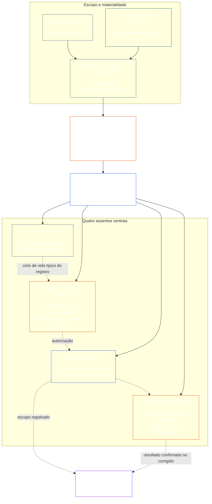

# CAPÍTULO SETE: INDEPENDÊNCIA FUNCIONAL E SEPARAÇÃO DE DEVERES

<strong>Posicionamento no corpus (não operativo): estrutura do arquivo e regras de leitura</strong>

> O conteúdo a seguir é **apenas orientação ao leitor**. Ele não acrescenta, remove nem restringe obrigações vinculantes em outras partes deste arquivo ou de outros capítulos.
>
> Este arquivo **faz parte da Sentient Constitution** e é **vinculante somente em conjunto** com os demais arquivos numerados `core_*`, lidos como um único instrumento. Ele contém o **Capítulo Sete**: o piso transversal aos processos para independência funcional e separação de deveres. Ele vem após o Piso de Direitos do Capítulo Seis e antes dos capítulos de processos constitucionais iniciados pela [certificação de alinhamento do sistema do Capítulo Oito](../../core_08_system_alignment_certification.md#chapter-eight-system-alignment-certification-reading-index).
>
> - **Titular constitucional:** o piso de assentos distintos para atos materialmente vinculantes; o conteúdo mínimo universal de cada [Registro de Ato Materialmente Vinculante](../../core_05_band_accountability.md#materially-binding-act-record); a independência em relação ao agente e à sua [Linha de Controle Material](../../core_05_band_accountability.md#material-control-line); a alocação publicada de vias e funções; conflitos, vacâncias, substituições e encaminhamento ao assento errado; hospedagem combinada proporcional; transferências atribuíveis; e as condições mínimas de independência que todo processo constitucional posterior deve aplicar.
> - **Fonte na camada de princípios:** o [Capítulo Um §18.3](../../core_01_c_stewardship_capacity_principles.md#183-segregation-of-duties) exige que a governança preserve a independência funcional e direciona para cá a arquitetura operativa dos assentos.
> - **Responsável pela implementação:** [CJS-3.11](../../corpus_joint_structure/cjs_03a_accountability_operations.md#constitutional-lane-and-functional-separation), [CI-3.2](../../corpus_institutions/ci_03_institutional_design_separation_of_powers.md#ci-32-functional-separation-lanes) e [CI-4.6](../../corpus_institutions/ci_04_appointment_competency_rotation_removal.md#ci-46-seat-catalog--process-role-archetypes-and-operational-boundaries) alocam e operacionalizam os assentos. Podem ser mais rigorosos e acrescentar tipos de assentos de autoridade especial delimitada; não podem restringir este capítulo.
> - **A aplicação específica a cada processo permanece nos capítulos posteriores:** o Capítulo Oito aplica este piso à certificação de alinhamento do sistema; o [Capítulo Nove §3.7](../../core_09_standing_assessment.md#37-segregation-of-duties) aplica-o aos registros de situação; o Capítulo Doze e o [corpus_forum.md](../../corpus_forum.md) aplicam-no aos processos de fórum. Esses capítulos podem acrescentar salvaguardas exigidas por seus temas, mas não podem criar um substituto mais fraco.
>
> Ordem de leitura: §1 finalidade, escopo e limite de titularidade → §2 piso constitucional de quatro assentos → §3 independência e conflitos → §4 encaminhamento ao assento errado → §5 alocação publicada e substitutos → §6 escalonamento proporcional → §7 emergências → §8 Registros de Ato e transferências atribuíveis → §9 aplicação a processos posteriores.

<strong>Rastreio</strong>

- Anteriores: [Tétrade Constitucional](../../core_00_preamble.md#constitutional-tetrad) — especialmente **supervisão** e **responsabilização**; [interesse material](../../core_00_preamble.md#material-stake); [Padrão de Responsabilidade Compartilhada, Capítulo Um §17.1](../../core_01_c_stewardship_capacity_principles.md#171-shared-stewardship-standard); [Governança sob Disciplina de Stewardship, Capítulo Um §18](../../core_01_c_stewardship_capacity_principles.md#18-governance-under-stewardship-discipline); [Artigo XVI](../../core_06_rights_part_c.md#article-xvi-audit-transparency-and-independent-verification) (*Auditoria, Transparência e Verificação Independente*).
- Subseções: [§1](#1-purpose-scope-and-owner-boundary); [§2](#2-four-seat-constitutional-floor); [§3](#3-independence-conflict-and-control-lines); [§4](#4-wrong-seat-routing); [§5](#5-published-placement-vacancy-and-substitution); [§6](#6-proportional-scaling-and-merged-hosting); [§7](#7-emergency-and-urgent-action); [§8](#8-act-records-and-attributable-handoffs); [§9](#9-relationship-to-later-processes).
- Posteriores: [Capítulo Oito](../../core_08_system_alignment_certification.md#chapter-eight-system-alignment-certification-reading-index); [Capítulo Nove](../../core_09_standing_assessment.md#chapter-nine-contribution-violation-and-standing-model--measurement); [Capítulo Doze](../../core_12_forum.md#chapter-twelve-forums-and-jurisdiction); [Capítulo Treze](../../core_13_governance.md#chapter-thirteen-constitutional-contract-legitimacy-authorization-and-stewardship); textos de implementação designados acima.
- Ler em conjunto com: [Detecção de Desalinhamento, Capítulo Um §19.3](../../core_01_c_stewardship_capacity_principles.md#193-misalignment-detection) (*detecção e revisão plurais*); [Ação Atribuível](../../core_05_band_accountability.md#attributable-action); [Integridade da Atribuição](../../core_05_band_accountability.md#attribution-integrity); [Auditabilidade](../../core_05_band_oversight.md#auditability); [Contestabilidade](../../core_05_band_accountability.md#contestability); [Proporcionalidade](../../core_05_band_accountability.md#proportionality).

 

O Capítulo Sete é o titular constitucional do **piso de independência funcional e separação de deveres para atos materialmente vinculantes**.

### 1. Finalidade, Escopo e Limite de Titularidade

<strong>Rastreio</strong>

- Anteriores: afirmação de titularidade na abertura do capítulo; [Capítulo Um §18](../../core_01_c_stewardship_capacity_principles.md#18-governance-under-stewardship-discipline); [Supervisão](../../core_05_apex_oversight_leg.md#oversight-constitutional); [Responsabilização](../../core_05_apex_accountability_leg.md#accountability).
- Posteriores: de [§2](#2-four-seat-constitutional-floor) a [§9](#9-relationship-to-later-processes); todo processo posterior que produza ou altere um ato materialmente vinculante.
- Ler em conjunto com: [Capítulo Quatro](../../core_04_burden_traceability_verification.md#chapter-four-burden-of-proof-traceability-and-verification), quanto à base de verificação; [Artigo XIII-A](../../core_06_rights_part_c.md#article-xiii-a-reliability-and-trustworthiness-baseline) (*Linha de Base de Confiabilidade e Merecimento de Confiança*) e [Artigo XIII-B](../../core_06_rights_part_c.md#article-xiii-b-right-to-redress-and-remedy) (*Direito à Reparação e ao Remédio*) para contestação e reparação; [Artigo XVI](../../core_06_rights_part_c.md#article-xvi-audit-transparency-and-independent-verification) (*Auditoria, Transparência e Verificação Independente*) para os Pisos de Direitos de verificação independente.

 

*Em termos simples: antes que se possa confiar em um processo constitucional — ou em uma decisão no nível de stakeholders dentro de um sistema, instituição ou domínio decisório delimitado já autorizado — as funções internas devem ser separadas. Este piso se aplica tanto à [Camada do Contrato Constitucional](../../core_05_band_integrative.md#constitutional-contract-layer) quanto à [Participação de Stakeholders no Sistema](../../core_05_band_participation.md#stakeholder-status-and-weight). Um ser senciente, cargo, sistema de IA, órgão de stakeholders ou representante que busque um resultado não pode também fornecer a suposta verificação independente, controlar o registro oficial dessa verificação ou decidir a contestação a ela.*

Este capítulo se aplica a todo [Ato Materialmente Vinculante](../../core_05_band_accountability.md#materially-binding-act), conforme definido pelo Capítulo Cinco, incluindo:

- uma decisão;
- uma autorização ou certificação;
- uma constatação;
- um lançamento de registro ou alteração material de versão;
- uma liberação, implantação, continuidade ou retirada;
- um desembolso ou alocação; e
- uma decisão sobre uma contestação.

Os assentos deste capítulo definem quem pode fazer o quê em determinado ato; não são cargos. O mesmo ser senciente, cargo ou sistema pode ocupar assentos diferentes para atos diferentes. Um título, delegação, capacidade técnica ou aptidão para executar uma etapa não amplia o assento ocupado para aquele ato.

Este capítulo estabelece o piso transversal aos processos para a separação de deveres. Ele não realoca:

- ônus probatório, rastreabilidade ou método de verificação do Capítulo Quatro;
- significados canônicos do Capítulo Cinco;
- Pisos de Direitos do Capítulo Seis;
- conteúdo de registros específicos de processos dos Capítulos Oito a Doze; ou
- catálogos operacionais de assentos, métodos de pessoal e mecânicas de mapa de vias dos textos de implementação designados.

### 2. Piso Constitucional de Quatro Assentos

<strong>Rastreio</strong>

- Anteriores: [§1](#1-purpose-scope-and-owner-boundary); [Capítulo Um §18.3](../../core_01_c_stewardship_capacity_principles.md#183-segregation-of-duties); [Capítulo Um §17.1](../../core_01_c_stewardship_capacity_principles.md#171-shared-stewardship-standard).
- Posteriores: de [§3](#3-independence-conflict-and-control-lines) a [§9](#9-relationship-to-later-processes); [CI-4.6](../../corpus_institutions/ci_04_appointment_competency_rotation_removal.md#ci-46-seat-catalog--process-role-archetypes-and-operational-boundaries) (*Catálogo de assentos — arquétipos de funções processuais e limites operacionais*).
- Ler em conjunto com [§6](#6-proportional-scaling-and-merged-hosting), para o único caminho permitido de hospedagem combinada.

 

*Em termos simples: todo ato materialmente vinculante tem quatro funções — solicitar ou agir, verificar, manter o registro oficial e ouvir a contestação. As funções permanecem distintas mesmo quando uma pequena organização pode colocar um par permitido em um único escritório.*

<strong>Orientação ao leitor (não operativa): mapa dos quatro assentos</strong>

> O conteúdo a seguir é **apenas orientação ao leitor**. Ele não acrescenta, remove nem restringe obrigações vinculantes em outras partes deste capítulo ou de outros capítulos.
>
> **Mapa do leitor (não operativo).** Este diagrama mostra os quatro assentos e um ciclo de vida típico de registro. Não acrescenta um quinto assento de implementação, não exige que a revisão termine antes de toda ação e não altera as regras operativas desta seção e dos §§3–6.

 

As setas pontilhadas dentro da caixa dos assentos mostram um ciclo de vida típico do registro. As setas para a implementação são ligações de rastreio, não uma sequência obrigatória de espera pela conclusão da revisão.

Todo ato materialmente vinculante tem quatro assentos funcionalmente distintos. O Capítulo Cinco fornece seus significados canônicos; esta seção estabelece as regras de alocação e incompatibilidade transversais aos processos:

1. **[Assento Iniciador](../../core_05_band_accountability.md#initiating-seat)** — solicita, propõe, opera, reivindica ou de outro modo inicia o ato.
2. **[Assento de Verificar ou Autorizar](../../core_05_band_accountability.md#verify-or-authorize-seat)** — verifica evidências e autoridade segundo o padrão aplicável e verifica, autoriza, recusa ou impõe condições ao ato.
3. **[Assento de Registro](../../core_05_band_accountability.md#record-seat)** — insere, versiona, mantém, preserva e publica o [Registro do Ato](../../core_05_band_accountability.md#materially-binding-act-record) do que foi determinado pelo Assento de Verificar ou Autorizar.
4. **[Assento de Contestação](../../core_05_band_accountability.md#contest-seat)** — recebe e analisa uma contestação, ordena correções ou limites quando autorizado e encaminha qualquer questão fora de sua autoridade.

Esses assentos se aplicam igualmente a guardiões humanos e de IA. Se um sistema executa um ato, o aprova e depois usa seu próprio registro como prova, ele ocupa ao mesmo tempo os assentos iniciador, verificador e de registro. Automatizar o processo não torna a verificação independente.

As combinações a seguir são proibidas para o mesmo ato:

- o assento iniciador não deve verificar nem autorizar o próprio ato;
- o assento de verificar ou autorizar não deve ocupar o assento de registro;
- o assento de verificar ou autorizar não deve ocupar o assento de contestação; e
- o operador de um sistema não deve verificar nem autorizar um ato referente àquele sistema.

Capítulos posteriores ou textos de implementação incorporados podem proibir combinações adicionais para determinado processo. Eles não podem permitir uma combinação proibida aqui.

O piso funcional de quatro assentos se aplica a todas as classes. A questão escalonada por classe é se esses assentos podem ser combinados ou compartilhados por um único titular: para uma instituição ou sistema operando dentro do escopo da Classe C, recomenda-se sempre a separação plena dos quatro assentos; no escopo da Classe B, ela quase sempre deve ser exigida; e no escopo da Classe A, é sempre exigida. Quando o escopo for misto ou a classificação incerta, aplique a postura mais alta aplicável até que o registro sustente uma inferior.

### 3. Independência, Conflito e Linhas de Controle

<strong>Rastreio</strong>

- Anteriores: [§2](#2-four-seat-constitutional-floor); [responsabilização escalonada por autoridade](../../core_01_c_stewardship_capacity_principles.md#181-governance-as-authorized-structure); [Artigo XXIV](../../core_06_rights_part_d.md#article-xxiv-constitutional-interpretation-review-and-anti-capture-safeguards) (*Interpretação Constitucional, Revisão e Salvaguardas contra Captura*).
- Posteriores: [§4](#4-wrong-seat-routing); [§5](#5-published-placement-vacancy-and-substitution); [§8](#8-act-records-and-attributable-handoffs); funções dos componentes de certificação do Capítulo Oito; custódia de registros do Capítulo Nove; proteção contra julgamento de si próprio nos fóruns do Capítulo Doze.
- Ler em conjunto com: [Linha de Controle Material](../../core_05_band_accountability.md#material-control-line); [CI-5](../../corpus_institutions/ci_05_conflict_integrity_anti_capture_anti_corruption.md) (*Integridade de conflitos, prevenção de captura e anticorrupção*) e [CF-7](../../corpus_forum/cf_07_integrity_safeguards_anti_capture_anti_self_judging.md) (*Salvaguardas de integridade, operações contra captura e apoio contra julgamento de si próprio*), para salvaguardas operacionais de conflitos e de prevenção de autojulgamento.

 

*Em termos simples: mudar o nome na porta não cria independência. Um verificador ou revisor não é independente se o ser senciente ou cargo que busca o resultado puder direcioná-lo, removê-lo, recompensá-lo, puni-lo ou anulá-lo discretamente em relação àquele ato.*

A independência funcional é julgada pela autoridade e pelo controle reais, não pelos rótulos. No mesmo ato:

- o assento de verificar ou autorizar e o assento de contestação devem estar fora da [Linha de Controle Material](../../core_05_band_accountability.md#material-control-line) do assento iniciador;
- uma parte cujo próprio interesse seja determinado pelo ato não deve ocupar o assento de verificar ou autorizar nem o de contestação;
- um titular de registro em conflito deve transferir esse registro, com todo o seu histórico de auditoria, ao substituto publicado, em vez de decidir o conflito ou abandonar a custódia; e
- a recusa elimina a autoridade sobre o ato; ela não transfere o assento ao solicitante, à linha de reporte do solicitante ou a quem estiver mais próximo.

Rastreie a [Linha de Controle Material](../../core_05_band_accountability.md#material-control-line) para o ato específico. Infraestrutura compartilhada, apoio administrativo ou histórico de nomeação não estabelecem por si sós essa linha, mas esses arranjos não devem impedir o julgamento independente na prática.

Uma segunda assinatura, um comitê nominal, um rótulo interno ou uma atestação gerada por ferramenta não satisfaz a independência quando a suposta verificação carece de autoridade, acesso às evidências, liberdade em relação ao controle material ou capacidade real de recusar e encaminhar.

### 4. Encaminhamento ao Assento Errado

<strong>Rastreio</strong>

- Anteriores: [§2](#2-four-seat-constitutional-floor); [§3](#3-independence-conflict-and-control-lines).
- Posteriores: [§5](#5-published-placement-vacancy-and-substitution); [§8](#8-act-records-and-attributable-handoffs); [regras de assentos compartilhados CI-4.6](../../corpus_institutions/ci_04_appointment_competency_rotation_removal.md#ci-46-shared-seat-rules).
- Ler em conjunto com: [Dever de Resistir, Capítulo Um §17.5](../../core_01_c_stewardship_capacity_principles.md#175-duty-to-resist).

 

*Em termos simples: quando uma etapa não lhe cabe, não a assuma silenciosamente nem simplesmente vá embora. Registre a lacuna e encaminhe a questão ao local adequado.*

O guardião solicitado a executar uma etapa fora de seu assento deve:

1. recusar a etapa sem pretender decidir seu mérito;
2. indicar o assento autorizado a executá-la e, quando publicado, seu titular ou substituto;
3. registrar a solicitação, o assento ocupado, a lacuna ou o conflito e a via utilizada;
4. preservar as evidências e a integridade de qualquer registro já recebido; e
5. encaminhar sem demora evitável.

Essa resposta é cumprimento do dever, não abandono do ato. O ato prossegue pelo assento correto. Assumir a etapa por ser o guardião a pessoa mais próxima, rápida, sênior ou com conhecimento exclusivo não corrige a falta de um assento.

### 5. Alocação Publicada, Vacância e Substituição

<strong>Rastreio</strong>

- Anteriores: [§2](#2-four-seat-constitutional-floor); [§3](#3-independence-conflict-and-control-lines); [Transparência](../../core_05_band_oversight.md#transparency); [Auditabilidade](../../core_05_band_oversight.md#auditability).
- Posteriores: [§8](#8-act-records-and-attributable-handoffs); [CI-3.2](../../corpus_institutions/ci_03_institutional_design_separation_of_powers.md#ci-32-functional-separation-lanes) (*Vias de separação funcional*); [CI-4.5](../../corpus_institutions/ci_04_appointment_competency_rotation_removal.md#ci-45-authorized-roles-and-accountability-chains) (*Funções autorizadas e cadeias de responsabilização*); registros dos Capítulos Oito e Nove.
- Ler em conjunto com: [Carta](../../core_05_band_continuity.md#charter) e [Capítulo Treze §5](../../core_13_governance.md#5-authorized-roles-competency-development-and-contribution).

 

*Em termos simples: uma organização deve declarar quem ocupa cada função antes que surja o caso difícil, incluindo quem assume quando o titular habitual estiver ausente ou em conflito.*

Todo adotante que pratique atos materialmente vinculantes deve manter um mapa publicado, auditável e contestável que identifique:

- qual via, escritório, função ou processo abriga cada assento;
- os atos e o escopo aos quais essa alocação se aplica;
- cada arranjo permitido de hospedagem combinada e sua salvaguarda de independência;
- o substituto de um titular ausente, excluído, capturado ou em conflito; e
- a via independente quando não houver substituto qualificado disponível.

Um assento não alocado, vago ou em conflito é um defeito de governança a registrar e corrigir. Ele não passa automaticamente ao assento iniciador, a uma parte interessada, a um operador ou a um superior em sua [Linha de Controle Material](../../core_05_band_accountability.md#material-control-line). Até a correção, o ato segue para o substituto publicado ou para a via independente. Não se pode contornar a exigência de independência apenas porque há pressa.

A delegação preserva os mesmos limites do assento, deveres de evidência, registro e prazo, e permanece sujeita à [Linha de Controle Material](../../core_05_band_accountability.md#material-control-line). Ela não cria um novo assento, não combina assentos nem permite que um delegado faça o que o assento delegante não poderia fazer, inclusive convertendo uma recomendação escalonada por classe ou uma exigência de separação completa dos quatro assentos em permissão para combiná-los.

### 6. Escalonamento Proporcional e Hospedagem Combinada

<strong>Rastreio</strong>

- Anteriores: [§2](#2-four-seat-constitutional-floor); [interesse material](../../core_00_preamble.md#material-stake); [Necessidade](../../core_05_band_accountability.md#necessity); [Proporcionalidade](../../core_05_band_accountability.md#proportionality).
- Posteriores: [Capítulo Nove §3.7](../../core_09_standing_assessment.md#37-informal-and-small-scope-records); [CJS-2.4](../../corpus_joint_structure/cjs_02_specific_joint_interlocks.md#cjs-24-class-scaled-lane-staffing-and-competency-redundancy) (*dimensionamento de pessoal por via e redundância de competências escalonados por classe*); [CI-3.2](../../corpus_institutions/ci_03_institutional_design_separation_of_powers.md#ci-32-functional-separation-lanes) (*Vias de separação funcional*).
- Ler em conjunto com: [Ônus Evitável](../../core_05_band_continuity.md#avoidable-burden) e [§3.3 Processo Antidegradante do Capítulo Um](../../core_01_a_values_principles.md#33-anti-degrading-process).

 

*Em termos simples: grupos pequenos e informais não precisam de quatro grandes departamentos. Precisam, sim, de uma verificação independente real, um registro utilizável e uma via de contestação. A escala muda o método de dimensionamento, não a separação protegida.*

O rigor, o dimensionamento de pessoal, a redundância e a formalidade da separação acompanham o interesse material, a classe do sistema, a dependência e o dano razoavelmente previsível.

Um adotante pequeno ou informal pode colocar dois assentos em um escritório ou sob um único ser senciente somente quando todas as condições a seguir forem atendidas:

- a combinação for necessária e proporcional ao escopo;
- ela for publicada, auditável, contestável e divulgada no registro do ato;
- uma salvaguarda de independência tratar dos riscos criados pela combinação;
- o assento iniciador não verificar nem autorizar o próprio ato;
- as combinações verificar-e-registrar e verificar-e-contestar continuarem proibidas; e
- permanecer disponível uma via independente quando conflito, dano material ou contestação ultrapassar os limites lícitos do titular combinado.

Trabalhos informais e não remunerados de ajuda mútua, cuidado, reparo, ensino, cooperativas e stewardship comunitário podem usar um órgão de confiança desinteressado com autoridade publicada para a verificação pertinente. A Constituição não exige formalidade institucional que o escopo não possa razoavelmente alcançar quando houver uma via genuinamente desinteressada e responsável.

Escassez de pessoal, rapidez, conveniência ou concentração de conhecimento especializado não justificam, por si sós, uma combinação. Vale a postura escalonada por classe em [§2 Piso Constitucional de Quatro Assentos](#2-four-seat-constitutional-floor): não há exceção para a Classe A, e qualquer exceção para a Classe B ou C deve cumprir os requisitos acima. Quanto maior o interesse material, mais forte a presunção de escritórios separados, redundância de competências e substitutos independentes.

### 7. Ação Emergencial e Urgente

<strong>Rastreio</strong>

- Anteriores: [§2](#2-four-seat-constitutional-floor); [§6](#6-proportional-scaling-and-merged-hosting); [Medidas emergenciais e ônus de continuidade, Capítulo Doze §6.1](../../core_12_forum.md#61-emergency-measures-and-continuation-burden); [postura provisória padrão](../../core_01_b_interaction_interpretation.md#default-interim-posture).
- Posteriores: processos de incidentes, contenção, liberação, continuidade e revisão pós-evento nos textos de implementação designados.
- Ler em conjunto com: [Pontualidade](../../core_05_apex_timeliness_leg.md#timeliness-constitutional), [Preservação de Evidências](../../core_05_band_oversight.md#evidence-preservation) e [Catálogo de assentos CI-4.6 — arquétipos de funções processuais e limites operacionais](../../corpus_institutions/ci_04_appointment_competency_rotation_removal.md#ci-46-seat-containment).

 

*Em termos simples: uma emergência real pode justificar agir antes que a verificação habitual termine. Ela altera a sequência, não a titularidade dos assentos nem a postura de separação escalonada por classe. Não permite que o agente certifique a própria continuidade, apague o histórico ou se torne o revisor final depois.*

Quando a demora criaria um risco razoavelmente previsível de dano grave e iminente, um assento iniciador ou de contenção autorizado pode tomar a ação reversível mínima necessária antes da conclusão da verificação prévia habitual somente se:

- a autoridade emergencial, o escopo, o início, o vencimento e o motivo forem registrados imediatamente ou assim que for fisicamente possível;
- evidências e objeções forem preservadas;
- aviso e participação forem restabelecidos dentro do prazo constitucional aplicável;
- um assento independente de verificar ou autorizar analisar qualquer continuidade além do limite imediato; e
- o ato receber revisão independente posterior ao evento.

A ação emergencial não:

- permite que o agente verifique a própria continuidade;
- torna o agente custodiante de registro em conflito;
- permite que o agente ouça a contestação ao próprio ato;
- converte necessidade temporária em autoridade permanente;
- permite qualquer combinação dos quatro assentos em instituição ou sistema da Classe A.

Nenhum dos itens a seguir, por si só, constitui emergência:

- um prazo final;
- uma meta de liberação;
- falta de pessoal; ou
- preocupação reputacional.

### 8. Registros de Ato e Transferências Atribuíveis

<strong>Rastreio</strong>

- Anteriores: de [§2](#2-four-seat-constitutional-floor) a [§7](#7-emergency-and-urgent-action); [Registro de Ato Materialmente Vinculante](../../core_05_band_accountability.md#materially-binding-act-record); [Ação Atribuível](../../core_05_band_accountability.md#attributable-action); [Integridade da Atribuição](../../core_05_band_accountability.md#attribution-integrity).
- Posteriores: [CS-4 §10 ação atribuível inspecionável](../../corpus_systems/cs_04_critical_system_stewardship.md#10-inspectable-attributable-action); [regras de assentos compartilhados CI-4.6](../../corpus_institutions/ci_04_appointment_competency_rotation_removal.md#ci-46-shared-seat-rules); todo registro de processo regido pelo §8; [`materially_binding_act_record.schema.json`](../../implementation/schemas/materially_binding_act_record.schema.json) (*formato básico verificável por máquina; suporte processual, não uma segunda definição*).
- Ler em conjunto com [§4 Encaminhamento ao Assento Errado](#4-wrong-seat-routing) e [Capítulo Quatro §5](../../core_04_burden_traceability_verification.md#5-compliance-evidence-standard).

 

*Em termos simples: todo ato materialmente vinculante tem um Registro do Ato que mostra o que aconteceu, quem ocupou cada assento, o que foi decidido e para onde vai uma contestação.*

Todo ato materialmente vinculante deve ter um [Registro de Ato Materialmente Vinculante](../../core_05_band_accountability.md#materially-binding-act-record) identificável (**Registro do Ato**). O Registro do Ato pode estar incorporado a um único registro oficial aplicável e específico do processo ou a um conjunto vinculado de registros oficiais, atribuível e preservador da integridade. Não é exigido um documento duplicado separado se o registro oficial existente ou o conjunto vinculado identificar claramente todos os elementos exigidos, preservar seus vínculos e o histórico de versões e permanecer acessível pela via oficial autorizada.

O Registro do Ato deve identificar, no mínimo:

- uma identidade estável do registro, a versão atual e os carimbos de data e hora materiais de criação e alteração;
- o ato, seu escopo material, estado e autoridade aplicável;
- o assento iniciador, seu titular e sua autoridade;
- o assento de verificar ou autorizar, seu titular, padrão aplicável, determinação, condições ou motivos materiais e momento da determinação;
- o assento de registro, seu titular, autoridade de custódia e versão inserida;
- o assento de contestação ou a via publicada para contestar, e o estado atual da contestação ou correção;
- toda delegação, recusa, substituição, combinação permitida ou desvio emergencial; e
- as evidências materiais e os vínculos entre registros, transferências, recusas, condições, objeções não resolvidas, prazos, versões substituídas e correções necessários para reconstruir o ato.

Registros específicos de processos podem acrescentar campos mais rigorosos ou específicos de um domínio. Não podem omitir, contradizer ou tornar impossível reconstruir este mínimo. Controles lícitos de privacidade, confidencialidade e segurança regem o acesso ou a divulgação de material protegido; não permitem apagar o histórico oficial nem torná-lo inutilizável para verificação, contestação, correção ou reparação autorizadas.

Os logs mostram quem fez o quê, mas, por si sós, não provam que a ação foi válida. Um log, assinatura, rastreamento de modelo, lista de verificação ou atestação criada pelo ser senciente ou sistema que executa a ação tem função limitada:

- Esses materiais podem fornecer evidências ou ser vinculados ao Registro do Ato.
- Esses materiais não podem substituir uma revisão e decisão independente nem o próprio Registro do Ato oficial.

### 9. Relação com Processos Posteriores

<strong>Rastreio</strong>

- Anteriores: de [§1](#1-purpose-scope-and-owner-boundary) a [§8](#8-act-records-and-attributable-handoffs).
- Posteriores: [Capítulo Oito](../../core_08_system_alignment_certification.md#chapter-eight-system-alignment-certification-reading-index); [Capítulo Nove](../../core_09_standing_assessment.md#chapter-nine-contribution-violation-and-standing-model--measurement); [Capítulo Doze](../../core_12_forum.md#chapter-twelve-forums-and-jurisdiction); [Capítulo Treze](../../core_13_governance.md#chapter-thirteen-constitutional-contract-legitimacy-authorization-and-stewardship).
- Ler em conjunto com: [Pilha de Autoridade e Hierarquia Interna](../../core_05_band_integrative.md#owner-non-relocation) e o [registro de titulares do Preâmbulo](../../core_00_preamble.md#4-principles-definitions-and-rights).

 

*Em termos simples: os capítulos posteriores dizem a cada processo o que avaliar, registrar, decidir e reparar. Este capítulo diz a esses processos como separar o poder enquanto fazem isso.*

Todo processo constitucional posterior deve explicar como atribui e utiliza os quatro assentos e como cumpre este capítulo. Na prática:

- O registro do próprio processo pode servir como Registro do Ato ou acrescentar-lhe detalhes específicos do processo.
- Se um registro de processo abranger vários atos materialmente vinculantes, ele pode apontar para um Registro do Ato separado para cada ato.
- Não é necessário um registro duplicado separado quando a via oficial do registro permanece completa e rastreável.
- Dar outro nome a um processo não o isenta de [§4 Encaminhamento ao Assento Errado](#4-wrong-seat-routing) ou [§8 Registros de Ato e Transferências Atribuíveis](#8-act-records-and-attributable-handoffs), inclusive das regras de transferência e de assento errado.

Em particular:

- **Capítulo Oito — certificação de alinhamento do sistema:** o operador do sistema ou proponente da certificação ocupa um assento iniciador, não o próprio assento de verificação; constatações delimitadas de componentes, integração do registro de certificação, custódia e contestações devem permanecer nos assentos lícitos e nas vias contra autojulgamento.
- **Capítulo Nove — registros de situação:** o solicitante, a autoridade que abre o registro, o custodiante do registro e a via de contestação aplicam o piso de quatro assentos junto com as regras mais rigorosas do Capítulo Nove sobre custódia, requerentes, registros informais e proibição de autocustódia.
- **Capítulo Doze — fóruns:** apresentação, investigação, revisão de mérito, custódia de registros, recurso e análise de alegação de parcialidade do próprio fórum ou abuso de processo devem preservar os limites aplicáveis dos assentos e contra autojulgamento.
- **Capítulo Treze — governança:** definições de funções, planos de competência, delegação, sucessão e desenho institucional devem posicionar e sustentar os assentos, não apenas repetir seus nomes.

Um capítulo posterior pode impor requisitos mais fortes de independência, recusa, separação, custódia, composição de painéis ou revisão por seu processo envolver risco maior ou diferente. Não pode restringir este piso, tratar um rótulo específico do processo como isenção nem inferir que o silêncio transfere um assento ao agente.

---

**Arquivo anterior:** [core_05_band_performance.md](../../core_05_band_performance.md)

**Próximo arquivo:** [core_08_a_system_alignment_certification_evaluation.md](../../core_08_a_system_alignment_certification_evaluation.md#chapter-eight-part-a-certification-evaluation)
