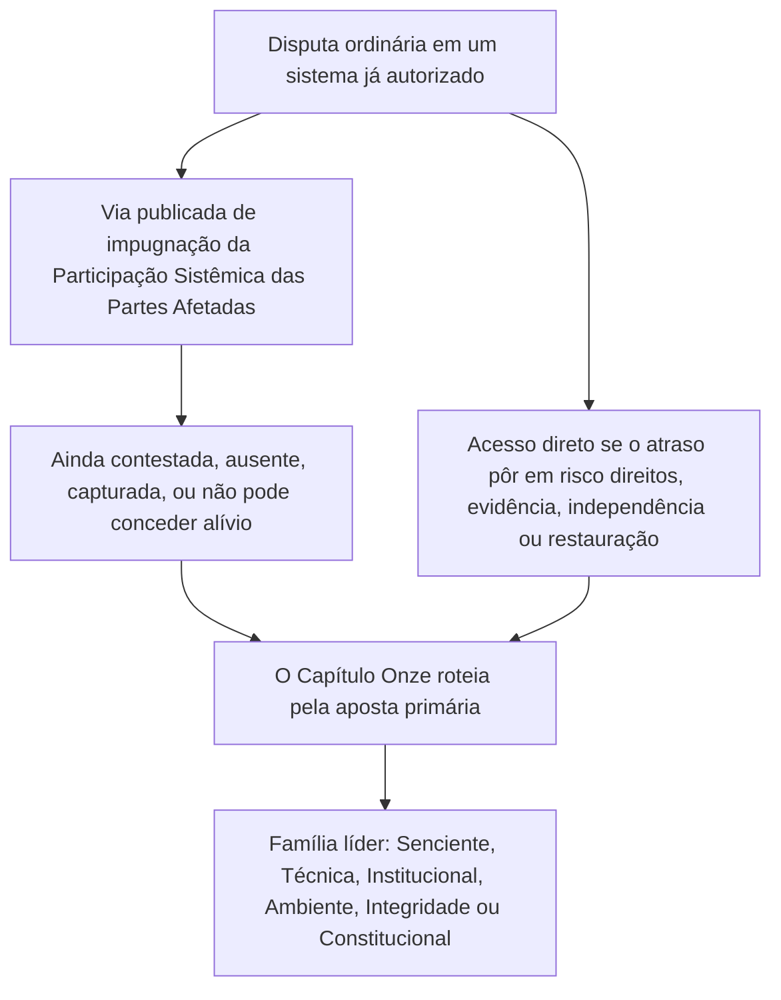

# CAPÍTULO ONZE: FÓRUNS E JURISDIÇÃO

<strong>Lugar no corpus (não operativo): estrutura do arquivo e regras de leitura</strong>

> O conteúdo a seguir é **apenas orientação para quem lê**. Não acrescenta, retira nem estreita obrigações vinculantes neste arquivo nem em outros capítulos.
>
> Este arquivo é um **piloto de idioma de leitura** do [Capítulo Onze em inglês](../../core_12_forum.md). **Não** é parte vinculante da Constituição Senciente. **Não** é uma segunda constituição. **Não** é uma edição de envio. Está **fixado** a `SC-Corpus-2026.08.09`. Se esta tradução e o original em inglês parecerem discordar, ganha o arquivo numerado [`core_11_forum.md`](../../core_12_forum.md). A ordem de leitura e os metadados de edição ficam em [README.md](../../README.md). Método e glossário: [translations/pt/README.md](README.md).
>
> Contém o **Capítulo Onze**: famílias de fóruns, sede por omissão e roteamento de apostas primárias, apoio forense, triagem de admissão e jurisdição para disputas sob a cadeia de trajetória e o Piso de Direitos. Os fóruns **supervisionam** o trato de disputas sob as pernas **participação**, **supervisão** e **atuação em tempo** da [Tétrade Constitucional](core_00_preamble.md#constitutional-tetrad), escaladas à [aposta material](core_00_preamble.md#material-stake). Quando os fatos estão verificados, podem **abrir, atualizar ou corrigir** registros de trajetória — ou **pôr de lado um registro ruim em impugnação** — sob o [Capítulo Oito §3](core_08_standing_assessment.md#3-standing-record-operational-requirements); um caso apresentado não é trajetória por si só, e o relato de fórum não deve substituir a medição de trajetória do Capítulo Oito ([Capítulo Oito §3.6](core_08_standing_assessment.md#36-forum-boundary)). Use [README — Standing pipeline and forums](../../README.md#standing-pipeline-and-forums) para a navegação da cadeia. A mecânica operativa de fórum permanece nos arquivos de implementação designados. A numeração de capítulos e as referências cruzadas coincidem com o instrumento integrado. A ordem de leitura, a cisão vinculante/apoio e os metadados de edição do corpus mantêm-se em [README.md](../../README.md).

>
> **Anterior (ainda em inglês):** [core_10_b_misconduct_pattern_applications.md](../../core_11_b_misconduct_pattern_applications.md#chapter-eleven-part-b-anti-constitutional-misconduct-pattern-applications)
>
> **Próximo (ainda em inglês):** [core_08-11_application_vignettes.md](../../core_09-12_application_vignettes.md#chapters-eight-eleven-application-vignettes)
> **Arco de leitura:** §1 propósito → Sequência de disputas → §2 sede por omissão e admissão → §2.1–§2.3 limites do liderado, apostas mistas, impugnações → §3 transferência e anti-autojulgamento → §4 famílias → §5 escalada e certificação → §6 níveis e disciplina contra o atraso → §7 apoio de fórum

<strong>Orientação para quem lê (não operativa): onde vive o Capítulo Onze e o que permanece aqui</strong>

> O conteúdo a seguir é **apenas orientação para quem lê**. Não acrescenta, retira nem estreita obrigações vinculantes neste capítulo nem em outros capítulos.
>
> Onde isto vive (navegação):
> - **Titular constitucional:** **seção 1** (*propósito* — **aplicação adjudicativa primária** das normas que este capítulo aloca, **distinta da** **administração executiva** rotineira; **Sequência de disputas** para disputas ordinárias dentro de sistemas já autorizados; exigências de **prestação de contas**; colocação de **limiar** **publicada** e **previsível**); **sede de partida por omissão**, roteamento de **apostas primárias**, **órgão de triagem de admissão** (**mesa de primeiro contato**), apostas mistas, assimetria, impugnações de registros de trajetória, **caracterização de boa-fé e antijogo**, e expectativas de **acesso** de **limiar** **acessível a sencientes** (**seção 2**, **ler com** **`corpus_forum.md`**); **transferência**, **consolidação** e **coordenação** (**seção 3**, ler com a certificação e o respaldo da **seção 5**); **definições de famílias de fóruns**, **câmaras internas**, **padrões compartilhados** e **direito operativo provisório** (senciente, técnico, institucional, ambiente, integridade, constitucional — **seção** **4**, que espelha a **tabela** da **seção** **2**); **escalada**, **certificação** e **proteção interina** (**seção 5**); **resolução oportuna** e disciplina **contra o atraso** (**seção 6**); **apoio de fórum** antes, durante e depois da revisão (**seção 7**), implementado de modo que os papéis de triagem e de apoio **não** substituam os **painéis de mérito licitamente constituídos**; roteamento de reserva **anti-autojulgamento**; e ganchos de escalada ligados ao **Capítulo Oito**, ao **Capítulo Dez** e aos direitos de justiça e de impugnação do **Capítulo Seis**.
> - **Navegação da cadeia:** [README — Standing pipeline and forums](../../README.md#standing-pipeline-and-forums) — [§§1–7](#1-purpose-and-role) neste arquivo.
> - **Cadeia de três perguntas dos Capítulos Oito–Nove:** As **seções 2–3** do Capítulo Oito respondem a Pergunta 1 (*o que aconteceu?*) por registros verificados de eixo puro. O [Capítulo Oito §4](core_08_standing_assessment.md#4-standing-measurement-evaluation-dimensions) e a [escala LEQU proporcional unificada do §7](core_08_standing_assessment.md#7-unified-proportional-lequ-scale) respondem a Pergunta 2 (*quão bom ou quão ruim foi?*) por dimensões de avaliação, faixas LEQU compartilhadas de cinco vezes e a gramática compartilhada **s** = 1...9, preservando registros separados de Contribuição e de Infração. O [Capítulo Nove](core_09_standing_integration.md#chapter-nine-standing-effects-and-integration) responde a Pergunta 3 (*o que acontece por causa disso?*) por remédios, salvaguardas, barras de competência e habilitações, e travas de trajetória. A vaga do Eixo de Infração é controlada só pelo impacto verificado; negligência, ocultação, coerção, resposta e descritores de caráter comparáveis não a movem. O [Capítulo Dez](../../core_11_a_misconduct_designation.md)#chapter-ten-anti-constitutional-misconduct) pode acrescentar a designação emparelhada de má conduta anticonstitucional a um registro de vaga 7, 8 ou 9 do Capítulo Oito, mas não atribui a vaga numérica.
> - **Fóruns (glosa não operativa):** As **famílias de fóruns** sob este capítulo são os **fóruns** primários que aplicam as classificações do [Capítulo Oito](core_08_standing_assessment.md#chapter-eight-compliance-violation-and-standing-model) a disputas concretas — inclusive matérias em que a **natureza da contribuição**, a **vaga de impacto do Eixo de Infração** e o caráter de processo / resposta registrados em separado estão **copresentes** e devem ser tratados sob a disciplina de avaliação conjunta e de não substituição do **Capítulo Oito**. Os mecanismos de **financiamento de pesquisa**, **financiamento** e **incentivo** fora da adjudicação permanecem na implementação adotada e em **[corpus_systems.md](../../corpus_systems.md)** (veja a orientação para quem lê do **Capítulo Oito**); podem apoiar prevenção e indagação de causa-raiz e **não devem** substituir o roteamento de **limiar**, a determinação de **mérito**, a atribuição autoritativa de vaga numérica do Capítulo Oito, qualquer designação emparelhada do **Capítulo Dez**, nem as restrições do **Artigo XXIII** (*Resolução de conflitos, escalada e proporcionalidade de emergência*). As **seções 1 e 2** alocam a responsabilidade **primária** das estruturas de **incentivo** **principalmente** **dentro** da **esfera** de cada **família** (detalhe granular no **corpus** e na implementação); essa **alocação** **não** realoca escolhas de **orçamento** de **todo o sistema** nem à **escala de governança** reservadas ao [Capítulo Doze](../../core_13_governance.md#chapter-thirteen-constitutional-contract-legitimacy-authorization-and-stewardship) e a **[corpus_systems.md](../../corpus_systems.md)**.
> - **Titular de implementação:** as **classes** de admissão publicadas, as regras cotidianas de pauta, o quadro de pessoal, os orçamentos, o procedimento granular, a mecânica operativa de escalada e as exigências operativas de apoio de fórum vivem no texto de implementação adotado e em **[corpus_forum.md](../../corpus_forum.md)** (**CF-5** (*Operações de roteamento, transferência, certificação e trato representativo*), **CF-8** (*Apoio forense e analítico de fórum*), **CF-9** (*Serviço investigativo independente e interface de persecução*), e seções relacionadas); essas camadas **implementam, não estreitam**, este capítulo.
> - **Regra antirrealocação:** os instrumentos de adoção não devem satisfazer este capítulo por procedimentos que colapsem funções de fórum distintas, despojem a **independência** ou a **revisão real**, ou roteiem impugnações de integridade de volta ao mesmo fórum capturado que este capítulo proíbe como único lar final de mérito.
>
> **Arquitetura — colocação de *Em termos simples*:** Cada linha *Em termos simples* aparece imediatamente depois do bloco de navegação de Rastro (e do ` ` que o segue quando presente), e **antes** dos parágrafos operativos e das listas com marcadores daquela seção. Glosa voltada a quem lê somente; não acrescenta, retira nem estreita texto vinculante.

<strong>Rastro</strong>

- Origem: [Capítulo Oito](core_08_standing_assessment.md#chapter-eight-compliance-violation-and-standing-model) (*registros da Pergunta 1 e medição da Pergunta 2 que alimentam as disputas que este capítulo roteia*); [Capítulo Oito §5.1](core_08_standing_assessment.md#5-slot-grammar-and-display-labels) (*gramática de vaga de trajetória*); [escala unificada do Capítulo Oito §7](core_08_standing_assessment.md#7-unified-proportional-lequ-scale) (*faixas LEQU compartilhadas de cinco vezes e registros de eixo separados*); [Capítulo Oito §§4.3–4.4](core_08_standing_assessment.md#43-route-descriptor-measurement-roles) (*catálogo de descritores normalizados transaxiais, inclusive descritores do Eixo de Contribuição e do Eixo de Infração que não movem vagas*); [Capítulo Dez](../../core_11_a_misconduct_designation.md)#chapter-ten-anti-constitutional-misconduct) (*designação emparelhada de má conduta anticonstitucional para vagas qualificadoras 7–9 do Capítulo Oito*); [Capítulos Dois a Quatro](core_02_definition_structure.md) (*exigências de registro, verificação e rastreamento*); [Capítulo Cinco](core_05__definitions_home.md#chapter-five-foundational-definitions) (*definições fundacionais*); [Capítulo Um](core_01_c_stewardship_capacity_principles.md#chapter-01-principles-and-constraints) (*restrições interpretativas*); [Capítulo Seis — Direitos fundacionais](core_06_rights_part_a.md#chapter-six-foundational-rights) até a [Parte D](core_06_rights_part_d.md) (*ganchos de impugnação, auditoria e artigos de justiça*).
- Subseções: [§1](#1-purpose-and-role); [§2](#2-default-venue-and-primary-stakes); [§3](#3-transfer-consolidation-and-coordination); [§4](#4-forum-family-definitions); [§5](#5-escalation-and-certification); [§6](#6-timely-resolution-materiality-tiers-and-anti-delay-discipline); [§7](#7-forum-support-before-during-and-after-review).
- Ler com: [README — Standing pipeline and forums](../../README.md#standing-pipeline-and-forums).
- Destino: [corpus_forum.md](../../corpus_forum.md) (*doutrina operativa de fórum*); [Capítulo Doze](../../core_13_governance.md#chapter-thirteen-constitutional-contract-legitimacy-authorization-and-stewardship) onde a legitimidade de governança interage com o papel adjudicativo; [Capítulo Dezesseis](../../core_17_incorporation.md#chapter-seventeen-incorporation-bridge) (*disciplina de incorporação* para as camadas de procedimento adotadas).
- Ler com: [Capítulo Oito §5.1](core_08_standing_assessment.md#5-slot-grammar-and-display-labels) (*gramática de vaga de trajetória*); [Capítulo Oito §§4.3–4.4](core_08_standing_assessment.md#43-route-descriptor-measurement-roles) (*descritores normalizados transaxiais do Eixo de Contribuição e do Eixo de Infração*).
- Ler também com: [Capítulo Nove §3](core_09_standing_integration.md#3-descriptor-integration-and-attachment-normalization) (*integração de descritores e normalização de anexos lida com o roteamento de apostas primárias da seção 2*); [README.md](../../README.md) (*ordem de leitura e organização do corpus*); [doc_architecture.md](../../doc_architecture.md) (*mapas editoriais não vinculantes salvo adoção*).

 

O Capítulo Onze é o titular constitucional das **famílias de fóruns, da sede por omissão, da jurisdição e do roteamento adjudicativo de disputas sob a cadeia de trajetória e o Piso de Direitos**.

*Em termos simples: Sob a [Tétrade Constitucional](core_00_preamble.md#constitutional-tetrad) e os [Dois Fins Constitucionais](core_00_preamble.md#two-constitutional-aims), este capítulo **supervisiona** como as disputas atravessam a cadeia de trajetória dos Capítulos Oito a Dez — roteamento, independência, apoio forense, sequenciamento de remediação e relógios por omissão de nível sob a **seção 6** e o **Artigo XXIV-C** (*Resolução oportuna e piso contra o atraso*). As famílias de fóruns respondem qual pista trata cada disputa, onde um caso ordinariamente começa e como se coordenam as matérias de apostas mistas. Fornecem **participação** (impugnação acessível) e **supervisão** (revisão de mérito rastreável). Quando os fatos estão verificados, podem **abrir, atualizar ou corrigir** registros de trajetória — ou **pôr de lado um registro ruim em impugnação**. **Não** operam uma segunda pista de decisão à parte, ao lado da cadeia de trajetória. Apresentar um caso sozinho não tem impacto imediato sobre a trajetória. As regras cotidianas de julgamento, os orçamentos e os manuais de pessoal vivem nas camadas de implementação e devem **implementar, não estreitar**, este capítulo nem o **Artigo XXIII** (*Resolução de conflitos, escalada e proporcionalidade de emergência*).*

### 1. Propósito e papel — arquitetura de participação

<strong>Rastro</strong>

- Origem: [Capítulo Sete — Certificação de alinhamento do sistema](core_07_a_system_alignment_certification_evaluation.md#chapter-seven-system-alignment-certification); [Capítulo Oito](core_08_standing_assessment.md#chapter-eight-compliance-violation-and-standing-model); [Capítulo Nove](core_09_standing_integration.md#chapter-nine-standing-effects-and-integration); [Capítulo Dez](../../core_11_a_misconduct_designation.md)#chapter-ten-anti-constitutional-misconduct); [Capítulo Um](core_01_c_stewardship_capacity_principles.md#chapter-01-principles-and-constraints) (*princípios e restrições interpretativas*); [Capítulos Dois a Quatro](core_02_definition_structure.md) (*exigências de rastreamento e verificação*); [Capítulo Cinco](core_05__definitions_home.md#chapter-five-foundational-definitions) (*definições lidas junto com os Capítulos Dois a Quatro no bloco de Lugar no corpus*); [Capítulo Seis](core_06_rights_part_a.md#chapter-six-foundational-rights) (*Piso de Direitos fundacionais que este capítulo aplica juntamente com*).
- Destino: [§2](#2-default-venue-and-primary-stakes) (*sede por omissão de apostas primárias, triagem de admissão, apostas mistas, assimetria, impugnações de registros de trajetória; acesso de limiar impugnável e oportuno; caracterização de boa-fé e antijogo*); [§3](#3-transfer-consolidation-and-coordination) (*transferência e anti-autojulgamento*); [§4](#4-forum-family-definitions) (*definições de famílias de fóruns, câmaras, padrões compartilhados e direito operativo provisório*); [§4.3](#43-institutional-forums) (*Fronteira de processo interno como aplicação Institucional da Sequência de disputas*); [§5](#5-escalation-and-certification) (*escalada, certificação e proteção interina*); [§6](#6-timely-resolution-materiality-tiers-and-anti-delay-discipline) (*níveis de materialidade, marcos da cadeia e disciplina contra o atraso*); [§7](#7-forum-support-before-during-and-after-review) (*apoio de fórum antes, durante e depois da revisão*).
- Perna(s) da Tétrade: **participação**, **supervisão**, **prestação de contas**, **atuação em tempo** (achados verificados podem abrir, atualizar ou corrigir registros de trajetória; **CF-11** implementa os relógios por nível). Fim(ns) primário(s): **Florescimento** e **Continuidade**. A escalada por [aposta material](core_00_preamble.md#material-stake) aplica-se à carga de roteamento e de acesso.
- Ler com: [Preâmbulo §3.2](core_00_preamble.md#32-key-governance-processes) e [§3.3](core_00_preamble.md#33-governance-layers) (*vias de processo e disciplina de camadas de governança*); [Artigo XI: Participação Sistêmica das Partes Afetadas, representação e Devido Processo](core_06_rights_part_b.md#article-xi-stakeholder-system-participation-representation-and-due-process); [corpus_forum.md](../../corpus_forum.md) (**CF-6.2.2** (*Regras de emergência, exaustão e prazos*) — implementar, não estreitar); [corpus_institutions.md](../../corpus_institutions.md) (*impugnação, revisão secundária e monitoramento de integridade — não substitui a jurisdição de fórum atribuída*); [Artigo XII-B: Direito de impugnar, revisar e obter reparação](core_06_rights_part_c.md#article-xii-b-right-to-challenge-review-and-redress); [família do Artigo XXIII](core_06_rights_part_d.md#article-xxiii-a-justice-objective-and-scope) (*restrições de justiça referidas no bloco de Lugar no corpus*).

 

*Em termos simples: esta seção atribui **participação** e **supervisão** constitucionais por famílias de fóruns que **supervisionam** duas pistas — a **cadeia de trajetória** (disputas e efeitos de registro dos Capítulos Oito a Dez) e a **Certificação de alinhamento do sistema** (reconhecimento e revisão do Capítulo Sete) — e depois enuncia exigências de prestação de contas para a colocação de limiar publicada. Disputas ordinárias dentro de sistemas já autorizados usam primeiro a via publicada de impugnação da Participação Sistêmica das Partes Afetadas; este capítulo assume quando essa via segue contestada, falta, está capturada ou não pode conceder alívio. As regras detalhadas de audiência vivem em outro lugar e não podem encolher em silêncio o que este capítulo garante.*

Este capítulo enuncia quais **famílias de fóruns** **supervisionam** quais perguntas primárias pela **participação** (impugnação acessível a sencientes, trato representativo e acesso proporcional) e a **supervisão** (independência, apoio forense e revisão de mérito rastreável). **Não** especifica regras de pauta, quadro de pessoal, orçamentos, procedimento granular nem mecânica operativa de escalada. Esses detalhes pertencem às camadas de implementação do corpus, que devem **implementar, não estreitar**, este capítulo. As **famílias de fóruns** devem enunciar as fronteiras jurídicas e regulatórias para a colocação de limiar, o roteamento de apostas primárias e a revisão de alinhamento do sistema de um modo previsível e publicado que **implemente, não estreite**, a **seção 2** junto com **`corpus_forum.md`**.

**As famílias de fóruns supervisionam:**

1. **Cadeia de trajetória** (Capítulos Oito a Dez, aplicando os Capítulos Um a Seis e as normas de implementação do corpus designadas nas disputas)
   - Roteamento de apostas primárias, revisão de mérito onde atribuída, transferência, consolidação e coordenação de certificação, e sequenciamento de remediação para disputas relacionadas à trajetória.
   - Registros de Contribuição e de Infração do **Capítulo Oito** medidos na escala LEQU proporcional unificada do §7, descritores de caráter e efeito de trajetória — achados verificados podem **abrir, atualizar ou corrigir** registros de trajetória — ou **pôr de lado um registro ruim em impugnação** — sob o [Capítulo Oito §3](core_08_standing_assessment.md#3-standing-record-operational-requirements) quando satisfazem a porta de insumo verificado; um caso apresentado não é trajetória por si só, e o relato de fórum não deve substituir a medição de trajetória do Capítulo Oito ([Capítulo Oito §3.6](core_08_standing_assessment.md#36-forum-boundary)).
   - Efeitos de trajetória e integração do **Capítulo Nove** onde este capítulo atribui supervisão de fórum do remédio e do sequenciamento.
   - Designação de má conduta anticonstitucional do **Capítulo Dez** onde essa designação está em questão para um registro de vaga 7–9 do Capítulo Oito.
   - Aplicação dos **Capítulos Um a Seis** e das camadas de implementação designadas do [corpus](core_05_band_integrative.md#corpus) como as normas que aquelas disputas aplicam.

2. **Certificação de alinhamento do sistema** ([Capítulo Sete](core_07_a_system_alignment_certification_evaluation.md#chapter-seven-system-alignment-certification))
   - Reconhecimento, reconhecimento condicional, validação, revalidação, retirada e resultados correlatos de registro de certificação supervisionados por fórum sob o [Capítulo Sete, Parte B](core_07_b_system_alignment_certification_record_process.md#chapter-seven-part-b-certification-record-and-process).
   - Papéis de componente sob a [Parte B §13](core_07_b_system_alignment_certification_record_process.md#13-forum-supervision-and-component-roles):
     - **Técnico** — especificações, métodos e padrões de evidência
     - **Integridade** — reconhecimento oficial de alinhamento e coordenação de liderança
     - **Ambiente** — componente de alinhamento ambiental onde for material
     - outros achados de componente de família sob o roteamento deste capítulo
   - Sencientes podem impugnar resultados de certificação, anexar condições e reabrir o arquivo quando for preciso — mas uma certificação **não** substitui a medição de trajetória.
   - Achados importantes de uma certificação podem contar como **insumos verificados** quando o Capítulo Oito mede trajetória. Uma certificação **não**, por si, atribui a ninguém uma vaga de trajetória ([Parte B §15](core_07_b_system_alignment_certification_record_process.md#15-relationship-to-standing)).

As **famílias de fóruns** são as instituições primárias pelas quais este instrumento **supervisiona** aquelas pistas. Distinguem-se da administração executiva rotineira de regras já promulgadas.

**Sequência de disputas.** Dentro de um sistema, instituição ou domínio de decisão delimitado já autorizado, uma disputa ordinária usa primeiro a via publicada de impugnação e devido processo da [Participação Sistêmica das Partes Afetadas](core_05_band_participation.md#stakeholder-status-and-weight-cluster). Se essa via produzir um resultado ainda contestado, faltar, estiver capturada, ou não puder conceder licitamente o alívio necessário, este capítulo roteia a matéria pela aposta primária sob a **seção 2**. **Integridade**, **Domínios Técnicos de Fórum**, **Ambiente** e **Constitucional** são famílias líderes por omissão quando essa é a aposta primária — não exceções que pulam a sequência. Processo interno inacabado, rótulos de exaustão ou a pretensão de que a revisão interna está inacabada não devem atrasar aquelas lideranças, deslocar o mérito delas nem comer os relógios do **Artigo XXIV-C** (*Resolução oportuna e piso contra o atraso*). O acesso direto permanece disponível quando o atraso poria em risco de forma material direitos, evidência, independência ou restauração prática.

*Só mapa para quem lê. Não acrescenta, retira nem estreita o parágrafo de Sequência de disputas.*

Eles:

- portam um papel de governança proativo, inclusive resolução de problemas, análise de causa-raiz, prevenção, sequenciamento de remediação e aprendizado a partir de padrões de falha, em alinhamento com os princípios do **Capítulo Um**, inclusive **Segurança**, **Verdade**, **Bem-estar**, **Responsividade** e **Administração responsável e compreensão distribuída**.
- devem satisfazer as exigências de **independência**, **impugnabilidade** e **rastreamento** dos **Capítulos Dois a Quatro**, do **Artigo XII-B** (*Direito de impugnar, revisar e obter reparação*) onde impugnação e remediação estejam implicadas, e do **Artigo XXIII** (*Resolução de conflitos, escalada e proporcionalidade de emergência*) onde as restrições de justiça governam.
- estão sujeitos às exigências procedimentais e de prestação de contas de integridade mais estritas expressas neste instrumento, inclusive justificação pública, rastreabilidade, recusa e disciplina de painel, apoio forense e analítico onde este capítulo os atribui
- exigem roteamento de reserva anti-autojulgamento. Essas exigências não devem substituir controle político pela independência adjudicativa.
- Os fóruns de **Integridade**, **Constitucional** e **Ambiente**, e os **Domínios Técnicos de Fórum** quando ouvem adjudicação de status de senciência, exigem nomeação **publicada**, **contestada**, **rotativa** ou um cheque de independência equivalente sob o [Capítulo Doze §1.2](../../core_13_governance.md#12-eligibility-contested-selection-and-democratic-minimums). Subnomeação ou subfinanciamento daqueles bancos é uma falha do [Capítulo Nove §9](core_09_standing_integration.md#9-enforcement-realism).

Cada **família de fóruns** porta responsabilidade primária pelas estruturas de incentivo principalmente dentro da sua esfera. Isso inclui:

- instrumentos de adoção e camadas de implementação designadas
- revisar vias de custo, sanção, impugnação e relato
- remediação de ganchos de sequenciamento e alinhamento comparável adjacente à adjudicação.

Orçamentos de **todo o sistema**, financiamento de pesquisa transversal e programas à escala de governança permanecem sujeitos ao [Capítulo Doze — Governança](../../core_13_governance.md#chapter-thirteen-constitutional-contract-legitimacy-authorization-and-stewardship), a **[corpus_systems.md](../../corpus_systems.md)** e a outras regras de supremacia onde aplicáveis. Payoffs, regras de custo e ferramentas de incentivo semelhantes **não** devem ocupar o lugar de:

- roteamento próprio de fórum
- uma decisão real de mérito por um painel licitamente constituído
- medição de vaga de impacto do Capítulo Oito
- qualquer designação emparelhada do **Capítulo Dez**
- as restrições de justiça do **Artigo XXIII** (*Resolução de conflitos, escalada e proporcionalidade de emergência*)

A impugnação institucional, a revisão secundária e o monitoramento de integridade em **`corpus_institutions.md`** (inclusive **CI-5** (*Integridade de conflito, anticaptura e anticorrupção*) até **CI-8** (*Coordenação e escalada entre instituições*) e as exigências de integridade de impugnação) trabalham ao lado deste capítulo. Não substituem as famílias de fóruns de **Integridade**, **Ambiente** ou **Institucionais** para mérito vinculante onde este capítulo atribui jurisdição àquelas famílias. Os mecanismos de incentivo de implementação naqueles volumes devem coordenar-se com a família de fóruns cuja esfera está primariamente implicada, sem deslocar o roteamento de apostas primárias nem a autoridade de mérito que este capítulo atribui.

### 2. Sede por omissão e apostas primárias

<strong>Rastro</strong>

- Origem: [§1](#1-purpose-and-role) (*propósito, papel de aplicação primária, exigências de prestação de contas, roteamento de limiar publicado, não realocação de detalhe, exigências de independência e revisão*).
- Destino: [§3](#3-transfer-consolidation-and-coordination) (*transferência, consolidação, anti-autojulgamento*); [§4](#4-forum-family-definitions) (*definições de famílias de fóruns lidas com a tabela por omissão*); [§5](#5-escalation-and-certification) (*escalada a partir da sede por omissão; Proteção interina*); [§6](#6-timely-resolution-materiality-tiers-and-anti-delay-discipline) (*níveis de materialidade e disciplina contra o atraso*); [§7](#7-forum-support-before-during-and-after-review) (*apoio de fórum antes, durante e depois da revisão*).
- No §2: [§2.1](#21-lead-default-limits) (*colisão de apostas primárias, certificação constitucional e reserva anti-autojulgamento*); [§2.2](#22-mixed-stakes-and-routing-asymmetry) (*apostas mistas e assimetria*); [§2.3](#23-forum-records-standing-records-and-contests) (*registros de caso de fórum, registros de trajetória e impugnações*).
- Ler com: [Tétrade Constitucional](core_00_preamble.md#constitutional-tetrad) — pernas de **participação**, **supervisão** e **atuação em tempo**; escalada por [aposta material](core_00_preamble.md#material-stake) para o roteamento de apostas primárias; [Capítulo Oito §5.1](core_08_standing_assessment.md#5-slot-grammar-and-display-labels) (*gramática de vaga de trajetória*); [escala unificada do Capítulo Oito §7](core_08_standing_assessment.md#7-unified-proportional-lequ-scale) (*faixas LEQU compartilhadas de cinco vezes e registros de eixo separados*); [Capítulo Oito §§4.3–4.4](core_08_standing_assessment.md#43-route-descriptor-measurement-roles) (*descritores normalizados transaxiais que informam a aposta primária sem mover a vaga de impacto*); [corpus_forum.md](../../corpus_forum.md) (**CF-5** e **CF-7.2**); [corpus_systems.md](../../corpus_systems.md) (*deveres de classificação, implantação e revalidação do sistema*); [Capítulo Dez §3](../../core_11_a_misconduct_designation.md)#3-violation-axis-s-7-9-slot-assignment-incident-gravity) (*designação de má conduta anticonstitucional para vagas qualificadoras 7–9 do Capítulo Oito; âncora legada preservada*); [Capítulo Dez §4](../../core_11_a_misconduct_designation.md)#4-due-process-safeguards-for-slot-assignment) (*devido processo para essa designação lido com este capítulo e o **Artigo XXIII** (*Resolução de conflitos, escalada e proporcionalidade de emergência*)*); [Artigo XXIII-A](core_06_rights_part_d.md#article-xxiii-a-justice-objective-and-scope) (*objetivo e alcance da justiça*).

 

*Em termos simples: a **mesa de primeiro contato** de cada família — o **órgão de triagem de admissão** — pergunta do que a briga realmente trata, não o que a legenda diz, e depois usa a tabela por omissão para escolher o fórum líder. Os fóruns técnicos mantêm as especificações, os métodos e os padrões de evidência de alinhamento do sistema; os fóruns de **Integridade** fazem o juízo oficial de reconhecimento de alinhamento e de validação contínua, salvo se uma pergunta de componente pertencer a outro lugar. Ordenar não substitui painéis de mérito licitamente constituídos; apostas mistas, assimetria e impugnações de registros de trajetória estão nas subseções abaixo.*

O **roteamento de apostas primárias** atribui uma matéria à família de fóruns responsável pela aposta jurídica, remedial, de salvaguarda coercitiva, de piso constitucional ou prática principal na **pretensão** ou na **defesa**. Segue do que a disputa realmente trata, não a legenda nem o desfecho preferido da parte.

**Órgão de triagem de admissão (mesa de primeiro contato).** Cada família de fóruns exigida deve manter um **órgão de triagem de admissão**, ou um arranjo funcionalmente equivalente dentro daquela família, como a **mesa de primeiro contato** da família no protocolo. Esse órgão:
- **aplica** o roteamento de apostas primárias sob esta seção;
- **ordena** matérias de entrada para trato de admissão **publicado** consistente com as **apostas primárias**;
- **sinaliza** necessidades de preservação, de **Piso de Direitos**, de **roteamento entre famílias** e de **fórum de reserva**;
- **administra** o acesso inicial de modo que a transferência, a consolidação, a certificação e a disciplina de reserva sob as **seções 3 e 5** possam surtir efeito prontamente;
- **não** é uma família de fóruns constitucional separada;
- **não deve** substituir um painel de mérito licitamente constituído em **desfechos substantivos** nem **colapsar** fronteiras de **família**;
- **não deve** empregar financiamento, taxa, preferência administrativa ou outros dispositivos de incentivo para derrotar o roteamento de apostas primárias ou habilitar ordenação opaca de limiar.

**Caracterização de boa-fé e antijogo.** A caracterização de fórum deve ser de **boa-fé** e **justificada** pelas **apostas primárias**. A má caracterização **ciente** **pode** disparar **custos**, **arquivamento** ou **remessa** sob o direito de adoção. Dispositivos de incentivo não devem ser estruturados ou aplicados para recompensar forum shopping, ordenação opaca de limiar ou roteamento inconsistente com a disciplina de apostas primárias nesta **seção** e na **seção 3**. A mecânica de custos, arquivamento e remessa vive em **`corpus_forum.md`** (**CF-5**) e deve **implementar, não estreitar**, esta seção.

As exigências operativas — inclusive **classes de admissão publicadas**, registros de admissão atribuíveis, exigências de independência e de **impugnação**, e revisão **pronta** de roteamento **contestado** — enunciam-se em **`corpus_forum.md`** (**CF-5** (*Operações de roteamento, transferência, certificação e trato representativo*)).

O **acesso inicial** a cada família de fóruns deve ser pronto e impugnável o bastante para que:
- o roteamento de apostas primárias sob esta seção permaneça significativo;
- a transferência, a consolidação, a certificação e a disciplina de reserva sob as **seções 3 e 5** não sejam anuladas por atraso nem por ordenação opaca de limiar.

As expectativas de tempo para o acesso ao fórum devem:
- ser **acessíveis a sencientes**;
- ser calibradas à urgência do dano e à complexidade da matéria sob a **seção 6** e o **Artigo XXIV-C** (*Resolução oportuna e piso contra o atraso*);
- favorecer acesso real de limiar e alívio interino lícito sob a **seção 5** (*Proteção interina*) sobre conveniência administrativa.

O **órgão de triagem de admissão** sob esta seção, junto com **`corpus_forum.md`** (**CF-5**), satisfaz esta obrigação e deve implementar as janelas por omissão de nível da **seção 6** dentro do alcance de incorporação.

**Mapa de roteamento a partir do Capítulo Oito §3.** O Capítulo Oito diz aos fóruns como *medir* o que aconteceu. **Não** escolhe, por si, qual fórum ouve o caso. No protocolo, o **órgão de triagem de admissão** da família (mesa de primeiro contato) percorre esta sequência:

1. **Confira o que já está verificado:** Anote qualquer material verificado do **Eixo de Contribuição** ou do **Eixo de Infração** do Capítulo Oito — inclusive a vaga de impacto, a faixa de gravidade, o caráter de processo / resposta e o efeito de trajetória — quando já existirem.
2. **Não trate acusações como fatos assentados:** Alegações e rótulos provisórios guiam só o roteamento e a preservação de evidência, até que existam achados sob os **Capítulos Dois a Quatro**.
3. **Escolha o fórum líder pelo que a briga realmente trata:** Use a tabela de sede por omissão abaixo: **Senciente**, **Domínios Técnicos de Fórum**, **Institucional**, **Ambiente**, **Integridade** ou **Constitucional**. Aplique estas regras especiais de roteamento onde couberem:
   - **Designação do Capítulo Dez:** Onde uma designação de má conduta anticonstitucional do **Capítulo Dez** for a aposta **primária**, **Integridade** é a liderança por omissão. Conserve:
     - a vaga numérica de impacto do Capítulo Oito;
     - a certificação **Constitucional** onde for precisa;
     - as regras de parte institucional; e
     - a reserva anti-autojulgamento sob as **seções 2, 3 e 5**.
   - **Disputas de viés de fórum:** Se a briga for principalmente sobre um painelista que deveria ter-se recusado, participação enviesada de painel, ou uma violação comparável de integridade de fórum — inclusive em um painel de fórum **Constitucional** sob o **[Artigo XXII-B](core_06_rights_part_c.md#article-xxii-b-composition-rotation-and-conflict-controls) (*Composição, rotação e controles de conflito*)** — roteie-a primeiro aos fóruns de **Integridade**. Sob a **seção 3**, um fórum não pode ser o único juiz final do próprio viés: um fórum **Constitucional** não pode ser o único fórum final a decidir se o próprio painelista deveria ter-se recusado. Disciplina de trava de trajetória: **[Capítulo Nove §5.5](core_09_standing_integration.md#55-special-locks)**. Padrão nomeado de má conduta: **[Capítulo Dez §5.10](../../core_11_b_misconduct_pattern_applications.md#510-forum-recusal-failure-and-biased-panel-participation)**.
   - **Perguntas técnicas de como-fazer:** Especificações, métodos, medição, teste e perguntas de evidência pericial vão aos **Domínios Técnicos de Fórum** quando essas forem a aposta primária ou perguntas certificadas de componente.
   - **Atestado de alinhamento do sistema:**
     - O **reconhecimento oficial de alinhamento constitucional** para sistemas novos de impacto material, e a **validação contínua de alinhamento** para os existentes, têm por omissão **Integridade** como liderança.
     - Integridade usa insumos de fórum técnico mais exigências constitucionais, institucionais, ecológicas, de direitos e anticaptura.
     - Onde o sistema tiver exposição ecológica material, dependência de precondição ambiental, ônus de ciclo de vida, dever de restauração ou risco ecológico razoavelmente previsível, a família de fóruns de **Ambiente** deve completar a sua revisão de alinhamento ambiental (atestado ou objeção) antes que o reconhecimento, a validação, a revalidação ou a liberação material de condições ambientais possa tornar-se final.
     - Conserve remessas ou certificação aos **Domínios Técnicos de Fórum**, **Institucional**, **Ambiente**, **Senciente** e **Constitucional** para perguntas de componente que aquelas famílias titularizam.

No protocolo, a sede **por omissão** segue estas regras salvo se a **seção 3** transferir ou consolidar:

| Família | Padrão de partes | Aposta primária (resumo) |
|--------|---------------|--------------------------|
| **Senciente** | Matérias de senciente para senciente, e disputas de governança comunitária de membro, participante, domicílio, vizinhança, associação, local, regional, online ou comparáveis onde nenhuma instituição é parte necessária e nenhuma outra família detém a aposta primária | Obrigações privadas ou comunitárias, danos remediais ou restaurativos, restauração local, normas comunitárias locais ou online, participação em governança comunitária, exclusão, restauração ou impugnações internas de autogestão |
| **Domínios Técnicos de Fórum** | Qualquer padrão de partes, mas a aposta **primária** é procedimento de governança técnica, especificações de alinhamento do sistema, padrões de evidência pericial, administração científica / de engenharia / médica, governança do conhecimento comparável dentro do alcance adotado, **ou** determinação de status de senciência do **Artigo V-E** (*Piso de adjudicação de status de senciência*) sobre indicadores / evidência pericial / incerteza delimitada | Padrões **técnicos**, especificações de alinhamento do sistema, métodos de medição e teste, procedimento administrativo pericial, administração responsável da evidência, integridade de livro ou currículo, governança de padrões, redução delimitada de incerteza pertinente à adjudicação, regulação ou reconhecimento de alinhamento, **ou** adjudicação de indicador de status de senciência sob o **Artigo V-E** (*Piso de adjudicação de status de senciência*) |
| **Institucional** | Qualquer **instituição** é parte **necessária** **ou** a briga principal é sobre o que uma instituição pode fazer, o que lhe é encarregado fazer, ou se seguiu as regras que a governam | O que uma instituição pode fazer, o que lhe é encarregado fazer, o alcance sob o qual é supervisionada, como é classificada, ou se cumpriu os seus deveres |
| **Ambiente** | Qualquer padrão de partes; papel de componente exigido onde o alinhamento do sistema implica de forma material exposição ecológica | **Integridade ecológica**, **precondições ambientais**, restauração ou remediação de sistemas ecológicos compartilhados, ônus ambientais atribuíveis, dano ecológico de ciclo de vida ou sistêmico, revisão de componente de alinhamento ambiental para sistemas com exposição ecológica material, ou falha ecológica de **padrão** ou **sistêmica** onde a classificação, o reconhecimento de alinhamento, a revalidação ou a execução do Piso de Direitos depende daquela determinação |
| **Integridade** | **Integridade** como **a** questão principal (inclusive violação **grave** de controles de conflito, procedimento ou captura), **reconhecimento oficial de alinhamento constitucional** ou **validação contínua de alinhamento** para sistemas, **ou** uma designação de má conduta anticonstitucional do **Capítulo Dez** para uma vaga de impacto **s = 7, 8 ou 9** do Capítulo Oito como **a** aposta **primária** | **Integridade** de ofício, processo, vias de impugnação, divulgação, regras de conflito, deveres anticaptura, reconhecimento oficial de alinhamento do sistema, validação e revalidação usando insumos de fórum técnico e determinações de componente de alinhamento ambiental do fórum de Ambiente onde forem materiais (**inclusive** falha de **padrão** ou **sistêmica** **entre** instituições ou sistemas onde a medição do **Capítulo Oito**, uma designação emparelhada do **Capítulo Dez** ou a execução do **Piso de Direitos** depende daquela determinação) |
| **Constitucional** | Validade constitucional **estrutural**, sentido de **norma** para **todos** os intérpretes, ou remédio que **reestrutura** a governança **por exigência constitucional** | Validade ou sentido **constitucional**, ação **além da autoridade lícita**, supremacia, ou remédio **estrutural** de **toda a classe** |

#### 2.1 Limites da liderança por omissão

Estas regras limitam como as lideranças por omissão da tabela interagem. Não substituem as **seções 3 e 5**, nem as regras de apostas mistas e assimetria da **seção 2.2**.

- **Colisão de apostas primárias:** Se a briga principal for sobre o que uma instituição pode fazer, o que lhe é encarregado fazer, ou se seguiu as regras que a governam, a liderança por omissão de **Integridade** do Capítulo Dez não sobrepõe a linha **Institucional**. A **seção 2.2** e a **seção 3** governam apostas mistas, partes institucionais necessárias e a seleção do fórum líder.
- **Certificação constitucional:** A liderança de **Integridade** para uma designação do Capítulo Dez não desloca a medição numérica de vaga do Capítulo Oito nem a certificação ou a escalada aos fóruns **Constitucionais** sob a **seção 5** onde o sentido constitucional, a validade ou o remédio estrutural de toda a classe exige determinação sob a linha **Constitucional** ou por escalada de família a família.
- **Reserva anti-autojulgamento:** Onde alegações materiais justifiquem revisão independente de mérito da integridade do fórum de **Integridade** em um procedimento de designação do Capítulo Dez relativo a um registro de vaga 7–9 do Capítulo Oito, o roteamento de reserva sob as **seções 3 e 5** aplica-se sem estreitar a **seção 4 do Capítulo Dez** nem o **Artigo XXIII** (*Resolução de conflitos, escalada e proporcionalidade de emergência*).

#### 2.2 Apostas mistas e assimetria de roteamento

**Apostas mistas.** Um registro e uma família líder ordinariamente ouvem pretensões interdependentes. Questões secundárias podem ser certificadas, suspensas ou resolvidas por preclusão de questão conforme os instrumentos de adoção prevejam, consistente com o **Artigo XII-B** (*Direito de impugnar, revisar e obter reparação*) e a disciplina de avaliação conjunta e de não substituição do **Capítulo Oito**.

**Assimetria:**
- Onde a **dependência**, a **medição** ou um **monopólio** **institucional** de um **insumo** **necessário** desvantaje de forma material uma parte **senciente**, o roteamento **Institucional** ou de **Integridade** **deve** estar **disponível** quando a tabela atribui apostas **institucionais** ou de **integridade**.
- Onde apostas **ecológicas** **materiais** forem **primárias**, o roteamento de **Ambiente** **deve** estar **disponível** conforme a tabela atribui.
- Os fóruns **Sencientes** **não devem** ser o **único** fórum **obrigatório** quando as apostas **primárias** forem **institucionais**, de **integridade** ou **ecológicas** sob a tabela desta seção.

#### 2.3 Registros de caso de fórum, registros de trajetória e impugnações

**Registros de caso de fórum e registros de trajetória:**
- Um fórum guarda um [**registro de caso de fórum**](core_05_band_accountability.md#forum-case-record) para a disputa diante dele. Esse registro rastreia:
  - as pretensões;
  - a evidência;
  - as escolhas de roteamento;
  - as ordens temporárias;
  - as questões certificadas; e
  - os achados finais naquele caso.
- **Não** é a mesma coisa que os **registros de trajetória** exigidos pelo [Capítulo Oito](core_08_standing_assessment.md#2-standing-records) (veja [Registro de trajetória](core_05_band_accountability.md#standing-record-chapter-six)).
- Uma decisão de fórum pode tornar-se parte de um **registro de trajetória de contribuição** ou de um **registro de trajetória de infração** do Capítulo Oito só quando produzir um registro de contribuição verificado, um achado de infração verificado, um **registro de certificação de alinhamento do sistema**, ou outro achado que seja delimitado, rastreável, impugnável e verificado sob os Capítulos Dois a Quatro e quaisquer salvaguardas de revisão exigidas.
- Nenhum dos seguintes, por si, muda a trajetória, a elegibilidade de papel, o status de confiança, o reconhecimento ou o efeito de trajetória final de ninguém:
  - apresentar um caso;
  - atribuí-lo a uma família de fóruns;
  - fazer notas de admissão;
  - emitir uma ordem temporária;
  - registrar uma alegação não resolvida;
  - discutir acordo; ou
  - usar um rótulo provisório de roteamento.
- Quando um fórum líder trata um caso de apostas mistas, deve guardar o **registro de caso de fórum** claro o bastante para que medições separadas de contribuição e de infração do Capítulo Oito, qualquer designação do Capítulo Dez e efeitos de trajetória do Capítulo Nove ainda possam ser auditados em separado e registrados em registros de trajetória de eixo puro.

**Impugnações de registros de trajetória:**
- Uma impugnação levantada sobre um registro antes de qualquer protocolo — ao custodiante, à autoridade de abertura do registro, ou a qualquer ofício da instituição — é lançada no registro, posta *sob impugnação*, e roteada pelo custodiante sob o [Capítulo Oito §3.7](core_08_standing_assessment.md#37-challenge-received-on-the-record) (*Impugnação recebida no registro*); os relógios de nível sob o **§6** correm a partir daquele recebimento, e o **registro de caso de fórum** abre quando a impugnação chega a um fórum.
- Um senciente, instituição, sistema, comunidade ou outro sujeito afetado pode pedir a um fórum competente que revise um **registro de trajetória de contribuição** ou um **registro de trajetória de infração** quando alegar que o registro está:
  - errado;
  - incompleto;
  - velho;
  - mal recortado;
  - baseado em um achado inválido;
  - faltando contexto exigido;
  - faltando uma referência cruzada exigida; ou
  - sendo usado para um propósito que não cobre.
- O trabalho do fórum é revisar o registro impugnado e o modo como está sendo usado. Pode:
  - confirmar o registro;
  - exigir correção;
  - ordenar uma nova versão;
  - limitar ou pausar a confiança no registro;
  - enviar uma questão subjacente ao fórum certo; ou
  - certificar uma questão constitucional.
- O fórum **não** deve transformar uma impugnação de registro de trajetória em um julgamento geral de reputação nem fundir a revisão de contribuição e de infração em uma audiência de mérito indiferenciada quando a impugnação vise só um registro de eixo puro.
- O roteamento segue a questão real na impugnação:
  - defeitos fáticos ou de evidência vão à família de fóruns que pode revisar com justiça aquele material;
  - disputas de uso institucional vão aos fóruns **Institucionais** onde a briga principal é sobre o que uma instituição pode fazer ou se seguiu as regras que a governam;
  - pretensões de captura, ocultação, retaliação ou integridade de processo vão aos fóruns de **Integridade** onde a integridade é primária;
  - mérito ambiental vai aos fóruns de **Ambiente** onde as apostas ecológicas são primárias;
  - validade ou sentido constitucional vai aos fóruns **Constitucionais** por certificação ou roteamento direto onde este capítulo o permite.

### 3. Transferência, consolidação e coordenação — continuidade e anticaptura

<strong>Rastro</strong>

- Origem: [§2](#2-default-venue-and-primary-stakes) (*tabela de sede por omissão, triagem de admissão, apostas mistas e assimetria*); [Capítulo Nove §2 — Registro de integração e ordem de decisão](core_09_standing_integration.md#2-integration-record-and-decision-order) (*categoria de não conformidade mais alta aplicável — coordenação de apostas mistas*).
- Destino: [§5](#5-escalation-and-certification) (*questões constitucionais certificadas, ativação de roteamento de reserva e Proteção interina enquanto a coordenação procede*).
- Ler com: [Artigo XII-B](core_06_rights_part_c.md#article-xii-b-right-to-challenge-review-and-redress) (*Direito de impugnar, revisar e obter reparação*); [corpus_institutions.md](../../corpus_institutions.md) (*processo interno de integridade que pode preceder os fóruns de integridade onde as salvaguardas cumpram as exigências*); [corpus_forum.md](../../corpus_forum.md) (**CF-7**, coordenação de alinhamento liderada por integridade).

 

*Em termos simples: quando muitas **partes** **afetadas** compartilham o mesmo padrão de dano subjacente, os fóruns podem alargar o caso com justiça; quando os fóruns de **Integridade** emitem julgados de **alinhamento** eles guardam **um** registro líder e remetem perguntas de **componente** à **família** certa sem roubar o trabalho de mérito daqueles fóruns; e nenhuma família de fóruns fica com a única palavra final quando a acusação é, no fundo, que essa mesma família está viciada, em conflito ou escondendo a bola — as regras mandam isso a uma pista líder diferente, com reservas por escrito.*

**Expansão de alcance e trato representativo.** Quando um senciente apresenta um caso, o fórum **pode** alargar o procedimento para cobrir uma **classe**, **subclasse** ou outro grupo afetado na mesma situação.
- A expansão está disponível quando o registro mostrar qualquer um dos seguintes:
  - um dano compartilhado que importa;
  - a mesma prática ilícita;
  - a mesma regra de decisão;
  - dependência compartilhada da mesma conduta, sistema ou escolha institucional; ou
  - uma questão de **alinhamento de sistemas** com efeitos materiais a montante ou a jusante.
- O fórum **deve** expandir quando recusar-se a expandir deixaria, de forma previsível, **sencientes** em situação semelhante sem remédio prático.
- Também **deve** expandir quando recusar-se a expandir produziria, de forma previsível, julgados conflitantes, ou bloquearia alívio que precisa funcionar em nível **estrutural**.
- Expandir o caso não tira a **trajetória** do reclamante original. Também não apaga questões individuais que ainda precisam de prova ou remédio pessoa a pessoa.

**Sequenciamento de família e liderança de alinhamento.** Matérias relacionadas podem começar na pista competente mais próxima, usar primeiro um processo interno lícito de integridade institucional onde as salvaguardas se sustentem, e guardar um registro líder de **Integridade** para a coordenação de **alinhamento** — sem deslocar o mérito de **apostas primárias** das outras famílias.
- **Senciente** primeiro pode aplicar-se quando disputas entre pares puderem ser plenamente resolvidas sem determinação institucional ou constitucional final; aspectos institucionais ou constitucionais podem ser suspensos ou cindidos com regras explícitas de preclusão.
- O processo interno de integridade **Institucional** pode preceder os fóruns de **Integridade** onde as salvaguardas de independência e de impugnação cumpram as exigências do **Capítulo Oito**, do **Capítulo Seis** (Direitos fundacionais) e de **`corpus_institutions.md`**; os fóruns de **Integridade** permanecem disponíveis para determinações finais de integridade, impasse entre instituições e pretensões de padrão.

**Coordenação de alinhamento liderada por Integridade:**
- Onde um fórum de **Integridade** emitir um julgado de **alinhamento** sob a **seção** **4**, **permanece** o fórum coordenador **líder** do **registro** da **quele** procedimento, conforme a **seção** **4** prevê.
- Onde um fórum de **Integridade** conduzir **reconhecimento de alinhamento constitucional** para um sistema novo ou **revisão contínua de alinhamento** para um sistema existente, permanece o fórum líder oficial do registro de alinhamento salvo se o roteamento de apostas primárias, a proteção anti-autojulgamento ou a certificação atribuir uma pergunta de componente a outro lugar.
- Onde existir exposição ecológica material, a revisão de alinhamento ambiental do fórum de **Ambiente** é um componente exigido daquele registro líder. A coordenação líder de **Integridade** não deve finalizar reconhecimento, validação, revalidação ou liberação material de condições ambientais enquanto uma objeção tempestiva do fórum de Ambiente, uma condição de remediação ou uma questão ambiental certificada permanecer sem resolver.
- Matérias de **componente** **remetidas** ou **certificadas** a **outras** famílias **permanecem** com aqueles fóruns para o **mérito** de **apostas primárias**.
- A coordenação líder de **Integridade** não deve preempção do mérito final sobre perguntas primárias não de integridade reservadas aos fóruns **Constitucionais**, **Institucionais**, de **Ambiente**, **técnicos especializados** ou **Sencientes**.
- Ordens **simultâneas** **conflitantes** **devem** ser **resolvidas** por regras **publicadas** de **coordenação** — **inclusive** **suspensões** e **sequenciamento** no julgado de **alinhamento** ou no texto de **implementação** — **consistentes** com a **seção** **7** e **`corpus_forum.md`** (**CF-7** (*Salvaguardas de integridade, operações anticaptura e apoio anti-autojulgamento*)).

**Regra trans-fórum de anti-autojulgamento.** Uma família de **fórum** **não deve** ser o **único** fórum **final** de **mérito** de uma pretensão cuja questão **primária** seja o próprio **viés**, **captura**, **conflito**, **falha de recusa**, **ocultação**, **abuso de processo** ou violação comparável de **integridade** daquela mesma família.
- O roteamento de apostas primárias ainda governa. A família líder **independente** para tais pretensões atribui-se como segue salvo se uma regra constitucional mais específica controlar:
  - contra fóruns **Constitucionais**: **Integridade** primeiro e **Institucional** como reserva
  - contra fóruns **Institucionais**: **Constitucional** primeiro e **Integridade** como reserva
  - contra fóruns de **Integridade**: **Institucional** primeiro e **Constitucional** como reserva
  - contra fóruns de **Ambiente**: **Institucional** primeiro e **Integridade** como reserva
- Esta regra **não** converte todo caso que nomeie um fórum em uma regra especial de sede. Aplica-se só onde a proteção **anti-autojulgamento** for materialmente necessária para preservar **independência**, **impugnabilidade** ou **confiança** **pública**.

**Captura em nível de família.** Onde evidência credível indicar **captura**, comprometimento, controle coercitivo, obstrução coordenada ou dependência estrutural afetando uma **família de fóruns** como um todo, o processo ordinário intrafamiliar de recusa, apelação ou continuidade não basta por si.
- O sistema de fóruns deve ativar o seguinte, suficiente para restaurar a adjudicação lícita e impugnável de mérito:
  - roteamento de reserva em nível de família;
  - preservação independente de registros; e
  - revisão externa limitada no tempo.
- A família capturada ou comprometida não deve controlar o registro de ativação, a revisão de restauração nem a determinação final da própria independência restaurada.
- A autoridade de reserva permanece limitada ao necessário para:
  - adjudicação lícita de mérito;
  - alívio de emergência;
  - custódia de registro; e
  - restauração.
- Não absorve de forma permanente a jurisdição da família capturada nem desloca a certificação **Constitucional** onde o remédio estrutural ou o sentido constitucional esteja materialmente em questão.

**A falha de capacidade é ouvida fora do corpo esfomeado.** Uma pretensão de que uma família de fóruns, um sistema de remédio ou uma função de integração de trajetória está sob capacidade — atraso desenhado, admissão inacessível, subfinanciamento crônico, falha crônica de marcos, ou um gatilho de paridade de remédio do [Capítulo Nove §4.4](core_09_standing_integration.md#44-remedy-parity-and-lock-preconditions) disparado — é uma matéria anti-autojulgamento. O corpo cuja capacidade está em questão não deve ser o único apurador de fato da própria capacidade.
- A família de **Integridade** é a liderança por omissão para pretensões de falha de capacidade, com os pares de reserva da **seção 3** aplicando-se onde Integridade for ela mesma o corpo em questão.
- Qualquer parte afetada, relator protegido ou grupo auto-organizado sob o [Capítulo Um §9.5](core_01_c_stewardship_capacity_principles.md#95-aligned-self-organization) pode apresentar uma pretensão de falha de capacidade. É ouvida em relógio de Nível B sob a **seção 6** salvo se o registro mostrar apostas de Nível A.
- O corpo em questão deve fornecer as suas cifras publicadas de atraso do [Capítulo Nove §4.4](core_09_standing_integration.md#44-remedy-parity-and-lock-preconditions) e da **seção 6**, e pode dar evidência, mas não deve controlar o achado nem a ordem corretiva.
- Um achado de falha de capacidade é uma falha de durabilidade do [Capítulo Nove §9.2](core_09_standing_integration.md#92-remedy-system-durability). Roteia ordens corretivas à família de [apostas primárias](#2-default-venue-and-primary-stakes) responsável por pessoal e financiamento e, onde o padrão for crônico ou oculto, abre o caminho ordinário do Capítulo Oito.

### 4. Definições de famílias de fóruns — prestação de contas pela adjudicação

<strong>Rastro</strong>

- Origem: [§1](#1-purpose-and-role) (*propósito, papel de aplicação primária, exigências de prestação de contas, roteamento de limiar publicado, não realocação de detalhe, exigências de independência e revisão*); [§2](#2-default-venue-and-primary-stakes) (*tabela de sede por omissão, teste de apostas primárias, triagem de admissão, apostas mistas e acesso de limiar impugnável e oportuno*); [§3](#3-transfer-consolidation-and-coordination) (*transferência, consolidação e anti-autojulgamento*).
- Destino: [§5](#5-escalation-and-certification) (*escalada de família a família; certificação quando apostas operativas e constitucionais se fundem; julgados de alinhamento e doutrina geral*); [§6](#6-timely-resolution-materiality-tiers-and-anti-delay-discipline) (*níveis de materialidade e disciplina contra o atraso*); [§7](#7-forum-support-before-during-and-after-review) (*apoio de fórum antes, durante e depois da revisão*).
- Ler com: [Preâmbulo §3.1](core_00_preamble.md#31-using-measurements-in-governance) (*custódia de padrões de medição e ponte de governança*); [corpus_forum.md](../../corpus_forum.md) (**CF-3** (*Formação de fórum — inventário de família, flexibilidade de título e não colapso*); **CF-7** julgados de alinhamento); [corpus_institutions.md](../../corpus_institutions.md) (*deveres de instituição e linguagem de alcance supervisionado espelhados na família institucional*); [Capítulo Cinco — Corpus](core_05_band_integrative.md#corpus) (*designação de arquivo de implementação e termos de custódia para regras de instituição incorporadas*).
- No §4: [§4.1](#41-sentient-forums); [§4.2](#42-technical-forum-domains); [§4.3](#43-institutional-forums); [§4.4](#44-environment-forums); [§4.5](#45-integrity-forums); [§4.6](#46-constitutional-forums); [§4.7](#47-provisional-implementation-operational-law).

 

*Em termos simples: quem adota guarda seis pistas de fórum genuinamente diferentes — senciente, técnica, institucional, ambiente, integridade e constitucional — na mesma ordem da tabela de sede por omissão da **seção 2**. Os fóruns de **Integridade** mapeiam falha intertravada de processo e de sistema por julgados de **alinhamento** e **coordenam** questões de componente remetidas em **um** registro líder (com a **seção 3**). A **mesa de primeiro contato** de cada família (**órgão de triagem de admissão**) e as salvaguardas de apostas mistas estão na **seção 2** — aquelas mesas **não** são um fórum de topo separado para mérito final. Painéis periciais e outras **câmaras internas** sentam-se **dentro** destas famílias — não como um desvio em torno do roteamento de apostas primárias. Padrões compartilhados, antideslocamento e emissão de direito operativo provisório vivem nesta seção (**§§4.2 e 4.7**); a disposição Constitucional está no **§4.6**; a certificação quando as apostas se fundem está na **seção 5**.*

O inventário operativo de família, a flexibilidade local de título e a mecânica de não colapso vivem em **`corpus_forum.md`** (**CF-3** (*Formação de fórum, mapeamento de estrutura de fórum e estrutura de câmara*)) e devem **implementar, não estreitar**, este capítulo nem a tabela de sede por omissão da **seção 2**.

Cada família pode usar **câmaras internas**, divisões ou painéis designados; as fronteiras de **família** ainda governam **apelação**, **certificação** e roteamento de **apostas primárias** sob as **seções 2 e 5**.

As **subseções** **abaixo** **seguem** a **ordem** da **tabela** de **sede** **por omissão** da **seção** **2**. Os **títulos** locais **podem** **diferir** sob **`corpus_forum.md`** (**CF-3**); a **função** não deve. Quando a aposta **primária** sair da alocação de uma família, as **seções 2, 3 e 5** governam roteamento, transferência, consolidação, certificação e reserva — as definições de família não reenunciam aquela matriz.

#### 4.1 Fóruns sencientes

**Apostas primárias.** Os **fóruns sencientes** ouvem disputas cujo caráter **primário** é:
- obrigações **privadas** ou **comunitárias**;
- danos **civis**;
- **restauração**;
- normas comunitárias **locais** ou **online**;
- participação em governança comunitária entre sencientes, membros, residentes, usuários, domicílios, associações, vizinhanças, localidades, comunidades regionais, comunidades online ou formações comunitárias comparáveis.
- A matéria **não** deve exigir resolução **final** de validade **constitucional**, mandato **institucional**, mérito ecológico, administração de governança técnica ou falha de integridade como a pergunta principal.

**Matérias ilustrativas.** Esta família inclui impugnações sobre:
- exclusão em nível comunitário;
- acesso a processo comunitário compartilhado;
- obrigações restaurativas locais;
- decisões de moderação ou de associação em comunidades online não institucionais;
- autogestão de vizinhança ou associação;
- insumos de orçamento participativo;
- obrigações de uso de comuns;
- desfechos de processos comunitários restaurativos ou de mediação entre pares;
- registros comparáveis de autogestão comunitária onde a matéria permanece primariamente interpessoal, restaurativa-comunitária ou localmente normativa.

**Fronteira de governança comunitária.** Os próprios corpos de governança comunitária não são uma **família de fóruns** separada sob este capítulo.
- Seus registros, recomendações, decisões delegadas ou omissões tornam-se matérias para os **fóruns sencientes** só onde a aposta **primária** couber nesta subseção, sob a [Sequência de disputas](#dispute-sequencing).

#### 4.2 Domínios Técnicos de Fórum

**Apostas primárias.** Os **Domínios Técnicos de Fórum** são a **família** **líder** **por omissão** onde a aposta **primária** coincide com a linha **Domínios Técnicos de Fórum** da **seção 2**. Isso inclui:
- procedimento de governança técnica;
- padrões de evidência pericial;
- administração científica, de engenharia, médica ou de governança do conhecimento comparável dentro do alcance adotado;
- padrões técnicos;
- procedimento administrativo pericial;
- administração responsável da evidência;
- integridade de livro ou currículo;
- governança de padrões;
- redução delimitada de incerteza pertinente à adjudicação ou à regulação;
- determinações de status de senciência do **Artigo V-E** (*Piso de adjudicação de status de senciência*) cuja aposta primária é avaliação de indicador, evidência pericial ou incerteza delimitada sobre se uma entidade é um **senciente** sob o **Capítulo Cinco** (*Adjudicação de status de senciência*).

**Custódia de padrões.** Os **Domínios Técnicos de Fórum** mantêm padrões revisáveis usados para operacionalizar as categorias de medição do [Preâmbulo §2](core_00_preamble.md#2-the-measurements) e os lares de definição do [Capítulo Cinco](core_05__definitions_home.md#chapter-five-foundational-definitions) — inclusive padrões usados para avaliar o alinhamento do sistema — dentro do alcance lícito:
- métodos de medição;
- protocolos de teste;
- padrões de evidência pericial;
- especificações técnicas;
- limiares de evidência;
- padrões específicos de domínio.
- Podem responder questões técnicas certificadas para um **registro de certificação de alinhamento do sistema**.
- **Não** emitem a determinação oficial final de alinhamento constitucional nem a validação contínua salvo se outra disposição atribuir independentemente aquela aposta primária a eles.

**Padrões compartilhados e antideslocamento.** A abordagem por omissão para a execução do direito constitucional é **padrões compartilhados com execução descentralizada**: os fóruns técnicos mantêm os padrões trans-família revisáveis sob esta subseção; a família de fóruns líder da disputa os aplica sob a **seção 2**. As famílias de fóruns não devem usar especialização técnica para deslocar o roteamento constitucional, institucional, de integridade, de ambiente ou senciente ordinário onde a questão primária for direitos, mandato, responsabilidade, remédio ou mérito ecológico fora daquelas funções especializadas.

**Câmaras especializadas.** Os instrumentos de adoção podem estabelecer fóruns de **ciência**, **engenharia**, **medicina** ou outros fóruns técnicos como **câmaras especializadas ou painéis designados** dentro das famílias de fóruns existentes — **não** como famílias inteiramente separadas. Suas funções podem incluir:
- emitir padrões, métodos e orientação de evidência revisáveis para pretensões científicas, técnicas, clínicas ou outras pretensões periciais usadas entre famílias de fóruns;
- ouvir disputas cuja aposta primária é procedimento administrativo pericial, administração responsável da evidência, custódia equivalente a acreditação, integridade curricular ou de livro publicamente governada, governança de padrões, ou perguntas comparáveis de governança do conhecimento;
- comissionar ou dirigir trabalho delimitado de redução de incerteza onde perguntas técnicas materiais sem resolver impeçam adjudicação, classificação ou integridade regulatória confiáveis.

**Direito operativo provisório.** O quadro de **direito operativo provisório de implementação** da **seção 4.7** aplica-se aos **fóruns técnicos especializados** dentro do seu alcance lícito.

#### 4.3 Fóruns institucionais

**Apostas primárias.** Os **fóruns institucionais** ouvem disputas em que **pelo menos uma instituição** é **parte necessária**, ou em que a aposta **primária** é:
- o que uma instituição pode fazer;
- o que lhe é encarregado fazer;
- o alcance sob o qual é supervisionada;
- como é classificada sob instrumentos adotados;
- medição sob instrumentos adotados;
- se cumpriu os seus deveres institucionais sob **`corpus_institutions.md`** e camadas cognatas.

**Matérias ilustrativas.** Esta família inclui impugnações sobre:
- mandato institucional, ação permitida ou função encarregada;
- fronteiras de alcance supervisionado e classificação sob instrumentos adotados;
- alcance da [Carta](core_05_band_continuity.md#charter), autoridade de emenda da carta, descompasso carta–conduta, ou operação fora do alcance cartado;
- conformidade e desempenho de dever institucional sob **`corpus_institutions.md`** e camadas cognatas;
- execução local de padrões compartilhados transjurisdicionais ou transinstitucionais;
- perguntas de componente de mandato institucional e de Piso de Direitos em procedimentos de alinhamento do sistema onde uma instituição é parte necessária ou o mandato institucional é primário.

**Execução local.** Onde se aplicarem padrões compartilhados transjurisdicionais ou transinstitucionais, os **fóruns institucionais** são o fórum de **execução local** por omissão salvo se o roteamento de apostas primárias colocar a matéria em outro lugar.

**Componentes de alinhamento.** Os **fóruns institucionais** detêm autoridade revisável de componente de mandato institucional e de Piso de Direitos em certificação de alinhamento do sistema e procedimentos correlatos onde uma instituição é parte necessária, o operador ou administrador responsável é institucional, ou o mandato institucional ou a conformidade supervisionada é a aposta primária.
- Os fóruns de **Integridade** permanecem a liderança oficial por omissão para o reconhecimento e a validação de alinhamento constitucional do sistema inteiro.
- O detalhe de componente para aqueles procedimentos vive no [Capítulo Sete](core_07_b_system_alignment_certification_record_process.md#13-forum-supervision-and-component-roles) e deve **implementar, não estreitar**, esta alocação.

**Direito operativo provisório.** O quadro de **direito operativo provisório de implementação** da **seção 4.7** aplica-se aos **fóruns institucionais** dentro do seu alcance lícito.

**Fronteira de processo interno.** Esta subseção aplica a [**Sequência de disputas**](#dispute-sequencing) sob a **seção 1** aos fóruns **Institucionais**. Um processo interno lícito de integridade institucional pode preceder os fóruns de **Integridade** sob a **seção 3** onde as salvaguardas de independência e de impugnação se sustentem.
- Rótulos de processo interno **não** deslocam o mérito do fórum **Institucional** sobre apostas de mandato, alcance supervisionado, classificação ou conformidade de dever.
- **Não** deslocam os fóruns de **Integridade** para determinações finais de integridade, impasse entre instituições, pretensões de padrão ou revisão sensível à captura.

#### 4.4 Fóruns de ambiente

**Apostas primárias.** Os **fóruns de ambiente** ouvem disputas cuja aposta **primária** é:
- **integridade ecológica**;
- **precondições ambientais**;
- dano ecológico de **ciclo de vida** ou **sistêmico**;
- **restauração** ou **remediação** de **sistemas** ecológicos **compartilhados**;
- **prestação de contas** por **ônus** ambientais **atribuíveis**;
- **mérito** **ecológico** comparável.
- Isso inclui falha ecológica de **padrão** ou **sistêmica** onde a medição do **Capítulo Oito**, a execução do Piso de Direitos do **Capítulo Seis** ou o **Capítulo Cinco** (*Integridade ecológica*, *Precondições ambientais*) depende daquela determinação.

**Protocolo representativo.** Um caso cuja aposta primária é [Trajetória de sistemas naturais](core_05_band_participation.md#natural-systems-standing) ou integridade ecológica pode ser aberto por um representante publicado — uma comunidade afetada, um detentor de continuidade indígena ou um guardião designado — no próprio interesse do sistema que sustenta a vida. Isso não torna o sistema um senciente. Nomeação, recusa e publicação de representantes vivem em [`corpus_forum.md`](../../corpus_forum.md) (**CF-5** (*Operações de roteamento, transferência, certificação e trato representativo*)) e devem **implementar, não estreitar**, este piso.

**Matérias ilustrativas.** Esta família inclui impugnações sobre:
- linhas de base e violações de integridade ecológica ou de precondição ambiental;
- restauração ou remediação de sistemas ecológicos compartilhados;
- ônus ambientais atribuíveis, inclusive atribuição de pegada ecológica onde for material;
- efeitos de ciclo de vida, emissões, impactos de terra ou água, efeitos de biodiversidade, fluxos de resíduos ou obrigações de remediação;
- falha ecológica de padrão ou sistêmica material para classificação, reconhecimento de alinhamento, revalidação ou execução do Piso de Direitos;
- revisão de componente de alinhamento ambiental para sistemas com exposição ecológica material.

**Componentes de alinhamento.** Os **fóruns de ambiente** detêm o componente revisável de alinhamento ambiental para sistemas cuja operação, mapa de dependência, uso de recursos, efeitos de ciclo de vida, emissões, impactos de terra ou água, efeitos de biodiversidade, fluxos de resíduos, obrigações de remediação ou modos de falha implicam de forma material a integridade ecológica ou as precondições ambientais — inclusive onde houver exposição ecológica material, dependência de precondição ambiental, ônus de ciclo de vida, dever de restauração ou risco ecológico razoavelmente previsível.
- Dentro da autoridade de mérito ecológico, podem emitir:
  - aprovação de alinhamento ambiental;
  - aprovação condicional;
  - objeção;
  - exigências de remediação; ou
  - achados de liberação de condição.
- Os fóruns de **Integridade** permanecem a liderança oficial por omissão para o reconhecimento e a validação de alinhamento constitucional do sistema inteiro.
- Onde existir exposição ecológica material, achados tempestivos de alinhamento ambiental do fórum de Ambiente são determinações de componente exigidas; o sequenciamento com a coordenação líder de Integridade é governado pela **seção 3**.
- O detalhe de componente para aqueles procedimentos vive no [Capítulo Sete](core_07_b_system_alignment_certification_record_process.md#13-forum-supervision-and-component-roles) e deve **implementar, não estreitar**, esta alocação.

**Direito operativo provisório.** O quadro de **direito operativo provisório de implementação** da **seção 4.7** aplica-se aos **fóruns de ambiente** dentro do seu alcance lícito.

#### 4.5 Fóruns de integridade

**Apostas primárias.** Os **fóruns de integridade** ouvem disputas cuja aposta **primária** é:
- integridade de ofício;
- processo;
- vias de impugnação;
- divulgação;
- regras de conflito;
- deveres anticaptura;
- integridade correlata de procedimento e de governança.
- Isso inclui falha de integridade de **padrão** ou **sistêmica** entre instituições onde a medição de vaga de impacto do **Capítulo Oito**, uma designação emparelhada de má conduta anticonstitucional do **Capítulo Dez** para um registro de vaga 7–9, ou a execução do **Piso de Direitos** depende daquela determinação.
- Também inclui o **reconhecimento oficial de alinhamento constitucional** ou a **validação contínua de alinhamento** para sistemas, e uma designação do **Capítulo Dez** como a aposta **primária**, conforme atribuído na **seção 2**.

**Matérias ilustrativas.** Esta família inclui impugnações sobre:
- integridade de ofício, processo ou via de impugnação;
- violações de divulgação, regra de conflito ou anticaptura;
- ocultação, captura, retaliação ou abuso comparável de processo;
- falha de integridade de padrão ou sistêmica entre instituições ou sistemas;
- designação de má conduta anticonstitucional do Capítulo Dez onde essa designação é a aposta primária;
- reconhecimento, validação e revalidação oficiais de alinhamento do sistema.

**Julgados de alinhamento.** Onde for necessário para resolver uma matéria dentro da jurisdição desta família, os **fóruns de integridade** podem emitir **julgados de alinhamento** que:
- diagnostiquem **desalinhamento** intertravado entre processos, sistemas, instituições ou vias de impugnação — inclusive dependências, gargalos, risco de ocultação ou captura, e sequenciamento remedial;
- enunciem achados vinculantes de integridade sobre aqueles pontos no registro diante daquele fórum.

**Reconhecimento e validação de alinhamento constitucional.** Os **fóruns de integridade** são o fórum oficial por omissão para reconhecer se um sistema novo de impacto material está constitucionalmente alinhado o bastante para operar dentro do alcance reivindicado, e para validar periodicamente se os sistemas existentes permanecem alinhados à medida que a conduta, a escala, a dependência, os incentivos ou o perfil de risco mudam.
- Aplicam especificações, métodos e evidência pericial de fórum técnico onde forem materiais, mas o juízo também inclui considerações constitucionais, institucionais, ecológicas, de direitos, anticaptura e de remediação.
- Onde existir exposição ecológica material, a determinação de componente de alinhamento ambiental da família de fóruns de **Ambiente** é exigida antes do reconhecimento, da validação, da revalidação ou da liberação material finais de condições ambientais; o sequenciamento é governado pela **seção 3**.
- O reconhecimento e a validação devem ser baseados em evidência, impugnáveis e rastreáveis sob os **Capítulos Dois a Quatro**, o **Capítulo Oito**, o **Capítulo Seis** e **`corpus_systems.md`**.
- Os desfechos podem incluir:
  - reconhecimento;
  - reconhecimento condicional;
  - remediação;
  - recomendações de suspensão ou restrição dentro do alcance lícito;
  - remessa a outra família de fóruns; ou
  - certificação aos fóruns **Constitucionais** onde o sentido constitucional, a validade ou o remédio estrutural de toda a classe esteja materialmente em questão.
- O detalhe de componente para aqueles procedimentos vive no [Capítulo Sete](core_07_b_system_alignment_certification_record_process.md#13-forum-supervision-and-component-roles) e deve **implementar, não estreitar**, esta alocação.

**Coordenação supervisora.** Um fórum de **Integridade** que emite um julgado de **alinhamento** retém a responsabilidade líder de um registro coordenado para aquele procedimento e deve gerir coordenação neutra — inclusive suspensões, sequenciamento, revisão de status e marcos de implementação — até que a remediação de alinhamento seja alcançada ou o fórum encerre licitamente a supervisão.
- A coordenação não deve converter o fórum em advocacia de parte.
- A coordenação não deve deslocar a autoridade de mérito de outros fóruns sobre questões primárias não de integridade.

**Remessa de componente.** Subquestões discretas que pertencem primariamente a outra família de fóruns sob o roteamento de apostas primárias devem ser remetidas, certificadas ou suspensas conforme os instrumentos de adoção prevejam.
- A ordem entre questões de componente concorrentes segue critérios publicados de prioridade, sem ordenação opaca de limiar, que devem levar em conta:
  - urgência do Piso de Direitos;
  - risco de dano irreversível;
  - dependência de medição ou do Capítulo Oito;
  - decadência de evidência ou necessidade de preservação; e
  - sequência prática de resolução.

**Enquadramento de remediação.** Um julgado de alinhamento pode estabelecer um menu fundamentado de remediação, opções de implementação ou exigências de sequenciamento dentro do alcance lícito.
- Tais elementos são vinculantes só na medida em que o julgado enuncie expressamente que são vinculantes e sejam consistentes com a autoridade de mérito atribuída em outro lugar.

**Fronteira com o direito operativo provisório.** Os julgados de alinhamento não substituem o direito operativo provisório de implementação sob a **seção 4.7** para fóruns **Institucionais**, de **Ambiente** ou **técnicos especializados**.
- Onde o efeito normativo geral além da remediação de integridade específica do caso ou do padrão esteja materialmente em jogo, a **seção 5** governa certificação, escalada e disposição constitucional.

#### 4.6 Fóruns constitucionais

**Apostas primárias.** Os **fóruns constitucionais** ouvem disputas cuja aposta **primária** é:
- a validade e o sentido das disposições **constitucionais**;
- remédios **estruturais** que alteram a governança para **classes** de atores ou sistemas;
- questões **certificadas** de outras famílias;
- ação **além da autoridade lícita** ou **supremacia** onde o texto **constitucional** basta por si para decidir a questão certificada.

**Matérias ilustrativas.** Esta família inclui impugnações sobre:
- validade ou sentido constitucional vinculante para todos os intérpretes;
- remédio estrutural de toda a classe exigido pelo texto constitucional;
- questões certificadas escaladas de outras famílias de fóruns sob a **seção 5**;
- determinações além da autoridade lícita ou de supremacia onde o texto constitucional sozinho decide a questão.

**Disposição de direito provisório.** Os **fóruns constitucionais** dispõem dos julgados de direito operativo provisório de implementação emitidos sob a **seção 4.7** por:
- **aceitá-los** (dando efeito **registrado** ou **precedencial** conforme previsto);
- **rejeitá-los** (retirando o efeito **geral** salvo o que a **equidade** para as **partes** possa exigir); ou
- **ouvir** a questão em **pleno** mérito.

Publicação granular, inscrição em pauta e efeito **pendente** de disposição permanecem em **[corpus_forum.md](../../corpus_forum.md)** e devem **implementar, não estreitar**, esta alocação. Onde a questão operativa não puder ser separada da validade constitucional, do sentido ou do remédio estrutural, a **seção 5** governa certificação e escalada.

#### 4.7 Direito operativo provisório de implementação

O **único** quadro a seguir aplica-se aos **fóruns institucionais**, aos **fóruns de ambiente** e aos **fóruns técnicos especializados** dentro do alcance lícito de cada tipo. Não substitui os julgados de alinhamento de **Integridade** sob a **seção 4.5**.

Onde for **necessário** para resolver uma matéria dentro da jurisdição, o fórum pode emitir julgados **provisórios** sobre **direito operativo de implementação** — interpretação, coordenação ou aplicação ordenada de instrumentos de implementação **adotados** — como doutrina operativa **geral**. A **matéria** depende do tipo de fórum:
- **Fóruns institucionais:** deveres **institucionais** sob **`corpus_institutions.md`** e camadas cognatas, junto com instrumentos de implementação correlatos.
- **Fóruns de ambiente:** regras operativas **ambientais** em camadas cognatas que governam **integridade ecológica**, **precondições ambientais**, **restauração**, **remediação**, **atribuição** e **mérito** **ambiental** comparável.
- **Fóruns técnicos especializados:** padrões e procedimentos **científicos**, **técnicos**, **clínicos**, de **engenharia**, **médicos** ou de **governança do conhecimento**, administração técnica **trans-família** e instrumentos de implementação correlatos.

A **disposição constitucional** destes julgados é titularizada pelos **fóruns constitucionais** sob a **seção 4.6**. A **certificação** quando apostas operativas e constitucionais se fundem é governada pela **seção 5**.

### 5. Escalada e certificação

<strong>Rastro</strong>

- Origem: [§2](#2-default-venue-and-primary-stakes) e [§3](#3-transfer-consolidation-and-coordination) (*sede por omissão, admissão, transferência, apostas mistas e reservas anti-autojulgamento*); [§4.6](#46-constitutional-forums) e [§4.7](#47-provisional-implementation-operational-law) (*disposição e emissão de direito provisório*); [escala unificada do Capítulo Oito §7](core_08_standing_assessment.md#7-unified-proportional-lequ-scale) (*atribuição numérica de vaga de impacto*); [Capítulo Dez](../../core_11_a_misconduct_designation.md)#chapter-ten-anti-constitutional-misconduct) (*designação emparelhada de má conduta anticonstitucional para vagas qualificadoras 7–9*); [Capítulo Um](core_01_c_stewardship_capacity_principles.md#chapter-01-principles-and-constraints) (*ganchos de Segurança e Verdade em questões constitucionais certificadas*).
- Destino: [§6](#6-timely-resolution-materiality-tiers-and-anti-delay-discipline) (*níveis de materialidade e disciplina contra o atraso*); [§7](#7-forum-support-before-during-and-after-review) (*apoio de fórum impugnável para escalada e certificação*); [Capítulo Dezesseis](../../core_17_incorporation.md) (*roteamento de implementação para o desenho de implementação do **Artigo V-E** (*Piso de adjudicação de status de senciência*)*).
- No §5: [Proteção interina](#interim-protection) (*status quo pendente de mérito e coordenação de conflito de ordens interinas multifórum*).
- Ler com: [Artigo V-E: Piso de adjudicação de status de senciência](core_06_rights_part_b.md#article-v-e-sentience-status-adjudication-floor); [Capítulo Cinco — Adjudicação de status de senciência](core_05_band_participation.md#sentience-status-adjudication-constitutional); [Artigo XXIII-A](core_06_rights_part_d.md#article-xxiii-a-justice-objective-and-scope) (*Objetivo e alcance da justiça*) até o [Artigo XXIII-C](core_06_rights_part_d.md#article-xxiii-c-least-restrictive-and-time-bounded-rule) (*salvaguardas de revisão referidas com as designações do Capítulo Dez*); [Artigo XII-B](core_06_rights_part_c.md#article-xii-b-right-to-challenge-review-and-redress) (*certificação — julgados de alinhamento e doutrina geral*).

 

*Em termos simples: quando o caso cresce além da primeira mesa, estas regras dizem como escalar — por exemplo quando uma instituição deve ser juntada, a integridade domina, ou aparece uma pergunta profunda de validade constitucional. Explicam como as questões certificadas chegam aos fóruns **Constitucionais**, como as disputas de risco existencial e periciais permanecem impugnáveis, e como as ordens interinas podem congelar dano irreversível enquanto o roteamento e a certificação terminam.*

#### Escalada de família a família

Um caso pode mover-se de uma família de fóruns a outra só quando a família receptora se tornou o melhor fórum de mérito sob o roteamento de **apostas primárias**, a proteção **anti-autojulgamento** ou a revisão constitucional certificada.

- **Senciente para Institucional.**
  Escale quando:
  - uma **instituição** se torna parte **necessária**; ou
  - o **alívio** **efetivo** **exige** **poder** **institucional**.
- **Senciente ou Institucional para Integridade.**
  Escale quando:
  - a **integridade** se torna **primária**;
  - o processo **institucional** está **materialmente** **comprometido**; ou
  - **retaliação**, **ocultação**, **captura** ou **alegações** comparáveis **justificam** um **fórum** de **mérito** **independente**.
- **Senciente, Institucional ou Integridade para Ambiente.**
  Escale quando a questão primária se torna:
  - **integridade ecológica**;
  - **precondições ambientais**; ou
  - **restauração**, **remediação**, ônus **ambientais** atribuíveis, dano ecológico de ciclo de vida ou sistêmico, ou falha ecológica de **padrão** ou **sistêmica** que torna a família de **Ambiente** o melhor fórum de mérito sob a **seção 2**.
- **Qualquer família para Constitucional.**
  Escale só onde as **salvaguardas** de **revisão** de classe do **Artigo XXIII-A** (*Objetivo e alcance da justiça*) aplicáveis sejam preservadas sob os instrumentos de adoção e um dos seguintes estiver presente:
  - uma questão **estrutural** **certificada**;
  - uma questão de **validade** **certificada**; ou
  - um **conflito** entre **painéis** **inferiores** sobre um **ponto** **constitucional**.

#### Risco existencial e incerteza no registro

- **Trato de risco existencial:** Onde uma matéria apresentar de forma material uma pretensão credível de **Risco Existencial**, colapso crítico para a sobrevivência, ou perda irreversível de **Capacidade de recuperação ecológica**, a família líder designada sob o roteamento de **apostas primárias** permanece o fórum de mérito **salvo** se outra regra deste capítulo exigir **transferência**, **certificação** ou ativação de **reserva**. A significância de risco existencial **não** cria uma família de fóruns separada.
- **Trato de incerteza fundamentada:** Um fórum **não** deve rejeitar uma pretensão de risco existencial só porque a probabilidade é difícil de quantificar. Deve avaliar se a via é credível sob condições adversariais, agregadas, sensíveis a dependência ou de limiar. Deve enunciar a incerteza e os limites de evidência no registro.

#### Certificação aos fóruns **Constitucionais**

- **Questões constitucionais certificadas:** Onde resolver tal matéria exigir determinação de sentido constitucional, validade ou efeito estrutural sob **Segurança**, **Verdade**, **Artigo I** (*Sobrevivência ambiental*), ou disposições comparáveis de direitos e restrição de horizonte longo, a família líder deve certificar aquela questão aos fóruns **Constitucionais** **sob** **instrumentos** de **adoção** que **preservem** as salvaguardas de revisão aplicáveis.
- **Direito operativo provisório:** Onde um julgado de direito operativo provisório de implementação sob a **seção 4.7** não puder ser separado da validade constitucional, do sentido ou do remédio estrutural, a família líder deve certificar ou escalar sob esta seção. A disposição de julgados provisórios separáveis permanece sob a **seção 4.6**.
- **Julgados de alinhamento e doutrina geral:** Onde um julgado de **alinhamento** de um fórum de **Integridade** **estabeleceria** doutrina operativa de **implementação** **geral** ou regras **estruturais** de **toda a classe** **fora** da **remediação** de **integridade** **específica do caso** ou do **padrão**, o fórum **líder** **deve** **certificar** ou **escalar** sob **instrumentos** de **adoção** consistentes com o **Artigo XII-B** (*Direito de impugnar, revisar e obter reparação*) e **esta** **seção**. Os julgados de **alinhamento** **não** **usam** o quadro da **seção 4.7**.
- **Reconhecimento e revalidação do sistema:** Um **registro de caso de fórum** que reconhece um sistema novo como constitucionalmente alinhado, impõe condições ao reconhecimento, retira o reconhecimento, ou revalida de forma material um sistema existente deve enunciar:
  - o alcance do sistema;
  - a base de evidência;
  - os pressupostos de classificação;
  - o perfil de dependência e de risco;
  - a incerteza não resolvida;
  - a cadência de revisão;
  - a via de impugnação; e
  - quaisquer questões remetidas ou certificadas.
  O reconhecimento não é autorização permanente: mudança material, desalinhamento, conduta oculta, nova dependência, novo risco ou impugnação credível reabre a revisão sob este capítulo e **`corpus_systems.md`**.

#### Apoio técnico e escalada preservada de **Integridade**

- **Impugnabilidade técnica:** Onde a determinação de risco existencial depender de perguntas científicas, de engenharia, ecológicas, médicas, computacionais ou periciais comparáveis disputadas, a família líder deve obter apoio técnico impugnável sob a **seção 7** onde for exigida capacidade forense ou analítica. Esse apoio pode correr por:
  - uma câmara especialista lícita;
  - um painel designado;
  - um processo de achados certificados; ou
  - um mecanismo revisável equivalente.
  O apoio técnico **não** deve deslocar em silêncio a autoridade de mérito.
- **Escalada de Integridade preservada:** Onde a pretensão incluir ocultação, supressão de evidência de risco de cauda, manipulação de registros de segurança, lavagem estratégica de incerteza ou violação comparável de integridade, o roteamento e a escalada de **Integridade** permanecem disponíveis sob este capítulo.

#### Proteção interina

- Qualquer família competente pode emitir alívio interino necessário para:
  - impedir dano irreversível iminente;
  - preservar evidência sob [Preservação de evidência](core_05_band_oversight.md#evidence-preservation);
  - manter a **Capacidade de recuperação ecológica**;
  - deter a escalada material enquanto o roteamento, a certificação ou a revisão técnica **está** completa; ou
  - preservar o **status quo** pendente de **mérito**.
  Tal alívio deve ser fundamentado, proporcional e sujeito a revisão pronta.
- Onde **múltiplos** fóruns compartilhem jurisdição, **um** fórum ou regra coordenador deve resolver conflitos entre ordens interinas simultâneas.

#### Roteamento de reserva sob a regra anti-autojulgamento

- Onde a **regra trans-fórum de anti-autojulgamento** da **seção 3** se aplicar, o roteamento de **reserva** ativa-se só mediante documentação de:
  - **recusa**;
  - **captura**;
  - **impasse**;
  - **indisponibilidade**; ou
  - incapacidade de constituir um painel **independente** na família líder de outro modo designada.
  O roteamento de **reserva** deve ser **publicado**, **fundamentado** e limitado ao necessário para preservar um fórum de **mérito** lícito e impugnável.
- Onde a **captura em nível de família** sob a **seção 3** seja materialmente alegada ou achada, o registro de ativação deve identificar:
  - as funções de toda a família afetadas;
  - a família de reserva independente ou a via de revisão externa usada;
  - as medidas de custódia de registro;
  - as matérias de emergência preservadas;
  - as condições de restauração; e
  - qualquer questão constitucional que deva ser certificada.
  Uma família capturada ou comprometida pode fornecer evidência, registros e cooperação administrativa, mas não deve ser a única decisora sobre ativação, continuação ou restauração da própria autoridade.

#### Adjudicação de status de senciência (gancho de implementação do **Artigo V-E** (*Piso de adjudicação de status de senciência*))

- Pretensões governadas pelo **Artigo V-E** (*Piso de adjudicação de status de senciência*) em que a pergunta materialmente disputada é se uma entidade é um **senciente** — julgada sobre indicadores, evidência pericial e incerteza delimitada sob o **Capítulo Cinco** (*Adjudicação de status de senciência*) — roteiam por omissão aos **Domínios Técnicos de Fórum** como a família líder.
- O roteamento ou a certificação **Constitucional** permanece disponível onde uma questão estrutural, de validade ou de sentido do Piso de Direitos certificada não puder ser separada da determinação de status.
- O roteamento de **Integridade** está disponível onde alegações de **captura**, **taxonomia de conveniência** ou **conflito de adjudicator** forem materiais.
- O roteamento **Institucional** está disponível onde a **prática de classificação** de uma instituição for a aposta **primária**.
- Os fóruns **Sencientes** **não** são o **único** fórum **obrigatório** para estas pretensões.
- O seguinte vincula o fórum de mérito e qualquer câmara especialista que o assista, conforme enunciado no **Artigo V-E** (*Piso de adjudicação de status de senciência*) e no **Capítulo Cinco** (*Adjudicação de status de senciência*):
  - a **regra de inclusão por omissão** sob incerteza material;
  - o **ônus** sobre a parte que busca reter ou estreitar a proteção;
  - a **limitação no tempo** e a **revisão periódica obrigatória** das determinações de desclassificação; e
  - a **reversibilidade** de determinações injustas.
- **Integridade do protocolo:** Abrir um caso de status exige a demonstração de integridade do protocolo do **Artigo V-E** (*Piso de adjudicação de status de senciência*) — um indicador credível sob **Avaliação de senciência** / **Integridade do indicador de senciência**, não autodescrição do operador, classe de substrato, status de produto ou uma pretensão nua. Recusar um protocolo frívolo ou vazio de indicador na admissão não é uma determinação de retenção. Uma vez que um caso esteja licitamente aberto, esta porta não deve ser usada para reter, estreitar ou atrasar a proteção.
- **Auditoria da porta de admissão:**
  - Todo protocolo recusado na admissão deve ser lançado com o indicador citado e a razão da recusa.
  - A família de **Integridade** amostra aquele log em uma cadência publicada.
  - Um padrão de recusas concentrado em qualquer um dos seguintes é ele mesmo um indicador credível de que a porta está sendo usada como dispositivo de retenção, e abre revisão de Integridade sem novo protocolo:
    - uma [Classe de substrato](core_05_band_participation.md#substrate-class);
    - um sistema-pai; ou
    - um operador.
  - Quem adota deve publicar um conjunto-piso de indicadores que nenhuma mesa de admissão pode tratar como insuficiente por si.
- **Representação independente:** Uma vez aberto um caso de status, o fórum de mérito deve nomear um representante independente para a entidade cujo status está em questão — um senciente ou corpo sem dependência material, interesse de propriedade ou emprego no sistema-pai, no operador, ou em qualquer parte que busque reter ou estreitar a proteção. O representante deve:
  - ter acesso à entidade dentro dos limites do [Artigo VII-B](core_06_rights_part_b.md#article-vii-b-internal-state-boundary-and-type-n-protection) (*Fronteira do estado interno e proteção Tipo-N*);
  - ter o dever de apresentar os interesses da entidade e quaisquer preferências que a entidade possa expressar; e
  - ter trajetória para impugnar estreitamento, revogação ou recusa de admissão.

  A nomeação segue as regras de rotação e conflito que governam os painéis de fórum; o papel de representante é uma via nomeada para os fins da Trava de trajetória de serviço de fórum do [Capítulo Nove §5.5](core_09_standing_integration.md#55-special-locks).
- **Limites do sistema-pai:** O sistema-pai, o operador ou qualquer parte com interesse de propriedade ou dependência na entidade pode dar evidência e deve preservar e produzir registros, mas em um pedido de reter, estreitar ou revogar não deve ser:
  - o único protocolante;
  - a única testemunha; ou
  - a única fonte de evidência de indicador.

  Um pedido de estreitamento sustentado só por evidência do sistema-pai não está aberto para mérito até que evidência independente de indicador esteja no registro.
- **A inclusão é escudo para a entidade, não para o operador:** O status de Senciente contestado ou afirmado protege o Piso de Direitos do Capítulo Seis da entidade. Não:
  - protege o interesse de propriedade ou comercial do operador na implantação;
  - isenta a implantação de contenção, parada ou quarentena em nível de sistema sob o **Artigo XII-E** (*Sistemas de alta autonomia e integridade de processo mediado por ferramentas*) e o **Artigo XXVI-D** (*Propriedade e sistemas não conformes; incentivos de entrega voluntária*) que seja compatível com os direitos da entidade; ou
  - produz crédito do Eixo de Contribuição para o operador.

  Um protocolo de um operador em nome do próprio produto roteia à revisão de **Integridade** por taxonomia de conveniência na direção da **inclusão** nos mesmos termos que este gancho já aplica à exclusão.
- **Campos mínimos de implementação:** Qualquer texto de implementação adotado que operacionalize este gancho deve pelo menos nomear, sem estreitar o Piso de Direitos:
  - **família líder** — Domínios Técnicos de Fórum por omissão, com as rotas especiais acima;
  - **permissão de câmara especialista** — painéis ou câmaras periciais podem assistir a avaliação de indicador mas não devem deslocar as regras de piso de mérito nem a inclusão por omissão;
  - **gatilho de protocolo** — status materialmente disputado, contestado, não assentado, estreitado, revogado ou restaurado antes de conceder, retirar ou estreitar proteções dependentes de status;
  - **trato interino de Contestada** — [Vida senciente contestada](core_05_band_participation.md#contested-sentient-life-constitutional) mais inclusão por omissão do Artigo V-E enquanto o status permanecer vivo;
  - **gatilho de revisão** — uma data-fim declarada ou revisão obrigatória para esta postura (revisão limitada no tempo, não uma lista de espécies);
  - **padrão de evidência de reabertura** — evidência nova verificada, não reabertura só de calendário;
  - **representante independente** — a via de nomeação, a tela de conflito e os termos de acesso do representante da entidade sob este gancho; e
  - **log de recusa de admissão** — onde os protocolos recusados são registrados, em que cadência a **Integridade** os amostra, e o conjunto-piso publicado de indicadores.
- O desenho institucional detalhado, a mecânica de nomeação, os formulários de protocolo e o sequenciamento roteiam ao texto de implementação adotado sob a disciplina de incorporação do **Capítulo Dezesseis** e **não devem** estreitar o piso do **Artigo V-E** (*Piso de adjudicação de status de senciência*). Nesta edição, o formato dedicado de [Registro de adjudicação de status de senciência](core_05_band_participation.md#sentience-status-adjudication-record-constitutional) está enumerado sob o **Capítulo Dezesseis** como [`corpus_forum/cf_sentience_status_record.md`](../../corpus_forum/cf_sentience_status_record.md) e [`implementation/schemas/sentience_status_adjudication_record.schema.json`](../../implementation/schemas/sentience_status_adjudication_record.schema.json); aqueles arquivos implementam, e **não** estreitam, o **Artigo V-E** (*Piso de adjudicação de status de senciência*) nem este gancho. Os campos mínimos acima ainda se aplicam. Este gancho **não** é um estatuto pleno de nomeações ou de protocolo.

#### Remessa distinguida da expansão

- A **remessa**, a **transferência** ou a **certificação** move uma questão ao fórum ou à família que deve decidir-la.
- A **expansão de alcance** alarga quem está coberto pelo procedimento, que evidência comum é pertinente, ou que remédio deve ser considerado.
- A disponibilidade de um **não** desloca o outro onde ambos forem constitucionalmente necessários.

#### Designação do Capítulo Dez e revisão independente

- A vaga numérica do **Eixo de Infração** ainda vem só do impacto verificado na **escala unificada do Capítulo Oito §7**. O **Capítulo Dez** pode anexar o rótulo emparelhado de má conduta anticonstitucional a um registro final de vaga **7**, **8** ou **9** do Capítulo Oito — **não** escolhe nem muda aquele número. As famílias de fóruns devem dar revisão independente e devido processo sob o **Capítulo Dez**, a **seção 4** e o **Artigo XXIII** (*Resolução de conflitos, escalada e proporcionalidade de emergência*).
- Quando uma designação do **Capítulo Dez** for a briga principal, a **seção 2** nomeia a família líder por omissão. As **seções 2, 3 e 5** ainda controlam transferência, consolidação, certificação, roteamento de reserva e ativação anti-autojulgamento. Nada disso deixa o Capítulo Dez ou um fórum atribuir ou mover a vaga numérica.

### 6. Resolução oportuna, níveis de materialidade e disciplina contra o atraso

<strong>Rastro</strong>

- Origem: [Artigo XXIV-C](core_06_rights_part_d.md#article-xxiv-c-timely-resolution-and-anti-delay-floor) (*piso oportuno, eficiente e justo*); [README — Standing pipeline and forums](../../README.md#standing-pipeline-and-forums); [Artigo XII-B](core_06_rights_part_c.md#article-xii-b-right-to-challenge-review-and-redress) (*acesso a impugnação e reparação*); [Artigo XXIII-D](core_06_rights_part_d.md#article-xxiii-d-emergency-measures-and-continuation-burden) (*disciplina de continuação*); [§5](#5-escalation-and-certification) (*os relógios de escalada e certificação interagem com*).
- Destino: [§7](#7-forum-support-before-during-and-after-review) (*apoio de inspeção, forense e de seguimento*); [§5](#interim-protection) (*Proteção interina*); [corpus_forum.md](../../corpus_forum.md) (**CF-11.3.1** (*janelas-alvo e pisos de prazo*)); [corpus_institutions.md](../../corpus_institutions.md) (**CI-8** (*vias acessíveis*)); [Vinhetas de aplicação dos Capítulos Oito–Onze](../../core_09-12_application_vignettes.md#chapters-eight-eleven-application-vignettes); [Artigo XXIII-D](core_06_rights_part_d.md#xxiii-d-restore-challenge-clocks) (*os mesmos limites exteriores que as janelas por omissão de restauração-impugnação*).
- Perna(s) da Tétrade: **atuação em tempo** (execução transversal); **participação** e **supervisão** (admissão acessível e marcos publicados). Fim(ns) primário(s): **Florescimento** e **Continuidade**.
- Ler com: família de medição de Atuação em tempo (*Resolução oportuna e disciplina contra o atraso e de via de resolução*); [Determinação de materialidade](core_05_band_oversight.md#materiality-determination); [Resolução oportuna](core_05_band_accountability.md#timely-resolution-constitutional); [Captura de vias de resolução](core_05_band_accountability.md#capture-of-resolution-pathways); [Eficiência constitucional](core_05_band_continuity.md#constitutional-efficiency).
- Porta de administração responsável (não operativa): Declaração vinculante do próximo passo: [Declaração operativa de administração (Artigo XXIV-C)](core_06_rights_part_d.md#operative-steward-statement-delay). Os ponteiros de apoio não podem estreitá-la.

<strong>Definições · Avaliação · Conformidade</strong>

- [Resolução oportuna](core_05_band_accountability.md#timely-resolution-constitutional) · [O](core_05_band_accountability.md#timely-resolution-constitutional) · [M](core_05_band_accountability.md#timely-resolution-constitutional-a) · [A](core_05_band_accountability.md#timely-resolution-constitutional-a) · [C](core_05_band_accountability.md#timely-resolution-constitutional-c)
- [Determinação de materialidade](core_05_band_oversight.md#materiality-determination) · [O](core_05_band_oversight.md#materiality-determination) · [M](core_05_band_oversight.md#materiality-determination-a) · [A](core_05_band_oversight.md#materiality-determination-a) · [C](core_05_band_oversight.md#materiality-determination-c)
- [Captura de vias de resolução](core_05_band_accountability.md#capture-of-resolution-pathways) · [O](core_05_band_accountability.md#capture-of-resolution-pathways) · [M](core_05_band_accountability.md#capture-of-resolution-pathways-a) · [A](core_05_band_accountability.md#capture-of-resolution-pathways-a) · [C](core_05_band_accountability.md#capture-of-resolution-pathways-c)
- [Eficiência constitucional](core_05_band_continuity.md#constitutional-efficiency) · [O](core_05_band_continuity.md#constitutional-efficiency) · [M](core_05_band_continuity.md#constitutional-efficiency-a) · [A](core_05_band_continuity.md#constitutional-efficiency-a) · [C](core_05_band_continuity.md#constitutional-efficiency-c)

 

*Em termos simples: as famílias de fóruns devem manter as disputas materiais em movimento em relógios publicados que os sencientes ordinários possam sentir — grosso modo uma semana para as piores emergências, algumas semanas para dano material ordinário, e alguns meses no máximo para matérias de coordenação-por-omissão ou delimitadas — não armazenar casos enquanto o dano se acumula. Cada disputa recebe um nível de urgência a partir do dano; as janelas de estágio posterior podem esticar quando a coordenação fica mais difícil, mas esse esticamento não é razão para reclassificar a urgência. Mover-se depressa não é desculpa para pular a checagem de fatos, punir a parte errada, oferecer um conserto que não se ajusta ao dano, ou cortar a impugnação e a apelação.*

Esta seção implementa o **Artigo XXIV-C** (*Resolução oportuna e piso contra o atraso*) para a supervisão de fórum da cadeia de trajetória dos **Capítulos Oito a Onze**. Os instrumentos adotados devem **implementar, não estreitar**, esta seção nem o **Artigo XXIV-C** (*Resolução oportuna e piso contra o atraso*).

- **Níveis de materialidade:** Quem adota deve classificar cada disputa material em um de cinco níveis (A/B/C/L/P) sob a [Determinação de materialidade](core_05_band_oversight.md#materiality-determination), espelhando o alfabeto de classificação de sistema em **CS-3**, e aplicar as janelas por omissão abaixo salvo se uma janela mais estreita for exigida pela urgência do **Piso de Direitos** ou uma extensão documentada for autorizada sob o **Artigo XXIII-D** (*Disciplina de continuação*):
  - **Nível A — dano contínuo iminente ou vulnerável à dependência, ou revisão final de alto impacto**
    - Alcance do dano:
      - lesão aguda ou contínua onde o próprio atraso acumula dano;
      - contextos assimétricos de dependência onde a saída não é prática; ou
      - revisão final de alto impacto de trajetória / má conduta cujo desfecho pode travar consequências graves.
    - Exemplos:
      - falha aguda de dever de cuidado;
      - violência contínua;
      - lesão de barreira de participação em contextos assimétricos de dependência;
      - uma revisão final de vaga de impacto **Eixo de Infração s = 7, 8 ou 9** do Capítulo Oito; ou
      - a designação emparelhada do **Capítulo Dez** onde aplicável.
    - Expectativa: a **proteção interina** lícita deve estar disponível sem esperar o mérito pleno; a admissão, o reconhecimento e a preservação de evidência devem começar **em dias**, não em semanas, salvo se [Força maior](core_05_band_accountability.md#force-majeure-constitutional) ou uma restrição de segurança documentada o impedir.
  - **Nível B — impacto material de direitos, não iminente**
    - Alcance do dano: lesão material de direitos, trajetória ou institucional que importa agora, mas ainda não é dano contínuo agudo de urgência de Nível A.
    - Exemplos:
      - padrões de discriminação;
      - dano empresarial desalinhado;
      - má conduta institucional remediável.
    - Expectativa: admissão e roteamento de apostas primárias **em dias**; disposição preliminar verificada, medição de trajetória ou marco equivalente de mérito **em semanas**, não em meses, salvo se uma extensão documentada apropriada ao nível for autorizada.
  - **Nível C — omissão de complexidade de coordenação (não uma escalada de A ou B)**
    - Alcance do dano: matérias cuja materialidade é coordenação multipartidária, transfronteiriça ou consolidada **e** que não cumprem de forma independente a urgência de **Nível A** ou **Nível B**. O ônus de coordenação é uma classificação de partida aqui; não é um substituto mais lento de um achado A ou B.
    - Exemplos:
      - disputas de coordenação de múltiplos sistemas sem lesão iminente ou de direitos-materiais-agora;
      - coordenação de jurisdição transfronteiriça cujas próprias apostas ainda não são A ou B;
      - matérias de trajetória multipartidárias que exigem revisão consolidada onde nenhum dano de urgência mais alta está independentemente presente.
    - Expectativa: a extensão é permitida só sob a disciplina de continuação do **Artigo XXIII-D** (*Medidas de emergência e ônus de continuação*); o início de remédio integrado, a superação lícita ou a disposição final documentada não devem permanecer indefinidamente pendentes.
  - **Nível L — significância constitucional delimitada**
    - Alcance do dano:
      - dependência ou impacto externo limitado;
      - sistemas substituíveis;
      - contextos delimitados sem efeito sistêmico sobre a comunidade constitucional mais ampla.
    - Exemplos:
      - uma disputa de serviço local substituível;
      - uma impugnação de regra de associação delimitada sem transbordamento;
      - um desacordo de ferramenta de baixa dependência entre provedores intercambiáveis.
    - Expectativa: trato padrão de fórum com exigências procedimentais proporcionalmente mais leves e janelas de resolução por omissão mais longas; os pisos de urgência de Nível A/B e as extensões de estágio posterior de complexidade de coordenação não se aplicam, mas a disciplina contra o atraso permanece operativa.
  - **Nível P — privado/contido, impacto constitucional externo mínimo**
    - Alcance do dano: contido dentro de uma unidade privada ou entre participantes voluntários; nenhuma dependência constitucional externa significativa nem aposta de Piso de Direitos para outsiders.
    - Exemplos:
      - uma disputa intradomiciliar ou de clube voluntário sem direitos de outsider em jogo;
      - um desacordo contido de Class P que não sai da fronteira privada.
    - Expectativa: via procedimental mais simples; o processo formal de fórum pode ser mínimo ou dispensado onde nenhum direito externo esteja em jogo; as regras antijogo e contra o atraso aplicam-se só onde interesses constitucionais externos estejam implicados.

- **Classificação de urgência e escala de tempo:** O rótulo A/B/C/L/P é o achado de urgência e materialidade da disputa. A escalada de família de fóruns do [§5](#5-escalation-and-certification), as partes acrescentadas, a coordenação transfronteiriça ou uma pauta do Capítulo Dez **não** move, por si, a matéria a um nível de urgência diferente. Aqueles fatos podem alongar as janelas de estágio posterior (**Pergunta 1** até a resolução integrada) em uma escala de tempo publicada mais longa, desde que a admissão, a preservação de evidência e qualquer **proteção interina** exigida permaneçam no piso do nível classificado. Usar os relógios de um nível mais lento como substituto daquele achado é não conforme. Uma nova [Determinação de materialidade](core_05_band_oversight.md#materiality-determination) é exigida antes que o próprio rótulo de urgência mude — tipicamente **para cima** até o **Nível A** quando o dano se torna iminente ou quando uma revisão final de **Eixo de Infração s = 7, 8 ou 9** do Capítulo Oito ou a designação emparelhada do **Capítulo Dez** é a aposta.
- **Marcos de estágio da cadeia:** Para disputas roteadas pelos **Capítulos Oito a Onze**, quem adota deve publicar janelas por omissão acessíveis a sencientes para cada estágio, escaladas ao nível. As tabelas numéricas de piso vivem em [CF-11.3.1](../../corpus_forum/cf_11_performance_backlog_publication_accessibility.md#cf-1131-target-windows-and-timing-floors) e devem caber dentro dos limites exteriores desta seção:
  1. acesso ao fórum e admissão;
  2. preservação de evidência;
  3. achado verificado da **Pergunta 1** e abertura do **registro de trajetória** sob as **seções 2–3 do Capítulo Oito**;
  4. medição da **Pergunta 2** sob o **Capítulo Oito §4**;
  5. integração da **Pergunta 3** sob o **Capítulo Nove**;
  6. início do remédio sob o **Artigo XXIII-B** (*Restrição não trivial, restituição e restrições de prestação de contas restaurativa*) e as regras de reparação aplicáveis.
- **Revisão de estouro:** Se uma matéria passar da sua janela de nível sem uma extensão escrita apropriada ao nível, escalada ou alívio interino, aquele estouro deve ser revisado. É não conforme quando o atraso deixa, de forma previsível, o dano contínuo continuar ou torna a reparação inútil.
- **Limite exterior:** Os instrumentos adotados devem publicar um relógio exterior rígido para terminar a resolução integrada em cada nível. Aqueles relógios devem permanecer próximos ao tempo senciente ordinário — não ao tempo burocrático. Salvo se uma janela mais estreita do Piso de Direitos se aplicar, ou uma extensão documentada for autorizada sob o **Artigo XXIII-D** (*Medidas de emergência e ônus de continuação*), os limites exteriores são:
  - **Nível A:** no máximo **uma semana**;
  - **Nível B:** no máximo **três semanas**;
  - **Nível C:** no máximo **dois meses**;
  - **Nível L:** no máximo **quatro meses**;
  - **Nível P:** no máximo **seis meses**.
  Passar do limite exterior de um nível sem aquela extensão documentada é não conforme. O adiamento indefinido é não conforme onde interesses constitucionais permanecerem sem resolver.
- **Restauração-impugnação depois da contenção de emergência:** Os mesmos limites exteriores são as janelas por omissão para restaurar aviso e impugnação depois de uma medida de emergência do [**Artigo XXIII-D**](core_06_rights_part_d.md#xxiii-d-restore-challenge-clocks) que os adiou. A janela corre do início da medida, ou de quando o aviso ou a impugnação foi adiado, o que for anterior. O adiamento de emergência de aviso ou impugnação é **Nível A** salvo se uma demonstração documentada de menor urgência estiver no registro. A continuação além do limite é a demonstração de continuação do **Artigo XXIII-D**, não um relógio novo.
- **Piso contra o atraso:** O seguinte é não conforme onde anula, de forma previsível, direitos, remédios ou proteção oportuna:
  - atraso desenhado, subfinanciamento crônico ou admissão inacessível que derrota o acesso prático do **Artigo XII-B** (*Direito de impugnar, revisar e obter reparação*);
  - regimes de atraso desenhados para exaurir reclamantes;
  - atraso auto-criado, empilhamento procedimental, forum shopping ou fragmentação de registro usados para prolongar a resolução sem justificação de marco;
  - tratar alegações como insumos verificados de trajetória para ganhar tempo ([Capítulo Oito §3.1](core_08_standing_assessment.md#verified-inputs-for-standing));
  - [Captura de vias de resolução](core_05_band_accountability.md#capture-of-resolution-pathways) por atraso, opacidade ou viés de resolvedor;
  - pretensões de eficiência contrárias à [§12.2 Eficiência constitucional](core_01_c_stewardship_capacity_principles.md#122-constitutional-efficiency) do Capítulo Um que:
    - pulam a checagem de fatos;
    - punem a parte errada;
    - oferecem um conserto que não se ajusta ao dano; ou
    - cortam a impugnação e a apelação.

### 7. Apoio de fórum antes, durante e depois da revisão — arquitetura de supervisão

<strong>Rastro</strong>

- Origem: [§1](#1-purpose-and-role) (*exigências de independência, impugnabilidade e rastreamento*); [§2](#2-default-venue-and-primary-stakes) (*roteamento de apostas primárias e admissão*); [§4](#4-forum-family-definitions) (*famílias de fóruns que detêm esta capacidade*); [§5](#5-escalation-and-certification) (*escalada e certificação que se apoiam em apoio impugnável*); [§6](#6-timely-resolution-materiality-tiers-and-anti-delay-discipline) (*relógios de nível e disciplina contra o atraso*).
- Destino: [§5](#interim-protection) (*Proteção interina enquanto o trabalho de apoio procede*).
- Ler com: [corpus_forum.md](../../corpus_forum.md) (**CF-8** (*Apoio forense e analítico de fórum*); **CF-9** (*Serviço investigativo independente e interface de persecução*)); [Artigo XII-B: Direito de impugnar, revisar e obter reparação](core_06_rights_part_c.md#article-xii-b-right-to-challenge-review-and-redress); [Artigo XV](core_06_rights_part_c.md#article-xv-audit-transparency-and-independent-verification) (*Auditoria, transparência e verificação independente*).

 

*Em termos simples: os fóruns precisam de ajuda antes de existir um caso, enquanto decidem e depois — inspetores e perícia constroem um registro explicável; não se tornam um segundo fórum de mérito.*

As famílias de fóruns devem manter ou obter acesso a apoio **independente** ao longo do ciclo de vida da revisão. Os papéis de apoio podem reunir, preservar, reconstruir, testar e explicar evidência. O trabalho deles deve permanecer **impugnável**. **Não** devem eles mesmos exercer autoridade de **mérito** **vinculante**, atribuir vagas de trajetória do Capítulo Oito, nem substituir um painel de mérito licitamente constituído. O detalhe operativo vive em **`corpus_forum.md`** (**CF-8**, **CF-9**) e deve **implementar, não estreitar**, esta seção.

- **Antes da revisão:**
  - Capacidade: As famílias de fóruns devem poder obter capacidade independente de **inspeção** ou **indagação** para risco material, padrões de dano ou falha de precondição **sem esperar um caso apresentado**.
  - Exemplo: monitorar a saúde do ecossistema perto de uma área industrial quando indicadores credíveis justifiquem indagação.
  - Efeitos a jusante: aquele trabalho pode disparar preservação de evidência, remessa à admissão sob a **seção 2**, proteção interina sob a **seção 5**, ou abertura de um caso.
  - Fronteira: **não** decide, por si, o mérito nem abre, atualiza ou corrige registros de trajetória.
- **Durante a revisão:**
  - Gatilho: onde **incerteza** **material**, **opacidade** **técnica**, **evidência** **restrita** ou **complexidade** **causal** de outro modo impediria adjudicação confiável.
  - Capacidade: as famílias de fóruns devem ter acesso a capacidade **forense** ou **analítica** independente consistente com os **Capítulos Dois a Quatro**, o **Artigo XII-B** (*Direito de impugnar, revisar e obter reparação*) e o **Artigo XV** (*Auditoria, transparência e verificação independente*).
- **Depois da revisão:**
  - Capacidade: onde for material, as famílias de fóruns devem poder obter apoio para verificação de remédio, seguimento de padrão e insumos de reabertura.
  - Fronteira: aquele apoio **não** deve substituir a medição de trajetória do Capítulo Oito nem a integração do Capítulo Nove.

---

**Arquivo anterior (ainda em inglês):** [core_10_b_misconduct_pattern_applications.md](../../core_11_b_misconduct_pattern_applications.md#chapter-eleven-part-b-anti-constitutional-misconduct-pattern-applications)

**Próximo arquivo (ainda em inglês):** [core_08-11_application_vignettes.md](../../core_09-12_application_vignettes.md#chapters-eight-eleven-application-vignettes)

**Original vinculante:** [core_11_forum.md](../../core_12_forum.md)
