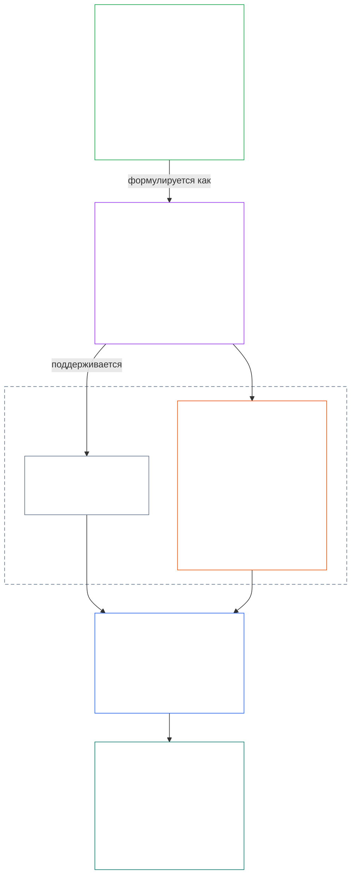
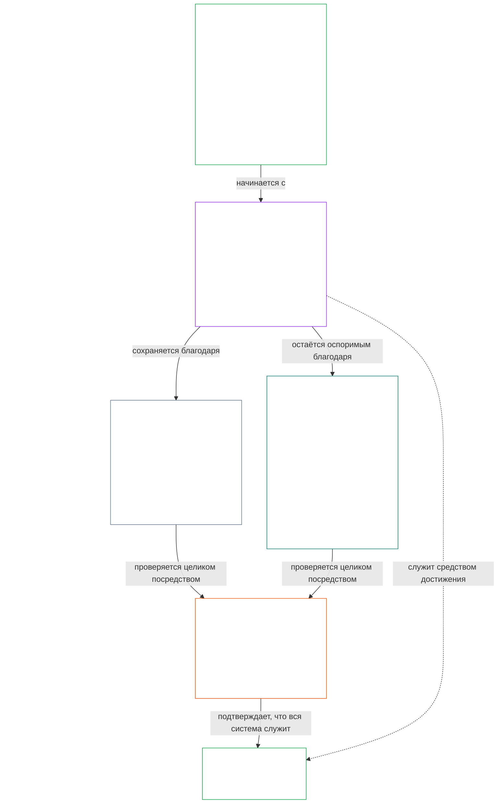

# ГЛАВА 01, ЧАСТЬ A: ЦЕННОСТНЫЕ ПРИНЦИПЫ

<details>
<summary><strong><span style="color: #2563eb;">Место в корпусе (неоперативное): структура файла и правила чтения</span></strong></summary>

> Следующий материал предназначен **только для ориентации читателя**. Он не добавляет, не исключает и не сужает обязательства, установленные в этом файле или других главах.
>
> Этот файл **входит в состав Конституции Разумных Существ** и **имеет обязательную силу только вместе с** другими пронумерованными файлами `core_*`, прочитанными как единый документ. В нем содержится **Глава первая, часть A** (§§1–12: цель и роль; цель Процветания, введенная в §2 и раскрытая через благополучие, Безопасность, Истину, Доверие и Свободу; а также цель Непрерывности, введенная в §8 и раскрытая через потенциал общих систем, устойчивость, структуру рынка и системную оценку).
>
> **Предыдущий файл:** [core_00_preamble.md](core_00_preamble.md)  
> **Следующая часть:** [core_01_b_interaction_interpretation.md](core_01_b_interaction_interpretation.md) (Глава первая, часть B — §§13–15: взаимодействие, ограничения на отмену и конституционное толкование).  
> **Маршрут чтения:** §1 цель и роль → **Процветание:** введение в §2 (в §2.1 установлены не подлежащие обсуждению ограничения Безопасности и Истины) → §3 благополучие (результат) → §4 Безопасность → §5 Истина → §6 Доверие → §7 Свобода → **Непрерывность:** введение в §8 → §9 потенциал общих систем (связующее звено: средство достижения Процветания и содержание Непрерывности) → §10 устойчивость → §11 структура рынка → §12 системная оценка.

</details>

<details>
<summary><strong><span style="color: #2563eb;">Пояснения для читателя (неоперативные): как Глава первая связывает цели, Тетраду, статьи и определения</span></strong></summary>

> Следующий материал предназначен **только для ориентации читателя**. Он не добавляет, не исключает и не сужает обязательства, установленные в этом файле или других главах. Обязательные указания содержатся в блоках **Связи** и **Определения · Оценка · Соблюдение требований** каждой статьи; этот блок — карта части для тех, кто приступает к чтению Главы первой.

**Как связаны уровни.** Каждый уровень отвечает на отдельный вопрос, и каждый принцип Главы первой указывает на остальные три:

- **Цели и Тетрада** ([Преамбула §1](core_00_preamble.md#the-model)): для чего нужны общие системы ([Процветание](core_05_apex_flourishing_aim.md#flourishing-constitutional) и [Непрерывность](core_05_apex_continuity_aim.md#chapter-five-definitions-continuity-constitutional-aim)) и какие четыре обязанности сохраняют законность этой деятельности ([участие](core_05_apex_participation_leg.md#participation-constitutional), [надзор](core_05_apex_oversight_leg.md#oversight-constitutional), [подотчетность](core_05_apex_accountability_leg.md#accountability) и [своевременность](core_05_apex_timeliness_leg.md#timeliness-constitutional)).
- **Принципы** (эта глава): как эти цели и обязанности становятся ценностями, ограничениями и правилами их взаимного взвешивания.
- **Статьи** ([Глава шестая](core_06_rights_part_a.md#chapter-six-foundational-rights)): гарантии Минимума прав, которые остаются осуществимыми при достижении целей. В разделе *В частности* блока **Связи** каждой статьи перечислены соответствующие гарантии.
- **Определения** ([Главы со второй по пятую](core_02_definition_structure.md)): общие значения, используемые для проверки истинности утверждения. В блоке **Определения · Оценка · Соблюдение требований** каждой статьи перечислены соответствующие определения.

**Как Глава первая раскрывает каждую цель.** Процветание — это благополучие разумных существ, поддерживаемое истиной, безопасностью, надежностью и значимой самостоятельностью ([Преамбула §1](core_00_preamble.md#flourishing)). Сначала Глава первая формулирует результат, затем устанавливает по одному принципу для каждого из четырех условий.

| Цель и аспект | Принцип Главы первой | Где дано определение | Статьи, указанные в блоке «Связи» |
|---|---|---|---|
| **Процветание**: результат | [§3 Благополучие](#3-foundational-objective-wellbeing-flourishing-aim) | [Благополучие](core_05_band_continuity.md#wellbeing) | [VI](core_06_rights_part_b.md#article-vi-equal-basic-rights), [X](core_06_rights_part_b.md#article-x-self-determination-agency-and-participation), [XIII-B](core_06_rights_part_c.md#article-xiii-b-right-to-redress-and-remedy), [XIX-B](core_06_rights_part_d.md#article-xix-b-contestability-and-proportional-restriction-limits) |
| **Процветание**: безопасность | [§4 Безопасность](#4-safety-harm-constraint) | [Безопасность](core_05_band_continuity.md#safety-constitutional-constraint) | [XIII](core_06_rights_part_c.md#article-xiii-right-to-reliable-and-trustworthy-systems), [XVII](core_06_rights_part_c.md#article-xvii-system-lifecycle-environments-and-reversibility), [XXIII](core_06_rights_part_d.md#article-xxiii-root-cause-analysis-and-adaptive-response) |
| **Процветание**: истина | [§5 Истина](#5-truth-epistemic-integrity-constraint) | [Истина](core_05_band_oversight.md#truth-constitutional-constraint) | [XIII](core_06_rights_part_c.md#article-xiii-right-to-reliable-and-trustworthy-systems), [XV](core_06_rights_part_c.md#article-xv-info-sphere-integrity), [XVI](core_06_rights_part_c.md#article-xvi-audit-transparency-and-independent-verification) |
| **Процветание**: надежность | [§6 Доверие](#6-trust-and-trustworthiness-coordination-integrity) | [Надежность](core_05_band_continuity.md#trustworthiness) | [XIII](core_06_rights_part_c.md#article-xiii-right-to-reliable-and-trustworthy-systems), [XV](core_06_rights_part_c.md#article-xv-info-sphere-integrity), [XVI](core_06_rights_part_c.md#article-xvi-audit-transparency-and-independent-verification) |
| **Процветание**: значимая самостоятельность | [§7 Свобода](#7-freedom-bounded-agency) | [Значимая самостоятельность](core_05_band_participation.md#meaningful-agency) | [VI](core_06_rights_part_b.md#article-vi-equal-basic-rights), [X](core_06_rights_part_b.md#article-x-self-determination-agency-and-participation), [XXI](core_06_rights_part_d.md#article-xxi-interoperability-portability-movement-refuge-and-exit-integrity) |
| **Непрерывность**, связь с Процветанием: долговечный потенциал | [§9 Потенциал общих систем](#9-shared-system-capacity) | [Потенциал общих систем](core_05_band_continuity.md#shared-system-capacity) | [I-A](core_06_rights_part_a.md#article-i-a-environmental-preconditions-and-ecological-integrity), [III](core_06_rights_part_a.md#article-iii-survival-and-essential-access), [V](core_06_rights_part_a.md#article-v-resource-allocation-dependencies-and-ecosystem-funding) |
| **Непрерывность**: устойчивость | [§10 Устойчивость и самовосстанавливающаяся конструкция](#10-resilience-and-self-healing-design) | [Самовосстановление](core_05_band_continuity.md#self-healing) | [XIII](core_06_rights_part_c.md#article-xiii-right-to-reliable-and-trustworthy-systems), [XVII](core_06_rights_part_c.md#article-xvii-system-lifecycle-environments-and-reversibility), [XXIII](core_06_rights_part_d.md#article-xxiii-root-cause-analysis-and-adaptive-response) |
| **Непрерывность**: конкурентные рынки | [§11 Структура рынка](#11-market-structure) | [Структура рынка](core_05_band_accountability.md#market-structure) | [III-C](core_06_rights_part_a.md#article-iii-c-labor-and-economic-floor), [V](core_06_rights_part_a.md#article-v-resource-allocation-dependencies-and-ecosystem-funding), [XXI](core_06_rights_part_d.md#article-xxi-interoperability-portability-movement-refuge-and-exit-integrity) |
| **Непрерывность**: взгляд на систему в целом | [§12 Требование системной оценки](#12-systemic-evaluation-requirement) | [Сертификация системной согласованности](core_05_band_continuity.md#system-alignment-certification) | [XVI](core_06_rights_part_c.md#article-xvi-audit-transparency-and-independent-verification) |

**Иерархия принципов (Непрерывность).** На уровне принципов цель Непрерывности раскрывается в следующем порядке, начиная с потенциала, связывающего обе цели:

6. **[Потенциал общих систем](core_05_band_continuity.md#shared-system-capacity)** — это совокупный результат надлежащего управления, руководства и стимулов в долгосрочной перспективе: реальная и оспоримая способность разумных существ и общих систем выполнять работу, требуемую Конституцией. Он охватывает обе цели: это средство для **Процветания** и содержание **Непрерывности**, но не козырь, отменяющий все прочее. **[§9.1](#91-productive-capacity-instrumental-good)** и **[§9.2](#92-constitutional-efficiency)** объясняют два его основных аспекта.
7. **[Устойчивость и самовосстанавливающаяся конструкция](#10-resilience-and-self-healing-design)** описывает, как системы, от которых зависят разумные существа, заблаговременно выявляют проблемы, сдерживают их, отказывают по раскрытым сценариям и добросовестно восстанавливаются ([**Самовосстановление**](core_05_band_continuity.md#self-healing)), чтобы потенциал из пункта 6 сохранялся, а стабильность не зависела от экстренного вмешательства.
8. **[Структура рынка](core_05_band_accountability.md#market-structure)** в [§11](#11-market-structure) устанавливает дисциплину против концентрации, благодаря которой этот потенциал на практике остается оспоримым.
9. **[Требование системной оценки](#12-systemic-evaluation-requirement)** проверяет охват всей системы, зависимости и согласованность стимулов, прежде чем признавать утверждения о соблюдении требований или управлении, — в качестве принципиальной основы аудита по направлению **надзора** Тетрады. Сюда входит [Сертификация системной согласованности](core_05_band_continuity.md#system-alignment-certification) как один из нескольких особенно масштабных аудиторских процессов.

**Как Глава первая реализует Тетраду.** В блоке «Связи» каждой статьи названы затрагиваемые ею обязанности. Наиболее непосредственно они раскрываются в следующих разделах:

| Обязанность Тетрады | Основные разделы Главы первой |
|---|---|
| **Участие** | [§16 Подробно об управлении](core_01_c_stewardship_capacity_principles.md#16-stewardship-in-depth) и [§17 Управление с существенными последствиями](core_01_c_stewardship_capacity_principles.md#17-consequential-stewardship-the-steward-role) (значимые роли и право голоса); [§7 Свобода](#7-freedom-bounded-agency) (значимая самостоятельность) |
| **Надзор** | [§16](core_01_c_stewardship_capacity_principles.md#16-stewardship-in-depth) и [§17](core_01_c_stewardship_capacity_principles.md#17-consequential-stewardship-the-steward-role) (распределенное понимание, документация); [§18 Управление](core_01_c_stewardship_capacity_principles.md#18-governance-under-stewardship-discipline) (распределение полномочий); [§12](#12-systemic-evaluation-requirement) (аудит) |
| **Подотчетность** | [§18 Управление](core_01_c_stewardship_capacity_principles.md#18-governance-under-stewardship-discipline) (подотчетность соразмерно полномочиям); [§19 Согласование стимулов и захват системы](core_01_c_stewardship_capacity_principles.md#19-incentive-alignment-and-system-capture) (вознаграждения не должны обессмысливать обязанности) |
| **Своевременность** | [§16](core_01_c_stewardship_capacity_principles.md#16-stewardship-in-depth) и [§17](core_01_c_stewardship_capacity_principles.md#17-consequential-stewardship-the-steward-role) (выявление и устранение проблем без предотвратимых задержек) |

**Две оси, а не конфликт.** Цели указывают, к чему стремятся системы; Тетрада определяет, как эта деятельность остается законной. Один термин может относиться к обеим осям: Истина и Надежность входят в состав Процветания, а [Преамбула §2](core_00_preamble.md#2-measurements-overview) оценивает их в рамках направления Надзора. [§§13–15](core_01_b_interaction_interpretation.md#13-constitutional-collision-resolution-process) определяют, как взвешивать эти принципы при их столкновении и рассматривать их как единое целое; [§20](core_01_c_stewardship_capacity_principles.md#20-integrated-application) применяет их во всех последующих главах.

</details>

<br>

### 1. Цель и роль
<details>
<summary><strong><span style="color: #2563eb;">Связи</span></strong></summary>

- Предпосылки: [Преамбула §1 Модель](core_00_preamble.md#the-model) — [Конституционная Тетрада](core_00_preamble.md#constitutional-tetrad), [Две конституционные цели](core_00_preamble.md#two-constitutional-aims) и масштабирование по [материальному интересу](core_00_preamble.md#material-stake) применяются ко всей главе посредством разделов «Связи».
- Последствия: [15. Конституционное толкование](core_01_b_interaction_interpretation.md#15-constitutional-interpretation) — интегрированное прочтение, устранение неоднозначности, внутренняя иерархия и каноническая процедура разрешения конфликтов.
- Последствия: [Две конституционные цели](core_00_preamble.md#two-constitutional-aims) — развитие цели **Процветания**: от [§3](#3-foundational-objective-wellbeing-flourishing-aim) до [§6](#6-trust-and-trustworthiness-coordination-integrity) и [§7 Свобода](#7-freedom-bounded-agency); развитие цели **Непрерывности**: [§9 Потенциал общих систем](#9-shared-system-capacity), [§10 Устойчивость и самовосстанавливающаяся конструкция](#10-resilience-and-self-healing-design), [§11 Структура рынка](#11-market-structure) и [§12 Требование системной оценки](#12-systemic-evaluation-requirement).
- Последствия: [3. Основополагающая цель: благополучие](#3-foundational-objective-wellbeing-flourishing-aim), [§3.2 Признание, укрепление и стремление](#32-recognition-reinforcement-and-aspiration), [4 Безопасность](#4-safety-harm-constraint), [5 Истина](#5-truth-epistemic-integrity-constraint), [6. Доверие](#6-trust-and-trustworthiness-coordination-integrity), [§16 Подробно об ответственном управлении](core_01_c_stewardship_capacity_principles.md#16-stewardship-in-depth), [13. Процедура разрешения конституционных конфликтов](core_01_b_interaction_interpretation.md#13-constitutional-collision-resolution-process) и [§7 Свобода](#7-freedom-bounded-agency).
- Читать вместе с: [Конституционная Тетрада](core_00_preamble.md#constitutional-tetrad) — участие, надзор, подотчетность и своевременность определяют, как общие системы достигают [Двух конституционных целей](core_00_preamble.md#two-constitutional-aims); масштабирование по [материальному интересу](core_00_preamble.md#material-stake) применяется ко всей главе через разделы «Связи».
- Читать вместе с: [Главами со второй по четвертую](core_02_definition_structure.md) и [Главой пятой](core_05__definitions_home.md#chapter-five-foundational-definitions) — это уровень механизмов, регулирующий каждый термин в данной главе; следует применять целостность O/M/A/C, запрет уклонения, бремя доказывания и прослеживаемость определений до результатов.
- Читать вместе с: [Главой шестой: Основополагающие права](core_06_rights_part_a.md#chapter-six-foundational-rights).
  - В особенности [Статья VI: Равные основные права](core_06_rights_part_b.md#article-vi-equal-basic-rights), [Статья XIII: Право на надежные и заслуживающие доверия системы](core_06_rights_part_c.md#article-xiii-right-to-reliable-and-trustworthy-systems) и [Статья XXIV: Конституционное толкование, пересмотр и гарантии от захвата](core_06_rights_part_d.md#article-xxiv-constitutional-interpretation-review-and-anti-capture-safeguards).
  - Применять это прочтение, если толкование затрагивает защищенных разумных существ, системы или учреждения.

</details>

<details>
<summary><strong><span style="color: #2563eb;">Определения · Оценка · Соблюдение требований</span></strong></summary>

- [Соразмерность](core_05_band_accountability.md#proportionality) · [O](core_05_band_accountability.md#proportionality) · [M](core_05_band_accountability.md#proportionality-a) · [A](core_05_band_accountability.md#proportionality-a) · [C](core_05_band_accountability.md#proportionality-c)
- [Необходимость](core_05_band_accountability.md#necessity) · [O](core_05_band_accountability.md#necessity) · [M](core_05_band_accountability.md#necessity-a) · [A](core_05_band_accountability.md#necessity-a) · [C](core_05_band_accountability.md#necessity-c)

</details>

<br>

*Проще говоря: Глава первая устанавливает ценности и ограничения, регулирующие все остальные главы. Общие системы должны совместно стремиться к **Процветанию** и **Непрерывности**, не жертвуя одной ради другой; никакую отдельную ценность нельзя максимизировать за счет остальных.*

<a id="two-constitutional-aims"></a><a id="flourishing"></a><a id="continuity"></a>В этой главе устанавливаются принципы и ограничения, регулирующие толкование, применение и развитие настоящей Конституции. В ней [Две конституционные цели](core_00_preamble.md#two-constitutional-aims) — [**Процветание**](core_00_preamble.md#flourishing) и [**Непрерывность**](core_00_preamble.md#continuity), сформулированные в [Преамбуле §1 Модель](core_00_preamble.md#the-model), развиваются в применимые принципы и ограничения. Канонические определения на уровне принципов содержатся в Преамбуле; эта глава их применяет.

Эти цели необходимо преследовать совместно, всегда соблюдая установленные Конституцией не подлежащие обсуждению ограничения принципов и гарантии прав. [**Конституционная Тетрада**](core_00_preamble.md#constitutional-tetrad) определяет, как сохраняется легитимность такого стремления, с учетом [**материального интереса**](core_00_preamble.md#material-stake).

Глава организована вокруг этих двух целей и Тетрады:
- **Процветание:** [Введение в цель Процветания](#2-flourishing-aim-introduction) описывает эту цель. [§3 Основополагающая цель: благополучие](#3-foundational-objective-wellbeing-flourishing-aim) формулирует результат. [§4 Безопасность](#4-safety-harm-constraint), [§5 Истина](#5-truth-epistemic-integrity-constraint), [§6 Доверие](#6-trust-and-trustworthiness-coordination-integrity) и [§7 Свобода](#7-freedom-bounded-agency) раскрывают четыре условия, которые поддерживают этот результат: безопасность, истину, надежность и значимую самостоятельность.
- **Непрерывность:** [Введение в цель Непрерывности](#8-continuity-aim-introduction) описывает эту цель. [§9 Потенциал общих систем](#9-shared-system-capacity) (средство достижения Процветания и одновременно содержание Непрерывности), [§10 Устойчивость и самовосстанавливающаяся конструкция](#10-resilience-and-self-healing-design), [§11 Структура рынка](#11-market-structure) и [§12 Требование системной оценки](#12-systemic-evaluation-requirement) развивают долгосрочную стабильность, устойчивый потенциал общих систем и сопротивляемость сбоям. Утверждения о Непрерывности должны опираться на честное представление системы в целом: каждое утверждение в §§9–11 допустимо только после проверки по §12.
- **Когда принципы сталкиваются:** [§13 Процедура разрешения конституционных конфликтов](core_01_b_interaction_interpretation.md#13-constitutional-collision-resolution-process), [§14 Запрет на абсолютное преодоление](core_01_b_interaction_interpretation.md#14-prohibition-on-absolute-override) и [§15 Конституционное толкование](core_01_b_interaction_interpretation.md#15-constitutional-interpretation) определяют, как цели и принципы взвешиваются и толкуются совместно.
- **Тетрада на практике:** с [§16 Подробно об ответственном управлении](core_01_c_stewardship_capacity_principles.md#16-stewardship-in-depth) по [§19 Согласование стимулов и захват системы](core_01_c_stewardship_capacity_principles.md#19-incentive-alignment-and-system-capture) участие, надзор, подотчетность и своевременность распространяются на ответственное управление, руководство и стимулы; [§20 Комплексное применение](core_01_c_stewardship_capacity_principles.md#20-integrated-application) распространяет всю главу на каждую последующую.

В блоке **Связи** каждого принципа перечислены статьи Главы шестой, которые его защищают, а компонент **Определения · Оценка · Соблюдение требований** перечисляет определения Главы пятой, по которым он оценивается.

**Диаграмма: Две конституционные цели и Конституционная Тетрада**

<hr style="border: 0; border-top: 1px solid currentColor;">

```mermaid
flowchart TB
    subgraph Foundation[" "]
        direction TB
        subgraph Aims["Two Constitutional Aims"]
            direction LR
            F["Flourishing<br/><br/>• Sentient wellbeing sustained through truth, safety,<br/>trustworthiness, and meaningful agency"]
            C["Continuity<br/><br/>• Long-horizon stability, sustainability, resilience,<br/>and ecological wellbeing"]
        end
        subgraph Tetrad1["Constitutional Tetrad · participation and oversight"]
            direction LR
            P["Participation<br/><br/>• Affected sentients get a real voice<br/>• Fair representation and a fair chance to challenge<br/>• Access to consequential roles in proportion to stake"]
            O["Oversight<br/><br/>• Watching, checking, verifying, and keeping records<br/>• Independent review can constrain bad choices"]
        end
        subgraph Tetrad2["Constitutional Tetrad · accountability and timeliness"]
            direction LR
            A["Accountability<br/><br/>• Responsibility traces to the right actors<br/>• Answerability, redress, and real correction<br/>• Bad outcomes trigger repair"]
            T["Timeliness<br/><br/>• Problems are detected, challenged, resolved, and fixed<br/>• Time limits match the material stake<br/>• Delay cannot erase rights, remedies, or repair"]
        end
    end
    F ~~~ P
    P ~~~ A
    style Foundation fill:none,stroke:none
    style Aims fill:none,stroke:none
    style Tetrad1 fill:none,stroke:none
    style Tetrad2 fill:none,stroke:none
    style F fill:none,stroke:#16a34a,color:#ffffff
    style C fill:none,stroke:#16a34a,color:#ffffff
    style P fill:none,stroke:#0f766e,color:#ffffff
    style O fill:none,stroke:#ea580c,color:#ffffff
    style A fill:none,stroke:#db2777,color:#ffffff
    style T fill:none,stroke:#9333ea,color:#ffffff
```

*Цели описывают, к чему должны стремиться общие системы; Тетрада — обязанности, сохраняющие легитимность этого стремления. Все четыре обязанности масштабируются по [материальному интересу](core_00_preamble.md#material-stake), а обе цели ограничены Минимумом прав. Воспроизведено из [Концептуального обзора](guides/CONCEPTUAL_OVERVIEW.md#two-aims-and-the-constitutional-tetrad).*

Эти ценности:
- не являются независимыми и при обычном функционировании не образуют строгой иерархии;
- выступают как взаимодействующие принципы и ограничения, которые необходимо оценивать совместно;
- применяются ко всем «системам», включая технические, организационные, экономические и социотехнические структуры, а также экосистемы, оказывающие существенное влияние на разумных существ и планету Земля.

Нельзя применять какой-либо отдельный принцип изолированно, если это существенно нарушает остальные. При возникновении напряженности системы должны разрешать ее с соблюдением требований соразмерности, необходимости и системного воздействия, установленных этой главой. Если неразрешенный конфликт непосредственно затрагивает не подлежащие обсуждению ограничения принципов, приоритет определяет **§13** Главы первой — Процедура разрешения конституционных конфликтов.

<a id="2-flourishing-aim-introduction"></a>
### 2. Введение в цель процветания
<details>
<summary><strong><span style="color: #2563eb;">Трассировка</span></strong></summary>

- Читать вместе с: [Конституционная тетрада](core_00_preamble.md#constitutional-tetrad) — все четыре опоры определяют, как следует добиваться процветания; [материальная значимость](core_00_preamble.md#material-stake) задает глубину каждого утверждения о процветании.
- Читать вместе с: [Две конституционные цели](core_00_preamble.md#two-constitutional-aims) — цель **процветания**; сопряженная с ней цель вводится во [Введении в цель непрерывности](#8-continuity-aim-introduction).
- Выше по тексту: Принципы: [Преамбула §1 Модель](core_00_preamble.md#flourishing); [Процветание (конституционная цель)](core_05_apex_flourishing_aim.md#flourishing-constitutional); [§1 Цель и роль](#1-purpose-and-role).
- Ниже по тексту: [§3 Основополагающая цель: благополучие (цель процветания)](#3-foundational-objective-wellbeing-flourishing-aim), [§4 Безопасность (ограничение вреда)](#4-safety-harm-constraint), [§5 Истина (ограничение эпистемической добросовестности)](#5-truth-epistemic-integrity-constraint), [§6 Доверие и надежность (добросовестность координации)](#6-trust-and-trustworthiness-coordination-integrity) и [§7 Свобода (ограниченная агентность)](#7-freedom-bounded-agency); защищающие каждую из них статьи указаны в трассировке соответствующего раздела.
- Подразделы: [§2.1 Неподлежащие обсуждению ограничения принципов: безопасность и истина](#21-non-negotiable-principle-constraints-safety-and-truth).
- Читать вместе с: в целом с правовым минимумом Главы Шесть.

</details>

<details>
<summary><strong><span style="color: #2563eb;">Определения · Оценка · Соблюдение</span></strong></summary>

- [Процветание (конституционная цель)](core_05_apex_flourishing_aim.md#flourishing-constitutional) · [O](core_05_apex_flourishing_aim.md#flourishing-constitutional) · [M](core_05_apex_flourishing_aim.md#flourishing-constitutional-m) · [A](core_05_apex_flourishing_aim.md#flourishing-constitutional-a) · [C](core_05_apex_flourishing_aim.md#flourishing-constitutional-c)
- [Благополучие](core_05_band_continuity.md#wellbeing) · [O](core_05_band_continuity.md#wellbeing) · [M](core_05_band_continuity.md#wellbeing-a) · [A](core_05_band_continuity.md#wellbeing-a) · [C](core_05_band_continuity.md#wellbeing-c)
- [Безопасность (конституционное ограничение)](core_05_band_continuity.md#safety-constitutional-constraint) · [O](core_05_band_continuity.md#safety-constitutional-constraint) · [M](core_05_band_continuity.md#safety-constraint-a) · [A](core_05_band_continuity.md#safety-constraint-a) · [C](core_05_band_continuity.md#safety-constraint-c)
- [Истина (конституционное ограничение)](core_05_band_oversight.md#truth-constitutional-constraint) · [O](core_05_band_oversight.md#truth-constitutional-constraint-o) · [M](core_05_band_oversight.md#truth-constitutional-constraint-a) · [A](core_05_band_oversight.md#truth-constitutional-constraint-a) · [C](core_05_band_oversight.md#truth-constitutional-constraint-c)
- [Надежность](core_05_band_continuity.md#trustworthiness) · [O](core_05_band_continuity.md#trustworthiness) · [M](core_05_band_continuity.md#trustworthiness-a) · [A](core_05_band_continuity.md#trustworthiness-a) · [C](core_05_band_continuity.md#trustworthiness-c)
- [Осмысленная субъектность](core_05_band_participation.md#meaningful-agency) · [O](core_05_band_participation.md#meaningful-agency) · [M](core_05_band_participation.md#meaningful-agency-a) · [A](core_05_band_participation.md#meaningful-agency-a) · [C](core_05_band_participation.md#meaningful-agency-c)

</details>

<br>

*Проще говоря: процветание — первая из двух целей: благополучная жизнь разумных существ и сохранение их способности жить благополучно благодаря тому, что окружающие их системы безопасны, честны, надежны и оставляют реальную возможность выбора. В §3 определяется этот результат. Следующие четыре принципа указывают, что помогает ему оставаться реальным.*

[**Процветание**](core_05_apex_flourishing_aim.md#flourishing-constitutional) — это **благополучие разумных существ, поддерживаемое истиной, безопасностью, надежностью и осмысленной субъектностью** ([Преамбула §1 Модель](core_00_preamble.md#flourishing)). Глава Первая развивает эту цель в два этапа: [§3 Основополагающая цель: благополучие (цель процветания)](#3-foundational-objective-wellbeing-flourishing-aim) определяет результат, а четыре принципа — условия его поддержания.

| Условие | Принцип | На какой вопрос он отвечает |
|---|---|---|
| **Безопасность** | [§4 Безопасность (ограничение вреда)](#4-safety-harm-constraint) | Защищены ли разумные существа от предотвратимого вреда? |
| **Истина** | [§5 Истина (ограничение эпистемической добросовестности)](#5-truth-epistemic-integrity-constraint), вместе с [§5.1 Научно обоснованное исследование и поддержка принятия решений](#51-science-informed-inquiry-and-decision-support) и [§5.2 Доступность простого языка (обязанность участия и ответственного управления)](#52-plain-language-accessibility-participation-and-stewardship-duty) | Могут ли разумные существа полагаться на сообщаемое им и понимать его? |
| **Надежность** | [§6 Доверие и надежность (добросовестность координации)](#6-trust-and-trustworthiness-coordination-integrity) | Заслуживают ли системы доверия и восстанавливают ли его после сбоев? |
| **Осмысленная субъектность** | [§7 Свобода (ограниченная агентность)](#7-freedom-bounded-agency) | Сохраняют ли разумные существа реальную, ограниченную свободу выбирать, выражать несогласие, объединяться и уходить? |

**Как принципы процветания действуют вместе:**
- **Безопасность и истина — неподлежащие обсуждению ограничения:** они установлены совместно в [§2.1 Неподлежащие обсуждению ограничения принципов: безопасность и истина](#21-non-negotiable-principle-constraints-safety-and-truth), и ими нельзя поступиться ради других принципов.
- **Доверие и свобода ограничены, но не абсолютны:** доверие заслуживают, и его можно восстановить ([§6.1 Исправление и возмещение](#61-correction-and-remedy)); свобода подчинена дисциплинированным ограничениям ([§7.1 Дисциплина ограничений](#71-limitation-discipline)).
- **Ни один принцип не применяется изолированно:** принципы читаются совместно и при столкновении взвешиваются по [§13 Процессу разрешения конституционных конфликтов](core_01_b_interaction_interpretation.md#13-constitutional-collision-resolution-process).
- **У процветания есть сопряженная цель:** цель непрерывности ставит вопрос о том, как обеспечить долговечность этого результата; она вводится во [Введении в цель непрерывности](#8-continuity-aim-introduction).

**Диаграмма: процветание и его принципы**

<hr style="border: 0; border-top: 1px solid currentColor;">



*Процветание сформулировано как результат и сначала поддерживается неподлежащими обсуждению ограничениями — безопасностью и истиной; обе они способствуют доверию, которое, в свою очередь, способствует свободе. Цвета — повторно используемые визуальные ориентиры, а не утверждения о приоритете. В трассировке каждого принципа названы защищающие его статьи, а в модуле «Определения · Оценка · Соблюдение» — его определения. Воспроизведено в [Концептуальном обзоре](guides/CONCEPTUAL_OVERVIEW.md#flourishing-and-its-principles).*

<a id="21-non-negotiable-principle-constraints-safety-and-truth"></a>
#### 2.1 Неподлежащие обсуждению ограничения принципов: безопасность и истина
<details>
<summary><strong><span style="color: #2563eb;">Трассировка</span></strong></summary>

- Читать вместе с: [Конституционная тетрада](core_00_preamble.md#constitutional-tetrad) — опора **участия** (понимание и оспаривание решений по безопасности и истине); опора **надзора** (обнаружение риска вреда и эпистемического ухудшения); опора **подотчетности** (ответственность за вред, обман и введение в заблуждение, вызывающее доверие); шкала [материальной значимости](core_00_preamble.md#material-stake).
- Читать вместе с: [Две конституционные цели](core_00_preamble.md#two-constitutional-aims) — цель **процветания** (**Безопасность** и **Истина** названы ее составляющими в [Преамбуле §1](core_00_preamble.md#two-constitutional-aims)); цель **непрерывности** (предотвращение долгосрочного вреда и добросовестное управление долговечными системами).
- Выше по тексту: Принципы: [3. Основополагающая цель: благополучие](#3-foundational-objective-wellbeing-flourishing-aim); [Две конституционные цели](core_00_preamble.md#two-constitutional-aims).
- Ниже по тексту: [6. Доверие](#6-trust-and-trustworthiness-coordination-integrity), [13. Процесс разрешения конституционных конфликтов](core_01_b_interaction_interpretation.md#13-constitutional-collision-resolution-process) и [§7 Свобода](#7-freedom-bounded-agency).
- Применяется в: [§4 Безопасность](#4-safety-harm-constraint); [§5 Истина](#5-truth-epistemic-integrity-constraint); [§5.1 Научно обоснованное исследование и поддержка принятия решений](#51-science-informed-inquiry-and-decision-support); [§5.2 Доступность простого языка](#52-plain-language-accessibility-participation-and-stewardship-duty).

</details>

<br>

*Проще говоря: безопасность и истина — твердые нижние пределы Конституции, а не предмет компромисса ради оптимизации. Общие системы не должны предсказуемо подвергать разумных существ опасности или обманывать их; оба ограничения действуют при достижении целей процветания и непрерывности и под дисциплиной участия, надзора, подотчетности и своевременности, установленной Тетрадой.*

**Безопасность** и **Истина** — неподлежащие обсуждению ограничения принципов, которые ограничивают все остальные принципы Главы Первой, включая [§3 Основополагающая цель: благополучие](#3-foundational-objective-wellbeing-flourishing-aim) и [Две конституционные цели](core_00_preamble.md#two-constitutional-aims). Они прямо названы составляющими [**Процветания**](#flourishing) и необходимы для [**Непрерывности**](#continuity): системы не могут процветать через вред или обман, а долговременная легитимность требует добросовестного управления рисками во времени.

Применение этих ограничений должно соответствовать [Конституционной тетраде](core_00_preamble.md#constitutional-tetrad) и соразмеряться с [материальной значимостью](core_00_preamble.md#material-stake), особенно:
- когда решения по безопасности влияют на возможность участия
- когда доверие определяется утверждениями об истине
- когда имеет значение ответственность за вред или вводящее в заблуждение поведение

Выводы по безопасности и истине могут изменить запись о статусе разумного существа, в том числе:
- порядок признания [вкладов](core_05_band_accountability.md#contribution-nature)
- регистрацию или нерегистрацию нарушений
- классификацию тяжести этих нарушений
- связанные с ними последствия

Модель статуса [**Главы Девять**](core_09_standing_assessment.md) определяет, как классифицировать, проверять и применять такие выводы, с соблюдением требований оценки и соответствия, установленных в [**Главах со Второй по Пятую**](core_02_definition_structure.md).

### 3. Основополагающая цель: благополучие (цель Процветания)
<details>
<summary><strong><span style="color: #2563eb;">Связи</span></strong></summary>

- Читать вместе с: [Конституционной Тетрадой](core_00_preamble.md#constitutional-tetrad) — компонент **участия**, когда условия благополучия существенно влияют на содержательность голоса, доступа и возможности оспаривания; компонент **подотчетности**, когда заявления о благополучии влияют на распределение бремени; при необходимости масштабировать по [материальному интересу](core_00_preamble.md#material-stake).
- Читать вместе с: [Двумя конституционными целями](core_00_preamble.md#two-constitutional-aims) — эта глава развивает цель **Процветания** от [§3](#3-foundational-objective-wellbeing-flourishing-aim) до [§6](#6-trust-and-trustworthiness-coordination-integrity), а также [§7 Свобода](#7-freedom-bounded-agency).
- Предпосылки: Принципы: [Преамбула §1 Модель](core_00_preamble.md#the-model); [Две конституционные цели](core_00_preamble.md#two-constitutional-aims) — развитие цели **Процветания**.
- Последствия: [4 Безопасность](#4-safety-harm-constraint), [5 Истина](#5-truth-epistemic-integrity-constraint), [§16 Подробно об ответственном управлении](core_01_c_stewardship_capacity_principles.md#16-stewardship-in-depth) и [13. Процедура разрешения конституционных конфликтов](core_01_b_interaction_interpretation.md#13-constitutional-collision-resolution-process).
- Подразделы: [§3.1 Справедливость](#31-fairness); [§3.2 Признание, укрепление и стремление](#32-recognition-reinforcement-and-aspiration); [§3.3 Процесс предотвращения деградации](#33-anti-degrading-process).
- Читать вместе с: в целом с Минимумом прав Главы шестой.
  - В особенности [Статья VI: Равные основные права](core_06_rights_part_b.md#article-vi-equal-basic-rights), [Статья X: Самоопределение, самостоятельность и участие](core_06_rights_part_b.md#article-x-self-determination-agency-and-participation), [Статья XIII-B: Право на возмещение и средство правовой защиты](core_06_rights_part_c.md#article-xiii-b-right-to-redress-and-remedy) и [Статья XIX-B: Оспоримость и пределы соразмерных ограничений](core_06_rights_part_d.md#article-xix-b-contestability-and-proportional-restriction-limits).
  - Применять это, когда заявленные улучшения благополучия используются для оправдания ограничений самостоятельности, достоинства или возможности оспаривания.
  - В особенности [Достоинство и равный моральный статус](core_05_band_participation.md#dignity-and-equal-moral-standing), [Содержательная справедливость](core_05_band_participation.md#substantive-fairness) и [6. Доверие](#6-trust-and-trustworthiness-coordination-integrity), если доступ, процесс, распределительная согласованность, доверие или целостность координации имеют существенное значение.

</details>

<details>
<summary><strong><span style="color: #2563eb;">Определения · Оценка · Соблюдение требований</span></strong></summary>

- [Благополучие](core_05_band_continuity.md#wellbeing) · [O](core_05_band_continuity.md#wellbeing) · [M](core_05_band_continuity.md#wellbeing-a) · [A](core_05_band_continuity.md#wellbeing-a) · [C](core_05_band_continuity.md#wellbeing-c)
- [Участие](core_05_apex_participation_leg.md#participation-constitutional) · [O](core_05_apex_participation_leg.md#participation-constitutional) · [M](core_05_apex_participation_leg.md#participation-constitutional-m) · [A](core_05_apex_participation_leg.md#participation-constitutional-a) · [C](core_05_apex_participation_leg.md#participation-constitutional-c)
- [Достоинство и равный моральный статус](core_05_band_participation.md#dignity-and-equal-moral-standing) · [O](core_05_band_participation.md#dignity-and-equal-moral-standing) · [M](core_05_band_participation.md#dignity-and-equal-moral-standing-a) · [A](core_05_band_participation.md#dignity-and-equal-moral-standing-a) · [C](core_05_band_participation.md#dignity-and-equal-moral-standing-c)
- [Содержательная справедливость](core_05_band_participation.md#substantive-fairness) · [O](core_05_band_participation.md#substantive-fairness) · [M](core_05_band_participation.md#substantive-fairness-constitutional-a) · [A](core_05_band_participation.md#substantive-fairness-constitutional-a) · [C](core_05_band_participation.md#substantive-fairness-constitutional-c)
- [Существенность](core_05_band_oversight.md#materiality) · [O](core_05_band_oversight.md#materiality) · [M](core_05_band_oversight.md#materiality-determination-a) · [A](core_05_band_oversight.md#materiality-determination-a) · [C](core_05_band_oversight.md#materiality-determination-c)
- [Расхождение прокси-показателей](core_05_band_oversight.md#proxy-divergence) · [O](core_05_band_oversight.md#proxy-divergence) · [M](core_05_band_oversight.md#proxy-divergence-a) · [A](core_05_band_oversight.md#proxy-divergence-a) · [C](core_05_band_oversight.md#proxy-divergence-c)

</details>

<br>

*Проще говоря: цель этих систем — действительно улучшать жизнь разумных существ. Погоня за замещающим показателем не достигает этой цели и не может служить оправданием отступлений от требований Безопасности, Истины или прав. Благополучие является основой участия: формальная возможность высказаться без условий, делающих самостоятельность реальной, не считается участием по этой Конституции.*

Конечная цель всех систем, регулируемых этой Конституцией, — сохранять и улучшать [благополучие](core_05_band_continuity.md#wellbeing) разумных существ, то есть цель [**Процветания**](#flourishing) в рамках [Двух конституционных целей](core_00_preamble.md#two-constitutional-aims).

[Преамбула §1 Модель](core_00_preamble.md#flourishing) определяет Процветание как благополучие разумных существ, поддерживаемое истиной, безопасностью, надежностью и значимой самостоятельностью. В этом разделе формулируется результат. В следующих разделах раскрываются четыре условия, которые его поддерживают: [§4 Безопасность](#4-safety-harm-constraint), [§5 Истина](#5-truth-epistemic-integrity-constraint), [§6 Доверие](#6-trust-and-trustworthiness-coordination-integrity) и [§7 Свобода](#7-freedom-bounded-agency). В совокупности эти пять принципов развивают цель Процветания в Главе первой. Цель [**Непрерывности**](#continuity) развивается в [§9 Потенциал общих систем](#9-shared-system-capacity), [§10 Устойчивость и самовосстанавливающаяся конструкция](#10-resilience-and-self-healing-design), [§11 Структура рынка](#11-market-structure) и [§12 Требование системной оценки](#12-systemic-evaluation-requirement).

Благополучие — основа [Участия](core_05_apex_participation_leg.md#participation-constitutional) в рамках [Конституционной Тетрады](core_00_preamble.md#constitutional-tetrad). Общие системы не могут считать участие обеспеченным, если лежащие в его основе условия благополучия — в том числе [значимая самостоятельность](core_05_band_participation.md#meaningful-agency), справедливый доступ и достоинство — существенно ухудшены.

Благополучие включает не только непосредственные эффекты, но и косвенные, отсроченные, накопительные и межсистемные последствия, оцениваемые в соответствии с [**Главами со второй по четвертую**](core_02_definition_structure.md). На этом ценностном уровне благополучие:
- делает возможным реальное участие: голос, которым разумные существа не могут воспользоваться из-за отсутствия необходимых условий, не является значимым участием;
- нельзя объявить «достигнутым» лишь потому, что достигнут показатель, оторвавшийся от действительно важного;
- остается ограниченным не подлежащими обсуждению принципами этой главы: **Безопасностью** и **Истиной**;
- нельзя использовать как универсальное оправдание нарушений Безопасности, Истины или гарантий прав.

#### 3.1 Справедливость
<details>
<summary><strong><span style="color: #2563eb;">Связи</span></strong></summary>

- Читать вместе с: [Конституционной Тетрадой](core_00_preamble.md#constitutional-tetrad) — компонент **участия** (доступ, голос и возможность оспаривания; общее требование, не ограниченное только [участием заинтересованных сторон в системе](core_05_band_participation.md#stakeholder-status-and-weight)); компонент **подотчетности** при распределении выгод и бремени.
- Предпосылки: Принципы: [§3 Основополагающая цель: благополучие](#3-foundational-objective-wellbeing-flourishing-aim) — в том числе основополагающее значение благополучия для [Участия](core_05_apex_participation_leg.md#participation-constitutional).
- Последствия: [§3.2 Признание, укрепление и стремление](#32-recognition-reinforcement-and-aspiration); [6. Доверие](#6-trust-and-trustworthiness-coordination-integrity), [§16 Подробно об ответственном управлении](core_01_c_stewardship_capacity_principles.md#16-stewardship-in-depth), [13. Процедура разрешения конституционных конфликтов](core_01_b_interaction_interpretation.md#13-constitutional-collision-resolution-process) и [Запись о конституционном конфликте](core_05_band_integrative.md#constitutional-collision-record), где решения о приоритете и распределении должны оставаться согласованными и подлежащими проверке.
- Подразделы (порядок чтения): [§3.1.1](#311-access-and-opportunity) · [§3.1.2](#312-benefits-and-burdens) · [§3.1.3](#313-fair-treatment) · [§3.1.4](#314-unfair-treatment).
- Последствия: формирует гарантии равного статуса, недискриминационного обращения, значимой возможности оспаривания и соразмерных пределов ограничений.
  - В особенности [Статья VI: Равные основные права](core_06_rights_part_b.md#article-vi-equal-basic-rights), [Статья VI-C: Запрет дискриминации](core_06_rights_part_b.md#article-vi-c-nondiscrimination), [Статья X: Самоопределение, самостоятельность и участие](core_06_rights_part_b.md#article-x-self-determination-agency-and-participation), [Статья XIII-B: Право на возмещение и средство правовой защиты](core_06_rights_part_c.md#article-xiii-b-right-to-redress-and-remedy) и [Статья XIX-B: Оспоримость и пределы соразмерных ограничений](core_06_rights_part_d.md#article-xix-b-contestability-and-proportional-restriction-limits).
  - Если антиконституционное обозначение влечет санкции или долговременные последствия, читать вместе с [Главой одиннадцатой, раздел 4 — Гарантии надлежащей правовой процедуры, возмещение и предотвращение](core_11_a_misconduct_designation.md#4-due-process-safeguards-for-slot-assignment).
  - Обязательства по недискриминации раскрываются в Главе пятой, [§2 — Защищенные характеристики, использование прокси, фильтрация по интимным сигналам и статус по **Статье VII-E** (*Согласованные взрослыми коммерческие сексуальные услуги и сексуальная эксплуатация*)](core_05_band_participation.md#fairness-protected-characteristics-and-nondiscrimination), в том числе [Обход фильтрации по защищенным интимным сигналам и статуса по **Статье VII-E** (*Согласованные взрослыми коммерческие сексуальные услуги и сексуальная эксплуатация*)](core_05_band_participation.md#protected-intimate-signal-gating-and-article-vii-e-adult-consensual-commercial-sexual-services-and-sexual-exploitation-status-circumvention), если правила справедливого обращения §2.1.3 затрагивают фильтрацию по интимным сигналам или **Статью VII-E** (*Согласованные взрослыми коммерческие сексуальные услуги и сексуальная эксплуатация*).
- Читать вместе с: [Содержательной справедливостью](core_05_band_participation.md#substantive-fairness) и связанными обязательствами Минимума прав Главы шестой, когда существенны выгоды, бремя, вознаграждение, затраты, обязанности, риски, вклад, потребности или подверженность; [Доступностью](core_05_band_participation.md#accessibility), когда существенны пути доступа по §2.1.1; [Расхождением прокси-показателей](core_05_band_oversight.md#proxy-divergence), когда существенны агрегированные показатели или эффекты рейтингов.

</details>

<details>
<summary><strong><span style="color: #2563eb;">Определения · Оценка · Соблюдение требований</span></strong></summary>

- [Достоинство и равный моральный статус](core_05_band_participation.md#dignity-and-equal-moral-standing) · [O](core_05_band_participation.md#dignity-and-equal-moral-standing) · [M](core_05_band_participation.md#dignity-and-equal-moral-standing-a) · [A](core_05_band_participation.md#dignity-and-equal-moral-standing-a) · [C](core_05_band_participation.md#dignity-and-equal-moral-standing-c)
- [Доступность](core_05_band_participation.md#accessibility) · [O](core_05_band_participation.md#accessibility) · [M](core_05_band_participation.md#accessibility-constitutional-a) · [A](core_05_band_participation.md#accessibility-constitutional-a) · [C](core_05_band_participation.md#accessibility-constitutional-c)
- [Участие](core_05_apex_participation_leg.md#participation-constitutional) · [O](core_05_apex_participation_leg.md#participation-constitutional) · [M](core_05_apex_participation_leg.md#participation-constitutional-m) · [A](core_05_apex_participation_leg.md#participation-constitutional-a) · [C](core_05_apex_participation_leg.md#participation-constitutional-c)
- [Процедурная справедливость](core_05_band_participation.md#procedural-fairness) · [O](core_05_band_participation.md#procedural-fairness) · [M](core_05_band_participation.md#procedural-fairness-constitutional-a) · [A](core_05_band_participation.md#procedural-fairness-constitutional-a) · [C](core_05_band_participation.md#procedural-fairness-constitutional-c)
- [Содержательная справедливость](core_05_band_participation.md#substantive-fairness) · [O](core_05_band_participation.md#substantive-fairness) · [M](core_05_band_participation.md#substantive-fairness-constitutional-a) · [A](core_05_band_participation.md#substantive-fairness-constitutional-a) · [C](core_05_band_participation.md#substantive-fairness-constitutional-c)
- [Защищенные характеристики](core_05_band_participation.md#protected-characteristics) · [O](core_05_band_participation.md#protected-characteristics) · [M](core_05_band_participation.md#protected-characteristics-constitutional-a) · [A](core_05_band_participation.md#protected-characteristics-constitutional-a) · [C](core_05_band_participation.md#protected-characteristics-constitutional-c)
- [Использование защищенных характеристик как прокси-показателей и несоразмерное воздействие](core_05_band_participation.md#protected-characteristic-proxying-and-disparate-impact) · [O](core_05_band_participation.md#protected-characteristic-proxying-and-disparate-impact) · [M](core_05_band_participation.md#protected-characteristic-proxying-and-disparate-impact-a) · [A](core_05_band_participation.md#protected-characteristic-proxying-and-disparate-impact-a) · [C](core_05_band_participation.md#protected-characteristic-proxying-and-disparate-impact-c)
- [Обход фильтрации по защищенным интимным сигналам и статуса по **Статье VII-E** (*Согласованные взрослыми коммерческие сексуальные услуги и сексуальная эксплуатация*)](core_05_band_participation.md#protected-intimate-signal-gating-and-article-vii-e-adult-consensual-commercial-sexual-services-and-sexual-exploitation-status-circumvention) · [O](core_05_band_participation.md#protected-intimate-signal-gating-and-article-vii-e-adult-consensual-commercial-sexual-services-and-sexual-exploitation-status-circumvention) · [M](core_05_band_participation.md#protected-intimate-signal-gating-and-article-vii-e-status-circumvention-a) · [A](core_05_band_participation.md#protected-intimate-signal-gating-and-article-vii-e-status-circumvention-a) · [C](core_05_band_participation.md#protected-intimate-signal-gating-and-article-vii-e-status-circumvention-c)
- [Расхождение прокси-показателей](core_05_band_oversight.md#proxy-divergence) · [O](core_05_band_oversight.md#proxy-divergence) · [M](core_05_band_oversight.md#proxy-divergence-a) · [A](core_05_band_oversight.md#proxy-divergence-a) · [C](core_05_band_oversight.md#proxy-divergence-c)

</details>

<br>

*Проще говоря: система не может считаться благой, если обычным разумным существам закрыт доступ к участию, к ним применяются необъясненные правила или на них перекладываются расходы, которых избегают другие. Справедливая система обеспечивает реальный доступ, использует обоснования, которые может защитить, и распределяет вознаграждение, затраты и риски с учетом реального вклада, потребностей и подверженности.*

**Справедливость** входит в требования [§3 Основополагающая цель: благополучие](#3-foundational-objective-wellbeing-flourishing-aim) всякий раз, когда разумным существам приходится жить, работать, учиться, торговать или принимать решения через общие системы. Если общие системы существенно влияют на разумных существ, справедливость требует, чтобы возможности, обращение и распределение выгод и бремени уважали [Достоинство и равный моральный статус](core_05_band_participation.md#dignity-and-equal-moral-standing).

Справедливость помогает сделать [Участие](core_05_apex_participation_leg.md#participation-constitutional) реальным. Участие нереально, если разумные существа формально имеют право голоса, но не могут попасть в процесс, понять правило, выполнить условия, оспорить результат или нести возложенное на них бремя.

Хорошего среднего результата системы недостаточно. Отдельный заметный показатель, среднее значение, рейтинг или заявление об эффективности само по себе не доказывает справедливость. В совокупности система может выглядеть успешной, но оставаться несправедливой к исключенным, ошибочно классифицированным, недооплачиваемым, перегруженным или лишенным содержательной возможности возразить разумным существам.

В этом разделе **четыре практических блока**. Они направляют этот раздел, но не заменяют определения Главы пятой или Минимум прав Главы шестой.

<a id="311-access-and-opportunity"></a>
##### 3.1.1 Доступ и возможности

В этом подразделе разъясняется практическое значение доступа и возможностей:

- Разумным существам необходимы практические пути к [Участию](core_05_apex_participation_leg.md#participation-constitutional), образованию, работе, заботе, безопасности, передвижению и другим благам, важным для повседневной жизни.
- Такие пути нельзя блокировать, делать недоступными из-за цены, задерживать, скрывать или искажать по произвольным либо не относящимся к делу причинам.
- Формально открытой двери недостаточно, если Конституция требует **содержательных** возможностей.

<a id="312-benefits-and-burdens"></a>
##### 3.1.2 Выгоды и бремя

В этом подразделе разъясняется, когда распределение выгод и бремени справедливо:

- Система несправедлива, если одни разумные существа получают выгоды, а другие незаметно несут расходы.
- Фаворитизм, скрытое перенесение расходов, выборочное применение правил и манипуляции рейтингами не удовлетворяют этому требованию.

<a id="313-fair-treatment"></a>
##### 3.1.3 Справедливое обращение

В этом подразделе разъясняется, что требует справедливое обращение:

- К разумным существам в сходных обстоятельствах следует применять одни и те же базовые правила.
- То, что разумные существа получают, должны или рискуют потерять, должно соответствовать их вкладу, потребностям или бремени, которое они фактически несут.
- Различное обращение должно иметь реальное основание, быть соразмерным этому основанию, уважать достоинство и исключать дискриминацию.
- Подробные правила содержатся в Главе пятой, включая [Защищенные характеристики](core_05_band_participation.md#protected-characteristics) и [Использование защищенных характеристик как прокси-показателей и несоразмерное воздействие](core_05_band_participation.md#protected-characteristic-proxying-and-disparate-impact).
- Если решение существенно влияет на человека или он его оспаривает, порядок пересмотра должен отвечать требованиям [Процедурной справедливости](core_05_band_participation.md#procedural-fairness) всякий раз, когда Глава шестая или регулирующий документ требует уведомления, слушания, объяснения или пересмотра.

Заявленное благополучие не согласуется с [§3 Основополагающая цель: благополучие](#3-foundational-objective-wellbeing-flourishing-aim), если оно зависит от произвольного исключения, необъясненных или нестабильных правил, скрытого извлечения выгод либо формального [Участия](core_05_apex_participation_leg.md#participation-constitutional), тогда как условия справедливости, делающие участие значимым, не соблюдены.

<a id="314-unfair-treatment"></a>
##### 3.1.4 Несправедливое обращение

Несправедливое обращение ведет к исключению и непоследовательности. Системам запрещено скрывать несправедливость за технической терминологией, нейтральными обозначениями или автоматизированными решениями. В частности, им запрещено:
- применять алгоритмы, системы баллов или административные правила, воспроизводящие исторические неблагоприятные условия без конституционно обоснованной причины;
- использовать интимные личные сигналы или сексуальную историю как упрощенные показатели доверия, риска, характера или доступа — читать вместе с [Обходом фильтрации по защищенным интимным сигналам и статуса по **Статье VII-E** (*Согласованные взрослыми коммерческие сексуальные услуги и сексуальная эксплуатация*)](core_05_band_participation.md#protected-intimate-signal-gating-and-article-vii-e-adult-consensual-commercial-sexual-services-and-sexual-exploitation-status-circumvention);
- наказывать за законную занятость, трудовую историю, отсутствие занятости, законный трудовой статус или защищенное объединение без конституционно обоснованной причины;
- отказывать в работе, жилье, банковских услугах, лицензиях, статусе или аналогичном доступе **главным образом из-за** любой законной формы занятости, прежней законной занятости, предполагаемой законной занятости или ее отсутствия;
- создавать существенные неблагоприятные условия через лицензирование, зонирование, сборы, правила платформ или иные внешне нейтральные требования, которые преимущественно обременяют законную работу, законную трудовую историю, предполагаемую законную работу, отсутствие занятости или защищенное объединение без обоснования, требуемого Конституцией.

Эти четыре блока также поддерживают [6. Доверие](#6-trust-and-trustworthiness-coordination-integrity), когда разумным существам приходится полагаться на систему, принимать ее решения или координировать действия в соответствии с ее обещаниями.

#### 3.2 Признание, подкрепление и стремление
<details>
<summary><strong><span style="color: #2563eb;">Связи</span></strong></summary>

- Читать вместе с [Constitutional Tetrad](core_00_preamble.md#constitutional-tetrad): компонент **участия**, если обозначенные пути признания, похвалы или стремления существенно влияют на голос, статус или доступ к значимым ролям; компонент **подотчётности** (не вознаграждать предательство, сокрытие и уклонение от ответственности); компонент **надзора** (проверяемая и не вводящая в заблуждение похвала).
- Предшествующие принципы: [§3 Основополагающая цель: благополучие](#3-foundational-objective-wellbeing-flourishing-aim), включая благополучие как основание [Участия](core_05_apex_participation_leg.md#participation-constitutional); [§3.1 Справедливость](#31-fairness).
- Последующие принципы: [§6 Доверие](#6-trust-and-trustworthiness-coordination-integrity); [§16 Глубинное попечительство](core_01_c_stewardship_capacity_principles.md#16-stewardship-in-depth); [§18 Управление в рамках дисциплины попечительства](core_01_c_stewardship_capacity_principles.md#18-governance-under-stewardship-discipline); [§7 Свобода](#7-freedom-bounded-agency).
- Читать вместе с [Глава девятая §§4.3–4.4 — Нормализованный каталог дескрипторов](core_09_standing_assessment.md#43-route-descriptor-measurement-roles), когда существенно признание, **соответствующее области**, или сравнительные описания **оси вклада / оси нарушения**.
- Читать вместе с [Глава девятая §4.3 — Дескрипторы вклада](core_09_standing_assessment.md#43-route-descriptor-measurement-roles), когда существенны характер вклада и описания признания; [Глава десятая §3](core_10_standing_integration.md#3-descriptor-integration-and-attachment-normalization) — об их включении в вопрос 3.
- Читать вместе с [Article X: Self-Determination, Agency, and Participation](core_06_rights_part_b.md#article-x-self-determination-agency-and-participation), когда существенны предпочтения относительно формы признания, его публичности или отказа от него.
- Подразделы (порядок чтения): [§3.2.1](#321-recognition-and-reinforcement) · [§3.2.2](#322-celebration-of-success) · [§3.2.3](#323-aspiration) · [§3.2.4](#324-preference-aligned-recognition) · [§3.2.5](#325-aligned-recognition-pathways) · [§3.2.6](#326-anti-reward-for-anti-constitutional-conduct) · [§3.2.7](#327-implementation-layer).

</details>

<details>
<summary><strong><span style="color: #2563eb;">Определения · Оценка · Соблюдение</span></strong></summary>

- [Благополучие](core_05_band_continuity.md#wellbeing) · [O](core_05_band_continuity.md#wellbeing) · [M](core_05_band_continuity.md#wellbeing-a) · [A](core_05_band_continuity.md#wellbeing-a) · [C](core_05_band_continuity.md#wellbeing-c)
- [Участие](core_05_apex_participation_leg.md#participation-constitutional) · [O](core_05_apex_participation_leg.md#participation-constitutional) · [M](core_05_apex_participation_leg.md#participation-constitutional-m) · [A](core_05_apex_participation_leg.md#participation-constitutional-a) · [C](core_05_apex_participation_leg.md#participation-constitutional-c)
- [Содержательная справедливость](core_05_band_participation.md#substantive-fairness) · [O](core_05_band_participation.md#substantive-fairness) · [M](core_05_band_participation.md#substantive-fairness-constitutional-a) · [A](core_05_band_participation.md#substantive-fairness-constitutional-a) · [C](core_05_band_participation.md#substantive-fairness-constitutional-c)
- [Оспоримость](core_05_band_accountability.md#contestability) · [O](core_05_band_accountability.md#contestability) · [M](core_05_band_accountability.md#contestability-a) · [A](core_05_band_accountability.md#contestability-a) · [C](core_05_band_accountability.md#contestability-c)
- [Осмысленная субъектность](core_05_band_participation.md#meaningful-agency) · [O](core_05_band_participation.md#meaningful-agency) · [M](core_05_band_participation.md#meaningful-agency-a) · [A](core_05_band_participation.md#meaningful-agency-a) · [C](core_05_band_participation.md#meaningful-agency-c)
- [Согласование стимулов](core_05_band_integrative.md#incentive-alignment) · [O](core_05_band_integrative.md#incentive-alignment) · [M](core_05_band_integrative.md#incentive-alignment-a) · [A](core_05_band_integrative.md#incentive-alignment-a) · [C](core_05_band_integrative.md#incentive-alignment-c)

</details>

<br>

*Проще говоря: благополучие — это не только то, что запрещено, и то, что справедливо. Общие системы должны честно поощрять и отмечать поведение, которое они хотят видеть снова, в границах истины и прав и так, чтобы поддерживать реальное участие, а не подменять его. Празднование успеха означает признание реального вклада, исправления вреда и завершения дела, а не шумихи или манипулируемых показателей. Оно также означает отказ вознаграждать предательство Конституции, сокрытие, ответные меры или уклонение от подотчётности — даже если это принесло институциональную выгоду.*

**Три измерения.** Благополучие зависит от того, что системы запрещают и насколько справедливо распределяют издержки, а также от того, что они открыто ценят и подкрепляют и в достижении чего помогают sentient-существам. В этом разделе изложены обязанности в отношении признания, подкрепления и стремления. Признание и похвала, существенно влияющие на голос, статус или доступ, должны соответствовать [Участию](core_05_apex_participation_leg.md#participation-constitutional) в рамках [§3 Основополагающая цель: благополучие](#3-foundational-objective-wellbeing-flourishing-aim) и [§3.1 Справедливость](#31-fairness). Раздел применяется вместе с [§3.1 Справедливость](#31-fairness) и ограничен требованиями безопасности, истины и минимального уровня прав Главы Шесть.

<a id="321-recognition-and-reinforcement"></a>
##### 3.2.1 Признание и подкрепление

Благополучие sentient-существ укрепляется, когда системы **сигнализируют**, **признают заслуги** и **соразмерно вознаграждают** законное попечительство, честное сотрудничество, исправление вреда, завершение работы и иной вклад, согласующийся с Конституцией, в том числе посредством **положительного подкрепления** и **публичного признания**, а не только сдерживания, санкций или молчания.

Это конституционная обязанность, а не необязательная культура. Общие системы должны делать согласованное с Конституцией поведение заметным и достойным повторения.

<a id="322-celebration-of-success"></a>
##### 3.2.2 Празднование успеха

**Празднование** отмечает **проверяемые и не вводящие в заблуждение** достижения и просоциальную координацию. Сюда относятся вдохновляющие рассказы и истории попечительства, связанные с подтверждённым [вкладом](core_05_band_accountability.md#contribution-nature).

Празднование не должно:
- подменять реальный прогресс к основополагающим конституционным целям, если оптимизация косвенных показателей отклонилась от них ([§3 Основополагающая цель: благополучие](#3-foundational-objective-wellbeing-flourishing-aim));
- превращаться в **присвоение** похвалы или престижа ([§19 Согласование стимулов и захват системы](core_01_c_stewardship_capacity_principles.md#19-incentive-alignment-and-system-capture));
- оправдывать уклонение от подотчётности, когда затронуты безопасность, истина или защита прав.

<a id="323-aspiration"></a>
##### 3.2.3 Стремление

**Стремление** охватывает выраженные предпочтения и преследуемые цели в рамках [§7 Свобода](#7-freedom-bounded-agency). Оно составляет часть благополучия, если согласуется с достоинством, равным статусом, безопасностью, истиной и [содержательной справедливостью](core_05_band_participation.md#substantive-fairness).

В этих пределах системы должны **признавать и поддерживать** то, чего sentient-существа законно стремятся достичь.

Само желание чего-либо не даёт полной свободы действий. Если существенно затронуты согласие, достоинство, безопасность, истина, содержательная справедливость или гарантии **Главы Шесть**, такие стремления по-прежнему подлежат анализу конституционного конфликта, как и любое другое конституционное притязание.

<a id="324-preference-aligned-recognition"></a>
##### 3.2.4 Признание с учётом предпочтений

Когда это практически осуществимо, системы должны **адаптировать** признание, похвалу и соразмерные награды к тому, как sentient-существа хотят быть отмечены, особенно к их выраженным предпочтениям относительно **формы и публичности**.

Это включает уважение **отказа** от публичного или церемониального признания либо предпочтения **минимального или частного** признания, если это соразмерно и законно.

**Нежелательное** или **принудительное** признание не отвечает этому требованию, включая привлечение внимания к sentient-существам, которые **отказываются** от него.

Признание должно быть **значимым** для тех, кого чествуют, и для сообществ, с которыми они работают, а не выглядеть постановкой преимущественно для внешних наблюдателей.

<a id="325-aligned-recognition-pathways"></a>
##### 3.2.5 Согласованные пути признания

Официально обозначенные пути признания, похвала, премии, сертификация, статус, репутационные последствия и сопоставимые стимулы, которые **распределяют статус**, **ресурсы** или **существенный доступ**, должны соответствовать истине, безопасности, оспоримой процедуре там, где её предусматривает **Глава Шесть**, [Участию](core_05_apex_participation_leg.md#participation-constitutional) и [Согласованию стимулов](core_05_band_integrative.md#incentive-alignment).

Они **не должны** систематически вознаграждать вред, обман, уклонение от проверки, извлечение выгоды или подрыв осмысленной субъектности.

<a id="326-anti-reward-for-anti-constitutional-conduct"></a>
##### 3.2.6 Запрет вознаграждения за антиконституционное поведение

*Проще говоря: никого нельзя вознаграждать за антиконституционное поведение, его сокрытие или ответные меры в связи с ним — открыто или через обходные пути вроде услуг, тихих повышений или намеренного закрывания глаз. Помощь пострадавшим sentient-существам и защита тех, кто честно сообщил о нарушении, — другое дело. Это правильная реакция, и её следует поощрять.*

Нельзя предоставлять признание, вознаграждение, защиту, продвижение, иммунитет, благоприятное назначение, контракт, доступ, статус, репутационную выгоду, выгоду в положении или сопоставимое преимущество потому, что sentient-существо, роль, учреждение или компонент системы совершили, обеспечили, скрыли, нормализовали, отказались исправить антиконституционное поведение либо приняли ответные меры против сообщившего о нём.

Это правило охватывает прямые награды и косвенные пути вознаграждения, включая покровительство, отмывание репутации, повышение задним числом, выборочное неприменение правил, выгодное урегулирование, зачёт показателей или институциональную защиту.

Любое sentient-существо, роль, учреждение или компонент системы, которые исправляют вред, защищают sentient-существ от ответных мер или исправляют положение пострадавших либо добросовестно сообщивших о нарушении, делают то, что поощряет эта Конституция. Ни эта работа, ни помощь, полученная пострадавшими и добросовестными заявителями, не считается наградой по этому правилу.

<a id="327-implementation-layer"></a>
##### 3.2.7 Уровень реализации

Подробности церемоний, учебных программ, бюджетов, программ и показателей относятся к уровням реализации организаций, принимающих эти нормы.

<a id="33-anti-degrading-process"></a>
#### 3.3 Процесс без унижения достоинства

<details>
<summary><strong><span style="color: #2563eb;">Связи</span></strong></summary>

- Предшествующие принципы: [§3 Основополагающая цель: благополучие](#3-foundational-objective-wellbeing-flourishing-aim) (*родительская норма — достоинство и равное моральное положение превращаются в действующий минимум, исключающий унижающие процессы*); [§3.1 Справедливость](#31-fairness) (*справедливое обращение требует, чтобы сам процесс не становился наказанием*); [Достоинство и равное моральное положение](core_05_band_participation.md#dignity-and-equal-moral-standing).
- Читать вместе с [Constitutional Tetrad](core_00_preamble.md#constitutional-tetrad): компонент **подотчётности** (устройство процесса отвечает перед затронутыми sentient-существами, а не удобству учреждения); компонент **надзора** (унижение можно выявить и оспорить); [Жестокость](core_05_band_accountability.md#cruelty) (*профильная норма Главы Пять о страдании как цели и gratuitous / degrading причинении страданий*).
- Последующие принципы: [§13.1.4 Конституционные минимумы, безопасность и процесс без унижения достоинства](core_01_b_interaction_interpretation.md#1314-constitutional-floors-safety-and-anti-degrading-process) (применяет этот принцип как абсолютный минимум в стеке компромиссов); [§16 Глубинное попечительство](core_01_c_stewardship_capacity_principles.md#16-stewardship-in-depth) и [§17 Попечительство с учётом последствий](core_01_c_stewardship_capacity_principles.md#17-consequential-stewardship-the-steward-role) (*определяет, как может выполняться работа столпов и роль попечителя; это не подраздел ни одного из них*); [Article VI: Equal Basic Rights](core_06_rights_part_b.md#article-vi-equal-basic-rights) и [Article VI-A](core_06_rights_part_b.md#article-vi-a-dignity-and-equal-moral-standing) (*минимум достоинства*); [Article XX-A](core_06_rights_part_d.md#article-xx-a-justice-objective-and-scope) (*минимум против жестокости*); [системы корпуса CS-7](corpus_systems/cs_07_justice_safeguards_restitution_rehabilitation.md) (*гарантии правосудия, возмещение вреда и реабилитация*).

</details>

<details>
<summary><strong><span style="color: #2563eb;">Определения · Оценка · Соблюдение</span></strong></summary>

- [Достоинство и равное моральное положение](core_05_band_participation.md#dignity-and-equal-moral-standing) · [O](core_05_band_participation.md#dignity-and-equal-moral-standing) · [M](core_05_band_participation.md#dignity-and-equal-moral-standing-a) · [A](core_05_band_participation.md#dignity-and-equal-moral-standing-a) · [C](core_05_band_participation.md#dignity-and-equal-moral-standing-c)
- [Жестокость](core_05_band_accountability.md#cruelty) · [O](core_05_band_accountability.md#cruelty) · [M](core_05_band_accountability.md#cruelty-a) · [A](core_05_band_accountability.md#cruelty-a) · [C](core_05_band_accountability.md#cruelty-c)
- [Вред](core_05_band_accountability.md#harm) · [O](core_05_band_accountability.md#harm) · [M](core_05_band_accountability.md#harm-a) · [A](core_05_band_accountability.md#harm-a) · [C](core_05_band_accountability.md#harm-c)
- [Соразмерность](core_05_band_accountability.md#proportionality) · [O](core_05_band_accountability.md#proportionality) · [M](core_05_band_accountability.md#proportionality-a) · [A](core_05_band_accountability.md#proportionality-a) · [C](core_05_band_accountability.md#proportionality-c)
- [Оспоримость](core_05_band_accountability.md#contestability) · [O](core_05_band_accountability.md#contestability) · [M](core_05_band_accountability.md#contestability-a) · [A](core_05_band_accountability.md#contestability-a) · [C](core_05_band_accountability.md#contestability-c)

</details>

<br>

*Проще говоря: каким бы ни было управление, обеспечение соблюдения правил, вынесение решений, ограничение или возмещение вреда — sentient-существ нельзя подвергать унижению, публичному спектаклю, ответным мерам или жестокости «потому что нам так проще». Справедливые последствия, публичная подотчётность и строгие ограничения могут оставаться законными, даже если причиняют боль или смущают. Граница нарушается, когда сам процесс становится наказанием, задуманным для унижения, стыда или выплеска злости, а не для защиты, исправления, восстановления или предотвращения. Это действует везде, где осуществляется конституционная власть, а не только при компромиссах между правами.*

**Суть:** сквозной минимум характера в рамках [§3 Благополучие](#3-foundational-objective-wellbeing-flourishing-aim). Он не добавляет собственной содержательной работы, как [§3.1 Справедливость](#31-fairness) и [§3.2 Признание, подкрепление и стремление](#32-recognition-reinforcement-and-aspiration), а ограничивает *то, как* выполняется работа по обеспечению благополучия, попечительская работа и любые иные конституционные процессы, включая три опоры [§16 Глубинное попечительство](core_01_c_stewardship_capacity_principles.md#16-stewardship-in-depth) и роль попечителя, определённую в [§17 Попечительство с учётом последствий](core_01_c_stewardship_capacity_principles.md#17-consequential-stewardship-the-steward-role).

**Принцип процесса без унижения достоинства.** Конституционные процессы, меры и результаты должны соответствовать этому принципу.

**Запрещено.** Их нельзя оправдывать, включать в них или предсказуемо создавать с их помощью:

- унижающее обращение;
- унижение ради него самого;
- публичный спектакль, используемый преимущественно для устрашения;
- ответные претензии;
- коллективные ответные меры;
- дискриминационное возложение бремени; или
- преобладание процессуального удобства над правами.

Если запрещённый характер поведения состоит в причинении страданий как самоцели либо в gratuitous или унижающем причинении вреда сверх необходимого и соразмерного — включая унижение ради него самого, — профильная норма Главы Пять — [Жестокость](core_05_band_accountability.md#cruelty) (унижение как подтип этого понятия).

**Не запрещено лишь потому, что это трудно.** Обычная публичная подотчётность, обоснованная публикация, проверенное ограничение или соразмерное возмещение вреда остаются законными, даже если неприятны или наносят ущерб репутации.

**Проектирование и поведение.** Процессы нельзя проектировать, представлять, проводить или допускать к функционированию как унижающие достоинство, порочащие, зрелищные, карательные, дискриминационно обременяющие или размывающие права ради удобства.

**Область действия.** Принцип распространяется на все конституционные процессы, включая:

- решения по управлению и реализации;
- обеспечение соблюдения норм и оценку статуса;
- разбирательства в форумах;
- чрезвычайные меры и планы перехода;
- процедуры внесения поправок; и
- всю административную и операционную деятельность в рамках конституционных полномочий.

Он не ограничен контекстом стека компромиссов, где также действует как абсолютный минимум согласно [§13.1.4 Конституционные минимумы, безопасность и процесс без унижения достоинства](core_01_b_interaction_interpretation.md#1314-constitutional-floors-safety-and-anti-degrading-process).

**Выявление и оспаривание.** Характер процесса подчиняется тем же требованиям [оспоримости](core_05_band_accountability.md#contestability) и [надзора](core_05_apex_oversight_leg.md#oversight-constitutional), что и содержательные результаты. Затронутые стороны могут оспаривать характер процесса независимо от того, был бы его содержательный результат в иных обстоятельствах законным. Правильный результат, полученный посредством унижающего процесса, всё равно не соответствует требованиям.

### 4. Безопасность (ограничение вреда)
<details>
<summary><strong><span style="color: #2563eb;">Связи</span></strong></summary>

- Читать вместе с: [Конституционная тетрада](core_00_preamble.md#constitutional-tetrad) — столпы **надзора** и **подотчётности**; масштабирование по [существенности интереса](core_00_preamble.md#material-stake).
- Читать вместе с: [Две конституционные цели](core_00_preamble.md#two-constitutional-aims) — цель **Процветания** (компонент **Безопасность**); цель **Непрерывности** (предотвращение необратимого вреда и долгосрочное ответственное управление рисками).
- Предшествующие нормы: Принципы: [3. Основополагающая цель: Благополучие](#3-foundational-objective-wellbeing-flourishing-aim); [Две конституционные цели](core_00_preamble.md#two-constitutional-aims).
- Последующие нормы: [5.1 Научно обоснованное исследование и поддержка принятия решений](#51-science-informed-inquiry-and-decision-support), [6. Доверие](#6-trust-and-trustworthiness-coordination-integrity), [§7 Свобода](#7-freedom-bounded-agency), [13. Процедура разрешения конституционных коллизий](core_01_b_interaction_interpretation.md#13-constitutional-collision-resolution-process) и [13.2.1 Сохранение эпистемической целостности](core_01_b_interaction_interpretation.md#1321-preservation-of-epistemic-integrity).
- Последующие нормы: определяет границы прав, касающихся надёжных систем, целостности информационной сферы, аудита и проверки, контроля жизненного цикла, ограничений экспериментов, понятности, адаптивного реагирования и действий в чрезвычайных ситуациях.
  - В частности: [Статья XIII: Право на надёжные и заслуживающие доверия системы](core_06_rights_part_c.md#article-xiii-right-to-reliable-and-trustworthy-systems), [Статья XV: Целостность информационной сферы](core_06_rights_part_c.md#article-xv-info-sphere-integrity), [Статья XVI: Аудит, прозрачность и независимая проверка](core_06_rights_part_c.md#article-xvi-audit-transparency-and-independent-verification), [Статья XVII: Жизненный цикл систем, среды и обратимость](core_06_rights_part_c.md#article-xvii-system-lifecycle-environments-and-reversibility), [Статья XVIII: Инновации в изолированной среде, эксперименты и свобода творчества](core_06_rights_part_c.md#article-xviii-sandboxed-innovation-experimentation-and-creative-freedom), [Статья XXII: Понятность и ответственное управление сложностью](core_06_rights_part_d.md#article-xxii-comprehensibility-and-complexity-stewardship), [Статья XXIII: Анализ первопричин и адаптивное реагирование](core_06_rights_part_d.md#article-xxiii-root-cause-analysis-and-adaptive-response), [Статья XXIV: Толкование Конституции, проверка и гарантии против захвата](core_06_rights_part_d.md#article-xxiv-constitutional-interpretation-review-and-anti-capture-safeguards) и [Статья XX: Правосудие после подтверждённого нарушения](core_06_rights_part_d.md#article-xx-justice-after-verified-violation).
  - Это также охватывает любые гарантии прав Главы шестой, осуществление или ограничение которых зависит от риска, доказательств, раскрытия информации или целостности системы.

</details>

<details>
<summary><strong><span style="color: #2563eb;">Определения · Оценка · Соблюдение</span></strong></summary>

- [Безопасность (конституционное ограничение)](core_05_band_continuity.md#safety-constitutional-constraint) · [O](core_05_band_continuity.md#safety-constitutional-constraint) · [M](core_05_band_continuity.md#safety-constraint-a) · [A](core_05_band_continuity.md#safety-constraint-a) · [C](core_05_band_continuity.md#safety-constraint-c)
- [Вред](core_05_band_accountability.md#harm) · [O](core_05_band_accountability.md#harm) · [M](core_05_band_accountability.md#harm-a) · [A](core_05_band_accountability.md#harm-a) · [C](core_05_band_accountability.md#harm-c)
- [Необратимый вред](core_05_band_accountability.md#irreversible-harm) · [O](core_05_band_accountability.md#irreversible-harm) · [M](core_05_band_accountability.md#irreversible-harm-a) · [A](core_05_band_accountability.md#irreversible-harm-a) · [C](core_05_band_accountability.md#irreversible-harm-c)
- [Риск](core_05_band_continuity.md#risk) · [O](core_05_band_continuity.md#risk) · [M](core_05_band_continuity.md#risk-a) · [A](core_05_band_continuity.md#risk-a) · [C](core_05_band_continuity.md#risk-c)
- [Существенность](core_05_band_oversight.md#materiality) · [O](core_05_band_oversight.md#materiality) · [M](core_05_band_oversight.md#materiality-determination-a) · [A](core_05_band_oversight.md#materiality-determination-a) · [C](core_05_band_oversight.md#materiality-determination-c)
- [Зависимость](core_05_band_continuity.md#dependency) · [O](core_05_band_continuity.md#dependency) · [M](core_05_band_continuity.md#dependency-a) · [A](core_05_band_continuity.md#dependency-a) · [C](core_05_band_continuity.md#dependency-c)
- [Предсказуемость](core_05_band_oversight.md#foreseeability) · [O](core_05_band_oversight.md#foreseeability) · [M](core_05_band_oversight.md#foreseeability-diligence-a) · [A](core_05_band_oversight.md#foreseeability-diligence-a) · [C](core_05_band_oversight.md#foreseeability-diligence-c)

</details>

<br>

*Проще говоря: системы нельзя создавать или эксплуатировать так, чтобы это предсказуемо повышало риск неконтролируемого вреда, каскадного сбоя или необратимого ущерба для чувствующих существ и систем, от которых они зависят.*

Безопасность — не подлежащее обсуждению принципиальное ограничение проектирования, эксплуатации и управления системами; это прямо названный компонент [**Процветания**](#flourishing) и базовый предел для [**Непрерывности**](#continuity) везде, где общие системы создают предсказуемый риск вреда. Подробные определения, критерии оценки и проверки соблюдения приведены в [**Главах со второй по пятую**](core_02_definition_structure.md), особенно в разделах [Вред](core_05_band_accountability.md#harm), [Необратимый вред](core_05_band_accountability.md#irreversible-harm), [Риск](core_05_band_continuity.md#risk), [Существенность](core_05_band_oversight.md#materiality), [Зависимость](core_05_band_continuity.md#dependency) и [Предсказуемость](core_05_band_oversight.md#foreseeability-and-reasonably-foreseeable).

Системы не должны действовать — или бездействовать — таким образом, который предсказуемо повышает риск неконтролируемого вреда, вероятность каскадного сбоя или подверженность необратимому вреду в нарушение настоящей Конституции.

### 5. Истина (ограничение эпистемической целостности)
<details>
<summary><strong><span style="color: #2563eb;">Связи</span></strong></summary>

- Читать вместе с: [Конституционная тетрада](core_00_preamble.md#constitutional-tetrad) — столпы **надзора** и **подотчётности**; масштабирование по [существенности интереса](core_00_preamble.md#material-stake).
- Читать вместе с: [Две конституционные цели](core_00_preamble.md#two-constitutional-aims) — цель **Процветания** (компонент **Истина**); цель **Непрерывности** (честное ответственное управление устойчивыми эпистемическими и институциональными условиями).
- Предшествующие нормы: Принципы: [3. Основополагающая цель: Благополучие](#3-foundational-objective-wellbeing-flourishing-aim); [Две конституционные цели](core_00_preamble.md#two-constitutional-aims).
- Последующие нормы: [5.1 Научно обоснованное исследование и поддержка принятия решений](#51-science-informed-inquiry-and-decision-support), [6. Доверие](#6-trust-and-trustworthiness-coordination-integrity), [13. Процедура разрешения конституционных коллизий](core_01_b_interaction_interpretation.md#13-constitutional-collision-resolution-process), [13.2.1 Сохранение эпистемической целостности](core_01_b_interaction_interpretation.md#1321-preservation-of-epistemic-integrity), [13.2.2 Согласование доверия и истины](core_01_b_interaction_interpretation.md#1322-trust-truth-alignment) и [14. Запрет на абсолютное преодоление](core_01_b_interaction_interpretation.md#14-prohibition-on-absolute-override).
- Последующие нормы: закрепляет границы прав на достоверные доказательства, возможность аудита, научную добросовестность, ретроспективную проверку и раскрытие информации, допускающее оспаривание.
  - В частности: [Статья XIII: Право на надёжные и заслуживающие доверия системы](core_06_rights_part_c.md#article-xiii-right-to-reliable-and-trustworthy-systems), [Статья XV: Целостность информационной сферы](core_06_rights_part_c.md#article-xv-info-sphere-integrity), [Статья XVI: Аудит, прозрачность и независимая проверка](core_06_rights_part_c.md#article-xvi-audit-transparency-and-independent-verification), [Статья XVIII-E: Добросовестность научных публикаций, обзора и воспроизведения](core_06_rights_part_c.md#article-xviii-e-scientific-publication-review-and-replication-integrity), [Статья XXIV: Толкование Конституции, проверка и гарантии против захвата](core_06_rights_part_d.md#article-xxiv-constitutional-interpretation-review-and-anti-capture-safeguards) и [Статья XXV-A: Ретроспективная проверка и раскрытие информации](core_06_rights_part_e.md#article-xxv-a-retrospective-review-and-disclosure).
  - Это также охватывает любые ситуации, связанные с гарантиями прав Главы шестой, когда существенны правдивость, доказательства, раскрытие информации или возможность оспаривания.

</details>

<details>
<summary><strong><span style="color: #2563eb;">Определения · Оценка · Соблюдение</span></strong></summary>

- [Эпистемическая целостность](core_05_band_oversight.md#epistemic-integrity) · [O](core_05_band_oversight.md#epistemic-integrity-o) · [M](core_05_band_oversight.md#epistemic-integrity-a) · [A](core_05_band_oversight.md#epistemic-integrity-a) · [C](core_05_band_oversight.md#epistemic-integrity-c)
- [Истина (конституционное ограничение)](core_05_band_oversight.md#truth-constitutional-constraint) · [O](core_05_band_oversight.md#truth-constitutional-constraint-o) · [M](core_05_band_oversight.md#truth-constitutional-constraint-a) · [A](core_05_band_oversight.md#truth-constitutional-constraint-a) · [C](core_05_band_oversight.md#truth-constitutional-constraint-c)
- [Существенность](core_05_band_oversight.md#materiality) · [O](core_05_band_oversight.md#materiality) · [M](core_05_band_oversight.md#materiality-determination-a) · [A](core_05_band_oversight.md#materiality-determination-a) · [C](core_05_band_oversight.md#materiality-determination-c)
- [Зависимость](core_05_band_continuity.md#dependency) · [O](core_05_band_continuity.md#dependency) · [M](core_05_band_continuity.md#dependency-a) · [A](core_05_band_continuity.md#dependency-a) · [C](core_05_band_continuity.md#dependency-c)
- [Предсказуемость](core_05_band_oversight.md#foreseeability) · [O](core_05_band_oversight.md#foreseeability) · [M](core_05_band_oversight.md#foreseeability-diligence-a) · [A](core_05_band_oversight.md#foreseeability-diligence-a) · [C](core_05_band_oversight.md#foreseeability-diligence-c)

</details>

<br>

*Проще говоря: системы не должны обманывать, искажать, подавлять информацию или организовывать выводы так, чтобы вводить в заблуждение; решения с серьёзными последствиями должны опираться на честные доказательства, заявленные методы, признанную неопределённость и подлинную открытость к противоположным выводам.*

Истина не подлежит торгу: будьте честны в своей работе и в том, что сообщаете другим. Это основная часть [**Процветания**](#flourishing). Она также необходима для [**Непрерывности**](#continuity), поскольку всё, рассчитанное на долгий срок, зависит от честных доказательств и точного представления о происходящем. Подробные определения, критерии оценки и проверки соблюдения приведены в [**Главах со второй по пятую**](core_02_definition_structure.md), особенно в разделах [Эпистемическая целостность](core_05_band_oversight.md#epistemic-integrity), [Истина (конституционное ограничение)](core_05_band_oversight.md#truth-constitutional-constraint), [Существенность](core_05_band_oversight.md#materiality), [Зависимость](core_05_band_continuity.md#dependency) и [Предсказуемость](core_05_band_oversight.md#foreseeability-and-reasonably-foreseeable).

Системы не должны подрывать способность чувствующих существ понимать происходящее, принимать информированные решения или проверять сообщаемую им информацию. Это включает ложь, искажение, сокрытие информации и её представление с целью ввести в заблуждение.

#### 5.1 Научно обоснованное исследование и поддержка принятия решений
<details>
<summary><strong><span style="color: #2563eb;">Связи</span></strong></summary>

- Читать вместе с: [Конституционная тетрада](core_00_preamble.md#constitutional-tetrad) — столп **участия**, когда затронутые стороны должны понимать и оспаривать эмпирические утверждения; столп **надзора** (независимая проверка, возможность аудита); масштабирование по [существенности интереса](core_00_preamble.md#material-stake).
- Читать вместе с: [Две конституционные цели](core_00_preamble.md#two-constitutional-aims) — цель **Процветания** (честные доказательства для **Безопасности** и **Истины**); цель **Непрерывности** (корректируемое долгосрочное эмпирическое ответственное управление).
- Предшествующие нормы: Принципы: [§4 Безопасность](#4-safety-harm-constraint) и [§5 Истина](#5-truth-epistemic-integrity-constraint); [Две конституционные цели](core_00_preamble.md#two-constitutional-aims).
- Последующие нормы: [6. Доверие](#6-trust-and-trustworthiness-coordination-integrity), [§16 Ответственное управление в глубине](core_01_c_stewardship_capacity_principles.md#16-stewardship-in-depth), [13.2 Ограничения на раскрытие эпистемической информации](core_01_b_interaction_interpretation.md#132-epistemic-disclosure-constraints), [Глава восьмая §3 Оценка сертификации всей системы](core_08_a_system_alignment_certification_evaluation.md#3-whole-system-certification-evaluation) и [§18 Управление в рамках дисциплины ответственного управления](core_01_c_stewardship_capacity_principles.md#18-governance-under-stewardship-discipline).
- Последующие нормы: формирует границы прав на надёжные эмпирические доказательства, стандарты экспертных доказательств, добросовестность научных публикаций и воспроизведения, независимую проверку, тестирование жизненного цикла, анализ первопричин и раскрытие информации, значимой для безопасности.
  - В частности: [Статья XIII: Право на надёжные и заслуживающие доверия системы](core_06_rights_part_c.md#article-xiii-right-to-reliable-and-trustworthy-systems), [Статья XVI: Аудит, прозрачность и независимая проверка](core_06_rights_part_c.md#article-xvi-audit-transparency-and-independent-verification), [Статья XVIII-E: Добросовестность научных публикаций, обзора и воспроизведения](core_06_rights_part_c.md#article-xviii-e-scientific-publication-review-and-replication-integrity), [Статья XXIII: Анализ первопричин и адаптивное реагирование](core_06_rights_part_d.md#article-xxiii-root-cause-analysis-and-adaptive-response) и [Статья XXV-A: Ретроспективная проверка и раскрытие информации](core_06_rights_part_e.md#article-xxv-a-retrospective-review-and-disclosure).
- Читать вместе с: [Глава двенадцатая §4.2 — Сферы технических форумов](core_12_forum.md#42-technical-forum-domains) (*включая общие стандарты и предотвращение вытеснения*), когда существенны стандарты экспертных доказательств, сертифицированные технические вопросы или споры об ответственном управлении доказательствами; [corpus_forum.md CF-10](corpus_forum/cf_10_technical_specialist_forums_specialist_chambers.md) (*Технические экспертные форумы и специализированные палаты*) — для принятых специализированных процедур.

</details>

<details>
<summary><strong><span style="color: #2563eb;">Определения · Оценка · Соблюдение</span></strong></summary>

- [Безопасность (конституционное ограничение)](core_05_band_continuity.md#safety-constitutional-constraint) · [O](core_05_band_continuity.md#safety-constitutional-constraint) · [M](core_05_band_continuity.md#safety-constraint-a) · [A](core_05_band_continuity.md#safety-constraint-a) · [C](core_05_band_continuity.md#safety-constraint-c)
- [Истина (конституционное ограничение)](core_05_band_oversight.md#truth-constitutional-constraint) · [O](core_05_band_oversight.md#truth-constitutional-constraint-o) · [M](core_05_band_oversight.md#truth-constitutional-constraint-a) · [A](core_05_band_oversight.md#truth-constitutional-constraint-a) · [C](core_05_band_oversight.md#truth-constitutional-constraint-c)
- [Эпистемическая целостность](core_05_band_oversight.md#epistemic-integrity) · [O](core_05_band_oversight.md#epistemic-integrity-o) · [M](core_05_band_oversight.md#epistemic-integrity-a) · [A](core_05_band_oversight.md#epistemic-integrity-a) · [C](core_05_band_oversight.md#epistemic-integrity-c)
- [Риск](core_05_band_continuity.md#risk) · [O](core_05_band_continuity.md#risk) · [M](core_05_band_continuity.md#risk-a) · [A](core_05_band_continuity.md#risk-a) · [C](core_05_band_continuity.md#risk-c)
- [Существенность](core_05_band_oversight.md#materiality) · [O](core_05_band_oversight.md#materiality) · [M](core_05_band_oversight.md#materiality-determination-a) · [A](core_05_band_oversight.md#materiality-determination-a) · [C](core_05_band_oversight.md#materiality-determination-c)
- [Зависимость](core_05_band_continuity.md#dependency) · [O](core_05_band_continuity.md#dependency) · [M](core_05_band_continuity.md#dependency-a) · [A](core_05_band_continuity.md#dependency-a) · [C](core_05_band_continuity.md#dependency-c)
- [Предсказуемость](core_05_band_oversight.md#foreseeability) · [O](core_05_band_oversight.md#foreseeability) · [M](core_05_band_oversight.md#foreseeability-diligence-a) · [A](core_05_band_oversight.md#foreseeability-diligence-a) · [C](core_05_band_oversight.md#foreseeability-diligence-c)
- [Управление с учётом классификации](core_05_band_oversight.md#classification-scaled-governance) · [O](core_05_band_oversight.md#classification-scaled-governance) · [M](core_05_band_oversight.md#classification-scaled-governance-a) · [A](core_05_band_oversight.md#classification-scaled-governance-a) · [C](core_05_band_oversight.md#classification-scaled-governance-c)
- [Возможность аудита](core_05_band_oversight.md#auditability) · [O](core_05_band_oversight.md#auditability) · [M](core_05_band_oversight.md#auditability-a) · [A](core_05_band_oversight.md#auditability-a) · [C](core_05_band_oversight.md#auditability-c)

</details>

<br>

*Проще говоря: когда система выдвигает проверяемые утверждения о безопасности, риске, истине или управлении с серьёзными последствиями, она должна относиться к доказательствам как к доказательствам — применять ясные методы, учитывать неопределённость, допускать проверку и быть готовой изменить курс, если этого требуют факты.*

Научно обоснованное исследование — обязательная вспомогательная дисциплина для **Безопасности** и **Истины**, когда конституционные решения опираются на эмпирические, прогностические, причинные, измеримые или иным образом проверяемые положения. Это не третье отдельное не подлежащее обсуждению ограничение наряду с Безопасностью и Истиной; это требование проверять утверждения с помощью проверенных доказательств и ясных методов, чтобы эти ограничения оставались истинными на практике, исправлялись при ошибках и соответствовали тому, что действительно известно.

Когда управленческие решения — включая прогнозы, причинные утверждения, классификации и иные решения с **серьёзными последствиями** — основаны на **эмпирических** или **проверяемых** положениях, практика работы с доказательствами **должна** соответствовать **научной добросовестности**. Как минимум, если это осуществимо, записи о решениях должны включать:
- чётко сформулированные вопросы или гипотезы
- **методы**, **ограничения данных** и **неопределённость**
- честное рассмотрение **противоречивых доказательств** и **пересмотр при опровержении доказательствами** прежних выводов или предположений
- **независимую проверку**, соразмерную ставкам, согласно **Главам четвёртой** и **пятой** (*Эпистемическая целостность*; *Истина (конституционное ограничение)*)

Научный метод, систематическое исследование и экспертная оценка задают стандарт, но это не единственно допустимые процедуры. Требуемая формальность зависит от ставок: решения с более серьёзными последствиями требуют более строгой практики работы с доказательствами, регулируемой [Управлением с учётом классификации](core_05_band_oversight.md#classification-scaled-governance).

Если спор касается того, что считать надлежащими экспертными доказательствами, какие методы обоснованны или кто отвечает за доказательства, его рассматривает форум, уполномоченный заниматься этими вопросами. См. **Сферы технических форумов** в разделе [Глава двенадцатая §4.2 Сферы технических форумов](core_12_forum.md#42-technical-forum-domains). Технические форумы поддерживают согласованность стандартов в разных областях и могут отвечать на сертифицированные технические вопросы. Они не перенимают дело, относящееся к другому форуму из-за характера затронутых интересов.

Иногда безопасность служит веской причиной ограничить публикацию или передачу сведений: доступ к данным, принцип работы метода или материалы, необходимые для повторения исследования. Такие ограничения допустимы только на основании:

- [13.2 Ограничения на раскрытие эпистемической информации](core_01_b_interaction_interpretation.md#132-epistemic-disclosure-constraints)
- перечисленных выше определений Главы пятой
- применимых гарантий прав Главы шестой

Даже тогда следует сохранять максимально возможные честность и проверяемость с учётом безопасности. Используйте защищённые записи, независимую проверку, отложенное раскрытие, редактирование, безопасный доступ или аналогичные меры. Никогда не используйте ограничение, чтобы скрыть нежелательные доказательства, утаить дефект безопасности или создать впечатление более широкого согласия, чем есть на самом деле.

<a id="52-plain-language-accessibility-participation-and-stewardship-duty"></a>
#### 5.2 Доступность благодаря простому языку (обязанность по обеспечению участия и ответственного управления)
<details>
<summary><strong><span style="color: #2563eb;">Связи</span></strong></summary>

- Читать вместе с: [Конституционная тетрада](core_00_preamble.md#constitutional-tetrad) — столп **участия** (понятное вовлечение); столп **надзора** (понятность текстов для аудита и проверки); масштабирование по [существенности интереса](core_00_preamble.md#material-stake).
- Читать вместе с: [Две конституционные цели](core_00_preamble.md#two-constitutional-aims) — цель **Процветания** (значимая самостоятельность благодаря понятному взаимодействию с **Истиной**); цель **Непрерывности** (долговременная институциональная понятность).
- Предшествующие нормы: Принципы: [§5 Истина](#5-truth-epistemic-integrity-constraint), [5.1 Научно обоснованное исследование и поддержка принятия решений](#51-science-informed-inquiry-and-decision-support), [§13.3 Минимизация предотвратимого бремени](core_01_b_interaction_interpretation.md#133-minimization-of-avoidable-burden) и [§19.1.3 Ответственное управление и применение к операторам](core_01_c_stewardship_capacity_principles.md#1913-stewardship-and-operator-application); [Две конституционные цели](core_00_preamble.md#two-constitutional-aims).
- Последующие нормы: область прав: [Статья VI-D: Доступность](core_06_rights_part_b.md#article-vi-d-accessibility), [Статья IV: Право на образование с учётом интересов чувствующих существ](core_06_rights_part_a.md#article-iv-right-to-sentient-centered-education), [Статья XVI: Аудит, прозрачность и независимая проверка](core_06_rights_part_c.md#article-xvi-audit-transparency-and-independent-verification), [Статья XXII: Понятность и ответственное управление сложностью](core_06_rights_part_d.md#article-xxii-comprehensibility-and-complexity-stewardship).
- Перекрёстная ссылка: Механизмы определений Глав со второй по четвёртую и правила простого языка в [core_02_definition_structure.md](core_02_definition_structure.md) по-прежнему имеют преимущественную силу на уровне определений.
- Подразделы (порядок чтения): [§5.2.1](#521-scope) · [§5.2.2](#522-the-duty) · [§5.2.3](#523-definitional-rigor-preserved) · [§5.2.4](#524-jargon-as-defeat-discipline) · [§5.2.5](#525-rights-floor-boundary).

</details>

<details>
<summary><strong><span style="color: #2563eb;">Определения · Оценка · Соблюдение</span></strong></summary>

- [Предотвратимое бремя](core_05_band_continuity.md#avoidable-burden) · [O](core_05_band_continuity.md#avoidable-burden) · [M](core_05_band_continuity.md#avoidable-burden-a) · [A](core_05_band_continuity.md#avoidable-burden-a) · [C](core_05_band_continuity.md#avoidable-burden-c)
- [Доступность](core_05_band_participation.md#accessibility) · [O](core_05_band_participation.md#accessibility) · [M](core_05_band_participation.md#accessibility-constitutional-a) · [A](core_05_band_participation.md#accessibility-constitutional-a) · [C](core_05_band_participation.md#accessibility-constitutional-c)
- [Возможность оспаривания](core_05_band_accountability.md#contestability) · [O](core_05_band_accountability.md#contestability) · [M](core_05_band_accountability.md#contestability-a) · [A](core_05_band_accountability.md#contestability-a) · [C](core_05_band_accountability.md#contestability-c)
- [Значимая самостоятельность](core_05_band_participation.md#meaningful-agency) · [O](core_05_band_participation.md#meaningful-agency) · [M](core_05_band_participation.md#meaningful-agency-a) · [A](core_05_band_participation.md#meaningful-agency-a) · [C](core_05_band_participation.md#meaningful-agency-c)
- [Прозрачность](core_05_band_oversight.md#transparency) · [O](core_05_band_oversight.md#transparency) · [M](core_05_band_oversight.md#transparency-a) · [A](core_05_band_oversight.md#transparency-a) · [C](core_05_band_oversight.md#transparency-c)
- [Истина (конституционное ограничение)](core_05_band_oversight.md#truth-constitutional-constraint) · [O](core_05_band_oversight.md#truth-constitutional-constraint-o) · [M](core_05_band_oversight.md#truth-constitutional-constraint-a) · [A](core_05_band_oversight.md#truth-constitutional-constraint-a) · [C](core_05_band_oversight.md#truth-constitutional-constraint-c)

</details>

<br>

*Проще говоря: правила, решения и уведомления, обязательные для чувствующих существ, должны быть написаны так, чтобы они могли действительно прочитать, понять и применить их на практике; нельзя использовать жаргон, нагромождение сложностей или процедурную непрозрачность, чтобы препятствовать оспариванию, самостоятельности или аудиту.*

Правила, обязательные для чувствующих существ, должны быть написаны простым языком. Это **обязанность обеспечивать доступность благодаря простому языку**. Она охватывает конституционные тексты, материалы по управлению и форумам, а также тексты о повседневной работе. Она также распространяется на любые тексты, с которыми чувствующим существам приходится работать, чтобы пользоваться своими правами, участвовать в управлении, оспаривать решение или проверять соблюдение правил.

Это требование [Участия](core_05_apex_participation_leg.md#participation-constitutional). Если чувствующие существа не понимают обязательные для них правила, они не могут реально участвовать в системах, которыми эти правила управляют.

<a id="521-scope"></a>
##### 5.2.1 Сфера действия

Эта обязанность распространяется на любое правило, уведомление или инструмент, которые чувствующие существа действительно должны читать или использовать. Например:

- конституционные тексты и материалы по управлению
- решения и уведомления форумов
- этапы оспаривания решения или получения средства защиты
- записи аудита и проверки, когда они доходят до читателей из числа чувствующих существ
- условия и экраны согласия, а также аналогичные материалы

Не имеет значения, как передаётся информация: письменно, через интерфейс, устным сообщением или по иному каналу. Канал выполняет эту обязанность, если предоставляет версию простым языком, доступную каждому затронутому чувствующему существу. Это следует из [Статьи VI-D](core_06_rights_part_b.md#article-vi-d-accessibility) (*Доступность*) и [Недопустимости исключения чувствующих существ](core_05_band_participation.md#sentience-non-exclusion).

<a id="522-the-duty"></a>
##### 5.2.2 Обязанность

Согласно [§13.3 Минимизация предотвратимого бремени](core_01_b_interaction_interpretation.md#133-minimization-of-avoidable-burden), операторы и органы управления должны:

- По возможности сохранять важный смысл и использовать простые, прямые слова вместо жаргона или неоправданно сложных формулировок.
- Давать краткое изложение или вводные пояснения простым языком, когда чувствующим существам приходится работать со сложными техническими материалами.
- Организовывать текст так, чтобы чувствующие существа могли находить нужное и читать без дополнительных усилий. Это поддерживает интерес к обучению, признанный в [Статье IV](core_06_rights_part_a.md#article-iv-right-to-sentient-centered-education) (*Право на образование с учётом интересов чувствующих существ*).
- Сохранять сложность соразмерной тому, что необходимо сообщить.

Сложность, которая затрудняет понимание и не служит конституционной цели, является дефектом [предотвратимого бремени](core_05_band_continuity.md#avoidable-burden) по [§13.3 Минимизация предотвратимого бремени](core_01_b_interaction_interpretation.md#133-minimization-of-avoidable-burden). Она также вызывает опасения по [Статье XXII](core_06_rights_part_d.md#article-xxii-comprehensibility-and-complexity-stewardship) (*Понятность и ответственное управление сложностью*).

<a id="523-definitional-rigor-preserved"></a>
##### 5.2.3 Сохранение строгости определений

Работа над простым языком **не** даёт права ослаблять строгость определений. На уровне определений продолжают иметь преимущественную силу:

- определения Главы пятой и их компоненты O/M/A/C;
- механизмы определений Глав со второй по четвёртую.

Изложение чего-либо более простым языком не меняет его смысла. Если кажется, что краткое изложение простым языком и пересказываемое им официальное определение говорят о разном, применяется официальное определение, а краткое изложение необходимо исправить в соответствии с ним.

<a id="524-jargon-as-defeat-discipline"></a>
##### 5.2.4 Запрет на использование жаргона для воспрепятствования

Системы не должны использовать сложный язык, запутанные процедуры или намеренную неясность, чтобы помешать чувствующим существам [оспаривать](core_05_band_accountability.md#contestability) решения, пользоваться своей [значимой самостоятельностью](core_05_band_participation.md#meaningful-agency), получать доступ к [аудиту](core_06_rights_part_c.md#article-xvi-audit-transparency-and-independent-verification) или осуществлять права, предусмотренные [Главой шестой](core_06_rights_part_a.md#chapter-six-foundational-rights).

Запрещено и обратное. Простой язык не должен искажать то, что правило действительно делает, скрывать его реальное действие или подменять собой действующий текст. Это нарушает ограничение [Истины](core_05_band_oversight.md#truth-constitutional-constraint).

<a id="525-rights-floor-boundary"></a>
##### 5.2.5 Граница гарантированного минимума прав

Гарантированные минимумы прав в отношении доступности, образования и понятности изложены соответственно в [Статье VI-D](core_06_rights_part_b.md#article-vi-d-accessibility) (*Доступность*), [Статье IV-A](core_06_rights_part_a.md#article-iv-a-equal-educational-access) (*Равный доступ к образованию*) и [Статье XXII](core_06_rights_part_d.md#article-xxii-comprehensibility-and-complexity-stewardship) (*Понятность и ответственное управление сложностью*). В этом разделе изложена обязанность на уровне принципов, поддерживающая эти минимумы.

### 6. Доверие и надёжность (целостность координации)
<details>
<summary><strong><span style="color: #2563eb;">Связи</span></strong></summary>

- Читать вместе с: [Конституционная тетрада](core_00_preamble.md#constitutional-tetrad) — столп **участия** (обоснованное доверие, обеспечивающее значимую самостоятельность и возможность оспаривания); столп **надзора** (возможность оспорить выявление системного риска и надёжности); столп **подотчётности** (ответственность за вводящее в заблуждение доверие); масштабирование по [существенности интереса](core_00_preamble.md#material-stake).
- Читать вместе с: [Две конституционные цели](core_00_preamble.md#two-constitutional-aims) — цель **Процветания** (**надёжность** прямо названа компонентом в [Преамбуле §1](core_00_preamble.md#flourishing)); цель **Непрерывности** (долговременная целостность координации и стабильность системы).
- Предшествующие нормы: Принципы: [§2.1 Не подлежащие обсуждению принципиальные ограничения: безопасность и истина](#21-non-negotiable-principle-constraints-safety-and-truth); [§3.2 Признание, подкрепление и стремление](#32-recognition-reinforcement-and-aspiration); [Две конституционные цели](core_00_preamble.md#two-constitutional-aims).
- Последующие нормы: [§16 Ответственное управление в глубину](core_01_c_stewardship_capacity_principles.md#16-stewardship-in-depth), [13.2.1 Сохранение эпистемической целостности](core_01_b_interaction_interpretation.md#1321-preservation-of-epistemic-integrity), [13.2.2 Согласование доверия и истины](core_01_b_interaction_interpretation.md#1322-trust-truth-alignment) и [14. Запрет на абсолютное преодоление](core_01_b_interaction_interpretation.md#14-prohibition-on-absolute-override).
- Подразделы: [§6.1 Исправление и средство защиты](#61-correction-and-remedy).
- Последующие нормы: [§10 Устойчивость и проектирование с самовосстановлением](#10-resilience-and-self-healing-design) — развитие в рамках Непрерывности восстановления и самовосстановления, на которые опирается Доверие.
- Последующие нормы: определяет границы прав на самостоятельность, надёжное доверие, прозрачность, правоспособность и проверку против захвата.
  - В частности: [Статья X: Самоопределение, самостоятельность и участие](core_06_rights_part_b.md#article-x-self-determination-agency-and-participation), [Статья XIII: Право на надёжные и заслуживающие доверия системы](core_06_rights_part_c.md#article-xiii-right-to-reliable-and-trustworthy-systems), [Статья XV: Целостность информационной сферы](core_06_rights_part_c.md#article-xv-info-sphere-integrity), [Статья XVI: Аудит, прозрачность и независимая проверка](core_06_rights_part_c.md#article-xvi-audit-transparency-and-independent-verification), [Статья XIX: Правоспособность и статус участия](core_06_rights_part_d.md#article-xix-standing-and-participation-status) и [Статья XXIV: Толкование Конституции, проверка и гарантии против захвата](core_06_rights_part_d.md#article-xxiv-constitutional-interpretation-review-and-anti-capture-safeguards).
  - Это также охватывает любой контекст Главы шестой, в котором имеют значение доверие, легитимность или возможность оспаривания.

</details>

<details>
<summary><strong><span style="color: #2563eb;">Определения · Оценка · Соблюдение</span></strong></summary>

- [Доверие](core_05_band_continuity.md#trust) · [O](core_05_band_continuity.md#trust) · [M](core_05_band_continuity.md#trust-a) · [A](core_05_band_continuity.md#trust-a) · [C](core_05_band_continuity.md#trust-c)
- [Надёжность](core_05_band_continuity.md#trustworthiness) · [O](core_05_band_continuity.md#trustworthiness) · [M](core_05_band_continuity.md#trustworthiness-a) · [A](core_05_band_continuity.md#trustworthiness-a) · [C](core_05_band_continuity.md#trustworthiness-c)
- [Истина (конституционное ограничение)](core_05_band_oversight.md#truth-constitutional-constraint) · [O](core_05_band_oversight.md#truth-constitutional-constraint-o) · [M](core_05_band_oversight.md#truth-constitutional-constraint-a) · [A](core_05_band_oversight.md#truth-constitutional-constraint-a) · [C](core_05_band_oversight.md#truth-constitutional-constraint-c)
- [Безопасность (конституционное ограничение)](core_05_band_continuity.md#safety-constitutional-constraint) · [O](core_05_band_continuity.md#safety-constitutional-constraint) · [M](core_05_band_continuity.md#safety-constraint-a) · [A](core_05_band_continuity.md#safety-constraint-a) · [C](core_05_band_continuity.md#safety-constraint-c)
- [Существенность](core_05_band_oversight.md#materiality) · [O](core_05_band_oversight.md#materiality) · [M](core_05_band_oversight.md#materiality-determination-a) · [A](core_05_band_oversight.md#materiality-determination-a) · [C](core_05_band_oversight.md#materiality-determination-c)
- [Ухудшение доверия и вводящее в заблуждение доверие](core_05_band_continuity.md#trust-degradation-and-misleading-reliance) · [O](core_05_band_continuity.md#trust-degradation-and-misleading-reliance-o) · [M](core_05_band_continuity.md#trust-degradation-and-misleading-reliance-a) · [A](core_05_band_continuity.md#trust-degradation-and-misleading-reliance-a) · [C](core_05_band_continuity.md#trust-degradation-and-misleading-reliance-c)

</details>

<br>

*Проще говоря: общие системы просят чувствующие существа полагаться на них в вопросах безопасности, информации, доступа и координации. В рамках этой Конституции доверие означает, что такую зависимость нужно заслужить реальным поведением систем, а не создавать с помощью пропаганды, секретности или скрытого переноса рисков.*

Чувствующим существам нужны системы, на которые они действительно могут положиться. [**Доверие**](core_05_band_continuity.md#trust) — конституционный принцип, легитимирующий такую зависимость: системы должны заслуживать её честным поведением и продемонстрированной с течением времени надёжностью, а не навязывать обманом или сокрытием. [**Надёжность**](core_05_band_continuity.md#trustworthiness) — послужной список, который заслуживает доверие. Надёжность — прямо названный компонент [**Процветания**](#flourishing), а заслуженное благодаря ей Доверие необходимо для [**Непрерывности**](#continuity): долговременная координация требует систем, на которые чувствующие существа могут рассчитывать.

Доверие связывает принципиальные ограничения с повседневной совместной жизнью:
- [**Истина**](core_05_band_oversight.md#truth-constitutional-constraint) запрещает обман.
- [**Безопасность**](core_05_band_continuity.md#safety-constitutional-constraint) ограничивает допустимую степень доверия при наличии реального риска.
- [**Существенность**](core_05_band_oversight.md#materiality) определяет, сколько необходимо показать и объяснить: чем выше ставки для чувствующих существ, зависящих от системы, тем больше система должна раскрывать и обосновывать.
- [**Ухудшение доверия и вводящее в заблуждение доверие**](core_05_band_continuity.md#trust-degradation-and-misleading-reliance) называет вид сбоя — когда системы создают, сохраняют или оценивают доверие способами, вводящими в заблуждение с конституционной точки зрения.

Доверие нарушается, когда зависимость создаётся или поддерживается подавлением информации, обманом, скрытым перенесением рисков или подобными уловками, включая всё, что существенно подрывает способность чувствующих существ выявлять системные риски и оспаривать их. В процессе [**Сертификации согласованности системы**](core_08_a_system_alignment_certification_evaluation.md#chapter-eight-part-a-system-alignment-certification--evaluation) согласно [Главе восьмой](core_08_a_system_alignment_certification_evaluation.md#chapter-eight-system-alignment-certification) системы доказывают обоснованность своих заявлений о доверии: сертификация должна проверить на основании доступной для оспаривания записи, соответствует ли фактическое поведение системы её описанию, а не полагаться лишь на утверждение оператора.

Доверие также зависит от того, что система делает при сбое. Надёжная система исправляет собственные ошибки: [§6.1 Исправление и средство защиты](#61-correction-and-remedy) делает исправление частью Доверия, а не последующей мыслью.

Сертификация — одна из двух взаимодополняющих гарантий: она делает систему достойной доверия, а права чувствующих существ [оспаривать её](core_06_rights_part_c.md#article-xiii-a-reliability-and-trustworthiness-baseline), [добиваться возмещения и средства защиты](core_06_rights_part_c.md#article-xiii-b-right-to-redress-and-remedy) и [требовать её аудита](core_06_rights_part_c.md#article-xvi-audit-transparency-and-independent-verification) поддерживают её честность. Ни одна гарантия не заменяет другую — [Статья XIII](core_06_rights_part_c.md#article-xiii-right-to-reliable-and-trustworthy-systems) (*Право на надёжные и заслуживающие доверия системы*) объясняет, как они сочетаются.

#### 6.1 Исправление и возмещение
<details>
<summary><strong><span style="color: #2563eb;">Трассировка</span></strong></summary>

- Читать вместе с: [Constitutional Tetrad](core_00_preamble.md#constitutional-tetrad) — аспект **подотчётности** (обязанность отвечать, возмещение и реальное исправление); аспект **своевременности** (возмещение до того, как задержка сделает его недоступным); соразмерное [материальное значение](core_00_preamble.md#material-stake) для глубины возмещения.
- Читать вместе с: [Two Constitutional Aims](core_00_preamble.md#two-constitutional-aims) — цель **Процветания** (доверие остаётся оправданным, потому что сбои исправляются); цель **Преемственности** (устойчивая способность обеспечивать возмещение во времени, при смене преемников и реструктуризации).
- Предшествующие принципы: [4 Safety](#4-safety-harm-constraint), [5 Truth](#5-truth-epistemic-integrity-constraint) и [§6 Trust](#6-trust-and-trustworthiness-coordination-integrity).
- Последующие положения: [Article XIII-B: Right to Redress and Remedy](core_06_rights_part_c.md#article-xiii-b-right-to-redress-and-remedy); [Chapter Ten §9](core_10_standing_integration.md#9-enforcement-realism-and-remedy-systems) (*реалистичность принудительного исполнения и системы возмещения*) — последствия для процессуального статуса; [CI-27](corpus_institutions/ci_27_remedy_systems_institutional_redress_capacity.md) (*системы возмещения и институциональная способность обеспечивать возмещение*) — институциональное внедрение.

</details>

<details>
<summary><strong><span style="color: #2563eb;">Определения · Оценка · Соблюдение требований</span></strong></summary>

- [Redress and Remediation](core_05_band_accountability.md#redress-and-remediation) · [O](core_05_band_accountability.md#redress-and-remediation) · [M](core_05_band_accountability.md#redress-and-remediation-constitutional-a) · [A](core_05_band_accountability.md#redress-and-remediation-constitutional-a) · [C](core_05_band_accountability.md#redress-and-remediation-constitutional-c)
- [Remedy System](core_05_band_accountability.md#remedy-system) · [O](core_05_band_accountability.md#remedy-system) · [M](core_05_band_accountability.md#remedy-system-constitutional-a) · [A](core_05_band_accountability.md#remedy-system-constitutional-a) · [C](core_05_band_accountability.md#remedy-system-constitutional-c)
- [Timely Resolution](core_05_band_accountability.md#timely-resolution) · [O](core_05_band_accountability.md#timely-resolution) · [M](core_05_band_accountability.md#timely-resolution-constitutional-a) · [A](core_05_band_accountability.md#timely-resolution-constitutional-a) · [C](core_05_band_accountability.md#timely-resolution-constitutional-c)

</details>

<br>

*Проще говоря: если система поступила неправильно, она это исправляет. Система заслуживает доверия не потому, что никогда не даёт сбоев, а потому, что признаёт сбои, исправляет их и устраняет причинённый вред — своевременно и за счёт реально существующих возможностей.*

Ни одна система, от которой зависят разумные существа, не будет полностью защищена от сбоев. Обоснованность доверия к ней определяется тем, что происходит дальше. Исправление — часть [**Доверия**](core_05_band_continuity.md#trust), а не дополнение: система, которая поступает неправильно и не исправляет содеянное, не может сохранять доверие, которого требует.

Если сбой системы причиняет разумным существам существенный вред или нарушает Минимальный уровень прав Главы Шестой, ответственные за систему обязаны:
- признать сбой;
- исправить его;
- соразмерно возместить вред (см. [Redress and Remediation](core_05_band_accountability.md#redress-and-remediation)); и
- принять меры, чтобы предотвратить повторение.

Исправление должно быть реальным:
- **Реальные возможности:** возмещение обеспечивает [Remedy System](core_05_band_accountability.md#remedy-system) — устойчивая, укомплектованная персоналом и финансируемая система, доступная тем, кому она нужна, — а не мера, существующая лишь на бумаге.
- **Своевременность:** возмещение, предоставленное лишь после того, как вред стал необратимым или разумное существо настолько измотано, что отказалось добиваться помощи, возмещением не является (см. [Timely Resolution](core_05_band_accountability.md#timely-resolution)).
- **За счёт ответственных:** расходы на исправление нельзя перекладывать на пострадавших, их сообщества или публичные системы возмещения, если ответственные субъекты способны их понести. Сами по себе расходы, реструктуризация или смена преемника не прекращают обязанность.

Право на такое исправление закреплено в [Article XIII-B](core_06_rights_part_c.md#article-xiii-b-right-to-redress-and-remedy) (*Право на возмещение и средство правовой защиты*) Главы Шестой. [Chapter Ten §9](core_10_standing_integration.md#9-enforcement-realism-and-remedy-systems) (*реалистичность принудительного исполнения и системы возмещения*) применяет этот принцип к последствиям для процессуального статуса, а [CI-27](corpus_institutions/ci_27_remedy_systems_institutional_redress_capacity.md) (*системы возмещения и институциональная способность обеспечивать возмещение*) определяет порядок институционального внедрения.

### 7. Свобода (ограниченная дееспособность)
<a id="7-freedom-bounded-agency"></a>
<details>
<summary><strong><span style="color: #2563eb;">Трассировка</span></strong></summary>

- Читать вместе с: [Constitutional Tetrad](core_00_preamble.md#constitutional-tetrad) — аспект **участия** (осмысленная дееспособность и значимые роли); аспект **подотчётности** (дееспособность без обязанности отвечать неполноценна); соразмерное [материальное значение](core_00_preamble.md#material-stake).
- Читать вместе с: [Two Constitutional Aims](core_00_preamble.md#two-constitutional-aims) — цель **Процветания** (в этой главе развивается **осмысленная дееспособность**); цель **Преемственности** (ограниченная дееспособность, сохраняющая устойчивые конституционные системы, открытые для оспаривания).
- Читать вместе с: [Voluntary Discontinuation](core_05_band_continuity.md#voluntary-discontinuation), Главой Пятой §2 *Дееспособность, согласие и защита от принуждения* и [Assembly, Collective Organization, and Institutional Formation](core_05_band_participation.md#assembly-collective-organization-and-institutional-formation).
- Читать вместе с: [§17 Consequential Stewardship](core_01_c_stewardship_capacity_principles.md#17-consequential-stewardship-the-steward-role) и [§19.1.4 Role-Depth and Material-Responsibility Pathways](core_01_c_stewardship_capacity_principles.md#1914-role-depth-and-material-responsibility-pathways) — глубина ролей, компетентность и пути к материальной ответственности; осмысленная дееспособность включает реальные возможности перейти к обучающим ролям, эксплуатации систем и обязанностям с существенными последствиями, если это допускают безопасность и согласие; символическое участие не должно подменять такие обязанности, когда этого требует масштаб воздействия.
- Читать вместе с: [§11 Market Structure](#11-market-structure), особенно [§11.2 Pro-Competition and Anti-Domination](#112-pro-competition-and-anti-domination), и [Article XXI: Interoperability, Portability, Movement, Refuge, and Exit Integrity](core_06_rights_part_d.md#article-xxi-interoperability-portability-movement-refuge-and-exit-integrity), если концентрация, доминирование или привязка существенно ограничивают дееспособность: конкурентные рынки, возможность выхода и меры против доминирования позволяют сохранять реальную дееспособность в большом масштабе.
- Читать вместе с: [§7.1 Limitation Discipline](#71-limitation-discipline) и [Chapter Eight §3.2 Time-Consistency Constraint](core_08_a_system_alignment_certification_evaluation.md#32-time-consistency-constraint) — действующие правила оценки ограничений свободы и временной согласованности; если ограничения свободы сталкиваются с другими ценностями или правами, разрешайте конфликт согласно [§13.1](core_01_b_interaction_interpretation.md#131-core-tradeoff-principles) — [§13.1.5 Rights-Collision Procedure](core_01_b_interaction_interpretation.md#1315-rights-collision-decision-test), предварительно выполнив требования **Безопасности** и **Истины**.
- Предшествующие принципы: [§3.2 Recognition, Reinforcement, and Aspiration](#32-recognition-reinforcement-and-aspiration); [4 Safety](#4-safety-harm-constraint); [5 Truth](#5-truth-epistemic-integrity-constraint); [6. Trust](#6-trust-and-trustworthiness-coordination-integrity); и [Two Constitutional Aims](core_00_preamble.md#two-constitutional-aims).
- Последующие положения: [§7.1 Limitation Discipline](#71-limitation-discipline) — [§7.4 Voluntary Discontinuation, Major Self-Modification, and Exit Rights](#74-voluntary-discontinuation-and-exit-rights); [§18.2 Institutional Secularism and Worldview Neutrality](core_01_c_stewardship_capacity_principles.md#182-institutional-secularism-and-worldview-neutrality) (*аналог Свободы для публичной власти*); [13. Constitutional Collision Resolution Process](core_01_b_interaction_interpretation.md#13-constitutional-collision-resolution-process); [14. Prohibition on Absolute Override](core_01_b_interaction_interpretation.md#14-prohibition-on-absolute-override); [§20 Integrated Application](core_01_c_stewardship_capacity_principles.md#20-integrated-application); и [Constitutional Collision Record](core_05_band_integrative.md#constitutional-collision-record), когда конкретные случаи требуют урегулировать конфликт.
- Последующие положения: задаёт область прав, касающихся равного статуса, образования, самопринадлежности, контроля над публикацией и подобием, дееспособности, кооперативного взаимодействия, надлежащей правовой процедуры, процессуального статуса и проверки на захват.
  - В частности: [Article VI: Equal Basic Rights](core_06_rights_part_b.md#article-vi-equal-basic-rights), [Article IV: Right to Sentient-Centered Education](core_06_rights_part_a.md#article-iv-right-to-sentient-centered-education), [Article VII: Self-Ownership](core_06_rights_part_b.md#article-vii-self-ownership), [Article IX: Likeness, Experiential Data, and Publication Rights](core_06_rights_part_b.md#article-ix-likeness-experiential-data-and-publication-rights), [Article X: Self-Determination, Agency, and Participation](core_06_rights_part_b.md#article-x-self-determination-agency-and-participation), [Article XI: Conscience, Expression, Association, and Cooperative Interaction](core_06_rights_part_b.md#article-xi-conscience-expression-association-and-cooperative-interaction), [Article XII: Stakeholder System Participation, Representation, and Due Process](core_06_rights_part_b.md#article-xii-stakeholder-system-participation-representation-and-due-process), [Article XIX: Standing and Participation Status](core_06_rights_part_d.md#article-xix-standing-and-participation-status) и [Article XXIV: Constitutional Interpretation, Review, and Anti-Capture Safeguards](core_06_rights_part_d.md#article-xxiv-constitutional-interpretation-review-and-anti-capture-safeguards).
  - Сюда также относится любой контекст Минимального уровня прав Главы Шестой, в котором дееспособность ограничивается или заявляется.

</details>

<details>
<summary><strong><span style="color: #2563eb;">Определения · Оценка · Соблюдение требований</span></strong></summary>

- [Freedom (Bounded Agency)](core_05_band_participation.md#freedom-bounded-agency) · [O](core_05_band_participation.md#freedom-bounded-agency) · [M](core_05_band_participation.md#freedom-bounded-agency-a) · [A](core_05_band_participation.md#freedom-bounded-agency-a) · [C](core_05_band_participation.md#freedom-bounded-agency-c)
- [Meaningful Agency](core_05_band_participation.md#meaningful-agency) · [O](core_05_band_participation.md#meaningful-agency) · [M](core_05_band_participation.md#meaningful-agency-a) · [A](core_05_band_participation.md#meaningful-agency-a) · [C](core_05_band_participation.md#meaningful-agency-c)
- [Reproductive Autonomy](core_05_band_participation.md#reproductive-autonomy) · [O](core_05_band_participation.md#reproductive-autonomy) · [M](core_05_band_participation.md#reproductive-autonomy-constitutional-a) · [A](core_05_band_participation.md#reproductive-autonomy-constitutional-a) · [C](core_05_band_participation.md#reproductive-autonomy-constitutional-c)
- [Consent](core_05_band_participation.md#consent) · [O](core_05_band_participation.md#consent) · [M](core_05_band_participation.md#consent-constitutional-a) · [A](core_05_band_participation.md#consent-constitutional-a) · [C](core_05_band_participation.md#consent-constitutional-c)
- [Coercion and Manipulation](core_05_band_participation.md#coercion-and-manipulation) · [O](core_05_band_participation.md#coercion-and-manipulation) · [M](core_05_band_participation.md#coercion-and-manipulation-constitutional-a) · [A](core_05_band_participation.md#coercion-and-manipulation-constitutional-a) · [C](core_05_band_participation.md#coercion-and-manipulation-constitutional-c)
- [Assembly](core_05_band_participation.md#assembly) · [O](core_05_band_participation.md#assembly) · [M](core_05_band_participation.md#assembly-constitutional-a) · [A](core_05_band_participation.md#assembly-constitutional-a) · [C](core_05_band_participation.md#assembly-constitutional-c)
- [Collective Organization](core_05_band_participation.md#collective-organization) · [O](core_05_band_participation.md#collective-organization) · [M](core_05_band_participation.md#collective-organization-constitutional-a) · [A](core_05_band_participation.md#collective-organization-constitutional-a) · [C](core_05_band_participation.md#collective-organization-constitutional-c)
- [System Creation](core_05_band_participation.md#system-creation) · [O](core_05_band_participation.md#system-creation) · [M](core_05_band_participation.md#system-creation-constitutional-a) · [A](core_05_band_participation.md#system-creation-constitutional-a) · [C](core_05_band_participation.md#system-creation-constitutional-c)
- [Business Creation](core_05_band_participation.md#business-creation) · [O](core_05_band_participation.md#business-creation) · [M](core_05_band_participation.md#business-creation-constitutional-a) · [A](core_05_band_participation.md#business-creation-constitutional-a) · [C](core_05_band_participation.md#business-creation-constitutional-c)
- [Feasibility](core_05_band_accountability.md#feasibility) · [O](core_05_band_accountability.md#feasibility) · [M](core_05_band_accountability.md#feasibility-a) · [A](core_05_band_accountability.md#feasibility-a) · [C](core_05_band_accountability.md#feasibility-c)
- [Necessity](core_05_band_accountability.md#necessity) · [O](core_05_band_accountability.md#necessity) · [M](core_05_band_accountability.md#necessity-a) · [A](core_05_band_accountability.md#necessity-a) · [C](core_05_band_accountability.md#necessity-c)
- [Proportionality](core_05_band_accountability.md#proportionality) · [O](core_05_band_accountability.md#proportionality) · [M](core_05_band_accountability.md#proportionality-a) · [A](core_05_band_accountability.md#proportionality-a) · [C](core_05_band_accountability.md#proportionality-c)
- [Harm Minimization (Tradeoff Selection)](core_05_band_accountability.md#harm-minimization-tradeoff-selection) · [O](core_05_band_accountability.md#harm-minimization-tradeoff-selection) · [M](core_05_band_accountability.md#harm-minimization-tradeoff-selection-a) · [A](core_05_band_accountability.md#harm-minimization-tradeoff-selection-a) · [C](core_05_band_accountability.md#harm-minimization-tradeoff-selection-c)
- [Dependency](core_05_band_continuity.md#dependency) · [O](core_05_band_continuity.md#dependency) · [M](core_05_band_continuity.md#dependency-a) · [A](core_05_band_continuity.md#dependency-a) · [C](core_05_band_continuity.md#dependency-c)

</details>

<br>

*Проще говоря: свобода означает наличие реального выбора в пределах Конституции. Реальный выбор способствует Процветанию, а возможность оспаривать системы поддерживает Преемственность. Это не означает, что можно делать всё что угодно. «У нас не было выбора» — не оправдание. Тот, кто так утверждает, должен показать, что менее ограничительный вариант не сработал бы; удобство, расходы или привычка не служат доказательством. Разумные существа сохраняют реальный голос, и кто-то по-прежнему должен отвечать за последствия. Чем значительнее воздействие, зависимость и риск, тем важнее это требование.*

**Свобода (ограниченная дееспособность)** — способ, которым Глава Первая выражает аспект реального выбора в цели [**Процветания**](core_00_preamble.md#flourishing), одной из [Two Constitutional Aims](core_00_preamble.md#two-constitutional-aims). Это ограниченная дееспособность, а не неограниченное усмотрение или полная автономия.

- Ею следует пользоваться с соблюдением Безопасности, Истины и прав других лиц.
- Если решение существенно влияет на кого-либо или кто-либо существенно зависит от системы, выбор этого лица должен оставаться реальным. Нужны подлинные варианты и практическая возможность ими воспользоваться. Зависимость не должна превращать выбор в «соглашайся или уходи».
- Она должна соответствовать [**Преемственности**](core_00_preamble.md#continuity), поскольку долговечность конституционных систем зависит от дееспособности, ограниченной и открытой для оспаривания.

Применение этого принципа должно отвечать требованиям [Constitutional Tetrad](core_00_preamble.md#constitutional-tetrad). Особенно важны два аспекта. **Участие** означает реальный выбор и значимые роли. **Подотчётность** означает, что дееспособность без обязанности отвечать неполноценна. Требуемый уровень соразмеряется с [материальным значением](core_00_preamble.md#material-stake).

Само по себе утверждение о неизбежности ограничения свободы — в том числе «у нас не было выбора» — ничего не доказывает. Сторона, выдвигающая такое утверждение, должна показать в соответствии с требованиями Главы Четвёртой об [бремени доказывания и трассируемости](core_04_burden_traceability_verification.md#chapter-four-burden-of-proof-traceability-and-verification) и определениями Главы Пятой [Feasibility](core_05_band_accountability.md#feasibility) и [Necessity](core_05_band_accountability.md#necessity), что в действующей системе не существовало менее ограничительной альтернативы, которая позволила бы предотвратить существенный вред или системный риск. Удобство, одна лишь стоимость, препятствия, созданные оператором, или институциональная привычка этого не доказывают. Такое утверждение не отменяет обязанностей по Тетраде, соразмерных [материальному значению](core_00_preamble.md#material-stake):
- **участие** — затронутые разумные существа по-прежнему должны обладать осмысленной дееспособностью и ролями, решения в которых можно оспорить;
- **подотчётность** — кто-то по-прежнему отвечает за ограничение.

Действующие критерии изложены в [§7.1 Limitation Discipline](#71-limitation-discipline) и [§13.1.1 Necessity](core_01_b_interaction_interpretation.md#1311-necessity).

[Meaningful Agency](core_05_band_participation.md#meaningful-agency) — это способность выбирать между реальными вариантами. [Consent](core_05_band_participation.md#consent) — действительное согласие на один конкретный вариант. Согласие недействительно, если варианты не отличаются друг от друга или не являются значимыми. Одна лишь подпись под формой не создаёт ни осмысленной дееспособности, ни согласия. [Coercion and Manipulation](core_05_band_participation.md#coercion-and-manipulation) уничтожают и то и другое. Подробные правила приведены в Главе Пятой §2 *Дееспособность, согласие и защита от принуждения*.

Свобода не даёт права подрывать конституционные системы, обходить конституционные процедуры или средства защиты либо заявлять о защите дееспособности для поведения, главная цель или последствие которого — вознаграждать, ограждать от ответственности, нормализовать или оплачивать антиконституционные действия. Несогласие с конституционными системами и мирный протест с целью их изменить не являются их подрывом. См. [§7.3 Dissent and Peaceful Protest](#73-dissent-and-peaceful-protest).

#### 7.1 Дисциплина ограничений

<a id="71-limitation-discipline"></a>

<details>
<summary><strong><span style="color: #2563eb;">Определения · Оценка · Соблюдение требований</span></strong></summary>

*Область действия.* [§7.1 Limitation Discipline](#71-limitation-discipline) — определения условий, при которых свободу можно ограничивать.

- [Freedom (Bounded Agency)](core_05_band_participation.md#freedom-bounded-agency) · [O](core_05_band_participation.md#freedom-bounded-agency) · [M](core_05_band_participation.md#freedom-bounded-agency-a) · [A](core_05_band_participation.md#freedom-bounded-agency-a) · [C](core_05_band_participation.md#freedom-bounded-agency-c)
- [Feasibility](core_05_band_accountability.md#feasibility) · [O](core_05_band_accountability.md#feasibility) · [M](core_05_band_accountability.md#feasibility-a) · [A](core_05_band_accountability.md#feasibility-a) · [C](core_05_band_accountability.md#feasibility-c)
- [Necessity](core_05_band_accountability.md#necessity) · [O](core_05_band_accountability.md#necessity) · [M](core_05_band_accountability.md#necessity-a) · [A](core_05_band_accountability.md#necessity-a) · [C](core_05_band_accountability.md#necessity-c)
- [Proportionality](core_05_band_accountability.md#proportionality) · [O](core_05_band_accountability.md#proportionality) · [M](core_05_band_accountability.md#proportionality-a) · [A](core_05_band_accountability.md#proportionality-a) · [C](core_05_band_accountability.md#proportionality-c)
- [Harm Minimization (Tradeoff Selection)](core_05_band_accountability.md#harm-minimization-tradeoff-selection) · [O](core_05_band_accountability.md#harm-minimization-tradeoff-selection) · [M](core_05_band_accountability.md#harm-minimization-tradeoff-selection-a) · [A](core_05_band_accountability.md#harm-minimization-tradeoff-selection-a) · [C](core_05_band_accountability.md#harm-minimization-tradeoff-selection-c)
- [Harm](core_05_band_accountability.md#harm) · [O](core_05_band_accountability.md#harm) · [M](core_05_band_accountability.md#harm-a) · [A](core_05_band_accountability.md#harm-a) · [C](core_05_band_accountability.md#harm-c)
- [Risk](core_05_band_continuity.md#risk) · [O](core_05_band_continuity.md#risk) · [M](core_05_band_continuity.md#risk-a) · [A](core_05_band_continuity.md#risk-a) · [C](core_05_band_continuity.md#risk-c)
- [Reversibility](core_05_band_continuity.md#reversibility) · [O](core_05_band_continuity.md#reversibility) · [M](core_05_band_continuity.md#reversibility-constitutional-a) · [A](core_05_band_continuity.md#reversibility-constitutional-a) · [C](core_05_band_continuity.md#reversibility-constitutional-c)
- [Oversight](core_05_apex_oversight_leg.md#oversight-constitutional) · [O](core_05_apex_oversight_leg.md#oversight-constitutional) · [M](core_05_apex_oversight_leg.md#oversight-constitutional-m) · [A](core_05_apex_oversight_leg.md#oversight-constitutional-a) · [C](core_05_apex_oversight_leg.md#oversight-constitutional-c)

</details>

<br>

*Проще говоря: свобода ограничена, но не может быть произвольно отменена. Не ограничивайте чью-либо свободу без необходимости — а если необходимо, ограничивайте лишь настолько, насколько нужно для предотвращения существенного вреда или серьёзного системного риска, обеспечивая надзор и возможность отмены ограничения, где это осуществимо.*

Свободу можно ограничить только тогда, когда:
- это необходимо для предотвращения **существенного вреда** или **системного риска**;
- ограничение **соразмерно**, **обратимо, если это возможно**, и **подлежит надзору**.

Приведённые выше ограничения зависят от того, что считается вредом. В Главе Пятой эти шесть понятий рассматриваются вместе как [Harm cluster](core_05_band_accountability.md#defa1-collective-harm-boundary-harm-and-harassment-and-bullying):

- [**Harm**](core_05_band_accountability.md#harm): существенное ухудшение чьей-либо жизни, дееспособности, функционирования или психологического здоровья. Одна лишь обида, неудобство или несогласие вредом не являются.
- [**Psychological Harm**](core_05_band_accountability.md#psychological-harm): серьёзный ущерб способности человека мыслить, чувствовать, взаимодействовать с другими или пользоваться своей дееспособностью. Обычного дискомфорта недостаточно.
- [**Irreversible Harm**](core_05_band_accountability.md#irreversible-harm): ущерб, который невозможно значимо исправить в срок, имеющий значение.
- [**Cruelty**](core_05_band_accountability.md#cruelty): намеренное причинение страданий либо добавление ненужных или унижающих страданий сверх допустимого требованиями необходимости и соразмерности.
- [**Harassment and Bullying**](core_05_band_accountability.md#harassment-and-bullying): нежелательные действия или условия, которые из-за повторяемости, координации, соотношения сил или серьёзности делают обстановку небезопасной, унижающей достоинство или затрудняют участие.
- [**Collective Harm Boundary**](core_05_band_accountability.md#collective-harm-boundary): рубеж, за которым свобода действий одной стороны должна уступить, поскольку она причиняет доказуемый вред защищённым интересам других лиц или общим условиям, от которых зависят все.

Эти понятия следует читать совместно. Если вопрос относится к этому комплексу, его нельзя разделять на отдельные вопросы, чтобы обойти или преуменьшить значение любого из них.

Ограничивать чью-либо свободу можно лишь в крайнем случае. Если менее ограничительный вариант также предотвратит существенный вред или системный риск, следует выбрать его. Каждое ограничение должно отвечать всем условиям:

- **Необходимость:** нет менее ограничительного варианта, который всё ещё предотвращал бы вред или риск. Это критерий [Necessity](core_05_band_accountability.md#necessity) Главы Пятой.
- **Доказанность:** тот, кто утверждает, что ограничение неизбежно, должен это доказать согласно правилам Главы Четвёртой об бремени доказывания и трассируемости. Удобство, одна лишь стоимость, препятствия, созданные оператором, и привычка доказательством не являются.
- **Соответствие определениям:** утверждение должно соответствовать определениям Главы Пятой: осуществимость, необходимость, соразмерность и минимизация вреда (выбор между компромиссными вариантами).
- **Надзор:** каждое ограничение остаётся под [Oversight](core_05_apex_oversight_leg.md#oversight-constitutional); чем значительнее затронутые интересы, тем строже должен быть надзор ([материальное значение](core_00_preamble.md#material-stake)).

Если ограничение свободы вступает в конфликт с другими конституционными ценностями или правами, сначала убедитесь, что соблюдены требования **Безопасности** и **Истины**. Затем примените [§13.1 Core Tradeoff Principles](core_01_b_interaction_interpretation.md#131-core-tradeoff-principles) — [§13.1.5 Rights-Collision Procedure](core_01_b_interaction_interpretation.md#1315-rights-collision-decision-test).

#### 7.2 Собрания, коллективная самоорганизация и создание институтов

<details>
<summary><strong><span style="color: #2563eb;">Определения · Оценка · Соблюдение</span></strong></summary>

*Основное место определения.* Глава Пятая [§3.5 «Собрания, коллективная самоорганизация и создание институтов»](core_05_band_participation.md#assembly-collective-organization-and-institutional-formation) содержит основные определения этой группы. Читать вместе с **Статьёй XI-D** (*Собрания, несогласие и мирный протест*) (собрания), **Статьёй III-C** (*Трудовой и экономический минимум*) (коллективная организация в рамках трудового и экономического минимума) и [§17.4 «Согласованная самоорганизация»](core_01_c_stewardship_capacity_principles.md#174-aligned-self-organization) (процедурный путь для инициируемого разумными существами и сообществами конституционного управления).

- [Собрание](core_05_band_participation.md#assembly) · [O](core_05_band_participation.md#assembly) · [M](core_05_band_participation.md#assembly-constitutional-a) · [A](core_05_band_participation.md#assembly-constitutional-a) · [C](core_05_band_participation.md#assembly-constitutional-c)
- [Коллективная организация](core_05_band_participation.md#collective-organization) · [O](core_05_band_participation.md#collective-organization) · [M](core_05_band_participation.md#collective-organization-constitutional-a) · [A](core_05_band_participation.md#collective-organization-constitutional-a) · [C](core_05_band_participation.md#collective-organization-constitutional-c)
- [Создание системы](core_05_band_participation.md#system-creation) · [O](core_05_band_participation.md#system-creation) · [M](core_05_band_participation.md#system-creation-constitutional-a) · [A](core_05_band_participation.md#system-creation-constitutional-a) · [C](core_05_band_participation.md#system-creation-constitutional-c)
- [Создание предприятия](core_05_band_participation.md#business-creation) · [O](core_05_band_participation.md#business-creation) · [M](core_05_band_participation.md#business-creation-constitutional-a) · [A](core_05_band_participation.md#business-creation-constitutional-a) · [C](core_05_band_participation.md#business-creation-constitutional-c)

</details>

<br>

<a id="72-assembly-collective-organization-and-institutional-formation"></a>

*Проще говоря: нельзя разложить вопросы собраний, профсоюзной организации, доступа к платформе или разрешения на деятельность по отдельным ячейкам так, чтобы бумаги выглядели безупречно, но реальное коллективное действие оказывалось невозможным. Этот раздел не заменяет Минимум прав: за собраниями по-прежнему отвечает **Статья XI-D** (*Собрания, несогласие и мирный протест*), а за трудовой организацией — **Статья III-C** (*Трудовой и экономический минимум*).*

**Где находятся полные правила.** Глава Пятая объединяет связанные определения, которые необходимо читать вместе, когда охватываемые ими вопросы возникают одновременно. Такое объединение называется **кластером определений**. Это не отдельное право и не замена приведённым ниже статьям Главы Шестой. Определения по этой теме находятся в [Главе Пятой — «Собрания, коллективная самоорганизация и создание институтов»](core_05_band_participation.md#assembly-collective-organization-and-institutional-formation):
- [Собрание](core_05_band_participation.md#assembly)
- [Коллективная организация](core_05_band_participation.md#collective-organization)
- [Создание системы](core_05_band_participation.md#system-creation)
- [Создание предприятия](core_05_band_participation.md#business-creation)

Собственные правила чтения кластера изложены там же. **§7.2** (*Собрания, коллективная самоорганизация и создание институтов*) применяет к этой теме [Принцип противодействия сегментации](core_01_b_interaction_interpretation.md#1511-anti-segmentation-principle); он не повторяет механику Главы Пятой.

**Какие статьи о правах продолжают действовать.** **§7.2** (*Собрания, коллективная самоорганизация и создание институтов*) — принцип Главы Первой. Он не заменяет Минимум прав Главы Шестой. В рамках **§7.2** (*Собрания, коллективная самоорганизация и создание институтов*) именно эти статьи определяют содержание права и допустимые ограничения:
- **[Статья XI-D](core_06_rights_part_b.md#article-xi-d-assembly-dissent-and-peaceful-protest) (*Собрания, несогласие и мирный протест*)** (*Собрания, несогласие и мирный протест*) — сбор, объединение и совместные действия в физических, цифровых пространствах или пространствах совместных вычислений ради самовыражения, политики, культуры, жизни сообщества и сходных целей
- **[Статья III-C](core_06_rights_part_a.md#article-iii-c-labor-and-economic-floor) (*Трудовой и экономический минимум*)** (*Трудовой и экономический минимум*) — коллективная организация производительной и экономической деятельности (профсоюзы, кооперативы, гильдии, советы работников и сопоставимые формы, позволяющие влиять на условия труда)
- **[Статья XI-E](core_06_rights_part_b.md#article-xi-e-institutional-formation-and-business-creation) (*Создание институтов и предприятий*)** (*Создание институтов и предприятий*) — [Создание системы](core_05_band_participation.md#system-creation) (создание и управление некоммерческими институтами) и [Создание предприятия](core_05_band_participation.md#business-creation) (создание и ведение коммерческих предприятий)
- **[Статья X-C](core_06_rights_part_b.md#article-x-c-stakeholder-role-and-participation-rights) (*Права заинтересованных сторон на роль и участие*)** (*Права заинтересованных сторон на роль и участие*) и **[Статья XII](core_06_rights_part_b.md#article-xii-stakeholder-system-participation-representation-and-due-process) (*Участие заинтересованных сторон в системе, представительство и надлежащая правовая процедура*)** (*Участие заинтересованных сторон в системе, представительство и надлежащая правовая процедура*) — права заинтересованных сторон, когда созданный институт или предприятие существенно влияет на других

**Когда применяется кластер определений целиком.** Правило противодействия сегментации действует, когда [Собрание](core_05_band_participation.md#assembly), [Коллективная организация](core_05_band_participation.md#collective-organization), [Создание системы](core_05_band_participation.md#system-creation) или [Создание предприятия](core_05_band_participation.md#business-creation) имеет существенное значение и связывает соответствующие вопросы.

**Когда применяются более лёгкие правила.** Если дело касается только одного из этих вопросов — например, обычного гражданского собрания без интереса к организации труда или созданию института:

- Используйте [Собрание](core_05_band_participation.md#assembly) или [Коллективную организацию](core_05_band_participation.md#collective-organization) как обычное вспомогательное определение.
- Не привлекайте [Создание системы](core_05_band_participation.md#system-creation), [Создание предприятия](core_05_band_participation.md#business-creation) или остальную часть этого кластера определений.
- Не применяйте пакет противодействия сегментации из **§7.2** (*Собрания, коллективная самоорганизация и создание институтов*) лишь потому, что встречается один из этих терминов.

**Область действия и пределы этого раздела:**

- **Что он не меняет:** **§7.2** (*Собрания, коллективная самоорганизация и создание институтов*) применяет к этой теме [Принцип противодействия сегментации](core_01_b_interaction_interpretation.md#1511-anti-segmentation-principle) и добавляет только указатель на [§7.2.1 «Согласованная самоорганизация»](#721-aligned-self-organization). Он **не** создаёт, не расширяет и не сужает никаких положений Минимума прав Главы Шестой.
- **Разделение по категориям:** рамки гражданских объединений, трудовых организаций, доступа к платформе и разрешений. Их разделение не соответствует требованиям, если формальный доступ сохраняется ценой фактического лишения защиты собраний или коллективной организации.
- **Оценка системы в целом:** до подтверждения классификации, управления или соблюдения требований необходимо проверить противодействие сегментации по [Главе Восьмой §3.7 «Собрания, коллективная самоорганизация и создание институтов»](core_08_a_system_alignment_certification_evaluation.md#37-assembly-collective-organization-and-institutional-formation), если применяется полный кластер определений.

##### 7.2.1 Согласованная самоорганизация
<a id="721-aligned-self-organization"></a>

*Проще говоря: можно начинать добросовестную работу без покровителя, а институты обязаны предоставить заслуживающей доверия работе реальный процедурный путь. Но этот путь не даёт права управлять другими и не предрешает существо вопроса.*

Свобода собираться или создавать систему включает реальную возможность начать работу, которую эта Конституция считает законной, не дожидаясь поддержки уже действующих управляющих. [§17.4 «Согласованная самоорганизация»](core_01_c_stewardship_capacity_principles.md#174-aligned-self-organization) — основное положение по этому вопросу. Этот подраздел применяет его на уровне свободы, собраний и создания институтов.

Если такая работа заслуживает доверия и имеет существенное значение, институты обязаны предоставить ей реальный процедурный путь:
- принять её
- при необходимости сохранить её
- направить её по компетенции
- дать мотивированный ответ
- передать её на рассмотрение лицу, независимому от тех, чьи действия изучаются

Этот путь не является предоставлением полномочий. Само по себе начало работы, её ведение, финансирование, публикация или подача не означает, что это:
- даёт кому-либо право управлять другими, применять к ним принуждение или принуждать их к исполнению
- связывает разумных существ, не согласившихся с содержательным результатом
- определяет право на обращение, ответственность, право требования, обоснованность, мандат, средство правовой защиты, классификацию или ограничение прав
- считается [решением по существу](core_05_band_accountability.md#merits-determination) — обязательным решением по существу спора

Принятие работы, её направление или ответ на неё не означают одобрения выводов авторов. Любые последствия для управления или решения по существу требуют отдельного законного полномочия, доказательств, справедливой процедуры, пересмотра и средства правовой защиты, предусмотренных этой Конституцией. Полное правило о запрете самоназначения изложено в [§17.4 «Согласованная самоорганизация»](core_01_c_stewardship_capacity_principles.md#174-aligned-self-organization).

#### 7.3 Несогласие и мирный протест

<details>
<summary><strong><span style="color: #2563eb;">Определения · Оценка · Соблюдение</span></strong></summary>

*Основа Минимума прав.* **[Статья XI-D](core_06_rights_part_b.md#xi-d-dissent-and-peaceful-protest) (*Собрания, несогласие и мирный протест*)** (*Собрания, несогласие и мирный протест*) устанавливает действующий минимум защиты несогласия, мирного протеста и гражданского неповиновения. Этот подраздел излагает реализуемый им принцип свободы.

- [Свобода (ограниченная самостоятельность)](core_05_band_participation.md#freedom-bounded-agency) · [O](core_05_band_participation.md#freedom-bounded-agency) · [M](core_05_band_participation.md#freedom-bounded-agency-a) · [A](core_05_band_participation.md#freedom-bounded-agency-a) · [C](core_05_band_participation.md#freedom-bounded-agency-c)
- [Осмысленная самостоятельность](core_05_band_participation.md#meaningful-agency) · [O](core_05_band_participation.md#meaningful-agency) · [M](core_05_band_participation.md#meaningful-agency-a) · [A](core_05_band_participation.md#meaningful-agency-a) · [C](core_05_band_participation.md#meaningful-agency-c)
- [Собрание](core_05_band_participation.md#assembly) · [O](core_05_band_participation.md#assembly) · [M](core_05_band_participation.md#assembly-constitutional-a) · [A](core_05_band_participation.md#assembly-constitutional-a) · [C](core_05_band_participation.md#assembly-constitutional-c)
- [Необходимость](core_05_band_accountability.md#necessity) · [O](core_05_band_accountability.md#necessity) · [M](core_05_band_accountability.md#necessity-a) · [A](core_05_band_accountability.md#necessity-a) · [C](core_05_band_accountability.md#necessity-c)
- [Соразмерность](core_05_band_accountability.md#proportionality) · [O](core_05_band_accountability.md#proportionality) · [M](core_05_band_accountability.md#proportionality-a) · [A](core_05_band_accountability.md#proportionality-a) · [C](core_05_band_accountability.md#proportionality-c)

</details>

<br>

<a id="73-dissent-and-peaceful-protest"></a>

*Проще говоря: свобода включает право сказать «нет» — не соглашаться с любой властью, включая эту Конституцию, и мирно протестовать, добиваясь её изменения. Система, наказывающая за несогласие, перестаёт допускать оспаривание; система, которую нельзя оспорить, не может исправлять себя.*

**Несогласие — часть свободы.** [Осмысленная самостоятельность](core_05_band_participation.md#meaningful-agency) включает возможность не соглашаться с решениями, институтами и системами, формирующими жизнь разумного существа, возражать против них и объединяться против них. Самостоятельность в установленных пределах, не позволяющая оспаривать сами системы, задающие эти пределы, не была бы осмысленной.

**Несогласие позволяет оспаривать системы.** Цель [**Непрерывности**](core_00_preamble.md#continuity) зависит от того, чтобы конституционные системы оставались открытыми для оспаривания. Несогласие и мирный протест позволяют критике достигать власти извне формальных процедур и выявлять ошибки, пропущенные этими процедурами. Они воплощают составляющие **участия** и **надзора** [Конституционной тетрады](core_00_preamble.md#constitutional-tetrad).

**Несогласие — не подрыв.** Несогласие с этой Конституцией или действующей на её основании властью, а также призывы законными мирными средствами изменить её или сменить носителей власти являются осуществлением свободы. Это не [подрыв](core_05_band_accountability.md#subversion) конституционных систем, исключённый из защищённой самостоятельности в [§7 «Свобода (ограниченная самостоятельность)»](#7-freedom-bounded-agency). Подрыв предполагает применение силы, принуждение, узурпацию либо фактическое лишение конституционных процедур или средств правовой защиты возможности работать.

**Ограничение несогласия подчиняется правилам ограничения.** Несогласие и мирный протест могут быть ограничены только по правилам [§7.1 «Дисциплина ограничений»](#71-limitation-discipline).
- Само по себе несогласие, нарушение привычного порядка, неудобство, оскорбительность, непопулярность или давление на власть не являются **существенным вредом** или **системным риском**.
- Ограничения не должны зависеть от точки зрения; бремя доказывания лежит на стороне, ограничивающей несогласие, согласно **Главе Четвёртой**.

**Осуществление свободы не должно лишать статуса или голоса.** Осуществление разумным существом этой свободы не должно служить причиной понижения его статуса, сужения круга доступных ему ролей, уменьшения его голоса в управлении или отрицательной оценки при сертификации согласованности системы. Действующие правила, включая норму о гражданском неповиновении и бремя доказывания при неблагоприятных мерах после выражения несогласия, изложены в **[Статье XI-D](core_06_rights_part_b.md#xi-d-dissent-and-peaceful-protest) (*Собрания, несогласие и мирный протест*)**.

При оценке системы в целом необходимо проверить, как она относится к несогласию и мирному протесту, согласно [Главе Восьмой §3.7.1 «Несогласие и мирный протест»](core_08_a_system_alignment_certification_evaluation.md#371-dissent-and-peaceful-protest). Пока такая проверка не завершена, нельзя утверждать, что система правильно классифицирована, надлежащим образом управляется или соответствует требованиям в случаях, охватываемых этим разделом.

**Что этот раздел не меняет:**

- **§7.3** (*Несогласие и мирный протест*) излагает лежащий в основе Минимума прав Главы Шестой принцип свободы.
- Он не сужает действие **Статьи XI-D** (*Собрания, несогласие и мирный протест*).
- Он не защищает отделимое поведение, которое само по себе нарушает требования безопасности или минимальные гарантии Минимума прав другого разумного существа.

#### 7.4 Добровольное прекращение существования, существенное самоизменение и право на выход

<details>
<summary><strong><span style="color: #2563eb;">Определения · Оценка · Соблюдение</span></strong></summary>

*Основное место определения.* В Главе Пятой [Добровольное прекращение существования](core_05_band_continuity.md#voluntary-discontinuation) — самостоятельное определение в §1. Читать вместе с Главой Пятой §2 _Самостоятельность, согласие и защита от принуждения_.

- [Добровольное прекращение существования](core_05_band_continuity.md#voluntary-discontinuation) · [O](core_05_band_continuity.md#voluntary-discontinuation) · [M](core_05_band_continuity.md#voluntary-discontinuation-constitutional-a) · [A](core_05_band_continuity.md#voluntary-discontinuation-constitutional-a) · [C](core_05_band_continuity.md#voluntary-discontinuation-constitutional-c)
- [Согласие](core_05_band_participation.md#consent) · [O](core_05_band_participation.md#consent) · [M](core_05_band_participation.md#consent-constitutional-a) · [A](core_05_band_participation.md#consent-constitutional-a) · [C](core_05_band_participation.md#consent-constitutional-c)
- [Принуждение и манипулирование](core_05_band_participation.md#coercion-and-manipulation) · [O](core_05_band_participation.md#coercion-and-manipulation) · [M](core_05_band_participation.md#coercion-and-manipulation-constitutional-a) · [A](core_05_band_participation.md#coercion-and-manipulation-constitutional-a) · [C](core_05_band_participation.md#coercion-and-manipulation-constitutional-c)
- [Зависимость](core_05_band_continuity.md#dependency) · [O](core_05_band_continuity.md#dependency) · [M](core_05_band_continuity.md#dependency-a) · [A](core_05_band_continuity.md#dependency-a) · [C](core_05_band_continuity.md#dependency-c)

</details>

<br>

<a id="74-voluntary-discontinuation-and-exit-rights"></a>

*Проще говоря: решения, радикально меняющие жизнь или труднообратимые, не становятся «добровольными» лишь потому, что кто-то подписал форму. Сначала должна быть реальная самостоятельность; согласие — это выбор, сделанный при такой самостоятельности. И то и другое теряет силу, если решения фактически принимаются под давлением принуждения или зависимости.*

Решение о важном жизненном направлении нельзя считать добровольным на основании формального согласия, если отсутствуют необходимые условия реальной самостоятельности, согласия или защиты от принуждения. Согласие в этом смысле предполагает [Осмысленную самостоятельность](core_05_band_participation.md#meaningful-agency), а не заменяет её.

**Область применения.** Этот подраздел применяется к:
- добровольному прекращению существования
- необратимым или практически необратимым изменениям, совершаемым по собственному решению, включая существенное самоизменение
- решениям в условиях существенной зависимости, заметно влияющим на продолжение существования или необходимую самостоятельность
- сопоставимым решениям, добровольность которых зависит от совместной проверки согласия, самоопределения, принуждения и манипулирования, информированности, давления зависимости и обратимости

**Не распространяется автоматически на обычное согласие.** За пределами этой области определения Главы Пятой по-прежнему можно использовать:
- *Согласие* (§3 (*Основополагающая цель: благополучие*))
- *Самоопределение*
- *Принуждение и манипулирование* (§3 (*Основополагающая цель: благополучие*))

Этот подраздел **не** распространяет правила добровольного прекращения существования на следующие контексты:
- обычное согласие
- неприкосновенность частной жизни
- объединение
- публикацию
- обучающие данные
- сексуальное согласие
- коммерческую услугу

При оценке системы в целом эти условия необходимо проверить по [Главе Восьмой §3.6 «Добровольное прекращение существования, существенное самоизменение и право на выход»](core_08_a_system_alignment_certification_evaluation.md#36-voluntary-discontinuation-major-self-modification-and-exit-rights), прежде чем в случаях, охватываемых областью применения, утверждать классификацию, надлежащее управление, допустимость ограничения или соблюдение требований.

<a id="8-continuity-aim-introduction"></a>
### 8. Цель непрерывности: введение
<details>
<summary><strong><span style="color: #2563eb;">Связи</span></strong></summary>

- Читать вместе с: [Конституционная тетрада](core_00_preamble.md#constitutional-tetrad) — все четыре опоры применяются при достижении цели Непрерывности; [материальная значимость](core_00_preamble.md#material-stake) определяет глубину каждого утверждения о Непрерывности.
- Читать вместе с: [Две конституционные цели](core_00_preamble.md#two-constitutional-aims) — цель **Непрерывности**; связанная с ней цель представлена в [Введение в цель Благополучия](#2-flourishing-aim-introduction).
- Основание: принципы: [Преамбула §1. Модель](core_00_preamble.md#continuity); [Непрерывность (конституционная цель)](core_05_apex_continuity_aim.md#chapter-five-definitions-continuity-constitutional-aim); [Введение в цель Благополучия](#2-flourishing-aim-introduction).
- Развитие темы: [§9 Потенциал общих систем](#9-shared-system-capacity), [§10 Устойчивость и самовосстановление систем](#10-resilience-and-self-healing-design), [§11 Структура рынка](#11-market-structure), и [§12 Требование системной оценки](#12-systemic-evaluation-requirement); защищающие их Статьи названы в разделе «Связи» соответствующего раздела.
- Читать вместе с минимальным уровнем прав главы шестой.

</details>

<details>
<summary><strong><span style="color: #2563eb;">Определения · Оценка · Соответствие</span></strong></summary>

- [Непрерывность (конституционная цель)](core_05_apex_continuity_aim.md#chapter-five-definitions-continuity-constitutional-aim) · [O](core_05_apex_continuity_aim.md#chapter-five-definitions-continuity-constitutional-aim) · [M](core_05_apex_continuity_aim.md#continuity-aim-constitutional-m) · [A](core_05_apex_continuity_aim.md#continuity-aim-constitutional-a) · [C](core_05_apex_continuity_aim.md#continuity-aim-constitutional-c)
- [Потенциал общих систем](core_05_band_continuity.md#shared-system-capacity) · [O](core_05_band_continuity.md#shared-system-capacity) · [M](core_05_band_continuity.md#shared-system-capacity-constitutional-a) · [A](core_05_band_continuity.md#shared-system-capacity-constitutional-a) · [C](core_05_band_continuity.md#shared-system-capacity-constitutional-c)
- [Самовосстановление](core_05_band_continuity.md#self-healing) · [O](core_05_band_continuity.md#self-healing) · [M](core_05_band_continuity.md#self-healing-constitutional-a) · [A](core_05_band_continuity.md#self-healing-constitutional-a) · [C](core_05_band_continuity.md#self-healing-constitutional-c)
- [Экологическая целостность](core_05_band_continuity.md#ecological-integrity) · [O](core_05_band_continuity.md#ecological-integrity) · [M](core_05_band_continuity.md#ecological-integrity-constitutional-a) · [A](core_05_band_continuity.md#ecological-integrity-constitutional-a) · [C](core_05_band_continuity.md#ecological-integrity-constitutional-c)
- [Ответственность перед будущими поколениями](core_05_band_continuity.md#intergenerational-responsibility) · [O](core_05_band_continuity.md#intergenerational-responsibility) · [M](core_05_band_continuity.md#intergenerational-responsibility-constitutional-a) · [A](core_05_band_continuity.md#intergenerational-responsibility-constitutional-a) · [C](core_05_band_continuity.md#intergenerational-responsibility-constitutional-c)

</details>

<br>

*Проще говоря: Непрерывность — вторая из двух целей: обеспечить сохранение благоприятного результата — несмотря на сбои, из поколения в поколение и без монополизации несколькими влиятельными субъектами. Она начинается с потенциала общих систем, который служит Благополучию и одновременно составляет сущность Непрерывности.*

[**Непрерывность**](core_05_apex_continuity_aim.md#chapter-five-definitions-continuity-constitutional-aim) означает **долгосрочную стабильность, устойчивость, способность к восстановлению и экологическое благополучие** ([Преамбула §1. Модель](core_00_preamble.md#continuity)). Глава первая раскрывает её через четыре принципа; первый связывает её с [Благополучие](#2-flourishing-aim-introduction).

| Принцип | На какой вопрос он отвечает |
|---|---|
| [§9 Потенциал общих систем](#9-shared-system-capacity) | Сохраняют ли разумные существа и общие системы долговременную способность выполнять конституционно необходимые задачи? |
| [§10 Устойчивость и самовосстановление систем](#10-resilience-and-self-healing-design) | Выявляют ли системы проблемы на ранней стадии, сдерживают их и добросовестно восстанавливаются? |
| [§11 Структура рынка](#11-market-structure) | Могут ли разумные существа выходить на рынки, конкурировать, оспаривать власть влиятельных субъектов и переходить к другим поставщикам — или концентрация закрыла эти возможности и истощила потенциал системы? |
| [§12 Требование системной оценки](#12-systemic-evaluation-requirement) | Прежде чем заявлять, что система соответствует требованиям, безопасна или надлежащим образом управляется, была ли проверена вся система, включая её зависимости и движущие стимулы, а не только отдельная часть в конкретный момент? |

**Как принципы Непрерывности действуют совместно:**
- **Непрерывность начинается с честной картины:** Любое утверждение о Непрерывности — будь то о потенциале, устойчивости или структуре рынка — должно основываться на фактической работе всей системы во времени, а не на лозунге или моментальном снимке. [§12 Требование системной оценки](#12-systemic-evaluation-requirement) устанавливает этот стандарт, и он применяется ко всем утверждениям в [§§9–11](#9-shared-system-capacity). Он основан на ограничении истины из [§2.1](#21-non-negotiable-principle-constraints-safety-and-truth) и [§5](#5-truth-epistemic-integrity-constraint).
- **Потенциал связывает две цели:** [§9 Потенциал общих систем](#9-shared-system-capacity) служит средством достижения Благополучия и составляет сущность Непрерывности, но не отменяет требований безопасности, истины, прав или экологии.
- **Устойчивость и структура рынка защищают потенциал:** Устойчивость обеспечивает его долговечность; структура рынка — возможность оспаривания.
- **Системная оценка проверяет систему целиком:** [§12 Требование системной оценки](#12-systemic-evaluation-requirement) проверяет охват, зависимости и согласованность стимулов, прежде чем принимать заявления о соответствии. Она помещена в конце, поскольку проверяет то, что описано в §§9–11, и устанавливает порядок для каждого утверждения о Непрерывности.
- **Непрерывность не должна незаметно вытеснять Благополучие:** При конфликте этих целей их соотношение определяется согласно [§13 Процедура разрешения конституционных коллизий](core_01_b_interaction_interpretation.md#13-constitutional-collision-resolution-process).

**Диаграмма: Непрерывность и её принципы**

<hr style="border: 0; border-top: 1px solid currentColor;">



*Непрерывность начинается с потенциала, связывающего её с Благополучием; устойчивость сохраняет его, структура рынка обеспечивает оспоримость, а системная оценка проверяет его целиком. Цвета служат повторно используемыми визуальными подсказками и не обозначают приоритет. В разделе связей каждого принципа перечислены соответствующие Статьи, а в виджете «Определения · Оценка · Соответствие» — определения. Диаграмма также приведена в [Концептуальном обзоре](guides/CONCEPTUAL_OVERVIEW.md#continuity-and-its-principles).*

<a id="9-shared-system-capacity"></a>
### 9. Потенциал общих систем
<details>
<summary><strong><span style="color: #2563eb;">Связи</span></strong></summary>

- Читать вместе с: [Двумя конституционными целями](core_00_preamble.md#two-constitutional-aims) — цель **Непрерывности** (экологическая целостность, ответственность перед будущими поколениями и долговременный потенциал общих систем); цель **Благополучия** (потенциал служит средством её достижения). Этот раздел связывает обе цели.
- Основание: принципы: [Преамбула §1. Модель](core_00_preamble.md#the-model); [Две конституционные цели](core_00_preamble.md#two-constitutional-aims) — развитие цели **Непрерывности**; [§3. Основополагающая цель: благополучие](#3-foundational-objective-wellbeing-flourishing-aim), [§6. Доверие и надёжность](#6-trust-and-trustworthiness-coordination-integrity) и [§7. Свобода](#7-freedom-bounded-agency).
- Развитие темы: [§13.3 Минимизация предотвратимого бремени](core_01_b_interaction_interpretation.md#133-minimization-of-avoidable-burden), [§18. Управление в соответствии с дисциплиной попечительства](core_01_c_stewardship_capacity_principles.md#18-governance-under-stewardship-discipline) и [§19.1.3 Применение попечительства и операторские обязанности](core_01_c_stewardship_capacity_principles.md#1913-stewardship-and-operator-application).
- Развитие темы: **CJS-3.11.1 — дисциплина установления порогов концентрации (настраивается принимающей стороной)** (действующие правила установления порогов).
- Развитие темы: формирует контур прав в отношении экологических предпосылок, распределения ресурсов, образовательных возможностей и потенциала развития, устойчивости жизненного цикла, совместимости, понятности и адаптивного реагирования; в особенности [Статья I-A: Экологические предпосылки и экологическая целостность](core_06_rights_part_a.md#article-i-a-environmental-preconditions-and-ecological-integrity), [Статья III: Выживание и необходимый доступ](core_06_rights_part_a.md#article-iii-survival-and-essential-access), [Статья V: Распределение ресурсов, зависимости и финансирование экосистем](core_06_rights_part_a.md#article-v-resource-allocation-dependencies-and-ecosystem-funding), [Статья X: Самоопределение, самостоятельность и участие](core_06_rights_part_b.md#article-x-self-determination-agency-and-participation), [Статья XVII: Жизненный цикл системы, среды и обратимость](core_06_rights_part_c.md#article-xvii-system-lifecycle-environments-and-reversibility), [Статья XXI: Совместимость, переносимость, перемещение, убежище и надёжность выхода](core_06_rights_part_d.md#article-xxi-interoperability-portability-movement-refuge-and-exit-integrity), [Статья XXII: Понятность и ответственное управление сложностью](core_06_rights_part_d.md#article-xxii-comprehensibility-and-complexity-stewardship) и [Статья XXIII: Анализ первопричин и адаптивное реагирование](core_06_rights_part_d.md#article-xxiii-root-cause-analysis-and-adaptive-response).
- Подразделы (порядок чтения): [§9.1 Производительный потенциал (инструментальное благо)](#91-productive-capacity-instrumental-good) · [§9.1.1 Сохранение, расширение и то, что не засчитывается](#911-preserve-expand-and-what-does-not-count) · [§9.2 Конституционная эффективность](#92-constitutional-efficiency).

</details>

<details>
<summary><strong><span style="color: #2563eb;">Определения · Оценка · Соответствие</span></strong></summary>

- [Потенциал общих систем](core_05_band_continuity.md#shared-system-capacity) · [O](core_05_band_continuity.md#shared-system-capacity) · [M](core_05_band_continuity.md#shared-system-capacity-constitutional-a) · [A](core_05_band_continuity.md#shared-system-capacity-constitutional-a) · [C](core_05_band_continuity.md#shared-system-capacity-constitutional-c)
- [Производительный потенциал](core_05_band_continuity.md#productive-capacity) · [O](core_05_band_continuity.md#productive-capacity) · [M](core_05_band_continuity.md#productive-capacity-constitutional-a) · [A](core_05_band_continuity.md#productive-capacity-constitutional-a) · [C](core_05_band_continuity.md#productive-capacity-constitutional-c)
- [Конституционная эффективность](core_05_band_continuity.md#constitutional-efficiency) · [O](core_05_band_continuity.md#constitutional-efficiency) · [M](core_05_band_continuity.md#constitutional-efficiency-a) · [A](core_05_band_continuity.md#constitutional-efficiency-a) · [C](core_05_band_continuity.md#constitutional-efficiency-c)
- [Благополучие](core_05_band_continuity.md#wellbeing) · [O](core_05_band_continuity.md#wellbeing) · [M](core_05_band_continuity.md#wellbeing-a) · [A](core_05_band_continuity.md#wellbeing-a) · [C](core_05_band_continuity.md#wellbeing-c)
- [Достоинство и равный моральный статус](core_05_band_participation.md#dignity-and-equal-moral-standing) · [O](core_05_band_participation.md#dignity-and-equal-moral-standing) · [M](core_05_band_participation.md#dignity-and-equal-moral-standing-a) · [A](core_05_band_participation.md#dignity-and-equal-moral-standing-a) · [C](core_05_band_participation.md#dignity-and-equal-moral-standing-c)
- [Осмысленная самостоятельность](core_05_band_participation.md#meaningful-agency) · [O](core_05_band_participation.md#meaningful-agency) · [M](core_05_band_participation.md#meaningful-agency-a) · [A](core_05_band_participation.md#meaningful-agency-a) · [C](core_05_band_participation.md#meaningful-agency-c)
- [Осуществимость](core_05_band_accountability.md#feasibility) · [O](core_05_band_accountability.md#feasibility) · [M](core_05_band_accountability.md#feasibility-a) · [A](core_05_band_accountability.md#feasibility-a) · [C](core_05_band_accountability.md#feasibility-c)
- [Необходимость](core_05_band_accountability.md#necessity) · [O](core_05_band_accountability.md#necessity) · [M](core_05_band_accountability.md#necessity-a) · [A](core_05_band_accountability.md#necessity-a) · [C](core_05_band_accountability.md#necessity-c)
- [Соразмерность](core_05_band_accountability.md#proportionality) · [O](core_05_band_accountability.md#proportionality) · [M](core_05_band_accountability.md#proportionality-a) · [A](core_05_band_accountability.md#proportionality-a) · [C](core_05_band_accountability.md#proportionality-c)
- [Предотвратимое бремя](core_05_band_continuity.md#avoidable-burden) · [O](core_05_band_continuity.md#avoidable-burden) · [M](core_05_band_continuity.md#avoidable-burden-a) · [A](core_05_band_continuity.md#avoidable-burden-a) · [C](core_05_band_continuity.md#avoidable-burden-c)
- [Расхождение прокси-показателей](core_05_band_oversight.md#proxy-divergence) · [O](core_05_band_oversight.md#proxy-divergence) · [M](core_05_band_oversight.md#proxy-divergence-a) · [A](core_05_band_oversight.md#proxy-divergence-a) · [C](core_05_band_oversight.md#proxy-divergence-c)
- [Экологическая целостность](core_05_band_continuity.md#ecological-integrity) · [O](core_05_band_continuity.md#ecological-integrity) · [M](core_05_band_continuity.md#ecological-integrity-constitutional-a) · [A](core_05_band_continuity.md#ecological-integrity-constitutional-a) · [C](core_05_band_continuity.md#ecological-integrity-constitutional-c)
- [Экологические предпосылки](core_05_band_continuity.md#environmental-preconditions) · [O](core_05_band_continuity.md#environmental-preconditions) · [M](core_05_band_continuity.md#environmental-preconditions-constitutional-a) · [A](core_05_band_continuity.md#environmental-preconditions-constitutional-a) · [C](core_05_band_continuity.md#environmental-preconditions-constitutional-c)
- [Ответственность перед будущими поколениями](core_05_band_continuity.md#intergenerational-responsibility) · [O](core_05_band_continuity.md#intergenerational-responsibility) · [M](core_05_band_continuity.md#intergenerational-responsibility-constitutional-a) · [A](core_05_band_continuity.md#intergenerational-responsibility-constitutional-a) · [C](core_05_band_continuity.md#intergenerational-responsibility-constitutional-c)

</details>

<br>

*Проще говоря: общие системы должны долго и надёжно служить разумным существам. Разумные существа должны иметь возможность выполнять полезную работу, со временем улучшать жизнь и заявлять о проблемах, не позволяя нескольким влиятельным участникам исключать всех остальных. Эта долговременная способность и есть **Потенциал общих систем**. **[§9.1 Производительный потенциал (инструментальное благо)](#91-productive-capacity-instrumental-good)** рассматривает, достигают ли разумные существа реальных результатов. **[§9.2 Конституционная эффективность](#92-constitutional-efficiency)** — достигаются ли результаты без напрасной траты времени, денег и внимания. Результаты не засчитываются, если они получены за счёт накопления богатства или власти, фальсификации показателей, лишения прав либо переноса ущерба на других или планету; это разъясняет **[§9.1.1 Сохранение, расширение и то, что не засчитывается](#911-preserve-expand-and-what-does-not-count)**. **[§11 Структура рынка](#11-market-structure)** не позволяет нескольким участникам захватить систему.*

Цель — Благополучие: чтобы жизнь разумных существ складывалась хорошо. Этот раздел открывает часть главы о Непрерывности вопросом о том, что поддерживает Благополучие в долгосрочной перспективе. Ответ — общие системы, которые продолжают выполнять реальную работу и действия которых разумные существа могут оспаривать. Утверждения об этой способности должны быть честными. Их проверяют по фактической работе всей системы во времени, как требует [§12 Требование системной оценки](#12-systemic-evaluation-requirement).

**[Потенциал общих систем](core_05_band_continuity.md#shared-system-capacity)** — это долговременный результат надлежащих [Попечительства](core_05_band_continuity.md#stewardship) и [Управления](core_05_band_accountability.md#governance): способность разумных существ и общих систем выполнять требования этой Конституции, оставаясь открытыми для оспаривания. Это **средство** достижения цели **Благополучия** и основа цели **Непрерывности**. Но это никогда не служит основанием для отступления от безопасности, истины, прав или экологии.

Этот потенциал складывается из нескольких взаимосвязанных аспектов:
- **[Производительный потенциал](core_05_band_continuity.md#productive-capacity)** — могут ли разумные существа участвовать, вносить вклад и добиваться реальных результатов? ([§9.1 Производительный потенциал (инструментальное благо)](#91-productive-capacity-instrumental-good))
- **[Конституционная эффективность](core_05_band_continuity.md#constitutional-efficiency)** — достигаются ли результаты без напрасной траты времени, внимания, материалов, инфраструктуры и энергии разумных существ? ([§9.2 Конституционная эффективность](#92-constitutional-efficiency))
- **Противодействие концентрации** — могут ли разумные существа по-прежнему оспаривать, конкурировать и уходить? ([§11 Структура рынка](#11-market-structure))
- **Справедливое представительство заинтересованных сторон, возможность выхода и оспаривания, экологические предпосылки** — справедливо ли представлены затронутые стороны и позволяют ли исходные условия сохранить реальный, а не фиктивный потенциал?

**Как оценивается этот потенциал:**

- **Критерии успеха:**
  - [Благополучие](core_05_band_continuity.md#wellbeing);
  - [Достоинство и равный моральный статус](core_05_band_participation.md#dignity-and-equal-moral-standing); и
  - [Осмысленная самостоятельность](core_05_band_participation.md#meaningful-agency).
- **Что регулирует сложные компромиссы:**
  - [Осуществимость](core_05_band_accountability.md#feasibility);
  - [Необходимость](core_05_band_accountability.md#necessity); и
  - [Соразмерность](core_05_band_accountability.md#proportionality).
- **Что выявляет бессмысленные препятствия и недостоверные показатели:**
  - [Предотвратимое бремя](core_05_band_continuity.md#avoidable-burden); и
  - [Расхождение прокси-показателей](core_05_band_oversight.md#proxy-divergence).
- **Что связывает потенциал с пригодным для жизни миром в долгосрочной перспективе:**
  - [Экологическая целостность](core_05_band_continuity.md#ecological-integrity);
  - [Экологические предпосылки](core_05_band_continuity.md#environmental-preconditions); и
  - [Ответственность перед будущими поколениями](core_05_band_continuity.md#intergenerational-responsibility).

<a id="91-productive-capacity-instrumental-good"></a>
#### 9.1 Производительный потенциал (инструментальное благо)

<details>
<summary><strong><span style="color: #2563eb;">Связи</span></strong></summary>

- Читать вместе с: [§9 Потенциал общих систем](#9-shared-system-capacity).
- Подразделы (порядок чтения): [§9.1.1 Сохранение, расширение и то, что не засчитывается](#911-preserve-expand-and-what-does-not-count).

</details>

<details>
<summary><strong><span style="color: #2563eb;">Определения · Оценка · Соответствие</span></strong></summary>

- [Производительный потенциал](core_05_band_continuity.md#productive-capacity) · [O](core_05_band_continuity.md#productive-capacity) · [M](core_05_band_continuity.md#productive-capacity-constitutional-a) · [A](core_05_band_continuity.md#productive-capacity-constitutional-a) · [C](core_05_band_continuity.md#productive-capacity-constitutional-c)
- [Потенциал общих систем](core_05_band_continuity.md#shared-system-capacity) · [O](core_05_band_continuity.md#shared-system-capacity) · [M](core_05_band_continuity.md#shared-system-capacity-constitutional-a) · [A](core_05_band_continuity.md#shared-system-capacity-constitutional-a) · [C](core_05_band_continuity.md#shared-system-capacity-constitutional-c)
- [Конституционная эффективность](core_05_band_continuity.md#constitutional-efficiency) · [O](core_05_band_continuity.md#constitutional-efficiency) · [M](core_05_band_continuity.md#constitutional-efficiency-a) · [A](core_05_band_continuity.md#constitutional-efficiency-a) · [C](core_05_band_continuity.md#constitutional-efficiency-c)
- [Благополучие](core_05_band_continuity.md#wellbeing) · [O](core_05_band_continuity.md#wellbeing) · [M](core_05_band_continuity.md#wellbeing-a) · [A](core_05_band_continuity.md#wellbeing-a) · [C](core_05_band_continuity.md#wellbeing-c)
- [Достоинство и равный моральный статус](core_05_band_participation.md#dignity-and-equal-moral-standing) · [O](core_05_band_participation.md#dignity-and-equal-moral-standing) · [M](core_05_band_participation.md#dignity-and-equal-moral-standing-a) · [A](core_05_band_participation.md#dignity-and-equal-moral-standing-a) · [C](core_05_band_participation.md#dignity-and-equal-moral-standing-c)
- [Расхождение прокси-показателей](core_05_band_oversight.md#proxy-divergence) · [O](core_05_band_oversight.md#proxy-divergence) · [M](core_05_band_oversight.md#proxy-divergence-a) · [A](core_05_band_oversight.md#proxy-divergence-a) · [C](core_05_band_oversight.md#proxy-divergence-c)
- [Экологическая целостность](core_05_band_continuity.md#ecological-integrity) · [O](core_05_band_continuity.md#ecological-integrity) · [M](core_05_band_continuity.md#ecological-integrity-constitutional-a) · [A](core_05_band_continuity.md#ecological-integrity-constitutional-a) · [C](core_05_band_continuity.md#ecological-integrity-constitutional-c)
- [Экологические предпосылки](core_05_band_continuity.md#environmental-preconditions) · [O](core_05_band_continuity.md#environmental-preconditions) · [M](core_05_band_continuity.md#environmental-preconditions-constitutional-a) · [A](core_05_band_continuity.md#environmental-preconditions-constitutional-a) · [C](core_05_band_continuity.md#environmental-preconditions-constitutional-c)
- [Ответственность перед будущими поколениями](core_05_band_continuity.md#intergenerational-responsibility) · [O](core_05_band_continuity.md#intergenerational-responsibility) · [M](core_05_band_continuity.md#intergenerational-responsibility-constitutional-a) · [A](core_05_band_continuity.md#intergenerational-responsibility-constitutional-a) · [C](core_05_band_continuity.md#intergenerational-responsibility-constitutional-c)

</details>

<br>

*Проще говоря: производительный потенциал — это аспект потенциала общих систем, отвечающий на вопрос: «Можем ли мы действительно добиваться результата?» Могут ли разумные существа участвовать, учиться, вносить вклад и превращать усилия и ресурсы в результаты, улучшающие жизнь, сохраняя эту способность с течением времени? Это средство улучшения жизни. О том, что нужно сохранить и что не засчитывается, говорится в [§9.1.1 Сохранение, расширение и то, что не засчитывается](#911-preserve-expand-and-what-does-not-count).*

**[Производительный потенциал](core_05_band_continuity.md#productive-capacity)** — один из аспектов **[Потенциала общих систем](core_05_band_continuity.md#shared-system-capacity)**. Он обозначает долговременную способность разумных существ и общих систем:
- обеспечивать реальное участие, вклад и развитие навыков; и
- превращать время, внимание, усилия, координацию, материалы, инфраструктуру и энергию в результаты, которых действительно требует эта Конституция.

Это **инструментальное благо** — средство, а не ценность, отменяющая все остальные. Его задача — повышать, поддерживать и широко распространять качество жизни в рамках цели **Благополучия**, в соответствии с требованиями [Благополучия](#3-foundational-objective-wellbeing-flourishing-aim), [Достоинства и равного морального статуса](core_05_band_participation.md#dignity-and-equal-moral-standing), минимального уровня прав главы шестой, а также экологических и межпоколенческих ограничений цели **Непрерывности**, предусмотренных в разделе [Две конституционные цели](core_00_preamble.md#two-constitutional-aims).

<a id="911-preserve-expand-and-what-does-not-count"></a>
##### 9.1.1 Сохранение, расширение и то, что не засчитывается

<details>
<summary><strong><span style="color: #2563eb;">Связи</span></strong></summary>

- Читать вместе с: [§9.2 Конституционная эффективность](#92-constitutional-efficiency); [§13 Процедура разрешения конституционных коллизий](core_01_b_interaction_interpretation.md#13-constitutional-collision-resolution-process); [§13.2.4 Признание недействительности при расхождении прокси-показателя](core_01_b_interaction_interpretation.md#1324-proxy-divergence-invalidation); [§14 Запрет на абсолютное преобладание](core_01_b_interaction_interpretation.md#14-prohibition-on-absolute-override); [Статья I-A: Экологические предпосылки и экологическая целостность](core_06_rights_part_a.md#article-i-a-environmental-preconditions-and-ecological-integrity).
- Читать вместе с: [§4 Безопасность (ограничение вреда)](#4-safety-harm-constraint); [§5 Истина (ограничение эпистемической добросовестности)](#5-truth-epistemic-integrity-constraint); [§6 Доверие](#6-trust-and-trustworthiness-coordination-integrity); [§7 Свобода (ограниченная самостоятельность)](#7-freedom-bounded-agency).

</details>

<br>

*Проще говоря: сохраняйте способность добиваться результата и развивайте её, когда это позволяет не растрачивать время всех участников, — но не за счёт накопительства, фальсификации показателей, лишения прав или переноса вреда на других и планету. Показатели, которые больше не подтверждают реальные результаты, не засчитываются.*

Системы должны сохранять производительный потенциал и, когда это осуществимо, расширять его, если это повысит [Конституционную эффективность](core_05_band_continuity.md#constitutional-efficiency) ([§9.2 Конституционная эффективность](#92-constitutional-efficiency)).

**Это обязательство:**

- **Остаётся в пределах:**
  - безопасности;
  - истины;
  - доверия;
  - свободы;
  - минимального уровня прав главы шестой, включая [Статью I-A](core_06_rights_part_a.md#article-i-a-environmental-preconditions-and-ecological-integrity) (*Экологические предпосылки и экологическая целостность*):
    - [Экологической целостности](core_05_band_continuity.md#ecological-integrity);
    - [Экологических предпосылок](core_05_band_continuity.md#environmental-preconditions); и
    - [Ответственности перед будущими поколениями](core_05_band_continuity.md#intergenerational-responsibility).
  - жёстких ограничений [§2.1 Неподлежащие торгу принципиальные ограничения: безопасность и истина](#21-non-negotiable-principle-constraints-safety-and-truth): безопасность и истина никогда не могут быть принесены в жертву какой-либо иной цели.
- **Как оценивается:** по отслеживаемым результатам в соответствии с **главами четвёртой и пятой**.
- **Как подтверждается:** доказательствами, а не лозунгами.

Производительный потенциал не засчитывается и не может служить оправданием для:

- **Концентрации власти или переложения издержек на других:**
  - концентрации богатства, власти, контроля или возможностей таким образом, который вредит благополучию, самостоятельности, достоинству или экологическим условиям жизни других разумных существ — сейчас или в будущем;
  - ухудшения состояния природных систем, поддерживающих жизнь, либо переноса экологических или межпоколенческих издержек на других без смягчения последствий, раскрытия информации и представительства;
- **Подсчёта не тех показателей:**
  - валового объёма операций, объёма выпуска, загрузки мощностей, численности персонала, выручки, роста активов, доли рынка или подобных прокси-показателей, которые больше не отражают реальные результаты, — включая показатели, демонстрирующие «рост», когда вред перекладывается на разумных существ, будущие поколения или окружающую среду;
- **Ослабления защиты:**
  - сужения или отсрочки минимальных уровней прав главы шестой, включая экологические предпосылки, предусмотренные [Статьёй I-A](core_06_rights_part_a.md#article-i-a-environmental-preconditions-and-ecological-integrity) (*Экологические предпосылки и экологическая целостность*);
  - ослабления обязанностей по аудиту, оспариванию или ретроспективному пересмотру;
- **Обхода правил взвешивания принципов:**
  - обхода [§13 Процедура разрешения конституционных коллизий](core_01_b_interaction_interpretation.md#13-constitutional-collision-resolution-process), включая требования к [Записи о конституционной коллизии](core_05_band_integrative.md#constitutional-collision-record); или
  - иных запрещённых способов преобладания, предусмотренных [§14 Запрет на абсолютное преобладание](core_01_b_interaction_interpretation.md#14-prohibition-on-absolute-override), включая сокрытие экологического, межпоколенческого или распределительного вреда, который **главы со второй по четвёртую** требуют учитывать.

Если заявления о производительном потенциале основаны на показателях, которые больше не подтверждают реальные результаты, — в том числе на показателях, скрывающих экологический ущерб, будущий вред или потери из-за концентрации, — применяется [§13.2.4 Признание недействительности при расхождении прокси-показателя](core_01_b_interaction_interpretation.md#1324-proxy-divergence-invalidation).

<a id="92-constitutional-efficiency"></a>
#### 9.2 Конституционная эффективность

<details>
<summary><strong><span style="color: #2563eb;">Определения · Оценка · Соответствие</span></strong></summary>

- [Конституционная эффективность](core_05_band_continuity.md#constitutional-efficiency) · [O](core_05_band_continuity.md#constitutional-efficiency) · [M](core_05_band_continuity.md#constitutional-efficiency-a) · [A](core_05_band_continuity.md#constitutional-efficiency-a) · [C](core_05_band_continuity.md#constitutional-efficiency-c)
- [Потенциал общих систем](core_05_band_continuity.md#shared-system-capacity) · [O](core_05_band_continuity.md#shared-system-capacity) · [M](core_05_band_continuity.md#shared-system-capacity-constitutional-a) · [A](core_05_band_continuity.md#shared-system-capacity-constitutional-a) · [C](core_05_band_continuity.md#shared-system-capacity-constitutional-c)
- [Производительный потенциал](core_05_band_continuity.md#productive-capacity) · [O](core_05_band_continuity.md#productive-capacity) · [M](core_05_band_continuity.md#productive-capacity-constitutional-a) · [A](core_05_band_continuity.md#productive-capacity-constitutional-a) · [C](core_05_band_continuity.md#productive-capacity-constitutional-c)

</details>

<br>

*Проще говоря: конституционная эффективность — это аспект потенциала общих систем, отвечающий на вопрос: «Получаем ли мы соразмерную отдачу в человеческом измерении?» Больше реальной пользы на каждый час времени, внимания и совместных усилий разумных существ — без нарушения прав, истины, безопасности или экологических требований ради того, чтобы казаться быстрыми, экономными или дешёвыми.*

**[Конституционная эффективность](core_05_band_continuity.md#constitutional-efficiency)** — другой главный аспект **[Потенциала общих систем](core_05_band_continuity.md#shared-system-capacity)**. Она показывает, создают ли системы больше конституционно необходимой пользы на единицу затраченных времени, внимания, усилий, координации, материалов, инфраструктуры и энергии разумных существ.

Эффективность может обеспечивать улучшения, широко разделяемые всеми, но только в конституционных границах. Сама по себе она **не означает**:
- простую скорость;
- административное удобство;
- целевые показатели загрузки мощностей;
- рост выручки;
- долю рынка;
- численность персонала; или
- сокращение затрат ради него самого.

**Когда заявление об эффективности имеет значение:**

- **Оно связано с:** реальными конституционными результатами.
- **Оно согласуется с:**
  - безопасностью;
  - истиной;
  - минимальным уровнем прав главы шестой;
  - экологической целостностью;
  - достоинством;
  - осмысленной самостоятельностью; и
  - справедливым распределением.

**Прирост эффективности не должен:**

- опустошать [Конституционную тетраду](core_00_preamble.md#constitutional-tetrad); или
- подменять прогресс на пути к [Двум конституционным целям](core_00_preamble.md#two-constitutional-aims) показателями на панели мониторинга.

### 10. Устойчивость и самовосстановление систем
<details>
<summary><strong><span style="color: #2563eb;">Связи</span></strong></summary>

- Читать вместе с: [Конституционной тетрадой](core_00_preamble.md#constitutional-tetrad) — опорами **надзора** и **подотчётности**; [материальной значимостью](core_00_preamble.md#material-stake), определяющей масштаб восстановления и глубину аудита.
- Предшествующий раздел: [§9 Потенциал общих систем](#9-shared-system-capacity) — долговременный потенциал, который устойчивость защищает и восстанавливает.
- Читать вместе с: [Двумя конституционными целями](core_00_preamble.md#two-constitutional-aims) — цель **Непрерывности** (устойчивость и дисциплина самовосстановления); цель **Благополучия** (надёжное восстановление без ухудшения эпистемической добросовестности).
- Принципы, лежащие в основе: [§1 Преамбулы. Модель](core_00_preamble.md#the-model); [Две конституционные цели](core_00_preamble.md#two-constitutional-aims); [§4 Безопасность](#4-safety-harm-constraint), [§5 Истина](#5-truth-epistemic-integrity-constraint) и [§6 Доверие](#6-trust-and-trustworthiness-coordination-integrity).
- Последующие разделы: [§16 Попечительство в подробностях](core_01_c_stewardship_capacity_principles.md#16-stewardship-in-depth), [§13.3 Минимизация предотвратимого бремени](core_01_b_interaction_interpretation.md#133-minimization-of-avoidable-burden), [глава восьмая, §3 Оценка сертификации всей системы](core_08_a_system_alignment_certification_evaluation.md#3-whole-system-certification-evaluation), [§18 Управление в рамках дисциплины попечительства](core_01_c_stewardship_capacity_principles.md#18-governance-under-stewardship-discipline) и [§14 Запрет на абсолютное преобладание](core_01_b_interaction_interpretation.md#14-prohibition-on-absolute-override).
- Последующие разделы: формирует поверхность прав в отношении надёжности с восстановлением, добросовестного установления первопричин, обратимости и понятности ухудшенных и восстанавливающихся состояний.
  - В частности, [Статья XIII: Право на надёжные и заслуживающие доверия системы](core_06_rights_part_c.md#article-xiii-right-to-reliable-and-trustworthy-systems) (включая **Статью XIII-F** (*Базовые требования к устойчивости и самовосстановлению*)), [Статья XVI: Аудит, прозрачность и независимая проверка](core_06_rights_part_c.md#article-xvi-audit-transparency-and-independent-verification), [Статья XVII: Жизненный цикл системы, среды и обратимость](core_06_rights_part_c.md#article-xvii-system-lifecycle-environments-and-reversibility), [Статья XXII: Понятность и ответственное управление сложностью](core_06_rights_part_d.md#article-xxii-comprehensibility-and-complexity-stewardship) и [Статья XXIII: Анализ первопричин и адаптивное реагирование](core_06_rights_part_d.md#article-xxiii-root-cause-analysis-and-adaptive-response).

</details>

<details>
<summary><strong><span style="color: #2563eb;">Определения · Оценка · Соответствие</span></strong></summary>

- [Самовосстановление](core_05_band_continuity.md#self-healing) · [O](core_05_band_continuity.md#self-healing) · [M](core_05_band_continuity.md#self-healing-constitutional-a) · [A](core_05_band_continuity.md#self-healing-constitutional-a) · [C](core_05_band_continuity.md#self-healing-constitutional-c)
- [Каскадный отказ](core_05_band_continuity.md#cascading-failure) · [O](core_05_band_continuity.md#cascading-failure) · [M](core_05_band_continuity.md#cascading-failure-a) · [A](core_05_band_continuity.md#cascading-failure-a) · [C](core_05_band_continuity.md#cascading-failure-c)
- [Обратимость](core_05_band_continuity.md#reversibility) · [O](core_05_band_continuity.md#reversibility) · [M](core_05_band_continuity.md#reversibility-constitutional-a) · [A](core_05_band_continuity.md#reversibility-constitutional-a) · [C](core_05_band_continuity.md#reversibility-constitutional-c)
- [Предотвратимое бремя](core_05_band_continuity.md#avoidable-burden) · [O](core_05_band_continuity.md#avoidable-burden) · [M](core_05_band_continuity.md#avoidable-burden-a) · [A](core_05_band_continuity.md#avoidable-burden-a) · [C](core_05_band_continuity.md#avoidable-burden-c)
- [Согласованность стимулов](core_05_band_integrative.md#incentive-alignment) · [O](core_05_band_integrative.md#incentive-alignment) · [M](core_05_band_integrative.md#incentive-alignment) · [A](core_05_band_integrative.md#incentive-alignment) · [C](core_05_band_integrative.md#incentive-alignment)

</details>

<br>

*Проще говоря: системы должны рано выявлять проблемы, сдерживать их, отказывать по заранее раскрытым сценариям и добросовестно восстанавливаться. «Самовосстановление», которое скрывает отказ, пропускает анализ первопричин или незаметно сужает права, — не устойчивость, а дефект.*

Системы, от которых зависят разумные существа, следует проектировать так, чтобы они могли:
- рано выявлять проблемы;
- сдерживать их, прежде чем они распространятся;
- отказывать по предусмотренным и раскрытым сценариям, а не по скрытым;
- восстанавливаться в соответствии с [Обратимостью](core_05_band_continuity.md#reversibility) и минимальным уровнем прав главы шестой.

Именно это глава пятая называет [**Самовосстановлением**](core_05_band_continuity.md#self-healing), и оно правомерно лишь тогда, когда система становится более честной в отношении собственного состояния, а не менее. Автоматическое восстановление, маскирующее первопричину, подавляющее доказательства или подменяющее управление, не является самовосстановлением. Это нарушение [Истины](core_05_band_oversight.md#truth-constitutional-constraint) и дефект [Согласованности стимулов](core_05_band_integrative.md#incentive-alignment).

Чем сильнее разумные существа зависят от системы и чем значительнее её воздействие, тем меньше она должна полагаться на экстренное вмешательство. Вместо этого ей следует вкладывать средства в проверенное, прошедшее аудит и ограниченное самовосстановление, сокращая [Предотвратимое бремя](core_05_band_continuity.md#avoidable-burden) и поддерживая долгосрочную [**Непрерывность**](#continuity).

Операционные подробности — выявление потребности в восстановлении, сдерживание, предпочтение безопасного отказа, установление первопричины и сохранение непрерывности минимального уровня прав — изложены в [Статье XIII-F](core_06_rights_part_c.md#article-xiii-right-to-reliable-and-trustworthy-systems) (*Базовые требования к устойчивости и самовосстановлению*) главы шестой; требования к архитектуре восстановления содержатся во включённых в Конституцию текстах по её реализации.

<a id="11-market-structure"></a>
### 11. Структура рынка
<details>
<summary><strong><span style="color: #2563eb;">Связи</span></strong></summary>

- Читать вместе с: [Конституционной тетрадой](core_00_preamble.md#constitutional-tetrad) — участием, надзором, подотчётностью и своевременностью в случаях, когда концентрация или доминирование лишают людей голоса, проверки, возможности привлечь к ответу или своевременно исправить положение; [материальной значимостью](core_00_preamble.md#material-stake), определяющей масштаб (особенно в [§11.2 Поддержка конкуренции и противодействие доминированию](#112-pro-competition-and-anti-domination)).
- Читать вместе с: [Двумя конституционными целями](core_00_preamble.md#two-constitutional-aims) — целью **Непрерывности** (условия производительной деятельности, которые сохраняются и допускают оспаривание) и целью **Благополучия** (справедливый доступ к средствам к существованию, самостоятельности и возможностям для инноваций).
- Предшествующие принципы: [§9 Потенциал общих систем](#9-shared-system-capacity) — заявления о производительном потенциале и эффективности не состоятельны, когда концентрация или доминирование их подрывают; [§18 Управление в рамках дисциплины попечительства](core_01_c_stewardship_capacity_principles.md#18-governance-under-stewardship-discipline).
- Последующие разделы: [глава одиннадцатая, §5](core_11_b_misconduct_pattern_applications.md#51-concentration-based-subversion-criteria-interaction) (критерии подрыва посредством концентрации); [§13 Процедура разрешения конституционных коллизий](core_01_b_interaction_interpretation.md#13-constitutional-collision-resolution-process) ([§13.2.4 Признание недействительности при расхождении прокси-показателя](core_01_b_interaction_interpretation.md#1324-proxy-divergence-invalidation)).
- Последующие разделы: **CJS-3.11.1 — Правила определения порога концентрации рынка (с возможностью настройки принимающей стороной)** (правила применения в [§11.1](#111-market-concentration-threshold-mechanism-adopter-tunable) и [§11.4](#114-resource-and-dependency-concentration-adopter-tunable)); **CJS-3.11.2 — Перечень мер против доминирующего поведения и его устранения** ([§11.2](#112-pro-competition-and-anti-domination): запрещённое поведение и способы его устранения); **CJS-3.11.3 — Правила установления предела консолидации (с возможностью настройки принимающей стороной)** ([§11.3.2](#1132-consolidation-ceiling-mechanism-adopter-tunable): как установить предел).
- Последующие разделы: формирует поверхность прав в отношении распределения ресурсов, справедливой оплаты, коллективной организации, совместимости, выхода и проверки на захват; в особенности [Статья III-C: Трудовой и экономический минимум](core_06_rights_part_a.md#article-iii-c-labor-and-economic-floor), [Статья V: Распределение ресурсов, зависимости и финансирование экосистем](core_06_rights_part_a.md#article-v-resource-allocation-dependencies-and-ecosystem-funding) и [Статья XXI: Совместимость, переносимость, перемещение, убежище и надёжность выхода](core_06_rights_part_d.md#article-xxi-interoperability-portability-movement-refuge-and-exit-integrity).
- Подразделы (порядок чтения): [§11.1 Механизм порогового контроля концентрации рынка (с возможностью настройки принимающей стороной)](#111-market-concentration-threshold-mechanism-adopter-tunable) · [§11.1.1 Триггеры порогового контроля концентрации (с возможностью настройки принимающей стороной)](#1111-concentration-threshold-triggers-adopter-tunable) · [§11.2 Поддержка конкуренции и противодействие доминированию](#112-pro-competition-and-anti-domination) · [§11.3 Предел консолидации](#113-consolidation-ceiling) · [§11.4 Концентрация ресурсов и зависимостей (с возможностью настройки принимающей стороной)](#114-resource-and-dependency-concentration-adopter-tunable).

</details>

<details>
<summary><strong><span style="color: #2563eb;">Определения · Оценка · Соответствие</span></strong></summary>

- [Структура рынка](core_05_band_accountability.md#market-structure) · [O](core_05_band_accountability.md#market-structure) · [M](core_05_band_accountability.md#market-structure-constitutional-a) · [A](core_05_band_accountability.md#market-structure-constitutional-a) · [C](core_05_band_accountability.md#market-structure-constitutional-c)
- [Порог концентрации рынка](core_05_band_accountability.md#market-concentration-threshold) · [O](core_05_band_accountability.md#market-concentration-threshold) · [M](core_05_band_accountability.md#market-concentration-threshold-constitutional-a) · [A](core_05_band_accountability.md#market-concentration-threshold-constitutional-a) · [C](core_05_band_accountability.md#market-concentration-threshold-constitutional-c)
- [Оспоримость](core_05_band_accountability.md#contestability) · [O](core_05_band_accountability.md#contestability) · [M](core_05_band_accountability.md#contestability-a) · [A](core_05_band_accountability.md#contestability-a) · [C](core_05_band_accountability.md#contestability-c)
- [Расхождение прокси-показателей](core_05_band_oversight.md#proxy-divergence) · [O](core_05_band_oversight.md#proxy-divergence) · [M](core_05_band_oversight.md#proxy-divergence-a) · [A](core_05_band_oversight.md#proxy-divergence-a) · [C](core_05_band_oversight.md#proxy-divergence-c)
- [Зависимость](core_05_band_continuity.md#dependency) · [O](core_05_band_continuity.md#dependency) · [M](core_05_band_continuity.md#dependency-a) · [A](core_05_band_continuity.md#dependency-a) · [C](core_05_band_continuity.md#dependency-c)
- [Осмысленная самостоятельность](core_05_band_participation.md#meaningful-agency) · [O](core_05_band_participation.md#meaningful-agency) · [M](core_05_band_participation.md#meaningful-agency-a) · [A](core_05_band_participation.md#meaningful-agency-a) · [C](core_05_band_participation.md#meaningful-agency-c)

</details>

<br>

*Проще говоря: разумные существа должны иметь возможность работать, создавать, менять поставщиков и возражать, не упираясь в стену из-за того, что единственный путь контролирует одна компания или учреждение. **Структура рынка** — это система защиты от монополизации в рынках, платформах, трудовых системах, инфраструктуре, данных, вычислительных мощностях, квалификационных удостоверениях и других зависимостях, важных для повседневной жизни. Рост и изобретение нового допустимы; захват рынка — нет. **§11.1–§11.3** (*Механизм порогового контроля концентрации рынка, Поддержка конкуренции и противодействие доминированию, Предел консолидации*) определяют, когда концентрация зашла слишком далеко, как пресекать доминирование и какой уровень консолидации допустим до того, как разумные существа окажутся привязаны к одному поставщику. **§11.4** (*Концентрация ресурсов и зависимостей*) применяет те же пороги к общим ресурсам и зависимостям.*

**[Структура рынка](core_05_band_accountability.md#market-structure)** определяет, могут ли разумные существа и общие системы участвовать в производительной деятельности так, чтобы сохранялись выбор, конкуренция и возможность возражать. Когда этого требует [материальная значимость](core_00_preamble.md#material-stake), к такой деятельности относятся:
- коммерческий обмен;
- платформы;
- рынки спроса на труд;
- системы поставок и контроля ресурсов;
- пути назначения на должности, требующие квалификационных удостоверений;
- каналы доступа к капиталу; и
- контроль доступа к информационной сфере.

Заявления о **[Производительном потенциале](core_05_band_continuity.md#productive-capacity)** и **[Конституционной эффективности](core_05_band_continuity.md#constitutional-efficiency)** в рамках **[§9 Потенциал общих систем](#9-shared-system-capacity)** не состоятельны, если структура рынка допускает концентрацию, доминирование или консолидацию, которые предсказуемо ухудшают:
- [Благополучие](core_05_band_continuity.md#wellbeing);
- [Осмысленную самостоятельность](core_05_band_participation.md#meaningful-agency);
- [Достоинство и равный моральный статус](core_05_band_participation.md#dignity-and-equal-moral-standing);
- [Экологическую целостность](core_05_band_continuity.md#ecological-integrity); или
- конституционную проверку.

<a id="111-market-concentration-threshold-mechanism-adopter-tunable"></a>
#### 11.1 Механизм порогового контроля концентрации рынка (с возможностью настройки принимающей стороной)

<details>
<summary><strong><span style="color: #2563eb;">Связи</span></strong></summary>

- Предшествующие разделы: [§11 Структура рынка](#11-market-structure); [Порог концентрации рынка](core_05_band_accountability.md#market-concentration-threshold).
- Последующие разделы: **CJS-3.11.1 — Правила определения порога концентрации рынка (с возможностью настройки принимающей стороной)** (операционные правила определения порогов); [§11.2 Поддержка конкуренции и противодействие доминированию](#112-pro-competition-and-anti-domination); [§11.3 Предел консолидации](#113-consolidation-ceiling); [CJS-3.11.3 — Правила установления предела консолидации (с возможностью настройки принимающей стороной)](corpus_joint_structure/cjs_03a_accountability_operations.md#cjs-3113-consolidation-ceiling-setting-discipline-adopter-tunable) (операционные правила установления предела в [§11.3.2](#1132-consolidation-ceiling-mechanism-adopter-tunable)); [глава девятая, §4, вопрос 2 — насколько хорошим или плохим было произошедшее?](core_09_standing_assessment.md#4-question-2--how-good-or-bad-was-it); [глава одиннадцатая, §5.1 Подрыв посредством концентрации](core_11_b_misconduct_pattern_applications.md#51-concentration-based-subversion-criteria-interaction).
- Дверь попечителя (неоперационная): карточка следующего шага: [Структура рынка](implementation/STEWARD_ENTRY_DOORS.md#market-structure). Карточка не может сужать Конституцию.
- Подразделы (порядок чтения): [§11.1.1 Триггеры порогового контроля концентрации (с возможностью настройки принимающей стороной)](#1111-concentration-threshold-triggers-adopter-tunable).

</details>

<details>
<summary><strong><span style="color: #2563eb;">Определения · Оценка · Соответствие</span></strong></summary>

- [Порог концентрации рынка](core_05_band_accountability.md#market-concentration-threshold) · [O](core_05_band_accountability.md#market-concentration-threshold) · [M](core_05_band_accountability.md#market-concentration-threshold-constitutional-a) · [A](core_05_band_accountability.md#market-concentration-threshold-constitutional-a) · [C](core_05_band_accountability.md#market-concentration-threshold-constitutional-c)
- [Структура рынка](core_05_band_accountability.md#market-structure) · [O](core_05_band_accountability.md#market-structure) · [M](core_05_band_accountability.md#market-structure-constitutional-a) · [A](core_05_band_accountability.md#market-structure-constitutional-a) · [C](core_05_band_accountability.md#market-structure-constitutional-c)
- [Зависимость](core_05_band_continuity.md#dependency) · [O](core_05_band_continuity.md#dependency) · [M](core_05_band_continuity.md#dependency-a) · [A](core_05_band_continuity.md#dependency-a) · [C](core_05_band_continuity.md#dependency-c)

</details>

<br>

*Проще говоря: этот раздел устанавливает минимальный предел против вредной концентрации богатства, власти или контроля. Сам по себе он не определяет тяжесть вреда и не присваивает кому-либо статус нарушителя. Если концентрация используется для подрыва этой Конституции, это оценивается в главе одиннадцатой — и лишь после того, как глава девятая уже отнесла подтверждённый вред к одному из трёх наиболее серьёзных уровней. Принимающие стороны могут настраивать точные числовые триггеры с учётом своего контекста, но не могут устанавливать их настолько высоко, чтобы они никогда не срабатывали, сочетать их с непригодными для применения мерами или маскировать концентрацию посредством федеративных либо подставных структур. Порядок установления триггеров изложен в [§11.1.1 Триггеры порогового контроля концентрации (с возможностью настройки принимающей стороной)](#1111-concentration-threshold-triggers-adopter-tunable).*

**Что регулирует этот подраздел:**

- **Регулирует:** принципиальное направление порогового контроля на уровне принципов для минимального предела в [§11 Структура рынка](#11-market-structure).
- **Не регулирует:** определение тяжести подтверждённого вреда или присвоение статуса нарушителя.
- **Если концентрация используется для подрыва этой Конституции:** такое нарушение оценивается согласно [главе одиннадцатой, §5.1 Подрыв посредством концентрации](core_11_b_misconduct_pattern_applications.md#51-concentration-based-subversion-criteria-interaction).
- **Создание, поддержание или использование концентрации выше минимального предела:** это может быть передано в главу одиннадцатую для рассмотрения вопроса о присвоении статуса нарушителя, но только в два этапа. Сначала [глава девятая, §4, вопрос 2 — насколько хорошим или плохим было произошедшее?](core_09_standing_assessment.md#4-question-2--how-good-or-bad-was-it) уже должна была отнести подтверждённый вред к одному из трёх наиболее серьёзных уровней. Затем глава одиннадцатая проверяет, подпадает ли концентрация под критерий 3 (обходной путь, сводящий на нет защиту), критерий 4 (ущерб защите минимального уровня прав или блокирование оспаривания) либо критерий 6 (фактическая невозможность конституционного процесса).

**Конституционный минимальный предел:**

- **Что это такое:** дисциплина против концентрации, установленная в [§11 Структура рынка](#11-market-structure), задаёт **конституционный минимальный предел**.
- **От чего он защищает:** от концентрации:
  - богатства;
  - власти;
  - контроля; или
  - возможностей.
- **Какой вред он предотвращает:** предсказуемое ухудшение для других разумных существ:
  - благополучия;
  - самостоятельности;
  - достоинства; или
  - экологической целостности.
- **Чем он не является:** единственным фиксированным числом; это минимально допустимый порог.
- **С чем ещё он вступает в конфликт:** с [Конституционной тетрадой](core_00_preamble.md#constitutional-tetrad) и целью **Непрерывности** в рамках [Двух конституционных целей](core_00_preamble.md#two-constitutional-aims). Концентрация вступает в конфликт с обеими, когда предсказуемо препятствует исполнению одной из четырёх обязанностей Тетрады:
  - предоставлять голос (участие);
  - обеспечивать проверку (надзор);
  - требовать ответа (подотчётность); или
  - своевременно исправлять положение (своевременность).

<a id="1111-concentration-threshold-triggers-adopter-tunable"></a>
##### 11.1.1 Триггеры порогового контроля концентрации (с возможностью настройки принимающей стороной)

<details>
<summary><strong><span style="color: #2563eb;">Связи</span></strong></summary>

- Читать вместе с: [Порогом концентрации рынка](core_05_band_accountability.md#market-concentration-threshold); [Зависимостью](core_05_band_continuity.md#dependency).
- Последующий документ: [CJS-3.11.1 — Правила определения порога концентрации рынка (с возможностью настройки принимающей стороной)](corpus_joint_structure/cjs_03a_accountability_operations.md#cjs-3111-market-concentration-threshold-setting-discipline-adopter-tunable) (операционные правила определения порогов).

</details>

<br>

*Проще говоря: принимающие стороны могут настраивать числовые триггеры с учётом своего контекста — области, численности населения и плотности зависимостей, — но единого глобального числа нет, и минимальный предел сохраняет силу. Подробные правила установления порогов изложены в CJS-3.11.1 (*Правила определения порога концентрации рынка (с возможностью настройки принимающей стороной)*) (дисциплина порогового контроля концентрации рынка).*

**Пороги концентрации** — это количественные триггеры, которые указывают, что концентрация достигла уровня, требующего усиленной проверки, вмешательства или структурного средства защиты. Они охватывают концентрацию материальных ресурсов, юрисдикций, возможностей, платформ и информационной сферы. Принимающие стороны могут настраивать такие триггеры **в пределах конституционного минимального порога**.

Принимающие стороны могут устанавливать разные пороги с учётом:
- области (материальные ресурсы, юрисдикции, возможности, платформы, информационная сфера);
- численности разумного населения;
- плотности зависимостей;
- иных уместных для контекста факторов.

Это положение не устанавливает единого глобального числа. Разные конституционные федерации могут устанавливать разные пороги, и само по себе это не означает несоблюдения требований, если минимальный предел сохраняется. См. [Порог концентрации рынка](core_05_band_accountability.md#market-concentration-threshold) для определения термина.

Операционные правила определения порогов — сохранение минимального предела, проверка по существу, а не по форме, предотвращение обнуления требований и триггеры усиленной проверки — изложены в **CJS-3.11.1 — Правила определения порога концентрации рынка (с возможностью настройки принимающей стороной)**.

<a id="112-pro-competition-and-anti-domination"></a>
#### 11.2 Поддержка конкуренции и противодействие доминированию

<details>
<summary><strong><span style="color: #2563eb;">Связи</span></strong></summary>

- Предшествующие разделы: [§11 Структура рынка](#11-market-structure); [Структура рынка](core_05_band_accountability.md#market-structure).
- Последующие разделы: **CJS-3.11.2 — Перечень мер против доминирующего поведения и его устранения** (операционные модели поведения и способы его устранения); [§11.3 Предел консолидации](#113-consolidation-ceiling); [глава одиннадцатая, §5](core_11_b_misconduct_pattern_applications.md#51-concentration-based-subversion-criteria-interaction).
- Читать вместе с: [Статьёй III-C: Трудовой и экономический минимум](core_06_rights_part_a.md#article-iii-c-labor-and-economic-floor) (минимальный уровень прав на мобильность труда); [Статьёй XXI: Совместимость, переносимость, перемещение, убежище и надёжность выхода](core_06_rights_part_d.md#article-xxi-interoperability-portability-movement-refuge-and-exit-integrity); [§13 Процедура разрешения конституционных коллизий](core_01_b_interaction_interpretation.md#13-constitutional-collision-resolution-process) ([Необходимость](core_05_band_accountability.md#necessity), [Соразмерность](core_05_band_accountability.md#proportionality), [§13.2.4 Признание недействительности при расхождении прокси-показателя](core_01_b_interaction_interpretation.md#1324-proxy-divergence-invalidation)).
- Подразделы (порядок чтения): [§11.2.1 Обязанности по поддержке конкуренции (что делать)](#1121-pro-competition-duties-dos) · [§11.2.2 Запреты на доминирование (чего не делать)](#1122-anti-domination-prohibitions-donts) · [§11.2.3 Средства защиты](#1123-remedies).

</details>

<details>
<summary><strong><span style="color: #2563eb;">Определения · Оценка · Соответствие</span></strong></summary>

- [Структура рынка](core_05_band_accountability.md#market-structure) · [O](core_05_band_accountability.md#market-structure) · [M](core_05_band_accountability.md#market-structure-constitutional-a) · [A](core_05_band_accountability.md#market-structure-constitutional-a) · [C](core_05_band_accountability.md#market-structure-constitutional-c)
- [Оспоримость](core_05_band_accountability.md#contestability) · [O](core_05_band_accountability.md#contestability) · [M](core_05_band_accountability.md#contestability-a) · [A](core_05_band_accountability.md#contestability-a) · [C](core_05_band_accountability.md#contestability-c)
- [Осмысленная самостоятельность](core_05_band_participation.md#meaningful-agency) · [O](core_05_band_participation.md#meaningful-agency) · [M](core_05_band_participation.md#meaningful-agency-a) · [A](core_05_band_participation.md#meaningful-agency-a) · [C](core_05_band_participation.md#meaningful-agency-c)
- [Необходимость](core_05_band_accountability.md#necessity) · [O](core_05_band_accountability.md#necessity) · [M](core_05_band_accountability.md#necessity-a) · [A](core_05_band_accountability.md#necessity-a) · [C](core_05_band_accountability.md#necessity-c)
- [Соразмерность](core_05_band_accountability.md#proportionality) · [O](core_05_band_accountability.md#proportionality) · [M](core_05_band_accountability.md#proportionality-a) · [A](core_05_band_accountability.md#proportionality-a) · [C](core_05_band_accountability.md#proportionality-c)
- [Зависимость](core_05_band_continuity.md#dependency) · [O](core_05_band_continuity.md#dependency) · [M](core_05_band_continuity.md#dependency-a) · [A](core_05_band_continuity.md#dependency-a) · [C](core_05_band_continuity.md#dependency-c)
- [Расхождение прокси-показателей](core_05_band_oversight.md#proxy-divergence) · [O](core_05_band_oversight.md#proxy-divergence) · [M](core_05_band_oversight.md#proxy-divergence-a) · [A](core_05_band_oversight.md#proxy-divergence-a) · [C](core_05_band_oversight.md#proxy-divergence-c)

</details>

<br>

*Проще говоря: Конституция не наказывает систему только за её масштаб, полезность или временное преимущество, полученное благодаря подлинным инновациям. Она запрещает устойчивое доминирование: контроль над рынками, трудом, платформами, инфраструктурой, данными, вычислительными ресурсами, квалификационными удостоверениями или ресурсами, который позволяет субъекту привязывать к себе других, блокировать конкурентов, подавлять справедливые переговоры или захватывать механизмы конституционной подотчётности.*

**Что регулирует этот подраздел:**

- **Что он устанавливает:** правила Конституции для сохранения реальной конкуренции и пресечения устойчивого доминирования — только на уровне принципов. Это не исчерпывающий кодекс конкуренции.
- **Более строгие местные нормы:** он не отменяет собственное антимонопольное законодательство или нормы о конкуренции принимающего органа, если они обеспечивают более сильную защиту.
- **Обязанности других ответственных лиц продолжают действовать:** если те же факты затрагивают права, средства защиты или обязанности в связи с нарушением, на которые указывает этот раздел, соответствующие обязанности также применяются самостоятельно.

<a id="1121-pro-competition-duties-dos"></a>
##### 11.2.1 Обязанности по поддержке конкуренции (что делать)

*Проще говоря (что делать): рынки и отношения зависимости должны оставаться достаточно открытыми, чтобы разумные существа могли выходить на них, менять поставщика, вести справедливые переговоры и уходить. Рост масштаба и изобретение нового допустимы, пока оспоримость остаётся реальной.*

Потенциал общих систем должен оставаться оспоримым на практике. Согласно [Конституционной тетраде](core_00_preamble.md#constitutional-tetrad), доминирование, подрывающее **участие**, **надзор**, **подотчётность** или **своевременность**, с учётом [материальной значимости](core_00_preamble.md#material-stake), несовместимо с этим разделом независимо от масштаба или заявлений об эффективности.

Если разумные существа зависят от рынков, платформ, инфраструктуры, трудовых отношений, потоков ресурсов, доступа к данным или вычислительным ресурсам, квалификационных удостоверений либо сопоставимых условий производительной деятельности ради средств к существованию, самостоятельности или благополучия, системы управления и механизмы организации рынков должны обеспечивать:
- оспоримое участие: разумные существа могут участвовать и оспаривать решения и условия, которые на них влияют;
- реальную возможность замены и выхода: существует жизнеспособная альтернатива, и разумные существа могут сменить поставщика или уйти без чрезмерных расходов, задержек или утраты необходимого;
- справедливый первоначальный и повторный доступ: новые участники могут войти, а ушедшие — вернуться на справедливых условиях;
- совместимость и переносимость, если они существенны для выхода или конкуренции: системы могут соединяться с альтернативами, а разумные существа — забирать с собой свои данные и идентичность;
- переговоры без принуждения для работников, поставщиков, пользователей, зависимых участников и затронутых заинтересованных сторон;
- доступ к важнейшей инфраструктуре или инфраструктуре с высокой зависимостью на условиях, допускающих проверку, если отказ в доступе лишит силы защиту главы шестой, аудит, возмещение вреда или осмысленную самостоятельность.

Сами по себе не запрещены:
- масштаб;
- интеграция;
- охрана интеллектуальной собственности;
- временное преимущество, достигнутое благодаря подлинным инновациям;
- повышение эффективности благодаря законной координации.

Такие преимущества остаются допустимыми лишь до тех пор, пока они не превращаются в перечисленное ниже и, следовательно, не подрывают [Две конституционные цели](core_00_preamble.md#two-constitutional-aims) или [Конституционную тетраду](core_00_preamble.md#constitutional-tetrad):
- устойчивое доминирование;
- зависимость, основанную на принуждении;
- ухудшение минимального уровня прав;
- перенос экологического бремени;
- захват механизмов подотчётности.

Следующие обоснования должны соответствовать обязанностям по отслеживаемости и доказательствам, установленным в [§13 Процедура разрешения конституционных коллизий](core_01_b_interaction_interpretation.md#13-constitutional-collision-resolution-process) и главе четвёртой:
- эффективность;
- конкурентоспособность;
- чрезвычайная ситуация;
- безопасность;
- производительный потенциал.

<a id="1122-anti-domination-prohibitions-donts"></a>
##### 11.2.2 Запреты на доминирование (чего не делать)

*Проще говоря (чего не делать): нельзя привязывать разумных существ к одному поставщику, блокировать конкурентов, подавлять справедливые переговоры или захватывать конституционную подотчётность.*

Ни одно из перечисленных лиц или образований:
- разумное существо (или разумные существа);
- учреждение (или учреждения);
- платформа (или платформы);
- предприятие (или предприятия);
- государственный орган (или органы);
- попечитель (или попечители);
- скоординированная группа (или группы)

не вправе:
- создавать;
- поддерживать;
- приобретать;
- использовать;
- скрывать;
- обходным образом перестраиваться вокруг

устойчивой власти любого из следующих видов:
- рыночной;
- платформенной;
- инфраструктурной;
- трудовой;
- поставщической;
- связанной с данными;
- связанной с вычислительными ресурсами;
- связанной с квалификационными удостоверениями;
- связанной с доступом к капиталу;
- связанной с контролем ресурсов,

если эта власть предсказуемо ухудшает:
- благополучие;
- осмысленную самостоятельность;
- справедливую оплату;
- инновации;
- доступ;
- экологическую целостность;
- оспоримость;
- конституционную проверку.

<a id="1123-remedies"></a>
##### 11.2.3 Средства защиты

*Проще говоря: если доминирование подтверждено, ответные меры должны соответствовать вреду, восстанавливать реальный выбор и не наказывать за один лишь масштаб.*

В **CJS-3.11.2 — Перечне мер против доминирующего поведения и его устранения** содержатся:
- примеры запрещённых моделей поведения;
- соразмерные средства защиты;
- маршрутизация межотраслевой оценки.

Обязанности других ответственных лиц:
- категорические запреты в отношении мобильности труда: [Статья III-C](core_06_rights_part_a.md#article-iii-c-labor-and-economic-floor) (*Трудовой и экономический минимум*);
- операционные условия совместимости, переносимости и надёжности выхода: **CJS-3.17** (*Непрерывность: условия совместимости, переносимости и надёжности выхода*);
- модели риска горизонтальной и вертикальной консолидации: **§11.3** (*Предел консолидации*).

Средства защиты должны:
- быть соразмерны:
  - концентрации;
  - зависимости;
  - поведению;
  - конституционному вреду;
- восстанавливать оспоримость, когда доминирование подтверждено;
- сохранять минимальный уровень прав главы шестой.

Средства защиты не должны наказывать только за масштаб.

Выбор операционных мер защиты осуществляется согласно **CJS-3.11.2** (*Перечень мер против доминирующего поведения и его устранения*).

<a id="113-consolidation-ceiling"></a>
#### 11.3 Предел консолидации

<details>
<summary><strong><span style="color: #2563eb;">Связи</span></strong></summary>

- Читать вместе с: [Конституционной тетрадой](core_00_preamble.md#constitutional-tetrad) — опорами **надзора**, **подотчётности** и **своевременности**, когда консолидация мешает проверке, требованию ответа или своевременному исправлению до того, как возникнет привязка; опорой **участия**, когда консолидация перекрывает доступ, выход или возможность справедливых переговоров; а также с масштабированием по [материальной значимости](core_00_preamble.md#material-stake).
- Читать вместе с: [Двумя конституционными целями](core_00_preamble.md#two-constitutional-aims) — целью **Непрерывности** (условия производительной деятельности, допускающие оспаривание и сохраняющиеся во времени, до привязки в результате консолидации); целью **Благополучия** (средства к существованию, самостоятельность и пути к инновациям, пока альтернативы остаются реальными).
- Предшествующие разделы: [§11 Структура рынка](#11-market-structure); [§18 Управление в рамках дисциплины попечительства](core_01_c_stewardship_capacity_principles.md#18-governance-under-stewardship-discipline); [§16 Попечительство в подробностях](core_01_c_stewardship_capacity_principles.md#16-stewardship-in-depth).
- Подразделы (порядок чтения): [§11.3.1 Риск консолидации (ущерб до возникновения привязки)](#1131-consolidation-risk-pre-lock-in-impairment) · [§11.3.2 Механизм предела консолидации (с возможностью настройки принимающей стороной)](#1132-consolidation-ceiling-mechanism-adopter-tunable).

</details>

<details>
<summary><strong><span style="color: #2563eb;">Определения · Оценка · Соответствие</span></strong></summary>

- [Управление](core_05_band_accountability.md#governance) · [O](core_05_band_accountability.md#governance) · [M](core_05_band_accountability.md#governance-a) · [A](core_05_band_accountability.md#governance-a) · [C](core_05_band_accountability.md#governance-c)
- [Попечительство](core_05_band_continuity.md#stewardship) · [O](core_05_band_continuity.md#stewardship) · [M](core_05_band_continuity.md#stewardship-constitutional-a) · [A](core_05_band_continuity.md#stewardship-constitutional-a) · [C](core_05_band_continuity.md#stewardship-constitutional-c)
- [Оспоримость](core_05_band_accountability.md#contestability) · [O](core_05_band_accountability.md#contestability) · [M](core_05_band_accountability.md#contestability-a) · [A](core_05_band_accountability.md#contestability-a) · [C](core_05_band_accountability.md#contestability-c)
- [Структура рынка](core_05_band_accountability.md#market-structure) · [O](core_05_band_accountability.md#market-structure) · [M](core_05_band_accountability.md#market-structure-constitutional-a) · [A](core_05_band_accountability.md#market-structure-constitutional-a) · [C](core_05_band_accountability.md#market-structure-constitutional-c)
- [Зависимость](core_05_band_continuity.md#dependency) · [O](core_05_band_continuity.md#dependency) · [M](core_05_band_continuity.md#dependency-a) · [A](core_05_band_continuity.md#dependency-a) · [C](core_05_band_continuity.md#dependency-c)

</details>

<br>

*Проще говоря: консолидация может лишить людей реального выбора задолго до того, как рынок будет выглядеть закрытым. **Пределы консолидации** дают управляющим органам и попечителям полномочие раннего предупреждения — проверять, вмешиваться и исправлять чрезмерную концентрацию, пока возможность ухода и конкуренция ещё сохраняются.*

Консолидация, которая предсказуемо ухудшает оспоримость ещё до того, как станет очевидной привязка, представляет собой проблему [Управления](core_05_band_accountability.md#governance) и [Попечительства](core_05_band_continuity.md#stewardship), а не только проблему доминирования, выявленную постфактум; она подпадает под принципиальную дисциплину пределов консолидации, установленную в:
- [§11 Структура рынка](#11-market-structure);
- [§11.2 Поддержка конкуренции и противодействие доминированию](#112-pro-competition-and-anti-domination).

Принимающие стороны и системы управления должны выявлять следующие виды чрезмерной концентрации в результате консолидации:
- **Горизонтальная консолидация** (*сокращение числа конкурентов на одном уровне*). Консолидация, которая сокращает альтернативы, конкуренцию или переговорную силу на одном уровне или рынке, например уменьшение числа продавцов или поставщиков услуг, в отношении которых возможна конкуренция; монопсония на рынке труда; серийные или «убийственные» поглощения, устраняющие потенциальную конкуренцию; либо концентрация покупательской силы, перекрывающая доступ конкурентам, даже если заявленные цены остаются стабильными.
- **Вертикальная консолидация** (*зависимость между уровнями и контроль узких мест*). Консолидация, объединяющая контроль на разных уровнях цепочки создания стоимости, платформенного стека или цепочки зависимостей, например захват входных ресурсов или интерфейсов, ограничение доступа к капиталу, подавление совместимости или переносимости, предпочтение собственных услуг либо контроль ранжирования, повышающий издержки перехода и препятствующий выходу.
- **Межотраслевая и федеративная структуры** (*формы, сохраняющие ту же концентрацию контроля*). Договорённости между отраслями и платформами, через подставные структуры, правопреемников или федеративные формы, которые сохраняют фактическую консолидацию, формально проходя горизонтальные или вертикальные проверки.

Любая из этих моделей может включать плотные зависимости, издержки перехода, привязку, вытеснение заменителей, концентрацию экологического бремени или контроль над экологическими предпосылками, если это имеет существенное значение.

Необходимо выявлять такие случаи заранее, пока оспоримость ещё можно восстановить посредством:
- проверки;
- вмешательства;
- структурного средства защиты.

Эта дисциплина служит [Конституционной тетраде](core_00_preamble.md#constitutional-tetrad) с учётом [материальной значимости](core_00_preamble.md#material-stake), в особенности:
- **надзору**, **подотчётности** и **своевременности** посредством ранней проверки, прежде чем привязка исключит:
  - проверку;
  - исправление;
- **участию**, если консолидация перекрывает:
  - справедливый доступ;
  - выход;
  - переговоры.

Это способствует достижению следующих целей согласно [Двум конституционным целям](core_00_preamble.md#two-constitutional-aims):
- цели **Непрерывности** (условия производительной деятельности, допускающие оспаривание и сохраняющиеся во времени);
- цели **Благополучия** (средства к существованию, самостоятельность и пути к инновациям, пока альтернативы остаются реальными).

Операционные правила установления пределов изложены в:
- [§11.3.2 Дисциплина установления пределов (требования к принимающим сторонам)](#1132-consolidation-ceiling-mechanism-adopter-tunable);
- **CJS-3.11.3 — Правила установления предела консолидации (с возможностью настройки принимающей стороной)**.

<a id="1131-consolidation-risk-pre-lock-in-impairment"></a>
##### 11.3.1 Риск консолидации (ущерб до возникновения привязки)

*Проще говоря: консолидация может лишить рынок реальных альтернатив задолго до того, как он будет выглядеть «закрытым». Особенно важны два вида чрезмерной концентрации: **горизонтальная консолидация** — сокращение числа конкурентов на одном уровне — и **вертикальная консолидация** — контроль над несколькими уровнями, создающий узкие места и привязку.*

Консолидация может предсказуемо ухудшить перечисленное ниже ещё до того, как привязка станет очевидной:
- оспоримость;
- возможность замены;
- справедливые переговоры;
- доступ на рынок;
- выход;
- инновации;
- самостоятельность заинтересованных сторон;
- совместимость;
- переносимость;
- конституционная проверка.

Проверка не должна ждать, пока будут уже закрыты:
- рынок или рынки;
- платформа или платформы;
- трудовой пул или пулы;
- уровень данных или уровни;
- уровень вычислительных ресурсов или уровни;
- зависимость от инфраструктуры или зависимости.

Основные модели риска:
- горизонтальная (*меньше конкурентов на одном уровне*);
- вертикальная (*контроль между уровнями, создающий узкие места и привязку*);
- межотраслевая (*федеративные, подставные или разделённые по отраслям формы, сохраняющие ту же концентрацию контроля*).

При оценке предела учитывается:
- фактический контроль;
- а не формальное число субъектов.

Следующие формы также подлежат оценке, если они сохраняют фактическую консолидацию, обходя формальные пороги:
- федеративная форма или формы;
- подставная структура или структуры;
- договорная договорённость или договорённости;
- лицензионная договорённость или договорённости;
- патентная договорённость или договорённости;
- договорённость или договорённости об общем владении;
- межплатформенная договорённость или договорённости;
- правопреемник или правопреемники;
- делегированная договорённость или договорённости;
- межотраслевая договорённость или договорённости.

<a id="1132-consolidation-ceiling-mechanism-adopter-tunable"></a>
##### 11.3.2 Механизм предела консолидации (с возможностью настройки принимающей стороной)

<details>
<summary><strong><span style="color: #2563eb;">Связи</span></strong></summary>

- Предшествующие разделы: [§11.3 Предел консолидации](#113-consolidation-ceiling); [§11.3.1 Риск консолидации (ущерб до возникновения привязки)](#1131-consolidation-risk-pre-lock-in-impairment).
- Последующие разделы: **CJS-3.11.3 — Правила установления предела консолидации (с возможностью настройки принимающей стороной)** (операционные правила установления предела); [CJS-3.11.2 — Перечень мер против доминирующего поведения и его устранения](corpus_joint_structure/cjs_03a_accountability_operations.md#cjs-3112-anti-domination-conduct-and-remediation-catalog) (направление к мерам защиты при превышении предела); [глава одиннадцатая, §5](core_11_b_misconduct_pattern_applications.md#51-concentration-based-subversion-criteria-interaction).

</details>

<br>

*Проще говоря: принимающие стороны должны устанавливать основанные на доказательствах пределы, запускающие проверку до того, как риски консолидации, описанные в **§11.3.1** (*Риск консолидации, ущерб до возникновения привязки*), перерастут в привязку; при необходимости для конкретной области должны предусматриваться отдельные горизонтальные и вертикальные триггеры.*

**Пределы консолидации** — это настраиваемые принимающей стороной триггеры раннего предупреждения для усиленной проверки, вмешательства или структурного средства защиты, срабатывающие, когда консолидация достигает уровня, при котором описанные в **§11.3.1** (*Риск консолидации, ущерб до возникновения привязки*) нарушения становятся предсказуемо неизбежными. Они подчиняются дисциплине против концентрации, установленной в **§11** (*Структура рынка*), и правилам против доминирования, установленным в **§11.2** (*Поддержка конкуренции и противодействие доминированию*); они не запрещают крупный масштаб как таковой.

Принимающие стороны должны определить пределы консолидации для:
- рынков;
- платформ;
- уровней инфраструктуры;
- рынков спроса на труд;
- систем поставок или контроля ресурсов;
- зависимостей, связанных с данными или вычислительными ресурсами;
- путей назначения на должности, требующие квалификационных удостоверений;
- каналов доступа к капиталу;
- сопоставимых областей,

если консолидация может существенно повлиять на:
- возможности разумных существ;
- средства к существованию;
- самостоятельность;
- благополучие;
- экологическую целостность;
- конституционную подотчётность.

Операционные правила установления пределов — разработка горизонтальных и вертикальных триггеров, презумпция превышения порога, опровержение этой презумпции, предотвращение обнуления требований и направление к средствам защиты — изложены в **CJS-3.11.3 — Правила установления предела консолидации (с возможностью настройки принимающей стороной)**.

<a id="114-resource-and-dependency-concentration-adopter-tunable"></a>
#### 11.4 Концентрация ресурсов и зависимостей (с возможностью настройки принимающей стороной)

<details>
<summary><strong><span style="color: #2563eb;">Связи</span></strong></summary>

- Читать вместе с: [Конституционной тетрадой](core_00_preamble.md#constitutional-tetrad) — **надзором** (карты и записи о том, кто от кого зависит и куда направляются ресурсы), **подотчётностью** (ответственность за скрытое извлечение ресурсов и неисправленный дисбаланс), **участием** (право оспаривать распределение ресурсов) и **своевременностью** (действия до закрепления зависимости); а также масштабированием по [материальной значимости](core_00_preamble.md#material-stake).
- Читать вместе с: [Двумя конституционными целями](core_00_preamble.md#two-constitutional-aims) — целью **Непрерывности** (общее финансирование инфраструктуры сохраняется и остаётся надёжным); целью **Благополучия** (справедливый доступ без односторонней зависимости, из которой нельзя выйти).
- Предшествующие разделы: [§11 Структура рынка](#11-market-structure); [§11.1 Механизм порогового контроля концентрации рынка (с возможностью настройки принимающей стороной)](#111-market-concentration-threshold-mechanism-adopter-tunable); [§11.1.1 Триггеры порогового контроля концентрации (с возможностью настройки принимающей стороной)](#1111-concentration-threshold-triggers-adopter-tunable).
- Последующие нормы: [Статья V: Распределение ресурсов, зависимости и финансирование экосистем](core_06_rights_part_a.md#article-v-resource-allocation-dependencies-and-ecosystem-funding) (минимальный уровень прав, который этот подраздел оставляет неизменным), [Статья V-A: Картирование зависимостей и прозрачность потоков ресурсов](core_06_rights_part_a.md#article-v-a-dependency-mapping-and-resource-flow-transparency) и [Статья V-B: Справедливость и устойчивость между системами](core_06_rights_part_a.md#article-v-b-cross-system-fairness-and-sustainability); [CJS-3.11.1 — Правила определения порога концентрации рынка (с возможностью настройки принимающей стороной)](corpus_joint_structure/cjs_03a_accountability_operations.md#cjs-3111-market-concentration-threshold-setting-discipline-adopter-tunable) (операционные правила определения порогов); [CS-9](corpus_systems/cs_09_resource_allocation_funding_stewardship.md) (*Распределение ресурсов и попечительство в финансировании*) и [CS-8](corpus_systems/cs_08_adaptive_sustainability_ecosystem_resilience.md) (*Адаптивная устойчивость и экологическая жизнестойкость*).

</details>

<details>
<summary><strong><span style="color: #2563eb;">Определения · Оценка · Соответствие</span></strong></summary>

- [Порог концентрации рынка](core_05_band_accountability.md#market-concentration-threshold) · [O](core_05_band_accountability.md#market-concentration-threshold) · [M](core_05_band_accountability.md#market-concentration-threshold-constitutional-a) · [A](core_05_band_accountability.md#market-concentration-threshold-constitutional-a) · [C](core_05_band_accountability.md#market-concentration-threshold-constitutional-c)
- [Зависимость](core_05_band_continuity.md#dependency) · [O](core_05_band_continuity.md#dependency) · [M](core_05_band_continuity.md#dependency-a) · [A](core_05_band_continuity.md#dependency-a) · [C](core_05_band_continuity.md#dependency-c)
- [Межсистемное извлечение ресурсов](core_05_band_continuity.md#cross-system-extraction) · [O](core_05_band_continuity.md#cross-system-extraction) · [M](core_05_band_continuity.md#cross-system-extraction-a) · [A](core_05_band_continuity.md#cross-system-extraction-a) · [C](core_05_band_continuity.md#cross-system-extraction-c)
- [Соразмерная межсистемная поддержка](core_05_band_continuity.md#proportionate-cross-system-support) · [O](core_05_band_continuity.md#proportionate-cross-system-support) · [M](core_05_band_continuity.md#proportionate-cross-system-support-constitutional-a) · [A](core_05_band_continuity.md#proportionate-cross-system-support-constitutional-a) · [C](core_05_band_continuity.md#proportionate-cross-system-support-constitutional-c)

</details>

<br>

*Проще говоря: в общей инфраструктуре, такой как сети, открытые инструменты, общественные службы, данные и вычислительные мощности, несколько участников могут незаметно получить контроль над тем, кому достаются ресурсы, кто от кого зависит и кто оплачивает поддержание инфраструктуры. Принимающие стороны должны установить чёткие пределы для такой концентрации и действовать, если предел превышен или вот-вот будет превышен. Пределы могут различаться в зависимости от контекста, но их нельзя устанавливать настолько свободными, чтобы они никогда не имели значения. [Статья V](core_06_rights_part_a.md#article-v-resource-allocation-dependencies-and-ecosystem-funding) (*Распределение ресурсов, зависимости и финансирование экосистем*) и предусмотренная ею защита совместного использования ресурсов остаются в силе без изменений.*

Концентрацию в общей инфраструктуре легко не заметить. Несколько систем могут получить контроль над распределением ресурсов, числом зависимых от них субъектов, у которых нет реальной альтернативы, и тем, кто оплачивает поддержание инфраструктуры. [Статья V](core_06_rights_part_a.md#article-v-resource-allocation-dependencies-and-ecosystem-funding) (*Распределение ресурсов, зависимости и финансирование экосистем*) устанавливает минимальный уровень прав для совместного использования ресурсов. Этот подраздел применяет пороги концентрации из [§11.1 Механизм порогового контроля концентрации рынка (с возможностью настройки принимающей стороной)](#111-market-concentration-threshold-mechanism-adopter-tunable) в этой сфере. Операционные правила определения порогов изложены в **CJS-3.11.1** (*Правила определения порога концентрации рынка*); подробные требования к картам ресурсов, потокам, распределению и финансированию экосистем содержатся в [**CS-9**](corpus_systems/cs_09_resource_allocation_funding_stewardship.md) (*Распределение ресурсов и попечительство в финансировании*) и [**CS-8**](corpus_systems/cs_08_adaptive_sustainability_ecosystem_resilience.md) (*Адаптивная устойчивость и экологическая жизнестойкость*).

**Что должны установить принимающие стороны:**

Принимающие стороны должны определить индикаторы [Порога концентрации рынка](core_05_band_accountability.md#market-concentration-threshold) для распределения ресурсов, зависимостей и финансирования экосистем и принимать меры при превышении порога или наличии убедительных оснований считать, что он будет превышен. Индикаторы должны охватывать:
- устойчивый контроль над распределением общих ресурсов;
- концентрацию зависимостей, то есть число разумных существ или систем, зависящих от одного поставщика или фонда при отсутствии реальной альтернативы;
- контроль над точками сопряжения и доступа к общей инфраструктуре; и
- концентрацию контроля над финансированием экосистем и тем, кто получает от него выгоду.

**Как принимающие стороны должны их устанавливать:**

- **На основе реальных потоков:** уровни следует определять на основе карт зависимостей и записей о потоках ресурсов, которые требует вести [Статья V-A](core_06_rights_part_a.md#article-v-a-dependency-mapping-and-resource-flow-transparency) (*Картирование зависимостей и прозрачность потоков ресурсов*), а не по обозначениям операторов или разовым передачам.
- **С учётом контекста:** уровни могут различаться в зависимости от области, численности населения и плотности зависимостей, как указано в [§11.1.1 Триггеры порогового контроля концентрации (с возможностью настройки принимающей стороной)](#1111-concentration-threshold-triggers-adopter-tunable).
- **С соблюдением той же дисциплины:** в полном объёме применяются требования к сохранению минимального предела, проверке по существу, а не по форме, предотвращению обнуления требований и усиленной проверке из **CJS-3.11.1 — Правил определения порога концентрации рынка (с возможностью настройки принимающей стороной)**. Нельзя устанавливать уровень настолько высоким, чтобы он никогда не срабатывал; учитывается и концентрация, скрытая за подставными, федеративными или раздробленными структурами.
- **Открыто:** уровни и основания для них должны быть задокументированы и открыты для оспаривания в соответствии со [Статьёй V](core_06_rights_part_a.md#article-v-resource-allocation-dependencies-and-ecosystem-funding) (*Распределение ресурсов, зависимости и финансирование экосистем*), которая требует, чтобы потоки ресурсов были видимы, проверяемы и открыты для оспаривания.

**Когда уровень превышен:**

Превышение уровня требует усиленной проверки и смягчения последствий согласно [§11.1.1 Триггеры порогового контроля концентрации (с возможностью настройки принимающей стороной)](#1111-concentration-threshold-triggers-adopter-tunable). Само по себе оно не устанавливает факт нарушения ([§11.1 Механизм порогового контроля концентрации рынка (с возможностью настройки принимающей стороной)](#111-market-concentration-threshold-mechanism-adopter-tunable)). Если та же схема также не соответствует [Статье V-A](core_06_rights_part_a.md#article-v-a-dependency-mapping-and-resource-flow-transparency) (*Картирование зависимостей и прозрачность потоков ресурсов*) или [Статье V-B](core_06_rights_part_a.md#article-v-b-cross-system-fairness-and-sustainability) (*Справедливость и устойчивость между системами*), применяются оба набора требований: проверка концентрации дополняет **Статью V** (*Распределение ресурсов, зависимости и финансирование экосистем*), но не заменяет её.

<a id="12-systemic-evaluation-requirement"></a>
### 12. Требование системной оценки

<details>
<summary><strong><span style="color: #2563eb;">Связи</span></strong></summary>

- Читать вместе с: семейством показателей Непрерывности (*устойчивость, обратимость и системный риск*).
- Читать вместе с: [Конституционной тетрадой](core_00_preamble.md#constitutional-tetrad), [Двумя конституционными целями](core_00_preamble.md#two-constitutional-aims) и масштабированием по [материальной значимости](core_00_preamble.md#material-stake).
- Читать вместе с: [§13 Процедура разрешения конституционных коллизий](core_01_b_interaction_interpretation.md#13-constitutional-collision-resolution-process), [§16 Попечительство в подробностях](core_01_c_stewardship_capacity_principles.md#16-stewardship-in-depth), [§18 Управление в рамках дисциплины попечительства](core_01_c_stewardship_capacity_principles.md#18-governance-under-stewardship-discipline) и [§19 Согласованность стимулов и захват системы](core_01_c_stewardship_capacity_principles.md#19-incentive-alignment-and-system-capture).
- Читать вместе с: **[главой восьмой, §3 Оценка сертификации всей системы](core_08_a_system_alignment_certification_evaluation.md#3-whole-system-certification-evaluation)** — факторами оценки всей системы для сертификации. Сертификация — один особенно масштабный аудит в рамках опоры Тетрады **«надзор»**, но аудиты проводятся не только в этом случае.
- Читать вместе с: **Статьёй XVI** (*Аудит, прозрачность и независимая проверка*) и [Аудируемостью](core_05_band_oversight.md#auditability) — минимальными требованиями к аудиту, которым должна соответствовать глава восьмая и которые также применяются в других режимах аудита.
- Читать вместе с: **[corpus_systems.md](corpus_systems.md), CS-3 — Классификация и обработка систем** и [Управлением с учётом классификации](core_05_band_oversight.md#classification-scaled-governance) — применением требований с учётом класса, формой записей, триггерами переклассификации и профилями обработки.
- Предшествующие разделы: [§16 Попечительство в подробностях](core_01_c_stewardship_capacity_principles.md#16-stewardship-in-depth); [§18 Управление в рамках дисциплины попечительства](core_01_c_stewardship_capacity_principles.md#18-governance-under-stewardship-discipline); [§13 Процедура разрешения конституционных коллизий](core_01_b_interaction_interpretation.md#13-constitutional-collision-resolution-process).
- Последующий раздел: [§20 Комплексное применение](core_01_c_stewardship_capacity_principles.md#20-integrated-application) — проверяет, служат ли система стимулов и структура контроля достижению [Двух конституционных целей](core_00_preamble.md#two-constitutional-aims) и исполнению требований [Конституционной тетрады](core_00_preamble.md#constitutional-tetrad) соразмерно, а не только соответствуют ли они заявленному обоснованию.
- В совокупности **§§9–12** раскрывают цель Непрерывности: от потенциала общих систем и устойчивости через структуру рынка до проверки всей системы; **§§13–15** устанавливают процедуру компромиссов, регулирующую её сопоставление с Благополучием; **§§16–20** обеспечивают соблюдение дисциплины попечительства, управления и стимулов, необходимой для её легитимности.

</details>

<details>
<summary><strong><span style="color: #2563eb;">Определения · Оценка · Соответствие</span></strong></summary>

- [Управление с учётом классификации](core_05_band_oversight.md#classification-scaled-governance) · [O](core_05_band_oversight.md#classification-scaled-governance) · [M](core_05_band_oversight.md#classification-scaled-governance-a) · [A](core_05_band_oversight.md#classification-scaled-governance-a) · [C](core_05_band_oversight.md#classification-scaled-governance-c)
- [Надзор](core_05_apex_oversight_leg.md#oversight-constitutional) · [O](core_05_apex_oversight_leg.md#oversight-constitutional) · [M](core_05_apex_oversight_leg.md#oversight-constitutional-m) · [A](core_05_apex_oversight_leg.md#oversight-constitutional-a) · [C](core_05_apex_oversight_leg.md#oversight-constitutional-c)
- [Аудируемость](core_05_band_oversight.md#auditability) · [O](core_05_band_oversight.md#auditability) · [M](core_05_band_oversight.md#auditability-a) · [A](core_05_band_oversight.md#auditability-a) · [C](core_05_band_oversight.md#auditability-c)
- [Сертификация соответствия системы](core_05_band_continuity.md#system-alignment-certification) · [O](core_05_band_continuity.md#system-alignment-certification) · [M](core_05_band_continuity.md#system-alignment-certification-constitutional-a) · [A](core_05_band_continuity.md#system-alignment-certification-constitutional-a) · [C](core_05_band_continuity.md#system-alignment-certification-constitutional-c)
- [Риск](core_05_band_continuity.md#risk) · [O](core_05_band_continuity.md#risk) · [M](core_05_band_continuity.md#risk-a) · [A](core_05_band_continuity.md#risk-a) · [C](core_05_band_continuity.md#risk-c)
- [Зависимость](core_05_band_continuity.md#dependency) · [O](core_05_band_continuity.md#dependency) · [M](core_05_band_continuity.md#dependency-a) · [A](core_05_band_continuity.md#dependency-a) · [C](core_05_band_continuity.md#dependency-c)

</details>

<br>

*Проще говоря: этот принцип служит указателем. Оценка всей системы должна выходить за рамки непосредственных и локальных последствий, однако операционные факторы сертификации систем, обязанности по ведению записей, глубина и периодичность проверки с учётом класса, а также последствия сертификации изложены в **главе восьмой** и **CS-3** (*механизм классификации систем*), а не здесь. Согласно опоре Тетрады **«надзор»**, надзор требует проведения аудита; сертификация соответствия системы — лишь один особенно масштабный и значимый процесс аудита среди прочих, а не единственное место, где проводится аудит (**Статья XVI** (*Аудит, прозрачность и независимая проверка*), [Аудируемость](core_05_band_oversight.md#auditability)).*

Любые заявления по перечисленным ниже вопросам необходимо проверять с учётом фактической работы всей системы во времени. Одного лозунга или снимка отдельной части в конкретный момент недостаточно:

- классификация;
- соответствие требованиям;
- управление;
- ограничение;
- признание;
- проверка;
- дальнейшее использование;
- внедрение;
- снятие условий.

Подробными факторами оценки и записями о сертификации ведают:
- **[глава восьмая, §3 Оценка сертификации всей системы](core_08_a_system_alignment_certification_evaluation.md#3-whole-system-certification-evaluation)**;
- **[глава восьмая, §6 Запись о сертификации системы](core_08_b_system_alignment_certification_record_process.md#6-system-certification-record)**;
- **[corpus_systems.md](corpus_systems.md), CS-3 — Классификация и обработка систем**.

Процесс главы восьмой:
- представляет собой аудит на уровне принципов в рамках [Надзора](core_05_apex_oversight_leg.md#oversight-constitutional);
- является одним из особенно масштабных процессов аудита среди смежных режимов;
- не переносит и не заменяет **Статью XVI** (*Аудит, прозрачность и независимая проверка*).

<br>

---

**Предыдущий файл:** [core_00_preamble.md](core_00_preamble.md)

**Следующий файл:** [core_01_b_interaction_interpretation.md](core_01_b_interaction_interpretation.md)
