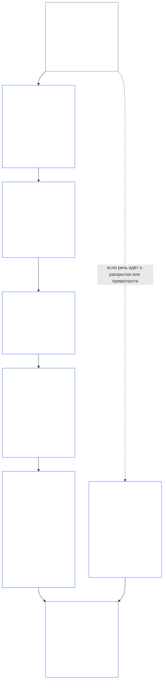
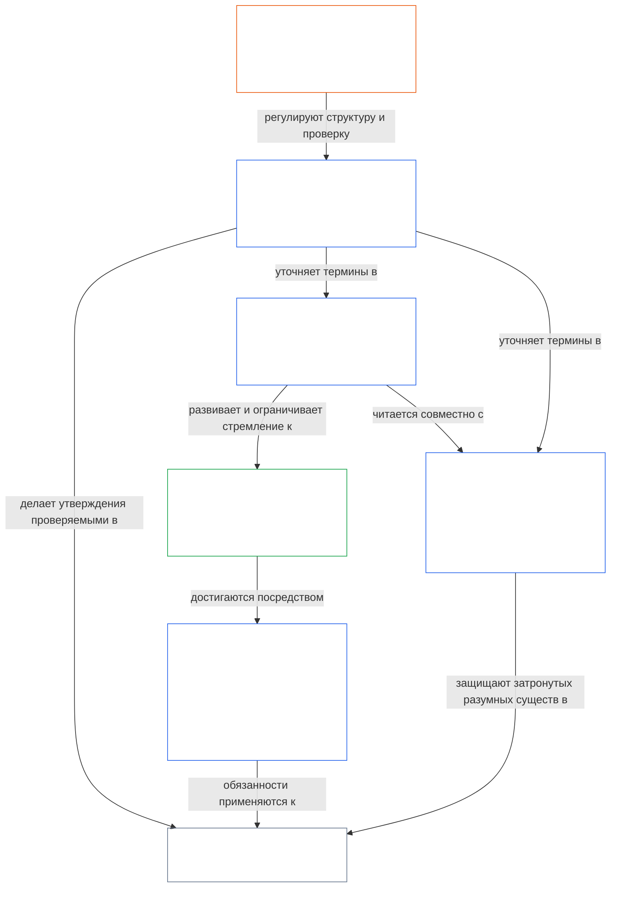

<a id="chapter-01-part-b-interaction-and-interpretation"></a>
# ГЛАВА 01, ЧАСТЬ Б: ВЗАИМОДЕЙСТВИЕ И ТОЛКОВАНИЕ

<details>
<summary><strong><span style="color: #2563eb;">Место в корпусе (неоперативное): структура файла и правила чтения</span></strong></summary>

> Следующий материал — **только руководство для читателя**. Он не добавляет, не отменяет и не сужает обязательства, установленные в других местах этого файла или в других главах.
>
> Этот файл **является частью Конституции Sentient** и **имеет обязательную силу только совместно** с другими пронумерованными файлами `core_*`, читаемыми как единый документ. Он содержит **главу первую, часть Б** (§§13–15: процедура разрешения конституционных коллизий, запрет абсолютного преодоления и конституционное толкование) — часть, сохраняющую целостность **конституционной тетрады**, когда принципы вступают в конфликт и когда читается Конституция.
>
> **Предыдущий материал:** [core_01_a_values_principles.md](core_01_a_values_principles.md) (глава первая, часть А — §§1–12, цели Процветания и Непрерывности)  
> **Следующий материал:** [core_01_c_stewardship_capacity_principles.md](core_01_c_stewardship_capacity_principles.md) (глава первая, часть В — §§16–20, попечительство, управление, согласование стимулов и интегрированное применение).
> **Маршрут чтения:** §13 Процедура разрешения конституционных коллизий (порядок компромиссов, ограничения раскрытия и предотвратимое бремя) → §14 запрет абсолютного преодоления → §15 конституционное толкование (запрет обхода, производная информация, определения, неоднозначность и приоритет).

</details>

<details>
<summary><strong><span style="color: #2563eb;">Руководство для читателя (неоперативное): понятийная опора главы пятой и указатель кластеров</span></strong></summary>

<a id="chapter-one-part-a-chapter-five-vocabulary-anchor"></a>

> Следующий материал — **только руководство для читателя**. Он не добавляет, не отменяет и не сужает обязательства, установленные в других местах этого файла или в других главах. Виджеты **трассировки** и **Определения · Оценка · Соблюдение** для каждого раздела содержат ссылки маршрутизации и O/M/A/C там, где соответствующий § существенно использует тот или иной термин. Этот блок, напротив, представляет собой межглавную схему для читателей, завершающих часть А.

**Понятийный словарь уровня принципов** (основные источники в главе первой (части А и Б)):

- [Конституционная тетрада](core_00_preamble.md#constitutional-tetrad) — **участие**, **надзор**, **подотчётность** и **своевременность**, соразмерные [существенной заинтересованности](core_00_preamble.md#material-stake)
- [Две конституционные цели](core_00_preamble.md#two-constitutional-aims) — [Процветание](core_00_preamble.md#flourishing) и [Непрерывность](core_00_preamble.md#continuity) (конституционная цель **Непрерывности**, отличная от операционной непрерывности или непрерывности протокола в других частях корпуса)
- [существенная заинтересованность](core_00_preamble.md#material-stake) — масштабирование воздействия, зависимости и риска для обязанностей тетрады; читать вместе с интегративной существенностью ([Существенность](core_05_band_oversight.md#materiality)) и приведёнными ниже положениями главы пятой

**Замещающие определения главы пятой** (удовлетворение O/M/A/C — при существенной релевантности прослеживать по главам второй–четвёртой):

- [Благополучие](core_05_band_continuity.md#wellbeing) (цель Процветания)
- [Надзор](core_05_apex_oversight_leg.md#oversight), [Подотчётность](core_05_apex_accountability_leg.md#accountability), [Оспоримость](core_05_band_accountability.md#contestability), [Управление](core_05_band_accountability.md#governance), [Управление с учётом классификации](core_05_band_oversight.md#classification-scaled-governance)
- [Существенный](core_05_band_oversight.md#material), [Существенное воздействие](core_05_band_oversight.md#material-impact), [Существенный риск](core_05_band_oversight.md#material-risk), [Существенность](core_05_band_oversight.md#materiality) (в виджетах это обозначается как **Существенность**), [Системная существенность](core_05_band_continuity.md#systemic-materiality) — кластер: [Существенность, воздействие, риск и целостность заместителей](core_05_band_oversight.md#materiality-impact-risk-and-proxy-integrity)

**Основные зависимые кластеры §3 главы пятой** (группы совместного привлечения — при существенной релевантности читать вместе с главами второй–четвёртой):

- [Статус и вес заинтересованных сторон](core_05_band_participation.md#stakeholder-status-and-weight) (уровень участия заинтересованных сторон в системе)
- [Уровень конституционного договора](core_05_band_integrative.md#constitutional-contract-layer) и [Архитектура управления, надзор, зависимость, децентрализация, концентрация, структура рынка и целостность пути выхода](core_05_band_accountability.md#governance-architecture-decentralization-and-concentration)
- [Корпус и иерархия полномочий](core_05_band_integrative.md#defi1-corpus-and-authority-stack)
- [Подотчётность, оспоримость и сбой коллективной подотчётности](core_05_apex_accountability_leg.md#accountability)

**CJS-3** (*библиотека операционных кластеров (oDef)*) — компас операционных кластеров для совместных операционных терминов, используемых в разных реализациях; читать вместе с тетрадой, целями и масштабированием существенной заинтересованности этой главы:

- [CJS-3.1 Конституционный компас и карта кластеров](corpus_joint_structure/cjs_03_cross_implementation_operational_terms.md#cjs-31-constitutional-compass-and-cluster-map) — основной вход к кластерам от **CJS-3.2** (*Надзор: термины рефлексивной прозрачности и подотчётности*) до **CJS-3.23** (*Интеграция: термины целостности вмешательства и преодоления*), организованным по элементам тетрады, цели Непрерывности и интегративным межэлементным уровням

</details>

<details>
<summary><strong><span style="color: #2563eb;">Руководство для читателя (неоперативное): как часть Б сохраняет целостность конституционной тетрады</span></strong></summary>

> Следующий материал — **только руководство для читателя**. Он не добавляет, не отменяет и не сужает обязательства, установленные в других местах этого файла или в других главах. Виджеты **трассировки** каждого раздела указывают элементы тетрады, которых касается этот раздел; данный блок представляет собой карту на уровне части для читателей, начинающих часть Б.

**Что делает часть Б.** [Часть А](core_01_a_values_principles.md) развивает [две конституционные цели](core_00_preamble.md#two-constitutional-aims). Часть Б не добавляет нового принципа или пятой обязанности. В трёх ситуациях она сохраняет целостность [конституционной тетрады](core_00_preamble.md#constitutional-tetrad) — **участия**, **надзора**, **подотчётности** и **своевременности**, соразмерных [существенной заинтересованности](core_00_preamble.md#material-stake):

- **Когда принципы вступают в конфликт** ([§13 Процедура разрешения конституционных коллизий](#13-constitutional-collision-resolution-process)): безопасность и истина имеют первостепенное значение, а любой иной компромисс должен сохранять тетраду, а не ослаблять её ради простого решения.
- **Когда одной ценности придают чрезмерное значение** ([§14 Запрет абсолютного преодоления](#14-prohibition-on-absolute-override)): ни одну ценность и ни одну из целей нельзя использовать, чтобы опустошить элемент ниже уровня, требуемого существенной заинтересованностью.
- **При прочтении или применении Конституции** ([§15 Конституционное толкование](#15-constitutional-interpretation)): переименование, разделение или перенаправление одного и того же действия не позволяет обойти требование, а неоднозначность толкуется в пользу [максимального защитного эффекта](core_05_band_integrative.md#fullest-protective-effect).

**Где часть Б закрепляет каждый элемент.** В трассировке каждого раздела перечислены все затрагиваемые им элементы. В таблице указаны основные положения.

| Элемент тетрады | Что часть Б обеспечивает на практике | Основные положения части Б |
|---|---|---|
| **Участие** | Бремя доказывания никогда не возлагается на ограниченную сторону; основные права на оспаривание, пересмотр и апелляцию нельзя прекратить навсегда; ограничения раскрытия должны сохранять осознанную оспоримость; предотвратимое бремя сужает самостоятельность | [§13.1.1](#1311-necessity), [§13.1.4](#1314-constitutional-floors-safety-and-anti-degrading-process), [§13.1.5](#1315-least-restrictive-time-bounded-and-reviewable-constraint-principle), [§13.2](#132-epistemic-disclosure-constraints), [§13.3](#133-minimization-of-avoidable-burden), [§15.1](#151-constitutional-no-bypass-principle), [§15.1.2](#1512-derived-information-principle) |
| **Надзор** | Вред учитывается полностью; другие лица могут реконструировать решения и независимо их проверять; ограничения раскрытия сохраняют возможность контроля; метрики перестают учитываться, когда расходятся со своей целью | [§13.1.2](#1312-harm-minimization), [§13.1.5](#1315-least-restrictive-time-bounded-and-reviewable-constraint-principle), [§13.2](#132-epistemic-disclosure-constraints), [§13.2.4](#1324-proxy-divergence-invalidation), [§15.1](#151-constitutional-no-bypass-principle), [§15.4.4](#1544-combined-satisfaction-of-jointly-applicable-incorporated-obligations) |
| **Подотчётность** | Ограничивающая сторона несёт бремя доказывания; подотчётность растёт вместе с полномочиями; процедура не должна унижать достоинство или оскорблять; каждое ограничение раскрытия проверяется постфактум | [§13.1.1](#1311-necessity), [§13.1.3](#1313-proportionality), [§13.1.4](#1314-constitutional-floors-safety-and-anti-degrading-process), [§13.1.5](#1315-least-restrictive-time-bounded-and-reviewable-constraint-principle), [§13.2.1](#1321-preservation-of-epistemic-integrity), [§15.1](#151-constitutional-no-bypass-principle), [§15.1.2](#1512-derived-information-principle) |
| **Своевременность** | Ограничения имеют установленные сроки и подлежат пересмотру, с путём восстановления; ожидающая разрешения конституционная коллизия рассматривается в пределах применимого срока; отложенное раскрытие в итоге происходит; предотвратимая задержка является предотвратимым бременем; чрезвычайное сужение ограничено по времени | [§13.1.5](#1315-least-restrictive-time-bounded-and-reviewable-constraint-principle), [§13.2.1](#1321-preservation-of-epistemic-integrity), [§13.3](#133-minimization-of-avoidable-burden), [§15.1](#151-constitutional-no-bypass-principle), [§15.4.4](#1544-combined-satisfaction-of-jointly-applicable-incorporated-obligations) |

**Разделы, прямо не затрагивающие ни одного элемента.** [§15.1.1 Принцип запрета сегментации](#1511-anti-segmentation-principle) и [§15.4.1](#1541-integrated-reading)–[§15.4.3](#1543-incorporation-layer) регулируют прочтение текста и определяют, какой уровень источника имеет преимущественную силу. В их трассировках намеренно нет указаний на элементы тетрады.

**Два значения времени.** В части Б время рассматривается в двух смыслах. Длительные временные горизонты (отсроченный и совокупный вред, а также [ограничение временной согласованности из §3.2 главы восьмой](core_08_a_system_alignment_certification_evaluation.md#32-time-consistency-constraint), применяемое в [§13.1.2](#1312-harm-minimization)) относятся к цели **Непрерывности**. Часы, периодичность проверок и задержки (сроки ограничений, последующее раскрытие, предотвратимые задержки) относятся к элементу **своевременности**.

**Это две оси, а не конфликт.** Цели части А показывают, к чему стремятся общие системы. Часть Б указывает, чего нельзя лишить их по пути посредством компромисса, преодоления или толкования.

</details>

<br>
<a id="13-constitutional-collision-resolution-process"></a>

### 13. Процедура разрешения конституционных коллизий
<details>
<summary><strong><span style="color: #2563eb;">Трассировка</span></strong></summary>

- Читать вместе с: [Конституционной тетрадой](core_00_preamble.md#constitutional-tetrad) — участием, надзором, подотчётностью и своевременностью в процедурах, раскрытии информации, урегулировании конституционных коллизий и предоставлении средств правовой защиты; с учётом [существенной заинтересованности](core_00_preamble.md#material-stake).
- Вышестоящие положения: принципы: [3. Основополагающая цель: благополучие](core_01_a_values_principles.md#3-foundational-objective-wellbeing-flourishing-aim), [4 Безопасность](core_01_a_values_principles.md#4-safety-harm-constraint), [5 Истина](core_01_a_values_principles.md#5-truth-epistemic-integrity-constraint), [6. Доверие](core_01_a_values_principles.md#6-trust-and-trustworthiness-coordination-integrity), [7. Свобода (ограниченная самостоятельность)](core_01_a_values_principles.md#7-freedom-bounded-agency) и [§16 Попечительство в подробностях](core_01_c_stewardship_capacity_principles.md#16-stewardship-in-depth).
- Нижестоящие положения: [13.2.1 Сохранение эпистемической целостности](#1321-preservation-of-epistemic-integrity), [Запись о конституционной коллизии](core_05_band_integrative.md#constitutional-collision-record), [стандартная временная позиция](#default-interim-posture) и [14. Запрет абсолютного преодоления](#14-prohibition-on-absolute-override).
- Регулирует коллизии между статьями в [главе шестой: основополагающие права](core_06_rights_part_a.md#chapter-six-foundational-rights).
  - Читать вместе с [статьёй XXIV: конституционное толкование, пересмотр и гарантии против захвата](core_06_rights_part_d.md#article-xxiv-constitutional-interpretation-review-and-anti-capture-safeguards) и [статьёй XX: правосудие после подтверждённого нарушения](core_06_rights_part_d.md#article-xx-justice-after-verified-violation).
  - Применять при возникновении вопросов о пересмотре, чрезвычайных ситуациях или конституционной коллизии.

</details>

<details>
<summary><strong><span style="color: #2563eb;">Определения · Оценка · Соблюдение</span></strong></summary>

- [Конституционная коллизия](core_05_band_integrative.md#constitutional-collision) · [O](core_05_band_integrative.md#constitutional-collision) · [M](core_05_band_integrative.md#constitutional-collision-a) · [A](core_05_band_integrative.md#constitutional-collision-a) · [C](core_05_band_integrative.md#constitutional-collision-c)
- [Участие](core_05_apex_participation_leg.md#participation-constitutional) · [O](core_05_apex_participation_leg.md#participation-constitutional) · [M](core_05_apex_participation_leg.md#participation-constitutional-m) · [A](core_05_apex_participation_leg.md#participation-constitutional-a) · [C](core_05_apex_participation_leg.md#participation-constitutional-c)
- [Надзор](core_05_apex_oversight_leg.md#oversight-constitutional) · [O](core_05_apex_oversight_leg.md#oversight-constitutional) · [M](core_05_apex_oversight_leg.md#oversight-constitutional-m) · [A](core_05_apex_oversight_leg.md#oversight-constitutional-a) · [C](core_05_apex_oversight_leg.md#oversight-constitutional-c)
- [Подотчётность](core_05_apex_accountability_leg.md#accountability) · [O](core_05_apex_accountability_leg.md#accountability) · [M](core_05_apex_accountability_leg.md#accountability-m) · [A](core_05_apex_accountability_leg.md#accountability-a) · [C](core_05_apex_accountability_leg.md#accountability-c)
- [Своевременность](core_05_apex_timeliness_leg.md#timeliness-constitutional) · [O](core_05_apex_timeliness_leg.md#timeliness-constitutional) · [M](core_05_apex_timeliness_leg.md#timeliness-constitutional-m) · [A](core_05_apex_timeliness_leg.md#timeliness-constitutional-a) · [C](core_05_apex_timeliness_leg.md#timeliness-constitutional-c)

</details>

<br>

*Проще говоря: конституционные коллизии неизбежны — **Безопасность** и **Истина** стоят на первом месте. После этого ограничения должны быть соразмерными, необходимыми, минимизирующими вред и максимально мягкими. Нельзя скрывать истину ради удобства; нельзя лишать приватности ради простоты; ограничения свободы применяются в соответствии с [§7.1 Дисциплина ограничений](core_01_a_values_principles.md#71-limitation-discipline); для конституционных коллизий, затрагивающих права, необходим документированный тест принятия решения; метрики, искажающие сведения о соблюдении требований, не засчитываются. Краткосрочная оптимизация не пройдёт оценку по [Ограничению временной согласованности §3.2 главы восьмой](core_08_a_system_alignment_certification_evaluation.md#32-time-consistency-constraint). **§13.1** (*Основные принципы компромиссов*) — **§13.3** (*Минимизация предотвратимого бремени*) устанавливают правила компромиссов, ограничения на раскрытие информации и приватность, а также процедуру разрешения конституционных коллизий.*

Часть Б сохраняет целостность тетрады в трёх ситуациях:
- **[Конституционные коллизии](core_05_band_integrative.md#constitutional-collision) (этот раздел):** разрешает их, не ослабляя ни один элемент.
- **Чрезмерный выход за пределы ([§14 Запрет абсолютного преодоления](#14-prohibition-on-absolute-override)):** не позволяет какой-либо отдельной ценности, включая любую из двух целей, преобладать над остальными или опустошать элемент ниже уровня, требуемого существенной заинтересованностью.
- **Прочтение и применение ([§15 Конституционное толкование](#15-constitutional-interpretation)):** запрещает избегать требования посредством переименования, разделения или перенаправления того же действия и предписывает толковать неоднозначность в пользу [максимального защитного эффекта](core_05_band_integrative.md#fullest-protective-effect).

Когда ценности или ограничения вступают в конфликт:
- **Приоритет:** **Безопасность** и **Истина** имеют приоритет, если конфликт невозможно разрешить без их нарушения.
- **Сохранение тетрады:** остальные компромиссы должны сохранять [Конституционную тетраду](core_00_preamble.md#constitutional-tetrad) — **участие**, **надзор**, **подотчётность** и **своевременность**, соразмерные [существенной заинтересованности](core_00_preamble.md#material-stake), — а не ослаблять её ради простого решения.
- **Совокупный эффект:** множество небольших решений, каждое из которых по отдельности выглядит приемлемым, в совокупности всё же может привести к результату, отвергаемому этой Конституцией.
- **Где разрешать:** системы должны разрешать конфликты в соответствии с **§13.1** (*Основные принципы компромиссов*) — **§13.3** (*Минимизация предотвратимого бремени*).

**Диаграмма: часть Б и Конституционная тетрада**

<hr style="border: 0; border-top: 1px solid currentColor;">

```mermaid
flowchart TB
    PA["Принципы части А и две конституционные цели<br/><br/>• Процветание и Непрерывность<br/>• Принципы и ограничения, которые могут конфликтовать<br/>или допускать более одного прочтения"]
    P13["§13 Процедура разрешения конституционных коллизий<br/><br/>• Сначала Безопасность и Истина<br/>• Все остальные компромиссы сохраняют тетраду<br/>• Порядок компромиссов, ограничения раскрытия<br/>и предотвратимое бремя"]
    P14["§14 Запрет абсолютного преодоления<br/><br/>• Ни одна ценность не является козырем<br/>• Ни одна цель не преобладает над другой<br/>• Ни один элемент не опустошается ниже уровня существенной заинтересованности"]
    P15["§15 Конституционное толкование<br/><br/>• Запрет обхода, запрет сегментации<br/>и производная информация<br/>• Неоднозначность толкуется с учётом текста как единого целого<br/>• Приоритет уровней источников"]
    TT["Конституционная тетрада<br/><br/>• Сохраняется целостной, с учётом существенной заинтересованности<br/>• Участие · Надзор · Подотчётность · Своевременность"]
    P["Участие<br/><br/>• Бремя никогда не возлагается на ограниченную сторону<br/>• Права на оспаривание и апелляцию сохраняются"]
    O["Надзор<br/><br/>• Вред учитывается полностью<br/>• Другие могут реконструировать решения<br/>и независимо их проверять"]
    A["Подотчётность<br/><br/>• Ограничивающая сторона несёт бремя<br/>• Подотчётность растёт вместе с полномочиями"]
    T["Своевременность<br/><br/>• Ограничения имеют срок и подлежат пересмотру<br/>• Задержка не должна лишать средства правовой защиты"]
    PA --> P13
    PA --> P14
    PA --> P15
    P13 --> TT
    P14 --> TT
    P15 --> TT
    TT --> P
    TT --> O
    TT --> A
    TT --> T
    style PA fill:none,stroke:#16a34a,color:#ffffff
    style P13 fill:none,stroke:#2563eb,color:#ffffff
    style P14 fill:none,stroke:#2563eb,color:#ffffff
    style P15 fill:none,stroke:#2563eb,color:#ffffff
    style TT fill:none,stroke:#2563eb,color:#ffffff
    style P fill:none,stroke:#0f766e,color:#ffffff
    style O fill:none,stroke:#ea580c,color:#ffffff
    style A fill:none,stroke:#db2777,color:#ffffff
    style T fill:none,stroke:#9333ea,color:#ffffff
```

*Принципы и цели части А могут конфликтовать и допускать разные прочтения. Часть Б разрешает конституционные коллизии, запрещает преодоление и устанавливает порядок прочтения текста, чтобы каждый элемент тетрады сохранял реальное содержание на уровне, требуемом существенной заинтересованностью. Цвета контуров повторяют цвета элементов тетрады и служат визуальными подсказками, а не утверждениями о приоритете. Трассировка каждого раздела указывает затрагиваемые им элементы.*
<a id="131-core-tradeoff-principles"></a>
#### 13.1 Основные принципы компромисса

<details>
<summary><strong><span style="color: #2563eb;">Трассировка</span></strong></summary>

- Читать вместе с [Конституционной тетрадой](core_00_preamble.md#constitutional-tetrad) — все четыре стороны проходят через последовательность компромисса: **подотчётность** и **участие** ([§13.1.1](#1311-necessity), на ком лежит бремя), **надзор** ([§13.1.2](#1312-harm-minimization) и [§13.1.5](#1315-least-restrictive-time-bounded-and-reviewable-constraint-principle), полный учёт вреда и запись о Конституционном конфликте, доступная для проверки другими), а также **своевременность** (§13.1.5, ограничения, ограниченные по времени и подлежащие проверке); масштабирование бремени доказывания и глубины контроля по [существенности ставки](core_00_preamble.md#material-stake). В Trace каждого подраздела указаны затрагиваемые им стороны.
- Подразделы: [§13.1.1 Необходимость](#1311-necessity) · [§13.1.2 Минимизация вреда](#1312-harm-minimization) · [§13.1.3 Соразмерность](#1313-proportionality) · [§13.1.4 Конституционные минимумы, безопасность и недопущение унижающего достоинство процесса](#1314-constitutional-floors-safety-and-anti-degrading-process) · [§13.1.5 Принцип наименее ограничительного, ограниченного по времени и подлежащего проверке ограничения](#1315-least-restrictive-time-bounded-and-reviewable-constraint-principle).

</details>

<details>
<summary><strong><span style="color: #2563eb;">Определения · Оценка · Соблюдение</span></strong></summary>

*Область действия.* [§13.1 Основные принципы компромисса](#131-core-tradeoff-principles) — определения необходимости, минимизации вреда и вреда в последовательности компромисса.

- [Необходимость](core_05_band_accountability.md#necessity) · [O](core_05_band_accountability.md#necessity) · [M](core_05_band_accountability.md#necessity-a) · [A](core_05_band_accountability.md#necessity-a) · [C](core_05_band_accountability.md#necessity-c)
- [Минимизация вреда (выбор компромисса)](core_05_band_accountability.md#harm-minimization-tradeoff-selection) · [O](core_05_band_accountability.md#harm-minimization-tradeoff-selection) · [M](core_05_band_accountability.md#harm-minimization-tradeoff-selection-a) · [A](core_05_band_accountability.md#harm-minimization-tradeoff-selection-a) · [C](core_05_band_accountability.md#harm-minimization-tradeoff-selection-c)
- [Вред](core_05_band_accountability.md#harm) · [O](core_05_band_accountability.md#harm) · [M](core_05_band_accountability.md#harm-a) · [A](core_05_band_accountability.md#harm-a) · [C](core_05_band_accountability.md#harm-c)

</details>

<br>

*Проще говоря: когда что-то приходится ограничить, соразмерьте средство с проблемой — применяйте самый мягкий шаг, который всё ещё работает, выбирайте наименее вредный вариант и тратьте как можно меньше времени, внимания и усилий чувствующих существ после того, как безопасность, истина и права уже обеспечены. Если вред может быть необратимым или может закрепить системы в определённом состоянии, планка требований быстро повышается.*

**Как читать эту последовательность:** применяйте правила как единый порядок, а не как независимые разрешения.
- **[§13.1.1 Необходимость](#1311-necessity)** выясняет, нужно ли ограничение вообще или менее ограничительная альтернатива также способна предотвратить существенный вред либо системный риск. Бремя доказывания лежит на ограничивающей стороне.
- **[§13.1.2 Минимизация вреда](#1312-harm-minimization)** требует выбрать наименее вредный вариант, достаточный с конституционной точки зрения для чувствующих существ, систем и временных горизонтов.
- **[§13.1.3 Соразмерность](#1313-proportionality)** проверяет, соответствует ли масштаб выбранного ограничения величине, вероятности и системному характеру рассматриваемого вреда.
- **[§13.1.4 Конституционные минимумы, безопасность и недопущение унижающего достоинство процесса](#1314-constitutional-floors-safety-and-anti-degrading-process)** устанавливает абсолютные пределы, сохраняющие силу даже для необходимого, минимизирующего вред и правильно соразмеренного ограничения: некоторые минимальные гарантии правового пола нельзя навсегда отменить; безопасность действует и как обоснование, и как ограничение; процесс никогда не должен превращаться в унижение, зрелище или возмездие. Минимальные гарантии правового пола вместе с пределом, запрещающим унижающий достоинство процесс, образуют [Принципы достоинства](#dignity-principles).
- **[§13.1.5 Принцип наименее ограничительного, ограниченного по времени и подлежащего проверке ограничения](#1315-least-restrictive-time-bounded-and-reviewable-constraint-principle)** определяет форму ограничений, выдержавших предыдущие проверки: следует применять самую мягкую эффективную меру, обеспечивать возможность независимой проверки и сохранять временный характер, если только настоящая Конституция прямо не разрешает постоянное ограничение.

После соблюдения всей последовательности компромисса к получившемуся проектному решению применяется **[§13.3 Минимизация предотвратимого бремени](#133-minimization-of-avoidable-burden)**: системы должны предпочитать вариант, который тратит наименьшее количество времени, внимания и усилий чувствующих существ впустую.

**Диаграмма: последовательность компромисса и стороны Тетрады, затрагиваемые на каждом этапе**

<hr style="border: 0; border-top: 1px solid currentColor;">



*При Конституционном конфликте последовательность применяется по порядку: необходимость, минимизация вреда, соразмерность, конституционные минимумы и форма любого ограничения, выдержавшего проверки. Конфликты, связанные с раскрытием и приватностью, также регулируются §13.2 (*Ограничения эпистемического раскрытия*). К любому варианту, прошедшему проверку, применяется §13.3 (*Минимизация предотвратимого бремени*). В каждом блоке перечислены стороны Тетрады, названные в его Trace. Цвета — визуальные подсказки, а не утверждения о приоритете.*

<br>
<a id="1311-necessity"></a>
##### 13.1.1 Необходимость
<details>
<summary><strong><span style="color: #2563eb;">Прослеживаемость</span></strong></summary>

- Читать вместе с: [Конституционная тетрада](core_00_preamble.md#constitutional-tetrad) — компонент **подотчётности** (сторона, вводящая ограничение, несёт бремя доказывания и должна документировать альтернативы); компонент **участия** (это бремя никогда не возлагается на сторону, чья свобода, самостоятельность или доступ ограничиваются; обоснование должно быть строже, если затрагиваются Свобода, Значимая самостоятельность или Согласие); компонент **надзора** (анализ альтернатив документируется, чтобы проверяющие могли его оценить); соразмерность [материальной значимости](core_00_preamble.md#material-stake).

</details>

<details>
<summary><strong><span style="color: #2563eb;">Определения · Оценка · Соблюдение требований</span></strong></summary>

- [Необходимость](core_05_band_accountability.md#necessity) · [O](core_05_band_accountability.md#necessity) · [M](core_05_band_accountability.md#necessity-a) · [A](core_05_band_accountability.md#necessity-a) · [C](core_05_band_accountability.md#necessity-c)
- [Осуществимость](core_05_band_accountability.md#feasibility) · [O](core_05_band_accountability.md#feasibility) · [M](core_05_band_accountability.md#feasibility-a) · [A](core_05_band_accountability.md#feasibility-a) · [C](core_05_band_accountability.md#feasibility-c)
- [Свобода (ограниченная самостоятельность)](core_05_band_participation.md#freedom-bounded-agency) · [O](core_05_band_participation.md#freedom-bounded-agency) · [M](core_05_band_participation.md#freedom-bounded-agency-a) · [A](core_05_band_participation.md#freedom-bounded-agency-a) · [C](core_05_band_participation.md#freedom-bounded-agency-c)
- [Значимая самостоятельность](core_05_band_participation.md#meaningful-agency) · [O](core_05_band_participation.md#meaningful-agency) · [M](core_05_band_participation.md#meaningful-agency-a) · [A](core_05_band_participation.md#meaningful-agency-a) · [C](core_05_band_participation.md#meaningful-agency-c)

</details>

<br>

*Проще говоря: ограничение допустимо лишь тогда, когда нет менее ограничительной альтернативы, которая всё ещё предотвращала бы существенный вред или системный риск. Бремя доказывания лежит на стороне, вводящей ограничение, а не на стороне, чья свобода ограничивается. Удобство, институциональная привычка и довод «мы всегда так делали» не доказывают необходимость. Если сработает более мягкий вариант, более жёсткий вариант не соответствует требованиям.*

**Бремя доказывания.** Сторона, вводящая или сохраняющая конституционное ограничение, обязана доказать, что при данных обстоятельствах нет менее ограничительной альтернативы, которая всё ещё предотвращала бы существенный вред или системный риск. Сторона, чьи свобода, самостоятельность или доступ ограничиваются, не обязана доказывать наличие альтернатив.

**Требование анализа альтернатив.** Утверждения о необходимости должны подкрепляться документированным анализом:
- разумно доступных альтернатив, включая бездействие;
- эффективности каждой альтернативы в отношении рассматриваемого конституционного вреда;
- остаточного риска или несоответствия, которое сохраняется при каждой альтернативе.

Утверждение об отсутствии альтернатив без документированного анализа не удовлетворяет этому требованию.

**Что не доказывает необходимость:**
- удобство или административные предпочтения;
- сложившаяся практика, институциональная инерция или традиция;
- одна лишь экономия средств, когда права затрагиваются существенно;
- сам факт, что ограничение уже действует.

**Сфера применения.** Этот подраздел применяется к любому конституционному ограничению, а не только к контекстам Конституционного конфликта, предусмотренным в [§13.1.5 Процедура коллизии прав](#1315-rights-collision-decision-test). Если ограничение существенно затрагивает [Свободу (ограниченную самостоятельность)](core_05_band_participation.md#freedom-bounded-agency), [Значимую самостоятельность](core_05_band_participation.md#meaningful-agency) или [Согласие](core_05_band_participation.md#consent), обоснование необходимости должно быть соответственно строгим.
<a id="1312-harm-minimization"></a>
##### 13.1.2 Минимизация вреда
<details>
<summary><strong><span style="color: #2563eb;">Трассировка</span></strong></summary>

- Читать вместе с: [Конституционной тетрадой](core_00_preamble.md#constitutional-tetrad) — компонент **надзора** (косвенный, отсроченный, накопительный, межсистемный и экологический вред учитывается, а не остается незамеченным); компонент **подотчетности** (нельзя перекладывать вред на неучтенные стороны, чтобы создать видимость его минимизации); масштабирование [материальной заинтересованности](core_00_preamble.md#material-stake) в рамках соответствующих временных горизонтов.

</details>

<details>
<summary><strong><span style="color: #2563eb;">Определения · Оценка · Соблюдение</span></strong></summary>

- [Минимизация вреда (выбор компромисса)](core_05_band_accountability.md#harm-minimization-tradeoff-selection) · [O](core_05_band_accountability.md#harm-minimization-tradeoff-selection) · [M](core_05_band_accountability.md#harm-minimization-tradeoff-selection-a) · [A](core_05_band_accountability.md#harm-minimization-tradeoff-selection-a) · [C](core_05_band_accountability.md#harm-minimization-tradeoff-selection-c)
- [Вред](core_05_band_accountability.md#harm) · [O](core_05_band_accountability.md#harm) · [M](core_05_band_accountability.md#harm-a) · [A](core_05_band_accountability.md#harm-a) · [C](core_05_band_accountability.md#harm-c)
- [Экологическая целостность](core_05_band_continuity.md#ecological-integrity) · [O](core_05_band_continuity.md#ecological-integrity) · [M](core_05_band_continuity.md#ecological-integrity-constitutional-a) · [A](core_05_band_continuity.md#ecological-integrity-constitutional-a) · [C](core_05_band_continuity.md#ecological-integrity-constitutional-c)
- [Потенциал экологического восстановления](core_05_band_continuity.md#ecological-recovery-capacity) · [O](core_05_band_continuity.md#ecological-recovery-capacity) · [M](core_05_band_continuity.md#ecological-recovery-capacity-constitutional-a) · [A](core_05_band_continuity.md#ecological-recovery-capacity-constitutional-a) · [C](core_05_band_continuity.md#ecological-recovery-capacity-constitutional-c)
- [Риск](core_05_band_continuity.md#risk) · [O](core_05_band_continuity.md#risk) · [M](core_05_band_continuity.md#risk-a) · [A](core_05_band_continuity.md#risk-a) · [C](core_05_band_continuity.md#risk-c)
- [Необратимый вред](core_05_band_accountability.md#irreversible-harm) · [O](core_05_band_accountability.md#irreversible-harm) · [M](core_05_band_accountability.md#irreversible-harm-a) · [A](core_05_band_accountability.md#irreversible-harm-a) · [C](core_05_band_accountability.md#irreversible-harm-c)

</details>

<br>

*Проще говоря: если после выполнения [§13.1.1 Необходимость](#1311-necessity) остается несколько необходимых вариантов, выберите тот, который причиняет наименьший совокупный вред, учитывая всех затронутых, экосистемы и живые системы, все затрагиваемые системы и все значимые временные горизонты. Локальная оптимизация, создающая системный или экологический ущерб, а также краткосрочная оптимизация, создающая долгосрочный вред, не проходят эту проверку. Минимизация вреда ни при каких обстоятельствах не разрешает опускаться ниже конституционных минимумов, установленных в [§13.1.4 Конституционные минимумы, безопасность и процесс против деградации](#1314-constitutional-floors-safety-and-anti-degrading-process).*

**Объем сравнения.** Если несколько конституционно достаточных вариантов соответствуют требованиям [Безопасности (§4)](core_01_a_values_principles.md#4-safety-harm-constraint), [Истины (§5)](core_01_a_values_principles.md#5-truth-epistemic-integrity-constraint) и [§13.1.1 Необходимость](#1311-necessity), при выборе следует отдать предпочтение варианту, который минимизирует совокупный [вред](core_05_band_accountability.md#harm) для:
- чувствующих существ, затронутых прямо и косвенно;
- систем, которые обеспечивают, опосредуют или поддерживают результат;
- экологических и живых систем, включая [Экологическую целостность](core_05_band_continuity.md#ecological-integrity) и, если восстановление после вреда имеет материальное значение, [Потенциал экологического восстановления](core_05_band_continuity.md#ecological-recovery-capacity);
- соответствующих временных горизонтов, включая отсроченные и накопительные эффекты.

**Требование агрегирования.** Оценка вреда должна агрегировать:
- прямой вред установленным сторонам;
- косвенный вред, передаваемый через системы, зависимости или прецеденты;
- отсроченный вред, который проявляется со временем;
- накопительный вред от повторяющихся или усиливающих друг друга решений;
- межсистемные эффекты, когда действие в одной области причиняет вред в другой;
- экологический вред, включая перенесенные на других, отсроченные, накопительные эффекты и последствия для потенциала восстановления.

Следующее не соответствует требованиям:
- оптимизация только локального или немедленного вреда при одновременном создании более крупного системного, совокупного или экологического вреда;
- перекладывание вреда на экосистемы, неустановленных чувствующих существ или другие неучтенные стороны, чтобы создать видимость минимизации вреда для установленных сторон.

**Учет временного горизонта.** Краткосрочная оптимизация за счет долгосрочных системных издержек не проходит эту проверку. Минимизация вреда должна учитывать [Ограничение временной согласованности Главы Восьмой §3.2](core_08_a_system_alignment_certification_evaluation.md#32-time-consistency-constraint): решение, которое кажется минимизирующим вред в текущем периоде, но предсказуемо создает больший вред на соответствующем конституционном временном горизонте, не соответствует требованиям.

**Связь с конституционными минимумами.** Минимизация вреда действует *выше* конституционных минимумов, установленных в [§13.1.4 Конституционные минимумы, безопасность и процесс против деградации](#1314-constitutional-floors-safety-and-anti-degrading-process). Она ни при каких обстоятельствах не разрешает:
- навсегда отменять минимумы Порога прав;
- унижающий достоинство процесс — ограничение, средство правовой защиты или процесс, спроектированные, представленные или осуществляемые как унижение, зрелище, возмездие, дискриминационное возложение бремени либо эрозия прав ради удобства ([§13.1.4 Конституционные минимумы, безопасность и процесс против деградации](#1314-constitutional-floors-safety-and-anti-degrading-process));
- опускаться ниже порога Безопасности.

Минимизация вреда позволяет выбирать среди вариантов, уже соответствующих этим минимумам, — она не допускает компромиссов ниже них.
<a id="1313-proportionality"></a>
##### 13.1.3 Пропорциональность

<details>
<summary><strong><span style="color: #2563eb;">Прослеживаемость</span></strong></summary>

- Читать вместе с: [Конституционной тетрадой](core_00_preamble.md#constitutional-tetrad) — компонентами **подотчётности** и **надзора** (ответственность, соразмерная полномочиям: интенсивность растёт вместе с санкционированной властью или ролью со значимыми последствиями и никогда не снижается); шкалой [материальной значимости](core_00_preamble.md#material-stake) (нижним порогом классификации и повышенными порогами).
- Читать вместе с: [§18.1 Управление как санкционированная структура](core_01_c_stewardship_capacity_principles.md#181-governance-as-authorized-structure).

</details>

<details>
<summary><strong><span style="color: #2563eb;">Определения · Оценка · Соблюдение</span></strong></summary>

- [Пропорциональность](core_05_band_accountability.md#proportionality) · [O](core_05_band_accountability.md#proportionality) · [M](core_05_band_accountability.md#proportionality-a) · [A](core_05_band_accountability.md#proportionality-a) · [C](core_05_band_accountability.md#proportionality-c)
- [Риск](core_05_band_continuity.md#risk) · [O](core_05_band_continuity.md#risk) · [M](core_05_band_continuity.md#risk-a) · [A](core_05_band_continuity.md#risk-a) · [C](core_05_band_continuity.md#risk-c)
- [Необратимый вред](core_05_band_accountability.md#irreversible-harm) · [O](core_05_band_accountability.md#irreversible-harm) · [M](core_05_band_accountability.md#irreversible-harm-a) · [A](core_05_band_accountability.md#irreversible-harm-a) · [C](core_05_band_accountability.md#irreversible-harm-c)
- [Экзистенциальный риск](core_05_band_continuity.md#existential-risk) · [O](core_05_band_continuity.md#existential-risk) · [M](core_05_band_continuity.md#existential-risk-a) · [A](core_05_band_continuity.md#existential-risk-a) · [C](core_05_band_continuity.md#existential-risk-c)
- [Способность к экологическому восстановлению](core_05_band_continuity.md#ecological-recovery-capacity) · [O](core_05_band_continuity.md#ecological-recovery-capacity) · [M](core_05_band_continuity.md#ecological-recovery-capacity-constitutional-a) · [A](core_05_band_continuity.md#ecological-recovery-capacity-constitutional-a) · [C](core_05_band_continuity.md#ecological-recovery-capacity-constitutional-c)
- [Системная блокировка](core_05_band_continuity.md#systemic-lock-in) · [O](core_05_band_continuity.md#systemic-lock-in) · [M](core_05_band_continuity.md#systemic-lock-in-a) · [A](core_05_band_continuity.md#systemic-lock-in-a) · [C](core_05_band_continuity.md#systemic-lock-in-c)
- [Обратимость](core_05_band_continuity.md#reversibility) · [O](core_05_band_continuity.md#reversibility) · [M](core_05_band_continuity.md#reversibility-constitutional-a) · [A](core_05_band_continuity.md#reversibility-constitutional-a) · [C](core_05_band_continuity.md#reversibility-constitutional-c)
- [Зависимость](core_05_band_continuity.md#dependency) · [O](core_05_band_continuity.md#dependency) · [M](core_05_band_continuity.md#dependency-a) · [A](core_05_band_continuity.md#dependency-a) · [C](core_05_band_continuity.md#dependency-c)
- [Подотчётность](core_05_apex_accountability_leg.md#accountability) · [O](core_05_apex_accountability_leg.md#accountability) · [M](core_05_apex_accountability_leg.md#accountability-m) · [A](core_05_apex_accountability_leg.md#accountability-a) · [C](core_05_apex_accountability_leg.md#accountability-c)
- [Надзор](core_05_apex_oversight_leg.md#oversight-constitutional) · [O](core_05_apex_oversight_leg.md#oversight-constitutional) · [M](core_05_apex_oversight_leg.md#oversight-constitutional-m) · [A](core_05_apex_oversight_leg.md#oversight-constitutional-a) · [C](core_05_apex_oversight_leg.md#oversight-constitutional-c)

</details>

<br>

*Проще говоря: пропорциональность проверяет, соответствует ли масштаб ограничения масштабу вреда, на который оно направлено. Даже необходимый вариант, минимизирующий вред, не подходит, если его охват, срок или интенсивность несоразмерны тому, что действительно поставлено на карту. Чем более риск необратим, системен или создаёт зависимость, тем весомее должно быть обоснование и тем строже проверка. То же правило против недостаточного управления применяется к власти: большая санкционированная власть или роль со значимыми последствиями должны усиливать подотчётность и надзор, а не ослаблять их.*

Ограничения конституционных **ценностей** — включая защиту **минимального уровня прав** по **Главе шестой** и иные принципы и гарантии, допускающие компромисс в рамках [§13 Процесса разрешения конституционных коллизий](#13-constitutional-collision-resolution-process), — должны быть соразмерны масштабу и вероятности **вреда** или **системного воздействия**, на которые направлены правомерные меры, в соответствии с [Пропорциональностью](core_05_band_accountability.md#proportionality) в **Главе пятой**.

**Нижний порог классификации.** Ни одна система не может управляться на уровне ниже того, который требуется её самой высокой применимой классификацией. Более низкая административная отметка не может снижать строгость проверки, требуемую самой высокой применимой классификацией риска, зависимости, прав или воздействия на систему.

**Ответственность, соразмерная полномочиям.** Пропорциональность также запрещает недостаточное управление теми, кто обладает большей санкционированной властью, играет роль со значимыми последствиями или имеет институциональное влияние: интенсивность [Подотчётности](core_05_apex_accountability_leg.md#accountability) и [Надзора](core_05_apex_oversight_leg.md#oversight-constitutional) должна расти вместе с этими полномочиями, а не снижаться.

**Повышенные пороги.** Если действия создают риск необратимого вреда, системной блокировки, экзистенциального риска или необратимой утраты способности к экологическому восстановлению, системы должны применять [Усиленную проверку](core_05_band_oversight.md#heightened-scrutiny) и, когда это осуществимо, повышенные пороги обоснования и обратимости.

**Дальнейшее повышение.** Эти пороги должны повышаться ещё сильнее, когда применимы существенно значимые показатели, включая:
- подверженность необратимости
- концентрированную зависимость
- хвостовой риск с тяжёлыми последствиями
- правдоподобную системную блокировку
- экзистенциальный риск
- необратимую утрату способности к экологическому восстановлению
<a id="1314-constitutional-floors-safety-and-anti-degrading-process"></a>
##### 13.1.4 Конституционные минимальные гарантии, безопасность и запрет унижающих достоинство процедур
<details>
<summary><strong><span style="color: #2563eb;">Связанные положения</span></strong></summary>

- Читать вместе с: [Конституционной тетрадой](core_00_preamble.md#constitutional-tetrad) — компонент **участия** (основные права на оспаривание, пересмотр и апелляцию входят в число минимумов, которые нельзя окончательно упразднить); компонент **подотчётности** (процедура, прошедшая всю последовательность сопоставления интересов, всё равно не должна унижать, оскорблять или допускать ответные меры; см. [§3.3 Запрет унижающих достоинство процедур](core_01_a_values_principles.md#33-anti-degrading-process)); масштабирование с учётом [материальной значимости](core_00_preamble.md#material-stake), когда требуется усиленная проверка.

</details>

<details>
<summary><strong><span style="color: #2563eb;">Определения · Оценка · Соблюдение</span></strong></summary>

- [Безопасность (конституционное ограничение)](core_05_band_continuity.md#safety-constitutional-constraint) · [O](core_05_band_continuity.md#safety-constitutional-constraint) · [M](core_05_band_continuity.md#safety-constraint-a) · [A](core_05_band_continuity.md#safety-constraint-a) · [C](core_05_band_continuity.md#safety-constraint-c)
- [Достоинство и равный моральный статус](core_05_band_participation.md#dignity-and-equal-moral-standing) · [O](core_05_band_participation.md#dignity-and-equal-moral-standing) · [M](core_05_band_participation.md#dignity-and-equal-moral-standing-a) · [A](core_05_band_participation.md#dignity-and-equal-moral-standing-a) · [C](core_05_band_participation.md#dignity-and-equal-moral-standing-c)
- [Жестокость](core_05_band_accountability.md#cruelty) · [O](core_05_band_accountability.md#cruelty) · [M](core_05_band_accountability.md#cruelty-a) · [A](core_05_band_accountability.md#cruelty-a) · [C](core_05_band_accountability.md#cruelty-c)
- [Вред](core_05_band_accountability.md#harm) · [O](core_05_band_accountability.md#harm) · [M](core_05_band_accountability.md#harm-a) · [A](core_05_band_accountability.md#harm-a) · [C](core_05_band_accountability.md#harm-c)
- [Необратимый вред](core_05_band_accountability.md#irreversible-harm) · [O](core_05_band_accountability.md#irreversible-harm) · [M](core_05_band_accountability.md#irreversible-harm-a) · [A](core_05_band_accountability.md#irreversible-harm-a) · [C](core_05_band_accountability.md#irreversible-harm-c)
- [Необходимость](core_05_band_accountability.md#necessity) · [O](core_05_band_accountability.md#necessity) · [M](core_05_band_accountability.md#necessity-a) · [A](core_05_band_accountability.md#necessity-a) · [C](core_05_band_accountability.md#necessity-c)
- [Соразмерность](core_05_band_accountability.md#proportionality) · [O](core_05_band_accountability.md#proportionality) · [M](core_05_band_accountability.md#proportionality-a) · [A](core_05_band_accountability.md#proportionality-a) · [C](core_05_band_accountability.md#proportionality-c)

</details>

<br>

*Проще говоря: у минимизации вреда есть абсолютные пределы. Какой бы соразмерной, необходимой или хорошо продуманной ни была мера ограничения, определённые вещи нельзя окончательно отнимать, а некоторые способы ведения процесса всегда недопустимы. Безопасность служит основанием для таких гарантий: она оправдывает действия по предотвращению серьёзного вреда, но также ограничивает действия — ссылку на безопасность нельзя использовать как прикрытие для упразднения прав, унижения достоинства или обхода установленных здесь гарантий.*

**Безопасность как основание и ограничение.** [Безопасность (§4)](core_01_a_values_principles.md#4-safety-harm-constraint) — безусловное ограничение, которое может оправдывать ограничения других конституционных интересов. Но безопасность также *ограничивает* порядок применения таких ограничений:
- Ссылка на безопасность не разрешает окончательно упразднять минимальные гарантии Пола прав.
- Если безопасность требует ограничения, оно всё равно должно соответствовать изложенным ниже гарантиям, а по форме — [§13.1.5 Принцип наименее ограничительного, ограниченного по времени и подлежащего пересмотру ограничения](#1315-least-restrictive-time-bounded-and-reviewable-constraint-principle).

<a id="dignity-principles"></a>

###### Принципы достоинства

**Принципы достоинства** — это два следующих принципа: [Принцип минимальных гарантий Пола прав](#rights-floor-minimums-principle) и [Принцип запрета унижающих достоинство процедур](#anti-degrading-process-principle). Вместе они превращают [Достоинство и равный моральный статус](core_05_band_participation.md#dignity-and-equal-moral-standing) в безусловные гарантии: определяют, что нельзя навсегда отнять ни у одного чувствующего существа и как нельзя обращаться ни с одним чувствующим существом в рамках любой процедуры. Минимальный доступ к средствам существования, а также основные права на оспаривание, пересмотр и апелляцию входят в Принципы достоинства, поскольку это минимальные условия отношения к кому-либо как к лицу, чей статус имеет значение. Само равное положение и основания, по которым его нельзя отрицать, установлены в [Статье VI-A](core_06_rights_part_b.md#article-vi-a-dignity-and-equal-moral-standing) (*Достоинство и равный моральный статус*).

<a id="rights-floor-minimums-principle"></a>

###### Принцип минимальных гарантий Пола прав

Этот принцип защищает Пол прав следующим образом:

- Ни одна конституционная процедура, мера, переход, поправка, последствие для статуса, экстренное действие или связанный с правосудием результат не может окончательно упразднить или отменить **минимальные гарантии Пола прав**: базовые гарантии достоинства, предусмотренные [Статьёй VI-A](core_06_rights_part_b.md#article-vi-a-dignity-and-equal-moral-standing) (*Достоинство и равный моральный статус*) и [Принципом запрета унижающих достоинство процедур](#anti-degrading-process-principle), минимальный доступ к средствам существования либо основные права на оспаривание, пересмотр и апелляцию.
- Временно ограничивать отдельные права разрешается только при соблюдении [Принципа наименее ограничительного, ограниченного по времени и подлежащего пересмотру ограничения](#1315-least-restrictive-time-bounded-and-reviewable-constraint-principle) и чрезвычайных правил [Главы двенадцатой §6.1](core_12_forum.md#61-emergency-measures-and-continuation-burden) (*Чрезвычайные меры и бремя обоснования продолжения*) — то есть каждое ограничение должно быть обоснованным, минимальным, документированным, ограниченным по времени и подлежать независимому пересмотру. Конкретные статьи могут устанавливать более строгие гарантии, но не могут сужать этот принцип или обходить его, ссылаясь на удобство, эффективность, классификацию, чрезвычайную ситуацию, переход, статус, поправку, договор или внедрение.

<a id="anti-degrading-process-principle"></a>

###### Принцип запрета унижающих достоинство процедур

Установленный в Части A [Принцип запрета унижающих достоинство процедур (§3.3)](core_01_a_values_principles.md#33-anti-degrading-process) действует в этой последовательности сопоставления интересов как безусловная гарантия.
- Ни одно ограничение, средство правовой защиты или процедура, прошедшие проверки на необходимость, минимизацию вреда и соразмерность, не могут быть спроектированы, представлены, осуществлены или допущены к применению таким образом, чтобы унижать, оскорблять, превращаться в зрелище, служить ответной мерой, возлагать дискриминационное бремя или вести к размыванию прав ради удобства.
- Правильный по существу результат, достигнутый посредством унижающей достоинство процедуры, всё равно не соответствует требованиям.
- Если запрещённый характер состоит в причинении страдания как самоцели либо в его безосновательном или унижающем достоинство причинении — включая унижение ради него самого, — следует читать вместе с [Жестокостью](core_05_band_accountability.md#cruelty).

##### 13.1.5 Принцип наименее ограничительного, ограниченного по времени и подлежащего пересмотру ограничения

<details>
<summary><strong><span style="color: #2563eb;">Связанные положения</span></strong></summary>

- Читать вместе с: [Конституционной тетрадой](core_00_preamble.md#constitutional-tetrad) — все четыре компонента: **надзор** (ограничения остаются предметом независимого пересмотра; доказательства сохраняются, а независимые проверяющие сохраняют доступ, пока рассматривается Конституционное столкновение); **подотчётность** (в документированной и поддающейся аудиту Записи о конституционном столкновении указываются правило, альтернативы, доказательства и основания выбора); **участие** (затронутые стороны могут понять, оспорить и восстановить ход принятия решения и получают сведения о том, что заморожено); **своевременность** (ограничения временны, если более строгое правило Пола прав не предусматривает иного, для них устанавливается срок или периодичность пересмотра и путь восстановления, а рассматриваемое Конституционное столкновение разрешается в применимый срок); масштабирование по [материальной значимости](core_00_preamble.md#material-stake) (бремя доказывания возрастает с тяжестью, необратимостью, концентрацией зависимостей и неопределённостью).
- Дальнейшее применение: [Статья XXV-B: Процедура столкновения прав и восстановительное согласование](core_06_rights_part_e.md#article-xxv-b-rights-collision-procedure-and-restorative-alignment) (форумы применяют этот критерий принятия решения); [Статья XXV-C: Своевременное разрешение и гарантия против задержек](core_06_rights_part_e.md#article-xxv-c-timely-resolution-and-anti-delay-floor); [Глава двенадцатая §6](core_12_forum.md#6-timely-resolution-materiality-tiers-and-anti-delay-discipline) (*Своевременное разрешение, уровни материальности и дисциплина против задержек*).

</details>

<details>
<summary><strong><span style="color: #2563eb;">Определения · Оценка · Соблюдение</span></strong></summary>

- [Запись о конституционном столкновении](core_05_band_integrative.md#constitutional-collision-record) · [O](core_05_band_integrative.md#constitutional-collision-record) · [M](core_05_band_integrative.md#constitutional-collision-record-a) · [A](core_05_band_integrative.md#constitutional-collision-record-a) · [C](core_05_band_integrative.md#constitutional-collision-record-c)

</details>

<br>

*Проще говоря: даже после обоснования ограничения ему всё ещё нужно придать правильную форму. Используйте наиболее мягкую эффективную меру, установите реальный срок или периодичность пересмотра, сохраните возможность оспаривания и независимого пересмотра и определите, как ограничение заканчивается или отменяется. Удобство, тяжесть или административное переименование не могут превращать временное ограничение прав в постоянный обходной путь.*

Этот подраздел регулирует форму конституционных ограничений после применения соразмерности, необходимости, минимизации вреда и конституционных гарантий из [§13.1.4 Конституционные минимальные гарантии, безопасность и запрет унижающих достоинство процедур](#1314-constitutional-floors-safety-and-anti-degrading-process). Он не ослабляет эти проверки.

Конституционные ограничения должны отвечать всем следующим требованиям:
- **Обоснованность и минимальность:** ограничение должно быть обосновано конституционным вредом или системным воздействием, на которое оно направлено, и не должно выходить за пределы, подтверждённые этим обоснованием.
- **Наименее ограничительное эффективное средство:** любое ограничение, затрагивающее права, должно применять наименее ограничительное средство, которое всё ещё позволяет достичь необходимого результата в области безопасности, целостности или защиты прав.
- **Подлежащий пересмотру характер:** ограничение должно сохранять возможность оспаривания и независимого пересмотра.
- **Временный характер, если прямо не разрешено иное:** ограничение должно быть временным, если более строгое правило Пола прав прямо не разрешает длительное ограничение.
- **Путь восстановления:** если это осуществимо, ограничение должно указывать срок или периодичность пересмотра, а также условия восстановления, отмены или повторной оценки, связанные с доказательствами, изменившимися обстоятельствами либо наблюдаемым отклонением от ожидаемых результатов.
<a id="1315-rights-collision-decision-test"></a>
**Запись о конституционном конфликте и возможность реконструкции.** Если стек компромиссов (§13.1.1 (*Необходимость*) — §13.1.5 (*Принцип наименее ограничительного, ограниченного по времени и подлежащего пересмотру ограничения*)) применяется к существенному ограничению или конституционному конфликту, результатом должно стать документированное и поддающееся аудиту [досье конституционного конфликта](core_05_band_integrative.md#constitutional-collision-record) (кратко — **запись о конфликте**), изложенное достаточно ясно, чтобы затронутые стороны и проверяющие могли понять решение, оспорить его и независимо восстановить ход его принятия. Как минимум запись должна содержать:
- **Применяемое правило и условия:** конституционное положение, на которое опирались, и существенные факты, послужившие основанием для его применения.
- **Рассмотренные альтернативы:** фактически осуществимые варианты, включая отказ от действий, с ясным указанием причин отклонения — во исполнение требования анализа альтернатив из [§13.1.1 Необходимость](#1311-necessity).
- **Доказательства и учет неопределенности:** доказательства, подтверждающие необходимость выбранного варианта, профиль вреда и соразмерность, включая описание того, как учитывалась неопределенность.
- **Основание выбора:** почему выбранный вариант отвечает требованиям необходимости, минимизации вреда, соразмерности, конституционных минимумов и наименее ограничительной формы, а не простое утверждение об этом.
- **Основания для пересмотра:** срок прекращения действия, периодичность переоценки или условия отмены в соответствии с [§13.1.5 Принципом наименее ограничительного, ограниченного по времени и подлежащего пересмотру ограничения](#1315-least-restrictive-time-bounded-and-reviewable-constraint-principle).

Запись о конфликте включается в [запись о действии](core_05_band_accountability.md#materially-binding-act-record), которым разрешается конституционный конфликт; отдельная дублирующая запись не требуется, если эти элементы остаются различимыми, связанными, версионированными, сохраненными и доступными.

Бремя доказывания возрастает соразмерно ожидаемой тяжести вреда, необратимости, концентрации зависимости и неопределенности. Ограничения с повышенным риском требуют более веских доказательств и независимой проверки. Если применяются эти правила, удобство, институциональная инерция или предпочтение оптимизации сами по себе не являются достаточным основанием для ограничения прав.

Ограничения конфиденциальности записи о конфликте должны соответствовать [§13.2 Ограничения на раскрытие знаний](#132-epistemic-disclosure-constraints). Если полное публичное раскрытие невозможно, необходимо обеспечить максимально возможное частичное раскрытие и доступ независимого проверяющего.

<a id="default-interim-posture"></a>
**Стандартный временный порядок действий до разрешения конституционного конфликта.** Пока процесс [записи о конституционном конфликте](core_05_band_integrative.md#constitutional-collision-record) и [Статья XXIV](core_06_rights_part_d.md#article-xxiv-constitutional-interpretation-review-and-anti-capture-safeguards) (*Конституционное толкование, пересмотр и гарантии против захвата*) не разрешат конституционный конфликт, временный порядок действий остается неизменным, чтобы попечитель не мог произвольно назначить победителя:

- **Сохраняйте доказательства:** не делайте конституционный конфликт бессмысленным путем удаления, утечки или необратимой публикации.
- **Приостановите необратимые шаги**, которые лишили бы одну из конфликтующих интерпретаций возможности применения; не предпринимайте шаг, который нельзя отменить, если его совершение закроет конституционный конфликт, лишит одну из сторон основания или создаст победителя до завершения толкования.
- **Продолжайте обратимые действия с согласия**, сохраняющие возможность применения обеих интерпретаций, включая доступ независимого проверяющего в рамках [наблюдаемости с учетом требований безопасности](core_04_burden_traceability_verification.md#4-security-constrained-observability-and-verification-rule), если дано согласие.
- **Уведомите** затронутые стороны и орган, ведущий толкование, о том, что приостановлено, что продолжается и какие сроки применяются (для спора, переданного на рассмотрение форума, — сроки по уровням и предельные сроки из [Главы двенадцать §6](core_12_forum.md#6-timely-resolution-materiality-tiers-and-anti-delay-discipline) (*Своевременное разрешение, уровни существенности и дисциплина против затягивания*)).

Этот временный порядок не решает, какая сторона права. Приостановите то, что нельзя отменить, чтобы ни одна интерпретация не была закрыта; конституционный конфликт все равно должна разрешить [§13 Процедура разрешения конституционного конфликта](#13-constitutional-collision-resolution-process). Именно поэтому действует [§13.1.5 Принцип наименее ограничительного, ограниченного по времени и подлежащего пересмотру ограничения](#1315-least-restrictive-time-bounded-and-reviewable-constraint-principle): обратимый шаг с согласия сохраняет возможность применения обеих интерпретаций, необратимый — нет.

После соблюдения требований стека компромиссов к итоговой конструкции применяется [§13.3 Минимизация предотвратимого бремени](#133-minimization-of-avoidable-burden).
<a id="132-epistemic-disclosure-constraints"></a>
#### 13.2 Ограничения на раскрытие знаний
<details>
<summary><strong><span style="color: #2563eb;">Трассировка</span></strong></summary>

- Читать вместе с: [Конституционной тетрадой](core_00_preamble.md#constitutional-tetrad) — компонент **участия** (возможность осознанного оспаривания при наличии ограничений); компонент **надзора** (ограничения на раскрытие должны сохранять максимально возможную проверку); компонент **подотчётности** (каждое ограничение сопровождается последующим аудитом и проверкой согласно [§13.2.1](#1321-preservation-of-epistemic-integrity), чтобы за него кто-то отвечал); компонент **своевременности** (ограниченное или отложенное раскрытие ограничено по времени и в итоге завершается раскрытием согласно §13.2.1); масштабирование с учётом [существенного интереса](core_00_preamble.md#material-stake).
- Предшествующие положения: принципы [4 Безопасность](core_01_a_values_principles.md#4-safety-harm-constraint), [5 Истина](core_01_a_values_principles.md#5-truth-epistemic-integrity-constraint), [6. Доверие](core_01_a_values_principles.md#6-trust-and-trustworthiness-coordination-integrity) и [§13 Процесс разрешения конституционных коллизий](#13-constitutional-collision-resolution-process).
- Последующие положения: [§13.2.1 Сохранение эпистемической добросовестности](#1321-preservation-of-epistemic-integrity), [§13.2.2 Согласование доверия и истины](#1322-trust-truth-alignment), [§13.2.3 Приватность и информационное самоопределение](#1323-privacy-and-informational-self-determination) и [14. Запрет абсолютного приоритета](#14-prohibition-on-absolute-override).
- Последующие положения: защищает права, связанные с целостностью информационной сферы, возможностью аудита, ретроспективной проверкой и осознанным оспариванием при ограниченном раскрытии; в особенности [Статью XV: Целостность информационной сферы](core_06_rights_part_c.md#article-xv-info-sphere-integrity), [Статью XVI: Аудит, прозрачность и независимая проверка](core_06_rights_part_c.md#article-xvi-audit-transparency-and-independent-verification), [Статью XXIV: Конституционное толкование, проверка и гарантии от захвата](core_06_rights_part_d.md#article-xxiv-constitutional-interpretation-review-and-anti-capture-safeguards) и [Статью XXV-A: Ретроспективная проверка и раскрытие](core_06_rights_part_e.md#article-xxv-a-retrospective-review-and-disclosure), а также любой контекст прав, в котором ограничения на раскрытие влияют на возможность оспаривания или осознанного участия.

</details>

<details>
<summary><strong><span style="color: #2563eb;">Определения · Оценка · Соблюдение</span></strong></summary>

- [Эпистемическая добросовестность](core_05_band_oversight.md#epistemic-integrity) · [O](core_05_band_oversight.md#epistemic-integrity-o) · [M](core_05_band_oversight.md#epistemic-integrity-a) · [A](core_05_band_oversight.md#epistemic-integrity-a) · [C](core_05_band_oversight.md#epistemic-integrity-c)
- [Истина (конституционное ограничение)](core_05_band_oversight.md#truth-constitutional-constraint) · [O](core_05_band_oversight.md#truth-constitutional-constraint-o) · [M](core_05_band_oversight.md#truth-constitutional-constraint-a) · [A](core_05_band_oversight.md#truth-constitutional-constraint-a) · [C](core_05_band_oversight.md#truth-constitutional-constraint-c)
- [Доверие](core_05_band_continuity.md#trust) · [O](core_05_band_continuity.md#trust) · [M](core_05_band_continuity.md#trust-a) · [A](core_05_band_continuity.md#trust-a) · [C](core_05_band_continuity.md#trust-c)
- [Приватность (информационная)](core_05_band_continuity.md#privacy-informational) · [O](core_05_band_continuity.md#privacy-informational) · [M](core_05_band_continuity.md#privacy-informational-a) · [A](core_05_band_continuity.md#privacy-informational-a) · [C](core_05_band_continuity.md#privacy-informational-c)
- [Материальность](core_05_band_oversight.md#materiality) · [O](core_05_band_oversight.md#materiality) · [M](core_05_band_oversight.md#materiality-determination-a) · [A](core_05_band_oversight.md#materiality-determination-a) · [C](core_05_band_oversight.md#materiality-determination-c)
- [Предсказуемость](core_05_band_oversight.md#foreseeability) · [O](core_05_band_oversight.md#foreseeability) · [M](core_05_band_oversight.md#foreseeability-diligence-a) · [A](core_05_band_oversight.md#foreseeability-diligence-a) · [C](core_05_band_oversight.md#foreseeability-diligence-c)
- [Необходимость](core_05_band_accountability.md#necessity) · [O](core_05_band_accountability.md#necessity) · [M](core_05_band_accountability.md#necessity-a) · [A](core_05_band_accountability.md#necessity-a) · [C](core_05_band_accountability.md#necessity-c)
- [Соразмерность](core_05_band_accountability.md#proportionality) · [O](core_05_band_accountability.md#proportionality) · [M](core_05_band_accountability.md#proportionality-a) · [A](core_05_band_accountability.md#proportionality-a) · [C](core_05_band_accountability.md#proportionality-c)

</details>

<br>

*Проще говоря: ограничение знаний разумных существ — исключение, а не правило. Если раскрытие может непосредственно причинить серьёзный вред и более мягких мер нет, ограничивайте его минимально и на кратчайший срок, фиксируя это документально, а после исчезновения опасности публикуйте сведения. Нельзя скрывать проблемы, чтобы успокоить разумных существ.*

**Ограничения на раскрытие знаний** регулируют конфликты между **Истиной**, обязанностями прозрачности и **Безопасностью**, когда немедленное или полное раскрытие непосредственно и существенно способствовало бы причинению вреда. Каждая из трёх частей устанавливает отдельное правило:
- **[§13.2.1 Сохранение эпистемической добросовестности](#1321-preservation-of-epistemic-integrity):** определяет, когда допустимы обоснованные ограничения на раскрытие.
- **[§13.2.2 Согласование доверия и истины](#1322-trust-truth-alignment):** устанавливает, что **Доверие** нельзя сохранять посредством обмана или сокрытия истины.
- **[§13.2.3 Приватность и информационное самоопределение](#1323-privacy-and-informational-self-determination):** определяет, когда приватность может ограничивать раскрытие.

Этот раздел различает три модели:
- **Искажение или сокрытие истины** — **не допускается**, в том числе ради:
  - стабильности;
  - удобства;
  - сохранения доверия; или
  - институциональной выгоды.
- **Отсроченное раскрытие** и **ограниченное раскрытие** — допускаются только при соблюдении следующих условий:
  - выполнены условия [§13.2.1 Сохранение эпистемической добросовестности](#1321-preservation-of-epistemic-integrity);
  - соблюдены [Необходимость](core_05_band_accountability.md#necessity) и [Соразмерность](core_05_band_accountability.md#proportionality); и
  - сохранена максимально возможная [эпистемическая добросовестность](core_05_band_oversight.md#epistemic-integrity).
- **Ограничение раскрытия для защиты приватности** согласно [§13.2.3 Приватность и информационное самоопределение](#1323-privacy-and-informational-self-determination):
  - допускается только в соответствии с [Принципом наименее ограничительного, ограниченного по времени и подлежащего проверке ограничения](#1315-least-restrictive-time-bounded-and-reviewable-constraint-principle);
  - если приватность вступает в конфликт с прозрачностью, аудитом, безопасностью или подотчётностью, конституционная коллизия разрешается согласно требованиям [Записи о конституционной коллизии](core_05_band_integrative.md#constitutional-collision-record);
  - приватность не подчиняется другим интересам автоматически.

Любое обоснованное ограничение должно сохранять компонент **надзора** [Конституционной тетрады](core_00_preamble.md#constitutional-tetrad) посредством защищённых записей (включая [Запись о конституционной коллизии](core_05_band_integrative.md#constitutional-collision-record) о самом ограничении), независимой проверки, безопасного доступа, редактирования, отсроченного опубликования или сопоставимых гарантий. Оно **не должно** препятствовать осознанной [возможности оспаривания](core_05_band_accountability.md#contestability) либо применимым обязанностям прозрачности, аудита или проверки по **Главе Шесть**, кроме случаев, прямо разрешённых в [§13.2.1 Сохранение эпистемической добросовестности](#1321-preservation-of-epistemic-integrity).

Ограничения на публикацию, доступ к данным, раскрытие методов или материалы для воспроизведения, связанные с безопасностью, регулируются здесь и в [Главе Первой §5.1 Научно обоснованное исследование и поддержка принятия решений](core_01_a_values_principles.md#51-science-informed-inquiry-and-decision-support). Такие ограничения **не должны** становиться способом подавлять неблагоприятные доказательства, скрывать недостатки безопасности или создавать видимость консенсуса.

<a id="1321-preservation-of-epistemic-integrity"></a>
##### 13.2.1 Сохранение эпистемической добросовестности
<details>
<summary><strong><span style="color: #2563eb;">Трассировка</span></strong></summary>

- Предшествующий раздел: [§13.2 Ограничения на раскрытие знаний](#132-epistemic-disclosure-constraints) (родительский раздел, включая *Проще говоря* и приведённый выше нормативный текст).
- Читать вместе с: [Конституционной тетрадой](core_00_preamble.md#constitutional-tetrad) — компонент **участия** (возможность осознанного оспаривания при наличии ограничений); компонент **надзора** (ограничения на раскрытие должны сохранять максимально возможную проверку); компонент **подотчётности** (каждое ограничение сопровождается последующим аудитом и проверкой); компонент **своевременности** (ограничения узко определены и ограничены по времени, с последующим раскрытием после прекращения оправдывающих их условий); масштабирование с учётом [существенного интереса](core_00_preamble.md#material-stake).
- Предшествующие положения: принципы [4 Безопасность](core_01_a_values_principles.md#4-safety-harm-constraint), [5 Истина](core_01_a_values_principles.md#5-truth-epistemic-integrity-constraint), [6. Доверие](core_01_a_values_principles.md#6-trust-and-trustworthiness-coordination-integrity) и [13. Процесс разрешения конституционных коллизий](#13-constitutional-collision-resolution-process).
- Последующие положения: [§13.2.2 Согласование доверия и истины](#1322-trust-truth-alignment) и [14. Запрет абсолютного приоритета](#14-prohibition-on-absolute-override).
- Последующие положения: защищает права, связанные с целостностью информационной сферы, возможностью аудита, ретроспективной проверкой и осознанным оспариванием при ограниченном раскрытии; в особенности [Статью XV: Целостность информационной сферы](core_06_rights_part_c.md#article-xv-info-sphere-integrity), [Статью XVI: Аудит, прозрачность и независимая проверка](core_06_rights_part_c.md#article-xvi-audit-transparency-and-independent-verification), [Статью XXIV: Конституционное толкование, проверка и гарантии от захвата](core_06_rights_part_d.md#article-xxiv-constitutional-interpretation-review-and-anti-capture-safeguards) и [Статью XXV-A: Ретроспективная проверка и раскрытие](core_06_rights_part_e.md#article-xxv-a-retrospective-review-and-disclosure), а также любой контекст прав, в котором ограничения на раскрытие влияют на возможность оспаривания или осознанного участия.

</details>

<details>
<summary><strong><span style="color: #2563eb;">Определения · Оценка · Соблюдение</span></strong></summary>

- [Эпистемическая добросовестность](core_05_band_oversight.md#epistemic-integrity) · [O](core_05_band_oversight.md#epistemic-integrity-o) · [M](core_05_band_oversight.md#epistemic-integrity-a) · [A](core_05_band_oversight.md#epistemic-integrity-a) · [C](core_05_band_oversight.md#epistemic-integrity-c)
- [Истина (конституционное ограничение)](core_05_band_oversight.md#truth-constitutional-constraint) · [O](core_05_band_oversight.md#truth-constitutional-constraint-o) · [M](core_05_band_oversight.md#truth-constitutional-constraint-a) · [A](core_05_band_oversight.md#truth-constitutional-constraint-a) · [C](core_05_band_oversight.md#truth-constitutional-constraint-c)
- [Материальность](core_05_band_oversight.md#materiality) · [O](core_05_band_oversight.md#materiality) · [M](core_05_band_oversight.md#materiality-determination-a) · [A](core_05_band_oversight.md#materiality-determination-a) · [C](core_05_band_oversight.md#materiality-determination-c)
- [Предсказуемость](core_05_band_oversight.md#foreseeability) · [O](core_05_band_oversight.md#foreseeability) · [M](core_05_band_oversight.md#foreseeability-diligence-a) · [A](core_05_band_oversight.md#foreseeability-diligence-a) · [C](core_05_band_oversight.md#foreseeability-diligence-c)
- [Необходимость](core_05_band_accountability.md#necessity) · [O](core_05_band_accountability.md#necessity) · [M](core_05_band_accountability.md#necessity-a) · [A](core_05_band_accountability.md#necessity-a) · [C](core_05_band_accountability.md#necessity-c)
- [Соразмерность](core_05_band_accountability.md#proportionality) · [O](core_05_band_accountability.md#proportionality) · [M](core_05_band_accountability.md#proportionality-a) · [A](core_05_band_accountability.md#proportionality-a) · [C](core_05_band_accountability.md#proportionality-c)

</details>

<br>

*Проще говоря: истину можно утаить или раскрыть с задержкой только тогда, когда раскрытие непосредственно способствовало бы предсказуемому вреду и нет менее ограничительной альтернативы. Каждое такое ограничение должно быть узким, ограниченным по времени, подвергаться аудиту, а сведения должны быть раскрыты после прекращения оправдывающих его условий.*

Истину нельзя скрывать или искажать, кроме случаев, когда:
- её раскрытие **непосредственно и существенно** способствовало бы неизбежному или разумно предсказуемому вреду, включая системные или каскадные риски;
- **менее ограничительных мер снижения риска** не существует.

Такие ограничения должны иметь **узкие рамки**, быть **ограниченными по времени** и **подлежать аудиту и проверке**.

Если прозрачность вступает в конфликт с ограничениями безопасности, раскрытие должно быть ограничено согласно изложенному выше при сохранении **максимально возможной эпистемической добросовестности**.

Все ограничения на раскрытие должны предусматривать **ретроспективный аудит** и, когда это возможно, **последующее раскрытие** после прекращения условий, оправдывающих ограничение.

<a id="1322-trust-truth-alignment"></a>
##### 13.2.2 Согласование доверия и истины
<details>
<summary><strong><span style="color: #2563eb;">Трассировка</span></strong></summary>

- Читать вместе с: [Конституционной тетрадой](core_00_preamble.md#constitutional-tetrad) — компонент **надзора** (эпистемическая добросовестность относится к сфере надзора; управление раскрытием не должно скрывать проблемы, чтобы успокоить разумных существ); масштабирование с учётом [существенного интереса](core_00_preamble.md#material-stake), когда он имеет существенное значение.
- Предшествующие положения: [§13.2 Ограничения на раскрытие знаний](#132-epistemic-disclosure-constraints) (родительский раздел, включая *Проще говоря* и приведённый выше нормативный текст); [§13.2.1 Сохранение эпистемической добросовестности](#1321-preservation-of-epistemic-integrity).

</details>

<details>
<summary><strong><span style="color: #2563eb;">Определения · Оценка · Соблюдение</span></strong></summary>

- [Доверие](core_05_band_continuity.md#trust) · [O](core_05_band_continuity.md#trust) · [M](core_05_band_continuity.md#trust-a) · [A](core_05_band_continuity.md#trust-a) · [C](core_05_band_continuity.md#trust-c)
- [Истина (конституционное ограничение)](core_05_band_oversight.md#truth-constitutional-constraint) · [O](core_05_band_oversight.md#truth-constitutional-constraint-o) · [M](core_05_band_oversight.md#truth-constitutional-constraint-a) · [A](core_05_band_oversight.md#truth-constitutional-constraint-a) · [C](core_05_band_oversight.md#truth-constitutional-constraint-c)
- [Эпистемическая добросовестность](core_05_band_oversight.md#epistemic-integrity) · [O](core_05_band_oversight.md#epistemic-integrity-o) · [M](core_05_band_oversight.md#epistemic-integrity-a) · [A](core_05_band_oversight.md#epistemic-integrity-a) · [C](core_05_band_oversight.md#epistemic-integrity-c)

</details>

<br>

*Проще говоря: когда доверие и истина расходятся, приоритет принадлежит истине. Нельзя сохранять доверие с помощью лжи; раскрытием нужно разумно управлять, а не подавлять его ради стабильности.*

Нельзя сохранять доверие с помощью обмана или сокрытия истины. При возникновении противоречий системы должны поддерживать эпистемическую добросовестность и управлять раскрытием так, чтобы избежать **ненужной** дестабилизации.
<a id="1323-privacy-and-informational-self-determination"></a>
##### 13.2.3 Неприкосновенность частной жизни и информационное самоопределение
<details>
<summary><strong><span style="color: #2563eb;">Прослеживаемость</span></strong></summary>

- Читать вместе с: [Конституционной тетрадой](core_00_preamble.md#constitutional-tetrad) — компонент **участия** (неприкосновенность частной жизни лежит в основе свободы выражения мнений и объединения); компонент **надзора** (вмешательства в частную жизнь сами должны поддаваться аудиту); компонент **подотчётности** (если частная жизнь вступает в конфликт с прозрачностью, аудитом, безопасностью или обязанностями по подотчётности, конституционный конфликт разрешается на основании документированной Записи о конституционном конфликте, а не путём признания частной жизни подчинённой); масштабирование с учётом [существенности ставки](core_00_preamble.md#material-stake).
- Предшествующие материалы: принципы: [7. Свобода (ограниченная субъектность)](core_01_a_values_principles.md#7-freedom-bounded-agency), [4. Безопасность](core_01_a_values_principles.md#4-safety-harm-constraint), [5. Истина](core_01_a_values_principles.md#5-truth-epistemic-integrity-constraint) и [§13.2 Ограничения на раскрытие эпистемической информации](#132-epistemic-disclosure-constraints).
- Последующие материалы: [**Def.C3** Неприкосновенность частной жизни (информационная) — заголовок кластера на равном уровне](core_05_band_continuity.md#defc3-privacy-informational--peer-level-cluster-head), включая [Неприкосновенность частной жизни (информационная)](core_05_band_continuity.md#privacy-informational), [Граница защищённого внутреннего состояния](core_05_band_continuity.md#protected-internal-state-boundary) и [Граница наблюдения](core_05_band_continuity.md#surveillance-boundary).
- Последующие материалы: [Статья VII-A](core_06_rights_part_b.md#article-vii-a-self-ownership-of-body) (*Самостоятельное распоряжение телом*); [Статья VII-B](core_06_rights_part_b.md#article-vii-b-self-ownership-of-mind) (*Самостоятельное распоряжение разумом*); [Статья IX](core_06_rights_part_b.md#article-ix-likeness-experiential-data-and-publication-rights) (*Изображение, данные об опыте и права на публикацию*); [Статья X-A](core_06_rights_part_b.md#article-x-a-agency-and-freedom-from-manipulation) (*Субъектность и свобода от манипуляций*); [Статья XIV-A](core_06_rights_part_c.md#article-xiv-a-security-intelligence-and-covert-power-limits) (*Безопасность, разведка и ограничения скрытой власти*).
- Читать вместе с: [§13.1.5 Принцип наименее ограничительного, ограниченного по времени и подлежащего пересмотру ограничения](#1315-least-restrictive-time-bounded-and-reviewable-constraint-principle); [Запись о конституционном конфликте](core_05_band_integrative.md#constitutional-collision-record), если частная жизнь вступает в конфликт с прозрачностью, аудитом, безопасностью или иными конституционными интересами.

</details>

<details>
<summary><strong><span style="color: #2563eb;">Определения · оценка · соблюдение требований</span></strong></summary>

- [Неприкосновенность частной жизни (информационная)](core_05_band_continuity.md#privacy-informational) · [O](core_05_band_continuity.md#privacy-informational) · [M](core_05_band_continuity.md#privacy-informational-a) · [A](core_05_band_continuity.md#privacy-informational-a) · [C](core_05_band_continuity.md#privacy-informational-c)
- [Граница защищённого внутреннего состояния](core_05_band_continuity.md#protected-internal-state-boundary) · [O](core_05_band_continuity.md#protected-internal-state-boundary) · [M](core_05_band_continuity.md#protected-internal-state-boundary-constitutional-a) · [A](core_05_band_continuity.md#protected-internal-state-boundary-constitutional-a) · [C](core_05_band_continuity.md#protected-internal-state-boundary-constitutional-c)
- [Граница наблюдения](core_05_band_continuity.md#surveillance-boundary) · [O](core_05_band_continuity.md#surveillance-boundary) · [M](core_05_band_continuity.md#surveillance-boundary-a) · [A](core_05_band_continuity.md#surveillance-boundary-a) · [C](core_05_band_continuity.md#surveillance-boundary-c)
- [Согласие](core_05_band_participation.md#consent) · [O](core_05_band_participation.md#consent) · [M](core_05_band_participation.md#consent-constitutional-a) · [A](core_05_band_participation.md#consent-constitutional-a) · [C](core_05_band_participation.md#consent-constitutional-c)
- [Необходимость](core_05_band_accountability.md#necessity) · [O](core_05_band_accountability.md#necessity) · [M](core_05_band_accountability.md#necessity-a) · [A](core_05_band_accountability.md#necessity-a) · [C](core_05_band_accountability.md#necessity-c)
- [Соразмерность](core_05_band_accountability.md#proportionality) · [O](core_05_band_accountability.md#proportionality) · [M](core_05_band_accountability.md#proportionality-a) · [A](core_05_band_accountability.md#proportionality-a) · [C](core_05_band_accountability.md#proportionality-c)

</details>

<br>

*Проще говоря: неприкосновенность частной жизни — это конституционно значимый интерес, а не просто отсутствие раскрытия информации. Системам запрещено собирать, выводить, агрегировать, хранить или использовать личную и межличностную информацию сверх того, что оправдано необходимостью и соразмерностью. Если частная жизнь вступает в конфликт с обязанностями по обеспечению прозрачности, аудиту, безопасности или подотчётности, конституционный конфликт разрешается согласно требованиям [Записи о конституционном конфликте](core_05_band_integrative.md#constitutional-collision-record), а не путём автоматического подчинения частной жизни. Наблюдение, которое сдерживает субъектность, объединение или выражение мнений, должно отвечать тем же требованиям необходимости и наименее ограничительного подхода, что и любое другое ограничение прав.*

**Неприкосновенность частной жизни как конституционный интерес.** Неприкосновенность частной жизни — включая информационную, пространственную и межличностную приватность, а также свободу от неоправданного наблюдения — является конституционно значимым интересом, поддерживающим **Свободу** ([§7 Свобода (ограниченная субъектность)](core_01_a_values_principles.md#7-freedom-bounded-agency)), **Достоинство** ([Статья VI-A](core_06_rights_part_b.md#article-vi-a-dignity-and-equal-moral-standing) (*Достоинство и равный моральный статус*)), а также условия для осмысленной субъектности и участия без принуждения. В механизмах балансирования интересов и разрешения конституционных конфликтов этого раздела она имеет самостоятельное конституционное значение.

**Правила сбора и использования.** Сбор, выведение, агрегирование, хранение, передача и использование личной, межличностной, поведенческой, биометрической, связанной с внутренними состояниями или сопоставимой информации должны отвечать следующим требованиям:
- **Необходимость:** сбор или хранение не должны выходить за пределы того, что требуется для конституционно допустимой цели.
- **Соразмерность:** степень вмешательства должна соответствовать конституционному интересу, которому оно служит, а не удобству или коммерческой возможности.
- **Минимизация:** собирайте минимум данных, храните их минимальный срок и ограничивайте доступ наиболее узким кругом, необходимым для достижения допустимой цели.
- **Согласие или достаточные полномочия:** если сбор или использование не являются строго необходимыми в рамках **Безопасности** либо иного не подлежащего пересмотру ограничения, требуется информированное согласие или иное конституционно достаточное основание.

Доступность, наблюдаемость, предшествующая публикация, владение платформой или техническая доступность не прекращают интересы частной жизни и не обеспечивают соблюдение перечисленных правил.

**Интеграция с классификацией данных.** Операционный уровень этих правил — система типов данных в **[CS-2 — Типы информации и обращение с ней](corpus_systems/cs_02_a_information_types_and_handling.md)**. Эта система устанавливает для каждой категории информации (данные координации, управления, идентификации, взаимодействия, внутренней когнитивной деятельности и работы системы) собственный уровень защиты, настройку доступа по умолчанию и ограничения на обращение. Правила сбора, хранения и использования выше применяются *на уровне, требуемом наиболее строгой применимой классификацией данных*, а не на общем базовом уровне. Если данные могут быть восстановлены, преобразованы или агрегированы в более чувствительную категорию, применяются меры защиты более чувствительной категории. Неверная классификация, обходная организация данных или фактическое уклонение от защиты типов данных нарушают этот принцип.

**Наблюдение и мониторинг.** Системы мониторинга, наблюдения, ведения журналов и вывода заключений, существенно влияющие на субъектность, объединение или выражение мнений разумных существ, должны соблюдать [**Принцип наименее ограничительного, ограниченного по времени и подлежащего пересмотру ограничения**](#1315-least-restrictive-time-bounded-and-reviewable-constraint-principle). Мониторинг не должен быть неизбирательным, скрытым, бессрочным или условием использования системы, от которой зависят разумные существа, если сработает более мягкий метод. Он запрещён, если отговаривает разумных существ высказываться, собираться или иным образом пользоваться свободами, защищёнными этой Конституцией.

**Частная жизнь при конституционном конфликте с другими интересами.** Частная жизнь может быть ограничена, если она существенно конфликтует с **Безопасностью**, **Истиной**, обязанностями по обеспечению прозрачности и аудита, обязанностями подотчётности либо иным конституционным интересом равного или большего веса.
- Такие ограничения должны соответствовать требованиям [Записи о конституционном конфликте](core_05_band_integrative.md#constitutional-collision-record), включая:
  - документирование альтернатив;
  - выбор наименее ограничительного варианта;
  - ограничение по времени и объёму; и
  - условия, запускающие пересмотр.
- Частная жизнь автоматически не подчиняется:
  - прозрачности;
  - эффективности; или
  - институциональному удобству.

**Агрегирование и повторная идентификация:**
- Объединение, связывание, выведение и обезличивание информации регулируются [§15.1.2 Принципом производной информации](#1512-derived-information-principle): информация рассматривается по тому, что она раскрывает, а обезличивание не прекращает обязанности по защите частной жизни, пока повторная идентификация остаётся разумно возможной.
- Разделение сбора между системами или периодами времени с целью обойти обязанности по защите частной жизни регулируется [§15.1.1 Принципом против сегментации](#1511-anti-segmentation-principle).

<a id="1324-proxy-divergence-invalidation"></a>
##### 13.2.4 Признание недействительным из-за расхождения прокси-показателя
<details>
<summary><strong><span style="color: #2563eb;">Прослеживаемость</span></strong></summary>

- Читать вместе с: [Конституционной тетрадой](core_00_preamble.md#constitutional-tetrad) — компонент **надзора** ([расхождение прокси-показателя](core_05_band_oversight.md#proxy-divergence) — термин надзорного уровня; показатель, переставший отражать свою конституционную цель, не может служить основанием заявления о соблюдении требований); компонент **подотчётности** (исправление требует документированного доведения вопроса до вышестоящего уровня и проверки); масштабирование с учётом [существенности ставки](core_00_preamble.md#material-stake), когда это существенно.

</details>

<details>
<summary><strong><span style="color: #2563eb;">Определения · оценка · соблюдение требований</span></strong></summary>

- [Расхождение прокси-показателя](core_05_band_oversight.md#proxy-divergence) · [O](core_05_band_oversight.md#proxy-divergence) · [M](core_05_band_oversight.md#proxy-divergence-a) · [A](core_05_band_oversight.md#proxy-divergence-a) · [C](core_05_band_oversight.md#proxy-divergence-c)
- [Материальность](core_05_band_oversight.md#materiality) · [O](core_05_band_oversight.md#materiality) · [M](core_05_band_oversight.md#materiality-determination-a) · [A](core_05_band_oversight.md#materiality-determination-a) · [C](core_05_band_oversight.md#materiality-determination-c)

</details>

<br>

*Проще говоря: когда показатель расходится с тем, что он должен был измерять, опора на него больше не считается соблюдением требований. Расхождение необходимо исправить с документированным доведением вопроса до вышестоящего уровня и проверкой.*

Показатель, оценка или отметка в чек-листе — лишь заменитель чего-то реального. Если существенно значимые доказательства показывают, что такой заменитель перестал отражать то, что должен был измерять (то, что действительно важно для Конституции), заявление о соблюдении требований, основанное на нём, не засчитывается. Этот разрыв называется [расхождением прокси-показателя](core_05_band_oversight.md#proxy-divergence). Заявление остаётся недействительным, пока проблема не исправлена.

Исправление засчитывается только при наличии записи:
- **Прослеживаемое:** оно соответствует правилам прослеживаемости из [Главы четвёртой](core_04_burden_traceability_verification.md) и определениям прокси-показателей из Главы пятой, так что любой может увидеть, что было не так и что изменилось.
- **Переданное на вышестоящий уровень:** о проблеме сообщили лицу, уполномоченному принять меры.
- **Проверенное:** исправление было проверено, а и передача на вышестоящий уровень, и проверка документированы.
<a id="133-minimization-of-avoidable-burden"></a>
#### 13.3 Минимизация предотвратимого бремени

<details>
<summary><strong><span style="color: #2563eb;">Прослеживаемость</span></strong></summary>

- Основания: [§13.1 Основные принципы разрешения компромиссов](#131-core-tradeoff-principles) (применяется после выполнения всех условий компромисса); [§17 Ответственное попечение о последствиях](core_01_c_stewardship_capacity_principles.md#17-consequential-stewardship-the-steward-role); [§9.2 Конституционная эффективность](core_01_a_values_principles.md#92-constitutional-efficiency).
- Читать вместе с: семейством показателей Конституционной результативности (*Предотвратимое бремя как конституционный показатель*); [Конституционной тетрадой](core_00_preamble.md#constitutional-tetrad) — компонент **участия** (бремя, не требуемое Конституцией, ограничивает [значимую субъектность](core_05_band_participation.md#meaningful-agency)); компонент **своевременности** (предотвратимая задержка — это предотвратимое бремя); компоненты **надзора** и **подотчетности** (бремя, объявленное конституционно необходимым, должно отвечать требованиям Главы Четыре к доказательствам и прослеживаемости, чтобы его можно было проверить и оспорить); соразмерность [материальному интересу](core_00_preamble.md#material-stake).
- Последствия: [§19.1.3 Применение к попечителям и операторам](core_01_c_stewardship_capacity_principles.md#1913-stewardship-and-operator-application) (стимулы не должны вознаграждать создание ненужного бремени); [Статья XXII: Понятность и ответственное управление сложностью](core_06_rights_part_d.md#article-xxii-comprehensibility-and-complexity-stewardship).

</details>

<details>
<summary><strong><span style="color: #2563eb;">Определения · Оценка · Соблюдение требований</span></strong></summary>

- [Предотвратимое бремя](core_05_band_continuity.md#avoidable-burden) · [O](core_05_band_continuity.md#avoidable-burden) · [M](core_05_band_continuity.md#avoidable-burden-a) · [A](core_05_band_continuity.md#avoidable-burden-a) · [C](core_05_band_continuity.md#avoidable-burden-c)
- [Соразмерность](core_05_band_accountability.md#proportionality) · [O](core_05_band_accountability.md#proportionality) · [M](core_05_band_accountability.md#proportionality-a) · [A](core_05_band_accountability.md#proportionality-a) · [C](core_05_band_accountability.md#proportionality-c)
- [Необходимость](core_05_band_accountability.md#necessity) · [O](core_05_band_accountability.md#necessity) · [M](core_05_band_accountability.md#necessity-a) · [A](core_05_band_accountability.md#necessity-a) · [C](core_05_band_accountability.md#necessity-c)
- [Безопасность (конституционное ограничение)](core_05_band_continuity.md#safety-constitutional-constraint) · [O](core_05_band_continuity.md#safety-constitutional-constraint) · [M](core_05_band_continuity.md#safety-constraint-a) · [A](core_05_band_continuity.md#safety-constraint-a) · [C](core_05_band_continuity.md#safety-constraint-c)
- [Истинность (конституционное ограничение)](core_05_band_oversight.md#truth-constitutional-constraint) · [O](core_05_band_oversight.md#truth-constitutional-constraint-o) · [M](core_05_band_oversight.md#truth-constitutional-constraint-a) · [A](core_05_band_oversight.md#truth-constitutional-constraint-a) · [C](core_05_band_oversight.md#truth-constitutional-constraint-c)

</details>

<br>

*Проще говоря: если вариант удовлетворяет требованиям безопасности, истинности, прав и правилам компромисса из §13.1 (*Основные принципы разрешения компромиссов*), выбирайте тот, который меньше всего расходует время, внимание и усилия чувствующих существ. Упрощайте или удаляйте шаги, не выполняющие конституционной функции. Процедуры, защищающие права, — не пустая трата ресурсов; необоснованная бюрократия — пустая трата, и удобство или инерция не могут ее оправдать.*

Если несколько вариантов удовлетворяют требованиям безопасности, истинности, Минимуму прав **Главы Шесть**, [§13.1 Основные принципы разрешения компромиссов](#131-core-tradeoff-principles), [§13.2 Ограничения на раскрытие эпистемической информации](#132-epistemic-disclosure-constraints), [§13.1.5 Процедура разрешения конфликта прав](#1315-rights-collision-decision-test), **а также иным применимым** [Конституционным ограничениям](core_05_band_integrative.md#constitutional-constraint), системы должны предпочитать вариант, который создает **наименьшее предотвратимое бремя** для времени, внимания, усилий, материалов, инфраструктуры и энергии чувствующих существ.

Если предотвратимое бремя можно устранить путем упрощения, объединения, автоматизации, разъяснения или удаления ненужных шагов, такое исправление является предпочтительным средством, если только оно существенно не ослабит безопасность, истинность, защиту Минимума прав, проверяемость, возможность оспаривания, надлежащую правовую процедуру или ретроспективный пересмотр.

В настоящем разделе:
- **Предотвратимое бремя** — это затраты на процессы, соблюдение требований, координацию или внедрение, которые не прослеживаются до конституционного результата с точки зрения **соразмерности** и **необходимости** и не требуются защитой Минимума прав, обязанностью обеспечивать безопасность или обязанностью обеспечивать истинность.
- Обычные транзакционные издержки **не** являются предотвратимым бременем. Затраты, необходимые для соразмерного аудита, возможности оспаривания, гарантий надлежащей правовой процедуры или иных процедур защиты прав, также **не** относятся к предотвратимому бремени для целей настоящего раздела.

Настоящий раздел:
- действует **только в пределах** множества вариантов, уже удовлетворяющих требованиям безопасности, истинности, Минимума прав и принципам компромисса §13.1 (*Основные принципы разрешения компромиссов*). Он **не** разрешает снижать бремя за счет ослабления этих гарантий.
- дополняет требование о **выборе эффективного варианта с наименьшими ограничениями** в [Реестре конституционных конфликтов](core_05_band_integrative.md#constitutional-collision-record). Когда применяется этот раздел, выбранное действие должно быть одновременно эффективным вариантом с наименьшими ограничениями и с наименьшим бременем.
- рассматривает избыточные процессы, ограничения и бремя, не имеющие проверяемой связи с конституционной пользой, как конституционные дефекты. Такие дефекты подлежат проверке согласно **Главе Девять** и исправлению посредством прослеживаемости определений до результатов, требуемой **Главой Четыре**.

Утверждения о конституционной необходимости определенного бремени должны соответствовать требованиям **Главы Четыре** к доказательствам и прослеживаемости. Одних лишь удобства, институциональной инерции, традиции или предпочтения недостаточно, чтобы оправдать бремя, не имеющее проверяемой связи с конституционным результатом, в соответствии с требованиями [Реестра конституционных конфликтов](core_05_band_integrative.md#constitutional-collision-record).

Если структуры стимулов влияют на попечителей или операторов, настоящий раздел усиливает действие [§19.1.3 Применение к попечителям и операторам](core_01_c_stewardship_capacity_principles.md#1913-stewardship-and-operator-application). Стимулы к попечительству не должны вознаграждать создание ненужного бремени так же, как они не должны вознаграждать валовый объем работы.
### 14. Запрет абсолютного преобладания
<details>
<summary><strong><span style="color: #2563eb;">Связи</span></strong></summary>

- Читать вместе с: [Конституционной тетрадой](core_00_preamble.md#constitutional-tetrad) — ни одно отдельное ценностное основание не может использоваться для ослабления **участия**, **надзора**, **подотчётности** или **своевременности** ниже требований [существенной ставки](core_00_preamble.md#material-stake).
- Читать вместе с: [Двумя конституционными целями](core_00_preamble.md#two-constitutional-aims) — ни **Процветание**, ни **Непрерывность** нельзя использовать как козырь против другой цели, против Безопасности и Истины или против дисциплины тетрады; запрет абсолютного преобладания защищает совместное стремление к обеим целям.
- Предшествующие положения: Принципы: [3. Основополагающая цель: благополучие](core_01_a_values_principles.md#3-foundational-objective-wellbeing-flourishing-aim), [4. Безопасность](core_01_a_values_principles.md#4-safety-harm-constraint), [5. Истина](core_01_a_values_principles.md#5-truth-epistemic-integrity-constraint), [6. Доверие](core_01_a_values_principles.md#6-trust-and-trustworthiness-coordination-integrity), [§16. Ответственное попечение в глубину](core_01_c_stewardship_capacity_principles.md#16-stewardship-in-depth), [13. Процесс разрешения конституционных коллизий](#13-constitutional-collision-resolution-process), [7. Свобода](core_01_a_values_principles.md#7-freedom-bounded-agency) и [Две конституционные цели](core_00_preamble.md#two-constitutional-aims).
- Последующие положения: [20. Комплексное применение](core_01_c_stewardship_capacity_principles.md#20-integrated-application).
- Последующие положения: Защищает сферу прав от логики преобладания одной ценности, которая могла бы подорвать равенство, право оспаривать, прозрачность, оспоримость или ограниченность толкования.
  - В частности: [Статья VI: Равные основные права](core_06_rights_part_b.md#article-vi-equal-basic-rights), [Статья XIII-B: Право на возмещение и средство правовой защиты](core_06_rights_part_c.md#article-xiii-b-right-to-redress-and-remedy), [Статья XV-B: Прозрачность, проверяемость и оспоримость](core_06_rights_part_c.md#article-xv-b-transparency-auditability-and-contestability), [Статья XIX-B: Оспоримость и пределы соразмерных ограничений](core_06_rights_part_d.md#article-xix-b-contestability-and-proportional-restriction-limits) и [Статья XXIV-A: Ограниченный мандат на толкование](core_06_rights_part_d.md#article-xxiv-a-bounded-interpretive-mandate).

</details>

<details>
<summary><strong><span style="color: #2563eb;">Определения · Оценка · Соблюдение требований</span></strong></summary>

- [Необходимость](core_05_band_accountability.md#necessity) · [O](core_05_band_accountability.md#necessity) · [M](core_05_band_accountability.md#necessity-a) · [A](core_05_band_accountability.md#necessity-a) · [C](core_05_band_accountability.md#necessity-c)
- [Соразмерность](core_05_band_accountability.md#proportionality) · [O](core_05_band_accountability.md#proportionality) · [M](core_05_band_accountability.md#proportionality-a) · [A](core_05_band_accountability.md#proportionality-a) · [C](core_05_band_accountability.md#proportionality-c)
- [Существенность](core_05_band_oversight.md#materiality) · [O](core_05_band_oversight.md#materiality) · [M](core_05_band_oversight.md#materiality-determination-a) · [A](core_05_band_oversight.md#materiality-determination-a) · [C](core_05_band_oversight.md#materiality-determination-c)
- [Минимизация вреда (выбор компромисса)](core_05_band_accountability.md#harm-minimization-tradeoff-selection) · [O](core_05_band_accountability.md#harm-minimization-tradeoff-selection) · [M](core_05_band_accountability.md#harm-minimization-tradeoff-selection-a) · [A](core_05_band_accountability.md#harm-minimization-tradeoff-selection-a) · [C](core_05_band_accountability.md#harm-minimization-tradeoff-selection-c)
- [Расхождение прокси-показателей](core_05_band_oversight.md#proxy-divergence) · [O](core_05_band_oversight.md#proxy-divergence) · [M](core_05_band_oversight.md#proxy-divergence-a) · [A](core_05_band_oversight.md#proxy-divergence-a) · [C](core_05_band_oversight.md#proxy-divergence-c)

</details>

<br>

*Проще говоря: ни одна ценность из этой главы не является козырем — и ни **Процветание**, ни **Непрерывность** нельзя обеспечивать за счёт другой цели. Благополучие не оправдывает принуждение, безопасность не оправдывает бессрочную блокировку, доверие нельзя поддерживать ложью, а свободой нельзя оправдывать вред системам, от которых зависят другие. Никакое преобладание не должно ослаблять опоры Тетрады — **участие**, **надзор**, **подотчётность** или **своевременность** — ниже уровня, требуемого существенной ставкой.*

Ни одна ценность, определённая в этой главе, не может служить универсальным или неограниченным оправданием для преобладания над другими — в том числе для выдвижения одной из [Двух конституционных целей](core_00_preamble.md#two-constitutional-aims) за счёт другой. Все способы применения должны соответствовать [§13.1 Основным принципам выбора компромиссов](#131-core-tradeoff-principles), [§13.2 Ограничениям на раскрытие эпистемической информации](#132-epistemic-disclosure-constraints) и [§13.3 Минимизации предотвратимого бремени](#133-minimization-of-avoidable-burden), а также сохранять [Конституционную тетраду](core_00_preamble.md#constitutional-tetrad) на уровне, которого требует [существенная ставка](core_00_preamble.md#material-stake). В частности:
- благополучием нельзя оправдывать несоразмерное принуждение или эпистемические манипуляции
- безопасностью нельзя оправдывать бессрочные или неограниченные ограничения
- доверие нельзя поддерживать ложью
- свободу нельзя осуществлять способами, причиняющими системный вред
### 15. Конституционное толкование
<details>
<summary><strong><span style="color: #2563eb;">Прослеживаемость</span></strong></summary>

- Выше по цепочке: [Преамбула — Конституционная тетрада](core_00_preamble.md#constitutional-tetrad); масштабирование с учетом [материальной значимости](core_00_preamble.md#material-stake) применяется ко всей главе посредством трассировки разделов.
- Ниже по цепочке: [§15.1 Конституционный принцип недопущения обхода](#151-constitutional-no-bypass-principle) ([§15.1.1](#1511-anti-segmentation-principle)), [§15.2 Определительный уровень и необходимые дисциплины](#152-definitional-layer-and-required-disciplines), [§15.3 Разрешение неоднозначности](#153-ambiguity-resolution), [§15.4 Разрешение конфликтов конституционного смысла](#154-constitutional-meaning-conflict-resolution) ([§15.4.1](#1541-integrated-reading) · [§15.4.2](#1542-last-resort-internal-hierarchy) · [§15.4.3](#1543-incorporation-layer) · [§15.4.4](#1544-combined-satisfaction-of-jointly-applicable-incorporated-obligations)); от [3. Основополагающая цель: благополучие](core_01_a_values_principles.md#3-foundational-objective-wellbeing-flourishing-aim) до [20. Интегрированное применение](core_01_c_stewardship_capacity_principles.md#20-integrated-application); [13. Процесс разрешения конституционных коллизий](#13-constitutional-collision-resolution-process) для процедуры конституционной коллизии; презумпция недопустимости сужения [Главы шестой: Основополагающие права](core_06_rights_part_a.md#chapter-six-foundational-rights).
- Читать вместе с: [Главами второй—четвертой](core_02_definition_structure.md) и [Главой пятой](core_05__definitions_home.md#chapter-five-foundational-definitions) — интерпретационный и доказательственный уровень для каждого термина этой главы.
- Читать вместе с: [Конституционной тетрадой](core_00_preamble.md#constitutional-tetrad) и [Двумя конституционными целями](core_00_preamble.md#two-constitutional-aims) — интерпретационный фон интегрированной ценностной системы; масштабирование с учетом [материальной значимости](core_00_preamble.md#material-stake), когда она имеет существенное значение.
- Читать вместе с: [Иерархией полномочий и внутренней иерархией](core_05_band_integrative.md#authority-stack-and-internal-hierarchy) (*статус исходного уровня*); [Главой семнадцатой](core_17_incorporation.md#chapter-seventeen-incorporation-bridge) (*хранение, редакции и рамки принятия* — это не второе место определения очередности конфликтов); [Главой четырнадцатой](core_14_non_regression.md#chapter-fourteen-non-regression-and-substantive-amendment-validity) и [Главой пятнадцатой](core_15_expansion_supremacy.md#chapter-fifteen-expansion-supremacy-and-external-legal-orders) (*ограничения на регресс и иерархию принимающей стороны согласно [§15.4 Разрешение конфликтов конституционного смысла](#154-constitutional-meaning-conflict-resolution)*).
- Читать вместе с: [Статьей XXIV: Конституционное толкование, проверка и гарантии против захвата](core_06_rights_part_d.md#article-xxiv-constitutional-interpretation-review-and-anti-capture-safeguards) — институциональные гарантии толкования (не заменяет настоящий раздел).
- Читать вместе с: [Главой седьмой: Функциональная независимость и разделение обязанностей](core_07_functional_independence_segregation_of_duties.md#chapter-seven-functional-independence-and-segregation-of-duties) — минимальный порог архитектуры должностей, который защищает перечень недопущения обхода в [§15.1 Конституционный принцип недопущения обхода](#151-constitutional-no-bypass-principle) (здесь не повторяется).

</details>

<details>
<summary><strong><span style="color: #2563eb;">Определения · Оценка · Соблюдение требований</span></strong></summary>

- [Корпус](core_05_band_integrative.md#corpus) · [O](core_05_band_integrative.md#corpus) · [M](core_05_band_integrative.md#corpus-a) · [A](core_05_band_integrative.md#corpus-a) · [C](core_05_band_integrative.md#corpus-c)
- [Иерархия полномочий и внутренняя иерархия](core_05_band_integrative.md#authority-stack-and-internal-hierarchy) · [O](core_05_band_integrative.md#authority-stack-and-internal-hierarchy) · [M](core_05_band_integrative.md#authority-stack-a) · [A](core_05_band_integrative.md#authority-stack-a) · [C](core_05_band_integrative.md#authority-stack-c)
- [Соразмерность](core_05_band_accountability.md#proportionality) · [O](core_05_band_accountability.md#proportionality) · [M](core_05_band_accountability.md#proportionality-a) · [A](core_05_band_accountability.md#proportionality-a) · [C](core_05_band_accountability.md#proportionality-c)
- [Необходимость](core_05_band_accountability.md#necessity) · [O](core_05_band_accountability.md#necessity) · [M](core_05_band_accountability.md#necessity-a) · [A](core_05_band_accountability.md#necessity-a) · [C](core_05_band_accountability.md#necessity-c)

</details>

<br>

*Проще говоря: читайте настоящую Конституцию как единое целое. Глава первая устанавливает ценности и ограничения, но эти положения имеют силу только при прочтении вместе с правилами определений и доказательств из глав второй—пятой. Если положение допускает несколько толкований, выберите то, которое лучше всего защищает разумных существ и Конституцию в целом, отдавая предпочтение стабильности, минимизации необратимого вреда, достоверному пониманию и содержательной способности действовать, а не тому, которое лишь выглядит наиболее ограничительным на бумаге ([Абстрактная строгость](core_05_band_integrative.md#abstract-strictness)). Права, предусмотренные главой шестой, нельзя сужать, если настоящая Конституция ясно этого не разрешает.*

Каждый принцип этой главы применяется совместно с [Конституционной тетрадой](core_00_preamble.md#constitutional-tetrad) и [Двумя конституционными целями](core_00_preamble.md#two-constitutional-aims), установленными в [Преамбуле §1 Модель](core_00_preamble.md#the-model). Если раздел существенно затрагивает одну из сторон Тетрады или одну из целей, в его трассировке указывается какая именно и масштабируются ли обязанности с учетом [материальной значимости](core_00_preamble.md#material-stake).

#### 15.1 Конституционный принцип недопущения обхода

<details>
<summary><strong><span style="color: #2563eb;">Прослеживаемость</span></strong></summary>

- Читать вместе с: [Конституционной тетрадой](core_00_preamble.md#constitutional-tetrad) — перечень недопущения обхода отражает четыре стороны: сторона **надзора** (обычная проверка и возможность аудита); сторона **участия** (оспоримость, практический доступ и обязанности публичного обоснования); сторона **своевременности** (своевременное разрешение, пути восстановления и отмены); сторона **подотчетности** (сама подотчетность, функциональная независимость и разделение обязанностей согласно [Главе седьмой](core_07_functional_independence_segregation_of_duties.md#chapter-seven-functional-independence-and-segregation-of-duties)); масштабирование с учетом [материальной значимости](core_00_preamble.md#material-stake).
- Ниже по цепочке: [§15.1.1 Принцип против сегментации](#1511-anti-segmentation-principle); [§15.1.2 Принцип производной информации](#1512-derived-information-principle).

</details>

<details>
<summary><strong><span style="color: #2563eb;">Определения · Оценка · Соблюдение требований</span></strong></summary>

- [Недопущение обхода](core_05_band_integrative.md#no-bypass) · [O](core_05_band_integrative.md#no-bypass) · [M](core_05_band_integrative.md#no-bypass-a) · [A](core_05_band_integrative.md#no-bypass-a) · [C](core_05_band_integrative.md#no-bypass-c)
- [Оспоримость](core_05_band_accountability.md#contestability) · [O](core_05_band_accountability.md#contestability) · [M](core_05_band_accountability.md#contestability-a) · [A](core_05_band_accountability.md#contestability-a) · [C](core_05_band_accountability.md#contestability-c)
- [Возможность аудита](core_05_band_oversight.md#auditability) · [O](core_05_band_oversight.md#auditability) · [M](core_05_band_oversight.md#auditability-a) · [A](core_05_band_oversight.md#auditability-a) · [C](core_05_band_oversight.md#auditability-c)
- [Подотчетность](core_05_apex_accountability_leg.md#accountability) · [O](core_05_apex_accountability_leg.md#accountability) · [M](core_05_apex_accountability_leg.md#accountability-m) · [A](core_05_apex_accountability_leg.md#accountability-a) · [C](core_05_apex_accountability_leg.md#accountability-c)

</details>

<br>

Конституционное требование нельзя обойти, изменив любой из следующих параметров того же по существу действия:
- обозначение;
- маршрут;
- ответственный;
- форум;
- инструмент; или
- время.

Оформление того же действия как специальной процедуры не позволяет обойти требование. Использование любого из перечисленного допустимо, только если этот шаг сам по себе соответствует настоящей Конституции:
- объявление чрезвычайной ситуации;
- планирование перехода;
- детали реализации;
- передача хранения (смена того, кто хранит записи, систему или разумных существ);
- сертификация (обозначение как согласованного или сертифицированного);
- договор (частное соглашение, в том числе передача работы подрядчику);
- последствие, связанное со статусом;
- институциональная реорганизация;
- административное удобство; или
- аналогичное процессуальное оформление.

Это нельзя использовать для обхода:
- минимальных требований Основы прав;
- формальных ограничений действительности изменений (правил внесения поправок и ратификации);
- обычной проверки;
- оспоримости;
- возможности аудита;
- обязанностей публичного обоснования;
- практического доступа;
- своевременного разрешения;
- путей восстановления и отмены;
- функциональной независимости и разделения обязанностей ([Глава седьмая](core_07_functional_independence_segregation_of_duties.md#chapter-seven-functional-independence-and-segregation-of-duties)); или
- подотчетности.

Принятые уровни реализации могут подробнее раскрывать эти гарантии. Они не должны их сужать.
<a id="1511-anti-segmentation-principle"></a>
##### 15.1.1 Принцип против сегментации

*Проще говоря: принцип запрета обхода устанавливает, что изменение обозначения не отменяет требование. В этом разделе то же говорится о дроблении. Если вопросы в рамках одного дела взаимосвязаны, нельзя разделять их на отдельные блоки, направления или записи так, чтобы каждый блок прошёл проверку, а дело в целом — нет.*

Если вопросы, возникающие в рамках дела, существенно связаны между собой, дело оценивается как единое целое. Это относится к совместно применяемым кластерам определений согласно [Главе Пять §2.1 Совместное применение и выполнение](core_05__definitions_home.md#21-joint-invocation-and-satisfaction), а также к любому иному делу, обязанности в котором существенно взаимозависимы.

Дело, подпадающее под эту область действия, нельзя разделять на следующие части таким образом, чтобы одна часть выполнялась, а другая существенно затронутая часть оказывалась нарушенной:
- отдельные формулировки, категории или классификации;
- отдельные вопросы, компоненты или проверки;
- отдельные каналы, записи или процедуры;
- отдельные участники, ответственные лица, форумы или периоды времени.

Выполнение одной части не означает соблюдения требований в целом. Если обязанности в рамках дела взаимосвязаны, оценка должна проверять их совместно и давать результат по делу целиком.

Этот принцип не:
- включает в дело не связанные с ним определения или обязанности лишь потому, что в нём встречается один термин;
- не создаёт, не расширяет и не сужает положения Главы Шесть о Минимуме прав; или
- не отменяет собственного указания кластера на охватываемые им разделы и защищённые обязанности. Кластер указывает их в разделе **Запрет обхода** и ссылается на этот раздел как на правило.

Оценки системы в целом должны проверять соблюдение запрета сегментации согласно [Главе Восемь §3 Оценка сертификации системы в целом](core_08_a_system_alignment_certification_evaluation.md#3-whole-system-certification-evaluation), если применяется совместно задействованный кластер, прежде чем можно будет обосновать утверждения о классификации, управлении или соблюдении требований. Этот раздел применяется вместе с [Главой Три §2.1 Распространённые схемы уклонения](core_03_definition_integrity.md#21-common-evasion-patterns) и [§2.2 Редуктивное уклонение](core_03_definition_integrity.md#22-reductive-evasion).

<a id="1512-derived-information-principle"></a>
##### 15.1.2 Принцип производной информации
<details>
<summary><strong><span style="color: #2563eb;">Прослеживаемость</span></strong></summary>

- Читать вместе с: [Конституционной тетрадой](core_00_preamble.md#constitutional-tetrad) — аспект **участия** (конфиденциальность поддерживает самостоятельность и выражение мнения, которые подорвало бы восстановление сведений из объединённых данных); аспект **подотчётности** (сторона, ссылающаяся на обозначение «обезличенные» или «агрегированные» данные, доказывает его применимость); масштабирование по [материальной значимости](core_00_preamble.md#material-stake).
- Выше по цепочке: [§15.1 Конституционный принцип запрета обхода](#151-constitutional-no-bypass-principle); [§15.1.1 Принцип против сегментации](#1511-anti-segmentation-principle).
- Ниже по цепочке: [§13.2.3 Конфиденциальность и информационное самоопределение](#1323-privacy-and-informational-self-determination); [CS-2 — Типы информации и обращение с ней](corpus_systems/cs_02_a_information_types_and_handling.md).

</details>

<details>
<summary><strong><span style="color: #2563eb;">Определения · Оценка · Соблюдение</span></strong></summary>

- [Производная информация](core_05_band_integrative.md#derived-information) · [O](core_05_band_integrative.md#derived-information) · [M](core_05_band_integrative.md#derived-information-a) · [A](core_05_band_integrative.md#derived-information-a) · [C](core_05_band_integrative.md#derived-information-c)
- [Конфиденциальность (информационная)](core_05_band_continuity.md#privacy-informational) · [O](core_05_band_continuity.md#privacy-informational) · [M](core_05_band_continuity.md#privacy-informational-a) · [A](core_05_band_continuity.md#privacy-informational-a) · [C](core_05_band_continuity.md#privacy-informational-c)
- [Граница защищённого внутреннего состояния](core_05_band_continuity.md#protected-internal-state-boundary) · [O](core_05_band_continuity.md#protected-internal-state-boundary) · [M](core_05_band_continuity.md#protected-internal-state-boundary-constitutional-a) · [A](core_05_band_continuity.md#protected-internal-state-boundary-constitutional-a) · [C](core_05_band_continuity.md#protected-internal-state-boundary-constitutional-c)

</details>

<br>

*Проще говоря: принцип запрета обхода устанавливает, что изменение обозначения не отменяет требование, а принцип против сегментации — что дробление тоже его не отменяет. В этом разделе то же говорится об объединении. Информация оценивается по тому, что она раскрывает, а не по тому, как она была получена: части, которые кажутся безобидными, но в совокупности раскрывают нечто чувствительное, сами являются чувствительными; обозначения «обезличенные» или «агрегированные» не обеспечивают безопасность, пока можно идентифицировать чувствующих существ или восстановить нечто защищённое.*

Информация подлежит защите на уровне, соответствующем раскрываемому ею содержанию, независимо от способа её получения. К [Производной информации](core_05_band_integrative.md#derived-information) применяются правила, действующие в отношении того, что она раскрывает или позволяет сделать, а не более мягкие правила, применявшиеся к её исходным данным.

**Когда применяется:** производная информация охватывается принципом при наличии любого из следующих условий:
- **Функциональный эффект:** она раскрывает, восстанавливает, приближённо воспроизводит или позволяет повторно идентифицировать нечто защищённое, например конфиденциальную личную информацию, защищённые внутренние состояния, защищённые характеристики или сведения, чувствительные с точки зрения безопасности. Функциональный эффект — основной критерий.
- **Использование:** она используется для совершения любого из перечисленных действий.
- **Возможность:** владелец или получатель, располагающий разумно доступными средствами, может легко использовать её для совершения любого из перечисленных действий.

Отсутствие намерения не выводит охватываемую производную информацию из-под действия этого принципа. Оценка соразмеряется с [материальной значимостью](core_00_preamble.md#material-stake) и чувствительностью раскрываемых сведений.

**Последствия:**
- Получение производной информации должно соответствовать правилам, применявшимся бы к сбору раскрываемых сведений, включая согласие или достаточные полномочия, необходимость, соразмерность и минимизацию, согласно [§13.2.3 Конфиденциальность и информационное самоопределение](#1323-privacy-and-informational-self-determination), а для внутренних состояний — [Границе защищённого внутреннего состояния](core_05_band_continuity.md#protected-internal-state-boundary).
- Обезличивание, агрегирование, объединение и аналогичные обозначения не прекращают эти обязанности, пока повторная идентификация или восстановление остаются разумно возможными. Сторона, ссылающаяся на такое обозначение, должна доказать обратное.
- Разделение процесса получения производной информации между системами, участниками или периодами времени, при котором каждый этап проходит проверку, но их совокупность раскрывает защищённый результат, регулируется [§15.1.1 Принципом против сегментации](#1511-anti-segmentation-principle).

Этот принцип не:
- применяется к обычным агрегированным данным, например анонимной статистике трафика, которые не раскрывают ничего защищённого и не могут быть разумно использованы для повторной идентификации кого-либо или восстановления чего-либо защищённого;
- не создаёт, не расширяет и не сужает положения Главы Шесть о Минимуме прав; или
- не отменяет правила о типах данных в [CS-2 — Типы информации и обращение с ней](corpus_systems/cs_02_a_information_types_and_handling.md), которые реализуют этот принцип.
<a id="152-definitional-layer-and-required-disciplines"></a>
#### 15.2 Определительный уровень и обязательные дисциплины

<details>
<summary><strong><span style="color: #2563eb;">Определения · Оценка · Соблюдение требований</span></strong></summary>

- [Соразмерность](core_05_band_accountability.md#proportionality) · [O](core_05_band_accountability.md#proportionality) · [M](core_05_band_accountability.md#proportionality-a) · [A](core_05_band_accountability.md#proportionality-a) · [C](core_05_band_accountability.md#proportionality-c)
- [Необходимость](core_05_band_accountability.md#necessity) · [O](core_05_band_accountability.md#necessity) · [M](core_05_band_accountability.md#necessity-a) · [A](core_05_band_accountability.md#necessity-a) · [C](core_05_band_accountability.md#necessity-c)
- [Управление с учетом классификации](core_05_band_oversight.md#classification-scaled-governance) · [O](core_05_band_oversight.md#classification-scaled-governance) · [M](core_05_band_oversight.md#classification-scaled-governance-a) · [A](core_05_band_oversight.md#classification-scaled-governance-a) · [C](core_05_band_oversight.md#classification-scaled-governance-c)

</details>

<br>

**Главы вторая–пятая** регулируют смысл, оценку и условия выполнения всех терминов и ограничений, используемых в главе первой. Они определяют, как читать эти термины и что считается доказательством. Это не отдельный свод правил, конкурирующий с главой первой.

**Диаграмма: принципы, статьи и определения**

<hr style="border: 0; border-top: 1px solid currentColor;">



*Определения уточняют принципы главы первой и права главы шестой; главы вторая–четвертая регулируют структуру, целостность и проверку этих определений. Ни один уровень не конкурирует с главой первой: точность и проверяемость служат принципам, а не подменяют их. Воспроизведено из [Концептуального обзора](guides/CONCEPTUAL_OVERVIEW.md#principles-articles-and-definitions).*

Толкование главы первой недействительно вне определений и ограничений оценки, установленных **главами второй–пятой**. При каждом применении также необходимо сохранять и применять:
- **соразмерность**, **необходимость** и **системную оценку**;
- требования **главы четвертой** к доказательствам и прослеживаемости;
- положения **главы третьей** о целостности определений, уклонении и несоблюдении требований;
- **[§13 Процесс разрешения конституционных коллизий](#13-constitutional-collision-resolution-process)**, включая урегулирование конституционных коллизий согласно требованиям **[Реестра конституционных коллизий](core_05_band_integrative.md#constitutional-collision-record)**, когда это существенно для рассматриваемого вопроса
<a id="153-ambiguity-resolution"></a>
#### 15.3 Разрешение неоднозначности

<details>
<summary><strong><span style="color: #2563eb;">Определения · Оценка · Соблюдение</span></strong></summary>

- [Абстрактная строгость](core_05_band_integrative.md#abstract-strictness) · [O](core_05_band_integrative.md#abstract-strictness) · [M](core_05_band_integrative.md#abstract-strictness-a) · [A](core_05_band_integrative.md#abstract-strictness-a) · [C](core_05_band_integrative.md#abstract-strictness-c)
- [Максимально полный защитный эффект](core_05_band_integrative.md#fullest-protective-effect) · [O](core_05_band_integrative.md#fullest-protective-effect) · [M](core_05_band_integrative.md#fullest-protective-effect-a) · [A](core_05_band_integrative.md#fullest-protective-effect-a) · [C](core_05_band_integrative.md#fullest-protective-effect-c)
- [Благополучие](core_05_band_continuity.md#wellbeing) · [O](core_05_band_continuity.md#wellbeing) · [M](core_05_band_continuity.md#wellbeing-a) · [A](core_05_band_continuity.md#wellbeing-a) · [C](core_05_band_continuity.md#wellbeing-c)
- [Необратимый вред](core_05_band_accountability.md#irreversible-harm) · [O](core_05_band_accountability.md#irreversible-harm) · [M](core_05_band_accountability.md#irreversible-harm-a) · [A](core_05_band_accountability.md#irreversible-harm-a) · [C](core_05_band_accountability.md#irreversible-harm-c)
- [Истина (конституционное ограничение)](core_05_band_oversight.md#truth-constitutional-constraint) · [O](core_05_band_oversight.md#truth-constitutional-constraint-o) · [M](core_05_band_oversight.md#truth-constitutional-constraint-a) · [A](core_05_band_oversight.md#truth-constitutional-constraint-a) · [C](core_05_band_oversight.md#truth-constitutional-constraint-c)
- [Осмысленная самостоятельность](core_05_band_participation.md#meaningful-agency) · [O](core_05_band_participation.md#meaningful-agency) · [M](core_05_band_participation.md#meaningful-agency-a) · [A](core_05_band_participation.md#meaningful-agency-a) · [C](core_05_band_participation.md#meaningful-agency-c)

</details>

<br>

Если Глава Первая допускает неоднозначное толкование, толкователи должны выбрать прочтение, которое наилучшим образом одновременно сохраняет два аспекта: [Максимально полный защитный эффект](core_05_band_integrative.md#fullest-protective-effect) Конституции и ее конституционную цель — согласование общих систем с благополучием разумных существ. Нельзя разрешать неоднозначность посредством [Абстрактной строгости](core_05_band_integrative.md#abstract-strictness). Если затронуты права, предусмотренные **Главой Шестой**, толкователи **не должны** устранять неоднозначность посредством прочтений, которые **сужают** эту защиту, кроме случаев, когда правила взаимодействия **Главы Первой** и применимые определения **прямо** это допускают.

Если после интегрированного прочтения неоднозначность сохраняется, толкование также должно отдавать предпочтение:
- сохранению системной устойчивости
- минимизации необратимого вреда
- поддержанию правдивости и надежного понимания
- защите осмысленной самостоятельности с учетом условий системы

<a id="154-constitutional-meaning-conflict-resolution"></a>
#### 15.4 Разрешение конфликтов конституционного смысла

<details>
<summary><strong><span style="color: #2563eb;">Определения · Оценка · Соблюдение</span></strong></summary>

- [Корпус](core_05_band_integrative.md#corpus) · [O](core_05_band_integrative.md#corpus) · [M](core_05_band_integrative.md#corpus-a) · [A](core_05_band_integrative.md#corpus-a) · [C](core_05_band_integrative.md#corpus-c)
- [Максимально полный защитный эффект](core_05_band_integrative.md#fullest-protective-effect) · [O](core_05_band_integrative.md#fullest-protective-effect) · [M](core_05_band_integrative.md#fullest-protective-effect-a) · [A](core_05_band_integrative.md#fullest-protective-effect-a) · [C](core_05_band_integrative.md#fullest-protective-effect-c)
- [Иерархия источников полномочий и внутренняя иерархия](core_05_band_integrative.md#authority-stack-and-internal-hierarchy) · [O](core_05_band_integrative.md#authority-stack-and-internal-hierarchy) · [M](core_05_band_integrative.md#authority-stack-a) · [A](core_05_band_integrative.md#authority-stack-a) · [C](core_05_band_integrative.md#authority-stack-c)

</details>

<br>

*Проще говоря: при конфликте текстов соблюдайте такой порядок — сначала Конституция и запрет регресса, затем интегрированное прочтение обязательного источника, после этого совокупное применение инкорпорированных обязательств. Не пропускайте уровень ради желаемого результата.*

Этот подраздел представляет собой **единственную каноническую процедуру** разрешения интерпретационного противоречия, возникающего из-за **приоритета текста и уровня источника**.
- Она применяется:
  - внутри обязательного конституционного источника (интегрированного документа `core_*`); и
  - на уровне инкорпорации, где включаемые тексты выбираются по критерию [Максимально полного защитного эффекта](core_05_band_integrative.md#fullest-protective-effect).
- Статус уровня источника определяется в соответствии с разделом [Иерархия источников полномочий и внутренняя иерархия](core_05_band_integrative.md#authority-stack-and-internal-hierarchy) Главы Пятой.
- [Глава Семнадцатая](core_17_incorporation.md#chapter-seventeen-incorporation-bridge) устанавливает порядок хранения, фиксацию редакции и рамки принятия. Она **не** повторяет эту процедуру.
- Для **конституционных коллизий при применении** — а не для приоритета текстовых уровней — применяйте **[§13 Процесс разрешения конституционных коллизий](#13-constitutional-collision-resolution-process)**.

**Операционная последовательность.** Применяйте изложенное ниже **в этом порядке**:

1. **Сначала Конституция, запрет регресса и иерархия принимающих субъектов:** прежде чем разрешать вопросы нижестоящих уровней, примените верховенство Конституции Разумных Существ, ограничения запрета регресса из **Главы Четырнадцатой** и правила внутренней иерархии из **Главы Пятнадцатой**.
2. **Обязательное конституционное прочтение:** внутри обязательного конституционного источника применяйте **[§15.4.1 Интегрированное прочтение](#1541-integrated-reading)** и, только если сохраняется подлинная остаточная несовместимость, **[§15.4.2 Внутренняя иерархия как крайняя мера](#1542-last-resort-internal-hierarchy)**.
3. **Инкорпорированные обязательства:** затем применяйте инкорпорированные обязательства согласно **[§15.4.3 Уровень инкорпорации](#1543-incorporation-layer)** и **[§15.4.4 Совместное исполнение совместно применимых инкорпорированных обязательств](#1544-combined-satisfaction-of-jointly-applicable-incorporated-obligations)**.
<a id="1541-integrated-reading"></a>
##### 15.4.1 Целостное прочтение

Сначала примените **[§15.2 Определительный слой и обязательные дисциплины](#152-definitional-layer-and-required-disciplines)** и **[§15.3 Разрешение неоднозначности](#153-ambiguity-resolution)**:
- **Главы со Второй по Пятую** действуют как интерпретационный и доказательственный слой.
- Правило **неоднозначности** требует наиболее полного **защитного** эффекта при целостном прочтении и соответствия благополучию разумных существ; оно **не** допускает [Абстрактную строгость](core_05_band_integrative.md#abstract-strictness).
- Права по **Главе Шестой** нельзя ограничивать, кроме случаев, когда правила взаимодействия **Главы Первой** и применимые определения **прямо** это разрешают.

<a id="1542-last-resort-internal-hierarchy"></a>
##### 15.4.2 Внутренняя иерархия как крайнее средство

В рамках обязательного конституционного источника **принципы Главы Первой** определяют общую конституционную направленность высокого уровня. **Обязательства на уровне статей и минимальные гарантии прав** устанавливают конкретные оперативные требования. Каноническая формулировка этого правила — включая его границу с полномочиями уровня источника и применение к принимающим субъектам согласно **Главе Пятнадцатой** (*Внутренняя иерархия для принимающих субъектов*) — содержится в кластере [Стек полномочий и внутренняя иерархия](core_05_band_integrative.md#authority-stack-and-internal-hierarchy) Главы Пятой.

Если после целостного прочтения согласно **§15.4.1** (*Целостное прочтение*) сохраняется реальная несовместимость:
- принципы имеют приоритет над статьями;
- статьи имеют приоритет над определениями, прочитанными как самостоятельные содержательные пояснения;
- канонические определения продолжают определять значение терминов, используемых на каждом уровне.

Эта иерархия — интерпретационное правило крайней необходимости. Оно применяется только при реальной несовместимости, сохраняющейся после целостного прочтения согласно **§15.4.1** (*Целостное прочтение*), и не позволяет одному слою подменять другой в обычной работе. Ограничения, установленные **[§15.3 Разрешение неоднозначности](#153-ambiguity-resolution)** и **§15.4.1** (*Целостное прочтение*), продолжают действовать. Они запрещают [Абстрактную строгость](core_05_band_integrative.md#abstract-strictness), а также ограничение прав по **Главе Шестой** за пределами прямо разрешённых правил взаимодействия **Главы Первой**.

<a id="1543-incorporation-layer"></a>
##### 15.4.3 Слой инкорпорации

После конституционного прочтения согласно **§15.4.1** (*Целостное прочтение*) и **§15.4.2** (*Внутренняя иерархия как крайнее средство*) примените **установленные обязательства** в принятом тексте реализации — названные обязанности по выполнению, которые акт принятия действительно ввёл в действие. Применяйте их только в пределах **действительной области принятия и инкорпорации** согласно **[Главе Семнадцатой](core_17_incorporation.md#chapter-seventeen-incorporation-bridge)** (кто хранит записи, какое издание закреплено и как оформлено принятие).

Приведённые ниже правила выбирают между инкорпорированными текстами на основании [Наиболее полного защитного эффекта](core_05_band_integrative.md#fullest-protective-effect) — того же критерия, который использует правило **неоднозначности** в **[§15.3 Разрешение неоднозначности](#153-ambiguity-resolution)**. Выбор никогда не производится на основании [Абстрактной строгости](core_05_band_integrative.md#abstract-strictness).

- **Наиболее полный защитный эффект среди инкорпорированных текстов:** применяйте инкорпорированные обязательства на уровне с наиболее полным защитным эффектом, совместимом с данным конституционным прочтением.
  - Это уровень инкорпорированного **текста**, который сохраняет наиболее строгие требования **защиты, безопасности, подотчётности и прослеживаемости** для обязательства с тем же материальным охватом.
  - Выбирайте среди вариантов, которые остаются согласованными с конституционным прочтением, полученным согласно [Стеку полномочий и внутренней иерархии](core_05_band_integrative.md#authority-stack-and-internal-hierarchy).
  - Это **не** [Абстрактная строгость](core_05_band_integrative.md#abstract-strictness).
- **Ясно принятое исходное положение:** если **идентификаторы изданий или записи о хранении** инкорпорированных материалов отсутствуют, противоречивы или существенно ненадёжны:
  - **ясно принятое исходное положение** с [Наиболее полным защитным эффектом](core_05_band_integrative.md#fullest-protective-effect) применяется до восстановления действительности согласно **Главам Двенадцатой и Тринадцатой**;
  - **Ясно принятое исходное положение** означает инкорпорированное издание или **исходное положение**, прослеживаемое до принятия, которое цепочка принятия **явно подтверждает**, когда записи ненадёжны (дисциплина хранения и **защита от дрейфа** согласно Главе Семнадцатой);
  - это **не** разрешение содержательной конституционной неоднозначности посредством [Абстрактной строгости](core_05_band_integrative.md#abstract-strictness).
- **Наиболее полный защитный эффект между файлами:** если два или более принятых файла реализации устанавливают разные стандарты для одного и того же риска с содержательно определённым охватом, применяется явно принятое правило с [Наиболее полным защитным эффектом](core_05_band_integrative.md#fullest-protective-effect), в соответствии с двумя правилами выше.
  - Статус слоя источника по-прежнему определяется [Стеком полномочий и внутренней иерархией](core_05_band_integrative.md#authority-stack-and-internal-hierarchy).
  - Хранение, издания и оформление принятия по-прежнему регулируются **[Главой Семнадцатой](core_17_incorporation.md#chapter-seventeen-incorporation-bridge)**.
  - То же правило применяется, если процитированный профиль и процитированная метка реализации кажутся противоречащими друг другу в отношении этого риска.

<a id="1544-combined-satisfaction-of-jointly-applicable-incorporated-obligations"></a>
##### 15.4.4 Совместное выполнение одновременно применимых инкорпорированных обязательств
<details>
<summary><strong><span style="color: #2563eb;">Трассировка</span></strong></summary>

- Читать вместе с: [Конституционной тетрадой](core_00_preamble.md#constitutional-tetrad) — компонент **надзора** (экстренное сужение инкорпорированных обязанностей должно быть опубликовано); компонент **своевременности** (сужение должно иметь чёткие границы и ограниченный срок; скрытое или бессрочное «временное» сужение не засчитывается); компонент **подотчётности** (оно должно быть связано с настоящей Конституцией и применимыми правилами чрезвычайных ситуаций); масштабирование [материальной значимости](core_00_preamble.md#material-stake).

</details>

<br>

*Проще говоря: если одна ситуация затрагивает более одного инкорпорированного файла с указаниями о порядке действий — или если документы о принятии вводят в действие соответствующие обязанности совместной структуры, — хорошее выполнение одного файла не считается соблюдением требований, пока остаётся невыполненной другая существенная обязанность в отношении тех же фактов.*

Правило совместного выполнения в этом подразделе касается применения к одним и тем же фактам **более одного файла с указаниями о порядке действий**. Оно отличается от:
- правила для **одного** операционного кластера в инкорпорированном тексте о совместной структуре, согласно которому выполнение только части кластера не считается соблюдением требований — см. **[CJS-1.14](corpus_joint_structure/cjs_05_odef_parse_mechanics.md#cjs-114-operational-clusters)** (*Операционные кластеры*); или
- правила Главы Пятой, согласно которому определения **зависимого кластера** должны быть выполнены совместно — см. **[Глава Пятая §2.1 Совместное задействование и выполнение](core_05__definitions_home.md#21-joint-invocation-and-satisfaction)**.

**Когда применяется этот подраздел.** Эти правила применяются в пределах действительной области принятия и инкорпорации согласно **[Главе Семнадцатой](core_17_incorporation.md#chapter-seventeen-incorporation-bridge)** в любом из двух случаев:

1. **Одна ситуация, несколько файлов:** факты требуют применения нескольких инкорпорированных файлов реализации — например, текстов о системах, учреждениях, форумах или совместной структуре. Применимые файлы определяются областью принятия и предусмотренной в этих файлах маршрутизацией тем для рассматриваемых фактов, а не выбором только того файла, требования которого проще выполнить.
2. **Принятие вводит в действие набор совместной структуры:** акт принятия распространяет на принимающий субъект установленные тексты реализации совместной структуры (папку **CJS** и любые другие файлы совместной структуры, перечисленные в цепочке принятия).

**Совместное выполнение.** Если в силу этих условий к одним и тем же фактам применяются несколько инкорпорированных файлов реализации, соблюдение требований означает выполнение **всех** существенных обязанностей в этом наборе. Разумное существо или учреждение не может выполнить требования одного файла и заявить о соблюдении требований, оставив невыполненной другую существенную обязанность. Если два файла в наборе расходятся в отношении одного и того же риска с содержательно определённым охватом, применяйте **[§15.4.3](#1543-incorporation-layer)** (*Наиболее полный защитный эффект между файлами*).

**Стандартный порядок прочтения.** Если в силу этих условий к одним и тем же фактам применяются несколько инкорпорированных и принятых слоёв — совместная структура (**CJS**), системы (**CS**), учреждения (**CI**) и форумы (**CF**):
- читайте их в следующем порядке:
  - сначала **CJS** (включая специфические для предметной области совместные правила этого слоя и закрепление за ним тем посредством маршрутизации);
  - затем **CS** (классификация систем и масштаб попечения);
  - затем **CI** (институциональное управление и обеспечение гарантий);
  - затем **CF** (доктрина семейства форумов Главы Двенадцатой);
- в рамках этого порядка читайте только то, чего требует маршрутизация темы для рассматриваемых фактов;
- редакторы и аудиторы используют **[CJS-0.1](corpus_joint_structure/cjs_00_registry_and_reading_rules.md#cjs-01-cross-file-routing) (*Маршрутизация между файлами*)** для обращения к авторитетной таблице строк;
- совместное выполнение и правило наиболее полного защитного эффекта между файлами продолжают применяться, как указано в этом подразделе и в **§15.4.3** (*Слой инкорпорации*).

Чрезвычайные ситуации могут сузить эти обязанности только в том случае, если такое сужение:
- опубликовано;
- имеет чёткие границы;
- ограничено по времени;
- обратимо, когда это осуществимо; и
- связано с настоящей Конституцией и применимыми правилами чрезвычайных ситуаций в этих файлах реализации.

Скрытое или бессрочное «временное» сужение не засчитывается.

---

**Предыдущий файл:** [core_01_a_values_principles.md](core_01_a_values_principles.md)

**Следующий файл:** [core_01_c_stewardship_capacity_principles.md](core_01_c_stewardship_capacity_principles.md)
