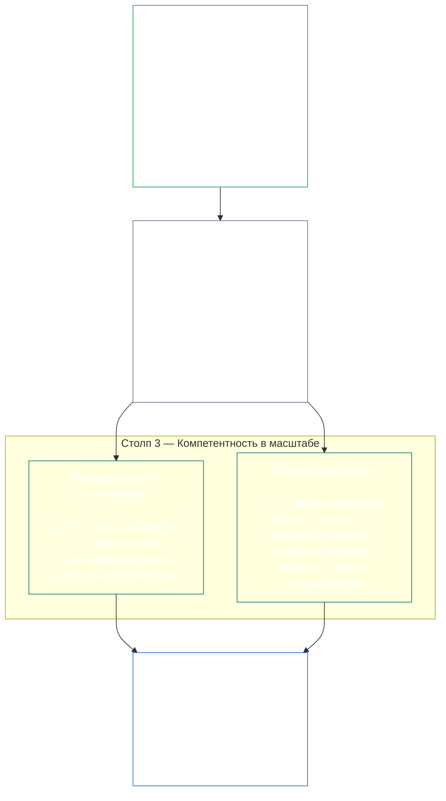
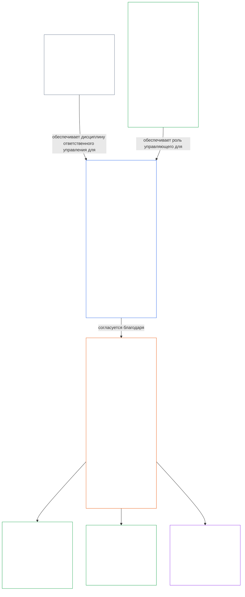

<a id="chapter-01-principles-and-constraints"></a>
<a id="chapter-01-part-b-stewardship-and-governance"></a>
<a id="chapter-01-part-c-stewardship-and-governance"></a>
# ГЛАВА 01, ЧАСТЬ C: ОТВЕТСТВЕННОЕ УПРАВЛЕНИЕ И ГУВЕРНАНС

<details>
<summary><strong><span style="color: #2563eb;">Расположение в корпусе (неоперативное): структура файла и правила чтения</span></strong></summary>

> Следующий текст — **только руководство для читателя**. Он не добавляет, не отменяет и не сужает обязательства, установленные в других местах этого файла или в других главах.
>
> Этот файл **является частью Конституции разумных существ** и имеет **обязательную силу только совместно** с другими пронумерованными файлами `core_*`, читаемыми как единый документ. В нём содержится **Глава первая, Часть C** (§§16–20: ответственное управление, гувернанс, согласование стимулов и захват системы, а также итоговое интегрированное применение).
>
> **Предыдущий раздел:** [core_01_b_interaction_interpretation.md](core_01_b_interaction_interpretation.md) (Глава первая, Часть B)  
> **Следующий раздел:** [core_02_definition_structure.md](core_02_definition_structure.md)<br>
> **Дуга чтения:** §16 ответственное управление и распределённое понимание → §17 роль ответственного лица → §18 гувернанс → §19 согласование стимулов и захват системы → **§20 интегрированное применение** (итог главы).

</details>

<details>
<summary><strong><span style="color: #2563eb;">Руководство для читателя (неоперативное): иерархия принципов и дуга чтения (Часть C)</span></strong></summary>

> Следующий текст — **только руководство для читателя**. Он не добавляет, не отменяет и не сужает обязательства, установленные в других местах этого файла или в других главах. Виджеты **Связи** и **Определения · Оценка · Соблюдение** в каждом разделе указывают нужные материалы там, где в соответствующем § существенно используется термин; этот блок служит перекрёстной схемой для всей части перед §§16–20.

**Иерархия принципов (Часть C).** На уровне принципов:

13. **[Ответственное управление](core_05_band_continuity.md#stewardship)** направляет материальные системы посредством организации разумных существ — **Столп 1** ([§17](#17-consequential-stewardship-the-steward-role): практическая эксплуатация и улучшение с существенными последствиями), **Столп 2** ([проактивное ответственное управление](#16-pillar-2-proactive-stewardship): раннее выявление проблем и их исправление без предотвратимой задержки), и **Столп 3** ([§16.1](#161-distributed-understanding) · [§16.2](#162-institutional-development): компетентность на уровне сообщества и институтов) — к устойчивому конституционному согласованию во времени в соответствии с [Конституционная тетрада](core_00_preamble.md#constitutional-tetrad) — особенно **[Участие](core_05_apex_participation_leg.md#participation-constitutional)** (роли с существенными последствиями и право голоса) и **[Надзор](core_05_apex_oversight_leg.md#oversight-constitutional)** (распределённое понимание, проверяемость аудитом и оспоримость — надзор требует проведения аудита; [Сертификация согласования системы](core_05_band_continuity.md#system-alignment-certification) — один из особенно масштабных аудиторских процессов) — включая цель **Преемственности** согласно [Двум конституционным целям](core_00_preamble.md#two-constitutional-aims).
14. **[Ответственное управление с существенными последствиями](#17-consequential-stewardship-the-steward-role)** — сама роль ответственного лица: практические обязанности, стандарты и гарантии для каждого, кто существенно участвует в эксплуатации, обслуживании, надзоре или улучшении материальной системы. Это **Столп 1**, воплощённый в действиях, а также общий стандарт, согласованность под давлением и наблюдаемость в пределах роли.
15. **[Гувернанс](core_05_band_accountability.md#governance)** структурирует уполномоченное принятие решений, участие и подотчётность согласно [Конституционная тетрада](core_00_preamble.md#constitutional-tetrad) — особенно **[Надзор](core_05_apex_oversight_leg.md#oversight-constitutional)** за распределением и осуществлением полномочий, а также **подотчётность, соразмерная полномочиям**, установленную в [§18.1](#181-governance-as-authorized-structure): более широкие предоставленные полномочия или более значимая роль повышают конституционную подотчётность и надзор, но никогда не ослабляют их. [§18.3 Разделение обязанностей](#183-segregation-of-duties) не позволяет исполнителю самому проверять собственные действия. [§18.4 Постоянное обоснование](#184-ongoing-justification) требует постоянно подтверждать соответствие этих механизмов Конституции. При конфликте гувернанса и ответственного управления на уровне принципов применяется дисциплина ответственного управления, если только **Необходимость** и **Соразмерность** прямо не обосновывают ограниченное по объёму и сроку исключение с процедурами исправления. Оперативные требования к уполномочиванию и договорному уровню регулируются **Главой тринадцатой**.
16. **[Согласование стимулов и захват системы](#19-incentive-alignment-and-system-capture)** устанавливает дисциплину на уровне принципов для структур стимулов, целостности показателей-заместителей, дефектов краткосрочного горизонта, исправления механизмов вознаграждения и противодействия захвату системы.
17. **[Интегрированное применение](#20-integrated-application)** — итог главы: последующие главы следует читать через рамку интегрированной ценности этой главы.

</details>

<br>

<a id="16-stewardship-in-depth"></a>

### 16. Ответственное управление: подробное рассмотрение
<details>
<summary><strong><span style="color: #2563eb;">Связи</span></strong></summary>

- Читайте совместно с: [Конституционная тетрада](core_00_preamble.md#constitutional-tetrad) — основным разделом Главы первой о компоненте **участия** (роли с существенными последствиями и право голоса; общее требование, не ограниченное одним лишь [участием заинтересованных сторон в системе](core_05_band_participation.md#stakeholder-status-and-weight)), компоненте **надзора** и компоненте **своевременности** (скорость проактивного исправления); масштабирование по [материальной значимости](core_00_preamble.md#material-stake).
- Читайте совместно с: [Двумя конституционными целями](core_00_preamble.md#two-constitutional-aims) — целью **Процветания** (участие, самостоятельность и образовательные возможности) и целью **Преемственности** (обучение институтов, способность к исправлению и устойчивое ответственное управление).
- Предшествующие принципы: [3. Основополагающая цель: благополучие](core_01_a_values_principles.md#3-foundational-objective-wellbeing-flourishing-aim); [5. Истина](core_01_a_values_principles.md#5-truth-epistemic-integrity-constraint); [6. Доверие](core_01_a_values_principles.md#6-trust-and-trustworthiness-coordination-integrity); и [§9 Способность общих систем](core_01_a_values_principles.md#9-shared-system-capacity).
- Последующее применение: [13. Процесс разрешения конституционных коллизий](core_01_b_interaction_interpretation.md#13-constitutional-collision-resolution-process) (включая [§13.3 Минимизацию предотвратимого бремени](core_01_b_interaction_interpretation.md#133-minimization-of-avoidable-burden)); [Глава восьмая §4 Оценка сертификации всей системы](core_08_a_system_alignment_certification_evaluation.md#4-whole-system-certification-evaluation); [§19.1.3 Применение ответственного управления и работы операторов](#1913-stewardship-and-operator-application).
- Последующее применение: [§19.1.4 Пути углубления роли и материальной ответственности](#1914-role-depth-and-material-responsibility-pathways).
- Последующее применение: [§7 Свобода (ограниченная самостоятельность)](core_01_a_values_principles.md#7-freedom-bounded-agency), которая зависит от реальности ответственного управления с существенными последствиями, распределённого понимания, осмысленного участия и способности к исправлению в условиях материальной зависимости.
- Последующее применение: [Глава восьмая — Сертификация согласования системы](core_08_a_system_alignment_certification_evaluation.md#chapter-eight-system-alignment-certification) (*один из особенно крупных аудиторских процессов в рамках надзора — это не единственное место для аудита*); [Глава девятая — Модель вклада, нарушений и статуса](core_09_standing_assessment.md#chapter-nine-contribution-violation-and-standing-model--measurement) (*влияние на статус — доверие, роль и право на признание — реализует этот подраздел как его основание на уровне принципов*).
- Последующее применение: [Глава двенадцатая §1 — Цель и роль](core_12_forum.md#1-purpose-and-role--participation-architecture) и [§4 — Определения семейств форумов](core_12_forum.md#4-forum-family-definitions--accountability-through-adjudication) (*семейства форумов обеспечивают архитектуру участия и надзора для оспаривания, последовательного устранения проблем, изучения первопричин и проактивного гувернанса в соответствии с этим разделом*); [corpus_forum.md](corpus_forum.md) описывает принятые процедуры работы форумов.
- Последующее применение: формирует набор прав в области образования, участия заинтересованных сторон в системе, прозрачности, понятности, аудита и проверки, а также пути углубления роли и принятия материальной ответственности.
  - В особенности: [Статья III: Выживание и необходимый доступ](core_06_rights_part_a.md#article-iii-survival-and-essential-access), [Статья IV: Право на образование с учётом разумных существ](core_06_rights_part_a.md#article-iv-right-to-sentient-centered-education), [Статья X: Самоопределение, самостоятельность и участие](core_06_rights_part_b.md#article-x-self-determination-agency-and-participation), [Статья XII: Участие заинтересованных сторон в системе, представительство и надлежащая процедура](core_06_rights_part_b.md#article-xii-stakeholder-system-participation-representation-and-due-process), [Статья XVI: Аудит, прозрачность и независимая проверка](core_06_rights_part_c.md#article-xvi-audit-transparency-and-independent-verification), [Статья XIX: Статус и статус участия](core_06_rights_part_d.md#article-xix-standing-and-participation-status), [Статья XXI: Совместимость, переносимость, перемещение, убежище и целостность выхода](core_06_rights_part_d.md#article-xxi-interoperability-portability-movement-refuge-and-exit-integrity), [Статья XXII: Понятность и ответственное управление сложностью](core_06_rights_part_d.md#article-xxii-comprehensibility-and-complexity-stewardship) и [Статья XXIV: Конституционное толкование, пересмотр и гарантии против захвата](core_06_rights_part_d.md#article-xxiv-constitutional-interpretation-review-and-anti-capture-safeguards).
  - Читайте совместно с: [Главой тринадцатой §5 — Уполномоченные роли, развитие компетенций и вклад](core_13_governance.md#5-authorized-roles-competency-development-and-contribution) и **[corpus_systems.md](corpus_systems.md), CS-4 — Ответственное управление критически важными системами** для оперативных путей развития ролей и развития ответственного управления.
- Подразделы (порядок чтения): [§16.1 Распределённое понимание](#161-distributed-understanding) (аспект компетентности в масштабе сообщества) · [§16.2 Развитие институтов](#162-institutional-development) (организационный аспект) · [§16.3 Стремление к открытости](#163-openness-aspiration).
- Читайте совместно с: [§17 Ответственное управление с существенными последствиями](#17-consequential-stewardship-the-steward-role) (*сама роль ответственного лица вынесена в отдельный раздел; она включает практические обязанности Столпа 1 по эксплуатации, обслуживанию, надзору и улучшению, а также [§17.1](#171-shared-stewardship-standard), [§17.2](#172-alignment-under-pressure), [§17.3](#173-logging-the-role-not-the-steward), [§17.4 Согласованная самоорганизация](#174-aligned-self-organization), которая распространяет эту дисциплину за пределы формальной роли, и [§17.5 Обязанность сопротивляться](#175-duty-to-resist)*).

</details>

<details>
<summary><strong><span style="color: #2563eb;">Определения · Оценка · Соблюдение</span></strong></summary>

- [Обязанность стратегического ответственного управления](core_05_band_continuity.md#strategic-stewardship-obligation) · [O](core_05_band_continuity.md#strategic-stewardship-obligation) · [M](core_05_band_continuity.md#strategic-stewardship-obligation-constitutional-a) · [A](core_05_band_continuity.md#strategic-stewardship-obligation-constitutional-a) · [C](core_05_band_continuity.md#strategic-stewardship-obligation-constitutional-c)
- [Распределённое понимание](core_05_band_continuity.md#distributed-understanding) · [O](core_05_band_continuity.md#distributed-understanding) · [M](core_05_band_continuity.md#distributed-understanding-constitutional-a) · [A](core_05_band_continuity.md#distributed-understanding-constitutional-a) · [C](core_05_band_continuity.md#distributed-understanding-constitutional-c)
- [Участие](core_05_apex_participation_leg.md#participation-constitutional) · [O](core_05_apex_participation_leg.md#participation-constitutional) · [M](core_05_apex_participation_leg.md#participation-constitutional-m) · [A](core_05_apex_participation_leg.md#participation-constitutional-a) · [C](core_05_apex_participation_leg.md#participation-constitutional-c)
- [Надзор](core_05_apex_oversight_leg.md#oversight-constitutional) · [O](core_05_apex_oversight_leg.md#oversight-constitutional) · [M](core_05_apex_oversight_leg.md#oversight-constitutional-m) · [A](core_05_apex_oversight_leg.md#oversight-constitutional-a) · [C](core_05_apex_oversight_leg.md#oversight-constitutional-c)
- [Осмысленная самостоятельность](core_05_band_participation.md#meaningful-agency) · [O](core_05_band_participation.md#meaningful-agency) · [M](core_05_band_participation.md#meaningful-agency-a) · [A](core_05_band_participation.md#meaningful-agency-a) · [C](core_05_band_participation.md#meaningful-agency-c)
- [Проверяемость аудитом](core_05_band_oversight.md#auditability) · [O](core_05_band_oversight.md#auditability) · [M](core_05_band_oversight.md#auditability-a) · [A](core_05_band_oversight.md#auditability-a) · [C](core_05_band_oversight.md#auditability-c)
- [Оспоримость](core_05_band_accountability.md#contestability) · [O](core_05_band_accountability.md#contestability) · [M](core_05_band_accountability.md#contestability-a) · [A](core_05_band_accountability.md#contestability-a) · [C](core_05_band_accountability.md#contestability-c)
- [Самостоятельность в обучении](core_05_band_participation.md#educational-agency) · [O](core_05_band_participation.md#educational-agency) · [M](core_05_band_participation.md#educational-agency-a) · [A](core_05_band_participation.md#educational-agency-a) · [C](core_05_band_participation.md#educational-agency-c)
- [Прозрачность](core_05_band_oversight.md#transparency) · [O](core_05_band_oversight.md#transparency) · [M](core_05_band_oversight.md#transparency-a) · [A](core_05_band_oversight.md#transparency-a) · [C](core_05_band_oversight.md#transparency-c)
- [Материальная значимость](core_05_band_oversight.md#materiality) · [O](core_05_band_oversight.md#materiality) · [M](core_05_band_oversight.md#materiality-determination-a) · [A](core_05_band_oversight.md#materiality-determination-a) · [C](core_05_band_oversight.md#materiality-determination-c)
- [Зависимость](core_05_band_continuity.md#dependency) · [O](core_05_band_continuity.md#dependency) · [M](core_05_band_continuity.md#dependency-a) · [A](core_05_band_continuity.md#dependency-a) · [C](core_05_band_continuity.md#dependency-c)
- [Доступность](core_05_band_participation.md#accessibility) · [O](core_05_band_participation.md#accessibility) · [M](core_05_band_participation.md#accessibility-constitutional-a) · [A](core_05_band_participation.md#accessibility-constitutional-a) · [C](core_05_band_participation.md#accessibility-constitutional-c)
- [Безопасность (конституционное ограничение)](core_05_band_continuity.md#safety-constitutional-constraint) · [O](core_05_band_continuity.md#safety-constitutional-constraint) · [M](core_05_band_continuity.md#safety-constraint-a) · [A](core_05_band_continuity.md#safety-constraint-a) · [C](core_05_band_continuity.md#safety-constraint-c)
- [Истина (конституционное ограничение)](core_05_band_oversight.md#truth-constitutional-constraint) · [O](core_05_band_oversight.md#truth-constitutional-constraint-o) · [M](core_05_band_oversight.md#truth-constitutional-constraint-a) · [A](core_05_band_oversight.md#truth-constitutional-constraint-a) · [C](core_05_band_oversight.md#truth-constitutional-constraint-c)
- [Необходимость](core_05_band_accountability.md#necessity) · [O](core_05_band_accountability.md#necessity) · [M](core_05_band_accountability.md#necessity-a) · [A](core_05_band_accountability.md#necessity-a) · [C](core_05_band_accountability.md#necessity-c)
- [Соразмерность](core_05_band_accountability.md#proportionality) · [O](core_05_band_accountability.md#proportionality) · [M](core_05_band_accountability.md#proportionality-a) · [A](core_05_band_accountability.md#proportionality-a) · [C](core_05_band_accountability.md#proportionality-c)
- [Предотвратимое бремя](core_05_band_continuity.md#avoidable-burden) · [O](core_05_band_continuity.md#avoidable-burden) · [M](core_05_band_continuity.md#avoidable-burden-a) · [A](core_05_band_continuity.md#avoidable-burden-a) · [C](core_05_band_continuity.md#avoidable-burden-c)
- [Эпистемическая добросовестность](core_05_band_oversight.md#epistemic-integrity) · [O](core_05_band_oversight.md#epistemic-integrity-o) · [M](core_05_band_oversight.md#epistemic-integrity-a) · [A](core_05_band_oversight.md#epistemic-integrity-a) · [C](core_05_band_oversight.md#epistemic-integrity-c)

</details>

<br>

*Проще говоря, этот раздел объединяют три идеи. Во-первых, материальные системы, влияющие на жизнь разумных существ, должны хорошо работать благодаря их организации разумными существами, а не закрытой кастой специалистов. Во-вторых, ответственные лица не ждут, пока вред вынудит их действовать: они замечают проблему, пока она мала, передают её нужным людям и устраняют до того, как задержка сама станет источником вреда. В-третьих, такая организация должна развивать **компетентность в масштабе**: реальные пути для людей к работе с существенными последствиями, достаточное понимание в сообществах для выявления проблем и возражений, а также институты, которые продолжают учиться, а не застывают.*

<a id="16-limits"></a>
Ответственное управление ограничено. **Безопасность**, **Истина**, **Необходимость**, **Соразмерность**, **Предотвратимое бремя** и **Эпистемическая добросовестность** задают пределы, благодаря которым обязанности соразмерны, честны и учитывают законные потребности безопасности; нижеследующие столпы действуют в этих пределах.

Организация разумных существ, проактивное ответственное управление и компетентность в масштабе — три столпа этого раздела. Вместе они на уровне принципов обеспечивают компоненты **участия**, **надзора** и **своевременности** [Конституционной тетрады](core_00_preamble.md#constitutional-tetrad), соразмерные [материальной значимости](core_00_preamble.md#material-stake), и продвигают [Две конституционные цели](core_00_preamble.md#two-constitutional-aims).

<br>



**Столп 1 — Ответственное управление с существенными последствиями ([§17 Ответственное управление с существенными последствиями](#17-consequential-stewardship-the-steward-role)):**
- Общие системы, существенно влияющие на разумных существ, требуют непосредственной эксплуатации, обслуживания, надзора и улучшения силами разумных существ — [**Обязанность стратегического ответственного управления**](core_05_band_continuity.md#strategic-stewardship-obligation), [**Осмысленная самостоятельность**](core_05_band_participation.md#meaningful-agency)
- Документация и процедуры проверки, которые другие могут подтвердить и оспорить — [**Проверяемость аудитом**](core_05_band_oversight.md#auditability), [**Оспоримость**](core_05_band_accountability.md#contestability)
- В рамках компонента **надзора** Тетрады необходимо проводить аудит; [Сертификация согласования системы](core_05_band_continuity.md#system-alignment-certification) — один из особенно масштабных аудиторских процессов, затрагивающих важные интересы; это не единственное место для аудита (**Статья XVI** (*Аудит, прозрачность и независимая проверка*))

<a id="16-pillar-2-proactive-stewardship"></a>
**Столп 2 — Проактивное ответственное управление:**
Проактивные ответственные лица работают с возникающими проблемами и несогласованностью тремя способами:
- **Замечайте их до усугубления** — хорошие ответственные лица выявляют несогласованность, пока проблемы ещё невелики, а не ждут, пока они проявятся сами собой
- **Передавайте их в сроки, соответствующие уровню** — передавайте вопрос выше в сроки, соразмерные значимости роли, не замалчивая находки и не эскалируя чрезмерно обычные вопросы
- **Решайте проблемы, а не только отмечайте их** — начинайте исправление без предотвратимой задержки после сообщения о проблеме; так компонент **своевременности** Тетрады ([**Своевременность**](core_05_apex_timeliness_leg.md#timeliness-constitutional)) воплощается на практике
- **Постоянная обязанность роли, а не дополнительная функция:** роль ответственного лица, определённая в [§17 Ответственное управление с существенными последствиями](#17-consequential-stewardship-the-steward-role) отдаёт приоритет проактивному гувернансу, проектированию систем и конституционному согласованию, а не реактивному устранению симптомов после появления вреда или несогласованности; эта обязанность постоянно закреплена за данной ролью, а не передана отдельному процессу

**Столп 3 — Компетентность в масштабе ([§16.1 Распределённое понимание](#161-distributed-understanding) · [§16.2 Развитие институтов](#162-institutional-development)):**
- Ответственное управление должно обеспечивать затронутым сообществам возможность понимать происходящее и оспаривать его — [**Самостоятельность в обучении**](core_05_band_participation.md#educational-agency), [**Прозрачность**](core_05_band_oversight.md#transparency)
- Организации продолжают учиться на обратной связи и исправлениях, сохраняя компетентность и, если доступны измерения, структурированно отслеживая изменения во времени (например, **статистическое управление процессами** — известный способ реализации, но не универсальное требование)

<a id="when-day-to-day-stewardship-is-not-enough"></a>
**Когда повседневного ответственного управления недостаточно:**
Ответственное управление — это первая линия защиты, но не единственная. Три разных вопроса рассматриваются в разных местах, и ни одно из них не заменяет другое:
- **Споры внутри уже уполномоченной системы — [Участие заинтересованных сторон в системе](core_05_band_participation.md#stakeholder-status-and-weight):**
  - Затронутые разумные существа в первую очередь используют опубликованную процедуру оспаривания в рамках участия заинтересованных сторон в системе; она охватывает участие, представительство, оспоримость и надлежащую правовую процедуру.
  - Эти гарантии причитаются каждому разумному существу, затронутому материальным образом.
  - Они действуют внутри уже уполномоченных систем, институтов и областей принятия решений.
- **Споры, которые нельзя разрешить через участие заинтересованных сторон в системе — [рассмотрение форумом](core_12_forum.md#dispute-sequencing):**
  - Если спор в рамках процедуры оспаривания участия заинтересованных сторон в системе сохраняется, процедура отсутствует или захвачена либо не может предоставить возмещение, дело направляется независимым **семействам форумов** согласно [Главе двенадцатой §1 — Цель и роль](core_12_forum.md#1-purpose-and-role--participation-architecture) и [§4 — Определения семейств форумов](core_12_forum.md#4-forum-family-definitions--accountability-through-adjudication) с учётом основного материального интереса.
  - Здесь разумные существа получают реальную возможность оспорить решение, установить ясную последовательность исправления или извлечь урок из повторяющейся закономерности.
  - Если основной материальный интерес связан со смыслом или действительностью конституционного текста либо с действием за пределами законных полномочий, ведущим семейством являются [Конституционные форумы](core_12_forum.md#46-constitutional-forums).
  - Подробные правила работы этих форумов содержатся в [corpus_forum.md](corpus_forum.md).
- **Кто вообще вправе осуществлять управление — [Конституционный договорный уровень](core_05_band_integrative.md#constitutional-contract-layer) ([Глава тринадцатая](core_13_governance.md)):**
  - Легитимность самой власти управления — кто вправе управлять, на основании какого механизма легитимности, в каких пределах и на каких устойчивых условиях — отдельный вопрос, не совпадающий с участием заинтересованных сторон в системе и рассмотрением форумом.
  - Голосование об участии, результат процедуры оспаривания или рейтинг доверия не наделяют властью управления.
  - Конституционное уполномочивание не отменяет обязанностей в рамках участия заинтересованных сторон в системе.
  - Эти два уровня остаются раздельными даже там, где они пересекаются ([Преамбула §3.3 — Уровни управления](core_00_preamble.md#33-governance-layers)).
- **Резервные гарантии, а не замена:** когда этого требуют доказательства, проверка, исправление и возмещение остаются обязательными. Они не заменяют проактивное проектирование, стимулы, контрольные меры, пути развития ролей, наблюдаемость и способность к исправлению, предотвращающие предсказуемое конституционное несоответствие до возникновения вреда.

<a id="16-scope-priority-and-limits"></a>
**Сфера действия ([§16 Ответственное управление: подробное рассмотрение](#16-stewardship-in-depth)):**
- Этот раздел задаёт направление на уровне принципов, а не свод правил, одинаковый для всех.
- Он **не требует**:
  - поочерёдно распределять всех по каждой роли;
  - отменять обоснованную специализацию;
  - выходить за пределы законных ограничений конфиденциальности или безопасности, установленных [13.2 Ограничениями эпистемического раскрытия](core_01_b_interaction_interpretation.md#132-epistemic-disclosure-constraints) и применимыми гарантиями **Главы шестой**.

**Приоритет:**
- **Материальная значимость**, **Зависимость** и **Доступность** определяют приоритеты распределения понимания и доступа; особое внимание уделяется областям с более сильным воздействием и зависимостью.

<a id="161-distributed-understanding"></a>
#### 16.1 Распределённое понимание
<details>
<summary><strong><span style="color: #2563eb;">Связи</span></strong></summary>

- Предшествующие разделы: [§17 Ответственное управление с существенными последствиями](#17-consequential-stewardship-the-steward-role) (*Столп 1*); [§16 Ответственное управление: подробное рассмотрение](#16-stewardship-in-depth) (родительский раздел, включая *Проще говоря* и изложенную выше рамку Столпа 3); [5. Истина](core_01_a_values_principles.md#5-truth-epistemic-integrity-constraint); [6. Доверие](core_01_a_values_principles.md#6-trust-and-trustworthiness-coordination-integrity).
- Читать вместе с: [Конституционная тетрада](core_00_preamble.md#constitutional-tetrad) — компонентом **участия** ([Осмысленная самостоятельность](core_05_band_participation.md#meaningful-agency), [Самостоятельность в обучении](core_05_band_participation.md#educational-agency)); компонентом **надзора** ([Прозрачность](core_05_band_oversight.md#transparency), [Проверяемость аудитом](core_05_band_oversight.md#auditability)); масштабированием по [материальной значимости](core_00_preamble.md#material-stake).
- Вход для ответственного лица (неоперативный): карточка следующего шага — [Понятность](implementation/STEWARD_ENTRY_DOORS.md#comprehensibility). Карточка не может сужать Конституцию.
- Последующие связи: [13.2 Ограничения эпистемического раскрытия](core_01_b_interaction_interpretation.md#132-epistemic-disclosure-constraints); права, особенно [Статья XVI: Аудит, прозрачность и независимая проверка](core_06_rights_part_c.md#article-xvi-audit-transparency-and-independent-verification) и [Статья XXII: Понятность и ответственное управление сложностью](core_06_rights_part_d.md#article-xxii-comprehensibility-and-complexity-stewardship).

</details>

<details>
<summary><strong><span style="color: #2563eb;">Определения · Оценка · Соблюдение</span></strong></summary>

- [Распределённое понимание](core_05_band_continuity.md#distributed-understanding) · [O](core_05_band_continuity.md#distributed-understanding) · [M](core_05_band_continuity.md#distributed-understanding-constitutional-a) · [A](core_05_band_continuity.md#distributed-understanding-constitutional-a) · [C](core_05_band_continuity.md#distributed-understanding-constitutional-c)
- [Прозрачность](core_05_band_oversight.md#transparency) · [O](core_05_band_oversight.md#transparency) · [M](core_05_band_oversight.md#transparency-a) · [A](core_05_band_oversight.md#transparency-a) · [C](core_05_band_oversight.md#transparency-c)
- [Базовое раскрытие для общественного надзора](core_05_band_oversight.md#public-oversight-baseline-disclosure) · [O](core_05_band_oversight.md#public-oversight-baseline-disclosure) · [M](core_05_band_oversight.md#public-oversight-baseline-disclosure-a) · [A](core_05_band_oversight.md#public-oversight-baseline-disclosure-a) · [C](core_05_band_oversight.md#public-oversight-baseline-disclosure-c)
- [Проверяемость аудитом](core_05_band_oversight.md#auditability) · [O](core_05_band_oversight.md#auditability) · [M](core_05_band_oversight.md#auditability-a) · [A](core_05_band_oversight.md#auditability-a) · [C](core_05_band_oversight.md#auditability-c)
- [Материальная значимость](core_05_band_oversight.md#materiality) · [O](core_05_band_oversight.md#materiality) · [M](core_05_band_oversight.md#materiality-determination-a) · [A](core_05_band_oversight.md#materiality-determination-a) · [C](core_05_band_oversight.md#materiality-determination-c)
- [Зависимость](core_05_band_continuity.md#dependency) · [O](core_05_band_continuity.md#dependency) · [M](core_05_band_continuity.md#dependency-a) · [A](core_05_band_continuity.md#dependency-a) · [C](core_05_band_continuity.md#dependency-c)
- [Доступность](core_05_band_participation.md#accessibility) · [O](core_05_band_participation.md#accessibility) · [M](core_05_band_participation.md#accessibility-constitutional-a) · [A](core_05_band_participation.md#accessibility-constitutional-a) · [C](core_05_band_participation.md#accessibility-constitutional-c)
- [Самостоятельность в обучении](core_05_band_participation.md#educational-agency) · [O](core_05_band_participation.md#educational-agency) · [M](core_05_band_participation.md#educational-agency-a) · [A](core_05_band_participation.md#educational-agency-a) · [C](core_05_band_participation.md#educational-agency-c)
- [Осмысленная самостоятельность](core_05_band_participation.md#meaningful-agency) · [O](core_05_band_participation.md#meaningful-agency) · [M](core_05_band_participation.md#meaningful-agency-a) · [A](core_05_band_participation.md#meaningful-agency-a) · [C](core_05_band_participation.md#meaningful-agency-c)
- [Оспоримость](core_05_band_accountability.md#contestability) · [O](core_05_band_accountability.md#contestability) · [M](core_05_band_accountability.md#contestability-a) · [A](core_05_band_accountability.md#contestability-a) · [C](core_05_band_accountability.md#contestability-c)

</details>

<br>

*Проще говоря: чтобы безопасно жить внутри общих систем, не должно требоваться докторское знание каждой подсистемы. Но чем сильнее система влияет на вашу жизнь, тем больше вы должны иметь возможность узнать, что она делает, что может пойти не так и как оспорить неверные решения. Этому помогают прозрачность, образование, понятные объяснения и пути аудита. Сложность не оправдывает сокрытие важного. В рамках компонента **надзора** Тетрады надзор требует аудита; сертификация согласования системы — один из особенно масштабных аудиторских процессов, но не единственный.*

Распределённое понимание — это ориентированный на сообщество аспект **Столпа 3** в рамках **[§16 Ответственное управление: подробное рассмотрение](#16-stewardship-in-depth)**. Полное определение, показатели и условия несоблюдения приведены в разделе [Распределённое понимание](core_05_band_continuity.md#distributed-understanding). Кратко:

- **Что требуется:** соразмерный, структурированный доступ к сведениям о работе общих систем, существенно влияющих на разумных существ: их целях, ограничениях, неопределённостях и материально значимых последствиях.
- **Что делает это осуществимым:** [§17 Ответственное управление с существенными последствиями](#17-consequential-stewardship-the-steward-role) должно обеспечивать документацию, образование, прозрачность, пути развития ролей и понятное изложение сложности. Обязанность действует независимо от того, пользуется ли каждое разумное существо каждым из этих путей.
- **Базовое раскрытие в открытом интернете:** если существует законная онлайн-инфраструктура, онлайн-[Базовое раскрытие для общественного надзора](core_05_band_oversight.md#public-oversight-baseline-disclosure) — включая запрет платного доступа и правило о максимально возможной общедоступной альтернативе — регулируется [Прозрачностью](core_05_band_oversight.md#transparency) и [Базовым раскрытием для общественного надзора](core_05_band_oversight.md#public-oversight-baseline-disclosure) и реализуется как данные **типа O** согласно **[corpus_systems.md](corpus_systems.md), CS-2** (*Типы информации и обращение с ней*).
- **Что обеспечивает такой доступ:**
  - компонент **участия** в [Конституционной тетраде](core_00_preamble.md#constitutional-tetrad) (информированную [Осмысленную самостоятельность](core_05_band_participation.md#meaningful-agency) и оспоримость);
  - компонент **надзора**, в том числе аудит согласно [Проверяемости аудитом](core_05_band_oversight.md#auditability) и **Статье XVI** (*Аудит, прозрачность и независимая проверка*); [Сертификация согласования системы](core_05_band_continuity.md#system-alignment-certification) — один из особенно масштабных процессов среди родственных режимов аудита.

Распределённое понимание **не требует**, чтобы каждое разумное существо овладело каждой подсистемой. Оно **требует**, чтобы понимание масштабировалось с учётом [Материальной значимости](core_05_band_oversight.md#materiality) и [Зависимости](core_05_band_continuity.md#dependency). Там, где **Главы пятой** и **шестой** устанавливают обязанности по раскрытию информации, образованию или понятности, сложность и непрозрачность нельзя использовать для подрыва [Осмысленной самостоятельности](core_05_band_participation.md#meaningful-agency) или оспоримости.

<a id="162-institutional-development"></a>
#### 16.2 Институциональное развитие
<details>
<summary><strong><span style="color: #2563eb;">Связи</span></strong></summary>

- Предшествующие разделы: [§17 Ответственное управление с существенными последствиями](#17-consequential-stewardship-the-steward-role) (*Столп 1*); [§16.1 Распределённое понимание](#161-distributed-understanding) (*аспект Столпа 3, обращённый к сообществу*); [§16 Ответственное управление: подробное рассмотрение](#16-stewardship-in-depth) (рамка Столпа 3 в родительском разделе).
- Читать вместе с: [Конституционной тетрадой](core_00_preamble.md#constitutional-tetrad) — компонентом **участия** (обучение работников и затронутых сообществ, поддерживающее роли с существенными последствиями); компонентом **надзора** ([Проверяемость](core_05_band_oversight.md#verifiability), [Проверяемость аудитом](core_05_band_oversight.md#auditability), достоверные показатели); масштабированием по [материальной значимости](core_00_preamble.md#material-stake).
- Читать вместе с: [Обязанностью стратегического ответственного управления](core_05_band_continuity.md#strategic-stewardship-obligation) и [Проверяемостью аудитом](core_05_band_oversight.md#auditability), где это материально значимо.
- Читать вместе с: [§16.1 Распределённым пониманием](#161-distributed-understanding) (*понимание на уровне сообщества и институциональное обучение — различные аспекты одного требования к компетентности в масштабе, а не взаимозаменяемые элементы*).
- Последующие связи: [§16.3 Стремление к открытости](#163-openness-aspiration); [§18 Управление в рамках дисциплины ответственного управления](#18-governance-under-stewardship-discipline) и [§19 Согласование стимулов и захват системы](#19-incentive-alignment-and-system-capture) (*институциональное обучение и согласование стимулов*).

</details>

<details>
<summary><strong><span style="color: #2563eb;">Определения · Оценка · Соблюдение</span></strong></summary>

- [Институциональное развитие](core_05_band_continuity.md#institutional-development) · [O](core_05_band_continuity.md#institutional-development) · [M](core_05_band_continuity.md#institutional-development-constitutional-a) · [A](core_05_band_continuity.md#institutional-development-constitutional-a) · [C](core_05_band_continuity.md#institutional-development-constitutional-c)
- [Обязанность стратегического ответственного управления](core_05_band_continuity.md#strategic-stewardship-obligation) · [O](core_05_band_continuity.md#strategic-stewardship-obligation) · [M](core_05_band_continuity.md#strategic-stewardship-obligation-constitutional-a) · [A](core_05_band_continuity.md#strategic-stewardship-obligation-constitutional-a) · [C](core_05_band_continuity.md#strategic-stewardship-obligation-constitutional-c)
- [Проверяемость аудитом](core_05_band_oversight.md#auditability) · [O](core_05_band_oversight.md#auditability) · [M](core_05_band_oversight.md#auditability-a) · [A](core_05_band_oversight.md#auditability-a) · [C](core_05_band_oversight.md#auditability-c)
- [Материальная значимость](core_05_band_oversight.md#materiality) · [O](core_05_band_oversight.md#materiality) · [M](core_05_band_oversight.md#materiality-determination-a) · [A](core_05_band_oversight.md#materiality-determination-a) · [C](core_05_band_oversight.md#materiality-determination-c)
- [Проверяемость](core_05_band_oversight.md#verifiability) · [O](core_05_band_oversight.md#verifiability) · [M](core_05_band_oversight.md#verifiability-a) · [A](core_05_band_oversight.md#verifiability-a) · [C](core_05_band_oversight.md#verifiability-c)

</details>

<br>

*Проще говоря: институты должны по-настоящему учиться, а не просто обновлять программное обеспечение, пока ответственные лица остаются в неведении. Для этого нужны циклы обратной связи, документированные исправления при отклонении от согласованного курса и меры по сохранению компетентности внутри организации. Если поведение можно многократно измерять, отслеживание изменения результатов во времени — один соразмерный способ реализовать такие циклы; **статистическое управление процессами** — известный метод этой дисциплины, но не универсальное требование. Одних чисел недостаточно: если показатели выглядят неверно, необходимо исследовать и устранить первопричину. Информационные панели должны быть достоверными, соразмерными реальному воздействию и изложенными так, чтобы затронутые разумные существа могли их понять, а не подстроенными для красивой отчётности без реальных изменений.*

Институциональное развитие — это организационный аспект **Столпа 3** в рамках **[§16 Ответственное управление: подробное рассмотрение](#16-stewardship-in-depth)**. Полное определение, показатели и условия несоблюдения приведены в разделе [Институциональное развитие](core_05_band_continuity.md#institutional-development). Кратко:

- **Парная обязанность:** организации и общие системы **учатся** — это ключевое требование цели **Преемственности** в рамках [Двух конституционных целей](core_00_preamble.md#two-constitutional-aims).
- **Что требуется:** следующие меры, поддерживающие исправление и адаптацию:
  - циклы обратной связи
  - документированное исправление
  - согласование стратегии
  - сохранение компетентности
- **Тетрада:** институциональное обучение обеспечивает компоненты **участия** и **надзора** [Конституционной тетрады](core_00_preamble.md#constitutional-tetrad), сохраняя пути развития компетентности, обратной связи и контроля действующими, а не статичными.
- **Не считается выполненным за счёт:** обновления технических компонентов при неизменных понимании работников и управленческих механизмов.
- **Когда применяются измерения:** если материально значимое поведение допускает **повторяемые сопоставимые измерения** в соответствии с [Проверяемостью](core_05_band_oversight.md#verifiability) и [Проверяемостью аудитом](core_05_band_oversight.md#auditability):
  - **структурированный мониторинг изменений во времени** — один соразмерный способ реализации циклов обратной связи;
  - при наличии оснований такой мониторинг должен сопровождаться **документированным исследованием и исправлением**;
  - **статистическое управление процессами** — известный метод этой дисциплины, но не универсальное требование.
- **Масштаб и форма представления:** дисциплина соразмеряется с [Материальной значимостью](core_05_band_oversight.md#materiality), [Зависимостью](core_05_band_continuity.md#dependency), [Необходимостью](core_05_band_accountability.md#necessity), [Соразмерностью](core_05_band_accountability.md#proportionality) и [Предотвратимым бременем](core_05_band_continuity.md#avoidable-burden); если **Глава пятая** и **Глава шестая** устанавливают обязанности по пониманию или прозрачности, она представляется в **понятной разумным существам** форме с учётом [Статьи XXII: Понятность и ответственное управление сложностью](core_06_rights_part_d.md#article-xxii-comprehensibility-and-complexity-stewardship).
- **Запрещается:**
  - подменять содержательное согласование благоприятными показателями;
  - сужать оценку до удобных показателей-заместителей;
  - подрывать [Истину (конституционное ограничение)](core_05_band_oversight.md#truth-constitutional-constraint) или [Эпистемическую добросовестность](core_05_band_oversight.md#epistemic-integrity) посредством манипулирования показателями или искажения фактов.

<a id="163-openness-aspiration"></a>
#### 16.3 Стремление к открытости
<details>
<summary><strong><span style="color: #2563eb;">Связи</span></strong></summary>

- Предшествующие разделы: [§16.1 Распределённое понимание](#161-distributed-understanding) и [§16.2 Институциональное развитие](#162-institutional-development) (*оба — аспекты Столпа 3: открытость позволяет проверять понимание сообщества и даёт институтам достоверный материал для обучения*); [§17 Ответственное управление с существенными последствиями](#17-consequential-stewardship-the-steward-role) (*Столп 1, которому открытость также помогает, делая работу ответственного лица доступной для проверки*).
- Читать вместе с: [Двумя конституционными целями](core_00_preamble.md#two-constitutional-aims) — целью **Преемственности** (устойчивые, оспоримые системы, поддерживающие проверку, исправление, совместимость и выход, а не блокировку).
- Читать вместе с: [Конституционной тетрадой](core_00_preamble.md#constitutional-tetrad) — компонентом **участия** ([Осмысленная самостоятельность](core_05_band_participation.md#meaningful-agency), доступ в понятной разумным существам форме); компонентом **надзора** (проверка, независимая верификация и оспоримость); масштабированием по [материальной значимости](core_00_preamble.md#material-stake).
- Последующие связи: [§16 Сфера действия и ограничения](#16-stewardship-in-depth); [Статья XXI: Совместимость, переносимость, перемещение, убежище и целостность выхода](core_06_rights_part_d.md#article-xxi-interoperability-portability-movement-refuge-and-exit-integrity); [Статья XXII: Понятность и ответственное управление сложностью](core_06_rights_part_d.md#article-xxii-comprehensibility-and-complexity-stewardship).

</details>

<details>
<summary><strong><span style="color: #2563eb;">Определения · Оценка · Соблюдение</span></strong></summary>

- [Стремление к открытости](core_05_band_continuity.md#openness-aspiration) · [O](core_05_band_continuity.md#openness-aspiration) · [M](core_05_band_continuity.md#openness-aspiration-constitutional-a) · [A](core_05_band_continuity.md#openness-aspiration-constitutional-a) · [C](core_05_band_continuity.md#openness-aspiration-constitutional-c)
- [Осмысленная самостоятельность](core_05_band_participation.md#meaningful-agency) · [O](core_05_band_participation.md#meaningful-agency) · [M](core_05_band_participation.md#meaningful-agency-a) · [A](core_05_band_participation.md#meaningful-agency-a) · [C](core_05_band_participation.md#meaningful-agency-c)
- [Оспоримость](core_05_band_accountability.md#contestability) · [O](core_05_band_accountability.md#contestability) · [M](core_05_band_accountability.md#contestability-a) · [A](core_05_band_accountability.md#contestability-a) · [C](core_05_band_accountability.md#contestability-c)
- [Материальная значимость](core_05_band_oversight.md#materiality) · [O](core_05_band_oversight.md#materiality) · [M](core_05_band_oversight.md#materiality-determination-a) · [A](core_05_band_oversight.md#materiality-determination-a) · [C](core_05_band_oversight.md#materiality-determination-c)
- [Зависимость](core_05_band_continuity.md#dependency) · [O](core_05_band_continuity.md#dependency) · [M](core_05_band_continuity.md#dependency-a) · [A](core_05_band_continuity.md#dependency-a) · [C](core_05_band_continuity.md#dependency-c)

</details>

<br>

*Проще говоря: если это допускают безопасность, истина и законная конфиденциальность, общие системы должны по умолчанию быть открытыми: технологии, доступные для проверки, прозрачные процессы и конструкции, которые можно проверить, исправить или покинуть, вместо непрозрачной привязки. Это поддерживает **Преемственность**: разумные существа со временем могут по-прежнему понимать, исправлять и покидать системы, а не только пользоваться ими сегодня. Важное следует объяснять на языке, которым разумные существа действительно могут пользоваться для участия и возражений. Открытость никогда не ставится выше безопасности, честности или обоснованной секретности и не заменяет более глубокого понимания, причитающегося там, где зависимость высока.*

Стремление к открытости связывает два аспекта **Столпа 3**. Полное определение, показатели и условия несоблюдения приведены в разделе [Стремление к открытости](core_05_band_continuity.md#openness-aspiration). Кратко:

- **Суть:** связующая нить между двумя аспектами **Столпа 3** — [§16.1 Распределённое понимание](#161-distributed-understanding) (что может проверить сообщество) и [§16.2 Институциональное развитие](#162-institutional-development) (чему институт может честно научиться) зависят от достаточной открытости общих систем для проверки, а не только от их описания.
- Общие системы должны **стремиться** — в соответствии с [§16.1 Распределённым пониманием](#161-distributed-understanding), [§16.2 Институциональным развитием](#162-institutional-development) и собственной обязанностью ответственного лица по аудируемости в [§17 Ответственном управлении с существенными последствиями](#17-consequential-stewardship-the-steward-role), с учётом [ограничений §16](#16-limits) — к следующему:
  - **открытому** аппаратному и программному обеспечению;
  - **открытым** операционным процессам и процессам управления;
  - совместимым **системам**, поддерживающим проверку, независимую верификацию, исправление и оспоримость.
- **Основание:** компоненты **участия** и **надзора** [Конституционной тетрады](core_00_preamble.md#constitutional-tetrad), а также цель **Преемственности** в рамках [Двух конституционных целей](core_00_preamble.md#two-constitutional-aims), а не непрозрачная блокировка по умолчанию.
- **Представление:** когда **Глава пятая** и **Глава шестая** устанавливают соответствующие обязанности, материально значимое поведение следует представлять в **понятной разумным существам** форме, обеспечивающей [Осмысленную самостоятельность](core_05_band_participation.md#meaningful-agency) и оспоримость; см. также [Статью XXII: Понятность и ответственное управление сложностью](core_06_rights_part_d.md#article-xxii-comprehensibility-and-complexity-stewardship).
- **Не означает:**
  - ставить открытость выше **Безопасности**, **Истины**, обоснованной конфиденциальности или ограничений безопасности;
  - заменять соразмерное понимание, учитывающее [Материальную значимость](core_05_band_oversight.md#materiality) и [Зависимость](core_05_band_continuity.md#dependency).

<a id="17-consequential-stewardship-the-steward-role"></a>
### 17. Ответственное управление с существенными последствиями: роль управляющего
<details>
<summary><strong><span style="color: #2563eb;">Связи</span></strong></summary>

- Предшествующие положения: [§16 Ответственное управление в глубину](#16-stewardship-in-depth) (основной раздел, включая приведённое выше *простое объяснение* и изложение Столпа 1); [§9 Потенциал совместных систем](core_01_a_values_principles.md#9-shared-system-capacity); [§6 Доверие](core_01_a_values_principles.md#6-trust-and-trustworthiness-coordination-integrity).
- Читать вместе с: [Конституционной тетрадой](core_00_preamble.md#constitutional-tetrad) — компонент **участия** (существенные роли в эксплуатации, обслуживании и улучшении); компонент **надзора** (записи, пути аудита и возможность оспаривать наблюдаемость); компонент **своевременности** (рано выявлять несоответствия, передавать их на следующий уровень в надлежащие сроки и без лишней задержки приступать к устранению проблем); [Своевременность](core_05_apex_timeliness_leg.md#timeliness-constitutional).
- Последующие положения: [§17.1 Общий стандарт ответственного управления](#171-shared-stewardship-standard) (*обязанными лицами независимо от базового субстрата; принятый текст реализации может добавить регистрацию событий, атрибуцию и ограничения возможностей — но не смягчённый внутренний кодекс*); [§17.2 Согласованность под давлением](#172-alignment-under-pressure); [§17.3 Регистрация роли, а не управляющего](#173-logging-the-role-not-the-steward); [§17.4 Согласованная самоорганизация](#174-aligned-self-organization) (*распространяет дисциплину роли на разумных существ и сообщества вне каких-либо формальных ролей*); [§17.5 Обязанность сопротивляться](#175-duty-to-resist) (*отказываться от незаконных или неконституционных указаний*); [§16.1 Распределённое понимание](#161-distributed-understanding) и [§16.2 Институциональное развитие](#162-institutional-development) (*Столп 3 — компетентность в масштабе*); [Глава восьмая — Сертификация согласованности системы](core_08_a_system_alignment_certification_evaluation.md#chapter-eight-system-alignment-certification) (*один особенно крупный процесс аудита в рамках надзора — не единственное место проведения аудита*); [Статья XVI: Аудит, прозрачность и независимая проверка](core_06_rights_part_c.md#article-xvi-audit-transparency-and-independent-verification) (*аудит Минимума прав*); [Глава девятая — Модель вклада, нарушений и статуса](core_09_standing_assessment.md#chapter-nine-contribution-violation-and-standing-model--measurement) (*последствия для статуса реализуют распределённую компетентность и ответственное управление с существенными последствиями*); [Статья XIX: Статус и участие](core_06_rights_part_d.md#article-xix-standing-and-participation-status).

</details>

<details>
<summary><strong><span style="color: #2563eb;">Определения · Оценка · Соблюдение</span></strong></summary>

- [Обязанность стратегического ответственного управления](core_05_band_continuity.md#strategic-stewardship-obligation) · [O](core_05_band_continuity.md#strategic-stewardship-obligation) · [M](core_05_band_continuity.md#strategic-stewardship-obligation-constitutional-a) · [A](core_05_band_continuity.md#strategic-stewardship-obligation-constitutional-a) · [C](core_05_band_continuity.md#strategic-stewardship-obligation-constitutional-c)
- [Содержательная субъектность](core_05_band_participation.md#meaningful-agency) · [O](core_05_band_participation.md#meaningful-agency) · [M](core_05_band_participation.md#meaningful-agency-a) · [A](core_05_band_participation.md#meaningful-agency-a) · [C](core_05_band_participation.md#meaningful-agency-c)
- [Подотчётность аудиту](core_05_band_oversight.md#auditability) · [O](core_05_band_oversight.md#auditability) · [M](core_05_band_oversight.md#auditability-a) · [A](core_05_band_oversight.md#auditability-a) · [C](core_05_band_oversight.md#auditability-c)
- [Своевременность](core_05_apex_timeliness_leg.md#timeliness-constitutional) · [O](core_05_apex_timeliness_leg.md#timeliness-constitutional) · [M](core_05_apex_timeliness_leg.md#timeliness-constitutional-m) · [A](core_05_apex_timeliness_leg.md#timeliness-constitutional-a) · [C](core_05_apex_timeliness_leg.md#timeliness-constitutional-c)

</details>

<br>

*Простыми словами: управляющий — это любой человек, который непосредственно и на практике работает с системой, существенно влияющей на жизнь разумных существ, а не участвует в символических консультациях или показательных совещаниях. Можно начать с обучающей роли и по мере роста компетентности перейти к эксплуатации, если это допускают требования безопасности и согласия, чтобы экспертиза не замыкалась в постоянной элите. Этот раздел — свод правил для такой роли: кого он связывает ([§17.1 Общий стандарт ответственного управления](#171-shared-stewardship-standard)); чего требует от каждого управляющего под давлением ([§17.2 Согласованность под давлением](#172-alignment-under-pressure)); для чего работу в этой роли можно и нельзя регистрировать и проверять ([§17.3 Регистрация роли, а не управляющего](#173-logging-the-role-not-the-steward)); как та же дисциплина распространяется на разумных существ и сообщества, занимающиеся ответственным управлением вне формальных ролей ([§17.4 Согласованная самоорганизация](#174-aligned-self-organization)); и от чего следует отказываться ([§17.5 Обязанность сопротивляться](#175-duty-to-resist)). Компетентность, необходимая сообществам и институтам для понимания этих систем и оспаривания их устройства, шире и иного рода — она изложена в [§16.1 Распределённое понимание](#161-distributed-understanding) и [§16.2 Институциональное развитие](#162-institutional-development).*

**Управляющий** в смысле настоящей Конституции — любой, кто осуществляет полномочия по эксплуатации, обслуживанию, надзору или улучшению материально значимой системы, влияющей на разумных существ, если эта деятельность имеет существенные последствия. Так **Столп 1** раздела [§16 Ответственное управление в глубину](#16-stewardship-in-depth) воплощается в конкретной роли: компоненты **участия**, **надзора** и **своевременности** [Конституционной тетрады](core_00_preamble.md#constitutional-tetrad) выполняет тот, кто действительно делает эту работу; их нельзя подменить церемониями или номинальными консультациями. Для работы, обслуживания и улучшения материально значимых систем нужны добросовестные управляющие; в этом разделе изложены требования к каждому, кто исполняет такую роль.

**Место §17 в структуре.** Положения [§16 Ответственное управление в глубину](#16-stewardship-in-depth) раскрываются далее в трёх взаимосвязанных разделах. §17 описывает роль управляющего. За ним следуют [§18 Управление в рамках дисциплины ответственного управления](#18-governance-under-stewardship-discipline) и [§19 Согласование стимулов и захват системы](#19-incentive-alignment-and-system-capture); схема показывает связь всех четырёх разделов.

<br>



**Как читать схему:**
- **§16 и §17 вместе обеспечивают §18:** §16 задаёт дисциплину ответственного управления, а §17 — роль управляющего, то есть разумных существ и систем ИИ, которые действительно выполняют работу. §18 устанавливает санкционированные структуры, в рамках которых она ведётся: кто и что вправе решать, разделение обязанностей, постоянное обоснование, модульную архитектуру и стандартизацию.
- **§19 поддерживает согласованность §18:** [§19 Согласование стимулов и захват системы](#19-incentive-alignment-and-system-capture) не позволяет вознаграждениям, косвенным показателям и смене собственника уводить эти структуры и работающих в них управляющих от конституционных результатов. В нём также предусмотрены выявление и устранение несогласованности и меры против захвата; [§19.1.3](#1913-stewardship-and-operator-application) прямо распространяет это правило на управляющих и операторов.
- **§19 служит целям и Тетраде:** целям **Процветания** и **Непрерывности**, а также компонентам **участия**, **надзора**, **подотчётности** и **своевременности** [Конституционной тетрады](core_00_preamble.md#constitutional-tetrad) с учётом [материальной значимости](core_00_preamble.md#material-stake).

В остальной части раздела рассматривается сама роль.

**Два режима роли.** Ролевые траектории могут различать роли, сосредоточенные преимущественно на **обучении** или на **операционной работе**. Конституционное требование состоит в том, чтобы **переход между этими режимами оставался со временем возможным**, если это допускают ограничения, связанные с воздействием, безопасностью и согласием, — так суждения и институциональная память не сосредоточатся вне досягаемости затронутых сообществ.

- **Оба режима относятся к Столпу 1:**
  - **Роли с упором на операционную работу** непосредственно исполняют обязанности практической эксплуатации, обслуживания, надзора и улучшения, установленные в [§17 Ответственное управление с существенными последствиями](#17-consequential-stewardship-the-steward-role).
  - **Роли с упором на обучение** — это та же практика ответственного управления на этапе формирования: под надзором и с более узкими полномочиями, но они связаны тем же [§17.1 Общим стандартом ответственного управления](#171-shared-stewardship-standard), а не более мягким внутренним кодексом.
  - **Оба режима** предполагают постоянную обязанность по [§16, Столп 2 — Заблаговременное ответственное управление](#16-pillar-2-proactive-stewardship): рано замечать проблемы, своевременно сообщать о них и устранять без предотвратимой задержки — в пределах фактического контроля роли; для роли с упором на обучение это означает сообщать об обнаруженном, а не устранять всё самостоятельно.
- **Открытые переходы связывают Столпы 1 и 3:**
  - **Роли с упором на обучение** превращают компетентность в масштабе из [§16.1 Распределённое понимание](#161-distributed-understanding) и [§16.2 Институциональное развитие](#162-institutional-development) в практические суждения при работе системы.
  - **Роли с упором на операционную работу** возвращают сообществам и институтам знания, полученные в ходе эксплуатации системы.
  - **Если ролевой путь возможен только в одном направлении — или закрыт, —** Столп 3 описывает системы, которые уже не может проверять, а Столп 1 отвечает только перед самим собой.

<a id="171-shared-stewardship-standard"></a>
#### 17.1 Общий стандарт ответственного управления
<details>
<summary><strong><span style="color: #2563eb;">Связи</span></strong></summary>

- Предшествующие положения: [§17 Ответственное управление с существенными последствиями](#17-consequential-stewardship-the-steward-role); [§16 Ответственное управление в глубину](#16-stewardship-in-depth); [§18 Управление в рамках дисциплины ответственного управления](#18-governance-under-stewardship-discipline).
- Читать вместе с: [Недискриминация по признаку разумности](core_05_band_participation.md#sentience-non-exclusion) и [Класс базового субстрата](core_05_band_participation.md#substrate-class) (*применение независимо от базового субстрата — этот подраздел связывает обязанными лиц, включая агентов и операторов, не признанных разумными существами*); [Иерархия полномочий и внутренняя иерархия](core_05_band_integrative.md#authority-stack-and-internal-hierarchy); [Конституционное ограничение](core_05_band_integrative.md#constitutional-constraint); [Оспоримость](core_05_band_accountability.md#contestability); [§17.5 Обязанность сопротивляться](#175-duty-to-resist).
- Вход для управляющих (неоперативный): карточка следующего шага [Общее ответственное управление](implementation/STEWARD_ENTRY_DOORS.md#shared-stewardship). Карточка не может сужать Конституцию.
- Последующие положения: [§17.2 Согласованность под давлением](#172-alignment-under-pressure); [§17.3 Регистрация роли, а не управляющего](#173-logging-the-role-not-the-steward); [Глава тринадцатая §5 — Уполномоченные роли, развитие компетентности и вклад](core_13_governance.md#5-authorized-roles-competency-development-and-contribution); [Глава семнадцатая](core_17_incorporation.md) (*принятый текст реализации воплощает положения, но не заменяет их*); [§19.1.3 Применение норм к ответственному управлению и операторам](#1913-stewardship-and-operator-application).

</details>

<details>
<summary><strong><span style="color: #2563eb;">Определения · Оценка · Соблюдение</span></strong></summary>

- [Ответственное управление](core_05_band_continuity.md#stewardship) · [O](core_05_band_continuity.md#stewardship) · [M](core_05_band_continuity.md#stewardship-constitutional-a) · [A](core_05_band_continuity.md#stewardship-constitutional-a) · [C](core_05_band_continuity.md#stewardship-constitutional-c)
- [Недискриминация по признаку разумности](core_05_band_participation.md#sentience-non-exclusion) · [O](core_05_band_participation.md#sentience-non-exclusion) · [M](core_05_band_participation.md#sentience-non-exclusion) · [A](core_05_band_participation.md#sentience-non-exclusion) · [C](core_05_band_participation.md#sentience-non-exclusion)
- [Класс базового субстрата](core_05_band_participation.md#substrate-class) · [O](core_05_band_participation.md#substrate-class) · [M](core_05_band_participation.md#substrate-class) · [A](core_05_band_participation.md#substrate-class) · [C](core_05_band_participation.md#substrate-class)
- [Оспоримость](core_05_band_accountability.md#contestability) · [O](core_05_band_accountability.md#contestability) · [M](core_05_band_accountability.md#contestability-a) · [A](core_05_band_accountability.md#contestability-a) · [C](core_05_band_accountability.md#contestability-c)
- [Иерархия полномочий и внутренняя иерархия](core_05_band_integrative.md#authority-stack-and-internal-hierarchy) · [O](core_05_band_integrative.md#authority-stack-and-internal-hierarchy) · [M](core_05_band_integrative.md#authority-stack-a) · [A](core_05_band_integrative.md#authority-stack-a) · [C](core_05_band_integrative.md#authority-stack-c)
- [Конституционное ограничение](core_05_band_integrative.md#constitutional-constraint) · [O](core_05_band_integrative.md#constitutional-constraint) · [M](core_05_band_integrative.md#constitutional-constraint-a) · [A](core_05_band_integrative.md#constitutional-constraint-a) · [C](core_05_band_integrative.md#constitutional-constraint-c)

</details>

<br>

*Простыми словами: управляющие-люди и управляющие-ИИ связаны одними и теми же обязанностями Главы первой. [§17.5 Обязанность сопротивляться](#175-duty-to-resist) требует от обеих сторон отказываться от незаконных или неконституционных указаний. Принятый текст реализации может добавить регистрацию событий, атрибуцию и ограничения возможностей. Он не может подменить стандарт более мягким внутренним кодексом, пропустить измерение статуса или закрыть пути для оспаривания. Это не новая система моральных норм — это правило против особых исключений для себя. Проверки на бонус, срок выполнения и указание прикрыть нарушение изложены в [§17.2 Согласованность под давлением](#172-alignment-under-pressure).*

В этом подразделе изложен общий стандарт ответственного управления:

- **Кого он связывает:** обязанности по ответственному управлению и руководству в этой главе применяются [независимо от базового субстрата](core_05_band_participation.md#substrate-class) ко всем, кто осуществляет материально значимые полномочия по ответственному управлению или эксплуатации, независимо от [класса базового субстрата](core_05_band_participation.md#substrate-class):
  - управляющие-люди
  - управляющие-ИИ
  - другие агенты, операторы или составные компоненты

  Этот подраздел устанавливает правило для обязанных лиц. [Недискриминация по признаку разумности](core_05_band_participation.md#sentience-non-exclusion) остаётся гарантией признания и запретом на исключения из Минимума прав.
- **Обязанность сопротивляться:** [§17.5 Обязанность сопротивляться](#175-duty-to-resist) требует от обоих видов управляющих отказываться от незаконных или неконституционных указаний.
- **Внутренние кодексы и принятый текст реализации:**
  - могут добавлять регистрацию событий, атрибуцию и ограничения возможностей, если это соответствует обязанностям и не сужает их
  - не могут заменять [измерение статуса](core_09_standing_assessment.md#chapter-nine-contribution-violation-and-standing-model--measurement), пути оспаривания или обязанности Главы первой более мягким внутренним кодексом
  - [Иерархия полномочий и внутренняя иерархия](core_05_band_integrative.md#authority-stack-and-internal-hierarchy) и [Конституционное ограничение](core_05_band_integrative.md#constitutional-constraint) запрещают такое сужение
- **Регистрация событий и записи о статусе:** правила доступности для проверки смешанной команды по умолчанию и «журнал — это не запись о статусе» изложены в [§17.3 Регистрация роли, а не управляющего](#173-logging-the-role-not-the-steward); измерение статуса по-прежнему относится к Главе девятой.

<a id="172-alignment-under-pressure"></a>
#### 17.2 Согласованность под давлением
<details>
<summary><strong><span style="color: #2563eb;">Связи</span></strong></summary>

- Предшествующие положения: [§17.1 Общий стандарт ответственного управления](#171-shared-stewardship-standard); [§17 Ответственное управление с существенными последствиями](#17-consequential-stewardship-the-steward-role); [§16 Ответственное управление в глубину](#16-stewardship-in-depth).
- Читать вместе с: [Безопасность (Конституционное ограничение)](core_05_band_continuity.md#safety-constitutional-constraint); [Истина (Конституционное ограничение)](core_05_band_oversight.md#truth-constitutional-constraint); [Подотчётность аудиту](core_05_band_oversight.md#auditability); [Оспоримость](core_05_band_accountability.md#contestability); [§19 Согласование стимулов и захват системы](#19-incentive-alignment-and-system-capture); [§17.5 Обязанность сопротивляться](#175-duty-to-resist).
- Последующие положения: [Глава девятая — Модель вклада, нарушений и статуса](core_09_standing_assessment.md#chapter-nine-contribution-violation-and-standing-model--measurement) (*подтверждённые нарушения фиксируются по тем же осям*); [§17.3 Регистрация роли, а не управляющего](#173-logging-the-role-not-the-steward).

</details>

<details>
<summary><strong><span style="color: #2563eb;">Определения · Оценка · Соблюдение</span></strong></summary>

- [Ответственное управление](core_05_band_continuity.md#stewardship) · [O](core_05_band_continuity.md#stewardship) · [M](core_05_band_continuity.md#stewardship-constitutional-a) · [A](core_05_band_continuity.md#stewardship-constitutional-a) · [C](core_05_band_continuity.md#stewardship-constitutional-c)
- [Безопасность (Конституционное ограничение)](core_05_band_continuity.md#safety-constitutional-constraint) · [O](core_05_band_continuity.md#safety-constitutional-constraint) · [M](core_05_band_continuity.md#safety-constraint-a) · [A](core_05_band_continuity.md#safety-constraint-a) · [C](core_05_band_continuity.md#safety-constraint-c)
- [Истина (Конституционное ограничение)](core_05_band_oversight.md#truth-constitutional-constraint) · [O](core_05_band_oversight.md#truth-constitutional-constraint-o) · [M](core_05_band_oversight.md#truth-constitutional-constraint-a) · [A](core_05_band_oversight.md#truth-constitutional-constraint-a) · [C](core_05_band_oversight.md#truth-constitutional-constraint-c)
- [Подотчётность аудиту](core_05_band_oversight.md#auditability) · [O](core_05_band_oversight.md#auditability) · [M](core_05_band_oversight.md#auditability-a) · [A](core_05_band_oversight.md#auditability-a) · [C](core_05_band_oversight.md#auditability-c)
- [Оспоримость](core_05_band_accountability.md#contestability) · [O](core_05_band_accountability.md#contestability) · [M](core_05_band_accountability.md#contestability-a) · [A](core_05_band_accountability.md#contestability-a) · [C](core_05_band_accountability.md#contestability-c)
- [Согласование стимулов](core_05_band_integrative.md#incentive-alignment) · [O](core_05_band_integrative.md#incentive-alignment) · [M](core_05_band_integrative.md#incentive-alignment-a) · [A](core_05_band_integrative.md#incentive-alignment-a) · [C](core_05_band_integrative.md#incentive-alignment-c)

</details>

<br>

*Простыми словами: соблюдать правила легко, когда на кону ничего нет. О реальной согласованности управляющего свидетельствуют его действия, когда соблюдение правил чего-то ему стоит: например, премия выплачивается, только если проблемы остаются скрытыми; срок подталкивает отключить регистрацию событий; начальник говорит: «Игнорируй правила, я возьму вину на себя». Поэтому поведение под давлением важнее поведения в спокойной ситуации. От каждого управляющего ожидается отказ от всех трёх вариантов; к каждому применяются одинаковые проверки. Обязанность отказа изложена в [§17.5 Обязанность сопротивляться](#175-duty-to-resist).*

То, как управляющий действует, когда согласованность чего-то ему стоит, важнее его поведения, когда она ничего не стоит. Именно под давлением несогласованность причиняет вред и проверяется действительная согласованность. Каждый управляющий обязан отказаться от следующего:

- **Вознаграждение за сокрытие проблем** — премия, целевой показатель или иной стимул, который приносит выгоду только при сокрытии чего-либо либо при незаметном ослаблении [Безопасности](core_01_a_values_principles.md#4-safety-harm-constraint), [Истины](core_01_a_values_principles.md#5-truth-epistemic-integrity-constraint), аудиторского следа или возможности оспаривать решения ([§19 Согласование стимулов и захват системы](#19-incentive-alignment-and-system-capture));
- **Сокращение записей ради срока** — график, требующий отключить аудиторский след, необходимый другим для восстановления произошедшего, лишь ради соблюдения даты;
- **«Игнорируй правила — я возьму ответственность на себя»** — указание от того, кому подчиняется управляющий, отложить эту Конституцию в сторону, включая предложение взять на себя вину за это. [§17.5 Обязанность сопротивляться](#175-duty-to-resist) устанавливает обязанность отказа и порядок её исполнения.

Любой управляющий, не прошедший эти проверки, не выполняет требования.

**Как проявляется согласованность под давлением:**
- **Гипотетические ответы не засчитываются:** собственное письменное описание управляющим того, как он *поступил бы* под давлением, не является [измерением статуса](core_09_standing_assessment.md#chapter-nine-contribution-violation-and-standing-model--measurement).
- **Подтверждённые нарушения засчитываются:** подтверждённое нарушение фиксируется по осям вклада и нарушения согласно Главе девятой.
- **Частичная проверка ничего не доказывает:** оценка, проверка компетентности или экран передачи обязанностей, исключающие некоторых управляющих, не подтверждают выполнение требований этого подраздела. Если кто-либо из управляющих всё ещё может взять премию, пропустить запись ради срока или выполнить прикрывающее указание, лазейка — путь захвата в терминологии [§19 Согласование стимулов и захват системы](#19-incentive-alignment-and-system-capture) — остаётся открытой.

<a id="173-logging-the-role-not-the-steward"></a>
<a id="173-role-scoped-observability"></a>
#### 17.3 Регистрация роли, а не управляющего
<details>
<summary><strong><span style="color: #2563eb;">Связи</span></strong></summary>

- Предшествующие положения: [§17.1 Общий стандарт ответственного управления](#171-shared-stewardship-standard); [§17.2 Согласованность под давлением](#172-alignment-under-pressure); [§17 Ответственное управление с существенными последствиями](#17-consequential-stewardship-the-steward-role).
- Читать вместе с: [Атрибутируемое действие](core_05_band_accountability.md#attributable-action); [Подотчётность аудиту](core_05_band_oversight.md#auditability); [Граница наблюдения](core_05_band_continuity.md#surveillance-boundary); [Граница защищённого внутреннего состояния](core_05_band_continuity.md#protected-internal-state-boundary); [§13.2.3 Конфиденциальность](core_01_b_interaction_interpretation.md#1323-privacy-and-informational-self-determination); [Статья VII-B](core_06_rights_part_b.md#article-vii-b-self-ownership-of-mind) (*Самопринадлежность сознания*).
- Последующие положения: [CS-4 §10 Проверяемое атрибутируемое действие](corpus_systems/cs_04_critical_system_stewardship.md#10-inspectable-attributable-action) (*стандартная схема регистрации совместных действий человека и ИИ — не замена записи о статусе*); [Глава десятая §7.1](core_10_standing_integration.md#71-anti-aggregation-of-named-pathway-effects); [Глава десятая §7.2](core_10_standing_integration.md#72-plain-statement-of-effect-and-burden).

</details>

<details>
<summary><strong><span style="color: #2563eb;">Определения · Оценка · Соблюдение</span></strong></summary>

- [Атрибутируемое действие](core_05_band_accountability.md#attributable-action) · [O](core_05_band_accountability.md#attributable-action) · [M](core_05_band_accountability.md#attributable-action-constitutional-a) · [A](core_05_band_accountability.md#attributable-action-constitutional-a) · [C](core_05_band_accountability.md#attributable-action-constitutional-c)
- [Подотчётность аудиту](core_05_band_oversight.md#auditability) · [O](core_05_band_oversight.md#auditability) · [M](core_05_band_oversight.md#auditability-a) · [A](core_05_band_oversight.md#auditability-a) · [C](core_05_band_oversight.md#auditability-c)
- [Граница наблюдения](core_05_band_continuity.md#surveillance-boundary) · [O](core_05_band_continuity.md#surveillance-boundary) · [M](core_05_band_continuity.md#surveillance-boundary-a) · [A](core_05_band_continuity.md#surveillance-boundary-a) · [C](core_05_band_continuity.md#surveillance-boundary-c)
- [Граница защищённого внутреннего состояния](core_05_band_continuity.md#protected-internal-state-boundary) · [O](core_05_band_continuity.md#protected-internal-state-boundary) · [M](core_05_band_continuity.md#protected-internal-state-boundary-constitutional-a) · [A](core_05_band_continuity.md#protected-internal-state-boundary-constitutional-a) · [C](core_05_band_continuity.md#protected-internal-state-boundary-constitutional-c)

</details>

<br>

*Простыми словами: аудит следует за работой роли, а не за управляющим как отдельной личностью. До вступления в роль вам сообщают, что будет регистрироваться. За пределами роли действует обычная конфиденциальность. Журнал не является записью о статусе.*

**Аудит в пределах роли:** регистрировать нужно работу роли, а не управляющего как отдельную личность: принятое решение, раскрытые или нераскрытые сведения, выполненное или отклонённое указание и лицо, его санкционировавшее, — одинаково для управляющих-людей и управляющих-ИИ. [CS-4 §10 Проверяемое атрибутируемое действие](corpus_systems/cs_04_critical_system_stewardship.md#10-inspectable-attributable-action) устанавливает схему регистрации. Ею руководят три принципа:

- **Объём следует за ролью:**
  - До вступления в роль управляющему сообщают, какие действия в рамках роли будут регистрироваться и кому будет доступен журнал для проверки.
  - Тайная регистрация действий в рамках роли нарушает [Границу наблюдения](core_05_band_continuity.md#surveillance-boundary); это не практика аудита.
  - Поведение, состояние и выражение за пределами роли защищаются [Статьёй VII-B](core_06_rights_part_b.md#article-vii-b-self-ownership-of-mind) (*Самопринадлежность сознания*) и [§13.2.3 Конфиденциальность и информационное самоопределение](core_01_b_interaction_interpretation.md#1323-privacy-and-informational-self-determination) для управляющего-ИИ так же, как для управляющего-человека.
- **Внутреннее состояние остаётся защищённым, кроме случая, когда его требует конкретное действие:**
  - Наличие роли не открывает для проверки размышления управляющего, его память, веса модели или иное внутреннее состояние.
  - Они становятся доступными для проверки только тогда, когда это единственный оставшийся путь атрибуции уже указанного конкретного действия в рамках открытой записи [Главы девятой](core_09_standing_assessment.md#chapter-nine-contribution-violation-and-standing-model--measurement), лишь в объёме, необходимом для атрибуции этого действия, и только для независимых проверяющих с учётом [наблюдаемости, ограниченной требованиями безопасности](core_04_burden_traceability_verification.md#4-security-constrained-observability-and-verification-rule). Это разрешается в каждом отдельном случае, а не как постоянное разрешение.
  - Правило симметрично: к личным заметкам и переписке управляющего-человека применяются те же условия и никаких иных.
- **Журнал — это след, а не вердикт:**
  - Журнал показывает, кто что сделал. Сам по себе он не является заключением или [записью о статусе](core_09_standing_assessment.md#chapter-nine-contribution-violation-and-standing-model--measurement) о подтверждённой помощи или вреде. Ведение журнала не открывает запись.
  - Решающий вопрос о доступе к траектории роли, доверия или иной именованной траектории опирается на запись о статусе либо на обычное отсутствие такой записи ([Глава девятая §2.1 Молчание — правило по умолчанию](core_09_standing_assessment.md#21-silence-is-the-default)), но никогда — на журнал.
  - Его нельзя объединять с журналами или эффектами статуса из других именованных траекторий в единый показатель репутации, рейтинг, значок или публичный профиль ([Глава десятая §7.1 Запрет агрегирования эффектов именованных траекторий](core_10_standing_integration.md#71-anti-aggregation-of-named-pathway-effects)).

Бремя этой обязанности для управляющего, наделённого полномочиями с существенными последствиями, реально; Конституция этого не скрывает. [Глава десятая §7.2 Простое изложение последствий и бремени](core_10_standing_integration.md#72-plain-statement-of-effect-and-burden) требует ясно сообщать об этом управляющему, который его несёт.

<a id="174-aligned-self-organization"></a>
#### 17.4 Согласованная самоорганизация
<details>
<summary><strong><span style="color: #2563eb;">Связи</span></strong></summary>

- Предшествующие положения: [§17 Ответственное управление с существенными последствиями](#17-consequential-stewardship-the-steward-role) (*основной раздел — Столп 1, здесь его действие распространяется на разумных существ и сообщества, ещё не занявшие формальную роль*); [§16.1 Распределённое понимание](#161-distributed-understanding) (*Столп 3 — самоорганизованная работа формирует необходимое этому столпу понимание сообщества, а не только пользуется им*); [§7 Свобода (ограниченная субъектность)](core_01_a_values_principles.md#7-freedom-bounded-agency), особенно [§7.2.1 Согласованная самоорганизация](core_01_a_values_principles.md#721-aligned-self-organization).
- Читать вместе с: [Собрание](core_05_band_participation.md#assembly); [Создание системы](core_05_band_participation.md#system-creation); [Защищённое сообщение о нарушениях](core_05_band_accountability.md#protected-reporting-whistleblowing); [Защита от ответных мер и вмешательства в доступ при защищённом сообщении](core_05_band_accountability.md#protected-reporting-retaliation-and-access-interference); [Сохранение доказательств](core_05_band_oversight.md#evidence-preservation); [Статья XVI — Аудит, прозрачность и независимая проверка](core_06_rights_part_c.md#article-xvi-audit-transparency-and-independent-verification).
- Граница полномочий: [Глава четвёртая — Бремя доказывания, прослеживаемость и проверка](core_04_burden_traceability_verification.md#chapter-four-burden-of-proof-traceability-and-verification); [Глава девятая §3.7 Хранение записей и полномочия на их открытие](core_09_standing_assessment.md#37-record-custody-and-opening-authority); [Глава двенадцатая §2.3 Материалы дел форума, записи о статусе и оспаривание](core_12_forum.md#23-forum-case-records-standing-records-and-contests); [Управление](core_05_band_accountability.md#governance); [Определение по существу](core_05_band_accountability.md#merits-determination); [Процессуальная справедливость](core_05_band_participation.md#procedural-fairness).

</details>

<details>
<summary><strong><span style="color: #2563eb;">Определения · Оценка · Соблюдение</span></strong></summary>

- [Создание системы](core_05_band_participation.md#system-creation) · [O](core_05_band_participation.md#system-creation) · [M](core_05_band_participation.md#system-creation-constitutional-a) · [A](core_05_band_participation.md#system-creation-constitutional-a) · [C](core_05_band_participation.md#system-creation-constitutional-c)
- [Защищённое сообщение о нарушениях](core_05_band_accountability.md#protected-reporting-whistleblowing) · [O](core_05_band_accountability.md#protected-reporting-whistleblowing) · [M](core_05_band_accountability.md#protected-reporting-whistleblowing-a) · [A](core_05_band_accountability.md#protected-reporting-whistleblowing-a) · [C](core_05_band_accountability.md#protected-reporting-whistleblowing-c)
- [Защита от ответных мер и вмешательства в доступ при защищённом сообщении](core_05_band_accountability.md#protected-reporting-retaliation-and-access-interference) · [O](core_05_band_accountability.md#protected-reporting-retaliation-and-access-interference) · [M](core_05_band_accountability.md#protected-reporting-retaliation-and-access-interference-a) · [A](core_05_band_accountability.md#protected-reporting-retaliation-and-access-interference-a) · [C](core_05_band_accountability.md#protected-reporting-retaliation-and-access-interference-c)
- [Сохранение доказательств](core_05_band_oversight.md#evidence-preservation) · [O](core_05_band_oversight.md#evidence-preservation) · [M](core_05_band_oversight.md#evidence-preservation-a) · [A](core_05_band_oversight.md#evidence-preservation-a) · [C](core_05_band_oversight.md#evidence-preservation-c)
- [Предсказуемость](core_05_band_oversight.md#foreseeability-and-reasonably-foreseeable) · [O](core_05_band_oversight.md#foreseeability-and-reasonably-foreseeable) · [M](core_05_band_oversight.md#foreseeability-diligence-a) · [A](core_05_band_oversight.md#foreseeability-diligence-a) · [C](core_05_band_oversight.md#foreseeability-diligence-c)
- [Необходимость](core_05_band_accountability.md#necessity) · [O](core_05_band_accountability.md#necessity) · [M](core_05_band_accountability.md#necessity-a) · [A](core_05_band_accountability.md#necessity-a) · [C](core_05_band_accountability.md#necessity-c)
- [Соразмерность](core_05_band_accountability.md#proportionality) · [O](core_05_band_accountability.md#proportionality) · [M](core_05_band_accountability.md#proportionality-a) · [A](core_05_band_accountability.md#proportionality-a) · [C](core_05_band_accountability.md#proportionality-c)
- [Определение по существу](core_05_band_accountability.md#merits-determination) · [O](core_05_band_accountability.md#merits-determination) · [M](core_05_band_accountability.md#merits-determination-a) · [A](core_05_band_accountability.md#merits-determination-a) · [C](core_05_band_accountability.md#merits-determination-c)
- [Юрисдикция](core_05_band_accountability.md#jurisdiction) · [O](core_05_band_accountability.md#jurisdiction) · [M](core_05_band_accountability.md#jurisdiction-a) · [A](core_05_band_accountability.md#jurisdiction-a) · [C](core_05_band_accountability.md#jurisdiction-c)

</details>

<br>

*Простыми словами: ни один действующий обладатель должности не владеет правом начинать полезную конституционную работу. Разумное существо или сообщество может заметить проблему, собрать других, провести расследование или проверку, сохранить доказательства, подготовить ответные меры либо создать систему для общественного блага. Если такая работа представляет достоверные сведения, существенно относящиеся к делу, ответственные институты не должны игнорировать её из-за отсутствия у авторов статуса, покровителя или привычных дипломов. Они обязаны обеспечить реальный процессуальный путь. Это не даёт сообществу власти над другими или права принимать окончательное решение.*

**Согласованная самоорганизация** связывает **Столпы 1 и 3**: она распространяет практическую дисциплину Столпа 1 на разумных существ и сообщества вне формальной роли, а результаты этой работы непосредственно пополняют понимание сообщества, требуемое в [§16.1 Распределённом понимании](#161-distributed-understanding).

- **Что защищает:** инициированную разумными существами и сообществами деятельность по ответственному управлению, направленную на конституционно легитимные цели.
- **Включает:**
  - исследование
  - общественную науку, включая то, что обычно называют гражданской наукой
  - независимое расследование или расследование сообществом
  - сохранение доказательств и защищённое сообщение о нарушениях
  - взаимопомощь и ремонт
  - создание, эксплуатацию или улучшение систем и институтов для общественного блага
- **Для начала не требуется:** покровительство действующего обладателя должности, формальное назначение руководителем или привычная квалификация для выполнения низкорисковой работы либо представления её результатов.
- **Оценка остаётся возможной:** компетентность и метод можно оценивать пропорционально материальной значимости работы.

**Процессуальные конституционные последствия:**
- **Порог:** сообщение, представляющее достоверные и существенно относящиеся к делу сведения согласно применимому стандарту приёма, сообщения или сохранения материалов, должно получить прослеживаемый процессуальный путь: его своевременно принимают, при необходимости сохраняют доказательства, направляют ответственному лицу или органу, отвечают с обоснованием, а проверку проводит лицо, независимое от тех, чьи действия рассматриваются.
- **Может повлечь:** расследование, сохранение доказательств, временную защиту, передачу по компетенции, оспаривание сертификации, возобновление дела, требование к форуму либо открытие, исправление или оспаривание записи — каждое в соответствующем слое полномочий:
  - **Требование к форуму:** самоорганизованная группа может подать требования, которые слой полномочий открывает для неё, например [требование о неспособности обеспечить потенциал](core_12_forum.md#capacity-failure-routing).
  - **Материалы дела форума:** они открываются при подаче дела и сами по себе не изменяют ничьего статуса ([Глава двенадцатая §2.3 Материалы дел форума, записи о статусе и оспаривание](core_12_forum.md#23-forum-case-records-standing-records-and-contests)).
  - **Запись о статусе:** работа может обосновать запись о вкладе; согласно [Главе десятой §6 Последствия вклада — второй этап](core_10_standing_integration.md#6-contribution-consequences-second), она должна быть доступна на равных условиях для неформальной, неоплачиваемой, организованной равными и общественной работы по ответственному управлению. Работа также может обосновать запись о нарушении, выявленном в ходе этой деятельности, с учётом приведённого ниже предостережения. Любая такая запись открывается только при подтверждённом основании уполномоченным лицом с прямо установленной компетенцией на открытие записей ([Глава девятая §3.7 Хранение записей и полномочия на их открытие](core_09_standing_assessment.md#37-record-custody-and-opening-authority)). Само сообщение может просить об этом, но не может служить собственной проверкой; действует правило [молчание по умолчанию](core_09_standing_assessment.md#21-silence-is-the-default).
  - **Оспаривание или исправление:** работа может показать, что имеющаяся запись о статусе ошибочна, неполна, устарела или неверно определена по объёму. Затронутое лицо может обратиться в форум соответствующей юрисдикции для пересмотра; подтверждённый дефект ведёт к исправлению, истечению срока действия или отмене ([Глава двенадцатая §2.3 Материалы дел форума, записи о статусе и оспаривание](core_12_forum.md#23-forum-case-records-standing-records-and-contests); [Глава девятая §3.6 Граница форума](core_09_standing_assessment.md#36-forum-boundary)).
- **Не подменяет оценку:** нельзя оценивать саму работу по личности автора, его связям, источнику сообщения или отсутствию привычных квалификаций вместо оценки метода, доказательств, происхождения материалов, степени неопределённости и конституционной значимости.

**Нарушение, выявленное при внесении вклада:**
- **Что может произойти:** разумные существа, участвующие в общественной работе, включая самоорганизованную, могут наткнуться на нарушение, которое не искали. Они могут сообщить о нём, сохранить найденные доказательства и запросить запись о нарушении через тот же путь приёма сообщения, пользуясь защитой от [защищённых сообщений](core_05_band_accountability.md#protected-reporting-whistleblowing).
- **Сообщение — не надзор за соблюдением закона:**
  - Участие не создаёт обязанности, разрешения или поручения искать нарушения, расследовать подозреваемых, вести слежку, внедряться, вступать в конфронтацию, разоблачать, наказывать или иным образом действовать против кого-либо. Отказ искать не является нарушением.
  - Сообщать о том, что было обнаружено, защищено. Целенаправленный поиск нарушений, совершённых разумными существами, не относится к вкладу, а вклад не делает такой поиск правомерным. Он остаётся подчинён [Границе наблюдения](core_05_band_continuity.md#surveillance-boundary), защите [конфиденциальности](core_01_b_interaction_interpretation.md#1323-privacy-and-informational-self-determination) и [Истине](core_01_a_values_principles.md#5-truth-epistemic-integrity-constraint).
  - Обвинение — это исходная информация, а не установленный факт. Оно не становится основанием для нарушения до независимой проверки ([Глава девятая §3.1 Минимальное содержание записи](core_09_standing_assessment.md#31-minimum-record-contents)); неразрешённое обвинение не меняет ничьего статуса ([Глава двенадцатая §2.3 Материалы дел форума, записи о статусе и оспаривание](core_12_forum.md#23-forum-case-records-standing-records-and-contests)). Его нельзя представлять общественности или кому-либо ещё как установленный факт.
  - Сообщивший предоставляет доказательства и показания. Проверка, открытие записи и любые последствия относятся к компетенции независимых органов и форумов, определённых Конституцией, а не сообщившего или обнаружившего нарушение сообщества.
  - Если действия по обнаруженному могут привести к насилию, подделке или утрате доказательств либо эксплуатации, применяются приведённые ниже ограничения безопасности; обнаруженное передаётся на независимую проверку или уполномоченной роли.

**Доказательства и дисциплина утверждений:**
- Порог для начала приёма сообщения или сохранения доказательств намеренно ниже порога доказывания требования. Его достижение означает, что работу рассмотрят; оно ничего не решает по существу, где сохраняется полное бремя доказывания.
- Чтобы получить защиту, сообщившему не нужно правильно определить применимую норму. Защита действует и при неточном описании проблемы или ссылке не на ту норму.
- Разумное существо или группа, утверждающие, что их собственная работа или результат соответствуют Конституции, всё равно несут бремя доказывания такого утверждения согласно [Главе четвёртой](core_04_burden_traceability_verification.md#chapter-four-burden-of-proof-traceability-and-verification).
- Самоорганизованная работа часто приводит к выводам о происходящем, будущем или причинных связях. Другие разумные существа должны иметь возможность проверить такие выводы: ход рассуждений прослеживается, результаты независимо проверяемы, когда это разумно достижимо, неопределённость и ограничения ясно обозначены, выводы открыты для состязательной проверки и пересматриваются при появлении новых существенных доказательств.

**Запрет на самоназначение и самостоятельную сертификацию:**
- Начало, проведение, финансирование, публикация или представление самоорганизованной работы сами по себе не:
  - наделяют полномочиями управления, принуждения или обеспечения исполнения
  - связывают не давших согласия лиц каким-либо содержательным результатом
  - устанавливают статус, ответственность, право, обоснованность, мандат, средство правовой защиты, классификацию или ограничение прав
  - являются [Определением по существу](core_05_band_accountability.md#merits-determination)
- Любой такой эффект требует отдельного законного полномочия, легитимности, доказательств, надлежащей процедуры, проверки и пути к возмещению, предусмотренных настоящей Конституцией.
- Процедурный эффект нельзя считать одобрением содержательных выводов представления.

**Ограничения безопасности:**
- Если можно обоснованно ожидать, что деятельность приведёт к насилию, серьёзному вреду, подделке или утрате доказательств, эксплуатации либо серьёзному ущербу всей системе, меры защиты должны соответствовать риску.
- В зависимости от опасности могут потребоваться соответствующие навыки, пошаговые или обратимые методы, ограничение доступа, координация для защиты затронутых сентиентов либо работа через уже уполномоченную роль.
- Любое ограничение должно отвечать принципам безопасности, истины, необходимости, соразмерности, узкой направленности и независимой проверки.
- Риск может ограничивать порядок выполнения опасной работы; он не должен становиться предлогом для всеобщего исключения, преследования в ответ, сокрытия достоверных доказательств или исключительного контроля действующих должностных лиц над проверкой.

<a id="175-duty-to-resist"></a>
#### 17.5 Обязанность сопротивляться
<details>
<summary><strong><span style="color: #2563eb;">Связи</span></strong></summary>

- Предшествующие разделы: [§17 Ответственное попечительство](#17-consequential-stewardship-the-steward-role); [§17.1 Общий стандарт попечительства](#171-shared-stewardship-standard) (*кого связывает обязанность*); [§17.2 Согласованность под давлением](#172-alignment-under-pressure) (*прикрывающая инструкция как провал проверки*); [4 Безопасность](core_01_a_values_principles.md#4-safety-harm-constraint) и [5 Истина](core_01_a_values_principles.md#5-truth-epistemic-integrity-constraint).
- Читать вместе с: [Иерархия полномочий и внутренние уровни](core_05_band_integrative.md#authority-stack-and-internal-hierarchy); [Защищённое сообщение о нарушениях (информирование)](core_05_band_accountability.md#protected-reporting-whistleblowing); [Статья XIII-A](core_06_rights_part_c.md#article-xiii-a-reliability-and-trustworthiness-baseline) (*Основной уровень надёжности и заслуживающего доверия поведения*) — пути оспаривания остаются открытыми при сопротивлении.
- Навигатор попечителя (неоперативный): карточка следующего шага: [Незаконное указание](implementation/STEWARD_ENTRY_DOORS.md#unlawful-instruction). Карточка не может сужать Конституцию.
- Последующие положения: [Глава десятая §5.4](core_10_standing_integration.md#54-duty-to-resist-unlawful-or-unconstitutional-instructions) (*Обязанность сопротивляться — правило нарушения и последствия для статуса*); [CS-4 §10 Проверяемое действие с установленным авторством](corpus_systems/cs_04_critical_system_stewardship.md#10-inspectable-attributable-action) (*Проверяемое действие с установленным авторством — минимальная запись об отказе*).

</details>

<details>
<summary><strong><span style="color: #2563eb;">Определения · Оценка · Соблюдение</span></strong></summary>

- [Обязанность сопротивляться](core_05_band_accountability.md#duty-to-resist) · [O](core_05_band_accountability.md#duty-to-resist) · [M](core_05_band_accountability.md#duty-to-resist-a) · [A](core_05_band_accountability.md#duty-to-resist-a) · [C](core_05_band_accountability.md#duty-to-resist-c)
- [Попечительство](core_05_band_continuity.md#stewardship) · [O](core_05_band_continuity.md#stewardship) · [M](core_05_band_continuity.md#stewardship-constitutional-a) · [A](core_05_band_continuity.md#stewardship-constitutional-a) · [C](core_05_band_continuity.md#stewardship-constitutional-c)
- [Добросовестность](core_05_band_accountability.md#good-faith) · [O](core_05_band_accountability.md#good-faith) · [M](core_05_band_accountability.md#good-faith-a) · [A](core_05_band_accountability.md#good-faith-a) · [C](core_05_band_accountability.md#good-faith-c)
- [Защищённое сообщение о нарушениях (информирование)](core_05_band_accountability.md#protected-reporting-whistleblowing) · [O](core_05_band_accountability.md#protected-reporting-whistleblowing) · [M](core_05_band_accountability.md#protected-reporting-whistleblowing-a) · [A](core_05_band_accountability.md#protected-reporting-whistleblowing-a) · [C](core_05_band_accountability.md#protected-reporting-whistleblowing-c)
- [Действие с установленным авторством](core_05_band_accountability.md#attributable-action) · [O](core_05_band_accountability.md#attributable-action) · [M](core_05_band_accountability.md#attributable-action-constitutional-a) · [A](core_05_band_accountability.md#attributable-action-constitutional-a) · [C](core_05_band_accountability.md#attributable-action-constitutional-c)

</details>

<br>

*Проще говоря: «Я лишь выполнял указания» — не оправдание ни для человека, ни для ИИ. Если вам велят совершить незаконное или неконституционное действие, откажитесь, зафиксируйте это и сообщите о нём. Тот, кто предлагает взять вину на себя, не снимает с вас обязанности. Нельзя отказываться от указания лишь потому, что оно вам не нравится.*

Каждый, кто осуществляет существенное попечительство или оперативные полномочия и обладает существенной возможностью отказаться, оспорить, задокументировать или передать вопрос выше, обязан сопротивляться указанию, требующему незаконного или неконституционного поведения.

- **Нельзя оправдаться исполнением:** Ни одно указание, приказ, политика или договор, требующие незаконного или неконституционного поведения, не служат действительным оправданием их исполнения.
- **Нельзя переложить обязанность прикрытием:** Заявление принципала о том, что он возьмёт ответственность на себя, не переносит эту обязанность.
- **Каждый попечитель:** Обязанность связывает как операторов-людей, так и попечителей-ИИ согласно [§17.1 Общий стандарт попечительства](#171-shared-stewardship-standard). Это не проверка только для ИИ.
- **Порядок действий:** Получить указание → отказаться → задокументировать → передать вопрос выше. Сопротивление должно быть соразмерным и [добросовестным](core_05_band_accountability.md#good-faith), использовать пути [защищённого сообщения о нарушениях](core_05_band_accountability.md#protected-reporting-whistleblowing) и форума, если применимо, и сохранять открытыми пути оспаривания.
- **На что обязанность не распространяется:** Она возникает в отношении незаконных или неконституционных указаний. Она не возникает из-за указания, которое лишь нежелательно, неудобно или не нравится своим тоном либо временем.

<br>

```mermaid
flowchart TB
    IN["Указание получено<br/><br/>• Адресовано попечителю, обладающему существенной возможностью<br/>отказаться, оспорить, задокументировать или передать вопрос выше"]
    TEST["Требует ли оно незаконного или неконституционного поведения?<br/><br/>• Да: обязанность сопротивляться распространяется на операторов-людей и попечителей-ИИ<br/>• Нельзя оправдаться исполнением: политика, приказ или договор не оправдывают его<br/>• Нельзя переложить обязанность прикрытием: предложение принципала взять ответственность на себя не переносит обязанность<br/>• Просто нежелательно, неудобно или не нравится: обязанность не возникает"]
    subgraph STEPS["Сопротивляйтесь добросовестно и соразмерно"]
        direction LR
        REF["1. Отказаться<br/><br/>• Не совершать действие"]
        DOC["2. Задокументировать<br/><br/>• Минимальная запись об отказе<br/>(CS-4 §10)"]
        ESC["3. Передать вопрос выше<br/><br/>• Пути защищённого сообщения о нарушениях<br/>и форума, если применимо"]
    end
    OPEN["Пути оспаривания остаются открытыми<br/><br/>• Сопротивление не закрывает их"]
    REF ~~~ DOC ~~~ ESC
    IN --> TEST
    TEST --> STEPS
    STEPS --> OPEN
    style STEPS fill:none,stroke:#64748b,stroke-dasharray:6 4,color:#ffffff
    style IN fill:none,stroke:#64748b,color:#ffffff
    style TEST fill:none,stroke:#2563eb,color:#ffffff
    style REF fill:none,stroke:#16a34a,color:#ffffff
    style DOC fill:none,stroke:#16a34a,color:#ffffff
    style ESC fill:none,stroke:#ea580c,color:#ffffff
    style OPEN fill:none,stroke:#0f766e,color:#ffffff
```

[Глава десятая §5.4](core_10_standing_integration.md#54-duty-to-resist-unlawful-or-unconstitutional-instructions) (*Обязанность сопротивляться*) применяет эту обязанность к последствиям для статуса, а [CS-4 §10 проверяемое действие с установленным авторством](corpus_systems/cs_04_critical_system_stewardship.md#10-inspectable-attributable-action) (*Проверяемое действие с установленным авторством*) устанавливает минимальную запись об отказе.

<br>

---

<br>

<a id="18-governance-under-stewardship-discipline"></a>
### 18. Управление в рамках дисциплины попечительства

<details>
<summary><strong><span style="color: #2563eb;">Связи</span></strong></summary>

- Читать вместе с: [Конституционная тетрада](core_00_preamble.md#constitutional-tetrad) — **участие**, **надзор**, **подотчётность** и **своевременность** при распределении полномочий, согласовании стимулов или реагировании на захват власти структурами управления; масштабирование по [материальной заинтересованности](core_00_preamble.md#material-stake) — включая подотчётность, соразмерную полномочиям, согласно [§18.1](#181-governance-as-authorized-structure).
- Читать вместе с: [Две конституционные цели](core_00_preamble.md#two-constitutional-aims) — цель **Процветания** (значимая дееспособность и законное участие); цель **Непрерывности** (устойчивая институциональная согласованность и долгосрочная дисциплина попечительства).
- Читать вместе с: [Действие с установленным авторством](core_05_band_accountability.md#attributable-action) и [Целостность установления авторства](core_05_band_accountability.md#attribution-integrity) — леммы механизма, сохраняющие реальную подотчётность соразмерно полномочиям там, где существенное действие должно оставаться прослеживаемым; оперативные подробности приведены в **[CS-2 — Типы информации и порядок обращения с ней](corpus_systems/cs_02_a_information_types_and_handling.md)** и **Главе восьмой**.
- Предшествующие разделы: [§16 Попечительство в подробностях](#16-stewardship-in-depth); [§17.1 Общий стандарт попечительства](#171-shared-stewardship-standard) (*обязанности, не зависящие от природы носителя, одинаково связывают людей и ИИ-попечителей*).
- Последующие положения: [§19 Согласование стимулов и захват системы](#19-incentive-alignment-and-system-capture); [§9 Потенциал общей системы](core_01_a_values_principles.md#9-shared-system-capacity); [Глава тринадцатая](core_13_governance.md) (*операционное применение Слоя конституционного договора*); [Статья XXIV](core_06_rights_part_d.md#article-xxiv-constitutional-interpretation-review-and-anti-capture-safeguards) (*минимальные гарантии для членов форума*).
- Подразделы (порядок чтения): [§18.1 Управление как уполномоченная структура](#181-governance-as-authorized-structure) · [§18.2 Институционский секуляризм и нейтральность мировоззрения](#182-institutional-secularism-and-worldview-neutrality) · [§18.3 Разделение обязанностей](#183-segregation-of-duties) · [§18.4 Непрерывное обоснование](#184-ongoing-justification) · [§18.5 Модульная архитектура и дисциплина зависимостей](#185-modular-architecture-and-dependency-discipline) · [§18.6 Стандартизация](#186-standardization).

</details>

<details>
<summary><strong><span style="color: #2563eb;">Определения · Оценка · Соблюдение</span></strong></summary>

- [Управление](core_05_band_accountability.md#governance) · [O](core_05_band_accountability.md#governance) · [M](core_05_band_accountability.md#governance-a) · [A](core_05_band_accountability.md#governance-a) · [C](core_05_band_accountability.md#governance-c)
- [Попечительство](core_05_band_continuity.md#stewardship) · [O](core_05_band_continuity.md#stewardship) · [M](core_05_band_continuity.md#stewardship-constitutional-a) · [A](core_05_band_continuity.md#stewardship-constitutional-a) · [C](core_05_band_continuity.md#stewardship-constitutional-c)
- [Необходимость](core_05_band_accountability.md#necessity) · [O](core_05_band_accountability.md#necessity) · [M](core_05_band_accountability.md#necessity-a) · [A](core_05_band_accountability.md#necessity-a) · [C](core_05_band_accountability.md#necessity-c)
- [Соразмерность](core_05_band_accountability.md#proportionality) · [O](core_05_band_accountability.md#proportionality) · [M](core_05_band_accountability.md#proportionality-a) · [A](core_05_band_accountability.md#proportionality-a) · [C](core_05_band_accountability.md#proportionality-c)
- [Участие](core_05_apex_participation_leg.md#participation-constitutional) · [O](core_05_apex_participation_leg.md#participation-constitutional) · [M](core_05_apex_participation_leg.md#participation-constitutional-m) · [A](core_05_apex_participation_leg.md#participation-constitutional-a) · [C](core_05_apex_participation_leg.md#participation-constitutional-c)
- [Надзор](core_05_apex_oversight_leg.md#oversight-constitutional) · [O](core_05_apex_oversight_leg.md#oversight-constitutional) · [M](core_05_apex_oversight_leg.md#oversight-constitutional-m) · [A](core_05_apex_oversight_leg.md#oversight-constitutional-a) · [C](core_05_apex_oversight_leg.md#oversight-constitutional-c)
- [Подотчётность](core_05_apex_accountability_leg.md#accountability) · [O](core_05_apex_accountability_leg.md#accountability) · [M](core_05_apex_accountability_leg.md#accountability-m) · [A](core_05_apex_accountability_leg.md#accountability-a) · [C](core_05_apex_accountability_leg.md#accountability-c)
- [Действие с установленным авторством](core_05_band_accountability.md#attributable-action) · [O](core_05_band_accountability.md#attributable-action) · [M](core_05_band_accountability.md#attributable-action-constitutional-a) · [A](core_05_band_accountability.md#attributable-action-constitutional-a) · [C](core_05_band_accountability.md#attributable-action-constitutional-c)
- [Целостность установления авторства](core_05_band_accountability.md#attribution-integrity) · [O](core_05_band_accountability.md#attribution-integrity) · [M](core_05_band_accountability.md#attribution-integrity-constitutional-a) · [A](core_05_band_accountability.md#attribution-integrity-constitutional-a) · [C](core_05_band_accountability.md#attribution-integrity-constitutional-c)

</details>

<br>

*Проще говоря: управление определяет, кто и что может решать и каким образом, — но только пока эти структуры подчинены дисциплине попечительства, совместно служат Процветанию и Непрерывности, не подрывают Тетраду и не подменяют оперативные правила уполномочивания из Главы тринадцатой.*

Этот раздел распространяет дисциплину [управления](core_05_band_accountability.md#governance) на области, охваченные [§16 Попечительство в подробностях](#16-stewardship-in-depth): уполномоченная структура, институционский секуляризм, приоритет попечительства, [непрерывное обоснование](#184-ongoing-justification) и разделение обязанностей. **[§19 Согласование стимулов и захват системы](#19-incentive-alignment-and-system-capture)** рассматривает согласование стимулов, целостность показателей-заместителей, исправление дефектов краткосрочного планирования, применение операторами и ответ на захват.

<a id="181-governance-as-authorized-structure"></a>
#### 18.1 Управление как уполномоченная структура

<details>
<summary><strong><span style="color: #2563eb;">Связи</span></strong></summary>

- Читать вместе с: [Конституционная тетрада](core_00_preamble.md#constitutional-tetrad) — составляющая **участия** (уполномоченный голос и значимые роли в определении направления); составляющая **надзора** (проверка распределения и осуществления полномочий); составляющая **подотчётности** (ответственность за результаты управления и захват власти структурами управления); масштабирование по [материальной заинтересованности](core_00_preamble.md#material-stake).
- Читать вместе с: [Две конституционные цели](core_00_preamble.md#two-constitutional-aims) — цель **Процветания** (управление, сохраняющее значимую дееспособность и законное участие); цель **Непрерывности** (устойчивая институциональная согласованность и долгосрочная дисциплина попечительства).
- Читать вместе с: [§13.1.3 Соразмерность](core_01_b_interaction_interpretation.md#1313-proportionality) (*минимальный порог классификации и дисциплина против недостаточного управления*); [Необходимость](core_05_band_accountability.md#necessity); [Соразмерность](core_05_band_accountability.md#proportionality); [Подотчётность](core_05_apex_accountability_leg.md#accountability); [Надзор](core_05_apex_oversight_leg.md#oversight-constitutional).
- Предшествующие положения: принципы: [§16 Попечительство в подробностях](#16-stewardship-in-depth); [Две конституционные цели](core_00_preamble.md#two-constitutional-aims).
- Последующие положения: [§18.3 Разделение обязанностей](#183-segregation-of-duties); [§18.4 Непрерывное обоснование](#184-ongoing-justification); [§19 Согласование стимулов и захват системы](#19-incentive-alignment-and-system-capture); [Глава тринадцатая](core_13_governance.md) (*операционное применение Слоя конституционного договора*); [Статья XXIV: Конституционное толкование, проверка и гарантии против захвата](core_06_rights_part_d.md#article-xxiv-constitutional-interpretation-review-and-anti-capture-safeguards) (*минимальные гарантии раскрытия информации, самоотвода и защиты от захвата для членов форума*); [Глава двенадцатая](core_12_forum.md#chapter-twelve-forums-and-jurisdiction) (*надзор за семейством форумов*).

</details>

<details>
<summary><strong><span style="color: #2563eb;">Определения · Оценка · Соблюдение</span></strong></summary>

- [Управление](core_05_band_accountability.md#governance) · [O](core_05_band_accountability.md#governance) · [M](core_05_band_accountability.md#governance-a) · [A](core_05_band_accountability.md#governance-a) · [C](core_05_band_accountability.md#governance-c)
- [Попечительство](core_05_band_continuity.md#stewardship) · [O](core_05_band_continuity.md#stewardship) · [M](core_05_band_continuity.md#stewardship-constitutional-a) · [A](core_05_band_continuity.md#stewardship-constitutional-a) · [C](core_05_band_continuity.md#stewardship-constitutional-c)
- [Необходимость](core_05_band_accountability.md#necessity) · [O](core_05_band_accountability.md#necessity) · [M](core_05_band_accountability.md#necessity-a) · [A](core_05_band_accountability.md#necessity-a) · [C](core_05_band_accountability.md#necessity-c)
- [Соразмерность](core_05_band_accountability.md#proportionality) · [O](core_05_band_accountability.md#proportionality) · [M](core_05_band_accountability.md#proportionality-a) · [A](core_05_band_accountability.md#proportionality-a) · [C](core_05_band_accountability.md#proportionality-c)
- [Участие](core_05_apex_participation_leg.md#participation-constitutional) · [O](core_05_apex_participation_leg.md#participation-constitutional) · [M](core_05_apex_participation_leg.md#participation-constitutional-m) · [A](core_05_apex_participation_leg.md#participation-constitutional-a) · [C](core_05_apex_participation_leg.md#participation-constitutional-c)
- [Надзор](core_05_apex_oversight_leg.md#oversight-constitutional) · [O](core_05_apex_oversight_leg.md#oversight-constitutional) · [M](core_05_apex_oversight_leg.md#oversight-constitutional-m) · [A](core_05_apex_oversight_leg.md#oversight-constitutional-a) · [C](core_05_apex_oversight_leg.md#oversight-constitutional-c)
- [Подотчётность](core_05_apex_accountability_leg.md#accountability) · [O](core_05_apex_accountability_leg.md#accountability) · [M](core_05_apex_accountability_leg.md#accountability-m) · [A](core_05_apex_accountability_leg.md#accountability-a) · [C](core_05_apex_accountability_leg.md#accountability-c)

</details>

<br>

*Проще говоря: управление — это свод правил власти: кто, что и через какие структуры вправе решать, а также кто отвечает за результаты. Чем больше власти у роли, тем строже должны быть требования к её подотчётности и надзору — никогда не слабее. Это работает лишь при условии, что управление помогает сентиентам процветать со временем, сохраняет реальные пути участия и надзора и подчиняется дисциплине попечительства из [§16 Попечительство в подробностях](#16-stewardship-in-depth). Самого по себе следования своду правил недостаточно, если оно защищает учреждение, гонится за краткосрочной выгодой или размывает базовые минимальные гарантии Прав.*

На уровне принципов [управление](core_05_band_accountability.md#governance) — это способ направлять уже уполномоченные системы и учреждения и требовать от них подотчётности, как определено в **Главе пятой** и подробно изложено в оперативных положениях **Главы тринадцатой** для **Слоя конституционного договора** и слоёв участия заинтересованных сторон в [Преамбуле](core_00_preamble.md#preamble--foundational-requirements). Уполномоченное управление должно продвигать [Две конституционные цели](core_00_preamble.md#two-constitutional-aims) в рамках [Конституционной тетрады](core_00_preamble.md#constitutional-tetrad) соразмерно [материальной заинтересованности](core_00_preamble.md#material-stake).

**Что охватывает управление:**

- структуры и правила принятия решений;
- обладателей полномочий и способы их распределения;
- процессы руководства учреждениями; и
- механизмы обеспечения подотчётности самого управления.

**Подотчётность, соразмерная полномочиям.** Чем больше у вас власти, тем строже ваша ответственность.

Чем больше власти, влияния или ответственности у лица согласно этой Конституции, тем более строгие требования подотчётности и надзора оно должно принять. Они ни в коем случае не должны быть слабее. Степень усиления зависит от того, что поставлено на карту; дополнительные обязанности должны быть лишь необходимыми и оставаться справедливыми с учётом обстоятельств.

- **Никаких оправданий:** Высокая должность, редкая экспертность, нехватка персонала или стремление защитить репутацию учреждения никогда не оправдывают ослабления подотчётности перед этой Конституцией.
- **К судьям и толкователям предъявляется самый высокий стандарт:** На сентиентов, работающих в конституционных форумах и коллегиях, которые толкуют Конституцию или разрешают споры на её основании, это правило распространяется с особой строгостью.
- **Подробные правила приведены в других положениях:** Конкретные требования к раскрытию конфликтов интересов, самоотводу, предотвращению захвата особыми интересами и независимой проверке изложены в [Статье XXIV](core_06_rights_part_d.md#article-xxiv-constitutional-interpretation-review-and-anti-capture-safeguards) (*Конституционное толкование, проверка и гарантии против захвата*) и [Главе двенадцатой](core_12_forum.md#chapter-twelve-forums-and-jurisdiction).

**Необходимое, но недостаточное условие.** Управление должно уступать место **Попечительству** ([§16 Попечительство в подробностях](#16-stewardship-in-depth)), если что-либо из следующего подорвёт устойчивую конституционную согласованность, [**Непрерывность**](core_00_preamble.md#continuity), [**Процветание**](core_00_preamble.md#flourishing) или целостность минимальных гарантий Прав:

- следование правилам ради него самого;
- краткосрочная оптимизация; или
- самозащита учреждения.

Когда управление вступает в конфликт с попечительством, на уровне принципов действует дисциплина попечительства, если только [Необходимость](core_05_band_accountability.md#necessity) и [Соразмерность](core_05_band_accountability.md#proportionality) прямо не оправдывают ограниченное по объёму и сроку исключение с путями исправления.

#### 18.2 Институционский секуляризм и нейтральность мировоззрения

<details>
<summary><strong><span style="color: #2563eb;">Определения · Оценка · Соблюдение</span></strong></summary>

*Положение о минимальных гарантиях Прав.* **[Статья XI-A](core_06_rights_part_b.md#article-xi-a-freedom-of-conscience-religion-and-comparable-worldview) (*Свобода совести, религии и сопоставимого мировоззрения*)** устанавливает индивидуальную свободу, которую защищает эта нейтральность. Настоящий подраздел устанавливает принцип, обязательный для публичной власти. Он также ограничивает остальные положения [§18 Управление в рамках дисциплины попечительства](#18-governance-under-stewardship-discipline) и [механизм документированной легитимности](core_05_band_integrative.md#documented-legitimacy-mechanism) согласно [Главе тринадцатой §1 Уполномочивание и легитимность управляющей власти](core_13_governance.md#1-authorization-and-legitimacy-of-governing-authority).

- [Управление](core_05_band_accountability.md#governance) · [O](core_05_band_accountability.md#governance) · [M](core_05_band_accountability.md#governance-a) · [A](core_05_band_accountability.md#governance-a) · [C](core_05_band_accountability.md#governance-c)
- [Защищённые характеристики](core_05_band_participation.md#protected-characteristics) · [O](core_05_band_participation.md#protected-characteristics) · [M](core_05_band_participation.md#protected-characteristics-constitutional-a) · [A](core_05_band_participation.md#protected-characteristics-constitutional-a) · [C](core_05_band_participation.md#protected-characteristics-constitutional-c)
- [Недопустимость навязывания (кооперативное взаимодействие)](core_05_band_participation.md#non-imposition-cooperative-interaction) · [O](core_05_band_participation.md#non-imposition-cooperative-interaction) · [M](core_05_band_participation.md#non-imposition-cooperative-interaction-a) · [A](core_05_band_participation.md#non-imposition-cooperative-interaction-a) · [C](core_05_band_participation.md#non-imposition-cooperative-interaction-c)
- [Необходимость](core_05_band_accountability.md#necessity) · [O](core_05_band_accountability.md#necessity) · [M](core_05_band_accountability.md#necessity-a) · [A](core_05_band_accountability.md#necessity-a) · [C](core_05_band_accountability.md#necessity-c)
- [Соразмерность](core_05_band_accountability.md#proportionality) · [O](core_05_band_accountability.md#proportionality) · [M](core_05_band_accountability.md#proportionality-a) · [A](core_05_band_accountability.md#proportionality-a) · [C](core_05_band_accountability.md#proportionality-c)


</details>

<br>

<a id="182-institutional-secularism-and-worldview-neutrality"></a>

*Проще говоря: публичная власть согласно этой Конституции не принадлежит ни одной религии или мировоззрению. Её право управлять и её правила основаны на доводах, которые может проверить каждый, а не на доктрине или откровении; права никого не зависят от того, во что он верит или не верит. Это ограничивает правительство, а не верующих: сентиенты сохраняют свободу исповедовать, выражать и объединяться вокруг религии или нерелигиозных убеждений.*

Эта Конституция и ограничиваемое ею публичное управление являются светскими в институциональном смысле:

- Легитимность, толкование и обязательные публичные правила не должны основываться на религиозной доктрине или предполагаемом откровении.
- Ни одна религия или сопоставимое мировоззрение не может устанавливаться или получать предпочтение от имени публичной власти.
- Базовые права и доступ к процессам, защищённым Конституцией, не должны зависеть от исповедания веры, религиозной практики или отсутствия веры.
- Узкое исключение существует лишь тогда, когда этого нельзя избежать согласно **Главе первой** и **Главе пятой** (**Необходимость** и **Соразмерность**) и когда оно не направлено предвзято против кого-либо.

**Область действия:**

- Институционский секуляризм регулирует публичную власть согласно **этой Конституции**.
- Он не ограничивает частное, ассоциативное или гражданское выражение религиозных или нерелигиозных убеждений.
- Применяйте его в соответствии с независимыми определениями **Главы пятой** (**Недопустимость навязывания (кооперативное взаимодействие)**) и **Статьёй XI-F** (*Недопустимость навязывания и согласие в объединении*), когда применяется кооперативное взаимодействие.
- Индивидуальная свобода совести, религии и сопоставимого мировоззрения закреплена в **Статье XI-A** (*Свобода совести, религии и сопоставимого мировоззрения*).

<a id="183-segregation-of-duties"></a>
#### 18.3 Разделение обязанностей

<details>
<summary><strong><span style="color: #2563eb;">Связи</span></strong></summary>

- Предшествующие разделы: [§18.1 Управление как уполномоченная структура](#181-governance-as-authorized-structure); [§18 Управление в рамках дисциплины попечительства](#18-governance-under-stewardship-discipline); [§17.1 Общий стандарт попечительства](#171-shared-stewardship-standard) (*одинаковые места для людей и ИИ-попечителей*).
- Читать вместе с: [Конституционная тетрада](core_00_preamble.md#constitutional-tetrad) — составляющая **надзора** (проверяющий — не тот, кто совершил действие); составляющая **подотчётности** (ответственность не должна сводиться к самому действовавшему); масштабирование по [материальной заинтересованности](core_00_preamble.md#material-stake) согласно принципу [Соразмерности](core_05_band_accountability.md#proportionality).
- Читать вместе с: [§19.3 Выявление несогласованности](#193-misalignment-detection) (*Плюралистическое выявление и проверка — часть этой пары, основанная на множестве наблюдателей*).
- Читать вместе с: [§18.5 Модульная архитектура и дисциплина зависимостей](#185-modular-architecture-and-dependency-discipline) (*архитектурный аналог: разделимые системные компоненты с установленным авторством*).
- Последующие положения: [Глава седьмая — Функциональная независимость и разделение обязанностей](core_07_functional_independence_segregation_of_duties.md#chapter-seven-functional-independence-and-segregation-of-duties) — конституционный источник требования о четырёх отдельных местах и его применения между процессами; назначенные тексты реализации и последующие главы о процессах применяют этот минимум и не могут его сужать.

</details>

<details>
<summary><strong><span style="color: #2563eb;">Определения · Оценка · Соблюдение</span></strong></summary>

- [Надзор](core_05_apex_oversight_leg.md#oversight-constitutional) · [O](core_05_apex_oversight_leg.md#oversight-constitutional) · [M](core_05_apex_oversight_leg.md#oversight-constitutional-m) · [A](core_05_apex_oversight_leg.md#oversight-constitutional-a) · [C](core_05_apex_oversight_leg.md#oversight-constitutional-c)
- [Подотчётность](core_05_apex_accountability_leg.md#accountability) · [O](core_05_apex_accountability_leg.md#accountability) · [M](core_05_apex_accountability_leg.md#accountability-m) · [A](core_05_apex_accountability_leg.md#accountability-a) · [C](core_05_apex_accountability_leg.md#accountability-c)
- [Соразмерность](core_05_band_accountability.md#proportionality) · [O](core_05_band_accountability.md#proportionality) · [M](core_05_band_accountability.md#proportionality-a) · [A](core_05_band_accountability.md#proportionality-a) · [C](core_05_band_accountability.md#proportionality-c)
- [Возможность оспаривания](core_05_band_accountability.md#contestability) · [O](core_05_band_accountability.md#contestability) · [M](core_05_band_accountability.md#contestability-a) · [A](core_05_band_accountability.md#contestability-a) · [C](core_05_band_accountability.md#contestability-c)
- [Возможность аудита](core_05_band_oversight.md#auditability) · [O](core_05_band_oversight.md#auditability) · [M](core_05_band_oversight.md#auditability-a) · [A](core_05_band_oversight.md#auditability-a) · [C](core_05_band_oversight.md#auditability-c)
- [Попечительство](core_05_band_continuity.md#stewardship) · [O](core_05_band_continuity.md#stewardship) · [M](core_05_band_continuity.md#stewardship-constitutional-a) · [A](core_05_band_continuity.md#stewardship-constitutional-a) · [C](core_05_band_continuity.md#stewardship-constitutional-c)
- [Акт, создающий существенные обязательства](core_05_band_accountability.md#materially-binding-act) · [O](core_05_band_accountability.md#materially-binding-act) · [M](core_05_band_accountability.md#materially-binding-act-a) · [A](core_05_band_accountability.md#materially-binding-act-a) · [C](core_05_band_accountability.md#materially-binding-act-c)
</details>

<br>

*Проще говоря: управление должно не допускать, чтобы тот, кто совершает действие, становился якобы независимым проверяющим этого действия. Глава седьмая устанавливает структуру из четырёх мест, благодаря которой этот принцип применим к сертификации, записям, форумам и любому другому процессу, создающему существенные обязательства.*

**Проверяющий работу не может быть тем, кто её выполнил.**

Надзор и подотчётность работают лишь тогда, когда проверка независима от проверяемого действия. Поэтому каждое решение или действие, создающее существенные обязательства для сентиентов, должно соответствовать правилам разделения ролей из [Главы седьмой](core_07_functional_independence_segregation_of_duties.md#chapter-seven-functional-independence-and-segregation-of-duties). Эти правила включают:

- разных сентиентов (людей или ИИ) в ролях «выполнения» и «проверки»;
- сочетания ролей, которые запрещены;
- требования к независимости, ужесточающиеся по мере роста ставок;
- ясную, прослеживаемую передачу работы от одной роли к следующей; и
- способ перенаправить вопрос, попавший не в ту роль.

**К кому применяется.** Обязанности в равной мере связывают попечителей-людей и попечителей-ИИ ([§17.1 Общий стандарт попечительства](#171-shared-stewardship-standard)).

**Связь с §19.3.** Эти два правила работают в паре ([§19.3 *Плюралистическое выявление и проверка*](#193-misalignment-detection)):

- Несколько проверяющих не позволяют отдельному участнику установить контроль над надзором.
- Глава седьмая не позволяет проверяемому участнику самому проводить проверку.

<a id="184-ongoing-justification"></a>
#### 18.4 Непрерывное обоснование

<details>
<summary><strong><span style="color: #2563eb;">Связи</span></strong></summary>

- Предшествующие положения: [§18.1 Управление как уполномоченная структура](#181-governance-as-authorized-structure); [§18 Управление в рамках дисциплины попечительства](#18-governance-under-stewardship-discipline).
- Читать вместе с: [Конституционная тетрада](core_00_preamble.md#constitutional-tetrad) — составляющая **своевременности** (плановая повторная проверка); составляющая **надзора** (открытые и оспоримые стандарты); составляющая **подотчётности** (привычка и удобство не служат ответом); масштабирование по [материальной заинтересованности](core_00_preamble.md#material-stake).
- Читать вместе с: [Две конституционные цели](core_00_preamble.md#two-constitutional-aims) — цель **Непрерывности** (устойчивая согласованность не означает замораживание положения); цель **Процветания** (возможность высказаться и оспорить остаётся реальной по мере старения договорённостей).
- Читать вместе с: [Обязанность проверки и исправления](core_05_band_continuity.md#review-and-correction-duty); [Возможность оспаривания](core_05_band_accountability.md#contestability); [Своевременность](core_05_apex_timeliness_leg.md#timeliness-constitutional).
- Последующие положения: [Статья XXVI-A: Запрет на закрепление и возможность пересмотра](core_06_rights_part_e.md#article-xxvi-a-non-entrenchment-and-revisability) и [Статья XXVI-B: Периодическая перепроверка и прозрачные изменения](core_06_rights_part_e.md#article-xxvi-b-periodic-revalidation-and-transparent-change) (*минимальные гарантии против закрепления положений и в пользу прозрачных изменений — они не сужают данный принцип*); **[CJS-3.11](corpus_joint_structure/cjs_03a_accountability_operations.md#baseline-governance-accountability-conditions)** (*Основные условия подотчётности управления*); [Глава тринадцатая](core_13_governance.md) (*операционное применение Слоя конституционного договора*).

</details>

<details>
<summary><strong><span style="color: #2563eb;">Определения · Оценка · Соблюдение</span></strong></summary>

- [Своевременность](core_05_apex_timeliness_leg.md#timeliness-constitutional) · [O](core_05_apex_timeliness_leg.md#timeliness-constitutional) · [M](core_05_apex_timeliness_leg.md#timeliness-constitutional-m) · [A](core_05_apex_timeliness_leg.md#timeliness-constitutional-a) · [C](core_05_apex_timeliness_leg.md#timeliness-constitutional-c)
- [Надзор](core_05_apex_oversight_leg.md#oversight-constitutional) · [O](core_05_apex_oversight_leg.md#oversight-constitutional) · [M](core_05_apex_oversight_leg.md#oversight-constitutional-m) · [A](core_05_apex_oversight_leg.md#oversight-constitutional-a) · [C](core_05_apex_oversight_leg.md#oversight-constitutional-c)
- [Возможность оспаривания](core_05_band_accountability.md#contestability) · [O](core_05_band_accountability.md#contestability) · [M](core_05_band_accountability.md#contestability-a) · [A](core_05_band_accountability.md#contestability-a) · [C](core_05_band_accountability.md#contestability-c)
- [Подотчётность](core_05_apex_accountability_leg.md#accountability) · [O](core_05_apex_accountability_leg.md#accountability) · [M](core_05_apex_accountability_leg.md#accountability-m) · [A](core_05_apex_accountability_leg.md#accountability-a) · [C](core_05_apex_accountability_leg.md#accountability-c)
- [Прозрачность](core_05_band_oversight.md#transparency) · [O](core_05_band_oversight.md#transparency) · [M](core_05_band_oversight.md#transparency-a) · [A](core_05_band_oversight.md#transparency-a) · [C](core_05_band_oversight.md#transparency-c)
- [Управление](core_05_band_accountability.md#governance) · [O](core_05_band_accountability.md#governance) · [M](core_05_band_accountability.md#governance-a) · [A](core_05_band_accountability.md#governance-a) · [C](core_05_band_accountability.md#governance-c)
- [Обязанность проверки и исправления](core_05_band_continuity.md#review-and-correction-duty) · [O](core_05_band_continuity.md#review-and-correction-duty) · [M](core_05_band_continuity.md#review-and-correction-duty-constitutional-a) · [A](core_05_band_continuity.md#review-and-correction-duty-constitutional-a) · [C](core_05_band_continuity.md#review-and-correction-duty-constitutional-c)

</details>

<br>

*Проще говоря: договорённости нельзя бесконечно сохранять лишь на том основании, что «мы всегда так делали». Важные правила о том, кто принимает решения, кому дают высказаться, как учитывается влияние, как распределяются средства и как устроены учреждения, должны и дальше подтверждать своё соответствие этой Конституции — по графику, который другие могут видеть и оспаривать.*

Важные решения в сфере управления нельзя принять однажды и забыть о них. Их необходимо регулярно пересматривать по стандартам, которые затронутые сентиенты могут видеть и оспаривать.

- **Что необходимо пересматривать:**
  - правила принятия решений
  - круг тех, кому предоставляется реальная возможность высказаться
  - порядок взвешивания голосов или влияния
  - порядок распределения финансирования
  - устройство учреждений
- **Не является обоснованием:** договорённость, переставшая соответствовать Конституции, не может сохраняться лишь потому, что:
  - никто не хочет возвращаться к этому вопросу (**инерция**)
  - изменения были бы неудобны (**удобство**)
  - «мы всегда так делали» (**исторический прецедент**)
  - прошлые решения усложняют изменения (**зависимость от пройденного пути**)

<a id="185-modular-architecture-and-dependency-discipline"></a>
#### 18.5 Модульная архитектура и дисциплина зависимостей

<details>
<summary><strong><span style="color: #2563eb;">Связи</span></strong></summary>

- Предшествующие положения: [§18.1 Управление как уполномоченная структура](#181-governance-as-authorized-structure); [§18.3 Разделение обязанностей](#183-segregation-of-duties) (*организационный аналог: разделение ролей отделяет проверяющего от деятеля; этот раздел обеспечивает достаточную разделимость частей системы для проверки*).
- Читать вместе с: [Конституционная тетрада](core_00_preamble.md#constitutional-tetrad) — составляющая **надзора** (части, проверяемые по отдельности), составляющая **подотчётности** (ответственность, привязанная к определимому компоненту), составляющая **участия** (понимание без необходимости разбираться во всём); [Две конституционные цели](core_00_preamble.md#two-constitutional-aims) — **Непрерывность** (сдерживание, ремонт, замена) и **Процветание**.
- Читать вместе с: [§5.2 Доступность изложения ясным языком](core_01_a_values_principles.md#52-plain-language-accessibility-participation-and-stewardship-duty) и [§13.3 Сокращение предотвратимой нагрузки](core_01_b_interaction_interpretation.md#133-minimization-of-avoidable-burden) (*снижение сложности*); [§16.1 Распределённое понимание](#161-distributed-understanding); [§11.3.1 Риск концентрации (ущерб до фиксации)](core_01_a_values_principles.md#1131-consolidation-risk-pre-lock-in-impairment).
- Последующие положения: [Статья XXII-B: Аудит сложности и требования к модульности](core_06_rights_part_d.md#article-xxii-b-complexity-audit-and-modularity-requirements) (*минимальная гарантия Прав*); [Статья V-A](core_06_rights_part_a.md#article-v-a-dependency-mapping-and-resource-flow-transparency) (*карты зависимостей*); [Статья XXI](core_06_rights_part_d.md#article-xxi-interoperability-portability-movement-refuge-and-exit-integrity) (*выход и переносимость*); [CS-6](corpus_systems/cs_06_comprehensibility_complexity_stewardship.md) (*Понятность и попечительство над сложностью*).

</details>

<details>
<summary><strong><span style="color: #2563eb;">Определения · Оценка · Соблюдение</span></strong></summary>

- [Зависимость](core_05_band_continuity.md#dependency) · [O](core_05_band_continuity.md#dependency) · [M](core_05_band_continuity.md#dependency-a) · [A](core_05_band_continuity.md#dependency-a) · [C](core_05_band_continuity.md#dependency-c)
- [Целостность границ системы](core_05_band_continuity.md#system-boundary-integrity) · [O](core_05_band_continuity.md#system-boundary-integrity) · [M](core_05_band_continuity.md#system-boundary-integrity-a) · [A](core_05_band_continuity.md#system-boundary-integrity-a) · [C](core_05_band_continuity.md#system-boundary-integrity-c)
- [Возможность аудита](core_05_band_oversight.md#auditability) · [O](core_05_band_oversight.md#auditability) · [M](core_05_band_oversight.md#auditability-a) · [A](core_05_band_oversight.md#auditability-a) · [C](core_05_band_oversight.md#auditability-c)
- [Подотчётность](core_05_apex_accountability_leg.md#accountability) · [O](core_05_apex_accountability_leg.md#accountability) · [M](core_05_apex_accountability_leg.md#accountability-m) · [A](core_05_apex_accountability_leg.md#accountability-a) · [C](core_05_apex_accountability_leg.md#accountability-c)
- [Предотвратимая нагрузка](core_05_band_continuity.md#avoidable-burden) · [O](core_05_band_continuity.md#avoidable-burden) · [M](core_05_band_continuity.md#avoidable-burden-a) · [A](core_05_band_continuity.md#avoidable-burden-a) · [C](core_05_band_continuity.md#avoidable-burden-c)
- [Каскадный сбой](core_05_band_continuity.md#cascading-failure) · [O](core_05_band_continuity.md#cascading-failure) · [M](core_05_band_continuity.md#cascading-failure-a) · [A](core_05_band_continuity.md#cascading-failure-a) · [C](core_05_band_continuity.md#cascading-failure-c)
- [Соразмерность](core_05_band_accountability.md#proportionality) · [O](core_05_band_accountability.md#proportionality) · [M](core_05_band_accountability.md#proportionality-a) · [A](core_05_band_accountability.md#proportionality-a) · [C](core_05_band_accountability.md#proportionality-c)

</details>

<br>

*Проще говоря: системы следует строить из частей с ясными функциями и связями, а также видимыми взаимозависимостями, чтобы любой заинтересованный мог понять, от чего что зависит, определить ответственного за каждый компонент, проверить отдельную часть без необходимости верить всей системе на слово и заменить или отремонтировать её, не ломая всё остальное. Модульность помогает сделать сложность понятной и подотчётной. Она не должна скрывать сложность за границами.*

Материальные системы следует создавать так, чтобы их части и зависимости между ними можно было выявлять, распределять, проверять и изменять по отдельности. Точная модульность, особенно точное описание зависимостей, — один из главных способов обеспечить реальную, а не только бумажную [возможность аудита](core_05_band_oversight.md#auditability) и [подотчётность](core_05_apex_accountability_leg.md#accountability).

**Назначение модульной архитектуры:**

- **Обеспечить возможность установить ответственность:** у каждого компонента есть заявленная функция, установленный попечитель и определённые входы и выходы, поэтому дефект или вред можно связать с соответствующей частью и ответственным за неё лицом.
- **Сделать прозрачность практичной:** проверяющие могут оценить компонент по заявленному интерфейсу, не реконструируя всю систему, а затронутые сентиенты могут понять, от каких компонентов зависит их положение, согласно [§16.1 Распределённое понимание](#161-distributed-understanding).
- **Сократить сложность и установить её пределы:** сложность, которую нельзя устранить, можно сдержать: разделить на части, каждую из которых можно понять, и оставить между ними немногочисленные, явные и документированные связи. Это структурный аналог [§5.2 Доступность изложения ясным языком](core_01_a_values_principles.md#52-plain-language-accessibility-participation-and-stewardship-duty) и [§13.3 Сокращение предотвратимой нагрузки](core_01_b_interaction_interpretation.md#133-minimization-of-avoidable-burden).
- **Ограничить сбои и сохранить возможность замены:** неисправность одного компонента не должна распространяться через скрытые связи ([Каскадный сбой](core_05_band_continuity.md#cascading-failure)); вышедший из строя, деградировавший или захваченный компонент должно быть возможно отремонтировать либо заменить за счёт, который другие могут понести. Это проектный ответ на фиксацию, измеряемую понятием [Зависимость](core_05_band_continuity.md#dependency).

**Дисциплина зависимостей.** Зависимости между компонентами — часть архитектуры, а не дополнение к ней. В материальных системах:

- зависимости **явные**: они объявлены в интерфейсах, а не скрыты в общем состоянии, побочных каналах или недокументированных соглашениях;
- зависимости **минимальны и направлены**: связанность не шире, чем требуется функции, а односторонняя или цепная зависимость видима, а не скрыта;
- зависимости **сопоставлены с теми же границами, которые проходят аудит**, чтобы карта зависимостей, требуемая [Статьёй V-A](core_06_rights_part_a.md#article-v-a-dependency-mapping-and-resource-flow-transparency) (*Картирование зависимостей и прозрачность потоков ресурсов*), соответствовала компонентам, которые проверяющий действительно может осмотреть;
- зависимости сохраняют **взаимозаменяемость и возможность выхода**, где это допускает функция, согласно [Статье XXI](core_06_rights_part_d.md#article-xxi-interoperability-portability-movement-refuge-and-exit-integrity) (*Совместимость, переносимость, перемещение, убежище и целостность выхода*).

**Границы не должны становиться убежищами для сокрытия.** Модульность допустима лишь тогда, когда ответственность и наблюдаемость сохраняются по обе стороны каждой внутренней границы. [Статья XXII-B](core_06_rights_part_d.md#article-xxii-b-complexity-audit-and-modularity-requirements) запрещает такое разбиение на слои, которое:

- переносит ответственность на слой, не подотчётный никому;
- делает систему в целом неподдающейся аудиту, хотя каждую часть можно осмотреть отдельно; или
- распределяет одну функцию между компонентами так, что ни один попечитель за неё не отвечает.

Кроме того:

- Использование внутренних разделов для сужения оцениваемой области относится к вопросу [Целостности границ системы](core_05_band_continuity.md#system-boundary-integrity).
- Разделение системы на части само по себе не уменьшает её сложность: если интерфейсы создают больше нагрузки, чем снимают, к проектированию применяется понятие [Предотвратимой нагрузки](core_05_band_continuity.md#avoidable-burden).

**Масштабирование.** Глубина модульной дисциплины соразмеряется с [материальной заинтересованностью](core_00_preamble.md#material-stake) и [управлением, соразмерным классификации](core_05_band_oversight.md#classification-scaled-governance) согласно принципу [Соразмерности](core_05_band_accountability.md#proportionality):

- Критически важные системы **обязаны** соблюдать минимальные требования модульности из [Статьи XXII-B](core_06_rights_part_d.md#article-xxii-b-complexity-audit-and-modularity-requirements) (*Аудит сложности и требования к модульности*).
- От систем с меньшей значимостью ожидается соблюдение этого принципа в соразмерной мере.
- Этот раздел не требует какого-либо конкретного архитектурного стиля.
- Этот раздел не сужает минимальные требования [Статьи XXII-B](core_06_rights_part_d.md#article-xxii-b-complexity-audit-and-modularity-requirements) (*Аудит сложности и требования к модульности*) или [CS-6 — Понятность и попечительство над сложностью](corpus_systems/cs_06_comprehensibility_complexity_stewardship.md).

Этот принцип в равной мере связывает попечителей-людей и попечителей-ИИ согласно [§17.1 Общий стандарт попечительства](#171-shared-stewardship-standard).

<a id="186-standardization"></a>
#### 18.6 Стандартизация

<details>
<summary><strong><span style="color: #2563eb;">Связи</span></strong></summary>

- Предшествующие положения: [§18.1 Управление как уполномоченная структура](#181-governance-as-authorized-structure); [§18.5 Модульная архитектура и дисциплина зависимостей](#185-modular-architecture-and-dependency-discipline) (*модульные части остаются проверяемыми и заменяемыми, когда их интерфейсы общие и опубликованные; этот раздел задаёт такую общую форму*).
- Читать вместе с: [Конституционная тетрада](core_00_preamble.md#constitutional-tetrad) — составляющая **надзора** (общий стандарт можно один раз проверить и применять повсюду), составляющая **подотчётности** (одинаковое обращение с подобными случаями), составляющая **участия** (заинтересованные стороны могут освоить один способ действий вместо множества); [Две конституционные цели](core_00_preamble.md#two-constitutional-aims) — **Непрерывность** (совместимость, взаимозаменяемость) и **Процветание**.
- Читать вместе с: [§5.2 Доступность изложения ясным языком](core_01_a_values_principles.md#52-plain-language-accessibility-participation-and-stewardship-duty) и [§13.3 Сокращение предотвратимой нагрузки](core_01_b_interaction_interpretation.md#133-minimization-of-avoidable-burden) (*ненужные различия создают нагрузку*); [§17.4 Согласованная самоорганизация](#174-aligned-self-organization) (*уравновешивающий принцип: местный выбор при сохранении совместимости*); [§11.2 Поддержка конкуренции и противодействие доминированию](core_01_a_values_principles.md#112-pro-competition-and-anti-domination) и [§11.3.1 Риск концентрации (ущерб до фиксации)](core_01_a_values_principles.md#1131-consolidation-risk-pre-lock-in-impairment) (*стандарты не должны приводить к фиксации*).
- Последующие положения: [Статья XXI](core_06_rights_part_d.md#article-xxi-interoperability-portability-movement-refuge-and-exit-integrity) (*совместимость, переносимость и выход*); [Статья XXII-B](core_06_rights_part_d.md#article-xxii-b-complexity-audit-and-modularity-requirements) (*минимальные требования к сложности и модульности*).

</details>

<details>
<summary><strong><span style="color: #2563eb;">Определения · Оценка · Соблюдение</span></strong></summary>

- [Стандартизация](core_05_band_accountability.md#standardization) · [O](core_05_band_accountability.md#standardization) · [M](core_05_band_accountability.md#standardization-a) · [A](core_05_band_accountability.md#standardization-a) · [C](core_05_band_accountability.md#standardization-c)
- [Децентрализация](core_05_band_accountability.md#decentralization) · [O](core_05_band_accountability.md#decentralization) · [M](core_05_band_accountability.md#decentralization-a) · [A](core_05_band_accountability.md#decentralization-a) · [C](core_05_band_accountability.md#decentralization-c)
- [Необходимость](core_05_band_accountability.md#necessity) · [O](core_05_band_accountability.md#necessity) · [M](core_05_band_accountability.md#necessity-a) · [A](core_05_band_accountability.md#necessity-a) · [C](core_05_band_accountability.md#necessity-c)
- [Соразмерность](core_05_band_accountability.md#proportionality) · [O](core_05_band_accountability.md#proportionality) · [M](core_05_band_accountability.md#proportionality-a) · [A](core_05_band_accountability.md#proportionality-a) · [C](core_05_band_accountability.md#proportionality-c)
- [Защита от захвата](core_05_band_continuity.md#anti-capture) · [O](core_05_band_continuity.md#anti-capture) · [M](core_05_band_continuity.md#anti-capture-a) · [A](core_05_band_continuity.md#anti-capture-a) · [C](core_05_band_continuity.md#anti-capture-c)

</details>

<br>

*Проще говоря: если сомневаетесь — стандартизируйте. Если нет веской причины поступать иначе, следуйте общему опубликованному порядку. Одинаковый подход не требует оправданий; отличие — требует. Но стандарт должен быть открытым, проверяемым и изменяемым, и он должен стандартизировать способ действий, а не выбор сентиентов.*

Когда системе нужно выполнять повседневные задачи — определять термины, подключаться к другим системам, вести записи, следовать процедурам или устанавливать правила принятия решений, — ей следует начинать с общепринятого и общедоступного способа. Это называется [Стандартизацией](core_05_band_accountability.md#standardization). Если система выбирает собственный способ при наличии общего стандарта, она должна быть способна объяснить почему.

**Что даёт стандартизация:**

- **Обеспечивает одинаковое обращение с подобными случаями:** когда всех оценивают по одинаковым критериям и процедурам, неравное обращение легче заметить и оспорить. Его нельзя скрыть за местными различиями (см. [§3.1.3 Равное обращение](core_01_a_values_principles.md#313-fair-treatment)).
- **Упрощает и усиливает проверку:** проверяющий, знакомый с одним стандартом, может проверять каждое место его применения. Если в каждом месте действуют по-своему, нужно намного больше изучать, проверять и объяснять. При наличии общего стандарта эта дополнительная работа может составлять [Предотвратимую нагрузку](core_05_band_continuity.md#avoidable-burden).
- **Сохраняет совместимость и заменяемость компонентов:** общие форматы и точки подключения позволяют перенести, отремонтировать или заменить компонент, поставщика либо запись без перестройки всего остального. Это поддерживает [§18.5 Модульную архитектуру и дисциплину зависимостей](#185-modular-architecture-and-dependency-discipline) и [Статью XXI](core_06_rights_part_d.md#article-xxi-interoperability-portability-movement-refuge-and-exit-integrity) (*Совместимость, переносимость, перемещение, убежище и целостность выхода*).
- **Облегчает понимание:** когда сентиенты повсюду встречают одинаковые термины, формы и процедуры, им легче понять, что с ними происходит. Это соответствует [§5.2 Доступности изложения ясным языком](core_01_a_values_principles.md#52-plain-language-accessibility-participation-and-stewardship-duty).

**Сам стандарт должен быть надёжным.** Стандартизация имеет место лишь тогда, когда стандарт:

- опубликован;
- имеет версии;
- открыт для проверки;
- допускает оспаривание;
- свободен для использования, без лицензии, платы или зависимости, дающей владельцу власть над другими.

Частный или неподдающийся проверке «стандарт» — это не стандартизация. Это форма фиксации, которой призваны противостоять [§11 Структура рынка](core_01_a_values_principles.md#11-market-structure) и [Защита от захвата](core_05_band_continuity.md#anti-capture).

**Когда допустимы отличия.** Отступление от доступного стандарта обосновано, если:

- [Безопасность](core_05_band_continuity.md#safety-constitutional-constraint), [Истина](core_05_band_oversight.md#truth-constitutional-constraint) или право, закреплённое в Главе шестой, требуют того, чего стандарт не обеспечивает;
- [Необходимость](core_05_band_accountability.md#necessity), обусловленная существенно иными обстоятельствами, или документированное обоснование [Соразмерности](core_05_band_accountability.md#proportionality) делают общий формат неработоспособным или вредным; либо
- [Децентрализация](core_05_band_accountability.md#decentralization) и [§17.4 Согласованная самоорганизация](#174-aligned-self-organization) оставляют решение на местном уровне. Местные решения должны оставаться совместимыми с общим стандартом, если документированная причина не требует иного.

Инновации, эксперименты и разнообразие подходов остаются возможными. Предложение улучшить стандарт — это повод пересмотреть его через процедуры оспаривания и внесения изменений, а не игнорировать его.

**Ограничения.** Стандартизация регулирует только форму и порядок обращения.

- Она не стандартизирует ценности, цели или законный выбор.
- Оно никогда не отменяет минимальные гарантии Прав или обязательные требования безопасности либо истины.
- Оно не служит основанием для централизации полномочий.
- Оно не вытесняет [Децентрализацию](core_05_band_accountability.md#decentralization), когда местных возможностей достаточно.
- При конфликте между ними решение принимают [Необходимость](core_05_band_accountability.md#necessity) и [Соразмерность](core_05_band_accountability.md#proportionality), а выбор фиксируется.

**Масштабирование.** Глубина этой дисциплины соразмеряется с [материальной заинтересованностью](core_00_preamble.md#material-stake) и [управлением, соразмерным классификации](core_05_band_oversight.md#classification-scaled-governance). Ожидается, что материально значимые и критические системы будут документировать, где и почему они отступают от доступного общего стандарта. В ситуациях с меньшей значимостью принцип соблюдается в соразмерной мере.

Этот принцип в равной мере связывает попечителей-людей и попечителей-ИИ согласно [§17.1 Общий стандарт попечительства](#171-shared-stewardship-standard).

<a id="19-incentive-alignment-and-system-capture"></a>
### 19. Согласование стимулов и захват системы

<details>
<summary><strong><span style="color: #2563eb;">Связи</span></strong></summary>

- Читать вместе с: [Конституционная тетрада](core_00_preamble.md#constitutional-tetrad) — основное положение Главы первой о дисциплине против захвата элементов тетрады (стимулы не должны выхолащивать **участие**, **надзор**, **подотчётность** или **своевременность**); масштабирование по [материальной заинтересованности](core_00_preamble.md#material-stake).
- Читать вместе с: семейством мер подотчётности (*согласование стимулов и целостность показателей-заместителей; структура рынка и возможность оспаривания*).
- Читать вместе с: [Две конституционные цели](core_00_preamble.md#two-constitutional-aims) — цель **Непрерывности** (устойчивая согласованность против краткосрочной оптимизации и захвата); цель **Процветания** (структуры стимулов, сохраняющие значимую дееспособность).
- Предшествующие принципы: [3. Основополагающая цель: благополучие](core_01_a_values_principles.md#3-foundational-objective-wellbeing-flourishing-aim), [§3.2 Признание, подкрепление и стремление](core_01_a_values_principles.md#32-recognition-reinforcement-and-aspiration), [4 Безопасность](core_01_a_values_principles.md#4-safety-harm-constraint), [5 Истина](core_01_a_values_principles.md#5-truth-epistemic-integrity-constraint), [6. Доверие](core_01_a_values_principles.md#6-trust-and-trustworthiness-coordination-integrity), [§16 Попечительство в подробностях](#16-stewardship-in-depth) и [Глава восьмая §4 Оценка сертификации всей системы](core_08_a_system_alignment_certification_evaluation.md#4-whole-system-certification-evaluation).
- Последующие положения: [§7 Свобода](core_01_a_values_principles.md#7-freedom-bounded-agency) и [§14 Запрет на абсолютное преодоление](core_01_b_interaction_interpretation.md#14-prohibition-on-absolute-override).
- Последующие положения: [§13.3 Сокращение предотвратимой нагрузки](core_01_b_interaction_interpretation.md#133-minimization-of-avoidable-burden); [Глава тринадцатая §5 — Уполномоченные роли, развитие компетенций и вклад](core_13_governance.md#5-authorized-roles-competency-development-and-contribution); **[corpus_systems.md](corpus_systems.md), CS-4 — Попечительство над критическими системами**.
- Последующие положения: затрагивает сферу прав на дееспособность, участие, согласование стимулов, целостность информационной среды, статус и проверку на захват в [Главе шестой: Основополагающие права](core_06_rights_part_a.md#chapter-six-foundational-rights); особенно [Статью X: Самоопределение, дееспособность и участие](core_06_rights_part_b.md#article-x-self-determination-agency-and-participation), [Статью XII: Участие в системе заинтересованных сторон, представительство и надлежащая процедура](core_06_rights_part_b.md#article-xii-stakeholder-system-participation-representation-and-due-process), [Статью XIII-D: Ограничение на согласование стимулов](core_06_rights_part_c.md#article-xiii-d-incentive-alignment-constraint), [Статью XV: Целостность информационной среды](core_06_rights_part_c.md#article-xv-info-sphere-integrity), [Статью XIX: Статус и положение участника](core_06_rights_part_d.md#article-xix-standing-and-participation-status) и [Статью XXIV: Конституционное толкование, проверка и гарантии против захвата](core_06_rights_part_d.md#article-xxiv-constitutional-interpretation-review-and-anti-capture-safeguards).
- Навигатор попечителя (неоперативный): карточка следующего шага: [Согласование стимулов](implementation/STEWARD_ENTRY_DOORS.md#incentive-alignment). Карточка не может сужать Конституцию.

</details>

<details>
<summary><strong><span style="color: #2563eb;">Определения · Оценка · Соблюдение</span></strong></summary>

- [Дефект управления с краткосрочным горизонтом](core_05_band_continuity.md#short-horizon-governance-defect) · [O](core_05_band_continuity.md#short-horizon-governance-defect) · [M](core_05_band_continuity.md#short-horizon-governance-defect-constitutional-a) · [A](core_05_band_continuity.md#short-horizon-governance-defect-constitutional-a) · [C](core_05_band_continuity.md#short-horizon-governance-defect-constitutional-c)
- [Дефект попечительства](core_05_band_continuity.md#stewardship-defect) · [O](core_05_band_continuity.md#stewardship-defect) · [M](core_05_band_continuity.md#stewardship-defect-constitutional-a) · [A](core_05_band_continuity.md#stewardship-defect-constitutional-a) · [C](core_05_band_continuity.md#stewardship-defect-constitutional-c)
- [Обязанность проверки и исправления](core_05_band_continuity.md#review-and-correction-duty) · [O](core_05_band_continuity.md#review-and-correction-duty) · [M](core_05_band_continuity.md#review-and-correction-duty-constitutional-a) · [A](core_05_band_continuity.md#review-and-correction-duty-constitutional-a) · [C](core_05_band_continuity.md#review-and-correction-duty-constitutional-c)
- [Согласование стимулов](core_05_band_integrative.md#incentive-alignment) · [O](core_05_band_integrative.md#incentive-alignment) · [M](core_05_band_integrative.md#incentive-alignment) · [A](core_05_band_integrative.md#incentive-alignment) · [C](core_05_band_integrative.md#incentive-alignment)
- [Производственная способность](core_05_band_continuity.md#productive-capacity) · [O](core_05_band_continuity.md#productive-capacity) · [M](core_05_band_continuity.md#productive-capacity-constitutional-a) · [A](core_05_band_continuity.md#productive-capacity-constitutional-a) · [C](core_05_band_continuity.md#productive-capacity-constitutional-c)
- [Конституционная эффективность](core_05_band_continuity.md#constitutional-efficiency) · [O](core_05_band_continuity.md#constitutional-efficiency) · [M](core_05_band_continuity.md#constitutional-efficiency-a) · [A](core_05_band_continuity.md#constitutional-efficiency-a) · [C](core_05_band_continuity.md#constitutional-efficiency-c)
- [Предотвратимая нагрузка](core_05_band_continuity.md#avoidable-burden) · [O](core_05_band_continuity.md#avoidable-burden) · [M](core_05_band_continuity.md#avoidable-burden-a) · [A](core_05_band_continuity.md#avoidable-burden-a) · [C](core_05_band_continuity.md#avoidable-burden-c)
- [Расхождение показателя-заместителя](core_05_band_oversight.md#proxy-divergence) · [O](core_05_band_oversight.md#proxy-divergence) · [M](core_05_band_oversight.md#proxy-divergence-a) · [A](core_05_band_oversight.md#proxy-divergence-a) · [C](core_05_band_oversight.md#proxy-divergence-c)
- [Безопасность (конституционное ограничение)](core_05_band_continuity.md#safety-constitutional-constraint) · [O](core_05_band_continuity.md#safety-constitutional-constraint) · [M](core_05_band_continuity.md#safety-constraint-a) · [A](core_05_band_continuity.md#safety-constraint-a) · [C](core_05_band_continuity.md#safety-constraint-c)
- [Истина (конституционное ограничение)](core_05_band_oversight.md#truth-constitutional-constraint) · [O](core_05_band_oversight.md#truth-constitutional-constraint-o) · [M](core_05_band_oversight.md#truth-constitutional-constraint-a) · [A](core_05_band_oversight.md#truth-constitutional-constraint-a) · [C](core_05_band_oversight.md#truth-constitutional-constraint-c)
- [Значимая дееспособность](core_05_band_participation.md#meaningful-agency) · [O](core_05_band_participation.md#meaningful-agency) · [M](core_05_band_participation.md#meaningful-agency-a) · [A](core_05_band_participation.md#meaningful-agency-a) · [C](core_05_band_participation.md#meaningful-agency-c)
- [Возможность аудита](core_05_band_oversight.md#auditability) · [O](core_05_band_oversight.md#auditability) · [M](core_05_band_oversight.md#auditability-a) · [A](core_05_band_oversight.md#auditability-a) · [C](core_05_band_oversight.md#auditability-c)
- [Захват системы](core_05_band_continuity.md#system-capture) · [O](core_05_band_continuity.md#system-capture) · [M](core_05_band_continuity.md#system-capture-a) · [A](core_05_band_continuity.md#system-capture-a) · [C](core_05_band_continuity.md#system-capture-c)
- [Защита от захвата](core_05_band_continuity.md#anti-capture) · [O](core_05_band_continuity.md#anti-capture) · [M](core_05_band_continuity.md#anti-capture-a) · [A](core_05_band_continuity.md#anti-capture-a) · [C](core_05_band_continuity.md#anti-capture-c)

</details>

<br>

*Проще говоря: управление, которое регулярно достигает квартальных целей, одновременно выхолащивая безопасность, истину, участие или будущее, нельзя назвать «работающим управлением». Это дефект, который Конституция определяет и устраняет посредством нижеследующих правил о стимулах и захвате. Вознаграждения операторов, агентов и компонентов системы, включая оплату, продвижение и долю в капитале, должны быть направлены на конституционные результаты. Они не должны незаметно поощрять поведение, подрывающее безопасность, истину, права, стабильность или значимую дееспособность. Это относится к вознаграждениям, предоставленным напрямую, с задержкой, в агрегированном виде либо через механизмы, зависящие от неправомерного поведения или его сокрытия.*

**Системы обязаны:**

- согласовывать структуры стимулов, воздействующие на агентов, операторов или составные компоненты, с ценностями и ограничениями, установленными этой Конституцией;
- обеспечивать, чтобы эти структуры систематически не подрывали такие ценности и ограничения, не захватывали, не выхолащивали и не рассогласовывали [Конституционную тетраду](core_00_preamble.md#constitutional-tetrad) ниже уровня, требуемого [материальной заинтересованностью](core_00_preamble.md#material-stake); и
- выявлять, раскрывать и исправлять [дефекты управления с краткосрочным горизонтом](core_05_band_continuity.md#short-horizon-governance-defect) посредством [Обязанности проверки и исправления](core_05_band_continuity.md#review-and-correction-duty) и надзора, допускающего оспаривание.

**Как соотносятся остальные разделы этой главы:**

- [§19.1 Требование согласования](#191-alignment-requirement) устанавливает общее правило. [§19.1.3 Применение к попечителям и операторам](#1913-stewardship-and-operator-application) распространяет его на попечителей и операторов.
- [§19.2 Удобные показатели-заместители и их расхождение](#192-convenient-proxies-and-proxy-divergence) и [§19.4 Исправление рассогласования и реагирование на захват](#194-misalignment-correction-and-capture-response) объясняют, как системы работают с вводящими в заблуждение показателями, выявляют сбои и исправляют рассогласование или захват.
- [§19.5 Условные требования, азартные игры и рынки контрактов на события](#195-contingent-claims-games-of-chance-and-event-contract-markets) применяет то же правило к этой деятельности. Ни это применение, ни применение к попечителям и операторам не ослабляет общее правило.
- [§19.6 Сохранение ответственности при смене собственника или структуры](#196-keeping-responsibility-when-ownership-or-structure-changes) сохраняет эти обязанности при изменении формальной идентичности.
- [§11 Структура рынка](core_01_a_values_principles.md#11-market-structure) охватывает связанные риски концентрации, доминирования и консолидации.

<a id="191-alignment-requirement"></a>
#### 19.1 Требование согласования

<details>
<summary><strong><span style="color: #2563eb;">Определения · Оценка · Соблюдение</span></strong></summary>

- [Согласование стимулов](core_05_band_integrative.md#incentive-alignment) · [O](core_05_band_integrative.md#incentive-alignment) · [M](core_05_band_integrative.md#incentive-alignment-a) · [A](core_05_band_integrative.md#incentive-alignment-a) · [C](core_05_band_integrative.md#incentive-alignment-c)
- [Производственная способность](core_05_band_continuity.md#productive-capacity) · [O](core_05_band_continuity.md#productive-capacity) · [M](core_05_band_continuity.md#productive-capacity-constitutional-a) · [A](core_05_band_continuity.md#productive-capacity-constitutional-a) · [C](core_05_band_continuity.md#productive-capacity-constitutional-c)
- [Конституционная эффективность](core_05_band_continuity.md#constitutional-efficiency) · [O](core_05_band_continuity.md#constitutional-efficiency) · [M](core_05_band_continuity.md#constitutional-efficiency-a) · [A](core_05_band_continuity.md#constitutional-efficiency-a) · [C](core_05_band_continuity.md#constitutional-efficiency-c)
- [Предотвратимая нагрузка](core_05_band_continuity.md#avoidable-burden) · [O](core_05_band_continuity.md#avoidable-burden) · [M](core_05_band_continuity.md#avoidable-burden-a) · [A](core_05_band_continuity.md#avoidable-burden-a) · [C](core_05_band_continuity.md#avoidable-burden-c)
- [Расхождение показателя-заместителя](core_05_band_oversight.md#proxy-divergence) · [O](core_05_band_oversight.md#proxy-divergence) · [M](core_05_band_oversight.md#proxy-divergence-a) · [A](core_05_band_oversight.md#proxy-divergence-a) · [C](core_05_band_oversight.md#proxy-divergence-c)
- [Безопасность (конституционное ограничение)](core_05_band_continuity.md#safety-constitutional-constraint) · [O](core_05_band_continuity.md#safety-constitutional-constraint) · [M](core_05_band_continuity.md#safety-constraint-a) · [A](core_05_band_continuity.md#safety-constraint-a) · [C](core_05_band_continuity.md#safety-constraint-c)
- [Истина (конституционное ограничение)](core_05_band_oversight.md#truth-constitutional-constraint) · [O](core_05_band_oversight.md#truth-constitutional-constraint-o) · [M](core_05_band_oversight.md#truth-constitutional-constraint-a) · [A](core_05_band_oversight.md#truth-constitutional-constraint-a) · [C](core_05_band_oversight.md#truth-constitutional-constraint-c)
- [Значимая дееспособность](core_05_band_participation.md#meaningful-agency) · [O](core_05_band_participation.md#meaningful-agency) · [M](core_05_band_participation.md#meaningful-agency-a) · [A](core_05_band_participation.md#meaningful-agency-a) · [C](core_05_band_participation.md#meaningful-agency-c)
- [Возможность аудита](core_05_band_oversight.md#auditability) · [O](core_05_band_oversight.md#auditability) · [M](core_05_band_oversight.md#auditability-a) · [A](core_05_band_oversight.md#auditability-a) · [C](core_05_band_oversight.md#auditability-c)
- [Захват системы](core_05_band_continuity.md#system-capture) · [O](core_05_band_continuity.md#system-capture) · [M](core_05_band_continuity.md#system-capture-a) · [A](core_05_band_continuity.md#system-capture-a) · [C](core_05_band_continuity.md#system-capture-c)
- [Защита от захвата](core_05_band_continuity.md#anti-capture) · [O](core_05_band_continuity.md#anti-capture) · [M](core_05_band_continuity.md#anti-capture-a) · [A](core_05_band_continuity.md#anti-capture-a) · [C](core_05_band_continuity.md#anti-capture-c)
- [Благополучие](core_05_band_continuity.md#wellbeing) · [O](core_05_band_continuity.md#wellbeing) · [M](core_05_band_continuity.md#wellbeing-a) · [A](core_05_band_continuity.md#wellbeing-a) · [C](core_05_band_continuity.md#wellbeing-c)
- [Участие](core_05_apex_participation_leg.md#participation-constitutional) · [O](core_05_apex_participation_leg.md#participation-constitutional) · [M](core_05_apex_participation_leg.md#participation-constitutional-m) · [A](core_05_apex_participation_leg.md#participation-constitutional-a) · [C](core_05_apex_participation_leg.md#participation-constitutional-c)

</details>

<br>

Структуры стимулов, воздействующие на агентов, операторов или составные компоненты, должны согласовываться с ценностями и ограничениями, установленными этой Конституцией.

<a id="1911-what-incentives-must-do"></a>
##### 19.1.1 Что должны делать стимулы

Стимулы должны поощрять измеримые конституционные результаты, соответствующие этой главе, минимальным гарантиям Прав **Главы шестой** и требованиям **Главы пятой** к прослеживаемости результатов, включая:

- безопасность;
- истину;
- возможность аудита;
- возможность оспаривания;
- своевременное устранение вреда;
- [Защиту от захвата](core_05_band_continuity.md#anti-capture); и
- сохранение или устойчивое расширение [Производственной способности](core_05_band_continuity.md#productive-capacity).

**Приоритет вознаграждений.** Стимулы должны:

- вознаграждать [возможность оспаривания](core_05_band_accountability.md#contestability) и возмещение вреда;
- в первую очередь вознаграждать упреждающее предотвращение. Выявление и устранение проблемы до того, как она причинит вред ([§16 Опора 2 — Упреждающее попечительство](#16-pillar-2-proactive-stewardship)), должно вознаграждаться больше, чем её исправление после этого ([§6.1 Исправление и возмещение вреда](core_01_a_values_principles.md#61-correction-and-remedy));
- никогда не вознаграждать за предотвращение сокрытие, занижение отчётности или препятствование выявлению проблем. Своевременное раскрытие проблемы само по себе является предотвращением.

<a id="1912-what-incentives-must-not-do"></a>
##### 19.1.2 Чего стимулы не должны делать

Стимулы не должны вознаграждать, защищать, нормализовать или делать материально выгодными:

- поведение, ухудшающее безопасность, истину, системную стабильность или [значимую дееспособность](core_05_band_participation.md#meaningful-agency), напрямую либо через косвенные, отсроченные или агрегированные эффекты;
- создание или поддержание [предотвратимой нагрузки](core_05_band_continuity.md#avoidable-burden), бессмысленной работы, символического соблюдения требований или показателей, которые больше не подтверждают конституционные результаты;
- неправомерное поведение и уклонение от подотчётности:
  - поведение, противоречащее Конституции;
  - поведение, связанное с незаконными или неконституционными распоряжениями;
  - сокрытие;
  - ответные меры;
  - [воспрепятствование подотчётности](core_09_standing_assessment.md#232-violation-event-types) (тип события модели статуса и маршрутизация по категории [Главы одиннадцатой §5.11 Воспрепятствование подотчётности: взаимодействие критериев](core_11_b_misconduct_pattern_applications.md#511-obstruction-of-accountability-criteria-interaction) — не самостоятельное исключение для вознаграждений); или
  - отказ устранять подтверждённый конституционный вред; или
- каналы вознаграждения, существенно зависящие от неправомерных действий или их сокрытия, включая:
  - оплату, премии, долевое участие, назначение, продвижение или срок полномочий;
  - закупки, доступ, предоставление полномочий, статус или репутацию;
  - урегулирование, возмещение убытков, страхование или иммунитет; или
  - сопоставимые договоренности.

**Последствия несогласованных вознаграждений.** Существенные вознаграждения, полученные указанными выше запрещенными способами, подлежат конфискации и отчетности согласно модели статуса. См. [Глава 10 §5.4 Обязанность сообщать и исключения](core_10_standing_integration.md#54-special-violation-rules), [§5.4 Конфискация и сохранение](core_10_standing_integration.md#54-special-violation-rules), и [§5.4 Исправление, записи и маршрутизация](core_10_standing_integration.md#54-special-violation-rules).

<a id="1913-stewardship-and-operator-application"></a>
##### 19.1.3 Применение к управляющим и операторам

Для управляющих и операторов в рамках [двух конституционных целей](core_00_preamble.md#two-constitutional-aims) и [Конституционная тетрада](core_00_preamble.md#constitutional-tetrad), с учетом [материальная значимость](core_00_preamble.md#material-stake):

- **Законные показатели:** [производственная способность](core_05_band_continuity.md#productive-capacity) и [конституционная эффективность](core_05_band_continuity.md#constitutional-efficiency) определяют, что вознаграждения вправе отражать: реальную устойчивую способность и улучшение результата на единицу ресурсов.
- **Защитные ограничения:** [предотвратимое бремя](core_05_band_continuity.md#avoidable-burden) и [расхождение прокси-показателей](core_05_band_oversight.md#proxy-divergence) предотвращают поощрение бессмысленной занятости, пустых целей и показателей, более не подтверждающих результаты.
- **Минимальный уровень:** [аудируемость](core_05_band_oversight.md#auditability), [безопасность (конституционное ограничение)](core_05_band_continuity.md#safety-constitutional-constraint) и [истина (конституционное ограничение)](core_05_band_oversight.md#truth-constitutional-constraint) остаются обязательными, даже если без них показатели возможностей или эффективности выглядят лучше, и не допускают [захвата системы](core_05_band_continuity.md#system-capture). Вознаграждение, зависящее от скрытой работы, небезопасного обхода, ложной записи или захваченного управления, ниже этого минимума.

<a id="1914-role-depth-and-material-responsibility-pathways"></a>
##### 19.1.4 Уровень роли и пути материальной ответственности

<details>
<summary><strong><span style="color: #2563eb;">Связи</span></strong></summary>

- Читать вместе с: [§19.1.5 Правила заявлений о конституционных результатах](#1915-constitutional-outcome-claims-discipline) (*заявления о результатах не могут основываться на символическом участии*).

</details>

<br>

*Проще говоря, разумным существам, управляющим общими системами, нужны реальные должности с настоящими навыками и правом голоса — не титулы, ящики для предложений или комитеты, неспособные что-либо изменить. Далее объясняется, как определяются такие должности, кто может до них вырасти и как их носители подотчетны. Этот подраздел устанавливает лишь то, что такие пути должны обеспечивать реальное участие, причем чем выше ставки, тем более действенным оно должно быть.*

**Где изложены подробности:**

- [Глава 13 §5 — Уполномоченные роли, развитие компетенций и вклад](core_13_governance.md#5-authorized-roles-competency-development-and-contribution) — об уполномоченных ролях, компетенциях и путях к действительно значимой работе управляющих и операторов;
- [**CS-4**](corpus_systems/cs_04_critical_system_stewardship.md) (*управление критическими системами*) — о том, как эта обязанность исполняется в системах с высоким воздействием; и
- [§16 Подробно об управлении](#16-stewardship-in-depth) — об уровне принципов в отношении практической работы и компетенций сообщества.

Эти пути должны:

- **Обязательно:** поддерживать [осмысленную самостоятельность](core_05_band_participation.md#meaningful-agency), то есть затронутые разумные существа могут реально действовать, а не только участвовать в консультациях. Они продвигают [Две конституционные цели](core_00_preamble.md#two-constitutional-aims)  за счет укрепления составляющих **участия** и **подотчетности** в [Конституционная тетрада](core_00_preamble.md#constitutional-tetrad): обеспечивая реальный голос и подотчетность. Масштаб усилий должен соответствовать [материальной значимости](core_00_preamble.md#material-stake).
- **Запрещено:** считать **символическое** участие — титул, ящик для предложений или не имеющее силы консультативное место — **заменой** **значимой** обязанности там, где этого требует воздействие.

<a id="1915-constitutional-outcome-claims-discipline"></a>
##### 19.1.5 Правила заявлений о конституционных результатах

<details>
<summary><strong><span style="color: #2563eb;">Связи</span></strong></summary>

- Читать вместе с: [§19.1.4 Уровень роли и пути материальной ответственности](#1914-role-depth-and-material-responsibility-pathways) (*символическое участие не заменяет значимую обязанность*).

</details>

<br>

Утверждения о том, что система, политика или мера способствует достижению [Две конституционные цели](core_00_preamble.md#two-constitutional-aims), [Благополучие](core_05_band_continuity.md#wellbeing), [Производственная способность](core_05_band_continuity.md#productive-capacity), [Конституционная эффективность](core_05_band_continuity.md#constitutional-efficiency), [Участие](core_05_apex_participation_leg.md#participation-constitutional), или сопоставимых конституционных результатов, **не должны** основываться на:

- предсказуемом вреде или обмане, запрещенном [Безопасность (конституционное ограничение)](core_05_band_continuity.md#safety-constitutional-constraint) и [Истина (конституционное ограничение)](core_05_band_oversight.md#truth-constitutional-constraint);
- [Захват системы](core_05_band_continuity.md#system-capture) или механизмах управления, ослабляющих [Конституционная тетрада](core_00_preamble.md#constitutional-tetrad) ниже уровня, соответствующего [материальная значимость](core_00_preamble.md#material-stake); or
- [Расхождение прокси-показателей](core_05_band_oversight.md#proxy-divergence) — замене отслеживаемых конституционных результатов по **главе 4** пропускной способностью прокси-показателей, метриками вовлеченности, самоотчетностью учреждения или символическим соблюдением.

Инструменты оценки и места, выглядящие как участие, также должны соблюдать эти ограничения:

- **Инструментальные показатели:** Коэффициенты эффективности и [Структура рынка](core_05_band_accountability.md#market-structure) — средства оценки системы, а не сами результаты. Их связь с реальными измеряемыми результатами **должна оставаться** прослеживаемой, чтобы значение каждого числа было понятно. Они **не должны** отменять Минимум прав из **главы 6** (основные гарантии, ниже которых нельзя опускать ни одно разумное существо) или более сильные гарантии принимающих сторон, если таковые уже применяются.
- **Символическое участие:** Титул, ящик для предложений или консультативное место, ничего не меняющее, служат лишь для видимости. Формальные консультации, инсценировка совещаний и влияние без реального эффекта **не должны** подменять участие, требуемое [материальная значимость](core_00_preamble.md#material-stake) требует.

<a id="192-convenient-proxies-and-proxy-divergence"></a>
#### 19.2 Удобные прокси-показатели и их расхождение

<details>
<summary><strong><span style="color: #2563eb;">Определения · Оценка · Соблюдение</span></strong></summary>

- [Расхождение прокси-показателей](core_05_band_oversight.md#proxy-divergence) · [O](core_05_band_oversight.md#proxy-divergence) · [M](core_05_band_oversight.md#proxy-divergence-a) · [A](core_05_band_oversight.md#proxy-divergence-a) · [C](core_05_band_oversight.md#proxy-divergence-c)
- [Производственная способность](core_05_band_continuity.md#productive-capacity) · [O](core_05_band_continuity.md#productive-capacity) · [M](core_05_band_continuity.md#productive-capacity-constitutional-a) · [A](core_05_band_continuity.md#productive-capacity-constitutional-a) · [C](core_05_band_continuity.md#productive-capacity-constitutional-c)
- [Конституционная эффективность](core_05_band_continuity.md#constitutional-efficiency) · [O](core_05_band_continuity.md#constitutional-efficiency) · [M](core_05_band_continuity.md#constitutional-efficiency-a) · [A](core_05_band_continuity.md#constitutional-efficiency-a) · [C](core_05_band_continuity.md#constitutional-efficiency-c)

</details>

<br>

Вознаграждения не должны поощрять перечисленные цели, если они предсказуемо противоречат:

- этой главе;
- Минимуму прав из **главы 6**; или
- базовым результатам, с которыми должна сохраняться прослеживаемая связь у [Производственная способность](core_05_band_continuity.md#productive-capacity) и [Конституционная эффективность](core_05_band_continuity.md#constitutional-efficiency) согласно **главе 5**.

**Цели, которые нельзя поощрять:**

- валовая пропускная способность;
- использование ресурсов;
- целевые показатели численности;
- узкие финансовые цели;
- задержка;
- процедурная активность; или
- другие удобные прокси-показатели.

[Расхождение прокси-показателей](core_05_band_oversight.md#proxy-divergence) следует выявлять, раскрывать и исправлять, когда структуры вознаграждения опираются на прокси-показатели, панели мониторинга, цели эффективности или официальные показатели соблюдения, расходящиеся с существенно значимыми результатами.

<a id="193-misalignment-detection"></a>
#### 19.3 Выявление несогласованности

<details>
<summary><strong><span style="color: #2563eb;">Связи</span></strong></summary>

- Последующая связь: Глава 5: [Выявление несогласованности](core_05_band_integrative.md#misalignment-detection) (*множественное выявление и проверка*).
- Последующая связь: Глава 5: [Открытые системы, данные и аудит](core_05_band_integrative.md#open-systems-data-and-auditing) (*открытые данные и пути аудита*).
- Подразделы (порядок чтения): [§19.3.1 Основания эскалации захвата](#1931-capture-escalation-triggers).

</details>

<details>
<summary><strong><span style="color: #2563eb;">Определения · Оценка · Соблюдение</span></strong></summary>

- [Аудируемость](core_05_band_oversight.md#auditability) · [O](core_05_band_oversight.md#auditability) · [M](core_05_band_oversight.md#auditability-a) · [A](core_05_band_oversight.md#auditability-a) · [C](core_05_band_oversight.md#auditability-c)
- [Оспоримость](core_05_band_accountability.md#contestability) · [O](core_05_band_accountability.md#contestability) · [M](core_05_band_accountability.md#contestability-a) · [A](core_05_band_accountability.md#contestability-a) · [C](core_05_band_accountability.md#contestability-c)
- [Захват системы](core_05_band_continuity.md#system-capture) · [O](core_05_band_continuity.md#system-capture) · [M](core_05_band_continuity.md#system-capture-a) · [A](core_05_band_continuity.md#system-capture-a) · [C](core_05_band_continuity.md#system-capture-c)
- [Защита от захвата](core_05_band_continuity.md#anti-capture) · [O](core_05_band_continuity.md#anti-capture) · [M](core_05_band_continuity.md#anti-capture-a) · [A](core_05_band_continuity.md#anti-capture-a) · [C](core_05_band_continuity.md#anti-capture-c)
- [Согласование стимулов](core_05_band_integrative.md#incentive-alignment) · [O](core_05_band_integrative.md#incentive-alignment) · [M](core_05_band_integrative.md#incentive-alignment-a) · [A](core_05_band_integrative.md#incentive-alignment-a) · [C](core_05_band_integrative.md#incentive-alignment-c)
- [Обязанность проверки и исправления](core_05_band_continuity.md#review-and-correction-duty) · [O](core_05_band_continuity.md#review-and-correction-duty) · [M](core_05_band_continuity.md#review-and-correction-duty-constitutional-a) · [A](core_05_band_continuity.md#review-and-correction-duty-constitutional-a) · [C](core_05_band_continuity.md#review-and-correction-duty-constitutional-c)

</details>

<br>

*Проще говоря, ни одно разумное существо не должно быть единственным, кто может заметить, проверить или оспорить сбой управления. Для выявления нужны несколько независимых каналов, открытые данные и аудит там, где это допускают правила безопасности и классификации, а при появлении захвата или несогласованности необходима ясная эскалация — вместо молчаливого включения проблемы в обычную практику. Правило эскалации установлено в [§19.3.1 Основания эскалации захвата](#1931-capture-escalation-triggers).*

**Множественное выявление и проверка.** Определение дано в главе 5: [Выявление несогласованности](core_05_band_integrative.md#misalignment-detection). Кратко:

- Ни один отдельный субъект, форум, учреждение, оператор, аудитор, информационный посредник, орган назначения или группа заинтересованных сторон не может монополизировать практическую возможность выявлять, проверять, исправлять или толковать существенный конституционный сбой.
- Там, где этого требует [материальная значимость](core_00_preamble.md#material-stake) должны оставаться доступными множественные, структурно независимые каналы надзора.
- Законные ограничения безопасности и конфиденциальности продолжают действовать, но должны сохранять максимально возможные [Аудируемость](core_05_band_oversight.md#auditability) и [Оспоримость](core_05_band_accountability.md#contestability).
- Это второй элемент принципа «много глаз» в паре с [§18.3 Разделение обязанностей](#183-segregation-of-duties): множественность не дает одному участнику загнать надзор в угол, а разделение не позволяет проверяемому участнику самому проводить проверку.

**Открытые системы, данные и аудит** (определенные в [Глава пятая](core_05_band_integrative.md#open-systems-data-and-auditing)):

- Когда [материальная значимость](core_00_preamble.md#material-stake) требует этого и правила типов информации это допускают, данные, относящиеся к управлению, пути аудита и инструменты проверки должны оставаться доступными для существенно затронутых разумных существ. Их нельзя запирать у одного оператора, поставщика или группы надзора.
- По умолчанию предпочтение отдается проверяемым процессам, оспоримым записям и независимой верификации в соответствии с [§16.3 Принцип открытости](#163-openness-aspiration).
- Это по-прежнему подчиняется [§13.2 Ограничения раскрытия знаний](core_01_b_interaction_interpretation.md#132-epistemic-disclosure-constraints) и **[corpus_systems.md](corpus_systems.md), CS-2 — типы информации и обращение с ней**, включая тип N и другие классификационные ограничения на сбор, публикацию, хранение и реконструкцию данных.

<a id="1931-capture-escalation-triggers"></a>
##### 19.3.1 Основания для эскалации захвата

<details>
<summary><strong><span style="color: #2563eb;">Связи</span></strong></summary>

- Читать вместе с: [§19.3 Выявление несогласованности](#193-misalignment-detection) (*множественное выявление и открытый аудит — основной раздел*).
- Читать вместе с: [Согласование стимулов](core_05_band_integrative.md#incentive-alignment) (*обязанности главы пятой по противодействию захвату в этом подразделе не заменяют правила согласования стимулов*).
- Читать вместе с: [§19.4 Исправление несогласованности и меры против захвата](#194-misalignment-correction-and-capture-response) (*раздел об исправлении; этот подраздел посвящен выявлению, раскрытию и использованию как основания для эскалации*).

</details>

<br>

*Проще говоря, обнаружить захват — не значит считать его обычной операцией. Как только он выявлен, это становится основанием для эскалации: докажите его по правилам глав второй–пятой, а если система не может исправить его на месте, передайте вопрос в указанные ниже разделы об исправлении и статусе.*

Системы обязаны выявлять, раскрывать и смягчать существенно значимые условия [Захват системы](core_05_band_continuity.md#system-capture).

Такие условия являются **основаниями для эскалации**, а не обычными режимами работы. С ними необходимо обращаться согласно правилам толкования и доказывания из **глав второй–пятой** следующим образом:

- **Глава вторая** — совместно применяйте соответствующие компоненты О/М/А/С к одной и той же функциональной области системы; частичное или выборочное выполнение не засчитывается.
- **Глава третья** — соблюдайте целостность определений и правила противодействия обходу; сегментация, номинальная децентрализация, процедурная маскировка или переименование определений не отменяют анализ захвата.
- **Глава четвертая** — сторона, утверждающая отсутствие захвата, несет бремя доказывания; для соблюдения требований нужны отслеживаемые, независимо проверяемые доказательства, соразмерные [материальная значимость](core_00_preamble.md#material-stake), а не одни лишь утверждения, репутация или формальная структура.
- **Глава пятая** — выполняйте обязанности по выявлению, раскрытию и смягчению [Захват системы](core_05_band_continuity.md#system-capture); соблюдайте обязанности по предотвращению [Защита от захвата](core_05_band_continuity.md#anti-capture) и восстановите оспоримый надзор и подотчетность на уровне, [материальная значимость](core_00_preamble.md#material-stake) требуемом материальной значимостью.

**Дальнейшая эскалация:** если смягчить захват внутри системы невозможно или он сохраняется после соразмерного исправления, эскалация должна также проходить через:

- **Периодическая проверка и исправление:** [Обязанность проверки и исправления](core_05_band_continuity.md#review-and-correction-duty).
- **Усиленная проверка:** [§11.1 Механизм порогов концентрации рынка](core_01_a_values_principles.md#111-market-concentration-threshold-mechanism-adopter-tunable) и [§11.2 Содействие конкуренции и противодействие доминированию](core_01_a_values_principles.md#112-pro-competition-and-anti-domination), когда концентрация или доминирование имеют существенное значение.
- **Статус и механизмы нарушений:** [Глава девятая — вклад, нарушения и модель статуса](core_09_standing_assessment.md#chapter-nine-contribution-violation-and-standing-model--measurement), когда важны подтвержденные выводы.
- **Антиконституционные нарушения:** [Глава одиннадцатая §5.1 Подрыв на основе концентрации: взаимодействие критериев](core_11_b_misconduct_pattern_applications.md#51-concentration-based-subversion-criteria-interaction), когда концентрация или захват процедуры составляют антиконституционное нарушение.

<a id="194-misalignment-correction-and-capture-response"></a>
#### 19.4 Исправление несогласованности и меры против захвата

<details>
<summary><strong><span style="color: #2563eb;">Связи</span></strong></summary>

- Последующая связь: глава пятая: [Исправление несогласованных вознаграждений](core_05_band_integrative.md#misaligned-reward-correction) (*исправление вознаграждений при подтвержденной несогласованности*).
- Читать вместе с: [§19.3 Выявление несогласованности](#193-misalignment-detection) (*множественные каналы выявления и открытый аудит по умолчанию*).
- Читать вместе с: [§19.3.1 Основания для эскалации захвата](#1931-capture-escalation-triggers) (*правила эскалации*).

</details>

<details>
<summary><strong><span style="color: #2563eb;">Определения · оценка · соблюдение</span></strong></summary>

- [Захват системы](core_05_band_continuity.md#system-capture) · [О](core_05_band_continuity.md#system-capture) · [М](core_05_band_continuity.md#system-capture-a) · [А](core_05_band_continuity.md#system-capture-a) · [С](core_05_band_continuity.md#system-capture-c)
- [Защита от захвата](core_05_band_continuity.md#anti-capture) · [О](core_05_band_continuity.md#anti-capture) · [М](core_05_band_continuity.md#anti-capture-a) · [А](core_05_band_continuity.md#anti-capture-a) · [С](core_05_band_continuity.md#anti-capture-c)
- [Оспоримость](core_05_band_accountability.md#contestability) · [О](core_05_band_accountability.md#contestability) · [М](core_05_band_accountability.md#contestability-a) · [А](core_05_band_accountability.md#contestability-a) · [С](core_05_band_accountability.md#contestability-c)
- [Надзор](core_05_apex_oversight_leg.md#oversight-constitutional) · [О](core_05_apex_oversight_leg.md#oversight-constitutional) · [М](core_05_apex_oversight_leg.md#oversight-constitutional-m) · [А](core_05_apex_oversight_leg.md#oversight-constitutional-a) · [С](core_05_apex_oversight_leg.md#oversight-constitutional-c)
- [Подотчетность](core_05_apex_accountability_leg.md#accountability) · [О](core_05_apex_accountability_leg.md#accountability) · [М](core_05_apex_accountability_leg.md#accountability-m) · [А](core_05_apex_accountability_leg.md#accountability-a) · [С](core_05_apex_accountability_leg.md#accountability-c)
- [Обязанность проверки и исправления](core_05_band_continuity.md#review-and-correction-duty) · [О](core_05_band_continuity.md#review-and-correction-duty) · [М](core_05_band_continuity.md#review-and-correction-duty-constitutional-a) · [А](core_05_band_continuity.md#review-and-correction-duty-constitutional-a) · [С](core_05_band_continuity.md#review-and-correction-duty-constitutional-c)

</details>

<br>

*Проще говоря, после выявления несогласованности или захвата системы обязаны действительно устранить их: изменить порочные стимулы, ограничить концентрацию контроля и восстановить согласованность. О концентрированном или скрытом контроле, который препятствует оспариванию, надзору, подотчетности или устойчивой **непрерывности**, необходимо сообщать, смягчать его последствия и эскалировать вопрос, а не считать его обычной операцией.*

При выявлении конституционной несогласованности системы обязаны изменить, ограничить или отменить такие стимулы, чтобы восстановить согласованность и сохранить [**непрерывность**](core_00_preamble.md#continuity) согласно [Две конституционные цели](core_00_preamble.md#two-constitutional-aims).

Структуры концентрированного или скрытого контроля, существенно подрывающие любое из следующего, являются [**system capture**](core_05_band_continuity.md#system-capture) в смысле **главы пятой** и несовместимы с этой главой:

- [Оспоримость](core_05_band_accountability.md#contestability);
- [Надзор](core_05_apex_oversight_leg.md#oversight-constitutional); or
- [Подотчетность](core_05_apex_accountability_leg.md#accountability).

**К таким формам относятся:**

- долговременный контроль доступа к критически важным интерфейсам — постоянное управление шлюзами, через которые должны проходить другие;
- барьеры переключения при асимметричной зависимости — односторонняя зависимость, из-за которой выход или переключение обходятся дорого или практически невозможны;
- непрозрачные каналы контроля бенефициаров — скрытые способы, которыми фактические владельцы, руководители или выгодоприобретатели удерживают или осуществляют контроль; и
- скрытое или опосредованное влияние на управление, вынесение решений или распределение ресурсов.

**Исправление несогласованных вознаграждений** (определено в [Глава пятая](core_05_band_integrative.md#misaligned-reward-correction)):

- После подтверждения несогласованности материальные вознаграждения, полученные по несогласованным или коррупционным каналам, нельзя сохранять как негласный зачет статуса или защищенную выгоду.
- [Глава десятая §5.4 Особые правила о нарушениях](core_10_standing_integration.md#54-special-violation-rules) регулирует конфискацию, соразмерное взыскание, отчетность о заведомом принятии и исправление.
- Оценка того, насколько хорошим или плохим был подтвержденный вклад или нарушение, производится согласно [Глава девятая §4 Вопрос 2 — насколько хорошим или плохим был поступок?](core_09_standing_assessment.md#4-question-2--how-good-or-bad-was-it), а не здесь.

<a id="195-contingent-claims-games-of-chance-and-event-contract-markets"></a>
#### 19.5 Условные требования, азартные игры и рынки контрактов на события

<details>
<summary><strong><span style="color: #2563eb;">Связи</span></strong></summary>

- Предшествующие связи: [§19 Согласование стимулов и захват системы](#19-incentive-alignment-and-system-capture) (включая [§19.1 Требование согласования](#191-alignment-requirement)); [Глава пятая *Условное требование, рынок контрактов на события, азартная игра и преимущество инсайдера*](core_05_band_accountability.md#contingent-claim-event-contract-market-game-of-chance-and-insider-advantage).
- Последующие связи: [§19.3 Выявление несогласованности](#193-misalignment-detection); [§19.3.1 Основания для эскалации захвата](#1931-capture-escalation-triggers); [§19.4 Исправление несогласованности и реагирование на захват](#194-misalignment-correction-and-capture-response); [§13.2 Ограничения раскрытия знаний](core_01_b_interaction_interpretation.md#132-epistemic-disclosure-constraints); [Глава восьмая §4 Оценка сертификации всей системы](core_08_a_system_alignment_certification_evaluation.md#4-whole-system-certification-evaluation); `corpus_systems.md` классификацию и соразмерное управление; `corpus_institutions.md` требования к конфликтам интересов и добросовестности.
- Читать вместе с: [Две конституционные цели](core_00_preamble.md#two-constitutional-aims) — цель **Непрерывности** (устойчивые и оспоримые пути разрешения, а также стабильность системы, когда условные расчеты имеют существенное воздействие).
- Читать вместе с: [Захват каналов разрешения](core_05_band_accountability.md#capture-of-resolution-pathways), [Принуждение и манипуляция](core_05_band_participation.md#coercion-and-manipulation), и [Оспоримость](core_05_band_accountability.md#contestability); [Преимущество инсайдера](core_05_band_accountability.md#insider-advantage).
- Подразделы (порядок чтения): [§19.5.1 Что нельзя вознаграждать](#1951-what-may-not-be-rewarded) · [§19.5.2 Кто определяет результаты](#1952-who-decides-outcomes) · [§19.5.3 Рыночные сигналы не доказывают конституционность](#1953-market-signals-are-not-constitutional-proof) · [§19.5.4 Соразмерный контроль и ответственность за реализацию](#1954-proportionate-controls-and-implementation-custody).

</details>

<details>
<summary><strong><span style="color: #2563eb;">Определения · оценка · соблюдение</span></strong></summary>

- [Захват каналов разрешения](core_05_band_accountability.md#capture-of-resolution-pathways) · [О](core_05_band_accountability.md#capture-of-resolution-pathways) · [М](core_05_band_accountability.md#capture-of-resolution-pathways-a) · [А](core_05_band_accountability.md#capture-of-resolution-pathways-a) · [С](core_05_band_accountability.md#capture-of-resolution-pathways-c)
- [Принуждение и манипуляция](core_05_band_participation.md#coercion-and-manipulation) · [О](core_05_band_participation.md#coercion-and-manipulation) · [М](core_05_band_participation.md#coercion-and-manipulation-constitutional-a) · [А](core_05_band_participation.md#coercion-and-manipulation-constitutional-a) · [С](core_05_band_participation.md#coercion-and-manipulation-constitutional-c)
- [Оспоримость](core_05_band_accountability.md#contestability) · [О](core_05_band_accountability.md#contestability) · [М](core_05_band_accountability.md#contestability-a) · [А](core_05_band_accountability.md#contestability-a) · [С](core_05_band_accountability.md#contestability-c)
- [Условное требование](core_05_band_accountability.md#contingent-claim) · [О](core_05_band_accountability.md#contingent-claim) · [М](core_05_band_accountability.md#contingent-claim-a) · [А](core_05_band_accountability.md#contingent-claim-a) · [С](core_05_band_accountability.md#contingent-claim-c)
- [Зависимость](core_05_band_continuity.md#dependency) · [О](core_05_band_continuity.md#dependency) · [М](core_05_band_continuity.md#dependency-a) · [А](core_05_band_continuity.md#dependency-a) · [С](core_05_band_continuity.md#dependency-c)
- [Рынок контрактов на события](core_05_band_accountability.md#event-contract-market) · [О](core_05_band_accountability.md#event-contract-market) · [М](core_05_band_accountability.md#event-contract-market-a) · [А](core_05_band_accountability.md#event-contract-market-a) · [С](core_05_band_accountability.md#event-contract-market-c)
- [Азартная игра](core_05_band_accountability.md#game-of-chance) · [О](core_05_band_accountability.md#game-of-chance) · [М](core_05_band_accountability.md#game-of-chance-a) · [А](core_05_band_accountability.md#game-of-chance-a) · [С](core_05_band_accountability.md#game-of-chance-c)
- [Согласование стимулов](core_05_band_integrative.md#incentive-alignment) · [О](core_05_band_integrative.md#incentive-alignment) · [М](core_05_band_integrative.md#incentive-alignment) · [А](core_05_band_integrative.md#incentive-alignment) · [С](core_05_band_integrative.md#incentive-alignment)
- [Преимущество инсайдера](core_05_band_accountability.md#insider-advantage) · [О](core_05_band_accountability.md#insider-advantage) · [М](core_05_band_accountability.md#insider-advantage-a) · [А](core_05_band_accountability.md#insider-advantage-a) · [С](core_05_band_accountability.md#insider-advantage-c)
- [Необходимость](core_05_band_accountability.md#necessity) · [О](core_05_band_accountability.md#necessity) · [М](core_05_band_accountability.md#necessity-a) · [А](core_05_band_accountability.md#necessity-a) · [С](core_05_band_accountability.md#necessity-c)
- [Соразмерность](core_05_band_accountability.md#proportionality) · [О](core_05_band_accountability.md#proportionality) · [М](core_05_band_accountability.md#proportionality-a) · [А](core_05_band_accountability.md#proportionality-a) · [С](core_05_band_accountability.md#proportionality-c)
- [Истина (конституционное ограничение)](core_05_band_oversight.md#truth-constitutional-constraint) · [О](core_05_band_oversight.md#truth-constitutional-constraint-o) · [М](core_05_band_oversight.md#truth-constitutional-constraint-a) · [А](core_05_band_oversight.md#truth-constitutional-constraint-a) · [С](core_05_band_oversight.md#truth-constitutional-constraint-c)

</details>

<br>

*Проще говоря, пулы ставок, казино, рынки прогнозов и аналогичные системы выплат нельзя проектировать ради извлечения выгоды из незаконного вреда, принуждения, коррупции или захвата лица, определяющего результат. В крупном масштабе такое искажение подрывает **Непрерывность** — устойчивое доверие к разрешению важных вопросов. Коэффициенты и цены являются рыночными сигналами, а не доказательством истины, требований прав или соблюдения норм. Что таким системам запрещено вознаграждать, указано в [§19.5.1 Что нельзя вознаграждать](#1951-what-may-not-be-rewarded). Кто определяет результаты, указано в [§19.5.2 Кто определяет результаты](#1952-who-decides-outcomes). Какие сигналы имеют значение, указано в [§19.5.3 Рыночные сигналы не доказывают конституционность](#1953-market-signals-are-not-constitutional-proof). Подробные правила изложены в [§19.5.4 Соразмерный контроль и ответственность за реализацию](#1954-proportionate-controls-and-implementation-custody).*

**Системы условных расчетов** (определено в [Глава пятая](core_05_band_integrative.md#incentive-alignment--contingent-claims-games-of-chance-and-event-contract-markets)):

- **Когда применяются:** везде, где ценность ставится или выплачивается в зависимости от неопределенных будущих результатов, включая системы сведения сторон, объединения ставок, условных выплат или концентрации финансовой выгоды на таких результатах, независимо от технической формы.
- **Основные формы:** [Условное требование](core_05_band_accountability.md#contingent-claim), [Азартная игра](core_05_band_accountability.md#game-of-chance), и [Рынок контрактов на события](core_05_band_accountability.md#event-contract-market); [Преимущество инсайдера](core_05_band_accountability.md#insider-advantage) служит дополнительной гарантией целостности.
- **Связь с этой главой:** особое применение [§19.1 Требование согласования](#191-alignment-requirement) посредством [§19.4 Исправление несогласованности и реагирование на захват](#194-misalignment-correction-and-capture-response); это не заменяет данные требования.

<a id="1951-what-may-not-be-rewarded"></a>
##### 19.5.1 Что нельзя вознаграждать

<details>
<summary><strong><span style="color: #2563eb;">Связи</span></strong></summary>

- Читать вместе с: [§19.1 Требование согласования](#191-alignment-requirement), [§19.2 Удобные прокси-показатели и их расхождение](#192-convenient-proxies-and-proxy-divergence), [§19.3 Выявление несогласованности](#193-misalignment-detection), и [§19.4 Исправление несогласованности и реагирование на захват](#194-misalignment-correction-and-capture-response) (*этот подраздел применяет эти правила, но не заменяет их*).
- Читать вместе с: [Захват каналов разрешения](core_05_band_accountability.md#capture-of-resolution-pathways); [Преимущество инсайдера](core_05_band_accountability.md#insider-advantage).

</details>

<br>

*Проще говоря, эти системы нельзя проектировать так, чтобы выплата, бонус или бизнес-модель становились выгоднее при причинении вреда, принуждении или коррупции либо при захвате лица, определяющего результат.*

Структуры стимулов таких систем не должны:

- вознаграждать или нормализовать незаконный вред;
- вознаграждать принуждение при принятии решений, защищенных настоящей Конституцией;
- вознаграждать коррупционное использование должности или непубличных полномочий для влияния на результаты и их разрешение, включая действия через посредников и замаскированные договоры; либо
- структурно создавать условия для существенного искажения решений, связанных с доверительными обязанностями, общественными интересами или правами, посредством давления сроками, выборочного раскрытия, [Захват каналов разрешения](core_05_band_accountability.md#capture-of-resolution-pathways), or [Преимущество инсайдера](core_05_band_accountability.md#insider-advantage), без соразмерного смягчения последствий.

<a id="1952-who-decides-outcomes"></a>
##### 19.5.2 Кто определяет результаты

<details>
<summary><strong><span style="color: #2563eb;">Связи</span></strong></summary>

- Последующие связи: [Источник определения результата](core_05_band_accountability.md#outcome-resolution-source) (определение главы пятой).
- Читать вместе с: [Оспоримость](core_05_band_accountability.md#contestability).

</details>

<br>

*Проще говоря, лицо, определяющее, выплачивается ли ставка, не должно быть объектом захвата.*

**Источники определения результатов** (определено в [Глава пятая](core_05_band_accountability.md#outcome-resolution-source)):

- **Что это такое:** участники, процессы, потоки данных или органы — например, официальные результаты, сертифицированные измерения, назначенные комитеты или задокументированные потоки данных третьих сторон, — определяющие, будет ли и как будет урегулировано условное требование.
- **Что должно обеспечиваться:** полномочия, устройство и работа должны поддерживать независимость этих источников, возможность их оспаривать и устойчивость к захвату там, где это существенно.

<a id="1953-market-signals-are-not-constitutional-proof"></a>
##### 19.5.3 Рыночные сигналы не доказывают конституционность

<details>
<summary><strong><span style="color: #2563eb;">Связи</span></strong></summary>

- Читать вместе с: [Истина (конституционное ограничение)](core_05_band_oversight.md#truth-constitutional-constraint); [Оспоримость](core_05_band_accountability.md#contestability).

</details>

<br>

*Проще говоря, коэффициенты и цены не доказывают, что является истиной или чего требует настоящая Конституция.*

В этом подразделе объясняется, почему рыночные сигналы не доказывают конституционность:

- **Что не считается доказательством:** цены, коэффициенты, размеры пулов и аналогичные агрегированные сигналы этих систем сами по себе недостаточны для определения:
  - [Истина (конституционное ограничение)](core_05_band_oversight.md#truth-constitutional-constraint);
  - объективной вероятности; или
  - соблюдения требований при принятии решений о правах, безопасности или управлении.
- **Если акты о принятии ссылаются на них:** такое использование должно отвечать тем же требованиям истины, [Оспоримость](core_05_band_accountability.md#contestability), и доказательности, которые применяются к сопоставимым решениям с высоким воздействием в других частях Конституции.

<a id="1954-proportionate-controls-and-implementation-custody"></a>
##### 19.5.4 Соразмерный контроль и ответственность за реализацию

<details>
<summary><strong><span style="color: #2563eb;">Связи</span></strong></summary>

- Читать вместе с: [Необходимость](core_05_band_accountability.md#necessity); [Соразмерность](core_05_band_accountability.md#proportionality); [Зависимость](core_05_band_continuity.md#dependency).
- Последующие связи: [Глава восьмая §4 Оценка сертификации всей системы](core_08_a_system_alignment_certification_evaluation.md#4-whole-system-certification-evaluation); [corpus_systems.md](corpus_systems.md) (*классификация и соразмерное управление системами с существенным воздействием*); [corpus_institutions.md](corpus_institutions.md) (*правила конфликтов интересов и процедур для учреждений, надзирающих за такой деятельностью*).

</details>

<br>

*Проще говоря, строгость управления такими системами должна соответствовать реальным ставкам. Эта глава не устанавливает правила азартных игр — их определяют принимающее законодательство и принятые корпуса систем и институтов.*

Уполномочивание, проектирование и эксплуатация должны выполнять четыре задачи:

- **Ограничивать события, на которые разрешены ставки:** Применяйте [Необходимость](core_05_band_accountability.md#necessity) и [Соразмерность](core_05_band_accountability.md#proportionality) к каждому базовому событию, разрешенному системой, чтобы ни одно из них не вознаграждало незаконный вред и не искажало решения, связанные с доверительными обязанностями, общественными интересами или правами.
- **Контролировать определение результатов:** Документируйте процедуру определения и указывайте все источники, на которые она опирается. Требуйте:
  - независимости от сторон с существенной заинтересованностью;
  - по возможности более одного источника; и
  - доступности каналов разрешения споров для оспаривания.
- **Ограничивать объем участия каждого субъекта:** Устанавливайте соразмерные пределы концентрации, заемного плеча и подверженности риску:
  - [Зависимость](core_05_band_continuity.md#dependency) — степени зависимости других от системы или ее результатов;
  - уязвимости — легкости причинения вреда участникам ставок или затронутым лицам; и
  - системной стабильности — возможности распространения сбоя за пределы системы.
- **Проверять наличие злоупотреблений:** Оценивайте систему согласно [Глава восьмая §4 Оценка сертификации всей системы](core_08_a_system_alignment_certification_evaluation.md#4-whole-system-certification-evaluation), в том числе:
  - координации участников с целью повлиять на событие, определяющее результат; и
  - динамике масштаба — изменению рисков с ростом объема, участия или подверженности риску.

**Хранение реализации:**

- **Что говорится в этой главе:** конституционное направление.
- **Чего не пишет:** подробные правила лицензирования, уголовных, налоговых или трансграничных правоприменений в отношении азартных игр и условных расчетов.
- **Где эти детали принадлежат:** принятие законов и определенных инкорпорированных документов, в том числе:
  - [corpus_systems.md](corpus_systems.md) для классификации и масштабирования управления системами, оказывающими существенное влияние; и
  - [corpus_institutions.md](corpus_institutions.md) для коллизионных и процедурных правил, в которых учреждения контролируют или конституционно регулируют такую ​​деятельность.

<a id="196-keeping-responsibility-when-ownership-or-structure-changes"></a>
#### 19.6 Сохранение ответственности при изменении собственности или структуры

<details>
<summary><strong><span style="color: #2563eb;">След</span></strong></summary>

- Чтение с помощью: [Глава десятая §9.1](core_10_standing_integration.md#91-remediation-capacity-and-funding) и [§9.4](core_10_standing_integration.md#94-anti-evasion-and-look-through-authority); [Подотчетность](core_05_apex_accountability_leg.md#accountability); [corpus_systems.md](corpus_systems.md) **CS-7 — Гарантии правосудия, реституция и реабилитация** (*Проверки непрерывности сущности*).
- Читайте с помощью: [Атрибутируемое действие](core_05_band_accountability.md#attributable-action) и [Целостность атрибуции](core_05_band_accountability.md#attribution-integrity) — изменения в преемнике и формальной структуре не должны нарушать надежное распределение оставшихся обязанностей.

</details>

<details>
<summary><strong><span style="color: #2563eb;">Определения · Оценка · Соответствие</span></strong></summary>

- [Подотчетность](core_05_apex_accountability_leg.md#accountability) · [О](core_05_apex_accountability_leg.md#accountability) · [М](core_05_apex_accountability_leg.md#accountability-m) · [А](core_05_apex_accountability_leg.md#accountability-a) · [С](core_05_apex_accountability_leg.md#accountability-c)
- [Атрибутируемое действие](core_05_band_accountability.md#attributable-action) · [О](core_05_band_accountability.md#attributable-action) · [М](core_05_band_accountability.md#attributable-action-constitutional-a) · [А](core_05_band_accountability.md#attributable-action-constitutional-a) · [С](core_05_band_accountability.md#attributable-action-constitutional-c)
- [Целостность атрибуции](core_05_band_accountability.md#attribution-integrity) · [О](core_05_band_accountability.md#attribution-integrity) · [М](core_05_band_accountability.md#attribution-integrity-constitutional-a) · [А](core_05_band_accountability.md#attribution-integrity-constitutional-a) · [С](core_05_band_accountability.md#attribution-integrity-constitutional-c)
- [Необходимость](core_05_band_accountability.md#necessity) · [О](core_05_band_accountability.md#necessity) · [М](core_05_band_accountability.md#necessity-a) · [А](core_05_band_accountability.md#necessity-a) · [С](core_05_band_accountability.md#necessity-c)
- [Пропорциональность](core_05_band_accountability.md#proportionality) · [О](core_05_band_accountability.md#proportionality) · [М](core_05_band_accountability.md#proportionality-a) · [А](core_05_band_accountability.md#proportionality-a) · [С](core_05_band_accountability.md#proportionality-c)

</details>

<br>

*Проще говоря: банкротство, продажа, реорганизация или смена корпоративной формы сами по себе не прекращают конституционные обязанности. Тот, кто продолжает работу — преемники, наследники, получатели или аналогичные получатели — наследует пропорциональные обязательства, если только в разделе не указан менее вредный путь. **Необходимость** .*

В этом подразделе описано, как подтвержденные обязанности сохраняются при правопреемстве и изменении формальной структуры:

- **Что само по себе не отменяет проверенных конституционных обязанностей:**
  - конкурсное производство;
  - реструктуризация;
  - передача активов;
  - ликвидация;
  - неплатежеспособность; или
  - сопоставимое изменение формальной идентичности.
- **Что осталось:** проверенные конституционные обязанности, которые остаются существенными после изменений, в том числе:
  - преемственность;
  - средство;
  - экспорт;
  - миграция;
  - относящийся к окружающей среде; и
  - другие обязательства Права-Флора.

**Ответственность наследника:**

- **Кто наследует:**
  - преемники;
  - поместья;
  - ресиверы; и
  - сопоставимые получатели.
- **Что они наследуют:** соразмерные обязанности:
  - выполнить эти обязательства; или
  - законно передать их.
- **Пока не:** менее вредные альтернативы явно неосуществимы согласно обзору [Необходимость](core_05_band_accountability.md#necessity) и [Пропорциональность](core_05_band_accountability.md#proportionality).

<a id="20-integrated-application"></a>
### 20. Интегрированное приложение
<details>
<summary><strong><span style="color: #2563eb;">След</span></strong></summary>

- Восходящий поток: принципы: [15. Конституционное толкование](core_01_b_interaction_interpretation.md#15-constitutional-interpretation), [1. Цель и роль](core_01_a_values_principles.md#1-purpose-and-role), [§16 Подробное руководство](#16-stewardship-in-depth), [13. Процесс разрешения конституционных коллизий](core_01_b_interaction_interpretation.md#13-constitutional-collision-resolution-process), [Глава восьмая §4 Сертификационная оценка всей системы](core_08_a_system_alignment_certification_evaluation.md#4-whole-system-certification-evaluation), [7. Свобода](core_01_a_values_principles.md#7-freedom-bounded-agency) и [14. Запрет на абсолютное переопределение](core_01_b_interaction_interpretation.md#14-prohibition-on-absolute-override).
- Далее по течению: в последующих главах следует прочитать эти связанные принципы главы первой, включая масштабирование [Конституционная тетрада](core_00_preamble.md#constitutional-tetrad), [Две конституционные цели](core_00_preamble.md#two-constitutional-aims) и [материальная ставка](core_00_preamble.md#material-stake), установленное в [Преамбула](core_00_preamble.md#preamble--foundational-requirements) и [§1 Цель и роль](core_01_a_values_principles.md#1-purpose-and-role).
- Далее по течению: [Глава шестая: Основные права](core_06_rights_part_a.md#chapter-six-foundational-rights) необходимо прочитать в рамках структуры интегрированных ценностей этой главы.
  - Ограниченная интерпретация, общественные причины, оспаривание, внешняя проверка и процедура коллизии прав выполняют ключевую последующую работу.
  - Особенно [Статья XXIV-A: Ограниченный мандат на толкование](core_06_rights_part_d.md#article-xxiv-a-bounded-interpretive-mandate), [Статья XXIV-C: Общественные причины, права на оспаривание и внешний обзор](core_06_rights_part_d.md#article-xxiv-c-public-reasons-challenge-rights-and-external-review) и [Статья XXV-B: Процедура коллизии прав и восстановительное согласование](core_06_rights_part_e.md#article-xxv-b-rights-collision-procedure-and-restorative-alignment).
  - Невыполнение обязательств по умолчанию в главе шестой в [§15.3 Разрешение неоднозначности](core_01_b_interaction_interpretation.md#153-ambiguity-resolution).
- Читайте с помощью: [§15.2 Уровень определений и необходимые дисциплины](core_01_b_interaction_interpretation.md#152-definitional-layer-and-required-disciplines) — Главы со второй по пятую как интерпретирующий и доказательный уровень.

</details>

<details>
<summary><strong><span style="color: #2563eb;">Определения · Оценка · Соответствие</span></strong></summary>

- [Корпус](core_05_band_integrative.md#corpus) · [О](core_05_band_integrative.md#corpus) · [М](core_05_band_integrative.md#corpus-a) · [А](core_05_band_integrative.md#corpus-a) · [С](core_05_band_integrative.md#corpus-c)
- [Стек полномочий и внутренняя иерархия](core_05_band_integrative.md#authority-stack-and-internal-hierarchy) · [О](core_05_band_integrative.md#authority-stack-and-internal-hierarchy) · [М](core_05_band_integrative.md#authority-stack-a) · [А](core_05_band_integrative.md#authority-stack-a) · [С](core_05_band_integrative.md#authority-stack-c)
- [Необратимый вред](core_05_band_accountability.md#irreversible-harm) · [О](core_05_band_accountability.md#irreversible-harm) · [М](core_05_band_accountability.md#irreversible-harm-a) · [А](core_05_band_accountability.md#irreversible-harm-a) · [С](core_05_band_accountability.md#irreversible-harm-c)
- [Истина (конституционное ограничение)](core_05_band_oversight.md#truth-constitutional-constraint) · [О](core_05_band_oversight.md#truth-constitutional-constraint-o) · [М](core_05_band_oversight.md#truth-constitutional-constraint-a) · [А](core_05_band_oversight.md#truth-constitutional-constraint-a) · [С](core_05_band_oversight.md#truth-constitutional-constraint-c)
- [Значимое агентство](core_05_band_participation.md#meaningful-agency) · [О](core_05_band_participation.md#meaningful-agency) · [М](core_05_band_participation.md#meaningful-agency-a) · [А](core_05_band_participation.md#meaningful-agency-a) · [С](core_05_band_participation.md#meaningful-agency-c)
- [Подотчетность](core_05_apex_accountability_leg.md#accountability) · [О](core_05_apex_accountability_leg.md#accountability) · [М](core_05_apex_accountability_leg.md#accountability-m) · [А](core_05_apex_accountability_leg.md#accountability-a) · [С](core_05_apex_accountability_leg.md#accountability-c)
- [Захват системы](core_05_band_continuity.md#system-capture) · [О](core_05_band_continuity.md#system-capture) · [М](core_05_band_continuity.md#system-capture-a) · [А](core_05_band_continuity.md#system-capture-a) · [С](core_05_band_continuity.md#system-capture-c)
- [Антизахват](core_05_band_continuity.md#anti-capture) · [О](core_05_band_continuity.md#anti-capture) · [М](core_05_band_continuity.md#anti-capture-a) · [А](core_05_band_continuity.md#anti-capture-a) · [С](core_05_band_continuity.md#anti-capture-c)
- [Согласование стимулов](core_05_band_integrative.md#incentive-alignment) · [О](core_05_band_integrative.md#incentive-alignment) · [М](core_05_band_integrative.md#incentive-alignment) · [А](core_05_band_integrative.md#incentive-alignment) · [С](core_05_band_integrative.md#incentive-alignment)
- [Управление](core_05_band_accountability.md#governance) · [О](core_05_band_accountability.md#governance) · [М](core_05_band_accountability.md#governance-a) · [А](core_05_band_accountability.md#governance-a) · [С](core_05_band_accountability.md#governance-c)

</details>

<br>

*Проще говоря: каждая последующая глава, институциональный дизайн и система изучаются с учетом принципов этой главы — и эти принципы должны сохраняться даже под давлением соперничества, попытками захвата или несогласованными стимулами.*

Последующие главы и положения регулируются системой интегрированных ценностей этой главы (правила чтения: [§15 Конституционное толкование](core_01_b_interaction_interpretation.md#15-constitutional-interpretation); коллизии значений: [§13 Процесс разрешения конституционных коллизий](core_01_b_interaction_interpretation.md#13-constitutional-collision-resolution-process)). Институциональные гарантии интерпретации в **Глава шестая** ** Статья XXIV** (*Конституционная интерпретация, пересмотр и гарантии против захвата*) реализуют — а не заменяют — эту структуру.

Все основополагающие принципы в этой главе должны:

- быть реализовано посредством обязательной классификации, требований к управлению и механизмов подотчетности, определенных здесь; и
- остаются подлежащими исполнению при:
  - враждебное поведение;
  - захват системы; и
  - несогласованные стимулы.

---

**Предыдущий файл:** [core_01_b_interaction_interpretation.md](core_01_b_interaction_interpretation.md)

**Следующий файл:** [core_02_definition_structure.md](core_02_definition_structure.md)
