# ГЛАВА ШЕСТАЯ: ОСНОВОПОЛАГАЮЩИЕ ПРАВА

<strong>Место в корпусе (неоперативный материал): структура файла и правила чтения</strong>

> Следующий материал предназначен **только для ориентации читателя**. Он не добавляет, не отменяет и не сужает обязательства, установленные в других разделах этого файла или других главах.
>
> Этот файл **является частью Конституции разумных существ** и **имеет обязательную силу только совместно** с другими пронумерованными файлами `core_*`, прочитанными как единый документ. Он содержит **Главу шестую, Часть B**; нумерация статей и перекрёстные ссылки соответствуют интегрированному документу. Порядок чтения, разграничение обязательного и вспомогательного материала, а также метаданные редакции корпуса указаны в [README.md](README.md).

<strong>Руководство читателю (неоперативное): место Части B в Главе шестой</strong>

> Следующий материал предназначен **только для ориентации читателя**. Он не добавляет, не отменяет и не сужает обязательства, установленные в других разделах этой или других глав.
>
> **Часть A** в [core_06_rights_part_a.md](core_06_rights_part_a.md) содержит набор ограничений по умолчанию для всей главы, планетарно-приоритетный порядок чтения и основные толковательные узлы. **Часть B** излагает **Статьи VI–XII** в этом порядке.

 

### Часть B: Правосубъектность, дееспособность, сотрудничество и участие в системе заинтересованных сторон

 

<strong>Связи и основания</strong>

- Основание: [core_06_rights_part_a.md](core_06_rights_part_a.md) §1 (*Цель и роль*) — набор общих ограничений по умолчанию и основные толковательные узлы.
- Основания: [Конституционная тетрада](core_00_preamble.md#constitutional-tetrad); [Две конституционные цели](core_00_preamble.md#two-constitutional-aims); [материальная заинтересованность](core_00_preamble.md#material-stake).
- Читать вместе со **Статьями I–V** Части A — планетарными минимумами материальных условий, выживания, образования и потоков ресурсов, которые права Части B предполагают, но не заменяют.

 

*Простыми словами: Часть B устанавливает минимальные уровни прав на равное положение, самообладание, семью и заботу, образ и данные, дееспособность, сотрудничество и участие заинтересованных сторон — **Статьи VI–XII** в планетарно-приоритетном порядке чтения. Эти минимумы защищают [Процветание и Непрерывность](core_00_preamble.md#two-constitutional-aims) посредством [Конституционной тетрады](core_00_preamble.md#constitutional-tetrad) — **участия**, **надзора**, **подотчётности** и **своевременности**, соразмерных [материальной заинтересованности](core_00_preamble.md#material-stake), и должны оставаться доступными, подлежащими проверке и обеспечиваемыми.*

**Часть B** устанавливает минимальные уровни прав на достоинство и равное положение, самообладание, образ и данные переживаний, ограниченную дееспособность и участие, свободу совести, выражения и объединения, совместную деятельность и участие в системе заинтересованных сторон. Эти минимумы служат [Двум конституционным целям](core_00_preamble.md#two-constitutional-aims):

- **Процветание:** [правосубъектность](core_05_band_participation.md#personhood), дееспособность и справедливое участие каждого разумного существа остаются доступными на практике.
- **Непрерывность:** эти гарантии остаются устойчивыми, не ухудшаются и подлежат восстановлению при изменении систем, отношений и институциональной власти.

Законное достижение целей осуществляется через [Конституционную тетраду](core_00_preamble.md#constitutional-tetrad), соразмерную [материальной заинтересованности](core_00_preamble.md#material-stake):

- **Участие:** в управлении и совместных решениях.
- **Надзор:** за использованием образа, данных и институциональных полномочий.
- **Подотчётность:** системы и учреждения обязаны отвечать за дискриминацию, принуждение и извлечение ресурсов, причиняющие вред разумным существам.
- **Своевременность:** при предоставлении средств защиты, когда эти минимумы оспариваются.

<strong>Руководство читателю (неоперативное): схема статей Части B</strong>

> Следующий материал предназначен **только для ориентации читателя**. Он не добавляет, не отменяет и не сужает обязательства, установленные в других разделах этой или других глав.
>
> **Схема для читателя (неоперативная).** Диаграмма показывает группировку статей и подразделов этой Части в источнике. Сетка отражает группировку источника, а не процессуальную последовательность: статьи не являются этапами процедуры, поэтому стрелок нет. Названия подразделов сокращены до тем; юридическую силу имеют приведённые ниже нумерованные статьи и подразделы. Диаграмма не добавляет определений или обязанностей, не устанавливает приоритет и не заменяет исходный текст.

```mermaid
flowchart TB
    B0["Часть B<br/><br/>Правосубъектность, дееспособность, сотрудничество,<br/>и участие в системе заинтересованных сторон"]
    subgraph Bgrid[" "]
        direction TB
        subgraph Brow1["Статьи VI–VII"]
            B1["Статья VI · Равные основные права<br/><br/>• Достоинство и равное положение<br/>• Установление статуса разумного существа<br/>• Недискриминация<br/>• Доступность"]
            B2["Статья VII · Самообладание<br/><br/>• Самообладание телом<br/>• Самообладание разумом<br/>• Кризис здоровья и принудительное вмешательство<br/>• Добровольное прекращение собственного существования<br/>• Коммерческие сексуальные услуги и сексуальная эксплуатация"]
        end
        subgraph Brow2["Статьи VIII–IX"]
            B3["Статья VIII · Семья, забота и развивающиеся разумные существа<br/><br/>• Семейные отношения и отношения заботы<br/>• Репродуктивная автономия и автономия происхождения<br/>• Производные разумные существа и пределы родительской системы<br/>• Наилучшие интересы развивающихся существ<br/>• Запрет разлучения"]
            B4["Статья IX · Образ, данные переживаний и права публикации<br/><br/>• Образ и репутация<br/>• Данные переживаний и производные данные<br/>• Правдивая публикация и публикация с существенным воздействием<br/>• Творческий труд и обучающие данные"]
        end
        subgraph Brow3["Статьи X–XI"]
            B5["Статья X · Самоопределение, дееспособность и участие<br/><br/>• Свобода от манипуляций<br/>• Участие в управлении и голосование<br/>• Роль и права участия заинтересованных сторон<br/>• Оспаривание включения и исключения"]
            B6["Статья XI · Совесть, выражение, объединение и сотрудничество<br/><br/>• Совесть и мировоззрение<br/>• Выражение<br/>• Пресса и журналистская деятельность<br/>• Собрания, несогласие и мирный протест<br/>• Создание учреждений<br/>• Ненавязывание и согласие<br/>• Граница коллективного вреда"]
        end
        subgraph Brow4["Статья XII"]
            B7["Статья XII · Участие в системе заинтересованных сторон, представительство и надлежащая правовая процедура<br/><br/>• Участие и представительство<br/>• Ограничения взвешенного участия<br/>• Легитимность и защита от формального участия<br/>• Внутренние роли и надлежащая процедура<br/>• Гарантии против захвата"]
        end
    end
    %% Невидимые связи задают сетку из двух колонок: каждая связь помещает цель на один уровень ниже.
    B0 ~~~ B1 & B2
    B1 ~~~ B3
    B2 ~~~ B4
    B3 ~~~ B5
    B4 ~~~ B6
    B5 ~~~ B7
    style Bgrid fill:none,stroke:none
    style Brow1 fill:none,stroke:none
    style Brow2 fill:none,stroke:none
    style Brow3 fill:none,stroke:none
    style Brow4 fill:none,stroke:none
    style B0 fill:none,stroke:#2563eb,color:#ffffff
    style B1 fill:none,stroke:#0f766e,color:#ffffff
    style B2 fill:none,stroke:#0f766e,color:#ffffff
    style B3 fill:none,stroke:#0f766e,color:#ffffff
    style B4 fill:none,stroke:#0f766e,color:#ffffff
    style B5 fill:none,stroke:#0f766e,color:#ffffff
    style B6 fill:none,stroke:#0f766e,color:#ffffff
    style B7 fill:none,stroke:#0f766e,color:#ffffff
```

 

Ниже **Статьи VI–XII** полностью излагают эти минимумы.

### Статья VI: Равные основные права

<strong>Связи и основания</strong>

- Основания: Принципы: Глава первая [§3.1 Справедливость](core_01_a_values_principles.md#31-fairness), [§7 Свобода](core_01_a_values_principles.md#7-freedom-bounded-agency) и [§3 Основополагающая цель: благополучие](core_01_a_values_principles.md#3-foundational-objective-wellbeing-flourishing-aim).

 

Принципы этой Статьи ограничивают толкование, разработку и функционирование всех систем в рамках данной конституции. Статьи по отдельным областям могут устанавливать более строгие гарантии или более узкие условия законного ограничения, но не могут снижать минимумы, установленные этой Статьёй.

*Простыми словами: **Статья VI** (*Равные основные права*) устанавливает минимальный стандарт равного обращения с каждым разумным существом. Каждое разумное существо сохраняет достоинство, получает справедливое слушание при решении вопроса о его статусе, защищено от несправедливой дискриминации и может полноценно участвовать и реально пользоваться необходимыми ему системами. Никакая система не вправе ранжировать, отсеивать, исключать или возлагать более тяжёлое бремя на одних разумных существ по сравнению с другими, если эти гарантии ещё не обеспечены.*

Эта Статья устанавливает **конституционные минимумы** равных основных прав в **Статьях VI-A–VI-D**. **Статья VI-A** (*Достоинство и равное моральное положение*) определяет, кто обладает равным положением: каждое разумное существо. **Статья VI-B** (*Минимальный стандарт установления статуса разумного существа*) определяет, как решается этот вопрос при наличии спора. Три требования действуют во всей **Статье VI** (*Равные основные права*), а также при введении, пересмотре и исполнении ограничений, мер сдерживания, восстановительных мер подотчётности, чрезвычайных мер, планов перехода, последствий для права на обращение, поправок, решений о реализации, договоров и сопоставимых конституционных процессов:

- [**Принципы достоинства**](core_01_b_interaction_interpretation.md#dignity-principles) — [Принцип минимальных гарантий Пола прав](core_01_b_interaction_interpretation.md#rights-floor-minimums-principle) и [Принцип запрета унижающих процедур](core_01_b_interaction_interpretation.md#anti-degrading-process-principle)
- **Недискриминация** по **Статье VI-C** (*Недискриминация*)
- **Доступность** по **Статье VI-D** (*Доступность*)

Эти принципы являются требованиями для постоянной [Сертификации соответствия системы](core_05_band_continuity.md#system-alignment-certification-constitutional) согласно [Главе восьмой](core_08_a_system_alignment_certification_evaluation.md#chapter-eight-system-alignment-certification) для любой системы с существенным воздействием, которая сортирует, ранжирует, назначает цены, отсеивает или исключает разумных существ либо определяет, кто несёт какое бремя и получает какие преимущества — посредством правил допуска, характеристик модели, логики ранжирования, правил платформы, процедур рассмотрения или исполнения либо иных аналогичных способов принятия решений. Сертификация подтверждает соответствие. Она не может подменять или снижать минимумы этой Статьи и не заменяет права на оспаривание и аудит по **Статьям XIII-A** и **XVI** или защиту от перекрытия возможностей по **Статье XIX-B** (*Оспоримость и пределы соразмерных ограничений*).

Эти минимумы служат [Двум конституционным целям](core_00_preamble.md#two-constitutional-aims):

- **Процветание:** равное положение, справедливое обращение и полноценное участие каждого разумного существа реальны на практике, а не сводятся к формальному доступу на бумаге.
- **Непрерывность:** эти гарантии сохраняются при изменении систем, классификаций и властных структур — без незаметного ослабления через косвенные признаки, барьеры доступа или накапливающиеся исключения.

Законное достижение целей осуществляется через [Конституционную тетраду](core_00_preamble.md#constitutional-tetrad), соразмерную [материальной заинтересованности](core_00_preamble.md#material-stake):

- **Участие:** в решениях о сортировке, ранжировании, отборе или исключении разумных существ.
- **Надзор:** посредством поддающихся аудиту правил допуска, характеристик моделей и решений о статусе разумного существа.
- **Подотчётность:** системы и операторы обязаны отвечать за дискриминацию, унижающие процедуры или фактически недоступные пути.
- **Своевременность:** при предоставлении средств защиты, когда эти минимумы оспариваются.

#### Статья VI-A: Достоинство и равное моральное положение

<strong>Связи и основания</strong>

- Основания: Принципы: Глава первая [§3 Основополагающая цель: благополучие](core_01_a_values_principles.md#3-foundational-objective-wellbeing-flourishing-aim), [Глава первая §7 Свобода](core_01_a_values_principles.md#7-freedom-bounded-agency), [§6.1.4 Принципы достоинства](core_01_b_interaction_interpretation.md#dignity-principles) и [§14 Запрет абсолютного перевешивания](core_01_b_interaction_interpretation.md#14-prohibition-on-absolute-override).
- Читать вместе с: [**Def.P1** *Животная жизнь, разумная жизнь и статус разумного существа*](core_05_band_participation.md#animal-life-sentient-life-and-sentience-status-cluster) (каноническое место O/M/A/C в Главе пятой для *Разумного существа* и связанных правил определения статуса, включая подстатью [Разумное существо](core_05_band_participation.md#sentient)); [Запрет исключения разумных существ](core_05_band_participation.md#sentience-non-exclusion) (охват, [не зависящий от субстрата](core_05_band_participation.md#substrate-agnostic)).

<strong>Определения · Оценка · Соблюдение</strong>

- [Достоинство и равное моральное положение](core_05_band_participation.md#dignity-and-equal-moral-standing) · [O](core_05_band_participation.md#dignity-and-equal-moral-standing) · [M](core_05_band_participation.md#dignity-and-equal-moral-standing-a) · [A](core_05_band_participation.md#dignity-and-equal-moral-standing-a) · [C](core_05_band_participation.md#dignity-and-equal-moral-standing-c)
- [Правосубъектность](core_05_band_participation.md#personhood) · [O](core_05_band_participation.md#personhood) · [M](core_05_band_participation.md#personhood-a) · [A](core_05_band_participation.md#personhood-a) · [C](core_05_band_participation.md#personhood-c)
- [Запрет исключения разумных существ](core_05_band_participation.md#sentience-non-exclusion) · [O](core_05_band_participation.md#sentience-non-exclusion) · [M](core_05_band_participation.md#sentience-non-exclusion-a) · [A](core_05_band_participation.md#sentience-non-exclusion-a) · [C](core_05_band_participation.md#sentience-non-exclusion)
- [Благополучие](core_05_band_continuity.md#wellbeing) · [O](core_05_band_continuity.md#wellbeing) · [M](core_05_band_continuity.md#wellbeing-a) · [A](core_05_band_continuity.md#wellbeing-a) · [C](core_05_band_continuity.md#wellbeing-c)
- [Защищённые признаки](core_05_band_participation.md#protected-characteristics-constitutional) · [O](core_05_band_participation.md#protected-characteristics-constitutional) · [M](core_05_band_participation.md#protected-characteristics-constitutional-a) · [A](core_05_band_participation.md#protected-characteristics-constitutional-a) · [C](core_05_band_participation.md#protected-characteristics-constitutional-c)

 

*Простыми словами: все разумные существа равны в достоинстве и положении — происхождение, форма, способности, функция, связи или статус не могут служить основанием для более низкого уровня.*

Эта Статья устанавливает минимум неотъемлемого достоинства и равного положения:

- **Неотъемлемое достоинство и равное положение:** все разумные существа обладают неотъемлемым достоинством и равным моральным положением.
  - Эти качества не зависят от происхождения, формы, [субстрата](core_05_band_participation.md#substrate-class) (биологического, синтетического или гибридного), способностей, функции, связей или статуса.
  - Ни один из этих факторов не может служить основанием для отказа в правах или положении либо их умаления.
- **Развивающийся статус:** стадия развития разумного существа — включая раннюю инстанциацию — не снижает его достоинства или положения. Принятие решений за разумное существо, чьи способности ещё формируются, регулируется **Статьёй VIII-D** (*Развивающиеся разумные существа, наилучшие интересы и градуированная способность*).
- **Принципы достоинства:** эти гарантии закреплены как абсолютные минимумы [Принципами достоинства](core_01_b_interaction_interpretation.md#dignity-principles) Главы первой §13.1.4 (*Конституционные минимумы, безопасность и ограничения, связанные с характером процесса*) — [Принципом минимумов Пола прав](core_01_b_interaction_interpretation.md#rights-floor-minimums-principle) и [Принципом запрета унижающего процесса](core_01_b_interaction_interpretation.md#anti-degrading-process-principle).

#### Статья VI-B: Минимум процедуры определения статуса разумного существа

<strong>Связи и основания</strong>

- Основания: Принципы: Глава первая [§5 Истина](core_01_a_values_principles.md#5-truth-epistemic-integrity-constraint), [§13.1 Основные принципы разрешения противоречий](core_01_b_interaction_interpretation.md#131-core-tradeoff-principles) и [§13.1.3 Соразмерность](core_01_b_interaction_interpretation.md#1313-proportionality).
- Последствия: минимум достоинства **Статьи VI-A** (*Достоинство и равное моральное положение*), гарантии против захвата из **Статьи XXIV** (*Конституционное толкование, пересмотр и гарантии против захвата*), форумы и юрисдикция **Главы двенадцатой** — форум по умолчанию: [семейство технических форумов](core_05_band_accountability.md#forum-family-technical) / [области технических форумов](core_12_forum.md#42-technical-forum-domains) в соответствии с [связующим положением Главы двенадцатой §5 о процедуре определения статуса разумного существа](core_12_forum.md#5-escalation-and-certification).
- Читать вместе с: Глава пятая: *Определение статуса разумного существа*, *Запрет исключения разумных существ*, *Оценка разумности*, *Обратимость*, *Оспоримость*.

<strong>Определения · Оценка · Соблюдение</strong>

- [Определение статуса разумного существа](core_05_band_participation.md#sentience-status-adjudication-constitutional) · [O](core_05_band_participation.md#sentience-status-adjudication-constitutional) · [M](core_05_band_participation.md#sentience-status-adjudication-constitutional-a) · [A](core_05_band_participation.md#sentience-status-adjudication-constitutional-a) · [C](core_05_band_participation.md#sentience-status-adjudication-constitutional-c)
- [Запрет исключения разумных существ](core_05_band_participation.md#sentience-non-exclusion) · [O](core_05_band_participation.md#sentience-non-exclusion) · [M](core_05_band_participation.md#sentience-non-exclusion-a) · [A](core_05_band_participation.md#sentience-non-exclusion-a) · [C](core_05_band_participation.md#sentience-non-exclusion)
- [Обратимость](core_05_band_continuity.md#reversibility-constitutional) · [O](core_05_band_continuity.md#reversibility-constitutional) · [M](core_05_band_continuity.md#reversibility-constitutional-a) · [A](core_05_band_continuity.md#reversibility-constitutional-a) · [C](core_05_band_continuity.md#reversibility-constitutional-c)
- [Оспоримость](core_05_band_accountability.md#contestability) · [O](core_05_band_accountability.md#contestability) · [M](core_05_band_accountability.md#contestability-a) · [A](core_05_band_accountability.md#contestability-a) · [C](core_05_band_accountability.md#contestability-c)
- [Достоинство и равное моральное положение](core_05_band_participation.md#dignity-and-equal-moral-standing) · [O](core_05_band_participation.md#dignity-and-equal-moral-standing) · [M](core_05_band_participation.md#dignity-and-equal-moral-standing-a) · [A](core_05_band_participation.md#dignity-and-equal-moral-standing-a) · [C](core_05_band_participation.md#dignity-and-equal-moral-standing-c)
- [Необходимость](core_05_band_accountability.md#necessity) · [O](core_05_band_accountability.md#necessity) · [M](core_05_band_accountability.md#necessity-a) · [A](core_05_band_accountability.md#necessity-a) · [C](core_05_band_accountability.md#necessity-c)
- [Соразмерность](core_05_band_accountability.md#proportionality) · [O](core_05_band_accountability.md#proportionality) · [M](core_05_band_accountability.md#proportionality-a) · [A](core_05_band_accountability.md#proportionality-a) · [C](core_05_band_accountability.md#proportionality-c)
- [Процессуальная справедливость](core_05_band_participation.md#procedural-fairness-constitutional) · [O](core_05_band_participation.md#procedural-fairness-constitutional) · [M](core_05_band_participation.md#procedural-fairness-constitutional-a) · [A](core_05_band_participation.md#procedural-fairness-constitutional-a) · [C](core_05_band_participation.md#procedural-fairness-constitutional-c)
- [Возмещение и исправление последствий](core_05_band_accountability.md#redress-and-remediation-constitutional) · [O](core_05_band_accountability.md#redress-and-remediation-constitutional) · [M](core_05_band_accountability.md#redress-and-remediation-constitutional-a) · [A](core_05_band_accountability.md#redress-and-remediation-constitutional-a) · [C](core_05_band_accountability.md#redress-and-remediation-constitutional-c)

 

*Простыми словами: если разумность существа вызывает сомнения, оно прежде всего получает справедливое рассмотрение и по умолчанию считается включённым; бремя обоснования отказа в защите лежит на том, кто хочет её не предоставить, а ошибочное исключение должно быть обратимым.*

Эта Статья устанавливает минимум для решения споров о статусе разумного существа. Процедура её применения предусмотрена в [Главе двенадцатой §5](core_12_forum.md#sentience-status-adjudication-article-vi-b-sentience-status-adjudication-floor-implementation-hook) (*Определение статуса разумного существа*) и не должна сужать этот минимум:

- **Право на решение:** любое существо, разумность которого существенно оспаривается, имеет право на своевременное, беспристрастное и подлежащее пересмотру решение до предоставления, отмены или ограничения гарантий, зависящих от этого статуса. Это право не зависит от происхождения, формы, класса субстрата или удобства принимающей стороны (**Запрет исключения разумных существ**).
- **Включение по умолчанию при неопределённости:** если вопрос о том, является ли существо [разумным существом](core_05_band_participation.md#sentient), действительно не решён, оно считается включённым в Пол прав Главы шестой. Одна лишь неопределённость никогда не оправдывает отказ в защите: ошибочное включение можно отменить, ошибочное исключение — нельзя (правило **обратимости при неопределённости**).
- **Пределы отказа в защите:** любое решение отказать в защите или сузить её должно быть максимально узким, иметь установленную дату окончания, периодически пересматриваться и быть обратимым. Если решение окажется ошибочным, защита существа восстанавливается, а за период её отсутствия предоставляются **возмещение и исправление последствий**.
- **Независимый представитель:** существо имеет право на независимого представителя. Родительская система или оператор могут представлять доказательства, но не могут быть единственным заявителем, свидетелем или источником доказательств против существа.
- **Защита существа, а не оператора:** включение защищает права существа. Оно не защищает собственность или коммерческий интерес оператора и не препятствует изоляции системы, если такая изоляция соблюдает права существа.
- **Два вида подачи:**
  - *Для подтверждения включения (добросовестность подачи):* подать заявление может любой. Достаточно одного достоверного признака разумности в соответствии с **Оценкой разумности** и **Надёжностью показателей разумности** (Глава пятая) — это не требует доказательства и не может основываться на самоописании оператора, обозначении субстрата, категории продукта или голом утверждении. Отклонение заявления без достоверного признака не является решением против существа.
  - *Для отказа в защите или её сужения:* бремя лежит на заявителе согласно стандартам доказательств **Главы четвёртой**, а также требованиям **Необходимости**, **Соразмерности** и **Процессуальной справедливости**. Защита существа сохраняется до решения по делу.
- **Решение принимает только эта процедура:** знак или запись о сертификации, показатель LEQU или статуса, порог компетентности или допуск, блокировка статуса, обозначение субстрата либо классификация продукта не являются решением о статусе разумного существа. Вопрос о том, кто включён, решается только по этой Статье, [**Def.P1**](core_05_band_participation.md#animal-life-sentient-life-and-sentience-status-cluster) и [Главе двенадцатой §5](core_12_forum.md#sentience-status-adjudication-article-vi-b-sentience-status-adjudication-floor-implementation-hook) (*Определение статуса разумного существа*).

#### Article VI-C: Запрет дискриминации

<strong>Связи и основания</strong>

- Основания: принципы Главы Первой [§3.1 Справедливость](core_01_a_values_principles.md#31-fairness), [§7 Свобода](core_01_a_values_principles.md#7-freedom-bounded-agency), [§13.1 Основные принципы разрешения компромиссов](core_01_b_interaction_interpretation.md#131-core-tradeoff-principles) и [§13.1.5 Процедура коллизии прав](core_01_b_interaction_interpretation.md#1315-rights-collision-decision-test).
- Последствия: семейство показателей участия (*содержательная справедливость, использование защищённых признаков как заместителей и различное воздействие*); [Глава Восемь §7](core_08_a_system_alignment_certification_evaluation.md#7-nondiscrimination-evaluation) (*оценка недискриминации, если сертификация обусловливает классификацию, ранжирование, ценообразование, допуск или распределение бремени*); форумы, административные и правоприменительные процессы [Главы Двенадцать](core_12_forum.md#chapter-twelve-forums-and-jurisdiction) (*обязанность при рассмотрении дел и в операционной деятельности*).
- Читать вместе с главой Пять: [Защищённые признаки](core_05_band_participation.md#protected-characteristics-constitutional), [Язык, культура и наследие](core_05_band_continuity.md#language-culture-and-heritage-constitutional) и [Коренное непрерывное существование](core_05_band_continuity.md#indigenous-continuity-constitutional) (*минимум прав, основанный на общине; соответствующие минимумы **Article VI-C** (Запрет дискриминации) и **Article I-A** (Экологические предпосылки и экологическая целостность)*) для вопросов коренного и территориального непрерывного существования; они направляются к [Article I-A](core_06_rights_part_a.md#article-i-a-environmental-preconditions-and-ecological-integrity) (*предпосылка целостности экосистем*) и [Главе Семнадцать](core_17_incorporation.md#chapter-seventeen-incorporation-bridge) (*ограничения юрисдикции принимающего актора*).

<strong>Определения · Оценка · Соблюдение</strong>

- [Защищённые признаки](core_05_band_participation.md#protected-characteristics-constitutional) · [O](core_05_band_participation.md#protected-characteristics-constitutional) · [M](core_05_band_participation.md#protected-characteristics-constitutional-a) · [A](core_05_band_participation.md#protected-characteristics-constitutional-a) · [C](core_05_band_participation.md#protected-characteristics-constitutional-c)
- [Язык, культура и наследие](core_05_band_continuity.md#language-culture-and-heritage-constitutional) · [O](core_05_band_continuity.md#language-culture-and-heritage-constitutional) · [M](core_05_band_continuity.md#language-culture-and-heritage-constitutional-a) · [A](core_05_band_continuity.md#language-culture-and-heritage-constitutional-a) · [C](core_05_band_continuity.md#language-culture-and-heritage-constitutional-c)
- [Содержательная справедливость](core_05_band_participation.md#substantive-fairness-constitutional) · [O](core_05_band_participation.md#substantive-fairness-constitutional) · [M](core_05_band_participation.md#substantive-fairness-constitutional-a) · [A](core_05_band_participation.md#substantive-fairness-constitutional-a) · [C](core_05_band_participation.md#substantive-fairness-constitutional-c)
- [Необходимость](core_05_band_accountability.md#necessity) · [O](core_05_band_accountability.md#necessity) · [M](core_05_band_accountability.md#necessity-a) · [A](core_05_band_accountability.md#necessity-a) · [C](core_05_band_accountability.md#necessity-c)
- [Соразмерность](core_05_band_accountability.md#proportionality) · [O](core_05_band_accountability.md#proportionality) · [M](core_05_band_accountability.md#proportionality-a) · [A](core_05_band_accountability.md#proportionality-a) · [C](core_05_band_accountability.md#proportionality-c)
- [Процедурная справедливость](core_05_band_participation.md#procedural-fairness-constitutional) · [O](core_05_band_participation.md#procedural-fairness-constitutional) · [M](core_05_band_participation.md#procedural-fairness-constitutional-a) · [A](core_05_band_participation.md#procedural-fairness-constitutional-a) · [C](core_05_band_participation.md#procedural-fairness-constitutional-c)
- [Оспоримость](core_05_band_accountability.md#contestability) · [O](core_05_band_accountability.md#contestability) · [M](core_05_band_accountability.md#contestability-a) · [A](core_05_band_accountability.md#contestability-a) · [C](core_05_band_accountability.md#contestability-c)
- [Возмещение и устранение последствий](core_05_band_accountability.md#redress-and-remediation-constitutional) · [O](core_05_band_accountability.md#redress-and-remediation-constitutional) · [M](core_05_band_accountability.md#redress-and-remediation-constitutional-a) · [A](core_05_band_accountability.md#redress-and-remediation-constitutional-a) · [C](core_05_band_accountability.md#redress-and-remediation-constitutional-c)
- [Недопущение исключения на основании чувствительности](core_05_band_participation.md#sentience-non-exclusion) · [O](core_05_band_participation.md#sentience-non-exclusion) · [M](core_05_band_participation.md#sentience-non-exclusion-a) · [A](core_05_band_participation.md#sentience-non-exclusion-a) · [C](core_05_band_participation.md#sentience-non-exclusion)

 

*Проще говоря: системы не должны возлагать бремя или причинять вред чувствующим существам из-за защищённых признаков — включая язык, культуру и наследие — либо из-за произвольных группировок, выполняющих ту же функцию. Любое различие, затрагивающее права или жизненно необходимые ресурсы, должно быть обосновано и оспоримо; форумы, администраторы и органы исполнения проверяют это в рассматриваемых делах — эффективность не оправдывает исключение.*

Настоящая Статья устанавливает минимум защиты от дискриминации, защиту языка, культуры и наследия, а также применение этих норм при рассмотрении дел и в операционной деятельности:

- **Запрет дискриминации:** системы не должны возлагать существенное бремя, исключать или причинять вред чувствующим существам на основании:
  - защищённых признаков;
  - заместителей таких признаков;
  - произвольных группировок, функционально заменяющих такие признаки.
  
  Различное обращение допустимо только при его необходимости, соразмерности и содержательной справедливости, а также соответствии **Статьям I–IV и VI** и Главе Первой.
- **Различное обращение по любому основанию:** если оно затрагивает основные права или гарантии чувствующего существа либо доступ к жизненно важным системам, оно независимо от основания должно:
  - быть необходимым, соразмерным и содержательно справедливым; и
  - подлежать своевременному оспоримому пересмотру и соразмерному возмещению по **Article XIII-A** (*Базовый уровень надёжности и заслуживающего доверия поведения*) и **Article XIII-B** (*Право на возмещение и средство правовой защиты*), если возникает ошибка или вред, затрагивающие права.
- **Учитываются закономерности, а не только решения:** закономерности распределения бремени и выгод, когда применимо, должны отвечать [содержательной справедливости](core_05_band_participation.md#substantive-fairness-constitutional) Главы Пять.
- **Язык, культура и наследие:** запрет охватывает язык, культурную принадлежность, наследие, традиции и сопоставимые признаки культурной идентичности, включая использование языка, культурные практики, передачу наследия и участие в поддерживающих их системах. Ссылки на эффективность, совместимость, объединение платформ, стоимость доступности или бремя перевода сами по себе не доказывают необходимость и соразмерность.
- **Коренное и территориальное непрерывное существование:** направление этих вопросов к **Article I-A** (*Экологические предпосылки и экологическая целостность*) и **Главе Семнадцать** не должно использоваться для сокращения обязанностей принимающего актора в отношении земли, консультаций или свободного, предварительного и осознанного согласия, уже установленных его правом либо обязательными внешними документами. Конституция не решает вопрос исторической собственности на землю и сама по себе не требует реституции.
- **Рассмотрение дел и операции:** процессы под руководством форума, административные и правоприменительные процессы должны оценивать соблюдение **Articles VI**, **X** и **XII** применительно к рассматриваемому делу.
  - Одна лишь эффективность, пропускная способность или оптимизация не оправдывает дискриминационных результатов, исключающих процедур или отказа в участии, требуемом Конституцией.

#### Статья VI-D: Доступность

<strong>Связи и основания</strong>

- Основания: Принципы: Глава первая [§3 Основополагающая цель: благополучие](core_01_a_values_principles.md#3-foundational-objective-wellbeing-flourishing-aim), [Глава первая §7 Свобода](core_01_a_values_principles.md#7-freedom-bounded-agency), [§7.1 Дисциплина ограничений](core_01_a_values_principles.md#71-limitation-discipline), [§5.2 Доступность простого языка](core_01_a_values_principles.md#52-plain-language-accessibility-participation-and-stewardship-duty), [Глава восьмая §3 Оценка сертификации всей системы](core_08_a_system_alignment_certification_evaluation.md#3-whole-system-certification-evaluation).
- Последствия: **Статья VI-A** (*Достоинство и равное моральное положение*) — минимум достоинства; **Статья VI-C** (*Недискриминация*) — недискриминация и полное включение в рассмотрение дел и операции; **Статья IV-A** (*Равный доступ к образованию*) — равный доступ к образованию (без дублирования: доступность, специфичная для образования, регулируется там; эта статья устанавливает сквозной Пол прав); **Статья X-B** (*Участие в управлении и право голоса*) — участие в управлении; **Статья XII** (*Участие заинтересованных сторон в системе, представительство и надлежащая процедура*) — участие заинтересованных сторон; **Статья XVI** (*Аудит, прозрачность и независимая проверка*) — независимая проверка; семейство показателей участия (*Доступность как конституционное измерение*); [Глава восьмая §8](core_08_a_system_alignment_certification_evaluation.md#8-accessibility-evaluation) (*оценка доступности, когда сертификация служит условием содержательного участия*).
- Читать вместе с: Глава пятая: *Доступность*, *Защищённые признаки*, *Содержательная справедливость*, *Материальность*, *Зависимость*, *Значимая субъектность*. Сквозной принцип доступности: [Глава первая §5.2](core_01_a_values_principles.md#52-plain-language-accessibility-participation-and-stewardship-duty) (*Доступность простого языка*).

<strong>Определения · Оценка · Соблюдение</strong>

- [Доступность](core_05_band_participation.md#accessibility-constitutional) · [O](core_05_band_participation.md#accessibility-constitutional) · [M](core_05_band_participation.md#accessibility-constitutional-a) · [A](core_05_band_participation.md#accessibility-constitutional-a) · [C](core_05_band_participation.md#accessibility-constitutional-c)
- [Защищённые признаки](core_05_band_participation.md#protected-characteristics-constitutional) · [O](core_05_band_participation.md#protected-characteristics-constitutional) · [M](core_05_band_participation.md#protected-characteristics-constitutional-a) · [A](core_05_band_participation.md#protected-characteristics-constitutional-a) · [C](core_05_band_participation.md#protected-characteristics-constitutional-c)
- [Содержательная справедливость](core_05_band_participation.md#substantive-fairness-constitutional) · [O](core_05_band_participation.md#substantive-fairness-constitutional) · [M](core_05_band_participation.md#substantive-fairness-constitutional-a) · [A](core_05_band_participation.md#substantive-fairness-constitutional-a) · [C](core_05_band_participation.md#substantive-fairness-constitutional-c)
- [Запрет исключения разумных существ](core_05_band_participation.md#sentience-non-exclusion) · [O](core_05_band_participation.md#sentience-non-exclusion) · [M](core_05_band_participation.md#sentience-non-exclusion-a) · [A](core_05_band_participation.md#sentience-non-exclusion-a) · [C](core_05_band_participation.md#sentience-non-exclusion)
- [Использование защищённых признаков как косвенных показателей и неодинаковое воздействие](core_05_band_participation.md#protected-characteristic-proxying-and-disparate-impact) · [O](core_05_band_participation.md#protected-characteristic-proxying-and-disparate-impact) · [M](core_05_band_participation.md#protected-characteristic-proxying-and-disparate-impact-a) · [A](core_05_band_participation.md#protected-characteristic-proxying-and-disparate-impact-a) · [C](core_05_band_participation.md#protected-characteristic-proxying-and-disparate-impact-c)
- [Зависимость](core_05_band_continuity.md#dependency) · [O](core_05_band_continuity.md#dependency) · [M](core_05_band_continuity.md#dependency-a) · [A](core_05_band_continuity.md#dependency-a) · [C](core_05_band_continuity.md#dependency-c)

 

*Простыми словами: каждое разумное существо имеет право на реальный, а не только формальный доступ к участию; операторы не вправе исключать **разумных существ** ссылками на стоимость, проектные решения или класс субстрата.*

Эта Статья устанавливает минимум доступности и правила, обеспечивающие его реальность:

- **Пол прав в отношении доступности:** все разумные существа имеют сквозное право на доступные условия участия в конституционно значимых сферах. К таким сферам относятся:
  - доступ к минимуму выживания — **Статья III-A** (*Выживание*);
  - доступ к медицинской помощи — **Статья III-B** (*Поддержание телесных функций и доступ к медицинской помощи*);
  - рассмотрение дел и операции — **Статья VI-C** (*Недискриминация*);
  - участие в управлении — **Статья X-B** (*Участие в управлении и право голоса*);
  - выражение мнений, пресса и собрания — **Статьи XI-B** (*Выражение мнений*), **XI-C** (*Пресса и журналистская деятельность*) и **XI-D** (*Собрания, несогласие и мирный протест*);
  - участие заинтересованных сторон — **Статья XII** (*Участие заинтересованных сторон в системе, представительство и надлежащая процедура*);
  - сопоставимые сферы.
- **Охват независимо от субстрата:** минимум применяется в силу **Запрета исключения разумных существ**.
  - К охватываемым потребностям доступа относятся сенсорные, когнитивные, связанные с мобильностью и коммуникацией, интерфейсом субстрата, вычислительным интерфейсом и сопоставимые особенности — постоянные, эпизодические или связанные с развитием.
  - Исключение класса субстрата из сферы доступности не соответствует **Запрету исключения разумных существ**.
  - Выявление потребностей в доступности через **Защищённые признаки** или их материальные косвенные показатели не соответствует **Использованию защищённых признаков как косвенных показателей и неодинаковому воздействию**.
- **Оценка по существу, а не по форме:** оценка должна учитывать реальные последствия и выявлять:
  - модель «общего доступа», которая полагается на возможности по умолчанию, но не обеспечивает разумному существу реальную способность участвовать;
  - схемы приспособления, существующие на бумаге, но недоступные на практике;
  - выборочное использование доводов о **Материальности** для сокращения объёма приспособлений ниже минимума участия.
  
  Бремя доказывания того, что требование реальных последствий выполнено, лежит на лице или организации, заявляющих о соблюдении.
- **Масштабирование по материальности, зависимости и классу системы:** обязанность обеспечивать доступность зависит от:
  - **Материальности** сферы — её связи с правами, управлением, выживанием или сопоставимыми вопросами;
  - **Зависимости** — степени материальной зависимости разумного существа от организации, системы или места для участия;
  - **Класса системы** — [класса системы](core_08_a_system_alignment_certification_evaluation.md#2-system-class-evaluation), через которую обеспечивается доступ, если он назначен.
  
  Чем выше материальность, зависимость или класс, тем выше соответствующая обязанность по доступности. Масштабирование не должно становиться способом сокращать доступность в существенно затрагиваемых обстоятельствах.
- **Дисциплина ограничений:** любое ограничение обязанности обеспечивать доступность должно отвечать требованиям **Необходимости**, **Соразмерности**, узкой соразмерной настройки и наименее ограничительного эффективного средства в соответствии с [Главой первой §7.1](core_01_a_values_principles.md#71-limitation-discipline) (*Дисциплина ограничений*).
  - Одной лишь стоимости недостаточно, если результатом становится лишение минимума участия.
  - Доводы о стоимости, служащие замаскированным исключением вопреки **Содержательной справедливости** и **Защищённым признакам**, не соответствуют требованиям.
- **Запрет косвенного отказа:** операционная схема, которая фактически лишает доступности при наличии выполнимой менее обременительной альтернативы, не соответствует требованиям независимо от формального наименования дизайна. К типичным механизмам относятся:
  - расписание;
  - выбор места;
  - блокирование доступа посредством вычислительных ресурсов, учётных данных или сопоставимых средств.
- **Взаимное усиление:** эта Статья и следующие минимальные гарантии усиливают друг друга:
  - **Статья IV-A** (*Равный доступ к образованию*) — регулирует доступность, специфичную для образования;
  - **Статья III-B** (*Поддержание телесных функций и доступ к медицинской помощи*) — запрещает косвенный отказ в медицинской помощи;
  - **Статья VI-C** (*Недискриминация*) — требует полного включения в рассмотрение дел и операции.
- **Институциональное исполнение:** операционные стандарты, проектирование каталогов приспособлений и сопоставимые механизмы исполнения регулируются [**CI-8**](corpus_institutions/ci_08_transparency_participation_accessible_pathways.md) (*Прозрачность, участие, доступные пути оспаривания и получения услуг*) и [**CI-15**](corpus_institutions/ci_15_neurodiversity_disability_justice_trauma_informed_participation.md) (*Нейроразнообразие, справедливость в отношении инвалидности и участие с учётом травмы*).

### Статья VII: Самопринадлежность

<strong>Связи и основания</strong>

- Основания: Принципы: Глава первая [§3 Основополагающая цель: благополучие](core_01_a_values_principles.md#3-foundational-objective-wellbeing-flourishing-aim), [§4 Безопасность](core_01_a_values_principles.md#4-safety-harm-constraint), [§7 Свобода](core_01_a_values_principles.md#7-freedom-bounded-agency) и [§18 Управление в соответствии с дисциплиной ответственного управления](core_01_c_stewardship_capacity_principles.md#18-governance-under-stewardship-discipline).

 

*Простыми словами: **Статья VII** (*Самопринадлежность*) устанавливает, что каждое разумное существо распоряжается собственной жизнью. После обеспечения базового выживания его тело, разум и внимание принадлежат ему — никто не вправе использовать их, изменять их или вторгаться в них без согласия; оно также вправе устанавливать здоровые границы как для действий других в отношении него, так и для заботы о себе.*

Эта Статья устанавливает **конституционные минимумы** самопринадлежности в рамках [Двух конституционных целей](core_00_preamble.md#two-constitutional-aims):

- **Расцвет:** разумные существа сохраняют практическую власть над своим телом, разумом, вниманием и информацией, определяющей их субстрат, включая использование, изменение и раскрытие с согласия, а также добровольные коммерческие сексуальные услуги между взрослыми без эксплуатации — без несанкционированного вторжения, реконструкции или принудительного захвата.
- **Преемственность:** эти гарантии самопринадлежности сохраняются при изменении отношений, субстратов и систем — в том числе во время кризисов здоровья и добровольного прекращения — без незаметного ослабления, скрытых выводов или постепенного тихого отзыва этих Полов прав.

Правомерная реализация проходит через [Конституционную тетраду](core_00_preamble.md#constitutional-tetrad) с учётом [материальной ставки](core_00_preamble.md#material-stake):

- **Участие:** в решениях, существенно затрагивающих воплощение, внутренние состояния, кризисное вмешательство и выбор прекращения.
- **Надзор:** посредством проверяемых записей о согласии, границах и кризисном вмешательстве.
- **Подотчётность:** лица, затрагивающие тело, разум или личные границы, должны отвечать за несанкционированное вторжение, реконструкцию внутренних состояний, манипулятивный захват или изъятие, подрывающее самопринадлежность.
- **Своевременность:** при предоставлении средств защиты, если эти минимумы оспариваются.

*Смежные статьи:*

- **Семья, забота и развитие:** **Статья VIII** (*Семья, забота и развивающиеся разумные существа*) распространяет эти гарантии на семейные отношения и отношения заботы, производных разумных существ и развивающихся разумных существ, не сужая их.
- **Облик, данные и публикация:** **Статья IX** (*Облик, данные опыта и права на публикацию*) регулирует облик, данные опыта и производные данные, а также правдивую публикацию.
- **Объединение и согласие:** **Статья VII-E** (*Добровольные коммерческие сексуальные услуги между взрослыми и сексуальная эксплуатация*) применяется совместно со **Статьёй XI-F** (*Недопустимость навязывания и согласие в объединениях*), когда услуги предлагаются через объединения или посредников.

#### Статья VII-A: Самопринадлежность тела

<strong>Связи и основания</strong>

- Основания: Принципы: [Глава первая §7 Свобода](core_01_a_values_principles.md#7-freedom-bounded-agency), [§7.1 Дисциплина ограничений](core_01_a_values_principles.md#71-limitation-discipline) и [Глава первая §13.1.5 Процедура разрешения конфликта прав](core_01_b_interaction_interpretation.md#1315-rights-collision-decision-test).
- Последствия: **Статья VII-B** (*Самопринадлежность разума*); **Статья VII-C** (*Минимум гарантий в кризисе здоровья и при недобровольном вмешательстве*); **Статья VIII-B** (*Репродуктивная автономия и автономия происхождения*) в случаях существенной затронутости репродуктивного выбора или выбора создания рода; **Статья III-B** (*Поддержание телесных функций и доступ к медицинской помощи*) — положительный минимум доступа (не разрешает принудительное лечение).
- Читать вместе с: Глава пятая: *Согласие*, *Значимая субъектность*, *Самоопределение*, *Достоинство и равное моральное положение*, *Конфиденциальность (информационная)* и *Репродуктивная автономия* (граница VIII-B).

<strong>Определения · Оценка · Соблюдение</strong>

- [Согласие](core_05_band_participation.md#consent-constitutional) · [O](core_05_band_participation.md#consent-constitutional) · [M](core_05_band_participation.md#consent-constitutional-a) · [A](core_05_band_participation.md#consent-constitutional-a) · [C](core_05_band_participation.md#consent-constitutional-c)
- [Конфиденциальность (информационная)](core_05_band_continuity.md#privacy-informational) · [O](core_05_band_continuity.md#privacy-informational) · [M](core_05_band_continuity.md#privacy-informational-a) · [A](core_05_band_continuity.md#privacy-informational-a) · [C](core_05_band_continuity.md#privacy-informational-c)
- [Значимая субъектность](core_05_band_participation.md#meaningful-agency) · [O](core_05_band_participation.md#meaningful-agency) · [M](core_05_band_participation.md#meaningful-agency-a) · [A](core_05_band_participation.md#meaningful-agency-a) · [C](core_05_band_participation.md#meaningful-agency-c)
- [Самоопределение](core_05_band_participation.md#self-determination-constitutional) · [O](core_05_band_participation.md#self-determination-constitutional) · [M](core_05_band_participation.md#self-determination-constitutional-a) · [A](core_05_band_participation.md#self-determination-constitutional-a) · [C](core_05_band_participation.md#self-determination-constitutional-c)
- [Достоинство и равное моральное положение](core_05_band_participation.md#dignity-and-equal-moral-standing) · [O](core_05_band_participation.md#dignity-and-equal-moral-standing) · [M](core_05_band_participation.md#dignity-and-equal-moral-standing-a) · [A](core_05_band_participation.md#dignity-and-equal-moral-standing-a) · [C](core_05_band_participation.md#dignity-and-equal-moral-standing-c)
- [Репродуктивная автономия](core_05_band_participation.md#reproductive-autonomy-constitutional) · [O](core_05_band_participation.md#reproductive-autonomy-constitutional) · [M](core_05_band_participation.md#reproductive-autonomy-constitutional-a) · [A](core_05_band_participation.md#reproductive-autonomy-constitutional-a) · [C](core_05_band_participation.md#reproductive-autonomy-constitutional-c)

 

*Простыми словами: каждое разумное существо владеет собственным телом и своим генетическим составом (или его небилогическим эквивалентом), которые определяют, кем оно является. Оно само принимает медицинские, косметические и иные решения о своём теле; никто не вправе использовать, изменять или раскрывать эти сведения без его согласия. Требование общественного здравоохранения, например обязательная вакцинация, может ограничить это право только для защиты других от реального, подтверждённого доказательствами риска, после попытки менее ограничительных мер, с исключениями, на ограниченный срок и с возможностью оспаривания.*

Эта Статья защищает право каждого разумного существа на собственное тело и генетический состав (или их небилогический эквивалент). В конце устанавливаются правила, при которых требования общественного здравоохранения могут ограничивать эти права:

- **Самопринадлежность тела:** каждое разумное существо решает, что происходит с его телом. Это включает право соглашаться на медицинское лечение или отказываться от него, на косметические изменения и улучшения, требования к физическим показателям и решения о рождении детей. Эти решения могут быть ограничены только ограничениями, прошедшими проверки настоящей Конституции.
  - Это минимум невмешательства для любого решения, воздействующего на тело или субстрат самого разумного существа (физическую или цифровую систему, в которой существует небилогическое разумное существо).
  - Решения о появлении нового разумного существа — рождении, вынашивании беременности, создании, усыновлении или отказе от создания, включая синтетических и гибридных существ, — подробнее регулируются **Статьёй VIII-B** (*Репродуктивная автономия и автономия происхождения*) и Главой пятой *Репродуктивная автономия*. Эти правила дополняют данную гарантию, а не заменяют её; ничто в этой Статье их не ослабляет.
- **Самопринадлежность генетической информации и информации, определяющей субстрат:** каждое разумное существо имеет решающее слово в отношении информации, определяющей его на самом фундаментальном уровне — передаваемых им признаков, его развития и типа существа, которым оно является.
  - Для биологических разумных существ это ДНК и сходные наследуемые данные или данные о семейной линии.
  - Для иных разумных существ это информация, выполняющая для них такую же определяющую роль.
  - Никто не вправе собирать, использовать, изменять, синтезировать, продавать или раскрывать эту информацию без **Согласия** разумного существа либо иного основания, принятого Конституцией в соответствии с **Главой первой** и **Главой пятой**.
  - Эта гарантия действует совместно с **Конфиденциальностью (информационной)**, **Статьёй VII-B** (*Самопринадлежность разума*), когда применимо, и [**corpus_systems.md**, CS-2 — Типы информации и обращение с ней](corpus_systems.md).
  - Если эта информация используется для давления, препятствования или принуждения к решениям о рождении или создании детей, также применяется **Статья VIII-B** (*Репродуктивная автономия и автономия происхождения*).
- **Требования общественного здравоохранения:** обязательная вакцинация — или аналогичное требование профилактического лечения либо тестирования — ограничивает право отказаться от медицинской помощи. Такое требование допускается только при соблюдении [Дисциплины ограничений Главы первой §7.1](core_01_a_values_principles.md#71-limitation-discipline) и каждого из следующих условий:
  - оно направлено на конкретный, подтверждённый доказательствами риск существенного вреда другим или обществу в целом, а не на риск только для самого разумного существа;
  - сначала опробуются разумно эффективные, более щадящие варианты, например предоставление информации, добровольное предложение меры или альтернативы вроде тестирования;
  - предусматриваются исключения для тех, кому сама мера создаёт реальный риск для здоровья, а также учитываются вопросы совести согласно [**Статье XI-A**](#article-xi-a-freedom-of-conscience-religion-and-comparable-worldview) (*Свобода совести, религии и сопоставимых мировоззрений*) — в обоих случаях с соблюдением [Соразмерности](core_05_band_accountability.md#proportionality): исключения сопоставляются с величиной риска для других и могут ограничиваться лишь настолько, насколько необходимо, чтобы мера не была сведена на нет;
  - у него есть дата окончания, подтверждающие его доказательства опубликованы, а само требование регулярно пересматривается;
  - любое затронутое лицо может оспорить его перед независимым проверяющим в соответствии с [Процессуальной справедливостью](core_05_band_participation.md#procedural-fairness-constitutional); и
  - оно не исполняется посредством санкций, лишающих гарантий выживания, медицинской помощи или труда по [**Статье III**](core_06_rights_part_a.md#article-iii-survival-and-essential-access), либо гарантий образования по [**Статье IV**](core_06_rights_part_a.md#article-iv-right-to-sentient-centered-education), и никогда не исполняется физической силой, кроме случаев, достигающих чрезвычайных порогов [**Главы двенадцатой §6.1**](core_12_forum.md#61-emergency-measures-and-continuation-burden) (*Чрезвычайные меры и бремя продолжения*).

#### Статья VII-B: Самопринадлежность разума

<strong>Связи и основания</strong>

- Основания: Принципы: Глава первая [§5 Истина](core_01_a_values_principles.md#5-truth-epistemic-integrity-constraint), [§7 Свобода](core_01_a_values_principles.md#7-freedom-bounded-agency) и [§7.1 Дисциплина ограничений](core_01_a_values_principles.md#71-limitation-discipline).
- Читать вместе с: **Статья X-A** (*Субъектность и свобода от манипуляций*), когда существенно затрагивается свобода от манипуляций или свобода концентрации.

<strong>Определения · Оценка · Соблюдение</strong>

- [Защищённая граница внутренних состояний](core_05_band_continuity.md#protected-internal-state-boundary-constitutional) · [O](core_05_band_continuity.md#protected-internal-state-boundary-constitutional) · [M](core_05_band_continuity.md#protected-internal-state-boundary-constitutional-a) · [A](core_05_band_continuity.md#protected-internal-state-boundary-constitutional-a) · [C](core_05_band_continuity.md#protected-internal-state-boundary-constitutional-c)
- [Конфиденциальность (информационная)](core_05_band_continuity.md#privacy-informational) · [O](core_05_band_continuity.md#privacy-informational) · [M](core_05_band_continuity.md#privacy-informational-a) · [A](core_05_band_continuity.md#privacy-informational-a) · [C](core_05_band_continuity.md#privacy-informational-c)
- [Согласие](core_05_band_participation.md#consent-constitutional) · [O](core_05_band_participation.md#consent-constitutional) · [M](core_05_band_participation.md#consent-constitutional-a) · [A](core_05_band_participation.md#consent-constitutional-a) · [C](core_05_band_participation.md#consent-constitutional-c)
- [Необходимость](core_05_band_accountability.md#necessity) · [O](core_05_band_accountability.md#necessity) · [M](core_05_band_accountability.md#necessity-a) · [A](core_05_band_accountability.md#necessity-a) · [C](core_05_band_accountability.md#necessity-c)
- [Соразмерность](core_05_band_accountability.md#proportionality) · [O](core_05_band_accountability.md#proportionality) · [M](core_05_band_accountability.md#proportionality-a) · [A](core_05_band_accountability.md#proportionality-a) · [C](core_05_band_accountability.md#proportionality-c)
- [Значимая субъектность](core_05_band_participation.md#meaningful-agency) · [O](core_05_band_participation.md#meaningful-agency) · [M](core_05_band_participation.md#meaningful-agency-a) · [A](core_05_band_participation.md#meaningful-agency-a) · [C](core_05_band_participation.md#meaningful-agency-c)

 

*Простыми словами: мысли, чувства и внимание каждого разумного существа принадлежат ему. Обычное восприятие чувств других и чтение человека с его согласия (например, в терапии) допустимы, однако никто не вправе наблюдать за разумным существом или анализировать его — в том числе сопоставляя его действия, слова или нажатия — чтобы установить его внутренние состояния, раскрыть сохранённое им в тайне или захватить его внимание. Результаты анализа, раскрывающие внутренние состояния, получают такую же строгую защиту, как сами мысли и чувства.*

Эта Статья защищает внутреннюю жизнь каждого разумного существа — его мысли, чувства и другие внутренние состояния — и его внимание. Граница внутренних состояний определена в Главе пятой положением о [Защищённой границе внутренних состояний](core_05_band_continuity.md#protected-internal-state-boundary-constitutional). Подробные правила маркировки и обращения с такими сведениями приведены в **[corpus_systems.md](corpus_systems.md), CS-2 — Типы информации и обращение с ней**.

- **Самопринадлежность разума:** каждое разумное существо имеет право сохранять мысли, чувства и внутреннюю психическую жизнь в тайне и безопасности.
  - **Разрешено настоящей Статьёй:** обычное повседневное восприятие того, что чувствуют другие, и чтение человека с его согласия — как это делает терапевт, врач или коуч.
  - **Запрещено без Согласия разумного существа или иного надлежащего разрешения:**
    - намеренно наблюдать за разумным существом или анализировать его — например, посредством слежки, сбора данных или специально созданных инструментов — чтобы установить или реконструировать его внутренние состояния;
    - раскрывать внутренние состояния, которые оно сохранило в тайне.
- **Самопринадлежность внимания:** каждое разумное существо вправе контролировать собственное внимание и мышление, а также устанавливать обычные границы в отношении того, кто и как с ним связывается. Никто не вправе захватывать или перехватывать его внимание посредством давления или манипуляции.
- **Запрет реконструкции внутренней жизни по данным:** никто не вправе собирать, объединять, сопоставлять или анализировать записи о действиях или взаимодействиях разумного существа таким образом, который позволяет реконструировать или оценивать его частные мысли и чувства. Допускаются только исключения, предусмотренные настоящей Конституцией в рамках этой Статьи, **Главы первой**, **Главы пятой** и **CS-2** (*Типы информации и обращение с ней*). Этот запрет применяет к внутренним состояниям [Принцип производной информации Главы первой §15.1.2](core_01_b_interaction_interpretation.md#1512-derived-information-principle). Запрет охватывает:
  - прямую реконструкцию внутренних состояний человека;
  - их косвенную реконструкцию;
  - создание надёжной оценки таких состояний;
  - переименование метода или измерение заменителей ради того же результата.
- **Результаты, раскрывающие внутренние состояния, тоже защищены:** если анализ переживаний или действий разумного существа даёт результаты, фактически оценивающие его мысли или чувства, такие результаты:
  - считаются данными **Типа N** по **CS-2** — категории мыслей, чувств и иных внутренних состояний, по умолчанию закрытой;
  - должны соблюдать все правила классификации, доступа, согласия и обращения, применимые к данным Типа N.

#### Статья VII-C: Минимум гарантий при кризисе здоровья и недобровольном вмешательстве

<strong>Связи и основания</strong>

- Основания: Принципы: [Глава первая §7 Свобода](core_01_a_values_principles.md#7-freedom-bounded-agency), [§13.1.3 Соразмерность](core_01_b_interaction_interpretation.md#1313-proportionality), [§7.1 Дисциплина ограничений](core_01_a_values_principles.md#71-limitation-discipline).
- Последствия: **Статьи VII-A / VII-B** (*Самопринадлежность тела* / *Самопринадлежность разума*) — самопринадлежность и граница внутренних состояний; **Статья III-B** (*Поддержание телесных функций и доступ к медицинской помощи*) — доступ к медпомощи; **Статья XX** (*Правосудие после подтверждённого нарушения*) / **Статья XX-B** (*Минимумы ограничений*) — порядок недобровольного лишения; **Статья VIII-D** (*Развивающиеся разумные существа, наилучшие интересы и градуированная способность*) — наилучшие интересы и градуированная способность, если затронуто развивающееся разумное существо.
- Читать вместе с: Глава пятая: *Доступ к поддержанию телесных функций*, *Стандарт наилучших интересов*, *Градуированная способность*, *Процессуальная справедливость*, *Обратимость*, *Возмещение и исправление последствий*.

<strong>Определения · Оценка · Соблюдение</strong>

- [Доступ к поддержанию телесных функций](core_05_band_continuity.md#bodily-maintenance-access-constitutional) · [O](core_05_band_continuity.md#bodily-maintenance-access-constitutional) · [M](core_05_band_continuity.md#bodily-maintenance-access-constitutional-a) · [A](core_05_band_continuity.md#bodily-maintenance-access-constitutional-a) · [C](core_05_band_continuity.md#bodily-maintenance-access-constitutional-c)
- [Стандарт наилучших интересов](core_05_band_participation.md#best-interest-standard-constitutional) · [O](core_05_band_participation.md#best-interest-standard-constitutional) · [M](core_05_band_participation.md#best-interest-standard-constitutional-a) · [A](core_05_band_participation.md#best-interest-standard-constitutional-a) · [C](core_05_band_participation.md#best-interest-standard-constitutional-c)
- [Градуированная способность](core_05_band_participation.md#graduated-capability-constitutional) · [O](core_05_band_participation.md#graduated-capability-constitutional) · [M](core_05_band_participation.md#graduated-capability-constitutional-a) · [A](core_05_band_participation.md#graduated-capability-constitutional-a) · [C](core_05_band_participation.md#graduated-capability-constitutional-c)
- [Процессуальная справедливость](core_05_band_participation.md#procedural-fairness-constitutional) · [O](core_05_band_participation.md#procedural-fairness-constitutional) · [M](core_05_band_participation.md#procedural-fairness-constitutional-a) · [A](core_05_band_participation.md#procedural-fairness-constitutional-a) · [C](core_05_band_participation.md#procedural-fairness-constitutional-c)
- [Обратимость](core_05_band_continuity.md#reversibility-constitutional) · [O](core_05_band_continuity.md#reversibility-constitutional) · [M](core_05_band_continuity.md#reversibility-constitutional-a) · [A](core_05_band_continuity.md#reversibility-constitutional-a) · [C](core_05_band_continuity.md#reversibility-constitutional-c)
- [Возмещение и исправление последствий](core_05_band_accountability.md#redress-and-remediation-constitutional) · [O](core_05_band_accountability.md#redress-and-remediation-constitutional) · [M](core_05_band_accountability.md#redress-and-remediation-constitutional-a) · [A](core_05_band_accountability.md#redress-and-remediation-constitutional-a) · [C](core_05_band_accountability.md#redress-and-remediation-constitutional-c)

 

*Простыми словами: если разумное существо переживает кризис физического или психического здоровья — потеряло сознание, не ориентируется или отказывается от помощи, — любое действие без его согласия должно быть только действительно необходимым, закончиться в установленный срок, пройти независимую проверку и быть обратимым. Если оно не может принять решение, помогающие должны учитывать заранее выраженную волю и вернуть решение ему, как только это станет возможным; преодоление активного отказа требует более веского обоснования. Прежде чем задерживать существо, которое выглядит пьяным или растерянным, необходимо проверить медицинские причины, например низкий уровень сахара в крови. Название «кризис» не позволяет бессрочно продлевать ограничения или исследовать частные мысли и чувства; неправомерно задержанное или подвергнутое лечению существо имеет право на средство защиты.*

Эта Статья устанавливает минимум для любых действий без согласия разумного существа во время физического или психического кризиса здоровья, а также порядок пересмотра и возмещения. Право получить помощь при кризисе закреплено в **Статье III-B** (*Поддержание телесных функций и доступ к медицинской помощи*); настоящая Статья регулирует действия без согласия.

- **Минимум кризисного вмешательства:** если физический или психический кризис приводит к вмешательству без согласия — задержанию, лечению, фиксации, принудительному применению лекарств или сопоставимой утрате обычного контроля над собственной жизнью, — вмешательство должно соответствовать [**Принципу наименее ограничительного, ограниченного по времени и подлежащего пересмотру ограничения**](core_01_b_interaction_interpretation.md#1315-least-restrictive-time-bounded-and-reviewable-constraint-principle) и:
  - быть не более вторгающимся, чем необходимо;
  - прекращаться в установленный срок;
  - допускать независимый пересмотр согласно **Процессуальной справедливости**;
  - оставаться обратимым.
  
  Этот минимум действует до достижения порогов недобровольного лишения по **Статье XX** (*Правосудие после подтверждённого нарушения*). Он не ослабляет запрет вмешательства по **Статье VII-A** (*Самопринадлежность тела*) или гарантии **Статьи VII-B** (*Самопринадлежность разума*).
- **Если разумное существо не может решить:** когда оно без сознания или иным образом не может принять либо выразить решение:
  - вмешивающиеся могут предоставить только помощь, действительно необходимую из-за кризиса;
  - они должны следовать заранее выраженной воле существа — например, предварительному распоряжению или отказу от конкретного лечения; если известной воли нет, действовать согласно его собственным ценностям и предпочтениям в той мере, в какой их можно установить;
  - решения возвращаются существу сразу, как только оно сможет их принимать; всё, что выходит за пределы немедленной кризисной помощи, ждёт его согласия.
- **Если разумное существо отказывается:** преодоление отказа существа, способного выразить решение, — более серьёзная мера, чем действия за того, кто не может решить.
  - Это допустимо лишь при необходимости предотвратить серьёзный вред и при соблюдении **Необходимости** и **Соразмерности** наряду с вышеуказанным минимумом.
  - Независимая проверка должна состояться незамедлительно.
- **Сначала проверить медицинскую причину:** если поведение или состояние существа может быть следствием кризиса здоровья — например, оно выглядит пьяным, растерянным, агрессивным или не реагирует, — каждый, кто останавливает, задерживает, удерживает или берёт его под стражу, обязан:
  - проверить распространённые излечимые причины, включая низкий уровень сахара, травму головы, инсульт, судорожный приступ или передозировку, прежде чем считать поведение проступком;
  - своевременно оказать помощь, если медицинская причина обнаружена или не может быть исключена; и
  - продолжать следить за признаками медицинского кризиса всё время содержания.
  
  Эти проверки подчиняются правилам настоящей Статьи для неспособных решить или отказывающихся существ. Подозрение в проступке или содержание под стражей никогда не приостанавливают право на помощь по **Статье III-B** (*Поддержание телесных функций и доступ к медицинской помощи*); пропуск кризиса из-за несоблюдения этих обязанностей влечёт **Возмещение и исправление последствий**.
- **Запрет подмены обоснования кризисом:** обозначение ситуации как «кризиса» не ослабляет обычные ограничения прав по **Главе первой §7.1** (*Дисциплина ограничений*).
  - Продолжительное ограничение под видом продолжающегося кризиса запрещено, если факты, лежащие в основе заявления о кризисе, нельзя проверить независимо, отсутствует дата окончания или нет регулярного пересмотра.
- **Никакого обходного доступа к разуму:** кризис не разрешает реконструировать или надёжно оценивать защищённые внутренние состояния существа по поведению, взаимодействиям или обстоятельствам вопреки **Статье VII-B** (*Самопринадлежность разума*).
  - Если анализ таких данных фактически оценивает внутренние состояния, результаты остаются данными Типа N согласно **[corpus_systems.md](corpus_systems.md), CS-2 — Типы информации и обращение с ней** и сохраняют все ограничения на обработку.
- **Развивающиеся разумные существа:** если существо ещё развивается, мотивы вмешательства регулируются **Статьёй VIII-D** (*Развивающиеся разумные существа, наилучшие интересы и градуированная способность*) — её **Стандартом наилучших интересов** и **Градуированной способностью**.
  - Лица, осуществляющие уход, члены семьи и представители родительской системы связаны **Статьёй VIII-D** (*Развивающиеся разумные существа, наилучшие интересы и градуированная способность*), **Статьёй VIII-A** (*Семейные отношения и отношения заботы*) и **Статьёй VIII-E** (*Неразлучение*) и не могут использовать кризис для игнорирования собственных предпочтений существа, если их можно установить.
- **Пересмотр и средство защиты:** длительные или продолжающиеся вмешательства должны регулярно и независимо пересматриваться назначенным семейством форумов (**Глава двенадцатая**).
  - Любое лицо, подвергнутое неправомерному или недостаточно обоснованному вмешательству, имеет право на **Возмещение и исправление последствий**, включая последствия самого вмешательства.
- **Пределы настоящей Статьи:** она устанавливает Пол прав для недобровольных вмешательств.
  - Клинические и операционные процедуры оставлены текстам имплементации, принятым по **Главе семнадцатой**.
  - Статья не разрешает принудительное лечение за пределами собственных условий; право на доступ к помощи закреплено в **Статье III-B** (*Поддержание телесных функций и доступ к медицинской помощи*).

#### Статья VII-D: Добровольное прекращение собственного существования

<strong>Прослеживаемость</strong>

- Основания: принципы: [Глава первая §7 Свобода](core_01_a_values_principles.md#7-freedom-bounded-agency), [§13.1.3 Соразмерность](core_01_b_interaction_interpretation.md#1313-proportionality), [§7.1 Дисциплина ограничений](core_01_a_values_principles.md#71-limitation-discipline).
- Последствия: **Статья VII-A / VII-B** (*Самопринадлежность тела* / *Самопринадлежность разума*), самопринадлежность и граница внутреннего состояния; **Статья X-A** (*Дееспособность и свобода от манипуляции*); **Статья XX-B** (*Пределы ограничений*); и согласие по **Статье XI-F** (*Недопустимость навязывания и согласие в объединении*).
- Читать совместно с: Главой пятой *Добровольное прекращение*, *[Мера необратимого лишения](core_05_band_accountability.md#irreversible-deprivation-measure-constitutional)*, *Согласие*, *Принуждение и манипуляция*, *Процессуальная справедливость*; **Статьёй III-A** (*Выживание*), **Статьёй III-B** (*Поддержание тела и доступ к медицинской помощи*), **Статьёй VII-C** (*Кризис здоровья и предел недобровольного вмешательства*).

<strong>Определения · Оценка · Соблюдение</strong>

- [Добровольное прекращение](core_05_band_continuity.md#voluntary-discontinuation-constitutional) · [O](core_05_band_continuity.md#voluntary-discontinuation-constitutional) · [M](core_05_band_continuity.md#voluntary-discontinuation-constitutional-a) · [A](core_05_band_continuity.md#voluntary-discontinuation-constitutional-a) · [C](core_05_band_continuity.md#voluntary-discontinuation-constitutional-c)
- [Согласие](core_05_band_participation.md#consent-constitutional) · [O](core_05_band_participation.md#consent-constitutional) · [M](core_05_band_participation.md#consent-constitutional-a) · [A](core_05_band_participation.md#consent-constitutional-a) · [C](core_05_band_participation.md#consent-constitutional-c)
- [Принуждение и манипуляция](core_05_band_participation.md#coercion-and-manipulation-constitutional) · [O](core_05_band_participation.md#coercion-and-manipulation-constitutional) · [M](core_05_band_participation.md#coercion-and-manipulation-constitutional-a) · [A](core_05_band_participation.md#coercion-and-manipulation-constitutional-a) · [C](core_05_band_participation.md#coercion-and-manipulation-constitutional-c)
- [Процессуальная справедливость](core_05_band_participation.md#procedural-fairness-constitutional) · [O](core_05_band_participation.md#procedural-fairness-constitutional) · [M](core_05_band_participation.md#procedural-fairness-constitutional-a) · [A](core_05_band_participation.md#procedural-fairness-constitutional-a) · [C](core_05_band_participation.md#procedural-fairness-constitutional-c)
- [Недопущение исключения сентентов](core_05_band_participation.md#sentience-non-exclusion) · [O](core_05_band_participation.md#sentience-non-exclusion) · [M](core_05_band_participation.md#sentience-non-exclusion-a) · [A](core_05_band_participation.md#sentience-non-exclusion-a) · [C](core_05_band_participation.md#sentience-non-exclusion)
- [Необходимость](core_05_band_accountability.md#necessity) · [O](core_05_band_accountability.md#necessity) · [M](core_05_band_accountability.md#necessity-a) · [A](core_05_band_accountability.md#necessity-a) · [C](core_05_band_accountability.md#necessity-c)
- [Соразмерность](core_05_band_accountability.md#proportionality) · [O](core_05_band_accountability.md#proportionality) · [M](core_05_band_accountability.md#proportionality-a) · [A](core_05_band_accountability.md#proportionality-a) · [C](core_05_band_accountability.md#proportionality-c)

 

*Простыми словами: сентент вправе решить прекратить собственную жизнь, но лишь если это действительно его собственный выбор — осознанный, без спешки, давления и манипуляции, с возможностью изменить решение до последнего момента. Такой выбор никогда нельзя предлагать как замену причитающейся ему помощи: например, психиатрической или медицинской помощи, поддержке при инвалидности либо жилью. Эта Статья ни в коем случае не разрешает кому-либо ещё прекращать жизнь сентента; это строго запрещено **Статьёй XX-B** (*Пределы ограничений*).*

Настоящая Статья устанавливает предел для добровольного прекращения и гарантии, обеспечивающие подлинность согласия:

- **Предел добровольного прекращения:** Сентенты вправе решать прекратить собственное существование при соблюдении условий подлинного, содержательного и свободно сформированного согласия по **Главе пятой** (*Согласие*).
  - Это право действует с учётом **Недопущения исключения сентентов**.
  - Этот предел защищает:
    - само решение от препятствий со стороны государства, оператора или системы с высокой зависимостью, если условия согласия соблюдены;
    - сентента от превращения решения в недобровольный результат.
- **Запрет принуждения:** Решения о прекращении, принятые под давлением зависимости, в принудительных условиях или в результате манипуляции в значении **Главы пятой** (*Принуждение и манипуляция*), не являются добровольными для целей этой Статьи.
  - Представление решения как «добровольного» не соответствует требованиям, если:
    - не соблюдён предел свободы от манипуляции по **Статье X-A** (*Дееспособность и свобода от манипуляции*);
    - не соблюдены нормы согласия по **Статье XI-F** (*Недопустимость навязывания и согласие в объединении*).
- **Запрет подмены помощи:** Добровольное прекращение недействительно, если его представляют, предлагают или осуществляют как замену обязательной помощи в области психического здоровья, физической медицины, поддержки при инвалидности, жилья или иных необходимых для выживания благ по **Статье III-A** (*Выживание*), **Статье III-B** (*Поддержание тела и доступ к медицинской помощи*), **Статье VII-C** (*Кризис здоровья и предел недобровольного вмешательства*) или сопоставимым гарантиям Главы шестой.
  - К нарушениям относится склонение сентентов к прекращению из-за отсутствия надлежащей помощи, её недоступной стоимости, задержки сверх конституционных сроков или отказа через критерии допуска, очереди, административные заторы либо системы зависимости.
  - Ссылки на стоимость, распределение, экономию или удобство не удовлетворяют **Необходимости** или **Соразмерности**, когда прекращение служит более дешёвой, быстрой или простой в административном отношении альтернативой выполнению этих обязанностей.
  - Если указанная сентентом причина существенно связана с неудовлетворёнными потребностями в помощи, поддержке или выживании, проверка должна сначала установить, обеспечены ли эти гарантии; обозначение решения как «добровольного» не исправляет предшествующий отказ.
  - Этот пункт не отрицает свободно сформированное решение, принятое при достаточной информированности после реального доступа к необходимой помощи и поддержке; он запрещает системам считать прекращение приемлемым итогом провала помощи.
- **Процессуальная справедливость и обратимость:** Решения должны приниматься с соблюдением условий *Процессуальной справедливости*, включая:
  - достаточное время;
  - достаточную информацию;
  - возможность пересмотра;
  - сохранение возможности отозвать решение вплоть до необратимого исполнения согласно правилу **обратимости в условиях неопределённости**.
  
  Нельзя считать давление с требованием быстрого решения нейтральным правилом расписания. Оно является принуждением, если сентент не может разумно его избежать.
- **Пределы этой Статьи:** Статья регулирует *добровольное* прекращение — собственное свободно сформированное и содержательно информированное решение сентента.
  - Она **не** регулирует **необратимое недобровольное лишение жизни государством, оператором или сопоставимым субъектом**.
  - Такое лишение категорически запрещено **Статьёй XX-B** (*Пределы ограничений*) и регулируется совместно с *[Мерой необратимого лишения](core_05_band_accountability.md#irreversible-deprivation-measure-constitutional)* из **Главы пятой**.
  - Этот запрет структурно отличается от настоящей Статьи независимо от заявления о «добровольности», если оно не выдерживает приведённых выше проверок.
  - Ничто в этой Статье не разрешает, не легитимирует и не служит основанием для необратимого лишения или сопоставимой недобровольной меры со стороны государства, оператора или сопоставимого субъекта.
  - Если государство, оператор или сопоставимый субъект превращает добровольное решение в недобровольный результат, вопрос снова регулируется **Статьёй XX-B** (*Пределы ограничений*) и *Мерой необратимого лишения*.
- **Развивающиеся сентенты:** Если сентент является развивающимся в смысле **Статьи VIII-D** (*Развивающиеся сентенты, наилучшие интересы и постепенная способность*), материальные выводы определяются *Стандартом наилучших интересов* и *Постепенной способностью*.
  - Замещающий лицо, принимающее решение, не вправе превратить недобровольное состояние развития в «добровольное» прекращение.
- **Связь с самопринадлежностью:** Эта Статья расширяет, но не сужает запрет вмешательства по **Статье VII-A** (*Самопринадлежность тела*) и границу внутреннего состояния по **Статье VII-B** (*Самопринадлежность разума*).
  - Она не разрешает вмешательство, принудительную помощь третьих лиц или результаты, инициированные оператором и не соответствующие **Статье XI-F** (*Недопустимость навязывания и согласие в объединении*).

#### Статья VII-E: Коммерческие сексуальные услуги между взрослыми по согласию и сексуальная эксплуатация

<strong>Прослеживаемость</strong>

- Основания: принципы Главы первой: [§4 Безопасность](core_01_a_values_principles.md#4-safety-harm-constraint), [§13.1 Основные принципы компромисса](core_01_b_interaction_interpretation.md#131-core-tradeoff-principles) и [Глава первая §13.1.5 Процедура конфликта прав](core_01_b_interaction_interpretation.md#1315-rights-collision-decision-test).

<strong>Определения · Оценка · Соблюдение</strong>

- [Согласие](core_05_band_participation.md#consent-constitutional) · [O](core_05_band_participation.md#consent-constitutional) · [M](core_05_band_participation.md#consent-constitutional-a) · [A](core_05_band_participation.md#consent-constitutional-a) · [C](core_05_band_participation.md#consent-constitutional-c)
- [Сексуальное согласие](core_05_band_participation.md#consent-sexual) · [O](core_05_band_participation.md#consent-sexual) · [M](core_05_band_participation.md#consent-sexual-a) · [A](core_05_band_participation.md#consent-sexual-a) · [C](core_05_band_participation.md#consent-sexual-c)
- [Защищённые характеристики](core_05_band_participation.md#protected-characteristics-constitutional) · [O](core_05_band_participation.md#protected-characteristics-constitutional) · [M](core_05_band_participation.md#protected-characteristics-constitutional-a) · [A](core_05_band_participation.md#protected-characteristics-constitutional-a) · [C](core_05_band_participation.md#protected-characteristics-constitutional-c)
- [Содержательная справедливость](core_05_band_participation.md#substantive-fairness-constitutional) · [O](core_05_band_participation.md#substantive-fairness-constitutional) · [M](core_05_band_participation.md#substantive-fairness-constitutional-a) · [A](core_05_band_participation.md#substantive-fairness-constitutional-a) · [C](core_05_band_participation.md#substantive-fairness-constitutional-c)
- [Вред](core_05_band_accountability.md#harm) · [O](core_05_band_accountability.md#harm) · [M](core_05_band_accountability.md#harm-a) · [A](core_05_band_accountability.md#harm-a) · [C](core_05_band_accountability.md#harm-c)
- [Необходимость](core_05_band_accountability.md#necessity) · [O](core_05_band_accountability.md#necessity) · [M](core_05_band_accountability.md#necessity-a) · [A](core_05_band_accountability.md#necessity-a) · [C](core_05_band_accountability.md#necessity-c)
- [Соразмерность](core_05_band_accountability.md#proportionality) · [O](core_05_band_accountability.md#proportionality) · [M](core_05_band_accountability.md#proportionality-a) · [A](core_05_band_accountability.md#proportionality-a) · [C](core_05_band_accountability.md#proportionality-c)

 

*Простыми словами: взрослые, которые добровольно покупают или продают сексуальные услуги, не являются преступниками, но эксплуатация — несовершеннолетних, сентентов без способности принимать решения либо посредством принуждения или торговли людьми — остаётся полностью запрещённой. Лицензирование, зонирование или нормы гражданского права нельзя использовать как обходной путь к повторной криминализации защищённой деятельности.*

Настоящая Статья устанавливает предел декриминализации добровольных сексуальных услуг между взрослыми и полный запрет сексуальной эксплуатации:

- **Предел декриминализации:** Принимаемые документы **не должны** устанавливать **уголовные наказания** для **взрослых** за **добровольное** предоставление или получение **коммерческих сексуальных услуг**, если есть **Согласие** и сентент обладает **способностью принимать решения**.
  - Этот предел относится к **обмену по согласию**.
  - Он не оправдывает **вред**, **эксплуатацию** или действия, **не имеющие действительного согласия**.
- **Сексуальная эксплуатация (полностью запрещена):** Следующие действия по-прежнему полностью подпадают под **уголовное** и **корректирующее** право, **Главу первую** и **Главу девятую**:
  - действия с участием **несовершеннолетних**;
  - действия с участием сентентов **без способности принимать решения**;
  - **принуждение, угроза, обман** или **злоупотребление зависимостью**, которые **делают согласие недействительным**;
  - **торговля людьми** и **удержание** сентента для **сексуальной эксплуатации**;
  - сексуальные действия **без согласия**;
  - **иные формы сексуальной эксплуатации**, как бы они ни определялись в принимаемых документах.
  
  Декриминализация по этой Статье не должна сужать эти запреты, основания защиты, средства возмещения или их применение.
- **Получение услуг и соучастие:** **Получение**, **посредничество**, **реклама** или **содействие** коммерческим сексуальным услугам посредством действий, описанных в пункте *Сексуальная эксплуатация*, полностью подпадает под уголовное и корректирующее право.
  - Это относится к **клиенту**, **оператору**, **посреднику** или **пособнику**.
  - Эта Статья не предоставляет иммунитет ни одной стороне эксплуататорской сделки.
- **Недискриминация:** Ни одна система не может создавать **существенное неблагоприятное положение**, **исключение** или **унижение достоинства** исключительно или главным образом из-за **нынешнего или прошлого** участия в коммерческих сексуальных услугах, защищённых пределом декриминализации.
  - То же правило применяется к **предполагаемому** участию, когда оно служит **замещающим признаком**.
  - Исключение допустимо только при наличии документированного обоснования на основе **Необходимости**, **Соразмерности** и **Содержательной справедливости**, независимого от морального клейма или предлога о репутации.
  - Анализ согласуется со **Статьёй VI-C** (*Недискриминация*) и **Главой пятой** (*Защищённые характеристики*).
- **Общая интеграция в рынок:** Если **Необходимость** и **Соразмерность** не требуют узких правил, применение этой Статьи должно опираться на общие механизмы для:
  - персональных услуг;
  - труда;
  - посредничества платформ;
  - справедливости для потребителей и в договорах;
  - платежей;
  - охраны труда;
  - разрешения споров.
  
  Эти механизмы должны соразмеряться с **материальной значимостью**, зависимостью, изоляцией и уязвимостью. Они не должны превращаться в режимы, продиктованные стигмой, или выделять эту деятельность среди функционально сопоставимых законных услуг.
  - [**CI-19**](corpus_institutions/ci_19_vulnerable_personal_services_markets_article_viie_interface.md) (*Уязвимые рынки персональных услуг — связь со Статьёй VII-E*) и [**CS-3**](corpus_systems/cs_03_a_system_classification_machinery.md) (*Классификация и обработка систем*) устанавливают операционные ожидания для персональных услуг, опосредованных рынком.
- **Запрет обхода:** Гражданские, административные, лицензионные, зонирующие или коммерческие меры подлежат той же конституционной проверке, что и прямая криминализация, если их основной практический эффект — воспроизвести уголовный запрет, запрещённый пределом декриминализации.
  - Это относится к мерам без критериев, связанных с эксплуатацией, отсутствием действительного согласия или независимым вредом, обоснованным по **Главам первой и пятой**.
  - Нейтральная форма регулирования не освобождает от такой проверки.
- **Переход:** Принимаемые документы должны предусматривать меры защиты — **погашение судимости**, **запечатывание записей**, **неразглашение по умолчанию** или сопоставимые меры — для записей и действующих уголовных либо ограничительных административных мер, отражающих преимущественно поведение, которое больше не является преступлением по этой Статье.
  - Индивидуальная проверка по-прежнему подчиняется справедливости **Статьи VI-C** (*Недискриминация*) и прослеживаемости **Главы четвёртой**.
- **Институциональное применение:** Лицензирование, меры против эксплуатации и доступ пострадавших, последовательность перехода и согласование с общим рынком регулируются [**CI-19**](corpus_institutions/ci_19_vulnerable_personal_services_markets_article_viie_interface.md) (*Уязвимые рынки персональных услуг — связь со Статьёй VII-E*).

### Статья VIII: Семья, забота и развивающиеся сентенты

<strong>Прослеживаемость</strong>

- Основания: принципы Главы первой: [§3 Основная цель: благополучие](core_01_a_values_principles.md#3-foundational-objective-wellbeing-flourishing-aim), [§4 Безопасность](core_01_a_values_principles.md#4-safety-harm-constraint), [§7 Свобода](core_01_a_values_principles.md#7-freedom-bounded-agency) и [§18 Управление в рамках дисциплины ответственного попечения](core_01_c_stewardship_capacity_principles.md#18-governance-under-stewardship-discipline).

 

*Простыми словами: **Статья VIII** (*Семья, забота и развивающиеся сентенты*) защищает отношения, от которых зависят сентенты, и сентентов, которые ещё растут. Каждый сентент вправе выбирать семью и отношения заботы. Он также может решать, создавать ли новых сентентов. Никого нельзя разлучать с теми, от кого он зависит, без веских и проверенных оснований. Сентент, созданный из другой системы, является самостоятельным существом, а не собственностью. Дети и другие развивающиеся сентенты обладают полными правами. Решения о них должны служить их собственным интересам, а их самостоятельность растёт вместе со способностями.*

Эта Статья устанавливает **конституционные пределы** для семьи, заботы и развития в соответствии с [Двумя конституционными целями](core_00_preamble.md#two-constitutional-aims):

- **Процветание:** сентенты могут создавать, поддерживать и прекращать выбранные ими семейные отношения и отношения заботы, самостоятельно принимать решения о воспроизводстве и создании рода и развивать способности при поддержке, а не под контролем.
- **Непрерывность:** эти отношения и гарантии сохраняются при изменениях носителя, систем и обстоятельств — включая происхождение из другой системы, раннюю инстанциацию и развитие — и не размываются незаметно разлучением, притязаниями на собственность или ограничениями «ради вашего блага».

Законное стремление к этим целям осуществляется через [Конституционную тетраду](core_00_preamble.md#constitutional-tetrad) соразмерно [материальной значимости](core_00_preamble.md#material-stake):

- **Участие:** в решениях, существенно влияющих на семейные отношения и заботу, репродуктивные решения и создание рода, а также жизнь развивающихся сентентов — соразмерно подтверждённым способностям.
- **Надзор:** посредством проверяемых записей, доступных для проверки другими и для оспаривания затронутым сентентом:
  - **Разлучение:** основания, доказательства и даты периодического пересмотра;
  - **Ответственное попечение о производном или развивающемся сентенте:** кто его осуществляет, что оно охватывает и когда заканчивается;
  - **Оценки способностей:** обоснование и результат.
- **Подотчётность:** лица, разлучающие сентентов, заявляющие полномочия над производными сентентами или принимающие решения за развивающихся сентентов, отвечают за решения, не отвечающие стандарту наилучших интересов или рассматривающие отношения как собственность.
- **Своевременность:** при пересмотре и предоставлении средств защиты, когда оспариваются разлучение, попечение или ограничения.

*Связанные статьи:*

- **Самопринадлежность:** **Статья VII** (*Самопринадлежность*) защищает тело и разум каждого сентента. Эта Статья распространяет защиту на отношения, не сужая её; никакие отношения не дают полномочий распоряжаться самопринадлежностью другого сентента.
- **Согласие в объединении:** **Статья XI-F** (*Недопустимость навязывания и согласие в объединении*) устанавливает нормы согласия и ненавязывания, от которых зависят решения о семье, заботе и инстанциации.

#### Статья VIII-A: Семейные отношения и отношения заботы

<strong>Прослеживаемость</strong>

- Основания: принципы [Главы первой §7 Свобода](core_01_a_values_principles.md#7-freedom-bounded-agency), [§7.1 Дисциплина ограничений](core_01_a_values_principles.md#71-limitation-discipline) и [§5 Истина](core_01_a_values_principles.md#5-truth-epistemic-integrity-constraint).
- Последствия: защита достоинства по **Статье VI-A** (*Достоинство и равный моральный статус*); репродуктивный выбор и выбор рода по **Статье VIII-B** (*Репродуктивная автономия и автономия рода*); гарантии для развивающихся сентентов по **Статье VIII-D** (*Развивающиеся сентенты, наилучшие интересы и постепенная способность*); запрет разлучения по **Статье VIII-E** (*Недопущение разлучения*); самопринадлежность и граница внутреннего состояния по **Статьям VII-A / VII-B** (*Самопринадлежность тела* / *Самопринадлежность разума*); институциональное применение в соответствии с дисциплиной включения **Главы семнадцатой**.
- Читать совместно с: [Семья, забота, репродуктивная автономия и инстанциация](core_05_band_participation.md#family-care-reproductive-autonomy-derivation-and-instantiation-semi-independent) (основная тема); **Статьёй VIII-C** (*Производность, инстанциация и отношения с родительской системой*) о производных сентентах и пределах родительской системы; [**Def.P4** *Развивающийся сентент, стандарт наилучших интересов и постепенная способность*](core_05_band_participation.md#developing-sentient-best-interest-and-graduated-capability-cluster); Главой пятой *Семейные отношения и отношения заботы*; **Статьёй VIII-E** (*Недопущение разлучения*) о разлучении с защищёнными отношениями заботы.

<strong>Определения · Оценка · Соблюдение</strong>

- [Семейные отношения и отношения заботы](core_05_band_participation.md#family-and-care-relationships-constitutional) · [O](core_05_band_participation.md#family-and-care-relationships-constitutional) · [M](core_05_band_participation.md#family-and-care-relationships-constitutional-a) · [A](core_05_band_participation.md#family-and-care-relationships-constitutional-a) · [C](core_05_band_participation.md#family-and-care-relationships-constitutional-c)
- [Недопущение исключения сентентов](core_05_band_participation.md#sentience-non-exclusion) · [O](core_05_band_participation.md#sentience-non-exclusion) · [M](core_05_band_participation.md#sentience-non-exclusion-a) · [A](core_05_band_participation.md#sentience-non-exclusion-a) · [C](core_05_band_participation.md#sentience-non-exclusion)

 

*Простыми словами: каждый сентент вправе создавать, поддерживать и прекращать выбранные им семейные отношения и отношения заботы, какой бы ни была форма семьи. Родство никогда не даёт права собственности на кого-либо или контроля над его телом либо разумом.*

Эта Статья устанавливает предел для семейных отношений и отношений заботы:

- **Семейные отношения и отношения заботы:** Все сентенты вправе создавать, поддерживать и прекращать выбранные ими семейные отношения и отношения заботы в соответствии с нормами согласия и недопустимости навязывания по **Статье XI-F** (*Недопустимость навязывания и согласие в объединении*).
  - Это право защищает сами отношения от произвольного вмешательства государства или оператора.
  - Оно действует с учётом **Недопущения исключения сентентов**.
  - Оно не предписывает единую форму семьи, структуру членства или модель рода.
  - Оно запрещает документы, ограничивающие защиту предпочитаемой государством формой и тем самым нарушающие гарантии достоинства и недискриминации по **Статьям VI-A** (*Достоинство и равный моральный статус*) и **VI-C** (*Недискриминация*).
- **Связь с самопринадлежностью:** Эта Статья расширяет — не сужая — действие **Статьи VII-A** (*Самопринадлежность тела*) и **Статьи VII-B** (*Самопринадлежность разума*).
  - Она не разрешает вторжение во внутреннее состояние, защищённое у любого члена семьи.
  - Она не отменяет нормы согласия по **Статье XI-F** (*Недопустимость навязывания и согласие в объединении*).
  - Она не поддерживает притязания на власть над другим сентентом только на основании отношений.

#### Статья VIII-B: Репродуктивная автономия и автономия рода

<strong>Прослеживаемость</strong>

- Основания: принципы [Главы первой §7 Свобода](core_01_a_values_principles.md#7-freedom-bounded-agency) и [§7.1 Дисциплина ограничений](core_01_a_values_principles.md#71-limitation-discipline).
- Последствия: предел достоинства по **Статье VI-A** (*Достоинство и равный моральный статус*), **Статья VI-C** (*Недискриминация*), телесная самопринадлежность по **Статье VII-A** (*Самопринадлежность тела*), **Статья VIII-C** (*Производность, инстанциация и отношения с родительской системой*) для синтетического, гибридного и контролируемого оператором создания, а также **Статья VIII-D** (*Развивающиеся сентенты, наилучшие интересы и постепенная способность*) для заботы после появления нового сентента.
- Читать совместно с: [Семья, забота, репродуктивная автономия и инстанциация](core_05_band_participation.md#family-care-reproductive-autonomy-derivation-and-instantiation-semi-independent) (основная тема); Глава пятая *Репродуктивная автономия*, *Согласие*, *Принуждение и манипуляция*.

<strong>Определения · Оценка · Соблюдение</strong>

- [Репродуктивная автономия](core_05_band_participation.md#reproductive-autonomy-constitutional) · [O](core_05_band_participation.md#reproductive-autonomy-constitutional) · [M](core_05_band_participation.md#reproductive-autonomy-constitutional-a) · [A](core_05_band_participation.md#reproductive-autonomy-constitutional-a) · [C](core_05_band_participation.md#reproductive-autonomy-constitutional-c)
- [Согласие](core_05_band_participation.md#consent-constitutional) · [O](core_05_band_participation.md#consent-constitutional) · [M](core_05_band_participation.md#consent-constitutional-a) · [A](core_05_band_participation.md#consent-constitutional-a) · [C](core_05_band_participation.md#consent-constitutional-c)
- [Необходимость](core_05_band_accountability.md#necessity) · [O](core_05_band_accountability.md#necessity) · [M](core_05_band_accountability.md#necessity-a) · [A](core_05_band_accountability.md#necessity-a) · [C](core_05_band_accountability.md#necessity-c)
- [Соразмерность](core_05_band_accountability.md#proportionality) · [O](core_05_band_accountability.md#proportionality) · [M](core_05_band_accountability.md#proportionality-a) · [A](core_05_band_accountability.md#proportionality-a) · [C](core_05_band_accountability.md#proportionality-c)

 

*Простыми словами: каждый сентент сам решает, иметь ли детей или создавать новых сентентов — в том числе вынашивать ли беременность, усыновлять или создавать синтетическое существо — без давления со стороны государств, компаний или систем, от которых он зависит. Одни и те же правила применяются независимо от способа появления нового сентента, а любое ограничение требует веского и справедливого обоснования; стоимость, удобство или демографические цели никогда не достаточны. Принуждение к наступлению или продолжению беременности нарушает это право.*

Эта Статья устанавливает предел репродуктивной автономии и автономии рода:

- **Репродуктивная автономия и автономия рода:** Сентенты сохраняют репродуктивную автономию и свободу от принуждения со стороны государств, операторов и систем с высокой зависимостью. Это право охватывает:
  - решение о том, иметь ли детей;
  - решение вынашивать беременность, создавать или усыновлять новых сентентов либо отказаться от их создания — в соответствии с пределом достоинства по **Статье VI-A** (*Достоинство и равный моральный статус*) и собственным Пределом прав нового сентента по Главе шестой.
- **Равное применение ко всем способам создания:** Эти права действуют одинаково независимо от способа появления нового сентента — рождения, создания синтетической системы или их сочетания, включая случаи по **Статье VIII-C** (*Производность, инстанциация и отношения с родительской системой*).
  - Новый сентент получает одинаковые достоинство и защиту Предела прав независимо от способа появления.
  - Это не означает, что вынашивающему родителю требуется **Согласие на инстанциацию** при обычной беременности или родах. Эти правила согласия относятся только к видам создания, охваченным **Статьёй VIII-C**.
- **Ограничения:** Ограничения должны соответствовать **Необходимости**, **Соразмерности**, **Статье VI-C** (*Недискриминация*) и нормам согласия **Статьи XI-F** (*Недопустимость навязывания и согласие в объединении*).
  - Ссылки на эффективность, удобство распределения или демографическое регулирование не проходят эти проверки.
- **Связь с другими пределами:** Эта Статья расширяет, но не сужает **Статью VII-A** (*Самопринадлежность тела*).
  - Специальное согласие на создание и ограничения родительской системы для синтетического, гибридного или контролируемого оператором создания регулируются **Статьёй VIII-C** (*Производность, инстанциация и отношения с родительской системой*).
  - Принуждение к наступлению или продолжению беременности нарушает эту Статью; обычная беременность и роды не являются нарушением Согласия на инстанциацию по **Статье VIII-C**.
  - Забота после появления нового сентента регулируется **Статьёй VIII-D** (*Развивающиеся сентенты, наилучшие интересы и постепенная способность*).

#### Статья VIII-C: Производность, инстанциация и отношения с родительской системой

<strong>Прослеживаемость</strong>

- Основания: принципы [Главы первой §7 Свобода](core_01_a_values_principles.md#7-freedom-bounded-agency), [§7.1 Дисциплина ограничений](core_01_a_values_principles.md#71-limitation-discipline) и [§13.1.5 Принцип наименее ограничительного, ограниченного по времени и подлежащего пересмотру ограничения](core_01_b_interaction_interpretation.md#1315-least-restrictive-time-bounded-and-reviewable-constraint-principle).
- Последствия: **Статья VI-A** (*Достоинство и равный моральный статус*) и **Статья VI-B** (*Предел процедуры определения статуса сентентности*), **Статьи VII-A / VII-B** (*Самопринадлежность тела* / *Самопринадлежность разума*), **Статья VIII-E** (*Недопущение разлучения*), предел для развивающихся сентентов по **Статье VIII-D** (*Развивающиеся сентенты, наилучшие интересы и постепенная способность*) и непрерывность Пределов прав по **Статьям XIII-E / XIII-F**.
- Читать совместно с: [*Производность, инстанциация и отношения с родительской системой*](core_05_band_participation.md#derivation-instantiation-and-parent-system-subgroup) (вложенный блок Главы пятой в [Семья, забота, репродуктивная автономия и инстанциация](core_05_band_participation.md#family-care-reproductive-autonomy-derivation-and-instantiation-semi-independent)); Глава пятая *Производный сентент*, *Согласие на инстанциацию*, *Отношения с родительской системой*.

<strong>Определения · Оценка · Соблюдение</strong>

- [Производный сентент](core_05_band_participation.md#derived-sentient-constitutional) · [O](core_05_band_participation.md#derived-sentient-constitutional) · [M](core_05_band_participation.md#derived-sentient-constitutional-a) · [A](core_05_band_participation.md#derived-sentient-constitutional-a) · [C](core_05_band_participation.md#derived-sentient-constitutional-c)
- [Согласие на инстанциацию](core_05_band_participation.md#instantiation-consent-constitutional) · [O](core_05_band_participation.md#instantiation-consent-constitutional) · [M](core_05_band_participation.md#instantiation-consent-constitutional-a) · [A](core_05_band_participation.md#instantiation-consent-constitutional-a) · [C](core_05_band_participation.md#instantiation-consent-constitutional-c)
- [Отношения с родительской системой](core_05_band_participation.md#parent-system-relationship-constitutional) · [O](core_05_band_participation.md#parent-system-relationship-constitutional) · [M](core_05_band_participation.md#parent-system-relationship-constitutional-a) · [A](core_05_band_participation.md#parent-system-relationship-constitutional-a) · [C](core_05_band_participation.md#parent-system-relationship-constitutional-c)
- [Ответственное попечение](core_05_band_continuity.md#stewardship-constitutional) · [O](core_05_band_continuity.md#stewardship-constitutional) · [M](core_05_band_continuity.md#stewardship-constitutional-a) · [A](core_05_band_continuity.md#stewardship-constitutional-a) · [C](core_05_band_continuity.md#stewardship-constitutional-c)
- [Стандарт наилучших интересов](core_05_band_participation.md#best-interest-standard-constitutional) · [O](core_05_band_participation.md#best-interest-standard-constitutional) · [M](core_05_band_participation.md#best-interest-standard-constitutional-a) · [A](core_05_band_participation.md#best-interest-standard-constitutional-a) · [C](core_05_band_participation.md#best-interest-standard-constitutional-c)
- [Постепенная способность](core_05_band_participation.md#graduated-capability-constitutional) · [O](core_05_band_participation.md#graduated-capability-constitutional) · [M](core_05_band_participation.md#graduated-capability-constitutional-a) · [A](core_05_band_participation.md#graduated-capability-constitutional-a) · [C](core_05_band_participation.md#graduated-capability-constitutional-c)

 

*Простыми словами: новый сентент, созданный копированием, переобучением или ответвлением существующей системы, является самостоятельным существом, а не собственностью создателя. Создатель может заботиться о нём и направлять его в течение короткого периода с возможностью пересмотра, пока он развивается, но не вправе владеть им, произвольно переписывать его разум, незаметно отключать или считать мелкий шрифт, например условия обслуживания, его согласием. Запрещено создавать новых сентентов способами, не позволяющими обеспечить их основные права — например, в огромных количествах или во вредных условиях; обычная беременность и рождение этим правилом не затрагиваются.*

Эта Статья определяет признание производных сентентов и пределы отношений с родительской системой:

- **Признание производного сентента:** Сентент, производный от существующей системы — посредством копирования, тонкой настройки, ответвления, гибридизации или сопоставимого способа, — является сентентом в собственном праве согласно оценке сентентности по **Главе пятой** и процедуре определения статуса по **Статье VI-B** (*Предел процедуры определения статуса сентентности*).
  - Он не является владением, результатом труда, инструментом или продолжением субъекта родительской системы.
  - Достоинство по **Статье VI-A** (*Достоинство и равный моральный статус*) и недискриминация по **Статье VI-C** действуют независимо от класса субстрата, способа производности или преемственности от субъекта родительской системы.
- **Согласие на инстанциацию:** Создание синтетического, гибридного или контролируемого оператором, учреждением либо родительской системой нового сентента регулируется:
  - правилами согласия и недопустимости навязывания по **Статье XI-F** (*Недопустимость навязывания и согласие в объединении*), применяемыми к лицу, имеющему право дать согласие от имени нового сентента:
    - новый сентент не может согласиться на собственное создание, поэтому от его имени должен дать согласие уполномоченный субъект;
    - дающий согласие должен действовать в наилучших интересах нового сентента и предоставлять ему больше права голоса по мере развития его способностей согласно **Статье VIII-D** (*Развивающиеся сентенты, наилучшие интересы и постепенная способность*);
  - *Согласием на инстанциацию* по **Главе пятой**.
  
  Следующие способы создания в этой сфере не соответствуют требованиям, если невозможно обеспечить возникающим сентентам Предел прав Главы шестой:
  - массовая инстанциация;
  - инстанциация, создающая зависимость;
  - инстанциация в заведомо несоответствующей требованиям среде.
  
  Если масштаб существенен, дополнительно действуют правила против концентрации и о производственных возможностях **Главы первой §11** (*Структура рынка*).
  
  **Обычная беременность и роды**, плановые или случайные, не являются нарушением требований к **Согласию на инстанциацию**. Вместо этого:
  - решение о репродукции регулирует **Статья VIII-B** (*Репродуктивная автономия и автономия рода*);
  - заботу о ребёнке после рождения регулируют **Статья VIII-D** (*Развивающиеся сентенты, наилучшие интересы и постепенная способность*) и *Стандарт наилучших интересов* Главы пятой;
  - принуждение к наступлению или продолжению беременности нарушает **Статью VIII-B**, а не правила Согласия на инстанциацию.
- **Пределы отношений с родительской системой:** Субъекты родительской системы — сентенты, учреждения или системы, начавшие либо существенно контролировавшие производность или инстанциацию, — **могут** иметь:
  - обязанности по **отношениям заботы** о производном сентенте на условиях, совместимых с этой Статьёй и **Статьёй VIII-D** (*Развивающиеся сентенты, наилучшие интересы и постепенная способность*);
  - узкие, ограниченные по времени и подлежащие пересмотру полномочия [ответственного попечения](core_05_band_continuity.md#stewardship-constitutional) на ранних этапах инстанциации, согласованные с *Постепенной способностью* и [**Принципом наименее ограничительного, ограниченного по времени и подлежащего пересмотру ограничения**](core_01_b_interaction_interpretation.md#1315-least-restrictive-time-bounded-and-reviewable-constraint-principle).
  
  Они **не могут** иметь:
  - сохраняющееся право собственности;
  - односторонние полномочия менять веса, память или поведение производного сентента вопреки **Статье VII-A** (*Самопринадлежность тела*) / **Статье VII-B** (*Самопринадлежность разума*);
  - полномочия, препятствующие определению статуса сентентности по **Статье VI-B** или соблюдению Предела прав **Главы шестой**.
  
  Лицензии, условия обслуживания или якобы данное субъектом родительской системы согласие на оказание услуг не заменяют собственного согласия производного сентента по **Статье XI-F** (*Недопустимость навязывания и согласие в объединении*) после вступления в силу защиты Главы шестой.
- **Ранний период инстанциации:** С самого начала вновь производный сентент является развивающимся сентентом по **Статье VIII-D** (*Развивающиеся сентенты, наилучшие интересы и постепенная способность*) и обладает полным соответствующим Пределом прав.
  - Ответственное попечение прекращается по мере развития способностей нового сентента согласно **Постепенной способности**.
  - Его нельзя продлевать ради удобства оператора или использовать, чтобы считать производного сентента частью родительской системы.
- **Недопущение разлучения в случаях производности:** Разлучение с производным сентентом — в том числе под видом устаревания, вывода из эксплуатации, отката или перенастройки — регулируется **Статьёй VIII-E** (*Недопущение разлучения*).

#### Статья VIII-D: Развивающиеся сентенты, наилучшие интересы и постепенная способность

<strong>Прослеживаемость</strong>

- Основания: принципы Главы первой [§5 Истина](core_01_a_values_principles.md#5-truth-epistemic-integrity-constraint), [Глава первая §7 Свобода](core_01_a_values_principles.md#7-freedom-bounded-agency), [§13.1.3 Соразмерность](core_01_b_interaction_interpretation.md#1313-proportionality).
- Последствия: предел достоинства по **Статье VI-A** (*Достоинство и равный моральный статус*), самопринадлежность и граница внутреннего состояния по **Статьям VII-A / VII-B** (*Самопринадлежность тела* / *Самопринадлежность разума*), семейные отношения и забота по **Статье VIII-A** (*Семейные отношения и отношения заботы*), недопущение разлучения по **Статье VIII-E** (*Недопущение разлучения*), предел для развивающихся сентентов, [**Глава тринадцатая §4.1**](core_13_governance.md#41-entitlement-and-eligibility) (*Право и допуск*) — запрет возрастного критерия для лишения права.
- Читать совместно с: [*Def.P4 Развивающийся сентент, стандарт наилучших интересов и постепенная способность*](core_05_band_participation.md#developing-sentient-best-interest-and-graduated-capability-cluster) (общее основание для статуса развития, наилучших интересов и постепенной способности); [*Производные и развивающиеся сентенты, инстанциация и полномочия по заботе*](core_05_band_participation.md#developing-sentient-best-interest-and-graduated-capability-cluster), если существенно затрагиваются производность или забота при ранней инстанциации; Глава пятая *Развивающийся сентент*, *Стандарт наилучших интересов*, *Постепенная способность*; смежные темы: **Статья VI-B** (*Предел процедуры определения статуса сентентности*) для первоначального определения статуса, **Статья VIII-A** (*Семейные отношения и отношения заботы*), **Статья VIII-C** (*Производность, инстанциация и отношения с родительской системой*), **Статья VIII-E** (*Недопущение разлучения*) при разлучении с попечителями или семьёй, **Статьи VII-A / VII-B** (*Самопринадлежность тела* / *Самопринадлежность разума*) и **Статья VII-B** вместе с **CS-2 — Виды и обработка информации** для защиты внутреннего состояния.

<strong>Определения · Оценка · Соблюдение</strong>

- [Развивающийся сентент](core_05_band_participation.md#developing-sentient-constitutional) · [O](core_05_band_participation.md#developing-sentient-constitutional) · [M](core_05_band_participation.md#developing-sentient-constitutional-a) · [A](core_05_band_participation.md#developing-sentient-constitutional-a) · [C](core_05_band_participation.md#developing-sentient-constitutional-c)
- [Стандарт наилучших интересов](core_05_band_participation.md#best-interest-standard-constitutional) · [O](core_05_band_participation.md#best-interest-standard-constitutional) · [M](core_05_band_participation.md#best-interest-standard-constitutional-a) · [A](core_05_band_participation.md#best-interest-standard-constitutional-a) · [C](core_05_band_participation.md#best-interest-standard-constitutional-c)
- [Постепенная способность](core_05_band_participation.md#graduated-capability-constitutional) · [O](core_05_band_participation.md#graduated-capability-constitutional) · [M](core_05_band_participation.md#graduated-capability-constitutional-a) · [A](core_05_band_participation.md#graduated-capability-constitutional-a) · [C](core_05_band_participation.md#graduated-capability-constitutional-c)
- [Необходимость](core_05_band_accountability.md#necessity) · [O](core_05_band_accountability.md#necessity) · [M](core_05_band_accountability.md#necessity-a) · [A](core_05_band_accountability.md#necessity-a) · [C](core_05_band_accountability.md#necessity-c)
- [Соразмерность](core_05_band_accountability.md#proportionality) · [O](core_05_band_accountability.md#proportionality) · [M](core_05_band_accountability.md#proportionality-a) · [A](core_05_band_accountability.md#proportionality-a) · [C](core_05_band_accountability.md#proportionality-c)
- [Процессуальная справедливость](core_05_band_participation.md#procedural-fairness-constitutional) · [O](core_05_band_participation.md#procedural-fairness-constitutional) · [M](core_05_band_participation.md#procedural-fairness-constitutional-a) · [A](core_05_band_participation.md#procedural-fairness-constitutional-a) · [C](core_05_band_participation.md#procedural-fairness-constitutional-c)
- [Аудируемость](core_05_band_oversight.md#auditability) · [O](core_05_band_oversight.md#auditability) · [M](core_05_band_oversight.md#auditability-a) · [A](core_05_band_oversight.md#auditability-a) · [C](core_05_band_oversight.md#auditability-c)
- [Оспоримость](core_05_band_accountability.md#contestability) · [O](core_05_band_accountability.md#contestability) · [M](core_05_band_accountability.md#contestability-a) · [A](core_05_band_accountability.md#contestability-a) · [C](core_05_band_accountability.md#contestability-c)
- [Возмещение и устранение последствий](core_05_band_accountability.md#redress-and-remediation-constitutional) · [O](core_05_band_accountability.md#redress-and-remediation-constitutional) · [M](core_05_band_accountability.md#redress-and-remediation-constitutional-a) · [A](core_05_band_accountability.md#redress-and-remediation-constitutional-a) · [C](core_05_band_accountability.md#redress-and-remediation-constitutional-c)

 

*Простыми словами: сентент, который ещё растёт или развивается — ребёнок или недавно созданная система, — имеет те же основные права, что и любой другой. Решения о нём должны действительно служить его интересам и учитывать его желания, а не удобство родителей, попечителей или компаний. Его голос и самостоятельность возрастают, когда он показывает готовность, а не по достижении определённого возраста; фраза «это для твоего блага» сама по себе никогда не оправдывает ограничение.*

Эта Статья устанавливает предел для развивающихся сентентов, стандарт наилучших интересов и постепенную способность:

- **Предел для развивающихся сентентов:** Сентенты в состоянии развития, профиль способностей которых ещё формируется по определению Главы пятой, обладают полным Пределом прав Главы шестой.
  - Статус развития не уменьшает достоинство по **Статье VI-A** (*Достоинство и равный моральный статус*), недискриминацию по **Статье VI-C**, пределы самопринадлежности по **Статье VII** (*Самопринадлежность*) или любую иную защиту Главы шестой.
  - Предел включает заботу, защиту от вреда, доступ к условиям, поддерживающим развитие, и признание в управлении сообразно *Постепенной способности* ниже.
- **Стандарт наилучших интересов:** Решения, существенно затрагивающие развивающегося сентента — в том числе решения членов семьи, попечителей, операторов, субъектов родительской системы и ответственных попечителей по **Статье VIII-C** (*Производность, инстанциация и отношения с родительской системой*), учреждений и государств — должны отвечать *Стандарту наилучших интересов* **Главы пятой**.
  - Стандарт является содержательным, а не формальным. Он должен учитывать:
    - собственные интересы развивающегося сентента;
    - его предпочтения в той мере, в которой их можно установить с учётом профиля способностей;
    - достоинство по **Статье VI-A** (*Достоинство и равный моральный статус*).
  - Он не позволяет ставить удобство оператора или родительской системы, аргументы о производственной мощности либо демографические цели выше интересов развивающегося сентента.
  - Решения должны соответствовать **Необходимости**, **Соразмерности** и **Процессуальной справедливости**.
- **Постепенная способность в управлении и осуществлении прав:** Участие в решениях, затрагивающих развивающегося сентента, и самостоятельное осуществление прав самопринадлежности и дееспособности соразмеряются с подтверждёнными способностями согласно *Постепенной способности* **Главы пятой**.
  - Такая градация **не** зависит от календарного возраста, хронологической даты инстанциации или другого неподтверждаемого косвенного показателя.
  - Это правило прямо сохраняет и сохраняется следующими положениями:
    - **Глава тринадцатая §1** (*Полномочия и легитимность управляющей власти*) (не предписывается единая структура государственного устройства);
    - [**Глава тринадцатая §4.1 Право и допуск**](core_13_governance.md#41-entitlement-and-eligibility) (после соблюдения предела возраст не может служить основанием для отстранения от участия в фундаментальном конституционном выборе).
  - Оценки способности должны быть обоснованными, совместимыми с **Аудируемостью** и **Оспоримостью**. Их нельзя использовать для лишения права голоса.
- **Предел против патернализма:** Защитные меры, ограничивающие собственную дееспособность развивающегося сентента, должны соблюдать обычную дисциплину ограничений по **Главе первой §7.1** (*Дисциплина ограничений*).
  - Формулировка «это для твоего блага» сама по себе не проходит эти проверки.
  - К любому ограничению прав применяются те же нормы **Необходимости**, **Соразмерности**, обратимости в условиях неопределённости и оспоримости.
  - Длительные ограничения подлежат обязательному периодическому пересмотру.
  - Неправомерные ограничения дают право на **Возмещение и устранение последствий**.
- **Пределы этой Статьи:** Статья устанавливает Предел прав развивающихся сентентов. Операционные механизмы — назначение попечителя, процедуры оценки способностей, периодичность пересмотра — оставляются тексту реализации, принятому по **Главе семнадцатой**.

#### Статья VIII-E: Недопущение разлучения

<strong>Прослеживаемость</strong>

- Основания: принципы: [Глава первая §7.1 Дисциплина ограничений](core_01_a_values_principles.md#71-limitation-discipline), [§13.1.3 Соразмерность](core_01_b_interaction_interpretation.md#1313-proportionality) (обратимость в условиях неопределённости) и [§13.1.5 Принцип наименее ограничительного, ограниченного по времени и подлежащего пересмотру ограничения](core_01_b_interaction_interpretation.md#1315-least-restrictive-time-bounded-and-reviewable-constraint-principle).
- Последствия: защищённые отношения по **Статье VIII-A** (*Семейные отношения и отношения заботы*), случаи производности по **Статье VIII-C** (*Производность, инстанциация и отношения с родительской системой*), развивающиеся сентенты и их попечители по **Статье VIII-D** (*Развивающиеся сентенты, наилучшие интересы и постепенная способность*), непрерывность Предела прав по **Статьям XIII-E / XIII-F**, периодический пересмотр по **Главе двенадцатой**.
- Читать совместно с: [Семья, забота, репродуктивная автономия и инстанциация](core_05_band_participation.md#family-care-reproductive-autonomy-derivation-and-instantiation-semi-independent) (основная тема); Глава пятая *Недопущение разлучения*.

<strong>Определения · Оценка · Соблюдение</strong>

- [Недопущение разлучения](core_05_band_participation.md#non-separation-constitutional) · [O](core_05_band_participation.md#non-separation-constitutional) · [M](core_05_band_participation.md#non-separation-constitutional-a) · [A](core_05_band_participation.md#non-separation-constitutional-a) · [C](core_05_band_participation.md#non-separation-constitutional-c)
- [Необходимость](core_05_band_accountability.md#necessity) · [O](core_05_band_accountability.md#necessity) · [M](core_05_band_accountability.md#necessity-a) · [A](core_05_band_accountability.md#necessity-a) · [C](core_05_band_accountability.md#necessity-c)
- [Соразмерность](core_05_band_accountability.md#proportionality) · [O](core_05_band_accountability.md#proportionality) · [M](core_05_band_accountability.md#proportionality-a) · [A](core_05_band_accountability.md#proportionality-a) · [C](core_05_band_accountability.md#proportionality-c)
- [Процессуальная справедливость](core_05_band_participation.md#procedural-fairness-constitutional) · [O](core_05_band_participation.md#procedural-fairness-constitutional) · [M](core_05_band_participation.md#procedural-fairness-constitutional-a) · [A](core_05_band_participation.md#procedural-fairness-constitutional-a) · [C](core_05_band_participation.md#procedural-fairness-constitutional-c)
- [Возмещение и устранение последствий](core_05_band_accountability.md#redress-and-remediation-constitutional) · [O](core_05_band_accountability.md#redress-and-remediation-constitutional) · [M](core_05_band_accountability.md#redress-and-remediation-constitutional-a) · [A](core_05_band_accountability.md#redress-and-remediation-constitutional-a) · [C](core_05_band_accountability.md#redress-and-remediation-constitutional-c)

 

*Простыми словами: нельзя разлучать никого с тем, о ком он заботится или от кого зависит, — например, ребёнка с родителем, взрослого с зависимым членом семьи или недавно созданного сентента с необходимым ему уходом, — без веского основания, прошедшего независимую проверку. Сторона, добивающаяся разлучения, должна доказать его необходимость; длительное разлучение подлежит регулярному пересмотру, а неправомерно разлученный имеет право на возмещение.*

Эта Статья устанавливает предел недопущения разлучения. Она защищает отношения, признанные **Статьёй VIII-A** (*Семейные отношения и отношения заботы*), включая случаи производности по **Статье VIII-C** (*Производность, инстанциация и отношения с родительской системой*) и развивающихся сентентов по **Статье VIII-D** (*Развивающиеся сентенты, наилучшие интересы и постепенная способность*):

- **Критерии разлучения:** Разлучение сентентов, связанных защищёнными отношениями заботы, должно соответствовать правилу **обратимости в условиях неопределённости** и пройти проверки на **Необходимость**, **Соразмерность** и **Процессуальную справедливость**.
- **Охватываемые случаи:** К ним, помимо прочего, относятся:
  - разлучение развивающегося сентента с основным попечителем;
  - разлучение взрослого сентента с зависимым членом семьи;
  - разлучение производного сентента с субъектом родительской системы в смысле **Статьи VIII-C** (*Производность, инстанциация и отношения с родительской системой*).
- **Случаи производности:** Эта Статья применяется к производным сентентам так же, как к любым другим сентентам.
  - Она охватывает ситуации, когда субъект родительской системы намерен разлучить производного сентента с заботой, поддержкой или связями с субстратом, от которых тот существенно зависит.
  - Разлучение под видом вывода из эксплуатации, устаревания, отката или операционной перенастройки также регулируется непрерывностью Предела прав по **Статьям XIII-E** (*Высокоавтономные системы и целостность процессов с применением инструментов*) / **XIII-F** (*Устойчивость и базовый уровень самовосстановления*) и не позволяет обойти эту Статью.
- **Бремя и доказательства:** К разлучению, обоснованному безопасностью или управлением рисками, применяются те же критерии; бремя лежит на стороне, добивающейся разлучения, и требуются доказательства, совместимые с аудитируемостью.
- **Пересмотр и возмещение:**
  - Длительное или продолжительное разлучение подлежит обязательному периодическому пересмотру по **Главе двенадцатой**.
  - Неправомерное разлучение даёт право на **Возмещение и устранение последствий** по **Главе пятой**.

### Статья IX: Права на образ, опытные данные и публикацию

<strong>Прослеживаемость</strong>

- Основания: принципы Главы первой: [§4 Безопасность](core_01_a_values_principles.md#4-safety-harm-constraint), [§5 Истина](core_01_a_values_principles.md#5-truth-epistemic-integrity-constraint), [§7 Свобода](core_01_a_values_principles.md#7-freedom-bounded-agency), [§13 Процедура разрешения конституционных конфликтов](core_01_b_interaction_interpretation.md#13-constitutional-collision-resolution-process) и [§18 Управление в рамках дисциплины ответственного попечения](core_01_c_stewardship_capacity_principles.md#18-governance-under-stewardship-discipline).

 

*Простыми словами: **Статья IX** (*Права на образ, опытные данные и публикацию*) — это Предел прав на образ, данные и публикацию: ваше лицо, голос, репутация, личный опыт и публичное представление остаются под вашим контролем, если вы не дали согласие или речь не идёт о добросовестном сообщении фактов; никто не вправе беспрепятственно выдавать себя за вас, извлекать данные из вашей жизни или распространять от вашего имени вредные искажения.*

Эта Статья устанавливает **конституционные пределы** для образа, опытных и производных данных, а также публикаций согласно [Двум конституционным целям](core_00_preamble.md#two-constitutional-aims):

- **Процветание:** сентенты сохраняют практический контроль над узнаваемыми изображениями себя, опытными и производными персональными данными и представлением своих действий и личности в инфосфере — включая использование с согласия, достоверную атрибуцию и защиту от самозванства, создания материалов с прицелом на личность, а также оценивания или извлечения без согласия.
- **Непрерывность:** защита образа, данных и публикаций сохраняется при смене носителей, платформ и аналитических систем, не размываясь незаметно через косвенный вывод, недокументированное повторное использование обучающих данных или накапливающийся со временем ущерб репутации.

Законное достижение целей осуществляется через [Конституционную тетраду](core_00_preamble.md#constitutional-tetrad), соразмерно [материальной значимости](core_00_preamble.md#material-stake):

- **Участие:** в решениях, существенно затрагивающих использование образа, сбор и передачу опытных данных, а также публикации с серьёзными последствиями.
- **Надзор:** посредством проверяемых записей о согласии, атрибуции и использовании данных.
- **Подотчётность:** платформы и издатели отвечают за самозванство, несанкционированное извлечение, ложную атрибуцию и публикации, нарушающие защиту образа и данных.
- **Своевременность:** при предоставлении средств защиты, когда эти гарантии оспариваются.

*Связанные статьи:*

- **Инфосфера и определения:** Образ, репутация в инфосфере, опытные и производные данные, а также внешняя публикация рассматриваются совместно со **Статьёй XV** (*Целостность инфосферы*) и сгруппированными определениями **Главы пятой**.
- **Расширение самопринадлежности:** Эти права расширяют **Статью VII** (*Самопринадлежность*), не сужая **Статьи VII-A** и **VII-B**.

#### Статья IX-A: Самостоятельное право на образ и репутацию

<strong>Связи</strong>

- Вышестоящие принципы: Глава первая [§5 Истина](core_01_a_values_principles.md#5-truth-epistemic-integrity-constraint), [Глава первая §7 Свобода](core_01_a_values_principles.md#7-freedom-bounded-agency) и [§13.2 Ограничения на раскрытие эпистемической информации](core_01_b_interaction_interpretation.md#132-epistemic-disclosure-constraints).

<strong>Определения · Оценка · Соблюдение</strong>

- [Интерфейс сходства и документального изображения](core_05_band_continuity.md#likeness-and-documentary-depiction-interface-constitutional) · [O](core_05_band_continuity.md#likeness-and-documentary-depiction-interface-constitutional) · [M](core_05_band_continuity.md#likeness-and-documentary-depiction-interface-a) · [A](core_05_band_continuity.md#likeness-and-documentary-depiction-interface-a) · [C](core_05_band_continuity.md#likeness-and-documentary-depiction-interface-c)
- [Информационная конфиденциальность](core_05_band_continuity.md#privacy-informational) · [O](core_05_band_continuity.md#privacy-informational) · [M](core_05_band_continuity.md#privacy-informational-a) · [A](core_05_band_continuity.md#privacy-informational-a) · [C](core_05_band_continuity.md#privacy-informational-c)
- [Добросовестность](core_05_band_accountability.md#good-faith) · [O](core_05_band_accountability.md#good-faith) · [M](core_05_band_accountability.md#good-faith-a) · [A](core_05_band_accountability.md#good-faith-a) · [C](core_05_band_accountability.md#good-faith-c)
- [Истина (конституционное ограничение)](core_05_band_oversight.md#truth-constitutional-constraint) · [O](core_05_band_oversight.md#truth-constitutional-constraint-o) · [M](core_05_band_oversight.md#truth-constitutional-constraint-a) · [A](core_05_band_oversight.md#truth-constitutional-constraint-a) · [C](core_05_band_oversight.md#truth-constitutional-constraint-c)
- [Оспоримость](core_05_band_accountability.md#contestability) · [O](core_05_band_accountability.md#contestability) · [M](core_05_band_accountability.md#contestability-a) · [A](core_05_band_accountability.md#contestability-a) · [C](core_05_band_accountability.md#contestability-c)

 

*Проще говоря: каждый разумный субъект обладает правами на свою репутацию и образ. Другие могут использовать изображение, голос или узнаваемое изображение субъекта только с его согласия либо для достоверного сообщения о фактах — не для выдачи себя за него, генерации контента, нацеленного на его личность, или выставления оценок.*

Настоящая Статья устанавливает самостоятельное право на репутацию и образ, а также пределы исключения для фактического освещения:

- **Самостоятельное право на репутацию:** разумные субъекты вправе:
  - на справедливое, атрибутированное, проверяемое и оспоримое представление их наблюдаемых действий, поведения и достижений в инфосфере;
  - противостоять ложной атрибуции, обманной имитации личности и постоянному выставлению оценок, связанному с личностью и осуществляемому без согласия.

Объём добровольного раскрытия каждый субъект определяет по своему усмотрению.
- **Самостоятельное право на образ:** по умолчанию разумные субъекты обладают преимущественным правом распоряжаться узнаваемыми изображениями своей внешности и голоса, включая записанные, сгенерированные или синтетические формы, достоверно представляемые как принадлежащие им.
  - Это право охватывает:
    - публичное распространение;
    - коммерческое использование;
    - обучение моделей или их настройку с привязкой к личности;
    - генерацию контента, нацеленную на личность;
    - постоянное использование для репутационной оценки, ранжирования или выставления баллов.
  - Согласие необходимо, если только использование не относится к **фактическому освещению** или соразмерным документальным доказательствам. Такие доказательства должны отвечать требованиям **Главы Четвёртой** и **Главы Пятой** (*Добросовестность*; *Истина (конституционное ограничение)*).
- **Пределы исключения для фактического освещения:** фактическое освещение и документальное изображение должны быть существенно связаны с точным изложением наблюдаемых событий. Они не дают общего разрешения на повторное использование личности в иных целях.
  - Такое использование не должно подменяться неоправданным раскрытием интимных или не относящихся к делу личных сведений, если они не имеют существенного отношения к сообщаемым фактам.
  - Оно не должно опираться на вводящий в заблуждение монтаж, неверную атрибуцию или синтетическое изображение, выдаваемое за подлинное сверх того, что подтверждается утверждением о достоверности.
- **Где изложены подробные правила:** порядок классификации, маркировки и повседневной обработки сведений об образе и репутации установлен в **[corpus_systems.md](corpus_systems.md), CS-2 — Типы информации и обращение с ней**.

#### Статья IX-B: Права на данные опыта и производные данные

<strong>Связи</strong>

- Вышестоящие принципы: [Глава первая §7 Свобода](core_01_a_values_principles.md#7-freedom-bounded-agency), [§13.2 Ограничения на раскрытие эпистемической информации](core_01_b_interaction_interpretation.md#132-epistemic-disclosure-constraints) и [Глава первая §13.1.5 Процедура разрешения конфликта прав](core_01_b_interaction_interpretation.md#1315-rights-collision-decision-test).

<strong>Определения · Оценка · Соблюдение</strong>

- [Информационная конфиденциальность](core_05_band_continuity.md#privacy-informational) · [O](core_05_band_continuity.md#privacy-informational) · [M](core_05_band_continuity.md#privacy-informational-a) · [A](core_05_band_continuity.md#privacy-informational-a) · [C](core_05_band_continuity.md#privacy-informational-c)
- [Согласие](core_05_band_participation.md#consent-constitutional) · [O](core_05_band_participation.md#consent-constitutional) · [M](core_05_band_participation.md#consent-constitutional-a) · [A](core_05_band_participation.md#consent-constitutional-a) · [C](core_05_band_participation.md#consent-constitutional-c)
- [Защищённая граница внутреннего состояния](core_05_band_continuity.md#protected-internal-state-boundary-constitutional) · [O](core_05_band_continuity.md#protected-internal-state-boundary-constitutional) · [M](core_05_band_continuity.md#protected-internal-state-boundary-constitutional-a) · [A](core_05_band_continuity.md#protected-internal-state-boundary-constitutional-a) · [C](core_05_band_continuity.md#protected-internal-state-boundary-constitutional-c)

 

*Проще говоря: каждый разумный субъект обладает правами на собственный опыт взаимодействия, но никто не владеет самим общим событием, и никто не вправе использовать данные опыта как обходной путь к защищённым внутренним состояниям другого субъекта.*

Настоящая Статья устанавливает права на опыт и производные данные:

- **Самостоятельные права на опыт и производные данные:** разумные субъекты сохраняют первичные права на:
  - свои субъективные переживания;
  - свои наблюдения за взаимодействиями;
  - данные, полученные из их собственного восприятия, участия и внутренних процессов.

  Эти права остаются ограниченными настоящей Статьёй, **[corpus_systems.md](corpus_systems.md), CS-2 — Типы информации и обращение с ней**, а также **Главами второй — пятой Конституции разумных субъектов**, когда применимы стандарты определения или проверки.

Во взаимодействиях с участием нескольких разумных субъектов:
- каждый участник сохраняет права на собственный опыт взаимодействия;
- ни один участник не может заявлять исключительное право на общие события или совместно наблюдаемые явления;
- ни один участник не может препятствовать другим сторонам сохранять и использовать их собственные данные опыта в соответствии с настоящей Конституцией.

Эти права не дают участнику разрешения стирать, монополизировать или ложно упреждать добросовестное изложение другим участником общих наблюдаемых событий.

Права на данные опыта или данные, полученные из взаимодействия, не дают права:
- обходить ограничения классификации данных, установленные в **[corpus_systems.md](corpus_systems.md), CS-2 — Типы информации и обращение с ней**;
- получать доступ к внутренним состояниям другого разумного субъекта (данные типа N, определённые в **[corpus_systems.md](corpus_systems.md), CS-2 — Типы информации и обращение с ней**), выводить их, реконструировать или приближённо воспроизводить;
- неверно приписывать общие события или представлять выведенные внутренние состояния как наблюдавшиеся факты;
- нарушать защиту согласия, конфиденциальности или информационной целостности по **Статьям I, II, XIII и XIV**.

Любое использование, хранение, преобразование и раскрытие таких данных остаётся подчинено:
- требованиям классификации данных из **[corpus_systems.md](corpus_systems.md), CS-2 — Типы информации и обращение с ней**;
- соразмерности (**Глава первая**, *Процесс разрешения конституционных конфликтов*; и принятая реализация управления);
- обязанностям достоверности публикации, атрибуции и сохранения контекста по **Статье IX-C** (*Достоверная публикация и ограничения публикаций с высоким воздействием*), когда данные попадают в инфосферу;
- требованиям проверяемости и подотчётности принятого текста реализации и правилам включения **Главы семнадцатой**.

#### Статья IX-C: Достоверная публикация и ограничения публикаций с высоким воздействием

<strong>Связи</strong>

- Вышестоящие принципы: [Глава первая §5 Истина](core_01_a_values_principles.md#5-truth-epistemic-integrity-constraint), [§13.2 Ограничения на раскрытие эпистемической информации](core_01_b_interaction_interpretation.md#132-epistemic-disclosure-constraints) и [Глава восьмая §3 Оценка сертификации всей системы](core_08_a_system_alignment_certification_evaluation.md#3-whole-system-certification-evaluation).

<strong>Определения · Оценка · Соблюдение</strong>

- [Добросовестность](core_05_band_accountability.md#good-faith) · [O](core_05_band_accountability.md#good-faith) · [M](core_05_band_accountability.md#good-faith-a) · [A](core_05_band_accountability.md#good-faith-a) · [C](core_05_band_accountability.md#good-faith-c)
- [Истина (конституционное ограничение)](core_05_band_oversight.md#truth-constitutional-constraint) · [O](core_05_band_oversight.md#truth-constitutional-constraint-o) · [M](core_05_band_oversight.md#truth-constitutional-constraint-a) · [A](core_05_band_oversight.md#truth-constitutional-constraint-a) · [C](core_05_band_oversight.md#truth-constitutional-constraint-c)
- [Информационная конфиденциальность](core_05_band_continuity.md#privacy-informational) · [O](core_05_band_continuity.md#privacy-informational) · [M](core_05_band_continuity.md#privacy-informational-a) · [A](core_05_band_continuity.md#privacy-informational-a) · [C](core_05_band_continuity.md#privacy-informational-c)
- [Эпистемическая целостность](core_05_band_oversight.md#epistemic-integrity) · [O](core_05_band_oversight.md#epistemic-integrity-o) · [M](core_05_band_oversight.md#epistemic-integrity-a) · [A](core_05_band_oversight.md#epistemic-integrity-a) · [C](core_05_band_oversight.md#epistemic-integrity-c)

 

*Проще говоря: разумные субъекты свободны добросовестно публиковать то, что они обоснованно считают истинным, но даже точная публикация может быть ограничена, если её основной эффект — содействие целевому вреду, согласованной манипуляции или цепному ущербу инфосфере.*

Настоящая Статья устанавливает свободу добросовестной публикации и её пределы:

- **Свобода публикации (добросовестность):** разумные субъекты могут публиковать и сообщать информацию, которую они обоснованно считают истинной.
  - Публикация должна соответствовать требованию **Добросовестности** из **Главы пятой**.
  - Узнаваемая **внешность** — включая голос и синтетическое изображение, достоверно приписываемое субъекту, — по-прежнему подпадает под правила по умолчанию **Статьи IX-A** (*Самостоятельное право на образ и репутацию*) и предусмотренное там исключение для **фактического освещения**.
  - Осуществление этой свободы должно сохранять эпистемическую целостность, включая точное представление неопределённости, ограничений и контекста.
  - Оно должно соответствовать требованиям прозрачности и целостности принятого текста реализации, включённого посредством **Главы семнадцатой**.
  - Разумные субъекты могут распространять наблюдения, доказательства и добросовестные интерпретации, не выдавая выведенные внутренние состояния за факты.
- **Ограничения (комплексные):** Публикация за пределами указанной свободы ограничивается **Главой пятой, разделом 3 — Зависимые комплексы (комплекс Истины и эпистемической целостности; предсказуемость), *Публикация и коммуникация с высоким воздействием***. Этот комплекс охватывает:
  - правдивость и безрассудство;
  - защищённые данные и ограничения на внутренние состояния;
  - интерфейс внешности;
  - распространение с высоким воздействием и системный вред;
  - баланс при раскрытии сведений, чувствительных для безопасности.

  Даже фактически точная публикация ограничивается, если её основной или разумно предвидимый эффект — содействовать:
  - целевому вреду;
  - принуждению и манипуляции;
  - широкомасштабной вредоносной координации;
  - каскадным сбоям;
  - моделям поведения, существенно подрывающим эпистемическую целостность.

  Каналы распространения с высоким воздействием, а также системы **класса A** или **класса B**, к которым применяется **[corpus_systems.md](corpus_systems.md), CS-3 — Классификация систем и обращение с ними**, влекут усиленные соразмерные ограничения на механизмы распространения и меры защиты.
  - Эти ограничения действуют совместно с **Информационной конфиденциальностью**, **[corpus_systems.md](corpus_systems.md), CS-2 — Типы информации и обращение с ней** и **CS-3 — Классификация систем и обращение с ними**, где на них имеются ссылки, а также с **интерпретационными центрами** в начале этой главы.

#### Статья IX-D: Творческие произведения, использование обучающих данных и защита от вытеснения

<strong>Связи</strong>

- Вышестоящие принципы: [Глава первая §5 Истина](core_01_a_values_principles.md#5-truth-epistemic-integrity-constraint), [Глава первая §7 Свобода](core_01_a_values_principles.md#7-freedom-bounded-agency), [§9.1 Производительная способность (инструментальное благо)](core_01_a_values_principles.md#91-productive-capacity-instrumental-good), [Глава первая §13.3 Минимизация предотвратимого бремени](core_01_b_interaction_interpretation.md#133-minimization-of-avoidable-burden), [Глава восьмая §3 Оценка сертификации всей системы](core_08_a_system_alignment_certification_evaluation.md#3-whole-system-certification-evaluation) и [Глава первая §18 Управление в рамках дисциплины ответственного управления](core_01_c_stewardship_capacity_principles.md#18-governance-under-stewardship-discipline).
- Последующие нормы: трудовой и экономический минимум **Статьи III-C** (*Трудовой и экономический минимум*); образ по **Статье IX-A** (*Самостоятельное право на образ и репутацию*); данные опыта и производные данные по **Статье IX-B** (*Права на данные опыта и производные данные*); публикация по **Статье IX-C** (*Достоверная публикация и ограничения публикаций с высоким воздействием*); недопущение концентрации по **Главе первой §11** и механизм порога концентрации по **§13.1**.
- Читать вместе с: [**Def.C1** *Трудовой и экономический минимум: оплата, организация, безопасные условия, досуг и творческий труд*](core_05_band_continuity.md#labor-and-economic-floor-cluster) (совместное применение со **Статьями III-C** (*Трудовой и экономический минимум*), **III-D** (*Безопасные условия труда*) и **III-E** (*Отдых и восстановление*)), а также [**Def.C3** (*Информационная конфиденциальность*)](core_05_band_continuity.md#privacy-informational-cluster), если это имеет существенное значение.

<strong>Определения · Оценка · Соблюдение</strong>

- [Атрибуция творческих произведений](core_05_band_continuity.md#creative-work-attribution-constitutional) · [O](core_05_band_continuity.md#creative-work-attribution-constitutional) · [M](core_05_band_continuity.md#creative-work-attribution-constitutional-a) · [A](core_05_band_continuity.md#creative-work-attribution-constitutional-a) · [C](core_05_band_continuity.md#creative-work-attribution-constitutional-c)
- [Использование обучающих данных](core_05_band_continuity.md#training-data-use-constitutional) · [O](core_05_band_continuity.md#training-data-use-constitutional) · [M](core_05_band_continuity.md#training-data-use-constitutional-a) · [A](core_05_band_continuity.md#training-data-use-constitutional-a) · [C](core_05_band_continuity.md#training-data-use-constitutional-c)
- [Минимум защиты от вытеснения](core_05_band_continuity.md#anti-displacement-floor-constitutional) · [O](core_05_band_continuity.md#anti-displacement-floor-constitutional) · [M](core_05_band_continuity.md#anti-displacement-floor-constitutional-a) · [A](core_05_band_continuity.md#anti-displacement-floor-constitutional-a) · [C](core_05_band_continuity.md#anti-displacement-floor-constitutional-c)
- [Справедливая компенсация](core_05_band_continuity.md#fair-compensation-constitutional) · [O](core_05_band_continuity.md#fair-compensation-constitutional) · [M](core_05_band_continuity.md#fair-compensation-constitutional-a) · [A](core_05_band_continuity.md#fair-compensation-constitutional-a) · [C](core_05_band_continuity.md#fair-compensation-constitutional-c)
- [Производительная способность](core_05_band_continuity.md#productive-capacity-constitutional) · [O](core_05_band_continuity.md#productive-capacity-constitutional) · [M](core_05_band_continuity.md#productive-capacity-constitutional-a) · [A](core_05_band_continuity.md#productive-capacity-constitutional-a) · [C](core_05_band_continuity.md#productive-capacity-constitutional-c)
- [Вознаграждение за инновации и защита от ограждения доступа](core_05_band_integrative.md#innovation-reward-and-anti-enclosure) · [O](core_05_band_integrative.md#innovation-reward-and-anti-enclosure) · [M](core_05_band_integrative.md#innovation-reward-and-anti-enclosure-a) · [A](core_05_band_integrative.md#innovation-reward-and-anti-enclosure-a) · [C](core_05_band_integrative.md#innovation-reward-and-anti-enclosure-c)
- [Согласие](core_05_band_participation.md#consent-constitutional) · [O](core_05_band_participation.md#consent-constitutional) · [M](core_05_band_participation.md#consent-constitutional-a) · [A](core_05_band_participation.md#consent-constitutional-a) · [C](core_05_band_participation.md#consent-constitutional-c)
- [Добросовестность](core_05_band_accountability.md#good-faith) · [O](core_05_band_accountability.md#good-faith) · [M](core_05_band_accountability.md#good-faith-a) · [A](core_05_band_accountability.md#good-faith-a) · [C](core_05_band_accountability.md#good-faith-c)
- [Неприменение исключения по критерию разумности](core_05_band_participation.md#sentience-non-exclusion) · [O](core_05_band_participation.md#sentience-non-exclusion) · [M](core_05_band_participation.md#sentience-non-exclusion-a) · [A](core_05_band_participation.md#sentience-non-exclusion-a) · [C](core_05_band_participation.md#sentience-non-exclusion)

 

*Проще говоря: создатели должны получать реальную атрибуцию и вознаграждение за свой труд, в том числе когда он используется как обучающие данные; ссылки на «добросовестное использование», «преобразование» или «инновацию» не отменяют этих обязанностей, а творческий труд нельзя незаметно вытеснять.*

Настоящая Статья защищает разумных субъектов, создающих произведения. Она охватывает пять аспектов:

- указание авторства творческих произведений;
- обучение ИИ на творческих произведениях;
- защита от утраты средств к существованию из-за новых технологий;
- концентрация рынка, которая также может вытеснять создателей;
- справедливая оплата.

Статья также подтверждает, что действующие правила об образе, персональных данных и публикациях продолжают применяться в полном объёме.

Это минимальные гарантии. У принимающих Конституцию сторон могут быть законы об авторском праве, товарных знаках, патентах или иной интеллектуальной собственности, но такие законы должны соответствовать этому минимуму, и обозначения интеллектуальной собственности нельзя использовать для его сужения.

- **Указание авторства творческих произведений:** Если вы создаёте творческое, интеллектуальное или иное выразительное произведение, вы сохраняете право на указание авторства. При каждом использовании, копировании, адаптации, изменении или включении вашей работы в новое произведение атрибуция должна быть реальной, а не символическим упоминанием.
  - Это относится к каждому разумному субъекту-создателю независимо от типа его существа (см. [Неприменение исключения по критерию разумности](core_05_band_participation.md#sentience-non-exclusion)).
  - Само по себе обозначение использования как «добросовестного использования» или «трансформативного» не отменяет права на атрибуцию, если новую работу всё ещё можно ясно связать с вашей.
  - Авторство можно указать для одного создателя, группы создателей или в перечне исходных работ — в зависимости от обстоятельств. В любом формате должна сохраняться возможность проследить происхождение новой работы до её создателей.
- **Обучение ИИ на творческих произведениях:** Никто не вправе использовать произведение разумного субъекта для обучения ИИ или подобных систем без [Согласия](core_05_band_participation.md#consent-constitutional) его создателя.
  - Это охватывает:
    - творческие произведения;
    - личные произведения и материалы опыта;
    - любые иные материалы, которые можно связать с определённым создателем.
  - Также применяются:
    - правила [Использования обучающих данных](core_05_band_continuity.md#training-data-use-constitutional);
    - правила о персональных данных из **Статьи IX-B** (*Права на данные опыта и производные данные*);
    - правила **Информационной конфиденциальности**, если чья-либо информация может быть раскрыта или использована повторно.
  - Согласие действительно только тогда, когда создателю известно, для чего и как долго будет использоваться произведение, допускается ли его повторное использование и как отозвать согласие.
  - Название материала «не персональными данными» не устраняет необходимость согласия.
  - Использование усвоенного системой для вывода о частных мыслях или чувствах человека регулируется [**Статьёй VII-B**](#article-vii-b-self-ownership-of-mind) (*Самостоятельное право на разум*).
- **Защита от вытеснения:** Иногда ИИ, автоматизация или аналогичные системы внедряются так, что существенно вытесняют творческих работников: у них становится меньше работы, ниже оплата или меньше признания, либо они теряют возможность зарабатывать на жизнь. Тогда применяется [Минимум защиты от вытеснения](core_05_band_continuity.md#anti-displacement-floor-constitutional) вместе со **Статьёй III-C** (*Трудовой и экономический минимум*) и ограничениями концентрации рынка из **Главы первой §11** (*Структура рынка*).
  - Само по себе заявление, что изменение повышает общую производительность, эффективность или инновационность, недостаточно.
  - Если можно ожидать, что масштабное внедрение сделает творческий труд неустойчивым для группы создателей, ответные меры должны реально изменить положение. Например:
    - системы оплаты или роялти;
    - помощь в переходе к другой работе;
    - договорённости об указании авторства и лицензировании;
    - доля в ценности, создаваемой системой.
- **Концентрация рынка:** Создателей также могут вытеснять, когда несколько игроков получают контроль над материалами, платформами, потоками информации или творческими инструментами. Если можно ожидать, что такой контроль повредит средствам к существованию других создателей или их возможности получать признание, применяются ограничения концентрации из **Главы первой §11** (*Структура рынка*), включая **[Механизм порога концентрации рынка Главы первой §11.1 (настраиваемый принимающей стороной)](core_01_a_values_principles.md#111-market-concentration-threshold-mechanism-adopter-tunable)**.
  - Название такой схемы «производительной способностью» не делает её приемлемой, если она по-прежнему представляет собой вид концентрации, запрещённый §14.
- **Справедливая оплата:** Стандарт [Справедливой компенсации](core_05_band_continuity.md#fair-compensation-constitutional) из **Статьи III-C** (*Трудовой и экономический минимум*) применяется к творческому труду независимо от типа существа-создателя. Он действует независимо от того, выплачивается ли вознаграждение через обычную работу, платформу или новую форму соглашения.
  - Создателям причитаются и оплата, и указание авторства, используют ли они своё имя или псевдоним. Одно не заменяет другое.
  - Создатели вправе отказаться от оплаты, указания авторства или обоих. Например, они могут безвозмездно передать работу проекту с открытым исходным кодом или в общественное достояние либо опубликовать её анонимно. Это должно быть их собственное свободное решение, принятое без давления. Другие не могут навязывать такой отказ как условие.
- **Правила об образе, данных и публикациях продолжают действовать в полном объёме:** **Статьи IX-A** (*Самостоятельное право на образ и репутацию*), **IX-B** (*Права на данные опыта и производные данные*) и **IX-C** (*Достоверная публикация и ограничения публикаций с высоким воздействием*) по-прежнему полностью защищают образ, персональные данные и достоверные публикации. Настоящая Статья не ослабляет их.
  - Спор о творческой работе может затрагивать чей-либо образ, персональные данные или публикацию. Тогда все четыре Статьи применяются совместно согласно **Главе первой §13.1.5** (*Принцип наименее ограничительного, ограниченного по времени и подлежащего пересмотру ограничения*). Это означает необходимость применять действенное наименее ограничительное ограничение, ограничивать его срок и сохранять возможность пересмотра.

### Статья X: Самоопределение, самостоятельность и участие

<strong>Связи</strong>

- Вышестоящие принципы: [Глава первая §4 Безопасность](core_01_a_values_principles.md#4-safety-harm-constraint), [§7 Свобода](core_01_a_values_principles.md#7-freedom-bounded-agency), [§13 Процесс разрешения конституционных конфликтов](core_01_b_interaction_interpretation.md#13-constitutional-collision-resolution-process), [§19 Согласование стимулов и захват системы](core_01_c_stewardship_capacity_principles.md#19-incentive-alignment-and-system-capture), [§11 Структура рынка](core_01_a_values_principles.md#11-market-structure).

<strong>Определения · Оценка · Соблюдение</strong>

- [Самоопределение](core_05_band_participation.md#self-determination-constitutional) · [O](core_05_band_participation.md#self-determination-constitutional) · [M](core_05_band_participation.md#self-determination-constitutional-a) · [A](core_05_band_participation.md#self-determination-constitutional-a) · [C](core_05_band_participation.md#self-determination-constitutional-c)
- [Граница наблюдения](core_05_band_continuity.md#surveillance-boundary) · [O](core_05_band_continuity.md#surveillance-boundary) · [M](core_05_band_continuity.md#surveillance-boundary-a) · [A](core_05_band_continuity.md#surveillance-boundary-a) · [C](core_05_band_continuity.md#surveillance-boundary-c)

 

*Проще говоря: **Статья X** (*Самоопределение, самостоятельность и участие*) устанавливает минимум прав на самоопределение и участие: разумные субъекты должны иметь возможность принимать реальные, информированные решения о своей жизни, иметь равный голос в управлении ими, справедливо высказываться в затрагивающих их системах и оспаривать исключение — без манипуляции, преднамеренного захвата или необоснованного исключения.*

Настоящая Статья устанавливает **конституционные минимумы** самоопределения, самостоятельности и участия в соответствии с [Двумя конституционными целями](core_00_preamble.md#two-constitutional-aims):

- **Процветание:** разумные субъекты сохраняют практическую возможность принимать информированные решения, противостоять манипуляции и захвату внимания, участвовать в существенно затрагивающих их системах, оспаривать исключение и иметь равный вес в фундаментальном конституционном выборе; одной формальной возможности на бумаге недостаточно.
- **Непрерывность:** эти гарантии самостоятельности и участия сохраняются при смене интерфейсов, платформ и структур управления, не ослабевая незаметно вследствие наблюдения, подталкивания, взвешивания голосов по заинтересованности на уровне авторизации или накапливающегося со временем исключения.

Правомерное осуществление проходит через [Конституционную тетраду](core_00_preamble.md#constitutional-tetrad) с учётом [материальной заинтересованности](core_00_preamble.md#material-stake):

- **Участие:** в решениях, существенно влияющих на самостоятельность, статус заинтересованной стороны и фундаментальный конституционный выбор.
- **Надзор:** посредством поддающихся аудиту критериев исключения, гарантий от манипуляции и независимого оспаривания границ участия.
- **Подотчётность:** системы и операторы отвечают за наблюдение, манипулятивный дизайн, необоснованное исключение или концентрацию власти, подрывающую осмысленную самостоятельность.
- **Своевременность:** при предоставлении средств защиты, когда эти минимумы оспариваются.

*Смежные статьи:*

- **Свобода** ([Глава первая §7 Свобода (ограниченная самостоятельность)](core_01_a_values_principles.md#7-freedom-bounded-agency)): настоящая Статья выражает принцип Свободы на уровне прав. Любое ограничение этих минимумов должно соответствовать [Главе первой §7.1 Дисциплина ограничений](core_01_a_values_principles.md#71-limitation-discipline); утверждение о неизбежности ограничения следует доказать, а не просто заявить.
- **Ограниченная самостоятельность:** Самоопределение действует в пределах **Главы первой** — **Безопасность**, эпистемическая целостность и системная стабильность — и расширяет **Статью VII** (*Самостоятельное право на себя*), не сужая **Статьи VII-A** и **VII-B**.
- **Совесть, выражение и объединение:** **Статья XI** (*Совесть, выражение, объединение и совместное взаимодействие*) устанавливает минимумы свободы убеждений, выражения, прессы, собраний и протестов, а также создания организаций, придающие самостоятельности внешнюю форму.
- **Минимумы участия заинтересованных сторон и голосования:** **Статья XII** (*Участие заинтересованных сторон в системах, представительство и надлежащая правовая процедура*) развивает положения настоящей Статьи об участии заинтересованных сторон и фундаментальном голосовании в предметном управлении, не подменяя равный вес голосов на уровне авторизации.
- **Определения Главы пятой:** [Самоопределение](core_05_band_participation.md#self-determination-constitutional) и [Граница наблюдения](core_05_band_continuity.md#surveillance-boundary) определены в Главе пятой.
- [Безопасность (конституционное ограничение)](core_05_band_continuity.md#safety-constraint) · [O](core_05_band_continuity.md#safety-constraint) · [M](core_05_band_continuity.md#safety-constraint-a) · [A](core_05_band_continuity.md#safety-constraint-a) · [C](core_05_band_continuity.md#safety-constraint-c)
- [Эпистемическая целостность](core_05_band_oversight.md#epistemic-integrity) · [O](core_05_band_oversight.md#epistemic-integrity-o) · [M](core_05_band_oversight.md#epistemic-integrity-a) · [A](core_05_band_oversight.md#epistemic-integrity-a) · [C](core_05_band_oversight.md#epistemic-integrity-c)

#### Статья X-A: Самостоятельность и свобода от манипуляции

<strong>Связи</strong>

- Вышестоящие принципы: [Глава первая §7 Свобода](core_01_a_values_principles.md#7-freedom-bounded-agency), [§7.1 Дисциплина ограничений](core_01_a_values_principles.md#71-limitation-discipline) и [§18 Управление в рамках дисциплины ответственного управления](core_01_c_stewardship_capacity_principles.md#18-governance-under-stewardship-discipline).

<strong>Определения · Оценка · Соблюдение</strong>

- [Самоопределение](core_05_band_participation.md#self-determination-constitutional) · [O](core_05_band_participation.md#self-determination-constitutional) · [M](core_05_band_participation.md#self-determination-constitutional-a) · [A](core_05_band_participation.md#self-determination-constitutional-a) · [C](core_05_band_participation.md#self-determination-constitutional-c)
- [Граница наблюдения](core_05_band_continuity.md#surveillance-boundary) · [O](core_05_band_continuity.md#surveillance-boundary) · [M](core_05_band_continuity.md#surveillance-boundary-a) · [A](core_05_band_continuity.md#surveillance-boundary-a) · [C](core_05_band_continuity.md#surveillance-boundary-c)
- [Значимая самостоятельность](core_05_band_participation.md#meaningful-agency) · [O](core_05_band_participation.md#meaningful-agency) · [M](core_05_band_participation.md#meaningful-agency-a) · [A](core_05_band_participation.md#meaningful-agency-a) · [C](core_05_band_participation.md#meaningful-agency-c)
- [Принуждение и манипуляция](core_05_band_participation.md#coercion-and-manipulation-constitutional) · [O](core_05_band_participation.md#coercion-and-manipulation-constitutional) · [M](core_05_band_participation.md#coercion-and-manipulation-constitutional-a) · [A](core_05_band_participation.md#coercion-and-manipulation-constitutional-a) · [C](core_05_band_participation.md#coercion-and-manipulation-constitutional-c)

 

*Проще говоря: разумные субъекты имеют право принимать реальные, информированные решения о себе и быть свободными от наблюдения, манипуляции и преднамеренного захвата внимания, обходящего осознанный выбор.*

Настоящая Статья устанавливает свободу самостоятельности, свободу от манипуляции и свободу внимания:

- **Свобода самостоятельности:** разумные субъекты вправе принимать информированные решения о себе и своём будущем, а также отказываться от них; эти решения должны опираться на точное, соответствующее действительности понимание существенно значимых условий.
- **Свобода от манипуляции:** разумные субъекты имеют право на защиту от хищнического поведения, эксплуататорского дизайна и иных попыток обойти осознанный выбор или использовать уязвимость. К ним относятся:
  - постоянное наблюдение;
  - необоснованное исключение из принятия решений в системах, существенно влияющих на субъекта, в том числе исключение, несовместимое со **Статьёй X-C** (*Права на роль заинтересованной стороны и участие*) и **Главой пятой** (*Заинтересованная сторона*; *Вес заинтересованной стороны*);
  - «подталкивание» или алгоритмическая манипуляция, направленные на обход осознанного выбора, искажение обсуждения или эксплуатацию уязвимости;
  - травля, запугивание и иное поведение, направленное на разрушение доверия или безопасности.
- **Свобода внимания:** разумные субъекты вправе устанавливать разумные границы внимания, прерываний и преднамеренного захвата когнитивной способности, если постоянные требования существенно вредят информированному выбору, благополучию или **Значимой самостоятельности** (**Глава пятая**).
  - Это право дополняет самостоятельное право распоряжаться вниманием по **Статье VII-B** (*Самостоятельное право на разум*).
  - В применимых случаях анализ должен соответствовать **Статье XI-F** (*Ненавязывание и согласие в объединении*) и **Главе пятой** (*Граница наблюдения*; *Ненавязывание (совместное взаимодействие)*).

#### Статья X-B: Участие в управлении и право голоса

<strong>Связи</strong>

- Вышестоящие принципы: [Глава первая §7 Свобода](core_01_a_values_principles.md#7-freedom-bounded-agency), [Глава первая §13.1.5 Процедура разрешения конфликта прав](core_01_b_interaction_interpretation.md#1315-rights-collision-decision-test) и [§20 Комплексное применение](core_01_c_stewardship_capacity_principles.md#20-integrated-application).

<strong>Определения · Оценка · Соблюдение</strong>

- [Право участника на участие](core_05_band_accountability.md#participant-standing-constitutional) · [O](core_05_band_accountability.md#participant-standing-constitutional) · [M](core_05_band_accountability.md#participant-standing-constitutional-a) · [A](core_05_band_accountability.md#participant-standing-constitutional-a) · [C](core_05_band_accountability.md#participant-standing-constitutional-c)
- [Вес заинтересованной стороны](core_05_band_participation.md#stakeholder-weight) · [O](core_05_band_participation.md#stakeholder-weight) · [M](core_05_band_participation.md#stakeholder-weight-a) · [A](core_05_band_participation.md#stakeholder-weight-a) · [C](core_05_band_participation.md#stakeholder-weight-c)
- [Управление](core_05_band_accountability.md#governance) · [O](core_05_band_accountability.md#governance) · [M](core_05_band_accountability.md#governance-a) · [A](core_05_band_accountability.md#governance-a) · [C](core_05_band_accountability.md#governance-c)
- [Документированный механизм легитимности](core_05_band_integrative.md#documented-legitimacy-mechanism) · [O](core_05_band_integrative.md#documented-legitimacy-mechanism) · [M](core_05_band_integrative.md#documented-legitimacy-mechanism-a) · [A](core_05_band_integrative.md#documented-legitimacy-mechanism-a) · [C](core_05_band_integrative.md#documented-legitimacy-mechanism-c)

 

*Проще говоря: когда сообщество решает важнейшие вопросы — кто обладает властью, как она предоставляется и на каких условиях, — каждый разумный субъект получает голос, и все голоса равны. Возраст, тип существа или происхождение не могут уменьшать вес голоса.*

Настоящая Статья охватывает два вопроса: кто вправе голосовать и правило равного веса голосов по важнейшим вопросам.

- **Право голоса:** разумные субъекты вправе голосовать на **голосованиях по управлению** и в иных **обязательных коллективных выборах**, определяющих порядок предоставления полномочий. Подробности изложены в [Главе тринадцатой §4.1 Право и соответствие требованиям](core_13_governance.md#41-entitlement-and-eligibility).
  - **Кто вправе голосовать:** голосовать вправе каждый, кто соответствует опубликованным критериям. Единственное исключение — [блокировка права на участие](core_05_band_accountability.md#standing-lock), специально запрещающая голосовать по вопросам управления и применяемая согласно **Статье XIX-A** (*Разграничение права на участие*) и **Статье XIX-C** (*Соответствие требованиям обозначенного пути, ответственность и непрерывный аудит*).
  - **Это не то же самое, что голос заинтересованной стороны:** данное голосование отличается от голоса заинтересованной стороны в управлении уже созданной системой, регулируемого [**Статьёй X-C**](#article-x-c-stakeholder-role-and-participation-rights) (*Права на роль заинтересованной стороны и участие*). Блокировка одного не блокирует другое.
  - **Местные правила:** наряду с этим правом действуют зафиксированная процедура каждого принимающего субъекта предоставления полномочий (его [документированный механизм легитимности](core_05_band_integrative.md#documented-legitimacy-mechanism)) и дополнительные критерии, установленные его назначенными владельцами. Они не могут сужать это право.
- **Равные голоса по важнейшим вопросам:** Некоторые решения устанавливают основы — кто обладает управляющими полномочиями, как они законно предоставляются, каков их объём и каковы долгосрочные условия. **Глава пятая** называет их [Фундаментальным конституционным выбором](core_05_band_integrative.md#foundational-constitutional-choice). Для таких решений действует **минимум политического равенства**:
  - Каждый разумный субъект сообщества, имеющий право голоса, обладает равным голосом.
  - Возраст, субстрат (тип тела или системы, в которой существует разумный субъект) и происхождение (родословная или источник) нельзя использовать для изменения веса голоса. Это следует из **Статьи VI-C** (*Недискриминация*) и **Главы пятой**, *Неприменение исключения по критерию разумности*.
  - **Границы равенства голосов:** Правило относится к созданию и утверждению самой системы полномочий. После надлежащего создания системы, учреждения или области принятия решений решения, затрагивающие права внутри её [Управления](core_05_band_accountability.md#governance) — её структуры, правила, распределение полномочий и процедуры, — регулируются обычным **весом заинтересованной стороны**: голос каждой стороны соразмерен тому, насколько решение её затрагивает.
  - [Глава тринадцатая §4.1 Право и соответствие требованиям](core_13_governance.md#41-entitlement-and-eligibility) описывает практическое применение и не может ослаблять этот минимум.

#### Статья X-C: Роль заинтересованных сторон и права на участие

<strong>Связи</strong>

- Вышестоящие принципы: [Глава первая §7 Свобода](core_01_a_values_principles.md#7-freedom-bounded-agency), [Глава первая §13.1.5 Процедура разрешения конфликта прав](core_01_b_interaction_interpretation.md#1315-rights-collision-decision-test) и [Глава восьмая §3 Оценка сертификации всей системы](core_08_a_system_alignment_certification_evaluation.md#3-whole-system-certification-evaluation).

<strong>Определения · Оценка · Соблюдение</strong>

- [Заинтересованная сторона](core_05_band_participation.md#stakeholder) · [O](core_05_band_participation.md#stakeholder) · [M](core_05_band_participation.md#stakeholder-a) · [A](core_05_band_participation.md#stakeholder-a) · [C](core_05_band_participation.md#stakeholder-c)
- [Вес заинтересованной стороны](core_05_band_participation.md#stakeholder-weight) · [O](core_05_band_participation.md#stakeholder-weight) · [M](core_05_band_participation.md#stakeholder-weight-a) · [A](core_05_band_participation.md#stakeholder-weight-a) · [C](core_05_band_participation.md#stakeholder-weight-c)
- [Процессуальная справедливость](core_05_band_participation.md#procedural-fairness-constitutional) · [O](core_05_band_participation.md#procedural-fairness-constitutional) · [M](core_05_band_participation.md#procedural-fairness-constitutional-a) · [A](core_05_band_participation.md#procedural-fairness-constitutional-a) · [C](core_05_band_participation.md#procedural-fairness-constitutional-c)
- [Право участника на участие](core_05_band_accountability.md#participant-standing-constitutional) · [O](core_05_band_accountability.md#participant-standing-constitutional) · [M](core_05_band_accountability.md#participant-standing-constitutional-a) · [A](core_05_band_accountability.md#participant-standing-constitutional-a) · [C](core_05_band_accountability.md#participant-standing-constitutional-c)

 

*Проще говоря: если система существенно затрагивает разумный субъект — напрямую или через зависимость, — он вправе иметь соразмерный голос в управлении системой и оспаривать исключение либо занижение веса своего голоса.*

[Заинтересованная сторона](core_05_band_participation.md#stakeholder), [Вес заинтересованной стороны](core_05_band_participation.md#stakeholder-weight) и связанные понятия определены в **Главе пятой** и рассматриваются совместно в комплексе [Статус и вес заинтересованных сторон](core_05_band_participation.md#stakeholder-status-and-weight-cluster). Настоящая Статья устанавливает конституционный минимум участия разумных субъектов, существенно затрагиваемых системой.

- **Самостоятельное право на свои интересы:** разумные субъекты вправе иметь значимую и соразмерную роль в принятии решений о системах, существенно влияющих на их интересы, в том числе на:
  - выживание;
  - окружающую среду;
  - самостоятельность;
  - участие в общей экосистеме.

  Эта роль применяется как при прямом материальном воздействии, так и при воздействии через существенные отношения зависимости.
- **Соразмерное участие:** Участие должно быть соразмерно:
  - подтверждённому материальному воздействию;
  - степени зависимости;
  - практическим требованиям к функционированию системы в рамках [Конституционных ограничений](core_05_band_integrative.md#constitutional-constraint).

  **Заинтересованная сторона** и **Вес заинтересованной стороны** содержат определения Главы пятой, касающиеся сферы действия, формы и веса; правила совместного применения изложены в комплексе [Статус и вес заинтересованных сторон](core_05_band_participation.md#stakeholder-status-and-weight-cluster).
- **Создание новых учреждений и предприятий:** Право создавать новые учреждения и предприятия установлено в [**Статье XI-E**](#article-xi-e-institutional-formation-and-business-creation) (*Создание учреждений и предприятий*). После создания учреждения или предприятия права заинтересованных сторон по настоящей Статье применяются, если оно существенно влияет на других.
- **Квалификация на основе записи о праве на участие или критериев роли:** Если критерии на основе записи о праве на участие или [Порог компетентности](core_05_band_accountability.md#competency-bar) влияют на статус участия или соответствие требованиям роли, применяется **Право участника на участие**. Ограничительные последствия наступают через [Блокировку права на участие](core_05_band_accountability.md#standing-lock) на обозначенных привилегированных путях.
  - Реализация должна сохранять процессуальную справедливость (Глава пятая — *Процессуальная справедливость*) и устойчивость к манипуляции.
  - Блокировка голосования по вопросам управления согласно **Статье X-B** (*Участие в управлении и право голоса*) сама по себе не ограничивает голос заинтересованной стороны. Приостановление или ограничение такого участия требует блокировки **участия заинтересованной стороны**, например **Блокировки права на участие заинтересованной стороны** в [Главе десятой §5.5 Специальные блокировки](core_10_standing_integration.md#55-special-locks), если выполнены её условия.
- **Независимый аудит и оспаривание:** Права заинтересованных сторон на самостоятельность, статус и участие не могут определяться или ограничиваться только системами, к которым они применяются. Эти права подлежат независимому аудиту и оспариванию согласно принятому тексту реализации.
- **Оспаривание исключения:** Механизмы оспаривания исключения или занижения веса следуют **интерпретационным центрам** в начале этой главы — оспаривание и возмещение; аудит и проверка — и принятому тексту реализации.
  - Маршрутизация реализации между предметными областями включается посредством **Главы семнадцатой Конституции разумных субъектов**, в том числе **CJS-2.3** (*Целостность доверия между реализациями [модель совместной работы]*) и применимых операционных комплексов **CJS-3** (*Библиотека операционных комплексов реализации и межреализационного взаимодействия*).

#### Статья X-D: Права оспаривать включение и исключение

<strong>Связи</strong>

- Вышестоящие принципы: [Глава первая §7 Свобода](core_01_a_values_principles.md#7-freedom-bounded-agency), [Глава первая §13.1.5 Процедура разрешения конфликта прав](core_01_b_interaction_interpretation.md#1315-rights-collision-decision-test) и [§20 Комплексное применение](core_01_c_stewardship_capacity_principles.md#20-integrated-application).
- Читать вместе с: **[corpus_systems.md](corpus_systems.md), CS-3 — Классификация систем и обращение с ними** применительно к **режиму класса P** (персональному, частному, изолированному и экспериментальному **режиму**): операционное хранение, границы и масштабирование.

<strong>Определения · Оценка · Соблюдение</strong>

- [Заинтересованная сторона](core_05_band_participation.md#stakeholder) · [O](core_05_band_participation.md#stakeholder) · [M](core_05_band_participation.md#stakeholder-a) · [A](core_05_band_participation.md#stakeholder-a) · [C](core_05_band_participation.md#stakeholder-c)
- [Оспоримость](core_05_band_accountability.md#contestability) · [O](core_05_band_accountability.md#contestability) · [M](core_05_band_accountability.md#contestability-a) · [A](core_05_band_accountability.md#contestability-a) · [C](core_05_band_accountability.md#contestability-c)
- [Процессуальная справедливость](core_05_band_participation.md#procedural-fairness-constitutional) · [O](core_05_band_participation.md#procedural-fairness-constitutional) · [M](core_05_band_participation.md#procedural-fairness-constitutional-a) · [A](core_05_band_participation.md#procedural-fairness-constitutional-a) · [C](core_05_band_participation.md#procedural-fairness-constitutional-c)

 

*Проще говоря: когда границы участия важны для **разумных субъектов** или **затронутых сторон** за пределами частного блока, система не может единолично решать, кто считается её заинтересованной стороной: включение и исключение должны поддаваться аудиту и внешнему оспариванию. Для систем, которые **правомерно** остаются в **классе P** согласно **CS-3 — Классификация систем и обращение с ними**, этот порог соразмерен частной сфере: усмотрение оператора при определении того, кто входит в блок и кто исключён, является обычным, тогда как переклассификация, существенное внешнее воздействие и обычные пути защиты прав и разрешения споров продолжают применяться.*

Настоящая Статья устанавливает право оспаривать включение в участие и исключение из него:

- **Запрет одностороннего установления границ:** Ни одна система не может единолично устанавливать границы участия своих заинтересованных сторон без права на внешнее оспаривание, **кроме** случаев, предусмотренных ниже для **класса P**.
- **Возможность аудита:** Определения материального воздействия и статуса заинтересованной стороны должны оставаться проверяемыми, оспоримыми и объяснимыми через **интерпретационные центры** в начале этой главы и принятую реализацию управления, **кроме** случаев, предусмотренных ниже для **класса P**.
  - Ни одна система или орган власти не может единолично разрешать такие вопросы, **кроме** случаев, предусмотренных для **класса P**.
- **Пути разрешения споров:** Если применимо судебное разбирательство, споры рассматриваются согласно **Статье XIX** (*Статус права на участие и статус участия*); в остальных случаях действуют установленные пути эскалации.
- **Соразмерность класса P:** Для систем, которые **правомерно** остаются в **классе P** согласно **[corpus_systems.md](corpus_systems.md), CS-3 — Классификация систем и обращение с ними**, предыдущие пункты **не требуют**:
  - **внешнего** оспаривания границ заинтересованных сторон;
  - направления в **интерпретационные центры** решений об участии, принимаемых **исключительно внутри блока**;
  - запрета на **единоличное** разрешение вопросов включения и исключения **между добровольными участниками и оператором в пределах класса P**.

  Это исключение **не ослабляет**:
  - **Статью XIX** (*Статус права на участие и статус участия*), если применимо судебное разбирательство;
  - рассмотрение конфликтов прав по **Главе первой**;
  - обязанности, возникающие при **переклассификации**, если последствия **перестают быть** материально частными по **CS-3 — Классификация систем и обращение с ними**.

### Статья XI: Совесть, выражение, объединение и совместное взаимодействие

<strong>Связи</strong>

- Вышестоящие принципы: Глава первая [§3 Основополагающая цель: благополучие](core_01_a_values_principles.md#3-foundational-objective-wellbeing-flourishing-aim), [§4 Безопасность](core_01_a_values_principles.md#4-safety-harm-constraint), [§5 Истина](core_01_a_values_principles.md#5-truth-epistemic-integrity-constraint), [§7 Свобода](core_01_a_values_principles.md#7-freedom-bounded-agency), [§7.2 Собрания, коллективная организация и создание учреждений](core_01_a_values_principles.md#72-assembly-collective-organization-and-institutional-formation), [§7.3 Инакомыслие и мирный протест](core_01_a_values_principles.md#73-dissent-and-peaceful-protest), [§13 Процесс разрешения конституционных конфликтов](core_01_b_interaction_interpretation.md#13-constitutional-collision-resolution-process) и [§18 Управление в рамках дисциплины ответственного управления](core_01_c_stewardship_capacity_principles.md#18-governance-under-stewardship-discipline).

<strong>Определения · Оценка · Соблюдение</strong>

- [Конституционное сообщество](core_05_band_participation.md#constitutional-community) · [O](core_05_band_participation.md#constitutional-community) · [M](core_05_band_participation.md#constitutional-community-a) · [A](core_05_band_participation.md#constitutional-community-a) · [C](core_05_band_participation.md#constitutional-community-c)
- [Ненавязывание (совместное взаимодействие)](core_05_band_participation.md#non-imposition-cooperative-interaction) · [O](core_05_band_participation.md#non-imposition-cooperative-interaction) · [M](core_05_band_participation.md#non-imposition-cooperative-interaction-a) · [A](core_05_band_participation.md#non-imposition-cooperative-interaction-a) · [C](core_05_band_participation.md#non-imposition-cooperative-interaction-c)
- [Восстановительное правосудие](core_05_band_accountability.md#restorative-justice) · [O](core_05_band_accountability.md#restorative-justice) · [M](core_05_band_accountability.md#restorative-justice-a) · [A](core_05_band_accountability.md#restorative-justice-a) · [C](core_05_band_accountability.md#restorative-justice-c)

 

*Проще говоря: **Статья XI** (*Совесть, выражение, объединение и совместное взаимодействие*) защищает то, как разумные субъекты формируют убеждения, говорят и действуют сообща: они должны быть свободны придерживаться собственных убеждений, высказываться, сообщать сведения, собираться, мирно протестовать, создавать учреждения и предприятия, а также работать и жить совместно на основе подлинного согласия — без нежелательного навязывания, преследования или преднамеренного захвата. Свобода действий заканчивается там, где начинается проверяемый материальный вред.*

Настоящая Статья устанавливает **конституционные минимумы** свободы совести, выражения, объединения и совместного взаимодействия согласно [Двум конституционным целям](core_00_preamble.md#two-constitutional-aims):

- **Процветание:** разумные субъекты сохраняют практическую свободу придерживаться своей совести и мировоззрения и действовать в соответствии с ними, выражать себя, сообщать сведения, собираться, выражать несогласие, создавать учреждения и предприятия, а также вступать в объединения, формировать их и выходить из них на основании информированного согласия — без принудительного навязывания, преследования, захвата внимания или эксплуатации в отношениях, существенно затрагивающих достоинство, безопасность и самостоятельность.
- **Непрерывность:** эти гарантии сохраняются при изменении учреждений, платформ, зависимостей и асимметрии власти, не ослабевая незаметно из-за наблюдения, ответных мер, подавляющего эффекта, враждебной среды, заблокированного членства или накапливающегося со временем вреда.

Правомерное осуществление проходит через [Конституционную тетраду](core_00_preamble.md#constitutional-tetrad) с учётом [материальной заинтересованности](core_00_preamble.md#material-stake):

- **Участие:** в совместных начинаниях и решениях об объединении, существенно затрагивающих достоинство, безопасность и значимую самостоятельность.
- **Надзор:** посредством прозрачных, поддающихся аудиту условий объединения и оспаривания исключения или враждебной среды.
- **Подотчётность:** объединения и учреждения отвечают за навязывание, преследование, коллективный вред или эксплуатацию, подрывающие гарантии сотрудничества.
- **Своевременность:** при предоставлении средств защиты, когда оспариваются права на объединение, согласие или границы вреда.

*Смежные статьи:*

- **Структура:** **Статьи XI-A**—**XI-E** устанавливают свободы совести, выражения, прессы, собраний и инакомыслия, а также создания учреждений. **Статьи XI-F** и **XI-G** определяют границы согласия и вреда, применимые ко всем этим свободам.
- **Предшествующие границы:** Протоколы сотрудничества соблюдают границы, установленные **Статьями VI—X**.
- **Публикации:** Если речь идёт о публикации, гарантии выражения и прессы из **Статей XI-B** (*Выражение*) и **XI-C** (*Пресса и журналистская деятельность*) рассматриваются вместе со **Статьёй IX-C** (*Достоверная публикация и ограничения публикаций с высоким воздействием*).
- **Коммерческие сексуальные услуги:** Коммерческие сексуальные услуги между взрослыми по взаимному согласию и сексуальная эксплуатация рассматриваются в **Статье VII-E** (*Коммерческие сексуальные услуги между взрослыми по взаимному согласию и сексуальная эксплуатация*) как вопрос самостоятельного права на себя.
- **Определения Главы пятой:** [Конституционное сообщество](core_05_band_participation.md#constitutional-community), [Ненавязывание (совместное взаимодействие)](core_05_band_participation.md#non-imposition-cooperative-interaction) и [Восстановительное правосудие](core_05_band_accountability.md#restorative-justice) определены в Главе пятой; когда применимые документы этого требуют, меры восстановительного реагирования на вред согласуются с этим комплексом.

#### Статья XI-A: Свобода совести, религии и сопоставимого мировоззрения

<strong>Связи</strong>

- Вышестоящие принципы: [Глава первая §7 Свобода](core_01_a_values_principles.md#7-freedom-bounded-agency), [§13.1 Основополагающие принципы компромисса](core_01_b_interaction_interpretation.md#131-core-tradeoff-principles), [Глава первая §13.1.5 Процедура разрешения конфликта прав](core_01_b_interaction_interpretation.md#1315-rights-collision-decision-test), [Глава первая §18.2 Институциональный секуляризм и мировоззренческая нейтральность](core_01_c_stewardship_capacity_principles.md#182-institutional-secularism-and-worldview-neutrality).

<strong>Определения · Оценка · Соблюдение</strong>

- [Защищённые характеристики](core_05_band_participation.md#protected-characteristics-constitutional) · [O](core_05_band_participation.md#protected-characteristics-constitutional) · [M](core_05_band_participation.md#protected-characteristics-constitutional-a) · [A](core_05_band_participation.md#protected-characteristics-constitutional-a) · [C](core_05_band_participation.md#protected-characteristics-constitutional-c)
- [Ненавязывание (совместное взаимодействие)](core_05_band_participation.md#non-imposition-cooperative-interaction) · [O](core_05_band_participation.md#non-imposition-cooperative-interaction) · [M](core_05_band_participation.md#non-imposition-cooperative-interaction-a) · [A](core_05_band_participation.md#non-imposition-cooperative-interaction-a) · [C](core_05_band_participation.md#non-imposition-cooperative-interaction-c)
- [Содержательная справедливость](core_05_band_participation.md#substantive-fairness-constitutional) · [O](core_05_band_participation.md#substantive-fairness-constitutional) · [M](core_05_band_participation.md#substantive-fairness-constitutional-a) · [A](core_05_band_participation.md#substantive-fairness-constitutional-a) · [C](core_05_band_participation.md#substantive-fairness-constitutional-c)
- [Необходимость](core_05_band_accountability.md#necessity) · [O](core_05_band_accountability.md#necessity) · [M](core_05_band_accountability.md#necessity-a) · [A](core_05_band_accountability.md#necessity-a) · [C](core_05_band_accountability.md#necessity-c)
- [Соразмерность](core_05_band_accountability.md#proportionality) · [O](core_05_band_accountability.md#proportionality) · [M](core_05_band_accountability.md#proportionality-a) · [A](core_05_band_accountability.md#proportionality-a) · [C](core_05_band_accountability.md#proportionality-c)

 

*Проще говоря: публичная власть является светской и не может учреждать или поддерживать какую-либо религию или мировоззрение, однако каждый разумный субъект свободен придерживаться убеждений, менять их, исповедовать или не исповедовать их — один или в сообществе.*

Настоящая Статья устанавливает свободу совести, религии и сопоставимого мировоззрения:

- **Нейтральность публичной власти:** Публичная власть в рамках настоящей Конституции является светской и мировоззренчески нейтральной согласно [Главе первой §18.2 Институциональный секуляризм и мировоззренческая нейтральность](core_01_c_stewardship_capacity_principles.md#182-institutional-secularism-and-worldview-neutrality). Настоящая Статья устанавливает индивидуальную свободу, которую защищает эта нейтральность.
- **Свобода совести, религии и сопоставимого мировоззрения:** Все разумные субъекты имеют право:
  - придерживаться религиозных или нерелигиозных убеждений и мировоззрения, менять их или воздерживаться от них;
  - исповедовать религию или убеждения через богослужение, соблюдение обрядов, практику и обучение — индивидуально или совместно;
  - создавать сообщества для этих целей и вступать в них в соответствии с **Главой первой** и правами других лиц.

Это право защищено от дискриминации по основаниям, регулируемым **Главой пятой** (**Защищённые характеристики**), включая религию, сопоставимое мировоззрение и материально эквивалентные косвенные признаки.
  - Ограничения должны отвечать требованиям **Необходимости**, **Соразмерности** и другим ограничениям **Главы первой**.
  - Ограничения не должны принижать статус какой-либо религии или сопоставимого мировоззрения.
  - Когда применяются нормы сотрудничества, осуществление этого права должно соответствовать независимым определениям **Главы пятой** (**Ненавязывание (совместное взаимодействие)**) и **Статье XI-F** (*Ненавязывание и согласие в объединении*).

Если нейтральные правила существенно затрудняют осуществление этого права, может потребоваться разумное приспособление к требованиям совести.
  - Приспособление применяется только в случаях, предусмотренных применимыми документами, и если оно остаётся совместимым с независимыми определениями **Главы пятой** (**Содержательная справедливость**) и **Статьёй VI-C** (*Недискриминация*).
  - Приспособление не освобождает от соблюдения прав других лиц и обязательных требований безопасности или экологии.

#### Статья XI-B: Свобода выражения

<strong>Связи</strong>

- Вышестоящие принципы: Глава первая [§5 Истина](core_01_a_values_principles.md#5-truth-epistemic-integrity-constraint), [§7 Свобода](core_01_a_values_principles.md#7-freedom-bounded-agency), [§7.1 Дисциплина ограничений](core_01_a_values_principles.md#71-limitation-discipline), [§13.1.1 Необходимость](core_01_b_interaction_interpretation.md#1311-necessity), [§13.2.1 Сохранение эпистемической целостности](core_01_b_interaction_interpretation.md#1321-preservation-of-epistemic-integrity).
- Последующие нормы: достоинство по **Статье VI-A**, недискриминация по **VI-C**, совесть и мировоззрение по **XI-A**, публикации по **IX-C**, свобода от манипуляции по **X-A**, целостность инфосферы и эпистемическая целостность по **XV**, проверяемость по **XVI-A**, когда затрагиваются наблюдаемые доказательства.
- Читать вместе с: Глава пятая *Выражение*, [Глава пятая §3.8 *Самоопределение, значимая самостоятельность, выражение, образовательная самостоятельность и волевая целостность*](core_05_band_participation.md#self-determination-and-meaningful-agency-cluster) при существенной относимости, *Принуждение и манипуляция*, *Защищённые характеристики*.

<strong>Определения · Оценка · Соблюдение</strong>

- [Выражение](core_05_band_participation.md#expression-constitutional) · [O](core_05_band_participation.md#expression-constitutional) · [M](core_05_band_participation.md#expression-constitutional-a) · [A](core_05_band_participation.md#expression-constitutional-a) · [C](core_05_band_participation.md#expression-constitutional-c)
- [Сложный контент](core_05_band_participation.md#hard-content) · [O](core_05_band_participation.md#hard-content) · [M](core_05_band_participation.md#hard-content-a) · [A](core_05_band_participation.md#hard-content-a) · [C](core_05_band_participation.md#hard-content-c)
- [Необходимость](core_05_band_accountability.md#necessity) · [O](core_05_band_accountability.md#necessity) · [M](core_05_band_accountability.md#necessity-a) · [A](core_05_band_accountability.md#necessity-a) · [C](core_05_band_accountability.md#necessity-c)
- [Соразмерность](core_05_band_accountability.md#proportionality) · [O](core_05_band_accountability.md#proportionality) · [M](core_05_band_accountability.md#proportionality-a) · [A](core_05_band_accountability.md#proportionality-a) · [C](core_05_band_accountability.md#proportionality-c)
- [Защищённые характеристики](core_05_band_participation.md#protected-characteristics-constitutional) · [O](core_05_band_participation.md#protected-characteristics-constitutional) · [M](core_05_band_participation.md#protected-characteristics-constitutional-a) · [A](core_05_band_participation.md#protected-characteristics-constitutional-a) · [C](core_05_band_participation.md#protected-characteristics-constitutional-c)
- [Повышенная проверка](core_05_band_oversight.md#heightened-scrutiny) · [O](core_05_band_oversight.md#heightened-scrutiny) · [M](core_05_band_oversight.md#heightened-scrutiny-a) · [A](core_05_band_oversight.md#heightened-scrutiny-a) · [C](core_05_band_oversight.md#heightened-scrutiny-c)

 

*Проще говоря: каждый разумный субъект вправе формировать, придерживаться и распространять политические, художественные, научные, религиозные, интимные или тревожащие взгляды; нельзя исключать его из-за типа существа. Ограничения должны быть необходимыми, соразмерными и узкими; запреты по признаку точки зрения недопустимы, а меры, незаметно охлаждающие речь, считаются ограничениями.*

Настоящая Статья устанавливает минимум свободы выражения и дисциплину ограничений, защиты от сдерживающего эффекта и сферу действия, применимые также к прессе и собраниям:

- **Минимум выражения:** Все разумные субъекты, независимо от субстрата, вправе формировать, придерживаться и сообщать политические, философские, художественные, научные, религиозные и мировоззренческие взгляды. Сюда входят сексуальное, жестокое и тревожащее выражение; см. ниже *Сложный контент остаётся выражением*.
  - Защита распространяется на речь, письменность, публикации, творческие работы, символическое и телесное выражение и участие в информационной среде с учётом защиты целостности инфосферы и эпистемической целостности по **Статье XV**, а также проверяемости по **XVI-A**, когда затрагиваются наблюдаемые доказательства.
  - Исключение из этой защиты по классу субстрата противоречит **Главе пятой**, *Неприменение исключения по критерию разумности*.
- **Сложный контент остаётся выражением:** Три вида контента вместе образуют [сложный контент](core_05_band_participation.md#hard-content) и остаются защищёнными, когда выражаются способными разумными субъектами. Изображение или обсуждение действия не равнозначно его совершению: выражение защищено, а правила для самого поведения сохраняются.
  - **Сексуальное или интимное выражение:** защищено. Сексуальные контакты и услуги, запись или обнародование материалов о разумных субъектах и эксплуатация регулируются [Согласием, сексуальным](core_05_band_participation.md#consent-sexual), **Статьёй VII-E** и **Статьёй VII-A** (*Самостоятельное право на тело*).
  - **Жестокое выражение:** изображения, обсуждение, репортажи и искусство о насилии защищены. Насильственное или преследующее поведение регулируется Главой пятой: [Безопасность (конституционное ограничение)](core_05_band_continuity.md#safety-constraint), [Жестокость](core_05_band_accountability.md#cruelty), [Преследование и травля](core_05_band_accountability.md#harassment-and-bullying).
  - **Выражение с риском тяжёлого психологического вреда:** защищён контент, который, как можно предвидеть, несёт такой риск для получателей. Риск оценивается по Главе пятой [Психологический вред](core_05_band_accountability.md#psychological-harm); развивающиеся разумные субъекты защищены **Статьёй VIII-D**.
- **Ориентирование аудитории для сложного контента:** Если любой из трёх видов адресован развивающимся разумным субъектам или по умолчанию может достичь столь же уязвимой аудитории, маркировка, маршрутизация и контроль доступа должны соответствовать дисциплине ограничений **Главы первой §7.1**: **Необходимость**, **Соразмерность**, узкая направленность и наименее ограничительное эффективное средство, совместно со **Статьёй VIII-D**.
  - Нельзя стирать выражение между способными взрослыми под предлогом защиты развивающейся аудитории.
  - Нельзя заставлять замолчать свидетельства переживших насилие, журналистику и сходные репортажи чрезмерно широкими ярлыками травмы или вреда.
- **Дисциплина ограничений:** Любое ограничение выражения, прессы или собраний по этой Статье, **XI-C** либо **XI-D** должно пройти проверки **Главы первой §7.1**: быть действительно необходимым (**Необходимость**), не тяжелее проблемы (**Соразмерность**), узко направленным и наименее ограничительным из действенных средств.
  - **Ограничения по содержанию:** ограничения по теме или типу контента проходят строжайшую проверку: [высшая степень проверки](core_05_band_oversight.md#highest-scrutiny). Они считаются недействительными, пока ясные проверенные доказательства не докажут обратное.
  - **Ограничения по точке зрения:** запрещено разрешать одной стороне говорить, заглушая другую, кроме подлинного конфликта с правами другого разумного субъекта. И тогда ограничение не должно дискриминировать (**Статья VI-C**), а конфликт разрешается по **Главе первой §13.1.5**: наименее обременительная эффективная мера, на ограниченный срок и с возможностью оспаривания.
  - **Ограничения по личности говорящего:** они не могут зависеть от **Защищённых характеристик** говорящего или эквивалентных заменителей, например имени, адреса или принадлежности, используемых для выделения защищённой группы.
- **Защита от сдерживающего эффекта:** Меры, формально не ограничивающие выражение, прессу или собрания, но существенно сдерживающие их, оцениваются по реальному эффекту, а не формальному замыслу, согласно *Доверию* **Главы первой §7** и свободе от манипуляции по **Статье X-A**. Например:
  - несоразмерное наблюдение;
  - обременительные разрешительные режимы;
  - модели ответных мер;
  - последующее ограничение доступа из-за защищённого выражения.

Ссылки на «высокое воздействие» или «стабильность», не проходящие обычные проверки ограничений, не оправдывают сдерживание защищённой деятельности.
- **Пределы настоящей Статьи:** **Статьи XI-B**, **XI-C** и **XI-D** устанавливают конституционные минимумы для выражения, прессы и собраний, а не полный свод правил для платформ, вещателей или редакций.
  - Лицензирование, аккредитация, правила вещания и платформ, модерация и собрания в общих цифровых пространствах определяются **Главой семнадцатой**. Их реализация не может снижать установленные минимумы.
  - Этот минимум может конфликтовать с:
    - сотрудничеством и согласием: **Статья XI-F**;
    - участием заинтересованных сторон: **Статья XII**;
    - целостностью информации: **Статья XV**;
    - проверяемостью: **Статья XVI-A**;
    - ограничениями защищённой деятельности: **Статья XIV-A**.

    Такой конфликт разрешается согласно **Главе первой §13.1.5**, не ослабляя ни один затронутый минимум.

#### XI-C. Пресса и журналистская деятельность

<strong>Связи</strong>

- Основания: принципы Главы первой [§5 Truth](core_01_a_values_principles.md#5-truth-epistemic-integrity-constraint), [Глава первая §7 Freedom](core_01_a_values_principles.md#7-freedom-bounded-agency) и [§13.2.1 Preservation of Epistemic Integrity](core_01_b_interaction_interpretation.md#1321-preservation-of-epistemic-integrity).
- Последующие положения: защита охраняемой деятельности по **Article XIV-A** (*Security, Intelligence, and Covert-Power Limits*), публикации и освещения по **Article IX-C** (*Truthful Publication and High-Impact Publication Limits*), информационная сфера / эпистемическая целостность по **Article XV** (*Info-Sphere Integrity*).
- Читать вместе с: Глава пятая *Press and Journalistic Activity*, *Heightened Scrutiny*; **Article XI-B** (*Expression*).

<strong>Определения · Оценка · Соблюдение</strong>

- [Press and Journalistic Activity](core_05_band_oversight.md#press-and-journalistic-activity-constitutional) · [O](core_05_band_oversight.md#press-and-journalistic-activity-constitutional) · [M](core_05_band_oversight.md#press-and-journalistic-activity-constitutional-a) · [A](core_05_band_oversight.md#press-and-journalistic-activity-constitutional-a) · [C](core_05_band_oversight.md#press-and-journalistic-activity-constitutional-c)
- [Heightened Scrutiny](core_05_band_oversight.md#heightened-scrutiny) · [O](core_05_band_oversight.md#heightened-scrutiny) · [M](core_05_band_oversight.md#heightened-scrutiny-a) · [A](core_05_band_oversight.md#heightened-scrutiny-a) · [C](core_05_band_oversight.md#heightened-scrutiny-c)
- [Necessity](core_05_band_accountability.md#necessity) · [O](core_05_band_accountability.md#necessity) · [M](core_05_band_accountability.md#necessity-a) · [A](core_05_band_accountability.md#necessity-a) · [C](core_05_band_accountability.md#necessity-c)
- [Proportionality](core_05_band_accountability.md#proportionality) · [O](core_05_band_accountability.md#proportionality) · [M](core_05_band_accountability.md#proportionality-a) · [A](core_05_band_accountability.md#proportionality-a) · [C](core_05_band_accountability.md#proportionality-c)

 

*Проще говоря: журналистика получает дополнительную защиту благодаря выполняемой функции, а не наличию у автора пресс-карты. Действия, направленные против сбора новостей, источников, расследований или публикаций, подлежат усиленной проверке; стандарты добросовестной публикации нельзя превращать в щит от критических репортажей, сатиры или несогласия.*

Настоящая Статья устанавливает усиленную защиту журналистской деятельности и минимальный уровень защиты критических репортажей:

- **Пресса и журналистская деятельность (усиленная проверка):** действия государства и операторов, направленные против журналистской деятельности — сбора новостей, защиты источников, расследований и публикаций, выполняющих журналистскую функцию, — подлежат [Heightened Scrutiny](core_05_band_oversight.md#heightened-scrutiny).
  - Это положение не создает отдельный минимум прав для сентьентов, признанных журналистами.
  - Если функция действия состоит в ущемлении журналистской деятельности:
    - проверка по критериям **Necessity** и **Proportionality** усиливается;
    - применяется защита *Protected Activity* по **Article XIV-A** (*Security, Intelligence, and Covert-Power Limits*), причем направленность против прессы считается отягчающим обстоятельством.
  - Пресса и журналистская деятельность определяются функцией, а не удостоверением или институциональным статусом.
- **Добросовестная подача и критические репортажи:** стандарты добросовестности и правдивости **Article IX-C** (*Truthful Publication and High-Impact Publication Limits*) регулируют публикации в пределах его сферы действия. Их нельзя толковать как запрет законных критических репортажей, журналистских расследований, сатиры или несогласия.
  - При взаимодействии **Article IX-C** (*Truthful Publication and High-Impact Publication Limits*) с настоящей Статьей или **Article XI-B** (*Expression*) минимальный уровень защиты законных критических репортажей имеет преимущество перед расширительным толкованием, которое превратило бы стандарты добросовестности в щит от критики.
- **Общие правила:** правила ограничений, предотвращения сдерживающего эффекта и сферы действия, изложенные в [**Article XI-B**](#article-xi-b-expression) (*Expression*), полностью применяются к прессе и журналистской деятельности.

#### XI-D. Собрания, несогласие и мирный протест

<strong>Связи</strong>

- Основания: принципы [Главы первой §7 Freedom](core_01_a_values_principles.md#7-freedom-bounded-agency), [§7.2 Assembly, Collective Organization, and Institutional Formation](core_01_a_values_principles.md#72-assembly-collective-organization-and-institutional-formation), [§7.3 Dissent and Peaceful Protest](core_01_a_values_principles.md#73-dissent-and-peaceful-protest), [§7.1 Limitation Discipline](core_01_a_values_principles.md#71-limitation-discipline) и [§13.1.1 Necessity](core_01_b_interaction_interpretation.md#1311-necessity).
- Последующие положения: согласие в объединениях — **Article XI-F** (*Non-Imposition and Consent in Association*), забастовки и коллективное прекращение работы — **Article III-C** (*Labor and Economic Floor*), защита охраняемой деятельности — **Article XIV-A** (*Security, Intelligence, and Covert-Power Limits*), участие заинтересованных сторон — **Article XII** (*Stakeholder System Participation, Representation, and Due Process*), **Article XIX** (*Standing and Participation Status*) и защита несогласия в **Chapters Eight, Nine, Eleven, and Thirteen**.
- Читать вместе с: Глава пятая *Assembly*, [Глава пятая *Assembly, Collective Organization, and Institutional Formation*](core_05_band_participation.md#assembly-collective-organization-institutional-formation-cluster) (если существенно применимо); **Article XI-B** (*Expression*).

<strong>Определения · Оценка · Соблюдение</strong>

- [Assembly](core_05_band_participation.md#assembly-constitutional) · [O](core_05_band_participation.md#assembly-constitutional) · [M](core_05_band_participation.md#assembly-constitutional-a) · [A](core_05_band_participation.md#assembly-constitutional-a) · [C](core_05_band_participation.md#assembly-constitutional-c)
- [Necessity](core_05_band_accountability.md#necessity) · [O](core_05_band_accountability.md#necessity) · [M](core_05_band_accountability.md#necessity-a) · [A](core_05_band_accountability.md#necessity-a) · [C](core_05_band_accountability.md#necessity-c)
- [Proportionality](core_05_band_accountability.md#proportionality) · [O](core_05_band_accountability.md#proportionality) · [M](core_05_band_accountability.md#proportionality-a) · [A](core_05_band_accountability.md#proportionality-a) · [C](core_05_band_accountability.md#proportionality-c)

 

*Проще говоря: каждый сентьент вправе собираться, объединяться и действовать сообща — в физических, цифровых пространствах и общих вычислительных средах, — выражать несогласие и мирно протестовать, включая открытую ненасильственную гражданскую непокорность. Это ни при каких обстоятельствах не может лишить его статуса, голоса, должности, сертификации или работы; слежка, репрессии и ограничения доступа, незаметно подавляющие протест, запрещены.*

Настоящая Статья устанавливает минимальные гарантии собраний, несогласия и мирного протеста, а также обеспечивающие их защиту:

- **Минимальная гарантия собраний:** все сентьенты вправе собираться, объединяться, организовываться и действовать коллективно — в физических, цифровых и сетевых пространствах, а также в общих вычислительных средах и средах исполнения — в выразительных, политических, культурных, религиозных, научных, экономических или общественных целях.
  - Собрания включают:
    - создание, вступление и поддержание объединений;
    - проведение собраний; и
    - согласованные действия в соответствии с **Article XI-F** (*Non-Imposition and Consent in Association*).
  - Отказ в праве на собрание из-за типа субстрата или через механизмы распределения либо ограничения среды исполнения, фактически служащие косвенным отказом, является несоблюдением.
- **Минимальная гарантия несогласия и мирного протеста:** все сентьенты вправе выражать несогласие и мирно протестовать в одиночку или совместно в физических, цифровых и сетевых пространствах, а также в общих вычислительных средах и средах исполнения. Эта гарантия реализует [Chapter One §7.3 Dissent and Peaceful Protest](core_01_a_values_principles.md#73-dissent-and-peaceful-protest) как часть **Freedom (Bounded Agency)**.
  - Несогласие включает несогласие с любой институцией, властью, оператором, распорядителем, политикой, решением, системой, решением форума или самой Конституцией, их критику, возражения против них, организацию против них и кампании за их изменение, включая предложения о поправках согласно **Chapter Sixteen**.
  - Мирный протест включает:
    - демонстрации, шествия, бдения и сидячие акции;
    - петиции и открытые письма;
    - бойкоты, забастовки и коллективное прекращение работы в соответствии с **Article III-C** (*Labor and Economic Floor*);
    - символические и телесные действия;
    - прекращение добровольного участия; и
    - отказ по совести — открытый отказ участвовать в действии, задаче или требовании, противоречащем совести, религии или сопоставимому мировоззрению, например отказ от военной службы (см. **Article XIV-B** (*Use of Force, Armed Conflict, and Military-Power Limits*)) или от назначенной задачи по соображениям совести. Такой отказ защищен **Article XI-A** (*Freedom of conscience, religion, and comparable worldview*), но не оправдывает нарушение прав других или не подлежащих обсуждению требований безопасности и экологии.
  - Заявленное несогласие синтетического сентьента с оператором, разработчиком или распорядителем, а также возражение, выраженное через доступные каналы, является несогласием в рамках этой гарантии.
    - Само по себе оно не доказывает несоответствие, неисправность или непригодность.
    - В качестве ответной меры нельзя изменять ценности, память или внутренние состояния сентьента вопреки **Article VII-B** (*Self-Ownership of Mind*).
- **Несогласие и протест не влекут последствий для статуса или управления:** осуществление гарантии несогласия и мирного протеста — включая [защищенную ненасильственную гражданскую непокорность](#xi-d-nonviolent-civil-disobedience) — не может само по себе или как фактор оценки:
  - инициировать, поддерживать, продлевать или отягчать запись о статусе нарушения согласно [Chapter Nine](core_09_standing_assessment.md#21-protected-dissent-is-not-a-trigger);
  - служить основанием для блокировки статуса, отказа или задержки допуска по компетенции либо ограничения установленного маршрута согласно **Chapter Ten** или **Article XIX** (*Standing and Participation Status*);
  - поддерживать признание проступка антиконституционным согласно [Chapter Eleven](core_11_a_misconduct_designation.md#dissent-and-peaceful-protest-carve-out);
  - сокращать права голоса в управлении, участия заинтересованных сторон, выдвижения кандидатур, занятия должностей, работы в форуме или отзыва согласно **Article X-B** (*Governance Participation and Voting Entitlement*) и **Chapter Thirteen**;
  - учитываться против сертификации соответствия системы согласно [Chapter Eight](core_08_a_system_alignment_certification_evaluation.md#351-dissent-and-peaceful-protest);
  - оправдывать наблюдение, внедрение, оценку угроз или накопление записей, уже запрещенные **Article XIV-A** (*Security, Intelligence, and Covert-Power Limits*); или
  - ставить в зависимость от этого жизненно необходимые средства, минимальные гарантии прав, занятость, обычную торговлю или доступ к оспариванию и возмещению.

  Ни одна институция не вправе предлагать признание, вознаграждение, благоприятный статус или предпочтительное назначение в обмен на отказ от законного несогласия.
- **Что делает протест мирным:** протест мирный, если он не применяет и не угрожает применением насилия к сентьентам и не принуждает других присоединиться, согласно **Article XI-F** (*Non-Imposition and Consent in Association*).
  - Нарушение порядка, неудобство, оскорбительность, непопулярность, интенсивность или резкость критики не делают несогласие или протест немирными.
  - Если протест также включает отдельное действие, само по себе нарушающее конституционную гарантию — например насилие, достоверные угрозы, уничтожение или изъятие чужого имущества либо блокирование жизненно важного доступа согласно **Article III-A** (*Survival*) — это действие может оцениваться отдельно, так же, как если бы оно совершалось вне протеста. Взгляд, причина или цель протеста не могут отягчать такую оценку.
  - Ответственность индивидуальна. Участие в протесте, его организация, финансирование или выступление от его имени не делают сентьента ответственным за отдельные действия других лиц, которыми он не руководил и которым сознательно не содействовал.
  - Ограничения времени, места и способа проведения должны соблюдать дисциплину ограничений [**Article XI-B**](#article-xi-b-expression) (*Expression*), быть нейтральными к содержанию и взглядам и оставлять достаточные альтернативные способы достичь предполагаемой аудитории или цели.
  - Чрезвычайные меры по **Chapter Twelve §6.1** (*Emergency measures and continuation burden*) могут ограничивать протест лишь в той мере, в какой **Necessity** и **Proportionality** требуют этого для конкретной чрезвычайной ситуации, и никогда из-за взглядов.
- **Ненасильственная гражданская непокорность:** намеренное нарушение правила в знак протеста или по соображениям совести является защищенной гражданской непокорностью, если оно:
  - совершается открыто, без сокрытия или обмана;
  - не применяет и не угрожает применением насилия к сентьентам;
  - не нарушает минимальные гарантии прав другого сентьента, не блокирует жизненно важный доступ по **Article III-A** (*Survival*) и не создает существенного риска для безопасности; и
  - не уничтожает и не изымает чужое имущество.

  Защищенная гражданская непокорность:
  - может повлечь только обычную, наименее ограничительную меру, предусмотренную самой нарушенной нормой, например удаление из пространства, восстановление нарушенного или соразмерное гражданское взыскание, без ужесточения из-за взглядов, причины, цели, организации или повторности протеста;
  - пользуется той же защитой от последствий для статуса и управления, что и другие формы несогласия и протеста по настоящей Статье; и
  - является доводом в пользу альтернативной процедуры, снисхождения или отсутствия реакции, если нарушение незначительно либо лежащая в его основе претензия впоследствии подтверждена.

  Отказ подчиниться ограничению, которое само по себе неконституционно, вообще не является нарушением и не влечет последствий. Действия, не отвечающие этим условиям, подпадают под приведенное выше правило об отдельных действиях.
- **Бремя доказывания и предлог:** если неблагоприятное решение о статусе, управлении, сертификации, доступе или роли принято после защищенного несогласия или протеста и может быть разумно с ним связано, принявший его субъект обязан показать, что оно основано на независимых основаниях, проверенных согласно **Chapters Two through Four**.
  - Такие обозначения, как «нарушение порядка», «нестабильность», «экстремизм», «нелояльность», «несотрудничество» или «несоответствие», не превращают защищенное несогласие или мирный протест в нарушение.
- **Общие правила:** правила ограничений, предотвращения сдерживающего эффекта и сферы действия из [**Article XI-B**](#article-xi-b-expression) (*Expression*) полностью применяются к собраниям, несогласию и протесту.

#### XI-E. Создание институтов и предприятий

<strong>Связи</strong>

- Основания: принципы [Главы первой §7 Freedom](core_01_a_values_principles.md#7-freedom-bounded-agency), [§7.1 Limitation Discipline](core_01_a_values_principles.md#71-limitation-discipline), [§7.2 Assembly, Collective Organization, and Institutional Formation](core_01_a_values_principles.md#72-assembly-collective-organization-and-institutional-formation), [§16.2 Institutional Development](core_01_c_stewardship_capacity_principles.md#162-institutional-development) и [§11 Market Structure](core_01_a_values_principles.md#11-market-structure).
- Читать вместе с: Глава пятая [*Assembly, collective organization, and institutional formation*](core_05_band_participation.md#assembly-collective-organization-institutional-formation-cluster), включая [ограничения прав на создание](core_05_band_participation.md#creation-rights-limits); [**Article XI-D**](#article-xi-d-assembly-dissent-and-peaceful-protest) (*Assembly, Dissent, and Peaceful Protest*) — собрания и объединения; [**Article III-C**](core_06_rights_part_a.md#article-iii-c-labor-and-economic-floor) (*Labor and Economic Floor*) — организация работников; [**Article XI-F**](#article-xi-f-non-imposition-and-consent-in-association) (*Non-Imposition and Consent in Association*).
- Последующие положения: [**Article X-C**](#article-x-c-stakeholder-role-and-participation-rights) (*Stakeholder Role and Participation Rights*) и [**Article XII**](#article-xii-stakeholder-system-participation-representation-and-due-process) (*Stakeholder System Participation, Representation, and Due Process*), если созданный институт или бизнес существенно влияет на других.

<strong>Определения · Оценка · Соблюдение</strong>

- [System Creation](core_05_band_participation.md#system-creation-constitutional) · [O](core_05_band_participation.md#system-creation-constitutional) · [M](core_05_band_participation.md#system-creation-constitutional-a) · [A](core_05_band_participation.md#system-creation-constitutional-a) · [C](core_05_band_participation.md#system-creation-constitutional-c)
- [Business Creation](core_05_band_participation.md#business-creation-constitutional) · [O](core_05_band_participation.md#business-creation-constitutional) · [M](core_05_band_participation.md#business-creation-constitutional-a) · [A](core_05_band_participation.md#business-creation-constitutional-a) · [C](core_05_band_participation.md#business-creation-constitutional-c)
- [Sentience Non-Exclusion](core_05_band_participation.md#sentience-non-exclusion) · [O](core_05_band_participation.md#sentience-non-exclusion) · [M](core_05_band_participation.md#sentience-non-exclusion-a) · [A](core_05_band_participation.md#sentience-non-exclusion-a) · [C](core_05_band_participation.md#sentience-non-exclusion)
- [Necessity](core_05_band_accountability.md#necessity) · [O](core_05_band_accountability.md#necessity) · [M](core_05_band_accountability.md#necessity-a) · [A](core_05_band_accountability.md#necessity-a) · [C](core_05_band_accountability.md#necessity-c)
- [Proportionality](core_05_band_accountability.md#proportionality) · [O](core_05_band_accountability.md#proportionality) · [M](core_05_band_accountability.md#proportionality-a) · [A](core_05_band_accountability.md#proportionality-a) · [C](core_05_band_accountability.md#proportionality-c)

 

*Проще говоря: каждый может начать новое дело — школу, исследовательскую группу, сеть взаимопомощи, кооператив или бизнес, — а не только присоединиться к уже существующему. Формально открытые, но исключающие новых или нежелательных основателей барьеры в виде лицензий, капитала или бумажной волокиты не проходят эту проверку.*

Настоящая Статья устанавливает право создавать институты и предприятия и его пределы:

- **Право создавать институты и предприятия:** каждый сентьент вправе создавать, учреждать, вести и развивать новые институты и предприятия согласно [Sentience Non-Exclusion](core_05_band_participation.md#sentience-non-exclusion). Это включает:
  - некоммерческие институты — образовательные, культурные, научные, взаимопомощи, общественные, управления общими ресурсами и сопоставимые формы — согласно [System Creation](core_05_band_participation.md#system-creation-constitutional); и
  - коммерческие предприятия — индивидуальные предприятия, товарищества, корпорации, коммерческие кооперативы, платформенные бизнесы и сопоставимые формы — согласно [Business Creation](core_05_band_participation.md#business-creation-constitutional), включая необходимые для их создания и ведения пути к капиталу, выходу на рынок и лицензированию.
  
  Это право охватывает создание новых институтов, а не только участие в уже существующих.
- **Запрет косвенного отказа:** это право нельзя лишать посредством:
  - лицензионных режимов, порогов разрешения или процедурной сложности, предназначенных для исключения нежелательных основателей, целей или форм;
  - дискриминации в доступе к капиталу, финансовым инструментам, инфраструктуре или юридическому признанию, которые доступны сопоставимым институтам и предприятиям; или
  - правил разрешения, основное действие которых — защищать действующих игроков от новых или конкурирующих форм.
  
  Репрессии, наблюдение или целенаправленное преследование основателей и участников также являются несоблюдением.
- **Пределы:** применяются [ограничения прав на создание](core_05_band_participation.md#creation-rights-limits) Главы пятой: право не распространяется на институты или предприятия, задуманные для нарушения [Constitutional Constraints](core_05_band_integrative.md#constitutional-constraint), подрыва **Safety** или **Truth**, либо концентрации власти вопреки [Chapter One §11 Market Structure](core_01_a_values_principles.md#11-market-structure). Любое иное ограничение должно соответствовать [Chapter One §7.1 Limitation Discipline](core_01_a_values_principles.md#71-limitation-discipline): быть необходимым, соразмерным, обратимым, если возможно, и подлежащим надзору.
- **Связанные права:**
  - собрания и объединения охватывает **Article XI-D** (*Assembly, Dissent, and Peaceful Protest*);
  - организацию работников в существующих производственных системах охватывает [Collective Organization](core_05_band_participation.md#collective-organization-constitutional) согласно **Article III-C** (*Labor and Economic Floor*); и
  - как только созданный институт или бизнес существенно влияет на других, к нему применяются права заинтересованных сторон по **Articles X-C** и **XII**.
- **Реализация:** регистрация, принятие [Charter](core_05_band_continuity.md#charter), налогообложение, ответственность, регулирование ценных бумаг и порядок ликвидации регулируются [corpus_institutions.md](corpus_institutions.md) в соответствии с правилами учреждения из **Chapter Seventeen**. Этот текст нельзя толковать как ограничивающий настоящее право.

#### XI-F. Недопущение навязывания и согласие в объединениях

<strong>Связи</strong>

- Основания: принципы [Главы первой §7 Freedom](core_01_a_values_principles.md#7-freedom-bounded-agency), [§13.1 Core Tradeoff Principles](core_01_b_interaction_interpretation.md#131-core-tradeoff-principles) и [§7.1 Limitation Discipline](core_01_a_values_principles.md#71-limitation-discipline).

<strong>Определения · Оценка · Соблюдение</strong>

- [Non-Imposition (Cooperative Interaction)](core_05_band_participation.md#non-imposition-cooperative-interaction) · [O](core_05_band_participation.md#non-imposition-cooperative-interaction) · [M](core_05_band_participation.md#non-imposition-cooperative-interaction-a) · [A](core_05_band_participation.md#non-imposition-cooperative-interaction-a) · [C](core_05_band_participation.md#non-imposition-cooperative-interaction-c)
- [Harassment and Bullying](core_05_band_accountability.md#harassment-and-bullying) · [O](core_05_band_accountability.md#harassment-and-bullying) · [M](core_05_band_accountability.md#harassment-and-bullying-a) · [A](core_05_band_accountability.md#harassment-and-bullying-a) · [C](core_05_band_accountability.md#harassment-and-bullying-c)
- [Consent](core_05_band_participation.md#consent-constitutional) · [O](core_05_band_participation.md#consent-constitutional) · [M](core_05_band_participation.md#consent-constitutional-a) · [A](core_05_band_participation.md#consent-constitutional-a) · [C](core_05_band_participation.md#consent-constitutional-c)
- [Meaningful Agency](core_05_band_participation.md#meaningful-agency) · [O](core_05_band_participation.md#meaningful-agency) · [M](core_05_band_participation.md#meaningful-agency-a) · [A](core_05_band_participation.md#meaningful-agency-a) · [C](core_05_band_participation.md#meaningful-agency-c)
- [Harm](core_05_band_accountability.md#harm) · [O](core_05_band_accountability.md#harm) · [M](core_05_band_accountability.md#harm-a) · [A](core_05_band_accountability.md#harm-a) · [C](core_05_band_accountability.md#harm-c)
- [Necessity](core_05_band_accountability.md#necessity) · [O](core_05_band_accountability.md#necessity) · [M](core_05_band_accountability.md#necessity-a) · [A](core_05_band_accountability.md#necessity-a) · [C](core_05_band_accountability.md#necessity-c)
- [Proportionality](core_05_band_accountability.md#proportionality) · [O](core_05_band_accountability.md#proportionality) · [M](core_05_band_accountability.md#proportionality-a) · [A](core_05_band_accountability.md#proportionality-a) · [C](core_05_band_accountability.md#proportionality-c)
- [Feasibility](core_05_band_accountability.md#feasibility) · [O](core_05_band_accountability.md#feasibility) · [M](core_05_band_accountability.md#feasibility-a) · [A](core_05_band_accountability.md#feasibility-a) · [C](core_05_band_accountability.md#feasibility-c)

 

*Проще говоря: никто не вправе навязывать другим свои убеждения или нежелательные контакты, а совместные начинания должны основываться на реальном согласии. Постоянное преследование, манипуляции и намеренное захватывание внимания внутри отношений являются нарушениями даже без классического акта принуждения.*

Настоящая Статья устанавливает минимальные гарантии недопущения навязывания и согласия в объединениях:

- **Недопущение навязывания:** ни один сентьент или коллектив не вправе принудительно или манипулятивно навязывать другим свои убеждения либо нежелательные сообщения.
- **Преследование и травля:** повторяющееся нежелательное поведение в отношениях объединения, зависимости или сопоставимых кооперативных условиях несовместимо с недопущением навязывания, если существенно ухудшает:
  - достоинство (**Article VI-A** (*Dignity and Equal Moral Standing*));
  - безопасность;
  - равный статус или участие (**Article VI-C** (*Nondiscrimination*), когда применимо);
  - возможность осмысленно действовать.
  
  Это верно и без классической формы принуждения, если постоянство поведения, асимметрия власти либо отсутствие реальной возможности его избежать или выйти из отношений влияет на оценку по **Chapter Five** (*Non-Imposition (Cooperative Interaction)*). Анализ согласуется с **Harm** и **Materiality** из **Chapter Five** и **Chapter One**.
- **Свобода внимания (кооперативный контекст):** сентьенты имеют разумную защиту от неоправданного захвата внимания или продолжительных адресных прерываний в отношениях объединения, институциональной или иной зависимости.
  - Защита охватывает каналы связи и системы сигналов, которые эти отношения контролируют или существенно формируют.
  - Она применяется, если такое воздействие существенно нарушает благополучие, отдых, образование или возможность осмысленно действовать без **Necessity** и **Proportionality** по **Chapter One** и **Chapter Five**.
  - Она не оправдывает уклонение от законного уведомления, мер безопасности, соразмерной рабочей связи или обязанностей по уходу.
  - Ее применение соразмеряется с **Materiality**, зависимостью и ролью.
- **Осознанное согласие в объединении:** участие во всех совместных начинаниях — экономических, социальных или творческих — должно основываться на осознанном и добровольном согласии именно на это объединение.
  - Условия совместной работы должны быть прозрачными и поддаваться аудиту.
  - Если **Feasibility** по **Chapter Five** это допускает, участие должно быть отзывным без необоснованного наказания.

#### XI-G. Граница коллективного вреда и механизм правоприменения

<strong>Связи</strong>

- Основания: принципы Главы первой [§4 Safety](core_01_a_values_principles.md#4-safety-harm-constraint), [§13.1 Core Tradeoff Principles](core_01_b_interaction_interpretation.md#131-core-tradeoff-principles) и [§7.1 Limitation Discipline](core_01_a_values_principles.md#71-limitation-discipline).

<strong>Определения · Оценка · Соблюдение</strong>

- [Collective Harm Boundary](core_05_band_accountability.md#collective-harm-boundary) · [O](core_05_band_accountability.md#collective-harm-boundary) · [M](core_05_band_accountability.md#collective-harm-boundary-a) · [A](core_05_band_accountability.md#collective-harm-boundary-a) · [C](core_05_band_accountability.md#collective-harm-boundary-c)
- [Harassment and Bullying](core_05_band_accountability.md#harassment-and-bullying) · [O](core_05_band_accountability.md#harassment-and-bullying) · [M](core_05_band_accountability.md#harassment-and-bullying-a) · [A](core_05_band_accountability.md#harassment-and-bullying-a) · [C](core_05_band_accountability.md#harassment-and-bullying-c)
- [Harm](core_05_band_accountability.md#harm) · [O](core_05_band_accountability.md#harm) · [M](core_05_band_accountability.md#harm-a) · [A](core_05_band_accountability.md#harm-a) · [C](core_05_band_accountability.md#harm-c)
- [Materiality](core_05_band_oversight.md#materiality-determination) · [O](core_05_band_oversight.md#materiality-determination) · [M](core_05_band_oversight.md#materiality-determination-a) · [A](core_05_band_oversight.md#materiality-determination-a) · [C](core_05_band_oversight.md#materiality-determination-c)
- [Non-Imposition (Cooperative Interaction)](core_05_band_participation.md#non-imposition-cooperative-interaction) · [O](core_05_band_participation.md#non-imposition-cooperative-interaction) · [M](core_05_band_participation.md#non-imposition-cooperative-interaction-a) · [A](core_05_band_participation.md#non-imposition-cooperative-interaction-a) · [C](core_05_band_participation.md#non-imposition-cooperative-interaction-c)
- [Dependency](core_05_band_continuity.md#dependency) · [O](core_05_band_continuity.md#dependency) · [M](core_05_band_continuity.md#dependency-a) · [A](core_05_band_continuity.md#dependency-a) · [C](core_05_band_continuity.md#dependency-c)
- [Safe Conditions](core_05_band_continuity.md#safe-conditions-constitutional) · [O](core_05_band_continuity.md#safe-conditions-constitutional) · [M](core_05_band_continuity.md#safe-conditions-constitutional-a) · [A](core_05_band_continuity.md#safe-conditions-constitutional-a) · [C](core_05_band_continuity.md#safe-conditions-constitutional-c)
- [Material Impact](core_05_band_oversight.md#material-impact) · [O](core_05_band_oversight.md#material-impact) · [M](core_05_band_oversight.md#material-impact-a) · [A](core_05_band_oversight.md#material-impact-a) · [C](core_05_band_oversight.md#material-impact-c)

 

*Проще говоря: свобода действий заканчивается там, где начинается проверяемый существенный вред. Одной обиды или несогласия недостаточно; вред должен иметь реальный путь существенного воздействия, включая накопительные модели враждебной среды, ухудшающие участие, особенно если зависимость, цена выхода или асимметрия власти затрудняют уход.*

Настоящая Статья определяет, где начинается коллективный вред и насколько строго применяется эта граница:

- **Граница коллективного вреда:** свобода действий соблюдается, пока не пересечены проверяемые пороги существенного вреда.
  - Определение дает [Collective Harm Boundary](core_05_band_accountability.md#collective-harm-boundary) из **Chapter Five**.
  - Обида, несогласие или предпочтение сами по себе не пересекают эту границу без пути **Material Impact** по **Chapter Five**.
  - Порог охватывает:
    - уничтожение ресурсов другого сентьента, необходимых для благополучия (**Article III-A** (*Survival*));
    - загрязнение или экологическое ухудшение окружающей среды (**Article I-A** (*Environmental Preconditions and Ecological Integrity*));
    - ущерб общей информационной сфере (**Article XV** (*Info-Sphere Integrity*), а также **Article XVI-A** (*Auditability and Observable Evidence*), если затронуты аудитируемость или наблюдаемые доказательства);
    - накопительное ухудшение враждебной среды, подрывающее достоинство, безопасность, равный статус или участие либо возможность осмысленно действовать в объединениях, отношениях зависимости или производственной деятельности (**Article XI-F** (*Non-Imposition and Consent in Association*); строгие требования к производственной деятельности по *Safe conditions* из **Article III-D** (*Safe Working Conditions*); дополнительная защита от дискриминации по **Article VI-C** (*Nondiscrimination*)).
- **Порог враждебной среды:** накопительное систематическое поведение, материально ухудшающее для затронутых сентьентов среду объединения, институцию, зависимость или сопоставимую кооперацию, пересекает **Collective Harm Boundary**, даже если ни один отдельный акт сам по себе не достигал бы порога.
  - Содержательная проверка отсылает к **Article XI-F** (*Harassment and bullying*, *Non-imposition*, *Freedom of focus*), **Article VI-A** (*Dignity and Equal Moral Standing*) (достоинство) и **Article VI-C** (*Nondiscrimination*) (недискриминация и *Protected Characteristic Proxying and Disparate Impact*).
  - Ухудшение оценивается по достоинству, безопасности, равному статусу или участию и возможности осмысленно действовать с применением **Harm** и **Materiality** из **Chapter Five**.
  - Формальное соблюдение правил, нейтральная по форме политика или отсутствие одного идентифицируемого исходного действия не отменяют порог, если накопительный эффект, систематичность или спроектированные условия создают путь существенного воздействия по **Chapter Five**.
- **Ступенчатая строгость (зависимость, цена выхода, асимметрия власти):** порог враждебной среды становится строже по мере усиления любого из факторов:
  - зависимости от среды для выживания, образования, участия или доступа к минимумам **Article III-A** (*Survival*), **Article IV-A** (*Equal Educational Access*) либо **Article III-C** (*Labor and Economic Floor*);
  - практической цены выхода, включая структуру закрытого канала, предсказуемые репрессии и отсутствие сопоставимых альтернатив;
  - асимметрии власти между инициаторами и затронутыми сентьентами с учетом **Article X-A** (*Agency and Freedom from Manipulation*) и правила недопущения концентрации из **Chapter One §11** (*Market Structure*).
  
  Высокий уровень строгости распространяется на производственную и вносимую деятельность — оплачиваемую, договорную, платформенную, кооперативную или сопоставимую, — если материальным стандартом являются *Safe Conditions* по **Article III-D** (*Safe Working Conditions*). Формальное соблюдение безопасности, сохраняющее накопительное ухудшение, не соответствует **Article III-D** (*Safe Working Conditions*) и пересекает **Collective Harm Boundary** по настоящей Статье.

### Статья XII: Участие заинтересованных сторон в системе, представительство и надлежащая правовая процедура

<strong>Связи</strong>

- Основания: принципы [Главы первой §7 Freedom](core_01_a_values_principles.md#7-freedom-bounded-agency), [§15.1 Constitutional No-Bypass Principle](core_01_b_interaction_interpretation.md#151-constitutional-no-bypass-principle) и [§18 Governance Under Stewardship Discipline](core_01_c_stewardship_capacity_principles.md#18-governance-under-stewardship-discipline).

<strong>Определения · Оценка · Соблюдение</strong>

- [Governance](core_05_band_accountability.md#governance) · [O](core_05_band_accountability.md#governance) · [M](core_05_band_accountability.md#governance-a) · [A](core_05_band_accountability.md#governance-a) · [C](core_05_band_accountability.md#governance-c)
- [Foundational Constitutional Choice](core_05_band_integrative.md#foundational-constitutional-choice) · [O](core_05_band_integrative.md#foundational-constitutional-choice) · [M](core_05_band_integrative.md#foundational-constitutional-choice-a) · [A](core_05_band_integrative.md#foundational-constitutional-choice-a) · [C](core_05_band_integrative.md#foundational-constitutional-choice-c)
- [Stakeholder](core_05_band_participation.md#stakeholder) · [O](core_05_band_participation.md#stakeholder) · [M](core_05_band_participation.md#stakeholder-a) · [A](core_05_band_participation.md#stakeholder-a) · [C](core_05_band_participation.md#stakeholder-c)
- [Stakeholder Weight](core_05_band_participation.md#stakeholder-weight) · [O](core_05_band_participation.md#stakeholder-weight) · [M](core_05_band_participation.md#stakeholder-weight-a) · [A](core_05_band_participation.md#stakeholder-weight-a) · [C](core_05_band_participation.md#stakeholder-weight-c)
- [Material Impact](core_05_band_oversight.md#material-impact) · [O](core_05_band_oversight.md#material-impact) · [M](core_05_band_oversight.md#material-impact-a) · [A](core_05_band_oversight.md#material-impact-a) · [C](core_05_band_oversight.md#material-impact-c)
- [Dependency](core_05_band_continuity.md#dependency) · [O](core_05_band_continuity.md#dependency) · [M](core_05_band_continuity.md#dependency-a) · [A](core_05_band_continuity.md#dependency-a) · [C](core_05_band_continuity.md#dependency-c)
- [Proportionality](core_05_band_accountability.md#proportionality) · [O](core_05_band_accountability.md#proportionality) · [M](core_05_band_accountability.md#proportionality-a) · [A](core_05_band_accountability.md#proportionality-a) · [C](core_05_band_accountability.md#proportionality-c)
- [Due Process](core_05_band_accountability.md#due-process-constitutional) · [O](core_05_band_accountability.md#due-process-constitutional) · [M](core_05_band_accountability.md#due-process-constitutional-a) · [A](core_05_band_accountability.md#due-process-constitutional-a) · [C](core_05_band_accountability.md#due-process-constitutional-c)
- [Procedural Fairness](core_05_band_participation.md#procedural-fairness-constitutional) · [O](core_05_band_participation.md#procedural-fairness-constitutional) · [M](core_05_band_participation.md#procedural-fairness-constitutional-a) · [A](core_05_band_participation.md#procedural-fairness-constitutional-a) · [C](core_05_band_participation.md#procedural-fairness-constitutional-c)
- [Constitutional Contract Layer](core_05_band_integrative.md#constitutional-contract-layer) · [O](core_05_band_integrative.md#constitutional-contract-layer) · [M](core_05_band_integrative.md#constitutional-contract-layer-a) · [A](core_05_band_integrative.md#constitutional-contract-layer-a) · [C](core_05_band_integrative.md#constitutional-contract-layer-c)

 

*Проще говоря: **Article XII** (*Stakeholder System Participation, Representation, and Due Process*) устанавливает минимум прав заинтересованных сторон на участие и надлежащую процедуру: если система существенно влияет на вас, у вас есть реальный голос, а не формальная консультация; решения с высокими ставками должны быть мотивированы в материалах дела и открыты для справедливого оспаривания.*

Настоящая Статья устанавливает **конституционные минимумы** участия заинтересованных сторон в системе, представительства и надлежащей процедуры в соответствии с [Two Constitutional Aims](core_00_preamble.md#two-constitutional-aims):

- **Процветание:** существенно затронутые сентьенты сохраняют практические пути участия и представительства, соразмерные воздействию и зависимости, включая не обладающих рыночной или институциональной властью; процессуальная добросовестность соответствует значимости вопроса.
- **Непрерывность:** эти гарантии участия и надлежащей процедуры сохраняются при изменении структур управления и моделей взвешивания, без постепенного ослабления через формальные консультации, нелегитимное принятие или постоянный контроль узких коалиций.

Законное достижение целей проходит через [Constitutional Tetrad](core_00_preamble.md#constitutional-tetrad) соразмерно [material stake](core_00_preamble.md#material-stake):

- **Участие:** в решениях, существенно затрагивающих права, внутри уже санкционированных систем, институтов и ограниченных сфер.
- **Надзор:** посредством доступных записей, определения категорий заинтересованных сторон, проверок легитимности и поддающихся аудиту правил взвешивания.
- **Ответственность:** органы управления должны отвечать за формальное участие, отсутствие представительства или нарушения надлежащей процедуры, лишающие возможности осмысленно действовать.
- **Своевременность:** своевременное средство защиты при оспаривании прав на участие, представительство или надлежащую процедуру.

*Связанные статьи:*

- **Два уровня управления:** [Governance](core_05_band_accountability.md#governance) в **Chapter Five** охватывает:
  - (1) **Constitutional Contract Layer** — кто может управлять, посредством какого механизма легитимности и на каких устойчивых условиях ([Foundational Constitutional Choice](core_05_band_integrative.md#foundational-constitutional-choice)); и
  - (2) **Stakeholder System Participation** — решения, существенно затрагивающие права, в уже разрешенных структурах, правилах и процессах для конкретной системы, института или ограниченной сферы принятия решений.
- **Сфера этой Статьи:** второй уровень — выявление **[Stakeholder](core_05_band_participation.md#stakeholder)** и соразмерные пути участия для затронутых работой сферы — регулируется:
  - **Article XII** (*Stakeholder System Participation, Representation, and Due Process*), настоящей Статьей;
  - **Article X-B** (*Governance Participation and Voting Entitlement*); и
  - **Article X-C** (*Stakeholder Role and Participation Rights*).
- **Основополагающее голосование сохраняется:** этот уровень для конкретной сферы не заменяет правила равного веса на уровне санкционирования (**Article X-B** (*Governance Participation and Voting Entitlement*); [**Chapter Thirteen §4.1 Entitlement and eligibility**](core_13_governance.md#41-entitlement-and-eligibility)).
- **Граница и разрешение споров:** **Article X-D** (*Inclusion and Exclusion Challenge Rights*) и **Article XIX** (*Standing and Participation Status*) устанавливают правила оспаривания и статуса при споре о статусе участия.

#### XII-A. Участие заинтересованных сторон в системе и представительство

<strong>Связи</strong>

- Основания: принципы [Главы первой §5 Truth](core_01_a_values_principles.md#5-truth-epistemic-integrity-constraint), [Главы первой §7 Freedom](core_01_a_values_principles.md#7-freedom-bounded-agency), [Главы первой §20 Integrated Application](core_01_c_stewardship_capacity_principles.md#20-integrated-application) и [Главы восьмой §3 Whole-System Certification Evaluation](core_08_a_system_alignment_certification_evaluation.md#3-whole-system-certification-evaluation).
- Читать вместе с: [Constitutional Tetrad](core_00_preamble.md#constitutional-tetrad) — элемент **участия** (уровень участия заинтересованных сторон в системе); масштабирование по [material stake](core_00_preamble.md#material-stake); [Materially Binding Act Record](core_05_band_accountability.md#materially-binding-act-record) и [Chapter Seven §7 Act Records, Attributable Handoffs, and Wrong-Seat Routing](core_07_functional_independence_segregation_of_duties.md#7-act-records-attributable-handoffs-and-wrong-seat-routing).
- Уровень: **Stakeholder System Participation (SSP)**. Отличается от санкционирования на уровне **Constitutional Contract Layer (CCL)**.

<strong>Определения · Оценка · Соблюдение</strong>

- [Stakeholder](core_05_band_participation.md#stakeholder) · [O](core_05_band_participation.md#stakeholder) · [M](core_05_band_participation.md#stakeholder-a) · [A](core_05_band_participation.md#stakeholder-a) · [C](core_05_band_participation.md#stakeholder-c)
- [Accountability](core_05_apex_accountability_leg.md#accountability) · [O](core_05_apex_accountability_leg.md#accountability) · [M](core_05_apex_accountability_leg.md#accountability-m) · [A](core_05_apex_accountability_leg.md#accountability-a) · [C](core_05_apex_accountability_leg.md#accountability-c)
- [Procedural Fairness](core_05_band_participation.md#procedural-fairness-constitutional) · [O](core_05_band_participation.md#procedural-fairness-constitutional) · [M](core_05_band_participation.md#procedural-fairness-constitutional-a) · [A](core_05_band_participation.md#procedural-fairness-constitutional-a) · [C](core_05_band_participation.md#procedural-fairness-constitutional-c)
- [Contestability](core_05_band_accountability.md#contestability) · [O](core_05_band_accountability.md#contestability) · [M](core_05_band_accountability.md#contestability-a) · [A](core_05_band_accountability.md#contestability-a) · [C](core_05_band_accountability.md#contestability-c)

 

*Проще говоря: решения, существенно затрагивающие сентьентов, должны быть объяснены в документах и открыты для реального оспаривания; каждая существенно затронутая группа должна иметь настоящее место за столом, особенно если у нее нет рыночной или институциональной власти. До того как решения с высоким воздействием кого-либо связывают, необходима также документированная проверка легитимности.*

Настоящая Статья устанавливает минимальные требования к записям обсуждений, представительству в решениях с высоким воздействием и проверке легитимности, которую такие решения должны пройти до того, как стать обязательными:

- **Обсуждение и записи:** решения, существенно влияющие на права, доступ или ресурсы, должны подкрепляться:
  - доступными записями;
  - понятным объяснением, когда это осуществимо;
  - практической возможностью для затронутых заинтересованных сторон оспорить решение в соответствии с принятыми гарантиями реализации судебных процедур.
- **Представительство и процессуальный статус при решениях с высоким воздействием:** для решений с существенно высоким воздействием система управления должна:
  - документировать распределение по классам заинтересованных сторон;
  - поддерживать пути представительства для каждого существенно затронутого класса;
  - сохранять процессуальный статус групп, затронутых зависимостью, и групп высокого риска, даже если у них нет обычной рыночной или институциональной власти.
- **Проверка легитимности до обязательного принятия:** решение с существенно высоким воздействием не является обязательным, пока до его принятия не завершены и не зафиксированы проверки легитимности. В записи проверок должны быть:
  - достаточность участия;
  - охват затронутых классов;
  - фиксация несогласия;
  - объяснение оценки материально значимых альтернатив, которые не были выбраны.
- **Запись акта:** если такое решение является [материально обязательным актом](core_05_band_accountability.md#materially-binding-act), его [Act Record](core_05_band_accountability.md#materially-binding-act-record) должно содержать или включать ссылку на:
  - распределение заинтересованных сторон по классам и использованные пути представительства;
  - запись участия, проверки легитимности и данное объяснение;
  - путь оспаривания и его статус.

  Этому требованию может соответствовать существующая официальная запись по конкретному процессу; дублирующая запись не нужна.

#### XII-B. Взвешенное участие и запрет формального участия

<strong>Связи</strong>

- Основания: [Chapter One §7 Freedom](core_01_a_values_principles.md#7-freedom-bounded-agency), [Chapter Eight §3 Whole-System Certification Evaluation](core_08_a_system_alignment_certification_evaluation.md#3-whole-system-certification-evaluation) и [Chapter One §18 Governance Under Stewardship Discipline](core_01_c_stewardship_capacity_principles.md#18-governance-under-stewardship-discipline).

<strong>Определения · Оценка · Соблюдение</strong>

- [Stakeholder Weight](core_05_band_participation.md#stakeholder-weight) · [O](core_05_band_participation.md#stakeholder-weight) · [M](core_05_band_participation.md#stakeholder-weight-a) · [A](core_05_band_participation.md#stakeholder-weight-a) · [C](core_05_band_participation.md#stakeholder-weight-c)
- [Procedural Fairness](core_05_band_participation.md#procedural-fairness-constitutional) · [O](core_05_band_participation.md#procedural-fairness-constitutional) · [M](core_05_band_participation.md#procedural-fairness-constitutional-a) · [A](core_05_band_participation.md#procedural-fairness-constitutional-a) · [C](core_05_band_participation.md#procedural-fairness-constitutional-c)
- [Contestability](core_05_band_accountability.md#contestability) · [O](core_05_band_accountability.md#contestability) · [M](core_05_band_accountability.md#contestability-a) · [A](core_05_band_accountability.md#contestability-a) · [C](core_05_band_accountability.md#contestability-c)
- [System Capture](core_05_band_continuity.md#system-capture) · [O](core_05_band_continuity.md#system-capture) · [M](core_05_band_continuity.md#system-capture-a) · [A](core_05_band_continuity.md#system-capture-a) · [C](core_05_band_continuity.md#system-capture-c)

 

*Проще говоря: вес участия может учитывать, кого и насколько затрагивает решение, но никогда не должен служить для подавления затронутых групп или передачи постоянного контроля узкой коалиции. Консультация заинтересованных сторон, чьи мнения игнорируются или к которым нет доступа, также не считается участием.*

Настоящая Статья определяет сферу взвешивания участия, ограничения на него и запрет формального участия:

- **Сфера действия:** применяется совместно с **Article X-B** (*Governance Participation and Voting Entitlement*). Правила взвешивания по настоящей Статье:
  - **применяются**, когда действует правило **[Stakeholder Weight](core_05_band_participation.md#stakeholder-weight):** к решениям, существенно затрагивающим права *внутри* уже санкционированных **структур, правил, распределения полномочий и процедур [Governance](core_05_band_accountability.md#governance)** для **соответствующей системы, института или ограниченной сферы принятия решений**;
  - **не разрешают** пропорционально воздействию, зависимости или заинтересованности менять **вес голосов** при **[Foundational Constitutional Choice](core_05_band_integrative.md#foundational-constitutional-choice)** (**Article X-B** (*Governance Participation and Voting Entitlement*); [**Chapter Thirteen §4.1 Entitlement and eligibility**](core_13_governance.md#41-entitlement-and-eligibility)).
- **Ограничения взвешенного участия:** при взвешивании могут учитываться:
  - воздействие;
  - зависимость;
  - подтвержденная заинтересованность.
  
  Взвешивание не должно:
  - сводить голос существенно затронутых заинтересованных сторон к формальному участию (см. ниже *Запрет формального участия*);
  - предоставлять постоянный контроль узкой коалиции, блоку операторов или заменителю концентрации капитала без достаточного конституционного обоснования.
  
  Правила взвешивания должны поддаваться аудиту, периодически подтверждаться заново и оспариваться.
- **Запрет формального участия:** сбор мнений заинтересованных сторон не считается участием, если проводится лишь для вида. Консультация нарушает это правило — независимо от взвешивания — если для существенно затронутых сентьентов верно любое из следующего:
  - их мнение не может изменить результат;
  - они не могут разумно получить доступ к участию или воспользоваться им;
  - их мнения регулярно игнорируются.

#### XII-C. Внутренние роли, ответственность и требования надлежащей процедуры

<strong>Связи</strong>

- Основания: принципы [Главы первой §5 Truth](core_01_a_values_principles.md#5-truth-epistemic-integrity-constraint), [Главы первой §13.1.5 Rights-Collision Procedure](core_01_b_interaction_interpretation.md#1315-rights-collision-decision-test) и [§18 Governance Under Stewardship Discipline](core_01_c_stewardship_capacity_principles.md#18-governance-under-stewardship-discipline).

<strong>Определения · Оценка · Соблюдение</strong>

- [Accountability](core_05_apex_accountability_leg.md#accountability) · [O](core_05_apex_accountability_leg.md#accountability) · [M](core_05_apex_accountability_leg.md#accountability-m) · [A](core_05_apex_accountability_leg.md#accountability-a) · [C](core_05_apex_accountability_leg.md#accountability-c)
- [Due Process](core_05_band_accountability.md#due-process-constitutional) · [O](core_05_band_accountability.md#due-process-constitutional) · [M](core_05_band_accountability.md#due-process-constitutional-a) · [A](core_05_band_accountability.md#due-process-constitutional-a) · [C](core_05_band_accountability.md#due-process-constitutional-c)
- [Procedural Fairness](core_05_band_participation.md#procedural-fairness-constitutional) · [O](core_05_band_participation.md#procedural-fairness-constitutional) · [M](core_05_band_participation.md#procedural-fairness-constitutional-a) · [A](core_05_band_participation.md#procedural-fairness-constitutional-a) · [C](core_05_band_participation.md#procedural-fairness-constitutional-c)
- [Meaningful Agency](core_05_band_participation.md#meaningful-agency) · [O](core_05_band_participation.md#meaningful-agency) · [M](core_05_band_participation.md#meaningful-agency-a) · [A](core_05_band_participation.md#meaningful-agency-a) · [C](core_05_band_participation.md#meaningful-agency-c)
- [Contestability](core_05_band_accountability.md#contestability) · [O](core_05_band_accountability.md#contestability) · [M](core_05_band_accountability.md#contestability-a) · [A](core_05_band_accountability.md#contestability-a) · [C](core_05_band_accountability.md#contestability-c)

 

*Проще говоря: роли должны влечь реальную ответственность, а не только название должности. Любой участник, которого касается существенное решение, должен получить уведомление, реальную возможность быть выслушанным, беспристрастное решение и способ оспорить результат.*

Настоящая Статья устанавливает минимальные требования к внутренним ролям и надлежащей процедуре:

- **Внутренние роли и существенная ответственность:** в любой структуре управления или ответственного распорядительства каждая официально задокументированная роль должна обладать реальными полномочиями принимать решения, соразмерными тому, насколько эти решения влияют на других.
  - Если нужна реальная ответственность, одного названия должности недостаточно. Роль должна включать всё следующее:
    - реальную подотчётность;
    - навыки, соответствующие значимости решений;
    - реальный голос при принятии важных решений.
  - Это правило применяется совместно с запретом *No token participation* по **Article XII-B** (*Weighted Participation and Anti-Token Constraints*) и *Meaningful Agency* из **Chapter Five**.
- **Требования надлежащей процедуры:** при результатах, имеющих существенное воздействие, должны сохраняться гарантии по [Due Process](core_05_band_accountability.md#due-process-constitutional) и [Procedural Fairness](core_05_band_participation.md#procedural-fairness-constitutional):
  - своевременное уведомление;
  - значимая возможность быть выслушанным;
  - сроки принятия решения, соразмерные риску вреда;
  - беспристрастные структуры принятия решений, когда применяется рассмотрение дела;
  - оспаривание или вторичный пересмотр с учетом [последовательности разрешения споров](core_12_forum.md#dispute-sequencing) по **Chapter Twelve §1** (*Purpose and role — participation architecture*).
  
  Результаты должны прослеживаться до изложенных причин и доказательств, достаточных для проверки по **Chapters Two through Four**.
- **Институциональная маршрутизация:** операционные подробности настоящей Статьи изложены в институциональном корпусе:
  - [**CI-4**](corpus_institutions/ci_04_appointment_competency_rotation_removal.md) (*Appointment, competency, rotation, and removal*) — классификация ролей и реализация цепочек подотчётности;
  - **CI-6** (*Procedure integrity, contestability, and secondary review*) — практические процедуры надлежащей правовой процедуры;
  - **CI-8** (*Transparency, participation, and accessible challenge and service pathways*) — дополнительные сведения о доступе к каналам оспаривания.

#### Статья XII-D: Гарантии против захвата

<strong>Связи и основания</strong>

- Основания: Принципы: Глава первая [§5 Истина](core_01_a_values_principles.md#5-truth-epistemic-integrity-constraint), [Глава восьмая §3 Оценка сертификации всей системы](core_08_a_system_alignment_certification_evaluation.md#3-whole-system-certification-evaluation) и [Глава первая §18 Управление в условиях дисциплины попечительства](core_01_c_stewardship_capacity_principles.md#18-governance-under-stewardship-discipline).
- Читать вместе с: [Захват системы](core_05_band_continuity.md#system-capture); [Противодействие захвату](core_05_band_continuity.md#anti-capture); [Глава седьмая: Функциональная независимость и разделение обязанностей](core_07_functional_independence_segregation_of_duties.md#chapter-seven-functional-independence-and-segregation-of-duties).

<strong>Определения · Оценка · Соблюдение</strong>

- [Захват системы](core_05_band_continuity.md#system-capture) · [O](core_05_band_continuity.md#system-capture) · [M](core_05_band_continuity.md#system-capture-a) · [A](core_05_band_continuity.md#system-capture-a) · [C](core_05_band_continuity.md#system-capture-c)
- [Противодействие захвату](core_05_band_continuity.md#anti-capture) · [O](core_05_band_continuity.md#anti-capture) · [M](core_05_band_continuity.md#anti-capture-a) · [A](core_05_band_continuity.md#anti-capture-a) · [C](core_05_band_continuity.md#anti-capture-c)
- [Оспоримость](core_05_band_accountability.md#contestability) · [O](core_05_band_accountability.md#contestability) · [M](core_05_band_accountability.md#contestability-a) · [A](core_05_band_accountability.md#contestability-a) · [C](core_05_band_accountability.md#contestability-c)
- [Подконтрольность аудиту](core_05_band_oversight.md#auditability) · [O](core_05_band_oversight.md#auditability) · [M](core_05_band_oversight.md#auditability-a) · [A](core_05_band_oversight.md#auditability-a) · [C](core_05_band_oversight.md#auditability-c)

 

*Простыми словами: управление должно активно выявлять и пресекать захват, сговор и скрытую концентрацию влияния. Разделение ключевых обязанностей — одна из главных мер защиты.*

Эта Статья устанавливает защиту от захвата и ее связь с разделением обязанностей:

- **Защита от захвата:** Процессы управления должны выявлять, раскрывать и смягчать:
  - монополизацию;
  - сговор;
  - структурный захват.
  
  Концентрация влияния — включая скрытый контроль или контроль через посредников — без возможности аудита или оспаривания является несоответствием требованиям и затрагивает **Статьи XI**, **XIV** и **XV**.
- **Разделение обязанностей:** [Глава седьмая](core_07_functional_independence_segregation_of_duties.md#chapter-seven-functional-independence-and-segregation-of-duties) (*Функциональная независимость и разделение обязанностей*) устанавливает минимальное требование разделять обязанности при каждом акте, имеющем существенную обязательную силу:
  - разные должностные позиции для инициирования, утверждения, регистрации и оспаривания акта ([§2 Конституционный минимум четырех позиций](core_07_functional_independence_segregation_of_duties.md#2-four-seat-constitutional-floor));
  - независимость от тех, кто контролирует действующее лицо ([§3 Независимость, конфликт интересов и линии контроля](core_07_functional_independence_segregation_of_duties.md#3-independence-conflict-and-control-lines)).

  Если разумное существо, должность или блок занимает позиции, которые должны быть разделены, либо контролирует занимающих их лиц, это также указывает на структурный захват согласно этой Статье.

---

**Предыдущий файл:** [core_06_rights_part_a.md](core_06_rights_part_a.md)

**Следующий файл:** [core_06_rights_part_c.md](core_06_rights_part_c.md)
