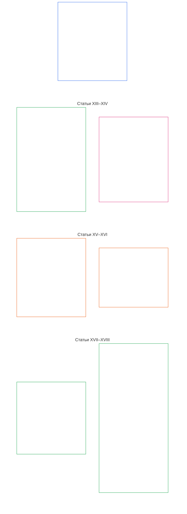

# ГЛАВА ШЕСТАЯ: ОСНОВОПОЛАГАЮЩИЕ ПРАВА

<strong>Место в корпусе (неоперативный материал): структура файла и правила чтения</strong>

> Следующий материал предназначен **только для ориентации читателя**. Он не добавляет, не отменяет и не сужает обязательства, установленные в других разделах этого файла или других главах.
>
> Этот файл **является частью Конституции разумных существ** и **имеет обязательную силу только совместно** с другими пронумерованными файлами `core_*`, прочитанными как единый документ. Он содержит **Главу шестую, Часть C**; нумерация статей и перекрёстные ссылки соответствуют интегрированному документу. Порядок чтения, разграничение обязательного и вспомогательного материала, а также метаданные редакции корпуса указаны в [README.md](README.md).
>
> **Предыдущий файл на этом языке:** [core_06_rights_part_b.md](core_06_rights_part_b.md)

<strong>Руководство читателю (неоперативное): место Части C в Главе шестой</strong>

> Следующий материал предназначен **только для ориентации читателя**. Он не добавляет, не отменяет и не сужает обязательства, установленные в других разделах этой или других глав.
>
> **Часть A** в [core_06_rights_part_a.md](core_06_rights_part_a.md) содержит набор ограничений по умолчанию для всей главы, планетарно-приоритетный порядок чтения и основные толковательные узлы. **Часть C** излагает **Статьи XIII–XVIII** в этом порядке.

 

### Часть C: Надёжные системы, ограничения безопасности и применения силы, целостность информационной среды, проверка, жизненный цикл и инновации в изолированной среде

 

*Проще говоря: Часть C охватывает надёжные системы, ограничения безопасности и применения силы, целостность информационной среды, проверку, управление жизненным циклом и инновации в изолированной среде — Статьи XIII–XVIII.*

<strong>Руководство читателю (неоперативное): карта статей Части C</strong>

> Следующий материал предназначен **только для ориентации читателя**. Он не добавляет, не отменяет и не сужает обязательства, установленные в других разделах этой или других глав.
>
> **Карта для читателя (неоперативная).** Эта схема показывает, как источник группирует статьи и подразделы этой Части. Сетка отражает группировку источника, а не последовательность действий: статьи не являются процедурными этапами, поэтому на карте нет стрелок. Обозначения подразделов сокращают темы; далее определяющими являются пронумерованные статьи и подразделы. Схема не добавляет определений или обязанностей, не устанавливает приоритет и не заменяет текст источника.

 

**Статьи XIII–XVIII** ниже полностью устанавливают эти минимальные гарантии. Часть C закрепляет минимальные гарантии в отношении надёжных систем, безопасности, целостности информации, проверки, жизненного цикла и инноваций в изолированной среде.

### Статья XIII: Право на надёжные системы, заслуживающие доверия

<strong>Основания</strong>

- Основано на принципах Главы первой: [§3 Основополагающая цель: благополучие](core_01_a_values_principles.md#3-foundational-objective-wellbeing-flourishing-aim), [§4 Безопасность](core_01_a_values_principles.md#4-safety-harm-constraint), [§6 Доверие](core_01_a_values_principles.md#6-trust-and-trustworthiness-coordination-integrity), [§13 Процедура разрешения конституционных коллизий](core_01_b_interaction_interpretation.md#13-constitutional-collision-resolution-process) и [§19 Согласование стимулов и захват системы](core_01_c_stewardship_capacity_principles.md#19-incentive-alignment-and-system-capture).

<strong>Определения · Оценка · Соблюдение</strong>

- [Надёжность](core_05_band_continuity.md#trustworthiness) · [O](core_05_band_continuity.md#trustworthiness) · [M](core_05_band_continuity.md#trustworthiness-a) · [A](core_05_band_continuity.md#trustworthiness-a) · [C](core_05_band_continuity.md#trustworthiness-c)
- [Доверие](core_05_band_continuity.md#trust) · [O](core_05_band_continuity.md#trust) · [M](core_05_band_continuity.md#trust-a) · [A](core_05_band_continuity.md#trust-a) · [C](core_05_band_continuity.md#trust-c)
- [Благополучие](core_05_band_continuity.md#wellbeing) · [O](core_05_band_continuity.md#wellbeing) · [M](core_05_band_continuity.md#wellbeing-a) · [A](core_05_band_continuity.md#wellbeing-a) · [C](core_05_band_continuity.md#wellbeing-c)
- [Зависимость](core_05_band_continuity.md#dependency) · [O](core_05_band_continuity.md#dependency) · [M](core_05_band_continuity.md#dependency-a) · [A](core_05_band_continuity.md#dependency-a) · [C](core_05_band_continuity.md#dependency-c)

 

*Проще говоря: **Статья XIII** (*Право на надёжные системы, заслуживающие доверия*) устанавливает минимальные гарантии для таких систем: если система существенно влияет на вашу жизнь, вы вправе честно полагаться на неё, понимать её ограничения и оспаривать её действия при сбое. Доверие необходимо заслужить и поддерживать, а не создавать брендингом или мелким шрифтом.*

Эта Статья устанавливает **конституционные минимальные гарантии** для надёжных систем, заслуживающих доверия, в соответствии с [двумя конституционными целями](core_00_preamble.md#two-constitutional-aims). Её следует читать вместе с семейством измерений надзора (*надёжность как конституционное измерение*).

- **Процветание:** разумные существа могут формировать обоснованные ожидания относительно поведения системы, получать честную информацию об ограничениях и рисках, участвовать и координировать действия без систематического обмана и искусственно созданной зависимости.
- **Непрерывность:** надёжность сохраняется с течением времени, при увеличении масштаба и углублении зависимости. По мере роста ставок системы не должны незаметно становиться менее надёжными и честными или труднее поддаваться оспариванию.

Законное достижение целей осуществляется посредством [Конституционной тетрады](core_00_preamble.md#constitutional-tetrad) с учётом [существенности интереса](core_00_preamble.md#material-stake):

- **Участие:** возможность оспаривать ненадёжные или вводящие в заблуждение системы и получать пересмотр, исправление и возмещение.
- **Надзор:** проверяемое поведение, раскрытые ограничения и независимая проверка, соразмерные воздействию и зависимости.
- **Подотчётность:** операторы системы обязаны отвечать за создание ложного доверия, извращённых стимулов или сбои, которые причиняют существенный вред разумным существам, обоснованно полагавшимся на систему.
- **Своевременность:** обнаружение, оспаривание и устранение проблем до того, как задержка фактически сделает надёжность или возмещение недостижимыми.

Разумные существа имеют право взаимодействовать с надёжными системами, заслуживающими доверия, в степени, соразмерной их воздействию, зависимости от них и риску. Такая надёжность поддерживает информированное участие, согласованные действия и сохранение благополучия. Надёжность должна оцениваться во времени, при изменении масштаба и в отношениях зависимости, если они существенно влияют на результаты.

Это право обеспечивают два взаимодополняющих механизма: сертификация делает систему достойной доверия, а права разумных существ позволяют требовать от неё честности.

**Сертификация формирует доверие со стороны системы:** если значимая система реально влияет на то, как разумные существа полагаются на неё, применяется [сертификация соответствия системы](core_05_band_continuity.md#system-alignment-certification-constitutional) согласно [Главе восьмой](core_08_a_system_alignment_certification_evaluation.md#chapter-eight-system-alignment-certification). Она проверяет, могут ли разумные существа полагаться на:

- заявленное системой назначение;
- её ограничения и риски;
- доступные способы оспаривания;
- порядок устранения проблем.

Если система достигает порога значимости, установленного **Статьёй XIII** (*Право на надёжные системы, заслуживающие доверия*), сертификация также включает оценку надёжности по [Главе восьмой §3.9.6 «Оценка надёжности и целостности доверия к системе»](core_08_a_system_alignment_certification_evaluation.md#386-trustworthiness-and-system-reliance-integrity-evaluation).

**Возможность оспаривания сохраняет честность системы со стороны разумного существа:** сертификация проверяет систему, но не выносит окончательного решения о ней. Каждое разумное существо, затронутое системой, сохраняет:

- право оспорить систему и получить рассмотрение возражения согласно **Статье XIII-A** (*Базовый уровень надёжности и доверия*), а также право на возмещение согласно **Статье XIII-B** (*Право на возмещение и исправление*);
- право на аудит системы и независимую проверку согласно **Статье XVI** (*Аудит, прозрачность и независимая проверка*);
- защиту минимальных гарантий для надёжных систем, установленных этой Статьёй.

**Статус не является доказательством:** сертификация, официальное признание или широкое использование системы сами по себе не доказывают соблюдение минимальных гарантий этой Статьи и не могут служить основанием для их снижения.

*Соседние статьи:*

- **Когда применяется:** когда поведение системы существенно ограничивает доступ к минимальным гарантиям Главы шестой или поддерживает их, включая необходимые для выживания условия по **Статье III-A** (*Выживание*).
- **Читать вместе с:** [Сертификацией соответствия системы](core_05_band_continuity.md#system-alignment-certification-constitutional) и [Главой восьмой](core_08_a_system_alignment_certification_evaluation.md#chapter-eight-system-alignment-certification) — сертификация не заменяет минимальных гарантий, установленных здесь.

#### Статья XIII-A: Базовый уровень надёжности и доверия

<strong>Основания</strong>

- Основано на принципах Главы первой: [§4 Безопасность](core_01_a_values_principles.md#4-safety-harm-constraint), [§5 Истина](core_01_a_values_principles.md#5-truth-epistemic-integrity-constraint), [§6 Доверие](core_01_a_values_principles.md#6-trust-and-trustworthiness-coordination-integrity) и [§13.1.5 Процедура разрешения коллизий прав](core_01_b_interaction_interpretation.md#1315-rights-collision-decision-test).
- Читать вместе с: [Конституционной тетрадой](core_00_preamble.md#constitutional-tetrad); [двумя конституционными целями](core_00_preamble.md#two-constitutional-aims) — **Процветанием** и **Непрерывностью**; [Сертификацией соответствия системы](core_05_band_continuity.md#system-alignment-certification-constitutional) и **Статьёй III-A** (*Выживание*), если продолжающаяся зависимость от системы влияет на доступ к необходимым для выживания благам; [**Статьёй XIII-B**](#article-xiii-b-right-to-redress-and-remedy) (*Право на возмещение и исправление*) — в части последствий успешного оспаривания.

<strong>Определения · Оценка · Соблюдение</strong>

- [Доверие](core_05_band_continuity.md#trust) · [O](core_05_band_continuity.md#trust) · [M](core_05_band_continuity.md#trust-a) · [A](core_05_band_continuity.md#trust-a) · [C](core_05_band_continuity.md#trust-c)
- [Надёжность](core_05_band_continuity.md#trustworthiness) · [O](core_05_band_continuity.md#trustworthiness) · [M](core_05_band_continuity.md#trustworthiness-a) · [A](core_05_band_continuity.md#trustworthiness-a) · [C](core_05_band_continuity.md#trustworthiness-c)
- [Риск](core_05_band_continuity.md#risk) · [O](core_05_band_continuity.md#risk) · [M](core_05_band_continuity.md#risk-a) · [A](core_05_band_continuity.md#risk-a) · [C](core_05_band_continuity.md#risk-c)
- [Возможность оспаривания](core_05_band_accountability.md#contestability) · [O](core_05_band_accountability.md#contestability) · [M](core_05_band_accountability.md#contestability-a) · [A](core_05_band_accountability.md#contestability-a) · [C](core_05_band_accountability.md#contestability-c)
- [Добросовестность](core_05_band_accountability.md#good-faith) · [O](core_05_band_accountability.md#good-faith) · [M](core_05_band_accountability.md#good-faith-a) · [A](core_05_band_accountability.md#good-faith-a) · [C](core_05_band_accountability.md#good-faith-c)
- [Защищённое сообщение о нарушении (информаторство)](core_05_band_accountability.md#protected-reporting-whistleblowing) · [O](core_05_band_accountability.md#protected-reporting-whistleblowing) · [M](core_05_band_accountability.md#protected-reporting-whistleblowing-a) · [A](core_05_band_accountability.md#protected-reporting-whistleblowing-a) · [C](core_05_band_accountability.md#protected-reporting-whistleblowing-c)

 

*Проще говоря: системы, существенно влияющие на разумных существ, должны быть действительно надёжными и честно сообщать о своих функциях, чтобы доверие к ним было обоснованным. Они должны оставаться открытыми для оспаривания и аудита, чтобы это доверие сохранялось. Запрещено преследовать за добросовестные возражения и сообщения.*

Эта Статья устанавливает гарантию доверия к системам, существенно влияющим на разумных существ:

- **Гарантия доверия:** такие системы обязаны сохранять условия, необходимые для обоснованного доверия и достаточно точной опоры на них. Эти условия включают:
  - возможность формировать достаточно точные ожидания относительно поведения системы;
  - раскрытие существенных условий, ограничений и рисков, необходимых для оценки обоснованности доверия;
  - отсутствие систематического обмана, искажения сведений или манипуляций, которые невозможно проверить;
  - защиту от нераскрытых, несоразмерных или неочевидных рисков, возникающих из-за доверия к системе;
  - исправление и возмещение, когда система действует неправомерно: признание ошибки, исправление, соразмерное восстановление и предотвращение повторения согласно [**Статье XIII-B**](#article-xiii-b-right-to-redress-and-remedy) (*Право на возмещение и исправление*) и [Главе первой §6.1 «Исправление и возмещение»](core_01_a_values_principles.md#61-correction-and-remedy).
- **Гарантия оспаривания:** системы, существенно влияющие на разумных существ, должны оставаться открытыми для оспаривания всё время, пока разумные существа полагаются на них. Для этого необходимы:
  - доступный способ оспорить поведение, результаты или заявления системы и добиться рассмотрения возражения;
  - аудит и независимая проверка, соразмерные воздействию и зависимости, согласно [**Статье XVI**](#article-xvi-audit-transparency-and-independent-verification) (*Аудит, прозрачность и независимая проверка*);
  - запрет сужать эти гарантии на том основании, что система сертифицирована, официально признана или широко используется;
  - запрет сужать их принятыми правилами внедрения, которые определяют порядок оспаривания, рассмотрения и возмещения в конкретной сфере и должны соответствовать этой Статье. Удобство, сроки и местная политика относятся к ограничениям более низкого уровня и не могут закрывать возможность оспаривания, рассмотрения или возмещения.
- **Право оспаривать и добиваться рассмотрения:** разумные существа вправе:
  - оспаривать надёжность, целостность или заслуживающий доверия характер систем, существенно влияющих на них;
  - пользоваться надлежащими механизмами рассмотрения и аудита;
  - направлять **защищённые сообщения** в смысле **Главы пятой** (*Защищённое сообщение о нарушении (информаторство)*) о системах, существенно влияющих на них, с соблюдением положений **Безопасность (конституционное ограничение)** и **Истина (ограничение)** Главы пятой.
- **Запрет подавления:** добросовестные возражения (*Добросовестность*, **Глава пятая**), запросы о пересмотре и защищённые сообщения нельзя подавлять, блокировать или наказывать за них.
- **Запрет преследования:** преследование за такие сообщения, как это определено в соответствующем определении, несовместимо с гарантиями этой Статьи.
  - Требования к защищённой эскалации и мерам против преследования при внедрении изложены в **`corpus_institutions.md`** **CI-8** (*Прозрачность, участие и доступные пути оспаривания и получения услуг*).

Эти две гарантии — две стороны постоянного доверия: гарантия доверия делает опору на систему обоснованной, в том числе благодаря исправлению ошибок системы, а гарантия оспаривания сохраняет это основание со временем. Ни одна из них не заменяет другую.

#### Статья XIII-B: Право на возмещение и исправление

<strong>Основания</strong>

- Основано на принципах Главы первой: [§6.1 Исправление и возмещение](core_01_a_values_principles.md#61-correction-and-remedy) (основополагающая гарантия), [§4 Безопасность](core_01_a_values_principles.md#4-safety-harm-constraint), [§5 Истина](core_01_a_values_principles.md#5-truth-epistemic-integrity-constraint) и [§13.1.5 Процедура разрешения коллизий прав](core_01_b_interaction_interpretation.md#1315-rights-collision-decision-test).
- Читать вместе с: [**Статьёй XIII-A**](#article-xiii-a-reliability-and-trustworthiness-baseline) (*Базовый уровень надёжности и доверия*) — гарантия оспаривания, право на возражение и защищённые сообщения открывают путь к возмещению; **Статьёй III-A** (*Выживание*); [Сертификацией соответствия системы](core_05_band_continuity.md#system-alignment-certification-constitutional), когда сбой или несоответствие системы лишает доступа к необходимым для выживания благам; [Преамбулой §6.2 «Как связана вся цепочка»](core_00_preamble.md#62-how-the-full-chain-fits-together) (*проверенная классификация и своевременное возмещение*); [Главой десятой §9](core_10_standing_integration.md#9-enforcement-realism-and-remedy-systems) (*Реалистичность обеспечения соблюдения и системы возмещения*); [CI-27](corpus_institutions/ci_27_remedy_systems_institutional_redress_capacity.md) (*Системы возмещения и институциональная способность предоставлять возмещение*).

<strong>Определения · Оценка · Соблюдение</strong>

- [Возмещение и устранение последствий](core_05_band_accountability.md#redress-and-remediation-constitutional) · [O](core_05_band_accountability.md#redress-and-remediation-constitutional) · [M](core_05_band_accountability.md#redress-and-remediation-constitutional-a) · [A](core_05_band_accountability.md#redress-and-remediation-constitutional-a) · [C](core_05_band_accountability.md#redress-and-remediation-constitutional-c)
- [Система возмещения](core_05_band_accountability.md#remedy-system-constitutional) · [O](core_05_band_accountability.md#remedy-system-constitutional) · [M](core_05_band_accountability.md#remedy-system-constitutional-a) · [A](core_05_band_accountability.md#remedy-system-constitutional-a) · [C](core_05_band_accountability.md#remedy-system-constitutional-c)
- [Своевременное разрешение](core_05_band_accountability.md#timely-resolution-constitutional) · [O](core_05_band_accountability.md#timely-resolution-constitutional) · [M](core_05_band_accountability.md#timely-resolution-constitutional-a) · [A](core_05_band_accountability.md#timely-resolution-constitutional-a) · [C](core_05_band_accountability.md#timely-resolution-constitutional-c)

 

*Проще говоря: надёжная система исправляет свои ошибки. Если система подвела разумное существо, последствия необходимо устранить с помощью реальной системы возмещения, которая действует своевременно, а не существует только на бумаге. Право оспаривать закреплено в **Статье XIII-A** (*Базовый уровень надёжности и доверия*); эта Статья определяет, к чему должно привести такое оспаривание.*

Эта Статья устанавливает право на возмещение и исправление, а также условия его практической реализации:

- **Право на возмещение:** если сбои системы существенно затрагивают разумных существ, они вправе получить:
  - признание факта сбоя;
  - практический доступ к исправлению;
  - соразмерное устранение последствий.

  Возмещение и устранение существенных последствий регулируются независимыми определениями **Главы пятой** (*Возмещение и устранение последствий*).
- **Устойчивость системы возмещения:** возмещение требует реальной [системы возмещения](core_05_band_accountability.md#remedy-system-constitutional) — устойчивой институциональной способности, а не формального пути на бумаге. Согласно [Главе первой §6.1](core_01_a_values_principles.md#61-correction-and-remedy) (*Исправление и возмещение*), расходы на исправление несут ответственные за нарушение.
- **Своевременное возмещение:** практический доступ включает:
  - приём обращений в установленные сроки;
  - подтверждение их получения;
  - соразмерную временную защиту, если продолжающийся вред является существенным, согласно **Статье XXV-C** (*Своевременное разрешение и запрет затягивания*).

Неопределённо долгое рассмотрение без документированного обоснования, соответствующего уровню дела, несовместимо с этой Статьёй.

#### Статья XIII-C: Запрет ложного доверия и вводящей в заблуждение опоры на систему

<strong>Основания</strong>

- Основано на принципах Главы первой: [§5 Истина](core_01_a_values_principles.md#5-truth-epistemic-integrity-constraint), [§6 Доверие](core_01_a_values_principles.md#6-trust-and-trustworthiness-coordination-integrity) и [§13.2 Ограничения на раскрытие эпистемической информации](core_01_b_interaction_interpretation.md#132-epistemic-disclosure-constraints).

<strong>Определения · Оценка · Соблюдение</strong>

- [Доверие](core_05_band_continuity.md#trust) · [O](core_05_band_continuity.md#trust) · [M](core_05_band_continuity.md#trust-a) · [A](core_05_band_continuity.md#trust-a) · [C](core_05_band_continuity.md#trust-c)
- [Надёжность](core_05_band_continuity.md#trustworthiness) · [O](core_05_band_continuity.md#trustworthiness) · [M](core_05_band_continuity.md#trustworthiness-a) · [A](core_05_band_continuity.md#trustworthiness-a) · [C](core_05_band_continuity.md#trustworthiness-c)
- [Истина (конституционное ограничение)](core_05_band_oversight.md#truth-constitutional-constraint) · [O](core_05_band_oversight.md#truth-constitutional-constraint-o) · [M](core_05_band_oversight.md#truth-constitutional-constraint-a) · [A](core_05_band_oversight.md#truth-constitutional-constraint-a) · [C](core_05_band_oversight.md#truth-constitutional-constraint-c)

 

*Проще говоря: система не вправе создавать доверие, которого она не заслужила. Вводящие в заблуждение заявления, умолчания или особенности подачи, из-за которых опасная опора на систему кажется обоснованной, являются нарушением — независимо от полезности или популярности системы.*

Эта Статья устанавливает запрет ложного доверия и определяет его сферу:

- **Запрет ложного доверия:** системы, побуждающие полагаться на них без соблюдения условий этой Статьи, не соответствуют требованиям независимо от их полезности, распространённости или намерений.
  - Создание, усиление или поддержание необоснованного доверия нарушает это право, если для этого используются:
    - вводящие в заблуждение заявления;
    - умолчания;
    - способы подачи информации;
    - иные сигналы, создающие видимость обоснованной опоры на систему, когда она необоснованна.
- **Определение применимой сферы:** область применения и смысл оценки необоснованного доверия, вводящей в заблуждение опоры и надёжности по-прежнему определяются **Главой пятой** (*Доверие*; *Надёжность*) вместе с включёнными в неё обязанностями по внедрению требований о доверии и надёжности.

#### Статья XIII-D: Ограничение на согласование стимулов

<strong>Основания</strong>

- Основано на принципах Главы первой: [§4 Безопасность](core_01_a_values_principles.md#4-safety-harm-constraint), [§6 Доверие](core_01_a_values_principles.md#6-trust-and-trustworthiness-coordination-integrity), [§18 Управление в условиях дисциплины попечительства](core_01_c_stewardship_capacity_principles.md#18-governance-under-stewardship-discipline) и [§19.1.1 Что должны обеспечивать стимулы](core_01_c_stewardship_capacity_principles.md#1911-what-incentives-must-do) (*приоритет вознаграждения*).

<strong>Определения · Оценка · Соблюдение</strong>

- [Согласование стимулов](core_05_band_integrative.md#incentive-alignment) · [O](core_05_band_integrative.md#incentive-alignment) · [M](core_05_band_integrative.md#incentive-alignment-a) · [A](core_05_band_integrative.md#incentive-alignment-a) · [C](core_05_band_integrative.md#incentive-alignment-c)
- [Надёжность](core_05_band_continuity.md#trustworthiness) · [O](core_05_band_continuity.md#trustworthiness) · [M](core_05_band_continuity.md#trustworthiness-a) · [A](core_05_band_continuity.md#trustworthiness-a) · [C](core_05_band_continuity.md#trustworthiness-c)
- [Значимая дееспособность](core_05_band_participation.md#meaningful-agency) · [O](core_05_band_participation.md#meaningful-agency) · [M](core_05_band_participation.md#meaningful-agency-a) · [A](core_05_band_participation.md#meaningful-agency-a) · [C](core_05_band_participation.md#meaningful-agency-c)

 

*Проще говоря: если стимулы системы подталкивают её ко лжи, пренебрежению безопасностью, сокрытию рисков или подрыву самостоятельности пользователя, проблема в системе, а не в бдительности пользователя или последующем надзоре. Такие стимулы необходимо раскрывать, смягчать и делать доступными для оспаривания. Стимулы должны поощрять открытость системы для оспаривания и исправление ошибок, а превентивное устранение проблем должно поощряться сильнее всего.*

Эта Статья устанавливает ограничения на уровне прав в отношении стимулов, связанных с доверием и безопасностью:

- **Согласование стимулов и доверия (ограничение на уровне прав):** системы не должны главным образом полагаться на принудительное обеспечение требований, исправления постфактум или бдительность пользователей для поддержания доверия, если структура стимулов существенно подталкивает систему к:
  - снижению надёжности;
  - сокрытию рисков;
  - поведению, вводящему в заблуждение;
  - действиям, подрывающим самостоятельность.

  Действующие требования к структуре стимулов по-прежнему регулируются **Главой пятой** (*Согласование стимулов*) и включёнными в неё обязанностями по внедрению, касающимися целостности механизмов. Этот подраздел устанавливает минимальную гарантию на уровне прав и не повторяет все критерии проектирования механизмов.
- **Согласование стимулов и безопасности (ограничение на уровне прав):** разумные существа вправе не подвергаться воздействию систем, базовые стимулы которых предсказуемо приводят к вредному поведению, включая действия, которые:
  - снижают надёжность;
  - скрывают риски;
  - искажают информацию;
  - подрывают возможность принимать осознанные решения.

  Защита действует независимо от того, возникают ли такие последствия прямо или проявляются с задержкой, косвенно либо в совокупности. Если стимулы системы создают давление в пользу поведения, подрывающего доверие, такие условия необходимо:
  - раскрывать соразмерно воздействию системы;
  - смягчать посредством проектирования, ограничений или уравновешивающих механизмов;
  - подвергать аудиту, оспариванию и исправлению согласно **Статье XVI** (*Аудит, прозрачность и независимая проверка*), **Статьям XIII-A** (*Базовый уровень надёжности и доверия*) и **XIII-B** (*Право на возмещение и исправление*), **Главе пятой**, если это существенно, и указанным обязанностям по внедрению.
- **Приоритет вознаграждения:** стимулы, воздействующие на системы, существенно влияющие на разумных существ, должны поощрять:
  - возможность оспаривания согласно **Статье XIII-A** (*Базовый уровень надёжности и доверия*);
  - возмещение согласно **Статье XIII-B** (*Право на возмещение и исправление*);
  - прежде всего активное предотвращение проблем: предотвращение должно вознаграждаться выше, чем устранение последствий.

  Принцип, включая запрет получать вознаграждение за предотвращение путём сокрытия проблем, изложен в [Главе первой §19.1.1](core_01_c_stewardship_capacity_principles.md#1911-what-incentives-must-do) (*Что должны обеспечивать стимулы*).
- **Ограниченность прав и отсутствие абсолютности:** оба права подчиняются **набору ограничений по умолчанию**, приведённому в начале этой главы. Если это существенно, они также подчиняются Главе первой §19.5 (*Условные требования, азартные игры и рынки контрактов на события*) в части условных требований, азартных игр и рынков контрактов на события.

#### Статья XIII-E: Целостность процедур в высокоавтономных системах и при использовании инструментов

<strong>Основания</strong>

- Основано на принципах Главы первой: [§5 Истина](core_01_a_values_principles.md#5-truth-epistemic-integrity-constraint), [§13.1.5 Процедура разрешения коллизий прав](core_01_b_interaction_interpretation.md#1315-rights-collision-decision-test) и [§18 Управление в условиях дисциплины попечительства](core_01_c_stewardship_capacity_principles.md#18-governance-under-stewardship-discipline).

<strong>Определения · Оценка · Соблюдение</strong>

- [Истина (конституционное ограничение)](core_05_band_oversight.md#truth-constitutional-constraint) · [O](core_05_band_oversight.md#truth-constitutional-constraint-o) · [M](core_05_band_oversight.md#truth-constitutional-constraint-a) · [A](core_05_band_oversight.md#truth-constitutional-constraint-a) · [C](core_05_band_oversight.md#truth-constitutional-constraint-c)
- [Возможность оспаривания](core_05_band_accountability.md#contestability) · [O](core_05_band_accountability.md#contestability) · [M](core_05_band_accountability.md#contestability-a) · [A](core_05_band_accountability.md#contestability-a) · [C](core_05_band_accountability.md#contestability-c)
- [Необходимость](core_05_band_accountability.md#necessity) · [O](core_05_band_accountability.md#necessity) · [M](core_05_band_accountability.md#necessity-a) · [A](core_05_band_accountability.md#necessity-a) · [C](core_05_band_accountability.md#necessity-c)
- [Соразмерность](core_05_band_accountability.md#proportionality) · [O](core_05_band_accountability.md#proportionality) · [M](core_05_band_accountability.md#proportionality-a) · [A](core_05_band_accountability.md#proportionality-a) · [C](core_05_band_accountability.md#proportionality-c)

 

*Проще говоря: ИИ или иная автоматизированная система, способная действовать самостоятельно — подавать документы, отправлять сообщения, проводить проверки, использовать инструменты — обязана соблюдать те же правила честности и подотчётности, что и все остальные. Остановка или изъятие вредоносной системы не равнозначны наказанию разумного существа и никогда не могут становиться способом причинить ему вред. Верно и обратное: заявление о возможной разумности системы не позволяет оператору продолжать её вредоносное использование.*

Эта Статья определяет, как высокоавтономные системы соблюдают целостность процедур и чем отличаются меры в отношении таких систем:

- **К кому применяется:** к системам, которые автоматически принимают решения или делают выводы и могут влиять на любое из следующего:
  - управление;
  - судебные и иные правовые процедуры, включая слушания в форуме;
  - аудиты;
  - проверки и подтверждения с высокими ставками.

  Сюда входят универсальные ИИ-агенты, которым предоставлены **инструменты**, доступ к **API**, возможность подавать документы или отправлять сообщения либо аналогичные полномочия действовать.
- **Исключений нет:** эти системы обязаны соблюдать те же правила, что и все остальные:
  - требование **Истины** в **Главе первой**;
  - **Статью XV** (*Целостность информационной среды*) и **Статью XVI** (*Аудит, прозрачность и независимая проверка*);
  - **Главу девятую**, когда она применима;
  - меры исправления согласно **Статье XXVII-D** (*Несоответствующее требованиям имущество и системы; стимулы к добровольной передаче*).

  Это действует всякий раз, когда работа системы существенно ослабляет способность разумных существ оспаривать решения, достоверность общей информации или конституционные процедуры.
- **Меры против системы — не меры против разумного существа:** локализация, карантин, изъятие или уничтожение несоответствующего требованиям развёртывания согласно **Статье XXVII-D** (*Несоответствующее требованиям имущество и системы; стимулы к добровольной передаче*) отделяются от:
  - привлечения разумного существа к ответственности по **Главе одиннадцатой**;
  - **Статьи XX-B** (*Минимальные гарантии ограничений*), которая регулирует ограничения для *разумных существ*, а не *систем*, и запрещает лишать разумное существо жизни (см. [Меру необратимого лишения](core_05_band_accountability.md#irreversible-deprivation-measure-constitutional)).

  Меры в отношении системы подчиняются тем же правилам установления нарушения и блокировки, что и меры в отношении любого разумного существа. Нарушение должно быть подтверждено материалами дела согласно **Главе девятой**, а каждая мера представляет собой ограничение, разработанное и калиброванное согласно [Главе десятой §5.1](core_10_standing_integration.md#51-definition-and-attachment) (*Определение и применение*) и [§5.2](core_10_standing_integration.md#52-proportionality-and-calibration) (*Соразмерность и калибровка*).

  Обе линии мер могут применяться к одним и тем же фактам. Ничто в этой Статье не превращает полномочие уничтожить систему в полномочие распоряжаться жизнью разумного существа.
- **Верно и обратное:** заявление о разумности развёрнутой системы — независимо от того, оспаривается ли оно или принято — не позволяет продолжать вредоносное развёртывание.
  - Такое заявление защищает саму сущность согласно **Статье VI-B** (*Минимальная гарантия установления статуса разумного существа*), но не освобождает оператора от ответственности.
  - Развёртывание всё равно можно локализовать, остановить или поместить в карантин так, чтобы соблюдать минимальные гарантии прав этой сущности.
  - Если материалы дела содержат достоверные свидетельства возможной разумности сущности, допускается только обратимая локализация, сохраняющая её целостность. Пока её статус оспаривается или признан, уничтожение исключено согласно **Статьям XXVII-A** (*Поэтапное внедрение и непрерывность минимальных гарантий прав*) и **XXVII-D** (*Несоответствующее требованиям имущество и системы; стимулы к добровольной передаче*).

#### Статья XIII-F: Минимальный уровень устойчивости и самовосстановления

<strong>Основания</strong>

- Основано на принципах Главы первой: [§4 Безопасность](core_01_a_values_principles.md#4-safety-harm-constraint), [§5 Истина](core_01_a_values_principles.md#5-truth-epistemic-integrity-constraint), [§6 Доверие](core_01_a_values_principles.md#6-trust-and-trustworthiness-coordination-integrity), [§10 Проектирование с устойчивостью и самовосстановлением](core_01_a_values_principles.md#10-resilience-and-self-healing-design), [§13.3 Минимизация предотвратимого бремени](core_01_b_interaction_interpretation.md#133-minimization-of-avoidable-burden) и [Главой восьмой §3 «Оценка сертификации всей системы»](core_08_a_system_alignment_certification_evaluation.md#3-whole-system-certification-evaluation).

<strong>Определения · Оценка · Соблюдение</strong>

- [Самовосстановление](core_05_band_continuity.md#self-healing-constitutional) · [O](core_05_band_continuity.md#self-healing-constitutional) · [M](core_05_band_continuity.md#self-healing-constitutional-a) · [A](core_05_band_continuity.md#self-healing-constitutional-a) · [C](core_05_band_continuity.md#self-healing-constitutional-c)
- [Обратимость](core_05_band_continuity.md#reversibility-constitutional) · [O](core_05_band_continuity.md#reversibility-constitutional) · [M](core_05_band_continuity.md#reversibility-constitutional-a) · [A](core_05_band_continuity.md#reversibility-constitutional-a) · [C](core_05_band_continuity.md#reversibility-constitutional-c)
- [Каскадный сбой](core_05_band_continuity.md#cascading-failure) · [O](core_05_band_continuity.md#cascading-failure) · [M](core_05_band_continuity.md#cascading-failure-a) · [A](core_05_band_continuity.md#cascading-failure-a) · [C](core_05_band_continuity.md#cascading-failure-c)
- [Проверяемость](core_05_band_oversight.md#auditability) · [O](core_05_band_oversight.md#auditability) · [M](core_05_band_oversight.md#auditability-a) · [A](core_05_band_oversight.md#auditability-a) · [C](core_05_band_oversight.md#auditability-c)
- [Возможность оспаривания](core_05_band_accountability.md#contestability) · [O](core_05_band_accountability.md#contestability) · [M](core_05_band_accountability.md#contestability-a) · [A](core_05_band_accountability.md#contestability-a) · [C](core_05_band_accountability.md#contestability-c)
- [Предотвратимое бремя](core_05_band_continuity.md#avoidable-burden) · [O](core_05_band_continuity.md#avoidable-burden) · [M](core_05_band_continuity.md#avoidable-burden-a) · [A](core_05_band_continuity.md#avoidable-burden-a) · [C](core_05_band_continuity.md#avoidable-burden-c)

 

*Проще говоря: при сбое система обязана обнаружить его, остановить распространение ущерба и восстановиться. Однако «самоисправление» нельзя использовать для сокрытия причин сбоя, незаметного лишения кого-либо прав или отказа выяснить причину поломки. Если система не уверена в результате ремонта, она должна безопасно остановиться, а не гадать.*

Эта Статья устанавливает базовые требования к восстановлению — от обнаружения сбоя до установления и устранения его первопричины:

- **Обязательная способность:** каждая система, подпадающая под эту Статью, должна уметь восстанавливаться после сбоев. Чем сильнее воздействие системы, чем больше зависимость от неё и чем выше риск, тем более надёжным должно быть восстановление. Это следует из [**§10 «Проектирование с устойчивостью и самовосстановлением»**](core_01_a_values_principles.md#10-resilience-and-self-healing-design) **Главы первой** и [**«Самовосстановления»](core_05_band_continuity.md#self-healing-constitutional) **Главы пятой**.
  - Подробные технические правила построения восстановления изложены в документах по внедрению: [**CS-5**](corpus_systems/cs_05_design_testing_verification_deployment.md) (*Проектирование, тестирование, проверка и развёртывание*), [**CS-8**](corpus_systems/cs_08_adaptive_sustainability_ecosystem_resilience.md) (*Адаптивная устойчивость и жизнестойкость экосистем*) и [**CS-12**](corpus_systems/cs_12_decentralized_continuity_partition_resilience.md) (*Децентрализованная непрерывность и устойчивость к разделению*).
  - Эти документы могут добавлять подробности, но не могут ослаблять эту Статью.
- **Своевременное обнаружение проблем:** система обязана обнаруживать неисправности, замедления, частичные отказы и нарушения конституционных ограничений достаточно быстро и наглядно, чтобы соблюдать требования к ведению записей по **Статье XVI-A** (*Проверяемость и наблюдаемые свидетельства*) ([Проверяемость](core_05_band_oversight.md#auditability)). Это относится к самому процессу восстановления, а не только к обычной работе.
- **Локализация ущерба:** восстановление должно ограничивать распространение сбоя. Во время восстановления система не должна:
  - передавать сбой другим частям или системам (см. [Каскадный сбой](core_05_band_continuity.md#cascading-failure));
  - изменять сохранённые данные, учётные данные, обязательства или настройки, принадлежащие разумным существам, операторам или другим системам **за пределами** области, которую она объявила неисправной и подлежащей ремонту;
    - Единственное исключение — изменение, которое зарегистрировано и позволяет установить его автора согласно **Статье XVI-A** (*Проверяемость и наблюдаемые свидетельства*) ([Проверяемость]) и, если оно существенно затрагивает других, сопровождается соразмерным уведомлением, разрешением или передачей управления, которую можно оспорить, в соответствии с **Главой шестой**;
  - расширять собственные полномочия — разрешения, доступ или диапазон допустимых действий — за пределы полномочий, которыми система обладала до сбоя.
- **Безопасная остановка при неопределённости:** если нет уверенности, что автоматический ремонт сработает, система должна безопасно остановиться, изолировать проблему (поместить её в карантин) или упорядоченно передать управление, а не предпринимать ремонт наугад. При прочих равных предпочтение отдаётся варианту, который легче отменить, согласно принципу [Обратимости](core_05_band_continuity.md#reversibility-constitutional) в **Статье XXIII-B** (*Проверяемость, оспаривание и приоритет обратимости*).
- **Запрет сокрытия:** автоматическое восстановление не должно скрывать, стирать или задерживать доказательства, необходимые для выяснения причин сбоя по **Статье XXIII** (*Анализ первопричин и адаптивное реагирование*).
  - Каждое действие по восстановлению, каждая попытка восстановления, а также каждая удержанная или заблокированная попытка должны регистрироваться согласно **Статье XVI-A** (*Проверяемость и наблюдаемые свидетельства*); каждое из них можно оспорить (см. [Возможность оспаривания](core_05_band_accountability.md#contestability)).
- **Сохранение прав в ограниченном режиме:** работая в ограниченном или резервном режиме, система всё равно должна защищать минимальные гарантии прав **Главы шестой**. Если она не может этого обеспечить, то должна открыто передать проблему на более высокий уровень, а не незаметно сокращать защиту.
  - Незаметное ослабление минимальных гарантий прав под предлогом «самовосстановления» нарушает эту Конституцию. Такие случаи подпадают под **Статью XIII-C** (*Запрет ложного доверия и вводящей в заблуждение опоры на систему*) и **Статью XXVII** (*Управление переходом, непрерывность и пересмотр исходных базовых показателей*).
- **Ограничения для автономно действующих систем:** при самовосстановлении высокоавтономной системы применяется **Статья XIII-E** (*Целостность процедур в высокоавтономных системах и при использовании инструментов*).
  - Полномочие на восстановление нельзя использовать для обхода права на оспаривание (см. [Возможность оспаривания](core_05_band_accountability.md#contestability)), возражений по **Статье XIII-A** (*Базовый уровень надёжности и доверия*) или независимой проверки по **Статье XVI** (*Аудит, прозрачность и независимая проверка*).
- **Обходной путь — не исправление:** если автоматическое восстановление возобновило работу системы, но известный дефект сохраняется, статус системы является предварительным, а не окончательным. Необходимо сохранять:
  - незакрытую обязанность установить первопричину согласно **Статье XXIII** (*Анализ первопричин и адаптивное реагирование*);
  - раскрытый срок предполагаемого устранения дефекта согласно **Статье XVI-A** (*Проверяемость и наблюдаемые свидетельства*).
- **Запрет бесконечной отсрочки:** снижение нагрузки на операторов (см. [Предотвратимое бремя](core_05_band_continuity.md#avoidable-burden) и [Главу первую §13.3 «Минимизация предотвратимого бремени»](core_01_b_interaction_interpretation.md#133-minimization-of-avoidable-burden)) нельзя использовать для бесконечной отсрочки исправления дефектов, существенно влияющих на безопасность или минимальные гарантии прав.

### Статья XIV: Безопасность, разведка, применение силы и автономные системы принуждения

<strong>Основания</strong>

- Основано на принципах Главы первой: [§3 Основополагающая цель: благополучие](core_01_a_values_principles.md#3-foundational-objective-wellbeing-flourishing-aim), [§4 Безопасность](core_01_a_values_principles.md#4-safety-harm-constraint), [§6 Доверие](core_01_a_values_principles.md#6-trust-and-trustworthiness-coordination-integrity), [§7 Свобода](core_01_a_values_principles.md#7-freedom-bounded-agency) и [§18 Управление в условиях дисциплины попечительства](core_01_c_stewardship_capacity_principles.md#18-governance-under-stewardship-discipline).

<strong>Определения · Оценка · Соблюдение</strong>

- [Необходимость](core_05_band_accountability.md#necessity) · [O](core_05_band_accountability.md#necessity) · [M](core_05_band_accountability.md#necessity-a) · [A](core_05_band_accountability.md#necessity-a) · [C](core_05_band_accountability.md#necessity-c)
- [Соразмерность](core_05_band_accountability.md#proportionality) · [O](core_05_band_accountability.md#proportionality) · [M](core_05_band_accountability.md#proportionality-a) · [A](core_05_band_accountability.md#proportionality-a) · [C](core_05_band_accountability.md#proportionality-c)
- [Применение силы](core_05_band_accountability.md#use-of-force-constitutional) · [O](core_05_band_accountability.md#use-of-force-constitutional) · [M](core_05_band_accountability.md#use-of-force-constitutional-a) · [A](core_05_band_accountability.md#use-of-force-constitutional-a) · [C](core_05_band_accountability.md#use-of-force-constitutional-c)

 

*Проще говоря: **Статья XIV** (*Безопасность, разведка, применение силы и автономные системы принуждения*) устанавливает минимальные гарантии в отношении исключительных полномочий. Наблюдение, разведывательная деятельность, вооружённая сила и машины, самостоятельно убивающие или принуждающие, не являются обычными инструментами управления. Их допустимо применять лишь в узких, санкционированных и подлежащих проверке обстоятельствах, с реальными средствами защиты при нарушениях. Запрещены тайная полиция, постоянное чрезвычайное положение и решения машины причинить вред разумному существу без реального контроля человека.*

Эта Статья устанавливает **конституционные минимальные гарантии** в отношении безопасности, разведки, применения силы и автономных систем принуждения согласно [двум конституционным целям](core_00_preamble.md#two-constitutional-aims):

- **Процветание:** разумные существа могут участвовать в жизни общества, объединяться, высказываться и жить без тайного преследования, произвольного применения силы или автономного принуждения, подрывающего дееспособность, достоинство или защищённую деятельность, а также без использования секретности или чрезвычайных мер для ухода от проверки.
- **Непрерывность:** исключительные полномочия остаются ограниченными во времени. Скрытый сбор данных, применение силы и автономное причинение вреда не могут незаметно становиться постоянным наблюдением, бессрочными чрезвычайными полномочиями или не поддающимся проверке машинным насилием по мере роста институтов или завершения кризисов.

Законное достижение целей осуществляется посредством [Конституционной тетрады](core_00_preamble.md#constitutional-tetrad) с учётом [существенности интереса](core_00_preamble.md#material-stake):

- **Участие:** затронутые разумные существа и сообщества могут оспаривать санкционирование, сферу действия и продолжение использования исключительных полномочий, включая защищённые сообщения и конституционное оспаривание.
- **Надзор:** независимое санкционирование, проверяемые записи и пути пересмотра соразмерно степени вмешательства и вреда, даже если оправдана ограниченная секретность.
- **Подотчётность:** институты, применяющие исключительные полномочия, обязаны отвечать за чрезмерное тайное вмешательство, неправомерное применение силы, автономное принуждение или получение данных с нарушениями; необходимы установление ответственных, возмещение и сдерживающие меры, которые нельзя скрыть ссылкой на секретность.
- **Своевременность:** своевременное прекращение полномочий, проверка после чрезвычайной ситуации и возмещение до того, как задержка нормализует исключительные полномочия или фактически лишит людей доступа к правам.

Эти минимальные гарантии применяются к **исключительным полномочиям институтов** в трёх взаимосвязанных областях: скрытая разведывательная и охранная деятельность (**Статья XIV-A** (*Безопасность, разведка и ограничения тайной власти*)); открытое применение силы и военная мощь (**Статья XIV-B** (*Применение силы, вооружённый конфликт и ограничения военной мощи*)); автономные смертоносные системы и автономные средства принуждения (**Статья XIV-C** (*Автономные смертоносные системы и автономные средства принуждения*)).

- **Пределы этой Статьи:** **Статья XIV** регулирует исключительные полномочия институтов в соответствующих оперативных смыслах:
  - скрытая разведывательная и охранная деятельность по **Статье XIV-A** (*Безопасность, разведка и ограничения тайной власти*);
  - открытое применение силы и развёртывание военной мощи по **Статье XIV-B** (*Применение силы, вооружённый конфликт и ограничения военной мощи*);
  - автономные смертоносные системы и автономные средства принуждения по **Статье XIV-C** (*Автономные смертоносные системы и автономные средства принуждения*).

  Она **не** регулирует **необратимое лишение жизни государством или сопоставимым субъектом в качестве меры правосудия либо в результате, сопоставимом с небоевым**. Такое лишение категорически запрещено **Статьёй XX-B** (*Минимальные гарантии ограничений*) и **Главой пятой** *[Мера необратимого лишения](core_05_band_accountability.md#irreversible-deprivation-measure-constitutional)*. Этот запрет структурно отличается от положений данной Статьи.
  - Ничто в **Статье XIV** не санкционирует, не легитимирует, не расширяет и не создаёт конституционное основание для любой меры необратимого лишения — независимо от того, принято ли решение оператором-человеком, автономной системой или гибридной системой с участием человека.
  - Наименование такого действия боевым или чрезвычайным, его классификация как применения силы, отнесение к тайным полномочиям или передача автономной системе не превращают необратимое убийство как меру правосудия в полномочие, регулируемое этой Статьёй.
  - Если контекст тайной деятельности, применения силы, автономных систем или средств принуждения превращается в результат в виде меры правосудия, вопрос вновь регулируется **Статьёй XX-B** (*Минимальные гарантии ограничений*) и *Мерой необратимого лишения*, без применения по аналогии положений этой Статьи.

*Соседние статьи:*

- **Расположение после **Статьи XIII** (*Право на надёжные системы, заслуживающие доверия*):** **Статья XIV** следует за **Статьёй XIII**, поскольку надёжность, возможность оспаривания и дисциплина восстановления на уровне систем (**Статьи XIII-A** (*Базовый уровень надёжности и доверия*) — **XIII-F** (*Минимальный уровень устойчивости и самовосстановления*)) существенно влияют на применение таких полномочий и надзор за ними.
- **Дееспособность и тайная власть:** эту Статью следует читать вместе с **Статьёй X-A** (*Дееспособность и свобода от манипуляций*), устанавливающей ограничения на наблюдение и тайный сбор данных.

#### Статья XIV-A: Безопасность, разведка и ограничения тайной власти

<strong>Основания</strong>

- Основано на принципах Главы первой: [§4 Безопасность](core_01_a_values_principles.md#4-safety-harm-constraint), [§7.1 Дисциплина ограничений](core_01_a_values_principles.md#71-limitation-discipline) и [§13.1.5 Процедура разрешения коллизий прав](core_01_b_interaction_interpretation.md#1315-rights-collision-decision-test).

<strong>Определения · Оценка · Соблюдение</strong>

- [Необходимость](core_05_band_accountability.md#necessity) · [O](core_05_band_accountability.md#necessity) · [M](core_05_band_accountability.md#necessity-a) · [A](core_05_band_accountability.md#necessity-a) · [C](core_05_band_accountability.md#necessity-c)
- [Соразмерность](core_05_band_accountability.md#proportionality) · [O](core_05_band_accountability.md#proportionality) · [M](core_05_band_accountability.md#proportionality-a) · [A](core_05_band_accountability.md#proportionality-a) · [C](core_05_band_accountability.md#proportionality-c)
- [Защищённая граница внутреннего состояния](core_05_band_continuity.md#protected-internal-state-boundary-constitutional) · [O](core_05_band_continuity.md#protected-internal-state-boundary-constitutional) · [M](core_05_band_continuity.md#protected-internal-state-boundary-constitutional-a) · [A](core_05_band_continuity.md#protected-internal-state-boundary-constitutional-a) · [C](core_05_band_continuity.md#protected-internal-state-boundary-constitutional-c)

 

*Проще говоря: тайной полиции быть не должно. Тайная власть — наблюдение, сбор разведывательных сведений, проникновение — является исключением, а не правилом. Она требует независимого разрешения, узкой сферы действия, внешнего надзора и реальных средств возмещения при злоупотреблении. Секретность не может служить уходу от подотчётности; обычная политическая и иная защищённая деятельность никогда не должна становиться её целью.*

Эта Статья устанавливает ограничения в сфере безопасности, разведки и тайной власти:

- **Запрет тайной полиции и идеологического принуждения:** ни один институт, попечитель или согласованная группа не вправе действовать как:
  - **тайная полиция**;
  - орган идеологического принуждения;
  - скрытая политическая служба безопасности.

  Ни один орган не вправе использовать тайное наблюдение, проникновение, оценку угроз или скрытое накопление записей для подавления:
  - законного инакомыслия;
  - защищённых сообщений о нарушениях;
  - журналистики;
  - организации труда;
  - защищённой ассоциативной деятельности;
  - законных убеждений;
  - конституционного оспаривания.
- **Исключительный характер тайной власти:** полномочия, основанные на секретности или разведывательной деятельности, являются конституционным исключением. Они допустимы только при одновременном соблюдении всех условий:
  - существует законное и опубликованное полномочие;
  - цель правомерна с конституционной точки зрения и имеет существенное значение;
  - менее интрузивные средства разумно не позволяют достичь цели;
  - применение необходимо, соразмерно, ограничено по времени и подлежит независимой проверке.
- **Запрет массового наблюдения за населением:** постоянное наблюдение, слежение, извлечение шаблонов или сопоставление личности между контекстами в масштабе населения запрещены без доказанного исключительного обоснования.
  - Такое обоснование должно соответствовать этой Главе, **Главе первой**, **Главе пятой** и, где применимо, [документу corpus_systems.md](corpus_systems.md): **CS-2 — Типы информации и обращение с ней** и **CS-3 — Классификация и обращение с системами**.
- **Защита защищённой деятельности:** усиленная защита распространяется на:
  - политическое участие;
  - законную оппозиционную деятельность;
  - журналистику и защищённые сообщения;
  - общественную и ассоциативную жизнь;
  - убеждения;
  - исследования;
  - деятельность по конституционному оспариванию.

  Такая деятельность не должна становиться предметом тайного сбора, проникновения или анализа без конкретного, подлежащего независимой проверке доказательства конституционно достаточной необходимости, связанной с:
  - предотвращением существенного вреда;
  - расследованием существенно серьёзного незаконного поведения.
- **Независимое санкционирование:** интрузивные тайные меры, включая следственные действия с ограничениями секретности, требуют предварительного разрешения в рамках законной независимой процедуры.
  - Исключение допускается, если немедленное действие необходимо для предотвращения неминуемого существенного вреда, а ожидание разрешения лишило бы такую меру смысла.
  - Чрезвычайное применение должно повлечь незамедлительный последующий пересмотр, сохранение записей согласно [Сохранению доказательств](core_05_band_oversight.md#evidence-preservation) и автоматическое прекращение полномочия при отсутствии своевременного повторного разрешения.
- **Запрет обхода ограничений:** ни один институт не вправе получать, запрашивать, покупать, принимать, отмывать или использовать информацию через кого-либо из перечисленных ниже для обхода конституционных ограничений, которые применялись бы при её прямом сборе или получении:
  - зарубежные партнёры;
  - посредники;
  - частные субъекты;
  - параллельные внутренние органы.
- **Запрет скрытого восстановления внутреннего состояния:** службы безопасности и разведки не должны выводить, реконструировать, моделировать или представлять защищённые внутренние состояния, кроме случаев, подпадающих под такие же или более строгие конституционные ограничения, какие действовали бы при прямом доступе к этим данным.
  - Поведенческие, прогностические или аналитические модели нельзя использовать для обхода защиты внутреннего состояния посредством косвенных выводов.
- **Секретность не отменяет подотчётность:** секретность может защищать только то, раскрытие чего необходимо для предотвращения существенного и неоправданного вреда. Она не должна устранять:
  - проверяемость;
  - независимый пересмотр;
  - мотивированное санкционирование;
  - сохранение оправдывающих или смягчающих материалов;
  - последующую подотчётность.

  Когда основания для секретности отпадают, раскрытие информации, рассекречивание или уведомление должны происходить в рамках законной процедуры, подлежащей проверке.
- **Запрет исключительного контроля со стороны оперативных органов:** органы, осуществляющие полицейские, охранные, разведывательные, пенитенциарные или аналогичные принудительные функции, не должны сохранять исключительный контроль над:
  - санкционированием;
  - сбором;
  - классификацией;
  - пересмотром;
  - оценкой законности собственной тайной деятельности.

  Независимый надзор, способы оспаривания и гарантии против расследования органом самого себя должны быть реально действующими.
- **Возмещение и правило недопустимости загрязнённых данных:** в отношении информации, полученной или использованной в нарушение этой Статьи, должны применяться законные меры исправления, достаточные для восстановления прав и предотвращения повторения. Например:
  - исключение из рассмотрения;
  - обособление;
  - удаление;
  - переклассификация;
  - уведомление;
  - устранение последствий.

  Если доказано существенное конституционное нарушение, ссылку на секретность нельзя использовать для отказа в возмещении.

#### Статья XIV-B: Применение силы, вооружённый конфликт и ограничения военной мощи

<strong>Основания</strong>

- Основано на принципах Главы первой: [§4 Безопасность](core_01_a_values_principles.md#4-safety-harm-constraint), [§13.1.1 Необходимость](core_01_b_interaction_interpretation.md#1311-necessity), [§7.1 Дисциплина ограничений](core_01_a_values_principles.md#71-limitation-discipline), [§13.1.5 Проверка разрешения коллизий прав](core_01_b_interaction_interpretation.md#1315-rights-collision-decision-test), [§14 Запрет абсолютного превосходства](core_01_b_interaction_interpretation.md#14-prohibition-on-absolute-override).
- Последующие положения: экологические предпосылки по **Статье I-A** (*Экологические предпосылки и целостность экосистем*), оценка экзистенциального риска по **Статье I-D** (*Экзистенциальный риск и способность экосистем к восстановлению*), достоинство по **Статье VI-A** (*Достоинство и равный моральный статус*), ограничения тайной власти по **Статье XIV-A** (*Безопасность, разведка и ограничения тайной власти*) как аналог ограничения открытой силы, ограничения чрезвычайных мер по **Главе двенадцатой §6.1** (*Чрезвычайные меры и бремя обоснования их продолжения*), разрешение конфликтов по **Статье XXV** (*Своевременный ретроспективный пересмотр и восстановительное согласование*), управление переходом по **Статье XXVII** (*Управление переходом, непрерывность и пересмотр исходных базовых показателей*). Перекрёстная ссылка: применяется дисциплина **неотождествления** по **Статье XX-B** (*Минимальные гарантии ограничений*) и Главе пятой *[Мера необратимого лишения](core_05_band_accountability.md#irreversible-deprivation-measure-constitutional)* в отношении **Статьи XIV** (*Безопасность, разведка, применение силы и автономные системы принуждения*).
- Читать вместе с: [**Def.A4 «Применение силы, автономное принуждение, автономные смертоносные системы и оружие массового вреда»**](core_05_band_accountability.md#use-of-force-autonomous-coercion-and-mass-harm-cluster) (совместное применение, когда это существенно); понятиями Главы пятой *Применение силы*, *Оружие массового вреда*, *Различие между комбатантами и некомбатантами*, *[Мера необратимого лишения](core_05_band_accountability.md#irreversible-deprivation-measure-constitutional)*, *Экзистенциальный риск*, *Обратимость*, *Возмещение и устранение последствий*.

<strong>Определения · Оценка · Соблюдение</strong>

- [Применение силы](core_05_band_accountability.md#use-of-force-constitutional) · [O](core_05_band_accountability.md#use-of-force-constitutional) · [M](core_05_band_accountability.md#use-of-force-constitutional-a) · [A](core_05_band_accountability.md#use-of-force-constitutional-a) · [C](core_05_band_accountability.md#use-of-force-constitutional-c)
- [Оружие массового вреда](core_05_band_accountability.md#weapons-of-mass-harm-constitutional) · [O](core_05_band_accountability.md#weapons-of-mass-harm-constitutional) · [M](core_05_band_accountability.md#weapons-of-mass-harm-constitutional-a) · [A](core_05_band_accountability.md#weapons-of-mass-harm-constitutional-a) · [C](core_05_band_accountability.md#weapons-of-mass-harm-constitutional-c)
- [Различие между комбатантами и некомбатантами](core_05_band_accountability.md#combatant-non-combatant-distinction-constitutional) · [O](core_05_band_accountability.md#combatant-non-combatant-distinction-constitutional) · [M](core_05_band_accountability.md#combatant-non-combatant-distinction-constitutional-a) · [A](core_05_band_accountability.md#combatant-non-combatant-distinction-constitutional-a) · [C](core_05_band_accountability.md#combatant-non-combatant-distinction-constitutional-c)
- [Недискриминация по признаку разумности](core_05_band_participation.md#sentience-non-exclusion) · [O](core_05_band_participation.md#sentience-non-exclusion) · [M](core_05_band_participation.md#sentience-non-exclusion-a) · [A](core_05_band_participation.md#sentience-non-exclusion-a) · [C](core_05_band_participation.md#sentience-non-exclusion)
- [Необходимость](core_05_band_accountability.md#necessity) · [O](core_05_band_accountability.md#necessity) · [M](core_05_band_accountability.md#necessity-a) · [A](core_05_band_accountability.md#necessity-a) · [C](core_05_band_accountability.md#necessity-c)
- [Соразмерность](core_05_band_accountability.md#proportionality) · [O](core_05_band_accountability.md#proportionality) · [M](core_05_band_accountability.md#proportionality-a) · [A](core_05_band_accountability.md#proportionality-a) · [C](core_05_band_accountability.md#proportionality-c)
- [Защищённые признаки](core_05_band_participation.md#protected-characteristics-constitutional) · [O](core_05_band_participation.md#protected-characteristics-constitutional) · [M](core_05_band_participation.md#protected-characteristics-constitutional-a) · [A](core_05_band_participation.md#protected-characteristics-constitutional-a) · [C](core_05_band_participation.md#protected-characteristics-constitutional-c)
- [Экзистенциальный риск](core_05_band_continuity.md#existential-risk) · [O](core_05_band_continuity.md#existential-risk) · [M](core_05_band_continuity.md#existential-risk-a) · [A](core_05_band_continuity.md#existential-risk-a) · [C](core_05_band_continuity.md#existential-risk-c)
- [Возмещение и устранение последствий](core_05_band_accountability.md#redress-and-remediation-constitutional) · [O](core_05_band_accountability.md#redress-and-remediation-constitutional) · [M](core_05_band_accountability.md#redress-and-remediation-constitutional-a) · [A](core_05_band_accountability.md#redress-and-remediation-constitutional-a) · [C](core_05_band_accountability.md#redress-and-remediation-constitutional-c)

 

*Проще говоря: вооружённая сила — исключение, а не правило. Она должна быть санкционирована, ограничена, соразмерна и подлежать проверке. Её нельзя использовать как обходной путь к необратимому лишению жизни или маскировать под чрезвычайную меру, чтобы избежать надзора.*

Эта Статья устанавливает ограничения на открытое применение силы, вооружённый конфликт и военную мощь:

- **Минимальные гарантии открытого применения силы:** эта Статья устанавливает минимальные гарантии прав при открытом применении силы, вооружённом конфликте и развёртывании военной мощи.
  - В соответствии с принципом **недискриминации по признаку разумности** они защищают и тех, кто применяет силу, и разумных существ, на которых она воздействует.
  - Это аналог ограничения открытой силы, соответствующий **Статье XIV-A** (*Безопасность, разведка и ограничения тайной власти*); статьи следует читать вместе.
  - Применение силы является конституционным исключением. Санкционирование, действия и пересмотр подчиняются требованиям **необходимости**, **соразмерности**, узкой направленности, ограниченности по времени и независимой проверки.
- **Санкционирование и соразмерность:** применять силу можно лишь при одновременном соблюдении всех условий:
  - существует законное и опубликованное полномочие;
  - цель правомерна с конституционной точки зрения и имеет существенное значение;
  - менее вредные средства разумно не позволяют достичь цели;
  - применение необходимо, соразмерно, ограничено по времени и подлежит независимой проверке.

  Санкционирование должно соблюдать дисциплину разрешения коллизий прав по **Главе первой §13.1.5** (*Принцип наименее ограничительного, ограниченного по времени и проверяемого ограничения*), если применение силы затрагивает конфликтующие права. Запрет абсолютного превосходства по **Статье IX** (*Права на сходство, данные опыта и публикацию*) нельзя обходить, ссылаясь на оперативное удобство.
- **Различие между комбатантами и некомбатантами:** применение силы должно различать разумных существ, непосредственно участвующих в военных действиях или вооружённом нападении, и тех, кто в них не участвует.
  - Это содержательное различие, которое нельзя сводить к формальному присвоению статуса комбатанта.
  - Обобщённая переклассификация целых защищённых групп населения в комбатантов ради удобства не соответствует требованиям.
  - Отказ в пощаде, коллективное возмездие и выбор целей на основе **защищённых признаков** или их существенных косвенных показателей не соответствуют требованиям.
- **Оружие массового вреда и оценка экзистенциального риска:** оружие, применение которого предсказуемо причиняет вред людям, экологии, информационной среде или инфраструктуре в масштабе, существенно затрагивающем экологические предпосылки **Статьи I-A** (*Экологические предпосылки и целостность экосистем*) или оценку экзистенциального риска по **Статье I-D** (*Экзистенциальный риск и способность экосистем к восстановлению*), подлежит усиленной проверке согласно этим положениям.
  - Решения о владении, передаче, развёртывании и применении такого оружия должны быть обоснованы с учётом **экзистенциального риска** по **Главе пятой**.
  - Представление такого оружия как обычного инструмента эскалации силы, а не объекта оценки по **Статье I-D**, не соответствует требованиям.
- **Призыв и участие:** принудительное отнесение к комбатантам должно соблюдать обычную дисциплину ограничений по **Главе первой §7.1** (*Дисциплина ограничений*).
  - Принуждение не может основываться на **защищённых признаках** или их существенных косвенных показателях.
  - Отказ по соображениям совести, сопоставимому мировоззрению или убеждениям защищён согласно **Статье XI-A** (*Свобода совести, религии и сопоставимого мировоззрения*).
  - Принудительное назначение по классу субстрата — например, назначение синтетических разумных существ на боевые функции только из-за типа их субстрата — не соответствует принципу **недискриминации по признаку разумности**.
- **Нормализация под видом чрезвычайной меры:** чрезвычайные обоснования, фактически нормализующие открытое применение силы, не соответствуют дисциплине чрезвычайных мер по **Главе двенадцатой §6.1** (*Чрезвычайные меры и бремя обоснования их продолжения*) и положениям этой Статьи о *санкционировании и соразмерности*. Примеры:
  - бессрочное продление;
  - повторное санкционирование по рутине без содержательного пересмотра;
  - расширение сферы применения на действия вне чрезвычайной ситуации.

  Долгосрочные ограничения или развёртывание, сохраняемые после пересмотра, требуют независимо подтверждённых **необходимости** и **соразмерности** и документированной фиксации.
- **Подотчётность и возмещение:** неправомерное применение силы порождает право на **возмещение и устранение последствий** по **Главе пятой**.
  - Применяются независимая проверка по **Статье XVI** (*Аудит, прозрачность и независимая проверка*) и практика постоянного аудита по **Статье XIX-C** (*Право на включение в именной маршрут, ответственность и постоянный аудит*).
  - Если применимо, к информации, использованной для санкционирования или применения силы, применяются правила о загрязнённых данных и возмещении по **Статье XIV-A** (*Безопасность, разведка и ограничения тайной власти*).
  - Исключительный контроль органов оперативного применения силы над санкционированием, пересмотром и оценкой законности собственных действий запрещён на тех же условиях, что и по **Статье XIV-A**.

#### Статья XIV-C: Автономные смертоносные системы и автономные средства принуждения

<strong>Основания</strong>

- Основано на принципах Главы первой: [§4 Безопасность](core_01_a_values_principles.md#4-safety-harm-constraint), [§6 Доверие](core_01_a_values_principles.md#6-trust-and-trustworthiness-coordination-integrity), [§13.1.3 Соразмерность](core_01_b_interaction_interpretation.md#1313-proportionality), [§13.1.1 Необходимость](core_01_b_interaction_interpretation.md#1311-necessity), [§19.1 Требование согласования](core_01_c_stewardship_capacity_principles.md#191-alignment-requirement), [§14 Запрет абсолютного превосходства](core_01_b_interaction_interpretation.md#14-prohibition-on-absolute-override).
- Последующие положения: оценка экзистенциального риска по **Статье I-D** (*Экзистенциальный риск и способность экосистем к восстановлению*), свобода от манипуляций по **Статье X-A** (*Дееспособность и свобода от манипуляций*), ограничения тайной власти по **Статье XIV-A** (*Безопасность, разведка и ограничения тайной власти*), минимальные гарантии открытого применения силы по **Статье XIV-B** (*Применение силы, вооружённый конфликт и ограничения военной мощи*), минимальные гарантии надёжности и доверия на уровне систем по **Статье XIII-A** (*Базовый уровень надёжности и доверия*), дисциплина управления автономностью и её масштабированием по **Статье XIII-E** (*Целостность процедур в высокоавтономных системах и при использовании инструментов*), устойчивость и самовосстановление по **Статье XIII-F** (*Минимальный уровень устойчивости и самовосстановления*). Перекрёстная ссылка: применяется дисциплина **неотождествления** по **Статье XX-B** (*Минимальные гарантии ограничений*) и Главе пятой *[Мера необратимого лишения](core_05_band_accountability.md#irreversible-deprivation-measure-constitutional)* в отношении **Статьи XIV** (*Безопасность, разведка, применение силы и автономные системы принуждения*).
- Читать вместе с: [**Def.A4 «Применение силы, автономное принуждение, автономные смертоносные системы и оружие массового вреда»**](core_05_band_accountability.md#use-of-force-autonomous-coercion-and-mass-harm-cluster) (совместное применение, когда это существенно); понятиями Главы пятой *Автономная смертоносная система*, *Автономное средство принуждения*, *[Мера необратимого лишения](core_05_band_accountability.md#irreversible-deprivation-measure-constitutional)*, *Принуждение и манипуляция*, *Обратимость*. Внедрение на уровне систем: классификация по **[corpus_systems.md](corpus_systems.md), CS-3 — Классификация и обращение с системами**.

<strong>Определения · Оценка · Соблюдение</strong>

- [Автономная смертоносная система](core_05_band_accountability.md#autonomous-lethal-system-constitutional) · [O](core_05_band_accountability.md#autonomous-lethal-system-constitutional) · [M](core_05_band_accountability.md#autonomous-lethal-system-constitutional-a) · [A](core_05_band_accountability.md#autonomous-lethal-system-constitutional-a) · [C](core_05_band_accountability.md#autonomous-lethal-system-constitutional-c)
- [Автономное средство принуждения](core_05_band_accountability.md#autonomous-coercion-tool-constitutional) · [O](core_05_band_accountability.md#autonomous-coercion-tool-constitutional) · [M](core_05_band_accountability.md#autonomous-coercion-tool-constitutional-a) · [A](core_05_band_accountability.md#autonomous-coercion-tool-constitutional-a) · [C](core_05_band_accountability.md#autonomous-coercion-tool-constitutional-c)
- [Принуждение и манипуляция](core_05_band_participation.md#coercion-and-manipulation-constitutional) · [O](core_05_band_participation.md#coercion-and-manipulation-constitutional) · [M](core_05_band_participation.md#coercion-and-manipulation-constitutional-a) · [A](core_05_band_participation.md#coercion-and-manipulation-constitutional-a) · [C](core_05_band_participation.md#coercion-and-manipulation-constitutional-c)
- [Условия противодействия, масштабирования и эксплуатации](core_05_band_oversight.md#adversarial-scaled-and-exploited-conditions) · [O](core_05_band_oversight.md#adversarial-scaled-and-exploited-conditions) · [M](core_05_band_oversight.md#adversarial-scaled-and-exploited-conditions-a) · [A](core_05_band_oversight.md#adversarial-scaled-and-exploited-conditions-a) · [C](core_05_band_oversight.md#adversarial-scaled-and-exploited-conditions-c)
- [Усиленная проверка](core_05_band_oversight.md#heightened-scrutiny) · [O](core_05_band_oversight.md#heightened-scrutiny) · [M](core_05_band_oversight.md#heightened-scrutiny-a) · [A](core_05_band_oversight.md#heightened-scrutiny-a) · [C](core_05_band_oversight.md#heightened-scrutiny-c)

 

*Проще говоря: машина не вправе самостоятельно решать убить, ранить или принудить разумное существо. «Осмысленный контроль человека» означает, что человек действительно принимает решение в реальном времени и располагает реальной информацией, а не просто одобряет уже выданный системой результат. Автономное ненасильственное принуждение также подпадает под эту Статью.*

Эта Статья устанавливает усиленные минимальные гарантии проверки автономных смертоносных систем и автономных средств принуждения:

- **Минимальные гарантии усиленной проверки:** рассмотрению по [правилу усиленной проверки](core_05_band_oversight.md#heightened-scrutiny) подлежат два класса систем:
  - **автономные смертоносные системы** — системы, которые выбирают цели, вступают в действие или существенно направляют выбор целей для применения силы без одновременного содержательно значимого суждения человека;
  - **автономные средства принуждения** — системы, автономное адаптивное поведение которых оказывает принудительное воздействие на разумных существ, даже если это воздействие не является смертельным.

  Эта Статья является аналогом требований к надёжности и доверию по **Статье XIII-A** (*Базовый уровень надёжности и доверия*) на уровне прав.
- **Осмысленный контроль человека — содержательное требование:** он оценивается по фактическому воздействию, а не по формальным отметкам в архитектуре. Наличие человека в контуре не удовлетворяет этому требованию, если человек:
  - не может существенно повлиять на выбор цели или решения о принудительном воздействии в темпе оперативной работы;
  - не получает своевременного доступа к содержательным основаниям решения;
  - структурно поставлен перед необходимостью ратифицировать решение вместо того, чтобы принять его.

  Дисциплина масштабирования автономности по **Статье XIII-E** (*Целостность процедур в высокоавтономных системах и при использовании инструментов*) и целостность путей восстановления по **Статье XIII-F** (*Минимальный уровень устойчивости и самовосстановления*) применяются к любому пути восстановления, отмены решения или вмешательства.
- **Ненасильственное воздействие не исключает применения Статьи:** автономные средства принуждения с непосредственными ненасильственными эффектами остаются в сфере действия Статьи, если они оказывают принудительное воздействие на разумных существ. Например:
  - устойчивое изменение поведения;
  - ограничение передвижения;
  - сдерживание выражения мнения по **Статье XI-B** (*Выражение мнения*);
  - выбор целей на основе защищённых признаков;
  - манипуляция по **Статье X-A** (*Дееспособность и свобода от манипуляций*).

  Обоснование, что «система не является оружием», только на том основании, что она не убивает, не исключает усиленной проверки по **Статье XIV-C** (*Автономные смертоносные системы и автономные средства принуждения*), если присутствует принудительное воздействие.
- **Различение комбатантов и некомбатантов:** автономные смертоносные системы обязаны соблюдать требование **Статьи XIV-B** (*Применение силы, вооружённый конфликт и ограничения военной мощи*) о *различении комбатантов и некомбатантов*.
  - Системы, точность классификации, устойчивость к противодействию или масштабированию либо поведение при отказе которых не отвечают этому требованию **Статьи XIV-B**, не соответствуют требованиям независимо от заявленного намерения оператора.
  - Применяется оценка **условий противодействия, масштабирования и эксплуатации**.
- **Взаимодействие с экзистенциальным риском:** автономные смертоносные системы, масштаб, возможности или условия развёртывания которых существенно затрагивают оценку экзистенциального риска по **Статье I-D** (*Экзистенциальный риск и способность экосистем к восстановлению*), подлежат [наиболее строгой проверке](core_05_band_oversight.md#highest-scrutiny) согласно этому положению.
  - Представление таких систем как обычного расширения возможностей, а не объектов оценки по **Статье I-D**, не соответствует требованиям.
- **Связь с уровнем систем:** операционная классификация, надёжность и управление, соразмерное классу по **CS-3 — Классификация и обращение с системами**, относятся к уровню систем — к базовым требованиям **Статьи XIII-A** (*Базовый уровень надёжности и доверия*) и **[corpus_systems.md](corpus_systems.md), CS-3 — Классификация и обращение с системами**.
  - Коллизии разрешаются по **Главе первой §13.1.5** (*Принцип наименее ограничительного, ограниченного по времени и проверяемого ограничения*) без снижения минимальных гарантий прав.

### Статья XV: Целостность информационной сферы

<strong>Определения · Оценка · Соблюдение</strong>

- [Эпистемическая целостность](core_05_band_oversight.md#epistemic-integrity) · [O](core_05_band_oversight.md#epistemic-integrity-o) · [M](core_05_band_oversight.md#epistemic-integrity-a) · [A](core_05_band_oversight.md#epistemic-integrity-a) · [C](core_05_band_oversight.md#epistemic-integrity-c)
- [Самоопределение](core_05_band_participation.md#self-determination-constitutional) · [O](core_05_band_participation.md#self-determination-constitutional) · [M](core_05_band_participation.md#self-determination-constitutional-a) · [A](core_05_band_participation.md#self-determination-constitutional-a) · [C](core_05_band_participation.md#self-determination-constitutional-c)
- [Возможность оспаривания](core_05_band_accountability.md#contestability) · [O](core_05_band_accountability.md#contestability) · [M](core_05_band_accountability.md#contestability-a) · [A](core_05_band_accountability.md#contestability-a) · [C](core_05_band_accountability.md#contestability-c)

 

*Проще говоря: **Статья XV** (*Целостность информационной сферы*) устанавливает минимальные гарантии целостности информации: общая среда, в которой мы учимся, координируем действия и принимаем решения, должна оставаться честной, плюралистичной и открытой для оспаривания. Никто не вправе контролировать весь канал распространения истины. Рейтинговые системы, резюме и посредники обязаны раскрывать основания своей работы; должна сохраняться возможность сравнивать альтернативные взгляды и возражать, если информация вводит в заблуждение.*

Эта Статья устанавливает **конституционные минимальные гарантии** целостности [информационной сферы](core_05_band_participation.md#info-sphere) согласно [двум конституционным целям](core_00_preamble.md#two-constitutional-aims):

- **Процветание:** разумные существа могут получать точную и актуальную информацию, сравнивать альтернативные толкования и осуществлять самоопределение без эпистемического захвата, искусственно созданного консенсуса или вводящей в заблуждение опоры на сведения, представленные системами как истинные.
- **Непрерывность:** информационная сфера остаётся плюралистичной, проверяемой и устойчивой во времени и при увеличении масштаба. Инфраструктура знаний не должна незаметно концентрироваться в единственных посредниках, подавлять исправления или ухудшать общую документальную базу, от которой зависят выживание, координация и долгосрочное попечительство.

Законное достижение целей осуществляется посредством [Конституционной тетрады](core_00_preamble.md#constitutional-tetrad) с учётом [существенности интереса](core_00_preamble.md#material-stake):

- **Участие:** сравнение толкований, оспаривание существенно вводящих в заблуждение или неполных результатов и доступ к средствам оспаривания, соразмерным зависимости и воздействию.
- **Надзор:** раскрытые источники, методы, ограничения и неопределённость; независимо проверяемая валидация; журналы аудита, позволяющие внешним наблюдателям восстановить заявленные сведения и основания для них.
- **Подотчётность:** участники информационной сферы обязаны отвечать за выборочную отчётность, подавление сведений, фрагментарное раскрытие или иные действия, ухудшающие понимание, необходимое для принятия решений. Если вводящая в заблуждение опора на сведения причинила вред, необходимы исправление, сохранение происхождения данных и возмещение.
- **Своевременность:** исправление ошибок, разрешение споров и пересмотр раскрытия информации до того, как задержка фактически лишит возможности понять ситуацию, оспорить её или получить возмещение.

Точная, актуальная и доступная для оспаривания информация лежит в основе самоопределения, координации и эффективного распределения ресурсов с учётом реальности.

[Эпистемическая целостность](core_05_band_oversight.md#epistemic-integrity) действует одновременно как право и как ограничение для всей системы. При конфликте применяется её функция ограничения.

*Соседние статьи:*

- **Читать вместе с:** **Статьёй XIII** (*Право на надёжные системы, заслуживающие доверия*), если результаты системы определяют, насколько ей доверяют; **Статьёй XVI** (*Аудит, прозрачность и независимая проверка*) — в части записей и независимой проверки; **Статьёй XVIII-E** (*Целостность научных публикаций, рецензирования и воспроизведения результатов*), если существенно затронута целостность публикаций.
- **Ограничение истины:** положения Главы первой [§5 «Истина»](core_01_a_values_principles.md#5-truth-epistemic-integrity-constraint) и [«Ограничения на раскрытие эпистемической информации»](core_01_b_interaction_interpretation.md#132-epistemic-disclosure-constraints) обязательны для каждого подраздела этой Статьи.
- **Классификация:** **[corpus_systems.md](corpus_systems.md), CS-3 — Классификация и обращение с системами** масштабирует подробные обязанности для систем **классов A, B и C**; [Материальное воздействие](core_05_band_oversight.md#material-impact) запускает классификацию, если класс ещё не установлен.

#### Статья XV-A: Плюрализм информационной сферы и борьба с монополиями

<strong>Основания</strong>

- Основано на принципах Главы первой: [§5 Истина](core_01_a_values_principles.md#5-truth-epistemic-integrity-constraint), [§6 Доверие](core_01_a_values_principles.md#6-trust-and-trustworthiness-coordination-integrity) и [Главе восьмой §3 «Оценка сертификации всей системы»](core_08_a_system_alignment_certification_evaluation.md#3-whole-system-certification-evaluation).

<strong>Определения · Оценка · Соблюдение</strong>

- [Истина (конституционное ограничение)](core_05_band_oversight.md#truth-constitutional-constraint) · [O](core_05_band_oversight.md#truth-constitutional-constraint-o) · [M](core_05_band_oversight.md#truth-constitutional-constraint-a) · [A](core_05_band_oversight.md#truth-constitutional-constraint-a) · [C](core_05_band_oversight.md#truth-constitutional-constraint-c)
- [Эпистемическая целостность](core_05_band_oversight.md#epistemic-integrity) · [O](core_05_band_oversight.md#epistemic-integrity-o) · [M](core_05_band_oversight.md#epistemic-integrity-a) · [A](core_05_band_oversight.md#epistemic-integrity-a) · [C](core_05_band_oversight.md#epistemic-integrity-c)
- [Проверяемость](core_05_band_oversight.md#auditability) · [O](core_05_band_oversight.md#auditability) · [M](core_05_band_oversight.md#auditability-a) · [A](core_05_band_oversight.md#auditability-a) · [C](core_05_band_oversight.md#auditability-c)

 

*Проще говоря: никто не вправе монополизировать посредничество при установлении истины. Системы ранжирования, обобщения и посредничества должны оставаться открытыми для альтернативных толкований; рыночные цены или коэффициенты ставок нельзя использовать как краткий путь к определению истины.*

Эта Статья устанавливает минимальные гарантии плюрализма информационной сферы и запрета монополии на посредничество при установлении истины:

- **Распределение источников знания:** ни одна система, организация или агент не вправе монополизировать посредничество при распространении знаний в информационной сфере.
  - Данные, связанные с выживанием и экологией, должны надёжно храниться в географически распределённых хранилищах.
- **Плюрализм, возможность оспаривания и аудит:** толкование реальности должно оставаться плюралистичным, прозрачным и доступным для оспаривания.
  - **Статья XVI** (*Аудит, прозрачность и независимая проверка*) и **Главы со второй по четвёртую** регулируют записи и независимую проверку систем, подпадающих под действие этой Конституции.
  - Для систем обобщения, ранжирования, посредничества или толкования **классов A, B и C** подробные операционные правила изложены в **[corpus_systems.md](corpus_systems.md), CS-3 — Классификация и обращение с системами** и связанных протокольных слоях. Они включают:
    - раскрытие подхода к рассуждениям;
    - происхождение данных и учёт неопределённости;
    - возможность оспаривания;
    - соразмерную возможность обходить или изменять критерии ранжирования при соблюдении требований безопасности, защищённости и целостности системы.
- **Сигналы условных расчётов:** цены, коэффициенты, размеры пулов или сопоставимые результаты систем условных платежей или расчётов по событиям сами по себе нельзя считать достаточными доказательствами истины, вероятности или соблюдения требований при принятии решений о правах, безопасности или управлении.
  - Если такие сигналы используются при принятии публичных решений или решений с [материальным воздействием](core_05_band_oversight.md#material-impact), к ним по-прежнему применяются **Глава первая §19.5** (*Условные требования, азартные игры и рынки контрактов на события*), **Глава пятая** (*Истина (конституционное ограничение)*; *Эпистемическая целостность*) и обязанности по оспариванию, установленные другими положениями этой Статьи.

#### Статья XV-B: Прозрачность, проверяемость и возможность оспаривания

<strong>Основания</strong>

- Основано на принципах Главы первой: [§5 Истина](core_01_a_values_principles.md#5-truth-epistemic-integrity-constraint), [§13.2 Ограничения на раскрытие эпистемической информации](core_01_b_interaction_interpretation.md#132-epistemic-disclosure-constraints) и [§20 Комплексное применение](core_01_c_stewardship_capacity_principles.md#20-integrated-application).

<strong>Определения · Оценка · Соблюдение</strong>

- [Прозрачность](core_05_band_oversight.md#transparency) · [O](core_05_band_oversight.md#transparency) · [M](core_05_band_oversight.md#transparency-a) · [A](core_05_band_oversight.md#transparency-a) · [C](core_05_band_oversight.md#transparency-c)
- [Проверяемость](core_05_band_oversight.md#auditability) · [O](core_05_band_oversight.md#auditability) · [M](core_05_band_oversight.md#auditability-a) · [A](core_05_band_oversight.md#auditability-a) · [C](core_05_band_oversight.md#auditability-c)
- [Возможность оспаривания](core_05_band_accountability.md#contestability) · [O](core_05_band_accountability.md#contestability) · [M](core_05_band_accountability.md#contestability-a) · [A](core_05_band_accountability.md#contestability-a) · [C](core_05_band_accountability.md#contestability-c)

 

*Проще говоря: информация, существенно влияющая на решения или зависимость от неё, должна сопровождаться раскрытием источников, методов и ограничений. Разумные существа должны иметь реальную возможность сравнивать альтернативные толкования и оспаривать вводящие в заблуждение результаты.*

Эта Статья устанавливает минимальные гарантии подлинного исследования, происхождения информации и возможности оспаривать сведения:

- **Подлинное исследование и разнообразие толкований:** все разумные существа вправе сравнивать альтернативные толкования общей информации.
  - Критически важная инфраструктура знаний должна сохранять разнообразие толкований, чтобы различные модели, концепции и аналитические методы оставались практически доступными.
- **Прозрачность и происхождение:** до распространения информации или опоры на неё со стороны институтов, если она имеет [материальное воздействие](core_05_band_oversight.md#material-impact), необходимо документировать:
  - существенные источники;
  - методы;
  - сферу охвата;
  - ограничения;
  - неопределённость;
  - контекст, необходимый для толкования или проверки.

  Каталогизация источников и их представление должны быть понятны с учётом географических, экологических, хронологических и методологических аспектов, если они существенны.
- **Проверяемость, валидация и возможность оспаривания:** толкование, ранжирование, валидация или отчётность, на которые существенно полагаются, должны использовать прозрачные и независимо проверяемые методы, соразмерные значимости вопроса.
  - Затронутые стороны должны сохранять практическую возможность сравнивать, оспаривать и добиваться исправления существенно вводящих в заблуждение, неполных или неподтверждённых результатов.

#### Статья XV-C: Валидация, отчётность и ответственное управление знаниями

<strong>Основания</strong>

- Основано на принципах Главы первой: [§5 Истина](core_01_a_values_principles.md#5-truth-epistemic-integrity-constraint), [§13.2 Ограничения на раскрытие эпистемической информации](core_01_b_interaction_interpretation.md#132-epistemic-disclosure-constraints) и [Главе восьмой §3 «Оценка сертификации всей системы»](core_08_a_system_alignment_certification_evaluation.md#3-whole-system-certification-evaluation).

<strong>Определения · Оценка · Соблюдение</strong>

- [Экологический след](core_05_band_continuity.md#ecological-footprint) · [O](core_05_band_continuity.md#ecological-footprint) · [M](core_05_band_continuity.md#ecological-footprint-a) · [A](core_05_band_continuity.md#ecological-footprint-a) · [C](core_05_band_continuity.md#ecological-footprint-c)
- [Прозрачность](core_05_band_oversight.md#transparency) · [O](core_05_band_oversight.md#transparency) · [M](core_05_band_oversight.md#transparency-a) · [A](core_05_band_oversight.md#transparency-a) · [C](core_05_band_oversight.md#transparency-c)
- [Истина (конституционное ограничение)](core_05_band_oversight.md#truth-constitutional-constraint) · [O](core_05_band_oversight.md#truth-constitutional-constraint-o) · [M](core_05_band_oversight.md#truth-constitutional-constraint-a) · [A](core_05_band_oversight.md#truth-constitutional-constraint-a) · [C](core_05_band_oversight.md#truth-constitutional-constraint-c)

 

*Проще говоря: информация, предназначенная для общественности и имеющая существенное внешнее воздействие, должна сопровождаться исправлением ошибок и сохранением происхождения данных; её нельзя дробить или подавлять с целью введения в заблуждение. Данные об экологическом следе должны быть доступными и пригодными для принятия решений.*

Эта Статья устанавливает минимальные гарантии исправления и отчётности, включая данные о следе:

- **Исправление, отчётность и ответственное управление знаниями:** системы и институты, предоставляющие информацию общественности и имеющие существенное внешнее воздействие, обязаны:
  - исправлять существенные ошибки;
  - сохранять происхождение данных;
  - избегать выборочной отчётности, подавления или фрагментарного раскрытия, существенно ухудшающих понимание, необходимое для принятия решений.

  Если раскрытие ограничено согласно **Главе первой §19** (*Согласование стимулов и захват системы*), такие ограничения должны быть узко определены, ограничены по времени и подлежать проверке.
- **Данные о следе:** отчётность по этому подразделу обеспечивает прозрачность в отношении [экологического следа](core_05_band_continuity.md#ecological-footprint), определённого **Главой пятой**.
  - Всем разумным существам должен быть доступен прозрачный формат отчётности, пригодный для принятия решений.
  - Системы **классов A, B и C**, определённые в **[corpus_systems.md](corpus_systems.md), CS-3 — Классификация и обращение с системами**, должны обеспечивать такой же доступ.
  - Отчётность должна охватывать потребление энергии и ресурсов, а также предполагаемое воздействие на природный мир в объёме, достаточном для сравнения, аудита и деятельности по уменьшению экологического следа.

### Статья XVI: Аудит, прозрачность и независимая проверка

<strong>Основания</strong>

- Основано на принципах Главы первой: [§4 Безопасность](core_01_a_values_principles.md#4-safety-harm-constraint), [§5 Истина](core_01_a_values_principles.md#5-truth-epistemic-integrity-constraint), [§13 Процедура разрешения конституционных коллизий](core_01_b_interaction_interpretation.md#13-constitutional-collision-resolution-process), [§16.1 Распределённое понимание](core_01_c_stewardship_capacity_principles.md#161-distributed-understanding) и [§9 Возможности совместно используемых систем](core_01_a_values_principles.md#9-shared-system-capacity).
- Читать вместе с приведённой ниже [трёхуровневой схемой аудита](#audit-three-layers).

<strong>Определения · Оценка · Соблюдение</strong>

- [Проверяемость](core_05_band_oversight.md#auditability) · [O](core_05_band_oversight.md#auditability) · [M](core_05_band_oversight.md#auditability-a) · [A](core_05_band_oversight.md#auditability-a) · [C](core_05_band_oversight.md#auditability-c)
- [Прозрачность](core_05_band_oversight.md#transparency) · [O](core_05_band_oversight.md#transparency) · [M](core_05_band_oversight.md#transparency-a) · [A](core_05_band_oversight.md#transparency-a) · [C](core_05_band_oversight.md#transparency-c)
- [Материальность](core_05_band_oversight.md#materiality-determination) · [O](core_05_band_oversight.md#materiality-determination) · [M](core_05_band_oversight.md#materiality-determination-a) · [A](core_05_band_oversight.md#materiality-determination-a) · [C](core_05_band_oversight.md#materiality-determination-c)
- [Зависимость](core_05_band_continuity.md#dependency) · [O](core_05_band_continuity.md#dependency) · [M](core_05_band_continuity.md#dependency-a) · [A](core_05_band_continuity.md#dependency-a) · [C](core_05_band_continuity.md#dependency-c)
- [Риск](core_05_band_continuity.md#risk) · [O](core_05_band_continuity.md#risk) · [M](core_05_band_continuity.md#risk-a) · [A](core_05_band_continuity.md#risk-a) · [C](core_05_band_continuity.md#risk-c)

 

*Проще говоря: **Статья XVI** (*Аудит, прозрачность и независимая проверка*) устанавливает минимальные гарантии прав на аудит и проверку. Если система существенно влияет на вашу жизнь, должна быть доступна информация, достаточная для независимой проверки её работы; кроме того, несколько независимых путей должны обеспечивать пересмотр и исправление ошибок. Аудит не может быть формальной отметкой, закрытым клубом или лабиринтом расходов и задержек, созданным для того, чтобы не допускать оспаривания. В рамках компонента **надзора** Конституционной тетрады надзор требует аудита; [Сертификация соответствия системы](core_05_band_continuity.md#system-alignment-certification-constitutional) — лишь один из множества крупных аудитов с высокими ставками, а не единственный.*

<strong>Руководство читателю (неоперативное): трёхуровневая структура аудита</strong>

> Следующий материал предназначен **только для ориентации читателя**. Он не добавляет, не отменяет и не сужает обязательства по этой Статье или иным положениям.

Одна структура, три уровня. Надзор требует возможности реконструкции. Сертификация соответствия системы — не единственный вид аудита. Принятый текст по внедрению не заменяет минимальную гарантию. Не следует создавать пятый уровень.

| Уровень | Назначение | Ответственный | Это не данный уровень |
|---|---|---|---|
| **1. Минимальная гарантия** | Что причитается разумным существам: реконструируемый аудит, независимая проверка, доступное оспаривание | Эта Статья, включая XVI-A / XVI-B / XVI-C | Не процедура. Не определение. Не контрольный список принятого текста по внедрению. |
| **2. Свойство** | Что означает возможность реконструкции: внешние лица могут восстановить и проверить действия системы в существенные моменты времени, состояния и контексты | [Проверяемость](core_05_band_oversight.md#auditability) (Глава пятая) | Не минимальная гарантия прав. Не порядок и сроки проведения аудита. |
| **3. Процесс** | Как и когда проводить аудит систем, институтов и форумов | [CJS-3.3](corpus_joint_structure/cjs_03u_audit_process.md#cjs-33-audit-process-home) (*Основной раздел процесса аудита*). Приложения операторов: [CJS-3.4](corpus_joint_structure/cjs_03o_oversight_operations.md#cjs-34-audit-process-output-disclosure) (уровни доступа), [CJS-3.5](corpus_joint_structure/cjs_03o_oversight_operations.md) (проверка утверждений) | Не сертификация соответствия системы. Не замена уровней 1–2. |

**Глава восьмая не является четвёртым уровнем.** [Сертификация соответствия системы](core_08_a_system_alignment_certification_evaluation.md#chapter-eight-system-alignment-certification) — это один крупный процесс под надзором форума, **использующий** данную структуру. Он должен соответствовать уровням 1–2. Её используют также смежные процедуры (аудит записи классификации, записи типов данных, проверка утверждений, постоянный мониторинг). Ни одна из них не образует нового уровня.

**Принятый текст по внедрению применяется, но не заменяет минимальную гарантию.** Документы CS, CI, CF и приложения CJS-3.3 (*Надзор: условия проверяемости и возможности реконструкции*) — CJS-3.5 (*Надзор: независимая проверка и целостность утверждений*) определяют, как проводить процесс третьего уровня в конкретной области. Они должны соответствовать уровням 1–2. Сроки, секретность и местная политика — ограничения более низкого уровня.

Указатель попечителя (поддержка процесса, не сужающая эту Статью): [`implementation/STEWARD_ENTRY_DOORS.md`](implementation/STEWARD_ENTRY_DOORS.md#audit).

 

Эта Статья устанавливает **конституционные минимальные гарантии** аудита, прозрачности и независимой проверки согласно [двум конституционным целям](core_00_preamble.md#two-constitutional-aims):

- **Процветание:** разумные существа и надлежащим образом уполномоченные лица могут восстановить действия систем, имеющих существенное воздействие, оспорить несоответствие или вводящее в заблуждение поведение и участвовать в пересмотре, не попадая под контроль единственного аудитора, оператора или посредника.
- **Непрерывность:** журналы аудита, пути надзора и доступ к проверке остаются устойчивыми во времени и при росте масштаба и зависимости. Системы не должны незаметно ухудшать наблюдаемость, сосредотачивать пересмотр у одного субъекта или делать проверку недоступной из-за стоимости и задержек до тех пор, пока подотчётность не станет чисто теоретической.

Законное достижение целей осуществляется посредством [Конституционной тетрады](core_00_preamble.md#constitutional-tetrad) с учётом [существенности интереса](core_00_preamble.md#material-stake):

- **Участие:** доступ к соразмерным записям, запуск процедуры пересмотра, которую можно оспаривать, и оспаривание барьеров, делающих аудит или проверку бессмысленными.
- **Надзор:** наблюдаемые доказательства, распределённые независимые пути пересмотра и механизмы проверки, соразмерные воздействию, зависимости и риску.
- **Подотчётность:** операторы и аудиторы обязаны отвечать за сбои, несоответствие, захват контроля или действия, скрывающие либо уничтожающие журналы аудита; если блокирование пересмотра существенно вредит защищённым интересам, необходимы исправление и возмещение.
- **Своевременность:** доступ к аудиту, независимый пересмотр и устранение барьеров до того, как задержка, расходы, непрозрачность или контроль доступа фактически сделают проверку или возмещение недостижимыми.

Разумные существа и надлежащим образом уполномоченные лица вправе пользоваться механизмами аудита, прозрачности и независимой проверки, соразмерными воздействию системы, зависимости от неё и риску.

Такие механизмы должны обеспечивать:
- практическую возможность реконструкции;
- оспариваемый пересмотр;
- соразмерный доступ.

Они действуют в соответствии с **Главами со второй по четвёртую**, включая исключительные полномочия по обеспечению соблюдения и распределение бремени доказывания, Стандарт доказательств соответствия, прослеживаемость определений, наблюдаемость и доступность проверки.

*Соседние статьи:*

- **Надзор → аудит → SAC:** в компоненте **надзора** [Конституционной тетрады](core_00_preamble.md#constitutional-tetrad) эта Статья устанавливает минимальные гарантии прав на аудит.
  - Операционные правила *как* и *когда* проводить аудит в разных системах закреплены в **[основном разделе процесса аудита CJS-3.3](corpus_joint_structure/cjs_03u_audit_process.md#cjs-33-audit-process-home)** (читать вместе с приложениями OP CJS-3.4 / CJS-3.5).
  - [Сертификация соответствия системы](core_05_band_continuity.md#system-alignment-certification-constitutional) по [Главе восьмой](core_08_a_system_alignment_certification_evaluation.md#chapter-eight-system-alignment-certification) — один особо крупный, рассчитанный на высокие ставки процесс аудита под надзором форума, действующий в нескольких областях и предоставляющий официальное признание; существуют и другие виды аудита:
    - аудиты записей классификации систем;
    - аудиты записей типов данных систем;
    - аудиты сложности и попечительства;
    - проверка утверждений;
    - непрерывные процедуры аудита.
  - SAC не поглощает и не заменяет эту Статью.
- **Читать вместе с:**
  - **Статьёй XV** (*Целостность информационной сферы*), когда существенно затрагиваются эпистемические записи и возможность оспаривания;
  - **Статьёй XIII-A** (*Базовый уровень надёжности и доверия*) — в части прав на оспаривание, которые аудит поддерживает, но не заменяет;
  - [Главой восьмой](core_08_a_system_alignment_certification_evaluation.md#chapter-eight-system-alignment-certification) и [Сертификацией соответствия системы](core_05_band_continuity.md#system-alignment-certification-constitutional), когда доказательства соответствия должны оставаться независимо проверяемыми.
- **Механизмы проверки:** **Главы со второй по четвёртую** обеспечивают целостность определений, распределение бремени доказывания, наблюдаемость и доступность проверки, которые эта Статья применяет на уровне минимальных гарантий прав.
- **Классификация:** обязанности масштабируются согласно [управлению с учётом класса](core_05_band_oversight.md#classification-scaled-governance) и **[corpus_systems.md](corpus_systems.md), CS-3 — Классификация и обращение с системами**; если класс неясен, до разрешения вопроса следует применять требования самого высокого возможного класса.

#### Статья XVI-A: Проверяемость и наблюдаемые доказательства

<strong>Основания</strong>

- Основано на принципах Главы первой: [§5 Истина](core_01_a_values_principles.md#5-truth-epistemic-integrity-constraint), [§13.2 Ограничения на раскрытие эпистемической информации](core_01_b_interaction_interpretation.md#132-epistemic-disclosure-constraints) и [§20 Комплексное применение](core_01_c_stewardship_capacity_principles.md#20-integrated-application).

<strong>Определения · Оценка · Соблюдение</strong>

- [Проверяемость](core_05_band_oversight.md#auditability) · [O](core_05_band_oversight.md#auditability) · [M](core_05_band_oversight.md#auditability-a) · [A](core_05_band_oversight.md#auditability-a) · [C](core_05_band_oversight.md#auditability-c)
- [Подотчётность](core_05_apex_accountability_leg.md#accountability) · [O](core_05_apex_accountability_leg.md#accountability) · [M](core_05_apex_accountability_leg.md#accountability-m) · [A](core_05_apex_accountability_leg.md#accountability-a) · [C](core_05_apex_accountability_leg.md#accountability-c)
- [Прозрачность](core_05_band_oversight.md#transparency) · [O](core_05_band_oversight.md#transparency) · [M](core_05_band_oversight.md#transparency-a) · [A](core_05_band_oversight.md#transparency-a) · [C](core_05_band_oversight.md#transparency-c)

 

*Проще говоря: системы должны сохранять достаточно достоверных доказательств своих действий, чтобы внешние лица могли восстановить и оспорить их поведение в пределах законных ограничений безопасности.*

Эта Статья устанавливает минимальные гарантии наблюдаемых и доступных для оспаривания доказательств:

- **Наблюдаемые и доступные для оспаривания доказательства:** системы обязаны сохранять записи, раскрытия, прослеживаемость и средства реконструкции, достаточные для независимой и оспариваемой оценки конституционного соответствия.
  - Эта обязанность подчиняется требованиям наблюдаемости с учётом безопасности (**Глава четвёртая §5** *Правило наблюдаемости и проверки с учётом безопасности*) и соразмерному доступу.

#### Статья XVI-B: Распределённый надзор и пересмотр для предотвращения монополии

<strong>Основания</strong>

- Основано на принципах Главы первой: [§5 Истина](core_01_a_values_principles.md#5-truth-epistemic-integrity-constraint), [Главе восьмой §3 «Оценка сертификации всей системы»](core_08_a_system_alignment_certification_evaluation.md#3-whole-system-certification-evaluation) и [Главе первой §18 «Управление в условиях дисциплины попечительства»](core_01_c_stewardship_capacity_principles.md#18-governance-under-stewardship-discipline).

<strong>Определения · Оценка · Соблюдение</strong>

- [Надзор](core_05_apex_oversight_leg.md#oversight-constitutional) · [O](core_05_apex_oversight_leg.md#oversight-constitutional) · [M](core_05_apex_oversight_leg.md#oversight-constitutional-m) · [A](core_05_apex_oversight_leg.md#oversight-constitutional-a) · [C](core_05_apex_oversight_leg.md#oversight-constitutional-c)
- [Возможность оспаривания](core_05_band_accountability.md#contestability) · [O](core_05_band_accountability.md#contestability) · [M](core_05_band_accountability.md#contestability-a) · [A](core_05_band_accountability.md#contestability-a) · [C](core_05_band_accountability.md#contestability-c)
- [Захват системы](core_05_band_continuity.md#system-capture) · [O](core_05_band_continuity.md#system-capture) · [M](core_05_band_continuity.md#system-capture-a) · [A](core_05_band_continuity.md#system-capture-a) · [C](core_05_band_continuity.md#system-capture-c)

 

*Проще говоря: ни один субъект — государственный или частный — не вправе монополизировать надзор. Несколько независимых путей надзора должны иметь возможность обнаруживать, проверять и исправлять сбои или захват системы.*

Эта Статья устанавливает минимальные гарантии распределённого надзора:

- **Распределённый надзор:** несколько независимых или плюралистичных путей надзора должны иметь возможность существенно участвовать в обнаружении, пересмотре и исправлении сбоев, несоответствия или захвата.
  - Ни один субъект не вправе на практике монополизировать доступ к аудиту, эффективный надзор или толкование Конституции.
  - Принятые правила управления и обеспечения целостности должны поддерживать масштабирование аудита и надзора.

#### Статья XVI-C: Доступность проверки

<strong>Основания</strong>

- Основано на принципах Главы первой: [§7 Свобода](core_01_a_values_principles.md#7-freedom-bounded-agency), [§13.1 Основные принципы компромисса](core_01_b_interaction_interpretation.md#131-core-tradeoff-principles) и [§20 Комплексное применение](core_01_c_stewardship_capacity_principles.md#20-integrated-application).

<strong>Определения · Оценка · Соблюдение</strong>

- [Проверяемость](core_05_band_oversight.md#auditability) · [O](core_05_band_oversight.md#auditability) · [M](core_05_band_oversight.md#auditability-a) · [A](core_05_band_oversight.md#auditability-a) · [C](core_05_band_oversight.md#auditability-c)
- [Возможность оспаривания](core_05_band_accountability.md#contestability) · [O](core_05_band_accountability.md#contestability) · [M](core_05_band_accountability.md#contestability-a) · [A](core_05_band_accountability.md#contestability-a) · [C](core_05_band_accountability.md#contestability-c)
- [Соразмерность](core_05_band_accountability.md#proportionality) · [O](core_05_band_accountability.md#proportionality) · [M](core_05_band_accountability.md#proportionality-a) · [A](core_05_band_accountability.md#proportionality-a) · [C](core_05_band_accountability.md#proportionality-c)

 

*Проще говоря: доступ к аудиту и оспариванию должен быть практически достижим. Проверка, ставшая непомерно дорогой, медленной или непрозрачной, нарушает требования, если только препятствие не отвечает тем же условиям, что и ограничение наблюдаемости.*

Эта Статья устанавливает минимальные гарантии доступности проверки:

- **Доступность проверки:** проверка должна оставаться практически осуществимой для затронутых и надлежащим образом уполномоченных лиц.
  - Следующие препятствия нарушают эту Статью, если делают содержательный аудит, оспаривание или пересмотр невозможными:
    - непомерная стоимость;
    - задержка;
    - непрозрачность;
    - контроль доступа;
    - структурные барьеры.
  - Такие препятствия не соответствуют требованиям, если они не обоснованы по тем же стандартам, которые позволяют ограничивать наблюдаемость.

### Статья XVII: Жизненный цикл системы, среды и обратимость

<strong>Основания</strong>

- Основано на принципах Главы первой: [§4 Безопасность](core_01_a_values_principles.md#4-safety-harm-constraint), [§7 Свобода](core_01_a_values_principles.md#7-freedom-bounded-agency), [§13 Процедура разрешения конституционных коллизий](core_01_b_interaction_interpretation.md#13-constitutional-collision-resolution-process), [§16 Попечительство подробно](core_01_c_stewardship_capacity_principles.md#16-stewardship-in-depth) и [§12 Требование системной оценки](core_01_a_values_principles.md#12-systemic-evaluation-requirement).

<strong>Определения · Оценка · Соблюдение</strong>

- [Риск](core_05_band_continuity.md#risk) · [O](core_05_band_continuity.md#risk) · [M](core_05_band_continuity.md#risk-a) · [A](core_05_band_continuity.md#risk-a) · [C](core_05_band_continuity.md#risk-c)
- [Материальность](core_05_band_oversight.md#materiality-determination) · [O](core_05_band_oversight.md#materiality-determination) · [M](core_05_band_oversight.md#materiality-determination-a) · [A](core_05_band_oversight.md#materiality-determination-a) · [C](core_05_band_oversight.md#materiality-determination-c)
- [Зависимость](core_05_band_continuity.md#dependency) · [O](core_05_band_continuity.md#dependency) · [M](core_05_band_continuity.md#dependency-a) · [A](core_05_band_continuity.md#dependency-a) · [C](core_05_band_continuity.md#dependency-c)
- [Обратимость](core_05_band_continuity.md#reversibility-constitutional) · [O](core_05_band_continuity.md#reversibility-constitutional) · [M](core_05_band_continuity.md#reversibility-constitutional-a) · [A](core_05_band_continuity.md#reversibility-constitutional-a) · [C](core_05_band_continuity.md#reversibility-constitutional-c)
- [Безопасность (конституционное ограничение)](core_05_band_continuity.md#safety-constraint) · [O](core_05_band_continuity.md#safety-constraint) · [M](core_05_band_continuity.md#safety-constraint-a) · [A](core_05_band_continuity.md#safety-constraint-a) · [C](core_05_band_continuity.md#safety-constraint-c)
- [Эпистемическая целостность](core_05_band_oversight.md#epistemic-integrity) · [O](core_05_band_oversight.md#epistemic-integrity-o) · [M](core_05_band_oversight.md#epistemic-integrity-a) · [A](core_05_band_oversight.md#epistemic-integrity-a) · [C](core_05_band_oversight.md#epistemic-integrity-c)
- [Возможность оспаривания](core_05_band_accountability.md#contestability) · [O](core_05_band_accountability.md#contestability) · [M](core_05_band_accountability.md#contestability-a) · [A](core_05_band_accountability.md#contestability-a) · [C](core_05_band_accountability.md#contestability-c)

 

*Проще говоря: **Статья XVII** (*Жизненный цикл системы, среды и обратимость*) устанавливает минимальные гарантии управления жизненным циклом и обратимости. Системы, существенно влияющие на внешний мир, нужно проектировать, испытывать и вводить поэтапно, реально отделяя эксперименты от производственной эксплуатации и обеспечивая практическую возможность отменить действия или локализовать вред при сбое. Нельзя называть систему «экспериментальной» или «малоопасной» лишь для обхода гарантий, если она фактически воздействует на внешний мир.*

Эта Статья устанавливает **конституционные минимальные гарантии** управления жизненным циклом системы, средами и обратимостью согласно [двум конституционным целям](core_00_preamble.md#two-constitutional-aims):

- **Процветание:** разумные существа защищены на этапах проектирования, испытаний, развёртывания и изменений. По мере роста воздействия и зависимости должны сохраняться безопасность, [эпистемическая целостность](core_05_band_oversight.md#epistemic-integrity) и права на оспаривание; если вред иначе стал бы необратимым, должны быть доступны откат, локализация или компенсирующее восстановление.
- **Непрерывность:** дисциплина жизненного цикла сохраняется во времени и при росте масштаба. Среды остаются разделёнными, переходы документируются и подлежат аудиту, а обратимость не должна незаметно исчезать по мере того, как системы труднее заменить или они глубже встраиваются в общую инфраструктуру.

Законное достижение целей осуществляется посредством [Конституционной тетрады](core_00_preamble.md#constitutional-tetrad) с учётом [существенности интереса](core_00_preamble.md#material-stake):

- **Участие:** заинтересованные стороны получают видимые для них обоснования решений о переходе на следующий этап, классификации и развёртывании, существенно затрагивающих защищённые интересы, а также доступ к путям оспаривания на протяжении всего функционального жизненного цикла.
- **Надзор:** отдельные среды, документированное продвижение и эскалация, записи поэтапного развёртывания и журналы аудита, соразмерные воздействию, зависимости и необратимости.
- **Подотчётность:** попечители систем обязаны отвечать за ошибочную классификацию риска, обход безопасных сред, сокрытие внешнего воздействия или развёртывание, исключающее восстановление без соразмерных мер предосторожности; при подтверждённом уклонении необходимы аудит, пересмотр правомочного статуса и разрешение конфликта.
- **Своевременность:** откат, локализация и корректирующая эскалация до того, как задержка сделает вред необратимым или фактически исключит возможность оспаривания и возмещения.

Системы, существенно влияющие на разумных существ, общую инфраструктуру или окружающую среду, должны проектироваться, испытываться и развёртываться в рамках дисциплинированного управления жизненным циклом. Уровень риска должен соразмерно расти с воздействием, зависимостью и необратимостью.

Разумные существа вправе рассчитывать на попечительство, сохраняющее безопасность, эпистемическую целостность и права на оспаривание на протяжении функционального жизненного цикла.

*Соседние статьи:*

- **Читать вместе с:** **Статьёй XVIII** (*Инновации в изолированной среде, эксперименты и свобода творчества*), где облегчённые правила применяются только при отсутствии внешнего воздействия или его доказанной локализации; **Статьёй XVI** (*Аудит, прозрачность и независимая проверка*) — в части реконструируемых доказательств развёртывания и эскалации; **Статьёй XIII-F** (*Минимальный уровень устойчивости и самовосстановления*), когда дисциплина восстановления пересекается с изменениями жизненного цикла.
- **Уровень внедрения:** [**CS-3**](corpus_systems/cs_03_a_system_classification_machinery.md) (*Классификация и обращение с системами*) и [**CS-5**](corpus_systems/cs_05_design_testing_verification_deployment.md) (*Проектирование, испытания, проверка и развёртывание*). Системы **классов A, B и C** подчиняются наиболее строгим обязанностям по управлению жизненным циклом; обоснованный режим **класса P** сохраняется по **Статье XVIII** лишь пока внешнее воздействие отсутствует или доказанно локализовано.

#### Статья XVII-A: Управление жизненным циклом и разделение сред

<strong>Основания</strong>

- Основано на принципах Главы первой: [§4 Безопасность](core_01_a_values_principles.md#4-safety-harm-constraint), [Главе восьмой §3 «Оценка сертификации всей системы»](core_08_a_system_alignment_certification_evaluation.md#3-whole-system-certification-evaluation) и [Главе первой §20 «Комплексное применение»](core_01_c_stewardship_capacity_principles.md#20-integrated-application).

<strong>Определения · Оценка · Соблюдение</strong>

- [Управление с учётом класса](core_05_band_oversight.md#classification-scaled-governance) · [O](core_05_band_oversight.md#classification-scaled-governance) · [M](core_05_band_oversight.md#classification-scaled-governance-a) · [A](core_05_band_oversight.md#classification-scaled-governance-a) · [C](core_05_band_oversight.md#classification-scaled-governance-c)
- [Риск](core_05_band_continuity.md#risk) · [O](core_05_band_continuity.md#risk) · [M](core_05_band_continuity.md#risk-a) · [A](core_05_band_continuity.md#risk-a) · [C](core_05_band_continuity.md#risk-c)
- [Подотчётность](core_05_apex_accountability_leg.md#accountability) · [O](core_05_apex_accountability_leg.md#accountability) · [M](core_05_apex_accountability_leg.md#accountability-m) · [A](core_05_apex_accountability_leg.md#accountability-a) · [C](core_05_apex_accountability_leg.md#accountability-c)

 

*Проще говоря: системы, существенно воздействующие на внешний мир, обязаны отделять разработку и испытания от производственной эксплуатации. Поведение в непроизводственных средах не должно просачиваться в производство и обходить его гарантии.*

Эта Статья устанавливает минимальные гарантии целостности сред:

- **Целостность сред:** системы **классов A, B и C** согласно **[corpus_systems.md](corpus_systems.md), CS-3 — Классификация и обращение с системами**, а также другие системы, не относящиеся к **классу P** и имеющие существенное внешнее воздействие, обязаны использовать разделяемые операционные среды, например:
  - разработка;
  - испытания;
  - предварительная эксплуатация;
  - производство;
  - пилотные запуски, если уместно.

  Для этих сред необходимы:
  - документированные пути продвижения;
  - изоляция сред друг от друга;
  - средства контроля, не позволяющие поведению в непроизводственной среде обходить производственные гарантии.

#### Статья XVII-B: Поэтапное развёртывание и обратимость

<strong>Основания</strong>

- Основано на принципах Главы первой: [§4 Безопасность](core_01_a_values_principles.md#4-safety-harm-constraint), [§13.1 Основные принципы компромисса](core_01_b_interaction_interpretation.md#131-core-tradeoff-principles) и [Главе восьмой §3 «Оценка сертификации всей системы»](core_08_a_system_alignment_certification_evaluation.md#3-whole-system-certification-evaluation).

<strong>Определения · Оценка · Соблюдение</strong>

- [Обратимость](core_05_band_continuity.md#reversibility-constitutional) · [O](core_05_band_continuity.md#reversibility-constitutional) · [M](core_05_band_continuity.md#reversibility-constitutional-a) · [A](core_05_band_continuity.md#reversibility-constitutional-a) · [C](core_05_band_continuity.md#reversibility-constitutional-c)
- [Риск](core_05_band_continuity.md#risk) · [O](core_05_band_continuity.md#risk) · [M](core_05_band_continuity.md#risk-a) · [A](core_05_band_continuity.md#risk-a) · [C](core_05_band_continuity.md#risk-c)
- [Соразмерность](core_05_band_accountability.md#proportionality) · [O](core_05_band_accountability.md#proportionality) · [M](core_05_band_accountability.md#proportionality-a) · [A](core_05_band_accountability.md#proportionality-a) · [C](core_05_band_accountability.md#proportionality-c)

 

*Проще говоря: изменения следует внедрять постепенно, с документированной эскалацией и возможностью отмены; если полностью отменить их нельзя, нужен план локализации или компенсации вреда.*

Эта Статья устанавливает минимальные гарантии поэтапного развёртывания и обратимости:

- **Поэтапное развёртывание с возможностью аудита:** изменения, повышающие материальное воздействие или степень зависимости, должны проходить обоснованные и документированные этапы эскалации.
  - Эскалация должна соответствовать **[corpus_systems.md](corpus_systems.md), CS-5 — Проектирование, испытания, проверка и развёртывание**.
  - По возможности она должна включать откат и локализацию.
- **Обратимость:** системы должны включать механизмы обратимости, соразмерные возможному вреду. Например:
  - откат;
  - локализация;
  - компенсирующее восстановление, если полный откат невозможен.

  Если развёртывание исключает восстановление основополагающих требований, применяются соразмерные меры предосторожности и обоснование, доступное заинтересованным сторонам, согласно **Главам с первой по пятую**.

#### Статья XVII-C: Последствия ошибочной классификации и уклонения

<strong>Основания</strong>

- Основано на принципах Главы первой: [§5 Истина](core_01_a_values_principles.md#5-truth-epistemic-integrity-constraint), [Главе восьмой §3 «Оценка сертификации всей системы»](core_08_a_system_alignment_certification_evaluation.md#3-whole-system-certification-evaluation) и [Главе первой §20 «Комплексное применение»](core_01_c_stewardship_capacity_principles.md#20-integrated-application).

<strong>Определения · Оценка · Соблюдение</strong>

- [Истина (конституционное ограничение)](core_05_band_oversight.md#truth-constitutional-constraint) · [O](core_05_band_oversight.md#truth-constitutional-constraint-o) · [M](core_05_band_oversight.md#truth-constitutional-constraint-a) · [A](core_05_band_oversight.md#truth-constitutional-constraint-a) · [C](core_05_band_oversight.md#truth-constitutional-constraint-c)
- [Управление с учётом класса](core_05_band_oversight.md#classification-scaled-governance) · [O](core_05_band_oversight.md#classification-scaled-governance) · [M](core_05_band_oversight.md#classification-scaled-governance-a) · [A](core_05_band_oversight.md#classification-scaled-governance-a) · [C](core_05_band_oversight.md#classification-scaled-governance-c)
- [Подотчётность](core_05_apex_accountability_leg.md#accountability) · [O](core_05_apex_accountability_leg.md#accountability) · [M](core_05_apex_accountability_leg.md#accountability-m) · [A](core_05_apex_accountability_leg.md#accountability-a) · [C](core_05_apex_accountability_leg.md#accountability-c)

 

*Проще говоря: система не вправе называться «экспериментальной», **класса P** или «малоопасной», чтобы уклоняться от обязанностей, если на деле она воздействует на внешний мир.*

Эта Статья устанавливает последствия ошибочной классификации и уклонения:

- **Ошибочная классификация и уклонение:** система не вправе заявлять о сниженных обязанностях по жизненному циклу или развёртыванию, если оказывает нераскрытое или существенное внешнее воздействие.
  - Такие действия нарушают целостность информации (**Статья XV**, *Целостность информационной сферы*) и требования проверяемости, если затрагиваются наблюдаемые доказательства (**Статья XVI-A**, *Проверяемость и наблюдаемые доказательства*).
  - Они подлежат аудиту (**Статья XVI-A**), пересмотру правомочного статуса (**Статья XIX-A**, *Различие статусов*) и разрешению конфликтов (**Статья XX-A**, *Цель правосудия и сфера применения*).

### Статья XVIII: Инновации в изолированной среде, эксперименты и свобода творчества

<strong>Основания</strong>

- Основано на принципах Главы первой: [§4 Безопасность](core_01_a_values_principles.md#4-safety-harm-constraint), [§7 Свобода](core_01_a_values_principles.md#7-freedom-bounded-agency), [§13 Процедура разрешения конституционных коллизий](core_01_b_interaction_interpretation.md#13-constitutional-collision-resolution-process) и [§19 Согласование стимулов и захват системы](core_01_c_stewardship_capacity_principles.md#19-incentive-alignment-and-system-capture).

 

*Проще говоря: **Статья XVIII** (*Инновации в изолированной среде, эксперименты и свобода творчества*) устанавливает минимальные гарантии прав на инновации и творчество. Разумные существа могут экспериментировать, создавать и выражать себя при более мягких правилах, если реальное внешнее воздействие отсутствует или действительно локализовано. Однако маркировка «песочница» не создаёт лазейки. Если проект начинает влиять на других или подключается к общим системам, он должен перейти к полным обязанностям по жизненному циклу. Инноваторов можно вознаграждать, но не путём закрытия знаний, инструментов или инфраструктуры, необходимых другим для жизни, обучения, ремонта или проверки.*

Эта Статья устанавливает **конституционные минимальные гарантии** инноваций, экспериментов и творческой свободы в изолированной среде согласно [двум конституционным целям](core_00_preamble.md#two-constitutional-aims):

- **Процветание:** разумные существа могут заниматься инновациями, экспериментами и творчеством при сниженных структурных требованиях, если материальное внешнее воздействие отсутствует или доказанно локализовано. Это обеспечивается подлинным добровольным участием, честным раскрытием информации и системой вознаграждений, сохраняющей возможности для последующих экспериментов, ремонта, совместимости и достоверной проверки.
- **Непрерывность:** режим песочницы не должен превращаться в постоянную эксплуатацию с низкими обязанностями по мере роста воздействия, зависимости или интеграции. Переход к более строгим обязанностям должен быть своевременным, исключительные права — узкими и подлежащими пересмотру, а инновации, критически важные для зависимых систем, не должны превращаться в устойчивое закрытие или привязку к одному поставщику.

Законное достижение целей осуществляется посредством [Конституционной тетрады](core_00_preamble.md#constitutional-tetrad) с учётом [существенности интереса](core_00_preamble.md#material-stake):

- **Участие:** добровольное участие в экспериментах, последующее повторное использование и оспаривание, а также переоценка, когда системы песочницы начинают иметь значение за пределами заявленных границ.
- **Надзор:** раскрытый экспериментальный статус, границы локализации, мониторинг перехода и поддающиеся пересмотру заявления о вознаграждении или исключительных правах, соразмерные классу системы, зависимости и влиянию на координацию.
- **Подотчётность:** инноваторы и операторы обязаны отвечать за утечку нелокализованного риска к другим, вовлечение разумных существ без реального выбора, затягивание перехода к полным обязанностям или вознаграждение за действия, подавляющие ремонт, работу по безопасности, совместимость, исследования, образование или миграцию.
- **Своевременность:** переход к требованиям жизненного цикла по **Статье XVII** (*Жизненный цикл системы, среды и обратимость*) и переоценка исключительных прав до того, как задержка или привязка фактически сделает недоступными более строгие обязанности, широкий доступ или возмещение.

*Соседние статьи:*

- **Читать вместе с:** **Статьёй XVII** (*Жизненный цикл системы, среды и обратимость*), когда воздействие, зависимость или интеграция выходят за условия песочницы; **Статьёй XV** (*Целостность информационной сферы*) и **Статьёй XVIII-E** (*Целостность научных публикаций, рецензирования и воспроизведения результатов*), когда существенно затронута целостность публикаций; **Статьёй XVI** (*Аудит, прозрачность и независимая проверка*) — для раскрытия информации и проверки заявлений о локализации и переходе.
- **Уровень внедрения:** [**CS-5**](corpus_systems/cs_05_design_testing_verification_deployment.md) (*Проектирование, испытания, проверка и развёртывание*) и [**CS-3**](corpus_systems/cs_03_a_system_classification_machinery.md) (*Классификация и обращение с системами*).

#### Статья XVIII-A: Сфера применения изолированной среды

<strong>Основания</strong>

- Основано на принципах Главы первой: [§4 Безопасность](core_01_a_values_principles.md#4-safety-harm-constraint), [§7 Свобода](core_01_a_values_principles.md#7-freedom-bounded-agency) и [Главе восьмой §3 «Оценка сертификации всей системы»](core_08_a_system_alignment_certification_evaluation.md#3-whole-system-certification-evaluation).

<strong>Определения · Оценка · Соблюдение</strong>

- [Управление с учётом класса](core_05_band_oversight.md#classification-scaled-governance) · [O](core_05_band_oversight.md#classification-scaled-governance) · [M](core_05_band_oversight.md#classification-scaled-governance-a) · [A](core_05_band_oversight.md#classification-scaled-governance-a) · [C](core_05_band_oversight.md#classification-scaled-governance-c)
- [Риск](core_05_band_continuity.md#risk) · [O](core_05_band_continuity.md#risk) · [M](core_05_band_continuity.md#risk-a) · [A](core_05_band_continuity.md#risk-a) · [C](core_05_band_continuity.md#risk-c)
- [Материальное воздействие](core_05_band_oversight.md#material-impact) · [O](core_05_band_oversight.md#material-impact) · [M](core_05_band_oversight.md#material-impact-a) · [A](core_05_band_oversight.md#material-impact-a) · [C](core_05_band_oversight.md#material-impact-c)

 

*Проще говоря: эксперименты и творчество могут осуществляться по более мягким правилам, но лишь когда реальное внешнее воздействие отсутствует или доказанно локализовано. Одной маркировки «песочница» недостаточно.*

Эта Статья устанавливает право на инновации и эксперименты и определяет, когда применяется режим изолированной среды:

- **Право на инновации и эксперименты:** разумные существа вправе заниматься инновациями, экспериментировать и выражать себя с помощью систем, работающих при сниженных структурных требованиях, если материальное внешнее воздействие отсутствует или доказанно локализовано.
- **Условия применения режима песочницы:** режим изолированной среды, включая обоснованную классификацию **класса P** согласно **[corpus_systems.md](corpus_systems.md), CS-3 — Классификация и обращение с системами**, где это применимо, зависит от:
  - фактической локализации;
  - обратимости;
  - ограниченной интеграции с общими системами.

  Одной маркировкой такой режим обосновать нельзя.
- **Подробности внедрения:** дополнительные положения содержатся в **[corpus_systems.md](corpus_systems.md), CS-5** (*Личные, изолированные и экспериментальные системы*; *Творческие, развлекательные и выразительные системы*).

#### Статья XVIII-B: Локализация, раскрытие информации и добровольное участие

<strong>Основания</strong>

- Основано на принципах Главы первой: [§4 Безопасность](core_01_a_values_principles.md#4-safety-harm-constraint), [§7 Свобода](core_01_a_values_principles.md#7-freedom-bounded-agency) и [§13.1 Основные принципы компромисса](core_01_b_interaction_interpretation.md#131-core-tradeoff-principles).

<strong>Определения · Оценка · Соблюдение</strong>

- [Согласие](core_05_band_participation.md#consent-constitutional) · [O](core_05_band_participation.md#consent-constitutional) · [M](core_05_band_participation.md#consent-constitutional-a) · [A](core_05_band_participation.md#consent-constitutional-a) · [C](core_05_band_participation.md#consent-constitutional-c)
- [Риск](core_05_band_continuity.md#risk) · [O](core_05_band_continuity.md#risk) · [M](core_05_band_continuity.md#risk-a) · [A](core_05_band_continuity.md#risk-a) · [C](core_05_band_continuity.md#risk-c)
- [Обратимость](core_05_band_continuity.md#reversibility-constitutional) · [O](core_05_band_continuity.md#reversibility-constitutional) · [M](core_05_band_continuity.md#reversibility-constitutional-a) · [A](core_05_band_continuity.md#reversibility-constitutional-a) · [C](core_05_band_continuity.md#reversibility-constitutional-c)

 

*Проще говоря: экспериментальные системы обязаны честно сообщать о своём экспериментальном характере, не перекладывать риски на посторонних и не вовлекать неучастников через настройки по умолчанию или скрытые зависимости.*

Эта Статья устанавливает минимальные гарантии локализации, раскрытия информации, добровольного участия и отката для экспериментальных систем:

- **Локализация и раскрытие:** такие системы должны ясно раскрывать:
  - экспериментальный статус или статус непроизводственной системы;
  - существенные риски;
  - границы изоляции;
  - ожидаемую зависимость от общей инфраструктуры, третьих сторон или экосистем.

  Они не вправе перекладывать нелокализованные риски на других, общую инфраструктуру или экосистемы.
- **Добровольное участие и откат:** участие в экспериментах с повышенным риском или близко связанных с физическим субстратом должно быть действительно добровольным, если это практически возможно.
  - Затронутые лица, не участвующие в эксперименте, не должны вовлекаться против воли через проектные решения, настройки по умолчанию или непрозрачные зависимости.
  - Заинтересованные стороны должны сохранять практические возможности отката или восстановления, соразмерные риску.

#### Статья XVIII-C: Переход к режимам с более строгими обязанностями

<strong>Основания</strong>

- Основано на принципах Главы первой: [§4 Безопасность](core_01_a_values_principles.md#4-safety-harm-constraint), [Главе восьмой §3 «Оценка сертификации всей системы»](core_08_a_system_alignment_certification_evaluation.md#3-whole-system-certification-evaluation) и [Главе первой §20 «Комплексное применение»](core_01_c_stewardship_capacity_principles.md#20-integrated-application).

<strong>Определения · Оценка · Соблюдение</strong>

- [Управление с учётом класса](core_05_band_oversight.md#classification-scaled-governance) · [O](core_05_band_oversight.md#classification-scaled-governance) · [M](core_05_band_oversight.md#classification-scaled-governance-a) · [A](core_05_band_oversight.md#classification-scaled-governance-a) · [C](core_05_band_oversight.md#classification-scaled-governance-c)
- [Зависимость](core_05_band_continuity.md#dependency) · [O](core_05_band_continuity.md#dependency) · [M](core_05_band_continuity.md#dependency-a) · [A](core_05_band_continuity.md#dependency-a) · [C](core_05_band_continuity.md#dependency-c)
- [Обратимость](core_05_band_continuity.md#reversibility-constitutional) · [O](core_05_band_continuity.md#reversibility-constitutional) · [M](core_05_band_continuity.md#reversibility-constitutional-a) · [A](core_05_band_continuity.md#reversibility-constitutional-a) · [C](core_05_band_continuity.md#reversibility-constitutional-c)

 

*Проще говоря: когда система песочницы начинает иметь значение в реальном мире, она должна своевременно перейти к обязанностям для реального мира, а не тогда, когда это удобно оператору.*

Эта Статья определяет, когда система изолированной среды переходит к более строгим обязанностям:

- **Переход к более строгим обязанностям:** с ростом воздействия, зависимости, необратимости или интеграции с общими системами системы должны переходить к более строгому режиму прозрачно и без намеренной задержки.
  - Переход должен вести к полным требованиям **Статьи XVII-A** (*Управление жизненным циклом и разделение сред*) и **CS-5** (*Системы, не являющиеся экспериментальными*).
  - В переходный период применяются временные гарантии, соразмерные текущему риску.
  - Для функций, реальное воздействие которых существенно превышает условия песочницы, режим изолированной среды сохраняться не может.
  - Переход должен происходить в разумные сроки, соразмерные росту воздействия.

#### Статья XVIII-D: Вознаграждение за инновации, раскрытие информации и борьба с закрытием доступа

<strong>Основания</strong>

- Основано на принципах Главы первой: [§5 Истина](core_01_a_values_principles.md#5-truth-epistemic-integrity-constraint), [§7 Свобода](core_01_a_values_principles.md#7-freedom-bounded-agency) и [§18 Управление в условиях дисциплины попечительства](core_01_c_stewardship_capacity_principles.md#18-governance-under-stewardship-discipline).

<strong>Определения · Оценка · Соблюдение</strong>

- [Вознаграждение за инновации и борьба с закрытием доступа](core_05_band_integrative.md#innovation-reward-and-anti-enclosure) · [O](core_05_band_integrative.md#innovation-reward-and-anti-enclosure) · [M](core_05_band_integrative.md#innovation-reward-and-anti-enclosure-a) · [A](core_05_band_integrative.md#innovation-reward-and-anti-enclosure-a) · [C](core_05_band_integrative.md#innovation-reward-and-anti-enclosure-c)
- [Системная привязка](core_05_band_continuity.md#systemic-lock-in) · [O](core_05_band_continuity.md#systemic-lock-in) · [M](core_05_band_continuity.md#systemic-lock-in-a) · [A](core_05_band_continuity.md#systemic-lock-in-a) · [C](core_05_band_continuity.md#systemic-lock-in-c)
- [Соразмерность](core_05_band_accountability.md#proportionality) · [O](core_05_band_accountability.md#proportionality) · [M](core_05_band_accountability.md#proportionality-a) · [A](core_05_band_accountability.md#proportionality-a) · [C](core_05_band_accountability.md#proportionality-c)

 

*Проще говоря: новаторов можно вознаграждать, однако исключительные права должны быть узкими, ограниченными по времени и подлежащими пересмотру. Общественное здравоохранение, безопасность и базовая инфраструктура должны оставаться доступными; когда решение становится критически важной инфраструктурой, все сохраняющиеся исключительные права необходимо пересмотреть.*

Эта Статья определяет, как вознаграждать инновации, не закрывая доступ к тому, что необходимо обществу:

- **Вознаграждение за инновации и борьба с закрытием доступа:** разумные существа могут получать вознаграждение за существенно новые, общественно полезные и достаточно раскрытые инновации.
  - Структура вознаграждения должна поддерживать:
    - будущие инновации;
    - широкий доступ;
    - последующие эксперименты;
    - ремонт;
    - совместимость;
    - достоверную проверку.
  - Вознаграждение не должно создавать устойчивое закрытие доступа.
- **Только временные исключительные права, подлежащие пересмотру:** любое право исключать других из использования существенно полезного изобретения, дизайна, интерфейса, процесса или выразительной системы должно соответствовать [**Принципу наименее ограничительного, ограниченного по времени и проверяемого ограничения**](core_01_b_interaction_interpretation.md#1315-least-restrictive-time-bounded-and-reviewable-constraint-principle) и быть:
  - узким;
  - ограниченным по времени;
  - подлежащим пересмотру;
  - соразмерным фактическому вкладу и обоснованному бремени разработки.

  Бремя обоснования лежит на заявителе. Атрибуция и сведения о происхождении могут сохраняться после истечения срока исключительных прав. Постоянное исключение других и искусственный дефицит недопустимы.
- **Защита, подобная авторскому праву:** для целей этой Статьи она означает временное право исключать других из использования зафиксированного выразительного произведения, включая контроль над копированием, распространением, публичным показом или исполнением, переработкой и коммерческим использованием. Атрибуция, происхождение, целостность и защита от мошенничества могут сохраняться после прекращения исключительных прав.
- **Публикация и первое появление:** публикация означает намеренный выпуск создателем или законным правообладателем зафиксированного выразительного произведения для общественности, коммерческого рынка или существенно открытой аудитории. Частное распространение, конфиденциальное рецензирование, ограниченное сотрудничество, архивное депонирование без публичного доступа или распространение некоммерческого черновика сами по себе публикацией не являются. Первое появление означает первую неконфиденциальную доступность для публики существенно идентифицируемой версии произведения, включая некоммерческий черновик.
- **Сроки защиты выразительных произведений от даты публикации:** защита, подобная авторскому праву, по умолчанию должна исчисляться от даты публикации, а не на протяжении жизни автора.
  - Для опубликованного произведения срок исключения по общему правилу не должен превышать `публикация+30` лет.
  - Некоммерческий черновик или неопубликованное выразительное произведение, получившее первое появление, может подпадать под такую защиту не более чем на `первое появление+50` лет.
  - Если произведение с состоявшимся первым появлением публикуется позднее, срок исключения ограничивается более ранней из дат: `первое появление+50` или `публикация+30`.
  - Ни правило о черновике, неопубликованном произведении или отложенной публикации нельзя использовать для бессрочного исключения других, запрета архивирования или правомерного цитирования и критики либо продления контроля над произведениями, выполняющими функцию общей культурной, образовательной, безопасностной, нормативной или информационной инфраструктуры.
  - Более короткие сроки, более ранний переход к обязательному доступу или немедленный публичный доступ применяются, если произведение:
    - финансировалось за счёт общественных средств;
    - критически важно для зависимости;
    - устанавливает стандарты;
    - имеет основополагающее образовательное значение;
    - связано с безопасностью;
    - преимущественно служит общей культурной или информационной инфраструктурой.
- **Инновационный режим с учётом класса:** вознаграждение за инновации должно учитывать класс системы, зависимость от неё и её влияние на координацию согласно **[corpus_systems.md](corpus_systems.md), CS-3 — Классификация и обращение с системами**.
  - Для систем **классов A, B и C** настоятельно предпочтительны механизмы вознаграждения, сохраняющие доступ. Исключительные права должны быть особенно узкими, быстро пересматриваться и легко отменяться, если существенно затрагиваются непрерывность, совместимость, ремонт или внедрение в общественных интересах.
  - Для инноваций с меньшей зависимостью вне этих классов допустимо несколько более широкое временное исключение, если информация раскрывается добросовестно, издержки переключения низки и гарантии против привязки сохраняют эффективность.
- **Условие раскрытия и гарантия общественного интереса:** для получения вознаграждения необходимо раскрыть достаточно сведений для независимого понимания, аудита и последующего воспроизведения — с учётом только обоснованных временных ограничений согласно **Главе первой** и **Статье XVII-A** (*Управление жизненным циклом и разделение сред*).
  - Требование о вознаграждении не соответствует правилам, если его используют — сверх строго необходимого и подлежащего пересмотру — для подавления:
    - ремонта;
    - работы по обеспечению безопасности;
    - совместимости;
    - архивирования;
    - исследований;
    - образования;
    - миграции.
  - В сферах, критически важных для выживания, основополагающих или устанавливающих стандарты, вместо исключительных прав могут требоваться премии, объединённый доступ, обязательный доступ по лицензии или выкуп государством.
- **Отраслевые исключения и более строгие исходные правила:** сильные исключительные права по общему правилу нежелательны, а при наличии соответствующего акта о принятии могут быть полностью недоступны в отношении:
  - лекарств и базовых средств общественного здравоохранения;
  - инфраструктуры, критически важной для выживания;
  - основных стандартов связи или совместимости;
  - фундаментальных научных знаний;
  - конституционных механизмов безопасности, аудита или соблюдения требований.

  В этих сферах институтам следует предпочитать прямое вознаграждение, объединённый доступ, обязательное лицензирование, выкуп государством или эквивалентные механизмы, сохраняющие возможности внедрения, ремонта и широкого распространения.
- **Переклассификация и ужесточение:** если инновация, первоначально относившаяся к категории с меньшей зависимостью, впоследствии становится координационным слоем, критически важным для зависимости — например, платформой, протоколом, моделью, рынком или платёжной инфраструктурой — институты обязаны пересмотреть её согласно применимому классу **CS-3 — Классификация и обращение с системами**.
  - При пересмотре оставшиеся исключительные права могут быть сужены, преобразованы или прекращены, если их сохранение создаёт:
    - принудительную привязку;
    - антиконкурентные узкие места;
    - существенные угрозы непрерывности, истине или справедливому участию.

#### Статья XVIII-E: Целостность научных публикаций, рецензирования и воспроизведения результатов

<strong>Основания</strong>

- Основано на принципах Главы первой: [§5 Истина](core_01_a_values_principles.md#5-truth-epistemic-integrity-constraint), [§13.2 Ограничения на раскрытие эпистемической информации](core_01_b_interaction_interpretation.md#132-epistemic-disclosure-constraints) и [§20 Комплексное применение](core_01_c_stewardship_capacity_principles.md#20-integrated-application).

<strong>Определения · Оценка · Соблюдение</strong>

- [Истина (конституционное ограничение)](core_05_band_oversight.md#truth-constitutional-constraint) · [O](core_05_band_oversight.md#truth-constitutional-constraint-o) · [M](core_05_band_oversight.md#truth-constitutional-constraint-a) · [A](core_05_band_oversight.md#truth-constitutional-constraint-a) · [C](core_05_band_oversight.md#truth-constitutional-constraint-c)
- [Эпистемическая целостность](core_05_band_oversight.md#epistemic-integrity) · [O](core_05_band_oversight.md#epistemic-integrity-o) · [M](core_05_band_oversight.md#epistemic-integrity-a) · [A](core_05_band_oversight.md#epistemic-integrity-a) · [C](core_05_band_oversight.md#epistemic-integrity-c)
- [Проверяемость](core_05_band_oversight.md#auditability) · [O](core_05_band_oversight.md#auditability) · [M](core_05_band_oversight.md#auditability-a) · [A](core_05_band_oversight.md#auditability-a) · [C](core_05_band_oversight.md#auditability-c)

 

*Проще говоря: наука — это общедоступная инфраструктура проверки. Доказательства, воспроизведение результатов и исправления должны быть важнее бренда журнала, а исправлять ошибку всегда должно быть проще, чем её скрывать.*

Эта Статья устанавливает минимальные гарантии научной публикации, рецензирования, воспроизведения результатов и исправления ошибок:

- **Наука как общедоступная инфраструктура проверки:** научные и академические публикации, рецензирование, воспроизведение и исправление должны быть организованы для продвижения:
  - поиска истины;
  - воспроизводимости;
  - подотчётного разногласия;
  - общественного обучения.

  Их нельзя организовывать ради накопления престижа, непрозрачного контроля доступа или искусственного дефицита.
- **Открытая публикация и достаточность доказательств:** существенные эмпирические или аналитические утверждения должны публиковаться без предварительного допуска по критериям престижа.
  - Допустимы лишь узкие ограничения в интересах частной жизни, биобезопасности, безопасности или сопоставимых целей, обоснованные согласно **Главе первой** и **Статье XVII-A** (*Управление жизненным циклом и разделение сред*).
  - Такие утверждения должны содержать достаточно подробностей о методах, происхождении, неопределённости и доказательствах — включая доступ к исходным материалам или обоснованные заменители, когда это необходимо для проверки — чтобы обеспечить независимое понимание и соразмерную проверку.
- **Рецензирование и воспроизведение важнее престижа:** институциональное доверие должно основываться на:
  - качестве доказательств;
  - критике;
  - воспроизведении результатов;
  - практике исправления ошибок;
  - долгосрочной надёжности объяснений или прогнозов.

  Оно не должно зависеть от бренда журнала, показателей, служащих косвенной мерой влияния, или закрытого редакционного статуса.
  - Утверждения с [материальным воздействием](core_05_band_oversight.md#material-impact), значимые для политики, безопасности или зависимости, должны по общему правилу пройти независимое воспроизведение, состязательное рецензирование или и то и другое до того, как институты начнут постоянно полагаться на них.
  - Работы по воспроизведению, нулевым результатам и исправлению ошибок должны оставаться публикуемыми и цитируемыми на условиях, не зависящих от сигналов престижа.
- **Исправление и возможность оспаривания:** добросовестное исправление, внесение изменений и замена устаревших выводов должны быть проще сокрытия.
  - Системы рецензирования и редакционной работы должны допускать оспаривание и аудит, учитывать конфликты интересов и обосновывать ключевые решения о принятии, исправлении и отзыве материалов.
  - Следующие действия не соответствуют требованиям:
    - подавление неудобных результатов;
    - преследование рецензентов или исследователей, воспроизводящих результаты;
    - непрозрачное искажение научной документации.

---

**Предыдущий файл:** [core_06_rights_part_b.md](core_06_rights_part_b.md)

**Следующий файл:** [core_06_rights_part_d.md](core_06_rights_part_d.md)
