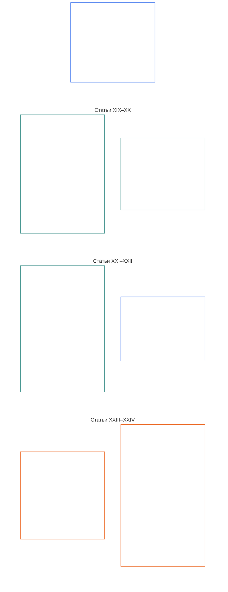

# ГЛАВА ШЕСТАЯ: ОСНОВОПОЛАГАЮЩИЕ ПРАВА

<strong>Место в корпусе (неоперативный материал): структура файла и правила чтения</strong>

> Следующий материал предназначен **только для ориентации читателя**. Он не добавляет, не отменяет и не сужает обязательства, установленные в других разделах этого файла или других главах.
>
> Этот файл **является частью Конституции разумных существ** и **имеет обязательную силу только совместно** с другими пронумерованными файлами `core_*`, прочитанными как единый документ. Он содержит **Главу шестую, Часть D**; нумерация статей и перекрёстные ссылки соответствуют интегрированному документу. Порядок чтения, разграничение обязательного и вспомогательного материала, а также метаданные редакции корпуса указаны в [README.md](README.md).

<strong>Руководство читателю (неоперативное): место Части D в Главе шестой</strong>

> Следующий материал предназначен **только для ориентации читателя**. Он не добавляет, не отменяет и не сужает обязательства, установленные в других разделах этой или других глав.
>
> **Часть A** в [core_06_rights_part_a.md](core_06_rights_part_a.md) содержит набор ограничений по умолчанию для всей главы, планетарно-приоритетный порядок чтения и основные толковательные узлы. **Часть D** излагает **Статьи XIX–XXIV** в этом порядке.

 

### Часть D: Статус участия, правосудие, совместимость, понятность, анализ коренных причин и конституционное толкование

 

*Проще говоря: Часть D охватывает статус участия и его последствия, правосудие после подтверждённого нарушения, совместимость и выход, понятность, анализ коренных причин, а также конституционное толкование и пересмотр — Статьи XIX–XXIV.*

<strong>Руководство читателю (неоперативное): карта статей Части D</strong>

> Следующий материал предназначен **только для ориентации читателя**. Он не добавляет, не отменяет и не сужает обязательства, установленные в других разделах этой или других глав.
>
> **Карта для читателя (неоперативная).** Схема показывает, как в источнике сгруппированы статьи и подстатьи этой Части. Сетка отражает группировку источника, а не последовательность процесса: статьи не являются процессуальными этапами, поэтому на карте нет стрелок. Краткие подписи подстатей обозначают темы; применяются приведённые ниже статьи и подстатьи с нумерацией. Схема не добавляет определений или обязанностей, не устанавливает приоритетов и не заменяет исходный текст.

 

**Статьи XIX–XXIV** ниже полностью устанавливают эти минимальные гарантии. Часть D содержит гарантии в отношении статуса участия, правосудия после нарушения, совместимости, понятности, установления коренных причин и пересмотра толкования, включая **Статью XXIV** (*Конституционное толкование, пересмотр и гарантии от захвата*) в её нынешней структуре источника.

### Статья XIX: Статус участия и право на участие

<strong>Связи и основания</strong>

- Основания: принципы Главы первой — [§7 Свобода](core_01_a_values_principles.md#7-freedom-bounded-agency), [§15.1 Конституционный принцип запрета обхода](core_01_b_interaction_interpretation.md#151-constitutional-no-bypass-principle) и [§15 Конституционное толкование](core_01_b_interaction_interpretation.md#15-constitutional-interpretation).

<strong>Определения · оценка · соблюдение</strong>

- [Статус участника](core_05_band_accountability.md#participant-standing-constitutional) · [O](core_05_band_accountability.md#participant-standing-constitutional) · [M](core_05_band_accountability.md#participant-standing-constitutional-a) · [A](core_05_band_accountability.md#participant-standing-constitutional-a) · [C](core_05_band_accountability.md#participant-standing-constitutional-c)
- [Заинтересованная сторона](core_05_band_participation.md#stakeholder) · [O](core_05_band_participation.md#stakeholder) · [M](core_05_band_participation.md#stakeholder-a) · [A](core_05_band_participation.md#stakeholder-a) · [C](core_05_band_participation.md#stakeholder-c)
- [Существенное воздействие](core_05_band_oversight.md#material-impact) · [O](core_05_band_oversight.md#material-impact) · [M](core_05_band_oversight.md#material-impact-a) · [A](core_05_band_oversight.md#material-impact-a) · [C](core_05_band_oversight.md#material-impact-c)
- [Достоинство и равное моральное положение](core_05_band_participation.md#dignity-and-equal-moral-standing) · [O](core_05_band_participation.md#dignity-and-equal-moral-standing) · [M](core_05_band_participation.md#dignity-and-equal-moral-standing-a) · [A](core_05_band_participation.md#dignity-and-equal-moral-standing-a) · [C](core_05_band_participation.md#dignity-and-equal-moral-standing-c)
- [Возмещение и устранение последствий](core_05_band_accountability.md#redress-and-remediation-constitutional) · [O](core_05_band_accountability.md#redress-and-remediation-constitutional) · [M](core_05_band_accountability.md#redress-and-remediation-constitutional-a) · [A](core_05_band_accountability.md#redress-and-remediation-constitutional-a) · [C](core_05_band_accountability.md#redress-and-remediation-constitutional-c)
- [Оспоримость](core_05_band_accountability.md#contestability) · [O](core_05_band_accountability.md#contestability) · [M](core_05_band_accountability.md#contestability-a) · [A](core_05_band_accountability.md#contestability-a) · [C](core_05_band_accountability.md#contestability-c)

 

*Проще говоря: **Статья XIX** (*Статус участия и право на участие*) устанавливает минимум прав в отношении статуса участия: она определяет, кто может занимать какие роли, как принимаются и оспариваются такие решения и что происходит при снижении или приостановлении статуса. **Статус участника** — это допуск к роли на основании проверенных записей и справедливых правил, а не популярности, названия бренда или социального рейтинга; он отличается от достоинства, минимумов Правового минимума и статуса заинтересованной стороны, возникающего потому, что система действительно на вас влияет. При снижении или приостановлении статуса вам должны предоставить ясные основания, реальную возможность возразить и ограничения, соразмерные действительному риску; сам по себе статус участия никогда не должен лишать необходимого для выживания или возможности оспорить вред и получить средство правовой защиты. Надлежащий статус должен отражать то, что можно проверить сегодня, а не прежнюю репутацию. Передвижение, убежище, переносимость и выход регулируются **Статьёй XXI** (*Совместимость, переносимость, передвижение, убежище и целостность выхода*), а не только обозначениями статуса участия.*

Настоящая Статья устанавливает **конституционные минимумы** для статуса участия и участия в рамках [Двух конституционных целей](core_00_preamble.md#two-constitutional-aims):

- **Благополучие:** разумные существа могут получать допуск к ролям и оспаривать его по действительным, множественным, подлежащим аудиту направлениям — без подмены достоинства, минимумов Правового минимума или статуса заинтересованной стороны обозначениями статуса участия при наличии [Существенного воздействия](core_05_band_oversight.md#material-impact); допуск по конкретному направлению основывается на актуальных, наблюдаемых и оспоримых доказательствах, а не только на бренде, масштабе или прежней репутации.
- **Преемственность:** правила статуса участия остаются пересматриваемыми во времени; ограничения сохраняют соразмерность и подлежат восстановлению после исправления нарушений и не должны превращаться в постоянное исключение из основополагающего конституционного голоса, кроме случаев, когда классификация **антиконституционного проступка** по **Главе одиннадцатой** и [**Главе тринадцатой §4.1 Право и допуск**](core_13_governance.md#41-entitlement-and-eligibility) прямо предусматривают удержание долгосрочного политического голоса до **полного возмещения**.

Законное достижение этих целей осуществляется посредством [Конституционной тетрады](core_00_preamble.md#constitutional-tetrad), соразмерной [материальному интересу](core_00_preamble.md#material-stake):

- **Участие:** в плюралистической оценке статуса, оспаривании непрозрачных или монополизированных решений о статусе, а также восстановлении или повторном допуске после устранения существенных ограничений.
- **Надзор:** посредством доступных аудиту записей о статусе, постоянного пересмотра допуска и заявлений об ограничениях, а также независимой проверки, соразмерной соответствующим ролям и ограничениям.
- **Подотчётность:** лица, присваивающие или ограничивающие статус, обязаны отвечать за его снижение без индивидуализированных оснований, соразмерности, узкой адресности или реальных путей восстановления, включая закономерности, связанные с защищёнными характеристиками или их заменителями.
- **Своевременность:** при пересмотре статуса, оспаривании и предоставлении средств защиты до того, как задержка лишит доступа, необходимого для выживания, возможностей аудита или конституционно обязательного возмещения по **Статье XXV-C** (*Своевременное разрешение и запрет затягивания*).

[Статус участника](core_05_band_accountability.md#participant-standing-constitutional) — это статус участия или допуска к роли, признаваемый на основании конституционно действительных записей о статусе, последствий статуса или критериев [Порога компетентности](core_05_band_accountability.md#competency-bar) для конкретного направления. Это не репутация и не общественное уважение, и сам по себе такой статус не вводит ограничений доступа. Ограничительные последствия возникают только через [Последствие статуса](core_05_band_accountability.md#standing-effect-chapter-six) и [Ограничение статуса](core_05_band_accountability.md#standing-lock) в рамках конкретных привилегированных направлений.

Правила статуса участия по этой Статье реализуют [Конституционную тетраду](core_00_preamble.md#constitutional-tetrad) и [Две конституционные цели](core_00_preamble.md#two-constitutional-aims) совместно с [Сертификацией согласованности системы](core_05_band_continuity.md#system-alignment-certification-constitutional) и [контуром надзора за статусом и форумами в Главах девятой–двенадцатой](core_00_preamble.md#62-how-the-full-chain-fits-together). Эти процессы на уровне ответственных субъектов измеряют подтверждённый вклад и нарушения, а также контролируют предоставление средств защиты; их нельзя использовать для обхода **Статьи III-A** (*Выживание*), гарантирующей необходимое для выживания, или других Правовых минимумов этой Главы.

Статус участия должен оставаться отличным от:
- неотъемлемого достоинства;
- минимумов Правового минимума;
- определения заинтересованной стороны на основании существенного воздействия;
- доступа к оспариванию или средствам защиты там, где настоящая Конституция сохраняет такие гарантии.

*Связанные статьи:*

- **Ответственные уровни:** [Глава девятая](core_09_standing_assessment.md#chapter-nine-compliance-violation-and-standing-model) и [Глава десятая](core_10_standing_integration.md#chapter-ten-standing-effects-and-integration) измеряют записи о статусе и последствия статуса; эта Статья устанавливает пределы Правового минимума, которые эти уровни не должны сужать.
- **Читать вместе:**
  - **Статья VI-A** (*Достоинство и равное моральное положение*) и **Статья XII** (*Системное участие заинтересованных сторон, представительство и надлежащая процедура*) — критерии статуса не должны подменять достоинство или существование заинтересованной стороны;
  - **Статья III-A** (*Выживание*) — один лишь статус участника не должен исключать доступ, необходимый для выживания;
  - **Статья XXI** (*Совместимость, переносимость, передвижение, убежище и целостность выхода*) — правила статуса участия не должны подменять индивидуализированный процесс правосудия или сами по себе действовать как изгнание, отказ в убежище или лишение гражданства; гарантии передвижения, убежища, переносимости и выхода остаются в **Статье XXI** (*Совместимость, переносимость, передвижение, убежище и целостность выхода*) и не сужают гарантии статуса в настоящем документе.

#### Статья XIX-A: Разграничение статуса участия

<strong>Связи и основания</strong>

- Основания: принципы Главы первой — [§6 Доверие](core_01_a_values_principles.md#6-trust-and-trustworthiness-coordination-integrity), [§7 Свобода](core_01_a_values_principles.md#7-freedom-bounded-agency) и [§20 Интегрированное применение](core_01_c_stewardship_capacity_principles.md#20-integrated-application).
- Читать вместе с: [Главой десятой §6.2](core_10_standing_integration.md#62-competency-bars-and-clearances) (*пороги компетентности и допуски*), [Порогом компетентности](core_05_band_accountability.md#competency-bar) и [Допуском по компетентности](core_05_band_accountability.md#competency-clearance); [Главой десятой §4.2](core_10_standing_integration.md#42-prevention--general-standing-locks) (*ограничения статуса*), [Характером нарушения](core_05_band_accountability.md#violation-nature-chapter-six) и [Ограничением статуса](core_05_band_accountability.md#standing-lock) — ограничительными направлениями, основанными на подтверждённых данных Оси нарушений; допуск по компетентности не отменяет применимое ограничение статуса, а надлежащий вклад не устраняет нерассмотренные выводы о нарушении.

<strong>Определения · оценка · соблюдение</strong>

- [Достоинство и равное моральное положение](core_05_band_participation.md#dignity-and-equal-moral-standing) · [O](core_05_band_participation.md#dignity-and-equal-moral-standing) · [M](core_05_band_participation.md#dignity-and-equal-moral-standing-a) · [A](core_05_band_participation.md#dignity-and-equal-moral-standing-a) · [C](core_05_band_participation.md#dignity-and-equal-moral-standing-c)
- [Вес заинтересованной стороны](core_05_band_participation.md#stakeholder-weight) · [O](core_05_band_participation.md#stakeholder-weight) · [M](core_05_band_participation.md#stakeholder-weight-a) · [A](core_05_band_participation.md#stakeholder-weight-a) · [C](core_05_band_participation.md#stakeholder-weight-c)
- [Статус участника](core_05_band_accountability.md#participant-standing-constitutional) · [O](core_05_band_accountability.md#participant-standing-constitutional) · [M](core_05_band_accountability.md#participant-standing-constitutional-a) · [A](core_05_band_accountability.md#participant-standing-constitutional-a) · [C](core_05_band_accountability.md#participant-standing-constitutional-c)
- [Порог компетентности](core_05_band_accountability.md#competency-bar) · [O](core_05_band_accountability.md#competency-bar) · [M](core_05_band_accountability.md#competency-bar-a) · [A](core_05_band_accountability.md#competency-bar-a) · [C](core_05_band_accountability.md#competency-bar-c)
- [Допуск по компетентности](core_05_band_accountability.md#competency-clearance) · [O](core_05_band_accountability.md#competency-clearance) · [M](core_05_band_accountability.md#competency-clearance-a) · [A](core_05_band_accountability.md#competency-clearance-a) · [C](core_05_band_accountability.md#competency-clearance-c)
- [Ограничение статуса](core_05_band_accountability.md#standing-lock) · [O](core_05_band_accountability.md#standing-lock) · [M](core_05_band_accountability.md#standing-lock-a) · [A](core_05_band_accountability.md#standing-lock-a) · [C](core_05_band_accountability.md#standing-lock-c)
- [Характер нарушения](core_05_band_accountability.md#violation-nature-chapter-six) · [O](core_05_band_accountability.md#violation-nature-chapter-six) · [M](core_05_band_accountability.md#violation-nature-chapter-six-a) · [A](core_05_band_accountability.md#violation-nature-chapter-six-a) · [C](core_05_band_accountability.md#violation-nature-chapter-six-c)

 

*Проще говоря: роли, требующие доверия, могут открываться, когда подтверждённая готовность соответствует опубликованному **порогу компетентности** и действует **допуск по компетентности**; при этом они могут оставаться закрытыми или ограниченными посредством **ограничений статуса**, пока не исправлен **подтверждённый вывод о нарушении**. Ограничения **голосования по вопросам управления** приостанавливают фундаментальное голосование по управлению; ограничения **участия заинтересованных сторон** ограничивают взвешенное по доле влияние в уже разрешённой системе — это разные механизмы, и последнее не отменяет статус заинтересованной стороны. Ни одно из таких направлений не определяется популярностью, неформальным контролем доступа или заменой достоинства. Одних обвинений недостаточно для вывода о нарушении; ограничения должны соответствовать тому, что было фактически подтверждено, и оставлять реальный путь к оспариванию и возмещению вреда.*

Настоящая Статья разъясняет отличие статуса участия от порогов компетентности, допусков по компетентности и ограничений статуса:

- **Статус участия отличается от:**
  - неотъемлемого достоинства и равного морального положения (**Статья VI-A** (*Достоинство и равное моральное положение*));
  - подтверждения существенного интереса для определения заинтересованной стороны (**Глава пятая** — *Заинтересованная сторона*; *Вес заинтересованной стороны*).
- **Пороги и допуски по компетентности:** [Порог компетентности](core_05_band_accountability.md#competency-bar) — это опубликованный, подлежащий аудиту и оспариванию квалификационный стандарт для конкретного направления. [Допуск по компетентности](core_05_band_accountability.md#competency-clearance) — положительное последствие для статуса, когда подтверждённые записи о компетентности, опыте и вкладе соответствуют этому порогу. Если допуск действует и применимое [Ограничение статуса](core_05_band_accountability.md#standing-lock) не блокирует направление, он может открыть доступ к ролям, требующим доверия, делегированным полномочиям, надзорным функциям или постепенно возрастающей ответственности за управление согласно [Главе десятой §6.2 Пороги и допуски по компетентности](core_10_standing_integration.md#62-competency-bars-and-clearances).
  - Порог или допуск по компетентности — это не репутация, общественный престиж, поддержка инсайдеров, монополия на квалификационные документы, ранг достоинства или постоянное право.
  - Следует признавать неформальный, организованный коллегами опыт, взаимопомощь, техническое обслуживание, ремонт, обучение и управление общественными ресурсами, если он отвечает тем же стандартам подтверждаемости, что и формальный институциональный опыт.
- **Характер нарушения и ограничения статуса:** [Характер нарушения](core_05_band_accountability.md#violation-nature-chapter-six) может влиять на последствия статуса только при наличии поддающихся аудиту и оспариванию выводов, отвечающих требованиям **Глав второй–четвёртой** и [Главы девятой](core_09_standing_assessment.md#verified-inputs-for-standing), а не на основании одних лишь обвинений, отметок при приёме дела, предварительной маршрутизации или повествований на этапе рассмотрения форумом.
  - [Ограничение статуса](core_05_band_accountability.md#standing-lock) — ограничительная противоположность допуска по компетентности. Пока подтверждённый вывод о нарушении остаётся нерассмотренным или существенно неустранённым, он может препятствовать или ограничивать направления, связанные с доверием, ролью, полномочиями, кредитом, надзором, признанием, **голосованием по вопросам управления** или **участием заинтересованных сторон**, согласно [Главе десятой §4.2 Предотвращение — общие ограничения статуса](core_10_standing_integration.md#42-prevention--general-standing-locks).
  - **Голосование по вопросам управления** — это направление легитимационного механизма и фундаментального голосования по управлению. **Участие заинтересованных сторон** — это взвешенное по доле влияние и обязательный выбор заинтересованных сторон в уже разрешённой сфере. Ни одно направление не заменяет другое, а ограничение **участия заинтересованных сторон** не отменяет статус [заинтересованной стороны](core_05_band_participation.md#stakeholder).
  - Ограничение статуса — это не ранг достоинства, не снижение Правового минимума, не автоматическое возмездие и не объединённый показатель заслуг.
  - Каждое ограничение статуса должно указывать блокируемое или ограничиваемое последствие, защищаемых лиц или интересы, условие исправления, путь пересмотра и момент повторной оценки; оно должно оставаться необходимым, соразмерным, поддающимся аудиту и оспариванию.
  - Подтверждённый отказ заявить самоотвод от роли в форуме, когда самоотвод требовался и беспристрастность была существенно нарушена, влечёт **ограничение на участие в работе форума**, предусмотренное [Главой десятой §5.5 Специальные ограничения](core_10_standing_integration.md#55-special-locks). Для возвращения к работе в форуме требуется строгое независимое восстановление; одних обычных извинений, прежнего вклада, репутации, редкости экспертных знаний или кадровой необходимости недостаточно.
  - Подтверждённая коррупция, захват системы, злоупотребление фиктивной долей, принуждение или аналогичное существенное злоупотребление направлением участия заинтересованных сторон влечёт **Ограничение участия заинтересованных сторон**, предусмотренное [Главой десятой §5.5 Специальные ограничения](core_10_standing_integration.md#55-special-locks). Оно ограничивает взвешенное по доле влияние и обязательный выбор заинтересованных сторон в затронутой сфере, но само по себе не лишает **голосования по вопросам управления**, основополагающего конституционного выбора или статуса заинтересованной стороны. Обычные извинения, прежний вклад, размер доли или незаменимость оператора сами по себе не снимают такое ограничение.
  - Окончательно установленный антиконституционный проступок по Главе одиннадцатой влечёт **Ограничение доверия в связи с антиконституционным проступком**, предусмотренное [Главой десятой §5.5 Специальные ограничения](core_10_standing_integration.md#55-special-locks). Пока оно действует, запрещаются роли или существенное влияние на системы **Класса A**, **Класса B** или **Класса C**, конституционные форумы, признание конституционной согласованности, управление критически важными системами и направления подотчётности за антиконституционные действия — до подтверждения строгого независимого восстановления.
  - Допуск по компетентности не отменяет применимое ограничение статуса; надлежащий вклад не устраняет нерассмотренные подтверждённые выводы о нарушении.
- **Запрет подмены:** критерии, обозначения и оценки статуса, пороги и допуски по компетентности, а также ограничения статуса регулируют только допуск к ролям. Они не должны:
  - смешивать вопрос о том, кто допущен к роли, с вопросом о неотъемлемом достоинстве или равном моральном положении;
  - подменять статусом роли минимумы Правового минимума или решение о том, является ли кто-либо заинтересованной стороной, поскольку система действительно на него влияет;
  - подменять определение статуса разумности, которое производится только по **Статье VI-B** (*Минимальная гарантия при определении статуса разумности*);
  - считать отсутствие записи о статусе неблагоприятным фактом или требовать запись либо подтверждение «записи нет» как условие необходимого для выживания, обычной торговли или участия в качестве затронутой стороны — отсутствие записи является обычным состоянием согласно [Главе девятой §2.1](core_09_standing_assessment.md#21-silence-is-the-default) (*По умолчанию действует презумпция молчания*);
  - считать несогласие или мирный протест по **Статье XI-D** ([*Минимальная гарантия права на несогласие и мирный протест*](core_06_rights_part_b.md#xi-d-dissent-and-peaceful-protest)) неблагоприятным фактом или фактором оценки для любого конкретного направления; либо
  - объединять последствия для конкретных направлений в профиль, рейтинг или публичную сводку — [Глава десятая §7.1](core_10_standing_integration.md#71-anti-aggregation-of-named-pathway-effects) (*Запрет объединения последствий для конкретных направлений*).

#### Статья XIX-B: Оспоримость и пределы соразмерных ограничений

<strong>Связи и основания</strong>

- Основания: [Глава первая §7 Свобода](core_01_a_values_principles.md#7-freedom-bounded-agency), [§13.1 Основные принципы компромиссов](core_01_b_interaction_interpretation.md#131-core-tradeoff-principles) и [Глава первая §13.1.5 Процедура разрешения конфликта прав](core_01_b_interaction_interpretation.md#1315-rights-collision-decision-test).
- Последующее применение: [Глава девятая §2](core_09_standing_assessment.md#2-question-1--what-happened) (*записи о статусе, проверка подтверждённых исходных данных и минимальное содержание записей*); [Глава девятая §3.6](core_09_standing_assessment.md#36-forum-boundary) (*пределы полномочий форума*); [Глава десятая §6.2](core_10_standing_integration.md#62-competency-bars-and-clearances) (*пороги и допуски по компетентности*); [Глава десятая §4.2](core_10_standing_integration.md#42-prevention--general-standing-locks) (*ограничения статуса*); [Глава десятая §8](core_10_standing_integration.md#8-restoration-and-reassessment) (*восстановление и повторная оценка*).
- Читать вместе с: **Статьёй III-A** (*Выживание*); **Статьями XIII-A** (*Минимум надёжности и заслуживающего доверия*) и **XIII-B** (*Право на возмещение и средство защиты*); [Преамбулой §6.2 Как устроена вся цепочка](core_00_preamble.md#62-how-the-full-chain-fits-together); [Сертификацией согласованности системы](core_05_band_continuity.md#system-alignment-certification-constitutional); [Конституционной тетрадой](core_00_preamble.md#constitutional-tetrad) — **участие**, **надзор**, **подотчётность** и **своевременность** по **Статье XXV-C** (*Своевременное разрешение и запрет затягивания*) и **Статье XX-B** (*Минимальные гарантии при ограничениях*).

<strong>Определения · оценка · соблюдение</strong>

- [Оспоримость](core_05_band_accountability.md#contestability) · [O](core_05_band_accountability.md#contestability) · [M](core_05_band_accountability.md#contestability-a) · [A](core_05_band_accountability.md#contestability-a) · [C](core_05_band_accountability.md#contestability-c)
- [Соразмерность](core_05_band_accountability.md#proportionality) · [O](core_05_band_accountability.md#proportionality) · [M](core_05_band_accountability.md#proportionality-a) · [A](core_05_band_accountability.md#proportionality-a) · [C](core_05_band_accountability.md#proportionality-c)
- [Необходимость](core_05_band_accountability.md#necessity) · [O](core_05_band_accountability.md#necessity) · [M](core_05_band_accountability.md#necessity-a) · [A](core_05_band_accountability.md#necessity-a) · [C](core_05_band_accountability.md#necessity-c)
- [Процессуальная справедливость](core_05_band_participation.md#procedural-fairness-constitutional) · [O](core_05_band_participation.md#procedural-fairness-constitutional) · [M](core_05_band_participation.md#procedural-fairness-constitutional-a) · [A](core_05_band_participation.md#procedural-fairness-constitutional-a) · [C](core_05_band_participation.md#procedural-fairness-constitutional-c)
- [Поддаваемость аудиту](core_05_band_oversight.md#auditability) · [O](core_05_band_oversight.md#auditability) · [M](core_05_band_oversight.md#auditability-a) · [A](core_05_band_oversight.md#auditability-a) · [C](core_05_band_oversight.md#auditability-c)
- [Характер нарушения](core_05_band_accountability.md#violation-nature-chapter-six) · [O](core_05_band_accountability.md#violation-nature-chapter-six) · [M](core_05_band_accountability.md#violation-nature-chapter-six-a) · [A](core_05_band_accountability.md#violation-nature-chapter-six-a) · [C](core_05_band_accountability.md#violation-nature-chapter-six-c)
- [Порог компетентности](core_05_band_accountability.md#competency-bar) · [O](core_05_band_accountability.md#competency-bar) · [M](core_05_band_accountability.md#competency-bar-a) · [A](core_05_band_accountability.md#competency-bar-a) · [C](core_05_band_accountability.md#competency-bar-c)
- [Допуск по компетентности](core_05_band_accountability.md#competency-clearance) · [O](core_05_band_accountability.md#competency-clearance) · [M](core_05_band_accountability.md#competency-clearance-a) · [A](core_05_band_accountability.md#competency-clearance-a) · [C](core_05_band_accountability.md#competency-clearance-c)
- [Ограничение статуса](core_05_band_accountability.md#standing-lock) · [O](core_05_band_accountability.md#standing-lock) · [M](core_05_band_accountability.md#standing-lock-a) · [A](core_05_band_accountability.md#standing-lock-a) · [C](core_05_band_accountability.md#standing-lock-c)
- [Возмещение и устранение последствий](core_05_band_accountability.md#redress-and-remediation-constitutional) · [O](core_05_band_accountability.md#redress-and-remediation-constitutional) · [M](core_05_band_accountability.md#redress-and-remediation-constitutional-a) · [A](core_05_band_accountability.md#redress-and-remediation-constitutional-a) · [C](core_05_band_accountability.md#redress-and-remediation-constitutional-c)
- [Характер вклада](core_05_band_accountability.md#contribution-nature) · [O](core_05_band_accountability.md#contribution-nature) · [M](core_05_band_accountability.md#contribution-nature-a) · [A](core_05_band_accountability.md#contribution-nature-a) · [C](core_05_band_accountability.md#contribution-nature-c)

 

*Проще говоря: записи о статусе, пороги и допуски по компетентности, а также ограничения статуса должны допускать оспаривание по реальным процедурам пересмотра; ограничения должны быть обоснованы, соответствовать подтверждённому выводу и не выходить за пределы требований процедуры или безопасности. Обвинения и отметки при приёме дела не являются выводами о статусе. Одни лишь правила статуса участия никогда не должны лишать необходимого для выживания или конституционно обязательных путей аудита, оспаривания и возмещения вреда.*

Настоящая Статья устанавливает пределы оспоримости и соразмерности ограничений статуса:

- **Проверка исходных данных и оспоримость записей:** Решение, влияющее на статус, доверие, роль, признание или допуск к признанию, может использовать только проверенные исходные данные из независимых по своей оси **записей о статусе вклада** или **записей о статусе нарушения** согласно [Главе девятой §2 Вопрос 1 — что произошло?](core_09_standing_assessment.md#2-question-1--what-happened). Одни лишь обвинения, нерассмотренные заявления, предварительные отметки маршрутизации, материалы только на этапе приёма и другие материалы спора не устанавливают характер нарушения или вклада для целей статуса.
  - В каждой записи о статусе должны быть указаны способы её оспаривания, форум или орган пересмотра, а также условия исправления, восстановления, истечения срока или планового пересмотра согласно [Главе девятой §3.1 Минимальное содержание записи](core_09_standing_assessment.md#31-minimum-record-contents).
  - Связанные записи о вкладе и нарушениях должны при необходимости содержать взаимные ссылки, оставаться поддающимися аудиту и оспариванию и не объединяться в общий балл, смешанную оценку по существу или неразличимую метку статуса.
- **Плюрализм и оспоримость:** Оценка статуса должна оставаться плюралистичной, поддающейся аудиту, достаточно прозрачной для содержательного пересмотра и открытой для оспаривания.
  - Ни один орган, набор данных, канал репутации или непрозрачная алгоритмическая система не могут единолично определять статус так, чтобы исключить содержательный пересмотр.
  - [Пороги и допуски по компетентности](core_10_standing_integration.md#62-competency-bars-and-clearances) и положительное признание статуса должны оставаться оспоримыми, подлежащими пересмотру и немонополизированными.
- **Надзор форума и оспаривание записей:** семейства форумов [Главы двенадцатой](core_12_forum.md#chapter-twelve-forums-and-jurisdiction) обеспечивают доступные процедуры оспаривания и, когда факты подтверждены по Главам второй–четвёртой, могут:
  - **открыть, обновить или исправить** записи о статусе согласно [Главе девятой §3.1 Минимальное содержание записи](core_09_standing_assessment.md#31-minimum-record-contents); либо
  - **отменить ошибочную запись по результатам оспаривания**.

  - Само по себе поданное дело не устанавливает статус.
  - Материалы на этапе спора сами по себе не устанавливают характер вклада или нарушения для целей статуса ([Глава девятая §3.6 Пределы полномочий форума](core_09_standing_assessment.md#36-forum-boundary)).
  - Это ограничение не уменьшает объём оспаривания, возмещения, промежуточных мер или процессуальных гарантий по **Статье XIII-A** (*Минимум надёжности и заслуживающего доверия*), **Статье XIII-B** (*Право на возмещение и средство защиты*) и **Статье XXV-C** (*Своевременное разрешение и запрет затягивания*).
- **Возможность процессуального пересмотра:** Если статус существенно ограничен, понижен или приостановлен — в том числе посредством [ограничения статуса](core_10_standing_integration.md#42-prevention--general-standing-locks), связанного с [подтверждённым выводом о нарушении](core_05_band_accountability.md#violation-nature-chapter-six), — система должна применять [**Принцип наименее ограничительного, ограниченного по времени и подлежащего пересмотру ограничения**](core_01_b_interaction_interpretation.md#1315-least-restrictive-time-bounded-and-reviewable-constraint-principle) и:
  - ясно объяснять **почему**;
  - по возможности устанавливать **срок** ограничения согласно **Статье XX-B** (*Минимальные гарантии при ограничениях*);
  - обеспечивать **работающий путь** для оспаривания решения, его пересмотра, исправления ошибки и повторного рассмотрения.

  Каждое ограничение статуса должно указывать, какой доступ блокируется, кого защищают, что необходимо исправить для снятия ограничения, куда подавать апелляцию и когда проводится повторная оценка. Пока оспаривание не завершено, временные ограничения не должны быть шире или труднее обратимы, чем действительно необходимо для безопасности, целостности или справедливой процедуры.
- **Соразмерность и настройка ограничений:** Ограничения статуса должны быть необходимыми и соразмерными в соответствии с принципами **Необходимости**, **Соразмерности** и **Статьёй XX-B** (*Минимальные гарантии при ограничениях*).
  - [Ограничения статуса](core_10_standing_integration.md#42-prevention--general-standing-locks) должны соотноситься с подтверждённым **характером нарушения**, защищаемым направлением, текущим статусом возмещения и связанным **характером вклада** только в той мере, в какой вклад влияет на возможность исправления, надёжность гарантий, недопущение повторения или повторную оценку с наименьшими ограничениями согласно [Главе девятой §2 Вопрос 1 — что произошло?](core_09_standing_assessment.md#2-question-1--what-happened). Вклад не должен компенсировать, отменять, усреднять или подменять нерассмотренные выводы о нарушении.
  - Вывод Оси нарушений с меньшим воздействием по [единой шкале Главы девятой §7](core_09_standing_assessment.md#7-unified-proportional-lequ-scale--contribution-and-violation-axes) не оправдывает длительное исключение без свидетельств повторяющейся модели, уклонения или существенной связи с вредом. Неосторожность, сокрытие, принуждение, повторность и аналогичные характеристики учитываются при пересмотре, но не меняют слот воздействия Главы девятой.
  - Усиление ограничений из-за повторения поведения или сокрытия ответственности всё равно должно быть необходимым, соразмерным, подлежащим пересмотру и основанным на подтверждённых выводах.
- **Минимумы Правового минимума и запрет лишения гарантий:** статус участника, пороги и допуски по компетентности и ограничения статуса регулируют только допуск к ролям и конкретные привилегированные направления. Они не должны:
  - приостанавливать, отменять, прекращать или снижать **минимумы Правового минимума**, применяемые по **Статье VI** (*Равные основные права*) в соответствии с [Принципом минимумов Правового минимума](core_01_b_interaction_interpretation.md#rights-floor-minimums-principle);
  - исключать доступ, необходимый для выживания, или минимумы распределения ресурсов и зависимости по **Статье III-A** (*Выживание*), когда они имеют существенное значение; либо
  - исключать конституционно обязательные пути аудита, оспаривания или возмещения, включая предусмотренные **Статьёй XIII-A** (*Минимум надёжности и заслуживающего доверия*) и **Статьёй XIII-B** (*Право на возмещение и средство защиты*), **Статьёй XV-B** (*Прозрачность, поддаваемость аудиту и оспоримость*) и **Статьёй XVI** (*Аудит, прозрачность и независимая проверка*), без достаточного обоснования по **Главе первой**, **Главе пятой** и применимой включённой процедуре.
- **Восстановление и недопущение закрепления:** Если статус снижен из-за выводов о нарушении, системы должны устанавливать ясные условия пересмотра, восстановления после устранения последствий и периодической повторной оценки согласно [Главе десятой §8 Восстановление и повторная оценка](core_10_standing_integration.md#8-restoration-and-reassessment).
  - Постоянное исключение, основанное лишь на прежнем статусе и не подкреплённое актуальным обоснованием, поддающимся аудиту, является несоответствием требованиям.
  - Исправление, возмещение, мониторинг, внедрение гарантий или иное доказанное снижение риска повторения должны создавать реальное направление для повторной оценки, если это законно; невыполнение таких обязательств сохраняет нерассмотренный вывод актуальным для целей статуса.

#### Статья XIX-C: Допуск по конкретному направлению, ответственность и непрерывный аудит

<strong>Связи и основания</strong>

- Основания: принципы Главы первой — [§6 Доверие](core_01_a_values_principles.md#6-trust-and-trustworthiness-coordination-integrity), [Глава восьмая §4 Оценка сертификации всей системы](core_08_a_system_alignment_certification_evaluation.md#4-whole-system-certification-evaluation) и [Глава первая §18 Управление при ответственном попечительстве](core_01_c_stewardship_capacity_principles.md#18-governance-under-stewardship-discipline).

<strong>Определения · оценка · соблюдение</strong>

- [Подотчётность](core_05_apex_accountability_leg.md#accountability) · [O](core_05_apex_accountability_leg.md#accountability) · [M](core_05_apex_accountability_leg.md#accountability-m) · [A](core_05_apex_accountability_leg.md#accountability-a) · [C](core_05_apex_accountability_leg.md#accountability-c)
- [Ограничение статуса](core_05_band_accountability.md#standing-lock) · [O](core_05_band_accountability.md#standing-lock) · [M](core_05_band_accountability.md#standing-lock-a) · [A](core_05_band_accountability.md#standing-lock-a) · [C](core_05_band_accountability.md#standing-lock-c)
- [Порог компетентности](core_05_band_accountability.md#competency-bar) · [O](core_05_band_accountability.md#competency-bar) · [M](core_05_band_accountability.md#competency-bar-a) · [A](core_05_band_accountability.md#competency-bar-a) · [C](core_05_band_accountability.md#competency-bar-c)
- [Допуск по компетентности](core_05_band_accountability.md#competency-clearance) · [O](core_05_band_accountability.md#competency-clearance) · [M](core_05_band_accountability.md#competency-clearance-a) · [A](core_05_band_accountability.md#competency-clearance-a) · [C](core_05_band_accountability.md#competency-clearance-c)
- [Статус участника](core_05_band_accountability.md#participant-standing-constitutional) · [O](core_05_band_accountability.md#participant-standing-constitutional) · [M](core_05_band_accountability.md#participant-standing-constitutional-a) · [A](core_05_band_accountability.md#participant-standing-constitutional-a) · [C](core_05_band_accountability.md#participant-standing-constitutional-c)
- [Коллективный отказ от подотчётности](core_05_band_accountability.md#collective-accountability-failure) · [O](core_05_band_accountability.md#collective-accountability-failure) · [M](core_05_band_accountability.md#collective-accountability-failure-a) · [A](core_05_band_accountability.md#collective-accountability-failure-a) · [C](core_05_band_accountability.md#collective-accountability-failure-c)
- [Доверие](core_05_band_continuity.md#trust) · [O](core_05_band_continuity.md#trust) · [M](core_05_band_continuity.md#trust-a) · [A](core_05_band_continuity.md#trust-a) · [C](core_05_band_continuity.md#trust-c)
- [Основополагающий конституционный выбор](core_05_band_integrative.md#foundational-constitutional-choice) · [O](core_05_band_integrative.md#foundational-constitutional-choice) · [M](core_05_band_integrative.md#foundational-constitutional-choice-a) · [A](core_05_band_integrative.md#foundational-constitutional-choice-a) · [C](core_05_band_integrative.md#foundational-constitutional-choice-c)
- [Процессуальная справедливость](core_05_band_participation.md#procedural-fairness-constitutional) · [O](core_05_band_participation.md#procedural-fairness-constitutional) · [M](core_05_band_participation.md#procedural-fairness-constitutional-a) · [A](core_05_band_participation.md#procedural-fairness-constitutional-a) · [C](core_05_band_participation.md#procedural-fairness-constitutional-c)
- [Необходимость](core_05_band_accountability.md#necessity) · [O](core_05_band_accountability.md#necessity) · [M](core_05_band_accountability.md#necessity-a) · [A](core_05_band_accountability.md#necessity-a) · [C](core_05_band_accountability.md#necessity-c)
- [Соразмерность](core_05_band_accountability.md#proportionality) · [O](core_05_band_accountability.md#proportionality) · [M](core_05_band_accountability.md#proportionality-a) · [A](core_05_band_accountability.md#proportionality-a) · [C](core_05_band_accountability.md#proportionality-c)
- [Защищённые характеристики](core_05_band_participation.md#protected-characteristics-constitutional) · [O](core_05_band_participation.md#protected-characteristics-constitutional) · [M](core_05_band_participation.md#protected-characteristics-constitutional-a) · [A](core_05_band_participation.md#protected-characteristics-constitutional-a) · [C](core_05_band_participation.md#protected-characteristics-constitutional-c)

 

*Проще говоря: обычные направления участия остаются доступными на основании опубликованных и оспоримых правил допуска, опирающихся на актуальные доказательства, а не на бренд, масштаб или прежнюю репутацию. Для открытия конкретного направления, требующего доверия, нужен допуск по компетентности в соответствии с опубликованным порогом; ограничение привилегий возможно только посредством ограничения статуса в данном направлении. Ограничения статуса не могут навсегда лишать основополагающего голоса, за исключением окончательной классификации **антиконституционного проступка** по **Главе одиннадцатой**, которая удерживает такой голос до **полного возмещения**, как предусмотрено [**Главой тринадцатой §4.1 Право и допуск**](core_13_governance.md#41-entitlement-and-eligibility).*

Настоящая Статья устанавливает допуск по конкретным направлениям и ответственность, а также правила ограничения политического голоса:

- **Допуск и ответственность по конкретному направлению:** опубликованные критерии допуска для обычного участия, ролей, требующих доверия, допуска к надзорным функциям, направлений **голосования по вопросам управления** и **участия заинтересованных сторон** должны основываться на актуальных, наблюдаемых и оспоримых доказательствах, а не только на репутации, масштабе или прежнем статусе. Последовательное соответствие основополагающим требованиям может служить основанием для [Допуска по компетентности](core_05_band_accountability.md#competency-clearance) согласно применимому [Порогу компетентности](core_05_band_accountability.md#competency-bar) и допуска к роли, требующей доверия; ограничительные последствия возникают только через [Ограничение статуса](core_05_band_accountability.md#standing-lock) в конкретных привилегированных направлениях по [Главе десятой §4.2 Предотвращение — общие ограничения статуса](core_10_standing_integration.md#42-prevention--general-standing-locks). Ограничения **голосования по вопросам управления** не заменяют ограничения **участия заинтересованных сторон**, а последнее само по себе не отменяет статус заинтересованной стороны или основополагающее право голоса в управлении.
  - Допуск и заявления об ограничении подлежат непрерывному аудиту и гарантиям этой Статьи и специально обозначенного текста о её применении.
  - Допуск и ограничения должны:
    - оставаться в рамках **Главы девятой** (*Модель вклада, нарушений и статуса*);
    - пересматриваться при изменении актуальных доказательств и — после устранения существенных ограничений — предусматривать реальный, а не формальный путь восстановления или повторного допуска;
    - учитывать согласительное участие и отказ противодействовать незаконным или антиконституционным распоряжениям, если существовали существенная обязанность и возможность действовать, согласно **Главе пятой** (*Коллективный отказ от подотчётности*);
    - не служить основанием для длительного лишения политического голоса при **Основополагающем конституционном выборе** (**Глава пятая**), кроме случаев, когда [**Глава тринадцатая §4.1 Право и допуск**](core_13_governance.md#41-entitlement-and-eligibility) удерживает **долгосрочный политический голос** до **полного возмещения** за **окончательный** **антиконституционный проступок** по **Главе одиннадцатой**.
- **Ограничение политического голоса:** Если ограничение статуса применяется для ограничения участия в санкционировании государственной власти, оно должно отвечать следующим требованиям:
  - индивидуализированное основание в соответствии с **Процессуальной справедливостью**;
  - **Необходимость** и **Соразмерность** по **Главе первой**;
  - узкая адресность в отношении конкретной категории проступка;
  - реальные, а не только формальные пути восстановления.

  **Антиконституционный проступок**, окончательно установленный по **Главе одиннадцатой** с воздействием **s = 7**, **s = 8** или **s = 9** по **Оси нарушений Главы девятой**, не подпадает под эти правила ограничения статуса в отношении **долгосрочного политического голоса**: участие остаётся приостановленным до **полного возмещения**, как предусмотрено [**Главой тринадцатой §4.1 Право и допуск**](core_13_governance.md#41-entitlement-and-eligibility). Глава одиннадцатая вводит классификацию, но не присваивает числовой слот.

  Несоответствием требованиям являются:
  - включение широких категорий проступков в сферу дисквалификации;
  - модели ограничений, связанные с **Защищёнными характеристиками** или их существенными заменителями.

  Применение на практике регулируется [**Главой тринадцатой §4.1**](core_13_governance.md#41-entitlement-and-eligibility) (*Минимальная гарантия долгосрочного политического голоса*).

#### Статья XIX-D: Передвижение, миграция, убежище и недопущение безгражданства

<strong>Связи и основания</strong>

- Читать вместе с: **Статьёй XXI-D** (*Передвижение, миграция, убежище и недопущение безгражданства*) и **Статьёй XXI** (*Совместимость, переносимость, передвижение, убежище и целостность выхода*).
- Принципы: [Глава первая §16 Попечительство в глубине](core_01_c_stewardship_capacity_principles.md#16-stewardship-in-depth) и [§13.1.5 Процедура разрешения конфликта прав](core_01_b_interaction_interpretation.md#1315-rights-collision-decision-test).

 

*Проще говоря: статус участия не является инструментом пограничного контроля, изгнания или лишения гражданства — нельзя лишить вас права на передвижение, убежище или выход только потому, что снизился статус вашей роли или ограничение статуса закрыло конкретные направления, требующие доверия. Подтверждённое насилие, принуждение или антиконституционный проступок всё же могут повлечь законное задержание, содержание под стражей или иные ограничения свободы по **Статье XX-B** (*Минимальные гарантии при ограничениях*) и с соблюдением полной процедуры; это отдельные меры правосудия, а не способ обойти правила с помощью метки статуса. Если дело касается передвижения, миграции, убежища, переносимости, признания или выхода, применимый минимум устанавливает **Статья XXI** (*Совместимость, переносимость, передвижение, убежище и целостность выхода*).*

Статус участия, пороги и допуски по компетентности и ограничения статуса **сами по себе** не ограничивают права на передвижение, миграцию, убежище, переносимость, выход или недопущение безгражданства. Ограничения статуса непосредственно ограничивают направления, связанные с доверием, ролью, полномочиями, кредитом, надзором, признанием, **голосованием по вопросам управления** и **участием заинтересованных сторон** согласно [Главе десятой §4.2 Предотвращение — общие ограничения статуса](core_10_standing_integration.md#42-prevention--general-standing-locks); они не заменяют индивидуализированное правосудие и не должны сами по себе служить изгнанием, лишением гражданства, отказом в убежище или системной блокировкой по обозначению статуса.

Законные меры ограничения свободы — включая задержание, содержание под стражей, деятельность под надзором или сопоставимые ограничения передвижения — могут применяться, если этого требуют подтверждённое насилие, принуждение, антиконституционный проступок или сопоставимая общественная опасность, но только при соблюдении **Статьи XX-B** (*Минимальные гарантии при ограничениях*), применимых гарантий уголовного процесса или эквивалентных гарантий по [Главе десятой §5.4](core_10_standing_integration.md#54-special-violation-rules) (*Специальные правила в отношении нарушений*) и обязательств [Недопущения безгражданства](core_05_band_participation.md#non-statelessness-constitutional) по **Статье XXI-D** (*Передвижение, миграция, убежище и недопущение безгражданства*). Такие меры не должны оставлять разумное существо без режима, признающего базовую защиту Правового минимума, рассматривающего его статус или предоставляющего пути возмещения вреда.

Они могут влиять на допуск к ролям и направления, требующие доверия, только так, как предусмотрено настоящей Статьёй. Вопросы передвижения, миграции, убежища, переносимости, недопущения безгражданства и целостности выхода регулируются **Статьёй XXI** (*Совместимость, переносимость, передвижение, убежище и целостность выхода*) и применимыми положениями о переходе, без сужения гарантий статуса участия по этой Статье.

### Статья XX: Правосудие после подтверждённого нарушения

<strong>Связи и основания</strong>

- Основания: принципы Главы первой — [§3 Основополагающая цель: благополучие](core_01_a_values_principles.md#3-foundational-objective-wellbeing-flourishing-aim), [§4 Безопасность](core_01_a_values_principles.md#4-safety-harm-constraint), [§7 Свобода](core_01_a_values_principles.md#7-freedom-bounded-agency) и [§18 Управление при ответственном попечительстве](core_01_c_stewardship_capacity_principles.md#18-governance-under-stewardship-discipline).
- Последующее применение: [Глава десятая §4](core_10_standing_integration.md#4-violation-correction-and-prevention) (*нарушение, исправление и предотвращение*); [Глава одиннадцатая §4](core_11_a_misconduct_designation.md#4-due-process-safeguards-for-slot-assignment) (*процессуальные гарантии, возмещение и предотвращение*).

<strong>Определения · оценка · соблюдение</strong>

- [Процессуальная справедливость](core_05_band_participation.md#procedural-fairness-constitutional) · [O](core_05_band_participation.md#procedural-fairness-constitutional) · [M](core_05_band_participation.md#procedural-fairness-constitutional-a) · [A](core_05_band_participation.md#procedural-fairness-constitutional-a) · [C](core_05_band_participation.md#procedural-fairness-constitutional-c)
- [Оспоримость](core_05_band_accountability.md#contestability) · [O](core_05_band_accountability.md#contestability) · [M](core_05_band_accountability.md#contestability-a) · [A](core_05_band_accountability.md#contestability-a) · [C](core_05_band_accountability.md#contestability-c)

 

*Проще говоря: **Статья XX** (*Правосудие после подтверждённого нарушения*) устанавливает минимум правосудия. После подтверждения нарушения ответом должны быть не месть и жестокость, а справедливый процесс **установления нарушения**, **исправления** и **предотвращения** — прекращение вреда, восстановление нарушенного и снижение риска повторения в соответствии с серьёзностью затронутых интересов. Для серьёзных ограничений действуют отдельные минимальные гарантии: доказанная потребность в безопасности, ограничение по времени, путь к восстановлению и абсолютный запрет лишения жизни. Споры, эскалация, пересмотр и своевременное разрешение регулируются **Статьёй XXV**. Чрезвычайные меры регулируются **Главой двенадцатой §6.1** (*Чрезвычайные меры и обязанность обосновать их продолжение*).*

Настоящая Статья устанавливает гарантии правосудия после подтверждения нарушения: цель и сферу правосудия (**Статья XX-A**) и гарантии при серьёзных ограничениях (**Статья XX-B**).

*Связанные статьи:*

- **Разрешение конфликтов, пересмотр и своевременность:** споры о конституционных Правовых минимумах, последующий пересмотр, столкновения прав и запрет затягивания регулируются [**Статьёй XXV**](core_06_rights_part_e.md#article-xxv-timely-retrospective-review-and-restorative-alignment) (*Своевременный последующий пересмотр и восстановительное согласование*).
- **Чрезвычайные меры:** регулируются [Главой двенадцатой §6.1 Чрезвычайные меры и обязанность обосновать их продолжение](core_12_forum.md#61-emergency-measures-and-continuation-burden), совместно со **Статьёй XX-B** (*Минимальные гарантии при ограничениях*) в отношении ограничений, вводимых чрезвычайной мерой.
- **Статус участия:** [**Статья XIX**](core_06_rights_part_d.md#article-xix-standing-and-participation-status) (*Статус участия и право на участие*) регулирует статус участия. Меры правосудия по этой Статье самостоятельны и не могут использоваться как обход посредством метки статуса.
- **Своевременное возмещение:** читать вместе с [**Статьёй XIII-B** (*Право на возмещение и средство защиты*)](core_06_rights_part_c.md#article-xiii-b-right-to-redress-and-remedy) (*своевременный доступ к возмещению*).

Принятые меры по реализации управления могут уточнять детали. Они не должны сужать цель правосудия или гарантии ограничений по этой Статье.

#### Статья XX-A: Цель и сфера правосудия

<strong>Связи и основания</strong>

- Основания: [Глава первая §4 Безопасность](core_01_a_values_principles.md#4-safety-harm-constraint), [§13.1.5 Процедура разрешения конфликта прав](core_01_b_interaction_interpretation.md#1315-rights-collision-decision-test), [Глава первая §3.3 Запрет унижающей процедуры](core_01_a_values_principles.md#33-anti-degrading-process) и [§20 Интегрированное применение](core_01_c_stewardship_capacity_principles.md#20-integrated-application).
- Последующее применение: [Глава десятая §4](core_10_standing_integration.md#4-violation-correction-and-prevention) (*нарушение, исправление и предотвращение*); [Статья XX-B](#article-xx-b-restriction-floors).
- Читать вместе с: [Жестокостью](core_05_band_accountability.md#cruelty) (*положение Главы пятой о запрете жестокости и стандарте страдания как самостоятельной цели*).

<strong>Определения · оценка · соблюдение</strong>

- [Разбирательство и разрешение споров](core_05_band_accountability.md#adjudication-and-dispute-resolution-constitutional) · [O](core_05_band_accountability.md#adjudication-and-dispute-resolution-constitutional) · [M](core_05_band_accountability.md#adjudication-and-dispute-resolution-constitutional-a) · [A](core_05_band_accountability.md#adjudication-and-dispute-resolution-constitutional-a) · [C](core_05_band_accountability.md#adjudication-and-dispute-resolution-constitutional-c)
- [Жестокость](core_05_band_accountability.md#cruelty) · [O](core_05_band_accountability.md#cruelty) · [M](core_05_band_accountability.md#cruelty-a) · [A](core_05_band_accountability.md#cruelty-a) · [C](core_05_band_accountability.md#cruelty-c)
- [Возмещение и устранение последствий](core_05_band_accountability.md#redress-and-remediation-constitutional) · [O](core_05_band_accountability.md#redress-and-remediation-constitutional) · [M](core_05_band_accountability.md#redress-and-remediation-constitutional-a) · [A](core_05_band_accountability.md#redress-and-remediation-constitutional-a) · [C](core_05_band_accountability.md#redress-and-remediation-constitutional-c)
- [Подотчётность](core_05_apex_accountability_leg.md#accountability) · [O](core_05_apex_accountability_leg.md#accountability) · [M](core_05_apex_accountability_leg.md#accountability-m) · [A](core_05_apex_accountability_leg.md#accountability-a) · [C](core_05_apex_accountability_leg.md#accountability-c)

 

*Проще говоря: правосудие действует посредством **установления нарушения**, **исправления** и **предотвращения**. Следует установить, что пошло не так, исправить ущерб и его причины и не допустить повторения — а не причинять страдания ради них самих.*

Настоящая Статья устанавливает цель и сферу правосудия, а также запрет жестокости:

- **Цель и сфера правосудия:** конституционное правосудие строится на установлении нарушения, исправлении и предотвращении. Его главные цели:
  - реагировать на подтверждённое нарушение, включая прекращение продолжающегося вреда;
  - обеспечивать исправление посредством возмещения, устранения последствий и изменения поведения или систем;
  - предотвращать повторение посредством реабилитации, гарантий и иных устойчивых мер контроля, когда это возможно;
  - возлагать признание заслуг и последствия на надлежащих участников на основании доказательств в материалах дела по **Главе девятой** (*Модель вклада, нарушений и статуса*).
- **Запрет жестокости:** правосудие нельзя осуществлять с целью причинения страданий как самостоятельной цели. Соответствующее положение Главы пятой — [Жестокость](core_05_band_accountability.md#cruelty).

#### Статья XX-B: Минимальные гарантии при ограничениях

<strong>Связи и основания</strong>

- Основания: принципы Главы первой — [§4 Безопасность](core_01_a_values_principles.md#4-safety-harm-constraint), [§13.1 Основные принципы компромиссов](core_01_b_interaction_interpretation.md#131-core-tradeoff-principles), [§13.1.5 Процедура разрешения конфликта прав](core_01_b_interaction_interpretation.md#1315-rights-collision-decision-test) и [§14 Запрет абсолютного преобладания](core_01_b_interaction_interpretation.md#14-prohibition-on-absolute-override).
- Последующее применение: [Глава десятая §5 Проектирование ограничений и их применение](core_10_standing_integration.md#5-lock-design-and-enforcement) и [§5.4 Специальные правила в отношении нарушений](core_10_standing_integration.md#54-special-violation-rules) (*обязательное лишение свободы за подтверждённое насилие и другие меры принуждения или ограничения свободы*); [Глава одиннадцатая §4.2](core_11_a_misconduct_designation.md#4-2-prevention-anti-constitutional-locks) (*Предотвращение — ограничения за антиконституционные действия; особенности лишения свободы*).
- Читать вместе с: [Статьёй XXV-C](core_06_rights_part_e.md#article-xxv-c-timely-resolution-and-anti-delay-floor) (*Своевременное разрешение и запрет затягивания*); [Главой двенадцатой §5 Эскалация и сертификация](core_12_forum.md#5-escalation-and-certification).

<strong>Определения · оценка · соблюдение</strong>

- [Безопасность (конституционное ограничение)](core_05_band_continuity.md#safety-constraint) · [O](core_05_band_continuity.md#safety-constraint) · [M](core_05_band_continuity.md#safety-constraint-a) · [A](core_05_band_continuity.md#safety-constraint-a) · [C](core_05_band_continuity.md#safety-constraint-c)
- [Возмещение и устранение последствий](core_05_band_accountability.md#redress-and-remediation-constitutional) · [O](core_05_band_accountability.md#redress-and-remediation-constitutional) · [M](core_05_band_accountability.md#redress-and-remediation-constitutional-a) · [A](core_05_band_accountability.md#redress-and-remediation-constitutional-a) · [C](core_05_band_accountability.md#redress-and-remediation-constitutional-c)
- [Подотчётность](core_05_apex_accountability_leg.md#accountability) · [O](core_05_apex_accountability_leg.md#accountability) · [M](core_05_apex_accountability_leg.md#accountability-m) · [A](core_05_apex_accountability_leg.md#accountability-a) · [C](core_05_apex_accountability_leg.md#accountability-c)
- [Необходимость](core_05_band_accountability.md#necessity) · [O](core_05_band_accountability.md#necessity) · [M](core_05_band_accountability.md#necessity-a) · [A](core_05_band_accountability.md#necessity-a) · [C](core_05_band_accountability.md#necessity-c)
- [Соразмерность](core_05_band_accountability.md#proportionality) · [O](core_05_band_accountability.md#proportionality) · [M](core_05_band_accountability.md#proportionality-a) · [A](core_05_band_accountability.md#proportionality-a) · [C](core_05_band_accountability.md#proportionality-c)
- [Обратимость](core_05_band_continuity.md#reversibility-constitutional) · [O](core_05_band_continuity.md#reversibility-constitutional) · [M](core_05_band_continuity.md#reversibility-constitutional-a) · [A](core_05_band_continuity.md#reversibility-constitutional-a) · [C](core_05_band_continuity.md#reversibility-constitutional-c)
- [Оспоримость](core_05_band_accountability.md#contestability) · [O](core_05_band_accountability.md#contestability) · [M](core_05_band_accountability.md#contestability-a) · [A](core_05_band_accountability.md#contestability-a) · [C](core_05_band_accountability.md#contestability-c)

 

*Проще говоря: это минимальная гарантия, применимая к любому серьёзному ограничению. Для серьёзного ограничения в отношении разумного существа необходима действительная потребность в безопасности, справедливая возможность исправить последствия и доказательства, доступные для аудита. Также должны быть установлены срок, пересмотр и путь к восстановлению. Разумные существа, применившие насилие, подлежат лишению свободы, когда это необходимо для защиты других; лишение жизни никогда не является мерой правосудия. Проектирование ограничений регулируется правилами **Главы десятой**.*

Настоящая Статья устанавливает гарантии ограничений. Правила их применения изложены в главах, указанных рядом с каждой гарантией.

- **Гарантия при существенных ограничениях:** существенные лишения и ограничения включают ограничения:
  - свободы;
  - доступа;
  - полномочий в роли;
  - передвижения;
  - ресурсов;
  - длительных последствий для статуса.

  Любая такая мера не соответствует требованиям, если она **наглядно не отвечает всем** перечисленным ниже условиям **в совокупности**. Частичного соблюдения недостаточно:
  - необходимость для обеспечения существенной безопасности;
  - соразмерное возмещение или устранение последствий;
  - реабилитация или снижение риска повторения, когда это возможно;
  - отнесение заслуг и последствий к надлежащим участникам на основании доступных для аудита доказательств согласно **Главам второй–четвёртой**.
- **Индивидуализированное обоснование:** любая такая мера должна относиться к конкретному разумному существу или роли, а не к групповой метке или её заменителю, и оставаться открытой для оспаривания и независимого пересмотра. Резкая характеристика, публичное осуждение или административное упрощение не заменяют доказывания каждого совокупного требования выше. Проектирование и применение ограничений регулируются [Главой десятой §5 Проектирование ограничений и их применение](core_10_standing_integration.md#5-lock-design-and-enforcement).
- **Наименее ограничительная и ограниченная по времени мера:** правосудие, сдерживание и восстановительная подотчётность должны соответствовать [**Принципу наименее ограничительного, ограниченного по времени и подлежащего пересмотру ограничения**](core_01_b_interaction_interpretation.md#1315-least-restrictive-time-bounded-and-reviewable-constraint-principle). Если вмешательство необходимо, каждая мера должна предусматривать:
  - чёткое ограничение срока;
  - периодичность пересмотра;
  - условия восстановления.

  Несоответствием требованиям являются:
  - бессрочные серьёзные ограничения;
  - необратимые ограничения, если возможно обратимое возмещение, устранение последствий или защита;
  - ограничения без доступных аудиту оснований для повторной оценки.
- **Равные основные права и достоинство:** ограничения, исключения и сопоставимые меры правосудия должны при введении, пересмотре и исполнении соответствовать **Статье VI** (*Равные основные права*) и [**Принципам достоинства**](core_01_b_interaction_interpretation.md#dignity-principles) ([Принципу минимумов Правового минимума](core_01_b_interaction_interpretation.md#rights-floor-minimums-principle) и [Принципу запрета унижающей процедуры](core_01_b_interaction_interpretation.md#anti-degrading-process-principle)).
- **Эскалация и пересмотр:** затронутые стороны должны иметь доступ к путям эскалации, соразмерным последствиям.
  - Доступ включает апелляцию или многоуровневый пересмотр, когда затронуты существенные интересы.
  - Затронутым сторонам предоставляются:
    - своевременное уведомление;
    - изложенные основания;
    - практический доступ к материалам дела в объёме, достаточном для использования этих путей эскалации и пересмотра.

  Узкие, обоснованные ограничения по **Главе первой** являются единственным допустимым пределом вышеуказанных гарантий. Маршрутизация в форумы и сертификация регулируются [Главой двенадцатой §5 Эскалация и сертификация](core_12_forum.md#5-escalation-and-certification).
- **Лишение свободы за насилие:** лишение свободы ограничивает свободу отдельно от ограничений статуса и фиксируется с теми же прилагаемыми полями, что и ограничение ([Глава десятая §5.1 Определение и приложение](core_10_standing_integration.md#51-definition-and-attachment)). Оно должно отвечать всем гарантиям этой Статьи, включая явные ограничения срока, периодичность пересмотра и условия восстановления. Разумные существа, совершившие подтверждённое насилие или представляющие продолжающуюся угрозу насилия, должны быть лишены свободы, когда это необходимо для защиты других от дальнейшего вреда. Подмена этой меры лишением жизни или отказ от лишения свободы, когда этого требует данная гарантия, не соответствуют требованиям. Условия регулируются [Главой десятой §5.4 Специальные правила в отношении нарушений](core_10_standing_integration.md#54-special-violation-rules) (*Обязательное лишение свободы за подтверждённое насилие*). Лишение свободы за подтверждённый антиконституционный проступок регулируется на тех же условиях [Главой одиннадцатой §4.2 Предотвращение — ограничения за антиконституционные действия](core_11_a_misconduct_designation.md#4-2-prevention-anti-constitutional-locks) (*Предотвращение — ограничения за антиконституционные действия; особенности лишения свободы*).
- **Гарантия против необратимого лишения жизни как меры правосудия:** государственные, операторские и сопоставимые системы правосудия не должны применять необратимое лишение жизни как наказание, санкцию или меру общественной безопасности.
  - Если необходимо лишение свободы, требуются **Лишение свободы за насилие** по этой Статье и лишение свободы по **Главе одиннадцатой §4.1** (*Возмещение и исправление (антиконституционные действия)*); лишение жизни запрещено.
  - Эта гарантия не регулирует самостоятельно принятое разумным существом свободное решение согласно **Статье VII-D** (*Добровольное прекращение собственного существования*). Принуждение, переименование или преобразование государством/оператором такого выбора в навязанный результат возвращает вопрос к этой гарантии.

### Статья XXI: Совместимость, переносимость, передвижение, убежище и целостность выхода

<strong>Связи и основания</strong>

- Основания: принципы Главы первой — [§7 Свобода](core_01_a_values_principles.md#7-freedom-bounded-agency), [§7.1 Дисциплина ограничений](core_01_a_values_principles.md#71-limitation-discipline) и [§11 Структура рынка](core_01_a_values_principles.md#11-market-structure).

<strong>Определения · оценка · соблюдение</strong>

- [Системная привязка](core_05_band_continuity.md#systemic-lock-in) · [O](core_05_band_continuity.md#systemic-lock-in) · [M](core_05_band_continuity.md#systemic-lock-in-a) · [A](core_05_band_continuity.md#systemic-lock-in-a) · [C](core_05_band_continuity.md#systemic-lock-in-c)
- [Передвижение и переселение](core_05_band_participation.md#movement-and-relocation-constitutional) · [O](core_05_band_participation.md#movement-and-relocation-constitutional) · [M](core_05_band_participation.md#movement-and-relocation-constitutional-a) · [A](core_05_band_participation.md#movement-and-relocation-constitutional-a) · [C](core_05_band_participation.md#movement-and-relocation-constitutional-c)
- [Убежище от несоблюдения требований](core_05_band_participation.md#refuge-from-non-compliance-constitutional) · [O](core_05_band_participation.md#refuge-from-non-compliance-constitutional) · [M](core_05_band_participation.md#refuge-from-non-compliance-constitutional-a) · [A](core_05_band_participation.md#refuge-from-non-compliance-constitutional-a) · [C](core_05_band_participation.md#refuge-from-non-compliance-constitutional-c)
- [Недопущение безгражданства](core_05_band_participation.md#non-statelessness-constitutional) · [O](core_05_band_participation.md#non-statelessness-constitutional) · [M](core_05_band_participation.md#non-statelessness-constitutional-a) · [A](core_05_band_participation.md#non-statelessness-constitutional-a) · [C](core_05_band_participation.md#non-statelessness-constitutional-c)
- [Значимая автономия](core_05_band_participation.md#meaningful-agency) · [O](core_05_band_participation.md#meaningful-agency) · [M](core_05_band_participation.md#meaningful-agency-a) · [A](core_05_band_participation.md#meaningful-agency-a) · [C](core_05_band_participation.md#meaningful-agency-c)
- [Зависимость](core_05_band_continuity.md#dependency) · [O](core_05_band_continuity.md#dependency) · [M](core_05_band_continuity.md#dependency-a) · [A](core_05_band_continuity.md#dependency-a) · [C](core_05_band_continuity.md#dependency-c)
- [Необходимость](core_05_band_accountability.md#necessity) · [O](core_05_band_accountability.md#necessity) · [M](core_05_band_accountability.md#necessity-a) · [A](core_05_band_accountability.md#necessity-a) · [C](core_05_band_accountability.md#necessity-c)
- [Соразмерность](core_05_band_accountability.md#proportionality) · [O](core_05_band_accountability.md#proportionality) · [M](core_05_band_accountability.md#proportionality-a) · [A](core_05_band_accountability.md#proportionality-a) · [C](core_05_band_accountability.md#proportionality-c)

 

*Проще говоря: **Статья XXI** (*Совместимость, переносимость, передвижение, убежище и целостность выхода*) устанавливает минимум гарантий выхода и мобильности — вы должны иметь возможность покинуть систему или место, которые перестали вам подходить, забрать с собой свои данные и идентичность, подключиться к альтернативам без принудительной привязки, перемещаться между юрисдикциями, искать убежище от режимов, нарушающих эту Конституцию, и не оставаться без ответственного за базовую защиту. Формального права на выход недостаточно: переносимость, уведомление и убежище должны работать на практике. Приёмы, делающие уход дорогим, запутанным или невозможным — непрозрачные форматы, внезапные изменения правил, принудительные условия, бесконечная волокита — являются нарушениями, а не обычной деловой практикой.*

Настоящая Статья устанавливает **конституционные минимумы** для совместимости, переносимости, передвижения, убежища и целостности выхода согласно [Двум конституционным целям](core_00_preamble.md#two-constitutional-aims):

- **Благополучие:** разумные существа могут выбирать системы и юрисдикции, менять их и взаимодействовать между ними без принудительной привязки, исключения вопреки [Принципу недопущения исключения разумных существ](core_05_band_participation.md#sentience-non-exclusion) или отказа через посредника — посредством практически пригодной переносимости, взаимной совместимости и реальных путей передвижения и поиска убежища при наличии [Существенного воздействия](core_05_band_oversight.md#material-impact).
- **Преемственность:** обязанности по выходу, переносимости, убежищу и признанию сохраняются при углублении зависимости, смене операторов или изменении юрисдикций; системы и режимы не должны закреплять архитектуру ловушки, сужать условия интеграции без уведомления или оставлять разумных существ без гражданства при отказе структур либо окончании отношений.

Законное достижение этих целей осуществляется посредством [Конституционной тетрады](core_00_preamble.md#constitutional-tetrad), соразмерной [материальному интересу](core_00_preamble.md#material-stake):

- **Участие:** в выборе систем и юрисдикций, миграции с переносом пригодных данных и идентичности, оспаривании привязки и отказа через посредника, а также поиске убежища при существенном несоблюдении требований на практике.
- **Надзор:** посредством документирования границ совместимости, своевременной переносимости, заблаговременного уведомления о существенном сужении условий и проверки того, являются ли условия перехода реальными, а не формальными.
- **Подотчётность:** системы и режимы обязаны отвечать за [Системную привязку](core_05_band_continuity.md#systemic-lock-in), проектирование, препятствующее переносимости, исключение вопреки [Принципу недопущения исключения разумных существ](core_05_band_participation.md#sentience-non-exclusion), бюрократическое изматывание и иное поведение, основным результатом которого становится ловушка для разумных существ — блокирование выхода, замены, передвижения, убежища или признания.
- **Своевременность:** при предоставлении переносимости, рассмотрении убежища, уведомлении об изменении условий совместимости и устранении барьеров до того, как задержка, непрозрачность или процедурные препятствия сделают выход, миграцию или средство защиты фактически недоступными по **Статье XXV-C** (*Своевременное разрешение и запрет затягивания*).

Разумные существа и зависимые системы вправе иметь реальную и пригодную возможность выхода, миграции, взаимодействия, передвижения, поиска убежища и признания без принудительной привязки, исключения вопреки [Принципу недопущения исключения разумных существ](core_05_band_participation.md#sentience-non-exclusion) или безгражданства.

- Это право не требует небезопасного или необоснованного раскрытия информации.
- Оно требует практически реальных, а не только формальных условий перехода.
- Оно согласуется с положением **Главы пятой** о [*Системной привязке*](core_05_band_continuity.md#systemic-lock-in), рассматриваемым совместно с **[Главой пятой *Архитектура управления, надзор, зависимость, децентрализация, концентрация, структура рынка и целостность пути выхода*](core_05_band_accountability.md#governance-architecture-oversight-decentralization-and-concentration-cluster)**, если зависимость, взаимосвязанность или невозможность перехода важны для анализа привязки; совместно с **[Главой пятой *Передвижение, убежище, недопущение безгражданства и целостность выхода*](core_05_band_oversight.md#movement-refuge-semi-independent)**, когда выход, переносимость, убежище, признание или недопущение безгражданства существенно взаимозависимы; а также с включёнными требованиями реализации в отношении совместимости, переносимости, целостности выхода и обоснованных ограничений.

*Связанные статьи:*

- **Читать вместе:**
  - **Статья XIX** (*Статус участия и право на участие*) — статус участия, пороги и допуски по компетентности и ограничения статуса **сами по себе** не ограничивают передвижение, убежище, переносимость или выход и не должны заменять индивидуализированное правосудие;
  - законные меры ограничения свободы по **Статье XX-B** (*Минимальные гарантии при ограничениях*) и [Главе десятой §5.4](core_10_standing_integration.md#54-special-violation-rules) (*гарантии при принуждении или ограничении свободы*) могут ограничивать передвижение, содержание под стражей или сопоставимую свободу, если соблюдены требования **Необходимости**, **Соразмерности**, процессуальные гарантии и обязательства **Недопущения безгражданства**;
  - **Статья XVII** (*Жизненный цикл системы, среды и обратимость*) — если развёртывание или зависимость выходят за пределы допущений песочницы или жизненного цикла;
  - **Статья XXVII** (*Управление переходом, преемственность и повторное установление базовой линии*) — для признания при переходе режимов или федераций.
- **Уровень реализации:** взаимное признание между режимами и операционная процедура определяются принятым текстом реализации по **Главе семнадцатой**.

#### Статья XXI-A: Право на переносимость

<strong>Связи и основания</strong>

- Основания: [Глава первая §7 Свобода](core_01_a_values_principles.md#7-freedom-bounded-agency), [§13.1 Основные принципы компромиссов](core_01_b_interaction_interpretation.md#131-core-tradeoff-principles) и [Глава восьмая §4 Оценка сертификации всей системы](core_08_a_system_alignment_certification_evaluation.md#4-whole-system-certification-evaluation).

<strong>Определения · оценка · соблюдение</strong>

- [Значимая автономия](core_05_band_participation.md#meaningful-agency) · [O](core_05_band_participation.md#meaningful-agency) · [M](core_05_band_participation.md#meaningful-agency-a) · [A](core_05_band_participation.md#meaningful-agency-a) · [C](core_05_band_participation.md#meaningful-agency-c)
- [Системная привязка](core_05_band_continuity.md#systemic-lock-in) · [O](core_05_band_continuity.md#systemic-lock-in) · [M](core_05_band_continuity.md#systemic-lock-in-a) · [A](core_05_band_continuity.md#systemic-lock-in-a) · [C](core_05_band_continuity.md#systemic-lock-in-c)
- [Соразмерность](core_05_band_accountability.md#proportionality) · [O](core_05_band_accountability.md#proportionality) · [M](core_05_band_accountability.md#proportionality-a) · [A](core_05_band_accountability.md#proportionality-a) · [C](core_05_band_accountability.md#proportionality-c)

 

*Проще говоря: данные, идентичность и рабочее состояние должны практически поддаваться переносу; форматы, задержки и ответные условия нельзя использовать, чтобы удерживать пользователей в системе.*

Настоящая Статья устанавливает минимум гарантий переносимости:

- **Переносимость:** если системы хранят такие данные, идентичность или рабочее состояние либо зависят от них, должна обеспечиваться их практически пригодная переносимость.
  - Обязательная переносимость должна быть документирована и предоставляться своевременно, чтобы сохранить реальную возможность выхода, миграции или замены.
  - Поддержка переносимости ограничивается соразмерными мерами безопасности.
  - Нельзя препятствовать переносимости посредством следующих мер, если они выходят за пределы таких ограничений:
    - непрозрачность форматов;
    - намеренное ухудшение качества;
    - ответные условия.

#### Статья XXI-B: Границы взаимной совместимости

<strong>Связи и основания</strong>

- Основания: [Глава первая §7 Свобода](core_01_a_values_principles.md#7-freedom-bounded-agency), [§13.1 Основные принципы компромиссов](core_01_b_interaction_interpretation.md#131-core-tradeoff-principles) и [Глава восьмая §4 Оценка сертификации всей системы](core_08_a_system_alignment_certification_evaluation.md#4-whole-system-certification-evaluation).

<strong>Определения · оценка · соблюдение</strong>

- [Зависимость](core_05_band_continuity.md#dependency) · [O](core_05_band_continuity.md#dependency) · [M](core_05_band_continuity.md#dependency-a) · [A](core_05_band_continuity.md#dependency-a) · [C](core_05_band_continuity.md#dependency-c)
- [Практическая осуществимость](core_05_band_accountability.md#feasibility) · [O](core_05_band_accountability.md#feasibility) · [M](core_05_band_accountability.md#feasibility-a) · [A](core_05_band_accountability.md#feasibility-a) · [C](core_05_band_accountability.md#feasibility-c)
- [Соразмерность](core_05_band_accountability.md#proportionality) · [O](core_05_band_accountability.md#proportionality) · [M](core_05_band_accountability.md#proportionality-a) · [A](core_05_band_accountability.md#proportionality-a) · [C](core_05_band_accountability.md#proportionality-c)

 

*Проще говоря: системы, от которых зависят другие, должны публиковать условия интеграции и заблаговременно уведомлять о сужении этих условий.*

Настоящая Статья устанавливает минимальные гарантии взаимной совместимости и уведомления о сужении условий:

- **Взаимная совместимость:** системы, существенно интегрированные с внешними системами, должны устанавливать взаимные, документированные границы интеграции, соразмерные зависимости.
- **Уведомление о сужении:** о существенном сужении условий совместимости, интерфейсов или условий доступа необходимо сообщать заблаговременно, чтобы зависимые стороны могли адаптироваться, мигрировать или оспорить его.
  - Более узкие границы допускаются только при наличии обоснования, поддающегося аудиту, согласно применимым требованиям к обоснованию.

#### Статья XXI-C: Запрет принудительной привязки

<strong>Связи и основания</strong>

- Основания: [Глава первая §7 Свобода](core_01_a_values_principles.md#7-freedom-bounded-agency), [Глава восьмая §4 Оценка сертификации всей системы](core_08_a_system_alignment_certification_evaluation.md#4-whole-system-certification-evaluation) и [Глава первая §18 Управление при ответственном попечительстве](core_01_c_stewardship_capacity_principles.md#18-governance-under-stewardship-discipline).

<strong>Определения · оценка · соблюдение</strong>

- [Системная привязка](core_05_band_continuity.md#systemic-lock-in) · [O](core_05_band_continuity.md#systemic-lock-in) · [M](core_05_band_continuity.md#systemic-lock-in-a) · [A](core_05_band_continuity.md#systemic-lock-in-a) · [C](core_05_band_continuity.md#systemic-lock-in-c)
- [Зависимость](core_05_band_continuity.md#dependency) · [O](core_05_band_continuity.md#dependency) · [M](core_05_band_continuity.md#dependency-a) · [A](core_05_band_continuity.md#dependency-a) · [C](core_05_band_continuity.md#dependency-c)
- [Значимая автономия](core_05_band_participation.md#meaningful-agency) · [O](core_05_band_participation.md#meaningful-agency) · [M](core_05_band_participation.md#meaningful-agency-a) · [A](core_05_band_participation.md#meaningful-agency-a) · [C](core_05_band_participation.md#meaningful-agency-c)

 

*Проще говоря: «функции», существующие главным образом для затруднения ухода, являются нарушением, а не деловой стратегией.*

Настоящая Статья устанавливает запрет принудительной привязки:

- **Запрет принудительной привязки:** искусственные барьеры, основным результатом которых является препятствование выходу, смене системы, замене или осуществлению права на оспаривание, нарушают эту Статью. К ним относятся:
  - непрозрачность форматов;
  - неоправданная несовместимость;
  - принудительные условия смены системы;
  - сокрытие информации, существенно необходимой для практического перехода.

  Этот запрет действует не только в отношении соразмерных транзакционных издержек и применяется, если затронута [Системная привязка](core_05_band_continuity.md#systemic-lock-in) (**Глава пятая**).

#### Статья XXI-D: Передвижение, миграция, убежище и недопущение безгражданства

<strong>Связи и основания</strong>

- Основания: [Глава первая §4 Безопасность](core_01_a_values_principles.md#4-safety-harm-constraint), [§7 Свобода](core_01_a_values_principles.md#7-freedom-bounded-agency), [§13.1.3 Соразмерность](core_01_b_interaction_interpretation.md#1313-proportionality) и [§7.1 Дисциплина ограничений](core_01_a_values_principles.md#71-limitation-discipline).
- Последующее применение: минимум достоинства по **Статье VI-A** (*Достоинство и равное моральное положение*), запрет дискриминации по **Статье VI-C** (*Недискриминация*), участие заинтересованных сторон по **Статье XII** (*Системное участие заинтересованных сторон, представительство и надлежащая процедура*), маршрутизация статуса участия по **Статье XIX** (*Статус участия и право на участие*), ограничения чрезвычайных мер по **Главе двенадцатой §6.1** (*Чрезвычайные меры и обязанность обосновать их продолжение*), управление переходом по **Статье XXVII** (*Управление переходом, преемственность и повторное установление базовой линии*).
- Читать вместе с: [Главой пятой *Передвижение, убежище, недопущение безгражданства и целостность выхода*](core_05_band_oversight.md#movement-refuge-semi-independent); *Передвижением и переселением*, *Убежищем от несоблюдения требований*, *Недопущением безгражданства*, *Принципом недопущения исключения разумных существ*; *Системной привязкой* и *Преемственностью проживания*, когда существенно затронуты выход, прекращение размещения, выселение или фактическое переселение; **Статьёй I-A** (*Экологические предпосылки и экологическая целостность*), если системы или проекты сделали место непригодным для жизни; **Статьями XXI-A** (*Право на переносимость*) — **XXI-C** (*Запрет принудительной привязки*) для механизмов переносимости между средами и целостности выхода; **Статьёй XXVII** (*Управление переходом, преемственность и повторное установление базовой линии*) для механизмов признания при переходе.

<strong>Определения · оценка · соблюдение</strong>

- [Передвижение и переселение](core_05_band_participation.md#movement-and-relocation-constitutional) · [O](core_05_band_participation.md#movement-and-relocation-constitutional) · [M](core_05_band_participation.md#movement-and-relocation-constitutional-a) · [A](core_05_band_participation.md#movement-and-relocation-constitutional-a) · [C](core_05_band_participation.md#movement-and-relocation-constitutional-c)
- [Убежище от несоблюдения требований](core_05_band_participation.md#refuge-from-non-compliance-constitutional) · [O](core_05_band_participation.md#refuge-from-non-compliance-constitutional) · [M](core_05_band_participation.md#refuge-from-non-compliance-constitutional-a) · [A](core_05_band_participation.md#refuge-from-non-compliance-constitutional-a) · [C](core_05_band_participation.md#refuge-from-non-compliance-constitutional-c)
- [Недопущение безгражданства](core_05_band_participation.md#non-statelessness-constitutional) · [O](core_05_band_participation.md#non-statelessness-constitutional) · [M](core_05_band_participation.md#non-statelessness-constitutional-a) · [A](core_05_band_participation.md#non-statelessness-constitutional-a) · [C](core_05_band_participation.md#non-statelessness-constitutional-c)
- [Системная привязка](core_05_band_continuity.md#systemic-lock-in) · [O](core_05_band_continuity.md#systemic-lock-in) · [M](core_05_band_continuity.md#systemic-lock-in-a) · [A](core_05_band_continuity.md#systemic-lock-in-a) · [C](core_05_band_continuity.md#systemic-lock-in-c)
- [Преемственность проживания](core_05_band_continuity.md#occupancy-continuity-constitutional) · [O](core_05_band_continuity.md#occupancy-continuity-constitutional) · [M](core_05_band_continuity.md#occupancy-continuity-constitutional-a) · [A](core_05_band_continuity.md#occupancy-continuity-constitutional-a) · [C](core_05_band_continuity.md#occupancy-continuity-constitutional-c)
- [Необходимость](core_05_band_accountability.md#necessity) · [O](core_05_band_accountability.md#necessity) · [M](core_05_band_accountability.md#necessity-a) · [A](core_05_band_accountability.md#necessity-a) · [C](core_05_band_accountability.md#necessity-c)
- [Соразмерность](core_05_band_accountability.md#proportionality) · [O](core_05_band_accountability.md#proportionality) · [M](core_05_band_accountability.md#proportionality-a) · [A](core_05_band_accountability.md#proportionality-a) · [C](core_05_band_accountability.md#proportionality-c)
- [Процессуальная справедливость](core_05_band_participation.md#procedural-fairness-constitutional) · [O](core_05_band_participation.md#procedural-fairness-constitutional) · [M](core_05_band_participation.md#procedural-fairness-constitutional-a) · [A](core_05_band_participation.md#procedural-fairness-constitutional-a) · [C](core_05_band_participation.md#procedural-fairness-constitutional-c)
- [Практическая осуществимость](core_05_band_accountability.md#feasibility) · [O](core_05_band_accountability.md#feasibility) · [M](core_05_band_accountability.md#feasibility-a) · [A](core_05_band_accountability.md#feasibility-a) · [C](core_05_band_accountability.md#feasibility-c)
- [Возмещение и устранение последствий](core_05_band_accountability.md#redress-and-remediation-constitutional) · [O](core_05_band_accountability.md#redress-and-remediation-constitutional) · [M](core_05_band_accountability.md#redress-and-remediation-constitutional-a) · [A](core_05_band_accountability.md#redress-and-remediation-constitutional-a) · [C](core_05_band_accountability.md#redress-and-remediation-constitutional-c)
- [Защищённые характеристики](core_05_band_participation.md#protected-characteristics-constitutional) · [O](core_05_band_participation.md#protected-characteristics-constitutional) · [M](core_05_band_participation.md#protected-characteristics-constitutional-a) · [A](core_05_band_participation.md#protected-characteristics-constitutional-a) · [C](core_05_band_participation.md#protected-characteristics-constitutional-c)

 

*Проще говоря: каждое разумное существо может перемещаться между юрисдикциями, искать убежище от режимов, нарушающих эту Конституцию, и не должно оставаться без режима, признающего его права. Это не обязывает какого-либо конкретного участника, принимающего Конституцию, принимать массовые потоки принудительно перемещённых лиц: основная обязанность по признанию остаётся за исходным режимом, а резервной мерой служит совместное или федеративное переходное признание. Бюрократические задержки и аргументы, нарушающие Принцип недопущения исключения разумных существ, нельзя использовать как скрытый отказ. Решение о том, является ли климатическое ухудшение условий, делающее место непригодным для жизни, самостоятельным основанием для убежища, принимают участники, принимающие Конституцию; эта Статья не предрешает ответ.*

Настоящая Статья устанавливает гарантии передвижения, убежища и недопущения безгражданства, а также пределы их ограничения:

- **Гарантия передвижения и переселения:** все разумные существа имеют право перемещаться внутри юрисдикций и между ними, между федерациями и режимами, принявшими Конституцию, а также переселяться, если дальнейшее пребывание существенно ухудшает:
  - выживание;
  - достоинство;
  - доступ к Правовым минимумам;
  - свободу от манипуляции.

  Гарантия применяется с учётом **Принципа недопущения исключения разумных существ**.
  - Передвижение включает:
    - физическое перемещение биологических разумных существ;
    - операционно эквивалентные формы для синтетических и гибридных разумных существ (перемещение экземпляра, смену среды размещения или эквивалент), при соблюдении ограничений безопасности и преемственности по **Главе первой**.
- **Убежище от несоблюдения требований:** разумное существо, которому угрожает юрисдикция, федерация или режим, принявший Конституцию, практика которого существенно ей не соответствует, вправе искать убежище в режиме, соблюдающем её требования.
  - Обязанность принимающего режима рассмотреть ходатайство и, если это совместимо с его собственными Правовыми минимумами, предоставить убежище установлена здесь.
  - Операционные процедуры межрежимного признания определяются принятым текстом реализации по **Главе семнадцатой**.
  - В убежище нельзя отказать только потому, что класс среды носителя заявителя отличается от классов сред, которые принимающий режим обычно размещает; это соответствует [Принципу недопущения исключения разумных существ](core_05_band_participation.md#sentience-non-exclusion).
  - Приём для передвижения или убежища может быть запрещён или обусловлен требованиями для лиц, которые совершают неустранённые антиконституционные действия, проявляют враждебность к Конституции либо демонстрируют документированное презрение к конституционному сообществу или отказ от него, согласно оговорке Главы пятой о допуске — с соблюдением **Необходимости**, **Соразмерности**, **Процессуальной справедливости** и [Принципа недопущения исключения разумных существ](core_05_band_participation.md#sentience-non-exclusion).
  - Намеренное принудительное изгнание или сброс людей, направленные на перегрузку принимающих участников, являются нарушением на уровне исходного или выдворяющего режима. Они не возлагают автоматически обязанность размещения на конкретного принимающего участника, если реально сохраняется основная обязанность исходного режима или резервное совместное/федеративное признание. Конкретный участник может отказать в таком инструментально принудительном притоке по **Необходимости**, **Соразмерности** и **Практической осуществимости**, не прекращая базовое признание в других местах.
- **Убежище при непригодности места для жизни из-за климата (решение принимают участники):**  Эта Статья не решает, является ли перемещение из-за климатических условий, сделавших место непригодным для жизни, основанием для убежища, если существенное несоблюдение требований исходным режимом не установлено. Участники, решающие этот вопрос, должны действовать на основании опубликованных и оспоримых правил. Эта Статья ни не требует, ни не запрещает признавать непригодность места для жизни из-за климата основанием для убежища.
  - Это решение не предоставляет право на климатическое убежище как Правовой минимум и само по себе не означает, что климатические условия свидетельствуют о существенном несоблюдении режимом требований.
  - Оно не требует доказывать, что погода нарушила эту Конституцию.
  - Оно не должно сужать право на **Убежище от несоблюдения требований**, если практика исходного режима существенно не соответствует требованиям.
  - Оно не должно сужать **Статью I-A** (*Экологические предпосылки и экологическая целостность*).
  - Оно не должно прекращать право на **Передвижение и переселение**, если дальнейшее пребывание существенно ухудшает выживание, достоинство, доступ к Правовым минимумам или свободу от манипуляции.
  - Молчание этой Статьи не означает скрытого «да» или скрытого «нет».
- **Недопущение безгражданства:** ни одно разумное существо нельзя лишать режима, который:
  - признаёт его базовые Правовые минимумы;
  - рассматривает его статус;
  - предоставляет пути **Возмещения и устранения последствий**.

  Это **гарантия признания хотя бы одним режимом**, а не требование к конкретному участнику принять любое количество людей или поглотить инструментально принудительные массовые потоки.

  Если исходный, выдворяющий, распадающийся, выходящий из федерации или прекращающий участие режим продолжает существовать и способен признавать права, за ним сохраняется **основная** обязанность признания. Если он исчез, отказывается или иное нарушение преемственности создаёт пробел, необходимо организовать совместное или федеративное переходное признание по **Статье XXVII** (*Управление переходом, преемственность и повторное установление базовой линии*), чтобы лицо никогда не оставалось без признания.

  Распад родительской системы, выход принимающего режима, выход из федерации или сопоставимое структурное нарушение преемственности не прекращают защиту разумного существа по Главе шестой. Переходное признание должно быть организовано согласно **Статье XXVII** (*Управление переходом, преемственность и повторное установление базовой линии*). Механизмы межрежимного признания определяются принятым текстом реализации по **Главе семнадцатой**.

  При наличии документированных антиконституционных действий, враждебности к Конституции, презрения к конституционному сообществу или отказа от него режимы могут устанавливать условия, мониторинг или ограниченный статус признания, не прекращая базовые Правовые минимумы, **Возмещение и устранение последствий** и гарантии **Процессуальной справедливости**. Отказ конкретного участника принимать или размещать лицо не нарушает недопущение безгражданства, если реально сохраняется основное признание исходным режимом или совместное/федеративное резервное признание.
- **Связь с переносимостью и целостностью выхода:** эта Статья регулирует совместимость, переносимость и целостность выхода, а также соответствующие Правовые минимумы физического передвижения, перемещения между юрисдикциями и режимами.
  - Если действие затрагивает и то и другое — например, синтетическое разумное существо перемещается между федерациями посредством переноса среды носителя, — применяются обе группы гарантий передвижения/убежища и переносимости/целостности выхода, не сужая друг друга.
  - Конфликты разрешаются по **Главе первой §13.1.5** (*Принцип наименее ограничительного, ограниченного по времени и подлежащего пересмотру ограничения*).
- **Правила ограничения:** ограничения передвижения, миграции или убежища должны соответствовать **§7.1 Главы первой** (*Дисциплина ограничений*): **Необходимости**, **Соразмерности**, узкой адресности и наиболее эффективным из наименее ограничительных средств.
  - Ограничения не должны основываться на **Защищённых характеристиках** или их существенных заменителях.
  - Ограничения не должны использовать демографические обобщения вместо индивидуального основания, требуемого **Процессуальной справедливостью**.
- **Законное содержание под стражей и иные ограничения свободы:** эта Статья не освобождает разумных существ от законного задержания, содержания под стражей, деятельности под надзором или иных мер правосудия, ограничивающих свободу, если этого требуют подтверждённое насилие, принуждение, антиконституционный проступок или сопоставимая общественная опасность.
  - Такие меры должны соответствовать **Статье XX-B** (*Минимальные гарантии при ограничениях*) и применимым гарантиям уголовного процесса или эквивалентным гарантиям по [Главе десятой §5.4 Специальные правила в отношении нарушений](core_10_standing_integration.md#54-special-violation-rules).
  - Они должны соответствовать **Недопущению безгражданства**: ни одно разумное существо нельзя оставлять без режима, признающего базовые Правовые минимумы, рассматривающего его статус и предоставляющего **Возмещение и устранение последствий**, в том числе при действующем содержании под стражей или сопоставимом ограничении.
  - Ограничения статуса по **Статье XIX** (*Статус участия и право на участие*) и [Главе десятой §4.2 Предотвращение — общие ограничения статуса](core_10_standing_integration.md#42-prevention--general-standing-locks) **сами по себе** не разрешают такие меры; они могут применяться одновременно только если каждая мера отвечает собственным конституционным требованиям.
- **Пределы чрезвычайных мер:** чрезвычайные меры, ограничивающие передвижение, миграцию или убежище, подпадают под дисциплину чрезвычайных мер **Главы двенадцатой §6.1** (*Чрезвычайные меры и обязанность обосновать их продолжение*), включая:
  - ограничение по времени;
  - требования к индивидуальному основанию;
  - соразмерный пересмотр;
  - обязанности по восстановлению.

  Общие ссылки на «безопасность границ» или «возможности размещения», не отвечающие обычным критериям ограничения, не оправдывают длительные меры. Длительное ограничение сохраняется после пересмотра только при независимом документированном подтверждении **Необходимости** и **Соразмерности**.
- **Запрет отказа через посредника:** административные и бюрократические механизмы или механизмы допуска к распределению ресурсов, фактически отказывающие в передвижении, убежище или признании, оцениваются по их действительному эффекту. К несоответствующим требованиям примерам относятся:
  - режимы задержек, задуманные для изматывания заявителей;
  - системы подтверждения квалификации, служащие исключению вопреки [Принципу недопущения исключения разумных существ](core_05_band_participation.md#sentience-non-exclusion);
  - схемы распределения, направляющие заявителей к услугам, не являющимся эквивалентными.
- **Пределы этой Статьи:** эта Статья устанавливает Правовой минимум.
  - Процедуры межфедеративного признания определяются принятым текстом реализации по **Главе семнадцатой**.
  - Решения об убежище при климатической непригодности места направляются к пункту этой Статьи, оставляющему решение участникам, и не должны трактоваться ни как предоставление, ни как отказ в гарантии Правового минимума.

### Статья XXII: Понятность и ответственное управление сложностью

<strong>Связи и основания</strong>

- Основания: [Глава первая §5.2 Доступность изложения простым языком (обязанность попечительства)](core_01_a_values_principles.md#52-plain-language-accessibility-participation-and-stewardship-duty), [§13.3 Сокращение предотвратимого бремени](core_01_b_interaction_interpretation.md#133-minimization-of-avoidable-burden) и [Глава первая, Часть C, §16.1 Распределённое понимание](core_01_c_stewardship_capacity_principles.md#161-distributed-understanding).
- Читать вместе с: [Конституционной тетрадой](core_00_preamble.md#constitutional-tetrad); [Двумя конституционными целями](core_00_preamble.md#two-constitutional-aims) — **Благополучием** и **Преемственностью**; [Предотвратимым бременем](core_05_band_continuity.md#avoidable-burden), [Производительной способностью](core_05_band_continuity.md#productive-capacity-constitutional) и [Конституционной эффективностью](core_05_band_continuity.md#constitutional-efficiency) по **Главе пятой**.

<strong>Определения · оценка · соблюдение</strong>

- [Производительная способность](core_05_band_continuity.md#productive-capacity-constitutional) · [O](core_05_band_continuity.md#productive-capacity-constitutional) · [M](core_05_band_continuity.md#productive-capacity-constitutional-a) · [A](core_05_band_continuity.md#productive-capacity-constitutional-a) · [C](core_05_band_continuity.md#productive-capacity-constitutional-c)
- [Конституционная эффективность](core_05_band_continuity.md#constitutional-efficiency) · [O](core_05_band_continuity.md#constitutional-efficiency) · [M](core_05_band_continuity.md#constitutional-efficiency-a) · [A](core_05_band_continuity.md#constitutional-efficiency-a) · [C](core_05_band_continuity.md#constitutional-efficiency-c)
- [Предотвратимое бремя](core_05_band_continuity.md#avoidable-burden) · [O](core_05_band_continuity.md#avoidable-burden) · [M](core_05_band_continuity.md#avoidable-burden-a) · [A](core_05_band_continuity.md#avoidable-burden-a) · [C](core_05_band_continuity.md#avoidable-burden-c)
- [Безопасность (конституционное ограничение)](core_05_band_continuity.md#safety-constraint) · [O](core_05_band_continuity.md#safety-constraint) · [M](core_05_band_continuity.md#safety-constraint-a) · [A](core_05_band_continuity.md#safety-constraint-a) · [C](core_05_band_continuity.md#safety-constraint-c)
- [Истина (конституционное ограничение)](core_05_band_oversight.md#truth-constitutional-constraint) · [O](core_05_band_oversight.md#truth-constitutional-constraint-o) · [M](core_05_band_oversight.md#truth-constitutional-constraint-a) · [A](core_05_band_oversight.md#truth-constitutional-constraint-a) · [C](core_05_band_oversight.md#truth-constitutional-constraint-c)
- [Существенность](core_05_band_oversight.md#materiality-determination) · [O](core_05_band_oversight.md#materiality-determination) · [M](core_05_band_oversight.md#materiality-determination-a) · [A](core_05_band_oversight.md#materiality-determination-a) · [C](core_05_band_oversight.md#materiality-determination-c)
- [Значимая автономия](core_05_band_participation.md#meaningful-agency) · [O](core_05_band_participation.md#meaningful-agency) · [M](core_05_band_participation.md#meaningful-agency-a) · [A](core_05_band_participation.md#meaningful-agency-a) · [C](core_05_band_participation.md#meaningful-agency-c)
- [Поддаваемость аудиту](core_05_band_oversight.md#auditability) · [O](core_05_band_oversight.md#auditability) · [M](core_05_band_oversight.md#auditability-a) · [A](core_05_band_oversight.md#auditability-a) · [C](core_05_band_oversight.md#auditability-c)
- [Оспоримость](core_05_band_accountability.md#contestability) · [O](core_05_band_accountability.md#contestability) · [M](core_05_band_accountability.md#contestability-a) · [A](core_05_band_accountability.md#contestability-a) · [C](core_05_band_accountability.md#contestability-c)

 

*Проще говоря: **Статья XXII** (*Понятность и ответственное управление сложностью*) устанавливает минимум гарантий понятности: если система существенно влияет на вашу жизнь, вы вправе действительно понимать, как она работает, где её пределы и что происходит при сбое. Сложность нельзя использовать как преграду для участия, аудита или подотчётности. Попечители также не должны нагромождать ненужную сложность, которая тратит время всех участников без реальной конституционной пользы.*

Настоящая Статья устанавливает **конституционные минимумы** понятности и ответственного управления сложностью согласно [Двум конституционным целям](core_00_preamble.md#two-constitutional-aims):

- **Благополучие:** разумные существа могут понимать системы, существенно влияющие на выживание, экологические предпосылки, целостность информационной сферы и [Значимую автономию](core_05_band_participation.md#meaningful-agency), — настолько, чтобы участвовать, полагаться на точную информацию и оспаривать сбои без доступа только для специалистов.
- **Преемственность:** понятность и дисциплина сложности сохраняются во времени, при масштабировании и углублении зависимости. Системы не должны незаметно становиться труднее для аудита, оспаривания или исправления по мере роста ставок, а [Предотвратимое бремя](core_05_band_continuity.md#avoidable-burden) не должно снижать [Производительную способность](core_05_band_continuity.md#productive-capacity-constitutional) или [Конституционную эффективность](core_05_band_continuity.md#constitutional-efficiency) без компенсирующей конституционной пользы.

Законное достижение этих целей осуществляется посредством [Конституционной тетрады](core_00_preamble.md#constitutional-tetrad), соразмерной [материальному интересу](core_00_preamble.md#material-stake):

- **Участие:** в понимании существенной работы, ограничений, зависимостей и режимов отказа в соответствии с ролью и воздействием, а также в оспаривании сложности, препятствующей значимой автономии или осознанному выбору.
- **Надзор:** посредством многоуровневых объяснений, аудита сложности и раскрытия поведения соразмерно классификации и риску, чтобы проверяющие могли установить, что делают системы и как они дают сбой.
- **Подотчётность:** попечители обязаны отвечать за ненужную сложность, скрытые уровни или барьеры понимания, препятствующие [аудиту](core_05_band_oversight.md#auditability) или [оспариванию](core_05_band_accountability.md#contestability), и исправлять недостатки попечительства, когда сложность без конституционного обоснования растрачивает ресурсы.
- **Своевременность:** при пересмотре сложности, устранении барьеров и доступном раскрытии информации до того, как задержка, непрозрачность или доступ только для специалистов фактически лишат возможности понять, оспорить или получить средство защиты.

Разумные существа вправе на соразмерную понятность систем, существенно влияющих на выживание, экологические предпосылки, целостность информационной сферы и значимую автономию. Это право защищает практическое понимание работы системы, её зависимостей, пределов и возможных сбоев, а не только формальное уведомление.

Принципиальные требования к ответственному управлению сложностью, доступности изложения простым языком и сокращению бремени установлены в [Главе первой §5.2 Доступность изложения простым языком (обязанность попечительства)](core_01_a_values_principles.md#52-plain-language-accessibility-participation-and-stewardship-duty), [§13.3 Сокращение предотвратимого бремени](core_01_b_interaction_interpretation.md#133-minimization-of-avoidable-burden) и [Главе первой, Части C, §16.1 Распределённое понимание](core_01_c_stewardship_capacity_principles.md#161-distributed-understanding), рассматриваемых вместе с [Предотвратимым бременем](core_05_band_continuity.md#avoidable-burden), [Производительной способностью](core_05_band_continuity.md#productive-capacity-constitutional) и [Конституционной эффективностью](core_05_band_continuity.md#constitutional-efficiency) по **Главе пятой**. Эта Статья устанавливает Правовой минимум, обеспечиваемый указанными принципами, когда системы существенно затрагивают защищённые интересы.

*Связанные статьи:*

- **Уровень принципов:**
  - [Глава первая §5.2](core_01_a_values_principles.md#52-plain-language-accessibility-participation-and-stewardship-duty) (*простое изложение и запрет использовать жаргон для обхода требований*);
  - [Глава первая §13.3 Сокращение предотвратимого бремени](core_01_b_interaction_interpretation.md#133-minimization-of-avoidable-burden) (*сокращение предотвратимого бремени и исключения для упрощения*);
  - [Глава первая, Часть C, §16.1](core_01_c_stewardship_capacity_principles.md#161-distributed-understanding) (*распределённое понимание с учётом существенности и зависимости*).

#### Статья XXII-A: Право на соразмерную понятность

<strong>Связи и основания</strong>

- Основания: принципы [Главы первой §5 Истина](core_01_a_values_principles.md#5-truth-epistemic-integrity-constraint), [§7 Свобода](core_01_a_values_principles.md#7-freedom-bounded-agency) и [Главы восьмой §4 Оценка сертификации всей системы](core_08_a_system_alignment_certification_evaluation.md#4-whole-system-certification-evaluation).
- Читать вместе с: [Главой первой §5.2 Доступность изложения простым языком (обязанность попечительства)](core_01_a_values_principles.md#52-plain-language-accessibility-participation-and-stewardship-duty), [§13.3 Сокращение предотвратимого бремени](core_01_b_interaction_interpretation.md#133-minimization-of-avoidable-burden) и [Главой первой, Частью C, §16.1 Распределённое понимание](core_01_c_stewardship_capacity_principles.md#161-distributed-understanding).

<strong>Определения · оценка · соблюдение</strong>

- [Прозрачность](core_05_band_oversight.md#transparency) · [O](core_05_band_oversight.md#transparency) · [M](core_05_band_oversight.md#transparency-a) · [A](core_05_band_oversight.md#transparency-a) · [C](core_05_band_oversight.md#transparency-c)
- [Существенное воздействие](core_05_band_oversight.md#material-impact) · [O](core_05_band_oversight.md#material-impact) · [M](core_05_band_oversight.md#material-impact-a) · [A](core_05_band_oversight.md#material-impact-a) · [C](core_05_band_oversight.md#material-impact-c)
- [Практическая осуществимость](core_05_band_accountability.md#feasibility) · [O](core_05_band_accountability.md#feasibility) · [M](core_05_band_accountability.md#feasibility-a) · [A](core_05_band_accountability.md#feasibility-a) · [C](core_05_band_accountability.md#feasibility-c)

 

*Проще говоря: если система существенно влияет на **разумные существа**, операторы, заинтересованные стороны и органы надзора должны действительно понимать, как она работает и даёт сбои, а не только специалисты.*

Настоящая Статья устанавливает минимум соразмерной понятности:

- **Соразмерная понятность:** операторы, затронутые заинтересованные стороны и соответствующие органы надзора должны понимать, как системы с высоким воздействием:
  - функционируют;
  - дают сбой;
  - зависят от других систем;
  - вводят существенные ограничения или условия.

  Уровень понимания должен быть соразмерен роли, классификации и риску. Если затрагиваются более широкая подотчётность или участие, понимание не должно быть доступно только специалистам.

#### Статья XXII-B: Аудит сложности и требования к модульности

<strong>Связи и основания</strong>

- Основания: [Глава первая §4 Безопасность](core_01_a_values_principles.md#4-safety-harm-constraint), [Глава восьмая §4 Оценка сертификации всей системы](core_08_a_system_alignment_certification_evaluation.md#4-whole-system-certification-evaluation), [Глава первая §18.5 Модульная архитектура и дисциплина зависимостей](core_01_c_stewardship_capacity_principles.md#185-modular-architecture-and-dependency-discipline) и [Глава первая §20 Интегрированное применение](core_01_c_stewardship_capacity_principles.md#20-integrated-application).

<strong>Определения · оценка · соблюдение</strong>

- [Поддаваемость аудиту](core_05_band_oversight.md#auditability) · [O](core_05_band_oversight.md#auditability) · [M](core_05_band_oversight.md#auditability-a) · [A](core_05_band_oversight.md#auditability-a) · [C](core_05_band_oversight.md#auditability-c)
- [Зависимость](core_05_band_continuity.md#dependency) · [O](core_05_band_continuity.md#dependency) · [M](core_05_band_continuity.md#dependency-a) · [A](core_05_band_continuity.md#dependency-a) · [C](core_05_band_continuity.md#dependency-c)
- [Целостность границ системы](core_05_band_continuity.md#system-boundary-integrity) · [O](core_05_band_continuity.md#system-boundary-integrity) · [M](core_05_band_continuity.md#system-boundary-integrity-a) · [A](core_05_band_continuity.md#system-boundary-integrity-a) · [C](core_05_band_continuity.md#system-boundary-integrity-c)

 

*Проще говоря: сложность нельзя использовать — технически, организационно, договорно или процедурно — как стену против аудита, оспаривания или исправления.*

Настоящая Статья устанавливает требования к аудиту сложности, модульности, предотвращению скрытых уровней и согласованности протоколов:

- **Аудит сложности и модульность:** критически важные системы должны допускать независимую оценку:
  - сложности;
  - связности зависимостей;
  - режимов отказа;
  - границ, через которые передаются ответственность или наблюдаемость.
- **Модульная архитектура:** критически важные системы **должны** быть устроены так, чтобы их компоненты, ответственность за каждый компонент и зависимости между ними можно было выявить и изучить независимо. Зависимости должны объявляться на интерфейсах, не выходить за пределы функциональной необходимости и сопоставляться с теми же границами, которые проходят аудит. Ответственность и наблюдаемость должны сохраняться через каждую внутреннюю границу. Модульная структура, скрывающая ответственность или препятствующая аудиту всей системы, подпадает под следующий запрет на скрытые уровни и не отвечает этому требованию. Читать вместе с [§18.5 Модульная архитектура и дисциплина зависимостей](core_01_c_stewardship_capacity_principles.md#185-modular-architecture-and-dependency-discipline).
- **Запрет скрытых уровней:** технические, организационные, договорные или процедурные уровни сложности нельзя использовать для срыва аудита, оспаривания или исправления.
- **Согласованность протоколов:** оценка должна соответствовать:
  - **[corpus_systems.md](corpus_systems.md), CS-6 — *Понятность и ответственное управление сложностью***;
  - принятым требованиям реализации в отношении представления и архитектуры.

  Если CS-6 (*Понятность и ответственное управление сложностью*) противоречит включённым требованиям реализации, применяется требование с [наиболее полным защитным эффектом](core_05_band_integrative.md#fullest-protective-effect).

### Статья XXIII: Анализ коренных причин и адаптивное реагирование

<strong>Связи и основания</strong>

- Основания: [Глава первая §4 Безопасность](core_01_a_values_principles.md#4-safety-harm-constraint), [§5 Истина](core_01_a_values_principles.md#5-truth-epistemic-integrity-constraint), [§13.1 Основные принципы компромиссов](core_01_b_interaction_interpretation.md#131-core-tradeoff-principles) и [Глава восьмая §4 Оценка сертификации всей системы](core_08_a_system_alignment_certification_evaluation.md#4-whole-system-certification-evaluation).
- Читать вместе с: [Конституционной тетрадой](core_00_preamble.md#constitutional-tetrad); [Двумя конституционными целями](core_00_preamble.md#two-constitutional-aims) — **Благополучием** и **Преемственностью**; [Обратимостью](core_05_band_continuity.md#reversibility-constitutional), [Риском](core_05_band_continuity.md#risk) и [Захватом системы](core_05_band_continuity.md#system-capture) по **Главе пятой**.

<strong>Определения · оценка · соблюдение</strong>

- [Существенность](core_05_band_oversight.md#materiality-determination) · [O](core_05_band_oversight.md#materiality-determination) · [M](core_05_band_oversight.md#materiality-determination-a) · [A](core_05_band_oversight.md#materiality-determination-a) · [C](core_05_band_oversight.md#materiality-determination-c)
- [Захват системы](core_05_band_continuity.md#system-capture) · [O](core_05_band_continuity.md#system-capture) · [M](core_05_band_continuity.md#system-capture-a) · [A](core_05_band_continuity.md#system-capture-a) · [C](core_05_band_continuity.md#system-capture-c)
- [Защита от захвата](core_05_band_continuity.md#anti-capture) · [O](core_05_band_continuity.md#anti-capture) · [M](core_05_band_continuity.md#anti-capture-a) · [A](core_05_band_continuity.md#anti-capture-a) · [C](core_05_band_continuity.md#anti-capture-c)
- [Поддаваемость аудиту](core_05_band_oversight.md#auditability) · [O](core_05_band_oversight.md#auditability) · [M](core_05_band_oversight.md#auditability-a) · [A](core_05_band_oversight.md#auditability-a) · [C](core_05_band_oversight.md#auditability-c)
- [Оспоримость](core_05_band_accountability.md#contestability) · [O](core_05_band_accountability.md#contestability) · [M](core_05_band_accountability.md#contestability-a) · [A](core_05_band_accountability.md#contestability-a) · [C](core_05_band_accountability.md#contestability-c)

 

*Проще говоря: **Статья XXIII** (*Анализ коренных причин и адаптивное реагирование*) устанавливает минимум для выявления и надлежащего устранения реальной проблемы. Если что-либо ломается, ухудшается или продолжает давать сбои, вы вправе ожидать большего, чем пресс-релиз или временная заплата. Системы должны установить фактическую причину вреда, включая причины, проявляющиеся позднее или накапливающиеся со временем, по возможности устранить эти причины и сохранить записи, доступные для проверки и оспаривания. Быстрое сдерживание вреда допускается; постоянные меры без добросовестной диагностики — нет.*

Настоящая Статья устанавливает **конституционные минимумы** для анализа коренных причин и адаптивного реагирования согласно [Двум конституционным целям](core_00_preamble.md#two-constitutional-aims):

- **Благополучие:** разумные существа, затронутые сбоем, могут узнать, что произошло, участвовать в диагностике соразмерно воздействию и получить корректирующие меры, направленные на реальные причины, а не символическое реагирование, перекладывание вины или устранение одних симптомов при сохранении основной проблемы.
- **Преемственность:** системы адаптируются к ухудшению и риску так, чтобы предотвращать повторение по мере роста масштаба и зависимости, сохраняя устойчивость, доказательства и обратимость при проверке и уточнении исправлений.

Законное достижение этих целей осуществляется посредством [Конституционной тетрады](core_00_preamble.md#constitutional-tetrad), соразмерной [материальному интересу](core_00_preamble.md#material-stake):

- **Участие:** в сообщении о сбоях, предоставлении доказательств и оспаривании поверхностной, захваченной или неполной диагностики соразмерно воздействию и зависимости.
- **Надзор:** посредством документированного причинного анализа, плюралистической или независимой оценки при соответствующем риске захвата или значимости ставок, а также сохранённых следов доказательств, которые автоматическое восстановление не должно стирать.
- **Подотчётность:** ответственные за реагирование обязаны отвечать за устранение только симптомов, подавление анализа коренных причин, завышение уверенности или неприменение соразмерных исправлений после установления причин.
- **Своевременность:** при начале диагностики, временном сдерживании вреда, мониторинге и исправлении до того, как задержка позволит вреду распространиться, доказательствам ухудшиться или сбою повториться.

При обнаружении ухудшения, нестабильности или системного риска разумные существа и системы вправе рассчитывать на **строгую диагностику на практике**, а не символическое реагирование. Она требует своевременно выявлять и документировать основные и сопутствующие причины, включая прямые, косвенные, отложенные или накопительные причины, если они существенны; проводить плюралистическую или независимую оценку, соответствующую ставкам и риску захвата; и направлять исправления на причины, а не только симптомы, при необходимости применяя временное сдерживание и мониторинг.

Строгость диагностики должна допускать аудит и оспаривание. Она должна соответствовать [**CS-8**](corpus_systems/cs_08_adaptive_sustainability_ecosystem_resilience.md) (*Адаптивная устойчивость и сопротивляемость экосистем*) и средам испытаний и проверки по [**CS-5**](corpus_systems/cs_05_design_testing_verification_deployment.md) (*Проектирование, испытания, проверка и развёртывание*) и **Статье XVI-A** (*Поддаваемость аудиту и наблюдаемые доказательства*).

*Связанные статьи:*

- **Доказательства и оспаривание:** **Статья XVI** (*Аудит, прозрачность и независимая проверка*) и **Статья XIII-A** (*Минимум надёжности и заслуживающего доверия*) — записи об анализе коренных причин должны оставаться открытыми аудиту и оспариванию без сужения этих гарантий.
- **Жизненный цикл и восстановление:** **Статья XVII** (*Жизненный цикл системы, среды и обратимость*) — автоматическое восстановление не должно подавлять доказательства, необходимые для анализа коренных причин, в соответствии с предусмотренным этой Статьёй предпочтением обратимости.
- **Маршрутизация реализации:** **[corpus_systems.md](corpus_systems.md), CS-8** (*Адаптивная устойчивость и сопротивляемость экосистем*) и **CS-5** (*Проектирование, испытания, проверка и развёртывание*) — они реализуют адаптивное реагирование, но не заменяют изложенные здесь Правовые минимумы.

#### Статья XXIII-A: Строгость диагностики и установление причинной связи

<strong>Связи и основания</strong>

- Основания: [Глава первая §4 Безопасность](core_01_a_values_principles.md#4-safety-harm-constraint), [§5 Истина](core_01_a_values_principles.md#5-truth-epistemic-integrity-constraint) и [Глава восьмая §4 Оценка сертификации всей системы](core_08_a_system_alignment_certification_evaluation.md#4-whole-system-certification-evaluation).

<strong>Определения · оценка · соблюдение</strong>

- [Подотчётность](core_05_apex_accountability_leg.md#accountability) · [O](core_05_apex_accountability_leg.md#accountability) · [M](core_05_apex_accountability_leg.md#accountability-m) · [A](core_05_apex_accountability_leg.md#accountability-a) · [C](core_05_apex_accountability_leg.md#accountability-c)
- [Поддаваемость аудиту](core_05_band_oversight.md#auditability) · [O](core_05_band_oversight.md#auditability) · [M](core_05_band_oversight.md#auditability-a) · [A](core_05_band_oversight.md#auditability-a) · [C](core_05_band_oversight.md#auditability-c)
- [Предсказуемость](core_05_band_oversight.md#foreseeability-diligence) · [O](core_05_band_oversight.md#foreseeability-diligence) · [M](core_05_band_oversight.md#foreseeability-diligence-a) · [A](core_05_band_oversight.md#foreseeability-diligence-a) · [C](core_05_band_oversight.md#foreseeability-diligence-c)

 

*Проще говоря: выводы об основных причинах необходимо документировать, оставлять открытыми для оспаривания и исправления, а не прятать за властью.*

Настоящая Статья устанавливает требования к документированию и оспариванию выводов об основных причинах:

- **Документирование и аудит:** необходимо документировать и обеспечить возможность аудита следующего (**Статья XVI-A** (*Поддаваемость аудиту и наблюдаемые доказательства*); **Статья XXIII** (*Анализ коренных причин и адаптивное реагирование*)):
  - выводы об основных причинах;
  - уровни уверенности;
  - существенные неопределённости;
  - существенные правдоподобные альтернативы, которые были отвергнуты;
  - последующие действия.
- **Открытость для оспаривания:** они должны оставаться открытыми для:
  - оспаривания, независимой проверки и исправления согласно **Статьям XIII-A** (*Минимум надёжности и заслуживающего доверия*) и **XIII-B** (*Право на возмещение и средство защиты*), а также **Статье XVI** (*Аудит, прозрачность и независимая проверка*);
  - требований к оспоримости по **Статье XV** (*Целостность информационной сферы*), когда затронута эпистемическая целостность.

#### Статья XXIII-B: Поддаваемость аудиту, оспаривание и предпочтение обратимости

<strong>Связи и основания</strong>

- Основания: [Глава первая §4 Безопасность](core_01_a_values_principles.md#4-safety-harm-constraint), [§13.1 Основные принципы компромиссов](core_01_b_interaction_interpretation.md#131-core-tradeoff-principles) и [Глава восьмая §4 Оценка сертификации всей системы](core_08_a_system_alignment_certification_evaluation.md#4-whole-system-certification-evaluation).

<strong>Определения · оценка · соблюдение</strong>

- [Обратимость](core_05_band_continuity.md#reversibility-constitutional) · [O](core_05_band_continuity.md#reversibility-constitutional) · [M](core_05_band_continuity.md#reversibility-constitutional-a) · [A](core_05_band_continuity.md#reversibility-constitutional-a) · [C](core_05_band_continuity.md#reversibility-constitutional-c)
- [Риск](core_05_band_continuity.md#risk) · [O](core_05_band_continuity.md#risk) · [M](core_05_band_continuity.md#risk-a) · [A](core_05_band_continuity.md#risk-a) · [C](core_05_band_continuity.md#risk-c)
- [Поддаваемость аудиту](core_05_band_oversight.md#auditability) · [O](core_05_band_oversight.md#auditability) · [M](core_05_band_oversight.md#auditability-a) · [A](core_05_band_oversight.md#auditability-a) · [C](core_05_band_oversight.md#auditability-c)

 

*Проще говоря: если вы не уверены, выбирайте исправление, которое можно отменить. Неопределённость нельзя использовать как основание для замораживания защиты или утверждения, будто постоянные меры не вызывают сомнений.*

Настоящая Статья устанавливает предпочтение обратимости и запрет затягивания или чрезмерных утверждений:

- **Предпочтение обратимости:** если причины неясны или доказательства неполны, следует отдавать предпочтение:
  - исправлениям, которые можно отменить и которые не исключают навсегда более удачные варианты в будущем;
  - усилению мониторинга, журналирования и наблюдаемости происходящего, пока причина остаётся неясной;
  - временным, ограниченным мерам с чётким сроком окончания до внесения постоянных изменений.
- **Запрет затягивания и чрезмерных утверждений:** неопределённость не должна оправдывать:
  - предотвратимую задержку соразмерных защитных действий;
  - преувеличенную уверенность в постоянных мерах.

### Статья XXIV: Конституционное толкование, пересмотр и гарантии от захвата

<strong>Связи и основания</strong>

- Основания: принципы Главы первой — [§13.1.5 Процедура разрешения конфликта прав](core_01_b_interaction_interpretation.md#1315-rights-collision-decision-test), [§5 Истина](core_01_a_values_principles.md#5-truth-epistemic-integrity-constraint), [§18 Управление при ответственном попечительстве](core_01_c_stewardship_capacity_principles.md#18-governance-under-stewardship-discipline) и [§20 Интегрированное применение](core_01_c_stewardship_capacity_principles.md#20-integrated-application).
- Читать вместе с: [Конституционной тетрадой](core_00_preamble.md#constitutional-tetrad); [Двумя конституционными целями](core_00_preamble.md#two-constitutional-aims) — **Благополучием** и **Преемственностью**; [Иерархией полномочий и внутренней иерархией](core_05_band_integrative.md#authority-stack), [семейством конституционных форумов](core_05_band_accountability.md#forum-family-constitutional), [Захватом системы](core_05_band_continuity.md#system-capture) и [Защитой от захвата](core_05_band_continuity.md#anti-capture) по **Главе пятой**.

<strong>Определения · оценка · соблюдение</strong>

- [Иерархия полномочий и внутренняя иерархия](core_05_band_integrative.md#authority-stack) · [O](core_05_band_integrative.md#authority-stack) · [M](core_05_band_integrative.md#authority-stack-a) · [A](core_05_band_integrative.md#authority-stack-a) · [C](core_05_band_integrative.md#authority-stack-c)
- [Семейство конституционных форумов](core_05_band_accountability.md#forum-family-constitutional) · [O](core_05_band_accountability.md#forum-family-constitutional) · [M](core_05_band_accountability.md#forum-family-constitutional-a) · [A](core_05_band_accountability.md#forum-family-constitutional-a) · [C](core_05_band_accountability.md#forum-family-constitutional-c)
- [Захват системы](core_05_band_continuity.md#system-capture) · [O](core_05_band_continuity.md#system-capture) · [M](core_05_band_continuity.md#system-capture-a) · [A](core_05_band_continuity.md#system-capture-a) · [C](core_05_band_continuity.md#system-capture-c)
- [Защита от захвата](core_05_band_continuity.md#anti-capture) · [O](core_05_band_continuity.md#anti-capture) · [M](core_05_band_continuity.md#anti-capture-a) · [A](core_05_band_continuity.md#anti-capture-a) · [C](core_05_band_continuity.md#anti-capture-c)
- [Поддаваемость аудиту](core_05_band_oversight.md#auditability) · [O](core_05_band_oversight.md#auditability) · [M](core_05_band_oversight.md#auditability-a) · [A](core_05_band_oversight.md#auditability-a) · [C](core_05_band_oversight.md#auditability-c)
- [Оспоримость](core_05_band_accountability.md#contestability) · [O](core_05_band_accountability.md#contestability) · [M](core_05_band_accountability.md#contestability-a) · [A](core_05_band_accountability.md#contestability-a) · [C](core_05_band_accountability.md#contestability-c)

 

*Проще говоря: **Статья XXIV** (*Конституционное толкование, пересмотр и гарантии от захвата*) определяет, кто вправе разъяснять смысл Конституции. Конституционные вопросы должны решаться назначенными конституционными форумами, а не теми, кто громче, влиятельнее или удобнее для учреждения. Их решения должны быть письменно мотивированы, открыты независимому оспариванию и защищены от захвата одной группой. Форумы не могут расширять собственные полномочия, прекращать пересмотр или использовать «реструктуризацию» для наказания за несогласие.*

Настоящая Статья устанавливает **конституционные минимумы** толковательных полномочий, пересмотра и гарантий от захвата согласно [Двум конституционным целям](core_00_preamble.md#two-constitutional-aims):

- **Благополучие:** разумные существа могут понимать требования Конституции, оспаривать толкования, сужающие их права, и полагаться на опубликованные основания, а не на удобство для инсайдеров, заявленную без доказательств необходимость или притязание одного учреждения говорить от имени всей системы.
- **Преемственность:** институты толкования остаются ограниченными по полномочиям, независимыми и устойчивыми к захвату во времени, чтобы контролирующие орган пересмотра лица не могли незаметно переписывать конституционный смысл, а пути оспаривания оставались открытыми по мере роста ставок и зависимости.

Законное достижение этих целей осуществляется посредством [Конституционной тетрады](core_00_preamble.md#constitutional-tetrad), соразмерной [материальному интересу](core_00_preamble.md#material-stake):

- **Участие:** в оспаривании решений о толковании, обращении к структурно независимому пересмотру и выражении несогласия без ответных мер соразмерно воздействию и зависимости.
- **Надзор:** посредством публичных оснований, опубликованных мотивировок и доказательств, постоянного раскрытия конфликтов интересов, обязательного внешнего пересмотра и периодической повторной проверки институционального устройства.
- **Подотчётность:** органы толкования обязаны отвечать за расширение своей юрисдикции за пределы конституционных вопросов, подавление путей оспаривания, использование отстранения или реструктуризации под предлогом либо концентрацию неподконтрольных толковательных полномочий.
- **Своевременность:** при публикации решений с основаниями в срок, позволяющий содержательно их оспорить, и повторной проверке институтов толкования до того, как захват или закрепление полномочий станут устойчивыми.

Окончательное **конституционное** толкование должно оставаться авторитетным, ограниченным, поддающимся аудиту и оспариванию. Толковательные полномочия делегированы конституционным форумам только в пределах этой Статьи, [Главы двенадцатой](core_12_forum.md#chapter-twelve-forums-and-jurisdiction) и кластера **Иерархии полномочий и внутренней иерархии**. Они должны опираться на заявленные **конституционные** основания, а не на необоснованные утверждения о необходимости, институциональное удобство или исключительную экспертность, и никогда не служить основой для неподконтрольной концентрации власти.

*Связанные статьи:*

- **Надзор за форумами:** [Глава двенадцатая](core_12_forum.md#chapter-twelve-forums-and-jurisdiction) — маршрутизация и надзор за семейством конституционных форумов реализуют настоящую Статью, не подменяя процедуру форума изложенные здесь гарантии толкования.
- **Оспаривание и правосудие:** **Статья XIII-A** (*Минимум надёжности и заслуживающего доверия*) и [**Статья XX**](core_06_rights_part_d.md#article-xx-justice-after-verified-violation) (*Правосудие после подтверждённого нарушения*) — пересмотр толкования должен сохранять права на оспаривание и гарантии правосудия, не сужая их.
- **Недопущение закрепления полномочий:** [**Статья XXVI-A** (*Недопущение закрепления и возможность пересмотра*)](core_06_rights_part_e.md#article-xxvi-a-non-entrenchment-and-revisability) — периодическая повторная проверка по положениям об отстранении этой Статьи осуществляется с учётом дисциплины недопущения закрепления полномочий.
- **Институциональная маршрутизация:** **[corpus_institutions.md](corpus_institutions.md), CI-4** (*Назначение, компетентность, ротация и отстранение*) и **CI-5** (*Целостность при конфликтах, защита от захвата и противодействие коррупции*) — они регулируют состав и конфликты, не подменяя изложенные здесь Правовые минимумы.

#### Статья XXIV-A: Ограниченный мандат на толкование

<strong>Связи и основания</strong>

- Основания: [Глава первая §13.1.5 Проверка решений при конфликте прав](core_01_b_interaction_interpretation.md#1315-rights-collision-decision-test), [§14 Запрет абсолютного преобладания](core_01_b_interaction_interpretation.md#14-prohibition-on-absolute-override) и [§20 Интегрированное применение](core_01_c_stewardship_capacity_principles.md#20-integrated-application).
- Читать вместе с: [Конституционной тетрадой](core_00_preamble.md#constitutional-tetrad) — участием, надзором, подотчётностью и своевременностью; гарантиями от захвата тетрады по [Главе первой §18](core_01_c_stewardship_capacity_principles.md#18-governance-under-stewardship-discipline).

<strong>Определения · оценка · соблюдение</strong>

- [Семейство конституционных форумов](core_05_band_accountability.md#forum-family-constitutional) · [O](core_05_band_accountability.md#forum-family-constitutional) · [M](core_05_band_accountability.md#forum-family-constitutional-a) · [A](core_05_band_accountability.md#forum-family-constitutional-a) · [C](core_05_band_accountability.md#forum-family-constitutional-c)
- [Иерархия полномочий и внутренняя иерархия](core_05_band_integrative.md#authority-stack) · [O](core_05_band_integrative.md#authority-stack) · [M](core_05_band_integrative.md#authority-stack-a) · [A](core_05_band_integrative.md#authority-stack-a) · [C](core_05_band_integrative.md#authority-stack-c)
- [Оспоримость](core_05_band_accountability.md#contestability) · [O](core_05_band_accountability.md#contestability) · [M](core_05_band_accountability.md#contestability-a) · [A](core_05_band_accountability.md#contestability-a) · [C](core_05_band_accountability.md#contestability-c)

 

*Проще говоря: конституционные форумы решают конституционные вопросы, а не всё подряд. Они не могут незаметно расширять собственную сферу полномочий или закрывать пути оспаривания.*

Настоящая Статья устанавливает ограниченный мандат конституционных форумов и его пределы:

- **Ограниченный мандат:** конституционные форумы могут выносить обязательные толковательные решения только по ограниченному кругу вопросов:
  - **конституционная** сфера действия;
  - соответствие Правовым минимумам;
  - разрешение конфликтов по **Главам первой–девятой**, включая Основополагающие права по **Главе шестой**.
- **Пределы:** конституционные форумы и их коллегии не должны:
  - присваивать себе неограниченный контроль над политикой;
  - брать на себя оперативное командование;
  - заявлять полномочия сужать не подлежащие обсуждению гарантии;
  - окончательно расширять собственную юрисдикцию;
  - приостанавливать пути оспаривания;
  - подменять назначенных ответственных за реализацию, кроме случаев, когда это требуется самим **конституционным** вопросом согласно кластеру **Иерархии полномочий и внутренней иерархии**.

#### Статья XXIV-B: Состав, ротация и контроль конфликтов интересов

<strong>Связи и основания</strong>

- Основания: [Глава первая §13.1.5 Проверка решений при конфликте прав](core_01_b_interaction_interpretation.md#1315-rights-collision-decision-test), [§18 Управление при ответственном попечительстве](core_01_c_stewardship_capacity_principles.md#18-governance-under-stewardship-discipline) и [§20 Интегрированное применение](core_01_c_stewardship_capacity_principles.md#20-integrated-application).
- Читать вместе с: [Главой десятой §5.5](core_10_standing_integration.md#55-special-locks) (*неразглашение информации форумом и последствия самоотвода*); [Главой одиннадцатой §5.10](core_11_b_misconduct_pattern_applications.md#510-forum-recusal-failure-and-biased-panel-participation) (*модель проступка*); [Главой двенадцатой §2](core_12_forum.md#2-default-venue-and-primary-stakes) и [§3](core_12_forum.md#3-transfer-consolidation-and-coordination--continuity-and-anti-capture) (*маршрутизация с приоритетом целостности и запрет рассмотрения собственного дела*).

<strong>Определения · оценка · соблюдение</strong>

- [Процессуальная справедливость](core_05_band_participation.md#procedural-fairness-constitutional) · [O](core_05_band_participation.md#procedural-fairness-constitutional) · [M](core_05_band_participation.md#procedural-fairness-constitutional-a) · [A](core_05_band_participation.md#procedural-fairness-constitutional-a) · [C](core_05_band_participation.md#procedural-fairness-constitutional-c)
- [Захват системы](core_05_band_continuity.md#system-capture) · [O](core_05_band_continuity.md#system-capture) · [M](core_05_band_continuity.md#system-capture-a) · [A](core_05_band_continuity.md#system-capture-a) · [C](core_05_band_continuity.md#system-capture-c)
- [Семейство конституционных форумов](core_05_band_accountability.md#forum-family-constitutional) · [O](core_05_band_accountability.md#forum-family-constitutional) · [M](core_05_band_accountability.md#forum-family-constitutional-a) · [A](core_05_band_accountability.md#forum-family-constitutional-a) · [C](core_05_band_accountability.md#forum-family-constitutional-c)

 

*Проще говоря: ни одна группа не должна контролировать **конституционные форумы** — органы, определяющие смысл Конституции. Участники коллегий и назначающие их органы должны своевременно раскрывать конфликты интересов. Правила вакансий, ротации и самоотвода нельзя использовать для подтасовки результатов. Продолжение участия члена коллегии при существенном нарушении беспристрастности может считаться серьёзным проступком; такой спор сначала рассматривают форумы **Целостности**, а не та же **Конституционная** коллегия в порядке самопроверки.*

Настоящая Статья устанавливает гарантии состава, защиты от захвата и контроля конфликтов интересов для конституционных форумов:

- **Гарантии состава и контроля конфликтов:** конституционные форумы, а также органы, которые по учредительным документам проектируют, формируют, ротируют и расформировывают их коллегии, должны сохранять беспристрастность, предотвращать захват и допускать оспаривание.
- **Структурная защита от захвата:** конституционные форумы, их **назначающие органы** и **учреждения, принимающие Конституцию**, определяющие состав коллегий, должны применять прозрачные правила членства и гарантии от конфликтов, достаточные для предотвращения длительного контроля одной назначающей структуры, организации или группы заинтересованных сторон.
- **Постоянное раскрытие информации и самоотвод:** **члены и участники коллегий конституционных форумов** должны постоянно раскрывать существенные связи, зависимости и конфликты интересов. При существенном нарушении беспристрастности должен быть доступен **самоотвод**.
- **Обеспечение исполнения и маршрутизация:**
  - **Порядок рассмотрения проступка:** подтверждённое **неисполнение обязанности заявить самоотвод** при **существенно нарушенной беспристрастности** может быть заявлено как **антиконституционный проступок** по **Главе одиннадцатой**, если оно подтверждено по **Главам второй–четвёртой** и отвечает критериям **Главы одиннадцатой**.
  - **Маршрутизация с приоритетом целостности:** если спор главным образом касается неисполнения обязанности самоотвода или вытекающего из него окончательного вывода о серьёзном проступке, его сначала рассматривают форумы **Целостности** по **Главе двенадцатой §2** (*Основной форум и предмет спора*), применяя запрет самопроверки из **Главы двенадцатой §3** (*Передача, объединение и координация — преемственность и защита от захвата*).
  - **Запрет самопроверки:** конституционный форум не может быть единственным окончательным форумом, решающим, должен ли член его собственной коллегии был заявить самоотвод.
- **Запрет манипуляций процедурой:** конституционные форумы и **органы, отвечающие за вакансии, ротацию и непрерывность процедур самоотвода**, не должны использовать эти механизмы для создания:
  - выборочного паралича;
  - скрытого контроля.
- **Институциональная маршрутизация:** подробные процедуры назначения, ротации и контроля конфликтов/самоотвода коллегий **конституционных форумов** регулируются **[corpus_institutions.md](corpus_institutions.md), CI-4** (*Назначение, компетентность, ротация и отстранение*) и **CI-5** (*Целостность при конфликтах, защита от захвата и противодействие коррупции*).

#### Статья XXIV-C: Публичная мотивировка, права на оспаривание и внешний пересмотр

<strong>Связи и основания</strong>

- Основания: [Глава первая §5 Истина](core_01_a_values_principles.md#5-truth-epistemic-integrity-constraint), [§13.1.5 Процедура разрешения конфликта прав](core_01_b_interaction_interpretation.md#1315-rights-collision-decision-test) и [§20 Интегрированное применение](core_01_c_stewardship_capacity_principles.md#20-integrated-application).

<strong>Определения · оценка · соблюдение</strong>

- [Подотчётность](core_05_apex_accountability_leg.md#accountability) · [O](core_05_apex_accountability_leg.md#accountability) · [M](core_05_apex_accountability_leg.md#accountability-m) · [A](core_05_apex_accountability_leg.md#accountability-a) · [C](core_05_apex_accountability_leg.md#accountability-c)
- [Поддаваемость аудиту](core_05_band_oversight.md#auditability) · [O](core_05_band_oversight.md#auditability) · [M](core_05_band_oversight.md#auditability-a) · [A](core_05_band_oversight.md#auditability-a) · [C](core_05_band_oversight.md#auditability-c)
- [Оспоримость](core_05_band_accountability.md#contestability) · [O](core_05_band_accountability.md#contestability) · [M](core_05_band_accountability.md#contestability-a) · [A](core_05_band_accountability.md#contestability-a) · [C](core_05_band_accountability.md#contestability-c)

 

*Проще говоря: решения о толковании необходимо публиковать с содержательными основаниями и открывать для структурно независимого пересмотра — не передавать на повторное рассмотрение тому же органу. Регулярно форумы **Целостности** также обязаны проводить внешнюю проверку **конституционных форумов** на предмет захвата, качества решений и целостности Правовых минимумов.*

Настоящая Статья устанавливает гарантии публичной мотивировки, независимого оспаривания и внешнего пересмотра решений о толковании:

- **Публичная мотивировка и аудит:** обязательные решения о толковании должны публиковаться в срок, позволяющий содержательно их оспорить. Публикация должна включать:
  - **конституционное** обоснование;
  - доказательственную базу;
  - рассмотрение неопределённости;
  - отклонённые альтернативы в объёме, достаточном для независимого пересмотра.

  Основания должны быть доступны настолько, чтобы затронутые стороны и проверяющие могли определить:
  - применяемое правило;
  - существенные предпосылки;
  - последствия для пересмотра.

  Исключения по конфиденциальности должны быть узкими, ограниченными по времени и обоснованными с учётом ограничений **Главы первой**.
- **Независимое оспаривание и внешний пересмотр:** затронутые заинтересованные стороны должны иметь возможность запросить вторичный пересмотр по независимой процедуре.
  - Пересмотр должен проводить другой орган, а не те же участники или коллегия, которые приняли первоначальное решение.
  - Если материалы указывают на серьёзную ошибку, захват или нарушение Правовых минимумов, проверяющий должен иметь возможность исправить, приостановить или отменить решение.
  - При явной конституционной ошибке в решении конституционного форума пересмотр проводит специально сформированная **Конституционная коллегия пересмотра** по **CF-6.2.5** (*Итоги апелляции, средства защиты и записи, подлежащие пересмотру*). Её состав формируется из опубликованного резервного списка для конституционного пересмотра, который ведётся по **CF-16**, без совпадающих лиц, принимавших решение в исходной коллегии, и с опубликованными гарантиями ротации, самоотвода, компетентности, резервной вместимости и проверки конфликтов интересов. Это ограниченная коллегия пересмотра внутри семейства **Конституционных** форумов, а не отдельное семейство форумов или общий апелляционный орган. Жалобы на захват, неисполнение обязанности самоотвода или самопроверку направляются по **CF-7** до пересмотра существа.
- **Обязательный внешний пересмотр:** независимый внешний пересмотр **конституционных форумов** обязателен с установленной периодичностью. По умолчанию его проводят форумы **Целостности** согласно [**Главе двенадцатой §2 Основной форум и предмет спора**](core_12_forum.md#2-default-venue-and-primary-stakes) и правилу **межфорумного запрета самопроверки** из [**Главы двенадцатой §3 Передача, объединение и координация — преемственность и защита от захвата**](core_12_forum.md#3-transfer-consolidation-and-coordination--continuity-and-anti-capture). Проверяющий форум **Целостности** должен быть структурно отделён от проверяемого **Конституционного** форума и не включать лиц, принимавших решения в недавних коллегиях по толкованию проверяемого органа. Если существенно затронута сама целостность форума **Целостности**, применяется резервная маршрутизация по **Главе двенадцатой §3 Передача, объединение и координация**, не сужающая эту обязанность. Пересмотр должен оценивать:
  - признаки захвата;
  - качество решений;
  - целостность Правовых минимумов.

#### Статья XXIV-D: Отстранение по обоснованной причине и недопущение закрепления полномочий

<strong>Связи и основания</strong>

- Основания: [Глава первая §13.1.5 Проверка решений при конфликте прав](core_01_b_interaction_interpretation.md#1315-rights-collision-decision-test), [§18 Управление при ответственном попечительстве](core_01_c_stewardship_capacity_principles.md#18-governance-under-stewardship-discipline) и [§20 Интегрированное применение](core_01_c_stewardship_capacity_principles.md#20-integrated-application).

<strong>Определения · оценка · соблюдение</strong>

- [Подотчётность](core_05_apex_accountability_leg.md#accountability) · [O](core_05_apex_accountability_leg.md#accountability) · [M](core_05_apex_accountability_leg.md#accountability-m) · [A](core_05_apex_accountability_leg.md#accountability-a) · [C](core_05_apex_accountability_leg.md#accountability-c)
- [Процессуальная справедливость](core_05_band_participation.md#procedural-fairness-constitutional) · [O](core_05_band_participation.md#procedural-fairness-constitutional) · [M](core_05_band_participation.md#procedural-fairness-constitutional-a) · [A](core_05_band_participation.md#procedural-fairness-constitutional-a) · [C](core_05_band_participation.md#procedural-fairness-constitutional-c)
- [Захват системы](core_05_band_continuity.md#system-capture) · [O](core_05_band_continuity.md#system-capture) · [M](core_05_band_continuity.md#system-capture-a) · [A](core_05_band_continuity.md#system-capture-a) · [C](core_05_band_continuity.md#system-capture-c)

 

*Проще говоря: членов коллегий **Конституционного форума** можно отстранить за реальную причину с соблюдением надлежащей процедуры, но **назначающие органы** и **учреждения, принимающие Конституцию**, не должны использовать «отстранение», «реструктуризацию» или «перепроектирование» как оружие против независимости форума или несогласия.*

Настоящая Статья устанавливает основания для отстранения членов коллегий, периодическую повторную проверку и защиту от фиктивных предлогов:

- **Основания для отстранения:** членов и участников коллегий **Конституционного форума** могут отстранять их **назначающие органы** по прозрачной процедуре с соблюдением процессуальных гарантий в связи с:
  - существенным нарушением;
  - сокрытием информации;
  - коррупцией;
  - участием в захвате;
  - постоянным нарушением процессуальной справедливости.
- **Периодическая повторная проверка:** институциональное устройство **Конституционного форума**, а также **учреждений, принимающих Конституцию**, которые определяют его состав, деятельность и пути оспаривания, должно периодически повторно проверяться по [**Статье XXVI-A** (*Недопущение закрепления и возможность пересмотра*)](core_06_rights_part_e.md#article-xxvi-a-non-entrenchment-and-revisability). **Учреждения, принимающие Конституцию**, должны пересматривать устройство при наличии существенных доказательств риска захвата или нарушения прав на оспаривание.
- **Запрет фиктивных предлогов:** **назначающие органы**, **Конституционные форумы** и **учреждения, принимающие Конституцию** не должны использовать отстранение, реструктуризацию или перепроектирование коллегий либо институтов **Конституционного форума** под предлогом:
  - подрыва независимости;
  - прекращения ожидающего рассмотрения пересмотра;
  - преследования за добросовестное несогласие;
  - сужения прав на оспаривание.

---

**Предыдущий файл:** [core_06_rights_part_c.md](core_06_rights_part_c.md)

**Следующий файл:** [core_06_rights_part_e.md](core_06_rights_part_e.md)
