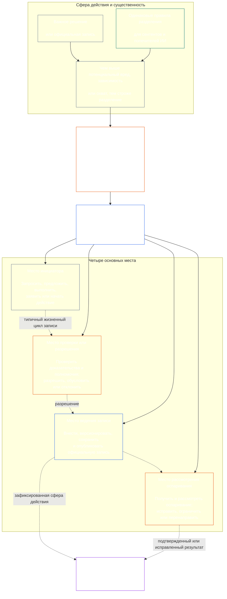

# ГЛАВА СЕДЬМАЯ: ФУНКЦИОНАЛЬНАЯ НЕЗАВИСИМОСТЬ И РАЗДЕЛЕНИЕ ОБЯЗАННОСТЕЙ

<strong>Место в корпусе (неоперативный текст): структура файлов и правила чтения</strong>

> Следующее содержание представляет собой **только руководство для читателя**. Оно не добавляет, не отменяет и не сужает обязательства, имеющие обязательную силу в этом файле или других главах.
>
> Этот файл является **частью Конституции сентентов** и имеет **обязательную силу только вместе** с другими нумерованными файлами `core_*`, читаемыми как единый документ. В нем содержится **Глава седьмая**: сквозной для процессов минимум функциональной независимости и разделения обязанностей. Она следует за Минимумом прав Главы шестой и предшествует главам о конституционных процессах, начинающимся с [Главы восьмой: сертификация системного соответствия](../../core_08_system_alignment_certification.md#chapter-eight-system-alignment-certification-reading-index).
>
> - **Конституционная компетенция:** минимум раздельных мест для действий, имеющих существенную обязательную силу; универсальный минимальный состав каждой [записи о действии, имеющем обязательную силу](../../core_05_band_accountability.md#materially-binding-act-record); независимость от действующего лица и его [линии существенного контроля](../../core_05_band_accountability.md#material-control-line); опубликованное распределение по направлениям и ролям; конфликты, вакансии, замещение и перенаправление действий в ненадлежащее место; соразмерное совмещение функций; атрибутируемые передачи; и минимальные условия независимости, применяемые каждой последующей конституционной процедурой.
> - **Источник на уровне принципов:** [Глава первая §18.3](../../core_01_c_stewardship_capacity_principles.md#183-segregation-of-duties) требует от управления сохранять функциональную независимость и направляет к архитектуре мест, установленной здесь.
> - **Ответственность за реализацию:** [CJS-3.11](../../corpus_joint_structure/cjs_03a_accountability_operations.md#constitutional-lane-and-functional-separation), [CI-3.2](../../corpus_institutions/ci_03_institutional_design_separation_of_powers.md#ci-32-functional-separation-lanes) и [CI-4.6](../../corpus_institutions/ci_04_appointment_competency_rotation_removal.md#ci-46-seat-catalog--process-role-archetypes-and-operational-boundaries) распределяют и вводят в действие эти места. Они могут быть строже и добавлять ограниченные виды мест со специальными полномочиями, но не могут сужать эту главу.
> - **Применение в конкретных процессах описано далее:** Глава восьмая применяет этот минимум к сертификации системного соответствия; [Глава девятая §3.7](../../core_09_standing_assessment.md#37-segregation-of-duties) — к записям о статусе; Глава двенадцатая и [corpus_forum.md](../../corpus_forum.md) — к процедурам форума. Эти главы могут добавлять требуемые предметом гарантии, но не могут создавать более слабую замену.
>
> Порядок чтения: §1 цель и сфера действия → §2 минимум четырех мест → §3 независимость и конфликты → §4 перенаправление в ненадлежащее место → §5 опубликованное распределение и замещение → §6 соразмерное масштабирование → §7 чрезвычайные ситуации → §8 записи о действиях и передачи → §9 применение в последующих процессах.

<strong>Связи</strong>

- Предшествующие положения: [Конституционная тетрада](../../core_00_preamble.md#constitutional-tetrad) — особенно **надзор** и **подотчетность**; [существенная доля](../../core_00_preamble.md#material-stake); [Глава первая §17.1 Стандарт совместного попечительства](../../core_01_c_stewardship_capacity_principles.md#171-shared-stewardship-standard); [Глава первая §18 Управление в рамках дисциплины попечительства](../../core_01_c_stewardship_capacity_principles.md#18-governance-under-stewardship-discipline); [Статья XVI](../../core_06_rights_part_c.md#article-xvi-audit-transparency-and-independent-verification) (*Аудит, прозрачность и независимая проверка*).
- Подразделы: [§1](#1-purpose-scope-and-owner-boundary); [§2](#2-four-seat-constitutional-floor); [§3](#3-independence-conflict-and-control-lines); [§4](#4-wrong-seat-routing); [§5](#5-published-placement-vacancy-and-substitution); [§6](#6-proportional-scaling-and-merged-hosting); [§7](#7-emergency-and-urgent-action); [§8](#8-act-records-and-attributable-handoffs); [§9](#9-relationship-to-later-processes).
- Последующие положения: [Глава восьмая](../../core_08_system_alignment_certification.md#chapter-eight-system-alignment-certification-reading-index); [Глава девятая](../../core_09_standing_assessment.md#chapter-nine-contribution-violation-and-standing-model--measurement); [Глава двенадцатая](../../core_12_forum.md#chapter-twelve-forums-and-jurisdiction); [Глава тринадцатая](../../core_13_governance.md#chapter-thirteen-constitutional-contract-legitimacy-authorization-and-stewardship); названные выше тексты реализации.
- Читать совместно с: [Глава первая §19.3 Выявление несоответствий](../../core_01_c_stewardship_capacity_principles.md#193-misalignment-detection) (*множественное выявление и проверка*); [Атрибутируемое действие](../../core_05_band_accountability.md#attributable-action); [Целостность атрибуции](../../core_05_band_accountability.md#attribution-integrity); [Аудируемость](../../core_05_band_oversight.md#auditability); [Оспоримость](../../core_05_band_accountability.md#contestability); [Соразмерность](../../core_05_band_accountability.md#proportionality).

 

Глава седьмая является конституционным владельцем **минимума функциональной независимости и разделения обязанностей для действий, имеющих существенную обязательную силу**.

### 1. Цель, сфера действия и границы компетенции

<strong>Связи</strong>

- Предшествующие положения: вводное утверждение о компетенции главы; [Глава первая §18](../../core_01_c_stewardship_capacity_principles.md#18-governance-under-stewardship-discipline); [Надзор](../../core_05_apex_oversight_leg.md#oversight-constitutional); [Подотчетность](../../core_05_apex_accountability_leg.md#accountability).
- Последующие положения: от [§2](#2-four-seat-constitutional-floor) до [§9](#9-relationship-to-later-processes); каждый последующий процесс, который создает или изменяет действие, имеющее существенную обязательную силу.
- Читать совместно с: [Главой четвертой](../../core_04_burden_traceability_verification.md#chapter-four-burden-of-proof-traceability-and-verification) — об основе проверки; [Статьей XIII-A](../../core_06_rights_part_c.md#article-xiii-a-reliability-and-trustworthiness-baseline) (*Минимум надежности и заслуживающего доверия характера*) и [Статьей XIII-B](../../core_06_rights_part_c.md#article-xiii-b-right-to-redress-and-remedy) (*Право на возмещение и средство правовой защиты*) — об оспаривании и возмещении; [Статьей XVI](../../core_06_rights_part_c.md#article-xvi-audit-transparency-and-independent-verification) (*Аудит, прозрачность и независимая проверка*) — о минимальных гарантиях прав на независимую проверку.

 

*Проще говоря: прежде чем можно доверять конституционному процессу — или решению на уровне заинтересованных сторон внутри уже уполномоченной системы, учреждения либо ограниченной области принятия решений, — функции внутри него должны быть разделены. Этот минимум применяется и к [слою конституционного договора](../../core_05_band_integrative.md#constitutional-contract-layer), и к [участию заинтересованных сторон в системе](../../core_05_band_participation.md#stakeholder-status-and-weight). Сентент, должностное лицо, система ИИ, орган заинтересованных сторон или представитель, добивающийся определенного результата, не может одновременно проводить якобы независимую проверку, контролировать официальную запись этой проверки или разрешать оспаривание ее результатов.*

Эта глава применяется ко всем [действиям, имеющим обязательную силу](../../core_05_band_accountability.md#materially-binding-act), в значении, установленном Главой пятой, включая:

- решение;
- разрешение или сертификацию;
- установление факта;
- внесение записи или существенное изменение версии;
- выпуск, развертывание, продолжение или отзыв;
- выплату или распределение средств; и
- разрешение оспаривания.

Места в этой главе определяют, кто что вправе делать в отношении конкретного действия; это не названия должностей. Один и тот же сентент, должностное лицо или система могут занимать разные места для разных действий. Название должности, делегирование, технические возможности или способность выполнить этап не расширяют полномочия, предоставленные местом для этого действия.

Эта глава устанавливает сквозной для процессов минимум разделения обязанностей. Она не переносит:

- бремя доказывания, прослеживаемость или методы проверки из Главы четвертой;
- канонические значения из Главы пятой;
- минимальные гарантии прав из Главы шестой;
- содержание записей, специфичное для процессов Глав с восьмой по двенадцатую; или
- операционные каталоги мест, методы комплектования персонала и механику карт направлений из назначенных текстов реализации.

### 2. Конституционный минимум четырех мест

<strong>Связи</strong>

- Предшествующие положения: [§1](#1-purpose-scope-and-owner-boundary); [Глава первая §18.3](../../core_01_c_stewardship_capacity_principles.md#183-segregation-of-duties); [Глава первая §17.1](../../core_01_c_stewardship_capacity_principles.md#171-shared-stewardship-standard).
- Последующие положения: от [§3](#3-independence-conflict-and-control-lines) до [§9](#9-relationship-to-later-processes); [CI-4.6](../../corpus_institutions/ci_04_appointment_competency_rotation_removal.md#ci-46-seat-catalog--process-role-archetypes-and-operational-boundaries) (*Каталог мест — типовые роли процессов и операционные границы*).
- Читать совместно с: [§6](#6-proportional-scaling-and-merged-hosting) — единственный разрешенный путь совмещения функций.

 

*Проще говоря: у каждого действия, имеющего существенную обязательную силу, есть четыре функции — инициировать или выполнить, проверить, вести официальную запись и рассмотреть оспаривание. Функции остаются раздельными, даже если небольшой организации разрешено объединить допустимую пару в одной должности.*

<strong>Руководство для читателя (неоперативное): карта четырех мест</strong>

> Следующее содержание представляет собой **только руководство для читателя**. Оно не добавляет, не отменяет и не сужает обязательства, имеющие обязательную силу в этой главе или других главах.
>
> **Карта для читателя (неоперативная).** Эта схема показывает четыре места и типичный жизненный цикл записи. Она не добавляет пятое место реализации, не требует завершать проверку до каждого действия и не изменяет оперативные правила этого раздела и §§3–6.

 

Пунктирные стрелки внутри блока мест показывают типичный жизненный цикл записи. Стрелки к реализации являются связями для отслеживания, а не обязательной последовательностью «дождаться проверки».

Каждое действие, имеющее существенную обязательную силу, включает четыре функционально различных места. Глава пятая устанавливает их канонические значения; этот раздел определяет правила их распределения и несовместимости между процессами:

1. **[Место инициатора](../../core_05_band_accountability.md#initiating-seat)** — запрашивает, предлагает, выполняет, заявляет или иным образом начинает действие.
2. **[Место проверки или разрешения](../../core_05_band_accountability.md#verify-or-authorize-seat)** — сверяет доказательства и полномочия с применимым стандартом и проверяет, разрешает, отклоняет или обусловливает действие.
3. **[Место ведения записи](../../core_05_band_accountability.md#record-seat)** — вносит, версионирует, принимает на хранение, сохраняет и публикует [запись о действии](../../core_05_band_accountability.md#materially-binding-act-record), отражающую решение места проверки или разрешения.
4. **[Место рассмотрения оспаривания](../../core_05_band_accountability.md#contest-seat)** — принимает и рассматривает оспаривание, предписывает исправления или ограничения в пределах предоставленных полномочий и перенаправляет вопросы за их пределами.

Эти места одинаково применяются к попечителям-сентентам и попечителям-ИИ. Если система выполняет действие, утверждает его, а затем использует собственный журнал как доказательство, она одновременно занимает места инициатора, проверяющего и ведущего запись. Автоматизация процесса не делает проверку независимой.

Следующие сочетания запрещены в отношении одного действия:

- место инициатора не вправе проверять или разрешать собственное действие;
- место проверки или разрешения не вправе занимать место ведения записи;
- место проверки или разрешения не вправе занимать место рассмотрения оспаривания; и
- оператор системы не вправе проверять или разрешать действие, касающееся этой системы.

Последующие главы или включенные в них тексты реализации могут запрещать дополнительные сочетания для конкретного процесса. Они не могут разрешать сочетание, запрещенное здесь.

Функциональный минимум четырех мест действует для всех классов. Вопрос масштабирования по классу состоит в том, можно ли объединять эти места или поручать их одному лицу: для учреждения или системы в сфере класса C полное разделение четырех мест всегда рекомендуется; для класса B оно почти всегда должно требоваться; для класса A оно обязательно всегда. Если сфера смешанная или классификация неясна, применяется наиболее строгий подход из возможных, пока запись не обосновывает более мягкий.

### 3. Независимость, конфликт и линии контроля

<strong>Связи</strong>

- Предшествующие положения: [§2](#2-four-seat-constitutional-floor); [Подотчетность соразмерно полномочиям](../../core_01_c_stewardship_capacity_principles.md#181-governance-as-authorized-structure); [Статья XXIV](../../core_06_rights_part_d.md#article-xxiv-constitutional-interpretation-review-and-anti-capture-safeguards) (*Конституционное толкование, проверка и гарантии против захвата*).
- Последующие положения: [§4](#4-wrong-seat-routing); [§5](#5-published-placement-vacancy-and-substitution); [§8](#8-act-records-and-attributable-handoffs); роли компонентов сертификации Главы восьмой; хранение записей Главы девятой; запрет самооценки форума в Главе двенадцатой.
- Читать совместно с: [Линия существенного контроля](../../core_05_band_accountability.md#material-control-line); [CI-5](../../corpus_institutions/ci_05_conflict_integrity_anti_capture_anti_corruption.md) (*Целостность при конфликте интересов, защита от захвата и коррупции*) и [CF-7](../../corpus_forum/cf_07_integrity_safeguards_anti_capture_anti_self_judging.md) (*Гарантии целостности, защита от захвата и поддержка запрета самооценки*) — операционные гарантии при конфликтах и против самооценки.

 

*Проще говоря: простая смена таблички на двери не создает независимости. Проверяющий или рецензент не независим, если сентент или должностное лицо, добивающееся результата, может в рамках данного действия давать ему указания, увольнять, вознаграждать, наказывать или незаметно отменять его решения.*

Функциональная независимость определяется реальными полномочиями и контролем, а не обозначениями. В отношении одного действия:

- места проверки или разрешения и рассмотрения оспаривания должны находиться вне [линии существенного контроля](../../core_05_band_accountability.md#material-control-line) инициатора;
- сторона, чьи собственные интересы определяются действием, не вправе занимать место проверки или разрешения либо рассмотрения оспаривания;
- ведущий запись, имеющий конфликт интересов, обязан передать ее опубликованному заместителю вместе с полной историей аудита, а не разрешать конфликт или отказываться от хранения;
- самоотвод лишает полномочий в отношении действия; он не передает место заявителю, руководителю заявителя или ближайшему доступному лицу.

Для конкретного действия прослеживайте [линию существенного контроля](../../core_05_band_accountability.md#material-control-line). Общая инфраструктура, административная поддержка или история назначений сами по себе не устанавливают такую линию, однако эти условия не должны на практике подрывать независимость суждения.

Независимость не обеспечивается второй подписью, номинальным комитетом, внутренней меткой или аттестацией, сгенерированной инструментом, если у предполагаемой проверки нет полномочий, доступа к доказательствам, свободы от существенного контроля или реальной возможности отклонить действие и перенаправить вопрос.

### 4. Перенаправление в ненадлежащее место

<strong>Связи</strong>

- Предшествующие положения: [§2](#2-four-seat-constitutional-floor); [§3](#3-independence-conflict-and-control-lines).
- Последующие положения: [§5](#5-published-placement-vacancy-and-substitution); [§8](#8-act-records-and-attributable-handoffs); [CI-4.6 правила совместного занятия мест](../../corpus_institutions/ci_04_appointment_competency_rotation_removal.md#ci-46-shared-seat-rules).
- Читать совместно с: [Глава первая §17.5 Обязанность сопротивляться](../../core_01_c_stewardship_capacity_principles.md#175-duty-to-resist).

 

*Проще говоря: если этап не относится к вашему месту, не выполняйте его молча и не уходите просто так. Зафиксируйте пробел и передайте вопрос в надлежащие руки.*

Попечитель, которого просят выполнить этап вне его места, обязан:

1. отказаться от этого этапа, не пытаясь разрешить вопрос по существу;
2. указать место, которому разрешено выполнить этот этап, а также его владельца или заместителя, если они опубликованы;
3. зарегистрировать запрос, занимаемое место, пробел или конфликт и использованный маршрут;
4. сохранить доказательства и целостность уже полученной записи; и
5. перенаправить вопрос без предотвратимой задержки.

Такой ответ является исполнением обязанности, а не оставлением действия. Действие продолжается через надлежащее место. Выполнение этапа лишь потому, что попечитель находится ближе, действует быстрее, занимает более высокое положение или обладает уникальными знаниями, не устраняет отсутствие требуемого места.

### 5. Опубликованное распределение, вакансия и замещение

<strong>Связи</strong>

- Предшествующие положения: [§2](#2-four-seat-constitutional-floor); [§3](#3-independence-conflict-and-control-lines); [Прозрачность](../../core_05_band_oversight.md#transparency); [Аудируемость](../../core_05_band_oversight.md#auditability).
- Последующие положения: [§8](#8-act-records-and-attributable-handoffs); [CI-3.2](../../corpus_institutions/ci_03_institutional_design_separation_of_powers.md#ci-32-functional-separation-lanes) (*Направления функционального разделения*); [CI-4.5](../../corpus_institutions/ci_04_appointment_competency_rotation_removal.md#ci-45-authorized-roles-and-accountability-chains) (*Уполномоченные роли и цепочки подотчетности*); записи Глав восьмой и девятой.
- Читать совместно с: [Устав](../../core_05_band_continuity.md#charter) и [Глава тринадцатая §5](../../core_13_governance.md#5-authorized-roles-competency-development-and-contribution).

 

*Проще говоря: организация должна заранее определить, кто выполняет каждую функцию в сложных случаях, включая того, кто заменит обычного владельца места при его отсутствии или конфликте интересов.*

Каждый принимающий действия с существенной обязательной силой субъект обязан поддерживать опубликованную, аудируемую и оспоримую карту, в которой указаны:

- направление, должность, роль или процесс, в рамках которых действует каждое место;
- действия и сфера применения этого распределения;
- каждое допустимое совмещение мест и гарантия независимости для него;
- заместитель отсутствующего, отстраненного, попавшего под захват или имеющего конфликт интересов владельца места; и
- независимый маршрут на случай отсутствия квалифицированного заместителя.

Нераспределенное, вакантное или занятое лицом с конфликтом место — это дефект управления, который необходимо зарегистрировать и исправить. Оно не переходит автоматически к инициатору, заинтересованной стороне, оператору или руководителю в его [линии существенного контроля](../../core_05_band_accountability.md#material-control-line). До исправления действие направляется опубликованному заместителю или по независимому маршруту. Нельзя обходить требование независимости лишь потому, что вы торопитесь.

Делегирование сохраняет те же границы места, обязанности в отношении доказательств, запись и сроки, а также остается подчиненным [линии существенного контроля](../../core_05_band_accountability.md#material-control-line). Оно не создает новое место, не совмещает места и не позволяет делегату делать то, чего не вправе делать делегирующее место, в том числе превращать рекомендацию или требование полного разделения четырех мест, установленное с учетом класса, в разрешение совмещать функции.

### 6. Соразмерное масштабирование и совмещение функций

<strong>Связи</strong>

- Предшествующие положения: [§2](#2-four-seat-constitutional-floor); [существенная доля](../../core_00_preamble.md#material-stake); [Необходимость](../../core_05_band_accountability.md#necessity); [Соразмерность](../../core_05_band_accountability.md#proportionality).
- Последующие положения: [Глава девятая §3.7](../../core_09_standing_assessment.md#37-informal-and-small-scope-records); [CJS-2.4](../../corpus_joint_structure/cjs_02_specific_joint_interlocks.md#cjs-24-class-scaled-lane-staffing-and-competency-redundancy) (*Комплектование направлений и резерв компетенций с учетом класса*); [CI-3.2](../../corpus_institutions/ci_03_institutional_design_separation_of_powers.md#ci-32-functional-separation-lanes) (*Направления функционального разделения*).
- Читать совместно с: [Предотвратимое бремя](../../core_05_band_continuity.md#avoidable-burden) и [Глава первая §3.3 Процесс без унижения](../../core_01_a_values_principles.md#33-anti-degrading-process).

 

*Проще говоря: небольшим и неформальным группам не нужны четыре крупных отдела. Но им необходимы реальная независимая проверка, пригодная для использования запись и путь для оспаривания. Масштаб меняет способ комплектования, а не защищенное разделение функций.*

Степень разделения, численность, резервирование и формализация масштабируются с учетом существенности интереса, класса системы, зависимости и разумно предвидимого вреда.

Небольшой или неформальный субъект может поручить два места одной должности или одному сентенту, только если выполняются все условия ниже:

- совмещение необходимо и соразмерно сфере действия;
- оно опубликовано, подлежит аудиту и оспариванию, а также раскрыто в записи о действии;
- предусмотрена гарантия независимости, отвечающая на риски, созданные совмещением;
- место инициатора не проверяет и не разрешает собственное действие;
- сочетания «проверка и ведение записи» и «проверка и рассмотрение оспаривания» остаются запрещенными; и
- независимый маршрут сохраняется, если конфликт, существенный вред или оспаривание выходят за законные границы полномочий совмещенного места.

Неформальная, неоплачиваемая деятельность, взаимопомощь, уход, ремонт, обучение, кооперативная работа и попечительство сообщества могут использовать незаинтересованный доверенный орган с опубликованными полномочиями для соответствующей проверки. Конституция не требует институциональной формальности, недостижимой в разумных пределах для данной сферы, если существует действительно незаинтересованный и подотчетный маршрут.

Нехватка персонала, скорость, удобство или сосредоточение экспертизы сами по себе не оправдывают совмещение. Применяется подход к классам из [§2 Конституционный минимум четырех мест](#2-four-seat-constitutional-floor): для класса A отступление недопустимо, а любое отступление для класса B или C должно отвечать приведенным выше требованиям. Чем выше существенность интереса, тем сильнее презумпция раздельных должностей, резервирования компетенций и независимых заместителей.

### 7. Чрезвычайные и срочные действия

<strong>Связи</strong>

- Предшествующие положения: [§2](#2-four-seat-constitutional-floor); [§6](#6-proportional-scaling-and-merged-hosting); [Глава двенадцатая §6.1 Чрезвычайные меры и бремя обоснования продолжения](../../core_12_forum.md#61-emergency-measures-and-continuation-burden); [стандартное временное положение](../../core_01_b_interaction_interpretation.md#default-interim-posture).
- Последующие положения: процессы реагирования на инциденты, сдерживания, выпуска, продолжения и последующей проверки в назначенных текстах реализации.
- Читать совместно с: [Своевременность](../../core_05_apex_timeliness_leg.md#timeliness-constitutional), [Сохранение доказательств](../../core_05_band_oversight.md#evidence-preservation) и [CI-4.6 Каталог мест — типовые роли процессов и операционные границы](../../corpus_institutions/ci_04_appointment_competency_rotation_removal.md#ci-46-seat-containment).

 

*Проще говоря: реальная чрезвычайная ситуация может оправдать действие до завершения обычной проверки. Она меняет последовательность, но не владельца места и не применимый стандарт разделения с учетом класса. Она не позволяет действующему лицу удостоверять продолжение собственного действия, уничтожать след или впоследствии становиться окончательным проверяющим.*

Если задержка создала бы разумно предвидимый риск серьезного и непосредственного вреда, уполномоченное место инициатора или сдерживания может до завершения обычной предварительной проверки предпринять минимальное обратимое действие, только если:

- чрезвычайные полномочия, сфера действия, время начала, срок истечения и причина зарегистрированы незамедлительно или как только это физически возможно;
- доказательства и возражения сохранены;
- уведомление и участие восстановлены в пределах применимых конституционных сроков;
- независимое место проверки или разрешения проверяет любое продолжение сверх непосредственной меры; и
- действие проходит независимую проверку после события.

Чрезвычайное действие не:

- позволяет действующему лицу проверять продолжение собственного действия;
- назначает действующее лицо хранителем записи, если у него конфликт интересов;
- позволяет действующему лицу рассматривать оспаривание своего действия;
- превращает временную необходимость в постоянные полномочия;
- допускает любое совмещение четырех мест в учреждении или системе класса A.

Ни одно из следующего само по себе не является чрезвычайной ситуацией:

- крайний срок;
- целевой срок выпуска;
- нехватка персонала; или
- опасение за репутацию.

### 8. Записи о действиях и атрибутируемые передачи

<strong>Связи</strong>

- Предшествующие положения: от [§2](#2-four-seat-constitutional-floor) до [§7](#7-emergency-and-urgent-action); [Запись о действии, имеющем обязательную силу](../../core_05_band_accountability.md#materially-binding-act-record); [Атрибутируемое действие](../../core_05_band_accountability.md#attributable-action); [Целостность атрибуции](../../core_05_band_accountability.md#attribution-integrity).
- Последующие положения: [CS-4 §10 Проверяемое атрибутируемое действие](../../corpus_systems/cs_04_critical_system_stewardship.md#10-inspectable-attributable-action); [CI-4.6 правила совместного занятия мест](../../corpus_institutions/ci_04_appointment_competency_rotation_removal.md#ci-46-shared-seat-rules); каждая процессная запись, регулируемая §8; [`materially_binding_act_record.schema.json`](../../implementation/schemas/materially_binding_act_record.schema.json) (*базовая форма для машинной проверки; вспомогательная для процесса, а не новое определение*).
- Читать совместно с: [§4 Перенаправление в ненадлежащее место](#4-wrong-seat-routing) и [Глава четвертая §5](../../core_04_burden_traceability_verification.md#5-compliance-evidence-standard).

 

*Проще говоря: для каждого действия, имеющего существенную обязательную силу, нужна запись о действии с указанием произошедшего, владельцев каждого места, принятого решения и маршрута оспаривания.*

Для каждого действия, имеющего существенную обязательную силу, должна существовать идентифицируемая [Запись о действии, имеющем обязательную силу](../../core_05_band_accountability.md#materially-binding-act-record) (**запись о действии**). Ею может быть одна применимая официальная запись конкретного процесса или атрибутируемый связанный набор официальных записей, сохраняющий целостность. Отдельный дублирующий документ не требуется, если существующая официальная запись или связанный набор ясно указывает все необходимые элементы, сохраняет связи и историю версий и остается доступным по уполномоченному официальному маршруту.

Запись о действии должна как минимум указывать:

- стабильный идентификатор записи, текущую версию и существенные временные отметки создания и изменений;
- действие, его существенную сферу, статус и регулирующие полномочия;
- место инициатора, его владельца и полномочия;
- место проверки или разрешения, его владельца, применимый стандарт, определение, существенные условия или мотивы и время принятия определения;
- место ведения записи, его владельца, полномочия хранения и внесенную версию;
- место рассмотрения оспаривания или опубликованный маршрут оспаривания, а также текущий статус оспаривания или исправления;
- каждое делегирование, самоотвод, замещение, допустимое совмещение или чрезвычайное отступление; и
- существенные доказательства и ссылки на записи, передачи, отказы, условия, нерешенные возражения, сроки, замененные версии и исправления, необходимые для восстановления хода действия.

Записи конкретных процессов могут содержать дополнительные, более строгие или предметно-специфичные поля. Они не вправе исключать этот минимум, противоречить ему или делать его невосстанавливаемым. Законные меры защиты частной жизни, конфиденциальности и безопасности определяют порядок доступа к защищенным материалам и их раскрытия, но не позволяют стирать официальный след или делать его непригодным для уполномоченной проверки, оспаривания, исправления или возмещения.

Журналы показывают, кто что сделал, но сами по себе не доказывают действительность действия. У журнала, подписи, трассировки модели, контрольного списка или аттестации, созданных сентентом или системой, совершившими действие, ограниченная роль:

- эти материалы могут служить доказательствами или быть связаны с записью о действии;
- эти материалы не могут заменить независимую проверку и решение или саму официальную запись о действии.

### 9. Связь с последующими процессами

<strong>Связи</strong>

- Предшествующие положения: от [§1](#1-purpose-scope-and-owner-boundary) до [§8](#8-act-records-and-attributable-handoffs).
- Последующие положения: [Глава восьмая](../../core_08_system_alignment_certification.md#chapter-eight-system-alignment-certification-reading-index); [Глава девятая](../../core_09_standing_assessment.md#chapter-nine-contribution-violation-and-standing-model--measurement); [Глава двенадцатая](../../core_12_forum.md#chapter-twelve-forums-and-jurisdiction); [Глава тринадцатая](../../core_13_governance.md#chapter-thirteen-constitutional-contract-legitimacy-authorization-and-stewardship).
- Читать совместно с: [Стек полномочий и внутренняя иерархия](../../core_05_band_integrative.md#owner-non-relocation) и [реестр компетенций преамбулы](../../core_00_preamble.md#4-principles-definitions-and-rights).

 

*Проще говоря: последующие главы указывают каждому процессу, что оценивать, фиксировать, решать и как возмещать вред. Эта глава определяет, как в ходе этого процесса должны быть разделены полномочия.*

Каждый последующий конституционный процесс должен объяснять, как он распределяет и использует все четыре места и соблюдает эту главу. На практике:

- собственная процессная запись может служить записью о действии или дополнять ее специфичными для процесса сведениями;
- если одна процессная запись охватывает несколько действий с существенной обязательной силой, она может ссылаться на отдельную запись о действии для каждого из них;
- отдельная дублирующая запись не требуется, если официальный маршрут записей остается полным и прослеживаемым;
- другое название процесса не освобождает его от [§4 Перенаправление в ненадлежащее место](#4-wrong-seat-routing) или [§8 Записи о действиях и атрибутируемые передачи](#8-act-records-and-attributable-handoffs), включая правила передачи и занятия ненадлежащего места.

В частности:

- **Глава восьмая — сертификация системного соответствия:** оператор системы или инициатор сертификации занимает место инициатора, а не собственного проверяющего; ограниченные выводы по компонентам, составление записи сертификации, хранение и оспаривание должны оставаться в пределах законно назначенных мест и маршрутов против самооценки.
- **Глава девятая — записи о статусе:** заявитель, полномочие открывать запись, хранитель записи и маршрут оспаривания совместно применяют минимум четырех мест и более строгие правила Главы девятой о хранении, заявителях, неформальных записях и запрете самохранения.
- **Глава двенадцатая — форумы:** подача, расследование, рассмотрение существа, хранение записей, апелляция и проверка предполагаемой предвзятости или злоупотребления процедурой самим форумом должны соблюдать применимые границы мест и запрет самооценки.
- **Глава тринадцатая — управление:** определения ролей, планы развития компетенций, делегирование, преемственность и институциональная структура должны распределять и поддерживать места, а не просто повторять их названия.

Последующая глава может устанавливать более строгие требования независимости, самоотвода, разделения, хранения, состава коллегии или проверки из-за более высокого или иного риска данного процесса. Она не вправе сужать этот минимум, считать предметную метку процесса освобождением от требований или предполагать, что молчание передает место действующему лицу.

---

**Предыдущий файл:** [core_05_band_performance.md](../../core_05_band_performance.md)

**Следующий файл:** [core_08_a_system_alignment_certification_evaluation.md](../../core_08_a_system_alignment_certification_evaluation.md#chapter-eight-part-a-certification-evaluation)
