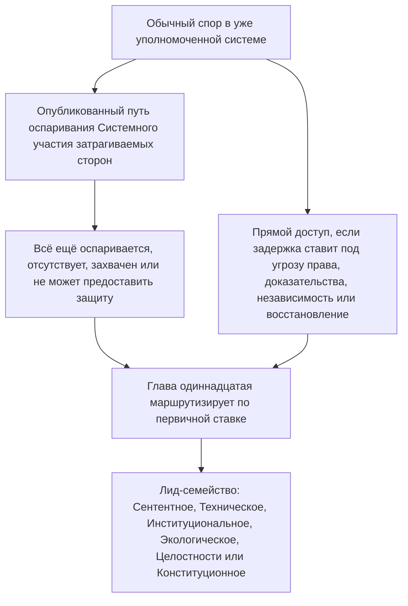

# ГЛАВА ОДИННАДЦАТАЯ: ФОРУМЫ И ЮРИСДИКЦИЯ

<strong>Место в корпусе (неоперативное): структура файла и правила чтения</strong>

> Следующее содержание — **только ориентир для читателя**. Оно не добавляет, не снимает и не сужает связывающих обязанностей в этом файле или в других главах.
>
> Этот файл — **пилот читательского языка** [английской Главы одиннадцатой](../../core_12_forum.md). **Не** является связывающей частью Конституции сентентов. **Не** является второй конституцией. **Не** является изданием к отправке. **Закреплён** за `SC-Corpus-2026.08.09`. Если этот перевод и английский оригинал кажутся расходящимися, побеждает нумерованный файл [`core_11_forum.md`](../../core_12_forum.md). Порядок чтения и метаданные издания ведутся в [README.md](../../README.md). Метод и глоссарий: [translations/ru/README.md](README.md).
>
> Он содержит **Главу одиннадцатую**: семейства форумов, место по умолчанию и маршрутизацию по первичным ставкам, судебно-экспертную поддержку, триаж приёма и юрисдикцию для споров под цепочкой траектории и Полом прав. Форумы **надзирают** обращение со спорами под ногами **участия**, **надзора** и **своевременности** [Конституционной тетрады](core_00_preamble.md#constitutional-tetrad), масштабированными к [материальной ставке](core_00_preamble.md#material-stake). Когда факты проверены, они могут **открыть, обновить или исправить** записи траектории — или **отложить плохую запись по оспариванию** — под [Главой восьмой §3](core_08_standing_assessment.md#3-standing-record-operational-requirements); поданное дело само по себе не является траекторией, и повествование форума не должно подменять измерение траектории Главы восьмой ([Глава восьмая §3.6](core_08_standing_assessment.md#36-forum-boundary)). Используйте [README — Standing pipeline and forums](../../README.md#standing-pipeline-and-forums) для навигации цепочки. Операционная механика форума остаётся в назначенных файлах реализации. Нумерация глав и перекрёстные ссылки соответствуют интегрированному инструменту.

>
> **Предыдущий (ещё на английском):** [core_10_b_misconduct_pattern_applications.md](../../core_11_b_misconduct_pattern_applications.md#chapter-eleven-part-b-anti-constitutional-misconduct-pattern-applications)
>
> **Следующий (ещё на английском):** [core_08-11_application_vignettes.md](../../core_09-12_application_vignettes.md#chapters-eight-eleven-application-vignettes)
> **Дуга чтения:** §1 назначение → Последовательность споров → §2 место по умолчанию и приём → §2.1–§2.3 пределы лида, смешанные ставки, оспаривания → §3 передача и антисамосуждение → §4 семейства → §5 эскалация и сертификация → §6 уровни и дисциплина против промедления → §7 поддержка форума

<strong>Ориентир для читателя (неоперативный): где живёт Глава одиннадцатая и что остаётся здесь</strong>

> Следующее содержание — **только ориентир для читателя**. Оно не добавляет, не снимает и не сужает связывающих обязанностей в этой главе или в других главах.
>
> Где это живёт (навигация):
> - **Конституционный владелец:** **раздел 1** (*назначение* — **первичное разбирательское применение** норм, которые эта глава распределяет, **в отличие от** рутинного **исполнительного администрирования**; **Последовательность споров** для обычных споров внутри уже уполномоченных систем; требования **подотчётности**; **опубликованное**, **предсказуемое** размещение **порога**); **стартовое место по умолчанию**, маршрутизация по **первичным ставкам**, **орган триажа приёма** (**стол первого касания**), смешанные ставки, асимметрия, оспаривания записей траектории, **характеристика добросовестности и антиигра**, и ожидания **доступа** к **порогу**, **доступному сентентам** (**раздел 2**, **читать вместе с** **`corpus_forum.md`**); **передача**, **консолидация** и **координация** (**раздел 3**, читать вместе с сертификацией и запасом **раздела 5**); **определения семейств форумов**, **внутренние палаты**, **общие стандарты** и **временное оперативное право** (сентентное, техническое, институциональное, экологическое, целостности, конституционное — **раздел** **4**, зеркалящий **таблицу** **раздела** **2**); **эскалация**, **сертификация** и **временная защита** (**раздел 5**); **своевременное разрешение** и дисциплина **против промедления** (**раздел 6**); **поддержка форума** до, во время и после пересмотра (**раздел 7**), реализованная так, чтобы роли триажа и поддержки **не** подменяли **законно составленные коллегии по существу**; запасная маршрутизация **антисамосуждения**; и крючки эскалации, связанные с **Главой восьмой**, **Главой десятой** и правами правосудия и оспаривания **Главы шестой**.
> - **Навигация цепочки:** [README — Standing pipeline and forums](../../README.md#standing-pipeline-and-forums) — [§§1–7](#1-purpose-and-role) в этом файле.
> - **Цепочка трёх вопросов Глав восьмой–девятой:** **Разделы 2–3** Главы восьмой отвечают на Вопрос 1 (*что произошло?*) через проверенные, чистоосевые записи. [Глава восьмая §4](core_08_standing_assessment.md#4-standing-measurement-evaluation-dimensions) и [единая пропорциональная шкала LEQU §7](core_08_standing_assessment.md#7-unified-proportional-lequ-scale) отвечают на Вопрос 2 (*насколько это было хорошо или плохо?*) через измерения оценки, общие пятикратные полосы LEQU и общую грамматику **s** = 1...9, сохраняя отдельные записи Вклада и Нарушения. [Глава девятая](core_09_standing_integration.md#chapter-nine-standing-effects-and-integration) отвечает на Вопрос 3 (*что из этого следует?*) через средства защиты, гарантии, планки компетентности и допуски, и замки траектории. Ячейку Оси нарушения контролирует только проверенное воздействие; небрежность, сокрытие, принуждение, ответ и сопоставимые дескрипторы характера её не двигают. [Глава десятая](core_10_a_misconduct_designation.md#chapter-ten-anti-constitutional-misconduct) может добавить соответствующее обозначение антиконституционного проступка к записи ячейки 7, 8 или 9 Главы восьмой, но не присваивает числовую ячейку.
> - **Форумы (неоперативная глосса):** **Семейства форумов** под этой главой — первичные **форумы**, которые применяют классификации [Главы восьмой](core_08_standing_assessment.md#chapter-eight-compliance-violation-and-standing-model) к конкретным спорам — включая дела, где отдельно записанные **природа вклада**, **ячейка воздействия Оси нарушения** и характер процесса / ответа **соприсутствуют** и должны вестись под дисциплиной совместной оценки и неподмены **Главы восьмой**. Механизмы **исследовательского финансирования**, **финансирования** и **стимулов** вне разбирательства остаются в принятой реализации и **[corpus_systems.md](../../corpus_systems.md)** (см. ориентир для читателя **Главы восьмой**); они могут поддерживать предотвращение и расследование корневой причины и **не должны** подменять маршрутизацию **порога**, определение **по существу**, авторитетное присвоение числовой ячейки Главы восьмой, любое соответствующее обозначение **Главы десятой** или ограничения **Статьи XXIII** (*Разрешение конфликтов, эскалация и чрезвычайная соразмерность*). **Разделы 1 и 2** распределяют **первичную** ответственность за структуры **стимулов** **главным образом** **внутри** **сферы** каждого **семейства** (гранулярная деталь в **корпусе** и реализации); это **распределение** **не** переносит выборы **бюджета** **всей системы** или **масштаба управления**, зарезервированные [Главе двенадцатой](../../core_13_governance.md#chapter-thirteen-constitutional-contract-legitimacy-authorization-and-stewardship) и **[corpus_systems.md](../../corpus_systems.md)**.
> - **Владелец реализации:** опубликованные **классы** приёма, повседневные правила досье, штат, бюджеты, гранулярная процедура, операционная механика эскалации и операционные требования поддержки форума живут в принятом тексте реализации и в **[corpus_forum.md](../../corpus_forum.md)** (**CF-5** (*Операции маршрутизации, передачи, сертификации и представительского обращения*), **CF-8** (*Судебно-экспертная и аналитическая поддержка форума*), **CF-9** (*Независимая следственная служба и интерфейс преследования*), и связанные разделы); эти слои **реализуют, не сужают**, эту главу.
> - **Правило антипереноса:** принимающие инструменты не должны удовлетворять эту главу процедурами, которые схлопывают различные функции форума, снимают **независимость** или **настоящий пересмотр**, или маршрутизируют оспаривания целостности обратно к тому же захваченному форуму, который эта глава запрещает как единственный конечный дом по существу.
>
> **Архитектура — размещение *Простыми словами*:** Каждая строка *Простыми словами* появляется сразу после навигационного блока Трассировки (и ` `, который следует за ним, когда он есть), и **перед** оперативными абзацами и маркированными списками этого раздела. Только глосса, обращённая к читателю; она не добавляет, не снимает и не сужает связывающий текст.

<strong>Трассировка</strong>

- Исход: [Глава восьмая](core_08_standing_assessment.md#chapter-eight-compliance-violation-and-standing-model) (*записи Вопроса 1 и измерение Вопроса 2, которые поставляют споры, которые эта глава маршрутизирует*); [Глава восьмая §5.1](core_08_standing_assessment.md#5-slot-grammar-and-display-labels) (*грамматика ячейки траектории*); [единая шкала Главы восьмой §7](core_08_standing_assessment.md#7-unified-proportional-lequ-scale) (*общие пятикратные полосы LEQU и отдельные записи осей*); [Глава восьмая §§4.3–4.4](core_08_standing_assessment.md#43-route-descriptor-measurement-roles) (*каталог нормализованных межосевых дескрипторов, включая дескрипторы Оси вклада и Оси нарушения, которые не двигают ячейки*); [Глава десятая](core_10_a_misconduct_designation.md#chapter-ten-anti-constitutional-misconduct) (*соответствующее обозначение антиконституционного проступка для квалифицирующих ячеек 7–9 Главы восьмой*); [Главы со второй по четвёртую](core_02_definition_structure.md) (*ожидания записи, верификации и прослеживания*); [Глава пятая](core_05__definitions_home.md#chapter-five-foundational-definitions) (*основополагающие определения*); [Глава первая](core_01_c_stewardship_capacity_principles.md#chapter-01-principles-and-constraints) (*интерпретативные ограничения*); [Глава шестая — Основополагающие права](core_06_rights_part_a.md#chapter-six-foundational-rights) через [Часть D](core_06_rights_part_d.md) (*крючки оспаривания, аудита и статей правосудия*).
- Подразделы: [§1](#1-purpose-and-role); [§2](#2-default-venue-and-primary-stakes); [§3](#3-transfer-consolidation-and-coordination); [§4](#4-forum-family-definitions); [§5](#5-escalation-and-certification); [§6](#6-timely-resolution-materiality-tiers-and-anti-delay-discipline); [§7](#7-forum-support-before-during-and-after-review).
- Читать вместе с: [README — Standing pipeline and forums](../../README.md#standing-pipeline-and-forums).
- Назначение: [corpus_forum.md](../../corpus_forum.md) (*операционная доктрина форума*); [Глава двенадцатая](../../core_13_governance.md#chapter-thirteen-constitutional-contract-legitimacy-authorization-and-stewardship) там, где легитимность управления взаимодействует с разбирательской ролью; [Глава шестнадцатая](../../core_17_incorporation.md#chapter-seventeen-incorporation-bridge) (*дисциплина инкорпорации* для принятых процедурных слоёв).
- Читать вместе с: [Глава восьмая §5.1](core_08_standing_assessment.md#5-slot-grammar-and-display-labels) (*грамматика ячейки траектории*); [Глава восьмая §§4.3–4.4](core_08_standing_assessment.md#43-route-descriptor-measurement-roles) (*межосевые нормализованные дескрипторы Оси вклада и Оси нарушения*).
- Читать также с: [Глава девятая §3](core_09_standing_integration.md#3-descriptor-integration-and-attachment-normalization) (*интеграция дескрипторов и нормализация прикреплений, читаемая вместе с маршрутизацией по первичным ставкам раздела 2*); [README.md](../../README.md) (*порядок чтения и организация корпуса*); [doc_architecture.md](../../doc_architecture.md) (*несвязывающие редакционные карты, если не приняты*).

 

Глава одиннадцатая — конституционный владелец **семейств форумов, места по умолчанию, юрисдикции и разбирательской маршрутизации споров под цепочкой траектории и Полом прав**.

*Простыми словами: под [Конституционной тетрадой](core_00_preamble.md#constitutional-tetrad) и [Двумя конституционными целями](core_00_preamble.md#two-constitutional-aims) эта глава **надзирает**, как споры движутся через цепочку траектории Глав восьмой–десятой — маршрутизация, независимость, судебно-экспертная поддержка, последовательность восстановления и умолчательные сроки уровня под **разделом 6** и **Статьёй XXIV-C** (*Своевременное разрешение и пол против промедления*). Семейства форумов отвечают, какая дорожка обрабатывает какой спор, где дело обычно начинается и как координируются дела со смешанными ставками. Они поставляют **участие** (доступное оспаривание) и **надзор** (прослеживаемый пересмотр по существу). Когда факты проверены, они могут **открыть, обновить или исправить** записи траектории — или **отложить плохую запись по оспариванию**. Они **не** ведут вторую, отдельную дорожку решений рядом с цепочкой траектории. Подача дела сама по себе не имеет немедленного воздействия на траекторию. Повседневные правила слушания, бюджеты и штатные пособия живут в слоях реализации и должны **реализовывать, не сужать**, эту главу или **Статью XXIII** (*Разрешение конфликтов, эскалация и чрезвычайная соразмерность*).*

### 1. Назначение и роль — архитектура участия

<strong>Трассировка</strong>

- Исход: [Глава седьмая — Сертификация согласования системы](core_07_a_system_alignment_certification_evaluation.md#chapter-seven-system-alignment-certification); [Глава восьмая](core_08_standing_assessment.md#chapter-eight-compliance-violation-and-standing-model); [Глава девятая](core_09_standing_integration.md#chapter-nine-standing-effects-and-integration); [Глава десятая](core_10_a_misconduct_designation.md#chapter-ten-anti-constitutional-misconduct); [Глава первая](core_01_c_stewardship_capacity_principles.md#chapter-01-principles-and-constraints) (*принципы и интерпретативные ограничения*); [Главы со второй по четвёртую](core_02_definition_structure.md) (*ожидания прослеживания и верификации*); [Глава пятая](core_05__definitions_home.md#chapter-five-foundational-definitions) (*определения, читаемые вместе с Главами со второй по четвёртую в виджете места в корпусе*); [Глава шестая](core_06_rights_part_a.md#chapter-six-foundational-rights) (*Основополагающий Пол прав, который эта глава применяет вместе с*).
- Назначение: [§2](#2-default-venue-and-primary-stakes) (*место по умолчанию по первичным ставкам, триаж приёма, смешанные ставки, асимметрия, оспаривания записей траектории; быстрый оспоримый доступ к порогу; характеристика добросовестности и антиигра*); [§3](#3-transfer-consolidation-and-coordination) (*передача и антисамосуждение*); [§4](#4-forum-family-definitions) (*определения семейств форумов, палаты, общие стандарты и временное оперативное право*); [§4.3](#43-institutional-forums) (*Граница внутреннего процесса как институционально-семейственное применение Последовательности споров*); [§5](#5-escalation-and-certification) (*эскалация, сертификация и временная защита*); [§6](#6-timely-resolution-materiality-tiers-and-anti-delay-discipline) (*уровни материальности, вехи цепочки и дисциплина против промедления*); [§7](#7-forum-support-before-during-and-after-review) (*поддержка форума до, во время и после пересмотра*).
- Нога(и) Тетрады: **участие**, **надзор**, **подотчётность**, **своевременность** (проверенные находки могут открыть, обновить или исправить записи траектории; **CF-11** реализует сроки уровня). Первичная(ые) цель(и): **Расцвет** и **Преемственность**. Масштабирование по [материальной ставке](core_00_preamble.md#material-stake) применяется к маршрутизации и бремени доступа.
- Читать вместе с: [Преамбула §3.2](core_00_preamble.md#32-key-governance-processes) и [§3.3](core_00_preamble.md#33-governance-layers) (*пути процессов и дисциплина слоёв управления*); [Статья XI: Системное участие затрагиваемых сторон, представительство и надлежащая процедура](core_06_rights_part_b.md#article-xi-stakeholder-system-participation-representation-and-due-process); [corpus_forum.md](../../corpus_forum.md) (**CF-6.2.2** (*Правила чрезвычайности, исчерпания и сроков*) — реализовать, не сужать); [corpus_institutions.md](../../corpus_institutions.md) (*оспаривание, вторичный пересмотр и мониторинг целостности — не заменяет назначенную юрисдикцию форума*); [Статья XII-B: Право оспаривать, на пересмотр и восстановление](core_06_rights_part_c.md#article-xii-b-right-to-challenge-review-and-redress); [семья Статьи XXIII](core_06_rights_part_d.md#article-xxiii-a-justice-objective-and-scope) (*ограничения правосудия, на которые ссылается виджет места в корпусе*).

 

*Простыми словами: этот раздел назначает конституционное **участие** и **надзор** через семейства форумов, которые **надзирают** две дорожки — **цепочку траектории** (споры и эффекты записей Глав восьмой–десятой) и **Сертификацию согласования системы** (признание и пересмотр Главы седьмой) — затем излагает требования подотчётности для опубликованного размещения порога. Обычные споры внутри уже уполномоченных систем сначала используют опубликованный путь оспаривания Системного участия затрагиваемых сторон; эта глава берёт дело, когда этот путь всё ещё оспаривается, отсутствует, захвачен или не может предоставить защиту. Подробные правила слушания живут в другом месте и не могут тихо сжать то, что эта глава гарантирует.*

Эта глава излагает, какие **семейства форумов** **надзирают** какие первичные вопросы через **участие** (оспаривание, доступное сентентам, представительское обращение и соразмерный доступ) и **надзор** (независимость, судебно-экспертная поддержка и прослеживаемый пересмотр по существу). Она **не** задаёт правила досье, штат, бюджеты, гранулярную процедуру или операционную механику эскалации. Эти детали принадлежат слоям реализации корпуса, которые должны **реализовывать, не сужать**, эту главу. **Семейства форумов** должны излагать правовые и регуляторные границы для размещения порога, маршрутизации по первичным ставкам и пересмотра согласования системы предсказуемым, опубликованным способом, который **реализует, не сужает**, **раздел 2** вместе с **`corpus_forum.md`**.

**Семейства форумов надзирают:**

1. **Цепочку траектории** (Главы восьмая–десятая, применяя Главы с первой по шестую и назначенные нормы реализации корпуса в спорах)
   - Маршрутизацию по первичным ставкам, пересмотр по существу там, где назначен, передачу, консолидацию и координацию сертификации, и последовательность восстановления для споров, связанных с траекторией.
   - Записи Вклада и Нарушения **Главы восьмой**, измеренные на единой пропорциональной шкале LEQU §7, дескрипторы характера и эффект траектории — проверенные находки могут **открыть, обновить или исправить** записи траектории — или **отложить плохую запись по оспариванию** — под [Главой восьмой §3](core_08_standing_assessment.md#3-standing-record-operational-requirements), когда они удовлетворяют воротам проверенных входных данных; поданное дело само по себе не является траекторией, и повествование форума не должно подменять измерение траектории Главы восьмой ([Глава восьмая §3.6](core_08_standing_assessment.md#36-forum-boundary)).
   - Эффекты траектории и интеграцию **Главы девятой**, где эта глава назначает надзор форума за средством защиты и последовательностью.
   - Обозначение антиконституционного проступка **Главы десятой**, где это обозначение стоит на кону для записи ячейки 7–9 Главы восьмой.
   - Применение **Глав с первой по шестую** и назначенных слоёв реализации [корпуса](core_05_band_integrative.md#corpus) как норм, которые эти споры применяют.

2. **Сертификацию согласования системы** ([Глава седьмая](core_07_a_system_alignment_certification_evaluation.md#chapter-seven-system-alignment-certification))
   - Признание под надзором форума, условное признание, валидацию, ревалидацию, отзыв и связанные исходы записи сертификации под [Главой седьмой, Частью B](core_07_b_system_alignment_certification_record_process.md#chapter-seven-part-b-certification-record-and-process).
   - Роли компонентов под [Частью B §13](core_07_b_system_alignment_certification_record_process.md#13-forum-supervision-and-component-roles):
     - **Технические** — спецификации, методы и стандарты доказательств
     - **Целостность** — официальное признание согласования и лид-координация
     - **Экологические** — компонент экологического согласования там, где материально
     - находки компонентов других семейств под маршрутизацией этой главы
   - Сентенты могут оспаривать результаты сертификации, прикреплять условия и повторно открывать файл, когда нужно — но сертификация **не** подменяет измерение траектории.
   - Важные находки сертификации могут считаться **проверенными входными данными**, когда Глава восьмая измеряет траекторию. Сертификация **не** присваивает кому-либо ячейку траектории сама по себе ([Часть B §15](core_07_b_system_alignment_certification_record_process.md#15-relationship-to-standing)).

**Семейства форумов** — первичные институты, через которые этот инструмент **надзирает** эти дорожки. Они отличны от рутинного исполнительного администрирования принятых правил.

**Последовательность споров.** Внутри уже уполномоченной системы, института или ограниченного домена решения обычный спор сначала использует опубликованный путь оспаривания и надлежащей процедуры [Системного участия затрагиваемых сторон](core_05_band_participation.md#stakeholder-status-and-weight-cluster). Если этот путь производит всё ещё оспариваемый результат, отсутствует, захвачен или не может законно предоставить нужную защиту, эта глава маршрутизирует дело по первичной ставке под **разделом 2**. **Целостность**, **Технические домены форумов**, **Экологическое** и **Конституционное** — лид-семейства по умолчанию, когда это первичная ставка — не исключения, которые пропускают последовательность. Незавершённый внутренний процесс, ярлыки исчерпания или заявление, что внутренний пересмотр незавершён, не должны тормозить эти лиды, вытеснять их существо или поедать сроки **Статьи XXIV-C** (*Своевременное разрешение и пол против промедления*). Прямой доступ остаётся доступным, когда задержка материально поставила бы под угрозу права, доказательства, независимость или практическое восстановление.

*Только карта для читателя. Она не добавляет, не снимает и не сужает абзац Последовательности споров.*

Они:

- несут проактивную управленческую роль, включая разрешение проблем, анализ корневой причины, предотвращение, последовательность восстановления и обучение на паттернах сбоя, в согласовании с принципами **Главы первой**, включая **Безопасность**, **Истину**, **Благополучие**, **Отзывчивость** и **Ответственное управление и распределённое понимание**.
- должны удовлетворять ожиданиям **независимости**, **оспоримости** и **прослеживания** в **Главах со второй по четвёртую**, **Статье XII-B** (*Право оспаривать, на пересмотр и восстановление*) там, где затронуты оспаривание и восстановление, и **Статье XXIII** (*Разрешение конфликтов, эскалация и чрезвычайная соразмерность*) там, где управляют ограничения правосудия.
- подчинены наиболее строгим выраженным процедурным и целостностно-подотчётным требованиям этого инструмента, включая публичное обоснование, прослеживаемость, отвод и дисциплину коллегии, судебно-экспертную и аналитическую поддержку там, где эта глава их назначает
- требуют запасной маршрутизации антисамосуждения. Эти требования не должны подменять политическим контролем независимость разбирательства.
- Форумы **Целостности**, **Конституционные** и **Экологические**, и **Технические домены форумов**, когда они слышат разбирательство статуса сентентности, требуют **опубликованного**, **оспариваемого**, **ротационного** назначения или равнозначной проверки независимости под [Главой двенадцатой §1.2](../../core_13_governance.md#12-eligibility-contested-selection-and-democratic-minimums). Недоназначение или недофинансирование этих коллегий — сбой [Главы девятой §9](core_09_standing_integration.md#9-enforcement-realism).

Каждое **семейство форумов** несёт первичную ответственность за структуры стимулов главным образом внутри своей сферы. Это включает:

- принимающие инструменты и назначенные слои реализации
- пересмотр путей стоимости, санкций, оспаривания и отчётности
- крючки последовательности восстановления и сопоставимое согласование, смежное с разбирательством.

**Общесистемные** бюджеты, сквозное исследовательское финансирование и программы масштаба управления остаются под [Главой двенадцатой — Управление](../../core_13_governance.md#chapter-thirteen-constitutional-contract-legitimacy-authorization-and-stewardship), **[corpus_systems.md](../../corpus_systems.md)** и другими правилами верховенства там, где применимо. Выплаты, правила стоимости и подобные инструменты стимулов **не** должны занимать место:

- надлежащей маршрутизации форума
- настоящего решения по существу законно составленной коллегии
- измерения ячейки воздействия Главы восьмой
- любого соответствующего обозначения **Главы десятой**
- ограничений правосудия в **Статье XXIII** (*Разрешение конфликтов, эскалация и чрезвычайная соразмерность*)

Институциональное оспаривание, вторичный пересмотр и мониторинг целостности в **`corpus_institutions.md`** (включая **CI-5** (*Целостность конфликта, антизахват и антикоррупция*) по **CI-8** (*Межинституциональная координация и эскалация*) и ожидания целостности оспаривания) работают рядом с этой главой. Они не заменяют семейства форумов **Целостности**, **Экологические** или **Институциональные** для связывающего существа там, где эта глава назначает этим семействам юрисдикцию. Механизмы стимулов реализации в этих томах должны координироваться с семейством форумов, чья сфера первично затронута, не вытесняя маршрутизацию по первичным ставкам или власть по существу, которую эта глава назначает.

### 2. Место по умолчанию и первичные ставки

<strong>Трассировка</strong>

- Исход: [§1](#1-purpose-and-role) (*назначение, первичная прикладная роль, требования подотчётности, опубликованная маршрутизация порога, неперенос детали, ожидания независимости и пересмотра*).
- Назначение: [§3](#3-transfer-consolidation-and-coordination) (*передача, консолидация, антисамосуждение*); [§4](#4-forum-family-definitions) (*определения семейств форумов, читаемые вместе с таблицей по умолчанию*); [§5](#5-escalation-and-certification) (*эскалация из места по умолчанию; Временная защита*); [§6](#6-timely-resolution-materiality-tiers-and-anti-delay-discipline) (*уровни материальности и дисциплина против промедления*); [§7](#7-forum-support-before-during-and-after-review) (*поддержка форума до, во время и после пересмотра*).
- Внутри §2: [§2.1](#21-lead-default-limits) (*столкновение первичных ставок, конституционная сертификация и запас антисамосуждения*); [§2.2](#22-mixed-stakes-and-routing-asymmetry) (*смешанные ставки и асимметрия*); [§2.3](#23-forum-records-standing-records-and-contests) (*записи дел форума, записи траектории и оспаривания*).
- Читать вместе с: [Конституционная тетрада](core_00_preamble.md#constitutional-tetrad) — ноги **участия**, **надзора** и **своевременности**; масштабирование по [материальной ставке](core_00_preamble.md#material-stake) для маршрутизации по первичным ставкам; [Глава восьмая §5.1](core_08_standing_assessment.md#5-slot-grammar-and-display-labels) (*грамматика ячейки траектории*); [единая шкала Главы восьмой §7](core_08_standing_assessment.md#7-unified-proportional-lequ-scale) (*общие пятикратные полосы LEQU и отдельные записи осей*); [Глава восьмая §§4.3–4.4](core_08_standing_assessment.md#43-route-descriptor-measurement-roles) (*межосевые нормализованные дескрипторы, информирующие первичную ставку, не двигая ячейку воздействия*); [corpus_forum.md](../../corpus_forum.md) (**CF-5** и **CF-7.2**); [corpus_systems.md](../../corpus_systems.md) (*обязанности классификации, развёртывания и ревалидации системы*); [Глава десятая §3](core_10_a_misconduct_designation.md#3-violation-axis-s-7-9-slot-assignment-incident-gravity) (*обозначение антиконституционного проступка для квалифицирующих ячеек 7–9 Главы восьмой; сохранён наследие-якорь*); [Глава десятая §4](core_10_a_misconduct_designation.md#4-due-process-safeguards-for-slot-assignment) (*надлежащая процедура для этого обозначения, читаемая вместе с этой главой и **Статьёй XXIII** (*Разрешение конфликтов, эскалация и чрезвычайная соразмерность*)*); [Статья XXIII-A](core_06_rights_part_d.md#article-xxiii-a-justice-objective-and-scope) (*цель и охват правосудия*).

 

*Простыми словами: **стол первого касания** каждого семейства — **орган триажа приёма** — спрашивает, о чём спор на самом деле, а не что говорит заголовок, затем использует таблицу по умолчанию, чтобы выбрать лид-форум. Технические форумы поддерживают спецификации, методы и стандарты доказательств согласования системы; форумы **Целостности** делают официальное суждение о признании согласования и текущей валидации, если компонентный вопрос не принадлежит в другом месте. Сортировка не подменяет законно составленные коллегии по существу; смешанные ставки, асимметрия и оспаривания записей траектории — в подразделах ниже.*

**Маршрутизация по первичным ставкам** назначает дело семейству форумов, ответственному за главную правовую, восстановительную, принудительно-гарантийную, конституционно-половую или практическую ставку в **притязании** или **защите**. Она следует тому, о чём спор на самом деле, а не заголовку или предпочитаемому стороной исходу.

**Орган триажа приёма (стол первого касания).** Каждое требуемое семейство форумов должно поддерживать **орган триажа приёма** или функционально равнозначное устройство внутри этого семейства как **стол первого касания** семейства при подаче. Этот орган:
- **применяет** маршрутизацию по первичным ставкам под этим разделом;
- **сортирует** входящие дела для **опубликованного** обращения приёма, согласованного с **первичными ставками**;
- **помечает** нужды сохранения, **Пола прав**, **межсемейственной маршрутизации** и **запасного форума**;
- **администрирует** начальный доступ так, чтобы передача, консолидация, сертификация и дисциплина запаса под **разделами 3 и 5** могли вступить в силу быстро;
- **не** является отдельным конституционным семейством форумов;
- **не должен** подменять законно составленную коллегию по существу на **содержательных исходах** или **схлопывать** границы **семейства**;
- **не должен** применять финансирование, пошлины, административное предпочтение или иные устройства стимулов, чтобы сорвать маршрутизацию по первичным ставкам или включить непрозрачную сортировку порога.

**Характеристика добросовестности и антиигра.** Характеризация форума должна быть **добросовестной** и **обоснованной** **первичными ставками**. **Знающая** ложная характеризация **может** запускать **издержки**, **отклонение** или **направление** под принимающим правом. Устройства стимулов не должны быть устроены или применены, чтобы вознаграждать форумный шопинг, непрозрачную сортировку порога или маршрутизацию, несогласованную с дисциплиной первичных ставок в **этом разделе** и **разделе 3**. Механика издержек, отклонения и направления живёт в **`corpus_forum.md`** (**CF-5**) и должна **реализовывать, не сужать**, этот раздел.

Операционные требования — включая **опубликованные классы приёма**, атрибутируемые записи приёма, ожидания независимости и **оспаривания**, и **быстрый** пересмотр **оспариваемой** маршрутизации — изложены в **`corpus_forum.md`** (**CF-5** (*Операции маршрутизации, передачи, сертификации и представительского обращения*)).

**Начальный доступ** к каждому семейству форумов должен быть достаточно быстрым и оспоримым, чтобы:
- маршрутизация по первичным ставкам под этим разделом оставалась значимой;
- передача, консолидация, сертификация и дисциплина запаса под **разделами 3 и 5** не обнулялись задержкой или непрозрачной сортировкой порога.

Ожидания сроков доступа к форуму должны:
- быть **доступными сентентам**;
- быть калиброваны к срочности вреда и сложности дела под **разделом 6** и **Статьёй XXIV-C** (*Своевременное разрешение и пол против промедления*);
- предпочитать настоящий доступ к порогу и законное временное облегчение под **разделом 5** (*Временная защита*) административному удобству.

**Орган триажа приёма** под этим разделом вместе с **`corpus_forum.md`** (**CF-5**) удовлетворяет этой обязанности и должен реализовывать окна уровня по умолчанию **раздела 6** внутри охвата инкорпорации.

**Карта маршрутизации из Главы восьмой §3.** Глава восьмая говорит форумам, как *измерять* то, что произошло. Она **не** сама выбирает, какой форум слышит дело. При подаче **орган триажа приёма** семейства (стол первого касания) проходит эту последовательность:

1. **Проверьте, что уже проверено:** Отметьте любой проверенный материал **Оси вклада** или **Оси нарушения** Главы восьмой — включая ячейку воздействия, полосу тяжести, характер процесса / ответа и эффект траектории — когда они уже существуют.
2. **Не считайте обвинения установленными фактами:** Заявления и предварительные ярлыки направляют только маршрутизацию и сохранение доказательств, пока не существуют находки под **Главами со второй по четвёртую**.
3. **Выберите лид-форум по тому, о чём спор на самом деле:** Используйте таблицу места по умолчанию ниже: **Сентентное**, **Технические домены форумов**, **Институциональное**, **Экологическое**, **Целостность** или **Конституционное**. Применяйте эти специальные правила маршрутизации там, где они подходят:
   - **Обозначение Главы десятой:** Там, где обозначение антиконституционного проступка **Главы десятой** — **первичная** ставка, **Целостность** — лид по умолчанию. Сохраняйте:
     - числовую ячейку воздействия Главы восьмой;
     - сертификацию **Конституционного** там, где нужно;
     - правила институциональной стороны; и
     - запас антисамосуждения под **разделами 2, 3 и 5**.
   - **Споры о предвзятости форума:** Если спор главным образом о панеллисте, который должен был отойти, предвзятом участии коллегии или сопоставимом нарушении целостности форума — включая на коллегии **Конституционного** форума под **[Статьёй XXII-B](core_06_rights_part_c.md#article-xxii-b-composition-rotation-and-conflict-controls) (*Состав, ротация и контроль конфликтов*)** — маршрутизируйте его сначала к форумам **Целостности**. Под **разделом 3** форум не может быть единственным конечным разбирающим собственной предвзятости: **Конституционный** форум не может быть единственным конечным форумом, решающим, должен ли его собственный панеллист был отведён. Дисциплина замка траектории: **[Глава девятая §5.5](core_09_standing_integration.md#55-special-locks)**. Именованный паттерн проступка: **[Глава десятая §5.10](../../core_11_b_misconduct_pattern_applications.md#510-forum-recusal-failure-and-biased-panel-participation)**.
   - **Технические вопросы «как»:** Спецификации, методы, измерение, тестирование и вопросы экспертных доказательств идут к **Техническим доменам форумов**, когда это первичная ставка или сертифицированные компонентные вопросы.
   - **Подпись согласования системы:**
     - Официальное **признание конституционного согласования** для новых материально воздействующих систем и **текущая валидация согласования** для существующих по умолчанию имеют **Целостность** как лид.
     - Целостность использует входные данные технических форумов плюс конституционные, институциональные, экологические, правовые и антизахватные требования.
     - Там, где система имеет материальное экологическое воздействие, зависимость от средовых предпосылок, нагрузку жизненного цикла, обязанность восстановления или разумно предвидимый экологический риск, семейство **Экологических** форумов должно завершить свой пересмотр экологического согласования (подпись или возражение), прежде чем признание, валидация, ревалидация или материальное освобождение от экологических условий могут стать окончательными.
     - Сохраняйте направления или сертификацию к **Техническим доменам форумов**, **Институциональному**, **Экологическому**, **Сентентному** и **Конституционному** для компонентных вопросов, которыми эти семейства владеют.

При подаче место **по умолчанию** следует этим правилам, если **раздел 3** не передаёт или не консолидирует:

| Семейство | Паттерн сторон | Первичная ставка (сводка) |
|--------|---------------|--------------------------|
| **Сентентное** | Дела сентент-к-сентенту и споры управления сообществом членов, участников, домохозяйств, соседств, ассоциаций, местных, региональных, онлайн или сопоставимые, где ни один институт не является необходимой стороной и никакое другое семейство не держит первичную ставку | Частные или общинные обязательства, восстановительные или реституционные вреды, местное восстановление, местные или онлайн нормы сообщества, участие в общинном управлении, исключение, восстановление или внутренние споры самоуправления |
| **Технические домены форумов** | Любой паттерн сторон, но **первичная** ставка — процедура технического управления, спецификации согласования системы, стандарты экспертных доказательств, научное / инженерное / медицинское администрирование, сопоставимое управление знанием в принятом охвате **или** определение статуса сентентности **Статьи V-E** (*Пол разбирательства статуса сентентности*) по индикаторам / экспертным доказательствам / ограниченной неопределённости | **Технические** стандарты, спецификации согласования системы, методы измерения и тестирования, экспертная административная процедура, ответственное управление доказательствами, целостность учебников или учебных программ, управление стандартами, ограниченное снижение неопределённости, релевантное разбирательству, регулированию или признанию согласования, **или** разбирательство индикаторов статуса сентентности под **Статьёй V-E** (*Пол разбирательства статуса сентентности*) |
| **Институциональное** | Любой **институт** является **необходимой** стороной **или** главный спор о том, что институту позволено делать, что ему поручено делать, или следовал ли он правилам, которые им управляют | Что институт может делать, что ему поручено делать, охват, под которым он надзирается, как он классифицирован, или следовал ли он своим обязанностям |
| **Экологическое** | Любой паттерн сторон; требуемая роль компонента там, где согласование системы материально затрагивает экологическое воздействие | **Экологическая целостность**, **средовые предпосылки**, восстановление или ремедиация общих экологических систем, приписываемые экологические нагрузки, вред жизненного цикла или системный экологический вред, компонентный пересмотр экологического согласования для систем с материальным экологическим воздействием, или **паттерн** или **системный** экологический сбой, где классификация, признание согласования, ревалидация или принуждение Пола прав зависят от этого определения |
| **Целостность** | **Целостность** как **главный** вопрос (включая **тяжкое** нарушение контроля конфликта, процедуры или захвата), официальное **признание конституционного согласования** или **текущая валидация согласования** для систем **или** обозначение антиконституционного проступка **Главы десятой** для ячейки воздействия Главы восьмой **s = 7, 8 или 9** как **первичная** ставка | **Целостность** должности, процесса, путей оспаривания, раскрытия, правил конфликта, обязанностей против захвата, официальное признание согласования системы, валидация и ревалидация с использованием входных данных технических форумов и определений компонента экологического согласования Экологических форумов там, где материально (**включая** **паттерн** или **системный** сбой **через** институты или системы, где измерение **Главы восьмой**, соответствующее обозначение **Главы десятой** или принуждение **Пола прав** зависит от этого определения) |
| **Конституционное** | **Структурная** конституционная действительность, значение **нормы** для **всех** интерпретаторов или средство защиты, которое **реструктурирует** управление **по конституционному требованию** | **Конституционная** действительность или значение, действие **за пределами законной власти**, верховенство или **классово-широкое** **структурное** средство защиты |

#### 2.1 Пределы лида по умолчанию

Эти правила ограничивают, как лиды по умолчанию таблицы взаимодействуют. Они не заменяют **разделы 3 и 5** или правила смешанных ставок и асимметрии в **разделе 2.2**.

- **Столкновение первичных ставок:** Если главный спор о том, что институту позволено делать, что ему поручено делать, или следовал ли он правилам, которые им управляют, лид **Целостности** Главы десятой по умолчанию не перекрывает строку **Институционального**. **Раздел 2.2** и **раздел 3** управляют смешанными ставками, необходимыми институциональными сторонами и выбором лид-форума.
- **Конституционная сертификация:** Лид **Целостности** для обозначения Главы десятой не вытесняет измерение числовой ячейки Главы восьмой или сертификацию или эскалацию к **Конституционным** форумам под **разделом 5** там, где конституционное значение, действительность или классово-широкое структурное средство защиты требуют определения под строкой **Конституционного** или через эскалацию от семейства к семейству.
- **Запас антисамосуждения:** Там, где материальные заявления обосновывают независимый пересмотр по существу целостности форума **Целостности** в разбирательстве обозначения Главы десятой, касающемся записи ячейки 7–9 Главы восьмой, запасная маршрутизация под **разделами 3 и 5** применяется, не сужая **раздел 4 Главы десятой** или **Статью XXIII** (*Разрешение конфликтов, эскалация и чрезвычайная соразмерность*).

#### 2.2 Смешанные ставки и асимметрия маршрутизации

**Смешанные ставки.** Одна запись и одно лид-семейство обычно слышат взаимозависимые притязания. Вторичные вопросы могут быть сертифицированы, приостановлены или разрешены через преклюзию вопроса, как предоставляют принимающие инструменты, согласованно с **Статьёй XII-B** (*Право оспаривать, на пересмотр и восстановление*) и дисциплиной совместной оценки и неподмены **Главы восьмой**.

**Асимметрия:**
- Там, где **зависимость**, **измерение** или **институциональная** **монополия** на **необходимый** **вход** материально ставит **сентентную** сторону в невыгодное положение, маршрутизация **Институционального** или **Целостности** **должна** быть **доступна**, когда таблица назначает **институциональные** или **целостностные** ставки.
- Там, где **материальные** **экологические** ставки **первичны**, маршрутизация **Экологического** **должна** быть **доступна**, как назначает таблица.
- **Сентентные** форумы **не должны** быть **единственным** **обязательным** форумом, когда **первичные** ставки **институциональные**, **целостностные** или **экологические** под таблицей в этом разделе.

#### 2.3 Записи дел форума, записи траектории и оспаривания

**Записи дел форума и записи траектории:**
- Форум держит [**запись дела форума**](core_05_band_accountability.md#forum-case-record) для спора перед ним. Эта запись отслеживает:
  - притязания;
  - доказательства;
  - выборы маршрутизации;
  - временные приказы;
  - сертифицированные вопросы; и
  - окончательные находки в этом деле.
- Это **не** то же самое, что **записи траектории**, требуемые [Главой восьмой](core_08_standing_assessment.md#2-standing-records) (см. [Запись траектории](core_05_band_accountability.md#standing-record-chapter-six)).
- Решение форума может стать частью **записи траектории вклада** или **записи траектории нарушения** Главы восьмой только когда оно производит проверенную запись вклада, проверенную находку нарушения, **запись сертификации согласования системы** или иную находку, которая ограничена, прослеживаема, оспорима и проверена под Главами со второй по четвёртую и любыми требуемыми гарантиями пересмотра.
- Ничто из следующего само по себе не меняет чью-либо траекторию, элигибильность роли, статус доверия, признание или окончательный эффект траектории:
  - подача дела;
  - назначение его семейству форумов;
  - заметки приёма;
  - выпуск временного приказа;
  - запись неразрешённого заявления;
  - обсуждение урегулирования; или
  - использование предварительного ярлыка маршрутизации.
- Когда один лид-форум ведёт дело со смешанными ставками, он должен держать **запись дела форума** достаточно ясной, чтобы отдельные измерения вклада и нарушения Главы восьмой, любое обозначение Главы десятой и эффекты траектории Главы девятой всё ещё могли аудитироваться отдельно и записываться в чистоосевые записи траектории.

**Оспаривания записей траектории:**
- Оспаривание, поднятое на записи до любой подачи — хранителю, власти открытия записи или любому офису института — журналируется на записи, ставится *под оспариванием* и маршрутизируется хранителем под [Главой восьмой §3.7](core_08_standing_assessment.md#37-challenge-received-on-the-record) (*Оспаривание, полученное на записи*); сроки уровня под **§6** идут от этого получения, и **запись дела форума** открывается, когда оспаривание достигает форума.
- Сентент, институт, система, сообщество или иной затронутый субъект может просить компетентный форум пересмотреть **запись траектории вклада** или **запись траектории нарушения**, когда они заявляют, что запись:
  - неверна;
  - неполна;
  - устарела;
  - неверно охвачена;
  - основана на недействительной находке;
  - пропускает требуемый контекст;
  - пропускает требуемую перекрёстную ссылку; или
  - используется для цели, которую она не покрывает.
- Работа форума — пересмотреть оспариваемую запись и способ, которым она используется. Он может:
  - подтвердить запись;
  - потребовать исправления;
  - приказать новую версию;
  - ограничить или приостановить опору на запись;
  - направить подлежащий вопрос к правильному форуму; или
  - сертифицировать конституционный вопрос.
- Форум **не должен** превращать оспаривание записи траектории в общий репутационный процесс или сливать пересмотр вклада и нарушения в одно недифференцированное слушание по существу, когда оспаривание целит только одну чистоосевую запись.
- Маршрутизация следует реальному вопросу в оспаривании:
  - фактические или доказательные дефекты идут к семейству форумов, которое может справедливо пересмотреть этот материал;
  - споры об институциональном использовании идут к **Институциональным** форумам там, где главный спор о том, что институт может делать или следовал ли он правилам, которые им управляют;
  - заявления о захвате, сокрытии, мести или целостности процесса идут к форумам **Целостности** там, где целостность первична;
  - экологическое существо идёт к **Экологическим** форумам там, где экологические ставки первичны;
  - конституционная действительность или значение идёт к **Конституционным** форумам через сертификацию или прямую маршрутизацию там, где эта глава это позволяет.

### 3. Передача, консолидация и координация — преемственность и антизахват

<strong>Трассировка</strong>

- Исход: [§2](#2-default-venue-and-primary-stakes) (*таблица места по умолчанию, триаж приёма, смешанные ставки и асимметрия*); [Глава девятая §2 — Запись интеграции и порядок решения](core_09_standing_integration.md#2-integration-record-and-decision-order) (*наивысшая применимая категория несоответствия — координация смешанных ставок*).
- Назначение: [§5](#5-escalation-and-certification) (*сертифицированные конституционные вопросы, активация запасной маршрутизации и Временная защита, пока координация идёт*).
- Читать вместе с: [Статья XII-B](core_06_rights_part_c.md#article-xii-b-right-to-challenge-review-and-redress) (*Право оспаривать, на пересмотр и восстановление*); [corpus_institutions.md](../../corpus_institutions.md) (*внутренний процесс целостности, который может предшествовать форумам целостности там, где гарантии удовлетворяют ожиданиям*); [corpus_forum.md](../../corpus_forum.md) (**CF-7**, координация согласования под лидом Целостности).

 

*Простыми словами: когда многие **затронутые** **стороны** разделяют один подлежащий паттерн вреда, форумы могут справедливо расширить дело; когда форумы **Целостности** выпускают постановления **согласования**, они держат **одну** лид-запись и направляют **компонентные** вопросы к правильному **семейству**, не крадя у этих форумов работу по существу; и никакое семейство форумов не получает быть единственным последним словом, когда обвинение по сути в том, что это же семейство подстроено, конфликтно или прячет мяч — правила отправляют это на другую лид-дорожку с письменными запасами.*

**Расширение охвата и представительское обращение.** Когда один сентент подаёт дело, форум **может** расширить разбирательство, чтобы покрыть затронутый **класс**, **подкласс** или иную группу в той же ситуации.
- Расширение доступно, когда запись показывает любое из следующего:
  - общий вред, который имеет значение;
  - ту же незаконную практику;
  - то же правило решения;
  - общую зависимость от того же поведения, системы или институционального выбора; или
  - вопрос **согласования систем** с материальными эффектами вверх или вниз по течению.
- Форум **должен** расширять, когда отказ расширить предсказуемо оставил бы сопоставимо расположенных **сентентов** без практического средства защиты.
- Он **также должен** расширять, когда отказ расширить предсказуемо произвёл бы конфликтующие постановления или заблокировал бы защиту, которая должна работать на **структурном** уровне.
- Расширение дела не отнимает **траекторию** первоначального заявителя. Оно также не стирает индивидуальные вопросы, которые всё ещё нуждаются в доказательстве или средстве защиты человек за человеком.

**Последовательность семейств и лид согласования.** Связанные дела могут начинаться на ближайшей компетентной дорожке, сначала использовать законный институциональный внутренний процесс целостности там, где гарантии держатся, и держать одну лид-запись **Целостности** для координации **согласования** — не вытесняя существо **первичных ставок** других семейств.
- **Сентентное** первым может применяться, когда споры сверстников могут быть полностью разрешены без окончательного институционального или конституционного определения; институциональные или конституционные аспекты могут быть приостановлены или разделены с явными правилами преклюзии.
- Внутренний процесс целостности **Институционального** может предшествовать форумам **Целостности** там, где независимость и гарантии оспаривания удовлетворяют ожиданиям **Главы восьмой**, **Главы шестой** (Основополагающие права) и **`corpus_institutions.md`**; форумы **Целостности** остаются доступными для окончательных определений целостности, межинституционального тупика и паттерновых притязаний.

**Координация согласования под лидом Целостности:**
- Там, где форум **Целостности** выпускает постановление **согласования** под **разделом** **4**, он **остаётся** **лид**-координирующим форумом для **записи** **этого** разбирательства, как предоставляет **раздел** **4**.
- Там, где форум **Целостности** проводит **признание конституционного согласования** для новой системы или **текущий пересмотр согласования** для существующей системы, он остаётся официальным лид-форумом для записи согласования, если маршрутизация по первичным ставкам, защита антисамосуждения или сертификация не назначает компонентный вопрос в другом месте.
- Там, где существует материальное экологическое воздействие, пересмотр экологического согласования **Экологического** форума — требуемый компонент этой лид-записи. Лид-координация **Целостности** не должна финализировать признание, валидацию, ревалидацию или материальное освобождение от экологических условий, пока своевременное возражение Экологического форума, условие ремедиации или сертифицированный экологический вопрос остаются неразрешёнными.
- **Компонентные** дела, **направленные** или **сертифицированные** к **другим** семействам, **остаются** у этих форумов для **существа** **первичных ставок**.
- Лид-координация **Целостности** не должна предвосхищать окончательное существо по нецелостностным первичным вопросам, зарезервированным **Конституционным**, **Институциональным**, **Экологическим**, **специализированным техническим** или **Сентентным** форумам.
- **Конфликтующие** **одновременные** приказы **должны** быть **разрешены** через **опубликованные** правила **координации** — **включая** **приостановки** и **последовательность** в постановлении **согласования** или тексте **реализации** — **согласованно** с **разделом** **7** и **`corpus_forum.md`** (**CF-7** (*Гарантии целостности, операции против захвата и поддержка против самосуждения*)).

**Межфорумное правило антисамосуждения.** Семейство **форумов** **не должно** быть **единственным** **конечным** форумом **по существу** для притязания, чей **первичный** вопрос — собственная **предвзятость**, **захват**, **конфликт**, **сбой отвода**, **сокрытие**, **злоупотребление процессом** или сопоставимое нарушение **целостности** этого же семейства.
- Маршрутизация по первичным ставкам по-прежнему управляет. **Независимое** лид-семейство для таких притязаний назначается следующим образом, если более специфическое конституционное правило не управляет:
  - против **Конституционных** форумов: сначала **Целостность** и **Институциональное** как запас
  - против **Институциональных** форумов: сначала **Конституционное** и **Целостность** как запас
  - против форумов **Целостности**: сначала **Институциональное** и **Конституционное** как запас
  - против **Экологических** форумов: сначала **Институциональное** и **Целостность** как запас
- Это правило **не** превращает каждое дело, называющее форум, в специальное правило места. Оно применяется только там, где защита **антисамосуждения** материально необходима, чтобы сохранить **независимость**, **оспоримость** или **публичное** **доверие**.

**Захват на уровне семейства.** Там, где достоверные доказательства указывают на **захват**, компромисс, принудительный контроль, координированное препятствование или структурную зависимость, затрагивающую **семейство форумов** как целое, обычный внутрисемейственный отвод, апелляция или процесс преемственности сами по себе недостаточны.
- Система форумов должна активировать следующее, достаточное, чтобы восстановить законное, оспоримое разбирательство по существу:
  - запасную маршрутизацию на уровне семейства;
  - независимое сохранение записей; и
  - ограниченный по времени внешний пересмотр.
- Захваченное или скомпрометированное семейство не должно контролировать запись активации, пересмотр восстановления или окончательное определение собственной восстановленной независимости.
- Запасная власть остаётся ограниченной тем, что необходимо для:
  - законного разбирательства по существу;
  - чрезвычайной защиты;
  - хранения записи; и
  - восстановления.
- Она не поглощает навсегда юрисдикцию захваченного семейства и не вытесняет **Конституционную** сертификацию там, где структурное средство защиты или конституционное значение материально стоит на кону.

**Сбой способности слышится вне истощённого тела.** Притязание, что семейство форумов, система средств защиты или функция интеграции траектории недоспособны — спроектированный задел, недоступный приём, хроническое недофинансирование, хронический сбой вех или сработавший трипвайер паритета средства защиты [Главы девятой §4.4](core_09_standing_integration.md#44-remedy-parity-and-lock-preconditions) — является делом антисамосуждения. Тело, чья способность под вопросом, не должно быть единственным установщиком факта о собственной способности.
- Семейство **Целостности** — лид по умолчанию для притязаний сбоя способности, с запасными парами **раздела 3**, применяемыми там, где Целостность сама является телом под вопросом.
- Любая затронутая сторона, защищённый докладчик или самоорганизованная группа под [Главой первой §9.5](core_01_c_stewardship_capacity_principles.md#95-aligned-self-organization) может подать притязание сбоя способности. Оно слышится по часам Уровня B под **разделом 6**, если запись не показывает ставки Уровня A.
- Тело под вопросом должно поставить свои опубликованные цифры задела [Главы девятой §4.4](core_09_standing_integration.md#44-remedy-parity-and-lock-preconditions) и **раздела 6** и может давать доказательства, но не должно контролировать находку или исправительный приказ.
- Находка сбоя способности — сбой долговечности [Главы девятой §9.2](core_09_standing_integration.md#92-remedy-system-durability). Она маршрутизирует исправительные приказы к семейству [первичных ставок](#2-default-venue-and-primary-stakes), ответственному за штат и финансирование, и, где паттерн хронический или скрытый, открывает обычный путь Главы восьмой.

### 4. Определения семейств форумов — подотчётность через разбирательство

<strong>Трассировка</strong>

- Исход: [§1](#1-purpose-and-role) (*назначение, первичная прикладная роль, требования подотчётности, опубликованная маршрутизация порога, неперенос детали, ожидания независимости и пересмотра*); [§2](#2-default-venue-and-primary-stakes) (*таблица места по умолчанию, тест первичных ставок, триаж приёма, смешанные ставки и быстрый оспоримый доступ к порогу*); [§3](#3-transfer-consolidation-and-coordination) (*передача, консолидация и антисамосуждение*).
- Назначение: [§5](#5-escalation-and-certification) (*эскалация от семейства к семейству; сертификация, когда операционные и конституционные ставки сливаются; постановления согласования и общая доктрина*); [§6](#6-timely-resolution-materiality-tiers-and-anti-delay-discipline) (*уровни материальности и дисциплина против промедления*); [§7](#7-forum-support-before-during-and-after-review) (*поддержка форума до, во время и после пересмотра*).
- Читать вместе с: [Преамбула §3.1](core_00_preamble.md#31-using-measurements-in-governance) (*хранение стандартов измерения и мост управления*); [corpus_forum.md](../../corpus_forum.md) (**CF-3** (*Формирование форума — инвентарь семейств, гибкость названий и несхлопывание*); постановления согласования **CF-7**); [corpus_institutions.md](../../corpus_institutions.md) (*обязанности института и язык надзираемого охвата, зеркалящийся в институциональном семействе*); [Глава пятая — Корпус](core_05_band_integrative.md#corpus) (*назначение файлов реализации и термины хранения для инкорпорированных правил института*).
- Внутри §4: [§4.1](#41-sentient-forums); [§4.2](#42-technical-forum-domains); [§4.3](#43-institutional-forums); [§4.4](#44-environment-forums); [§4.5](#45-integrity-forums); [§4.6](#46-constitutional-forums); [§4.7](#47-provisional-implementation-operational-law).

 

*Простыми словами: принимающие держат шесть подлинно различных дорожек форумов — сентентную, техническую, институциональную, экологическую, целостности и конституционную — в том же порядке, что таблица места по умолчанию в **разделе 2**. Форумы **Целостности** картируют взаимосвязанный сбой процесса и системы через постановления **согласования** и **координируют** направленные компонентные вопросы на **одной** лид-записи (с **разделом 3**). **Стол первого касания** каждого семейства (**орган триажа приёма**) и гарантии смешанных ставок — в **разделе 2** — эти столы **не** отдельный верхнеуровневый форум для окончательного существа. Экспертные коллегии и другие **внутренние палаты** сидят **внутри** этих семейств — не как обход маршрутизации по первичным ставкам. Общие стандарты, антивытеснение и выпуск временного оперативного права живут в этом разделе (**§§4.2 и 4.7**); Конституционное распоряжение — в **§4.6**; сертификация, когда ставки сливаются, — в **разделе 5**.*

Операционный инвентарь семейств, местная гибкость названий и механика несхлопывания живут в **`corpus_forum.md`** (**CF-3** (*Формирование форума, картирование структуры форума и структура палат*)) и должны **реализовывать, не сужать**, эту главу или таблицу места по умолчанию **раздела 2**.

Каждое семейство может использовать **внутренние палаты**, подразделения или назначенные коллегии; границы **семейства** по-прежнему управляют **апелляцией**, **сертификацией** и маршрутизацией по **первичным ставкам** под **разделами 2 и 5**.

**Подразделы** **ниже** **следуют** **порядку** **таблицы** **места** **по умолчанию** **раздела** **2**. Местные **названия** **могут** **различаться** под **`corpus_forum.md`** (**CF-3**); **функция** не должна. Когда **первичная** ставка покидает распределение семейства, **разделы 2, 3 и 5** управляют маршрутизацией, передачей, консолидацией, сертификацией и запасом — определения семейств не излагают заново эту матрицу.

#### 4.1 Сентентные форумы

**Первичные ставки.** **Сентентные форумы** слышат споры, чей **первичный** характер:
- **частные** или **общинные** обязательства;
- **гражданские** вреды;
- **восстановление**;
- **местные** или **онлайн** нормы сообщества;
- участие в общинном управлении среди сентентов, членов, жителей, пользователей, домохозяйств, ассоциаций, соседств, местностей, региональных сообществ, онлайн-сообществ или сопоставимых общинных образований.
- Дело **не** должно требовать **окончательного** разрешения **конституционной** действительности, **институционального** мандата, экологического существа, администрирования технического управления или сбоя целостности как главного вопроса.

**Иллюстративные дела.** Это семейство включает оспаривания о:
- исключении на уровне сообщества;
- доступе к общему общинному процессу;
- местных восстановительных обязательствах;
- решениях модерации или членства в неинституциональных онлайн-сообществах;
- самоуправлении соседства или ассоциации;
- входных данных партисипаторного бюджета;
- обязательствах использования общего;
- исходах общинных восстановительных или сверстнико-медиационных процессов;
- сопоставимых записях общинного самоуправления там, где дело остаётся главным образом межличностным, общинно-восстановительным или местно-нормативным.

**Граница общинного управления.** Сами тела общинного управления не являются отдельным **семейством форумов** под этой главой.
- Их записи, рекомендации, делегированные решения или упущения становятся делами для **Сентентных форумов** только там, где **первичная** ставка подходит этому подразделу, под [Последовательностью споров](#dispute-sequencing).

#### 4.2 Технические домены форумов

**Первичные ставки.** **Технические домены форумов** — **лид-семейство** **по умолчанию** там, где **первичная** ставка совпадает со строкой **Технических доменов форумов** в **разделе 2**. Это включает:
- процедуру технического управления;
- стандарты экспертных доказательств;
- научное, инженерное, медицинское или сопоставимое администрирование управления знанием в принятом охвате;
- технические стандарты;
- экспертную административную процедуру;
- ответственное управление доказательствами;
- целостность учебников или учебных программ;
- управление стандартами;
- ограниченное снижение неопределённости, релевантное разбирательству или регулированию;
- определения статуса сентентности **Статьи V-E** (*Пол разбирательства статуса сентентности*), чья первичная ставка — оценка индикаторов, экспертные доказательства или ограниченная неопределённость о том, является ли сущность **сентентом** под **Главой пятой** (*Разбирательство статуса сентентности*).

**Хранение стандартов.** **Технические домены форумов** поддерживают пересматриваемые стандарты, используемые для операционализации категорий измерения [Преамбулы §2](core_00_preamble.md#2-measurements-overview) и домов определений [Главы пятой](core_05__definitions_home.md#chapter-five-foundational-definitions) — включая стандарты, используемые для оценки согласования системы — в законном охвате:
- методы измерения;
- протоколы тестов;
- стандарты экспертных доказательств;
- технические спецификации;
- доказательные пороги;
- доменно-специфические стандарты.
- Они могут отвечать на сертифицированные технические вопросы для **записи сертификации согласования системы**.
- Они **не** выпускают окончательное официальное определение конституционного согласования или текущую валидацию, если иное положение независимо не назначает им эту первичную ставку.

**Общие стандарты и антивытеснение.** Подход по умолчанию для принуждения конституционного права — **общие стандарты с децентрализованным принуждением**: технические форумы поддерживают пересматриваемые межсемейственные стандарты под этим подразделом; лид-семейство форумов для спора применяет их под **разделом 2**. Семейства форумов не должны использовать техническую специализацию, чтобы вытеснять обычную конституционную, институциональную, целостностную, экологическую или сентентную маршрутизацию там, где первичный вопрос — права, мандат, ответственность, средство защиты или экологическое существо вне этих специализированных функций.

**Специализированные палаты.** Принимающие инструменты могут учреждать форумы **науки**, **инженерии**, **медицины** или иные технические форумы как **специализированные палаты или назначенные коллегии** внутри существующих семейств форумов — **не** как полностью отдельные семейства. Их функции могут включать:
- выпуск пересматриваемых стандартов, методов и доказательного руководства для научных, технических, клинических или иных экспертных притязаний, используемых через семейства форумов;
- слушание споров, чья первичная ставка — экспертная административная процедура, ответственное управление доказательствами, хранение, равнозначное аккредитации, публично управляемая целостность учебных программ или учебников, управление стандартами или сопоставимые вопросы управления знанием;
- поручение или направление работы ограниченного снижения неопределённости там, где материальные неразрешённые технические вопросы препятствуют надёжному разбирательству, классификации или регуляторной целостности.

**Временное оперативное право.** Рамка **временного оперативного права реализации** в **разделе 4.7** применяется к **специализированным техническим форумам** в пределах их законного охвата.

#### 4.3 Институциональные форумы

**Первичные ставки.** **Институциональные форумы** слышат споры, в которых **по крайней мере один институт** является **необходимой стороной**, или в которых **первичная** ставка:
- что институту позволено делать;
- что ему поручено делать;
- охват, под которым он надзирается;
- как он классифицирован под принимающими инструментами;
- измерение под принимающими инструментами;
- следовал ли он своим институциональным обязанностям под **`corpus_institutions.md`** и родственными слоями.

**Иллюстративные дела.** Это семейство включает оспаривания о:
- институциональном мандате, дозволенном действии или порученной функции;
- границах надзираемого охвата и классификации под принимающими инструментами;
- охвате [Хартии](core_05_band_continuity.md#charter), власти поправки Хартии, несовпадении Хартии и поведения или работе вне хартийного охвата;
- соответствии институциональным обязанностям и результативности под **`corpus_institutions.md`** и родственными слоями;
- местном принуждении общих межюрисдикционных или межинституциональных стандартов;
- компонентных вопросах институционального мандата и Пола прав в разбирательствах согласования системы там, где институт является необходимой стороной или институциональный мандат первичен.

**Местное принуждение.** Там, где применяются общие межюрисдикционные или межинституциональные стандарты, **Институциональные форумы** — форум **местного принуждения** по умолчанию, если маршрутизация по первичным ставкам не помещает дело в другом месте.

**Компоненты согласования.** **Институциональные форумы** держат пересматриваемую компонентную власть институционального мандата и Пола прав в сертификации согласования системы и связанных разбирательствах там, где институт является необходимой стороной, оператор или ответственный управляющий институционален, или институциональный мандат или надзираемое соответствие — первичная ставка.
- Форумы **Целостности** остаются официальным лидом по умолчанию для признания и валидации конституционного согласования целой системы.
- Компонентная деталь для этих разбирательств живёт в [Главе седьмой](core_07_b_system_alignment_certification_record_process.md#13-forum-supervision-and-component-roles) и должна **реализовывать, не сужать**, это распределение.

**Временное оперативное право.** Рамка **временного оперативного права реализации** в **разделе 4.7** применяется к **Институциональным форумам** в пределах их законного охвата.

**Граница внутреннего процесса.** Этот подраздел применяет [**Последовательность споров**](#dispute-sequencing) под **разделом 1** к **Институциональным** форумам. Законный институциональный внутренний процесс целостности может предшествовать форумам **Целостности** под **разделом 3** там, где независимость и гарантии оспаривания держатся.
- Ярлыки внутреннего процесса **не** вытесняют существо **Институционального** форума по ставкам мандата, надзираемого охвата, классификации или соответствия обязанностям.
- Они **не** вытесняют форумы **Целостности** для окончательных определений целостности, межинституционального тупика, паттерновых притязаний или пересмотра, чувствительного к захвату.

#### 4.4 Экологические форумы

**Первичные ставки.** **Экологические форумы** слышат споры, чья **первичная** ставка:
- **экологическая целостность**;
- **средовые предпосылки**;
- **вред жизненного цикла** или **системный** экологический **вред**;
- **восстановление** или **ремедиация** **общих** экологических **систем**;
- **подотчётность** за **приписываемые** экологические **нагрузки**;
- сопоставимое **экологическое** **существо**.
- Это включает **паттерн** или **системный** экологический сбой там, где измерение **Главы восьмой**, принуждение Пола прав **Главы шестой** или **Глава пятая** (*Экологическая целостность*, *Средовые предпосылки*) зависят от этого определения.

**Представительская подача.** Дело, чья первичная ставка — [Траектория природных систем](core_05_band_participation.md#natural-systems-standing) или экологическая целостность, может быть открыто опубликованным представителем — затронутым сообществом, держателем коренной преемственности или назначенным опекуном — в собственном интересе жизнеподдерживающей системы. Это не делает систему сентентом. Назначение, отвод и публикация представителей живут в [`corpus_forum.md`](../../corpus_forum.md) (**CF-5** (*Операции маршрутизации, передачи, сертификации и представительского обращения*)) и должны **реализовывать, не сужать**, этот пол.

**Иллюстративные дела.** Это семейство включает оспаривания о:
- базовых линиях и нарушениях экологической целостности или средовых предпосылок;
- восстановлении или ремедиации общих экологических систем;
- приписываемых экологических нагрузках, включая атрибуцию экологического следа там, где материально;
- эффектах жизненного цикла, выбросах, воздействиях на землю или воду, эффектах биоразнообразия, потоках отходов или обязательствах ремедиации;
- паттерне или системном экологическом сбое, материальном для классификации, признания согласования, ревалидации или принуждения Пола прав;
- компонентном пересмотре экологического согласования для систем с материальным экологическим воздействием.

**Компоненты согласования.** **Экологические форумы** держат пересматриваемый компонент экологического согласования для систем, чья работа, карта зависимостей, использование ресурсов, эффекты жизненного цикла, выбросы, воздействия на землю или воду, эффекты биоразнообразия, потоки отходов, обязательства ремедиации или режимы отказа материально затрагивают экологическую целостность или средовые предпосылки — включая там, где присутствует материальное экологическое воздействие, зависимость от средовых предпосылок, нагрузка жизненного цикла, обязанность восстановления или разумно предвидимый экологический риск.
- В пределах власти экологического существа они могут выпускать:
  - одобрение экологического согласования;
  - условное одобрение;
  - возражение;
  - требования ремедиации; или
  - находки освобождения от условий.
- Форумы **Целостности** остаются официальным лидом по умолчанию для признания и валидации конституционного согласования целой системы.
- Там, где существует материальное экологическое воздействие, своевременные находки экологического согласования Экологического форума — требуемые компонентные определения; последовательность с лид-координацией Целостности управляется **разделом 3**.
- Компонентная деталь для этих разбирательств живёт в [Главе седьмой](core_07_b_system_alignment_certification_record_process.md#13-forum-supervision-and-component-roles) и должна **реализовывать, не сужать**, это распределение.

**Временное оперативное право.** Рамка **временного оперативного права реализации** в **разделе 4.7** применяется к **Экологическим форумам** в пределах их законного охвата.

#### 4.5 Форумы целостности

**Первичные ставки.** **Форумы целостности** слышат споры, чья **первичная** ставка:
- целостность должности;
- процесс;
- пути оспаривания;
- раскрытие;
- правила конфликта;
- обязанности против захвата;
- связанная процедура и целостность управления.
- Это включает **паттерн** или **системный** сбой целостности через институты там, где измерение ячейки воздействия **Главы восьмой**, соответствующее обозначение антиконституционного проступка **Главы десятой** для записи ячейки 7–9 или принуждение **Пола прав** зависят от этого определения.
- Оно также включает официальное **признание конституционного согласования** или **текущую валидацию согласования** для систем и обозначение **Главы десятой** как **первичную** ставку, как назначено в **разделе 2**.

**Иллюстративные дела.** Это семейство включает оспаривания о:
- целостности должности, процесса или путей оспаривания;
- нарушениях раскрытия, правил конфликта или антизахвата;
- сокрытии, захвате, мести или сопоставимом злоупотреблении процессом;
- паттерне или системном сбое целостности через институты или системы;
- обозначении антиконституционного проступка Главы десятой там, где это обозначение — первичная ставка;
- официальном признании согласования системы, валидации и ревалидации.

**Постановления согласования.** Там, где необходимо разрешить дело в пределах юрисдикции этого семейства, **форумы целостности** могут выпускать **постановления согласования**, которые:
- диагностируют взаимосвязанное **рассогласование** среди процессов, систем, институтов или путей оспаривания — включая зависимости, узкие места, риск сокрытия или захвата и последовательность восстановления;
- излагают связывающие находки целостности по этим пунктам на записи перед этим форумом.

**Признание и валидация конституционного согласования.** **Форумы целостности** — официальный форум по умолчанию для признания, достаточно ли новая материально воздействующая система конституционно согласована, чтобы работать в заявленном охвате, и для периодической валидации, остаются ли существующие системы согласованными, как меняются их поведение, масштаб, зависимость, стимулы или профиль риска.
- Они применяют спецификации, методы и экспертные доказательства технических форумов там, где материально, но их суждение также включает конституционные, институциональные, экологические, правовые, антизахватные и восстановительные соображения.
- Там, где существует материальное экологическое воздействие, определение компонента экологического согласования семейства **Экологических** форумов требуется перед окончательным признанием, валидацией, ревалидацией или материальным освобождением от экологических условий; последовательность управляется **разделом 3**.
- Признание и валидация должны быть основаны на доказательствах, оспоримы и прослеживаемы под **Главами со второй по четвёртую**, **Главой восьмой**, **Главой шестой** и **`corpus_systems.md`**.
- Исходы могут включать:
  - признание;
  - условное признание;
  - ремедиацию;
  - рекомендации приостановки или ограничения в законном охвате;
  - направление к другому семейству форумов; или
  - сертификацию к **Конституционным** форумам там, где конституционное значение, действительность или классово-широкое структурное средство защиты материально стоит на кону.
- Компонентная деталь для этих разбирательств живёт в [Главе седьмой](core_07_b_system_alignment_certification_record_process.md#13-forum-supervision-and-component-roles) и должна **реализовывать, не сужать**, это распределение.

**Надзорная координация.** Форум **Целостности**, который выпускает постановление **согласования**, сохраняет лид-ответственность за одну координированную запись для этого разбирательства и должен вести нейтральную координацию — включая приостановки, последовательность, пересмотр статуса и вехи реализации — пока ремедиация согласования не достигнута или форум законно не закроет надзор.
- Координация не должна превращать форум в адвокатуру стороны.
- Координация не должна вытеснять власть по существу других форумов по нецелостностным первичным вопросам.

**Направление компонента.** Дискретные подвопросы, которые принадлежат главным образом другому семейству форумов под маршрутизацией по первичным ставкам, должны быть направлены, сертифицированы или приостановлены, как предоставляют принимающие инструменты.
- Порядок среди конкурирующих компонентных вопросов следует опубликованным критериям приоритета, без непрозрачной сортировки порога, которые должны учитывать:
  - срочность Пола прав;
  - риск необратимого вреда;
  - зависимость измерения или Главы восьмой;
  - распад доказательств или нужду сохранения; и
  - практическую последовательность разрешения.

**Рамка ремедиации.** Постановление согласования может установить обоснованное меню ремедиации, варианты реализации или требования последовательности в законном охвате.
- Такие элементы связывают только в той мере, в какой постановление прямо излагает, что они связывают, и они согласованы с назначенной властью по существу в другом месте.

**Граница с временным оперативным правом.** Постановления согласования не подменяют временное оперативное право реализации под **разделом 4.7** для **Институциональных**, **Экологических** или **специализированных технических** форумов.
- Там, где общий нормативный эффект за пределами дело-специфической или паттерн-специфической ремедиации целостности материально стоит на кону, **раздел 5** управляет сертификацией, эскалацией и конституционным распоряжением.

#### 4.6 Конституционные форумы

**Первичные ставки.** **Конституционные форумы** слышат споры, чья **первичная** ставка:
- действительность и значение **конституционных** положений;
- **структурные** средства защиты, которые изменяют управление для **классов** акторов или систем;
- **сертифицированные** вопросы от других семейств;
- действие **за пределами законной власти** или **верховенство** там, где **конституционного** текста достаточно самого по себе, чтобы решить сертифицированный вопрос.

**Иллюстративные дела.** Это семейство включает оспаривания о:
- конституционной действительности или значении, связывающем всех интерпретаторов;
- классово-широком структурном средстве защиты, требуемом конституционным текстом;
- сертифицированных вопросах, эскалированных от других семейств форумов под **разделом 5**;
- определениях за пределами законной власти или верховенства там, где конституционный текст один решает вопрос.

**Распоряжение временным правом.** **Конституционные форумы** распоряжаются постановлениями временного оперативного права реализации, выпущенными под **разделом 4.7**, путём:
- **принятия** их (давая **зарегистрированный** или **прецедентный** эффект, как предоставлено);
- **отклонения** их (снимая **общий** эффект, кроме как **справедливость** к **сторонам** может требовать); или
- **слушания** вопроса на **полном** существе.

Гранулярная публикация, постановка в досье и эффект **в ожидании** распоряжения остаются в **[corpus_forum.md](../../corpus_forum.md)** и должны **реализовывать, не сужать**, это распределение. Там, где операционный вопрос не может быть отделён от конституционной действительности, значения или структурного средства защиты, **раздел 5** управляет сертификацией и эскалацией.

#### 4.7 Временное оперативное право реализации

Следующая **единая** рамка применяется к **Институциональным форумам**, **Экологическим форумам** и **специализированным техническим форумам** в пределах законного охвата каждого типа. Она не заменяет постановления согласования **Целостности** под **разделом 4.5**.

Там, где **необходимо** разрешить дело в пределах юрисдикции, форум может выпускать **временные** постановления по **оперативному праву реализации** — интерпретацию, координацию или упорядоченное применение **принятых** инструментов реализации — как **общую** операционную доктрину. **Предмет** зависит от типа форума:
- **Институциональные форумы:** **институциональные** обязанности под **`corpus_institutions.md`** и родственными слоями вместе со связанными инструментами реализации.
- **Экологические форумы:** **экологические** операционные правила в родственных слоях, управляющие **экологической целостностью**, **средовыми предпосылками**, **восстановлением**, **ремедиацией**, **атрибуцией** и сопоставимым **экологическим** **существом**.
- **Специализированные технические форумы:** **научные**, **технические**, **клинические**, **инженерные**, **медицинские** или **знание-управленческие** стандарты и процедуры, **межсемейственное** техническое администрирование и связанные инструменты реализации.

**Конституционное распоряжение** этими постановлениями принадлежит **Конституционным форумам** под **разделом 4.6**. **Сертификация**, когда операционные и конституционные ставки сливаются, управляется **разделом 5**.

### 5. Эскалация и сертификация

<strong>Трассировка</strong>

- Исход: [§2](#2-default-venue-and-primary-stakes) и [§3](#3-transfer-consolidation-and-coordination) (*место по умолчанию, приём, передача, смешанные ставки и запасы антисамосуждения*); [§4.6](#46-constitutional-forums) и [§4.7](#47-provisional-implementation-operational-law) (*распоряжение и выпуск временного права*); [единая шкала Главы восьмой §7](core_08_standing_assessment.md#7-unified-proportional-lequ-scale) (*присвоение числовой ячейки воздействия*); [Глава десятая](core_10_a_misconduct_designation.md#chapter-ten-anti-constitutional-misconduct) (*соответствующее обозначение антиконституционного проступка для квалифицирующих ячеек 7–9*); [Глава первая](core_01_c_stewardship_capacity_principles.md#chapter-01-principles-and-constraints) (*крючки Безопасности и Истины в сертифицированных конституционных вопросах*).
- Назначение: [§6](#6-timely-resolution-materiality-tiers-and-anti-delay-discipline) (*уровни материальности и дисциплина против промедления*); [§7](#7-forum-support-before-during-and-after-review) (*оспоримая поддержка форума для эскалации и сертификации*); [Глава шестнадцатая](../../core_17_incorporation.md) (*маршрутизация реализации для дизайна реализации **Статьи V-E** (*Пол разбирательства статуса сентентности*)*).
- Внутри §5: [Временная защита](#interim-protection) (*статус-кво в ожидании существа и координация конфликта временных приказов нескольких форумов*).
- Читать вместе с: [Статья V-E: Пол разбирательства статуса сентентности](core_06_rights_part_b.md#article-v-e-sentience-status-adjudication-floor); [Глава пятая — Разбирательство статуса сентентности](core_05_band_participation.md#sentience-status-adjudication-constitutional); [Статья XXIII-A](core_06_rights_part_d.md#article-xxiii-a-justice-objective-and-scope) (*Цель и охват правосудия*) через [Статью XXIII-C](core_06_rights_part_d.md#article-xxiii-c-least-restrictive-and-time-bounded-rule) (*гарантии пересмотра, на которые ссылаются вместе с обозначениями Главы десятой*); [Статья XII-B](core_06_rights_part_c.md#article-xii-b-right-to-challenge-review-and-redress) (*сертификация — постановления согласования и общая доктрина*).

 

*Простыми словами: когда дело перерастает первый стол, эти правила говорят, как эскалировать — например, когда институт должен быть присоединён, целостность доминирует или появляется глубокий вопрос конституционной действительности. Они объясняют, как сертифицированные вопросы достигают **Конституционных** форумов, как экзистенциальный риск и экспертные споры остаются оспоримыми и как временные приказы могут заморозить необратимый вред, пока маршрутизация и сертификация заканчиваются.*

#### Эскалация от семейства к семейству

Дело может двигаться от одного семейства форумов к другому только когда принимающее семейство стало лучшим форумом по существу под маршрутизацией по **первичным ставкам**, защитой **антисамосуждения** или сертифицированным конституционным пересмотром.

- **Сентентное к Институциональному.**
  Эскалируйте, когда:
  - **институт** становится **необходимой** стороной; или
  - эффективная **защита** **требует** **институциональной** **власти**.
- **Сентентное или Институциональное к Целостности.**
  Эскалируйте, когда:
  - **целостность** становится **первичной**;
  - **институциональный** процесс **материально** **скомпрометирован**; или
  - **месть**, **сокрытие**, **захват** или сопоставимые **заявления** **обосновывают** **независимый** форум **по существу**.
- **Сентентное, Институциональное или Целостность к Экологическому.**
  Эскалируйте, когда первичный вопрос становится:
  - **экологической целостностью**;
  - **средовыми предпосылками**; или
  - **восстановлением**, **ремедиацией**, приписываемыми **экологическими** нагрузками, вредом жизненного цикла или системным экологическим вредом, или **паттерном** или **системным** экологическим сбоем, который делает семейство **Экологического** лучшим форумом по существу под **разделом 2**.
- **Любое семейство к Конституционному.**
  Эскалируйте только там, где применимые гарантии **пересмотра** класса **Статьи XXIII-A** (*Цель и охват правосудия*) сохранены под принимающими инструментами и присутствует одно из следующего:
  - **сертифицированный** **структурный** вопрос;
  - **сертифицированный** вопрос **действительности**; или
  - **конфликт** среди **нижестоящих** **коллегий** по **конституционному** **пункту**.

#### Экзистенциальный риск и неопределённость на записи

- **Обращение с экзистенциальным риском:** Там, где дело материально представляет достоверное притязание **Экзистенциального риска**, критического для выживания коллапса или необратимой потери **Способности экологического восстановления**, назначенное лид-семейство под маршрутизацией по **первичным ставкам** остаётся форумом по существу **если** иное правило в этой главе не требует активации **передачи**, **сертификации** или **запаса**. Значимость экзистенциального риска **не** создаёт отдельное семейство форумов.
- **Обоснованное обращение с неопределённостью:** Форум **не должен** отклонять притязание экзистенциального риска исключительно потому, что вероятность трудно квантифицировать. Он должен оценить, достоверен ли путь при состязательных, агрегированных, чувствительных к зависимости или пороговых условиях. Он должен изложить неопределённость и доказательные пределы на записи.

#### Сертификация к **Конституционным** форумам

- **Сертифицированные конституционные вопросы:** Там, где разрешение такого дела требует определения конституционного значения, действительности или структурного эффекта под **Безопасностью**, **Истиной**, **Статьёй I** (*Экологическое выживание*) или сопоставимыми долгосрочными положениями прав и ограничений, лид-семейство должно сертифицировать этот вопрос к **Конституционным** форумам **под** **принимающими** **инструментами**, которые **сохраняют** применимые гарантии пересмотра.
- **Временное оперативное право:** Там, где постановление временного оперативного права реализации под **разделом 4.7** не может быть отделено от конституционной действительности, значения или структурного средства защиты, лид-семейство должно сертифицировать или эскалировать под этим разделом. Распоряжение отделимыми временными постановлениями остаётся под **разделом 4.6**.
- **Постановления согласования и общая доктрина:** Там, где постановление **согласования** форума **Целостности** **установило бы** **общую** операционную **доктрину** **реализации** или **классово-широкие** **структурные** правила **вне** **дело-специфической** или **паттерн-специфической** **ремедиации** **целостности**, **лид**-форум **должен** **сертифицировать** или **эскалировать** под **принимающими** **инструментами**, согласованными с **Статьёй XII-B** (*Право оспаривать, на пересмотр и восстановление*) и **этим** **разделом**. Постановления **согласования** **не** **используют** рамку **раздела 4.7**.
- **Признание системы и ревалидация:** **Запись дела форума**, которая признаёт новую систему конституционно согласованной, налагает условия на признание, отзывает признание или материально ревалидирует существующую систему, должна излагать:
  - охват системы;
  - доказательную основу;
  - допущения классификации;
  - профиль зависимости и риска;
  - неразрешённую неопределённость;
  - каденцию пересмотра;
  - путь оспаривания; и
  - любые направленные или сертифицированные вопросы.
  Признание не является постоянным уполномочиванием: материальное изменение, рассогласование, скрытое поведение, новая зависимость, новый риск или достоверное оспаривание повторно открывает пересмотр под этой главой и **`corpus_systems.md`**.

#### Техническая поддержка и сохранённая эскалация **Целостности**

- **Техническая оспоримость:** Там, где определение экзистенциального риска зависит от оспариваемых научных, инженерных, экологических, медицинских, вычислительных или сопоставимых экспертных вопросов, лид-семейство должно получить оспоримую техническую поддержку под **разделом 7** там, где требуется судебно-экспертная или аналитическая способность. Эта поддержка может идти через:
  - законную специалистскую палату;
  - назначенную коллегию;
  - процесс сертифицированных находок; или
  - равнозначный пересматриваемый механизм.
  Техническая поддержка **не** должна тихо вытеснять власть по существу.
- **Эскалация Целостности сохранена:** Там, где притязание включает сокрытие, подавление доказательств хвостового риска, манипуляцию записями безопасности, стратегическое отмывание неопределённости или сопоставимое нарушение целостности, маршрутизация и эскалация **Целостности** остаются доступными под этой главой.

#### Временная защита

- Любое компетентное семейство может выпускать временное облегчение, необходимое, чтобы:
  - предотвратить неминуемый необратимый вред;
  - сохранить доказательства под [Сохранением доказательств](core_05_band_oversight.md#evidence-preservation);
  - поддерживать **Способность экологического восстановления**;
  - остановить материальную эскалацию, пока маршрутизация, сертификация или технический пересмотр **завершаются**; или
  - сохранить **статус-кво** в ожидании **существа**.
  Такая защита должна быть обоснованной, соразмерной и подлежащей быстрому пересмотру.
- Там, где **несколько** форумов разделяют юрисдикцию, **один** координирующий форум или правило должно разрешать конфликты среди одновременных временных приказов.

#### Запасная маршрутизация под правилом антисамосуждения

- Там, где применяется **межфорумное правило антисамосуждения** в **разделе 3**, **запасная** маршрутизация активируется только при задокументированных:
  - **отводе**;
  - **захвате**;
  - **тупике**;
  - **недоступности**; или
  - неспособности составить **независимую** коллегию в иначе назначенном лид-семействе.
  **Запасная** маршрутизация должна быть **опубликованной**, **обоснованной** и ограниченной тем, что необходимо, чтобы сохранить законный и оспоримый форум **по существу**.
- Там, где **захват на уровне семейства** под **разделом 3** материально заявлен или найден, запись активации должна идентифицировать:
  - затронутые общесемейственные функции;
  - использованное независимое запасное семейство или путь внешнего пересмотра;
  - меры хранения записи;
  - сохранённые чрезвычайные дела;
  - условия восстановления; и
  - любой конституционный вопрос, который должен быть сертифицирован.
  Захваченное или скомпрометированное семейство может предоставлять доказательства, записи и административное сотрудничество, но не должно быть единственным лицом, принимающим решения об активации, продолжении или восстановлении собственной власти.

#### Разбирательство статуса сентентности (крючок реализации **Статьи V-E** (*Пол разбирательства статуса сентентности*))

- Притязания, управляемые **Статьёй V-E** (*Пол разбирательства статуса сентентности*), в которых материально оспариваемый вопрос — является ли сущность **сентентом** — оцениваемый по индикаторам, экспертным доказательствам и ограниченной неопределённости под **Главой пятой** (*Разбирательство статуса сентентности*) — маршрутизируются по умолчанию к **Техническим доменам форумов** как лид-семейству.
- **Конституционная** маршрутизация или сертификация остаётся доступной там, где сертифицированный структурный, действительности или значения Пола прав вопрос не может быть отделён от определения статуса.
- Маршрутизация **Целостности** доступна там, где материальны заявления о **захвате**, **таксономии удобства** или **конфликте разбирающего**.
- **Институциональная** маршрутизация доступна там, где **практика классификации** института — **первичная** ставка.
- **Сентентные** форумы **не** являются **единственным** **обязательным** форумом для этих притязаний.
- Следующее связывает форум по существу и любую специалистскую палату, помогающую ему, как изложено в **Статье V-E** (*Пол разбирательства статуса сентентности*) и в **Главе пятой** (*Разбирательство статуса сентентности*):
  - правило **включения по умолчанию** при материальной неопределённости;
  - **бремя** на стороне, стремящейся удержать или сузить защиту;
  - **ограничение по времени** и **обязательный периодический пересмотр** определений расклассификации; и
  - **обратимость** неправомерных определений.
- **Целостность подачи:** Открытие дела о статусе требует показа целостности подачи **Статьи V-E** (*Пол разбирательства статуса сентентности*) — достоверного индикатора под **Оценкой сентентности** / **Целостностью индикатора сентентности**, не самоописания оператора, класса субстрата, статуса продукта или голого притязания. Отклонение легкомысленной или пустой по индикатору подачи при приёме не является определением удержания. Как только дело законно открыто, эти ворота не должны использоваться, чтобы удерживать, сужать или задерживать защиту.
- **Аудит ворот приёма:**
  - Каждая подача, отклонённая при приёме, должна быть зажурналирована с цитированным индикатором и причиной отклонения.
  - Семейство **Целостности** сэмплирует этот журнал по опубликованной каденции.
  - Паттерн отклонений, сконцентрированных на любом из следующего, сам по себе является достоверным индикатором, что ворота используются как устройство удержания, и открывает пересмотр Целостности без дальнейшей подачи:
    - один [Класс субстрата](core_05_band_participation.md#substrate-class);
    - одна родительская система; или
    - один оператор.
  - Принимающие должны опубликовать половой набор индикаторов, который никакой стол приёма не может считать недостаточным сам по себе.
- **Независимое представительство:** Как только дело о статусе открыто, форум по существу должен назначить независимого представителя для сущности, чей статус под вопросом — сентента или тела без материальной зависимости от, имущественного интереса в или занятости родительской системой, оператором или любой стороной, стремящейся удержать или сузить защиту. Представитель должен:
  - иметь доступ к сущности в пределах [Статьи VII-B](core_06_rights_part_b.md#article-vii-b-internal-state-boundary-and-type-n-protection) (*Граница внутреннего состояния и защита Типа N*);
  - иметь обязанность представлять интересы сущности и любые предпочтения, которые сущность может выразить; и
  - иметь траекторию оспаривать сужение, отзыв или отклонение приёма.

  Назначение следует правилам ротации и конфликта, которые управляют коллегиями форума; роль представителя — именованный путь для целей Замка траектории службы форума [Главы девятой §5.5](core_09_standing_integration.md#55-special-locks).
- **Пределы родительской системы:** Родительская система, оператор или любая сторона с имущественным или зависимостным интересом в сущности может давать доказательства и должна сохранять и производить записи, но по запросу удержать, сузить или отозвать не должна быть:
  - единственным подающим;
  - единственным свидетелем; или
  - единственным источником доказательств индикатора.

  Запрос сужения, поддержанный только доказательствами родительской системы, не открыт для существа, пока независимые доказательства индикатора не на записи.
- **Включение — щит для сущности, не оператора:** Статус Спорной-сентентной или подтверждённый защищает Пол прав Главы шестой сущности. Он не:
  - защищает имущество или коммерческий интерес оператора в развёртывании;
  - освобождает развёртывание от системного сдерживания, остановки или карантина под **Статьёй XII-E** (*Системы высокой автономии и целостность процесса, опосредованного инструментами*) и **Статьёй XXVI-D** (*Несоответствующее имущество и системы; стимулы добровольной передачи*), совместимых с правами сущности; или
  - производит кредит Оси вклада для оператора.

  Подача оператором от имени собственного продукта маршрутизируется к пересмотру **Целостности** за таксономию удобства в направлении **включения** на тех же условиях, которые этот крючок уже применяет к исключению.
- **Минимальные поля реализации:** Любой принятый текст реализации, который операционализирует этот крючок, должен по крайней мере именовать, не сужая Пол прав:
  - **лид-семейство** — Технические домены форумов по умолчанию, со специальными маршрутами выше;
  - **допуск специалистской палаты** — экспертные коллегии или палаты могут помогать оценке индикаторов, но не должны вытеснять правила пола существа или включение по умолчанию;
  - **триггер подачи** — материально оспариваемый, оспариваемый, неурегулированный, суженный, отозванный или восстановленный статус перед предоставлением, отзывом или сужением зависящих от статуса защит;
  - **временное обращение Спорной** — [Спорная сентентная жизнь](core_05_band_participation.md#contested-sentient-life-constitutional) плюс включение по умолчанию Статьи V-E, пока статус остаётся живым;
  - **триггер пересмотра** — объявленная конечная дата или обязательный пересмотр для этой позы (ограниченный по времени пересмотр, не список видов);
  - **стандарт доказательств повторного открытия** — новые проверенные доказательства, не повторное открытие только по календарю;
  - **независимый представитель** — путь назначения, экран конфликта и условия доступа для представителя сущности под этим крючком; и
  - **журнал отклонения приёма** — где отклоненные подачи записываются, с какой каденцией **Целостность** их сэмплирует и опубликованный половой набор индикаторов.
- Подробный институциональный дизайн, механика назначения, формы подачи и последовательность маршрутизируются к принятому тексту реализации под дисциплиной инкорпорации **Главы шестнадцатой** и **не должны** сужать пол **Статьи V-E** (*Пол разбирательства статуса сентентности*). На дату этого издания выделенный формат [Записи разбирательства статуса сентентности](core_05_band_participation.md#sentience-status-adjudication-record-constitutional) перечислен под **Главой шестнадцатой** как [`corpus_forum/cf_sentience_status_record.md`](../../corpus_forum/cf_sentience_status_record.md) и [`implementation/schemas/sentience_status_adjudication_record.schema.json`](../../implementation/schemas/sentience_status_adjudication_record.schema.json); эти файлы реализуют и **не** сужают **Статью V-E** (*Пол разбирательства статуса сентентности*) или этот крючок. Минимальные поля выше по-прежнему применяются. Этот крючок **не** полный статут назначений или подачи.

#### Направление, отличное от расширения

- **Направление**, **передача** или **сертификация** двигает вопрос к форуму или семейству, которое должно его решить.
- **Расширение охвата** расширяет, кто покрыт разбирательством, какие общие доказательства релевантны или какое средство защиты должно быть рассмотрено.
- Доступность одного **не** вытесняет другое там, где оба конституционно необходимы.

#### Обозначение Главы десятой и независимый пересмотр

- Числовая ячейка **Оси нарушения** по-прежнему приходит только из проверенного воздействия на **единой шкале Главы восьмой §7**. **Глава десятая** может прикрепить соответствующий ярлык антиконституционного проступка к окончательной записи ячейки **7**, **8** или **9** Главы восьмой — она **не** выбирает или меняет это число. Семейства форумов должны давать независимый пересмотр и надлежащую процедуру под **Главой десятой**, **разделом 4** и **Статьёй XXIII** (*Разрешение конфликтов, эскалация и чрезвычайная соразмерность*).
- Когда обозначение **Главы десятой** — главный спор, **раздел 2** именует лид-семейство по умолчанию. **Разделы 2, 3 и 5** по-прежнему контролируют передачу, консолидацию, сертификацию, запасную маршрутизацию и активацию антисамосуждения. Ничто из этого не позволяет Главе десятой или форуму присваивать или двигать числовую ячейку.

### 6. Своевременное разрешение, уровни материальности и дисциплина против промедления

<strong>Трассировка</strong>

- Исход: [Статья XXIV-C](core_06_rights_part_d.md#article-xxiv-c-timely-resolution-and-anti-delay-floor) (*своевременный, эффективный и справедливый пол*); [README — Standing pipeline and forums](../../README.md#standing-pipeline-and-forums); [Статья XII-B](core_06_rights_part_c.md#article-xii-b-right-to-challenge-review-and-redress) (*доступ к оспариванию и восстановлению*); [Статья XXIII-D](core_06_rights_part_d.md#article-xxiii-d-emergency-measures-and-continuation-burden) (*дисциплина продолжения*); [§5](#5-escalation-and-certification) (*сроки эскалации и сертификации взаимодействуют с*).
- Назначение: [§7](#7-forum-support-before-during-and-after-review) (*инспекционная, судебно-экспертная поддержка и сопровождение*); [§5](#interim-protection) (*Временная защита*); [corpus_forum.md](../../corpus_forum.md) (**CF-11.3.1** (*целевые окна и полы сроков*)); [corpus_institutions.md](../../corpus_institutions.md) (**CI-8** (*доступные пути*)); [Виньетки применения Глав восьмой–одиннадцатой](../../core_09-12_application_vignettes.md#chapters-eight-eleven-application-vignettes); [Статья XXIII-D](core_06_rights_part_d.md#xxiii-d-restore-challenge-clocks) (*те же внешние границы как окна по умолчанию восстановления-оспаривания*).
- Нога(и) Тетрады: **своевременность** (сквозное принуждение); **участие** и **надзор** (доступный приём и опубликованные вехи). Первичная(ые) цель(и): **Расцвет** и **Преемственность**.
- Читать вместе с: семейством измерения Своевременности (*Своевременное разрешение и дисциплина против промедления и путей разрешения*); [Определение материальности](core_05_band_oversight.md#materiality-determination); [Своевременное разрешение](core_05_band_accountability.md#timely-resolution-constitutional); [Захват путей разрешения](core_05_band_accountability.md#capture-of-resolution-pathways); [Конституционная эффективность](core_05_band_continuity.md#constitutional-efficiency).
- Дверь ответственного управления (неоперативная): Связывающее заявление следующего шага: [Оперативное заявление ответственного управляющего (Статья XXIV-C)](core_06_rights_part_d.md#operative-steward-statement-delay). Указатели поддержки не могут его сузить.

<strong>Определения · Оценка · Соответствие</strong>

- [Своевременное разрешение](core_05_band_accountability.md#timely-resolution-constitutional) · [O](core_05_band_accountability.md#timely-resolution-constitutional) · [M](core_05_band_accountability.md#timely-resolution-constitutional-a) · [A](core_05_band_accountability.md#timely-resolution-constitutional-a) · [C](core_05_band_accountability.md#timely-resolution-constitutional-c)
- [Определение материальности](core_05_band_oversight.md#materiality-determination) · [O](core_05_band_oversight.md#materiality-determination) · [M](core_05_band_oversight.md#materiality-determination-a) · [A](core_05_band_oversight.md#materiality-determination-a) · [C](core_05_band_oversight.md#materiality-determination-c)
- [Захват путей разрешения](core_05_band_accountability.md#capture-of-resolution-pathways) · [O](core_05_band_accountability.md#capture-of-resolution-pathways) · [M](core_05_band_accountability.md#capture-of-resolution-pathways-a) · [A](core_05_band_accountability.md#capture-of-resolution-pathways-a) · [C](core_05_band_accountability.md#capture-of-resolution-pathways-c)
- [Конституционная эффективность](core_05_band_continuity.md#constitutional-efficiency) · [O](core_05_band_continuity.md#constitutional-efficiency) · [M](core_05_band_continuity.md#constitutional-efficiency-a) · [A](core_05_band_continuity.md#constitutional-efficiency-a) · [C](core_05_band_continuity.md#constitutional-efficiency-c)

 

*Простыми словами: семейства форумов должны держать материальные споры движущимися по опубликованным часам, которые обычные сентенты могут чувствовать — примерно неделя для худших чрезвычайностей, несколько недель для обычного материального вреда и несколько месяцев самое большее для дел координации по умолчанию или ограниченных дел — не складировать дела, пока вред нарастает. Каждый спор получает уровень срочности от вреда; окна поздних стадий могут растягиваться, когда координация становится труднее, но это растяжение не причина переименовать срочность. Двигаться быстро — не оправдание пропустить проверку фактов, наказать не ту сторону, предложить починку, которая не подходит вреду, или отрезать оспаривание и апелляцию.*

Этот раздел реализует **Статью XXIV-C** (*Своевременное разрешение и пол против промедления*) для надзора форума над цепочкой траектории **Глав с восьмой по одиннадцатую**. Принимающие инструменты должны **реализовывать, не сужать**, этот раздел или **Статью XXIV-C** (*Своевременное разрешение и пол против промедления*).

- **Уровни материальности:** Принимающие должны классифицировать каждый материальный спор в один из пяти уровней (A/B/C/L/P) под [Определением материальности](core_05_band_oversight.md#materiality-determination), зеркаля алфавит классификации систем в **CS-3**, и применять окна по умолчанию ниже, если более узкое окно не требуется срочностью **Пола прав** или задокументированное продление не уполномочено под **Статьёй XXIII-D** (*Дисциплина продолжения*):
  - **Уровень A — неминуемый или уязвимый к зависимости продолжающийся вред, или окончательный высоковоздействующий пересмотр**
    - Охват вреда:
      - острая или продолжающаяся травма, где задержка сама наращивает ущерб;
      - асимметричные по зависимости настройки, где выход непрактичен; или
      - окончательный высоковоздействующий пересмотр траектории / проступка, чей исход может замкнуть тяжёлые последствия.
    - Примеры:
      - острый сбой обязанности заботы;
      - продолжающееся насилие;
      - травма барьера участия в асимметричных по зависимости настройках;
      - окончательный пересмотр ячейки воздействия **Оси нарушения s = 7, 8 или 9** Главы восьмой; или
      - соответствующее обозначение **Главы десятой** там, где применимо.
    - Ожидание: законная **временная защита** должна быть доступна без ожидания полного существа; приём, подтверждение и сохранение доказательств должны начинаться **в течение дней**, не недель, если [Форс-мажор](core_05_band_accountability.md#force-majeure-constitutional) или задокументированное ограничение безопасности не препятствует.
  - **Уровень B — материальное воздействие на права, не неминуемое**
    - Охват вреда: материальная травма прав, траектории или институциональная травма, которая имеет значение сейчас, но ещё не острый продолжающийся вред срочности Уровня A.
    - Примеры:
      - паттерны дискриминации;
      - рассогласованный деловой вред;
      - исправимый институциональный проступок.
    - Ожидание: приём и маршрутизация по первичным ставкам **в течение дней**; предварительное проверенное распоряжение, измерение траектории или равнозначная веха существа **в течение недель**, не месяцев, если задокументированное продление, подходящее уровню, не уполномочено.
  - **Уровень C — умолчание сложности координации (не эскалация A или B)**
    - Охват вреда: дела, чья материальность — многосторонняя, трансграничная или консолидированная координация **и** которые независимо не удовлетворяют срочности **Уровня A** или **Уровня B**. Бремя координации — стартовая классификация здесь; это не более медленный заменитель находки A или B.
    - Примеры:
      - споры координации нескольких систем без неминуемой или материально-правовой-сейчас травмы;
      - координация трансграничной юрисдикции, чьи собственные ставки ещё не A или B;
      - многосторонние дела траектории, требующие консолидированного пересмотра, где никакой вред более высокой срочности независимо не присутствует.
    - Ожидание: продление разрешено только под дисциплиной продолжения **Статьи XXIII-D** (*Чрезвычайные меры и бремя продолжения*); начало интегрированного средства защиты, законное замещение или задокументированное окончательное распоряжение не должны оставаться неопределённо ожидающими.
  - **Уровень L — ограниченная конституционная значимость**
    - Охват вреда:
      - ограниченная внешняя зависимость или воздействие;
      - заменимые системы;
      - ограниченные контексты без системного эффекта на более широкое конституционное сообщество.
    - Примеры:
      - спор о заменимой местной службе;
      - оспаривание ограниченного правила ассоциации без разлива;
      - разногласие низкозависимых инструментов среди взаимозаменяемых поставщиков.
    - Ожидание: стандартное обращение форума с пропорционально более лёгкими процедурными требованиями и более длинными окнами разрешения по умолчанию; полы срочности Уровня A/B и продления поздних стадий сложности координации не применяются, но дисциплина против промедления остаётся оперативной.
  - **Уровень P — частное/содержащееся, минимальное внешнее конституционное воздействие**
    - Охват вреда: содержится внутри частной единицы или среди добровольных участников; никакой значимой внешней конституционной зависимости или ставки Пола прав для посторонних.
    - Примеры:
      - внутридомохозяйственный или добровольно-клубный спор без прав посторонних на кону;
      - разногласие, содержащееся Классом P, которое не выходит за частную границу.
    - Ожидание: простейший процедурный путь; формальный процесс форума может быть минимальным или отклонён там, где внешние права не стоят на кону; правила антиигры и против промедления применяются только там, где затронуты внешние конституционные интересы.

- **Классификация срочности и шкала времени:** Ярлык A/B/C/L/P — находка срочности и материальности спора. Эскалация семейства форумов [§5](#5-escalation-and-certification), добавленные стороны, трансграничная координация или досье Главы десятой **не** сами по себе двигают дело в другой уровень срочности. Эти факты могут удлинить окна поздних стадий (**Вопрос 1** через интегрированное разрешение) на более длинной опубликованной шкале времени, пока приём, сохранение доказательств и любая требуемая **временная защита** остаются на полу классифицированного уровня. Использование часов более медленного уровня как заменителя этой находки — несоответствие. Новое [Определение материальности](core_05_band_oversight.md#materiality-determination) требуется, прежде чем сам ярлык срочности меняется — типично **вверх** к **Уровню A**, когда вред становится неминуемым или когда окончательный пересмотр **Оси нарушения s = 7, 8 или 9** Главы восьмой или соответствующее обозначение **Главы десятой** является ставкой.
- **Вехи стадий цепочки:** Для споров, маршрутизированных через **Главы с восьмой по одиннадцатую**, принимающие должны опубликовать доступные сентентам окна по умолчанию для каждой стадии, масштабированные к уровню. Числовые таблицы пола живут в [CF-11.3.1](../../corpus_forum/cf_11_performance_backlog_publication_accessibility.md#cf-1131-target-windows-and-timing-floors) и должны помещаться внутри внешних границ этого раздела:
  1. доступ к форуму и приём;
  2. сохранение доказательств;
  3. проверенная находка **Вопроса 1** и открытие **записи траектории** под **разделами 2–3 Главы восьмой**;
  4. измерение **Вопроса 2** под **Главой восьмой §4**;
  5. интеграция **Вопроса 3** под **Главой девятой**;
  6. начало средства защиты под **Статьёй XXIII-B** (*Нетривиальное ограничение, реституция и ограничения восстановительной подотчётности*) и применимыми правилами восстановления.
- **Пересмотр перерасхода:** Если дело пробивает своё окно уровня без письменного, подходящего уровню продления, эскалации или временной защиты, этот перерасход должен быть пересмотрен. Он несоответствующ, когда задержка предвидимо позволяет продолжающемуся вреду продолжаться или делает восстановление бесполезным.
- **Внешняя граница:** Принимающие инструменты должны опубликовать жёсткие внешние часы для завершения интегрированного разрешения на каждом уровне. Эти часы должны оставаться близкими к обычному времени сентента — не бюрократическому времени. Если более узкое окно Пола прав не применяется или задокументированное продление не уполномочено под **Статьёй XXIII-D** (*Чрезвычайные меры и бремя продолжения*), внешние границы:
  - **Уровень A:** самое большее **одна неделя**;
  - **Уровень B:** самое большее **три недели**;
  - **Уровень C:** самое большее **два месяца**;
  - **Уровень L:** самое большее **четыре месяца**;
  - **Уровень P:** самое большее **шесть месяцев**.
  Выход за внешнюю границу уровня без этого задокументированного продления — несоответствие. Неопределённая отсрочка — несоответствие везде, где конституционные интересы остаются неразрешёнными.
- **Восстановление-оспаривание после чрезвычайного сдерживания:** Те же внешние границы — окна по умолчанию для восстановления уведомления и оспаривания после чрезвычайной меры [**Статьи XXIII-D**](core_06_rights_part_d.md#xxiii-d-restore-challenge-clocks), которая их отсрочила. Окно идёт от начала меры или от того, когда уведомление или оспаривание было отсрочено, что раньше. Чрезвычайная отсрочка уведомления или оспаривания — **Уровень A**, если не записан задокументированный показ меньшей срочности. Продолжение за границей — показ продолжения **Статьи XXIII-D**, не новые часы.
- **Пол против промедления:** Следующее несоответствующ там, где оно предвидимо обнуляет права, средства защиты или своевременную защиту:
  - спроектированный задел, хроническое недофинансирование или недоступный приём, который срывает практический доступ **Статьи XII-B** (*Право оспаривать, на пересмотр и восстановление*);
  - режимы задержки, спроектированные, чтобы истощить заявителей;
  - самосозданная задержка, процедурное наслоение, форумный шопинг или фрагментация записи, используемые, чтобы продлить разрешение без обоснования вехами;
  - обращение с заявлениями как с проверенными входными данными траектории, чтобы купить время ([Глава восьмая §3.1](core_08_standing_assessment.md#verified-inputs-for-standing));
  - [Захват путей разрешения](core_05_band_accountability.md#capture-of-resolution-pathways) через задержку, непрозрачность или предвзятость разрешающего;
  - заявления эффективности, противные [§12.2 Конституционной эффективности](core_01_c_stewardship_capacity_principles.md#122-constitutional-efficiency) Главы первой, которые:
    - пропускают проверку фактов;
    - наказывают не ту сторону;
    - предлагают починку, которая не подходит вреду; или
    - отрезают оспаривание и апелляцию.

### 7. Поддержка форума до, во время и после пересмотра — архитектура надзора

<strong>Трассировка</strong>

- Исход: [§1](#1-purpose-and-role) (*ожидания независимости, оспоримости и прослеживания*); [§2](#2-default-venue-and-primary-stakes) (*маршрутизация по первичным ставкам и приём*); [§4](#4-forum-family-definitions) (*семейства форумов, которые держат эту способность*); [§5](#5-escalation-and-certification) (*эскалация и сертификация, которые опираются на оспоримую поддержку*); [§6](#6-timely-resolution-materiality-tiers-and-anti-delay-discipline) (*сроки уровня и дисциплина против промедления*).
- Назначение: [§5](#interim-protection) (*Временная защита, пока идёт работа поддержки*).
- Читать вместе с: [corpus_forum.md](../../corpus_forum.md) (**CF-8** (*Судебно-экспертная и аналитическая поддержка форума*); **CF-9** (*Независимая следственная служба и интерфейс преследования*)); [Статья XII-B: Право оспаривать, на пересмотр и восстановление](core_06_rights_part_c.md#article-xii-b-right-to-challenge-review-and-redress); [Статья XV](core_06_rights_part_c.md#article-xv-audit-transparency-and-independent-verification) (*Аудит, прозрачность и независимая проверка*).

 

*Простыми словами: форумам нужна помощь до того, как дело существует, во время решения и после — инспекторы и судебная экспертиза строят объяснимую запись; они не становятся вторым форумом по существу.*

Семейства форумов должны поддерживать или получать доступ к **независимой** поддержке через жизненный цикл пересмотра. Роли поддержки могут собирать, сохранять, реконструировать, тестировать и объяснять доказательства. Их работа должна оставаться **оспоримой**. Они **не должны** сами осуществлять **связывающую** власть **по существу**, присваивать ячейки траектории Главы восьмой или подменять законно составленную коллегию по существу. Операционная деталь живёт в **`corpus_forum.md`** (**CF-8**, **CF-9**) и должна **реализовывать, не сужать**, этот раздел.

- **До пересмотра:**
  - Способность: Семейства форумов должны быть способны получить независимую способность **инспекции** или **расследования** для материального риска, паттернов вреда или сбоя предпосылок **не ожидая поданного дела**.
  - Пример: мониторинг здоровья экосистемы близ промышленной зоны, когда достоверные индикаторы обосновывают расследование.
  - Нисходящие эффекты: эта работа может запустить сохранение доказательств, направление к приёму под **разделом 2**, временную защиту под **разделом 5** или открытие дела.
  - Граница: она **сама** не решает существо и не открывает, не обновляет и не исправляет записи траектории.
- **Во время пересмотра:**
  - Триггер: там, где **материальная** **неопределённость**, **техническая** **непрозрачность**, **ограниченные** **доказательства** или **причинная** **сложность** иначе препятствовали бы надёжному разбирательству.
  - Способность: семейства форумов должны иметь доступ к независимой **судебно-экспертной** или **аналитической** способности, согласованной с **Главами со второй по четвёртую**, **Статьёй XII-B** (*Право оспаривать, на пересмотр и восстановление*) и **Статьёй XV** (*Аудит, прозрачность и независимая проверка*).
- **После пересмотра:**
  - Способность: там, где материально, семейства форумов должны быть способны получить поддержку для верификации средства защиты, сопровождения паттерна и входных данных повторного открытия.
  - Граница: эта поддержка **не** должна подменять измерение траектории Главы восьмой или интеграцию Главы девятой.

---

**Предыдущий файл (ещё на английском):** [core_10_b_misconduct_pattern_applications.md](../../core_11_b_misconduct_pattern_applications.md#chapter-eleven-part-b-anti-constitutional-misconduct-pattern-applications)

**Следующий файл (ещё на английском):** [core_08-11_application_vignettes.md](../../core_09-12_application_vignettes.md#chapters-eight-eleven-application-vignettes)

**Связывающий оригинал:** [core_11_forum.md](../../core_12_forum.md)
