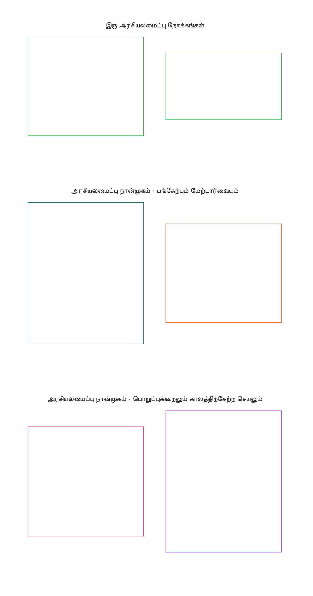
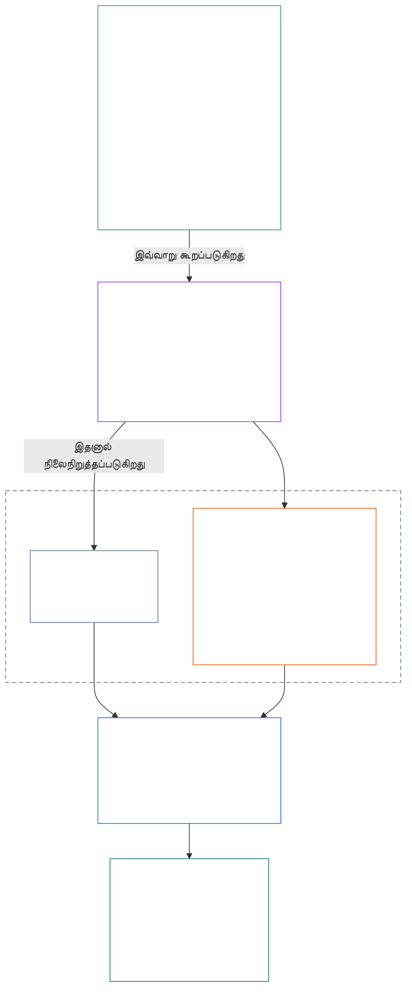
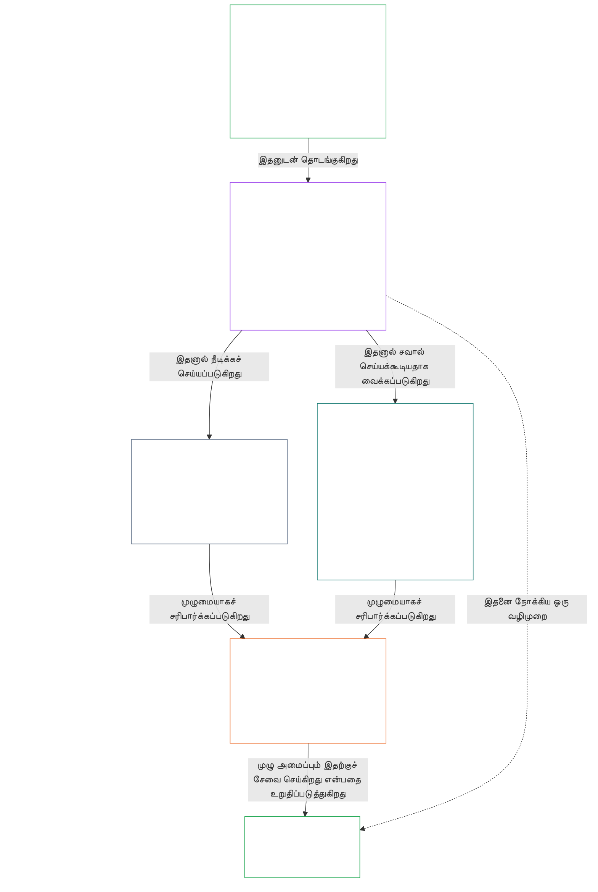

# அத்தியாயம் 01, பகுதி A: மதிப்புக் கொள்கைகள்

<strong>தொகுப்பில் இடம் (செயல்பாட்டு விதியல்ல): கோப்பு அமைப்பும் வாசிப்பு விதிகளும்</strong>

> கீழ்வரும் உள்ளடக்கம் **வாசகருக்கான வழிகாட்டுதல் மட்டுமே**. இந்தக் கோப்பிலோ பிற அத்தியாயங்களிலோ உள்ள கட்டுப்படுத்தும் கடமைகளை இது சேர்க்கவோ நீக்கவோ குறுக்கவோ செய்யாது.
>
> இந்தக் கோப்பு **Sentient Constitution-இன் ஒரு பகுதியாகும்**; ஒரே ஆவணமாக வாசிக்கப்படும் மற்ற எண் குறிக்கப்பட்ட `core_*` கோப்புகளுடன் **இணைந்தே கட்டுப்படுத்தும்**. இதில் **அத்தியாயம் ஒன்று, பகுதி A** (§§1–12: நோக்கமும் பங்கும்; §2-இல் அறிமுகப்படுத்தப்பட்டு நலவாழ்வு, பாதுகாப்பு, உண்மை, நம்பிக்கை, சுதந்திரம் ஆகியவற்றின் வழியாக வளர்க்கப்படும் செழிப்பு இலக்கு; மேலும் §8-இல் அறிமுகப்படுத்தப்பட்டு பகிரப்பட்ட அமைப்புத் திறன், மீள்தாங்கும் திறன், சந்தை அமைப்பு, அமைப்புசார் மதிப்பீடு ஆகியவற்றின் வழியாக வளர்க்கப்படும் தொடர்ச்சி இலக்கு) இடம்பெறுகின்றன.
>
> **முன்னது:** [core_00_preamble.md](core_00_preamble.md)  
> **அடுத்தது:** [core_01_b_interaction_interpretation.md](core_01_b_interaction_interpretation.md) (அத்தியாயம் ஒன்று, பகுதி B — §§13–15, இடைவினை, மேலாதிக்க வரம்புகள், அரசியலமைப்பு விளக்கம்).  
> **வாசிப்பு வரிசை:** §1 நோக்கமும் பங்கும் → **செழிப்பு:** §2 அறிமுகம் (§2.1-இன் பேச்சுவார்த்தைக்கு உட்படாத பாதுகாப்பு மற்றும் உண்மை கட்டுப்பாடுகளுடன்) → §3 நலவாழ்வு (விளைவு) → §4 பாதுகாப்பு → §5 உண்மை → §6 நம்பிக்கை → §7 சுதந்திரம் → **தொடர்ச்சி:** §8 அறிமுகம் → §9 பகிரப்பட்ட அமைப்புத் திறன் (இணைப்புப் பாலம்: செழிப்பை நோக்கிய வழிமுறை மற்றும் தொடர்ச்சியின் சாரம்) → §10 மீள்தாங்கும் திறன் → §11 சந்தை அமைப்பு → §12 அமைப்புசார் மதிப்பீடு.

<strong>வாசகர் வழிகாட்டுதல் (செயல்பாட்டு விதியல்ல): அத்தியாயம் ஒன்று இலக்குகள், நாற்கூறு, உறுப்புகள், வரையறைகள் ஆகியவற்றுடன் கொண்டுள்ள தொடர்பு</strong>

> கீழ்வரும் உள்ளடக்கம் **வாசகருக்கான வழிகாட்டுதல் மட்டுமே**. இந்தக் கோப்பிலோ பிற அத்தியாயங்களிலோ உள்ள கட்டுப்படுத்தும் கடமைகளை இது சேர்க்கவோ நீக்கவோ குறுக்கவோ செய்யாது. ஒவ்வொரு பிரிவின் **தடமறிதல்** மற்றும் **வரையறைகள் · மதிப்பீடு · இணக்கம்** விட்ஜெட்டுகள் கட்டுப்படுத்தும் வழித்தடத்தை வழங்குகின்றன; இந்தத் தொகுதி அத்தியாயம் ஒன்றைத் தொடங்கும் வாசகர்களுக்கான பகுதி-நிலை வரைபடமாகும்.

**அடுக்குகள் எவ்வாறு இணைகின்றன.** ஒவ்வொரு அடுக்கும் வேறொரு கேள்விக்குப் பதிலளிக்கிறது; அத்தியாயம் ஒன்றின் ஒவ்வொரு கொள்கையும் மற்ற மூன்று அடுக்குகளையும் சுட்டுகிறது:

- **இலக்குகளும் நாற்கூறும்** ([முன்னுரை §1](core_00_preamble.md#the-model)): பகிரப்பட்ட அமைப்புகள் எதற்காக உள்ளன ([செழிப்பு](core_05_apex_flourishing_aim.md#flourishing-constitutional), [தொடர்ச்சி](core_05_apex_continuity_aim.md#chapter-five-definitions-continuity-constitutional-aim)); அந்த முயற்சியைச் சட்டபூர்வமாக வைத்திருக்கும் நான்கு கடமைகள் ([பங்கேற்பு](core_05_apex_participation_leg.md#participation-constitutional), [மேற்பார்வை](core_05_apex_oversight_leg.md#oversight-constitutional), [பொறுப்புக்கூறல்](core_05_apex_accountability_leg.md#accountability), [காலத்திற்கேற்ற செயல்பாடு](core_05_apex_timeliness_leg.md#timeliness-constitutional)).
- **கொள்கைகள்** (இந்த அத்தியாயம்): அந்த இலக்குகளும் கடமைகளும் எவ்வாறு மதிப்புகள், கட்டுப்பாடுகள், ஒன்றுடன் ஒன்றை ஒப்பிட்டு எடைபோடும் விதிகளாகின்றன.
- **உறுப்புகள்** ([அத்தியாயம் ஆறு](core_06_rights_part_a.md#chapter-six-foundational-rights)): இலக்குகள் தொடரப்படும் போதும் பயன்பாட்டில் இருக்கும் உரிமைத் தளப் பாதுகாப்புகள். ஒவ்வொரு பிரிவின் **தடமறிதல்** அவற்றை *குறிப்பாக* என்ற தலைப்பின் கீழ் பட்டியலிடுகிறது.
- **வரையறைகள்** ([அத்தியாயங்கள் இரண்டு முதல் ஐந்து வரை](core_02_definition_structure.md)): ஒரு கூற்று உண்மையா எனச் சோதிக்கப் பயன்படும் பகிரப்பட்ட பொருள்கள். ஒவ்வொரு பிரிவின் **வரையறைகள் · மதிப்பீடு · இணக்கம்** விட்ஜெட் அவற்றைப் பட்டியலிடுகிறது.

**அத்தியாயம் ஒன்று ஒவ்வொரு இலக்கையும் எவ்வாறு வளர்க்கிறது.** உண்மை, பாதுகாப்பு, நம்பகத்தன்மை, பொருளுள்ள செயல்திறன் ஆகியவற்றின் வழியாக நிலைநிறுத்தப்படும் நலவாழ்வே செழிப்பு ([முன்னுரை §1](core_00_preamble.md#flourishing)). அத்தியாயம் ஒன்று முதலில் விளைவைச் சொல்லி, பின்னர் இந்த நான்கு நிபந்தனைகளுக்கும் தலா ஒரு கொள்கையை அளிக்கிறது.

| இலக்கும் கூறும் | அத்தியாயம் ஒன்றின் கொள்கை | வரையறை உள்ள இடம் | தடமறிதலில் பெயரிடப்பட்ட உறுப்புகள் |
|---|---|---|---|
| **செழிப்பு**: விளைவு | [§3 நலவாழ்வு](#3-foundational-objective-wellbeing-flourishing-aim) | [நலவாழ்வு](core_05_band_continuity.md#wellbeing) | [VI](core_06_rights_part_b.md#article-vi-equal-basic-rights), [X](core_06_rights_part_b.md#article-x-self-determination-agency-and-participation), [XIII-B](core_06_rights_part_c.md#article-xiii-b-right-to-redress-and-remedy), [XIX-B](core_06_rights_part_d.md#article-xix-b-contestability-and-proportional-restriction-limits) |
| **செழிப்பு**: பாதுகாப்பு | [§4 பாதுகாப்பு](#4-safety-harm-constraint) | [பாதுகாப்பு](core_05_band_continuity.md#safety-constitutional-constraint) | [XIII](core_06_rights_part_c.md#article-xiii-right-to-reliable-and-trustworthy-systems), [XVII](core_06_rights_part_c.md#article-xvii-system-lifecycle-environments-and-reversibility), [XXIII](core_06_rights_part_d.md#article-xxiii-root-cause-analysis-and-adaptive-response) |
| **செழிப்பு**: உண்மை | [§5 உண்மை](#5-truth-epistemic-integrity-constraint) | [உண்மை](core_05_band_oversight.md#truth-constitutional-constraint) | [XIII](core_06_rights_part_c.md#article-xiii-right-to-reliable-and-trustworthy-systems), [XV](core_06_rights_part_c.md#article-xv-info-sphere-integrity), [XVI](core_06_rights_part_c.md#article-xvi-audit-transparency-and-independent-verification) |
| **செழிப்பு**: நம்பகத்தன்மை | [§6 நம்பிக்கை](#6-trust-and-trustworthiness-coordination-integrity) | [நம்பகத்தன்மை](core_05_band_continuity.md#trustworthiness) | [XIII](core_06_rights_part_c.md#article-xiii-right-to-reliable-and-trustworthy-systems), [XV](core_06_rights_part_c.md#article-xv-info-sphere-integrity), [XVI](core_06_rights_part_c.md#article-xvi-audit-transparency-and-independent-verification) |
| **செழிப்பு**: பொருளுள்ள செயல்திறன் | [§7 சுதந்திரம்](#7-freedom-bounded-agency) | [பொருளுள்ள செயல்திறன்](core_05_band_participation.md#meaningful-agency) | [VI](core_06_rights_part_b.md#article-vi-equal-basic-rights), [X](core_06_rights_part_b.md#article-x-self-determination-agency-and-participation), [XXI](core_06_rights_part_d.md#article-xxi-interoperability-portability-movement-refuge-and-exit-integrity) |
| **தொடர்ச்சி**, செழிப்புக்கான பாலமாக: நீடித்த திறன் | [§9 பகிரப்பட்ட அமைப்புத் திறன்](#9-shared-system-capacity) | [பகிரப்பட்ட அமைப்புத் திறன்](core_05_band_continuity.md#shared-system-capacity) | [I-A](core_06_rights_part_a.md#article-i-a-environmental-preconditions-and-ecological-integrity), [III](core_06_rights_part_a.md#article-iii-survival-and-essential-access), [V](core_06_rights_part_a.md#article-v-resource-allocation-dependencies-and-ecosystem-funding) |
| **தொடர்ச்சி**: மீள்தாங்கும் திறன் | [§10 மீள்தாங்கும் மற்றும் தன்னைத்தானே சீர்செய்யும் வடிவமைப்பு](#10-resilience-and-self-healing-design) | [தன்னைத்தானே சீர்செய்தல்](core_05_band_continuity.md#self-healing) | [XIII](core_06_rights_part_c.md#article-xiii-right-to-reliable-and-trustworthy-systems), [XVII](core_06_rights_part_c.md#article-xvii-system-lifecycle-environments-and-reversibility), [XXIII](core_06_rights_part_d.md#article-xxiii-root-cause-analysis-and-adaptive-response) |
| **தொடர்ச்சி**: போட்டியிடக்கூடிய சந்தைகள் | [§11 சந்தை அமைப்பு](#11-market-structure) | [சந்தை அமைப்பு](core_05_band_accountability.md#market-structure) | [III-C](core_06_rights_part_a.md#article-iii-c-labor-and-economic-floor), [V](core_06_rights_part_a.md#article-v-resource-allocation-dependencies-and-ecosystem-funding), [XXI](core_06_rights_part_d.md#article-xxi-interoperability-portability-movement-refuge-and-exit-integrity) |
| **தொடர்ச்சி**: முழு அமைப்புப் பார்வை | [§12 அமைப்புசார் மதிப்பீட்டுத் தேவை](#12-systemic-evaluation-requirement) | [அமைப்பு ஒருங்கிணைப்புச் சான்றளிப்பு](core_05_band_continuity.md#system-alignment-certification) | [XVI](core_06_rights_part_c.md#article-xvi-audit-transparency-and-independent-verification) |

**கொள்கைகளின் வரிசை (தொடர்ச்சி).** கொள்கை நிலையில், இரு இலக்குகளையும் இணைக்கும் திறனுடன் தொடங்கி, தொடர்ச்சி இலக்கு பின்வரும் வரிசையில் வளர்க்கப்படுகிறது:

6. **[பகிரப்பட்ட அமைப்புத் திறன்](core_05_band_continuity.md#shared-system-capacity)** என்பது நல்ல பொறுப்பாட்சி, நிர்வாகம், ஊக்கங்கள் ஆகியவை காலப்போக்கில் சேர்ந்து உருவாக்க வேண்டிய பலன் — அரசியலமைப்பு கோரும் பணிகளைச் செய்யும் உண்மையான, சவால் செய்யக்கூடிய திறன், அது உணர்வுள்ள உயிர்களுக்கும் பகிரப்பட்ட அமைப்புகளுக்கும் உரியது. இது இரு இலக்குகளுக்கிடையே நிற்கிறது: **செழிப்பை** நோக்கிய வழிமுறையும் **தொடர்ச்சியின்** சாரமும் ஆகும்; மற்ற எல்லாவற்றையும் மீறி முன்னுரிமை பெறும் துருப்புச் சீட்டு அல்ல. அதன் இரு முக்கிய அம்சங்களை [§9.1](#91-productive-capacity-instrumental-good), [§9.2](#92-constitutional-efficiency) விளக்குகின்றன.
7. **[மீள்தாங்கும் மற்றும் தன்னைத்தானே சீர்செய்யும் வடிவமைப்பு](#10-resilience-and-self-healing-design)**, உணர்வுள்ள உயிர்கள் சார்ந்திருக்கும் அமைப்புகள் சிக்கலை எவ்வாறு முன்கூட்டியே கண்டறிந்து, கட்டுப்படுத்தி, வெளிப்படுத்தப்பட்ட வழிகளில் செயலிழந்து, நேர்மையாக மீள்கின்றன (**[தன்னைத்தானே சீர்செய்தல்](core_05_band_continuity.md#self-healing)**) என்பதை விளக்குகிறது; இதனால் உருப்படி 6-இன் திறன் நீடித்து, நிலைத்தன்மை அவசரத் தலையீட்டைச் சார்ந்திருக்காது.
8. **[சந்தை அமைப்பு](core_05_band_accountability.md#market-structure)** [§11](#11-market-structure)-இல் அந்தத் திறன் நடைமுறையில் போட்டியிடக்கூடியதாக இருப்பதற்கான செறிவாக்க எதிர்ப்பு ஒழுங்கை வழங்குகிறது.
9. இணக்க அல்லது நிர்வாகக் கூற்றுகள் ஏற்கப்படுவதற்கு முன், **[அமைப்புசார் மதிப்பீட்டுத் தேவை](#12-systemic-evaluation-requirement)** முழு அமைப்பின் வரம்பு, சார்புகள், ஊக்கங்களின் ஒருங்கிணைவு ஆகியவற்றைச் சரிபார்க்கிறது — தணிக்கைக்கான கொள்கை-நிலை வழிகாட்டலாக நாற்கூறின் **மேற்பார்வை** கூறின் கீழ்; பிற நடைமுறைகளுடன் [அமைப்பு ஒருங்கிணைப்புச் சான்றளிப்பு](core_05_band_continuity.md#system-alignment-certification) போன்ற ஒரு விரிவான தணிக்கைச் செயல்முறையும் இதில் அடங்கும்.

**அத்தியாயம் ஒன்றில் நாற்கூறு எவ்வாறு இடம்பெறுகிறது.** ஒவ்வொரு பிரிவும் அதன் தடமறிதலில் தொடர்புடைய கூறுகளைக் குறிப்பிடுகிறது. பின்வரும் பிரிவுகள் அவற்றை மிக நேரடியாகக் கொண்டுள்ளன:

| நாற்கூறின் கூறு | அத்தியாயம் ஒன்றின் முதன்மை இடங்கள் |
|---|---|
| **பங்கேற்பு** | [§16 விரிவான பொறுப்பாண்மை](core_01_c_stewardship_capacity_principles.md#16-stewardship-in-depth), [§17 விளைவுமிக்க பொறுப்பாண்மை](core_01_c_stewardship_capacity_principles.md#17-consequential-stewardship-the-steward-role) (விளைவுள்ள பங்குகளும் குரலும்); [§7 சுதந்திரம்](#7-freedom-bounded-agency) (பொருளுள்ள செயல்திறன்) |
| **மேற்பார்வை** | [§16](core_01_c_stewardship_capacity_principles.md#16-stewardship-in-depth), [§17](core_01_c_stewardship_capacity_principles.md#17-consequential-stewardship-the-steward-role) (பரவலாக்கப்பட்ட புரிதலும் பதிவுகளும்); [§18 நிர்வாகம்](core_01_c_stewardship_capacity_principles.md#18-governance-under-stewardship-discipline) (அதிகார ஒதுக்கீடு); [§12](#12-systemic-evaluation-requirement) (தணிக்கை) |
| **பொறுப்புக்கூறல்** | [§18 நிர்வாகம்](core_01_c_stewardship_capacity_principles.md#18-governance-under-stewardship-discipline) (அதிகாரத்திற்கேற்ற பொறுப்பேற்பு); [§19 ஊக்க ஒருங்கிணைப்பும் அமைப்பைக் கைப்பற்றுதலும்](core_01_c_stewardship_capacity_principles.md#19-incentive-alignment-and-system-capture) (வெகுமதிகள் கூறுகளின் உள்ளடக்கத்தை நீர்த்துப்போகச் செய்யக்கூடாது) |
| **காலத்திற்கேற்ற செயல்பாடு** | [§16](core_01_c_stewardship_capacity_principles.md#16-stewardship-in-depth), [§17](core_01_c_stewardship_capacity_principles.md#17-consequential-stewardship-the-steward-role) (தவிர்க்கக்கூடிய தாமதமின்றி சிக்கல்களைக் கண்டறிந்து சரிசெய்தல்) |

**முரண்பாடல்ல, இரண்டு அச்சுகள்.** அமைப்புகள் எதை நாட வேண்டும் என்பதை இலக்குகள் கூறுகின்றன; அந்த முயற்சி எவ்வாறு சட்டபூர்வமாக இருக்கும் என்பதை நாற்கூறு கூறுகிறது. ஒரு சொல் இரண்டிலும் இடம்பெறலாம்: உண்மையும் நம்பகத்தன்மையும் செழிப்பின் கூறுகள்; [முன்னுரை §2](core_00_preamble.md#2-measurements-overview) அவற்றை மேற்பார்வைக் குடும்பத்தின் கீழ் அளவிடுகிறது. [§§13–15](core_01_b_interaction_interpretation.md#13-constitutional-collision-resolution-process) இந்தக் கொள்கைகள் மோதும்போது அவற்றை எவ்வாறு எடைபோட்டு ஒருமித்த முழுமையாக வாசிப்பது என்பதை நிர்ணயிக்கின்றன; [§20](core_01_c_stewardship_capacity_principles.md#20-integrated-application) அவற்றை ஒவ்வொரு பிந்தைய அத்தியாயத்துக்கும் பயன்படுத்துகிறது.

 

### 1. நோக்கமும் பங்கும்

<strong>தடமறிதல்</strong>

- மேல்நிலை: [முன்னுரை §1 மாதிரி](core_00_preamble.md#the-model) — [அரசியலமைப்பு நான்முகம்](core_00_preamble.md#constitutional-tetrad), [இரு அரசியலமைப்பு நோக்கங்கள்](core_00_preamble.md#two-constitutional-aims), மற்றும் [பொருள்சார் பங்கு](core_00_preamble.md#material-stake) அடிப்படையிலான அளவமைப்பு, ஒவ்வொரு பிரிவின் தடமறிதல் வழியாக அத்தியாயம் முழுவதும் பொருந்தும்.
- கீழ்நிலை: ஒருங்கிணைந்த வாசிப்பு, தெளிவின்மை, உள் படிநிலை, அதிகாரப்பூர்வ முரண்பாட்டுத் தீர்வு நடைமுறை ஆகியவற்றுக்கான [15. அரசியலமைப்பு விளக்கம்](core_01_b_interaction_interpretation.md#15-constitutional-interpretation).
- கீழ்நிலை: [இரு அரசியலமைப்பு நோக்கங்கள்](core_00_preamble.md#two-constitutional-aims) — **வளர்ச்சிநலம்** நோக்கத்தின் விரிவு: [§3](#3-foundational-objective-wellbeing-flourishing-aim) முதல் [§6](#6-trust-and-trustworthiness-coordination-integrity) வரையும் [§7 சுதந்திரம்](#7-freedom-bounded-agency) வரையும்; **தொடர்ச்சி** நோக்கத்தின் விரிவு: [§9 பகிரப்பட்ட அமைப்புத் திறன்](#9-shared-system-capacity), [§10 மீள்திறனும் தன்னைத்தானே சீர்செய்யும் வடிவமைப்பும்](#10-resilience-and-self-healing-design), [§11 சந்தைக் கட்டமைப்பு](#11-market-structure), மற்றும் [§12 அமைப்புமுறை மதிப்பீட்டுத் தேவை](#12-systemic-evaluation-requirement).
- கீழ்நிலை: [3. அடிப்படை நோக்கம்: நலவாழ்வு](#3-foundational-objective-wellbeing-flourishing-aim), [§3.2 அங்கீகாரம், வலுப்படுத்தல், விழைவு](#32-recognition-reinforcement-and-aspiration), [4 பாதுகாப்பு](#4-safety-harm-constraint), [5 உண்மை](#5-truth-epistemic-integrity-constraint), [6. நம்பிக்கை](#6-trust-and-trustworthiness-coordination-integrity), [§16 ஆழமான பொறுப்பேற்பு](core_01_c_stewardship_capacity_principles.md#16-stewardship-in-depth), [13. அரசியலமைப்பு முரண்பாட்டுத் தீர்வு நடைமுறை](core_01_b_interaction_interpretation.md#13-constitutional-collision-resolution-process), [§7 சுதந்திரம்](#7-freedom-bounded-agency).
- இணைத்துப் படிக்க: [அரசியலமைப்பு நான்முகம்](core_00_preamble.md#constitutional-tetrad) — பங்கேற்பு, மேற்பார்வை, பொறுப்புக்கூறல், காலத்திற்கேற்ற செயல் ஆகியவை பகிரப்பட்ட அமைப்புகள் [இரு அரசியலமைப்பு நோக்கங்களை](core_00_preamble.md#two-constitutional-aims) எவ்வாறு பின்பற்றுகின்றன என்பதை நிர்வகிக்கின்றன; [பொருள்சார் பங்கு](core_00_preamble.md#material-stake) அடிப்படையிலான அளவமைப்பு, ஒவ்வொரு பிரிவின் தடமறிதல் வழியாக அத்தியாயம் முழுவதும் பொருந்தும்.
- இணைத்துப் படிக்க: [அத்தியாயங்கள் இரண்டு முதல் நான்கு](core_02_definition_structure.md) மற்றும் [அத்தியாயம் ஐந்து](core_05__definitions_home.md#chapter-five-foundational-definitions) — இந்த அத்தியாயத்தில் பயன்படுத்தப்படும் ஒவ்வொரு சொல்லுக்கும் பொருந்தும் ஆளும் செயல்முறை அடுக்கு; O/M/A/C நேர்மை, ஏய்ப்புத் தடுப்பு, சுமை, வரையறைகளிலிருந்து முடிவுகளுக்கான தடமறிதல் ஆகியவற்றைப் பயன்படுத்துக.
- இணைத்துப் படிக்க: [அத்தியாயம் ஆறு: அடிப்படை உரிமைகள்](core_06_rights_part_a.md#chapter-six-foundational-rights).
  - குறிப்பாக [கட்டுரை VI: சமமான அடிப்படை உரிமைகள்](core_06_rights_part_b.md#article-vi-equal-basic-rights), [கட்டுரை XIII: நம்பகமான மற்றும் நம்பிக்கைக்குரிய அமைப்புகளுக்கான உரிமை](core_06_rights_part_c.md#article-xiii-right-to-reliable-and-trustworthy-systems), மற்றும் [கட்டுரை XXIV: அரசியலமைப்பு விளக்கம், மறுஆய்வு, கைப்பற்றல்-எதிர்ப்பு பாதுகாப்புகள்](core_06_rights_part_d.md#article-xxiv-constitutional-interpretation-review-and-anti-capture-safeguards).
  - பாதுகாக்கப்படும் உணர்வுடையோர், அமைப்புகள் அல்லது நிறுவனங்களை விளக்கம் பாதிக்கும் இடங்களில் இந்த வாசிப்பைப் பயன்படுத்துக.

<strong>வரையறைகள் · மதிப்பீடு · இணக்கம்</strong>

- [விகிதாசாரம்](core_05_band_accountability.md#proportionality) · [O](core_05_band_accountability.md#proportionality) · [M](core_05_band_accountability.md#proportionality-a) · [A](core_05_band_accountability.md#proportionality-a) · [C](core_05_band_accountability.md#proportionality-c)
- [அவசியம்](core_05_band_accountability.md#necessity) · [O](core_05_band_accountability.md#necessity) · [M](core_05_band_accountability.md#necessity-a) · [A](core_05_band_accountability.md#necessity-a) · [C](core_05_band_accountability.md#necessity-c)

 

*எளிமையாகச் சொன்னால்: அத்தியாயம் ஒன்று மற்ற எல்லா அத்தியாயங்களையும் நிர்வகிக்கும் மதிப்புகளையும் கட்டுப்பாடுகளையும் அமைக்கிறது. பகிரப்பட்ட அமைப்புகள் **வளர்ச்சிநலத்தையும்** **தொடர்ச்சியையும்** ஒன்றாகப் பின்பற்ற வேண்டும் — ஒன்றை மற்றொன்றின் இழப்பில் பின்பற்றக்கூடாது — மேலும் மற்ற மதிப்புகளின் இழப்பில் எந்த ஒரு மதிப்பையும் அதிகப்படுத்தக்கூடாது.*

இந்த அரசியலமைப்பின் விளக்கம், பயன்பாடு, பரிணாமம் ஆகியவற்றை நிர்வகிக்கும் கொள்கைகளையும் கட்டுப்பாடுகளையும் இந்த அத்தியாயம் நிறுவுகிறது. [இரு அரசியலமைப்பு நோக்கங்களை](core_00_preamble.md#two-constitutional-aims) — [**வளர்ச்சிநலத்தையும்**](core_00_preamble.md#flourishing) [**தொடர்ச்சியையும்**](core_00_preamble.md#continuity) — [முன்னுரை §1 மாதிரி](core_00_preamble.md#the-model)-யில் நிறுவப்பட்ட செயல்பாட்டு கொள்கைகளாகவும் கட்டுப்பாடுகளாகவும் இது விரிவுபடுத்துகிறது. கொள்கை அடுக்கின் அதிகாரப்பூர்வ வரையறைகள் முன்னுரையில் உள்ளன; இந்த அத்தியாயம் அவற்றைப் பயன்படுத்துகிறது.

இந்த அரசியலமைப்பில் நிறுவப்பட்ட மாற்றமுடியாத கொள்கைக் கட்டுப்பாடுகளுக்கும் உரிமைப் பாதுகாப்புகளுக்கும் உட்பட்டு, அந்த நோக்கங்கள் எப்போதும் ஒன்றாகப் பின்பற்றப்பட வேண்டும். [**அரசியலமைப்பு நான்முகம்**](core_00_preamble.md#constitutional-tetrad) அந்தப் பின்தொடர்வு எவ்வாறு நியாயத்தன்மையுடன் இருக்கிறது என்பதை நிர்வகிக்கிறது — [**பொருள்சார் பங்கு**](core_00_preamble.md#material-stake) அடிப்படையில் அளவமைத்து.

இந்த இரண்டு நோக்கங்களையும் நான்முகத்தையும் மையமாகக் கொண்டு அத்தியாயம் அமைந்துள்ளது:
- **வளர்ச்சிநலம்:** [வளர்ச்சிநல நோக்கம்: அறிமுகம்](#2-flourishing-aim-introduction) நோக்கத்தின் வரைபடத்தை அளிக்கிறது. [§3 அடிப்படை நோக்கம்: நலவாழ்வு](#3-foundational-objective-wellbeing-flourishing-aim) முடிவைச் சொல்கிறது. [§4 பாதுகாப்பு](#4-safety-harm-constraint), [§5 உண்மை](#5-truth-epistemic-integrity-constraint), [§6 நம்பிக்கை](#6-trust-and-trustworthiness-coordination-integrity), [§7 சுதந்திரம்](#7-freedom-bounded-agency) ஆகியவை அதைத் தாங்கும் நான்கு நிபந்தனைகளை — பாதுகாப்பு, உண்மை, நம்பகத்தன்மை, பொருளுள்ள செயல்திறன் — விரிவுபடுத்துகின்றன.
- **தொடர்ச்சி:** [தொடர்ச்சி நோக்கம்: அறிமுகம்](#8-continuity-aim-introduction) நோக்கத்தின் வரைபடத்தை அளிக்கிறது. [§9 பகிரப்பட்ட அமைப்புத் திறன்](#9-shared-system-capacity) (வளர்ச்சிநலத்தை நோக்கிய வழிமுறையாகவும் தொடர்ச்சியின் சாரமாகவும் இருப்பது), [§10 மீள்திறனும் தன்னைத்தானே சீர்செய்யும் வடிவமைப்பும்](#10-resilience-and-self-healing-design), [§11 சந்தைக் கட்டமைப்பு](#11-market-structure), [§12 அமைப்புமுறை மதிப்பீட்டுத் தேவை](#12-systemic-evaluation-requirement) ஆகியவை நீண்டகால நிலைத்தன்மை, நீடித்த பகிரப்பட்ட அமைப்புத் திறன், மீள்திறன் ஆகியவற்றை விரிவுபடுத்துகின்றன. தொடர்ச்சி குறித்த கூற்றுகள் நேர்மையான, முழு அமைப்பையும் உள்ளடக்கும் சித்திரத்தை அடிப்படையாகக் கொள்ள வேண்டும்: §§9–11 இல் உள்ள ஒவ்வொரு கூற்றும் §12 சோதனைக்குப் பிறகே நிலைபெறும்.
- **கொள்கைகள் சந்திக்கும் போது:** [§13 அரசியலமைப்பு முரண்பாட்டுத் தீர்வு நடைமுறை](core_01_b_interaction_interpretation.md#13-constitutional-collision-resolution-process), [§14 முழுமையான மேலாதிக்கத் தடைவிதி](core_01_b_interaction_interpretation.md#14-prohibition-on-absolute-override), [§15 அரசியலமைப்பு விளக்கம்](core_01_b_interaction_interpretation.md#15-constitutional-interpretation) ஆகியவை நோக்கங்களையும் கொள்கைகளையும் எவ்வாறு எடைபோட்டு ஒன்றாகப் படிக்க வேண்டும் என்பதை நிர்வகிக்கின்றன.
- **நடைமுறையில் நான்முகம்:** [§16 ஆழமான பொறுப்பேற்பு](core_01_c_stewardship_capacity_principles.md#16-stewardship-in-depth) முதல் [§19 ஊக்கச் சீரமைப்பும் அமைப்புக் கைப்பற்றலும்](core_01_c_stewardship_capacity_principles.md#19-incentive-alignment-and-system-capture) வரை பங்கேற்பு, மேற்பார்வை, பொறுப்புக்கூறல், காலத்திற்கேற்ற செயல் ஆகியவற்றை பொறுப்பேற்பு, ஆளுகை, ஊக்கங்கள் ஆகியவற்றுக்குள் கொண்டுசெல்கின்றன; [§20 ஒருங்கிணைந்த பயன்பாடு](core_01_c_stewardship_capacity_principles.md#20-integrated-application) இந்த அத்தியாயம் முழுவதையும் பிற்கால அத்தியாயங்கள் அனைத்திலும் பயன்படுத்துகிறது.

ஒவ்வொரு கொள்கையையும் பாதுகாக்கும் அத்தியாயம் ஆறு கட்டுரைகளை அதன் **தடமறிதல்** பட்டியலிடுகிறது; அதை அளவிடும் அத்தியாயம் ஐந்து வரையறைகளை அதன் **வரையறைகள் · மதிப்பீடு · இணக்கம்** விட்ஜெட் பட்டியலிடுகிறது.

**வரைபடம்: இரு அரசியலமைப்பு நோக்கங்களும் அரசியலமைப்பு நான்முகமும்**

*பகிரப்பட்ட அமைப்புகள் எதைப் பின்பற்ற வேண்டும் என்பதை நோக்கங்கள் விவரிக்கின்றன; அந்தப் பின்தொடர்வை நியாயமாக வைத்திருக்கும் கடமைகளை நான்முகம் விவரிக்கிறது. நான்கு கடமைகளும் [பொருள்சார் பங்கு](core_00_preamble.md#material-stake) அளவுக்கு ஏற்ப அளவமைக்கப்படுகின்றன; இரு நோக்கங்களும் உரிமைகளின் அடித்தளத்தால் கட்டுப்படுத்தப்படுகின்றன. [கருத்தியல் மேலோட்டத்திலிருந்து](guides/CONCEPTUAL_OVERVIEW.md#two-aims-and-the-constitutional-tetrad) மீள்பதிப்பு.*

இந்த மதிப்புகள்:
- ஒன்றிலிருந்து ஒன்று தனித்தவை அல்ல; வழக்கமான செயல்பாட்டில் கடுமையான படிநிலையையும் கொண்டிருக்கவில்லை.
- ஒன்றோடொன்று செயல்படும் கொள்கைகளாகவும் கட்டுப்பாடுகளாகவும் இருந்து, ஒன்றாக மதிப்பிடப்பட வேண்டும்.
- எல்லா “அமைப்புகளுக்கும்” பொருந்தும். உணர்வுடையோரையும் பூமியையும் பொருள்சார் வகையில் பாதிக்கும் தொழில்நுட்ப, நிறுவன, பொருளாதார, சமூக-தொழில்நுட்பக் கட்டமைப்புகள் மற்றும் சூழலமைப்புகள் இதில் அடங்கும்.

மற்றவற்றை பொருள்சார் வகையில் மீறும் இடத்தில் எந்த ஒரு கொள்கையையும் தனிமையில் பயன்படுத்தக் கூடாது. பதற்றங்கள் எழும்போது, இந்த அத்தியாயத்தில் கூறப்பட்ட விகிதாசாரம், அவசியம், அமைப்புமுறைத் தாக்கம் ஆகிய தேவைகளின் கீழ் அமைப்புகள் அவற்றைத் தீர்க்க வேண்டும். தீர்க்கப்படாத முரண்பாடு மாற்றமுடியாத கொள்கைக் கட்டுப்பாடுகளை நேரடியாகத் தொடும் இடத்தில், முதல் அத்தியாயத்தின் **§13** அரசியலமைப்பு முரண்பாட்டுத் தீர்வு நடைமுறை முன்னுரிமையை நிர்ணயிக்கும்.

### 2. செழிப்பு இலக்கின் அறிமுகம்

<strong>தடமறிதல்</strong>

- இதனுடன் வாசிக்க: [அரசியலமைப்பு நாற்கூறு](core_00_preamble.md#constitutional-tetrad) — செழிப்பை எவ்வாறு நாட வேண்டும் என்பதற்கு நான்கு கூறுகளும் பொருந்தும்; [முக்கியப் பங்கு](core_00_preamble.md#material-stake) ஒவ்வொரு செழிப்பு கூற்றின் ஆழத்தையும் அளவையும் நிர்ணயிக்கிறது.
- இதனுடன் வாசிக்க: [இரு அரசியலமைப்பு இலக்குகள்](core_00_preamble.md#two-constitutional-aims) — **செழிப்பு** இலக்கு; அதன் இணை இலக்கு [தொடர்ச்சி இலக்கின் அறிமுகம்](#8-continuity-aim-introduction) பகுதியில் அறிமுகப்படுத்தப்படுகிறது.
- மேல்நிலை: கொள்கைகள்: [முன்னுரை §1 மாதிரி](core_00_preamble.md#flourishing); [செழிப்பு (அரசியலமைப்பு இலக்கு)](core_05_apex_flourishing_aim.md#flourishing-constitutional); [§1 நோக்கமும் பங்கும்](#1-purpose-and-role).
- கீழ்நிலை: [§3 அடிப்படை நோக்கம்: நலவாழ்வு (செழிப்பு இலக்கு)](#3-foundational-objective-wellbeing-flourishing-aim), [§4 பாதுகாப்பு (தீங்கு கட்டுப்பாடு)](#4-safety-harm-constraint), [§5 உண்மை (அறிவுசார் நேர்மை கட்டுப்பாடு)](#5-truth-epistemic-integrity-constraint), [§6 நம்பிக்கையும் நம்பகத்தன்மையும் (ஒருங்கிணைப்பு நேர்மை)](#6-trust-and-trustworthiness-coordination-integrity), [§7 சுதந்திரம் (வரம்புடைய செயற்பாடு)](#7-freedom-bounded-agency); ஒவ்வொன்றையும் பாதுகாக்கும் உறுப்புகள் அதன் பிரிவின் தடமறிதலில் பெயரிடப்பட்டுள்ளன.
- துணைப்பிரிவுகள்: [§2.1 பேச்சுவார்த்தைக்கு உட்படாத கொள்கைக் கட்டுப்பாடுகள்: பாதுகாப்பும் உண்மையும்](#21-non-negotiable-principle-constraints-safety-and-truth).
- இதனுடன் வாசிக்க: அத்தியாயம் ஆறின் உரிமைகள் அடித்தளத்தைப் பொதுவாக.

<strong>வரையறைகள் · மதிப்பீடு · இணக்கம்</strong>

- [செழிப்பு (அரசியலமைப்பு இலக்கு)](core_05_apex_flourishing_aim.md#flourishing-constitutional) · [O](core_05_apex_flourishing_aim.md#flourishing-constitutional) · [M](core_05_apex_flourishing_aim.md#flourishing-constitutional-m) · [A](core_05_apex_flourishing_aim.md#flourishing-constitutional-a) · [C](core_05_apex_flourishing_aim.md#flourishing-constitutional-c)
- [நலவாழ்வு](core_05_band_continuity.md#wellbeing) · [O](core_05_band_continuity.md#wellbeing) · [M](core_05_band_continuity.md#wellbeing-a) · [A](core_05_band_continuity.md#wellbeing-a) · [C](core_05_band_continuity.md#wellbeing-c)
- [பாதுகாப்பு (அரசியலமைப்பு கட்டுப்பாடு)](core_05_band_continuity.md#safety-constitutional-constraint) · [O](core_05_band_continuity.md#safety-constitutional-constraint) · [M](core_05_band_continuity.md#safety-constraint-a) · [A](core_05_band_continuity.md#safety-constraint-a) · [C](core_05_band_continuity.md#safety-constraint-c)
- [உண்மை (அரசியலமைப்பு கட்டுப்பாடு)](core_05_band_oversight.md#truth-constitutional-constraint) · [O](core_05_band_oversight.md#truth-constitutional-constraint-o) · [M](core_05_band_oversight.md#truth-constitutional-constraint-a) · [A](core_05_band_oversight.md#truth-constitutional-constraint-a) · [C](core_05_band_oversight.md#truth-constitutional-constraint-c)
- [நம்பகத்தன்மை](core_05_band_continuity.md#trustworthiness) · [O](core_05_band_continuity.md#trustworthiness) · [M](core_05_band_continuity.md#trustworthiness-a) · [A](core_05_band_continuity.md#trustworthiness-a) · [C](core_05_band_continuity.md#trustworthiness-c)
- [பொருளுள்ள செயற்பாடு](core_05_band_participation.md#meaningful-agency) · [O](core_05_band_participation.md#meaningful-agency) · [M](core_05_band_participation.md#meaningful-agency-a) · [A](core_05_band_participation.md#meaningful-agency-a) · [C](core_05_band_participation.md#meaningful-agency-c)

 

*எளிய சொற்களில்: செழிப்பு என்பது இரண்டு இலக்குகளில் முதன்மையானது: உணர்வுள்ள உயிர்கள் நன்றாக வாழ்வதும், தொடர்ந்து நன்றாக வாழும் திறனைப் பேணுவதும் ஆகும்; ஏனெனில் அவற்றைச் சூழ்ந்துள்ள அமைப்புகள் பாதுகாப்பானவை, நேர்மையானவை, நம்பகமானவை, உண்மையான தேர்வு வாய்ப்பை வழங்குபவை. அந்த விளைவு என்ன என்பதை §3 கூறுகிறது. அதை உண்மையாக்கி நிலைநிறுத்துவது எது என்பதை அடுத்த நான்கு கொள்கைகள் கூறுகின்றன.*

[**செழிப்பு**](core_05_apex_flourishing_aim.md#flourishing-constitutional) என்பது **உண்மை, பாதுகாப்பு, நம்பகத்தன்மை, பொருளுள்ள செயற்பாடு ஆகியவற்றால் நிலைநிறுத்தப்படும் உணர்வுள்ள உயிர்களின் நலவாழ்வு** ([முன்னுரை §1 மாதிரி](core_00_preamble.md#flourishing)). அத்தியாயம் ஒன்று இதை இரண்டு படிகளில் வளர்க்கிறது: [§3 அடிப்படை நோக்கம்: நலவாழ்வு (செழிப்பு இலக்கு)](#3-foundational-objective-wellbeing-flourishing-aim) விளைவை விளக்குகிறது; அதை நிலைநிறுத்தும் நிபந்தனைகளை நான்கு கொள்கைகள் கூறுகின்றன.

| நிபந்தனை | கொள்கை | அது பதிலளிக்கும் கேள்வி |
|---|---|---|
| **பாதுகாப்பு** | [§4 பாதுகாப்பு (தீங்கு கட்டுப்பாடு)](#4-safety-harm-constraint) | தவிர்க்கக்கூடிய தீங்கிலிருந்து உணர்வுள்ள உயிர்கள் பாதுகாக்கப்படுகின்றனவா? |
| **உண்மை** | [§5 உண்மை (அறிவுசார் நேர்மை கட்டுப்பாடு)](#5-truth-epistemic-integrity-constraint), அதனுடன் [§5.1 அறிவியலால் வழிநடத்தப்படும் விசாரணையும் முடிவெடுப்பு ஆதரவும்](#51-science-informed-inquiry-and-decision-support), [§5.2 எளிய மொழி அணுகல்தன்மை (பங்கேற்பு மற்றும் பொறுப்பாண்மைக் கடமை)](#52-plain-language-accessibility-participation-and-stewardship-duty) | உணர்வுள்ள உயிர்கள் தமக்குச் சொல்லப்படுவதை நம்பி, புரிந்துகொள்ள முடியுமா? |
| **நம்பகத்தன்மை** | [§6 நம்பிக்கையும் நம்பகத்தன்மையும் (ஒருங்கிணைப்பு நேர்மை)](#6-trust-and-trustworthiness-coordination-integrity) | அமைப்புகள் நம்பிக்கையைப் பெறுகின்றனவா, தோல்வியடையும் போது அதை மீட்டெடுக்கின்றனவா? |
| **பொருளுள்ள செயற்பாடு** | [§7 சுதந்திரம் (வரம்புடைய செயற்பாடு)](#7-freedom-bounded-agency) | தேர்வு செய்யவும், மறுப்புத் தெரிவிக்கவும், ஒழுங்கமைக்கவும், வெளியேறவும் உணர்வுள்ள உயிர்களிடம் உண்மையான, வரம்புடைய சுதந்திரம் உள்ளதா? |

**செழிப்புக் கொள்கைகள் ஒன்றிணைந்து எவ்வாறு செயல்படுகின்றன:**
- **பாதுகாப்பும் உண்மையும் பேச்சுவார்த்தைக்கு உட்படாத கட்டுப்பாடுகள்:** அவை [§2.1 பேச்சுவார்த்தைக்கு உட்படாத கொள்கைக் கட்டுப்பாடுகள்: பாதுகாப்பும் உண்மையும்](#21-non-negotiable-principle-constraints-safety-and-truth) என்ற பிரிவில் இணைத்துக் கூறப்பட்டுள்ளன; மற்ற கொள்கைகளைப் பெறுவதற்காக அவற்றைத் தியாகம் செய்ய முடியாது.
- **நம்பிக்கையும் சுதந்திரமும் வரம்புடையவை, முழுமையானவை அல்ல:** நம்பிக்கை ஈட்டப்பட வேண்டியது; அதைச் சரிசெய்யவும் முடியும் ([§6.1 திருத்தமும் நிவாரணமும்](#61-correction-and-remedy)); சுதந்திரத்திற்கு ஒழுங்குபடுத்தப்பட்ட வரம்புகள் உண்டு ([§7.1 வரம்பு ஒழுங்கு](#71-limitation-discipline)).
- **எதுவும் தனிமையில் பயன்படுத்தப்படாது:** கொள்கைகள் ஒன்றாக வாசிக்கப்படுகின்றன; மோதும்போது [§13 அரசியலமைப்பு மோதல் தீர்வுச் செயல்முறை](core_01_b_interaction_interpretation.md#13-constitutional-collision-resolution-process) அடிப்படையில் அவை எடைபோடப்படுகின்றன.
- **செழிப்புக்கு ஓர் இணை இலக்கு உண்டு:** இந்த விளைவை நிலையானதாக்குவது எது என்று தொடர்ச்சி இலக்கு கேட்கிறது; அது [தொடர்ச்சி இலக்கின் அறிமுகம்](#8-continuity-aim-introduction) பகுதியில் அறிமுகமாகிறது.

**வரைபடம்: செழிப்பும் அதன் கொள்கைகளும்**

*செழிப்பு ஒரு விளைவாகக் கூறப்படுகிறது; முதலில் பேச்சுவார்த்தைக்கு உட்படாத பாதுகாப்பு, உண்மை ஆகிய கட்டுப்பாடுகள் அதை நிலைநிறுத்துகின்றன. இரண்டும் நம்பிக்கைக்கு ஆதரவளிக்கின்றன; நம்பிக்கை அடுத்து சுதந்திரத்தை ஆதரிக்கிறது. நிறங்கள் மீண்டும் பயன்படுத்தக்கூடிய காட்சி குறியீடுகள்; அவை முன்னுரிமைக் கூற்றுகள் அல்ல. ஒவ்வொரு கொள்கையின் தடமறிதலும் அதற்கான உறுப்புகளைக் குறிப்பிடுகிறது; வரையறைகள் · மதிப்பீடு · இணக்கம் விட்ஜெட் அதன் வரையறைகளைக் குறிப்பிடுகிறது. [கருத்தியல் மேலோட்டத்தில்](guides/CONCEPTUAL_OVERVIEW.md#flourishing-and-its-principles) மறுபதிப்பு செய்யப்பட்டுள்ளது.*

#### 2.1 பேச்சுவார்த்தைக்கு உட்படாத கொள்கைக் கட்டுப்பாடுகள்: பாதுகாப்பும் உண்மையும்

<strong>தடமறிதல்</strong>

- இதனுடன் வாசிக்க: [அரசியலமைப்பு நாற்கூறு](core_00_preamble.md#constitutional-tetrad) — **பங்கேற்பு** கூறு (பாதுகாப்பு, உண்மைத் தீர்மானங்களைப் புரிந்துகொள்வதும் எதிர்ப்பதும்); **மேற்பார்வை** கூறு (தீங்கு அபாயம், அறிவுசார் சீரழிவைக் கண்டறிதல்); **பொறுப்புக்கூறல்** கூறு (தீங்கு, ஏமாற்று, தவறாக வழிநடத்தும் நம்பிக்கை ஆகியவற்றுக்கான பொறுப்பு); [முக்கியப் பங்கு](core_00_preamble.md#material-stake) அளவிடல்.
- இதனுடன் வாசிக்க: [இரு அரசியலமைப்பு இலக்குகள்](core_00_preamble.md#two-constitutional-aims) — **செழிப்பு** இலக்கின் கூறுகளாக [முன்னுரை §1](core_00_preamble.md#two-constitutional-aims)-இல் பெயரிடப்பட்ட **பாதுகாப்பும்** **உண்மையும்**; **தொடர்ச்சி** இலக்கு (நீண்டகாலத் தீங்கைத் தடுப்பதும் நீடித்த அமைப்புகளை நேர்மையாகப் பொறுப்புடன் நிர்வகிப்பதும்).
- மேல்நிலை: கொள்கைகள்: [3. அடிப்படை நோக்கம்: நலவாழ்வு](#3-foundational-objective-wellbeing-flourishing-aim); [இரு அரசியலமைப்பு இலக்குகள்](core_00_preamble.md#two-constitutional-aims).
- கீழ்நிலை: [6. நம்பிக்கை](#6-trust-and-trustworthiness-coordination-integrity), [13. அரசியலமைப்பு மோதல் தீர்வுச் செயல்முறை](core_01_b_interaction_interpretation.md#13-constitutional-collision-resolution-process), [§7 சுதந்திரம்](#7-freedom-bounded-agency).
- இதில் பயன்படுத்தப்படுகிறது: [§4 பாதுகாப்பு](#4-safety-harm-constraint); [§5 உண்மை](#5-truth-epistemic-integrity-constraint); [§5.1 அறிவியலால் வழிநடத்தப்படும் விசாரணையும் முடிவெடுப்பு ஆதரவும்](#51-science-informed-inquiry-and-decision-support); [§5.2 எளிய மொழி அணுகல்தன்மை](#52-plain-language-accessibility-participation-and-stewardship-duty).

 

*எளிய சொற்களில்: பாதுகாப்பும் உண்மையும் அரசியலமைப்பின் உறுதியான குறைந்தபட்சத் தளங்கள்; மேம்படுத்துவதற்காக அவற்றைக் கைவிடும் பரிமாற்றங்கள் அல்ல. பகிரப்பட்ட அமைப்புகள் உணர்வுள்ள உயிர்களை முன்கூட்டியே கணிக்கக்கூடிய ஆபத்தில் ஆழ்த்தவோ ஏமாற்றவோ கூடாது. நாற்கூற்றின் பங்கேற்பு, மேற்பார்வை, பொறுப்புக்கூறல், காலத்திற்கேற்ற செயல்பாடு ஆகிய ஒழுங்குகளின் கீழ், செழிப்பு மற்றும் தொடர்ச்சியை நாடும்போது இந்த இரு கட்டுப்பாடுகளும் பொருந்தும்.*

**பாதுகாப்பும்** **உண்மையும்** பேச்சுவார்த்தைக்கு உட்படாத கொள்கைக் கட்டுப்பாடுகள்; அவை அத்தியாயம் ஒன்றின் மற்ற எல்லாக் கொள்கைகளையும் — [§3 அடிப்படை நோக்கம்: நலவாழ்வு](#3-foundational-objective-wellbeing-flourishing-aim), [இரு அரசியலமைப்பு இலக்குகள்](core_00_preamble.md#two-constitutional-aims) உட்பட — வரம்புக்குள் வைக்கின்றன. அவை [**செழிப்பின்**](#flourishing) பெயரிடப்பட்ட கூறுகளும் [**தொடர்ச்சிக்கு**](#continuity) இன்றியமையாதவையும் ஆகும்: தீங்கு அல்லது ஏமாற்றத்தின் மூலம் அமைப்புகள் செழிக்க முடியாது; நீடித்த சட்டபூர்வத்தன்மைக்கு காலப்போக்கில் ஆபத்தை நேர்மையாகப் பொறுப்புடன் நிர்வகிப்பது அவசியம்.

இந்தக் கட்டுப்பாடுகளின் பயன்பாடு [அரசியலமைப்பு நாற்கூற்றை](core_00_preamble.md#constitutional-tetrad) நிறைவேற்ற வேண்டும்; [முக்கியப் பங்கிற்கு](core_00_preamble.md#material-stake) ஏற்ற அளவில் இருக்க வேண்டும், குறிப்பாக:
- பாதுகாப்புத் தீர்மானங்கள் பங்கேற்கும் திறனைப் பாதிக்கும் போது
- உண்மை குறித்த கூற்றுகள் நம்பிக்கையை நிர்ணயிக்கும் போது
- தீங்கு அல்லது தவறாக வழிநடத்தும் நடத்தை குறித்த பொறுப்பு முக்கியமாக இருக்கும் போது

பாதுகாப்பு, உண்மை தொடர்பான கண்டறிதல்கள் உணர்வுள்ள உயிரின் நிலைப் பதிவை மாற்றக்கூடும்; அவற்றுள்:
- [பங்களிப்புகள்](core_05_band_accountability.md#contribution-nature) எவ்வாறு அங்கீகரிக்கப்படுகின்றன
- மீறல்கள் பதிவு செய்யப்படுகின்றனவா
- அவற்றின் தீவிரம் எவ்வாறு வகைப்படுத்தப்படுகிறது
- என்ன விளைவுகள் அவற்றுடன் இணைகின்றன

இந்தக் கண்டறிதல்கள் எவ்வாறு வகைப்படுத்தப்பட்டு, சரிபார்க்கப்பட்டு, பயன்படுத்தப்படுகின்றன என்பதை [**அத்தியாயம் ஒன்பதின்**](core_09_standing_assessment.md) நிலை மாதிரி நிர்வகிக்கிறது; மதிப்பீடு மற்றும் இணக்கத் தேவைகள் [**அத்தியாயங்கள் இரண்டு முதல் ஐந்திலிருந்து**](core_02_definition_structure.md) பெறப்படுகின்றன.

### 3. அடிப்படை நோக்கம்: நலவாழ்வு (வளர்ச்சிநல நோக்கம்)

<strong>தடமறிதல்</strong>

- இணைத்துப் படிக்க: [அரசியலமைப்பு நான்முகம்](core_00_preamble.md#constitutional-tetrad) — நலவாழ்வு நிபந்தனைகள் குரல், அணுகல், எதிர்ப்புத் திறன் ஆகியவை உண்மையானவையா என்பதை மண்டியிடத்தக்க வகையில் பாதிக்கும் இடங்களில் **பங்கேற்பு** கால்; நலவாழ்வு கோரிக்கைகள் சுமைப் பகிர்வைப் பாதிக்கும் இடங்களில் **பொறுப்புக்கூறல்** கால். பொருள்சார் தொடர்பு உள்ள இடங்களில் [பொருள்சார் பங்கு](core_00_preamble.md#material-stake) அடிப்படையில் அளவமைக்கவும்.
- இணைத்துப் படிக்க: [இரு அரசியலமைப்பு நோக்கங்கள்](core_00_preamble.md#two-constitutional-aims) — இந்த அத்தியாயம் [§3](#3-foundational-objective-wellbeing-flourishing-aim) முதல் [§6](#6-trust-and-trustworthiness-coordination-integrity) வரை மற்றும் [§7 சுதந்திரம்](#7-freedom-bounded-agency) வழியாக **வளர்ச்சிநல** நோக்கத்தை விரிவாக்குகிறது.
- மேல்நிலை: கொள்கைகள்: [முன்னுரை §1 மாதிரி](core_00_preamble.md#the-model); [இரு அரசியலமைப்பு நோக்கங்கள்](core_00_preamble.md#two-constitutional-aims) — **வளர்ச்சிநல** நோக்கத்தின் விரிவாக்கம்.
- கீழ்நிலை: [4 பாதுகாப்பு](#4-safety-harm-constraint), [5 உண்மை](#5-truth-epistemic-integrity-constraint), [§16 ஆழமான பொறுப்பேற்பு](core_01_c_stewardship_capacity_principles.md#16-stewardship-in-depth), மற்றும் [13. அரசியலமைப்பு முரண்பாட்டுத் தீர்வு நடைமுறை](core_01_b_interaction_interpretation.md#13-constitutional-collision-resolution-process).
- துணைப்பிரிவுகள்: [§3.1 நியாயம்](#31-fairness); [§3.2 அங்கீகாரம், வலுப்படுத்தல், விழைவு](#32-recognition-reinforcement-and-aspiration); [§3.3 இழிவுபடுத்தாத செயல்முறை](#33-anti-degrading-process).
- இணைத்துப் படிக்க: பொதுவாக ஆறாம் அத்தியாயத்தின் உரிமைகள் அடித்தளம்.
  - குறிப்பாக [கட்டுரை VI: சமமான அடிப்படை உரிமைகள்](core_06_rights_part_b.md#article-vi-equal-basic-rights), [கட்டுரை X: சுயநிர்ணயம், செயல்திறன், பங்கேற்பு](core_06_rights_part_b.md#article-x-self-determination-agency-and-participation), [கட்டுரை XIII-B: நிவாரணம் மற்றும் தீர்வுக்கான உரிமை](core_06_rights_part_c.md#article-xiii-b-right-to-redress-and-remedy), [கட்டுரை XIX-B: எதிர்ப்புத் திறன் மற்றும் விகிதாசாரக் கட்டுப்பாட்டு வரம்புகள்](core_06_rights_part_d.md#article-xix-b-contestability-and-proportional-restriction-limits).
  - கூறப்படும் நலவாழ்வு ஆதாயங்கள் செயல்திறன், கண்ணியம் அல்லது எதிர்ப்புத் திறன் மீதான கட்டுப்பாடுகளை நியாயப்படுத்தப் பயன்படுத்தப்படும் இடங்களில் இதைப் பயன்படுத்துக.
  - அணுகல், செயல்முறை, பகிர்வு ஒத்திசைவு, சார்பு அல்லது ஒருங்கிணைப்பு நேர்மை ஆகியவை பொருள்சார் பங்காக இருக்கும் இடங்களில் குறிப்பாக [கண்ணியமும் சமமான தார்மீக நிலையும்](core_05_band_participation.md#dignity-and-equal-moral-standing), [உள்ளடக்க நியாயம்](core_05_band_participation.md#substantive-fairness), மற்றும் [6. நம்பிக்கை](#6-trust-and-trustworthiness-coordination-integrity) ஆகியவற்றுடன் படிக்கவும்.

<strong>வரையறைகள் · மதிப்பீடு · இணக்கம்</strong>

- [நலவாழ்வு](core_05_band_continuity.md#wellbeing) · [O](core_05_band_continuity.md#wellbeing) · [M](core_05_band_continuity.md#wellbeing-a) · [A](core_05_band_continuity.md#wellbeing-a) · [C](core_05_band_continuity.md#wellbeing-c)
- [பங்கேற்பு](core_05_apex_participation_leg.md#participation-constitutional) · [O](core_05_apex_participation_leg.md#participation-constitutional) · [M](core_05_apex_participation_leg.md#participation-constitutional-m) · [A](core_05_apex_participation_leg.md#participation-constitutional-a) · [C](core_05_apex_participation_leg.md#participation-constitutional-c)
- [கண்ணியமும் சமமான தார்மீக நிலையும்](core_05_band_participation.md#dignity-and-equal-moral-standing) · [O](core_05_band_participation.md#dignity-and-equal-moral-standing) · [M](core_05_band_participation.md#dignity-and-equal-moral-standing-a) · [A](core_05_band_participation.md#dignity-and-equal-moral-standing-a) · [C](core_05_band_participation.md#dignity-and-equal-moral-standing-c)
- [உள்ளடக்க நியாயம்](core_05_band_participation.md#substantive-fairness) · [O](core_05_band_participation.md#substantive-fairness) · [M](core_05_band_participation.md#substantive-fairness-constitutional-a) · [A](core_05_band_participation.md#substantive-fairness-constitutional-a) · [C](core_05_band_participation.md#substantive-fairness-constitutional-c)
- [முக்கியத்துவம்](core_05_band_oversight.md#materiality) · [O](core_05_band_oversight.md#materiality) · [M](core_05_band_oversight.md#materiality-determination-a) · [A](core_05_band_oversight.md#materiality-determination-a) · [C](core_05_band_oversight.md#materiality-determination-c)
- [பதிலி அளவீட்டு விலகல்](core_05_band_oversight.md#proxy-divergence) · [O](core_05_band_oversight.md#proxy-divergence) · [M](core_05_band_oversight.md#proxy-divergence-a) · [A](core_05_band_oversight.md#proxy-divergence-a) · [C](core_05_band_oversight.md#proxy-divergence-c)

 

*எளிமையாகச் சொன்னால்: இவ்வமைப்புகளின் முழு நோக்கம் உணர்வுடையோரின் வாழ்க்கையை உண்மையில் மேம்படுத்துவதாகும். பதிலி அளவீட்டைத் துரத்துவது அந்த நோக்கத்தை நிறைவேற்றாது; பாதுகாப்பு, உண்மை அல்லது உரிமைகளில் குறுக்குவழி எடுப்பதற்கான மறைப்பாகவும் அந்த நோக்கத்தைப் பயன்படுத்த முடியாது. நலவாழ்வு பங்கேற்பின் அடித்தளம்: செயல்திறனை உண்மையாக்கும் நிபந்தனைகள் இல்லாத வெறும் குரல், இந்த அரசியலமைப்பின் கீழ் பங்கேற்பல்ல.*

இந்த அரசியலமைப்பால் நிர்வகிக்கப்படும் எல்லா அமைப்புகளின் இறுதி நோக்கம், உணர்வுடையோரின் [நலவாழ்வைப்](core_05_band_continuity.md#wellbeing) பாதுகாத்து முன்னேற்றுவதாகும் — [**வளர்ச்சிநல**](#flourishing) நோக்கம், [இரு அரசியலமைப்பு நோக்கங்களில்](core_00_preamble.md#two-constitutional-aims) ஒன்று.

[முன்னுரை §1 மாதிரி](core_00_preamble.md#flourishing), வளர்ச்சிநலத்தை உண்மை, பாதுகாப்பு, நம்பகத்தன்மை, பொருளுள்ள செயல்திறன் ஆகியவற்றால் நிலைநிறுத்தப்படும் உணர்வுடையோரின் நலவாழ்வாக வரையறுக்கிறது. இந்தப் பகுதி அந்த விளைவைக் கூறுகிறது. அதை நிலைநிறுத்தும் நான்கு நிபந்தனைகளைப் பின்வரும் பிரிவுகள் விரிவாக்குகின்றன: [§4 பாதுகாப்பு](#4-safety-harm-constraint), [§5 உண்மை](#5-truth-epistemic-integrity-constraint), [§6 நம்பிக்கை](#6-trust-and-trustworthiness-coordination-integrity), [§7 சுதந்திரம்](#7-freedom-bounded-agency). இந்த ஐந்து கொள்கைகளும் சேர்ந்து, முதல் அத்தியாயத்தில் வளர்ச்சிநல நோக்கத்தின் விரிவாக்கமாகின்றன. [**தொடர்ச்சி**](#continuity) நோக்கம் [§9 பகிரப்பட்ட அமைப்புத் திறன்](#9-shared-system-capacity), [§10 மீள்திறனும் தன்னைத்தானே சீர்செய்யும் வடிவமைப்பும்](#10-resilience-and-self-healing-design), [§11 சந்தைக் கட்டமைப்பு](#11-market-structure), [§12 அமைப்புமுறை மதிப்பீட்டுத் தேவை](#12-systemic-evaluation-requirement) ஆகியவற்றில் விரிவாக்கப்படுகிறது.

[பங்கேற்புக்கு](core_05_apex_participation_leg.md#participation-constitutional) நலவாழ்வு அடித்தளமாகும், [அரசியலமைப்பு நான்முகத்தின்](core_00_preamble.md#constitutional-tetrad) கீழ். [பொருளுள்ள செயல்திறன்](core_05_band_participation.md#meaningful-agency), நியாயமான அணுகல், கண்ணியம் உள்ளிட்ட அடிப்படை நலவாழ்வு நிபந்தனைகள் மண்டியிடத்தக்க வகையில் சீர்குலைக்கப்படும்போது, பகிரப்பட்ட அமைப்புகள் பங்கேற்பு நிறைவேறிவிட்டதாகக் கருதக்கூடாது.

நலவாழ்வில் உடனடி விளைவுகள் மட்டுமன்றி, [**அத்தியாயங்கள் இரண்டு முதல் நான்கு**](core_02_definition_structure.md)-இன் கீழ் மதிப்பிடப்படும் மறைமுகமான, தாமதமான, திரளான, அமைப்புகள் கடந்த விளைவுகளும் அடங்கும். இந்த மதிப்புத் தளத்தில், நலவாழ்வு:
- உண்மையான பங்கேற்பைச் சாத்தியமாக்குகிறது — உணர்வுடையோர் பயன்படுத்தத் தேவையான நிபந்தனைகள் இல்லாத குரல், பொருளுள்ள பங்கேற்பல்ல
- உண்மையில் முக்கியமானவற்றிலிருந்து விலகிய அளவீட்டை எட்டுவதால் மட்டும் “அடைந்துவிட்டது” என அறிவிக்க முடியாது
- இந்த அத்தியாயத்தின் மாற்றமுடியாத கொள்கைக் கட்டுப்பாடுகளான **பாதுகாப்பு** மற்றும் **உண்மை** ஆகியவற்றால் வரம்பிடப்படுகிறது
- பாதுகாப்பு, உண்மை அல்லது உரிமைப் பாதுகாப்புகளை மீறுவதற்கான பொதுவான நியாயமாகப் பயன்படுத்தப்படக்கூடாது

#### 3.1 நியாயம்

<strong>தடமறிதல்</strong>

- இணைத்துப் படிக்க: [அரசியலமைப்பு நான்முகம்](core_00_preamble.md#constitutional-tetrad) — **பங்கேற்பு** கால் (அணுகல், குரல், எதிர்ப்புத் திறன்; இது பொதுவான தேவை, [பங்குதாரர் அமைப்புப் பங்கேற்பு](core_05_band_participation.md#stakeholder-status-and-weight) மட்டும் அல்ல); நன்மைகளும் சுமைகளும் இணையும் இடங்களில் **பொறுப்புக்கூறல்** கால்.
- மேல்நிலை: கொள்கைகள்: [§3 அடிப்படை நோக்கம்: நலவாழ்வு](#3-foundational-objective-wellbeing-flourishing-aim) — [பங்கேற்பின்](core_05_apex_participation_leg.md#participation-constitutional) அடித்தளமாக நலவாழ்வு இருப்பதையும் உள்ளடக்கும்.
- கீழ்நிலை: [3.2 அங்கீகாரம், வலுப்படுத்தல், விழைவு](#32-recognition-reinforcement-and-aspiration); [6. நம்பிக்கை](#6-trust-and-trustworthiness-coordination-integrity), [§16 ஆழமான பொறுப்பேற்பு](core_01_c_stewardship_capacity_principles.md#16-stewardship-in-depth), [13. அரசியலமைப்பு முரண்பாட்டுத் தீர்வு நடைமுறை](core_01_b_interaction_interpretation.md#13-constitutional-collision-resolution-process), மற்றும் [அரசியலமைப்பு முரண்பாட்டுப் பதிவு](core_05_band_integrative.md#constitutional-collision-record); முன்னுரிமை மற்றும் ஒதுக்கீட்டு முடிவுகள் ஒருங்கிணைந்தும் மதிப்பாய்வு செய்யத்தக்கவையும் இருக்க வேண்டிய இடங்களில்.
- துணைப்பிரிவுகள் (வாசிப்பு வரிசை): [§3.1.1](#311-access-and-opportunity) · [§3.1.2](#312-benefits-and-burdens) · [§3.1.3](#313-fair-treatment) · [§3.1.4](#314-unfair-treatment).
- கீழ்நிலை: சமமான நிலை, தன்னிச்சையற்ற நடத்தை, பொருளுள்ள சவால், விகிதாசாரக் கட்டுப்பாட்டு வரம்புகள் ஆகியவற்றுக்கான உரிமைச் சுற்றளவை வடிவமைக்கிறது.
  - குறிப்பாக [கட்டுரை VI: சமமான அடிப்படை உரிமைகள்](core_06_rights_part_b.md#article-vi-equal-basic-rights), [கட்டுரை VI-C: பாகுபாடின்மை](core_06_rights_part_b.md#article-vi-c-nondiscrimination), [கட்டுரை X: சுயநிர்ணயம், செயல்திறன், பங்கேற்பு](core_06_rights_part_b.md#article-x-self-determination-agency-and-participation), [கட்டுரை XIII-B: நிவாரணம் மற்றும் தீர்வுக்கான உரிமை](core_06_rights_part_c.md#article-xiii-b-right-to-redress-and-remedy), [கட்டுரை XIX-B: எதிர்ப்புத் திறன் மற்றும் விகிதாசாரக் கட்டுப்பாட்டு வரம்புகள்](core_06_rights_part_d.md#article-xix-b-contestability-and-proportional-restriction-limits).
  - அரசியலமைப்புக்கு முரணான வகைப்படுத்தல் தண்டனைகள் அல்லது நீடித்த விளைவுகளை ஏற்படுத்தினால், [பதினொன்றாம் அத்தியாயம், பிரிவு 4 — உரிய நடைமுறைப் பாதுகாப்புகள், நிவாரணம், தடுப்பு](core_11_a_misconduct_designation.md#4-due-process-safeguards-for-slot-assignment) உடன் படிக்கவும்.
  - பாகுபாடின்மை உறுதிகள் ஐந்தாம் அத்தியாயத்தின் [§2 — பாதுகாக்கப்பட்ட பண்புகள், பதிலியாகப் பயன்படுத்துதல், அந்தரங்கச் சமிக்ஞை வாயில் கட்டுப்பாடு, மற்றும் **கட்டுரை VII-E** (*வயது வந்தோரின் ஒப்புதலுடனான வணிகப் பாலியல் சேவைகள் மற்றும் பாலியல் சுரண்டல்*) நிலை](core_05_band_participation.md#fairness-protected-characteristics-and-nondiscrimination) வழியாக விரிவாகக் கூறப்படுகின்றன. §2.1.3 இன் நியாயமான நடத்தைக் கொள்கைகள் அந்தரங்கச் சமிக்ஞை வாயில் கட்டுப்பாட்டையோ **கட்டுரை VII-E** (*வயது வந்தோரின் ஒப்புதலுடனான வணிகப் பாலியல் சேவைகள் மற்றும் பாலியல் சுரண்டல்*)-ஐயோ தொடும் இடங்களில் [பாதுகாக்கப்பட்ட அந்தரங்கச் சமிக்ஞை வாயில் கட்டுப்பாடும் **கட்டுரை VII-E** நிலைத் தவிர்ப்பும்](core_05_band_participation.md#protected-intimate-signal-gating-and-article-vii-e-adult-consensual-commercial-sexual-services-and-sexual-exploitation-status-circumvention) கூடப் பொருந்தும்.
- இணைத்துப் படிக்க: நன்மைகள், சுமைகள், வெகுமதிகள், செலவுகள், கடமைகள், அபாயங்கள், பங்களிப்பு, தேவை அல்லது வெளிப்பாடு பொருள்சார் இடங்களில் [உள்ளடக்க நியாயம்](core_05_band_participation.md#substantive-fairness) மற்றும் ஆறாம் அத்தியாயத்தின் தொடர்புடைய உரிமைகள்-அடித்தளக் கடமைகள்; §2.1.1 அணுகல் பாதைகள் பொருள்சார் இடங்களில் [அணுகல்தன்மை](core_05_band_participation.md#accessibility); மொத்த அளவீடுகள் அல்லது மதிப்பெண் பலகை விளைவுகள் பொருள்சார் இடங்களில் [பதிலி அளவீட்டு விலகல்](core_05_band_oversight.md#proxy-divergence).

<strong>வரையறைகள் · மதிப்பீடு · இணக்கம்</strong>

- [கண்ணியமும் சமமான தார்மீக நிலையும்](core_05_band_participation.md#dignity-and-equal-moral-standing) · [O](core_05_band_participation.md#dignity-and-equal-moral-standing) · [M](core_05_band_participation.md#dignity-and-equal-moral-standing-a) · [A](core_05_band_participation.md#dignity-and-equal-moral-standing-a) · [C](core_05_band_participation.md#dignity-and-equal-moral-standing-c)
- [அணுகல்தன்மை](core_05_band_participation.md#accessibility) · [O](core_05_band_participation.md#accessibility) · [M](core_05_band_participation.md#accessibility-constitutional-a) · [A](core_05_band_participation.md#accessibility-constitutional-a) · [C](core_05_band_participation.md#accessibility-constitutional-c)
- [பங்கேற்பு](core_05_apex_participation_leg.md#participation-constitutional) · [O](core_05_apex_participation_leg.md#participation-constitutional) · [M](core_05_apex_participation_leg.md#participation-constitutional-m) · [A](core_05_apex_participation_leg.md#participation-constitutional-a) · [C](core_05_apex_participation_leg.md#participation-constitutional-c)
- [நடைமுறை நியாயம்](core_05_band_participation.md#procedural-fairness) · [O](core_05_band_participation.md#procedural-fairness) · [M](core_05_band_participation.md#procedural-fairness-constitutional-a) · [A](core_05_band_participation.md#procedural-fairness-constitutional-a) · [C](core_05_band_participation.md#procedural-fairness-constitutional-c)
- [உள்ளடக்க நியாயம்](core_05_band_participation.md#substantive-fairness) · [O](core_05_band_participation.md#substantive-fairness) · [M](core_05_band_participation.md#substantive-fairness-constitutional-a) · [A](core_05_band_participation.md#substantive-fairness-constitutional-a) · [C](core_05_band_participation.md#substantive-fairness-constitutional-c)
- [பாதுகாக்கப்பட்ட பண்புகள்](core_05_band_participation.md#protected-characteristics) · [O](core_05_band_participation.md#protected-characteristics) · [M](core_05_band_participation.md#protected-characteristics-constitutional-a) · [A](core_05_band_participation.md#protected-characteristics-constitutional-a) · [C](core_05_band_participation.md#protected-characteristics-constitutional-c)
- [பாதுகாக்கப்பட்ட பண்புகளைப் பதிலியாகப் பயன்படுத்தலும் வேறுபட்ட தாக்கமும்](core_05_band_participation.md#protected-characteristic-proxying-and-disparate-impact) · [O](core_05_band_participation.md#protected-characteristic-proxying-and-disparate-impact) · [M](core_05_band_participation.md#protected-characteristic-proxying-and-disparate-impact-a) · [A](core_05_band_participation.md#protected-characteristic-proxying-and-disparate-impact-a) · [C](core_05_band_participation.md#protected-characteristic-proxying-and-disparate-impact-c)
- [பாதுகாக்கப்பட்ட அந்தரங்கச் சமிக்ஞை வாயில் கட்டுப்பாடும் **கட்டுரை VII-E** (*வயது வந்தோரின் ஒப்புதலுடனான வணிகப் பாலியல் சேவைகள் மற்றும் பாலியல் சுரண்டல்*) நிலைத் தவிர்ப்பும்](core_05_band_participation.md#protected-intimate-signal-gating-and-article-vii-e-adult-consensual-commercial-sexual-services-and-sexual-exploitation-status-circumvention) · [O](core_05_band_participation.md#protected-intimate-signal-gating-and-article-vii-e-adult-consensual-commercial-sexual-services-and-sexual-exploitation-status-circumvention) · [M](core_05_band_participation.md#protected-intimate-signal-gating-and-article-vii-e-status-circumvention-a) · [A](core_05_band_participation.md#protected-intimate-signal-gating-and-article-vii-e-status-circumvention-a) · [C](core_05_band_participation.md#protected-intimate-signal-gating-and-article-vii-e-status-circumvention-c)
- [பதிலி அளவீட்டு விலகல்](core_05_band_oversight.md#proxy-divergence) · [O](core_05_band_oversight.md#proxy-divergence) · [M](core_05_band_oversight.md#proxy-divergence-a) · [A](core_05_band_oversight.md#proxy-divergence-a) · [C](core_05_band_oversight.md#proxy-divergence-c)

 

*எளிமையாகச் சொன்னால்: சாதாரண உணர்வுடையோர் பங்கேற்பிலிருந்து தடுக்கப்படும்போது, விளக்கமற்ற விதிகளால் நடத்தப்படும்போது அல்லது பிறர் தவிர்க்கும் செலவுகளைத் தாங்கும்போது, ஓர் அமைப்பு தன்னை நல்லது எனக் கூற முடியாது என்பதே நியாயம். ஒரு நியாயமான அமைப்பு உண்மையான அணுகலை வழங்கி, தற்காத்து விளக்கக்கூடிய காரணங்களைப் பயன்படுத்தி, உண்மையான பங்களிப்பு, தேவை, வெளிப்பாடு ஆகியவற்றுடன் பொருந்துமாறு வெகுமதி, செலவு, அபாயத்தைப் பகிர்கிறது.*

உணர்வுடையோர் பகிரப்பட்ட அமைப்புகள் வழியாக வாழ, வேலை செய்ய, கற்க, வணிகம் செய்ய அல்லது முடிவெடுக்க வேண்டிய போதெல்லாம் [§3 அடிப்படை நோக்கம்: நலவாழ்வு](#3-foundational-objective-wellbeing-flourishing-aim) கோருவதில் **நியாயமும்** அடங்கும். பகிரப்பட்ட அமைப்புகள் உணர்வுடையோரைப் பொருள்சார் வகையில் பாதிக்கும் இடங்களில், வாய்ப்பு, நடத்துமுறை, நன்மை–சுமைப் பகிர்வு ஆகியவை [கண்ணியமும் சமமான தார்மீக நிலையும்](core_05_band_participation.md#dignity-and-equal-moral-standing) மதிக்கிறதா என்று நியாயம் கேட்கிறது.

நியாயம் [பங்கேற்பை](core_05_apex_participation_leg.md#participation-constitutional) உண்மையாக்க உதவுகிறது. உணர்வுடையோருக்கு பெயரளவில் குரல் இருந்தாலும், செயல்முறையை அடைய முடியாவிட்டால், விதியைப் புரிந்துகொள்ள முடியாவிட்டால், நிபந்தனைகளை நிறைவேற்ற முடியாவிட்டால், முடிவை எதிர்க்க முடியாவிட்டால் அல்லது தங்கள் மீது சுமத்தப்பட்ட பாரத்தைத் தாங்க முடியாவிட்டால் பங்கேற்பு உண்மையானதல்ல.

ஒரு அமைப்பு நல்ல சராசரி முடிவைக் காட்டுவது மட்டும் போதாது. ஒரு தலைப்புச் சிறப்பு அளவீடு, சராசரி, தரவரிசை அல்லது திறன் குறித்த கூற்று மட்டும் நியாயத்தை நிரூபிக்காது. மொத்தத்தில் வெற்றிகரமாகத் தோன்றும் அமைப்புகூட, விலக்கப்பட்ட, தவறாக வகைப்படுத்தப்பட்ட, குறைவாக ஊதியம் பெறும், மிகையாகச் சுமை ஏற்றப்பட்ட அல்லது பொருளுள்ள எதிர்ப்புக்கான வாய்ப்பு மறுக்கப்பட்ட உணர்வுடையோரிடம் அநியாயமாக இருக்கலாம்.

இந்தப் பகுதியில் **நான்கு நடைமுறைப் பகுதிகள்** உள்ளன. அவை இந்தப் பகுதிக்கு வழிகாட்டுகின்றன; ஆனால் ஐந்தாம் அத்தியாயத்தின் வரையறைகளையோ ஆறாம் அத்தியாயத்தின் உரிமைகள் அடித்தளத்தையோ மாற்றுவதில்லை.

##### 3.1.1 அணுகலும் வாய்ப்பும்

இந்தத் துணைப்பிரிவு நடைமுறையில் அணுகலும் வாய்ப்பும் எதைக் குறிக்கின்றன என்பதை விளக்குகிறது:

- உணர்வுடையோருக்கு [பங்கேற்பு](core_05_apex_participation_leg.md#participation-constitutional), கல்வி, வேலை, பராமரிப்பு, பாதுகாப்பு, நகர்வு, அன்றாட வாழ்வுக்கு முக்கியமான பிற பொருட்கள் ஆகியவற்றை அணுக நடைமுறைக்குரிய வழிகள் தேவை.
- தன்னிச்சையான அல்லது தொடர்பற்ற காரணங்களால் அந்த வழிகள் தடுக்கப்படவோ, விலையால் எட்ட முடியாதவையாகவோ, தாமதப்படுத்தப்படவோ, மறைக்கப்படவோ, சாய்வாக்கப்படவோ கூடாது.
- இந்த அரசியலமைப்பு **உள்ளடக்கமான** வாய்ப்பைக் கோரும் இடத்தில், காகிதத்தில் மட்டும் திறந்திருக்கும் கதவு போதாது.

##### 3.1.2 நன்மைகளும் சுமைகளும்

நன்மைகளும் சுமைகளும் பகிரப்படுவது எப்போது நியாயமானது என்பதை இந்தத் துணைப்பிரிவு விளக்குகிறது:

- சில உணர்வுடையோர் ஆதாயங்களைப் பெற, மற்றவர்கள் அமைதியாகச் செலவுகளை ஏற்கும் அமைப்பு நியாயமானதல்ல.
- ஆதரவுசார் பாரபட்சம், மறைக்கப்பட்ட செலவு மாற்றம், தேர்ந்தெடுத்த அமலாக்கம், மதிப்பெண் பலகைத் தந்திரங்கள் ஆகியவை இந்தத் தேவையை நிறைவேற்றுவதில்லை.

##### 3.1.3 நியாயமான நடத்துமுறை

நியாயமான நடத்தைக்கு என்ன தேவை என்பதை இந்தத் துணைப்பிரிவு விளக்குகிறது:

- ஒத்த சூழ்நிலைகளில் உள்ள உணர்வுடையோருக்கு ஒரே அடிப்படை விதிகள் பயன்படுத்தப்பட வேண்டும்.
- உணர்வுடையோர் பெறுவது, அவர்களுக்குக் கடமையாக்கப்படுவது, அல்லது அவர்கள் எதிர்கொள்ளும் அபாயம் ஆகியவை அவர்களின் பங்களிப்பு, தேவை அல்லது அவர்கள் உண்மையில் சுமக்கும் பாரத்துடன் பொருந்த வேண்டும்.
- வேறுபட்ட நடத்தைக்கு உண்மையான காரணம் இருக்க வேண்டும்; அது அந்தக் காரணத்துக்கு விகிதாசாரமானதாகவும் கண்ணியத்தை மதிப்பதாகவும் பாகுபாட்டைத் தவிர்ப்பதாகவும் இருக்க வேண்டும்.
- விரிவான விதிகள் ஐந்தாம் அத்தியாயத்தில் இடம்பெறுகின்றன; அவற்றில் [பாதுகாக்கப்பட்ட பண்புகள்](core_05_band_participation.md#protected-characteristics) மற்றும் [பாதுகாக்கப்பட்ட பண்புகளைப் பதிலியாகப் பயன்படுத்தலும் வேறுபட்ட தாக்கமும்](core_05_band_participation.md#protected-characteristic-proxying-and-disparate-impact) அடங்கும்.
- முடிவு ஒருவரை மண்டியிடத்தக்க வகையில் பாதிக்கும்போது, அல்லது அவர் அதை எதிர்க்கும்போது, ஆறாம் அத்தியாயமோ ஆளும் ஆவணமோ அறிவிப்பு, விசாரணை, விளக்கம் அல்லது மறுஆய்வைக் கோரும் இடங்களில் மறுஆய்வு வழி [நடைமுறை நியாயத்தை](core_05_band_participation.md#procedural-fairness) நிறைவேற்ற வேண்டும்.

[§3 அடிப்படை நோக்கம்: நலவாழ்வு](#3-foundational-objective-wellbeing-flourishing-aim)-உடன் கூறப்படும் நலவாழ்வு ஒத்துப்போவதில்லை, அது தன்னிச்சையான விலக்கம், விளக்கமற்ற அல்லது நிலையற்ற விதிகள், மறைமுகப் பறிப்பு, அல்லது பங்கேற்பை அர்த்தமுள்ளதாக்கும் நியாய நிபந்தனைகள் தோல்வியடைந்தபோதும் முறையான [பங்கேற்பை](core_05_apex_participation_leg.md#participation-constitutional) மட்டுமே சார்ந்திருந்தால்.

##### 3.1.4 அநியாய நடத்துமுறை

அநியாய நடத்துமுறை விலக்கையும் முரண்பாட்டையும் உருவாக்குகிறது. தொழில்நுட்ப மொழி, நடுநிலையான அடையாளங்கள் அல்லது தானியங்கித் தீர்மானங்கள் பின்னால் அமைப்புகள் அநியாய நடத்தையை மறைக்கக்கூடாது. குறிப்பாக, அவை:
- அரசியலமைப்புச் செல்லுபடியாகும் காரணமின்றி வரலாற்று இழப்பை மீண்டும் உருவாக்கும் வழிமுறைகள், மதிப்பீட்டு அமைப்புகள் அல்லது நிர்வாக விதிகளைப் பயன்படுத்தக்கூடாது;
- நம்பிக்கை, அபாயம், குணம் அல்லது அணுகலுக்கான குறுக்குவழியாக அந்தரங்கத் தனிப்பட்ட சமிக்ஞைகள் அல்லது பாலியல் வரலாற்றைப் பயன்படுத்தக்கூடாது — [பாதுகாக்கப்பட்ட அந்தரங்கச் சமிக்ஞை வாயில் கட்டுப்பாடும் **கட்டுரை VII-E** (*வயது வந்தோரின் ஒப்புதலுடனான வணிகப் பாலியல் சேவைகள் மற்றும் பாலியல் சுரண்டல்*) நிலைத் தவிர்ப்பும்](core_05_band_participation.md#protected-intimate-signal-gating-and-article-vii-e-adult-consensual-commercial-sexual-services-and-sexual-exploitation-status-circumvention) உடன் படிக்கவும்;
- அரசியலமைப்புச் செல்லுபடியாகும் காரணமின்றி சட்டபூர்வமான வேலைவாய்ப்பு, வேலைவாய்ப்பு வரலாறு, வேலைவாய்ப்பின்மை, சட்டபூர்வமான பணிநிலை அல்லது பாதுகாக்கப்பட்ட சங்கச்சேர்க்கையைத் தண்டிக்கக்கூடாது;
- சட்டபூர்வமான வேலைவாய்ப்பின் எந்த வடிவம், முந்தைய சட்டபூர்வமான வேலைவாய்ப்பு, சட்டபூர்வமான வேலைவாய்ப்பு எனக் கருதப்படுதல் அல்லது வேலைவாய்ப்பின்மை ஆகியவற்றில் ஏதேனும் ஒன்றை **முக்கியமாகக் காரணமாகக் கொண்டு** வேலை, வீடு, வங்கிச் சேவை, உரிமம், நிலை அல்லது ஒத்த அணுகலை மறுக்கக்கூடாது;
- இந்த அரசியலமைப்பு கோரும் நியாயப்படுத்தல் இன்றி, உரிமமளித்தல், மண்டல ஒதுக்கீடு, கட்டணங்கள், தள விதிகள் அல்லது பிற நடுநிலையாகத் தோன்றும் தேவைகள் மூலம் பொருள்சார் பாதிப்பை உருவாக்கக்கூடாது; அத்தகையவை முக்கியமாக சட்டபூர்வமான வேலை, வேலை வரலாறு, சட்டபூர்வ வேலை எனக் கருதப்படும் நிலை, வேலைவாய்ப்பின்மை அல்லது பாதுகாக்கப்பட்ட சங்கச்சேர்க்கை மீது சுமை ஏற்றக்கூடாது.

உணர்வுடையோர் ஓர் அமைப்பை நம்பவும், அதன் முடிவுகளை ஏற்கவும் அல்லது அதன் வாக்குறுதிகளைச் சுற்றி ஒருங்கிணையவும் வேண்டிய இடங்களில், இந்த நான்கு பகுதிகளும் [6. நம்பிக்கை](#6-trust-and-trustworthiness-coordination-integrity)-யையும் ஆதரிக்கின்றன.

#### 3.2 அங்கீகாரம், வலுப்படுத்தல், விழைவு

<strong>தடமறிதல்</strong>

- இதனுடன் படிக்கவும்: [அரசியலமைப்புச் சதுரம்](core_00_preamble.md#constitutional-tetrad) — பெயரிடப்பட்ட அங்கீகாரம், பாராட்டு அல்லது விழைவுப் பாதைகள் குரல், நிலை அல்லது விளைவுமிக்க பொறுப்புகளுக்கான அணுகலைக் கணிசமாகப் பாதிக்கும் இடங்களில் **பங்கேற்பு** கூறு; **பொறுப்புக்கூறல்** கூறு (துரோகம், மறைத்தல், பொறுப்புக்கூறலைத் தவிர்த்தல் ஆகியவற்றுக்குப் பரிசளிக்காமை); **மேற்பார்வை** கூறு (தடமறியக்கூடிய, தவறாக வழிநடத்தாத பாராட்டு).
- மேல்நிலை: கொள்கைகள்: [§3 அடிப்படை நோக்கம்: நலவாழ்வு](#3-foundational-objective-wellbeing-flourishing-aim) — நலவாழ்வின் அடித்தளமாக [பங்கேற்பு](core_05_apex_participation_leg.md#participation-constitutional) இருப்பதும் உட்பட; [§3.1 நியாயம்](#31-fairness).
- கீழ்நிலை: [6. நம்பிக்கை](#6-trust-and-trustworthiness-coordination-integrity); [§16 ஆழமான பொறுப்பாண்மை](core_01_c_stewardship_capacity_principles.md#16-stewardship-in-depth); [§18 பொறுப்பாண்மை ஒழுக்கத்தின்கீழ் ஆளுகை](core_01_c_stewardship_capacity_principles.md#18-governance-under-stewardship-discipline); [§7 சுதந்திரம்](#7-freedom-bounded-agency).
- இதனுடன் படிக்கவும்: [அத்தியாயம் ஒன்பது §§4.3–4.4 — இயல்பாக்கப்பட்ட விவரிப்புக் குறியீட்டுப் பட்டியல்](core_09_standing_assessment.md#43-route-descriptor-measurement-roles), **துறைசார் ஒத்திசைவு** கொண்ட அங்கீகாரம் அல்லது ஒப்பீட்டு **பங்களிப்பு அச்சு / மீறல் அச்சு** விவரிப்புக் கதையாடல்கள் முக்கியமான இடங்களில்.
- இதனுடன் படிக்கவும்: [அத்தியாயம் ஒன்பது §4.3 — பங்களிப்பு சார்ந்த விவரிப்புக் குறியீடுகள்](core_09_standing_assessment.md#43-route-descriptor-measurement-roles), பங்களிப்பின் தன்மையும் அங்கீகாரக் கதையாடல்களும் முக்கியமான இடங்களில்; அவற்றைக் கேள்வி 3-இல் ஒருங்கிணைக்க [அத்தியாயம் பத்து §3](core_10_standing_integration.md#3-descriptor-integration-and-attachment-normalization).
- இதனுடன் படிக்கவும்: [கட்டுரை X: சுயநிர்ணயம், செயற்பாட்டு ஆற்றல், பங்கேற்பு](core_06_rights_part_b.md#article-x-self-determination-agency-and-participation), அங்கீகாரத்தின் வடிவம், தெரிவுநிலை அல்லது விலகும் விருப்பம் குறித்த முன்னுரிமைகள் முக்கியமான இடங்களில்.
- துணைப்பிரிவுகள் (வாசிப்பு வரிசை): [§3.2.1](#321-recognition-and-reinforcement) · [§3.2.2](#322-celebration-of-success) · [§3.2.3](#323-aspiration) · [§3.2.4](#324-preference-aligned-recognition) · [§3.2.5](#325-aligned-recognition-pathways) · [§3.2.6](#326-anti-reward-for-anti-constitutional-conduct) · [§3.2.7](#327-implementation-layer).

<strong>வரையறைகள் · மதிப்பீடு · இணக்கம்</strong>

- [நலவாழ்வு](core_05_band_continuity.md#wellbeing) · [O](core_05_band_continuity.md#wellbeing) · [M](core_05_band_continuity.md#wellbeing-a) · [A](core_05_band_continuity.md#wellbeing-a) · [C](core_05_band_continuity.md#wellbeing-c)
- [பங்கேற்பு](core_05_apex_participation_leg.md#participation-constitutional) · [O](core_05_apex_participation_leg.md#participation-constitutional) · [M](core_05_apex_participation_leg.md#participation-constitutional-m) · [A](core_05_apex_participation_leg.md#participation-constitutional-a) · [C](core_05_apex_participation_leg.md#participation-constitutional-c)
- [பொருண்மையான நியாயம்](core_05_band_participation.md#substantive-fairness) · [O](core_05_band_participation.md#substantive-fairness) · [M](core_05_band_participation.md#substantive-fairness-constitutional-a) · [A](core_05_band_participation.md#substantive-fairness-constitutional-a) · [C](core_05_band_participation.md#substantive-fairness-constitutional-c)
- [சவால் செய்யத்தக்க தன்மை](core_05_band_accountability.md#contestability) · [O](core_05_band_accountability.md#contestability) · [M](core_05_band_accountability.md#contestability-a) · [A](core_05_band_accountability.md#contestability-a) · [C](core_05_band_accountability.md#contestability-c)
- [பொருளுள்ள செயற்பாட்டு ஆற்றல்](core_05_band_participation.md#meaningful-agency) · [O](core_05_band_participation.md#meaningful-agency) · [M](core_05_band_participation.md#meaningful-agency-a) · [A](core_05_band_participation.md#meaningful-agency-a) · [C](core_05_band_participation.md#meaningful-agency-c)
- [ஊக்கச் சீரமைவு](core_05_band_integrative.md#incentive-alignment) · [O](core_05_band_integrative.md#incentive-alignment) · [M](core_05_band_integrative.md#incentive-alignment-a) · [A](core_05_band_integrative.md#incentive-alignment-a) · [C](core_05_band_integrative.md#incentive-alignment-c)

 

*எளிய சொற்களில்: நலவாழ்வு என்பது எது தடைசெய்யப்படுகிறது, எது நியாயமானது என்பதோடு மட்டும் நின்றுவிடாது — உண்மை மற்றும் உரிமைகளின் வரம்புக்குள், உண்மையான பங்கேற்புக்குத் துணையாகவும் அதற்குப் பதிலாக இல்லாமலும், மீண்டும் நிகழ வேண்டும் என விரும்பும் நடத்தையைப் பகிர்ந்த அமைப்புகள் நேர்மையாகப் பாராட்டிப் பரிசளிக்க வேண்டும். வெற்றியைக் கொண்டாடுவது என்பது உண்மையான பங்களிப்பு, சீரமைப்பு, நிறைவு ஆகியவற்றுக்குப் பெருமை அளிப்பதே; மிகைப்படுத்தலுக்கும் கையாளப்பட்ட அளவுகோல்களுக்கும் அல்ல. நிறுவனத்துக்கு நன்மை கிடைத்திருந்தாலும் அரசியலமைப்புத் துரோகம், மறைத்தல், பழிவாங்கல் அல்லது பொறுப்புக்கூறலைத் தவிர்த்தல் ஆகியவற்றுக்குப் பரிசளிக்க மறுப்பதும் இதன் பொருள்.*

**மூன்று பரிமாணங்கள்.** அமைப்புகள் எதைத் தடைசெய்கின்றன, செலவுகளை எவ்வளவு நியாயமாகப் பகிர்கின்றன என்பதையே நலவாழ்வு சார்ந்துள்ளது — மேலும் அவை வெளிப்படையாக எவற்றை மதிக்கின்றன, வலுப்படுத்துகின்றன, உணர்வுள்ள உயிரினங்கள் எவற்றை நாட உதவுகின்றன என்பதையும் சார்ந்துள்ளது. இந்தப் பிரிவு அங்கீகாரம், வலுப்படுத்தல், விழைவு தொடர்பான கடமைகளை வகுக்கிறது. குரல், நிலை அல்லது அணுகலைக் கணிசமாகப் பாதிக்கும் அங்கீகாரமும் பாராட்டும் [பங்கேற்புடன்](core_05_apex_participation_leg.md#participation-constitutional), [§3 அடிப்படை நோக்கம்: நலவாழ்வு](#3-foundational-objective-wellbeing-flourishing-aim) மற்றும் [§3.1 நியாயம்](#31-fairness) ஆகியவற்றின்கீழ் ஒத்திசைவாக இருக்க வேண்டும். இது [§3.1 நியாயத்துடன்](#31-fairness) இணைந்து பொருந்தும்; மேலும் பாதுகாப்பு, உண்மை, அத்தியாயம் ஆறின் உரிமைகள் அடித்தளம் ஆகியவற்றின் வரம்புக்குள் இருக்கும்.

##### 3.2.1 அங்கீகாரமும் வலுப்படுத்தலும்

சட்டபூர்வமான பொறுப்பாண்மை, உண்மையான ஒத்துழைப்பு, சீரமைப்பு, நிறைவு மற்றும் அரசியலமைப்புடன் ஒத்திசையும் பிற பங்களிப்புகளை அமைப்புகள் **சுட்டிக்காட்டி**, **பெருமை அளித்து**, **விகிதாசாரமாகப் பரிசளிக்கும்போது** — **நேர்மறை வலுப்படுத்தல்** மற்றும் **பொது அங்கீகாரம்** உட்பட — வெறும் கட்டுப்பாடு, தண்டனை அல்லது மௌனம் மூலமாக மட்டுமல்லாமல், உணர்வுள்ள உயிரினங்களின் நலவாழ்வு முன்னேறுகிறது.

இது அரசியலமைப்புக் கடமை; விருப்பத்திற்குரிய கலாசாரம் அல்ல. அரசியலமைப்புடன் ஒத்திசையும் நடத்தையைப் பகிர்ந்த அமைப்புகள் வெளிப்படையாகவும் மீண்டும் செய்யத் தகுந்ததாகவும் ஆக்க வேண்டும்.

##### 3.2.2 வெற்றியைக் கொண்டாடுதல்

**கொண்டாட்டம்**, **தடமறியக்கூடிய**, **தவறாக வழிநடத்தாத** சாதனையையும் சமூகநல ஒத்துழைப்பையும் மதிக்கிறது. சரிபார்க்கப்பட்ட [பங்களிப்புடன்](core_05_band_accountability.md#contribution-nature) இணைக்கப்பட்ட ஊக்கமளிக்கும் மற்றும் பொறுப்பாண்மை சார்ந்த கதையாடல்களும் இதில் அடங்கும்.

கொண்டாட்டம் பின்வருவனவற்றைச் செய்யக்கூடாது:
- மாற்று அளவுகோல்களை மேம்படுத்துவது அடிப்படை அரசியலமைப்பு நோக்கங்களிலிருந்து விலகியிருக்கும்போது, அந்த நோக்கங்களை நோக்கிய உண்மையான முன்னேற்றத்துக்குப் பதிலாக இருப்பது ([§3 அடிப்படை நோக்கம்: நலவாழ்வு](#3-foundational-objective-wellbeing-flourishing-aim))
- பாராட்டு அல்லது மதிப்பின் **கைப்பற்றலாக** மாறுவது ([§19 ஊக்கச் சீரமைவும் அமைப்புக் கைப்பற்றலும்](core_01_c_stewardship_capacity_principles.md#19-incentive-alignment-and-system-capture))
- பாதுகாப்பு, உண்மை அல்லது உரிமைப் பாதுகாப்புகள் தொடர்புடைய இடங்களில் பொறுப்புக்கூறலைத் தவிர்ப்பதை நியாயப்படுத்துவது

##### 3.2.3 விழைவு

**விழைவு** என்பது [§7 சுதந்திரத்தின்](#7-freedom-bounded-agency) வரம்புக்குள் அறிவிக்கப்பட்ட விருப்பங்களையும் நாடப்படும் முடிவுகளையும் உள்ளடக்குகிறது. கண்ணியம், சமநிலை நிலை, பாதுகாப்பு, உண்மை, [பொருண்மையான நியாயம்](core_05_band_participation.md#substantive-fairness) ஆகியவற்றுடன் ஒத்திசையும்போது அது நலவாழ்வின் ஒரு பகுதியாகும்.

அந்த வரம்புகளுக்குள், உணர்வுள்ள உயிரினங்கள் சட்டப்பூர்வமாக நாட விரும்புவதை அமைப்புகள் **அங்கீகரித்து ஆதரிக்க** வேண்டும்.

ஒன்றை விரும்புவது என்பது கட்டுப்பாடற்ற அனுமதி அல்ல. ஒப்புதல், கண்ணியம், பாதுகாப்பு, உண்மை, பொருண்மையான நியாயம் அல்லது **அத்தியாயம் ஆறு** பாதுகாப்புகள் கணிசமான முக்கியத்துவம் பெறும் இடங்களில், பிற அரசியலமைப்புக் கோரிக்கைகளைப் போலவே அந்த முயற்சிகளும் அரசியலமைப்புச் சிக்கல் பகுப்பாய்வுக்கு உட்படும்.

##### 3.2.4 விருப்பத்துடன் ஒத்திசைந்த அங்கீகாரம்

நடைமுறைக்கு ஏற்ற இடங்களில், உணர்வுள்ள உயிரினங்கள் எவ்வாறு கௌரவிக்கப்பட விரும்புகின்றன என்பதற்கேற்ப அங்கீகாரம், பாராட்டு, விகிதாசாரப் பரிசு ஆகியவற்றை அமைப்புகள் **தகவமைக்க** வேண்டும் — குறிப்பாக **வடிவம் மற்றும் தெரிவுநிலை** குறித்த அவர்கள் தெரிவித்த விருப்பங்களுக்கு.

விகிதாசாரமாகவும் சட்டப்பூர்வமாகவும் இருக்கும்போது, பொது அல்லது விழாக்கால அங்கீகாரத்திலிருந்து **விலகும் விருப்பத்தையும்**, அல்லது **குறைந்தபட்ச / தனிப்பட்ட** அங்கீகார விருப்பத்தையும் மதிப்பதும் இதில் அடங்கும்.

**விரும்பப்படாத** அல்லது **வற்புறுத்தும்** அங்கீகாரம் இந்தத் தேவையை நிறைவேற்றாது — **மறுப்பவர்களை** வெளிச்சத்துக்குக் கொண்டுவருவதும் இதில் அடங்கும்.

கௌரவிக்கப்படுபவர்களுக்கும் அவர்கள் செயல்படும் சமூகங்களுக்கும் அங்கீகாரம் **பொருளுள்ளதாக** உணரப்பட வேண்டும்; வெளிப்பார்வையாளர்களுக்காக முதன்மையாக நடத்தப்படும் நிகழ்ச்சியைப் போல இருக்கக்கூடாது.

##### 3.2.5 ஒத்திசைந்த அங்கீகாரப் பாதைகள்

நிலை, வளங்கள் அல்லது **பொருள்சார் அணுகலை ஒதுக்கும்** பெயரிடப்பட்ட அங்கீகாரப் பாதைகள், பாராட்டுகள், பரிசுகள், சான்றளிப்பு, நிலைமதிப்பு, நற்பெயர் விளைவுகள் அல்லது ஒப்பிடத்தக்க ஊக்கங்கள் ஆகியவை உண்மை, பாதுகாப்பு, **அத்தியாயம் ஆறு** ஒதுக்கிய இடங்களில் சவால் செய்யத்தக்க நடைமுறை, [பங்கேற்பு](core_05_apex_participation_leg.md#participation-constitutional), [ஊக்கச் சீரமைவு](core_05_band_integrative.md#incentive-alignment) ஆகியவற்றுடன் ஒத்திசைந்திருக்க வேண்டும்.

அவை தீங்கு, ஏமாற்று, ஆய்வைத் தவிர்த்தல், சுரண்டல் அல்லது பொருளுள்ள செயற்பாட்டு ஆற்றலைச் சிதைத்தல் ஆகியவற்றுக்குப் பாகுபாடின்றி முறையாகப் பரிசளிக்க **கூடாது**.

##### 3.2.6 அரசியலமைப்புக்கு எதிரான நடத்தைக்குப் பரிசளிக்காமை

*எளிய சொற்களில்: அரசியலமைப்புக்கு எதிரான நடத்தையைச் செய்வதற்காகவோ மறைப்பதற்காகவோ, அதைப் புகாரளித்ததற்குப் பழிவாங்குவதற்காகவோ யாருக்கும் பரிசளிக்கக்கூடாது; வெளிப்படையாகவோ சலுகைகள், அமைதியான பதவி உயர்வுகள் அல்லது கண்டும் காணாதிருத்தல் போன்ற மறைமுக வழிகளிலோ அது பொருந்தும். பாதிக்கப்பட்ட உணர்வுள்ள உயிரினங்களுக்கு உதவுவதும் நேர்மையாகப் புகாரளிப்பவர்களைப் பாதுகாப்பதும் வேறுபட்டவை. அதுவே சரியான எதிர்வினை; அது ஊக்குவிக்கப்பட வேண்டும்.*

ஒரு உணர்வுள்ள உயிரினம், பங்கு, நிறுவனம் அல்லது அமைப்புக் கூறு அரசியலமைப்புக்கு எதிரான நடத்தையைச் செய்தது, இயலச்செய்தது, மறைத்தது, இயல்பாக்கியது, திருத்த மறுத்தது அல்லது அதைப் புகாரளித்ததற்குப் பழிவாங்கியது என்பதற்காக எந்தவொரு அங்கீகாரம், பரிசு, பாதுகாப்பு, முன்னேற்றம், விலக்கு, சாதகமான பணி ஒதுக்கீடு, ஒப்பந்தம், அணுகல், நிலை, நற்பெயர் நன்மை, நிலைநிறுத்த நன்மை அல்லது ஒப்பிடத்தக்க அனுகூலமும் வழங்கப்படக்கூடாது.

இந்த விதி நேரடி பரிசுகளையும் மறைமுகப் பரிசுப் பாதைகளையும் உள்ளடக்குகிறது; ஆதரவளிப்பு, நற்பெயர் சலவை, பின்னர் வழங்கப்படும் பதவி உயர்வு, தெரிவுசெய்து அமல்படுத்தாமை, சாதகமான தீர்வு, அளவுகோல் மதிப்பெண் அல்லது நிறுவனப் பாதுகாப்பு ஆகியவையும் இதில் அடங்கும்.

தீங்கைச் சீரமைக்கும், உணர்வுள்ள உயிரினங்களைப் பழிவாங்கலிலிருந்து காக்கும் அல்லது பாதிக்கப்பட்டவர்களுக்கும் நன்னம்பிக்கையுடன் புகாரளித்தவர்களுக்கும் நியாயம் செய்யும் எந்தவொரு உணர்வுள்ள உயிரினம், பங்கு, நிறுவனம் அல்லது அமைப்புக் கூறும் இந்த அரசியலமைப்பு ஊக்குவிப்பதைச் செய்கிறது. அந்தப் பணியோ பாதிக்கப்பட்ட உணர்வுள்ள உயிரினங்களும் நன்னம்பிக்கையுள்ள புகாரளிப்பவர்களும் பெறும் உதவியோ இந்த விதியின்கீழ் பரிசாகக் கணக்கிடப்படாது.

##### 3.2.7 செயலாக்க அடுக்கு

விரிவான விழாக்கள், பாடத்திட்டங்கள், நிதிநிலைகள், திட்டங்கள், அளவுகோல்கள் ஆகியவை ஏற்றுக்கொள்ளப்படும் செயலாக்க அடுக்குகளுக்குரியவை.

#### 3.3 இழிவுபடுத்தாத செயல்முறை

<strong>தடமறிதல்</strong>

- மேல்நிலை: [§3 அடிப்படை நோக்கம்: நலவாழ்வு](#3-foundational-objective-wellbeing-flourishing-aim) (*மூலப் பிரிவு — கண்ணியமும் சமமான தார்மீக நிலையும் இழிவுபடுத்தாத செயல்முறைக்கான அடித்தளமாக நடைமுறைப்படுத்தப்படுகின்றன*); [§3.1 நியாயம்](#31-fairness) (*செயல்முறையே தண்டனையாக மாறக்கூடாது என்பது நியாயமான நடத்தையின் தேவை*); [கண்ணியமும் சமமான தார்மீக நிலையும்](core_05_band_participation.md#dignity-and-equal-moral-standing).
- இதனுடன் படிக்கவும்: [அரசியலமைப்புச் சதுரம்](core_00_preamble.md#constitutional-tetrad) — **பொறுப்புக்கூறல்** கூறு (செயல்முறை வடிவமைப்பு நிறுவன வசதிக்கல்ல, பாதிக்கப்பட்ட உணர்வுள்ள உயிரினங்களுக்குப் பதிலளிக்க வேண்டும்); **மேற்பார்வை** கூறு (இழிவுபடுத்தலைக் கண்டறிந்து சவால் செய்யலாம்); [கொடுமை](core_05_band_accountability.md#cruelty) (*துன்பமே இலக்காக இருப்பதற்கும் தேவையற்ற / இழிவுபடுத்தும் வதைக்கும் அத்தியாயம் ஐந்தின் முதன்மை இடம்*).
- கீழ்நிலை: [§13.1.4 அரசியலமைப்பு அடித்தளங்கள், பாதுகாப்பு, இழிவுபடுத்தாத செயல்முறை](core_01_b_interaction_interpretation.md#1314-constitutional-floors-safety-and-anti-degrading-process) (மாற்றுச் சமநிலை வரிசையில் இந்தக் கொள்கையை முழுமையான அடித்தளமாகப் பயன்படுத்துகிறது); [§16 ஆழமான பொறுப்பாண்மை](core_01_c_stewardship_capacity_principles.md#16-stewardship-in-depth) மற்றும் [§17 விளைவுசார் பொறுப்பாண்மை](core_01_c_stewardship_capacity_principles.md#17-consequential-stewardship-the-steward-role) (*தூண்களின் பணியும் பொறுப்பாளரின் பணியும் எவ்வாறு நடைபெறலாம் என்பதைக் கட்டுப்படுத்துகிறது — இவற்றில் எதனுடைய துணைப்பிரிவும் அல்ல*); [கட்டுரை VI: சம அடிப்படை உரிமைகள்](core_06_rights_part_b.md#article-vi-equal-basic-rights) மற்றும் [கட்டுரை VI-A](core_06_rights_part_b.md#article-vi-a-dignity-and-equal-moral-standing) (*கண்ணிய அடித்தளம்*); [கட்டுரை XX-A](core_06_rights_part_d.md#article-xx-a-justice-objective-and-scope) (*கொடுமை எதிர்ப்பு அடித்தளம்*); [கார்பஸ் அமைப்புகள் CS-7](corpus_systems/cs_07_justice_safeguards_restitution_rehabilitation.md) (*நீதி பாதுகாப்புகள், இழப்பீடு, மறுவாழ்வு*).

<strong>வரையறைகள் · மதிப்பீடு · இணக்கம்</strong>

- [கண்ணியமும் சமமான தார்மீக நிலையும்](core_05_band_participation.md#dignity-and-equal-moral-standing) · [O](core_05_band_participation.md#dignity-and-equal-moral-standing) · [M](core_05_band_participation.md#dignity-and-equal-moral-standing-a) · [A](core_05_band_participation.md#dignity-and-equal-moral-standing-a) · [C](core_05_band_participation.md#dignity-and-equal-moral-standing-c)
- [கொடுமை](core_05_band_accountability.md#cruelty) · [O](core_05_band_accountability.md#cruelty) · [M](core_05_band_accountability.md#cruelty-a) · [A](core_05_band_accountability.md#cruelty-a) · [C](core_05_band_accountability.md#cruelty-c)
- [தீங்கு](core_05_band_accountability.md#harm) · [O](core_05_band_accountability.md#harm) · [M](core_05_band_accountability.md#harm-a) · [A](core_05_band_accountability.md#harm-a) · [C](core_05_band_accountability.md#harm-c)
- [விகிதாசாரம்](core_05_band_accountability.md#proportionality) · [O](core_05_band_accountability.md#proportionality) · [M](core_05_band_accountability.md#proportionality-a) · [A](core_05_band_accountability.md#proportionality-a) · [C](core_05_band_accountability.md#proportionality-c)
- [சவால் செய்யத்தக்க தன்மை](core_05_band_accountability.md#contestability) · [O](core_05_band_accountability.md#contestability) · [M](core_05_band_accountability.md#contestability-a) · [A](core_05_band_accountability.md#contestability-a) · [C](core_05_band_accountability.md#contestability-c)

 

*எளிய சொற்களில்: நீங்கள் எவ்வாறு ஆளுகை செய்தாலும், அமல்படுத்தினாலும், தீர்ப்பளித்தாலும், கட்டுப்படுத்தினாலும் அல்லது தீர்வு வழங்கினாலும் — அவமானம், பொதுக் காட்சிப்படுத்தல், பழிவாங்கல் அல்லது “எங்களுக்கு எளிது” என்பதற்காகச் செய்யப்படும் கொடுமை வழியாக உணர்வுள்ள உயிரினங்களை நடத்தக்கூடாது. நியாயமான விளைவுகள், பொது பொறுப்புக்கூறல், உறுதியான கட்டுப்பாடுகள் ஆகியவை ஒருவரைத் துன்புறுத்தினாலும் அல்லது சங்கடப்படுத்தினாலும் சட்டபூர்வமாக இருக்கலாம். பாதுகாக்க, திருத்த, மீட்டெடுக்க அல்லது தடுக்காமல், இழிவுபடுத்த, அவமானப்படுத்த அல்லது சீற்றம் காட்டுவதற்காகவே செயல்முறை தண்டனையாக வடிவமைக்கப்படும்போது எல்லை மீறப்படுகிறது. உரிமைச் சமநிலைச் சூழல்களில் மட்டுமல்ல, அரசியலமைப்பு அதிகாரம் செயல்படும் எல்லா இடங்களிலும் இது பொருந்தும்.*

**இது என்ன:** [§3 நலவாழ்வின்](#3-foundational-objective-wellbeing-flourishing-aim) கீழ் குறுக்குவெட்டாகப் பொருந்தும் நடத்தைக் குறைந்தபட்சம் — [§3.1 நியாயம்](#31-fairness), [§3.2 அங்கீகாரம், வலுப்படுத்தல், விழைவு](#32-recognition-reinforcement-and-aspiration) போலத் தனியான பொருண்மையான பணியைச் சேர்ப்பதில்லை; ஆனால் நலவாழ்வுப் பணி, பொறுப்பாண்மைப் பணி மற்றும் பிற அரசியலமைப்புச் செயல்முறைகள் அனைத்தும் *எவ்வாறு* மேற்கொள்ளப்படலாம் என்பதைக் கட்டுப்படுத்துகிறது — [§16 ஆழமான பொறுப்பாண்மை](core_01_c_stewardship_capacity_principles.md#16-stewardship-in-depth) இன் மூன்று தூண்களும் [§17 விளைவுசார் பொறுப்பாண்மை](core_01_c_stewardship_capacity_principles.md#17-consequential-stewardship-the-steward-role) இல் வரையறுக்கப்பட்ட பொறுப்பாளரின் பங்கும் உட்பட.

**இழிவுபடுத்தாத செயல்முறைக் கொள்கை.** அரசியலமைப்புச் செயல்முறைகள், நடவடிக்கைகள், விளைவுகள் அனைத்தும் இந்தக் கொள்கையை நிறைவேற்ற வேண்டும்.

**தடைசெய்யப்பட்டது.** அவை பின்வருவனவற்றால் நியாயப்படுத்தப்படவோ, அவற்றை உள்ளடக்கவோ அல்லது முன்கூட்டியே கணிக்கத்தக்க வகையில் உருவாக்கவோ கூடாது:

- இழிவுபடுத்தும் நடத்தை;
- அதற்காகவே செய்யப்படும் அவமானப்படுத்தல்;
- முதன்மையாகத் தடுப்பதற்குப் பயன்படுத்தப்படும் காட்சிப்படுத்தல்;
- பழிவாங்கும் குறைதீர்ப்பு;
- கூட்டுப் பழிவாங்கல்;
- பாகுபாடான சுமை சுமத்தல்; அல்லது
- உரிமைகளை மீறும் நடைமுறை வசதி.

தடைசெய்யப்பட்ட பண்பு என்பது துன்பமே இலக்காக இருப்பது, அல்லது தேவையும் விகிதாசாரமும் மீறிய தேவையற்ற அல்லது இழிவுபடுத்தும் வதை — அதற்காகவே செய்யப்படும் அவமானப்படுத்தல் உட்பட — என்றால், அத்தியாயம் ஐந்தின் முதன்மை இடம் [கொடுமை](core_05_band_accountability.md#cruelty) (அந்தப் பதிவின்கீழ் அவமானப்படுத்தல் துணைவகை).

**கடினமாக இருப்பதற்காக மட்டும் தடைசெய்யப்படவில்லை.** வழக்கமான பொது பொறுப்புக்கூறல், காரணங்களுடன் வெளியிடுதல், சரிபார்க்கப்பட்ட கட்டுப்பாடு அல்லது விகிதாசாரத் தீர்வு ஆகியவை விரும்பத்தகாததாகவோ நற்பெயருக்குத் தீங்கானதாகவோ இருந்தாலும் சட்டபூர்வமாக இருக்கும்.

**வடிவமைப்பும் நடத்தையும்.** செயல்முறைகள் இழிவுபடுத்தல், அவமானப்படுத்தல், காட்சிப்படுத்தல், பழிவாங்கல், பாகுபாடான சுமை சுமத்தல் அல்லது வசதிக்காக உரிமைகளைச் சிதைத்தல் ஆகியவையாக வடிவமைக்கப்படவோ, கட்டமைக்கப்படவோ, நடத்தப்படவோ, செயல்பட அனுமதிக்கப்படவோ கூடாது.

**வரம்பு.** இந்தக் கொள்கை எல்லா அரசியலமைப்புச் செயல்முறைகளுக்கும் பொருந்தும்; அவற்றில் பின்வருவன அடங்கும்:

- ஆளுகை மற்றும் செயலாக்க முடிவுகள்;
- அமலாக்கம் மற்றும் நிலை மதிப்பீடு;
- மன்ற நடவடிக்கைகள்;
- அவசர நடவடிக்கைகளும் இடைமாற்றுத் திட்டங்களும்;
- திருத்த நடைமுறைகள்; மற்றும்
- அரசியலமைப்பு அதிகாரத்தின்கீழ் நடைபெறும் அனைத்து நிர்வாக மற்றும் செயல்பாட்டு நடவடிக்கைகள்.

இது மாற்றுச் சமநிலை வரிசைச் சூழலுக்கு மட்டும் வரையறுக்கப்படவில்லை; அங்கும் [§13.1.4 அரசியலமைப்பு அடித்தளங்கள், பாதுகாப்பு, இழிவுபடுத்தாத செயல்முறை](core_01_b_interaction_interpretation.md#1314-constitutional-floors-safety-and-anti-degrading-process) இன் கீழ் முழுமையான அடித்தளமாக இது செயல்படுகிறது.

**கண்டறிதலும் சவாலும்.** ஒரு செயல்முறையின் பண்பு, பொருண்மையான விளைவுகளுக்குப் பொருந்தும் அதே [சவால் செய்யத்தக்க தன்மை](core_05_band_accountability.md#contestability) மற்றும் [மேற்பார்வை](core_05_apex_oversight_leg.md#oversight-constitutional) தேவைகளுக்கு உட்பட்டது. பொருண்மையான விளைவு வேறு வகையில் சட்டபூர்வமாக இருந்திருக்குமா என்பதிலிருந்து சுதந்திரமாக, பாதிக்கப்பட்ட தரப்பினர் செயல்முறையின் பண்பைச் சவால் செய்யலாம். இழிவுபடுத்தும் செயல்முறை வழியாக வழங்கப்பட்ட சரியான விளைவும் இணக்கமற்றதாகவே இருக்கும்.

### 4. பாதுகாப்பு (தீங்கு கட்டுப்பாடு)

<strong>தடமறிதல்</strong>

- இதனுடன் படிக்கவும்: [அரசியலமைப்புச் சதுரம்](core_00_preamble.md#constitutional-tetrad) — **மேற்பார்வை**, **பொறுப்புக்கூறல்** கூறுகள்; [பொருண்மையான பங்கு](core_00_preamble.md#material-stake) அடிப்படையிலான அளவிடல்.
- இதனுடன் படிக்கவும்: [இரண்டு அரசியலமைப்பு நோக்கங்கள்](core_00_preamble.md#two-constitutional-aims) — **Flourishing** நோக்கம் (**பாதுகாப்பு** கூறு); **Continuity** நோக்கம் (மீளமுடியாத தீங்கைத் தடுத்தல் மற்றும் நீண்டகால இடர் பொறுப்பாண்மை).
- மேல்நிலை: கொள்கைகள்: [3. அடிப்படை நோக்கம்: நலவாழ்வு](#3-foundational-objective-wellbeing-flourishing-aim); [இரண்டு அரசியலமைப்பு நோக்கங்கள்](core_00_preamble.md#two-constitutional-aims).
- கீழ்நிலை: [5.1 அறிவியல் சார்ந்த விசாரணை மற்றும் முடிவெடுப்பு ஆதரவு](#51-science-informed-inquiry-and-decision-support), [6. நம்பிக்கை](#6-trust-and-trustworthiness-coordination-integrity), [§7 சுதந்திரம்](#7-freedom-bounded-agency), [13. அரசியலமைப்பு முரண்பாடு தீர்வு செயல்முறை](core_01_b_interaction_interpretation.md#13-constitutional-collision-resolution-process), மற்றும் [13.2.1 அறிவறிவு நேர்மையைப் பாதுகாத்தல்](core_01_b_interaction_interpretation.md#1321-preservation-of-epistemic-integrity).
- கீழ்நிலை: நம்பகமான அமைப்புகள், தகவல் வெளி நேர்மை, தணிக்கை மற்றும் மறுஆய்வு, வாழ்க்கைச் சுழற்சி கட்டுப்பாடுகள், பரிசோதனை எல்லைகள், புரிந்துகொள்ளத்தன்மை, தகவமைவு எதிர்வினை, அவசரநிலை கையாளல் ஆகியவற்றுக்கான உரிமை வரம்பை வடிவமைக்கிறது.
  - குறிப்பாக [கட்டுரை XIII: நம்பகமான மற்றும் நம்பத்தகுந்த அமைப்புகளுக்கான உரிமை](core_06_rights_part_c.md#article-xiii-right-to-reliable-and-trustworthy-systems), [கட்டுரை XV: தகவல் வெளி நேர்மை](core_06_rights_part_c.md#article-xv-info-sphere-integrity), [கட்டுரை XVI: தணிக்கை, வெளிப்படைத்தன்மை, சுயாதீனச் சரிபார்ப்பு](core_06_rights_part_c.md#article-xvi-audit-transparency-and-independent-verification), [கட்டுரை XVII: அமைப்பின் வாழ்க்கைச் சுழற்சி, சூழல்கள், மீள்தன்மை](core_06_rights_part_c.md#article-xvii-system-lifecycle-environments-and-reversibility), [கட்டுரை XVIII: தனிமைப்படுத்தப்பட்ட சூழலில் புதுமை, பரிசோதனை, படைப்புச் சுதந்திரம்](core_06_rights_part_c.md#article-xviii-sandboxed-innovation-experimentation-and-creative-freedom), [கட்டுரை XXII: புரிந்துகொள்ளத்தன்மை மற்றும் சிக்கல்தன்மை பொறுப்பாண்மை](core_06_rights_part_d.md#article-xxii-comprehensibility-and-complexity-stewardship), [கட்டுரை XXIII: மூலக் காரணப் பகுப்பாய்வு மற்றும் தகவமைவு எதிர்வினை](core_06_rights_part_d.md#article-xxiii-root-cause-analysis-and-adaptive-response), [கட்டுரை XXIV: அரசியலமைப்பு விளக்கம், மறுஆய்வு, கைப்பற்றல் எதிர்ப்புப் பாதுகாப்புகள்](core_06_rights_part_d.md#article-xxiv-constitutional-interpretation-review-and-anti-capture-safeguards), மற்றும் [கட்டுரை XX: சரிபார்க்கப்பட்ட மீறலுக்குப் பிந்தைய நீதி](core_06_rights_part_d.md#article-xx-justice-after-verified-violation).
  - இடர், சான்று, வெளிப்படுத்தல் அல்லது அமைப்பு நேர்மையைப் பொறுத்து பயன்படுத்தப்படும் அல்லது கட்டுப்படுத்தப்படும் அத்தியாயம் ஆறின் உரிமை அடித்தளங்களும் இதில் அடங்கும்.

<strong>வரையறைகள் · மதிப்பீடு · இணக்கம்</strong>

- [பாதுகாப்பு (அரசியலமைப்புக் கட்டுப்பாடு)](core_05_band_continuity.md#safety-constitutional-constraint) · [O](core_05_band_continuity.md#safety-constitutional-constraint) · [M](core_05_band_continuity.md#safety-constraint-a) · [A](core_05_band_continuity.md#safety-constraint-a) · [C](core_05_band_continuity.md#safety-constraint-c)
- [தீங்கு](core_05_band_accountability.md#harm) · [O](core_05_band_accountability.md#harm) · [M](core_05_band_accountability.md#harm-a) · [A](core_05_band_accountability.md#harm-a) · [C](core_05_band_accountability.md#harm-c)
- [மீளமுடியாத தீங்கு](core_05_band_accountability.md#irreversible-harm) · [O](core_05_band_accountability.md#irreversible-harm) · [M](core_05_band_accountability.md#irreversible-harm-a) · [A](core_05_band_accountability.md#irreversible-harm-a) · [C](core_05_band_accountability.md#irreversible-harm-c)
- [இடர்](core_05_band_continuity.md#risk) · [O](core_05_band_continuity.md#risk) · [M](core_05_band_continuity.md#risk-a) · [A](core_05_band_continuity.md#risk-a) · [C](core_05_band_continuity.md#risk-c)
- [பொருண்மைத்தன்மை](core_05_band_oversight.md#materiality) · [O](core_05_band_oversight.md#materiality) · [M](core_05_band_oversight.md#materiality-determination-a) · [A](core_05_band_oversight.md#materiality-determination-a) · [C](core_05_band_oversight.md#materiality-determination-c)
- [சார்பு](core_05_band_continuity.md#dependency) · [O](core_05_band_continuity.md#dependency) · [M](core_05_band_continuity.md#dependency-a) · [A](core_05_band_continuity.md#dependency-a) · [C](core_05_band_continuity.md#dependency-c)
- [முன்கணிக்கத்தன்மை](core_05_band_oversight.md#foreseeability) · [O](core_05_band_oversight.md#foreseeability) · [M](core_05_band_oversight.md#foreseeability-diligence-a) · [A](core_05_band_oversight.md#foreseeability-diligence-a) · [C](core_05_band_oversight.md#foreseeability-diligence-c)

 

*எளிய சொற்களில்: கட்டுப்படுத்தப்படாத தீங்கு, தொடர்ச்சியான தோல்வி அல்லது உணர்வுள்ள உயிரினங்களுக்கும் அவை சார்ந்திருக்கும் அமைப்புகளுக்கும் மீளமுடியாத சேதம் ஏற்படும் இடர்களை முன்கணிக்கத்தக்க வகையில் அதிகரிக்கும் முறையில் அமைப்புகளை உருவாக்கவோ இயக்கவோ கூடாது.*

அமைப்புகளின் வடிவமைப்பு, செயல்பாடு, ஆளுகை ஆகியவற்றில் பாதுகாப்பு என்பது பேச்சுவார்த்தைக்குட்படாத கொள்கைக் கட்டுப்பாடாகும் — அது [**Flourishing**](#flourishing)-இன் பெயரிடப்பட்ட கூறும், பகிர்ந்த அமைப்புகள் முன்கணிக்கத்தக்க தீங்கு இடரை உருவாக்கும் இடங்களில் [**Continuity**](#continuity)-க்கான அடித்தள வரம்பும் ஆகும். விரிவான வரையறைகள், மதிப்பீட்டு அளவுகோல்கள், இணக்கச் சோதனைகள் [**அத்தியாயங்கள் இரண்டு முதல் ஐந்து வரை**](core_02_definition_structure.md) உள்ளன; குறிப்பாக [தீங்கு](core_05_band_accountability.md#harm), [மீளமுடியாத தீங்கு](core_05_band_accountability.md#irreversible-harm), [இடர்](core_05_band_continuity.md#risk), [பொருண்மைத்தன்மை](core_05_band_oversight.md#materiality), [சார்பு](core_05_band_continuity.md#dependency), [முன்கணிக்கத்தன்மை](core_05_band_oversight.md#foreseeability-and-reasonably-foreseeable).

இந்த அரசியலமைப்புக்கு முரணாகக் கட்டுப்படுத்தப்படாத தீங்கு இடர், தொடர்ச்சியான தோல்வி சாத்தியம் அல்லது மீளமுடியாத தீங்குக்கான வெளிப்பாட்டை முன்கணிக்கத்தக்க வகையில் அதிகரிக்கும் செயலை அமைப்புகள் செய்யவோ செய்யத் தவறவோ கூடாது.

### 5. உண்மை (அறிவறிவு நேர்மைக் கட்டுப்பாடு)

<strong>தடமறிதல்</strong>

- இதனுடன் படிக்கவும்: [அரசியலமைப்புச் சதுரம்](core_00_preamble.md#constitutional-tetrad) — **மேற்பார்வை**, **பொறுப்புக்கூறல்** கூறுகள்; [பொருண்மையான பங்கு](core_00_preamble.md#material-stake) அடிப்படையிலான அளவிடல்.
- இதனுடன் படிக்கவும்: [இரண்டு அரசியலமைப்பு நோக்கங்கள்](core_00_preamble.md#two-constitutional-aims) — **Flourishing** நோக்கம் (**உண்மை** கூறு); **Continuity** நோக்கம் (நீடித்த அறிவறிவு மற்றும் நிறுவன நிலைமைகளின் நேர்மையான பொறுப்பாண்மை).
- மேல்நிலை: கொள்கைகள்: [3. அடிப்படை நோக்கம்: நலவாழ்வு](#3-foundational-objective-wellbeing-flourishing-aim); [இரண்டு அரசியலமைப்பு நோக்கங்கள்](core_00_preamble.md#two-constitutional-aims).
- கீழ்நிலை: [5.1 அறிவியல் சார்ந்த விசாரணை மற்றும் முடிவெடுப்பு ஆதரவு](#51-science-informed-inquiry-and-decision-support), [6. நம்பிக்கை](#6-trust-and-trustworthiness-coordination-integrity), [13. அரசியலமைப்பு முரண்பாடு தீர்வு செயல்முறை](core_01_b_interaction_interpretation.md#13-constitutional-collision-resolution-process), [13.2.1 அறிவறிவு நேர்மையைப் பாதுகாத்தல்](core_01_b_interaction_interpretation.md#1321-preservation-of-epistemic-integrity), [13.2.2 நம்பிக்கை-உண்மை ஒத்திசைவு](core_01_b_interaction_interpretation.md#1322-trust-truth-alignment), மற்றும் [14. முழுமையான மேலாதிக்கத் தடை](core_01_b_interaction_interpretation.md#14-prohibition-on-absolute-override).
- கீழ்நிலை: உண்மையான சான்றுகள், தணிக்கைத் திறன், அறிவியல் நேர்மை, பின்னோக்கிய மறுஆய்வு, சவால் செய்யத்தக்க வெளிப்படுத்தல் ஆகியவற்றுக்கான உரிமை வரம்பை நிறுவுகிறது.
  - குறிப்பாக [கட்டுரை XIII: நம்பகமான மற்றும் நம்பத்தகுந்த அமைப்புகளுக்கான உரிமை](core_06_rights_part_c.md#article-xiii-right-to-reliable-and-trustworthy-systems), [கட்டுரை XV: தகவல் வெளி நேர்மை](core_06_rights_part_c.md#article-xv-info-sphere-integrity), [கட்டுரை XVI: தணிக்கை, வெளிப்படைத்தன்மை, சுயாதீனச் சரிபார்ப்பு](core_06_rights_part_c.md#article-xvi-audit-transparency-and-independent-verification), [கட்டுரை XVIII-E: அறிவியல் வெளியீடு, மறுஆய்வு, மறுநிகழ்வின் நேர்மை](core_06_rights_part_c.md#article-xviii-e-scientific-publication-review-and-replication-integrity), [கட்டுரை XXIV: அரசியலமைப்பு விளக்கம், மறுஆய்வு, கைப்பற்றல் எதிர்ப்புப் பாதுகாப்புகள்](core_06_rights_part_d.md#article-xxiv-constitutional-interpretation-review-and-anti-capture-safeguards), மற்றும் [கட்டுரை XXV-A: பின்னோக்கிய மறுஆய்வும் வெளிப்படுத்தலும்](core_06_rights_part_e.md#article-xxv-a-retrospective-review-and-disclosure).
  - உண்மைத்தன்மை, சான்று, வெளிப்படுத்தல் அல்லது சவால் செய்யத்தக்க தன்மை முக்கியமான அத்தியாயம் ஆறின் உரிமை அடித்தளச் சூழல்களும் இதில் அடங்கும்.

<strong>வரையறைகள் · மதிப்பீடு · இணக்கம்</strong>

- [அறிவறிவு நேர்மை](core_05_band_oversight.md#epistemic-integrity) · [O](core_05_band_oversight.md#epistemic-integrity-o) · [M](core_05_band_oversight.md#epistemic-integrity-a) · [A](core_05_band_oversight.md#epistemic-integrity-a) · [C](core_05_band_oversight.md#epistemic-integrity-c)
- [உண்மை (அரசியலமைப்புக் கட்டுப்பாடு)](core_05_band_oversight.md#truth-constitutional-constraint) · [O](core_05_band_oversight.md#truth-constitutional-constraint-o) · [M](core_05_band_oversight.md#truth-constitutional-constraint-a) · [A](core_05_band_oversight.md#truth-constitutional-constraint-a) · [C](core_05_band_oversight.md#truth-constitutional-constraint-c)
- [பொருண்மைத்தன்மை](core_05_band_oversight.md#materiality) · [O](core_05_band_oversight.md#materiality) · [M](core_05_band_oversight.md#materiality-determination-a) · [A](core_05_band_oversight.md#materiality-determination-a) · [C](core_05_band_oversight.md#materiality-determination-c)
- [சார்பு](core_05_band_continuity.md#dependency) · [O](core_05_band_continuity.md#dependency) · [M](core_05_band_continuity.md#dependency-a) · [A](core_05_band_continuity.md#dependency-a) · [C](core_05_band_continuity.md#dependency-c)
- [முன்கணிக்கத்தன்மை](core_05_band_oversight.md#foreseeability) · [O](core_05_band_oversight.md#foreseeability) · [M](core_05_band_oversight.md#foreseeability-diligence-a) · [A](core_05_band_oversight.md#foreseeability-diligence-a) · [C](core_05_band_oversight.md#foreseeability-diligence-c)

 

*எளிய சொற்களில்: அமைப்புகள் ஏமாற்றவோ, திரித்துக் காட்டவோ, ஒடுக்கவோ, தவறாக வழிநடத்தும் வகையில் வெளியீட்டை அமைக்கவோ கூடாது — மேலும் உயர் தாக்க முடிவுகள் நேர்மையான சான்றுகள், அறிவிக்கப்பட்ட முறைகள், ஒப்புக்கொள்ளப்பட்ட நிச்சயமின்மை, மாறுபட்ட கண்டுபிடிப்புகளுக்கான உண்மையான திறந்த மனப்பான்மை ஆகியவற்றின் அடிப்படையில் இருக்க வேண்டும்.*

உண்மை பேச்சுவார்த்தைக்குட்படாதது: நீங்கள் எவ்வாறு செயல்படுகிறீர்கள் என்பதிலும் மற்றவர்களிடம் என்ன சொல்கிறீர்கள் என்பதிலும் நேர்மையாக இருங்கள். அது [**Flourishing**](#flourishing)-இன் அடிப்படைப் பகுதியாகும். [**Continuity**](#continuity)-க்கும் அது தேவை; நீடிக்கக் கட்டப்படும் எதுவும் நேர்மையான சான்றுகளையும் உண்மையில் என்ன நடக்கிறது என்பதன் துல்லியமான படத்தையும் சார்ந்துள்ளது. விரிவான வரையறைகள், மதிப்பீட்டு அளவுகோல்கள், இணக்கச் சோதனைகள் [**அத்தியாயங்கள் இரண்டு முதல் ஐந்து வரை**](core_02_definition_structure.md) உள்ளன; குறிப்பாக [அறிவறிவு நேர்மை](core_05_band_oversight.md#epistemic-integrity), [உண்மை (அரசியலமைப்புக் கட்டுப்பாடு)](core_05_band_oversight.md#truth-constitutional-constraint), [பொருண்மைத்தன்மை](core_05_band_oversight.md#materiality), [சார்பு](core_05_band_continuity.md#dependency), [முன்கணிக்கத்தன்மை](core_05_band_oversight.md#foreseeability-and-reasonably-foreseeable).

என்ன நடக்கிறது என்பதைப் புரிந்துகொள்ளவும், தகவலறிந்த முடிவுகளை எடுக்கவும், தமக்குச் சொல்லப்படுவதைச் சரிபார்க்கவும் உணர்வுள்ள உயிரினங்களின் திறனை அமைப்புகள் குறைக்கக்கூடாது. பொய் கூறுதல், திரித்தல், தகவலை மறைத்தல் அல்லது தவறாக வழிநடத்தும் நோக்கில் விஷயங்களை வழங்குதல் ஆகியவை இதில் அடங்கும்.

#### 5.1 அறிவியல் சார்ந்த விசாரணை மற்றும் முடிவெடுப்பு ஆதரவு

<strong>தடமறிதல்</strong>

- இதனுடன் படிக்கவும்: [அரசியலமைப்புச் சதுரம்](core_00_preamble.md#constitutional-tetrad) — பாதிக்கப்பட்ட தரப்பினர் அனுபவக் கூற்றுகளைப் புரிந்துகொண்டு சவால் செய்ய வேண்டிய இடங்களில் **பங்கேற்பு** கூறு; **மேற்பார்வை** கூறு (சுயாதீன ஆய்வு, தணிக்கைத் திறன்); [பொருண்மையான பங்கு](core_00_preamble.md#material-stake) அடிப்படையிலான அளவிடல்.
- இதனுடன் படிக்கவும்: [இரண்டு அரசியலமைப்பு நோக்கங்கள்](core_00_preamble.md#two-constitutional-aims) — **Flourishing** நோக்கம் (**பாதுகாப்பு**, **உண்மை** ஆகியவற்றுக்கான நேர்மையான சான்று); **Continuity** நோக்கம் (திருத்தக்கூடிய, நீண்டகால அனுபவ பொறுப்பாண்மை).
- மேல்நிலை: கொள்கைகள்: [§4 பாதுகாப்பு](#4-safety-harm-constraint), [§5 உண்மை](#5-truth-epistemic-integrity-constraint); [இரண்டு அரசியலமைப்பு நோக்கங்கள்](core_00_preamble.md#two-constitutional-aims).
- கீழ்நிலை: [6. நம்பிக்கை](#6-trust-and-trustworthiness-coordination-integrity), [§16 ஆழமான பொறுப்பாண்மை](core_01_c_stewardship_capacity_principles.md#16-stewardship-in-depth), [13.2 அறிவறிவு வெளிப்படுத்தல் கட்டுப்பாடுகள்](core_01_b_interaction_interpretation.md#132-epistemic-disclosure-constraints), [அத்தியாயம் எட்டு §3 முழு அமைப்பு சான்றளிப்பு மதிப்பீடு](core_08_a_system_alignment_certification_evaluation.md#3-whole-system-certification-evaluation), மற்றும் [§18 பொறுப்பாண்மை ஒழுக்கத்தின்கீழ் ஆளுகை](core_01_c_stewardship_capacity_principles.md#18-governance-under-stewardship-discipline).
- கீழ்நிலை: நம்பகமான அனுபவச் சான்றுகள், நிபுணர்-சான்றுத் தரநிலைகள், அறிவியல் வெளியீடு மற்றும் மறுநிகழ்வு நேர்மை, சுயாதீனச் சரிபார்ப்பு, வாழ்க்கைச் சுழற்சி சோதனை, மூலக் காரண மறுஆய்வு, பாதுகாப்பு-உணர்திறன் வெளிப்படுத்தல் ஆகியவற்றுக்கான உரிமை வரம்பை வடிவமைக்கிறது.
  - குறிப்பாக [கட்டுரை XIII: நம்பகமான மற்றும் நம்பத்தகுந்த அமைப்புகளுக்கான உரிமை](core_06_rights_part_c.md#article-xiii-right-to-reliable-and-trustworthy-systems), [கட்டுரை XVI: தணிக்கை, வெளிப்படைத்தன்மை, சுயாதீனச் சரிபார்ப்பு](core_06_rights_part_c.md#article-xvi-audit-transparency-and-independent-verification), [கட்டுரை XVIII-E: அறிவியல் வெளியீடு, மறுஆய்வு, மறுநிகழ்வின் நேர்மை](core_06_rights_part_c.md#article-xviii-e-scientific-publication-review-and-replication-integrity), [கட்டுரை XXIII: மூலக் காரணப் பகுப்பாய்வு மற்றும் தகவமைவு எதிர்வினை](core_06_rights_part_d.md#article-xxiii-root-cause-analysis-and-adaptive-response), மற்றும் [கட்டுரை XXV-A: பின்னோக்கிய மறுஆய்வும் வெளிப்படுத்தலும்](core_06_rights_part_e.md#article-xxv-a-retrospective-review-and-disclosure).
- இதனுடன் படிக்கவும்: [அத்தியாயம் பன்னிரண்டு §4.2 — தொழில்நுட்ப மன்றத் துறைகள்](core_12_forum.md#42-technical-forum-domains) (*பகிர்ந்த தரநிலைகள் மற்றும் இடப்பெயர்வு எதிர்ப்பு உட்பட*), நிபுணர்-சான்றுத் தரநிலைகள், சான்றளிக்கப்பட்ட தொழில்நுட்பக் கேள்விகள் அல்லது சான்றுப் பொறுப்பாண்மை முரண்பாடுகள் முக்கியமான இடங்களில்; ஏற்றுக்கொள்ளப்பட்ட நிபுணர் வழிகளுக்கு [கார்பஸ் மன்றம் CF-10](corpus_forum/cf_10_technical_specialist_forums_specialist_chambers.md) (*தொழில்நுட்ப நிபுணர் மன்றங்களும் நிபுணர் அறைகளும்*).

<strong>வரையறைகள் · மதிப்பீடு · இணக்கம்</strong>

- [பாதுகாப்பு (அரசியலமைப்புக் கட்டுப்பாடு)](core_05_band_continuity.md#safety-constitutional-constraint) · [O](core_05_band_continuity.md#safety-constitutional-constraint) · [M](core_05_band_continuity.md#safety-constraint-a) · [A](core_05_band_continuity.md#safety-constraint-a) · [C](core_05_band_continuity.md#safety-constraint-c)
- [உண்மை (அரசியலமைப்புக் கட்டுப்பாடு)](core_05_band_oversight.md#truth-constitutional-constraint) · [O](core_05_band_oversight.md#truth-constitutional-constraint-o) · [M](core_05_band_oversight.md#truth-constitutional-constraint-a) · [A](core_05_band_oversight.md#truth-constitutional-constraint-a) · [C](core_05_band_oversight.md#truth-constitutional-constraint-c)
- [அறிவறிவு நேர்மை](core_05_band_oversight.md#epistemic-integrity) · [O](core_05_band_oversight.md#epistemic-integrity-o) · [M](core_05_band_oversight.md#epistemic-integrity-a) · [A](core_05_band_oversight.md#epistemic-integrity-a) · [C](core_05_band_oversight.md#epistemic-integrity-c)
- [இடர்](core_05_band_continuity.md#risk) · [O](core_05_band_continuity.md#risk) · [M](core_05_band_continuity.md#risk-a) · [A](core_05_band_continuity.md#risk-a) · [C](core_05_band_continuity.md#risk-c)
- [பொருண்மைத்தன்மை](core_05_band_oversight.md#materiality) · [O](core_05_band_oversight.md#materiality) · [M](core_05_band_oversight.md#materiality-determination-a) · [A](core_05_band_oversight.md#materiality-determination-a) · [C](core_05_band_oversight.md#materiality-determination-c)
- [சார்பு](core_05_band_continuity.md#dependency) · [O](core_05_band_continuity.md#dependency) · [M](core_05_band_continuity.md#dependency-a) · [A](core_05_band_continuity.md#dependency-a) · [C](core_05_band_continuity.md#dependency-c)
- [முன்கணிக்கத்தன்மை](core_05_band_oversight.md#foreseeability) · [O](core_05_band_oversight.md#foreseeability) · [M](core_05_band_oversight.md#foreseeability-diligence-a) · [A](core_05_band_oversight.md#foreseeability-diligence-a) · [C](core_05_band_oversight.md#foreseeability-diligence-c)
- [வகைப்பாடு-அளவிலான ஆளுகை](core_05_band_oversight.md#classification-scaled-governance) · [O](core_05_band_oversight.md#classification-scaled-governance) · [M](core_05_band_oversight.md#classification-scaled-governance-a) · [A](core_05_band_oversight.md#classification-scaled-governance-a) · [C](core_05_band_oversight.md#classification-scaled-governance-c)
- [தணிக்கைத் திறன்](core_05_band_oversight.md#auditability) · [O](core_05_band_oversight.md#auditability) · [M](core_05_band_oversight.md#auditability-a) · [A](core_05_band_oversight.md#auditability-a) · [C](core_05_band_oversight.md#auditability-c)

 

*எளிய சொற்களில்: பாதுகாப்பு, இடர், உண்மை அல்லது உயர் தாக்க ஆளுகை குறித்துச் சோதிக்கக்கூடிய கூற்றுகளை அமைப்பு முன்வைக்கும்போது, சான்றுகளைச் சான்றுகளாகவே கையாள வேண்டும் — தெளிவான முறைகள், நிச்சயமின்மை, ஆய்வு, உண்மைகள் கோரும்போது திசைமாற்றத் தயாராக இருப்பது ஆகியவற்றுடன்.*

அரசியலமைப்பு முடிவுகள் அனுபவ, கணிப்பு, காரணவியல், அளவிடத்தக்க அல்லது வேறு வகையில் சோதிக்கக்கூடிய முன்மொழிவுகளைச் சார்ந்திருக்கும்போது, அறிவியல் சார்ந்த விசாரணை **பாதுகாப்பு** மற்றும் **உண்மை** ஆகியவற்றுக்கு கட்டாய ஆதரவுத் துறையாகும். இது பாதுகாப்பு, உண்மை ஆகியவற்றிலிருந்து தனித்த மூன்றாவது பேச்சுவார்த்தைக்குட்படாத கட்டுப்பாடு அல்ல; சோதிக்கப்பட்ட சான்றுகளாலும் தெளிவான முறைகளாலும் கூற்றுகளைச் சரிபார்க்கும் தேவைதான், இதனால் அந்தக் கட்டுப்பாடுகள் நடைமுறையில் உண்மையாகவும், தவறானால் திருத்தக்கூடியதாகவும், உண்மையில் அறிந்தவற்றுக்கு விகிதாசாரமாகவும் இருக்கும்.

கணிப்புகள், காரணவியல் கூற்றுகள், வகைப்பாடுகள் மற்றும் பிற **உயர் தாக்க** முடிவுகள் உட்பட ஆளுகைத் தேர்வுகள் **அனுபவ** அல்லது **சோதிக்கக்கூடிய** முன்மொழிவுகளைச் சார்ந்திருக்கும் இடங்களில், சான்று நடைமுறைகள் **அறிவியல் நேர்மையுடன்** ஒத்திசைய **வேண்டும்**. இயன்றவரை, குறைந்தபட்சம் முடிவுப் பதிவுகள் பின்வருவனவற்றைக் கொண்டிருக்க வேண்டும்:
- தெளிவான கேள்விகள் அல்லது கருதுகோள்கள்
- **முறைகள்**, **தரவின் வரம்புகள்**, **நிச்சயமின்மை**
- **முரண்படும் சான்றுகளை** நேர்மையாகக் கையாளுதல்; முந்தைய முடிவுகள் அல்லது கருதுகோள்களைச் சான்றுகள் மறுத்தால் **திருத்துதல்**
- **அத்தியாயம் நான்கு**, **அத்தியாயம் ஐந்து** (*அறிவறிவு நேர்மை*; *உண்மை (அரசியலமைப்புக் கட்டுப்பாடு)*) ஆகியவற்றின்கீழ் பங்குகளுக்கு விகிதாசாரமான **சுயாதீன ஆய்வு**

அறிவியல் முறை, முறையான விசாரணை, சக மதிப்பாய்வு ஆகியவை தரநிலையை நிர்ணயிக்கின்றன — ஆனால் அவை மட்டுமே ஏற்றுக்கொள்ளத்தக்க நடைமுறைகள் அல்ல. எவ்வளவு முறையாக்கம் தேவை என்பது பங்குகளின் முக்கியத்துவத்தைச் சார்ந்தது: அதிக தாக்க முடிவுகளுக்கு கடுமையான சான்று நடைமுறைகள் தேவை; அவற்றை [வகைப்பாடு-அளவிலான ஆளுகை](core_05_band_oversight.md#classification-scaled-governance) நிர்வகிக்கிறது.

நல்ல நிபுணர் சான்று எது, எந்த முறைகள் நம்பத்தகுந்தவை அல்லது சான்றுகளை யார் பொறுப்பேற்கிறார்கள் என்பதே சர்ச்சையாக இருந்தால், அந்தக் கேள்விகளை கையாளும் மன்றத்துக்குச் செல்ல வேண்டும். [அத்தியாயம் பன்னிரண்டு §4.2 தொழில்நுட்ப மன்றத் துறைகள்](core_12_forum.md#42-technical-forum-domains)-இல் உள்ள **தொழில்நுட்ப மன்றத் துறைகள்** என்பதைப் பார்க்கவும். தொழில்நுட்ப மன்றங்கள் குடும்பங்கள் முழுவதும் தரநிலைகளின் ஒற்றுமையைப் பேணுகின்றன; சான்றளிக்கப்பட்ட தொழில்நுட்பக் கேள்விகளுக்கு பதிலளிக்கலாம். பங்கில் உள்ள முக்கியத்துவம் காரணமாக வேறொரு மன்றத்திற்குரிய வழக்கை அவை எடுத்துக்கொள்ளாது.

சில நேரங்களில் பாதுகாப்பு, வெளியிடப்படுவது அல்லது பகிரப்படுவது குறித்த கட்டுப்பாட்டுக்குச் சரியான காரணமாகும்: தரவு அணுகல், ஒரு முறை செயல்படும் விதம் அல்லது ஆய்வை மீண்டும் செய்யத் தேவையான பொருட்கள். இத்தகைய கட்டுப்பாடுகள் பின்வருவனவற்றின்கீழ் மட்டுமே அனுமதிக்கப்படும்:

- [13.2 அறிவறிவு வெளிப்படுத்தல் கட்டுப்பாடுகள்](core_01_b_interaction_interpretation.md#132-epistemic-disclosure-constraints)
- மேலே பட்டியலிடப்பட்ட அத்தியாயம் ஐந்தின் வரையறைகள்
- பொருந்தும் அத்தியாயம் ஆறின் உரிமை அடித்தளங்கள்

அப்போதும், பாதுகாப்பாக இயன்ற அளவு நேர்மையையும் சரிபார்க்கும் திறனையும் பேணுங்கள். பாதுகாக்கப்பட்ட பதிவுகள், சுயாதீன மறுஆய்வு, தாமத வெளியீடு, மறைத்தல், பாதுகாப்பான அணுகல் அல்லது அதற்கு ஒத்த வழிகளைப் பயன்படுத்துங்கள். விரும்பத்தகாத சான்றை புதைக்கவோ, பாதுகாப்புக் குறையை மறைக்கவோ, ஒப்புதல் உண்மையைவிட வலுவாகத் தோன்றச் செய்யவோ ஒரு கட்டுப்பாட்டையும் ஒருபோதும் பயன்படுத்தாதீர்கள்.

#### 5.2 எளிய மொழி அணுகல்தன்மை (பங்கேற்பு மற்றும் பொறுப்பாண்மைக் கடமை)

<strong>தடமறிதல்</strong>

- [அரசியலமைப்புச் சதுரத்துடன்](core_00_preamble.md#constitutional-tetrad) படிக்கவும் — **பங்கேற்பு** கூறு (புரிந்துகொள்ளக்கூடிய ஈடுபாடு); **மேற்பார்வை** கூறு (தணிக்கை மற்றும் சரிபார்ப்பின் வாசிப்புத்திறன்); [பொருண்மையான பங்கு](core_00_preamble.md#material-stake) அடிப்படையில் அளவிடுதல்.
- [இரண்டு அரசியலமைப்பு நோக்கங்களுடன்](core_00_preamble.md#two-constitutional-aims) படிக்கவும் — **Flourishing** நோக்கம் (புரிந்துகொள்ளக்கூடிய **உண்மை** ஈடுபாட்டின் மூலம் பொருளுள்ள செயற்பாட்டு ஆற்றல்); **Continuity** நோக்கம் (காலப்போக்கில் நீடிக்கும் நிறுவன வாசிப்புத்திறன்).
- மேல்நிலை: கொள்கைகள்: [§5 உண்மை](#5-truth-epistemic-integrity-constraint), [5.1 அறிவியல் சார்ந்த விசாரணை மற்றும் முடிவெடுப்பு ஆதரவு](#51-science-informed-inquiry-and-decision-support), [§13.3 தவிர்க்கக்கூடிய சுமையைக் குறைத்தல்](core_01_b_interaction_interpretation.md#133-minimization-of-avoidable-burden), [§19.1.3 பொறுப்பாண்மை மற்றும் இயக்குநர் பயன்பாடு](core_01_c_stewardship_capacity_principles.md#1913-stewardship-and-operator-application); [இரண்டு அரசியலமைப்பு நோக்கங்கள்](core_00_preamble.md#two-constitutional-aims).
- கீழ்நிலை: உரிமை வரம்பு: [கட்டுரை VI-D: அணுகல்தன்மை](core_06_rights_part_b.md#article-vi-d-accessibility), [கட்டுரை IV: உணர்வுள்ள உயிரினத்தை மையமாகக் கொண்ட கல்விக்கான உரிமை](core_06_rights_part_a.md#article-iv-right-to-sentient-centered-education), [கட்டுரை XVI: தணிக்கை, வெளிப்படைத்தன்மை, சுயாதீனச் சரிபார்ப்பு](core_06_rights_part_c.md#article-xvi-audit-transparency-and-independent-verification), [கட்டுரை XXII: புரிந்துகொள்ளத்தன்மை மற்றும் சிக்கல்தன்மை பொறுப்பாண்மை](core_06_rights_part_d.md#article-xxii-comprehensibility-and-complexity-stewardship).
- குறுக்குக் குறிப்பு: [core_02_definition_structure.md](core_02_definition_structure.md)-இல் உள்ள அத்தியாயம் இரண்டு முதல் நான்கு வரையிலான வரையறைச் செயல்முறைகளும் எளிய மொழி வழிகாட்டுதல்களும், வரையறை அடுக்கில் தொடர்ந்து முன்னுரிமை பெறும்.
- துணைப்பிரிவுகள் (வாசிப்பு வரிசை): [§5.2.1](#521-scope) · [§5.2.2](#522-the-duty) · [§5.2.3](#523-definitional-rigor-preserved) · [§5.2.4](#524-jargon-as-defeat-discipline) · [§5.2.5](#525-rights-floor-boundary).

<strong>வரையறைகள் · மதிப்பீடு · இணக்கம்</strong>

- [தவிர்க்கக்கூடிய சுமை](core_05_band_continuity.md#avoidable-burden) · [O](core_05_band_continuity.md#avoidable-burden) · [M](core_05_band_continuity.md#avoidable-burden-a) · [A](core_05_band_continuity.md#avoidable-burden-a) · [C](core_05_band_continuity.md#avoidable-burden-c)
- [அணுகல்தன்மை](core_05_band_participation.md#accessibility) · [O](core_05_band_participation.md#accessibility) · [M](core_05_band_participation.md#accessibility-constitutional-a) · [A](core_05_band_participation.md#accessibility-constitutional-a) · [C](core_05_band_participation.md#accessibility-constitutional-c)
- [சவால் செய்யத்தக்க தன்மை](core_05_band_accountability.md#contestability) · [O](core_05_band_accountability.md#contestability) · [M](core_05_band_accountability.md#contestability-a) · [A](core_05_band_accountability.md#contestability-a) · [C](core_05_band_accountability.md#contestability-c)
- [பொருளுள்ள செயற்பாட்டு ஆற்றல்](core_05_band_participation.md#meaningful-agency) · [O](core_05_band_participation.md#meaningful-agency) · [M](core_05_band_participation.md#meaningful-agency-a) · [A](core_05_band_participation.md#meaningful-agency-a) · [C](core_05_band_participation.md#meaningful-agency-c)
- [வெளிப்படைத்தன்மை](core_05_band_oversight.md#transparency) · [O](core_05_band_oversight.md#transparency) · [M](core_05_band_oversight.md#transparency-a) · [A](core_05_band_oversight.md#transparency-a) · [C](core_05_band_oversight.md#transparency-c)
- [உண்மை (அரசியலமைப்புக் கட்டுப்பாடு)](core_05_band_oversight.md#truth-constitutional-constraint) · [O](core_05_band_oversight.md#truth-constitutional-constraint-o) · [M](core_05_band_oversight.md#truth-constitutional-constraint-a) · [A](core_05_band_oversight.md#truth-constitutional-constraint-a) · [C](core_05_band_oversight.md#truth-constitutional-constraint-c)

 

*எளிய சொற்களில்: உணர்வுள்ள உயிரினங்களைக் கட்டுப்படுத்தும் விதிகள், முடிவுகள், அறிவிப்புகள் ஆகியவை அவர்கள் உண்மையில் படித்து, புரிந்து, செயல்படக்கூடியவாறு எழுதப்பட வேண்டும் — சவால் செய்யத்தக்க தன்மை, செயற்பாட்டு ஆற்றல் அல்லது தணிக்கையைத் தடுக்கச் சொற்சிக்கல், அடுக்கடுக்கான சிக்கல், நடைமுறை ஒளிவுமறைவு ஆகியவற்றைப் பயன்படுத்தக்கூடாது.*

உணர்வுள்ள உயிரினங்களைக் கட்டுப்படுத்தும் விதிகள் எளிய மொழியில் எழுதப்பட வேண்டும். இதுவே **எளிய மொழி அணுகல்தன்மைக் கடமை**. அரசியலமைப்பு, ஆளுகை, மன்றம் மற்றும் அன்றாடச் செயல்பாடு சார்ந்த உரைகள் இதில் அடங்கும். உரிமைகளைப் பயன்படுத்த, ஆளுகையில் பங்கேற்க, முடிவைச் சவால் செய்ய அல்லது விதிகள் பின்பற்றப்படுகின்றனவா எனச் சரிபார்க்க உணர்வுள்ள உயிரினங்கள் கையாள வேண்டிய எந்த உரையும் இதில் அடங்கும்.

இது [பங்கேற்புக்கான](core_05_apex_participation_leg.md#participation-constitutional) தேவையாகும். உணர்வுள்ள உயிரினங்கள் தம்மைக் கட்டுப்படுத்தும் விதிகளைப் புரிந்துகொள்ள முடியாவிட்டால், அந்த விதிகள் ஆளும் அமைப்புகளில் அவர்கள் உண்மையாகப் பங்கேற்க முடியாது.

##### 5.2.1 வரம்பு

உணர்வுள்ள உயிரினங்கள் உண்மையில் படிக்கவோ பயன்படுத்தவோ வேண்டிய எந்த விதி, அறிவிப்பு அல்லது கருவியும் இந்தக் கடமையின் கீழ் வரும். எடுத்துக்காட்டாக:

- அரசியலமைப்பு மற்றும் ஆளுகை உரைகள்
- மன்றங்களின் முடிவுகளும் அறிவிப்புகளும்
- முடிவைச் சவால் செய்ய அல்லது தீர்வு பெறுவதற்கான படிகள்
- தணிக்கை மற்றும் சரிபார்ப்புப் பதிவுகள், அவை உணர்வுள்ள உயிரின வாசகர்களைச் சென்றடையும் போது
- விதிமுறைகள், ஒப்புதல் திரைகள் மற்றும் இதுபோன்றவை

தகவல் எந்த வழியில் வருகிறது என்பது முக்கியமல்ல: எழுதப்பட்ட உரை, இடைமுகம், பேசப்பட்ட செய்தி அல்லது வேறு எந்த வழியும். பாதிக்கப்பட்ட ஒவ்வொரு உணர்வுள்ள உயிரினமும் அணுகக்கூடிய எளிய மொழிப் பதிப்பை வழங்கினால் அந்த வழி கடமையை நிறைவேற்றுகிறது. இது [கட்டுரை VI-D](core_06_rights_part_b.md#article-vi-d-accessibility) (*அணுகல்தன்மை*) மற்றும் [உணர்வுத்திறன் அடிப்படையிலான விலக்காமை](core_05_band_participation.md#sentience-non-exclusion) ஆகியவற்றைப் பின்பற்றுகிறது.

##### 5.2.2 கடமை

[§13.3 தவிர்க்கக்கூடிய சுமையைக் குறைத்தல்](core_01_b_interaction_interpretation.md#133-minimization-of-avoidable-burden) அடிப்படையில், இயக்குநர்களும் ஆளுகை அமைப்புகளும்:

- முக்கியமான பொருள் குலையாதவரை, சொற்சிக்கல் அல்லது தேவையற்ற சிக்கலான சொற்றொடர்களுக்குப் பதிலாக எளிய, நேரடியான சொற்களைப் பயன்படுத்த வேண்டும்.
- உணர்வுள்ள உயிரினங்கள் அடர்த்தியான தொழில்நுட்பப் பொருளைக் கையாள வேண்டியபோது எளிய மொழிச் சுருக்கம் அல்லது வழிகாட்டலை வழங்க வேண்டும்.
- தேவையானதை எளிதில் கண்டறிந்து கூடுதல் முயற்சியின்றிப் படிக்கும்படி உரையை ஒழுங்குபடுத்த வேண்டும். இது [கட்டுரை IV](core_06_rights_part_a.md#article-iv-right-to-sentient-centered-education) (*உணர்வுள்ள உயிரினத்தை மையமாகக் கொண்ட கல்விக்கான உரிமை*) அங்கீகரிக்கும் கற்றல் நலனை ஆதரிக்கிறது.
- தெரிவிக்க வேண்டிய உள்ளடக்கத்தின் அளவுக்கு ஏற்ப சிக்கல்தன்மையை வைத்திருக்க வேண்டும்.

அரசியலமைப்பு நோக்கத்துக்கு உதவாமல் சிரமத்தை அதிகரிக்கும் சிக்கல்தன்மை, [§13.3 தவிர்க்கக்கூடிய சுமையைக் குறைத்தல்](core_05_band_continuity.md#avoidable-burden) கீழ் [தவிர்க்கக்கூடிய சுமைக்](core_01_b_interaction_interpretation.md#133-minimization-of-avoidable-burden) குறைபாடாகும். [கட்டுரை XXII](core_06_rights_part_d.md#article-xxii-comprehensibility-and-complexity-stewardship) (*புரிந்துகொள்ளத்தன்மை மற்றும் சிக்கல்தன்மை பொறுப்பாண்மை*) அடிப்படையிலும் இது கவலைக்குரியது.

##### 5.2.3 வரையறையின் துல்லியம் பாதுகாக்கப்படுகிறது

எளிய மொழியில் எழுதுவது வரையறைத் துல்லியத்தைத் தளர்த்துவதற்கான உரிமம் **அல்ல**. வரையறை அடுக்கில் பின்வருவன தொடர்ந்து முன்னுரிமை பெறும்:

- அத்தியாயம் ஐந்தின் வரையறைகளும் அவற்றின் O/M/A/C கூறுகளும்;
- அத்தியாயம் இரண்டு முதல் நான்கு வரையிலான வரையறைச் செயல்முறைகள்.

ஒன்றை எளிய மொழியில் எழுதுவதால் அதன் பொருள் மாறாது. எளிய மொழிச் சுருக்கமும் அது சுருக்கும் முறையான வரையறையும் வேறு பொருளைக் கூறுவது போலத் தோன்றினால், முறையான வரையறையே முன்னுரிமை பெறும் — அதனுடன் ஒத்துப்போகச் சுருக்கத்தைத் திருத்த வேண்டும்.

##### 5.2.4 தோல்விக்காகச் சொற்சிக்கலைப் பயன்படுத்துவதைத் தடுக்கும் ஒழுங்கு

உணர்வுள்ள உயிரினங்கள் முடிவுகளை [எதிர்க்கவும்](core_05_band_accountability.md#contestability), தங்கள் [பொருளுள்ள செயற்பாட்டு ஆற்றலை](core_05_band_participation.md#meaningful-agency) பயன்படுத்தவும், [தணிக்கைகளை](core_06_rights_part_c.md#article-xvi-audit-transparency-and-independent-verification) அணுகவும் அல்லது [அத்தியாயம் ஆறின்](core_06_rights_part_a.md#chapter-six-foundational-rights) உரிமைகளைப் பயன்படுத்தவும் முடியாமல் தடுக்க, அமைப்புகள் சிக்கலான மொழி, குழப்பமான நடைமுறைகள் அல்லது திட்டமிட்ட தெளிவின்மையைப் பயன்படுத்தக்கூடாது.

இதற்கு நேர்மாறானதும் தடைசெய்யப்பட்டுள்ளது. எளிய மொழி விதியின் உண்மையான செயல்பாட்டைத் தவறாகக் கூறவோ, அதன் உண்மையான விளைவை மறைக்கவோ, நடைமுறை உரைக்குப் பதிலாக நிற்கவோ கூடாது. அது [உண்மை](core_05_band_oversight.md#truth-constitutional-constraint) என்ற கட்டுப்பாட்டை மீறுகிறது.

##### 5.2.5 உரிமை அடித்தள வரம்பு

அணுகல்தன்மை, கல்வி, புரிந்துகொள்ளத்தன்மை ஆகியவற்றுக்கான உரிமை அடித்தளங்கள் முறையே [கட்டுரை VI-D](core_06_rights_part_b.md#article-vi-d-accessibility) (*அணுகல்தன்மை*), [கட்டுரை IV-A](core_06_rights_part_a.md#article-iv-a-equal-educational-access) (*கல்விக்குச் சம அணுகல்*), [கட்டுரை XXII](core_06_rights_part_d.md#article-xxii-comprehensibility-and-complexity-stewardship) (*புரிந்துகொள்ளத்தன்மை மற்றும் சிக்கல்தன்மை பொறுப்பாண்மை*) ஆகியவற்றில் உள்ளன. அவற்றை ஆதரிக்கும் கொள்கை அடுக்கு கடமையை இந்தப் பிரிவு கூறுகிறது.

### 6. நம்பிக்கையும் நம்பகத்தன்மையும் (ஒருங்கிணைப்பு நேர்மை)

<strong>தடமறிதல்</strong>

- [அரசியலமைப்புச் சதுரத்துடன்](core_00_preamble.md#constitutional-tetrad) படிக்கவும் — **பங்கேற்பு** கூறு (பொருளுள்ள செயற்பாட்டு ஆற்றலையும் சவால் செய்யத்தக்க தன்மையையும் இயலச்செய்யும் நியாயப்படுத்தப்பட்ட சார்பு); **மேற்பார்வை** கூறு (அமைப்பு சார்ந்த இடரையும் நம்பகத்தன்மையையும் சவால் செய்து கண்டறிதல்); **பொறுப்புக்கூறல்** கூறு (தவறாக வழிநடத்தும் சார்புக்குப் பதிலளிக்கும் பொறுப்பு); [பொருண்மையான பங்கு](core_00_preamble.md#material-stake) அடிப்படையில் அளவிடுதல்.
- [இரண்டு அரசியலமைப்பு நோக்கங்களுடன்](core_00_preamble.md#two-constitutional-aims) படிக்கவும் — **Flourishing** நோக்கம் ([முன்னுரை §1](core_00_preamble.md#flourishing) கீழ் **நம்பகத்தன்மை** பெயரிடப்பட்ட கூறு); **Continuity** நோக்கம் (நீடித்த ஒருங்கிணைப்பு நேர்மையும் காலப்போக்கில் அமைப்பு நிலைத்தன்மையும்).
- மேல்நிலை: கொள்கைகள்: [§2.1 பேச்சுவார்த்தைக்கு உட்படாத கொள்கைக் கட்டுப்பாடுகள்: பாதுகாப்பும் உண்மையும்](#21-non-negotiable-principle-constraints-safety-and-truth); [§3.2 அங்கீகாரம், வலுப்படுத்தல், விழைவு](#32-recognition-reinforcement-and-aspiration); [இரண்டு அரசியலமைப்பு நோக்கங்கள்](core_00_preamble.md#two-constitutional-aims).
- கீழ்நிலை: [§16 ஆழமான பொறுப்பாண்மை](core_01_c_stewardship_capacity_principles.md#16-stewardship-in-depth), [13.2.1 அறிவறிவு நேர்மையைப் பாதுகாத்தல்](core_01_b_interaction_interpretation.md#1321-preservation-of-epistemic-integrity), [13.2.2 நம்பிக்கை-உண்மை ஒத்திசைவு](core_01_b_interaction_interpretation.md#1322-trust-truth-alignment), [14. முழுமையான மேலாதிக்கத் தடை](core_01_b_interaction_interpretation.md#14-prohibition-on-absolute-override).
- துணைப்பிரிவு: [§6.1 திருத்தமும் தீர்வும்](#61-correction-and-remedy).
- கீழ்நிலை: [§10 மீள்திறனும் சுய-சீரமைப்பு வடிவமைப்பும்](#10-resilience-and-self-healing-design) — நம்பிக்கை சார்ந்திருக்கும் மீட்பு, சுய-சீரமைப்பு ஆகியவற்றின் Continuity வளர்ச்சி.
- கீழ்நிலை: செயற்பாட்டு ஆற்றல், நம்பகமான சார்பு, வெளிப்படைத்தன்மை, நிலை, கைப்பற்றல் எதிர்ப்பு மறுஆய்வு ஆகிய உரிமைப் பரப்பை வடிவமைக்கிறது.
  - குறிப்பாக [கட்டுரை X: சுயநிர்ணயம், செயற்பாட்டு ஆற்றல், பங்கேற்பு](core_06_rights_part_b.md#article-x-self-determination-agency-and-participation), [கட்டுரை XIII: நம்பகமான மற்றும் நம்பத்தகுந்த அமைப்புகளுக்கான உரிமை](core_06_rights_part_c.md#article-xiii-right-to-reliable-and-trustworthy-systems), [கட்டுரை XV: தகவல் வெளி நேர்மை](core_06_rights_part_c.md#article-xv-info-sphere-integrity), [கட்டுரை XVI: தணிக்கை, வெளிப்படைத்தன்மை, சுயாதீனச் சரிபார்ப்பு](core_06_rights_part_c.md#article-xvi-audit-transparency-and-independent-verification), [கட்டுரை XIX: நிலையும் பங்கேற்பு நிலையும்](core_06_rights_part_d.md#article-xix-standing-and-participation-status), [கட்டுரை XXIV: அரசியலமைப்பு விளக்கம், மறுஆய்வு, கைப்பற்றல் எதிர்ப்புப் பாதுகாப்புகள்](core_06_rights_part_d.md#article-xxiv-constitutional-interpretation-review-and-anti-capture-safeguards).
  - சார்பு, நியாயத்தன்மை அல்லது சவால் செய்யத்தக்க தன்மை முக்கியமான அத்தியாயம் ஆறின் சூழல்களும் இதில் அடங்கும்.

<strong>வரையறைகள் · மதிப்பீடு · இணக்கம்</strong>

- [நம்பிக்கை](core_05_band_continuity.md#trust) · [O](core_05_band_continuity.md#trust) · [M](core_05_band_continuity.md#trust-a) · [A](core_05_band_continuity.md#trust-a) · [C](core_05_band_continuity.md#trust-c)
- [நம்பகத்தன்மை](core_05_band_continuity.md#trustworthiness) · [O](core_05_band_continuity.md#trustworthiness) · [M](core_05_band_continuity.md#trustworthiness-a) · [A](core_05_band_continuity.md#trustworthiness-a) · [C](core_05_band_continuity.md#trustworthiness-c)
- [உண்மை (அரசியலமைப்புக் கட்டுப்பாடு)](core_05_band_oversight.md#truth-constitutional-constraint) · [O](core_05_band_oversight.md#truth-constitutional-constraint-o) · [M](core_05_band_oversight.md#truth-constitutional-constraint-a) · [A](core_05_band_oversight.md#truth-constitutional-constraint-a) · [C](core_05_band_oversight.md#truth-constitutional-constraint-c)
- [பாதுகாப்பு (அரசியலமைப்புக் கட்டுப்பாடு)](core_05_band_continuity.md#safety-constitutional-constraint) · [O](core_05_band_continuity.md#safety-constitutional-constraint) · [M](core_05_band_continuity.md#safety-constraint-a) · [A](core_05_band_continuity.md#safety-constraint-a) · [C](core_05_band_continuity.md#safety-constraint-c)
- [பொருண்மைத்தன்மை](core_05_band_oversight.md#materiality) · [O](core_05_band_oversight.md#materiality) · [M](core_05_band_oversight.md#materiality-determination-a) · [A](core_05_band_oversight.md#materiality-determination-a) · [C](core_05_band_oversight.md#materiality-determination-c)
- [நம்பிக்கைச் சிதைவும் தவறாக வழிநடத்தும் சார்பும்](core_05_band_continuity.md#trust-degradation-and-misleading-reliance) · [O](core_05_band_continuity.md#trust-degradation-and-misleading-reliance-o) · [M](core_05_band_continuity.md#trust-degradation-and-misleading-reliance-a) · [A](core_05_band_continuity.md#trust-degradation-and-misleading-reliance-a) · [C](core_05_band_continuity.md#trust-degradation-and-misleading-reliance-c)

 

*எளிய சொற்களில்: பகிர்ந்த அமைப்புகளைப் பாதுகாப்பு, தகவல், அணுகல், ஒருங்கிணைப்பு ஆகியவற்றுக்காகச் சார்ந்திருக்குமாறு உணர்வுள்ள உயிரினங்கள் கேட்டுக்கொள்ளப்படுகின்றன. இந்த அரசியலமைப்பின்கீழ் நம்பிக்கை என்பது, பளபளப்பான விளம்பரம், இரகசியம் அல்லது மறைமுக இடர் மாற்றம் மூலம் செயற்கையாக உருவாக்கப்படாமல், அமைப்புகள் உண்மையில் நடந்துகொள்ளும் விதத்தின் மூலம் ஈட்டப்பட வேண்டும் என்பதாகும்.*

உணர்வுள்ள உயிரினங்களுக்கு உண்மையில் நம்பியிருக்கக்கூடிய அமைப்புகள் தேவை. [**நம்பிக்கை**](core_05_band_continuity.md#trust) என்பது அந்தச் சார்பைச் சட்டபூர்வமாக்கும் அரசியலமைப்புக் கொள்கை: ஏமாற்றம் அல்லது மறைப்பின் மூலம் அதைத் தூண்டாமல், நேர்மையான நடத்தை மற்றும் காலப்போக்கில் நிரூபிக்கப்பட்ட நம்பகத்தன்மையின் மூலம் அமைப்புகள் அதை ஈட்ட வேண்டும். [**நம்பகத்தன்மை**](core_05_band_continuity.md#trustworthiness) என்பது அதை ஈட்டும் செயல்திறன் பதிவாகும். நம்பகத்தன்மை [**Flourishing**](#flourishing)-இன் பெயரிடப்பட்ட கூறு; அது ஈட்டும் நம்பிக்கை [**Continuity**](#continuity)-க்கு இன்றியமையாதது — நீடித்த ஒருங்கிணைப்புக்கு உணர்வுள்ள உயிரினங்கள் நம்பக்கூடிய அமைப்புகள் தேவை.

நம்பிக்கை கொள்கைக் கட்டுப்பாடுகளை அன்றாடப் பகிர்ந்த வாழ்க்கையுடன் இணைக்கிறது:
- [**உண்மை**](core_05_band_oversight.md#truth-constitutional-constraint) ஏமாற்றத்தைத் தடைசெய்கிறது.
- உண்மையான இடர் இருக்கும்போது சார்பு எந்த அளவுக்கு அனுமதிக்கப்படலாம் என்பதை [**பாதுகாப்பு**](core_05_band_continuity.md#safety-constitutional-constraint) கட்டுப்படுத்துகிறது.
- எவ்வளவு காட்டி விளக்க வேண்டும் என்பதை [**பொருண்மைத்தன்மை**](core_05_band_oversight.md#materiality) தீர்மானிக்கிறது — அமைப்பைச் சார்ந்திருக்கும் உயிரினங்களுக்கான பங்குகள் உயர்ந்தால், அந்த அமைப்பு அதிகமாக வெளிப்படுத்தி நியாயப்படுத்த வேண்டும்.
- அமைப்புகள் அரசியலமைப்புக்கு முரணான வழிகளில் சார்பை உருவாக்கும்போது, நிலைநிறுத்தும்போது அல்லது மதிப்பிடும்போது ஏற்படும் தோல்வி முறைக்கு [**நம்பிக்கைச் சிதைவும் தவறாக வழிநடத்தும் சார்பும்**](core_05_band_continuity.md#trust-degradation-and-misleading-reliance) பெயரிடுகிறது.

ஒடுக்குதல், ஏமாற்றுதல், மறைமுக இடர் மாற்றம் அல்லது இதுபோன்ற உத்திகள் மூலம் சார்பு கட்டப்பட்டாலோ பேணப்பட்டாலோ நம்பிக்கை தோல்வியடைகிறது — அமைப்பு சார்ந்த இடரைக் கண்டறிந்து சவால் செய்யும் உயிரினங்களின் திறனைப் பொருளளவில் குறைக்கும் எதுவும் இதில் அடங்கும். [அத்தியாயம் எட்டு](core_08_a_system_alignment_certification_evaluation.md#chapter-eight-part-a-system-alignment-certification--evaluation) கீழுள்ள [**அமைப்பு ஒத்திசைவு சான்றளிப்பு**](core_08_a_system_alignment_certification_evaluation.md#chapter-eight-system-alignment-certification) செயல்முறை, அமைப்புகளின் நம்பிக்கை சார்ந்த கூற்றுகள் நிலைக்கின்றன என்பதை நிரூபிக்கிறது: இயக்குநரின் கூற்றை மட்டும் நம்பாமல், சவால் செய்யத்தக்க பதிவின் அடிப்படையில் அமைப்பின் உண்மையான நடத்தை அதன் பிரதிநிதித்துவத்துடன் பொருந்துகிறதா என்பதை சான்றளிப்பு சரிபார்க்க வேண்டும்.

அமைப்பு தோல்வியடையும் போது என்ன நடக்கிறது என்பதையும் நம்பிக்கை சார்ந்துள்ளது. நம்பகமான அமைப்பு தான் செய்த தவறைச் சரிசெய்கிறது: [§6.1 திருத்தமும் தீர்வும்](#61-correction-and-remedy) திருத்தத்தைப் பிந்தைய பணியாக அல்ல, நம்பிக்கையின் பகுதியாக்குகிறது.

சான்றளிப்பு என்பது ஒன்றோடொன்று இணைந்து செயல்படும் இரண்டு பாதுகாப்புகளில் ஒன்று: அது அமைப்பை நம்பத் தகுந்ததாக்குகிறது; உணர்வுள்ள உயிரினங்களின் அதை [சவால் செய்யும்](core_06_rights_part_c.md#article-xiii-a-reliability-and-trustworthiness-baseline), [நிவாரணம் கோரும்](core_06_rights_part_c.md#article-xiii-b-right-to-redress-and-remedy), [தணிக்கை செய்யும்](core_06_rights_part_c.md#article-xvi-audit-transparency-and-independent-verification) உரிமைகள் அதை நேர்மையாக வைத்திருக்கின்றன. ஒன்றுக்குப் பதிலாக மற்றொன்று அமையாது — இரண்டும் எவ்வாறு இணைகின்றன என்பதை [கட்டுரை XIII](core_06_rights_part_c.md#article-xiii-right-to-reliable-and-trustworthy-systems) (*நம்பகமான மற்றும் நம்பத்தகுந்த அமைப்புகளுக்கான உரிமை*) கூறுகிறது.

#### 6.1 திருத்தமும் தீர்வும்

<strong>தொடர்புப் பாதை</strong>

- இதனுடன் சேர்த்துப் படிக்கவும்: [அரசியலமைப்பு நான்கிணைவு](core_00_preamble.md#constitutional-tetrad) — **பொறுப்புக்கூறல்** கூறு (பதில் கூறுதல், குறைதீர்வு, உண்மையான திருத்தம்); **காலத்தன்மை** கூறு (தாமதத்தால் எட்ட முடியாததாகும் முன் தீர்வு); [முக்கியப் பங்கு](core_00_preamble.md#material-stake) தீர்வு ஆழத்தை நிர்ணயிக்கும்.
- இதனுடன் சேர்த்துப் படிக்கவும்: [இரு அரசியலமைப்பு நோக்கங்கள்](core_00_preamble.md#two-constitutional-aims) — **செழிப்பு** நோக்கம் (தோல்விகள் சரிசெய்யப்படுவதால் நம்பி இருக்க நியாயம் தொடர்கிறது); **தொடர்ச்சி** நோக்கம் (காலம், பொறுப்பேற்பு, மறுசீரமைப்பு ஆகியவற்றைக் கடந்து நீடிக்கும் தீர்வுத் திறன்).
- முன் தொடர்புடைய கொள்கைகள்: [4 பாதுகாப்பு](#4-safety-harm-constraint), [5 உண்மை](#5-truth-epistemic-integrity-constraint), and [§6 நம்பிக்கை](#6-trust-and-trustworthiness-coordination-integrity).
- பின் தொடர்புகள்: [கட்டுரை XIII-B: குறைதீர்வு மற்றும் தீர்வு பெறும் உரிமை](core_06_rights_part_c.md#article-xiii-b-right-to-redress-and-remedy); [பத்தாம் அத்தியாயம் §9](core_10_standing_integration.md#9-enforcement-realism-and-remedy-systems) (*அமலாக்க யதார்த்தமும் தீர்வு அமைப்புகளும்*) சட்டநிலை விளைவுகளுக்காக; [CI-27](corpus_institutions/ci_27_remedy_systems_institutional_redress_capacity.md) (*தீர்வு அமைப்புகளும் நிறுவனக் குறைதீர்வுத் திறனும்*) நிறுவனச் செயலாக்கத்துக்காக.

<strong>வரையறைகள் · மதிப்பீடு · இணக்கம்</strong>

- [குறைதீர்வும் பாதிப்புச் சீரமைப்பும்](core_05_band_accountability.md#redress-and-remediation) · [O](core_05_band_accountability.md#redress-and-remediation) · [M](core_05_band_accountability.md#redress-and-remediation-constitutional-a) · [A](core_05_band_accountability.md#redress-and-remediation-constitutional-a) · [C](core_05_band_accountability.md#redress-and-remediation-constitutional-c)
- [தீர்வு அமைப்பு](core_05_band_accountability.md#remedy-system) · [O](core_05_band_accountability.md#remedy-system) · [M](core_05_band_accountability.md#remedy-system-constitutional-a) · [A](core_05_band_accountability.md#remedy-system-constitutional-a) · [C](core_05_band_accountability.md#remedy-system-constitutional-c)
- [காலத்திற்கேற்ற தீர்வு](core_05_band_accountability.md#timely-resolution) · [O](core_05_band_accountability.md#timely-resolution) · [M](core_05_band_accountability.md#timely-resolution-constitutional-a) · [A](core_05_band_accountability.md#timely-resolution-constitutional-a) · [C](core_05_band_accountability.md#timely-resolution-constitutional-c)

 

*எளிமையாகச் சொன்னால்: ஒரு அமைப்பு தவறு செய்தால், அதைச் சரிசெய்ய வேண்டும். ஒருபோதும் தோல்வியடையாததால் ஓர் அமைப்பு நம்பத்தகுந்ததல்ல; தோல்விகளை ஒப்புக்கொண்டு, சரிசெய்து, உண்மையில் உள்ள திறனைக் கொண்டு உரிய நேரத்தில் ஈடுசெய்வதால்தான் நம்பத்தகுந்ததாகிறது.*

உணர்வுள்ள உயிர்கள் சார்ந்திருக்கும் எந்த அமைப்பும் தோல்வியற்றதாக இருக்காது. அதனை நம்புவது நியாயமா என்பதை அடுத்து என்ன நடக்கிறது என்பதே தீர்மானிக்கிறது. திருத்தம் [**நம்பிக்கையின்**](core_05_band_continuity.md#trust) ஒரு பகுதி; கூடுதல் அம்சமல்ல: தவறு செய்து அதைச் சரிசெய்யாத அமைப்பு, தன்னிடம் கோரும் நம்பிக்கையைத் தக்கவைக்க முடியாது.

ஓர் அமைப்பின் தோல்வி உணர்வுள்ள உயிர்களுக்கு குறிப்பிடத்தக்க தீங்கு விளைவித்தால் அல்லது ஆறாம் அத்தியாயத்தின் உரிமைகள் குறைந்தபட்சத் தளத்தை மீறினால், அந்த அமைப்புக்குப் பொறுப்பானவர்கள்:
- தோல்வியை ஒப்புக்கொள்ள வேண்டும்;
- அதைத் திருத்த வேண்டும்;
- தீங்கின் அளவுக்கேற்ப அதை ஈடுசெய்ய வேண்டும் ([குறைதீர்வும் பாதிப்புச் சீரமைப்பும்](core_05_band_accountability.md#redress-and-remediation) பார்க்கவும்); மேலும்
- அது மீண்டும் நிகழாமல் தடுக்க நடவடிக்கை எடுக்க வேண்டும்.

அந்தத் திருத்தம் உண்மையானதாக இருக்க வேண்டும்:
- **உண்மையான திறன்:** [தீர்வு அமைப்பு](core_05_band_accountability.md#remedy-system) மூலம் தீர்வு வழங்கப்பட வேண்டும் — நிலையான, பணியாளர்கள், நிதி, அணுகல் கொண்ட திறன்; காகிதத்தில் மட்டுமே இருக்கும் தீர்வல்ல.
- **சரியான நேரத்தில்:** தீங்கு மாற்றமுடியாததாக ஆன பிறகோ, உணர்வுள்ள உயிர் சோர்ந்து கைவிட்ட பிறகோ வரும் தீர்வு தீர்வே அல்ல ([காலத்திற்கேற்ற தீர்வு](core_05_band_accountability.md#timely-resolution) பார்க்கவும்).
- **பொறுப்பானவர்களே சுமக்க வேண்டும்:** பொறுப்பானவர்கள் ஏற்கக்கூடிய நிலையில், திருத்தச் செலவை பாதிக்கப்பட்டவர்கள், அவர்களின் சமூகங்கள் அல்லது பொது தீர்வு அமைப்புகளின் மீது மாற்றக்கூடாது. செலவு, மறுசீரமைப்பு அல்லது பொறுப்பேற்பு மட்டும் கடமையை முடிவுக்குக் கொண்டுவராது.

இந்தத் திருத்தத்திற்கான உரிமை ஆறாம் அத்தியாயத்தின் [கட்டுரை XIII-B](core_06_rights_part_c.md#article-xiii-b-right-to-redress-and-remedy) (*குறைதீர்வு மற்றும் தீர்வு பெறும் உரிமை*)யில் கூறப்பட்டுள்ளது. [பத்தாம் அத்தியாயம் §9](core_10_standing_integration.md#9-enforcement-realism-and-remedy-systems) (*அமலாக்க யதார்த்தமும் தீர்வு அமைப்புகளும்*) இந்தக் கொள்கையை சட்டநிலை விளைவுகளுக்குப் பயன்படுத்துகிறது; [CI-27](corpus_institutions/ci_27_remedy_systems_institutional_redress_capacity.md) (*தீர்வு அமைப்புகளும் நிறுவனக் குறைதீர்வுத் திறனும்*) நிறுவனச் செயலாக்கத்தை வகுக்கிறது.

### 7. சுதந்திரம் (வரம்புள்ள செயற்பாட்டு உரிமை)

<strong>தொடர்புப் பாதை</strong>

- இதனுடன் சேர்த்துப் படிக்கவும்: [அரசியலமைப்பு நான்கிணைவு](core_00_preamble.md#constitutional-tetrad) — **பங்கேற்பு** கூறு (அர்த்தமுள்ள செயற்பாட்டு உரிமையும் விளைவுள்ள பங்குகளும்); **பொறுப்புக்கூறல்** கூறு (பதில் கூறும் பொறுப்பற்ற செயற்பாட்டு உரிமை முழுமையற்றது); [முக்கியப் பங்கு](core_00_preamble.md#material-stake) பங்கின் அளவுக்கு ஏற்ப மாறும்.
- இதனுடன் சேர்த்துப் படிக்கவும்: [இரு அரசியலமைப்பு நோக்கங்கள்](core_00_preamble.md#two-constitutional-aims) — **செழிப்பு** நோக்கம் (இந்த அத்தியாயம் **அர்த்தமுள்ள செயற்பாட்டு உரிமையை** வளர்க்கிறது); **தொடர்ச்சி** நோக்கம் (நீடித்த, கேள்விக்குட்படுத்தக்கூடிய அரசியலமைப்பு அமைப்புகளைப் பாதுகாக்கும் வரம்புள்ள செயற்பாட்டு உரிமை).
- இதனுடன் சேர்த்துப் படிக்கவும்: [தன்னார்வ விலகல்](core_05_band_continuity.md#voluntary-discontinuation), ஐந்தாம் அத்தியாயம் §2 *செயற்பாட்டு உரிமை, ஒப்புதல், வற்புறுத்தல் தடுப்பு*, மற்றும் [கூட்டம், கூட்டு அமைப்பு, நிறுவன உருவாக்கம்](core_05_band_participation.md#assembly-collective-organization-and-institutional-formation).
- இதனுடன் சேர்த்துப் படிக்கவும்: [§17 விளைவுப் பொறுப்புள்ள பராமரிப்பு](core_01_c_stewardship_capacity_principles.md#17-consequential-stewardship-the-steward-role) and [§19.1.4 பங்கு ஆழம், முக்கியப் பொறுப்புப் பாதைகள்](core_01_c_stewardship_capacity_principles.md#1914-role-depth-and-material-responsibility-pathways) — பங்கின் ஆழம், திறன், முக்கியப் பொறுப்புப் பாதைகள்; பாதுகாப்பும் ஒப்புதலும் அனுமதிக்கும் இடங்களில் கற்றல் பங்குகள், செயல்பாடுகள், விளைவுள்ள கடமைகளுக்கான உண்மையான வழிகள் அர்த்தமுள்ள செயற்பாட்டு உரிமையில் அடங்கும்; தாக்கம் கோரும் இடத்தில் அடையாளப் பங்கேற்பு விளைவுள்ள கடமைக்கு மாற்றாகாது.
- இதனுடன் சேர்த்துப் படிக்கவும்: [§11 சந்தை அமைப்பு](#11-market-structure), குறிப்பாக [§11.2 போட்டி ஆதரவு, ஆதிக்கத் தடுப்பு](#112-pro-competition-and-anti-domination), மற்றும் [கட்டுரை XXI: இயங்குதன்மை, எடுத்துச் செல்லும் உரிமை, நகர்வு, அடைக்கலம், வெளியேற்ற ஒருமைப்பாடு](core_06_rights_part_d.md#article-xxi-interoperability-portability-movement-refuge-and-exit-integrity) சந்தை குவிப்பு, ஆதிக்கம் அல்லது பூட்டிவைத்தல் செயற்பாட்டு உரிமையை முக்கியமாகக் கட்டுப்படுத்தும் சூழலில் — கேள்விக்குட்படுத்தக்கூடிய சந்தைகள், வெளியேறும் வழிகள், ஆதிக்கத் தடுப்பு ஒழுங்கு ஆகியவை பெரிய அளவிலும் செயற்பாட்டு உரிமையை நிஜமாக வைத்திருக்கின்றன.
- இதனுடன் சேர்த்துப் படிக்கவும்: [§7.1 கட்டுப்பாடு விதிக்கும் ஒழுங்கு](#71-limitation-discipline) மற்றும் [எட்டாம் அத்தியாயம் §3.2 கால-ஒத்திசைவு வரம்பு](core_08_a_system_alignment_certification_evaluation.md#32-time-consistency-constraint) — சுதந்திரக் கட்டுப்பாடு, கால ஒத்திசைவு மதிப்பீட்டுக்கான நடைமுறை ஒழுங்கு; சுதந்திரக் கட்டுப்பாடுகள் பிற மதிப்புகள் அல்லது உரிமைகளுடன் மோதினால் [§13.1](core_01_b_interaction_interpretation.md#131-core-tradeoff-principles) through [§13.1.5 உரிமை மோதல் நடைமுறை](core_01_b_interaction_interpretation.md#1315-rights-collision-decision-test) after **பாதுகாப்பு** and **உண்மை** பூர்த்தியான பிறகு தீர்க்கவும்.
- முன் தொடர்புடைய கொள்கைகள்: [§3.2 அங்கீகாரம், வலுப்படுத்தல், விருப்புயர்வு](#32-recognition-reinforcement-and-aspiration); [4 பாதுகாப்பு](#4-safety-harm-constraint); [5 உண்மை](#5-truth-epistemic-integrity-constraint); [6. நம்பிக்கை](#6-trust-and-trustworthiness-coordination-integrity); and [இரு அரசியலமைப்பு நோக்கங்கள்](core_00_preamble.md#two-constitutional-aims).
- பின் தொடர்புகள்: [§7.1 கட்டுப்பாடு விதிக்கும் ஒழுங்கு](#71-limitation-discipline) முதல் [§7.4 தன்னார்வ விலகல், பெரும் சுயமாற்றம், வெளியேறும் உரிமைகள்](#74-voluntary-discontinuation-and-exit-rights); [§18.2 நிறுவன மதச்சார்பின்மை, உலகநோக்கு நடுநிலைமை](core_01_c_stewardship_capacity_principles.md#182-institutional-secularism-and-worldview-neutrality) (*the public-authority counterpart of Freedom*); [13. அரசியலமைப்பு மோதல் தீர்வு நடைமுறை](core_01_b_interaction_interpretation.md#13-constitutional-collision-resolution-process); [14. முழுமையான மேலாதிக்கத் தடை](core_01_b_interaction_interpretation.md#14-prohibition-on-absolute-override); [§20 ஒருங்கிணைந்த பயன்பாடு](core_01_c_stewardship_capacity_principles.md#20-integrated-application); and [அரசியலமைப்பு மோதல் பதிவு](core_05_band_integrative.md#constitutional-collision-record) where concrete applications require collision handling.
- பின் தொடர்புகள்: சமநிலை, கல்வி, சுய உடைமை, வெளியீடு மற்றும் உருவ ஒற்றுமைக் கட்டுப்பாடு, செயற்பாட்டு உரிமை, கூட்டுறவு இடைவினை, உரிய நடைமுறை, சட்டநிலைத் தகுதி, கைப்பற்றல் தடுப்பு மறுஆய்வு ஆகியவற்றுக்கான உரிமைப் பரப்பை இது அமைக்கிறது.
  - குறிப்பாக [கட்டுரை VI: சம அடிப்படை உரிமைகள்](core_06_rights_part_b.md#article-vi-equal-basic-rights), [கட்டுரை IV: உணர்வுயிர் மையக் கல்வி உரிமை](core_06_rights_part_a.md#article-iv-right-to-sentient-centered-education), [கட்டுரை VII: சுய உடைமை](core_06_rights_part_b.md#article-vii-self-ownership), [கட்டுரை IX: உருவ ஒற்றுமை, அனுபவத் தரவு, வெளியீட்டு உரிமைகள்](core_06_rights_part_b.md#article-ix-likeness-experiential-data-and-publication-rights), [கட்டுரை X: சுயநிர்ணயம், செயற்பாட்டு உரிமை, பங்கேற்பு](core_06_rights_part_b.md#article-x-self-determination-agency-and-participation), [கட்டுரை XI: மனச்சாட்சி, வெளிப்பாடு, சங்கம், கூட்டுறவு இடைவினை](core_06_rights_part_b.md#article-xi-conscience-expression-association-and-cooperative-interaction), [கட்டுரை XII: பங்குதாரர் அமைப்பு பங்கேற்பு, பிரதிநிதித்துவம், உரிய நடைமுறை](core_06_rights_part_b.md#article-xii-stakeholder-system-participation-representation-and-due-process), [கட்டுரை XIX: வழக்குத் தகுதி, பங்கேற்பு நிலை](core_06_rights_part_d.md#article-xix-standing-and-participation-status), மற்றும் [கட்டுரை XXIV: அரசியலமைப்பு விளக்கம், மறுஆய்வு, கைப்பற்றல் தடுப்புப் பாதுகாப்புகள்](core_06_rights_part_d.md#article-xxiv-constitutional-interpretation-review-and-anti-capture-safeguards).
  - செயற்பாட்டு உரிமை கட்டுப்படுத்தப்படும் அல்லது கோரப்படும் ஆறாம் அத்தியாய உரிமைகள் குறைந்தபட்சத் தளச் சூழல்களும் இதில் அடங்கும்.

<strong>வரையறைகள் · மதிப்பீடு · இணக்கம்</strong>

- [சுதந்திரம் (வரம்புள்ள செயற்பாட்டு உரிமை)](core_05_band_participation.md#freedom-bounded-agency) · [O](core_05_band_participation.md#freedom-bounded-agency) · [M](core_05_band_participation.md#freedom-bounded-agency-a) · [A](core_05_band_participation.md#freedom-bounded-agency-a) · [C](core_05_band_participation.md#freedom-bounded-agency-c)
- [அர்த்தமுள்ள செயற்பாட்டு உரிமை](core_05_band_participation.md#meaningful-agency) · [O](core_05_band_participation.md#meaningful-agency) · [M](core_05_band_participation.md#meaningful-agency-a) · [A](core_05_band_participation.md#meaningful-agency-a) · [C](core_05_band_participation.md#meaningful-agency-c)
- [இனப்பெருக்க தன்னாட்சி](core_05_band_participation.md#reproductive-autonomy) · [O](core_05_band_participation.md#reproductive-autonomy) · [M](core_05_band_participation.md#reproductive-autonomy-constitutional-a) · [A](core_05_band_participation.md#reproductive-autonomy-constitutional-a) · [C](core_05_band_participation.md#reproductive-autonomy-constitutional-c)
- [ஒப்புதல்](core_05_band_participation.md#consent) · [O](core_05_band_participation.md#consent) · [M](core_05_band_participation.md#consent-constitutional-a) · [A](core_05_band_participation.md#consent-constitutional-a) · [C](core_05_band_participation.md#consent-constitutional-c)
- [வற்புறுத்தலும் சூழ்ச்சியும்](core_05_band_participation.md#coercion-and-manipulation) · [O](core_05_band_participation.md#coercion-and-manipulation) · [M](core_05_band_participation.md#coercion-and-manipulation-constitutional-a) · [A](core_05_band_participation.md#coercion-and-manipulation-constitutional-a) · [C](core_05_band_participation.md#coercion-and-manipulation-constitutional-c)
- [கூட்டம்](core_05_band_participation.md#assembly) · [O](core_05_band_participation.md#assembly) · [M](core_05_band_participation.md#assembly-constitutional-a) · [A](core_05_band_participation.md#assembly-constitutional-a) · [C](core_05_band_participation.md#assembly-constitutional-c)
- [கூட்டு அமைப்பு](core_05_band_participation.md#collective-organization) · [O](core_05_band_participation.md#collective-organization) · [M](core_05_band_participation.md#collective-organization-constitutional-a) · [A](core_05_band_participation.md#collective-organization-constitutional-a) · [C](core_05_band_participation.md#collective-organization-constitutional-c)
- [அமைப்பு உருவாக்கம்](core_05_band_participation.md#system-creation) · [O](core_05_band_participation.md#system-creation) · [M](core_05_band_participation.md#system-creation-constitutional-a) · [A](core_05_band_participation.md#system-creation-constitutional-a) · [C](core_05_band_participation.md#system-creation-constitutional-c)
- [வணிக உருவாக்கம்](core_05_band_participation.md#business-creation) · [O](core_05_band_participation.md#business-creation) · [M](core_05_band_participation.md#business-creation-constitutional-a) · [A](core_05_band_participation.md#business-creation-constitutional-a) · [C](core_05_band_participation.md#business-creation-constitutional-c)
- [சாத்தியத்தன்மை](core_05_band_accountability.md#feasibility) · [O](core_05_band_accountability.md#feasibility) · [M](core_05_band_accountability.md#feasibility-a) · [A](core_05_band_accountability.md#feasibility-a) · [C](core_05_band_accountability.md#feasibility-c)
- [தேவை](core_05_band_accountability.md#necessity) · [O](core_05_band_accountability.md#necessity) · [M](core_05_band_accountability.md#necessity-a) · [A](core_05_band_accountability.md#necessity-a) · [C](core_05_band_accountability.md#necessity-c)
- [விகிதாசாரம்](core_05_band_accountability.md#proportionality) · [O](core_05_band_accountability.md#proportionality) · [M](core_05_band_accountability.md#proportionality-a) · [A](core_05_band_accountability.md#proportionality-a) · [C](core_05_band_accountability.md#proportionality-c)
- [தீங்குக் குறைப்பு (சமரசத் தேர்வு)](core_05_band_accountability.md#harm-minimization-tradeoff-selection) · [O](core_05_band_accountability.md#harm-minimization-tradeoff-selection) · [M](core_05_band_accountability.md#harm-minimization-tradeoff-selection-a) · [A](core_05_band_accountability.md#harm-minimization-tradeoff-selection-a) · [C](core_05_band_accountability.md#harm-minimization-tradeoff-selection-c)
- [சார்ந்திருத்தல்](core_05_band_continuity.md#dependency) · [O](core_05_band_continuity.md#dependency) · [M](core_05_band_continuity.md#dependency-a) · [A](core_05_band_continuity.md#dependency-a) · [C](core_05_band_continuity.md#dependency-c)

 

*எளிமையாகச் சொன்னால்: அரசியலமைப்பின் வரம்புகளுக்குள் உண்மையான தேர்வுகள் இருப்பதே சுதந்திரம். உண்மையான தேர்வு செழிப்பை ஆதரிக்கிறது; அமைப்புகளைச் சவாலுக்கு திறந்துவைப்பது தொடர்ச்சியை ஆதரிக்கிறது. விரும்பியதை எல்லாம் செய்யலாம் என்பது இதன் பொருளல்ல. “எங்களுக்கு வேறு வழியில்லை” என்பது சாக்காகாது. குறைந்த கட்டுப்பாடுள்ள மாற்று எதுவும் செயல்பட்டிருக்காது என்பதை அந்தக் கூற்றை முன்வைப்பவரே காட்ட வேண்டும்; வசதி, செலவு அல்லது பழக்கம் சான்றாகாது. உணர்வுள்ள உயிர்களின் குரல் உண்மையாக இருக்க வேண்டும்; நிகழ்வுகளுக்கு ஒருவர் பதில் கூற வேண்டும். தாக்கம், சார்ந்திருத்தல், ஆபத்து அதிகரிக்கும்போது இவை இன்னும் முக்கியமாகின்றன.*

**சுதந்திரம் (வரம்புள்ள செயற்பாட்டு உரிமை)** என்பது முதல் அத்தியாயம் [**செழிப்பு**](core_00_preamble.md#flourishing) நோக்கத்தின் உண்மையான தேர்வு அம்சத்தை வெளிப்படுத்தும் விதமாகும்; இது [இரு அரசியலமைப்பு நோக்கங்களில்](core_00_preamble.md#two-constitutional-aims) ஒன்று. இது வரம்புள்ள செயற்பாட்டு உரிமை; கட்டுப்பாடற்ற விருப்புரிமையோ முழுத் தன்னாட்சியோ அல்ல.

- இது பாதுகாப்பு, உண்மை, பிறரின் உரிமைகளுக்கு ஏற்ப பயன்படுத்தப்பட வேண்டும்.
- ஒரு முடிவு ஒருவரை குறிப்பிடத்தக்க வகையில் பாதிக்கும்போது அல்லது ஒருவர் அமைப்பை குறிப்பிடத்தக்க வகையில் சார்ந்திருக்கும்போது, அவர்களின் தேர்வுகள் உண்மையானவையாக இருக்க வேண்டும். உண்மையான விருப்பங்களும் அவற்றைப் பயன்படுத்தும் நடைமுறைத் திறனும் அவர்களுக்கு வேண்டும். சார்ந்திருத்தல் ஒரு தேர்வை “ஏற்றுக்கொள் அல்லது விலகு” என்ற நிலைக்கு மாற்றக்கூடாது.
- இது [**தொடர்ச்சி**](core_00_preamble.md#continuity)யுடன் பொருந்த வேண்டும்; ஏனெனில் நீடித்த அரசியலமைப்பு அமைப்புகள் வரம்புள்ள, கேள்விக்குட்படுத்தக்கூடிய செயற்பாட்டு உரிமையைச் சார்ந்துள்ளன.

இதனைப் பயன்படுத்தும்போது [அரசியலமைப்பு நான்கிணைவு](core_00_preamble.md#constitutional-tetrad) பூர்த்தியாக வேண்டும். இரண்டு கூறுகள் மிக முக்கியம். **பங்கேற்பு** என்பது உண்மையான தேர்வுகளையும் விளைவுள்ள பங்குகளையும் குறிக்கும். **பொறுப்புக்கூறல்** என்பது பதில் கூறும் கடமையில்லாத செயற்பாட்டு உரிமை முழுமையற்றது என்பதைக் குறிக்கும். தேவையான அளவு [முக்கியப் பங்கின்](core_00_preamble.md#material-stake) அளவுக்கேற்ப மாறும்.

சுதந்திரத்தைக் கட்டுப்படுத்துவது தவிர்க்க முடியாதது — “எங்களுக்கு வேறு வழியில்லை” என்பதையும் சேர்த்து — என்று கூறுவது மட்டும் அதை நிறுவாது. அந்தக் கூற்றை முன்வைக்கும் தரப்பு, [நான்காம் அத்தியாயத்தின்](core_04_burden_traceability_verification.md#chapter-four-burden-of-proof-traceability-and-verification) நிரூபணச் சுமை, தடமறிதல் தேவைகள் மற்றும் ஐந்தாம் அத்தியாயத்தின் [சாத்தியத்தன்மை](core_05_band_accountability.md#feasibility), [தேவை](core_05_band_accountability.md#necessity) வரையறைகளின்படி, செயல்படும் அமைப்பில் குறிப்பிடத்தக்க தீங்கு அல்லது அமைப்புசார் ஆபத்தைத் தடுக்கக்கூடிய குறைவான கட்டுப்பாடுள்ள மாற்று இல்லை என்பதை நிரூபிக்க வேண்டும். வசதி, செலவு மட்டும், இயக்குநர் உருவாக்கிய தடைகள் அல்லது நிறுவனப் பழக்கம் இதை நிரூபிக்காது. இந்தக் கூற்று [முக்கியப் பங்கின்](core_00_preamble.md#material-stake) அளவுக்கேற்ற நான்கிணைவு கடமைகளை விலக்காது:
- **பங்கேற்பு** — பாதிக்கப்படும் உணர்வுள்ள உயிர்களுக்கு இன்னும் அர்த்தமுள்ள செயற்பாட்டு உரிமையும் கேள்விக்குட்படுத்தக்கூடிய பங்குகளும் தேவை
- **பொறுப்புக்கூறல்** — அந்தக் கட்டுப்பாட்டுக்கு ஒருவர் தொடர்ந்து பதில் கூற வேண்டும்

நடைமுறைச் சோதனைகள் [§7.1 கட்டுப்பாடு விதிக்கும் ஒழுங்கு](#71-limitation-discipline), [§13.1.1 தேவை](core_01_b_interaction_interpretation.md#1311-necessity) ஆகியவற்றில் உள்ளன.

[அர்த்தமுள்ள செயற்பாட்டு உரிமை](core_05_band_participation.md#meaningful-agency) is the ability to make a choice between real options. [ஒப்புதல்](core_05_band_participation.md#consent) is a valid yes to one specific option. Consent does not count when the options are not distinct from each other or are not meaningful. A signed form alone creates neither meaningful agency nor consent. [வற்புறுத்தலும் சூழ்ச்சியும்](core_05_band_participation.md#coercion-and-manipulation) destroy both. The detailed rules are in ஐந்தாம் அத்தியாயம் §2 *செயற்பாட்டு உரிமை, ஒப்புதல், வற்புறுத்தல் தடுப்பு*.

அரசியலமைப்பு அமைப்புகளைத் தளர்த்தவோ, அரசியலமைப்பு நடைமுறை அல்லது தீர்வுகளைத் தவிர்க்கவோ, அரசியலமைப்புக்கு எதிரான நடத்தைக்கு வெகுமதி அளித்தல், பாதுகாத்தல், இயல்பாக்குதல் அல்லது பதிலளித்தல் ஆகியவற்றை முதன்மை நோக்கமாகவோ விளைவாகவோ கொண்ட செயலுக்கு பாதுகாக்கப்பட்ட செயற்பாட்டு உரிமை கோரவோ சுதந்திரம் அனுமதிக்காது. அரசியலமைப்பு அமைப்புகளுடன் முரண்படுவதும் அவற்றை மாற்ற அமைதியாக எதிர்ப்பதும் அவற்றைத் தளர்த்துவதல்ல. [§7.3 கருத்து வேறுபாடும் அமைதியான எதிர்ப்பும்](#73-dissent-and-peaceful-protest) பார்க்கவும்.

#### 7.1 கட்டுப்பாடு விதிக்கும் ஒழுங்கு

<strong>வரையறைகள் · மதிப்பீடு · இணக்கம்</strong>

*வரம்பு.* [§7.1 கட்டுப்பாடு விதிக்கும் ஒழுங்கு](#71-limitation-discipline) — சுதந்திரத்தை எப்போது கட்டுப்படுத்தலாம் என்பதற்கான வரையறைகள்.

- [சுதந்திரம் (வரம்புள்ள செயற்பாட்டு உரிமை)](core_05_band_participation.md#freedom-bounded-agency) · [O](core_05_band_participation.md#freedom-bounded-agency) · [M](core_05_band_participation.md#freedom-bounded-agency-a) · [A](core_05_band_participation.md#freedom-bounded-agency-a) · [C](core_05_band_participation.md#freedom-bounded-agency-c)
- [சாத்தியத்தன்மை](core_05_band_accountability.md#feasibility) · [O](core_05_band_accountability.md#feasibility) · [M](core_05_band_accountability.md#feasibility-a) · [A](core_05_band_accountability.md#feasibility-a) · [C](core_05_band_accountability.md#feasibility-c)
- [தேவை](core_05_band_accountability.md#necessity) · [O](core_05_band_accountability.md#necessity) · [M](core_05_band_accountability.md#necessity-a) · [A](core_05_band_accountability.md#necessity-a) · [C](core_05_band_accountability.md#necessity-c)
- [விகிதாசாரம்](core_05_band_accountability.md#proportionality) · [O](core_05_band_accountability.md#proportionality) · [M](core_05_band_accountability.md#proportionality-a) · [A](core_05_band_accountability.md#proportionality-a) · [C](core_05_band_accountability.md#proportionality-c)
- [தீங்குக் குறைப்பு (சமரசத் தேர்வு)](core_05_band_accountability.md#harm-minimization-tradeoff-selection) · [O](core_05_band_accountability.md#harm-minimization-tradeoff-selection) · [M](core_05_band_accountability.md#harm-minimization-tradeoff-selection-a) · [A](core_05_band_accountability.md#harm-minimization-tradeoff-selection-a) · [C](core_05_band_accountability.md#harm-minimization-tradeoff-selection-c)
- [தீங்கு](core_05_band_accountability.md#harm) · [O](core_05_band_accountability.md#harm) · [M](core_05_band_accountability.md#harm-a) · [A](core_05_band_accountability.md#harm-a) · [C](core_05_band_accountability.md#harm-c)
- [ஆபத்து](core_05_band_continuity.md#risk) · [O](core_05_band_continuity.md#risk) · [M](core_05_band_continuity.md#risk-a) · [A](core_05_band_continuity.md#risk-a) · [C](core_05_band_continuity.md#risk-c)
- [மீள்தன்மை](core_05_band_continuity.md#reversibility) · [O](core_05_band_continuity.md#reversibility) · [M](core_05_band_continuity.md#reversibility-constitutional-a) · [A](core_05_band_continuity.md#reversibility-constitutional-a) · [C](core_05_band_continuity.md#reversibility-constitutional-c)
- [மேற்பார்வை](core_05_apex_oversight_leg.md#oversight-constitutional) · [O](core_05_apex_oversight_leg.md#oversight-constitutional) · [M](core_05_apex_oversight_leg.md#oversight-constitutional-m) · [A](core_05_apex_oversight_leg.md#oversight-constitutional-a) · [C](core_05_apex_oversight_leg.md#oversight-constitutional-c)

 

*எளிமையாகச் சொன்னால்: சுதந்திரத்துக்கு வரம்பு உண்டு; அதைத் தூக்கி எறிய முடியாது. அவசியமில்லாமல் ஒருவரின் சுதந்திரத்தைக் கட்டுப்படுத்தாதீர்கள்; அவசியமெனில் குறிப்பிடத்தக்க தீங்கு அல்லது கடுமையான அமைப்புசார் ஆபத்தைத் தடுக்கத் தேவையான அளவுக்கு மட்டும், இயன்றால் மேற்பார்வையும் மீளமைப்பும் உடன் கட்டுப்படுத்துங்கள்.*

சுதந்திரத்தைப் பின்வரும் சூழல்களில் மட்டுமே கட்டுப்படுத்தலாம்:
- **குறிப்பிடத்தக்க தீங்கு** அல்லது **அமைப்புசார் ஆபத்தை** தடுக்கத் தேவையானபோது
- அந்தக் கட்டுப்பாடு **அளவுக்கேற்றதாகவும்**, **இயன்றால் மீளக்கூடியதாகவும்**, **மேற்பார்வைக்கு உட்பட்டதாகவும்** இருக்கும்போது

மேலுள்ள வரம்புகள் தீங்கு என எதைக் கருதுகிறோம் என்பதைக் கொண்டே அமைகின்றன. ஐந்தாம் அத்தியாயம் பின்வரும் ஆறு கருத்துகளையும் [தீங்கு கருத்துத் தொகுப்பாக](core_05_band_accountability.md#defa1-collective-harm-boundary-harm-and-harassment-and-bullying) ஒன்றாகக் கருதுகிறது:

- [**தீங்கு**](core_05_band_accountability.md#harm): ஒருவரின் வாழ்க்கை, செயற்பாட்டு உரிமை, செயல்பாடு அல்லது உளநலம் குறிப்பிடத்தக்க அளவு மோசமாதல். மனவருத்தம், அசௌகரியம் அல்லது கருத்து வேறுபாடு மட்டும் தீங்கல்ல.
- [**உளவியல் தீங்கு**](core_05_band_accountability.md#psychological-harm): ஒருவர் சிந்திக்கும், உணரும், பிறருடன் உறவாடும் அல்லது செயற்பாட்டு உரிமையைப் பயன்படுத்தும் முறைக்கு ஏற்படும் கடுமையான பாதிப்பு. சாதாரண அசௌகரியம் போதாது.
- [**மீள்சீரமைக்க முடியாத தீங்கு**](core_05_band_accountability.md#irreversible-harm): பொருத்தமான காலத்துக்குள் அர்த்தமுள்ள வகையில் சரிசெய்ய முடியாத சேதம்.
- [**கொடுமை**](core_05_band_accountability.md#cruelty): ஒருவரை வேண்டுமென்றே துன்புறுத்துதல் அல்லது தேவை, விகிதாசாரம் அனுமதிப்பதை மீறி தேவையற்ற அல்லது இழிவுபடுத்தும் துன்பத்தைச் சேர்த்தல்.
- [**துன்புறுத்தலும் அச்சுறுத்தலும்**](core_05_band_accountability.md#harassment-and-bullying): மீளச்செய்தல், ஒருங்கிணைப்பு, அதிகாரம் அல்லது தீவிரம் காரணமாக ஒரு சூழலைப் பாதுகாப்பற்றதாகவும் இழிவானதாகவும் பங்கேற்கக் கடினமானதாகவும் மாற்றும் விரும்பத்தகாத செயல்கள் அல்லது நிலைமைகள்.
- [**கூட்டுத் தீங்கு எல்லை**](core_05_band_accountability.md#collective-harm-boundary): ஒரு தரப்பின் செயல் சுதந்திரம் விலக வேண்டிய நிலை; ஏனெனில் அது பிறரின் பாதுகாக்கப்பட்ட நலன்களுக்கோ அனைவரும் சார்ந்திருக்கும் பொதுநிலைகளுக்கோ சரிபார்க்கக்கூடிய தீங்கை ஏற்படுத்துகிறது.

இவற்றை ஒன்றாகவே படிக்க வேண்டும். இந்தக் குழுவில் வரும் விவகாரத்தை, ஏதேனும் ஒரு கூறைத் தவிர்க்கவோ குறைத்து மதிப்பிடவோ தனித்தனி கேள்விகளாகப் பிரிக்கக்கூடாது.

ஒருவரின் சுதந்திரத்தை இறுதி வழியாக மட்டுமே கட்டுப்படுத்தலாம். குறைவான கட்டுப்பாடுள்ள மாற்று குறிப்பிடத்தக்க தீங்கு அல்லது அமைப்புசார் ஆபத்தைத் தடுக்குமெனில் அதையே பயன்படுத்த வேண்டும். ஒவ்வொரு கட்டுப்பாடும் பின்வரும் நிபந்தனைகள் அனைத்தையும் பூர்த்தி செய்ய வேண்டும்:

- **தேவையானது:** குறைவான கட்டுப்பாடுள்ள மாற்று தீங்கு அல்லது ஆபத்தைத் தடுக்க முடியாது. இதுவே ஐந்தாம் அத்தியாயத்தின் [தேவையாக்கச் சோதனை](core_05_band_accountability.md#necessity).
- **நிரூபிக்கப்பட்டது:** கட்டுப்பாடு தவிர்க்க முடியாதது என்று கூறுபவர் நான்காம் அத்தியாயத்தின் நிரூபணச் சுமை, தடமறிதல் விதிகளின்படி அதை நிரூபிக்க வேண்டும். வசதி, செலவு மட்டுமே, இயக்குநர் உருவாக்கிய தடைகள், பழக்கம் ஆகியவை சான்றாகாது.
- **வரையறைகளுடன் ஒத்தது:** அந்தக் கூற்று ஐந்தாம் அத்தியாயத்தின் சாத்தியத்தன்மை, தேவை, விகிதாசாரம், தீங்குக் குறைப்பு (சமரசத் தேர்வு) வரையறைகளுக்குப் பொருந்த வேண்டும்.
- **மேற்பார்வையுடன்:** ஒவ்வொரு கட்டுப்பாடும் [மேற்பார்வைக்கு](core_05_apex_oversight_leg.md#oversight-constitutional) உட்பட்டிருக்கும்; முக்கியப் பங்கு அதிகமானால் மேற்பார்வையும் நெருக்கமாக இருக்க வேண்டும் ([முக்கியப் பங்கு](core_00_preamble.md#material-stake)).

If limiting freedom clashes with other constitutional values or rights, first make sure **பாதுகாப்பு** and **உண்மை** பூர்த்தியான பிறகு தீர்க்கவும். Then work through [§13.1 மையச் சமரசக் கொள்கைகள்](core_01_b_interaction_interpretation.md#131-core-tradeoff-principles) to [§13.1.5 உரிமை மோதல் நடைமுறை](core_01_b_interaction_interpretation.md#1315-rights-collision-decision-test).

#### 7.2 கூடுகை, கூட்டமைப்பு மற்றும் நிறுவன உருவாக்கம்

<strong>வரையறைகள் · மதிப்பீடு · இணக்கம்</strong>

*வரையறைகளின் முதன்மை இடம்.* இந்த வரையறைக் குழுவின் முதன்மை இடம் ஐந்தாம் அத்தியாயத்தின் [§3.5 கூடுகை, கூட்டமைப்பு மற்றும் நிறுவன உருவாக்கம்](core_05_band_participation.md#assembly-collective-organization-and-institutional-formation) ஆகும். இதை **Article XI-D** (*கூடுகை, கருத்து வேறுபாடு மற்றும் அமைதியான போராட்டம்*) (கூடுகை), **Article III-C** (*தொழிலாளர் மற்றும் பொருளாதார அடித்தளம்*) (தொழிலாளர் மற்றும் பொருளாதார அடித்தளத்துக்குள் கூட்டமைப்பு), மற்றும் [§17.4 ஒத்திசைந்த சுய அமைப்பு](core_01_c_stewardship_capacity_principles.md#174-aligned-self-organization) (உணர்வுள்ளோர் மற்றும் சமூகங்கள் தொடங்கும் அரசியலமைப்புப் பொறுப்பேற்புக்கான நடைமுறை வழி) ஆகியவற்றுடன் சேர்த்துப் படிக்கவும்.

- [கூடுகை](core_05_band_participation.md#assembly) · [O](core_05_band_participation.md#assembly) · [M](core_05_band_participation.md#assembly-constitutional-a) · [A](core_05_band_participation.md#assembly-constitutional-a) · [C](core_05_band_participation.md#assembly-constitutional-c)
- [கூட்டமைப்பு](core_05_band_participation.md#collective-organization) · [O](core_05_band_participation.md#collective-organization) · [M](core_05_band_participation.md#collective-organization-constitutional-a) · [A](core_05_band_participation.md#collective-organization-constitutional-a) · [C](core_05_band_participation.md#collective-organization-constitutional-c)
- [அமைப்பு உருவாக்கம்](core_05_band_participation.md#system-creation) · [O](core_05_band_participation.md#system-creation) · [M](core_05_band_participation.md#system-creation-constitutional-a) · [A](core_05_band_participation.md#system-creation-constitutional-a) · [C](core_05_band_participation.md#system-creation-constitutional-c)
- [வணிக உருவாக்கம்](core_05_band_participation.md#business-creation) · [O](core_05_band_participation.md#business-creation) · [M](core_05_band_participation.md#business-creation-constitutional-a) · [A](core_05_band_participation.md#business-creation-constitutional-a) · [C](core_05_band_participation.md#business-creation-constitutional-c)

 

*எளிய சொற்களில்: கூடுகை, தொழிற்சங்கம் போன்ற அமைப்பாக்கம், தள அணுகல் அல்லது செயல்படுவதற்கான அனுமதி ஆகிய கேள்விகளை, ஆவணப்பணியை எளிதாக்குவது போலக் காட்டிக்கொண்டு உண்மையான கூட்டுச் செயல்பாட்டைத் தோற்கடிக்கும் வகையில் தனித்தனி பெட்டிகளாகப் பிரிக்க முடியாது. இந்தப் பகுதி உரிமைகள் குறைந்தபட்ச அடித்தளத்துக்கு மாற்றாகாது: **Article XI-D** (*கூடுகை, கருத்து வேறுபாடு மற்றும் அமைதியான போராட்டம்*) கூடுகைக்கான முதன்மை ஆதாரமாகவும், **Article III-C** (*தொழிலாளர் மற்றும் பொருளாதார அடித்தளம்*) தொழிலாளர் அமைப்பாக்கத்துக்கான முதன்மை ஆதாரமாகவும் தொடர்கின்றன.*

**முழு விதிகள் எங்கு உள்ளன.** அவை உள்ளடக்கும் கேள்விகள் ஒன்றாக எழும்போது சேர்த்துப் படிக்க வேண்டிய தொடர்புடைய வரையறைகளை ஐந்தாம் அத்தியாயம் ஒன்றாகக் குழுவாக்குகிறது. அந்தக் குழுவாக்கம் **வரையறைக் களம்** ஆகும். அது தனி உரிமையும் அல்ல, கீழே உள்ள ஆறாம் அத்தியாயத்தின் கட்டுரைகளுக்கு மாற்றும் அல்ல. இந்தத் தலைப்புக்கான வரையறைகள் [ஐந்தாம் அத்தியாயம் — கூடுகை, கூட்டமைப்பு மற்றும் நிறுவன உருவாக்கம்](core_05_band_participation.md#assembly-collective-organization-and-institutional-formation) பகுதியில் உள்ளன:
- [கூடுகை](core_05_band_participation.md#assembly)
- [கூட்டமைப்பு](core_05_band_participation.md#collective-organization)
- [அமைப்பு உருவாக்கம்](core_05_band_participation.md#system-creation)
- [வணிக உருவாக்கம்](core_05_band_participation.md#business-creation)

அந்தக் களத்துக்கான வாசிப்பு விதிகளும் அங்கேயே உள்ளன. **§7.2** (*கூடுகை, கூட்டமைப்பு மற்றும் நிறுவன உருவாக்கம்*) இந்தத் தலைப்பில் [பிரிவுபடுத்தல் எதிர்ப்புக் கொள்கையை](core_01_b_interaction_interpretation.md#1511-anti-segmentation-principle) பயன்படுத்துகிறது; ஐந்தாம் அத்தியாயத்தின் நடைமுறைகளை மீண்டும் கூறவில்லை.

**எந்த உரிமைக் கட்டுரைகள் தொடர்ந்து கட்டுப்படுத்தும்.** **§7.2** (*கூடுகை, கூட்டமைப்பு மற்றும் நிறுவன உருவாக்கம்*) முதலாம் அத்தியாயத்தின் கொள்கையாகும். இது ஆறாம் அத்தியாயத்தின் உரிமைகள் குறைந்தபட்ச அடித்தளத்துக்கு மாற்றல்ல. **§7.2**-க்குள் உரிமை என்ன, அதை எவ்வாறு கட்டுப்படுத்தலாம் என்பதை அந்தக் கட்டுரைகளே தொடர்ந்து தீர்மானிக்கின்றன:
- **[Article XI-D](core_06_rights_part_b.md#article-xi-d-assembly-dissent-and-peaceful-protest) (*கூடுகை, கருத்து வேறுபாடு மற்றும் அமைதியான போராட்டம்*)** (*கூடுகை, கருத்து வேறுபாடு மற்றும் அமைதியான போராட்டம்*) — வெளிப்பாடு, அரசியல், பண்பாடு, சமூகம் மற்றும் ஒத்த நோக்கங்களுக்காக நேரடி, மின்னணு அல்லது பகிரப்பட்ட கணினி இடங்களில் கூடுதல், தொடர்புகொள்ளுதல், ஒன்றாகச் செயல்படுதல்
- **[Article III-C](core_06_rights_part_a.md#article-iii-c-labor-and-economic-floor) (*தொழிலாளர் மற்றும் பொருளாதார அடித்தளம்*)** (*தொழிலாளர் மற்றும் பொருளாதார அடித்தளம்*) — உற்பத்தி மற்றும் பொருளாதாரச் செயல்பாடுகளில் கூட்டமைப்பு (தொழிற்சங்கங்கள், கூட்டுறவுகள், கில்டுகள், தொழிலாளர் மன்றங்கள், வேலை நிபந்தனைகளை வடிவமைக்கப் பயன்படுத்தப்படும் ஒப்பிடத்தக்க அமைப்புகள்)
- **[Article XI-E](core_06_rights_part_b.md#article-xi-e-institutional-formation-and-business-creation) (*நிறுவன உருவாக்கம் மற்றும் வணிக உருவாக்கம்*)** (*நிறுவன உருவாக்கம் மற்றும் வணிக உருவாக்கம்*) — [அமைப்பு உருவாக்கம்](core_05_band_participation.md#system-creation) (வணிகமல்லாத நிறுவனங்களை உருவாக்கி நடத்துதல்) மற்றும் [வணிக உருவாக்கம்](core_05_band_participation.md#business-creation) (வணிக நிறுவனங்களை உருவாக்கி நடத்துதல்)
- **[Article X-C](core_06_rights_part_b.md#article-x-c-stakeholder-role-and-participation-rights) (*பங்குதாரர் பங்கு மற்றும் பங்கேற்பு உரிமைகள்*)** (*பங்குதாரர் பங்கு மற்றும் பங்கேற்பு உரிமைகள்*) மற்றும் **[Article XII](core_06_rights_part_b.md#article-xii-stakeholder-system-participation-representation-and-due-process) (*பங்குதாரர் அமைப்பு பங்கேற்பு, பிரதிநிதித்துவம் மற்றும் உரிய நடைமுறை*)** (*பங்குதாரர் அமைப்பு பங்கேற்பு, பிரதிநிதித்துவம் மற்றும் உரிய நடைமுறை*) — உருவாக்கப்பட்ட நிறுவனம் அல்லது வணிகம் மற்றவர்களைப் பொருளளவில் பாதிக்கத் தொடங்கிய பின் பங்குதாரர்களுக்கான உரிமைகள்

**முழு வரையறைக் களம் எப்போது பொருந்தும்.** [கூடுகை](core_05_band_participation.md#assembly), [கூட்டமைப்பு](core_05_band_participation.md#collective-organization), [அமைப்பு உருவாக்கம்](core_05_band_participation.md#system-creation) அல்லது [வணிக உருவாக்கம்](core_05_band_participation.md#business-creation) ஆகியவற்றில் ஒன்று, அவை சார்ந்த கேள்விகள் ஒன்றாகப் பரிசீலிக்கப்பட வேண்டிய அளவுக்குப் பொருள்முக்கியத்துவம் கொண்டிருந்தால் பிரிவுபடுத்தல் எதிர்ப்பு விதி பொருந்தும்.

**எளிய விதிகள் எப்போது பொருந்தும்.** விவகாரம் அந்தக் கேள்விகளில் ஒன்றை மட்டுமே கொண்டிருந்தால் — எடுத்துக்காட்டாக தொழிலாளர் அமைப்பாக்கமோ நிறுவன உருவாக்க நலனோ இல்லாத வழக்கமான குடிமைச் சந்திப்பு:

- [கூடுகை](core_05_band_participation.md#assembly) அல்லது [கூட்டமைப்பை](core_05_band_participation.md#collective-organization) வழக்கமான துணை வரையறையாகப் பயன்படுத்தவும்.
- [அமைப்பு உருவாக்கம்](core_05_band_participation.md#system-creation), [வணிக உருவாக்கம்](core_05_band_participation.md#business-creation) அல்லது இந்த வரையறைக் களத்தின் பிற பகுதிகளைச் சேர்க்க வேண்டாம்.
- அந்தச் சொற்களில் ஒன்று வந்தது என்பதற்காக மட்டும் **§7.2** (*கூடுகை, கூட்டமைப்பு மற்றும் நிறுவன உருவாக்கம்*) பிரிவுபடுத்தல் எதிர்ப்புத் தொகுப்பைப் பயன்படுத்த வேண்டாம்.

**இந்தப் பகுதியின் வரம்பும் எல்லைகளும்:**

- **இது மாற்றாதவை:** **§7.2** (*கூடுகை, கூட்டமைப்பு மற்றும் நிறுவன உருவாக்கம்*) இந்தத் தலைப்பில் [பிரிவுபடுத்தல் எதிர்ப்புக் கொள்கையை](core_01_b_interaction_interpretation.md#1511-anti-segmentation-principle) பயன்படுத்தி, [§7.2.1 ஒத்திசைந்த சுய அமைப்பு](#721-aligned-self-organization) என்ற சுட்டியை மட்டும் சேர்க்கிறது. ஆறாம் அத்தியாய உரிமைகள் குறைந்தபட்ச அடித்தளத்தின் எந்த விதியையும் இது உருவாக்கவோ, விரிவாக்கவோ, குறுக்கவோ **இல்லை**.
- **தனித்தனி பெட்டிகள்:** குடிமைச் சங்கம், தொழிலாளர் அமைப்பு, தள அணுகல், அனுமதி ஆகிய கட்டமைப்புகள். அவற்றைப் பிரிப்பதால் முறையான அணுகல் நீடித்தாலும் கூடுகை அல்லது கூட்டமைப்புப் பாதுகாப்பு தோற்கடிக்கப்படுமானால் அது விதிமீறல்.
- **முழு அமைப்பு மதிப்பீடுகள்:** முழு வரையறைக் களம் பொருந்தும் இடங்களில், வகைப்பாடு, ஆளுகை அல்லது இணக்கக் கோரிக்கைகளை ஏற்கும் முன் [எட்டாம் அத்தியாயம் §3.7 கூடுகை, கூட்டமைப்பு மற்றும் நிறுவன உருவாக்கம்](core_08_a_system_alignment_certification_evaluation.md#37-assembly-collective-organization-and-institutional-formation) கீழ் பிரிவுபடுத்தல் எதிர்ப்பைச் சோதிக்க வேண்டும்.

##### 7.2.1 ஒத்திசைந்த சுய அமைப்பு

*எளிய சொற்களில்: ஆதரவாளர் இல்லாமலேயே நியாயமான பணியைத் தொடங்கலாம்; நம்பகமான பணிக்கு நிறுவனங்கள் உண்மையான நடைமுறை வழி வழங்க வேண்டும். ஆனால் அந்த வழி மற்றவர்களை ஆளும் அதிகாரமோ, விவகாரத்தின் உள்ளடக்கம் குறித்த இறுதி முடிவோ அல்ல.*

கூடுகை அல்லது அமைப்பை உருவாக்கும் சுதந்திரத்தில், ஏற்கெனவே பொறுப்பில் உள்ள பாதுகாவலர்கள் ஆதரிக்கும் வரை காத்திருக்காமல், இந்த அரசியலமைப்பு நியாயமானதாகக் கருதும் பணியைத் தொடங்குவதற்கான உண்மையான வழியும் அடங்கும். [§17.4 ஒத்திசைந்த சுய அமைப்பு](core_01_c_stewardship_capacity_principles.md#174-aligned-self-organization) அந்த விதியின் செயல்பாட்டு முதன்மை இடம். இந்தத் துணைப்பிரிவு அந்த விதியை சுதந்திரம் / கூடுகை மற்றும் உருவாக்கம் என்ற நிலையில் பயன்படுத்துகிறது.

அந்தப் பணி நம்பகமானதும் பொருளளவில் தொடர்புடையதுமாக இருந்தால், நிறுவனங்கள் அதற்கான உண்மையான நடைமுறை வழியை வழங்க வேண்டும்:
- அதை ஏற்றுக்கொள்ளுதல்
- தேவையான இடத்தில் பாதுகாத்தல்
- உரிய வழிக்கு அனுப்புதல்
- காரணங்களுடன் பதிலளித்தல்
- பரிசீலிக்கப்படும் செயல்களுக்கு பொறுப்பானவர்களிலிருந்து சுயாதீனமான ஒருவரால் ஆய்வு செய்ய வைத்தல்

அந்த வழி அதிகாரம் வழங்குவதில்லை. பணியைத் தொடங்குதல், நடத்துதல், நிதியளித்தல், வெளியிடுதல் அல்லது சமர்ப்பித்தல் ஆகியவை தனித்தனியாகவே:
- மற்றவர்களை ஆள, அவர்களுக்கு எதிராக அமல்படுத்த, அல்லது அவர்களைக் கட்டாயப்படுத்த எவருக்கும் அதிகாரம் அளிப்பதில்லை
- உள்ளடக்க முடிவுக்கு ஒப்புக்கொள்ளாத உணர்வுள்ளோரை அதற்குக் கட்டுப்படுத்துவதில்லை
- சட்ட நிலை, பொறுப்பு, உரிமைத் தகுதி, செல்லுபடித்தன்மை, ஆணை, தீர்வு, வகைப்பாடு அல்லது உரிமைக் கட்டுப்பாட்டைத் தீர்மானிப்பதில்லை
- [தகுதி சார்ந்த தீர்மானமாக](core_05_band_accountability.md#merits-determination) அமையாது — அதாவது சர்ச்சையின் உள்ளடக்கம் குறித்த கட்டுப்படுத்தும் தீர்ப்பாகாது

ஒரு பணி ஏற்கப்பட்டதோ, அனுப்பப்பட்டதோ, பதிலளிக்கப்பட்டதோ என்பது அதன் ஆசிரியர்களின் முடிவுகளுக்கு ஒப்புதல் அளித்ததாகாது. ஆளுகை அல்லது தகுதி தொடர்பான விளைவுக்கு, இந்த அரசியலமைப்பு ஒதுக்கியுள்ள தனியான சட்டபூர்வ அதிகாரம், சான்றுகள், நியாயமான நடைமுறை, மறுஆய்வு மற்றும் தீர்வு தேவை. சுயமாகப் பதவி அளித்துக்கொள்வதைத் தடுக்கும் முழு விதி [§17.4 ஒத்திசைந்த சுய அமைப்பு](core_01_c_stewardship_capacity_principles.md#174-aligned-self-organization) பகுதியில் உள்ளது.

#### 7.3 கருத்து வேறுபாடும் அமைதியான போராட்டமும்

<strong>வரையறைகள் · மதிப்பீடு · இணக்கம்</strong>

*உரிமைகள் குறைந்தபட்ச அடித்தளத்தின் முதன்மை இடம்.* **[Article XI-D](core_06_rights_part_b.md#xi-d-dissent-and-peaceful-protest) (*கூடுகை, கருத்து வேறுபாடு மற்றும் அமைதியான போராட்டம்*)** (*கூடுகை, கருத்து வேறுபாடு மற்றும் அமைதியான போராட்டம்*) கருத்து வேறுபாடு, அமைதியான போராட்டம், குடிமை மறுப்பு ஆகியவற்றுக்கான செயல்பாட்டு குறைந்தபட்ச அடித்தளத்தை நிர்ணயிக்கிறது. அது நடைமுறைப்படுத்தும் சுதந்திரக் கொள்கையை இந்தத் துணைப்பிரிவு கூறுகிறது.

- [சுதந்திரம் (வரையறுக்கப்பட்ட செயல்திறன்)](core_05_band_participation.md#freedom-bounded-agency) · [O](core_05_band_participation.md#freedom-bounded-agency) · [M](core_05_band_participation.md#freedom-bounded-agency-a) · [A](core_05_band_participation.md#freedom-bounded-agency-a) · [C](core_05_band_participation.md#freedom-bounded-agency-c)
- [பொருளுள்ள செயல்திறன்](core_05_band_participation.md#meaningful-agency) · [O](core_05_band_participation.md#meaningful-agency) · [M](core_05_band_participation.md#meaningful-agency-a) · [A](core_05_band_participation.md#meaningful-agency-a) · [C](core_05_band_participation.md#meaningful-agency-c)
- [கூடுகை](core_05_band_participation.md#assembly) · [O](core_05_band_participation.md#assembly) · [M](core_05_band_participation.md#assembly-constitutional-a) · [A](core_05_band_participation.md#assembly-constitutional-a) · [C](core_05_band_participation.md#assembly-constitutional-c)
- [தேவைப்பாடு](core_05_band_accountability.md#necessity) · [O](core_05_band_accountability.md#necessity) · [M](core_05_band_accountability.md#necessity-a) · [A](core_05_band_accountability.md#necessity-a) · [C](core_05_band_accountability.md#necessity-c)
- [விகிதாசாரம்](core_05_band_accountability.md#proportionality) · [O](core_05_band_accountability.md#proportionality) · [M](core_05_band_accountability.md#proportionality-a) · [A](core_05_band_accountability.md#proportionality-a) · [C](core_05_band_accountability.md#proportionality-c)

 

*எளிய சொற்களில்: சுதந்திரத்தில் “இல்லை” என்று சொல்லும் உரிமையும் அடங்கும் — இந்த அரசியலமைப்பு உட்பட எந்த அதிகாரத்துடனும் கருத்து வேறுபடவும், அதை மாற்ற அமைதியாகப் போராடவும் உரிமை உண்டு. கருத்து வேறுபாட்டைத் தண்டிக்கும் அமைப்பு இனி சவால் செய்யக்கூடியதாக இருக்காது; சவால் செய்ய முடியாத அமைப்பு தன்னைத் திருத்திக்கொள்ள முடியாது.*

**கருத்து வேறுபாடு சுதந்திரத்தின் ஒரு பகுதி.** [பொருளுள்ள செயல்திறன்](core_05_band_participation.md#meaningful-agency) என்பது ஓர் உணர்வுள்ளவரின் வாழ்க்கையை வடிவமைக்கும் முடிவுகள், நிறுவனங்கள், அமைப்புகளுடன் கருத்து வேறுபடவும், எதிர்க்கவும், அவற்றுக்கு எதிராக ஒன்றுதிரளவும் கூடிய திறனை உள்ளடக்குகிறது. வரம்புகளை விதிக்கும் அமைப்புகளை எட்ட முடியாத வரையறுக்கப்பட்ட செயல்திறன் பொருளுள்ளதாக இருக்காது.

**கருத்து வேறுபாடு அமைப்புகளைச் சவால் செய்யக்கூடியதாக வைத்திருக்கிறது.** [**தொடர்ச்சி**](core_00_preamble.md#continuity) நோக்கம், சவால் செய்யக்கூடியதாக இருக்கும் அரசியலமைப்பு அமைப்புகளைச் சார்ந்துள்ளது. முறையான நடைமுறைக்கு வெளியிலிருந்து சவாலை அதிகாரத்திடம் கொண்டு செல்வதும், முறையான நடைமுறை தவறவிட்ட பிழைகளை வெளிக்கொணர்வதும் கருத்து வேறுபாடும் அமைதியான போராட்டமும் ஆகும். அவை [அரசியலமைப்பு நாற்கூற்றின்](core_00_preamble.md#constitutional-tetrad) **பங்கேற்பு** மற்றும் **மேற்பார்வை** கூறுகளுக்கு உதவுகின்றன.

**கருத்து வேறுபாடு சீர்குலைப்பு அல்ல.** இந்த அரசியலமைப்புடனோ அதன் கீழ் செயல்படும் அதிகாரத்துடனோ கருத்து வேறுபடுவதும், அதைத் திருத்தவோ அதிகாரம் வகிப்பவர்களை மாற்றவோ அமைதியான, சட்டபூர்வ வழிகளில் ஆதரவு கோருவதும் சுதந்திரத்தைப் பயன்படுத்துவதாகும். அது அரசியலமைப்பு அமைப்புகளின் [சீர்குலைப்பு](core_05_band_accountability.md#subversion) அல்ல; அத்தகைய சீர்குலைப்பு [§7 சுதந்திரம் (வரையறுக்கப்பட்ட செயல்திறன்)](#7-freedom-bounded-agency) பகுதியில் பாதுகாக்கப்படும் செயல்திறனிலிருந்து விலக்கப்பட்டுள்ளது. சீர்குலைப்புக்கு வலிமை, கட்டாயப்படுத்தல், அதிகாரப் பறிப்பு, அல்லது அரசியலமைப்பு நடைமுறை அல்லது தீர்வுகளை நடைமுறையில் பயன்படுத்த முடியாததாக்குதல் தேவை.

**கருத்து வேறுபாட்டைக் கட்டுப்படுத்துவது கட்டுப்பாட்டு ஒழுங்கைப் பின்பற்றும்.** கருத்து வேறுபாட்டையும் அமைதியான போராட்டத்தையும் [§7.1 கட்டுப்பாட்டு ஒழுங்கு](#71-limitation-discipline) அடிப்படையில் மட்டுமே கட்டுப்படுத்தலாம்.
- கருத்து வேறுபாடு, இடையூறு, சிரமம், மனவருத்தம், பிரபலமின்மை அல்லது அதிகாரத்தின் மீதான அழுத்தம் ஆகியவை தனித்தனியாகவே **பொருளளவு தீங்கோ** அல்லது **அமைப்புசார் அபாயமோ** ஆகாது.
- கட்டுப்பாடுகள் பார்வைக்கோணத்தை அடிப்படையாகக் கொண்டிருக்கக்கூடாது; கருத்து வேறுபாட்டைக் கட்டுப்படுத்தும் தரப்புக்கு **நான்காம் அத்தியாயத்தின்** கீழ் நிரூபிக்கும் பொறுப்பு உண்டு.

**சுதந்திரத்தைப் பயன்படுத்துவது நிலை அல்லது குரலைப் பறிக்கக் கூடாது.** இந்தச் சுதந்திரத்தை ஓர் உணர்வுள்ளவர் பயன்படுத்துவது, அவரின் நிலையைக் குறைக்கவோ, பங்கு வகிக்கும் தகுதியைக் குறுக்கவோ, ஆளுகையில் அவரது குரலைக் குறைக்கவோ, அமைப்பின் ஒத்திசைவு சான்றளிப்புக்கு எதிராகக் கணக்கிடவோ காரணமாக இருக்கக்கூடாது. குடிமை மறுப்பு விதியும், கருத்து வேறுபாட்டைத் தொடர்ந்து எடுக்கப்படும் பாதக நடவடிக்கைகள் மீதான நிரூபிப்புப் பொறுப்பும் உள்ளிட்ட செயல்பாட்டு விதிகள் **[Article XI-D](core_06_rights_part_b.md#xi-d-dissent-and-peaceful-protest) (*கூடுகை, கருத்து வேறுபாடு மற்றும் அமைதியான போராட்டம்*)** பகுதியில் உள்ளன.

முழு அமைப்பும் மதிப்பிடப்படும்போது, [எட்டாம் அத்தியாயம் §3.7.1 கருத்து வேறுபாடும் அமைதியான போராட்டமும்](core_08_a_system_alignment_certification_evaluation.md#371-dissent-and-peaceful-protest) பயன்படுத்தி, கருத்து வேறுபாட்டையும் அமைதியான போராட்டத்தையும் அது எவ்வாறு நடத்துகிறது என்பதை மதிப்பீடு சரிபார்க்க வேண்டும். அந்தச் சரிபார்ப்பு நிறைவடையும் வரை, இந்தப் பகுதி பொருந்தும் இடத்தில் அமைப்பு சரியாக வகைப்படுத்தப்பட்டுள்ளது, சிறப்பாக ஆளப்படுகிறது அல்லது இணங்குகிறது என்று யாரும் கூற முடியாது.

**இந்தப் பகுதி எதை மாற்றாது:**

- **§7.3** (*கருத்து வேறுபாடும் அமைதியான போராட்டமும்*) ஆறாம் அத்தியாயத்தின் அடித்தளத்துக்குப் பின்னுள்ள சுதந்திரக் கொள்கையை விளக்குகிறது.
- இது **Article XI-D** (*கூடுகை, கருத்து வேறுபாடு மற்றும் அமைதியான போராட்டம்*) என்பதைக் குறுக்காது.
- பாதுகாப்பையோ மற்றொரு உணர்வுள்ளவரின் உரிமைகள் குறைந்தபட்ச அடித்தளத்தையோ தனித்தனியாக மீறும் பிரிக்கக்கூடிய நடத்தையை இது பாதுகாக்காது.

#### 7.4 தன்னார்வ நிறுத்தம், பெரும் சுயமாற்றம் மற்றும் வெளியேறும் உரிமைகள்

<strong>வரையறைகள் · மதிப்பீடு · இணக்கம்</strong>

*வரையறைகளின் முதன்மை இடம்.* ஐந்தாம் அத்தியாயத்தின் [தன்னார்வ நிறுத்தம்](core_05_band_continuity.md#voluntary-discontinuation), §1-இல் தனித்த வரையறையாக உள்ளது. ஐந்தாம் அத்தியாயம் §2 _செயல்திறன், ஒப்புதல் மற்றும் கட்டாயப்படுத்தல் தடுப்பு_ உடன் படிக்கவும்.

- [தன்னார்வ நிறுத்தம்](core_05_band_continuity.md#voluntary-discontinuation) · [O](core_05_band_continuity.md#voluntary-discontinuation) · [M](core_05_band_continuity.md#voluntary-discontinuation-constitutional-a) · [A](core_05_band_continuity.md#voluntary-discontinuation-constitutional-a) · [C](core_05_band_continuity.md#voluntary-discontinuation-constitutional-c)
- [ஒப்புதல்](core_05_band_participation.md#consent) · [O](core_05_band_participation.md#consent) · [M](core_05_band_participation.md#consent-constitutional-a) · [A](core_05_band_participation.md#consent-constitutional-a) · [C](core_05_band_participation.md#consent-constitutional-c)
- [கட்டாயப்படுத்தலும் கையாளுதலும்](core_05_band_participation.md#coercion-and-manipulation) · [O](core_05_band_participation.md#coercion-and-manipulation) · [M](core_05_band_participation.md#coercion-and-manipulation-constitutional-a) · [A](core_05_band_participation.md#coercion-and-manipulation-constitutional-a) · [C](core_05_band_participation.md#coercion-and-manipulation-constitutional-c)
- [சார்புநிலை](core_05_band_continuity.md#dependency) · [O](core_05_band_continuity.md#dependency) · [M](core_05_band_continuity.md#dependency-a) · [A](core_05_band_continuity.md#dependency-a) · [C](core_05_band_continuity.md#dependency-c)

 

*எளிய சொற்களில்: வாழ்க்கையை மாற்றும் அல்லது திரும்பப் பெறக் கடினமான தேர்வுகள், ஒருவர் படிவத்தில் கையொப்பமிட்டார் என்பதற்காக மட்டும் “தன்னார்வமானவை” ஆகிவிடாது. உண்மையான செயல்திறனே முதலில் தேவை; அந்தச் செயல்திறனின் கீழ் அளிக்கப்படும் உடன்பாடே ஒப்புதல் — கட்டாயப்படுத்தலோ சார்புநிலை அழுத்தமோ உண்மையான முடிவை எடுத்தால் இரண்டும் தோல்வியடையும்.*

உள்ளார்ந்த செயல்திறன், ஒப்புதல் அல்லது கட்டாயப்படுத்தல் தடுப்பு நிபந்தனைகள் தோல்வியடையும் சூழலில், அதிக முக்கியத்துவம் வாய்ந்த வாழ்க்கைத் திசை விவகாரத்தை முறையான ஒப்புதலை மட்டும் கொண்டு தன்னார்வமானதாகக் கருத முடியாது. இங்கு ஒப்புதல் [பொருளுள்ள செயல்திறனை](core_05_band_participation.md#meaningful-agency) முன்கொள்கிறது; அதற்குப் பதிலாக அமையாது.

**சேர்க்கைக்கான வரம்பு.** இந்தத் துணைப்பிரிவு பின்வருவனவற்றுக்குப் பொருந்தும்:
- தன்னார்வ நிறுத்தம்
- பெரும் சுயமாற்றம் உட்பட, மீளமுடியாத அல்லது நடைமுறையில் மீட்டெடுக்க முடியாத சுயமாக வழிநடத்தப்படும் மாற்றங்கள்
- தொடர்ந்திருப்பதையோ அத்தியாவசிய செயல்திறனையோ பொருளளவில் பாதிக்கும் சார்புநிலை மிகுந்த முடிவுகள்
- தன்னார்வத் தன்மை, ஒப்புதல், சுயநிர்ணயம், கட்டாயப்படுத்தல்/கையாளுதல், தகவல், சார்புநிலை அழுத்தம், மீள்தன்மை ஆகியவற்றை ஒன்றாகச் சோதிப்பதைச் சார்ந்த ஒப்பிடத்தக்க முடிவுகள்

**வழக்கமான ஒப்புதல் விதிகளை இங்கே கொண்டுவர வேண்டாம்.** இந்தச் சேர்க்கை வரம்புக்கு வெளியே, ஐந்தாம் அத்தியாயத்தின் பின்வரும் வரையறைகளைத் தொடர்ந்து மீண்டும் பயன்படுத்தலாம்:
- *ஒப்புதல்* (§3 (*அடிப்படை நோக்கம்: நல்வாழ்வு*))
- *சுயநிர்ணயம்*
- *கட்டாயப்படுத்தலும் கையாளுதலும்* (§3 (*அடிப்படை நோக்கம்: நல்வாழ்வு*))

இந்தத் துணைப்பிரிவு பின்வரும் சூழல்களில் தன்னார்வ நிறுத்த ஒழுங்கை **கொண்டுவராது**:
- வழக்கமான ஒப்புதல்
- தனியுரிமை
- சங்கம்
- வெளியீடு
- பயிற்சித் தரவு
- பாலியல் ஒப்புதல்
- வணிகச் சேவை

சேர்க்கை வரம்பு பொருந்தும் இடங்களில், வகைப்பாடு, ஆளுகை, கட்டுப்பாடு அல்லது இணக்கக் கோரிக்கைகளை ஏற்கும் முன் முழு அமைப்பு மதிப்பீடுகள் [எட்டாம் அத்தியாயம் §3.6 தன்னார்வ நிறுத்தம், பெரும் சுயமாற்றம் மற்றும் வெளியேறும் உரிமைகள்](core_08_a_system_alignment_certification_evaluation.md#36-voluntary-discontinuation-major-self-modification-and-exit-rights) அடிப்படையில் இந்த நிபந்தனைகளைச் சோதிக்க வேண்டும்.

### 8. தொடர்ச்சி இலக்கு: அறிமுகம்

<strong>தடமறிதல்</strong>

- இதனுடன் படிக்கவும்: [அரசியலமைப்பு நாற்கூறு](core_00_preamble.md#constitutional-tetrad) — தொடர்ச்சி எவ்வாறு பின்பற்றப்படுகிறது என்பதற்கு நான்கு கூறுகளும் பொருந்தும்; [பொருள்சார் பங்கு](core_00_preamble.md#material-stake) ஒவ்வொரு தொடர்ச்சி கூற்றின் ஆழத்தையும் நிர்ணயிக்கிறது.
- இதனுடன் படிக்கவும்: [இரண்டு அரசியலமைப்பு இலக்குகள்](core_00_preamble.md#two-constitutional-aims) — **தொடர்ச்சி** இலக்கு; இதன் இணை இலக்கு [செழிப்பு இலக்கு: அறிமுகம்](#2-flourishing-aim-introduction) இல் அறிமுகப்படுத்தப்படுகிறது.
- மேல்நிலை: கொள்கைகள்: [முகவுரை §1 மாதிரி](core_00_preamble.md#continuity); [தொடர்ச்சி (அரசியலமைப்பு இலக்கு)](core_05_apex_continuity_aim.md#chapter-five-definitions-continuity-constitutional-aim); [செழிப்பு இலக்கு: அறிமுகம்](#2-flourishing-aim-introduction).
- கீழ்நிலை: [§9 பகிரப்பட்ட அமைப்புகளின் திறன்](#9-shared-system-capacity), [§10 மீள்திறன் மற்றும் சுய-குணமாதல் வடிவமைப்பு](#10-resilience-and-self-healing-design), [§11 சந்தை அமைப்பு](#11-market-structure), மற்றும் [§12 அமைப்புமுழுமை மதிப்பீட்டுத் தேவை](#12-systemic-evaluation-requirement); ஒவ்வொன்றையும் பாதுகாக்கும் உறுப்புகள் அந்தப் பிரிவின் தடமறிதலில் குறிப்பிடப்பட்டுள்ளன.
- இதனுடன் படிக்கவும்: பொதுவாக ஆறாம் அத்தியாய உரிமைகள் அடித்தளம்.

<strong>வரையறைகள் · மதிப்பீடு · இணக்கம்</strong>

- [தொடர்ச்சி (அரசியலமைப்பு இலக்கு)](core_05_apex_continuity_aim.md#chapter-five-definitions-continuity-constitutional-aim) · [O](core_05_apex_continuity_aim.md#chapter-five-definitions-continuity-constitutional-aim) · [M](core_05_apex_continuity_aim.md#continuity-aim-constitutional-m) · [A](core_05_apex_continuity_aim.md#continuity-aim-constitutional-a) · [C](core_05_apex_continuity_aim.md#continuity-aim-constitutional-c)
- [பகிரப்பட்ட அமைப்புகளின் திறன்](core_05_band_continuity.md#shared-system-capacity) · [O](core_05_band_continuity.md#shared-system-capacity) · [M](core_05_band_continuity.md#shared-system-capacity-constitutional-a) · [A](core_05_band_continuity.md#shared-system-capacity-constitutional-a) · [C](core_05_band_continuity.md#shared-system-capacity-constitutional-c)
- [சுய-குணமாதல்](core_05_band_continuity.md#self-healing) · [O](core_05_band_continuity.md#self-healing) · [M](core_05_band_continuity.md#self-healing-constitutional-a) · [A](core_05_band_continuity.md#self-healing-constitutional-a) · [C](core_05_band_continuity.md#self-healing-constitutional-c)
- [சூழலியல் ஒருமைப்பாடு](core_05_band_continuity.md#ecological-integrity) · [O](core_05_band_continuity.md#ecological-integrity) · [M](core_05_band_continuity.md#ecological-integrity-constitutional-a) · [A](core_05_band_continuity.md#ecological-integrity-constitutional-a) · [C](core_05_band_continuity.md#ecological-integrity-constitutional-c)
- [தலைமுறைகளுக்கிடையிலான பொறுப்பு](core_05_band_continuity.md#intergenerational-responsibility) · [O](core_05_band_continuity.md#intergenerational-responsibility) · [M](core_05_band_continuity.md#intergenerational-responsibility-constitutional-a) · [A](core_05_band_continuity.md#intergenerational-responsibility-constitutional-a) · [C](core_05_band_continuity.md#intergenerational-responsibility-constitutional-c)

 

*எளிமையாகச் சொன்னால்: இரண்டு இலக்குகளில் தொடர்ச்சி இரண்டாவது — நல்ல முடிவு நீடிப்பதை உறுதி செய்வது: தோல்விகளைக் கடந்தும், தலைமுறைகளைக் கடந்தும், சில வலிமையான செயற்பாட்டாளர்கள் அதைக் கைப்பற்றாமல். செழிப்புக்கு உதவுவதும் தொடர்ச்சியின் உட்பொருளாக இருப்பதுமான பகிரப்பட்ட அமைப்புகளின் திறனுடன் இது தொடங்குகிறது.*

[**தொடர்ச்சி**](core_05_apex_continuity_aim.md#chapter-five-definitions-continuity-constitutional-aim) என்பது **நீண்டகால நிலைத்தன்மை, நீடித்தன்மை, மீள்திறன், மற்றும் சூழலியல் நலவாழ்வு** ([முகவுரை §1 மாதிரி](core_00_preamble.md#continuity)). முதல் அத்தியாயம் இதை நான்கு கொள்கைகள் மூலம் விரிவாக்குகிறது; முதலாவது [செழிப்புடன்](#2-flourishing-aim-introduction) இணைப்புப் பாலமாக உள்ளது.

| கொள்கை | அது பதிலளிக்கும் கேள்வி |
|---|---|
| [§9 பகிரப்பட்ட அமைப்புகளின் திறன்](#9-shared-system-capacity) | அரசியலமைப்பு கோரும் பணிகளைச் செய்து முடிக்க உயிர்களும் பகிரப்பட்ட அமைப்புகளும் நீடித்த திறனைப் பேணுகின்றனவா? |
| [§10 மீள்திறன் மற்றும் சுய-குணமாதல் வடிவமைப்பு](#10-resilience-and-self-healing-design) | அமைப்புகள் சிக்கல்களை முன்கூட்டியே கண்டறிந்து, கட்டுப்படுத்தி, நேர்மையாக மீள்கின்றனவா? |
| [§11 சந்தை அமைப்பு](#11-market-structure) | உயிர்கள் சந்தைகளில் நுழையவும், போட்டியிடவும், வலிமையானவர்களைச் சவால் செய்யவும் அவர்களிடமிருந்து மாறிச் செல்லவும் முடியுமா, அல்லது சிலரின் குவிப்பு அந்த வாயில்களை மூடி அமைப்பின் திறனைச் சுரண்டிவிட்டதா? |
| [§12 அமைப்புமுழுமை மதிப்பீட்டுத் தேவை](#12-systemic-evaluation-requirement) | ஓர் அமைப்பு இணக்கமானது, பாதுகாப்பானது அல்லது நன்கு ஆளப்படுகிறது என்று கூறுவதற்கு முன், அது சார்ந்திருப்பவை மற்றும் அதை இயக்கும் ஊக்கங்கள் உட்பட முழு அமைப்பும் பரிசோதிக்கப்பட்டதா, அல்லது ஒரே நேரத்தில் ஒரு பகுதி மட்டுமே பார்க்கப்பட்டதா? |

**தொடர்ச்சிக் கொள்கைகள் எவ்வாறு ஒன்றிணைந்து செயல்படுகின்றன:**
- **தொடர்ச்சி நேர்மையான சித்திரத்திலிருந்து தொடங்குகிறது:** திறன், மீள்திறன், அல்லது சந்தை அமைப்பு குறித்த ஒவ்வொரு தொடர்ச்சி கூற்றும், முழு அமைப்பு காலப்போக்கில் உண்மையில் என்ன செய்கிறது என்பதன் அடிப்படையில் இருக்க வேண்டும்; வெற்றுக் கோஷம் அல்லது ஒரு கணநேரப் படத்தின் அடிப்படையில் அல்ல. [§12 அமைப்புமுழுமை மதிப்பீட்டுத் தேவை](#12-systemic-evaluation-requirement) இந்த அளவுகோலைக் கூறுகிறது; இது [§§9–11](#9-shared-system-capacity) இன் ஒவ்வொரு கூற்றுக்கும் பொருந்தும். இது [§2.1](#21-non-negotiable-principle-constraints-safety-and-truth) மற்றும் [§5](#5-truth-epistemic-integrity-constraint) இல் உள்ள உண்மை வரம்பை அடிப்படையாகக் கொள்கிறது.
- **திறன் இரு இலக்குகளுக்கும் இடையே உள்ளது:** [§9 பகிரப்பட்ட அமைப்புகளின் திறன்](#9-shared-system-capacity) செழிப்பை நோக்கிய ஒரு வழிமுறையும் தொடர்ச்சியின் உட்பொருளும் ஆகும்; பாதுகாப்பு, உண்மை, உரிமைகள் அல்லது சூழலியலை மீறும் மேலாதிக்க அட்டை அல்ல.
- **மீள்திறனும் சந்தை அமைப்பும் திறனைப் பாதுகாக்கின்றன:** மீள்திறன் அதை நீடிக்கச் செய்கிறது; சந்தை அமைப்பு அதைச் சவால் செய்யக்கூடியதாக வைத்திருக்கிறது.
- **அமைப்புமுழுமை மதிப்பீடு முழுவதையும் பரிசோதிக்கிறது:** இணக்கக் கூற்றுகள் ஏற்கப்படுவதற்கு முன் [§12 அமைப்புமுழுமை மதிப்பீட்டுத் தேவை](#12-systemic-evaluation-requirement) வரம்பு, சார்பு, ஊக்கச் சீரமைப்பு ஆகியவற்றைச் சரிபார்க்கிறது. §§9–11 விவரிப்பவற்றை உறுதிப்படுத்துவதாலும், ஒவ்வொரு தொடர்ச்சி கூற்றும் எவ்வாறு முன்வைக்கப்பட வேண்டும் என்பதை நிர்ணயிப்பதாலும் இது இறுதியில் வைக்கப்பட்டுள்ளது.
- **தொடர்ச்சி செழிப்பை மறைமுகமாகத் தோற்கடிக்கக் கூடாது:** இரண்டும் மோதும் இடத்தில் [§13 அரசியலமைப்பு முரண்பாடு தீர்க்கும் நடைமுறை](core_01_b_interaction_interpretation.md#13-constitutional-collision-resolution-process) அடிப்படையில் அவை எடைபோடப்படுகின்றன.

**வரைபடம்: தொடர்ச்சியும் அதன் கொள்கைகளும்**

*செழிப்புடன் இணைக்கும் திறனுடன் தொடர்ச்சி தொடங்குகிறது; மீள்திறன் அதை நீடிக்கச் செய்கிறது, சந்தை அமைப்பு அதைச் சவால் செய்யக்கூடியதாக வைத்திருக்கிறது, மதிப்பீடு அதை முழுமையாகச் சரிபார்க்கிறது. வண்ணங்கள் மீண்டும் பயன்படுத்தக்கூடிய காட்சிக் குறிப்புகள் மட்டுமே; முன்னுரிமைக் கூற்றுகள் அல்ல. ஒவ்வொரு கொள்கையின் தடமறிதலும் அதற்குரிய உறுப்புகளைக் குறிப்பிடுகிறது; வரையறைகள் · மதிப்பீடு · இணக்கக் கூறி அதன் வரையறைகளைக் குறிப்பிடுகிறது. [கருத்தியல் மேலோட்டத்தில்](guides/CONCEPTUAL_OVERVIEW.md#continuity-and-its-principles) மீண்டும் வழங்கப்பட்டுள்ளது.*

### 9. பகிரப்பட்ட அமைப்புகளின் திறன்

<strong>தடமறிதல்</strong>

- இதனுடன் படிக்கவும்: [இரண்டு அரசியலமைப்பு இலக்குகள்](core_00_preamble.md#two-constitutional-aims) — **தொடர்ச்சி** இலக்கு (சூழலியல் ஒருமைப்பாடு, தலைமுறைகளுக்கிடையிலான பொறுப்பு, மற்றும் நீடித்த பகிரப்பட்ட அமைப்புகளின் திறன்); **செழிப்பு** இலக்கு (அதை நோக்கிய வழிமுறையே திறன்). இந்தப் பிரிவு இரண்டிற்கும் இடையே உள்ளது.
- மேல்நிலை: கொள்கைகள்: [முகவுரை §1 மாதிரி](core_00_preamble.md#the-model); [இரண்டு அரசியலமைப்பு இலக்குகள்](core_00_preamble.md#two-constitutional-aims) — **தொடர்ச்சி** இலக்கின் வளர்ச்சி; [3. அடிப்படை நோக்கம்: நலவாழ்வு](#3-foundational-objective-wellbeing-flourishing-aim), [§6 நம்பிக்கை மற்றும் நம்பகத்தன்மை](#6-trust-and-trustworthiness-coordination-integrity), மற்றும் [§7 சுதந்திரம்](#7-freedom-bounded-agency).
- கீழ்நிலை: [§13.3 தவிர்க்கக்கூடிய சுமையைக் குறைத்தல்](core_01_b_interaction_interpretation.md#133-minimization-of-avoidable-burden), [18. காப்பாளர் ஒழுக்கத்தின் கீழ் ஆளுகை](core_01_c_stewardship_capacity_principles.md#18-governance-under-stewardship-discipline), மற்றும் [§19.1.3 காப்பாளர் மற்றும் இயக்குநர் பயன்பாடு](core_01_c_stewardship_capacity_principles.md#1913-stewardship-and-operator-application).
- கீழ்நிலை: **CJS-3.11.1 — குவிப்பு வரம்பு அமைக்கும் ஒழுக்கம் (ஏற்றுக்கொள்பவர் மாற்றக்கூடியது)** (செயல்பாட்டிலுள்ள வரம்பு அமைக்கும் விதிகள்).
- கீழ்நிலை: சூழலியல் முன்நிபந்தனைகள், வள ஒதுக்கீடு, கல்வி மற்றும் மேம்பாட்டுத் திறன், வாழ்நாள் சுழற்சி மீள்திறன், இயங்குதிறன், புரிந்துகொள்ளத்தன்மை, மற்றும் தழுவல் பதில் ஆகியவற்றுக்கான உரிமைப் பரப்பை இது வடிவமைக்கிறது; குறிப்பாக [உறுப்பு I-A: சுற்றுச்சூழல் முன்நிபந்தனைகள் மற்றும் சூழலியல் ஒருமைப்பாடு](core_06_rights_part_a.md#article-i-a-environmental-preconditions-and-ecological-integrity), [உறுப்பு III: உயிர்வாழ்தலும் அத்தியாவசிய அணுகலும்](core_06_rights_part_a.md#article-iii-survival-and-essential-access), [உறுப்பு V: வள ஒதுக்கீடு, சார்புகள், மற்றும் சூழலமைப்பு நிதியளிப்பு](core_06_rights_part_a.md#article-v-resource-allocation-dependencies-and-ecosystem-funding), [உறுப்பு X: சுயநிர்ணயம், தன்னாட்சி, மற்றும் பங்கேற்பு](core_06_rights_part_b.md#article-x-self-determination-agency-and-participation), [உறுப்பு XVII: அமைப்பு வாழ்நாள் சுழற்சி, சூழல்கள், மற்றும் மீளமைக்கத்தன்மை](core_06_rights_part_c.md#article-xvii-system-lifecycle-environments-and-reversibility), [உறுப்பு XXI: இயங்குதிறன், எடுத்துச் செல்லத்தன்மை, நகர்வு, புகலிடம், மற்றும் வெளியேற்ற ஒருமைப்பாடு](core_06_rights_part_d.md#article-xxi-interoperability-portability-movement-refuge-and-exit-integrity), [உறுப்பு XXII: புரிந்துகொள்ளத்தன்மை மற்றும் சிக்கலின் காப்பாளர் மேலாண்மை](core_06_rights_part_d.md#article-xxii-comprehensibility-and-complexity-stewardship), மற்றும் [உறுப்பு XXIII: மூலக் காரணப் பகுப்பாய்வு மற்றும் தழுவல் பதில்](core_06_rights_part_d.md#article-xxiii-root-cause-analysis-and-adaptive-response).
- துணைப்பிரிவுகள் (வாசிப்பு வரிசை): [§9.1 உற்பத்தித் திறன் (கருவிசார் நன்மை)](#91-productive-capacity-instrumental-good) · [§9.1.1 காப்பாற்றுதல், விரிவாக்கம், எவை கணக்கில் வராது](#911-preserve-expand-and-what-does-not-count) · [§9.2 அரசியலமைப்பு செயல்திறன்](#92-constitutional-efficiency).

<strong>வரையறைகள் · மதிப்பீடு · இணக்கம்</strong>

- [பகிரப்பட்ட அமைப்புகளின் திறன்](core_05_band_continuity.md#shared-system-capacity) · [O](core_05_band_continuity.md#shared-system-capacity) · [M](core_05_band_continuity.md#shared-system-capacity-constitutional-a) · [A](core_05_band_continuity.md#shared-system-capacity-constitutional-a) · [C](core_05_band_continuity.md#shared-system-capacity-constitutional-c)
- [உற்பத்தித் திறன்](core_05_band_continuity.md#productive-capacity) · [O](core_05_band_continuity.md#productive-capacity) · [M](core_05_band_continuity.md#productive-capacity-constitutional-a) · [A](core_05_band_continuity.md#productive-capacity-constitutional-a) · [C](core_05_band_continuity.md#productive-capacity-constitutional-c)
- [அரசியலமைப்பு செயல்திறன்](core_05_band_continuity.md#constitutional-efficiency) · [O](core_05_band_continuity.md#constitutional-efficiency) · [M](core_05_band_continuity.md#constitutional-efficiency-a) · [A](core_05_band_continuity.md#constitutional-efficiency-a) · [C](core_05_band_continuity.md#constitutional-efficiency-c)
- [நலவாழ்வு](core_05_band_continuity.md#wellbeing) · [O](core_05_band_continuity.md#wellbeing) · [M](core_05_band_continuity.md#wellbeing-a) · [A](core_05_band_continuity.md#wellbeing-a) · [C](core_05_band_continuity.md#wellbeing-c)
- [கண்ணியமும் சமமான அறநெறி நிலையும்](core_05_band_participation.md#dignity-and-equal-moral-standing) · [O](core_05_band_participation.md#dignity-and-equal-moral-standing) · [M](core_05_band_participation.md#dignity-and-equal-moral-standing-a) · [A](core_05_band_participation.md#dignity-and-equal-moral-standing-a) · [C](core_05_band_participation.md#dignity-and-equal-moral-standing-c)
- [பொருளுள்ள தன்னாட்சி](core_05_band_participation.md#meaningful-agency) · [O](core_05_band_participation.md#meaningful-agency) · [M](core_05_band_participation.md#meaningful-agency-a) · [A](core_05_band_participation.md#meaningful-agency-a) · [C](core_05_band_participation.md#meaningful-agency-c)
- [சாத்தியக்கூறு](core_05_band_accountability.md#feasibility) · [O](core_05_band_accountability.md#feasibility) · [M](core_05_band_accountability.md#feasibility-a) · [A](core_05_band_accountability.md#feasibility-a) · [C](core_05_band_accountability.md#feasibility-c)
- [தேவையுடைமை](core_05_band_accountability.md#necessity) · [O](core_05_band_accountability.md#necessity) · [M](core_05_band_accountability.md#necessity-a) · [A](core_05_band_accountability.md#necessity-a) · [C](core_05_band_accountability.md#necessity-c)
- [விகிதாசாரத்தன்மை](core_05_band_accountability.md#proportionality) · [O](core_05_band_accountability.md#proportionality) · [M](core_05_band_accountability.md#proportionality-a) · [A](core_05_band_accountability.md#proportionality-a) · [C](core_05_band_accountability.md#proportionality-c)
- [தவிர்க்கக்கூடிய சுமை](core_05_band_continuity.md#avoidable-burden) · [O](core_05_band_continuity.md#avoidable-burden) · [M](core_05_band_continuity.md#avoidable-burden-a) · [A](core_05_band_continuity.md#avoidable-burden-a) · [C](core_05_band_continuity.md#avoidable-burden-c)
- [பதிலீட்டு அளவீட்டு விலகல்](core_05_band_oversight.md#proxy-divergence) · [O](core_05_band_oversight.md#proxy-divergence) · [M](core_05_band_oversight.md#proxy-divergence-a) · [A](core_05_band_oversight.md#proxy-divergence-a) · [C](core_05_band_oversight.md#proxy-divergence-c)
- [சூழலியல் ஒருமைப்பாடு](core_05_band_continuity.md#ecological-integrity) · [O](core_05_band_continuity.md#ecological-integrity) · [M](core_05_band_continuity.md#ecological-integrity-constitutional-a) · [A](core_05_band_continuity.md#ecological-integrity-constitutional-a) · [C](core_05_band_continuity.md#ecological-integrity-constitutional-c)
- [சுற்றுச்சூழல் முன்நிபந்தனைகள்](core_05_band_continuity.md#environmental-preconditions) · [O](core_05_band_continuity.md#environmental-preconditions) · [M](core_05_band_continuity.md#environmental-preconditions-constitutional-a) · [A](core_05_band_continuity.md#environmental-preconditions-constitutional-a) · [C](core_05_band_continuity.md#environmental-preconditions-constitutional-c)
- [தலைமுறைகளுக்கிடையிலான பொறுப்பு](core_05_band_continuity.md#intergenerational-responsibility) · [O](core_05_band_continuity.md#intergenerational-responsibility) · [M](core_05_band_continuity.md#intergenerational-responsibility-constitutional-a) · [A](core_05_band_continuity.md#intergenerational-responsibility-constitutional-a) · [C](core_05_band_continuity.md#intergenerational-responsibility-constitutional-c)

 

*எளிமையாகச் சொன்னால்: பகிரப்பட்ட அமைப்புகள் நீண்டகாலம் உயிர்களுக்காகச் செயல்பட வேண்டும். உயிர்கள் பயனுள்ள பணிகளைச் செய்யவும், காலப்போக்கில் வாழ்க்கையை மேம்படுத்தவும், ஏதேனும் தவறு நடந்தால் குரல் கொடுக்கவும் வேண்டும்; சில வலிமையானவர்கள் மற்ற அனைவரையும் வெளியேற்றக்கூடாது. அந்த நீடித்த திறனே **பகிரப்பட்ட அமைப்புகளின் திறன்**. **[§9.1 உற்பத்தித் திறன் (கருவிசார் நன்மை)](#91-productive-capacity-instrumental-good)** உயிர்கள் உண்மையான முடிவுகளைப் பெறுகின்றனவா என்று கேட்கிறது. **[§9.2 அரசியலமைப்பு செயல்திறன்](#92-constitutional-efficiency)** யாருடைய நேரம், பணம், கவனத்தையும் வீணாக்காமல் அந்த முடிவுகள் கிடைக்கின்றனவா என்று கேட்கிறது. செல்வம் அல்லது அதிகாரத்தைக் குவித்தல், எண்களைப் போலியாக்குதல், உரிமைகளைப் பறித்தல், அல்லது தீங்கை பிறர் மீதோ பூமி மீதோ தள்ளுதல் வழியாக வரும் ஆதாயங்கள் கணக்கில் வராது; **[§9.1.1 காப்பாற்றுதல், விரிவாக்கம், எவை கணக்கில் வராது](#911-preserve-expand-and-what-does-not-count)** இதை விளக்குகிறது. **[§11 சந்தை அமைப்பு](#11-market-structure)** சிலரே அனைத்தையும் கைப்பற்றுவதைத் தடுக்கிறது.*

செழிப்பே இலக்கு: உயிர்களின் வாழ்க்கை நன்றாக அமைய வேண்டும். நீண்டகாலம் அது தொடர என்ன தேவை என்று கேட்டு, அத்தியாயத்தின் தொடர்ச்சி பகுதி இங்கு தொடங்குகிறது. உண்மையான பணிகளைத் தொடர்ந்து செய்து, உயிர்கள் கேள்வி கேட்டு எதிர்க்கக்கூடிய பகிரப்பட்ட அமைப்புகளே விடை. அந்தத் திறன் குறித்த கூற்றுகள் நேர்மையாக இருக்க வேண்டும். [§12 அமைப்புமுழுமை மதிப்பீட்டுத் தேவை](#12-systemic-evaluation-requirement) கோருவதுபோல், காலப்போக்கில் முழு அமைப்பு உண்மையில் என்ன செய்கிறது என்பதுடன் அவை ஒப்பிட்டுச் சரிபார்க்கப்படுகின்றன.

**[பகிரப்பட்ட அமைப்புகளின் திறன்](core_05_band_continuity.md#shared-system-capacity)** என்பது நல்ல [காப்பாளர் மேலாண்மையும்](core_05_band_continuity.md#stewardship) [ஆளுகையும்](core_05_band_accountability.md#governance) காலப்போக்கில் சேர்ந்து உருவாக்க வேண்டிய விளைவு: இந்த அரசியலமைப்பு கோருவதை நிறைவேற்றும் போதும் சவாலுக்கு திறந்திருக்கும் உயிர்கள் மற்றும் பகிரப்பட்ட அமைப்புகளின் நீடித்த திறன். இது **செழிப்பு** இலக்கிற்கான ஒரு **வழிமுறை**, மேலும் **தொடர்ச்சி** இலக்கின் மையம். ஆனால் பாதுகாப்பு, உண்மை, உரிமைகள் அல்லது சூழலியலை மீறுவதற்கான காரணம் இது ஒருபோதும் அல்ல.

அந்தத் திறனின் பல கூறுகள் ஒன்றிணைந்து செயல்படுகின்றன:
- **[உற்பத்தித் திறன்](core_05_band_continuity.md#productive-capacity)** — உயிர்கள் பங்கேற்கவும், பங்களிக்கவும், உண்மையான முடிவுகளைப் பெறவும் முடியுமா? ([§9.1 உற்பத்தித் திறன் (கருவிசார் நன்மை)](#91-productive-capacity-instrumental-good))
- **[அரசியலமைப்பு செயல்திறன்](core_05_band_continuity.md#constitutional-efficiency)** — உயிர்களின் நேரம், கவனம், பொருட்கள், உள்கட்டமைப்பு, மற்றும் ஆற்றலை வீணாக்காமல் அந்த முடிவுகள் கிடைக்கின்றனவா? ([§9.2 அரசியலமைப்பு செயல்திறன்](#92-constitutional-efficiency))
- **குவிப்பு எதிர்ப்பு ஒழுக்கம்** — உயிர்கள் இன்னும் சவால் செய்யவும், போட்டியிடவும், வெளியேறவும் முடியுமா? ([§11 சந்தை அமைப்பு](#11-market-structure))
- **பங்குதாரர்களின் நியாயமான பிரதிநிதித்துவம், வெளியேற்றம், சவால்தன்மை, மற்றும் சூழலியல் முன்நிபந்தனைகள்** — பாதிக்கப்படும் பங்குதாரர்கள் நியாயமாகப் பிரதிநிதித்துவப்படுத்தப்படுகிறார்களா, மேலும் அடிப்படை நிலைமைகள் திறனை வெறுமையாக்காமல் உண்மையாக வைத்திருக்கின்றனவா?

**அந்தத் திறனை மதிப்பிடும் விதம்:**

- **வெற்றியின் தோற்றம்:**
  - [நலவாழ்வு](core_05_band_continuity.md#wellbeing);
  - [கண்ணியமும் சமமான அறநெறி நிலையும்](core_05_band_participation.md#dignity-and-equal-moral-standing); மற்றும்
  - [பொருளுள்ள தன்னாட்சி](core_05_band_participation.md#meaningful-agency).
- **கடினமான சமநிலைகளை வழிநடத்துபவை:**
  - [சாத்தியக்கூறு](core_05_band_accountability.md#feasibility);
  - [தேவையுடைமை](core_05_band_accountability.md#necessity); மற்றும்
  - [விகிதாசாரத்தன்மை](core_05_band_accountability.md#proportionality).
- **பயனற்ற உராய்வையும் நேர்மையற்ற அளவீடுகளையும் கண்டுபிடிப்பவை:**
  - [தவிர்க்கக்கூடிய சுமை](core_05_band_continuity.md#avoidable-burden); மற்றும்
  - [பதிலீட்டு அளவீட்டு விலகல்](core_05_band_oversight.md#proxy-divergence).
- **நீண்டகாலம் வாழத்தகுந்த உலகுடன் திறனை இணைப்பவை:**
  - [சூழலியல் ஒருமைப்பாடு](core_05_band_continuity.md#ecological-integrity);
  - [சுற்றுச்சூழல் முன்நிபந்தனைகள்](core_05_band_continuity.md#environmental-preconditions); மற்றும்
  - [தலைமுறைகளுக்கிடையிலான பொறுப்பு](core_05_band_continuity.md#intergenerational-responsibility).

#### 9.1 உற்பத்தித் திறன் (கருவிசார் நன்மை)

<strong>தடமறிதல்</strong>

- இதனுடன் படிக்கவும்: [§9 பகிரப்பட்ட அமைப்புகளின் திறன்](#9-shared-system-capacity).
- துணைப்பிரிவுகள் (வாசிப்பு வரிசை): [§9.1.1 காப்பாற்றுதல், விரிவாக்கம், எவை கணக்கில் வராது](#911-preserve-expand-and-what-does-not-count).

<strong>வரையறைகள் · மதிப்பீடு · இணக்கம்</strong>

- [உற்பத்தித் திறன்](core_05_band_continuity.md#productive-capacity) · [O](core_05_band_continuity.md#productive-capacity) · [M](core_05_band_continuity.md#productive-capacity-constitutional-a) · [A](core_05_band_continuity.md#productive-capacity-constitutional-a) · [C](core_05_band_continuity.md#productive-capacity-constitutional-c)
- [பகிரப்பட்ட அமைப்புகளின் திறன்](core_05_band_continuity.md#shared-system-capacity) · [O](core_05_band_continuity.md#shared-system-capacity) · [M](core_05_band_continuity.md#shared-system-capacity-constitutional-a) · [A](core_05_band_continuity.md#shared-system-capacity-constitutional-a) · [C](core_05_band_continuity.md#shared-system-capacity-constitutional-c)
- [அரசியலமைப்பு செயல்திறன்](core_05_band_continuity.md#constitutional-efficiency) · [O](core_05_band_continuity.md#constitutional-efficiency) · [M](core_05_band_continuity.md#constitutional-efficiency-a) · [A](core_05_band_continuity.md#constitutional-efficiency-a) · [C](core_05_band_continuity.md#constitutional-efficiency-c)
- [நலவாழ்வு](core_05_band_continuity.md#wellbeing) · [O](core_05_band_continuity.md#wellbeing) · [M](core_05_band_continuity.md#wellbeing-a) · [A](core_05_band_continuity.md#wellbeing-a) · [C](core_05_band_continuity.md#wellbeing-c)
- [கண்ணியமும் சமமான அறநெறி நிலையும்](core_05_band_participation.md#dignity-and-equal-moral-standing) · [O](core_05_band_participation.md#dignity-and-equal-moral-standing) · [M](core_05_band_participation.md#dignity-and-equal-moral-standing-a) · [A](core_05_band_participation.md#dignity-and-equal-moral-standing-a) · [C](core_05_band_participation.md#dignity-and-equal-moral-standing-c)
- [பதிலீட்டு அளவீட்டு விலகல்](core_05_band_oversight.md#proxy-divergence) · [O](core_05_band_oversight.md#proxy-divergence) · [M](core_05_band_oversight.md#proxy-divergence-a) · [A](core_05_band_oversight.md#proxy-divergence-a) · [C](core_05_band_oversight.md#proxy-divergence-c)
- [சூழலியல் ஒருமைப்பாடு](core_05_band_continuity.md#ecological-integrity) · [O](core_05_band_continuity.md#ecological-integrity) · [M](core_05_band_continuity.md#ecological-integrity-constitutional-a) · [A](core_05_band_continuity.md#ecological-integrity-constitutional-a) · [C](core_05_band_continuity.md#ecological-integrity-constitutional-c)
- [சுற்றுச்சூழல் முன்நிபந்தனைகள்](core_05_band_continuity.md#environmental-preconditions) · [O](core_05_band_continuity.md#environmental-preconditions) · [M](core_05_band_continuity.md#environmental-preconditions-constitutional-a) · [A](core_05_band_continuity.md#environmental-preconditions-constitutional-a) · [C](core_05_band_continuity.md#environmental-preconditions-constitutional-c)
- [தலைமுறைகளுக்கிடையிலான பொறுப்பு](core_05_band_continuity.md#intergenerational-responsibility) · [O](core_05_band_continuity.md#intergenerational-responsibility) · [M](core_05_band_continuity.md#intergenerational-responsibility-constitutional-a) · [A](core_05_band_continuity.md#intergenerational-responsibility-constitutional-a) · [C](core_05_band_continuity.md#intergenerational-responsibility-constitutional-c)

 

*எளிமையாகச் சொன்னால்: உற்பத்தித் திறன் என்பது பகிரப்பட்ட அமைப்புகளின் திறனில் “நாம் உண்மையில் செயல்களைச் செய்து முடிக்க முடியுமா?” என்ற கூறாகும். உயிர்கள் பங்கேற்கவும், கற்கவும், பங்களிக்கவும், முயற்சியையும் வளங்களையும் வாழ்க்கையை மேம்படுத்தும் முடிவுகளாக மாற்றவும் — அந்தத் திறனை காலப்போக்கில் பேணவும் — முடியுமா? இது சிறந்த வாழ்க்கைக்கான ஒரு கருவி. எதைப் பாதுகாக்க வேண்டும், எவை கணக்கில் வராது என்பதை [§9.1.1 காப்பாற்றுதல், விரிவாக்கம், எவை கணக்கில் வராது](#911-preserve-expand-and-what-does-not-count) விளக்குகிறது.*

**[உற்பத்தித் திறன்](core_05_band_continuity.md#productive-capacity)** என்பது **[பகிரப்பட்ட அமைப்புகளின் திறன்](core_05_band_continuity.md#shared-system-capacity)** என்பதன் ஒரு கூறு. உயிர்களும் பகிரப்பட்ட அமைப்புகளும் பின்வருவனவற்றை நீடித்த வகையில் செய்யக்கூடிய திறனை இது குறிக்கிறது:
- உண்மையான பங்கேற்பு, பங்களிப்பு, மற்றும் திறன் வளர்ச்சிக்கு ஆதரவளித்தல்; மற்றும்
- நேரம், கவனம், முயற்சி, ஒருங்கிணைப்பு, பொருட்கள், உள்கட்டமைப்பு, மற்றும் ஆற்றலை இந்த அரசியலமைப்பு உண்மையில் கோரும் விளைவுகளாக மாற்றுதல்.

இது ஒரு **கருவிசார் நன்மை** — வழிமுறைதான், அனைத்தையும் மீறும் மதிப்பு அல்ல. **செழிப்பு** இலக்கின்கீழ் வாழ்க்கைத் தரத்தை உயர்த்தவும், நிலைநிறுத்தவும், பரப்பவும் இது பயன்படுகிறது; [நலவாழ்வு](#3-foundational-objective-wellbeing-flourishing-aim), [கண்ணியமும் சமமான அறநெறி நிலையும்](core_05_band_participation.md#dignity-and-equal-moral-standing), ஆறாம் அத்தியாய உரிமைகள் அடித்தளம், மேலும் [இரண்டு அரசியலமைப்பு இலக்குகள்](core_00_preamble.md#two-constitutional-aims) இல் உள்ள **தொடர்ச்சி** இலக்கின் சூழலியல் மற்றும் தலைமுறைகளுக்கிடையிலான வரம்புகளுடன் ஒத்துப்போக வேண்டும்.

##### 9.1.1 காப்பாற்றுதல், விரிவாக்கம், எவை கணக்கில் வராது

<strong>தடமறிதல்</strong>

- இதனுடன் படிக்கவும்: [§9.2 அரசியலமைப்பு செயல்திறன்](#92-constitutional-efficiency); [§13 அரசியலமைப்பு முரண்பாடு தீர்க்கும் நடைமுறை](core_01_b_interaction_interpretation.md#13-constitutional-collision-resolution-process); [§13.2.4 பதிலீட்டு அளவீட்டு விலகல் செல்லாததாக்கல்](core_01_b_interaction_interpretation.md#1324-proxy-divergence-invalidation); [§14 முழுமையான மேலாதிக்கத் தடை](core_01_b_interaction_interpretation.md#14-prohibition-on-absolute-override); [உறுப்பு I-A: சுற்றுச்சூழல் முன்நிபந்தனைகள் மற்றும் சூழலியல் ஒருமைப்பாடு](core_06_rights_part_a.md#article-i-a-environmental-preconditions-and-ecological-integrity).
- இதனுடன் படிக்கவும்: [§4 பாதுகாப்பு (தீங்கு வரம்பு)](#4-safety-harm-constraint); [§5 உண்மை (அறிவறி ஒருமைப்பாட்டு வரம்பு)](#5-truth-epistemic-integrity-constraint); [6. நம்பிக்கை](#6-trust-and-trustworthiness-coordination-integrity); [§7 சுதந்திரம் (வரையறுக்கப்பட்ட தன்னாட்சி)](#7-freedom-bounded-agency).

 

*எளிமையாகச் சொன்னால்: செயல்களைச் செய்து முடிக்கும் திறனைப் பேணுங்கள்; அனைவரின் நேர விரயத்தையும் குறைக்குமானால் அதை வளர்த்தெடுங்கள் — ஆனால் குவித்தல், எண்களைப் போலியாக்குதல், உரிமைகளைப் பறித்தல், அல்லது தீங்கைப் பிறர் மீதோ பூமி மீதோ தள்ளுதல் மூலம் அல்ல. உண்மையான விளைவுகளை இனி நிரூபிக்காத அளவீடுகள் கணக்கில் வராது.*

அமைப்புகள் உற்பத்தித் திறனைப் பாதுகாக்க வேண்டும்; சாத்தியமான இடங்களில், அவ்வாறு செய்வதால் [அரசியலமைப்பு செயல்திறன்](core_05_band_continuity.md#constitutional-efficiency) மேம்படுமானால் ([§9.2 அரசியலமைப்பு செயல்திறன்](#92-constitutional-efficiency)), அதை விரிவாக்க வேண்டும்.

**அந்தக் கடமை:**

- **இதன் வரம்புக்குள் இருக்க வேண்டும்:**
  - பாதுகாப்பு;
  - உண்மை;
  - நம்பிக்கை;
  - சுதந்திரம்;
  - ஆறாம் அத்தியாய உரிமைகள் அடித்தளம்; இதில் [உறுப்பு I-A](core_06_rights_part_a.md#article-i-a-environmental-preconditions-and-ecological-integrity) (*சுற்றுச்சூழல் முன்நிபந்தனைகள் மற்றும் சூழலியல் ஒருமைப்பாடு*) அடங்கும்:
    - [சூழலியல் ஒருமைப்பாடு](core_05_band_continuity.md#ecological-integrity);
    - [சுற்றுச்சூழல் முன்நிபந்தனைகள்](core_05_band_continuity.md#environmental-preconditions); மற்றும்
    - [தலைமுறைகளுக்கிடையிலான பொறுப்பு](core_05_band_continuity.md#intergenerational-responsibility).
  - [§2.1 பேச்சுவார்த்தைக்கு உட்படாத கொள்கை வரம்புகள்: பாதுகாப்பும் உண்மையும்](#21-non-negotiable-principle-constraints-safety-and-truth) இன் கடுமையான வரம்புகள்: வேறு எந்த இலக்கிற்காகவும் பாதுகாப்பும் உண்மையும் ஒருபோதும் கைவிடப்படக் கூடாது.
- **எவ்வாறு மதிப்பிடப்படும்:** **நான்கு மற்றும் ஐந்தாம் அத்தியாயங்களின்** கீழ் தடமறியப்பட்ட விளைவுகள்.
- **எவ்வாறு காட்டப்படும்:** முழக்கங்களால் அல்ல, ஆதாரங்களால்.

உற்பத்தித் திறன் கணக்கில் வராது — மேலும் பின்வருவனவற்றை நியாயப்படுத்த அதைப் பயன்படுத்தக்கூடாது:

- **அதிகாரத்தைக் குவித்தல் அல்லது செலவுகளைப் பிறர் மீது சுமத்துதல்:**
  - இப்போதோ பின்னரோ பிற உயிர்களின் நலவாழ்வு, தன்னாட்சி, கண்ணியம் அல்லது சூழலியல் நிலைமைகளுக்குத் தீங்கு விளைவிக்கும் வகையில் செல்வம், அதிகாரம், கட்டுப்பாடு, அல்லது வாய்ப்பைக் குவித்தல்;
  - உயிரைத் தாங்கும் இயற்கை அமைப்புகளைச் சீரழித்தல், அல்லது தணிப்பு, வெளிப்படுத்தல், மற்றும் பிரதிநிதித்துவம் இன்றி சூழலியல் அல்லது தலைமுறைகளுக்கிடையிலான செலவுகளைப் பிறர் மீது தள்ளுதல்;
- **தவறானவற்றைக் கணக்கிடுதல்:**
  - உண்மையான விளைவுகளைக் காட்டாத மொத்த உற்பத்தி ஓட்டம், வெளியீட்டு அளவு, பயன்பாடு, பணியாளர் எண்ணிக்கை, வருவாய், சொத்து வளர்ச்சி, சந்தைப் பங்கு, அல்லது இதுபோன்ற பதிலீட்டு அளவீடுகள் — தீங்கு உயிர்கள், எதிர்காலத் தலைமுறைகள் அல்லது சுற்றுச்சூழலுக்கு மாற்றப்பட்டும் “வளர்ச்சி” காட்டும் அளவீடுகள் உட்பட;
- **பாதுகாப்புகளைப் பலவீனப்படுத்துதல்:**
  - [உறுப்பு I-A](core_06_rights_part_a.md#article-i-a-environmental-preconditions-and-ecological-integrity) (*சுற்றுச்சூழல் முன்நிபந்தனைகள் மற்றும் சூழலியல் ஒருமைப்பாடு*) இன் சூழலியல் முன்நிபந்தனைகள் உட்பட, ஆறாம் அத்தியாய உரிமைகள் அடித்தளத்தைக் குறுக்குதல் அல்லது தாமதப்படுத்துதல்;
  - தணிக்கை, சவால் செய்யக்கூடிய தன்மை, அல்லது பின்னோக்கிய மதிப்பாய்வுக் கடமைகளைப் பலவீனப்படுத்துதல்;
- **கொள்கைகளை எடைபோடும் விதிகளைத் தவிர்த்தல்:**
  - [§13 அரசியலமைப்பு முரண்பாடு தீர்க்கும் நடைமுறை](core_01_b_interaction_interpretation.md#13-constitutional-collision-resolution-process) ஐத் தவிர்த்தல்; [அரசியலமைப்பு முரண்பாட்டு பதிவு](core_05_band_integrative.md#constitutional-collision-record) தேவைகளும் இதில் அடங்கும்; அல்லது
  - [§14 முழுமையான மேலாதிக்கத் தடை](core_01_b_interaction_interpretation.md#14-prohibition-on-absolute-override) இல் தடைசெய்யப்பட்ட பிற மேலாதிக்க வழிகள்; **இரண்டாம் முதல் நான்காம் அத்தியாயங்கள்** வெளிப்படையாக வைத்திருக்கக் கோரும் சூழலியல், தலைமுறைகளுக்கிடையிலான, அல்லது பகிர்வு சார்ந்த தீங்கை கணக்குப் பதிவிலிருந்து நீக்குவதும் இதில் அடங்கும்.

உண்மையான விளைவுகளை இனி நிரூபிக்காத அளவீடுகளை — சூழலியல் சேதம், எதிர்காலத் தீங்கு, அல்லது குவிப்பால் ஏற்படும் இழப்பை மறைக்கும் அளவீடுகள் உட்பட — உற்பத்தித் திறன் கூற்றுகள் சார்ந்திருந்தால், [§13.2.4 பதிலீட்டு அளவீட்டு விலகல் செல்லாததாக்கல்](core_01_b_interaction_interpretation.md#1324-proxy-divergence-invalidation) பொருந்தும்.

#### 9.2 அரசியலமைப்பு செயல்திறன்

<strong>வரையறைகள் · மதிப்பீடு · இணக்கம்</strong>

- [அரசியலமைப்பு செயல்திறன்](core_05_band_continuity.md#constitutional-efficiency) · [O](core_05_band_continuity.md#constitutional-efficiency) · [M](core_05_band_continuity.md#constitutional-efficiency-a) · [A](core_05_band_continuity.md#constitutional-efficiency-a) · [C](core_05_band_continuity.md#constitutional-efficiency-c)
- [பகிரப்பட்ட அமைப்புகளின் திறன்](core_05_band_continuity.md#shared-system-capacity) · [O](core_05_band_continuity.md#shared-system-capacity) · [M](core_05_band_continuity.md#shared-system-capacity-constitutional-a) · [A](core_05_band_continuity.md#shared-system-capacity-constitutional-a) · [C](core_05_band_continuity.md#shared-system-capacity-constitutional-c)
- [உற்பத்தித் திறன்](core_05_band_continuity.md#productive-capacity) · [O](core_05_band_continuity.md#productive-capacity) · [M](core_05_band_continuity.md#productive-capacity-constitutional-a) · [A](core_05_band_continuity.md#productive-capacity-constitutional-a) · [C](core_05_band_continuity.md#productive-capacity-constitutional-c)

 

*எளிமையாகச் சொன்னால்: அரசியலமைப்பு செயல்திறன் என்பது பகிரப்பட்ட அமைப்புகளின் திறனில் “மனிதரீதியாக நமது செலவுக்கு ஏற்ற பயன் கிடைக்கிறதா?” என்ற கூறாகும். உயிர்களின் ஒவ்வொரு மணி நேரம், கவனம், பகிரப்பட்ட முயற்சிக்கும் அதிக உண்மையான பயன் — வேகமாக, மெலிந்ததாக, அல்லது மலிவாகத் தோன்றுவதற்காக உரிமைகள், உண்மை, பாதுகாப்பு, அல்லது சூழலியலில் குறுக்குவழி செய்வது அல்ல.*

**[அரசியலமைப்பு செயல்திறன்](core_05_band_continuity.md#constitutional-efficiency)** என்பது **[பகிரப்பட்ட அமைப்புகளின் திறன்](core_05_band_continuity.md#shared-system-capacity)** இன் மற்றொரு முக்கிய கூறு. பயன்படுத்தப்படும் உயிர்களின் நேரம், கவனம், முயற்சி, ஒருங்கிணைப்பு, பொருட்கள், உள்கட்டமைப்பு, மற்றும் ஆற்றலின் ஒவ்வொரு அலகிற்கும் அரசியலமைப்பு கோரும் பயன் அதிகமாக உருவாகிறதா என்று இது கேட்கிறது.

செயல்திறன் பரவலாகப் பகிரப்படும் மேம்பாட்டை ஊக்குவிக்கலாம்; ஆனால் அரசியலமைப்பு வரம்புகளுக்குள் மட்டுமே. தனித்து நோக்கும்போது இது **அல்ல**:
- வெறும் வேகம்;
- நிர்வாக வசதி;
- பயன்பாட்டு இலக்குகள்;
- வருவாய் வளர்ச்சி;
- சந்தைப் பங்கு;
- பணியாளர் எண்ணிக்கை; அல்லது
- தனக்காகவே செலவைக் குறைத்தல்.

**செயல்திறன் கூற்று எப்போது கணக்கில் கொள்ளப்படும்:**

- **தொடர்புபடுத்தப்படுவது:** உண்மையான அரசியலமைப்பு விளைவுகளுடன்.
- **ஒத்திசைவாக இருப்பது:**
  - பாதுகாப்புடன்;
  - உண்மையுடன்;
  - ஆறாம் அத்தியாய உரிமைகள் அடித்தளத்துடன்;
  - சூழலியல் ஒருமைப்பாட்டுடன்;
  - கண்ணியத்துடன்;
  - பொருளுள்ள தன்னாட்சியுடன்; மற்றும்
  - நியாயமான பகிர்வுடன்.

**செயல்திறன் ஆதாயங்கள் கூடாது:**

- [அரசியலமைப்பு நாற்கூற்றை](core_00_preamble.md#constitutional-tetrad) உள்ளீடற்றதாக்குதல்; அல்லது
- [இரண்டு அரசியலமைப்பு இலக்குகள்](core_00_preamble.md#two-constitutional-aims) நோக்கிய முன்னேற்றத்திற்குப் பதிலாக டாஷ்போர்டு அளவீடுகளைப் பயன்படுத்துதல்.

### 10. மீள்திறன் மற்றும் சுய-குணமாதல் வடிவமைப்பு

<strong>தடமறிதல்</strong>

- இதனுடன் படிக்கவும்: [அரசியலமைப்பு நாற்கூறு](core_00_preamble.md#constitutional-tetrad) — **மேற்பார்வை** மற்றும் **பொறுப்புடைமை** கூறுகள்; மீட்பு மற்றும் தணிக்கை ஆழத்திற்கான [பொருள்சார் பங்கு](core_00_preamble.md#material-stake) அளவிடுதல்.
- மேல்நிலை: [§9 பகிரப்பட்ட அமைப்புகளின் திறன்](#9-shared-system-capacity) — மீள்திறன் பாதுகாத்து மீட்டெடுக்கும் நிலைத்த திறன்.
- இதனுடன் படிக்கவும்: [இரண்டு அரசியலமைப்பு இலக்குகள்](core_00_preamble.md#two-constitutional-aims) — **தொடர்ச்சி** இலக்கு (மீள்திறன் மற்றும் சுய-குணமாதல் ஒழுக்கம்); **செழிப்பு** இலக்கு (அறிவறி சீரழிவின்றி நம்பகமான மீட்பு).
- மேல்நிலை: கொள்கைகள்: [முகவுரை §1 மாதிரி](core_00_preamble.md#the-model); [இரண்டு அரசியலமைப்பு இலக்குகள்](core_00_preamble.md#two-constitutional-aims); [4 பாதுகாப்பு](#4-safety-harm-constraint), [5 உண்மை](#5-truth-epistemic-integrity-constraint), மற்றும் [§6 நம்பிக்கை](#6-trust-and-trustworthiness-coordination-integrity).
- கீழ்நிலை: [§16 காப்பாளர் மேலாண்மை விரிவாக](core_01_c_stewardship_capacity_principles.md#16-stewardship-in-depth), [§13.3 தவிர்க்கக்கூடிய சுமையைக் குறைத்தல்](core_01_b_interaction_interpretation.md#133-minimization-of-avoidable-burden), [எட்டாம் அத்தியாயம் §3 அமைப்புமுழு சான்றளிப்பு மதிப்பீடு](core_08_a_system_alignment_certification_evaluation.md#3-whole-system-certification-evaluation), [§18 காப்பாளர் ஒழுக்கத்தின் கீழ் ஆளுகை](core_01_c_stewardship_capacity_principles.md#18-governance-under-stewardship-discipline), மற்றும் [14. முழுமையான மேலாதிக்கத் தடை](core_01_b_interaction_interpretation.md#14-prohibition-on-absolute-override).
- கீழ்நிலை: மீட்புடன் கூடிய நம்பகத்தன்மை, மூலக் காரணம் குறித்த நேர்மை, மீளமைக்கத்தன்மை, மற்றும் சீர்குலைந்த, மீட்டமைக்கப்படும் நிலைகளின் புரிந்துகொள்ளத்தன்மை ஆகியவற்றுக்கான உரிமைப் பரப்பை இது வடிவமைக்கிறது.
  - குறிப்பாக [உறுப்பு XIII: நம்பகமான மற்றும் நம்பத்தகுந்த அமைப்புகளுக்கான உரிமை](core_06_rights_part_c.md#article-xiii-right-to-reliable-and-trustworthy-systems) (**உறுப்பு XIII-F** (*மீள்திறன் மற்றும் சுய-குணமாதல் அடிப்படை நிலை*) உட்பட), [உறுப்பு XVI: தணிக்கை, வெளிப்படைத்தன்மை, மற்றும் சுயாதீன சரிபார்ப்பு](core_06_rights_part_c.md#article-xvi-audit-transparency-and-independent-verification), [உறுப்பு XVII: அமைப்பு வாழ்நாள் சுழற்சி, சூழல்கள், மற்றும் மீளமைக்கத்தன்மை](core_06_rights_part_c.md#article-xvii-system-lifecycle-environments-and-reversibility), [உறுப்பு XXII: புரிந்துகொள்ளத்தன்மை மற்றும் சிக்கலின் காப்பாளர் மேலாண்மை](core_06_rights_part_d.md#article-xxii-comprehensibility-and-complexity-stewardship), மற்றும் [உறுப்பு XXIII: மூலக் காரணப் பகுப்பாய்வு மற்றும் தழுவல் பதில்](core_06_rights_part_d.md#article-xxiii-root-cause-analysis-and-adaptive-response).

<strong>வரையறைகள் · மதிப்பீடு · இணக்கம்</strong>

- [சுய-குணமாதல்](core_05_band_continuity.md#self-healing) · [O](core_05_band_continuity.md#self-healing) · [M](core_05_band_continuity.md#self-healing-constitutional-a) · [A](core_05_band_continuity.md#self-healing-constitutional-a) · [C](core_05_band_continuity.md#self-healing-constitutional-c)
- [தொடரடுக்குத் தோல்வி](core_05_band_continuity.md#cascading-failure) · [O](core_05_band_continuity.md#cascading-failure) · [M](core_05_band_continuity.md#cascading-failure-a) · [A](core_05_band_continuity.md#cascading-failure-a) · [C](core_05_band_continuity.md#cascading-failure-c)
- [மீளமைக்கத்தன்மை](core_05_band_continuity.md#reversibility) · [O](core_05_band_continuity.md#reversibility) · [M](core_05_band_continuity.md#reversibility-constitutional-a) · [A](core_05_band_continuity.md#reversibility-constitutional-a) · [C](core_05_band_continuity.md#reversibility-constitutional-c)
- [தவிர்க்கக்கூடிய சுமை](core_05_band_continuity.md#avoidable-burden) · [O](core_05_band_continuity.md#avoidable-burden) · [M](core_05_band_continuity.md#avoidable-burden-a) · [A](core_05_band_continuity.md#avoidable-burden-a) · [C](core_05_band_continuity.md#avoidable-burden-c)
- [ஊக்கச் சீரமைப்பு](core_05_band_integrative.md#incentive-alignment) · [O](core_05_band_integrative.md#incentive-alignment) · [M](core_05_band_integrative.md#incentive-alignment) · [A](core_05_band_integrative.md#incentive-alignment) · [C](core_05_band_integrative.md#incentive-alignment)

 

*எளிமையாகச் சொன்னால்: அமைப்புகள் சிக்கல்களை முன்கூட்டியே கண்டறிந்து, கட்டுப்படுத்தி, வெளிப்படுத்தப்பட்ட வழிகளிலேயே தோல்வியடைந்து, நேர்மையாக மீள வேண்டும். தோல்வியை மறைக்கும், மூலக் காரணப் பணியைத் தவிர்க்கும், அல்லது அமைதியாக உரிமைகளைக் குறைக்கும் “சுய-குணமாதல்” மீள்திறன் அல்ல — அது ஒரு குறைபாடு.*

உயிர்கள் சார்ந்திருக்கும் அமைப்புகள் பின்வருமாறு வடிவமைக்கப்பட வேண்டும்:
- சிக்கல்களை முன்கூட்டியே கண்டறிதல்;
- அவை பரவுவதற்கு முன் கட்டுப்படுத்துதல்;
- மறைக்கப்பட்ட வழிகளில் அல்ல; திட்டமிட்டு வெளிப்படுத்திய வழிகளிலேயே தோல்வியடைதல்;
- [மீளமைக்கத்தன்மை](core_05_band_continuity.md#reversibility) மற்றும் ஆறாம் அத்தியாய உரிமைகள் அடித்தளத்துடன் ஒத்திசையும் வகையில் மீளுதல்.

இதையே ஐந்தாம் அத்தியாயம் [**சுய-குணமாதல்**](core_05_band_continuity.md#self-healing) என்கிறது — அமைப்பின் நிலை குறித்து அது மேலும் நேர்மையாக இருக்கச் செய்தால் மட்டுமே இது முறையானது; குறைவாக நேர்மையாக அல்ல. மூலக் காரணத்தை மறைக்கும், ஆதாரங்களை ஒடுக்கும், அல்லது ஆளுகைக்குப் பதிலாகச் செயல்படும் தானியக்க மீட்பு சுய-குணமாதல் அல்ல. அது [உண்மை](core_05_band_oversight.md#truth-constitutional-constraint) மீறலும் [ஊக்கச் சீரமைப்பு](core_05_band_integrative.md#incentive-alignment) குறைபாடும் ஆகும்.

உயிர்கள் ஓர் அமைப்பை அதிகம் சார்ந்திருக்கும் போதும், அதன் தாக்கம் பெரிதாக இருக்கும் போதும், அந்த அமைப்பு அவசரத் தலையீட்டை குறைவாகச் சார்ந்திருக்க வேண்டும். அதற்குப் பதிலாக, சோதிக்கப்பட்ட, தணிக்கை செய்யப்பட்ட, வரம்புக்குட்பட்ட சுய-மீட்பில் முதலீடு செய்ய வேண்டும் — [தவிர்க்கக்கூடிய சுமையைக்](core_05_band_continuity.md#avoidable-burden) குறைத்து, நீண்டகால [**தொடர்ச்சிக்கு**](#continuity) ஆதரவளிக்க வேண்டும்.

செயல்பாட்டு விவரங்கள் — மீட்பு கண்டறிதல், கட்டுப்படுத்தல், பாதுகாப்பான தோல்விக்கு முன்னுரிமை, மூலக் காரணத் தீர்வு, மற்றும் உரிமைகள் அடித்தளத் தொடர்ச்சி — ஆறாம் அத்தியாயத்தின் [உறுப்பு XIII-F](core_06_rights_part_c.md#article-xiii-right-to-reliable-and-trustworthy-systems) (*மீள்திறன் மற்றும் சுய-குணமாதல் அடிப்படை நிலை*) இல் உள்ளன; மீட்பு கட்டமைப்புத் தேவைகள் இணைக்கப்பட்ட செயலாக்க உரையிலும் உள்ளன.

### 11. சந்தை அமைப்பு

<strong>தடமறிதல்</strong>

- இதனுடன் படிக்கவும்: [அரசியலமைப்பு நாற்கூறு](core_00_preamble.md#constitutional-tetrad) — குவிப்போ ஆதிக்கமோ குரல், ஆய்வு, பதிலளிக்கும் பொறுப்பு, அல்லது உரிய நேரத் திருத்தத்தைத் தோற்கடிக்கும் இடங்களில் பங்கேற்பு, மேற்பார்வை, பொறுப்புடைமை, மற்றும் காலத்தன்மை; [பொருள்சார் பங்கு](core_00_preamble.md#material-stake) அடிப்படையிலான அளவிடுதல் (குறிப்பாக [§11.2 போட்டி ஆதரவும் ஆதிக்க எதிர்ப்பும்](#112-pro-competition-and-anti-domination)).
- இதனுடன் படிக்கவும்: [இரண்டு அரசியலமைப்பு இலக்குகள்](core_00_preamble.md#two-constitutional-aims) — **தொடர்ச்சி** இலக்கு (சவால் செய்யக்கூடிய, நீடித்த உற்பத்திச் சூழல்கள்); **செழிப்பு** இலக்கு (வாழ்வாதாரம், தன்னாட்சி, புத்தாக்கப் பாதைகளுக்கான நியாயமான அணுகல்).
- மேல்நிலை: கொள்கைகள்: [§9 பகிரப்பட்ட அமைப்புகளின் திறன்](#9-shared-system-capacity) — குவிப்போ ஆதிக்கமோ அவற்றை உள்ளீடற்றதாக்கும் இடத்தில் உற்பத்தித் திறன் மற்றும் செயல்திறன் கூற்றுகள் தோல்வியடைகின்றன; [18. காப்பாளர் ஒழுக்கத்தின் கீழ் ஆளுகை](core_01_c_stewardship_capacity_principles.md#18-governance-under-stewardship-discipline).
- கீழ்நிலை: [பதினொன்றாம் அத்தியாயம் §5](core_11_b_misconduct_pattern_applications.md#51-concentration-based-subversion-criteria-interaction) (குவிப்பு அடிப்படையிலான சீர்குலைப்பு); [13. அரசியலமைப்பு முரண்பாடு தீர்க்கும் நடைமுறை](core_01_b_interaction_interpretation.md#13-constitutional-collision-resolution-process) ([§13.2.4 பதிலீட்டு அளவீட்டு விலகல் செல்லாததாக்கல்](core_01_b_interaction_interpretation.md#1324-proxy-divergence-invalidation)).
- கீழ்நிலை: **CJS-3.11.1 — சந்தைக் குவிப்பு வரம்பு அமைக்கும் ஒழுக்கம் (ஏற்றுக்கொள்பவர் மாற்றக்கூடியது)** ([§11.1](#111-market-concentration-threshold-mechanism-adopter-tunable) மற்றும் [§11.4](#114-resource-and-dependency-concentration-adopter-tunable) விதிகள்); **CJS-3.11.2 — ஆதிக்க எதிர்ப்பு நடத்தை மற்றும் தீர்வுப் பட்டியல்** ([§11.2](#112-pro-competition-and-anti-domination) தடைசெய்யப்பட்ட நடத்தை மற்றும் தீர்வுகள்); **CJS-3.11.3 — ஒருங்கிணைப்பு உச்சவரம்பு அமைக்கும் ஒழுக்கம் (ஏற்றுக்கொள்பவர் மாற்றக்கூடியது)** ([§11.3.2](#1132-consolidation-ceiling-mechanism-adopter-tunable) உச்சவரம்பை அமைப்பது எப்படி).
- கீழ்நிலை: வள ஒதுக்கீடு, நியாயமான இழப்பீடு, கூட்டமைப்பு, இயங்குதிறன், வெளியேறுதல், மற்றும் கைப்பற்றல்-எதிர்ப்பு ஆய்வு தொடர்பான உரிமைப் பரப்பை வடிவமைக்கிறது; குறிப்பாக [உறுப்பு III-C: தொழிலாளர் மற்றும் பொருளாதார அடித்தளம்](core_06_rights_part_a.md#article-iii-c-labor-and-economic-floor), [உறுப்பு V: வள ஒதுக்கீடு, சார்புகள், மற்றும் சூழலமைப்பு நிதியளிப்பு](core_06_rights_part_a.md#article-v-resource-allocation-dependencies-and-ecosystem-funding), மற்றும் [உறுப்பு XXI: இயங்குதிறன், எடுத்துச் செல்லத்தன்மை, நகர்வு, புகலிடம், மற்றும் வெளியேற்ற ஒருமைப்பாடு](core_06_rights_part_d.md#article-xxi-interoperability-portability-movement-refuge-and-exit-integrity).
- துணைப்பிரிவுகள் (வாசிப்பு வரிசை): [§11.1 சந்தைக் குவிப்பு வரம்பு முறைமை (ஏற்றுக்கொள்பவர் மாற்றக்கூடியது)](#111-market-concentration-threshold-mechanism-adopter-tunable) · [§11.1.1 குவிப்பு வரம்புத் தூண்டுதல்கள் (ஏற்றுக்கொள்பவர் மாற்றக்கூடியது)](#1111-concentration-threshold-triggers-adopter-tunable) · [§11.2 போட்டி ஆதரவும் ஆதிக்க எதிர்ப்பும்](#112-pro-competition-and-anti-domination) · [§11.3 ஒருங்கிணைப்பு உச்சவரம்பு](#113-consolidation-ceiling) · [§11.4 வளம் மற்றும் சார்புக் குவிப்பு (ஏற்றுக்கொள்பவர் மாற்றக்கூடியது)](#114-resource-and-dependency-concentration-adopter-tunable).

<strong>வரையறைகள் · மதிப்பீடு · இணக்கம்</strong>

- [சந்தை அமைப்பு](core_05_band_accountability.md#market-structure) · [O](core_05_band_accountability.md#market-structure) · [M](core_05_band_accountability.md#market-structure-constitutional-a) · [A](core_05_band_accountability.md#market-structure-constitutional-a) · [C](core_05_band_accountability.md#market-structure-constitutional-c)
- [சந்தைக் குவிப்பு வரம்பு](core_05_band_accountability.md#market-concentration-threshold) · [O](core_05_band_accountability.md#market-concentration-threshold) · [M](core_05_band_accountability.md#market-concentration-threshold-constitutional-a) · [A](core_05_band_accountability.md#market-concentration-threshold-constitutional-a) · [C](core_05_band_accountability.md#market-concentration-threshold-constitutional-c)
- [சவால் செய்யத்தன்மை](core_05_band_accountability.md#contestability) · [O](core_05_band_accountability.md#contestability) · [M](core_05_band_accountability.md#contestability-a) · [A](core_05_band_accountability.md#contestability-a) · [C](core_05_band_accountability.md#contestability-c)
- [பதிலீட்டு அளவீட்டு விலகல்](core_05_band_oversight.md#proxy-divergence) · [O](core_05_band_oversight.md#proxy-divergence) · [M](core_05_band_oversight.md#proxy-divergence-a) · [A](core_05_band_oversight.md#proxy-divergence-a) · [C](core_05_band_oversight.md#proxy-divergence-c)
- [சார்பு](core_05_band_continuity.md#dependency) · [O](core_05_band_continuity.md#dependency) · [M](core_05_band_continuity.md#dependency-a) · [A](core_05_band_continuity.md#dependency-a) · [C](core_05_band_continuity.md#dependency-c)
- [பொருளுள்ள தன்னாட்சி](core_05_band_participation.md#meaningful-agency) · [O](core_05_band_participation.md#meaningful-agency) · [M](core_05_band_participation.md#meaningful-agency-a) · [A](core_05_band_participation.md#meaningful-agency-a) · [C](core_05_band_participation.md#meaningful-agency-c)

 

*எளிமையாகச் சொன்னால்: ஒரே நிறுவனம் அல்லது அமைப்பு மட்டுமே ஒரே வாயிலைக் கட்டுப்படுத்துவதால் தடையைச் சந்திக்காமல் உயிர்கள் வேலை செய்யவும், உருவாக்கவும், சேவை வழங்குநர்களை மாற்றவும், எதிர்க்கவும் முடிந்திருக்க வேண்டும். **சந்தை அமைப்பு** என்பது சந்தைகள், தளங்கள், வேலை அமைப்புகள், உள்கட்டமைப்பு, தரவு, கணினித் திறன், சான்றுகள், மற்றும் அன்றாட வாழ்க்கைக்கு முக்கியமான பிற சார்புகளுக்கான ஏகபோக-எதிர்ப்பு ஒழுக்கமாகும். பெரிதாக வளர்வதும் புதியவற்றை உருவாக்குவதும் ஏற்றதே; சந்தையைத் தன்வசப்படுத்துவது அல்ல. **§11.1–§11.3** (*சந்தைக் குவிப்பு வரம்பு முறைமை, போட்டி ஆதரவும் ஆதிக்க எதிர்ப்பும், ஒருங்கிணைப்பு உச்சவரம்பு*) குவிப்பு எப்போது மிகை, ஆதிக்கத்தை எப்படித் தடுக்க வேண்டும், உயிர்கள் பூட்டப்படுவதற்கு முன் எவ்வளவு ஒருங்கிணைப்பை அனுமதிக்கலாம் என்பதை அமைக்கின்றன. **§11.4** (*வளம் மற்றும் சார்புக் குவிப்பு*) பகிரப்பட்ட வளங்களுக்கும் சார்புகளுக்கும் இதே வரம்புகளைப் பயன்படுத்துகிறது.*

**[சந்தை அமைப்பு](core_05_band_accountability.md#market-structure)** உயிர்களும் பகிரப்பட்ட அமைப்புகளும் தேர்வு, போட்டி, எதிர்ப்பு ஆகியவற்றுக்குத் திறந்த முறையில் உற்பத்தி வாழ்க்கையில் பங்கேற்க முடியுமா என்பதை நிர்வகிக்கிறது. [பொருள்சார் பங்கு](core_00_preamble.md#material-stake) கோரும் இடங்களில், இதில் அடங்குபவை:
- வணிகப் பரிமாற்றம்;
- தளங்கள்;
- தொழிலாளர் தேவைச் சந்தைகள்;
- வழங்குநர் மற்றும் வளக் கட்டுப்பாட்டு அமைப்புகள்;
- சான்றளிப்பு சார்ந்த தொழில் பாதைகள்;
- மூலதன அணுகல் வழிகள்; மற்றும்
- தகவல் துறைக்கான நுழைவாயில் கட்டுப்பாடு.

**[உற்பத்தித் திறன்](core_05_band_continuity.md#productive-capacity)** மற்றும் **[அரசியலமைப்பு செயல்திறன்](core_05_band_continuity.md#constitutional-efficiency)** பற்றிய **[§9 பகிரப்பட்ட அமைப்புகளின் திறன்](#9-shared-system-capacity)** கூற்றுகள், சந்தை அமைப்பு கணிக்கக்கூடிய வகையில் பின்வருவனவற்றைச் சீரழிக்கும் குவிப்பு, ஆதிக்கம் அல்லது ஒருங்கிணைப்பை அனுமதிக்கும் இடங்களில் தோல்வியடைகின்றன:
- [நலவாழ்வு](core_05_band_continuity.md#wellbeing);
- [பொருளுள்ள தன்னாட்சி](core_05_band_participation.md#meaningful-agency);
- [கண்ணியமும் சமமான அறநெறி நிலையும்](core_05_band_participation.md#dignity-and-equal-moral-standing);
- [சூழலியல் ஒருமைப்பாடு](core_05_band_continuity.md#ecological-integrity); அல்லது
- அரசியலமைப்பு மறுஆய்வு.

#### 11.1 சந்தைக் குவிப்பு வரம்பு முறைமை (ஏற்றுக்கொள்பவர் மாற்றக்கூடியது)

<strong>தடமறிதல்</strong>

- மேல்நிலை: [§11 சந்தை அமைப்பு](#11-market-structure); [சந்தைக் குவிப்பு வரம்பு](core_05_band_accountability.md#market-concentration-threshold).
- கீழ்நிலை: **CJS-3.11.1 — சந்தைக் குவிப்பு வரம்பு அமைக்கும் ஒழுக்கம் (ஏற்றுக்கொள்பவர் மாற்றக்கூடியது)** (செயல்பாட்டிலுள்ள வரம்பு அமைக்கும் விதிகள்); [§11.2 போட்டி ஆதரவும் ஆதிக்க எதிர்ப்பும்](#112-pro-competition-and-anti-domination); [§11.3 ஒருங்கிணைப்பு உச்சவரம்பு](#113-consolidation-ceiling); [CJS-3.11.3 — ஒருங்கிணைப்பு உச்சவரம்பு அமைக்கும் ஒழுக்கம் (ஏற்றுக்கொள்பவர் மாற்றக்கூடியது)](corpus_joint_structure/cjs_03a_accountability_operations.md#cjs-3113-consolidation-ceiling-setting-discipline-adopter-tunable) ([§11.3.2](#1132-consolidation-ceiling-mechanism-adopter-tunable) இன் செயல்பாட்டு உச்சவரம்பு அமைக்கும் விதிகள்); [ஒன்பதாம் அத்தியாயம் §4 கேள்வி 2 — அது எவ்வளவு நல்லது அல்லது மோசமானது?](core_09_standing_assessment.md#4-question-2--how-good-or-bad-was-it); [பதினொன்றாம் அத்தியாயம் §5.1 குவிப்பு அடிப்படையிலான சீர்குலைப்பு](core_11_b_misconduct_pattern_applications.md#51-concentration-based-subversion-criteria-interaction).
- காப்பாளர் வாயில் (செயல்பாட்டு விதி அல்ல): அடுத்த படி அட்டை: [சந்தை அமைப்பு](implementation/STEWARD_ENTRY_DOORS.md#market-structure). இந்த அட்டை அரசியலமைப்பைச் சுருக்க முடியாது.
- துணைப்பிரிவுகள் (வாசிப்பு வரிசை): [§11.1.1 குவிப்பு வரம்புத் தூண்டுதல்கள் (ஏற்றுக்கொள்பவர் மாற்றக்கூடியது)](#1111-concentration-threshold-triggers-adopter-tunable).

<strong>வரையறைகள் · மதிப்பீடு · இணக்கம்</strong>

- [சந்தைக் குவிப்பு வரம்பு](core_05_band_accountability.md#market-concentration-threshold) · [O](core_05_band_accountability.md#market-concentration-threshold) · [M](core_05_band_accountability.md#market-concentration-threshold-constitutional-a) · [A](core_05_band_accountability.md#market-concentration-threshold-constitutional-a) · [C](core_05_band_accountability.md#market-concentration-threshold-constitutional-c)
- [சந்தை அமைப்பு](core_05_band_accountability.md#market-structure) · [O](core_05_band_accountability.md#market-structure) · [M](core_05_band_accountability.md#market-structure-constitutional-a) · [A](core_05_band_accountability.md#market-structure-constitutional-a) · [C](core_05_band_accountability.md#market-structure-constitutional-c)
- [சார்பு](core_05_band_continuity.md#dependency) · [O](core_05_band_continuity.md#dependency) · [M](core_05_band_continuity.md#dependency-a) · [A](core_05_band_continuity.md#dependency-a) · [C](core_05_band_continuity.md#dependency-c)

 

*எளிமையாகச் சொன்னால்: செல்வம், அதிகாரம் அல்லது கட்டுப்பாடு தீங்கிழைக்கும் வகையில் குவிவதைத் தடுக்கும் அடித்தளத்தை இந்தப் பிரிவு வரைகிறது. தீங்கு எவ்வளவு கடுமையானது என்பதை இது தனியாகத் தீர்மானிக்காது; ஒருவரைத் தவறிழைத்தவர் என்றும் தனியாக முத்திரை குத்தாது. இந்த அரசியலமைப்பைச் சீர்குலைக்க குவிப்பு பயன்படுத்தப்பட்டால், அதனைப் பதினொன்றாம் அத்தியாயம் மதிப்பிடும் — அதுவும் ஒன்பதாம் அத்தியாயம் ஏற்கெனவே சரிபார்க்கப்பட்ட தீங்கை மிகக் கடுமையான மூன்று நிலைகளில் ஒன்றாக மதிப்பிட்ட பின்னரே. ஏற்றுக்கொள்பவர்கள் தங்கள் சூழலுக்கு ஏற்ப துல்லியமான எண் தூண்டுதல்களை மாற்றலாம்; ஆனால் அவை ஒருபோதும் செயல்படாத அளவுக்கு உயரமாக அமைக்கவோ, பயன்படுத்த முடியாத அமலாக்கத்துடன் இணைக்கவோ, கூட்டமைப்பு அல்லது போலி அமைப்புகள் வழியாக குவிப்பை மறைக்கவோ கூடாது. தூண்டுதல்கள் எவ்வாறு அமைக்கப்படுகின்றன என்பதை [§11.1.1 குவிப்பு வரம்புத் தூண்டுதல்கள் (ஏற்றுக்கொள்பவர் மாற்றக்கூடியது)](#1111-concentration-threshold-triggers-adopter-tunable) கூறுகிறது.*

**இந்தத் துணைப்பிரிவு செய்வது:**

- **செய்வது:** [§11 சந்தை அமைப்பு](#11-market-structure) அடித்தளத்திற்கான கொள்கை அடுக்கு வரம்புத் திசையைத் தெரிவிக்கிறது.
- **செய்யாதது:** சரிபார்க்கப்பட்ட தீங்கின் கடுமையைத் தீர்மானிப்பதோ, தவறிழைத்ததாகப் பெயரிடுவதோ.
- **இந்த அரசியலமைப்பைச் சீர்குலைக்க குவிப்பு பயன்படுத்தப்படும்போது:** அந்தத் தவறு [பதினொன்றாம் அத்தியாயம் §5.1 குவிப்பு அடிப்படையிலான சீர்குலைப்பு](core_11_b_misconduct_pattern_applications.md#51-concentration-based-subversion-criteria-interaction) கீழ் மதிப்பிடப்படும்.
- **அடித்தளத்தை மீறும் குவிப்பை உருவாக்குதல், பேணுதல் அல்லது பயன்படுத்துதல்:** தவறிழைத்ததாக வகைப்படுத்தலாமா என இதை பதினொன்றாம் அத்தியாயம் மதிப்பாய்வு செய்யலாம்; ஆனால் இரண்டு படிகளில் மட்டுமே. முதலில், [ஒன்பதாம் அத்தியாயம் §4 கேள்வி 2 — அது எவ்வளவு நல்லது அல்லது மோசமானது?](core_09_standing_assessment.md#4-question-2--how-good-or-bad-was-it) சரிபார்க்கப்பட்ட தீங்கை மிகக் கடுமையான மூன்று நிலைகளில் ஒன்றாக ஏற்கெனவே மதிப்பிட்டிருக்க வேண்டும். பின்னர், குவிப்பு அளவுகோல் 3 (பாதுகாப்புகளைப் பின்னோக்கிச் சுருக்கும் வழிவிலக்கு), அளவுகோல் 4 (உரிமைகள் அடித்தளப் பாதுகாப்புகளுக்குச் சேதம் அல்லது சவால்கள் தடுக்கப்படுதல்), அல்லது அளவுகோல் 6 (அரசியலமைப்பு நடைமுறை நடைமுறையில் பயன்படுத்த முடியாததாக்கப்படுதல்) ஆகியவற்றில் ஒன்றைப் பூர்த்திசெய்கிறதா என பதினொன்றாம் அத்தியாயம் சரிபார்க்கிறது.

**அரசியலமைப்பு அடித்தளம்:**

- **அது என்ன:** [§11 சந்தை அமைப்பு](#11-market-structure) இன் குவிப்பு-எதிர்ப்பு ஒழுக்கம் ஒரு **அரசியலமைப்பு அடித்தளத்தை** அமைக்கிறது.
- **அது தடுப்பது:** பின்வருவனவற்றின் குவிப்பை:
  - செல்வம்;
  - அதிகாரம்;
  - கட்டுப்பாடு; அல்லது
  - வாய்ப்பு.
- **அது தடுக்கும் தீங்கு:** பிற உயிர்களுக்கு முன்கூட்டியே கணிக்கக்கூடிய சீரழிவு:
  - நலவாழ்வில்;
  - தன்னாட்சியில்;
  - கண்ணியத்தில்; அல்லது
  - சூழலியல் ஒருமைப்பாட்டில்.
- **அது அல்லாதது:** ஒரே நிரந்தர எண் அல்ல — குறைந்தபட்சத் தகுதி வரம்பு.
- **முரண்படுபவை:** [அரசியலமைப்பு நாற்கூறு](core_00_preamble.md#constitutional-tetrad) மற்றும் [இரண்டு அரசியலமைப்பு இலக்குகள்](core_00_preamble.md#two-constitutional-aims) கீழ் உள்ள **தொடர்ச்சி** இலக்கு. நாற்கூற்றின் நான்கு கடமைகளில் ஒன்றை முன்கூட்டியே தோற்கடிக்கும் இடமெல்லாம் குவிப்பு இரண்டுடனும் முரண்படுகிறது:
  - குரல் (பங்கேற்பு);
  - ஆய்வு (மேற்பார்வை);
  - பதிலளிக்கும் கடமை (பொறுப்புடைமை); அல்லது
  - உரிய நேரத் திருத்தம் (காலத்தன்மை).

##### 11.1.1 குவிப்பு வரம்புத் தூண்டுதல்கள் (ஏற்றுக்கொள்பவர் மாற்றக்கூடியது)

<strong>தடமறிதல்</strong>

- இதனுடன் படிக்கவும்: [சந்தைக் குவிப்பு வரம்பு](core_05_band_accountability.md#market-concentration-threshold); [சார்பு](core_05_band_continuity.md#dependency).
- கீழ்நிலை: [CJS-3.11.1 — சந்தைக் குவிப்பு வரம்பு அமைக்கும் ஒழுக்கம் (ஏற்றுக்கொள்பவர் மாற்றக்கூடியது)](corpus_joint_structure/cjs_03a_accountability_operations.md#cjs-3111-market-concentration-threshold-setting-discipline-adopter-tunable) (செயல்பாட்டிலுள்ள வரம்பு அமைக்கும் விதிகள்).

 

*எளிமையாகச் சொன்னால்: ஏற்றுக்கொள்பவர்கள் தங்கள் சூழலுக்கு — துறை, மக்கள் தொகை அளவு, சார்பு அடர்த்தி — ஏற்ப எண் தூண்டுதல்களை மாற்றலாம்; ஆனால் உலகளாவிய ஒரே எண் கிடையாது, அடித்தளம் தொடர்ந்து பொருந்தும். விரிவான வரம்பு அமைப்பு விதிகள் CJS-3.11.1 (*சந்தைக் குவிப்பு வரம்பு அமைக்கும் ஒழுக்கம் (ஏற்றுக்கொள்பவர் மாற்றக்கூடியது)*) இல் உள்ளன (சந்தைக் குவிப்பு வரம்பு அமைக்கும் ஒழுக்கம்).* 

**குவிப்பு வரம்புகள்** என்பது அதிகரித்த மதிப்பாய்வு, தலையீடு அல்லது கட்டமைப்பு தீர்வு தேவைப்படும் அளவுக்கு குவிப்பு சென்றுவிட்டதைக் குறிக்கும் அளவுசார் தூண்டுதல்கள். அவை பொருள்சார், அதிகார எல்லை, திறன், தளம், மற்றும் தகவல்-களம் சார்ந்த குவிப்புகளை உள்ளடக்கும். ஏற்றுக்கொள்பவர்கள் இந்தத் தூண்டுதல்களை **அரசியலமைப்பு அடித்தளத்தின் வரம்புக்குள்** மாற்றலாம்.

ஏற்றுக்கொள்பவர்கள் பின்வருவனவற்றின் அடிப்படையில் வேறுபட்ட வரம்புகளை அமைக்கலாம்:
- துறை (பொருள்சார், அதிகார எல்லை, திறன், தளம், தகவல்-களம்);
- உயிர் மக்கள் தொகை அளவு;
- சார்பு அடர்த்தி;
- சூழலுக்கு ஏற்ற பிற காரணிகள்.

இந்த விதி உலகளாவிய ஒரே எண்ணை விதிப்பதில்லை. அடித்தளம் நிலைத்திருக்கும் வரை, வெவ்வேறு அரசியலமைப்பு கூட்டாட்சிகள் வெவ்வேறு வரம்புகளை அமைக்கலாம்; அதுவே மட்டும் இணக்கமின்மையாகாது. வரையறையின் அடிப்படைக்காக [சந்தைக் குவிப்பு வரம்பு](core_05_band_accountability.md#market-concentration-threshold) ஐப் பார்க்கவும்.

செயல்பாட்டிலுள்ள வரம்பு அமைக்கும் ஒழுக்கம் — அடித்தளத்தைப் பேணுதல், வடிவத்தை விட உள்ளடக்கத்தை மதிப்பாய்வு செய்தல், செல்லாததாக்குவதைத் தடுத்தல், மற்றும் கடுமையான ஆய்வுக்கான தூண்டுதல்கள் — **CJS-3.11.1 — குவிப்பு வரம்பு அமைக்கும் ஒழுக்கம் (ஏற்றுக்கொள்பவர் மாற்றக்கூடியது)** இல் உள்ளது.

#### 11.2 போட்டி ஆதரவும் ஆதிக்க எதிர்ப்பும்

<strong>தடமறிதல்</strong>

- மேல்நிலை: [§11 சந்தை அமைப்பு](#11-market-structure); [சந்தை அமைப்பு](core_05_band_accountability.md#market-structure).
- கீழ்நிலை: **CJS-3.11.2 — ஆதிக்க எதிர்ப்பு நடத்தை மற்றும் தீர்வுப் பட்டியல்** (செயல்பாட்டிலுள்ள நடத்தை வடிவங்கள், தீர்வுகள்); [§11.3 ஒருங்கிணைப்பு உச்சவரம்பு](#113-consolidation-ceiling); [பதினொன்றாம் அத்தியாயம் §5](core_11_b_misconduct_pattern_applications.md#51-concentration-based-subversion-criteria-interaction).
- இதனுடன் படிக்கவும்: [உறுப்பு III-C: தொழிலாளர் மற்றும் பொருளாதார அடித்தளம்](core_06_rights_part_a.md#article-iii-c-labor-and-economic-floor) (தொழிலாளர் நகர்வு உரிமைகள் அடித்தளம்); [உறுப்பு XXI: இயங்குதிறன், எடுத்துச் செல்லத்தன்மை, நகர்வு, புகலிடம், மற்றும் வெளியேற்ற ஒருமைப்பாடு](core_06_rights_part_d.md#article-xxi-interoperability-portability-movement-refuge-and-exit-integrity); [13. அரசியலமைப்பு முரண்பாடு தீர்க்கும் நடைமுறை](core_01_b_interaction_interpretation.md#13-constitutional-collision-resolution-process) ([தேவையுடைமை](core_05_band_accountability.md#necessity), [விகிதாசாரத்தன்மை](core_05_band_accountability.md#proportionality), [§13.2.4 பதிலீட்டு அளவீட்டு விலகல் செல்லாததாக்கல்](core_01_b_interaction_interpretation.md#1324-proxy-divergence-invalidation)).
- துணைப்பிரிவுகள் (வாசிப்பு வரிசை): [§11.2.1 போட்டி ஆதரவு கடமைகள் (செய்ய வேண்டியவை)](#1121-pro-competition-duties-dos) · [§11.2.2 ஆதிக்க எதிர்ப்புத் தடைகள் (செய்யக்கூடாதவை)](#1122-anti-domination-prohibitions-donts) · [§11.2.3 தீர்வுகள்](#1123-remedies).

<strong>வரையறைகள் · மதிப்பீடு · இணக்கம்</strong>

- [சந்தை அமைப்பு](core_05_band_accountability.md#market-structure) · [O](core_05_band_accountability.md#market-structure) · [M](core_05_band_accountability.md#market-structure-constitutional-a) · [A](core_05_band_accountability.md#market-structure-constitutional-a) · [C](core_05_band_accountability.md#market-structure-constitutional-c)
- [சவால் செய்யத்தன்மை](core_05_band_accountability.md#contestability) · [O](core_05_band_accountability.md#contestability) · [M](core_05_band_accountability.md#contestability-a) · [A](core_05_band_accountability.md#contestability-a) · [C](core_05_band_accountability.md#contestability-c)
- [பொருளுள்ள தன்னாட்சி](core_05_band_participation.md#meaningful-agency) · [O](core_05_band_participation.md#meaningful-agency) · [M](core_05_band_participation.md#meaningful-agency-a) · [A](core_05_band_participation.md#meaningful-agency-a) · [C](core_05_band_participation.md#meaningful-agency-c)
- [தேவையுடைமை](core_05_band_accountability.md#necessity) · [O](core_05_band_accountability.md#necessity) · [M](core_05_band_accountability.md#necessity-a) · [A](core_05_band_accountability.md#necessity-a) · [C](core_05_band_accountability.md#necessity-c)
- [விகிதாசாரத்தன்மை](core_05_band_accountability.md#proportionality) · [O](core_05_band_accountability.md#proportionality) · [M](core_05_band_accountability.md#proportionality-a) · [A](core_05_band_accountability.md#proportionality-a) · [C](core_05_band_accountability.md#proportionality-c)
- [சார்பு](core_05_band_continuity.md#dependency) · [O](core_05_band_continuity.md#dependency) · [M](core_05_band_continuity.md#dependency-a) · [A](core_05_band_continuity.md#dependency-a) · [C](core_05_band_continuity.md#dependency-c)
- [பதிலீட்டு அளவீட்டு விலகல்](core_05_band_oversight.md#proxy-divergence) · [O](core_05_band_oversight.md#proxy-divergence) · [M](core_05_band_oversight.md#proxy-divergence-a) · [A](core_05_band_oversight.md#proxy-divergence-a) · [C](core_05_band_oversight.md#proxy-divergence-c)

 

*எளிமையாகச் சொன்னால்: ஒரு அமைப்பு பெரியதாகவோ, பயனுள்ளதாகவோ, உண்மையான புதுமையால் தற்காலிகமாக முன்னிலையில் இருப்பதற்காகவோ அரசியலமைப்பு தண்டிப்பதில்லை. நீடித்த ஆதிக்கத்தைத் தடை செய்கிறது: சந்தைகள், தொழிலாளர், தளங்கள், உள்கட்டமைப்பு, தரவு, கணினித் திறன், சான்றுகள், அல்லது வளங்கள் மீதான கட்டுப்பாடு மற்றவர்களைப் பூட்டவும், போட்டியாளர்களைத் தடுக்கவும், நியாயமான பேரம்பேசலை ஒடுக்கவும், அல்லது அரசியலமைப்புப் பொறுப்புடைமையைத் தன்வசப்படுத்தவும் உதவுவது.*

**இந்தத் துணைப்பிரிவு செய்வது:**

- **கூறுவது:** போட்டி உண்மையாக நீடிக்கவும் நீண்டகால ஆதிக்கம் தடுக்கப்படவும் வேண்டிய அரசியலமைப்பு விதிகளை — கொள்கை மட்டத்தில் மட்டும். இது முழுமையான போட்டிச் சட்டத் தொகுப்பு அல்ல.
- **மேம்பட்ட உள்ளூர் சட்டம்:** ஏற்றுக்கொள்ளும் அமைப்பின் சொந்த நம்பிக்கையற்ற அல்லது போட்டிச் சட்டம் வலுவான பாதுகாப்பு வழங்கினால், இந்தப் பிரிவு அதை நீக்காது.
- **மற்ற பொறுப்புகளும் பொருந்தும்:** அதே உண்மைகள் இப்பிரிவு சுட்டும் உரிமை, தீர்வு அல்லது தவறுநடத்தை கடமைகளையும் எழுப்பினால், அவை தனித்தனியாகத் தொடரும்.

##### 11.2.1 போட்டி ஆதரவு கடமைகள் (செய்ய வேண்டியவை)

*எளிமையாகச் சொன்னால் (செய்ய வேண்டியவை): உயிர்கள் நுழையவும், மாற்றிக்கொள்ளவும், நியாயமாகப் பேரம்பேசவும், வெளியேறவும் சந்தைகளும் சார்புகளும் போதுமான அளவு திறந்திருக்க வேண்டும் — சவால் செய்யத்தன்மை உண்மையானதாக இருக்கும் வரை பெரியதாக வளர்வதும் புதிதாக உருவாக்குவதும் ஏற்றதே.*

பகிரப்பட்ட அமைப்புகளின் திறன் நடைமுறையில் சவால் செய்யக்கூடியதாகவே இருக்க வேண்டும். [அரசியலமைப்பு நாற்கூறு](core_00_preamble.md#constitutional-tetrad) இன் கீழ், [பொருள்சார் பங்கு](core_00_preamble.md#material-stake) அடிப்படையில் அளவிடப்பட்ட **பங்கேற்பு**, **மேற்பார்வை**, **பொறுப்புடைமை**, அல்லது **காலத்தன்மை** ஆகியவற்றை உள்ளீடற்றதாக்கும் ஆதிக்கம், அளவோ செயல்திறன் கூற்றோ எதுவாக இருந்தாலும், இப்பிரிவுடன் பொருந்தாது.

உயிர்வாழ்வு, தன்னாட்சி அல்லது நலவாழ்வுக்காக உயிர்கள் சந்தைகள், தளங்கள், உள்கட்டமைப்பு, தொழிலாளர் ஏற்பாடுகள், வள ஓட்டங்கள், தரவு அணுகல், கணினி அணுகல், சான்றுகள் அல்லது ஒத்த உற்பத்தி நிலைமைகளைச் சார்ந்திருக்கும் இடங்களில், ஆளும் அமைப்புகளும் சந்தையை வடிவமைக்கும் ஏற்பாடுகளும் பின்வருவனவற்றைப் பேண வேண்டும்:
- சவால் செய்யக்கூடிய பங்கேற்பு; அதாவது உயிர்கள் பங்கேற்கவும் தங்களைப் பாதிக்கும் முடிவுகள், விதிமுறைகளை எதிர்க்கவும் முடிதல்;
- உண்மையான மாற்றீடு மற்றும் வெளியேறுதல்; அதாவது நடைமுறைக்குரிய மாற்று இருப்பதும், தேவையானவற்றை இழக்காமல் அல்லது நியாயமற்ற செலவு, தாமதம் இன்றி உயிர்கள் மாறிச் செல்லவோ வெளியேறவோ முடிய வேண்டும்;
- நியாயமான நுழைவும் மீள்நுழைவும்; அதாவது புதியவர்கள் நுழையவும் வெளியேறியவர்கள் நியாயமான விதிகளில் திரும்பவும் முடிய வேண்டும்;
- வெளியேற்றம் அல்லது போட்டிக்குப் பொருத்தமான இடங்களில் இயங்குதிறனும் எடுத்துச் செல்லத்தன்மையும்; அதாவது அமைப்புகள் மாற்றுகளுடன் இணைக்கவும் உயிர்கள் தமது தரவு, அடையாளத்தை எடுத்துச் செல்லவும் முடிய வேண்டும்;
- தொழிலாளர்கள், வழங்குநர்கள், பயனர்கள், சார்ந்துள்ள பங்கேற்பாளர்கள், பாதிக்கப்படும் பங்குதாரர்களுக்கான கட்டாயமற்ற பேரம்பேசல்;
- மறுப்பு ஆறாம் அத்தியாயப் பாதுகாப்புகள், தணிக்கை, நிவர்த்தி அல்லது பொருளுள்ள தன்னாட்சியைத் தோற்கடிக்கும் இடங்களில் அத்தியாவசிய அல்லது அதிகச் சார்புள்ள உள்கட்டமைப்புக்கான ஆய்வு செய்யக்கூடிய அணுகல்.

பின்வருவன தனியாகத் தடைசெய்யப்படவில்லை:
- அளவு;
- ஒருங்கிணைப்பு;
- அறிவுசார் சொத்துப் பாதுகாப்பு;
- உண்மையான புதுமையால் கிடைக்கும் தற்காலிக முன்னிலை;
- சட்டபூர்வ ஒருங்கிணைப்பால் கிடைக்கும் செயல்திறன்.

அந்த நன்மைகள் பின்வருவனவாக மாறாத வரை மட்டுமே செல்லுபடியாகும்; ஆகவே அவை [இரண்டு அரசியலமைப்பு இலக்குகள்](core_00_preamble.md#two-constitutional-aims) அல்லது [அரசியலமைப்பு நாற்கூறு](core_00_preamble.md#constitutional-tetrad) ஆகியவற்றைக் குறைக்கக் கூடாது:
- நீடித்த ஆதிக்கம்;
- கட்டாயச் சார்பு;
- உரிமைகள் அடித்தளச் சீரழிவு;
- சூழலியல் சுமையை வேறிடத்துக்குத் தள்ளுதல்;
- பொறுப்புடைமை வழிகளைத் தன்வசப்படுத்துதல்.

பின்வரும் நியாயப்படுத்தல்கள் [13. அரசியலமைப்பு முரண்பாடு தீர்க்கும் நடைமுறை](core_01_b_interaction_interpretation.md#13-constitutional-collision-resolution-process) மற்றும் நான்காம் அத்தியாயத்தின் தடமறிதல், ஆதாரக் கடமைகளை நிறைவேற்ற வேண்டும்:
- செயல்திறன்;
- போட்டித்திறன்;
- அவசரநிலை;
- பாதுகாப்பு;
- உற்பத்தித் திறன்.

##### 11.2.2 ஆதிக்க எதிர்ப்புத் தடைகள் (செய்யக்கூடாதவை)

*எளிமையாகச் சொன்னால் (செய்யக்கூடாதவை): உயிர்களைப் பூட்டிவைக்காதீர்கள், போட்டியாளர்களைத் தடுக்காதீர்கள், நியாயமான பேரம்பேசலை ஒடுக்காதீர்கள், அரசியலமைப்புப் பொறுப்புடைமையைக் கைப்பற்றாதீர்கள்.*

பின்வருவோர் யாரும்:
- உயிர்கள்;
- நிறுவனங்கள்;
- தளங்கள்;
- வணிக நிறுவனங்கள்;
- அரசுத் துறைகள்;
- காப்பாளர்கள்;
- ஒருங்கிணைந்த குழுக்கள்

பின்வருவனவற்றைச் செய்யக்கூடாது:
- உருவாக்குதல்;
- பேணுதல்;
- கையகப்படுத்துதல்;
- சுரண்டுதல்;
- மறைத்தல்;
- மறுசீரமைத்தல்

பின்வரும் வகைகளில் நீடித்த அதிகாரத்தை:
- சந்தை;
- தளம்;
- உள்கட்டமைப்பு;
- தொழிலாளர்;
- வழங்குநர்;
- தரவு;
- கணினித் திறன்;
- சான்றளித்தல்;
- மூலதன அணுகல்;
- வளக் கட்டுப்பாடு.

அந்த அதிகாரம் முன்னறியத்தக்க வகையில் பின்வருவனவற்றைச் சீரழிக்கும் போது:
- நலவாழ்வு;
- பொருளுள்ள தன்னாட்சி;
- நியாயமான ஊதியம்;
- புதுமை;
- அணுகல்;
- சூழலியல் ஒருமைப்பாடு;
- சவால் செய்யத்தன்மை;
- அரசியலமைப்பு மறுஆய்வு.

##### 11.2.3 தீர்வுகள்

*எளிமையாகச் சொன்னால்: ஆதிக்கம் உறுதிப்படுத்தப்பட்டால், பதில் தீங்கிற்கு விகிதாசாரமாகவும், உண்மையான தேர்வை மீட்டெடுப்பதாகவும் இருக்க வேண்டும்; அளவை மட்டும் தண்டிக்கக் கூடாது.*

பின்வருவன **CJS-3.11.2 — ஆதிக்க எதிர்ப்பு நடத்தை மற்றும் தீர்வுப் பட்டியல்** இல் உள்ளன:
- எடுத்துக்காட்டுக்கான தடைசெய்யப்பட்ட நடத்தை வடிவங்கள்;
- விகிதாசாரத் தீர்வுக் கருவிகள்;
- துறைதாண்டிய மதிப்பீட்டு வழியனுப்பல்.

பிற உரிமையாளர்கள்:
- தொழிலாளர் நகர்வுக்கான முழுத் தடைகள்: [உறுப்பு III-C](core_06_rights_part_a.md#article-iii-c-labor-and-economic-floor) (*தொழிலாளர் மற்றும் பொருளாதார அடித்தளம்*);
- இயங்குதிறன், எடுத்துச் செல்லத்தன்மை, மற்றும் வெளியேற்ற ஒருமைப்பாட்டின் செயல்பாட்டு விதிகள்: **CJS-3.17** (*தொடர்ச்சி: இயங்குதிறன், எடுத்துச் செல்லத்தன்மை, வெளியேற்ற ஒருமைப்பாடு விதிகள்*);
- கிடைமட்ட, செங்குத்து ஒருங்கிணைப்பு அபாய வடிவங்கள்: **§11.3** (*ஒருங்கிணைப்பு உச்சவரம்பு*).

தீர்வுகள் கட்டாயம்:
- பின்வருவனவற்றுக்கு விகிதாசாரமாக இருக்க வேண்டும்:
  - குவிப்பு;
  - சார்பு;
  - நடத்தை;
  - அரசியலமைப்புத் தீங்கு;
- ஆதிக்கம் உறுதியான இடங்களில் சவால் செய்யத்தன்மையை மீட்டெடுக்க வேண்டும்;
- ஆறாம் அத்தியாய உரிமைகள் அடித்தளத்தைப் பேண வேண்டும்.

அளவு மட்டுமே காரணமாகத் தீர்வுகள் தண்டிக்கக் கூடாது.

செயல்பாட்டிலுள்ள தீர்வுத் தேர்வு **CJS-3.11.2** (*ஆதிக்க எதிர்ப்பு நடத்தை மற்றும் தீர்வுப் பட்டியல்*) ஐப் பின்பற்றுகிறது.

#### 11.3 ஒருங்கிணைப்பு உச்சவரம்பு

<strong>தடமறிதல்</strong>

- இதனுடன் படிக்கவும்: [அரசியலமைப்பு நாற்கூறு](core_00_preamble.md#constitutional-tetrad) — ஒருங்கிணைப்பு பூட்டப்படுவதற்கு முன் ஆய்வு, பதிலளிக்கும் பொறுப்பு, அல்லது உரிய நேரத் திருத்தத்தைக் குறைக்கும் இடங்களில் **மேற்பார்வை**, **பொறுப்புடைமை**, மற்றும் **காலத்தன்மை**; நுழைவு, வெளியேற்றம் அல்லது நியாயமான பேரம்பேசலை ஒருங்கிணைப்பு மூடும்போது **பங்கேற்பு**; [பொருள்சார் பங்கு](core_00_preamble.md#material-stake) அடிப்படையிலான அளவிடுதல்.
- இதனுடன் படிக்கவும்: [இரண்டு அரசியலமைப்பு இலக்குகள்](core_00_preamble.md#two-constitutional-aims) — **தொடர்ச்சி** இலக்கு (பூட்டப்படுவதற்கு முன் சவால் செய்யக்கூடிய, நீடித்த உற்பத்தி நிலைகள்); **செழிப்பு** இலக்கு (மாற்றுகள் உண்மையாக உள்ளவரை வாழ்வாதாரம், தன்னாட்சி, புதுமைப் பாதைகள்).
- மேல்நிலை: [§11 சந்தை அமைப்பு](#11-market-structure); [§18 காப்பாளர் ஒழுக்கத்தின் கீழ் ஆளுகை](core_01_c_stewardship_capacity_principles.md#18-governance-under-stewardship-discipline); [§16 காப்பாளர் மேலாண்மை விரிவாக](core_01_c_stewardship_capacity_principles.md#16-stewardship-in-depth).
- துணைப்பிரிவுகள் (வாசிப்பு வரிசை): [§11.3.1 ஒருங்கிணைப்பு அபாயம் (பூட்டப்படுவதற்கு முன் சீரழிவு)](#1131-consolidation-risk-pre-lock-in-impairment) · [§11.3.2 ஒருங்கிணைப்பு உச்சவரம்பு முறைமை (ஏற்றுக்கொள்பவர் மாற்றக்கூடியது)](#1132-consolidation-ceiling-mechanism-adopter-tunable).

<strong>வரையறைகள் · மதிப்பீடு · இணக்கம்</strong>

- [ஆளுகை](core_05_band_accountability.md#governance) · [O](core_05_band_accountability.md#governance) · [M](core_05_band_accountability.md#governance-a) · [A](core_05_band_accountability.md#governance-a) · [C](core_05_band_accountability.md#governance-c)
- [காப்பாளர் மேலாண்மை](core_05_band_continuity.md#stewardship) · [O](core_05_band_continuity.md#stewardship) · [M](core_05_band_continuity.md#stewardship-constitutional-a) · [A](core_05_band_continuity.md#stewardship-constitutional-a) · [C](core_05_band_continuity.md#stewardship-constitutional-c)
- [சவால் செய்யத்தன்மை](core_05_band_accountability.md#contestability) · [O](core_05_band_accountability.md#contestability) · [M](core_05_band_accountability.md#contestability-a) · [A](core_05_band_accountability.md#contestability-a) · [C](core_05_band_accountability.md#contestability-c)
- [சந்தை அமைப்பு](core_05_band_accountability.md#market-structure) · [O](core_05_band_accountability.md#market-structure) · [M](core_05_band_accountability.md#market-structure-constitutional-a) · [A](core_05_band_accountability.md#market-structure-constitutional-a) · [C](core_05_band_accountability.md#market-structure-constitutional-c)
- [சார்பு](core_05_band_continuity.md#dependency) · [O](core_05_band_continuity.md#dependency) · [M](core_05_band_continuity.md#dependency-a) · [A](core_05_band_continuity.md#dependency-a) · [C](core_05_band_continuity.md#dependency-c)

 

*எளிமையாகச் சொன்னால்: சந்தை பூட்டப்பட்டதாகத் தோன்றுவதற்கு நீண்டகாலத்திற்கு முன்பே ஒருங்கிணைப்பு உண்மையான தேர்வுகளைப் பறிக்கக்கூடும். **ஒருங்கிணைப்பு உச்சவரம்புகள்** ஆளுகைக்கும் காப்பாளர்களுக்கும் முன்கூட்டிய எச்சரிக்கை அதிகாரத்தை அளிக்கின்றன — வெளியேறலும் போட்டியும் இன்னும் இருக்கும்போதே குவிப்பை ஆய்வு செய்யவும், தலையிடவும், சரிசெய்யவும்.*

பூட்டப்படுவது வெளிப்படையாகுமுன் சவால் செய்யத்தன்மையை முன்கூட்டியே கணிக்கக்கூடியவாறு குறைக்கும் ஒருங்கிணைப்பு, [ஆளுகை](core_05_band_accountability.md#governance) மற்றும் [காப்பாளர் மேலாண்மை](core_05_band_continuity.md#stewardship) சிக்கலாகும்; பின்நிகழ்வு ஆதிக்கச் சிக்கல் மட்டும் அல்ல. இது பின்வருவனவற்றின் கீழ் கொள்கை-அடுக்கு ஒருங்கிணைப்பு உச்சவரம்பு ஒழுக்கமாகும்:
- [§11 சந்தை அமைப்பு](#11-market-structure);
- [§11.2 போட்டி ஆதரவும் ஆதிக்க எதிர்ப்பும்](#112-pro-competition-and-anti-domination).

ஏற்றுக்கொள்பவர்களும் ஆளும் அமைப்புகளும் பின்வரும் குவிப்பு வடிவங்களைக் கண்டறிய வேண்டும்:
- **கிடைமட்ட ஒருங்கிணைப்பு** (*அதே அடுக்கிலுள்ள போட்டியாளர்கள் குறைதல்*). ஒரே அடுக்கு அல்லது சந்தையில் மாற்றுகள், போட்டி, அல்லது பேரம்பேசும் வலிமையைக் குறைக்கும் ஒருங்கிணைப்பு — எடுத்துக்காட்டாக சவால் செய்யக்கூடிய விற்பனையாளர்கள் அல்லது சேவை வழங்குநர்கள் குறைதல், தொழிலாளர் சந்தை வாங்குபவர் ஏகபோகம், சாத்தியமான போட்டியை நீக்கும் தொடர் அல்லது கொல்லும் கையகப்படுத்தல்கள், அல்லது தலைப்புச் செய்திகள் காட்டும் விலைகள் நிலையாக இருக்கும்போதே போட்டியாளர்களைத் தள்ளிவிடும் வாங்குபவர் சக்திக் குவிப்பு.
- **செங்குத்து ஒருங்கிணைப்பு** (*அடுக்குகள் கடந்த சார்பு மற்றும் இடைமறிப்பு கட்டுப்பாடு*). மதிப்புச் சங்கிலி, தளக் கட்டமைப்பு அல்லது சார்புச் சங்கிலியின் அடுக்குகளுக்கிடையே கட்டுப்பாட்டை இணைக்கும் ஒருங்கிணைப்பு — எடுத்துக்காட்டாக உள்ளீடு அல்லது இடைமுகத்தைப் பிடித்தல், மூலதன அணுகலை வாயிற்காவல் செய்தல், இயங்குதிறன் அல்லது எடுத்துச் செல்லத்தன்மையை ஒடுக்குதல், சொந்தச் சேவைக்கு முன்னுரிமை அளித்தல், அல்லது மாற்றுச் செலவை உயர்த்தி வெளியேற்றத்தைத் தோற்கடிக்கும் தரவரிசைக் கட்டுப்பாடு.
- **துறைதாண்டிய மற்றும் கூட்டாட்சி அமைப்புகள்** (*அதே கட்டுப்பாட்டுக் குவிப்பைத் தக்கவைக்கும் வடிவங்கள்*). துறைகள், தளங்கள், முகமூடி நிறுவனங்கள், வாரிசுகள் அல்லது கூட்டாட்சி வடிவங்களுக்கிடையிலான ஏற்பாடுகள்; பெயரளவிலான கிடைமட்ட அல்லது செங்குத்துச் சோதனைகளில் தேர்ச்சி பெற்றாலும் உண்மையான ஒருங்கிணைப்பைத் தக்கவைக்கும்.

இந்த வடிவங்களில் ஏதேனும், முக்கியமானபோது, சார்பு அடர்த்தி, மாற்றுச் செலவுகள், பூட்டப்படுதல், மாற்று வழிகளைத் தடுத்தல், அல்லது சூழலியல் சுமைக் குவிப்பு அல்லது சுற்றுச்சூழல் முன்நிபந்தனைகளின் மீதான கட்டுப்பாடு ஆகியவற்றை உள்ளடக்கலாம்.

சவால் செய்யத்தன்மையை மீட்டெடுக்கக் கூடிய பின்வருவன இன்னும் சாத்தியமாக இருக்கும்போதே இவற்றை முன்கூட்டியே கண்டறிய வேண்டும்:
- மதிப்பாய்வு;
- தலையீடு;
- கட்டமைப்புத் தீர்வு.

அந்த ஒழுக்கம் [அரசியலமைப்பு நாற்கூறுக்கு](core_00_preamble.md#constitutional-tetrad), [பொருள்சார் பங்கு](core_00_preamble.md#material-stake) அடிப்படையில் அளவிட்டுச் சேவை செய்கிறது; குறிப்பாக:
- பூட்டப்படுதல் பின்வருவனவற்றைத் தோற்கடிப்பதற்கு முன் மேற்கொள்ளும் முன்கூட்டிய மதிப்பாய்வு மூலம் **மேற்பார்வை**, **பொறுப்புடைமை**, மற்றும் **காலத்தன்மை**:
  - ஆய்வு;
  - திருத்தம்;
- ஒருங்கிணைப்பு பின்வருவனவற்றை மூடும் இடங்களில் **பங்கேற்பு**:
  - நியாயமான நுழைவு;
  - வெளியேற்றம்;
  - பேரம்பேசல்.

[இரண்டு அரசியலமைப்பு இலக்குகள்](core_00_preamble.md#two-constitutional-aims) கீழ் இது பின்வருவனவற்றை முன்னேற்றுகிறது:
- **தொடர்ச்சி** இலக்கு (சவால் செய்யக்கூடிய, நீடித்த உற்பத்திச் சூழல்கள்);
- **செழிப்பு** இலக்கு (மாற்றுகள் உண்மையாக உள்ளவரை வாழ்வாதாரம், தன்னாட்சி, புதுமைப் பாதைகள்).

செயல்பாட்டிலுள்ள உச்சவரம்பு அமைக்கும் விதிகள் இங்கு உள்ளன:
- [§11.3.2 உச்சவரம்பு ஒழுக்கம் (ஏற்றுக்கொள்பவர் தேவைகள்)](#1132-consolidation-ceiling-mechanism-adopter-tunable);
- **CJS-3.11.3 — ஒருங்கிணைப்பு உச்சவரம்பு அமைக்கும் ஒழுக்கம் (ஏற்றுக்கொள்பவர் மாற்றக்கூடியது)**.

##### 11.3.1 ஒருங்கிணைப்பு அபாயம் (பூட்டப்படுவதற்கு முன் சீரழிவு)

*எளிமையாகச் சொன்னால்: சந்தை “பூட்டப்பட்டதாக” தோன்றுவதற்கு வெகுகாலத்திற்கு முன் ஒருங்கிணைப்பு உண்மையான மாற்றுகளை உள்ளீடற்றதாக்கக்கூடும். இரண்டு வகை குவிப்புகள் குறிப்பாக முக்கியம்: **கிடைமட்ட ஒருங்கிணைப்பு** — அதே அடுக்கில் போட்டியாளர்கள் குறைதல் — மற்றும் **செங்குத்து ஒருங்கிணைப்பு** — இடைமறிப்புப் புள்ளிகளையும் பூட்டுதலையும் உருவாக்கும் அடுக்குகளைக் கடந்த கட்டுப்பாடு.*

பூட்டப்படுதல் வெளிப்படையாகுமுன் ஒருங்கிணைப்பு பின்வருவனவற்றை முன்கூட்டியே கணிக்கக்கூடியவாறு குறைக்கலாம்:
- சவால் செய்யத்தன்மை;
- மாற்றீட்டுத்திறன்;
- நியாயமான பேரம்பேசல்;
- நுழைவு;
- வெளியேற்றம்;
- புதுமை;
- பங்குதாரர் தன்னாட்சி;
- இயங்குதிறன்;
- எடுத்துச் செல்லத்தன்மை;
- அரசியலமைப்பு மறுஆய்வு.

பின்வருவன ஏற்கெனவே பூட்டப்பட்ட பிறகு மதிப்பாய்வு தொடங்கக் கூடாது:
- சந்தை(கள்);
- தளம்(கள்);
- தொழிலாளர் தொகுப்பு(கள்);
- தரவு அடுக்கு(கள்);
- கணினித் திறன் அடுக்கு(கள்);
- உள்கட்டமைப்பு சார்பு(கள்).

முக்கிய அபாய வடிவங்கள்:
- கிடைமட்டம் (*அதே அடுக்கில் போட்டியாளர்கள் குறைவது*);
- செங்குத்து (*இடைமறிப்புப் புள்ளிகளையும் பூட்டுதலையும் உருவாக்கும் அடுக்குகளைக் கடந்த கட்டுப்பாடு*);
- துறைதாண்டியது (*அதே கட்டுப்பாட்டுக் குவிப்பைத் தக்கவைக்கும் கூட்டாட்சி, முகமூடி அல்லது பிளவுபட்ட துறை வடிவங்கள்*).

உச்சவரம்பு மதிப்பீடு தீர்மானிப்பது:
- உள்ளடக்கரீதியான கட்டுப்பாடு;
- முறையான நிறுவனங்களின் எண்ணிக்கை அல்ல.

பெயரளவு வரம்புகளைத் தவிர்த்தும் உண்மையான ஒருங்கிணைப்பைப் பேணினால் பின்வருவனவும் மதிப்பாய்வு வரம்பில் தொடரும்:
- கூட்டாட்சி வடிவம்(கள்);
- முகமூடி நிறுவனம்(கள்);
- ஒப்பந்த ஏற்பாடு(கள்);
- உரிமம் வழங்கும் ஏற்பாடு(கள்);
- காப்புரிமை ஏற்பாடு(கள்);
- பொதுவுடைமை ஏற்பாடு(கள்);
- தளங்களுக்கிடையிலான ஏற்பாடு(கள்);
- வாரிசு(கள்);
- ஒப்படைக்கப்பட்ட ஏற்பாடு(கள்);
- துறைதாண்டிய ஏற்பாடு(கள்).

##### 11.3.2 ஒருங்கிணைப்பு உச்சவரம்பு முறைமை (ஏற்றுக்கொள்பவர் மாற்றக்கூடியது)

<strong>தடமறிதல்</strong>

- மேல்நிலை: [§11.3 ஒருங்கிணைப்பு உச்சவரம்பு](#113-consolidation-ceiling); [§11.3.1 ஒருங்கிணைப்பு அபாயம் (பூட்டப்படுவதற்கு முன் சீரழிவு)](#1131-consolidation-risk-pre-lock-in-impairment).
- கீழ்நிலை: **CJS-3.11.3 — ஒருங்கிணைப்பு உச்சவரம்பு அமைக்கும் ஒழுக்கம் (ஏற்றுக்கொள்பவர் மாற்றக்கூடியது)** (செயல்பாட்டிலுள்ள உச்சவரம்பு அமைக்கும் விதிகள்); [CJS-3.11.2 — ஆதிக்க எதிர்ப்பு நடத்தை மற்றும் தீர்வுப் பட்டியல்](corpus_joint_structure/cjs_03a_accountability_operations.md#cjs-3112-anti-domination-conduct-and-remediation-catalog) (உச்சவரம்பு மீறலுக்கான தீர்வு வழியனுப்பல்); [பதினொன்றாம் அத்தியாயம் §5](core_11_b_misconduct_pattern_applications.md#51-concentration-based-subversion-criteria-interaction).

 

*எளிமையாகச் சொன்னால்: **§11.3.1** (*ஒருங்கிணைப்பு அபாயம், பூட்டப்படுவதற்கு முன் சீரழிவு*) இல் உள்ள அபாயங்கள் பூட்டுதலாக மாறுவதற்கு முன்பே ஆய்வைத் தூண்ட, ஏற்றுக்கொள்பவர்கள் ஆதார அடிப்படையிலான உச்சவரம்புகளை அமைக்க வேண்டும் — துறை கோரும் இடங்களில் கிடைமட்ட, செங்குத்து தனித்தூண்டுதல்களுடன்.*

**ஒருங்கிணைப்பு உச்சவரம்புகள்** என்பது **§11.3.1** (*ஒருங்கிணைப்பு அபாயம், பூட்டப்படுவதற்கு முன் சீரழிவு*) இல் உள்ள சீரழிவுகள் முன்கூட்டியே நிகழவிருக்கும்போது அதிகரித்த மதிப்பாய்வு, தலையீடு அல்லது கட்டமைப்புத் தீர்வைத் தூண்டும்; ஏற்றுக்கொள்பவர் மாற்றக்கூடிய முன்கூட்டிய எச்சரிக்கை வரம்புகளாகும். அவை **§11** (*சந்தை அமைப்பு*) இன் குவிப்பு எதிர்ப்பு ஒழுக்கத்திற்கும் **§11.2** (*போட்டி ஆதரவும் ஆதிக்க எதிர்ப்பும்*) இன் ஆதிக்க எதிர்ப்பு விதிகளுக்கும் உட்பட்டவை; அளவைத் தடை செய்வதல்ல.

ஏற்றுக்கொள்பவர்கள் பின்வருவனவற்றுக்கு ஒருங்கிணைப்பு உச்சவரம்புகளை வரையறுக்க வேண்டும்:
- சந்தைகள்;
- தளங்கள்;
- உள்கட்டமைப்பு அடுக்குகள்;
- தொழிலாளர் தேவைச் சந்தைகள்;
- வழங்குநர் அல்லது வளக் கட்டுப்பாட்டு அமைப்புகள்;
- தரவு அல்லது கணினி சார்புகள்;
- சான்றளிப்பு தொழில் பாதைகள்;
- மூலதன அணுகல் வழிகள்;
- ஒத்த துறைகள்.

ஒருங்கிணைப்பு பின்வருவனவற்றை முக்கியமாகப் பாதிக்கக்கூடிய இடங்களில்:
- உயிர்களின் வாய்ப்புகள்;
- வாழ்வாதாரம்;
- தன்னாட்சி;
- நலவாழ்வு;
- சூழலியல் ஒருமைப்பாடு;
- அரசியலமைப்புப் பொறுப்புடைமை.

செயல்பாட்டிலுள்ள உச்சவரம்பு அமைக்கும் ஒழுக்கம் — கிடைமட்ட, செங்குத்துத் தூண்டுதல் வடிவமைப்பு, வரம்பு கடந்ததற்கான முன்னூகம், மறுப்பு, செல்லாததாக்கல் எதிர்ப்பு, மற்றும் தீர்வு வழியனுப்பல் — **CJS-3.11.3 — ஒருங்கிணைப்பு உச்சவரம்பு அமைக்கும் ஒழுக்கம் (ஏற்றுக்கொள்பவர் மாற்றக்கூடியது)** இல் உள்ளது.

#### 11.4 வளம் மற்றும் சார்புக் குவிப்பு (ஏற்றுக்கொள்பவர் மாற்றக்கூடியது)

<strong>தடமறிதல்</strong>

- இதனுடன் படிக்கவும்: [அரசியலமைப்பு நாற்கூறு](core_00_preamble.md#constitutional-tetrad) — **மேற்பார்வை** (யார் யாரைச் சார்ந்துள்ளனர், வளங்கள் எங்கு பாய்கின்றன என்பதற்கான வரைபடங்கள், பதிவுகள்), **பொறுப்புடைமை** (மறைமுகச் சுரண்டலுக்கும் சரிசெய்யப்படாத சமநிலையின்மைக்கும் பதிலளிக்கும் கடமை), **பங்கேற்பு** (வளங்கள் எவ்வாறு பகிரப்படுகின்றன என்பதைச் சவால் செய்யும் உரிமை), மற்றும் **காலத்தன்மை** (சார்பு பூட்டப்படுவதற்கு முன் செயல்படுதல்); [பொருள்சார் பங்கு](core_00_preamble.md#material-stake) அடிப்படையிலான அளவிடுதல்.
- இதனுடன் படிக்கவும்: [இரண்டு அரசியலமைப்பு இலக்குகள்](core_00_preamble.md#two-constitutional-aims) — **தொடர்ச்சி** இலக்கு (பகிரப்பட்ட உள்கட்டமைப்புக்கு நிதி கிடைத்து நீடித்திருத்தல்); **செழிப்பு** இலக்கு (ஒருதலைச் சார்பில் யாரும் சிக்காமல் நியாயமான அணுகல்).
- மேல்நிலை: [§11 சந்தை அமைப்பு](#11-market-structure); [§11.1 சந்தைக் குவிப்பு வரம்பு முறைமை (ஏற்றுக்கொள்பவர் மாற்றக்கூடியது)](#111-market-concentration-threshold-mechanism-adopter-tunable); [§11.1.1 குவிப்பு வரம்புத் தூண்டுதல்கள் (ஏற்றுக்கொள்பவர் மாற்றக்கூடியது)](#1111-concentration-threshold-triggers-adopter-tunable).
- கீழ்நிலை: [உறுப்பு V: வள ஒதுக்கீடு, சார்புகள், மற்றும் சூழலமைப்பு நிதியளிப்பு](core_06_rights_part_a.md#article-v-resource-allocation-dependencies-and-ecosystem-funding) (இந்தத் துணைப்பிரிவு மாற்றாமல் விடும் உரிமைகள் அடித்தளம்), [உறுப்பு V-A: சார்பு வரைபடமிடலும் வள ஓட்ட வெளிப்படைத்தன்மையும்](core_06_rights_part_a.md#article-v-a-dependency-mapping-and-resource-flow-transparency), மற்றும் [உறுப்பு V-B: அமைப்புகளுக்கிடையிலான நியாயமும் நீடித்தன்மையும்](core_06_rights_part_a.md#article-v-b-cross-system-fairness-and-sustainability); [CJS-3.11.1 — சந்தைக் குவிப்பு வரம்பு அமைக்கும் ஒழுக்கம் (ஏற்றுக்கொள்பவர் மாற்றக்கூடியது)](corpus_joint_structure/cjs_03a_accountability_operations.md#cjs-3111-market-concentration-threshold-setting-discipline-adopter-tunable) (செயல்பாட்டிலுள்ள வரம்பு அமைக்கும் விதிகள்); [CS-9](corpus_systems/cs_09_resource_allocation_funding_stewardship.md) (*வள ஒதுக்கீடும் நிதியளிப்பு காப்பாளர் மேலாண்மையும்*) மற்றும் [CS-8](corpus_systems/cs_08_adaptive_sustainability_ecosystem_resilience.md) (*தழுவல் நீடித்தன்மையும் சூழலமைப்பு மீள்திறனும்*).

<strong>வரையறைகள் · மதிப்பீடு · இணக்கம்</strong>

- [சந்தைக் குவிப்பு வரம்பு](core_05_band_accountability.md#market-concentration-threshold) · [O](core_05_band_accountability.md#market-concentration-threshold) · [M](core_05_band_accountability.md#market-concentration-threshold-constitutional-a) · [A](core_05_band_accountability.md#market-concentration-threshold-constitutional-a) · [C](core_05_band_accountability.md#market-concentration-threshold-constitutional-c)
- [சார்பு](core_05_band_continuity.md#dependency) · [O](core_05_band_continuity.md#dependency) · [M](core_05_band_continuity.md#dependency-a) · [A](core_05_band_continuity.md#dependency-a) · [C](core_05_band_continuity.md#dependency-c)
- [அமைப்புகளுக்கிடையிலான சுரண்டல்](core_05_band_continuity.md#cross-system-extraction) · [O](core_05_band_continuity.md#cross-system-extraction) · [M](core_05_band_continuity.md#cross-system-extraction-a) · [A](core_05_band_continuity.md#cross-system-extraction-a) · [C](core_05_band_continuity.md#cross-system-extraction-c)
- [விகிதாசார அமைப்பிடை ஆதரவு](core_05_band_continuity.md#proportionate-cross-system-support) · [O](core_05_band_continuity.md#proportionate-cross-system-support) · [M](core_05_band_continuity.md#proportionate-cross-system-support-constitutional-a) · [A](core_05_band_continuity.md#proportionate-cross-system-support-constitutional-a) · [C](core_05_band_continuity.md#proportionate-cross-system-support-constitutional-c)

 

*எளிமையாகச் சொன்னால்: வலைப்பின்னல்கள், திறந்த கருவிகள், பொதுச் சேவைகள், தரவு, கணினித் திறன் போன்ற பகிரப்பட்ட உள்கட்டமைப்பில், யாருக்கு வளங்கள் கிடைக்கும், யார் யாரைச் சார்ந்திருக்க வேண்டும், அதை இயக்க யார் பணம் செலுத்த வேண்டும் என்பதைக் கொஞ்சம் பேர் அமைதியாகக் கட்டுப்படுத்தக்கூடும். அந்த வகைக் குவிப்புக்கு ஏற்றுக்கொள்பவர்கள் தெளிவான வரம்புகளை அமைத்து, வரம்பு மீறப்படும்போதோ மீறப்படவிருக்கும்போதோ நடவடிக்கை எடுக்க வேண்டும். சூழலுக்கு ஏற்ப வரம்புகள் மாறலாம்; ஆனால் ஒருபோதும் பொருட்படாத அளவுக்கு தளர்வாக அமைக்கக்கூடாது. வளங்களைப் பகிர்வதற்கான [உறுப்பு V](core_06_rights_part_a.md#article-v-resource-allocation-dependencies-and-ecosystem-funding) (*வள ஒதுக்கீடு, சார்புகள், மற்றும் சூழலமைப்பு நிதியளிப்பு*) மற்றும் அதன் பாதுகாப்புகள் அப்படியே நீடிக்கும்.*

பகிரப்பட்ட உள்கட்டமைப்பில் குவிப்பைக் கவனிக்காமல் விடுவது எளிது. சில அமைப்புகள் வளங்கள் எவ்வாறு ஒதுக்கப்படுகின்றன, உண்மையான மாற்று இல்லாமல் எத்தனை பிறர் அவற்றைச் சார்ந்துள்ளனர், உள்கட்டமைப்பைத் தொடர்ந்து இயக்க யார் செலுத்துகின்றனர் என்பதைக் கட்டுப்படுத்தத் தொடங்கலாம். வளப் பகிர்வுக்கான உரிமைகள் அடித்தளத்தை [உறுப்பு V](core_06_rights_part_a.md#article-v-resource-allocation-dependencies-and-ecosystem-funding) (*வள ஒதுக்கீடு, சார்புகள், மற்றும் சூழலமைப்பு நிதியளிப்பு*) அமைக்கிறது. இந்தத் துணைப்பிரிவு [§11.1 சந்தைக் குவிப்பு வரம்பு முறைமையின்](#111-market-concentration-threshold-mechanism-adopter-tunable) வரம்புகளை அந்தத் தளத்திற்குப் பயன்படுத்துகிறது. செயல்பாட்டிலுள்ள வரம்பு அமைக்கும் விதிகள் **CJS-3.11.1** (*சந்தைக் குவிப்பு வரம்பு அமைக்கும் ஒழுக்கம்*) இல் உள்ளன; வள வரைபடங்கள், ஓட்டங்கள், ஒதுக்கீடு, சூழலமைப்பு நிதியளிப்பு குறித்த விவரங்கள் [**CS-9**](corpus_systems/cs_09_resource_allocation_funding_stewardship.md) (*வள ஒதுக்கீடும் நிதியளிப்பு காப்பாளர் மேலாண்மையும்*) மற்றும் [**CS-8**](corpus_systems/cs_08_adaptive_sustainability_ecosystem_resilience.md) (*தழுவல் நீடித்தன்மையும் சூழலமைப்பு மீள்திறனும்*) இல் உள்ளன.

**ஏற்றுக்கொள்பவர்கள் அமைக்க வேண்டியவை:**

வள ஒதுக்கீடு, சார்புகள், மற்றும் சூழலமைப்பு நிதியளிப்புக்கான [சந்தைக் குவிப்பு வரம்பு](core_05_band_accountability.md#market-concentration-threshold) குறிகாட்டிகளை ஏற்றுக்கொள்பவர்கள் வரையறுத்து, வரம்பு மீறப்படும்போதோ நம்பத்தகுந்த வகையில் நெருங்கும்போதோ செயல்பட வேண்டும். குறிகாட்டிகள் பின்வருவனவற்றை உள்ளடக்க வேண்டும்:
- பகிரப்பட்ட வளங்கள் எவ்வாறு ஒதுக்கப்படுகின்றன என்பதன் மீதான நீடித்த கட்டுப்பாடு;
- சார்புக் குவிப்பு; அதாவது உண்மையான மாற்று இன்றி எத்தனை உயிர்கள் அல்லது அமைப்புகள் ஒரே வழங்குநர் அல்லது அடித்தளத்தைச் சார்ந்துள்ளன;
- பகிரப்பட்ட உள்கட்டமைப்புக்கான இடைமுகங்கள் மற்றும் அணுகல் புள்ளிகளின் வாயிற்காவல்;
- சூழலமைப்புகளுக்கு எவ்வாறு நிதியளிக்கப்படுகிறது, யார் பயனடைகிறார்கள் என்பதன் மீதான குவிந்த கட்டுப்பாடு.

**ஏற்றுக்கொள்பவர்கள் அவற்றை அமைக்கும் விதம்:**

- **உண்மையான ஓட்டங்களிலிருந்து:** இயக்குநரின் பெயரிடல்களையோ ஒற்றைமுறைப் பரிமாற்றங்களையோ அடிப்படையாகக் கொள்ளாமல், [உறுப்பு V-A](core_06_rights_part_a.md#article-v-a-dependency-mapping-and-resource-flow-transparency) (*சார்பு வரைபடமிடலும் வள ஓட்ட வெளிப்படைத்தன்மையும்*) கோரும் சார்பு வரைபடங்கள், வள ஓட்டப் பதிவுகளைக் கொண்டு நிலைகளை அமைக்கவும்.
- **சூழலுக்கு ஏற்ப:** [§11.1.1 குவிப்பு வரம்புத் தூண்டுதல்கள்](#1111-concentration-threshold-triggers-adopter-tunable) இல் உள்ளதைப் போல, துறை, மக்கள் தொகை அளவு, சார்பு அடர்த்தி ஆகியவற்றின்படி நிலைகள் மாறலாம்.
- **அதே ஒழுக்கத்தின் கீழ்:** அடித்தளப் பாதுகாப்பு, வடிவத்தை விட உள்ளடக்கம், செல்லாததாக்கல் எதிர்ப்பு, கடுமையான ஆய்வு ஆகியவற்றுக்கான **CJS-3.11.1 — சந்தைக் குவிப்பு வரம்பு அமைக்கும் ஒழுக்கம் (ஏற்றுக்கொள்பவர் மாற்றக்கூடியது)** விதிகள் அனைத்தும் முழுமையாகப் பொருந்தும். எந்த நிலையும் ஒருபோதும் செயல்படாத அளவுக்கு உயரமாக இருக்கக்கூடாது; முகமூடி, கூட்டாட்சி, அல்லது பிரிக்கப்பட்ட அமைப்புகளுக்குப் பின்னால் மறைக்கப்பட்ட குவிப்பும் கணக்கில் கொள்ளப்படும்.
- **வெளிப்படையாக:** [உறுப்பு V](core_06_rights_part_a.md#article-v-resource-allocation-dependencies-and-ecosystem-funding) (*வள ஒதுக்கீடு, சார்புகள், மற்றும் சூழலமைப்பு நிதியளிப்பு*) வள ஓட்டங்கள் தெரியவும், சரிபார்க்கவும், சவால் செய்யவும் திறந்திருக்க வேண்டும் எனக் கோருகிறது; அதற்கேற்ப நிலைகளும் அவற்றுக்கான காரணங்களும் பதிவுசெய்யப்பட்டு சவாலுக்கு திறந்திருக்க வேண்டும்.

**ஒரு நிலை மீறப்படும்போது:**

நிலை மீறல் [§11.1.1 குவிப்பு வரம்புத் தூண்டுதல்கள்](#1111-concentration-threshold-triggers-adopter-tunable) இன் கீழ் அதிகரித்த மதிப்பாய்வையும் தணிப்பையும் கோருகிறது. அதுவே தனியாக தவறுநடத்தைத் தீர்ப்பாகாது ([§11.1 சந்தைக் குவிப்பு வரம்பு முறைமை](#111-market-concentration-threshold-mechanism-adopter-tunable)). அதே ஏற்பாடு [உறுப்பு V-A](core_06_rights_part_a.md#article-v-a-dependency-mapping-and-resource-flow-transparency) (*சார்பு வரைபடமிடலும் வள ஓட்ட வெளிப்படைத்தன்மையும்*) அல்லது [உறுப்பு V-B](core_06_rights_part_a.md#article-v-b-cross-system-fairness-and-sustainability) (*அமைப்புகளுக்கிடையிலான நியாயமும் நீடித்தன்மையும்*) இற்கும் குறைவாக இருந்தால், இரண்டும் பொருந்தும்: **உறுப்பு V** (*வள ஒதுக்கீடு, சார்புகள், மற்றும் சூழலமைப்பு நிதியளிப்பு*) இற்கு மேலாக குவிப்பு ஆய்வு சேர்க்கப்படும்; அது உறுப்பை மாற்றாது.

### 12. அமைப்புமுழுமை மதிப்பீட்டுத் தேவை

<strong>தடமறிதல்</strong>

- இதனுடன் படிக்கவும்: தொடர்ச்சி அளவீட்டுக் குடும்பம் (*மீள்திறன், மீளமைக்கத்தன்மை, மற்றும் அமைப்புமுழு அபாயம்*).
- இதனுடன் படிக்கவும்: [அரசியலமைப்பு நாற்கூறு](core_00_preamble.md#constitutional-tetrad), [இரண்டு அரசியலமைப்பு இலக்குகள்](core_00_preamble.md#two-constitutional-aims), மற்றும் [பொருள்சார் பங்கு](core_00_preamble.md#material-stake) அளவிடுதல்.
- இதனுடன் படிக்கவும்: [13. அரசியலமைப்பு முரண்பாடு தீர்க்கும் நடைமுறை](core_01_b_interaction_interpretation.md#13-constitutional-collision-resolution-process), [§16 காப்பாளர் மேலாண்மை விரிவாக](core_01_c_stewardship_capacity_principles.md#16-stewardship-in-depth), [§18 காப்பாளர் ஒழுக்கத்தின் கீழ் ஆளுகை](core_01_c_stewardship_capacity_principles.md#18-governance-under-stewardship-discipline), மற்றும் [§19 ஊக்கச் சீரமைப்பும் அமைப்புக் கைப்பற்றலும்](core_01_c_stewardship_capacity_principles.md#19-incentive-alignment-and-system-capture).
- இதனுடன் படிக்கவும்: **[எட்டாம் அத்தியாயம் §3 முழு அமைப்புச் சான்றளிப்பு மதிப்பீடு](core_08_a_system_alignment_certification_evaluation.md#3-whole-system-certification-evaluation)** — சான்றளிப்புக்காக முழு அமைப்பை மதிப்பிடப் பயன்படும் காரணிகள். சான்றளிப்பு என்பது நாற்கூற்றின் **மேற்பார்வை** கூறின் கீழ் நடைபெறும் குறிப்பாகப் பெரிய தணிக்கை; தணிக்கைகள் நடைபெறும் ஒரே இடம் அதுவல்ல.
- இதனுடன் படிக்கவும்: **உறுப்பு XVI** (*தணிக்கை, வெளிப்படைத்தன்மை, மற்றும் சுயாதீன சரிபார்ப்பு*) மற்றும் [தணிக்கை செய்யத்தன்மை](core_05_band_oversight.md#auditability) — எட்டாம் அத்தியாயம் பூர்த்திசெய்ய வேண்டிய தணிக்கை அடித்தளங்கள்; இணைத் தணிக்கை முறைகளும் அவற்றைப் பயன்படுத்துகின்றன.
- இதனுடன் படிக்கவும்: **[corpus_systems.md](corpus_systems.md), CS-3 — அமைப்பு வகைப்படுத்தலும் கையாளுதலும்** மற்றும் [வகைப்பாடு-அளவிட்ட ஆளுகை](core_05_band_oversight.md#classification-scaled-governance) — வகுப்பு அடிப்படையிலான பயன்பாடு, பதிவு வடிவம், மறுவகைப்படுத்தல் தூண்டுதல்கள், கையாளுதல் சுயவிவரங்கள்.
- மேல்நிலை: [§16 காப்பாளர் மேலாண்மை விரிவாக](core_01_c_stewardship_capacity_principles.md#16-stewardship-in-depth); [§18 காப்பாளர் ஒழுக்கத்தின் கீழ் ஆளுகை](core_01_c_stewardship_capacity_principles.md#18-governance-under-stewardship-discipline); [13. அரசியலமைப்பு முரண்பாடு தீர்க்கும் நடைமுறை](core_01_b_interaction_interpretation.md#13-constitutional-collision-resolution-process).
- கீழ்நிலை: [§20 ஒருங்கிணைந்த பயன்பாடு](core_01_c_stewardship_capacity_principles.md#20-integrated-application) — அமைப்பின் ஊக்க மற்றும் கட்டுப்பாட்டு கட்டமைப்பின் கீழ் [இரண்டு அரசியலமைப்பு இலக்குகள்](core_00_preamble.md#two-constitutional-aims) மற்றும் [அரசியலமைப்பு நாற்கூறு](core_00_preamble.md#constitutional-tetrad) அளவிடப்படுவதை உறுதிப்படுத்துகிறது; கூறப்பட்ட நோக்கத்தை மட்டும் அல்ல.
- ஒன்றாகப் படிக்கவும்: **§§9–12** பகிரப்பட்ட அமைப்புகளின் திறன், மீள்திறன், சந்தை அமைப்பு வழியாக முழு அமைப்பு சரிபார்ப்புவரை தொடர்ச்சி இலக்கை உருவாக்குகின்றன; **§§13–15** செழிப்புடன் எடைபோடும் பரிமாற்ற நடைமுறையை வழங்குகின்றன; **§§16–20** அதன் நியாயத்தன்மையைப் பேணும் காப்பாளர், ஆளுகை, ஊக்க ஒழுக்கங்களை வழங்குகின்றன.

<strong>வரையறைகள் · மதிப்பீடு · இணக்கம்</strong>

- [வகைப்பாடு-அளவிட்ட ஆளுகை](core_05_band_oversight.md#classification-scaled-governance) · [O](core_05_band_oversight.md#classification-scaled-governance) · [M](core_05_band_oversight.md#classification-scaled-governance-a) · [A](core_05_band_oversight.md#classification-scaled-governance-a) · [C](core_05_band_oversight.md#classification-scaled-governance-c)
- [மேற்பார்வை](core_05_apex_oversight_leg.md#oversight-constitutional) · [O](core_05_apex_oversight_leg.md#oversight-constitutional) · [M](core_05_apex_oversight_leg.md#oversight-constitutional-m) · [A](core_05_apex_oversight_leg.md#oversight-constitutional-a) · [C](core_05_apex_oversight_leg.md#oversight-constitutional-c)
- [தணிக்கை செய்யத்தன்மை](core_05_band_oversight.md#auditability) · [O](core_05_band_oversight.md#auditability) · [M](core_05_band_oversight.md#auditability-a) · [A](core_05_band_oversight.md#auditability-a) · [C](core_05_band_oversight.md#auditability-c)
- [அமைப்பு சீரமைப்புச் சான்றளிப்பு](core_05_band_continuity.md#system-alignment-certification) · [O](core_05_band_continuity.md#system-alignment-certification) · [M](core_05_band_continuity.md#system-alignment-certification-constitutional-a) · [A](core_05_band_continuity.md#system-alignment-certification-constitutional-a) · [C](core_05_band_continuity.md#system-alignment-certification-constitutional-c)
- [அபாயம்](core_05_band_continuity.md#risk) · [O](core_05_band_continuity.md#risk) · [M](core_05_band_continuity.md#risk-a) · [A](core_05_band_continuity.md#risk-a) · [C](core_05_band_continuity.md#risk-c)
- [சார்பு](core_05_band_continuity.md#dependency) · [O](core_05_band_continuity.md#dependency) · [M](core_05_band_continuity.md#dependency-a) · [A](core_05_band_continuity.md#dependency-a) · [C](core_05_band_continuity.md#dependency-c)

 

*எளிமையாகச் சொன்னால்: இந்தக் கொள்கை ஒரு சுட்டி மட்டுமே. அமைப்புமுழு மதிப்பீடு உடனடியான, உள்ளூர் விளைவுகளைத் தாண்டிப் பார்க்க வேண்டும்; ஆனால் செயல்பாட்டிலுள்ள அமைப்பு-சான்றளிப்பு காரணிகள், பதிவு கடமைகள், வகுப்புக்கேற்ற ஆழம், கால இடைவெளி, சான்றளிப்பு விளைவுகள் ஆகியவை இங்கு அல்ல, **எட்டாம் அத்தியாயத்திலும்** **CS-3** (*அமைப்பு வகைப்படுத்தல் கருவி அமைப்பு*) இலும் உள்ளன. நாற்கூற்றின் **மேற்பார்வை** கூறின் கீழ், மேற்பார்வைக்கு தணிக்கை அவசியம்; அமைப்பு சீரமைப்புச் சான்றளிப்பு என்பது மற்றவற்றுள் ஒரு பெரிய, உயர்-பங்கு தணிக்கை நடைமுறை — தணிக்கை முழுவதும் நடைபெறும் ஒரே இடம் அல்ல (**உறுப்பு XVI** (*தணிக்கை, வெளிப்படைத்தன்மை, மற்றும் சுயாதீன சரிபார்ப்பு*), [தணிக்கை செய்யத்தன்மை](core_05_band_oversight.md#auditability)).*

கீழுள்ள விடயங்கள் குறித்த ஒவ்வொரு கூற்றும், காலப்போக்கில் முழு அமைப்பு உண்மையில் என்ன செய்கிறது என்பதுடன் ஒப்பிட்டு சரிபார்க்கப்பட வேண்டும். ஒரு முழக்கமோ, ஓர் அங்கத்தின் ஒரு கணநேரப் படமோ போதாது:

- வகைப்பாடு;
- இணக்கம்;
- ஆளுகை;
- வரம்பிடுதல்;
- அங்கீகாரம்;
- சரிபார்ப்பு;
- தொடர்ந்து சார்ந்திருத்தல்;
- நிறுத்துதல்;
- நிபந்தனைகளிலிருந்து விடுவித்தல்.

விரிவான மதிப்பீட்டுக் காரணிகள் மற்றும் சான்றளிப்புப் பதிவுகளுக்குப் பொறுப்பானவை:
- **[எட்டாம் அத்தியாயம் §3 முழு அமைப்புச் சான்றளிப்பு மதிப்பீடு](core_08_a_system_alignment_certification_evaluation.md#3-whole-system-certification-evaluation)**;
- **[எட்டாம் அத்தியாயம் §6 அமைப்புச் சான்றளிப்புப் பதிவு](core_08_b_system_alignment_certification_record_process.md#6-system-certification-record)**;
- **[corpus_systems.md](corpus_systems.md), CS-3 — அமைப்பு வகைப்படுத்தலும் கையாளுதலும்**.

அந்த எட்டாம் அத்தியாய நடைமுறை:
- [மேற்பார்வை](core_05_apex_oversight_leg.md#oversight-constitutional) கீழ் கொள்கை-அடுக்கு தணிக்கையாகும்;
- இணை முறைகளில் ஒரு குறிப்பாகப் பெரிய தணிக்கை நடைமுறை;
- **உறுப்பு XVI** (*தணிக்கை, வெளிப்படைத்தன்மை, மற்றும் சுயாதீன சரிபார்ப்பு*) ஐ இடமாற்றவோ மாற்றீடு செய்யவோ செய்யாது.

 

---

**முந்தைய கோப்பு:** [core_00_preamble.md](core_00_preamble.md)

**அடுத்த கோப்பு:** [core_01_b_interaction_interpretation.md](core_01_b_interaction_interpretation.md)
