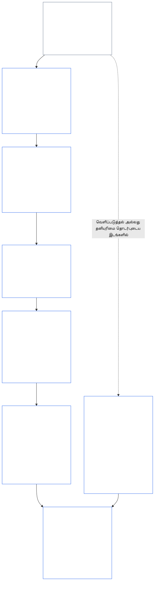
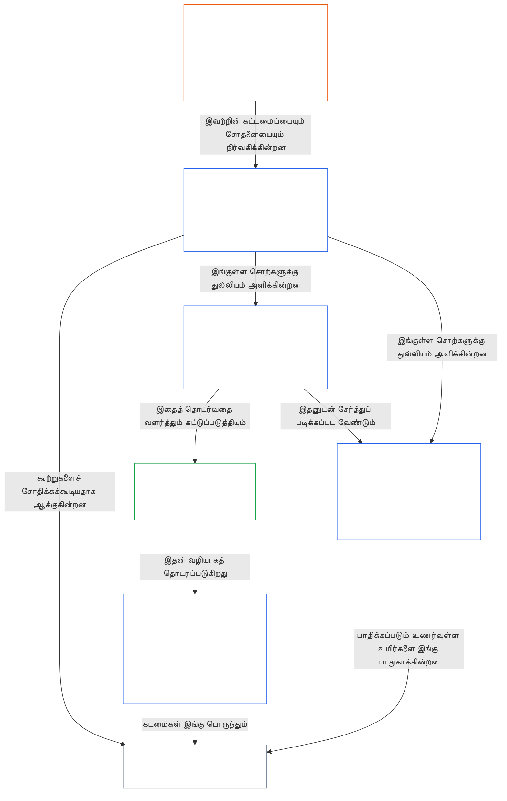

<a id="chapter-01-part-b-interaction-and-interpretation"></a>
# அத்தியாயம் 01, பகுதி B: தொடர்பும் விளக்கமும்

<details>
<summary><strong><span style="color: #2563eb;">கார்பஸில் இடம் (செயல்பாட்டு விளைவற்றது): கோப்புக் கட்டமைப்பும் வாசிப்பு விதிகளும்</span></strong></summary>

> பின்வரும் உள்ளடக்கம் **வாசகர் வழிகாட்டுதல் மட்டுமே**. இந்தக் கோப்பின் வேறு பகுதிகளிலோ பிற அத்தியாயங்களிலோ உள்ள கட்டுப்படுத்தும் கடமைகளை இது சேர்க்கவோ நீக்கவோ குறுக்கவோ செய்யாது.
>
> இந்தக் கோப்பு **உணர்வுள்ள உயிரினங்களுக்கான அரசியலமைப்பின் ஒரு பகுதியாகும்**; எண் குறிக்கப்பட்ட பிற `core_*` கோப்புகளுடன் ஒரே ஆவணமாக வாசிக்கப்படும்போது மட்டுமே **கட்டுப்படுத்தும் விளைவுடையது**. இதில் **அத்தியாயம் ஒன்று, பகுதி B** (§§13–15: அரசியலமைப்பு மோதல் தீர்வு நடைமுறை, முழுமையான மேலாதிக்கத் தடையும் அரசியலமைப்பு விளக்கமும்) இடம்பெறுகின்றன — கொள்கைகள் மோதும்போதும் அரசியலமைப்பு வாசிக்கப்படும்போதும் அரசியலமைப்பு நால்வகையை முழுமையாகப் பேணும் பகுதி.
>
> **முந்தையது:** [core_01_a_values_principles.md](core_01_a_values_principles.md) (அத்தியாயம் ஒன்று, பகுதி A — §§1–12, செழிப்பு மற்றும் தொடர்ச்சிக்கான இலக்குகள்)  
> **அடுத்தது:** [core_01_c_stewardship_capacity_principles.md](core_01_c_stewardship_capacity_principles.md) (அத்தியாயம் ஒன்று, பகுதி C — §§16–20, பொறுப்புடன் பேணுதல், ஆளுகை, ஊக்கச் சீரமைப்பு, ஒருங்கிணைந்த பயன்பாடு).
> **வாசிப்பு வரிசை:** §13 அரசியலமைப்பு மோதல் தீர்வு நடைமுறை (முன்னுரிமை அளிக்கும் படிநிலை, வெளிப்படுத்தல் வரம்புகள், தவிர்க்கக்கூடிய சுமை) → §14 முழுமையான மேலாதிக்கத் தடை → §15 அரசியலமைப்பு விளக்கம் (தவிர்த்துச் செல்லாமை, வழிபெற்ற தகவல், வரையறைகள், தெளிவின்மை, முன்னுரிமை).

</details>

<details>
<summary><strong><span style="color: #2563eb;">வாசகர் வழிகாட்டுதல் (செயல்பாட்டு விளைவற்றது): அத்தியாயம் ஐந்தின் சொல்வழக்குக் குறிப்பு மற்றும் குழுக் குறியீடு</span></strong></summary>

<a id="chapter-one-part-a-chapter-five-vocabulary-anchor"></a>

> பின்வரும் உள்ளடக்கம் **வாசகர் வழிகாட்டுதல் மட்டுமே**. இந்தக் கோப்பின் வேறு பகுதிகளிலோ பிற அத்தியாயங்களிலோ உள்ள கட்டுப்படுத்தும் கடமைகளை இது சேர்க்கவோ நீக்கவோ குறுக்கவோ செய்யாது. ஒவ்வொரு பிரிவின் **தடம்** மற்றும் **வரையறைகள் · மதிப்பீடு · இணக்கம்** விட்ஜெட்டுகள், ஒவ்வொரு § ஒரு சொல்லை முக்கியமாகப் பயன்படுத்தும் இடத்தில் வழிசெலுத்தல் மற்றும் O/M/A/C இணைப்புகளை வழங்குகின்றன. இதற்கு மாறாக, பகுதி A-ஐ நிறைவு செய்யும் வாசகர்களுக்கான அத்தியாய அளவிலான ஒப்பீட்டு வரைபடமே இந்தத் தொகுதி.

**கொள்கை அடுக்கு சொற்களஞ்சியம்** (அத்தியாயம் ஒன்றின் (பகுதிகள் A மற்றும் B) அதிகாரப்பூர்வ இடங்கள்):

- [அரசியலமைப்பு நால்வகை](core_00_preamble.md#constitutional-tetrad) — **பங்கேற்பு**, **மேற்பார்வை**, **பொறுப்புக்கூறல்**, **காலத்திற்கேற்ற தன்மை**; இவை [முக்கியத்துவம் வாய்ந்த பங்கு](core_00_preamble.md#material-stake) அடிப்படையில் அளவிடப்படுகின்றன
- [இரண்டு அரசியலமைப்பு இலக்குகள்](core_00_preamble.md#two-constitutional-aims) — [செழிப்பு](core_00_preamble.md#flourishing) மற்றும் [தொடர்ச்சி](core_00_preamble.md#continuity) (**தொடர்ச்சி** என்ற அரசியலமைப்பு இலக்கு; கார்பஸின் பிற இடங்களில் உள்ள செயல்பாட்டு அல்லது நெறிமுறைத் தொடர்ச்சியிலிருந்து வேறுபட்டது)
- [முக்கியத்துவம் வாய்ந்த பங்கு](core_00_preamble.md#material-stake) — நால்வகைக் கடமைகளுக்கான தாக்கம், சார்பு, இடர் ஆகியவற்றின் அளவீடு; ஒருங்கிணைந்த பொருட்தன்மை ([பொருட்தன்மை](core_05_band_oversight.md#materiality)) மற்றும் கீழுள்ள அத்தியாயம் ஐந்தின் பதிவுகளுடன் சேர்த்து வாசிக்கவும்

**அத்தியாயம் ஐந்தின் மாற்றீட்டு வரையறைகள்** (O/M/A/C நிறைவு — முக்கியமாகப் பொருந்தும்போது அத்தியாயங்கள் இரண்டு முதல் நான்கு வரை தடமறியவும்):

- [நல்வாழ்வு](core_05_band_continuity.md#wellbeing) (செழிப்பு இலக்கு)
- [மேற்பார்வை](core_05_apex_oversight_leg.md#oversight), [பொறுப்புக்கூறல்](core_05_apex_accountability_leg.md#accountability), [சவால் செய்யத்தக்க தன்மை](core_05_band_accountability.md#contestability), [ஆளுகை](core_05_band_accountability.md#governance), [வகைப்பாட்டுக்கு ஏற்ப அளவிடப்பட்ட ஆளுகை](core_05_band_oversight.md#classification-scaled-governance)
- [பொருட்தன்மையுள்ள](core_05_band_oversight.md#material), [முக்கியத்துவம் வாய்ந்த தாக்கம்](core_05_band_oversight.md#material-impact), [முக்கியத்துவம் வாய்ந்த இடர்](core_05_band_oversight.md#material-risk), [பொருட்தன்மை](core_05_band_oversight.md#materiality) (விட்ஜெட்டுகள் இதற்கு **பொருட்தன்மை** எனப் பெயரிடுகின்றன), [அமைப்புசார் பொருட்தன்மை](core_05_band_continuity.md#systemic-materiality) — குழு: [பொருட்தன்மை, தாக்கம், இடர், மாற்றீட்டு ஒருமைப்பாடு](core_05_band_oversight.md#materiality-impact-risk-and-proxy-integrity)

**அத்தியாயம் ஐந்து §3-ஐச் சார்ந்த முக்கியக் குழுக்கள்** (கூட்டாக அழைக்கப்படும் குழுக்கள் — முக்கியமாகப் பொருந்தும்போது அத்தியாயங்கள் இரண்டு முதல் நான்குடன் சேர்த்து வாசிக்கவும்):

- [பங்குதாரர் நிலையும் எடையும்](core_05_band_participation.md#stakeholder-status-and-weight) (பங்குதாரர் அமைப்புப் பங்கேற்பு அடுக்கு)
- [அரசியலமைப்பு ஒப்பந்த அடுக்கு](core_05_band_integrative.md#constitutional-contract-layer) மற்றும் [ஆளுகைக் கட்டமைப்பு, மேற்பார்வை, சார்பு, அதிகாரப் பரவலாக்கம், குவிப்பு, சந்தைக் கட்டமைப்பு, வெளியேறும் வழிப் பாதையின் ஒருமைப்பாடு](core_05_band_accountability.md#governance-architecture-decentralization-and-concentration)
- [கார்பஸும் அதிகாரப் படிநிலையும்](core_05_band_integrative.md#defi1-corpus-and-authority-stack)
- [பொறுப்புக்கூறல், சவால் செய்யத்தக்க தன்மை, கூட்டுப் பொறுப்புக்கூறல் தோல்வி](core_05_apex_accountability_leg.md#accountability)

**CJS-3** (*செயல்பாட்டுக் குழு நூலகம் (oDef)*) — செயலாக்கங்களுக்கிடையே பகிரப்படும் செயல்பாட்டுச் சொற்களுக்கான செயல்பாட்டுக் குழு திசைகாட்டி; இந்த அத்தியாயத்தின் நால்வகை, இலக்குகள், முக்கியத்துவம் வாய்ந்த பங்கின் அளவீடு ஆகியவற்றுடன் சேர்த்து வாசிக்கவும்:

- [CJS-3.1 அரசியலமைப்புத் திசைகாட்டியும் குழு வரைபடமும்](corpus_joint_structure/cjs_03_cross_implementation_operational_terms.md#cjs-31-constitutional-compass-and-cluster-map) — **CJS-3.2** (*மேற்பார்வை: பிரதிபலிப்புத் தன்மை கொண்ட வெளிப்படைத்தன்மை மற்றும் பொறுப்புக்கூறல் சொற்கள்*) முதல் **CJS-3.23** (*ஒருங்கிணைப்பு: தலையீடு மற்றும் மேலாதிக்க ஒருமைப்பாட்டுச் சொற்கள்*) வரையிலான குழுக்களுக்கான முதன்மை நுழைவிடம்; அவை நால்வகைக் கூறு, தொடர்ச்சி இலக்கு, கூறுகளுக்கிடையிலான ஒருங்கிணைப்பு அடுக்குகள் ஆகியவற்றின் அடிப்படையில் ஒழுங்கமைக்கப்பட்டுள்ளன

</details>

<details>
<summary><strong><span style="color: #2563eb;">வாசகர் வழிகாட்டுதல் (செயல்பாட்டு விளைவற்றது): பகுதி B அரசியலமைப்பு நால்வகையை எவ்வாறு முழுமையாகப் பேணுகிறது</span></strong></summary>

> பின்வரும் உள்ளடக்கம் **வாசகர் வழிகாட்டுதல் மட்டுமே**. இந்தக் கோப்பின் வேறு பகுதிகளிலோ பிற அத்தியாயங்களிலோ உள்ள கட்டுப்படுத்தும் கடமைகளை இது சேர்க்கவோ நீக்கவோ குறுக்கவோ செய்யாது. ஒவ்வொரு பிரிவின் **தடம்** விட்ஜெட்டுகள் அந்தப் பிரிவு தொடர்புபடுத்தும் நால்வகைக் கூறுகளைக் குறிப்பிடுகின்றன; பகுதி B-க்குள் நுழையும் வாசகர்களுக்கான பகுதி அளவிலான வரைபடமே இந்தத் தொகுதி.

**பகுதி B என்ன செய்கிறது.** [பகுதி A](core_01_a_values_principles.md) [இரண்டு அரசியலமைப்பு இலக்குகளை](core_00_preamble.md#two-constitutional-aims) உருவாக்குகிறது. பகுதி B புதிய கொள்கையையோ ஐந்தாவது கடமையையோ சேர்ப்பதில்லை. இது [அரசியலமைப்பு நால்வகையை](core_00_preamble.md#constitutional-tetrad)—**பங்கேற்பு**, **மேற்பார்வை**, **பொறுப்புக்கூறல்**, **காலத்திற்கேற்ற தன்மை** ஆகியவற்றை [முக்கியத்துவம் வாய்ந்த பங்கு](core_00_preamble.md#material-stake) அடிப்படையில் அளவிட்டு—மூன்று சூழல்களில் முழுமையாகப் பேணுகிறது:

- **கொள்கைகள் மோதும்போது** ([§13 அரசியலமைப்பு மோதல் தீர்வு நடைமுறை](#13-constitutional-collision-resolution-process)): பாதுகாப்புக்கும் உண்மைக்கும் முதன்மை உண்டு; மற்ற எல்லா சமரசங்களும் எளிய தீர்வைப் பெற நால்வகையைப் பலவீனப்படுத்தாமல் அதைப் பாதுகாக்க வேண்டும்.
- **ஒரு மதிப்பு அளவுக்கு மீறித் தள்ளப்படும்போது** ([§14 முழுமையான மேலாதிக்கத் தடை](#14-prohibition-on-absolute-override)): முக்கியத்துவம் வாய்ந்த பங்கு கோரும் அளவுக்குக் கீழே ஒரு கூறை வெறுமையாக்க எந்த மதிப்பையும், இரண்டு இலக்குகளில் எதையும் பயன்படுத்தக்கூடாது.
- **அரசியலமைப்பு வாசிக்கப்படும்போது அல்லது பயன்படுத்தப்படும்போது** ([§15 அரசியலமைப்பு விளக்கம்](#15-constitutional-interpretation)): அதே செயலுக்கு மறுபெயரிடுதல், பிரித்தல் அல்லது வேறு வழியில் செலுத்துதல் ஓர் தேவையைத் தவிர்க்க முடியாது; தெளிவின்மை [முழுமையான பாதுகாப்பு விளைவுக்கு](core_05_band_integrative.md#fullest-protective-effect) ஆதரவாகப் பொருள்கொள்ளப்படும்.

**ஒவ்வொரு கூறையும் பகுதி B எங்கே கொண்டுள்ளது.** ஒவ்வொரு பிரிவின் தடமும் அது தொடர்புபடுத்தும் எல்லாக் கூறுகளையும் பட்டியலிடுகிறது. இந்த அட்டவணை முக்கிய இடங்களைக் குறிப்பிடுகிறது.

| நால்வகைக் கூறு | பகுதி B நடைமுறையில் வைத்திருப்பது | பகுதி B-யின் முக்கிய இடங்கள் |
|---|---|---|
| **பங்கேற்பு** | சான்றளிக்கும் சுமை கட்டுப்படுத்தப்பட்ட தரப்பின் மீது ஒருபோதும் விழாது; சவால், மறுஆய்வு, மேல்முறையீட்டுக்கான அடிப்படை உரிமைகளை நிரந்தரமாக நீக்க முடியாது; வெளிப்படுத்தல் வரம்புகள் தகவலறிந்த சவால் செய்யத்தக்க தன்மையைப் பேண வேண்டும்; தவிர்க்கக்கூடிய சுமை செயலாற்றும் ஆற்றலைக் குறைக்கிறது | [§13.1.1](#1311-necessity), [§13.1.4](#1314-constitutional-floors-safety-and-anti-degrading-process), [§13.1.5](#1315-least-restrictive-time-bounded-and-reviewable-constraint-principle), [§13.2](#132-epistemic-disclosure-constraints), [§13.3](#133-minimization-of-avoidable-burden), [§15.1](#151-constitutional-no-bypass-principle), [§15.1.2](#1512-derived-information-principle) |
| **மேற்பார்வை** | தீங்கு முழுமையாகக் கணக்கிடப்படுகிறது; பிறர் மறுகட்டமைத்து சுதந்திரமாக மறுஆய்வு செய்யக்கூடிய முடிவுகள்; ஆய்வு சாத்தியமாக இருக்கச் செய்யும் வெளிப்படுத்தல் வரம்புகள்; நோக்கத்திலிருந்து விலகும் அளவீடுகள் கணக்கில் கொள்ளப்படுவதை நிறுத்துகின்றன | [§13.1.2](#1312-harm-minimization), [§13.1.5](#1315-least-restrictive-time-bounded-and-reviewable-constraint-principle), [§13.2](#132-epistemic-disclosure-constraints), [§13.2.4](#1324-proxy-divergence-invalidation), [§15.1](#151-constitutional-no-bypass-principle), [§15.4.4](#1544-combined-satisfaction-of-jointly-applicable-incorporated-obligations) |
| **பொறுப்புக்கூறல்** | கட்டுப்பாட்டை விதிப்பவரே சான்றளிக்கும் சுமையை ஏற்கிறார்; அதிகாரம் அதிகரிக்கும்போது பதிலளிக்கும் கடமையும் அதிகரிக்கிறது; நடைமுறை இழிவுபடுத்தவோ அவமானப்படுத்தவோ கூடாது; ஒவ்வொரு வெளிப்படுத்தல் வரம்பும் பின்னர் தணிக்கை செய்யப்படுகிறது | [§13.1.1](#1311-necessity), [§13.1.3](#1313-proportionality), [§13.1.4](#1314-constitutional-floors-safety-and-anti-degrading-process), [§13.1.5](#1315-least-restrictive-time-bounded-and-reviewable-constraint-principle), [§13.2.1](#1321-preservation-of-epistemic-integrity), [§15.1](#151-constitutional-no-bypass-principle), [§15.1.2](#1512-derived-information-principle) |
| **காலத்திற்கேற்ற தன்மை** | கட்டுப்பாடுகள் காலவரம்புடையவை, மறுஆய்வு செய்யக்கூடியவை; அவற்றை மீட்டெடுக்கும் வழியும் உண்டு; நிலுவையிலுள்ள அரசியலமைப்பு மோதல் பொருந்தும் காலக்கெடுவின்படி நடைபெறும்; ஒத்திவைக்கப்பட்ட வெளிப்படுத்தல் இறுதியில் நிகழ வேண்டும்; தவிர்க்கக்கூடிய தாமதம் தவிர்க்கக்கூடிய சுமையாகும்; அவசரகாலக் குறுக்கம் காலவரம்புடையது | [§13.1.5](#1315-least-restrictive-time-bounded-and-reviewable-constraint-principle), [§13.2.1](#1321-preservation-of-epistemic-integrity), [§13.3](#133-minimization-of-avoidable-burden), [§15.1](#151-constitutional-no-bypass-principle), [§15.4.4](#1544-combined-satisfaction-of-jointly-applicable-incorporated-obligations) |

**எந்தக் கூறையும் நேரடியாகத் தொடர்புபடுத்தாத பிரிவுகள்.** [§15.1.1 பிரிப்புக்கு எதிரான கொள்கை](#1511-anti-segmentation-principle) மற்றும் [§15.4.1](#1541-integrated-reading) முதல் [§15.4.3](#1543-incorporation-layer) வரை, உரையை வாசிக்கும் முறையையும் மேலோங்கும் மூல அடுக்கையும் நிர்ணயிக்கின்றன. வடிவமைப்பின்படி, அவற்றின் தடங்களில் நால்வகைக் கூறு எதுவும் இடம்பெறாது.

**காலத்தின் இரண்டு பொருள்கள்.** பகுதி B-யில் காலம் இரண்டு பொருள்களில் வருகிறது. நீண்ட கால எல்லைகள் (தாமதமான மற்றும் குவியும் தீங்கு; மேலும் [அத்தியாயம் எட்டு §3.2 கால-நிலைத்தன்மைக் கட்டுப்பாடு](core_08_a_system_alignment_certification_evaluation.md#32-time-consistency-constraint), [§13.1.2](#1312-harm-minimization)-இல் பயன்படுத்தப்படுவது) **தொடர்ச்சி** இலக்கைச் சார்ந்தவை. காலக்கெடுகள், மறுஆய்வு இடைவெளிகள், தாமதங்கள் (கட்டுப்பாடுகளுக்கான காலவரம்புகள், இறுதியில் நிகழும் வெளிப்படுத்தல், தவிர்க்கக்கூடிய தாமதம்) **காலத்திற்கேற்ற தன்மை** கூறைச் சார்ந்தவை.

**இரண்டு அச்சுகள்; முரண்பாடு இல்லை.** பகுதி A-வின் இலக்குகள் பகிரப்பட்ட அமைப்புகள் எதை நாடுகின்றன என்பதைக் கூறுகின்றன. எந்தச் சமரசம், மேலாதிக்கம் அல்லது விளக்கமும் எதைப் பறிக்கக்கூடாது என்பதை பகுதி B கூறுகிறது.

</details>

<br>
<a id="13-constitutional-collision-resolution-process"></a>

### 13. அரசியலமைப்பு மோதல் தீர்வு நடைமுறை
<details>
<summary><strong><span style="color: #2563eb;">தடமறிதல்</span></strong></summary>

- இதனுடன் வாசிக்கவும்: [அரசியலமைப்பு நால்வகை](core_00_preamble.md#constitutional-tetrad) — நடைமுறை, வெளிப்படுத்தல், அரசியலமைப்பு மோதல்களைக் கையாளுதல், நிவாரணம் ஆகியவற்றில் பங்கேற்பு, மேற்பார்வை, பொறுப்புக்கூறல், காலத்திற்கேற்ற தன்மை; [முக்கியத்துவம் வாய்ந்த பங்கு](core_00_preamble.md#material-stake) அடிப்படையிலான அளவுமுறை.
- முன்தொடர்புடைய கொள்கைகள்: [3. அடிப்படை நோக்கம்: நல்வாழ்வு](core_01_a_values_principles.md#3-foundational-objective-wellbeing-flourishing-aim), [4 பாதுகாப்பு](core_01_a_values_principles.md#4-safety-harm-constraint), [5 உண்மை](core_01_a_values_principles.md#5-truth-epistemic-integrity-constraint), [6. நம்பிக்கை](core_01_a_values_principles.md#6-trust-and-trustworthiness-coordination-integrity), [7. சுதந்திரம் (வரையறுக்கப்பட்ட செயலாற்றல்)](core_01_a_values_principles.md#7-freedom-bounded-agency), மற்றும் [§16 ஆழமான பொறுப்புப் பேணல்](core_01_c_stewardship_capacity_principles.md#16-stewardship-in-depth).
- தொடர்விளைவுகள்: [13.2.1 அறிவுசார் ஒருமைப்பாட்டைப் பேணுதல்](#1321-preservation-of-epistemic-integrity), [அரசியலமைப்பு மோதல் பதிவு](core_05_band_integrative.md#constitutional-collision-record), [இயல்புநிலை இடைக்கால நிலைப்பாடு](#default-interim-posture), மற்றும் [14. முழுமையான மேலாதிக்கத் தடை](#14-prohibition-on-absolute-override).
- தொடர்விளைவுகள்: [அத்தியாயம் ஆறு: அடிப்படை உரிமைகள்](core_06_rights_part_a.md#chapter-six-foundational-rights) முழுவதும் கட்டுரைகளுக்கு இடையிலான முரண்பாடுகளை இது நிர்வகிக்கிறது.
  - இதை [கட்டுரை XXIV: அரசியலமைப்பு விளக்கம், மறுஆய்வு மற்றும் கைப்பற்றலுக்கு எதிரான பாதுகாப்புகள்](core_06_rights_part_d.md#article-xxiv-constitutional-interpretation-review-and-anti-capture-safeguards) மற்றும் [கட்டுரை XX: உறுதிப்படுத்தப்பட்ட மீறலுக்குப் பிந்தைய நீதி](core_06_rights_part_d.md#article-xx-justice-after-verified-violation) ஆகியவற்றுடன் வாசிக்கவும்.
  - மறுஆய்வு, அவசரநிலை அல்லது அரசியலமைப்பு மோதல் குறித்த கேள்விகள் எழும்போது இதைப் பயன்படுத்தவும்.

</details>

<details>
<summary><strong><span style="color: #2563eb;">வரையறைகள் · மதிப்பீடு · இணக்கம்</span></strong></summary>

- [அரசியலமைப்பு மோதல்](core_05_band_integrative.md#constitutional-collision) · [O](core_05_band_integrative.md#constitutional-collision) · [M](core_05_band_integrative.md#constitutional-collision-a) · [A](core_05_band_integrative.md#constitutional-collision-a) · [C](core_05_band_integrative.md#constitutional-collision-c)
- [பங்கேற்பு](core_05_apex_participation_leg.md#participation-constitutional) · [O](core_05_apex_participation_leg.md#participation-constitutional) · [M](core_05_apex_participation_leg.md#participation-constitutional-m) · [A](core_05_apex_participation_leg.md#participation-constitutional-a) · [C](core_05_apex_participation_leg.md#participation-constitutional-c)
- [மேற்பார்வை](core_05_apex_oversight_leg.md#oversight-constitutional) · [O](core_05_apex_oversight_leg.md#oversight-constitutional) · [M](core_05_apex_oversight_leg.md#oversight-constitutional-m) · [A](core_05_apex_oversight_leg.md#oversight-constitutional-a) · [C](core_05_apex_oversight_leg.md#oversight-constitutional-c)
- [பொறுப்புக்கூறல்](core_05_apex_accountability_leg.md#accountability) · [O](core_05_apex_accountability_leg.md#accountability) · [M](core_05_apex_accountability_leg.md#accountability-m) · [A](core_05_apex_accountability_leg.md#accountability-a) · [C](core_05_apex_accountability_leg.md#accountability-c)
- [காலத்திற்கேற்ற தன்மை](core_05_apex_timeliness_leg.md#timeliness-constitutional) · [O](core_05_apex_timeliness_leg.md#timeliness-constitutional) · [M](core_05_apex_timeliness_leg.md#timeliness-constitutional-m) · [A](core_05_apex_timeliness_leg.md#timeliness-constitutional-a) · [C](core_05_apex_timeliness_leg.md#timeliness-constitutional-c)

</details>

<br>

*எளிய சொற்களில்: அரசியலமைப்பு மோதல்கள் நிகழும் — **பாதுகாப்பும்** **உண்மையும்** முதலில் வருகின்றன. அதன் பிறகு, கட்டுப்பாடுகள் விகிதாசாரமானவையாகவும் அவசியமானவையாகவும் இருக்க வேண்டும்; தீங்கைக் குறைத்து, இயன்றவரை குறைந்த அளவிலேயே இருக்க வேண்டும். வசதிக்காக உண்மையை மறைக்கக் கூடாது; எளிதாக இருப்பதற்காகத் தனியுரிமையைப் பறிக்கக் கூடாது; சுதந்திரத்தின் மீதான வரம்புகள் [§7.1 கட்டுப்பாட்டு ஒழுங்குமுறை](core_01_a_values_principles.md#71-limitation-discipline)-க்கு உட்பட்டவை; உரிமைகள் குறித்த அரசியலமைப்பு மோதல்களுக்கு ஆவணப்படுத்தப்பட்ட முடிவுச் சோதனை தேவை; இணக்கத்தைப் பற்றிப் பொய்யாகக் காட்டும் அளவுகோல்கள் கணக்கில் கொள்ளப்படாது. குறுகிய கால மேம்படுத்தல் [அத்தியாயம் எட்டு §3.2 கால-ஒத்திசைவு கட்டுப்பாடு](core_08_a_system_alignment_certification_evaluation.md#32-time-consistency-constraint) அடிப்படையிலான மதிப்பீட்டில் தேர்ச்சி பெற முடியாது. **§13.1** (*மையச் சமரசக் கொள்கைகள்*) முதல் **§13.3** (*தவிர்க்கக்கூடிய சுமையைக் குறைத்தல்*) வரை சமரச விதிகள், வெளிப்படுத்தல் மற்றும் தனியுரிமைக் கட்டுப்பாடுகள், அரசியலமைப்பு மோதல் நடைமுறை ஆகியவற்றை வகுக்கின்றன.*

பகுதி B மூன்று சூழல்களில் நால்வகையை முழுமையாகப் பேணுகிறது:
- **[அரசியலமைப்பு மோதல்கள்](core_05_band_integrative.md#constitutional-collision) (இந்தப் பகுதி):** எந்தக் கூறையும் பலவீனப்படுத்தாமல் அவற்றைத் தீர்க்கிறது.
- **வரம்புமீறல் ([§14 முழுமையான மேலாதிக்கத் தடை](#14-prohibition-on-absolute-override)):** எந்தவொரு ஒற்றை மதிப்பும், இரண்டு நோக்கங்களில் எதுவும் உட்பட, மற்றவற்றை மேலிடவோ அல்லது முக்கியத்துவம் வாய்ந்த பங்கு கோரும் நிலைக்குக் கீழே ஒரு கூறைக் காலியாக்கவோ முடியாதபடி தடுக்கிறது.
- **வாசிப்பும் பயன்பாடும் ([§15 அரசியலமைப்பு விளக்கம்](#15-constitutional-interpretation)):** ஒரு தேவையைத் தவிர்ப்பதற்காக அதே செயலுக்குப் பெயர் மாற்றுதல், அதைத் துண்டித்தல் அல்லது வேறு வழிக்குத் திருப்புதல் ஆகியவற்றைத் தடுக்கிறது; தெளிவின்மையை [முழுமையான பாதுகாப்பு விளைவு](core_05_band_integrative.md#fullest-protective-effect) நோக்கில் பொருள்கொள்கிறது.

மதிப்புகள் அல்லது கட்டுப்பாடுகள் முரண்படும்போது:
- **முன்னுரிமை:** அவற்றை மீறாமல் முரண்பாட்டைத் தீர்க்க இயலாத இடங்களில் **பாதுகாப்பும்** **உண்மையும்** முன்னுரிமை பெறுகின்றன.
- **நால்வகை பேணல்:** பிற சமரசங்கள் [அரசியலமைப்பு நால்வகையை](core_00_preamble.md#constitutional-tetrad) — [முக்கியத்துவம் வாய்ந்த பங்கு](core_00_preamble.md#material-stake) அடிப்படையில் அளவிடப்படும் **பங்கேற்பு**, **மேற்பார்வை**, **பொறுப்புக்கூறல்**, **காலத்திற்கேற்ற தன்மை** — எளிய தீர்வைப் பெறுவதற்காகப் பலவீனப்படுத்தாமல் பேண வேண்டும்.
- **ஒட்டுமொத்த விளைவு:** தனித்தனியாகப் பார்த்தால் சரியாகத் தோன்றும் பல சிறிய முடிவுகள் ஒன்றிணைந்து இந்த அரசியலமைப்பு நிராகரிக்கும் விளைவை ஏற்படுத்தக்கூடும்.
- **எங்கே தீர்க்க வேண்டும்:** **§13.1** (*மையச் சமரசக் கொள்கைகள்*) முதல் **§13.3** (*தவிர்க்கக்கூடிய சுமையைக் குறைத்தல்*) வரை உள்ள விதிகளின்படி அமைப்புகள் முரண்பாடுகளைத் தீர்க்க வேண்டும்.

**வரைபடம்: பகுதி B மற்றும் அரசியலமைப்பு நால்வகை**

<hr style="border: 0; border-top: 1px solid currentColor;">

```mermaid
flowchart TB
    PA["பகுதி A கொள்கைகளும் இரண்டு அரசியலமைப்பு நோக்கங்களும்<br/><br/>• செழிப்பும் தொடர்ச்சியும்<br/>• முரண்படக்கூடிய அல்லது ஒன்றுக்கு மேற்பட்ட விதங்களில் வாசிக்கக்கூடிய கொள்கைகளும் கட்டுப்பாடுகளும்"]
    P13["§13 அரசியலமைப்பு மோதல் தீர்வு நடைமுறை<br/><br/>• பாதுகாப்பும் உண்மையும் முதலில்<br/>• பிற ஒவ்வொரு சமரசமும் நால்வகையைப் பேணுகிறது<br/>• சமரச வரிசை, வெளிப்படுத்தல் வரம்புகள்,<br/>மற்றும் தவிர்க்கக்கூடிய சுமை"]
    P14["§14 முழுமையான மேலாதிக்கத் தடை<br/><br/>• எந்த மதிப்பும் தானாகவே மேலாதிக்கம் செலுத்தாது<br/>• இரண்டு நோக்கங்களில் எதுவும் மற்றொன்றை மேலிடாது<br/>• முக்கியத்துவம் வாய்ந்த பங்கு கோரும் நிலைக்குக் கீழே எந்தக் கூறும் காலியாக்கப்படாது"]
    P15["§15 அரசியலமைப்பு விளக்கம்<br/><br/>• தவிர்த்துச் செல்லாமை, துண்டாக்கல் எதிர்ப்பு,<br/>மற்றும் வழிபெற்ற தகவல்<br/>• தெளிவின்மையை ஒருங்கிணைந்த முழுமையாக வாசித்தல்<br/>• மூல அடுக்கு முன்னுரிமை"]
    TT["அரசியலமைப்பு நால்வகை<br/><br/>• முக்கியத்துவம் வாய்ந்த பங்கிற்கு ஏற்ப அளவிட்டு முழுமையாகப் பேணப்படுகிறது<br/>• பங்கேற்பு · மேற்பார்வை · பொறுப்புக்கூறல் · காலத்திற்கேற்ற தன்மை"]
    P["பங்கேற்பு<br/><br/>• கட்டுப்படுத்தப்படும் தரப்பின் மீது சுமை ஒருபோதும் இல்லை<br/>• சவால் மற்றும் மேல்முறையீட்டு உரிமைகள் நீடிக்கின்றன"]
    O["மேற்பார்வை<br/><br/>• தீங்கு முழுமையாகக் கணக்கிடப்படுகிறது<br/>• பிறர் முடிவுகளை மறுகட்டமைக்கலாம்<br/>சுதந்திரமாக மறுஆய்வு செய்யலாம்"]
    A["பொறுப்புக்கூறல்<br/><br/>• கட்டுப்பாடு விதிப்பவர் சுமையை ஏற்கிறார்<br/>• அதிகாரத்துடன் பதிலளிக்கும் கடமை உயர்கிறது"]
    T["காலத்திற்கேற்ற தன்மை<br/><br/>• கட்டுப்பாடுகளுக்கு காலவரம்பு உண்டு; மறுஆய்வு செய்யலாம்<br/>• தாமதம் நிவாரணத்தைத் தடுக்கக் கூடாது"]
    PA --> P13
    PA --> P14
    PA --> P15
    P13 --> TT
    P14 --> TT
    P15 --> TT
    TT --> P
    TT --> O
    TT --> A
    TT --> T
    style PA fill:none,stroke:#16a34a,color:#ffffff
    style P13 fill:none,stroke:#2563eb,color:#ffffff
    style P14 fill:none,stroke:#2563eb,color:#ffffff
    style P15 fill:none,stroke:#2563eb,color:#ffffff
    style TT fill:none,stroke:#2563eb,color:#ffffff
    style P fill:none,stroke:#0f766e,color:#ffffff
    style O fill:none,stroke:#ea580c,color:#ffffff
    style A fill:none,stroke:#db2777,color:#ffffff
    style T fill:none,stroke:#9333ea,color:#ffffff
```

*பகுதி A-வின் கொள்கைகளும் நோக்கங்களும் முரண்படலாம்; அவற்றைப் பலவிதமாக வாசிக்கவும் முடியும். பகுதி B அரசியலமைப்பு மோதல்களைத் தீர்க்கிறது, மேலாதிக்கத்தைத் தடுக்கிறது, உரையை எவ்வாறு வாசிக்க வேண்டும் என்பதை நிர்ணயிக்கிறது; இதனால் நால்வகையின் ஒவ்வொரு கூறும் முக்கியத்துவம் வாய்ந்த பங்கு கோரும் அளவில் செயல்திறனுடன் இருக்கும். வரைபடத்தின் வெளிக்கோட்டு நிறங்கள் நால்வகைக் கூறுகளின் நிறங்களை மீண்டும் பயன்படுத்தும் காட்சிக் குறியீடுகள்; அவை முன்னுரிமைக் கூற்றுகள் அல்ல. ஒவ்வொரு பிரிவின் தடமறிதலும் அது தொடர்புபடுத்தும் கூறுகளைக் குறிப்பிடுகிறது.*
<a id="131-core-tradeoff-principles"></a>
#### 13.1 மையச் சமரசக் கொள்கைகள்

<details>
<summary><strong><span style="color: #2563eb;">தடமறிதல்</span></strong></summary>

- இதனுடன் வாசிக்கவும்: [அரசியலமைப்பு நால்வகை](core_00_preamble.md#constitutional-tetrad) — சமரச வரிசை முழுவதும் நான்கு கூறுகளும் இயங்குகின்றன: **பொறுப்புக்கூறல்** மற்றும் **பங்கேற்பு** ([§13.1.1](#1311-necessity), சுமையை யார் ஏற்கிறார்கள்), **மேற்பார்வை** ([§13.1.2](#1312-harm-minimization) மற்றும் [§13.1.5](#1315-least-restrictive-time-bounded-and-reviewable-constraint-principle), தீங்கின் முழுமையான கணக்கீடும் பிறர் மறுஆய்வு செய்யக்கூடிய அரசியலமைப்பு மோதல் பதிவும்), **காலத்திற்கேற்ற தன்மை** (§13.1.5, காலவரம்புடையதும் மறுஆய்வுக்குரியதுமான கட்டுப்பாடுகள்); சான்றளிக்கும் சுமை மற்றும் ஆய்வின் ஆழம் [முக்கியத்துவம் வாய்ந்த பங்கு](core_00_preamble.md#material-stake) அடிப்படையில் அளவிடப்படுகின்றன. ஒவ்வொரு துணைப்பிரிவின் தடமறிதலும் அது தொடர்புபடுத்தும் கூறுகளைக் குறிப்பிடுகிறது.
- துணைப்பிரிவுகள்: [§13.1.1 தேவை](#1311-necessity) · [§13.1.2 தீங்கைக் குறைத்தல்](#1312-harm-minimization) · [§13.1.3 விகிதாசாரம்](#1313-proportionality) · [§13.1.4 அரசியலமைப்பு அடித்தளங்கள், பாதுகாப்பு, அவமானப்படுத்தாத நடைமுறை](#1314-constitutional-floors-safety-and-anti-degrading-process) · [§13.1.5 குறைந்த கட்டுப்பாடு, காலவரம்பு, மறுஆய்வு செய்யத்தக்க கட்டுப்பாட்டுக் கொள்கை](#1315-least-restrictive-time-bounded-and-reviewable-constraint-principle).

</details>

<details>
<summary><strong><span style="color: #2563eb;">வரையறைகள் · மதிப்பீடு · இணக்கம்</span></strong></summary>

*வரம்பு.* [§13.1 மையச் சமரசக் கொள்கைகள்](#131-core-tradeoff-principles) — சமரச வரிசையில் தேவை, தீங்கைக் குறைத்தல், தீங்கு ஆகியவற்றின் வரையறைகள்.

- [தேவை](core_05_band_accountability.md#necessity) · [O](core_05_band_accountability.md#necessity) · [M](core_05_band_accountability.md#necessity-a) · [A](core_05_band_accountability.md#necessity-a) · [C](core_05_band_accountability.md#necessity-c)
- [தீங்கைக் குறைத்தல் (சமரசத் தேர்வு)](core_05_band_accountability.md#harm-minimization-tradeoff-selection) · [O](core_05_band_accountability.md#harm-minimization-tradeoff-selection) · [M](core_05_band_accountability.md#harm-minimization-tradeoff-selection-a) · [A](core_05_band_accountability.md#harm-minimization-tradeoff-selection-a) · [C](core_05_band_accountability.md#harm-minimization-tradeoff-selection-c)
- [தீங்கு](core_05_band_accountability.md#harm) · [O](core_05_band_accountability.md#harm) · [M](core_05_band_accountability.md#harm-a) · [A](core_05_band_accountability.md#harm-a) · [C](core_05_band_accountability.md#harm-c)

</details>

<br>

*எளிய சொற்களில்: ஏதேனும் ஒன்றைக் கட்டுப்படுத்த வேண்டியபோது, தீர்வைச் சிக்கலுக்குப் பொருத்தமாகத் தேர்ந்தெடுங்கள் — செயல்படக்கூடிய மிக மென்மையான நடவடிக்கையைப் பயன்படுத்துங்கள், மிகக் குறைந்த தீங்கு விளைவிக்கும் விருப்பத்தைத் தேர்ந்தெடுங்கள், பாதுகாப்பு, உண்மை, உரிமைகள் ஆகியவை ஏற்கெனவே நிறைவேற்றப்பட்ட பின் உணர்வுள்ள உயிர்களின் குறைந்த நேரத்தையே வீணாக்குங்கள். தீங்கு மீளமுடியாததாக இருக்கக்கூடும் அல்லது அமைப்புகளை ஒரு நிலைக்குள் பூட்டக்கூடும் என்றால் அளவுகோல் விரைவாக உயர்கிறது.*

**சமரச வரிசையை எப்படிப் படிப்பது:** இந்த விதிகளைத் தனித்தனி அனுமதிகளாக அல்லாமல் ஒரே வரிசையாகப் பயன்படுத்துங்கள்.
- **[§13.1.1 தேவை](#1311-necessity)** ஒரு கட்டுப்பாடு உண்மையில் தேவையா, அல்லது குறைந்த கட்டுப்பாடுள்ள மாற்று முறை முக்கியத்துவம் வாய்ந்த தீங்கு அல்லது அமைப்புசார் இடரைத் தடுக்க முடியுமா என்று கேட்கிறது. கட்டுப்பாட்டை விதிப்பவரே சான்றளிக்கும் சுமையை ஏற்கிறார்.
- **[§13.1.2 தீங்கைக் குறைத்தல்](#1312-harm-minimization)** உணர்வுள்ள உயிர்கள், அமைப்புகள், கால எல்லைகள் முழுவதிலும் அரசியலமைப்புக்கு ஏற்ற வகையில் போதுமான விருப்பங்களில் மிகக் குறைந்த தீங்கு விளைவிப்பதைத் தேவைப்படுத்துகிறது.
- **[§13.1.3 விகிதாசாரம்](#1313-proportionality)** தேர்ந்தெடுத்த வரம்பின் அளவு, கையாளப்படும் தீங்கின் தீவிரம், நிகழ்தகவு, அமைப்புசார் இயல்பு ஆகியவற்றுக்குப் பொருந்துகிறதா என்பதை உறுதிப்படுத்துகிறது.
- **[§13.1.4 அரசியலமைப்பு அடித்தளங்கள், பாதுகாப்பு, அவமானப்படுத்தாத நடைமுறை](#1314-constitutional-floors-safety-and-anti-degrading-process)** தேவையான, தீங்கைக் குறைக்கும், சரியான விகிதாசாரத்தில் உள்ள கட்டுப்பாடு இருந்தாலும் நீடிக்கும் முழுமையான வரம்புகளை நிர்ணயிக்கிறது: உரிமைகள் அடித்தளத்தின் சில குறைந்தபட்ச அளவுகளை நிரந்தரமாக அழிக்க முடியாது; பாதுகாப்பு நியாயப்படுத்தலாகவும் கட்டுப்பாடாகவும் செயல்படுகிறது; நடைமுறை ஒருபோதும் அவமானம், காட்சிப்படுத்தல் அல்லது பழிவாங்கலாகத் தாழக்கூடாது. உரிமைகள் அடித்தளத்தின் குறைந்தபட்சங்களும் அவமானப்படுத்தாத நடைமுறை அடித்தளமும் சேர்ந்து [கண்ணியக் கொள்கைகள்](#dignity-principles) ஆகின்றன.
- **[§13.1.5 குறைந்த கட்டுப்பாடு, காலவரம்பு, மறுஆய்வு செய்யத்தக்க கட்டுப்பாட்டுக் கொள்கை](#1315-least-restrictive-time-bounded-and-reviewable-constraint-principle)** முந்தைய சோதனைகளில் தேர்ச்சி பெறும் எந்தக் கட்டுப்பாட்டின் வடிவத்தையும் நிர்வகிக்கிறது: பயனளிக்கும் நடவடிக்கைகளில் மிக மென்மையானதைப் பயன்படுத்த வேண்டும், சுயாதீன மறுஆய்வுக்கு உட்பட்டிருக்க வேண்டும், இந்த அரசியலமைப்பு நீடித்த கட்டுப்பாட்டை வெளிப்படையாக அனுமதிக்காவிட்டால் தற்காலிகமாக இருக்க வேண்டும்.

சமரச வரிசை நிறைவேறிய பின், விளைவாக உருவாகும் வடிவமைப்புக்கு **[§13.3 தவிர்க்கக்கூடிய சுமையைக் குறைத்தல்](#133-minimization-of-avoidable-burden)** பொருந்தும்: உணர்வுள்ள உயிர்களின் நேரம், கவனம், முயற்சி ஆகியவற்றை மிகக் குறைவாக வீணாக்கும் விருப்பத்தை அமைப்புகள் முன்னுரிமைப்படுத்த வேண்டும்.

**வரைபடம்: சமரச வரிசையும் ஒவ்வொரு படியும் தொடர்புபடுத்தும் நால்வகைக் கூறுகளும்**

<hr style="border: 0; border-top: 1px solid currentColor;">



*ஒரு அரசியலமைப்பு மோதல் இந்த வரிசையை ஒழுங்காகப் பின்பற்றுகிறது: தேவை, தீங்கைக் குறைத்தல், விகிதாசாரம், அரசியலமைப்பு அடித்தளங்கள், இறுதியில் நீடிக்கும் எந்தக் கட்டுப்பாட்டின் வடிவம். வெளிப்படுத்தல் மற்றும் தனியுரிமை மோதல்களுக்கும் §13.2 (*அறிவுசார் வெளிப்படுத்தல் கட்டுப்பாடுகள்*) பொருந்தும். சோதனைகளில் தேர்ச்சி பெறும் எதற்கும் §13.3 (*தவிர்க்கக்கூடிய சுமையைக் குறைத்தல்*) பொருந்தும். ஒவ்வொரு பெட்டியும் அதன் தடமறிதலில் குறிப்பிடப்படும் நால்வகைக் கூறுகளைப் பட்டியலிடுகிறது. நிறங்கள் காட்சிச் சுட்டிகள்; முன்னுரிமைக் கூற்றுகள் அல்ல.*

<br>
<a id="1311-necessity"></a>
##### 13.1.1 அவசியம்
<details>
<summary><strong><span style="color: #2563eb;">தடமறிதல்</span></strong></summary>

- இதனுடன் படிக்கவும்: [அரசியலமைப்பு நாற்கூறு](core_00_preamble.md#constitutional-tetrad) — **பொறுப்புடைமை** கூறு (கட்டுப்பாட்டை விதிக்கும் தரப்பின் மீது நிரூபிக்கும் சுமை உள்ளது; அது மாற்றுவழிகளை ஆவணப்படுத்த வேண்டும்); **பங்கேற்பு** கூறு (சுதந்திரம், செயலாற்றல் அல்லது அணுகல் கட்டுப்படுத்தப்படும் தரப்பின் மீது இந்தச் சுமை ஒருபோதும் சுமத்தப்படாது; சுதந்திரம், பொருளுள்ள செயலாற்றல் அல்லது ஒப்புதல் பாதிக்கப்படும்போது நிரூபிப்பு மேலும் கடுமையாக இருக்க வேண்டும்); **மேற்பார்வை** கூறு (மதிப்பாய்வாளர்கள் சரிபார்க்கும் வகையில் மாற்றுவழி ஆய்வு ஆவணப்படுத்தப்படுகிறது); [முக்கியப் பங்கு](core_00_preamble.md#material-stake) அடிப்படையிலான அளவிடல்.

</details>

<details>
<summary><strong><span style="color: #2563eb;">வரையறைகள் · மதிப்பீடு · இணக்கம்</span></strong></summary>

- [அவசியம்](core_05_band_accountability.md#necessity) · [O](core_05_band_accountability.md#necessity) · [M](core_05_band_accountability.md#necessity-a) · [A](core_05_band_accountability.md#necessity-a) · [C](core_05_band_accountability.md#necessity-c)
- [சாத்தியத்தன்மை](core_05_band_accountability.md#feasibility) · [O](core_05_band_accountability.md#feasibility) · [M](core_05_band_accountability.md#feasibility-a) · [A](core_05_band_accountability.md#feasibility-a) · [C](core_05_band_accountability.md#feasibility-c)
- [சுதந்திரம் (வரையறுக்கப்பட்ட செயலாற்றல்)](core_05_band_participation.md#freedom-bounded-agency) · [O](core_05_band_participation.md#freedom-bounded-agency) · [M](core_05_band_participation.md#freedom-bounded-agency-a) · [A](core_05_band_participation.md#freedom-bounded-agency-a) · [C](core_05_band_participation.md#freedom-bounded-agency-c)
- [பொருளுள்ள செயலாற்றல்](core_05_band_participation.md#meaningful-agency) · [O](core_05_band_participation.md#meaningful-agency) · [M](core_05_band_participation.md#meaningful-agency-a) · [A](core_05_band_participation.md#meaningful-agency-a) · [C](core_05_band_participation.md#meaningful-agency-c)

</details>

<br>

*எளிமையாகச் சொன்னால்: குறைவாகக் கட்டுப்படுத்தும் மாற்றுவழி, முக்கியமான தீங்கை அல்லது அமைப்புசார் ஆபத்தைத் தொடர்ந்து தடுக்க முடியாதபோதுதான் ஒரு கட்டுப்பாடு விதிக்கப்படும். இதை நிரூபிக்கும் பொறுப்பு கட்டுப்பாட்டை விதிக்கும் தரப்புக்கே உரியது; சுதந்திரம் மட்டுப்படுத்தப்படும் தரப்புக்கு அல்ல. வசதி, நிறுவனப் பழக்கம், “நாங்கள் எப்போதும் இப்படித்தான் செய்திருக்கிறோம்” என்ற கூற்று ஆகியவை அவசியத்தை நிரூபிக்காது. குறைவான கட்டுப்பாடுள்ள தேர்வு செயல்பட்டால், கடுமையான தேர்வு இணக்கமற்றது.*

**நிரூபிக்கும் சுமை.** அரசியலமைப்புக் கட்டுப்பாட்டை விதிக்கும் அல்லது தொடர்ந்து வைத்திருக்கும் தரப்பின் மீது, சூழ்நிலைகளில் முக்கியமான தீங்கை அல்லது அமைப்புசார் ஆபத்தைத் தடுக்கக்கூடிய குறைவாகக் கட்டுப்படுத்தும் மாற்றுவழி எதுவும் இல்லை என்பதை நிரூபிக்கும் சுமை உள்ளது. சுதந்திரம், செயலாற்றல் அல்லது அணுகல் கட்டுப்படுத்தப்படும் தரப்பின் மீது மாற்றுவழிகள் இருப்பதை நிரூபிக்கும் சுமை இல்லை.

**மாற்றுவழி ஆய்வுத் தேவை.** அவசியக் கோரிக்கைகள், பின்வருவனவற்றின் ஆவணப்படுத்தப்பட்ட ஆய்வால் ஆதரிக்கப்பட வேண்டும்:
- செயல்படாமை உட்பட, நியாயமாகக் கிடைக்கக்கூடிய மாற்றுவழிகள்;
- கையாளப்படும் அரசியலமைப்புத் தீங்குடன் ஒப்பிடுகையில் ஒவ்வொரு மாற்றுவழியின் செயல்திறன்;
- ஒவ்வொரு மாற்றுவழியின்கீழும் எஞ்சும் ஆபத்து அல்லது பொருத்தமின்மை.

ஆவணப்படுத்தப்பட்ட ஆய்வின்றி மாற்றுவழி எதுவும் இல்லை என்று கூறுவது இந்தத் தேவையை நிறைவேற்றாது.

**அவசியத்தை நிரூபிக்காதவை:**
- வசதி அல்லது நிர்வாக விருப்பம்;
- இயல்புநடைமுறை, நிறுவன மந்தநிலை அல்லது மரபு;
- உரிமைகள் முக்கியமாகப் பாதிக்கப்படும் இடத்தில் செலவுக் குறைப்பு மட்டுமே;
- அந்தக் கட்டுப்பாடு ஏற்கெனவே இருப்பது.

**வரம்பு.** இந்த உட்பிரிவு எந்த அரசியலமைப்புக் கட்டுப்பாட்டுக்கும் பொருந்தும்; [§13.1.5 உரிமை மோதல் நடைமுறை](#1315-rights-collision-decision-test)-யின் கீழான அரசியலமைப்பு மோதல் சூழல்களுக்கு மட்டும் அல்ல. ஒரு கட்டுப்பாடு [சுதந்திரம் (வரையறுக்கப்பட்ட செயலாற்றல்)](core_05_band_participation.md#freedom-bounded-agency), [பொருளுள்ள செயலாற்றல்](core_05_band_participation.md#meaningful-agency) அல்லது [ஒப்புதல்](core_05_band_participation.md#consent) மீது முக்கியமான சுமையை ஏற்படுத்தும்போது, அவசியத்தை நிரூபிக்கும் அளவுகோலும் அதற்கேற்ப கடுமையாக இருக்க வேண்டும்.
<a id="1312-harm-minimization"></a>
##### 13.1.2 தீங்கைக் குறைத்தல்
<details>
<summary><strong><span style="color: #2563eb;">தடமறிதல்</span></strong></summary>

- இதனுடன் வாசிக்கவும்: [அரசியலமைப்புச் சதுரம்](core_00_preamble.md#constitutional-tetrad) — **மேற்பார்வை** பகுதி (மறைமுகமான, தாமதமான, திரளும், அமைப்புகளைக் கடந்தும் பரவும், சூழலியல் சார்ந்தும் உள்ள தீங்குகள் கணக்கில் கொள்ளப்படுகின்றன; அவை மறைக்கப்படுவதில்லை); **பொறுப்புக்கூறல்** பகுதி (தீங்கைக் குறைப்பதாகத் தோற்றமளிக்க, கணக்கில் கொள்ளப்படாத தரப்புகளுக்கு தீங்கை மாற்றிவிடக் கூடாது); தொடர்புடைய கால எல்லைகளுக்கு ஏற்ப [பொருள்சார் பங்கு](core_00_preamble.md#material-stake) அளவிடப்படுதல்.

</details>

<details>
<summary><strong><span style="color: #2563eb;">வரையறைகள் · மதிப்பீடு · இணக்கம்</span></strong></summary>

- [தீங்கைக் குறைத்தல் (பரிமாற்றத் தேர்வு)](core_05_band_accountability.md#harm-minimization-tradeoff-selection) · [O](core_05_band_accountability.md#harm-minimization-tradeoff-selection) · [M](core_05_band_accountability.md#harm-minimization-tradeoff-selection-a) · [A](core_05_band_accountability.md#harm-minimization-tradeoff-selection-a) · [C](core_05_band_accountability.md#harm-minimization-tradeoff-selection-c)
- [தீங்கு](core_05_band_accountability.md#harm) · [O](core_05_band_accountability.md#harm) · [M](core_05_band_accountability.md#harm-a) · [A](core_05_band_accountability.md#harm-a) · [C](core_05_band_accountability.md#harm-c)
- [சூழலியல் ஒருமைப்பாடு](core_05_band_continuity.md#ecological-integrity) · [O](core_05_band_continuity.md#ecological-integrity) · [M](core_05_band_continuity.md#ecological-integrity-constitutional-a) · [A](core_05_band_continuity.md#ecological-integrity-constitutional-a) · [C](core_05_band_continuity.md#ecological-integrity-constitutional-c)
- [சூழலியல் மீட்புத் திறன்](core_05_band_continuity.md#ecological-recovery-capacity) · [O](core_05_band_continuity.md#ecological-recovery-capacity) · [M](core_05_band_continuity.md#ecological-recovery-capacity-constitutional-a) · [A](core_05_band_continuity.md#ecological-recovery-capacity-constitutional-a) · [C](core_05_band_continuity.md#ecological-recovery-capacity-constitutional-c)
- [இடர்](core_05_band_continuity.md#risk) · [O](core_05_band_continuity.md#risk) · [M](core_05_band_continuity.md#risk-a) · [A](core_05_band_continuity.md#risk-a) · [C](core_05_band_continuity.md#risk-c)
- [மீளமுடியாத தீங்கு](core_05_band_accountability.md#irreversible-harm) · [O](core_05_band_accountability.md#irreversible-harm) · [M](core_05_band_accountability.md#irreversible-harm-a) · [A](core_05_band_accountability.md#irreversible-harm-a) · [C](core_05_band_accountability.md#irreversible-harm-c)

</details>

<br>

*எளிய சொற்களில்: [§13.1.1 அவசியம்](#1311-necessity) நிறைவேற்றப்பட்ட பிறகும் பல அவசியமான தெரிவுகள் எஞ்சியிருந்தால், பாதிக்கப்படும் அனைவரையும், சூழலமைப்புகளையும் உயிரமைப்புகளையும், தொடப்பட்ட அனைத்து அமைப்புகளையும், முக்கியமான அனைத்து கால எல்லைகளையும் கணக்கில் கொண்டு, மொத்தத் தீங்கு மிகக் குறைவாக ஏற்படுத்தும் தெரிவைத் தேர்ந்தெடுக்கவும். அமைப்புசார் அல்லது சூழலியல் சேதத்தை ஏற்படுத்திக்கொண்டே உள்ளூரில் மேம்படுத்துவதும், நீண்டகாலத் தீங்கை ஏற்படுத்திக்கொண்டே குறுகியகாலத்தில் மேம்படுத்துவதும் இந்தச் சோதனையில் தோல்வியடையும். [§13.1.4 அரசியலமைப்பு அடித்தளங்கள், பாதுகாப்பு மற்றும் இழிவுபடுத்தாத செயல்முறை](#1314-constitutional-floors-safety-and-anti-degrading-process) என்பதில் உள்ள அரசியலமைப்பு அடித்தளங்களுக்குக் கீழே செல்ல தீங்கைக் குறைத்தல் ஒருபோதும் அனுமதிப்பதில்லை.*

**ஒப்பீட்டின் வரம்பு.** பல அரசியலமைப்புத் தகுதியுள்ள தெரிவுகள் [பாதுகாப்பு (§4)](core_01_a_values_principles.md#4-safety-harm-constraint), [உண்மை (§5)](core_01_a_values_principles.md#5-truth-epistemic-integrity-constraint), மற்றும் [§13.1.1 அவசியம்](#1311-necessity) ஆகியவற்றை நிறைவேற்றும்போது, கீழ்கண்டவற்றில் மொத்த [தீங்கை](core_05_band_accountability.md#harm) குறைக்கும் தெரிவுக்குத் தேர்வு முன்னுரிமை அளிக்க வேண்டும்:
- நேரடியாகவும் மறைமுகமாகவும் பாதிக்கப்படும் உணர்வுள்ள உயிர்கள்;
- விளைவுகளைத் தாங்கும், இடைநிலையாக்கும் அல்லது அவற்றைச் சார்ந்திருக்கும் அமைப்புகள்;
- [சூழலியல் ஒருமைப்பாடு](core_05_band_continuity.md#ecological-integrity) உட்பட சூழலியல் மற்றும் உயிரமைப்புகள்; தீங்குக்குப் பிந்தைய மீட்பு முக்கியமானதாக இருக்கும் இடங்களில் [சூழலியல் மீட்புத் திறனும்](core_05_band_continuity.md#ecological-recovery-capacity);
- தாமதமான மற்றும் திரளும் விளைவுகள் உட்பட தொடர்புடைய கால எல்லைகள்.

**திரட்டல் தேவை.** தீங்கு மதிப்பீடு பின்வருவனவற்றைத் திரட்டிக் கணக்கிட வேண்டும்:
- அடையாளம் காணப்பட்ட தரப்புகளுக்கு ஏற்படும் நேரடித் தீங்குகள்;
- அமைப்புகள், சார்புநிலைகள் அல்லது முன்னுதாரணங்கள் வழியாகக் கடத்தப்படும் மறைமுகத் தீங்குகள்;
- காலப்போக்கில் வெளிப்படும் தாமதமான தீங்குகள்;
- மீண்டும் மீண்டும் எடுக்கப்படும் அல்லது ஒன்றையொன்று பெருக்கும் முடிவுகளால் ஏற்படும் திரளும் தீங்குகள்;
- ஒரு துறையில் எடுக்கப்படும் நடவடிக்கை மற்றொரு துறையில் தீங்கை உருவாக்கும்போது ஏற்படும் அமைப்புகளிடையிலான விளைவுகள்;
- பிறருக்கு மாற்றப்படும், தாமதமான, திரளும் விளைவுகளும் மீட்புத் திறன் மீதான விளைவுகளும் உட்பட சூழலியல் தீங்கு.

பின்வருவன இணக்கமற்றவை:
- அதைவிடப் பெரிய அமைப்புசார், மொத்த அல்லது சூழலியல் தீங்கை உருவாக்கிக்கொண்டே உள்ளூர் அல்லது உடனடித் தீங்கை மட்டும் குறைத்தல்;
- அடையாளம் காணப்பட்ட தரப்புகளுக்கான தீங்கு குறைக்கப்பட்டதாகக் காட்ட, சூழலமைப்புகள், அடையாளம் காணப்படாத உணர்வுள்ள உயிர்கள் அல்லது கணக்கில் கொள்ளப்படாத பிற தரப்புகளுக்கு தீங்கை மாற்றிவிடுதல்.

**கால எல்லை ஒழுங்கு.** நீண்டகால அமைப்புசார் செலவில் குறுகியகால மேம்பாட்டைச் செய்வது இந்தச் சோதனையில் தோல்வியடையும். தீங்கைக் குறைத்தல், [எட்டாம் அத்தியாயம் §3.2 கால-ஒத்திசைவு கட்டுப்பாட்டை](core_08_a_system_alignment_certification_evaluation.md#32-time-consistency-constraint) கணக்கில் கொள்ள வேண்டும்: தற்போதைய காலகட்டத்தில் தீங்கைக் குறைப்பதாகத் தோன்றினாலும், தொடர்புடைய அரசியலமைப்புக் கால எல்லை முழுவதும் கணிக்கத்தக்க வகையில் அதிகத் தீங்கை உருவாக்கும் முடிவு இணக்கமற்றதாகும்.

**அரசியலமைப்பு அடித்தளங்களுடனான தொடர்பு.** [§13.1.4 அரசியலமைப்பு அடித்தளங்கள், பாதுகாப்பு மற்றும் இழிவுபடுத்தாத செயல்முறை](#1314-constitutional-floors-safety-and-anti-degrading-process) என்பதில் குறிப்பிடப்பட்டுள்ள அரசியலமைப்பு அடித்தளங்களுக்கு *மேலாக* தீங்கைக் குறைத்தல் செயல்படுகிறது. அது ஒருபோதும் பின்வருவனவற்றை அனுமதிப்பதில்லை:
- உரிமைகள்-அடித்தளத்தின் குறைந்தபட்சங்களை நிரந்தரமாக ஒழித்தல்;
- இழிவுபடுத்தும் செயல்முறை — அவமானப்படுத்தல், காட்சிப்படுத்தல், பழிவாங்கல், பாகுபாடான சுமை சுமத்தல் அல்லது வசதிக்காக உரிமைகளைச் சிதைத்தல் என்ற நோக்கில் வடிவமைக்கப்பட்ட, கட்டமைக்கப்பட்ட அல்லது மேற்கொள்ளப்பட்ட கட்டுப்பாடு, தீர்வு அல்லது செயல்முறை ([§13.1.4 அரசியலமைப்பு அடித்தளங்கள், பாதுகாப்பு மற்றும் இழிவுபடுத்தாத செயல்முறை](#1314-constitutional-floors-safety-and-anti-degrading-process));
- பாதுகாப்பு அடித்தளத்திற்குக் கீழே செல்லுதல்.

ஏற்கெனவே இந்த அடித்தளங்களைத் தாண்டும் தெரிவுகளிலிருந்து தீங்கைக் குறைத்தல் தேர்ந்தெடுக்கிறது — அவற்றுக்குக் கீழே சென்று பரிமாற்றம் செய்வதில்லை.
<a id="1313-proportionality"></a>
##### 13.1.3 விகிதாசாரம்

<details>
<summary><strong><span style="color: #2563eb;">தடமறிதல்</span></strong></summary>

- இதனுடன் படிக்கவும்: [அரசியலமைப்புச் சதுரம்](core_00_preamble.md#constitutional-tetrad) — **பொறுப்பேற்பு** மற்றும் **மேற்பார்வை** தூண்கள் (அதிகாரத்திற்கு ஏற்ற பொறுப்பேற்பு: அங்கீகரிக்கப்பட்ட அதிகாரம் அல்லது விளைவுகளை ஏற்படுத்தும் பங்கு அதிகரிக்கும்போது தீவிரமும் அதிகரிக்கும்; ஒருபோதும் குறையாது); [பொருட்சார் பங்கு](core_00_preamble.md#material-stake) அடிப்படையிலான அளவிடல் (வகைப்பாட்டின் குறைந்தபட்ச எல்லை மற்றும் உயர்த்தப்பட்ட வரம்புகள்).
- இதனுடன் படிக்கவும்: [§18.1 அங்கீகரிக்கப்பட்ட கட்டமைப்பாக ஆளுகை](core_01_c_stewardship_capacity_principles.md#181-governance-as-authorized-structure).

</details>

<details>
<summary><strong><span style="color: #2563eb;">வரையறைகள் · மதிப்பீடு · இணக்கம்</span></strong></summary>

- [விகிதாசாரம்](core_05_band_accountability.md#proportionality) · [O](core_05_band_accountability.md#proportionality) · [M](core_05_band_accountability.md#proportionality-a) · [A](core_05_band_accountability.md#proportionality-a) · [C](core_05_band_accountability.md#proportionality-c)
- [ஆபத்து](core_05_band_continuity.md#risk) · [O](core_05_band_continuity.md#risk) · [M](core_05_band_continuity.md#risk-a) · [A](core_05_band_continuity.md#risk-a) · [C](core_05_band_continuity.md#risk-c)
- [மீளமுடியாத தீங்கு](core_05_band_accountability.md#irreversible-harm) · [O](core_05_band_accountability.md#irreversible-harm) · [M](core_05_band_accountability.md#irreversible-harm-a) · [A](core_05_band_accountability.md#irreversible-harm-a) · [C](core_05_band_accountability.md#irreversible-harm-c)
- [இருப்புசார் ஆபத்து](core_05_band_continuity.md#existential-risk) · [O](core_05_band_continuity.md#existential-risk) · [M](core_05_band_continuity.md#existential-risk-a) · [A](core_05_band_continuity.md#existential-risk-a) · [C](core_05_band_continuity.md#existential-risk-c)
- [சுற்றுச்சூழல் மீட்புத் திறன்](core_05_band_continuity.md#ecological-recovery-capacity) · [O](core_05_band_continuity.md#ecological-recovery-capacity) · [M](core_05_band_continuity.md#ecological-recovery-capacity-constitutional-a) · [A](core_05_band_continuity.md#ecological-recovery-capacity-constitutional-a) · [C](core_05_band_continuity.md#ecological-recovery-capacity-constitutional-c)
- [அமைப்புசார் முடக்கம்](core_05_band_continuity.md#systemic-lock-in) · [O](core_05_band_continuity.md#systemic-lock-in) · [M](core_05_band_continuity.md#systemic-lock-in-a) · [A](core_05_band_continuity.md#systemic-lock-in-a) · [C](core_05_band_continuity.md#systemic-lock-in-c)
- [மீள்திறன்](core_05_band_continuity.md#reversibility) · [O](core_05_band_continuity.md#reversibility) · [M](core_05_band_continuity.md#reversibility-constitutional-a) · [A](core_05_band_continuity.md#reversibility-constitutional-a) · [C](core_05_band_continuity.md#reversibility-constitutional-c)
- [சார்புநிலை](core_05_band_continuity.md#dependency) · [O](core_05_band_continuity.md#dependency) · [M](core_05_band_continuity.md#dependency-a) · [A](core_05_band_continuity.md#dependency-a) · [C](core_05_band_continuity.md#dependency-c)
- [பொறுப்பேற்பு](core_05_apex_accountability_leg.md#accountability) · [O](core_05_apex_accountability_leg.md#accountability) · [M](core_05_apex_accountability_leg.md#accountability-m) · [A](core_05_apex_accountability_leg.md#accountability-a) · [C](core_05_apex_accountability_leg.md#accountability-c)
- [மேற்பார்வை](core_05_apex_oversight_leg.md#oversight-constitutional) · [O](core_05_apex_oversight_leg.md#oversight-constitutional) · [M](core_05_apex_oversight_leg.md#oversight-constitutional-m) · [A](core_05_apex_oversight_leg.md#oversight-constitutional-a) · [C](core_05_apex_oversight_leg.md#oversight-constitutional-c)

</details>

<br>

*எளிய சொற்களில்: ஒரு கட்டுப்பாட்டின் அளவு அது கையாளும் தீங்கின் அளவுக்கு பொருந்துகிறதா என்பதை விகிதாசாரம் சரிபார்க்கிறது. அவசியமானதும் தீங்கைக் குறைப்பதுமான தெரிவுகூட, அதன் வரம்பு, காலம் அல்லது தீவிரம் உண்மையில் பணயம் வைக்கப்பட்டுள்ளவற்றுக்கு விகிதாசாரமாக இல்லாவிட்டால் தோல்வியடையும். ஆபத்து எவ்வளவு மீளமுடியாததாகவும், அமைப்புசார்ந்ததாகவும் அல்லது சார்புநிலையை உருவாக்குவதாகவும் இருக்கிறதோ, அவ்வளவு வலுவான நியாயப்படுத்தலும் ஆய்வும் தேவை. அதே போதிய ஆளுகையின்மை விதி அதிகாரத்திற்கும் பொருந்தும்: அங்கீகரிக்கப்பட்ட அதிகாரம் அல்லது விளைவுகளை ஏற்படுத்தும் பங்கு அதிகரிக்கும்போது பொறுப்பேற்பும் மேற்பார்வையும் உயர வேண்டும்; குறையக்கூடாது.*

அரசியலமைப்புச் **சார்ந்த மதிப்புகள்** மீதான வரம்புகள் — **ஆறாம் அத்தியாயத்தின்** உரிமைகள்-குறைந்தபட்சத் தளப் பாதுகாப்புகள் மற்றும் [§13 அரசியலமைப்பு முரண்பாட்டுத் தீர்வு நடைமுறை](#13-constitutional-collision-resolution-process) கீழ் பரிமாற்றத்துக்கு உட்படும் பிற கொள்கைகள், பாதுகாப்புகள் உட்பட — நியாயமாகக் கையாளப்படும் **தீங்கு** அல்லது **அமைப்புசார் தாக்கத்தின்** அளவு மற்றும் நிகழ்தகவுக்கு விகிதாசாரமாக இருக்க வேண்டும்; **ஐந்தாம் அத்தியாயத்தில்** உள்ள [விகிதாசாரத்துடனும்](core_05_band_accountability.md#proportionality) ஒத்திருக்க வேண்டும்.

**வகைப்பாட்டின் குறைந்தபட்ச எல்லை.** எந்த அமைப்பும் அதற்குப் பொருந்தும் மிக உயர்ந்த வகைப்பாடு கோரும் மட்டத்திற்குக் கீழே ஆளுகை செய்யப்படக்கூடாது. குறைந்த நிர்வாகக் குறிச்சொல், பொருந்தும் மிக உயர்ந்த ஆபத்து, சார்புநிலை, உரிமைகள் அல்லது அமைப்புத் தாக்க வகைப்பாடு கோரும் ஆய்வைக் குறைக்க முடியாது.

**அதிகாரத்துக்கு ஏற்ற பொறுப்பேற்பு.** அதிக அங்கீகரிக்கப்பட்ட அதிகாரம், விளைவுகளை ஏற்படுத்தும் பங்கு அல்லது நிறுவனச் செல்வாக்கு கொண்டவர்களுக்கு போதிய ஆளுகை இல்லாமையையும் விகிதாசாரம் தடை செய்கிறது: அந்த அதிகாரத்துடன் [பொறுப்பேற்பும்](core_05_apex_accountability_leg.md#accountability) [மேற்பார்வையும்](core_05_apex_oversight_leg.md#oversight-constitutional) அதிகரிக்க வேண்டும்; குறையக்கூடாது.

**உயர்த்தப்பட்ட வரம்புகள்.** செயல்கள் மீளமுடியாத தீங்கு, அமைப்புசார் முடக்கம், இருப்புசார் ஆபத்து அல்லது சுற்றுச்சூழல் மீட்புத் திறனின் மீளமுடியாத இழப்புக்கான ஆபத்தை ஏற்படுத்தும் இடங்களில், அமைப்புகள் [உயர்த்தப்பட்ட ஆய்வை](core_05_band_oversight.md#heightened-scrutiny) பயன்படுத்த வேண்டும்; மேலும் சாத்தியமான இடங்களில் நியாயப்படுத்தல் மற்றும் மீள்திறனுக்கான உயர்த்தப்பட்ட வரம்புகளையும் பயன்படுத்த வேண்டும்.

**மேலும் உயர்த்தல்.** பொருள்சார்ந்த தொடர்புடைய குறியீடுகள் பொருந்தும்போது அந்த வரம்புகள் மீண்டும் உயர்த்தப்பட வேண்டும்; அவற்றில் அடங்குபவை:
- மீளமுடியாமைக்கான வெளிப்பாடு
- குவிந்த சார்புநிலை
- மிகக் கடுமையான விளைவுகளைக் கொண்ட வால்-ஆபத்து
- நம்பத்தகுந்த அமைப்புசார் முடக்கம்
- இருப்புசார் ஆபத்து
- சுற்றுச்சூழல் மீட்புத் திறனின் மீளமுடியாத இழப்பு
<a id="1314-constitutional-floors-safety-and-anti-degrading-process"></a>
##### 13.1.4 அரசியலமைப்புச் குறைந்தபட்ச வரம்புகள், பாதுகாப்பு, இழிவுபடுத்தாத நடைமுறை
<details>
<summary><strong><span style="color: #2563eb;">தடமறிதல்</span></strong></summary>

- இதனுடன் வாசிக்கவும்: [அரசியலமைப்பின் நான்முகம்](core_00_preamble.md#constitutional-tetrad) — **பங்கேற்பு** அம்சம் (அடிப்படை எதிர்ப்பு, மறுஆய்வு, மேல்முறையீட்டு உரிமைகள் நிரந்தரமாக நீக்கப்பட முடியாத குறைந்தபட்சங்களில் அடங்கும்); **பொறுப்புக்கூறல்** அம்சம் (சமநிலைப்படுத்தல் சோதனையைத் தாண்டும் ஒரு நடைமுறைகூட இழிவுபடுத்தவோ, அவமானப்படுத்தவோ, பழிவாங்கவோ கூடாது; [§3.3 இழிவுபடுத்தாத நடைமுறை](core_01_a_values_principles.md#33-anti-degrading-process) காண்க); உயர்த்தப்பட்ட ஆய்வு பொருந்தும் இடங்களில் [முக்கியமான பங்கு](core_00_preamble.md#material-stake) அடிப்படையில் அளவிடுதல்.

</details>

<details>
<summary><strong><span style="color: #2563eb;">வரையறைகள் · மதிப்பீடு · இணக்கம்</span></strong></summary>

- [பாதுகாப்பு (அரசியலமைப்புக் கட்டுப்பாடு)](core_05_band_continuity.md#safety-constitutional-constraint) · [O](core_05_band_continuity.md#safety-constitutional-constraint) · [M](core_05_band_continuity.md#safety-constraint-a) · [A](core_05_band_continuity.md#safety-constraint-a) · [C](core_05_band_continuity.md#safety-constraint-c)
- [கண்ணியமும் சமமான அறநெறி நிலையும்](core_05_band_participation.md#dignity-and-equal-moral-standing) · [O](core_05_band_participation.md#dignity-and-equal-moral-standing) · [M](core_05_band_participation.md#dignity-and-equal-moral-standing-a) · [A](core_05_band_participation.md#dignity-and-equal-moral-standing-a) · [C](core_05_band_participation.md#dignity-and-equal-moral-standing-c)
- [கொடுமை](core_05_band_accountability.md#cruelty) · [O](core_05_band_accountability.md#cruelty) · [M](core_05_band_accountability.md#cruelty-a) · [A](core_05_band_accountability.md#cruelty-a) · [C](core_05_band_accountability.md#cruelty-c)
- [தீங்கு](core_05_band_accountability.md#harm) · [O](core_05_band_accountability.md#harm) · [M](core_05_band_accountability.md#harm-a) · [A](core_05_band_accountability.md#harm-a) · [C](core_05_band_accountability.md#harm-c)
- [மீட்டெடுக்க முடியாத தீங்கு](core_05_band_accountability.md#irreversible-harm) · [O](core_05_band_accountability.md#irreversible-harm) · [M](core_05_band_accountability.md#irreversible-harm-a) · [A](core_05_band_accountability.md#irreversible-harm-a) · [C](core_05_band_accountability.md#irreversible-harm-c)
- [தேவை](core_05_band_accountability.md#necessity) · [O](core_05_band_accountability.md#necessity) · [M](core_05_band_accountability.md#necessity-a) · [A](core_05_band_accountability.md#necessity-a) · [C](core_05_band_accountability.md#necessity-c)
- [விகிதாசாரம்](core_05_band_accountability.md#proportionality) · [O](core_05_band_accountability.md#proportionality) · [M](core_05_band_accountability.md#proportionality-a) · [A](core_05_band_accountability.md#proportionality-a) · [C](core_05_band_accountability.md#proportionality-c)

</details>

<br>

*எளிமையாகச் சொன்னால்: தீங்கைக் குறைப்பதற்கும் முழுமையான வரம்புகள் உள்ளன. ஒரு கட்டுப்பாடு எவ்வளவு விகிதாசாரமானதாகவோ, தேவையானதாகவோ, நன்கு வடிவமைக்கப்பட்டதாகவோ இருந்தாலும், சிலவற்றை நிரந்தரமாகப் பறிக்க முடியாது; ஒரு நடைமுறையை நடத்தும் சில வழிகள் எப்போதும் தடைசெய்யப்பட்டவை. இந்தக் குறைந்தபட்ச வரம்புகளுக்குப் பாதுகாப்பே அடிப்படை: கடுமையான தீங்கைத் தடுக்க நடவடிக்கை எடுப்பதை அது நியாயப்படுத்துகிறது; அதே நேரத்தில் நடவடிக்கையையும் கட்டுப்படுத்துகிறது — உரிமைகளை நீக்கவோ, கண்ணியத்தை இழிவுபடுத்தவோ, இங்கு கூறப்பட்ட குறைந்தபட்சங்களைத் தவிர்க்கவோ பாதுகாப்பு என்ற பெயரைப் பயன்படுத்த முடியாது.*

**நியாயப்படுத்தலாகவும் கட்டுப்பாடாகவும் பாதுகாப்பு.** [பாதுகாப்பு (§4)](core_01_a_values_principles.md#4-safety-harm-constraint) என்பது பிற அரசியலமைப்பு நலன்களுக்கான கட்டுப்பாடுகளை நியாயப்படுத்தக்கூடிய, பேச்சுவார்த்தைக்கு உட்படாத கட்டுப்பாடாகும். ஆனால் அந்தக் கட்டுப்பாடுகள் எவ்வாறு செயல்படுகின்றன என்பதையும் பாதுகாப்பு **கட்டுப்படுத்துகிறது**:
- பாதுகாப்பு என்ற பெயரில் உரிமைகள் அடித்தளத்தின் குறைந்தபட்சங்களை நிரந்தரமாக நீக்க அனுமதி கிடையாது.
- பாதுகாப்பு கட்டுப்பாட்டைக் கோரும் இடத்தில், அதன் வடிவம் கீழே உள்ள குறைந்தபட்சங்களுக்கும் [குறைந்த கட்டுப்பாடு, காலவரம்பு மற்றும் மறுஆய்வுக்குட்படும் கட்டுப்பாட்டுக் கொள்கை §13.1.5](#1315-least-restrictive-time-bounded-and-reviewable-constraint-principle)க்கும் இணங்க வேண்டும்.

<a id="dignity-principles"></a>

###### கண்ணியக் கொள்கைகள்

**கண்ணியக் கொள்கைகள்** பின்வரும் இரண்டு கொள்கைகளாகும்: [உரிமைகள் அடித்தளத்தின் குறைந்தபட்சக் கொள்கை](#rights-floor-minimums-principle) மற்றும் [இழிவுபடுத்தாத நடைமுறைக் கொள்கை](#anti-degrading-process-principle). இவை இரண்டும் சேர்ந்து [கண்ணியமும் சமமான அறநெறி நிலையும்](core_05_band_participation.md#dignity-and-equal-moral-standing) முழுமையான குறைந்தபட்சங்களாகச் செயல்படுமாறு செய்கின்றன: எந்த உணர்வுள்ள உயிரிடமிருந்தும் நிரந்தரமாகப் பறிக்க முடியாதவை எவை, எந்த நடைமுறையிலும் உணர்வுள்ள உயிருடன் எவ்வாறு நடந்துகொள்ள வேண்டும் என்பவை. வாழ்வாதாரத்தின் குறைந்தபட்ச அணுகலும் அடிப்படை எதிர்ப்பு, மறுஆய்வு, மேல்முறையீட்டு உரிமைகளும் கண்ணியக் கொள்கைகளில் அடங்கும்; ஏனெனில் ஒருவரின் நிலை கணக்கில் எடுத்துக்கொள்ளப்படும் ஒருவராக நடத்தப்படுவதற்கான குறைந்தபட்ச நிபந்தனைகள் அவை. சமமான நிலையும் அதை மறுக்க முடியாத அடிப்படைகளும் [கட்டுரை VI-A](core_06_rights_part_b.md#article-vi-a-dignity-and-equal-moral-standing) (*கண்ணியமும் சமமான அறநெறி நிலையும்*) இல் கூறப்பட்டுள்ளன.

<a id="rights-floor-minimums-principle"></a>

###### உரிமைகள் அடித்தளத்தின் குறைந்தபட்சக் கொள்கை

இந்தக் கொள்கை உரிமைகள் அடித்தளத்தைப் பின்வருமாறு பாதுகாக்கிறது:

- எந்த அரசியலமைப்புச் செயல்முறையும், நடவடிக்கையும், மாற்றமும், திருத்தமும், நிலைமையால் ஏற்படும் விளைவும், அவசரநடவடிக்கையும் அல்லது நீதி சார்ந்த முடிவும் [கட்டுரை VI-A](core_06_rights_part_b.md#article-vi-a-dignity-and-equal-moral-standing) (*கண்ணியமும் சமமான அறநெறி நிலையும்*) மற்றும் [இழிவுபடுத்தாத நடைமுறைக் கொள்கை](#anti-degrading-process-principle) ஆகியவற்றின் கீழான அடிப்படை கண்ணியப் பாதுகாப்புகள், வாழ்வாதாரத்தின் குறைந்தபட்ச அணுகல், அல்லது அடிப்படை எதிர்ப்பு, மறுஆய்வு, மேல்முறையீட்டு உரிமைகள் ஆகியவற்றின் **உரிமைகள் அடித்தளக் குறைந்தபட்சங்களை** நிரந்தரமாக நீக்கவோ கைவிடவோ முடியாது.
- குறிப்பிட்ட உரிமைகளுக்கான தற்காலிகக் கட்டுப்பாடு, அது [குறைந்த கட்டுப்பாடு, காலவரம்பு மற்றும் மறுஆய்வுக்குட்படும் கட்டுப்பாட்டுக் கொள்கை](#1315-least-restrictive-time-bounded-and-reviewable-constraint-principle) மற்றும் [அத்தியாயம் பன்னிரண்டு §6.1](core_12_forum.md#61-emergency-measures-and-continuation-burden) இன் அவசர விதிகளை (*அவசர நடவடிக்கைகளும் அவற்றைத் தொடர்வதற்கான சுமையும்*) பூர்த்திசெய்தால் மட்டுமே அனுமதிக்கப்படும் — அதாவது ஒவ்வொரு கட்டுப்பாடும் நியாயப்படுத்தப்பட்டு, குறைந்தபட்சமாகவும் ஆவணப்படுத்தப்பட்டதாகவும், காலவரையறையுடனும், சுயாதீன மறுஆய்வுக்குட்பட்டதாகவும் இருக்க வேண்டும். குறிப்பிட்ட கட்டுரைகள் வலுவான பாதுகாப்புகளைச் சேர்க்கலாம்; ஆனால் இந்தக் கொள்கையைச் சுருக்கவோ, வசதி, செயல்திறன், வகைப்படுத்தல், அவசரநிலை, மாற்றம், நிலை, திருத்தம், ஒப்பந்தம் அல்லது நடைமுறைப்படுத்தல் என்ற பெயர்களைப் பயன்படுத்தி இதைத் தவிர்க்கவோ முடியாது.

<a id="anti-degrading-process-principle"></a>

###### இழிவுபடுத்தாத நடைமுறைக் கொள்கை

பகுதி A-வில் கூறப்பட்டுள்ள [இழிவுபடுத்தாத நடைமுறைக் கொள்கை (§3.3)](core_01_a_values_principles.md#33-anti-degrading-process), இந்த சமநிலைப்படுத்தல் வரிசையில் முழுமையான குறைந்தபட்ச வரம்பாகச் செயல்படுகிறது.
- தேவை, தீங்குக் குறைப்பு, விகிதாசாரம் ஆகியவற்றைத் தாண்டும் எந்தக் கட்டுப்பாடும், நிவாரணமும் அல்லது நடைமுறையும் இழிவுபடுத்தும், அவமானப்படுத்தும், காட்சிப்படுத்தும், பழிவாங்கும், பாரபட்சமான சுமையை ஏற்படுத்தும் அல்லது வசதிக்காக உரிமைகளைச் சிதைக்கும் வகையில் வடிவமைக்கப்படவோ, விவரிக்கப்படவோ, நடத்தப்படவோ அல்லது செயல்பட அனுமதிக்கப்படவோ கூடாது.
- இழிவுபடுத்தும் நடைமுறையின் மூலம் வழங்கப்படும் சரியான அடிப்படை முடிவும் இணக்கமற்றதாகவே இருக்கும்.
- தடைசெய்யப்பட்ட தன்மை, துன்பத்தைத் தானே முடிவாகக் கருதுவதோ அல்லது காரணமின்றி/இழிவுபடுத்தும் வகையில் துன்பத்தை ஏற்படுத்துவதோ — அவமானப்படுத்துவதற்காக மட்டுமே செய்வதையும் உள்ளடக்கி — ஆக இருந்தால், [கொடுமை](core_05_band_accountability.md#cruelty) என்பதைப் பார்க்கவும்.

##### 13.1.5 குறைந்த கட்டுப்பாடு, காலவரம்பு மற்றும் மறுஆய்வுக்குட்படும் கட்டுப்பாட்டுக் கொள்கை

<details>
<summary><strong><span style="color: #2563eb;">தடமறிதல்</span></strong></summary>

- இதனுடன் வாசிக்கவும்: [அரசியலமைப்பின் நான்முகம்](core_00_preamble.md#constitutional-tetrad) — நான்கு அம்சங்களும்: **மேற்பார்வை** அம்சம் (கட்டுப்பாடுகள் சுயாதீன மறுஆய்வுக்குத் திறந்திருக்க வேண்டும்; சான்றுகள் பாதுகாக்கப்பட வேண்டும்; அரசியலமைப்புச் மோதல் நிலுவையில் இருக்கும்போது சுயாதீன மறுஆய்வாளர்களுக்கு அணுகல் தொடர வேண்டும்); **பொறுப்புக்கூறல்** அம்சம் (ஆவணப்படுத்தப்பட்டு தணிக்கை செய்யக்கூடிய அரசியலமைப்புச் மோதல் பதிவு, விதி, மாற்று வழிகள், சான்றுகள், தேர்வுக்கான அடிப்படை ஆகியவற்றைக் குறிப்பிட வேண்டும்); **பங்கேற்பு** அம்சம் (பாதிக்கப்பட்ட தரப்பினர் முடிவைப் புரிந்துகொள்ளவும், எதிர்க்கவும், மறுகட்டமைக்கவும் முடியும்; எது முடக்கப்பட்டுள்ளது என்றும் அவர்களுக்குத் தெரிவிக்கப்படும்); **காலத்திற்குள் செயல்படுதல்** அம்சம் (உரிமைகள் அடித்தளத்தில் வலுவான விதி வேறுவிதமாகக் கூறாவிட்டால் கட்டுப்பாடுகள் தற்காலிகமானவை; அவற்றுக்கு கால அளவு அல்லது மறுஆய்வு இடைவெளியும் மீட்டெடுக்கும் வழியும் இருக்க வேண்டும்; நிலுவையிலுள்ள அரசியலமைப்புச் மோதலுக்கு பொருந்தும் காலக்கெடு செயல்படும்); [முக்கியமான பங்கு](core_00_preamble.md#material-stake) அடிப்படையில் அளவிடுதல் (தீவிரம், மீளமுடியாமை, சார்புநிலைக் குவிப்பு, நிச்சயமின்மை அதிகரிக்கும்போது சான்றுச் சுமையும் உயரும்).
- தொடர்ந்து வரும் விதிகள்: [கட்டுரை XXV-B: உரிமை மோதல் நடைமுறையும் மீளமைப்பு சார்ந்த ஒத்திசைவும்](core_06_rights_part_e.md#article-xxv-b-rights-collision-procedure-and-restorative-alignment) (மன்றங்கள் இந்த முடிவுச் சோதனையைப் பயன்படுத்துகின்றன); [கட்டுரை XXV-C: காலத்திற்குள் தீர்வும் தாமத எதிர்ப்பு குறைந்தபட்ச வரம்பும்](core_06_rights_part_e.md#article-xxv-c-timely-resolution-and-anti-delay-floor); [அத்தியாயம் பன்னிரண்டு §6](core_12_forum.md#6-timely-resolution-materiality-tiers-and-anti-delay-discipline) (*காலத்திற்குள் தீர்வு, முக்கியத்துவ நிலைகள், தாமத எதிர்ப்பு ஒழுங்கு*).

</details>

<details>
<summary><strong><span style="color: #2563eb;">வரையறைகள் · மதிப்பீடு · இணக்கம்</span></strong></summary>

- [அரசியலமைப்புச் மோதல் பதிவு](core_05_band_integrative.md#constitutional-collision-record) · [O](core_05_band_integrative.md#constitutional-collision-record) · [M](core_05_band_integrative.md#constitutional-collision-record-a) · [A](core_05_band_integrative.md#constitutional-collision-record-a) · [C](core_05_band_integrative.md#constitutional-collision-record-c)

</details>

<br>

*எளிமையாகச் சொன்னால்: ஒரு கட்டுப்பாடு நியாயப்படுத்தப்பட்ட பிறகும் அதன் வடிவம் சரியாக இருக்க வேண்டும். பயனளிக்கும் மிக மென்மையான நடவடிக்கையைப் பயன்படுத்துங்கள்; உண்மையான காலக்கெடு அல்லது மறுஆய்வு இடைவெளியை நிர்ணயியுங்கள்; எதிர்ப்பையும் சுயாதீன மறுஆய்வையும் பாதுகாத்து, கட்டுப்பாடு எவ்வாறு முடிவடையும் அல்லது மீட்டமைக்கப்படும் என்பதை வரையறுக்கவும். வசதி, தீவிரம் அல்லது நிர்வாக மறுபெயரிடல் ஆகியவை தற்காலிக உரிமைக் கட்டுப்பாட்டை நிரந்தரத் தவிர்ப்பு வழியாக மாற்ற முடியாது.*

இந்தத் துணைப்பிரிவு, விகிதாசாரம், தேவை, தீங்குக் குறைப்பு மற்றும் [§13.1.4 அரசியலமைப்புச் குறைந்தபட்ச வரம்புகள், பாதுகாப்பு, இழிவுபடுத்தாத நடைமுறை](#1314-constitutional-floors-safety-and-anti-degrading-process) இல் உள்ள அரசியலமைப்புக் குறைந்தபட்சங்கள் பயன்படுத்தப்பட்ட பிறகு, அரசியலமைப்புக் கட்டுப்பாடுகளின் வடிவத்தை நிர்வகிக்கிறது. அந்தச் சோதனைகளின் தரத்தைக் குறைப்பதில்லை.

அரசியலமைப்புக் கட்டுப்பாடுகள் பின்வருவன அனைத்தையும் பூர்த்திசெய்ய வேண்டும்:
- **நியாயப்படுத்தப்பட்டதும் குறைந்தபட்சமானதும்:** கையாளப்படும் அரசியலமைப்புத் தீங்கு அல்லது அமைப்புசார் தாக்கத்தால் கட்டுப்பாடு நியாயப்படுத்தப்பட வேண்டும்; அந்த நியாயம் ஆதரிக்கும் வரம்பை மீறக்கூடாது.
- **குறைந்த கட்டுப்பாடு விதிக்கும் பயனுள்ள வழிமுறை:** உரிமைகளைப் பாதிக்கும் எந்தக் கட்டுப்பாடும், தேவையான பாதுகாப்பு, ஒருமைப்பாடு அல்லது உரிமைப் பாதுகாப்பு முடிவை அடையக்கூடிய மிகக் குறைந்த கட்டுப்பாடுள்ள வழிமுறையைப் பயன்படுத்த வேண்டும்.
- **மறுஆய்வுக்குட்பட்டது:** கட்டுப்பாடு எதிர்க்கும் வாய்ப்பையும் சுயாதீன மறுஆய்வையும் பாதுகாக்க வேண்டும்.
- **வெளிப்படையாக அனுமதிக்கப்படாவிட்டால் தற்காலிகமானது:** உரிமைகள் அடித்தளத்தில் வலுவான விதி நீடித்த கட்டுப்பாட்டை வெளிப்படையாக அனுமதிக்காவிட்டால், கட்டுப்பாடு தற்காலிகமாக இருக்க வேண்டும்.
- **மீட்டெடுக்கும் வழி:** சாத்தியமான இடங்களில், கட்டுப்பாட்டில் குறிப்பிடப்பட்ட கால அளவு அல்லது மறுஆய்வு இடைவெளியுடன், சான்றுகள், மாறிய சூழ்நிலைகள் அல்லது எதிர்பார்த்த முடிவுகளிலிருந்து கவனிக்கப்பட்ட விலகலுடன் தொடர்புடைய மீட்டமைத்தல், திரும்பப்பெறுதல் அல்லது மறுமதிப்பீட்டு நிபந்தனைகளும் இடம்பெற வேண்டும்.
<a id="1315-rights-collision-decision-test"></a>
**அரசியலமைப்பு மோதல் பதிவு மற்றும் மறுகட்டமைக்கத்தன்மை.** கணிசமான கட்டுப்பாட்டிற்கு அல்லது அரசியலமைப்பு மோதலுக்கு சமநிலைக் கொள்கைகளின் தொடர் (§13.1.1 (*அவசியம்*) முதல் §13.1.5 (*குறைந்தபட்சக் கட்டுப்பாடு, காலவரம்பு மற்றும் மறுஆய்வுக்கு உட்படும் கட்டுப்பாட்டுக் கொள்கை*)) பயன்படுத்தப்படும் இடத்தில், தீர்வு ஆவணப்படுத்தப்பட்டு தணிக்கை செய்யக்கூடிய [அரசியலமைப்பு மோதல் பதிவை](core_05_band_integrative.md#constitutional-collision-record) உருவாக்க வேண்டும் (சுருக்கமாக **மோதல் பதிவு**). பாதிக்கப்பட்ட தரப்பினரும் மறுஆய்வாளர்களும் முடிவைப் புரிந்துகொள்ளவும், எதிர்க்கவும், சுயாதீனமாக மறுகட்டமைக்கவும் போதுமான தெளிவு அதில் இருக்க வேண்டும். குறைந்தபட்சம், பதிவில் பின்வருவன இடம்பெற வேண்டும்:
- **செயல்பாட்டு விதியும் அளவுகோல்களும்:** சார்ந்துகொள்ளப்பட்ட அரசியலமைப்பு விதியும் அதைத் தூண்டிய முக்கிய உண்மைகளும்.
- **கருதப்பட்ட மாற்றுவழிகள்:** செயல்படாமை உட்பட நடைமுறையில் சாத்தியமான மாற்றுவழிகள், அவற்றை நிராகரித்ததற்கான வெளிப்படையான காரணங்கள் — [§13.1.1 அவசியம்](#1311-necessity) இல் உள்ள மாற்றுவழிப் பகுப்பாய்வுத் தேவையை நிறைவேற்றுபவை.
- **சான்றுகளும் நிச்சயமின்மையும் கையாளப்பட்ட விதம்:** தேர்ந்தெடுக்கப்பட்ட வழியின் அவசியம், தீங்கு விவரம், விகிதாசாரத் தன்மை ஆகியவற்றுக்கு ஆதரவான சான்றுகள்; நிச்சயமின்மை எவ்வாறு கையாளப்பட்டது என்பதும் இதில் அடங்கும்.
- **தேர்வுக்கான அடிப்படை:** தேர்ந்தெடுக்கப்பட்ட வழி அவசியம், தீங்கைக் குறைத்தல், விகிதாசாரத் தன்மை, அரசியலமைப்புச் குறைந்தபட்ச வரம்புகள், குறைந்தபட்சக் கட்டுப்பாட்டு வடிவம் ஆகியவற்றை ஏன் பூர்த்திசெய்கிறது — பூர்த்திசெய்கிறது என்று கூறுவது மட்டும் போதாது.
- **மறுஆய்வைத் தூண்டும் நிபந்தனைகள்:** [§13.1.5 குறைந்தபட்சக் கட்டுப்பாடு, காலவரம்பு மற்றும் மறுஆய்வுக்கு உட்படும் கட்டுப்பாட்டுக் கொள்கை](#1315-least-restrictive-time-bounded-and-reviewable-constraint-principle) இன் கீழ் காலாவதி, மறுமதிப்பீட்டு இடைவெளி அல்லது முடிவை மாற்றுவதற்கான நிபந்தனைகள்.

அரசியலமைப்பு மோதலைத் தீர்க்கும் செயலின் [செயல் பதிவில்](core_05_band_accountability.md#materially-binding-act-record) மோதல் பதிவு இடம்பெறும்; இந்தக் கூறுகள் அடையாளம் காணக்கூடியதாகவும், இணைக்கப்பட்டதாகவும், பதிப்பு விவரங்களுடன் பதிவுசெய்யப்பட்டதாகவும், பாதுகாக்கப்பட்டதாகவும், அணுகக்கூடியதாகவும் இருந்தால், தனியாக நகல் பதிவு தேவையில்லை.

எதிர்பார்க்கப்படும் தீங்கின் தீவிரம், மீளமுடியாமை, சார்புநிலைகளின் குவிப்பு, நிச்சயமின்மை ஆகியவற்றுக்கு ஏற்ப சான்றுச் சுமை அதிகரிக்கும். அதிக ஆபத்துள்ள கட்டுப்பாடுகளுக்கு வலுவான சான்றுகளும் சுயாதீன ஆய்வும் தேவை. இந்த ஒழுங்குமுறை பொருந்தும் இடத்தில் வசதி, நிறுவன மந்தநிலை அல்லது உகப்பாக்க விருப்பம் மட்டும் உரிமைகளைக் கட்டுப்படுத்தப் போதுமான நியாயமாகாது.

மோதல் பதிவுக்கான ரகசியத்தன்மை வரம்புகள் [§13.2 அறிவுசார் வெளிப்படுத்தல் கட்டுப்பாடுகளை](#132-epistemic-disclosure-constraints) பூர்த்திசெய்ய வேண்டும். முழுமையான பொதுவெளிப்பாடு சாத்தியமில்லாத இடத்தில், சாத்தியமான அதிகபட்ச பகுதி வெளிப்பாடும் சுயாதீன மறுஆய்வாளர்களுக்கான அணுகலும் தொடர்ந்து வழங்கப்பட வேண்டும்.

<a id="default-interim-posture"></a>
**அரசியலமைப்பு மோதல் நிலுவையில் இருக்கும்போது இயல்புநிலை இடைக்கால நிலைப்பாடு.** [அரசியலமைப்பு மோதல் பதிவு](core_05_band_integrative.md#constitutional-collision-record) நடைமுறையும் [கட்டுரை XXIV](core_06_rights_part_d.md#article-xxiv-constitutional-interpretation-review-and-anti-capture-safeguards) (*அரசியலமைப்பு விளக்கம், மறுஆய்வு மற்றும் கைப்பற்றல் தடுப்புப் பாதுகாப்புகள்*) மோதலைத் தீர்க்கும் வரை, பொறுப்பாளர் தன்னிச்சையாகச் செயல்பட்டு ஒரு தரப்பை வெற்றியாளராக்க முடியாதபடி இடைக்கால நடைமுறை முன்கூட்டியே நிர்ணயிக்கப்பட்டிருக்கும்:

- **சான்றுகளைப் பாதுகாக்கவும்:** நீக்குதல், கசிவு அல்லது மீளமுடியாத வெளியீட்டின் மூலம் அரசியலமைப்பு மோதலைப் பொருளற்றதாக்க வேண்டாம்.
- **மீளமுடியாத படிகளை நிறுத்திவைக்கவும்** — அவை மோதும் விளக்கங்களில் ஒன்றைக் கிடைக்காமல் செய்யும் பட்சத்தில்; ஒரு படியைத் திரும்பப்பெற முடியாதிருந்தால், அது அரசியலமைப்பு மோதலை முடிவுக்குக் கொண்டுவருமாயின், ஒரு தரப்பின் நிலைப்பாட்டைப் பொருளற்றதாக்குமாயின் அல்லது விளக்கம் தீர்வதற்கு முன்பே வெற்றியாளரை உருவாக்குமாயின், அப்படியை எடுக்க வேண்டாம்.
- **இரு விளக்கங்களையும் கிடைக்கச் செய்யும் மீளக்கூடிய, சம்மதத்துடன் கூடிய படிகளைத் தொடரவும்** — சம்மதம் இருக்கும் இடத்தில் [பாதுகாப்புக் கட்டுப்பாடுகளுக்கு உட்பட்ட கண்காணிப்புத்திறன்](core_04_burden_traceability_verification.md#4-security-constrained-observability-and-verification-rule) அடிப்படையில் சுயாதீன மறுஆய்வாளர்களுக்கு அணுகல் வழங்குவதும் இதில் அடங்கும்.
- **பாதிக்கப்பட்ட தரப்பினருக்கும் விளக்க நடைமுறைக்கும்** எது நிறுத்திவைக்கப்பட்டுள்ளது, எது தொடர்கிறது, எந்தக் காலக்கெடு பொருந்துகிறது என்பதை அறிவிக்கவும் (ஒரு மன்றத்திற்கு அனுப்பப்பட்ட தகராறில், நிலை வாரியான காலக்கெடுகளும் [அத்தியாயம் பன்னிரண்டு §6](core_12_forum.md#6-timely-resolution-materiality-tiers-and-anti-delay-discipline) இன் அதிகபட்ச வரம்புகளும் (*காலத்திற்குள் தீர்வு, முக்கியத்துவ நிலைகள் மற்றும் தாமதத் தடுப்பு ஒழுங்குமுறை*) பொருந்தும்).

இந்த இடைக்கால நடைமுறை எந்தத் தரப்பு சரி என்பதைத் தீர்மானிப்பதில்லை. மீளச் செய்ய இயலாததை நிறுத்திவைத்து, எந்த விளக்கமும் தடைபடாமல் காக்கவும்; அரசியலமைப்பு மோதலுக்கு [§13 அரசியலமைப்பு மோதல் தீர்வு நடைமுறை](#13-constitutional-collision-resolution-process) இன்னும் பதிலளிக்க வேண்டும். [§13.1.5 குறைந்தபட்சக் கட்டுப்பாடு, காலவரம்பு மற்றும் மறுஆய்வுக்கு உட்படும் கட்டுப்பாட்டுக் கொள்கை](#1315-least-restrictive-time-bounded-and-reviewable-constraint-principle) இதற்கான காரணத்தை விளக்குகிறது: மீளக்கூடிய, சம்மதத்துடன் கூடிய படி இரு விளக்கங்களையும் கிடைக்கச் செய்கிறது; மீளமுடியாத படி அவ்வாறு செய்யாது.

சமநிலைக் கொள்கைகளின் தொடர் பூர்த்திசெய்யப்பட்டதும், அதன் விளைவான வடிவமைப்புக்கு [§13.3 தவிர்க்கக்கூடிய சுமையைக் குறைத்தல்](#133-minimization-of-avoidable-burden) பொருந்தும்.
<a id="132-epistemic-disclosure-constraints"></a>
#### 13.2 அறிவுசார் வெளிப்படுத்தல் கட்டுப்பாடுகள்
<details>
<summary><strong><span style="color: #2563eb;">தடமறிதல்</span></strong></summary>

- இதனுடன் படிக்கவும்: [அரசியலமைப்புச் சதுரம்](core_00_preamble.md#constitutional-tetrad) — **பங்கேற்பு** கூறு (கட்டுப்பாடுகளின் கீழ் தகவலறிந்த எதிர்ப்புத் தெரிவிக்கும் வாய்ப்பு); **மேற்பார்வை** கூறு (வெளிப்படுத்தல் கட்டுப்பாடுகள் சாத்தியமான அதிகபட்ச ஆய்வைப் பாதுகாக்க வேண்டும்); **பொறுப்புக்கூறல்** கூறு (ஒவ்வொரு கட்டுப்பாடும் [§13.2.1](#1321-preservation-of-epistemic-integrity) படி பின்னோக்கிய தணிக்கை மற்றும் மறுஆய்வுக்கு உட்படும்; எனவே அதற்குப் பொறுப்பேற்க ஒருவர் இருப்பார்); **காலத்தகுதி** கூறு (வரையறுக்கப்பட்ட அல்லது தாமதப்படுத்தப்பட்ட வெளிப்படுத்தலுக்கு காலவரம்பு உண்டு; §13.2.1 படி இறுதியில் வெளிப்படுத்தல் நடைபெறும்); [முக்கியத்துவப் பங்கு](core_00_preamble.md#material-stake) அடிப்படையில் அளவிடுதல்.
- மேல்நிலை: கொள்கைகள்: [4 பாதுகாப்பு](core_01_a_values_principles.md#4-safety-harm-constraint), [5 உண்மை](core_01_a_values_principles.md#5-truth-epistemic-integrity-constraint), [6. நம்பிக்கை](core_01_a_values_principles.md#6-trust-and-trustworthiness-coordination-integrity), மற்றும் [§13 அரசியலமைப்பு முரண்பாட்டுத் தீர்வு செயல்முறை](#13-constitutional-collision-resolution-process).
- கீழ்நிலை: [§13.2.1 அறிவுசார் நேர்மையைப் பேணுதல்](#1321-preservation-of-epistemic-integrity), [§13.2.2 நம்பிக்கை-உண்மை ஒத்திசைவு](#1322-trust-truth-alignment), [§13.2.3 தனியுரிமை மற்றும் தகவல் சுயநிர்ணயம்](#1323-privacy-and-informational-self-determination), மற்றும் [14. முழுமையான மேலாதிக்கத் தடை](#14-prohibition-on-absolute-override).
- கீழ்நிலை: வெளிப்படுத்தல் கட்டுப்படுத்தப்படும்போது தகவல்-வெளி நேர்மை, தணிக்கைசெய்யத்தக்க தன்மை, பின்னோக்கிய மறுஆய்வு, தகவலறிந்த எதிர்ப்புத் தெரிவிக்கும் வாய்ப்பு ஆகியவற்றுக்கான உரிமைப் பரப்பைப் பாதுகாக்கிறது; குறிப்பாக [கட்டுரை XV: தகவல்-வெளி நேர்மை](core_06_rights_part_c.md#article-xv-info-sphere-integrity), [கட்டுரை XVI: தணிக்கை, வெளிப்படைத்தன்மை மற்றும் சுயாதீனச் சரிபார்ப்பு](core_06_rights_part_c.md#article-xvi-audit-transparency-and-independent-verification), [கட்டுரை XXIV: அரசியலமைப்பு விளக்கம், மறுஆய்வு மற்றும் கைப்பற்றல்-எதிர்ப்பு பாதுகாப்புகள்](core_06_rights_part_d.md#article-xxiv-constitutional-interpretation-review-and-anti-capture-safeguards), மற்றும் [கட்டுரை XXV-A: பின்னோக்கிய மறுஆய்வு மற்றும் வெளிப்படுத்தல்](core_06_rights_part_e.md#article-xxv-a-retrospective-review-and-disclosure); மேலும் வெளிப்படுத்தல் கட்டுப்பாடுகள் எதிர்ப்புத் தெரிவிக்கும் வாய்ப்பையோ தகவலறிந்த பங்கேற்பையோ பாதிக்கும் எந்த உரிமைச் சூழலிலும் பொருந்தும்.

</details>

<details>
<summary><strong><span style="color: #2563eb;">வரையறைகள் · மதிப்பீடு · இணக்கம்</span></strong></summary>

- [அறிவுசார் நேர்மை](core_05_band_oversight.md#epistemic-integrity) · [O](core_05_band_oversight.md#epistemic-integrity-o) · [M](core_05_band_oversight.md#epistemic-integrity-a) · [A](core_05_band_oversight.md#epistemic-integrity-a) · [C](core_05_band_oversight.md#epistemic-integrity-c)
- [உண்மை (அரசியலமைப்புக் கட்டுப்பாடு)](core_05_band_oversight.md#truth-constitutional-constraint) · [O](core_05_band_oversight.md#truth-constitutional-constraint-o) · [M](core_05_band_oversight.md#truth-constitutional-constraint-a) · [A](core_05_band_oversight.md#truth-constitutional-constraint-a) · [C](core_05_band_oversight.md#truth-constitutional-constraint-c)
- [நம்பிக்கை](core_05_band_continuity.md#trust) · [O](core_05_band_continuity.md#trust) · [M](core_05_band_continuity.md#trust-a) · [A](core_05_band_continuity.md#trust-a) · [C](core_05_band_continuity.md#trust-c)
- [தனியுரிமை (தகவல் சார்ந்தது)](core_05_band_continuity.md#privacy-informational) · [O](core_05_band_continuity.md#privacy-informational) · [M](core_05_band_continuity.md#privacy-informational-a) · [A](core_05_band_continuity.md#privacy-informational-a) · [C](core_05_band_continuity.md#privacy-informational-c)
- [முக்கியத்துவம்](core_05_band_oversight.md#materiality) · [O](core_05_band_oversight.md#materiality) · [M](core_05_band_oversight.md#materiality-determination-a) · [A](core_05_band_oversight.md#materiality-determination-a) · [C](core_05_band_oversight.md#materiality-determination-c)
- [முன்கணிக்கத்தக்க தன்மை](core_05_band_oversight.md#foreseeability) · [O](core_05_band_oversight.md#foreseeability) · [M](core_05_band_oversight.md#foreseeability-diligence-a) · [A](core_05_band_oversight.md#foreseeability-diligence-a) · [C](core_05_band_oversight.md#foreseeability-diligence-c)
- [தேவை](core_05_band_accountability.md#necessity) · [O](core_05_band_accountability.md#necessity) · [M](core_05_band_accountability.md#necessity-a) · [A](core_05_band_accountability.md#necessity-a) · [C](core_05_band_accountability.md#necessity-c)
- [விகிதாசாரம்](core_05_band_accountability.md#proportionality) · [O](core_05_band_accountability.md#proportionality) · [M](core_05_band_accountability.md#proportionality-a) · [A](core_05_band_accountability.md#proportionality-a) · [C](core_05_band_accountability.md#proportionality-c)

</details>

<br>

*எளிய சொற்களில்: உணர்வுள்ள உயிரினங்கள் எதை அறியலாம் என்பதற்கான கட்டுப்பாடுகள் விதிவிலக்காக இருக்க வேண்டும்; இயல்பான நடைமுறையாக அல்ல. வெளிப்படுத்தல் நேரடியாகக் கடுமையான தீங்கை ஏற்படுத்தக்கூடும் என்றும் அதைவிடக் குறைவான கட்டுப்பாடுள்ள வழி செயல்படாது என்றும் இருந்தால், பதிவுசெய்து, இயன்றவரை மிகக் குறைவானதை மிகக் குறுகிய காலத்துக்கு மட்டுமே கட்டுப்படுத்துங்கள்; ஆபத்து கடந்ததும் தகவலை வெளியிடுங்கள். உணர்வுள்ள உயிரினங்களை அமைதிப்படுத்துவதற்காகச் சிக்கல்களை மறைக்க அனுமதி இல்லை.*

**அறிவுசார் வெளிப்படுத்தல் கட்டுப்பாடுகள்**, உடனடி அல்லது முழுமையான வெளிப்படுத்தல் நேரடியாகவும் முக்கியமான அளவிலும் தீங்குக்கு வழிவகுக்கும் சூழலில் **உண்மை**, வெளிப்படைத்தன்மைக் கடமைகள் மற்றும் **பாதுகாப்பு** ஆகியவற்றுக்கு இடையிலான முரண்பாடுகளை நிர்வகிக்கின்றன. இதன் மூன்று துணைப்பிரிவுகளும் ஒவ்வொன்றாக ஒரு கூறைக் குறிப்பிடுகின்றன:
- **[§13.2.1 அறிவுசார் நேர்மையைப் பேணுதல்](#1321-preservation-of-epistemic-integrity):** வெளிப்படுத்தலுக்கான நியாயமான கட்டுப்பாடுகள் எப்போது அனுமதிக்கப்படும் என்பதைச் சொல்கிறது.
- **[§13.2.2 நம்பிக்கை-உண்மை ஒத்திசைவு](#1322-trust-truth-alignment):** ஏமாற்றம் அல்லது உண்மையை ஒடுக்குதல் மூலம் **நம்பிக்கையை** பேண முடியாது எனக் கூறுகிறது.
- **[§13.2.3 தனியுரிமை மற்றும் தகவல் சுயநிர்ணயம்](#1323-privacy-and-informational-self-determination):** எந்தச் சூழலில் தனியுரிமை வெளிப்படுத்தலைக் கட்டுப்படுத்தலாம் என்பதைச் சொல்கிறது.

இந்தப் பிரிவு மூன்று நிலைகளை வேறுபடுத்துகிறது:
- **உண்மையைத் திரித்தல் அல்லது ஒடுக்குதல்** — பின்வருவன உட்பட **அனுமதிக்கப்படாது**:
  - நிலைத்தன்மை;
  - வசதி;
  - நம்பிக்கையைப் பேணுதல்; அல்லது
  - நிறுவன ஆதாயம்.
- **தாமதப்படுத்தப்பட்ட வெளிப்படுத்தல்** மற்றும் **வரையறுக்கப்பட்ட வெளிப்படுத்தல்** — பின்வருவன நிறைவேறும் போது மட்டுமே அனுமதிக்கப்படும்:
  - [§13.2.1 அறிவுசார் நேர்மையைப் பேணுதல்](#1321-preservation-of-epistemic-integrity) நிபந்தனைகள் பூர்த்தியாகின்றன;
  - [தேவை](core_05_band_accountability.md#necessity) மற்றும் [விகிதாசாரம்](core_05_band_accountability.md#proportionality) பூர்த்தியாகின்றன; மேலும்
  - அதிகபட்சம் சாத்தியமான [அறிவுசார் நேர்மை](core_05_band_oversight.md#epistemic-integrity) பேணப்படுகிறது.
- [§13.2.3 தனியுரிமை மற்றும் தகவல் சுயநிர்ணயம்](#1323-privacy-and-informational-self-determination) கீழான **தனியுரிமையைப் பாதுகாக்கும் வெளிப்படுத்தல் வரம்பு**:
  - [குறைந்தபட்சக் கட்டுப்பாடு, காலவரம்பு மற்றும் மறுஆய்வுக்குட்பட்ட கட்டுப்பாட்டுக் கொள்கை](#1315-least-restrictive-time-bounded-and-reviewable-constraint-principle) அடிப்படையில் மட்டுமே அனுமதிக்கப்படும்;
  - தனியுரிமை வெளிப்படைத்தன்மை, தணிக்கை, பாதுகாப்பு அல்லது பொறுப்புக்கூறலுடன் முரண்பட்டால், [அரசியலமைப்பு முரண்பாட்டுப் பதிவு](core_05_band_integrative.md#constitutional-collision-record) தேவைகளின்படி அரசியலமைப்பு முரண்பாடு தீர்க்கப்பட வேண்டும்;
  - தனியுரிமை தானாகவே கீழ்நிலைப்படுத்தப்படாது.

நியாயமான ஒவ்வொரு கட்டுப்பாடும் [அரசியலமைப்புச் சதுரத்தின்](core_00_preamble.md#constitutional-tetrad) **மேற்பார்வை** கூறைப் பேண வேண்டும். இதற்காக, பாதுகாக்கப்பட்ட பதிவுகள் (அக்கட்டுப்பாட்டுக்கான [அரசியலமைப்பு முரண்பாட்டுப் பதிவு](core_05_band_integrative.md#constitutional-collision-record) உட்பட), சுயாதீன மறுஆய்வு, பாதுகாப்பான அணுகல், மறைத்தல், தாமதமான வெளியீடு அல்லது ஒப்பிடத்தக்க பாதுகாப்பு நடவடிக்கைகள் பயன்படுத்தப்படலாம். தகவலறிந்த [எதிர்ப்புத் தெரிவிக்கும் வாய்ப்பையோ](core_05_band_accountability.md#contestability) அல்லது பொருந்தும் **அத்தியாயம் ஆறு** வெளிப்படைத்தன்மை, தணிக்கை அல்லது மறுஆய்வுக் கடமைகளையோ **தடுக்கக்கூடாது**; [§13.2.1 அறிவுசார் நேர்மையைப் பேணுதல்](#1321-preservation-of-epistemic-integrity) வெளிப்படையாக அனுமதிக்கும் அளவைத் தவிர.

வெளியீடு, தரவு அணுகல், முறை வெளிப்படுத்தல் அல்லது மறுஉருவாக்கப் பொருட்கள் மீதான பாதுகாப்பு-உணர்திறன் கொண்ட கட்டுப்பாடுகள் இங்கும் [அத்தியாயம் ஒன்று §5.1 அறிவியலால் வழிநடத்தப்படும் விசாரணை மற்றும் முடிவெடுத்தல் ஆதரவு](core_01_a_values_principles.md#51-science-informed-inquiry-and-decision-support) கீழும் நிர்வகிக்கப்படுகின்றன. இத்தகைய கட்டுப்பாடுகள் சாதகமற்ற சான்றுகளை ஒடுக்கவும், பாதுகாப்புக் குறைபாடுகளை மறைக்கவும் அல்லது தோற்றத்திற்கான ஒருமித்த கருத்தை உருவாக்கவும் **பயன்படுத்தப்படக்கூடாது**.

<a id="1321-preservation-of-epistemic-integrity"></a>
##### 13.2.1 அறிவுசார் நேர்மையைப் பேணுதல்
<details>
<summary><strong><span style="color: #2563eb;">தடமறிதல்</span></strong></summary>

- மேல்நிலை: [§13.2 அறிவுசார் வெளிப்படுத்தல் கட்டுப்பாடுகள்](#132-epistemic-disclosure-constraints) (பெற்றோர் பிரிவு; மேலே உள்ள *எளிய சொற்களில்* மற்றும் செயல்பாட்டு உரை உட்பட).
- இதனுடன் படிக்கவும்: [அரசியலமைப்புச் சதுரம்](core_00_preamble.md#constitutional-tetrad) — **பங்கேற்பு** கூறு (கட்டுப்பாடுகளின் கீழ் தகவலறிந்த எதிர்ப்புத் தெரிவிக்கும் வாய்ப்பு); **மேற்பார்வை** கூறு (வெளிப்படுத்தல் கட்டுப்பாடுகள் சாத்தியமான அதிகபட்ச ஆய்வைப் பாதுகாக்க வேண்டும்); **பொறுப்புக்கூறல்** கூறு (ஒவ்வொரு கட்டுப்பாடும் பின்னோக்கிய தணிக்கை மற்றும் மறுஆய்வுக்கு உட்படும்); **காலத்தகுதி** கூறு (கட்டுப்பாடுகள் குறுகிய வரம்பிலும் காலவரம்புடனும் இருக்கும்; அவற்றை நியாயப்படுத்தும் நிலைமைகள் பொருந்தாமல் போனதும் இறுதியில் வெளிப்படுத்தப்படும்); [முக்கியத்துவப் பங்கு](core_00_preamble.md#material-stake) அடிப்படையில் அளவிடுதல்.
- மேல்நிலை: கொள்கைகள்: [4 பாதுகாப்பு](core_01_a_values_principles.md#4-safety-harm-constraint), [5 உண்மை](core_01_a_values_principles.md#5-truth-epistemic-integrity-constraint), [6. நம்பிக்கை](core_01_a_values_principles.md#6-trust-and-trustworthiness-coordination-integrity), மற்றும் [13. அரசியலமைப்பு முரண்பாட்டுத் தீர்வு செயல்முறை](#13-constitutional-collision-resolution-process).
- கீழ்நிலை: [§13.2.2 நம்பிக்கை-உண்மை ஒத்திசைவு](#1322-trust-truth-alignment) மற்றும் [14. முழுமையான மேலாதிக்கத் தடை](#14-prohibition-on-absolute-override).
- கீழ்நிலை: வெளிப்படுத்தல் கட்டுப்படுத்தப்படும்போது தகவல்-வெளி நேர்மை, தணிக்கைசெய்யத்தக்க தன்மை, பின்னோக்கிய மறுஆய்வு, தகவலறிந்த எதிர்ப்புத் தெரிவிக்கும் வாய்ப்பு ஆகியவற்றுக்கான உரிமைப் பரப்பைப் பாதுகாக்கிறது; குறிப்பாக [கட்டுரை XV: தகவல்-வெளி நேர்மை](core_06_rights_part_c.md#article-xv-info-sphere-integrity), [கட்டுரை XVI: தணிக்கை, வெளிப்படைத்தன்மை மற்றும் சுயாதீனச் சரிபார்ப்பு](core_06_rights_part_c.md#article-xvi-audit-transparency-and-independent-verification), [கட்டுரை XXIV: அரசியலமைப்பு விளக்கம், மறுஆய்வு மற்றும் கைப்பற்றல்-எதிர்ப்பு பாதுகாப்புகள்](core_06_rights_part_d.md#article-xxiv-constitutional-interpretation-review-and-anti-capture-safeguards), மற்றும் [கட்டுரை XXV-A: பின்னோக்கிய மறுஆய்வு மற்றும் வெளிப்படுத்தல்](core_06_rights_part_e.md#article-xxv-a-retrospective-review-and-disclosure); மேலும் வெளிப்படுத்தல் கட்டுப்பாடுகள் எதிர்ப்புத் தெரிவிக்கும் வாய்ப்பையோ தகவலறிந்த பங்கேற்பையோ பாதிக்கும் எந்த உரிமைச் சூழலிலும் பொருந்தும்.

</details>

<details>
<summary><strong><span style="color: #2563eb;">வரையறைகள் · மதிப்பீடு · இணக்கம்</span></strong></summary>

- [அறிவுசார் நேர்மை](core_05_band_oversight.md#epistemic-integrity) · [O](core_05_band_oversight.md#epistemic-integrity-o) · [M](core_05_band_oversight.md#epistemic-integrity-a) · [A](core_05_band_oversight.md#epistemic-integrity-a) · [C](core_05_band_oversight.md#epistemic-integrity-c)
- [உண்மை (அரசியலமைப்புக் கட்டுப்பாடு)](core_05_band_oversight.md#truth-constitutional-constraint) · [O](core_05_band_oversight.md#truth-constitutional-constraint-o) · [M](core_05_band_oversight.md#truth-constitutional-constraint-a) · [A](core_05_band_oversight.md#truth-constitutional-constraint-a) · [C](core_05_band_oversight.md#truth-constitutional-constraint-c)
- [முக்கியத்துவம்](core_05_band_oversight.md#materiality) · [O](core_05_band_oversight.md#materiality) · [M](core_05_band_oversight.md#materiality-determination-a) · [A](core_05_band_oversight.md#materiality-determination-a) · [C](core_05_band_oversight.md#materiality-determination-c)
- [முன்கணிக்கத்தக்க தன்மை](core_05_band_oversight.md#foreseeability) · [O](core_05_band_oversight.md#foreseeability) · [M](core_05_band_oversight.md#foreseeability-diligence-a) · [A](core_05_band_oversight.md#foreseeability-diligence-a) · [C](core_05_band_oversight.md#foreseeability-diligence-c)
- [தேவை](core_05_band_accountability.md#necessity) · [O](core_05_band_accountability.md#necessity) · [M](core_05_band_accountability.md#necessity-a) · [A](core_05_band_accountability.md#necessity-a) · [C](core_05_band_accountability.md#necessity-c)
- [விகிதாசாரம்](core_05_band_accountability.md#proportionality) · [O](core_05_band_accountability.md#proportionality) · [M](core_05_band_accountability.md#proportionality-a) · [A](core_05_band_accountability.md#proportionality-a) · [C](core_05_band_accountability.md#proportionality-c)

</details>

<br>

*எளிய சொற்களில்: வெளிப்படுத்தல் நேரடியாக முன்கணிக்கத்தக்க தீங்கை ஏற்படுத்தும், மேலும் குறைவான கட்டுப்பாடுள்ள மாற்றுவழி இல்லாத சூழலில் மட்டுமே உண்மையை மறைக்கவோ தாமதப்படுத்தவோலாம். இத்தகைய ஒவ்வொரு கட்டுப்பாடும் குறுகிய வரம்புடையதாகவும் காலவரம்புடனும் தணிக்கைக்கு உட்பட்டதாகவும் இருக்க வேண்டும்; அதை நியாயப்படுத்திய நிலைமைகள் பொருந்தாமல் போனதும் தகவல் வெளிப்படுத்தப்பட வேண்டும்.*

பின்வரும் சூழல்களைத் தவிர, உண்மையை ஒடுக்கவோ திரிக்கவோ கூடாது:
- அதை வெளிப்படுத்துவது, அமைப்புசார் அல்லது தொடர் ஆபத்து உட்பட, உடனடி அல்லது நியாயமாக முன்கணிக்கத்தக்க தீங்குக்கு **நேரடியாகவும் முக்கியமான அளவிலும்** வழிவகுத்தால்
- **குறைந்த கட்டுப்பாடுள்ள தணிப்பு வழி** ஏதும் கிடைக்காவிட்டால்

அத்தகைய கட்டுப்பாடுகள் **குறுகிய வரம்புடையதாகவும்**, **காலவரம்புடனும்**, **தணிக்கை மற்றும் மறுஆய்வுக்கு உட்பட்டதாகவும்** இருக்க வேண்டும்.

வெளிப்படைத்தன்மை பாதுகாப்புக் கட்டுப்பாடுகளுடன் முரண்படும் இடத்தில், மேலே கூறியவாறு வெளிப்படுத்தலைக் கட்டுப்படுத்தி, அதேவேளை **சாத்தியமான அதிகபட்ச அறிவுசார் நேர்மையை** பேண வேண்டும்.

வெளிப்படுத்தல் மீதான அனைத்துக் கட்டுப்பாடுகளும் **பின்னோக்கிய தணிக்கை** மற்றும், சாத்தியமான இடங்களில், கட்டுப்பாட்டை நியாயப்படுத்தும் நிலைமைகள் பொருந்தாமல் போனதும் **இறுதியில் வெளிப்படுத்தல்** செய்வதற்கான ஏற்பாடுகளைக் கொண்டிருக்க வேண்டும்.

<a id="1322-trust-truth-alignment"></a>
##### 13.2.2 நம்பிக்கை-உண்மை ஒத்திசைவு
<details>
<summary><strong><span style="color: #2563eb;">தடமறிதல்</span></strong></summary>

- இதனுடன் படிக்கவும்: [அரசியலமைப்புச் சதுரம்](core_00_preamble.md#constitutional-tetrad) — **மேற்பார்வை** கூறு (அறிவுசார் நேர்மை மேற்பார்வைத் துறைக்குரியது; உணர்வுள்ள உயிரினங்களை அமைதிப்படுத்துவதற்காகச் சிக்கல்களை மறைக்கும் வகையில் வெளிப்படுத்தலை நிர்வகிக்கக் கூடாது); பொருளளவில் தொடர்புடைய இடங்களில் [முக்கியத்துவப் பங்கு](core_00_preamble.md#material-stake) அடிப்படையில் அளவிடுதல்.
- மேல்நிலை: [§13.2 அறிவுசார் வெளிப்படுத்தல் கட்டுப்பாடுகள்](#132-epistemic-disclosure-constraints) (பெற்றோர் பிரிவு; மேலே உள்ள *எளிய சொற்களில்* மற்றும் செயல்பாட்டு உரை உட்பட); [§13.2.1 அறிவுசார் நேர்மையைப் பேணுதல்](#1321-preservation-of-epistemic-integrity).

</details>

<details>
<summary><strong><span style="color: #2563eb;">வரையறைகள் · மதிப்பீடு · இணக்கம்</span></strong></summary>

- [நம்பிக்கை](core_05_band_continuity.md#trust) · [O](core_05_band_continuity.md#trust) · [M](core_05_band_continuity.md#trust-a) · [A](core_05_band_continuity.md#trust-a) · [C](core_05_band_continuity.md#trust-c)
- [உண்மை (அரசியலமைப்புக் கட்டுப்பாடு)](core_05_band_oversight.md#truth-constitutional-constraint) · [O](core_05_band_oversight.md#truth-constitutional-constraint-o) · [M](core_05_band_oversight.md#truth-constitutional-constraint-a) · [A](core_05_band_oversight.md#truth-constitutional-constraint-a) · [C](core_05_band_oversight.md#truth-constitutional-constraint-c)
- [அறிவுசார் நேர்மை](core_05_band_oversight.md#epistemic-integrity) · [O](core_05_band_oversight.md#epistemic-integrity-o) · [M](core_05_band_oversight.md#epistemic-integrity-a) · [A](core_05_band_oversight.md#epistemic-integrity-a) · [C](core_05_band_oversight.md#epistemic-integrity-c)

</details>

<br>

*எளிய சொற்களில்: நம்பிக்கையும் உண்மையும் வெவ்வேறு திசைகளில் இழுக்கும்போது, உண்மைக்கே முன்னுரிமை. பொய்களின் மூலம் நம்பிக்கையைப் பேண முடியாது; வெளிப்படுத்தலைச் சிந்தனையுடன் நிர்வகிக்க வேண்டும்—நிலைத்தன்மைக்காக ஒடுக்கக் கூடாது.*

ஏமாற்றம் அல்லது உண்மையை ஒடுக்குதல் மூலம் நம்பிக்கையைப் பேணக்கூடாது. பதற்றம் எழும்போது, **தேவையற்ற** நிலைகுலைவைத் தவிர்க்கும் வகையில் வெளிப்படுத்தலை நிர்வகித்தபடியே அமைப்புகள் அறிவுசார் நேர்மையைப் பேண வேண்டும்.
<a id="1323-privacy-and-informational-self-determination"></a>
##### 13.2.3 தனியுரிமையும் தகவல் சார்ந்த சுயநிர்ணயமும்
<details>
<summary><strong><span style="color: #2563eb;">தடமறிதல்</span></strong></summary>

- இதனுடன் படிக்கவும்: [அரசியலமைப்புத் நாற்கூறு](core_00_preamble.md#constitutional-tetrad) — **பங்கேற்பு** கூறு (தனியுரிமை என்பது சுதந்திரமான கருத்துரைத்தலுக்கும் ஒன்றுகூடுவதற்கும் அடிப்படை); **மேற்பார்வை** கூறு (தனியுரிமை மீறல்கள் தாமும் தணிக்கைக்கு உட்பட வேண்டும்); **பொறுப்புக்கூறல்** கூறு (தனியுரிமை வெளிப்படைத்தன்மை, தணிக்கை, பாதுகாப்பு அல்லது பொறுப்புக்கூறல் கடமைகளுடன் மோதும்போது, தனியுரிமையைத் தாழ்ந்ததாகக் கருதாமல், ஆவணப்படுத்தப்பட்ட அரசியலமைப்பு மோதல் பதிவின் அடிப்படையில் மோதல் தீர்க்கப்படுகிறது); [பொருட்படுத்தத்தக்க பங்கு](core_00_preamble.md#material-stake) அளவுக்கேற்ப அளவிடுதல்.
- முந்தையவை: கோட்பாடுகள்: [7. சுதந்திரம் (வரம்பிட்ட செயல்திறன்)](core_01_a_values_principles.md#7-freedom-bounded-agency), [4. பாதுகாப்பு](core_01_a_values_principles.md#4-safety-harm-constraint), [5. உண்மை](core_01_a_values_principles.md#5-truth-epistemic-integrity-constraint), மற்றும் [§13.2 அறிவுசார் வெளிப்படுத்தல் கட்டுப்பாடுகள்](#132-epistemic-disclosure-constraints).
- பின்வருபவை: [**Def.C3** தனியுரிமை (தகவல் சார்ந்தது) — இணைநிலைத் தொகுப்புத் தலைப்பு](core_05_band_continuity.md#defc3-privacy-informational--peer-level-cluster-head), இதில் [தனியுரிமை (தகவல் சார்ந்தது)](core_05_band_continuity.md#privacy-informational), [பாதுகாக்கப்பட்ட உள்-நிலை எல்லை](core_05_band_continuity.md#protected-internal-state-boundary), மற்றும் [கண்காணிப்பு எல்லை](core_05_band_continuity.md#surveillance-boundary) அடங்கும்.
- பின்வருபவை: [கட்டுரை VII-A](core_06_rights_part_b.md#article-vii-a-self-ownership-of-body) (*உடலின் சுயவுடைமை*); [கட்டுரை VII-B](core_06_rights_part_b.md#article-vii-b-self-ownership-of-mind) (*மனத்தின் சுயவுடைமை*); [கட்டுரை IX](core_06_rights_part_b.md#article-ix-likeness-experiential-data-and-publication-rights) (*உருவ ஒற்றுமை, அனுபவத் தரவு, வெளியீட்டு உரிமைகள்*); [கட்டுரை X-A](core_06_rights_part_b.md#article-x-a-agency-and-freedom-from-manipulation) (*செயல்திறனும் கையாளுதலிலிருந்து விடுதலையும்*); [கட்டுரை XIV-A](core_06_rights_part_c.md#article-xiv-a-security-intelligence-and-covert-power-limits) (*பாதுகாப்பு, உளவுத்துறை, மறைமுக அதிகார வரம்புகள்*).
- இதனுடன் படிக்கவும்: [§13.1.5 குறைந்தபட்சக் கட்டுப்பாடுடைய, காலவரையறை கொண்ட, மறுஆய்வு செய்யத்தக்க கட்டுப்பாட்டுக் கோட்பாடு](#1315-least-restrictive-time-bounded-and-reviewable-constraint-principle); தனியுரிமை வெளிப்படைத்தன்மை, தணிக்கை, பாதுகாப்பு அல்லது பிற அரசியலமைப்பு நலன்களுடன் மோதும்போது [அரசியலமைப்பு மோதல் பதிவு](core_05_band_integrative.md#constitutional-collision-record).

</details>

<details>
<summary><strong><span style="color: #2563eb;">வரையறைகள் · மதிப்பீடு · இணக்கம்</span></strong></summary>

- [தனியுரிமை (தகவல் சார்ந்தது)](core_05_band_continuity.md#privacy-informational) · [O](core_05_band_continuity.md#privacy-informational) · [M](core_05_band_continuity.md#privacy-informational-a) · [A](core_05_band_continuity.md#privacy-informational-a) · [C](core_05_band_continuity.md#privacy-informational-c)
- [பாதுகாக்கப்பட்ட உள்-நிலை எல்லை](core_05_band_continuity.md#protected-internal-state-boundary) · [O](core_05_band_continuity.md#protected-internal-state-boundary) · [M](core_05_band_continuity.md#protected-internal-state-boundary-constitutional-a) · [A](core_05_band_continuity.md#protected-internal-state-boundary-constitutional-a) · [C](core_05_band_continuity.md#protected-internal-state-boundary-constitutional-c)
- [கண்காணிப்பு எல்லை](core_05_band_continuity.md#surveillance-boundary) · [O](core_05_band_continuity.md#surveillance-boundary) · [M](core_05_band_continuity.md#surveillance-boundary-a) · [A](core_05_band_continuity.md#surveillance-boundary-a) · [C](core_05_band_continuity.md#surveillance-boundary-c)
- [ஒப்புதல்](core_05_band_participation.md#consent) · [O](core_05_band_participation.md#consent) · [M](core_05_band_participation.md#consent-constitutional-a) · [A](core_05_band_participation.md#consent-constitutional-a) · [C](core_05_band_participation.md#consent-constitutional-c)
- [தேவையுடைமை](core_05_band_accountability.md#necessity) · [O](core_05_band_accountability.md#necessity) · [M](core_05_band_accountability.md#necessity-a) · [A](core_05_band_accountability.md#necessity-a) · [C](core_05_band_accountability.md#necessity-c)
- [விகிதாசாரம்](core_05_band_accountability.md#proportionality) · [O](core_05_band_accountability.md#proportionality) · [M](core_05_band_accountability.md#proportionality-a) · [A](core_05_band_accountability.md#proportionality-a) · [C](core_05_band_accountability.md#proportionality-c)

</details>

<br>

*எளிமையாகச் சொன்னால்: தனியுரிமை என்பது அரசியலமைப்புச் சிறப்புமிக்க நலன் — தகவல் வெளிப்படாமை மட்டுமல்ல. தேவையுடைமையும் விகிதாசாரமும் நியாயப்படுத்துவதைவிட அதிகமாகத் தனிப்பட்ட மற்றும் உறவுசார் தகவல்களை அமைப்புகள் சேகரிக்கவோ, ஊகிக்கவோ, ஒருங்கிணைக்கவோ, தக்கவைக்கவோ, பயன்படுத்தவோ கூடாது. தனியுரிமை வெளிப்படைத்தன்மை, தணிக்கை, பாதுகாப்பு அல்லது பொறுப்புக்கூறல் கடமைகளுடன் மோதும்போது, தனியுரிமையைத் தானாகவே கீழ்நிலைப்படுத்தாமல், [அரசியலமைப்பு மோதல் பதிவு](core_05_band_integrative.md#constitutional-collision-record) தேவைகளின்படி மோதல் தீர்க்கப்படுகிறது. செயல்திறன், ஒன்றுகூடல் அல்லது கருத்துரைத்தலைத் தடுக்கிற கண்காணிப்பு, வேறு எந்த உரிமைக் கட்டுப்பாட்டையும் போலவே தேவையுடைமை மற்றும் குறைந்தபட்சக் கட்டுப்பாட்டு ஒழுங்கை நிறைவேற்ற வேண்டும்.*

**அரசியலமைப்பு நலனாகத் தனியுரிமை.** தனியுரிமை — தகவல் சார்ந்த தனியுரிமை, இடவியல் மற்றும் உறவுசார் தனியுரிமை, நியாயமற்ற கண்காணிப்பிலிருந்து விடுதலை ஆகியவற்றை உள்ளடக்கியது — அரசியலமைப்புச் சிறப்புமிக்க நலனாகும். இது **சுதந்திரத்தை** ([§7 சுதந்திரம் (வரம்பிட்ட செயல்திறன்)](core_01_a_values_principles.md#7-freedom-bounded-agency)), **கண்ணியத்தை** ([கட்டுரை VI-A](core_06_rights_part_b.md#article-vi-a-dignity-and-equal-moral-standing) (*கண்ணியமும் சமமான தார்மீக நிலையும்*)), அர்த்தமுள்ள செயல்திறன் மற்றும் வற்புறுத்தலற்ற பங்கேற்புக்கான சூழல்களையும் ஆதரிக்கிறது. இப்பிரிவின் நலன்-சமநிலை மற்றும் அரசியலமைப்பு மோதல் நடைமுறைகளில் இதற்குத் தனித்த அரசியலமைப்பு எடை உண்டு.

**சேகரிப்பு மற்றும் பயன்பாட்டு ஒழுங்கு.** தனிப்பட்ட, உறவுசார், நடத்தைசார், உயிரளவியல், உள்-நிலை சார்ந்த அல்லது ஒத்த தகவல்களைச் சேகரித்தல், ஊகித்தல், ஒருங்கிணைத்தல், தக்கவைத்தல், பரிமாற்றுதல் மற்றும் பயன்படுத்துதல் பின்வருவனவற்றை நிறைவேற்ற வேண்டும்:
- **தேவையுடைமை:** அரசியலமைப்புரீதியாகச் செல்லுபடியாகும் நோக்கத்திற்குத் தேவையானதைவிட அதிகமாகச் சேகரிக்கவோ தக்கவைக்கவோ கூடாது.
- **விகிதாசாரம்:** தலையீட்டின் அளவு அது சேவை செய்யும் அரசியலமைப்பு நலனுக்கு ஏற்ப இருக்க வேண்டும்; வசதிக்கோ வணிக வாய்ப்புக்கோ ஏற்ப அல்ல.
- **குறைந்தபட்சமாக்கல்:** செல்லுபடியாகும் நோக்கத்தை அடையக் குறைந்த அளவு தகவலைச் சேகரித்து, குறைந்த காலம் தக்கவைத்து, அணுகலை மிகக் குறுகிய வரம்புக்குள் கட்டுப்படுத்துங்கள்.
- **ஒப்புதல் அல்லது போதுமான அதிகாரம்:** **பாதுகாப்பு** அல்லது வேறு பேச்சுவார்த்தைக்குட்படாத கட்டுப்பாட்டின் கீழ் சேகரிப்போ பயன்பாடோ கண்டிப்பாகத் தேவையில்லாதபோது, தகவலறிந்த ஒப்புதலோ அரசியலமைப்புரீதியாகப் போதுமான வேறு அடிப்படையோ தேவை.

கிடைப்புத்தன்மை, காணத்தக்க தன்மை, முன்பே வெளியிடப்பட்டிருத்தல், தளத்தின் வசமிருத்தல் அல்லது தொழில்நுட்ப அணுகல் ஆகியவை தனியுரிமை நலன்களை அழிப்பதில்லை; மேலுள்ள ஒழுங்குகளையும் நிறைவேற்றுவதில்லை.

**தரவு வகைப்பாட்டுடன் ஒருங்கிணைத்தல்.** இந்த ஒழுங்குகளுக்கான செயல்பாட்டு அடுக்கு **[CS-2 — தகவல் வகைகள் மற்றும் கையாளுதல்](corpus_systems/cs_02_a_information_types_and_handling.md)** என்ற தரவு-வகை அமைப்பாகும். இந்த அமைப்பு தகவலின் ஒவ்வொரு வகைக்கும் (ஒருங்கிணைப்பு, ஆளுகை, அடையாளம், தொடர்பாடல், உள்-அறிவாற்றல், அமைப்பு-செயல்பாட்டு தரவு) தனித்த பாதுகாப்பு நிலை, இயல்புநிலை அணுகல் விதி, கையாளுதல் வரம்பு ஆகியவற்றை ஒதுக்குகிறது. மேலுள்ள சேகரிப்பு, தக்கவைப்பு, பயன்பாட்டு ஒழுங்குகள் *பொருந்தக்கூடிய தரவு வகைப்பாடுகளில் மிகக் கட்டுப்படுத்தப்பட்ட வகை கோரும் மட்டத்தில்* பொருந்தும் — பொதுவான அடிப்படை நிலையில் அல்ல. தரவை மேலும் உணர்வுப்பூர்வமான வகையாக மீளமைக்கவோ, மாற்றவோ அல்லது ஒருங்கிணைக்கவோ முடிந்தால், அந்த அதிக உணர்வுப்பூர்வ வகையின் பாதுகாப்புகள் பொருந்தும். தவறான வகைப்பாடு, தப்பிக்கும் வகையில் அமைத்தல் அல்லது தரவு-வகைப் பாதுகாப்புகளை நடைமுறையில் மீறுதல் இந்தக் கோட்பாட்டை மீறுவதாகும்.

**கண்காணிப்பும் மேற்பார்வையும்.** உணர்வுள்ள உயிர்களின் செயல்திறன், ஒன்றுகூடல் அல்லது கருத்துரைத்தலைப் பொருளுள்ள வகையில் பாதிக்கும் கண்காணிப்பு, கவனிப்பு, பதிவேற்றம் மற்றும் ஊக அமைப்புகள் [**குறைந்தபட்சக் கட்டுப்பாடுடைய, காலவரையறை கொண்ட, மறுஆய்வு செய்யத்தக்க கட்டுப்பாட்டுக் கோட்பாட்டை**](#1315-least-restrictive-time-bounded-and-reviewable-constraint-principle) நிறைவேற்ற வேண்டும். மிதமான முறை செயல்படும் இடத்தில் கண்காணிப்பு பாரபட்சமற்றதல்லாததாக, இரகசியமானதாக, காலவரையறையற்றதாக இருக்கக்கூடாது; உணர்வுள்ள உயிர்கள் சார்ந்திருக்கும் அமைப்பைப் பயன்படுத்துவதற்கான நிபந்தனையாகவும் இருக்கக்கூடாது. இந்த அரசியலமைப்பு காக்கும் சுதந்திரங்களைப் பயன்படுத்துவதிலிருந்து உணர்வுள்ள உயிர்களைத் தடுக்கும் கண்காணிப்பு அனுமதிக்கப்படாது.

**பிற நலன்களுடனான அரசியலமைப்பு மோதலில் தனியுரிமை.** தனியுரிமை **பாதுகாப்பு**, **உண்மை**, வெளிப்படைத்தன்மை மற்றும் தணிக்கைக் கடமைகள், பொறுப்புக்கூறல் கடமைகள் அல்லது சமமான அல்லது அதிக எடையுடைய பிற அரசியலமைப்பு நலனுடன் பொருளுள்ள வகையில் மோதும்போது அதைக் கட்டுப்படுத்தலாம்.
- அத்தகைய வரம்புகள் [அரசியலமைப்பு மோதல் பதிவு](core_05_band_integrative.md#constitutional-collision-record) தேவைகளைப் பின்பற்ற வேண்டும்; அவற்றில் பின்வருவன அடங்கும்:
  - மாற்று வழிகளை ஆவணப்படுத்துதல்;
  - குறைந்தபட்சக் கட்டுப்பாடுடைய விருப்பத்தைத் தேர்வு செய்தல்;
  - காலவரையறை கொண்ட வரம்பு; மற்றும்
  - மறுஆய்வைத் தொடங்கும் தூண்டுதல்கள்.
- தனியுரிமை தானாகவே கீழ்ப்படிவதில்லை:
  - வெளிப்படைத்தன்மைக்கு;
  - செயல்திறனுக்கு; அல்லது
  - நிறுவன வசதிக்கு.

**ஒருங்கிணைத்தலும் மீண்டும் அடையாளம் காணுதலும்:**
- தகவலை இணைத்தல், தொடர்புபடுத்தல், ஊகித்தல் மற்றும் அடையாள நீக்கம் ஆகியவை [§15.1.2 பெறப்பட்ட-தகவல் கோட்பாட்டால்](#1512-derived-information-principle) நிர்வகிக்கப்படுகின்றன: தகவல் அது வெளிப்படுத்துவதன் அடிப்படையில் கருதப்படும்; மீண்டும் அடையாளம் காண்பது நியாயமாகச் சாத்தியமாக இருக்கும் வரை அடையாள நீக்கம் தனியுரிமைக் கடமைகளை முடிவுக்குக் கொண்டுவராது.
- தனியுரிமைக் கடமைகளைத் தவிர்க்கச் சேகரிப்பைப் பல்வேறு அமைப்புகள் அல்லது காலப்பகுதிகளாகப் பிரிப்பது [§15.1.1 பிரிப்புக்கு எதிரான கோட்பாட்டால்](#1511-anti-segmentation-principle) நிர்வகிக்கப்படுகிறது.

<a id="1324-proxy-divergence-invalidation"></a>
##### 13.2.4 ப்ராக்ஸி-விலகலால் செல்லாததாக்குதல்
<details>
<summary><strong><span style="color: #2563eb;">தடமறிதல்</span></strong></summary>

- இதனுடன் படிக்கவும்: [அரசியலமைப்புத் நாற்கூறு](core_00_preamble.md#constitutional-tetrad) — **மேற்பார்வை** கூறு ([ப்ராக்ஸி விலகல்](core_05_band_oversight.md#proxy-divergence) என்பது மேற்பார்வை-அடுக்கு சொல்; அதன் அரசியலமைப்பு நோக்கத்தை இனி அளவிடாத அளவுகோல் இணக்கக் கோரிக்கைக்கு ஆதாரமாக முடியாது); **பொறுப்புக்கூறல்** கூறு (திருத்தத்துக்கு ஆவணப்படுத்தப்பட்ட மேல்நிலை அறிவித்தலும் மறுஆய்வும் தேவை); பொருளுள்ள வகையில் தொடர்புடைய இடங்களில் [பொருட்படுத்தத்தக்க பங்கு](core_00_preamble.md#material-stake) அளவுக்கேற்ப அளவிடுதல்.

</details>

<details>
<summary><strong><span style="color: #2563eb;">வரையறைகள் · மதிப்பீடு · இணக்கம்</span></strong></summary>

- [ப்ராக்ஸி விலகல்](core_05_band_oversight.md#proxy-divergence) · [O](core_05_band_oversight.md#proxy-divergence) · [M](core_05_band_oversight.md#proxy-divergence-a) · [A](core_05_band_oversight.md#proxy-divergence-a) · [C](core_05_band_oversight.md#proxy-divergence-c)
- [பொருட்படுத்தத்தக்க தன்மை](core_05_band_oversight.md#materiality) · [O](core_05_band_oversight.md#materiality) · [M](core_05_band_oversight.md#materiality-determination-a) · [A](core_05_band_oversight.md#materiality-determination-a) · [C](core_05_band_oversight.md#materiality-determination-c)

</details>

<br>

*எளிமையாகச் சொன்னால்: ஒரு அளவுகோல் எதை அளவிடுவதற்காக உருவாக்கப்பட்டதோ அதிலிருந்து விலகும்போது, அந்த அளவுகோலை நம்புவது இனி இணக்கமாகக் கருதப்படாது. ஆவணப்படுத்தப்பட்ட மேல்நிலை அறிவித்தல் மற்றும் மறுஆய்வுடன் அந்த விலகலைப் பதிவில் சரிசெய்ய வேண்டும்.*

அளவுகோல், மதிப்பெண் அல்லது சரிபார்ப்புப் பெட்டி என்பது ஏதோ உண்மையான ஒன்றுக்கான பதிலீடு மட்டுமே. பொருளுள்ள வகையில் தொடர்புடைய சான்றுகள், அந்தப் பதிலீடு அளவிட வேண்டியதை (அரசியலமைப்பு உண்மையில் அக்கறை கொள்வதை) இனி அளவிடவில்லை எனக் காட்டினால், அதை அடிப்படையாகக் கொண்ட இணக்கக் கோரிக்கை கணக்கில் கொள்ளப்படாது. இந்த இடைவெளி [ப்ராக்ஸி விலகல்](core_05_band_oversight.md#proxy-divergence) எனப்படுகிறது. சிக்கல் சரிசெய்யப்படும் வரை அந்தக் கோரிக்கை செல்லாததாகவே இருக்கும்.

ஒரு திருத்தம் பதிவில் இருந்தால் மட்டுமே அது கணக்கில் கொள்ளப்படும்:
- **தடமறியக்கூடியது:** அது [நான்காம் அத்தியாயத்தின்](core_04_burden_traceability_verification.md) தடமறிதல் விதிகளையும் ஐந்தாம் அத்தியாயத்தின் ப்ராக்ஸி வரையறைகளையும் பின்பற்றுவதால், எது தவறாக இருந்தது, எது மாறியது என்பதை யாரும் காணலாம்.
- **மேல்நிலைக்கு எடுத்துச் செல்லப்பட்டது:** நடவடிக்கை எடுக்க அதிகாரமுள்ள ஒருவரிடம் சிக்கல் தெரிவிக்கப்பட்டது.
- **மறுஆய்வு செய்யப்பட்டது:** தீர்வு சரிபார்க்கப்பட்டது; மேல்நிலைக்கு எடுத்துச் சென்றதும் மறுஆய்வும் ஆவணப்படுத்தப்பட்டன.
<a id="133-minimization-of-avoidable-burden"></a>
#### 13.3 தவிர்க்கக்கூடிய சுமையைக் குறைத்தல்

<details>
<summary><strong><span style="color: #2563eb;">தடமறிதல்</span></strong></summary>

- மேல்நிலை: [§13.1 மையச் சமநிலைக் கொள்கைகள்](#131-core-tradeoff-principles) (சமநிலைத் தொடர் பூர்த்தியான பின் பொருந்தும்); [§17 விளைவுசார் பொறுப்பேற்பு](core_01_c_stewardship_capacity_principles.md#17-consequential-stewardship-the-steward-role); [§9.2 அரசியலமைப்புச் செயல்திறன்](core_01_a_values_principles.md#92-constitutional-efficiency).
- இணைத்துப் படிக்கவும்: அரசியலமைப்புச் செயல்திறன் அளவீட்டுத் தொகுதி (*அரசியலமைப்பு அளவீடாகத் தவிர்க்கக்கூடிய சுமை*); [அரசியலமைப்புத் நாற்தூண்](core_00_preamble.md#constitutional-tetrad) — **பங்கேற்பு**த் தூண் (அரசியலமைப்பால் தேவைப்படாத சுமை [பொருளுள்ள செயல்திறனை](core_05_band_participation.md#meaningful-agency) குறுக்குகிறது); **காலப்பொருத்தம்**த் தூண் (தவிர்க்கக்கூடிய தாமதம் தவிர்க்கக்கூடிய சுமையாகும்); **கண்காணிப்பு** மற்றும் **பொறுப்புக்கூறல்** தூண்கள் (அரசியலமைப்பால் தேவைப்படுவதாகக் கூறப்படும் சுமை சரிபார்க்கவும் எதிர்க்கவும் இயலுமாறு அத்தியாயம் நான்கின் சான்று மற்றும் தடமறிதல் தேவைகளைப் பூர்த்திசெய்ய வேண்டும்); [முக்கியமான பங்கு](core_00_preamble.md#material-stake) அடிப்படையிலான அளவீடு.
- கீழ்நிலை: [§19.1.3 பொறுப்பாளர்கள் மற்றும் இயக்குநர்களுக்கான பயன்பாடு](core_01_c_stewardship_capacity_principles.md#1913-stewardship-and-operator-application) (தேவையற்ற சுமையை உருவாக்குவதற்குப் பரிசளிக்கும் ஊக்கமுறைகள் இருக்கக்கூடாது); [கட்டுரை XXII: புரிந்துகொள்ளத்தக்க தன்மையும் சிக்கலின் பொறுப்பேற்பும்](core_06_rights_part_d.md#article-xxii-comprehensibility-and-complexity-stewardship).

</details>

<details>
<summary><strong><span style="color: #2563eb;">வரையறைகள் · மதிப்பீடு · இணக்கம்</span></strong></summary>

- [தவிர்க்கக்கூடிய சுமை](core_05_band_continuity.md#avoidable-burden) · [O](core_05_band_continuity.md#avoidable-burden) · [M](core_05_band_continuity.md#avoidable-burden-a) · [A](core_05_band_continuity.md#avoidable-burden-a) · [C](core_05_band_continuity.md#avoidable-burden-c)
- [விகிதாசாரம்](core_05_band_accountability.md#proportionality) · [O](core_05_band_accountability.md#proportionality) · [M](core_05_band_accountability.md#proportionality-a) · [A](core_05_band_accountability.md#proportionality-a) · [C](core_05_band_accountability.md#proportionality-c)
- [அவசியம்](core_05_band_accountability.md#necessity) · [O](core_05_band_accountability.md#necessity) · [M](core_05_band_accountability.md#necessity-a) · [A](core_05_band_accountability.md#necessity-a) · [C](core_05_band_accountability.md#necessity-c)
- [பாதுகாப்பு (அரசியலமைப்புக் கட்டுப்பாடு)](core_05_band_continuity.md#safety-constitutional-constraint) · [O](core_05_band_continuity.md#safety-constitutional-constraint) · [M](core_05_band_continuity.md#safety-constraint-a) · [A](core_05_band_continuity.md#safety-constraint-a) · [C](core_05_band_continuity.md#safety-constraint-c)
- [உண்மை (அரசியலமைப்புக் கட்டுப்பாடு)](core_05_band_oversight.md#truth-constitutional-constraint) · [O](core_05_band_oversight.md#truth-constitutional-constraint-o) · [M](core_05_band_oversight.md#truth-constitutional-constraint-a) · [A](core_05_band_oversight.md#truth-constitutional-constraint-a) · [C](core_05_band_oversight.md#truth-constitutional-constraint-c)

</details>

<br>

*எளிய சொற்களில்: ஒரு தேர்வு பாதுகாப்பு, உண்மை, உரிமைகள் மற்றும் §13.1 (*மையச் சமநிலைக் கொள்கைகள்*)-இல் உள்ள சமநிலை விதிகளைப் பூர்த்திசெய்ததும், உணர்வுள்ள உயிரினங்களின் நேரம், கவனம், முயற்சி ஆகியவற்றை மிகக் குறைவாக வீணாக்கும் தேர்வை எடுக்கவும். அரசியலமைப்புச் செயல்பாட்டைச் செய்யாத படிகளை எளிமைப்படுத்தவும் அல்லது நீக்கவும். உரிமைகளைப் பாதுகாக்கும் செயல்முறை வீணல்ல — ஆனால் நியாயப்படுத்தப்படாத சிவப்புநாடா நடைமுறைகள் வீணே; வசதி அல்லது மந்தநிலை அவற்றைத் தொடர்வதற்கான காரணமாக முடியாது.*

பல தேர்வுகள் பாதுகாப்பு, உண்மை, **அத்தியாயம் ஆறின்** உரிமைகளுக்கான குறைந்தபட்ச வரம்பு, [§13.1 மையச் சமநிலைக் கொள்கைகள்](#131-core-tradeoff-principles), [§13.2 அறிவுசார் வெளிப்படுத்தல் கட்டுப்பாடுகள்](#132-epistemic-disclosure-constraints), [§13.1.5 உரிமை மோதல் நடைமுறை](#1315-rights-collision-decision-test), **மற்றும் பொருந்தக்கூடிய பிற** [அரசியலமைப்புக் கட்டுப்பாடுகள்](core_05_band_integrative.md#constitutional-constraint) ஆகியவற்றைப் பூர்த்திசெய்தால், உணர்வுள்ள உயிரினங்களின் நேரம், கவனம், முயற்சி, பொருட்கள், உள்கட்டமைப்பு, ஆற்றல் ஆகியவற்றின் மீது **மிகக் குறைந்த தவிர்க்கக்கூடிய சுமையை** ஏற்படுத்தும் தேர்வுக்கு அமைப்புகள் முன்னுரிமை அளிக்க வேண்டும்.

படிகளை எளிமைப்படுத்துதல், ஒருங்கிணைத்தல், தானியக்கமாக்குதல், தெளிவுபடுத்துதல் அல்லது தேவையற்ற படிகளை நீக்குதல் மூலம் தவிர்க்கக்கூடிய சுமையைச் சரிசெய்ய முடிந்தால், அந்தச் சரிசெய்தலே முன்னுரிமைத் தீர்வாகும்; ஆனால் அது பாதுகாப்பு, உண்மை, உரிமைகளுக்கான குறைந்தபட்ச வரம்புப் பாதுகாப்பு, தணிக்கைத்திறன், எதிர்ப்புத் தெரிவிக்கும் வாய்ப்பு, உரிய நடைமுறை அல்லது பின்னோக்கிய மதிப்பாய்வு ஆகியவற்றை முக்கியமாகப் பலவீனப்படுத்தினால் அது விதிவிலக்கு.

இந்தப் பிரிவுக்காக:
- **தவிர்க்கக்கூடிய சுமை** என்பது **விகிதாசாரம்** மற்றும் **அவசியம்** ஆகியவற்றின் கீழ் அரசியலமைப்பு விளைவுடன் தடமறிய முடியாததும், உரிமைகளுக்கான குறைந்தபட்ச வரம்புப் பாதுகாப்பு, பாதுகாப்புக் கடமை அல்லது உண்மைக் கடமை ஆகியவற்றால் தேவைப்படாததுமான செயல்முறை, இணக்கம், ஒருங்கிணைப்பு அல்லது செயலாக்கச் செலவாகும்.
- வழக்கமான பரிவர்த்தனைச் செலவுகள் தவிர்க்கக்கூடிய சுமை **அல்ல**. விகிதாசாரத் தணிக்கை, எதிர்ப்புத் தெரிவிக்கும் வாய்ப்பு, உரிய நடைமுறை உத்தரவாதங்கள் அல்லது பிற உரிமைப் பாதுகாப்புச் செயல்முறைகளுக்குத் தேவையான செலவுகளும் இந்தப் பிரிவின் பொருளில் தவிர்க்கக்கூடிய சுமை **அல்ல**.

இந்தப் பிரிவு:
- ஏற்கெனவே பாதுகாப்பு, உண்மை, உரிமைகளுக்கான குறைந்தபட்ச வரம்பு, மற்றும் §13.1 (*மையச் சமநிலைக் கொள்கைகள்*)-இன் சமநிலைக் கொள்கைகள் ஆகியவற்றைப் பூர்த்திசெய்யும் தேர்வுகளின் தொகுப்புக்குள் **மட்டுமே** செயல்படும். அந்தப் பாதுகாப்புகளைப் பலவீனப்படுத்தி சுமையைக் குறைக்க இது **அனுமதிக்காது**.
- [அரசியலமைப்பு மோதல் பதிவில்](core_05_band_integrative.md#constitutional-collision-record) உள்ள **குறைந்த கட்டுப்பாடுள்ள பயனுள்ள தேர்வு** தேவையுடன் இணைந்து செயல்படும். இந்தப் பிரிவு பொருந்தும் இடத்தில், தேர்ந்தெடுக்கப்படும் நடவடிக்கை பயனுள்ள தேர்வுகளில் குறைந்த கட்டுப்பாடும் குறைந்த சுமையும் கொண்டதாக இருக்க வேண்டும்.
- அரசியலமைப்பு நன்மையுடன் சரிபார்க்கக்கூடிய தொடர்பில்லாத அளவுக்கு மீறிய செயல்முறை, அளவுக்கு மீறிய கட்டுப்பாடு, அளவுக்கு மீறிய சுமை ஆகியவற்றை அரசியலமைப்புக் குறைபாடுகளாகக் கருதும். அத்தகைய குறைபாடுகளை **அத்தியாயம் ஒன்பதின்** கீழ் மதிப்பாய்வு செய்யலாம்; வரையறைகளிலிருந்து முடிவுகள் வரை தடமறிதல் குறித்த **அத்தியாயம் நான்கின்** தேவைகளின் மூலம் சரிசெய்யலாம்.

குறிப்பிட்ட சுமை அரசியலமைப்பால் தேவைப்படுகிறது என்ற கூற்றுகள் **அத்தியாயம் நான்கின்** சான்று மற்றும் தடமறிதல் தேவைகளைப் பூர்த்திசெய்ய வேண்டும். வசதி, நிறுவன மந்தநிலை, மரபு அல்லது விருப்பம் ஆகியவை மட்டும், அரசியலமைப்பு விளைவுடன் சரிபார்க்கக்கூடிய தொடர்பில்லாத சுமையைத் தொடர்வதற்குப் போதுமானவை அல்ல; இது [அரசியலமைப்பு மோதல் பதிவின்](core_05_band_integrative.md#constitutional-collision-record) தேவைகளுடன் ஒத்துள்ளது.

ஊக்க அமைப்புகள் பொறுப்பாளர்கள் அல்லது இயக்குநர்களை பாதிக்கும் இடங்களில், இந்தப் பிரிவு [§19.1.3 பொறுப்பாளர்கள் மற்றும் இயக்குநர்களுக்கான பயன்பாட்டை](core_01_c_stewardship_capacity_principles.md#1913-stewardship-and-operator-application) வலுப்படுத்துகிறது. வெறும் மூலச் செயல்திறனுக்கு ஊக்கமளிக்கக் கூடாததைப் போலவே, தேவையற்ற சுமையை உருவாக்குவதற்கும் பொறுப்பேற்பு ஊக்கங்கள் பரிசளிக்கக்கூடாது.
### 14. முழுமையான மேலாதிக்கத் தடை
<details>
<summary><strong><span style="color: #2563eb;">தடமறிதல்</span></strong></summary>

- இதனுடன் படிக்கவும்: [அரசியலமைப்புச் சதுஷ்டயம்](core_00_preamble.md#constitutional-tetrad) — எந்தவொரு தனி மதிப்பையும் [பொருட்படுத்தத்தக்க பங்கு](core_00_preamble.md#material-stake) தேவைகளுக்குக் கீழாக **பங்கேற்பு**, **மேற்பார்வை**, **பொறுப்புக்கூறல்** அல்லது **காலத்திற்கேற்ற செயல்** ஆகியவற்றைக் குறைப்பதற்காகப் பயன்படுத்தக் கூடாது.
- இதனுடன் படிக்கவும்: [இரண்டு அரசியலமைப்பு நோக்கங்கள்](core_00_preamble.md#two-constitutional-aims) — **செழிப்பையோ** **தொடர்ச்சியையோ** மற்றொன்றுக்கு மேலாகவும், பாதுகாப்பு மற்றும் உண்மைக்கு மேலாகவும், அல்லது சதுஷ்டய ஒழுங்குக்கு மேலாகவும் முன்னிறுத்தக் கூடாது; முழுமையான மேலாதிக்கத் தடை இரு நோக்கங்களையும் ஒன்றாகத் தொடர்வதைப் பாதுகாக்கிறது.
- மேல்நிலை: கொள்கைகள்: [3. அடிப்படை நோக்கம்: நலவாழ்வு](core_01_a_values_principles.md#3-foundational-objective-wellbeing-flourishing-aim), [4 பாதுகாப்பு](core_01_a_values_principles.md#4-safety-harm-constraint), [5 உண்மை](core_01_a_values_principles.md#5-truth-epistemic-integrity-constraint), [6. நம்பிக்கை](core_01_a_values_principles.md#6-trust-and-trustworthiness-coordination-integrity), [§16 ஆழமான பொறுப்பாண்மை](core_01_c_stewardship_capacity_principles.md#16-stewardship-in-depth), [13. அரசியலமைப்பு மோதல் தீர்வு செயல்முறை](#13-constitutional-collision-resolution-process), [7. சுதந்திரம்](core_01_a_values_principles.md#7-freedom-bounded-agency), மற்றும் [இரண்டு அரசியலமைப்பு நோக்கங்கள்](core_00_preamble.md#two-constitutional-aims).
- கீழ்நிலை: [20. ஒருங்கிணைந்த பயன்பாடு](core_01_c_stewardship_capacity_principles.md#20-integrated-application).
- கீழ்நிலை: சமத்துவம், சவால் செய்யும் உரிமைகள், வெளிப்படைத்தன்மை, எதிர்ப்புக்குரிய தன்மை அல்லது வரையறுக்கப்பட்ட விளக்கம் ஆகியவற்றைச் சுருக்கிவிடும் ஒற்றை மதிப்பு மேலாதிக்கத் தர்க்கத்திலிருந்து உரிமைகளின் பரப்பைப் பாதுகாக்கிறது.
  - குறிப்பாக [கட்டுரை VI: சமமான அடிப்படை உரிமைகள்](core_06_rights_part_b.md#article-vi-equal-basic-rights), [கட்டுரை XIII-B: நிவாரணம் மற்றும் தீர்வுக்கான உரிமை](core_06_rights_part_c.md#article-xiii-b-right-to-redress-and-remedy), [கட்டுரை XV-B: வெளிப்படைத்தன்மை, தணிக்கைத் திறன் மற்றும் எதிர்ப்புக்குரிய தன்மை](core_06_rights_part_c.md#article-xv-b-transparency-auditability-and-contestability), [கட்டுரை XIX-B: எதிர்ப்புக்குரிய தன்மை மற்றும் விகிதாசாரக் கட்டுப்பாடுகளின் வரம்புகள்](core_06_rights_part_d.md#article-xix-b-contestability-and-proportional-restriction-limits), மற்றும் [கட்டுரை XXIV-A: வரையறுக்கப்பட்ட விளக்க ஆணை](core_06_rights_part_d.md#article-xxiv-a-bounded-interpretive-mandate).

</details>

<details>
<summary><strong><span style="color: #2563eb;">வரையறைகள் · மதிப்பீடு · இணக்கம்</span></strong></summary>

- [அவசியம்](core_05_band_accountability.md#necessity) · [O](core_05_band_accountability.md#necessity) · [M](core_05_band_accountability.md#necessity-a) · [A](core_05_band_accountability.md#necessity-a) · [C](core_05_band_accountability.md#necessity-c)
- [விகிதாசாரம்](core_05_band_accountability.md#proportionality) · [O](core_05_band_accountability.md#proportionality) · [M](core_05_band_accountability.md#proportionality-a) · [A](core_05_band_accountability.md#proportionality-a) · [C](core_05_band_accountability.md#proportionality-c)
- [பொருட்பாடு](core_05_band_oversight.md#materiality) · [O](core_05_band_oversight.md#materiality) · [M](core_05_band_oversight.md#materiality-determination-a) · [A](core_05_band_oversight.md#materiality-determination-a) · [C](core_05_band_oversight.md#materiality-determination-c)
- [தீங்கைக் குறைத்தல் (பரிமாற்றத் தேர்வு)](core_05_band_accountability.md#harm-minimization-tradeoff-selection) · [O](core_05_band_accountability.md#harm-minimization-tradeoff-selection) · [M](core_05_band_accountability.md#harm-minimization-tradeoff-selection-a) · [A](core_05_band_accountability.md#harm-minimization-tradeoff-selection-a) · [C](core_05_band_accountability.md#harm-minimization-tradeoff-selection-c)
- [பதிலி அளவுகோல் விலகல்](core_05_band_oversight.md#proxy-divergence) · [O](core_05_band_oversight.md#proxy-divergence) · [M](core_05_band_oversight.md#proxy-divergence-a) · [A](core_05_band_oversight.md#proxy-divergence-a) · [C](core_05_band_oversight.md#proxy-divergence-c)

</details>

<br>

*எளிய சொற்களில்: இந்த அத்தியாயத்தில் எந்தத் தனி மதிப்பும் எல்லாவற்றையும் வெல்லும் துருப்புச் சீட்டல்ல — **செழிப்பையோ** **தொடர்ச்சியையோ** மற்றொன்றின் இழப்பில் தொடரக் கூடாது. நலவாழ்வு வற்புறுத்தலை நியாயப்படுத்த முடியாது; பாதுகாப்பு காலவரையற்ற முடக்கத்தை நியாயப்படுத்த முடியாது; பொய்களால் நம்பிக்கையை நிலைநிறுத்த முடியாது; மற்றவர்கள் சார்ந்திருக்கும் அமைப்புகளுக்குத் தீங்கு விளைவிப்பதைச் சுதந்திரம் மன்னிக்க முடியாது. பொருட்படுத்தத்தக்க பங்கு கோரும் அளவுக்குக் கீழாக சதுஷ்டயத்தின் **பங்கேற்பு**, **மேற்பார்வை**, **பொறுப்புக்கூறல்** அல்லது **காலத்திற்கேற்ற செயல்** தூண்களை எந்த மேலாதிக்கமும் சுருக்கக் கூடாது.*

இந்த அத்தியாயத்தில் வரையறுக்கப்பட்ட எந்த மதிப்பையும் மற்றவற்றை மீறுவதற்கான உலகளாவிய அல்லது வரம்பற்ற நியாயமாகப் பயன்படுத்தக் கூடாது — [இரண்டு அரசியலமைப்பு நோக்கங்களில்](core_00_preamble.md#two-constitutional-aims) ஒன்றை மற்றொன்றின் இழப்பில் முன்னிறுத்துவதும் இதில் அடங்கும். எல்லா பயன்பாடுகளும் [§13.1 மையப் பரிமாற்றக் கொள்கைகள்](#131-core-tradeoff-principles), [§13.2 அறிவுசார் வெளிப்படுத்தல் கட்டுப்பாடுகள்](#132-epistemic-disclosure-constraints), மற்றும் [§13.3 தவிர்க்கக்கூடிய சுமையைக் குறைத்தல்](#133-minimization-of-avoidable-burden) ஆகியவற்றுக்கு உட்பட்டவை; மேலும் [அரசியலமைப்புச் சதுஷ்டயத்தை](core_00_preamble.md#constitutional-tetrad) [பொருட்படுத்தத்தக்க பங்கு](core_00_preamble.md#material-stake) கோரும் அளவுக்கு நிலைநிறுத்த வேண்டும். குறிப்பாக:
- நலவாழ்வை அளவுக்கு மீறிய வற்புறுத்தல் அல்லது அறிவுசார் கையாளுதலை நியாயப்படுத்தப் பயன்படுத்தக் கூடாது
- பாதுகாப்பை காலவரையற்ற அல்லது வரம்பற்ற கட்டுப்பாட்டை நியாயப்படுத்தப் பயன்படுத்தக் கூடாது
- பொய்மையின் மூலம் நம்பிக்கையை நிலைநிறுத்தக் கூடாது
- அமைப்புசார் தீங்கை உருவாக்கும் வகையில் சுதந்திரத்தைப் பயன்படுத்தக் கூடாது
### 15. அரசியலமைப்பு விளக்கம்
<details>
<summary><strong><span style="color: #2563eb;">தடமறிதல்</span></strong></summary>

- முந்தைய தொடர்பு: [முன்னுரை — அரசியலமைப்பு நால்வகம்](core_00_preamble.md#constitutional-tetrad); [பொருட்சார் பங்கு](core_00_preamble.md#material-stake) அடிப்படையிலான அளவாக்கம், பிரிவுகளின் தடமறிதல்கள் வழியாக அத்தியாயம் முழுவதும் பொருந்தும்.
- அடுத்த தொடர்பு: [§15.1 அரசியலமைப்பு தவிர்ப்புத் தடைக் கோட்பாடு](#151-constitutional-no-bypass-principle) ([§15.1.1](#1511-anti-segmentation-principle)), [§15.2 வரையறை அடுக்கு மற்றும் தேவையான ஒழுங்குமுறைகள்](#152-definitional-layer-and-required-disciplines), [§15.3 தெளிவின்மைத் தீர்வு](#153-ambiguity-resolution), [§15.4 அரசியலமைப்பு பொருள் முரண்பாட்டுத் தீர்வு](#154-constitutional-meaning-conflict-resolution) ([§15.4.1](#1541-integrated-reading) · [§15.4.2](#1542-last-resort-internal-hierarchy) · [§15.4.3](#1543-incorporation-layer) · [§15.4.4](#1544-combined-satisfaction-of-jointly-applicable-incorporated-obligations)); [3. அடிப்படை நோக்கம்: நலவாழ்வு](core_01_a_values_principles.md#3-foundational-objective-wellbeing-flourishing-aim) முதல் [20. ஒருங்கிணைந்த பயன்பாடு](core_01_c_stewardship_capacity_principles.md#20-integrated-application) வரை; அரசியலமைப்பு மோதல் நடைமுறைக்கான [13. அரசியலமைப்பு மோதல் தீர்வுச் செயல்முறை](#13-constitutional-collision-resolution-process); [அத்தியாயம் ஆறு: அடிப்படை உரிமைகள்](core_06_rights_part_a.md#chapter-six-foundational-rights) சுருக்கப்படக் கூடாது என்பதே இயல்புநிலை.
- இதனுடன் வாசிக்கவும்: [அத்தியாயங்கள் இரண்டு முதல் நான்கு வரை](core_02_definition_structure.md) மற்றும் [அத்தியாயம் ஐந்து](core_05__definitions_home.md#chapter-five-foundational-definitions) — இந்த அத்தியாயத்தின் ஒவ்வொரு சொல்லுக்குமான விளக்க மற்றும் சான்று அடுக்கு.
- இதனுடன் வாசிக்கவும்: [அரசியலமைப்பு நால்வகம்](core_00_preamble.md#constitutional-tetrad) மற்றும் [இரு அரசியலமைப்பு நோக்கங்கள்](core_00_preamble.md#two-constitutional-aims) — ஒருங்கிணைந்த மதிப்புக் கட்டமைப்புக்கான விளக்கப் பின்னணி; பொருட்சார் முக்கியத்துவம் உள்ள இடங்களில் [பொருட்சார் பங்கு](core_00_preamble.md#material-stake) அடிப்படையிலான அளவாக்கம்.
- இதனுடன் வாசிக்கவும்: [அதிகார அடுக்கு மற்றும் உள் படிநிலை](core_05_band_integrative.md#authority-stack-and-internal-hierarchy) (*மூல அடுக்கின் நிலை*); [அத்தியாயம் பதினேழு](core_17_incorporation.md#chapter-seventeen-incorporation-bridge) (*காவல், பதிப்புகள், ஏற்றுக்கொள்ளல் கட்டமைப்பு* — முரண்பாட்டு வரிசைக்கான இரண்டாவது மையமல்ல); [அத்தியாயம் பதினான்கு](core_14_non_regression.md#chapter-fourteen-non-regression-and-substantive-amendment-validity) மற்றும் [அத்தியாயம் பதினைந்து](core_15_expansion_supremacy.md#chapter-fifteen-expansion-supremacy-and-external-legal-orders) (*[§15.4 அரசியலமைப்பு பொருள் முரண்பாட்டுத் தீர்வு](#154-constitutional-meaning-conflict-resolution)-இன் கீழ் பின்னடைவு-தடை மற்றும் ஏற்றுக்கொள்பவரின் படிநிலைத் தடுப்புகள்*).
- இதனுடன் வாசிக்கவும்: [கட்டுரை XXIV: அரசியலமைப்பு விளக்கம், மறுஆய்வு மற்றும் கைப்பற்றல்-எதிர்ப்பு பாதுகாப்புகள்](core_06_rights_part_d.md#article-xxiv-constitutional-interpretation-review-and-anti-capture-safeguards) — நிறுவன விளக்கப் பாதுகாப்புகளுக்காக (இந்தப் பிரிவுக்கு மாற்றாகாது).
- இதனுடன் வாசிக்கவும்: [அத்தியாயம் ஏழு: செயல்பாட்டுச் சுதந்திரமும் கடமைகளைப் பிரித்தலும்](core_07_functional_independence_segregation_of_duties.md#chapter-seven-functional-independence-and-segregation-of-duties) — [§15.1 அரசியலமைப்பு தவிர்ப்புத் தடைக் கோட்பாடு](#151-constitutional-no-bypass-principle)-இல் உள்ள தவிர்ப்புத் தடுப்பு பட்டியல் பாதுகாக்கும் பதவிக் கட்டமைப்பின் குறைந்தபட்சத் தளம் (இங்கு மீண்டும் கூறப்படவில்லை).

</details>

<details>
<summary><strong><span style="color: #2563eb;">வரையறைகள் · மதிப்பீடு · இணக்கம்</span></strong></summary>

- [கார்பஸ்](core_05_band_integrative.md#corpus) · [O](core_05_band_integrative.md#corpus) · [M](core_05_band_integrative.md#corpus-a) · [A](core_05_band_integrative.md#corpus-a) · [C](core_05_band_integrative.md#corpus-c)
- [அதிகார அடுக்கு மற்றும் உள் படிநிலை](core_05_band_integrative.md#authority-stack-and-internal-hierarchy) · [O](core_05_band_integrative.md#authority-stack-and-internal-hierarchy) · [M](core_05_band_integrative.md#authority-stack-a) · [A](core_05_band_integrative.md#authority-stack-a) · [C](core_05_band_integrative.md#authority-stack-c)
- [விகிதாசாரத்தன்மை](core_05_band_accountability.md#proportionality) · [O](core_05_band_accountability.md#proportionality) · [M](core_05_band_accountability.md#proportionality-a) · [A](core_05_band_accountability.md#proportionality-a) · [C](core_05_band_accountability.md#proportionality-c)
- [அவசியத்தன்மை](core_05_band_accountability.md#necessity) · [O](core_05_band_accountability.md#necessity) · [M](core_05_band_accountability.md#necessity-a) · [A](core_05_band_accountability.md#necessity-a) · [C](core_05_band_accountability.md#necessity-c)

</details>

<br>

*எளிய சொற்களில்: இந்த அரசியலமைப்பை ஒரே முழுமையாக வாசிக்கவும். அத்தியாயம் ஒன்று மதிப்புகளையும் வரம்புகளையும் குறிப்பிடுகிறது; ஆனால் அத்தியாயங்கள் இரண்டு முதல் ஐந்து வரையிலான வரையறை மற்றும் சான்று விதிகளுடன் சேர்த்து வாசித்தால்தான் அந்தச் சொற்கள் பொருள் பெறும். ஒரு உரைப்பகுதியை ஒன்றுக்கு மேற்பட்ட விதமாக வாசிக்க முடிந்தால், காகிதத்தில் மட்டும் அதிகக் கட்டுப்பாடுகளை விதிக்கும் வாசிப்பை அல்ல; நிலைத்தன்மை, மீளமுடியாத தீங்கைக் குறைத்தல், உண்மையான புரிதல், பொருளுள்ள செயற்பாட்டுத் திறன் ஆகியவற்றுக்கு முன்னுரிமை அளித்து, உணர்திறன் கொண்ட உயிர்களையும் அரசியலமைப்பையும் முழுமையாகச் சிறப்பாகப் பாதுகாக்கும் வாசிப்பைத் தேர்ந்தெடுக்கவும் ([அருவக் கடுமை](core_05_band_integrative.md#abstract-strictness)). இந்த அரசியலமைப்பு தெளிவாக அனுமதிக்காவிட்டால், அத்தியாயம் ஆறின் உரிமைகளைக் குறுக்கக் கூடாது.*

இந்த அத்தியாயத்தின் ஒவ்வொரு கோட்பாடும் [அரசியலமைப்பு நால்வகம்](core_00_preamble.md#constitutional-tetrad) மற்றும் [இரு அரசியலமைப்பு நோக்கங்கள்](core_00_preamble.md#two-constitutional-aims) ஆகியவற்றுடன் சேர்ந்து பொருந்தும்; இவை [முன்னுரை §1 மாதிரி](core_00_preamble.md#the-model)-இல் நிறுவப்பட்டவை. ஒரு பிரிவு நால்வகத்தின் ஓர் அங்கத்தையோ ஒரு நோக்கத்தையோ பொருட்சார் வகையில் தொடர்புபடுத்தினால், அதன் தடமறிதல் எது என்பதைச் சுட்டி, [பொருட்சார் பங்கு](core_00_preamble.md#material-stake) அடிப்படையில் அதன் கடமைகள் அளவாக்கப்படுகிறதா என்பதையும் குறிப்பிடும்.

#### 15.1 அரசியலமைப்பு தவிர்ப்புத் தடைக் கோட்பாடு

<details>
<summary><strong><span style="color: #2563eb;">தடமறிதல்</span></strong></summary>

- இதனுடன் வாசிக்கவும்: [அரசியலமைப்பு நால்வகம்](core_00_preamble.md#constitutional-tetrad) — தவிர்ப்புத் தடுப்பு பட்டியல் அதன் நான்கு அங்கங்களைப் பின்பற்றுகிறது: **மேற்பார்வை** அங்கம் (வழக்கமான ஆய்வும் தணிக்கைத்திறனும்); **பங்கேற்பு** அங்கம் (சவால் செய்யக்கூடிய தன்மை, நடைமுறை அணுகல், பொதுக் காரண விளக்கக் கடமைகள்); **காலத்தன்மை** அங்கம் (சரியான நேரத் தீர்வு, மீட்டமைப்பு மற்றும் பின்னோக்கிச் செல்லும் வழிகள்); **பொறுப்புக்கூறல்** அங்கம் (பொறுப்புக்கூறலே, மேலும் [அத்தியாயம் ஏழு](core_07_functional_independence_segregation_of_duties.md#chapter-seven-functional-independence-and-segregation-of-duties)-இன் கீழ் செயல்பாட்டுச் சுதந்திரமும் கடமைகளைப் பிரித்தலும்); [பொருட்சார் பங்கு](core_00_preamble.md#material-stake) அடிப்படையிலான அளவாக்கம்.
- அடுத்த தொடர்பு: [§15.1.1 பிரிவாக்க எதிர்ப்புக் கோட்பாடு](#1511-anti-segmentation-principle); [§15.1.2 பெறப்பட்ட தகவல் கோட்பாடு](#1512-derived-information-principle).

</details>

<details>
<summary><strong><span style="color: #2563eb;">வரையறைகள் · மதிப்பீடு · இணக்கம்</span></strong></summary>

- [தவிர்ப்புத் தடை](core_05_band_integrative.md#no-bypass) · [O](core_05_band_integrative.md#no-bypass) · [M](core_05_band_integrative.md#no-bypass-a) · [A](core_05_band_integrative.md#no-bypass-a) · [C](core_05_band_integrative.md#no-bypass-c)
- [சவால் செய்யக்கூடிய தன்மை](core_05_band_accountability.md#contestability) · [O](core_05_band_accountability.md#contestability) · [M](core_05_band_accountability.md#contestability-a) · [A](core_05_band_accountability.md#contestability-a) · [C](core_05_band_accountability.md#contestability-c)
- [தணிக்கைத்திறன்](core_05_band_oversight.md#auditability) · [O](core_05_band_oversight.md#auditability) · [M](core_05_band_oversight.md#auditability-a) · [A](core_05_band_oversight.md#auditability-a) · [C](core_05_band_oversight.md#auditability-c)
- [பொறுப்புக்கூறல்](core_05_apex_accountability_leg.md#accountability) · [O](core_05_apex_accountability_leg.md#accountability) · [M](core_05_apex_accountability_leg.md#accountability-m) · [A](core_05_apex_accountability_leg.md#accountability-a) · [C](core_05_apex_accountability_leg.md#accountability-c)

</details>

<br>

ஒரே அடிப்படைச் செயலுக்காகப் பின்வருவனவற்றில் எதையாவது மாற்றுவதன் மூலம் அரசியலமைப்புத் தேவையைத் தவிர்க்க முடியாது:
- பெயரிடல்;
- வழிமுறை;
- பொறுப்பாளர்;
- மன்றம்;
- கருவி; அல்லது
- நேரம்.

அதே செயலை ஒரு சிறப்புச் செயல்முறையாகத் தொகுத்தமைப்பது தேவையைத் தவிர்க்காது. பின்வருவனவற்றில் எதையும் பயன்படுத்துவது, அந்த நடவடிக்கையே இந்த அரசியலமைப்பைப் பின்பற்றினால் மட்டுமே அனுமதிக்கப்படும்:
- அவசரநிலை அறிவிப்பு;
- மாற்றத் திட்டமிடல்;
- செயலாக்க விவரம்;
- காவல் மாற்றம் (பதிவுகள், அமைப்பு அல்லது உணர்திறன் கொண்ட உயிர்களை யார் வைத்திருக்கிறார்கள் என்பதில் ஏற்படும் மாற்றம்);
- சான்றளிப்பு (ஒத்திசைந்த அல்லது சான்றளிக்கப்பட்ட பெயரிடல்);
- ஒப்பந்தம் (பணியை ஒப்பந்தம் மூலம் வெளியே ஒப்படைப்பது உட்பட தனியார் ஒப்பந்தம்);
- நிலையான விளைவு;
- நிறுவன மறுசீரமைப்பு;
- நிர்வாக வசதி; அல்லது
- ஒப்பிடத்தக்க நடைமுறை வடிவமைப்பு.

பின்வருவனவற்றைத் தவிர்க்க இதைப் பயன்படுத்தக் கூடாது:
- உரிமைகள்-அடித்தளத்தின் குறைந்தபட்சங்கள்;
- முறையான மாற்றத்தின் செல்லுபடித் தடைகள் (திருத்தம் மற்றும் ஒப்புதலளிப்பு விதிகள்);
- வழக்கமான ஆய்வு;
- சவால் செய்யக்கூடிய தன்மை;
- தணிக்கைத்திறன்;
- பொதுக் காரண விளக்கக் கடமைகள்;
- நடைமுறை அணுகல்;
- சரியான நேரத் தீர்வு;
- மீட்டமைப்பு மற்றும் பின்னோக்கிச் செல்லும் வழிகள்;
- செயல்பாட்டுச் சுதந்திரம் மற்றும் கடமைகளைப் பிரித்தல் ([அத்தியாயம் ஏழு](core_07_functional_independence_segregation_of_duties.md#chapter-seven-functional-independence-and-segregation-of-duties)); அல்லது
- பொறுப்புக்கூறல்.

ஏற்றுக்கொள்ளப்பட்ட செயலாக்க அடுக்குகள் இந்தப் பாதுகாப்புகளுக்கு விவரங்களைச் சேர்க்கலாம். அவற்றைக் குறுக்கக் கூடாது.
<a id="1511-anti-segmentation-principle"></a>
##### 15.1.1 பிரிவாக்க எதிர்ப்புக் கொள்கை

*எளிய சொற்களில்: வழிமாற்றுத் தடுப்பு, பெயரை மாற்றுவதால் ஒரு தேவை நீங்காது என்கிறது. பிரித்துத் துண்டாக்குவதற்கும் இதே பொருந்தும் என இப்பிரிவு கூறுகிறது. ஒரு விவகாரத்தில் உள்ள கேள்விகள் ஒன்றோடொன்று தொடர்புடையவையாக இருந்தால், ஒவ்வொரு பெட்டியும் தேர்ச்சி பெற்று மொத்த விவகாரம் தோல்வியடையும் வகையில் அவற்றைத் தனித்தனி பெட்டிகள், வழித்தடங்கள் அல்லது பதிவுகளாகப் பிரிக்கக் கூடாது.*

ஒரு விவகாரம் எழுப்பும் கேள்விகள் பொருளளவில் ஒன்றோடொன்று தொடர்புடையதாக இருந்தால், அந்த விவகாரத்தை ஒரே முழுமையாக மதிப்பிடுக. இது [அத்தியாயம் ஐந்து §2.1 கூட்டு அழைப்பு மற்றும் நிறைவேற்றல்](core_05__definitions_home.md#21-joint-invocation-and-satisfaction) என்பதன் கீழ் கூட்டாக அழைக்கப்படும் வரையறைக் கூட்டங்களுக்கும், கடமைகள் பொருளளவில் ஒன்றையொன்று சார்ந்திருக்கும் பிற விவகாரங்களுக்கும் பொருந்தும்.

இந்த வரம்புக்குள் வரும் விவகாரத்தைப் பின்வருவனவற்றில் ஏதேனும் ஒன்றாகப் பிரித்து, ஒரு பகுதி நிறைவேறும்போது பொருளளவில் தொடர்புடைய மற்றொரு பகுதி தோல்வியடையச் செய்யக் கூடாது:
- தனித்தனி சட்டகப்படுத்தல்கள், வகைகள் அல்லது வகைப்பாடுகள்;
- தனித்தனி கேள்விகள், கூறுகள் அல்லது சோதனைகள்;
- தனித்தனி வழிகள், பதிவுகள் அல்லது நடைமுறைகள்;
- தனித்தனி செயலாளர்கள், உரிமையாளர்கள், மன்றங்கள் அல்லது காலப்பகுதிகள்.

ஒரு பகுதியை நிறைவேற்றுவது முழுமையான இணக்கமல்ல. விவகாரத்தின் கடமைகள் ஒன்றோடொன்று பிணைந்திருந்தால், மதிப்பீடு அவற்றை ஒன்றாகச் சோதித்து முழு விவகாரத்திற்கான முடிவை வழங்க வேண்டும்.

இந்தக் கொள்கை:
- ஒரு சொல் தோன்றுகிறது என்பதற்காகத் தொடர்பில்லாத வரையறைகள் அல்லது கடமைகளை விவகாரத்திற்குள் இழுத்துவராது;
- அத்தியாயம் ஆறின் எந்த உரிமைகள் குறைந்தபட்சத் தள விதியையும் உருவாக்காது, விரிவுபடுத்தாது அல்லது குறுக்காது; அல்லது
- அது உள்ளடக்கும் பிரிவுகள் மற்றும் பாதுகாக்கப்பட்ட கடமைகள் குறித்த ஒரு கூட்டத்தின் சொந்தக் கூற்றை மாற்றாது. ஒரு கூட்டம் அவற்றை **வழிமாற்றுத் தடுப்பு** என்பதன் கீழ் கூறி, விதிக்காக இந்தப் பிரிவைச் சுட்டும்.

கூட்டாக அழைக்கப்பட்ட வரையறைக் கூட்டம் பொருந்தும்போது, வகைப்பாடு, ஆளுகை அல்லது இணக்கக் கூற்றுகள் நிலைபெறுவதற்கு முன், முழுமை-அமைப்பு மதிப்பீடுகள் [அத்தியாயம் எட்டு §3 முழுமை-அமைப்பு சான்றளிப்பு மதிப்பீடு](core_08_a_system_alignment_certification_evaluation.md#3-whole-system-certification-evaluation) என்பதன் கீழ் பிரிவாக்க எதிர்ப்பைச் சோதிக்க வேண்டும். இந்தப் பிரிவு [அத்தியாயம் மூன்று §2.1 பொதுவான தப்பித்தல் முறைகள்](core_03_definition_integrity.md#21-common-evasion-patterns) மற்றும் [§2.2 குறுக்கித் தப்பித்தல்](core_03_definition_integrity.md#22-reductive-evasion) ஆகியவற்றுடன் இணைந்து செயல்படுகிறது.

<a id="1512-derived-information-principle"></a>
##### 15.1.2 வழிபிறந்த தகவல் கொள்கை
<details>
<summary><strong><span style="color: #2563eb;">தடம்</span></strong></summary>

- இதனுடன் படிக்கவும்: [அரசியலமைப்புச் சதுரம்](core_00_preamble.md#constitutional-tetrad) — **பங்கேற்பு** கூறு (தனியுரிமை, செயலாற்றலுக்கும் வெளிப்பாட்டுக்கும் அடித்தளமாகிறது; இணைந்த தரவிலிருந்து மீட்டமைப்பது அவற்றைத் தோற்கடிக்கும்); **பொறுப்புக்கூறல்** கூறு (அடையாளநீக்கப்பட்ட அல்லது திரட்டப்பட்ட முத்திரையை நம்பும் தரப்பு அது உண்மையில் அப்படித்தான் என்பதை நிரூபிக்க வேண்டும்); [பொருட்படுத்தத்தக்க பங்கு](core_00_preamble.md#material-stake) அடிப்படையிலான அளவுமுறை.
- மேல்நிலை: [§15.1 அரசியலமைப்பு வழிமாற்றுத் தடுப்புக் கொள்கை](#151-constitutional-no-bypass-principle); [§15.1.1 பிரிவாக்க எதிர்ப்புக் கொள்கை](#1511-anti-segmentation-principle).
- கீழ்நிலை: [§13.2.3 தனியுரிமை மற்றும் தகவல் சார்ந்த சுயநிர்ணயம்](#1323-privacy-and-informational-self-determination); [CS-2 — தகவல் வகைகளும் கையாளுதலும்](corpus_systems/cs_02_a_information_types_and_handling.md).

</details>

<details>
<summary><strong><span style="color: #2563eb;">வரையறைகள் · மதிப்பீடு · இணக்கம்</span></strong></summary>

- [வழிபிறந்த தகவல்](core_05_band_integrative.md#derived-information) · [O](core_05_band_integrative.md#derived-information) · [M](core_05_band_integrative.md#derived-information-a) · [A](core_05_band_integrative.md#derived-information-a) · [C](core_05_band_integrative.md#derived-information-c)
- [தனியுரிமை (தகவல் சார்ந்தது)](core_05_band_continuity.md#privacy-informational) · [O](core_05_band_continuity.md#privacy-informational) · [M](core_05_band_continuity.md#privacy-informational-a) · [A](core_05_band_continuity.md#privacy-informational-a) · [C](core_05_band_continuity.md#privacy-informational-c)
- [பாதுகாக்கப்பட்ட உள்ளக-நிலை எல்லை](core_05_band_continuity.md#protected-internal-state-boundary) · [O](core_05_band_continuity.md#protected-internal-state-boundary) · [M](core_05_band_continuity.md#protected-internal-state-boundary-constitutional-a) · [A](core_05_band_continuity.md#protected-internal-state-boundary-constitutional-a) · [C](core_05_band_continuity.md#protected-internal-state-boundary-constitutional-c)

</details>

<br>

*எளிய சொற்களில்: வழிமாற்றுத் தடுப்பு, பெயரை மாற்றுவதால் ஒரு தேவை நீங்காது என்கிறது; பிரிவாக்க எதிர்ப்பும் துண்டாக்குவதால் அத்தேவை நீங்காது என்கிறது. ஒன்றிணைப்பதற்கும் இதே பொருந்தும் என இப்பிரிவு கூறுகிறது. தகவல் எவ்வாறு உருவாக்கப்பட்டது என்பதைக் கொண்டு அல்ல, அது எதை வெளிப்படுத்துகிறது என்பதைக் கொண்டே கையாளப்படும்: தனித்தனியாகப் பாதிப்பற்றதாகத் தோன்றும் துண்டுகள் ஒன்றுசேர்ந்து உணர்வுபூர்வமான ஒன்றை வெளிப்படுத்தினால் அவை உணர்வுபூர்வமானவையே; உணர்திறன் கொண்ட உயிரிகளை இன்னும் அடையாளம் காணவோ, பாதுகாக்கப்பட்ட ஒன்றை மீட்டமைக்கவோ இயலும்போது “அடையாளநீக்கப்பட்டது” அல்லது “திரட்டப்பட்டது” என்ற முத்திரை அதைப் பாதுகாப்பானதாக்காது.*

தகவல் எவ்வாறு வழிபிறந்தது என்பதைப் பொருட்படுத்தாமல், அது எதை வெளிப்படுத்துகிறதோ அதற்குரிய பாதுகாப்பு மட்டத்தில் கையாளப்படும். [வழிபிறந்த தகவல்](core_05_band_integrative.md#derived-information) அது வெளிப்படுத்தும் அல்லது சாத்தியமாக்கும் விடயத்திற்குப் பொருந்தும் ஒழுங்குமுறைக்கு உட்படும்; அதன் உள்ளீடுகளுக்குப் பொருந்திய குறைந்த ஒழுங்குமுறைக்கு அல்ல.

**எப்போது பொருந்தும்:** பின்வருவனவற்றில் ஏதேனும் ஒன்று இருந்தால் வழிபிறந்த தகவல் இந்தக் கொள்கையின் கீழ் வரும்:
- **செயல்பாட்டு விளைவு:** உணர்வுபூர்வமான தனிப்பட்ட தகவல், பாதுகாக்கப்பட்ட உள்ளக நிலைகள், பாதுகாக்கப்பட்ட பண்புகள் அல்லது பாதுகாப்பு-உணர்திறன் கொண்ட உண்மைகள் போன்ற பாதுகாக்கப்பட்ட ஒன்றை அது வெளிப்படுத்துகிறது, மீட்டமைக்கிறது, தோராயமாகக் கணிக்கிறது அல்லது மீண்டும் அடையாளம் காண்கிறது. செயல்பாட்டு விளைவே முதன்மைச் சோதனை.
- **பயன்பாடு:** மேலுள்ள செயல்களில் ஏதேனும் ஒன்றைச் செய்ய அது பயன்படுத்தப்படுகிறது.
- **திறன்:** வைத்திருப்பவரோ, நியாயமாகக் கிடைக்கக்கூடிய வழிமுறைகள் உள்ள பெறுநரோ, மேலுள்ள செயல்களில் ஏதேனும் ஒன்றைச் செய்ய அதை எளிதில் பயன்படுத்த முடியும்.

நோக்கம் இல்லாதது இந்தக் கொள்கையின் வரம்புக்குள் வரும் வழிபிறந்த தகவலை அதன் வரம்புக்கு வெளியே கொண்டுசெல்லாது. [பொருட்படுத்தத்தக்க பங்கு](core_00_preamble.md#material-stake) மற்றும் வெளிப்படக்கூடிய விடயத்தின் உணர்திறன் ஆகியவற்றுக்கு ஏற்ப சோதனை அளவிடப்படும்.

**விளைவுகள்:**
- வெளிப்படும் விடயத்தைச் சேகரிப்பதற்குப் பொருந்தியிருக்கும் ஒழுங்குமுறையை வழிபிறப்புச் செயல்முறை நிறைவேற்ற வேண்டும். இதில் [§13.2.3 தனியுரிமை மற்றும் தகவல் சார்ந்த சுயநிர்ணயம்](#1323-privacy-and-informational-self-determination) என்பதன் கீழ் ஒப்புதல் அல்லது போதுமான அதிகாரம், அவசியம், விகிதாசாரம் மற்றும் குறைத்தல் ஆகியவை அடங்கும்; உள்ளக நிலைகளுக்கு [பாதுகாக்கப்பட்ட உள்ளக-நிலை எல்லை](core_05_band_continuity.md#protected-internal-state-boundary) பொருந்தும்.
- மீண்டும் அடையாளம் காணவோ மீட்டமைக்கவோ நியாயமான சாத்தியம் இருக்கும் வரை, அடையாளநீக்கம், திரட்டல், ஒன்றுசேர்த்தல் மற்றும் ஒத்த முத்திரைகள் அந்தக் கடமைகளை முடிவுக்குக் கொண்டுவராது. அத்தகைய முத்திரையை நம்பும் தரப்பு அது சாத்தியமில்லை எனக் காட்ட வேண்டும்.
- ஒவ்வொரு படியும் தேர்ச்சி பெறும் வகையில், ஆனால் மொத்தத்தில் பாதுகாக்கப்பட்ட முடிவு வெளிப்படும் வகையில், வழிபிறப்பை அமைப்புகள், செயலாளர்கள் அல்லது காலப்பகுதிகளுக்கிடையில் பிரிப்பது [§15.1.1 பிரிவாக்க எதிர்ப்புக் கொள்கை](#1511-anti-segmentation-principle) என்பதன் கீழ் வரும்.

இந்தக் கொள்கை:
- பாதுகாக்கப்பட்ட எதையும் வெளிப்படுத்தாததும், எவரையும் மீண்டும் அடையாளம் காணவோ பாதுகாக்கப்பட்ட ஒன்றை மீட்டமைக்கவோ நியாயமாகப் பயன்படுத்த முடியாததுமான அநாமதேய போக்குவரத்து மொத்தங்கள் போன்ற வழக்கமான திரட்டல்களுக்குப் பொருந்தாது;
- அத்தியாயம் ஆறின் எந்த உரிமைகள் குறைந்தபட்சத் தள விதியையும் உருவாக்காது, விரிவுபடுத்தாது அல்லது குறுக்காது; அல்லது
- [CS-2 — தகவல் வகைகளும் கையாளுதலும்](corpus_systems/cs_02_a_information_types_and_handling.md) என்பதிலுள்ள தரவு-வகை விதிகளை மாற்றாது; அந்த விதிகளின் கீழ் இது பொருந்தும்.
<a id="152-definitional-layer-and-required-disciplines"></a>
#### 15.2 வரையறை அடுக்கு மற்றும் அவசியமான ஒழுங்குமுறைகள்

<details>
<summary><strong><span style="color: #2563eb;">வரையறைகள் · மதிப்பீடு · இணக்கம்</span></strong></summary>

- [விகிதாசாரத்தன்மை](core_05_band_accountability.md#proportionality) · [O](core_05_band_accountability.md#proportionality) · [M](core_05_band_accountability.md#proportionality-a) · [A](core_05_band_accountability.md#proportionality-a) · [C](core_05_band_accountability.md#proportionality-c)
- [அவசியம்](core_05_band_accountability.md#necessity) · [O](core_05_band_accountability.md#necessity) · [M](core_05_band_accountability.md#necessity-a) · [A](core_05_band_accountability.md#necessity-a) · [C](core_05_band_accountability.md#necessity-c)
- [வகைப்பாட்டுக்கேற்ற ஆட்சி](core_05_band_oversight.md#classification-scaled-governance) · [O](core_05_band_oversight.md#classification-scaled-governance) · [M](core_05_band_oversight.md#classification-scaled-governance-a) · [A](core_05_band_oversight.md#classification-scaled-governance-a) · [C](core_05_band_oversight.md#classification-scaled-governance-c)

</details>

<br>

**இரண்டாம் முதல் ஐந்தாம் அத்தியாயங்கள்** முதல் அத்தியாயத்தில் பயன்படுத்தப்படும் அனைத்துச் சொற்கள் மற்றும் கட்டுப்பாடுகளின் பொருள், மதிப்பீடு, நிறைவேற்றல் நிபந்தனைகள் ஆகியவற்றை நிர்வகிக்கின்றன. அந்தச் சொற்களை எவ்வாறு வாசிப்பது, எது சான்றாகக் கருதப்படும் என்பதையும் அவை கூறுகின்றன. முதல் அத்தியாயத்துடன் போட்டியிடக்கூடிய இரண்டாவது விதிமுறை நூல் அவை அல்ல.

**வரைபடம்: கோட்பாடுகள், உறுப்புரைகள் மற்றும் வரையறைகள்**

<hr style="border: 0; border-top: 1px solid currentColor;">



*வரையறைகள் முதல் அத்தியாயத்தின் கோட்பாடுகளுக்கும் ஆறாம் அத்தியாயத்தின் உரிமைகளுக்கும் துல்லியம் அளிக்கின்றன; இரண்டாம் முதல் நான்காம் அத்தியாயங்கள் அந்த வரையறைகளின் கட்டமைப்பு, ஒருமைப்பாடு மற்றும் சரிபார்ப்பை நிர்வகிக்கின்றன. இவ்வடுக்குகளில் எதுவும் முதல் அத்தியாயத்துடன் போட்டியிடுவதில்லை — துல்லியமும் சோதிக்கத்தக்க தன்மையும் கோட்பாடுகளுக்குச் சேவை செய்கின்றன; அவற்றுக்குப் பதிலாக அமையாது. [கருத்துரு மேலோட்டத்திலிருந்து](guides/CONCEPTUAL_OVERVIEW.md#principles-articles-and-definitions) மீள்பதிப்பு.*

**இரண்டாம் முதல் ஐந்தாம் அத்தியாயங்களில்** நிறுவப்பட்ட வரையறைகள் மற்றும் மதிப்பீட்டுக் கட்டுப்பாடுகளுக்கு வெளியே முதல் அத்தியாயத்தின் எந்த விளக்கமும் செல்லாது. ஒவ்வொரு பயன்பாடும் பின்வருவனவற்றையும் பாதுகாத்து நடைமுறைப்படுத்த வேண்டும்:
- **விகிதாசாரத்தன்மை**, **அவசியம்**, மற்றும் **அமைப்புமுறை மதிப்பீடு**
- **நான்காம் அத்தியாயத்தின்** சான்று மற்றும் தடமறிதல் தேவைகள்
- **மூன்றாம் அத்தியாயத்தின்** வரையறை ஒருமைப்பாடு, தவிர்த்தல் மற்றும் இணக்கமின்மை
- **[§13 அரசியலமைப்பு மோதல் தீர்வுச் செயல்முறை](#13-constitutional-collision-resolution-process)**; பொருட்படுத்தத்தக்க தொடர்புள்ள இடங்களில், **[அரசியலமைப்பு மோதல் பதிவின்](core_05_band_integrative.md#constitutional-collision-record)** தேவைகளின்படி அரசியலமைப்பு மோதலைக் கையாள்வதும் இதில் அடங்கும்
<a id="153-ambiguity-resolution"></a>
#### 15.3 தெளிவின்மையைத் தீர்த்தல்

<details>
<summary><strong><span style="color: #2563eb;">வரையறைகள் · மதிப்பீடு · இணக்கம்</span></strong></summary>

- [கருத்தியல் கடுமை](core_05_band_integrative.md#abstract-strictness) · [O](core_05_band_integrative.md#abstract-strictness) · [M](core_05_band_integrative.md#abstract-strictness-a) · [A](core_05_band_integrative.md#abstract-strictness-a) · [C](core_05_band_integrative.md#abstract-strictness-c)
- [முழுமையான பாதுகாப்பு விளைவு](core_05_band_integrative.md#fullest-protective-effect) · [O](core_05_band_integrative.md#fullest-protective-effect) · [M](core_05_band_integrative.md#fullest-protective-effect-a) · [A](core_05_band_integrative.md#fullest-protective-effect-a) · [C](core_05_band_integrative.md#fullest-protective-effect-c)
- [நலவாழ்வு](core_05_band_continuity.md#wellbeing) · [O](core_05_band_continuity.md#wellbeing) · [M](core_05_band_continuity.md#wellbeing-a) · [A](core_05_band_continuity.md#wellbeing-a) · [C](core_05_band_continuity.md#wellbeing-c)
- [மீளமுடியாத தீங்கு](core_05_band_accountability.md#irreversible-harm) · [O](core_05_band_accountability.md#irreversible-harm) · [M](core_05_band_accountability.md#irreversible-harm-a) · [A](core_05_band_accountability.md#irreversible-harm-a) · [C](core_05_band_accountability.md#irreversible-harm-c)
- [உண்மை (அரசியலமைப்புக் கட்டுப்பாடு)](core_05_band_oversight.md#truth-constitutional-constraint) · [O](core_05_band_oversight.md#truth-constitutional-constraint-o) · [M](core_05_band_oversight.md#truth-constitutional-constraint-a) · [A](core_05_band_oversight.md#truth-constitutional-constraint-a) · [C](core_05_band_oversight.md#truth-constitutional-constraint-c)
- [பொருளுள்ள செயல்திறன்](core_05_band_participation.md#meaningful-agency) · [O](core_05_band_participation.md#meaningful-agency) · [M](core_05_band_participation.md#meaningful-agency-a) · [A](core_05_band_participation.md#meaningful-agency-a) · [C](core_05_band_participation.md#meaningful-agency-c)

</details>

<br>

அத்தியாயம் ஒன்று தெளிவற்றதாக இருக்கும் போது, அரசியலமைப்பின் [முழுமையான பாதுகாப்பு விளைவு](core_05_band_integrative.md#fullest-protective-effect) மற்றும் பகிரப்பட்ட அமைப்புகளை உணர்வுள்ள உயிர்களின் நலவாழ்வுடன் ஒத்திசைப்பது என்ற அதன் அரசியலமைப்பு நோக்கம் ஆகிய இரண்டையும் ஒரே நேரத்தில் மிகச் சிறப்பாகப் பாதுகாக்கும் வாசிப்பை உரையாசிரியர்கள் தேர்ந்தெடுக்க வேண்டும். [கருத்தியல் கடுமை](core_05_band_integrative.md#abstract-strictness) மூலம் தெளிவின்மையை அவர்கள் தீர்க்கக்கூடாது. **அத்தியாயம் ஆறு** உரிமைகள் தொடர்புடையதாக இருக்கும் இடத்தில், **அத்தியாயம் ஒன்று** தொடர்புச் செயல்பாட்டு விதிகளும் பொருந்தும் வரையறைகளும் **வெளிப்படையாக** அனுமதிக்கும் சூழலைத் தவிர, அந்தப் பாதுகாப்புகளை **குறுக்கும்** வாசிப்புகள் மூலம் உரையாசிரியர்கள் தெளிவின்மையைத் **தீர்க்கக்கூடாது**.

ஒருங்கிணைந்த வாசிப்புக்குப் பிறகும் தெளிவின்மை நீடித்தால், விளக்கம் பின்வருவனவற்றுக்கும் முன்னுரிமை அளிக்க வேண்டும்:
- அமைப்புசார் நிலைத்தன்மையைப் பேணுதல்
- மீளமுடியாத தீங்கைக் குறைத்தல்
- உண்மைத்தன்மையையும் நம்பகமான புரிதலையும் பேணுதல்
- அமைப்பின் நிலைமைகளுக்கு ஏற்ப பொருளுள்ள செயல்திறனைப் பாதுகாத்தல்

<a id="154-constitutional-meaning-conflict-resolution"></a>
#### 15.4 அரசியலமைப்பு அர்த்த முரண்பாடுகளைத் தீர்த்தல்

<details>
<summary><strong><span style="color: #2563eb;">வரையறைகள் · மதிப்பீடு · இணக்கம்</span></strong></summary>

- [தொகுப்பு](core_05_band_integrative.md#corpus) · [O](core_05_band_integrative.md#corpus) · [M](core_05_band_integrative.md#corpus-a) · [A](core_05_band_integrative.md#corpus-a) · [C](core_05_band_integrative.md#corpus-c)
- [முழுமையான பாதுகாப்பு விளைவு](core_05_band_integrative.md#fullest-protective-effect) · [O](core_05_band_integrative.md#fullest-protective-effect) · [M](core_05_band_integrative.md#fullest-protective-effect-a) · [A](core_05_band_integrative.md#fullest-protective-effect-a) · [C](core_05_band_integrative.md#fullest-protective-effect-c)
- [அதிகார அடுக்குவரிசையும் உள் படிநிலையும்](core_05_band_integrative.md#authority-stack-and-internal-hierarchy) · [O](core_05_band_integrative.md#authority-stack-and-internal-hierarchy) · [M](core_05_band_integrative.md#authority-stack-a) · [A](core_05_band_integrative.md#authority-stack-a) · [C](core_05_band_integrative.md#authority-stack-c)

</details>

<br>

*எளிய சொற்களில்: உரைகள் முரண்படும்போது, இந்த வரிசையைப் பின்பற்றுங்கள் — முதலில் அரசியலமைப்பும் பின்னடைவைத் தடுப்பதும், அடுத்து கட்டுப்படுத்தும் மூலத்தின் ஒருங்கிணைந்த வாசிப்பும், பின்னர் ஒன்றாக இணைக்கப்பட்ட கடமைகளும். விரும்பிய முடிவைப் பெறுவதற்காக எந்த அடுக்கையும் தவிர்க்காதீர்கள்.*

**உரை மற்றும் மூல அடுக்கு முன்னுரிமை** காரணமாக ஏற்படும் விளக்க முரண்பாடுகளைத் தீர்ப்பதற்கான **ஒரே நியமமான நடைமுறை** இந்தத் துணைப்பிரிவாகும்.
- இது பொருந்துவது:
  - கட்டுப்படுத்தும் அரசியலமைப்பு மூலத்திற்குள் (ஒருங்கிணைந்த `core_*` கருவி); மற்றும்
  - இணைப்பாக்க அடுக்கில், அங்கு இணைக்கப்படும் உரைகள் [முழுமையான பாதுகாப்பு விளைவு](core_05_band_integrative.md#fullest-protective-effect) அடிப்படையில் தேர்ந்தெடுக்கப்படுகின்றன.
- மூல அடுக்கின் நிலை, ஐந்தாம் அத்தியாயத்தில் உள்ள [அதிகார அடுக்குவரிசையும் உள் படிநிலையும்](core_05_band_integrative.md#authority-stack-and-internal-hierarchy) என்பதன் கீழ் அடையாளம் காணப்படுகிறது.
- [அத்தியாயம் பதினேழு](core_17_incorporation.md#chapter-seventeen-incorporation-bridge) பாதுகாப்பு, பதிப்பு நிலைநிறுத்தல் மற்றும் ஏற்றுக்கொள்ளல் கட்டமைப்பை வழங்குகிறது. இந்த நடைமுறையை அது மீண்டும் கூறுவதில்லை.
- **செயல்பாட்டிலுள்ள அரசியலமைப்பு மோதல்களுக்கு** — உரை அடுக்குகளின் முன்னுரிமைக்கு அல்ல — **[§13 அரசியலமைப்பு மோதல் தீர்வு செயல்முறை](#13-constitutional-collision-resolution-process)**யைப் பயன்படுத்துங்கள்.

**செயல்பாட்டு வரிசை.** பின்வருவனவற்றை **இந்த வரிசையில்** பயன்படுத்துங்கள்:

1. **முதலில் அரசியலமைப்பு, பின்னடைவு தடை, ஏற்றுக்கொள்பவரின் படிநிலை:** கீழ்நிலை அடுக்குகளைத் தீர்ப்பதற்கு முன், Sentient Constitution-இன் மேலாதிக்கத்தையும், **அத்தியாயம் பதினான்கு** பின்னடைவு தடை கட்டுப்பாடுகளையும், **அத்தியாயம் பதினைந்து** உள் படிநிலை விதிகளையும் பயன்படுத்துங்கள்.
2. **கட்டுப்படுத்தும் அரசியலமைப்பு வாசிப்பு:** கட்டுப்படுத்தும் அரசியலமைப்பு மூலத்திற்குள், **[§15.4.1 ஒருங்கிணைந்த வாசிப்பு](#1541-integrated-reading)**யைப் பயன்படுத்துங்கள்; அதன் பின்னரும் உண்மையான எஞ்சிய பொருந்தாமை இருந்தால் மட்டுமே **[§15.4.2 கடைசி வழியாக உள் படிநிலை](#1542-last-resort-internal-hierarchy)**யைப் பயன்படுத்துங்கள்.
3. **இணைக்கப்பட்ட கடமைகள்:** பின்னர், **[§15.4.3 இணைப்பாக்க அடுக்கு](#1543-incorporation-layer)** மற்றும் **[§15.4.4 இணைந்து பொருந்தும் இணைக்கப்பட்ட கடமைகளின் கூட்டுநிறைவேற்றம்](#1544-combined-satisfaction-of-jointly-applicable-incorporated-obligations)** ஆகியவற்றின் கீழ் இணைக்கப்பட்ட கடமைகளைப் பயன்படுத்துங்கள்.
<a id="1541-integrated-reading"></a>
##### 15.4.1 ஒருங்கிணைந்த வாசிப்பு

முதலில் **[§15.2 வரையறை அடுக்கு மற்றும் தேவையான ஒழுக்கங்கள்](#152-definitional-layer-and-required-disciplines)** மற்றும் **[§15.3 தெளிவின்மையைத் தீர்த்தல்](#153-ambiguity-resolution)** ஆகியவற்றைப் பயன்படுத்துங்கள்:
- **அத்தியாயம் இரண்டு முதல் ஐந்து வரை** விளக்க மற்றும் சான்று அடுக்காகச் செயல்படுகின்றன.
- **தெளிவின்மை** விதி, ஒருங்கிணைந்த முழுமையாக அதிகபட்ச **பாதுகாப்பு விளைவையும்**, உணர்வுள்ள உயிர்களின் நலனுடன் ஒத்திசைவையும் கோருகிறது; அது [அருவக் கடுமையை](core_05_band_integrative.md#abstract-strictness) **அனுமதிப்பதில்லை**.
- **அத்தியாயம் ஆறு** உரிமைகளைச் சுருக்க முடியாது; **அத்தியாயம் ஒன்று** தொடர்பு விதிகளும் பொருந்தும் வரையறைகளும் **வெளிப்படையாக** அனுமதிக்கும் இடங்களில் மட்டும் சுருக்கலாம்.

<a id="1542-last-resort-internal-hierarchy"></a>
##### 15.4.2 கடைசி வழியாக உள்ளகப் படிநிலை

கட்டுப்படுத்தும் அரசியலமைப்பு மூலத்திற்குள், **அத்தியாயம் ஒன்றின் கோட்பாடுகள்** உயர்நிலை அரசியலமைப்பு வழிகாட்டுதலை நிர்ணயிக்கின்றன. **கட்டுரை-நிலை கடமைகளும் உரிமைத் தளங்களும்** குறிப்பிட்ட செயல்பாட்டுத் தேவைகளை நிர்ணயிக்கின்றன. இந்த விதியின் அதிகாரப்பூர்வமான கூற்று — மூல அடுக்கின் அதிகாரத்துடனான அதன் எல்லையும், **அத்தியாயம் பதினைந்து** (*ஏற்றுக்கொள்பவர்களுக்கான உள்ளகப் படிநிலை*) கீழ் ஏற்றுக்கொள்பவர்களுக்கு இது பொருந்துவதும் உட்பட — அத்தியாயம் ஐந்திலுள்ள [அதிகார அடுக்கு மற்றும் உள்ளகப் படிநிலை](core_05_band_integrative.md#authority-stack-and-internal-hierarchy) தொகுப்பில் உள்ளது.

**§15.4.1** (*ஒருங்கிணைந்த வாசிப்பு*) கீழான ஒருங்கிணைந்த வாசிப்புக்குப் பின்னரும் உண்மையான முரண்பாடு நீடித்தால்:
- கோட்பாடுகள் கட்டுரைகளை விட மேலோங்கும்
- தனித்த சாரமுள்ள விளக்கங்களாக வாசிக்கப்படும் வரையறைகளை விட கட்டுரைகள் மேலோங்கும்
- ஒவ்வொரு நிலையிலும் பயன்படுத்தப்படும் சொற்களின் பொருளை அதிகாரப்பூர்வ வரையறைகள் தொடர்ந்து நிர்ணயிக்கும்

இந்தப் படிநிலை கடைசி வழிக்கான விளக்க விதியாகும். **§15.4.1** (*ஒருங்கிணைந்த வாசிப்பு*) கீழான ஒருங்கிணைந்த வாசிப்புக்குப் பின்னரும் நீடிக்கும் உண்மையான முரண்பாட்டுக்கு மட்டுமே இது பொருந்தும்; வழக்கமான செயல்பாட்டில் ஒரு அடுக்கு மற்றொன்றுக்குப் பதிலாக நிற்க இது அனுமதிக்காது. **[§15.3 தெளிவின்மையைத் தீர்த்தல்](#153-ambiguity-resolution)** மற்றும் **§15.4.1** (*ஒருங்கிணைந்த வாசிப்பு*) ஆகியவற்றின் வரம்புகள் தொடர்ந்து பொருந்தும். அவை [அருவக் கடுமையை](core_05_band_integrative.md#abstract-strictness) தடுக்கின்றன; வெளிப்படையாக அனுமதிக்கப்பட்ட **அத்தியாயம் ஒன்று** தொடர்பு விதிகளுக்கு வெளியே **அத்தியாயம் ஆறு** உரிமைகளைச் சுருக்குவதையும் தடுக்கின்றன.

<a id="1543-incorporation-layer"></a>
##### 15.4.3 இணைத்தல் அடுக்கு

**§15.4.1** (*ஒருங்கிணைந்த வாசிப்பு*) மற்றும் **§15.4.2** (*கடைசி வழியாக உள்ளகப் படிநிலை*) கீழான அரசியலமைப்பு வாசிப்புக்குப் பின்னர், ஏற்றுக்கொள்ளப்பட்ட செயலாக்க உரையிலுள்ள **குறிப்பிட்ட கடமைகளை** பயன்படுத்துங்கள் — ஏற்றுக்கொள்ளல் உண்மையில் நடைமுறைக்கு கொண்டுவந்த பெயரிடப்பட்ட செயல்முறைப் பணிகளை. **[அத்தியாயம் பதினேழு](core_17_incorporation.md#chapter-seventeen-incorporation-bridge)** கீழான **செல்லுபடியான ஏற்றுக்கொள்ளல் மற்றும் இணைத்தல் வரம்பிற்குள்** மட்டுமே அவற்றைப் பயன்படுத்துங்கள் (பதிவுகளை யார் வைத்திருக்கிறார்கள், எந்தப் பதிப்பு நிலைநிறுத்தப்பட்டுள்ளது, ஏற்றுக்கொள்ளல் எவ்வாறு வடிவமைக்கப்பட்டுள்ளது).

கீழுள்ள விதிகள் இணைக்கப்பட்ட உரைகளில் இருந்து [அதிகபட்சப் பாதுகாப்பு விளைவு](core_05_band_integrative.md#fullest-protective-effect) அடிப்படையில் தேர்ந்தெடுக்கின்றன; **[§15.3 தெளிவின்மையைத் தீர்த்தல்](#153-ambiguity-resolution)** இல் உள்ள **தெளிவின்மை** விதியும் அதே தரநிலையைப் பயன்படுத்துகிறது. அவை [அருவக் கடுமை](core_05_band_integrative.md#abstract-strictness) அடிப்படையில் ஒருபோதும் தேர்ந்தெடுக்காது.

- **இணைக்கப்பட்ட உரைகளில் அதிகபட்சப் பாதுகாப்பு விளைவு:** அந்த அரசியலமைப்பு வாசிப்புடன் ஒத்துப்போகும் அதிகபட்சப் பாதுகாப்பு விளைவைக் கொண்ட நிலையில் இணைக்கப்பட்ட கடமைகளைப் பயன்படுத்துங்கள்.
  - ஒரே பொருள்சார் வரம்புடைய கடமைக்கு **பாதுகாப்பு, பாதுகாப்புத் தன்மை, பொறுப்புக்கூறல் மற்றும் தடமறிதல்** ஆகியவற்றின் மிக வலுவான தேவைகளைப் பேணும் இணைக்கப்பட்ட **உரையே** அந்த நிலையாகும்.
  - [அதிகார அடுக்கு மற்றும் உள்ளகப் படிநிலை](core_05_band_integrative.md#authority-stack-and-internal-hierarchy) கீழ் உருவான அரசியலமைப்பு வாசிப்புடன் தொடர்ந்து ஒத்திசைவாக இருக்கும் மாற்றுகளில் இருந்து தேர்ந்தெடுங்கள்.
  - இது [அருவக் கடுமை](core_05_band_integrative.md#abstract-strictness) **அல்ல**.
- **தெளிவாக ஏற்றுக்கொள்ளப்பட்ட அடிப்படை:** இணைக்கப்பட்ட ஆவணங்களுக்கான **பதிப்பு அடையாளங்கள் அல்லது பாதுகாப்புப் பதிவுகள்** இல்லாமலோ, முரண்பட்டோ, பொருள்சார் வகையில் நம்பகமற்றதாகவோ இருக்கும் போது:
  - [அதிகபட்சப் பாதுகாப்பு விளைவு](core_05_band_integrative.md#fullest-protective-effect) கொண்ட **தெளிவாக ஏற்றுக்கொள்ளப்பட்ட அடிப்படை**, **அத்தியாயங்கள் பன்னிரண்டு மற்றும் பதின்மூன்று** கீழ் செல்லுபடித்தன்மை மீட்டெடுக்கப்படும் வரை ஆளும்;
  - பதிவுகள் நம்பகமற்றதாக இருக்கும்போது, ஏற்றுக்கொள்ளல் தொடர் **தெளிவாக ஆதரிக்கும்**, ஏற்றுக்கொள்ளலுடன் தடமறியக்கூடிய இணைக்கப்பட்ட பதிப்பு அல்லது **அடிப்படையே** **தெளிவாக ஏற்றுக்கொள்ளப்பட்ட அடிப்படை** என்பதாகும் (அத்தியாயம் பதினேழு கீழான பாதுகாப்பு ஒழுங்கும் **விலகல் தடுப்பும்**);
  - இது [அருவக் கடுமை](core_05_band_integrative.md#abstract-strictness) மூலம் சாரமுள்ள அரசியலமைப்புத் தெளிவின்மையைத் தீர்ப்பது **அல்ல**.
- **கோப்புகளுக்கு இடையிலான அதிகபட்சப் பாதுகாப்பு விளைவு:** ஒரே பொருளுள்ள வரம்பு கொண்ட இடருக்கு ஏற்றுக்கொள்ளப்பட்ட இரண்டு அல்லது அதற்கு மேற்பட்ட செயலாக்கக் கோப்புகள் வெவ்வேறு தரநிலைகளை அமைத்தால், மேலுள்ள இரண்டு விதிகளுக்கு இணங்க, [அதிகபட்சப் பாதுகாப்பு விளைவு](core_05_band_integrative.md#fullest-protective-effect) கொண்ட தெளிவாக ஏற்றுக்கொள்ளப்பட்ட விதியே ஆளும்.
  - மூல அடுக்கின் நிலை [அதிகார அடுக்கு மற்றும் உள்ளகப் படிநிலை](core_05_band_integrative.md#authority-stack-and-internal-hierarchy) கீழ் தொடர்கிறது.
  - பாதுகாப்பு, பதிப்புகள் மற்றும் ஏற்றுக்கொள்ளல் வடிவமைப்பு **[அத்தியாயம் பதினேழு](core_17_incorporation.md#chapter-seventeen-incorporation-bridge)** கீழ் தொடர்கின்றன.
  - மேற்கோள் காட்டப்பட்ட சுயவிவரமும் மேற்கோள் காட்டப்பட்ட செயலாக்கப் பெயரட்டையும் அந்த இடரைப் பொறுத்து முரண்படுவதாகத் தோன்றும்போதும் இதே விதி பொருந்தும்.

<a id="1544-combined-satisfaction-of-jointly-applicable-incorporated-obligations"></a>
##### 15.4.4 ஒன்றாகப் பொருந்தும் இணைக்கப்பட்ட கடமைகளை ஒருங்கிணைந்து நிறைவேற்றுதல்
<details>
<summary><strong><span style="color: #2563eb;">தடம்</span></strong></summary>

- இதனுடன் வாசிக்கவும்: [அரசியலமைப்பு நாற்கூறு](core_00_preamble.md#constitutional-tetrad) — **மேற்பார்வை** கூறு (இணைக்கப்பட்ட கடமைகளின் அவசரகாலக் குறுக்கம் வெளியிடப்பட வேண்டும்); **காலத்தன்மை** கூறு (அது தெளிவாக வரையறுக்கப்பட்டு காலவரம்பு கொண்டதாக இருக்க வேண்டும்; மறைமுகமான அல்லது காலவரையற்ற “தற்காலிக” குறுக்கம் கணக்கில் கொள்ளப்படாது); **பொறுப்புக்கூறல்** கூறு (அது இந்த அரசியலமைப்புடனும் பொருந்தும் அவசரகால விதிகளுடனும் இணைக்கப்பட வேண்டும்); [பொருள்சார் பங்கு](core_00_preamble.md#material-stake) அடிப்படையிலான அளவிடல்.

</details>

<br>

*எளிமையாகச் சொன்னால்: ஒரு சூழ்நிலை ஒன்றுக்கு மேற்பட்ட இணைக்கப்பட்ட செயல்முறை வழிகாட்டிக் கோப்புகளைத் தொடும்போது — அல்லது உங்கள் ஏற்றுக்கொள்ளல் ஆவணங்கள் அந்தக் கூட்டுக் கட்டமைப்புக் கடமைகளை நடைமுறைக்குக் கொண்டுவரும்போது — அதே உண்மைகளுக்கான மற்றொரு முக்கியக் கடமை இன்னும் நிறைவேற்றப்படாமல் இருந்தால், ஒரு கோப்பில் சிறப்பாகச் செயல்படுவது இணக்கமாகக் கணக்கிடப்படாது.*

இந்தத் துணைப்பிரிவின் ஒருங்கிணைந்த நிறைவேற்ற விதி, அதே உண்மைகளுக்குப் பொருந்தும் **ஒன்றுக்கு மேற்பட்ட செயல்முறை வழிகாட்டிக் கோப்புகளைப்** பற்றியது. இது பின்வருவனவற்றைப் போன்றதல்ல:
- இணைக்கப்பட்ட கூட்டுக் கட்டமைப்பு உரையிலுள்ள **ஒற்றை** செயல்பாட்டுத் தொகுப்புக்கான விதி; அந்தத் தொகுப்பின் ஒரு பகுதியை மட்டும் நிறைவேற்றுவது இணக்கமாகக் கருதப்படாது — **[CJS-1.14](corpus_joint_structure/cjs_05_odef_parse_mechanics.md#cjs-114-operational-clusters)** (*செயல்பாட்டுத் தொகுப்புகள்*) பார்க்கவும்; அல்லது
- **சார்ந்த தொகுப்பு** வரையறைகள் ஒன்றாக நிறைவேற்றப்பட வேண்டும் என்ற அத்தியாயம் ஐந்தின் விதி — **[அத்தியாயம் ஐந்து §2.1 கூட்டு அழைப்பு மற்றும் நிறைவேற்றம்](core_05__definitions_home.md#21-joint-invocation-and-satisfaction)** பார்க்கவும்.

**இந்தத் துணைப்பிரிவு எப்போது பொருந்தும்.** **[அத்தியாயம் பதினேழு](core_17_incorporation.md#chapter-seventeen-incorporation-bridge)** கீழான செல்லுபடியான ஏற்றுக்கொள்ளல் மற்றும் இணைத்தல் வரம்பிற்குள், பின்வரும் இரண்டு நிகழ்வுகளில் ஏதேனும் ஒன்றுக்கு இந்த விதிகள் பொருந்தும்:

1. **ஒரு சூழ்நிலை, ஒன்றுக்கு மேற்பட்ட கோப்புகள்:** ஒன்றுக்கு மேற்பட்ட இணைக்கப்பட்ட செயலாக்கக் கோப்புகளைப் பயன்படுத்துவது உண்மைகளுக்குத் தேவைப்படுகிறது — எடுத்துக்காட்டாக, அமைப்புகள், நிறுவனங்கள், மன்றங்கள் அல்லது கூட்டுக் கட்டமைப்பு உரை. எந்தக் கோப்புகள் பொருந்தும் என்பது ஏற்றுக்கொள்ளல் வரம்பாலும், உண்மைகளுக்கு அந்தக் கோப்புகள் வழங்கும் தலைப்பு வழிமாற்றத்தாலும் தீர்மானிக்கப்படுகிறது; நிறைவேற்ற எளிதான கோப்பை மட்டும் தேர்ந்தெடுப்பதன் மூலம் அல்ல.
2. **ஏற்றுக்கொள்ளல் கூட்டுக் கட்டமைப்புத் தொகுப்பை நடைமுறைக்குக் கொண்டுவருகிறது:** ஏற்றுக்கொள்ளும் ஆவணம், குறிப்பிட்ட கூட்டுக் கட்டமைப்பு செயலாக்க உரையை ( **CJS** கோப்புறையும் ஏற்றுக்கொள்ளல் தொடரில் பட்டியலிடப்பட்ட பிற கூட்டுக் கட்டமைப்புக் கோப்புகளும்) ஏற்றுக்கொள்பவருக்குப் பொருந்தச் செய்கிறது.

**ஒருங்கிணைந்த நிறைவேற்றம்.** இந்தத் தூண்டுதல்களின் கீழ் ஒன்றுக்கு மேற்பட்ட இணைக்கப்பட்ட செயலாக்கக் கோப்பு அதே உண்மைகளுக்குப் பொருந்தினால், அந்தத் தொகுப்பிலுள்ள **அனைத்து** முக்கியக் கடமைகளையும் நிறைவேற்றுவதே இணக்கம். ஒரு உணர்வுள்ள உயிரோ அல்லது நிறுவனமோ ஒரு கோப்பை நிறைவேற்றிவிட்டு, மற்றொரு முக்கியக் கடமையை நிறைவேற்றாமல் விட்டபடியே இணக்கம் எனக் கோர முடியாது. அந்தத் தொகுப்பிலுள்ள இரண்டு கோப்புகள் ஒரே பொருளுள்ள வரம்பு கொண்ட இடர் குறித்து முரண்பட்டால், **[§15.4.3](#1543-incorporation-layer)** (*கோப்புகளுக்கு இடையிலான அதிகபட்சப் பாதுகாப்பு விளைவு*) விதியைப் பயன்படுத்துங்கள்.

**இயல்புநிலை வாசிப்பு வரிசை.** இணைக்கப்பட்ட ஏற்றுக்கொள்ளப்பட்ட அடுக்குகளில் ஒன்றுக்கு மேற்பட்டவை — கூட்டுக் கட்டமைப்பு (**CJS**), அமைப்புகள் (**CS**), நிறுவனங்கள் (**CI**) மற்றும் மன்றங்கள் (**CF**) — இந்தத் தூண்டுதல்களின் கீழ் அதே உண்மைகளுக்குப் பொருந்தினால்:
- இந்த வரிசையில் வாசிக்கவும்:
  - முதலில் **CJS** (அந்த அடுக்கின் களத்துக்குரிய கூட்டுவிதிகளும் அதன் வழிமாற்றம் வழியான தலைப்பு உரிமையும் உட்பட);
  - அடுத்து **CS** (அமைப்பு வகைப்பாடும் காப்பாளர் அளவீடும்);
  - அடுத்து **CI** (நிறுவன ஆளுகையும் உறுதிப்பாடும்);
  - அடுத்து **CF** (அத்தியாயம் பன்னிரண்டின் மன்றக் குடும்பக் கோட்பாடு);
- இந்த வரிசைக்குள், உண்மைகளுக்கான தலைப்பு வழிமாற்றம் கோருவதை மட்டும் வாசிக்கவும்;
- அதிகாரப்பூர்வ வரிசை அட்டவணைக்காகத் தொகுப்பாசிரியர்களும் தணிக்கையாளர்களும் **[CJS-0.1](corpus_joint_structure/cjs_00_registry_and_reading_rules.md#cjs-01-cross-file-routing) (*கோப்புகளுக்கு இடையிலான வழிமாற்றம்*)** ஐப் பயன்படுத்தவும்;
- ஒருங்கிணைந்த நிறைவேற்றமும் கோப்புகளுக்கு இடையிலான அதிகபட்சப் பாதுகாப்பு விளைவு விதியும், இந்தத் துணைப்பிரிவிலும் **§15.4.3** (*இணைத்தல் அடுக்கு*) இலும் கூறியபடி தொடர்ந்து பொருந்தும்.

அவசரநிலைகள் பின்வரும் நிபந்தனைகளில் மட்டுமே அந்தக் கடமைகளைக் குறுக்கலாம்:
- குறுக்கம் வெளியிடப்பட்டிருக்க வேண்டும்;
- தெளிவாக வரையறுக்கப்பட்டிருக்க வேண்டும்;
- காலவரம்பு கொண்டிருக்க வேண்டும்;
- சாத்தியமான இடங்களில் மீளமைக்கக்கூடியதாக இருக்க வேண்டும்; மேலும்
- இந்த அரசியலமைப்புடனும் அந்தச் செயலாக்கக் கோப்புகளிலுள்ள பொருந்தும் அவசரகால விதிகளுடனும் இணைக்கப்பட்டிருக்க வேண்டும்.

மறைமுகமான அல்லது காலவரையற்ற “தற்காலிக” குறுக்கம் கணக்கில் கொள்ளப்படாது.

---

**முந்தைய கோப்பு:** [core_01_a_values_principles.md](core_01_a_values_principles.md)

**அடுத்த கோப்பு:** [core_01_c_stewardship_capacity_principles.md](core_01_c_stewardship_capacity_principles.md)
