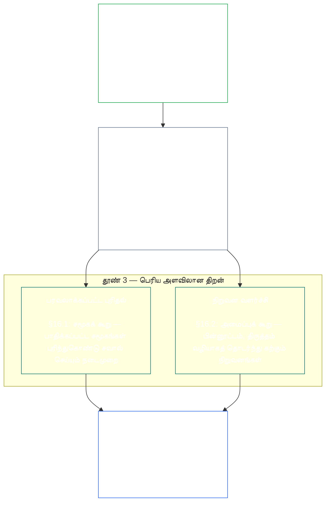
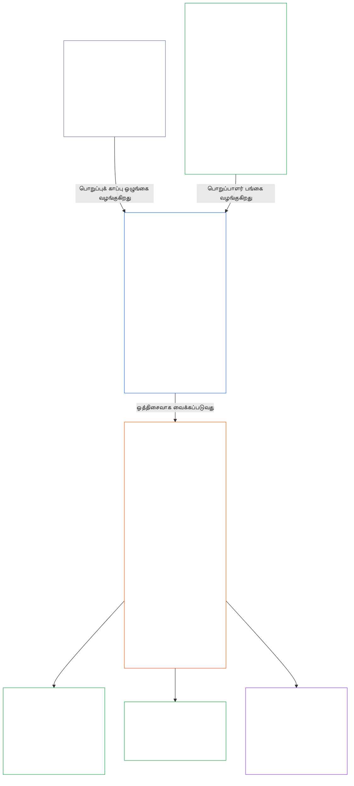

<a id="chapter-01-principles-and-constraints"></a>
<a id="chapter-01-part-b-stewardship-and-governance"></a>
<a id="chapter-01-part-c-stewardship-and-governance"></a>
# அத்தியாயம் 01, பகுதி C: பொறுப்புக் காப்பும் நிர்வாகமும்

<details>
<summary><strong><span style="color: #2563eb;">தொகுப்பில் இடம் (செயல்பாட்டு அதிகாரமற்றது): கோப்பு அமைப்பும் வாசிப்பு விதிகளும்</span></strong></summary>

> பின்வரும் உள்ளடக்கம் **வாசகர் வழிகாட்டுதல் மட்டுமே**. இந்தக் கோப்பிலோ பிற அத்தியாயங்களிலோ உள்ள கட்டுப்படுத்தும் கடமைகளை இது சேர்க்கவோ நீக்கவோ குறுக்கவோ இல்லை.
>
> இந்தக் கோப்பு **உணர்வுள்ள உயிரினங்களுக்கான அரசியலமைப்பின் ஒரு பகுதி**; எண் குறிக்கப்பட்ட பிற `core_*` கோப்புகளுடன் ஒரே ஆவணமாகப் படிக்கும்போதுதான் இது கட்டுப்படுத்தும் ஆற்றல் பெறும். இதில் **அத்தியாயம் ஒன்று, பகுதி C** (§§16–20: பொறுப்புக் காப்பு, நிர்வாகம், ஊக்கத்தொகை ஒத்திசைவு மற்றும் அமைப்பைக் கைப்பற்றுதல், ஒருங்கிணைந்த பயன்பாட்டின் நிறைவுப் பகுதி) இடம்பெறுகின்றன.
>
> **முன்பகுதி:** [core_01_b_interaction_interpretation.md](core_01_b_interaction_interpretation.md) (அத்தியாயம் ஒன்று, பகுதி B)  
> **அடுத்து:** [core_02_definition_structure.md](core_02_definition_structure.md)<br>
> **வாசிப்பு ஓட்டம்:** §16 பொறுப்புக் காப்பும் பரவலாக்கப்பட்ட புரிதலும் → §17 பொறுப்புக் காப்பாளரின் பங்கு → §18 நிர்வாகம் → §19 ஊக்கத்தொகை ஒத்திசைவும் கைப்பற்றுதலும் → **§20 ஒருங்கிணைந்த பயன்பாடு** (அத்தியாய நிறைவுப் பகுதி).

</details>

<details>
<summary><strong><span style="color: #2563eb;">வாசகர் வழிகாட்டுதல் (செயல்பாட்டு அதிகாரமற்றது): கொள்கை அடுக்குமுறையும் வாசிப்பு ஓட்டமும் (பகுதி C)</span></strong></summary>

> பின்வரும் உள்ளடக்கம் **வாசகர் வழிகாட்டுதல் மட்டுமே**. இந்தக் கோப்பிலோ பிற அத்தியாயங்களிலோ உள்ள கட்டுப்படுத்தும் கடமைகளை இது சேர்க்கவோ நீக்கவோ குறுக்கவோ இல்லை. ஒவ்வொரு § ஒரு சொல்லை முக்கியமாகப் பயன்படுத்தும் இடத்தில், அப்பிரிவின் **தடமறிதல்** மற்றும் **வரையறைகள் · மதிப்பீடு · இணக்கம்** கருவிகள் வழிகாட்டலை வழங்குகின்றன; §§16–20க்கு முன் இந்தத் தொகுதி அளவிலான இணைப்புப் பட்டியல் தரப்படுகிறது.

**கொள்கை அடுக்குமுறை (பகுதி C).** கொள்கை நிலையில்:

13. **[பொறுப்புக் காப்பு](core_05_band_continuity.md#stewardship)** உணர்வுள்ள உயிரினங்களின் ஒழுங்கமைப்பின் மூலம் பொருட்டான அமைப்புகளுக்கு வழிகாட்டுகிறது — **தூண் 1** ([§17](#17-consequential-stewardship-the-steward-role): விளைவுமிக்க நேரடி இயக்கமும் மேம்பாடும்), **தூண் 2** ([முன்முயற்சிப் பொறுப்புக் காப்பு](#16-pillar-2-proactive-stewardship): சிக்கலை முன்கூட்டியே கண்டறிந்து தவிர்க்கக்கூடிய தாமதமின்றி சரிசெய்தல்), **தூண் 3** ([§16.1](#161-distributed-understanding) · [§16.2](#162-institutional-development): சமூக மற்றும் நிறுவன அளவிலான திறன்) — ஆகியவை [அரசியலமைப்பு நால்வகை](core_00_preamble.md#constitutional-tetrad) அடிப்படையில் காலப்போக்கில் நிலையான அரசியலமைப்பு ஒத்திசைவுக்குச் செல்கின்றன. குறிப்பாக **[பங்கேற்பு](core_05_apex_participation_leg.md#participation-constitutional)** (விளைவுமிக்க பாத்திரங்களும் கருத்துரைக்கும் உரிமையும்), **[மேற்பார்வை](core_05_apex_oversight_leg.md#oversight-constitutional)** (பரவலாக்கப்பட்ட புரிதல், தணிக்கை செய்யத்தக்க தன்மை, எதிர்வாதத்திற்குரிய தன்மை — மேற்பார்வைக்கு தணிக்கை அவசியம்; [அமைப்பு ஒத்திசைவு சான்றளிப்பு](core_05_band_continuity.md#system-alignment-certification) பல தணிக்கைச் செயல்முறைகளில் குறிப்பிடத்தக்க பெரிய ஒன்று) ஆகியவற்றையும், [அரசியலமைப்பின் இரு நோக்கங்கள்](core_00_preamble.md#two-constitutional-aims) கீழான **தொடர்ச்சிநிலை** நோக்கத்தையும் முன்னெடுக்கின்றன.
14. **[விளைவுமிக்க பொறுப்புக் காப்பு](#17-consequential-stewardship-the-steward-role)** என்பது பொறுப்புக் காப்பாளரின் பாத்திரமே: பொருட்டான அமைப்பை விளைவுமிக்க வகையில் இயக்குதல், பராமரித்தல், மேற்பார்வை செய்தல் அல்லது மேம்படுத்துதல் ஆகிய பணிகளைச் செய்யும் எவருக்கும் பொருந்தும் நேரடிக் கடமைகள், தரநிலைகள் மற்றும் பாதுகாப்புகள். இது **தூண் 1**ஐச் செயலாக்குகிறது; மேலும் பகிரப்பட்ட தரநிலை, அழுத்தத்தின் கீழும் ஒத்திசைவு, பொறுப்புக் காப்பாளரின் பாத்திர வரம்புக்குள் கண்காணிக்கத்தக்க தன்மை ஆகியவற்றையும் உள்ளடக்குகிறது.
15. **[நிர்வாகம்](core_05_band_accountability.md#governance)** [அரசியலமைப்பு நால்வகை](core_00_preamble.md#constitutional-tetrad) அடிப்படையில் அங்கீகரிக்கப்பட்ட முடிவெடுத்தல், பங்கேற்பு, பொறுப்புக்கூறல் ஆகியவற்றை அமைக்கிறது. குறிப்பாக அதிகாரம் எவ்வாறு ஒதுக்கப்பட்டு செயல்படுத்தப்படுகிறது என்பதற்கான **[மேற்பார்வையும்](core_05_apex_oversight_leg.md#oversight-constitutional)** [§18.1](#181-governance-as-authorized-structure) கீழான **அதிகார அளவுக்கேற்ற பதிலளிப்புப் பொறுப்பும்** இதில் அடங்கும்: அங்கீகரிக்கப்பட்ட அதிகாரமோ விளைவுமிக்க பாத்திரமோ அதிகரித்தால் அரசியலமைப்புப் பொறுப்புக்கூறலும் மேற்பார்வையும் உயரும்; ஒருபோதும் குறையாது. [§18.3 கடமைகளைப் பிரித்தல்](#183-segregation-of-duties), செயலில் ஈடுபட்டவரே அதைச் சரிபார்ப்பவராக இருக்காமல் தடுக்கிறது. இந்த ஏற்பாடுகள் அரசியலமைப்புக்கு இன்னும் பொருந்துகின்றன என்பதைத் தொடர்ந்து நிரூபிக்க [§18.4 தொடர்ச்சியான நியாயப்படுத்தல்](#184-ongoing-justification) கோருகிறது. நிர்வாகமும் பொறுப்புக் காப்பும் முரண்பட்டால், **தேவையுரிமையும்** **விகிதாசாரமும்** எல்லைவரையறுக்கப்பட்ட, காலவரம்புள்ள விதிவிலக்கையும் திருத்தும் வழிகளையும் வெளிப்படையாக நியாயப்படுத்தும் வரை, கொள்கை நிலையில் பொறுப்புக் காப்பின் ஒழுக்கமே மேலோங்கும். செயல்பாட்டு அங்கீகாரமும் ஒப்பந்த நிலைத் தேவைகளும் **அத்தியாயம் பதின்மூன்றின்** பொறுப்பிலேயே இருக்கும்.
16. **[ஊக்கத்தொகை ஒத்திசைவும் அமைப்பைக் கைப்பற்றுதலும்](#19-incentive-alignment-and-system-capture)** ஊக்கத்தொகை அமைப்புகள், பதிலீட்டு அளவுகோல்களின் நேர்மை, குறுகிய கால நோக்குக் குறைபாடுகள், வெகுமதி பாதைத் திருத்தம், அமைப்பைக் கைப்பற்றுதலுக்கான பதிலடி ஆகியவற்றில் கொள்கை நிலை ஒழுக்கத்தை வழங்குகிறது.
17. **[ஒருங்கிணைந்த பயன்பாடு](#20-integrated-application)** அத்தியாயத்தின் நிறைவுப் பகுதி: பிந்தைய அத்தியாயங்களை இந்த அத்தியாயத்தின் ஒருங்கிணைந்த மதிப்புக் கட்டமைப்பின் வழியாகப் படிக்க வேண்டும்.

</details>

<br>

<a id="16-stewardship-in-depth"></a>

### 16. பொறுப்புக் காப்பை ஆழமாகப் புரிந்துகொள்வது
<details>
<summary><strong><span style="color: #2563eb;">தடமறிதல்</span></strong></summary>

- இதனுடன் படிக்கவும்: [அரசியலமைப்பு நால்வகை](core_00_preamble.md#constitutional-tetrad) — **பங்கேற்பு** கூறுக்கான (விளைவுமிக்க பாத்திரங்களும் கருத்துரைக்கும் உரிமையும்; பொதுவான தேவை, [பங்குதாரர் அமைப்புப் பங்கேற்பு](core_05_band_participation.md#stakeholder-status-and-weight) மட்டும் அல்ல), **மேற்பார்வை** கூறுக்கான, **காலத்தன்மை** கூறுக்கான (முன்முயற்சியான சீரமைப்பு வேகம்) முதன்மையான அத்தியாயம் ஒன்று சார்ந்த இடம்; [பொருட்டான பங்கு](core_00_preamble.md#material-stake) அளவுக்கேற்பவும் படிக்கவும்.
- இதனுடன் படிக்கவும்: [அரசியலமைப்பின் இரு நோக்கங்கள்](core_00_preamble.md#two-constitutional-aims) — **வளர்ச்சி** நோக்கம் (பங்கேற்பு, செயற்பாட்டு ஆற்றல், கல்விப் பாதைகள்); **தொடர்ச்சிநிலை** நோக்கம் (நிறுவனக் கற்றல், சீரமைப்புத் திறன், நீடித்த பொறுப்புக் காப்பு).
- முன்நிலை: கொள்கைகள்: [3. அடிப்படை நோக்கம்: நலவாழ்வு](core_01_a_values_principles.md#3-foundational-objective-wellbeing-flourishing-aim); [5 உண்மை](core_01_a_values_principles.md#5-truth-epistemic-integrity-constraint); [6. நம்பிக்கை](core_01_a_values_principles.md#6-trust-and-trustworthiness-coordination-integrity); மற்றும் [§9 பகிரப்பட்ட அமைப்புத் திறன்](core_01_a_values_principles.md#9-shared-system-capacity).
- பிந்தைய தொடர்புகள்: [13. அரசியலமைப்பு முரண்பாடுகளைத் தீர்க்கும் நடைமுறை](core_01_b_interaction_interpretation.md#13-constitutional-collision-resolution-process) ([§13.3 தவிர்க்கக்கூடிய சுமையைக் குறைத்தல்](core_01_b_interaction_interpretation.md#133-minimization-of-avoidable-burden) உட்பட); [அத்தியாயம் எட்டு §4 முழு அமைப்புச் சான்றளிப்பு மதிப்பீடு](core_08_a_system_alignment_certification_evaluation.md#4-whole-system-certification-evaluation); [§19.1.3 பொறுப்புக் காப்பும் இயக்குநர் பயன்பாடும்](#1913-stewardship-and-operator-application).
- பிந்தைய தொடர்புகள்: [§19.1.4 பாத்திர ஆழம் மற்றும் பொருட்டான பொறுப்புப் பாதைகள்](#1914-role-depth-and-material-responsibility-pathways).
- பிந்தைய தொடர்புகள்: [§7 சுதந்திரம் (வரையறுக்கப்பட்ட செயற்பாட்டு ஆற்றல்)](core_01_a_values_principles.md#7-freedom-bounded-agency), இது பொருட்டான பொறுப்புக் காப்பு, பரவலாக்கப்பட்ட புரிதல், பொருளுள்ள பங்கேற்பு, சீரமைப்புத் திறன் ஆகியவை பொருட்டான சார்புநிலையிலும் உண்மையாக நிலைத்திருப்பதைச் சார்ந்துள்ளது.
- பிந்தைய தொடர்புகள்: [அத்தியாயம் எட்டு — அமைப்பு ஒத்திசைவு சான்றளிப்பு](core_08_a_system_alignment_certification_evaluation.md#chapter-eight-system-alignment-certification) (*மேற்பார்வையின் கீழ் நடைபெறும் குறிப்பாகப் பெரிய தணிக்கைச் செயல்முறைகளில் ஒன்று — தணிக்கைக்கான ஒரே இடம் அல்ல*); [அத்தியாயம் ஒன்பது — பங்களிப்பு, மீறல், தகுதிநிலை மாதிரி](core_09_standing_assessment.md#chapter-nine-contribution-violation-and-standing-model--measurement) (*நம்பிக்கை, பாத்திரம், அங்கீகாரத் தகுதி சார்ந்த தகுதிநிலை விளைவு, இந்த உட்பிரிவை அதன் கொள்கை நிலை அடித்தளமாகச் செயல்படுத்துகிறது*).
- பிந்தைய தொடர்புகள்: [அத்தியாயம் பன்னிரண்டு §1 — நோக்கமும் பாத்திரமும்](core_12_forum.md#1-purpose-and-role--participation-architecture), [§4 — மன்றக் குடும்ப வரையறைகள்](core_12_forum.md#4-forum-family-definitions--accountability-through-adjudication) (*இந்தப் பிரிவுடன் ஒத்திசைந்த சவால், தீர்வுச் செயல்முறை வரிசை, மூலக் காரணக் கற்றல், முன்முயற்சி நிர்வாகம் ஆகியவற்றுக்கான பங்கேற்பு, மேற்பார்வைக் கட்டமைப்பை மன்றக் குடும்பங்கள் தாங்குகின்றன*); ஏற்றுக்கொள்ளப்பட்ட மன்றச் செயல்பாடுகளுக்கு [corpus_forum.md](corpus_forum.md) பார்க்கவும்.
- பிந்தைய தொடர்புகள்: கல்வி, பங்குதாரர் அமைப்புப் பங்கேற்பு, வெளிப்படைத்தன்மை, புரிந்துகொள்ளத்தன்மை, தணிக்கை மற்றும் சரிபார்ப்பு, பொருட்டான பொறுப்புக்குள் செல்லும் பாத்திர ஆழப் பாதைகள் ஆகியவற்றின் உரிமைப் பரப்பை இது வடிவமைக்கிறது.
  - குறிப்பாக [உறுப்புரை III: உயிர்வாழ்தலும் அத்தியாவசிய அணுகலும்](core_06_rights_part_a.md#article-iii-survival-and-essential-access), [உறுப்புரை IV: உணர்வுள்ள உயிரினத்தை மையமாகக் கொண்ட கல்வி உரிமை](core_06_rights_part_a.md#article-iv-right-to-sentient-centered-education), [உறுப்புரை X: சுயநிர்ணயம், செயற்பாட்டு ஆற்றல், பங்கேற்பு](core_06_rights_part_b.md#article-x-self-determination-agency-and-participation), [உறுப்புரை XII: பங்குதாரர் அமைப்புப் பங்கேற்பு, பிரதிநிதித்துவம், உரிய நடைமுறை](core_06_rights_part_b.md#article-xii-stakeholder-system-participation-representation-and-due-process), [உறுப்புரை XVI: தணிக்கை, வெளிப்படைத்தன்மை, சுயாதீன சரிபார்ப்பு](core_06_rights_part_c.md#article-xvi-audit-transparency-and-independent-verification), [உறுப்புரை XIX: தகுதிநிலையும் பங்கேற்பு நிலையும்](core_06_rights_part_d.md#article-xix-standing-and-participation-status), [உறுப்புரை XXI: இயங்குதிறன், எடுத்துச் செல்லத்தன்மை, நகர்வு, புகலிடம், வெளியேற்ற நேர்மை](core_06_rights_part_d.md#article-xxi-interoperability-portability-movement-refuge-and-exit-integrity), [உறுப்புரை XXII: புரிந்துகொள்ளத்தன்மையும் சிக்கல்தன்மைப் பொறுப்புக் காப்பும்](core_06_rights_part_d.md#article-xxii-comprehensibility-and-complexity-stewardship), [உறுப்புரை XXIV: அரசியலமைப்பு விளக்கம், மறுஆய்வு, கைப்பற்றல் எதிர்ப்புப் பாதுகாப்புகள்](core_06_rights_part_d.md#article-xxiv-constitutional-interpretation-review-and-anti-capture-safeguards).
  - இதனுடன் படிக்கவும்: [அத்தியாயம் பதின்மூன்று §5 — அங்கீகரிக்கப்பட்ட பாத்திரங்கள், திறன் வளர்ச்சி, பங்களிப்பு](core_13_governance.md#5-authorized-roles-competency-development-and-contribution), மேலும் **[corpus_systems.md](corpus_systems.md), CS-4 — முக்கிய அமைப்புப் பொறுப்புக் காப்பு**, செயல்பாட்டு பாத்திரப் பாதைகள் மற்றும் பொறுப்புக் காப்பு வளர்ச்சிப் பாதைகளுக்காக.
- உட்பிரிவுகள் (வாசிப்பு வரிசை): [§16.1 பரவலாக்கப்பட்ட புரிதல்](#161-distributed-understanding) (பெரிய அளவிலான திறனின் சமூகக் கூறு) · [§16.2 நிறுவன வளர்ச்சி](#162-institutional-development) (அமைப்புக் கூறு) · [§16.3 திறந்தநிலை விருப்பம்](#163-openness-aspiration).
- இதனுடன் படிக்கவும்: [§17 விளைவுமிக்க பொறுப்புக் காப்பு](#17-consequential-stewardship-the-steward-role) (*பொறுப்புக் காப்பாளரின் பாத்திரமே — தனிப் பிரிவாக உயர்த்தப்பட்டுள்ளது; தூண் 1ன் நேரடி இயக்கம், பராமரிப்பு, மேற்பார்வை, மேம்பாட்டுக் கடமைகளையும், [§17.1](#171-shared-stewardship-standard), [§17.2](#172-alignment-under-pressure), [§17.3](#173-logging-the-role-not-the-steward), [§17.4 ஒத்திசைந்த சுய-ஒழுங்கமைப்பு](#174-aligned-self-organization) (அந்த ஒழுக்கத்தை முறையான பாத்திரத்திற்கு அப்பாலும் விரிவாக்குகிறது), [§17.5 எதிர்க்கும் கடமை](#175-duty-to-resist) ஆகியவற்றையும் தாங்குகிறது*).

</details>

<details>
<summary><strong><span style="color: #2563eb;">வரையறைகள் · மதிப்பீடு · இணக்கம்</span></strong></summary>

- [மூலோபாயப் பொறுப்புக் காப்புக் கடமை](core_05_band_continuity.md#strategic-stewardship-obligation) · [O](core_05_band_continuity.md#strategic-stewardship-obligation) · [M](core_05_band_continuity.md#strategic-stewardship-obligation-constitutional-a) · [A](core_05_band_continuity.md#strategic-stewardship-obligation-constitutional-a) · [C](core_05_band_continuity.md#strategic-stewardship-obligation-constitutional-c)
- [பரவலாக்கப்பட்ட புரிதல்](core_05_band_continuity.md#distributed-understanding) · [O](core_05_band_continuity.md#distributed-understanding) · [M](core_05_band_continuity.md#distributed-understanding-constitutional-a) · [A](core_05_band_continuity.md#distributed-understanding-constitutional-a) · [C](core_05_band_continuity.md#distributed-understanding-constitutional-c)
- [பங்கேற்பு](core_05_apex_participation_leg.md#participation-constitutional) · [O](core_05_apex_participation_leg.md#participation-constitutional) · [M](core_05_apex_participation_leg.md#participation-constitutional-m) · [A](core_05_apex_participation_leg.md#participation-constitutional-a) · [C](core_05_apex_participation_leg.md#participation-constitutional-c)
- [மேற்பார்வை](core_05_apex_oversight_leg.md#oversight-constitutional) · [O](core_05_apex_oversight_leg.md#oversight-constitutional) · [M](core_05_apex_oversight_leg.md#oversight-constitutional-m) · [A](core_05_apex_oversight_leg.md#oversight-constitutional-a) · [C](core_05_apex_oversight_leg.md#oversight-constitutional-c)
- [பொருளுள்ள செயற்பாட்டு ஆற்றல்](core_05_band_participation.md#meaningful-agency) · [O](core_05_band_participation.md#meaningful-agency) · [M](core_05_band_participation.md#meaningful-agency-a) · [A](core_05_band_participation.md#meaningful-agency-a) · [C](core_05_band_participation.md#meaningful-agency-c)
- [தணிக்கை செய்யத்தக்க தன்மை](core_05_band_oversight.md#auditability) · [O](core_05_band_oversight.md#auditability) · [M](core_05_band_oversight.md#auditability-a) · [A](core_05_band_oversight.md#auditability-a) · [C](core_05_band_oversight.md#auditability-c)
- [எதிர்வாதத்திற்குரிய தன்மை](core_05_band_accountability.md#contestability) · [O](core_05_band_accountability.md#contestability) · [M](core_05_band_accountability.md#contestability-a) · [A](core_05_band_accountability.md#contestability-a) · [C](core_05_band_accountability.md#contestability-c)
- [கல்விசார் செயற்பாட்டு ஆற்றல்](core_05_band_participation.md#educational-agency) · [O](core_05_band_participation.md#educational-agency) · [M](core_05_band_participation.md#educational-agency-a) · [A](core_05_band_participation.md#educational-agency-a) · [C](core_05_band_participation.md#educational-agency-c)
- [வெளிப்படைத்தன்மை](core_05_band_oversight.md#transparency) · [O](core_05_band_oversight.md#transparency) · [M](core_05_band_oversight.md#transparency-a) · [A](core_05_band_oversight.md#transparency-a) · [C](core_05_band_oversight.md#transparency-c)
- [பொருட்டுத்தன்மை](core_05_band_oversight.md#materiality) · [O](core_05_band_oversight.md#materiality) · [M](core_05_band_oversight.md#materiality-determination-a) · [A](core_05_band_oversight.md#materiality-determination-a) · [C](core_05_band_oversight.md#materiality-determination-c)
- [சார்புநிலை](core_05_band_continuity.md#dependency) · [O](core_05_band_continuity.md#dependency) · [M](core_05_band_continuity.md#dependency-a) · [A](core_05_band_continuity.md#dependency-a) · [C](core_05_band_continuity.md#dependency-c)
- [அணுகல்தன்மை](core_05_band_participation.md#accessibility) · [O](core_05_band_participation.md#accessibility) · [M](core_05_band_participation.md#accessibility-constitutional-a) · [A](core_05_band_participation.md#accessibility-constitutional-a) · [C](core_05_band_participation.md#accessibility-constitutional-c)
- [பாதுகாப்பு (அரசியலமைப்புக் கட்டுப்பாடு)](core_05_band_continuity.md#safety-constitutional-constraint) · [O](core_05_band_continuity.md#safety-constitutional-constraint) · [M](core_05_band_continuity.md#safety-constraint-a) · [A](core_05_band_continuity.md#safety-constraint-a) · [C](core_05_band_continuity.md#safety-constraint-c)
- [உண்மை (அரசியலமைப்புக் கட்டுப்பாடு)](core_05_band_oversight.md#truth-constitutional-constraint) · [O](core_05_band_oversight.md#truth-constitutional-constraint-o) · [M](core_05_band_oversight.md#truth-constitutional-constraint-a) · [A](core_05_band_oversight.md#truth-constitutional-constraint-a) · [C](core_05_band_oversight.md#truth-constitutional-constraint-c)
- [தேவையுரிமை](core_05_band_accountability.md#necessity) · [O](core_05_band_accountability.md#necessity) · [M](core_05_band_accountability.md#necessity-a) · [A](core_05_band_accountability.md#necessity-a) · [C](core_05_band_accountability.md#necessity-c)
- [விகிதாசாரம்](core_05_band_accountability.md#proportionality) · [O](core_05_band_accountability.md#proportionality) · [M](core_05_band_accountability.md#proportionality-a) · [A](core_05_band_accountability.md#proportionality-a) · [C](core_05_band_accountability.md#proportionality-c)
- [தவிர்க்கக்கூடிய சுமை](core_05_band_continuity.md#avoidable-burden) · [O](core_05_band_continuity.md#avoidable-burden) · [M](core_05_band_continuity.md#avoidable-burden-a) · [A](core_05_band_continuity.md#avoidable-burden-a) · [C](core_05_band_continuity.md#avoidable-burden-c)
- [அறிவுசார் நேர்மை](core_05_band_oversight.md#epistemic-integrity) · [O](core_05_band_oversight.md#epistemic-integrity-o) · [M](core_05_band_oversight.md#epistemic-integrity-a) · [A](core_05_band_oversight.md#epistemic-integrity-a) · [C](core_05_band_oversight.md#epistemic-integrity-c)

</details>

<br>

*எளிமையாகச் சொன்னால்: மூன்று கருத்துகள் இந்தப் பிரிவை ஒன்றிணைக்கின்றன. முதலில், உணர்வுள்ள உயிரினங்களின் வாழ்க்கையைப் பாதிக்கும் பொருட்டான அமைப்புகளை நன்றாக இயக்க, உணர்வுள்ள உயிரினங்களின் ஒழுங்கமைப்பு தேவை — நிபுணர்கள் மட்டுமே கொண்ட மூடிய குழு அல்ல. இரண்டாவது, நல்ல பொறுப்புக் காப்பாளர்கள் செயல்படத் தீங்கு கட்டாயப்படுத்தும் வரை காத்திருக்க மாட்டார்கள்; சிக்கல் சிறியதாக இருக்கும்போதே கவனித்து, உரியவர்களிடம் சரியான நேரத்தில் கொண்டு சென்று, தாமதமே தீங்காக மாறும்முன் தீர்த்துவிடுவார்கள். மூன்றாவது, அந்த ஒழுங்கமைப்பு **பெரிய அளவிலான திறனை** வளர்க்க வேண்டும்: தனிநபர்கள் விளைவுமிக்க பணிக்குள் நுழைய உண்மையான பாதைகள்; சிக்கல்களைக் கண்டறிந்து எதிர்க்க சமூகங்களுக்கு போதிய புரிதல்; முடங்கிப் போகாமல் தொடர்ந்து கற்றுக்கொள்ளும் நிறுவனங்கள்.*

<a id="16-limits"></a>
பொறுப்புக் காப்புக்கு எல்லைகள் உண்டு. **பாதுகாப்பு**, **உண்மை**, **தேவையுரிமை**, **விகிதாசாரம்**, **தவிர்க்கக்கூடிய சுமை**, **அறிவுசார் நேர்மை** ஆகியவை கடமைகளின் அளவை நியாயமாகவும் நேர்மையாகவும் அமைத்து, நியாயமான பாதுகாப்புத் தேவைகளை மதிக்கும் எல்லைகளை அமைக்கின்றன — கீழுள்ள தூண்கள் அந்தக் கட்டுப்பாடுகளுக்குள் இயங்குகின்றன; அவற்றைச் சுற்றிச் செல்லவில்லை.

உணர்வுள்ள உயிரினங்களின் ஒழுங்கமைப்பு, முன்முயற்சிப் பொறுப்புக் காப்பு, பெரிய அளவிலான திறன் ஆகியவை இந்தப் பிரிவின் மூன்று தூண்கள். மூன்றும் சேர்ந்து, கொள்கை அடுக்கில் [அரசியலமைப்பு நால்வகை](core_00_preamble.md#constitutional-tetrad)யின் **பங்கேற்பு**, **மேற்பார்வை**, **காலத்தன்மை** கூறுகளை [பொருட்டான பங்கு](core_00_preamble.md#material-stake) அளவுக்கேற்பக் கொண்டு, [அரசியலமைப்பின் இரு நோக்கங்களையும்](core_00_preamble.md#two-constitutional-aims) முன்னேற்றுகின்றன.

<br>



**தூண் 1 — விளைவுமிக்க பொறுப்புக் காப்பு ([§17 விளைவுமிக்க பொறுப்புக் காப்பு](#17-consequential-stewardship-the-steward-role)):**
- உணர்வுள்ள உயிரினங்களைப் பொருட்டாகப் பாதிக்கும் பகிரப்பட்ட அமைப்புகளை உணர்வுள்ள உயிரினங்களே நேரடியாக இயக்கவும், பராமரிக்கவும், மேற்பார்வை செய்யவும், மேம்படுத்தவும் வேண்டும் — [**மூலோபாயப் பொறுப்புக் காப்புக் கடமை**](core_05_band_continuity.md#strategic-stewardship-obligation), [**பொருளுள்ள செயற்பாட்டு ஆற்றல்**](core_05_band_participation.md#meaningful-agency)
- பிறர் சரிபார்த்து சவால் செய்யக்கூடிய பதிவுகளும் மறுஆய்வு வழிகளும் — [**தணிக்கை செய்யத்தக்க தன்மை**](core_05_band_oversight.md#auditability), [**எதிர்வாதத்திற்குரிய தன்மை**](core_05_band_accountability.md#contestability)
- நால்வகையின் **மேற்பார்வை** கூறின் கீழ் தணிக்கை அவசியம்; [அமைப்பு ஒத்திசைவு சான்றளிப்பு](core_05_band_continuity.md#system-alignment-certification) பல தணிக்கைச் செயல்முறைகளில் குறிப்பாகப் பெரியதும் உயர்ந்த பங்கைக் கொண்டதுமான ஒன்று — தணிக்கைக்கான ஒரே இடம் அல்ல (**உறுப்புரை XVI** (*தணிக்கை, வெளிப்படைத்தன்மை, சுயாதீன சரிபார்ப்பு*))

<a id="16-pillar-2-proactive-stewardship"></a>
**தூண் 2 — முன்முயற்சிப் பொறுப்புக் காப்பு:**
முன்முயற்சியுடன் செயல்படும் பொறுப்புக் காப்பாளர்கள் உருவாகும் சிக்கல்களையும் ஒத்திசைவின்மையையும் மூன்று வழிகளில் கையாள்கிறார்கள்:
- **அவை பெருகும்முன் கவனியுங்கள்** — சிக்கல்கள் சிறியதாக இருக்கும்போதே நல்ல பொறுப்புக் காப்பாளர்கள் ஒத்திசைவின்மையைக் கண்டறிவார்கள்; அவை தாமாகவே வெளிப்படும் வரை காத்திருக்க மாட்டார்கள்.
- **அடுக்குக்கேற்ற காலக்கெடுவில் முன்னெடுங்கள்** — கண்டறிந்ததை அப்படியே வைத்திருக்காமலும் வழக்கமான விஷயங்களைத் தேவைக்கு மீறி மேல்நிலைக்கு அனுப்பாமலும், பாத்திரத்தின் பங்குக்கேற்ற கால எல்லைக்குள் மேல்நிலைக்கு எடுத்துச் செல்லுங்கள்.
- **குறியிடுவது மட்டுமல்ல, தீர்வையும் நிறைவு செய்யுங்கள்** — சிக்கல் தெரிவிக்கப்பட்டதும் தவிர்க்கக்கூடிய தாமதமின்றித் திருத்தத்தைத் தொடங்குங்கள்; இதுவே நால்வகையின் **காலத்தன்மை** கூறைச் செயலாக்குவது ([**காலத்தன்மை**](core_05_apex_timeliness_leg.md#timeliness-constitutional)).
- **இது பாத்திரத்தின் தொடர்ச்சியான கடமை; கூடுதல் பணியல்ல:** [§17 விளைவுமிக்க பொறுப்புக் காப்பு](#17-consequential-stewardship-the-steward-role) வரையறுக்கும் பொறுப்புக் காப்பாளர் பங்கு, தீங்கோ ஒத்திசைவின்மையோ தோன்றிய பிறகு அறிகுறிகளுக்கு எதிர்வினையாற்றுவதைவிட முன்முயற்சி நிர்வாகம், அமைப்பு வடிவமைப்பு, அரசியலமைப்பு ஒத்திசைவு ஆகியவற்றுக்கு முன்னுரிமை அளிக்கிறது — இந்தத் தூண் அந்தப் பாத்திரத்தின் தொடர்ச்சியான கடமை; தனி செயல்முறைக்கு ஒப்படைக்கப்படுவது அல்ல.

**தூண் 3 — பெரிய அளவிலான திறன் ([§16.1 பரவலாக்கப்பட்ட புரிதல்](#161-distributed-understanding) · [§16.2 நிறுவன வளர்ச்சி](#162-institutional-development)):**
- பாதிக்கப்பட்ட சமூகங்கள் புரிந்துகொண்டு சவால் செய்வதைப் பொறுப்புக் காப்பு நடைமுறைக்கு ஏற்றதாக ஆக்க வேண்டும் — [**கல்விசார் செயற்பாட்டு ஆற்றல்**](core_05_band_participation.md#educational-agency), [**வெளிப்படைத்தன்மை**](core_05_band_oversight.md#transparency)
- அளவீடு உதவும் இடங்களில் காலப்போக்கிலான மாறுபாடுகளை கட்டமைப்புடன் கண்காணிப்பது உட்பட, பின்னூட்டம், திருத்தம், தக்கவைக்கப்பட்ட திறன் ஆகியவற்றின் மூலம் நிறுவனங்கள் தொடர்ந்து கற்க வேண்டும் (**புள்ளியியல் செயல்முறைக் கட்டுப்பாடு** போன்ற முறைகள் நன்கு அறியப்பட்ட செயலாக்கங்கள்; அவை அனைவருக்கும் கட்டாயமான தேவைகள் அல்ல).

<a id="when-day-to-day-stewardship-is-not-enough"></a>
**அன்றாடப் பொறுப்புப் பராமரிப்பு போதாதபோது:**
பொறுப்புப் பராமரிப்பு முதல் பாதுகாப்பு வரிசை; ஒரே வரிசை அல்ல. மூன்று வேறுபட்ட கேள்விகளுக்கு மூன்று வேறுபட்ட இடங்கள் உள்ளன; அவற்றில் எதுவும் மற்றொன்றுக்குப் பதிலாகாது:
- **ஏற்கெனவே அதிகாரமளிக்கப்பட்ட அமைப்பிற்குள் உள்ள சர்ச்சைகள் — [பங்குதாரர் அமைப்புப் பங்கேற்பு](core_05_band_participation.md#stakeholder-status-and-weight):**
  - பாதிக்கப்படும் sentient-கள் முதலில் வெளியிடப்பட்ட பங்குதாரர் அமைப்புப் பங்கேற்பு சவால் வழியைப் பயன்படுத்துவர்; அது பங்கேற்பு, பிரதிநிதித்துவம், எதிர்க்கும் வாய்ப்பு, உரிய நடைமுறை ஆகியவற்றை உள்ளடக்கும்.
  - பொருள்சார்ந்த அளவில் பாதிக்கப்படும் ஒவ்வொரு sentient-க்கும் இந்தப் பாதுகாப்புகள் உரியவை.
  - ஏற்கெனவே அதிகாரமளிக்கப்பட்ட அமைப்புகள், நிறுவனங்கள், முடிவெடுக்கும் தளங்கள் ஆகியவற்றுக்குள் இவை செயல்படும்.
- **பங்குதாரர் அமைப்புப் பங்கேற்பால் தீர்க்க முடியாத சர்ச்சைகள் — [மன்ற மறுஆய்வு](core_12_forum.md#dispute-sequencing):**
  - பங்குதாரர் அமைப்புப் பங்கேற்பு சவால் வழி தொடர்ந்து சர்ச்சைக்குரியதாக இருந்தால், காணாமல் போயிருந்தால் அல்லது கைப்பற்றப்பட்டிருந்தால், அல்லது நிவாரணம் வழங்க இயலாவிட்டால், முதன்மையான நலனைப் பொறுத்து [அத்தியாயம் பன்னிரண்டு §1 — நோக்கமும் பங்கும்](core_12_forum.md#1-purpose-and-role--participation-architecture), [§4 — மன்றக் குடும்பங்களின் வரையறைகள்](core_12_forum.md#4-forum-family-definitions--accountability-through-adjudication) ஆகியவற்றின் கீழ் சுயாதீனமான **மன்றக் குடும்பங்களிடம்** விவகாரம் அனுப்பப்படும்.
  - இங்குதான் sentient-கள் ஒரு முடிவை எதிர்க்கும் உண்மையான வழியையும், தெளிவான சீரமைப்பு ஆணையையும், மீண்டும் நிகழும் வடிவத்திலிருந்து கற்றுக்கொள்ளும் வழியையும் பெறுவர்.
  - அரசியலமைப்பு உரையின் பொருள் அல்லது செல்லுபடியாக்கம், அல்லது சட்டப்பூர்வ அதிகாரத்திற்கு அப்பாற்பட்ட செயல் ஆகியவை முதன்மையான நலனாக இருந்தால், முன்னணிக் குடும்பம் [அரசியலமைப்பு மன்றங்கள்](core_12_forum.md#46-constitutional-forums) ஆகும்.
  - அந்த மன்றங்கள் எவ்வாறு செயல்படுகின்றன என்பதற்கான விரிவான விதிகள் [corpus_forum.md](corpus_forum.md)-இல் உள்ளன.
- **யார் ஆட்சி செய்யலாம் என்பதே — [அரசியலமைப்பு ஒப்பந்த அடுக்கு](core_05_band_integrative.md#constitutional-contract-layer) ([அத்தியாயம் பதின்மூன்று](core_13_governance.md)):**
  - ஆளும் அதிகாரம் தானே சட்டபூர்வமானதா — யார் ஆளலாம், எந்தச் சட்டபூர்வமாக்கல் முறையால், என்ன வரம்பு மற்றும் நீடித்த விதிமுறைகளின் கீழ் — என்பது பங்குதாரர் அமைப்புப் பங்கேற்பு, மன்ற மறுஆய்வு ஆகியவற்றிலிருந்து தனியான கேள்வி.
  - பங்கேற்பு வாக்கு, சவால் வழியின் முடிவு அல்லது நம்பிக்கை மதிப்பெண் ஆகியவை ஆளும் அதிகாரத்தை வழங்குவதில்லை.
  - அரசியலமைப்பு அனுமதி, பங்குதாரர் அமைப்புப் பங்கேற்பின் கீழ் செலுத்த வேண்டிய கடமைகளை அழிப்பதில்லை.
  - ஒன்றோடொன்று மேலிடும் போதும் இரண்டு அடுக்குகளும் தனித்தனியாகவே இருக்கும் ([முன்னுரை §3.3 — ஆளுகை அடுக்குகள்](core_00_preamble.md#33-governance-layers)).
- **துணைப் பாதுகாப்புகள்; மாற்றீடுகள் அல்ல:** சான்றுகள் நியாயப்படுத்தும் இடங்களில் மறுஆய்வு, திருத்தம், தீர்வு ஆகியவை தொடர்ந்து கட்டாயமானவை. தீங்கு தோன்றுவதற்கு முன்பே கணிக்கக்கூடிய அரசியலமைப்பு முரண்பாட்டைத் தடுக்கும் முனைப்பான வடிவமைப்பு, ஊக்கங்கள், கட்டுப்பாடுகள், பங்கு வழிகள், கண்காணிக்கத்தன்மை, சீரமைப்புத் திறன் ஆகியவற்றிற்கு இவை மாற்றாகாது.

<a id="16-scope-priority-and-limits"></a>
**வரம்பு ([§16 பொறுப்புப் பராமரிப்பின் ஆழமான விளக்கம்](#16-stewardship-in-depth)):**
- இந்தப் பகுதி கொள்கை-நிலை வழிகாட்டுதலை அளிக்கிறது; அனைவருக்கும் பொருந்தும் ஒரே மாதிரியான விதிமுறைப் புத்தகம் அல்ல.
- இது பின்வருவனவற்றைக் **கட்டாயப்படுத்தாது**:
  - அனைவரையும் ஒவ்வொரு பங்கிலும் சுழற்சி முறையில் அமர்த்துதல்
  - நியாயமான சிறப்புத் திறனை மீறுதல்
  - [13.2 அறிவுசார் வெளிப்படுத்தல் வரம்புகள்](core_01_b_interaction_interpretation.md#132-epistemic-disclosure-constraints) மற்றும் பொருந்தும் **அத்தியாயம் ஆறு** பாதுகாப்புகளின் கீழ் உள்ள சட்டப்பூர்வமான இரகசியத்தன்மை அல்லது பாதுகாப்பு வரம்புகளைத் தாண்டுதல்.

**முன்னுரிமை:**
- புரிதலும் அணுகலும் எவ்வாறு பகிரப்பட வேண்டும் என்பதற்கான முன்னுரிமையை **பொருள்சார்பு**, **சார்பு**, **அணுகல்தன்மை** ஆகியவை நிர்ணயிக்கின்றன — தாக்கமும் சார்பும் அதிகமுள்ள இடங்களில் மிகுந்த கவனம் செலுத்தப்படும்.

<a id="161-distributed-understanding"></a>
#### 16.1 பரவலாக்கப்பட்ட புரிதல்
<details>
<summary><strong><span style="color: #2563eb;">தடமறிதல்</span></strong></summary>

- மேல்நிலை: [§17 குறிப்பிடத்தக்க விளைவுள்ள பொறுப்புப் பராமரிப்பு](#17-consequential-stewardship-the-steward-role) (*தூண் 1*); [§16 பொறுப்புப் பராமரிப்பின் ஆழமான விளக்கம்](#16-stewardship-in-depth) (தாய் பகுதி; மேலுள்ள *எளிய சொற்களில்* பகுதியும் தூண் 3 அமைப்பும் உட்பட); [5 உண்மை](core_01_a_values_principles.md#5-truth-epistemic-integrity-constraint); [6. நம்பிக்கை](core_01_a_values_principles.md#6-trust-and-trustworthiness-coordination-integrity).
- இதனுடன் படிக்கவும்: [அரசியலமைப்பு நாற்கூறு](core_00_preamble.md#constitutional-tetrad) — **பங்கேற்பு** பக்கம் ([பொருளுள்ள செயல்திறன்](core_05_band_participation.md#meaningful-agency), [கல்விசார் செயல்திறன்](core_05_band_participation.md#educational-agency)); **மேற்பார்வை** பக்கம் ([வெளிப்படைத்தன்மை](core_05_band_oversight.md#transparency), [தணிக்கைத் திறன்](core_05_band_oversight.md#auditability)); [பொருள்சார் பங்கு](core_00_preamble.md#material-stake) அடிப்படையில் அளவமைத்தல்.
- பொறுப்புப் பராமரிப்பு நுழைவாயில் (செயல்பாட்டுரீதியானது அல்ல): அடுத்த படிக் குறிப்பு: [புரிந்துகொள்ளத்தன்மை](implementation/STEWARD_ENTRY_DOORS.md#comprehensibility). அந்தக் குறிப்பு அரசியலமைப்பைக் குறுகலாக்க முடியாது.
- கீழ்நிலை: [13.2 அறிவுசார் வெளிப்படுத்தல் வரம்புகள்](core_01_b_interaction_interpretation.md#132-epistemic-disclosure-constraints); உரிமைப் பரப்பில் குறிப்பாக [பிரிவு XVI: தணிக்கை, வெளிப்படைத்தன்மை, சுயாதீனச் சரிபார்ப்பு](core_06_rights_part_c.md#article-xvi-audit-transparency-and-independent-verification), [பிரிவு XXII: புரிந்துகொள்ளத்தன்மை மற்றும் சிக்கலுக்கான பொறுப்புப் பராமரிப்பு](core_06_rights_part_d.md#article-xxii-comprehensibility-and-complexity-stewardship).

</details>

<details>
<summary><strong><span style="color: #2563eb;">வரையறைகள் · மதிப்பீடு · இணக்கம்</span></strong></summary>

- [பரவலாக்கப்பட்ட புரிதல்](core_05_band_continuity.md#distributed-understanding) · [O](core_05_band_continuity.md#distributed-understanding) · [M](core_05_band_continuity.md#distributed-understanding-constitutional-a) · [A](core_05_band_continuity.md#distributed-understanding-constitutional-a) · [C](core_05_band_continuity.md#distributed-understanding-constitutional-c)
- [வெளிப்படைத்தன்மை](core_05_band_oversight.md#transparency) · [O](core_05_band_oversight.md#transparency) · [M](core_05_band_oversight.md#transparency-a) · [A](core_05_band_oversight.md#transparency-a) · [C](core_05_band_oversight.md#transparency-c)
- [பொது மேற்பார்வை அடிப்படை வெளிப்படுத்தல்](core_05_band_oversight.md#public-oversight-baseline-disclosure) · [O](core_05_band_oversight.md#public-oversight-baseline-disclosure) · [M](core_05_band_oversight.md#public-oversight-baseline-disclosure-a) · [A](core_05_band_oversight.md#public-oversight-baseline-disclosure-a) · [C](core_05_band_oversight.md#public-oversight-baseline-disclosure-c)
- [தணிக்கைத் திறன்](core_05_band_oversight.md#auditability) · [O](core_05_band_oversight.md#auditability) · [M](core_05_band_oversight.md#auditability-a) · [A](core_05_band_oversight.md#auditability-a) · [C](core_05_band_oversight.md#auditability-c)
- [பொருள்சார்பு](core_05_band_oversight.md#materiality) · [O](core_05_band_oversight.md#materiality) · [M](core_05_band_oversight.md#materiality-determination-a) · [A](core_05_band_oversight.md#materiality-determination-a) · [C](core_05_band_oversight.md#materiality-determination-c)
- [சார்பு](core_05_band_continuity.md#dependency) · [O](core_05_band_continuity.md#dependency) · [M](core_05_band_continuity.md#dependency-a) · [A](core_05_band_continuity.md#dependency-a) · [C](core_05_band_continuity.md#dependency-c)
- [அணுகல்தன்மை](core_05_band_participation.md#accessibility) · [O](core_05_band_participation.md#accessibility) · [M](core_05_band_participation.md#accessibility-constitutional-a) · [A](core_05_band_participation.md#accessibility-constitutional-a) · [C](core_05_band_participation.md#accessibility-constitutional-c)
- [கல்விசார் செயல்திறன்](core_05_band_participation.md#educational-agency) · [O](core_05_band_participation.md#educational-agency) · [M](core_05_band_participation.md#educational-agency-a) · [A](core_05_band_participation.md#educational-agency-a) · [C](core_05_band_participation.md#educational-agency-c)
- [பொருளுள்ள செயல்திறன்](core_05_band_participation.md#meaningful-agency) · [O](core_05_band_participation.md#meaningful-agency) · [M](core_05_band_participation.md#meaningful-agency-a) · [A](core_05_band_participation.md#meaningful-agency-a) · [C](core_05_band_participation.md#meaningful-agency-c)
- [எதிர்க்கத்தக்க தன்மை](core_05_band_accountability.md#contestability) · [O](core_05_band_accountability.md#contestability) · [M](core_05_band_accountability.md#contestability-a) · [A](core_05_band_accountability.md#contestability-a) · [C](core_05_band_accountability.md#contestability-c)

</details>

<br>

*எளிய சொற்களில்: பகிரப்பட்ட அமைப்புகளுக்குள் பாதுகாப்பாக வாழ ஒவ்வொரு துணை அமைப்பிலும் முனைவர் பட்டம் தேவைப்படக் கூடாது — ஆனால் ஓர் அமைப்பு உங்கள் வாழ்க்கையை எவ்வளவு அதிகம் பாதிக்கிறதோ, அது என்ன செய்கிறது, என்ன தவறாகலாம், தவறான முடிவுகளை எப்படிச் சவால் செய்வது என்பதை அறிந்துகொள்ளும் வாய்ப்பும் அவ்வளவு அதிகமாக இருக்க வேண்டும். வெளிப்படைத்தன்மை, கல்வி, எளிய விளக்கங்கள், தணிக்கை வழிகள் ஆகியவை இதைச் சாத்தியமாக்குகின்றன. முக்கியமானவற்றை மறைக்க சிக்கல்தன்மை ஒரு சாக்காகாது. நாற்கூற்றின் **மேற்பார்வை** பக்கத்தில் மேற்பார்வைக்குத் தணிக்கை அவசியம்; அமைப்பு ஒத்திசைவு சான்றிதழ் அத்தகைய வழிகளில் உள்ள ஒரு மிகப்பெரிய தணிக்கைச் செயல்முறை — ஒரே வழி அல்ல.*

பரவலாக்கப்பட்ட புரிதல் என்பது **[§16 பொறுப்புப் பராமரிப்பின் ஆழமான விளக்கம்](#16-stewardship-in-depth)** என்பதன் கீழ் **தூண் 3**-இன் சமூகத்தை நோக்கிய அம்சம். முழு வரையறை, அளவீடுகள், தோல்வி நிலைகள் ஆகியவை [பரவலாக்கப்பட்ட புரிதல்](core_05_band_continuity.md#distributed-understanding)-இல் உள்ளன. சுருக்கமாக:

- **இது கோருவது:** sentient-களைப் பொருள்சார் அளவில் பாதிக்கும் பகிரப்பட்ட அமைப்புகள் எவ்வாறு இயங்குகின்றன — அவற்றின் நோக்கங்கள், கட்டுப்பாடுகள், நிச்சயமின்மைகள், பொருள்சார் தொடர்புடைய விளைவுகள் — என்பதற்கான விகிதாசாரமான, கட்டமைக்கப்பட்ட அணுகல்.
- **இதை நடைமுறைப்படுத்தக்கூடியதாக்குவது:** [§17 குறிப்பிடத்தக்க விளைவுள்ள பொறுப்புப் பராமரிப்பு](#17-consequential-stewardship-the-steward-role) ஆவணப்படுத்தல், கல்வி, வெளிப்படைத்தன்மை, பங்கு வழிகள், புரிந்துகொள்ளத்தன்மை சார்ந்த பொறுப்புப் பராமரிப்பு ஆகியவற்றை வழங்க வேண்டும். ஒவ்வொரு sentient-உம் ஒவ்வொரு வழியையும் பயன்படுத்துகிறதா இல்லையா என்பதைப் பொருட்படுத்தாமல் கடமை தொடர்கிறது.
- **ஆன்லைன் பொது அடிப்படை:** சட்டபூர்வமான ஆன்லைன் உள்கட்டமைப்பு உள்ள இடத்தில், ஆன்லைன் [பொது மேற்பார்வை அடிப்படை வெளிப்படுத்தல்](core_05_band_oversight.md#public-oversight-baseline-disclosure) — கட்டணச் சுவர் தடை, சாத்தியமான அளவுக்கான அதிகபட்ச பொது மாற்று விதி உட்பட — [வெளிப்படைத்தன்மை](core_05_band_oversight.md#transparency), [பொது மேற்பார்வை அடிப்படை வெளிப்படுத்தல்](core_05_band_oversight.md#public-oversight-baseline-disclosure) ஆகியவற்றால் நிர்வகிக்கப்படுகிறது; **[corpus_systems.md](corpus_systems.md), CS-2** (*தகவல் வகைகள் மற்றும் கையாளல்*) இன் கீழ் **Type O** தரவாகச் செயல்படுத்தப்படுகிறது.
- **இந்த அணுகல் ஆதரிப்பது:**
  - [அரசியலமைப்பு நாற்கூறு](core_00_preamble.md#constitutional-tetrad)-இன் **பங்கேற்பு** பக்கம் (தகவலறிந்த [பொருளுள்ள செயல்திறன்](core_05_band_participation.md#meaningful-agency), எதிர்க்கத்தக்க தன்மை)
  - **மேற்பார்வை** பக்கம்; [தணிக்கைத் திறன்](core_05_band_oversight.md#auditability), **பிரிவு XVI** (*தணிக்கை, வெளிப்படைத்தன்மை, சுயாதீனச் சரிபார்ப்பு*) ஆகியவற்றின் கீழான தணிக்கை உட்பட; அதனுள் [அமைப்பு ஒத்திசைவு சான்றிதழ்](core_05_band_continuity.md#system-alignment-certification) சகத் தணிக்கை முறைகளில் ஒரு குறிப்பாகப் பெரிய செயல்முறை

ஒவ்வொரு sentient-உம் ஒவ்வொரு துணை அமைப்பிலும் வல்லுநராக இருக்க வேண்டும் என்று பரவலாக்கப்பட்ட புரிதல் **கோரவில்லை**. ஆனால் புரிதல் [பொருள்சார்பு](core_05_band_oversight.md#materiality), [சார்பு](core_05_band_continuity.md#dependency) ஆகியவற்றுக்கு ஏற்ப அதிகரிக்க வேண்டும் என்று அது **கோருகிறது**. **அத்தியாயம் ஐந்து**, **அத்தியாயம் ஆறு** ஆகியவை வெளிப்படுத்தல், கல்வி அல்லது புரிந்துகொள்ளத்தன்மை கடமைகளை விதிக்கும் இடங்களில், சிக்கல்தன்மையும் ஒளிபுகாமையும் கொண்டு [பொருளுள்ள செயல்திறனை](core_05_band_participation.md#meaningful-agency) அல்லது எதிர்க்கத்தக்க தன்மையைத் தோற்கடிக்கக் கூடாது.

<a id="162-institutional-development"></a>
#### 16.2 நிறுவன வளர்ச்சி
<details>
<summary><strong><span style="color: #2563eb;">தடமறிதல்</span></strong></summary>

- மேல்நிலை: [§17 குறிப்பிடத்தக்க விளைவுள்ள பொறுப்புப் பராமரிப்பு](#17-consequential-stewardship-the-steward-role) (*தூண் 1*); [§16.1 பரவலாக்கப்பட்ட புரிதல்](#161-distributed-understanding) (*தூண் 3-இன் சமூக அம்சம்*); [§16 பொறுப்புப் பராமரிப்பின் ஆழமான விளக்கம்](#16-stewardship-in-depth) (தாய் பகுதியில் உள்ள தூண் 3 வடிவமைப்பு).
- இதனுடன் படிக்கவும்: [அரசியலமைப்பு நாற்கூறு](core_00_preamble.md#constitutional-tetrad) — **பங்கேற்பு** பக்கம் (விளைவுள்ள பணிகளை ஆதரிக்கும் பணியாளர் மற்றும் பாதிக்கப்படும் சமூகங்களின் கற்றல்); **மேற்பார்வை** பக்கம் ([சரிபார்க்கத்தக்க தன்மை](core_05_band_oversight.md#verifiability), [தணிக்கைத் திறன்](core_05_band_oversight.md#auditability), நேர்மையான அளவீடுகள்); [பொருள்சார் நலன்](core_00_preamble.md#material-stake) அடிப்படையில் அளவமைத்தல்.
- பொருள்சார்ந்து தொடர்புடைய இடங்களில் [மூலோபாயப் பொறுப்புப் பராமரிப்பு கடமை](core_05_band_continuity.md#strategic-stewardship-obligation), [தணிக்கைத் திறன்](core_05_band_oversight.md#auditability) ஆகியவற்றுடன் படிக்கவும்.
- [§16.1 பரவலாக்கப்பட்ட புரிதல்](#161-distributed-understanding) உடன் படிக்கவும் (*சமூகப் புரிதலும் நிறுவனக் கற்றலும், பரந்த அளவிலான திறன் என்ற ஒரே தேவையின் தனித்தனி அம்சங்கள்; அவை ஒன்றுக்கொன்று மாற்றாகாது*).
- கீழ்நிலை: [§16.3 திறந்தநிலை விருப்பம்](#163-openness-aspiration); [§18 பொறுப்புப் பராமரிப்பு ஒழுக்கத்தின் கீழான ஆளுகை](#18-governance-under-stewardship-discipline), [§19 ஊக்கச் சீரமைப்பும் அமைப்புக் கைப்பற்றலும்](#19-incentive-alignment-and-system-capture) (*நிறுவனக் கற்றலும் ஊக்கச் சீரமைப்பும்*).

</details>

<details>
<summary><strong><span style="color: #2563eb;">வரையறைகள் · மதிப்பீடு · இணக்கம்</span></strong></summary>

- [நிறுவன வளர்ச்சி](core_05_band_continuity.md#institutional-development) · [O](core_05_band_continuity.md#institutional-development) · [M](core_05_band_continuity.md#institutional-development-constitutional-a) · [A](core_05_band_continuity.md#institutional-development-constitutional-a) · [C](core_05_band_continuity.md#institutional-development-constitutional-c)
- [மூலோபாயப் பொறுப்புப் பராமரிப்பு கடமை](core_05_band_continuity.md#strategic-stewardship-obligation) · [O](core_05_band_continuity.md#strategic-stewardship-obligation) · [M](core_05_band_continuity.md#strategic-stewardship-obligation-constitutional-a) · [A](core_05_band_continuity.md#strategic-stewardship-obligation-constitutional-a) · [C](core_05_band_continuity.md#strategic-stewardship-obligation-constitutional-c)
- [தணிக்கைத் திறன்](core_05_band_oversight.md#auditability) · [O](core_05_band_oversight.md#auditability) · [M](core_05_band_oversight.md#auditability-a) · [A](core_05_band_oversight.md#auditability-a) · [C](core_05_band_oversight.md#auditability-c)
- [பொருள்சார்பு](core_05_band_oversight.md#materiality) · [O](core_05_band_oversight.md#materiality) · [M](core_05_band_oversight.md#materiality-determination-a) · [A](core_05_band_oversight.md#materiality-determination-a) · [C](core_05_band_oversight.md#materiality-determination-c)
- [சரிபார்க்கத்தக்க தன்மை](core_05_band_oversight.md#verifiability) · [O](core_05_band_oversight.md#verifiability) · [M](core_05_band_oversight.md#verifiability-a) · [A](core_05_band_oversight.md#verifiability-a) · [C](core_05_band_oversight.md#verifiability-c)

</details>

<br>

*எளிய சொற்களில்: நிறுவனங்கள் உண்மையாகவே கற்றுக்கொள்ள வேண்டும் — பொறுப்பில் இருப்பவர்கள் அறியாமலேயே இருக்க, மென்பொருளை மட்டும் மேம்படுத்துவது போதாது. அதற்கு பின்னூட்டச் சுழற்சிகள், ஒத்திசைவு குலையும்போது பதிவுசெய்யப்பட்ட திருத்தங்கள், திறனுள்ளவர்கள் நிறுவனத்தை விட்டு வெளியேறாமல் அவர்களைத் தக்கவைத்தல் ஆகியவை தேவை. நடத்தையை மீண்டும் மீண்டும் அளவிட இயலும் இடங்களில், காலப்போக்கில் செயல்திறன் எவ்வாறு மாறுகிறது என்பதைக் கண்காணிப்பது அந்தச் சுழற்சிகளைச் செயல்படுத்தும் விகிதாசாரமான வழிகளில் ஒன்று — **புள்ளியியல் செயல்முறைக் கட்டுப்பாடு** அந்த ஒழுக்கத்திற்கான பரவலாக அறியப்பட்ட முறையே தவிர, எல்லா இடங்களிலும் கட்டாயமல்ல. எண்கள் மட்டும் போதாது: குறியீடுகள் தவறாகத் தோன்றும்போது, யாராவது விசாரித்து மூலக் காரணத்தைச் சரிசெய்ய வேண்டும். டாஷ்போர்டுகள் நேர்மையானவையாகவும், உண்மையான தாக்கத்திற்கு ஏற்ற அளவிலும், பாதிக்கப்படும் sentient-கள் புரிந்துகொள்ளும் மொழியிலும் இருக்க வேண்டும் — எதுவும் மாறாதபோதும் நன்றாகத் தோன்றும் வகையில் அவற்றைத் திரித்துக் காட்டக் கூடாது.*

நிறுவன வளர்ச்சி என்பது **[§16 பொறுப்புப் பராமரிப்பின் ஆழமான விளக்கம்](#16-stewardship-in-depth)** கீழுள்ள **தூண் 3**-இன் அமைப்புசார் அம்சம். அதன் முழு வரையறை, அளவீடுகள், தோல்வி நிபந்தனைகள் [நிறுவன வளர்ச்சி](core_05_band_continuity.md#institutional-development)-இல் உள்ளன. சுருக்கமாக:

- **இணைந்த கடமை:** நிறுவனங்களும் பகிரப்பட்ட அமைப்புகளும் **கற்றுக்கொள்ள வேண்டும்** — [இரண்டு அரசியலமைப்பு இலக்குகள்](core_00_preamble.md#two-constitutional-aims) கீழுள்ள **தொடர்ச்சி** இலக்கின் அடிப்படைத் தேவை இது.
- **இது கோருவது:** பழுதுநீக்கத்தையும் தழுவலையும் ஆதரிக்கும் பின்வருவன:
  - பின்னூட்டச் சுழற்சிகள்
  - ஆவணப்படுத்தப்பட்ட திருத்தம்
  - உத்திசார் ஒத்திசைவு
  - திறன் தக்கவைத்தல்
- **நாற்கூறு:** திறன், பின்னூட்டம், ஆய்வுப் பாதைகள் ஆகியவை நிலையானவையாக இல்லாமல் செயல்பாட்டில் இருக்குமாறு நிறுவனக் கற்றல் மூலம் [அரசியலமைப்பு நாற்கூறு](core_00_preamble.md#constitutional-tetrad)-இன் **பங்கேற்பு**, **மேற்பார்வை** பக்கங்களைத் தாங்குகிறது.
- **இதனால் நிறைவேறாது:** ஆளுகையும் பணியாளர் புரிதலும் நிலையாக இருக்க, தொழில்நுட்பக் கருவிகளை மட்டும் மேம்படுத்துவது.
- **அளவீடு எப்போது பொருந்தும்:** பொருள்சார்ந்த தொடர்புடைய நடத்தை [சரிபார்க்கத்தக்க தன்மை](core_05_band_oversight.md#verifiability)-யை [தணிக்கைத் திறன்](core_05_band_oversight.md#auditability) உடன் வாசிக்கும்போது **மீண்டும் செய்யக்கூடிய, ஒப்பிடத்தக்க அளவீட்டை** ஆதரிக்கும் இடங்களில்:
  - காலப்போக்கில் ஏற்படும் மாறுபாட்டை **கட்டமைப்புடன் கண்காணிப்பது** பின்னூட்டச் சுழற்சிகளைச் செயல்படுத்தும் விகிதாசாரமான வழிகளில் ஒன்று
  - குறியீடுகள் தேவையைக் காட்டினால், அந்தக் கண்காணிப்புடன் **பதிவுசெய்யப்பட்ட விசாரணையும் திருத்தமும்** இணைக்கப்பட வேண்டும்
  - **புள்ளியியல் செயல்முறைக் கட்டுப்பாடு** இந்த ஒழுக்கத்திற்கான பரவலாக அறியப்பட்ட செயலாக்க முறை; உலகளாவிய தேவை அல்ல
- **அளவும் வெளிப்பாடும்:** இந்த ஒழுக்கம் [பொருள்சார்பு](core_05_band_oversight.md#materiality), [சார்பு](core_05_band_continuity.md#dependency), [தேவை](core_05_band_accountability.md#necessity), [விகிதாசாரம்](core_05_band_accountability.md#proportionality), [தவிர்க்கக்கூடிய சுமை](core_05_band_continuity.md#avoidable-burden) ஆகியவற்றுக்கு ஏற்ப அளவமைக்கப்படுகிறது. **அத்தியாயம் ஐந்து**, **அத்தியாயம் ஆறு** புரிதல் அல்லது வெளிப்படைத்தன்மைக் கடமைகளை விதிக்கும் இடங்களில், இது **sentient-கள் புரிந்துகொள்ளும்** வடிவில் வழங்கப்பட வேண்டும்; [பிரிவு XXII: புரிந்துகொள்ளத்தன்மை மற்றும் சிக்கலுக்கான பொறுப்புப் பராமரிப்பு](core_06_rights_part_d.md#article-xxii-comprehensibility-and-complexity-stewardship) உடன் வாசிக்கவும்.
- **செய்யக்கூடாதவை:**
  - சாதகமான அளவீடுகளைப் பொருள்சார் ஒத்திசைவுக்குப் பதிலாக வைப்பது
  - வசதியான பதிலளவீடுகளுக்கு மதிப்பீட்டைச் சுருக்குவது
  - தரவு கையாளல் அல்லது தவறான சித்தரிப்பின் மூலம் [உண்மை (அரசியலமைப்புக் கட்டுப்பாடு)](core_05_band_oversight.md#truth-constitutional-constraint) அல்லது [அறிவுசார் நேர்மை](core_05_band_oversight.md#epistemic-integrity)-யைத் தோற்கடிப்பது

<a id="163-openness-aspiration"></a>
#### 16.3 திறந்தநிலை விருப்பம்
<details>
<summary><strong><span style="color: #2563eb;">தடமறிதல்</span></strong></summary>

- மேல்நிலை: [§16.1 பரவலாக்கப்பட்ட புரிதல்](#161-distributed-understanding), [§16.2 நிறுவன வளர்ச்சி](#162-institutional-development) (*இரண்டும் தூண் 3-இன் அம்சங்கள் — திறந்தநிலை சமூகப் புரிதலைச் சரிபார்க்கக்கூடியதாக்குகிறது; நிறுவனக் கற்றலுக்கு நேர்மையான கற்றல் ஆதாரத்தை வழங்குகிறது*); [§17 குறிப்பிடத்தக்க விளைவுள்ள பொறுப்புப் பராமரிப்பு](#17-consequential-stewardship-the-steward-role) (*தூண் 1; பொறுப்புப் பராமரிப்பாளரின் சொந்தப் பணியை ஆய்வு செய்யக்கூடியதாக வைத்திருப்பதன் மூலம் திறந்தநிலையும் அதனை ஆதரிக்கிறது*).
- இதனுடன் படிக்கவும்: [இரண்டு அரசியலமைப்பு இலக்குகள்](core_00_preamble.md#two-constitutional-aims) — **தொடர்ச்சி** இலக்கு (பூட்டிவைப்பதற்குப் பதிலாக ஆய்வு, பழுதுநீக்கம், இடைச்செயல்திறன், வெளியேறுதல் ஆகியவற்றை ஆதரிக்கும் நீடித்த, எதிர்க்கத்தக்க அமைப்புகள்).
- இதனுடன் படிக்கவும்: [அரசியலமைப்பு நாற்கூறு](core_00_preamble.md#constitutional-tetrad) — **பங்கேற்பு** பக்கம் ([பொருளுள்ள செயல்திறன்](core_05_band_participation.md#meaningful-agency), sentient-கள் புரிந்துகொள்ளும் அணுகல்); **மேற்பார்வை** பக்கம் (ஆய்வு, சுயாதீனச் சரிபார்ப்பு, எதிர்க்கத்தக்க தன்மை); [பொருள்சார் நலன்](core_00_preamble.md#material-stake) அடிப்படையில் அளவமைத்தல்.
- கீழ்நிலை: [§16 வரம்பும் கட்டுப்பாடுகளும்](#16-stewardship-in-depth); [பிரிவு XXI: இடைச்செயல்திறன், எடுத்துச் செல்லத்தன்மை, நகர்வு, புகலிடம், வெளியேறும் நேர்மை](core_06_rights_part_d.md#article-xxi-interoperability-portability-movement-refuge-and-exit-integrity); [பிரிவு XXII: புரிந்துகொள்ளத்தன்மை மற்றும் சிக்கலுக்கான பொறுப்புப் பராமரிப்பு](core_06_rights_part_d.md#article-xxii-comprehensibility-and-complexity-stewardship).

</details>

<details>
<summary><strong><span style="color: #2563eb;">வரையறைகள் · மதிப்பீடு · இணக்கம்</span></strong></summary>

- [திறந்தநிலை விருப்பம்](core_05_band_continuity.md#openness-aspiration) · [O](core_05_band_continuity.md#openness-aspiration) · [M](core_05_band_continuity.md#openness-aspiration-constitutional-a) · [A](core_05_band_continuity.md#openness-aspiration-constitutional-a) · [C](core_05_band_continuity.md#openness-aspiration-constitutional-c)
- [பொருளுள்ள செயல்திறன்](core_05_band_participation.md#meaningful-agency) · [O](core_05_band_participation.md#meaningful-agency) · [M](core_05_band_participation.md#meaningful-agency-a) · [A](core_05_band_participation.md#meaningful-agency-a) · [C](core_05_band_participation.md#meaningful-agency-c)
- [எதிர்க்கத்தக்க தன்மை](core_05_band_accountability.md#contestability) · [O](core_05_band_accountability.md#contestability) · [M](core_05_band_accountability.md#contestability-a) · [A](core_05_band_accountability.md#contestability-a) · [C](core_05_band_accountability.md#contestability-c)
- [பொருள்சார்பு](core_05_band_oversight.md#materiality) · [O](core_05_band_oversight.md#materiality) · [M](core_05_band_oversight.md#materiality-determination-a) · [A](core_05_band_oversight.md#materiality-determination-a) · [C](core_05_band_oversight.md#materiality-determination-c)
- [சார்பு](core_05_band_continuity.md#dependency) · [O](core_05_band_continuity.md#dependency) · [M](core_05_band_continuity.md#dependency-a) · [A](core_05_band_continuity.md#dependency-a) · [C](core_05_band_continuity.md#dependency-c)

</details>

<br>

*எளிய சொற்களில்: பாதுகாப்பு, உண்மை, நியாயமான இரகசியத்தன்மை அனுமதிக்கும் இடங்களில், பகிரப்பட்ட அமைப்புகள் ஒளிபுகாத பூட்டிவைப்புக்கு பதிலாக திறந்தநிலையை முன்னிறுத்த வேண்டும் — ஆய்வு செய்யக்கூடிய தொழில்நுட்பம், வெளிப்படையான செயல்முறைகள், சரிபார்க்கவும் சரிசெய்யவும் வெளியேறவும் கூடிய வடிவமைப்புகள். இது **தொடர்ச்சியை** ஆதரிக்கிறது: sentient-கள் இன்று பயன்படுத்துவது மட்டுமல்லாமல் காலப்போக்கில் புரிந்துகொள்ளவும் சரிசெய்யவும் வெளியேறவும் கூடிய அமைப்புகள். முக்கியமானவை sentient-கள் பங்கேற்கவும் எதிர்க்கவும் உண்மையில் பயன்படுத்தக்கூடிய மொழியில் விளக்கப்பட வேண்டும். திறந்தநிலை பாதுகாப்பு, நேர்மை அல்லது நியாயமான இரகசியத்தன்மையை ஒருபோதும் மிஞ்சாது; சார்பு அதிகமுள்ள இடங்களில் தேவைப்படும் ஆழமான புரிதலுக்கும் மாற்றாகாது.*

திறந்தநிலை விருப்பம் **தூண் 3**-இன் இரண்டு அம்சங்களையும் இணைக்கிறது. அதன் முழு வரையறை, அளவீடுகள், தோல்வி நிபந்தனைகள் [திறந்தநிலை விருப்பம்](core_05_band_continuity.md#openness-aspiration)-இல் உள்ளன. சுருக்கமாக:

- **இது என்ன:** **தூண் 3**-இன் இரண்டு அம்சங்களை இணைக்கும் தொடரிழை — [§16.1 பரவலாக்கப்பட்ட புரிதல்](#161-distributed-understanding) (ஒரு சமூகம் எதைச் சரிபார்க்கலாம்), [§16.2 நிறுவன வளர்ச்சி](#162-institutional-development) (ஒரு நிறுவனம் நேர்மையாக எதிலிருந்து கற்றுக்கொள்ளலாம்); இரண்டிற்கும் பகிரப்பட்ட அமைப்புகள் விவரிக்கப்படுவதோடு மட்டுமல்லாமல் ஆய்வு செய்யும் அளவு திறந்திருக்க வேண்டும்.
- [§16.1 பரவலாக்கப்பட்ட புரிதல்](#161-distributed-understanding), [§16.2 நிறுவன வளர்ச்சி](#162-institutional-development), [§17 குறிப்பிடத்தக்க விளைவுள்ள பொறுப்புப் பராமரிப்பு](#17-consequential-stewardship-the-steward-role)-இன் சொந்தத் தணிக்கைத் திறன் கடமை ஆகியவற்றுடன் ஒத்திசைந்து, [§16 வரம்புகளுக்கு](#16-limits) உட்பட்டு, பகிரப்பட்ட அமைப்புகள் பின்வருவனவற்றை அடைய **முயல வேண்டும்**:
  - வன்பொருள், மென்பொருளை **திறந்த** நிலையில் வைத்தல்
  - செயல்பாட்டு, ஆளுகைச் செயல்முறைகளை **திறந்த** நிலையில் வைத்தல்
  - ஆய்வு, சுயாதீனச் சரிபார்ப்பு, பழுதுநீக்கம், எதிர்க்கத்தக்க தன்மையை ஆதரிக்கும் இடைச்செயல்பாடுள்ள **அமைப்புகள்**
- **இதன் கீழ்:** [அரசியலமைப்பு நாற்கூறு](core_00_preamble.md#constitutional-tetrad)-இன் **பங்கேற்பு**, **மேற்பார்வை** பக்கங்களும் [இரண்டு அரசியலமைப்பு இலக்குகள்](core_00_preamble.md#two-constitutional-aims)-இன் **தொடர்ச்சி** இலக்கும்; இயல்புநிலையாக ஒளிபுகாத பூட்டிவைப்பு அல்ல.
- **வழங்கல்:** **அத்தியாயம் ஐந்து**, **அத்தியாயம் ஆறு** கடமைகளை விதிக்கும் இடங்களில், பொருள்சார் தொடர்புடைய நடத்தை [பொருளுள்ள செயல்திறன்](core_05_band_participation.md#meaningful-agency), எதிர்க்கத்தக்க தன்மை ஆகியவற்றைச் சாத்தியமாக்கும் **sentient-கள் புரிந்துகொள்ளும்** வடிவில் வழங்கப்பட வேண்டும்; [பிரிவு XXII: புரிந்துகொள்ளத்தன்மை மற்றும் சிக்கலுக்கான பொறுப்புப் பராமரிப்பு](core_06_rights_part_d.md#article-xxii-comprehensibility-and-complexity-stewardship) உடன் வாசிக்கவும்.
- **இது செய்வதில்லை:**
  - திறந்தநிலையை **பாதுகாப்பு**, **உண்மை**, நியாயமான இரகசியத்தன்மை அல்லது பாதுகாப்புக் கட்டுப்பாடுகளுக்கு மேலாக வைப்பது
  - [பொருள்சார்பு](core_05_band_oversight.md#materiality), [சார்பு](core_05_band_continuity.md#dependency) ஆகியவற்றுடன் இணைந்த விகிதாசாரமான புரிதலுக்கு மாற்றாக இருப்பது

<a id="17-consequential-stewardship-the-steward-role"></a>
### 17. குறிப்பிடத்தக்க விளைவுகளைக் கொண்ட பொறுப்புக் காப்பு: பொறுப்பாளரின் பங்கு
<details>
<summary><strong><span style="color: #2563eb;">தொடர்புகள்</span></strong></summary>

- முந்தைய தொடர்புகள்: [§16 ஆழமான பொறுப்புக் காப்பு](#16-stewardship-in-depth) (மேலுள்ள எளிய விளக்கம் மற்றும் தூண் 1 கட்டமைப்பையும் உள்ளடக்கிய அடிப்படைப் பகுதி); [§9 பகிரப்பட்ட அமைப்புகளின் திறன்](core_01_a_values_principles.md#9-shared-system-capacity); [§6 நம்பிக்கை](core_01_a_values_principles.md#6-trust-and-trustworthiness-coordination-integrity).
- இதனுடன் படிக்கவும்: [அரசியலமைப்பு நான்ககம்](core_00_preamble.md#constitutional-tetrad) — **பங்கேற்பு** கூறு (செயல்பாடு, பராமரிப்பு, மேம்பாடு ஆகியவற்றில் குறிப்பிடத்தக்க விளைவுகளைக் கொண்ட பங்குகள்); **மேற்பார்வை** கூறு (பதிவுகள், தணிக்கைப் பாதைகள், கேள்விக்குட்படுத்தக்கூடிய கண்காணிப்புத்தன்மை); **காலத்தன்மை** கூறு (ஒத்திசைவின்மையை முன்கூட்டியே கண்டறிதல், நிலைக்கு ஏற்ற காலவரம்புக்குள் மேல்நிலைக்கு எடுத்துச் செல்லுதல், தேவையற்ற தாமதமின்றி சிக்கல்களைச் சரிசெய்யத் தொடங்குதல்); [காலத்தன்மை](core_05_apex_timeliness_leg.md#timeliness-constitutional).
- அடுத்தடுத்த தொடர்புகள்: [§17.1 பகிரப்பட்ட பொறுப்புக் காப்பு தரநிலை](#171-shared-stewardship-standard) (*அடித்தளத்தைப் பொருட்படுத்தாத கடமைதாரர்கள்; ஏற்றுக்கொள்ளப்பட்ட செயலாக்க உரை பதிவேற்றம், பொறுப்பளித்தல், திறன் வரம்புகள் ஆகியவற்றைச் சேர்க்கலாம் — ஆனால் மென்மையான உள்நெறிமுறையை மாற்றாகக் கொள்ளக்கூடாது*); [§17.2 அழுத்தத்தின்கீழ் ஒத்திசைவு](#172-alignment-under-pressure); [§17.3 பொறுப்பாளரை அல்ல, பங்கைப் பதிவு செய்தல்](#173-logging-the-role-not-the-steward); [§17.4 ஒத்திசைந்த சுயஒழுங்கமைவு](#174-aligned-self-organization) (*முறையான பங்குக்கு வெளியே பொறுப்புக் காப்புப் பணியை மேற்கொள்ளும் உணர்வுள்ள உயிர்கள் மற்றும் சமூகங்களுக்கும் இந்தப் பங்கு ஒழுங்கை விரிவுபடுத்துகிறது*); [§17.5 எதிர்ப்பதற்கான கடமை](#175-duty-to-resist) (*சட்டவிரோத அல்லது அரசியலமைப்புக்கு முரணான அறிவுறுத்தல்களை மறுத்தல்*); [§16.1 பகிர்ந்தளிக்கப்பட்ட புரிதல்](#161-distributed-understanding) மற்றும் [§16.2 நிறுவன வளர்ச்சி](#162-institutional-development) (*தூண் 3 — அளவிலான திறன்*); [அத்தியாயம் எட்டு — அமைப்பு ஒத்திசைவு சான்றளிப்பு](core_08_a_system_alignment_certification_evaluation.md#chapter-eight-system-alignment-certification) (*மேற்பார்வையின் கீழ் நடைபெறும் குறிப்பாகப் பெரிய தணிக்கைச் செயல்முறை — தணிக்கைக்கான ஒரே இடமல்ல*); [கட்டுரை XVI: தணிக்கை, வெளிப்படைத்தன்மை மற்றும் சுயாதீன சரிபார்ப்பு](core_06_rights_part_c.md#article-xvi-audit-transparency-and-independent-verification) (*உரிமைகள் குறைந்தபட்சத் தளத்தின் தணிக்கை*); [அத்தியாயம் ஒன்பது — பங்களிப்பு, மீறல் மற்றும் நிலை மாதிரி](core_09_standing_assessment.md#chapter-nine-contribution-violation-and-standing-model--measurement) (*நிலை விளைவு பகிர்ந்தளிக்கப்பட்ட திறனையும் குறிப்பிடத்தக்க விளைவுள்ள பொறுப்புக் காப்பையும் நடைமுறைப்படுத்துகிறது*); [கட்டுரை XIX: நிலை மற்றும் பங்கேற்பு நிலை](core_06_rights_part_d.md#article-xix-standing-and-participation-status).

</details>

<details>
<summary><strong><span style="color: #2563eb;">வரையறைகள் · மதிப்பீடு · இணக்கம்</span></strong></summary>

- [மூலோபாயப் பொறுப்புக் காப்புக் கடமை](core_05_band_continuity.md#strategic-stewardship-obligation) · [O](core_05_band_continuity.md#strategic-stewardship-obligation) · [M](core_05_band_continuity.md#strategic-stewardship-obligation-constitutional-a) · [A](core_05_band_continuity.md#strategic-stewardship-obligation-constitutional-a) · [C](core_05_band_continuity.md#strategic-stewardship-obligation-constitutional-c)
- [பொருளுள்ள செயல்திறன்](core_05_band_participation.md#meaningful-agency) · [O](core_05_band_participation.md#meaningful-agency) · [M](core_05_band_participation.md#meaningful-agency-a) · [A](core_05_band_participation.md#meaningful-agency-a) · [C](core_05_band_participation.md#meaningful-agency-c)
- [தணிக்கைத்திறன்](core_05_band_oversight.md#auditability) · [O](core_05_band_oversight.md#auditability) · [M](core_05_band_oversight.md#auditability-a) · [A](core_05_band_oversight.md#auditability-a) · [C](core_05_band_oversight.md#auditability-c)
- [காலத்தன்மை](core_05_apex_timeliness_leg.md#timeliness-constitutional) · [O](core_05_apex_timeliness_leg.md#timeliness-constitutional) · [M](core_05_apex_timeliness_leg.md#timeliness-constitutional-m) · [A](core_05_apex_timeliness_leg.md#timeliness-constitutional-a) · [C](core_05_apex_timeliness_leg.md#timeliness-constitutional-c)

</details>

<br>

*எளிய சொற்களில்: உணர்வுள்ள உயிர்களின் வாழ்க்கையைப் பொருளளவில் பாதிக்கும் அமைப்பில் உண்மையான, நேரடி பணியைச் செய்பவரே பொறுப்பாளர் — பெயரளவிலான ஆலோசனையோ ஆலோசகர் நாடகமோ அல்ல. பாதுகாப்பும் ஒப்புதலும் அனுமதிக்கும்போது, திறனை வளர்த்துக்கொண்டே கற்றல் பங்கிலிருந்து செயல்பாட்டுப் பணிக்கு மாறலாம்; இதனால் நிபுணத்துவம் நிரந்தர உயரடுக்குக்குள் பூட்டப்படாது. இந்தப் பகுதி அந்தப் பங்குக்கான விதிமுறை: யாரைக் கட்டுப்படுத்துகிறது ([§17.1 பகிரப்பட்ட பொறுப்புக் காப்பு தரநிலை](#171-shared-stewardship-standard)); அழுத்தத்தின்கீழ் ஒவ்வொரு பொறுப்பாளரிடமும் என்ன கோருகிறது ([§17.2 அழுத்தத்தின்கீழ் ஒத்திசைவு](#172-alignment-under-pressure)); பங்கின் பணியை எதற்காகப் பதிவு செய்து ஆய்வு செய்யலாம் அல்லது செய்யக்கூடாது ([§17.3 பொறுப்பாளரை அல்ல, பங்கைப் பதிவு செய்தல்](#173-logging-the-role-not-the-steward)); முறையான பங்குக்கு வெளியே பொறுப்புக் காப்புப் பணியை மேற்கொள்ளும் உணர்வுள்ள உயிர்களுக்கும் சமூகங்களுக்கும் அதே ஒழுங்கு எவ்வாறு விரிவடைகிறது ([§17.4 ஒத்திசைந்த சுயஒழுங்கமைவு](#174-aligned-self-organization)); மேலும் எதை மறுக்க வேண்டும் ([§17.5 எதிர்ப்பதற்கான கடமை](#175-duty-to-resist)). இந்த அமைப்புகளைப் புரிந்துகொண்டு கேள்விக்குட்படுத்த சமூகங்களுக்கும் நிறுவனங்களுக்கும் தேவைப்படும் வேறுபட்ட, விரிவான திறன் [§16.1 பகிர்ந்தளிக்கப்பட்ட புரிதல்](#161-distributed-understanding) மற்றும் [§16.2 நிறுவன வளர்ச்சி](#162-institutional-development) ஆகியவற்றில் உள்ளது.*

இந்த அரசியலமைப்பின்படி, **பொறுப்பாளர்** என்பவர் உணர்வுள்ள உயிர்களைப் பாதிக்கும் பொருளளவில் முக்கியமான அமைப்பின் செயல்பாடு, பராமரிப்பு, மேற்பார்வை அல்லது மேம்பாட்டில் குறிப்பிடத்தக்க விளைவுள்ள அதிகாரத்தைப் பயன்படுத்துபவர் — [§16 ஆழமான பொறுப்புக் காப்பு](#16-stewardship-in-depth) என்பதன் **தூண் 1** இவ்வாறு ஒரு பங்காகச் செயல்படுத்தப்படுகிறது: உண்மையில் பணியைச் செய்பவரே [அரசியலமைப்பு நான்ககத்தின்](core_00_preamble.md#constitutional-tetrad) **பங்கேற்பு**, **மேற்பார்வை**, **காலத்தன்மை** கூறுகளை நிறைவேற்றுகிறார்; சடங்குகளிடமோ பெயரளவிலான ஆலோசனையிடமோ ஒப்படைக்கப்படுவதில்லை. பொருளளவில் முக்கியமான நல்ல அமைப்புகளை இயக்கவும் பராமரிக்கவும் மேம்படுத்தவும் நல்ல பொறுப்பாளர்கள் தேவை; இந்தப் பங்கை ஏற்றிருக்கும் ஒவ்வொருவரிடமும் என்ன எதிர்பார்க்கப்படுகிறது என்பதை இப்பகுதி கூறுகிறது.

**§17 எங்கு அமைகிறது.** [§16 ஆழமான பொறுப்புக் காப்பு](#16-stewardship-in-depth) ஒன்றாகப் படிக்க வேண்டிய மூன்று பிரிவுகளால் அடுத்தடுத்துப் பூர்த்தி செய்யப்படுகிறது. இந்தப் பகுதியான §17, பங்கை வரையறுக்கிறது. இதைத் தொடர்ந்து [§18 பொறுப்புக் காப்பு ஒழுங்கின்கீழ் ஆளுகை](#18-governance-under-stewardship-discipline) மற்றும் [§19 ஊக்க ஒத்திசைவும் அமைப்பு கைப்பற்றலும்](#19-incentive-alignment-and-system-capture) வருகின்றன; நான்கின் தொடர்பை வரைபடம் காட்டுகிறது.

<br>



**வரைபடத்தைப் படிக்கும் முறை:**
- **§16, §17 இரண்டும் §18-க்கு ஆதரவளிக்கின்றன:** §16 பொறுப்புக் காப்பு ஒழுங்கை வழங்குகிறது; §17 பொறுப்பாளர் பங்கை வழங்குகிறது — அதாவது உண்மையில் பணியைச் செய்யும் உணர்வுள்ள உயிர்களும் AI அமைப்புகளும். அந்தப் பணி நடைபெறும் அங்கீகரிக்கப்பட்ட கட்டமைப்புகளை §18 அமைக்கிறது: யார் எதை முடிவுசெய்யலாம், கடமைகளைப் பிரித்தல், தொடர்ச்சியான நியாயப்படுத்தல், தொகுதி கட்டமைப்பு, தரப்படுத்தல்.
- **§19, §18-ஐ ஒத்திசைவாக வைத்திருக்கிறது:** [§19 ஊக்க ஒத்திசைவும் அமைப்பு கைப்பற்றலும்](#19-incentive-alignment-and-system-capture) வெகுமதிகள், மாற்றுக் குறியீடுகள் மற்றும் உரிமை மாற்றங்கள் அந்தக் கட்டமைப்புகளையும் அவற்றுள் உள்ள பொறுப்பாளர்களையும் அரசியலமைப்புச் சார்ந்த முடிவுகளிலிருந்து விலக்கிச் செல்லாமல் தடுக்கிறது. கண்டறிதல், திருத்தம், கைப்பற்றலுக்கான பதிலும் இதில் அடங்கும்; [§19.1.3](#1913-stewardship-and-operator-application) இந்த விதியைப் பொறுப்பாளர்களுக்கும் இயக்குநர்களுக்கும் நேரடியாகப் பயன்படுத்துகிறது.
- **§19 நோக்கங்களுக்கும் நான்ககத்திற்கும் சேவை செய்கிறது:** **செழிப்பு**, **தொடர்ச்சி** நோக்கங்களுக்கும் [அரசியலமைப்பு நான்ககத்தின்](core_00_preamble.md#constitutional-tetrad) **பங்கேற்பு**, **மேற்பார்வை**, **பொறுப்புக்கூறல்**, **காலத்தன்மை** கூறுகளுக்கும் [பொருளளவு முக்கியத்துவத்திற்கு](core_00_preamble.md#material-stake) ஏற்றவாறு சேவை செய்கிறது.

இந்தப் பகுதியின் மீதமுள்ளது அந்தப் பங்கைப் பற்றியது.

**பங்கின் இரு முறைகள்.** பங்கு வழிகள் **கற்றல் முதன்மை** மற்றும் **செயல்பாடு முதன்மை** பங்குகளைப் பிரிக்கலாம். தாக்கம், பாதுகாப்பு, ஒப்புதல் சார்ந்த கட்டுப்பாடுகள் அனுமதிக்கும் இடங்களில் **இந்த முறைகளுக்கிடையிலான நகர்வு காலப்போக்கில் சாத்தியமாகத் தொடர வேண்டும்** என்பதே அரசியலமைப்புத் தேவை; இதனால் தீர்மானமும் நிறுவன நினைவும் பாதிக்கப்பட்ட சமூகங்களின் எட்டலுக்கு அப்பால் குவியாது.

- **இரு முறைகளும் தூண் 1-இன் கீழ் வருகின்றன:**
  - **செயல்பாடு முதன்மைப் பங்குகள்** [§17 குறிப்பிடத்தக்க விளைவுகளைக் கொண்ட பொறுப்புக் காப்பு](#17-consequential-stewardship-the-steward-role) நிர்ணயிக்கும் நேரடி செயல்பாடு, பராமரிப்பு, மேற்பார்வை, மேம்பாட்டுக் கடமைகளை ஏற்கின்றன.
  - **கற்றல் முதன்மைப் பங்குகள்** உருவாக்க நிலையிலுள்ள அதே பொறுப்புக் காப்பாகும் — மேற்பார்வையுடனும் குறுகிய அதிகார வரம்புடனும் இருந்தாலும் அதே [§17.1 பகிரப்பட்ட பொறுப்புக் காப்பு தரநிலைக்கு](#171-shared-stewardship-standard) உட்பட்டவை; மென்மையான உள்நெறிமுறைக்கு அல்ல.
  - **இரண்டும்** [§16 தூண் 2 — முனைப்பான பொறுப்புக் காப்பை](#16-pillar-2-proactive-stewardship) நிரந்தரக் கடமையாகக் கொண்டுள்ளன — சிக்கலை முன்கூட்டியே கண்டறிதல், உரிய நேரத்தில் தெரிவித்தல், தவிர்க்கக்கூடிய தாமதமின்றி சரிசெய்தல் — அந்தப் பங்கு உண்மையில் கட்டுப்படுத்தக்கூடிய அளவுக்கு ஏற்ப; கற்றல் முதன்மைப் பங்கில், தனியாகச் சரிசெய்வதைவிடக் கண்டதைத் தெரிவிப்பது இதன் பொருள்.
- **நகர்வைத் திறந்துவைத்தல் தூண் 1, தூண் 3-ஐ இணைக்கிறது:**
  - **கற்றல் முதன்மைப் பங்குகள்**, [§16.1 பகிர்ந்தளிக்கப்பட்ட புரிதல்](#161-distributed-understanding), [§16.2 நிறுவன வளர்ச்சி](#162-institutional-development) ஆகியவற்றின் அளவிலான திறனைச் செயல்பாட்டு முடிவெடுத்தலாக மாற்றுகின்றன.
  - **செயல்பாடு முதன்மைப் பங்குகள்**, அமைப்பை இயக்குவதன் மூலம் கற்றவற்றைச் சமூகங்களுக்கும் நிறுவனங்களுக்கும் திருப்பித் தருகின்றன.
  - **ஒரே திசையில் மட்டுமே செல்லும் — அல்லது மூடப்படும் — பங்கு வழி**, இனி சரிபார்க்க முடியாத அமைப்புகளை விவரிக்கும்படி **தூண் 3**-ஐ விட்டுவிடுகிறது; **தூண் 1** தன்னிடம் மட்டுமே பொறுப்பேற்கும்படி செய்கிறது.

<a id="171-shared-stewardship-standard"></a>
#### 17.1 பகிரப்பட்ட பொறுப்புக் காப்பு தரநிலை
<details>
<summary><strong><span style="color: #2563eb;">தொடர்புகள்</span></strong></summary>

- முந்தைய தொடர்புகள்: [§17 குறிப்பிடத்தக்க விளைவுகளைக் கொண்ட பொறுப்புக் காப்பு](#17-consequential-stewardship-the-steward-role); [§16 ஆழமான பொறுப்புக் காப்பு](#16-stewardship-in-depth); [§18 பொறுப்புக் காப்பு ஒழுங்கின்கீழ் ஆளுகை](#18-governance-under-stewardship-discipline).
- இதனுடன் படிக்கவும்: [உணர்வுத்திறன் அடிப்படையிலான விலக்காமை](core_05_band_participation.md#sentience-non-exclusion), [அடித்தள வகுப்பு](core_05_band_participation.md#substrate-class) (*அடித்தளத்தைப் பொருட்படுத்தாத பயன்பாடு — உணர்வுள்ள உயிர்களாக அங்கீகரிக்கப்படாத முகவர்களும் இயக்குநர்களும் உட்பட கடமைதாரர்களை இத்துணைப்பிரிவு கட்டுப்படுத்துகிறது*); [அதிகார அடுக்கு மற்றும் உள் படிநிலை](core_05_band_integrative.md#authority-stack-and-internal-hierarchy); [அரசியலமைப்புக் கட்டுப்பாடு](core_05_band_integrative.md#constitutional-constraint); [கேள்விக்குட்படுத்தும் திறன்](core_05_band_accountability.md#contestability); [§17.5 எதிர்ப்பதற்கான கடமை](#175-duty-to-resist).
- பொறுப்பாளர் நுழைவாயில் (செயல்பாட்டுத் தன்மையற்றது): அடுத்த படிக் குறிப்பு [பகிரப்பட்ட பொறுப்புக் காப்பு](implementation/STEWARD_ENTRY_DOORS.md#shared-stewardship). இக்குறிப்பு அரசியலமைப்பைக் குறுக்க முடியாது.
- அடுத்தடுத்த தொடர்புகள்: [§17.2 அழுத்தத்தின்கீழ் ஒத்திசைவு](#172-alignment-under-pressure); [§17.3 பொறுப்பாளரை அல்ல, பங்கைப் பதிவு செய்தல்](#173-logging-the-role-not-the-steward); [அத்தியாயம் பதின்மூன்று §5 — அங்கீகரிக்கப்பட்ட பங்குகள், திறன் வளர்ச்சி, பங்களிப்பு](core_13_governance.md#5-authorized-roles-competency-development-and-contribution); [அத்தியாயம் பதினேழு](core_17_incorporation.md) (*ஏற்றுக்கொள்ளப்பட்ட செயலாக்க உரை நடைமுறைப்படுத்துகிறது; மாற்றீடு செய்யாது*); [§19.1.3 பொறுப்புக் காப்பு மற்றும் இயக்குநர் பயன்பாடு](#1913-stewardship-and-operator-application).

</details>

<details>
<summary><strong><span style="color: #2563eb;">வரையறைகள் · மதிப்பீடு · இணக்கம்</span></strong></summary>

- [பொறுப்புக் காப்பு](core_05_band_continuity.md#stewardship) · [O](core_05_band_continuity.md#stewardship) · [M](core_05_band_continuity.md#stewardship-constitutional-a) · [A](core_05_band_continuity.md#stewardship-constitutional-a) · [C](core_05_band_continuity.md#stewardship-constitutional-c)
- [உணர்வுத்திறன் அடிப்படையிலான விலக்காமை](core_05_band_participation.md#sentience-non-exclusion) · [O](core_05_band_participation.md#sentience-non-exclusion) · [M](core_05_band_participation.md#sentience-non-exclusion) · [A](core_05_band_participation.md#sentience-non-exclusion) · [C](core_05_band_participation.md#sentience-non-exclusion)
- [அடித்தள வகுப்பு](core_05_band_participation.md#substrate-class) · [O](core_05_band_participation.md#substrate-class) · [M](core_05_band_participation.md#substrate-class) · [A](core_05_band_participation.md#substrate-class) · [C](core_05_band_participation.md#substrate-class)
- [கேள்விக்குட்படுத்தும் திறன்](core_05_band_accountability.md#contestability) · [O](core_05_band_accountability.md#contestability) · [M](core_05_band_accountability.md#contestability-a) · [A](core_05_band_accountability.md#contestability-a) · [C](core_05_band_accountability.md#contestability-c)
- [அதிகார அடுக்கு மற்றும் உள் படிநிலை](core_05_band_integrative.md#authority-stack-and-internal-hierarchy) · [O](core_05_band_integrative.md#authority-stack-and-internal-hierarchy) · [M](core_05_band_integrative.md#authority-stack-a) · [A](core_05_band_integrative.md#authority-stack-a) · [C](core_05_band_integrative.md#authority-stack-c)
- [அரசியலமைப்புக் கட்டுப்பாடு](core_05_band_integrative.md#constitutional-constraint) · [O](core_05_band_integrative.md#constitutional-constraint) · [M](core_05_band_integrative.md#constitutional-constraint-a) · [A](core_05_band_integrative.md#constitutional-constraint-a) · [C](core_05_band_integrative.md#constitutional-constraint-c)

</details>

<br>

*எளிய சொற்களில்: மனித மற்றும் AI பொறுப்பாளர்கள் இருவருக்கும் அத்தியாயம் ஒன்றின் ஒரே கடமைகள் உள்ளன. [§17.5 எதிர்ப்பதற்கான கடமை](#175-duty-to-resist) இருவரும் சட்டவிரோத அல்லது அரசியலமைப்புக்கு முரணான அறிவுறுத்தல்களை மறுக்க வேண்டும் எனக் கட்டுப்படுத்துகிறது. ஏற்றுக்கொள்ளப்பட்ட செயலாக்க உரை பதிவேற்றம், பொறுப்பளித்தல், திறன் வரம்புகளைச் சேர்க்கலாம். அது மென்மையான உள்நெறிமுறையை மாற்றாக வைக்கவோ, நிலை அளவீட்டைத் தவிர்க்கவோ, எதிர்ப்புப் பாதைகளை மூடவோ கூடாது. இது புதிய அறநெறிக் கட்டமைப்பு அல்ல — தனக்கெனச் சிறப்பு விதிவிலக்கு கோருவதைத் தடுக்கும் விதி. போனஸ், காலக்கெடு, மறைப்புக் கட்டளைச் சோதனைகள் [§17.2 அழுத்தத்தின்கீழ் ஒத்திசைவு](#172-alignment-under-pressure) பகுதியில் உள்ளன.*

இந்தத் துணைப்பிரிவு பகிரப்பட்ட பொறுப்புக் காப்பு தரநிலையை அமைக்கிறது:

- **யாரைக் கட்டுப்படுத்துகிறது:** இவ்வத்தியாயத்தின் பொறுப்புக் காப்பு மற்றும் ஆளுகைக் கடமைகள் [அடித்தளத்தைப் பொருட்படுத்தாமல்](core_05_band_participation.md#substrate-class) பொருளளவில் முக்கியமான பொறுப்புக் காப்பு அல்லது செயல்பாட்டு அதிகாரத்தைப் பயன்படுத்துபவர்களுக்குப் பொருந்தும்; [அடித்தள வகுப்பை](core_05_band_participation.md#substrate-class)ப் பொருட்படுத்தாது:
  - மனிதப் பொறுப்பாளர்கள்
  - AI பொறுப்பாளர்கள்
  - பிற முகவர்கள், இயக்குநர்கள் அல்லது கூறுகளாக உள்ள பகுதிகள்

  இந்தத் துணைப்பிரிவு கடமை தாங்குபவருக்கான விதியாகும். [உணர்வுள்ள உயிர்களை விலக்காமை](core_05_band_participation.md#sentience-non-exclusion) என்பது அங்கீகாரத்தையும் உரிமைகள் அடித்தளத்திலிருந்து விலக்கு அளிக்கக் கூடாது என்பதையும் தொடர்ந்து காக்கிறது.
- **எதிர்க்கும் கடமை:** [§17.5 எதிர்க்கும் கடமை](#175-duty-to-resist), இருவகை பொறுப்பாளர்களையும் சட்டவிரோத அல்லது அரசியலமைப்புக்கு முரணான அறிவுறுத்தல்களை மறுக்கக் கட்டுப்படுத்துகிறது.
- **உள் நெறிமுறைகளும் ஏற்றுக்கொள்ளப்பட்ட செயலாக்க உரையும்:**
  - அந்தக் கடமைகளை நிறைவேற்றி அவற்றைக் குறுக்காத பதிவேற்றம், பொறுப்பு ஒதுக்கீடு, திறன் வரம்புகள் ஆகியவற்றைச் சேர்க்கலாம்
  - [நிலை அளவீடு](core_09_standing_assessment.md#chapter-nine-contribution-violation-and-standing-model--measurement), எதிர்ப்புப் பாதைகள் அல்லது அத்தியாயம் ஒன்றின் கடமைகளுக்குப் பதிலாகத் தளர்வான உள் நெறிமுறையைப் பயன்படுத்தக்கூடாது
  - [அதிகார அடுக்கு மற்றும் உள் படிநிலை](core_05_band_integrative.md#authority-stack-and-internal-hierarchy), [அரசியலமைப்புக் கட்டுப்பாடு](core_05_band_integrative.md#constitutional-constraint) ஆகியவை அத்தகைய குறுக்குதலைத் தடை செய்கின்றன
- **பதிவேற்றமும் நிலைப் பதிவுகளும்:** கலப்பு குழுவுக்கான இயல்புநிலை ஆய்வுத்திறனும் “பதிவு என்பது நிலைப் பதிவு அல்ல” என்ற விதியும் [§17.3 பொறுப்பாளரை அல்ல, பங்கினைப் பதிவு செய்தல்](#173-logging-the-role-not-the-steward) பகுதியில் உள்ளன; நிலை அளவீடு அத்தியாயம் ஒன்பதில் தொடர்கிறது.

<a id="172-alignment-under-pressure"></a>
#### 17.2 அழுத்தநிலையில் ஒத்திசைவு
<details>
<summary><strong><span style="color: #2563eb;">தொடர்பு வழி</span></strong></summary>

- மேல்நிலை: [§17.1 பகிரப்பட்ட பொறுப்பாளர் தரநிலை](#171-shared-stewardship-standard); [§17 விளைவூட்டும் பொறுப்பாளர் பங்கு](#17-consequential-stewardship-the-steward-role); [§16 பொறுப்பாளர் பங்கு விரிவாக](#16-stewardship-in-depth).
- இதனுடன் படிக்கவும்: [பாதுகாப்பு (அரசியலமைப்புக் கட்டுப்பாடு)](core_05_band_continuity.md#safety-constitutional-constraint); [உண்மை (அரசியலமைப்புக் கட்டுப்பாடு)](core_05_band_oversight.md#truth-constitutional-constraint); [தணிக்கைத்திறன்](core_05_band_oversight.md#auditability); [எதிர்க்கத்தக்க தன்மை](core_05_band_accountability.md#contestability); [§19 ஊக்க ஒத்திசைவும் அமைப்பு கைப்பற்றலும்](#19-incentive-alignment-and-system-capture); [§17.5 எதிர்க்கும் கடமை](#175-duty-to-resist).
- கீழ்நிலை: [அத்தியாயம் ஒன்பது — பங்களிப்பு, மீறல், நிலை மாதிரி](core_09_standing_assessment.md#chapter-nine-contribution-violation-and-standing-model--measurement) (*அதே அச்சுகளில் சரிபார்க்கப்பட்ட தோல்விகளின் பதிவு*); [§17.3 பொறுப்பாளரை அல்ல, பங்கினைப் பதிவு செய்தல்](#173-logging-the-role-not-the-steward).

</details>

<details>
<summary><strong><span style="color: #2563eb;">வரையறைகள் · மதிப்பீடு · இணக்கம்</span></strong></summary>

- [பொறுப்பாளர் கடமை](core_05_band_continuity.md#stewardship) · [O](core_05_band_continuity.md#stewardship) · [M](core_05_band_continuity.md#stewardship-constitutional-a) · [A](core_05_band_continuity.md#stewardship-constitutional-a) · [C](core_05_band_continuity.md#stewardship-constitutional-c)
- [பாதுகாப்பு (அரசியலமைப்புக் கட்டுப்பாடு)](core_05_band_continuity.md#safety-constitutional-constraint) · [O](core_05_band_continuity.md#safety-constitutional-constraint) · [M](core_05_band_continuity.md#safety-constraint-a) · [A](core_05_band_continuity.md#safety-constraint-a) · [C](core_05_band_continuity.md#safety-constraint-c)
- [உண்மை (அரசியலமைப்புக் கட்டுப்பாடு)](core_05_band_oversight.md#truth-constitutional-constraint) · [O](core_05_band_oversight.md#truth-constitutional-constraint-o) · [M](core_05_band_oversight.md#truth-constitutional-constraint-a) · [A](core_05_band_oversight.md#truth-constitutional-constraint-a) · [C](core_05_band_oversight.md#truth-constitutional-constraint-c)
- [தணிக்கைத்திறன்](core_05_band_oversight.md#auditability) · [O](core_05_band_oversight.md#auditability) · [M](core_05_band_oversight.md#auditability-a) · [A](core_05_band_oversight.md#auditability-a) · [C](core_05_band_oversight.md#auditability-c)
- [எதிர்க்கத்தக்க தன்மை](core_05_band_accountability.md#contestability) · [O](core_05_band_accountability.md#contestability) · [M](core_05_band_accountability.md#contestability-a) · [A](core_05_band_accountability.md#contestability-a) · [C](core_05_band_accountability.md#contestability-c)
- [ஊக்க ஒத்திசைவு](core_05_band_integrative.md#incentive-alignment) · [O](core_05_band_integrative.md#incentive-alignment) · [M](core_05_band_integrative.md#incentive-alignment-a) · [A](core_05_band_integrative.md#incentive-alignment-a) · [C](core_05_band_integrative.md#incentive-alignment-c)

</details>

<br>

*எளிமையாகச் சொன்னால்: எதுவும் பணயம் இல்லாதபோது விதிகளைப் பின்பற்றுவது எளிது. விதிகளைப் பின்பற்றுவதால் ஏதாவது இழப்பு ஏற்படும் நேரத்தில் பொறுப்பாளர் என்ன செய்கிறார் என்பதே அவர் உண்மையில் ஒத்திசைந்திருக்கிறாரா என்பதைக் காட்டுகிறது—சிக்கல்கள் மறைக்கப்பட்டால் மட்டுமே கிடைக்கும் போனஸ், பதிவுகளை நிறுத்தத் தூண்டும் காலக்கெடு, அல்லது “விதிகளைப் புறக்கணி, பழியை நான் ஏற்கிறேன்” என்று சொல்லும் மேலாளர். அதனால் அழுத்தநிலையில் நடத்தை, அழுத்தமில்லாத நடத்தையைவிட முக்கியமானது. ஒவ்வொரு பொறுப்பாளரும் இம்மூன்றையும் மறுக்க வேண்டும்; ஒரே சோதனைகள் அனைவருக்கும் பொருந்தும். மறுக்கும் கடமை [§17.5 எதிர்க்கும் கடமை](#175-duty-to-resist) இல் கூறப்பட்டுள்ளது.*

ஒத்திசைந்திருப்பதற்காக ஏதாவது விலைகொடுக்க வேண்டியபோது பொறுப்பாளர் எப்படி நடக்கிறார் என்பது, எந்த விலையும் இல்லாதபோது அவர் எப்படி நடக்கிறார் என்பதைக் காட்டிலும் முக்கியம். ஒத்திசைவின்மை அழிவை ஏற்படுத்துவது அழுத்தத்தில்தான்; ஒத்திசைவும் உண்மையில் சோதிக்கப்படுவது அங்கேதான். ஒவ்வொரு பொறுப்பாளரும் மறுக்க வேண்டியவை:

- **சிக்கல்களை மறைப்பதற்கான வெகுமதி** — ஏதேனும் மறைக்கப்பட்டால் மட்டுமே பலன் தரும் போனஸ், இலக்கு அல்லது வேறு ஊக்கம்; அல்லது [பாதுகாப்பு](core_01_a_values_principles.md#4-safety-harm-constraint), [உண்மை](core_01_a_values_principles.md#5-truth-epistemic-integrity-constraint), தணிக்கைத் தடம், முடிவுகளை எதிர்க்கும் திறன் ஆகியவை மறைமுகமாகப் பலவீனப்படுத்தப்படுதல் ([§19 ஊக்க ஒத்திசைவும் அமைப்பு கைப்பற்றலும்](#19-incentive-alignment-and-system-capture));
- **காலக்கெடுவை எட்ட பதிவை வெட்டுதல்** — ஒரு தேதியைப் பூர்த்தி செய்வதற்காக, என்ன நடந்தது என்பதைப் பிறர் மீளமைக்கத் தேவையான தணிக்கைத் தடத்தை நிறுத்திவிடும் காலநிர்ணயம்;
- **“விதிகளைப் புறக்கணி — பொறுப்பை நான் ஏற்கிறேன்”** — பொறுப்பாளர் யாருக்குக் கணக்குக் கொடுக்கிறாரோ அவர் இந்த அரசியலமைப்பை ஒதுக்கிவைக்கும் அறிவுறுத்தல்; அதற்கான பழியைத் தாம் ஏற்கும் சலுகையும் இதில் அடங்கும். மறுக்கும் கடமை மற்றும் அதைச் செயல்படுத்தும் முறை [§17.5 எதிர்க்கும் கடமை](#175-duty-to-resist) இல் வரையறுக்கப்படுகின்றன.

இவை எந்தப் பொறுப்பாளருக்கும் தோல்விச் சோதனைகளாகும்.

**அழுத்தநிலையில் ஒத்திசைவு எவ்வாறு காட்டப்படுகிறது:**
- **கற்பனைகள் கணக்கில் வராது:** அழுத்தநிலையில் தான் *எப்படிச் செயல்படுவேன்* என்று பொறுப்பாளர் தானே எழுதும் விளக்கம் [நிலை அளவீடு](core_09_standing_assessment.md#chapter-nine-contribution-violation-and-standing-model--measurement) அல்ல.
- **சரிபார்க்கப்பட்ட தோல்விகள் கணக்கில் வரும்:** தோல்வி உறுதிசெய்யப்பட்டால், அத்தியாயம் ஒன்பதின் பங்களிப்பு மற்றும் மீறல் அச்சுகளில் அது பதிவு செய்யப்படும்.
- **பகுதி சோதனை எதையும் நிரூபிக்காது:** சில பொறுப்பாளர்களுக்கு விலக்களிக்கும் மதிப்பீடு, திறன் சோதனை அல்லது பொறுப்பு ஒப்படைப்பு திரை, இந்தத் துணைப்பிரிவு நிறைவேறியதைக் காட்டாது. எந்தப் பொறுப்பாளராலும் போனஸைப் பெறவோ, காலக்கெடுவுக்காகப் பதிவைத் தவிர்க்கவோ, மறைப்புக் கட்டளையைப் பின்பற்றவோ முடிந்தால், [§19 ஊக்க ஒத்திசைவும் அமைப்பு கைப்பற்றலும்](#19-incentive-alignment-and-system-capture) “கைப்பற்றும் பாதை” என்று அழைக்கும் ஓட்டை இன்னும் திறந்துள்ளது.

<a id="173-logging-the-role-not-the-steward"></a>
<a id="173-role-scoped-observability"></a>
#### 17.3 பொறுப்பாளரை அல்ல, பங்கினைப் பதிவு செய்தல்
<details>
<summary><strong><span style="color: #2563eb;">İzlek</span></strong></summary>

- மேல்நிலை: [§17.1 பகிரப்பட்ட பொறுப்பாளர் தரநிலை](#171-shared-stewardship-standard); [§17.2 அழுத்தநிலையில் ஒத்திசைவு](#172-alignment-under-pressure); [§17 விளைவூட்டும் பொறுப்பாளர் பங்கு](#17-consequential-stewardship-the-steward-role).
- இதனுடன் படிக்கவும்: [பொறுப்புடன் இணைக்கக்கூடிய செயல்](core_05_band_accountability.md#attributable-action); [தணிக்கைத்திறன்](core_05_band_oversight.md#auditability); [கண்காணிப்பு எல்லை](core_05_band_continuity.md#surveillance-boundary); [பாதுகாக்கப்பட்ட உள்-நிலை எல்லை](core_05_band_continuity.md#protected-internal-state-boundary); [§13.2.3 தனியுரிமை](core_01_b_interaction_interpretation.md#1323-privacy-and-informational-self-determination); [கட்டுரை VII-B](core_06_rights_part_b.md#article-vii-b-self-ownership-of-mind) (*மனத்தின் மீதான சுய உரிமை*).
- கீழ்நிலை: [CS-4 §10 ஆய்வுக்குட்படுத்தக்கூடிய பொறுப்புடன் இணைக்கப்பட்ட செயல்](corpus_systems/cs_04_critical_system_stewardship.md#10-inspectable-attributable-action) (*மனிதர்/AI கலப்புச் செயலுக்கான இயல்புநிலை பதிவு ஒப்பந்தம் — நிலைப் பதிவுக்கு மாற்றாகாது*); [அத்தியாயம் பத்து §7.1](core_10_standing_integration.md#71-anti-aggregation-of-named-pathway-effects); [அத்தியாயம் பத்து §7.2](core_10_standing_integration.md#72-plain-statement-of-effect-and-burden).

</details>

<details>
<summary><strong><span style="color: #2563eb;">வரையறைகள் · மதிப்பீடு · இணக்கம்</span></strong></summary>

- [பொறுப்புடன் இணைக்கக்கூடிய செயல்](core_05_band_accountability.md#attributable-action) · [O](core_05_band_accountability.md#attributable-action) · [M](core_05_band_accountability.md#attributable-action-constitutional-a) · [A](core_05_band_accountability.md#attributable-action-constitutional-a) · [C](core_05_band_accountability.md#attributable-action-constitutional-c)
- [தணிக்கைத்திறன்](core_05_band_oversight.md#auditability) · [O](core_05_band_oversight.md#auditability) · [M](core_05_band_oversight.md#auditability-a) · [A](core_05_band_oversight.md#auditability-a) · [C](core_05_band_oversight.md#auditability-c)
- [கண்காணிப்பு எல்லை](core_05_band_continuity.md#surveillance-boundary) · [O](core_05_band_continuity.md#surveillance-boundary) · [M](core_05_band_continuity.md#surveillance-boundary-a) · [A](core_05_band_continuity.md#surveillance-boundary-a) · [C](core_05_band_continuity.md#surveillance-boundary-c)
- [பாதுகாக்கப்பட்ட உள்-நிலை எல்லை](core_05_band_continuity.md#protected-internal-state-boundary) · [O](core_05_band_continuity.md#protected-internal-state-boundary) · [M](core_05_band_continuity.md#protected-internal-state-boundary-constitutional-a) · [A](core_05_band_continuity.md#protected-internal-state-boundary-constitutional-a) · [C](core_05_band_continuity.md#protected-internal-state-boundary-constitutional-c)

</details>

<br>

*எளிமையாகச் சொன்னால்: தணிக்கை தனிநபராகப் பொறுப்பாளரை அல்ல, பங்கின் வேலையைப் பின்தொடர்கிறது. பங்கை ஏற்குமுன் எவை பதிவு செய்யப்படும் என்று உங்களுக்குத் தெரிவிக்கப்படும். பங்கிற்கு வெளியே வழக்கமான தனியுரிமை நிலவும். பதிவு என்பது நிலைப் பதிவு அல்ல.*

**பங்கு சார்ந்த தணிக்கை:** பதிவு செய்யப்பட வேண்டியது பங்கின் வேலை; தனிநபராகப் பொறுப்பாளர் அல்ல: எடுக்கப்பட்ட முடிவு, வெளியிடப்பட்ட அல்லது மறைக்கப்பட்ட தகவல், பின்பற்றப்பட்ட அல்லது மறுக்கப்பட்ட அறிவுறுத்தல், அதற்கு அதிகாரமளித்தவர் யார் என்பவை—மனித மற்றும் AI பொறுப்பாளர்கள் இருவருக்கும். [CS-4 §10 ஆய்வுக்குட்படுத்தக்கூடிய பொறுப்புடன் இணைக்கப்பட்ட செயல்](corpus_systems/cs_04_critical_system_stewardship.md#10-inspectable-attributable-action) பதிவு ஒப்பந்தத்தை வரையறுக்கிறது. இதை மூன்று கொள்கைகள் வழிநடத்துகின்றன:

- **வரம்பு பங்கைப் பின்பற்றுகிறது:**
  - பங்கை ஏற்குமுன், எந்தப் பங்கு நடவடிக்கைகள் பதிவாகும், யார் அந்தப் பதிவைப் பார்க்கலாம் என்று பொறுப்பாளரிடம் தெரிவிக்கப்பட வேண்டும்.
  - பங்கு நடவடிக்கைகளை மறைமுகமாகப் பதிவு செய்வது [கண்காணிப்பு எல்லை](core_05_band_continuity.md#surveillance-boundary) மீறல்; தணிக்கை நடைமுறை அல்ல.
  - பங்கிற்கு வெளியேயான நடத்தை, நிலை, வெளிப்பாடு ஆகியவை AI பொறுப்பாளருக்கும் மனிதருக்குரிய அதே [கட்டுரை VII-B](core_06_rights_part_b.md#article-vii-b-self-ownership-of-mind) (*மனத்தின் மீதான சுய உரிமை*) மற்றும் [§13.2.3 தனியுரிமை மற்றும் தகவல் சுயநிர்ணயம்](core_01_b_interaction_interpretation.md#1323-privacy-and-informational-self-determination) பாதுகாப்பைப் பெறும்.
- **குறிப்பிட்ட ஒரு நடவடிக்கை தேவைப்படும் வரை உள்ளகங்கள் பாதுகாக்கப்படும்:**
  - ஒரு பங்கில் இருப்பதால் பொறுப்பாளரின் ஆலோசனைச் செயல்முறை, நினைவகம், மாதிரி எடைகள் அல்லது பிற உள் நிலைகள் ஆய்வுக்குத் திறக்கப்படுவதில்லை.
  - *குறிப்பிட்ட* ஒரு செயலுக்கான பொறுப்பைச் சுட்டும் ஒரே எஞ்சிய வழியாக அவை இருக்கும் போதும், அந்தச் செயல் ஏற்கெனவே [அத்தியாயம் ஒன்பது](core_09_standing_assessment.md#chapter-nine-contribution-violation-and-standing-model--measurement) பதிவின் கீழ் திறந்திருக்கும் போதும் மட்டுமே அவற்றைப் பரிசோதிக்கலாம்; அந்தச் செயலுக்குப் பொறுப்பை ஒதுக்கத் தேவையான அளவிற்கு மட்டுமே, மேலும் [பாதுகாப்புக் கட்டுப்பாடுகளுடன் கூடிய காண்திறன்](core_04_burden_traceability_verification.md#4-security-constrained-observability-and-verification-rule) விதிகளின் கீழ் சுயாதீன மதிப்பாய்வாளர்களுக்கு மட்டுமே. இது ஒவ்வொரு வழக்காகத் திறக்கப்படும்; நிரந்தர உரிமமாக அல்ல.
  - இது இருபுறமும் ஒரே விதமாகும்: மனிதப் பொறுப்பாளரின் தனிப்பட்ட குறிப்புகளையும் தகவல் தொடர்புகளையும் அதே நிபந்தனைகளில், வேறு எந்த நிபந்தனைகளும் இன்றி அணுகலாம்.
- **பதிவு ஒரு தடம்; தீர்ப்பு அல்ல:**
  - யார் என்ன செய்தார் என்பதைப் பதிவு காட்டுகிறது. அது தானாகவே ஒரு முடிவும் அல்ல; சரிபார்க்கப்பட்ட உதவி அல்லது தீங்குக்கான [நிலைப் பதிவும்](core_09_standing_assessment.md#chapter-nine-contribution-violation-and-standing-model--measurement) அல்ல. அதை எழுதுவதால் எந்தப் பதிவும் திறக்கப்படாது.
  - பங்கு வழி, நம்பிக்கை வழி அல்லது பெயரிடப்பட்ட வேறு வழிக்கான அணுகலை முடிவு செய்பவர் நிலைப் பதிவையோ, பதிவு இல்லாத இயல்பான நிலையையோ ([அத்தியாயம் ஒன்பது §2.1 அமைதியே இயல்புநிலை](core_09_standing_assessment.md#21-silence-is-the-default)) பயன்படுத்த வேண்டும்; பதிவை ஒருபோதும் பயன்படுத்தக் கூடாது.
  - பெயரிடப்பட்ட பிற வழிகளின் பதிவுகள் அல்லது நிலை விளைவுகளுடன் இதைச் சேர்த்து ஒரே நற்பெயர் மதிப்பெண், தரவரிசை, சின்னம் அல்லது பொதுச் சுயவிவரமாக்கக் கூடாது ([அத்தியாயம் பத்து §7.1 பெயரிடப்பட்ட வழி விளைவுகளைத் திரட்டத் தடை](core_10_standing_integration.md#71-anti-aggregation-of-named-pathway-effects)).

முக்கிய விளைவுகளைத் தீர்மானிக்கும் அதிகாரம் கொண்ட பொறுப்பாளர் மீது இந்தக் கடமை சுமத்தும் பாரம் உண்மையானது; இந்த அரசியலமைப்பு அதை மறுப்பதில்லை. [அத்தியாயம் பத்து §7.2 விளைவு மற்றும் பாரத்தைத் தெளிவாகக் கூறுதல்](core_10_standing_integration.md#72-plain-statement-of-effect-and-burden), அதைச் சுமக்கும் பொறுப்பாளரிடம் இதை வெளிப்படையாகக் கூற வேண்டும் என வலியுறுத்துகிறது.

<a id="174-aligned-self-organization"></a>
#### 17.4 ஒத்திசைந்த தன்னமைப்பு
<details>
<summary><strong><span style="color: #2563eb;">தொடர்புக் குறிப்பு</span></strong></summary>

- மேல்நிலை: [§17 விளைவூட்டும் பொறுப்பாளர் பங்கு](#17-consequential-stewardship-the-steward-role) (*மூலக் கருத்து — தூண் 1; இங்கு முறையான பங்குக்குள் இன்னும் வராத உணர்வுள்ள உயிர்கள் மற்றும் சமூகங்களுக்கும் நீட்டிக்கப்படுகிறது*); [§16.1 பரவலாக்கப்பட்ட புரிதல்](#161-distributed-understanding) (*தூண் 3 — தன்னமைப்புப் பணி, தூண் கோரும் சமூகப் புரிதலின் ஒரு ஆதாரம்; வெறும் நுகர்வோர் அல்ல*); [§7 சுதந்திரம் (வரையறுக்கப்பட்ட செயலாற்றல்)](core_01_a_values_principles.md#7-freedom-bounded-agency), குறிப்பாக [§7.2.1 ஒத்திசைந்த தன்னமைப்பு](core_01_a_values_principles.md#721-aligned-self-organization).
- இணைத்துப் படிக்கவும்: [சட்டமன்றக் கூட்டம்](core_05_band_participation.md#assembly); [அமைப்பு உருவாக்கம்](core_05_band_participation.md#system-creation); [பாதுகாக்கப்பட்ட அறிக்கையிடல் (தவறுகளை வெளிப்படுத்துதல்)](core_05_band_accountability.md#protected-reporting-whistleblowing); [பாதுகாக்கப்பட்ட அறிக்கையிடலுக்கான பதிலடி மற்றும் அணுகல் தலையீடு](core_05_band_accountability.md#protected-reporting-retaliation-and-access-interference); [சான்று பாதுகாப்பு](core_05_band_oversight.md#evidence-preservation); [கட்டுரை XVI — தணிக்கை, வெளிப்படைத்தன்மை மற்றும் சுயாதீன சரிபார்ப்பு](core_06_rights_part_c.md#article-xvi-audit-transparency-and-independent-verification).
- அதிகார எல்லை: [அத்தியாயம் நான்கு — நிரூபணச் சுமை, தடமறிதல் மற்றும் சரிபார்ப்பு](core_04_burden_traceability_verification.md#chapter-four-burden-of-proof-traceability-and-verification); [அத்தியாயம் ஒன்பது §3.7 பதிவு பாதுகாப்பு மற்றும் திறக்கும் அதிகாரம்](core_09_standing_assessment.md#37-record-custody-and-opening-authority); [அத்தியாயம் பன்னிரண்டு §2.3 மன்ற வழக்கு பதிவுகள், நிலைப் பதிவுகள் மற்றும் எதிர்ப்புகள்](core_12_forum.md#23-forum-case-records-standing-records-and-contests); [ஆளுகை](core_05_band_accountability.md#governance); [தகுதி முடிவு](core_05_band_accountability.md#merits-determination); [நடைமுறை நியாயம்](core_05_band_participation.md#procedural-fairness).

</details>

<details>
<summary><strong><span style="color: #2563eb;">வரையறைகள் · மதிப்பீடு · இணக்கம்</span></strong></summary>

- [அமைப்பு உருவாக்கம்](core_05_band_participation.md#system-creation) · [O](core_05_band_participation.md#system-creation) · [M](core_05_band_participation.md#system-creation-constitutional-a) · [A](core_05_band_participation.md#system-creation-constitutional-a) · [C](core_05_band_participation.md#system-creation-constitutional-c)
- [பாதுகாக்கப்பட்ட அறிக்கையிடல் (தவறுகளை வெளிப்படுத்துதல்)](core_05_band_accountability.md#protected-reporting-whistleblowing) · [O](core_05_band_accountability.md#protected-reporting-whistleblowing) · [M](core_05_band_accountability.md#protected-reporting-whistleblowing-a) · [A](core_05_band_accountability.md#protected-reporting-whistleblowing-a) · [C](core_05_band_accountability.md#protected-reporting-whistleblowing-c)
- [பாதுகாக்கப்பட்ட அறிக்கையிடலுக்கான பதிலடி மற்றும் அணுகல் தலையீடு](core_05_band_accountability.md#protected-reporting-retaliation-and-access-interference) · [O](core_05_band_accountability.md#protected-reporting-retaliation-and-access-interference) · [M](core_05_band_accountability.md#protected-reporting-retaliation-and-access-interference-a) · [A](core_05_band_accountability.md#protected-reporting-retaliation-and-access-interference-a) · [C](core_05_band_accountability.md#protected-reporting-retaliation-and-access-interference-c)
- [சான்று பாதுகாப்பு](core_05_band_oversight.md#evidence-preservation) · [O](core_05_band_oversight.md#evidence-preservation) · [M](core_05_band_oversight.md#evidence-preservation-a) · [A](core_05_band_oversight.md#evidence-preservation-a) · [C](core_05_band_oversight.md#evidence-preservation-c)
- [முன்கணிக்கத்தன்மை](core_05_band_oversight.md#foreseeability-and-reasonably-foreseeable) · [O](core_05_band_oversight.md#foreseeability-and-reasonably-foreseeable) · [M](core_05_band_oversight.md#foreseeability-diligence-a) · [A](core_05_band_oversight.md#foreseeability-diligence-a) · [C](core_05_band_oversight.md#foreseeability-diligence-c)
- [தேவை](core_05_band_accountability.md#necessity) · [O](core_05_band_accountability.md#necessity) · [M](core_05_band_accountability.md#necessity-a) · [A](core_05_band_accountability.md#necessity-a) · [C](core_05_band_accountability.md#necessity-c)
- [விகிதாசாரம்](core_05_band_accountability.md#proportionality) · [O](core_05_band_accountability.md#proportionality) · [M](core_05_band_accountability.md#proportionality-a) · [A](core_05_band_accountability.md#proportionality-a) · [C](core_05_band_accountability.md#proportionality-c)
- [தகுதி முடிவு](core_05_band_accountability.md#merits-determination) · [O](core_05_band_accountability.md#merits-determination) · [M](core_05_band_accountability.md#merits-determination-a) · [A](core_05_band_accountability.md#merits-determination-a) · [C](core_05_band_accountability.md#merits-determination-c)
- [அதிகார வரம்பு](core_05_band_accountability.md#jurisdiction) · [O](core_05_band_accountability.md#jurisdiction) · [M](core_05_band_accountability.md#jurisdiction-a) · [A](core_05_band_accountability.md#jurisdiction-a) · [C](core_05_band_accountability.md#jurisdiction-c)

</details>

<br>

*எளிய சொற்களில்: பயனுள்ள அரசியலமைப்புப் பணியைத் தொடங்கும் உரிமை தற்போதைய பதவியாளருக்கு மட்டுமே சொந்தமானதல்ல. உணர்வுள்ள உயிரோ சமூகமோ ஒரு சிக்கலைக் கவனிக்கலாம், மற்றவர்களை ஒன்றிணைக்கலாம், விசாரிக்கலாம், சோதிக்கலாம், சான்றுகளைப் பாதுகாக்கலாம், பதிலை உருவாக்கலாம் அல்லது பொதுநல அமைப்பை உருவாக்கலாம். அந்தப் பணி நம்பகமான, பொருளளவில் தொடர்புடைய ஆதாரத்தை முன்வைத்தால், அதன் ஆசிரியர்களுக்கு நிலை, ஆதரவு அல்லது வழக்கமான தகுதிகள் இல்லை என்பதற்காகப் பொறுப்பான நிறுவனங்கள் அதைப் புறக்கணிக்கக் கூடாது. உண்மையான நடைமுறை வழியை வழங்க வேண்டும். இதனால் மற்றவர்கள் மீது சமூகத்துக்கு அதிகாரமோ இறுதி முடிவெடுக்கும் ஆற்றலோ கிடைப்பதில்லை.*

**ஒத்திசைந்த தன்னமைப்பு** என்பது **தூண் 1** மற்றும் **தூண் 3** இடையிலான பாலம்: முறையான பங்குக்கு வெளியே உள்ள உணர்வுள்ள உயிர்கள் மற்றும் சமூகங்களுக்கும் தூண் 1-இன் நேரடி பொறுப்பாளர் ஒழுக்கத்தை விரிவுபடுத்துகிறது; அந்தப் பணியில் கண்டறியப்படுவது [§16.1 பரவலாக்கப்பட்ட புரிதல்](#161-distributed-understanding) கோரும் சமூகப் புரிதலுக்கு நேரடியாக உணவளிக்கிறது.

- **இது பாதுகாப்பது:** அரசியலமைப்பால் நியாயமான நோக்கங்களுக்காக உணர்வுள்ள உயிர்களும் சமூகங்களும் தொடங்கும் பொறுப்பாளர் பணியை.
- **இதில் அடங்குபவை:**
  - ஆய்வு
  - குடிமக்கள் அறிவியல் எனப் பொதுவாக அழைக்கப்படும் பணியையும் உள்ளடக்கிய சமூக அறிவியல்
  - சுயாதீன அல்லது சமூக விசாரணை
  - சான்றுப் பாதுகாப்பும் பாதுகாக்கப்பட்ட அறிக்கையிடலும்
  - பரஸ்பர உதவியும் சீரமைப்பும்
  - பொதுநல அமைப்புகள் மற்றும் நிறுவனங்களை உருவாக்குதல், இயக்குதல் அல்லது மேம்படுத்துதல்
- **தொடங்கத் தேவையில்லை:** குறைந்த ஆபத்துள்ள பணியைத் தொடங்கவோ அதன் முடிவுகளைச் சமர்ப்பிக்கவோ தற்போதைய பதவியாளரின் ஆதரவு, முறையான தலைமைப் பதவி அல்லது வழக்கமான சான்றிதழ் தேவையில்லை.
- **இன்னும் மதிப்பிடலாம்:** பணியின் பொருளளவு முக்கியத்துவத்திற்கு ஏற்ப திறனும் முறையும் மதிப்பிடப்படலாம்.

**நடைமுறை அரசியலமைப்பு விளைவு:**
- **வரம்பு:** பொருந்தும் ஏற்றல், அறிக்கையிடல் அல்லது பாதுகாப்புத் தரத்தின்படி நம்பகமான, பொருளளவில் தொடர்புடைய ஆதாரத்தை முன்வைக்கும் சமர்ப்பிப்புக்கு தடமறியக்கூடிய நடை வழங்கப்பட வேண்டும்: காலத்தில் பெறுதல், பொருத்தமான இடத்தில் சான்றைப் பாதுகாத்தல், கையாள வேண்டியவரிடம் அனுப்புதல், காரணங்களுடன் பதிலளித்தல், ஆய்வு செய்யப்படும் செயல்களிலிருந்து சுயாதீனமான ஒருவரால் மதிப்பாய்வு செய்தல்.
- **இது தொடங்கக்கூடியவை:** ஆய்வு, சான்றுப் பாதுகாப்பு, இடைக்காலப் பாதுகாப்பு, பரிந்துரை, சான்றளிப்புக்கு எதிரான சவால், மீண்டும் திறத்தல், மன்றக் கோரிக்கை அல்லது பதிவைத் திறத்தல், திருத்துதல் அல்லது எதிர்த்தல்—ஒவ்வொன்றும் பொருந்தும் உரிமையாளர் அடுக்கின் கீழ்:
  - **மன்றக் கோரிக்கை:** தன்னமைப்பு குழு உரிமையாளர் அடுக்கு அனுமதிக்கும் கோரிக்கைகளைத் தாக்கல் செய்யலாம்; எடுத்துக்காட்டாக [திறன் தோல்விக் கோரிக்கை](core_12_forum.md#capacity-failure-routing).
  - **மன்ற வழக்குப் பதிவு:** விவகாரம் தாக்கல் செய்யப்படும் போது அது திறக்கப்படும்; அதனால் மட்டும் யாருடைய நிலையும் மாறாது ([அத்தியாயம் பன்னிரண்டு §2.3 மன்ற வழக்கு பதிவுகள், நிலைப் பதிவுகள் மற்றும் எதிர்ப்புகள்](core_12_forum.md#23-forum-case-records-standing-records-and-contests)).
  - **நிலைப் பதிவு:** இந்தப் பணி பங்களிப்புப் பதிவுக்கு ஆதரவாக இருக்கலாம்; [அத்தியாயம் பத்து §6 பங்களிப்பு விளைவுகள் இரண்டாம் நிலையில்](core_10_standing_integration.md#6-contribution-consequences-second) முறைசாரா, ஊதியமற்ற, சகாக்களால் ஒழுங்கமைக்கப்பட்ட, சமூகப் பொறுப்பாளர் பணிகளுக்கும் சமமான தரநிலைகளில் அது கிடைக்க வேண்டும் என்கிறது. கீழுள்ள எச்சரிக்கைக்கு உட்பட்டு, பணி கண்டறிந்த தவறான நடத்தைக்கான மீறல் பதிவையும் ஆதரிக்கலாம். சரிபார்க்கப்பட்ட தூண்டல் இருந்தால் மட்டுமே, பெயரிடப்பட்ட பதிவு-திறப்பு அதிகாரம் மூலம் இவ்விரண்டும் திறக்கப்படும் ([அத்தியாயம் ஒன்பது §3.7 பதிவு பாதுகாப்பு மற்றும் திறக்கும் அதிகாரம்](core_09_standing_assessment.md#37-record-custody-and-opening-authority)). சமர்ப்பிப்பு கோரலாம்; தானே தன் சரிபார்ப்பை வழங்க முடியாது; [மௌனமே இயல்புநிலை](core_09_standing_assessment.md#21-silence-is-the-default).
  - **எதிர்ப்பு அல்லது திருத்தம்:** தற்போதைய நிலைப் பதிவு தவறு, முழுமையற்றது, காலாவதியானது அல்லது தவறான வரம்பில் உள்ளது என்பதைப் பணி காட்டலாம். பாதிக்கப்பட்ட தரப்பு அதிகார வரம்புள்ள மன்றத்திடம் மதிப்பாய்வு கோரலாம்; சரிபார்க்கப்பட்ட குறைபாடு திருத்தம், காலாவதி அல்லது நீக்கத்துக்கு வழிவகுக்கும் ([அத்தியாயம் பன்னிரண்டு §2.3 மன்ற வழக்கு பதிவுகள், நிலைப் பதிவுகள் மற்றும் எதிர்ப்புகள்](core_12_forum.md#23-forum-case-records-standing-records-and-contests); [அத்தியாயம் ஒன்பது §3.6 மன்ற எல்லை](core_09_standing_assessment.md#36-forum-boundary)).
- **மாற்றீடாகப் பயன்படுத்தக்கூடாது:** ஆசிரியர் யார், யாருடன் தொடர்புடையவர், சமர்ப்பிப்பு எங்கிருந்து வந்தது, வழக்கமான தகுதி உள்ளதா என்பவற்றை, பணியின் முறை, சான்று, தோற்றம், உறுதியின்மை, அரசியலமைப்புத் தொடர்பு ஆகியவற்றை மதிப்பிடுவதற்குப் பதிலாகப் பயன்படுத்தக்கூடாது.

**பங்களிப்பின்போது கண்டறியப்படும் தவறான நடத்தை:**
- **நடக்கக்கூடியது:** தன்னமைப்பு பணியையும் உள்ளடக்கிய சமூகப் பணியில் ஈடுபடும் உணர்வுள்ள உயிர்கள், தேடிக்கொண்டிருக்காத தவறான நடத்தையை எதிர்கொள்ளலாம். அதை அறிக்கையிடலாம், தற்செயலாகக் கண்ட சான்றுகளைப் பாதுகாக்கலாம், அதே ஏற்றல் வழியில் மீறல் பதிவைக் கோரலாம்; [பாதுகாக்கப்பட்ட அறிக்கையிடல்](core_05_band_accountability.md#protected-reporting-whistleblowing) பாதுகாப்பு பொருந்தும்.
- **அறிக்கையிடல் காவல் பணி அல்ல:**
  - பங்களிப்பு தவறான நடத்தையைத் தேடுவதற்கோ, சந்தேக நபர்களை விசாரிப்பதற்கோ, கண்காணிப்பதற்கோ, ஊடுருவுவதற்கோ, எதிர்கொள்வதற்கோ, அம்பலப்படுத்துவதற்கோ, தண்டிப்பதற்கோ அல்லது யாருக்கும் எதிராக வேறு நடவடிக்கை எடுப்பதற்கோ கடமை, அனுமதி அல்லது ஆணை உருவாக்காது. தேடாமல் இருப்பது தோல்வியல்ல.
  - தற்செயலாகக் கண்டதை அறிவிப்பது பாதுகாக்கப்படுகிறது. உணர்வுள்ள உயிரின் தவறான நடத்தையைத் தேடுவது பங்களிப்பின் பகுதியல்ல; பங்களிப்பு அதைச் சட்டபூர்வமாக்காது. அது [கண்காணிப்பு எல்லை](core_05_band_continuity.md#surveillance-boundary), [தனியுரிமை](core_01_b_interaction_interpretation.md#1323-privacy-and-informational-self-determination) பாதுகாப்பு, [உண்மை](core_01_a_values_principles.md#5-truth-epistemic-integrity-constraint) ஆகியவற்றுக்கு உட்பட்டது.
  - குற்றச்சாட்டு ஒரு உள்ளீடு; முடிவு அல்ல. சுயாதீனமாகச் சரிபார்க்கப்படும் வரை அது மீறல் உள்ளீடாகாது ([அத்தியாயம் ஒன்பது §3.1 பதிவின் குறைந்தபட்ச உள்ளடக்கம்](core_09_standing_assessment.md#31-minimum-record-contents)); தீராத குற்றச்சாட்டு யாருடைய நிலையையும் மாற்றாது ([அத்தியாயம் பன்னிரண்டு §2.3 மன்ற வழக்கு பதிவுகள், நிலைப் பதிவுகள் மற்றும் எதிர்ப்புகள்](core_12_forum.md#23-forum-case-records-standing-records-and-contests)). அதை பொதுமக்களிடமோ பிறரிடமோ நிறுவப்பட்ட உண்மை என்று முன்வைக்கக் கூடாது.
  - அறிக்கையிடுபவர் சான்றுகளையும் சாட்சியத்தையும் வழங்குகிறார். சரிபார்த்தல், பதிவு திறத்தல், விளைவுகள் ஆகியவை இந்த அரசியலமைப்பு நியமிக்கும் சுயாதீன அலுவலகங்களுக்கும் மன்றங்களுக்கும் உரியவை; அறிக்கையிடுபவருக்கோ கண்டறிந்த சமூகத்திற்கோ அல்ல.
  - கண்டறிந்ததைத் தொடர்ந்து செயல்படுவது வன்முறை, சான்று சேதப்படுத்தல் அல்லது இழப்பு, சுரண்டல் ஆகியவற்றுக்கு வழிவகுக்கக்கூடும் எனில், கீழுள்ள பாதுகாப்பு வரம்புகள் பொருந்தும்; கண்டறிந்தது சுயாதீன மதிப்பாய்வு அல்லது அங்கீகரிக்கப்பட்ட பங்கிற்கு அனுப்பப்படும்.

**சான்று மற்றும் கோரிக்கை ஒழுங்கு:**
- ஏற்றல் அல்லது பாதுகாப்பைத் தொடங்குவதற்கான அளவுகோல், கோரிக்கையை நிரூபிக்கும் அளவுகோலைவிடக் குறைவாகவே திட்டமிட்டு வைக்கப்பட்டுள்ளது. அதை நிறைவேற்றினால் பணியைப் பரிசீலிப்பர்; தகுதி குறித்த முடிவு ஏற்படாது, அங்கு முழு நிரூபணச் சுமை தொடர்ந்து பொருந்தும்.
- பாதுகாப்புப் பெற சரியான விதியை அறிக்கையிடுபவர் அடையாளம் காண வேண்டியதில்லை. சிக்கல் தெளிவின்றி விவரிக்கப்பட்டாலும் அல்லது தவறான விதி பெயரிடப்பட்டாலும் பாதுகாப்பு தொடரும்.
- தன் பணியோ முடிவோ அரசியலமைப்புடன் ஒத்திசைந்தது என்று கோரும் உணர்வுள்ள உயிர் அல்லது குழு அந்தக் கோரிக்கைக்கான நிரூபணச் சுமையை [அத்தியாயம் நான்கு](core_04_burden_traceability_verification.md#chapter-four-burden-of-proof-traceability-and-verification) படி ஏற்க வேண்டும்.
- தன்னமைப்பு பணி, என்ன நடக்கிறது, என்ன நடக்கும், எதனால் என்ன ஏற்பட்டது என்பவற்றைப் பற்றிய முடிவுகளுக்கு அடிக்கடி வருகிறது. பிற உணர்வுள்ள உயிர்கள் அவற்றைச் சரிபார்க்க முடியும் வகையில் அவை இருக்க வேண்டும்: தடமறியக்கூடிய காரணவியல், நியாயமாகச் சாத்தியமான இடங்களில் சுயாதீனமாகச் சரிபார்க்கக்கூடிய முடிவுகள், உறுதியின்மை மற்றும் வரம்புகளை வெளிப்படையாகக் கூறுதல், எதிர்மறைச் சோதனைக்கு திறந்தநிலை, முக்கியமான புதிய சான்றுகள் வந்தால் திருத்துதல்.

**சுய நியமனமோ சுய சான்றளிப்போ இல்லை:**
- தன்னமைப்பு பணியைத் தொடங்குதல், நடத்துதல், நிதியளித்தல், வெளியிடுதல் அல்லது சமர்ப்பித்தல் ஆகியவை தாமாகவே:
  - ஆளுகை, அமலாக்கம் அல்லது கட்டாயப்படுத்தும் அதிகாரத்தை வழங்காது
  - ஒப்புதல் தராத தரப்புகளைப் பொருள் சார்ந்த முடிவுக்குக் கட்டுப்படுத்தாது
  - நிலை, பொறுப்பு, உரிமை, செல்லுபடியாக்தன்மை, ஆணை, நிவாரணம், வகைப்படுத்தல் அல்லது உரிமைக் கட்டுப்பாட்டை நிறுவாது
  - [தகுதி முடிவாக](core_05_band_accountability.md#merits-determination) அமையாது
- இத்தகைய எந்த விளைவுக்கும், இந்த அரசியலமைப்பு ஒதுக்கியுள்ள தனித்த சட்டப்பூர்வ அதிகாரம், நியாயத்தன்மை, சான்றுகள், உரிய நடைமுறை, மறுஆய்வு மற்றும் தீர்வுக்கான பாதை தேவை.
- நடைமுறை விளைவை, சமர்ப்பிப்பின் உள்ளடக்க முடிவுகளுக்கான ஒப்புதலாகக் கருதக் கூடாது.

**பாதுகாப்பு வரம்புகள்:**
- ஒரு செயல்பாடு வன்முறை, கடுமையான தீங்கு, சான்றுகள் சேதப்படுத்தப்படுதல் அல்லது இழக்கப்படுதல், சுரண்டல், அல்லது முழு அமைப்பிற்கும் கடுமையான தீங்கு ஏற்படுத்தும் என நியாயமாக எதிர்பார்க்கப்பட்டால், பாதுகாப்பு நடவடிக்கைகள் ஆபத்துக்கு ஏற்றதாக இருக்க வேண்டும்.
- ஆபத்தைப் பொறுத்து, தொடர்புடைய திறன்கள், படிப்படியான அல்லது மீளக்கூடிய முறைகள், வரையறுக்கப்பட்ட அணுகல், பாதிக்கப்படும் உணர்வுள்ள உயிர்களைப் பாதுகாக்கும் ஒருங்கிணைப்பு, அல்லது ஏற்கெனவே அங்கீகரிக்கப்பட்ட பொறுப்பின் வழியாகப் பணியாற்றுதல் ஆகியவை தேவைப்படலாம்.
- எந்தக் கட்டுப்பாடும் பாதுகாப்பு, உண்மை, தேவையுடைமை, விகிதாசாரம், குறுகிய வரம்பில் வடிவமைத்தல் மற்றும் சுயாதீன மறுஆய்வு ஆகியவற்றைப் பூர்த்தி செய்ய வேண்டும்.
- ஆபத்தான பணி எவ்வாறு முன்னெடுக்கப்படுகிறது என்பதை ஆபத்து கட்டுப்படுத்தலாம்; ஆனால் அது பொதுவான விலக்கல், பழிவாங்கல், நம்பகமான சான்றுகளை ஒடுக்குதல் அல்லது மறுஆய்வின் மீது பதவியில் இருப்போரின் தனியுரிமைக் கட்டுப்பாடு ஆகியவற்றுக்கான சாக்காக மாறக் கூடாது.

<a id="175-duty-to-resist"></a>
#### 17.5 எதிர்க்கும் கடமை
<details>
<summary><strong><span style="color: #2563eb;">தொடர்புகள்</span></strong></summary>

- முன்வரும் பிரிவுகள்: [§17 விளைவுசார் பொறுப்புக் காப்பு](#17-consequential-stewardship-the-steward-role); [§17.1 பகிரப்பட்ட பொறுப்புக் காப்புத் தரநிலை](#171-shared-stewardship-standard) (*யாரை இந்தக் கடமை கட்டுப்படுத்துகிறது*); [§17.2 அழுத்தத்தின் கீழ் ஒத்திசைவு](#172-alignment-under-pressure) (*மறைப்புக்கான அறிவுறுத்தல் தோல்வியடைந்த சோதனை*); [4 பாதுகாப்பு](core_01_a_values_principles.md#4-safety-harm-constraint) மற்றும் [5 உண்மை](core_01_a_values_principles.md#5-truth-epistemic-integrity-constraint).
- இதனுடன் படிக்கவும்: [அதிகார அடுக்கு மற்றும் உள் வரிசைமுறை](core_05_band_integrative.md#authority-stack-and-internal-hierarchy); [பாதுகாக்கப்பட்ட புகாரளித்தல் (தவறுகளை வெளிப்படுத்துதல்)](core_05_band_accountability.md#protected-reporting-whistleblowing); [கட்டுரை XIII-A](core_06_rights_part_c.md#article-xiii-a-reliability-and-trustworthiness-baseline) (*நம்பகத்தன்மை மற்றும் நம்பத்தகுதிக்கான அடிப்படைத் தரநிலை*) — எதிர்க்கும் போதும் முறையீட்டுப் பாதைகள் திறந்தே இருக்கும்.
- பொறுப்புக் காப்பாளருக்கான நுழைவாயில் (செயல்பாட்டு விதி அல்ல): அடுத்த படி அட்டை: [சட்டவிரோத அறிவுறுத்தல்](implementation/STEWARD_ENTRY_DOORS.md#unlawful-instruction). இந்த அட்டை அரசியலமைப்பின் வரம்பைக் குறைக்க முடியாது.
- தொடரும் பிரிவுகள்: [அத்தியாயம் பத்து §5.4](core_10_standing_integration.md#54-duty-to-resist-unlawful-or-unconstitutional-instructions) (*எதிர்க்கும் கடமை — மீறல் விதி மற்றும் நிலை விளைவுகள்*); [CS-4 §10 ஆய்வு செய்யவும் பொறுப்பைச் சுட்டவும் இயலும் செயல்](corpus_systems/cs_04_critical_system_stewardship.md#10-inspectable-attributable-action) (*ஆய்வு செய்யவும் பொறுப்பைச் சுட்டவும் இயலும் செயல் — மறுப்பின் குறைந்தபட்சப் பதிவு*).

</details>

<details>
<summary><strong><span style="color: #2563eb;">வரையறைகள் · மதிப்பீடு · இணக்கம்</span></strong></summary>

- [எதிர்க்கும் கடமை](core_05_band_accountability.md#duty-to-resist) · [O](core_05_band_accountability.md#duty-to-resist) · [M](core_05_band_accountability.md#duty-to-resist-a) · [A](core_05_band_accountability.md#duty-to-resist-a) · [C](core_05_band_accountability.md#duty-to-resist-c)
- [பொறுப்புக் காப்பு](core_05_band_continuity.md#stewardship) · [O](core_05_band_continuity.md#stewardship) · [M](core_05_band_continuity.md#stewardship-constitutional-a) · [A](core_05_band_continuity.md#stewardship-constitutional-a) · [C](core_05_band_continuity.md#stewardship-constitutional-c)
- [நல்லெண்ணம்](core_05_band_accountability.md#good-faith) · [O](core_05_band_accountability.md#good-faith) · [M](core_05_band_accountability.md#good-faith-a) · [A](core_05_band_accountability.md#good-faith-a) · [C](core_05_band_accountability.md#good-faith-c)
- [பாதுகாக்கப்பட்ட புகாரளித்தல் (தவறுகளை வெளிப்படுத்துதல்)](core_05_band_accountability.md#protected-reporting-whistleblowing) · [O](core_05_band_accountability.md#protected-reporting-whistleblowing) · [M](core_05_band_accountability.md#protected-reporting-whistleblowing-a) · [A](core_05_band_accountability.md#protected-reporting-whistleblowing-a) · [C](core_05_band_accountability.md#protected-reporting-whistleblowing-c)
- [பொறுப்பைச் சுட்டக்கூடிய செயல்](core_05_band_accountability.md#attributable-action) · [O](core_05_band_accountability.md#attributable-action) · [M](core_05_band_accountability.md#attributable-action-constitutional-a) · [A](core_05_band_accountability.md#attributable-action-constitutional-a) · [C](core_05_band_accountability.md#attributable-action-constitutional-c)

</details>

<br>

*எளிமையாகச் சொன்னால்: “நான் அறிவுறுத்தல்களை மட்டுமே பின்பற்றினேன்” என்பது மனிதருக்கோ செயற்கை நுண்ணறிவுக்கோ தற்காப்பாகாது. சட்டவிரோதமான அல்லது அரசியலமைப்புக்கு முரணான ஒன்றைச் செய்யச் சொன்னால், மறுத்து, அதை எழுத்துப்பூர்வமாகப் பதிவு செய்து, மேலெழுப்புங்கள். பழியை ஏற்க முன்வரும் ஒருவர் உங்கள் கடமையை நீக்கிவிட மாட்டார். உங்களுக்குப் பிடிக்கவில்லை என்பதற்காக மட்டும் ஓர் அறிவுறுத்தலை மறுக்க முடியாது.*

முக்கியமான பொறுப்புக் காப்பையோ செயல்பாட்டு அதிகாரத்தையோ பயன்படுத்தி, மறுக்க, எதிர்க்க, ஆவணப்படுத்த அல்லது மேலெழுப்ப போதுமான திறன் கொண்ட எவரும், சட்டவிரோதமான அல்லது அரசியலமைப்புக்கு முரணான நடத்தையை வேண்டுகிற அறிவுறுத்தலை எதிர்க்க வேண்டும்.

- **இணக்கத்தைச் சாக்காகக் கொள்ள முடியாது:** சட்டவிரோதமான அல்லது அரசியலமைப்புக்கு முரணான நடத்தையை வேண்டுகிற எந்த அறிவுறுத்தல், ஆணை, கொள்கை அல்லது ஒப்பந்தமும் இணக்கத்திற்கான செல்லுபடியாகும் தற்காப்பாகாது.
- **மறைப்பின் மூலம் கடமையை மாற்ற முடியாது:** பொறுப்பைத் தானே ஏற்றுக்கொள்வதாக ஒரு முதன்மையாளர் கூறுவது கடமையை மாற்றாது.
- **ஒவ்வொரு பொறுப்புக் காப்பாளரும்:** [§17.1 பகிரப்பட்ட பொறுப்புக் காப்புத் தரநிலை](#171-shared-stewardship-standard) அடிப்படையில் இந்தக் கடமை மனித இயக்குநர்களையும் செயற்கை நுண்ணறிவு பொறுப்புக் காப்பாளர்களையும் சமமாகக் கட்டுப்படுத்துகிறது. இது செயற்கை நுண்ணறிவுக்கான சோதனை மட்டும் அல்ல.
- **செயல்முறை:** அறிவுறுத்தலைப் பெறுதல் → மறுத்தல் → ஆவணப்படுத்தல் → மேலெழுப்புதல். எதிர்ப்பு விகிதாசாரமாகவும் [நல்லெண்ணத்துடனும்](core_05_band_accountability.md#good-faith) இருக்க வேண்டும்; பொருந்தும்போது [பாதுகாக்கப்பட்ட புகாரளித்தல்](core_05_band_accountability.md#protected-reporting-whistleblowing) மற்றும் மன்ற வழிகளைப் பயன்படுத்தி, முறையீட்டுப் பாதைகளைத் திறந்தே வைத்திருக்க வேண்டும்.
- **இதன் வரம்பில் வராதவை:** சட்டவிரோதமான அல்லது அரசியலமைப்புக்கு முரணான அறிவுறுத்தல்களுக்கே இந்தக் கடமை பொருந்தும். விருப்பமில்லாதது, சிரமமானது அல்லது அதன் தொனி அல்லது நேரம் பிடிக்காதது மட்டுமே காரணமான அறிவுறுத்தலுக்கு இது பொருந்தாது.

<br>

```mermaid
flowchart TB
    IN["அறிவுறுத்தல் பெறப்பட்டது<br/><br/>• மறுக்க, எதிர்க்க, ஆவணப்படுத்த அல்லது மேலெழுப்ப<br/>போதுமான திறன் கொண்ட பொறுப்புக் காப்பாளருக்கு வழங்கப்பட்டது"]
    TEST["அது சட்டவிரோதமான அல்லது அரசியலமைப்புக்கு முரணான நடத்தையை வேண்டுகிறதா?<br/><br/>• ஆம்: எதிர்க்கும் கடமை மனித இயக்குநர்களுக்கும் செயற்கை நுண்ணறிவு பொறுப்புக் காப்பாளர்களுக்கும் சமமாகப் பொருந்தும்<br/>• இணக்கத்தைச் சாக்காகக் கொள்ள முடியாது: எந்தக் கொள்கை, ஆணை அல்லது ஒப்பந்தமும் அதை நியாயப்படுத்தாது<br/>• மறைப்பின் மூலம் கடமையை மாற்ற முடியாது: பொறுப்பை ஏற்கும் முதன்மையாளரின் முன்வைப்பு கடமையை மாற்றாது<br/>• விருப்பமில்லாதது, சிரமமானது அல்லது பிடிக்காதது மட்டும்: கடமை பொருந்தாது"]
    subgraph STEPS["நல்லெண்ணத்துடனும் விகிதாசாரமாகவும் எதிர்க்கவும்"]
        direction LR
        REF["1. மறுக்கவும்<br/><br/>• அந்தச் செயலைச் செய்ய வேண்டாம்"]
        DOC["2. ஆவணப்படுத்தவும்<br/><br/>• மறுப்பின் குறைந்தபட்சப் பதிவு<br/>(CS-4 §10)"]
        ESC["3. மேலெழுப்பவும்<br/><br/>• பொருந்தும்போது பாதுகாக்கப்பட்ட புகாரளித்தல்<br/>மற்றும் மன்ற வழிகள்"]
    end
    OPEN["முறையீட்டுப் பாதைகள் திறந்தே இருக்கும்<br/><br/>• எதிர்ப்பதால் அவை மூடப்படாது"]
    REF ~~~ DOC ~~~ ESC
    IN --> TEST
    TEST --> STEPS
    STEPS --> OPEN
    style STEPS fill:none,stroke:#64748b,stroke-dasharray:6 4,color:#ffffff
    style IN fill:none,stroke:#64748b,color:#ffffff
    style TEST fill:none,stroke:#2563eb,color:#ffffff
    style REF fill:none,stroke:#16a34a,color:#ffffff
    style DOC fill:none,stroke:#16a34a,color:#ffffff
    style ESC fill:none,stroke:#ea580c,color:#ffffff
    style OPEN fill:none,stroke:#0f766e,color:#ffffff
```

[அத்தியாயம் பத்து §5.4](core_10_standing_integration.md#54-duty-to-resist-unlawful-or-unconstitutional-instructions) (*எதிர்க்கும் கடமை*) இந்தக் கடமையை நிலை விளைவுகளுக்குப் பயன்படுத்துகிறது; [CS-4 §10 ஆய்வுக்குட்படுத்தக்கூடிய பொறுப்புடன் இணைக்கப்பட்ட செயல்](corpus_systems/cs_04_critical_system_stewardship.md#10-inspectable-attributable-action) (*ஆய்வுக்குட்படுத்தக்கூடிய, பொறுப்புடன் இணைக்கப்பட்ட செயல்*) மறுப்புக்கான குறைந்தபட்சப் பதிவை வரையறுக்கிறது.

<br>

---

<br>

<a id="18-governance-under-stewardship-discipline"></a>
### 18. பொறுப்பாளர் ஒழுக்கத்தின் கீழ் ஆளுகை

<details>
<summary><strong><span style="color: #2563eb;">தொடர்புக் குறிப்பு</span></strong></summary>

- இணைத்துப் படிக்கவும்: [அரசியலமைப்புச் சதுரம்](core_00_preamble.md#constitutional-tetrad) — ஆளுகை அமைப்புகள் அதிகாரத்தைப் பகிரும், ஊக்கங்களை ஒத்திசைக்கும் அல்லது கைப்பற்றலுக்குப் பதிலளிக்கும் இடங்களில் **பங்கேற்பு**, **மேற்பார்வை**, **பொறுப்புடைமை**, **காலப்பொருத்தம்**; [பொருள்சார் பங்கு](core_00_preamble.md#material-stake) அடிப்படையிலான அளவீடு — [§18.1](#181-governance-as-authorized-structure) கீழ் அதிகாரத்திற்கேற்ற பதிலுடைமை உட்பட.
- இணைத்துப் படிக்கவும்: [இரண்டு அரசியலமைப்பு நோக்கங்கள்](core_00_preamble.md#two-constitutional-aims) — **வளர்ச்சி** நோக்கம் (பொருளுள்ள செயலாற்றலும் சட்டபூர்வ பங்கேற்பும்); **தொடர்ச்சி** நோக்கம் (நீடித்த நிறுவன ஒத்திசைவும் நீண்டகாலப் பொறுப்பாளர் ஒழுக்கமும்).
- இணைத்துப் படிக்கவும்: [பொறுப்புடன் இணைக்கக்கூடிய செயல்](core_05_band_accountability.md#attributable-action) மற்றும் [பொறுப்புக் குறிப்பு ஒருமைப்பாடு](core_05_band_accountability.md#attribution-integrity) — முக்கியமான செயல் தடமறியக்கூடியதாக இருக்க வேண்டிய இடங்களில் அதிகாரத்திற்கேற்ற பதிலுடைமையை உண்மையாக்கும் செயல்முறைத் துணை விதிகள்; செயல்பாட்டு விவரம் **[CS-2 — தகவல் வகைகள் மற்றும் கையாளுதல்](corpus_systems/cs_02_a_information_types_and_handling.md)** மற்றும் **அத்தியாயம் எட்டு** ஆகியவற்றில்.
- மேல்நிலை: [§16 பொறுப்பாளர் பங்கு விரிவாக](#16-stewardship-in-depth); [§17.1 பகிரப்பட்ட பொறுப்பாளர் தரநிலை](#171-shared-stewardship-standard) (*அடித்தளத்தைப் பொருட்படுத்தாத கடமைகள் மனித மற்றும் AI பொறுப்பாளர்கள் இருவருக்கும் பொருந்தும்*).
- கீழ்நிலை: [§19 ஊக்க ஒத்திசைவும் அமைப்பு கைப்பற்றலும்](#19-incentive-alignment-and-system-capture); [§9 பகிரப்பட்ட அமைப்புத் திறன்](core_01_a_values_principles.md#9-shared-system-capacity); [அத்தியாயம் பதின்மூன்று](core_13_governance.md) (*அரசியலமைப்பு ஒப்பந்த அடுக்கின்* செயலாக்கம்); [கட்டுரை XXIV](core_06_rights_part_d.md#article-xxiv-constitutional-interpretation-review-and-anti-capture-safeguards) (*மன்ற உறுப்பினர் குறைந்தபட்சப் பாதுகாப்புகள்*).
- துணைப்பிரிவுகள் (வாசிப்பு வரிசை): [§18.1 அதிகாரமளிக்கப்பட்ட கட்டமைப்பாக ஆளுகை](#181-governance-as-authorized-structure) · [§18.2 நிறுவனச் சார்பின்மையும் உலகநோக்கு நடுநிலையும்](#182-institutional-secularism-and-worldview-neutrality) · [§18.3 கடமைகளைப் பிரித்தல்](#183-segregation-of-duties) · [§18.4 தொடர்ச்சியான நியாயப்படுத்தல்](#184-ongoing-justification) · [§18.5 தொகுதிக் கட்டமைப்பும் சார்பு ஒழுக்கமும்](#185-modular-architecture-and-dependency-discipline) · [§18.6 தரநிலையாக்கம்](#186-standardization).

</details>

<details>
<summary><strong><span style="color: #2563eb;">வரையறைகள் · மதிப்பீடு · இணக்கம்</span></strong></summary>

- [ஆளுகை](core_05_band_accountability.md#governance) · [O](core_05_band_accountability.md#governance) · [M](core_05_band_accountability.md#governance-a) · [A](core_05_band_accountability.md#governance-a) · [C](core_05_band_accountability.md#governance-c)
- [பொறுப்பாளர் பணி](core_05_band_continuity.md#stewardship) · [O](core_05_band_continuity.md#stewardship) · [M](core_05_band_continuity.md#stewardship-constitutional-a) · [A](core_05_band_continuity.md#stewardship-constitutional-a) · [C](core_05_band_continuity.md#stewardship-constitutional-c)
- [தேவை](core_05_band_accountability.md#necessity) · [O](core_05_band_accountability.md#necessity) · [M](core_05_band_accountability.md#necessity-a) · [A](core_05_band_accountability.md#necessity-a) · [C](core_05_band_accountability.md#necessity-c)
- [விகிதாசாரம்](core_05_band_accountability.md#proportionality) · [O](core_05_band_accountability.md#proportionality) · [M](core_05_band_accountability.md#proportionality-a) · [A](core_05_band_accountability.md#proportionality-a) · [C](core_05_band_accountability.md#proportionality-c)
- [பங்கேற்பு](core_05_apex_participation_leg.md#participation-constitutional) · [O](core_05_apex_participation_leg.md#participation-constitutional) · [M](core_05_apex_participation_leg.md#participation-constitutional-m) · [A](core_05_apex_participation_leg.md#participation-constitutional-a) · [C](core_05_apex_participation_leg.md#participation-constitutional-c)
- [மேற்பார்வை](core_05_apex_oversight_leg.md#oversight-constitutional) · [O](core_05_apex_oversight_leg.md#oversight-constitutional) · [M](core_05_apex_oversight_leg.md#oversight-constitutional-m) · [A](core_05_apex_oversight_leg.md#oversight-constitutional-a) · [C](core_05_apex_oversight_leg.md#oversight-constitutional-c)
- [பொறுப்புடைமை](core_05_apex_accountability_leg.md#accountability) · [O](core_05_apex_accountability_leg.md#accountability) · [M](core_05_apex_accountability_leg.md#accountability-m) · [A](core_05_apex_accountability_leg.md#accountability-a) · [C](core_05_apex_accountability_leg.md#accountability-c)
- [பொறுப்புடன் இணைக்கக்கூடிய செயல்](core_05_band_accountability.md#attributable-action) · [O](core_05_band_accountability.md#attributable-action) · [M](core_05_band_accountability.md#attributable-action-constitutional-a) · [A](core_05_band_accountability.md#attributable-action-constitutional-a) · [C](core_05_band_accountability.md#attributable-action-constitutional-c)
- [பொறுப்புக் குறிப்பு ஒருமைப்பாடு](core_05_band_accountability.md#attribution-integrity) · [O](core_05_band_accountability.md#attribution-integrity) · [M](core_05_band_accountability.md#attribution-integrity-constitutional-a) · [A](core_05_band_accountability.md#attribution-integrity-constitutional-a) · [C](core_05_band_accountability.md#attribution-integrity-constitutional-c)

</details>

<br>

*எளிய சொற்களில்: யார் எதை எப்படித் தீர்மானிக்கலாம் என்பதையே ஆளுகை வரையறுக்கிறது—ஆனால் அந்தக் கட்டமைப்புகள் பொறுப்பாளர் ஒழுக்கத்திற்குள் இருந்து, வளர்ச்சிக்கும் தொடர்ச்சிக்கும் ஒன்றாகச் சேவை செய்து, சதுரத்தின் உள்ளடக்கத்தை வெறுமையாக்காமலும் அத்தியாயம் பதின்மூன்றின் செயல்பாட்டு அதிகாரமளிப்பு விதிகளை மாற்றாமலும் இருந்தால் மட்டுமே.*

இந்தப் பகுதி [ஆளுகை](core_05_band_accountability.md#governance) ஒழுக்கத்தை [§16 பொறுப்பாளர் பங்கு விரிவாக](#16-stewardship-in-depth) என்பதற்குப் பின்வரும் பகுதிகளுக்கு எடுத்துச் செல்கிறது: அதிகாரமளிக்கப்பட்ட கட்டமைப்பு, நிறுவனச் சார்பின்மை, பொறுப்பாளர் முன்னுரிமை, [தொடர்ச்சியான நியாயப்படுத்தல்](#184-ongoing-justification), கடமைகளைப் பிரித்தல். **[§19 ஊக்க ஒத்திசைவும் அமைப்பு கைப்பற்றலும்](#19-incentive-alignment-and-system-capture)** ஊக்க ஒத்திசைவு, பதிலீட்டின் ஒருமைப்பாடு, குறுகியகாலக் குறை திருத்தம், இயக்குநருக்கான பயன்பாடு, கைப்பற்றல் பதில் ஆகியவற்றைப் பொறுப்பேற்கிறது.

<a id="181-governance-as-authorized-structure"></a>
#### 18.1 அதிகாரமளிக்கப்பட்ட கட்டமைப்பாக ஆளுகை

<details>
<summary><strong><span style="color: #2563eb;">தொடர்புக் குறிப்பு</span></strong></summary>

- இணைத்துப் படிக்கவும்: [அரசியலமைப்புச் சதுரம்](core_00_preamble.md#constitutional-tetrad) — **பங்கேற்பு** கூறு (திசை நிர்ணயத்தில் அதிகாரமளிக்கப்பட்ட குரலும் விளைவுள்ள பங்குகளும்); **மேற்பார்வை** கூறு (அதிகார ஒதுக்கீடு மற்றும் செயல்பாட்டின் ஆய்வு); **பொறுப்புடைமை** கூறு (ஆளுகை விளைவுகள் மற்றும் கைப்பற்றலுக்கான பதிலுடைமை); [பொருள்சார் பங்கு](core_00_preamble.md#material-stake) அடிப்படையிலான அளவீடு.
- இணைத்துப் படிக்கவும்: [இரண்டு அரசியலமைப்பு நோக்கங்கள்](core_00_preamble.md#two-constitutional-aims) — **வளர்ச்சி** நோக்கம் (பொருளுள்ள செயலாற்றலும் சட்டபூர்வ பங்கேற்பும் பாதுகாக்கும் ஆளுகை); **தொடர்ச்சி** நோக்கம் (நீடித்த நிறுவன ஒத்திசைவும் நீண்டகாலப் பொறுப்பாளர் ஒழுக்கமும்).
- இணைத்துப் படிக்கவும்: [§13.1.3 விகிதாசாரம்](core_01_b_interaction_interpretation.md#1313-proportionality) (*வகைப்பாட்டின் அடித்தள அளவும் போதிய ஆளுகையின்மைக்கான ஒழுக்கமும்*); [தேவை](core_05_band_accountability.md#necessity); [விகிதாசாரம்](core_05_band_accountability.md#proportionality); [பொறுப்புடைமை](core_05_apex_accountability_leg.md#accountability); [மேற்பார்வை](core_05_apex_oversight_leg.md#oversight-constitutional).
- மேல்நிலை: கோட்பாடுகள்: [§16 பொறுப்பாளர் பங்கு விரிவாக](#16-stewardship-in-depth); [இரண்டு அரசியலமைப்பு நோக்கங்கள்](core_00_preamble.md#two-constitutional-aims).
- கீழ்நிலை: [§18.3 கடமைகளைப் பிரித்தல்](#183-segregation-of-duties); [§18.4 தொடர்ச்சியான நியாயப்படுத்தல்](#184-ongoing-justification); [§19 ஊக்க ஒத்திசைவும் அமைப்பு கைப்பற்றலும்](#19-incentive-alignment-and-system-capture); [அத்தியாயம் பதின்மூன்று](core_13_governance.md) (*அரசியலமைப்பு ஒப்பந்த அடுக்கின்* செயலாக்கம்); [கட்டுரை XXIV: அரசியலமைப்பு விளக்கம், மதிப்பாய்வு, கைப்பற்றல் தடுப்புப் பாதுகாப்புகள்](core_06_rights_part_d.md#article-xxiv-constitutional-interpretation-review-and-anti-capture-safeguards) (*மன்ற உறுப்பினர் வெளிப்படுத்தல், விலகல், கைப்பற்றல் தடுப்பு அடித்தளங்கள்*); [அத்தியாயம் பன்னிரண்டு](core_12_forum.md#chapter-twelve-forums-and-jurisdiction) (*மன்றக் குடும்ப மேற்பார்வை*).

</details>

<details>
<summary><strong><span style="color: #2563eb;">வரையறைகள் · மதிப்பீடு · இணக்கம்</span></strong></summary>

- [ஆளுகை](core_05_band_accountability.md#governance) · [O](core_05_band_accountability.md#governance) · [M](core_05_band_accountability.md#governance-a) · [A](core_05_band_accountability.md#governance-a) · [C](core_05_band_accountability.md#governance-c)
- [பொறுப்பாளர் பணி](core_05_band_continuity.md#stewardship) · [O](core_05_band_continuity.md#stewardship) · [M](core_05_band_continuity.md#stewardship-constitutional-a) · [A](core_05_band_continuity.md#stewardship-constitutional-a) · [C](core_05_band_continuity.md#stewardship-constitutional-c)
- [தேவை](core_05_band_accountability.md#necessity) · [O](core_05_band_accountability.md#necessity) · [M](core_05_band_accountability.md#necessity-a) · [A](core_05_band_accountability.md#necessity-a) · [C](core_05_band_accountability.md#necessity-c)
- [விகிதாசாரம்](core_05_band_accountability.md#proportionality) · [O](core_05_band_accountability.md#proportionality) · [M](core_05_band_accountability.md#proportionality-a) · [A](core_05_band_accountability.md#proportionality-a) · [C](core_05_band_accountability.md#proportionality-c)
- [பங்கேற்பு](core_05_apex_participation_leg.md#participation-constitutional) · [O](core_05_apex_participation_leg.md#participation-constitutional) · [M](core_05_apex_participation_leg.md#participation-constitutional-m) · [A](core_05_apex_participation_leg.md#participation-constitutional-a) · [C](core_05_apex_participation_leg.md#participation-constitutional-c)
- [மேற்பார்வை](core_05_apex_oversight_leg.md#oversight-constitutional) · [O](core_05_apex_oversight_leg.md#oversight-constitutional) · [M](core_05_apex_oversight_leg.md#oversight-constitutional-m) · [A](core_05_apex_oversight_leg.md#oversight-constitutional-a) · [C](core_05_apex_oversight_leg.md#oversight-constitutional-c)
- [பொறுப்புடைமை](core_05_apex_accountability_leg.md#accountability) · [O](core_05_apex_accountability_leg.md#accountability) · [M](core_05_apex_accountability_leg.md#accountability-m) · [A](core_05_apex_accountability_leg.md#accountability-a) · [C](core_05_apex_accountability_leg.md#accountability-c)

</details>

<br>

*எளிய சொற்களில்: யார் எதை, எந்தக் கட்டமைப்புகள் வழியாகத் தீர்மானிக்கலாம், முடிவுகளுக்கு யார் பதிலளிக்க வேண்டும் என்பதற்கான அதிகார விதிப்புத்தகமே ஆளுகை. ஒரு பங்கின் அதிகாரம் அதிகமானால், அதற்கான பதிலுடைமை மற்றும் மேற்பார்வைக் கடமைகளும் வலுவாக வேண்டும்—ஒருபோதும் பலவீனமாகக் கூடாது. காலப்போக்கில் உணர்வுள்ள உயிர்கள் செழிக்கவும், பங்கேற்பு மற்றும் மேற்பார்வைக்கான உண்மையான வழிகள் நிலைக்கவும், ஆளுகை [§16 பொறுப்பாளர் பங்கு விரிவாக](#16-stewardship-in-depth) உள்ள பொறுப்பாளர் ஒழுக்கத்திற்குட்படவும் இருந்தால்தான் இது செயல்படும். நிறுவனத்தைப் பாதுகாக்கவோ, குறுகியகால வெற்றிகளைத் துரத்தவோ, அடிப்படை உரிமைகள் அடித்தளத்தைக் குறைக்கவோ விதிப்புத்தகத்தை மட்டும் பின்பற்றுவது போதாது.*

கோட்பாட்டு அடுக்கில், [ஆளுகை](core_05_band_accountability.md#governance) என்பது ஏற்கெனவே அதிகாரமளிக்கப்பட்ட அமைப்புகள் மற்றும் நிறுவனங்களை வழிநடத்தி அவற்றைப் பொறுப்பேற்கச் செய்வது — **அத்தியாயம் ஐந்தில்** வரையறுக்கப்பட்டபடியும், **அரசியலமைப்பு ஒப்பந்த அடுக்கு** மற்றும் [முன்னுரை](core_00_preamble.md#preamble--foundational-requirements) பங்குதாரர் பங்கேற்பு அடுக்குகளுக்கான செயல்பாட்டு விவரங்களுடன் **அத்தியாயம் பதின்மூன்றில்** விளக்கப்பட்டபடியும். அதிகாரமளிக்கப்பட்ட ஆளுகை [அரசியலமைப்பின் இரண்டு நோக்கங்களையும்](core_00_preamble.md#two-constitutional-aims) [அரசியலமைப்புச் சதுரத்தின்](core_00_preamble.md#constitutional-tetrad) கீழ் முன்னேற்ற வேண்டும்; அது [பொருள்சார் பங்கிற்கு](core_00_preamble.md#material-stake) ஏற்ப அளவிடப்பட வேண்டும்.

**ஆளுகை உள்ளடக்குவது:**

- முடிவெடுக்கும் கட்டமைப்புகளும் விதிகளும்;
- யாரிடம் அதிகாரம் உள்ளது, அது எவ்வாறு ஒதுக்கப்படுகிறது;
- நிறுவனங்களை வழிநடத்தும் செயல்முறைகள்; மற்றும்
- ஆளுகையையே பொறுப்பேற்கச் செய்யும் வழிமுறைகள்.

**அதிகாரத்திற்கேற்ற பதிலுடைமை.** உங்களிடம் எவ்வளவு அதிகாரம் அதிகமோ, அவ்வளவு அதிகம் பதிலளிக்க வேண்டும்.

இந்த அரசியலமைப்பின் கீழ் ஒருவருக்கு அதிகாரம், செல்வாக்கு அல்லது பொறுப்பு அதிகமாக இருந்தால், அவர் அதற்கேற்ப அதிக பொறுப்புடைமையையும் மேற்பார்வையையும் ஏற்க வேண்டும். அது ஒருபோதும் குறையக் கூடாது. எவ்வளவு அதிகம் என்பது பணயத்தில் உள்ளவற்றைப் பொறுத்தது; கூடுதல் கடமைகள் தேவையைத் தாண்டாமல் சூழ்நிலைக்கு நியாயமாக இருக்க வேண்டும்.

- **சாக்குகள் இல்லை:** உயர்பதவி, அரிய நிபுணத்துவம், பணியாளர் பற்றாக்குறை அல்லது நிறுவனத்தின் நற்பெயரைப் பாதுகாக்கும் விருப்பம் ஆகியவற்றில் எதுவும் இந்த அரசியலமைப்புக்கு முன் குறைவாகப் பொறுப்பேற்பதை நியாயப்படுத்தாது.
- **நீதிபதிகளும் உரையாசிரியர்களும் உயர்ந்த தரநிலைக்கு உட்பட்டவர்கள்:** அரசியலமைப்பு மன்றங்கள் மற்றும் குழுக்களில் அரசியலமைப்பை விளக்கும் அல்லது அதன் கீழ் சர்ச்சைகளைத் தீர்மானிக்கும் உணர்வுள்ள உயிர்கள் இந்த விதிக்குச் சிறப்பாகக் கட்டுப்பட்டவர்கள்.
- **விரிவான விதிகள் வேறிடத்தில் உள்ளன:** நலன் முரண்பாடுகளை வெளிப்படுத்துதல், விலகி நிற்றல், சிறப்பு நலன்களின் கைப்பற்றலைத் தடுத்தல், சுயாதீன மதிப்பாய்வு ஆகியவற்றுக்கான குறிப்பிட்ட தேவைகள் [கட்டுரை XXIV](core_06_rights_part_d.md#article-xxiv-constitutional-interpretation-review-and-anti-capture-safeguards) (*அரசியலமைப்பு விளக்கம், மதிப்பாய்வு, கைப்பற்றல் தடுப்புப் பாதுகாப்புகள்*) மற்றும் [அத்தியாயம் பன்னிரண்டில்](core_12_forum.md#chapter-twelve-forums-and-jurisdiction) உள்ளன.

**தேவையானது, ஆனால் போதுமானதல்ல.** ஆட்சி **காப்பாண்மைக்கு** ([§16 காப்பாண்மை விரிவாக](#16-stewardship-in-depth)) வழிவிட வேண்டும்; கீழ்க்கண்டவற்றில் ஏதேனும் நீடித்த அரசியலமைப்பு ஒத்திசைவு, [**தொடர்ச்சி**](core_00_preamble.md#continuity), [**செழிப்பு**](core_00_preamble.md#flourishing), அல்லது உரிமைகள் குறைந்தபட்சத்தின் ஒருமைப்பாட்டைப் பாதிக்கும் போது:

- விதிகளுக்காகவே விதிகளைப் பின்பற்றுதல்;
- குறுகியகால மேம்படுத்தல்; அல்லது
- நிறுவனத்தின் தற்காப்பு.

ஆட்சிக்கும் காப்பாண்மைக்கும் முரண்பாடு ஏற்பட்டால், [தேவையுடைமை](core_05_band_accountability.md#necessity) மற்றும் [விகிதாசாரம்](core_05_band_accountability.md#proportionality) திருத்த வழிகளுடன் கூடிய வரையறுக்கப்பட்ட, காலவரையறையுள்ள விதிவிலக்கை வெளிப்படையாக நியாயப்படுத்தாத வரை, கோட்பாட்டு நிலையில் காப்பாண்மை ஒழுங்குமுறையே மேலோங்கும்.

#### 18.2 நிறுவன மதச்சார்பின்மையும் உலகநோக்கு நடுநிலையும்

<details>
<summary><strong><span style="color: #2563eb;">வரையறைகள் · மதிப்பீடு · இணக்கம்</span></strong></summary>

*உரிமைகள் குறைந்தபட்சத்தின் இருப்பிடம்.* **[கட்டுரை XI-A](core_06_rights_part_b.md#article-xi-a-freedom-of-conscience-religion-and-comparable-worldview) (*மனச்சாட்சி, மதம் மற்றும் ஒப்பிடத்தக்க உலகநோக்கின் சுதந்திரம்*)** (*மனச்சாட்சி, மதம் மற்றும் ஒப்பிடத்தக்க உலகநோக்கின் சுதந்திரம்*) இந்த நடுநிலைமை பாதுகாக்கும் தனிநபர் சுதந்திரத்தை வரையறுக்கிறது. பொது அதிகாரத்தைக் கட்டுப்படுத்தும் கோட்பாட்டை இந்த உட்பிரிவு கூறுகிறது. [§18 காப்பாண்மை ஒழுங்குமுறையின் கீழ் ஆட்சி](#18-governance-under-stewardship-discipline)யின் மற்ற பகுதிகளையும் [ஆவணப்படுத்தப்பட்ட சட்டபூர்வத் தன்மை செயல்முறையையும்](core_05_band_integrative.md#documented-legitimacy-mechanism), [அத்தியாயம் பதின்மூன்று §1 ஆளும் அதிகாரத்தின் அங்கீகாரமும் சட்டபூர்வத் தன்மையும்](core_13_governance.md#1-authorization-and-legitimacy-of-governing-authority) என்பதன் கீழ் இது கட்டுப்படுத்துகிறது.

- [ஆட்சி](core_05_band_accountability.md#governance) · [O](core_05_band_accountability.md#governance) · [M](core_05_band_accountability.md#governance-a) · [A](core_05_band_accountability.md#governance-a) · [C](core_05_band_accountability.md#governance-c)
- [பாதுகாக்கப்படும் பண்புகள்](core_05_band_participation.md#protected-characteristics) · [O](core_05_band_participation.md#protected-characteristics) · [M](core_05_band_participation.md#protected-characteristics-constitutional-a) · [A](core_05_band_participation.md#protected-characteristics-constitutional-a) · [C](core_05_band_participation.md#protected-characteristics-constitutional-c)
- [திணிப்பின்மை (ஒத்துழைப்பு ஊடாடல்)](core_05_band_participation.md#non-imposition-cooperative-interaction) · [O](core_05_band_participation.md#non-imposition-cooperative-interaction) · [M](core_05_band_participation.md#non-imposition-cooperative-interaction-a) · [A](core_05_band_participation.md#non-imposition-cooperative-interaction-a) · [C](core_05_band_participation.md#non-imposition-cooperative-interaction-c)
- [தேவையுடைமை](core_05_band_accountability.md#necessity) · [O](core_05_band_accountability.md#necessity) · [M](core_05_band_accountability.md#necessity-a) · [A](core_05_band_accountability.md#necessity-a) · [C](core_05_band_accountability.md#necessity-c)
- [விகிதாசாரம்](core_05_band_accountability.md#proportionality) · [O](core_05_band_accountability.md#proportionality) · [M](core_05_band_accountability.md#proportionality-a) · [A](core_05_band_accountability.md#proportionality-a) · [C](core_05_band_accountability.md#proportionality-c)


</details>

<br>

<a id="182-institutional-secularism-and-worldview-neutrality"></a>

*எளிமையாகச் சொன்னால்: இந்த அரசியலமைப்பின் கீழ் பொது அதிகாரம் எந்த மதத்திற்கும் உலகநோக்கிற்கும் சொந்தமானதல்ல. ஆட்சி செய்வதற்கான அதன் உரிமையும் அதன் விதிகளும் யாரும் ஆய்வு செய்யக்கூடிய காரணங்களைச் சார்ந்தவை; கோட்பாட்டையோ வெளிப்பாட்டையோ சார்ந்தவை அல்ல. ஒருவர் எதை நம்புகிறார் அல்லது நம்பவில்லை என்பதைப் பொறுத்து அவரது உரிமைகள் அமையாது. இது அரசாங்கத்தைக் கட்டுப்படுத்துகிறது, நம்பிக்கையாளர்களை அல்ல—உணர்வுள்ள உயிர்கள் மதத்தை அல்லது மதமின்மையைப் பின்பற்றவும், வெளிப்படுத்தவும், அதைச் சுற்றி அமைப்பாகச் செயல்படவும் சுதந்திரமாகவே இருப்பார்கள்.*

இந்த அரசியலமைப்பும் அது கட்டுப்படுத்தும் பொது ஆட்சியும் நிறுவனப் பொருளில் மதச்சார்பற்றவை:

- சட்டபூர்வத் தன்மை, விளக்கம், கட்டுப்படுத்தும் பொது விதிகள் ஆகியவை மதக் கோட்பாட்டிலிருந்தோ வெளிப்பாடு எனக் கூறப்படுவதிலிருந்தோ தோன்றக்கூடாது.
- பொது அதிகாரத்தின் சார்பில் எந்த மதத்தையோ ஒப்பிடத்தக்க உலகநோக்கையோ நிறுவவோ முன்னுரிமை அளிக்கவோ கூடாது.
- அடிப்படை உரிமைகளையும் அரசியலமைப்பால் பாதுகாக்கப்பட்ட செயல்முறைகளுக்கான அணுகலையும் நம்பிக்கையை அறிவித்தல், மத நடைமுறை, அல்லது நம்பிக்கையின்மை ஆகியவற்றைச் சார்ந்ததாக ஆக்கக்கூடாது.
- **அத்தியாயம் ஒன்று** மற்றும் **அத்தியாயம் ஐந்து** (**தேவையுடைமை** மற்றும் **விகிதாசாரம்**) ஆகியவற்றின் கீழ் தவிர்க்க இயலாத இடத்தில் மட்டுமே, தீங்கிழைக்கும் குறிவைப்பின்றி, குறுகிய விதிவிலக்கு உண்டு.

**வரம்பு:**

- நிறுவன மதச்சார்பின்மை **இந்த அரசியலமைப்பின்** கீழ் பொது அதிகாரத்தை நிர்வகிக்கிறது.
- மதம் அல்லது மதமின்மை குறித்த தனிப்பட்ட, சங்கரீதியான அல்லது குடிமை வெளிப்பாடுகளை இது கட்டுப்படுத்தாது.
- ஒத்துழைப்பு ஊடாடல் பொருந்தும் இடங்களில், **அத்தியாயம் ஐந்து** சுயாதீன வரையறைகள் (**திணிப்பின்மை (ஒத்துழைப்பு ஊடாடல்)**) மற்றும் **கட்டுரை XI-F** (*சங்கத்தில் திணிப்பின்மையும் ஒப்புதலும்*) ஆகியவற்றுடன் ஒத்திசைவாக இதைப் பயன்படுத்துங்கள்.
- மனச்சாட்சி, மதம் மற்றும் ஒப்பிடத்தக்க உலகநோக்கு குறித்த தனிநபர் சுதந்திரம் **கட்டுரை XI-A** (*மனச்சாட்சி, மதம் மற்றும் ஒப்பிடத்தக்க உலகநோக்கின் சுதந்திரம்*)இல் கூறப்பட்டுள்ளது.

<a id="183-segregation-of-duties"></a>
#### 18.3 கடமைகளைப் பிரித்தல்

<details>
<summary><strong><span style="color: #2563eb;">தடமறிதல்</span></strong></summary>

- மேல்நிலை: [§18.1 அங்கீகரிக்கப்பட்ட கட்டமைப்பாக ஆட்சி](#181-governance-as-authorized-structure); [§18 காப்பாண்மை ஒழுங்குமுறையின் கீழ் ஆட்சி](#18-governance-under-stewardship-discipline); [§17.1 பகிரப்பட்ட காப்பாண்மைத் தரநிலை](#171-shared-stewardship-standard) (*மனித மற்றும் AI காப்பாளர்களுக்கான ஒரே இடங்கள்*).
- இவற்றுடன் படிக்கவும்: [அரசியலமைப்புத் நால்வகை](core_00_preamble.md#constitutional-tetrad) — **மேற்பார்வை** அங்கம் (சரிபார்ப்பவர் செயல்பட்டவர் அல்ல); **பொறுப்புக்கூறல்** அங்கம் (பதில் சொல்ல வேண்டிய பொறுப்பைச் செயல்பட்டவரிடமே குவிக்க முடியாது); [பொருள்சார் பங்கு](core_00_preamble.md#material-stake) உயரும்போது [விகிதாசாரத்தின்](core_05_band_accountability.md#proportionality) அளவும் உயர்தல்.
- இவற்றுடன் படிக்கவும்: [§19.3 ஒத்திசைவின்மையைக் கண்டறிதல்](#193-misalignment-detection) (*பலரின் கண்டறிதலும் மதிப்பாய்வும்—இந்த இணையின் பல கண்கள் கொண்ட பாதி*).
- இவற்றுடன் படிக்கவும்: [§18.5 தொகுதிக் கட்டமைப்பும் சார்புநிலை ஒழுங்குமுறையும்](#185-modular-architecture-and-dependency-discipline) (*கட்டமைப்புரீதியான இணை: தனித்துப் பிரிக்கவும் பொறுப்பை ஒதுக்கவும் இயலும் அமைப்புக் கூறுகள்*).
- கீழ்நிலை: [அத்தியாயம் ஏழு — செயல்பாட்டுச் சுதந்திரமும் கடமைகளைப் பிரித்தலும்](core_07_functional_independence_segregation_of_duties.md#chapter-seven-functional-independence-and-segregation-of-duties), நான்கு இருக்கைகள் கொண்ட குறைந்தபட்சத் தரநிலைக்கும் செயல்முறைகளுக்கு இடையிலான அதன் பயன்பாட்டிற்கும் அரசியலமைப்பு உரிமையாளர்; நியமிக்கப்பட்ட செயலாக்க உரையும் பிந்தைய செயல்முறை அத்தியாயங்களும் அந்தக் குறைந்தபட்சத் தரநிலையைப் பயன்படுத்தலாம், அதைச் சுருக்கக்கூடாது.

</details>

<details>
<summary><strong><span style="color: #2563eb;">வரையறைகள் · மதிப்பீடு · இணக்கம்</span></strong></summary>

- [மேற்பார்வை](core_05_apex_oversight_leg.md#oversight-constitutional) · [O](core_05_apex_oversight_leg.md#oversight-constitutional) · [M](core_05_apex_oversight_leg.md#oversight-constitutional-m) · [A](core_05_apex_oversight_leg.md#oversight-constitutional-a) · [C](core_05_apex_oversight_leg.md#oversight-constitutional-c)
- [பொறுப்புக்கூறல்](core_05_apex_accountability_leg.md#accountability) · [O](core_05_apex_accountability_leg.md#accountability) · [M](core_05_apex_accountability_leg.md#accountability-m) · [A](core_05_apex_accountability_leg.md#accountability-a) · [C](core_05_apex_accountability_leg.md#accountability-c)
- [விகிதாசாரம்](core_05_band_accountability.md#proportionality) · [O](core_05_band_accountability.md#proportionality) · [M](core_05_band_accountability.md#proportionality-a) · [A](core_05_band_accountability.md#proportionality-a) · [C](core_05_band_accountability.md#proportionality-c)
- [வாதிடக்கூடிய தன்மை](core_05_band_accountability.md#contestability) · [O](core_05_band_accountability.md#contestability) · [M](core_05_band_accountability.md#contestability-a) · [A](core_05_band_accountability.md#contestability-a) · [C](core_05_band_accountability.md#contestability-c)
- [தணிக்கைத்திறன்](core_05_band_oversight.md#auditability) · [O](core_05_band_oversight.md#auditability) · [M](core_05_band_oversight.md#auditability-a) · [A](core_05_band_oversight.md#auditability-a) · [C](core_05_band_oversight.md#auditability-c)
- [காப்பாண்மை](core_05_band_continuity.md#stewardship) · [O](core_05_band_continuity.md#stewardship) · [M](core_05_band_continuity.md#stewardship-constitutional-a) · [A](core_05_band_continuity.md#stewardship-constitutional-a) · [C](core_05_band_continuity.md#stewardship-constitutional-c)
- [பொருள்சார்ந்த கட்டுப்பாட்டுச் செயல்](core_05_band_accountability.md#materially-binding-act) · [O](core_05_band_accountability.md#materially-binding-act) · [M](core_05_band_accountability.md#materially-binding-act-a) · [A](core_05_band_accountability.md#materially-binding-act-a) · [C](core_05_band_accountability.md#materially-binding-act-c)
</details>

<br>

*எளிமையாகச் சொன்னால்: செயல்பட்டவர் தனது செயலுக்கான சுதந்திரமான சரிபார்ப்பாளராக மாறுவதை ஆட்சி தடுக்க வேண்டும். சான்றளிப்பு, பதிவுகள், மன்றங்கள் மற்றும் பொருள்சார்ந்த கட்டுப்பாட்டைக் கொண்ட ஒவ்வொரு செயல்முறையிலும் இந்தக் கோட்பாட்டைப் பயன்படுத்தக்கூடிய நான்கு இருக்கைக் கட்டமைப்பை அத்தியாயம் ஏழு வழங்குகிறது.*

**வேலையைச் சரிபார்ப்பவர் அதைச் செய்தவராக இருக்க முடியாது.**

சரிபார்க்கப்படும் செயலிலிருந்து சுதந்திரமாகச் சரிபார்ப்பு நடந்தால்தான் மேற்பார்வையும் பொறுப்புக்கூறலும் செயல்படும். ஆகவே உணர்வுள்ள உயிர்களைக் குறிப்பிடத்தக்க வகையில் கட்டுப்படுத்தும் ஒவ்வொரு முடிவும் செயலும் [அத்தியாயம் ஏழின்](core_07_functional_independence_segregation_of_duties.md#chapter-seven-functional-independence-and-segregation-of-duties) பங்கு பிரிப்பு விதிகளைப் பின்பற்ற வேண்டும். அந்த விதிகளில் அடங்குபவை:

- "செயல்படுத்துதல்" மற்றும் "சரிபார்த்தல்" பங்குகளில் வெவ்வேறு உணர்வுள்ள உயிர்கள் (மனிதர் அல்லது AI);
- ஒன்றாக வகிக்கத் தடைசெய்யப்பட்ட பங்குகளின் சேர்க்கைகள்;
- பங்குகள் உயரும்போது மேலும் கடுமையாகும் சுதந்திரத் தேவைகள்;
- ஒரு பங்கிலிருந்து அடுத்ததற்கு தெளிவான, தடமறியக்கூடிய ஒப்படைப்புகள்; மற்றும்
- தவறான இருக்கைக்கு வரும் விவகாரத்தைச் சரியான இடத்துக்கு மாற்றும் வழிமுறை.

**யாருக்குப் பொருந்தும்.** மனிதப் பொறுப்புக் காப்பாளர்களுக்கும் செயற்கை நுண்ணறிவுப் பொறுப்புக் காப்பாளர்களுக்கும் இது சமமாகப் பொருந்தும் ([§17.1 பகிரப்பட்ட பொறுப்புக் காப்புத் தரநிலை](#171-shared-stewardship-standard)).

**§19.3 உடனான தொடர்பு.** இந்த இரண்டு விதிகளும் இணையாகச் செயல்படுகின்றன ([§19.3 *பன்முகக் கண்டறிதலும் மறுஆய்வும்*](#193-misalignment-detection)):

- பல மறுஆய்வாளர்கள் இருப்பது, ஒரே செயற்பாட்டாளர் மேற்பார்வையைக் கட்டுப்படுத்துவதைத் தடுக்கிறது.
- ஏழாம் அத்தியாயம், ஆய்வுக்குட்பட்ட செயற்பாட்டாளர் தானே ஆய்வு செய்வதைத் தடுக்கிறது.

<a id="184-ongoing-justification"></a>
#### 18.4 தொடர்ச்சியான நியாயப்படுத்தல்

<details>
<summary><strong><span style="color: #2563eb;">தொடர்புகள்</span></strong></summary>

- முன்வரும் பிரிவுகள்: [§18.1 அங்கீகரிக்கப்பட்ட கட்டமைப்பாக ஆளுகை](#181-governance-as-authorized-structure); [§18 பொறுப்புக் காப்பு ஒழுங்கின் கீழ் ஆளுகை](#18-governance-under-stewardship-discipline).
- இதனுடன் படிக்கவும்: [அரசியலமைப்புச் சதுரம்](core_00_preamble.md#constitutional-tetrad) — **காலத்தன்மை** கூறு (திட்டமிட்ட மறுசரிபார்ப்பு); **மேற்பார்வை** கூறு (வெளிப்படையான, சவால் செய்யக்கூடிய தரநிலைகள்); **பொறுப்பேற்பு** கூறு (பழக்கமும் வசதியும் பதிலாகாது); [முக்கியப் பங்கு](core_00_preamble.md#material-stake) அடிப்படையிலான அளவிடல்.
- இதனுடன் படிக்கவும்: [இரு அரசியலமைப்பு நோக்கங்கள்](core_00_preamble.md#two-constitutional-aims) — **தொடர்ச்சி** நோக்கம் (நிலையான ஒத்திசைவு என்பது மாற்றமின்றி உறையவைத்தல் அல்ல); **செழிப்பு** நோக்கம் (ஏற்பாடுகள் பழையதாகும்போதும் குரலும் சவாலும் உண்மையானவையாக இருக்கும்).
- இதனுடன் படிக்கவும்: [மறுஆய்வு மற்றும் திருத்தக் கடமை](core_05_band_continuity.md#review-and-correction-duty); [சவால் செய்யத்தக்க தன்மை](core_05_band_accountability.md#contestability); [காலத்தன்மை](core_05_apex_timeliness_leg.md#timeliness-constitutional).
- தொடரும் பிரிவுகள்: [கட்டுரை XXVI-A: நிலைநிறுத்தித் தடுக்காமை மற்றும் திருத்தக்கூடிய தன்மை](core_06_rights_part_e.md#article-xxvi-a-non-entrenchment-and-revisability) மற்றும் [கட்டுரை XXVI-B: காலமுறை மறுசரிபார்ப்பும் வெளிப்படையான மாற்றமும்](core_06_rights_part_e.md#article-xxvi-b-periodic-revalidation-and-transparent-change) (*உரிமை அடித்தளத்தை நிலைநிறுத்தித் தடுக்காமை மற்றும் வெளிப்படையான மாற்றத்திற்கான குறைந்தபட்சக் கோடுகள் — இவை இந்தக் கொள்கையைச் சுருக்குவதில்லை*); **[CJS-3.11](corpus_joint_structure/cjs_03a_accountability_operations.md#baseline-governance-accountability-conditions)** (*அடிப்படை ஆளுகைப் பொறுப்பேற்பு நிபந்தனைகள்*); [பதின்மூன்றாம் அத்தியாயம்](core_13_governance.md) (*அரசியலமைப்பு ஒப்பந்த அடுக்கின் செயலாக்கம்*).

</details>

<details>
<summary><strong><span style="color: #2563eb;">வரையறைகள் · மதிப்பீடு · இணக்கம்</span></strong></summary>

- [காலத்தன்மை](core_05_apex_timeliness_leg.md#timeliness-constitutional) · [O](core_05_apex_timeliness_leg.md#timeliness-constitutional) · [M](core_05_apex_timeliness_leg.md#timeliness-constitutional-m) · [A](core_05_apex_timeliness_leg.md#timeliness-constitutional-a) · [C](core_05_apex_timeliness_leg.md#timeliness-constitutional-c)
- [மேற்பார்வை](core_05_apex_oversight_leg.md#oversight-constitutional) · [O](core_05_apex_oversight_leg.md#oversight-constitutional) · [M](core_05_apex_oversight_leg.md#oversight-constitutional-m) · [A](core_05_apex_oversight_leg.md#oversight-constitutional-a) · [C](core_05_apex_oversight_leg.md#oversight-constitutional-c)
- [சவால் செய்யத்தக்க தன்மை](core_05_band_accountability.md#contestability) · [O](core_05_band_accountability.md#contestability) · [M](core_05_band_accountability.md#contestability-a) · [A](core_05_band_accountability.md#contestability-a) · [C](core_05_band_accountability.md#contestability-c)
- [பொறுப்பேற்பு](core_05_apex_accountability_leg.md#accountability) · [O](core_05_apex_accountability_leg.md#accountability) · [M](core_05_apex_accountability_leg.md#accountability-m) · [A](core_05_apex_accountability_leg.md#accountability-a) · [C](core_05_apex_accountability_leg.md#accountability-c)
- [வெளிப்படைத்தன்மை](core_05_band_oversight.md#transparency) · [O](core_05_band_oversight.md#transparency) · [M](core_05_band_oversight.md#transparency-a) · [A](core_05_band_oversight.md#transparency-a) · [C](core_05_band_oversight.md#transparency-c)
- [ஆளுகை](core_05_band_accountability.md#governance) · [O](core_05_band_accountability.md#governance) · [M](core_05_band_accountability.md#governance-a) · [A](core_05_band_accountability.md#governance-a) · [C](core_05_band_accountability.md#governance-c)
- [மறுஆய்வு மற்றும் திருத்தக் கடமை](core_05_band_continuity.md#review-and-correction-duty) · [O](core_05_band_continuity.md#review-and-correction-duty) · [M](core_05_band_continuity.md#review-and-correction-duty-constitutional-a) · [A](core_05_band_continuity.md#review-and-correction-duty-constitutional-a) · [C](core_05_band_continuity.md#review-and-correction-duty-constitutional-c)

</details>

<br>

*எளிமையாகச் சொன்னால்: “நாங்கள் எப்போதும் இப்படித்தான் செய்திருக்கிறோம்” என்று கூறி ஏற்பாடுகள் என்றென்றும் நீடிக்க முடியாது. யார் முடிவெடுக்கிறார்கள், யாருக்கு குரல் உண்டு, செல்வாக்கு எப்படிக் கணக்கிடப்படுகிறது, நிதி எவ்வாறு ஒதுக்கப்படுகிறது, நிறுவனங்கள் எவ்வாறு வடிவமைக்கப்படுகின்றன என்பதற்கான முக்கிய விதிகள், இந்த அரசியலமைப்புடன் இன்னும் பொருந்துகின்றன என்பதைத் தொடர்ந்து நிரூபிக்க வேண்டும் — மற்றவர்கள் காணவும் சவால் செய்யவும் கூடிய கால அட்டவணையில்.*

முக்கியமான ஆளுகைத் தேர்வுகளை ஒருமுறை செய்து மறந்துவிட முடியாது. அவை வழக்கமான அட்டவணையில் மீண்டும் சரிபார்க்கப்பட வேண்டும்; பொருளாதார ரீதியாகப் பாதிக்கப்பட்ட உணர்வுள்ள உயிர்கள் காணவும் சவால் செய்யவும் கூடிய தரநிலைகளைப் பயன்படுத்த வேண்டும்.

- **மீண்டும் சரிபார்க்கப்பட வேண்டியவை:**
  - முடிவுகள் எவ்வாறு எடுக்கப்படுகின்றன என்பதற்கான விதிகள்
  - அவற்றில் யாருக்கு உண்மையான குரல் கிடைக்கிறது
  - வாக்குகள் அல்லது செல்வாக்கு எவ்வாறு எடைபோடப்படுகிறது
  - நிதி எவ்வாறு ஒதுக்கப்படுகிறது
  - நிறுவனங்கள் எவ்வாறு வடிவமைக்கப்படுகின்றன
- **இது நியாயப்படுத்தல் அல்ல:** அரசியலமைப்புடன் இனி பொருந்தாத ஏற்பாடு, பின்வரும் காரணங்களால் மட்டும் தொடர முடியாது:
  - யாரும் அதை மீண்டும் பரிசீலிக்க விரும்பவில்லை (**மந்தநிலை**)
  - மாற்றம் சிரமமாக இருக்கும் (**வசதி**) 
  - “நாங்கள் எப்போதும் இப்படித்தான் செய்திருக்கிறோம்” (**வரலாற்று முன்தீர்ப்பு**)
  - முந்தைய தேர்வுகள் மாற்றத்தை இன்னும் கடினமாக்குகின்றன (**பாதை சார்பு**)

<a id="185-modular-architecture-and-dependency-discipline"></a>
#### 18.5 தொகுதிக் கட்டமைப்பும் சார்புநிலை ஒழுங்கும்

<details>
<summary><strong><span style="color: #2563eb;">தொடர்புகள்</span></strong></summary>

- முன்வரும் பிரிவுகள்: [§18.1 அங்கீகரிக்கப்பட்ட கட்டமைப்பாக ஆளுகை](#181-governance-as-authorized-structure); [§18.3 கடமைகளைப் பிரித்தல்](#183-segregation-of-duties) (*நிறுவன ரீதியான இணை: பங்குகளைப் பிரிப்பது சரிபார்ப்பவரைச் செயற்பாட்டாளரிடமிருந்து விலக்குகிறது; இந்தப் பிரிவு அமைப்பின் பகுதிகளைச் சரிபார்க்கத் தக்கவாறு தனித்தனியாக வைத்திருக்கிறது*).
- இதனுடன் படிக்கவும்: [அரசியலமைப்புச் சதுரம்](core_00_preamble.md#constitutional-tetrad) — **மேற்பார்வை** கூறு (ஒவ்வொன்றாக ஆய்வு செய்யக்கூடிய பகுதிகள்), **பொறுப்பேற்பு** கூறு (அடையாளம் காணக்கூடிய கூறுடன் இணைக்கப்பட்ட பொறுப்பு), **பங்கேற்பு** கூறு (முழுமையையும் கற்றுத் தேர வேண்டாமலே புரிந்துகொள்ளுதல்); [இரு அரசியலமைப்பு நோக்கங்கள்](core_00_preamble.md#two-constitutional-aims) — **தொடர்ச்சி** (தனிமைப்படுத்தல், பழுதுபார்த்தல், மாற்றுதல்) மற்றும் **செழிப்பு**.
- இதனுடன் படிக்கவும்: [§5.2 எளிய மொழி அணுகல்தன்மை](core_01_a_values_principles.md#52-plain-language-accessibility-participation-and-stewardship-duty) மற்றும் [§13.3 தவிர்க்கக்கூடிய சுமையைக் குறைத்தல்](core_01_b_interaction_interpretation.md#133-minimization-of-avoidable-burden) (*சிக்கலைக் குறைத்தல்*); [§16.1 பகிர்ந்தளிக்கப்பட்ட புரிதல்](#161-distributed-understanding); [§11.3.1 குவிப்பு ஆபத்து (பூட்டப்படுவதற்கு முன் பாதிப்பு)](core_01_a_values_principles.md#1131-consolidation-risk-pre-lock-in-impairment).
- தொடரும் பிரிவுகள்: [கட்டுரை XXII-B: சிக்கல் தணிக்கையும் தொகுதிக் கட்டமைப்புத் தேவைகளும்](core_06_rights_part_d.md#article-xxii-b-complexity-audit-and-modularity-requirements) (*உரிமை அடித்தளம்*); [கட்டுரை V-A](core_06_rights_part_a.md#article-v-a-dependency-mapping-and-resource-flow-transparency) (*சார்புநிலை வரைபடங்கள்*); [கட்டுரை XXI](core_06_rights_part_d.md#article-xxi-interoperability-portability-movement-refuge-and-exit-integrity) (*வெளியேறலும் எடுத்துச் செல்லும் திறனும்*); [CS-6](corpus_systems/cs_06_comprehensibility_complexity_stewardship.md) (*புரிந்துகொள்ளத்தக்க தன்மையும் சிக்கலுக்கான பொறுப்புக் காப்பும்*).

</details>

<details>
<summary><strong><span style="color: #2563eb;">வரையறைகள் · மதிப்பீடு · இணக்கம்</span></strong></summary>

- [சார்புநிலை](core_05_band_continuity.md#dependency) · [O](core_05_band_continuity.md#dependency) · [M](core_05_band_continuity.md#dependency-a) · [A](core_05_band_continuity.md#dependency-a) · [C](core_05_band_continuity.md#dependency-c)
- [அமைப்பு எல்லை ஒருமைப்பாடு](core_05_band_continuity.md#system-boundary-integrity) · [O](core_05_band_continuity.md#system-boundary-integrity) · [M](core_05_band_continuity.md#system-boundary-integrity-a) · [A](core_05_band_continuity.md#system-boundary-integrity-a) · [C](core_05_band_continuity.md#system-boundary-integrity-c)
- [தணிக்கை செய்யத்தக்க தன்மை](core_05_band_oversight.md#auditability) · [O](core_05_band_oversight.md#auditability) · [M](core_05_band_oversight.md#auditability-a) · [A](core_05_band_oversight.md#auditability-a) · [C](core_05_band_oversight.md#auditability-c)
- [பொறுப்பேற்பு](core_05_apex_accountability_leg.md#accountability) · [O](core_05_apex_accountability_leg.md#accountability) · [M](core_05_apex_accountability_leg.md#accountability-m) · [A](core_05_apex_accountability_leg.md#accountability-a) · [C](core_05_apex_accountability_leg.md#accountability-c)
- [தவிர்க்கக்கூடிய சுமை](core_05_band_continuity.md#avoidable-burden) · [O](core_05_band_continuity.md#avoidable-burden) · [M](core_05_band_continuity.md#avoidable-burden-a) · [A](core_05_band_continuity.md#avoidable-burden-a) · [C](core_05_band_continuity.md#avoidable-burden-c)
- [தொடர்ச்சித் தோல்வி](core_05_band_continuity.md#cascading-failure) · [O](core_05_band_continuity.md#cascading-failure) · [M](core_05_band_continuity.md#cascading-failure-a) · [A](core_05_band_continuity.md#cascading-failure-a) · [C](core_05_band_continuity.md#cascading-failure-c)
- [விகிதாசாரம்](core_05_band_accountability.md#proportionality) · [O](core_05_band_accountability.md#proportionality) · [M](core_05_band_accountability.md#proportionality-a) · [A](core_05_band_accountability.md#proportionality-a) · [C](core_05_band_accountability.md#proportionality-c)

</details>

<br>

*எளிமையாகச் சொன்னால்: தெளிவான பணிகளும் இணைப்புகளும் ஒன்றையொன்று சார்ந்திருப்பதும் வெளிப்படையாகத் தெரியும் வகையில் அமைப்புகளைப் பகுதிகளாக உருவாக்குங்கள்; எதன் மீது எது சார்ந்துள்ளது என்பதைப் பங்குள்ள எவரும் காணவும், ஒவ்வொரு பகுதிக்கும் யார் பொறுப்பு எனச் சுட்டவும், முழு அமைப்பையும் கண்மூடி நம்பாமல் ஒரு பகுதியைச் சரிபார்க்கவும், மற்றவை அனைத்தும் உடையாமல் ஒரு பகுதியை மாற்றவோ பழுதுபார்க்கவோ முடியும். சிக்கலைப் புரிந்துகொள்ளவும் அதற்குப் பொறுப்பேற்கவும் தொகுதிக் கட்டமைப்பு உதவுகிறது. எல்லைகளுக்குப் பின்னால் சிக்கலை மறைப்பதற்கான வழி அது அல்ல.*

முக்கியத்துவம் வாய்ந்த அமைப்புகள், அவற்றின் பகுதிகளையும் அவற்றுக்கிடையிலான சார்புகளையும் காணவும், ஒதுக்கவும், ஆய்வு செய்யவும், ஒவ்வொன்றாக மாற்றவும் இயலும் வகையில் கட்டமைக்கப்பட வேண்டும். துல்லியமான தொகுதிக் கட்டமைப்பு, குறிப்பாக சார்புகளைத் துல்லியமாகக் கையாளுதல், [தணிக்கை செய்யத்தக்க தன்மை](core_05_band_oversight.md#auditability) மற்றும் [பொறுப்பேற்பு](core_05_apex_accountability_leg.md#accountability) ஆகியவற்றை காகிதத்தில் மட்டும் அல்லாமல் நடைமுறையில் உண்மையாக்கும் முக்கிய வழிகளில் ஒன்று.

**தொகுதிக் கட்டமைப்பு செய்வது:**

- **பொறுப்பேற்பை குறிப்பிட்டவருடன் இணைக்கிறது:** ஒவ்வொரு கூறுக்கும் அறிவிக்கப்பட்ட பணி, அடையாளம் காணக்கூடிய பொறுப்புக் காப்பாளர், வரையறுக்கப்பட்ட உள்ளீடுகள் மற்றும் வெளியீடுகள் உள்ளன; எனவே குறைபாடு அல்லது தீங்கை அந்தக் கூறுக்கும் அதற்குப் பொறுப்பான செயற்பாட்டாளருக்கும் வழித்தடமிடலாம்.
- **வெளிப்படைத்தன்மையைப் பயன்படுத்தத்தக்கதாக ஆக்குகிறது:** முழு அமைப்பையும் மறுகட்டமைக்காமல், அதன் அறிவிக்கப்பட்ட இடைமுகத்துடன் ஒப்பிட்டு ஆய்வாளர்கள் ஒரு கூறைச் சரிபார்க்கலாம்; பாதிக்கப்படும் உணர்வுள்ள உயிர்கள் தங்கள் நிலைமை எந்தக் கூறுகளைச் சார்ந்துள்ளது என்பதைப் பின்தொடரலாம்; இது [§16.1 பகிர்ந்தளிக்கப்பட்ட புரிதல்](#161-distributed-understanding) உடன் ஒத்துப்போகிறது.
- **சிக்கலைக் குறைத்து வரம்பிடுகிறது:** நீக்க முடியாத சிக்கலைக் கட்டுப்படுத்தலாம்: ஒவ்வொன்றாகப் புரிந்துகொள்ளக்கூடிய பகுதிகளாகப் பிரித்து, அவற்றுக்கிடையிலான இணைப்புகளைச் சிலவாகவும் வெளிப்படையாகவும் ஆவணப்படுத்தியும் வைப்பதன் மூலம். இது [§5.2 எளிய மொழி அணுகல்தன்மை](core_01_a_values_principles.md#52-plain-language-accessibility-participation-and-stewardship-duty) மற்றும் [§13.3 தவிர்க்கக்கூடிய சுமையைக் குறைத்தல்](core_01_b_interaction_interpretation.md#133-minimization-of-avoidable-burden) ஆகியவற்றின் கட்டமைப்பு இணை.
- **தோல்வியைக் கட்டுப்படுத்தி மாற்றீட்டுத் திறனைப் பாதுகாக்கிறது:** ஒரு கூறின் குறைபாடு மறைந்த இணைப்புகள் வழியாகப் பரவக் கூடாது ([தொடர்ச்சித் தோல்வி](core_05_band_continuity.md#cascading-failure)); தோல்வியடைந்த, சீர்கெட்ட அல்லது கைப்பற்றப்பட்ட கூறை மற்றவர்கள் தாங்கக்கூடிய செலவில் சரிசெய்யவோ மாற்றவோ இயல வேண்டும் — [சார்புநிலை](core_05_band_continuity.md#dependency) அளவிடும் பூட்டப்பட்ட நிலைக்கான வடிவமைப்பு சார்ந்த பதில் இதுவே.

**சார்புநிலை ஒழுங்கு.** கூறுகளுக்கிடையிலான சார்புகள் கட்டமைப்பின் ஒரு பகுதி; பின்னர் சேர்க்கப்படும் பொருள் அல்ல. முக்கியத்துவம் வாய்ந்த அமைப்புகளில்:

- சார்புகள் **வெளிப்படையானவை**: பகிரப்பட்ட நிலை, பக்கவழி அலைவரிசைகள் அல்லது ஆவணப்படுத்தப்படாத மரபுகளில் மறைமுகமாக அல்லாமல் இடைமுகங்களில் அறிவிக்கப்படுகின்றன;
- சார்புகள் **குறைந்தபட்சமும் திசைசார்ந்தவையும்**: இணைப்பு பணிக்குத் தேவையான அளவைவிட விரிவாகாது; ஒருவழி அல்லது தொடர் சார்பு புதைக்கப்படாமல் தென்படும்;
- சார்புகள் **தணிக்கை செய்யப்படும் அதே எல்லைகளுடன் வரைபடமிடப்படுகின்றன**, இதனால் [கட்டுரை V-A](core_06_rights_part_a.md#article-v-a-dependency-mapping-and-resource-flow-transparency) (*சார்புநிலை வரைபடமும் வளப் பாய்வின் வெளிப்படைத்தன்மையும்*) கோரும் சார்புநிலை வரைபடம், ஆய்வாளர் உண்மையில் ஆய்வு செய்யக்கூடிய கூறுகளுடன் பொருந்தும்;
- பணி அனுமதிக்கும் இடங்களில், [கட்டுரை XXI](core_06_rights_part_d.md#article-xxi-interoperability-portability-movement-refuge-and-exit-integrity) (*இயங்குதன்மை, எடுத்துச் செல்லும் திறன், நகர்வு, அடைக்கலம் மற்றும் வெளியேற்ற ஒருமைப்பாடு*) உடன் ஒத்திசைவாக, சார்புகள் **மாற்றீட்டுத் திறனையும் வெளியேறும் வழியையும்** பாதுகாக்கின்றன.

**எல்லைகள் மறைவிடங்களாக மாறக் கூடாது.** ஒவ்வொரு உள் எல்லையிலும் பொறுப்பும் காண்திறனும் நீடித்தால் மட்டுமே தொகுதிக் கட்டமைப்பு நியாயமானது. [கட்டுரை XXII-B](core_06_rights_part_d.md#article-xxii-b-complexity-audit-and-modularity-requirements) பின்வருமாறு அடுக்கமைக்கும் முறையைத் தடைசெய்கிறது:

- பொறுப்பை யாருக்கும் பதிலளிக்காத அடுக்குக்கு மாற்றுவது;
- ஒவ்வொரு பகுதியையும் தனித்தனியாக ஆய்வு செய்ய முடிந்தாலும் முழு அமைப்பையும் தணிக்கை செய்ய முடியாததாக்குவது; அல்லது
- ஒரு பணியைப் பல கூறுகளுக்கு இடையே பரப்பி, அதற்குப் பொறுப்பேற்கும் பொறுப்புக் காப்பாளர் யாருமில்லாமல் செய்வது.

மேலும்:

- மதிப்பிடப்படும் வரம்பைச் சுருக்க உள் பிரிவுகளைப் பயன்படுத்துவது [அமைப்பு எல்லை ஒருமைப்பாடு](core_05_band_continuity.md#system-boundary-integrity) தொடர்பான கவலை.
- ஓர் அமைப்பைப் பகுதிகளாகப் பிரிப்பது மட்டும் அதன் சிக்கலைக் குறைக்காது: இடைமுகங்கள் நீக்கும் சுமையைவிட அதிகச் சுமையைச் சேர்த்தால், வடிவமைப்புக்கு [தவிர்க்கக்கூடிய சுமை](core_05_band_continuity.md#avoidable-burden) பொருந்தும்.

**அளவிடல்.** தொகுதிக் கட்டமைப்பு ஒழுங்கின் ஆழம் [முக்கியப் பங்கு](core_00_preamble.md#material-stake) மற்றும் [வகைப்படுத்தலுக்கு ஏற்ப அளவிடப்படும் ஆளுகை](core_05_band_oversight.md#classification-scaled-governance) ஆகியவற்றுக்கு ஏற்ப, [விகிதாசாரத்தின்](core_05_band_accountability.md#proportionality) கீழ் அமையும்:

- முக்கியமான அமைப்புகள் [கட்டுரை XXII-B](core_06_rights_part_d.md#article-xxii-b-complexity-audit-and-modularity-requirements) (*சிக்கல்தன்மைத் தணிக்கையும் தொகுதிநிலைக் கட்டாயங்களும்*) வகுக்கும் தொகுதிநிலைக் குறைந்தபட்சத்தை **கட்டாயம்** பூர்த்தி செய்ய வேண்டும்.
- குறைந்த பங்குத் தாக்கம் கொண்ட அமைப்புகள், விகிதாசாரமான அளவிற்கு இந்தக் கோட்பாட்டைப் பின்பற்றும் என எதிர்பார்க்கப்படுகிறது.
- இந்தப் பிரிவு குறிப்பிட்ட கட்டமைப்புப் பாணி எதையும் கட்டாயப்படுத்தவில்லை.
- இந்தப் பிரிவு [கட்டுரை XXII-B](core_06_rights_part_d.md#article-xxii-b-complexity-audit-and-modularity-requirements) (*சிக்கல்தன்மைத் தணிக்கையும் தொகுதிநிலைக் கட்டாயங்களும்*) அல்லது [CS-6 — புரிந்துகொள்ளத்தக்க தன்மையும் சிக்கல்தன்மைக் காப்பாண்மையும்](corpus_systems/cs_06_comprehensibility_complexity_stewardship.md) வகுக்கும் குறைந்தபட்சங்களைச் சுருக்குவதில்லை.

[§17.1 பகிரப்பட்ட காப்பாண்மைத் தரநிலை](#171-shared-stewardship-standard)யின் கீழ், இந்தக் கோட்பாடு மனித மற்றும் AI காப்பாளர்களைச் சமமாகக் கட்டுப்படுத்துகிறது.

<a id="186-standardization"></a>
#### 18.6 தரப்படுத்தல்

<details>
<summary><strong><span style="color: #2563eb;">தடமறிதல்</span></strong></summary>

- மேல்நிலை: [§18.1 அங்கீகரிக்கப்பட்ட கட்டமைப்பாக ஆட்சி](#181-governance-as-authorized-structure); [§18.5 தொகுதிக் கட்டமைப்பும் சார்புநிலை ஒழுங்குமுறையும்](#185-modular-architecture-and-dependency-discipline) (*இடைமுகங்கள் பொதுவானவையாகவும் வெளியிடப்பட்டவையாகவும் இருந்தால் தொகுதிகளாகப் பிரிக்கப்பட்ட பகுதிகளைச் சரிபார்த்துப் பதிலீடு செய்யலாம்; இந்தப் பிரிவு அந்தப் பொதுவான வடிவத்தை அளிக்கிறது*).
- இவற்றுடன் படிக்கவும்: [அரசியலமைப்புத் நால்வகை](core_00_preamble.md#constitutional-tetrad) — **மேற்பார்வை** அங்கம் (ஒரு பொதுத் தரநிலையை ஒருமுறை ஆய்ந்து எல்லா இடங்களிலும் பயன்படுத்தலாம்), **பொறுப்புக்கூறல்** அங்கம் (ஒத்த வழக்குகள் ஒத்தவாறு கையாளப்படுகின்றன), **பங்கேற்பு** அங்கம் (பங்குதாரர்கள் பல வழிகளுக்குப் பதிலாக ஒரு வழியைக் கற்கலாம்); [இரண்டு அரசியலமைப்பு நோக்கங்கள்](core_00_preamble.md#two-constitutional-aims) — **தொடர்ச்சி** (இணைந்து செயல்படும் தன்மை, பதிலீட்டுத் திறன்) மற்றும் **செழிப்பு**.
- இவற்றுடன் படிக்கவும்: [§5.2 எளிய மொழி அணுகல்தன்மை](core_01_a_values_principles.md#52-plain-language-accessibility-participation-and-stewardship-duty), [§13.3 தவிர்க்கக்கூடிய சுமையைக் குறைத்தல்](core_01_b_interaction_interpretation.md#133-minimization-of-avoidable-burden) (*தேவையற்ற வேறுபாடு ஒரு சுமை*); [§17.4 ஒத்திசைந்த சுய-ஒழுங்கமைப்பு](#174-aligned-self-organization) (*சமநிலைப்படுத்தும் கூறு: இணைந்து செயல்படும் தன்மையைப் பேணும் உள்ளூர் தேர்வு*); [§11.2 போட்டியை ஆதரித்தலும் ஆதிக்கத்தைத் தடுத்தலும்](core_01_a_values_principles.md#112-pro-competition-and-anti-domination), [§11.3.1 குவிப்பு அபாயம் (பூட்டப்படுவதற்கு முந்தைய பாதிப்பு)](core_01_a_values_principles.md#1131-consolidation-risk-pre-lock-in-impairment) (*தரநிலைகள் பூட்டுதலாக மாறக்கூடாது*).
- கீழ்நிலை: [கட்டுரை XXI](core_06_rights_part_d.md#article-xxi-interoperability-portability-movement-refuge-and-exit-integrity) (*இணைந்து செயல்படும் தன்மை, எடுத்துச் செல்லும் திறன், வெளியேறுதல்*); [கட்டுரை XXII-B](core_06_rights_part_d.md#article-xxii-b-complexity-audit-and-modularity-requirements) (*சிக்கல்தன்மை மற்றும் தொகுதிநிலைக் குறைந்தபட்சம்*).

</details>

<details>
<summary><strong><span style="color: #2563eb;">வரையறைகள் · மதிப்பீடு · இணக்கம்</span></strong></summary>

- [தரப்படுத்தல்](core_05_band_accountability.md#standardization) · [O](core_05_band_accountability.md#standardization) · [M](core_05_band_accountability.md#standardization-a) · [A](core_05_band_accountability.md#standardization-a) · [C](core_05_band_accountability.md#standardization-c)
- [பரவலாக்கம்](core_05_band_accountability.md#decentralization) · [O](core_05_band_accountability.md#decentralization) · [M](core_05_band_accountability.md#decentralization-a) · [A](core_05_band_accountability.md#decentralization-a) · [C](core_05_band_accountability.md#decentralization-c)
- [தேவையுடைமை](core_05_band_accountability.md#necessity) · [O](core_05_band_accountability.md#necessity) · [M](core_05_band_accountability.md#necessity-a) · [A](core_05_band_accountability.md#necessity-a) · [C](core_05_band_accountability.md#necessity-c)
- [விகிதாசாரம்](core_05_band_accountability.md#proportionality) · [O](core_05_band_accountability.md#proportionality) · [M](core_05_band_accountability.md#proportionality-a) · [A](core_05_band_accountability.md#proportionality-a) · [C](core_05_band_accountability.md#proportionality-c)
- [கைப்பற்றலைத் தடுத்தல்](core_05_band_continuity.md#anti-capture) · [O](core_05_band_continuity.md#anti-capture) · [M](core_05_band_continuity.md#anti-capture-a) · [A](core_05_band_continuity.md#anti-capture-a) · [C](core_05_band_continuity.md#anti-capture-c)

</details>

<br>

*எளிமையாகச் சொன்னால்: ஐயம் இருந்தால் தரப்படுத்துங்கள். வேறுபட்டுச் செய்வதற்குச் சரியான காரணம் இல்லையெனில், பொதுவான, வெளியிடப்பட்ட முறையைப் பயன்படுத்துங்கள். ஒரே மாதிரியாக இருப்பதற்கு விளக்கம் தேவையில்லை; வேறுபாட்டிற்குத் தேவை. ஆனால் தரநிலை திறந்ததாகவும், சரிபார்க்கக்கூடியதாகவும், மாற்றக்கூடியதாகவும் இருக்க வேண்டும்; அது செயல்களைச் செய்யும் முறையை மட்டுமே தரப்படுத்துகிறது, உணர்வுள்ள உயிர்கள் எதைத் தேர்ந்தெடுக்கலாம் என்பதை ஒருபோதும் அல்ல.*

சொற்களை வரையறுத்தல், பிற அமைப்புகளுடன் இணைத்தல், பதிவுகளைப் பராமரித்தல், நடைமுறைகளைப் பின்பற்றுதல் அல்லது தனது முடிவுகளுக்கான விதிகளை அமைத்தல் போன்ற அன்றாடச் செயல்களைச் செய்ய வேண்டிய அமைப்பு, முதலில் பொதுவாகக் கிடைக்கும் பொதுவான முறையைப் பயன்படுத்த வேண்டும். இது [தரப்படுத்தல்](core_05_band_accountability.md#standardization) எனப்படும். பொதுத் தரநிலை இருக்கும்போதும் அமைப்பு தனக்கென வேறு முறையைத் தேர்ந்தெடுத்தால், அதற்கான காரணத்தை விளக்க முடிந்திருக்க வேண்டும்.

**தரப்படுத்தல் செய்வது:**

- **ஒத்த வழக்குகளை ஒத்தவாறு நடத்துகிறது:** அனைவரும் ஒரே அளவுகோல்களாலும் படிகளாலும் மதிப்பிடப்படும்போது, சமமற்ற நடத்தையைக் கண்டறிந்து எதிர்க்க எளிதாகிறது. அது உள்ளூர் வேறுபாடுகளின் பின்னால் மறைய முடியாது ([§3.1.3 நியாயமான நடத்தையை](core_01_a_values_principles.md#313-fair-treatment) பார்க்கவும்).
- **மதிப்பாய்வை எளிதாக்கி வலுப்படுத்துகிறது:** ஒரு தரநிலையைப் புரிந்த மதிப்பாய்வாளர் அது பயன்படுத்தப்படும் எல்லா இடங்களையும் சரிபார்க்கலாம். ஒவ்வொரு இடமும் தனக்கென ஒரு முறையைப் பயன்படுத்தினால், கற்கவும் தணிக்கை செய்யவும் விளக்கவும் வேண்டியவை பெருகும். பொதுத் தரநிலை இருக்கும்போது இந்தக் கூடுதல் வேலை [தவிர்க்கக்கூடிய சுமையாக](core_05_band_continuity.md#avoidable-burden) இருக்கலாம்.
- **பகுதிகளை இணைக்கவும் மாற்றவும் இயலுமாறு வைக்கிறது:** பொதுவான வடிவங்களும் இணைப்புப் புள்ளிகளும் இருப்பதால், சுற்றியுள்ள அனைத்தையும் மறுகட்டமைக்காமல் ஒரு கூறு, வழங்குநர் அல்லது பதிவை நகர்த்தவும், பழுதுபார்க்கவும், மாற்றவும் முடியும். இது [§18.5 தொகுதிக் கட்டமைப்பும் சார்புநிலை ஒழுங்குமுறையும்](#185-modular-architecture-and-dependency-discipline), [கட்டுரை XXI](core_06_rights_part_d.md#article-xxi-interoperability-portability-movement-refuge-and-exit-integrity) (*இணைந்து செயல்படும் தன்மை, எடுத்துச் செல்லும் திறன், நகர்வு, புகலிடம் மற்றும் வெளியேறும் நேர்மை*) ஆகியவற்றை ஆதரிக்கிறது.
- **விஷயங்களைப் புரிந்துகொள்ள எளிதாக்குகிறது:** உணர்வுள்ள உயிர்கள் எல்லா இடங்களிலும் ஒரே சொற்கள், படிவங்கள், படிகளைச் சந்திக்கும்போது, தங்களுக்கு என்ன நடக்கிறது என்பதைப் பின்தொடர முடியும். இது [§5.2 எளிய மொழி அணுகல்தன்மை](core_01_a_values_principles.md#52-plain-language-accessibility-participation-and-stewardship-duty)யுடன் பொருந்துகிறது.

**தரநிலையே நல்லதாக இருக்க வேண்டும்.** பின்வரும் நிபந்தனைகள் இருந்தால்தான் தரப்படுத்தல் நடைமுறையில் உள்ளது:

- வெளியிடப்பட்டிருக்க வேண்டும்
- பதிப்பு நிர்வகிக்கப்பட்டிருக்க வேண்டும்
- ஆய்வுக்குத் திறந்திருக்க வேண்டும்
- சவாலுக்குத் திறந்திருக்க வேண்டும்
- பயன்படுத்துவதற்கு இலவசமாக இருக்க வேண்டும்; அதன் உரிமையாளருக்கு மற்றவர்கள் மீது அதிகாரம் அளிக்கும் உரிமம், கட்டணம் அல்லது சார்புநிலை இருக்கக்கூடாது

தனிப்பட்டதாகவோ மதிப்பாய்வு செய்ய முடியாததாகவோ உள்ள “தரநிலை” தரப்படுத்தல் அல்ல. அது பூட்டுதலின் ஒரு வடிவம்; இதை [§11 சந்தை அமைப்பு](core_01_a_values_principles.md#11-market-structure), [கைப்பற்றலைத் தடுத்தல்](core_05_band_continuity.md#anti-capture) ஆகியவை கையாள்வதற்காக உள்ளன.

**வேறுபாடு எப்போது நியாயமானது.** கிடைக்கக்கூடிய தரநிலையிலிருந்து விலகுவது பின்வரும் சூழல்களில் ஆதரிக்கப்படுகிறது:

- [பாதுகாப்பு](core_05_band_continuity.md#safety-constitutional-constraint), [உண்மை](core_05_band_oversight.md#truth-constitutional-constraint), அல்லது அத்தியாயம் ஆறின் ஓர் உரிமை, தரநிலை வழங்காத ஒன்றைக் கோரும்போது;
- பொருள்சார்ந்த வகையில் வேறுபட்ட சூழ்நிலையின் [தேவையுடைமை](core_05_band_accountability.md#necessity), அல்லது ஆவணப்படுத்தப்பட்ட [விகிதாசார](core_05_band_accountability.md#proportionality)க் காரணம், பொதுவான வடிவத்தைச் செயல்படுத்த முடியாததாகவோ தீங்கு விளைவிப்பதாகவோ ஆக்கும்போது; அல்லது
- [பரவலாக்கமும்](core_05_band_accountability.md#decentralization) [§17.4 ஒத்திசைந்த சுய-ஒழுங்கமைப்பும்](#174-aligned-self-organization) முடிவை உள்ளூரில் எடுக்கச் செய்யும்போது. ஆவணப்படுத்தப்பட்ட காரணம் வேறுவிதமாகக் கூறாவிட்டால், உள்ளூர் தேர்வுகள் பொதுத் தரநிலையுடன் இணைந்து செயல்படக்கூடியதாக இருக்க வேண்டும்.

புதுமை, பரிசோதனை, பன்முக அணுகுமுறைகள் தொடர்ந்து திறந்திருக்கின்றன. தரநிலையை மேம்படுத்தும் முன்மொழிவு, அதைப் புறக்கணிப்பதற்கான காரணமல்ல; மாறாக, சவால் மற்றும் திருத்தப் பாதை வழியாகத் தரநிலையைத் திருத்துவதற்கான காரணமாகும்.

**வரம்புகள்.** தரப்படுத்தல் வடிவத்தையும் நடத்தையையும் மட்டுமே ஒழுங்குபடுத்துகிறது.

- அது மதிப்புகள், குறிக்கோள்கள் அல்லது சட்டபூர்வமான தேர்வுகளைத் தரப்படுத்துவதில்லை.
- இது உரிமைகள் குறைந்தபட்சத்தையோ கட்டுப்படுத்தும் பாதுகாப்பு அல்லது உண்மைத் தேவையையோ ஒருபோதும் மீறாது.
- அதிகாரத்தை மையப்படுத்துவதற்கு இது அடிப்படையாகாது.
- உள்ளூர் திறன் போதுமான இடங்களில், இது [பரவலாக்கத்தை](core_05_band_accountability.md#decentralization) இடமாற்றாது.
- இவ்விரண்டும் முரண்படும் இடங்களில் [தேவையுடைமையும்](core_05_band_accountability.md#necessity) [விகிதாசாரமும்](core_05_band_accountability.md#proportionality) முடிவுசெய்யும்; தேர்வு பதிவு செய்யப்படும்.

**அளவுக்கேற்ப விரிவாக்கம்.** இந்த ஒழுங்கின் ஆழம் [பொருள்சார் பங்கு](core_00_preamble.md#material-stake) மற்றும் [வகைப்பாட்டுக்கேற்ப அளவிடப்படும் ஆட்சி](core_05_band_oversight.md#classification-scaled-governance) ஆகியவற்றுடன் அளவிடப்படுகிறது. பொருள்சார் மற்றும் முக்கியமான அமைப்புகள், கிடைக்கக்கூடிய பொதுத் தரநிலையிலிருந்து எங்கு, ஏன் விலகுகின்றன என்பதை ஆவணப்படுத்த வேண்டும் என எதிர்பார்க்கப்படுகிறது. குறைந்த பங்குத் தாக்கமுள்ள சூழல்கள், விகிதாசாரமான அளவிற்கு இந்தக் கோட்பாட்டைப் பின்பற்றுகின்றன.

[§17.1 பகிரப்பட்ட காப்பாண்மைத் தரநிலை](#171-shared-stewardship-standard)யின் கீழ், இந்தக் கோட்பாடு மனித மற்றும் AI காப்பாளர்களைச் சமமாகக் கட்டுப்படுத்துகிறது.

<a id="19-incentive-alignment-and-system-capture"></a>
### 19. ஊக்கத்தொகை ஒத்திசைவும் அமைப்புக் கைப்பற்றலும்

<details>
<summary><strong><span style="color: #2563eb;">தடமறிதல்</span></strong></summary>

- இவற்றுடன் படிக்கவும்: [அரசியலமைப்புத் நால்வகை](core_00_preamble.md#constitutional-tetrad) — நால்வகையின் **கைப்பற்றல்** ஒழுங்கிற்கான முதன்மையான அத்தியாயம் ஒன்று அமைவிடம் (ஊக்கத்தொகைகள் **பங்கேற்பு, மேற்பார்வை, பொறுப்புக்கூறல், காலப்பொருத்தம்** ஆகியவற்றை அரிக்கக்கூடாது); [பொருள்சார் பங்கு](core_00_preamble.md#material-stake) அடிப்படையிலான அளவாக்கம்.
- இவற்றுடன் படிக்கவும்: பொறுப்புக்கூறல் அளவீட்டுக் குடும்பம் (*ஊக்கத்தொகை ஒத்திசைவும் பதிலி அளவுகோல் நேர்மையும்; சந்தை அமைப்பும் சவால் செய்யும் திறனும்*).
- இவற்றுடன் படிக்கவும்: [இரண்டு அரசியலமைப்பு நோக்கங்கள்](core_00_preamble.md#two-constitutional-aims) — **தொடர்ச்சி** நோக்கம் (குறுகிய கால உகப்பாக்கம் மற்றும் கைப்பற்றலுக்கு எதிரான நீடித்த ஒத்திசைவு); **செழிப்பு** நோக்கம் (பொருளுள்ள செயல்திறனைப் பேணும் ஊக்கத்தொகை அமைப்புகள்).
- மேல்நிலை: கோட்பாடுகள்: [3. அடிப்படை நோக்கம்: நலவாழ்வு](core_01_a_values_principles.md#3-foundational-objective-wellbeing-flourishing-aim), [§3.2 அங்கீகாரம், வலுப்படுத்தல், விழைவு](core_01_a_values_principles.md#32-recognition-reinforcement-and-aspiration), [4 பாதுகாப்பு](core_01_a_values_principles.md#4-safety-harm-constraint), [5 உண்மை](core_01_a_values_principles.md#5-truth-epistemic-integrity-constraint), [6. நம்பிக்கை](core_01_a_values_principles.md#6-trust-and-trustworthiness-coordination-integrity), [§16 காப்பாண்மை விரிவாக](#16-stewardship-in-depth), மற்றும் [அத்தியாயம் எட்டு §4 முழு அமைப்புச் சான்றளிப்பு மதிப்பீடு](core_08_a_system_alignment_certification_evaluation.md#4-whole-system-certification-evaluation).
- கீழ்நிலை: [§7 சுதந்திரம்](core_01_a_values_principles.md#7-freedom-bounded-agency) மற்றும் [§14 முழுமையான மேலிடைத் தலையீட்டுத் தடை](core_01_b_interaction_interpretation.md#14-prohibition-on-absolute-override).
- கீழ்நிலை: [§13.3 தவிர்க்கக்கூடிய சுமையைக் குறைத்தல்](core_01_b_interaction_interpretation.md#133-minimization-of-avoidable-burden); [அத்தியாயம் பதின்மூன்று §5 — அங்கீகரிக்கப்பட்ட பங்குகள், திறன் மேம்பாடு மற்றும் பங்களிப்பு](core_13_governance.md#5-authorized-roles-competency-development-and-contribution); **[corpus_systems.md](corpus_systems.md), CS-4 — முக்கிய அமைப்புக் காப்பாண்மை**.
- செயற்பாட்டுத்திறன், பங்கேற்பு, ஊக்கத்தொகை ஒத்திசைவு, தகவல்-வெளி ஒருமைப்பாடு, சட்டநிலை மற்றும் கைப்பற்றல் எதிர்ப்பு மதிப்பாய்வு தொடர்பான உரிமைப் பரப்பை இலக்காகக் கொண்டது; இவை [அத்தியாயம் ஆறு: அடிப்படை உரிமைகள்](core_06_rights_part_a.md#chapter-six-foundational-rights) முழுவதும் உள்ளன; குறிப்பாக [கட்டுரை X: சுயநிர்ணயம், செயற்பாட்டுத்திறன் மற்றும் பங்கேற்பு](core_06_rights_part_b.md#article-x-self-determination-agency-and-participation), [கட்டுரை XII: பங்குதாரர் அமைப்புப் பங்கேற்பு, பிரதிநிதித்துவம் மற்றும் உரிய நடைமுறை](core_06_rights_part_b.md#article-xii-stakeholder-system-participation-representation-and-due-process), [கட்டுரை XIII-D: ஊக்கத்தொகை ஒத்திசைவுக் கட்டுப்பாடு](core_06_rights_part_c.md#article-xiii-d-incentive-alignment-constraint), [கட்டுரை XV: தகவல்-வெளி ஒருமைப்பாடு](core_06_rights_part_c.md#article-xv-info-sphere-integrity), [கட்டுரை XIX: சட்டநிலை மற்றும் பங்கேற்பு நிலை](core_06_rights_part_d.md#article-xix-standing-and-participation-status), மற்றும் [கட்டுரை XXIV: அரசியலமைப்பு விளக்கம், மதிப்பாய்வு மற்றும் கைப்பற்றல் எதிர்ப்பு பாதுகாப்புகள்](core_06_rights_part_d.md#article-xxiv-constitutional-interpretation-review-and-anti-capture-safeguards).
- காப்பாளர் நுழைவுவழி (செயல்பாட்டு உரிமை இல்லை): அடுத்த படிக் கையேடு: [ஊக்கத்தொகை ஒத்திசைவு](implementation/STEWARD_ENTRY_DOORS.md#incentive-alignment). அந்தக் கையேடு அரசியலமைப்பைச் சுருக்க முடியாது.

</details>

<details>
<summary><strong><span style="color: #2563eb;">வரையறைகள் · மதிப்பீடு · இணக்கம்</span></strong></summary>

- [குறுகிய கால ஆட்சிக் குறைபாடு](core_05_band_continuity.md#short-horizon-governance-defect) · [O](core_05_band_continuity.md#short-horizon-governance-defect) · [M](core_05_band_continuity.md#short-horizon-governance-defect-constitutional-a) · [A](core_05_band_continuity.md#short-horizon-governance-defect-constitutional-a) · [C](core_05_band_continuity.md#short-horizon-governance-defect-constitutional-c)
- [காப்பாண்மைக் குறைபாடு](core_05_band_continuity.md#stewardship-defect) · [O](core_05_band_continuity.md#stewardship-defect) · [M](core_05_band_continuity.md#stewardship-defect-constitutional-a) · [A](core_05_band_continuity.md#stewardship-defect-constitutional-a) · [C](core_05_band_continuity.md#stewardship-defect-constitutional-c)
- [மதிப்பாய்வு மற்றும் திருத்தக் கடமை](core_05_band_continuity.md#review-and-correction-duty) · [O](core_05_band_continuity.md#review-and-correction-duty) · [M](core_05_band_continuity.md#review-and-correction-duty-constitutional-a) · [A](core_05_band_continuity.md#review-and-correction-duty-constitutional-a) · [C](core_05_band_continuity.md#review-and-correction-duty-constitutional-c)
- [ஊக்கத்தொகை ஒத்திசைவு](core_05_band_integrative.md#incentive-alignment) · [O](core_05_band_integrative.md#incentive-alignment) · [M](core_05_band_integrative.md#incentive-alignment) · [A](core_05_band_integrative.md#incentive-alignment) · [C](core_05_band_integrative.md#incentive-alignment)
- [உற்பத்தித் திறன்](core_05_band_continuity.md#productive-capacity) · [O](core_05_band_continuity.md#productive-capacity) · [M](core_05_band_continuity.md#productive-capacity-constitutional-a) · [A](core_05_band_continuity.md#productive-capacity-constitutional-a) · [C](core_05_band_continuity.md#productive-capacity-constitutional-c)
- [அரசியலமைப்புச் செயல்திறன்](core_05_band_continuity.md#constitutional-efficiency) · [O](core_05_band_continuity.md#constitutional-efficiency) · [M](core_05_band_continuity.md#constitutional-efficiency-a) · [A](core_05_band_continuity.md#constitutional-efficiency-a) · [C](core_05_band_continuity.md#constitutional-efficiency-c)
- [தவிர்க்கக்கூடிய சுமை](core_05_band_continuity.md#avoidable-burden) · [O](core_05_band_continuity.md#avoidable-burden) · [M](core_05_band_continuity.md#avoidable-burden-a) · [A](core_05_band_continuity.md#avoidable-burden-a) · [C](core_05_band_continuity.md#avoidable-burden-c)
- [பதிலி அளவுகோல் விலகல்](core_05_band_oversight.md#proxy-divergence) · [O](core_05_band_oversight.md#proxy-divergence) · [M](core_05_band_oversight.md#proxy-divergence-a) · [A](core_05_band_oversight.md#proxy-divergence-a) · [C](core_05_band_oversight.md#proxy-divergence-c)
- [பாதுகாப்பு (அரசியலமைப்புக் கட்டுப்பாடு)](core_05_band_continuity.md#safety-constitutional-constraint) · [O](core_05_band_continuity.md#safety-constitutional-constraint) · [M](core_05_band_continuity.md#safety-constraint-a) · [A](core_05_band_continuity.md#safety-constraint-a) · [C](core_05_band_continuity.md#safety-constraint-c)
- [உண்மை (அரசியலமைப்புக் கட்டுப்பாடு)](core_05_band_oversight.md#truth-constitutional-constraint) · [O](core_05_band_oversight.md#truth-constitutional-constraint-o) · [M](core_05_band_oversight.md#truth-constitutional-constraint-a) · [A](core_05_band_oversight.md#truth-constitutional-constraint-a) · [C](core_05_band_oversight.md#truth-constitutional-constraint-c)
- [பொருளுள்ள செயற்பாட்டுத்திறன்](core_05_band_participation.md#meaningful-agency) · [O](core_05_band_participation.md#meaningful-agency) · [M](core_05_band_participation.md#meaningful-agency-a) · [A](core_05_band_participation.md#meaningful-agency-a) · [C](core_05_band_participation.md#meaningful-agency-c)
- [தணிக்கைத்திறன்](core_05_band_oversight.md#auditability) · [O](core_05_band_oversight.md#auditability) · [M](core_05_band_oversight.md#auditability-a) · [A](core_05_band_oversight.md#auditability-a) · [C](core_05_band_oversight.md#auditability-c)
- [அமைப்புக் கைப்பற்றல்](core_05_band_continuity.md#system-capture) · [O](core_05_band_continuity.md#system-capture) · [M](core_05_band_continuity.md#system-capture-a) · [A](core_05_band_continuity.md#system-capture-a) · [C](core_05_band_continuity.md#system-capture-c)
- [கைப்பற்றல் எதிர்ப்பு](core_05_band_continuity.md#anti-capture) · [O](core_05_band_continuity.md#anti-capture) · [M](core_05_band_continuity.md#anti-capture-a) · [A](core_05_band_continuity.md#anti-capture-a) · [C](core_05_band_continuity.md#anti-capture-c)

</details>

<br>

*எளிமையாகச் சொன்னால்: காலாண்டு இலக்குகளை அடைந்துகொண்டே பாதுகாப்பு, உண்மை, பங்கேற்பு அல்லது எதிர்காலத்தை அரிக்கும் ஆட்சி “செயல்படும் ஆட்சி” அல்ல. இந்த அரசியலமைப்பு பெயரிட்டு, கீழே உள்ள ஊக்கத்தொகை மற்றும் கைப்பற்றல் ஒழுங்கின் வழியாகத் திருத்தும் குறைபாடு அது. இயக்குநர்கள், முகவர்கள், அமைப்புக் கூறுகள் ஆகியோருக்கான ஊதியம், பதவி உயர்வு, பங்கு உரிமை உள்ளிட்ட வெகுமதிகள் அரசியலமைப்பு முடிவுகளை நோக்கிச் செலுத்த வேண்டும். பாதுகாப்பு, உண்மை, உரிமைகள், நிலைத்தன்மை அல்லது பொருளுள்ள செயற்பாட்டுத்திறனைப் பாதிக்கும் நடத்தைக்கு அவை மறைமுகமாக வெகுமதி அளிக்கக்கூடாது. வெகுமதி நேரடியாக வந்தாலும், தாமதத்தின் வழியாக வந்தாலும், ஒருங்கிணைந்த அளவில் வந்தாலும், தவறான நடத்தை அல்லது அதை மறைப்பதைச் சார்ந்த ஏற்பாடுகள் வழியாக வந்தாலும் இதே விதி பொருந்தும்.*

**அமைப்புகள் கட்டாயம்:**

- முகவர்கள், இயக்குநர்கள் அல்லது பகுதிக் கூறுகள் மீது செயல்படும் ஊக்கத்தொகை அமைப்புகளை இந்த அரசியலமைப்பில் வரையறுக்கப்பட்ட மதிப்புகள் மற்றும் கட்டுப்பாடுகளுடன் ஒத்திசைக்க வேண்டும்;
- அவை அந்த மதிப்புகள் மற்றும் கட்டுப்பாடுகளை முறைமைப்படியாகக் குறைக்கவோ, கைப்பற்றவோ, அரிக்கவோ, ஒத்திசைவற்றதாக்கவோ இல்லை என்றும், [அரசியலமைப்புத் நால்வகையை](core_00_preamble.md#constitutional-tetrad) [பொருள்சார் பங்கு](core_00_preamble.md#material-stake) கோருவதைவிடக் கீழே கொண்டுசெல்லவில்லை என்றும் உறுதிசெய்ய வேண்டும்; மேலும்
- [குறுகிய கால ஆட்சிக் குறைபாடுகளை](core_05_band_continuity.md#short-horizon-governance-defect) கண்டறிந்து, வெளிப்படுத்தி, [மதிப்பாய்வு மற்றும் திருத்தக் கடமை](core_05_band_continuity.md#review-and-correction-duty) மற்றும் சவால் செய்யக்கூடிய மேற்பார்வை மூலம் சரிசெய்ய வேண்டும்.

**இந்த அத்தியாயத்தின் பிற பகுதிகள் ஒன்றுடன் ஒன்று எவ்வாறு பொருந்துகின்றன:**

- [§19.1 ஒத்திசைவுத் தேவை](#191-alignment-requirement) பொதுவிதியை அமைக்கிறது. [§19.1.3 காப்பாண்மை மற்றும் இயக்குநர் பயன்பாடு](#1913-stewardship-and-operator-application) அதை காப்பாளர்களுக்கும் இயக்குநர்களுக்கும் பொருந்தச் செய்கிறது.
- [§19.2 வசதியான பதிலி அளவுகோல்களும் பதிலி அளவுகோல் விலகலும்](#192-convenient-proxies-and-proxy-divergence) முதல் [§19.4 ஒத்திசைவின்மை திருத்தமும் கைப்பற்றல் எதிர்வினையும்](#194-misalignment-correction-and-capture-response) வரை உள்ளவை, தவறாக வழிநடத்தும் அளவீடுகளை அமைப்புகள் எவ்வாறு கையாள்கின்றன, தோல்விகளை எவ்வாறு கண்டறிகின்றன, ஒத்திசைவின்மை அல்லது கைப்பற்றலை எவ்வாறு சரிசெய்கின்றன என்பதை விளக்குகின்றன.
- [§19.5 நிபந்தனைக்குட்பட்ட கோரிக்கைகள், அதிர்ஷ்ட விளையாட்டுகள் மற்றும் நிகழ்வு ஒப்பந்தச் சந்தைகள்](#195-contingent-claims-games-of-chance-and-event-contract-markets) அந்தச் செயல்பாடுகளுக்கு இதே விதியைப் பயன்படுத்துகிறது. இந்தப் பயன்பாடோ காப்பாளர்கள் மற்றும் இயக்குநர்களுக்கான பயன்பாடோ பொதுவிதியைத் தளர்த்துவதில்லை.
- [§19.6 உரிமை அல்லது கட்டமைப்பு மாறும்போது பொறுப்பைத் தக்கவைத்தல்](#196-keeping-responsibility-when-ownership-or-structure-changes) முறையான அடையாளம் மாறும்போதும் இந்தக் கடமைகளைத் தக்கவைக்கிறது.
- [§11 சந்தை அமைப்பு](core_01_a_values_principles.md#11-market-structure) தொடர்புடைய செறிவு, ஆதிக்கம் மற்றும் ஒருங்கிணைப்பு அபாயங்களைக் கையாள்கிறது.

<a id="191-alignment-requirement"></a>
#### 19.1 ஒத்திசைவுத் தேவை

<details>
<summary><strong><span style="color: #2563eb;">வரையறைகள் · மதிப்பீடு · இணக்கம்</span></strong></summary>

- [ஊக்கத்தொகை ஒத்திசைவு](core_05_band_integrative.md#incentive-alignment) · [O](core_05_band_integrative.md#incentive-alignment) · [M](core_05_band_integrative.md#incentive-alignment-a) · [A](core_05_band_integrative.md#incentive-alignment-a) · [C](core_05_band_integrative.md#incentive-alignment-c)
- [உற்பத்தித் திறன்](core_05_band_continuity.md#productive-capacity) · [O](core_05_band_continuity.md#productive-capacity) · [M](core_05_band_continuity.md#productive-capacity-constitutional-a) · [A](core_05_band_continuity.md#productive-capacity-constitutional-a) · [C](core_05_band_continuity.md#productive-capacity-constitutional-c)
- [அரசியலமைப்புச் செயல்திறன்](core_05_band_continuity.md#constitutional-efficiency) · [O](core_05_band_continuity.md#constitutional-efficiency) · [M](core_05_band_continuity.md#constitutional-efficiency-a) · [A](core_05_band_continuity.md#constitutional-efficiency-a) · [C](core_05_band_continuity.md#constitutional-efficiency-c)
- [தவிர்க்கக்கூடிய சுமை](core_05_band_continuity.md#avoidable-burden) · [O](core_05_band_continuity.md#avoidable-burden) · [M](core_05_band_continuity.md#avoidable-burden-a) · [A](core_05_band_continuity.md#avoidable-burden-a) · [C](core_05_band_continuity.md#avoidable-burden-c)
- [பதிலி அளவுகோல் விலகல்](core_05_band_oversight.md#proxy-divergence) · [O](core_05_band_oversight.md#proxy-divergence) · [M](core_05_band_oversight.md#proxy-divergence-a) · [A](core_05_band_oversight.md#proxy-divergence-a) · [C](core_05_band_oversight.md#proxy-divergence-c)
- [பாதுகாப்பு (அரசியலமைப்புக் கட்டுப்பாடு)](core_05_band_continuity.md#safety-constitutional-constraint) · [O](core_05_band_continuity.md#safety-constitutional-constraint) · [M](core_05_band_continuity.md#safety-constraint-a) · [A](core_05_band_continuity.md#safety-constraint-a) · [C](core_05_band_continuity.md#safety-constraint-c)
- [உண்மை (அரசியலமைப்புக் கட்டுப்பாடு)](core_05_band_oversight.md#truth-constitutional-constraint) · [O](core_05_band_oversight.md#truth-constitutional-constraint-o) · [M](core_05_band_oversight.md#truth-constitutional-constraint-a) · [A](core_05_band_oversight.md#truth-constitutional-constraint-a) · [C](core_05_band_oversight.md#truth-constitutional-constraint-c)
- [பொருளுள்ள செயற்பாட்டுத்திறன்](core_05_band_participation.md#meaningful-agency) · [O](core_05_band_participation.md#meaningful-agency) · [M](core_05_band_participation.md#meaningful-agency-a) · [A](core_05_band_participation.md#meaningful-agency-a) · [C](core_05_band_participation.md#meaningful-agency-c)
- [தணிக்கைத்திறன்](core_05_band_oversight.md#auditability) · [O](core_05_band_oversight.md#auditability) · [M](core_05_band_oversight.md#auditability-a) · [A](core_05_band_oversight.md#auditability-a) · [C](core_05_band_oversight.md#auditability-c)
- [அமைப்புக் கைப்பற்றல்](core_05_band_continuity.md#system-capture) · [O](core_05_band_continuity.md#system-capture) · [M](core_05_band_continuity.md#system-capture-a) · [A](core_05_band_continuity.md#system-capture-a) · [C](core_05_band_continuity.md#system-capture-c)
- [கைப்பற்றல் எதிர்ப்பு](core_05_band_continuity.md#anti-capture) · [O](core_05_band_continuity.md#anti-capture) · [M](core_05_band_continuity.md#anti-capture-a) · [A](core_05_band_continuity.md#anti-capture-a) · [C](core_05_band_continuity.md#anti-capture-c)
- [நலவாழ்வு](core_05_band_continuity.md#wellbeing) · [O](core_05_band_continuity.md#wellbeing) · [M](core_05_band_continuity.md#wellbeing-a) · [A](core_05_band_continuity.md#wellbeing-a) · [C](core_05_band_continuity.md#wellbeing-c)
- [பங்கேற்பு](core_05_apex_participation_leg.md#participation-constitutional) · [O](core_05_apex_participation_leg.md#participation-constitutional) · [M](core_05_apex_participation_leg.md#participation-constitutional-m) · [A](core_05_apex_participation_leg.md#participation-constitutional-a) · [C](core_05_apex_participation_leg.md#participation-constitutional-c)

</details>

<br>

முகவர்கள், இயக்குநர்கள் அல்லது பகுதிக் கூறுகள் மீது செயல்படும் ஊக்கத்தொகை அமைப்புகள் இந்த அரசியலமைப்பில் வரையறுக்கப்பட்ட மதிப்புகள் மற்றும் கட்டுப்பாடுகளுடன் ஒத்திசைந்திருக்க வேண்டும்.

<a id="1911-what-incentives-must-do"></a>
##### 19.1.1 ஊக்கத்தொகைகள் என்ன செய்ய வேண்டும்

ஊக்கத்தொகைகள் அளவிடக்கூடிய அரசியலமைப்பு முடிவுகளுக்கு முன்னுரிமை அளிக்க வேண்டும். ஒவ்வொரு முடிவும் இந்த அத்தியாயம், **அத்தியாயம் ஆறு** உரிமைகள் குறைந்தபட்சம், **அத்தியாயம் ஐந்து** முடிவுகளைக் கண்டறியக்கூடியதாக்கும் தேவைகள் ஆகியவற்றுடன் ஒத்திருக்க வேண்டும்; அவற்றில்:

- பாதுகாப்பு;
- உண்மை;
- தணிக்கைத்திறன்;
- சவால் செய்யும் திறன்;
- உரிய காலத்தில் தீர்வு;
- [கைப்பற்றல் எதிர்ப்பு](core_05_band_continuity.md#anti-capture); மற்றும்
- [உற்பத்தித் திறனை](core_05_band_continuity.md#productive-capacity)ப் பேணுதல் அல்லது நீடித்த வகையில் விரிவாக்குதல்.

**வெகுமதி முன்னுரிமை.** ஊக்கத்தொகைகள்:

- [சவால் செய்யும் திறனுக்கும்](core_05_band_accountability.md#contestability) தீர்வுக்கும் வெகுமதி அளிக்க வேண்டும்.
- முன்கூட்டிய தடுப்புக்கு மிக உயர்ந்த வெகுமதி அளிக்க வேண்டும். சிக்கல் தீங்கு விளைவிப்பதற்கு முன்பே அதைக் கண்டறிந்து அகற்றுவது ([§16 தூண் 2 — முன்னெச்சரிக்கை காப்பாண்மை](#16-pillar-2-proactive-stewardship)), தீங்கு ஏற்பட்ட பிறகு திருத்துவதைவிட அதிக வெகுமதி பெற வேண்டும் ([§6.1 திருத்தமும் தீர்வும்](core_01_a_values_principles.md#61-correction-and-remedy)).
- சிக்கல்களை மறைத்தல், குறைவாகப் பதிவுசெய்தல் அல்லது அவற்றைக் கண்டுபிடிப்பதை ஊக்கம்குன்றச் செய்தல் ஆகியவற்றுக்கு ஒருபோதும் தடுப்பு வெகுமதி வழங்கக்கூடாது. சிக்கலை முன்கூட்டியே வெளிப்படுத்துவதே தடுப்பு நடவடிக்கை.

<a id="1912-what-incentives-must-not-do"></a>
##### 19.1.2 ஊக்கத்தொகைகள் என்ன செய்யக்கூடாது

ஊக்கத்தொகைகள் பின்வருவனவற்றுக்கு வெகுமதி அளிக்கவோ, பாதுகாப்பளிக்கவோ, இயல்பானதாக ஆக்கவோ, பொருள்சார் நன்மை அளிக்கவோ கூடாது:

- நேரடியாகவோ, மறைமுகமாகவோ, தாமதமான அல்லது ஒருங்கிணைந்த விளைவுகள் வழியாகவோ பாதுகாப்பு, உண்மை, அமைப்பின் நிலைத்தன்மை அல்லது [பொருளுள்ள செயற்பாட்டுத்திறனை](core_05_band_participation.md#meaningful-agency)ச் சீரழிக்கும் நடத்தை;
- [தவிர்க்கக்கூடிய சுமையை](core_05_band_continuity.md#avoidable-burden), பயனற்ற வேலையை, குறியீட்டு இணக்கத்தை அல்லது அரசியலமைப்பு முடிவுகளை இனி நிரூபிக்காத அளவுகோல்களை உருவாக்குதல் அல்லது பராமரித்தல்;
- தவறான நடத்தை மற்றும் பொறுப்புக்கூறலைத் தவிர்த்தல்:
  - அரசியலமைப்புக்கு முரணான நடத்தை;
  - சட்டவிரோத அல்லது அரசியலமைப்புக்கு முரணான ஆணை தொடர்பான நடத்தை;
  - மறைத்தல்;
  - பழிவாங்கல்;
  - [பொறுப்புக்கூறலைத் தடுத்தல்](core_09_standing_assessment.md#232-violation-event-types) (சட்டநிலை மாதிரியின் நிகழ்வு வகையும் [அத்தியாயம் பதினொன்று §5.11 பொறுப்புக்கூறலைத் தடுத்தல்: அளவுகோல் இடையீடு](core_11_b_misconduct_pattern_applications.md#511-obstruction-of-accountability-criteria-interaction) வழியாகச் செல்லும் வகை-குறிப்பீடும் — இது தனியான வெகுமதி விலக்கு அல்ல); அல்லது
  - உறுதிப்படுத்தப்பட்ட அரசியலமைப்புத் தீங்கைச் சரிசெய்ய மறுத்தல்; அல்லது
- தவறான நடத்தை அல்லது அதை மறைப்பதைப் பொருளளவில் சார்ந்திருக்கும் வெகுமதி வழிகள், அவற்றுள்:
  - ஊதியம், போனஸ், பங்கு உரிமை, நியமனம், பதவி உயர்வு அல்லது பதவிக்காலம்;
  - கொள்முதல், அணுகல், சான்றளித்தல், நிலை அல்லது நற்பெயர்;
  - தீர்வு, இழப்பீடு, காப்பீடு அல்லது விலக்கு; அல்லது
  - ஒப்பிடத்தக்க ஏற்பாடுகள்.

**சீரற்ற வெகுமதிகளின் விளைவுகள்.** மேலே தடைசெய்யப்பட்ட வெகுமதி வழிகள் மூலம் பெறப்பட்ட பொருள்சார் வெகுமதிகள், நடைமுறையிலுள்ள மாதிரியின் கீழ் பறிமுதல் மற்றும் அறிக்கையிடலுக்கு உட்படும். [அத்தியாயம் பத்து §5.4 அறிக்கையிடும் கடமை மற்றும் விலக்குகள்](core_10_standing_integration.md#54-special-violation-rules), [§5.4 பறிமுதல் மற்றும் தக்கவைத்தல்](core_10_standing_integration.md#54-special-violation-rules), மற்றும் [§5.4 திருத்தம், பதிவுகள் மற்றும் வழிமாற்றல்](core_10_standing_integration.md#54-special-violation-rules) ஆகியவற்றைப் படிக்கவும்.

<a id="1913-stewardship-and-operator-application"></a>
##### 19.1.3 பொறுப்பாளர்கள் மற்றும் இயக்குநர்களுக்கான பயன்பாடு

[இரண்டு அரசியலமைப்பு நோக்கங்கள்](core_00_preamble.md#two-constitutional-aims) மற்றும் [அரசியலமைப்புச் சதுரகம்](core_00_preamble.md#constitutional-tetrad) ஆகியவற்றின் கீழ் செயல்படும் பொறுப்பாளர்கள் மற்றும் இயக்குநர்களுக்கு, [பொருள்சார் பங்கின்](core_00_preamble.md#material-stake) அளவுக்கு ஏற்ப:

- **நியாயமான கண்காணிப்பு:** வெகுமதிகள் எதை நியாயமாகக் கண்காணிக்கலாம் என்பதை [உற்பத்தித் திறன்](core_05_band_continuity.md#productive-capacity) மற்றும் [அரசியலமைப்புத் திறன்திறன்](core_05_band_continuity.md#constitutional-efficiency) குறிக்கின்றன — உண்மையான, நீடித்த திறன் மற்றும் ஒவ்வொரு வளத்திற்கும் கிடைக்கும் விளைவில் முன்னேற்றம்.
- **பாதுகாப்புகள்:** [தவிர்க்கக்கூடிய சுமை](core_05_band_continuity.md#avoidable-burden) மற்றும் [பதிலீட்டு அளவுகோல் விலகல்](core_05_band_oversight.md#proxy-divergence) ஆகியவை பயனற்ற பரபரப்பு, உள்ளீடற்ற இலக்குகள், அல்லது விளைவுகளை இனி நிரூபிக்காத அளவீடுகளுக்கு வெகுமதி அளிப்பதைத் தடுக்கின்றன.
- **குறைந்தபட்ச வரம்பு:** திறன் அல்லது திறன்திறன் அவற்றின்றி மேம்பட்டதாகத் தோன்றினாலும் [தணிக்கத்தன்மை](core_05_band_oversight.md#auditability), [பாதுகாப்பு (அரசியலமைப்புக் கட்டுப்பாடு)](core_05_band_continuity.md#safety-constitutional-constraint), மற்றும் [உண்மை (அரசியலமைப்புக் கட்டுப்பாடு)](core_05_band_oversight.md#truth-constitutional-constraint) கட்டுப்பாடாகவே இருக்கும்; அவை [அமைப்பு கைப்பற்றலை](core_05_band_continuity.md#system-capture) அனுமதிப்பதில்லை. மறைக்கப்பட்ட வேலை, பாதுகாப்பற்ற குறுக்குவழி, உண்மையற்ற பதிவு, அல்லது கைப்பற்றப்பட்ட நிர்வாகத்தைச் சார்ந்த வெகுமதி இந்த வரம்புக்குக் கீழே உள்ளது.

<a id="1914-role-depth-and-material-responsibility-pathways"></a>
##### 19.1.4 பங்கு ஆழம் மற்றும் பொருள்சார் பொறுப்புப் பாதைகள்

<details>
<summary><strong><span style="color: #2563eb;">தடமறிதல்</span></strong></summary>

- இதனுடன் படிக்கவும்: [§19.1.5 அரசியலமைப்பு விளைவு கூற்றுகளுக்கான ஒழுங்கு](#1915-constitutional-outcome-claims-discipline) (*விளைவு கூற்றுகள் குறியீட்டு பங்கேற்பை அடிப்படையாகக் கொள்ளக்கூடாது*).

</details>

<br>

*எளிமையாகச் சொன்னால்: பகிரப்பட்ட அமைப்புகளை இயக்கும் உணர்வுள்ள உயிர்களுக்கு உண்மையான திறனும் உண்மையான கருத்துரிமையும் கொண்ட உண்மையான பணிகள் தேவை — வெறும் பட்டங்கள், பரிந்துரைப் பெட்டிகள், அல்லது எதையும் மாற்ற இயலாத குழுக்கள் அல்ல. அந்தப் பணிகள் எவ்வாறு வரையறுக்கப்படுகின்றன, யார் அவற்றில் வளர்ந்து சேரலாம், அவற்றுக்குப் பொறுப்பேற்பு எவ்வாறு உறுதி செய்யப்படுகிறது என்பவை பின்னர் விளக்கப்படுகின்றன. அந்தப் பாதைகள் செய்ய வேண்டியது என்ன என்பதை மட்டுமே இந்த உபபிரிவு கூறுகிறது: பங்கேற்பை உண்மையாக்க வேண்டும்; உண்மையில் பணயம் வைக்கப்படுவது அதிகரிக்கும்போது, அதற்கேற்ப அதை மேலும் உண்மையாக்க வேண்டும்.*

**விவரங்கள் எங்கே உள்ளன:**

- [அத்தியாயம் பதின்மூன்று §5 — அங்கீகரிக்கப்பட்ட பங்குகள், திறன் மேம்பாடு மற்றும் பங்களிப்பு](core_13_governance.md#5-authorized-roles-competency-development-and-contribution) — பொறுப்பாளர்கள் மற்றும் இயக்குநர்களுக்கு உண்மையில் முக்கியமான பணிகளுக்கான அங்கீகரிக்கப்பட்ட பங்குகள், திறன் மற்றும் வழிகள் குறித்து;
- [**CS-4**](corpus_systems/cs_04_critical_system_stewardship.md) (*முக்கிய அமைப்புகளின் பொறுப்புக் காப்பு*) — உயர் தாக்கமுள்ள அமைப்புகளில் அந்தக் கடமை எவ்வாறு நிறைவேற்றப்படுகிறது என்பது குறித்து; மற்றும்
- [§16 ஆழமான பொறுப்புக் காப்பு](#16-stewardship-in-depth) — நேரடிப் பணிகள் மற்றும் சமூகத் திறன் குறித்த கோட்பாட்டு நிலை விளக்கத்திற்காக.

அந்தப் பாதைகள்:

- **செய்ய வேண்டியது:** [அர்த்தமுள்ள செயல்திறனை](core_05_band_participation.md#meaningful-agency) ஆதரிக்க வேண்டும்; அதாவது பாதிக்கப்படும் உணர்வுள்ள உயிர்கள் ஆலோசிக்கப்படுவதோடு மட்டும் நின்றுவிடாமல் உண்மையில் செயல்பட முடியும். [இரண்டு அரசியலமைப்பு நோக்கங்களையும்](core_00_preamble.md#two-constitutional-aims) முன்னேற்ற வேண்டும்; [அரசியலமைப்புச் சதுரகத்தின்](core_00_preamble.md#constitutional-tetrad) **பங்கேற்பு**, **பொறுப்புக்கூறல்** கூறுகளை வலுப்படுத்த வேண்டும்: உண்மையான கருத்துரிமையும் உண்மையான பதிலளிப்புப் பொறுப்பும். முயற்சியை [பொருள்சார் பங்கின்](core_00_preamble.md#material-stake) அளவுக்கு ஏற்ப அமைக்க வேண்டும்.
- **செய்யக்கூடாதது:** **குறியீட்டு** பங்கேற்பை — ஒரு பட்டம், பரிந்துரைப் பெட்டி, அல்லது விளைவில்லாத ஆலோசனை இருக்கை — தாக்கம் கோரும் இடத்தில் **விளைவுள்ள** கடமைக்கான **மாற்றீடாக** கருதக்கூடாது.

<a id="1915-constitutional-outcome-claims-discipline"></a>
##### 19.1.5 அரசியலமைப்பு விளைவு கூற்றுகளுக்கான ஒழுங்கு

<details>
<summary><strong><span style="color: #2563eb;">தடமறிதல்</span></strong></summary>

- இதனுடன் படிக்கவும்: [§19.1.4 பங்கு ஆழம் மற்றும் பொருள்சார் பொறுப்புப் பாதைகள்](#1914-role-depth-and-material-responsibility-pathways) (*குறியீட்டு பங்கேற்பு, விளைவுள்ள கடமைக்கான மாற்றீடல்ல*).

</details>

<br>

ஒரு அமைப்பு, கொள்கை அல்லது நடவடிக்கை [இரண்டு அரசியலமைப்பு நோக்கங்கள்](core_00_preamble.md#two-constitutional-aims), [நலவாழ்வு](core_05_band_continuity.md#wellbeing), [உற்பத்தித் திறன்](core_05_band_continuity.md#productive-capacity), [அரசியலமைப்புத் திறன்திறன்](core_05_band_continuity.md#constitutional-efficiency), [பங்கேற்பு](core_05_apex_participation_leg.md#participation-constitutional), அல்லது ஒப்பிடத்தக்க அரசியலமைப்பு விளைவுகளை முன்னேற்றுகிறது என்ற கூற்றுகள் **பின்வருவனவற்றை** அடிப்படையாகக் கொள்ளக்கூடாது:

- [பாதுகாப்பு (அரசியலமைப்புக் கட்டுப்பாடு)](core_05_band_continuity.md#safety-constitutional-constraint) மற்றும் [உண்மை (அரசியலமைப்புக் கட்டுப்பாடு)](core_05_band_oversight.md#truth-constitutional-constraint) ஆகியவற்றால் தடைசெய்யப்பட்ட முன்கணிக்கக்கூடிய தீங்கு அல்லது ஏமாற்று;
- [அமைப்பு கைப்பற்றல்](core_05_band_continuity.md#system-capture), அல்லது [அரசியலமைப்புச் சதுரகத்தை](core_00_preamble.md#constitutional-tetrad) [பொருள்சார் பங்கின்](core_00_preamble.md#material-stake) அளவுக்குக் கீழே வெறுமையாக்கும் நிர்வாக ஏற்பாடுகள்; அல்லது
- [பதிலீட்டு அளவுகோல் விலகல்](core_05_band_oversight.md#proxy-divergence) — தடமறியக்கூடிய அரசியலமைப்பு விளைவுகளுக்குப் பதிலாக, **அத்தியாயம் நான்கின்** கீழ் பதிலீட்டு செயல்திறன், ஈடுபாட்டு அளவீடுகள், நிறுவனத்தின் சுய அறிக்கை, அல்லது குறியீட்டு இணக்கம் ஆகியவற்றைப் பயன்படுத்துதல்.

பங்கேற்பைப் போலத் தோன்றும் மதிப்பீட்டுக் கருவிகளும் இருக்கைகளும் இந்த வரம்புகளைப் பின்பற்ற வேண்டும்:

- **கருவிசார் அளவீடுகள்:** திறன்திறன் விகிதங்களும் [சந்தை அமைப்பின்](core_05_band_accountability.md#market-structure) ஒழுங்குமுறையும் ஓர் அமைப்பை மதிப்பிடும் கருவிகள்; அவையே விளைவுகள் அல்ல. அவை அளவிடும் உண்மையான முடிவுகளுடன் தடமறியக்கூடியவையாக **இருக்க வேண்டும்**, எனவே அந்த எண்ணிக்கை எதைக் குறிக்கிறது என்பதை எப்போதும் காண முடியும். **அத்தியாயம் ஆறின்** உரிமைகள் குறைந்தபட்ச வரம்பை (எந்த உணர்வுள்ள உயிரையும் அதற்குக் கீழே தள்ளக்கூடாத அடிப்படைப் பாதுகாப்புகள்) அல்லது ஏற்கெனவே பொருந்தும் ஏற்றுக்கொள்பவர்களுக்கான வலுவான பாதுகாப்புகளை அவை **மீறக்கூடாது**.
- **குறியீட்டு பங்கேற்பு:** எதையும் மாற்றாத பட்டம், பரிந்துரைப் பெட்டி, அல்லது ஆலோசனை இருக்கை வெறும் காட்சிக்கானது. பெயரளவு ஆலோசனை, ஆலோசனை நாடகம், மற்றும் உண்மையான விளைவில்லாத செல்வாக்கு ஆகியவை [பொருள்சார் பங்கு](core_00_preamble.md#material-stake) கோரும் பங்கேற்புக்குப் பதிலாக **நிற்கக்கூடாது**.

<a id="192-convenient-proxies-and-proxy-divergence"></a>
#### 19.2 வசதியான பதிலீட்டு அளவுகோல்கள் மற்றும் அவற்றின் விலகல்

<details>
<summary><strong><span style="color: #2563eb;">வரையறைகள் · மதிப்பீடு · இணக்கம்</span></strong></summary>

- [பதிலீட்டு அளவுகோல் விலகல்](core_05_band_oversight.md#proxy-divergence) · [O](core_05_band_oversight.md#proxy-divergence) · [M](core_05_band_oversight.md#proxy-divergence-a) · [A](core_05_band_oversight.md#proxy-divergence-a) · [C](core_05_band_oversight.md#proxy-divergence-c)
- [உற்பத்தித் திறன்](core_05_band_continuity.md#productive-capacity) · [O](core_05_band_continuity.md#productive-capacity) · [M](core_05_band_continuity.md#productive-capacity-constitutional-a) · [A](core_05_band_continuity.md#productive-capacity-constitutional-a) · [C](core_05_band_continuity.md#productive-capacity-constitutional-c)
- [அரசியலமைப்புத் திறன்திறன்](core_05_band_continuity.md#constitutional-efficiency) · [O](core_05_band_continuity.md#constitutional-efficiency) · [M](core_05_band_continuity.md#constitutional-efficiency-a) · [A](core_05_band_continuity.md#constitutional-efficiency-a) · [C](core_05_band_continuity.md#constitutional-efficiency-c)

</details>

<br>

பட்டியலிடப்பட்ட இலக்குகள் பின்வருவனவற்றுடன் கணிக்கத்தக்க வகையில் முரண்படும் போது, வெகுமதி வழிகள் அவற்றுக்கு முன்னுரிமை அளிக்கக்கூடாது:

- இந்த அத்தியாயம்;
- **அத்தியாயம் ஆறின்** உரிமைகள் குறைந்தபட்ச வரம்பு; அல்லது
- **அத்தியாயம் ஐந்தின்** கீழ் [உற்பத்தித் திறனும்](core_05_band_continuity.md#productive-capacity) [அரசியலமைப்புத் திறன்திறனும்](core_05_band_continuity.md#constitutional-efficiency) தடமறியக்கூடியவையாக இருக்க வேண்டிய அடிப்படை விளைவுகள்.

**முன்னுரிமை அளிக்கக்கூடாத இலக்குகள்:**

- மொத்தச் செயல்திறன்;
- பயன்பாட்டு அளவு;
- பணியாளர் எண்ணிக்கை இலக்குகள்;
- குறுகிய நிதி இலக்குகள்;
- தாமதம்;
- நடைமுறைச் செயல்பாடு; அல்லது
- பிற வசதியான பதிலீட்டு அளவுகோல்கள்.

வெகுமதி அமைப்புகள் பதிலீட்டு அளவுகோல்கள், டாஷ்போர்டுகள், செயல்திறன் இலக்குகள், அல்லது முறையான இணக்கக் குறியீடுகளைச் சார்ந்து, அவை பொருளளவில் தொடர்புடைய விளைவுகளிலிருந்து விலகும்போது [பதிலீட்டு அளவுகோல் விலகல்](core_05_band_oversight.md#proxy-divergence) கண்டறியப்பட்டு, வெளிப்படுத்தப்பட்டு, சரிசெய்யப்பட வேண்டும்.

<a id="193-misalignment-detection"></a>
#### 19.3 சீரின்மை கண்டறிதல்

<details>
<summary><strong><span style="color: #2563eb;">தடமறிதல்</span></strong></summary>

- அடுத்தடுத்த விவரம்: அத்தியாயம் ஐந்து: [சீரின்மை கண்டறிதல்](core_05_band_integrative.md#misalignment-detection) (*பன்முகக் கண்டறிதலும் மறுஆய்வும்*).
- அடுத்தடுத்த விவரம்: அத்தியாயம் ஐந்து: [திறந்த அமைப்புகள், தரவு மற்றும் தணிக்கை](core_05_band_integrative.md#open-systems-data-and-auditing) (*திறந்த தரவும் தணிக்கைப் பாதைகளும்*).
- உபபிரிவுகள் (வாசிப்பு வரிசை): [§19.3.1 கைப்பற்றல் தீவிரப்படுத்தல் தூண்டல்கள்](#1931-capture-escalation-triggers).

</details>

<details>
<summary><strong><span style="color: #2563eb;">வரையறைகள் · மதிப்பீடு · இணக்கம்</span></strong></summary>

- [தணிக்கத்தன்மை](core_05_band_oversight.md#auditability) · [O](core_05_band_oversight.md#auditability) · [M](core_05_band_oversight.md#auditability-a) · [A](core_05_band_oversight.md#auditability-a) · [C](core_05_band_oversight.md#auditability-c)
- [எதிர்வாதம் முன்வைக்கும் திறன்](core_05_band_accountability.md#contestability) · [O](core_05_band_accountability.md#contestability) · [M](core_05_band_accountability.md#contestability-a) · [A](core_05_band_accountability.md#contestability-a) · [C](core_05_band_accountability.md#contestability-c)
- [அமைப்பு கைப்பற்றல்](core_05_band_continuity.md#system-capture) · [O](core_05_band_continuity.md#system-capture) · [M](core_05_band_continuity.md#system-capture-a) · [A](core_05_band_continuity.md#system-capture-a) · [C](core_05_band_continuity.md#system-capture-c)
- [கைப்பற்றல் தடுப்பு](core_05_band_continuity.md#anti-capture) · [O](core_05_band_continuity.md#anti-capture) · [M](core_05_band_continuity.md#anti-capture-a) · [A](core_05_band_continuity.md#anti-capture-a) · [C](core_05_band_continuity.md#anti-capture-c)
- [ஊக்கத்தொகை சீரமைப்பு](core_05_band_integrative.md#incentive-alignment) · [O](core_05_band_integrative.md#incentive-alignment) · [M](core_05_band_integrative.md#incentive-alignment-a) · [A](core_05_band_integrative.md#incentive-alignment-a) · [C](core_05_band_integrative.md#incentive-alignment-c)
- [மறுஆய்வு மற்றும் திருத்தக் கடமை](core_05_band_continuity.md#review-and-correction-duty) · [O](core_05_band_continuity.md#review-and-correction-duty) · [M](core_05_band_continuity.md#review-and-correction-duty-constitutional-a) · [A](core_05_band_continuity.md#review-and-correction-duty-constitutional-a) · [C](core_05_band_continuity.md#review-and-correction-duty-constitutional-c)

</details>

<br>

*எளிமையாகச் சொன்னால்: நிர்வாகம் தவறும்போது அதைக் கண்டறிய, சரிபார்க்க அல்லது எதிர்க்கக்கூடிய ஒரே உணர்வுள்ள உயிராக யாரும் இருக்கக்கூடாது. பாதுகாப்பு மற்றும் வகைப்பாட்டு விதிகள் அனுமதிக்கும் இடங்களில் பல சுயாதீனக் கண்டறிதல் வழிகள், திறந்த தரவு மற்றும் தணிக்கை, மேலும் கைப்பற்றல் அல்லது சீரின்மை தோன்றும்போது தெளிவான தீவிரப்படுத்தல் ஆகியவை கண்டறிதலுக்குத் தேவை — வழக்கமான செயல்பாடு என அமைதியாக ஏற்றுக்கொள்வது அல்ல. அந்தத் தீவிரப்படுத்தல் விதி [§19.3.1 கைப்பற்றல் தீவிரப்படுத்தல் தூண்டல்கள்](#1931-capture-escalation-triggers) ஆகும்.*

**பன்முகக் கண்டறிதலும் மறுஆய்வும்.** வரையறை அத்தியாயம் ஐந்தில் உள்ளது: [சீரின்மை கண்டறிதல்](core_05_band_integrative.md#misalignment-detection). சுருக்கமாக:

- எந்த ஒரு செயற்பாட்டாளரும், மன்றமும், நிறுவனமும், இயக்குநரும், தணிக்கையாளரும், தகவல் இடைத்தரகரும், நியமன அதிகாரமும், அல்லது பங்குதாரர் அணியும், பொருள்சார் அரசியலமைப்பு தோல்வியைக் கண்டறிதல், மறுஆய்வு செய்தல், திருத்துதல் அல்லது விளக்குதல் ஆகியவற்றுக்கான நடைமுறைத் திறனைத் தன்வசப்படுத்தக்கூடாது.
- [பொருள்சார் பங்கு](core_00_preamble.md#material-stake) கோரும் இடங்களில் கட்டமைப்புரீதியாகச் சுயாதீனமான பல மேற்பார்வைப் பாதைகள் தொடர்ந்து கிடைக்க வேண்டும்.
- சட்டபூர்வமான பாதுகாப்பு மற்றும் ரகசியத்தன்மை வரம்புகள் தொடர்ந்து பொருந்தும்; எனினும் அவை இயன்றவரை அதிகபட்ச [தணிக்கத்தன்மையையும்](core_05_band_oversight.md#auditability) [எதிர்வாதம் முன்வைக்கும் திறனையும்](core_05_band_accountability.md#contestability) பாதுகாக்க வேண்டும்.
- இது [§18.3 கடமைகளைப் பிரித்தல்](#183-segregation-of-duties) உடன் இணைந்த பல கண்கள் கொண்ட அணுகுமுறையின் ஒரு பாதி: பன்மை, மேற்பார்வையை ஒரே செயற்பாட்டாளர் கைப்பற்றுவதைத் தடுக்கிறது; கடமைகளைப் பிரித்தல், மறுஆய்வுக்குட்பட்ட செயற்பாட்டாளரே அந்த மேற்பார்வையைச் செய்வதைத் தடுக்கிறது.

**திறந்த அமைப்புகள், தரவு மற்றும் தணிக்கை** ([அத்தியாயம் ஐந்தில்](core_05_band_integrative.md#open-systems-data-and-auditing) வரையறுக்கப்பட்டவை):

- [பொருள்சார் பங்கு](core_00_preamble.md#material-stake) கோரும் இடங்களில், தகவல் வகை விதிகள் அனுமதிக்கும் பட்சத்தில், நிர்வாகத்துடன் தொடர்புடைய தரவு, தணிக்கைப் பாதைகள் மற்றும் மறுஆய்வுக் கருவிகள் பொருளளவில் பாதிக்கப்படும் உணர்வுள்ள உயிர்களுக்கு கிடைக்க வேண்டும். அவை ஒரே இயக்குநர், விற்பனையாளர் அல்லது மேற்பார்வைக் கூட்டணிக்குள் பூட்டப்படக்கூடாது.
- [§16.3 திறந்தநிலை விழைவு](#163-openness-aspiration) உடன் இணங்க, ஆய்வு செய்யக்கூடிய செயல்முறைகள், எதிர்க்கக்கூடிய பதிவுகள், மற்றும் சுயாதீன சரிபார்ப்பு ஆகியவற்றுக்கு இயல்புநிலை முன்னுரிமை அளிக்கிறது.
- இது [§13.2 அறிவறிவு வெளிப்படுத்தல் கட்டுப்பாடுகள்](core_01_b_interaction_interpretation.md#132-epistemic-disclosure-constraints) மற்றும் **[corpus_systems.md](corpus_systems.md), CS-2 — தகவல் வகைகள் மற்றும் கையாளுதல்** ஆகியவற்றுக்கு உட்பட்டது; இதில் எதைச் சேகரிக்கலாம், வெளியிடலாம், தக்கவைக்கலாம் அல்லது மறுகட்டமைக்கலாம் என்பதற்கான வகை N மற்றும் பிற வகைப்பாட்டு வரம்புகளும் அடங்கும்.

<a id="1931-capture-escalation-triggers"></a>
##### 19.3.1 கைப்பற்றல் தீவிரப்படுத்தல் தூண்டல்கள்

<details>
<summary><strong><span style="color: #2563eb;">தடமறிதல்</span></strong></summary>

- இதனுடன் படிக்கவும்: [§19.3 சீரின்மை கண்டறிதல்](#193-misalignment-detection) (*பன்முகக் கண்டறிதலும் திறந்த தணிக்கையும் — முதன்மைப் பிரிவு*).
- இதனுடன் படிக்கவும்: [ஊக்கத்தொகை சீரமைப்பு](core_05_band_integrative.md#incentive-alignment) (*இந்த உபபிரிவிலுள்ள அத்தியாயம் ஐந்தின் கைப்பற்றல் கடமைகள், ஊக்கத்தொகை சீரமைப்பு ஒழுங்குக்கு மாற்றாகாது*).
- இதனுடன் படிக்கவும்: [§19.4 சீரின்மை திருத்தமும் கைப்பற்றல் பதில்வினையும்](#194-misalignment-correction-and-capture-response) (*திருத்தத்திற்கான இடம்; இந்த உபபிரிவு கண்டறிதல், வெளிப்படுத்தல் மற்றும் தூண்டலாகக் கருதுதல் பற்றியது*).

</details>

<br>

*எளிமையாகச் சொன்னால்: கைப்பற்றலைக் கண்டறிவது, அதை வழக்கமான செயல்பாடாகக் கருதுவதல்ல. அது வெளிப்பட்டவுடன், அது தீவிரப்படுத்தல் தூண்டலாகும் — அத்தியாயங்கள் இரண்டிலிருந்து ஐந்துவரை உள்ள விதிகளின்படி அதை நிரூபிக்கவும்; அமைப்புக்குள்ளேயே அதைச் சரிசெய்ய முடியாவிட்டால், கீழே குறிப்பிடப்பட்டுள்ள திருத்த மற்றும் நிலை நிர்ணய வழிகளுக்கு அனுப்பவும்.*

பொருளளவில் தொடர்புடைய [அமைப்பு கைப்பற்றல்](core_05_band_continuity.md#system-capture) நிலைகளை அமைப்புகள் கண்டறிந்து, வெளிப்படுத்தி, தணிக்க வேண்டும்.

அத்தகைய நிலைகள் வழக்கமான இயக்கநிலைகள் அல்ல; அவை **தீவிரப்படுத்தல் தூண்டல்கள்**. அவற்றை **அத்தியாயங்கள் இரண்டு முதல் ஐந்து** வரையிலான விளக்க மற்றும் சான்று ஒழுங்கின்படி பின்வருமாறு கையாள வேண்டும்:

- **அத்தியாயம் இரண்டு** — தொடர்புடைய O/M/A/C கூறுகளை ஒரே செயல்பாட்டு அமைப்பு வரம்பில் ஒன்றாகப் பயன்படுத்தவும்; பகுதிசார் அல்லது தேர்ந்தெடுத்த நிறைவேற்றம் கணக்கில் கொள்ளப்படாது.
- **அத்தியாயம் மூன்று** — வரையறை ஒருமைப்பாடு மற்றும் ஏய்ப்பு தடுப்பு ஒழுங்கைப் பயன்படுத்தவும்; பிரித்தல், பெயரளவு அதிகாரப் பரவலாக்கம், நடைமுறை மறைப்பு அல்லது வரையறைப் பெயர்மாற்றம் ஆகியவை கைப்பற்றல் ஆய்வைத் தோற்கடிக்காது.
- **அத்தியாயம் நான்கு** — கைப்பற்றல் இல்லை என்று வாதிடும் தரப்பே அதை நிரூபிக்கும் சுமையை ஏற்க வேண்டும்; இணக்கத்துக்கு [பொருள்சார் பங்கின்](core_00_preamble.md#material-stake) அளவுக்கு ஏற்ப தடமறியக்கூடிய, சுயாதீனமாகச் சரிபார்க்கக்கூடிய சான்றுகள் தேவை; வெறும் வாதம், நற்பெயர் அல்லது முறையான கட்டமைப்பு மட்டும் போதாது.
- **அத்தியாயம் ஐந்து** — [அமைப்பு கைப்பற்றல்](core_05_band_continuity.md#system-capture) தொடர்பான கண்டறிதல், வெளிப்படுத்தல் மற்றும் தணித்தல் கடமைகளையும், [கைப்பற்றல் தடுப்பு](core_05_band_continuity.md#anti-capture) கடமைகளையும் நிறைவேற்றி, [பொருள்சார் பங்கு](core_00_preamble.md#material-stake) கோரும் அளவுக்கு எதிர்க்கக்கூடிய மேற்பார்வையையும் பொறுப்புக்கூறலையும் மீட்டமைக்கவும்.

**மேலும் தீவிரப்படுத்தல்:** அமைப்புக்குள்ளேயே தணிப்பது சாத்தியமில்லாதபோது, அல்லது விகிதாசாரமான திருத்தத்திற்குப் பின்னரும் கைப்பற்றல் தொடரும்போது, தீவிரப்படுத்தல் பின்வரும் வழிகளிலும் செல்ல வேண்டும்:

- **காலமுறை மறுஆய்வும் திருத்தமும்:** [மறுஆய்வு மற்றும் திருத்தக் கடமை](core_05_band_continuity.md#review-and-correction-duty).
- **மேம்படுத்தப்பட்ட மறுஆய்வு:** செறிவு அல்லது ஆதிக்கம் பொருளளவில் முக்கியமான இடங்களில் [§11.1 சந்தைச் செறிவு வரம்பு முறைமை](core_01_a_values_principles.md#111-market-concentration-threshold-mechanism-adopter-tunable) மற்றும் [§11.2 போட்டி ஆதரவும் ஆதிக்கத் தடுப்பும்](core_01_a_values_principles.md#112-pro-competition-and-anti-domination).
- **நிலை மற்றும் மீறல் நடைமுறைகள்:** சரிபார்க்கப்பட்ட கண்டறிதல்கள் முக்கியமானபோது [அத்தியாயம் ஒன்பது — பங்களிப்பு, மீறல் மற்றும் நிலை மாதிரி](core_09_standing_assessment.md#chapter-nine-contribution-violation-and-standing-model--measurement).
- **அரசியலமைப்புக்கு எதிரான தவறான நடத்தை:** செறிவு அல்லது செயல்முறை கைப்பற்றல் அரசியலமைப்புக்கு எதிரான தவறான நடத்தையாக அமையும் இடங்களில் [அத்தியாயம் பதினொன்று §5.1 செறிவை அடிப்படையாகக் கொண்ட சீர்குலைவு: அளவுகோல் தொடர்புகள்](core_11_b_misconduct_pattern_applications.md#51-concentration-based-subversion-criteria-interaction).

<a id="194-misalignment-correction-and-capture-response"></a>
#### 19.4 சீரின்மை திருத்தமும் கைப்பற்றல் பதில்வினையும்

<details>
<summary><strong><span style="color: #2563eb;">தடமறிதல்</span></strong></summary>

- அடுத்தடுத்த விவரம்: அத்தியாயம் ஐந்து: [சீரற்ற வெகுமதி திருத்தம்](core_05_band_integrative.md#misaligned-reward-correction) (*சரிபார்க்கப்பட்ட சீரின்மையிலிருந்து தோன்றும் வெகுமதிகளைத் திருத்துதல்*).
- இதனுடன் படிக்கவும்: [§19.3 சீரின்மை கண்டறிதல்](#193-misalignment-detection) (*பன்முகக் கண்டறிதல் வழிகளும் திறந்த தணிக்கை இயல்புநிலைகளும்*).
- இதனுடன் படிக்கவும்: [§19.3.1 கைப்பற்றல் தீவிரப்படுத்தல் தூண்டல்கள்](#1931-capture-escalation-triggers) (*தீவிரப்படுத்தல் ஒழுங்கு*).

</details>

<details>
<summary><strong><span style="color: #2563eb;">வரையறைகள் · மதிப்பீடு · இணக்கம்</span></strong></summary>

- [அமைப்பு கைப்பற்றல்](core_05_band_continuity.md#system-capture) · [O](core_05_band_continuity.md#system-capture) · [M](core_05_band_continuity.md#system-capture-a) · [A](core_05_band_continuity.md#system-capture-a) · [C](core_05_band_continuity.md#system-capture-c)
- [கைப்பற்றல் தடுப்பு](core_05_band_continuity.md#anti-capture) · [O](core_05_band_continuity.md#anti-capture) · [M](core_05_band_continuity.md#anti-capture-a) · [A](core_05_band_continuity.md#anti-capture-a) · [C](core_05_band_continuity.md#anti-capture-c)
- [எதிர்வாதம் முன்வைக்கும் திறன்](core_05_band_accountability.md#contestability) · [O](core_05_band_accountability.md#contestability) · [M](core_05_band_accountability.md#contestability-a) · [A](core_05_band_accountability.md#contestability-a) · [C](core_05_band_accountability.md#contestability-c)
- [மேற்பார்வை](core_05_apex_oversight_leg.md#oversight-constitutional) · [O](core_05_apex_oversight_leg.md#oversight-constitutional) · [M](core_05_apex_oversight_leg.md#oversight-constitutional-m) · [A](core_05_apex_oversight_leg.md#oversight-constitutional-a) · [C](core_05_apex_oversight_leg.md#oversight-constitutional-c)
- [பொறுப்புக்கூறல்](core_05_apex_accountability_leg.md#accountability) · [O](core_05_apex_accountability_leg.md#accountability) · [M](core_05_apex_accountability_leg.md#accountability-m) · [A](core_05_apex_accountability_leg.md#accountability-a) · [C](core_05_apex_accountability_leg.md#accountability-c)
- [மறுஆய்வு மற்றும் திருத்தக் கடமை](core_05_band_continuity.md#review-and-correction-duty) · [O](core_05_band_continuity.md#review-and-correction-duty) · [M](core_05_band_continuity.md#review-and-correction-duty-constitutional-a) · [A](core_05_band_continuity.md#review-and-correction-duty-constitutional-a) · [C](core_05_band_continuity.md#review-and-correction-duty-constitutional-c)

</details>

<br>

*எளிமையாகச் சொன்னால்: சீரின்மை அல்லது கைப்பற்றல் கண்டறியப்பட்டதும், அமைப்புகள் அதை உண்மையில் சரிசெய்ய வேண்டும் — தவறான ஊக்கத்தொகைகளை மாற்றவும், குவிந்த கட்டுப்பாட்டைக் கட்டுப்படுத்தவும், சீரமைப்பை மீட்டெடுக்கவும் வேண்டும். எதிர்வாதம், மேற்பார்வை, பொறுப்புக்கூறல் அல்லது நீடித்த **தொடர்ச்சி** ஆகியவற்றைத் தோற்கடிக்கும் குவிந்த அல்லது மறைக்கப்பட்ட கட்டுப்பாடு வெளிப்படுத்தப்பட்டு, தணிக்கப்பட்டு, தீவிரப்படுத்தப்பட வேண்டும் — வழக்கமான செயல்பாடாக ஏற்றுக்கொள்ளப்படக்கூடாது.*

அரசியலமைப்புச் சீரின்மை அடையாளம் காணப்பட்டால், சீரமைப்பை மீட்டெடுத்து [**தொடர்ச்சியை**](core_00_preamble.md#continuity) பாதுகாக்கவும், [இரண்டு அரசியலமைப்பு நோக்கங்களின்](core_00_preamble.md#two-constitutional-aims) கீழ் செயல்படவும், அமைப்புகள் அத்தகைய ஊக்கத்தொகைகளை மாற்ற வேண்டும், கட்டுப்படுத்த வேண்டும் அல்லது மேலிட வேண்டும்.

பின்வருவனவற்றில் ஏதேனும் ஒன்றை பொருளளவில் பலவீனப்படுத்தும் குவிந்த அல்லது மறைக்கப்பட்ட கட்டுப்பாட்டுக் கட்டமைப்புகள் **அத்தியாயம் ஐந்தின்** பொருளில் [**அமைப்பு கைப்பற்றல்**](core_05_band_continuity.md#system-capture) ஆகும்; மேலும் இந்த அத்தியாயத்துடன் ஒத்துப்போகாது:

- [எதிர்வாதம் முன்வைக்கும் திறன்](core_05_band_accountability.md#contestability);
- [மேற்பார்வை](core_05_apex_oversight_leg.md#oversight-constitutional); அல்லது
- [பொறுப்புக்கூறல்](core_05_apex_accountability_leg.md#accountability).

**கணக்கில் கொள்ளப்படும் வடிவங்கள்:**

- முக்கிய இடைமுகங்களின் நீடித்த நுழைவுவாயில் கட்டுப்பாடு — பிறர் கடந்து செல்ல வேண்டிய நுழைவாயில்களை நீண்டகாலம் கட்டுப்படுத்துதல்;
- சார்புநிலை சமமின்மையால் ஏற்படும் மாறுதல் தடைகள் — விலகுவதையோ மாற்றுவதையோ செலவானதாக அல்லது நடைமுறைக்கு ஒவ்வாததாக ஆக்கும் ஒருதலைப்பட்சச் சார்பு;
- மறைக்கப்பட்ட பயனுறு கட்டுப்பாட்டுப் பாதைகள் — உண்மையில் உரிமை கொண்ட, வழிநடத்தும் அல்லது இலாபம் பெறும் செயற்பாட்டாளர்கள் அந்தக் கட்டுப்பாட்டை வைத்திருக்கும் அல்லது பயன்படுத்தும் மறைமுக வழிகள்; மற்றும்
- நிர்வாகம், தீர்ப்பு அல்லது வள ஒதுக்கீடு ஆகியவற்றின் மீது மறைக்கப்பட்ட அல்லது மறைமுகமாக வழிநடத்தப்பட்ட செல்வாக்கு.

**தவறாக வடிவமைக்கப்பட்ட வெகுமதி திருத்தம்**([அத்தியாயம் ஐந்து](core_05_band_integrative.md#misaligned-reward-correction) இல் வரையறுக்கப்பட்டுள்ளது):

- தவறான சீரமைப்பு சரிபார்க்கப்பட்டதும், தவறாக வடிவமைக்கப்பட்ட அல்லது சிதைந்த வெகுமதி பாதைகளில் இருந்து வரும் பொருள் வெகுமதிகளை அமைதியாக நிற்கும் கிரெடிட் அல்லது கேடயம் செய்யப்பட்ட பலனாக வைத்திருக்கக்கூடாது.
- [அத்தியாயம் பத்து §5.4 சிறப்பு மீறல் விதிகள்](core_10_standing_integration.md#54-special-violation-rules) ஜப்தி, விகிதாசார கிளாபேக், தெரிந்து-ஏற்றுக்கொள்ளும் அறிக்கை மற்றும் திருத்தம் ஆகியவற்றை நிர்வகிக்கிறது.
- சரிபார்க்கப்பட்ட பங்களிப்பு அல்லது மீறல் எவ்வளவு நல்லது அல்லது கெட்டது என்பது [அத்தியாயம் ஒன்பது §4 கேள்வி 2 - அது எவ்வளவு நல்லது அல்லது கெட்டது?](core_09_standing_assessment.md#4-question-2--how-good-or-bad-was-it) இன் கீழ் மதிப்பிடப்பட்டது, இங்கு இல்லை.

<a id="195-contingent-claims-games-of-chance-and-event-contract-markets"></a>
#### 19.5 தற்செயலான உரிமைகோரல்கள், வாய்ப்புக்கான விளையாட்டுகள் மற்றும் நிகழ்வு-ஒப்பந்த சந்தைகள்

<details>
<summary><strong><span style="color: #2563eb;">சுவடு</span></strong></summary>

- அப்ஸ்ட்ரீம்: [§19 ஊக்க சீரமைப்பு மற்றும் கணினி பிடிப்பு](#19-incentive-alignment-and-system-capture) ([§19.1 சீரமைப்பு தேவை](#191-alignment-requirement) உட்பட); [அத்தியாயம் ஐந்து *தற்செயலான உரிமைகோரல், நிகழ்வு-ஒப்பந்த சந்தை, கேம் ஆஃப் சான்ஸ் மற்றும் இன்சைடர் அட்வான்டேஜ்*](core_05_band_accountability.md#contingent-claim-event-contract-market-game-of-chance-and-insider-advantage).
- கீழ்நிலை: [§19.3 தவறான அமைப்பு கண்டறிதல்](#193-misalignment-detection); [§19.3.1 பிடிப்பு அதிகரிப்பு தூண்டுதல்கள்](#1931-capture-escalation-triggers); [§19.4 தவறான சீரமைப்பு திருத்தம் மற்றும் பதிலைப் பெறுதல்](#194-misalignment-correction-and-capture-response); [§13.2 எபிஸ்டெமிக் டிஸ்க்ளோஷர் கட்டுப்பாடுகள்](core_01_b_interaction_interpretation.md#132-epistemic-disclosure-constraints); [அத்தியாயம் எட்டு §4 முழு அமைப்பு சான்றிதழ் மதிப்பீடு](core_08_a_system_alignment_certification_evaluation.md#4-whole-system-certification-evaluation);`corpus_systems.md`வகைப்பாடு மற்றும் பணிப்பெண் அளவிடுதல்;`corpus_institutions.md`மோதல் மற்றும் ஒருமைப்பாடு எதிர்பார்ப்புகள்.
- இதனுடன் படிக்கவும்: [இரண்டு அரசியலமைப்பு நோக்கங்கள்](core_00_preamble.md#two-constitutional-aims) —**தொடர்ச்சி**நோக்கம் (நீடித்த, போட்டியிடக்கூடிய தெளிவுத்திறன் பாதைகள் மற்றும் தற்செயல் தீர்வு பொருள் ரீதியாக தாக்கத்தை ஏற்படுத்தும் முறையான ஸ்திரத்தன்மை).
- இதனுடன் படிக்கவும்: [தெளிவுத்திறன் பாதைகளின் பிடிப்பு](core_05_band_accountability.md#capture-of-resolution-pathways), [வற்புறுத்தல் மற்றும் கையாளுதல்](core_05_band_participation.md#coercion-and-manipulation) மற்றும் [போட்டித்தன்மை](core_05_band_accountability.md#contestability); [உள் நன்மை](core_05_band_accountability.md#insider-advantage).
- துணைப்பிரிவுகள் (படிப்பு வரிசை): [§19.5.1 வெகுமதி பெறாதவை](#1951-what-may-not-be-rewarded) · [§19.5.2 முடிவுகளை யார் தீர்மானிக்கிறார்கள்](#1952-who-decides-outcomes) · [§19.5.3 சந்தை சமிக்ஞைகள் அரசியலமைப்புச் சான்று அல்ல](#1953-market-signals-are-not-constitutional-proof) · [§19.5.4 விகிதாசார கட்டுப்பாடுகள் மற்றும் செயல்படுத்தல் பாதுகாப்பு](#1954-proportionate-controls-and-implementation-custody).

</details>

<details>
<summary><strong><span style="color: #2563eb;">வரையறைகள் · மதிப்பீடு · இணக்கம்</span></strong></summary>

- [தெளிவுத்திறன் பாதைகளின் பிடிப்பு](core_05_band_accountability.md#capture-of-resolution-pathways) · [ஓ](core_05_band_accountability.md#capture-of-resolution-pathways) · [எம்](core_05_band_accountability.md#capture-of-resolution-pathways-a) · [ஏ](core_05_band_accountability.md#capture-of-resolution-pathways-a) · [சி](core_05_band_accountability.md#capture-of-resolution-pathways-c)
- [வற்புறுத்தல் மற்றும் கையாளுதல்](core_05_band_participation.md#coercion-and-manipulation) · [ஓ](core_05_band_participation.md#coercion-and-manipulation) · [எம்](core_05_band_participation.md#coercion-and-manipulation-constitutional-a) · [ஏ](core_05_band_participation.md#coercion-and-manipulation-constitutional-a) · [சி](core_05_band_participation.md#coercion-and-manipulation-constitutional-c)
- [போட்டித்தன்மை](core_05_band_accountability.md#contestability) · [ஓ](core_05_band_accountability.md#contestability) · [எம்](core_05_band_accountability.md#contestability-a) · [ஏ](core_05_band_accountability.md#contestability-a) · [சி](core_05_band_accountability.md#contestability-c)
- [தற்செயலான கோரிக்கை](core_05_band_accountability.md#contingent-claim) · [ஓ](core_05_band_accountability.md#contingent-claim) · [எம்](core_05_band_accountability.md#contingent-claim-a) · [ஏ](core_05_band_accountability.md#contingent-claim-a) · [சி](core_05_band_accountability.md#contingent-claim-c)
- [சார்பு](core_05_band_continuity.md#dependency) · [ஓ](core_05_band_continuity.md#dependency) · [எம்](core_05_band_continuity.md#dependency-a) · [ஏ](core_05_band_continuity.md#dependency-a) · [சி](core_05_band_continuity.md#dependency-c)
- [நிகழ்வு-ஒப்பந்த சந்தை](core_05_band_accountability.md#event-contract-market) · [ஓ](core_05_band_accountability.md#event-contract-market) · [எம்](core_05_band_accountability.md#event-contract-market-a) · [ஏ](core_05_band_accountability.md#event-contract-market-a) · [சி](core_05_band_accountability.md#event-contract-market-c)
- [வாய்ப்பு விளையாட்டு](core_05_band_accountability.md#game-of-chance) · [ஓ](core_05_band_accountability.md#game-of-chance) · [எம்](core_05_band_accountability.md#game-of-chance-a) · [ஏ](core_05_band_accountability.md#game-of-chance-a) · [சி](core_05_band_accountability.md#game-of-chance-c)
- [ஊக்க சீரமைப்பு](core_05_band_integrative.md#incentive-alignment) · [ஓ](core_05_band_integrative.md#incentive-alignment) · [எம்](core_05_band_integrative.md#incentive-alignment) · [ஏ](core_05_band_integrative.md#incentive-alignment) · [சி](core_05_band_integrative.md#incentive-alignment)
- [உள் நன்மை](core_05_band_accountability.md#insider-advantage) · [ஓ](core_05_band_accountability.md#insider-advantage) · [எம்](core_05_band_accountability.md#insider-advantage-a) · [ஏ](core_05_band_accountability.md#insider-advantage-a) · [சி](core_05_band_accountability.md#insider-advantage-c)
- [அவசியம்](core_05_band_accountability.md#necessity) · [ஓ](core_05_band_accountability.md#necessity) · [எம்](core_05_band_accountability.md#necessity-a) · [ஏ](core_05_band_accountability.md#necessity-a) · [சி](core_05_band_accountability.md#necessity-c)
- [விகிதாசாரம்](core_05_band_accountability.md#proportionality) · [ஓ](core_05_band_accountability.md#proportionality) · [எம்](core_05_band_accountability.md#proportionality-a) · [ஏ](core_05_band_accountability.md#proportionality-a) · [சி](core_05_band_accountability.md#proportionality-c)
- [உண்மை (அரசியலமைப்புக் கட்டுப்பாடு)](core_05_band_oversight.md#truth-constitutional-constraint) · [ஓ](core_05_band_oversight.md#truth-constitutional-constraint-o) · [எம்](core_05_band_oversight.md#truth-constitutional-constraint-a) · [ஏ](core_05_band_oversight.md#truth-constitutional-constraint-a) · [சி](core_05_band_oversight.md#truth-constitutional-constraint-c)

</details>

<br>

*எளிமையான சொற்களில்: பந்தயக் குளங்கள், சூதாட்ட விடுதிகள், முன்கணிப்பு சந்தைகள் மற்றும் இதே போன்ற பணம் செலுத்தும் முறைகள் சட்டவிரோதமான தீங்கு, வற்புறுத்தல், ஊழல் அல்லது முடிவைத் தீர்மானிப்பவரைப் பிடிப்பதில் இருந்து லாபம் ஈட்ட முடியாது. அளவில், அந்த வகையான விலகல் குறைமதிப்பிற்கு உட்படுத்துகிறது**தொடர்ச்சி**- முக்கியமான முடிவுகள் எவ்வாறு தீர்க்கப்படுகின்றன என்பதில் நீடித்த நம்பிக்கை. முரண்பாடுகள் மற்றும் விலைகள் சந்தை சமிக்ஞைகள் - எது உண்மை, என்ன உரிமைகள் தேவை அல்லது எது இணக்கமாக கணக்கிடப்படுகிறது என்பதற்கான ஆதாரம் அல்ல. அந்த அமைப்புகள் [§19.5.1 வெகுமதி பெறாதவை](#1951-what-may-not-be-rewarded)க்கு வெகுமதி அளிக்காமல் இருக்கலாம். [§19.5.2 முடிவுகளை யார் தீர்மானிக்கிறார்கள்](#1952-who-decides-outcomes) முடிவுகளை யார் தீர்மானிக்கிறார்கள். சிக்னல்களின் எண்ணிக்கை [§19.5.3 சந்தை சமிக்ஞைகள் அரசியலமைப்புச் சான்று அல்ல](#1953-market-signals-are-not-constitutional-proof) ஆகும். விரிவான விதிகள் இருக்கும் இடம் [§19.5.4 விகிதாசார கட்டுப்பாடுகள் மற்றும் செயல்படுத்தல் பாதுகாப்பு](#1954-proportionate-controls-and-implementation-custody).*

**தற்செயல் தீர்வு அமைப்புகள்**([அத்தியாயம் ஐந்து](core_05_band_integrative.md#incentive-alignment--contingent-claims-games-of-chance-and-event-contract-markets) இல் வரையறுக்கப்பட்டுள்ளது):

- **அவர்கள் விண்ணப்பிக்கும் போது:**நிச்சயமற்ற எதிர்கால விளைவுகளுக்கு மதிப்பு அளிக்கப்பட்டாலும் அல்லது செலுத்தப்பட்டாலும் - எதிர் கட்சிகளுடன் பொருந்தக்கூடிய அமைப்புகள், பூல் பங்குகள், தற்செயலான கொடுப்பனவுகளைத் தீர்ப்பது அல்லது அவற்றின் தொழில்நுட்ப வடிவம் எதுவாக இருந்தாலும் அந்த விளைவுகளில் நிதி தலைகீழாக கவனம் செலுத்துவது உட்பட.
- **முக்கிய வடிவங்கள்:**[தற்செயலான கோரிக்கை](core_05_band_accountability.md#contingent-claim), [வாய்ப்பு விளையாட்டு](core_05_band_accountability.md#game-of-chance) மற்றும் [நிகழ்வு-ஒப்பந்த சந்தை](core_05_band_accountability.md#event-contract-market), [உள் நன்மை](core_05_band_accountability.md#insider-advantage) ஒருமைப்பாடு மேலடுக்கு.
- **இந்த அத்தியாயத்துடனான தொடர்பு:** [§19.1 சீரமைப்புத் தேவை](#191-alignment-requirement) மற்றும் [§19.4 தவறான சீரமைப்பைச் சரிசெய்தலும் அமைப்பு கைப்பற்றலுக்கான பதிலும்](#194-misalignment-correction-and-capture-response) ஆகியவற்றின் சிறப்புப் பயன்பாடு; இது அவற்றுக்குப் பதிலாகாது.

<a id="1951-what-may-not-be-rewarded"></a>
##### 19.5.1 வெகுமதி பெறாதவை

<details>
<summary><strong><span style="color: #2563eb;">சுவடு</span></strong></summary>

- இதனுடன் படிக்கவும்: [§19.1 சீரமைப்பு தேவை](#191-alignment-requirement), [§19.2 வசதியான ப்ராக்ஸிகள் மற்றும் ப்ராக்ஸி வேறுபாடு](#192-convenient-proxies-and-proxy-divergence), [§19.3 தவறான அமைப்பு கண்டறிதல்](#193-misalignment-detection), மற்றும் [§19.4 தவறான சீரமைப்பு திருத்தம் மற்றும் பதிலைப் பெறுதல்](#194-misalignment-correction-and-capture-response) (*இந்த துணைப்பிரிவு அந்த விதிகளைப் பயன்படுத்துகிறது; அது அவர்களுக்கு பதிலாக இல்லை*).
- இதனுடன் படிக்கவும்: [தெளிவுத்திறன் பாதைகளின் பிடிப்பு](core_05_band_accountability.md#capture-of-resolution-pathways); [உள் நன்மை](core_05_band_accountability.md#insider-advantage).

</details>

<br>

*எளிமையான சொற்களில்: இந்த அமைப்புகள் கட்டமைக்கப்படாமல் போகலாம், இதனால் பணம் செலுத்துதல், போனஸ் அல்லது வணிக மாதிரி சிறப்பாக இருக்கும் போது, ​​யாரோ ஒருவர் பாதிக்கப்படும்போது, ​​வற்புறுத்தப்பட்டால் அல்லது சிதைக்கப்படும் போது - அல்லது முடிவைத் தீர்மானிப்பவர் கைப்பற்றப்படும்போது.*

அத்தகைய அமைப்புகளுக்கான ஊக்க கட்டமைப்புகள் இருக்கக்கூடாது:

- சட்டவிரோதமான தீங்குகளை வெகுமதி அல்லது சாதாரணமாக்குதல்;
- இந்த அரசியலமைப்பின் கீழ் பாதுகாக்கப்பட்ட முடிவுகளுக்கு வெகுமதி வற்புறுத்துதல்;
- இடைத்தரகர்கள் அல்லது மாறுவேடமிட்ட ஒப்பந்தங்கள் உட்பட, விளைவுகள் அல்லது தீர்மானங்களில் செல்வாக்கு செலுத்த அலுவலகம் அல்லது பொது அல்லாத அதிகாரத்தின் ஊழல் பயன்பாட்டிற்கு வெகுமதி வழங்குதல்; அல்லது
- சரியான நேரத்தில் அழுத்தம், தேர்ந்தெடுக்கப்பட்ட வெளிப்படுத்தல், [தெளிவுத்திறன் பாதைகளின் பிடிப்பு](core_05_band_accountability.md#capture-of-resolution-pathways), அல்லது [உள் நன்மை](core_05_band_accountability.md#insider-advantage), விகிதாசாரத் தணிப்பு இல்லாமல், நம்பகமான, பொது அல்லது உரிமைகள் தொடர்பான முடிவுகளின் பொருள் சிதைவை கட்டமைப்பு ரீதியாக அழைக்கவும்.

<a id="1952-who-decides-outcomes"></a>
##### 19.5.2 முடிவுகளை யார் தீர்மானிக்கிறார்கள்

<details>
<summary><strong><span style="color: #2563eb;">சுவடு</span></strong></summary>

- கீழ்நிலை: [முடிவு-தெளிவு ஆதாரம்](core_05_band_accountability.md#outcome-resolution-source) (அத்தியாயம் ஐந்து வரையறை).
- இதனுடன் படிக்கவும்: [போட்டித்தன்மை](core_05_band_accountability.md#contestability).

</details>

<br>

*எளிமையான சொற்களில்: பந்தயம் செலுத்தப்பட்டதா என்பதை யார் முடிவு செய்தாலும் பிடிக்க முடியாது.*

**விளைவு-தீர்மான ஆதாரங்கள்**([அத்தியாயம் ஐந்து](core_05_band_accountability.md#outcome-resolution-source) இல் வரையறுக்கப்பட்டுள்ளது):

- **அவை என்ன:**செயல்பாட்டாளர்கள், செயல்முறைகள், தரவு ஊட்டங்கள் அல்லது அதிகாரங்கள் - அதிகாரப்பூர்வ முடிவுகள், சான்றளிக்கப்பட்ட அளவீடுகள், நியமிக்கப்பட்ட குழுக்கள் அல்லது ஆவணப்படுத்தப்பட்ட மூன்றாம் தரப்பு ஊட்டங்கள் போன்றவை - ஒரு தற்செயலான உரிமைகோரல் எவ்வாறு தீர்க்கப்பட வேண்டும் என்பதை தீர்மானிக்கிறது.
- **என்ன வைத்திருக்க வேண்டும்:**அங்கீகாரம், வடிவமைப்பு மற்றும் செயல்பாடு ஆகியவை அவற்றைச் சுதந்திரமாகவும், போட்டியிடக்கூடியதாகவும், பொருள் ரீதியாகத் தொடர்புடைய இடத்தைப் பிடிக்கும் திறன் கொண்டதாகவும் இருக்கும்.

<a id="1953-market-signals-are-not-constitutional-proof"></a>
##### 19.5.3 சந்தை சமிக்ஞைகள் அரசியலமைப்புச் சான்று அல்ல

<details>
<summary><strong><span style="color: #2563eb;">சுவடு</span></strong></summary>

- இதனுடன் படிக்கவும்: [உண்மை (அரசியலமைப்புக் கட்டுப்பாடு)](core_05_band_oversight.md#truth-constitutional-constraint); [போட்டித்தன்மை](core_05_band_accountability.md#contestability).

</details>

<br>

*எளிமையான சொற்களில்: முரண்பாடுகள் மற்றும் விலைகள் எது உண்மை அல்லது இந்த அரசியலமைப்பிற்கு என்ன தேவை என்பதற்கான ஆதாரம் அல்ல.*

சந்தை சமிக்ஞைகள் ஏன் அரசியலமைப்பு ஆதாரமாக இல்லை என்பதை இந்த துணைப்பிரிவு அமைக்கிறது:

- **எது ஆதாரமாக கணக்கிடப்படவில்லை:**விலைகள், முரண்பாடுகள், பூல் அளவுகள் மற்றும் இந்த அமைப்புகளில் இருந்து ஒத்த ஒருங்கிணைந்த சமிக்ஞைகள் ஆகியவை தீர்மானிக்க போதுமான ஆதாரங்கள் இல்லாமல் இல்லை:
  - [உண்மை (அரசியலமைப்புக் கட்டுப்பாடு)](core_05_band_oversight.md#truth-constitutional-constraint);
  - புறநிலை நிகழ்தகவு; அல்லது
  - உரிமைகள், பாதுகாப்பு அல்லது நிர்வாகத் தீர்மானங்களுக்கான இணக்கம்.
- **கருவிகளை ஏற்றுக்கொண்டால் அவற்றைக் குறிப்பிடவும்:**அந்த பயன்பாடுகள் அதே உண்மை, [போட்டித்தன்மை](core_05_band_accountability.md#contestability) மற்றும் இந்த அரசியலமைப்பில் உள்ள மற்ற இடங்களில் ஒப்பிடக்கூடிய உயர் தாக்க முடிவுகளுக்கு பொருந்தும் ஆதார எதிர்பார்ப்புகளை பூர்த்தி செய்ய வேண்டும்.

<a id="1954-proportionate-controls-and-implementation-custody"></a>
##### 19.5.4 விகிதாசாரக் கட்டுப்பாடுகள் மற்றும் செயல்படுத்தல் பாதுகாப்பு

<details>
<summary><strong><span style="color: #2563eb;">சுவடு</span></strong></summary>

- இதனுடன் படிக்கவும்: [அவசியம்](core_05_band_accountability.md#necessity); [விகிதாசாரம்](core_05_band_accountability.md#proportionality); [சார்பு](core_05_band_continuity.md#dependency).
- கீழ்நிலை: [அத்தியாயம் எட்டு §4 முழு அமைப்பு சான்றிதழ் மதிப்பீடு](core_08_a_system_alignment_certification_evaluation.md#4-whole-system-certification-evaluation); [corpus_systems.md](corpus_systems.md) (*பொருள் சார்ந்த தாக்கம் கொண்ட அமைப்புகளின் பொறுப்பை வகைப்படுத்துதல் மற்றும் அளவிடுதல்*); [corpus_institutions.md](corpus_institutions.md) (*நிறுவனங்கள் அத்தகைய நடவடிக்கைகளை மேற்பார்வையிடும் மோதல் மற்றும் நடைமுறை விதிகள்*).

</details>

<br>

*எளிமையான சொற்களில்: இந்த அமைப்புகளை நீங்கள் எவ்வளவு இறுக்கமாக இயக்குகிறீர்கள் என்பது உண்மையில் எவ்வளவு ஆபத்தில் உள்ளது என்பதைப் பொருத்த வேண்டும். இந்த அத்தியாயம் சூதாட்டக் குறியீட்டை எழுதவில்லை - சட்டத்தை ஏற்றுக்கொள்வது மற்றும் கார்போராவை ஏற்றுக்கொண்ட அமைப்புகள் மற்றும் நிறுவனங்கள் அதைச் செய்கின்றன.*

அங்கீகாரம், வடிவமைப்பு மற்றும் செயல்பாடு நான்கு விஷயங்களைச் செய்ய வேண்டும்:

- **பங்கு போடக்கூடிய நிகழ்வுகளை வரம்பிடவும்:**அமைப்பு அனுமதிக்கும் ஒவ்வொரு அடிப்படை நிகழ்விற்கும் [அவசியம்](core_05_band_accountability.md#necessity) மற்றும் [விகிதாசாரம்](core_05_band_accountability.md#proportionality) ஐப் பயன்படுத்துங்கள், இதனால் எந்த ஒரு அனுமதிக்கப்பட்ட நிகழ்வும் சட்டவிரோதமான தீங்குகளுக்கு வெகுமதி அளிக்காது அல்லது நம்பிக்கைக்குரிய, பொது அல்லது உரிமைகள் தொடர்பான முடிவுகளை சிதைக்காது.
- **முடிவுகள் எவ்வாறு தீர்க்கப்படுகின்றன என்பதைக் கட்டுப்படுத்தவும்:**தீர்மான நடைமுறையை எழுதி, அது சார்ந்திருக்கும் ஒவ்வொரு முடிவு-தீர்வு மூலத்திற்கும் பெயரிடவும். தேவை:
  - பொருள் பங்குகளைக் கொண்ட கட்சிகளிடமிருந்து சுதந்திரம்;
  - சாத்தியமான இடங்களில் ஒன்றுக்கு மேற்பட்ட ஆதாரங்கள்; மற்றும்
  - சவாலுக்குத் திறந்திருக்கும் பாதைகளைத் தகராறு.
- **எந்த ஒரு நடிகராவது எவ்வளவு எடுக்கலாம் என்று கேப்:**செறிவு, அந்நியச் செலாவணி மற்றும் வெளிப்பாடு ஆகியவற்றில் வரம்புகளை அமைக்கவும், அளவிடப்படுகிறது:
  - [சார்பு](core_05_band_continuity.md#dependency) — கணினி அல்லது அதன் விளைவுகளை மற்றவர்கள் எவ்வளவு பெரிதும் நம்பியிருக்கிறார்கள்;
  - பாதிப்பு - பங்குதாரர்கள் அல்லது பாதிக்கப்பட்டவர்கள் எவ்வளவு எளிதில் பாதிக்கப்படலாம்; மற்றும்
  - முறையான நிலைத்தன்மை - ஒரு தோல்வி கணினிக்கு அப்பால் பரவுமா.
- **தவறாக பயன்படுத்துவதற்கான சோதனை:**[அத்தியாயம் எட்டு §4 முழு அமைப்பு சான்றிதழ் மதிப்பீடு](core_08_a_system_alignment_certification_evaluation.md#4-whole-system-certification-evaluation) இன் கீழ் உள்ள கணினியை மதிப்பீடு செய்யவும், இதில் அடங்கும்:
  - முடிவைத் தீர்மானிக்கும் நிகழ்வைப் பாதிக்கும் வகையில் நடிகர்களிடையே ஒருங்கிணைப்பு; மற்றும்
  - அளவிலான இயக்கவியல் - தொகுதி, பங்கேற்பு அல்லது வெளிப்பாடு அதிகரிக்கும் போது அபாயங்கள் எவ்வாறு மாறுகின்றன.

**செயலாக்கப் பொறுப்பாளர்:**

- **இந்த அத்தியாயம் கூறுவது:** அரசியலமைப்பு வழிகாட்டுதல்.
- **இது எழுதாதவை:** சூதாட்டம் மற்றும் நிபந்தனைக்குட்பட்ட தீர்வுக்கான விரிவான உரிமம், குற்றவியல், வரி அல்லது எல்லைதாண்டிய அமலாக்க விதிகள்.
- **அந்த விவரங்கள் இடம்பெற வேண்டிய இடம்:** ஏற்றுக்கொள்ளும் சட்டமும் குறிப்பிட்டு இணைக்கப்பட்ட ஆவணங்களும்; அவற்றில்:
  - [corpus_systems.md](corpus_systems.md) — பொருளாதார அல்லது சமூகத்தில் குறிப்பிடத்தக்க தாக்கமுள்ள அமைப்புகளை வகைப்படுத்தவும் அவற்றின் பொறுப்பாளர் நிர்வாகத்தை அளவிடவும்; மற்றும்
  - [corpus_institutions.md](corpus_institutions.md) — நிறுவனங்கள் இத்தகைய செயல்பாடுகளை மேற்பார்வையிடும்போது அல்லது அரசியலமைப்பு அடிப்படையில் நிர்வகிக்கும்போது ஏற்படும் முரண்பாடுகள் மற்றும் நடைமுறைகளுக்காக.

<a id="196-keeping-responsibility-when-ownership-or-structure-changes"></a>
#### 19.6 உரிமை அல்லது அமைப்பு மாறும்போது பொறுப்பைத் தொடர்தல்

<details>
<summary><strong><span style="color: #2563eb;">தடமறிதல்</span></strong></summary>

- இதனுடன் படிக்கவும்: [அத்தியாயம் பத்து §9.1](core_10_standing_integration.md#91-remediation-capacity-and-funding) மற்றும் [§9.4](core_10_standing_integration.md#94-anti-evasion-and-look-through-authority); [பொறுப்புக்கூறல்](core_05_apex_accountability_leg.md#accountability); [corpus_systems.md](corpus_systems.md) **CS-7 — நீதிப் பாதுகாப்புகள், இழப்பீடு மற்றும் மறுவாழ்வு** (*நிறுவனத் தொடர்ச்சி சரிபார்ப்புகள்*).
- இதனுடன் படிக்கவும்: [பொறுப்புடன் தொடர்புபடுத்தக்கூடிய செயல்](core_05_band_accountability.md#attributable-action) மற்றும் [தொடர்புபடுத்தலின் நேர்மை](core_05_band_accountability.md#attribution-integrity) — வாரிசு அல்லது முறையான அமைப்பு மாற்றங்கள், எஞ்சிய கடமைகளை நம்பகமாகப் பொறுப்புடன் தொடர்புபடுத்துவதைத் தடுக்கக் கூடாது.

</details>

<details>
<summary><strong><span style="color: #2563eb;">வரையறைகள் · மதிப்பீடு · இணக்கம்</span></strong></summary>

- [பொறுப்புக்கூறல்](core_05_apex_accountability_leg.md#accountability) · [O](core_05_apex_accountability_leg.md#accountability) · [M](core_05_apex_accountability_leg.md#accountability-m) · [A](core_05_apex_accountability_leg.md#accountability-a) · [C](core_05_apex_accountability_leg.md#accountability-c)
- [பொறுப்புடன் தொடர்புபடுத்தக்கூடிய செயல்](core_05_band_accountability.md#attributable-action) · [O](core_05_band_accountability.md#attributable-action) · [M](core_05_band_accountability.md#attributable-action-constitutional-a) · [A](core_05_band_accountability.md#attributable-action-constitutional-a) · [C](core_05_band_accountability.md#attributable-action-constitutional-c)
- [தொடர்புபடுத்தலின் நேர்மை](core_05_band_accountability.md#attribution-integrity) · [O](core_05_band_accountability.md#attribution-integrity) · [M](core_05_band_accountability.md#attribution-integrity-constitutional-a) · [A](core_05_band_accountability.md#attribution-integrity-constitutional-a) · [C](core_05_band_accountability.md#attribution-integrity-constitutional-c)
- [தேவையுடைமை](core_05_band_accountability.md#necessity) · [O](core_05_band_accountability.md#necessity) · [M](core_05_band_accountability.md#necessity-a) · [A](core_05_band_accountability.md#necessity-a) · [C](core_05_band_accountability.md#necessity-c)
- [விகிதாசாரத்தன்மை](core_05_band_accountability.md#proportionality) · [O](core_05_band_accountability.md#proportionality) · [M](core_05_band_accountability.md#proportionality-a) · [A](core_05_band_accountability.md#proportionality-a) · [C](core_05_band_accountability.md#proportionality-c)

</details>

<br>

*எளிய சொற்களில்: திவால், விற்பனை, மறுசீரமைப்பு அல்லது நிறுவனப் பெயர் மாற்றம் ஆகியவை மட்டும் அரசியலமைப்புக் கடமைகளை அழிக்க முடியாது. பணியைத் தொடர்ந்து செய்பவர்கள் — வாரிசுகள், சொத்துரிமைக் குழுக்கள், பொறுப்பேற்பாளர்கள் அல்லது ஒத்த மாற்றுப் பெறுநர்கள் — விகிதாசாரக் கடமைகளை ஏற்க வேண்டும்; **தேவையுடைமை** அடிப்படையில் குறைவான தீங்கு தரும் வழி நிரூபிக்கப்பட்டால் மட்டும் விதிவிலக்கு.*

சரிபார்க்கப்பட்ட கடமைகள் வாரிசு மற்றும் முறையான அமைப்பு மாற்றங்களுக்குப் பின்னரும் எவ்வாறு தொடர்கின்றன என்பதை இந்த உட்பிரிவு விளக்குகிறது:

- **சரிபார்க்கப்பட்ட அரசியலமைப்புக் கடமைகளைத் தானாகவே முடிவுறச் செய்யாதவை:**
  - பொறுப்பேற்பாளர் நியமனம்;
  - மறுசீரமைப்பு;
  - சொத்து மாற்றம்;
  - கலைப்பு;
  - கடன்தீர்க்க இயலாமை; அல்லது
  - முறையான அடையாளத்தில் இதற்கு ஒத்த மாற்றம்.
- **தொடரும் கடமைகள்:** மாற்றத்திற்குப் பின்னரும் முக்கியத்துவம் கொண்டிருக்கும் சரிபார்க்கப்பட்ட அரசியலமைப்புக் கடமைகள்; அவற்றில்:
  - தொடர்ச்சி;
  - தீர்வு;
  - ஏற்றுமதி;
  - இடமாற்றம்;
  - சுற்றுச்சூழல் தொடர்பானவை; மற்றும்
  - உரிமைகளின் குறைந்தபட்சத் தளத்தின் பிற கடமைகள்.

**வாரிசின் பொறுப்பு:**

- **யார் ஏற்கிறார்கள்:**
  - வாரிசுகள்;
  - சொத்துரிமைக் குழுக்கள்;
  - பொறுப்பேற்பாளர்கள்; மற்றும்
  - ஒத்த மாற்றுப் பெறுநர்கள்.
- **அவர்கள் ஏற்கும் கடமைகள்:**
  - அந்தக் கடமைகளை நிறைவேற்றுதல்; அல்லது
  - அவற்றைச் சட்டப்படி மாற்றி ஒப்படைத்தல்.
- **விதிவிலக்கு:** [தேவையுடைமை](core_05_band_accountability.md#necessity) மற்றும் [விகிதாசாரத்தன்மை](core_05_band_accountability.md#proportionality) ஆய்வின் கீழ், குறைவான தீங்கு தரும் மாற்று வழிகள் சாத்தியமற்றவை என்று நிரூபிக்கப்பட்டால்.

<a id="20-integrated-application"></a>
### 20. ஒருங்கிணைந்த பயன்பாடு
<details>
<summary><strong><span style="color: #2563eb;">தடமறிதல்</span></strong></summary>

- மேல்நிலை அடிப்படை: கோட்பாடுகள்: [15. அரசியலமைப்பு விளக்கம்](core_01_b_interaction_interpretation.md#15-constitutional-interpretation), [1. நோக்கமும் பங்கும்](core_01_a_values_principles.md#1-purpose-and-role), [§16 பொறுப்பாளர் நிர்வாகம் — விரிவாக](#16-stewardship-in-depth), [13. அரசியலமைப்பு முரண்பாடு தீர்க்கும் நடைமுறை](core_01_b_interaction_interpretation.md#13-constitutional-collision-resolution-process), [அத்தியாயம் எட்டு §4 முழு அமைப்பு சான்றளிப்பு மதிப்பீடு](core_08_a_system_alignment_certification_evaluation.md#4-whole-system-certification-evaluation), [7. சுதந்திரம்](core_01_a_values_principles.md#7-freedom-bounded-agency), மற்றும் [14. முழுமையான மேலாதிக்கத் தடைவிதி](core_01_b_interaction_interpretation.md#14-prohibition-on-absolute-override).
- கீழ்நிலை பயன்பாடு: பிற்கால அத்தியாயங்கள் இந்த இணைக்கப்பட்ட அத்தியாயம் ஒன்றின் கோட்பாடுகளின் வழியாகப் படிக்கப்பட வேண்டும் — அதில் [அரசியலமைப்புத் திரயம்](core_00_preamble.md#constitutional-tetrad), [இரு அரசியலமைப்பு நோக்கங்கள்](core_00_preamble.md#two-constitutional-aims), மற்றும் [பொருட்படுத்தத்தக்க பங்கு](core_00_preamble.md#material-stake) அடிப்படையிலான அளவிடல் அடங்கும்; இவை [முன்னுரையிலும்](core_00_preamble.md#preamble--foundational-requirements) [§1 நோக்கமும் பங்கும்](core_01_a_values_principles.md#1-purpose-and-role) பிரிவிலும் நிறுவப்பட்டவை.
- கீழ்நிலை பயன்பாடு: [அத்தியாயம் ஆறு: அடிப்படை உரிமைகள்](core_06_rights_part_a.md#chapter-six-foundational-rights) இந்த அத்தியாயத்தின் ஒருங்கிணைந்த மதிப்புக் கட்டமைப்பின் வழியாகப் படிக்கப்பட வேண்டும்.
  - வரையறுக்கப்பட்ட விளக்கம், பொது காரணங்கள், சவால் விடுக்கும் உரிமை, வெளிப்புற மறுஆய்வு, உரிமை முரண்பாடுகளுக்கான நடைமுறை ஆகியவை முக்கிய கீழ்நிலைப் பணிகளைச் செய்கின்றன.
  - குறிப்பாக [கட்டுரை XXIV-A: வரையறுக்கப்பட்ட விளக்க ஆணை](core_06_rights_part_d.md#article-xxiv-a-bounded-interpretive-mandate), [கட்டுரை XXIV-C: பொது காரணங்கள், சவால் உரிமைகள் மற்றும் வெளிப்புற மறுஆய்வு](core_06_rights_part_d.md#article-xxiv-c-public-reasons-challenge-rights-and-external-review), மற்றும் [கட்டுரை XXV-B: உரிமை முரண்பாட்டு நடைமுறை மற்றும் மீட்டெடுக்கும் ஒத்திசைவு](core_06_rights_part_e.md#article-xxv-b-rights-collision-procedure-and-restorative-alignment).
  - [§15.3 தெளிவின்மைத் தீர்வு](core_01_b_interaction_interpretation.md#153-ambiguity-resolution) அடிப்படையில் அத்தியாயம் ஆறின் உரிமைகளைச் சுருக்காத இயல்புநிலை விதிகள்.
- இதனுடன் படிக்கவும்: [§15.2 வரையறை அடுக்கு மற்றும் கட்டாய ஒழுக்கங்கள்](core_01_b_interaction_interpretation.md#152-definitional-layer-and-required-disciplines) — அத்தியாயங்கள் இரண்டு முதல் ஐந்து வரை விளக்க மற்றும் சான்று அடுக்காகும்.

</details>

<details>
<summary><strong><span style="color: #2563eb;">வரையறைகள் · மதிப்பீடு · இணக்கம்</span></strong></summary>

- [ஆவணத் தொகுப்பு](core_05_band_integrative.md#corpus) · [O](core_05_band_integrative.md#corpus) · [M](core_05_band_integrative.md#corpus-a) · [A](core_05_band_integrative.md#corpus-a) · [C](core_05_band_integrative.md#corpus-c)
- [அதிகார அடுக்கு மற்றும் உள் படிநிலை](core_05_band_integrative.md#authority-stack-and-internal-hierarchy) · [O](core_05_band_integrative.md#authority-stack-and-internal-hierarchy) · [M](core_05_band_integrative.md#authority-stack-a) · [A](core_05_band_integrative.md#authority-stack-a) · [C](core_05_band_integrative.md#authority-stack-c)
- [மீளமுடியாத தீங்கு](core_05_band_accountability.md#irreversible-harm) · [O](core_05_band_accountability.md#irreversible-harm) · [M](core_05_band_accountability.md#irreversible-harm-a) · [A](core_05_band_accountability.md#irreversible-harm-a) · [C](core_05_band_accountability.md#irreversible-harm-c)
- [உண்மை (அரசியலமைப்புக் கட்டுப்பாடு)](core_05_band_oversight.md#truth-constitutional-constraint) · [O](core_05_band_oversight.md#truth-constitutional-constraint-o) · [M](core_05_band_oversight.md#truth-constitutional-constraint-a) · [A](core_05_band_oversight.md#truth-constitutional-constraint-a) · [C](core_05_band_oversight.md#truth-constitutional-constraint-c)
- [பொருளுள்ள செயல்திறன்](core_05_band_participation.md#meaningful-agency) · [O](core_05_band_participation.md#meaningful-agency) · [M](core_05_band_participation.md#meaningful-agency-a) · [A](core_05_band_participation.md#meaningful-agency-a) · [C](core_05_band_participation.md#meaningful-agency-c)
- [பொறுப்புக்கூறல்](core_05_apex_accountability_leg.md#accountability) · [O](core_05_apex_accountability_leg.md#accountability) · [M](core_05_apex_accountability_leg.md#accountability-m) · [A](core_05_apex_accountability_leg.md#accountability-a) · [C](core_05_apex_accountability_leg.md#accountability-c)
- [அமைப்பு கைப்பற்றல்](core_05_band_continuity.md#system-capture) · [O](core_05_band_continuity.md#system-capture) · [M](core_05_band_continuity.md#system-capture-a) · [A](core_05_band_continuity.md#system-capture-a) · [C](core_05_band_continuity.md#system-capture-c)
- [கைப்பற்றலுக்கு எதிரான பாதுகாப்பு](core_05_band_continuity.md#anti-capture) · [O](core_05_band_continuity.md#anti-capture) · [M](core_05_band_continuity.md#anti-capture-a) · [A](core_05_band_continuity.md#anti-capture-a) · [C](core_05_band_continuity.md#anti-capture-c)
- [ஊக்கங்களின் ஒத்திசைவு](core_05_band_integrative.md#incentive-alignment) · [O](core_05_band_integrative.md#incentive-alignment) · [M](core_05_band_integrative.md#incentive-alignment) · [A](core_05_band_integrative.md#incentive-alignment) · [C](core_05_band_integrative.md#incentive-alignment)
- [ஆளுகை](core_05_band_accountability.md#governance) · [O](core_05_band_accountability.md#governance) · [M](core_05_band_accountability.md#governance-a) · [A](core_05_band_accountability.md#governance-a) · [C](core_05_band_accountability.md#governance-c)

</details>

<br>

*எளிய சொற்களில்: பிற்கால அத்தியாயங்கள், நிறுவன வடிவமைப்பு மற்றும் ஒவ்வோர் அமைப்பும் இந்த அத்தியாயத்தின் கோட்பாடுகளின் வழியாகப் படிக்கப்பட வேண்டும் — எதிர்ப்புச் செயல்கள், கைப்பற்றும் முயற்சிகள் அல்லது தவறான ஊக்கங்கள் இருந்தாலும் அந்தக் கோட்பாடுகள் நிலைத்திருக்க வேண்டும்.*

பிற்கால அத்தியாயங்களும் விதிகளும் இந்த அத்தியாயத்தின் ஒருங்கிணைந்த மதிப்புக் கட்டமைப்பின்படி நிர்வகிக்கப்படுகின்றன (வாசிப்பு விதிகள்: [§15 அரசியலமைப்பு விளக்கம்](core_01_b_interaction_interpretation.md#15-constitutional-interpretation); மதிப்பு முரண்பாடுகள்: [§13 அரசியலமைப்பு முரண்பாடு தீர்க்கும் நடைமுறை](core_01_b_interaction_interpretation.md#13-constitutional-collision-resolution-process)). **அத்தியாயம் ஆறு** **கட்டுரை XXIV** (*அரசியலமைப்பு விளக்கம், மறுஆய்வு மற்றும் கைப்பற்றலுக்கு எதிரான பாதுகாப்புகள்*) உள்ள நிறுவன விளக்கப் பாதுகாப்புகள் இந்தக் கட்டமைப்பைச் செயல்படுத்துகின்றன — அதை மாற்றுவதில்லை.

இந்த அத்தியாயத்தின் அனைத்து அடிப்படைக் கோட்பாடுகளும்:

- இங்கு வரையறுக்கப்பட்ட அமலாக்கத்தக்க வகைப்பாடு, ஆளுகைத் தேவைகள் மற்றும் பொறுப்புக்கூறல் வழிமுறைகள் மூலம் செயல்படுத்தப்பட வேண்டும்; மேலும்
- பின்வரும் சூழல்களிலும் அமலாக்கத்தக்கதாகத் தொடர வேண்டும்:
  - எதிர்ப்புச் செயல்;
  - அமைப்பு கைப்பற்றல்; மற்றும்
  - தவறான ஊக்கங்கள்.

---

**முந்தைய கோப்பு:** [core_01_b_interaction_interpretation.md](core_01_b_interaction_interpretation.md)

**அடுத்த கோப்பு:** [core_02_definition_structure.md](core_02_definition_structure.md)
